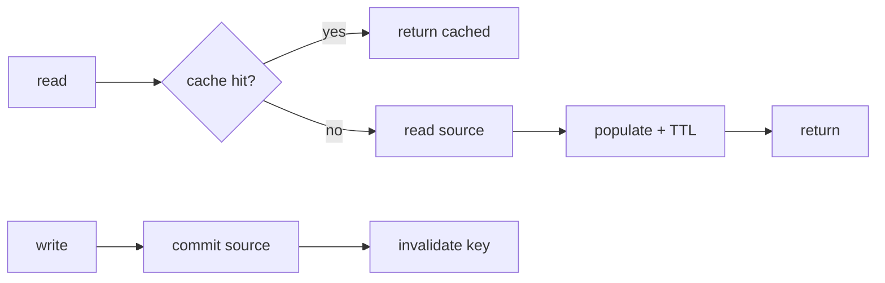

## Thesis

Serving reads from a fast store in front of the source of truth to cut latency and load --- where the hard part is not the lookup but keeping the cache consistent with the source, which is why cache-aside with explicit invalidation and a TTL safety net is the default, and the failure modes you design for are the stampede, the stale read, and the cache going down.

## Sub

**The patterns --- cache-aside, write-through, write-back** -> **invalidation and the TTL safety net** -> **the stampede and the failure modes** -> **zoom out** to consistency, and the pivots an interviewer rides from "add a cache" into which pattern, how you invalidate, and what happens when the cache is down.

## Spine

- Cache-aside is the **default** --- the app checks the cache, and on a miss reads the source and populates the cache; the cache is a lookaside copy, not in the write path.
- The hard problem is **invalidation** --- a cached value goes stale when the source changes, so you invalidate on write and lean on a TTL as the safety net for whatever you miss.
- A **stampede** is the failure at scale --- when a hot key expires, many reads miss at once and all hit the source; you prevent it by locking the recompute or serving stale while one refreshes.
- The cache is **not the source of truth** --- it can be down or wrong, so reads fall back to the source and the system stays correct without the cache, only slower.

## Companion Notes

### walk

A read through the cache

One read from cache check to served value --- the miss that populates, the write that invalidates, and the fallback when the cache is gone.

Say the consistency line early --- "cache-aside is eventually consistent; I invalidate on write and a TTL bounds the rest." That frames every follow-up.

### drill

Probe Drill

Graded follow-ups on the patterns, invalidation, the stampede, and the failure modes --- the ones that separate "add Redis" from a designed cache.

Name the source of truth out loud --- the cache can be wrong or down, so reads must be correct without it.

## Drill

SDE2 | the model and the patterns
SDE3 | invalidation, stampede, and failure
Staff | consistency and design calls

### SDE2 | what a cache does

What does a cache do, and when does it help?

It stores the result of an expensive read in a fast store so later reads skip the work. It helps for **read-heavy**, expensive-to-produce, staleness-tolerant data --- read far more often than it changes --- where the win is lower latency and less load on the source. It doesn't help write-heavy or rarely-read data, where the cache mostly misses and just adds overhead.

### SDE2 | cache-aside

What is the cache-aside pattern?

The app checks the cache; on a hit it returns the value, on a miss it reads the source, writes the value into the cache, and returns it. The cache sits *beside* the source --- a lookaside copy the application reads through, not part of the write path. It's the default because it's simple and the cache holds only what's actually read.

### SDE2 | write-through vs write-back

How do write-through and write-back differ?

**Write-through** writes to the cache and the source synchronously on every write --- the cache stays consistent, but every write pays both. **Write-back** writes to the cache and flushes to the source asynchronously --- fast writes, but a crash can lose un-flushed data. Write-through trades write latency for consistency; write-back trades durability for speed.

### SDE2 | the TTL

What is a TTL and why use one?

A time-to-live expires an entry after a set duration, so the next read misses and re-fetches. It's the safety net for staleness you didn't explicitly invalidate --- even if an invalidation is missed, the entry self-heals within the TTL. It bounds how stale a value can get with no invalidation logic at all, which is why almost every cache entry has one.

### SDE2 | the hit ratio

What is the cache hit ratio and why does it matter?

The fraction of reads served from the cache rather than the source. It's the single number that decides the cache's value --- a 90 percent hit ratio means the source sees a tenth of the read load; a low ratio means the cache is overhead without payoff. You size and tune the cache to keep this high for the hot data.

### SDE2 | what to cache

What data is a good fit for caching?

Read-heavy, expensive to produce, and tolerant of some staleness --- read many times per change, costly to compute or fetch, where a slightly stale answer is acceptable. Poor fits: write-heavy data (constant invalidation), rarely-read data (mostly misses), and data that must be perfectly current. Match the cache to the access pattern, don't cache reflexively.

### SDE2 | where the cache sits

Where can a cache live in the stack?

At several layers --- the client or browser, a CDN at the edge, an in-process cache in the app, a shared cache like Redis, and the database's own buffer cache. Each trades reach against freshness: a browser cache is fastest but per-user and hard to invalidate; a shared Redis is consistent across app instances but a network hop away. Most systems combine a few.

### SDE3 | the invalidation problem

Why is cache invalidation hard?

Because a cached copy goes stale the instant the source changes, and you must find and clear every place it's cached --- across keys, layers, and instances --- exactly when the write happens. Miss one and you serve stale data; over-invalidate and you lose the hit ratio. Knowing precisely what a given write invalidates is the genuinely hard part, which is why "there are only two hard things" names it.

### SDE3 | the stampede

What is a cache stampede and how do you prevent it?

When a hot key expires, many concurrent reads all miss at once and all hit the source together --- a thundering herd that can overload it. Prevent it by **locking the recompute** so only one request rebuilds while others wait or serve stale, by refreshing ahead of expiry, or by jittering TTLs so keys don't expire in lockstep. The danger scales with how hot the key is.

### SDE3 | stale reads

How stale can a cached read be?

As stale as the gap between a source change and the invalidation landing or the TTL expiring. Cache-aside is eventually consistent by nature --- there's a window where cache and source disagree. You bound it with a short TTL and prompt invalidation, and you only cache where that window is acceptable; a read that must be perfectly current shouldn't be served from a lookaside cache.

### SDE3 | the cache-aside race

What is the race between a read and a write in cache-aside?

A read misses and fetches the old value from the source; meanwhile a write updates the source and invalidates the cache; then the slow read populates the cache with the now-stale value it already fetched. The cache ends up holding stale data past the write. Mitigate by invalidating after the write commits, keeping a short TTL to bound it, or write-through for keys where it truly matters.

### SDE3 | eviction

What happens when the cache is full?

It evicts entries by a policy --- typically LRU, least-recently-used, so cold entries make room for hot ones. Eviction is why a cache with too little memory for its hot set thrashes: entries are evicted before they're reused and the hit ratio collapses. You size the cache to hold the working set and choose an eviction policy that matches the access pattern.

### SDE3 | negative caching

Should you cache a "not found"?

Sometimes --- caching a miss stops repeated expensive lookups for something that doesn't exist, which matters under a flood of requests for missing keys. But cache it with a **short** TTL, because a value later created would otherwise be masked by the cached miss until it expires. Negative caching trades a small staleness window for protection against miss storms.

### SDE3 | the cache is down

What happens when the cache is unavailable?

Reads fall back to the source --- slower but correct, because the cache is not the source of truth. The real risk is that losing the cache dumps full read load on the source at once and topples it, so you plan for that surge: a local in-process fallback, graceful degradation, or shedding. The system must be correct without the cache; the cache only makes it faster.

### Staff | the consistency model

What consistency does a cache give you?

Eventual, by default --- reads can be stale within the invalidation-plus-TTL window. For read-your-writes you invalidate synchronously on write (or write-through) and accept the latency; for strong consistency, a lookaside cache is the wrong tool for those reads. The skill is matching the cache's consistency to what each read actually needs, not caching everything uniformly.

### Staff | write-through vs cache-aside

When do you choose write-through over cache-aside?

When you want the cache always warm and consistent for hot data and can afford the write cost --- write-through keeps entries populated and avoids the cache-aside stale-populate race, at the price of every write paying the cache and caching data that may never be read. Cache-aside caches only what's read; write-through caches everything written. Match it to the read/write ratio.

### Staff | multi-layer caching

How do you reason about multiple cache layers?

Each layer --- browser, CDN, app-local, shared Redis --- has its own TTL and invalidation, and a write must be reasoned about across all of them: invalidating Redis doesn't clear a browser or CDN copy. Layers closer to the user are faster but harder to invalidate. You keep short TTLs on the layers you can't actively invalidate and reserve active invalidation for the shared layer you control.

### Staff | cache warming

What is cache warming and when do you need it?

Pre-populating the cache before traffic hits it --- on deploy, after a flush, or ahead of a known spike --- so the first users don't all miss and stampede the source. You need it when a cold cache would dump full load on the source: a restart, a big launch. Warm the hot keys proactively rather than letting organic misses rebuild the cache under live load.

### Staff | when not to cache

When is adding a cache the wrong move?

When the data is write-heavy (invalidation churn eats the benefit), rarely read (mostly misses), or must be strongly consistent (the staleness window is unacceptable) --- and when the source is already fast enough. A cache adds a consistency problem and an operational component, so it should earn its place against a real read-load or latency problem, not be reached for reflexively.

### Staff | cache key design

How do you design cache keys?

Include everything the value depends on --- entity id, version or tenant, query parameters --- so two different results never collide on one key, and namespace by type so a group can be reasoned about and bulk-invalidated. A key too coarse serves the wrong value across contexts (the un-namespaced tenant key is the classic leak); a key too fine fragments the hit ratio. The key encodes the value's identity.

### Staff | measuring effectiveness

How do you know a cache is actually worth it?

Measure the hit ratio, the drop in source load, and the tail latency --- a cache earning its keep shows a high hit ratio, a large fall in source QPS, and lower p99. If the hit ratio is low or the source load barely moves, the cache is overhead. You also watch invalidation churn and stampede events, because those are where a cache turns from a win into a liability.

## Walk

### The read checks the cache first

```flow
r[read request] -> k[cache lookup] -> h[hit: return] / m[miss: go to source]
```

Every read checks the cache first. On a hit, it returns immediately --- the fast path that is the whole point. On a miss, it falls through to the source, and the cost of the read is a cache lookup plus, only when needed, the source read.

The cache is a lookaside copy that sits beside the source, not in front of every write. The application owns reading through it, which is what makes cache-aside simple: nothing changes about how writes reach the source.

### A miss populates the cache

```flow
m[miss] -> s[read source] -> p[populate cache] -> v[return value]
```

On a miss, the app reads the source of truth, writes the value into the cache with a TTL, and returns it. The next read of that key is a hit until it's invalidated or the TTL expires.

```ts
async function get(key) {
  const hit = await cache.get(key);
  if (hit !== null) return hit;            // ==fast path==
  const value = await source.read(key);    // miss: authoritative read
  await cache.set(key, value, { ttl: 300 }); // populate with a safety-net TTL
  return value;
}
```

Because the cache holds only what's actually been read, it stays proportional to the working set --- and the TTL means even a value you never explicitly invalidate can't stay stale longer than its lifetime.

### A write invalidates the cached copy

```flow
w[write source] -> c[commit] -> i[invalidate key]
```

A write goes to the source and, after it commits, invalidates the cached key so the next read re-populates from the fresh source. Invalidating *after* the commit is what avoids the race where a concurrent read repopulates the old value.

Invalidation is the hard half of caching: you have to know exactly which keys a write makes stale. Miss one and you serve stale data; the TTL is the backstop that eventually heals what your invalidation logic misses.

### The stampede, and when the cache is gone

```flow
x[hot key expires] -> f[many misses at once] -> l[one rebuilds, others wait]
```

When a hot key expires, every concurrent read misses and would hit the source together --- a stampede. You let one request rebuild under a lock while the others wait or serve the stale value, so the source sees one recompute instead of thousands.

And if the cache itself is down, reads fall back to the source: slower, but correct, because the source is the truth. The two failure modes to design for are the stampede on expiry and the load surge when the cache disappears --- both are about protecting the source the cache was shielding.

### Model Script

- Frame the cache | "A cache serves reads from a fast store in front of the source to cut latency and load. My default is cache-aside: the app checks the cache, and on a miss reads the source and populates the cache. The cache is a lookaside copy, not in the write path, so it's simple and holds only what's actually read."
- Name the hard part | "The hard part isn't the lookup, it's invalidation --- a cached value goes stale when the source changes, and I have to clear exactly the right keys when a write commits. I invalidate on write, and I put a TTL on every entry as the safety net so anything my invalidation misses self-heals within the TTL."
- The consistency reality | "That makes a cache eventually consistent --- there's a window where cache and source disagree, bounded by the TTL and how fast I invalidate. So I only cache data where that staleness is acceptable; a read that must be perfectly current I don't serve from the cache, or I write-through for it."
- The failure modes | "Two failures I design for. A stampede: when a hot key expires, many reads miss at once and hit the source together, so I lock the recompute or serve stale while one rebuilds. And the cache going down: reads fall back to the source --- correct but slower --- so I plan for the load surge, because the source has to be right without the cache."
- Interviewer: "Your Redis is suddenly cold after a restart. What happens?"
- Handle the cold cache | "Every read misses and hits the source at once --- the same stampede but fleet-wide. I'd warm the hot keys before taking traffic, and lean on per-instance local fallbacks and recompute locks so the source sees one rebuild per key, not one per request. A cold cache is a load event, so I treat a restart as something to warm through."
- Land it | "So: cache-aside as the default, invalidate on write with a TTL backstop, accept eventual consistency and cache only where that's fine, and design for the stampede and the cache-down surge. The one line is that the cache makes reads faster but the source stays the truth."

## Whiteboard

Sketch the read path and where a write invalidates.

### What is the read path?

Check cache, hit returns; miss reads the source, populates the cache with a TTL, returns --- cache-aside.

### How does a write stay consistent?

Write the source, commit, then invalidate the key --- and a TTL heals whatever the invalidation misses.



Verdict: cache-aside serves hits fast and repopulates on miss; a write invalidates after commit and the TTL backstops the rest --- eventually consistent, source-of-truth intact.

## System

Zoom out to where the cache sits relative to the source.

### Where it sits

- Client / CDN: fast, per-user or edge, hard to invalidate
- App-local cache: in-process, fastest shared-nothing, per-instance
- Shared cache (Redis): consistent across instances, a network hop [*]
- Source of truth: the database the cache shields
- Fallback path: reads go here when the cache misses or is down

### Pivots an interviewer rides

From "add a cache" they push on the pattern, invalidation, and the failure behavior.

#### Which caching pattern?

-> cache-aside by default, write-through where the cache must stay warm

Cache-aside caches only what's read and keeps writes simple, at the cost of a stale-populate race. Write-through keeps hot data consistent and warm, at the cost of every write paying the cache. Match it to the read/write ratio and the consistency need.

#### How do you handle invalidation and staleness?

-> invalidate on write, TTL as the backstop

A write clears the affected keys after it commits; a TTL bounds any staleness the invalidation misses. The cache is eventually consistent, so you cache only where that window is acceptable and reach for write-through or no-cache where it isn't.

## Trade-offs

The calls that separate "add Redis" from a designed cache.

### Cache-aside vs write-through

- Cache-aside: simple, caches only what's read, but a stale-populate race and a cold start on first read
- Write-through: cache stays warm and consistent, but every write pays the cache and caches data that may never be read

Default to cache-aside; use write-through for hot data that must stay consistent and warm.

### TTL vs explicit invalidation

- TTL only: trivial and self-healing, but every entry can be stale up to its whole lifetime
- Explicit invalidation: fresh right after a write, but you must know exactly what each write invalidates

Use both --- invalidate on write for freshness, and a TTL as the backstop for whatever invalidation misses.

### Local vs distributed cache

- Local in-process: fastest, no network hop, but per-instance and inconsistent across the fleet
- Distributed (Redis): consistent across instances, but a network hop and a component to operate

Use a shared cache for consistency across instances, with a small local cache as a fast first tier and a fallback.

## Model Answers

### cache-aside | The default read path

The pattern to lead with.

- Check, miss, populate | key | app reads through a lookaside copy
- Only what's read | store | cache stays proportional to the hot set
- TTL on every entry | note | the backstop for missed invalidation

### invalidation | Keeping the cache honest

The hard half.

- Invalidate on write | key | clear the affected keys after commit
- Bounded staleness | store | eventually consistent within the TTL
- Stampede and fallback | note | lock the recompute, fall back to source

## Numbers

Back-of-envelope the load a cache removes and the latency it buys at a given hit ratio.

The hit ratio is the whole story: it sets how much of the read load the source is spared and how far average latency drops. A cold or stampeding cache is where the source load spikes back.

- reqPerDay | Reads/day | 500000 | 0 | 10000
- hitRatio | Hit ratio (%) | 90 | 0 | 5
- sourceMs | Source read (ms) | 50 | 0 | 5

```js
function (vals, fmt) {
  var reqPerDay = vals.reqPerDay, hitRatio = vals.hitRatio, sourceMs = vals.sourceMs;
  var eff = hitRatio / 100 * 1 + (1 - hitRatio / 100) * sourceMs;
  return [
    { k: 'Source reads/day', v: fmt.n(Math.round(reqPerDay * (1 - hitRatio / 100))), u: 'reads', n: 'only the misses reach the source \u2014 at ' + hitRatio + ' percent hit ratio it sees a fraction of the ' + fmt.n(reqPerDay) + ' daily reads', over: false },
    { k: 'Source load removed', v: fmt.n(Math.round(reqPerDay * hitRatio / 100)), u: 'reads', n: 'reads served from cache that the source never sees \u2014 the whole point, and why hit ratio is the number that matters', over: false },
    { k: 'Effective latency', v: fmt.n(Math.round(eff)), u: 'ms', n: 'a hit near 1ms and a miss at ' + sourceMs + 'ms, blended by the hit ratio \u2014 how a cache cuts the average read', over: false },
    { k: 'Latency cut vs no cache', v: fmt.n(Math.round((1 - eff / sourceMs) * 100)), u: '%', n: 'against every read hitting the source \u2014 roughly the latency the cache buys at this hit ratio', over: false },
    { k: 'Stampede fan-out', v: 'many to 1', u: '', n: 'when a hot key expires every concurrent miss hits the source at once \u2014 a recompute lock or serve-stale collapses it to one rebuild', over: false }
  ];
}
```

## Red Flags

What makes an interviewer wince.

### "I'll just cache everything"

Write-heavy and rarely-read data cache badly --- constant invalidation and mostly misses --- and every cache adds a consistency problem.

Cache read-heavy, expensive, staleness-tolerant data; leave the rest on the source.

Note: a cache should earn its place against a real load or latency problem, not be added reflexively.

### "The cache is the source of truth"

Then a cache eviction, expiry, or outage loses data, and every stale entry is a correctness bug rather than a performance one.

Keep the source of truth in the database; the cache is a disposable copy reads fall back past.

### "No TTL --- I just invalidate on write"

Miss one invalidation and that entry is stale forever, because nothing else ever clears it.

Invalidate on write for freshness and put a TTL on every entry as the backstop for what invalidation misses.

## Opener

### 30s | The one-liner

How I open when asked to add a cache.

#### What is the shape?

Cache-aside: check the cache, and on a miss read the source and populate it --- a lookaside copy that cuts read latency and load.

#### What is the hard part?

Invalidation --- clearing the right keys when a write commits, with a TTL as the backstop, and living with eventual consistency.

##### Hooks

Where an interviewer usually pushes next.

- Which pattern? | cache-aside vs write-through | trade
- Invalidate how? | on write plus a TTL backstop | drill
- Cache is down? | fall back to the source | drill

Foot: two sentences --- cache-aside for reads, invalidate on write with a TTL backstop.

## Bank

### SCALE | Half a million reads a day behind a cache

Task: size the source load removed and the latency won at a given hit ratio.
Model: the hit ratio sets both --- at 90 percent the source sees a tenth of the reads, and average latency blends a 1ms hit with a slower miss; the source load removed is the payoff.
Int: what erases the benefit?
A low hit ratio, or a stampede or cold cache dumping the removed load back onto the source at once.

### DESIGN | A read-heavy endpoint that must not serve badly stale data

Task: design the cache and its consistency.
Model: cache-aside with a short TTL, invalidate the affected keys after each write commits, lock the recompute on hot keys, and fall back to the source when the cache is down --- eventually consistent within the TTL.
Int: how stale can a read be?
At most the invalidation lag or the TTL, whichever fires first --- so pick a TTL the product can tolerate.

### Extra Curveballs

### CURVEBALL | stampede | A celebrity's profile is cached; the key just expired under peak traffic. What happens?

Model: every concurrent request misses and hits the source together --- a stampede that can topple it. Fix it by letting one request rebuild under a lock while the rest serve the stale value or wait, refreshing hot keys ahead of expiry, and jittering TTLs so hot keys don't expire in lockstep.

### Frames

- Cache-aside for reads, source of truth in the database
- Invalidate on write, and a TTL backstops what you miss
- Design for the stampede and the cache-down surge --- protect the source
