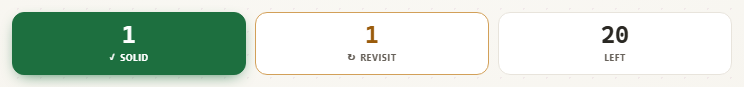

# Screen-reader semantics audit — deepdive-rehearsal

**Date:** 2026-07-13 · **Build:** `dist/index.html` @ `4318509` · **Lens:** screen-reader semantics
**Instrument:** Chromium's real accessibility tree via CDP `Accessibility.getFullAXTree` /
`getPartialAXTree` — the same tree Chromium hands to the platform a11y API (UIA / IAccessible2 / AX)
that NVDA, JAWS and VoiceOver consume. It pierces shadow DOM, which is mandatory here: the drill
scoreboard lives inside `<deep-drill>`'s shadow root and is invisible to any light-DOM-only check.

---

## Verdict

The colour-blindness fix **worked, and it survives to assistive tech** — better than expected. The
`::before` glyphs (`✓` / `↻`) do reach the accessibility tree; Chromium exposes CSS-generated content
as `StaticText`. A screen-reader user who *goes and looks* at the scoreboard hears
`"1 ✓ SOLID 1 ↻ REVISIT 20 LEFT"`. The state is not lost.

**What is lost is the feedback loop.** Grading a probe produces **zero announcements**. The scoreboard
is the drill's only feedback, and it is mute. And on the same click, **focus is destroyed** — thrown
back to `<body>`. So the screen-reader user grades a card, hears nothing, and is silently returned to
the top of the document. Twenty-two times.

The sharpest part: **the app already contains the fix.** `ViewManager.announce()`
(`src/scripts/app/view-manager.js:26`) is a correct, visually-hidden polite live region, complete with
the clear-then-defer trick that makes repeated identical messages re-announce. It has exactly **two**
callers — pane switch and topic switch. The drill never calls it. This is not a team that didn't know
about live regions; it's a team that built one and left the highest-stakes signal in the app off it.

| # | Finding | Severity |
|---|---|---|
| 1 | Grading a probe announces nothing — the drill's only feedback is silent | **Critical** |
| 2 | Focus destroyed to `<body>` on every reveal and every grade | **Critical** |
| 3 | Mock-round timer floods the screen reader ~1×/sec (~1320 utterances/round) | **High** |
| 4 | The whole app has exactly **one** heading; panes contribute zero | **High** |
| 5 | 37/37 mermaid diagrams are unnamed; edges/topology unrepresented | **High** |
| 6 | 10-pane rail has no tab semantics — current view not queryable | **High** |
| 7 | Undo toast likely misses its first announcement; button trapped in live region | Medium |
| 8 | `document.title` never conveys the topic — all 46 topics share one title | Medium |
| 9 | No `banner`/`contentinfo`; `main` unnamed; no skip link | Medium |

---

## On method: three of my own checks were broken, and I caught them

This repo has shipped five checks that could not fail. I nearly added more. Recording the failures,
because they're the point:

- **A hardcoded verdict string.** My modal-focus check printed *"focus DOES move into the dialog.
  Correct."* while the measurement said `modal: null, focus: body` — the modal hadn't even opened
  (a `page.reload()` reused localStorage). The conclusion was asserted, not computed.
- **A control that was a no-op.** To prove the focus probe could report "outside the dialog", I called
  `document.body.focus()` — which does nothing, because `<body>` isn't focusable. The probe returned
  `inside=true` both times and I'd have called it a pass. `document.activeElement.blur()` is the real
  move.
- **A control injected into a hidden pane.** I injected an `<h2>` to prove the heading counter could
  count past 1; it went into a `display:none` pane, the size filter dropped it, the count stayed
  `1 → 1`, and the script *still printed "CONTROL PASSED"* from a hardcoded string.

Every verdict in this report is now **computed from the measurement**, and every check below has a
control that was **observed flipping**. Where a control failed, the finding is withheld — see the
diagram section, where a failed control saved me from publishing a true-sounding falsehood.

### The controls, and what they proved

| Check | Control | Observed |
|---|---|---|
| Announcement monitor | inject `aria-live="polite"` on `.score`, re-grade | 0 → **5** announcements captured |
| Diagram accessible name | add `aria-label` to `svg#m` | `""` → `"Flowchart: CDC outbox pattern"` → `""` |
| Unnamed-button detector | blank one `<button>`'s text | 0 → **1** unnamed |
| Form-field name detector | strip `aria-label` **and** `placeholder` | 0 → **1** unnamed |
| Heading counter | inject `<h2>` into a **visible** shadow root | 1 → **2** |
| Modal-focus probe | `activeElement.blur()` | `inside=true` → `inside=false` → `true` |

---

## 1 — CRITICAL: the scoreboard is never announced

**Where:** `src/scripts/app/drill/logic.js:25-27` (markup), `:255-258` (`renderD`)

```html
<div class="score">
  <div class="pill g"><div class="v" id="sGot">0</div><div class="l">Solid</div></div>
  <div class="pill s"><div class="v" id="sShk">0</div><div class="l">Revisit</div></div>
  <div class="pill left"><div class="v" id="sLeft">0</div><div class="l">Left</div></div>
</div>
```

`renderD()` writes `this._sGot.textContent = this.got` directly. No `aria-live`, no `role="status"`.

**Measured** — grade one probe Solid, with a mutation monitor watching document *and every shadow
root*, resolving each mutation's live-region ancestry through shadow hosts:

```
scoreboard BEFORE grade: Solid=0  class="pill g z"
scoreboard AFTER  grade: Solid=1  class="pill g"

[GRADE = SOLID]
   DOM mutations: 9   |   mutations inside a live region: 0
   ANNOUNCEMENTS CAPTURED: 0
   >>> SILENT. The score went 0 -> 1 with zero assistive-tech signal.
```

**Control (proves the monitor is not decoration):** inject `aria-live="polite"` on `.score`, grade
again → **5 announcements captured** (`"2"`, `"0"`, `"20"`, …). The monitor detects announcements when
they exist. Its `SILENT` verdict is therefore a real measurement.

Revealing an answer is likewise silent: `[REVEAL ANSWER] DOM mutations: 1 | inside a live region: 0`.

### What a screen reader *does* get

Full AX subtree of `.score` (browse mode, `interestingOnly:false`):

```
- none  IGNORED(uninteresting)          <- div.score
  - none  IGNORED(uninteresting)        <- div.pill.g
    - generic
      - StaticText  name="0"
    - none  IGNORED(uninteresting)
      - generic
        - StaticText  name="✓"          <- the ::before glyph DOES reach the tree
      - StaticText  name="SOLID"
  ... (same shape for Revisit / Left)

LINEARISED: ["0","✓","SOLID","0","↻","REVISIT","22","LEFT"]
```

So: readable **on demand**, never **announced**. Three consequences, in descending importance:

1. **No announcement.** The user must manually navigate back to the scoreboard after every single
   card to discover their score moved. Across 22 probes that's 22 hunts.
2. **The fill channel has zero AX exposure.** `background: rgb(29,111,63)` is the only thing that
   encodes "banked", and CSS background is not a semantic channel. *In fairness:* the information is
   recoverable from the number (`1`), so this is not an information loss for a browse-mode reader —
   the loss is the announcement. But it does mean the deliberate fill-vs-outline design carries
   **nothing** to assistive tech.
3. **The glyph is a tile identifier, not a status indicator.** `.pill.g .l::before{content:"\2713"}`
   is unconditional — the `✓` renders whether Solid is 0 or 20. It tells you *which tile this is*, not
   *how you're doing*. Only the fill tracks state, and the fill is invisible to AT.

Also: the number and its label are separate `StaticText` nodes with no `aria-labelledby` binding, and
the `.pill` containers are `role=none`. A screen reader walks eight disconnected fragments; there is no
single "Score: 1 solid, 1 revisit, 20 left" object to query.



*The visual fix is genuinely good — filled slab + ✓ vs outline + ↻, legible in greyscale and in any
room colour. None of this state change is spoken.*

**Fix (~1 line, into an API that already exists):** in `judge()` / `renderD()`, call
`ViewManager.announce('Solid. ' + this.got + ' solid, ' + this.shk + ' revisit, ' + left + ' left.')`.
Or make `.score` a `role="status" aria-atomic="true"` region and let it speak itself.

---

## 2 — CRITICAL: focus is destroyed on every reveal and every grade

`drawCard()` does `this._dwrap.innerHTML = html` — a full rewrite. The focused button is removed from
the DOM, so focus falls back to `<body>`.

**Measured** (focus probe walks `activeElement` through shadow roots):

```
[CONTROL] focus a STABLE button (#modetog)  -> probe reads: deep-drill >> button.on
[CONTROL] after a NON-destructive click     -> probe reads: deep-drill >> button.on
*** the probe reports a live element, not "body". It can distinguish retention from loss.

focus before "Reveal answer" : deep-drill >> button#adv.push
focus AFTER  "Reveal answer" : body   <-- LOST

focus before grading "Solid" : deep-drill >> button#jg.got
focus AFTER  grading "Solid" : body   <-- LOST
```

This **compounds with finding 1** into the real defect. A keyboard/screen-reader user:

1. Tabs to "Reveal answer", presses Enter.
2. Hears nothing (no live region on the revealed answer).
3. Is silently teleported to the top of the document.
4. Must Tab all the way back down — through the topic nav, the rail, the mode toggles — to find where
   they were, with no cue that anything happened at all.
5. Repeats. 22 probes × (1 reveal + *n* follow-ups + 1 grade) ≈ **44+ round trips**.

The drill — the graded core of the product — is effectively unusable non-visually. Not "degraded":
unusable.

**Fix:** after the rewrite, move focus to the newly-rendered region (e.g. `.ans` with `tabindex="-1"`,
or the judge row), which also gives the screen reader something to read. WCAG 3.2.1 / 2.4.3.

---

## 3 — HIGH: the mock timer floods the screen reader

`src/scripts/app/drill/logic.js:19`

```html
<div class="timer" id="timer" role="timer" aria-live="polite" aria-label="Mock round time remaining">22:00</div>
```

ARIA gives `role="timer"` an **implicit `aria-live="off"`** precisely to stop this. The explicit
`polite` overrides that safe default.

**Measured** in Mock round:

```
MOCK MODE -> timer display=block text="22:00"
announceable mutations in 4.2s: 4
sample: ["21:59","21:58","21:57","21:56"]
timer AX node: {"role":"timer","name":"Mock round time remaining","live":"polite","atomic":false,"ignored":false}
```

~1 announcement/second. A 22-minute mock round asks the screen reader to speak the clock **~1320
times**. Worse, polite announcements share one FIFO queue — so `ViewManager.announce()`'s genuinely
useful pane/topic announcements land *behind* clock ticks.

Correctly, the timer is `display:none` in Study mode and therefore absent from the AX tree. This only
bites in Mock round — which is the mode that matters most.

**Fix:** drop `aria-live` (keep `role="timer"`), and announce at intervals a human wants: 10 min, 5
min, 1 min remaining.

---

## 4 — HIGH: the entire app has exactly one heading

**Measured across all 10 panes** — one visible heading, always the same one:

```
[walk] 1  ·  [drill] 1  ·  [wb] 1  ·  [sys] 1  ·  [trade] 1  ·  [model] 1
[num] 1   ·  [rf] 1     ·  [open] 1 ·  [viz] 1
   -> always: h1 "Content Pipeline"
levels used: ["h1"]     panes contribute ZERO headings
```

**Control:** injecting one `<h2>` into a **visible** shadow root moves the count `1 → 2`, and the AX
tree shows both. The counter pierces shadow DOM — so "exactly 1 heading" is a real measurement.

The drill pane's section labels — every one a `<div>` or `<span>`:

| Rendered as | Text |
|---|---|
| `div.mhp-h` | "Must-hit points" |
| `div.dnav-h` | "Your drill set" |
| `div.sl` | "What sounds senior here" |
| `div.sl` | "Say it out loud like this" |
| `div.lab` ×3 | "Interviewer pushes further" |
| `div.qk` | "Probe 2 / 22" |
| `span.tierlab` | "Focus by level" |

The `H` key is *the* primary way a screen-reader user skims a page. Across 46 topics × 9 panes it finds
one heading. The content is a flat, unnavigable wall. WCAG 1.3.1 / 2.4.6.

---

## 5 — HIGH: all 37 mermaid diagrams are unnamed, and the topology is gone

**This is where a failed control saved the report.** My first pass reported *"the flowchart has no
role, no name, no boundary in the AX tree"* — and my control (add `role="img"` + `aria-label`) **still
read 0**. A blind detector. Rather than ship it, I debugged: CDP said
`ignored: true, reasons: ["notRendered"]`. The diagram sits inside a **collapsed `<details>`**, so it
is genuinely absent from the AX tree — correct browser behaviour, and a legitimate pattern (the
whiteboard wants you to reconstruct before revealing). My check wasn't wrong; it was asked the wrong
question. The true-sounding claim would have been false.

With the disclosure **open**, the honest reading:

```
role                 = "graphics-document"
aria-roledescription = "flowchart-v2"
accessible NAME      = ""              <-- EMPTY
ignored              = false
graph: 10 nodes, 10 edges
```

**Control:** `aria-label` → `""` → `"Flowchart: CDC outbox pattern"` → `""`. The reader flips. The
empty name is real.

Mermaid emits `role` + `aria-roledescription` on its own; the **name** comes from `accTitle`/`accDescr`
in the `.mmd` source. Scope, measured from source:

- **37 / 37** `wb.js` files contain an `<svg>`; **0** carry `aria-label`, `<title>`, `accTitle` or `accDescr`.
- **0 / 37** authored `src/topics-md/*.md` files use `accTitle` / `accDescr`.

So a screen reader announces *"flowchart-v2"* — it knows it's a flowchart, but not what the flowchart
**is** — and then reads this:

```
"no, yes, app: business write + outbox row, ONE transaction commits, outbox table,
 write-ahead log, relay / connector, broker: partitioned by primary key,
 lsn newer than stored?, skip: stale or duplicate, upsert + store lsn,
 search / cache / warehouse"
```

Two things are badly wrong there:

- **It opens with "no, yes".** Those are orphaned **edge labels** — the branch conditions of a decision
  node — read out *before* the node they belong to, bound to nothing.
- **All 10 edges are gone.** An SVG `<path>` has no accessible representation. A system-map diagram
  exists to convey *topology*: A → B → C, and which branch is the failure path. The topology is exactly
  what does not survive. A sighted user sees a graph; a screen-reader user gets a bag of labels in
  source order.

**Fix:** add `accTitle`/`accDescr` to each `.mmd` fence (37 authored strings — this is writing, not
engineering, which matches where this project already is), and ship a text equivalent of the flow
("Writes go to the outbox in one transaction; the relay tails the WAL; consumers upsert if the LSN is
newer, else skip"). That sentence is more useful to *everyone* than the picture.

---

## 6 — HIGH: the pane rail has no tab semantics

```
parent role = null
data-tab=walk   role=null aria-selected=null aria-current=null .on=true   "Walkthrough MECHANICS"
data-tab=drill  role=null aria-selected=null aria-current=null .on=false  "Probe Drill GRADED"
... ×10
```

Ten views, switched by plain `<button>`s. The active pane is signalled **only** by the CSS class `.on`.
No `role="tablist"`/`role="tab"`, no `aria-selected`, no `aria-current`.

The announcer *does* speak the view name on switch ("Probe Drill", "System Map") — so the change is
conveyed **transiently**. But a user who tabs away and back, or who lands via a deep link, has no way to
**query** which of the 10 views they're in. WCAG 4.1.2.

**Fix:** `role="tablist"` on the container, `role="tab"` + `aria-selected` on each button. Cheap.

---

## 7 — MEDIUM: the Undo toast probably misses its first announcement

`src/scripts/app/index-overlay.js:257-259`

```js
if (!_undoEl) {
  _undoEl = document.createElement('div');
  _undoEl.setAttribute('role', 'status');      // implicit aria-live=polite
  document.body.appendChild(_undoEl);
}
_undoEl.innerHTML = '<span class="ix-undo-msg"></span><button class="ix-undo-btn">Undo</button>';
```

A live region must exist in the accessibility tree **before** its content changes for the change to be
announced. Here the region is created, appended, and populated in the **same synchronous task** — so the
**first** toast is commonly missed by NVDA/JAWS. Subsequent ones work, because the node persists.

The same codebase already solves this, correctly, 200 lines away in `ViewManager.announce()`:

```js
liveRegion.textContent = '';
setTimeout(function () { liveRegion.textContent = msg; }, 30);   // clear-then-defer
```

Apply that here. Secondly, the toast puts an interactive `<button>Undo</button>` **inside** the live
region: the user hears "Undo" announced but focus never moves to it, and it auto-dismisses on a timer —
so they must find it before it vanishes (WCAG 2.2.1 Timing Adjustable).

---

## 8 — MEDIUM: `document.title` never conveys the topic

```
topic=cdc          h1="Change Data Capture"        document.title="Numbers — Deep Rehearsal"
topic=caching      h1="Caching Strategies"         document.title="Numbers — Deep Rehearsal"
topic=api-design   h1="API Design and Contracts"   document.title="Numbers — Deep Rehearsal"
```

The title tracks the **pane**, never the **topic**. All 46 topics share one title per pane. For a
screen-reader user with several tabs open, or using the window list, every topic is indistinguishable.
WCAG 2.4.2. `ViewManager.refreshTitle()` is already the right seam — it just needs the topic in it.

---

## 9 — MEDIUM: landmarks

```
role=main           name=""
role=complementary  name=""
role=complementary  name="Rehearsal companion"
role=navigation     name="Switch topic"
role=region         name="Coaching for this view"
```

No `banner`, no `contentinfo` (there is no `<header>`/`<footer>` in the live DOM at all). `main` has no
accessible name, and one `complementary` is anonymous. **No skip-to-content link** — which, combined
with finding 2 (focus dumped to `<body>` 44× per drill), is what turns a nuisance into an ordeal: there
is no fast way back.

---

## What is genuinely right — each control-proven

Not an empty list, and not flattery; these were measured and each detector was proven able to fail.

- **Button hygiene is excellent.** 44–66 AX buttons, **0 unnamed** *(control: blanking one button's
  text → 1 unnamed)*. And **0** clickable non-controls — not a single div-as-button in the app.
  Everything with `cursor:pointer` is a real `<button>`.
- **All form fields carry a real accessible name** — "Notes for this topic", "Search", "Objects / day",
  "Avg size (MB)", "Processing (sec)", "Peak : average". These are genuine `aria-label`/`<label>`
  values, not placeholder fallbacks *(control: stripping `aria-label` **and** `placeholder` → 0 → 1
  unnamed)*.
- **The auto-opening topic-index modal is correct.** `role="dialog"`, `aria-modal="true"`,
  `aria-label="Topic index"`, focus moves to `input.ix-filter` on open, Escape closes
  *(control: `blur()` → probe reports `inside=false`)*.
- **`aria-pressed` on the must-hit-point toggles genuinely toggles** (`false` → `true`).
- **Pane and topic switches ARE announced** — "Probe Drill", "System Map", "Messaging & Events: Change
  Data Capture" — via a correctly-built visually-hidden polite region.
- **The decorative pomodoro-ring SVG is correctly `aria-hidden="true"`.**
- The `::before` status glyphs **do** reach the accessibility tree. The colour-blind fix was not
  undone by AT.

The picture is consistent: **static semantics are in good shape; dynamic semantics and document
structure are not.** Everything the app renders *once* is labelled properly. Everything that *changes* —
score, revealed answer, focus position — changes silently.

---

## Fix order

1. **Announce the grade.** `ViewManager.announce()` in `judge()`. One line, existing API. Turns the
   drill from mute to usable. *(finding 1)*
2. **Keep focus after the rewrite.** Move focus into the revealed answer / judge row. *(finding 2)*
   — 1 and 2 together are the whole ballgame; neither is sufficient alone.
3. **Remove `aria-live` from the timer.** One attribute deletion, stops ~1320 utterances. *(3)*
4. **`role="tablist"` / `role="tab"` / `aria-selected` on the rail.** *(6)*
5. **Headings.** `.mhp-h`, `.dnav-h`, `.sl`, `.lab` → `<h2>`/`<h3>`. Mechanical. *(4)*
6. **`accTitle`/`accDescr` + a prose flow summary for 37 diagrams.** Writing, not engineering. *(5)*
7. Undo toast defer + focus; topic in `document.title`; landmark names + skip link. *(7, 8, 9)*

---

## Reproducing

Scripts in `_audit/2026-07-13-a11y/`, run with `node <script>` from the repo root. Read-only; they
drive `dist/index.html` in headless Chromium and never write to the repo outside this folder.

| Script | What it establishes |
|---|---|
| `lib.mjs` | CDP AX-tree harness; shadow-piercing walkers |
| `01-scoreboard.mjs` | The crux: AX tree of the tiles + announcement monitor + **control A** |
| `02-scoreboard-subtree.mjs` | Honest full AX subtree (fixes a `fetchRelatives:false` artifact) |
| `03-dynamic.mjs` | Live regions, pane/topic announce, focus survival, timer tick rate |
| `04-static.mjs` | Headings ×10 panes, landmarks, buttons-vs-divs |
| `05..09-*.mjs` | Diagram hunt → the `notRendered` diagnosis → control-proven unnamed diagram |
| `10-final.mjs` | Undo toast, focus controls, `aria-pressed`, what-should-be-headings |
| `11..13-*.mjs` | The three rebuilt controls (modal / forms / headings) |
| `14-shots.mjs` | Scoreboard evidence shots |

Screenshots: `shots/semantics/`.

**Caveat, stated so it isn't mistaken for a pass:** the `viz` / WebGL pane ships with its rail button
`hidden` and rendered no `<canvas>` in this build, so it was **not audited**. It is not "clean" — it is
unexamined.
