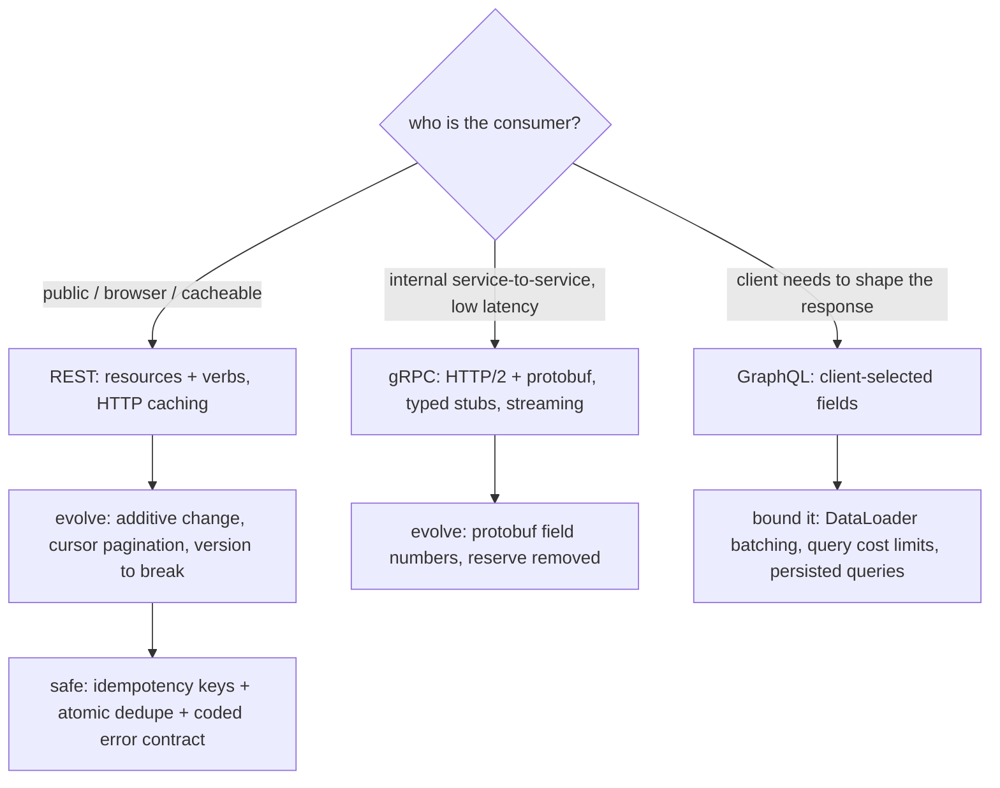

## Thesis

An API is a contract you have to live with --- clients couple to its shape the moment it ships, so the design decisions (how you model resources, how you version, how you paginate, how errors and retries work, sync versus async) are expensive to reverse later. Good API design optimizes for two things: the *consumer* (a predictable, consistent surface built around the caller's use cases) and *evolvability* (you can change it without breaking existing clients). That means a clear resource model, explicit versioning or strictly additive change, cursor pagination that survives inserts, idempotency keys so a retried write does not double-act, and a machine-readable error contract --- with the protocol choice (REST, gRPC, GraphQL) following the use case rather than fashion.

## Sub

**Why: an API is a hard-to-reverse contract** -> **resource modeling and protocol choice (REST / gRPC / GraphQL)** -> **versioning, pagination, idempotency, and the error contract** -> **zoom out** to backward-compatible evolution, sync-versus-async and long-running operations, contract-first governance, and the consumer-first mindset that ties it together.

## Spine

- **An API is a contract, designed for the consumer** --- clients couple to its shape, so you design around the caller's use cases with a predictable, consistent surface (resources, naming, status codes), because changing a shipped API is far more expensive than getting it right up front.
- **Protocol follows the use case** --- REST for public, cacheable, resource-oriented APIs; gRPC for internal, high-throughput, strongly-typed service-to-service calls; GraphQL when clients need to shape their own queries and avoid over- and under-fetching --- each trades off caching, typing, and flexibility differently.
- **Design for evolution from day one** --- explicit versioning (or additive-only change with a tolerant reader), cursor-based pagination that survives concurrent inserts, and a rule that you never remove or repurpose a field --- so the API can change without breaking the clients already built on it.
- **Make it safe and predictable** --- idempotency keys so a retried write is deduplicated rather than doubled, a machine-readable error contract (codes with a retryable flag, not prose), consistent filtering and field selection, and explicit sync-versus-async semantics (202 plus a status resource for long operations).

## Companion Notes

### walk

Designing a service interface you can live with

One API taken from a naive verb-endpoint surface to a real contract --- model resources and pick the protocol for the use case, version it and paginate it so it can evolve, and make writes safe with idempotency keys and a machine-readable error contract, all optimized for the consumer.

Say it as a contract, not a set of endpoints: consumer-first, evolvable (versioned or additive-only), and safe (idempotency keys, coded errors). Those three properties are the whole discipline.

### drill

API-contract reps

Graded reps on resource modeling, protocol choice, versioning, pagination, and idempotency --- the ones that separate "we return JSON" from an API designed to be consumed and evolved without breaking clients.

Anchor on three properties: designed for the consumer, safe to change (versioning / additive-only / cursor pagination), and safe to call (idempotency keys, a coded error contract). Every question lands on one of those.

### wb

Whiteboard

Rebuild the contract from memory --- the resource model, the two pagination schemes, the idempotency key on a retried POST, the error body, the async handshake. Cues only, nothing in front of you.

Draw the boundary first: the client on one side, the shape it couples to in the middle, your implementation on the other. Everything you get right is a promise you can keep; everything you get wrong, a client will hold you to for years.

### sys

System Map

Zoom out: the API is the seam between callers you cannot refactor and a service you change every week --- and every cross-cutting concern (retries, rate limits, errors, auth, async) surfaces at that seam.

Lead with the seam, not the endpoints --- "the contract is the only part of my system I cannot unilaterally change, so I design it for the consumer and for evolution, and everything else hangs off that."

### trade

Trade-offs

The decisions they drill --- REST vs gRPC vs GraphQL, offset vs cursor, path vs header versioning, key vs constraint, poll vs webhook --- each with the condition that flips it.

Always say "pick when" --- name the constraint that flips the choice, and never defend one protocol or one pagination scheme as universally right. The switch condition is the answer, not the option.

### model

Model Answers

Full spoken scripts --- the beats, in order, the way you would actually say them under time pressure.

Steal the frame, not the words --- headline first ("an API is a contract: consumer-first, evolvable, safe"), then the one risk you would name out loud before they find it.

### num

Numbers

Back-of-envelope why offset pagination collapses at depth and cursor pagination does not --- the number that settles the argument instead of trading opinions about it.

Lead with the rows-scanned figure, not the opinion --- "at page 5,000 with a page size of 20, an offset query touches 100,020 rows to return 20; a keyset seek touches 20." That ratio is the whole case.

### rf

Red Flags

What sinks the round --- verb endpoints, offset everywhere, "clients will just update", 200-with-success-false, prose errors --- and what to say instead.

Name what the interviewer hears --- "we'll just change the field, clients will update" is the fastest way to say you have never owned an API that other people depend on.

### open

30-Second

The opener and the close --- matched to the altitude the question is asked at.

Match the altitude --- open on the contract and the three properties, not on your favourite HTTP status code, and land on evolvability and safe retries as the genuinely hard parts.

## Drill

all | **All four levels, mixed** --- the way a real loop actually comes at you.
SDE2 | **Fundamentals under pressure** --- the contract, REST resource modeling, status codes, HTTP idempotency, pagination, versioning, sync vs async. The bar is "this is a designed contract, not the JSON a handler happens to return": name the property and the mechanism that enforces it.
SDE3 | **Depth and trade-offs** --- protocols, cursor pagination, backward-compatible evolution, idempotency keys, the error contract, rate limits, field selection. The bar is "it depends, here's the switch": name the constraint that flips the choice and the failure each option bounds.
Staff | **Systems judgment** --- versioning at scale, protobuf and GraphQL discipline, effectively-once writes, contract-first governance, long-running operations. The bar is "I know what a client will couple to": name the decision that cannot be reversed additively, and the migration program a break actually costs.

### SDE2 | why an API is a contract

Why is "we can just change the API later" usually wrong?

Because the moment an API ships, clients **couple to its exact shape** --- the fields, the URLs, the status codes, the semantics --- and you often do not control (or even know) all of them. Removing a field, renaming one, changing a status code, or tightening a validation rule breaks every client that depended on the old behavior, and unlike internal code you cannot just refactor all the callers. So an API is a contract with a long tail of consumers, and changing it is expensive and slow (deprecation windows, client migrations, running old and new in parallel). That is why the design decisions are front-loaded: you optimize for the consumer and for evolvability up front, because the cost of getting the shape wrong is paid over and over by every client, for as long as the API lives.

Follow: It is an internal API and I can grep for every caller. Does the contract argument still hold?
Partly --- and the honest answer is that a closed set of callers changes the *cost*, not the *rule*. You can refactor them, so a break drops from "an unbounded migration program" to "a coordinated deploy." But it does not drop to zero, because you cannot deploy the server and every client in the same instant: during the rollout window an old client talks to a new server, and on a rollback a new client talks to an old one. So even internally, a breaking change has to be staged additively --- add the new field, deploy the readers, migrate the writers, then remove the old --- which is the same discipline, just with a shorter deprecation window. The one place the argument gets *harder*, not easier, is mobile: you can never force an app upgrade, so a shipped mobile contract is effectively permanent no matter who owns the client.
Follow: Then give me the actual test. What makes a change "breaking"?
A change is breaking if a client that was **correct against the old contract can become incorrect against the new one without changing**. Mechanically, you may only **weaken what you require** of the caller and **strengthen what you promise** them. Accepting a new *optional* parameter weakens a requirement --- safe. Returning a new field strengthens a promise --- safe, *if* clients are tolerant readers. Requiring a parameter you did not require before, removing a field you used to return, narrowing an accepted range, changing a default, or adding an enum value the client must handle --- all violate that rule. It is contravariance on the input and covariance on the output, and every "is this breaking?" argument reduces to it.

Senior: Framing the API as a contract with a **long tail of consumers you cannot refactor** --- and reaching for the weaken-requirements / strengthen-promises test rather than arguing case by case --- is what separates someone who has owned a public API from someone who has only shipped endpoints.
Speak: Lead with the coupling: **"the moment it ships, clients couple to its exact shape, and I can't refactor their code."** Then the test --- you may only weaken what you require and strengthen what you promise --- so the shape is front-loaded, because a wrong one is paid for by every client for the life of the API.

### SDE2 | REST resource modeling

What does it mean to model a REST API around resources rather than actions?

You model the API as **nouns (resources) acted on by the standard HTTP verbs**, not as a set of RPC-style action endpoints. So it is `POST /orders`, `GET /orders/{id}`, `PATCH /orders/{id}`, `DELETE /orders/{id}` --- not `POST /createOrder`, `POST /getOrder`, `POST /updateOrder`. The resource is the thing (`/orders`, `/orders/{id}/items`), and the verb is the operation (GET reads, POST creates, PUT replaces, PATCH partially updates, DELETE removes). This gives a uniform, predictable surface: a consumer who knows one resource knows how to work with all of them, the verbs carry consistent semantics (idempotency, safety, caching), and the URL hierarchy expresses relationships. The anti-pattern is RPC-over-HTTP --- verbs in the URL, everything a POST --- which throws away all of that uniformity and cacheability and is a red flag in an API-design round.

Follow: Fine --- now model "cancel an order." Cancellation is a verb and there is no `/cancellations` collection. What is the URL?
There are two legitimate answers and the signal is saying which you would pick and *why*. **State transition:** cancellation is a change to the order's status, so `PATCH /orders/{id}` with `{"status": "cancelled"}` --- the resource is the order, the verb is PATCH, and the server rejects illegal transitions (409 if it already shipped). **Reify the action as a resource:** `POST /orders/{id}/cancellation` --- you make the *event* a noun. Reify when the action has its own identity, payload, or lifecycle you need to read back: a cancellation with a reason, an actor, a timestamp, possibly a status of its own --- refunds, shipments and approvals almost always deserve this. Use the state transition when it is genuinely just a field flip. The anti-pattern is `POST /orders/{id}/cancel` --- a bare verb in the path --- though I would be honest that it is extremely common; what I would actually push on is a team that has no *rule* and does it three different ways.
Follow: Your resource ends up at `/customers/{c}/orders/{o}/items/{i}/refunds/{r}`. Is that good REST?
No --- deep nesting is a smell. Two concrete problems. The URL now encodes a **path to** the resource rather than its **identity**, so the same refund has several valid URLs; that fragments your caching, your permalinks, and your ETags, and it means a client must know the entire ancestry to address one row. And it couples the client to your containment hierarchy, so a schema change reshapes public URLs. The rule I use: nest **one** level where the containment is genuinely the thing you are addressing (`GET /orders/{id}/items` to list an order's items), and give anything with its own identity a **top-level** URL keyed by its own id (`GET /refunds/{r}`). Filtering goes in the query string, not deeper in the path --- `GET /refunds?order_id=...` rather than a four-level route. Stripe's flat `/v1/refunds?charge=...` and Google's AIP resource-name style land in the same place from opposite directions.

Senior: Not just reciting "nouns not verbs," but having a **rule for the actions that genuinely are not nouns** (state transition vs reifying the action) and knowing that **deep nesting fragments identity** --- that is the difference between someone who has read about REST and someone who has had to keep a resource model coherent for three years.
Speak: State the model: **"nouns acted on by the standard verbs --- POST /orders, GET /orders/{id} --- not POST /createOrder."** Then the payoff: a uniform surface, GET is cacheable, PUT and DELETE are idempotent, and the URL hierarchy carries the relationships. And have an answer ready for "cancel," because that is the follow-up.

### SDE2 | status codes that matter

Which HTTP status codes should an API use precisely, and what do the common ones mean?

Use the classes correctly --- **2xx** success, **4xx** the client's fault, **5xx** the server's fault --- and be precise within them because clients branch on them. The ones that matter: **200** OK, **201** Created (with a `Location`), **202** Accepted (async, still processing), **204** No Content; **400** malformed request, **401** unauthenticated (who are you), **403** authenticated but not allowed (I know you, you cannot), **404** not found (or hiding existence across a tenant boundary), **409** conflict (a duplicate or a version clash), **422** semantically invalid, **429** rate limited (with `Retry-After`); and **500** generic server error, **503** unavailable/overloaded. The 4xx-vs-5xx split matters operationally too: 4xx is not a service failure (it is a bad request) while 5xx is, which is exactly the line an SLI should draw. Precise codes let a client know whether to fix its request, authenticate, back off, or retry.

Follow: A caller asks for a resource that exists but belongs to another tenant. 403 or 404?
**404 --- deliberately.** A 403 says "this exists and you may not have it," which makes your API an **existence oracle**: an attacker walking ids learns which ones are real, and across a tenant boundary that leaks the shape and often the volume of another customer's data. So when the caller should not even know the resource exists, return 404, and make it **indistinguishable** from a genuinely missing id --- same body, same timing, no "forbidden" hint in the error code. Reserve 403 for the case where existence is *not* a secret: a member of the right tenant, who legitimately knows the order is there, trying to perform an operation their role does not permit. The rule is "403 when existence is public, 404 when existence is the secret" --- and it has to be **consistent**, because a path that 403s while another 404s for the same class of resource is itself the leak.
Follow: You return `200 OK` with `{"success": false}` in the body. What is actually wrong with that?
You have made the failure **invisible to every layer that only sees the status code** --- and that is most of them. Your load balancer, your CDN, your gateway, the client's HTTP library, your own 5xx-based SLI and alerting, and every retry policy in the path all branch on the status, and every one of them will read that 200 as "fine." A cache may even *store* the error and serve it to someone else. On the client side, the generic error handling is bypassed, so every caller has to remember to unwrap your bespoke envelope --- and the one who forgets ships a bug that looks like success. The status code is the **protocol-level** signal and it has to be honest: 4xx if the caller is wrong, 5xx if you are. The machine-readable detail (`code`, `retryable`, `details`) goes in the body *underneath* an honest status --- the body enriches the status, it never replaces it.

Senior: Knowing that **404-vs-403 is an information-disclosure decision, not a taxonomy question**, and that a 200-wrapped error breaks every intermediary and every SLI --- treating status codes as an *operational* contract rather than documentation trivia --- is the seniority tell on this card.
Speak: Anchor on the classes: **"2xx success, 4xx the caller's fault, 5xx mine --- and that line is exactly where my availability SLI is drawn."** Then be precise inside them (401 vs 403 vs 404, 409, 422, 429 with Retry-After), and say the sharp one out loud: across a tenant boundary you return 404, because 403 tells an attacker the resource exists.

### SDE2 | idempotency in HTTP

Which HTTP methods are idempotent, and why does it matter for retries?

**GET, PUT, and DELETE are idempotent** (calling them N times has the same effect as once), **POST is not** (each call creates another resource). It matters because networks fail: a client sends a request, gets no response (the write may or may not have happened), and retries --- and if the operation is idempotent, the retry is safe. GET is also *safe* (no side effects), so it is freely retryable and cacheable; PUT (replace with a full representation) and DELETE (remove) converge to the same state on repeat. POST is the problem: retrying a `POST /orders` after a timeout risks a duplicate order. The fix is an **idempotency key** --- the client sends a unique key with the POST, the server records it, and a retry with the same key returns the original result instead of creating a second resource. So idempotency is both a property of the method and, for POST, something you engineer.

Follow: Is PATCH idempotent?
Not in general --- and HTTP deliberately does **not** define it as idempotent. It depends entirely on the patch semantics *you* choose. A patch that sets **absolute values** (`{"status": "cancelled"}`, `{"qty": 5}`) is idempotent in effect: apply it twice and you land on the same state. A patch expressing a **delta** (`{"qty": {"increment": 1}}`, "append to this array") is not: apply it twice and you have incremented twice. So the method name buys you nothing --- the *operation* has to be designed idempotent. If you need a safely retryable PATCH you have three options: restrict it to absolute-value semantics; make it **conditional** with `If-Match: <etag>`, so the second attempt fails with a 412 rather than double-applying (optimistic concurrency, which also protects you from lost updates); or put an idempotency key on it exactly as you would on a POST.
Follow: DELETE is idempotent --- but the first call returns 204 and the retry returns 404. The client sees an error on an operation that succeeded. Is your API wrong?
No, and the precision here matters. Idempotency is a property of the **effect on server state**, not of the **response**. After the first DELETE the resource is gone; after the second it is still gone --- the state is identical, which is exactly what idempotent means, and differing status codes are permitted. But it *is* a real usability problem for a retrying client, which now cannot distinguish "my retry landed" from "I just deleted something that was never there." Two defensible resolutions: return **204 for a delete of an already-absent resource** --- treat it as "the desired state holds" --- or keep the 404 and *document* that clients should treat 404-on-DELETE as success. I prefer the first, because the caller's intent is "ensure this does not exist," and that intent is satisfied either way. It is desired-state thinking applied to a single verb, and it makes DELETE genuinely pleasant to retry.

Senior: Knowing that **PATCH's idempotency is a property of your patch semantics, not of HTTP**, and that idempotency is about the **effect** rather than the response code --- and then reaching for `If-Match` or an idempotency key rather than hoping --- is what separates an engineer who has debugged a duplicate write from one who has memorised a table.
Speak: Get the split right: **"GET, PUT and DELETE are idempotent; POST is not --- and PATCH is only idempotent if I make it so."** Then the consequence: a client that times out cannot tell whether the write landed, so it retries --- and for POST that means an idempotency key, because the method will not save you.

### SDE2 | pagination basics

Why is offset-based pagination (page number, limit) a problem, and what is the alternative?

**Offset pagination (`?offset=10000&limit=20`) breaks in two ways**: it gets *slower* the deeper you go (the database must scan and discard all `offset` rows before returning the page --- deep pages scan huge amounts), and it is *unstable* under concurrent writes (if a row is inserted or deleted while a client pages, rows shift and the client skips or duplicates items across pages). The alternative is **cursor-based (keyset) pagination**: instead of an offset, the client passes a *cursor* pointing at the last item seen (typically an opaque encoding of the sort key, e.g. the last id or timestamp), and the server returns "the next N items after this cursor" with a `WHERE sort_key > cursor` on an indexed column. That is fast at any depth (an index seek, not a scan) and stable (a cursor points at a value, not a position, so inserts do not shift it). Cursor pagination is the correct default for any list that can grow large or change.

Follow: Show me the actual duplicate. The client is on page 2 with `offset=20`. What sequence of events makes it see the same row twice?
Sort is `created_at DESC`, newest first, page size 20. The client fetches page 1 and gets rows 1-20 --- the twenty newest. Between that request and the next, somebody **inserts** a row; being newest, it takes position 1 and pushes everything down by one. The client now asks for `offset=20&limit=20`, which returns positions 21-40 of the **shifted** list --- and the row that used to be at position 20 has slid to position 21, so it comes back a second time. The client renders a duplicate. The mirror case is worse: a **delete** near the head shifts rows *up*, so the row that was at position 21 slides to 20 and is **skipped entirely** --- the client silently never sees it and nothing errors, which is the failure nobody catches. The root cause is that offset addresses a **position** in a list that is moving underneath it. A cursor addresses a **value** --- `(created_at, id)` --- and no insert or delete elsewhere changes where that value sits in the ordering, so `WHERE (created_at, id) < (cursor)` returns exactly the rows after the last one you saw. No skips, no repeats.
Follow: The product wants "Page 7 of 340" with clickable page numbers. Cursors cannot jump to page 7 or give a total. Now what?
You negotiate, because random page access and exact totals are precisely what keyset pagination gives up --- and pretending otherwise is how you ship something that melts. In order: **(1) Challenge the requirement.** For infinite scroll or a "load more" button --- most consumer lists --- page numbers were never needed, and cursor wins outright. **(2) Keep the total but make it cheap and approximate.** An estimated count (Postgres `reltuples`, a periodically materialised counter) rendered as "about 6,800 results" is what every search engine does, and nobody has ever needed it exact. **(3) Bound the offset.** Offset is genuinely fine when the dataset is small and static and the depth is bounded --- an admin table of 500 rows can use offset forever; you just cap deep offsets with an error rather than letting someone request page 50,000. **(4) Hybrid.** Offset for the first N pages, cursor for the deep scroll. The senior move is naming the trade out loud --- "random page access and exact totals cost you deep-page performance and stability under writes" --- and choosing, rather than silently shipping an offset that is fine in the demo and fatal in production.

Senior: Being able to **narrate the exact skip-and-duplicate sequence** rather than asserting "offset is unstable," and then handling the page-number requirement as a **negotiation with named costs** instead of caving or refusing --- that is the reflex of someone who has actually migrated a list endpoint under load.
Speak: Name both failures, not one: **"offset scans and discards every row before the page, so it is slow at depth --- and it addresses a position in a list that is moving, so clients skip and duplicate rows under concurrent writes."** Then the fix: a cursor on a stable, unique, indexed key, so the next page is an index seek and the cursor points at a value, not a position.

### SDE2 | versioning basics

Why do APIs need versioning, and what are the common ways to do it?

Because you will eventually need to make a **breaking change** --- remove a field, change a type, alter semantics --- and you cannot do that to clients already depending on the current shape, so you expose the new behavior as a new *version* and let clients migrate on their own schedule. The common mechanisms: a version in the **URL path** (`/v1/orders`, `/v2/orders`) --- explicit, cache-friendly, easy to route, the most common for public APIs; a version in a **header** (`Accept: application/vnd.api.v2+json`) --- keeps URLs clean and is more "RESTful" but is less visible and harder to test; and, ideally, **avoiding a version bump** entirely by making changes *additive* (new optional fields, new endpoints) so old clients keep working. The rule is: version when you must break, but prefer additive changes that never require a version at all --- versioning is the escape hatch for the breaks you cannot avoid, not the default for every change.

Follow: You have shipped `/v1`. Every new feature so far has been a new optional field. So when do you actually cut `/v2`?
Almost never for a *feature* --- and that is the whole point. You cut a version only for a change that **cannot be expressed additively**: a field whose type or semantics must change, a default behavior that must flip, a validation that must tighten, or a resource model that is genuinely wrong (the shape itself is the bug). Everything else --- new endpoints, new optional request fields, new response fields --- ships on v1. The test I apply is literally: "can an existing, correct client keep working, unchanged, if I ship this?" If yes, no version. And before cutting v2 I would exhaust the escape hatches: add a **new field alongside** the old one carrying the new semantics and deprecate the old; gate the new behavior behind an **opt-in** header or parameter; or version the single **resource** rather than the whole API. The failure mode is version proliferation --- five live versions nobody dares delete --- and every one of them started as a change somebody could not be bothered to make additive.
Follow: Stripe versions by *date* and pins each account to the version it signed up on. Why would you do that instead of `/v1`, `/v2`?
Because it decouples "the API can evolve" from "clients must migrate," which is the genuinely hard half of versioning. Every account is pinned to the version that was current when it integrated; a request uses that version unless it explicitly overrides with a header. New breaking changes ship as a new dated version, and existing integrations keep seeing their old shape **indefinitely** until they deliberately upgrade --- so you can make a breaking change *without* running a migration program, and the customer upgrades on their own schedule with one flag they can test and roll back. The cost is heavy and you should name it: the server must serve **every** live version's shape simultaneously, which is only affordable with a chain of small request/response **transformers** --- the core speaks the newest shape, and each version is a pure function that down-converts the response and up-converts the request. That only works if every breaking change stays small and composable, which itself requires the discipline never to make a huge one. So: date-pinning buys the client a zero-effort upgrade path in exchange for permanent server-side compatibility machinery. Worth it for a public API with tens of thousands of independent integrators; complete overkill for an internal service with six callers.

Senior: Answering "when do you cut v2?" with **"almost never, and here are the three escape hatches I try first"** --- and being able to explain *why* Stripe's date-pinned versioning is a deliberate trade (client migration cost moved onto permanent server-side transformers) rather than just naming it --- is the Staff-adjacent signal on an SDE2 card.
Speak: Invert the question: **"versioning is the escape hatch for the breaks I could not avoid, not the default for every change."** Most changes are additive and need no version at all; you version only when an existing correct client would stop working. Then pick the mechanism --- URL path for a public API, because it is visible, routable and testable.

### SDE2 | sync vs async

A request kicks off a long-running operation. How should the API respond?

Do not block the request until the work finishes --- return **202 Accepted** immediately with a reference to a **status resource**, and let the client poll it (or receive a webhook) for completion. So `POST /reports` returns `202` with `{ "id": "...", "status": "processing", "statusUrl": "/reports/{id}" }`; the client polls `GET /reports/{id}` until `status` becomes `completed` (with the result or a link to it) or `failed` (with an error code). Blocking a synchronous request for a long operation ties up a connection, risks client and proxy timeouts, and gives no progress signal. The async pattern (a *long-running operation* resource) decouples "I accepted your request" from "the work is done," makes the operation observable and its result durable, and lets you retry or cancel it. The rule of thumb: if it can take longer than a few seconds, make it async with a status resource.

Follow: The client POSTs `/reports`, gets a 202, and then the network drops before it sees the operation id. It retries. Do you now have two reports?
Yes --- unless the POST that *creates* the operation is itself idempotent, and this is the thing people miss about async APIs. A 202 does not exempt you from the retry problem; it just moves it one layer out and makes it quieter. The fix is exactly the same as for any unsafe POST: the client sends an `Idempotency-Key` on the create, and a retry with that key returns the **same operation id and the same 202** rather than starting a second job. That also gives you the recovery path for the dropped response --- the client can safely re-issue the create and be *handed back* the operation it already started, instead of having to guess. Without the key, an async API retried under a timeout quietly does the expensive work twice, and because the work is asynchronous nobody notices until the duplicate output or the bill shows up. So the three go together: **202, a durable status resource, and an idempotency key on the create.**
Follow: 50,000 clients are polling `GET /reports/{id}` every 100ms. Your status endpoint is now the hottest thing you run. Fix it.
Make the poll **cheap**, make it **slower**, and eventually **stop polling**. Cheap: the status endpoint must be a single keyed lookup --- a Redis key or a status column --- never a recomputation of the job, and it should be cacheable for a second or two. Slower: return `Retry-After` on the 202 and on every in-progress poll, and document exponential backoff. A client polling a 30-second job every 100ms makes 300 requests to learn one bit; it should start around a second and back off. Then climb the ladder: **long-polling** (hold the request open for up to N seconds and return the instant the job finishes --- one request per job instead of 300, *and* lower latency), or push completion to the client with a **webhook** or a subscription so there is no poll at all. The load here is proportional to **clients x poll frequency**, not to your job volume --- which is exactly why shortening the interval, and not adding jobs, is what melts it. That is also the honest argument for webhooks: their cost scales with *events*, not with clients.

Senior: Recognising that **202 does not make the create safe** --- an async endpoint retried under a timeout duplicates the expensive work silently --- and that **poll load scales with clients times frequency, not with job volume**, is what turns "return a 202" from a pattern you have read about into one you have operated.
Speak: Give the handshake in one breath: **"202 Accepted, a durable operation resource with an id and a status, and the client polls it or gets a webhook."** Then add the part people forget --- the create itself needs an idempotency key, or a timed-out retry starts the expensive job twice.

### SDE3 | REST vs gRPC vs GraphQL

When would you choose REST, gRPC, or GraphQL for an API?

Choose by **who the consumer is and what they need**. **REST** for public, resource-oriented, cacheable APIs --- it rides HTTP semantics (verbs, status codes, caching, intermediaries), is universally understood, and is the default for external and browser-facing APIs. **gRPC** for internal, high-throughput, low-latency service-to-service calls --- it uses HTTP/2 and Protocol Buffers for a compact binary wire format, generates strongly-typed clients/servers from a `.proto` contract, and supports streaming; the trade is it is not browser-native and not human-readable. **GraphQL** when clients need to **shape their own responses** --- a single endpoint where the client specifies exactly the fields and nested relationships it wants, eliminating the over-fetching and under-fetching (and the N round-trips) of fixed REST resources; the trade is caching is harder, and you must defend against expensive queries. The one-liner: REST for public/cacheable, gRPC for internal/fast/typed, GraphQL for client-driven flexible shapes --- and it is fine to use more than one (gRPC between services, REST or GraphQL at the edge).

Follow: You said gRPC is not browser-native. Why not, precisely --- and what do teams actually do about it?
Because gRPC needs control over HTTP/2 framing --- specifically **trailers**, and the ability to read and write a raw bidirectional stream --- and browser `fetch`/XHR simply do not expose that. So a browser cannot speak gRPC's wire protocol at all. What people do: **gRPC-Web**, a variant wire format a browser *can* produce, terminated by a **proxy** (Envoy, or a gRPC-Web filter in your gateway) that translates it into real gRPC for the backend. The costs are that gRPC-Web historically could not do client-side or bidirectional streaming (server streaming works), and you now have a proxy on the hot path. The far more common answer in practice is to **not fight it**: keep gRPC strictly *internal*, where its typing and performance actually pay, and put a REST or GraphQL edge in front for browsers --- optionally generated from the same protos so there is still one source of truth (`grpc-gateway` reads annotations in the `.proto` and emits a REST/JSON reverse proxy). That is what "use more than one protocol" looks like in a real system: gRPC behind the edge, REST or GraphQL at it.
Follow: GraphQL solves over-fetching. Could I not get most of that with a `?fields=` parameter on my REST endpoints and skip the entire GraphQL stack?
Honestly --- often yes, and I would push hard on whether the team actually needs GraphQL. Sparse fieldsets (`?fields=id,total`) solve **over**-fetching cleanly, and `?expand=customer` solves the shallow case of **under**-fetching. What they do not solve is the thing GraphQL genuinely exists for: a client composing an **arbitrary graph in one round trip** --- "these 20 orders, each with its customer, each customer's default address, and the last three items per order" --- which in REST is either N+1 round trips or a bespoke endpoint per screen (the backend-for-frontend that grows a new endpoint every sprint). So the real question is: do you have **many heterogeneous clients whose data needs change faster than you can ship endpoints**? That is the GraphQL case, and it usually means a large web + mobile + partner surface. If you have one or two clients and a stable set of screens, `fields` and `expand` give you ninety percent of the value at ten percent of the cost --- and you keep HTTP caching, which GraphQL makes you give up. I would rather add `fields` and `expand` and be *pushed* into GraphQL by evidence than adopt it because it is the fashionable answer.

Senior: Choosing by **consumer and constraint** rather than by preference --- and being willing to say out loud that **`?fields` plus `?expand` on REST is often the right answer instead of GraphQL** --- shows you evaluate a protocol by what it costs you (caching, browser support, query-cost defence), not by what it is famous for.
Speak: Map protocol to consumer in one breath: **"REST for public and cacheable, gRPC for internal high-throughput typed service-to-service, GraphQL when clients must compose their own response shape."** Then the honest close --- it is normal to run more than one (gRPC between services, REST at the edge), and each one trades caching, typing, and flexibility differently.

### SDE3 | cursor pagination deep

How does cursor pagination actually work, and what makes a cursor robust?

The server sorts by a **stable, unique, indexed key** and the cursor **encodes the position in that sort** --- typically the sort-key value(s) of the last returned row. A page query becomes `WHERE (sort_key) > (cursor_value) ORDER BY sort_key LIMIT N`, which is an index range seek regardless of depth. Robustness requires: the sort key is **unique** (or you append a tiebreaker like the id, so `(created_at, id)`) --- otherwise rows with equal keys can be skipped or repeated at page boundaries; the cursor is **opaque** to the client (base64 of the key, not a raw offset) so you can change the encoding without breaking clients and they cannot fabricate positions; and the sort is **deterministic** so the same cursor always lands in the same place. You return the next cursor with each page (and often a `hasMore` flag). The failure mode of a naive cursor is a non-unique sort key --- always include a unique tiebreaker so the boundary is exact.

Follow: Two rows share the same `created_at` to the microsecond. Walk me through exactly what breaks without a tiebreaker.
Sort is `created_at DESC`, page size 2, and rows B and C share the identical timestamp T. Page 1 returns `[A, B]` and you set the cursor to B's `created_at` = T. Page 2 runs `WHERE created_at < T` --- and that **strict** inequality excludes *every* row with timestamp T, so **C is silently dropped**. The client never sees it and nothing errors. If instead you relax it to `<=` so you do not lose C, you now **re-return B**, because B also has timestamp T --- a duplicate. There is no correct choice with a non-unique key: strict skips, non-strict duplicates. The fix is to make the sort key unique by appending a tiebreaker, normally the primary key, so the cursor is `(created_at, id)` and the predicate is the **row-wise comparison** `WHERE (created_at, id) < (T, B.id)` --- which is exact: it excludes B (equal timestamp, equal id) and includes C (equal timestamp, different id, ordered after B). Write it as the tuple comparison rather than hand-expanding it into `created_at < T OR (created_at = T AND id < B.id)`; both are correct if you get them right, but the row-wise form is the one that reliably uses a composite index on `(created_at, id)`.
Follow: The client wants `?sort=-priority`, and priority is non-unique *and mutable*. Rows change priority while they page. Does your cursor still work?
Not reliably --- and this is the honest limit of keyset pagination, so I would say it rather than invent a cleverer cursor. The cursor encodes `(priority, id)` of the last row seen. If a row's priority **changes** between pages it *moves in the sort order*: a row you have already seen can move after your cursor and be returned again, and a row you have not seen can move before it and be skipped. No cursor scheme fixes that, because the ordering itself is not stable --- you are paging over a moving target. What you can actually do: **(1)** paginate on something **immutable** --- `ORDER BY (created_at, id)` --- and treat the mutable field as a filter or a within-page display sort; **(2)** **snapshot** the result set so the ordering is frozen for the duration of the scroll --- materialise the ordered ids once, or use an engine that gives you this natively (Elasticsearch's point-in-time plus `search_after` exists precisely for this); or **(3)** accept and document it --- for an internal "sort by priority" admin view, an occasional duplicate is genuinely fine. The rule to state: **keyset pagination requires an ordering that is stable, unique and immutable for the duration of the scroll.** If the sort key mutates, you need a snapshot, not a better cursor.

Senior: Naming the **exact boundary failure** (strict skips, non-strict duplicates) and reaching for a **row-wise tuple comparison on a composite index** --- then being willing to say that a **mutable sort key breaks keyset pagination outright** and that the answer is a snapshot, not a cleverer encoding --- is what a Staff-level answer sounds like on pagination.
Speak: Say what the cursor *is*: **"an opaque encoding of the last row's sort key plus a unique tiebreaker --- `(created_at, id)` --- so the next page is `WHERE (created_at, id) < (cursor)`, an index seek at any depth."** Then name the trap: without the tiebreaker, equal keys at a page boundary get skipped or duplicated, and the strict-vs-non-strict inequality picks which.

### SDE3 | backward-compatible evolution

What changes to an API are backward-compatible, and what are the rules for evolving one safely?

Backward-compatible (additive) changes are safe: **adding a new optional field, a new endpoint, a new enum value handled defensively, a new optional request parameter**. Breaking changes are not: **removing or renaming a field, changing a field's type or semantics, making an optional field required, changing a status code or default behavior, tightening validation**. The rules: be a **tolerant reader** (ignore unknown fields, do not fail on extra data) and a **conservative writer** (only send what the contract promises); make changes **additive-only** whenever possible so no version bump is needed; **never repurpose** an existing field's meaning (that silently breaks clients that branch on it) or remove one still in use; and when you truly must break, do it under a new version with a **deprecation window** and a sunset date. The discipline is exactly the additive-change, tolerant-reader, ordered-rollout pattern that lets a contract evolve without a lockstep upgrade of every consumer.

Follow: Adding a field is safe --- unless the client does strict schema validation and rejects unknown properties. Whose bug is that?
The client's, by the letter of the contract --- and yours in practice, and I would say both halves out loud. The tolerant-reader principle means a client **must** ignore fields it does not understand; a client that sets `additionalProperties: false` in its JSON-schema validation, or deserialises into a strict struct that throws on unknown keys, has violated the contract and will break the first time you add anything. So it is their bug. But you are the one whose 200 just became their 500, and you cannot fix their deploy. So the posture that actually works: **document tolerant reading as an explicit requirement** of the contract, loudly, *before* you need it; **ship SDKs that are tolerant by default** (generated clients --- protobuf, most OpenAPI generators --- ignore unknowns; hand-rolled strict validators are where this bites); **roll additive changes out gradually** behind a canary and watch client error rates, so you find the strict client on one percent of traffic rather than in a global incident; and for a public API with clients you cannot audit, accept that "add a field" still deserves a canary. Additive is *vastly* safer than breaking. It is not free.
Follow: You added a new value to an enum you return. The client has a `switch` on it with no default branch. Is adding an enum value breaking?
In practice **yes**, and I would treat it as breaking unless the contract said otherwise up front. A closed enum is a promise about the *set* of values, and a client that matched on it exhaustively --- a Rust `match`, a Java switch on an enum, a TypeScript discriminated union --- was correct against the old contract and is broken against the new one *without having changed*, which is the literal definition of a breaking change. The mitigations, in order: **(1) declare the enum open on day one** --- document that new values may appear, require a default/unknown branch, and where the language allows it hand clients an explicit `UNSPECIFIED`/`UNKNOWN` member to fall into. This is exactly why protobuf convention reserves 0 for `*_UNSPECIFIED`: it makes "I do not recognise this value" *representable*, which is the whole trick. **(2)** If the enum already shipped closed, put the new value behind a version or an opt-in, or introduce a **new field** carrying the richer set while the old field keeps returning only the legacy values (mapping new cases to the closest old one). The general rule worth stating: **enums are the place where "additive" quietly is not** --- so you decide open-versus-closed when you *ship* the enum, not when you need to extend it.

Senior: Knowing that **"additive" has two well-known holes** --- a strict-validating client, and an extended enum --- and that the fix is *declaring the tolerance in the contract up front* (an `UNSPECIFIED` member, documented unknown-field tolerance) rather than discovering it during an incident, is the difference between reciting the rules and having lived with them.
Speak: State the rule as a direction, not a list: **"weaken what I require, strengthen what I promise --- new optional fields and new endpoints are safe; removing, renaming, retyping, or tightening validation is not."** Then the two traps: a strict-validating client breaks on a new field, and a new enum value breaks an exhaustive switch --- so tolerance has to be *declared* in the contract, not assumed.

### SDE3 | idempotency keys deep

Walk me through how an idempotency key makes a POST safe to retry.

The client generates a **unique key** (a UUID) for the logical operation and sends it as a header (`Idempotency-Key`); the server, before performing the write, checks a **dedupe store** keyed by that value. If the key is unseen, it performs the operation, stores the key with the operation's result (and a fingerprint of the request), and returns; if the key is *already present*, it **replays the stored result** without re-performing the write. So a retry after a timeout --- same key --- returns the original response instead of creating a second resource. The details that matter: the key must be stored **atomically with (or before) the effect** so a crash between doing the work and recording the key does not lose the dedupe; you scope the key correctly (per endpoint, per account) and set a retention window (keys expire after, say, 24 hours); and you optionally verify the retried request *matches* the original (same body) to catch a client reusing a key for a different operation. This is the API-boundary implementation of the idempotency pattern, and it is what makes at-least-once client retries safe.

Follow: Two identical requests with the same key arrive concurrently, one on each of two servers. Both check the store, both see nothing, both charge the card. Fix it.
That is the classic **check-then-act race**, and the fix is that the check and the claim must be **one atomic operation**, not a read followed by a write. Concretely: on receiving the key, perform an atomic **insert of the key row in state `in_progress`** --- `INSERT ... ON CONFLICT DO NOTHING`, or a Redis `SET key NX`, or a conditional `PutItem`. Exactly one racer wins that insert; the loser gets a conflict and now *knows* a request with this key is already in flight. The winner performs the effect and transitions the row to `completed`, storing the response. The loser must **not** simply return --- there is nothing stored yet --- so it either waits briefly and then replays the stored response, or returns **409 Conflict** meaning "this key is being processed, ask again shortly." That `in_progress` state is the part people forget: without it the loser either proceeds (double charge) or returns an empty stored result (falsely reports success). The second half is **crash safety**: if the winner dies between claiming `in_progress` and recording the effect, the key is wedged --- so the claim needs a **lease/timeout** after which it can be reclaimed, and ideally the effect and the key transition commit in **one database transaction** so there is no window at all. When the effect lives in an external system (the card network), you cannot have one transaction, so you write the key first, store the provider's *own* idempotency reference, and reconcile.
Follow: The client reuses the same key but sends a *different* body --- same key, different amount. What do you return?
A hard error --- a `422` (or `400`) with an explicit code --- and specifically **not** the stored response and **not** the new operation. This is why you store a **fingerprint** of the request (a hash of the canonicalised body, plus the endpoint and the authenticated principal) alongside the key. On a repeat key you compare fingerprints: if they **match**, this is a genuine retry and you replay the original response; if they **differ**, the client has a bug --- it reused a key for a different logical operation --- and you must fail loudly, because both alternatives are dangerous. Replaying the stored response would tell them "your $50 charge succeeded" when they asked for $500 --- silent, and they will not find it for a month. Performing the new operation would mean the key deduped nothing, which defeats the entire mechanism. Stripe returns exactly this as an `idempotency_error`, and it is the right call. And scope the key by the **authenticated account**, so one tenant's key can never collide with another's.

Senior: Going straight to the **atomic claim with an `in_progress` state and a lease** --- rather than "check the store, then write" --- and knowing that a **reused key with a different body must fail loudly** rather than replay, is the reflex of someone who has actually shipped a payments-grade write path.
Speak: Give the mechanism, then the two traps: **"the client sends a unique key, I atomically claim it, do the work, and record the key in the same transaction as the effect --- so a retry replays the stored response instead of writing again."** Trap one: a plain check-then-write races, so the claim must be atomic. Trap two: same key with a different body is a client bug --- fail it, never replay.

### SDE3 | the error contract

What makes a good API error response, beyond an HTTP status code?

A **machine-readable body** with a stable **error code**, not just a status and a prose message. The status code is coarse (429, 400, 409); the body carries the specific, branchable detail: `{ "code": "INSUFFICIENT_FUNDS", "message": "...", "retryable": false, "details": {...} }`. The code is the contract a client branches on (retry, fix-input, escalate), the message is human-readable and safe (no internals), a `retryable` flag tells the client whether to back off and retry, and `details` can pin the failure to specific fields for a 400. This is the same discipline as cross-service error propagation --- codes not prose, classified transient-versus-permanent --- surfaced at the API edge. A good error contract turns a failure from a dead end ("400 Bad Request") into a directive ("VALIDATION_FAILED on the `email` field, fix it"), which is what a consumer needs to handle failures programmatically.

Follow: Your error body carries `retryable: true`. A client retries a 500 on a charge, and the money moves twice. Whose fault?
**Mine.** `retryable` is a **promise**, and you can only make it if the operation is genuinely safe to retry --- which, for a write, means an idempotency key with an atomic dedupe is *already in force*. Marking a non-idempotent write retryable is worse than useless: it *instructs* the well-behaved client to duplicate your effect. And a 500 is the dangerous case precisely because it is **ambiguous** --- the write may have committed and the response been lost, or it may have failed before touching anything. So the honest rules: a write is `retryable: true` **only when a key makes the retry safe by construction**; with no key, the correct signal on an ambiguous failure is `retryable: false` plus a documented way for the client to **check** (a GET that tells them whether the charge exists), because "retry blindly" is not a safe instruction to give; and a 500 you *know* fired before any side effect (a validation crash, a failure to even reach the datastore) can honestly be marked retryable. The principle: the retryable flag **couples the error contract to the idempotency design** --- you cannot decide one without the other, which is exactly why they are one conversation.
Follow: Why an application error *code* at all? The HTTP status is already a code.
Because the status is a small, closed, **coarse** vocabulary shared by the entire web, and it cannot carry your domain. A 400 tells the client "your request was wrong"; it does not tell them *which* of the fifty ways, and they cannot branch on it. `INSUFFICIENT_FUNDS`, `CARD_EXPIRED` and `INVALID_CURRENCY` might all arrive as the same status, yet they demand completely different client behavior --- show a top-up flow, prompt for a new card, or fix a bug. So the **status routes the transport decision** (retry? re-authenticate? back off?) and the **code routes the application decision**. To be worth anything, the code must be **stable** (part of the contract --- you may add codes, never repurpose one), **machine-readable** (a fixed identifier, not a localised human sentence: the *message* can change freely, the code cannot), documented and enumerable, and specific enough to be unambiguous. The failure mode without it is the one you always see in the wild: the client regex-matching your prose message to decide what to do --- a contract you never intended to offer, and one you break the day you fix a typo.

Senior: Understanding that **`retryable` is a promise you can only keep if the write is idempotent** --- so the error contract and the idempotency design are the *same* decision --- and that the code exists because the status routes the transport while the code routes the application, is what separates a designed error contract from a nicer-looking 400.
Speak: Say what the body is *for*: **"a stable machine-readable `code` the client branches on, an honest `retryable` flag, a safe message, and field-level `details` --- underneath an honest status code."** Then the sharp bit: `retryable: true` on a non-idempotent write is an instruction to duplicate my effect, so that flag is only honest once the idempotency key exists.

### SDE3 | rate limiting from the API side

From the API contract's perspective, how do you expose rate limiting to clients?

Return **429 Too Many Requests** when a client exceeds its limit, with a **`Retry-After`** header telling it how long to wait, and expose the limit state proactively via **`RateLimit-Limit` / `RateLimit-Remaining` / `RateLimit-Reset`** headers so a well-behaved client can self-pace *before* hitting the wall. The contract's job is to make the limit *legible*: a client that can see it has 3 requests left and a reset in 10 seconds can slow down, while one that only discovers the limit via a 429 with no guidance can only guess (and often retries into a storm). So the API-side design is 429 plus actionable headers plus a documented policy (what the limits are, per what dimension --- per key, per IP, per endpoint). The mechanism behind it (token bucket, sliding window) is the rate-limiting topic; the *contract* is the status code, the headers, and the predictability they give the consumer. Pair it with an idempotent, backoff-respecting client and a throttle never becomes a retry storm.

Follow: Every client that gets `Retry-After: 1` waits exactly one second and retries. What happens at second two?
They all come back **at the same instant** --- a thundering herd --- you 429 them again, and each round they synchronise *harder*. A fixed `Retry-After` does not merely fail to prevent the storm; it actively **causes** it, because it hands every client the same wake-up time. The fix is **jitter**. As the client: exponential backoff with **full jitter** --- `sleep = random(0, min(cap, base * 2^attempt))` --- which spreads the returning traffic across the whole window instead of stacking it on one edge; treat `Retry-After` as a **minimum**, not an exact time; and cap total attempts. As the server, you have three levers: **jitter the `Retry-After` values you hand out**, so you are not the one synchronising them; express the limit as a **token bucket that refills continuously** rather than a fixed window, because a fixed window creates a stampede at every reset tick regardless of what clients do; and **shed load cheaply at the edge**, so a herd is refused before it costs you anything downstream. The deeper point is that a rate limit only protects you if clients actually back off --- which is why you publish `RateLimit-Remaining` and `Reset` in the first place: a well-behaved client that can *see* the wall paces itself and never generates the herd at all.
Follow: Should a 429 count against your availability SLO?
No --- and being able to say why cleanly is the whole signal. Your availability SLI should measure **your** failures, and a 429 is a deliberate, correct, *successful* decision by your system: the caller exceeded a published limit and you told them so, exactly as documented. Counting it as an error means a single abusive client can burn your error budget and page your on-call, and worse, it creates pressure to **raise limits to protect the SLO** --- which is precisely backwards. So the standard split holds: 5xx and timeouts are yours and count; 4xx are the caller's and do not --- and 429 is a 4xx. Three caveats worth naming. You should still **alert on a 429 rate spike**, not as an availability breach but as a demand, abuse, or client-misconfiguration signal --- and **per client**, because one caller hammering the wall is a completely different event from *every* caller hitting it. If you are 429-ing because **you under-provisioned** rather than because the client exceeded a fair limit, that is a capacity failure wearing a 429 costume; it will never show up in your SLI, so the per-client view is the only place you will see it. And a 429 on **internal** service-to-service calls, where you own both sides, is usually a genuine failure of your own capacity planning and I would treat it as one.

Senior: Knowing that a **fixed `Retry-After` synchronises the herd it was meant to prevent** --- so jitter is the server's problem too, not just the client's --- and being able to defend **why a 429 must not burn your error budget** (or you will end up raising limits to protect an SLO) is systems judgment, not HTTP trivia.
Speak: Make the limit legible: **"429 with `Retry-After`, plus `RateLimit-Limit` / `Remaining` / `Reset` so a well-behaved client paces itself before it hits the wall."** Then the trap: a fixed `Retry-After` makes every client return at the same instant, so jitter it --- and a 429 is the caller's fault, so it must not burn my error budget.

### SDE3 | filtering, sorting, and field selection

How do you design list endpoints so clients get what they need without over- or under-fetching?

Expose **filtering, sorting, and field selection as query parameters** on the collection, with sensible, indexed-backed defaults. Filtering: `GET /orders?status=paid&created_after=...` (documented, indexed filters, not arbitrary field matching that invites full scans). Sorting: `?sort=-created_at` (a documented set of sortable fields, each backed by an index that also supports the cursor). Field selection (sparse fieldsets): `?fields=id,total,status` so a client that needs three fields does not download the whole object --- reducing payload and coupling. And expansion: `?expand=customer` to inline a related resource and save the client a second round-trip (the under-fetching problem), bounded so it cannot fan out arbitrarily. The goal is to let the consumer express its need precisely --- which fields, filtered how, sorted how --- without either shipping everything (over-fetch) or forcing N follow-up calls (under-fetch); do it with a small, documented, index-backed parameter vocabulary rather than an open-ended query language you cannot optimize.

Follow: A client sends `?sort=internal_notes` --- a column with no index. What does your API do?
It **rejects it**: a `400` with a code like `INVALID_SORT_FIELD` and a `details` block listing the fields that *are* sortable. The rule is that filterable and sortable fields are a **closed, documented allowlist**, each entry backed by an index that also supports the pagination cursor --- not "any column the client happens to name." Two reasons, and both matter. **Performance:** an unindexed sort on a large table is a full scan plus a sort, which is a trivially triggered denial of service --- and because the request looks completely legitimate, no abuse detection will catch it. **Coupling:** accepting arbitrary column names leaks your schema straight into your public contract, so renaming a column now breaks clients. This is the real tension in this card: you want the consumer to express its need precisely, but through a **small, closed, index-backed vocabulary** you can optimise and evolve --- not an open query language you have accidentally promised to support forever. If clients genuinely need open-ended querying, that becomes a deliberate decision (a search endpoint backed by a search engine, or GraphQL with cost limits), not something you fall into by accepting `?sort=<anything>`.
Follow: `?expand=customer` saves a round trip. Now the client sends `?expand=customer,customer.orders,customer.orders.items`. Now what?
You have accidentally built GraphQL with none of its defences --- so you **bound** it. That request is a fan-out: every order expands a customer, every customer expands their orders, every order expands its items, and the cost is *multiplicative in the page size*. Left open it is the N+1 problem and an unbounded-cost query at the same time. The controls: **cap the depth** (Stripe allows four levels and documents it); **cap the set** --- expansion is an allowlist of specific paths you have implemented and can serve efficiently, not free traversal of your object graph; **forbid expanding a to-many inside an expansion** --- expanding a to-one `customer` is bounded, but expanding `customer.orders` inside a page of 100 orders is where the blow-up actually lives; **batch the underlying fetches** with a DataLoader-style collapse (gather every customer id on the page and issue one query, not one per row), because otherwise even a *legal* expansion is N+1 against your database; and **charge expansion into the request's cost** for rate-limiting, so an expensive expanded call consumes more budget than a cheap one. And once you find yourself building depth limits, cost accounting and batched resolvers on top of `expand` --- that is the honest signal that your clients want a query language, and you should decide *deliberately* whether to give them one rather than growing a worse one by accident.

Senior: Treating the filter/sort vocabulary as a **closed, index-backed allowlist** (because an unindexed sort is a legitimate-looking DoS and an open one leaks your schema) --- and recognising that unbounded `expand` is **GraphQL without its defences**, needing depth caps, batching and cost accounting --- is the judgment this card is really testing.
Speak: Frame it as a vocabulary, not a query language: **"filter, sort, `fields` and `expand` --- a small, documented, index-backed allowlist, with cursor pagination underneath."** Then the boundary: an unindexed sort is a free DoS, and an unbounded `expand` is GraphQL with no cost limits --- so both are allowlists, capped and batched.

### Staff | API versioning strategy at scale

How do you manage API versions across many clients over time, not just "add /v2"?

Treat versioning as a **lifecycle with a deprecation policy**, because every live version is a maintenance and support cost. The strategy: prefer **additive, non-breaking evolution** so most changes need no new version at all (this is the single biggest lever --- fewer versions is the goal); when you must break, introduce the new version and run **old and new in parallel**, ideally sharing a core so you are not maintaining two full stacks (the new version is often a translation layer over the same domain); publish a **deprecation policy** with a **sunset timeline** and communicate it (deprecation headers, dashboards of who is still on the old version, direct outreach to the heavy users); and **instrument version usage** so you know when a version is safe to retire and who to migrate first. The failure mode is version proliferation --- five live versions nobody dares delete --- which comes from breaking casually; the discipline is to break rarely, always additive-first, and to actively drive clients off old versions rather than accumulating them forever.

Follow: How do you actually run v1 and v2 without maintaining two full stacks?
You do **not fork the service**. The pattern is a single core that speaks **one internal shape** --- the newest --- with every older version implemented as a thin **translation layer** at the edge: for each old version, a pair of pure functions that up-convert an incoming request into the current shape and down-convert the outgoing response into the old one. The core has no idea versions exist. This is exactly how Stripe serves a decade of dated versions: a chain of small, composable transformers, each encoding *one* breaking change, applied in sequence from the caller's pinned version up to current. Three properties make it work. The transformations must be **small and pure** --- if supporting an old version requires *different business logic*, not just a different shape, then the change was too large to translate and you should reconsider it. They must **compose**, so supporting version N-5 is applying five small functions, not maintaining a fifth codebase. And they must be **individually testable**, with a contract test per live version pinned to a recorded fixture, so a change to the core that would alter v1's shape fails CI rather than a customer. The costs you accept and should name: the domain model can now only evolve in ways the transformers can express, and every live version is a permanent test-suite and cognitive burden --- which is precisely why the strategy is "break rarely," and why **the number of live versions is the metric you manage.**
Follow: Your dashboard says three customers are still on v1 and the sunset is next month. One of them is your largest account. What do you actually do?
You do not break your largest account to hit a date --- and you also do not let the date slip silently, because a sunset that moves once will move forever, and that is exactly how you end up with the five-version graveyard. I would **split the three**. For the two small ones, engineer directly: offer a migration PR, a compatibility shim, hands-on support. Usually they are still on v1 because nobody told them, not because they cannot move. For the large account, this is an **account conversation, not an engineering one**: find out *why* they cannot move --- it is almost always their own release freeze or a downstream dependency, not your API --- and get a committed date with an executive sponsor. Then, if you must, grant an **explicit, time-boxed, per-account exception**: v1 goes off by default for the world and stays on behind a per-account flag for exactly one customer, on a dated exception you review. That keeps the deprecation **credible** (the sunset genuinely happened; there is one documented exception), it stops v1 from being a general burden (no new client can land on it), and it preserves your leverage. What I would refuse is the quiet indefinite extension for everyone. And I would close the loop upstream: if a major account can be *surprised* by a sunset a month out, the deprecation **communication** failed --- and the fix is per-account version-usage instrumentation with proactive outreach months earlier, not a heroic month.

Senior: Naming **"the number of live versions" as the metric you manage**, knowing that parallel versions are run as **composable request/response transformers over one core** (not a forked stack), and handling the stuck whale as a **time-boxed per-account exception** rather than slipping the sunset for everyone --- that is a Staff answer about a migration *program*, not about a URL prefix.
Speak: Reframe versioning as a lifecycle: **"every live version is a permanent cost, so the metric I manage is how many are live --- and the biggest lever is breaking rarely enough that most changes need no version at all."** Then the mechanism: one core speaking the newest shape, older versions as small composable transformers at the edge, plus usage instrumentation so retirement is data-driven.

### Staff | gRPC and protobuf evolution

How does Protocol Buffers let a gRPC contract evolve without breaking wire compatibility?

Protobuf compatibility rides on **field numbers, not names** --- the wire format identifies each field by its tag number, so you can rename a field freely (names are just for generated code) but must never reuse or change a number. The rules: **add** new fields with new numbers (old readers ignore unknown fields --- forward-compatible; new readers see missing fields as defaults --- backward-compatible); when you **remove** a field, **`reserve`** its number and name so a future change cannot accidentally reuse them and misinterpret old data on the wire; never **change a field's type** in an incompatible way or **renumber**; and be careful with semantic changes to `required`/optionality (proto3 makes everything optional-ish, which helps). Because both sides generate typed stubs from the same `.proto`, and unknown fields are preserved rather than rejected, a gRPC service and its clients can evolve independently as long as they obey the number discipline --- which is exactly the tolerant-reader, additive-change principle enforced by the binary format instead of convention.

Follow: You removed a field and forgot to `reserve` its number. Six months later someone reuses number 7 for a different type. What actually happens on the wire?
You get **silent, type-confused corruption** --- which is the entire reason `reserved` exists. Protobuf encodes each field as a `(field_number, wire_type)` tag followed by the value, and the decoder dispatches on the **number**. Old data --- messages in a queue, rows in a store, an old client --- still carries field 7 with whatever it used to mean. If the new type has a **different wire type**, a compliant decoder treats the field as unknown or malformed: at best you drop data, at worst you fail to parse messages you used to accept. The genuinely dangerous case is when the wire types are **compatible but the meanings are not**: `int32`, `int64`, `uint32`, `uint64` and `bool` all share the varint wire type. So if field 7 was `int32 retry_count` and someone reuses it as `bool is_admin`, an old message carrying `retry_count = 1` decodes **cleanly and silently** as `is_admin = true`. No error, no warning --- a security-relevant misinterpretation of historical data. That is exactly what `reserved 7;` (and `reserved "retry_count";`, which also stops the *name* being reused in JSON-mapped contexts) makes impossible: the compiler rejects the reuse at **build time**, which is the only place this can be caught at all. The habit is to reserve on every removal, without exception, because the cost is one line and the failure is invisible.
Follow: Protobuf ignores unknown fields, so a new field is safe. But a proxy in the middle deserialises and re-serialises the message. What breaks?
You **lose the unknown fields** --- and that turns a forward-compatible schema into a data-destroying one. The property that makes protobuf tolerant is not merely that a parser *ignores* fields it does not recognise; it is that it **retains their raw bytes** in an unknown-fields set and **re-emits them on serialisation**, so an old intermediary can round-trip a new message without damage. That has always held in proto2, and in proto3 it was actually **removed** in the 3.0-3.4 era (unknown fields were dropped on parse) and then **restored as the default in 3.5**, precisely because dropping them broke this pattern in the wild. So the concrete risk: an old proxy, gateway, or store-and-forward service built against an old `.proto` parses a message from a new client, drops the field it does not know, re-serialises, and forwards a message that has **silently lost data** --- with no error anywhere in the path. Two mitigations: keep intermediaries on a modern protobuf runtime so unknown-field retention is on; and better, **design so intermediaries never deserialise the payload at all** --- route on metadata and headers, and treat the body as opaque bytes. It is the same class of bug as a "tolerant reader" that re-serialises what it read: **tolerance means preserving what you do not understand, not merely not crashing on it.**

Senior: Knowing that reusing a field number can **silently and compatibly re-interpret old data** (varint `int32` becoming `bool`) rather than merely erroring --- and that tolerance means an intermediary must **preserve** unknown fields, not just ignore them --- is the level of wire-format literacy that separates someone who has evolved a protobuf contract in anger from someone who has read the style guide.
Speak: Anchor on the invariant: **"the wire identifies fields by NUMBER, not name --- so rename freely, but never reuse or renumber, and `reserve` every number you remove."** Then the reason it matters: a reused number with a compatible wire type decodes old data silently and wrongly, which is a bug no test will find.

### Staff | GraphQL at scale

GraphQL lets clients query anything. What breaks at scale, and how do you defend it?

Two things break: **the N+1 problem** and **unbounded query cost**. N+1: a query for 100 orders each asking for their customer naively issues 1 + 100 resolver calls to the datastore --- defended with **DataLoader**-style batching-and-caching that collapses the per-item fetches within a request into a single batched query. Unbounded cost: because the client composes the query, a single request can ask for deeply nested, wildly expensive data (or a malicious one can craft a query that melts the backend) --- defended with **query depth limits, complexity/cost analysis** (assign a cost to fields and reject queries over a budget), **pagination required** on list fields, **persisted queries** (only allow pre-registered queries in production), and per-client rate limits on cost rather than request count. You also lose HTTP caching (one endpoint, POST bodies) so you cache at the resolver/data layer instead. The staff point is that GraphQL moves power to the client, so the server must actively bound that power --- batching for efficiency, cost limits and persisted queries for safety --- or the flexibility that is its selling point becomes its failure mode.

Follow: You add persisted queries so only pre-registered queries run in production. What did you just give up?
The very thing GraphQL is sold on --- the client's ability to compose an **arbitrary query at runtime**. With persisted queries the client sends only an **id** for a document you already registered (typically extracted from the client's source at build time and uploaded), so the query set is closed, known and auditable. For a **first-party** client that is an excellent trade, and I would take it every time: you get a bounded, cost-analysable set of queries, tiny request bodies, per-query performance reasoning, and GET-ability --- which brings **HTTP and CDN caching back**, the single biggest thing GraphQL normally costs you. And your own web and mobile apps never actually wanted runtime-arbitrary queries; they ship a fixed set of screens. What you have really done is turn GraphQL back into a set of typed endpoints, **generated from the client's declared needs rather than hand-written** --- which, honestly, is most of the real value of GraphQL for a first-party app: co-locating the data requirement with the component, not runtime dynamism. Where it genuinely costs you is a **third-party or public** API, where you cannot enumerate your clients' queries in advance --- there you cannot persist, so you are back to depth limits, cost analysis and per-client cost budgets, and you accept the operational burden that comes with them. The Staff framing: persisted queries keep GraphQL's *authoring* model while surrendering its *runtime* openness --- and for most companies, the runtime openness was never the thing they needed.
Follow: One field in a query is slow, so the whole response is slow. In REST that is one endpoint's problem. What does GraphQL do about it?
This is "a query is only as fast as its slowest resolver," and it is a real cost that GraphQL imposes: because the *client* composes the query, one expensive field silently degrades **every screen that happens to include it**, and your latency metrics are now per-**query**, not per-endpoint --- so it will never show up on an endpoint dashboard. Three moves. **(1) Measure per field.** Resolver-level tracing (Apollo's trace extension, or OpenTelemetry spans per resolver) so you can attribute latency and cost to a *specific field* and find the one poisoning every query it appears in. This is the observability change GraphQL *forces* --- without it you are blind in exactly the way REST was not, and this is the point most people miss. **(2) Bound it.** Cost analysis that charges the expensive field appropriately, so a client including it pays for it out of its budget, plus a per-resolver timeout so one slow field cannot hold the whole request open. **(3) Stream it.** `@defer` and `@stream` let the server return the fast part of the response immediately and push the slow field when it resolves --- which converts "one slow field blocks a fast page" into a progressive-rendering problem, and is the actual fix. The tempting move to **avoid**: making the slow field faster by quietly caching it with a long TTL and serving stale data on a field the client never knew was cached. And the honest meta-point to say out loud: GraphQL moves composition to the client, so it moves **performance isolation** away from you --- you buy it back with per-field observability and cost limits, or you simply do not have it.

Senior: Understanding that GraphQL's real cost is **losing performance isolation and endpoint-level observability** (one slow field degrades every query containing it), and that **persisted queries trade runtime openness back for cost bounds and HTTP caching** --- and being willing to say most first-party apps never wanted the openness --- is the judgment, not the DataLoader recital.
Speak: Name the two failures and their defences: **"N+1, fixed with DataLoader batching --- and unbounded query cost, fixed with depth limits, cost analysis, required pagination, and persisted queries."** Then the Staff line: GraphQL moves composition to the client, so it moves performance isolation away from me --- I buy it back with per-field tracing and cost budgets, or I do not have it.

### Staff | idempotency and exactly-once at the boundary

Clients retry, and you promised exactly-once effects. How do you actually deliver that at the API boundary?

You deliver **effectively-once** via **idempotency keys plus an atomic dedupe**, because true exactly-once network delivery is impossible --- what you guarantee is that duplicate *deliveries* produce a single *effect*. The design: the client sends a stable idempotency key with each write; the server records the key **in the same transaction as the effect** (or in a dedupe store checked-and-set atomically before the effect), so there is no window where the work happened but the key was not recorded; a retry with the same key short-circuits to the stored result. The subtleties a staff answer names: the key's **scope and retention window** (per operation, expiring after long enough to cover all realistic retries); the difference between **idempotency** (this specific request, deduped by key) and a **uniqueness constraint** (this business entity can only exist once, deduped by natural key) --- you often want both; and the coupling to the **retryable error contract** (only mark an operation retryable if it is actually idempotent, or a transient failure produces duplicates). This is where the API-design, idempotency, and error-propagation topics converge: safe retries require a key, an atomic dedupe, and an honest retryable flag.

Follow: Distinguish idempotency from a uniqueness constraint. Give me a case where you need both, and one alone is wrong.
They dedupe **different things**. An idempotency key dedupes a **request** --- "this specific call, retried" --- and its promise is that the retry transparently returns the **original result**. A uniqueness constraint dedupes an **entity** --- "only one of these may exist in the world" --- and its promise is that a second attempt to create it **fails**. Take a payments API creating a charge for an order. With **only the constraint** (`UNIQUE(order_id)`), a client whose response was lost retries, hits the constraint, and gets a `409 Conflict` --- which is *correct* (no double charge) but *useless*: it has no charge id, it cannot distinguish "my own retry landed" from "somebody else already charged this order," and it will escalate to a human. With **only the key**, the honest retry replays cleanly --- but a client with a **bug** that generates a fresh UUID on every attempt (the single most common idempotency mistake there is) sails straight through and creates a second charge, because to your key store those are two entirely different requests. So: **the key makes the honest retry safe and transparent; the constraint makes the buggy client's duplicate impossible.** The key is the ergonomics, the constraint is the guarantee --- and a payments API with one and not the other is either unusable under retries or unsafe under client bugs. Name both, and say which failure each one is actually for.
Follow: You keep idempotency keys for 24 hours. A client's queue was stuck and it retries the same key after 48. What happens?
The key has expired, so you treat the request as new --- and you **perform the operation a second time**. A duplicate charge, 48 hours late. That is the retention window revealing itself as a **correctness parameter, not a storage-cost parameter**, and it is the thing people get wrong: they size the TTL by "how big does the table get" instead of by "what is the longest possible delay between the original request and its retry." So the window must be at least the **maximum plausible retry horizon of every client** --- and that horizon is set by *their* machinery, not yours: a stuck queue, a dead-letter queue redriven days later, a cron-based retry, a mobile client that spent the weekend offline, a human clicking "retry" on a failed job on Monday morning. 24 hours is a defensible default --- Stripe uses it and says so *loudly*, which legitimately pushes the obligation onto clients not to retry beyond it --- but if any consumer redrives a DLQ weekly, 24 hours is a bug. So three things: set the window generously and **document it as part of the contract**; **defend in depth** so an expired key is not the only thing between you and a duplicate (a natural-key uniqueness constraint catches exactly the late duplicate the expired key misses); and make expiry **observable** --- log and alert when a request arrives bearing a key you have *seen but expired*, because that is a client whose retry horizon exceeds your window, and you want to know before it becomes a duplicate charge. The rule: **the key handles the retry, the constraint handles the truth** --- and you want both, precisely because the key has a horizon and the constraint does not.

Senior: Being precise that you deliver **effectively-once, never exactly-once**, and then showing the *two* independent mechanisms and what each is for --- the key for a safe transparent retry, the constraint for the buggy client and the expired key --- plus treating the **TTL as a correctness parameter set by the client's retry horizon**, is what a Staff answer sounds like here.
Speak: Be precise about the guarantee: **"exactly-once delivery is impossible; what I give you is exactly-once EFFECT --- an idempotency key with an atomic dedupe, recorded in the same transaction as the effect."** Then the pair: the key makes an honest retry replay, a uniqueness constraint on the natural key makes a *buggy* client's duplicate impossible --- and you want both, because the key expires and the constraint does not.

### Staff | contract-first design and API governance

How do you keep APIs consistent and non-breaking across many teams?

Make the **contract the source of truth** and enforce it in the pipeline. Contract-first means the **OpenAPI spec (or the `.proto`) is written and reviewed first**, and the server and clients are generated from or validated against it --- so the contract is not an afterthought that drifts from the implementation. Governance layers on top: **style guidelines** (naming, pagination, error format, versioning) enforced by a linter (e.g. Spectral) in CI so every team's API looks consistent; **breaking-change detection** in CI (diff the new spec against the last published one and fail the build on a breaking change unless it is a deliberate new version); **consumer-driven contract tests** (Pact-style) where consumers publish the expectations they depend on and the provider's CI verifies it has not broken them; and a **central registry/catalog** of APIs and their versions. The point is that at scale, consistency and non-breakage cannot rely on discipline alone --- you encode the rules as automated checks against a first-class contract artifact, so "is this API consistent and backward-compatible" is answered by CI, not by a reviewer's memory.

Follow: Contract-first says the OpenAPI spec is the source of truth. In practice the spec always drifts from the implementation. How do you actually stop that?
You stop **trusting** it and start **deriving or verifying** it --- drift is inevitable whenever the spec is a document a human maintains *alongside* the code, because two sources of truth always diverge. Three approaches, increasing in strength. **(1) Generate the server from the spec.** The spec compiles into request/response types and routing, so the implementation physically *cannot* serve a shape the spec does not describe. This is what gRPC gets for free from `.proto`: the contract is the compiler's input, so drift is **not representable** --- and it is the single strongest structural argument for gRPC over hand-written REST. **(2) Validate against the spec in CI.** Keep the implementation hand-written but assert conformance: run every request and response in your test suite (and optionally in staging) through a schema validator built from the spec, so a handler that returns an undeclared field or omits a required one **fails the test**. This is the cheapest retrofit for an existing codebase and it catches drift in both directions. **(3) Generate the spec from the code** (annotations/decorators). This eliminates drift by construction but **inverts** contract-first: you can no longer review the contract *before* it is built, and the spec faithfully inherits whatever the implementation happens to do --- including its accidents. My honest preference is a hybrid: generate types from the spec, validate responses against it in CI, and treat a spec change as an **API review** --- so the contract is reviewed *before* the code exists (which is the actual point of contract-first) and enforced *after* it does. And the test to apply to any of these: **if an engineer changes a handler and forgets the spec, does something turn red?** If not, you do not have contract-first --- you have a document.
Follow: Your CI has breaking-change detection. A team needs to ship a genuinely breaking change. How do they get past the gate without turning it into a rubber stamp?
The gate must be **bypassable, but never silently**. A gate with no override gets routed around --- people simply stop updating the spec, which is far worse than the break --- and an override that costs nothing is a gate nobody obeys. So: the check diffs the new spec against the **last published** one and fails on a breaking change; to pass, the change must either **(a) be a new version**, so the diff is against v2's baseline rather than v1's and it is not a break at all --- and this is the path you make *easiest*; or **(b) carry an explicit reviewed exception** --- a file in the repo declaring the breaking change, its justification, the affected consumers, and the migration plan, requiring sign-off from the API-governance owners via a CODEOWNERS rule. The override exists, it is one commit, and it is visible to a human whose job is to say no. Two things then make it real. **Consumer-driven contract tests**: consumers publish the subset of the contract they actually depend on, so the gate can distinguish "six teams read this field" from "nobody has ever read it" --- which turns "is this breaking?" from a theological argument into a **data question**, and lets you delete genuinely dead fields cheaply. And the **exception file becomes the input to the deprecation program** (announcement, sunset date, usage dashboard), so a break cannot be shipped without also producing the migration plan. The design principle: **make the safe path frictionless and the unsafe path possible but expensive and visible.** A gate whose only setting is "no" gets disabled.

Senior: Knowing that **a governance gate with no escape hatch gets routed around** (people stop updating the spec, which is worse than the break) --- so you make additive frictionless and breaking expensive-but-visible --- and using **consumer-driven contract tests to turn "is this breaking?" into a data question**, is governance designed by someone who has watched a gate get disabled.
Speak: Put the contract in CI, not in a wiki: **"the spec is the artifact --- a style linter, a breaking-change diff against the last published version, and consumer-driven contract tests, all in the pipeline."** Then the design rule: make the additive path frictionless and the breaking path possible but expensive and visible, because a gate that cannot be overridden is a gate that gets disabled.

### Staff | long-running operations and async contracts

Beyond returning 202, how do you design the full contract for a long-running or event-driven operation?

Design the **operation as a first-class, durable resource** and choose the client's completion mechanism deliberately. The 202 returns a **long-running-operation (LRO) resource** with an id and status; the client learns of completion by either **polling** `GET /operations/{id}` (simple, works everywhere, but wasteful and laggy --- so expose `Retry-After`/backoff guidance and a terminal status with the result or error code) or a **webhook/callback** (the server POSTs to a client-registered URL on completion --- efficient and immediate, but now *you* are a client of *their* endpoint, so it needs its own contract: retries with backoff, idempotency so a re-delivered callback is safe, signatures so they can verify it is really you, and a dead-letter for endpoints that stay down). For high-volume streams, an **event stream** (webhooks per event, or a subscription) replaces per-operation polling. The staff nuances: make the LRO resource **cancelable** and its result **durable and re-fetchable** (a client that missed the callback can still GET the result); version the callback payload like any API; and treat "how does the client find out it is done" as a designed part of the contract, not an afterthought --- polling versus webhooks is a real trade-off between simplicity and efficiency that you choose per use case.

Follow: You POST a webhook to the client's URL on completion. Their endpoint is down for six hours. Walk me through your delivery contract.
Now **I am the client and they are the API**, so I owe them exactly the discipline I demand --- and I have to bound the cost of their outage. **Retries with exponential backoff over a long horizon** --- not seconds; webhook retries run over hours to days (minutes, then tens of minutes, then hours, across 24-72h) --- with **jitter**, so that a shared outage across many endpoints does not produce a synchronised retry storm the moment it recovers. A **dead-letter** for endpoints that exhaust retries, plus **circuit-breaking** on a persistently failing endpoint so one broken customer cannot consume my delivery capacity while I hammer a dead URL. And the part people miss: the client must be able to **recover without me** --- the result must stay durably **fetchable** (`GET /operations/{id}`, or an events API they can replay from a cursor), so a client that missed six hours of callbacks reconciles by *pulling*, rather than depending on my retries having been perfect. That is the stance: **the webhook is an optimisation; the durable resource is the source of truth** --- persist first, push second. Then the promises I publish alongside it: **at-least-once** delivery (so they must be idempotent --- every event carries a stable event id and they dedupe on it), **no ordering guarantee** (so carry a sequence number or timestamp and let them order), a **signature** so they can verify it is really me (an HMAC over the raw body with a shared secret, with a timestamp *inside* the signed payload to prevent replay), and a required **fast ack** (return 2xx immediately and process asynchronously --- if they do work inline and time out, I will retry and they will double-process). Every one of those is a promise, and the retry/idempotency/signature triple is what makes an outbound webhook a real contract rather than a fire-and-forget POST.
Follow: Polling, webhooks, or a streaming subscription --- how do you actually choose, and can you offer only one?
Choose by **who bears the cost and what the client can actually run** --- and in practice a serious platform offers more than one, because the clients are not alike. **Polling:** the client controls everything, needs no public endpoint, works behind a firewall and from a mobile app, and is trivially recoverable (just ask again) --- but it costs a fixed request rate proportional to **clients x frequency** whether or not anything happened, and its latency floor is the interval. It is the right default for a small number of long operations and the *only* option for a client that cannot host a server. **Webhooks:** cost scales with **events**, not clients, and latency is near zero --- but they require the client to run a public, authenticated, always-available HTTPS endpoint, and now I own a delivery problem (retries, DLQ, signatures, circuit-breaking) and *their* downtime becomes *my* queue. Right for server-to-server integrations at volume. **Streaming** (WebSocket/SSE, or a consumable event log): efficient and low-latency for a high-volume continuous stream to a live client, and it hands them a **cursor** so they can resume exactly where they left off --- but it needs a persistent connection, a real operational cost on both sides, and it is absurd overkill for "tell me when this one report is done." The Staff answer is that these are **not exclusive**, and the good platforms layer them: webhooks for push, a **durable events API for replay and reconciliation** (so a missed webhook is recoverable by polling a cursor --- Stripe, GitHub and Shopify all do exactly this), and polling on the operation resource as the always-available floor. Rule of thumb: one occasional long operation, poll; server-to-server at volume with low latency, webhook with a replayable event log behind it; live continuous UI, stream. And whichever you pick, **the result stays durably fetchable**, so the delivery mechanism can fail without losing the outcome.

Senior: Realising that an outbound webhook **inverts the relationship --- you are now the client** --- and owing them the full contract (backoff with jitter, at-least-once with a stable event id, HMAC signature with a timestamp, fast ack, DLQ, circuit-break), while keeping the **durable resource as the source of truth so a missed callback is recoverable by pulling**, is the whole Staff signal on async.
Speak: Design the completion, not just the 202: **"202 plus a durable, cancelable operation resource --- and then a deliberate choice of how the client finds out: poll, webhook, or stream."** Then the inversion nobody expects: a webhook makes *me* the client, so I owe retries with jitter, at-least-once with a stable event id, a signature, and a fast ack --- and the result stays fetchable so a missed callback is recoverable.

### Staff | telling the API-design story

How do you present API design compellingly in an interview?

Lead with the **three properties and a concrete before/after**: "an API is a contract, so I design it to be consumer-first, evolvable, and safe --- for example, taking a surface from `POST /createOrder` verb-endpoints with offset pagination and prose errors, to resource-modeled endpoints with cursor pagination, idempotency keys, and a coded error contract." Then show the decisions and their reasons: **protocol by use case** (REST public/cacheable, gRPC internal/typed, GraphQL client-shaped), **evolution by additive-change-and-versioning** (tolerant reader, never remove/repurpose, version only to break), **safety by idempotency keys plus an atomic dedupe and a retryable error contract**, and the operational pieces --- **async LROs with a chosen completion mechanism, rate-limit headers, contract-first governance in CI**. Ground it in a real API you have designed and one concrete decision you would defend (why cursor over offset here, why gRPC between these services), and close on the principle: the shape is expensive to change because clients couple to it, so you optimize for the consumer and for evolvability up front --- everything else follows from treating the API as a long-lived contract rather than just the JSON a handler happens to return.

Follow: You are forty minutes in, you have the resources and the pagination, and they ask "what would you cut to ship in two weeks?" What goes?
The **sophistication** goes; the **contract properties** stay --- and drawing that line quickly *is* the signal in this question. What I cut: field selection and expansion (`?fields`, `?expand`) --- pure optimisation, purely additive later; the full filter and sort vocabulary, shipping only the one or two filters the first client actually needs; a second protocol entirely (ship REST); webhooks (ship polling on the operation resource --- I can add push later *without changing the result contract*); the proactive `RateLimit-*` headers (keep the 429 and `Retry-After`); the governance machinery (a linter and consumer contract tests are a month-two investment); and every endpoint no client has asked for. What I would **not** cut, and would push back hard on: the **resource model** --- getting the nouns wrong is the one mistake that is *not* additively fixable, and everything else layers on top of it; **cursor pagination** --- retrofitting it means breaking every client that built against page numbers, and it costs a day now; **idempotency keys** on writes --- the first client retry duplicates a charge, and adding the key later does not un-duplicate the ones you already created; the **coded error contract** --- clients will start parsing your prose messages within a week, and then you can never change them; and honest **status codes**. The line I would say out loud: *"I will cut everything that can be ADDED later without breaking a client, and I will refuse to cut anything a client will COUPLE to."* That is the additive-change principle applied to scope instead of to fields --- and it is what the question is actually testing.
Follow: Give me the one line you want them to remember --- and the one thing you would be most worried you got wrong.
The line: **"an API is a contract clients couple to, so I optimise for the consumer and for evolvability up front --- because a wrong shape is paid for by every client for as long as the API lives."** Everything else follows from it: resources over RPC verbs so the surface is uniform and cacheable; cursor pagination so lists survive their own success; additive change with a tolerant reader so the contract moves without a migration program; idempotency keys so a retry is safe; coded errors so a failure is actionable. The thing I would be **most worried about is the resource model** --- specifically, that I modeled the nouns around **how my system is organised** rather than around **what the consumer is trying to do**. That is the one mistake you cannot fix additively (you can add a field; you cannot un-ship a wrong noun), it is the one that silently forces every client into three calls where they should have made one, and it is the hardest to see from the inside, because the model always looks natural to the team that built the backend. So the check I would want to have run before shipping: take the three things a client actually wants to **do**, and write out the exact call sequence for each against my design. If any single user intent needs more than one round trip, or needs a field that only exists because of how my database is laid out, then I have modeled **my system and not their use case** --- and I would far rather find that in the design review than in the deprecation program.

Senior: Closing on **what you would cut versus what you would refuse to cut** --- with the rule that everything additively-addable is cuttable and anything a client will *couple* to is not --- and naming the **resource model as the one irreversible mistake**, is the difference between narrating a design and demonstrating that you know which decisions are expensive.
Speak: Land the whole topic on one line: **"an API is a contract clients couple to, so I optimise for the consumer and for evolvability up front."** Then the three properties with a mechanism each --- a resource model and the right protocol; additive change with a tolerant reader and cursor pagination; idempotency keys with an atomic dedupe and a coded, retryable error contract --- and name the resource model as the one thing you cannot fix additively.

## Walk

### An API is a contract, not a set of endpoints

```flow
verbs[POST /createOrder, POST /getOrder -- RPC over HTTP] -> couple[clients couple to the exact shape] -> stuck[a rename or a removed field breaks every client]
```

Start with why this is hard to get wrong-then-fix. The naive surface is RPC-over-HTTP --- verb endpoints (`POST /createOrder`, `POST /getOrder`), everything a POST, ad-hoc responses. The moment it ships, clients couple to its exact shape: the URLs, the fields, the status codes, the semantics. And you usually do not control all the clients.

So a rename, a removed field, a changed status code, or a tightened validation rule breaks every consumer that depended on the old behavior --- and unlike internal code, you cannot refactor all the callers. That is the whole reason API design is front-loaded: the cost of a wrong shape is paid over and over by every client for as long as the API lives, so you optimize for the *consumer* and for *evolvability* up front.

### Model resources and pick the protocol for the use case

```flow
usecase[who is the consumer, what do they need] -> proto[REST public-cacheable, gRPC internal-typed, GraphQL client-shaped] -> model[model nouns acted on by verbs]
```

The first design move is a clean **resource model** and the right **protocol**. Resources are nouns acted on by the standard verbs --- not actions in the URL:

```json
{
  "//": "resource-modeled REST, not RPC-over-HTTP",
  "POST   /orders":            "create (201 + Location; Idempotency-Key header)",
  "GET    /orders/{id}":       "read one (safe, cacheable)",
  "PATCH  /orders/{id}":       "partial update",
  "DELETE /orders/{id}":       "remove (idempotent)",
  "GET    /orders?status=paid&sort=-created_at&fields=id,total": "filter, sort, sparse fields"
}
```

Then the protocol follows the consumer: **REST** for public, cacheable, resource-oriented APIs (rides HTTP semantics and intermediaries); **gRPC** for internal, high-throughput, strongly-typed service-to-service calls (HTTP/2 + protobuf, generated stubs, streaming); **GraphQL** when clients must shape their own responses to avoid over- and under-fetching. It is fine to use more than one --- gRPC between services, REST or GraphQL at the edge.

### Design for evolution: versioning and cursor pagination

```flow
additive[additive-only change, tolerant reader] -> version[version only to break, with a sunset] -> cursor[cursor pagination that survives inserts]
```

An API has to change without breaking the clients on it, so evolution is designed in. Make changes **additive** (new optional fields, new endpoints) so most need no version at all; be a **tolerant reader** (ignore unknown fields); **never remove or repurpose** a field; and **version only to break**, with a deprecation window and a sunset date.

Pagination is where this bites first. Offset pagination gets slower with depth (it scans and discards `offset` rows) and is unstable under concurrent inserts (rows shift, clients skip or duplicate). Use **cursor (keyset) pagination** on a stable, unique, indexed key:

```json
{
  "data": [ { "id": 1042, "total": 59.90 } ],
  "page": {
    "next_cursor": "eyJjcmVhdGVkX2F0IjoiMjAyNi0wNy0wOFQxMDozMFoiLCJpZCI6MTA0Mn0",
    "has_more": true
  }
}
```

The cursor is an opaque encoding of the last row's sort key plus a unique tiebreaker (`(created_at, id)`), so the next page is `WHERE (created_at, id) > (cursor)` --- an index seek at any depth, and stable because the cursor points at a *value*, not a *position*.

### Make it safe: idempotency keys and a coded error contract

```flow
key[client sends an Idempotency-Key] -> dedupe[server records it atomically with the effect] -> replay[a retry with the same key replays the result, no double write]
```

Writes have to be safe to retry, because networks drop responses. For non-idempotent POSTs, use an **idempotency key**: the client sends a unique key, the server checks a dedupe store, performs the write only if the key is unseen, and records the key **atomically with the effect** so a crash cannot lose the dedupe:

```python
def create_order(request, idempotency_key):
    existing = dedupe_store.get(idempotency_key)   # keyed by the client's Idempotency-Key
    if existing:
        return existing.response                   # replay -- no second order

    with db.transaction():                         # effect + key recorded together
        order = orders.insert(request.body)
        dedupe_store.put(idempotency_key, order.id, response=serialize(order))
    return serialize(order)
```

And failures are a **machine-readable contract**, not prose: a stable `code` the client branches on, a `retryable` flag, a safe message, and field-level `details` --- the error-propagation discipline at the API edge:

```json
{ "code": "INSUFFICIENT_FUNDS", "message": "Balance too low.", "retryable": false, "details": { "required": 5000, "available": 3200 } }
```

Consumer-first, evolvable, and safe --- a resource model and the right protocol, additive change with cursor pagination, idempotency keys and coded errors. Those three properties are the whole of API design.

### Status codes are an operational contract, not documentation

```flow
status[the status code] -> intermediaries[LB, CDN, gateway, client library, your SLI] -> branch[retry / re-auth / back off / fix the request]
```

The status code is the only part of your error that every layer between you and the caller can read. Your load balancer, your CDN, the client's HTTP library, its retry policy and your own availability SLI all branch on it --- and none of them will open your JSON body. So a `200 OK` carrying `{"success": false}` is not a stylistic choice; it makes the failure **invisible** to all of them, and a cache may even store it and serve it to somebody else.

Which means precision inside the classes matters. **401** is "who are you", **403** is "I know you, and no"; **404** across a tenant boundary is deliberate, because a 403 would confirm the resource exists and turn your API into an existence oracle for anyone walking ids. **409** is a conflict, **422** is semantically invalid, **429** is rate-limited and must carry `Retry-After`. And the 4xx/5xx split is exactly the line your SLI draws: a bad request is not your outage.

```json
{
  "//":        "the status routes the TRANSPORT decision; the code routes the APPLICATION decision",
  "status":    402,
  "code":      "INSUFFICIENT_FUNDS",
  "message":   "Balance too low.",
  "retryable": false,
  "details":   { "required": 5000, "available": 3200 }
}
```

`retryable` is a **promise**, not a hint --- and you can only make it on a write that already has an idempotency key, because a 500 is *ambiguous* (the write may have committed and the response been lost). Marking a non-idempotent write retryable does not help the client; it *instructs* it to duplicate your effect.

### Rate limits the client can see coming

```flow
headers[RateLimit-Limit / Remaining / Reset] -> pace[a good client slows down BEFORE the wall] . wall[429 + Retry-After] -> jitter[backoff with full jitter, or you get a herd]
```

A rate limit only protects you if clients actually back off, so the contract's job is to make the limit **legible**. Return **429** with `Retry-After` when they cross it --- but far more usefully, publish `RateLimit-Limit`, `RateLimit-Remaining` and `RateLimit-Reset` on *every* response, so a well-behaved client that can see it has three requests left and a reset in ten seconds paces itself and never generates the burst at all.

The trap is the one that looks like the fix. If every throttled client is told `Retry-After: 1`, they all sleep exactly one second and come back **at the same instant** --- a thundering herd that you 429 again, synchronising harder each round. A fixed `Retry-After` does not prevent the storm; it *causes* it.

```js
// FULL JITTER -- spread the herd across the window instead of stacking it on one edge
const delay = Math.random() * Math.min(CAP, BASE * 2 ** attempt);
// Retry-After is a MINIMUM, not an appointment:
const wait = Math.max(retryAfterMs, delay);
```

So jitter is a shared responsibility: the client backs off with full jitter and treats `Retry-After` as a floor, and the server jitters the values it hands out, refills its buckets continuously rather than at a window boundary, and sheds the herd cheaply at the edge. And a 429 is the *caller's* fault --- so it must never burn your error budget, or you will end up raising limits to protect an SLO.

### Long-running work: 202, an operation resource, and how the client finds out

```flow
post[POST /reports + Idempotency-Key] -> accepted[202 + a durable operation resource] -> done[poll / webhook / stream] . truth[the RESULT stays fetchable either way]
```

Anything that can outlive a request gets an **operation resource**, not a held-open connection: `202 Accepted` with an id and a status, and `GET /operations/{id}` as the durable, cancelable, re-fetchable source of truth. The thing people forget is that **202 does not make the create safe** --- if the client's network drops before it sees the id, it retries and you start the expensive job twice. So the create carries an `Idempotency-Key` like any other unsafe POST, and a retry hands back the *same* operation.

Then you choose, deliberately, how the client finds out. Polling costs `clients x frequency` regardless of whether anything happened; webhooks cost *events* but require the client to run a public endpoint --- and they invert the relationship, because now **you are the client**.

```json
{
  "//":        "an outbound webhook is an API YOU owe THEM -- these are promises, not defaults",
  "delivery":  "at-least-once  (so carry a stable event id; they dedupe on it)",
  "ordering":  "none guaranteed  (carry a sequence number and let them order)",
  "retries":   "exponential backoff WITH JITTER over 24-72h, then a dead-letter",
  "signature": "HMAC over the raw body, timestamp INSIDE the signed payload (replay defence)",
  "ack":       "2xx fast, process async -- if they work inline and time out, I retry and they double-process"
}
```

And the stance that makes all of it survivable: **the webhook is an optimisation; the durable resource is the source of truth.** Persist first, push second --- so a client that missed six hours of callbacks reconciles by *pulling* from the operation or an event cursor, rather than depending on your retries having been perfect.

### The spec is the artifact, and CI is the reviewer

```flow
spec[OpenAPI / .proto -- reviewed FIRST] -> lint[style: naming, pagination, errors] -> diff[breaking-change check vs the last published spec] -> pact[consumer-driven contract tests]
```

At scale, consistency and non-breakage cannot rest on a reviewer's memory, so you encode them as checks against a first-class artifact. The spec is written and reviewed *before* the code; a linter enforces house style (naming, pagination shape, error format, versioning); a **breaking-change diff** against the last published spec fails the build; and **consumer-driven contract tests** let consumers publish the subset they actually depend on --- which turns "is this breaking?" from a theological argument into a data question, and lets you delete genuinely dead fields cheaply.

Two failure modes to design against. **Drift:** if the spec is a document a human maintains *alongside* the code, it will diverge --- so either generate the server from it (which is what gRPC gets for free from `.proto`: drift is not even representable) or validate every response against it in your test suite. The test is simple: *if an engineer changes a handler and forgets the spec, does something turn red?* If not, you have a document, not a contract.

```yaml
# the deliberate break: possible, but never silent
breaking_change:
  endpoint:   GET /orders
  change:     "field `total_cents` retyped string -> integer"
  version:    v2                 # the easy path: it is not a break against v2's baseline
  consumers:  [billing-ui, partner-sync]   # from the contract-test registry, not from memory
  sunset:     2026-12-01
  approved_by: api-governance    # CODEOWNERS -- a human whose job is to say no
```

The second failure mode is the gate itself. A check with **no override gets routed around** --- people simply stop updating the spec, which is far worse than the break. So make the safe path frictionless and the unsafe path *possible but expensive and visible*: a new version, or a reviewed exception file that also becomes the input to the deprecation program.

### Land it: what you cut, and what you refuse to cut

```flow
cut[additively-addable later -- CUT IT] / keep[anything a client COUPLES to -- KEEP IT] -> line[the resource model is the one thing you cannot fix additively]
```

Close by showing you know which decisions are expensive. **Cut** anything that can be added later without breaking a client: `fields` and `expand`, the full filter and sort vocabulary, a second protocol, webhooks (ship polling first --- you can add push without changing the result contract), the proactive `RateLimit-*` headers, the governance machinery, and every endpoint nobody asked for.

**Refuse to cut** anything a client will couple to: the **resource model** (getting the nouns wrong is the one mistake that is not additively fixable), **cursor pagination** (retrofitting it breaks every client built against page numbers, and it costs a day now), **idempotency keys** on writes (adding the key later does not un-duplicate the charges you already created), the **coded error contract** (clients will parse your prose messages within a week and then you can never change them), and honest **status codes**. The one line: *an API is a contract clients couple to, so I optimise for the consumer and for evolvability up front --- because a wrong shape is paid for by every client for as long as the API lives.*

### Model Script

- Frame the contract | "The way I think about API design is that an API is a contract, not just the JSON a handler returns. The moment it ships, clients couple to its exact shape, and I usually don't control all of them -- so a rename or a removed field breaks every consumer, and I can't refactor the callers. That's why the design is front-loaded: I optimize for the consumer and for evolvability up front, because a wrong shape is paid for by every client for as long as the API lives."
- Resources and protocol | "First a clean resource model -- nouns acted on by the standard verbs, POST /orders and GET /orders/id, not POST /createOrder, so the surface is uniform and cacheable. Then the protocol follows the consumer: REST for public and cacheable, gRPC for internal high-throughput typed service-to-service, GraphQL when clients need to shape their own responses to avoid over- and under-fetching. Often more than one -- gRPC between services, REST at the edge."
- Design for evolution | "The API has to change without breaking clients, so I make changes additive -- new optional fields, new endpoints -- be a tolerant reader that ignores unknown fields, never remove or repurpose a field, and version only when I truly must break, with a sunset. Pagination is the first place this bites: offset pagination is slow at depth and unstable under inserts, so I use cursor pagination on a stable, unique, indexed key -- an index seek at any depth, stable because the cursor points at a value, not a position."
- Make it safe | "Writes have to be safe to retry because networks drop responses. For a non-idempotent POST I use an idempotency key -- the client sends a unique key, the server dedupes on it and records the key atomically with the effect, so a retry replays the original result instead of creating a duplicate. And errors are a machine-readable contract, not prose: a stable code the client branches on, a retryable flag, a safe message, field-level details -- the same error-propagation discipline at the edge."
- Interviewer: "REST or gRPC or GraphQL -- how do you actually choose?"
- The protocol choice | "By the consumer and what they need. Public, browser-facing, cacheable, resource-oriented -- REST, because it rides HTTP semantics and every intermediary understands it. Internal service-to-service where I want low latency, a compact binary wire format, streaming, and generated typed stubs from a shared proto -- gRPC. A client that needs to compose its own response shape and would otherwise over-fetch or make N round-trips -- GraphQL, but then I have to bound query cost and batch resolvers or the flexibility becomes the failure mode. It's not fashion -- each trades caching, typing, and flexibility differently, and I pick per use case."
- Interviewer: "A client times out on a POST and retries. Walk me through what happens."
- Safe under retries | "That's the case the whole design has to survive, because the client genuinely cannot tell whether the write landed. The POST carries an Idempotency-Key. The server atomically claims that key -- an insert-if-absent, not a read-then-write, because two retries can land on two servers at once -- does the work, and records the key in the same transaction as the effect, so a crash can't leave the work done and the key unrecorded. The retry finds the key and replays the stored response: same charge id, no second charge. And I'd back it with a uniqueness constraint on the natural key, because the key expires and a client that regenerates its UUID on every attempt would otherwise sail straight through."
- Land it | "So: an API is a contract, designed to be consumer-first, evolvable, and safe. A clean resource model and the right protocol; additive change with a tolerant reader and cursor pagination so it evolves without breaking clients; idempotency keys with an atomic dedupe and a coded, retryable error contract so it's safe to call. The one line is that clients couple to the shape, so I optimize for the consumer and for evolvability up front -- everything else follows from treating the API as a long-lived contract."

## Whiteboard

Sketch why the resource-verb model beats RPC endpoints, and how to choose the protocol.

### Why model resources acted on by verbs instead of action endpoints?

Because it gives a uniform, predictable surface: a consumer who knows one resource knows all of them, the verbs carry consistent semantics (GET is safe and cacheable, PUT and DELETE are idempotent, POST creates), and the URL hierarchy expresses relationships. RPC-over-HTTP --- verbs in the URL, everything a POST --- throws away that uniformity, cacheability, and the idempotency the verbs encode, so retries and intermediaries no longer just work. The resource model is what makes the API learnable and lets HTTP do its job.

### How do you choose REST vs gRPC vs GraphQL?

By the consumer and their need. REST for public, cacheable, resource-oriented APIs that ride HTTP semantics; gRPC for internal, high-throughput, strongly-typed service-to-service calls (HTTP/2, protobuf, streaming); GraphQL when clients must shape their own responses to avoid over- and under-fetching. Each trades caching, typing, and flexibility differently, and a real system often uses more than one --- gRPC between services, REST or GraphQL at the edge.

### Now model "cancel an order." Cancellation is a verb. What is the URL?

Two defensible answers, and the signal is picking one and saying why. Either it is a **state transition** on the order --- `PATCH /orders/{id}` with `{"status": "cancelled"}`, and the server rejects illegal transitions with a 409 --- or you **reify the action as a resource**: `POST /orders/{id}/cancellation`. Reify when the action has its own identity, payload or lifecycle you need to read back (a reason, an actor, a timestamp, a status of its own); use the state transition when it is genuinely a field flip. The anti-pattern is `POST /orders/{id}/cancel`, a bare verb in the path --- though what really matters is having a *rule*, not doing it three different ways.

### Which HTTP methods are idempotent --- and which one has to be engineered?

GET, PUT and DELETE are idempotent (N calls land on the same state as one); GET is also *safe*, so it is freely cacheable. **POST is not** --- and **PATCH is only idempotent if you make it so**: a patch that sets absolute values is, a patch expressing a delta (`{"qty": {"increment": 1}}`) is not. That is the whole point: the method name buys you nothing, so an unsafe write is made retryable by *engineering* it --- an `Idempotency-Key`, or a conditional `If-Match: <etag>` that fails the second attempt with a 412 instead of double-applying.

### Draw both pagination schemes. Exactly how does offset skip and duplicate rows?

Sort `created_at DESC`, page size 20. Page 1 returns rows 1-20. Someone **inserts** a row before the next request; it takes position 1 and pushes everything down. The client asks for `offset=20`, gets positions 21-40 of the *shifted* list, and the row formerly at 20 has slid to 21 --- **returned twice**. A **delete** near the head shifts rows up, so the row at 21 slides to 20 and is **skipped entirely**, silently. Offset addresses a *position* in a list that is moving underneath it. A cursor addresses a *value* --- `WHERE (created_at, id) < (cursor)` --- and nothing elsewhere in the table changes where that value sits, so there are no skips and no repeats, at any depth.

### State the rule for what makes a change "breaking."

A change is breaking if a client that was **correct against the old contract can become incorrect against the new one without changing**. Mechanically: you may only **weaken what you require** of the caller and **strengthen what you promise** them. New optional request fields and new response fields are safe (given a tolerant reader); removing, renaming or retyping a field, requiring something you did not require before, changing a default, or tightening validation are not. Two known holes: a client that **strictly validates** and rejects unknown properties, and a **new enum value** hitting an exhaustive switch --- which is why tolerance has to be *declared* in the contract, not assumed.

### Trace an Idempotency-Key through a retried POST. Where exactly must the key be written?

The client sends a unique key. The server **atomically claims** it --- an insert-if-absent into an `in_progress` state, not a read-then-write, because two retries can land on two servers at the same instant and both would see nothing. The winner performs the effect and records the key **in the same transaction as the effect**, so no crash can leave the work done with the key unrecorded. A retry finds the key `completed` and **replays the stored response** --- same charge id, no second charge. The key is stored with a **fingerprint** of the request, so the same key with a *different body* fails loudly instead of replaying the wrong answer.

### What goes in the error body, and why is a status code not enough?

The status is a small, closed, coarse vocabulary --- it routes the **transport** decision (retry? re-authenticate? back off?) and it must be honest, because your load balancer, CDN, client library, retry policy and SLI all branch on it and none of them will read your JSON. The body routes the **application** decision: a stable, machine-readable `code` (`INSUFFICIENT_FUNDS`, never a prose message clients will regex), an honest `retryable` flag, a safe message, and field-level `details`. And `retryable: true` on a non-idempotent write is not a hint --- it is an *instruction to duplicate your effect*.

### A request kicks off ten minutes of work. Draw the whole contract.

`POST` with an **`Idempotency-Key`** (a 202 does not make the create safe --- a dropped response and a retry would start the job twice), returning **`202 Accepted`** and a **durable, cancelable operation resource**. `GET /operations/{id}` is the source of truth, and it stays **re-fetchable after completion**. Then choose the completion mechanism deliberately: **polling** (costs clients x frequency; the only option behind a firewall --- so hand out `Retry-After` and back off), a **webhook** (costs events, not clients --- but it inverts the relationship: *you* are now the client, and you owe them at-least-once with a stable event id, backoff with jitter, an HMAC signature with a timestamp inside the signed payload, a fast ack and a dead-letter), or a **stream** with a resumable cursor. Whichever you pick, the result stays fetchable --- **the push is an optimisation; the durable resource is the truth.**



Verdict: model resources acted on by verbs (uniform, cacheable, idempotent) -> pick the protocol by consumer need (REST public / gRPC internal / GraphQL client-shaped) -> design for evolution (additive + cursor pagination + version to break) -> make it safe (idempotency keys, atomic dedupe, coded errors).

## System

Zoom out to where the API contract sits between clients and the service, and its cross-cutting concerns.

### Where it sits

Consumers: browsers, mobile apps, partner servers, internal services -- the callers you cannot refactor
Resource model: nouns acted on by HTTP verbs -- the surface clients couple to [*]
Protocol: REST (public/cacheable) / gRPC (internal/typed) / GraphQL (client-shaped)
Evolution: additive change, tolerant reader, cursor pagination, version to break
Safety: idempotency keys + atomic dedupe, a machine-readable coded error contract
Async: 202 + a durable LRO resource, polling or webhooks for completion
Governance: OpenAPI or .proto as the artifact -- style lint and breaking-change diff in CI

### Pivots an interviewer rides

From "design this API" they push on evolution and safe retries, and then out into every cross-cutting concern that surfaces at the seam.

#### How do you change an API without breaking clients?

-> additive; version only to break
Most changes can be additive (new optional fields, new endpoints) needing no version; a tolerant reader ignores unknowns, you never remove or repurpose a field, and a true break gets a new version and a sunset -- the same additive-change, ordered-rollout discipline as any contract. The rule is that you may only weaken what you require of the caller and strengthen what you promise them.

#### How do you make a POST safe to retry?

-> Idempotency (24)
The client sends a unique key, the server performs the write only if the key is unseen and stores it in the same transaction as the effect, and a retry replays the stored result -- effectively-once, because the key is coupled to the effect and to an honest retryable flag in the error contract. At the API boundary the extra work is the atomic claim (two retries can land on two servers at once) and the request fingerprint (the same key with a different body must fail, not replay).

#### A client gets a 429 or a 503. What should it actually do?

-> Retries and timeouts (25)
Back off exponentially with full jitter, treat Retry-After as a minimum rather than an appointment, and cap total attempts -- because if every throttled client waits exactly the second you told it to, they all return at the same instant and you have built the thundering herd yourself. And it may only retry at all if the operation is idempotent, which is why the retryable flag in my error contract is a promise I can keep, not a hint.

#### Who actually enforces the limit behind that 429?

-> Rate limiting (9)
The contract is the status code plus the headers -- 429, Retry-After, and RateLimit-Limit/Remaining/Reset so a well-behaved client paces itself before it hits the wall. The mechanism underneath is a token bucket or sliding window keyed per API key, per tenant, or per endpoint, and it belongs at the edge so a herd is shed cheaply. A 429 is the caller's fault, so it must not burn my availability error budget.

#### A downstream service fails. What does my caller see?

-> Error propagation (39)
Not a leaked stack trace and not a 200 with success:false -- a translated, coded error with an honest status: 5xx if it was genuinely my failure, 4xx if the caller's request was the problem, and a code the client can branch on rather than prose it has to regex. The error contract at the API edge is the same transient-versus-permanent classification the propagation topic enforces between services, surfaced where the consumer can act on it.

#### I POST a webhook to the client. How do they know it is really me?

-> Signing (2)
An HMAC over the raw request body with a shared secret, sent as a header, with a timestamp inside the signed payload so an intercepted callback cannot be replayed later. They verify before trusting a byte of it. This is the moment the relationship inverts -- my outbound webhook is an API I owe them, so it needs a signature, at-least-once delivery with a stable event id they dedupe on, retries with jitter, and a fast ack.

#### A long operation -- poll, webhook, or a live stream?

-> Real-time delivery (43)
Polling costs clients times frequency regardless of whether anything happened, but works behind any firewall; a webhook costs events rather than clients and is near-instant, but requires them to run a public endpoint and makes their downtime my queue; a stream is right for a high-volume continuous feed to a live client and hands them a resumable cursor. Serious platforms layer all three, and the result stays durably fetchable so the delivery mechanism can fail without losing the outcome.

#### GET is cacheable. Where does that caching actually happen?

-> Caching strategies (15)
In the intermediaries you get for free if your contract is honest -- the browser, a CDN, a reverse proxy -- driven by Cache-Control, ETag and conditional requests, which is exactly what a 200-wrapped error or a POST-for-everything surface throws away. It is also the concrete thing GraphQL costs you: one endpoint and POST bodies mean HTTP caching no longer applies, so you rebuild it at the resolver and data layer, or with persisted queries sent as GETs.

## Trade-offs

The calls that separate a JSON handler from a designed contract.

### REST vs gRPC vs GraphQL

- REST: universal, HTTP caching and intermediaries, human-readable, resource-oriented -- but over/under-fetching on fixed resources and no strong typing across the wire
- gRPC: compact binary, HTTP/2 streaming, generated strong types, fast internal calls -- but not browser-native, not human-readable, weaker ecosystem at the edge
- GraphQL: client shapes the response, no over/under-fetch, one endpoint -- but hard to cache, and unbounded query cost you must actively defend

REST at the public edge, gRPC between internal services, GraphQL when clients genuinely need to compose flexible shapes -- choose by the consumer, and it is normal to use more than one in one system.

### Offset vs cursor pagination

- Offset (page/limit): trivial to implement, supports random page access and total counts -- but slows linearly with depth (scans and discards) and skips/duplicates rows under concurrent writes
- Cursor (keyset): fast at any depth (index seek) and stable under inserts -- but no random-page jump, harder total counts, needs a stable unique sort key

Cursor pagination as the default for anything large or changing; offset only for small, static, admin-style lists where random page access matters and the data will not move.

### URL-path vs header versioning

- URL path (/v1): explicit, visible, cache- and router-friendly, trivial to test in a browser -- but "pollutes" the URL and can imply the resource itself changed
- Header (Accept: ...v2): keeps URLs clean, arguably more RESTful -- but invisible, harder to test and debug, easy for clients to get wrong

URL-path versioning for public APIs (visibility and testability win); either way, prefer additive change so you version rarely -- the best version strategy is needing few versions.

### Idempotency key vs a natural-key uniqueness constraint

- Idempotency key: dedupes the REQUEST, so an honest retry transparently replays the original response (the client gets its charge id back) -- but it expires, and a client that regenerates the key on every attempt sails straight through it
- Uniqueness constraint: dedupes the ENTITY, so a duplicate is impossible no matter how buggy the caller is -- but a retry surfaces as a bare 409 with no result, which the client cannot distinguish from a genuine conflict and will escalate to a human

Use both, and know which failure each one is for: the key makes an honest retry safe and transparent, the constraint makes a buggy client's duplicate impossible. A payments API with only one of them is either unusable under retries or unsafe under client bugs.

### Polling vs webhooks for completion

- Polling: the client owns everything, needs no public endpoint, works behind a firewall and from mobile, trivially recoverable -- but costs a fixed rate proportional to clients x frequency whether or not anything happened, and its latency floor is the interval
- Webhooks: cost scales with events not clients, near-zero latency -- but the client must run a public, authenticated, always-available endpoint, and now you own a delivery problem (retries, jitter, signatures, dead-letter) and their downtime becomes your queue

Poll for a small number of long operations and for clients that cannot host a server; webhook for server-to-server integrations at volume -- and layer them, with a durable, re-fetchable result behind both so a missed callback is recoverable by pulling.

### Tolerant reader vs strict schema validation

- Tolerant reader: ignore unknown fields and preserve them on re-serialisation, so the producer can add fields without a lockstep client upgrade -- but a genuinely malformed payload slips through further into your system before anything complains
- Strict validation: catches bad data at the boundary with a precise error, which is exactly what you want on your own INBOUND requests -- but applied to RESPONSES it turns every additive change by the producer into an outage on your side

Strict on what you accept, tolerant on what you receive: validate inbound requests hard (that is your 400), and read responses tolerantly. Postel's law, but only in that direction -- and note "tolerant" means preserving what you do not understand, not merely not crashing on it, or a proxy that re-serialises will silently destroy data.

### Field selection (`?fields` / `?expand`) vs GraphQL

- fields/expand on REST: solves over-fetching cleanly and the shallow case of under-fetching, keeps HTTP caching, costs about a day -- but it cannot express an arbitrary graph in one round trip, and an unbounded `expand` quietly becomes GraphQL with none of its defences
- GraphQL: the client composes an arbitrary graph in one request, which is the real answer when many heterogeneous clients change faster than you can ship endpoints -- but you give up HTTP caching, you must build DataLoader batching, depth and cost limits and persisted queries, and you lose per-endpoint performance isolation

Add `fields` and `expand` first and let evidence push you into GraphQL -- adopt it when you genuinely have many clients whose data needs outrun your endpoint velocity, not because it is the fashionable answer. The tell that you were right to switch: you have started building depth caps, cost accounting and batched resolvers on top of `expand`.

## Model Answers

### Design it | "Design the public API for this service."

The frame to lead with, and the order I build it in.

- FRAME | frame | I'd frame it as a **contract**, not a set of endpoints. The moment it ships, clients couple to its exact shape -- the URLs, the fields, the status codes, the semantics -- and I usually don't control all of them, so I can't refactor the callers. That means the design is front-loaded on two properties: it's built for the **consumer**, and it's built to **evolve**. Let me build it up.
- HEADLINE | head | The first move is the **resource model**: nouns acted on by the standard verbs. `POST /orders`, `GET /orders/{id}`, `PATCH`, `DELETE` -- not `POST /createOrder`. That's not aesthetics: it's what makes the surface uniform, lets GET be cacheable by every intermediary, and makes PUT and DELETE idempotent, so retries just work. Getting the nouns wrong is the one mistake I can't fix additively later.
- PROTOCOL | sub | Then the protocol **follows the consumer**: REST at a public, browser-facing, cacheable edge; gRPC between internal services where I want a compact binary wire, streaming and generated typed stubs; GraphQL only when clients genuinely need to compose their own response shape. It's normal to run more than one -- gRPC behind the edge, REST at it.
- EVOLUTION | sub | Next, **evolution**, because the API has to change without breaking anyone. Changes are **additive** -- new optional fields, new endpoints -- clients are **tolerant readers** that ignore unknowns, I never remove or repurpose a field, and I version *only* to break, with a sunset. And **cursor pagination** from day one, because retrofitting it means breaking every client that built against page numbers.
- SAFETY | sub | Then **safety**. Writes carry an **`Idempotency-Key`**, claimed atomically and recorded in the same transaction as the effect, so a client that times out and retries replays the original response instead of creating a second order. And errors are a **machine-readable contract** -- a stable `code`, an honest `retryable` flag, field-level `details` -- underneath an honest status, because every intermediary and my own SLI branch on that status.
- NAME THE RISK | risk | The risk I'd name out loud is the **resource model** -- specifically, modeling the nouns around how *my system* is organised rather than what the *consumer* is trying to do. That's the one thing you can't fix additively, and it's the hardest to see from the inside, because the model always looks natural to the team that built the backend.
- CLOSE | close | So: a resource model with the right protocol, additive change with a tolerant reader and cursor pagination, idempotency keys with an atomic dedupe and a coded error contract, and 202 with an operation resource for anything slow. Consumer-first, evolvable, safe -- and everything else follows from treating the API as a long-lived contract rather than the JSON a handler happens to return.

### Choose the protocol | "REST, gRPC, or GraphQL -- how do you actually choose?"

By the consumer and the constraint, never by fashion --- and it is fine to use more than one.

- FRAME | frame | By **who the consumer is and what they need** -- and I'd say up front that it's normal to use more than one in a single system. Each of these trades caching, typing and flexibility differently, so the question is which trade the consumer can actually afford.
- REST | head | **REST for public, browser-facing, cacheable, resource-oriented APIs.** It rides HTTP semantics, so every intermediary -- browser, CDN, proxy, load balancer -- understands it for free: GET is cacheable, PUT and DELETE are idempotent, status codes route retries. It's universally understood, and it's the default at the edge for a reason.
- gRPC | sub | **gRPC for internal, high-throughput, low-latency service-to-service.** HTTP/2 plus protobuf gives a compact binary wire, streaming, and typed stubs generated from a shared `.proto` -- which means the contract is a *compiler input*, so drift between spec and implementation isn't even representable. The cost: not browser-native (it needs trailers the browser doesn't expose), not human-readable.
- GraphQL | sub | **GraphQL when clients must compose their own response shape** -- many heterogeneous clients whose data needs change faster than I can ship endpoints. It kills over- and under-fetching and the N round-trips of fixed resources. The cost is real: you give up HTTP caching, and you must actively bound query cost or the flexibility becomes the failure mode.
- THE HONEST CHECK | sub | Before reaching for GraphQL I'd ask whether **`?fields` and `?expand` on REST** get me most of the way -- they solve over-fetching and the shallow under-fetch case, keep HTTP caching, and cost about a day. GraphQL earns its keep when clients need an arbitrary *graph* in one round trip, not just fewer fields.
- TRADE | trade | So the switch conditions: public and cacheable -> REST. Internal, fast, typed, streaming -> gRPC. Many clients composing arbitrary graphs -> GraphQL, *with* DataLoader batching, depth and cost limits, and persisted queries -- or don't adopt it.
- CLOSE | close | The one-liner: REST for public and cacheable, gRPC for internal and typed, GraphQL for client-shaped -- chosen per consumer, layered where it helps, and never because one of them is currently fashionable.

### Evolve it without breaking | "How do you change a shipped API without breaking clients?"

The additive-change discipline, the two holes in it, and when a version is the only honest answer.

- FRAME | frame | The rule I'd state first, because every other argument reduces to it: a change is **breaking if a client that was correct against the old contract can become incorrect against the new one without changing**. Mechanically -- I may only **weaken what I require** of the caller and **strengthen what I promise** them.
- ADDITIVE | head | Which makes most changes safe: **new optional request fields, new response fields, new endpoints**. Those weaken requirements or strengthen promises, so they ship on v1 and need no version at all. Removing, renaming or retyping a field, requiring something new, changing a default, or tightening validation -- those break the rule, and no amount of goodwill makes them safe.
- TOLERANT READER | sub | It only works if clients are **tolerant readers** -- they ignore fields they don't understand, and critically they *preserve* them on re-serialisation, because a proxy that drops unknown fields and forwards the message has silently destroyed data. So tolerance is something I **declare in the contract up front**, loudly, and ship tolerant SDKs for -- not something I assume and discover during an incident.
- THE TWO HOLES | sub | Two places "additive" quietly isn't. A client that does **strict schema validation** and rejects unknown properties breaks the first time I add a field -- their bug, my incident, so additive changes still get a canary. And a **new enum value** breaks an exhaustive switch -- which is why I decide open-versus-closed when I *ship* the enum and give clients an `UNSPECIFIED` member to fall into, rather than when I need to extend it.
- VERSION TO BREAK | sub | When a change genuinely can't be additive -- a type or semantics must change, a default must flip -- then I version. But I exhaust the escape hatches first: add a *new* field with the new semantics and deprecate the old, or gate it behind an opt-in. And I run old and new over **one core with small composable transformers** at the edge, never a forked stack.
- NAME THE RISK | risk | The failure mode is **version proliferation** -- five live versions nobody dares delete, every one of them born from a change somebody couldn't be bothered to make additive. So the metric I actually manage is *how many versions are live*, and the lever is breaking rarely, with a published sunset and per-account usage instrumentation so retirement is data-driven rather than heroic.
- CLOSE | close | So: weaken what I require, strengthen what I promise; additive by default with a declared tolerant reader; version only for a genuine break, over one core, with a sunset I actually enforce. The goal isn't a great versioning scheme -- it's needing versions as rarely as possible.

### Make writes safe | "A client times out on a POST and retries. Walk me through it."

Effectively-once at the boundary --- the key, the atomic claim, and the constraint behind it.

- FRAME | frame | This is the case the design has to survive, because the client **genuinely cannot tell** whether the write landed -- a lost response and a failed write look identical from where it's standing. So it will retry, and my job is to make that retry safe by construction. And I'd be precise: exactly-once *delivery* is impossible; what I deliver is exactly-once **effect**.
- THE KEY | head | The POST carries an **`Idempotency-Key`** -- a unique id for the *logical operation*. Before doing anything, I check a dedupe store keyed by it. Unseen: do the work, record the key with the result. Already there: **replay the stored response** without re-performing the write. The retry gets the same charge id back, and no second charge exists.
- ATOMIC CLAIM | sub | The subtlety that actually bites: it can't be *check, then write*. Two retries can land on two servers at the same instant, both see nothing, and both charge the card. So the claim is **atomic** -- an insert-if-absent into an `in_progress` state (`INSERT ... ON CONFLICT DO NOTHING`, or `SET NX`). One racer wins; the loser knows a request with this key is in flight and either waits for the result or returns a 409.
- CRASH SAFETY | sub | And the key must be recorded **in the same transaction as the effect**, so no crash can leave the work done with the key unrecorded -- which would let the retry do it all over again. Where the effect is external (a card network) I can't have one transaction, so I write the key first, store the provider's *own* idempotency reference, and reconcile.
- THE FINGERPRINT | sub | I store a **fingerprint** of the request alongside the key. Same key, same body -- replay. Same key, *different* body -- that's a client bug, and I fail it loudly with a 422. Replaying would tell them a $50 charge succeeded when they asked for $500; performing it would mean the key deduped nothing. And I scope keys per authenticated account, so one tenant's key can never collide with another's.
- NAME THE RISK | risk | Two risks I'd name. The **TTL is a correctness parameter**, not a storage one -- if a client redrives a dead-letter queue after 48 hours and I expire keys at 24, I duplicate the charge. And a client that **regenerates the key on every attempt** -- the most common idempotency bug there is -- sails straight through. So behind the key I put a **uniqueness constraint on the natural key**: the key makes an honest retry transparent, the constraint makes a buggy client's duplicate impossible.
- CLOSE | close | So: a client-supplied key, an atomic claim with an in-flight state, the key committed with the effect, a fingerprint so key-reuse fails loudly, a generous documented TTL, and a uniqueness constraint as the backstop. That's effectively-once at the boundary -- and it's exactly what lets me put an honest `retryable: true` in my error contract.

### Errors and rate limits | "What does a client see when things go wrong?"

The error body, the throttle, and why both are promises rather than decoration.

- FRAME | frame | Two things a consumer needs when something goes wrong: **what happened, in a form it can branch on**, and **what to do next**. Prose in a 400 gives it neither, so it ends up regex-matching my error message -- which is a contract I never intended to offer, and one I break the day I fix a typo.
- HONEST STATUS | head | So first, the status code is **honest** and it's an *operational* contract, not documentation. 4xx is the caller's fault, 5xx is mine -- and that's exactly the line my availability SLI draws. A `200 OK` wrapping `{"success": false}` makes the failure invisible to the load balancer, the CDN, the client's retry policy and my own alerting, because none of them will open the body. A cache might even store it.
- THE CODE | sub | Underneath it, a **machine-readable body**: a stable `code` (`INSUFFICIENT_FUNDS`), an honest `retryable` flag, a safe message, and field-level `details`. The status routes the *transport* decision -- retry, re-authenticate, back off. The code routes the *application* decision -- show a top-up flow, prompt for a new card, fix a bug. The message is for humans and may change; the code is contract and never gets repurposed.
- RETRYABLE IS A PROMISE | sub | `retryable: true` is not a hint -- it's an **instruction**. I can only make it on a write that already has an idempotency key, because a 500 is ambiguous: the write may have committed and the response been lost. Marking a non-idempotent write retryable *tells* a well-behaved client to duplicate my effect. That's why the error contract and the idempotency design are the same conversation, not two.
- LEGIBLE LIMITS | sub | For throttling: **429 with `Retry-After`**, plus `RateLimit-Limit`, `Remaining` and `Reset` on every response, so a good client paces itself *before* it hits the wall instead of discovering it by being refused. And a 429 is the caller's fault, so it must **not** burn my error budget -- otherwise one abusive client pages my on-call, and I get pressure to raise limits to protect an SLO, which is backwards.
- NAME THE RISK | risk | The trap that looks like the fix: if every throttled client is told `Retry-After: 1`, they all sleep one second and come back **at the same instant**. A fixed `Retry-After` doesn't prevent the thundering herd -- it *causes* it. So clients back off with **full jitter** and treat `Retry-After` as a floor, and I jitter the values I hand out, refill buckets continuously rather than at a window edge, and shed the herd cheaply.
- CLOSE | close | So: an honest status every intermediary can read, a stable code the client branches on, a `retryable` flag I've earned with an idempotency key, and a limit that's visible before it bites -- with jitter on both sides. A good error contract turns a dead end into a directive, and that's the difference between a failure a client can handle and one that pages someone.

### Defend the design | "Isn't idempotency and cursor pagination over-engineering for a CRUD API?"

Why the two "expensive" pieces are the cheap ones, and what I would genuinely cut.

- FRAME | frame | Fair challenge, and I'd answer it with the same rule I'd use to *scope* the work: **cut anything that can be added later without breaking a client; refuse to cut anything a client will couple to.** The pieces I defend hardest are the ones that are cheap now and are a *migration program* later.
- WHY THE RESOURCE MODEL | head | The **resource model** isn't polish -- it's the one mistake that is not additively fixable. I can add a field tomorrow; I cannot un-ship a wrong noun. And a model built around how my *system* is organised rather than what the *consumer* is trying to do silently forces every client into three calls where they should have made one, forever.
- WHY CURSOR PAGINATION | sub | **Cursor pagination** costs a day now. Retrofitting it means *breaking every client* that built against page numbers -- so it's a day today or a deprecation program in eighteen months. And offset isn't merely slow at depth; it silently **skips rows** under concurrent inserts, which is a correctness bug nobody notices, not a performance one.
- WHY IDEMPOTENCY | sub | **Idempotency keys** are a few lines. Without them, the very first client that times out and retries creates a duplicate order -- and retries are *guaranteed*, not hypothetical, because networks drop responses. Adding the key six months later does not un-duplicate the charges you already made. That's the whole argument: it's not defending against an unlikely event, it's defending against a certain one.
- WHAT I WOULD CUT | sub | What I'd genuinely cut to ship in two weeks: `?fields` and `?expand`; the full filter and sort vocabulary (ship the one filter the first client needs); a second protocol; webhooks (ship polling on the operation resource -- I can add push later *without changing the result contract*); the proactive `RateLimit-*` headers; and the whole governance stack. All of it is additive later.
- TRADE | trade | So the cost is a little more structure up front; the payoff is an API that can grow additively for years without a single migration. And note the asymmetry: everything I'd cut is *reversible*, and everything I'd keep is *not*. That's not a preference -- it's the actual decision rule.
- CLOSE | close | The defence: every piece I keep maps to a failure it prevents -- a wrong noun you can never un-ship, a list that silently skips rows, a retry that double-charges, an error message clients start parsing. Those are the ones that are cheap today and expensive forever. A CRUD API that duplicates orders on a network blip isn't a simpler API; it's a broken one.

### One you built | "Tell me about an API you've actually designed."

The multi-tenant fleet platform API at Invenco --- and the one decision I would defend.

- CONTEXT | frame | At Invenco I designed the platform API for the **device-fleet system** -- multi-tenant, with operators managing tens of thousands of payment terminals, plus partner integrations. So it had exactly the property that makes API design *matter*: real external consumers I could not refactor, on a surface that had to keep changing.
- THE RESOURCE MODEL | head | I modeled it around the **nouns the operators actually reason about** -- devices, fleets, firmware rollouts, tenants -- not around our service boundaries. `GET /devices?fleet=...&status=offline`, `POST /rollouts`, `GET /rollouts/{id}`. That mattered because our internal decomposition changed twice; the *resource model* didn't have to, and no client noticed.
- ROLLOUTS AS OPERATIONS | sub | A firmware rollout across a fleet takes hours, so it's a **long-running operation**, not a request: `POST /rollouts` returns **202** with a durable, cancelable rollout resource, and the client polls `GET /rollouts/{id}` for progress and a terminal state. The result stays **re-fetchable** after completion -- which is what made it safe to add webhooks later as a pure optimisation, without changing the contract.
- IDEMPOTENCY | sub | And `POST /rollouts` takes an **`Idempotency-Key`**, because a partner whose request times out will retry -- and *accidentally starting a second firmware rollout across a live fleet of payment terminals* is not a recoverable mistake. The key was claimed atomically and recorded with the effect, so a retry replays the original rollout id instead of starting a second one.
- THE TRADE-OFF | sub | The decision I'd defend: **cursor pagination on the device list, from day one**, even though the first client wanted page numbers. Device lists were large, changing constantly (devices going online and offline), and offset paging over them would have **silently skipped devices** -- an operator would page through a fleet and simply not see a terminal that was down. I gave them an approximate total instead of an exact one, and that was the right trade.
- MULTI-TENANT | trade | The tenant boundary carried into the contract itself: keys scoped per tenant, rate limits per tenant, and **404 rather than 403** for a device belonging to another tenant -- because a 403 would have confirmed the device existed, turning the API into an existence oracle for anyone walking ids. That's the authorization boundary showing up as a *status-code* decision.
- CLOSE | close | What I'd carry forward: modeling the nouns around what the *operator* does rather than how our services were split is what let the backend change without breaking anyone -- and the idempotency key on rollout creation is the detail I'm proudest of, because the failure it prevents (a duplicate firmware rollout to a live fleet) is the kind you only get to prevent *before* it happens.

### Operate and govern it | "It's live, and five teams ship into it. How do you keep it coherent?"

Contract-first in CI, deprecation as a program, and the metrics that tell you the truth.

- FRAME | frame | At one team you can hold the contract in your head. At five, you can't -- so consistency and non-breakage have to stop being a *reviewer's memory* and become **automated checks against a first-class artifact**. That artifact is the spec, and CI is the reviewer.
- CONTRACT-FIRST | head | The **OpenAPI spec (or the `.proto`) is written and reviewed first**, and the code is generated from it or validated against it. The test I apply to any setup: *if an engineer changes a handler and forgets the spec, does something turn red?* If not, you don't have contract-first -- you have a document, and it will drift. gRPC gets this for free, because the contract is the compiler's input and drift isn't even representable.
- THE GATES | sub | Three checks in the pipeline. A **style linter** (Spectral) so every team's pagination, error format and naming look the same. A **breaking-change diff** against the last published spec. And **consumer-driven contract tests**, so consumers publish the subset they actually depend on -- which turns "is this breaking?" from a theological argument into a *data question*, and lets me delete genuinely dead fields cheaply.
- THE ESCAPE HATCH | sub | Critically, the breaking-change gate is **bypassable but never silently**. A gate with no override gets routed around -- people stop updating the spec, which is far worse than the break. So: either it's a new version (the easy path), or it carries a reviewed exception file naming the justification, the affected consumers, the migration plan and a sunset -- signed off via CODEOWNERS. Make the safe path frictionless and the unsafe path expensive and *visible*.
- DEPRECATION AS A PROGRAM | sub | Retiring a version is a migration program, not a code change: **per-account usage instrumentation** so I know exactly who is still on v1, deprecation headers, a published sunset, and proactive outreach to the heavy users first. And that exception file *becomes* the input to the program -- you cannot ship a break without also producing the plan.
- WHAT I WATCH | trade | The metrics that actually tell me something: **live version count** (the real cost driver -- if it's climbing, we're breaking too casually); **per-client 429 rate** (one client hammering the wall is a completely different event from everyone hitting it); **5xx only** in the availability SLI, because a 429 or a 400 is the caller's fault and must not burn my error budget; and, on GraphQL, **per-field latency**, because one slow resolver silently poisons every query that includes it and will never show up on an endpoint dashboard.
- CLOSE | close | So: the spec is the artifact, the linter and the breaking-change diff and the contract tests are the reviewer, the override exists but is visible, and deprecation is a program driven by usage data. At scale, "is this API consistent and backward-compatible?" has to be answered by CI -- because nobody's memory scales to five teams and forty endpoints.

### Name the limits | "Where does this design fall short?"

Four honest limits, each with when it bites and what I would do about it.

- FRAME | frame | Four limits I'd name, each with why it's a limit and when it actually bites. None of them is a reason not to ship -- they're the things I'd monitor and the follow-ups I'd sequence.
- CURSOR PAGINATION | head | **Cursor pagination breaks on a mutable sort key.** If the client sorts by something that *changes* while they page -- priority, a score -- rows move in the ordering, so a row can be returned twice or skipped, and no cleverer cursor fixes that; you're paging over a moving target. The honest fixes are to paginate on an immutable key, or to **snapshot** the ordering for the scroll. And cursors genuinely cannot give you random page access or an exact total -- if the product truly needs those, I have to negotiate, not pretend.
- EFFECTIVELY-ONCE | sub | **It's exactly-once *effect*, not delivery.** The idempotency key only works where it's applied, and its **TTL is a correctness parameter** -- a client that redrives a dead-letter queue 48 hours later, against a 24-hour window, gets a duplicate. That's why I back it with a uniqueness constraint on the natural key, and alert when a request arrives bearing a key I've *seen but expired* -- because that's a client whose retry horizon exceeds my window.
- ADDITIVE ISN'T FREE | sub | **"Additive" has two holes I can't close from my side.** A client doing strict schema validation breaks on a new field, and a new enum value breaks an exhaustive switch -- both are the client's bug and both are *my* incident, and I can't fix their deploy. So I declare tolerance in the contract up front, ship tolerant SDKs, and canary even additive changes. It reduces the risk; it doesn't eliminate it.
- THE HUMAN LIMIT | sub | **Deprecation is bounded by client migration, not by engineering.** Standing up v2 is easy; getting the last three integrators off v1 is the actual work, and it's an account conversation, not a code change. So the number of live versions is really a measure of *organisational* capacity, and the only real lever is breaking rarely enough that you don't have to spend it.
- HONEST CLOSE | trade | And the one that isn't fixable at all: **I cannot un-ship a wrong resource model.** Everything else here layers on additively -- fields, filters, protocols, webhooks -- but the nouns are the foundation, and if I modeled my system instead of the consumer's use case, every client pays a round trip for it forever. That's the decision I'd want the most review on, before it ships.
- CLOSE | close | So the limits are a cursor that needs a stable ordering, effectively-once bounded by the key's coverage and its TTL, an "additive" that two client behaviours can still break, and a deprecation that runs at the speed of human migration -- each bounded, each watched, none a surprise. Naming them is how I show I know where the design bends before someone bends it.

## Numbers

Back-of-envelope why offset pagination collapses at depth and cursor pagination does not.

Offset pagination scans and discards every row before the page; cursor pagination seeks straight to it -- so the deeper the page, the larger the gap.

- pagesize | Page size | 20 | 1 | 5
- pagenum | Page number requested | 5000 | 1 | 10
- rps | List requests / sec | 200 | 0 | 10
- rowbytes | Bytes per row | 200 | 1 | 50

```js
function (vals, fmt) {
  var pagesize = vals.pagesize, pagenum = vals.pagenum, rps = vals.rps, rowbytes = vals.rowbytes;
  var offset = (pagenum - 1) * pagesize;
  var offsetScan = offset + pagesize;   // rows the DB touches for an offset page
  var cursorScan = pagesize;            // rows a keyset seek touches
  var blowup = cursorScan > 0 ? offsetScan / cursorScan : 0;
  var wastedPerSec = (offsetScan - cursorScan) * rps;
  var wastedBytesPerSec = wastedPerSec * rowbytes;
  var mbPerSec = wastedBytesPerSec / 1e6;
  return [
    { k: 'Rows scanned (offset)', v: '~' + fmt.n(offsetScan), u: 'per page', n: 'offset ' + fmt.n(offset) + ' + limit ' + pagesize + ' \u2014 the database scans and discards every row before the page, so cost grows with depth', over: offsetScan > 10000 },
    { k: 'Rows scanned (cursor)', v: fmt.n(cursorScan), u: 'per page', n: 'a keyset seek on an indexed sort key touches only the page \u2014 WHERE (sort_key) > (cursor) LIMIT N \u2014 flat at any depth', over: false },
    { k: 'Offset penalty at this depth', v: fmt.n(Math.round(blowup)) + 'x', u: 'more rows', n: 'offset touches this many times more rows than cursor for the same page \u2014 the deeper the page, the worse it gets', over: blowup >= 100 },
    { k: 'Rows wasted / sec (fleet)', v: '~' + fmt.n(Math.round(wastedPerSec)), u: 'scanned-then-discarded', n: 'at ' + fmt.n(rps) + ' list req/s, this many rows a second are scanned only to be thrown away by offset paging', over: wastedPerSec > 1000000 },
    { k: 'Wasted read bandwidth', v: '~' + fmt.n(Math.round(mbPerSec)), u: 'MB/s', n: 'at ~' + rowbytes + ' bytes/row \u2014 real bytes pulled through the buffer pool and discarded. This is the figure to say out loud: it is I/O and cache you are paying for and throwing away.', over: mbPerSec > 100 },
    { k: 'Deepest page under a 1k-row budget', v: fmt.n(Math.max(1, Math.floor(1000 / pagesize))), u: 'pages', n: 'if you cap an offset query at ~1,000 rows scanned, this is the last page you can serve \u2014 past it, offset must be refused or replaced. Cursor has no such ceiling.', over: false },
    { k: 'Stability under inserts', v: 'cursor only', u: 'no skip/dup', n: 'offset points at a position so a concurrent insert shifts rows and clients skip or duplicate; a cursor points at a value, so it is stable', over: false }
  ];
}
```

## Red Flags

What makes an interviewer wince.

### "Everything is a POST to an action endpoint"

RPC-over-HTTP -- verbs in the URL (`/createOrder`, `/getOrder`), everything a POST -- throws away the uniform resource surface, HTTP caching, and the idempotency the verbs encode, so retries and intermediaries no longer just work.

Model resources acted on by the standard verbs (`POST /orders`, `GET /orders/{id}`, `DELETE /orders/{id}`), so the surface is uniform, cacheable, and the method carries safety and idempotency semantics.

### "We use offset pagination everywhere"

Offset pagination scans and discards every row before the page (so deep pages are slow and expensive) and is unstable under concurrent writes (rows shift, clients skip or duplicate items across pages).

Default to cursor (keyset) pagination on a stable, unique, indexed sort key -- an index seek at any depth, and stable because the cursor points at a value, not a position.

### "We'll just change the field, clients will update"

A removed, renamed, or retyped field is a breaking change that silently breaks every client coupled to the old shape -- and you usually cannot refactor the callers.

Make changes additive (new optional fields), be a tolerant reader, never remove or repurpose a field in place, and version only to break with a deprecation window and a sunset date.

### "We return 200 with success: false in the body"

It makes the failure invisible to every layer that only reads the status code -- your load balancer, your CDN, the client's HTTP library and retry policy, and your own 5xx-based SLI and alerting. A cache may even store the error and serve it to somebody else, and every caller has to remember to unwrap your bespoke envelope.

Return an honest status -- 4xx if the caller is wrong, 5xx if you are -- and put the machine-readable detail (`code`, `retryable`, `details`) in the body underneath it. The body enriches the status; it never replaces it.

Note: the 4xx/5xx line is exactly where your availability SLI is drawn, so a 200-wrapped error also silently corrupts your own error budget.

### "The client can just retry the POST if it times out"

Then the client creates a duplicate order every time the network drops a response -- and it *will*, because a timed-out client genuinely cannot tell whether the write landed. POST is not idempotent, and hoping is not a mechanism.

Require an `Idempotency-Key`, claim it atomically (not check-then-write, or two concurrent retries both proceed), record it in the same transaction as the effect, and replay the stored response on a repeat.

Note: back it with a uniqueness constraint on the natural key, because a client that regenerates its key on every attempt -- the most common idempotency bug there is -- sails straight past the key.

### "retryable: true -- the client can just try again"

If the write is not idempotent, that flag is not a hint, it is an *instruction to duplicate your effect*. And a 500 is ambiguous: the write may have committed and the response been lost, so a blind retry is exactly how the money moves twice.

Only mark a write retryable once an idempotency key makes the retry safe by construction. Otherwise return `retryable: false` and give the client a way to *check* (a GET that says whether the charge exists).

### "The error message explains what went wrong"

Prose is not a contract. The client will end up regex-matching your message to decide what to do -- a contract you never intended to offer, and one you break the day you fix a typo or localise the string.

Return a stable, documented, machine-readable `code` the client branches on (`INSUFFICIENT_FUNDS`), with the message reserved for humans and free to change.

### "GraphQL, so clients can ask for whatever they need"

Unbounded client-composed queries are an N+1 generator and a free denial-of-service: one deeply nested request can melt the backend, and you have given up HTTP caching to get there.

Bound the power you handed over: DataLoader-style batching, query depth limits, cost analysis with per-client budgets, mandatory pagination on list fields, and persisted queries in production.

Note: also add per-*field* tracing -- one slow resolver silently degrades every query that includes it, and it will never appear on an endpoint dashboard.

### "It's a long job, so the client just polls until it's done"

Polling with no `Retry-After`, no backoff and no durable result is three failures at once: the load scales with clients x frequency (not with your job volume), a fixed interval synchronises every client, and a client that misses the terminal response has no way to recover it.

Return 202 with a durable, cancelable operation resource whose result stays re-fetchable; hand out `Retry-After` and document exponential backoff with jitter; and offer a webhook or a long-poll when the volume justifies it.

Note: the create itself still needs an idempotency key -- a 202 does not make it safe, it just makes the duplicate work invisible until the bill arrives.

## Opener

### 30s | The one-liner

How I open when asked to design an API or critique one.

#### What is the shape?

An API is a contract clients couple to, so I design it to be consumer-first, evolvable, and safe: model resources acted on by the standard verbs, pick the protocol by use case (REST public / gRPC internal / GraphQL client-shaped), make changes additive with cursor pagination so it evolves without breaking clients, and make writes safe with idempotency keys and a machine-readable error contract.

#### What's the key move?

Treat the shape as expensive to change -- because every client couples to it for the life of the API -- so I optimize for the consumer and for evolvability up front: additive change and versioning to evolve, idempotency keys plus an atomic dedupe to retry safely, and coded errors so failures are programmatically actionable.

##### Hooks

Where an interviewer usually pushes next.

- REST vs gRPC vs GraphQL? | by consumer -- public/cacheable, internal/typed, client-shaped | drill
- How do you evolve without breaking? | additive + tolerant reader + version to break | drill
- How is a POST safe to retry? | idempotency key + dedupe recorded atomically | drill

Foot: two sentences -- an API is a long-lived contract that clients couple to, so the design is front-loaded on the consumer and on evolvability rather than on whatever JSON a handler happens to return; and the three properties -- a consumer-first resource model with the right protocol, additive-and-versioned evolution with cursor pagination, and safe calls via idempotency keys and a coded error contract -- are what separate a designed API from an endpoint that returns data.

### Land it | How to close -- name the irreversible decision

When time is nearly up -- or they ask *"anything else?"* -- **do not just stop.** A proactive close is a seniority signal: restate the contract, name what you would watch, say what you cut and why. Thirty seconds, unprompted. Say each out loud before you reveal mine.

#### Summarize in one line. Re-state the contract so they remember the shape, not the detours.

"So -- resources acted on by the standard verbs with the protocol chosen per consumer; additive change with a tolerant reader and cursor pagination so it evolves without breaking anyone; idempotency keys with an atomic dedupe and a coded, retryable error contract so it's safe to call; and 202 with a durable operation resource for anything slow. It's a contract clients couple to, so it's designed to be consumer-first, evolvable, and safe."

#### Name the three you'd watch. Naming your own risks reads as senior, not insecure.

"In production I'd watch three things. The **resource model** -- it's the one decision I can't fix additively, so I'd want a design review that traces the three things a client actually wants to *do* and checks none of them needs three round trips. The **idempotency-key TTL and coverage** -- a client redriving a dead-letter queue after my window expires gets a duplicate, so I alert on keys I've seen-but-expired and back the key with a uniqueness constraint. And the **live version count** -- if it starts climbing, we're breaking too casually, and every live version is permanent cost."

#### Say what's next, and what you cut. Shows you scoped on purpose, not from missing it.

"With more time I'd add webhooks on top of the operation resource -- push as an optimisation, with the result still durably fetchable so it's not a new contract -- plus `?fields` and `?expand`, and the governance stack: a style linter and a breaking-change diff in CI. I deliberately left out GraphQL, a second protocol, and the full filter vocabulary -- all additive later, none of them things a client couples to. Where would you like to go deeper?"

Foot: **The close hands the wheel back** -- *"where would you like to go deeper?"* -- so the last minute is theirs. The tell: juniors stop at "and it returns JSON"; seniors name **the resource model as the one irreversible decision** and close on a *summary, a risk list, and an invitation.*

## Bank

### FRAME | "Design the public API for a service that other teams -- and some outside customers -- are going to build on. Start wherever you like."

Task: Frame the scope in one line, then give your one-sentence version.
Model: **Frame:** the thing that makes this hard isn't the endpoints, it's that the shape becomes a contract the moment it ships -- external clients couple to it and I can't refactor them -- so the design is front-loaded on the consumer and on evolvability. **One-liner:** resources acted on by the standard verbs with the protocol chosen per consumer, additive change with a tolerant reader and cursor pagination so it evolves without breaking anyone, idempotency keys with an atomic dedupe and a coded error contract so it's safe to call, and 202 with a durable operation resource for anything slow.
Int: What's the very first thing you'd nail down, before any endpoint?
The **resource model** -- the nouns, and specifically whether they're modeled around what the *consumer* is trying to do rather than how *my system* is organised. It's first because it's the only decision here that is **not additively fixable**: I can add a field, a filter, a protocol or a webhook later without breaking a single client, but I cannot un-ship a wrong noun. And a model that mirrors my service decomposition rather than the caller's use case silently costs every client a round trip, forever, and looks perfectly natural to the team that built the backend -- which is exactly why it needs the review *before* it ships, not after.
Int2: You said "the protocol follows the consumer." Isn't that just avoiding the question?
No -- it's a decision with named switch conditions, and I'd give them. Public, browser-facing, cacheable, resource-oriented: **REST**, because it rides HTTP semantics and every intermediary in the path -- browser, CDN, proxy -- understands GET-is-cacheable and DELETE-is-idempotent for free. Internal service-to-service where I want a compact binary wire, streaming, and typed stubs generated from a shared contract: **gRPC**, and the underrated part is that the `.proto` is a *compiler input*, so spec-implementation drift isn't even representable. Many heterogeneous clients whose data needs change faster than I can ship endpoints: **GraphQL** -- but only with DataLoader batching, depth and cost limits, and persisted queries, or the flexibility becomes the failure mode. And before I reach for GraphQL I'd check whether `?fields` and `?expand` on REST get me 90% of the value for a day's work, because they usually do.

### STRUCTURE | "Walk me through it -- a client's request from the URL to the response."

Task: Talk the whole contract end to end -- no code, just the spine.
Model: The client hits a **resource** -- `POST /orders`, `GET /orders?status=paid&sort=-created_at` -- nouns acted on by standard verbs, so GET is cacheable and DELETE is idempotent for free. An unsafe write carries an **`Idempotency-Key`**, which I **claim atomically** (insert-if-absent, not check-then-write) and record **in the same transaction as the effect** -- so a timed-out retry replays the stored response instead of creating a second order. Lists come back **cursor-paginated** on a stable unique key `(created_at, id)`, so the next page is an index seek at any depth and no concurrent insert can make a client skip or duplicate a row. Filtering, sorting and `?fields` are a **closed, index-backed allowlist** -- never an arbitrary column name. Failures return an **honest status** (4xx yours, 5xx mine -- the line my SLI draws) plus a machine-readable body: a stable `code`, an `retryable` flag I've earned with the idempotency key, and field-level `details`. Throttling is **429 + `Retry-After`**, with `RateLimit-*` headers so a good client paces itself first. Anything slow is **202 + a durable, cancelable operation resource** the client polls or gets a webhook for. And it all **evolves additively** -- new optional fields, tolerant readers, never repurpose -- with a version only for a genuine break.
Int: A client three services deep calls you and you call two more. Does its request just block until everything returns?
Only if everything downstream is genuinely fast -- and I'd design so that isn't load-bearing. Synchronously fanning out couples my **latency and availability to the slowest dependency**, and it makes my timeout budget a lie: if I promise the caller 2 seconds and I make two 2-second calls, I have already broken my own contract. So: every downstream call gets a **timeout strictly smaller than my remaining budget** (a deadline propagated inward, not a fixed per-call timeout), a **circuit breaker** so a dead dependency fails fast instead of consuming my threads, and anything that can outlive the request budget becomes **asynchronous** -- I return 202 with an operation resource and do the work off the request path. The contract-level point: "how long will this take" and "what happens if a dependency is down" are **promises I'm making at the boundary**, so they have to be designed, not inherited from whatever my slowest downstream happens to do today.
Int2: Where exactly does the tenant boundary show up in that flow?
In four places, and one of them surprises people. The obvious three: **API keys scoped per tenant** so the caller's identity carries the tenant; **every query filtered by tenant at the data layer**, not per-handler, so a developer physically cannot write an unscoped read; and **rate limits per tenant**, so one customer's burst can't starve another. The one people miss is the **status code**: for a resource that exists but belongs to another tenant, I return **404, not 403** -- because a 403 says "this exists and you may not have it," which turns my API into an **existence oracle**. An attacker walking ids would learn exactly which ones are real, and across a tenant boundary that leaks the shape and volume of another customer's data. So 403 is only for the case where existence isn't a secret -- a member of the *right* tenant lacking the permission for that operation -- and it has to be consistent, because one path that 403s while another 404s for the same class of resource *is* the leak.

### SCALE | Turning an internal service's ad-hoc endpoints into a public API

Task: design the public API contract for a service that currently exposes ad-hoc verb endpoints.
Model: model resources acted on by standard verbs with precise status codes; choose REST at the public edge (cacheable, universal) while keeping gRPC internally; make list endpoints cursor-paginated on a stable unique indexed key with documented filter/sort/field-selection; design for evolution (additive change, tolerant reader, URL versioning only to break, deprecation policy); make writes safe with idempotency keys deduped atomically with the effect; return a machine-readable error contract (code + retryable + details) and expose rate limits via 429 + Retry-After + RateLimit headers; and make long operations async (202 + a durable LRO resource with polling or webhooks). Back it with an OpenAPI spec as the source of truth and breaking-change detection in CI.
Int: what is the single most consequential decision here?
Designing for evolution from the start -- additive change, a tolerant reader, and cursor pagination -- because you cannot refactor a public API's clients, so the ability to change without breaking them is what determines whether the API can survive its own success.
Int2: The internal service already has callers. Do you break them to get a clean public model, or carry the mess forward?
Neither, and the trap is thinking it's a binary. You build the **clean public contract** and put a **translation layer** between it and the existing internal service -- the public API speaks the resource model you actually want, and adapts to whatever the internal service currently does. That decouples the two migrations: you get the right public shape *now* (which matters far more, because those are the clients you can never refactor), and the internal cleanup proceeds on its own schedule behind the seam, invisible to external consumers. Carrying the mess forward is the genuinely unrecoverable choice -- you'd be enshrining your current service decomposition in a contract that outlives it, and you'd have to break external clients to fix it later. Breaking the internal callers up front is *possible* (a closed set, you can refactor them) but it front-loads risk for no external benefit and delays the thing that's actually urgent. And the translation layer isn't waste: it's exactly the request/response transformer pattern you'd need anyway the first time you version, so you're building the versioning machinery early, on a problem where it's easy.

### DESIGN | A write API that clients will retry aggressively

Task: design a create/charge endpoint that must be safe under aggressive client retries.
Model: require an Idempotency-Key on the write; check a dedupe store keyed by it before performing the effect; perform the effect and record the key in the same transaction (or an atomic check-and-set) so a crash cannot leave the work done but the key unrecorded; on a repeat key, replay the stored response without re-performing the write; verify the retried request body matches the original to catch key reuse; scope keys per endpoint/account with a retention window covering realistic retries; distinguish idempotency (this request) from a uniqueness constraint (this entity exists once) and apply both where needed; and mark the operation retryable in the error contract only because it is now genuinely safe to retry.
Int: why not just dedupe on a natural business key instead of an idempotency key?
Because a natural-key uniqueness constraint prevents duplicate *entities* but does not give the caller a safe *retry* of the same logical request (it would surface a 409 the client has to interpret), whereas an idempotency key replays the original success transparently -- you often want both: the key for safe retries, the constraint for entity uniqueness.
Int2: Two retries with the same key land on two different servers at the same instant. Walk me through what happens.
That's the **check-then-act race**, and a naive implementation double-charges: both servers read the dedupe store, both see nothing, both proceed. The fix is that the check and the claim must be **one atomic operation**. On arrival, I do an atomic **insert-if-absent** of the key in an `in_progress` state -- `INSERT ... ON CONFLICT DO NOTHING`, a Redis `SET NX`, a conditional `PutItem`. Exactly one racer wins. The winner performs the effect and transitions the key to `completed` with the stored response. The **loser must not simply return** -- there's nothing stored yet -- so it either waits briefly for the winner and then replays, or returns a **409** meaning "this key is in flight, ask again." That in-flight state is the piece people forget: without it the loser either proceeds (double charge) or returns an empty stored result (falsely reports success). And then crash safety: if the winner dies *between* claiming `in_progress` and recording the effect, the key is wedged -- so the claim carries a **lease/timeout** after which it can be reclaimed, and ideally the effect and the key transition commit in one transaction so the window doesn't exist at all.

### FAILURE | "A customer says your API charged them twice. Walk the incident."

Task: Walk the incident -- contain, diagnose, close the class.
Model: **Diagnose, fix, close the class.** A double-charge under a retrying client is the idempotency mechanism failing, in one of four ways, and the logs tell me which. **One: no key on that path** -- a newer endpoint, or an internal caller that bypassed the gate. **Two: the client regenerated the key** on retry (a fresh UUID per attempt) -- two different keys for one logical operation, so nothing collided; I'd see two keys, seconds apart, same fingerprint. **Three: the check-then-act race** -- the same key claimed by two servers concurrently, which shows up as two charges with *identical* keys, milliseconds apart. **Four: the key expired** -- a retry from a redriven dead-letter queue arriving after my TTL, which shows up as the same key days apart. Contain first (refund, and if it's systemic, throttle the endpoint). Then close the **class**, not the instance: route every write through one dedupe gate so a new path can't skip it, make the claim **atomic** with an in-flight state, and put a **uniqueness constraint on the natural key** behind it -- because that's the only thing that catches cases two and four, which are the client's bug and my TTL, and I control neither.
Int: You've made the claim atomic and added the constraint. Why isn't that the end of it?
Because the *client* is still generating a fresh key per attempt, and I've only made that failure **loud instead of silent** -- the constraint now rejects the second charge with a 409 rather than creating it, which is correct but useless to them: they get no charge id, they can't tell their retry from a genuine conflict, and they'll escalate to a human. So the fix isn't complete until the client's retry uses a **stable key**, which means it must be generated **once, at the point the operation is first intended** -- not inside the retry loop. That's a contract problem, not a code problem: it's the single most common idempotency mistake there is, so I'd make it a documented requirement, put it in the SDK (generate the key at the call site, reuse it across retries automatically), and **detect it** -- alert when I see two distinct keys with the same request fingerprint from the same account within seconds, because that is precisely the signature of a client regenerating its key. You cannot fix their code, so you make the safe path the default path in the SDK and you *measure* the unsafe one.
Int2: The root cause turned out to be a *new* endpoint that didn't apply the key. How do you make that class of mistake unwritable?
By making the dedupe **structural rather than remembered**. If applying the idempotency check is something a developer has to *remember* on each new write handler, then it's a matter of time -- the next endpoint under deadline pressure will skip it, and nothing will fail until a customer is charged twice. So: writes don't call the datastore directly, they go through a single **write gate** that *requires* an idempotency key as a parameter -- no key, no compile. Or the framework applies it as middleware to every non-GET route by default, and *opting out* is the explicit act that shows up in review. Then a test that fires a duplicate request at **every** write route in the routing table and asserts a single effect -- generated from the route table, so a new endpoint is covered the day it's added and the test fails if it isn't. That's the pattern: make the mistake **unwritable** rather than merely forbidden, and back it with a test that enumerates the surface rather than the cases someone remembered. Patching the one endpoint is whack-a-mole; the next one will have the same hole.

### CURVEBALL | Retry storm / double charge | "Your API is fine. Your client is the problem: it has a 3-second timeout, your charge endpoint takes 3.5 seconds under load, and the client retries three times. Every charge is now four charges. Your move."

Task: Reframe the premise out loud, then give the mechanism -- and the honest second half.
Model: The premise to say aloud: **the client isn't wrong.** A 3-second timeout with retries is *correct* client behaviour -- it cannot distinguish "slow" from "dead," and a timed-out client genuinely doesn't know whether the write landed. So "tell them to stop retrying" is not an answer; the retries are a fact of the network, and my API has to be safe under them. The mechanism: an **`Idempotency-Key`** on the charge, **claimed atomically** with an in-flight state (because those four attempts will overlap -- this is a *concurrent* retry storm, not a sequential one, so a check-then-write dedupe would let several through), the key recorded **in the same transaction as the effect**, and a repeat key **replaying the stored response**. The three overlapping retries now lose the claim and either wait for the winner's result or get a 409. Behind it, a **uniqueness constraint on the natural key**, because if their retry loop regenerates the UUID each attempt, the key dedupes nothing. And the second half, which is the actual root cause: my p99 exceeds their timeout, so I'd **publish a latency SLO for the endpoint**, get the charge path under it, and if the work genuinely can't be fast, make it **202 + an operation resource** so "slow" stops being indistinguishable from "dead."
Int: They're retrying *concurrently*, not sequentially -- three requests in flight at once with the same key. Does the in-flight claim actually help, or does the loser just get a confusing 409 on an operation that succeeds?
It helps, but you're right that a bare 409 is a bad answer, and this is where most implementations are sloppy. The claim guarantees **exactly one charge** -- that's the correctness property and it holds. But the *loser's* experience matters: it made a legitimate request, the operation is succeeding, and telling it "conflict" invites it to retry *again*, or worse, to report a failure to the user for a charge that went through. So the loser should **not** get a terminal error. Two good options: **block briefly** -- the loser polls the key for a short bounded window (a second or two, well inside its remaining budget) and, when the winner commits, replays the stored response, so it gets the *correct* success with the real charge id and never knows it raced; or, if the operation is genuinely long, return **409 with `Retry-After`** and an explicit code like `REQUEST_IN_PROGRESS`, which tells the client "this exact request is being processed -- ask again, don't start a new one," which is a completely different instruction from "your request conflicts with something." The thing to avoid is a bare 409 with no code, which the client reads as a failure. And note the deeper point: the in-flight state is what makes *concurrent* retries safe, and sequential-only reasoning is exactly how people ship a dedupe that passes every test and still double-charges under real load.

### CLOSE | "Sum it up -- and what would you watch in prod?"

Task: Two-sentence close, then the one thing you'd alarm on.
Model: It's a contract clients couple to, so it's designed to be **consumer-first, evolvable, and safe**: resources acted on by standard verbs with the protocol chosen per consumer; additive change with a tolerant reader and cursor pagination so it evolves without breaking anyone; idempotency keys with an atomic dedupe and a coded, retryable error contract so it's safe to call; and 202 with a durable operation resource for anything slow. In prod I'd alarm on **duplicate-effect signals** -- two distinct idempotency keys with the same request fingerprint from one account within seconds (a client regenerating its key), and any request bearing a key I've *seen but expired* -- because those are the two ways a double-charge reaches a customer, and both are silent until someone complains. I'd also watch the **live version count** (climbing means we're breaking too casually) and keep **429s and 4xx out of my availability SLI**, so a noisy client can't burn my error budget and pressure me into raising limits.
Int: You've got two weeks, not two months. Cut one thing you described -- what goes?
The **sophistication** goes; the **contract properties** stay. I'd cut `?fields` and `?expand`, the full filter and sort vocabulary (ship the one filter the first client needs), a second protocol, webhooks (ship polling on the operation resource -- push is an optimisation I can add later *without changing the result contract*), the proactive `RateLimit-*` headers, and the entire governance stack. Every one of those is **additively addable** and none of them is something a client couples to. What I would **not** cut, and would push back hard on: the **resource model** (the one mistake that isn't additively fixable), **cursor pagination** (retrofitting it breaks every client built against page numbers -- it's a day now or a deprecation program in eighteen months, and offset doesn't just get slow, it *silently skips rows*), **idempotency keys** (adding the key later does not un-duplicate the charges you already created), and the **coded error contract** (clients start parsing your prose within a week, and then you can never change it). The rule I'd say out loud: *cut everything that can be added later without breaking a client; refuse to cut anything a client will couple to.* Knowing which is which is the answer.

### Extra Curveballs

### CURVEBALL | breaking-change | A product requirement forces a genuinely breaking change to a widely-used public endpoint -- a field must change type and semantics. Walk me through shipping it without breaking existing clients.

Task: Exhaust the additive escape hatch first, then run the break as a migration program.
Model: first, exhaust the additive escape hatch -- can you add a *new* field with the new type/semantics alongside the old one and deprecate the old, so no client breaks and there is no version bump? That is almost always preferable. If the change truly cannot be additive, introduce a **new version** of the endpoint (`/v2`, or a new media type) carrying the new shape, and run v1 and v2 in parallel -- ideally v2 is a thin translation layer over the same domain logic so you are not maintaining two full stacks. Publish a **deprecation policy** with a concrete **sunset date**, emit deprecation headers on v1 responses, and stand up a dashboard of **who is still calling v1** (by API key) so you can drive migration -- outreach to the heavy users first, docs and a migration guide for the rest. Keep v1 working until usage drops to near zero, then retire it on the announced date. Throughout, the contract discipline holds: tolerant readers on both sides, never mutate v1's shape in place, and instrument version usage so retirement is data-driven. The staff point is that a breaking change is a *migration program*, not a code change -- the engineering is easy, the client migration is the actual work, so you design the rollout (parallel versions, deprecation window, usage instrumentation, active outreach) as deliberately as the endpoint itself.
Int: The sunset is next month and three customers are still on v1 -- one of them is your largest account. What do you actually do?
You do not break your largest account to hit a date -- and you also do not let the date slip silently, because a sunset that moves once will move forever, and that is exactly how you end up with five permanent versions nobody dares delete. **Split the three.** For the two small ones, engineer directly: send them a migration PR, offer a shim, do it *for* them if that's faster. They're usually still on v1 because nobody told them, not because they can't move. For the large account, this is an **account conversation, not an engineering one**: find out *why* -- it's almost always their own release freeze or a downstream dependency, not your API -- and get a committed date with an executive sponsor. Then, if you must, grant an **explicit, time-boxed, per-account exception**: v1 goes off by default for the entire world and stays alive behind a per-account flag for exactly one customer, on a dated exception you review. That keeps the deprecation **credible** (the sunset genuinely happened; there is one documented exception), it stops v1 becoming a general burden (no new client can land on it), and it preserves your leverage. What you refuse is the quiet indefinite extension for everyone. And close the loop upstream: if a major account can be *surprised* by a sunset a month out, the **communication** failed -- the fix is per-account usage instrumentation and proactive outreach months earlier, not a heroic month.

### CURVEBALL | Silent skip | "Your device list is cursor-paginated, so you're safe. An operator pages through 40,000 devices and swears one is missing. Your cursor is correct, your index is correct, and the row is definitely in the table. Where did it go?"

Task: Find the assumption the cursor rests on, then say what actually breaks it.
Model: The cursor is correct **for the ordering it was given** -- so the bug is in the *ordering*, not the cursor. Keyset pagination rests on an assumption people forget to state: the sort key must be **stable, unique, and immutable for the duration of the scroll**. Break any of the three and rows vanish. **Not unique:** if the sort is `last_seen_at` and two devices share a timestamp, the strict inequality `WHERE last_seen_at < cursor` excludes *every* row at that timestamp -- so the second one is silently dropped. That's the classic, and the fix is a **unique tiebreaker**: sort and compare on the tuple `(last_seen_at, id)` with a row-wise comparison, so the boundary is exact. **Not immutable:** `last_seen_at` *updates constantly* on a live fleet -- every heartbeat rewrites it. So a device the operator hasn't reached yet can have its timestamp bumped, jump to a position *before* the cursor, and never be returned. That's the real killer here, and no cursor encoding fixes it, because the list is genuinely reordering underneath the scroll. The fixes: paginate on something **immutable** -- `(created_at, id)` or the id itself -- and treat `last_seen_at` as a *filter or a display sort*, not the pagination key; or **snapshot** the ordering for the duration of the scroll. Which means the honest headline: cursor pagination fixed the *insert* problem, and I created a new one by choosing a mutable sort key.
Int: So offset would have had the same problem here -- the row moves either way. Is cursor actually better, or did you just move the bug?
Cursor is genuinely better, but you're right that I have to be precise about *what* it fixed, and it's a fair hit. Cursor fixes instability caused by **rows shifting position** -- inserts and deletes *elsewhere* in the list, which is by far the common case and which offset cannot survive at all. It does **not** fix instability caused by the row *changing its own sort key*, because that's not a positional shift, it's a genuine reordering of the list. So the two failures are different: with offset, a perfectly static row gets skipped because *something else* was inserted -- the row did nothing wrong and there is no fix; with a mutable-key cursor, a row gets skipped because *it* moved -- and there is a fix, which is to stop sorting on a mutable key. That's the important distinction: offset's instability is **unavoidable and inherent**, cursor's is **a design error I can correct**. And the general rule I'd state, which is the actual lesson: keyset pagination's guarantee is only as strong as the ordering you hand it, so the design work isn't "use a cursor" -- it's **choosing an ordering that is stable, unique and immutable**, and knowing that if the product genuinely demands a mutable sort, the answer is a snapshot, not a cleverer cursor.

### CURVEBALL | Enum expansion | "You add a new value to a status enum you return -- a purely additive change, by your own rules. A partner's integration starts crashing in production. They say you broke them. You say the change was additive. Who's right?"

Task: Concede the substance, hold the rule, then fix it structurally.
Model: **They're right, and I'd say so first.** My rule was "additive changes are safe," but the actual test is sharper: *a change is breaking if a client that was correct against the old contract can become incorrect without changing.* Their code exhaustively matched on the enum -- a `switch` with no default, a Rust `match`, a discriminated union -- which was **correct** against a closed set of values, and it broke without them touching a line. That is the definition of a breaking change, and "but it was additive" is a technicality, not a defence. Enums are the place where additive quietly *isn't*. The honest position: a **closed** enum is a promise about the *set*, and extending it breaks that promise. The fix, in order: **declare the enum open on day one** -- document that new values may appear, *require* a default branch, and give clients an explicit `UNKNOWN`/`UNSPECIFIED` member to fall into, which is exactly why protobuf convention reserves 0 for `*_UNSPECIFIED`: it makes "I don't recognise this value" **representable**, which is the whole trick. If it already shipped closed, I don't get to retrofit that -- so I ship the new value behind a **version or an opt-in**, or add a **new field** carrying the richer set while the old field keeps returning only the legacy values, mapping new cases to the closest old one.
Int: So which is it -- do you take the outage, or do you never extend an enum again?
Neither: I decide **open-versus-closed when I ship the enum**, not when I need to extend it, and that decision is part of the contract. That's the actual lesson, and it generalises. An **open** enum says: new values may appear, you must handle unknowns, here's an `UNSPECIFIED` member to land on -- and now extending it *is* genuinely additive, forever, because tolerance was declared up front and clients built for it. A **closed** enum says: this is the complete set, you may match exhaustively -- and now I've promised never to extend it without a version, and I have to honour that. Both are legitimate; what's illegitimate is shipping a closed enum, letting clients build exhaustive matches on it, and then extending it and calling it additive. And the generalisation is the one that matters: **"tolerant reader" is not something I get to assume -- it's something I have to declare, ship, and make easy.** That means documenting it loudly *before* I need it, generating SDKs that are tolerant by default (which is where most of my clients actually live, so it's the highest-leverage fix), and canarying even "additive" changes, because the two known holes -- a strict-validating client and an extended enum -- both look additive right up until someone's production crashes.

### CURVEBALL | Webhook outage | "You push completion webhooks to customers. One customer's endpoint is down for three days. When it comes back, they get 40,000 callbacks in ninety seconds and it falls over again. You retried correctly. Now what?"

Task: Name what correct retrying got wrong, then make recovery pull-based.
Model: I retried correctly and **still built a weapon** -- which is the lesson. Three days of retries with backoff accumulated a 40,000-event backlog, and on recovery I fired it as fast as my workers could go, so my *correct* retry policy re-killed the customer I was trying to serve. Three fixes, and the third is the real one. **(1) Rate-limit the drain, per endpoint.** Delivery to a *recovering* endpoint has to be paced -- a token bucket per destination, ramping up as it proves healthy -- so recovery is a gentle refill, not a flood. **(2) Circuit-break sooner.** After a sustained failure I should have *stopped* retrying and marked the subscription unhealthy hours in, rather than hammering a dead URL for three days and hoarding the backlog. **(3) The actual fix: make recovery pull-based.** Push is an **optimisation**; the durable event log is the **source of truth**. A customer who was down for three days should not depend on my backlog at all -- they should reconcile by *pulling*: `GET /events?after=<cursor>` with cursor pagination, at whatever rate *they* can absorb. That inverts the flow-control problem onto the party that actually knows their capacity, which is the only place it can correctly live. So: **persist first, push second**, cap the retry horizon, and give them a replayable cursor -- Stripe, GitHub and Shopify all ship exactly this pair for exactly this reason.
Int: Suppose there's no event log -- just the webhook. Can you fix this with retry policy alone?
Not properly, and I'd say so rather than pretend. With push as the *only* channel, I'm the sole custodian of their data, so I'm forced into a set of bad trades. I can pace the drain and back off aggressively -- which helps, but I'm now **guessing their capacity** from the outside, and I'll either be too slow (they wait hours for data they could have pulled in minutes) or too fast (I knock them over again). I can extend the retry horizon and grow the queue -- but I'm now running an **unbounded per-customer buffer**, and a single dead endpoint becomes a storage and cost problem *for me*, which is a customer's outage becoming my incident. And whatever I do, if they exhaust my retry window, the events are **gone** -- there is no recovery path at all, and the data loss is permanent and silent. Every one of those is a symptom of the same root cause: **flow control belongs with the consumer, and push takes it away from them.** So the honest answer is that retry policy is *mitigation*, not a fix, and the fix is architectural -- a durable, cursor-paginated event log behind the webhook, which is exactly the "persist first, push second" principle. It's the same shape as the real-time-delivery lesson: an offline user's notification is safe because it was **written** before it was pushed, and the push is just the accelerator.

### CURVEBALL | Query cost | "You shipped GraphQL. A single query from your own mobile app -- not a malicious one -- takes down the database at 9am every Monday. Depth limit is 5. Complexity limit is passing. Explain."

Task: Separate cost from depth, find the multiplicative blow-up, then bound it properly.
Model: **Depth is the wrong axis, and a static complexity score can be wrong by orders of magnitude.** A query only 3 levels deep can be catastrophic if each level *multiplies*: 100 orders, each with a customer, each customer with their last 20 orders, each with items -- that's shallow and enormous. So the first thing I'd look for is a **list field nested inside a list field**, which is where the multiplicative blow-up lives, and whether any list field is **unpaginated** (a `customer.orders` with no limit is an unbounded fan-out no depth counter will ever notice). Second: **N+1**. If the customer resolver isn't behind a **DataLoader**, that one query is 1 + 100 + 2,000 datastore round trips -- fine in dev with 3 rows, fatal at 9am with real data. Third, the reason it's *Monday at 9am*: it's not the query changing, it's the **data volume behind it** -- everyone opens the app at once and the per-user list is longest after the weekend, so the same query with the same static complexity score costs 50x what it did on Friday. Which is the core insight: **static complexity analysis scores the query, not the data**, and cost is a function of both. The fixes: **mandatory pagination with a max page size on every list field** (this alone kills the multiplicative case), **DataLoader batching everywhere** so the fan-out is one batched query per level, **per-field tracing** so I can see *which* resolver is burning the time -- because in GraphQL the latency is per-query, not per-endpoint, and it will never show up on an endpoint dashboard -- and, since it's my own first-party app, **persisted queries**: the query set becomes closed, known, and reviewable, and I can profile this exact query against production-shaped data before it ever ships.
Int: You said the app is first-party. Doesn't persisted-queries-plus-mandatory-pagination just turn your GraphQL into REST endpoints? Why keep GraphQL at all?
Honestly -- **yes, largely, and that's the right question to sit with.** With persisted queries the client can only send an id for a document I registered at build time, so the query set is closed, enumerable, cost-analysable and cacheable over GET. I have effectively rebuilt a set of typed endpoints. What I've *kept* is the thing first-party teams actually wanted from GraphQL in the first place, and it isn't runtime dynamism: it's the **authoring model** -- the data requirement is declared next to the component that needs it, the client generates its own query, and adding a field to a screen doesn't require a backend ticket and a deploy. That's a real velocity win across a big client surface, and it's why the pattern is worth the machinery. What I've **given up** is exactly what was dangerous: arbitrary runtime queries. And I'd be candid that this is a genuine argument *against* adopting GraphQL for many teams --- if you have two clients and a stable set of screens, `?fields` and `?expand` on REST get you most of the value, keep HTTP caching for free, and cost about a day. The place persisted queries genuinely can't help is a **public/third-party** GraphQL API, where you can't enumerate your clients' queries in advance -- there you're stuck with cost budgets and depth limits as the only defence, and you should be very sure you need it.

### CURVEBALL | Enumeration leak | "Security finds that an attacker with a valid account for tenant A can determine exactly how many orders tenant B has, and roughly when they were created -- without ever reading one. Your authorization is correct: every unauthorized read returns 403. Where's the leak?"

Task: Name the oracle, then close it -- and check the other channels.
Model: **The 403 *is* the leak.** Authorization is doing its job -- no data crosses the boundary -- but the *status code* answers a question the attacker isn't allowed to ask. A 403 means "this exists and you may not have it"; a 404 means "there is nothing here." So an attacker walking `GET /orders/{id}` learns exactly which ids are **real**: 403 = exists, 404 = doesn't. Count the 403s and you have tenant B's order volume; if ids are sequential or time-ordered (a snowflake, an auto-increment), the *distribution* of hits gives you their creation timeline and growth rate -- competitive intelligence, extracted without reading a single record. The fix: across a **tenant boundary**, return **404, not 403** -- and make it **indistinguishable** from a genuinely missing id: same body, same error code, no "forbidden" hint anywhere. Reserve 403 for the case where existence is *not* a secret -- a member of the **right** tenant who lacks the permission for that specific operation, and who already knows the order is there. And it has to be **consistent**: one path that 403s while another 404s for the same class of resource *is* the leak, so this belongs in the shared authorization layer, not in each handler.
Int: You switched to 404. What else still leaks, that a status code alone won't fix?
Three channels, and this is the part people miss --- an oracle is any *observable difference*, not just the status code. **Timing:** if a 404-for-forbidden does a full lookup, an authorization check and then decides to lie, while a 404-for-genuinely-missing returns straight from the index, the *forbidden* one is measurably slower -- and an attacker with enough samples reads existence off the latency. So the two paths need comparable work, or a normalised response time. **Error bodies and headers:** a 404 whose body carries code `FORBIDDEN`, or a different `Content-Length`, or a `WWW-Authenticate` header on one path and not the other, hands the answer straight back -- the responses must be **byte-identical**. **Side effects:** if a forbidden access writes an audit log entry, increments a rate-limit counter, or triggers a security alert *at a different rate*, the attacker can often observe that indirectly (they get rate-limited only when they guess a real id -- which is a beautiful oracle, and it's a real one). And the meta-point I'd make: **404-versus-403 is an information-disclosure decision, not a taxonomy question**, and the honest way to verify it is an **adversarial test** -- enumerate ids across the boundary and assert the responses are indistinguishable in status, body, headers, *and* timing -- because a boundary that relies on every handler remembering to lie consistently will leak the first time somebody adds an endpoint.

### CURVEBALL | Partial failure | "Your bulk endpoint accepts 100 orders. 97 succeed, 3 fail validation. You told me a 200 must never carry a failure, and that a 4xx means the caller was wrong. So what status do you return? And do not just say 207."

Task: Notice that your own rule collides with itself here, then resolve it at the resource model.
Model: Good -- because my rule *does* collide here, and the honest move is to say so rather than pick a code and bluff. A status is a **single verdict on one HTTP request**, and I have just built a request whose outcome is genuinely **not single**. Every available code lies. A **200** hides three failures from every intermediary and every generic client error handler. A **400** implies the *whole* request was rejected -- so a client that dutifully retries the batch re-creates the 97 that already succeeded, which is a duplicate-write bug wearing error handling as a costume. And **207 Multi-Status** is honest but nearly useless in practice: it is a WebDAV code that most client libraries, proxies and dashboards treat as an unremarkable 2xx anyway, so the failures stay invisible exactly where it matters. So I would not solve this at the status code at all -- the code is only ambiguous because the **request** is. **Reify the batch as a resource**: `POST /order-batches` returns **202** with a batch operation resource, and `GET /order-batches/{id}` reports per-item outcomes -- 97 created with their ids, 3 failed each with a `code` and field-level `details`. Now the status is *true* (202: I accepted your batch, here is where its result lives), the per-item outcomes live in the body of a **resource**, and the client has a durable, re-fetchable place to reconcile from. And critically, **each item carries its own idempotency key** -- so a client retrying "the failed three" retries exactly those three, and a client that blindly retries the whole batch gets 97 replays and 3 fresh attempts, not 97 duplicate orders. If it genuinely must be synchronous, the same shape works as a 200 whose body is an explicit **per-item result array** -- but I would name that as the weaker option out loud, precisely because it puts failures under a 2xx.
Int: You just moved the ambiguity into a body that a lazy client will not read. Is that not exactly the "200 with success: false" anti-pattern you called a red flag?
It is adjacent, and I would not wriggle out of that -- but there is a real distinction, and it is why the resource model is a fix rather than a dodge. The anti-pattern is returning a **2xx for a request that outright failed**, because it lies to every layer that only reads the status: the load balancer, the CDN, the client's retry policy, my own 5xx-based SLI. Here the request genuinely **did not fail** -- I accepted it, I processed it, and 97 orders exist. A 202 is a *true statement about the request*, not a cover story for a failed one, and the per-item outcomes are not an error envelope smuggled under a 2xx -- they are **the representation of a resource** the client fetches, exactly like any other GET. The test that separates them: *does a generic client that only checks the status do something dangerous?* With `200 {"success": false}` it proceeds believing a charge went through -- catastrophic. With a batch resource it proceeds believing the batch was **accepted**, which is true, and it finds the three failures the moment it reads the resource it was handed -- which it must, because the ids it needs are in there. That said, you are right that a lazy client can still ignore them, so I would not rely on goodwill: I would give the batch an explicit **terminal status** (`completed`, `completed_with_errors`, `failed`) so that a single field, not an inference over an array, tells them; and I would fire a **webhook on `completed_with_errors`**. And if the failure is systemic rather than per-item -- the payload was malformed, or every item was rejected -- then that *is* a genuine request-level failure and it gets an honest **4xx**. The rule I would actually state: **the status code describes the request; per-item outcomes describe the items** -- and the moment those two stop being the same thing, the request should have been a resource.

### Frames

- An API is a contract clients couple to -> design for the consumer and for evolvability up front, because a wrong shape is expensive for the API's whole life
- Resources acted on by verbs; protocol by use case (REST public / gRPC internal / GraphQL client-shaped); additive change + tolerant reader + cursor pagination to evolve without breaking
- Idempotency key + atomic dedupe = effectively-once writes; a machine-readable coded error contract (code + retryable + details); async LROs, rate-limit headers, contract-first governance in CI
