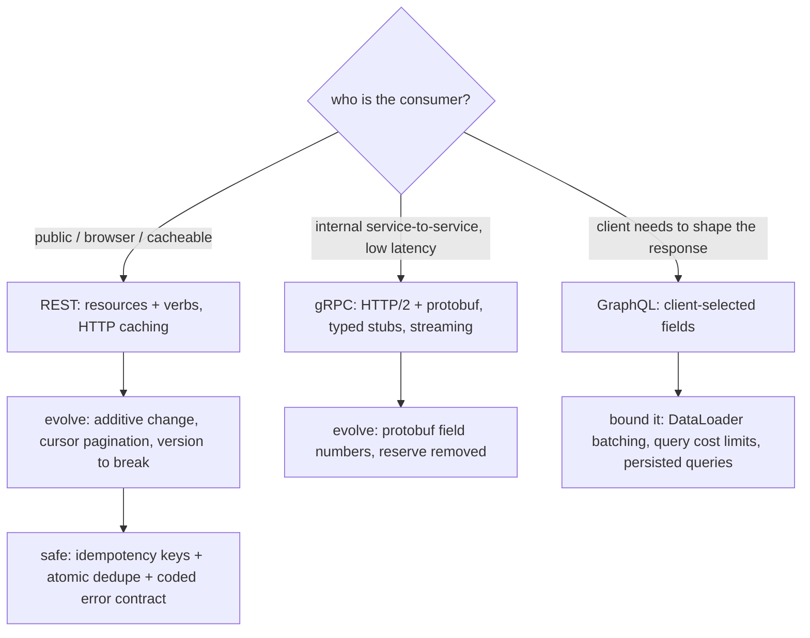

## Thesis

An API is a contract you have to live with --- clients couple to its shape the moment it ships, so the design decisions (how you model resources, how you version, how you paginate, how errors and retries work, sync versus async) are expensive to reverse later. Good API design optimizes for two things: the *consumer* (a predictable, consistent surface built around the caller's use cases) and *evolvability* (you can change it without breaking existing clients). That means a clear resource model, explicit versioning or strictly additive change, cursor pagination that survives inserts, idempotency keys so a retried write does not double-act, and a machine-readable error contract --- with the protocol choice (REST, gRPC, GraphQL) following the use case rather than fashion.

## Sub

**Why: an API is a hard-to-reverse contract** -> **resource modeling and protocol choice (REST / gRPC / GraphQL)** -> **versioning, pagination, idempotency, and the error contract** -> **zoom out** to backward-compatible evolution, sync-versus-async and long-running operations, contract-first governance, and the consumer-first mindset that ties it together.

## Spine

- **An API is a contract, designed for the consumer** --- clients couple to its shape, so you design around the caller's use cases with a predictable, consistent surface (resources, naming, status codes), because changing a shipped API is far more expensive than getting it right up front.
- **Protocol follows the use case** --- REST for public, cacheable, resource-oriented APIs; gRPC for internal, high-throughput, strongly-typed service-to-service calls; GraphQL when clients need to shape their own queries and avoid over- and under-fetching --- each trades off caching, typing, and flexibility differently.
- **Design for evolution from day one** --- explicit versioning (or additive-only change with a tolerant reader), cursor-based pagination that survives concurrent inserts, and a rule that you never remove or repurpose a field --- so the API can change without breaking the clients already built on it.
- **Make it safe and predictable** --- idempotency keys so a retried write is deduplicated rather than doubled, a machine-readable error contract (codes with a retryable flag, not prose), consistent filtering and field selection, and explicit sync-versus-async semantics (202 plus a status resource for long operations).

## Companion Notes

### walk

Designing a service interface you can live with

One API taken from a naive verb-endpoint surface to a real contract --- model resources and pick the protocol for the use case, version it and paginate it so it can evolve, and make writes safe with idempotency keys and a machine-readable error contract, all optimized for the consumer.

Say it as a contract, not a set of endpoints: consumer-first, evolvable (versioned or additive-only), and safe (idempotency keys, coded errors). Those three properties are the whole discipline.

### drill

API-contract reps

Graded reps on resource modeling, protocol choice, versioning, pagination, and idempotency --- the ones that separate "we return JSON" from an API designed to be consumed and evolved without breaking clients.

Anchor on three properties: designed for the consumer, safe to change (versioning / additive-only / cursor pagination), and safe to call (idempotency keys, a coded error contract). Every question lands on one of those.

## Drill

SDE2 | the contract, REST, and the fundamentals
SDE3 | protocols, pagination, idempotency, evolution
Staff | versioning at scale, governance, and long-running ops

### SDE2 | why an API is a contract

Why is "we can just change the API later" usually wrong?

Because the moment an API ships, clients **couple to its exact shape** --- the fields, the URLs, the status codes, the semantics --- and you often do not control (or even know) all of them. Removing a field, renaming one, changing a status code, or tightening a validation rule breaks every client that depended on the old behavior, and unlike internal code you cannot just refactor all the callers. So an API is a contract with a long tail of consumers, and changing it is expensive and slow (deprecation windows, client migrations, running old and new in parallel). That is why the design decisions are front-loaded: you optimize for the consumer and for evolvability up front, because the cost of getting the shape wrong is paid over and over by every client, for as long as the API lives.

### SDE2 | REST resource modeling

What does it mean to model a REST API around resources rather than actions?

You model the API as **nouns (resources) acted on by the standard HTTP verbs**, not as a set of RPC-style action endpoints. So it is `POST /orders`, `GET /orders/{id}`, `PATCH /orders/{id}`, `DELETE /orders/{id}` --- not `POST /createOrder`, `POST /getOrder`, `POST /updateOrder`. The resource is the thing (`/orders`, `/orders/{id}/items`), and the verb is the operation (GET reads, POST creates, PUT replaces, PATCH partially updates, DELETE removes). This gives a uniform, predictable surface: a consumer who knows one resource knows how to work with all of them, the verbs carry consistent semantics (idempotency, safety, caching), and the URL hierarchy expresses relationships. The anti-pattern is RPC-over-HTTP --- verbs in the URL, everything a POST --- which throws away all of that uniformity and cacheability and is a red flag in an API-design round.

### SDE2 | status codes that matter

Which HTTP status codes should an API use precisely, and what do the common ones mean?

Use the classes correctly --- **2xx** success, **4xx** the client's fault, **5xx** the server's fault --- and be precise within them because clients branch on them. The ones that matter: **200** OK, **201** Created (with a `Location`), **202** Accepted (async, still processing), **204** No Content; **400** malformed request, **401** unauthenticated (who are you), **403** authenticated but not allowed (I know you, you cannot), **404** not found (or hiding existence across a tenant boundary), **409** conflict (a duplicate or a version clash), **422** semantically invalid, **429** rate limited (with `Retry-After`); and **500** generic server error, **503** unavailable/overloaded. The 4xx-vs-5xx split matters operationally too: 4xx is not a service failure (it is a bad request) while 5xx is, which is exactly the line an SLI should draw. Precise codes let a client know whether to fix its request, authenticate, back off, or retry.

### SDE2 | idempotency in HTTP

Which HTTP methods are idempotent, and why does it matter for retries?

**GET, PUT, and DELETE are idempotent** (calling them N times has the same effect as once), **POST is not** (each call creates another resource). It matters because networks fail: a client sends a request, gets no response (the write may or may not have happened), and retries --- and if the operation is idempotent, the retry is safe. GET is also *safe* (no side effects), so it is freely retryable and cacheable; PUT (replace with a full representation) and DELETE (remove) converge to the same state on repeat. POST is the problem: retrying a `POST /orders` after a timeout risks a duplicate order. The fix is an **idempotency key** --- the client sends a unique key with the POST, the server records it, and a retry with the same key returns the original result instead of creating a second resource. So idempotency is both a property of the method and, for POST, something you engineer.

### SDE2 | pagination basics

Why is offset-based pagination (page number, limit) a problem, and what is the alternative?

**Offset pagination (`?offset=10000&limit=20`) breaks in two ways**: it gets *slower* the deeper you go (the database must scan and discard all `offset` rows before returning the page --- deep pages scan huge amounts), and it is *unstable* under concurrent writes (if a row is inserted or deleted while a client pages, rows shift and the client skips or duplicates items across pages). The alternative is **cursor-based (keyset) pagination**: instead of an offset, the client passes a *cursor* pointing at the last item seen (typically an opaque encoding of the sort key, e.g. the last id or timestamp), and the server returns "the next N items after this cursor" with a `WHERE sort_key > cursor` on an indexed column. That is fast at any depth (an index seek, not a scan) and stable (a cursor points at a value, not a position, so inserts do not shift it). Cursor pagination is the correct default for any list that can grow large or change.

### SDE2 | versioning basics

Why do APIs need versioning, and what are the common ways to do it?

Because you will eventually need to make a **breaking change** --- remove a field, change a type, alter semantics --- and you cannot do that to clients already depending on the current shape, so you expose the new behavior as a new *version* and let clients migrate on their own schedule. The common mechanisms: a version in the **URL path** (`/v1/orders`, `/v2/orders`) --- explicit, cache-friendly, easy to route, the most common for public APIs; a version in a **header** (`Accept: application/vnd.api.v2+json`) --- keeps URLs clean and is more "RESTful" but is less visible and harder to test; and, ideally, **avoiding a version bump** entirely by making changes *additive* (new optional fields, new endpoints) so old clients keep working. The rule is: version when you must break, but prefer additive changes that never require a version at all --- versioning is the escape hatch for the breaks you cannot avoid, not the default for every change.

### SDE2 | sync vs async

A request kicks off a long-running operation. How should the API respond?

Do not block the request until the work finishes --- return **202 Accepted** immediately with a reference to a **status resource**, and let the client poll it (or receive a webhook) for completion. So `POST /reports` returns `202` with `{ "id": "...", "status": "processing", "statusUrl": "/reports/{id}" }`; the client polls `GET /reports/{id}` until `status` becomes `completed` (with the result or a link to it) or `failed` (with an error code). Blocking a synchronous request for a long operation ties up a connection, risks client and proxy timeouts, and gives no progress signal. The async pattern (a *long-running operation* resource) decouples "I accepted your request" from "the work is done," makes the operation observable and its result durable, and lets you retry or cancel it. The rule of thumb: if it can take longer than a few seconds, make it async with a status resource.

### SDE3 | REST vs gRPC vs GraphQL

When would you choose REST, gRPC, or GraphQL for an API?

Choose by **who the consumer is and what they need**. **REST** for public, resource-oriented, cacheable APIs --- it rides HTTP semantics (verbs, status codes, caching, intermediaries), is universally understood, and is the default for external and browser-facing APIs. **gRPC** for internal, high-throughput, low-latency service-to-service calls --- it uses HTTP/2 and Protocol Buffers for a compact binary wire format, generates strongly-typed clients/servers from a `.proto` contract, and supports streaming; the trade is it is not browser-native and not human-readable. **GraphQL** when clients need to **shape their own responses** --- a single endpoint where the client specifies exactly the fields and nested relationships it wants, eliminating the over-fetching and under-fetching (and the N round-trips) of fixed REST resources; the trade is caching is harder, and you must defend against expensive queries. The one-liner: REST for public/cacheable, gRPC for internal/fast/typed, GraphQL for client-driven flexible shapes --- and it is fine to use more than one (gRPC between services, REST or GraphQL at the edge).

### SDE3 | cursor pagination deep

How does cursor pagination actually work, and what makes a cursor robust?

The server sorts by a **stable, unique, indexed key** and the cursor **encodes the position in that sort** --- typically the sort-key value(s) of the last returned row. A page query becomes `WHERE (sort_key) > (cursor_value) ORDER BY sort_key LIMIT N`, which is an index range seek regardless of depth. Robustness requires: the sort key is **unique** (or you append a tiebreaker like the id, so `(created_at, id)`) --- otherwise rows with equal keys can be skipped or repeated at page boundaries; the cursor is **opaque** to the client (base64 of the key, not a raw offset) so you can change the encoding without breaking clients and they cannot fabricate positions; and the sort is **deterministic** so the same cursor always lands in the same place. You return the next cursor with each page (and often a `hasMore` flag). The failure mode of a naive cursor is a non-unique sort key --- always include a unique tiebreaker so the boundary is exact.

### SDE3 | backward-compatible evolution

What changes to an API are backward-compatible, and what are the rules for evolving one safely?

Backward-compatible (additive) changes are safe: **adding a new optional field, a new endpoint, a new enum value handled defensively, a new optional request parameter**. Breaking changes are not: **removing or renaming a field, changing a field's type or semantics, making an optional field required, changing a status code or default behavior, tightening validation**. The rules: be a **tolerant reader** (ignore unknown fields, do not fail on extra data) and a **conservative writer** (only send what the contract promises); make changes **additive-only** whenever possible so no version bump is needed; **never repurpose** an existing field's meaning (that silently breaks clients that branch on it) or remove one still in use; and when you truly must break, do it under a new version with a **deprecation window** and a sunset date. The discipline is exactly the additive-change, tolerant-reader, ordered-rollout pattern that lets a contract evolve without a lockstep upgrade of every consumer.

### SDE3 | idempotency keys deep

Walk me through how an idempotency key makes a POST safe to retry.

The client generates a **unique key** (a UUID) for the logical operation and sends it as a header (`Idempotency-Key`); the server, before performing the write, checks a **dedupe store** keyed by that value. If the key is unseen, it performs the operation, stores the key with the operation's result (and a fingerprint of the request), and returns; if the key is *already present*, it **replays the stored result** without re-performing the write. So a retry after a timeout --- same key --- returns the original response instead of creating a second resource. The details that matter: the key must be stored **atomically with (or before) the effect** so a crash between doing the work and recording the key does not lose the dedupe; you scope the key correctly (per endpoint, per account) and set a retention window (keys expire after, say, 24 hours); and you optionally verify the retried request *matches* the original (same body) to catch a client reusing a key for a different operation. This is the API-boundary implementation of the idempotency pattern, and it is what makes at-least-once client retries safe.

### SDE3 | the error contract

What makes a good API error response, beyond an HTTP status code?

A **machine-readable body** with a stable **error code**, not just a status and a prose message. The status code is coarse (429, 400, 409); the body carries the specific, branchable detail: `{ "code": "INSUFFICIENT_FUNDS", "message": "...", "retryable": false, "details": {...} }`. The code is the contract a client branches on (retry, fix-input, escalate), the message is human-readable and safe (no internals), a `retryable` flag tells the client whether to back off and retry, and `details` can pin the failure to specific fields for a 400. This is the same discipline as cross-service error propagation --- codes not prose, classified transient-versus-permanent --- surfaced at the API edge. A good error contract turns a failure from a dead end ("400 Bad Request") into a directive ("VALIDATION_FAILED on the `email` field, fix it"), which is what a consumer needs to handle failures programmatically.

### SDE3 | rate limiting from the API side

From the API contract's perspective, how do you expose rate limiting to clients?

Return **429 Too Many Requests** when a client exceeds its limit, with a **`Retry-After`** header telling it how long to wait, and expose the limit state proactively via **`RateLimit-Limit` / `RateLimit-Remaining` / `RateLimit-Reset`** headers so a well-behaved client can self-pace *before* hitting the wall. The contract's job is to make the limit *legible*: a client that can see it has 3 requests left and a reset in 10 seconds can slow down, while one that only discovers the limit via a 429 with no guidance can only guess (and often retries into a storm). So the API-side design is 429 plus actionable headers plus a documented policy (what the limits are, per what dimension --- per key, per IP, per endpoint). The mechanism behind it (token bucket, sliding window) is the rate-limiting topic; the *contract* is the status code, the headers, and the predictability they give the consumer. Pair it with an idempotent, backoff-respecting client and a throttle never becomes a retry storm.

### SDE3 | filtering, sorting, and field selection

How do you design list endpoints so clients get what they need without over- or under-fetching?

Expose **filtering, sorting, and field selection as query parameters** on the collection, with sensible, indexed-backed defaults. Filtering: `GET /orders?status=paid&created_after=...` (documented, indexed filters, not arbitrary field matching that invites full scans). Sorting: `?sort=-created_at` (a documented set of sortable fields, each backed by an index that also supports the cursor). Field selection (sparse fieldsets): `?fields=id,total,status` so a client that needs three fields does not download the whole object --- reducing payload and coupling. And expansion: `?expand=customer` to inline a related resource and save the client a second round-trip (the under-fetching problem), bounded so it cannot fan out arbitrarily. The goal is to let the consumer express its need precisely --- which fields, filtered how, sorted how --- without either shipping everything (over-fetch) or forcing N follow-up calls (under-fetch); do it with a small, documented, index-backed parameter vocabulary rather than an open-ended query language you cannot optimize.

### Staff | API versioning strategy at scale

How do you manage API versions across many clients over time, not just "add /v2"?

Treat versioning as a **lifecycle with a deprecation policy**, because every live version is a maintenance and support cost. The strategy: prefer **additive, non-breaking evolution** so most changes need no new version at all (this is the single biggest lever --- fewer versions is the goal); when you must break, introduce the new version and run **old and new in parallel**, ideally sharing a core so you are not maintaining two full stacks (the new version is often a translation layer over the same domain); publish a **deprecation policy** with a **sunset timeline** and communicate it (deprecation headers, dashboards of who is still on the old version, direct outreach to the heavy users); and **instrument version usage** so you know when a version is safe to retire and who to migrate first. The failure mode is version proliferation --- five live versions nobody dares delete --- which comes from breaking casually; the discipline is to break rarely, always additive-first, and to actively drive clients off old versions rather than accumulating them forever.

### Staff | gRPC and protobuf evolution

How does Protocol Buffers let a gRPC contract evolve without breaking wire compatibility?

Protobuf compatibility rides on **field numbers, not names** --- the wire format identifies each field by its tag number, so you can rename a field freely (names are just for generated code) but must never reuse or change a number. The rules: **add** new fields with new numbers (old readers ignore unknown fields --- forward-compatible; new readers see missing fields as defaults --- backward-compatible); when you **remove** a field, **`reserve`** its number and name so a future change cannot accidentally reuse them and misinterpret old data on the wire; never **change a field's type** in an incompatible way or **renumber**; and be careful with semantic changes to `required`/optionality (proto3 makes everything optional-ish, which helps). Because both sides generate typed stubs from the same `.proto`, and unknown fields are preserved rather than rejected, a gRPC service and its clients can evolve independently as long as they obey the number discipline --- which is exactly the tolerant-reader, additive-change principle enforced by the binary format instead of convention.

### Staff | GraphQL at scale

GraphQL lets clients query anything. What breaks at scale, and how do you defend it?

Two things break: **the N+1 problem** and **unbounded query cost**. N+1: a query for 100 orders each asking for their customer naively issues 1 + 100 resolver calls to the datastore --- defended with **DataLoader**-style batching-and-caching that collapses the per-item fetches within a request into a single batched query. Unbounded cost: because the client composes the query, a single request can ask for deeply nested, wildly expensive data (or a malicious one can craft a query that melts the backend) --- defended with **query depth limits, complexity/cost analysis** (assign a cost to fields and reject queries over a budget), **pagination required** on list fields, **persisted queries** (only allow pre-registered queries in production), and per-client rate limits on cost rather than request count. You also lose HTTP caching (one endpoint, POST bodies) so you cache at the resolver/data layer instead. The staff point is that GraphQL moves power to the client, so the server must actively bound that power --- batching for efficiency, cost limits and persisted queries for safety --- or the flexibility that is its selling point becomes its failure mode.

### Staff | idempotency and exactly-once at the boundary

Clients retry, and you promised exactly-once effects. How do you actually deliver that at the API boundary?

You deliver **effectively-once** via **idempotency keys plus an atomic dedupe**, because true exactly-once network delivery is impossible --- what you guarantee is that duplicate *deliveries* produce a single *effect*. The design: the client sends a stable idempotency key with each write; the server records the key **in the same transaction as the effect** (or in a dedupe store checked-and-set atomically before the effect), so there is no window where the work happened but the key was not recorded; a retry with the same key short-circuits to the stored result. The subtleties a staff answer names: the key's **scope and retention window** (per operation, expiring after long enough to cover all realistic retries); the difference between **idempotency** (this specific request, deduped by key) and a **uniqueness constraint** (this business entity can only exist once, deduped by natural key) --- you often want both; and the coupling to the **retryable error contract** (only mark an operation retryable if it is actually idempotent, or a transient failure produces duplicates). This is where the API-design, idempotency, and error-propagation topics converge: safe retries require a key, an atomic dedupe, and an honest retryable flag.

### Staff | contract-first design and API governance

How do you keep APIs consistent and non-breaking across many teams?

Make the **contract the source of truth** and enforce it in the pipeline. Contract-first means the **OpenAPI spec (or the `.proto`) is written and reviewed first**, and the server and clients are generated from or validated against it --- so the contract is not an afterthought that drifts from the implementation. Governance layers on top: **style guidelines** (naming, pagination, error format, versioning) enforced by a linter (e.g. Spectral) in CI so every team's API looks consistent; **breaking-change detection** in CI (diff the new spec against the last published one and fail the build on a breaking change unless it is a deliberate new version); **consumer-driven contract tests** (Pact-style) where consumers publish the expectations they depend on and the provider's CI verifies it has not broken them; and a **central registry/catalog** of APIs and their versions. The point is that at scale, consistency and non-breakage cannot rely on discipline alone --- you encode the rules as automated checks against a first-class contract artifact, so "is this API consistent and backward-compatible" is answered by CI, not by a reviewer's memory.

### Staff | long-running operations and async contracts

Beyond returning 202, how do you design the full contract for a long-running or event-driven operation?

Design the **operation as a first-class, durable resource** and choose the client's completion mechanism deliberately. The 202 returns a **long-running-operation (LRO) resource** with an id and status; the client learns of completion by either **polling** `GET /operations/{id}` (simple, works everywhere, but wasteful and laggy --- so expose `Retry-After`/backoff guidance and a terminal status with the result or error code) or a **webhook/callback** (the server POSTs to a client-registered URL on completion --- efficient and immediate, but now *you* are a client of *their* endpoint, so it needs its own contract: retries with backoff, idempotency so a re-delivered callback is safe, signatures so they can verify it is really you, and a dead-letter for endpoints that stay down). For high-volume streams, an **event stream** (webhooks per event, or a subscription) replaces per-operation polling. The staff nuances: make the LRO resource **cancelable** and its result **durable and re-fetchable** (a client that missed the callback can still GET the result); version the callback payload like any API; and treat "how does the client find out it is done" as a designed part of the contract, not an afterthought --- polling versus webhooks is a real trade-off between simplicity and efficiency that you choose per use case.

### Staff | telling the API-design story

How do you present API design compellingly in an interview?

Lead with the **three properties and a concrete before/after**: "an API is a contract, so I design it to be consumer-first, evolvable, and safe --- for example, taking a surface from `POST /createOrder` verb-endpoints with offset pagination and prose errors, to resource-modeled endpoints with cursor pagination, idempotency keys, and a coded error contract." Then show the decisions and their reasons: **protocol by use case** (REST public/cacheable, gRPC internal/typed, GraphQL client-shaped), **evolution by additive-change-and-versioning** (tolerant reader, never remove/repurpose, version only to break), **safety by idempotency keys plus an atomic dedupe and a retryable error contract**, and the operational pieces --- **async LROs with a chosen completion mechanism, rate-limit headers, contract-first governance in CI**. Ground it in a real API you have designed and one concrete decision you would defend (why cursor over offset here, why gRPC between these services), and close on the principle: the shape is expensive to change because clients couple to it, so you optimize for the consumer and for evolvability up front --- everything else follows from treating the API as a long-lived contract rather than just the JSON a handler happens to return.

## Walk

### An API is a contract, not a set of endpoints

```flow
verbs[POST /createOrder, POST /getOrder -- RPC over HTTP] -> couple[clients couple to the exact shape] -> stuck[a rename or a removed field breaks every client]
```

Start with why this is hard to get wrong-then-fix. The naive surface is RPC-over-HTTP --- verb endpoints (`POST /createOrder`, `POST /getOrder`), everything a POST, ad-hoc responses. The moment it ships, clients couple to its exact shape: the URLs, the fields, the status codes, the semantics. And you usually do not control all the clients.

So a rename, a removed field, a changed status code, or a tightened validation rule breaks every consumer that depended on the old behavior --- and unlike internal code, you cannot refactor all the callers. That is the whole reason API design is front-loaded: the cost of a wrong shape is paid over and over by every client for as long as the API lives, so you optimize for the *consumer* and for *evolvability* up front.

### Model resources and pick the protocol for the use case

```flow
usecase[who is the consumer, what do they need] -> proto[REST public-cacheable, gRPC internal-typed, GraphQL client-shaped] -> model[model nouns acted on by verbs]
```

The first design move is a clean **resource model** and the right **protocol**. Resources are nouns acted on by the standard verbs --- not actions in the URL:

```json
{
  "//": "resource-modeled REST, not RPC-over-HTTP",
  "POST   /orders":            "create (201 + Location; Idempotency-Key header)",
  "GET    /orders/{id}":       "read one (safe, cacheable)",
  "PATCH  /orders/{id}":       "partial update",
  "DELETE /orders/{id}":       "remove (idempotent)",
  "GET    /orders?status=paid&sort=-created_at&fields=id,total": "filter, sort, sparse fields"
}
```

Then the protocol follows the consumer: **REST** for public, cacheable, resource-oriented APIs (rides HTTP semantics and intermediaries); **gRPC** for internal, high-throughput, strongly-typed service-to-service calls (HTTP/2 + protobuf, generated stubs, streaming); **GraphQL** when clients must shape their own responses to avoid over- and under-fetching. It is fine to use more than one --- gRPC between services, REST or GraphQL at the edge.

### Design for evolution: versioning and cursor pagination

```flow
additive[additive-only change, tolerant reader] -> version[version only to break, with a sunset] -> cursor[cursor pagination that survives inserts]
```

An API has to change without breaking the clients on it, so evolution is designed in. Make changes **additive** (new optional fields, new endpoints) so most need no version at all; be a **tolerant reader** (ignore unknown fields); **never remove or repurpose** a field; and **version only to break**, with a deprecation window and a sunset date.

Pagination is where this bites first. Offset pagination gets slower with depth (it scans and discards `offset` rows) and is unstable under concurrent inserts (rows shift, clients skip or duplicate). Use **cursor (keyset) pagination** on a stable, unique, indexed key:

```json
{
  "data": [ { "id": 1042, "total": 59.90 } ],
  "page": {
    "next_cursor": "eyJjcmVhdGVkX2F0IjoiMjAyNi0wNy0wOFQxMDozMFoiLCJpZCI6MTA0Mn0",
    "has_more": true
  }
}
```

The cursor is an opaque encoding of the last row's sort key plus a unique tiebreaker (`(created_at, id)`), so the next page is `WHERE (created_at, id) > (cursor)` --- an index seek at any depth, and stable because the cursor points at a *value*, not a *position*.

### Make it safe: idempotency keys and a coded error contract

```flow
key[client sends an Idempotency-Key] -> dedupe[server records it atomically with the effect] -> replay[a retry with the same key replays the result, no double write]
```

Writes have to be safe to retry, because networks drop responses. For non-idempotent POSTs, use an **idempotency key**: the client sends a unique key, the server checks a dedupe store, performs the write only if the key is unseen, and records the key **atomically with the effect** so a crash cannot lose the dedupe:

```python
def create_order(request, idempotency_key):
    existing = dedupe_store.get(idempotency_key)   # keyed by the client's Idempotency-Key
    if existing:
        return existing.response                   # replay -- no second order

    with db.transaction():                         # effect + key recorded together
        order = orders.insert(request.body)
        dedupe_store.put(idempotency_key, order.id, response=serialize(order))
    return serialize(order)
```

And failures are a **machine-readable contract**, not prose: a stable `code` the client branches on, a `retryable` flag, a safe message, and field-level `details` --- the error-propagation discipline at the API edge:

```json
{ "code": "INSUFFICIENT_FUNDS", "message": "Balance too low.", "retryable": false, "details": { "required": 5000, "available": 3200 } }
```

Consumer-first, evolvable, and safe --- a resource model and the right protocol, additive change with cursor pagination, idempotency keys and coded errors. Those three properties are the whole of API design.

### Model Script

- Frame the contract | "The way I think about API design is that an API is a contract, not just the JSON a handler returns. The moment it ships, clients couple to its exact shape, and I usually don't control all of them -- so a rename or a removed field breaks every consumer, and I can't refactor the callers. That's why the design is front-loaded: I optimize for the consumer and for evolvability up front, because a wrong shape is paid for by every client for as long as the API lives."
- Resources and protocol | "First a clean resource model -- nouns acted on by the standard verbs, POST /orders and GET /orders/id, not POST /createOrder, so the surface is uniform and cacheable. Then the protocol follows the consumer: REST for public and cacheable, gRPC for internal high-throughput typed service-to-service, GraphQL when clients need to shape their own responses to avoid over- and under-fetching. Often more than one -- gRPC between services, REST at the edge."
- Design for evolution | "The API has to change without breaking clients, so I make changes additive -- new optional fields, new endpoints -- be a tolerant reader that ignores unknown fields, never remove or repurpose a field, and version only when I truly must break, with a sunset. Pagination is the first place this bites: offset pagination is slow at depth and unstable under inserts, so I use cursor pagination on a stable, unique, indexed key -- an index seek at any depth, stable because the cursor points at a value, not a position."
- Make it safe | "Writes have to be safe to retry because networks drop responses. For a non-idempotent POST I use an idempotency key -- the client sends a unique key, the server dedupes on it and records the key atomically with the effect, so a retry replays the original result instead of creating a duplicate. And errors are a machine-readable contract, not prose: a stable code the client branches on, a retryable flag, a safe message, field-level details -- the same error-propagation discipline at the edge."
- Interviewer: "REST or gRPC or GraphQL -- how do you actually choose?"
- The protocol choice | "By the consumer and what they need. Public, browser-facing, cacheable, resource-oriented -- REST, because it rides HTTP semantics and every intermediary understands it. Internal service-to-service where I want low latency, a compact binary wire format, streaming, and generated typed stubs from a shared proto -- gRPC. A client that needs to compose its own response shape and would otherwise over-fetch or make N round-trips -- GraphQL, but then I have to bound query cost and batch resolvers or the flexibility becomes the failure mode. It's not fashion -- each trades caching, typing, and flexibility differently, and I pick per use case."
- Land it | "So: an API is a contract, designed to be consumer-first, evolvable, and safe. A clean resource model and the right protocol; additive change with a tolerant reader and cursor pagination so it evolves without breaking clients; idempotency keys with an atomic dedupe and a coded, retryable error contract so it's safe to call. The one line is that clients couple to the shape, so I optimize for the consumer and for evolvability up front -- everything else follows from treating the API as a long-lived contract."

## Whiteboard

Sketch why the resource-verb model beats RPC endpoints, and how to choose the protocol.

### Why model resources acted on by verbs instead of action endpoints?

Because it gives a uniform, predictable surface: a consumer who knows one resource knows all of them, the verbs carry consistent semantics (GET is safe and cacheable, PUT and DELETE are idempotent, POST creates), and the URL hierarchy expresses relationships. RPC-over-HTTP --- verbs in the URL, everything a POST --- throws away that uniformity, cacheability, and the idempotency the verbs encode, so retries and intermediaries no longer just work. The resource model is what makes the API learnable and lets HTTP do its job.

### How do you choose REST vs gRPC vs GraphQL?

By the consumer and their need. REST for public, cacheable, resource-oriented APIs that ride HTTP semantics; gRPC for internal, high-throughput, strongly-typed service-to-service calls (HTTP/2, protobuf, streaming); GraphQL when clients must shape their own responses to avoid over- and under-fetching. Each trades caching, typing, and flexibility differently, and a real system often uses more than one --- gRPC between services, REST or GraphQL at the edge.



Verdict: model resources acted on by verbs (uniform, cacheable, idempotent) -> pick the protocol by consumer need (REST public / gRPC internal / GraphQL client-shaped) -> design for evolution (additive + cursor pagination + version to break) -> make it safe (idempotency keys, atomic dedupe, coded errors).

## System

Zoom out to where the API contract sits between clients and the service, and its cross-cutting concerns.

### Where it sits

Resource model: nouns acted on by HTTP verbs -- the surface clients couple to [*]
Protocol: REST (public/cacheable) / gRPC (internal/typed) / GraphQL (client-shaped)
Evolution: additive change, tolerant reader, cursor pagination, version to break
Safety: idempotency keys + atomic dedupe, a machine-readable coded error contract
Async: 202 + a durable LRO resource, polling or webhooks for completion

### Pivots an interviewer rides

From "design this API" they push on evolution and safe retries.

#### How do you change an API without breaking clients?

-> additive changes with a tolerant reader; version only to break, with a deprecation window
Most changes can be additive (new optional fields, new endpoints) needing no version; a tolerant reader ignores unknowns, you never remove or repurpose a field, and a true break gets a new version and a sunset -- the same additive-change, ordered-rollout discipline as any contract.

#### How do you make a POST safe to retry?

-> an idempotency key plus a dedupe recorded atomically with the effect
The client sends a unique key, the server performs the write only if the key is unseen and stores it in the same transaction as the effect, and a retry replays the stored result -- effectively-once, because the key is coupled to the effect and to an honest retryable flag in the error contract.

## Trade-offs

The calls that separate a JSON handler from a designed contract.

### REST vs gRPC vs GraphQL

- REST: universal, HTTP caching and intermediaries, human-readable, resource-oriented -- but over/under-fetching on fixed resources and no strong typing across the wire
- gRPC: compact binary, HTTP/2 streaming, generated strong types, fast internal calls -- but not browser-native, not human-readable, weaker ecosystem at the edge
- GraphQL: client shapes the response, no over/under-fetch, one endpoint -- but hard to cache, and unbounded query cost you must actively defend

REST at the public edge, gRPC between internal services, GraphQL when clients genuinely need to compose flexible shapes -- choose by the consumer, and it is normal to use more than one in one system.

### Offset vs cursor pagination

- Offset (page/limit): trivial to implement, supports random page access and total counts -- but slows linearly with depth (scans and discards) and skips/duplicates rows under concurrent writes
- Cursor (keyset): fast at any depth (index seek) and stable under inserts -- but no random-page jump, harder total counts, needs a stable unique sort key

Cursor pagination as the default for anything large or changing; offset only for small, static, admin-style lists where random page access matters and the data will not move.

### URL-path vs header versioning

- URL path (/v1): explicit, visible, cache- and router-friendly, trivial to test in a browser -- but "pollutes" the URL and can imply the resource itself changed
- Header (Accept: ...v2): keeps URLs clean, arguably more RESTful -- but invisible, harder to test and debug, easy for clients to get wrong

URL-path versioning for public APIs (visibility and testability win); either way, prefer additive change so you version rarely -- the best version strategy is needing few versions.

## Model Answers

### the reframe | An API is a contract, designed for the consumer

The frame to lead with.

- Clients couple to the shape, so design for the caller and for change | key | a wrong shape is expensive for the API's whole life
- Model resources acted on by verbs; protocol follows the use case | store | REST public / gRPC internal / GraphQL client-shaped
- Consumer-first, evolvable, safe -- the three properties | note | everything else follows from these

### the depth | Evolve without breaking, retry without duplicating

Where it is really tested.

- Additive change + tolerant reader + cursor pagination + version-to-break | key | evolve without breaking clients
- Idempotency key + atomic dedupe = effectively-once writes | store | coupled to an honest retryable error contract
- Bound the flexible ones (GraphQL cost limits, gRPC field-number discipline) | note | governance and contract-first in CI at scale

## Numbers

Back-of-envelope why offset pagination collapses at depth and cursor pagination does not.

Offset pagination scans and discards every row before the page; cursor pagination seeks straight to it -- so the deeper the page, the larger the gap.

- pagesize | Page size | 20 | 1 | 5
- pagenum | Page number requested | 5000 | 1 | 10
- rps | List requests / sec | 200 | 0 | 10

```js
function (vals, fmt) {
  var pagesize = vals.pagesize, pagenum = vals.pagenum, rps = vals.rps;
  var offset = (pagenum - 1) * pagesize;
  var offsetScan = offset + pagesize;   // rows the DB touches for an offset page
  var cursorScan = pagesize;            // rows a keyset seek touches
  var blowup = cursorScan > 0 ? offsetScan / cursorScan : 0;
  var wastedPerSec = (offsetScan - cursorScan) * rps;
  function r(x, d) { var m = Math.pow(10, d); return Math.round(x * m) / m; }
  return [
    { k: 'Rows scanned (offset)', v: '~' + fmt.n(offsetScan), u: 'per page', n: 'offset ' + fmt.n(offset) + ' + limit ' + pagesize + ' \u2014 the database scans and discards every row before the page, so cost grows with depth', over: offsetScan > 10000 },
    { k: 'Rows scanned (cursor)', v: fmt.n(cursorScan), u: 'per page', n: 'a keyset seek on an indexed sort key touches only the page \u2014 WHERE (sort_key) > (cursor) LIMIT N \u2014 flat at any depth', over: false },
    { k: 'Offset penalty at this depth', v: fmt.n(Math.round(blowup)) + 'x', u: 'more rows', n: 'offset touches this many times more rows than cursor for the same page \u2014 the deeper the page, the worse it gets', over: blowup >= 100 },
    { k: 'Rows wasted / sec (fleet)', v: '~' + fmt.n(Math.round(wastedPerSec)), u: 'scanned-then-discarded', n: 'at ' + fmt.n(rps) + ' list req/s, this many rows a second are scanned only to be thrown away by offset paging', over: wastedPerSec > 1000000 },
    { k: 'Stability under inserts', v: 'cursor only', u: 'no skip/dup', n: 'offset points at a position so a concurrent insert shifts rows and clients skip or duplicate; a cursor points at a value, so it is stable', over: false }
  ];
}
```

## Red Flags

What makes an interviewer wince.

### "Everything is a POST to an action endpoint"

RPC-over-HTTP -- verbs in the URL (`/createOrder`, `/getOrder`), everything a POST -- throws away the uniform resource surface, HTTP caching, and the idempotency the verbs encode, so retries and intermediaries no longer just work.

Model resources acted on by the standard verbs (`POST /orders`, `GET /orders/{id}`, `DELETE /orders/{id}`), so the surface is uniform, cacheable, and the method carries safety and idempotency semantics.

### "We use offset pagination everywhere"

Offset pagination scans and discards every row before the page (so deep pages are slow and expensive) and is unstable under concurrent writes (rows shift, clients skip or duplicate items across pages).

Default to cursor (keyset) pagination on a stable, unique, indexed sort key -- an index seek at any depth, and stable because the cursor points at a value, not a position.

### "We'll just change the field, clients will update"

A removed, renamed, or retyped field is a breaking change that silently breaks every client coupled to the old shape -- and you usually cannot refactor the callers.

Make changes additive (new optional fields), be a tolerant reader, never remove or repurpose a field in place, and version only to break with a deprecation window and a sunset date.

## Opener

### 30s | The one-liner

How I open when asked to design an API or critique one.

#### What is the shape?

An API is a contract clients couple to, so I design it to be consumer-first, evolvable, and safe: model resources acted on by the standard verbs, pick the protocol by use case (REST public / gRPC internal / GraphQL client-shaped), make changes additive with cursor pagination so it evolves without breaking clients, and make writes safe with idempotency keys and a machine-readable error contract.

#### What's the key move?

Treat the shape as expensive to change -- because every client couples to it for the life of the API -- so I optimize for the consumer and for evolvability up front: additive change and versioning to evolve, idempotency keys plus an atomic dedupe to retry safely, and coded errors so failures are programmatically actionable.

##### Hooks

Where an interviewer usually pushes next.

- REST vs gRPC vs GraphQL? | by consumer -- public/cacheable, internal/typed, client-shaped | drill
- How do you evolve without breaking? | additive + tolerant reader + version to break | drill
- How is a POST safe to retry? | idempotency key + dedupe recorded atomically | drill

Foot: two sentences -- an API is a long-lived contract that clients couple to, so the design is front-loaded on the consumer and on evolvability rather than on whatever JSON a handler happens to return; and the three properties -- a consumer-first resource model with the right protocol, additive-and-versioned evolution with cursor pagination, and safe calls via idempotency keys and a coded error contract -- are what separate a designed API from an endpoint that returns data.

## Bank

### SCALE | Turning an internal service's ad-hoc endpoints into a public API

Task: design the public API contract for a service that currently exposes ad-hoc verb endpoints.
Model: model resources acted on by standard verbs with precise status codes; choose REST at the public edge (cacheable, universal) while keeping gRPC internally; make list endpoints cursor-paginated on a stable unique indexed key with documented filter/sort/field-selection; design for evolution (additive change, tolerant reader, URL versioning only to break, deprecation policy); make writes safe with idempotency keys deduped atomically with the effect; return a machine-readable error contract (code + retryable + details) and expose rate limits via 429 + Retry-After + RateLimit headers; and make long operations async (202 + a durable LRO resource with polling or webhooks). Back it with an OpenAPI spec as the source of truth and breaking-change detection in CI.
Int: what is the single most consequential decision here?
Designing for evolution from the start -- additive change, a tolerant reader, and cursor pagination -- because you cannot refactor a public API's clients, so the ability to change without breaking them is what determines whether the API can survive its own success.

### DESIGN | A write API that clients will retry aggressively

Task: design a create/charge endpoint that must be safe under aggressive client retries.
Model: require an Idempotency-Key on the write; check a dedupe store keyed by it before performing the effect; perform the effect and record the key in the same transaction (or an atomic check-and-set) so a crash cannot leave the work done but the key unrecorded; on a repeat key, replay the stored response without re-performing the write; verify the retried request body matches the original to catch key reuse; scope keys per endpoint/account with a retention window covering realistic retries; distinguish idempotency (this request) from a uniqueness constraint (this entity exists once) and apply both where needed; and mark the operation retryable in the error contract only because it is now genuinely safe to retry.
Int: why not just dedupe on a natural business key instead of an idempotency key?
Because a natural-key uniqueness constraint prevents duplicate *entities* but does not give the caller a safe *retry* of the same logical request (it would surface a 409 the client has to interpret), whereas an idempotency key replays the original success transparently -- you often want both: the key for safe retries, the constraint for entity uniqueness.

### Extra Curveballs

### CURVEBALL | breaking-change | A product requirement forces a genuinely breaking change to a widely-used public endpoint -- a field must change type and semantics. Walk me through shipping it without breaking existing clients.

Model: first, exhaust the additive escape hatch -- can you add a *new* field with the new type/semantics alongside the old one and deprecate the old, so no client breaks and there is no version bump? That is almost always preferable. If the change truly cannot be additive, introduce a **new version** of the endpoint (`/v2`, or a new media type) carrying the new shape, and run v1 and v2 in parallel -- ideally v2 is a thin translation layer over the same domain logic so you are not maintaining two full stacks. Publish a **deprecation policy** with a concrete **sunset date**, emit deprecation headers on v1 responses, and stand up a dashboard of **who is still calling v1** (by API key) so you can drive migration -- outreach to the heavy users first, docs and a migration guide for the rest. Keep v1 working until usage drops to near zero, then retire it on the announced date. Throughout, the contract discipline holds: tolerant readers on both sides, never mutate v1's shape in place, and instrument version usage so retirement is data-driven. The staff point is that a breaking change is a *migration program*, not a code change -- the engineering is easy, the client migration is the actual work, so you design the rollout (parallel versions, deprecation window, usage instrumentation, active outreach) as deliberately as the endpoint itself.

### Frames

- An API is a contract clients couple to -> design for the consumer and for evolvability up front, because a wrong shape is expensive for the API's whole life
- Resources acted on by verbs; protocol by use case (REST public / gRPC internal / GraphQL client-shaped); additive change + tolerant reader + cursor pagination to evolve without breaking
- Idempotency key + atomic dedupe = effectively-once writes; a machine-readable coded error contract (code + retryable + details); async LROs, rate-limit headers, contract-first governance in CI
