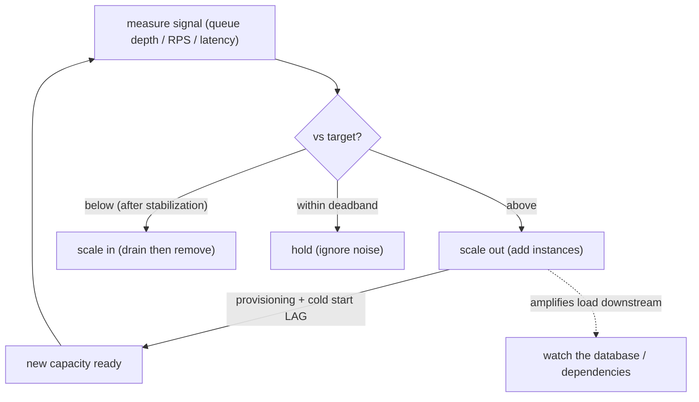

## Thesis

Automatically adjusting capacity --- the number of instances (or their size) --- to match load, so the system has enough to serve demand without over-provisioning for the idle case; the core is a feedback loop (measure a signal, compare it to a target, add/remove instances), and the hard parts are choosing the right signal (CPU is often the wrong one; queue depth / request rate / latency are often better), reacting fast enough without flapping (cooldowns, the scale-up-lag and cold-start problems), and knowing that autoscaling handles *variable* load on a *horizontally-scalable* system --- it can't fix a single bottleneck or an under-provisioned floor.

## Sub

**Why: load varies, so static capacity wastes money or drops requests** -> **the feedback loop (signal -> target -> add/remove instances)** -> **the signal choice and the hard parts (metric, flapping, scale-up lag, predictive, scale-to-zero)** -> **zoom out** to what autoscaling can't fix and the pivots an interviewer rides from "just autoscale it" into the control loop, the metric choice, and reactive-vs-predictive.

## Spine

- Load is **variable**, so static capacity is wrong both ways --- provision for peak and you **waste money** most of the time; provision for average and you **drop requests / add latency** at peak; **autoscaling** adjusts the instance count (or size) to track demand, giving capacity when needed and savings when idle.
- Autoscaling is a **feedback loop** --- measure a **signal** (CPU, request rate, queue depth, latency), compare it to a **target**, and add instances when above / remove when below (Kubernetes HPA: `desired = ceil(current * currentMetric / targetMetric)`); the loop's behavior depends entirely on the signal and the thresholds.
- **Choosing the right signal is the crux** --- CPU utilization is the default but often **misleading** (an I/O-bound or queue-draining service can be saturated without high CPU); the signal should reflect *actual demand/saturation* --- **request rate** or **concurrency** for web services, **queue depth / lag** for workers (scale by backlog), **p99 latency** as a saturation signal --- so a **custom metric** is frequently far better than CPU.
- Autoscaling has **inherent lag, stability challenges, and limits** --- scaling up isn't instant (provisioning + **cold start**), so you can't react to a sudden spike with zero lag; you must damp oscillation (**cooldowns / stabilization windows**) to avoid **flapping**; and it handles *variable* load on a *horizontally-scalable* tier --- it can't fix a service that doesn't scale horizontally (a single bottleneck, a maxed-out database) or one that's simply under-provisioned at its floor.

## Companion Notes

### walk

Tracking load with a feedback loop

A service whose load varies over time --- why static capacity wastes money or drops requests, how a measure-compare-scale feedback loop tracks demand, why the *signal* you scale on (not just CPU) is the crux, and why scale-up lag, flapping, and non-scalable bottlenecks limit what autoscaling can do.

Say the framing first --- "autoscaling is a feedback loop, and its quality is the signal you feed it." CPU is the lazy default; queue depth, request rate, or latency usually reflect real saturation better, and everything else (lag, flapping, limits) follows from it being a control loop with delay.

### drill

Probe Drill

Graded follow-ups on the control loop, the metric choice, scale-up lag / cold starts, and what autoscaling can't fix --- the ones that separate "turn on autoscaling" from designing a stable loop on the right signal that doesn't overwhelm downstream or oscillate.

Name the loop and its crux: measure a signal, compare to a target, add/remove instances -- and the signal must reflect real saturation (queue depth / RPS / latency, often not CPU); scale-up has lag (cold start), so keep headroom and damp flapping, and it can't fix a non-scalable bottleneck.

### wb

Whiteboard

Rebuild the loop from memory --- the three moving parts (signal, target, act), the bounds that protect you (min, max), the lag that makes reactive scaling a step behind, and the damping that stops it oscillating.

Draw the loop as a circle, not a line --- measure, compare, act, and then the arrow back. The arrow back is where the delay lives, and every autoscaling pathology (overshoot, flapping, "it can't keep up with the spike") is that delay biting you.

### sys

System Map

Zoom out: autoscaling sits between the metrics pipeline that measures demand and the capacity underneath it --- and it pushes load onto everything the scaled tier depends on.

Lead with the loop and its blast radius --- "the autoscaler adds instances, and every instance it adds opens connections to the database." Autoscaling is never local; name what it amplifies.

### trade

Trade-offs

The decisions they drill --- CPU vs a custom metric, lean vs headroom, reactive vs predictive, scale-to-zero vs a warm floor --- each with the condition that flips it.

Always say "pick when" --- name the constraint that decides. The latency SLO and the scale-up lag together set your target utilization; they are the two inputs to almost every autoscaling call.

### model

Model Answers

Full spoken scripts --- the beats, in order, the way you'd actually say them under time pressure.

Steal the frame, not the words --- open on "it's a control loop with dead time," land on "the signal is the crux," and name the wrong-tier trap before they ask.

### num

Numbers

Back-of-envelope the fleet --- how many instances at your target, how big a surge the headroom absorbs, and how many requests are at risk during the scale-up lag.

Lead with the exposure number --- "if load doubles, this many requests queue or fail before new capacity is ready." That single figure is what justifies every point of headroom you're paying for.

### rf

Red Flags

What sinks the round --- "we autoscale on CPU so we're covered," "autoscaling handles spikes," "just add more workers" --- and what to say instead.

Name what the interviewer hears --- "would scale the web tier into a maxed-out database" is the fastest way to show you've never run this in production.

### open

30-Second

The opener and the close --- matched to the altitude the question is asked at.

Match the altitude --- open on the control loop, not the cloud vendor's feature name, and land on the signal choice and scale-up lag as the real hard parts.

## Drill

all | All four levels, mixed --- the way a real loop actually comes at you
SDE2 | the loop, the metric, and the bounds
SDE3 | the formula, lag, and stability
Staff | what it can't fix, layers, and downstream

### SDE2 | what autoscaling is

What is autoscaling and why do you need it?

Autoscaling is **automatically adjusting the amount of capacity** (typically the number of running instances) to match current load. You need it because **load varies** --- over the day, the week, with traffic spikes, or with a job backlog --- and static capacity is wrong both ways: if you provision for the **peak**, you're paying for lots of idle capacity most of the time (**wasteful**); if you provision for the **average**, you **drop requests or add latency** when load exceeds it (**under-capacity at peak**). Autoscaling resolves this by adding instances when load rises (so you have enough to serve demand) and removing them when load falls (so you're not paying for idle capacity) --- tracking demand instead of guessing a fixed number. The value is both **reliability** (enough capacity under load) and **cost efficiency** (not over-provisioning for the idle case). It's a foundational cloud/platform capability precisely because elastic, pay-for-what-you-use infrastructure makes "match capacity to load" both possible and economically important.

Follow: You say provisioning for peak is wasteful. Put a number on it --- how wasteful, actually?
It's set by the **peak-to-trough ratio** of your traffic. A typical consumer or business web service runs a diurnal curve with a peak that's roughly **3-5x its overnight trough**, so if you size the fleet for peak, average utilization across the day lands somewhere around **25-40%** --- meaning **60-75% of what you're paying for is idle** most of the time. That ratio is the whole business case: autoscaling's saving is bounded by how variable your load actually is, so the first thing I'd do is *measure* the peak-to-trough ratio before promising anything. A service with a 5x daily swing has a lot to gain; a service that runs flat has almost nothing to gain.

Follow: So is autoscaling always cheaper than static capacity? When would it actually cost you *more*?
No --- and this is worth saying out loud. Autoscaling only pays when load is **variable**; it buys you nothing on **flat** load, where you've added a control loop, a metrics dependency, and new failure modes (flapping, a runaway scale-up, a metrics outage collapsing the fleet) for zero savings. Three cases where it's genuinely *more* expensive: (1) **flat load** --- the loop just adds risk; (2) **committed-use pricing** --- reserved instances and savings plans are materially cheaper per hour than on-demand, so a stable baseline you *commit* to beats the same capacity bought elastically at on-demand rates; the right shape is to reserve the **baseline** and autoscale only the **variable slice** on top; and (3) a **latency-critical service with a slow cold start**, where the headroom and warm minimum you need to hide the scale-up lag can approach static provisioning anyway --- you pay for the buffer *and* the complexity. So the honest framing is that autoscaling is a tool for **variable load**, and the first question is "how variable is it, and what's the baseline I should just commit to?"

Senior: Framing autoscaling as a **cost-vs-headroom optimization on *variable* load** --- and being able to say when it *doesn't* pay (flat load, a reserved baseline, a cold-start-heavy latency-critical service) --- rather than treating it as a free win you turn on by default.
Speak: Lead with the two-sided waste: **"static capacity is wrong both ways --- size for peak and you pay for idle most of the day, size for average and you drop requests at peak."** Then the resolution: autoscaling tracks demand. And the caveat that reads as senior: it only pays if the load is actually *variable* --- reserve the baseline, autoscale the swing.

### SDE2 | horizontal vs vertical scaling

What's the difference between horizontal and vertical scaling, and which does autoscaling usually mean?

**Horizontal scaling (scale out/in)** = changing the **number of instances** (add/remove replicas). **Vertical scaling (scale up/down)** = changing the **size of an instance** (more/less CPU/memory on the same node). Autoscaling usually means **horizontal** --- adding and removing identical stateless instances behind a load balancer --- because it's the model that scales (near-limitless: keep adding instances), provides fault tolerance (many instances, lose one and others carry on), and can be done live without downtime (spin up a new instance, no need to restart an existing one). Vertical scaling has hard limits (a single machine only gets so big), usually requires a restart/migration to resize (disruptive), and doesn't add redundancy. There *are* vertical autoscalers (e.g. Kubernetes VPA, which right-sizes a pod's resource requests), useful for tuning per-instance resources, but the classic "autoscaling" for handling variable load is horizontal: scale the replica count out and in. This is why autoscaling assumes a **horizontally-scalable, mostly-stateless** service --- if the workload can't be spread across more instances, horizontal autoscaling can't help it.

Follow: You keep saying "mostly-stateless." What *specifically* breaks if the instances hold state?
The instances stop being **fungible**, and horizontal autoscaling assumes fungibility --- that any instance can serve any request and that removing one loses nothing. Concretely: **in-memory sessions** mean a scale-in event logs those users out (their session died with the instance); **in-memory caches** mean every scale-out instance starts **cold**, so the new capacity is slower than the capacity it was meant to relieve; and if you paper over sessions with **sticky routing**, you've now defeated even load distribution --- the load balancer can't move a user off a hot instance, so one instance saturates while others idle, and scale-out doesn't help the users pinned to the hot one. The fix is to **externalize the state** --- sessions and caches into Redis or the database, so the instances are interchangeable and adding or removing one is a pure capacity change. The rule: make the instances fungible *first*, then autoscale them.

Follow: Kubernetes ships a VPA as well as an HPA. Can I just run both?
Not on the **same metric** --- they fight, and it's a documented conflict. The HPA scales the **replica count** based on CPU utilization, but that utilization is measured **relative to the pod's CPU *request***; the VPA's whole job is to **change that request**. So the VPA raises the request, which mechanically *lowers* the reported utilization, which makes the HPA scale *in*; then load per pod rises, the VPA reacts again --- two controllers steering the same system through each other's input. The supported combination is to give them **different signals**: let the HPA scale on a **custom or external metric** (requests-per-second, queue depth, concurrency) while the VPA right-sizes CPU/memory requests. That's actually a good division of labor --- the HPA answers "how many," the VPA answers "how big," and they don't overlap. The general principle: **one controller per control variable**, or they oscillate against each other.

Senior: Naming **fungibility** as the real precondition (not just the word "stateless") --- and knowing the **HPA/VPA conflict** on CPU, with the correct resolution being to split the signals (HPA on a custom metric, VPA on resource requests).
Speak: **"Horizontal is the number of instances, vertical is the size of one --- autoscaling usually means horizontal, because it's the one that keeps scaling and adds redundancy."** Then the precondition, said crisply: horizontal scaling assumes the instances are **fungible**, so externalize sessions and caches first --- otherwise scale-in logs users out and scale-out gives you cold instances.

### SDE2 | the feedback loop

What's the basic mechanism of autoscaling?

A **feedback loop**: **measure** a signal, **compare** it to a target, and **act** (add or remove instances), repeating continuously. Concretely: the autoscaler periodically reads a metric (say, average CPU across instances, or requests-per-second, or queue depth), checks it against a configured **target** (e.g. "keep CPU at 70%"), and if the metric is above target it **scales out** (adds instances to bring the per-instance load back down toward target), or if below target it **scales in** (removes instances). Then it re-measures and repeats. This is a classic **control loop** --- it's continuously steering the instance count so the observed signal stays near the setpoint, the way a thermostat adds/removes heat to hold a temperature. Everything about autoscaling's behavior (how well it tracks load, whether it oscillates, how fast it responds) comes from this loop: the **signal** you measure, the **target** you aim for, and the **thresholds/timing** of the act step. Getting autoscaling right is mostly about tuning that loop, and getting it wrong (bad signal, aggressive thresholds) makes the loop misbehave.

Follow: The thermostat analogy breaks down somewhere. Where?
In two places, and they're exactly the two that cause every autoscaling pathology. First, **dead time**: a thermostat's actuator acts essentially immediately and the room responds continuously, whereas an autoscaler's action --- "add an instance" --- takes **seconds to minutes** to have any effect (metric window, decision interval, provisioning, cold start). A control loop that acts *before* it can observe the effect of its last action will **overshoot and oscillate** --- that's flapping, and it's a dead-time problem, not a threshold problem. Second, **quantization**: you can add 0.3 degrees of heat, but you cannot add 0.3 of an instance --- the actuator is **discrete and integer-valued**, so near the setpoint the loop can only sit slightly under or slightly over, never exactly on it, and coarse granularity (large instances) makes that step big enough to matter. So: a thermostat has a fast, continuous actuator; an autoscaler has a **slow, chunky** one. Every damping technique --- cooldowns, stabilization windows, deadbands --- exists to make a loop with those two properties behave.

Follow: How often should the loop actually run, and what happens if you make it too fast?
It has to be slow enough that you can **see the effect of your last action before you take the next one**. Kubernetes' HPA re-evaluates roughly every **15 seconds** by default, which sounds slow until you notice that a new pod may take 30-90 seconds to become genuinely useful. If the control interval is much **shorter than the dead time**, you get the classic failure: the loop measures, sees the metric still high (because the pods it just added aren't serving yet), and **adds more** --- then all of them arrive at once, the metric undershoots, and it scales in hard. That's **overshoot from acting blind**, and shortening the interval makes it *worse*, not better. The fixes are exactly the ones real autoscalers ship: a **stabilization window** so decisions are made against a trend rather than an instant, an averaging window on the metric so noise doesn't drive action, and scale-up rate limits so a single interval can't add an unbounded number of pods. The instinct to internalize: **you cannot tune your way out of dead time by sampling faster** --- you damp, or you shrink the dead time itself.

Senior: Naming **dead time** and **quantized actuation** as what separates an autoscaler from a textbook control loop --- and knowing that a *faster* control interval makes overshoot worse, so the fix is damping or shrinking the lag, not sampling harder.
Speak: **"It's a control loop --- measure a signal, compare to a target, add or remove instances, repeat."** Then the line that shows you've operated one: the difference from a thermostat is **dead time** --- your action takes a minute to have any effect, so if you react faster than you can observe, you overshoot. That single fact explains flapping, headroom, and stabilization windows.

### SDE2 | what metric to scale on

What metric do you scale on, and why isn't CPU always enough?

The default and most common is **CPU utilization** (scale to keep average CPU at a target), and it's fine when the workload is genuinely **CPU-bound**. But CPU is often **not the right signal** because many services are **not CPU-bound** --- an I/O-bound web service can be saturated (all its connections/threads busy waiting on a database) while CPU is low, so a CPU-based autoscaler wouldn't add capacity even though the service is struggling. Better signals reflect **actual demand or saturation**: **request rate / requests-per-second** or **concurrency (in-flight requests)** for web services (directly proportional to load), **queue depth or consumer lag** for worker/queue systems (the backlog is the real signal --- scale workers by how much work is waiting), and **latency (p99)** as a saturation indicator (rising latency means you're overloaded). Often the best is a **custom metric** specific to the workload (queue length, active connections, business throughput). So the senior instinct is: don't just scale on CPU by default --- ask "what signal actually reflects this service being under load?", which is frequently a custom metric, not CPU. Scaling on the wrong metric means the autoscaler either doesn't react when it should or reacts to the wrong thing.

Follow: You pick requests-per-second. But some of your requests are ten times more expensive than others. Does RPS still work?
Not reliably --- **RPS silently assumes every request costs the same**. With a heterogeneous mix (a cheap health check vs an expensive report), the same RPS can mean idle or melting depending on the *composition* of the traffic, so the autoscaler under-provisions when the expensive requests dominate and over-provisions when they don't. The better signal is **concurrency --- the number of in-flight requests** --- because it weights automatically by how long work actually takes. That's **Little's Law**: `concurrency = arrival rate x average latency`, so an expensive request *occupies a slot for longer* and therefore shows up as more load, exactly as it should. Concurrency is effectively "how many of my workers are busy right now," which is the honest saturation measure for a request-serving service, and it's why request-driven platforms (Knative, and serverless concurrency limits generally) scale on concurrency rather than raw RPS. Use RPS when the request mix is homogeneous and stable; reach for concurrency the moment it isn't.

Follow: What about scaling on p99 latency --- that's the thing users actually feel. What's the danger?
Latency is an **effect, not a cause** --- it's a *lagging* signal, and using a lagging signal to drive a loop that already has dead time is how you build an oscillator. Two specific dangers. First, latency is **non-linear**: it barely moves as utilization climbs and then goes off a cliff near saturation (the queueing knee), so a latency-triggered autoscaler doesn't act until you are **already degrading** --- it's a smoke alarm, not a thermostat, and by the time it fires you still owe the full scale-up lag before help arrives. Second, and worse, **latency can rise for reasons scaling cannot fix**: if a downstream database or third-party API is slow, your latency climbs, the autoscaler adds instances, those instances open more connections and issue more calls to the *already-sick* dependency, latency climbs further --- and you've built a **positive-feedback runaway** where the autoscaler is the amplifier. So the discipline is: scale on a **leading demand signal** (RPS, concurrency, queue depth) and use **latency as a guardrail** --- an alert, or a secondary condition --- not as the primary thing the loop chases.

Senior: Knowing that **RPS assumes uniform request cost** while **concurrency is the honest saturation proxy** (via Little's Law) --- and that **latency is a lagging signal** that, on a downstream slowdown, can drive the autoscaler into a positive-feedback runaway.
Speak: **"The metric is the single most important autoscaling decision, and CPU is the lazy default."** Then the ladder: CPU only if you're genuinely CPU-bound; **queue depth** for workers; **concurrency** for request services (it weights by cost --- Little's Law), and RPS only if the request mix is uniform. And the warning: **latency is a lagging signal** --- great as a guardrail, dangerous as the thing the loop chases.

### SDE2 | min and max instances

What are min and max instance settings for, and why do they matter?

They're the **floor and ceiling** on the instance count. **Min instances** is the fewest the autoscaler will run (even at zero load) --- it ensures a **baseline capacity** so the service is always available and can absorb a sudden spike without starting from nothing (and, for latency-sensitive services, avoids the cold-start delay of scaling up from zero). **Max instances** is the most it will run --- a **safety ceiling** that caps cost (so a traffic surge or a runaway loop doesn't scale you to a huge, expensive fleet) and, importantly, protects **downstream systems** (so you don't scale the app tier so high it overwhelms the database or a rate-limited dependency). They matter because they bound the autoscaler's behavior: without a sensible min, you risk being caught with too little capacity when a spike hits (and cold-start lag); without a max, an anomaly could scale you to a runaway cost or crush a downstream dependency. Setting them is part of the design: min high enough for baseline availability and spike headroom, max high enough to handle real peaks but low enough to cap cost and protect what's downstream.

Follow: How do you actually *pick* the max? Give me the reasoning, not "a big number."
The max is **derived from the binding downstream constraint**, not from your ambition or your budget --- budget is the second check, not the first. The reasoning is arithmetic: whatever the scaled tier *multiplies*, the max sets the multiplier. If each instance holds a pool of, say, 10 database connections, then `max x 10` must fit **inside the database's connection limit with room to spare** for everything else that connects (migrations, dashboards, other services) --- and Postgres commonly defaults to around **100** connections, each costing real memory, so 20 pods with a pool of 10 has already blown it. Same arithmetic for a **rate-limited third-party API**: `max x per-instance call rate` must sit under the quota. So I'd find the tightest downstream ceiling, divide, and set max there --- then sanity-check the cost. And if that number is embarrassingly low, that's not a reason to raise the max, it's a signal to fix the multiplication itself: put a **connection pooler** (PgBouncer) in front of the database so pod count stops linearly multiplying connections, and use a **shared, fleet-wide rate limiter** for the quota'd API.

Follow: And the min --- what actually breaks if it's too low?
Three separate things, and it's worth separating them because they have different fixes. **Capacity**: you start every spike from too little, and because scale-up has lag, you're overloaded *before* new instances arrive --- the min has to be big enough that the running fleet can absorb the demand growth that occurs *during* the scale-up lag. **Redundancy**: below about **two or three** instances you have no meaningful fault tolerance --- losing one instance (a node failure, an AZ event, a rolling deploy) removes a third or a half of your capacity in an instant, and the autoscaler then has to replace it *through* the same lag. **Cold start**: at `min = 0`, the very next request after an idle period pays the full cold-start penalty. So the rule I'd state is: **min = max(spike absorption during the lag, enough replicas to survive losing one, a warm floor if the latency SLO can't tolerate a cold start)**. The min is not "the cheapest number that works at 3am" --- it's the capacity you need to *survive the moment before autoscaling can help you*.

Senior: Deriving **max from the downstream's real capacity** (and fixing the multiplication with a pooler / shared limiter rather than raising the cap) --- and deriving **min from spike-absorption-during-the-lag plus instance-loss redundancy**, not from the idle-hours minimum.
Speak: **"Min and max are the two bounds that make the loop safe."** Say what each is *for*: the **max is set by the downstream** --- max times per-instance connections has to fit inside the database's connection limit --- and the **min is set by the lag** --- it has to be enough capacity to ride out a spike for the sixty-plus seconds before new instances are serving, plus enough replicas that losing one isn't a crisis.

### SDE2 | an example

Give a concrete example of autoscaling.

**Web tier on request rate**: an API service behind a load balancer, autoscaled to keep each instance at ~70% CPU (or a target requests-per-second) --- morning traffic ramps up, the autoscaler adds instances; overnight traffic drops, it removes them; you pay for roughly what you use while always having enough for current load. **Worker tier on queue depth** (a very common and cleaner case): a pool of background workers consuming a job queue, autoscaled on the **queue length / backlog** --- when jobs pile up (a burst of work), the autoscaler adds workers to drain the backlog faster; when the queue is empty, it scales workers down (even to zero). This queue-depth-driven autoscaling (e.g. KEDA scaling workers by queue length, or a serverless consumer) is a clean example because the signal (backlog) directly reflects the work to be done, so the loop is intuitive: more backlog -> more workers -> backlog drains -> scale down. Both illustrate the pattern --- a signal proportional to load drives the instance count --- and the worker/queue case especially shows why a **custom metric** (queue depth) is often better than CPU.

Follow: On the worker tier --- do you scale on queue *length* or queue *age*? They aren't the same thing.
They aren't, and the distinction matters. **Length** (how many messages are waiting) is the usual choice and it's a reasonable proxy, but what you actually care about is **how long work is waiting** --- the **age of the oldest message**, or equivalently the estimated **time to drain**. Length misleads whenever throughput isn't constant: 10,000 cheap messages and 10,000 expensive ones look identical to a length-based scaler but represent wildly different drain times, and a length target you tuned last quarter silently becomes wrong when the per-job cost changes. Two better formulations: scale on a **per-worker ratio** --- "messages *per worker*", which is what queue-based autoscalers actually target, because it's the quantity that stays meaningful as the fleet changes size --- and/or set the target from the **SLO on staleness** ("no job waits more than 60 seconds"), which makes **oldest-message age** the natural signal because it maps directly to the promise you're making. In practice I'd scale on the per-worker backlog ratio and *alert* on oldest-message age, so the loop drives on a stable signal and the alarm fires on the thing the user actually feels.

Follow: Your queue is Kafka and you scale consumers on lag. Is there a ceiling on how many workers you can add?
Yes --- a hard one --- and it catches people. In a Kafka **consumer group**, each partition is assigned to **at most one consumer**, so consumer parallelism is capped at the **number of partitions**. Add consumers beyond the partition count and they simply sit **idle**, assigned nothing: the autoscaler dutifully scales out, the bill goes up, and the lag does not move. So the effective max for a Kafka consumer deployment is the partition count, and your autoscaler's max should be set to it (or you should know why it isn't). The uncomfortable part is that **partition count is a design-time decision you can't cheaply undo**: you can add partitions later, but doing so **changes the key-to-partition mapping** for a hash-partitioned topic, which breaks per-key ordering for existing keys --- so you generally **over-partition up front** to leave scaling room. That's the real answer to "just add more consumers": the scaling unit for a Kafka consumer is the **partition**, and you had to buy those in advance.

Senior: Preferring a **per-worker backlog ratio** (and SLO-linked oldest-message age) over raw queue length --- and knowing the **Kafka partition count is a hard ceiling on consumer parallelism**, so scaling past it does literally nothing.
Speak: Give the two shapes: **"web tier on RPS or concurrency; worker tier on queue depth --- and the queue case is the clean one, because the backlog *is* the work."** Then the detail that lands: scale on **backlog per worker**, not raw length, and if it's Kafka, remember your consumer parallelism is **capped by the partition count** --- extra consumers just idle.

### SDE2 | reactive scaling

What is reactive autoscaling?

Scaling in **response to current, observed load** --- the autoscaler watches the metric *right now* and reacts (scales out because CPU/queue/latency is high right now, scales in because it's low). This is the default and simplest mode: it doesn't predict or anticipate; it just continuously corrects toward the target based on what's happening. Its strength is that it needs no forecasting and handles *any* load pattern (it responds to whatever actually occurs, expected or not). Its weakness is **lag**: because it only reacts *after* load has already risen, and because adding instances takes time (provisioning + startup), there's a delay before new capacity is ready --- so for a **sudden sharp spike**, reactive scaling is always a step behind (load spikes, then the autoscaler notices, then it adds instances, then they become ready --- during which the existing instances are overloaded). That lag is the fundamental limitation that motivates **predictive/scheduled** scaling (scaling *ahead* of anticipated load) and keeping **headroom** (min instances / a lower target) so the existing fleet can absorb a spike while new capacity spins up. But reactive is the baseline every autoscaler does, and for gradual load changes it works well.

Follow: Quantify the lag for me. Traffic doubles instantly and new instances take 90 seconds to serve. How many requests are at risk?
It's just the **excess load multiplied by the lag**. Take a concrete fleet: 5,000 req/s of steady load, instances that handle 500 req/s each, running at a 70% target --- so `ceil(5000 / (500 x 0.7))` = **15 instances**, and the fleet's *true* ceiling is `15 x 500` = **7,500 req/s**. Traffic doubles to **10,000 req/s**. The fleet absorbs up to 7,500 of that instantly (that's what the 30% headroom bought), leaving an excess of **2,500 req/s** with nowhere to go. Over the **90-second** scale-up lag, that's `2,500 x 90` = roughly **225,000 requests** that must be queued, shed, or failed before the new capacity is serving. That number is the entire argument for headroom, and it's the one I'd put on the board --- because "we keep 30% spare" sounds like waste until you show that removing it turns a 90-second lag into a quarter of a million failed requests.

Follow: You can't conjure capacity during those 90 seconds. So what do you actually *do* with those requests?
You can't create supply, so you **manage demand** --- and being explicit that those are the only options is the point. Four levers, in the order I'd reach for them: (1) **buffer** --- if the work is asynchronous, push it into a queue and let it drain late; latency degrades, nothing is lost. (2) **Backpressure and load-shedding** --- if it's synchronous, you *choose* what to drop rather than letting the fleet fall over and drop things at random: shed the lowest-value traffic first (batch, bots, retries, non-critical endpoints), keep checkout and login. Shedding early is what keeps the surviving requests *fast*, because an overloaded server degrades everything, not just the excess. (3) **Degrade gracefully** --- serve cached or partial responses, skip the expensive personalization, so a request costs less and effective capacity goes *up*. (4) **Rate-limit** --- bound what any one client can consume so a single caller can't eat the whole surplus. And the meta-answer: because the lag is **irreducible**, the design question is never "how do I scale faster," it's **"headroom or shed?"** --- you either pay for spare capacity in advance or you decide, in advance, what you're willing to drop.

Senior: Being able to **compute the exposure** (excess load x lag = requests at risk) rather than hand-waving "there's some lag" --- and knowing the lag is **irreducible**, so the real design choice is **headroom vs deliberate load-shedding**, not "scale faster."
Speak: **"Reactive means it only moves after the load has already arrived --- so it is always a step behind a spike."** Then make it concrete: 15 instances, a 7,500-per-second ceiling, load doubles to 10,000, ninety-second lag --- **that's 225,000 requests with nowhere to go.** Which is why the real question isn't "scale faster," it's **"headroom, or do I decide now what to shed?"**

### SDE3 | the HPA formula

How does a target-tracking autoscaler compute the desired instance count?

By the ratio of current-to-target metric. The Kubernetes HPA formula is `desiredReplicas = ceil(currentReplicas * (currentMetricValue / targetMetricValue))`. So if you're running 10 replicas at 90% average CPU with a target of 60%, desired = ceil(10 * 90/60) = ceil(15) = **15** replicas (scale out to bring per-replica CPU back toward 60%); if CPU were 30%, desired = ceil(10 * 30/60) = **5** (scale in). The intuition: the metric is (roughly) inversely proportional to replica count (double the replicas, halve the per-replica load), so to move the metric from its current value to the target you scale the replica count by `current/target`. This is **target-tracking / proportional** control --- the further the metric is from target, the bigger the adjustment. Real implementations add refinements: a **tolerance** (don't act on tiny deviations, e.g. within 10% of target, to avoid thrashing on noise), **stabilization windows** (especially on scale-down, use the recent max desired to avoid rapidly removing then re-adding), and rate limits (don't scale by more than X% or Y pods per interval). But the core is that simple ratio: desired = current * (metric / target), clamped to [min, max]. Knowing this formula lets you reason precisely about how many instances a given load will produce and why.

Follow: Work it in front of me. Four replicas, CPU is at 85%, the target is 50%. What does the HPA do?
`desired = ceil(4 x (85 / 50)) = ceil(4 x 1.7) = ceil(6.8) = ` **7 replicas** --- it scales out from 4 to 7. And before it acts, it checks the **tolerance**: the default is **10%**, so the controller ignores any ratio within `[0.9, 1.1]`. Here the ratio is 1.7, far outside the deadband, so it acts. Two things worth noticing out loud. First, the `ceil` always rounds **toward more capacity**, which is a deliberate safety bias --- the loop would rather over-provide than under-provide. Second, if that same fleet later measured 52% against a 50% target, the ratio is 1.04, *inside* the tolerance, so the HPA does **nothing** --- which is exactly the behavior you want, because acting on a 2% deviation would just be chasing metric noise.

Follow: The formula assumes the metric is inversely proportional to the replica count. When is that assumption false --- and what happens then?
This is the formula's hidden premise, and when it breaks the loop misbehaves in a specific, diagnosable way. It's false in three cases. (1) **The metric isn't per-replica.** CPU utilization and "messages per worker" *do* divide by the fleet: double the replicas and each one's share halves. A **raw fleet-wide total** --- absolute queue depth, say --- does **not**: adding workers doesn't instantly shrink a 50,000-message backlog, so a loop targeting the raw total will keep seeing a big number and keep scaling. That's why queue-based autoscalers target a **per-replica** quantity (messages per worker), and why Kubernetes external metrics offer an `AverageValue` target that divides by the replica count --- you have to give the ratio something it can actually move. (2) **A shared bottleneck.** If every replica is queueing on the same database, adding replicas does **not** reduce per-replica latency or CPU --- the ratio stays above 1, so the controller scales again, and again, until it slams into `max`. That's the **runaway**, and its signature is unmistakable: the replica count climbs monotonically while the metric refuses to improve. (3) **Fixed per-replica overhead** --- sidecars, GC, baseline agents --- means CPU doesn't halve when you double replicas, so the loop systematically over-scales. The lesson: before you trust the formula, ask **"does adding a replica actually move this number?"** If the answer is no, the autoscaler cannot converge, and no amount of tuning will fix it.

Senior: Knowing the ratio formula's **hidden premise** --- that the metric must be *divisible by the replica count* --- and being able to name the **runaway** that follows when a shared bottleneck breaks it (replica count climbs to max while the metric never improves).
Speak: Give the formula cold: **"desired equals current times metric-over-target, ceilinged, clamped to min and max --- ten replicas at 90% CPU with a 60% target gives fifteen."** Then the senior half: it only works because the metric is **per-replica**. If adding a replica doesn't move the number --- a raw queue total, or a shared database bottleneck --- the loop **cannot converge**, and it will scale straight to max.

### SDE3 | why CPU is often the wrong metric

Why is CPU frequently a poor autoscaling metric, and what do you use instead?

Because CPU only reflects load for **CPU-bound** workloads, and many services are bounded by something else, so CPU **under- or mis-represents saturation**. Cases where CPU misleads: an **I/O-bound** service (waiting on a database or external API) can have all its worker threads/connections busy --- fully saturated, adding latency --- while CPU sits at 30% (the threads are *waiting*, not computing), so a CPU autoscaler wouldn't scale up despite the service being overwhelmed. A **memory-bound** or **connection-bound** service similarly saturates without high CPU. And CPU can be **high but fine** (a batch that's supposed to use CPU) or **spiky/noisy** (GC, background tasks) causing false scaling. The better signals target the *actual* constraint: **requests-per-second / concurrency** (in-flight requests) for web services --- directly proportional to demand and independent of what the request is bound by; **queue depth / consumer lag** for workers --- the backlog is exactly the work pressure; **p99 latency** --- rising latency is the ground-truth saturation signal regardless of the resource; or a **domain-specific custom metric** (active connections, sessions, business events per second). Modern autoscalers support custom and external metrics precisely so you can scale on the *right* signal (e.g. Kubernetes custom/external metrics, KEDA scalers for queue length). The staff-adjacent point: the metric is the most important autoscaling decision, and "scale on CPU because it's the default" is a common mistake for non-CPU-bound services --- you should scale on whatever reflects *this* service being under load, which is often not CPU.

Follow: In containers there's a CPU trap that has nothing to do with I/O. What is it?
**CFS throttling.** If a container has a CPU **limit**, the Linux CFS bandwidth controller enforces it by handing the container a quota per **100ms period** --- and when the quota is exhausted, the kernel **stops scheduling the container's threads until the next period**. The app stalls for tens of milliseconds, latency spikes, and yet the *reported* CPU utilization sits at or just under the limit and never looks alarming, because you're being **throttled, not starved**. So you have a badly degraded service and an autoscaler that sees nothing wrong. It bites hardest on **bursty, multi-threaded runtimes** (a JVM with GC threads, a Node app with a thread pool), where the app briefly wants far more CPU than its steady-state average and gets cut off mid-burst. The metric that reveals it is `container_cpu_cfs_throttled_seconds_total` (or the throttled-periods ratio) --- and it belongs on your dashboard next to CPU, because **"CPU looks fine but p99 is terrible"** is the classic throttling signature. The fixes are to raise or remove the CPU limit (keeping the *request* for scheduling), or to right-size the limit to the burst, not the average.

Follow: So when the HPA says "70% CPU utilization" --- 70% of *what*?
Of the pod's **CPU request**, not its limit and not the node's capacity --- and that detail quietly tunes your entire autoscaler. The HPA computes `sum(actual CPU across pods) / sum(CPU requests across pods)`. So if you set requests **too low**, measured utilization can sail past 100% and the ratio formula scales you out aggressively for what may be perfectly healthy load; set requests **too high** (the far more common sin, since people pad them "to be safe") and utilization looks reassuringly low forever, so the HPA **never scales** while the service quietly saturates. Two consequences worth naming. First, **your resource requests are an autoscaling parameter**, not just a scheduling hint --- change a request and you've changed the HPA's behavior without touching the HPA. Second, this is precisely the mechanism behind the **HPA/VPA conflict**: the VPA exists to *rewrite requests*, which is the denominator of the HPA's utilization --- so pointing both at CPU means one controller is continuously moving the other's yardstick.

Senior: Naming **CFS throttling** as an *invisible* saturation (degraded latency with unremarkable CPU) --- and knowing HPA CPU% is measured against the **request**, which makes request-sizing a hidden autoscaling knob and explains the HPA/VPA conflict from first principles.
Speak: **"CPU is only a load signal if you're CPU-bound --- an I/O-bound service saturates at 30% CPU with every thread parked on the database."** Then the container-specific tell that shows real operating experience: **CFS throttling** --- with a CPU limit set, the kernel stalls you every 100ms period, so latency is awful while CPU looks fine. And remember HPA utilization is a percentage of the **request**, so bloated requests silently mean the autoscaler never fires.

### SDE3 | scale-up lag and cold starts

Why isn't scaling up instant, and what are the consequences?

Because adding an instance takes **real time** --- there's a **provisioning delay** (allocate a VM/container, pull the image, attach to the network/load balancer) and a **startup / cold-start delay** (the app initializes: load config, warm caches, establish DB connection pools, JIT-warm, etc.) before the new instance can actually serve traffic effectively. This can be seconds (a warm container) to minutes (a new VM, or a heavy app with slow startup), and for serverless a **cold start** is the latency of spinning up a new execution environment for the first request. The consequences: (1) **you're always a step behind a sudden spike** --- load surges *now*, the autoscaler adds instances, but there's a window (the provisioning+startup time) where the *existing* instances must absorb the surge overloaded, so latency spikes or requests drop until the new capacity is ready. (2) You must keep **headroom** (a lower target utilization, or a higher min) so the running fleet can ride out a spike during that lag. (3) New instances hitting **cold caches / empty connection pools** may be slow or even *increase* load initially (thundering-herd cache-fill, connection-establishment storms). So scale-up lag is why reactive autoscaling can't perfectly handle sharp spikes, why you provision buffer, why you optimize startup time (faster boot, pre-warmed images, provisioned concurrency for serverless), and why predictive/pre-scaling exists (add capacity *before* the anticipated spike so it's ready in time).

Follow: Break the lag into its parts. Which parts can you actually shrink?
Six parts, and people only ever try to fix the last one. (1) **Metric delay** --- the scrape interval plus the averaging window; your load can be elevated for **15-60 seconds** before the autoscaler even *sees* it. (2) **Decision interval** --- the controller's evaluation period (~15s in Kubernetes) plus any stabilization window. (3) **Scheduling / provisioning** --- placing a pod on an existing node is seconds; provisioning a **new node** is **1-5 minutes**. (4) **Image pull.** (5) **App startup and warmup** --- config, connection pools, JIT, cache fill. (6) **Readiness probe passing and load-balancer registration** --- the instance isn't real capacity until traffic is actually routed to it. What you can genuinely shrink: image pull (smaller images, pre-pulled/cached on the node), startup (lazy init, checkpoint-restore approaches like Lambda SnapStart, provisioned concurrency), and node provisioning (keep a **warm node pool**). What you *cannot* shrink to zero: the **metric window plus the decision interval** --- you can shorten them, but you pay in noise and overshoot. And the punchline: the **metric delay is usually the biggest single chunk and the one nobody measures**, so when someone says "our autoscaler is slow," I'd ask how long it takes the *metric* to move before I ask how long the pod takes to boot.

Follow: New instances arrive with cold caches and empty connection pools. How does that make things *worse*, not better?
Because **scale-up is itself a load event on the downstream**, arriving at precisely the moment the downstream is already strained. Three concrete mechanisms. **Cache stampede**: N new instances start with empty local caches, all miss on the same hot keys simultaneously, and all hammer the origin or database with the *same* fills --- so the new capacity's first act is to spike load on the shared dependency. **Connection storm**: every new instance opens its pool at once, and connection establishment (TCP + TLS + auth) is expensive server-side, so a burst of new pods can cost the database more than the traffic they were added to serve. **Slow-and-serving**: if the readiness probe passes before the instance is genuinely warm, the load balancer starts routing to an instance that is *slower* than the ones it was meant to relieve --- so p99 gets worse right after you scale. The mitigations all say "arrive gently": **ramp** new instances in (surge limits, LB **slow-start** / gradual weighting), **warm before ready** (fill caches and pools in the startup path so the readiness probe only passes once the instance is genuinely useful), **coalesce** cache misses (single-flight) so a hundred instances don't issue a hundred identical fills, and **stagger** pool establishment. The instinct: an autoscaler that adds capacity in one uncoordinated slab can convert a surge into an outage of the tier below it.

Senior: **Decomposing the lag** and naming the **metric window** as the piece nobody measures --- plus recognizing that **scale-up is a load event on the downstream** (cache stampede, connection storm, slow-but-Ready instances), so new capacity must arrive *gently*.
Speak: **"Scale-up is never instant --- and the metric delay is usually the biggest part, not the boot time."** List it fast: metric window, decision interval, provisioning (minutes if you need a *node*), image pull, warmup, then readiness and LB registration. Then the counter-intuitive bit: new instances arrive **cold** --- empty caches, empty pools --- so they stampede the database right when it's already hurting. **Warm before you're Ready, and ramp them in.**

### SDE3 | flapping and how to damp it

What is flapping / oscillation in autoscaling, and how do you prevent it?

**Flapping** is the autoscaler rapidly scaling **up and down repeatedly** (add instances, then immediately remove them, then add again), thrashing the fleet. It happens when the loop is too **sensitive/aggressive** relative to noisy metrics or the load sits right at a threshold: e.g. a brief CPU spike triggers scale-up, the extra instances drop CPU below target so it scales down, load nudges CPU back up so it scales up again --- oscillation. It's harmful: constant churn wastes resources, every scale-up incurs cold-start cost and load, and scale-downs may kill instances handling in-flight work. Damping techniques: (1) **Stabilization windows / cooldowns** --- after a scaling action, wait before scaling again (a period where the autoscaler holds), and especially on **scale-down** consider the *maximum* desired over a recent window (so a momentary dip doesn't prematurely remove instances that will be needed again) --- Kubernetes HPA has a scale-down stabilization window for exactly this. (2) **Tolerance / deadband** --- don't act on small deviations (e.g. ignore if within 10% of target), so metric noise doesn't trigger scaling. (3) **Asymmetric behavior** --- scale **up fast** (respond quickly to load, err toward capacity) but scale **down slow** (remove instances cautiously, so you don't yank capacity you'll need moments later) --- hysteresis. (4) **Smoothing the metric** (average over a window rather than instantaneous). The unifying idea is to add **damping and hysteresis** so the loop responds to sustained trends, not transient noise --- the classic control-theory fix for an oscillating feedback loop. "Scale up eagerly, scale down conservatively, and ignore noise" is the practical rule.

Follow: Kubernetes ships a specific default for this. What is it, and why is it *asymmetric*?
The HPA's default **scale-down stabilization window is 300 seconds** (five minutes), while **scale-up stabilization is 0** --- it acts immediately. Mechanically, on scale-down the controller looks back over that window and takes the **maximum** desired replica count it computed during it, so a momentary dip in load *cannot* shrink the fleet; you have to genuinely want fewer replicas for five straight minutes. The asymmetry is deliberate because the **costs are asymmetric**. Scaling up too eagerly costs you a few instance-minutes of money --- annoying, recoverable, invisible to users. Scaling *down* too eagerly costs you **capacity you are about to need**, and getting it back means paying the **full scale-up lag** again while the surviving instances are overloaded --- a user-visible latency spike or dropped requests. So the loop is tuned to be **cheap-wrong rather than expensive-wrong**: "up fast, down slow" is not a style preference, it's the encoding of "an extra instance costs dollars, a missing instance costs an SLO."

Follow: You've added a cooldown and a deadband and it *still* oscillates. What's left?
Then it isn't a threshold problem, it's a **structural** one, and there are four suspects. (1) **The scaling itself perturbs the metric.** The classic is scaling on **latency**: you add pods, the new pods are cold, latency goes *up*, so the loop adds more pods --- a positive-feedback runaway rather than a correction. Fix: scale on a **leading demand signal** (RPS, concurrency, queue depth) that your own action doesn't distort, and demote latency to a guardrail. (2) **The metric window is shorter than the effect time** --- you're still acting before you can observe, so you overshoot; lengthen the averaging window or the stabilization window until the loop can *see* its last action. (3) **A shared bottleneck** means adding replicas never moves the metric, so the ratio stays above 1 and the loop drives to max and (once the load is removed) crashes back --- that's not oscillation you can damp, that's the wrong tier. (4) **Two controllers fighting** --- an HPA and a VPA on the same resource metric, or an HPA and a scheduled scaler both writing the replica count. The unifying rule: **one controller per control variable, on a signal your own action doesn't corrupt.** If either of those is violated, no amount of hysteresis will save you.

Senior: Knowing the **300s scale-down / 0s scale-up** default and being able to justify the **asymmetry from the asymmetric cost of error** --- and diagnosing *residual* oscillation structurally (a self-perturbing metric, a window shorter than the dead time, a shared bottleneck, or two controllers fighting) rather than reaching for a bigger cooldown.
Speak: **"Flapping is an under-damped loop: you're reacting to noise, and to actions you haven't seen the effect of yet."** Give the rule and its reason: **up fast, down slow** --- Kubernetes waits five minutes to scale down and zero to scale up --- because an extra instance costs dollars and a missing instance costs an SLO. And if it still oscillates after damping: you're probably scaling on **latency**, which your own scaling makes worse.

### SDE3 | scale-to-zero

What is scale-to-zero, and what's the trade?

**Scale-to-zero** is scaling the instance count all the way down to **zero** when there's no load, and back up when a request arrives --- so you run (and pay for) **nothing** during idle periods. It's a hallmark of **serverless** (AWS Lambda scales to zero between invocations) and event-driven autoscalers (KEDA can scale a deployment to zero when a queue is empty, then back up when messages appear). The benefit is maximum **cost efficiency** for **spiky or intermittent** workloads --- a service used occasionally, or a worker for a queue that's often empty, costs nothing when idle instead of paying for an always-on minimum. The **trade** is the **cold-start latency** on the first request after scaling to zero: with nothing running, the *very next* request must wait for an instance to be provisioned and started (the full cold-start delay) --- so scale-to-zero adds latency exactly when traffic resumes. This makes it great for **latency-tolerant, bursty, or infrequent** workloads (batch jobs, dev environments, low-traffic endpoints, queue workers) but poor for **latency-critical** services that can't tolerate a cold start on a resumed request (for those you keep a warm minimum, i.e. min-instances >= 1, or use provisioned concurrency). So scale-to-zero is the extreme of cost optimization --- pay nothing when idle --- bought at the price of cold-start latency on wake, and you enable it only where that latency is acceptable.

Follow: If nothing is running, what catches the request that wakes it up?
Something **always-on** has to --- which is the detail that reveals scale-to-zero is never truly "zero," you've just **moved the always-on cost to a shared component**. For request-driven services there's a proxy in front (Knative calls it the **activator**) that **holds the inbound request**, signals the scaler to spin a pod up from zero, waits for it to become Ready, and *then* forwards the buffered request --- so the caller experiences the cold start as latency rather than a connection refusal. For **queue-driven** workers there's no request to hold, because the **queue itself is the buffer**: an always-running scaler (KEDA's operator, polling the queue) sees messages appear and scales the deployment from 0 to 1, and the messages simply wait. That's why queue workers are the *natural* home for scale-to-zero --- the buffering is free and already durable --- while synchronous HTTP needs a request-holding proxy to make it tolerable. The senior framing: scale-to-zero is an **amortization**, not a magic trick --- one shared always-on component pays the "someone must be awake" cost on behalf of many idle services.

Follow: Your p99 SLO is 300ms and the cold start is 5 seconds. Can you use scale-to-zero at all?
Not on that synchronous path --- a 5-second cold start doesn't just miss a 300ms p99, it **obliterates** it for every request unlucky enough to land on a cold instance, and after any idle gap that's the *first user back*, which is the worst possible person to punish. So the options are, in order: (1) **keep a warm floor** --- `min >= 1`, or provisioned/pre-warmed concurrency --- and accept that you're paying for idle capacity to buy a latency guarantee; that's the price of the SLO. (2) **Attack the cold start itself** --- lazy-init the expensive stuff, shrink the runtime and image, use checkpoint-restore (Lambda SnapStart) --- and if you can get it under a few hundred milliseconds, scale-to-zero comes back on the table. (3) **Move the work off the synchronous path** --- if the request can be made asynchronous (accept, enqueue, respond), the cold start lands on a *queue worker* where nobody is waiting, and it becomes invisible. The decision rule I'd state: **scale-to-zero is for latency-tolerant or asynchronous work; a hard latency SLO buys you a warm floor.** And if someone insists on both, the honest answer is that they're asking to be paid twice for the same dollar.

Senior: Knowing that **"zero" still requires an always-on activator/scaler** (so it's an amortization, not a free lunch) --- and refusing to trade a hard latency SLO for scale-to-zero, instead naming the three real exits (warm floor, shrink the cold start, or make the path async).
Speak: **"Scale to zero means you pay nothing when idle and the next user pays the cold start."** Then the two things that land: something is **always awake** to catch that request --- an activator proxy, or the queue itself --- so "zero" is really "someone else's always-on." And match it to the SLO: **latency-tolerant or async work scales to zero; a hard p99 buys a warm floor.**

### SDE3 | predictive and scheduled scaling

What are predictive and scheduled scaling, and when do you use them over reactive?

They **anticipate** load and scale **ahead of it**, rather than reacting after it arrives. **Scheduled scaling**: scale based on **known time patterns** --- e.g. scale up every weekday at 8am (before the morning rush), scale down at night, add capacity before a known event (a sale, a product launch, a batch window). You pre-configure capacity changes on a schedule because you *know* the pattern. **Predictive scaling**: use **historical patterns / forecasting** (often ML-based, like AWS Predictive Scaling) to forecast upcoming load and provision *in advance* so capacity is ready when the load hits. You use these over pure reactive scaling to defeat **scale-up lag**: because provisioning takes time, reactive scaling is a step behind a sharp or predictable ramp, so if you *know* (schedule) or can *forecast* (predictive) the load, you add capacity *before* it arrives and it's ready in time --- avoiding the overload window that reactive scaling suffers during the spike. The common pattern is to **combine** them: predictive/scheduled sets a smart baseline that anticipates known/forecastable demand, and reactive scaling handles the *unexpected* deviations on top (a spike the forecast missed). So: reactive for unpredictable load and as the safety net; scheduled for known recurring patterns; predictive for forecastable trends --- and layering them gives capacity that's both ahead of predictable load and responsive to surprises.

Follow: The forecast will be wrong sometimes. How do you make a bad prediction *safe*?
By making prediction strictly **additive** --- it may **raise** capacity, never **cap** it. Concretely: the anticipatory layer sets a **floor** (a minimum capacity for the forecast period) and reactive scaling runs on top and can always go **higher**; the effective target is `max(forecast floor, what reactive wants)`. AWS Predictive Scaling is built exactly this way --- it only ever scales **out** toward the forecast and leaves scale-*in* to dynamic scaling --- and that asymmetry is the whole safety argument. Look at the two error modes under this rule: a forecast that's **too high** costs you **money** (you're running capacity nobody needed --- bounded, visible, reversible), while a forecast that's **too low** costs you **nothing**, because reactive scaling simply notices the real load and adds more. So you've engineered the failure mode you can afford. The rule to never break: **never let a schedule or a forecast set the ceiling**, because then a prediction error stops being a billing surprise and becomes an outage.

Follow: Marketing announces a flash sale for 10am next Tuesday --- the first one you've ever run. Do you trust predictive scaling?
No --- and knowing *why* is the point. Predictive scaling is **trained on history**, and a first-ever flash sale has **no history**: the model will happily forecast a normal Tuesday and provision for it. This is precisely the **scheduled** case: you *know* the event, so you pre-scale **explicitly**. Three things I'd do. **Pre-scale early enough to cover the full lag** --- and the full lag includes node provisioning, image pull and warmup, so I'd have capacity in place **well before** 10am, not at 09:59. **Warm it, don't just start it** --- caches filled, connection pools established, so the fleet is genuinely serving-ready when the doors open rather than stampeding the database at 10:00:01. And **be generous**, because the cost of error is wildly asymmetric: an hour of over-provisioned instances is a rounding error next to a checkout path falling over during the one sale marketing has been advertising for a month. Reactive stays underneath as the safety net for a surge beyond even the plan, and afterwards the sale becomes *history* --- which is what makes the forecast useful for the *next* one.

Senior: Insisting that anticipation is **additive --- a floor, never a ceiling** (so a bad forecast costs money, never capacity) --- and knowing history-based forecasting is **blind to novel events**, which is exactly what scheduled pre-scaling (with lag-aware lead time and pre-warming) is for.
Speak: **"Reactive is always a step behind, so if you can anticipate, you pre-provision."** Scheduled for what you *know* (the 8am ramp, the sale), predictive for what you can *forecast*. Then the safety rule that shows judgment: prediction only ever **raises the floor** --- reactive can always add more on top --- so a wrong forecast costs **money, not capacity**. And a first-ever flash sale has no history: that's a **schedule**, not a forecast.

### SDE3 | scaling down safely

How do you scale down without disrupting in-flight work?

By **removing instances gracefully** rather than killing them abruptly. The hazard: when the autoscaler decides to scale in, it terminates instances --- and if an instance is **serving in-flight requests** or **processing jobs**, a hard kill drops those requests / loses that work. The safe-shutdown pattern: (1) **Stop sending new work** to the instance first --- deregister it from the load balancer (so no new requests route to it) or stop it from picking up new queue jobs. (2) **Connection draining / graceful termination** --- let it **finish** its in-flight requests/jobs (wait for active connections to complete, up to a timeout) before actually terminating. In Kubernetes this is the pod termination lifecycle: the pod is removed from the Service endpoints, receives SIGTERM, and gets a **grace period** (`terminationGracePeriodSeconds`) to finish and shut down cleanly (often with a `preStop` hook to drain), before SIGKILL. (3) **For workers**, finish (or safely re-queue) the current job and don't grab new ones, so no job is lost mid-processing. (4) **Choose *which* instance to remove** sensibly (prefer idle/least-loaded ones). The principle is that scale-in must be **drain-then-terminate**, not kill-in-place --- so in-flight requests complete and jobs aren't lost. Forgetting this (letting the autoscaler hard-kill busy instances) causes user-facing errors and lost work on every scale-down, which is a common and avoidable autoscaling bug.

Follow: Walk the actual Kubernetes shutdown sequence and show me exactly where requests get dropped.
The trap is that two things happen **concurrently**, not in sequence. On pod deletion, Kubernetes (1) removes the pod from the Service's **EndpointSlice**, which must then **propagate asynchronously** to every kube-proxy on every node, plus any ingress controller or cloud load balancer; and (2) the kubelet sends **SIGTERM to the container immediately**. Nobody waits for (1) to finish before doing (2). So the pod can begin shutting down --- closing listeners, refusing connections --- while load balancers **are still routing traffic to it**, and those requests get connection-refused or reset. That's the dropped-request window, and it's the single most common scale-in bug in Kubernetes. The fix is a **`preStop` hook that simply sleeps** (typically 5-15 seconds): the pod keeps serving normally during the sleep while endpoint removal propagates, and only *then* does the app get SIGTERM and start its graceful drain of in-flight requests. Two constraints: `terminationGracePeriodSeconds` must be **longer than preStop sleep + drain time**, or SIGKILL cuts you off mid-drain; and the app must actually **handle SIGTERM** by finishing in-flight work and exiting, rather than dying instantly. The mental model: **stop receiving, then stop serving, then exit** --- and the "stop receiving" step is *not* instantaneous, so you have to wait it out.

Follow: A queue worker has no load balancer. What's the equivalent --- and what if a job takes 30 minutes?
For a worker the sequence is: on SIGTERM, **stop claiming new messages**, **finish the in-flight one**, then exit --- and the grace period has to exceed the job's remaining runtime or the kubelet SIGKILLs you mid-job. Which is exactly why the 30-minute job is the wrong question to answer with a longer grace period. Setting `terminationGracePeriodSeconds` to 1800 means every scale-in event **blocks for up to half an hour**, node upgrades stall, and you've made the fleet un-drainable --- and a spot instance's **2-minute interruption notice** will kill you anyway, so the guarantee is fictional. The real fix is to change the **work**, not the timeout: make jobs **idempotent and resumable** --- checkpoint progress, so a killed job is safely **redelivered** when its visibility timeout expires and picks up (or safely re-runs) without duplicating effects --- and **break long jobs into small units** so the worst-case in-flight loss is seconds, not half an hour. If a job genuinely must run for 30 minutes uninterrupted, then it shouldn't live on an autoscaled, preemptible fleet at all. The principle: **scale-in safety for workers is bought with idempotency and checkpointing, not with an ever-longer grace period.**

Senior: Knowing the **endpoint-removal / SIGTERM race** and that the fix is a **preStop sleep** (stop receiving before you stop serving) --- and that worker scale-in safety comes from **idempotent, checkpointed, short jobs**, not from stretching the grace period into a fiction that a spot interruption will break anyway.
Speak: **"Scale-in is drain-then-terminate, never kill-in-place."** Then the detail that proves you've debugged it: in Kubernetes, endpoint removal and SIGTERM happen **at the same time**, so the pod starts dying while the load balancer is still sending it traffic --- which is why you put a **preStop sleep** in front, to let the deregistration propagate. For workers: stop claiming, finish the current message, exit --- and make jobs **idempotent and short**, because a 30-minute grace period is a fiction.

### Staff | reactive vs predictive vs scheduled

Compare reactive, predictive, and scheduled scaling as a strategy --- when each, and how to combine them.

They sit on a spectrum of **anticipation**, and a mature setup **layers** them. **Reactive** (respond to current load): handles *any* pattern including the unpredictable, needs no forecast --- but is always a **step behind** due to scale-up lag, so it's poor for sharp spikes and you must carry headroom. It's the essential safety net (whatever actually happens, it responds). **Scheduled** (scale on known time patterns): perfect when load is **predictable by clock/calendar** (business-hours ramp, nightly batch, a launch event) --- you pre-provision so capacity is ready, defeating scale-up lag for known patterns; but it's blind to deviations from the schedule (a spike at an unusual time, or an unexpectedly quiet day wasting the scheduled capacity). **Predictive** (forecast from history): handles **forecastable but not clock-exact** trends (ML-predicted demand curves), provisioning ahead so capacity is ready --- but it's only as good as the forecast (a novel pattern the model hasn't seen is missed) and adds complexity. The **combination** is the real answer: use **predictive/scheduled to set an anticipatory baseline** (capacity ahead of known/forecastable demand, so you're not fighting scale-up lag for the predictable part) and **reactive on top** to catch the **unexpected** (a spike the forecast missed, an incident) --- reactive is the floor of last resort that ensures you respond to *whatever* occurs. The staff framing: don't treat it as either/or --- reactive alone is always behind on spikes (so it over-provisions headroom or drops requests), pure scheduled/predictive alone is brittle to surprises, but **anticipatory baseline + reactive correction** gives you capacity that's both ahead of predictable load and responsive to surprises, which is how large systems handle both daily patterns and unexpected surges cost-effectively.

Follow: They're layered and they disagree --- the schedule says 50 instances, reactive says 20. Who wins?
The composition rule is **maximum, not override**: `effective = max(anticipatory floor, reactive desired)`, then clamped to `[min, max]`. So the schedule wins here and you run **50** --- you are deliberately paying for anticipated capacity that today's traffic didn't need, and that's the *accepted cost* of anticipation, not a bug. Invert it and reactive wins: if the schedule says 50 but reactive wants **80** because a real surge arrived, you run **80**. The invariant to protect is that the anticipatory layer only ever **raises the floor** and can **never cap** reactive --- because the moment a schedule can hold the fleet *down* during an unexpected surge, a stale config becomes an outage. Said as a principle: **anticipation is a bet you place in advance, and reactive is the thing that keeps you solvent when the bet is wrong.** The bet may cost you money; it must never cost you capacity.

Follow: That means a stale schedule quietly burns money forever and nobody notices. How do you catch it?
You make the anticipatory layer **accountable**, because an unmeasured standing bet decays into pure waste. Three things. **Instrument the divergence**: continuously compare the scheduled/forecast floor against what reactive *would have* chosen, and record the gap --- "hours spent pinned at the scheduled floor while reactive wanted less" is a **cost metric with a dollar figure**, and it makes the waste visible instead of invisible. Alert when that divergence is sustained. **Watch the inverse too**: if reactive is *routinely* overriding the floor upward, the schedule is decorative --- it's not anticipating anything and it's providing false comfort. **Review on a cadence and give schedules an expiry**: schedules are written for a traffic shape and traffic shapes move (a launch, a new region, a seasonality shift, a client that churned), and *nobody ever deletes a scaling schedule* --- so a one-off pre-scale for a 2023 Black Friday is still running today. I'd give every scheduled rule an owner and an expiry date, the same way you'd treat a feature flag. The general principle: **any anticipatory configuration is a standing bet on the future --- instrument it, expire it, or it silently rots into cost.**

Senior: Naming the composition rule precisely --- **max, not override** (anticipation raises the floor, never caps reactive) --- and then treating the schedule as an **instrumented, expiring bet**, because a stale anticipatory config is invisible, permanent waste.
Speak: **"Layer them: anticipation sets the floor, reactive is the safety net on top."** The composition is a **max** --- the forecast can raise capacity, it can never cap it --- so a bad forecast costs money, never an outage. And the part nobody says: a scaling **schedule is a standing bet that rots**. Instrument the gap between the floor and what reactive actually wanted, or you'll pay for a Black Friday from three years ago forever.

### Staff | what autoscaling can't fix

What problems does autoscaling *not* solve --- and what's the "scaling the wrong tier" trap?

Autoscaling handles **variable load on a horizontally-scalable, mostly-stateless tier** --- and it **can't** fix several things people expect it to. (1) A **non-horizontally-scalable bottleneck**: if the real constraint is a component that *doesn't* scale by adding instances --- a single-writer database, a shared cache at capacity, a stateful service, a leader that must be singular --- then autoscaling the *stateless* tier in front of it does nothing except pile more load onto the unscalable bottleneck (often making it *worse*). (2) The **"scaling the wrong tier" trap**: your web tier autoscales beautifully on CPU/RPS, but the actual bottleneck is the **database** (it's maxed on connections or IOPS) --- so as the autoscaler adds web instances, each opens more DB connections and the database falls over faster; you scaled the tier that *wasn't* the constraint, and amplified load on the one that was. The fix requires addressing the *actual* bottleneck (read replicas, sharding, a connection pooler, caching), not scaling the stateless tier harder. (3) An **under-provisioned floor**: if `min instances` (or the baseline) is set too low, you start every spike from too little capacity and the scale-up lag means you're overloaded before new instances arrive --- autoscaling doesn't help if the *floor* is wrong. (4) **Downstream limits**: scaling up can hit a **rate-limited external API** or a **fixed-capacity dependency** that can't scale with you. (5) **Fundamentally too much load**: autoscaling within your max still can't serve load beyond what the whole system (including its unscalable parts) can handle --- at some point you need architectural change, not more instances. The staff insight: autoscaling is a tool for **elastic, stateless, horizontally-scalable** capacity following *variable* demand --- so before "just autoscale it," identify the **actual bottleneck** (which is often *not* the tier you'd autoscale), because scaling the wrong tier wastes money and can accelerate the failure of the real constraint.

Follow: Give me the diagnostic. From metrics alone, how do you *tell* you're scaling the wrong tier?
There's a clean signature, and it's the inverse of what a healthy scale-out looks like. In a **correct** scale-out, adding replicas makes things **better**: total throughput rises and latency falls. In the **wrong-tier** case you see three things at once. (1) **The scaled tier looks healthy while the system doesn't** --- pods Ready, CPU sitting obediently at target, no restarts --- and yet end-to-end **latency and error rates are getting worse**. (2) **Errors and latency climb *as* the replica count climbs.** That temporal correlation is the amplification signature: if scaling the tier were helping, its metrics would improve as it grows; instead they degrade *in step with* the fleet size, because each new replica is another mouth on the real bottleneck. (3) **Per-instance throughput falls as you add instances** --- the fleet gets bigger and total throughput barely moves, or even drops. That's the cleanest test of all: **if adding a replica doesn't increase total throughput, you are not scaling, you are contending.** Then you go looking downstream for the thing you're contending *on*: database connections against `max_connections`, DB CPU / IOPS / lock waits, downstream service p99, and 429s from a third party --- and you'll find one of them saturating in perfect lockstep with your replica count.

Follow: So it's the database, and it's a single writer. What are the actual moves, in order?
In order of **cost and reversibility** --- cheapest and most reversible first, because you want the fastest lever that buys you room to do the expensive one properly. (1) **Reduce demand**: cache the hot reads (read-through cache), **coalesce** duplicate in-flight queries, batch chatty calls, and kill the N+1s. Often the biggest single win, and it's a code change, not a migration. (2) **Reduce connection pressure**: put a **pooler** (PgBouncer in transaction mode) in front so pod count stops linearly multiplying database connections --- this is the structural fix that decouples autoscaling from the database's connection limit entirely. (3) **Offload reads**: **read replicas** with reads routed to them, accepting replica lag (so read-your-writes needs explicit care --- route the user's own reads to the primary after a write). (4) **Raise the ceiling**: **vertically scale the database.** This is the one place vertical scaling is the *right* answer and it's the fastest big lever --- it buys time, and it's underrated because it's unfashionable. (5) **Split the load**: **shard/partition** by key --- real engineering, changes the application's data access, do it deliberately rather than at 3am. (6) **Change the write path**: queue the writes and absorb bursts asynchronously (CQRS-ish), so a spike becomes a backlog rather than a rejection. And regardless of which you pick: **cap the app tier's max** so autoscaling can never outrun whatever ceiling you just bought.

Senior: Producing the **amplification signature** from metrics --- errors and latency degrading *in lockstep with* the replica count, and per-instance throughput falling as the fleet grows (**"if adding a replica doesn't add throughput, you're contending, not scaling"**) --- and then an ordered, cost-aware bottleneck playbook instead of a single reflexive fix.
Speak: **"Autoscaling only handles variable load on a horizontally-scalable tier --- and scaling the wrong tier doesn't just fail, it *amplifies*."** The diagnostic in one line: **if adding a replica doesn't increase total throughput, you're not scaling, you're contending** --- and if errors climb *as* the fleet grows, the bottleneck is downstream. Then the playbook, cheapest first: cache and coalesce, pool the connections, read replicas, vertically scale the DB, then shard.

### Staff | cluster vs pod autoscaling

In Kubernetes, how do pod autoscaling and cluster (node) autoscaling interact?

They're **two layers** that must work together: the **Horizontal Pod Autoscaler (HPA)** scales the number of **pods** (application instances) based on metrics, and the **Cluster Autoscaler** scales the number of **nodes** (the underlying VMs) in the cluster based on whether pods can be scheduled. The interaction: when the HPA scales *up* pods and there **isn't enough node capacity** to schedule the new pods (they go `Pending` for lack of CPU/memory), the Cluster Autoscaler notices the unschedulable pods and **adds nodes**; once nodes are available, the pending pods schedule. Conversely, when the HPA scales *down* pods and nodes become underutilized, the Cluster Autoscaler **removes** nodes (after draining them) to save cost. So there are effectively two feedback loops stacked: HPA (load -> pod count) and Cluster Autoscaler (pod scheduling pressure -> node count). The **implications**: (1) **compounded lag** --- if scale-up needs *both* new pods *and* new nodes, the total time is pod-scheduling *plus* node-provisioning (nodes take minutes to join), so a spike that requires new nodes is even slower to absorb (mitigated by keeping some spare node headroom, or over-provisioning with low-priority "pause" pods that get evicted to make room fast). (2) You must **size nodes and pod requests** so they bin-pack well (pods' resource requests determine how many fit per node, which drives node scaling). (3) **VPA** (vertical pod autoscaler, right-sizing pod requests) interacts too --- and HPA+VPA on the same resource metric can conflict. The staff point: real Kubernetes autoscaling is a **layered system** (pods on nodes), so you reason about *both* loops and their combined lag, and "autoscaling is slow to handle the spike" is often because it needs new *nodes*, not just new pods --- which is why node-level headroom / over-provisioning matters for fast response.

Follow: Pods are Pending because there's no node. Realistically how long, and how do you make it faster?
Realistically **one to five minutes**, and it's a chain: the autoscaler decides, calls the cloud API, a VM boots, the kubelet joins the cluster, the CNI and DaemonSets come up, then your image is pulled, *then* your app starts and warms. Nothing in that chain is fast, and it stacks **on top of** the pod-level lag --- so a spike that needs new nodes can be a **five-plus-minute** hole, which no target utilization will paper over. Two ways to attack it. **Provision faster**: **Karpenter** beats the classic Cluster Autoscaler here because it looks at the pending pods' actual requirements and provisions a right-sized instance **directly**, instead of picking a pre-defined node group and waiting on an ASG to grow --- fewer indirections, and better bin-packing. **Or don't provision at all --- have the node already**: keep **node headroom** by scheduling **low-priority "balloon" (pause) pods** that reserve real capacity and do nothing. When a real pod needs room, the scheduler **preempts** the balloon instantly and the real pod lands on an **already-warm node** in seconds; the cluster autoscaler then backfills the balloon in the background, on its own slow schedule. You've converted a five-minute node provision into a sub-second preemption, and you're paying for a little idle capacity to do it --- which is the same headroom-versus-cost trade as everywhere else, just one layer down.

Follow: Why does the Cluster Autoscaler care about resource *requests* rather than actual usage?
Because it is reasoning about the **scheduler**, not about load --- and the scheduler bin-packs on **requests**. A pod is schedulable if and only if some node has enough **unrequested** capacity to fit its requests; so the Cluster Autoscaler decides to add a node by **simulating scheduling** ("would a node of this shape let these Pending pods fit?"), and it removes a node only if it can simulate all of that node's pods being **rescheduled elsewhere** --- again by request-based math. Actual CPU usage never enters the calculation. Two consequences, and they're the biggest money lever in most clusters. **Bloated requests silently inflate your bill**: pods that request 2 CPUs and use 0.2 make nodes look "full" at ~10% real utilization, so the cluster autoscaler keeps adding nodes you don't need and *never* removes them --- your cluster is expensive and idle at the same time, and no HPA tuning will fix it because the HPA isn't the thing sizing the cluster. **Under-sized requests overcommit nodes**, giving you CPU throttling and OOM kills. This is exactly why the **VPA is a cost tool and the HPA is a capacity tool**: right-sizing requests (VPA, or just reading the usage-vs-request data) is how you shrink the node count, and it's usually where the money actually is.

Senior: Knowing the **node-provisioning lead time compounds on top of the pod lag** and naming the **preemptible pause-pod over-provisioning** trick that converts a 5-minute node provision into an instant preemption --- plus understanding that **requests, not usage, size the cluster**, so request hygiene (VPA) is the real cost lever while the HPA is the capacity lever.
Speak: **"There are two loops stacked: the HPA scales pods, the cluster autoscaler scales nodes --- and their lags add up."** The line that lands: if a spike needs new **nodes**, you're waiting **minutes**, not seconds. So you keep **node headroom with low-priority pause pods** that get preempted instantly, and you remember the cluster is sized by **resource requests, not usage** --- which means padded requests inflate your node count and your bill while everything sits idle.

### Staff | autoscaling and downstream dependencies

How can autoscaling harm downstream systems, and how do you guard against it?

Autoscaling **amplifies the load the scaled tier puts on its dependencies**, which can **overwhelm** them --- a subtle and dangerous failure. The mechanism: your app tier scales out to handle a surge, and now there are, say, 5x more app instances --- each of which opens connections to the **database**, calls **downstream services**, and hits **external APIs**. So 5x app instances can mean ~5x the database connections (exhausting its connection limit / connection-pooler), 5x the calls to a **rate-limited** third-party API (hitting the limit, getting throttled), or 5x load on a **downstream service** that *didn't* autoscale in lockstep --- and the very act of scaling up to survive the surge can **push the bottleneck downstream** and take *that* down (or trigger throttling/errors that cascade back). Worse, if the downstream is what's actually slow, scaling up the upstream **adds retries and connections that make the downstream *more* overloaded** (a positive-feedback overload). Guards: (1) **Cap max instances** with the downstream's capacity in mind (don't let the app tier scale beyond what the DB/dependency can serve). (2) **Connection pooling / a shared pooler** (e.g. PgBouncer) so pod count doesn't linearly multiply raw DB connections. (3) **Rate limiting / concurrency limits toward downstream** (bound the calls each instance makes, and in aggregate, so scaling up doesn't blow a downstream rate limit). (4) **Scale the downstream too** (or ensure it can handle the upstream's max) --- autoscaling a tier in isolation is dangerous if its dependencies can't keep up. (5) **Circuit breakers / backpressure** so an overwhelmed downstream pushes back rather than being hammered harder. The staff insight: autoscaling isn't free capacity --- it changes the load profile on *everything the tier depends on*, so you must reason about the **whole dependency chain** (especially the database and rate-limited APIs) and bound/scale it accordingly; "scale the app tier" without considering what that does to the database is a classic way to convert a surge into a full outage.

Follow: Do the connection arithmetic for me, and give me the structural fix.
Each pod holds a pool --- say **10** connections. At 20 pods that's **200** connections; at 50 pods it's **500**. Postgres defaults to `max_connections = 100`, and even when raised, **every backend costs real memory** (single-digit MB each) and adds context-switching and lock contention, so throughput degrades **well before** the hard limit --- "under the limit" is not the same as "safe." And the failure isn't graceful: once connections are exhausted, **everything** that connects starts failing --- your migrations, your admin tooling, your other services --- so an autoscaling event in one deployment takes out things that have nothing to do with it. Capping `max` is the *bound*, but the **structural fix is a connection pooler**: PgBouncer in **transaction mode** multiplexes many client connections onto a small, fixed set of server connections, which **decouples pod count from database connections entirely** --- 50 pods can share 20 server connections, because a pod only actually needs a connection while it's mid-transaction. That's the move that makes the app tier genuinely elastic: without it, every autoscaling decision is secretly also a database capacity decision. Alongside it: keep the **per-pod pool small** (a pod's real concurrency is bounded by its own worker/thread count, and people habitually over-size pools), and *then* set `max` with the arithmetic done.

Follow: Everything downstream is yours and healthy --- but you call a third-party API with a 1,000 requests/minute quota. What breaks?
You **blow the quota**, and then you make it worse. Scaling out multiplies your **aggregate** call rate, so the fleet sails past 1,000/min and starts collecting **429s** --- and the naive client **retries**, which *increases* the call rate at exactly the moment you're being throttled. That's a **retry storm**: throttling (a soft, recoverable signal) gets converted into a hard outage by your own retry logic, and the harder you scale to "handle the load," the deeper you dig. Four guards. **A shared, fleet-wide rate limiter** --- a token bucket in Redis, decremented **atomically** --- because per-pod limits are simply *wrong* here: N pods each politely enforcing "1,000/min" gives the third party **N x 1,000/min**. The limit must be enforced on the **fleet**, not the instance, which means it needs shared state. **Respect `Retry-After` and back off with jitter** --- never retry a 429 immediately, and never let a thousand pods retry on the same synchronized schedule. **Circuit-break**: on sustained throttling, stop calling for a while rather than hammering a door that is telling you it's closed. **Queue and pace** the work rather than dropping it, so the quota becomes a *drain rate* instead of an error. And of course **cap `max`** so the fleet can't outrun the quota in the first place.

Senior: Naming the **pooler as the structural decoupling** of pod count from database connections (not just "cap max") --- and knowing a quota'd dependency needs a **shared, fleet-wide limiter** (per-pod limits multiply by N) plus **no-retry-storm discipline**, because retries turn throttling into an outage.
Speak: **"Autoscaling is not free capacity --- every instance you add is another mouth on the database and the third-party API."** Do the arithmetic out loud: 50 pods times a pool of 10 is 500 connections against a `max_connections` of 100. The structural fix is a **pooler**, which decouples pod count from DB connections; the fix for a quota'd API is a **shared, fleet-wide limiter**, because a per-pod limit multiplied by N pods is N times the quota. And never retry a 429 --- that's how throttling becomes an outage.

### Staff | autoscaling as a control loop

Framed as control theory, why do autoscalers oscillate or lag, and how does that inform tuning?

An autoscaler is a **feedback control loop**, and its pathologies are the classic ones of control systems with **gain**, **delay**, and **noise**. **Lag (dead time)**: there's a delay between acting (adding instances) and the effect (the metric responding) --- provisioning + cold start. A control loop with significant dead time that reacts aggressively will **overshoot and oscillate** (it keeps acting because it hasn't seen the effect yet, then over-corrects) --- this is exactly why aggressive scaling on a metric that responds slowly causes flapping. **Gain**: how strongly you react to error (the proportional `current/target` ratio) --- too high a gain (over-reacting to small deviations) amplifies noise into oscillation; too low and it responds sluggishly. **Noise**: metrics are noisy (GC spikes, bursty traffic), and a high-gain loop treats noise as signal and thrashes. The tuning implications follow directly: (1) **Damping/hysteresis** (cooldowns, scale-down stabilization, asymmetric up-fast/down-slow) to stop overshoot from the dead time --- respond to sustained trends, not transients. (2) **A deadband/tolerance** so noise within a band doesn't trigger action (filter the noise). (3) **Smoothing** the metric (average over a window) to reduce noise-driven gain. (4) **Headroom via target utilization** --- you deliberately run below saturation (target 60-70%, not 95%) so the loop has slack to absorb load *during* its response lag (the dead time), rather than saturating before new capacity arrives; running the target too high is like a control system with no margin --- any disturbance overshoots into overload. So the control-theory lens explains *why* the practical rules exist: keep utilization target below saturation (margin for dead time), damp and add hysteresis (tame overshoot/oscillation from lag), and filter noise (don't let it drive the loop). The staff framing: "autoscaling is flapping" or "autoscaling can't keep up with spikes" are control-loop symptoms of gain-vs-delay-vs-noise, and the fixes (target headroom, stabilization windows, asymmetric scaling, metric smoothing) are the control-systems response to exactly those problems.

Follow: Then derive it. What's the rule that connects the dead time to the target utilization?
The fleet has to absorb **all the demand growth that occurs during the dead time**, because during that window your capacity is *fixed*. So the requirement is simply: **spare capacity >= (rate of load growth) x (dead time)**. If load can ramp at `g` req/s per second and your end-to-end lag is `L` seconds, you need at least `g x L` req/s of headroom sitting idle, right now. Concretely: a fleet serving 5,000 req/s that can ramp at 30 req/s per second, with a 90-second lag, needs `30 x 90 = 2,700` req/s of spare capacity --- which is a **35% headroom on a 5,000 req/s baseline**, and *that* is where "target 65-70%" actually comes from. It isn't folklore; it's `g x L` divided by your fleet capacity. Two things fall straight out of the formula, which is why it's worth deriving rather than memorizing. **Shrinking `L` buys you utilization** --- halve the lag and you can safely halve the headroom, so investing in faster startup is *directly* a cost saving, not just a nice-to-have. And **if `g x L` exceeds any headroom you could plausibly afford** --- a true step-function spike, where `g` is effectively infinite --- then **no target utilization saves you**, and the honest answer is that you must **pre-scale** (feed-forward) or **shed**. The formula tells you not just what to set, but when the whole approach has run out.

Follow: So why is it a *proportional* controller? Why not add integral and derivative terms and do it properly?
Because the plant is horrible, and P-plus-hysteresis is the *right* answer for a plant like this --- which is a nice thing to be able to justify rather than just observe. Consider what the autoscaler is controlling: **large dead time**, **quantized actuation** (whole pods, integer-valued), **noisy measurement**, and a **wildly asymmetric cost of error**. Now add the terms. An **integral** term accumulates error over time --- and with large dead time, that is a textbook recipe for **integral windup and overshoot**: it keeps piling on correction *precisely because* it hasn't yet seen the effect of what it already did, then blows past the setpoint. And the steady-state error that integral action exists to eliminate is largely handled anyway, because the ratio formula converges once the metric responds. A **derivative** term reacts to the *rate of change* of the signal --- which means it amplifies exactly the thing you have most of: **noise**. So real autoscalers deliberately stay close to **proportional + saturation limits + hysteresis + filtering**, which is the robust choice for a noisy, laggy, chunky plant. And here's the punchline: where you genuinely *do* want anticipation, you don't add a D term --- you add **feed-forward**, which is exactly what **predictive and scheduled scaling are**. You anticipate a disturbance you actually *know about* in advance, instead of trying to infer it from the derivative of a noisy signal. Feed-forward for known disturbances, proportional feedback for everything else.

Senior: **Deriving headroom as `growth rate x dead time`** (so "70% target" stops being folklore and becomes arithmetic --- and shrinking the lag is shown to *buy* utilization) --- and correctly identifying **predictive/scheduled scaling as feed-forward control**, explaining why I and D terms are the wrong tools for a plant with this much dead time and noise.
Speak: **"It's a control loop, and every pathology is gain, dead time, or noise."** Then derive the number instead of quoting it: you need spare capacity greater than **ramp rate times lag** --- 30 req/s per second of growth against a 90-second lag is 2,700 req/s of headroom, which on a 5,000 req/s baseline *is* your 65% target. Two consequences: **shrinking the lag directly buys utilization**, and predictive scaling is **feed-forward** --- not a derivative term.

### Staff | cost-vs-latency right-sizing

How does autoscaling trade cost against latency/reliability, and how do you right-size it?

Autoscaling is fundamentally a **cost-vs-headroom** optimization, and the trade is set by your **target utilization**, **min instances**, and how aggressively you scale. Running **lean** (high target utilization, low min, scale-to-zero) **minimizes cost** --- you pay for little idle capacity --- but leaves **little headroom**, so during the **scale-up lag** of a spike (or the loss of an instance), the running fleet is near saturation and you get **latency spikes or dropped requests** before new capacity arrives; scale-to-zero adds cold-start latency on wake. Running with **buffer** (lower target utilization, e.g. 50-60%; a higher min; some spare capacity) **protects latency/reliability** --- the fleet can absorb spikes during the response lag --- but **costs more** (you're paying for headroom that's often unused). Right-sizing is choosing where on this trade to sit **per workload's requirements**: a **latency-critical, spiky** service warrants more headroom (lower target, higher min, no scale-to-zero, maybe pre-scaling) --- the cost of buffer is worth avoiding user-facing latency; a **latency-tolerant, cost-sensitive** or **batch/async** workload can run lean (high target, scale-to-zero, cheap) because a cold start or brief saturation is acceptable. Key inputs to the sizing: the **scale-up lag** (longer lag -> more headroom needed, since you must ride out a bigger window), the **spikiness** of the load (spikier -> more buffer or predictive scaling), the **cost of a dropped/slow request** vs the **cost of idle capacity**, and the **blast radius** of losing an instance (need enough others to absorb it). The staff framing: autoscaling doesn't eliminate the capacity-vs-cost trade --- it *automates* it, but *you* still choose the operating point via target utilization and min/headroom, balancing "pay for idle buffer" against "risk latency/drops during scale-up lag," per the workload's latency SLO and load profile. The common mistake is running too lean on a latency-critical spiky service (saving a little money, paying in spike-time latency) or too rich on a batch workload (wasting money on headroom nobody needs).

Follow: Your CFO looks at a fleet running at 60% and wants it at 90%. What do you say?
That **utilization is not a goal --- it's a consequence** of the headroom my latency SLO and my scale-up lag require, and that the last 30% is not waste, it's the thing standing between us and a bad day. Then I'd show the curve rather than argue, because queueing theory does the work for me: **wait time scales roughly as `1/(1 - utilization)`**, so it doesn't degrade linearly --- it goes off a cliff. Going from 60% to 90% doesn't cost 30% more latency; the queueing factor goes from `1/0.4 = 2.5` to `1/0.1 = 10`, so **queueing delay roughly quadruples**, and worse, you're now sitting on the **knee of the curve**, where a small surge produces an enormous latency spike instead of a small one. Meanwhile that same buffer is what absorbs an instance failure, an AZ event, and the demand growth during the scale-up lag --- so at 90% you have simultaneously removed your spike absorption, your redundancy margin, and your lag coverage. So the answer isn't "no": it's **"here's the utilization-versus-latency curve and here's the cost of a slow or dropped request --- let's pick the point together."** And if we genuinely want higher utilization *safely*, the way to buy it is to **shrink the lag** (faster startup, warm pools, pre-pulled images) or **smooth the load** (queue it, shed it), not to simply raise the target and hope.

Follow: Fine --- so where's the free money? What cuts cost *without* giving up headroom?
Attack the things that **don't** trade against latency, and there are more of them than people think. (1) **Right-size requests and instance types.** This is the single biggest source of waste in most fleets: padded CPU/memory requests inflate the node count for **zero** benefit (the cluster is sized by requests, not usage), so reading the usage-vs-request data --- or letting the VPA recommend --- routinely cuts 30-50% of nodes without touching a single point of headroom. (2) **Shrink the scale-up lag.** This is the elegant one: smaller images, pre-pulled layers, lazy init, a warm node pool. Because headroom is `growth x lag`, **halving the lag halves the headroom you need** --- so lag reduction is the only lever that improves **cost and latency at the same time**. Everything else is a trade; this one isn't. (3) **Buy cheaper capacity for the elastic slice.** **Reserved instances / savings plans** for the stable **baseline** (your `min` --- you know you'll run it, so commit to it), **spot/preemptible** for fault-tolerant workers (handle the 2-minute interruption notice with the same graceful-shutdown path you already built for scale-in), and on-demand only for the variable middle. (4) **Scale to zero the things that genuinely can** --- dev and staging environments, batch, internal tools, low-traffic endpoints --- where nobody is waiting. (5) **Delete the fear-driven config**: a `max` set to 1,000 "just in case" and a `min` nobody has revisited since launch. So the honest summary: **most autoscaling waste isn't in the headroom --- it's in bloated requests, a slow cold start, and paying on-demand rates for a baseline you were always going to run.**

Senior: Refusing the "utilization as a goal" frame and grounding it in the **`1/(1-rho)` queueing blow-up** (60% to 90% roughly quadruples queueing delay and puts you on the knee) --- plus knowing **lag reduction is the only lever that buys cost *and* latency simultaneously**, while requests-hygiene and reserved-vs-spot pricing are where the real money is.
Speak: **"Utilization isn't a goal --- it's a consequence of my latency SLO and my scale-up lag."** Then the queueing argument, out loud: **wait time scales like 1/(1 minus utilization)** --- going 60% to 90% roughly *quadruples* queueing delay and puts you on the knee of the curve. And the constructive half: if you want higher utilization safely, **shrink the lag**, because headroom is ramp times lag --- that's the one lever that improves cost *and* latency instead of trading them.

### Staff | real-world failure modes

What real-world failure modes bite autoscaling?

Several, mostly around lag, the metric, stability, and downstream. **Can't scale fast enough for the spike** --- scale-up lag (provisioning + cold start, plus node-provisioning if new nodes are needed) means a sharp spike overloads the existing fleet before new capacity is ready (fixed by headroom, faster startup, pre-scaling/predictive). **Cold-start storms / thundering herd on scale-up** --- new instances hit cold caches and empty connection pools, so they're slow and can *increase* load initially (cache-fill stampede, connection-establishment burst), sometimes making the surge worse right when you scale (mitigated by warmup, staggered rollout, cache pre-warming). **Scaling on a lagging or wrong metric** --- CPU when the service is I/O-bound (never scales despite saturation), or a metric that responds slowly, so the autoscaler reacts late or not at all (fixed by scaling on the right saturation signal: queue depth / RPS / latency). **Flapping / oscillation** --- aggressive thresholds + noisy metrics cause thrash (fixed by stabilization windows, deadband, asymmetric scaling). **Downstream overload** --- scaling the app tier multiplies DB connections / downstream calls / API-rate-limit usage and takes the dependency down (fixed by max caps, connection pooling, downstream rate limits, scaling the dependency too). **Scale-down killing in-flight work** --- hard-terminating busy instances drops requests / loses jobs (fixed by drain-then-terminate, graceful shutdown, grace periods). **Metric feedback loops** --- scaling changes the very metric you scale on in a way that misleads (e.g. adding instances drops per-instance latency, triggering scale-down, then latency rises again --- oscillation), or an autoscaler reacting to a metric that *another* system also affects. **Runaway scale-up from a bug** --- a runaway loop or a metric spike (or a metric *source* failure read as "infinite load") scales you to the max, burning cost (why a sane max and anomaly alerts matter). **Scale-to-zero cold starts** on latency-critical paths --- the first request after idle eats the full cold start (keep a warm min for those). **Insufficient min / wrong floor** --- starting spikes from too little capacity. The staff summary: the recurring themes are (1) **lag** (scale-up isn't instant, so spikes overrun you without headroom/pre-scaling), (2) **the metric** (scaling on the wrong signal, or a signal the scaling itself distorts), (3) **stability** (flapping from an under-damped loop), and (4) **downstream/whole-system** effects (scaling one tier overwhelms its dependencies) --- and each is why autoscaling is a *tuned control loop on the right signal with headroom and downstream awareness*, not a "turn it on and forget it" switch.

Follow: Name the failure mode where the autoscaler doesn't just fail to help --- it makes the outage *worse*.
There are four, and they're the ones that turn an incident into a catastrophe. (1) **The death spiral.** A downstream slows down; latency rises; a latency-driven autoscaler **scales out**; the new pods open more connections and issue more calls and more retries against the **already-sick** dependency; it gets sicker; latency rises further; scale out more. The autoscaler is now the **amplifier** of the outage, and the harder it works the faster you die. The guard is to never let a lagging, downstream-contaminated signal drive scale-out unbounded --- **circuit-break** the dependency instead, and cap `max`. (2) **Errors deflate the scaling signal.** During a partial outage, requests are *failing fast* rather than being served --- so RPS or CPU can **drop**, which looks to the autoscaler exactly like "demand fell," and it **scales in** --- removing the capacity you'll need for the recovery, right before the retry surge arrives. Failure suppresses the very metric you scale on. (3) **The metrics pipeline itself fails.** If the autoscaler reads a **missing or zero** metric it may scale to `min` (collapsing capacity mid-incident); if it reads garbage-high it scales to `max` (a cost and downstream bomb). The correct behavior on a stale or absent metric is to **freeze the replica count and alarm** --- do nothing, loudly. (4) **Crash-looping deployments**: pods never reach Ready, so the few healthy pods carry all the load and look saturated, so the HPA scales up --- into **more crash-looping pods**. The unifying insight: **an autoscaler is a feedback loop wired into your system, so during an incident it is a participant, not an observer** --- and you must ask, for every signal, "what does this metric do when the system is *broken*?"
Follow: Pick the single guard you'd add first, and defend it.
A **sane `max`, with an alarm when you hit it.** Defence: it is the one control that **bounds the blast radius of every other failure on the list**. A runaway metric, a retry storm, a death spiral into a sick downstream, a crash-loop, a cost bomb from a bug --- every one of them **terminates at the max**. It converts an *unbounded* failure (infinite spend, a crushed database, a third-party quota destroyed) into a **bounded and visible** one: you saturate at a known ceiling, and the alarm tells a human "the loop wants more than we were willing to give it," which is exactly the moment a person should be looking. It costs nothing, needs no new infrastructure, and requires no cleverness. The second guard, if I get one more, is **freeze-on-stale-metrics** --- because a metrics outage should never be able to silently collapse or explode the fleet. And the instinct being tested is the important part: when you can only pick one control, **pick the one that bounds the worst case**, not the one that optimizes the common case. Autoscaling's common case mostly takes care of itself; it's the tails that page you.

Senior: Recognizing that during an incident the autoscaler is a **participant, not an observer** --- naming the **death spiral**, the fact that **errors deflate the very signal you scale on**, and **freeze-on-stale-metrics** --- and then, forced to choose one guard, correctly picking the **bound on the worst case** (`max` + alarm) over any optimization of the common case.
Speak: **"The scary failures are the ones where the autoscaler is the amplifier, not the victim."** Give two: the **death spiral** --- downstream slows, latency rises, you scale out, more connections and retries hit the sick dependency, it gets worse --- and the inverse, where **errors deflate the metric** so a partial outage looks like falling demand and the autoscaler **scales in** right before the recovery. Then the one guard: a **sane max plus an alarm**, because it bounds the blast radius of every other failure on the list.

## Walk

### Load varies, so static capacity is wrong both ways

```flow
peak[provision for peak: wasted idle capacity] -> avg[provision for average: dropped requests at peak] -> auto[autoscale: track demand up and down]
```

Start with why autoscaling exists. Load isn't constant --- it varies by time of day, by week, with spikes, with backlog. A **fixed** capacity is wrong in both directions: size for the **peak** and you pay for idle capacity most of the time; size for the **average** and you drop requests or add latency whenever load exceeds it.

**Autoscaling** resolves this by adjusting the instance count to **track demand** --- adding instances as load rises (enough capacity to serve), removing them as load falls (not paying for idle). You get both **reliability** (capacity under load) and **cost efficiency** (no over-provisioning for idle). It assumes a **horizontally-scalable, mostly-stateless** tier --- you scale by adding identical replicas behind a load balancer.

### The feedback loop: measure, compare, scale

```flow
measure[measure a signal] -> compare[compare to a target] -> act[above -> add instances, below -> remove]
```

Autoscaling is a **feedback control loop**, like a thermostat: measure a signal, compare it to a target setpoint, and act to steer the signal back toward the target --- continuously. Above target -> scale out (more instances -> per-instance load drops toward target); below target -> scale in.

```python
import math

def desired_replicas(current, metric, target, min_r, max_r):
    # Kubernetes HPA core: desired = current * (metric / target)
    raw = math.ceil(current * (metric / target))
    return max(min_r, min(max_r, raw))            # clamp to [min, max]

def scale_decision(now, metric, target, current, state):
    # tolerance: ignore small deviations so metric NOISE doesn't cause thrashing
    if abs(metric - target) / target < 0.10:
        return current                             # within deadband -> hold
    want = desired_replicas(current, metric, target, state.min_r, state.max_r)
    if want > current:
        return want                               # scale UP fast (respond to load)
    # scale DOWN slow: only after a stabilization window, using the recent MAX desired
    state.downscale_history.append((now, want))
    stable_want = max(w for t, w in state.downscale_history if now - t < state.cooldown_s)
    return stable_want                            # damp flapping / hysteresis
```

Everything about the loop's behavior --- how well it tracks load, whether it oscillates, how fast it responds --- comes from three things: the **signal** you measure, the **target** you aim for, and the **timing/thresholds** of the act step. Tuning autoscaling is tuning that loop.

### Choose the right signal --- often not CPU

```flow
cpu[CPU: fine only if CPU-bound] -> mislead[I/O-bound service saturates at low CPU] -> better[scale on queue depth / RPS / p99 latency]
```

The single most important autoscaling decision is **what signal you scale on**. **CPU** is the default and is fine for genuinely **CPU-bound** work --- but it **misleads** for the many services bounded by something else: an **I/O-bound** service can have every thread/connection busy waiting on a database (fully saturated, adding latency) while CPU sits at 30%, so a CPU autoscaler *won't add capacity* despite the service drowning.

Better signals reflect **actual saturation**: **request rate / concurrency** for web services (proportional to demand), **queue depth / consumer lag** for workers (the backlog *is* the work pressure --- scale workers by how much is waiting, e.g. KEDA scaling on queue length), and **p99 latency** as a ground-truth saturation indicator. So the instinct is to ask "what signal actually reflects *this* service being under load?" --- frequently a **custom metric**, not CPU. Scaling on the wrong metric means the autoscaler doesn't react when it should.

### Set the bounds --- the target, the min, and the max

```flow
target[target utilization: the headroom] -> min[min: survive the lag + lose an instance] -> max[max: bounded by the DOWNSTREAM, not by ambition]
```

The loop needs three numbers, and each one is a **decision with a defensible derivation** --- not a default you inherited. The **target utilization** sets your **headroom**: you deliberately run below saturation so the fleet can absorb load *during* the scale-up lag. The **min** is the floor you start every spike from. The **max** is the ceiling that bounds every failure.

Derive them, don't guess them. **Target**: you need spare capacity of at least `ramp rate x lag` --- 30 req/s per second of growth against a 90-second lag is 2,700 req/s of headroom, which on a 5,000 req/s baseline *is* a ~65% target. **Min**: enough to absorb that spike *and* survive losing an instance (below ~2-3 replicas you have no redundancy), plus a warm floor if your latency SLO can't eat a cold start. **Max**: set by the **downstream** --- `max x per-instance connections` must fit inside the database's connection limit, and `max x per-instance call rate` must fit under any third-party quota. If that number comes out embarrassingly low, don't raise it --- fix the multiplication with a **connection pooler** and a **shared, fleet-wide rate limiter**.

### Scale out --- and the lag you cannot remove

```flow
load[load rises] -> see[metric window: 15-60s before you even SEE it] -> decide[decision interval] -> prov[provision + image pull] -> warm[app start + warmup] . node[if a NEW NODE is needed: +1-5 min]
```

Now the loop decides to add instances --- and this is where reality bites. Scaling out is **not instant**, and the delay is a **chain**: the metric window (your load is elevated for **15-60 seconds** before the autoscaler even *sees* it), the decision interval, scheduling and provisioning, the image pull, and app startup and warmup. If a **new node** is needed, add **one to five minutes** on top.

The part people never measure is the **front** of that chain --- the metric delay is often the biggest single chunk, so when someone says "autoscaling is slow," ask how long the *metric* takes to move before you ask how long the pod takes to boot. And the lag is what makes reactive scaling **structurally a step behind**: during it, capacity is *fixed*, so the running fleet must absorb the surge alone. That's what the headroom is for --- and if the surge exceeds it, your only remaining options are to **buffer, shed, or degrade**. You cannot conjure capacity inside the lag.

### The new instance joins the pool --- warm before Ready

```flow
boot[instance boots] -> warm[fill caches + connection pools] -> ready[readiness probe passes] -> lb[load balancer routes to it] . cold[Ready-but-cold = slower than what it relieves]
```

An instance is not capacity until traffic actually reaches it: it has to pass its **readiness probe** and be **registered with the load balancer**. The subtle failure is passing readiness **too early** --- a Ready-but-**cold** instance has an empty cache and an empty connection pool, so the load balancer starts routing to something *slower* than the instances it was added to relieve, and p99 gets **worse** right after you scale.

Worse, scale-out is itself a **load event on the downstream**. N new instances all miss the same hot cache keys at once (a **cache stampede**) and all open their connection pools at once (a **connection storm**) --- so new capacity's first act is to hammer the dependency that is very likely already strained. The discipline is to **arrive gently**: warm caches and pools *before* the readiness probe passes, **ramp** traffic in (load-balancer slow-start / gradual weighting), and **coalesce** cache fills so a hundred instances don't issue a hundred identical queries.

### Scale in --- drain before you terminate

```flow
dereg[stop sending new work: deregister] -> prop[wait for deregistration to PROPAGATE] -> drain[finish in-flight work] -> term[terminate]
```

Scale-in must be **drain-then-terminate**, never kill-in-place --- otherwise every scale-down event drops in-flight requests and loses jobs. The order is: stop sending it new work, **wait for that to take effect**, let it finish what it's holding, then kill it.

That middle step is the one everybody skips. In Kubernetes, removing the pod from the **EndpointSlice** and sending it **SIGTERM** happen **concurrently** --- nobody waits for endpoint removal to propagate to every kube-proxy and load balancer --- so the pod starts shutting down while traffic is *still being routed to it*. The fix is a **`preStop` hook that sleeps** (5-15s): keep serving while the deregistration propagates, *then* drain. And `terminationGracePeriodSeconds` must exceed preStop + drain, or SIGKILL cuts you off. For **workers** there's no load balancer: on SIGTERM, stop claiming new messages, finish the current one, exit --- and make jobs **idempotent, checkpointed and short**, because a 30-minute grace period is a fiction a spot interruption will break anyway.

### Damp the loop --- so it tracks trends, not noise

```flow
dead[dead time: you act before you can SEE the effect] -> over[overshoot -> oscillation] -> damp[deadband + stabilization window + up-fast/down-slow]
```

A loop with **dead time**, a **noisy** signal and a **chunky** actuator will **flap** --- add instances, remove them, add them again --- unless you damp it. The three standard damps: a **deadband** (Kubernetes ignores deviations within **10%** of target, so noise can't drive action), a **stabilization window** (decide against a trend, not an instant), and **asymmetry**.

The asymmetry is the one worth being able to justify. Kubernetes defaults to a **300-second scale-down stabilization window** and **zero** on scale-up --- on the way down it takes the **maximum** desired replica count over the trailing five minutes, so a momentary dip cannot shrink the fleet. That's not a style choice: the **costs of error are asymmetric**. An extra instance costs a few dollars; a *missing* instance costs an SLO, and getting it back means paying the full scale-up lag while the survivors are overloaded. **Up fast, down slow** is just that asymmetry, encoded. And note what damping cannot fix: if the loop still oscillates, you're probably scaling on a signal your own scaling **corrupts** (latency), or two controllers are fighting over the same replica count.

### Lag, flapping, and what autoscaling can't fix

```flow
lag[scale-up lag + cold start: a step behind a spike] -> damp[cooldowns + up-fast/down-slow: avoid flapping] -> limit[cannot fix a non-scalable bottleneck or a maxed downstream]
```

Three realities bound autoscaling. **Scale-up lag**: adding an instance takes time (provisioning + **cold start**), so you're always a step behind a *sudden* spike --- the existing fleet absorbs the surge overloaded until new capacity is ready, which is why you keep **headroom** (lower target, higher min) and why predictive/scheduled scaling exists (add capacity *before* anticipated load). **Flapping**: an under-damped loop on a noisy metric thrashes up-and-down --- damp it with **cooldowns / stabilization windows**, a **deadband** (ignore small deviations), and **asymmetry** (scale up fast, down slow).

**Limits**: autoscaling handles *variable* load on a *horizontally-scalable* tier --- it **can't** fix a non-horizontally-scalable **bottleneck** (a single-writer DB, a stateful service), and worse, scaling the *wrong* tier (add web instances when the **database** is the constraint) just **amplifies load downstream** (more instances -> more DB connections -> the database falls over faster). Zooming out: autoscaling is a **tuned control loop** (gain/lag/noise --- hence target headroom below saturation, damping, and metric smoothing), it's a **layered** system in Kubernetes (pods *and* nodes, with compounded lag), and it must be **downstream-aware** (cap max, pool connections, rate-limit toward dependencies, scale the DB too). It automates the capacity-vs-cost trade --- but *you* still pick the operating point (target utilization, min/headroom) per the workload's latency SLO, and you must identify the **actual bottleneck** before "just autoscale it."

### Model Script

- Frame the why | "Autoscaling exists because load varies, and static capacity is wrong both ways: size for the peak and you pay for idle capacity most of the time; size for the average and you drop requests or add latency at peak. Autoscaling adjusts the instance count to track demand -- add instances as load rises, remove them as it falls -- so you get both reliability, enough capacity under load, and cost efficiency, no over-provisioning for idle. It assumes a horizontally-scalable, mostly-stateless tier you scale by adding replicas behind a load balancer."
- The feedback loop | "Mechanically it's a feedback control loop, like a thermostat: measure a signal, compare it to a target setpoint, and act to steer the signal back toward target, continuously. Above target, scale out -- more instances drop the per-instance load toward target; below target, scale in. The Kubernetes HPA formula is literally desired equals current times metric-over-target, clamped to min and max. And everything about the loop's behavior -- how well it tracks load, whether it oscillates, how fast it responds -- comes from three things: the signal you measure, the target you aim for, and the timing and thresholds of the act step."
- The signal is the crux | "The single most important decision is what signal you scale on. CPU is the default and it's fine if the work is genuinely CPU-bound -- but it misleads for the many services bounded by something else. An I/O-bound service can have every thread and connection busy waiting on a database -- fully saturated, adding latency -- while CPU sits at thirty percent, so a CPU autoscaler won't add capacity even though the service is drowning. Better signals reflect actual saturation: request rate or concurrency for web services, queue depth or consumer lag for workers -- the backlog is the work pressure, so you scale workers by how much is waiting -- and p99 latency as a ground-truth saturation signal. So I always ask: what signal actually reflects this service being under load? It's frequently a custom metric, not CPU."
- Lag, flapping, limits | "Then three realities bound it. Scale-up lag: adding an instance takes time -- provisioning plus cold start -- so you're always a step behind a sudden spike, which is why you keep headroom, a lower target and a higher min, and why predictive or scheduled scaling exists to add capacity before anticipated load. Flapping: an under-damped loop on a noisy metric thrashes up and down, so you damp it -- cooldowns and stabilization windows, a deadband to ignore small deviations, and asymmetry: scale up fast, scale down slow. And limits: autoscaling handles variable load on a horizontally-scalable tier -- it can't fix a non-scalable bottleneck like a single-writer database, and scaling the wrong tier is actively dangerous."
- Interviewer: "You autoscale the web tier on CPU and it works, but under load everything still falls over. What's happening?"
- Wrong tier / downstream | "That's the classic scaling-the-wrong-tier trap. The web tier autoscales fine on CPU, but the actual bottleneck is downstream -- most likely the database, maxed on connections or IOPS. And here's the vicious part: as the autoscaler adds web instances, each one opens more database connections and makes more downstream calls, so scaling up the web tier amplifies load on the database and makes it fall over faster. I scaled the tier that wasn't the constraint and piled load onto the one that was. The fix isn't more web instances -- it's addressing the real bottleneck: read replicas or sharding for the database, a connection pooler like PgBouncer so pod count doesn't linearly multiply raw connections, caching to cut database load, and capping the web tier's max instances with the database's capacity in mind. The general lesson is that autoscaling isn't free capacity -- it changes the load profile on everything the tier depends on, so I have to reason about the whole dependency chain, and identify the actual bottleneck before autoscaling anything."
- Land it | "So autoscaling is a feedback loop -- measure a signal, compare to a target, add or remove instances -- and its quality is the signal you feed it, which for non-CPU-bound services is usually queue depth, request rate, or latency, not CPU. It's bounded by scale-up lag, so you carry headroom and pre-scale for known patterns; you damp the loop to avoid flapping; and it only handles variable load on a horizontally-scalable tier -- it can't fix a single bottleneck, and scaling the wrong tier amplifies load downstream. The one line is that autoscaling automates the capacity-versus-cost trade on the right signal with headroom and downstream awareness -- it's a tuned control loop, not a turn-it-on-and-forget switch."

## Whiteboard

Sketch the control loop and the headroom-for-lag idea.

### Why scale on queue depth or latency instead of CPU?

CPU only reflects load for CPU-bound work; an I/O-bound service saturates (threads waiting on a DB) at low CPU, so a CPU autoscaler won't react. Scale on the signal that reflects real saturation -- queue depth/lag for workers, RPS/concurrency for web, p99 latency as ground truth -- often a custom metric.

### Why keep headroom (target below 100%)?

Because scale-up isn't instant (provisioning + cold start), the running fleet must absorb a spike *during* that lag. A target of 60-70% leaves slack to ride out the response delay; running at 95% saturates before new instances arrive. It's the control-loop margin for dead time.

### What are the three moving parts of the loop?

The **signal** (what you measure), the **target** (the setpoint you steer toward), and the **act** step with its timing and thresholds. Everything -- how well it tracks, whether it oscillates, how fast it responds -- falls out of those three. Tuning autoscaling *is* tuning them.

### How many instances does the autoscaler want?

`desired = ceil(current x (metric / target))`, clamped to `[min, max]` -- 10 replicas at 90% CPU against a 60% target gives `ceil(10 x 1.5) = 15`. It's proportional control. The hidden premise: the metric must be **per-replica**, so adding a replica actually moves it.

### What do min and max actually protect?

**Min** protects you from the *lag*: it's the capacity you need to absorb a spike during the seconds-to-minutes before help arrives -- plus enough replicas to survive losing one. **Max** protects the *downstream*: `max x per-instance connections` has to fit inside the database's limit. Max is derived from what you depend on, not from your budget.

### Why isn't the new instance serving yet?

Because "started" isn't "capacity." It has to boot, pull an image, warm its caches and connection pools, pass a **readiness probe**, and be **registered with the load balancer**. Pass readiness too early and you route traffic to a *cold* instance that's slower than the ones it was meant to relieve -- so p99 gets worse right after you scale.

### How do you remove an instance without dropping work?

**Drain, then terminate.** Stop sending it new work, *wait for the deregistration to propagate*, let it finish in-flight work, then kill it. In Kubernetes, endpoint removal and SIGTERM fire **concurrently** -- so a `preStop` sleep is what keeps the pod serving while load balancers stop routing to it.

### Why does the fleet oscillate, and what damps it?

**Dead time**: you act before you can see the effect of your last action, so you overshoot -- then over-correct. Damp it with a **deadband** (ignore noise within 10%), a **stabilization window** (decide on trends), and **asymmetry** -- scale up fast, down slow, because an extra instance costs dollars and a missing one costs an SLO.

### What does autoscaling *not* fix?

A **non-horizontally-scalable bottleneck** (a single-writer DB, a stateful service), an **under-provisioned floor**, and a **maxed-out downstream**. Worse, scaling the wrong tier **amplifies**: more instances means more DB connections on the thing that was already the constraint. The test: if adding a replica doesn't add throughput, you're contending, not scaling.



Verdict: autoscaling is a feedback loop on a saturation signal -- scale up fast (with headroom for the provisioning/cold-start lag), scale down slow (drain first, damp flapping), and stay downstream-aware, because it tracks variable load on a horizontally-scalable tier but can't fix a bottleneck or a maxed dependency.

## System

Zoom out to where autoscaling sits.

### Where it sits

The scaled tier: horizontally-scalable, mostly-stateless instances [*]
The signal: queue depth / RPS / p99 latency (often a custom metric, not CPU)
The loop: measure -> compare to target -> add/remove, with cooldowns + min/max
Layers (k8s): HPA scales pods, Cluster Autoscaler scales nodes (compounded lag)
The downstream: the DB, caches and quota'd APIs every new instance adds load to
The limit: variable load only -- not a single bottleneck or a maxed downstream

### Pivots an interviewer rides

From "just autoscale it" they push on the metric, the lag, and the limits.

#### What do you scale on, and why not CPU?

-> the signal that reflects real saturation: queue depth/lag (workers), RPS/concurrency (web), p99 latency
CPU misleads for I/O-bound services (saturated at low CPU), so scale on a custom metric that tracks actual demand -- the metric is the most important autoscaling decision.

#### Why can't it just handle any spike?

-> scale-up lag (provisioning + cold start) means it's a step behind; you carry headroom and pre-scale known patterns
Reactive scaling reacts after load rises, so a sharp spike overloads the fleet until new capacity is ready; predictive/scheduled scaling adds capacity ahead of anticipated load, and it can't fix a non-scalable bottleneck at all.

#### The autoscaler adds an instance. How does traffic actually reach it?

-> Load balancing (27)
Through the **load balancer**, and only once the instance passes its **readiness probe** and is registered into the pool -- which is why "started" is not "capacity," and why a Ready-but-cold instance makes p99 *worse*. The same registration machinery runs in reverse on scale-in: you must **deregister and let that propagate** before the instance stops serving, or you drop in-flight requests. Autoscaling and load balancing are two halves of one mechanism --- the autoscaler decides *how many*, the load balancer decides *where*, and health checks are the handshake between them.

#### You scale workers on consumer lag. Is there a ceiling?

-> Kafka internals (35)
Yes, a hard one: in a consumer group each **partition is assigned to at most one consumer**, so consumer parallelism is capped at the **partition count**. Add workers beyond it and they sit **idle** --- the bill rises and the lag doesn't move. So the autoscaler's `max` for a Kafka consumer *is* the partition count. And partitions are a design-time bet: adding them later **changes the key-to-partition mapping** and breaks per-key ordering, so you over-partition up front. "Just add more consumers" has a ceiling you had to buy in advance.

#### The spike exceeds your headroom and the lag is 90 seconds. Now what?

-> Backpressure (32)
You cannot conjure capacity inside the lag, so you **manage demand instead of supply**: buffer it (a queue, if the work is async), apply **backpressure and shed** the lowest-value traffic *deliberately* (so the requests you keep stay fast, instead of letting an overloaded fleet degrade everything at random), or **degrade gracefully** (cached/partial responses cost less, so effective capacity rises). The design question autoscaling forces on you is never "scale faster" --- it's **"headroom, or shed?"**

#### How do you pick the target utilization --- why 70 and not 90?

-> SLOs (30)
From the **latency SLO** and the **lag**, and it's arithmetic, not folklore: you need spare capacity of at least `ramp rate x dead time`, so a 30 req/s-per-second ramp against a 90-second lag needs 2,700 req/s of headroom --- which on a 5,000 req/s baseline *is* a ~65% target. And queueing theory sets the ceiling: wait time grows like `1/(1 - utilization)`, so 60% -> 90% roughly **quadruples** queueing delay and parks you on the knee of the curve. The error budget is what tells you how much of that risk you can spend.

#### Isn't this just a reconciliation loop?

-> Desired state (7)
Exactly what it is --- an autoscaler is a **controller**: observe actual, compare to desired, act to close the gap, repeat forever. The HPA is a reconciler whose desired state is "the metric equals the target" and whose actuator is the replica count. What makes autoscaling its own topic is the **plant**: the actuator is **slow** (dead time) and **quantized** (whole instances), and the measurement is **noisy** --- which is why a reconciler that would be trivial with an instant actuator instead needs deadbands, stabilization windows and asymmetric hysteresis to keep from oscillating.

## Trade-offs

The calls that separate "turn on autoscaling" from a stable, right-sized loop.

### CPU vs a custom saturation metric

- CPU: built-in, simple, no extra plumbing -- but misleads for I/O/memory/connection-bound services (saturated at low CPU), so it under-reacts
- Custom (queue depth / RPS / latency): reflects actual demand and saturation -- but needs a metrics pipeline and per-workload thought

Scale CPU-bound work on CPU; scale everything else on the signal that reflects real load (queue depth/lag for workers, RPS/concurrency or p99 latency for web) -- the metric is the key decision.

### Lean vs headroom (target utilization / min)

- Lean (high target, low min, scale-to-zero): minimal cost -- but little slack, so scale-up lag / an instance loss causes latency spikes or drops (and cold starts on wake)
- Headroom (lower target ~60%, higher min): absorbs spikes during the response lag -- but pays for often-idle capacity

Run lean for latency-tolerant/batch/async workloads; carry headroom (and pre-scale) for latency-critical, spiky services -- size the buffer to the scale-up lag and the cost of a slow/dropped request.

### Reactive vs predictive/scheduled

- Reactive: handles any pattern, no forecast needed -- but always a step behind a spike (scale-up lag), so it over-provisions headroom or drops requests
- Predictive/scheduled: capacity ready ahead of known/forecastable load (defeats scale-up lag) -- but brittle to surprises the schedule/forecast missed

Layer them: an anticipatory baseline (scheduled/predictive) for predictable demand plus reactive on top for surprises -- reactive alone is behind on spikes, anticipation alone is brittle.

### Horizontal vs vertical scaling

- Horizontal (more replicas): near-limitless, adds redundancy, no restart -- but demands fungible, mostly-stateless instances, and multiplies load on every downstream dependency
- Vertical (a bigger instance): fixes what horizontal can't (a single-writer DB, a stateful service), no new connections -- but has a hard ceiling, usually needs a restart, and adds no redundancy

Autoscale the stateless tier **horizontally**; reach for **vertical** on the thing that can't be replicated -- and note that vertically scaling the *database* is the fastest, most underrated lever when it's the real bottleneck, precisely because it's the one component you can't just add more of.

### RPS vs concurrency as the web-tier signal

- RPS: intuitive, cheap to measure, maps directly to demand -- but silently assumes every request costs the same, so a heterogeneous mix under- or over-scales
- Concurrency (in-flight requests): weights automatically by cost (Little's Law: concurrency = rate x latency), so an expensive request occupies a slot longer -- but it's a saturation proxy, so a slow *downstream* inflates it and can drive a runaway

Use RPS when the request mix is homogeneous and stable; use **concurrency** the moment it isn't (it's what request-driven platforms scale on) -- and either way keep **latency as a guardrail, not the thing the loop chases**, because your own scaling perturbs it.

### Scale-to-zero vs a warm floor

- Scale-to-zero: pay nothing when idle -- but the next request after idle eats the full cold start, and something always-on (an activator proxy, or the queue) must still catch it
- Warm floor (min >= 1, provisioned concurrency): no cold start on the resumed request -- but you pay for idle capacity around the clock

Scale to zero for **latency-tolerant or asynchronous** work (batch, queue workers, dev environments, internal tools); buy a **warm floor** the moment a hard p99 is on the line -- and if you want both, the only honest exit is to make the cold start small enough that it fits inside the budget.

### Autoscale the tier vs fix the bottleneck

- Autoscale harder (raise max, scale out): fast, no code change -- but if the tier isn't the constraint it does nothing except **amplify** load on the thing that is, accelerating its failure
- Fix the bottleneck (cache, pool, replicas, vertical, shard): actually removes the ceiling -- but it's real work, and slower to land in an incident

Diagnose first: **if adding a replica doesn't increase total throughput, you're contending, not scaling** -- and errors climbing *in lockstep with* the replica count is the amplification signature. Then work cheapest-first: cache and coalesce, pool the connections, add read replicas, vertically scale the DB, shard only if you must -- and cap the tier's `max` at whatever ceiling you just bought.

## Model Answers

### the reframe | A feedback loop that tracks demand

The frame to lead with.

- FRAME | frame | I'd frame autoscaling as a **control loop**, not a feature you switch on. Something measures a signal, compares it to a target, and adds or removes instances --- forever. Every question you can ask about autoscaling is a question about that loop: what signal, what target, how fast, and what happens while it's waiting.
- Load varies; static capacity wastes money or drops requests | key | autoscale to track demand up and down
- A control loop: measure a signal, compare to a target, add/remove instances | store | HPA: desired = current * metric/target
- Assumes a horizontally-scalable, mostly-stateless tier | note | scale replicas behind a load balancer
- THE BOUNDS | sub | Then the three numbers, each **derived, not defaulted**. The **target** is your headroom --- you run below saturation so the fleet can absorb load *during* the scale-up lag. The **min** is what you start every spike from, so it must cover that lag *and* survive losing an instance. The **max** is set by the **downstream**: `max` times per-instance connections has to fit inside the database's limit.
- NAME THE RISK | risk | The risk I'd name up front is the **dead time**. The loop's action --- "add an instance" --- takes 30 to 90 seconds to have any effect, and can take **minutes** if it needs a new node. So the loop is *structurally* a step behind a spike, and every autoscaling pathology --- flapping, "it can't keep up," the pressure to over-provision --- traces back to that delay.
- CLOSE | close | So: a loop, on a signal that reflects real saturation, with bounds derived from the lag and the downstream. It **automates** the capacity-versus-cost trade --- but I still choose the operating point, and I still have to know what the loop can't do.

### the depth | The signal, the lag, and the limits

Where it's really tested.

- FRAME | frame | Three things get drilled, and they're the three that separate "we turned on the HPA" from "we run this": **the signal**, **the lag**, and **the limits**. I'd take them in that order, because each one causes the next.
- The signal is the crux: queue depth / RPS / latency, often not CPU | key | CPU misleads for I/O-bound services
- Scale-up lag (cold start) -> keep headroom + pre-scale; damp flapping | store | reactive is a step behind a spike
- Can't fix a non-scalable bottleneck; scaling the wrong tier amplifies downstream | note | identify the real bottleneck first
- THE HIDDEN PREMISE | sub | The formula `desired = current x metric/target` only works because the metric is **per-replica** --- adding a replica has to actually *move* it. A raw fleet-wide queue total doesn't divide, and a **shared bottleneck** means per-replica latency never improves no matter how many you add --- so the ratio stays above 1 and the loop drives straight to `max` without ever converging. That's the runaway.
- DAMPING | sub | And because the loop has **dead time**, it must be damped or it oscillates: a **deadband** (ignore noise within 10% of target), a **stabilization window**, and **asymmetry** --- Kubernetes waits **300 seconds** to scale down and **zero** to scale up, because an extra instance costs dollars and a missing one costs an SLO.
- CLOSE | close | So the depth is: pick a signal your own scaling doesn't corrupt, damp the loop for the dead time, size the headroom to `ramp x lag`, and know that none of it helps if the bottleneck is the tier you *didn't* scale.

### pick the signal | What you actually scale on

The single highest-leverage autoscaling decision, and the one people get wrong by default.

- FRAME | frame | The metric is the most important decision in the whole design, and **CPU is the lazy default**. So I'd start by asking the only question that matters: **what actually saturates first in this service?**
- WHY CPU MISLEADS | head | CPU is a load signal **only if you're CPU-bound**. An **I/O-bound** service can have every thread and connection parked on the database --- fully saturated, latency climbing --- while CPU sits at **30%**. So the autoscaler sees nothing wrong and adds nothing, while the service drowns.
- THE CONTAINER TRAP | sub | There's a second CPU trap that has nothing to do with I/O: **CFS throttling**. With a CPU *limit* set, the kernel stalls your threads every 100ms period once the quota is spent --- so latency is terrible while reported CPU looks fine. **"CPU is healthy but p99 is awful"** is the signature; the tell is `container_cpu_cfs_throttled_seconds_total`.
- THE RIGHT SIGNALS | sub | So: **queue depth per worker** for workers (the backlog *is* the work pressure). **Concurrency** for request services --- it weights by cost automatically, because by **Little's Law** concurrency = rate x latency, so an expensive request occupies a slot longer. **RPS** only if the request mix is uniform, since RPS silently assumes every request costs the same.
- LATENCY IS A GUARDRAIL | risk | And I'd be careful with **p99 latency as the driver**. It's a **lagging** signal --- it barely moves until you're at the knee, then explodes --- and worse, it's **contaminated by the downstream**: if the database slows, latency rises, the autoscaler scales out, the new pods open more connections against the sick database, and latency rises *further*. That's a **death spiral** with the autoscaler as the amplifier. Latency is an alarm, not a setpoint.
- THE PREMISE | trade | Whatever I pick, it must be **per-replica** --- adding an instance has to actually move the number, or the ratio formula can't converge and just drives to `max`.
- CLOSE | close | So: queue-per-worker for workers, concurrency for request services, CPU only when genuinely CPU-bound --- and latency as a guardrail, never as the thing the loop chases.

### walk a flap | The fleet is oscillating

Up, down, up, down --- how I'd diagnose an under-damped loop, in order.

- FRAME | frame | Flapping is a **control-loop** symptom, so I'd diagnose it as one: it's some combination of **too much gain, too much dead time, and too much noise**. I'd find out which before touching a threshold.
- IS IT NOISE? | head | First: is the metric **noisy**, and is the loop acting on that noise? A GC pause or a bursty minute shouldn't move the fleet. The fixes are a **deadband** (Kubernetes ignores deviations within **10%** of target) and a longer **averaging window** on the metric. If the oscillation amplitude tracks the metric's jitter, that's your answer.
- IS IT DEAD TIME? | sub | Second: is the loop **acting before it can see the effect of its last action**? If pods take 60 seconds to become useful and the controller re-evaluates every 15, it will add, see no improvement, add again --- and then all of them land at once and it over-corrects downward. The fix is a **stabilization window**, not a faster loop. **You cannot tune your way out of dead time by sampling harder.**
- CHECK THE ASYMMETRY | sub | Third: is it scaling **down** too eagerly? Kubernetes defaults to a **300-second scale-down stabilization** and **zero** on scale-up, and takes the trailing **maximum** desired count on the way down --- specifically so a momentary dip can't shrink a fleet you're about to need back.
- IF IT STILL OSCILLATES | risk | Then it's **structural**, and there are exactly three suspects. **The metric is self-perturbing** --- almost always latency, where adding cold pods makes latency *worse*, so the loop chases itself. **A shared bottleneck** means adding replicas never moves the metric, so it slams to `max` and crashes back. Or **two controllers are fighting** --- an HPA and a VPA on the same resource metric, one continuously rewriting the other's denominator.
- THE RULE | trade | One controller per control variable, on a signal your own action doesn't corrupt. Violate either and no amount of hysteresis will save you.
- CLOSE | close | So: deadband the noise, stabilize for the dead time, keep the up-fast/down-slow asymmetry --- and if it still flaps, stop tuning and go find the self-perturbing metric or the second controller.

### the spike | Why reactive scaling is always a step behind

The lag, quantified --- and what you actually do inside it.

- FRAME | frame | Reactive scaling only moves **after** the load has already arrived, and adding capacity **takes time**. So there is always a window where the fleet you have is the fleet you get --- and the whole design question is what you do about that window.
- DECOMPOSE THE LAG | head | And it's a **chain**, not a boot time: the **metric window** (your load is elevated for **15-60 seconds** before the autoscaler even *sees* it), the decision interval, provisioning, the image pull, app warmup, then the readiness probe and load-balancer registration. If you need a **new node**, add **one to five minutes**. The metric delay is usually the biggest chunk and the one nobody measures.
- PUT A NUMBER ON IT | sub | Make it concrete: 5,000 req/s, instances that serve 500 each, a 70% target --- that's **15 instances** and a true ceiling of **7,500 req/s**. Traffic **doubles** to 10,000. The fleet absorbs 7,500; the excess is **2,500 req/s**, and over a **90-second** lag that's roughly **225,000 requests** with nowhere to go. *That* is what the headroom is buying.
- SO HEADROOM IS ARITHMETIC | sub | Which means the target isn't folklore. You need spare capacity of at least **`ramp rate x dead time`** --- a 30 req/s-per-second ramp against a 90-second lag needs 2,700 req/s of slack, which on a 5,000 req/s baseline **is** a ~65% target. And it tells you the lever: **halve the lag and you halve the headroom you need.**
- WHAT YOU DO INSIDE THE LAG | risk | You cannot conjure capacity, so you **manage demand**: **buffer** it if the work is async, **shed** deliberately (drop the lowest-value traffic so the requests you keep stay fast, instead of letting an overloaded fleet degrade everything at random), or **degrade** (cached or partial responses cost less, so effective capacity rises). Those are the only options. There is no third.
- THE HONEST FRAME | trade | So the question is never "how do I scale faster." It's **"headroom, or shed?"** --- you either pay for spare capacity in advance, or you decide in advance what you're willing to drop. Pretending there's a third answer is how people get surprised at 3am.
- CLOSE | close | Reactive is the safety net, not the plan for a sharp spike: carry headroom sized to `ramp x lag`, **pre-scale** anything you can anticipate, invest in shrinking the lag --- and have a shedding policy you chose on purpose.

### defend the design | "Why not just over-provision and skip the complexity?"

The autoscaling-is-over-engineering challenge --- and where I'd actually concede.

- FRAME | frame | It's a fair challenge, and I'd start by **conceding the cases where they're right** --- because autoscaling is not free, and pretending it is would be the wrong answer.
- WHERE THEY'RE RIGHT | head | On **flat load**, autoscaling buys you **nothing** and costs you a control loop, a metrics dependency, and new failure modes --- flapping, a runaway to `max`, a metrics outage collapsing the fleet. And even on variable load, **committed-use pricing** (reserved instances, savings plans) is materially cheaper per hour than on-demand, so the **baseline you were always going to run should just be committed**, not bought elastically at a premium.
- SO WHAT'S LEFT | sub | The **variable slice**. Autoscaling's value is bounded by how variable the load actually is --- so the first thing I'd do is *measure the peak-to-trough ratio*. A 3-5x daily swing means most of a statically-peaked fleet is idle most of the day, and that's real money. A flat service? I'd leave it alone and say so.
- THE OTHER HALF IS RELIABILITY | sub | And cost isn't the only reason. Static capacity is a **standing bet that tomorrow looks like yesterday**. Autoscaling is what absorbs the launch nobody told you about, the retry storm, the bot crawl --- the *unplanned* load. Over-provisioning covers you only up to the number you guessed, and you find out you guessed wrong at the worst moment.
- NAME THE RISK | risk | What I *would* concede is that autoscaling is a **new dependency in the failure path**: during an incident it's a **participant, not an observer**, and it can amplify. Which is why I bound it hard --- a sane `max`, freeze-on-stale-metrics, and a signal the outage can't deflate.
- THE SHAPE | trade | So the honest architecture is a **hybrid**: **commit** to the baseline (cheap, predictable), **autoscale** the swing on top (elastic), and **cap** the whole thing at what the downstream can survive. That's cheaper *and* safer than either extreme.
- CLOSE | close | So I'm not defending autoscaling as a default --- I'm defending it as the right tool for **variable** load, on a **fungible** tier, with the baseline reserved and the max bounded. On flat load I'd tell you to skip it.

### operate it | What you watch in prod

Autoscaling fails quietly, so this is mostly about catching the silent ones.

- FRAME | frame | The dangerous autoscaling failures don't page you --- the fleet looks healthy while the system doesn't. So I'd instrument for the **silent** failures, not the loud ones.
- THE FIRST ALARM | head | **Time spent pinned at `max`.** That's the single highest-value signal: it means the loop wanted more capacity than we were willing to give it, and *something* --- a real surge, a runaway metric, a retry storm, a bug --- is pushing on the ceiling. It's unambiguous, it's cheap, and it's the moment a human should be looking.
- THE AMPLIFICATION CHECK | sub | I'd watch **downstream saturation against the replica count**: DB connections vs `max_connections`, DB CPU and lock waits, downstream p99, and 429s from third parties --- **plotted against the fleet size**. If errors climb *in lockstep with* the replica count, that's the **wrong-tier** signature: I'm amplifying, not scaling. The crisp test is **per-instance throughput** --- if adding a replica doesn't increase *total* throughput, I'm contending, not scaling.
- THE STABILITY CHECK | sub | **Scaling actions per hour.** A fleet that churns is an under-damped loop, and it's expensive in a way nobody notices: every scale-up pays a cold start and stampedes the cache, every scale-down risks dropping in-flight work.
- THE METRIC ITSELF | risk | And I'd alarm on the **metrics pipeline**, because a stale or missing metric is the scariest input: depending on config, the autoscaler reads it as zero and collapses to `min` **during an incident**, or as garbage-high and scales to `max`. The correct behavior on a stale metric is to **freeze the replica count and shout** --- do nothing, loudly.
- THE COST VIEW | trade | On the cost side: **utilization vs requests** (bloated resource requests inflate the node count for zero benefit --- usually where the money actually is), and **hours spent at a scheduled floor while reactive wanted less**, which turns a stale scaling schedule from invisible waste into a line item.
- CLOSE | close | So: alarm on time-at-max and on stale metrics, watch downstream saturation *against replica count*, track scaling churn, and review requests and schedules --- because autoscaling's failures are quiet, and the fleet looking fine is exactly what the bad ones look like.

### cut scope | Ship it in a week

What I'd build first, what I'd defer, and what I would never cut.

- FRAME | frame | I'd ship the **loop and the bounds**, and defer all the sophistication. The goal in week one is a system that's **correct and bounded**, not one that's clever.
- SHIP THE LOOP | head | **Reactive scaling on the right signal**, with a **target**, a **min** and a **max**. That's it. Queue depth per worker, or concurrency/RPS for the web tier --- and I'd spend my week getting *that* right rather than adding features, because the signal is the decision everything else inherits.
- SHIP THE BOUNDS | sub | A **max derived from the downstream** (`max` x per-instance connections must fit the database's limit) and a **min** that covers spike-absorption during the lag plus losing one instance. These are one line of config each and they bound every failure mode I haven't built a defence for yet.
- SHIP GRACEFUL SCALE-IN | sub | **Drain-then-terminate** --- a `preStop` sleep and a SIGTERM handler that finishes in-flight work. This is non-negotiable because without it **every single scale-down drops requests**, and a system that errors every time it saves money is worse than no autoscaling at all.
- WHAT I'D DEFER | trade | **Predictive scaling** (needs history I don't have yet), **scale-to-zero** (a cost optimization, not a correctness one), **custom metric pipelines** beyond the one signal, **cluster-level over-provisioning**, and **fine-tuned stabilization** --- I'd take the defaults and tune from observed flapping rather than guessing. All of it layers on later without a rewrite.
- WHAT I'D NEVER CUT | risk | The **max**, and **graceful scale-in**. The max because it bounds the blast radius of every bug --- a runaway loop, a retry storm, a crushed database --- and graceful shutdown because its absence is a **user-visible error on every scale event**. Everything else is an optimization; those two are correctness.
- CLOSE | close | So: the loop, on the right signal, bounded by min and max, draining on the way down. One week. Then I'd add anticipation and cost-tuning once I have a month of real traffic to look at --- because tuning a loop you haven't watched is guessing.

### name the limits | Where autoscaling stops working

The four places it bends --- named before the interviewer names them.

- FRAME | frame | Four limits, each with **when it bites** and **what I'd do instead** --- because the failure mode I'd most want to avoid is presenting autoscaling as a solution to problems it structurally cannot solve.
- THE LAG IS IRREDUCIBLE | head | I can shrink the scale-up lag but I cannot **remove** it --- there is always a metric window, a decision, a boot, a warmup. So against a genuine **step-function** spike, no target utilization saves me: `ramp x lag` exceeds any headroom I could afford. The exits are **pre-scale** (if I can anticipate it) or **shed** (if I can't). Not "scale faster."
- IT CAN'T FIX A BOTTLENECK | sub | Autoscaling only moves **variable load on a horizontally-scalable tier**. Against a **single-writer database**, a stateful service, or a leader that must be singular, it doesn't just fail --- it **amplifies**, because each instance I add is another mouth on the constraint. The test: **if adding a replica doesn't increase total throughput, I'm contending, not scaling.**
- IT'S CAPPED BY WHAT'S BELOW IT | sub | And the ceiling isn't mine to choose: `max` is bounded by the database's connections, a third party's quota, or --- for a Kafka consumer --- the **partition count**, beyond which extra workers sit **idle** and the lag doesn't move at all. Autoscaling is only as elastic as the least elastic thing it depends on.
- IT'S A PARTICIPANT IN INCIDENTS | risk | The one I'd want on the record: during an outage the autoscaler is **not an observer**. A sick downstream raises latency, so it scales out, so more connections and retries hit the sick downstream --- a **death spiral**. Or errors *deflate* the signal (requests failing fast look like falling demand), so it **scales in** right before the recovery. So I ask of every signal: **what does this metric do when the system is broken?**
- HONEST CLOSE | trade | None of these is a reason not to autoscale --- they're the reasons I bound it: a sane `max` plus an alarm, freeze-on-stale-metrics, a signal an outage can't deflate, and a bottleneck I've actually identified rather than assumed.
- CLOSE | close | So the limits are the **irreducible lag**, the **non-scalable bottleneck**, the **downstream ceiling**, and the **autoscaler-as-amplifier** during an incident. Each one bounded, each one watched, none of them a surprise --- and naming them is how I show I know where this design bends.

## Numbers

Back-of-envelope the instance count at a target utilization, the surge the headroom absorbs, and what the scale-up lag actually exposes you to.

Target below 100% leaves slack to ride out the scale-up lag; the metric and downstream limits still bound what autoscaling can do.

- rps | Request rate (req/s) | 5000 | 0 | 100
- percap | Per-instance capacity (req/s) | 500 | 1 | 50
- target | Target utilization (%) | 70 | 10 | 5
- lag | Scale-up lag (s) | 90 | 0 | 10

```js
function (vals, fmt) {
  var rps = vals.rps, percap = vals.percap, target = vals.target, lag = vals.lag;
  var effCap = percap * (target / 100);
  var instances = effCap > 0 ? Math.ceil(rps / effCap) : 0;
  var bare = percap > 0 ? Math.ceil(rps / percap) : 0;
  var fleetCap = instances * percap;                  // the TRUE ceiling of the running fleet
  var spare = fleetCap - rps;                         // req/s it can absorb with zero new instances
  var surge = rps > 0 ? Math.round((spare / rps) * 100) : 0;
  var excess = Math.max(0, (2 * rps) - fleetCap);     // a DOUBLING of load, vs what the fleet can serve
  var atRisk = Math.round(excess * lag);              // requests with nowhere to go during the lag
  return [
    { k: 'Instances at target', v: fmt.n(instances), u: 'replicas', n: 'to keep each instance at ' + fmt.n(target) + '% \u2014 the headroom absorbs spikes and the scale-up lag; a higher target = fewer instances but less buffer', over: false },
    { k: 'Bare minimum', v: fmt.n(bare), u: 'at 100% (no headroom)', n: 'the absolute floor with zero slack \u2014 running this lean means any spike or a single instance loss drops requests before scale-up catches up', over: false },
    { k: 'Headroom buffer', v: '~' + fmt.n(spare) + ' req/s (+' + fmt.n(surge) + '%)', u: 'absorbed instantly', n: 'spare capacity across the fleet \u2014 the surge it rides out with NO new instances, i.e. everything you get for free during the lag', over: false },
    { k: 'If load DOUBLES', v: fmt.n(atRisk), u: 'requests at risk', n: 'the excess over the fleet ceiling (' + fmt.n(excess) + ' req/s) x the ' + fmt.n(lag) + 's lag \u2014 these must be queued, shed or dropped BEFORE new capacity is ready. This number is the entire argument for headroom', over: atRisk > 0 },
    { k: 'Target utilization', v: fmt.n(target) + '%', u: 'setpoint', n: 'not folklore \u2014 you need spare capacity >= (ramp rate x lag), so a faster ramp or a longer lag forces the target DOWN. Halve the lag and you halve the headroom you must pay for', over: target > 85 },
    { k: 'The caveat', v: 'variable load only', u: 'not a fix-all', n: 'autoscaling tracks demand on a horizontally-scalable tier \u2014 it cannot fix a single bottleneck, a maxed-out downstream database, or an under-provisioned floor', over: false }
  ];
}
```

## Red Flags

What makes an interviewer wince.

### "We autoscale on CPU, so we're covered"

CPU only reflects load for CPU-bound work -- an I/O-bound service can be fully saturated (threads waiting on a DB) at 30% CPU, so a CPU autoscaler never adds capacity while the service drowns.

Scale on the signal that reflects real saturation for that workload -- queue depth/lag for workers, RPS/concurrency or p99 latency for web -- frequently a custom metric, not CPU.

Note: in containers there's a second trap -- with a CPU *limit* set, CFS throttling stalls your threads every 100ms period, so latency is awful while reported CPU looks fine.

### "Autoscaling handles spikes automatically"

Scaling up isn't instant -- provisioning plus cold start (plus new nodes in Kubernetes) means the existing fleet is overloaded during the lag, so a sharp spike drops requests before new capacity is ready.

Keep headroom (a target below saturation, a sensible min) so the fleet absorbs the spike during the lag, and pre-scale known patterns with scheduled/predictive scaling -- reactive alone is always a step behind.

### "The site is slow under load, so we'll autoscale the web tier harder"

If the real bottleneck is the database (maxed on connections/IOPS), adding web instances multiplies DB connections and downstream calls -- amplifying load on the actual constraint and making it fail faster.

Identify the real bottleneck first; fix *that* (read replicas, sharding, a connection pooler, caching) and cap the web tier's max with the downstream's capacity in mind -- autoscaling the wrong tier makes it worse.

Note: the diagnostic is one line -- if adding a replica doesn't increase *total* throughput, you're contending, not scaling.

### "We set min to 1 and max to 1000 and let it figure it out"

An unbounded max means every failure is unbounded: a runaway metric, a retry storm, or a bug scales you into a cost bomb -- and, far worse, into a downstream that can't survive 1000 instances' worth of connections.

Derive the max from the **downstream**: `max x per-instance connections` must fit inside the database's limit, and `max x per-instance call rate` under any third-party quota. Then alarm on time-spent-at-max -- it's the highest-value autoscaling signal you have.

### "Scaling in just terminates the instance"

A hard kill drops every in-flight request and loses every in-progress job -- so the system throws user-visible errors *every time it saves money*, which is worse than not autoscaling at all.

Drain, then terminate: stop sending new work, **wait for the deregistration to propagate**, finish in-flight work, then exit. In Kubernetes, endpoint removal and SIGTERM fire concurrently -- so a `preStop` sleep is what keeps the pod serving while the load balancers stop routing to it.

### "We scale up and down aggressively so we never pay for idle capacity"

That's an under-damped loop, and it will **flap** -- churning the fleet on metric noise, paying a cold start and a cache stampede on every scale-up, and killing busy instances on every scale-down.

Damp it: a deadband (ignore deviations within ~10% of target), a stabilization window, and **asymmetry** -- up fast, down slow. Kubernetes waits 300 seconds to scale down and zero to scale up, because an extra instance costs dollars and a missing instance costs an SLO.

### "We'll just scale to zero -- it's free when nobody's using it"

On a latency-critical synchronous path, scale-to-zero means the *first user back* pays the full cold start -- which doesn't just miss a tight p99, it obliterates it, and punishes exactly the wrong person.

Scale to zero for **latency-tolerant or async** work (batch, queue workers, dev environments); buy a **warm floor** (min >= 1, provisioned concurrency) the moment a hard p99 is on the line -- or shrink the cold start until it fits inside the budget.

Note: "zero" isn't zero -- something always-on (an activator proxy, or the queue plus its scaler) still has to catch the request that wakes you up.

### "We're on Kubernetes, so autoscaling is handled"

There are **two** loops, and they compound: the HPA scales pods, and the Cluster Autoscaler scales nodes. If a spike needs new *nodes*, you're waiting minutes -- pods sit `Pending` while a VM boots and joins -- on top of the pod-level lag.

Reason about both loops. Keep **node headroom** (low-priority pause pods that get preempted instantly, so real pods land on already-warm nodes), and remember the cluster is sized by **resource requests, not usage** -- so padded requests inflate your node count and your bill while everything sits idle.

### "The Kafka consumer is behind, so we'll add more consumers"

In a consumer group, each **partition** is assigned to at most one consumer -- so consumer parallelism is capped at the **partition count**. Add workers beyond it and they sit completely **idle**: the bill goes up and the lag doesn't move.

Set the autoscaler's max to the partition count, and recognize that partitions are a **design-time bet** -- adding them later changes the key-to-partition mapping and breaks per-key ordering, so you over-partition up front. If the lag is real and you're at the ceiling, the fix is more partitions or faster per-message processing, not more pods.

## Opener

### 30s | The one-liner

How I open when asked to handle variable load or "make it scale."

#### What is the shape?

Autoscaling is a feedback loop: measure a signal, compare it to a target, add instances above / remove below -- tracking demand so you have capacity under load and don't pay for idle. It assumes a horizontally-scalable, mostly-stateless tier.

#### What's the crux?

The signal you scale on -- CPU misleads for I/O-bound services, so use queue depth / RPS / latency (often a custom metric). And respect scale-up lag (keep headroom, pre-scale) and the limits (it can't fix a non-scalable bottleneck).

##### Hooks

Where an interviewer usually pushes next.

- What do you scale on (why not CPU)? | queue depth / RPS / p99 latency | drill
- Why can't it handle any spike? | scale-up lag + cold start; carry headroom | drill
- What can't it fix? | a single bottleneck; scaling the wrong tier amplifies downstream | drill

Foot: two sentences -- autoscaling is a control loop that tracks demand by measuring a signal, comparing to a target, and adding/removing instances, and its quality is the signal (queue depth / RPS / latency, usually not CPU for non-CPU-bound services). It's bounded by scale-up lag (so you carry headroom and pre-scale), must be damped to avoid flapping, and only handles variable load on a horizontally-scalable tier -- it can't fix a single bottleneck, and scaling the wrong tier just amplifies load on the real one.

### Land it | How to close -- name the hard part

When time's nearly up -- or they ask *"anything else?"* -- **don't just stop.** A proactive close is a seniority signal: restate the loop, name what you'd watch, hand the wheel back. Thirty seconds, unprompted. Say each out loud before you reveal mine.

#### Summarize in one line.

"So -- it's a control loop: measure a saturation signal, compare it to a target, add or remove instances, with a min sized to the scale-up lag and a max sized to what the database can survive. Scale up fast, drain before you scale down, and damp the loop so it tracks trends rather than noise."

#### Name the three you'd watch.

"In production I'd watch three things. **Time spent pinned at max** -- that's the loop telling me it wants more than we were willing to give it, and it's the earliest signal of a runaway, a retry storm, or a real surge. **Downstream saturation plotted against replica count** -- if errors climb *as* the fleet grows, I'm amplifying, not scaling, and the bottleneck is the tier I didn't autoscale. And the **metrics pipeline itself** -- a stale metric can collapse the fleet to min during an incident, so it should freeze the replica count and page, not act."

#### Say what's next, and what you cut.

"With more time I'd add **predictive or scheduled scaling** for the daily pattern, so I'm not fighting the scale-up lag for the part of the load I can actually anticipate, and I'd invest in **shrinking the lag itself** -- faster startup, pre-pulled images, a warm node pool -- because headroom is ramp-rate times lag, so halving the lag halves the buffer I have to pay for. I deliberately left out cost-tuning of resource requests and the multi-region story. Where would you like to go deeper?"

Foot: **The close hands the wheel back** -- *"where would you like to go deeper?"* -- so the last minute is theirs. The tell: juniors stop at "and it scales automatically"; seniors name the **signal, the lag, and the downstream** as the hard parts and close on a *summary, a risk list, and an invitation.*

## Bank

### FRAME | "Design autoscaling for a service whose traffic varies a lot through the day. Start wherever you like."

Task: Frame the scope in one line, then give your one-sentence version.
Model: **Frame:** load varies, so a fixed fleet is wrong both ways -- size for peak and you pay for idle most of the day, size for average and you drop requests at peak. Autoscaling is the control loop that tracks demand instead of guessing a number. **One-liner:** measure a signal that reflects real saturation, compare it to a target, add or remove instances -- with a min sized to absorb a spike during the scale-up lag, a max bounded by what the downstream can survive, and enough damping that the loop tracks trends rather than noise.
Int: Why is this a control loop and not just an if-statement on CPU?
Because the interesting behavior all comes from it being a **loop with delay**. An if-statement on CPU would be fine if adding an instance took effect instantly -- but it takes 30-90 seconds (minutes, if a new node is needed), so the loop is acting on information that is already stale, and *that* is what produces every autoscaling pathology: overshoot, flapping, "it can't keep up with the spike," and the need for headroom. Once you see it as a control loop with **dead time**, all the mitigations stop being folklore and become obvious: a deadband so noise doesn't drive action, a stabilization window so you don't act before you can observe, and asymmetric up-fast/down-slow because the cost of being wrong is asymmetric.
Int2: What's the very first decision you'd make, before any tuning?
**The signal.** Everything else inherits it. If I scale an I/O-bound service on CPU, it will sit at 30% CPU with every thread parked on the database and the autoscaler will never add a single instance -- no amount of threshold tuning fixes a metric that doesn't move when the service is drowning. So before targets, before min and max, I ask: **what actually saturates first here?** Queue depth per worker for workers, concurrency for request services (it weights by cost automatically, via Little's Law), CPU only if I'm genuinely CPU-bound. And I'd check the metric is **per-replica** -- adding an instance has to actually move the number, or the ratio formula can't converge at all.

### DESIGN | A latency-critical web service with a spiky, partly-predictable traffic pattern

Task: design its autoscaling.
Model: scale on a saturation signal (RPS/concurrency or p99 latency, not just CPU); run with headroom (target ~60%, a min that covers baseline + spike absorption) because scale-up lag means the fleet must ride out a spike while new capacity spins up; layer scaling -- scheduled/predictive to pre-provision for the known daily pattern (defeating scale-up lag for the predictable part) plus reactive on top for surprises; damp the loop (stabilization windows, deadband, up-fast/down-slow) to avoid flapping; drain on scale-down; and cap max with the database/downstream capacity in mind (and pool connections) so scaling the web tier doesn't overwhelm dependencies.
Int: why not just run at a high target utilization to save money?
Because scale-up isn't instant -- at a high target the fleet is near saturation, so during the provisioning/cold-start lag of a spike it saturates and drops requests before new instances arrive; for a latency-critical spiky service the headroom is worth the cost.
Int2: Where does that "~60%" actually come from -- is it just a rule of thumb?
No, it's arithmetic, and I'd rather derive it than quote it. The fleet has to absorb all the demand growth that occurs **during the dead time**, because in that window capacity is fixed. So you need spare capacity of at least **ramp rate x lag**: a service that can ramp at 30 req/s per second, with a 90-second end-to-end lag, needs 2,700 req/s of slack -- which on a 5,000 req/s baseline *is* a ~65% target. Two things fall out of that. **Shrinking the lag directly buys utilization** -- halve the lag and you can halve the headroom, so faster startup is a cost saving, not just a nice-to-have. And if `ramp x lag` exceeds any headroom you could afford -- a true step-function spike -- then **no target saves you**, and the honest answer is pre-scale or shed.

### SCALE | A background-worker fleet draining a job queue with bursty load

Task: autoscale the workers.
Model: scale on queue depth / backlog (the signal that directly reflects work to be done -- e.g. KEDA scaling by queue length), not CPU; set a min (baseline workers, or zero for scale-to-zero if a cold-start delay on the first job is acceptable) and a max (cap cost and protect the downstream the jobs write to); scale up fast when the backlog grows and scale down slow (drain the current job, don't grab new ones, terminate gracefully so no job is lost); and be aware that scaling up workers multiplies load on whatever they call (the DB / an external API) -- so pool connections and rate-limit downstream, and cap max with that capacity in mind.
Int: the queue is empty most of the day but gets sudden bursts -- min 0 or min > 0?
If a cold-start delay on the first job of a burst is acceptable (async/latency-tolerant work), min 0 (scale-to-zero) to pay nothing when idle; if bursts need to start draining immediately, keep a small warm min so there's no cold-start lag when work arrives.
Int2: You scale on "queue depth." Depth of what, exactly -- and is there a ceiling on the workers?
Two sharpenings. First, scale on **backlog per worker**, not raw length: a raw total doesn't divide by the fleet, so the loop can't converge on it the way the ratio formula assumes, and a length target you tuned last quarter silently rots when the per-job cost changes. I'd drive on messages-per-worker and *alert* on **oldest-message age**, because that's the thing the SLO is actually about. Second, if the queue is **Kafka**, there's a hard ceiling: each partition is assigned to at most one consumer in a group, so consumer parallelism is capped at the **partition count** -- extra workers sit completely idle while the bill rises and the lag doesn't move. So `max` = the partition count, and partitions are a design-time bet (adding them later changes the key-to-partition mapping and breaks per-key ordering), which is why you over-partition up front.

### FAILURE | "The fleet is flapping -- scaling up and down every few minutes. Walk the incident."

Task: Walk the incident -- diagnose it as a control loop, then close the class.
Model: **Diagnose as gain / dead time / noise, in that order.** Is the metric **noisy** and the loop acting on the noise? -- fix with a deadband (Kubernetes ignores deviations within 10% of target) and a longer averaging window. Is the loop **acting before it can see the effect of its last action**? -- if pods take 60s to become useful and the controller re-evaluates every 15s, it adds, sees no improvement, adds again, then over-corrects downward; the fix is a **stabilization window**, not a faster loop. Is it scaling **down** too eagerly? -- Kubernetes defaults to 300s scale-down stabilization and 0s on scale-up, taking the trailing *maximum* desired count on the way down, precisely so a momentary dip can't shrink a fleet you're about to need. And if it *still* oscillates after all that, it's **structural**: either the metric is self-perturbing (almost always latency -- adding cold pods makes latency worse, so the loop chases itself), or a shared bottleneck means adding replicas never moves the metric, or **two controllers are fighting** (an HPA and a VPA on the same resource metric). Close the class: one controller per control variable, on a signal your own action doesn't corrupt.
Int: The team's instinct is to make the autoscaler react faster. Why is that wrong?
Because it makes the overshoot **worse**. The loop is already acting on stale information -- that's what dead time means -- so sampling more often just means it takes *more* blind actions before it can observe the effect of the first one. It adds pods, the metric hasn't moved yet (they're still booting), so it adds more; then all of them land at once, the metric undershoots hard, and it rips the fleet back down. **You cannot tune your way out of dead time by sampling faster.** The two real levers are to **damp** (deadband, stabilization window, up-fast/down-slow hysteresis) so the loop responds to sustained trends, or to **shrink the dead time itself** (faster startup, pre-pulled images, warm node pool) so its information is fresher. Reacting faster to stale data is just making confident decisions more often on the same bad information.
Int2: How would you tell the difference between "flapping" and "the load genuinely is bursty"?
By checking whether the **fleet size oscillates while the load doesn't**. Real bursty load produces scaling that *tracks* the demand curve -- up when traffic is up, down when it's down. Flapping produces scaling that oscillates **around a roughly constant load**, so the tell is plotting replica count against the *raw demand signal*: if demand is flat-ish and the replica count is sawtoothing, that's the loop oscillating, not the world. Two supporting signals: the oscillation **amplitude tracks the metric's jitter** (a noise problem), and the oscillation **period is close to the scale-up lag** (a dead-time problem -- it's cycling at the natural frequency of its own delay). And the operational metric I'd keep permanently is **scaling actions per hour**: a fleet that churns is expensive in a way nobody notices, because every scale-up pays a cold start and stampedes the cache, and every scale-down risks dropping in-flight work.

### CURVEBALL | death spiral | "Your service calls a payment provider that starts responding slowly. Your autoscaler is on p99 latency. Within ten minutes you are at max instances, the payment provider is returning nothing but errors, and you are fully down. Your autoscaler did exactly what it was configured to do. Explain."

Task: Reframe the premise -- the autoscaler was the amplifier -- then give the real mechanism.
Model: The premise to say out loud: the autoscaler **worked perfectly**, and that's the problem. Latency is a **lagging signal contaminated by the downstream** -- when the payment provider slowed, *my* p99 rose even though my own service was perfectly healthy and under no real demand pressure. So the loop did what I told it: it scaled out. And each new instance opened **more connections** to the sick provider and issued **more calls and more retries** at it -- so the provider got *sicker*, my latency rose *further*, and the loop scaled out *again*. That's a **positive-feedback death spiral**, and I built it: autoscaling turned a downstream slowdown into my own total outage, and it accelerated the harder it worked. The real fix is that scaling is **the wrong response to a slow dependency** -- you cannot add capacity to fix someone else's saturation. What I actually need is a **circuit breaker** on the provider (stop calling it when it's failing, fail fast, and stop adding load to a thing that is telling you it's overwhelmed), **bounded concurrency toward it** (a bulkhead, so provider slowness can't consume all my threads), **retries with jitter and a budget** (never a synchronized retry storm from N pods), and **backpressure/shedding** upstream so I degrade rather than pile on. And structurally: **don't drive the loop on latency.** Scale on a *leading demand* signal my own scaling can't corrupt -- RPS or concurrency of *incoming* work -- and demote latency to an **alarm**. The question I now ask of every autoscaling signal is: **what does this metric do when the system is broken?** If the answer is "it moves for reasons scaling can't fix," it must not be the setpoint.
Int: Concurrency is also inflated by a slow downstream -- in-flight requests pile up. Isn't that the same trap?
It is exposed to it, and that's a genuinely sharp catch -- concurrency *is* partly a saturation proxy, so a slow dependency inflates it just like latency. Two things save it in practice. First, **the direction of the error is less vicious**: concurrency rises because real requests are genuinely occupying real slots, so adding capacity to serve *them* is at least a coherent response, whereas latency can rise with no additional demand at all. Second, and more importantly, the **guards** are what actually protect you, not the choice of signal: **bulkheads** (a bounded concurrency limit toward the dependency) stop in-flight work piling up in the first place, so the signal never inflates; a **circuit breaker** removes the sick dependency from the equation entirely; and a **hard max** bounds the blast radius whatever the signal does. So the honest answer is that **no saturation signal is immune** -- what makes the design safe is that the autoscaler is not permitted to scale unboundedly into a failing dependency. The cleanest formulation is: scale on **arrival rate** (which is pure demand and genuinely uncontaminated), use concurrency or latency only as guardrails, and put a breaker and a bulkhead between you and anything you don't control.

### CLOSE | "Sum it up -- and what would you alarm on?"

Task: Two-sentence close, then the one thing you'd alarm on.
Model: It's a control loop with dead time: measure a signal that reflects real saturation, compare it to a target, add or remove instances -- with a min sized to absorb the spike that arrives *during* the scale-up lag, a max bounded by what the downstream can actually survive, drain-then-terminate on the way down, and enough damping that it tracks trends rather than noise. In prod I'd alarm on **time spent pinned at max** and on a **stale metrics pipeline** -- the first because every runaway (a retry storm, a death spiral, a bug, a real surge) terminates at the max, so hitting it is the single unambiguous "the loop wants more than we were willing to give it" signal that should page a human; the second because a missing metric is the scariest input there is, capable of collapsing the fleet to min *during an incident* or exploding it to max, so the correct behavior on a stale metric is to **freeze the replica count and shout**.
Int: You've got one guard and no time. Which do you build?
The **max, with an alarm on hitting it.** It's the one control that bounds the blast radius of **every** other failure on the list -- a runaway metric, a retry storm, a death spiral into a sick downstream, a crash-loop, a cost bomb from a bug: all of them terminate at the max. It converts an *unbounded* failure (infinite spend, a crushed database, a destroyed third-party quota) into a **bounded and visible** one, and the alarm puts a human in the loop at exactly the right moment. It costs nothing, needs no infrastructure, and requires no cleverness. The instinct being tested is the real answer: when you can only pick one control, **bound the worst case** rather than optimize the common case -- autoscaling's common case largely takes care of itself, and it's the tails that page you.

### Extra Curveballs

### CURVEBALL | wrong-tier | Your team enabled autoscaling on the stateless API tier (on CPU) and it scales fine, but during traffic peaks the whole system still degrades -- errors and high latency -- even though the API pods are healthy and there's plenty of them. Diagnose and fix.

Task: Locate the bottleneck downstream of the tier you scaled, then fix the real constraint.
Model: healthy, plentiful API pods plus system-wide degradation points to the bottleneck being *downstream* of the autoscaled tier -- you scaled the tier that wasn't the constraint. The prime suspect is the database (or a shared dependency): as the API tier scales out under peak, each new pod opens more DB connections and issues more queries, so the database hits its connection limit / IOPS / lock contention ceiling and becomes the bottleneck -- and crucially, scaling the API tier *harder* makes it *worse*, because more pods means more connections and load piling onto the already-maxed database (a positive-feedback overload). Other candidates: a downstream service that didn't scale in lockstep, or a rate-limited external API the pods call (more pods -> more calls -> throttling -> errors). Diagnosis: look at the *downstream* metrics, not the API pods -- DB connection count vs limit, DB CPU/IOPS/lock waits, downstream service latency/error rates, external API 429s -- and correlate the degradation with the API pod count rising (if errors climb *as* the tier scales, that's the amplification signature). Fix, in order: (1) address the real bottleneck -- add read replicas and route reads there, add a connection pooler (PgBouncer) so pod count doesn't linearly multiply raw DB connections, cache hot queries to cut DB load, or shard if writes are the limit; (2) cap the API tier's max instances with the database's actual capacity in mind, so autoscaling can't scale the API beyond what the DB can serve; (3) bound each pod's concurrency/connection use toward downstream and rate-limit aggregate calls to rate-limited APIs; (4) add backpressure/circuit breakers so an overwhelmed downstream pushes back rather than being hammered; (5) ensure the downstream *itself* scales (or is provisioned for the upstream's max). The staff framing: autoscaling isn't free capacity -- it changes the load profile on everything the scaled tier depends on, so the failure here is scaling the wrong tier and amplifying load on the real constraint. The right instinct is to identify the actual bottleneck *first* (it's usually a stateful/non-horizontally-scalable component like the database, not the stateless tier you'd reflexively autoscale), fix or scale *that*, and treat the stateless tier's max as bounded by what its dependencies can handle -- "the app pods are healthy but the system is down" almost always means the bottleneck is the tier you *didn't* autoscale.
Int: Give me the one-line test that tells you you're scaling the wrong tier.
**If adding a replica doesn't increase total throughput, you're not scaling -- you're contending.** That's the cleanest diagnostic there is, because it inverts the definition: a tier that genuinely *is* the bottleneck gets **better** when you scale it (throughput up, latency down). So if the fleet grows and total throughput stays flat -- or worse, if errors and latency climb **in lockstep with the replica count** -- then each new replica is not adding service capacity, it's adding another consumer of some shared, saturated resource. Then you stop looking at the tier and go find what they're all queueing on: DB connections against `max_connections`, DB CPU / IOPS / lock waits, downstream p99, 429s from a third party. One of them will be saturating in perfect correlation with your pod count, and that's your real bottleneck.

### CURVEBALL | scale-in outage | "You enabled autoscaling and now, every evening as traffic falls, users get a burst of 502s. Traffic is *dropping*. Explain how scaling DOWN causes an outage."

Task: Name the deregistration race, then make scale-in safe.
Model: Scale-*in* is dropping in-flight requests, and the mechanism is a **race**, not a capacity problem. When a pod is removed, two things happen **concurrently**: Kubernetes removes it from the Service's EndpointSlice, which must then **propagate asynchronously** to every kube-proxy, ingress controller and cloud load balancer -- and the kubelet sends **SIGTERM immediately**. Nobody waits for the first to finish before doing the second. So the pod starts shutting down -- closing listeners, refusing connections -- while load balancers are **still routing traffic to it**, and those requests get connection-refused or reset. That's your evening 502s: they don't happen when traffic *rises*, they happen when it *falls*, because that's when the autoscaler removes pods. The fix is to **stop receiving before you stop serving**: a **`preStop` hook that simply sleeps** (5-15 seconds) so the pod keeps serving normally while the deregistration propagates, and only then does the app receive SIGTERM and gracefully drain its in-flight requests. Two constraints that people get wrong: `terminationGracePeriodSeconds` must be **longer than the preStop sleep plus the drain time**, or SIGKILL cuts you off mid-drain; and the app must actually **handle SIGTERM** by finishing in-flight work and exiting, rather than dying instantly. The general principle is that scale-in is **drain-then-terminate, never kill-in-place** -- and the "drain" has a step everyone forgets, which is *waiting for the world to find out you're gone.*
Int: You add the preStop sleep and it mostly fixes it -- but you still see a trickle of errors. What else?
A few residuals, and they're worth knowing because "mostly fixed" is where people stop. **Long-lived connections**: if clients hold keep-alive connections, deregistering the endpoint doesn't close the *existing* ones -- traffic keeps flowing over them until they're closed, so the server must send a graceful `Connection: close` / GOAWAY and let clients re-establish elsewhere, rather than just yanking the socket. **The grace period is too short for the slowest in-flight request**: if a request can take 30 seconds and your grace period is 30 seconds total, the tail gets SIGKILLed -- size the period to the *p99.9* request, not the median. **Clients with stale DNS or their own connection pools** may keep dialling the old IP; that's a client-side timeout-and-retry concern, which is why **idempotent, retryable** requests matter. And **the readiness probe should fail first**, so the pod is pulled from rotation by every mechanism that consults readiness, not only by endpoint removal. The uncomfortable meta-point: a graceful shutdown is a **distributed** agreement that you're leaving, and there is no instant in which everyone knows -- so you overlap, you drain, and you make the requests retryable for the residue.

### CURVEBALL | cost blowup | "Autoscaling was supposed to save money. Six months in, your cloud bill has doubled, your average CPU utilization is 8%, and the fleet is mostly idle. Where did the money go?"

Task: Find the waste where it actually is -- not in the headroom.
Model: 8% utilization with a doubled bill says the waste is **not** in the autoscaling headroom -- headroom would show up as 50-60% utilization, not 8%. Three places to look, in order of how much money they usually hold. **(1) Bloated resource requests.** This is almost always the answer. In Kubernetes, the **cluster is sized by requests, not usage** -- the scheduler bin-packs on requests, and the Cluster Autoscaler adds nodes when pods can't be *scheduled*. So pods that request 2 CPUs and use 0.2 make nodes look "full" at 10% real utilization: the cluster autoscaler keeps adding nodes, never removes them, and no amount of HPA tuning fixes it because the HPA isn't the thing sizing the cluster. Right-sizing requests (from actual usage data, or via the VPA's recommendations) routinely cuts 30-50% of nodes without touching a single point of headroom. **(2) Fear-driven config that nobody revisits**: a `min` set high "just in case" during launch and never lowered, a scheduled floor written for a Black Friday two years ago that still fires every November, a `max` of 1000 that a runaway briefly reached. **(3) Paying on-demand rates for a baseline you were always going to run** -- the stable floor belongs on **reserved instances / savings plans**, with only the variable slice on-demand and fault-tolerant workers on **spot**. And the elegant lever underneath all of it: **shrink the scale-up lag.** Because headroom is `ramp x lag`, halving the lag halves the buffer you must pay for -- it's the only lever that improves **cost and latency at the same time**; everything else is a trade.
Int: The team's proposal is to raise target utilization from 60% to 90%. Is that where the money is?
No -- and it's the most expensive place to look for it. Two objections. **It's the wrong pocket**: at 8% actual utilization, the headroom is clearly not what's costing you; you'd be squeezing the one thing that's *load-bearing* while ignoring the bloated requests that are actually inflating the node count. **And it's not linear.** Queueing delay grows roughly as `1/(1 - utilization)`, so going 60% -> 90% doesn't cost 30% more latency -- the queueing factor goes from 2.5 to 10, roughly **quadrupling** queueing delay, and it parks you on the **knee of the curve** where a small surge becomes an enormous latency spike. Simultaneously you've removed your spike absorption, your instance-loss margin, and your coverage for the scale-up lag. So the answer is: **utilization is not a goal, it's a consequence** of the latency SLO and the lag -- and if we genuinely want to run hotter *safely*, the way to buy that is to **shrink the lag** (faster startup, warm pools, pre-pulled images), not to raise the target and hope. Meanwhile the actual money is sitting in the requests, and it's free to collect.

### CURVEBALL | metrics outage | "Your Prometheus stack falls over during an incident. Ten minutes later, your fleet has collapsed to min instances -- in the middle of the incident. Explain, and design the guard."

Task: Explain what a missing metric does to a control loop, then specify the correct failure behavior.
Model: The autoscaler's input **went away**, and a control loop with no input is not a safe object. Depending on how the metrics adapter reports it, "no data" gets read either as a **missing/zero metric** -- which the ratio formula happily interprets as "demand has vanished," so it scales in, and in, until it hits `min`, right in the middle of an incident when you need capacity *most* -- or, in the other direction, as a garbage-high value that scales you to `max` and takes the downstream with it. Either way the fleet is being driven by a number that means nothing. **The correct behavior on a stale or absent metric is to do nothing, loudly**: **freeze the replica count** at its last known-good value and **page**. That's the guard, and it's the one people never build because they only think about what the metric *says*, not about what happens when it says *nothing*. Concretely: the metrics adapter should surface staleness explicitly rather than defaulting to zero; the autoscaler should treat "unable to fetch metric" as a **hold** condition (Kubernetes' HPA does refuse to act on unavailable metrics for exactly this reason, and reports it in its conditions -- which is behavior worth *verifying* rather than assuming, per adapter); and there must be an **alarm on metric staleness itself**, because a silently frozen autoscaler is only safe if a human knows it's frozen. The broader lesson is the one that generalizes across this whole topic: **during an incident the autoscaler is a participant, not an observer** -- so for every signal, ask "what does this metric do when the system is broken?", and make sure the answer is never "it quietly collapses the fleet."
Int: Freezing means it also can't scale *up* during the incident. Isn't that its own failure?
Yes -- and naming that honestly is the point. Freezing is not "safe," it's **the least-bad option**, and I'd say so: it's choosing a **known, static** capacity over a capacity driven by a number that is definitionally meaningless. The alternative -- acting on a garbage metric -- can move you *arbitrarily far* in either direction, and the downside is unbounded (collapse to min during an outage, or explode to max and crush the database). Freezing bounds the damage to "we are stuck at the capacity we had a minute ago," which is a **survivable, comprehensible** state that a human can then override manually -- and the page is what puts that human there. That's why the alarm is not optional: freeze *without* an alarm is just a silent failure with extra steps. If I wanted to do better than freeze, the move is **redundancy in the signal** -- a second, independent metric source (a cheap, locally-computed signal like in-flight request count, which doesn't depend on the monitoring stack being alive) that the autoscaler can fall back to. But absent that, the ordering is clear: a static known capacity beats a dynamic unknown one.

### CURVEBALL | thundering herd | "You scale from 5 pods to 40 to absorb a surge. The moment the new pods come up, the database falls over -- and it was *fine* under the surge before you scaled. Explain."

Task: Explain how adding capacity became a load event, then make scale-out gentle.
Model: **The scale-out itself was the attack.** Thirty-five new pods came up **simultaneously** and did three expensive things at once. **Cache stampede**: each started with an empty local cache, missed on the *same* hot keys, and issued the *same* fills -- so the database took 35 identical, concurrent thundering-herd queries for every hot key. **Connection storm**: each opened its connection pool at once, and connection establishment (TCP + TLS + auth) is genuinely expensive server-side, so the database spent its capacity *accepting connections* rather than serving queries -- and 35 pods x a pool of 10 is 350 new connections against a `max_connections` that is very likely 100. **Ready-but-cold**: their readiness probes passed before they were warm, so the load balancer immediately routed real traffic to instances that were **slower** than the ones they were meant to relieve. The net effect is that the moment you added capacity, you *spiked* load on the exact dependency that was already strained -- which is why it survived the surge and died on the rescue. Making scale-out gentle: **warm before Ready** (fill caches and establish pools in the startup path so the readiness probe only passes when the instance is genuinely useful), **ramp traffic in** (load-balancer slow-start / gradual weighting, and surge limits so pods arrive in waves rather than one slab), **coalesce cache fills** (single-flight, so 35 pods issue *one* query per key, not 35), and **put a connection pooler in front** so pod count stops linearly multiplying raw database connections at all. The principle: **new capacity must arrive gently**, because an autoscaler that adds instances in one uncoordinated slab can convert a surge into an outage of the tier below it.
Int: Warming before Ready makes each pod slower to become useful -- which makes your scale-up lag *longer*. Isn't that a step backwards?
It's a real trade, and it's the right one -- but only because I can bound it. Yes, warming pushes work into the startup path and lengthens the lag, and lag is the thing I've spent this whole topic trying to shrink. But the alternative isn't "faster capacity," it's **fake capacity**: a Ready-but-cold pod is counted as serving capacity while actually being *negative* capacity -- it's slower than the pods it joined and it's hammering the database. So marking it Ready early doesn't shorten the lag, it just **hides** it, and moves the cost from a number on a dashboard to your users' p99. The honest resolution is to warm the things that *matter* and nothing else: **establish the connection pool** (cheap, fast, and it's what protects the database) and **pre-fetch only the hot keys** (a bounded, known set), rather than trying to fully warm a cache that will fill naturally in seconds under real traffic. And then attack the lag where it's actually free -- **pre-pulled images, a warm node pool, lazy-init of everything non-critical** -- so I buy back far more than warming cost me. The framing I'd give: I'd rather have a **truthful, slightly longer lag than a dishonest, shorter one**, because I can *design* around a lag I can measure.

### CURVEBALL | quota'd dependency | "Each of your pods politely rate-limits itself to 1,000 calls/minute against a partner API whose quota is 1,000 calls/minute. You autoscale to 30 pods. The partner cuts you off. Your rate limiter is working perfectly."

Task: Reframe why a per-instance limit is structurally wrong, then give the shared mechanism.
Model: The premise to say aloud: the limiter **is** working -- it's enforcing 1,000/minute **per pod**, and you have 30 pods, so you're sending **30,000 calls/minute** at a 1,000/minute quota. A per-instance limit against a **fleet-wide** quota is not a slightly-too-loose limit, it's **structurally the wrong shape**: it multiplies by N, and N is now controlled by an autoscaler, which means *your rate limit is a function of your traffic*. That's the bug. The mechanism you need is a **shared, atomic limiter**: a **token bucket in Redis**, decremented **atomically** (a Lua script or an atomic op), so every pod draws from **one global budget** of 1,000/minute regardless of how many pods exist. Then three things around it. **When the bucket is empty, don't drop -- delay**: re-queue the work with a small backoff so the calls are *paced* rather than lost, turning the quota into a drain rate. **Respect `Retry-After` and back off with jitter**: a 429 must never be retried immediately, and never by 30 pods on the same synchronized schedule -- that's a retry storm that converts a soft, recoverable throttle into a hard outage, and the harder you scale to "handle the load," the deeper you dig. And **circuit-break on sustained throttling**, because continuing to hammer a door that is explicitly telling you it's closed is just burning your reputation with the partner. Finally, **cap `max`** with the quota in mind, so the fleet can't outrun the budget in the first place. The general rule: **any limit that protects a shared, external resource must be enforced on the fleet, not on the instance** -- and autoscaling is precisely what makes the difference between those two things visible.
Int: The Redis limiter is now on the hot path of every partner call. Haven't you just added a new single point of failure?
You have, and I'd rather name it than pretend otherwise -- but it's a *bounded* one, and the alternative is a limiter that is provably wrong. Three mitigations. **Make the failure mode explicit and safe**: if Redis is unavailable, you choose **fail-closed** (stop calling the partner -- correct here, because the *whole point* is that exceeding the quota gets you cut off, so degrading partner calls beats losing partner access entirely) rather than fail-open, which would put you right back into the 30x-quota outage. **Make it cheap and local where you can**: a common production shape is **hierarchical** -- each pod leases a *small batch* of tokens from the shared bucket (say, 50 at a time) and spends them locally, so the Redis round-trip is amortized across many calls rather than sitting on every one; you lose a little precision at the edges and gain a lot of availability and latency. And **it's already a dependency you have**: a limiter in Redis is the same shared-state pattern as your sessions and your cache, so it's not a *new* class of risk, it's an existing one with a well-understood operational story. The judgment to state clearly: I'm trading a **new, bounded dependency** for the removal of a **structural correctness bug**, and where the shared state is genuinely unacceptable, the honest fallback isn't a per-pod limit -- it's **capping `max` low enough that even the naive limiter can't exceed the quota**, which costs you elasticity but is at least *correct*.

### CURVEBALL | crash-loop amplifier | "You push a bad deploy. Some pods crash-loop on startup. Your HPA responds by scaling up. Now you have 60 crash-looping pods, the image registry is being hammered, and the healthy pods are still overloaded. Explain the loop."

Task: Explain why the autoscaler read a crash-loop as demand, then break the feedback.
Model: The autoscaler measured **the survivors** and drew the wrong conclusion. HPA CPU utilization is computed across the pods it can get metrics for -- crash-looping pods that never reach Ready aren't serving traffic and contribute no useful capacity, so **all** the real load is concentrated on the few **healthy** pods, which are therefore genuinely saturated. The loop sees high average utilization, applies `desired = current x metric/target`, and scales up -- creating **more pods from the same broken image**, which also crash-loop, which don't relieve anything, so utilization on the survivors stays pinned, so it scales again. It marches to `max`. Meanwhile the side effects compound: 60 pods pulling the image hammers the registry, the crash-loops churn the scheduler, and if the app crashes *after* connecting, every restart re-establishes connections and re-runs startup queries against the database. The autoscaler has become an **amplifier of a bad deploy**. Breaking it: **(1) A sane `max`** -- again the single highest-value guard, because it bounds this and every other runaway. **(2) Don't let a broken rollout proceed**: this is really a **deployment** control, and the fix belongs there -- `maxSurge`/`maxUnavailable` limits, and a rollout that **halts and rolls back** when new pods fail readiness (a progress deadline, or a canary/progressive-delivery gate) rather than continuing to replace a working fleet with a broken one. **(3) Alarm on the divergence between desired and Ready replicas** -- a fleet where `desired` is climbing while `ready` is flat is *definitionally* a crash-loop or a scheduling failure, and it's an unambiguous page. And **(4)** the meta-guard: ask what the scaling metric does when the system is broken. Here, "average utilization over healthy pods" *rises* precisely because pods are failing -- so **failure inflates the scaling signal**, and the loop treats a broken deploy as a demand surge.
Int: What if instead the bad deploy makes pods *fail fast* -- returning 500s in a millisecond? What does the autoscaler do then?
Then you get the **exact opposite failure, and it's arguably worse.** Pods that return 500s instantly consume almost **no CPU** -- erroring is cheap, serving is expensive -- so average utilization **collapses**, and the autoscaler concludes that demand has fallen and **scales in**. You now have a fleet that is both **broken and shrinking**, and when you roll back and real traffic (plus everybody's retries) returns, you have to scale *up* from a reduced base, through the full scale-up lag, into a retry surge. This is the general and genuinely dangerous pattern: **errors deflate the very signal you scale on.** A partial outage suppresses CPU and RPS because requests are failing rather than being served, so the metric looks exactly like "load fell." The defence is to scale on a signal that measures **demand, not the successful handling of demand** -- **arrival rate** of incoming requests, or **queue depth** of incoming work, both of which stay high whether or not you're succeeding -- and to treat any *success*-derived signal (CPU, successful RPS, latency of completed requests) as contaminated during an incident. Which brings it back to the same question, one more time: **what does this metric do when the system is broken?**

### Frames

- Load varies -> autoscale as a feedback loop (measure a signal, compare to a target, add/remove instances) to track demand and save cost
- The signal is the crux (queue depth / RPS / latency, usually not CPU for I/O-bound services); scale-up lag (cold start) means keep headroom + pre-scale, and damp the loop to avoid flapping
- It handles variable load on a horizontally-scalable tier only -- it can't fix a single bottleneck, and scaling the wrong tier amplifies load downstream (identify the real bottleneck first)
