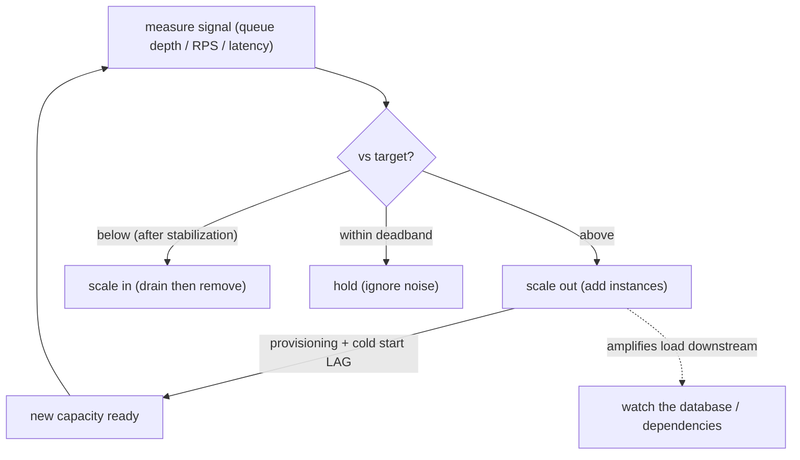

## Thesis

Automatically adjusting capacity --- the number of instances (or their size) --- to match load, so the system has enough to serve demand without over-provisioning for the idle case; the core is a feedback loop (measure a signal, compare it to a target, add/remove instances), and the hard parts are choosing the right signal (CPU is often the wrong one; queue depth / request rate / latency are often better), reacting fast enough without flapping (cooldowns, the scale-up-lag and cold-start problems), and knowing that autoscaling handles *variable* load on a *horizontally-scalable* system --- it can't fix a single bottleneck or an under-provisioned floor.

## Sub

**Why: load varies, so static capacity wastes money or drops requests** -> **the feedback loop (signal -> target -> add/remove instances)** -> **the signal choice and the hard parts (metric, flapping, scale-up lag, predictive, scale-to-zero)** -> **zoom out** to what autoscaling can't fix and the pivots an interviewer rides from "just autoscale it" into the control loop, the metric choice, and reactive-vs-predictive.

## Spine

- Load is **variable**, so static capacity is wrong both ways --- provision for peak and you **waste money** most of the time; provision for average and you **drop requests / add latency** at peak; **autoscaling** adjusts the instance count (or size) to track demand, giving capacity when needed and savings when idle.
- Autoscaling is a **feedback loop** --- measure a **signal** (CPU, request rate, queue depth, latency), compare it to a **target**, and add instances when above / remove when below (Kubernetes HPA: `desired = ceil(current * currentMetric / targetMetric)`); the loop's behavior depends entirely on the signal and the thresholds.
- **Choosing the right signal is the crux** --- CPU utilization is the default but often **misleading** (an I/O-bound or queue-draining service can be saturated without high CPU); the signal should reflect *actual demand/saturation* --- **request rate** or **concurrency** for web services, **queue depth / lag** for workers (scale by backlog), **p99 latency** as a saturation signal --- so a **custom metric** is frequently far better than CPU.
- Autoscaling has **inherent lag, stability challenges, and limits** --- scaling up isn't instant (provisioning + **cold start**), so you can't react to a sudden spike with zero lag; you must damp oscillation (**cooldowns / stabilization windows**) to avoid **flapping**; and it handles *variable* load on a *horizontally-scalable* tier --- it can't fix a service that doesn't scale horizontally (a single bottleneck, a maxed-out database) or one that's simply under-provisioned at its floor.

## Companion Notes

### walk

Tracking load with a feedback loop

A service whose load varies over time --- why static capacity wastes money or drops requests, how a measure-compare-scale feedback loop tracks demand, why the *signal* you scale on (not just CPU) is the crux, and why scale-up lag, flapping, and non-scalable bottlenecks limit what autoscaling can do.

Say the framing first --- "autoscaling is a feedback loop, and its quality is the signal you feed it." CPU is the lazy default; queue depth, request rate, or latency usually reflect real saturation better, and everything else (lag, flapping, limits) follows from it being a control loop with delay.

### drill

Probe Drill

Graded follow-ups on the control loop, the metric choice, scale-up lag / cold starts, and what autoscaling can't fix --- the ones that separate "turn on autoscaling" from designing a stable loop on the right signal that doesn't overwhelm downstream or oscillate.

Name the loop and its crux: measure a signal, compare to a target, add/remove instances -- and the signal must reflect real saturation (queue depth / RPS / latency, often not CPU); scale-up has lag (cold start), so keep headroom and damp flapping, and it can't fix a non-scalable bottleneck.

## Drill

SDE2 | the loop, the metric, and the bounds
SDE3 | the formula, lag, and stability
Staff | what it can't fix, layers, and downstream

### SDE2 | what autoscaling is

What is autoscaling and why do you need it?

Autoscaling is **automatically adjusting the amount of capacity** (typically the number of running instances) to match current load. You need it because **load varies** --- over the day, the week, with traffic spikes, or with a job backlog --- and static capacity is wrong both ways: if you provision for the **peak**, you're paying for lots of idle capacity most of the time (**wasteful**); if you provision for the **average**, you **drop requests or add latency** when load exceeds it (**under-capacity at peak**). Autoscaling resolves this by adding instances when load rises (so you have enough to serve demand) and removing them when load falls (so you're not paying for idle capacity) --- tracking demand instead of guessing a fixed number. The value is both **reliability** (enough capacity under load) and **cost efficiency** (not over-provisioning for the idle case). It's a foundational cloud/platform capability precisely because elastic, pay-for-what-you-use infrastructure makes "match capacity to load" both possible and economically important.

### SDE2 | horizontal vs vertical scaling

What's the difference between horizontal and vertical scaling, and which does autoscaling usually mean?

**Horizontal scaling (scale out/in)** = changing the **number of instances** (add/remove replicas). **Vertical scaling (scale up/down)** = changing the **size of an instance** (more/less CPU/memory on the same node). Autoscaling usually means **horizontal** --- adding and removing identical stateless instances behind a load balancer --- because it's the model that scales (near-limitless: keep adding instances), provides fault tolerance (many instances, lose one and others carry on), and can be done live without downtime (spin up a new instance, no need to restart an existing one). Vertical scaling has hard limits (a single machine only gets so big), usually requires a restart/migration to resize (disruptive), and doesn't add redundancy. There *are* vertical autoscalers (e.g. Kubernetes VPA, which right-sizes a pod's resource requests), useful for tuning per-instance resources, but the classic "autoscaling" for handling variable load is horizontal: scale the replica count out and in. This is why autoscaling assumes a **horizontally-scalable, mostly-stateless** service --- if the workload can't be spread across more instances, horizontal autoscaling can't help it.

### SDE2 | the feedback loop

What's the basic mechanism of autoscaling?

A **feedback loop**: **measure** a signal, **compare** it to a target, and **act** (add or remove instances), repeating continuously. Concretely: the autoscaler periodically reads a metric (say, average CPU across instances, or requests-per-second, or queue depth), checks it against a configured **target** (e.g. "keep CPU at 70%"), and if the metric is above target it **scales out** (adds instances to bring the per-instance load back down toward target), or if below target it **scales in** (removes instances). Then it re-measures and repeats. This is a classic **control loop** --- it's continuously steering the instance count so the observed signal stays near the setpoint, the way a thermostat adds/removes heat to hold a temperature. Everything about autoscaling's behavior (how well it tracks load, whether it oscillates, how fast it responds) comes from this loop: the **signal** you measure, the **target** you aim for, and the **thresholds/timing** of the act step. Getting autoscaling right is mostly about tuning that loop, and getting it wrong (bad signal, aggressive thresholds) makes the loop misbehave.

### SDE2 | what metric to scale on

What metric do you scale on, and why isn't CPU always enough?

The default and most common is **CPU utilization** (scale to keep average CPU at a target), and it's fine when the workload is genuinely **CPU-bound**. But CPU is often **not the right signal** because many services are **not CPU-bound** --- an I/O-bound web service can be saturated (all its connections/threads busy waiting on a database) while CPU is low, so a CPU-based autoscaler wouldn't add capacity even though the service is struggling. Better signals reflect **actual demand or saturation**: **request rate / requests-per-second** or **concurrency (in-flight requests)** for web services (directly proportional to load), **queue depth or consumer lag** for worker/queue systems (the backlog is the real signal --- scale workers by how much work is waiting), and **latency (p99)** as a saturation indicator (rising latency means you're overloaded). Often the best is a **custom metric** specific to the workload (queue length, active connections, business throughput). So the senior instinct is: don't just scale on CPU by default --- ask "what signal actually reflects this service being under load?", which is frequently a custom metric, not CPU. Scaling on the wrong metric means the autoscaler either doesn't react when it should or reacts to the wrong thing.

### SDE2 | min and max instances

What are min and max instance settings for, and why do they matter?

They're the **floor and ceiling** on the instance count. **Min instances** is the fewest the autoscaler will run (even at zero load) --- it ensures a **baseline capacity** so the service is always available and can absorb a sudden spike without starting from nothing (and, for latency-sensitive services, avoids the cold-start delay of scaling up from zero). **Max instances** is the most it will run --- a **safety ceiling** that caps cost (so a traffic surge or a runaway loop doesn't scale you to a huge, expensive fleet) and, importantly, protects **downstream systems** (so you don't scale the app tier so high it overwhelms the database or a rate-limited dependency). They matter because they bound the autoscaler's behavior: without a sensible min, you risk being caught with too little capacity when a spike hits (and cold-start lag); without a max, an anomaly could scale you to a runaway cost or crush a downstream dependency. Setting them is part of the design: min high enough for baseline availability and spike headroom, max high enough to handle real peaks but low enough to cap cost and protect what's downstream.

### SDE2 | an example

Give a concrete example of autoscaling.

**Web tier on request rate**: an API service behind a load balancer, autoscaled to keep each instance at ~70% CPU (or a target requests-per-second) --- morning traffic ramps up, the autoscaler adds instances; overnight traffic drops, it removes them; you pay for roughly what you use while always having enough for current load. **Worker tier on queue depth** (a very common and cleaner case): a pool of background workers consuming a job queue, autoscaled on the **queue length / backlog** --- when jobs pile up (a burst of work), the autoscaler adds workers to drain the backlog faster; when the queue is empty, it scales workers down (even to zero). This queue-depth-driven autoscaling (e.g. KEDA scaling workers by queue length, or a serverless consumer) is a clean example because the signal (backlog) directly reflects the work to be done, so the loop is intuitive: more backlog -> more workers -> backlog drains -> scale down. Both illustrate the pattern --- a signal proportional to load drives the instance count --- and the worker/queue case especially shows why a **custom metric** (queue depth) is often better than CPU.

### SDE2 | reactive scaling

What is reactive autoscaling?

Scaling in **response to current, observed load** --- the autoscaler watches the metric *right now* and reacts (scales out because CPU/queue/latency is high right now, scales in because it's low). This is the default and simplest mode: it doesn't predict or anticipate; it just continuously corrects toward the target based on what's happening. Its strength is that it needs no forecasting and handles *any* load pattern (it responds to whatever actually occurs, expected or not). Its weakness is **lag**: because it only reacts *after* load has already risen, and because adding instances takes time (provisioning + startup), there's a delay before new capacity is ready --- so for a **sudden sharp spike**, reactive scaling is always a step behind (load spikes, then the autoscaler notices, then it adds instances, then they become ready --- during which the existing instances are overloaded). That lag is the fundamental limitation that motivates **predictive/scheduled** scaling (scaling *ahead* of anticipated load) and keeping **headroom** (min instances / a lower target) so the existing fleet can absorb a spike while new capacity spins up. But reactive is the baseline every autoscaler does, and for gradual load changes it works well.

### SDE3 | the HPA formula

How does a target-tracking autoscaler compute the desired instance count?

By the ratio of current-to-target metric. The Kubernetes HPA formula is `desiredReplicas = ceil(currentReplicas * (currentMetricValue / targetMetricValue))`. So if you're running 10 replicas at 90% average CPU with a target of 60%, desired = ceil(10 * 90/60) = ceil(15) = **15** replicas (scale out to bring per-replica CPU back toward 60%); if CPU were 30%, desired = ceil(10 * 30/60) = **5** (scale in). The intuition: the metric is (roughly) inversely proportional to replica count (double the replicas, halve the per-replica load), so to move the metric from its current value to the target you scale the replica count by `current/target`. This is **target-tracking / proportional** control --- the further the metric is from target, the bigger the adjustment. Real implementations add refinements: a **tolerance** (don't act on tiny deviations, e.g. within 10% of target, to avoid thrashing on noise), **stabilization windows** (especially on scale-down, use the recent max desired to avoid rapidly removing then re-adding), and rate limits (don't scale by more than X% or Y pods per interval). But the core is that simple ratio: desired = current * (metric / target), clamped to [min, max]. Knowing this formula lets you reason precisely about how many instances a given load will produce and why.

### SDE3 | why CPU is often the wrong metric

Why is CPU frequently a poor autoscaling metric, and what do you use instead?

Because CPU only reflects load for **CPU-bound** workloads, and many services are bounded by something else, so CPU **under- or mis-represents saturation**. Cases where CPU misleads: an **I/O-bound** service (waiting on a database or external API) can have all its worker threads/connections busy --- fully saturated, adding latency --- while CPU sits at 30% (the threads are *waiting*, not computing), so a CPU autoscaler wouldn't scale up despite the service being overwhelmed. A **memory-bound** or **connection-bound** service similarly saturates without high CPU. And CPU can be **high but fine** (a batch that's supposed to use CPU) or **spiky/noisy** (GC, background tasks) causing false scaling. The better signals target the *actual* constraint: **requests-per-second / concurrency** (in-flight requests) for web services --- directly proportional to demand and independent of what the request is bound by; **queue depth / consumer lag** for workers --- the backlog is exactly the work pressure; **p99 latency** --- rising latency is the ground-truth saturation signal regardless of the resource; or a **domain-specific custom metric** (active connections, sessions, business events per second). Modern autoscalers support custom and external metrics precisely so you can scale on the *right* signal (e.g. Kubernetes custom/external metrics, KEDA scalers for queue length). The staff-adjacent point: the metric is the most important autoscaling decision, and "scale on CPU because it's the default" is a common mistake for non-CPU-bound services --- you should scale on whatever reflects *this* service being under load, which is often not CPU.

### SDE3 | scale-up lag and cold starts

Why isn't scaling up instant, and what are the consequences?

Because adding an instance takes **real time** --- there's a **provisioning delay** (allocate a VM/container, pull the image, attach to the network/load balancer) and a **startup / cold-start delay** (the app initializes: load config, warm caches, establish DB connection pools, JIT-warm, etc.) before the new instance can actually serve traffic effectively. This can be seconds (a warm container) to minutes (a new VM, or a heavy app with slow startup), and for serverless a **cold start** is the latency of spinning up a new execution environment for the first request. The consequences: (1) **you're always a step behind a sudden spike** --- load surges *now*, the autoscaler adds instances, but there's a window (the provisioning+startup time) where the *existing* instances must absorb the surge overloaded, so latency spikes or requests drop until the new capacity is ready. (2) You must keep **headroom** (a lower target utilization, or a higher min) so the running fleet can ride out a spike during that lag. (3) New instances hitting **cold caches / empty connection pools** may be slow or even *increase* load initially (thundering-herd cache-fill, connection-establishment storms). So scale-up lag is why reactive autoscaling can't perfectly handle sharp spikes, why you provision buffer, why you optimize startup time (faster boot, pre-warmed images, provisioned concurrency for serverless), and why predictive/pre-scaling exists (add capacity *before* the anticipated spike so it's ready in time).

### SDE3 | flapping and how to damp it

What is flapping / oscillation in autoscaling, and how do you prevent it?

**Flapping** is the autoscaler rapidly scaling **up and down repeatedly** (add instances, then immediately remove them, then add again), thrashing the fleet. It happens when the loop is too **sensitive/aggressive** relative to noisy metrics or the load sits right at a threshold: e.g. a brief CPU spike triggers scale-up, the extra instances drop CPU below target so it scales down, load nudges CPU back up so it scales up again --- oscillation. It's harmful: constant churn wastes resources, every scale-up incurs cold-start cost and load, and scale-downs may kill instances handling in-flight work. Damping techniques: (1) **Stabilization windows / cooldowns** --- after a scaling action, wait before scaling again (a period where the autoscaler holds), and especially on **scale-down** consider the *maximum* desired over a recent window (so a momentary dip doesn't prematurely remove instances that will be needed again) --- Kubernetes HPA has a scale-down stabilization window for exactly this. (2) **Tolerance / deadband** --- don't act on small deviations (e.g. ignore if within 10% of target), so metric noise doesn't trigger scaling. (3) **Asymmetric behavior** --- scale **up fast** (respond quickly to load, err toward capacity) but scale **down slow** (remove instances cautiously, so you don't yank capacity you'll need moments later) --- hysteresis. (4) **Smoothing the metric** (average over a window rather than instantaneous). The unifying idea is to add **damping and hysteresis** so the loop responds to sustained trends, not transient noise --- the classic control-theory fix for an oscillating feedback loop. "Scale up eagerly, scale down conservatively, and ignore noise" is the practical rule.

### SDE3 | scale-to-zero

What is scale-to-zero, and what's the trade?

**Scale-to-zero** is scaling the instance count all the way down to **zero** when there's no load, and back up when a request arrives --- so you run (and pay for) **nothing** during idle periods. It's a hallmark of **serverless** (AWS Lambda scales to zero between invocations) and event-driven autoscalers (KEDA can scale a deployment to zero when a queue is empty, then back up when messages appear). The benefit is maximum **cost efficiency** for **spiky or intermittent** workloads --- a service used occasionally, or a worker for a queue that's often empty, costs nothing when idle instead of paying for an always-on minimum. The **trade** is the **cold-start latency** on the first request after scaling to zero: with nothing running, the *very next* request must wait for an instance to be provisioned and started (the full cold-start delay) --- so scale-to-zero adds latency exactly when traffic resumes. This makes it great for **latency-tolerant, bursty, or infrequent** workloads (batch jobs, dev environments, low-traffic endpoints, queue workers) but poor for **latency-critical** services that can't tolerate a cold start on a resumed request (for those you keep a warm minimum, i.e. min-instances >= 1, or use provisioned concurrency). So scale-to-zero is the extreme of cost optimization --- pay nothing when idle --- bought at the price of cold-start latency on wake, and you enable it only where that latency is acceptable.

### SDE3 | predictive and scheduled scaling

What are predictive and scheduled scaling, and when do you use them over reactive?

They **anticipate** load and scale **ahead of it**, rather than reacting after it arrives. **Scheduled scaling**: scale based on **known time patterns** --- e.g. scale up every weekday at 8am (before the morning rush), scale down at night, add capacity before a known event (a sale, a product launch, a batch window). You pre-configure capacity changes on a schedule because you *know* the pattern. **Predictive scaling**: use **historical patterns / forecasting** (often ML-based, like AWS Predictive Scaling) to forecast upcoming load and provision *in advance* so capacity is ready when the load hits. You use these over pure reactive scaling to defeat **scale-up lag**: because provisioning takes time, reactive scaling is a step behind a sharp or predictable ramp, so if you *know* (schedule) or can *forecast* (predictive) the load, you add capacity *before* it arrives and it's ready in time --- avoiding the overload window that reactive scaling suffers during the spike. The common pattern is to **combine** them: predictive/scheduled sets a smart baseline that anticipates known/forecastable demand, and reactive scaling handles the *unexpected* deviations on top (a spike the forecast missed). So: reactive for unpredictable load and as the safety net; scheduled for known recurring patterns; predictive for forecastable trends --- and layering them gives capacity that's both ahead of predictable load and responsive to surprises.

### SDE3 | scaling down safely

How do you scale down without disrupting in-flight work?

By **removing instances gracefully** rather than killing them abruptly. The hazard: when the autoscaler decides to scale in, it terminates instances --- and if an instance is **serving in-flight requests** or **processing jobs**, a hard kill drops those requests / loses that work. The safe-shutdown pattern: (1) **Stop sending new work** to the instance first --- deregister it from the load balancer (so no new requests route to it) or stop it from picking up new queue jobs. (2) **Connection draining / graceful termination** --- let it **finish** its in-flight requests/jobs (wait for active connections to complete, up to a timeout) before actually terminating. In Kubernetes this is the pod termination lifecycle: the pod is removed from the Service endpoints, receives SIGTERM, and gets a **grace period** (`terminationGracePeriodSeconds`) to finish and shut down cleanly (often with a `preStop` hook to drain), before SIGKILL. (3) **For workers**, finish (or safely re-queue) the current job and don't grab new ones, so no job is lost mid-processing. (4) **Choose *which* instance to remove** sensibly (prefer idle/least-loaded ones). The principle is that scale-in must be **drain-then-terminate**, not kill-in-place --- so in-flight requests complete and jobs aren't lost. Forgetting this (letting the autoscaler hard-kill busy instances) causes user-facing errors and lost work on every scale-down, which is a common and avoidable autoscaling bug.

### Staff | reactive vs predictive vs scheduled

Compare reactive, predictive, and scheduled scaling as a strategy --- when each, and how to combine them.

They sit on a spectrum of **anticipation**, and a mature setup **layers** them. **Reactive** (respond to current load): handles *any* pattern including the unpredictable, needs no forecast --- but is always a **step behind** due to scale-up lag, so it's poor for sharp spikes and you must carry headroom. It's the essential safety net (whatever actually happens, it responds). **Scheduled** (scale on known time patterns): perfect when load is **predictable by clock/calendar** (business-hours ramp, nightly batch, a launch event) --- you pre-provision so capacity is ready, defeating scale-up lag for known patterns; but it's blind to deviations from the schedule (a spike at an unusual time, or an unexpectedly quiet day wasting the scheduled capacity). **Predictive** (forecast from history): handles **forecastable but not clock-exact** trends (ML-predicted demand curves), provisioning ahead so capacity is ready --- but it's only as good as the forecast (a novel pattern the model hasn't seen is missed) and adds complexity. The **combination** is the real answer: use **predictive/scheduled to set an anticipatory baseline** (capacity ahead of known/forecastable demand, so you're not fighting scale-up lag for the predictable part) and **reactive on top** to catch the **unexpected** (a spike the forecast missed, an incident) --- reactive is the floor of last resort that ensures you respond to *whatever* occurs. The staff framing: don't treat it as either/or --- reactive alone is always behind on spikes (so it over-provisions headroom or drops requests), pure scheduled/predictive alone is brittle to surprises, but **anticipatory baseline + reactive correction** gives you capacity that's both ahead of predictable load and responsive to surprises, which is how large systems handle both daily patterns and unexpected surges cost-effectively.

### Staff | what autoscaling can't fix

What problems does autoscaling *not* solve --- and what's the "scaling the wrong tier" trap?

Autoscaling handles **variable load on a horizontally-scalable, mostly-stateless tier** --- and it **can't** fix several things people expect it to. (1) A **non-horizontally-scalable bottleneck**: if the real constraint is a component that *doesn't* scale by adding instances --- a single-writer database, a shared cache at capacity, a stateful service, a leader that must be singular --- then autoscaling the *stateless* tier in front of it does nothing except pile more load onto the unscalable bottleneck (often making it *worse*). (2) The **"scaling the wrong tier" trap**: your web tier autoscales beautifully on CPU/RPS, but the actual bottleneck is the **database** (it's maxed on connections or IOPS) --- so as the autoscaler adds web instances, each opens more DB connections and the database falls over faster; you scaled the tier that *wasn't* the constraint, and amplified load on the one that was. The fix requires addressing the *actual* bottleneck (read replicas, sharding, a connection pooler, caching), not scaling the stateless tier harder. (3) An **under-provisioned floor**: if `min instances` (or the baseline) is set too low, you start every spike from too little capacity and the scale-up lag means you're overloaded before new instances arrive --- autoscaling doesn't help if the *floor* is wrong. (4) **Downstream limits**: scaling up can hit a **rate-limited external API** or a **fixed-capacity dependency** that can't scale with you. (5) **Fundamentally too much load**: autoscaling within your max still can't serve load beyond what the whole system (including its unscalable parts) can handle --- at some point you need architectural change, not more instances. The staff insight: autoscaling is a tool for **elastic, stateless, horizontally-scalable** capacity following *variable* demand --- so before "just autoscale it," identify the **actual bottleneck** (which is often *not* the tier you'd autoscale), because scaling the wrong tier wastes money and can accelerate the failure of the real constraint.

### Staff | cluster vs pod autoscaling

In Kubernetes, how do pod autoscaling and cluster (node) autoscaling interact?

They're **two layers** that must work together: the **Horizontal Pod Autoscaler (HPA)** scales the number of **pods** (application instances) based on metrics, and the **Cluster Autoscaler** scales the number of **nodes** (the underlying VMs) in the cluster based on whether pods can be scheduled. The interaction: when the HPA scales *up* pods and there **isn't enough node capacity** to schedule the new pods (they go `Pending` for lack of CPU/memory), the Cluster Autoscaler notices the unschedulable pods and **adds nodes**; once nodes are available, the pending pods schedule. Conversely, when the HPA scales *down* pods and nodes become underutilized, the Cluster Autoscaler **removes** nodes (after draining them) to save cost. So there are effectively two feedback loops stacked: HPA (load -> pod count) and Cluster Autoscaler (pod scheduling pressure -> node count). The **implications**: (1) **compounded lag** --- if scale-up needs *both* new pods *and* new nodes, the total time is pod-scheduling *plus* node-provisioning (nodes take minutes to join), so a spike that requires new nodes is even slower to absorb (mitigated by keeping some spare node headroom, or over-provisioning with low-priority "pause" pods that get evicted to make room fast). (2) You must **size nodes and pod requests** so they bin-pack well (pods' resource requests determine how many fit per node, which drives node scaling). (3) **VPA** (vertical pod autoscaler, right-sizing pod requests) interacts too --- and HPA+VPA on the same resource metric can conflict. The staff point: real Kubernetes autoscaling is a **layered system** (pods on nodes), so you reason about *both* loops and their combined lag, and "autoscaling is slow to handle the spike" is often because it needs new *nodes*, not just new pods --- which is why node-level headroom / over-provisioning matters for fast response.

### Staff | autoscaling and downstream dependencies

How can autoscaling harm downstream systems, and how do you guard against it?

Autoscaling **amplifies the load the scaled tier puts on its dependencies**, which can **overwhelm** them --- a subtle and dangerous failure. The mechanism: your app tier scales out to handle a surge, and now there are, say, 5x more app instances --- each of which opens connections to the **database**, calls **downstream services**, and hits **external APIs**. So 5x app instances can mean ~5x the database connections (exhausting its connection limit / connection-pooler), 5x the calls to a **rate-limited** third-party API (hitting the limit, getting throttled), or 5x load on a **downstream service** that *didn't* autoscale in lockstep --- and the very act of scaling up to survive the surge can **push the bottleneck downstream** and take *that* down (or trigger throttling/errors that cascade back). Worse, if the downstream is what's actually slow, scaling up the upstream **adds retries and connections that make the downstream *more* overloaded** (a positive-feedback overload). Guards: (1) **Cap max instances** with the downstream's capacity in mind (don't let the app tier scale beyond what the DB/dependency can serve). (2) **Connection pooling / a shared pooler** (e.g. PgBouncer) so pod count doesn't linearly multiply raw DB connections. (3) **Rate limiting / concurrency limits toward downstream** (bound the calls each instance makes, and in aggregate, so scaling up doesn't blow a downstream rate limit). (4) **Scale the downstream too** (or ensure it can handle the upstream's max) --- autoscaling a tier in isolation is dangerous if its dependencies can't keep up. (5) **Circuit breakers / backpressure** so an overwhelmed downstream pushes back rather than being hammered harder. The staff insight: autoscaling isn't free capacity --- it changes the load profile on *everything the tier depends on*, so you must reason about the **whole dependency chain** (especially the database and rate-limited APIs) and bound/scale it accordingly; "scale the app tier" without considering what that does to the database is a classic way to convert a surge into a full outage.

### Staff | autoscaling as a control loop

Framed as control theory, why do autoscalers oscillate or lag, and how does that inform tuning?

An autoscaler is a **feedback control loop**, and its pathologies are the classic ones of control systems with **gain**, **delay**, and **noise**. **Lag (dead time)**: there's a delay between acting (adding instances) and the effect (the metric responding) --- provisioning + cold start. A control loop with significant dead time that reacts aggressively will **overshoot and oscillate** (it keeps acting because it hasn't seen the effect yet, then over-corrects) --- this is exactly why aggressive scaling on a metric that responds slowly causes flapping. **Gain**: how strongly you react to error (the proportional `current/target` ratio) --- too high a gain (over-reacting to small deviations) amplifies noise into oscillation; too low and it responds sluggishly. **Noise**: metrics are noisy (GC spikes, bursty traffic), and a high-gain loop treats noise as signal and thrashes. The tuning implications follow directly: (1) **Damping/hysteresis** (cooldowns, scale-down stabilization, asymmetric up-fast/down-slow) to stop overshoot from the dead time --- respond to sustained trends, not transients. (2) **A deadband/tolerance** so noise within a band doesn't trigger action (filter the noise). (3) **Smoothing** the metric (average over a window) to reduce noise-driven gain. (4) **Headroom via target utilization** --- you deliberately run below saturation (target 60-70%, not 95%) so the loop has slack to absorb load *during* its response lag (the dead time), rather than saturating before new capacity arrives; running the target too high is like a control system with no margin --- any disturbance overshoots into overload. So the control-theory lens explains *why* the practical rules exist: keep utilization target below saturation (margin for dead time), damp and add hysteresis (tame overshoot/oscillation from lag), and filter noise (don't let it drive the loop). The staff framing: "autoscaling is flapping" or "autoscaling can't keep up with spikes" are control-loop symptoms of gain-vs-delay-vs-noise, and the fixes (target headroom, stabilization windows, asymmetric scaling, metric smoothing) are the control-systems response to exactly those problems.

### Staff | cost-vs-latency right-sizing

How does autoscaling trade cost against latency/reliability, and how do you right-size it?

Autoscaling is fundamentally a **cost-vs-headroom** optimization, and the trade is set by your **target utilization**, **min instances**, and how aggressively you scale. Running **lean** (high target utilization, low min, scale-to-zero) **minimizes cost** --- you pay for little idle capacity --- but leaves **little headroom**, so during the **scale-up lag** of a spike (or the loss of an instance), the running fleet is near saturation and you get **latency spikes or dropped requests** before new capacity arrives; scale-to-zero adds cold-start latency on wake. Running with **buffer** (lower target utilization, e.g. 50-60%; a higher min; some spare capacity) **protects latency/reliability** --- the fleet can absorb spikes during the response lag --- but **costs more** (you're paying for headroom that's often unused). Right-sizing is choosing where on this trade to sit **per workload's requirements**: a **latency-critical, spiky** service warrants more headroom (lower target, higher min, no scale-to-zero, maybe pre-scaling) --- the cost of buffer is worth avoiding user-facing latency; a **latency-tolerant, cost-sensitive** or **batch/async** workload can run lean (high target, scale-to-zero, cheap) because a cold start or brief saturation is acceptable. Key inputs to the sizing: the **scale-up lag** (longer lag -> more headroom needed, since you must ride out a bigger window), the **spikiness** of the load (spikier -> more buffer or predictive scaling), the **cost of a dropped/slow request** vs the **cost of idle capacity**, and the **blast radius** of losing an instance (need enough others to absorb it). The staff framing: autoscaling doesn't eliminate the capacity-vs-cost trade --- it *automates* it, but *you* still choose the operating point via target utilization and min/headroom, balancing "pay for idle buffer" against "risk latency/drops during scale-up lag," per the workload's latency SLO and load profile. The common mistake is running too lean on a latency-critical spiky service (saving a little money, paying in spike-time latency) or too rich on a batch workload (wasting money on headroom nobody needs).

### Staff | real-world failure modes

What real-world failure modes bite autoscaling?

Several, mostly around lag, the metric, stability, and downstream. **Can't scale fast enough for the spike** --- scale-up lag (provisioning + cold start, plus node-provisioning if new nodes are needed) means a sharp spike overloads the existing fleet before new capacity is ready (fixed by headroom, faster startup, pre-scaling/predictive). **Cold-start storms / thundering herd on scale-up** --- new instances hit cold caches and empty connection pools, so they're slow and can *increase* load initially (cache-fill stampede, connection-establishment burst), sometimes making the surge worse right when you scale (mitigated by warmup, staggered rollout, cache pre-warming). **Scaling on a lagging or wrong metric** --- CPU when the service is I/O-bound (never scales despite saturation), or a metric that responds slowly, so the autoscaler reacts late or not at all (fixed by scaling on the right saturation signal: queue depth / RPS / latency). **Flapping / oscillation** --- aggressive thresholds + noisy metrics cause thrash (fixed by stabilization windows, deadband, asymmetric scaling). **Downstream overload** --- scaling the app tier multiplies DB connections / downstream calls / API-rate-limit usage and takes the dependency down (fixed by max caps, connection pooling, downstream rate limits, scaling the dependency too). **Scale-down killing in-flight work** --- hard-terminating busy instances drops requests / loses jobs (fixed by drain-then-terminate, graceful shutdown, grace periods). **Metric feedback loops** --- scaling changes the very metric you scale on in a way that misleads (e.g. adding instances drops per-instance latency, triggering scale-down, then latency rises again --- oscillation), or an autoscaler reacting to a metric that *another* system also affects. **Runaway scale-up from a bug** --- a runaway loop or a metric spike (or a metric *source* failure read as "infinite load") scales you to the max, burning cost (why a sane max and anomaly alerts matter). **Scale-to-zero cold starts** on latency-critical paths --- the first request after idle eats the full cold start (keep a warm min for those). **Insufficient min / wrong floor** --- starting spikes from too little capacity. The staff summary: the recurring themes are (1) **lag** (scale-up isn't instant, so spikes overrun you without headroom/pre-scaling), (2) **the metric** (scaling on the wrong signal, or a signal the scaling itself distorts), (3) **stability** (flapping from an under-damped loop), and (4) **downstream/whole-system** effects (scaling one tier overwhelms its dependencies) --- and each is why autoscaling is a *tuned control loop on the right signal with headroom and downstream awareness*, not a "turn it on and forget it" switch.

## Walk

### Load varies, so static capacity is wrong both ways

```flow
peak[provision for peak: wasted idle capacity] -> avg[provision for average: dropped requests at peak] -> auto[autoscale: track demand up and down]
```

Start with why autoscaling exists. Load isn't constant --- it varies by time of day, by week, with spikes, with backlog. A **fixed** capacity is wrong in both directions: size for the **peak** and you pay for idle capacity most of the time; size for the **average** and you drop requests or add latency whenever load exceeds it.

**Autoscaling** resolves this by adjusting the instance count to **track demand** --- adding instances as load rises (enough capacity to serve), removing them as load falls (not paying for idle). You get both **reliability** (capacity under load) and **cost efficiency** (no over-provisioning for idle). It assumes a **horizontally-scalable, mostly-stateless** tier --- you scale by adding identical replicas behind a load balancer.

### The feedback loop: measure, compare, scale

```flow
measure[measure a signal] -> compare[compare to a target] -> act[above -> add instances, below -> remove]
```

Autoscaling is a **feedback control loop**, like a thermostat: measure a signal, compare it to a target setpoint, and act to steer the signal back toward the target --- continuously. Above target -> scale out (more instances -> per-instance load drops toward target); below target -> scale in.

```python
import math

def desired_replicas(current, metric, target, min_r, max_r):
    # Kubernetes HPA core: desired = current * (metric / target)
    raw = math.ceil(current * (metric / target))
    return max(min_r, min(max_r, raw))            # clamp to [min, max]

def scale_decision(now, metric, target, current, state):
    # tolerance: ignore small deviations so metric NOISE doesn't cause thrashing
    if abs(metric - target) / target < 0.10:
        return current                             # within deadband -> hold
    want = desired_replicas(current, metric, target, state.min_r, state.max_r)
    if want > current:
        return want                               # scale UP fast (respond to load)
    # scale DOWN slow: only after a stabilization window, using the recent MAX desired
    state.downscale_history.append((now, want))
    stable_want = max(w for t, w in state.downscale_history if now - t < state.cooldown_s)
    return stable_want                            # damp flapping / hysteresis
```

Everything about the loop's behavior --- how well it tracks load, whether it oscillates, how fast it responds --- comes from three things: the **signal** you measure, the **target** you aim for, and the **timing/thresholds** of the act step. Tuning autoscaling is tuning that loop.

### Choose the right signal --- often not CPU

```flow
cpu[CPU: fine only if CPU-bound] -> mislead[I/O-bound service saturates at low CPU] -> better[scale on queue depth / RPS / p99 latency]
```

The single most important autoscaling decision is **what signal you scale on**. **CPU** is the default and is fine for genuinely **CPU-bound** work --- but it **misleads** for the many services bounded by something else: an **I/O-bound** service can have every thread/connection busy waiting on a database (fully saturated, adding latency) while CPU sits at 30%, so a CPU autoscaler *won't add capacity* despite the service drowning.

Better signals reflect **actual saturation**: **request rate / concurrency** for web services (proportional to demand), **queue depth / consumer lag** for workers (the backlog *is* the work pressure --- scale workers by how much is waiting, e.g. KEDA scaling on queue length), and **p99 latency** as a ground-truth saturation indicator. So the instinct is to ask "what signal actually reflects *this* service being under load?" --- frequently a **custom metric**, not CPU. Scaling on the wrong metric means the autoscaler doesn't react when it should.

### Lag, flapping, and what autoscaling can't fix

```flow
lag[scale-up lag + cold start: a step behind a spike] -> damp[cooldowns + up-fast/down-slow: avoid flapping] -> limit[cannot fix a non-scalable bottleneck or a maxed downstream]
```

Three realities bound autoscaling. **Scale-up lag**: adding an instance takes time (provisioning + **cold start**), so you're always a step behind a *sudden* spike --- the existing fleet absorbs the surge overloaded until new capacity is ready, which is why you keep **headroom** (lower target, higher min) and why predictive/scheduled scaling exists (add capacity *before* anticipated load). **Flapping**: an under-damped loop on a noisy metric thrashes up-and-down --- damp it with **cooldowns / stabilization windows**, a **deadband** (ignore small deviations), and **asymmetry** (scale up fast, down slow).

**Limits**: autoscaling handles *variable* load on a *horizontally-scalable* tier --- it **can't** fix a non-horizontally-scalable **bottleneck** (a single-writer DB, a stateful service), and worse, scaling the *wrong* tier (add web instances when the **database** is the constraint) just **amplifies load downstream** (more instances -> more DB connections -> the database falls over faster). Zooming out: autoscaling is a **tuned control loop** (gain/lag/noise --- hence target headroom below saturation, damping, and metric smoothing), it's a **layered** system in Kubernetes (pods *and* nodes, with compounded lag), and it must be **downstream-aware** (cap max, pool connections, rate-limit toward dependencies, scale the DB too). It automates the capacity-vs-cost trade --- but *you* still pick the operating point (target utilization, min/headroom) per the workload's latency SLO, and you must identify the **actual bottleneck** before "just autoscale it."

### Model Script

- Frame the why | "Autoscaling exists because load varies, and static capacity is wrong both ways: size for the peak and you pay for idle capacity most of the time; size for the average and you drop requests or add latency at peak. Autoscaling adjusts the instance count to track demand -- add instances as load rises, remove them as it falls -- so you get both reliability, enough capacity under load, and cost efficiency, no over-provisioning for idle. It assumes a horizontally-scalable, mostly-stateless tier you scale by adding replicas behind a load balancer."
- The feedback loop | "Mechanically it's a feedback control loop, like a thermostat: measure a signal, compare it to a target setpoint, and act to steer the signal back toward target, continuously. Above target, scale out -- more instances drop the per-instance load toward target; below target, scale in. The Kubernetes HPA formula is literally desired equals current times metric-over-target, clamped to min and max. And everything about the loop's behavior -- how well it tracks load, whether it oscillates, how fast it responds -- comes from three things: the signal you measure, the target you aim for, and the timing and thresholds of the act step."
- The signal is the crux | "The single most important decision is what signal you scale on. CPU is the default and it's fine if the work is genuinely CPU-bound -- but it misleads for the many services bounded by something else. An I/O-bound service can have every thread and connection busy waiting on a database -- fully saturated, adding latency -- while CPU sits at thirty percent, so a CPU autoscaler won't add capacity even though the service is drowning. Better signals reflect actual saturation: request rate or concurrency for web services, queue depth or consumer lag for workers -- the backlog is the work pressure, so you scale workers by how much is waiting -- and p99 latency as a ground-truth saturation signal. So I always ask: what signal actually reflects this service being under load? It's frequently a custom metric, not CPU."
- Lag, flapping, limits | "Then three realities bound it. Scale-up lag: adding an instance takes time -- provisioning plus cold start -- so you're always a step behind a sudden spike, which is why you keep headroom, a lower target and a higher min, and why predictive or scheduled scaling exists to add capacity before anticipated load. Flapping: an under-damped loop on a noisy metric thrashes up and down, so you damp it -- cooldowns and stabilization windows, a deadband to ignore small deviations, and asymmetry: scale up fast, scale down slow. And limits: autoscaling handles variable load on a horizontally-scalable tier -- it can't fix a non-scalable bottleneck like a single-writer database, and scaling the wrong tier is actively dangerous."
- Interviewer: "You autoscale the web tier on CPU and it works, but under load everything still falls over. What's happening?"
- Wrong tier / downstream | "That's the classic scaling-the-wrong-tier trap. The web tier autoscales fine on CPU, but the actual bottleneck is downstream -- most likely the database, maxed on connections or IOPS. And here's the vicious part: as the autoscaler adds web instances, each one opens more database connections and makes more downstream calls, so scaling up the web tier amplifies load on the database and makes it fall over faster. I scaled the tier that wasn't the constraint and piled load onto the one that was. The fix isn't more web instances -- it's addressing the real bottleneck: read replicas or sharding for the database, a connection pooler like PgBouncer so pod count doesn't linearly multiply raw connections, caching to cut database load, and capping the web tier's max instances with the database's capacity in mind. The general lesson is that autoscaling isn't free capacity -- it changes the load profile on everything the tier depends on, so I have to reason about the whole dependency chain, and identify the actual bottleneck before autoscaling anything."
- Land it | "So autoscaling is a feedback loop -- measure a signal, compare to a target, add or remove instances -- and its quality is the signal you feed it, which for non-CPU-bound services is usually queue depth, request rate, or latency, not CPU. It's bounded by scale-up lag, so you carry headroom and pre-scale for known patterns; you damp the loop to avoid flapping; and it only handles variable load on a horizontally-scalable tier -- it can't fix a single bottleneck, and scaling the wrong tier amplifies load downstream. The one line is that autoscaling automates the capacity-versus-cost trade on the right signal with headroom and downstream awareness -- it's a tuned control loop, not a turn-it-on-and-forget switch."

## Whiteboard

Sketch the control loop and the headroom-for-lag idea.

### Why scale on queue depth or latency instead of CPU?

CPU only reflects load for CPU-bound work; an I/O-bound service saturates (threads waiting on a DB) at low CPU, so a CPU autoscaler won't react. Scale on the signal that reflects real saturation -- queue depth/lag for workers, RPS/concurrency for web, p99 latency as ground truth -- often a custom metric.

### Why keep headroom (target below 100%)?

Because scale-up isn't instant (provisioning + cold start), the running fleet must absorb a spike *during* that lag. A target of 60-70% leaves slack to ride out the response delay; running at 95% saturates before new instances arrive. It's the control-loop margin for dead time.



Verdict: autoscaling is a feedback loop on a saturation signal -- scale up fast (with headroom for the provisioning/cold-start lag), scale down slow (drain first, damp flapping), and stay downstream-aware, because it tracks variable load on a horizontally-scalable tier but can't fix a bottleneck or a maxed dependency.

## System

Zoom out to where autoscaling sits.

### Where it sits

The scaled tier: horizontally-scalable, mostly-stateless instances [*]
The signal: queue depth / RPS / p99 latency (often a custom metric, not CPU)
The loop: measure -> compare to target -> add/remove, with cooldowns + min/max
Layers (k8s): HPA scales pods, Cluster Autoscaler scales nodes (compounded lag)
The limit: variable load only -- not a single bottleneck or a maxed downstream

### Pivots an interviewer rides

From "just autoscale it" they push on the metric, the lag, and the limits.

#### What do you scale on, and why not CPU?

-> the signal that reflects real saturation: queue depth/lag (workers), RPS/concurrency (web), p99 latency
CPU misleads for I/O-bound services (saturated at low CPU), so scale on a custom metric that tracks actual demand -- the metric is the most important autoscaling decision.

#### Why can't it just handle any spike?

-> scale-up lag (provisioning + cold start) means it's a step behind; you carry headroom and pre-scale known patterns
Reactive scaling reacts after load rises, so a sharp spike overloads the fleet until new capacity is ready; predictive/scheduled scaling adds capacity ahead of anticipated load, and it can't fix a non-scalable bottleneck at all.

## Trade-offs

The calls that separate "turn on autoscaling" from a stable, right-sized loop.

### CPU vs a custom saturation metric

- CPU: built-in, simple, no extra plumbing -- but misleads for I/O/memory/connection-bound services (saturated at low CPU), so it under-reacts
- Custom (queue depth / RPS / latency): reflects actual demand and saturation -- but needs a metrics pipeline and per-workload thought

Scale CPU-bound work on CPU; scale everything else on the signal that reflects real load (queue depth/lag for workers, RPS/concurrency or p99 latency for web) -- the metric is the key decision.

### Lean vs headroom (target utilization / min)

- Lean (high target, low min, scale-to-zero): minimal cost -- but little slack, so scale-up lag / an instance loss causes latency spikes or drops (and cold starts on wake)
- Headroom (lower target ~60%, higher min): absorbs spikes during the response lag -- but pays for often-idle capacity

Run lean for latency-tolerant/batch/async workloads; carry headroom (and pre-scale) for latency-critical, spiky services -- size the buffer to the scale-up lag and the cost of a slow/dropped request.

### Reactive vs predictive/scheduled

- Reactive: handles any pattern, no forecast needed -- but always a step behind a spike (scale-up lag), so it over-provisions headroom or drops requests
- Predictive/scheduled: capacity ready ahead of known/forecastable load (defeats scale-up lag) -- but brittle to surprises the schedule/forecast missed

Layer them: an anticipatory baseline (scheduled/predictive) for predictable demand plus reactive on top for surprises -- reactive alone is behind on spikes, anticipation alone is brittle.

## Model Answers

### the reframe | A feedback loop that tracks demand

The frame to lead with.

- Load varies; static capacity wastes money or drops requests | key | autoscale to track demand up and down
- A control loop: measure a signal, compare to a target, add/remove instances | store | HPA: desired = current * metric/target
- Assumes a horizontally-scalable, mostly-stateless tier | note | scale replicas behind a load balancer

### the depth | The signal, the lag, and the limits

Where it's really tested.

- The signal is the crux: queue depth / RPS / latency, often not CPU | key | CPU misleads for I/O-bound services
- Scale-up lag (cold start) -> keep headroom + pre-scale; damp flapping | store | reactive is a step behind a spike
- Can't fix a non-scalable bottleneck; scaling the wrong tier amplifies downstream | note | identify the real bottleneck first

## Numbers

Back-of-envelope the instance count at a target utilization and the headroom it buys.

Target below 100% leaves slack to ride out the scale-up lag; the metric and downstream limits still bound what autoscaling can do.

- rps | Request rate (req/s) | 5000 | 0 | 100
- percap | Per-instance capacity (req/s) | 500 | 1 | 50
- target | Target utilization (%) | 70 | 10 | 5

```js
function (vals, fmt) {
  var rps = vals.rps, percap = vals.percap, target = vals.target;
  var effCap = percap * (target / 100);
  var instances = effCap > 0 ? Math.ceil(rps / effCap) : 0;
  var bare = percap > 0 ? Math.ceil(rps / percap) : 0;
  var spare = instances * percap - rps;
  function r(x, d) { var m = Math.pow(10, d); return Math.round(x * m) / m; }
  return [
    { k: 'Instances at target', v: fmt.n(instances), u: 'replicas', n: 'to keep each instance at ' + fmt.n(target) + '% \u2014 the headroom absorbs spikes and the scale-up lag; a higher target = fewer instances but less buffer', over: false },
    { k: 'Bare minimum', v: fmt.n(bare), u: 'at 100% (no headroom)', n: 'the absolute floor with zero slack \u2014 running this lean means any spike or a single instance loss drops requests before scale-up catches up', over: false },
    { k: 'Headroom buffer', v: '~' + fmt.n(spare), u: 'req/s spare', n: 'spare capacity across the fleet \u2014 this is what rides out a burst during the seconds-to-minutes scale-up takes (provisioning + cold start)', over: false },
    { k: 'Target utilization', v: fmt.n(target) + '%', u: 'setpoint', n: 'lower = more headroom and cost; higher = leaner but risks saturating before new instances are ready \u2014 60 to 75% is typical for spiky web load', over: target > 85 },
    { k: 'The caveat', v: 'variable load only', u: 'not a fix-all', n: 'autoscaling tracks demand on a horizontally-scalable tier \u2014 it cannot fix a single bottleneck, a maxed-out downstream database, or an under-provisioned floor', over: false }
  ];
}
```

## Red Flags

What makes an interviewer wince.

### "We autoscale on CPU, so we're covered"

CPU only reflects load for CPU-bound work -- an I/O-bound service can be fully saturated (threads waiting on a DB) at 30% CPU, so a CPU autoscaler never adds capacity while the service drowns.

Scale on the signal that reflects real saturation for that workload -- queue depth/lag for workers, RPS/concurrency or p99 latency for web -- frequently a custom metric, not CPU.

### "Autoscaling handles spikes automatically"

Scaling up isn't instant -- provisioning plus cold start (plus new nodes in Kubernetes) means the existing fleet is overloaded during the lag, so a sharp spike drops requests before new capacity is ready.

Keep headroom (a target below saturation, a sensible min) so the fleet absorbs the spike during the lag, and pre-scale known patterns with scheduled/predictive scaling -- reactive alone is always a step behind.

### "The site is slow under load, so we'll autoscale the web tier harder"

If the real bottleneck is the database (maxed on connections/IOPS), adding web instances multiplies DB connections and downstream calls -- amplifying load on the actual constraint and making it fail faster.

Identify the real bottleneck first; fix *that* (read replicas, sharding, a connection pooler, caching) and cap the web tier's max with the downstream's capacity in mind -- autoscaling the wrong tier makes it worse.

## Opener

### 30s | The one-liner

How I open when asked to handle variable load or "make it scale."

#### What is the shape?

Autoscaling is a feedback loop: measure a signal, compare it to a target, add instances above / remove below -- tracking demand so you have capacity under load and don't pay for idle. It assumes a horizontally-scalable, mostly-stateless tier.

#### What's the crux?

The signal you scale on -- CPU misleads for I/O-bound services, so use queue depth / RPS / latency (often a custom metric). And respect scale-up lag (keep headroom, pre-scale) and the limits (it can't fix a non-scalable bottleneck).

##### Hooks

Where an interviewer usually pushes next.

- What do you scale on (why not CPU)? | queue depth / RPS / p99 latency | drill
- Why can't it handle any spike? | scale-up lag + cold start; carry headroom | drill
- What can't it fix? | a single bottleneck; scaling the wrong tier amplifies downstream | drill

Foot: two sentences -- autoscaling is a control loop that tracks demand by measuring a signal, comparing to a target, and adding/removing instances, and its quality is the signal (queue depth / RPS / latency, usually not CPU for non-CPU-bound services). It's bounded by scale-up lag (so you carry headroom and pre-scale), must be damped to avoid flapping, and only handles variable load on a horizontally-scalable tier -- it can't fix a single bottleneck, and scaling the wrong tier just amplifies load on the real one.

## Bank

### SCALE | A background-worker fleet draining a job queue with bursty load

Task: autoscale the workers.
Model: scale on queue depth / backlog (the signal that directly reflects work to be done -- e.g. KEDA scaling by queue length), not CPU; set a min (baseline workers, or zero for scale-to-zero if a cold-start delay on the first job is acceptable) and a max (cap cost and protect the downstream the jobs write to); scale up fast when the backlog grows and scale down slow (drain the current job, don't grab new ones, terminate gracefully so no job is lost); and be aware that scaling up workers multiplies load on whatever they call (the DB / an external API) -- so pool connections and rate-limit downstream, and cap max with that capacity in mind.
Int: the queue is empty most of the day but gets sudden bursts -- min 0 or min > 0?
If a cold-start delay on the first job of a burst is acceptable (async/latency-tolerant work), min 0 (scale-to-zero) to pay nothing when idle; if bursts need to start draining immediately, keep a small warm min so there's no cold-start lag when work arrives.

### DESIGN | A latency-critical web service with a spiky, partly-predictable traffic pattern

Task: design its autoscaling.
Model: scale on a saturation signal (RPS/concurrency or p99 latency, not just CPU); run with headroom (target ~60%, a min that covers baseline + spike absorption) because scale-up lag means the fleet must ride out a spike while new capacity spins up; layer scaling -- scheduled/predictive to pre-provision for the known daily pattern (defeating scale-up lag for the predictable part) plus reactive on top for surprises; damp the loop (stabilization windows, deadband, up-fast/down-slow) to avoid flapping; drain on scale-down; and cap max with the database/downstream capacity in mind (and pool connections) so scaling the web tier doesn't overwhelm dependencies.
Int: why not just run at a high target utilization to save money?
Because scale-up isn't instant -- at a high target the fleet is near saturation, so during the provisioning/cold-start lag of a spike it saturates and drops requests before new instances arrive; for a latency-critical spiky service the headroom is worth the cost.

### Extra Curveballs

### CURVEBALL | wrong-tier | Your team enabled autoscaling on the stateless API tier (on CPU) and it scales fine, but during traffic peaks the whole system still degrades -- errors and high latency -- even though the API pods are healthy and there's plenty of them. Diagnose and fix.

Model: healthy, plentiful API pods plus system-wide degradation points to the bottleneck being *downstream* of the autoscaled tier -- you scaled the tier that wasn't the constraint. The prime suspect is the database (or a shared dependency): as the API tier scales out under peak, each new pod opens more DB connections and issues more queries, so the database hits its connection limit / IOPS / lock contention ceiling and becomes the bottleneck -- and crucially, scaling the API tier *harder* makes it *worse*, because more pods means more connections and load piling onto the already-maxed database (a positive-feedback overload). Other candidates: a downstream service that didn't scale in lockstep, or a rate-limited external API the pods call (more pods -> more calls -> throttling -> errors). Diagnosis: look at the *downstream* metrics, not the API pods -- DB connection count vs limit, DB CPU/IOPS/lock waits, downstream service latency/error rates, external API 429s -- and correlate the degradation with the API pod count rising (if errors climb *as* the tier scales, that's the amplification signature). Fix, in order: (1) address the real bottleneck -- add read replicas and route reads there, add a connection pooler (PgBouncer) so pod count doesn't linearly multiply raw DB connections, cache hot queries to cut DB load, or shard if writes are the limit; (2) cap the API tier's max instances with the database's actual capacity in mind, so autoscaling can't scale the API beyond what the DB can serve; (3) bound each pod's concurrency/connection use toward downstream and rate-limit aggregate calls to rate-limited APIs; (4) add backpressure/circuit breakers so an overwhelmed downstream pushes back rather than being hammered; (5) ensure the downstream *itself* scales (or is provisioned for the upstream's max). The staff framing: autoscaling isn't free capacity -- it changes the load profile on everything the scaled tier depends on, so the failure here is scaling the wrong tier and amplifying load on the real constraint. The right instinct is to identify the actual bottleneck *first* (it's usually a stateful/non-horizontally-scalable component like the database, not the stateless tier you'd reflexively autoscale), fix or scale *that*, and treat the stateless tier's max as bounded by what its dependencies can handle -- "the app pods are healthy but the system is down" almost always means the bottleneck is the tier you *didn't* autoscale.

### Frames

- Load varies -> autoscale as a feedback loop (measure a signal, compare to a target, add/remove instances) to track demand and save cost
- The signal is the crux (queue depth / RPS / latency, usually not CPU for I/O-bound services); scale-up lag (cold start) means keep headroom + pre-scale, and damp the loop to avoid flapping
- It handles variable load on a horizontally-scalable tier only -- it can't fix a single bottleneck, and scaling the wrong tier amplifies load downstream (identify the real bottleneck first)
