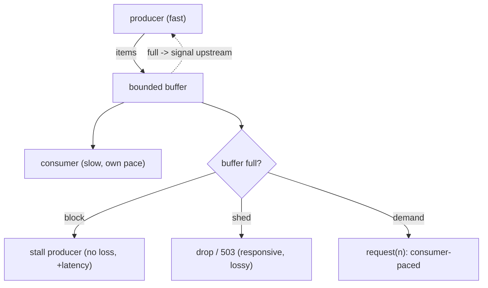

## Thesis

Handling the case where a producer generates work faster than a consumer can process it --- by propagating a "slow down" signal upstream (or deliberately shedding load) instead of letting work pile up in an unbounded buffer --- because an unbounded queue under sustained overload just defers the failure into memory exhaustion and ballooning latency, so you bound the buffer and make the producer feel the limit (block, drop, or signal demand), keeping the system stable and its latency bounded under load.

## Sub

**Why: a fast producer plus a slow consumer plus an unbounded queue = OOM** -> **bound the buffer and push the limit upstream (block / drop / demand)** -> **the latency-vs-loss trade and the mechanisms** -> **zoom out** to end-to-end propagation, queueing theory, and the pivots an interviewer rides from "the queue is growing" into what happens without backpressure, the mechanisms, and load shedding.

## Spine

- A **fast producer and a slow consumer** need flow control --- if the producer keeps producing regardless, the gap accumulates in a buffer, and with an *unbounded* buffer sustained overload grows memory until the process OOMs (and latency balloons as the queue deepens) --- the failure is deferred, not avoided.
- **Backpressure bounds the buffer and pushes the limit upstream** --- you cap the queue, and when it's full the producer must feel it: **block** (wait for room), **drop** (shed load --- reject or discard), or respond to explicit **demand** (the consumer signals how much it can take) --- so the producer can no longer outrun the consumer without bound.
- The core trade is **latency/blocking vs loss** --- blocking preserves every item but slows or stalls the producer (and the stall can propagate upstream); dropping keeps the system responsive but loses work; the right choice depends on whether the workload is loss-tolerant (shed) or must-not-lose (block or spill to disk).
- It must **propagate end-to-end** --- backpressure only works if the signal travels all the way to the ultimate source (or to a deliberate boundary where you shed); a single unbounded hop anywhere breaks it, silently absorbing overload until *it* falls over.

## Companion Notes

### walk

When the producer outruns the consumer

A pipeline where work arrives faster than it can be processed --- why an unbounded queue just defers failure into OOM and latency blowup, how bounding the buffer forces the producer to block, drop, or await demand, and why the signal has to propagate all the way to the source.

Say the failure first --- "an unbounded queue turns overload into an out-of-memory crash." Backpressure is the discipline of bounding the buffer and making the producer feel the limit, trading a stall or a drop for stability.

### drill

Probe Drill

Graded follow-ups on bounded buffers, the block/drop/demand mechanisms, load shedding, and end-to-end propagation --- the ones that separate "we have a queue" from a pipeline that stays stable and bounded-latency under sustained overload.

Name the principle: every queue needs a bound and a policy. Unbounded = OOM; bounded forces a choice -- block the producer (preserve work, add latency) or shed load (stay responsive, lose work) -- propagated end-to-end.

## Drill

SDE2 | the problem and the mechanisms
SDE3 | streams, demand, and propagation
Staff | queueing theory, push/pull, and SLO-driven shedding

### SDE2 | what backpressure is

What is backpressure?

A flow-control mechanism for when a producer generates work faster than a consumer can handle it: instead of letting the excess pile up unbounded, the system **signals the producer to slow down** (or explicitly sheds the excess). "Backpressure" is the resistance the consumer exerts back on the producer --- like water pressure pushing back up a pipe when the outlet is restricted. The purpose is to keep the system **stable under overload**: the producer's rate is coupled to the consumer's capacity, so the amount of in-flight/buffered work stays bounded, memory stays bounded, and latency stays bounded, rather than the producer running away and the buffer growing until something breaks. It's the answer to "the fast side must not be allowed to overwhelm the slow side."

### SDE2 | what happens without it

What happens if there's no backpressure?

The gap between production and consumption accumulates in a buffer, and with an **unbounded** buffer under sustained overload, that buffer grows without limit --- consuming more and more memory until the process runs out and **crashes (OOM)**. Even before the crash, latency **balloons**: as the queue deepens, every new item waits behind an ever-longer backlog, so processing latency grows unboundedly (an item added when the queue holds a million entries waits for all million to drain first). So "no backpressure + unbounded buffer" doesn't avoid the overload --- it *defers* it into a memory-exhaustion failure and a latency collapse, usually at the worst possible time (peak load). The naive "just buffer everything" approach turns a throughput problem into a catastrophic crash.

### SDE2 | the bounded buffer

What's the core mechanism of backpressure?

A **bounded buffer (queue)** --- you give the buffer between producer and consumer a fixed maximum size, and enforce a policy when it's full. Bounding is what makes overload *visible and manageable*: instead of the buffer silently growing to consume all memory, it fills to its limit and then the "what do we do now" decision (block the producer, drop items, or refuse to accept more) is forced. The bound converts an invisible, unbounded resource leak into an explicit backpressure signal at a known threshold. This is the foundational idea --- almost every backpressure mechanism is, at its core, "cap the buffer and do something deliberate when it's full," as opposed to an unbounded buffer that just defers failure.

### SDE2 | blocking the producer

What does it mean to "block" the producer, and when do you do it?

When the bounded buffer is full, **blocking** makes the producer *wait* (pause producing) until the consumer drains enough to make room, then resume. This couples the producer's rate to the consumer's: the producer can only go as fast as the consumer can take, so nothing is lost --- every item is eventually processed. You block when the work **must not be dropped** (each item matters --- a payment, a critical event) and the producer *can* be slowed (it's not a real-time source you can't pause). The cost is that the producer stalls, and if the producer is itself serving something (a request handler), that stall **propagates upstream** --- which is actually the *point* (the backpressure travels up the chain), but it means you must be able to tolerate the producer slowing down. Blocking = preserve all work, pay in latency/throughput.

### SDE2 | load shedding

What is load shedding?

**Dropping** work when the system is overloaded --- when the bounded buffer is full, instead of blocking, you **discard or reject** the excess (drop the item, or return "try again later" / 503 to the caller). It keeps the system **responsive and stable**: the buffer never overflows, latency stays bounded (the queue doesn't deepen past its cap), and the consumer keeps working at its own pace on what it *can* handle. The trade is obvious: you **lose work** (dropped items, rejected requests). You shed load when the workload is **loss-tolerant** (metrics samples, best-effort telemetry, requests the client can retry) or when protecting the system's responsiveness for the requests you *can* serve is more important than serving *every* request. Load shedding is the "protect yourself by saying no" strategy --- better to reject some load cleanly than to accept all of it and collapse.

### SDE2 | an example

Give a concrete example of backpressure.

**Node.js streams**: when you `pipe()` a fast readable (say reading a huge file) into a slow writable (say a slow network socket), the stream machinery applies backpressure automatically --- `write()` returns `false` when the writable's internal buffer is full, which signals the readable to **pause**; when the writable drains, it emits `drain` and the readable **resumes**. So the fast source is throttled to the slow sink's speed, and memory stays bounded, without you managing it manually. Another example: a **job queue** (like BullMQ) with a concurrency limit --- workers pull jobs at a fixed concurrency, so if producers enqueue faster than workers process, the queue grows (bounded by your policy), and you either let it back up (with a max size), slow the producers, or shed. Both illustrate the same pattern: couple the fast side to the slow side so buffered work stays bounded.

### SDE2 | the basic trade

What's the fundamental trade-off in backpressure?

**Latency/blocking versus loss.** When the consumer can't keep up, you have to sacrifice *something*: either you **block** (slow or stall the producer to preserve every item --- paying in added latency and reduced throughput, and propagating the stall upstream), or you **drop** (shed load to stay responsive --- paying in lost/rejected work). You can't have it all: keeping every item *and* never slowing the producer *and* bounded memory is impossible when the producer is genuinely faster than the consumer for a sustained period. So every backpressure design is fundamentally a choice about which to give up --- and the answer depends on the workload: must-not-lose work (payments, orders) leans toward blocking/buffering; loss-tolerant work (telemetry, best-effort) leans toward shedding. Naming this trade explicitly is the sign you understand backpressure rather than just "having a queue."

### SDE3 | Node.js streams backpressure

How does backpressure actually work in Node.js streams?

Through the `write()` return value, the `drain` event, and `highWaterMark`. Each writable stream has an internal buffer with a `highWaterMark` (a size threshold). When you call `writable.write(chunk)`, it returns `true` if the buffer is below the mark (keep writing) or **`false`** if it's at/over the mark (the buffer is full --- you should *stop* writing). A well-behaved producer, on seeing `false`, **pauses** and waits for the writable to emit the **`drain`** event (fired when the buffer has emptied below the mark), then resumes. `pipe()` (and `pipeline()`) implement exactly this handshake automatically --- which is why you should use them rather than manually `read()`-ing and `write()`-ing (manual code that ignores the `false` return keeps writing into a full buffer, defeating backpressure and growing memory). So the mechanism is: `write()` returning `false` is the backpressure signal, `drain` is the resume signal, and `highWaterMark` sets the buffer bound --- a concrete, per-hop flow-control protocol built into the stream abstraction.

### SDE3 | reactive streams / demand

What is demand-based (reactive) backpressure?

A **pull-oriented** model where the consumer explicitly tells the producer **how much it can handle**, and the producer only sends that much. In Reactive Streams (the spec behind RxJava/Project Reactor/Akka Streams), the subscriber calls `request(n)` to signal it wants `n` more items, and the publisher must not emit more than the outstanding demand --- so the consumer is always in control of the rate. This inverts the naive push model (where the producer emits whenever it has data, regardless of the consumer): here nothing is sent unless it was requested, so backpressure is *built into the protocol* --- there's structurally no way to overwhelm the consumer, because it never receives more than it asked for. It's a cleaner model than "push then react to a full buffer" because demand flows upstream continuously rather than being inferred from a buffer filling up. The trade is that everything in the chain must speak the demand protocol.

### SDE3 | load-shedding strategies

If you're shedding load, what are the strategies for *what* to drop?

Several, chosen by what the workload can tolerate. **Drop newest / reject-on-full** (tail drop): refuse new arrivals when full --- simple, and keeps the older (already-accepted) work. **Drop oldest** (head drop): discard the front of the queue to admit new items --- right when *fresh* data is more valuable than stale (live metrics, current positions), since old queued items may be obsolete by the time they'd be processed. **Priority shedding**: drop low-priority work first, protect high-priority (shed the analytics events, keep the checkout requests) --- requires classifying work by importance. **Sampling**: process a representative fraction and drop the rest (keep 1 in N) --- for high-volume telemetry where a sample is sufficient. **Random early drop**: start dropping probabilistically *before* the buffer is completely full, to signal overload gradually and avoid a hard cliff. The key insight is that shedding isn't just "drop something" --- *which* item you drop is a design decision driven by whether recency, priority, or completeness matters most for that workload.

### SDE3 | buffering to disk

What if you can neither block the producer nor drop the work?

Then you **spill to durable storage** --- buffer the overflow to disk (or a durable message queue/log) instead of holding it in memory or dropping it. This is the pattern when the source **can't be slowed** (a real-time firehose you don't control) *and* the work **can't be lost** (it must all be processed eventually), so blocking and dropping are both off the table. Writing to disk gives you a far larger (effectively bounded-by-disk) buffer that survives the memory limit, and lets the consumer catch up over time, draining the backlog when load subsides. This is essentially what a durable log (Kafka) or a persistent queue does --- it *is* a giant disk-backed buffer that absorbs producer/consumer rate mismatches and decouples them, providing backpressure tolerance by persisting the backlog. The trade is added latency (disk I/O, and the backlog takes time to drain) and the operational burden of managing that storage --- but it's the way to honor both "can't slow the source" and "can't lose the data."

### SDE3 | sizing the bounded queue

How big should the bounded buffer be, and why not just make it huge?

Big enough to **absorb normal bursts** without shedding, but small enough that it doesn't add unacceptable latency or hide a real overload --- and *not* "as big as possible." A bigger buffer smooths larger transient spikes (good), but it has two costs: it **increases worst-case latency** (a full deep buffer means items wait a long time --- Little's Law: latency at a full queue is roughly queue-length / consumer-rate, so a 1-million-item queue at 1000/s is ~1000s of wait), and it **delays the backpressure signal** (the producer doesn't feel the limit until the huge buffer fills, by which point you're deeply overloaded and the buffer is full of stale work). So sizing is a deliberate trade: size it to cover the bursts you expect to ride out, accept that *sustained* overload beyond that will (correctly) trigger blocking/shedding, and resist the instinct to "just make it bigger" --- an oversized buffer trades a visible early backpressure signal for a hidden latency blowup and a delayed, worse failure. This is the bufferbloat lesson: bigger buffers are not safer, they mostly add latency.

### SDE3 | TCP flow control analogy

How is TCP flow control an example of backpressure?

TCP's **sliding-window / receive-window** mechanism *is* backpressure at the transport layer. The receiver advertises a **window size** --- how many bytes it currently has buffer room to accept --- and the sender may only have that many unacknowledged bytes in flight. As the receiver's application reads data (draining the receive buffer), the window opens (advertises more room); if the application is slow and the buffer fills, the receiver advertises a **smaller (eventually zero) window**, and the sender *must stop* until the window reopens. So the receiver directly controls the sender's rate based on its own consumption speed --- exactly the demand-based backpressure model, built into TCP. It's a clean canonical example because it shows all the pieces: a bounded buffer (the receive buffer), an explicit upstream signal (the advertised window), and the producer (sender) being forced to slow to the consumer's (receiver's application) pace. When you design application-level backpressure, you're often reinventing TCP's window at a higher layer.

### SDE3 | propagating end-to-end

Why does backpressure have to propagate all the way up the chain?

Because backpressure is only as effective as the **weakest (unbounded) link** --- if the signal doesn't reach the ultimate source, some hop in the middle absorbs the overload and eventually fails. Consider source -> service A -> service B -> database, where B is slow. If A applies backpressure to the source (slows accepting) that's good --- but only if A *itself* slows because B slowed it, which only happens if B pushes back on A (bounded buffer + signal), and A in turn pushes back on the source. If instead A has an unbounded queue in front of B, A silently swallows the overload (its queue grows) and A OOMs --- the backpressure "stopped" at A. So the signal must chain: B slows A, A slows the source, all the way up, so the *original* producer is throttled. A single unbounded buffer anywhere in the chain breaks the whole thing by becoming the sink that absorbs (and dies from) the overload. The design rule: every hop must be bounded and must propagate the pressure upstream, or you must place a *deliberate* boundary where you shed (so the pressure doesn't need to propagate further). "Backpressure everywhere except one unbounded queue" is really "no backpressure --- that queue is where you'll crash."

### Staff | backpressure vs rate limiting vs load shedding

How do backpressure, rate limiting, and load shedding differ?

They're related overload controls with different mechanisms and vantage points. **Rate limiting** *proactively* caps the input rate to a *fixed* threshold (X requests/sec), regardless of the consumer's current capacity --- it's a policy set in advance (often for fairness/quota, e.g. per-client limits) that rejects/delays anything over the limit. **Backpressure** is *reactive and dynamic* --- it doesn't cap at a fixed number; it couples the producer to the consumer's *actual, current* capacity via a feedback signal (slow down *because the consumer is full right now*), so the allowed rate floats with real capacity. **Load shedding** is specifically the *dropping* action taken under overload (reject/discard excess) --- it's one *response* you can use (backpressure can be implemented *via* shedding, and rate limiting *is* a form of proactive shedding). So: rate limiting = fixed proactive cap (often for fairness); backpressure = dynamic feedback coupling rate to real capacity; load shedding = the drop action under overload. In practice you combine them --- rate-limit for fairness/quota, apply backpressure to match real capacity, and shed as the last-resort action when buffers fill --- and a staff answer distinguishes the *fixed-vs-dynamic* and *proactive-vs-reactive* axes rather than treating them as synonyms.

### Staff | queueing theory and Little's Law

What does queueing theory tell you about backpressure and buffers?

That **latency and utilization are coupled non-linearly**, and that queues are where latency hides. **Little's Law** (L = lambda x W: items-in-system = arrival-rate x time-in-system) means a full buffer of length L at consumer rate lambda implies a wait of W = L/lambda --- so a deep queue *directly* translates to high latency (this is why "just buffer more" trades memory for latency, not for free throughput). More fundamentally, as utilization (arrival rate / service rate) approaches 1, **queue length and latency grow toward infinity** (the classic hockey-stick curve) --- a system running at 95%+ utilization has wildly variable, large queues even with modest bursts, because there's no slack to absorb variance. The implications for backpressure: (1) you *cannot* run a queue-fed system at ~100% utilization and expect bounded latency --- you need headroom, and backpressure/shedding is what enforces that headroom by refusing load beyond it; (2) an unbounded buffer at overload has L -> infinity so W -> infinity (latency collapse before the OOM); (3) the *right* buffer size and shed threshold come from the latency SLO via Little's Law (max acceptable wait x consumer rate = max queue depth). The staff framing: backpressure isn't just crash-avoidance, it's the mechanism that keeps the system on the *flat* part of the latency-vs-utilization curve, and queueing theory quantifies exactly where that is.

### Staff | push vs pull systems

How does push-vs-pull affect backpressure, using messaging systems as the example?

It determines *where control lives* and thus how naturally backpressure works. In a **pull** model, the consumer *fetches* work at its own pace --- so backpressure is **inherent**: the consumer simply pulls slower (or stops) when overwhelmed, and the unprocessed work waits in the durable buffer. **Kafka** is the canonical example: consumers poll partitions and track their own offset, so a slow consumer just falls further behind (**consumer lag** grows) but never gets overwhelmed --- the broker retains the backlog on disk, and lag *is* the backpressure signal (you monitor and scale consumers by it). In a **push** model, the broker *sends* messages to consumers, which risks overwhelming a slow one --- so push systems need an *explicit* backpressure mechanism: **RabbitMQ** uses a **prefetch** limit (QoS) capping how many unacknowledged messages a consumer holds, so the broker stops pushing once the consumer has prefetch-many in flight and hasn't acked --- effectively adding demand-based flow control on top of push. So pull systems get backpressure for free (consumer-driven, lag-as-signal), while push systems must bolt on a demand/prefetch limit to avoid overwhelming consumers. The staff insight: "pull with a durable log" (Kafka) is a naturally backpressure-tolerant architecture because it decouples producer and consumer rates through a disk-backed buffer and lets each side go at its own speed --- which is a big reason log-based systems are popular for high-throughput pipelines.

### Staff | combined admission control

How do you combine backpressure primitives into a robust overload-handling strategy?

By layering **bounded queues + timeouts + load shedding + (adaptive) concurrency limits** into an admission-control system, on the principle that *every* queue must be bounded and *every* request must have a deadline. Concretely: give every internal queue a **finite bound** (so nothing grows unbounded); attach **timeouts/deadlines** to queued work so items that have waited too long to still be useful are dropped rather than processed uselessly (an expired request whose client already gave up shouldn't consume capacity --- this prevents the "queue full of stale work" pathology); apply **load shedding** at the boundary when buffers fill (reject with 503/429 fast, ideally with a Retry-After) rather than accepting work you can't serve; and use **concurrency limits** (a bounded worker pool / semaphore) so only N items are in-flight at once, which *is* backpressure (the N+1th waits or is shed). Increasingly, **adaptive** limits (like Netflix's concurrency-limits / TCP-Vegas-style algorithms) *measure* latency and dynamically adjust the concurrency limit to keep the system at its optimal throughput point without manual tuning. The staff framing is the **"you must have a limit" principle**: unbounded anything (queues, concurrency, timeouts) is a latent overload failure, so a mature service bounds all of them and combines shed-fast + deadline-drop + bounded-concurrency so that under overload it *degrades gracefully* (fast rejections, bounded latency for admitted work) instead of collapsing (unbounded queues, latency blowup, cascading timeout, OOM).

### Staff | distributed backpressure

How does backpressure work across service boundaries in a distributed system?

It's expressed through **explicit signals and adaptive client behavior**, since you can't share an in-process buffer across the network. The primary signals: an overloaded service returns **429 (Too Many Requests)** or **503 (Service Unavailable)**, ideally with a **`Retry-After`**, telling callers to back off --- that *is* backpressure across the wire. Callers must then actually *respond* to it: **exponential backoff with jitter** on retries (not immediate hammering, which amplifies the overload), and ideally a **circuit breaker** that stops calling a failing/overloaded dependency entirely for a cooldown (preventing the caller from piling on and giving the callee room to recover). More advanced: **adaptive concurrency limits** at the caller (limit in-flight requests to a dependency based on observed latency, so the caller self-throttles as the dependency slows), and **load shedding at the edge** (the API gateway / load balancer sheds excess before it even reaches overloaded backends). A crucial anti-pattern this avoids: **retry storms / metastable failure** --- if an overloaded service returns errors and every caller *retries aggressively*, the retries multiply the load and can keep the system down even after the original trigger passes (the retries themselves become the overload). So distributed backpressure = the callee signals overload (429/503 + Retry-After), and callers cooperate (backoff+jitter, circuit breakers, adaptive concurrency, edge shedding) --- and the staff insight is that *without* cooperative callers, backpressure signals are useless and the system is vulnerable to retry-amplified metastable collapse, which is why the caller-side discipline matters as much as the server-side signal.

### Staff | the deep-queue anti-pattern

Why are big buffers often harmful rather than safe?

Because of **bufferbloat**: oversized buffers don't prevent overload, they *convert it into latency* while hiding the problem until it's severe. Intuitively a bigger buffer feels safer ("more room before we drop"), but a large buffer that's kept full means every item sits behind a huge backlog --- so **latency skyrockets** (Little's Law: wait = depth/rate), and because the items are *eventually* processed, the system doesn't *signal* overload (no drops, no errors) --- it just gets slower and slower, which is often *worse* than failing fast (a client waiting 30s for a response the buffer will eventually serve is worse off than a fast 503 it can retry elsewhere). Bufferbloat also causes **head-of-line blocking** (urgent items stuck behind a deep queue of old ones) and delays the backpressure signal (the producer isn't throttled until the giant buffer fills). The networking world learned this the hard way --- routers with huge buffers created seconds of latency --- and the fix was *smaller* buffers plus active queue management (drop/mark early, e.g. CoDel, which drops based on *time-in-queue* not just occupancy). The staff lesson: buffer to smooth *short* bursts, but a buffer sized to "never drop" is an anti-pattern --- it trades a clean, fast, visible failure (shed load, bounded latency) for a hidden, creeping latency collapse. **Fail fast beats buffer deep**; the goal is bounded latency, and an oversized buffer is the enemy of bounded latency.

### Staff | when to shed vs when to block

How do you decide between shedding and blocking under overload?

By what the **SLO and the workload** require --- specifically, whether **bounded latency (protect responsiveness)** or **completeness (process everything)** is the priority for that work. **Shed** when latency/responsiveness matters more than processing every item and the work is **loss-tolerant or retryable**: interactive request paths (a user-facing API should return a fast 503 rather than hang --- protect tail latency by dropping excess), best-effort telemetry (a metrics sample is fine), or anything where a rejected caller can retry elsewhere/later. Shedding keeps admitted work fast and the system responsive, at the cost of rejecting some. **Block (or buffer/spill)** when **every item must be processed** and the producer can be slowed or the backlog persisted: financial transactions, orders, data-pipeline records that must all land eventually --- here you'd rather add latency (or spill to a durable log and drain later) than lose data, and the producer *can* tolerate being throttled. The decision also depends on *who the producer is*: if the producer is an interactive client, blocking it means making a user wait (bad --- prefer shedding with a clear "retry"), but if the producer is a batch/pipeline stage, blocking it just slows the pipeline (fine). Often you **combine per-priority**: block/buffer the critical must-not-lose stream, shed the best-effort stream, on the *same* system. The staff framing: it's an explicit, SLO-driven policy decision --- "under overload, do we protect *latency* (shed) or *completeness* (block/buffer)?" --- made per workload based on loss-tolerance, retryability, latency-sensitivity, and whether the producer can be slowed, rather than a one-size default. And critically, you *must* pick one and bound the buffer --- the failure is choosing *neither* (unbounded buffer), which silently picks "collapse."

## Walk

### A fast producer, a slow consumer, and an unbounded queue

```flow
p[producer 1200/s] -> q[unbounded queue grows] -> c[consumer 1000/s -> OOM + latency blowup]
```

Start with the failure. A producer emitting 1200 items/sec into a consumer that processes 1000/sec has a 200/sec deficit that must go *somewhere* --- into the buffer between them. With an **unbounded** buffer, that buffer grows by 200 items every second, forever, until the process **runs out of memory and crashes**.

And well before the crash, **latency collapses**: as the queue deepens, each new item waits behind an ever-longer backlog (an item added when the queue holds a million entries waits for all million to drain first). So "just buffer everything" doesn't handle the overload --- it *defers* it into a memory-exhaustion crash and a latency blowup, usually at peak load. The unbounded queue is the trap.

### Bound the buffer and push the limit upstream

```flow
b[cap the buffer] -> full[buffer full] -> choose[producer must: block, drop, or await demand]
```

The fix starts with **bounding the buffer** --- give it a fixed maximum. That doesn't make the overload disappear, but it makes it *visible and forced*: when the buffer hits its cap, you can no longer silently absorb more, so a deliberate decision is forced at a known threshold. The bound converts an invisible unbounded resource leak into an explicit backpressure signal.

When the bounded buffer is full, the producer must **feel the limit** in one of three ways: **block** (wait until the consumer drains room, then resume --- couples the producer's rate to the consumer's, loses nothing), **drop** (shed the excess --- stay responsive, lose work), or respond to **demand** (the consumer signals how much it can take, and the producer sends only that). The producer can no longer outrun the consumer without bound.

### The mechanisms: block, drop, or demand

```flow
bl[block: wait for room -> no loss, added latency] -> dr[drop: shed excess -> responsive, lossy] -> dm[demand: request(n) -> consumer-paced]
```

Each mechanism embodies the core **latency-vs-loss** trade.

```python
import collections

class BoundedQueue:
    def __init__(self, capacity, on_full="block"):
        self.capacity = capacity
        self.on_full = on_full          # "block" | "drop_new" | "drop_old"
        self.q = collections.deque()

    def produce(self, item, wait_for_room):
        if len(self.q) < self.capacity:
            self.q.append(item); return "accepted"
        # buffer is full -> apply the policy (this IS backpressure)
        if self.on_full == "block":
            wait_for_room()             # stall producer until consumer drains
            self.q.append(item); return "accepted (after wait)"
        if self.on_full == "drop_old":
            self.q.popleft(); self.q.append(item)   # keep fresh data
            return "dropped_oldest"
        return "rejected"               # drop_new / shed -> stay responsive, lose work

    def consume(self):                  # consumer pulls at ITS own pace
        return self.q.popleft() if self.q else None
```

`block` preserves every item but stalls the producer (and that stall *propagates upstream* --- which is the point). `drop_new`/`drop_old` keep the system responsive but lose work (drop_old keeps *fresh* data, right when recency beats completeness). A demand model (`request(n)`) inverts it entirely --- the consumer pulls only what it can handle, so the producer structurally can't overwhelm it. Node.js streams implement exactly this: `write()` returning `false` is the "buffer full" signal, `drain` is "resume," and `highWaterMark` is the bound.

### Propagate end-to-end, or it breaks

```flow
src[source] -> a[service A] -> bsvc[slow service B] -> db[database]
```

Backpressure is only as strong as the **weakest unbounded link**. In source -> A -> B -> db where B is slow, the pressure must *chain*: B pushes back on A (bounded buffer + signal), A slows, A pushes back on the source, the source throttles. If instead A has an *unbounded* queue in front of B, A silently swallows the overload (its queue grows) and A crashes --- the backpressure "stopped" at A, which became the sink that absorbs and dies from the overload.

Zooming out: the design rule is that *every* hop must be bounded and propagate pressure upstream, *or* you place a deliberate boundary where you shed (so pressure needn't propagate further). And by queueing theory (Little's Law, the latency-vs-utilization curve), the real goal isn't just avoiding OOM --- it's keeping the system on the *flat* part of the curve with headroom, which backpressure/shedding enforces by refusing load beyond capacity. "Backpressure everywhere except one unbounded queue" is really "no backpressure --- that queue is where you'll crash."

### Model Script

- Frame the failure | "The problem is a producer that's faster than the consumer -- even by a little, sustained. That deficit piles into the buffer between them, and with an unbounded buffer it grows forever until the process runs out of memory and crashes. And well before the crash, latency collapses, because every new item waits behind an ever-deepening backlog. So the naive 'just buffer everything' doesn't avoid the overload -- it defers it into an OOM crash and a latency blowup at the worst time."
- Bound and push upstream | "The fix starts with bounding the buffer -- a fixed maximum. That converts an invisible unbounded resource leak into an explicit backpressure signal at a known threshold. When the bounded buffer fills, the producer has to feel the limit one of three ways: block -- wait until the consumer drains room, which couples the producer's rate to the consumer's and loses nothing; drop -- shed the excess to stay responsive, which loses work; or demand-based -- the consumer signals how much it can take and the producer sends only that. The producer can no longer outrun the consumer without bound."
- The trade and the mechanisms | "The fundamental trade is latency versus loss. Blocking preserves every item but stalls the producer -- and that stall propagates upstream, which is actually the point, the pressure travels up the chain. Dropping keeps the system responsive but loses work, and which item you drop is a real decision -- drop oldest when fresh data matters more than stale, priority-drop to protect checkout over analytics. Node streams are the clean example: write returning false is the buffer-full signal, the drain event is resume, highWaterMark is the bound -- and pipe implements that handshake for you. The demand model, like Reactive Streams' request-n, is even cleaner because the consumer never receives more than it asked for, so it structurally can't be overwhelmed."
- Propagate end-to-end | "The critical thing is that backpressure is only as strong as the weakest unbounded link. If I have source to A to slow-B to database, the pressure has to chain: B pushes back on A, A slows and pushes back on the source. But if A has an unbounded queue in front of B, A silently absorbs the overload and A is the thing that OOMs -- the backpressure stopped at A. So the rule is every hop must be bounded and propagate pressure upstream, or you place a deliberate boundary where you shed. One unbounded queue anywhere is where you'll crash."
- Interviewer: "This is a user-facing API under a traffic spike. Block or shed?"
- SLO-driven decision | "Shed -- for an interactive request path, bounded latency beats completeness, and the caller can retry. I'd return a fast 503 or 429 with a Retry-After rather than let requests hang behind a deep queue, because a user waiting 30 seconds for a response is worse than a fast rejection they can retry. Blocking is right when every item must be processed and the producer can be slowed -- a payment stream, a data pipeline where records can't be lost -- there I'd block or spill to a durable log and drain later. And I'd combine per-priority: shed the best-effort traffic, protect the critical path. The point is it's an explicit SLO-driven choice -- protect latency by shedding or completeness by blocking -- and the real failure is choosing neither, an unbounded buffer, which silently picks collapse."
- Land it | "So: a fast producer plus an unbounded queue defers overload into OOM and latency collapse; you bound the buffer and make the producer feel the limit -- block to preserve work, shed to stay responsive, or demand-pace it; the trade is latency versus loss, decided by the SLO and loss-tolerance; and it must propagate end-to-end, because one unbounded hop absorbs and dies from the overload. The one line is that every queue needs a bound and a policy -- backpressure keeps the system on the flat part of the latency curve by coupling the producer to real consumer capacity, and 'just make the buffer bigger' is the bufferbloat trap that trades a fast visible failure for a hidden latency collapse."

## Whiteboard

Sketch the producer-buffer-consumer with the upstream signal and the policy fork.

### Why not just use a bigger buffer?

A bigger buffer only smooths short bursts; kept full it means every item waits behind a huge backlog (Little's Law: latency = depth / rate), so latency collapses while no drops signal the overload -- bufferbloat. Fail fast beats buffer deep; size for bursts, then block or shed.

### Why must backpressure reach the source?

It's only as strong as the weakest unbounded link -- if any hop has an unbounded queue, that hop silently absorbs the overload and OOMs, so the signal 'stopped' there. Every hop bounded + propagating, or a deliberate shed boundary.



Verdict: bound the buffer and couple the producer to the consumer's real capacity -- block (preserve work, add latency), shed (stay responsive, lose work), or demand-pace it -- and propagate the signal end-to-end so no unbounded hop absorbs the overload.

## System

Zoom out to where flow control sits in a pipeline.

### Where it sits

Producer: the fast side, must be throttleable or shed at a boundary [*]
Bounded buffer: the cap that turns overload into an explicit signal
Consumer: the slow side, pulls/processes at its real capacity
Signal: block / drop / demand (request n) when the buffer is full
Propagation: chains upstream to the source, or a deliberate shed boundary

### Pivots an interviewer rides

From "the queue is growing" they push on the mechanism, propagation, and shedding.

#### What happens without backpressure?

-> an unbounded queue grows until OOM, and latency collapses as the backlog deepens
The overload isn't avoided, it's deferred into a memory crash + latency blowup; bounding the buffer forces a deliberate block/drop/demand decision at a known threshold.

#### Shed or block under overload?

-> SLO-driven: shed to protect latency (interactive, loss-tolerant), block/spill to protect completeness (must-not-lose)
Shed a fast 503/429 for user-facing retryable work; block or buffer-to-disk for payments/pipelines that can't lose data -- often per-priority on the same system, and never 'neither' (unbounded = collapse).

## Trade-offs

The calls that separate "we have a queue" from a pipeline stable under overload.

### Block vs shed under overload

- Block (wait/buffer): preserves every item, no loss -- but stalls the producer (propagating upstream) and adds latency; wrong for interactive paths
- Shed (drop/503): keeps the system responsive, bounded latency -- but loses/rejects work; wrong when every item must be processed

Shed to protect latency for interactive, loss-tolerant, retryable work; block (or spill to disk) to protect completeness for must-not-lose work -- decided by the SLO, often per-priority.

### Small vs large buffer

- Large: smooths bigger transient bursts -- but adds latency (deep queue = long wait), hides overload (no drops), and delays the backpressure signal (bufferbloat)
- Small: fast backpressure signal, bounded latency, fails fast -- but sheds/blocks sooner on bursts

Size the buffer to absorb *expected short bursts* only, then block/shed -- resist "just make it bigger"; an oversized buffer trades a fast visible failure for a hidden latency collapse.

### Push vs pull (as backpressure models)

- Pull (consumer fetches, e.g. Kafka): backpressure is inherent -- the consumer pulls slower, lag grows in a durable buffer, no overwhelm -- but adds polling/lag latency
- Push (broker sends, e.g. RabbitMQ): low latency delivery -- but can overwhelm a slow consumer unless you add prefetch/demand limits

Prefer pull-with-a-durable-log for high-throughput pipelines (naturally backpressure-tolerant, decoupled rates); use push with an explicit prefetch/QoS limit when you need low-latency delivery.

## Model Answers

### the reframe | Bound the buffer, push the limit upstream

The frame to lead with.

- Unbounded queue defers overload into OOM + latency collapse | key | the fast side must not outrun the slow side
- Bound the buffer -> block, drop, or demand | store | explicit signal at a known threshold
- The trade is latency/blocking vs loss | note | decided by the SLO and loss-tolerance

### the depth | Propagation and queueing theory

Where it's really tested.

- Must propagate to the source (weakest unbounded link) | key | one unbounded hop absorbs + dies
- Little's Law: deep queue = high latency | store | keep headroom on the utilization curve
- Bigger buffers hurt (bufferbloat) | note | fail fast beats buffer deep

## Numbers

Back-of-envelope how fast a buffer fills, the latency at a full queue, and the shed rate.

An unbounded queue under overload grows to OOM; a bounded one forces block or shed, and its depth sets the latency (Little's Law).

- prod | Producer rate (/s) | 1200 | 0 | 100
- cons | Consumer rate (/s) | 1000 | 0 | 100
- buf | Buffer size | 10000 | 0 | 1000

```js
function (vals, fmt) {
  var prod = vals.prod, cons = vals.cons, buf = vals.buf;
  var excess = prod - cons;
  function r(x, d) { var m = Math.pow(10, d); return Math.round(x * m) / m; }
  var fillRow = excess > 0
    ? { k: 'Bounded buffer fills in', v: '~' + fmt.n(r(buf / excess, 1)), u: 's, then block/shed', n: 'an UNbounded buffer would grow forever -> OOM; the bounded one fills in this time, after which the producer must block or shed', over: true }
    : { k: 'No overload', v: 'stable', u: 'consumer keeps up', n: 'consumer rate >= producer rate, so the buffer drains -- backpressure only bites when the producer is genuinely faster for a sustained period', over: false };
  var latMs = cons > 0 ? (buf / cons) * 1000 : 0;
  return [
    { k: 'Overload (excess)', v: (excess > 0 ? '+' : '') + fmt.n(excess), u: '/s', n: 'producer minus consumer -- this gap must go somewhere: block the producer, shed it, or (fatally) pile into an unbounded buffer', over: excess > 0 },
    fillRow,
    { k: 'Latency at full buffer', v: '~' + fmt.n(r(latMs, 0)), u: 'ms wait', n: "Little's Law: a full buffer means each new item waits behind ~" + fmt.n(buf) + ' items at ' + fmt.n(cons) + '/s -- deep queues = high latency', over: latMs > 1000 },
    { k: 'Shed rate (if shedding)', v: excess > 0 ? fmt.n(excess) + '/s' : '0', u: 'dropped', n: 'if you protect latency by shedding, you drop the excess -- responsive system, lost/rejected work (choose which items by recency/priority)', over: false },
    { k: 'The principle', v: 'bound + policy', u: '', n: 'every queue needs a limit and a block/shed policy -- an unbounded queue just defers overload into memory exhaustion and a latency collapse', over: false }
  ];
}
```

## Red Flags

What makes an interviewer wince.

### "We'll just buffer the incoming work in a queue"

An unbounded queue under sustained overload grows until the process runs out of memory and crashes -- and latency collapses first, as each item waits behind an ever-deeper backlog. You've deferred the overload into an OOM, not handled it.

Bound the buffer and enforce a policy when it's full -- block the producer (no loss, added latency) or shed load (responsive, lossy) -- so overload triggers a deliberate decision at a known threshold.

### "If it can't keep up, we'll make the buffer much bigger"

A bigger buffer only smooths short bursts; kept full it means every item waits behind a huge backlog, so latency skyrockets while no drops signal the overload (bufferbloat) -- often worse than failing fast.

Size the buffer for expected short bursts, then block or shed; a client is better served by a fast 503 it can retry than a response a deep queue will *eventually* return after 30s. Fail fast beats buffer deep.

### "We added backpressure between the last two stages"

Backpressure is only as strong as the weakest unbounded link -- if any earlier hop has an unbounded queue, that hop silently absorbs the overload and OOMs; the signal never reaches the source.

Bound *every* hop and propagate the pressure upstream to the ultimate producer (or place a deliberate shed boundary) -- one unbounded queue anywhere is where the system will crash.

## Opener

### 30s | The one-liner

How I open when asked about a fast producer, a growing queue, or overload.

#### What is the shape?

Bound the buffer between producer and consumer, and when it's full make the producer feel the limit -- block (wait, no loss), shed (drop, stay responsive), or demand-pace it (consumer requests n) -- so buffered work, memory, and latency stay bounded.

#### What's the key trade?

Latency/blocking vs loss, decided by the SLO: shed to protect responsiveness for interactive/loss-tolerant work, block or spill to disk to protect completeness for must-not-lose work -- and it must propagate end-to-end.

##### Hooks

Where an interviewer usually pushes next.

- Without it? | unbounded queue -> OOM + latency collapse | drill
- Bigger buffer? | bufferbloat -- fail fast beats buffer deep | drill
- Shed or block? | SLO-driven: latency vs completeness | drill

Foot: two sentences -- backpressure couples the producer to the consumer's real capacity via a bounded buffer and an upstream signal (block, drop, or demand), keeping memory and latency bounded under overload -- and the discipline is that every queue needs a bound and a policy, propagated end-to-end, because one unbounded hop just defers the overload into an OOM and a latency collapse.

## Bank

### SCALE | A pipeline where events arrive faster than a downstream service can process them

Task: keep it stable under sustained overload.
Model: bound every buffer (no unbounded queues) and enforce a policy when full -- block the producer (couples its rate to the consumer, no loss, added latency) or shed (drop/503, responsive, lossy), chosen by loss-tolerance; propagate the pressure end-to-end so the ultimate source is throttled (or place a deliberate shed boundary); if the source can't be slowed and work can't be lost, spill to a durable log (Kafka) and let the consumer drain the backlog; size buffers for short bursts only (bufferbloat: deep queues = high latency), and use concurrency limits + timeouts so stale queued work is dropped rather than processed uselessly.
Int: the buffer is bounded but always full -- what does that tell you?
You're in sustained overload, not a burst -- the consumer is under-provisioned; scale consumers (or shed), because a permanently-full buffer means max latency (Little's Law) and the backpressure is masking an under-capacity problem.

### DESIGN | Overload handling for a user-facing API under a traffic spike

Task: protect the service and its latency.
Model: shed, not block -- return a fast 503/429 with Retry-After when at capacity (bounded latency beats completeness for interactive, retryable work); use a bounded concurrency limit / worker pool as backpressure (the N+1th request is shed), ideally an adaptive limit that tracks latency; attach deadlines so requests whose clients gave up don't consume capacity; shed at the edge (LB/gateway) before overloaded backends; and ensure callers back off with jitter + circuit-break, to avoid a retry storm that amplifies the overload into metastable collapse.
Int: why not just queue the excess requests?
A deep request queue makes users wait behind the backlog (30s for a response the queue will eventually serve) -- worse than a fast 503 they can retry; and it risks OOM -- fail fast to protect tail latency.

### Extra Curveballs

### CURVEBALL | metastable | An overloaded service returns errors, all its callers retry aggressively, and the system stays down even after the original spike passes. What's happening and how do you fix it?

Model: this is a metastable failure / retry storm -- the retries themselves have become the load. The original trigger (a spike, a slow dependency) pushed the service into overload; it shed/errored; but because every caller retries immediately on error, the retry traffic multiplies the offered load (each real request becomes several), and that amplified load keeps the service saturated even after the initial cause is gone -- the system is stuck in a bad stable state sustained by its own retries. Fixes, layered: callers must use exponential backoff with jitter (not immediate, synchronized retries -- jitter de-correlates them), cap retries (a retry budget -- e.g. retries limited to a small percentage of requests, so retries can't multiply load without bound), and use circuit breakers so callers stop hammering a failing dependency entirely for a cooldown, giving it room to recover; the server sheds cheaply and fast (reject early with 429 + Retry-After, before expensive work) and ideally prioritizes so it can serve *some* traffic; and you drain/deprioritize the retry backlog on recovery. The deeper fix is designing so the system has a way *out* of the bad state -- token-bucket retry budgets and circuit breakers are what prevent retries from becoming a self-sustaining overload. The staff insight is that backpressure signals (errors/503s) are *dangerous* if callers don't cooperate: an error that triggers an immediate retry is load amplification, so the caller-side discipline (backoff, jitter, budgets, breakers) is what makes shedding actually protective rather than a trigger for metastable collapse.

### Frames

- Unbounded queue defers overload into OOM + latency collapse -> bound the buffer and make the producer block, shed, or demand-pace
- The trade is latency/blocking vs loss (SLO-driven: shed for latency, block/spill for completeness); bigger buffers hurt (bufferbloat)
- Must propagate end-to-end (weakest unbounded link OOMs); distributed backpressure = 429/503 + Retry-After + caller backoff/circuit-break to avoid retry storms
