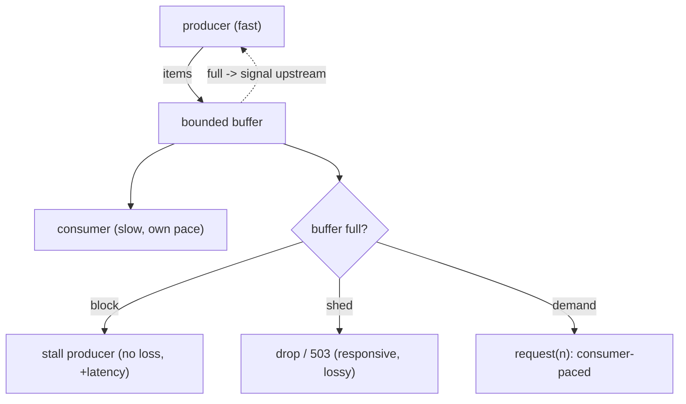

## Thesis

Handling the case where a producer generates work faster than a consumer can process it --- by propagating a "slow down" signal upstream (or deliberately shedding load) instead of letting work pile up in an unbounded buffer --- because an unbounded queue under sustained overload just defers the failure into memory exhaustion and ballooning latency, so you bound the buffer and make the producer feel the limit (block, drop, or signal demand), keeping the system stable and its latency bounded under load.

## Sub

**Why: a fast producer plus a slow consumer plus an unbounded queue = OOM** -> **bound the buffer and push the limit upstream (block / drop / demand)** -> **the latency-vs-loss trade and the mechanisms** -> **zoom out** to end-to-end propagation, queueing theory, and the pivots an interviewer rides from "the queue is growing" into what happens without backpressure, the mechanisms, and load shedding.

## Spine

- A **fast producer and a slow consumer** need flow control --- if the producer keeps producing regardless, the gap accumulates in a buffer, and with an *unbounded* buffer sustained overload grows memory until the process OOMs (and latency balloons as the queue deepens) --- the failure is deferred, not avoided.
- **Backpressure bounds the buffer and pushes the limit upstream** --- you cap the queue, and when it's full the producer must feel it: **block** (wait for room), **drop** (shed load --- reject or discard), or respond to explicit **demand** (the consumer signals how much it can take) --- so the producer can no longer outrun the consumer without bound.
- The core trade is **latency/blocking vs loss** --- blocking preserves every item but slows or stalls the producer (and the stall can propagate upstream); dropping keeps the system responsive but loses work; the right choice depends on whether the workload is loss-tolerant (shed) or must-not-lose (block or spill to disk).
- It must **propagate end-to-end** --- backpressure only works if the signal travels all the way to the ultimate source (or to a deliberate boundary where you shed); a single unbounded hop anywhere breaks it, silently absorbing overload until *it* falls over.

## Companion Notes

### walk

When the producer outruns the consumer

A pipeline where work arrives faster than it can be processed --- why an unbounded queue just defers failure into OOM and latency blowup, how bounding the buffer forces the producer to block, drop, or await demand, and why the signal has to propagate all the way to the source.

Say the failure first --- "an unbounded queue turns overload into an out-of-memory crash." Backpressure is the discipline of bounding the buffer and making the producer feel the limit, trading a stall or a drop for stability.

### drill

Probe Drill

Graded follow-ups on bounded buffers, the block/drop/demand mechanisms, load shedding, and end-to-end propagation --- the ones that separate "we have a queue" from a pipeline that stays stable and bounded-latency under sustained overload.

Name the principle: every queue needs a bound and a policy. Unbounded = OOM; bounded forces a choice -- block the producer (preserve work, add latency) or shed load (stay responsive, lose work) -- propagated end-to-end.

### wb

Whiteboard

Rebuild the flow-control path from memory --- the failure, the bound, the three policies, the sizing, the drop rule, the hidden queues, the durable spill, and the propagation.

Draw the buffer first, then the arrow that points backwards. Backpressure is the only arrow in the diagram that travels the wrong way, from the consumer back to the producer --- if you cannot draw that arrow, you have not designed it.

### sys

System Map

Zoom out: flow control sits between every fast thing and every slow thing in the system --- and the chain is only as strong as its weakest unbounded hop.

Lead with the chain, not the queue --- "the pressure has to travel from the slow consumer all the way back to the source, or the first unbounded hop absorbs it and dies."

### trade

Trade-offs

The decisions they drill --- block vs shed, small vs large buffer, push vs pull, queue-bound vs concurrency-bound, tail-drop vs priority-drop, static vs adaptive limits --- each with the constraint that flips it.

Always name the axis: is this work **latency-bound** or **completeness-bound**? That single question picks a side in almost every backpressure trade, and refusing to pick is the unbounded buffer.

### model

Model Answers

Full spoken scripts --- the beats, in order, the way you would actually say them under time pressure.

Steal the frame, not the words --- lead with the failure ("an unbounded queue is an OOM"), then the bound, then the block-or-shed fork, then propagation. And say the number if you have one.

### num

Numbers

Back-of-envelope how fast a buffer fills, what a full queue costs you in latency, and how deep the queue is *allowed* to be given your SLO.

Lead with Little's Law inverted --- "my latency budget times my consumer rate *is* my maximum queue depth." A 200 ms SLO at 1000/s means 200 items, not 10,000, and that number ends the "just make the buffer bigger" argument on the spot.

### rf

Red Flags

What sinks the round --- "we'll just buffer it," "we'll make the buffer bigger," "we retry on failure," "we're bounded because concurrency is capped" --- and what to say instead.

Name what the interviewer hears --- "would OOM under a 20% overload" and "built a retry amplifier" are the two fastest no-hires on this topic.

### open

30-Second

The opener and the close --- matched to the altitude the question is asked at.

Match the altitude --- open on the *bound and the policy*, not the queue, and land on propagation and the latency-vs-loss trade as the real hard parts.

## Drill

all | **All four levels, mixed** --- the way a real loop actually comes at you.
SDE2 | the problem and the mechanisms --- unbounded buffers, bounding, block, shed, demand, and the latency-vs-loss trade. The bar is "every queue has a bound and a policy": name the failure an unbounded buffer causes, and the deliberate decision the bound forces.
SDE3 | streams, demand, and propagation --- Node's write/drain handshake, reactive `request(n)`, shed policies, spill-to-disk, sizing, TCP's window, and end-to-end chaining. The bar is "it depends, here's the switch": name the constraint and the failure each choice bounds.
Staff | queueing theory, push/pull, and SLO-driven shedding --- Little's Law, the utilization curve, admission control, distributed backpressure, bufferbloat. The bar is "bounded latency under overload, by policy": name the axis (latency vs completeness) and why choosing *neither* is collapse.

### SDE2 | what backpressure is

What is backpressure?

A flow-control mechanism for when a producer generates work faster than a consumer can handle it: instead of letting the excess pile up unbounded, the system **signals the producer to slow down** (or explicitly sheds the excess). "Backpressure" is the resistance the consumer exerts back on the producer --- like water pressure pushing back up a pipe when the outlet is restricted. The purpose is to keep the system **stable under overload**: the producer's rate is coupled to the consumer's capacity, so the amount of in-flight/buffered work stays bounded, memory stays bounded, and latency stays bounded, rather than the producer running away and the buffer growing until something breaks. It's the answer to "the fast side must not be allowed to overwhelm the slow side."

Follow: You said the producer's rate gets coupled to the consumer's. If the producer is a user clicking a button, what does "slow the producer down" even mean?
It means the pushback has to become a **response**, not a stall --- you cannot pause a human, so at an interactive boundary the backpressure signal is a **rejection** (a fast 429/503 with `Retry-After`), not a block. "Reaching the producer" never required literally pausing it; it required the source to *receive and honor* a signal. For a service you control, that signal is a bounded in-flight limit that makes the caller wait or fail; for a user, it is the client showing "busy, try again." The rule that falls out: you can **block a producer you control** (a pipeline stage, a file read, a Kafka poll) and you must **shed a producer you don't** (a user, a third-party firehose).

Follow: Isn't backpressure just a workaround for a consumer that's too slow? Why not make the consumer faster?
Because scaling the consumer **moves the ceiling**; backpressure defines **what happens at the ceiling** --- and every system has one. However fast you make the consumer, some load exceeds it, and the question "what happens then?" is still unanswered. So the two are orthogonal, not alternatives: adding consumers is the right response to *sustained* overload (it means you are genuinely under-provisioned), but it is never a substitute for flow control, because an over-provisioned system with an unbounded buffer still OOMs on the burst that exceeds it. Capacity decides *where* the wall is; backpressure decides whether hitting the wall is a controlled degradation or a crash.

Senior: Defining it as **coupling the producer's rate to the consumer's real capacity via a feedback signal** --- and immediately noting that the *form* of the signal depends on whether you can pause the producer (block) or only reject it (shed) --- is what separates a definition from a mechanism.
Speak: Lead with the failure, not the definition: **"a fast producer, a slow consumer, and an unbounded buffer is an OOM."** Then the one-liner --- backpressure bounds the buffer and makes the producer feel the limit: block, drop, or demand. Capacity moves the wall; backpressure decides what happens when you hit it.

### SDE2 | what happens without it

What happens if there's no backpressure?

The gap between production and consumption accumulates in a buffer, and with an **unbounded** buffer under sustained overload, that buffer grows without limit --- consuming more and more memory until the process runs out and **crashes (OOM)**. Even before the crash, latency **balloons**: as the queue deepens, every new item waits behind an ever-longer backlog, so processing latency grows unboundedly (an item added when the queue holds a million entries waits for all million to drain first). So "no backpressure + unbounded buffer" doesn't avoid the overload --- it *defers* it into a memory-exhaustion failure and a latency collapse, usually at the worst possible time (peak load). The naive "just buffer everything" approach turns a throughput problem into a catastrophic crash.

Follow: Give me the arithmetic. Producer at 1200/s, consumer at 1000/s, 200-byte items, 4 GB of heap. When does it actually die?
The excess is 200 items/s, so memory grows at 200 x 200 bytes = **40 KB/s**; 4 GB at 40 KB/s is about 100,000 seconds --- roughly **28 hours**. That is exactly the trap: a 20% sustained overload does not crash in the demo, the code review, or the one-hour load test --- it crashes overnight, which is why "we ran it for an hour and it was fine" proves nothing. And the system is functionally dead *long* before the OOM: after one hour the queue holds 720,000 items, and at 1000/s that is a **12-minute wait** for every new item. So the honest answer is that memory kills you in a day and latency kills you in an hour --- and the second one is what your users actually experience.

Follow: You said latency balloons. Is it bounded by anything before the OOM?
No, and that is the point --- with an unbounded buffer, queue depth grows **linearly with time** under sustained overload, and by Little's Law the wait is depth divided by service rate, so **latency grows linearly and without bound too**. There is no equilibrium to settle into: the queue only stops growing if the arrival rate drops back below the service rate. So one unbounded buffer produces *two* unbounded quantities --- memory and latency --- and latency crosses "useless" long before memory crosses "fatal." That is why the OOM is the headline failure but almost never the *first* one: the process is perfectly healthy, every host metric is green, and the system has already stopped being useful.

Senior: Doing the arithmetic out loud --- a *modest* sustained overload takes hours to OOM but makes latency useless within minutes --- is what shows you have operated one of these, rather than reciting "unbounded queue bad."
Speak: Give the number, not the adjective: **"a 20% overload at 200 bytes an item eats 4 GB in about a day --- but the queue is already 12 minutes deep within the hour."** The latency kills you long before the memory does, which is why an hour-long load test proves nothing.

### SDE2 | the bounded buffer

What's the core mechanism of backpressure?

A **bounded buffer (queue)** --- you give the buffer between producer and consumer a fixed maximum size, and enforce a policy when it's full. Bounding is what makes overload *visible and manageable*: instead of the buffer silently growing to consume all memory, it fills to its limit and then the "what do we do now" decision (block the producer, drop items, or refuse to accept more) is forced. The bound converts an invisible, unbounded resource leak into an explicit backpressure signal at a known threshold. This is the foundational idea --- almost every backpressure mechanism is, at its core, "cap the buffer and do something deliberate when it's full," as opposed to an unbounded buffer that just defers failure.

Follow: The buffer is bounded and it is now permanently full. Have you solved anything, or just moved the problem?
You have solved the **stability** problem and **exposed** the capacity problem --- which is exactly what you wanted. A permanently-full bounded buffer means *sustained* overload rather than a burst: memory is now safe (capped), latency is now bounded (at its worst value, depth over rate), and the system is blocking or shedding rather than dying. But it is *telling* you that you are **under-provisioned** --- the buffer was meant to absorb bursts and is instead absorbing a deficit. The correct read is "backpressure is doing its job *and* I need more consumers." A full-forever buffer is a **signal, not a solution**, and the entire value of bounding is that it *produces* that signal instead of silently eating memory.

Follow: Where do you actually put the bound? A service has buffers in more places than the queue.
Everywhere there is a buffer --- and that is more places than people count. The obvious one is the **queue**. The ones people miss: the **worker/thread pool** (concurrency *is* a bound --- at most N items in flight), the **connection pool** to the database, the OS **socket accept backlog**, and any in-memory collection you append to (results accumulated before a bulk write). The two that cause the most production OOMs are an **unbounded worker pool** (spawn a task per request and the runtime's scheduler queue silently becomes your buffer) and an **unbounded in-memory list**. The practical rule is "unbounded anything is a latent overload failure," and the single most useful bound is the **concurrency limit**, because it caps in-flight work *and* naturally produces the wait-or-shed decision at the boundary.

Senior: Recognizing that a **permanently-full bounded buffer is a capacity signal, not a solved problem** --- and that the bound belongs on *every* buffer, including the worker pool, the connection pool and the accept backlog, not just the visible queue --- is the operational maturity on this card.
Speak: Say what bounding actually *buys* you: **"the bound converts an invisible, unbounded resource leak into an explicit signal at a known threshold."** It does not remove the overload --- it forces a deliberate decision instead of a silent one.

### SDE2 | blocking the producer

What does it mean to "block" the producer, and when do you do it?

When the bounded buffer is full, **blocking** makes the producer *wait* (pause producing) until the consumer drains enough to make room, then resume. This couples the producer's rate to the consumer's: the producer can only go as fast as the consumer can take, so nothing is lost --- every item is eventually processed. You block when the work **must not be dropped** (each item matters --- a payment, a critical event) and the producer *can* be slowed (it's not a real-time source you can't pause). The cost is that the producer stalls, and if the producer is itself serving something (a request handler), that stall **propagates upstream** --- which is actually the *point* (the backpressure travels up the chain), but it means you must be able to tolerate the producer slowing down. Blocking = preserve all work, pay in latency/throughput.

Follow: You block the producer. The producer is an HTTP request handler with a thread per request. What have you actually built?
**Service-wide head-of-line blocking.** Blocking the handler does not make the work disappear --- it parks a **thread**, along with its stack, its socket and its database connection, for the duration. So the backpressure "propagates" by consuming your thread pool: requests pile up in the accept queue, the pool exhausts, and now the *entire service* is unresponsive, including endpoints that never touch the slow consumer. You have converted a localized slowdown into a total outage --- and if any parked thread is holding a resource the slow consumer needs, you have a genuine deadlock. That is why blocking is right for a **pipeline stage you control** (the stall just slows the pipeline, which is what you want) and dangerous in a **request path** (the stall consumes a scarce, shared resource). In a request path you express the bound as a **concurrency limit that sheds** --- reject the N+1th rather than parking it --- or use non-blocking I/O so a waiting request does not hold a thread.

Follow: If blocking propagates the stall upstream, and that's "the point," how far does it propagate before it becomes the problem?
Until it reaches a producer that **cannot be paused** --- and *that* is where you must shed. Blocking is a chain of stalls: B blocks A, A blocks the source. That is correct and desirable inside a system you control end to end, and the chain has to terminate somewhere. It terminates safely if the ultimate source *can* absorb it --- a file read, a Kafka consumer that simply polls slower, a batch job --- in which case the whole pipeline throttles cleanly. It terminates **badly** at an interactive or external source you cannot pause: there, blocking just converts into unbounded *waiting*, which is the latency collapse again wearing a different hat, with the queue now living in "callers waiting" instead of "items buffered." So the rule is: propagate the block as far as there is a producer that can absorb it, and place a **deliberate shed boundary** exactly where the producer stops being pausable. Blocking without such a boundary does not remove the unbounded queue --- it relocates it into your callers.

Senior: Knowing that **blocking a request-path producer parks a thread and converts backpressure into service-wide head-of-line blocking** --- and that the block-chain must terminate at a deliberate shed boundary wherever the producer stops being pausable --- is the distinction between backpressure theory and having shipped it.
Speak: Name *who the producer is* before choosing: **"I block a producer I can pause --- a pipeline stage, a file read, a Kafka poll. I shed a producer I can't --- a user, an external firehose."** The trap to say out loud: blocking a request handler does not slow the producer, it eats your thread pool.

### SDE2 | load shedding

What is load shedding?

**Dropping** work when the system is overloaded --- when the bounded buffer is full, instead of blocking, you **discard or reject** the excess (drop the item, or return "try again later" / 503 to the caller). It keeps the system **responsive and stable**: the buffer never overflows, latency stays bounded (the queue doesn't deepen past its cap), and the consumer keeps working at its own pace on what it *can* handle. The trade is obvious: you **lose work** (dropped items, rejected requests). You shed load when the workload is **loss-tolerant** (metrics samples, best-effort telemetry, requests the client can retry) or when protecting the system's responsiveness for the requests you *can* serve is more important than serving *every* request. Load shedding is the "protect yourself by saying no" strategy --- better to reject some load cleanly than to accept all of it and collapse.

Follow: You shed with a 503. The client retries immediately. Now what?
Then you have built an **amplifier, not a shed valve**. A rejection is only backpressure if the caller *honors* it --- an immediate retry turns one request into two, so shedding under load *increases* the offered load, and the retries can hold the system down even after the original spike has passed. That is a **metastable failure**: the retry traffic becomes self-sustaining. So shedding cheaply is necessary but not sufficient; it must be paired with **caller-side cooperation** --- exponential backoff with **jitter** (to de-correlate synchronized retries), a **retry budget** (cap retries at a small fraction of total requests so they cannot multiply load without bound), and a **circuit breaker** that stops calls to a failing dependency entirely for a cooldown. Server-side you make the rejection **cheap** (reject at the edge, before auth or a database hit) and send **`Retry-After`** so the backoff is not guesswork. The signal is worthless --- actively harmful --- without a cooperating caller.

Follow: You're shedding 20% of requests. How do you choose *which* 20%?
Deliberately, and never at random if you have any priority information. The default is **tail-drop** (reject whatever happens to arrive when full), which is simple but **priority-blind and fairness-blind** --- it will happily drop a checkout while admitting an analytics ping. Better: **priority shedding** --- classify traffic (checkout and payments above browse, above analytics and prefetch) and shed the cheapest class first, so the product degrades *gracefully* rather than uniformly. Then **shed by cost** (reject the expensive query, admit the cheap ones --- you serve more requests per unit of capacity), and **shed by deadline** (drop anything whose client has already timed out, because processing it is pure waste that *steals* capacity from requests that can still succeed). And critically, **per-tenant fairness**, or one abusive client's flood gets served in proportion to how loud it is while everyone else is rejected. "Which 20%" is a product decision, not an implementation detail.

Senior: Treating shedding as a **policy** (priority, cost, deadline, per-tenant fairness) rather than a mechanism --- *and* knowing that a shed signal is worse than useless without caller-side backoff, jitter and budgets, because naive retries turn shedding into amplification --- is the instinct that reads well above SDE2 on this card.
Speak: Shed **fast and cheap**, and say why: **"reject at the edge before doing any expensive work --- 429 with a `Retry-After` --- and prioritize: drop the analytics event, keep the checkout."** Then the caveat that earns the point: a rejection only helps if the caller backs off with jitter; otherwise you have built an amplifier.

### SDE2 | an example

Give a concrete example of backpressure.

**Node.js streams**: when you `pipe()` a fast readable (say reading a huge file) into a slow writable (say a slow network socket), the stream machinery applies backpressure automatically --- `write()` returns `false` when the writable's internal buffer is full, which signals the readable to **pause**; when the writable drains, it emits `drain` and the readable **resumes**. So the fast source is throttled to the slow sink's speed, and memory stays bounded, without you managing it manually. Another example: a **job queue** (like BullMQ) with a concurrency limit --- workers pull jobs at a fixed concurrency, so if producers enqueue faster than workers process, the queue grows (bounded by your policy), and you either let it back up (with a max size), slow the producers, or shed. Both illustrate the same pattern: couple the fast side to the slow side so buffered work stays bounded.

Follow: In the Node example, what specifically breaks if I ignore the `false` from `write()` and just keep writing?
The writes do not *fail* --- they get **buffered in memory, without limit**, and that is the whole trap. `highWaterMark` is an **advisory threshold, not an enforced cap**: `write()` returns `false` to tell you to stop, but it still **accepts and queues the chunk**. So code that ignores the return value keeps stuffing chunks into the writable's internal buffer, which grows unboundedly until the process OOMs --- you get precisely the unbounded-buffer failure *while believing you have backpressure because you are "using streams."* This is the single most common Node backpressure bug, and it is exactly why you use `pipe()` / `pipeline()` (which implement the pause/drain handshake for you) instead of hand-rolling a read-and-write loop. The lesson generalizes far beyond Node: **a backpressure signal the producer is free to ignore is not flow control.**

Follow: You mentioned a job queue with a concurrency limit. Where is the buffer in that design, and is it bounded?
The buffer is the **queue itself** (in BullMQ, a Redis list/zset), and by default it is effectively **unbounded** --- which is exactly the thing to notice. The concurrency limit bounds **in-flight work** (how many jobs run at once), which protects the *worker* from being overwhelmed, but it does **not** bound the **backlog**: producers can enqueue faster than workers drain, and the queue grows until Redis runs out of memory. So a concurrency limit is only *half* of backpressure --- it caps parallelism, not accumulation. To close it you need a bound on the queue too: a max depth with a rejection policy (refuse the enqueue, return "busy" to the producer), or a producer-side rate limit, plus monitoring on **queue depth and item age** so sustained growth becomes the signal to scale consumers or shed. The two bounds answer different questions: **concurrency protects the consumer; queue depth protects memory and latency.**

Senior: Knowing that `highWaterMark` is an **advisory signal, not an enforced bound** (ignore `write()`'s `false` and you still buffer, unbounded), and that a worker **concurrency limit bounds in-flight work but not the backlog**, is the difference between having read the docs and having debugged the OOM.
Speak: Use the concrete handshake as proof you actually know it: **"`write()` returns `false`, the producer pauses, `drain` fires, it resumes --- `highWaterMark` is the bound, and `pipe()` implements that handshake for you."** Then the sting: ignore the `false` and you still buffer, unbounded, while thinking you have backpressure.

### SDE2 | the basic trade

What's the fundamental trade-off in backpressure?

**Latency/blocking versus loss.** When the consumer can't keep up, you have to sacrifice *something*: either you **block** (slow or stall the producer to preserve every item --- paying in added latency and reduced throughput, and propagating the stall upstream), or you **drop** (shed load to stay responsive --- paying in lost/rejected work). You can't have it all: keeping every item *and* never slowing the producer *and* bounded memory is impossible when the producer is genuinely faster than the consumer for a sustained period. So every backpressure design is fundamentally a choice about which to give up --- and the answer depends on the workload: must-not-lose work (payments, orders) leans toward blocking/buffering; loss-tolerant work (telemetry, best-effort) leans toward shedding. Naming this trade explicitly is the sign you understand backpressure rather than just "having a queue."

Follow: Isn't "spill to disk" a third option that escapes the trade entirely?
It **relaxes** the trade; it does not escape it. Spilling to a durable log (Kafka, a persistent queue) buys an enormous buffer, so you neither block the producer nor drop the work --- but you are still paying on the *latency* side of the ledger, just in a much bigger currency: the backlog is now hours deep, and an item's end-to-end latency is however long the consumer takes to drain to it. You have converted "block the producer" into "**the data is late**," which is the right call when the work must all land eventually and lateness is acceptable, and the wrong call whenever the value of the data **decays** (a stale price, a stale metric, an alert nobody needs an hour later --- for that data, *delay is loss*). And it is still bounded: disk is finite, so a genuinely sustained overload fills it too. A durable log converts a memory-exhaustion deadline of minutes into a disk-and-retention deadline of days --- it buys time for the consumer to catch up or for you to scale, which is a real and large win, but it is time, not an escape. So the honest framing is: block, drop, or **delay**.

Follow: Can you have both --- no blocking and no loss --- if the overload is only a burst?
Yes, and that is precisely what the buffer is *for*. The trade only binds under **sustained** overload --- when the producer's *average* rate exceeds the consumer's over a long window. For a **burst** (a short spike over an otherwise-sufficient consumer), the buffer absorbs the excess and drains it once the spike passes: nothing blocks, nothing drops, and the buffer has done its entire job. That distinction is what should drive your sizing: a buffer is a **shock absorber for variance**, not a solution to a **capacity deficit**. Mistaking the second for the first is exactly how you end up with a permanently-full million-item queue and a 15-minute latency, congratulating yourself that nothing is being dropped. Burst means buffer. Sustained means block, shed, or add consumers.

Senior: Naming that the trade only binds under **sustained** overload --- a buffer genuinely resolves a *burst* with neither blocking nor loss --- and that spill-to-disk does not escape the trade but converts loss into **delay** (which *is* loss for any data whose value decays) is the precision that reads as senior on an otherwise basic card.
Speak: Compress it to a fork: **"under sustained overload you sacrifice latency or you sacrifice work --- block, or shed. There is no third door."** Then the nuance that shows depth: a buffer resolves a *burst* for free, and spilling to disk just renames loss as delay.

### SDE3 | Node.js streams backpressure

How does backpressure actually work in Node.js streams?

Through the `write()` return value, the `drain` event, and `highWaterMark`. Each writable stream has an internal buffer with a `highWaterMark` (a size threshold). When you call `writable.write(chunk)`, it returns `true` if the buffer is below the mark (keep writing) or **`false`** if it's at/over the mark (the buffer is full --- you should *stop* writing). A well-behaved producer, on seeing `false`, **pauses** and waits for the writable to emit the **`drain`** event (fired when the buffer has emptied below the mark), then resumes. `pipe()` (and `pipeline()`) implement exactly this handshake automatically --- which is why you should use them rather than manually `read()`-ing and `write()`-ing (manual code that ignores the `false` return keeps writing into a full buffer, defeating backpressure and growing memory). So the mechanism is: `write()` returning `false` is the backpressure signal, `drain` is the resume signal, and `highWaterMark` sets the buffer bound --- a concrete, per-hop flow-control protocol built into the stream abstraction.

Follow: What is `highWaterMark` by default, and does the number actually matter?
It defaults to **16 KB** for byte streams and **16 objects** in object mode. The number matters less than people hope, because it is the buffer-sizing trade in miniature: raise it and you smooth larger bursts with fewer pause/drain round-trips (slightly more throughput), at the cost of more memory per stream and more latency for an item sitting in a fuller buffer; lower it and you get a tighter, more responsive signal with more handshake overhead. The thing that actually bites is that `highWaterMark` is **per stream**, so the number that matters at scale is `highWaterMark x concurrent streams` --- 16 KB is trivial for one file copy and is 16 GB across a million concurrent connections. So you tune it to the *shape* of the workload (large sequential transfer: raise it; many small concurrent streams: keep it small), and you never treat "raise the highWaterMark" as a fix for a consumer that is simply too slow --- that is bufferbloat in miniature.

Follow: Why does everyone say to use `pipeline()` rather than `pipe()`?
Because `pipe()` gets the **backpressure** right and the **error handling and cleanup** wrong. `pipe()` implements the pause/drain handshake correctly, but it does **not destroy the streams on error**: if the destination errors or the source fails mid-transfer, `pipe()` leaves the other stream un-destroyed and **leaking** (an open file descriptor, an open socket), and errors do not propagate --- you have to attach an `error` handler to every stream in the chain by hand, and forgetting one gives you an unhandled exception that kills the process. `pipeline()` (and `stream.promises.pipeline`) wires up the **same** flow control *plus* correct error propagation, and destroys every stream in the chain on failure, giving you one place to handle the error. So: identical backpressure, correct resource cleanup --- which matters most in exactly the conditions you built the backpressure for.

Senior: Knowing `highWaterMark` is **per-stream** (so the real cost is mark x concurrency, not the reassuring 16 KB default), and that **`pipeline()` over `pipe()`** is about error propagation and stream destruction rather than flow control, is the operating detail that shows you have run Node streams in production and not just in a tutorial.
Speak: Name the three parts of the handshake precisely: **"`write()` returning `false` is the signal, `drain` is the resume, `highWaterMark` is the bound --- and `pipeline()` wires that up for you and destroys the chain on error."** Then the bug worth calling out: ignoring the `false` still buffers, so you OOM while "using streams."

### SDE3 | reactive streams / demand

What is demand-based (reactive) backpressure?

A **pull-oriented** model where the consumer explicitly tells the producer **how much it can handle**, and the producer only sends that much. In Reactive Streams (the spec behind RxJava/Project Reactor/Akka Streams), the subscriber calls `request(n)` to signal it wants `n` more items, and the publisher must not emit more than the outstanding demand --- so the consumer is always in control of the rate. This inverts the naive push model (where the producer emits whenever it has data, regardless of the consumer): here nothing is sent unless it was requested, so backpressure is *built into the protocol* --- there's structurally no way to overwhelm the consumer, because it never receives more than it asked for. It's a cleaner model than "push then react to a full buffer" because demand flows upstream continuously rather than being inferred from a buffer filling up. The trade is that everything in the chain must speak the demand protocol.

Follow: If nothing is sent until the consumer requests it, what does that cost you in throughput?
Nothing in steady state --- *provided the demand is pipelined*. The naive implementation is the trap: a subscriber that calls `request(1)`, waits for the item, processes it, then calls `request(1)` again pays a full **round-trip per item**, so throughput collapses to one item per RTT. That is classic stop-and-wait. Real implementations avoid it by **requesting in batches and replenishing early** --- request `n` up front, then issue the next `request(n)` when the buffer is (say) half drained --- so there is always outstanding demand in flight and the producer never idles waiting for a signal. That is precisely TCP's sliding window logic: keep the pipe full, never stop and wait. So demand-based backpressure costs you nothing in throughput *if the demand window exceeds the bandwidth-delay product*; what it genuinely costs is protocol complexity, and the requirement that **every** operator in the chain implement it correctly.

Follow: What happens when a demand-based stream meets a source that cannot be slowed --- a hardware sensor, a market-data feed?
The demand protocol has **no authority over that source**, so you must insert an explicit **overflow strategy** at the boundary --- and the block-or-drop decision resurfaces there. A publisher that cannot honor demand (because reality keeps producing) has to do *something* with the excess: **buffer** it (bounded --- and now you are back to sizing, and eventually dropping anyway), **drop** it, or **error** the stream. Reactor and RxJava expose exactly these as first-class operators: `onBackpressureBuffer`, `onBackpressureDrop`, `onBackpressureLatest`. For a market feed or a sensor, **`onBackpressureLatest` (keep only the most recent value) is usually the right default**, because for that data the newest tick *supersedes* the stale ones --- dropping the old value is not loss, it is correctness. The insight worth stating: demand-based backpressure elegantly solves the **controllable** producer; an **uncontrollable** producer still forces the block/drop choice, and the protocol's real contribution is that it makes that choice **explicit and local** instead of an accidental unbounded buffer.

Senior: Knowing demand must be **pipelined** (request in batches and replenish early, or you have built stop-and-wait and destroyed throughput), and that a **non-pausable source still forces an explicit overflow strategy** (`drop` / `latest` / bounded buffer) because `request(n)` has no authority over physics, is the depth that separates using Reactor from understanding it.
Speak: State the inversion crisply: **"nothing is sent unless it was requested --- `request(n)` means the consumer structurally cannot be overwhelmed."** Then the two caveats that prove you have used it: keep demand outstanding (batch it, do not stop-and-wait), and a source you cannot pause still needs an explicit drop-or-latest policy.

### SDE3 | load-shedding strategies

If you're shedding load, what are the strategies for *what* to drop?

Several, chosen by what the workload can tolerate. **Drop newest / reject-on-full** (tail drop): refuse new arrivals when full --- simple, and keeps the older (already-accepted) work. **Drop oldest** (head drop): discard the front of the queue to admit new items --- right when *fresh* data is more valuable than stale (live metrics, current positions), since old queued items may be obsolete by the time they'd be processed. **Priority shedding**: drop low-priority work first, protect high-priority (shed the analytics events, keep the checkout requests) --- requires classifying work by importance. **Sampling**: process a representative fraction and drop the rest (keep 1 in N) --- for high-volume telemetry where a sample is sufficient. **Random early drop**: start dropping probabilistically *before* the buffer is completely full, to signal overload gradually and avoid a hard cliff. The key insight is that shedding isn't just "drop something" --- *which* item you drop is a design decision driven by whether recency, priority, or completeness matters most for that workload.

Follow: You said drop-oldest for fresh-data workloads. Give me a case where dropping the oldest is catastrophically wrong.
Anything where the items are **not independent snapshots but an ordered sequence of changes** --- anything log-like or event-sourced. Drop-oldest is only safe when a newer item **supersedes** an older one: a gauge, a price tick, a position update, where the latest value is the whole truth. It is catastrophic when each item is a **delta** the consumer must apply in order --- a CDC stream, a bank ledger, an event-sourced aggregate, a replication log. There, dropping an old event does not lose a *stale* value; it **permanently corrupts the consumer's state**, because the final state is now wrong and no future item repairs it. The test to run in your head is: **is this item a snapshot or a delta?** Snapshots tolerate drop-oldest. Deltas tolerate dropping *nothing*, which is why for those streams the answer is block, or spill to a durable log --- never shed. Choosing a shed policy without asking that question is how you silently corrupt data under load.

Follow: Why drop probabilistically *before* the buffer is full? Isn't that throwing away work you didn't have to?
Yes, and it buys two things worth more than those items. First, it **signals overload early and gradually**, so producers start backing off *before* you are wedged at the cap --- you ride the knee of the latency curve instead of slamming into it. Second, and this is the real reason it exists: it prevents **global synchronization**. With pure tail-drop, the buffer fills and then *every* producer's next item is dropped at the same instant, so they all back off together and all ramp back together --- the system oscillates between saturated and idle, wasting capacity and making latency wildly variable. That is exactly the problem **RED (Random Early Detection)** was designed for in routers, and it is why active queue management exists at all. The modern refinement, **CoDel**, improves on RED by dropping based on **time-in-queue rather than occupancy** --- because occupancy alone cannot distinguish a *good* burst-absorbing queue (which drains) from a *bad* standing queue (which never does), and it is the standing queue that is pure latency with no benefit.

Senior: Splitting the workload by **snapshot vs delta** before choosing a drop policy --- drop-oldest is exactly right for a gauge or a price tick and silently *corrupts* a CDC, ledger or event stream --- plus knowing that early random drop exists to prevent **global synchronization**, and that CoDel drops on **time-in-queue, not occupancy**, is the shed-policy judgment a senior interviewer is fishing for.
Speak: Refuse to answer "what do you drop" generically --- make it a policy question: **"drop-oldest if the newest supersedes it (a price, a gauge); drop-newest if the queue is a work log; priority-drop to protect checkout over analytics; deadline-drop anything whose client has already given up."** The line that gets the nod: dropping the *oldest* from a CDC or ledger stream does not lose a stale value, it corrupts state.

### SDE3 | buffering to disk

What if you can neither block the producer nor drop the work?

Then you **spill to durable storage** --- buffer the overflow to disk (or a durable message queue/log) instead of holding it in memory or dropping it. This is the pattern when the source **can't be slowed** (a real-time firehose you don't control) *and* the work **can't be lost** (it must all be processed eventually), so blocking and dropping are both off the table. Writing to disk gives you a far larger (effectively bounded-by-disk) buffer that survives the memory limit, and lets the consumer catch up over time, draining the backlog when load subsides. This is essentially what a durable log (Kafka) or a persistent queue does --- it *is* a giant disk-backed buffer that absorbs producer/consumer rate mismatches and decouples them, providing backpressure tolerance by persisting the backlog. The trade is added latency (disk I/O, and the backlog takes time to drain) and the operational burden of managing that storage --- but it's the way to honor both "can't slow the source" and "can't lose the data."

Follow: You spill to Kafka. Isn't Kafka's retention just an unbounded buffer with extra steps?
No --- and the distinction matters. Kafka's log is **explicitly bounded, by time or by bytes, with a declared policy for what happens at the bound**. That is precisely the definition of a bounded buffer with a shed policy; it just happens to be enormous (days on disk instead of seconds in RAM) and to shed by **deleting the oldest** (or compacting to the latest value per key) rather than by rejecting new writes. So it is the same discipline at a different scale, not an escape from it. The genuine risk it introduces is different, and worth naming: if the consumer stays behind longer than the **retention window**, the log evicts records the consumer **never read** --- so a chronically slow consumer does not OOM the broker, it **silently loses data** (you see it as an `OffsetOutOfRange`, and the consumer resets, having skipped records). The failure mode has moved from "the producer crashes" to "the consumer misses data," and the thing you must alarm on is therefore **consumer lag measured against the retention window**: lag is not just a latency metric, it is a *countdown to data loss*.

Follow: The consumer is behind and draining slower than the producer writes. Does the backlog ever catch up?
Only if the consumer's throughput genuinely **exceeds** the producer's rate once the spike is over --- and this is easy to get wrong, because draining a backlog is a strictly harder problem than keeping up with the stream. If the producer runs at 1000/s and the consumer also runs at 1000/s, the backlog **never drains**: you are exactly at break-even, so a one-hour, one-million-item backlog stays a one-million-item backlog forever, and latency stays pinned at its backlog depth. To drain you need real **headroom**: a consumer at 1200/s against a 1000/s producer clears 200/s, so that 1M backlog takes ~5,000 seconds (about 1.4 hours) to clear. This is the utilization curve biting --- you cannot run a queue-fed system near 100% utilization and expect it to *ever* recover from a backlog --- which is why the answer to persistent lag is almost always **add consumers**, not "wait it out." The operational corollary: alarm on the **lag trend, not the lag depth**. A flat 1M lag is a system at break-even that will never heal; a falling lag is a system that is healing.

Senior: Understanding that a durable log is a **bounded** buffer whose shed policy is **retention** --- so a chronically-lagging consumer does not crash anything, it **silently loses data** once lag exceeds retention --- and that a backlog only drains with genuine consumer **headroom** (break-even drains nothing, so *lag trend* is the metric, not depth) is the operational depth here.
Speak: Frame the disk as the third door, honestly: **"if the source can't be slowed and the work can't be lost, spill to a durable log --- Kafka is a giant disk-backed buffer that decouples producer and consumer rates."** Then the price, said out loud: it converts loss into *delay*, and the moment lag exceeds retention, the delay becomes loss anyway.

### SDE3 | sizing the bounded queue

How big should the bounded buffer be, and why not just make it huge?

Big enough to **absorb normal bursts** without shedding, but small enough that it doesn't add unacceptable latency or hide a real overload --- and *not* "as big as possible." A bigger buffer smooths larger transient spikes (good), but it has two costs: it **increases worst-case latency** (a full deep buffer means items wait a long time --- Little's Law: latency at a full queue is roughly queue-length / consumer-rate, so a 1-million-item queue at 1000/s is ~1000s of wait), and it **delays the backpressure signal** (the producer doesn't feel the limit until the huge buffer fills, by which point you're deeply overloaded and the buffer is full of stale work). So sizing is a deliberate trade: size it to cover the bursts you expect to ride out, accept that *sustained* overload beyond that will (correctly) trigger blocking/shedding, and resist the instinct to "just make it bigger" --- an oversized buffer trades a visible early backpressure signal for a hidden latency blowup and a delayed, worse failure. This is the bufferbloat lesson: bigger buffers are not safer, they mostly add latency.

Follow: Give me an actual method. My latency SLO is 200 ms and my consumer does 500 items/sec. How deep is the queue?
Little's Law, inverted --- and the arithmetic *is* the answer. The wait an item experiences is `depth / service_rate`, so the maximum tolerable depth is `SLO x rate` = 0.2 s x 500/s = **100 items**. Not 10,000 --- **100**. That is the calculation almost nobody does, and it is why real queues are far shallower than intuition suggests: a queue deeper than your latency budget is, by definition, a queue that can violate your SLO simply by being full, so the extra depth buys nothing but SLO violations. And you would size it *below* that, because the queue is not your only latency --- the SLO must also cover service time and downstream calls, so if processing itself takes 100 ms, your queueing budget is 100 ms and the depth is **50**. The discipline: **the latency SLO and the service rate together determine the maximum queue depth**, and anything beyond it should be **shed, not buffered** --- because an item you accept but cannot serve in time is worse than a fast rejection: it consumes capacity to produce a result nobody is waiting for any more.

Follow: So why would you ever have a queue deeper than the SLO allows?
Because for some workloads there **is no per-item latency SLO** --- and that is the honest split. The `SLO x rate` sizing governs **latency-sensitive, interactive** work (an API request, a real-time path), where a deep queue is pure harm. But for **throughput-oriented, batch, or must-not-lose** work --- a data pipeline, an ETL load, an ingestion backlog --- the objective is not per-item latency at all, it is **completeness and utilization**: you *want* a deep buffer, because it keeps the consumer busy through variance and guarantees that no producer stalls and nothing is dropped, and nobody cares whether a record lands in 200 ms or 20 minutes. So the real rule is: **derive the depth from the objective.** Latency-bound: `SLO x rate`, and shed beyond it. Throughput/completeness-bound: size for the backlog you must absorb, and prefer a durable, disk-backed buffer over RAM. The failure is applying one workload's instinct to the other --- a deep queue in a request path is bufferbloat, and a shallow queue on an ingestion pipeline is needless data loss.

Senior: Actually **deriving** the depth from the SLO --- `max_depth = latency_budget x service_rate`, so 200 ms at 500/s is 100 items, not 10,000 --- and then splitting the rule by objective (latency-bound: shed past it; throughput-bound: buffer deep, ideally on disk) is a quantitative answer where almost everyone gives an adjective.
Speak: Turn sizing into arithmetic, out loud: **"my latency budget times my consumer rate *is* my maximum queue depth --- a 200 ms SLO at 500 a second means 100 items, not 10,000."** Then the discipline: anything past that depth gets shed, because an item you accept but cannot serve in time is worse than a fast rejection.

### SDE3 | TCP flow control analogy

How is TCP flow control an example of backpressure?

TCP's **sliding-window / receive-window** mechanism *is* backpressure at the transport layer. The receiver advertises a **window size** --- how many bytes it currently has buffer room to accept --- and the sender may only have that many unacknowledged bytes in flight. As the receiver's application reads data (draining the receive buffer), the window opens (advertises more room); if the application is slow and the buffer fills, the receiver advertises a **smaller (eventually zero) window**, and the sender *must stop* until the window reopens. So the receiver directly controls the sender's rate based on its own consumption speed --- exactly the demand-based backpressure model, built into TCP. It's a clean canonical example because it shows all the pieces: a bounded buffer (the receive buffer), an explicit upstream signal (the advertised window), and the producer (sender) being forced to slow to the consumer's (receiver's application) pace. When you design application-level backpressure, you're often reinventing TCP's window at a higher layer.

Follow: TCP has *two* control loops. Which one is backpressure, and what is the other one doing?
Flow control and congestion control --- and conflating them is the classic error. **Flow control** is the **receive window (`rwnd`)**: the receiver telling the sender "this is how much buffer room I have left." That is backpressure in the strict sense --- a single slow **consumer** protecting **itself**, via an *explicitly advertised* signal. **Congestion control** is the **congestion window (`cwnd`)**: the sender's own estimate of what the **network path** can carry, *inferred* rather than advertised, from loss and delay signals (slow start, AIMD, CUBIC). That protects the **shared infrastructure** from collapse --- a problem no individual receiver can even see. The sender is limited by `min(rwnd, cwnd)`, so both bound it, but they answer different questions: `rwnd` asks "can the **endpoint** absorb this?", `cwnd` asks "can the **path** absorb this?" The payoff is that the distinction maps straight onto your services: a **bounded queue or explicit demand signal** from a downstream service is flow control, while an **adaptive concurrency limit** that infers capacity from *rising latency* (TCP-Vegas-style, as in Netflix's concurrency-limits) is congestion control. You usually need both, and knowing which one you are building is the tell.

Follow: The receiver advertises a zero window and the sender stops. How does it ever restart --- and what breaks if that goes wrong?
With **zero-window probes** (the persist timer) --- and what they guard against is a genuine **deadlock**. The problem: after advertising zero, the receiver's application drains its buffer and sends a window update --- but that update is a **pure ACK**, and pure ACKs are **not retransmitted** if lost. So if it is dropped, the sender waits forever for a window it will never hear about, and the receiver waits forever for data the sender will never send: a permanent stall on a perfectly healthy connection. TCP breaks it by having the **sender** periodically send a one-byte **zero-window probe**, forcing the receiver to re-advertise its current window --- so recovery depends on the *blocked* party actively re-checking, not on a signal arriving reliably. The generalizable lesson, and the reason this is worth knowing: **a "resume" signal that is not retransmitted is a deadlock waiting to happen.** Any backpressure protocol you design that pauses a producer and relies on a single "you may resume" message must either make that message reliable or have the paused party **poll**. It is exactly why Node's `drain` is an event on a local object (it cannot be lost), and why a *distributed* pause/resume needs a timeout-and-recheck rather than a fire-and-forget resume.

Senior: Separating **flow control (`rwnd` --- protect the endpoint, explicitly advertised)** from **congestion control (`cwnd` --- protect the shared path, *inferred* from loss and latency)**, mapping them onto bounded queues versus adaptive concurrency limits, and knowing the **zero-window probe** exists because an unreliable resume signal is a deadlock, is a genuinely Staff-grade command of the analogy.
Speak: Use TCP as proof the pattern is old and solved: **"the receive window *is* backpressure --- the receiver advertises how much room it has and the sender may not exceed it; a zero window stops the sender dead."** The line that lands: designing application backpressure is usually reinventing TCP's window one layer up, so steal its lessons --- including that the *resume* signal needs a probe, or you deadlock.

### SDE3 | propagating end-to-end

Why does backpressure have to propagate all the way up the chain?

Because backpressure is only as effective as the **weakest (unbounded) link** --- if the signal doesn't reach the ultimate source, some hop in the middle absorbs the overload and eventually fails. Consider source -> service A -> service B -> database, where B is slow. If A applies backpressure to the source (slows accepting) that's good --- but only if A *itself* slows because B slowed it, which only happens if B pushes back on A (bounded buffer + signal), and A in turn pushes back on the source. If instead A has an unbounded queue in front of B, A silently swallows the overload (its queue grows) and A OOMs --- the backpressure "stopped" at A. So the signal must chain: B slows A, A slows the source, all the way up, so the *original* producer is throttled. A single unbounded buffer anywhere in the chain breaks the whole thing by becoming the sink that absorbs (and dies from) the overload. The design rule: every hop must be bounded and must propagate the pressure upstream, or you must place a *deliberate* boundary where you shed (so the pressure doesn't need to propagate further). "Backpressure everywhere except one unbounded queue" is really "no backpressure --- that queue is where you'll crash."

Follow: Concretely: A calls B synchronously over HTTP. B is slow. Where is A's unbounded queue --- A doesn't *have* a queue.
It absolutely does; it is just not *called* a queue, and that is exactly why this hop gets missed. When B slows, A's in-flight requests to B **accumulate**, and they accumulate in whatever resource holds a pending call: A's **thread pool** (one blocked thread per in-flight request), its **connection pool** (exhausted, after which callers queue *for a connection*), the event loop's pending-task/promise set in an async runtime, and underneath all of it the OS **socket accept backlog** filling with requests A has not reached yet. Any of those growing without limit **is** the unbounded buffer --- so A OOMs, or its thread pool exhausts and it stops serving *every* endpoint, not just the ones that touch B. "We don't have a queue" is never true: **concurrency is a queue**, and unbounded concurrency is an unbounded queue. The fix is a **bounded concurrency limit (a semaphore, a bulkhead) per dependency** --- cap in-flight calls to B at N and **fail fast** when it is full rather than parking a caller. That bounds A's memory *and* propagates the pressure to A's callers as a fast rejection, which is precisely the signal that needs to travel upstream. Add a **timeout** so one slow call cannot hold a slot forever, and you have converted an invisible unbounded buffer into an explicit bound with a policy.

Follow: What if you genuinely cannot propagate to the source --- the source is the public internet?
Then you stop trying to propagate and place a **deliberate shed boundary at the edge**, which is the *sanctioned* terminus of the chain, not a failure of it. You cannot ask the internet to slow down, so the edge --- the load balancer, the API gateway, the front-end service --- becomes the point where backpressure is **converted from a stall into a rejection**: admission control at the boundary (a bounded concurrency limit, or a queue with a deliberately shallow cap), and everything beyond capacity gets a fast **429/503 with `Retry-After`**. Two details make it actually work. **Shed at the edge, not deep in the stack**: a request that dies *after* consuming a database connection has already spent the thing you were trying to protect, so the rejection must be cheap enough that you can do a great many of them. And **prioritize**: shed the low-value traffic first and protect the checkout. This is why the design rule is "every hop bounded and propagating, **or** a deliberate boundary where you shed" --- the shed boundary is where a chain that *cannot* reach its source is legitimately terminated, and an internet-facing edge is exactly where it belongs. The failure is not *having* such a boundary: then the pressure propagates outward, finds nothing willing to say no, and the first unbounded resource behind it becomes the sink that absorbs and dies from the overload.

Senior: Recognizing that **a synchronous caller still has a queue** --- its thread pool, connection pool and socket backlog *are* the buffer, so "we don't have a queue" is never true, and the bound is a **per-dependency concurrency limit that sheds** --- plus knowing that an unreachable source is legitimately terminated by a **deliberate edge shed boundary**, is the systems thinking this card is really testing.
Speak: Kill the "we don't have a queue" reflex out loud: **"concurrency *is* a queue --- if A calls a slow B with no in-flight limit, A's thread pool and connection pool *are* the unbounded buffer, and A is what OOMs."** So: bound in-flight calls per dependency, fail fast when full, and where the source is the internet, put a deliberate shed boundary at the edge --- that is the legitimate end of the chain.

### Staff | backpressure vs rate limiting vs load shedding

How do backpressure, rate limiting, and load shedding differ?

They're related overload controls with different mechanisms and vantage points. **Rate limiting** *proactively* caps the input rate to a *fixed* threshold (X requests/sec), regardless of the consumer's current capacity --- it's a policy set in advance (often for fairness/quota, e.g. per-client limits) that rejects/delays anything over the limit. **Backpressure** is *reactive and dynamic* --- it doesn't cap at a fixed number; it couples the producer to the consumer's *actual, current* capacity via a feedback signal (slow down *because the consumer is full right now*), so the allowed rate floats with real capacity. **Load shedding** is specifically the *dropping* action taken under overload (reject/discard excess) --- it's one *response* you can use (backpressure can be implemented *via* shedding, and rate limiting *is* a form of proactive shedding). So: rate limiting = fixed proactive cap (often for fairness); backpressure = dynamic feedback coupling rate to real capacity; load shedding = the drop action under overload. In practice you combine them --- rate-limit for fairness/quota, apply backpressure to match real capacity, and shed as the last-resort action when buffers fill --- and a staff answer distinguishes the *fixed-vs-dynamic* and *proactive-vs-reactive* axes rather than treating them as synonyms.

Follow: If backpressure adapts to real capacity, why keep a fixed rate limit at all --- isn't it strictly worse?
Because they defend against **different threats**, and the fixed limit does a job that a capacity-feedback signal structurally *cannot*. Backpressure is **capacity-protective and identity-blind**: it says "the system is full," so it throttles whoever happens to arrive --- which means one abusive or buggy client can consume the *entire* adapted capacity, and everyone else feels the pushback. A rate limit is **fairness-protective and identity-aware**: per-client, per-tenant, it caps *your* share regardless of whether the system currently has spare capacity, which is what actually enforces isolation (no noisy neighbour), monetizable quotas, and abuse protection. There is a **cost** dimension too: a limit stops a client consuming capacity they have not paid for *even when it is free to serve them*, which is a business rule no amount of capacity feedback will ever produce. So they compose in layers rather than compete: **rate-limit at the edge for fairness, quota and abuse (per identity); apply backpressure for real capacity (per system); shed as the terminal action when buffers still fill.** Dropping the rate limit because "backpressure adapts" leaves you with a system that is *stable but unfair* --- it will happily let one tenant's runaway loop crowd out every other tenant, and the pushback lands on the victims rather than the culprit.

Follow: Rate limiting is proactive and backpressure is reactive. What's the actual cost of being reactive?
**Lag.** Reactive means you only learn you are overloaded *after* you have begun to be overloaded, so the signal is a **lagging indicator**: there is an unavoidable detection window during which you are accepting work you cannot serve, and if the buffer is deep, that window is long and the accumulated backlog is large. Worse, the classic implementation --- "throttle when the buffer is full" --- is the *most* lagging version possible: by the time the buffer hits its cap you are, by construction, maximally overloaded and already holding a queue whose latency has blown. That is exactly why the good techniques all try to make the reactive signal **less lagging**: drop/mark **early** and probabilistically (RED) instead of at the cap; measure **time-in-queue** rather than occupancy (CoDel), so a standing queue is caught before it is full; and use **adaptive concurrency limits** (TCP-Vegas-style, Netflix's `concurrency-limits`) that infer the capacity ceiling from **rising latency** --- a *leading* signal --- and lower the limit *before* the queue builds at all. So the pairing is complementary, not competitive: the fixed limit is instant but **wrong about real capacity** (it is a guess made months ago, either wasting headroom or admitting too much), while the feedback loop is **right about capacity but late**. You set a static limit for fairness and as a crude ceiling, and you make the reactive loop as early-signalling as you can --- reaching for a *leading* indicator (latency) rather than the maximally-lagging "the buffer is full."

Senior: Naming that backpressure is **capacity-protective but identity-blind** (so it cannot deliver fairness or isolation --- one abusive tenant absorbs the adapted capacity and *everyone else* feels the pushback), while rate limiting is **identity-aware but capacity-blind**, and then that the price of a reactive loop is its **lag**, which you attack with *leading* signals (latency-based adaptive concurrency, CoDel, RED) rather than the maximally-lagging "buffer is full" --- that is the axis-level clarity that marks the Staff answer.
Speak: Separate them on two axes in one breath: **"rate limiting is a *fixed*, *proactive*, per-identity cap --- fairness and quota. Backpressure is a *dynamic*, *reactive* coupling to real capacity. Load shedding is the *drop action* either of them takes when out of room."** Then the line that shows you have run both: they layer, because backpressure alone is stable but **unfair**.

### Staff | queueing theory and Little's Law

What does queueing theory tell you about backpressure and buffers?

That **latency and utilization are coupled non-linearly**, and that queues are where latency hides. **Little's Law** (L = lambda x W: items-in-system = arrival-rate x time-in-system) means a full buffer of length L at consumer rate lambda implies a wait of W = L/lambda --- so a deep queue *directly* translates to high latency (this is why "just buffer more" trades memory for latency, not for free throughput). More fundamentally, as utilization (arrival rate / service rate) approaches 1, **queue length and latency grow toward infinity** (the classic hockey-stick curve) --- a system running at 95%+ utilization has wildly variable, large queues even with modest bursts, because there's no slack to absorb variance. The implications for backpressure: (1) you *cannot* run a queue-fed system at ~100% utilization and expect bounded latency --- you need headroom, and backpressure/shedding is what enforces that headroom by refusing load beyond it; (2) an unbounded buffer at overload has L -> infinity so W -> infinity (latency collapse before the OOM); (3) the *right* buffer size and shed threshold come from the latency SLO via Little's Law (max acceptable wait x consumer rate = max queue depth). The staff framing: backpressure isn't just crash-avoidance, it's the mechanism that keeps the system on the *flat* part of the latency-vs-utilization curve, and queueing theory quantifies exactly where that is.

Follow: Why does latency explode near 100% utilization? Give me the intuition, not the curve.
Because **a queue only ever drains during idle gaps, and as utilization approaches 1 those gaps disappear.** The key fact is that arrivals and service times are **variable**, not smooth: even at 80% utilization, work arrives in clumps, so a queue *does* build during a clump --- and the only thing that clears it is a stretch where the server is momentarily idle. Utilization is *exactly* the fraction of time there is no idle capacity. So at 50% you have abundant slack and every clump drains almost immediately; at 95% you have 5% slack, so the same clump takes roughly 20x longer to work off; at 100% there is **no slack at all**, and any queue that forms **never drains** --- it simply persists, and further variance stacks on top of it. That is the whole hockey stick --- and be precise about *which* quantity, because this is a card that invites an interviewer to check your arithmetic. For M/M/1, **queueing delay** (the wait *before* service) scales as `rho/(1-rho)`: at 50% that is `0.5/0.5` = 1, at 90% it is `0.9/0.1` = 9, so going from 50% to 90% utilization multiplies the wait by **9**, and 90% to 99% multiplies it by another **11** --- at the *same average throughput*. The `1/(1-rho)` that everyone quotes is a different quantity: **total time in system**, one service time *plus* the wait, which goes 2 -> 10 -> 100 across those same points. Both explode; they explode at different rates, and saying "delay scales as one-over-one-minus-rho, so fifty to ninety is nine-x" is the one way to get corrected across the table --- that formula gives 5x. The intuition to say out loud: **you are not paying for the average load, you are paying for the variance --- and idle capacity is what absorbs variance.** The corollary that changes a design review: "our servers run at 95% CPU, great efficiency" is not a boast, it means you have deleted the headroom that was keeping your tail latency finite.

Follow: So how much headroom is right? If 95% is bad, is 50% the answer?
There is no universal number, and reaching for one is the trap --- the target falls out of **variance, the latency SLO, and the cost of the slack**, plus a structural lever most people miss. The engineering version: derive it. Little's Law gives the depth your SLO allows (`SLO x rate`); the utilization curve tells you what depth a given `rho` will *produce* given your arrival variance; so measure the burstiness you actually have and pick the `rho` that keeps the resulting queue under the SLO depth. High-variance, latency-critical traffic may need 40-60%; smooth, batch, throughput-oriented work can safely run at 90%+ **precisely because it has no per-item latency SLO to violate** --- and that asymmetry is real and important, which is why a batch cluster and a request-serving tier should never share a utilization target. Then the structural lever: that blow-up is the curve for a **single server** --- M/M/1 --- and **parallel servers change the curve entirely** --- an M/M/c system with many servers sustains *much* higher utilization at the same latency, because a clump arriving at a busy server can be picked up by a free one. That is why "add more, smaller consumers" so often beats "make the consumer faster," and why one shared queue with c workers beats c independent queues (no head-of-line blocking behind a single stuck item). And finally: **you do not have to pick a fixed number at all** --- an **adaptive concurrency limit** measures latency and *finds* the operating point continuously, which strictly dominates a static utilization target that goes stale the moment your workload shifts.

Senior: Explaining the hockey stick **mechanistically** --- a queue only drains in idle gaps, utilization is exactly the slack you have spent, so **queueing delay** scales as `rho/(1-rho)` (9x from 50% to 90%, another 11x to 99%; the familiar `1/(1-rho)` is *total time in system*, and quoting it for the wait is how you get corrected) and you are paying for *variance*, not average load --- then refusing the magic-number trap by deriving the target from variance and SLO, noting that **parallel servers (M/M/c) reshape the curve**, and preferring an **adaptive** limit to a static one. That chain is the Staff signal.
Speak: Make the coupling quantitative, then make it a design rule: **"Little's Law says wait equals depth over rate, and queueing delay scales as rho over one-minus-rho --- so fifty to ninety percent utilization is a 9x hit on the wait, and ninety to ninety-nine is another 11x, at the *same* throughput."** The line that reframes the room: **idle capacity is not waste, it is what absorbs variance** --- and backpressure is the mechanism that *enforces* that headroom by refusing load beyond it.

### Staff | push vs pull systems

How does push-vs-pull affect backpressure, using messaging systems as the example?

It determines *where control lives* and thus how naturally backpressure works. In a **pull** model, the consumer *fetches* work at its own pace --- so backpressure is **inherent**: the consumer simply pulls slower (or stops) when overwhelmed, and the unprocessed work waits in the durable buffer. **Kafka** is the canonical example: consumers poll partitions and track their own offset, so a slow consumer just falls further behind (**consumer lag** grows) but never gets overwhelmed --- the broker retains the backlog on disk, and lag *is* the backpressure signal (you monitor and scale consumers by it). In a **push** model, the broker *sends* messages to consumers, which risks overwhelming a slow one --- so push systems need an *explicit* backpressure mechanism: **RabbitMQ** uses a **prefetch** limit (QoS) capping how many unacknowledged messages a consumer holds, so the broker stops pushing once the consumer has prefetch-many in flight and hasn't acked --- effectively adding demand-based flow control on top of push. So pull systems get backpressure for free (consumer-driven, lag-as-signal), while push systems must bolt on a demand/prefetch limit to avoid overwhelming consumers. The staff insight: "pull with a durable log" (Kafka) is a naturally backpressure-tolerant architecture because it decouples producer and consumer rates through a disk-backed buffer and lets each side go at its own speed --- which is a big reason log-based systems are popular for high-throughput pipelines.

Follow: You say Kafka gives backpressure "for free" because consumers pull. What's the catch?
The catch is that "the consumer is never overwhelmed" is true and *almost beside the point* --- the pressure does not vanish, it **relocates into lag**, and lag has failure modes of its own. Three are worth naming. **One: the producer is not throttled at all.** Kafka decouples so completely that a slow consumer exerts *zero* pressure on the producer --- which is the feature --- but it means the log absorbs the entire imbalance, and if the consumer never catches up, lag grows until it exceeds **retention**, at which point records are **deleted unread**. That is silent data loss, not a crash, so pull-with-a-log converts "the producer OOMs" into "the consumer misses data," and your alarm must be **lag against retention**, not merely lag. **Two: the pull loop itself can be overwhelmed.** `max.poll.records` governs how much you take per `poll()`, and if you fetch more than you can process within `max.poll.interval.ms`, the broker concludes you are dead, **evicts you from the group and triggers a rebalance** --- which stops *every* consumer, makes the lag worse, and can cascade into a rebalance storm. So even in a pull model you must bound your own batch: there is still a backpressure decision. **Three: partition count is the real concurrency bound.** You cannot add consumers beyond the partition count, so your ability to *respond* to lag by scaling out is capped by a topic-design decision made long before --- and a hot partition (a skewed key) leaves one consumer lagging while the others idle, which no amount of scaling fixes. So pull genuinely buys you time and converts the failure into a **visible, measurable** one, which is a real win --- but "for free" is doing a lot of work in that sentence.

Follow: So is RabbitMQ's prefetch just a worse version of Kafka's model, or is it doing something Kafka can't?
It is doing something genuinely different, and it is *not* strictly worse. Prefetch (`basic.qos`) makes push **safe** by capping unacknowledged messages per consumer --- effectively credit-based flow control layered on top of push --- and what that buys you over pull is **latency** (the broker pushes the instant work arrives, with no poll interval) and, crucially, **per-message dynamic work distribution**: with a low prefetch, a message goes to whichever consumer is *actually free*, so a slow or unlucky consumer simply receives less work and the queue **self-balances**. Kafka structurally **cannot** do that --- its work is *statically partitioned*, so a slow consumer's partition backs up while other consumers sit idle; you get ordering and replayability, and you pay for them with an inability to rebalance individual messages. So the real trade is: **Kafka** = a durable, replayable, **ordered** log with static partition assignment (right for high-throughput pipelines, stream processing, replay, and multiple independent consumer groups); **RabbitMQ with prefetch** = a **work queue** with dynamic dispatch and per-message acks (right for task distribution where job cost varies wildly and you want the free worker to take the next job). And prefetch is a tuning trade in itself: prefetch=1 gives the best load-balancing and the worst throughput (a round-trip per message), while a high prefetch recovers throughput but re-creates a mini-buffer at each consumer --- head-of-line blocking, and a batch of messages stranded if that consumer dies. So "push vs pull" is really "**static partitioned ordering vs dynamic work distribution**," and backpressure is available in both: inherently as *lag* in one, explicitly as *credit* in the other.

Senior: Refusing the lazy "pull gives you backpressure for free" --- knowing it **relocates** the pressure into lag, that lag past **retention** is *silent data loss*, that `max.poll.interval.ms` can eject a slow consumer into a **rebalance storm**, and that **partition count caps** your ability to scale out --- and then framing push-vs-pull as **static partitioned ordering vs dynamic per-message work distribution** rather than a winner, is the Staff-level command of this trade.
Speak: Put the mechanism, not the label, first: **"pull means the consumer sets the pace --- a Kafka consumer polls and owns its offset, so a slow one just lags, the durable log holds the backlog, and lag *is* the backpressure signal."** Then the sharp edge that proves you have operated it: lag is only safe until it exceeds **retention**, at which point the log deletes records nobody read --- so pull converts a crash into *silent data loss*, and you alarm on lag-versus-retention, not lag.

### Staff | combined admission control

How do you combine backpressure primitives into a robust overload-handling strategy?

By layering **bounded queues + timeouts + load shedding + (adaptive) concurrency limits** into an admission-control system, on the principle that *every* queue must be bounded and *every* request must have a deadline. Concretely: give every internal queue a **finite bound** (so nothing grows unbounded); attach **timeouts/deadlines** to queued work so items that have waited too long to still be useful are dropped rather than processed uselessly (an expired request whose client already gave up shouldn't consume capacity --- this prevents the "queue full of stale work" pathology); apply **load shedding** at the boundary when buffers fill (reject with 503/429 fast, ideally with a Retry-After) rather than accepting work you can't serve; and use **concurrency limits** (a bounded worker pool / semaphore) so only N items are in-flight at once, which *is* backpressure (the N+1th waits or is shed). Increasingly, **adaptive** limits (like Netflix's concurrency-limits / TCP-Vegas-style algorithms) *measure* latency and dynamically adjust the concurrency limit to keep the system at its optimal throughput point without manual tuning. The staff framing is the **"you must have a limit" principle**: unbounded anything (queues, concurrency, timeouts) is a latent overload failure, so a mature service bounds all of them and combines shed-fast + deadline-drop + bounded-concurrency so that under overload it *degrades gracefully* (fast rejections, bounded latency for admitted work) instead of collapsing (unbounded queues, latency blowup, cascading timeout, OOM).

Follow: If you could only have *one* of those four, which, and why?
A **bounded (ideally adaptive) concurrency limit**, without hesitation --- because it is the only one of the four that is simultaneously a **bound**, a **signal**, and an **admission decision**. It bounds in-flight work, so memory and resource use are capped. It *produces* the backpressure event naturally: the N+1th arrival must wait or be rejected, and there is your policy fork. And it is the tightest available coupling to real capacity, because in-flight count is a **direct** measure of how much the system is actually chewing on, not a proxy. Compare the others. A **bounded queue** without a concurrency limit still lets you launch unlimited *parallel* work --- you have bounded the *waiting* but not the *doing*, and the doing is what exhausts CPU, connections and memory. **Timeouts** alone bound how long you waste on any one thing, but do nothing to stop you accepting unlimited things. **Shedding** alone needs a *trigger*, and "what tells you to shed?" is answered by... a limit being reached. So the concurrency limit is load-bearing and the other three are refinements on it. The caveat I would volunteer: the hard part is choosing N, and the right answer is not to choose it statically at all --- make it **adaptive** (measure latency, lower the limit as latency rises, TCP-Vegas-style), because a static N is a guess that goes wrong the moment your dependency's performance changes.

Follow: Where does the deadline actually come from, and what breaks if you get it wrong?
From **the caller, propagated across every hop** --- that is the whole point, and it is the part people miss. The deadline is set **once, at the edge** (the client's or gateway's timeout: "this request is worthless after 2 seconds"), converted to an **absolute timestamp**, and then passed down **every** downstream call --- gRPC does this natively via `context.Deadline`; over HTTP you propagate a header carrying the remaining budget. Each hop then does two things: it **refuses to start work already past the deadline** (the deadline-drop), and it **bounds its own downstream call by the *remaining* budget** rather than starting a fresh, independent timeout. Two things break when you get it wrong. **(1) Per-hop static timeouts instead of a propagated budget**: five hops each with "a 2-second timeout" means the client, who gave up at 2 seconds, has triggered up to 10 seconds of downstream work --- all of it now unwanted --- and then *retries* on top of it. Timeouts must **nest** (each hop's budget strictly less than its caller's), or you have built a work amplifier. **(2) A deadline that is too aggressive** turns transient slowness into a cascade of cancellations and retries, which *is* the overload. And the pathology deadline-drop exists to prevent is the **stale-work death spiral**: under overload the queue deepens, so every item waits longer, so by the time an item is processed its client has *already timed out and retried* --- meaning you now spend **100% of capacity producing results nobody is listening for**, while the retries pile on more load. Deadline-drop breaks that loop by throwing the worthless work away *first*, so capacity flows to requests that can still succeed. Without it, a system can run at **full utilization and zero goodput**.

Senior: Picking the **adaptive concurrency limit** as the single load-bearing primitive (it is a bound, a signal and an admission decision at once, whereas a bounded *queue* bounds the waiting but not the *doing*), and explaining deadlines as a **propagated absolute budget** whose absence produces the **stale-work death spiral --- full utilization at zero goodput** --- is exactly the Staff signal on this card.
Speak: State it as a principle, then the primitives: **"every queue gets a bound and every request gets a deadline --- unbounded anything is a latent overload failure."** Then: bounded (ideally adaptive) concurrency limits, deadline-drop for stale work, fast cheap rejection at the edge. The line that lands: without deadline-drop you can run at **100% utilization and 0% goodput**, doing work whose callers already gave up.

### Staff | distributed backpressure

How does backpressure work across service boundaries in a distributed system?

It's expressed through **explicit signals and adaptive client behavior**, since you can't share an in-process buffer across the network. The primary signals: an overloaded service returns **429 (Too Many Requests)** or **503 (Service Unavailable)**, ideally with a **`Retry-After`**, telling callers to back off --- that *is* backpressure across the wire. Callers must then actually *respond* to it: **exponential backoff with jitter** on retries (not immediate hammering, which amplifies the overload), and ideally a **circuit breaker** that stops calling a failing/overloaded dependency entirely for a cooldown (preventing the caller from piling on and giving the callee room to recover). More advanced: **adaptive concurrency limits** at the caller (limit in-flight requests to a dependency based on observed latency, so the caller self-throttles as the dependency slows), and **load shedding at the edge** (the API gateway / load balancer sheds excess before it even reaches overloaded backends). A crucial anti-pattern this avoids: **retry storms / metastable failure** --- if an overloaded service returns errors and every caller *retries aggressively*, the retries multiply the load and can keep the system down even after the original trigger passes (the retries themselves become the overload). So distributed backpressure = the callee signals overload (429/503 + Retry-After), and callers cooperate (backoff+jitter, circuit breakers, adaptive concurrency, edge shedding) --- and the staff insight is that *without* cooperative callers, backpressure signals are useless and the system is vulnerable to retry-amplified metastable collapse, which is why the caller-side discipline matters as much as the server-side signal.

Follow: You send `Retry-After: 30`. Ten thousand clients all receive it. What happens in thirty seconds?
**They all come back at the same instant** --- you have synchronized your entire client fleet into a coordinated thundering herd, and your own recovery attempt re-kills the service. This is the most important detail about `Retry-After` and it is why **jitter is not optional**: an *exact* value is a **schedule**, and a schedule that every client shares is a distributed denial-of-service that you wrote yourself. The correct client behavior is to treat the value as a **floor or a target and randomize around it** --- full jitter (`sleep(random(0, backoff))`), or at minimum `Retry-After` plus a random spread --- so the retry traffic is **spread across a window** instead of arriving as a spike. The server can help without trusting anyone: **randomize the values it hands out**, so each client gets a slightly different `Retry-After`. And the same synchronization bug shows up in sneakier places --- every client **reconnecting** simultaneously after an outage, every cache entry expiring at the same second, every cron firing on the minute --- so the general principle is **de-correlate anything that could align**. What makes this a Staff-level catch is that the naive implementation *looks* impeccable (a polite server, obedient clients) and yields a system that can never recover from overload, because each recovery is met with a perfectly-synchronized wall of retries.

Follow: A circuit breaker stops the caller hammering a dead dependency. What's the failure mode of the breaker itself?
Several --- and naming them is the tell that you have actually run one. **(1) It is an all-or-nothing switch.** When it trips, *every* request to that dependency fails instantly, so a **transient** blip (one long GC pause, one bad node) can trip the breaker and take the dependency 100% offline *from your perspective* for the whole cooldown --- converting a partial degradation into a total outage. That is why thresholds must be a **failure rate over a window with a minimum request volume**, never "5 consecutive failures," which trips on noise at low traffic. **(2) The half-open probe is itself a herd.** When the cooldown expires, if the breaker admits *everything* at once to test recovery, you slam a still-fragile service with full traffic and immediately re-trip. Half-open must admit a **limited trickle** and only close on sustained success --- and if many *instances* of your service have cooldowns expiring together, they all probe at once, so **jitter the cooldown** too. **(3) It is a local guess about a global condition:** fifty instances each deciding independently, from a small sample, whether the dependency is "down" produces flapping and inconsistency. **(4) Breaking is itself a failure decision** --- you are now failing requests that *might* have succeeded, so a breaker on a **non-critical** dependency should **fail open** (degrade gracefully: serve stale, drop the recommendations panel) rather than fail the whole request. The deeper framing: a circuit breaker is a **load-shedding device pointed at your dependency**, so it inherits every hazard of shedding --- thresholds, synchronization, and the question of what a rejected request does *next*.

Senior: Catching that an **identical `Retry-After` synchronizes the client fleet into a self-inflicted thundering herd** (so jitter is mandatory, and the server should randomize the values it hands out), and then being able to name the **breaker's own failure modes** --- trip-on-noise, the **half-open probe herd**, per-instance flapping, and fail-open versus fail-closed for non-critical dependencies --- is precisely the caller-side maturity that separates Staff from "I'd add a circuit breaker."
Speak: Put the burden on the caller, out loud: **"the callee signals overload --- 429 or 503 with `Retry-After` --- but that signal is *worthless* unless the callers cooperate: exponential backoff with jitter, a retry budget, and a circuit breaker."** The line that gets the nod: an *un-jittered* `Retry-After` is a self-inflicted thundering herd --- you have scheduled every client to come back at the same instant.

### Staff | the deep-queue anti-pattern

Why are big buffers often harmful rather than safe?

Because of **bufferbloat**: oversized buffers don't prevent overload, they *convert it into latency* while hiding the problem until it's severe. Intuitively a bigger buffer feels safer ("more room before we drop"), but a large buffer that's kept full means every item sits behind a huge backlog --- so **latency skyrockets** (Little's Law: wait = depth/rate), and because the items are *eventually* processed, the system doesn't *signal* overload (no drops, no errors) --- it just gets slower and slower, which is often *worse* than failing fast (a client waiting 30s for a response the buffer will eventually serve is worse off than a fast 503 it can retry elsewhere). Bufferbloat also causes **head-of-line blocking** (urgent items stuck behind a deep queue of old ones) and delays the backpressure signal (the producer isn't throttled until the giant buffer fills). The networking world learned this the hard way --- routers with huge buffers created seconds of latency --- and the fix was *smaller* buffers plus active queue management (drop/mark early, e.g. CoDel, which drops based on *time-in-queue* not just occupancy). The staff lesson: buffer to smooth *short* bursts, but a buffer sized to "never drop" is an anti-pattern --- it trades a clean, fast, visible failure (shed load, bounded latency) for a hidden, creeping latency collapse. **Fail fast beats buffer deep**; the goal is bounded latency, and an oversized buffer is the enemy of bounded latency.

Follow: If bufferbloat is about latency, why did the networking fix end up being about *time in queue* rather than queue size?
Because **queue size is not the thing that hurts you, and it is not even a reliable proxy for it.** The same 100-packet queue is *harmless* if it is a burst that drains in 5 ms, and *pathological* if it has been 100 deep for the last minute. Occupancy cannot tell those apart --- which means any occupancy-based rule ("drop above N") is simultaneously **too aggressive** on healthy bursts (dropping exactly the traffic the buffer exists to absorb) and **too permissive** on a standing queue that sits below N and is permanently full of stale work. And you cannot fix that by tuning N, because the right N depends on link rate, RTT and traffic mix, all of which vary continuously --- which is exactly why decades of "just size your buffers properly" advice failed, and why routers shipped with worst-case-sized buffers, which is how bufferbloat happened in the first place. **CoDel**'s insight was to measure the thing you actually care about: the **minimum time a packet spent in the queue** over a recent window --- the *sojourn* time. If the minimum sojourn stays above a target (~5 ms) for longer than an interval (~100 ms), there is a **standing queue** --- one that never fully drains --- and it is pure latency with zero benefit, so start dropping. If the queue empties even briefly, it is a **burst** doing its job, so leave it alone. That is why it needs essentially no tuning, and why it generalizes so cleanly to application queues: the equivalent for your job queue is to track **item age / time-in-queue, not depth**. A queue whose *oldest item* is three seconds old is in trouble whether it holds 50 items or 50,000; a queue that is momentarily deep but always draining is **healthy**. The transferable rule: **measure the latency the queue is imposing, not the space it is occupying.**

Follow: Push back on me --- when is a big buffer actually the right call?
It genuinely is, in at least four cases, and it matters not to turn "bufferbloat" into a superstition. **(1) Throughput- or completeness-oriented work with no per-item latency SLO** --- an ingestion pipeline, an ETL, a log shipper: nobody cares whether a record lands in 200 ms or 20 minutes, they care that it lands *at all*. A deep, ideally **durable and disk-backed**, buffer is exactly right --- it is why Kafka's entire design is "an enormous buffer." **(2) Absorbing a large but genuinely *bounded* burst** where the consumer has adequate *average* capacity --- Black Friday, a rollout where 50,000 devices report in a minute. The buffer's whole job is to convert a spike into a smooth drain, and undersizing it means shedding work you could have served. The test is that the queue must **actually drain afterwards**: a buffer sized for a burst is fine; a buffer that is *permanently* full is bufferbloat regardless of size. **(3) Expensive-to-recreate work** --- if a drop means an upstream retry, a re-render, or irrecoverable loss, the cost of dropping is high and buffering (or spilling to disk) beats shedding. **(4) Decoupling failure and deployment domains** --- a buffer holding an hour of work lets you restart, deploy, or briefly lose a consumer without stalling producers or losing data; that is an *availability* buffer, and its depth is deliberately "the length of outage I want to ride out." So the honest rule is not "small buffers good." It is: **size the buffer to the variance and the outage window you must absorb --- never to the *deficit* you are refusing to fix.** A deep buffer in a request path is bufferbloat; a deep buffer on an ingestion pipeline is durability.

Senior: Explaining *why* the networking fix moved from occupancy to **sojourn time** --- occupancy cannot distinguish a healthy draining burst from a pathological standing queue, so you measure **the latency the queue imposes, not the space it occupies** (CoDel), and the application analogue is alarming on **item age**, not depth --- and then refusing to over-generalize by naming the cases where a deep, durable buffer is exactly right, is the Staff-level judgment on this card.
Speak: Say the counter-intuitive thing first, because it *is* the point: **"a bigger buffer doesn't prevent overload --- it converts it into latency, and *hides* it, because nothing drops and nothing errors; the system just gets slower and slower."** Then the rule --- **fail fast beats buffer deep** --- and the metric that proves you get it: watch **time-in-queue, not queue depth.**

### Staff | when to shed vs when to block

How do you decide between shedding and blocking under overload?

By what the **SLO and the workload** require --- specifically, whether **bounded latency (protect responsiveness)** or **completeness (process everything)** is the priority for that work. **Shed** when latency/responsiveness matters more than processing every item and the work is **loss-tolerant or retryable**: interactive request paths (a user-facing API should return a fast 503 rather than hang --- protect tail latency by dropping excess), best-effort telemetry (a metrics sample is fine), or anything where a rejected caller can retry elsewhere/later. Shedding keeps admitted work fast and the system responsive, at the cost of rejecting some. **Block (or buffer/spill)** when **every item must be processed** and the producer can be slowed or the backlog persisted: financial transactions, orders, data-pipeline records that must all land eventually --- here you'd rather add latency (or spill to a durable log and drain later) than lose data, and the producer *can* tolerate being throttled. The decision also depends on *who the producer is*: if the producer is an interactive client, blocking it means making a user wait (bad --- prefer shedding with a clear "retry"), but if the producer is a batch/pipeline stage, blocking it just slows the pipeline (fine). Often you **combine per-priority**: block/buffer the critical must-not-lose stream, shed the best-effort stream, on the *same* system. The staff framing: it's an explicit, SLO-driven policy decision --- "under overload, do we protect *latency* (shed) or *completeness* (block/buffer)?" --- made per workload based on loss-tolerance, retryability, latency-sensitivity, and whether the producer can be slowed, rather than a one-size default. And critically, you *must* pick one and bound the buffer --- the failure is choosing *neither* (unbounded buffer), which silently picks "collapse."

Follow: Same system, both kinds of traffic --- must-not-lose payments and best-effort analytics, sharing one consumer pool. How do you actually implement "shed one, protect the other"?
You **stop treating it as one queue** --- that is the trap in the question, because a single FIFO cannot express two policies. The core move is **isolation**: give each class its **own bounded queue and its own share of capacity**, so the analytics flood physically *cannot* consume the payment path's slots. Concretely: **(1) Separate queues per class**, each with its own bound and its own policy --- payments bounded deep (or spilled to a durable log) with block/persist on full; analytics bounded shallow with drop on full. **(2) Partition the workers** --- either dedicated pools (a **bulkhead**: N workers reserved for payments, M for analytics, so neither can starve the other), or a shared pool with **weighted fair scheduling**. The bulkhead is the more robust choice precisely *because* it is a hard partition: strict priority alone means a sustained flood of high-priority work **starves** the low-priority queue entirely, and --- the part people miss --- **any shared unbounded resource re-couples the two classes no matter how you schedule them.** If both queues draw from the same connection pool or the same thread pool, the analytics flood exhausts it and the payments queue stalls anyway; **the thing you isolate must include the shared resources, or the isolation is fiction.** **(3) Classify at the edge**, cheaply, so the decision is made *before* you have spent the capacity you are trying to protect. And the honest caveat: strict priority risks starving the low class, so if analytics must *eventually* run, use weighted shares (say 90/10) rather than absolute priority. The generalizable principle is the multi-tenant one: **backpressure and shedding are per-class, not per-system** --- one global queue with one global policy always means the loudest traffic sets the experience for the most important traffic.

Follow: What is the failure mode of choosing *neither* --- and why is it the most common choice in real systems?
Choosing neither **is** the unbounded buffer, and it silently selects **total collapse** over a controlled degradation. The mechanics: with no bound, overload accumulates, so memory and latency grow linearly and without limit; every client's deadline expires while its work is still queued; the clients **retry**, so the arrival rate *rises* exactly when you are already over capacity; the queue now holds almost entirely **stale work whose callers have gone**, so you run at 100% utilization and near-**zero goodput**; and finally you OOM or fully saturate, often taking down the *upstream* services whose calls are blocked on you. That is a **metastable failure**: the retry load is self-sustaining, so the system stays down **even after the original trigger disappears**, and it typically cannot recover without shedding load externally (turning traffic off --- which is an admission you should have shed all along). And the reason it is the *most common* choice is that it is the **default**. Nobody *decides* to build an unbounded buffer; they simply do not decide anything, and the language, framework or library hands them one: `list.append()`, an unbounded thread pool, async tasks with no semaphore, a `BlockingQueue` constructed with no capacity argument, a consumer with no in-flight limit. Worse, it **tests perfectly**: below capacity, an unbounded queue behaves *identically* to a bounded one, so it sails through every functional test, every code review and most load tests, and reveals itself only in the one condition it existed to handle. That is why the Staff habit is the flat rule --- **"unbounded anything is a latent overload failure"** --- applied as a review reflex to every queue, pool and collection: the failure is one of **omission**, and omissions never show up in a diff.

Senior: Two things together: implementing "protect one, shed the other" as **genuine isolation** --- per-class bounded queues plus a **bulkhead** that partitions the workers *and* the shared pools, noting that strict priority starves and that any un-partitioned shared resource re-couples the classes --- and framing "choosing neither" as the **default, silent, untestable** choice that selects **metastable collapse** (full utilization at zero goodput, sustained by its own retries). That pairing is the Staff answer.
Speak: Make it an explicit, SLO-driven policy question rather than a preference: **"under overload, do I protect *latency* or *completeness*? Interactive and loss-tolerant, shed a fast 503. Must-not-lose and pausable, block or spill to a durable log."** Then the closer: usually you do **both, per class** --- shed the analytics, protect the checkout --- and the only genuinely wrong answer is **neither**, because an unbounded buffer silently picks collapse.

## Walk

### A fast producer, a slow consumer, and an unbounded queue

```flow
p[producer 1200/s] -> q[unbounded queue grows] -> c[consumer 1000/s -> OOM + latency blowup]
```

Start with the failure. A producer emitting 1200 items/sec into a consumer that processes 1000/sec has a 200/sec deficit that must go *somewhere* --- into the buffer between them. With an **unbounded** buffer, that buffer grows by 200 items every second, forever, until the process **runs out of memory and crashes**.

And well before the crash, **latency collapses**: as the queue deepens, each new item waits behind an ever-longer backlog (an item added when the queue holds a million entries waits for all million to drain first). So "just buffer everything" doesn't handle the overload --- it *defers* it into a memory-exhaustion crash and a latency blowup, usually at peak load. The unbounded queue is the trap.

### Bound the buffer and push the limit upstream

```flow
b[cap the buffer] -> full[buffer full] -> choose[producer must: block, drop, or await demand]
```

The fix starts with **bounding the buffer** --- give it a fixed maximum. That doesn't make the overload disappear, but it makes it *visible and forced*: when the buffer hits its cap, you can no longer silently absorb more, so a deliberate decision is forced at a known threshold. The bound converts an invisible unbounded resource leak into an explicit backpressure signal.

When the bounded buffer is full, the producer must **feel the limit** in one of three ways: **block** (wait until the consumer drains room, then resume --- couples the producer's rate to the consumer's, loses nothing), **drop** (shed the excess --- stay responsive, lose work), or respond to **demand** (the consumer signals how much it can take, and the producer sends only that). The producer can no longer outrun the consumer without bound.

### The mechanisms: block, drop, or demand

```flow
bl[block: wait for room -> no loss, added latency] -> dr[drop: shed excess -> responsive, lossy] -> dm[demand: request(n) -> consumer-paced]
```

Each mechanism embodies the core **latency-vs-loss** trade.

```python
import collections

class BoundedQueue:
    def __init__(self, capacity, on_full="block"):
        self.capacity = capacity
        self.on_full = on_full          # "block" | "drop_new" | "drop_old"
        self.q = collections.deque()

    def produce(self, item, wait_for_room):
        if len(self.q) < self.capacity:
            self.q.append(item); return "accepted"
        # buffer is full -> apply the policy (this IS backpressure)
        if self.on_full == "block":
            wait_for_room()             # stall producer until consumer drains
            self.q.append(item); return "accepted (after wait)"
        if self.on_full == "drop_old":
            self.q.popleft(); self.q.append(item)   # keep fresh data
            return "dropped_oldest"
        return "rejected"               # drop_new / shed -> stay responsive, lose work

    def consume(self):                  # consumer pulls at ITS own pace
        return self.q.popleft() if self.q else None
```

`block` preserves every item but stalls the producer (and that stall *propagates upstream* --- which is the point). `drop_new`/`drop_old` keep the system responsive but lose work (drop_old keeps *fresh* data, right when recency beats completeness). A demand model (`request(n)`) inverts it entirely --- the consumer pulls only what it can handle, so the producer structurally can't overwhelm it. Node.js streams implement exactly this: `write()` returning `false` is the "buffer full" signal, `drain` is "resume," and `highWaterMark` is the bound.

### Size the bound from the latency SLO, not from instinct

```flow
slo[latency budget 200ms] -> rate[consumer 500/s] -> depth[max depth = 100 items] . beyond[anything deeper -> shed, don't buffer]
```

The bound needs a *number*, and there is a real method rather than a guess. **Little's Law, inverted**: the wait an item suffers is `depth / service_rate`, so the deepest queue that can still meet your SLO is `SLO x rate`. A 200 ms budget against a consumer doing 500/s allows **100 items** --- not 10,000. And you would size it *below* that, because the queue is not your only latency: if processing itself costs 100 ms, the queueing budget is 100 ms and the depth is 50.

That single calculation ends the "just make the buffer bigger" argument, because a queue deeper than the latency budget can violate the SLO **merely by being full** --- the extra depth buys nothing but SLO violations and stale work. So the rule is: derive the depth, and **shed** anything past it rather than buffering it. The caveat that makes it honest: this governs *latency-bound* work. For **throughput- or completeness-bound** work with no per-item SLO --- an ingestion pipeline, an ETL --- you *want* a deep (ideally disk-backed) buffer, and shallow is simply needless loss. Derive the depth from the objective.

### Choose the shed policy --- and know what you must never drop

```flow
tail[drop newest] / head[drop oldest] / prio[drop low priority] / dead[drop expired] . rule[snapshot -> droppable . delta -> never]
```

If the policy is "drop," *which* item you drop is a design decision, not an implementation detail. **Drop newest** (tail-drop) is the simple default and keeps already-accepted work. **Drop oldest** is right when the newest item **supersedes** the old --- a price tick, a gauge, a position update --- because there, stale data is worthless and dropping it is *correctness*. **Priority drop** protects the checkout and sheds the analytics. **Deadline drop** discards anything whose caller has already timed out, because processing it is pure waste that steals capacity from requests that can still succeed.

The trap worth naming out loud: **drop-oldest silently corrupts a stream of deltas.** If each item is a *change* the consumer must apply in order --- a CDC stream, a ledger, an event-sourced aggregate, a replication log --- dropping an old event does not lose a stale value, it **permanently corrupts downstream state**, and no later item repairs it. So the question to ask before choosing any drop policy is: **is this item a snapshot, or a delta?** Snapshots tolerate drop-oldest. Deltas tolerate dropping nothing --- for those you block, or you spill to a durable log.

### Concurrency is a queue: bound the in-flight work

```flow
a[service A] -> sem[semaphore: N in flight] -> b[slow service B] . full[N+1th -> fail fast, not park]
```

The queue people forget is the one nobody named. A service that calls a slow dependency "has no queue" --- and yet when the dependency slows, its in-flight calls **accumulate**: one blocked thread each, an exhausted connection pool, a growing set of pending tasks on the event loop, and a filling socket accept backlog. Any of those growing without limit **is** the unbounded buffer. **Concurrency is a queue, and unbounded concurrency is an unbounded queue.**

So the most useful bound in a service is a **bounded concurrency limit per dependency** --- a semaphore or bulkhead capping in-flight calls at N --- with **fail-fast** when it is full rather than parking the caller (parking just moves the queue into your thread pool, which is how one slow dependency takes down every endpoint). Add a **timeout** so a single slow call cannot hold a slot forever. That converts an invisible buffer into an explicit bound with a policy, *and* propagates the pressure upstream as a fast rejection --- which is exactly the signal that has to travel. Better still, make the limit **adaptive**: measure latency and lower N as latency rises (TCP-Vegas-style), so it tracks real capacity instead of a number you guessed once.

### When you can neither block nor drop: spill to a durable log

```flow
src[unpausable source] -> log[durable disk-backed log] -> c[consumer drains at its pace] . watch[lag vs retention]
```

Sometimes both doors are shut: the source **cannot be slowed** (a firehose you do not control) *and* the work **cannot be lost**. Then you **spill to durable storage** --- a disk-backed log such as Kafka, which is simply an enormous bounded buffer that decouples producer and consumer rates and lets the consumer drain the backlog once load subsides.

Two things to say before the interviewer says them. First, this does **not escape the latency-vs-loss trade** --- it converts loss into **delay**, and *delay is loss* for any data whose value decays (a stale price, an alert nobody needs an hour later). Second, the log is still **bounded** --- by **retention**. If the consumer stays behind longer than the retention window, the log deletes records the consumer **never read**: not a crash, but *silent data loss*. So the alarm is **lag measured against retention**, and the metric that matters is the lag **trend**, not its depth --- because a backlog only drains if the consumer has genuine **headroom**. At exactly break-even (consumer rate == producer rate) a one-million-item backlog stays a one-million-item backlog forever.

### Across the wire: signal overload, and make the callers cooperate

```flow
b[overloaded service] -> sig[429 / 503 + Retry-After] -> caller[backoff + JITTER . retry budget . circuit breaker]
```

Across a network you cannot share a buffer, so backpressure becomes an **explicit signal**: the overloaded service returns **429 or 503 with `Retry-After`**, rejecting cheaply and early --- at the edge, before it spends the database connection it is trying to protect. That *is* backpressure across the wire.

But the signal is **worthless, and actively harmful, unless the callers cooperate**. If every caller retries immediately on error, the retries *multiply* the offered load, and the system stays down even after the original spike has passed --- a **metastable failure**, sustained by its own retries. So the caller side is not optional: **exponential backoff with jitter**, a **retry budget** (retries capped at a small fraction of requests so they cannot amplify without bound), and a **circuit breaker** that stops calling a failing dependency entirely for a cooldown. And the subtlest trap: an **identical `Retry-After` synchronizes your whole client fleet** into a thundering herd that returns at the same instant and re-kills the service --- so jitter it, and have the server hand out randomized values. De-correlate anything that could align.

### Propagate end-to-end, or it breaks

```flow
src[source] -> a[service A] -> bsvc[slow service B] -> db[database]
```

Backpressure is only as strong as the **weakest unbounded link**. In source -> A -> B -> db where B is slow, the pressure must *chain*: B pushes back on A (bounded buffer + signal), A slows, A pushes back on the source, the source throttles. If instead A has an *unbounded* queue in front of B, A silently swallows the overload (its queue grows) and A crashes --- the backpressure "stopped" at A, which became the sink that absorbs and dies from the overload.

Zooming out: the design rule is that *every* hop must be bounded and propagate pressure upstream, *or* you place a deliberate boundary where you shed (so pressure needn't propagate further). And by queueing theory (Little's Law, the latency-vs-utilization curve), the real goal isn't just avoiding OOM --- it's keeping the system on the *flat* part of the curve with headroom, which backpressure/shedding enforces by refusing load beyond capacity. "Backpressure everywhere except one unbounded queue" is really "no backpressure --- that queue is where you'll crash."

### Model Script

- Frame the failure | "The problem is a producer that's faster than the consumer -- even by a little, sustained. That deficit piles into the buffer between them, and with an unbounded buffer it grows forever until the process runs out of memory and crashes. And well before the crash, latency collapses, because every new item waits behind an ever-deepening backlog. So the naive 'just buffer everything' doesn't avoid the overload -- it defers it into an OOM crash and a latency blowup at the worst time."
- Bound and push upstream | "The fix starts with bounding the buffer -- a fixed maximum. That converts an invisible unbounded resource leak into an explicit backpressure signal at a known threshold. When the bounded buffer fills, the producer has to feel the limit one of three ways: block -- wait until the consumer drains room, which couples the producer's rate to the consumer's and loses nothing; drop -- shed the excess to stay responsive, which loses work; or demand-based -- the consumer signals how much it can take and the producer sends only that. The producer can no longer outrun the consumer without bound."
- The trade and the mechanisms | "The fundamental trade is latency versus loss. Blocking preserves every item but stalls the producer -- and that stall propagates upstream, which is actually the point, the pressure travels up the chain. Dropping keeps the system responsive but loses work, and which item you drop is a real decision -- drop oldest when fresh data matters more than stale, priority-drop to protect checkout over analytics. Node streams are the clean example: write returning false is the buffer-full signal, the drain event is resume, highWaterMark is the bound -- and pipe implements that handshake for you. The demand model, like Reactive Streams' request-n, is even cleaner because the consumer never receives more than it asked for, so it structurally can't be overwhelmed."
- Size it, don't guess it | "And I'd size the bound rather than guess it. Little's Law inverted: my latency budget times my consumer rate is my maximum queue depth. A 200-millisecond SLO at 500 a second means a hundred items, not ten thousand -- because a queue deeper than the latency budget can violate the SLO just by being full. Anything past that depth I shed rather than buffer. The one exception is throughput-bound work with no per-item SLO -- an ingestion pipeline -- where a deep, disk-backed buffer is exactly right."
- Propagate end-to-end | "The critical thing is that backpressure is only as strong as the weakest unbounded link. If I have source to A to slow-B to database, the pressure has to chain: B pushes back on A, A slows and pushes back on the source. But if A has an unbounded queue in front of B, A silently absorbs the overload and A is the thing that OOMs -- the backpressure stopped at A. And the queue people forget is the one nobody named: concurrency is a queue. A synchronous caller with no in-flight limit buffers in its thread pool and its connection pool. So the rule is every hop must be bounded and propagate pressure upstream, or you place a deliberate boundary where you shed. One unbounded queue anywhere is where you'll crash."
- Interviewer: "This is a user-facing API under a traffic spike. Block or shed?"
- SLO-driven decision | "Shed -- for an interactive request path, bounded latency beats completeness, and the caller can retry. I'd return a fast 503 or 429 with a Retry-After rather than let requests hang behind a deep queue, because a user waiting 30 seconds for a response is worse than a fast rejection they can retry. Blocking is right when every item must be processed and the producer can be slowed -- a payment stream, a data pipeline where records can't be lost -- there I'd block or spill to a durable log and drain later. And I'd combine per-priority: shed the best-effort traffic, protect the critical path. The point is it's an explicit SLO-driven choice -- protect latency by shedding or completeness by blocking -- and the real failure is choosing neither, an unbounded buffer, which silently picks collapse."
- Name the caller-side risk | "The one thing I'd flag: a shed signal is worthless unless the callers cooperate. If every caller retries immediately on a 503, the retries multiply the load and the system stays down even after the spike passes -- that's a metastable failure, sustained by its own retries. So it needs backoff with jitter, a retry budget, and circuit breakers. And I'd jitter the Retry-After itself, because handing every client the same value schedules the entire fleet to come back at the same instant."
- Land it | "So: a fast producer plus an unbounded queue defers overload into OOM and latency collapse; you bound the buffer and make the producer feel the limit -- block to preserve work, shed to stay responsive, or demand-pace it; the trade is latency versus loss, decided by the SLO and loss-tolerance; and it must propagate end-to-end, because one unbounded hop absorbs and dies from the overload. The one line is that every queue needs a bound and a policy -- backpressure keeps the system on the flat part of the latency curve by coupling the producer to real consumer capacity, and 'just make the buffer bigger' is the bufferbloat trap that trades a fast visible failure for a hidden latency collapse."

## Whiteboard

Sketch the producer-buffer-consumer with the upstream signal and the policy fork.

### What is the failure you are actually preventing?

A producer even slightly faster than the consumer, sustained, pushes the deficit into the buffer between them. Unbounded, that buffer grows until the process **OOMs** -- and latency collapses first, growing linearly with the backlog. One unbounded buffer yields two unbounded quantities: memory and latency.

### Where does the bound go, and what does it buy?

On the buffer, at a fixed maximum. It does not remove the overload -- it converts an **invisible, unbounded resource leak into an explicit signal at a known threshold**, forcing a deliberate decision instead of a silent one.

### The bounded buffer is full. What are the producer's three options?

**Block** (wait for room -- no loss, added latency, and the stall propagates upstream, which is the point). **Drop** (shed -- stay responsive, lose work). **Demand** (`request(n)` -- the consumer states what it can take, so it structurally cannot be overwhelmed).

### How deep should the queue be?

Little's Law, inverted: `max_depth = latency_budget x consumer_rate`. A 200 ms SLO at 500/s allows **100 items, not 10,000** -- a queue deeper than the budget violates the SLO merely by being full. Shed past it. (Exception: throughput-bound work with no per-item SLO wants a deep, disk-backed buffer.)

### Why not just use a bigger buffer?

A bigger buffer only smooths short bursts; kept full it means every item waits behind a huge backlog (Little's Law: latency = depth / rate), so latency collapses while no drops signal the overload -- bufferbloat. Fail fast beats buffer deep; size for bursts, then block or shed.

### What do you drop -- and what must you never drop?

Newest (tail), oldest (when the new supersedes the old -- a price, a gauge), lowest priority, or expired (deadline-drop). The rule: **is the item a snapshot or a delta?** Drop-oldest on a *delta* stream -- CDC, a ledger, an event-sourced aggregate -- does not lose stale data, it **permanently corrupts downstream state**.

### The service has no queue in its code -- so where is the buffer?

In the **thread pool, the connection pool, the pending-task set, and the socket backlog**. **Concurrency is a queue**, and unbounded concurrency is an unbounded queue. Bound in-flight calls per dependency with a semaphore or bulkhead, fail fast when full, and add a timeout.

### You can neither block the producer nor drop the work. Now what?

**Spill to a durable, disk-backed log** (Kafka) and let the consumer drain the backlog. But: it converts loss into **delay** (which *is* loss for data whose value decays), and the log is still bounded -- by **retention**. Lag beyond retention deletes records nobody read: silent data loss. Alarm on lag *versus retention*, and on the lag *trend*.

### Why must backpressure reach the source?

It's only as strong as the weakest unbounded link -- if any hop has an unbounded queue, that hop silently absorbs the overload and OOMs, so the signal 'stopped' there. Every hop bounded + propagating, or a deliberate shed boundary.



Foot: **The one people forget:** cue 7. Every candidate bounds the queue they can see; almost nobody bounds the queue they cannot -- the thread pool, the connection pool, the in-flight calls to a slow dependency. That is where a synchronous service quietly OOMs while its author insists "we don't have a queue." Concurrency *is* a queue.

Verdict: bound the buffer and couple the producer to the consumer's real capacity -- block (preserve work, add latency), shed (stay responsive, lose work), or demand-pace it -- and propagate the signal end-to-end so no unbounded hop absorbs the overload.

## System

Zoom out to where flow control sits in a pipeline.

### Where it sits

Producer: the fast side, must be throttleable or shed at a boundary [*]
Bounded buffer: the cap that turns overload into an explicit signal
Consumer: the slow side, pulls/processes at its real capacity
Signal: block / drop / demand (request n) when the buffer is full
Propagation: chains upstream to the source, or a deliberate shed boundary
Observability: queue depth, item age, consumer lag, shed rate --- how you know it is engaging

### Pivots an interviewer rides

From "the queue is growing" they push on the mechanism, propagation, and shedding.

#### What happens without backpressure?

-> an unbounded queue grows until OOM, and latency collapses as the backlog deepens
The overload isn't avoided, it's deferred into a memory crash + latency blowup; bounding the buffer forces a deliberate block/drop/demand decision at a known threshold.

#### Shed or block under overload?

-> SLO-driven: shed to protect latency (interactive, loss-tolerant), block/spill to protect completeness (must-not-lose)
Shed a fast 503/429 for user-facing retryable work; block or buffer-to-disk for payments/pipelines that can't lose data -- often per-priority on the same system, and never 'neither' (unbounded = collapse).

#### Isn't this just rate limiting with extra steps?

-> Rate limiting (9)
No --- they sit on different axes, and you need both. **Rate limiting** is a **fixed, proactive, per-identity** cap (X per second for *this* client) --- it enforces **fairness, quota and abuse protection**, and it is *blind to your actual capacity*: it happily admits load you cannot serve, and rejects load you could have. **Backpressure** is a **dynamic, reactive** coupling to *real* capacity ("the consumer is full right now") --- and it is **blind to identity**: it throttles whoever happens to arrive, which means one abusive tenant can absorb the entire adapted capacity while *everyone else* feels the pushback. So a system with only backpressure is stable but **unfair**; a system with only rate limits is fair but either wastes headroom or admits work it cannot serve. You layer them: rate-limit at the edge for fairness and quota, apply backpressure for real capacity, and **shed** as the terminal action when buffers still fill.

#### You would spill to a durable log --- how does Kafka give you backpressure "for free"?

-> Kafka internals (35)
Because it is **pull**: consumers poll and own their offset, so a slow consumer simply **lags** rather than being overwhelmed, and the disk-backed log holds the backlog. **Lag *is* the backpressure signal** --- you alarm on it and scale consumers by it. But "for free" hides three sharp edges. The **producer is not throttled at all**, so the log absorbs the entire imbalance --- and if lag ever exceeds **retention**, records are deleted **unread**: not a crash, but *silent data loss*, which is why you alarm on **lag versus retention**, not lag alone. The **pull loop itself** can still be overwhelmed: fetch more per poll than you can process inside `max.poll.interval.ms` and the broker evicts you, triggering a **rebalance** that stops every consumer and makes the lag worse. And **partition count caps your concurrency**, so your ability to *respond* to lag by scaling out was fixed by a topic-design decision made long ago --- and a hot partition leaves one consumer lagging while the rest idle.

#### Why shed at all --- why not just autoscale the consumers?

-> Autoscaling (36)
Because **autoscaling is minutes and overload is seconds.** Scaling has a lag --- detect, decide, provision, boot, warm caches, join the consumer group --- and during that window the buffer still has to survive, so you *still* need a bound and a policy right now. Autoscaling and backpressure answer different questions: scaling **moves the ceiling**; backpressure decides **what happens at the ceiling**, and there is always a ceiling. Three things also make scaling fail exactly when you need it: the **partition count** (in Kafka you cannot add consumers past it); the **downstream** dependency you are protecting (more consumers hammering an already-overloaded database makes it *worse*, not better --- scaling the wrong tier is an amplifier); and the fact that scaling **cannot drain a backlog without headroom** (at break-even, the backlog never clears). So the right pairing: shed or block *now*, and let autoscaling raise the ceiling *behind* you --- and treat a permanently-full bounded queue as the signal that you are genuinely under-provisioned.

#### The callers keep hammering the overloaded service. Whose problem is that?

-> Retries, timeouts, deadlines (25)
**Both sides, and the caller side is the one that decides whether you recover.** Backpressure across the wire is a **429/503 with `Retry-After`**, rejected cheaply and early --- but that signal is *worthless, and actively harmful*, unless callers cooperate. If every caller retries immediately on error, the retries **multiply** the offered load and the system stays down even after the original spike passes: a **metastable failure**, sustained by its own retries. So the caller must use **exponential backoff with jitter**, a **retry budget** (retries capped at a small fraction of requests, so they cannot amplify without bound), and a **circuit breaker**. The subtlest trap: an **identical `Retry-After` synchronizes the entire client fleet** into a thundering herd that returns at the same instant and re-kills you --- so jitter it, and randomize the values the server hands out. And on the server side, **deadlines** are what stop the other death spiral: without deadline-drop, a deep queue fills with work whose callers already gave up, and you run at **full utilization with zero goodput**.

#### How do you know backpressure is actually engaging?

-> Observability (19)
By instrumenting the **saturation** signals, not just errors and latency --- and the naive metric is the wrong one. **Queue depth alone is a trap**: it cannot distinguish a healthy burst that drains from a pathological **standing queue** that never does, which is exactly why CoDel drops on **time-in-queue** rather than occupancy. So the metric that matters is **item age / time-in-queue** (a queue whose oldest item is three seconds old is in trouble whether it holds 50 items or 50,000), plus **consumer lag and its *trend*** (flat lag at break-even never heals; only falling lag is recovery), the **shed/reject rate** (429s and 503s are a *feature* firing --- alarm when it is non-zero, not when it is high), **in-flight concurrency against the limit** (how often you are at the cap), and **goodput versus throughput** --- responses delivered *before their deadline*, which is the only one that catches a system running flat-out and delivering nothing anyone still wants.

## Trade-offs

The calls that separate "we have a queue" from a pipeline stable under overload.

### Block vs shed under overload

- Block (wait/buffer): preserves every item, no loss -- but stalls the producer (propagating upstream) and adds latency; wrong for interactive paths
- Shed (drop/503): keeps the system responsive, bounded latency -- but loses/rejects work; wrong when every item must be processed

Shed to protect latency for interactive, loss-tolerant, retryable work; block (or spill to disk) to protect completeness for must-not-lose work -- decided by the SLO, often per-priority.

### Small vs large buffer

- Large: smooths bigger transient bursts -- but adds latency (deep queue = long wait), hides overload (no drops), and delays the backpressure signal (bufferbloat)
- Small: fast backpressure signal, bounded latency, fails fast -- but sheds/blocks sooner on bursts

Size the buffer to absorb *expected short bursts* only, then block/shed -- resist "just make it bigger"; an oversized buffer trades a fast visible failure for a hidden latency collapse.

### Push vs pull (as backpressure models)

- Pull (consumer fetches, e.g. Kafka): backpressure is inherent -- the consumer pulls slower, lag grows in a durable buffer, no overwhelm -- but adds polling/lag latency
- Push (broker sends, e.g. RabbitMQ): low latency delivery -- but can overwhelm a slow consumer unless you add prefetch/demand limits

Prefer pull-with-a-durable-log for high-throughput pipelines (naturally backpressure-tolerant, decoupled rates); use push with an explicit prefetch/QoS limit when you need low-latency delivery.

### Bound the queue vs bound the concurrency

- Bounded queue (max depth): caps *waiting* work, so memory is safe and Little's Law bounds the latency -- but it does not cap *parallelism*, so unlimited in-flight work can still exhaust CPU, connections and memory
- Bounded concurrency (semaphore/bulkhead, N in flight): caps the *doing*, directly tracks real capacity, and *produces* the admission decision (the N+1th waits or is shed) -- but on its own leaves the backlog unbounded

You need both, and they answer different questions: **concurrency protects the consumer; queue depth protects memory and latency.** If you can only have one, take the **concurrency limit** -- it is a bound, a signal and an admission decision at once, whereas a bounded queue bounds the waiting but never the doing.

### Tail-drop vs priority/deadline shedding

- Tail-drop (reject on full): trivial, no classification needed -- but priority-blind and fairness-blind; it will drop a checkout to admit an analytics ping, and one noisy tenant's flood gets served in proportion to how loud it is
- Priority + deadline + per-tenant shedding: degrades the product *gracefully* (shed analytics, protect checkout), reclaims capacity by dropping work whose caller already gave up, and isolates tenants -- but needs cheap classification at the edge and risks starving the low-priority class

Classify at the edge and shed by priority, then by deadline, with per-tenant fairness -- "which 20% do you drop" is a product decision, not an implementation detail. Use weighted shares (say 90/10) rather than strict priority, or the low class starves forever.

### Static vs adaptive concurrency limit

- Static N: trivial to reason about and to review -- but it is a guess made once, and it is wrong the moment your dependency's performance changes; too low wastes capacity, too high admits work you cannot serve
- Adaptive (latency-driven, TCP-Vegas-style): measures latency and moves the limit toward the real capacity ceiling continuously, catching degradation as a *leading* signal before the queue builds -- but it is harder to reason about, can oscillate, and needs a clean latency signal

Prefer adaptive for a dependency whose capacity genuinely moves (a shared database, a third-party API); a static limit is fine where capacity is stable and the simplicity is worth more. The deeper point: "the buffer is full" is the *most lagging* possible overload signal -- adaptive limits exist to replace it with a leading one.

### In-memory buffer vs durable spill

- In-memory (bounded queue): microsecond latency, trivial to operate -- but bounded by RAM, lost entirely on restart, and small, so a sustained overload forces block-or-drop almost immediately
- Durable spill (Kafka, a persistent queue): absorbs hours of backlog, survives restarts and deploys, decouples producer and consumer rates, and lets a slow consumer catch up -- but adds disk-I/O latency, real operational burden, and a *retention* bound

Spill when the source cannot be paused and the work cannot be lost -- the only case where both other doors are shut. But say the price out loud: it converts loss into **delay** (and delay *is* loss for data whose value decays), and once lag exceeds **retention** the log deletes records nobody read, so the delay becomes loss anyway.

## Model Answers

### the reframe | Bound the buffer, push the limit upstream

The frame to lead with.

- Unbounded queue defers overload into OOM + latency collapse | key | the fast side must not outrun the slow side
- Bound the buffer -> block, drop, or demand | store | explicit signal at a known threshold
- The trade is latency/blocking vs loss | note | decided by the SLO and loss-tolerance

### the depth | Propagation and queueing theory

Where it's really tested.

- Must propagate to the source (weakest unbounded link) | key | one unbounded hop absorbs + dies
- Little's Law: deep queue = high latency | store | keep headroom on the utilization curve
- Bigger buffers hurt (bufferbloat) | note | fail fast beats buffer deep

### Design it | "Design a pipeline that stays stable when the producer outruns the consumer."

The whole design, built up in the order I would actually say it.

- FRAME | frame | I'd frame this as **flow control**, and I'd start from the failure rather than the fix. A producer even slightly faster than the consumer, sustained, pushes the deficit into the buffer between them --- and with an **unbounded** buffer that grows until the process OOMs, with latency collapsing long before. So the design question isn't "where do I put a queue," it's **"what is the bound, and what is the policy when I hit it."**
- HEADLINE | head | The first thing, before any mechanism, is that **every queue gets a bound**. Bounding doesn't remove the overload --- it converts an invisible, unbounded resource leak into an **explicit signal at a known threshold**, which forces a deliberate decision instead of a silent one. Unbounded is not a neutral default; it is a choice that silently selects collapse.
- THE THREE POLICIES | sub | When the bounded buffer fills, the producer must feel it one of three ways. **Block** --- wait for room; couples the producer's rate to the consumer's and loses nothing, and the stall propagates upstream, which is the point. **Drop** --- shed the excess; stays responsive, loses work. Or **demand** --- the consumer says `request(n)` and the producer sends only that, so it structurally cannot be overwhelmed. Which one I pick depends on whether I can *pause* the producer at all.
- SIZE IT | sub | I'd **derive** the bound rather than guess it. Little's Law inverted: my **latency budget times my consumer rate is my maximum queue depth**. A 200 ms SLO at 500/s allows a hundred items, not ten thousand --- because a queue deeper than the budget can violate the SLO merely by being full. Anything past that depth I **shed**, not buffer.
- THE HIDDEN QUEUES | sub | The bound belongs on *every* buffer, not just the visible queue --- the **worker pool, the connection pool, the in-flight calls to a dependency, the socket backlog**. **Concurrency is a queue.** A synchronous service with no in-flight limit buffers in its thread pool and OOMs while its author insists it has no queue. A bounded concurrency limit per dependency, failing fast when full, is the single most useful bound in a service.
- PROPAGATE | sub | And it has to **chain end to end**. If B is slow, B pushes back on A, A slows and pushes back on the source. One unbounded hop anywhere becomes the sink that absorbs the overload and dies from it --- so it's "every hop bounded and propagating, **or** a deliberate boundary where you shed," and the internet-facing edge is exactly where that boundary belongs.
- NAME THE RISK | risk | The risk I'd name is the **retry storm**. Shedding is only backpressure if the callers *cooperate* --- if everyone retries immediately on a 503, the retries multiply the load and the system stays down even after the spike passes. That's a **metastable failure**, sustained by its own retries. So it needs backoff with **jitter**, a retry budget, and circuit breakers --- and a jittered `Retry-After`, or you've scheduled your whole fleet to come back at once.
- CLOSE | close | So: bound every buffer, derive the depth from the SLO, pick the policy from the workload --- block or spill for must-not-lose, shed for interactive and loss-tolerant --- propagate the pressure to the source or shed at a deliberate boundary, and make the callers back off. The system then **degrades gracefully** under overload instead of collapsing. The one line: every queue needs a bound and a policy.

### Without it | "What actually happens if you don't have backpressure?"

The failure, with the arithmetic --- because the numbers are what make it land.

- FRAME | frame | Two things fail, and people only ever name one. The famous one is the **OOM**. The one that actually hurts your users first is the **latency collapse**. One unbounded buffer produces **two** unbounded quantities.
- THE ARITHMETIC | head | Take a producer at 1200/s into a consumer at 1000/s, 200 bytes an item, 4 GB of heap. The excess is 200 items a second, so memory grows at **40 KB/s** --- and 4 GB at 40 KB/s is about **28 hours**. That's the trap: a 20% sustained overload doesn't crash in the demo, or the code review, or the one-hour load test. It crashes **overnight**.
- LATENCY FIRST | sub | But the system is functionally dead long before that. After **one hour** the queue holds 720,000 items, and at 1000/s that's a **twelve-minute wait** for every new item. So the memory kills you in a day and the latency kills you in an hour --- and it's the latency your users actually experience, while every host metric stays green.
- NO EQUILIBRIUM | sub | And neither is bounded by anything. Depth grows **linearly with time** under sustained overload, and by Little's Law the wait is depth over rate --- so **latency grows linearly and without bound too**. There is no equilibrium to settle into; the queue only stops growing if arrivals drop back below the service rate.
- THE STALE-WORK SPIRAL | sub | Then it gets worse in a way people miss. As the queue deepens past the clients' timeouts, every item you finally process belongs to a caller **who already gave up and retried**. So the retries *raise* the arrival rate exactly when you're over capacity, and you end up at **100% utilization and near-zero goodput** --- doing full-tilt work that nobody is listening for.
- METASTABLE | sub | That's what makes it a **metastable failure**: the retry load becomes **self-sustaining**, so the system stays down even after the original trigger disappears, and it usually can't recover without you shedding traffic externally --- which is an admission you should have shed all along.
- NAME THE RISK | risk | And the reason this is the *most common* failure in real systems is that it's the **default**. Nobody decides to build an unbounded buffer --- they just don't decide anything, and the language hands them one: `list.append()`, an unbounded thread pool, tasks with no semaphore, a queue constructed with no capacity. Worse, it **tests perfectly**: below capacity it behaves identically to a bounded queue, so it passes every functional test and most load tests.
- CLOSE | close | So "no backpressure" doesn't mean "we haven't optimized it yet" --- it means the system will convert overload into a **latency collapse, then zero goodput, then an OOM**, silently, at peak load, and it will pass every test you have until it does. That's why the rule is flat: **unbounded anything is a latent overload failure.**

### Block or shed | "You're overloaded. Do you block or shed?"

The decision, made explicitly instead of by default.

- FRAME | frame | I'd make this an explicit, **SLO-driven** question rather than a preference: **under overload, am I protecting *latency* or *completeness*?** That single question picks a side almost every time, and refusing to pick is the unbounded buffer.
- SHED WHEN | head | I **shed** when latency matters more than processing every item and the work is **loss-tolerant or retryable** --- an interactive request path, best-effort telemetry, anything the caller can retry. A user is far better served by a **fast 503 they can retry** than a response a deep queue will eventually deliver in thirty seconds. Shedding keeps admitted work fast and the system responsive; the cost is rejecting some.
- BLOCK WHEN | sub | I **block, buffer, or spill** when **every item must be processed** and the producer can be slowed or the backlog persisted --- payments, orders, pipeline records that must all land. There I'd rather add latency, or spill to a durable log and drain later, than lose data.
- WHO IS THE PRODUCER | sub | The other half of the decision is **who the producer is**. I can block a producer I *control* --- a pipeline stage, a file read, a Kafka poll. I **cannot** block a producer I don't --- a user, an external firehose --- and trying to just converts backpressure into unbounded *waiting*, which is the latency collapse wearing a different hat. Blocking a request handler doesn't slow the producer; it eats your thread pool.
- DO BOTH, PER CLASS | sub | In practice it's usually **both, per class, on the same system** --- block or spill the must-not-lose stream, shed the best-effort one. But that only works with genuine **isolation**: separate bounded queues per class *and* a **bulkhead** partitioning the workers --- because any shared unbounded resource, one connection pool, one thread pool, **re-couples** the classes and the isolation is fiction.
- SHED WELL | sub | And if I'm shedding, *which* item I drop is a design decision: **priority** (drop analytics, keep checkout), **deadline** (drop work whose caller already gave up --- it's pure waste that steals capacity), and **per-tenant fairness**, or one noisy tenant gets served in proportion to how loud it is while everyone else is rejected.
- NAME THE RISK | risk | The trap: **drop-oldest silently corrupts a delta stream.** It's exactly right when the newest item *supersedes* the old --- a price tick, a gauge. It is catastrophic on a **CDC stream, a ledger, an event-sourced aggregate**, where each item is a *change* applied in order: dropping an old one doesn't lose a stale value, it **permanently corrupts downstream state**. Ask "snapshot or delta?" before you pick any drop policy.
- CLOSE | close | So: shed to protect latency, block or spill to protect completeness, decided by the SLO and by whether the producer can be paused --- usually both, per class, with real isolation. And the only genuinely **wrong** answer is **neither**, because an unbounded buffer doesn't dodge the choice --- it silently picks collapse.

### The queue is growing | "Queue depth has been climbing all week in prod. Walk me through it."

The diagnosis --- because "add consumers" is a guess until you know which of these it is.

- FRAME | frame | "The queue is growing" is three different problems wearing one symptom, and the fix is different for each. Before I touch anything I want to know: is this a **burst**, a **capacity deficit**, or a **stuck consumer**? The shape of the graph tells me.
- READ THE SHAPE | head | A **burst** rises and then **drains** --- the buffer did its job, and nothing is wrong. A **capacity deficit** rises **monotonically** and never drains: the producer's average rate exceeds the consumer's, and no amount of waiting fixes it. A **stuck consumer** shows depth climbing while **throughput drops toward zero** --- something is blocked, poisoned, or deadlocked, and adding consumers just gives you more stuck ones.
- THE METRIC PEOPLE GET WRONG | sub | And I'd stop looking at **depth**, because depth can't tell a healthy draining burst from a pathological **standing queue**. The metric that actually diagnoses this is **item age / time-in-queue** --- a queue whose oldest item is three seconds old is in trouble whether it holds fifty items or fifty thousand. That's precisely why CoDel drops on time-in-queue rather than occupancy.
- IS IT DRAINING | sub | Then the question that decides everything: **does it have headroom?** A backlog only drains if the consumer rate genuinely *exceeds* the producer rate. At **exact break-even** a million-item backlog stays a million-item backlog **forever**, and latency stays pinned at its depth. So I watch the **lag trend, not the lag depth** --- flat lag is a system that will never heal; falling lag is a system recovering.
- CHECK GOODPUT | sub | I'd also check whether the work is still **worth doing**. If the queue is deeper than the clients' timeouts, I'm processing items whose callers already gave up --- **full utilization, zero goodput**. Deadline-drop fixes that immediately and often *is* the whole recovery: throw the worthless work away and capacity flows to requests that can still succeed.
- THEN ACT | sub | Only now do I act. Stuck consumer: fix the block, and check for a **poison message** wedging a partition. Capacity deficit: **add consumers** --- but check the **partition count** first, because in Kafka you can't scale past it, and check that the bottleneck isn't **downstream**, because more consumers hammering an overloaded database makes it worse, not better. Burst: nothing --- it's working.
- NAME THE RISK | risk | The subtle one, if this is a durable log: **lag is a countdown to data loss.** If lag exceeds the **retention window**, the broker deletes records the consumer **never read** --- no crash, no error, just an `OffsetOutOfRange` and a consumer that resets having silently skipped data. So the alarm isn't "lag is high," it's **lag versus retention**.
- CLOSE | close | So: read the shape to classify it, measure **item age** not depth, ask whether there's headroom to drain, deadline-drop the stale work, and *then* scale --- the right tier. And the permanently-full bounded queue is the honest signal underneath all of it: backpressure is doing its job **and** I am genuinely under-provisioned.

### Defend it | "Isn't a bounded queue just going to drop my data? Why not buffer more?"

The pushback you will get, and the answer that holds.

- FRAME | frame | This is the most common objection, and it rests on a false premise: that a bigger buffer means **less loss**. Under a *burst*, yes. Under **sustained** overload, a bigger buffer doesn't prevent the loss --- it **converts it into latency, and hides it.**
- THE MECHANISM | head | A large buffer kept full means every item sits behind a huge backlog, so **latency skyrockets** (Little's Law: wait equals depth over rate). And because the items are *eventually* processed, nothing drops and nothing errors --- so the system never **signals** the overload. It just gets slower, and slower, with every dashboard green. That's **bufferbloat**, and it's usually worse than failing fast.
- WORSE THAN A DROP | sub | Concretely: a client waiting **thirty seconds** for a response the deep queue will eventually deliver is **worse off** than a client that got a **fast 503** it could retry elsewhere. The deep buffer didn't save that request --- it just made the failure slow, invisible, and un-retryable. **Fail fast beats buffer deep.**
- IT DOESN'T EVEN AVOID THE DROP | sub | And it doesn't actually avoid the loss anyway. If the producer is genuinely faster on **average**, *no* finite buffer saves you --- you just fill a bigger one and drop later, from a deeper hole, holding a queue that is now full of **stale** work whose clients already left. You traded an early, cheap, visible drop for a late, expensive, invisible one.
- WHAT THE BUFFER IS FOR | sub | So I'd re-frame what a buffer *is*: a **shock absorber for variance**, not a fix for a **capacity deficit**. Size it for the bursts you expect to ride out, and let block-or-shed handle genuine sustained excess. Mistaking the second for the first is how you end up with a permanently-full million-item queue, a fifteen-minute latency, and a team congratulating itself that nothing is being dropped.
- WHERE THEY'RE RIGHT | trade | But I'd concede where the objection *is* right, because it sometimes is. For **throughput- or completeness-bound** work with **no per-item latency SLO** --- an ingestion pipeline, an ETL, a log shipper --- a deep, ideally **durable and disk-backed** buffer is exactly right. Nobody cares if a record lands in 200 ms or 20 minutes; they care that it lands. That's why Kafka's whole design *is* an enormous buffer. Same for absorbing a large but genuinely **bounded** burst, and for riding out a consumer restart.
- NAME THE RISK | risk | The test that separates the two cases: **does the queue actually drain?** A buffer sized for a burst is fine. A buffer that is **permanently full** is bufferbloat regardless of how big it is --- it has stopped absorbing variance and started hiding a deficit.
- CLOSE | close | So the rule isn't "small buffers good." It's **size the buffer to the variance and the outage window you must absorb --- never to the deficit you're refusing to fix.** A deep buffer in a request path is bufferbloat; a deep durable buffer on an ingestion pipeline is durability. Know which one you're building.

### Operate it | "It's live. How do you know backpressure is actually working?"

What I'd instrument, and what I'd alarm on.

- FRAME | frame | The failures here are mostly **silent** --- a system in a latency collapse has green host metrics and a healthy process --- so operating this is about watching **saturation**, not just errors and latency. And the metric everyone reaches for first is the wrong one.
- NOT QUEUE DEPTH | head | **Depth alone is a trap.** It cannot distinguish a healthy burst that drains from a pathological **standing queue** that never does --- the same hundred items is harmless in one case and a latency sink in the other. So the primary signal is **item age / time-in-queue**: a queue whose oldest item is three seconds old is in trouble whether it holds fifty items or fifty thousand. That's exactly why CoDel measures sojourn time rather than occupancy.
- LAG AND ITS TREND | sub | For a durable log I watch **consumer lag and its trend**, not its depth --- flat lag means the consumer is at **break-even** and will *never* catch up; only *falling* lag is recovery. And I alarm on **lag against the retention window**, because lag past retention means the broker deletes records the consumer never read: **silent data loss**, not a crash.
- THE SHED RATE | sub | I track the **shed/reject rate** --- 429s and 503s --- and I treat it as a **feature firing**, not an error. Which means I alarm when it goes **non-zero**, not when it goes high: the first rejection is the news. And I break it down **by priority class**, because "we shed 5%" is fine if it was all analytics and an incident if any of it was checkout.
- CONCURRENCY AND GOODPUT | sub | Then **in-flight concurrency against the limit** (how often am I at the cap --- that's the backpressure engaging), and the one that catches everything else: **goodput versus throughput** --- responses actually delivered **before their deadline**. That's the only metric that catches a system running flat-out and delivering nothing anyone still wants.
- THE DASHBOARD | sub | I'd also make the **bound itself visible** --- queue capacity, concurrency limit, retention window as *lines* on the graph --- because a saturation metric with no bound drawn on it is just a number. And I'd alert on **producer-side** rejections too, since that's where the pressure actually lands.
- NAME THE RISK | risk | The thing I'd watch hardest is the **recovery**, because that's where a correctly-shedding system still dies. When the spike passes, every client that got the same `Retry-After` comes back at the **same instant** --- a self-inflicted thundering herd. So I'd verify the `Retry-After` is **jittered**, the breakers' cooldowns are jittered, and the half-open probe admits a **trickle**, not the full fleet.
- CLOSE | close | So: **item age** over depth, **lag trend and lag-versus-retention**, **shed rate by class** (alarm on non-zero), **in-flight versus the limit**, and **goodput**. Those five tell me whether backpressure is engaging, whether it's engaging on the *right* traffic, and whether the system can actually **recover** --- which is the part a green dashboard will happily hide.

### Name the limits | "Where does this design fall short?"

Four limits I'd name, unprompted --- naming your own risks reads as senior, not insecure.

- FRAME | frame | Four, each with why it's a limit and when it bites.
- SHEDDING IS STILL LOSS | head | **Shedding is not free, and I shouldn't dress it up.** A fast 503 is better than a slow timeout, but the work is still **rejected** --- and the caller has to actually be able to retry, which assumes a cooperative, well-behaved client I may not control. If the callers are third parties who retry immediately, my "protective" shedding becomes a **load amplifier**, and I have very little leverage over that.
- THE SIGNAL IS LAGGING | sub | **Backpressure is reactive, so it is inherently late.** "The buffer is full" is the *most* lagging possible overload signal --- by the time it fires I am, by construction, maximally overloaded. Adaptive concurrency limits and CoDel-style time-in-queue help by giving me a **leading** signal, but they add complexity, can oscillate, and need a clean latency measurement I may not have.
- THE BOUND IS A GUESS | sub | **Every number here is a guess that goes stale.** The queue depth comes from an SLO and a service rate; the concurrency limit comes from measured capacity --- and both change when the dependency changes, the hardware changes, or the workload shifts. Static limits rot. Adaptive ones are the answer, but they're harder to reason about and harder to debug when they're wrong.
- ISOLATION IS FICTION UNTIL PROVEN | sub | **Per-class isolation is only as real as the resources I actually partitioned.** I can build separate bounded queues and a beautiful bulkhead, and if both classes still draw from **one connection pool or one thread pool**, the analytics flood exhausts it and the payments queue stalls anyway. Isolation that doesn't cover the *shared* resources is theatre, and it's very easy to ship by accident.
- AND THE DURABLE LOG STILL LOSES | sub | Even the "no-loss" door isn't. Spilling to a durable log converts loss into **delay** --- and delay *is* loss for data whose value decays. And the log is still bounded by **retention**, so a chronically lagging consumer silently loses records anyway. I've bought time, not a guarantee.
- HONEST CLOSE | trade | None of these is a reason not to ship --- they're what I'd **monitor** and the follow-ups I'd sequence: adaptive limits where capacity genuinely moves, a real bulkhead audit on the shared pools, lag-versus-retention alarms, and a client-library contract that guarantees backoff with jitter so my shed signal isn't turned into an amplifier.
- CLOSE | close | So the limits are: **shedding is still loss and depends on cooperative callers; the signal is inherently lagging; every bound is a guess that goes stale; isolation is fiction unless the shared pools are partitioned; and the durable log converts loss into delay, not into safety.** Each is bounded, each is watched, none is a surprise --- and naming them is how I show I know where the design bends.

## Numbers

Back-of-envelope how fast a buffer fills, the latency at a full queue, and the shed rate.

An unbounded queue under overload grows to OOM; a bounded one forces block or shed, and its depth sets the latency (Little's Law). The number that ends the "just make the buffer bigger" argument is the SLO-implied max depth.

- prod | Producer rate (/s) | 1200 | 0 | 100
- cons | Consumer rate (/s) | 1000 | 0 | 100
- buf | Buffer size | 10000 | 0 | 1000
- slo | Latency SLO (ms) | 200 | 1 | 50

```js
function (vals, fmt) {
  var prod = vals.prod, cons = vals.cons, buf = vals.buf, slo = vals.slo;
  var excess = prod - cons;
  function r(x, d) { var m = Math.pow(10, d); return Math.round(x * m) / m; }
  var fillRow = excess > 0
    ? { k: 'Bounded buffer fills in', v: '~' + fmt.n(r(buf / excess, 1)), u: 's, then block/shed', n: 'an UNbounded buffer would grow forever -> OOM; the bounded one fills in this time, after which the producer must block or shed', over: true }
    : { k: 'No overload', v: 'stable', u: 'consumer keeps up', n: 'consumer rate >= producer rate, so the buffer drains -- backpressure only bites when the producer is genuinely faster for a sustained period', over: false };
  var latMs = cons > 0 ? (buf / cons) * 1000 : 0;
  var maxDepth = Math.round(cons * slo / 1000);
  return [
    { k: 'Overload (excess)', v: (excess > 0 ? '+' : '') + fmt.n(excess), u: '/s', n: 'producer minus consumer -- this gap must go somewhere: block the producer, shed it, or (fatally) pile into an unbounded buffer', over: excess > 0 },
    fillRow,
    { k: 'Latency at full buffer', v: '~' + fmt.n(r(latMs, 0)), u: 'ms wait', n: "Little's Law: a full buffer means each new item waits behind ~" + fmt.n(buf) + ' items at ' + fmt.n(cons) + '/s -- deep queues = high latency', over: latMs > slo },
    { k: 'SLO-implied MAX depth', v: fmt.n(maxDepth), u: 'items', n: "Little's Law inverted: latency budget x consumer rate = the deepest queue that can still meet the SLO. Your buffer is " + (maxDepth > 0 ? fmt.n(r(buf / maxDepth, 1)) + '\u00D7 that' : 'unbounded by this rule') + ' -- anything past it should be SHED, not buffered, because a queue deeper than the budget violates the SLO just by being full', over: buf > maxDepth },
    { k: 'Shed rate (if shedding)', v: excess > 0 ? fmt.n(excess) + '/s' : '0', u: 'dropped', n: 'if you protect latency by shedding, you drop the excess -- responsive system, lost/rejected work (choose which items by recency/priority)', over: false },
    { k: 'The principle', v: 'bound + policy', u: '', n: 'every queue needs a limit and a block/shed policy -- an unbounded queue just defers overload into memory exhaustion and a latency collapse', over: false }
  ];
}
```

## Red Flags

What makes an interviewer wince.

### "We'll just buffer the incoming work in a queue"

An unbounded queue under sustained overload grows until the process runs out of memory and crashes -- and latency collapses first, as each item waits behind an ever-deeper backlog. You've deferred the overload into an OOM, not handled it.

Bound the buffer and enforce a policy when it's full -- block the producer (no loss, added latency) or shed load (responsive, lossy) -- so overload triggers a deliberate decision at a known threshold.

### "If it can't keep up, we'll make the buffer much bigger"

A bigger buffer only smooths short bursts; kept full it means every item waits behind a huge backlog, so latency skyrockets while no drops signal the overload (bufferbloat) -- often worse than failing fast.

Size the buffer for expected short bursts, then block or shed; a client is better served by a fast 503 it can retry than a response a deep queue will *eventually* return after 30s. Fail fast beats buffer deep.

### "We added backpressure between the last two stages"

Backpressure is only as strong as the weakest unbounded link -- if any earlier hop has an unbounded queue, that hop silently absorbs the overload and OOMs; the signal never reaches the source.

Bound *every* hop and propagate the pressure upstream to the ultimate producer (or place a deliberate shed boundary) -- one unbounded queue anywhere is where the system will crash.

### "If the call fails because the service is overloaded, we just retry"

An immediate retry into an overloaded service **amplifies** the very load you're reacting to --- one request becomes two, and the retries can hold the system down even after the original spike has passed. The interviewer hears *"built a retry amplifier"* --- this is the **metastable failure**, where the retries themselves become the overload and the system cannot recover on its own.

**Exponential backoff with jitter**, a **retry budget** (retries capped at a small fraction of requests, so they cannot multiply load without bound), and a **circuit breaker** that stops calling a failing dependency for a cooldown. And **jitter the `Retry-After`** --- handing every client the same value schedules your entire fleet to come back at the same instant, which is a thundering herd you wrote yourself.

### "We cap worker concurrency at 50, so the system is bounded"

A concurrency limit bounds the work **in flight**; it does **not** bound the **backlog**. Producers can keep enqueueing faster than 50 workers drain, and the queue grows until the broker or the process runs out of memory. The interviewer hears *"bounded the doing, not the accumulating"* --- you've protected the consumer and left the buffer unbounded, which is where the crash actually happens.

Bound **both**, because they answer different questions: **concurrency protects the consumer** (CPU, connections, memory in flight), **queue depth protects memory and latency** (the backlog). Give the queue a max depth with a rejection policy, and monitor **item age**, so sustained growth becomes the signal to scale or shed.

### "We use streams, so backpressure is handled for us"

Only if you actually honor the signal. `highWaterMark` is an **advisory threshold, not an enforced cap**: `write()` returns `false` to tell you to stop, but it still **accepts and queues the chunk**. Code that ignores the return value keeps buffering, unbounded, until it OOMs --- *while the author believes they have backpressure because they are "using streams."* The interviewer hears *"trusts a framework they haven't read."*

Use **`pipeline()`** (or `pipe()`), which implements the pause-on-`false` / resume-on-`drain` handshake for you --- and `pipeline()` additionally propagates errors and **destroys** the whole chain on failure, which `pipe()` does not. The general rule worth saying: **a backpressure signal the producer is free to ignore is not flow control.**

### "When the queue starts growing, we autoscale the consumers"

Autoscaling is **minutes**; overload is **seconds**. Detect, decide, provision, boot, warm, join the group --- and the buffer still has to survive that window, so you *still* need a bound and a policy right now. The interviewer hears *"has no answer for the next sixty seconds."* Worse, scaling often can't help: in Kafka you **cannot add consumers past the partition count**, and if the real bottleneck is **downstream**, more consumers hammering an overloaded database makes it *worse*.

Bound and shed **now**; let autoscaling raise the ceiling **behind** you. Scaling **moves** the ceiling, backpressure decides **what happens at** the ceiling, and there is always a ceiling. And read the permanently-full bounded queue for what it is: backpressure working correctly **and** a genuine under-provisioning signal.

### "When the buffer is full we drop the oldest to make room for fresh data"

Note: This one reads as sophisticated --- and for a *gauge*, a price tick, or a position update it is exactly right, because the newest value **supersedes** the stale one. That's what makes it dangerous: it is correct often enough that people apply it by reflex.

It is **catastrophic** on a stream of **deltas**. If each item is a *change* the consumer must apply in order --- a CDC stream, a bank ledger, an event-sourced aggregate, a replication log --- then dropping an old item does not discard a stale value, it **permanently corrupts downstream state**, and no later item repairs it. The interviewer hears *"would silently corrupt the database under load"* --- and worse, it throws no error, so you find out weeks later when the balances are wrong.

Ask the question **before** choosing any drop policy: **is this item a snapshot, or a delta?** Snapshots tolerate drop-oldest. Deltas tolerate dropping **nothing** --- for those you block, or you spill to a durable log. And say it out loud, because knowing *when not to shed* is the judgment being tested.

### "Queue depth is well under the limit, so we're healthy"

**Depth cannot distinguish a healthy burst from a standing queue.** The same hundred items is harmless if it drains in five milliseconds and pathological if it has been a hundred deep for an hour --- and the standing queue is pure latency with zero benefit, invisible to a depth alarm sitting under its threshold. The interviewer hears *"monitors the space the queue occupies, not the latency it imposes."*

Alarm on **time-in-queue / item age** (which is exactly why CoDel drops on sojourn time, not occupancy), on **lag trend** (flat lag at break-even never recovers --- only *falling* lag is healing) and **lag versus retention** (past it, the log deletes records nobody read: silent data loss), and on **goodput** --- responses delivered *before their deadline* --- because a system can run at 100% utilization, drop nothing, look green, and be delivering results every one of whose callers has already given up.

## Opener

### 30s | The one-liner

How I open when asked about a fast producer, a growing queue, or overload.

#### What is the shape?

Bound the buffer between producer and consumer, and when it's full make the producer feel the limit -- block (wait, no loss), shed (drop, stay responsive), or demand-pace it (consumer requests n) -- so buffered work, memory, and latency stay bounded.

#### What's the key trade?

Latency/blocking vs loss, decided by the SLO: shed to protect responsiveness for interactive/loss-tolerant work, block or spill to disk to protect completeness for must-not-lose work -- and it must propagate end-to-end.

##### Hooks

Where an interviewer usually pushes next.

- Without it? | unbounded queue -> OOM + latency collapse | drill
- Bigger buffer? | bufferbloat -- fail fast beats buffer deep | drill
- Shed or block? | SLO-driven: latency vs completeness | drill

Foot: two sentences -- backpressure couples the producer to the consumer's real capacity via a bounded buffer and an upstream signal (block, drop, or demand), keeping memory and latency bounded under overload -- and the discipline is that every queue needs a bound and a policy, propagated end-to-end, because one unbounded hop just defers the overload into an OOM and a latency collapse.

### Land it | How to close --- name the hard part

When time's nearly up --- or they ask *"anything else?"* --- **don't just stop.** A proactive close is a seniority signal: restate the discipline, name what you'd watch, hand the wheel back. Thirty seconds, unprompted. Say each out loud before you reveal mine.

#### Summarize in one line.

"So --- every queue gets a bound and a policy. Bound the buffer, derive the depth from the latency SLO, and when it fills make the producer feel it: block or spill for must-not-lose work, shed a fast 503 for interactive work. Propagate that pressure to the source, or shed at a deliberate boundary. The system then degrades gracefully under overload instead of collapsing."

#### Name the three you'd watch.

"In production I'd watch three things. The **hidden queues** --- the thread pool, the connection pool, the in-flight calls to a dependency --- because concurrency *is* a queue, and that's where a service with 'no queue' quietly OOMs. **Item age, not queue depth** --- depth can't tell a draining burst from a standing queue, so I alarm on time-in-queue and on goodput. And the **caller side** --- because a shed signal is worthless if callers retry immediately, so I'd verify backoff with jitter, a retry budget, and a jittered `Retry-After`, or my shedding becomes an amplifier."

#### Say what's next, and what you cut.

"With more time I'd move the static concurrency limits to **adaptive**, latency-driven ones, because a static N is a guess that goes stale --- and I'd audit the **bulkheads**, since per-class isolation is fiction if both classes still share one connection pool. I left out the queueing-theory derivation of the utilization target and the per-tenant fairness scheduling --- happy to go into either. Where would you like to go deeper?"

Foot: **The close hands the wheel back** --- *"where would you like to go deeper?"* --- so the last minute is theirs. The tell: juniors stop at "we'd add a queue"; seniors name **the bound, the policy, and the propagation** as the design, and the honest limits --- shedding is still loss, the signal is lagging, every bound is a guess that goes stale --- as the things they'd watch.

## Bank

### FRAME | "Your consumer can't keep up with your producer. Design for it. Start wherever you like."

Task: Frame the scope in one line, then give your one-sentence version.
Model: **Frame:** this is flow control --- and I'd start from the failure, not the fix, because the failure is what dictates the design. A producer even slightly faster than the consumer, sustained, pushes the deficit into the buffer between them, and an **unbounded** buffer turns that into an OOM, with a latency collapse arriving long before. So the design question isn't "where do I put a queue," it's **"what is the bound, and what is the policy when I hit it."** **One-liner:** bound every buffer, derive the depth from the latency SLO, and when it fills make the producer feel the limit --- block or spill for must-not-lose work, shed a fast 503 for interactive work --- and propagate that pressure to the source, or shed at a deliberate boundary.
Int: Why isn't "add a queue" already the answer? A queue decouples them.
A queue **decouples** them, which is not the same as **controlling** them --- and that distinction is the whole topic. A queue absorbs *variance*: a burst arrives, the buffer holds it, the consumer drains it, and nothing is lost or stalled. That is real and valuable. But a queue does nothing about a **capacity deficit**: if the producer's *average* rate exceeds the consumer's, the queue does not fix the mismatch, it **accumulates** it --- and an unbounded queue accumulates it forever, into an OOM. So "add a queue" answers the burst question and silently ignores the overload question. The thing that makes it a *design* rather than a hope is the **bound plus the policy**: a cap, and a deliberate decision at the cap. A queue with no bound is not a shock absorber, it is a deferred crash.
Int2: What's the very first thing you'd establish, before any mechanism?
That **every queue has a bound** --- and I'd establish it as a *principle*, not a feature, because the failure here is one of **omission**. Nobody decides to build an unbounded buffer; they just don't decide anything, and the language hands them one: `list.append()`, an unbounded thread pool, tasks with no semaphore, a queue constructed with no capacity argument. And it **tests perfectly** --- below capacity an unbounded queue behaves *identically* to a bounded one, so it passes every functional test, every code review, and most load tests, and only reveals itself in the one condition it existed to handle. So the first thing is the flat rule: **unbounded anything is a latent overload failure**, applied as a review reflex to every queue, pool, and collection --- including the ones that aren't called queues.

### STRUCTURE | "Walk me through it --- producer to consumer, with the signal."

Task: Talk the whole flow, no code, just the spine.
Model: A producer emits work -> it lands in a **bounded buffer** whose depth I derived from the latency SLO (**Little's Law inverted**: budget x consumer rate, so a 200 ms SLO at 500/s is 100 items, not 10,000) -> the consumer pulls at **its own real rate** -> when the buffer hits the cap, the producer must **feel the limit**, one of three ways: **block** (wait for room --- no loss, added latency, and the stall propagates upstream, which is the point), **drop** (shed --- responsive, lossy, and *which* item I drop is a policy: priority, deadline, per-tenant fairness), or **demand** (`request(n)` --- the consumer states what it can take, so it structurally cannot be overwhelmed) -> that pressure **chains upstream** hop by hop to the ultimate source, and where the source can't be paused (the public internet) I terminate the chain at a **deliberate shed boundary at the edge**, rejecting cheaply with 429/503 + `Retry-After` before spending the database connection I'm protecting -> and the callers **cooperate** (backoff with jitter, retry budget, circuit breaker), or my shed signal becomes a load amplifier.
Int: You keep saying "the buffer." Where else is there a buffer in this system?
Everywhere --- and the ones that aren't *called* buffers are where systems actually die. The **worker or thread pool** (concurrency *is* a bound: at most N items in flight). The **connection pool** to the database. The OS **socket accept backlog**. The pending-task or promise set in an async runtime. And any in-memory collection you append to before a bulk write. The sharpest version: a service that calls a slow dependency **synchronously** will insist it "has no queue" --- and yet when the dependency slows, its in-flight calls accumulate in the thread pool and the connection pool until it OOMs, or until the pool exhausts and it stops serving **every** endpoint, not just the ones touching that dependency. **Concurrency is a queue, and unbounded concurrency is an unbounded queue.** So the most useful bound in a service is a bounded (ideally *adaptive*) **concurrency limit per dependency**, failing fast when full rather than parking the caller.
Int2: Blocking propagates the stall upstream and you called that "the point." When does that become the problem?
The moment it reaches a producer that **cannot be paused** --- and that is exactly where the chain must terminate in a **shed**. Blocking is a chain of stalls, and it terminates *safely* if the ultimate source can absorb it: a file read, a Kafka consumer that simply polls slower, a batch stage. It terminates *badly* at an interactive or external source, because there blocking just converts into unbounded **waiting** --- the same latency collapse, with the queue now living in "callers waiting" rather than "items buffered," and in a thread-per-request service it eats the thread pool and takes down endpoints that have nothing to do with the slow path. So the rule is: propagate the block as far as there is a producer that can absorb it, and place a **deliberate shed boundary** precisely where the producer stops being pausable. Blocking without such a boundary doesn't remove the unbounded queue --- it relocates it into your callers.

### SCALE | A pipeline where events arrive faster than a downstream service can process them

Task: keep it stable under sustained overload.
Model: bound every buffer (no unbounded queues) and enforce a policy when full -- block the producer (couples its rate to the consumer, no loss, added latency) or shed (drop/503, responsive, lossy), chosen by loss-tolerance; propagate the pressure end-to-end so the ultimate source is throttled (or place a deliberate shed boundary); if the source can't be slowed and work can't be lost, spill to a durable log (Kafka) and let the consumer drain the backlog; size buffers for short bursts only (bufferbloat: deep queues = high latency), and use concurrency limits + timeouts so stale queued work is dropped rather than processed uselessly.
Int: the buffer is bounded but always full -- what does that tell you?
You're in sustained overload, not a burst -- the consumer is under-provisioned; scale consumers (or shed), because a permanently-full buffer means max latency (Little's Law) and the backpressure is masking an under-capacity problem.
Int2: You scale the consumers and the lag doesn't move. What went wrong?
One of three things, and I'd check them in order. **The partition count** --- in Kafka you cannot have more active consumers in a group than partitions, so past that number new consumers sit **idle** and adding them changes nothing; the concurrency ceiling was fixed by a topic-design decision made long ago. **The bottleneck is downstream** --- if the consumers are slow because the *database* is saturated, more consumers hammering it makes it **worse**, not better; you scaled the wrong tier and amplified the overload. Or **there is no headroom to drain with** --- if the new consumer rate is only at break-even with the producer, the backlog **never clears**: a one-million-item lag stays a one-million-item lag forever, and latency stays pinned at its depth. That's why the metric is the **lag trend, not the lag depth** --- flat lag means break-even and no recovery; only *falling* lag is healing. And if it's a **hot partition** (a skewed key), one consumer lags while the rest idle, and no amount of scaling fixes it --- that's a repartitioning problem.

### DESIGN | Overload handling for a user-facing API under a traffic spike

Task: protect the service and its latency.
Model: shed, not block -- return a fast 503/429 with Retry-After when at capacity (bounded latency beats completeness for interactive, retryable work); use a bounded concurrency limit / worker pool as backpressure (the N+1th request is shed), ideally an adaptive limit that tracks latency; attach deadlines so requests whose clients gave up don't consume capacity; shed at the edge (LB/gateway) before overloaded backends; and ensure callers back off with jitter + circuit-break, to avoid a retry storm that amplifies the overload into metastable collapse.
Int: why not just queue the excess requests?
A deep request queue makes users wait behind the backlog (30s for a response the queue will eventually serve) -- worse than a fast 503 they can retry; and it risks OOM -- fail fast to protect tail latency.
Int2: You're shedding 20% of requests. How do you choose which 20%?
Deliberately --- and never at random once I have any priority information, because "which 20%" is a **product decision**, not an implementation detail. The default, **tail-drop** (reject whatever arrives when full), is simple and both **priority-blind and fairness-blind**: it will happily drop a checkout to admit an analytics ping, and it lets one abusive tenant's flood get served in proportion to how loud it is while everyone else is rejected. So: **classify at the edge**, cheaply, before I've spent the capacity I'm protecting. Then shed by **priority** (drop analytics and prefetch, protect checkout and payments), by **deadline** (drop anything whose caller has already timed out --- processing it is pure waste that *steals* capacity from requests that can still succeed), by **cost** (reject the expensive query, admit the cheap ones --- you serve more requests per unit of capacity), and with **per-tenant fairness** so one noisy neighbour can't crowd out the rest. And I'd use **weighted shares** rather than strict priority, or the low class starves forever.

### CURVEBALL | deep queue | "You bounded the queue like you said. It's 100,000 deep and permanently full. Your p99 is 90 seconds. Nothing is ever dropped, no errors are logged, and every dashboard is green. Your users say the product is broken. What did you build?"

Task: Reframe the premise out loud, then name the metric that would have caught it.
Model: The premise to say aloud: **bounding the queue was necessary and it was not sufficient** --- I bounded it and then sized it as if the goal were "never drop," which is exactly the **bufferbloat** anti-pattern. A 100,000-deep queue that is *permanently full* is not a shock absorber, it is a **standing queue**: by Little's Law every item waits depth-over-rate, so the buffer has silently converted the overload into **90 seconds of latency** --- and because items are *eventually* processed, nothing drops and nothing errors, so the system never **signals** the overload at all. It just gets slower, invisibly. That's worse than failing fast: a user waiting 90 seconds for a response is worse off than one who got an immediate 503 and retried. And it's almost certainly delivering **zero goodput**, because at 90 seconds every response arrives long after its caller timed out and retried --- so I'm running at 100% utilization producing results nobody is listening for. The fixes: **size the depth from the SLO** (Little's Law inverted --- latency budget x consumer rate; anything past it gets **shed**, not buffered), **deadline-drop** the stale work so capacity flows to requests that can still succeed, and **alarm on item age, not depth** --- because depth cannot distinguish a healthy draining burst from a permanent standing queue, which is precisely why CoDel drops on *time-in-queue* rather than occupancy. And the permanently-full queue is itself the honest signal: I am genuinely **under-provisioned**, and the buffer was hiding it.
Int: Everything is green and no data is lost. Convince me this is actually worse than dropping 20% of the requests.
Because **a slow response nobody is waiting for is worth strictly less than a fast rejection they can act on** --- and I'd argue it on three grounds. **Value:** at a 90-second latency against (say) a 2-second client timeout, essentially **every** response is delivered to a caller who has already given up --- so the "no data loss" is an illusion. The work was *done* and then *thrown away by the client*. I have 100% utilization and ~0% **goodput**. Shedding 20% would mean **80% of requests genuinely succeed, fast**; buffering means ~100% are computed and ~0% are useful. **Recoverability:** the client that gets a 503 can retry, fail over, degrade, or show an error --- it has *agency*. The client stuck waiting 90 seconds has none, and its own upstream is now blocked on it, so my deep queue is propagating the stall into *their* thread pools --- I'm exporting my overload. **Observability:** the drop is a **signal** (a 503 rate I can alarm on, page for, and autoscale from); the deep queue is **silence**, which is why every dashboard is green while the product is broken. So "no drops" is not a success metric --- it's the reason nobody noticed. The goal was never "process everything"; it was **bounded latency**, and an oversized buffer is the enemy of bounded latency. Fail fast beats buffer deep.

### CLOSE | "Sum it up --- and what would you alarm on in prod?"

Task: Two-sentence close, then the one thing you'd alarm on.
Model: It's flow control: every queue gets a **bound** and a **policy** --- the depth derived from the latency SLO (Little's Law inverted), and at the cap the producer must feel it: block or spill to a durable log for must-not-lose work, shed a fast 429/503 for interactive, loss-tolerant work --- and that pressure must **propagate to the source**, or terminate at a deliberate shed boundary at the edge, because one unbounded hop anywhere becomes the sink that absorbs the overload and dies from it. In prod I'd alarm on **item age (time-in-queue), not queue depth** --- because depth cannot tell a healthy draining burst from a permanent standing queue, and the standing queue is a silent latency collapse with every dashboard green --- plus **goodput** (responses delivered *before* their deadline), which is the only metric that catches a system running flat-out and delivering nothing anyone still wants.
Int: You've got a week, not a month. What do you cut, and what do you refuse to cut?
The **sophistication** goes; the **bound** never does. I'd ship **static** concurrency limits instead of adaptive ones (a guessed N that I tune later beats no limit at all), **tail-drop** instead of priority-and-deadline shedding, **one queue** instead of per-class queues and bulkheads, **no durable spill** (in-memory bounded queue only), and depth-and-age dashboards instead of a full goodput pipeline. All of that layers on later without a rewrite. What I would **not** cut, in any timeline: **a bound on every buffer --- including the hidden ones** (the thread pool, the connection pool, the in-flight calls to a dependency), **an explicit policy at the bound** (block or shed, chosen deliberately), and **caller-side backoff with jitter**. Those three are the difference between a system that degrades and a system that collapses --- and they are all cheap *now* and extremely expensive to retrofit during an incident. Shipping without a bound isn't an MVP, it's a scheduled outage.

### Extra Curveballs

### CURVEBALL | metastable | An overloaded service returns errors, all its callers retry aggressively, and the system stays down even after the original spike passes. What's happening and how do you fix it?

Model: this is a metastable failure / retry storm -- the retries themselves have become the load. The original trigger (a spike, a slow dependency) pushed the service into overload; it shed/errored; but because every caller retries immediately on error, the retry traffic multiplies the offered load (each real request becomes several), and that amplified load keeps the service saturated even after the initial cause is gone -- the system is stuck in a bad stable state sustained by its own retries. Fixes, layered: callers must use exponential backoff with jitter (not immediate, synchronized retries -- jitter de-correlates them), cap retries (a retry budget -- e.g. retries limited to a small percentage of requests, so retries can't multiply load without bound), and use circuit breakers so callers stop hammering a failing dependency entirely for a cooldown, giving it room to recover; the server sheds cheaply and fast (reject early with 429 + Retry-After, before expensive work) and ideally prioritizes so it can serve *some* traffic; and you drain/deprioritize the retry backlog on recovery. The deeper fix is designing so the system has a way *out* of the bad state -- token-bucket retry budgets and circuit breakers are what prevent retries from becoming a self-sustaining overload. The staff insight is that backpressure signals (errors/503s) are *dangerous* if callers don't cooperate: an error that triggers an immediate retry is load amplification, so the caller-side discipline (backoff, jitter, budgets, breakers) is what makes shedding actually protective rather than a trigger for metastable collapse.

### CURVEBALL | thundering herd | "You shed perfectly: a fast 429 with `Retry-After: 30`, cheap, at the edge. The spike passes. Thirty seconds later the service dies again --- harder than the first time. You did everything the book says. What did you miss?"

Task: Find the synchronization bug, then de-correlate it.
Model: You handed **ten thousand clients the same number**, so you didn't shed them --- you **scheduled** them. An exact `Retry-After` is a *schedule*, and a schedule every client shares is a **self-inflicted thundering herd**: at T+30 the entire fleet returns in the same instant, as a spike far sharper than the organic traffic that knocked you over in the first place, and it lands on a service whose caches are cold and whose connection pools are still recovering --- which is why the second death is *harder* than the first. The fix is **de-correlation, everywhere**: clients must treat `Retry-After` as a **floor or a target and randomize around it** (full jitter --- `sleep(random(0, backoff))` --- or at minimum the value plus a random spread), and because I cannot trust every client to be well-behaved, the **server should randomize the values it hands out**, so each caller gets a slightly different deadline and the return traffic is smeared across a window rather than arriving as a wall. And I'd hunt the *same bug* everywhere else it hides, because this is a class, not an incident: every client **reconnecting** simultaneously after an outage; every cache entry with the same TTL **expiring** together; every cron firing on the minute; every circuit breaker's **cooldown** elapsing at once, so all instances probe simultaneously; and a half-open breaker that admits the **full** fleet to test recovery instead of a **trickle**. The principle: **de-correlate anything that could align.** Jitter isn't a nicety bolted onto retries --- it is the thing that stops your recovery from becoming your next outage.
Int: Jitter spreads the retries. But the offered load over the next minute is the same. Why does spreading it actually help?
Because **capacity is a rate, not a quantity** --- and overload is about the *instantaneous* arrival rate exceeding the service rate, not about the total. The same 10,000 requests arriving smoothly over 60 seconds is ~167/s, which a service doing 1,000/s absorbs without noticing. The same 10,000 arriving in one second is 10,000/s --- a **10x** overload that blows past every concurrency limit, fills every buffer, and trips the very shedding that started the cycle. So spreading doesn't reduce the work; it keeps the arrival rate **under the service rate**, which is the only condition under which a queue drains at all. There's a second, subtler reason: a synchronized herd creates **correlated failure**, so it re-trips the breakers and re-triggers shedding, which produces *another* synchronized wave --- the system oscillates between saturated and idle, wasting capacity in the troughs and collapsing in the peaks, and never converges. That's exactly the **global synchronization** problem RED was invented to break in routers, and it's why early *randomized* drop beats tail-drop. Jitter converts a periodic, self-reinforcing spike into a smooth arrival process --- and a smooth process at 167/s is a system that recovers, while a spiky one averaging 167/s is a system that keeps dying.

### CURVEBALL | hidden queue | "Service A calls slow service B over plain HTTP. A has no queue --- no broker, no buffer, not one line of queueing code. A OOMs anyway. Where was the buffer?"

Task: Locate the queue nobody wrote, then bound it.
Model: The buffer is A's **concurrency**, and it lives in resources nobody thinks of as a queue. When B slows, A's in-flight requests to B **accumulate**, and they pile up in: A's **thread pool** (one blocked thread per in-flight call, each holding a stack, a socket and a database connection); A's **connection pool** to B (exhausted, after which callers start queueing *for a connection*); the **pending-task or promise set** on the event loop in an async runtime (every awaited call is a live object holding its whole closure); and underneath all of it the OS **socket accept backlog**, filling with requests A hasn't reached. Any of those growing without limit **is** the unbounded buffer --- so A either OOMs, or its thread pool exhausts and it stops serving **every** endpoint, including ones that never touch B. That's the real lesson: **"we don't have a queue" is never true. Concurrency is a queue, and unbounded concurrency is an unbounded queue.** The fix is a **bounded concurrency limit per dependency** --- a semaphore or bulkhead capping in-flight calls to B at N --- that **fails fast** when full rather than parking the caller (parking just relocates the queue into your thread pool, which is how one slow dependency takes down a whole service). Add a **timeout** so a single slow call can't hold a slot forever, make the limit **adaptive** (lower N as B's latency rises --- TCP-Vegas-style) so it tracks B's *real* capacity rather than a number you guessed, and make it **per-dependency**, so a slow B can't consume the slots that calls to C need. That bounds A's memory *and* converts the pressure into a fast rejection that propagates to A's callers --- which is the signal that has to travel.
Int: You bound in-flight calls to B at N and fail fast. Haven't you just moved A's outage to A's callers?
You've moved the **failure**, and that is the entire point --- but you've also changed its **kind**, which is what makes it a fix rather than a relocation. Before: A **OOMs**, which takes down *every* endpoint A serves (including ones with nothing to do with B), loses all in-flight work, drops the process, and requires a restart plus a cold-cache recovery. After: A **stays up**, keeps serving every endpoint that doesn't touch B, and returns a **fast, explicit 503** on the ones that do. That is not the same outage with a new address --- it is a **total, opaque, unrecoverable failure converted into a partial, explicit, recoverable one**. And crucially, the fast rejection *is* the backpressure signal, which is what lets A's callers do something intelligent (back off, fail over, degrade, serve stale, break the circuit) instead of blocking on A and inheriting the stall --- which is exactly how an unbounded A **exports** its overload up the chain and turns one slow dependency into a cascading multi-service outage. So yes: the pressure reaches the callers. It's *supposed* to. That's propagation working --- the alternative isn't "no failure," it's the same failure arriving later, larger, silently, and everywhere at once.

### CURVEBALL | drop-oldest | "To keep data fresh under load you configured the buffer to drop the *oldest* items. Latency is beautiful. Nothing is logged. Six weeks later, finance reports that a few thousand account balances are wrong, and nobody can say when it started. Explain."

Task: Diagnose the snapshot-vs-delta error, then state the rule.
Model: You applied a **snapshot** policy to a **delta** stream, and it silently corrupted state. Drop-oldest is correct --- genuinely correct --- when a newer item **supersedes** an older one: a price tick, a gauge, a sensor reading, a position update. There, the stale value is *worthless*, so discarding it isn't loss, it's **correctness** (it's exactly what `onBackpressureLatest` is for). But a ledger is not a stream of snapshots --- it is a stream of **deltas**: `+50`, `-20`, `+130`, each of which the consumer must apply **in order** to arrive at the right balance. Dropping an old one does not discard a stale value; it **permanently corrupts the resulting state**, and **no future item repairs it** --- the balance is simply wrong from that moment on, forever. And it is *silent* by construction: there is no error to log, because from the queue's point of view the policy worked perfectly. That's why it took six weeks and an accountant to find. The rule, and I'd state it as a rule because it generalizes: **before choosing any drop policy, ask whether the item is a snapshot or a delta.** Snapshots tolerate drop-oldest. **Deltas tolerate dropping nothing** --- not the oldest, not the newest --- so for a CDC stream, a bank ledger, an event-sourced aggregate, or a replication log, the only legitimate policies are **block** the producer or **spill to a durable log** and drain later. Shedding was never on the table; the design error was made the moment someone chose a shed policy without asking what the items *were*.
Int: Fine --- so use drop-newest instead. That preserves order, doesn't it?
It preserves **order**, but order was never the problem --- **completeness** was, and drop-newest is just as fatal, only tidier. If the consumer must apply *every* delta to reach the correct state, then dropping the newest `+130` leaves the balance wrong in exactly the same way as dropping an old `+50`; you've simply chosen a different transaction to lose. The state is still corrupt, still silently, and still forever. That's the trap in the question: it invites you to keep optimizing *which* item to discard when the real answer is that **for a delta stream, no drop policy is safe** --- the failure isn't in the choice, it's in the *category* of choice. So the correct move is to leave the shed family entirely: **block** the producer (couple its rate to the consumer's --- if the producer is a database's replication log, it *can* be slowed, and it's designed to be), or **spill to a durable, disk-backed log** (Kafka) and let the consumer drain the backlog, converting the loss into *delay* --- which is acceptable here precisely because a ledger entry's value does **not** decay: a transaction applied ten minutes late is still perfectly correct, whereas a price tick ten minutes late is worthless. That asymmetry --- **does the value decay?** --- is what decides whether delay is an acceptable substitute for loss, and it's the second question to ask right after "snapshot or delta?"

### CURVEBALL | silent loss | "Your Kafka consumer has been lagging for six hours. The broker is healthy, no process crashed, nothing paged, no error was logged. The consumer then emits a single `OffsetOutOfRange`, resets, and carries on happily. Your dashboards go green. What just happened to your data?"

Task: Name the retention bound, then fix the alarm.
Model: **You permanently lost every record between the offset the consumer wanted and the earliest offset the broker still has.** The log deleted them --- unread --- because the consumer's lag grew past the **retention window**. This is the sharp edge of "spill to a durable log": Kafka is *not* an unbounded buffer, it is a **bounded** one whose shed policy is **retention** (by time or by bytes), and whose shed *action* is **deleting the oldest**. It just happens to be enormous, so people mistake it for infinite. When the consumer finally asks for an offset that has been aged out, the broker says `OffsetOutOfRange`, the consumer applies `auto.offset.reset` --- typically `latest` --- and **skips to the end**, silently abandoning everything in the gap. Nothing crashes. Nothing errors. The lag metric drops to zero, and the dashboard turns **green precisely because the data was lost**. That's the whole trap: the recovery *looks* like the fix. So: pull-with-a-durable-log converts "the producer OOMs" into "the consumer misses data" --- a *better* failure, because it's survivable and detectable, but only if you actually detect it. The alarm must be **lag measured against retention**, not lag alone --- page when consumed lag exceeds some fraction (say 50%) of the retention window, because that's the real countdown. Set `auto.offset.reset=earliest` (or `none`, and fail loudly) so a reset doesn't silently skip. Alarm on the **lag trend**, since at break-even the lag never recovers and you're just waiting to cross the line. And treat six hours of flat lag as the incident it is --- the data was doomed hours before the broker deleted it.
Int: So just raise the retention to 30 days and this can't happen. Problem solved?
It **buys time**, which is genuinely valuable, and it does **not** solve the problem --- it moves the cliff and makes it *less* likely you'll notice the fall. Three reasons. First, retention is still **finite**: a consumer that is *structurally* behind --- at or below break-even with the producer --- will **never** catch up, so a 30-day window just means the silent loss happens on day 30 instead of day 1, with a *much* bigger gap and 30 days of false confidence behind it. The lag trend, not the window, is what decides whether you're safe. Second, it isn't free: 30 days of retention is 30 days of **disk** across every partition and every replica, which is real money and real operational surface, and it lengthens **recovery and rebalance** times (a consumer that resets to `earliest` now has to chew through a month). Third, and most importantly, **raising retention treats the symptom**. Six hours of flat lag means the consumer is under-provisioned or wedged --- a hot partition, a poison message, a slow downstream, a partition count that caps your concurrency --- and a bigger buffer *hides* that for longer. That's bufferbloat wearing a Kafka hat: a deeper buffer converting a capacity problem into a longer, quieter delay. So yes, size retention deliberately (to cover the longest outage or backlog you intend to ride out --- that's exactly what it's *for*), but the fix for chronic lag is **headroom**: add consumers (up to the partition count), repartition a skewed key, unblock the downstream, or shed. Retention is the safety margin, never the answer.

### CURVEBALL | zero goodput | "During the incident your service was pinned at 100% CPU and successfully returned a response to every single request --- your success-rate metric held at 100%, and the queue never overflowed. Users experienced a total outage. Reconcile that."

Task: Separate throughput from goodput, then reclaim the capacity.
Model: You were measuring **throughput** (responses produced) and the users were experiencing **goodput** (responses that arrived **before the caller gave up**), and under a deep queue those two numbers diverge completely. The mechanism: overload deepened the queue past the clients' **timeouts**, so by the time any item reached the front, its caller had **already timed out, given up, and retried**. Every response you "successfully" returned was delivered to a socket nobody was listening on --- so your success rate is 100% and your **goodput is ~0%**. Worse, it's self-sustaining: those abandoned callers **retried**, which *raised* the arrival rate exactly when you were already over capacity, deepening the queue further, guaranteeing the next batch would also be stale. That's the **stale-work death spiral**, and it's the engine of a **metastable failure** --- the system stays down on its own retry load even after the original trigger is gone, and it typically cannot recover without you turning traffic off externally. The fix is to **stop doing worthless work**, and it's usually dramatic and immediate: attach a **deadline** to every request at the edge (an absolute timestamp), **propagate it across every hop** (gRPC's `context.Deadline`, or a remaining-budget header), and have every stage **refuse to start work already past its deadline** --- deadline-drop. Discarding the expired items instantly frees the capacity they were stealing, so the queue drains, latency falls back under the timeout, and requests start completing *while someone still cares*. Alongside it: bound the queue depth from the SLO (Little's Law: `budget x rate`) so it can't get deep enough for this in the first place, shed early and cheaply, and **measure goodput, not throughput** --- because throughput, success rate, and CPU all looked *perfect* throughout an outage.
Int: If the work is already done and paid for, why is throwing it away better than delivering it?
Because the work was **already worthless the moment its deadline passed** --- and the resource it consumes is not free, it is **stolen from a request that could still succeed**. That's the key inversion: this isn't a choice between "deliver stale work" and "waste it." Every millisecond spent computing a response nobody will read is a millisecond **not** spent on a fresh request whose caller is still waiting --- so processing stale work doesn't merely waste capacity, it **actively converts servable requests into unservable ones**, which is what drives the spiral. Concretely: if the queue holds 60 seconds of work and clients time out at 2 seconds, then serving the queue in FIFO order guarantees that *literally every* completion is dead on arrival, and the system can never climb out --- it is 100% busy, 0% useful, forever. Drop the expired items and the queue collapses to the fresh ones, latency falls under 2 seconds, and completions start landing while callers are still listening. The sunk cost is irrelevant --- the *marginal* cost of finishing it is a live request denied. And there's a second harm: delivering a very-late response is not neutral, it *encourages* the caller's retry to have already fired, so you're now doing the same work twice and shipping duplicates into a client that has moved on. The discipline is to treat a deadline as **the point at which the work stops having value**, and to make throwing it away the *first* thing you do under overload, not the last.

### CURVEBALL | streams | "A colleague replaces `pipeline(src, dst)` with a hand-rolled `for await` loop that reads chunks and calls `dst.write(chunk)`. Same source, same sink, same data. The old code held flat at 40 MB of memory; the new one OOMs at 4 GB. They insist the logic is identical. Explain what they broke."

Task: Name the advisory signal, then the rule that generalizes.
Model: They removed the **only thing that was applying backpressure**, and they didn't notice because ignoring backpressure **doesn't throw** --- it just buffers. `writable.write(chunk)` returns a **boolean**, and that boolean *is* the flow-control signal: `false` means "my internal buffer is at or past `highWaterMark` --- **stop writing**." But `highWaterMark` is an **advisory threshold, not an enforced cap**: when `write()` returns `false`, it still **accepts and queues the chunk anyway**. So a loop that ignores the return value keeps stuffing chunks into the writable's internal buffer as fast as the (fast) source can produce them, and that buffer grows without limit until the process dies --- which is precisely the unbounded-buffer failure, arrived at while the author is confident they "have backpressure because they're using streams." What `pipeline()` (and `pipe()`) were doing is the handshake they deleted: on `false`, **pause** the readable; wait for the writable to emit **`drain`** (fired when the buffer falls back below the mark); then **resume**. That is the entire mechanism --- signal, bound, resume --- and it is the reason memory stayed flat at 40 MB. The correct hand-rolled version must await the drain (`if (!dst.write(chunk)) await once(dst, 'drain')`), which is exactly what they'd get for free by not hand-rolling it. And I'd take `pipeline()` over `pipe()` regardless, because it *also* propagates errors and **destroys every stream in the chain** on failure, where `pipe()` silently leaks the other half of the pipe (an open fd, an open socket). The rule that generalizes far beyond Node: **a backpressure signal the producer is free to ignore is not flow control** --- if the mechanism doesn't *make* the fast side wait, it's a suggestion, and suggestions do not bound memory.
Int: So make `write()` throw, or block, when the buffer is full --- wouldn't that make the mistake impossible?
It would make *that* mistake impossible and it would break the runtime, which is why the design is what it is --- and the trade is worth being able to defend. **Blocking** is off the table outright: Node is a **single-threaded event loop**, so a blocking `write()` would stall the *entire* process --- every other connection, every timer, the very I/O that drains the buffer --- and you'd have converted a memory problem into an immediate, total deadlock. The buffer cannot drain while the thread that drains it is blocked. **Throwing** is more defensible but still wrong for a general-purpose stream: `write()` returning `false` is a **routine, expected, non-error condition** (it happens on virtually every large transfer, many times a second), and turning normal flow control into an exception means the happy path is paved with try/catch. It would also make the API **lossy by default** --- the chunk you tried to write has to go *somewhere*, and if `write()` rejects it, every caller must now implement their own retry-and-buffer logic, which is exactly the unbounded buffer again, only now in userland and reimplemented badly N times. So the design is a deliberate one: `write()` **always accepts** (so it's never lossy and never blocks), and it **tells you the truth** about whether you should keep going --- and it puts the enforcement in the **composition** primitives (`pipe`, `pipeline`) rather than the primitive itself. The honest critique isn't that the signal is advisory; it's that the **safe path isn't the default one**, which is why the real-world guidance is simply: *never hand-roll the loop.* And it generalizes: any flow-control protocol that can't *force* the producer to wait --- Kafka's consumer lag, an HTTP 429 --- is likewise only as good as the producer's willingness to honor it, which is why cooperative backoff isn't optional anywhere.

### Frames

- Unbounded queue defers overload into OOM + latency collapse -> bound the buffer and make the producer block, shed, or demand-pace
- The trade is latency/blocking vs loss (SLO-driven: shed for latency, block/spill for completeness); bigger buffers hurt (bufferbloat)
- Must propagate end-to-end (weakest unbounded link OOMs); distributed backpressure = 429/503 + Retry-After + caller backoff/circuit-break to avoid retry storms
- Concurrency IS a queue -- the thread pool, connection pool and in-flight calls are the buffer nobody named; bound them per dependency and fail fast
- Size the depth from the SLO (Little's Law inverted: budget x rate); alarm on item AGE and goodput, never on queue depth alone
