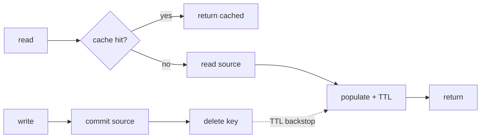

## Thesis

Serving reads from a fast store in front of the source of truth to cut latency and load --- where the hard part is not the lookup but keeping the cache consistent with the source, which is why cache-aside with explicit invalidation and a TTL safety net is the default, and the failure modes you design for are the stampede, the stale read, and the cache going down.

## Sub

**The patterns --- cache-aside, write-through, write-back** -> **invalidation and the TTL safety net** -> **the stampede and the failure modes** -> **zoom out** to consistency, and the pivots an interviewer rides from "add a cache" into which pattern, how you invalidate, and what happens when the cache is down.

## Spine

- Cache-aside is the **default** --- the app checks the cache, and on a miss reads the source and populates the cache; the cache is a lookaside copy, not in the write path.
- The hard problem is **invalidation** --- a cached value goes stale when the source changes, so you invalidate on write and lean on a TTL as the safety net for whatever you miss.
- A **stampede** is the failure at scale --- when a hot key expires, many reads miss at once and all hit the source; you prevent it by locking the recompute or serving stale while one refreshes.
- The cache is **not the source of truth** --- it can be down or wrong, so reads fall back to the source and the system stays correct without the cache, only slower.

## Companion Notes

### walk

A read through the cache

One read from cache check to served value --- the miss that populates, the write that invalidates, and the fallback when the cache is gone.

Say the consistency line early --- "cache-aside is eventually consistent; I invalidate on write and a TTL bounds the rest." That frames every follow-up.

### drill

Probe Drill

Graded follow-ups on the patterns, invalidation, the stampede, and the failure modes --- the ones that separate "add Redis" from a designed cache.

Name the source of truth out loud --- the cache can be wrong or down, so reads must be correct without it.

### wb

Whiteboard

Rebuild the read path and the write path from memory --- the cues, nothing in front of you.

Draw the source of truth first and the cache beside it, not in front of it. The arrow that matters is the one that clears the cache, not the one that fills it.

### sys

System Map

Zoom out: a cache sits between a reader and the source of truth, and there is one at almost every layer of the stack.

Lead with what the cache is protecting, not what it is --- "the database is the source of truth; the cache is a disposable copy that shields it." That line answers half the pivots before they are asked.

### trade

Trade-offs

The calls they drill --- cache-aside vs write-through, TTL vs invalidation, LRU vs LFU, and what a cache outage should actually do --- each with the switch condition.

Always name the alternative and its cost. The honest answer is almost always about the staleness this particular data can tolerate, not about which pattern is better.

### model

Model Answers

Full spoken scripts --- the beats, in order, the way you would actually say them.

Steal the frame, not the words --- "cache-aside, invalidate on write, TTL as the backstop" --- then name the failure you designed for, because that is the part that scores.

### num

Numbers

Back-of-envelope the load a cache removes --- and know the one number that turns a cache outage into a database outage.

Lead with the miss rate, not the hit ratio. The source feels one minus the hit ratio, which is why 99 percent to 98 percent doubles its load.

### rf

Red Flags

What sinks the round --- no TTL, updating the cache instead of deleting it, treating the cache as the source of truth --- and what to say instead.

Name what the interviewer hears. "Would serve stale data forever" is the fastest no-hire in the room, and staleness is the bug that fails silently.

### open

30-Second

The opener and the close --- matched to the altitude the question is asked at.

Match the altitude --- open at the pattern and the invalidation, not at Redis --- and land on the stampede and the cache-down surge as the real hard parts.

## Walk

### The read checks the cache first

```flow
n[read request] -> p[cache lookup] -> t[hit: return] / r[miss: go to source]
```

Every read checks the cache first. On a hit, it returns immediately --- the fast path that is the whole point. On a miss, it falls through to the source, and the cost of the read is a cache lookup plus, only when needed, the source read.

The cache is a lookaside copy that sits beside the source, not in front of every write. The application owns reading through it, which is what makes cache-aside simple: nothing changes about how writes reach the source.

### A miss populates the cache

```flow
r[miss] -> n[read source] -> p[populate cache] -> t[return value]
```

On a miss, the app reads the source of truth, writes the value into the cache with a TTL, and returns it. The next read of that key is a hit until it's invalidated or the TTL expires.

```ts
async function get(key) {
  const hit = await cache.get(key);
  if (hit !== null) return hit;            // ==fast path==
  const value = await source.read(key);    // miss: authoritative read
  await cache.set(key, value, { ttl: 300 }); // populate with a safety-net TTL
  return value;
}
```

Because the cache holds only what's actually been read, it stays proportional to the working set --- and the TTL means even a value you never explicitly invalidate can't stay stale longer than its lifetime.

### A write invalidates the cached copy

```flow
n[write source] -> p[commit] -> t[invalidate key]
```

A write goes to the source and, after it commits, invalidates the cached key so the next read re-populates from the fresh source. Invalidating *after* the commit is what avoids the race where a concurrent read repopulates the old value.

Invalidation is the hard half of caching: you have to know exactly which keys a write makes stale. Miss one and you serve stale data; the TTL is the backstop that eventually heals what your invalidation logic misses.

### The stampede, and when the cache is gone

```flow
r[hot key expires] -> n[many misses at once] -> p[one rebuilds under a lock] . a[others serve stale]
```

When a hot key expires, every concurrent read misses and would hit the source together --- a stampede. You let one request rebuild under a lock while the others wait or serve the stale value, so the source sees one recompute instead of thousands.

And if the cache itself is down, reads fall back to the source: slower, but correct, because the source is the truth. The two failure modes to design for are the stampede on expiry and the load surge when the cache disappears --- both are about protecting the source the cache was shielding.

### The race that poisons the cache

```flow
n[slow reader fetches v1] -> p[writer commits v2, deletes key] -> r[slow reader SETs v1] . a[stale until TTL]
```

Invalidation running is not the same as the cache being right. A reader misses and fetches `v1` from the source, but it is slow. A writer commits `v2` and deletes the key --- which does nothing, because the key is not there yet. Then the slow reader wakes up and writes `v1` into the cache. Every step was correct, the invalidation *did* run, and the cache is now wrong with no future event scheduled to fix it.

```ts
// DELETE, never update -- two concurrent writers can reorder their cache writes
await source.write(key, value);        // commit first
await cache.==del==(key);                  // ==idempotent==: whoever deletes last, the key is gone
// For keys that matter, make the POPULATE conditional: a lease token handed out
// on the miss, invalidated by the delete -- so a stale write-back is rejected.
```

Two rules fall out of this. **Delete, never update** --- a delete has no value to get out of order, so concurrent writers cannot lose a race they are not running. And for the keys that genuinely matter, make the *populate* conditional: a lease token issued on the miss and invalidated by the delete, or a compare-and-set on a version, so the stale write-back is refused instead of accepted.

### Sizing it, and what gets evicted

```flow
n[working set] -> p[maxmemory reached] -> t[LRU / LFU evicts] / r[hot set evicted: thrash]
```

A cache is a fixed-size box, so something has to leave. If the box is smaller than the working set, entries are evicted before they are read again, the hit ratio collapses, and you are paying for a cache that mostly misses. The **eviction rate** is the metric that tells you this, and it moves days before anyone notices the latency.

The policy matters more than people expect. **LRU** assumes recency predicts reuse --- which a batch job or a crawler destroys: it touches a million keys once, every touch looks maximally recent, and your hot set is evicted in favour of data nobody will read again. **LFU** evicts on frequency, so the scan's once-touched keys go first and the hot set survives. That is the whole reason scan-resistant policies exist.

### Spreading it across nodes

```flow
n[key] -> p[hash to a slot] -> t[one cache node] . a[node dies -> its share misses]
```

One cache node is a single machine's memory and a single point of failure, so a real cache is a cluster and every key hashes to exactly one node. The thing to get right is what happens when a node joins or dies: a naive `hash(key) % N` **remaps almost every key** when N changes, so one node loss becomes a full-cache miss storm. Consistent hashing --- or Redis Cluster's fixed slot map --- moves only the failed node's share.

That share is the number that matters. Lose one node of ten and roughly a tenth of your keys start missing, so the source sees a load spike proportional to the node's share rather than a total outage. Replicating each shard turns that spike into nothing; not replicating turns a routine node failure into a database load event.

### The hot key

```flow
r[one hot key] -> n[all reads hash to one node] -> p[local L1 + key splitting] -> t[spread the heat]
```

Sharding spreads *keys*, not *load*. If one key is 30 percent of your reads --- a celebrity, a front-page item, a global config blob --- every one of those reads hashes to the same node, and that node saturates while the other nine idle. Adding cache nodes does not help at all, because the hot key does not move.

```ts
// 1) shield it at the app: an L1 copy collapses N reads into one network read
const hot = l1.get(key) ?? await redis.get(key);   // ==tiny TTL==, hot keys only
// 2) or split the key across shards and read one at random
const v = await redis.get(`${key}#${==randInt(1, N)==}`);  // N copies -> N nodes
```

Two fixes, and they compose. A small **in-process L1** in front of the shared cache absorbs the repeat reads before they ever leave the app instance. And **key splitting** --- storing N copies under `key#1` through `key#N` and reading a random one --- turns one hot key into N warm keys on N different nodes. Both buy the ability to survive a key that is hotter than a single machine, and both pay for it in extra staleness or extra memory.

### The layers you cannot invalidate

```flow
a[browser: no purge at all] -> a[CDN: purge, eventually] -> p[app-local: broadcast or TTL] -> t[shared cache: delete]
```

There is a cache at every layer, and they get faster --- and *less invalidatable* --- the closer they sit to the user. You can delete from Redis. You can broadcast an invalidation to your app instances. You can ask a CDN to purge and it will, eventually, across hundreds of edge locations. You can do **nothing at all** about a response already sitting in a browser under a `max-age` you handed out.

So the freshness of the system is the freshness of its **worst layer**, and the answer is not to invalidate everything --- it is to make the un-invalidatable layers *not need* invalidation. Content-hash the URL and mark it immutable, so changing the content changes the *name* and there is nothing left to purge. Everywhere above the shared cache, a short TTL you have deliberately priced. Active invalidation is for the one layer you actually own.

### Model Script

- Frame the cache | "A cache serves reads from a fast store in front of the source to cut latency and load. My default is cache-aside: the app checks the cache, and on a miss reads the source and populates the cache. The cache is a lookaside copy, not in the write path, so it's simple and holds only what's actually read."
- Name the hard part | "The hard part isn't the lookup, it's invalidation --- a cached value goes stale when the source changes, and I have to clear exactly the right keys when a write commits. I invalidate on write, and I put a TTL on every entry as the safety net so anything my invalidation misses self-heals within the TTL."
- Delete, don't update | "And I *delete* the key rather than writing the new value into it. Two concurrent writers can commit to the database in one order and update the cache in the other, and then the cache holds the loser's value until the TTL saves it. A delete has no value to get out of order, so that whole class of race just disappears."
- The consistency reality | "That makes a cache eventually consistent --- there's a window where cache and source disagree, bounded by the TTL and how fast I invalidate. So I only cache data where that staleness is acceptable; a read that must be perfectly current I don't serve from the cache, or I write-through for it."
- The failure modes | "Two failures I design for. A stampede: when a hot key expires, many reads miss at once and hit the source together, so I lock the recompute or serve stale while one rebuilds. And the cache going down: reads fall back to the source --- correct but slower --- so I plan for the load surge, because the source has to be right without the cache."
- Interviewer: "Your Redis is suddenly cold after a restart. What happens?"
- Handle the cold cache | "Every read misses and hits the source at once --- the same stampede but fleet-wide. I'd warm the hot keys before taking traffic, and lean on per-instance local fallbacks and recompute locks so the source sees one rebuild per key, not one per request. A cold cache is a load event, so I treat a restart as something to warm through."
- Do the arithmetic out loud | "And I'd say the number: at a 95 percent hit ratio, losing the cache doesn't add five percent to database load --- it multiplies it by twenty. So 'fall back to the source' is only a real answer if there's a concurrency limit in front of the source and I've decided what to shed beyond it."
- Land it | "So: cache-aside as the default, invalidate on write with a TTL backstop, accept eventual consistency and cache only where that's fine, and design for the stampede and the cache-down surge. The one line is that the cache makes reads faster but the source stays the truth."

## Drill

all | **All three levels, mixed** --- the way a real loop actually comes at you.
SDE2 | **The model and the patterns** --- cache-aside, write-through, the TTL, the hit ratio, and what is actually worth caching. The bar is "this is a designed cache, not an added one": name the pattern and the staleness it buys you.
SDE3 | **Invalidation, races and failure** --- the stale-populate race, the stampede, eviction, penetration, and what happens when the cache goes away. The bar is "I know where this breaks": name the failure and the mechanism that bounds it.
Staff | **Consistency and the calls** --- per-read consistency, multi-layer coherence, key design, warming, and when *not* to cache. The bar is "the source is the thing I'm protecting": price the cache, don't just praise it.

### SDE2 | what a cache does

What does a cache do, and when does it help?

It stores the result of an expensive read in a fast store so later reads skip the work. It helps for **read-heavy**, expensive-to-produce, staleness-tolerant data --- read far more often than it changes --- where the win is lower latency and less load on the source. It doesn't help write-heavy or rarely-read data, where the cache mostly misses and just adds overhead.

Follow: "Read-heavy" is vague. Give me the number that actually decides it.
Two numbers. The **read-to-write ratio** on that data, and the **re-read rate between writes**. A cache pays off when a value is read many times per change: at 100 reads per write, one populate serves 99 hits and source load drops by ~99 percent. At a 1:1 ratio the entry is invalidated as fast as it is filled --- you pay the write, the invalidation *and* the miss, and get almost no hits. So the test isn't "is it read-heavy" in the abstract, it's whether reads *between* writes are numerous enough that an entry survives long enough to be reused. Rarely-read data fails the same test from the other side: the entry expires before its second read ever arrives.

Follow: The data is read constantly but changes every second. Is that cacheable?
Yes --- if the product tolerates a second of staleness. That's the part people get backwards: cacheability is a function of **tolerated staleness**, not of change rate. A value that changes every second and is read 10,000 times a second, cached with a 1-second TTL, still serves ~9,999 of every 10,000 reads from cache and cuts source load by four orders of magnitude; you have simply accepted that a read can be up to a second old. A price on a dashboard is exactly this. What makes data genuinely *un*cacheable is a hard freshness requirement --- a balance you are about to debit against --- not a high rate of change.

Senior: Framing cacheability as **read-to-write ratio plus tolerated staleness** --- rather than the reflex "is it read-heavy?" --- and knowing that fast-changing data is still cacheable behind a short TTL, is what separates a designed cache from an added one.
Speak: Give the two tests: **'how many reads per write, and how stale can this be?'** A high read-to-write ratio means the entry gets reused; a tolerated staleness window means a TTL is legal. Fast-changing data is still cacheable with a 1-second TTL --- what kills it is a hard freshness requirement, not a high change rate.

### SDE2 | cache-aside

What is the cache-aside pattern?

The app checks the cache; on a hit it returns the value, on a miss it reads the source, writes the value into the cache, and returns it. The cache sits *beside* the source --- a lookaside copy the application reads through, not part of the write path. It's the default because it's simple and the cache holds only what's actually read.

Follow: Why does the *application* populate the cache, rather than the cache pulling from the source itself?
Because in cache-aside the cache is a **dumb key-value store** --- no connection to the database, no schema knowledge, no idea how to produce the value. The application is the only thing that knows how to compute the value on a miss, so it owns the read-through. The alternative is a **read-through** cache, which pushes that job into the cache layer via a loader function: the call site becomes just `get(key)`, which is genuinely nicer, but now the cache is a component that talks to your database and has to be given a loader. Cache-aside keeps the cache trivially replaceable and keeps the miss logic where the domain knowledge already lives. Same read path, different owner.

Follow: On a miss you read the source and then write the cache. What if the process dies between those two?
Nothing bad happens --- and that is the point. The cache simply doesn't get populated, so the next read misses and populates again. Cache-aside has **no correctness dependency on the populate succeeding**: a failed `SET` costs you one extra miss, never a wrong answer, because the cache is not the source of truth. That's why the populate is fire-and-forget in most implementations --- you don't wrap it in a transaction with the read, and you don't fail the user's request because Redis rejected a write. Contrast write-through, where the cache write is *in* the write path: there, a partial failure is a real consistency question you have to answer.

Senior: Knowing cache-aside is **lookaside, and the populate is best-effort** --- a failed cache write costs a miss, never a wrong answer --- and being able to name **read-through** as the alternative that hides the miss behind a loader, is the pattern fluency an interviewer is checking for.
Speak: Say who owns the miss: **'the application reads the source and populates the cache --- the cache is a dumb store that knows nothing about the database.'** The populate is best-effort: if it fails you take one extra miss, never a wrong answer. Read-through is the alternative that hides the miss behind a loader inside the cache layer.

### SDE2 | write-through vs write-back

How do write-through and write-back differ?

**Write-through** writes to the cache and the source synchronously on every write --- the cache stays consistent, but every write pays both. **Write-back** writes to the cache and flushes to the source asynchronously --- fast writes, but a crash can lose un-flushed data. Write-through trades write latency for consistency; write-back trades durability for speed.

Follow: Write-back can lose data on a crash. Databases use write-back internally and don't lose data. What are they doing that you aren't?
A **write-ahead log**. A database's buffer pool *is* a write-back cache --- it dirties a page in memory and flushes it to disk lazily --- but before the transaction commits it appends the change to a durable, sequential WAL. So a crash loses the *buffer pool*, not the *data*: recovery replays the log and reconstructs the un-flushed pages. Write-back is only safe when the write is durable **somewhere else first**. An application-level write-back cache --- dirty values sitting in Redis, flushed to Postgres later --- usually has no such log; Redis's AOF/RDB persist *Redis's own state*, they are not a recovery log for your database. So a crash between the cache write and the flush is genuine data loss. If you want application-level write-back safely, you end up rebuilding the WAL: durably queue the write, then apply it --- at which point you have built an outbox, not a cache.

Follow: So when would you actually reach for write-back at the application level?
When writes are **high-volume, coalescable and individually low-value**: view counts, "last seen at", like counters, analytics-ish state. You buffer increments in the cache and flush a rollup periodically, so a thousand increments become one database write. What you are explicitly buying is **write coalescing**; what you are explicitly accepting is that a crash loses the last flush interval's worth of counts. That trade is completely fine for a view counter and completely unacceptable for an account balance. So the test is one question: if I lose the last N seconds of these writes, does anyone care? If the answer is yes, write-back is the wrong pattern and the answer is write-through or straight to the source.

Senior: Knowing that **write-back is only safe with a write-ahead log** --- which is exactly why a database's buffer pool can do it and your Redis cache cannot --- and scoping application-level write-back to coalescable, low-value writes like counters, is the durability reasoning that reads as senior.
Speak: Draw the durability line: **'write-through pays the source on every write; write-back acknowledges from the cache and flushes later, so a crash loses whatever hasn't flushed.'** A database gets away with write-back because of the WAL --- your cache has no such log, so reserve it for coalescable, low-value writes like counters.

### SDE2 | the TTL

What is a TTL and why use one?

A time-to-live expires an entry after a set duration, so the next read misses and re-fetches. It's the safety net for staleness you didn't explicitly invalidate --- even if an invalidation is missed, the entry self-heals within the TTL. It bounds how stale a value can get with no invalidation logic at all, which is why almost every cache entry has one.

Follow: How do you actually pick the number?
Two ceilings; take the lower. **The product's tolerance:** the TTL is the worst-case staleness a read can show if invalidation never fires, so it cannot exceed what the feature can live with --- seconds for a price, minutes for a profile, hours for a config blob. **The source's load budget:** a shorter TTL means more misses, and the hit ratio is roughly set by how many times a key is read within one TTL. A key read 10 times a minute with a 60-second TTL gives ~10 reads per populate and a ~90 percent hit ratio; drop to a 6-second TTL and you're near 50 percent and the source sees five times the load. So you take the longest TTL the product tolerates, then check the source can carry the resulting miss rate --- and if it can't, the fix is a *longer* TTL with tighter invalidation, not a shorter one.

Follow: You called the TTL a safety net. A net for *what*, exactly?
For **the invalidations you don't know you're missing**. Explicit invalidation only clears keys your code *knows* a write affects, so it silently misses every write that happens on a path you didn't instrument: a backfill script, a manual `UPDATE` by an on-call engineer, another service writing the same table, a new code path added by someone who never knew the cache existed, or a derived key whose dependency nobody mapped. Every one of those leaves a stale entry that **nothing else will ever clear**. The TTL bounds all of them at once without needing to enumerate them --- it converts "stale forever" into "stale for at most T". That is why an entry with no TTL is a latent permanent-corruption bug, and why the TTL is *not* redundant with correct invalidation: it is the net under the invalidation you got wrong.

Senior: Sizing the TTL from **the product's staleness tolerance capped by the source's miss-load budget** --- and articulating that it nets the invalidations you *never knew about* (backfills, manual updates, another service), not the ones you coded --- is what separates a chosen TTL from a copied one.
Speak: Pick it from two ceilings: **'the longest staleness the product tolerates, capped by the miss load the source can carry.'** Then say what it's a net for --- the invalidations you never knew you were missing: a backfill, a manual UPDATE, another service writing the same table. Without a TTL, those are stale *forever*.

### SDE2 | the hit ratio

What is the cache hit ratio and why does it matter?

The fraction of reads served from the cache rather than the source. It's the single number that decides the cache's value --- a 90 percent hit ratio means the source sees a tenth of the read load; a low ratio means the cache is overhead without payoff. You size and tune the cache to keep this high for the hot data.

Follow: You're at a 90 percent hit ratio and you push it to 95. How much does source load actually change?
It **halves**. This is the thing people get backwards: the source is driven by the **miss** rate, not the hit rate, so the number that matters is `1 - h`. Ninety to 95 percent takes misses from 10 percent to 5 --- the source sees half the reads it did. And the effect compounds at the top: 99 to 99.5 halves it again. The corollary is the frightening one --- a hit ratio that *drops* from 99 to 98 percent **doubles** database load, from one percent of reads to two, and on a dashboard a "one point" regression looks like nothing at all. So you monitor and alarm on the **miss rate**, because the miss rate is what the database actually feels.

Follow: A colleague wants to double the cache memory to lift the hit ratio. How do you decide if that's worth it?
By asking whether the misses are **capacity misses or compulsory misses** --- because memory only fixes the first. Look at the **eviction rate**. If the cache is evicting heavily, the working set doesn't fit, entries are being thrown out before they're re-read, and more memory converts evictions directly into hits: a real, measurable win. If the eviction rate is near zero, the cache is already holding everything it's asked for, and the misses are **first reads and TTL expiries** --- more memory buys you literally nothing, and the levers are a longer TTL, better key design, or warming. So the diagnostic is one metric: high evictions plus a low hit ratio means buy memory; low evictions plus a low hit ratio means you have a TTL or access-pattern problem that memory cannot touch.

Senior: Reasoning in **miss rate rather than hit ratio** --- so that 99 to 98 percent registers as *doubling* database load --- and using the **eviction rate** to decide whether more memory can even help, is the quantitative instinct an interviewer is probing for.
Speak: Flip it to the miss rate: **'the source feels one minus the hit ratio --- so 99 to 98 percent doubles its load.'** And before buying memory, look at evictions: heavy evictions mean the working set doesn't fit and memory converts them into hits; near-zero evictions mean the misses are TTL expiries, and memory buys you nothing.

### SDE2 | what to cache

What data is a good fit for caching?

Read-heavy, expensive to produce, and tolerant of some staleness --- read many times per change, costly to compute or fetch, where a slightly stale answer is acceptable. Poor fits: write-heavy data (constant invalidation), rarely-read data (mostly misses), and data that must be perfectly current. Match the cache to the access pattern, don't cache reflexively.

Follow: Give me something in a typical product that *looks* cacheable and isn't.
Anything you are about to make a **decision** on: a balance you're about to debit, an inventory count you're about to decrement, a permission you're about to enforce. Every one of them is read-heavy and expensive to compute, so they sail through the naive test --- and a stale read on any of them is an overdraft, an oversell, or an authorization bypass. That's a *correctness* bug, not a cosmetic one. The other classic is a **user's own data on the page right after they submit it**: it looks perfect for caching, but the single read that matters most is the one immediately after the write, and that is precisely the read a lookaside cache is most likely to serve stale, because the invalidation and the repopulate are racing the redirect. So the rule I'd give: cache what you **display**; be very careful caching what you **decide on**.

Follow: So you'd never cache permissions? They're read on every single request.
You do cache them --- you just bound the staleness deliberately and say what it costs. Permission checks are the textbook read-heavy, write-rare workload, and hitting the authorization store on every request is exactly the load a cache exists to remove. What you're accepting is that a **revocation** takes up to the TTL to take effect: revoke someone's access and they may still get through for the next N seconds. So you pick that TTL from the *security* requirement rather than the performance one --- usually short, tens of seconds --- normally with an explicit invalidation on revoke, and a **global epoch you can bump** to nuke every cached permission at once for a break-glass revoke. The senior version of the answer is saying the window out loud: "permissions are cached for 30 seconds, so a revoke is effective within 30 seconds, and there's an epoch bump for an emergency." That's a decision, not an oversight.

Senior: Naming the category that fails the naive test --- **data you decide on** (a balance, an inventory count, a permission) versus data you merely display --- and, when you *do* cache a permission, stating the **revocation window** out loud as a deliberate security decision, is the judgment a senior round rewards.
Speak: Split display from decision: **'cache what you display; be careful caching what you decide on.'** A balance you're about to debit or a permission you're about to enforce is read-heavy and expensive --- and a stale read there is an overdraft or an auth bypass, not a stale pixel. If you do cache permissions, name the revocation window out loud.

### SDE2 | where the cache sits

Where can a cache live in the stack?

At several layers --- the client or browser, a CDN at the edge, an in-process cache in the app, a shared cache like Redis, and the database's own buffer cache. Each trades reach against freshness: a browser cache is fastest but per-user and hard to invalidate; a shared Redis is consistent across app instances but a network hop away. Most systems combine a few.

Follow: You put an in-process cache on every instance behind a load balancer. What breaks?
**They disagree.** Each instance populates its own copy independently, so the same key can hold different values on different instances, and a user's consecutive requests --- landing on different instances --- can watch a value flip back and forth. Worse, an **invalidation only clears the instance that received it**: the other N-1 keep serving the stale value until their own TTLs expire, so "I invalidated it" is only true for one machine in the fleet. You also multiply the miss load by fleet size --- fifty instances each populate the same key, so that's fifty source reads instead of one, and a deploy makes all fifty caches cold simultaneously. The fixes: keep local caches **small and short-TTL** and accept the drift, **broadcast** invalidations over pub/sub to every instance, or accept that the shared cache is the *real* cache and the local one exists only as a hot-key shield.

Follow: How do you invalidate a browser cache?
**You don't.** Once a response is sitting in a user's browser with a `max-age`, you have no way to reach it --- no callback, no purge, no connection. That's the fundamental asymmetry of the stack: the layers closest to the user are the fastest and the *least* invalidatable. So you don't try; you design so you never need to. The standard move is **content-addressed URLs**: name the asset by a hash of its content (`app.9f2a1c.js`), serve it `Cache-Control: max-age=31536000, immutable`, and when the content changes you change the **URL**. The old URL still returns the old content, which is *correct*, because that URL *is* that content --- and the new HTML simply points at the new name. For things you can't rename, you use a **short TTL** and accept the window, or route through a CDN you *can* purge (and even then a purge is eventually consistent across edge locations and rate-limited). The rule: active invalidation for the layer you control, immutable naming or short TTLs for everything above it.

Senior: Knowing the **invalidatability gradient** --- the closer a cache sits to the user, the faster it is and the less you can invalidate it --- and reaching for **content-hashed immutable URLs** instead of trying to purge a browser, is the multi-layer literacy that reads as senior.
Speak: State the gradient: **'the closer the cache is to the user, the faster it is and the less you can invalidate it.'** You cannot invalidate a browser --- so you don't: content-hash the URL, mark it immutable, and change the *name* when the content changes. Active invalidation is only for the shared layer you own.

### SDE3 | the invalidation problem

Why is cache invalidation hard?

Because a cached copy goes stale the instant the source changes, and you must find and clear every place it's cached --- across keys, layers, and instances --- exactly when the write happens. Miss one and you serve stale data; over-invalidate and you lose the hit ratio. Knowing precisely what a given write invalidates is the genuinely hard part, which is why "there are only two hard things" names it.

Follow: Give me a concrete write where "which keys does this invalidate" is genuinely hard.
A write to a row that **derived and list keys depend on**. A seller renames a product. The obvious key is `product:123` --- easy. But you have also cached `search:widgets:page1`, the category listing that contains it, the homepage "featured" block it appears in, the seller's dashboard aggregate, and a denormalized `order:987` snapshot that embedded the product name at write time. One row changed; six cached values are now stale, and **nothing in the write path knows about five of them** --- because the dependency lives in whoever *built* those values, not in whoever wrote the row. That's the actual difficulty: invalidation needs a **reverse dependency map** from source data to every cached value derived from it, and that map is scattered implicitly across the whole codebase. The practical answers: cache **close to the source** and compose the page from cached rows rather than caching the composed page; **version a namespace** so one bump invalidates a whole family; or stop maintaining the map by hand and drive invalidation off the database's change log.

Follow: You mentioned versioning a namespace. How does that actually work?
You put a **version number in the key** and keep the version itself in the cache. Keys look like `product:v{n}:123`, where `n` comes from a counter key such as `ver:product`. To invalidate *every* product key at once, you `INCR ver:product` --- one atomic operation --- and every subsequent read computes a key with the new version, misses, and repopulates. The old keys are now **unreachable**, and you never delete them: they simply age out under their TTL and eviction. This is what lets you invalidate a *class* of keys without enumerating them, which matters enormously, because the naive approach --- scanning the keyspace for matching keys --- is exactly the thing you must never do. `KEYS` in Redis is O(N) and blocks the single command thread; on a large keyspace it is an outage, not a query. The cost is one extra read to fetch the version (pipeline it, or cache the version locally for a second), plus a burst of misses right after the bump.

Follow: That bump invalidates a whole family at once. What does it cost you?
**A miss storm you have to budget for.** An `INCR` on the version key instantly makes every key in that family unreachable --- which is what you asked for, and it means the entire family now misses *simultaneously, at full production traffic*. If that family is your product catalog, you have just performed a partial cache flush during peak, and the source takes the full un-amplified read load for that class until the cache refills: the cold-cache load event, self-inflicted. So a version bump is a **load-generating operation** and deserves the same care as a deploy --- do it when you can afford the misses, keep the single-flight lock on so each hot key rebuilds once rather than a thousand times, and consider **narrowing the namespace** so a bump clears a hundred keys instead of ten million. Bulk invalidation is trivial to *trigger* and expensive to *absorb*, and the expense always lands on the database.

Senior: Naming the **reverse dependency map** --- one row change staling a row key, three list keys and a denormalized snapshot --- as the real difficulty, then reaching for **namespace versioning** (an `INCR`, never a keyspace scan) while pricing the miss storm the bump causes, is exactly the depth the "two hard things" joke is pointing at.
Speak: Say what's actually hard: **'knowing which keys a write makes stale --- the row key is easy; the list, the aggregate and the denormalized snapshot that embedded it are not.'** Fixes: cache close to the source and compose, version a namespace so one INCR clears a family, or drive invalidation off the database's change log. Never scan the keyspace to find them.

### SDE3 | the stampede

What is a cache stampede and how do you prevent it?

When a hot key expires, many concurrent reads all miss at once and all hit the source together --- a thundering herd that can overload it. Prevent it by **locking the recompute** so only one request rebuilds while others wait or serve stale, by refreshing ahead of expiry, or by jittering TTLs so keys don't expire in lockstep. The danger scales with how hot the key is.

Follow: You lock the recompute so one request rebuilds. What do the other thousand requests do while they wait?
That's the real design question, and there are three answers with very different costs. **Serve stale** --- keep the old value past its logical expiry and hand it out while one request refreshes behind it. This is the best answer whenever it's legal: nobody waits, the source sees exactly one rebuild, and the only cost is that everyone gets a slightly older value for the length of the refresh. **Wait on the lock** --- block until the rebuilder publishes, then read. Correct and fresh, but you now have a thousand requests holding threads and connections for the duration of the recompute, which is its *own* outage if the recompute is slow; it needs a bounded wait and a fallback. **Fail fast** --- return an error or a degraded response immediately; almost never what you want for a read. The senior move is naming **serve-stale-while-revalidating as the default**, because it's the only option where the herd costs *nobody* latency, and reserving lock-and-wait for values that genuinely must not be stale.

Follow: Instead of locking, how would you stop the key expiring under load in the first place?
**Refresh it before it expires**, probabilistically. On each read you decide --- with a probability that rises as the TTL nears --- to recompute *early*, and you scale that probability by how **expensive** the last recompute was, so an expensive value starts trying to refresh itself sooner. The effect is that some single reader, at a random moment shortly before expiry, rebuilds the value while the key is *still valid*, and everyone else keeps hitting a live cache. The herd never forms, because there is never a moment when the key is absent. The classic formulation (probabilistic early expiration, sometimes called XFetch) recomputes when `now - delta * beta * ln(rand()) >= expiry`: `delta` is how long the last recompute took, and since `ln(rand())` is negative, that term pulls the effective expiry earlier by a random amount proportional to the rebuild cost. The cheap approximation that captures most of the benefit: on a read, if the remaining TTL is below a threshold, kick off an async refresh and return the current value.

Senior: Distinguishing the three herd strategies --- **serve stale (nobody waits), lock-and-wait (fresh, but a thousand threads are parked), fail fast** --- and knowing that **probabilistic early refresh** stops the herd from ever forming rather than managing it once the key is already gone, is what separates a designed cache from a memorized "use a mutex".
Speak: Name the default: **'serve stale while one request refreshes behind it.'** Lock-and-wait is correct but parks a thousand threads for the length of the recompute. Better still, refresh *before* expiry --- probabilistically, weighted by how expensive the rebuild is --- so the key is never absent and the herd never forms.

### SDE3 | stale reads

How stale can a cached read be?

As stale as the gap between a source change and the invalidation landing or the TTL expiring. Cache-aside is eventually consistent by nature --- there's a window where cache and source disagree. You bound it with a short TTL and prompt invalidation, and you only cache where that window is acceptable; a read that must be perfectly current shouldn't be served from a lookaside cache.

Follow: A user updates their profile and immediately reloads. How do you guarantee they see their own write?
You break the lookaside path for that read, and there are three ways. **Invalidate synchronously before returning the write response** --- commit, delete the key, *then* respond --- so the reload's read is guaranteed to miss and repopulate from the source. Cheapest and the usual answer, though note it doesn't close the populate race on its own: a concurrent slow reader can still write the old value back after your delete. **Route the writer's own reads to the source** for a short window --- set a "recently wrote" marker on their session for N seconds and read through --- which gives genuine read-your-writes to the one person who cares (the author) while everyone else keeps hitting cache. **Write-through** on that key, so the current value is simply there. Whichever you pick, the thing to say out loud is that read-your-writes is a **per-user guarantee, not global consistency**: you are making the author see their own change immediately, and you are deliberately still letting everyone else see the old value for the rest of the window.

Follow: How would you *measure* your staleness window in production, rather than assuming it?
**Version-stamp the value and compare on read.** Put the source row's `updated_at` (or a monotonic version) *inside* the cached value, so any cache hit tells you exactly which version of the source it reflects. Then, on a sample of reads, do a **shadow read of the source** and compare: the distribution of `source_version - cached_version`, in time, *is* your staleness distribution, and you can put a p99 on it and alarm. That turns "eventually consistent, bounded by the TTL" from a hand-wave into a number --- and if p99 staleness starts creeping toward the TTL, that is the signature of **invalidation having quietly stopped working**, with the TTL silently doing all the work. You would never otherwise see it, because a stale cache serves fast and returns 200s. The second, cheaper signal is **invalidation lag**: instrument the time from source commit to the corresponding cache delete, and alarm on the tail.

Senior: Treating read-your-writes as a **per-user guarantee you engineer** --- sync invalidate, read-through for the author's window, or write-through --- rather than something you hope for, and being able to actually *measure* staleness by version-stamping cached values, is the consistency rigor that reads as senior.
Speak: Separate the guarantee from the window: **'cache-aside is eventually consistent; read-your-writes is a per-user guarantee I add on top.'** Invalidate synchronously before returning the write, or route the author's reads to the source for a few seconds. And version-stamp the cached value, so staleness is a number you can alarm on instead of a hope.

### SDE3 | the cache-aside race

What is the race between a read and a write in cache-aside?

A read misses and fetches the old value from the source; meanwhile a write updates the source and invalidates the cache; then the slow read populates the cache with the now-stale value it already fetched. The cache ends up holding stale data past the write. Mitigate by invalidating after the write commits, keeping a short TTL to bound it, or write-through for keys where it truly matters.

Follow: Walk me through the exact interleaving that produces the stale entry.
Four steps, and the *order* is the whole bug. **(1)** A read **misses** and fetches `v1` from the source --- but it's slow: a GC pause, a slow query, a network hiccup --- and hasn't written to the cache yet. **(2)** A write commits `v2` to the source. **(3)** The write **deletes** the cache key, which is a **no-op**, because the key isn't there --- the reader hasn't populated it yet. **(4)** The slow reader finally wakes and **`SET`s `v1`** into the cache. The cache now holds `v1`, the source holds `v2`, and **no future event is scheduled to fix it**: the write already did its invalidation and it is not coming back. The entry is wrong until the TTL expires. Notice what makes it nasty: every individual step is correct, the invalidation genuinely ran, and the window is the reader's fetch duration --- so it is rare, non-deterministic, and it sails straight through your test suite.

Follow: So how do you actually close it?
It depends how much you're willing to pay. **A TTL bounds it** --- always do this; it's the floor, and for most data "rarely, and stale for at most 30 seconds" is a perfectly good answer. **Delete rather than update on write**, which doesn't fix *this* race but removes the far more common write-write version of it. **Delayed double-delete**: delete, commit, wait longer than a read takes, delete again --- crude, effective, and it makes correctness depend on a sleep, which is why nobody loves it. **Write-through** for the keys that genuinely matter, so the value is always current and there is no populate to lose the race. And the principled fix, which is what Facebook's memcache does: **leases**. On a miss the cache hands the reader a **lease token**; a `SET` is only accepted if that token is still valid, and **an invalidation invalidates the outstanding tokens for that key**. In the interleaving above, step 3 kills the reader's lease and step 4's `SET` is **rejected** --- the stale value never lands. The same mechanism throttles the stampede, since the cache issues only one lease per key at a time. If your cache has a compare-and-set, you can approximate it: read a version alongside the miss and accept the populate only if the version hasn't moved.

Follow: You keep saying "delete, don't update." What actually breaks if I update the cache on write?
**Concurrent writers reorder.** Writer A commits `v1` to the source and writer B commits `v2`, with B winning --- so the database correctly holds `v2`. But the two *cache* updates are a separate pair of operations with **no ordering relationship to the commits**: B can update the cache to `v2`, and then A can update it to `v1`. The cache now serves `v1`, the source holds `v2`, and once again nothing fixes it until the TTL. Deleting instead collapses that entire class, because two concurrent deletes are **idempotent**: whoever deletes last, the key is gone, and the next read repopulates from the source --- which is, by definition, the value that actually won. That's the whole argument for "invalidate, don't update": a delete has no value to get out of order, so concurrent writers cannot lose a race they aren't running.

Senior: Being able to **walk the four-step interleaving** --- slow reader fetches, writer commits, writer deletes nothing, slow reader writes the stale value back --- and knowing the real fixes are a bounding TTL, delete-don't-update, and a **lease or compare-and-set on the populate** rather than "put a lock on it somewhere", is genuinely Staff-adjacent depth on a bug most candidates have never even considered.
Speak: Walk the interleaving: **'a slow reader fetches the old value, the writer commits and deletes an empty key, and then the slow reader populates the cache with the stale value it already had.'** The invalidation ran and the cache is still wrong. Bound it with a TTL, delete rather than update, and for keys that matter use a lease or compare-and-set so a stale populate is rejected.

### SDE3 | eviction

What happens when the cache is full?

It evicts entries by a policy --- typically LRU, least-recently-used, so cold entries make room for hot ones. Eviction is why a cache with too little memory for its hot set thrashes: entries are evicted before they're reused and the hit ratio collapses. You size the cache to hold the working set and choose an eviction policy that matches the access pattern.

Follow: LRU is the default. When is it exactly the wrong policy?
When a **scan** walks your keyspace. LRU's whole assumption is that recency predicts reuse --- but a batch job, an analytics query, a crawler, or a "load every product to reindex" script touches an enormous number of keys **exactly once**, and every one of those touches looks maximally recent to LRU. So the scan evicts your entire hot working set in favour of data that will never be read again, and the hit ratio falls off a cliff and stays down until the hot set is faulted back in. That is the classic **cache pollution / scan resistance** failure. **LFU** is the answer, because it evicts on *frequency*: a key touched once by a scan has a frequency of one and is the first thing thrown out, while your hot keys, read thousands of times, are protected. Redis exposes this directly (`allkeys-lfu`, since 4.0), and modern in-process caches like Caffeine default to **W-TinyLFU** --- a small LRU admission window in front of a frequency sketch --- precisely because pure LRU is so easy to pollute.

Follow: You set `maxmemory-policy` to `volatile-lru` and Redis started rejecting writes with an OOM error. What happened?
The `volatile-*` policies only evict keys that have a **TTL set**. If any of your keys have no expiry --- and they almost certainly do, because somebody `SET` a key without one --- then when memory fills, Redis looks for an evictable candidate, finds only non-expiring keys, **cannot evict anything**, and starts returning OOM errors on writes. The cache stops accepting new entries and looks like an outage, while sitting on memory full of keys it refuses to touch. The fix is either `allkeys-lru` / `allkeys-lfu` (evict anything, which is what you actually want from a pure cache), or a discipline that **every key gets a TTL** --- which you should want anyway, since a TTL-less entry is the permanent-staleness bug. The deeper lesson: `volatile-*` exists for a Redis instance doing double duty as a cache *and* a durable store, and mixing those two roles in one instance is usually the real mistake.

Senior: Knowing **LRU is not scan-resistant** --- one batch job evicts the entire hot set --- and that **LFU / W-TinyLFU** exists precisely to fix that, plus the `volatile-lru`-with-no-TTLs OOM trap, is operational cache depth most candidates simply do not have.
Speak: Name the policy failure: **'LRU is not scan-resistant --- one batch job that reads every key once evicts your whole hot set.'** LFU evicts on frequency, so the scan's once-touched keys go first. And watch the eviction rate: heavy evictions mean the working set doesn't fit and the cache is thrashing.

### SDE3 | negative caching

Should you cache a "not found"?

Sometimes --- caching a miss stops repeated expensive lookups for something that doesn't exist, which matters under a flood of requests for missing keys. But cache it with a **short** TTL, because a value later created would otherwise be masked by the cached miss until it expires. Negative caching trades a small staleness window for protection against miss storms.

Follow: A scraper hits you with ten million random ids that don't exist. Negative caching doesn't help. Why, and what does?
Because negative caching only helps when the **same** missing key is requested repeatedly --- it caches "not found" for `product:999`, so the *second* request for `product:999` is cheap. Ten million *distinct* nonexistent ids are all first requests: each one misses the cache, misses the negative cache too, and hits the database. And it's worse than useless --- you are now **filling the cache with ten million junk negative entries**, evicting your real hot data, so the negative cache has become the attack's amplifier. This is **cache penetration**, and the fix is a **Bloom filter** (or any membership sketch) in front, holding every id that *does* exist and checked before you touch the cache or the database. A Bloom filter has no false negatives, so "not in the filter" is a **definitive** no and you reject instantly, touching nothing; a false positive merely costs one normal lookup. A few megabytes covers tens of millions of ids, so the scraper is rejected at memory speed. The cheaper answers first, though: **validate the id shape** before looking anything up, and **rate-limit** the caller.

Follow: What TTL goes on a negative entry, and what's the bug if you get it wrong?
**Short --- seconds to a minute, and shorter than a positive entry.** The bug is a **masked creation**. A client asks for `user:500`, it doesn't exist, you cache "not found" for an hour. Thirty seconds later the user *is* created --- and now every read for the next 59 minutes returns "not found" for a user that demonstrably exists. From the outside this is indistinguishable from a data-loss bug, and it's a genuinely common production incident: the "I just created it and it isn't there" report. So the negative TTL is bounded by **how fast a newly-created entity must become visible**, which is usually "immediately" --- which is why the safe pattern is a short negative TTL **plus explicit invalidation of the negative key on create**. The create path deletes `user:500`'s negative entry exactly as an update path deletes a positive one. Most people remember to invalidate on update and forget to invalidate on **create**, precisely because there was "nothing there" to invalidate. That is the bug.

Senior: Separating **negative caching (the same missing key asked repeatedly) from cache penetration (a flood of *distinct* missing keys)** --- and reaching for a **Bloom filter** for the second, since a negative cache actively makes it worse --- plus knowing to **invalidate the negative entry on create**, is the depth that reads as senior.
Speak: Split the two failures: **'negative caching fixes the same missing key asked over and over; a flood of *distinct* missing keys is cache penetration, and a negative cache just fills up with junk.'** For that, a Bloom filter in front gives a definitive no at memory speed. And keep the negative TTL short --- and delete it on create, or you mask a real entity for an hour.

### SDE3 | the cache is down

What happens when the cache is unavailable?

Reads fall back to the source --- slower but correct, because the cache is not the source of truth. The real risk is that losing the cache dumps full read load on the source at once and topples it, so you plan for that surge: a local in-process fallback, graceful degradation, or shedding. The system must be correct without the cache; the cache only makes it faster.

Follow: The cache goes down, every read falls through, and the database dies. What did you actually get wrong?
You designed the fallback for **correctness** and not for **capacity**. "Fall back to the source" is the right *semantic* answer --- the cache isn't the source of truth, so the reads are still correct --- but it silently assumes the source can carry the load the cache was absorbing. It can't, and the arithmetic is brutal: at a 95 percent hit ratio, losing the cache does not add five percent to database load, it **multiplies it by twenty**. That isn't a degradation, it's an instant total overload, and the database falls over --- which converts a *cache* outage (fast becomes slow) into a *full* outage (up becomes down). The cache had quietly become a load-bearing dependency without anyone deciding it should be. So the fallback has to be *designed*: a **bounded concurrency limiter / bulkhead** in front of the source so only as many reads as it can serve actually reach it, a **circuit breaker** so you fail fast instead of queueing when it saturates, and a policy for the remainder --- **shed** them, **serve stale** from whatever local cache survives, or **degrade** the feature. Decide now whether losing the cache means "slow" or "down", because you are deciding it either way.

Follow: So do you fail open or fail closed when the cache is unavailable?
**It depends whether the source can survive the load, and it's a per-path decision.** *Fail open* --- let every read through to the database --- keeps you correct, and it's right when the source can carry it: a small dataset, a cheap query, a low-traffic path. *Fail closed / shed* --- reject or degrade a fraction of reads --- is right when letting them all through topples the source, because a partially available service beats a completely dead one. The framing I'd give is: **protect the source, because the source is the only thing that cannot be rebuilt.** In practice you don't pick one globally --- you put a bounded concurrency limit in front of the database, which fails **open up to the source's capacity and sheds beyond it**. That's the honest engineering answer: an admission-controlled fallback, not a binary. And you *test* it --- kill the cache in a game day and watch what the database does --- because the one thing you must not do is find out during an incident.

Senior: Doing the **arithmetic out loud** --- at a 95 percent hit ratio, losing the cache multiplies source load by *twenty*, not by 1.05 --- and turning "fall back to the source" into a **designed, admission-controlled fallback** (bulkhead, breaker, shed or serve stale), is the availability reasoning that separates Staff from "the cache is just an optimization."
Speak: Do the multiplication out loud: **'at a 95 percent hit ratio, losing the cache multiplies database load by twenty, not by five percent.'** So "fall back to the source" is only correct if the source can carry it --- put a concurrency limit in front of it, shed or serve stale beyond that, and decide *now* whether a cache outage means slow or down.

### Staff | the consistency model

What consistency does a cache give you?

Eventual, by default --- reads can be stale within the invalidation-plus-TTL window. For read-your-writes you invalidate synchronously on write (or write-through) and accept the latency; for strong consistency, a lookaside cache is the wrong tool for those reads. The skill is matching the cache's consistency to what each read actually needs, not caching everything uniformly.

Follow: The interviewer says "just make the cache strongly consistent." What do you say?
That you can, and then I'd **price it** --- because "strongly consistent" means every read observes the latest committed write, and there are only two ways to get there. Put the cache **in the write path synchronously**, so the write doesn't commit until the cache is updated: that's a distributed transaction across two systems with different failure modes, and it means a **cache outage now blocks writes** --- exactly the inversion the whole design exists to avoid. Or have every read **validate against the source** before serving, which is a database round trip on every read, at which point the cache has bought you nothing but a value transfer and you've reinvented a slow database. There's a middle option worth naming: **invalidation-based coherence**, like Redis 6's client-side caching with server-assisted invalidation, where the server tracks which keys a client has cached and pushes an invalidation when they change. That tightens the window a lot --- but it's still asynchronous, so it makes the cache *fresher*, not *strongly consistent*. So the honest answer: a lookaside cache is an **eventual-consistency device by construction**; if a read genuinely requires linearizability, that read does not come from the cache. And then I'd ask *which* read actually needs it, because it's usually one or two, not all of them.

Follow: How do you decide, per read, which consistency it needs?
I ask what a stale answer **costs**, and I sort reads into three buckets. **Cosmetic** --- a display name, a follower count, a product description: a stale read is a slightly old pixel, so these get a long TTL and a lookaside cache with no ceremony. **Session-scoped** --- the user's own data right after they change it: a stale read here reads as a *bug* ("I saved it and it didn't save"), so these get read-your-writes, which is a per-user guarantee, not global consistency: sync invalidation, or route the author's reads to the source for a few seconds. **Decision-critical** --- a balance you're about to debit, inventory you're about to decrement, a permission you're about to enforce: a stale read is an overdraft, an oversell or a security hole, so these **do not come from a lookaside cache at all**; they're read from the source, or from the cache only as a *hint* that you then confirm transactionally at the point of decision. The whole skill is that this is a **per-read** decision, not a per-system one --- one service legitimately has all three --- and the failure mode is applying a single uniform policy (cache everything at five minutes) and then discovering in production which bucket you got wrong.

Senior: Refusing the "make it strongly consistent" premise and **pricing it instead** --- a synchronous cache write lets a cache outage block *writes*; read-validation makes the cache pointless --- then bucketing reads by **what a stale answer costs** (cosmetic / session-scoped / decision-critical), is the systems judgment that lands a Staff signal.
Speak: Price the premise: **'a lookaside cache is eventually consistent by construction --- making it strongly consistent means either putting it in the write path, so a cache outage blocks writes, or validating every read against the source, which makes the cache pointless.'** Then bucket the reads --- cosmetic, read-your-writes, decision-critical --- and say the last one doesn't come from the cache.

### Staff | write-through vs cache-aside

When do you choose write-through over cache-aside?

When you want the cache always warm and consistent for hot data and can afford the write cost --- write-through keeps entries populated and avoids the cache-aside stale-populate race, at the price of every write paying the cache and caching data that may never be read. Cache-aside caches only what's read; write-through caches everything written. Match it to the read/write ratio.

Follow: Write-through caches everything you write, including data nobody reads. When does that stop being acceptable?
When the **write set is much larger than the read set** --- which is the common case, and is exactly why write-through isn't the default. Write-through populates on *write*, so the cache's contents are shaped by your **write distribution**, not your read distribution. If you write ten million rows a day and only a hundred thousand of them are ever read, you have filled the cache with 99 percent dead weight --- and that dead weight **evicts the hot data that would actually have been hit**. So in that regime write-through actively *lowers* your hit ratio: it isn't merely wasted memory, it's counterproductive. Cache-aside populates on *read*, so it converges on exactly the working set by construction, which is the property that makes it the sane default. Write-through earns its place when the write set is small and hot --- config, feature flags, preferences read on every request --- where "everything written will be read, soon" is actually true. The other cost to name: write-through puts **cache latency on the write path**, so a cache blip now surfaces as write latency or a failed write --- a coupling cache-aside doesn't have.

Follow: Can you combine them? Write-through *and* cache-aside in one system?
Yes, and it's the right answer more often than picking one. **Write-through the small, hot, must-be-warm keys and cache-aside everything else.** Preferences read on every fan-out: write-through, so a change is instantly visible and the key is never cold. The product catalog: cache-aside, because it's enormous and only a fraction is ever hot. It's the same insight as the consistency card --- the policy is **per key class, not per system** --- and a candidate who says "we use cache-aside" as a flat global statement is usually revealing they've only ever had one kind of data. The related hybrid worth naming is **refresh-ahead** on cache-aside: keep the populate-on-read semantics, but proactively refresh a key that's still hot as its TTL approaches, so a hot key never actually expires. That buys you write-through's "always warm" property for the keys that matter, without write-through's "cache everything you write" cost.

Senior: Recognizing that write-through populates on the **write distribution** --- so with a large, cold write set it *lowers* the hit ratio by evicting hot data --- and then applying the policy **per key class** (write-through the small hot config, cache-aside the big catalog) rather than picking one for the whole system, is the Staff-level nuance here.
Speak: Name whose distribution fills the cache: **'cache-aside populates on reads, so it converges on the working set; write-through populates on writes, so if you write far more than you read it fills up with dead weight and evicts your hot keys.'** So write-through the small hot must-be-warm keys --- preferences, config --- and cache-aside the long tail.

### Staff | multi-layer caching

How do you reason about multiple cache layers?

Each layer --- browser, CDN, app-local, shared Redis --- has its own TTL and invalidation, and a write must be reasoned about across all of them: invalidating Redis doesn't clear a browser or CDN copy. Layers closer to the user are faster but harder to invalidate. You keep short TTLs on the layers you can't actively invalidate and reserve active invalidation for the shared layer you control.

Follow: A value changes. Walk me through what actually happens at each of the four layers.
**Redis**: you delete the key, so it's correct within the invalidation lag --- milliseconds. This is the only layer you truly control. **App-local (L1)**: your delete went to Redis, not to the fifty app instances each holding their own copy --- so unless you **broadcast** the invalidation (pub/sub fan-out to every instance, or Redis's server-assisted client-side-caching push), every instance keeps serving the stale value until its own TTL expires. This is the layer people forget, and it is the source of "I invalidated it and it's *still* wrong." **CDN**: you can issue a **purge**, but it's an API call that is *eventually* consistent across hundreds of edge POPs, is rate-limited, and takes seconds to tens of seconds --- a real tool, but not a fence you can stand behind. **Browser**: you cannot reach it at all; whatever `max-age` you handed out is a promise you are now holding, and only time will clear it. So the freshness of the *system* is the freshness of its **worst layer**, and the design consequence is that you keep TTLs short --- or use immutable content-hashed naming --- at exactly the layers you can't invalidate, which are, annoyingly, the fast ones.

Follow: So how do you keep the whole stack coherent without going insane?
You **don't try to make every layer coherent --- you make the un-invalidatable layers not need invalidation.** Three rules. **One:** anything above the shared cache is either **immutable** (content-hashed URL, far-future TTL --- change the content and you change the *name*, so there is nothing to invalidate) or on a **short TTL you have explicitly priced**. **Two:** the shared cache is the **one** layer with active invalidation, and it is the system's source of truth for freshness; everything above it is a performance layer whose staleness you accepted in advance. **Three:** the local L1 is deliberately **tiny and short** --- a few seconds, hot keys only. It exists to shield a hot key from the network hop, not to be a real cache, so you size its TTL to the drift you can tolerate rather than trying to keep fifty instances coherent. And the failure mode worth naming is the *tempting* one: broadcasting invalidations to every layer and every instance. It sounds rigorous, and it is a distributed-systems problem you do not want --- a fan-out that must never lose a message, or your cache is *silently* wrong. Short TTLs are a **worse mechanism that is dramatically more robust**, and choosing the robust one is the senior call.

Senior: Knowing the freshness of the stack is the freshness of its **worst layer**, and that the answer is not to invalidate everything but to make the un-invalidatable layers **immutable or short-TTL** --- deliberately *declining* the broadcast-invalidation design, because a lossy fan-out means a silently wrong cache --- is exactly the judgment a Staff round is testing.
Speak: Say what each layer can actually do: **'I can delete from Redis, broadcast to the app-local caches, purge the CDN eventually --- and I can do nothing at all about a browser.'** The system is only as fresh as its worst layer. So make the layers you can't invalidate immutable or short-TTL, and keep active invalidation for the one shared layer you own.

### Staff | cache warming

What is cache warming and when do you need it?

Pre-populating the cache before traffic hits it --- on deploy, after a flush, or ahead of a known spike --- so the first users don't all miss and stampede the source. You need it when a cold cache would dump full load on the source: a restart, a big launch. Warm the hot keys proactively rather than letting organic misses rebuild the cache under live load.

Follow: You restart the cache tier at 3am with no traffic and nothing happens. At 9am the database falls over. Why didn't the empty cache matter at 3am?
Because a cold cache isn't a problem --- a cold cache **under load** is. At 3am a trickle of requests populates keys one at a time and the database barely notices; the cache warms organically. At 9am the *full* production read rate arrives against an **empty** cache: the hit ratio is zero, so 100 percent of reads hit a database sized for the five percent that normally miss --- the same twenty-times multiplier as a cache outage, except you did it to yourself on purpose. And it's worse than a steady overload, because the misses are **correlated**: thousands of concurrent requests for the *same* hot keys all miss simultaneously and stampede the same rows, so you get a thundering herd on *every* popular key at once. That's why "the cache will warm up on its own" is a trap --- it's true, and it's the *warming* that kills you. The fixes: **pre-warm** the known hot keys before taking traffic (replay the top-N from your access logs), **ramp** traffic into the new tier instead of cutting over, keep the **single-flight lock** on so each hot key rebuilds once rather than a thousand times, and **never flush the whole cache at once** --- if you must, flush in slices.

Follow: So what's the right way to deploy a schema change to a cached value?
**Version the key. Do not flush the cache.** If the shape of a cached value changes --- a new field, a different serialization --- the old entries aren't merely stale, they're **unparseable by the new code**; and the *new* entries are unparseable by the *old* code, which matters enormously during a rolling deploy where both versions are live simultaneously. Flushing is the obvious move and it is the one that takes you down: you have just converted a deploy into a cold-cache load event at full traffic. Instead, put the schema version **in the key** --- `user:v2:123` --- so the new code reads and writes `v2` keys, misses on them, and populates gradually, while the old code keeps happily serving `v1` keys until it drains away. The old keys become unreachable and age out under TTL and eviction; you never delete them. The cost is a **transient period of doubled memory** and an elevated miss rate while `v2` fills --- which is real, and is why you do it in a low-traffic window and watch source load --- but it is a *gradual* miss rate, not a cliff. The general principle: a key must encode everything the value depends on, and **the code version that produced it** is one of those things.

Senior: Understanding that **a cold cache is only dangerous under load** --- and that the danger is *correlated* misses stampeding the same hot keys --- so the answer is pre-warm plus a traffic ramp; and never flushing on a schema change but **versioning the key** so the new shape fills gradually, is operational Staff judgment.
Speak: Name the real risk: **'a cold cache is fine at 3am and fatal at 9am --- the misses are correlated, so every hot key stampedes at once.'** Pre-warm the top keys from the access log, ramp traffic into a cold tier, and on a schema change **version the key** rather than flushing --- a flush at full traffic is a self-inflicted outage.

### Staff | when not to cache

When is adding a cache the wrong move?

When the data is write-heavy (invalidation churn eats the benefit), rarely read (mostly misses), or must be strongly consistent (the staleness window is unacceptable) --- and when the source is already fast enough. A cache adds a consistency problem and an operational component, so it should earn its place against a real read-load or latency problem, not be reached for reflexively.

Follow: The endpoint is slow and everyone wants a cache in front of it. Make the argument against.
Because a cache in front of a slow endpoint **hides the bug and makes itself load-bearing**, and you should find out *why* it's slow first. If it's slow because of a **missing index or an N+1 query**, the fix is the index: cheaper, permanent, it makes the *uncached* path fast, and it adds no consistency problem. Cache it instead and you now have a system that is fast at a 95 percent hit ratio and **catastrophically slow at zero** --- so every cold cache, every deploy, every eviction storm, every Redis blip becomes an outage, because the fallback path was never fast enough to survive on its own. That's the trap in one sentence: **the cache became load-bearing and now you can't take it out.** The framing I'd give is that a cache should make an already-acceptable system *faster*, not make an unacceptable system *acceptable* --- because the moment the cache is gone you are back to unacceptable, and it's 9am. So: diagnose first. If the source is slow because the work is genuinely expensive and irreducible --- a real aggregation over millions of rows --- that is a legitimate cache. If it's slow because it's *badly done*, caching it is technical debt with a TTL.

Follow: Is there a version of "don't cache" that's about *cost* rather than correctness?
Yes --- and it's the one nobody puts in the design doc. A cache is another **stateful system** to run, monitor, capacity-plan, patch, fail over and get paged about at 3am. It adds a new failure mode (the cache-down surge), a new class of bug (staleness --- which is **invisible**: a stale cache returns 200s at low latency while serving wrong data, so it fails *silently*, which is the worst way for anything to fail), and a permanent tax on every future developer, who must now know this data is cached and remember to invalidate it from a code path that doesn't exist yet. Weigh all of that against the benefit: if the source is already comfortably inside its latency and load budget, the cache buys **nothing** and costs all of the above. That's the real "when not to cache" --- not that it wouldn't work, but that it isn't *earning* anything. The reflex to defeat is treating a cache as free because it's easy to add. The cheapest cache is the one you didn't need.

Senior: Arguing that **caching a slow endpoint makes the cache load-bearing** --- fast at a 95 percent hit ratio, catastrophic at zero, so every cold cache is now an outage --- and separately pricing the **operational and cognitive cost** of a cache that isn't earning anything, is the restraint that reads as Staff.
Speak: Diagnose before you cache: **'if it's slow because of a missing index, a cache hides the bug and makes itself load-bearing --- fast at a 95 percent hit ratio, an outage at zero.'** A cache should make an acceptable system faster, not an unacceptable one acceptable. And remember staleness fails *silently* --- fast 200s, wrong data.

### Staff | cache key design

How do you design cache keys?

Include everything the value depends on --- entity id, version or tenant, query parameters --- so two different results never collide on one key, and namespace by type so a group can be reasoned about and bulk-invalidated. A key too coarse serves the wrong value across contexts (the un-namespaced tenant key is the classic leak); a key too fine fragments the hit ratio. The key encodes the value's identity.

Follow: What's actually in a good key, and what's the specific bug when each piece is missing?
The key must encode **everything the value depends on**, and every omission has its own signature failure. The **entity id**, obviously. The **tenant** --- omit it and you have a cross-tenant data leak, the same severity class as a missing `WHERE tenant_id`, and the single scariest cache bug there is. The **viewer's identity or role**, if the value is permission-filtered --- omit it and user A is served the version of the page that was computed for admin B: an authorization bypass *through the cache*. Every **query parameter that changes the result** --- page, sort, filter, locale, currency, unit system, A/B variant --- omit one and two legitimately different results collide on one key, and you serve the wrong one non-deterministically, depending on who populated it first. And the **code/schema version** that produced the value, so a rolling deploy doesn't try to parse a shape the other version wrote. The general rule is that the key **is** the value's identity: if two requests can legally get different answers, they must not be able to compute the same key. And the failure is always the same shape --- a key too **coarse** serves the wrong value across contexts (dangerous, often a security bug); a key too **fine** merely fragments the hit ratio (wasteful). Given the choice, err fine: a low hit ratio is a performance problem, a cross-tenant leak is an incident.

Follow: How do you make sure a new developer *can't* forget the tenant?
You make the unscoped key **unwritable** --- exactly as you make an unscoped query unwritable in the authorization layer. Nobody calls `cache.get(someString)`; they call a **key-builder that requires a tenant context** (and a viewer, if the value is permission-filtered) and constructs the namespaced key itself. There is then no code path that can produce a key without a tenant, because the function will not compile without one. Then you enforce it: a **lint rule or review gate** banning raw string keys at the cache client, and an **adversarial test** that populates a value as tenant A and asserts a read as tenant B *misses* --- run against every cached read path. This is precisely the principle the notification system uses for tenant-scoped recipient resolution: cross-tenant isolation cannot rest on every developer remembering to prefix a string. You don't fix that class with discipline, a wiki page, or a code comment --- you fix it by making the mistake **structurally impossible to express**, and you keep the test as the backstop that proves the structure still holds.

Senior: Enumerating what each omitted key component actually *costs* --- tenant (a cross-tenant leak), viewer (an auth bypass through the cache), a query param (a nondeterministic wrong answer), the code version (an unparseable value mid-deploy) --- and then making an unscoped key **structurally unwritable** with a required key-builder plus an adversarial cross-tenant test, is the security-and-structure thinking a Staff round rewards.
Speak: Give the rule and the worst failure: **'the key encodes everything the value depends on --- entity, tenant, viewer, every query parameter, and the schema version.'** Drop the tenant and you have a cross-tenant leak *through the cache*, the same severity as a missing WHERE tenant_id. So keys come from a builder that *requires* a tenant, never from a hand-typed string.

### Staff | measuring effectiveness

How do you know a cache is actually worth it?

Measure the hit ratio, the drop in source load, and the tail latency --- a cache earning its keep shows a high hit ratio, a large fall in source QPS, and lower p99. If the hit ratio is low or the source load barely moves, the cache is overhead. You also watch invalidation churn and stampede events, because those are where a cache turns from a win into a liability.

Follow: Give me the dashboard. What are the metrics, and what does each one catch?
Six, each catching a different failure. **Miss rate** --- not hit ratio, because misses are what the source *feels*: the headline, and a doubling here is a doubling of database load. **Source QPS and p99** --- proves the cache is actually removing load, and it's what will page you when it stops. **Eviction rate** --- rising evictions mean the working set no longer fits; this is the **leading** indicator of a hit-ratio collapse and it usually moves days before anyone notices latency. **Memory used against `maxmemory`** --- the headroom the eviction rate is about to eat. **Invalidation lag**, the time from source commit to the corresponding cache delete --- the one almost nobody instruments, and the only one that tells you your *correctness* window rather than your performance. And **hot-key distribution** --- catches the single key that's 30 percent of your traffic and about to melt one node. The alarm that matters most is the **miss rate**, because that is the one that converts silently into a database outage.

Follow: Staleness fails silently. So how do you alarm on *correctness*, not just performance?
You have to **manufacture the signal**, because nothing about a stale cache looks wrong from the outside: it returns 200s, fast, with confidently incorrect data --- which means every performance metric you own will look *great* in the middle of a correctness incident. Three things work. **Version-stamp cached values** with the source's `updated_at` or a monotonic version, then **shadow-read** a small sample of cache hits against the source and compare: the distribution of `source_version - cached_version` is your actual staleness, you can put a p99 on it, and you can alarm when it starts creeping toward the TTL --- which is precisely the signature of "invalidation has quietly stopped working and the TTL is doing all the work." **Instrument invalidation lag** end to end and alarm on the tail, so a broken invalidation path surfaces as a latency metric instead of a customer complaint. And **audit the miss rate against expectation**: an invalidation *storm* (a bug deleting far more than it should) shows up as an unexplained miss-rate spike with no traffic change --- and a *broken* invalidation shows up as a suspicious miss-rate **drop**. Your hit ratio mysteriously improving is a **correctness alarm, not a win**, and that is the counterintuitive one worth saying out loud in the room.

Senior: Alarming on the **miss rate** rather than the hit ratio, using the **eviction rate** as the leading indicator of a hit-ratio collapse, and --- the part almost nobody has --- manufacturing a **correctness** signal (version-stamped values, shadow reads, invalidation lag) because a stale cache fails *silently* with fast 200s, is exactly the operational depth that lands a Staff signal.
Speak: Give the two halves: **'for performance I watch the miss rate, source QPS and the eviction rate as the leading indicator --- for *correctness* I have to manufacture a signal, because a stale cache returns fast 200s with wrong data.'** Version-stamp the value, shadow-read a sample against the source, and alarm when p99 staleness creeps toward the TTL --- that's invalidation quietly failing.

## Whiteboard

For each cue, draw it from memory first --- then reveal to check. Produce all nine cold and you can run the cache round on a whiteboard.

### What is the read path?

Check cache, hit returns; miss reads the source, populates the cache with a TTL, returns --- cache-aside.

### How does a write stay consistent?

Write the source, commit, then **delete** the key --- and a TTL heals whatever the invalidation misses.

### Why delete rather than update?

Two concurrent writers can commit in one order and update the cache in the other, leaving the loser's value. A delete is **idempotent** --- there is no value to reorder.

### What is the TTL actually a net for?

The invalidations you never knew you were missing --- a backfill, a manual `UPDATE`, another service. Without it, those are stale **forever**.

### What happens when a hot key expires?

Every concurrent read misses at once --- a **stampede**. One rebuilds under a lock while the rest **serve stale**; better still, refresh *before* expiry so the key is never absent.

### What poisons the cache after a correct invalidation?

The **stale-populate race**: a slow reader fetched `v1`, the writer commits `v2` and deletes an empty key, then the reader writes `v1` back. A lease or a compare-and-set rejects it.

### What happens when the cache is full?

It evicts. **LRU** is not scan-resistant --- one batch job evicts the hot set --- so **LFU** for skewed traffic. A rising **eviction rate** is the early warning of a hit-ratio collapse.

### What happens when the cache is down?

Reads fall back to the source: correct, but at a 95 percent hit ratio that is **20x** the database load. Bound it --- concurrency limit, circuit breaker, shed or serve stale.

### What can you never invalidate?

A **browser**. So you don't try: content-hash the URL and mark it immutable. Active invalidation is only for the one shared layer you own. (The one people forget.)



Foot: **The one people forget:** cue 6. A correct invalidation does not mean a correct cache --- a slow reader can write the pre-write value back *after* your delete, and nothing will ever fix it but the TTL. If you can walk that four-step interleaving out loud, you are ahead of most of the room.

Verdict: **All nine cold.** Cache-aside serves hits fast and repopulates on miss; a write commits and deletes, and the TTL backstops the rest --- eventually consistent, source of truth intact, and every failure mode named before the interviewer names it.

## System

A cache is never one box --- it is a **layer at every level of the stack**, each faster and less invalidatable than the one below it. What the cache is *for* is the thing to lead with: the database is the source of truth, and the cache is a disposable copy that **shields** it. Knowing what sits either side --- and what happens to the source when the cache goes away --- is what turns "add Redis" into a systems answer.

### Where the cache layer sits

Client / CDN: fast, per-user or edge, hard to invalidate
App-local cache: in-process, fastest shared-nothing, per-instance
Shared cache (Redis): consistent across instances, a network hop [*]
Invalidation path: a committed write deletes the keys it makes stale
Source of truth: the database the cache shields
Fallback path: reads go here when the cache misses or is down

### Pivots an interviewer rides

From "add a cache" they push on distribution, invalidation, consistency and what happens when it fails. Each bridges into another deep-dive --- tap to see the connecting answer.

#### How do you spread the cache across nodes without a rehash storm when one dies?

-> Consistent hashing (29)
A naive `hash(key) % N` **remaps almost every key** the moment N changes, so losing one node of ten does not cost you a tenth of your cache --- it costs you nearly all of it, and the source takes a full cold-cache load event over a routine node failure. **Consistent hashing** places nodes and keys on a ring so a departing node's keys move only to its neighbour: you disturb roughly **1/N** of the keyspace, not all of it. Redis Cluster takes the same idea in a fixed form --- **16384 hash slots**, `CRC16(key) mod 16384`, with slots assigned to nodes and migrated explicitly --- which additionally makes resharding a deliberate, observable operation rather than an emergent one. Either way the property you are buying is that **cache topology changes are proportional, not total**.

#### Can the database tell the cache what changed, instead of the app remembering to?

-> Change data capture (16)
This is the real fix for the invalidation problem. App-side invalidation only clears keys the **write path knows about**, so it silently misses a backfill, a manual `UPDATE`, another service writing the same table, or a new code path whose author never knew a cache existed. **CDC** inverts it: you tail the database's own replication log --- the binlog or WAL --- and derive invalidations from the changes that **actually committed**, on every path, including ones you never instrumented. You cannot forget, because you are no longer remembering. The costs are real and worth naming: the log is **asynchronous**, so it widens the staleness window slightly, and mapping a *row* change back to the *cache keys* derived from it is exactly the reverse-dependency problem --- CDC gives you a reliable trigger, not a free dependency graph.

#### What consistency does a cached read actually give a user?

-> Consistency models (41)
**Eventual, by construction** --- and the honest move is to say so and then bound it. There is a window, from the source commit to the invalidation landing (or the TTL firing), in which the cache and the source disagree, and a lookaside cache cannot close it without either entering the write path synchronously (a cache outage now blocks *writes*) or validating every read against the source (which makes the cache pointless). What you *can* engineer on top is a **per-user** guarantee: **read-your-writes**, so the author of a change always sees it, via synchronous invalidation before you return the write, or by routing that user's reads to the source for a few seconds. And the reads that genuinely need linearizability --- a balance you're about to debit, a permission you're about to enforce --- simply do not come from the cache. Consistency is a **per-read** decision, not a property of the system.

#### A flood of reads for ids that don't exist --- the cache never helps. Now what?

-> Probabilistic structures (46)
This is **cache penetration**, and it is the failure a negative cache cannot fix. Negative caching stops the *same* missing key being looked up repeatedly; ten million *distinct* nonexistent ids are all first requests, so each one misses the cache, misses the negative cache, and lands on the database --- while filling your cache with junk that evicts real hot data. The right shield is a **Bloom filter** holding every id that *does* exist, checked before the cache and the database. It has **no false negatives**, so "not in the filter" is a *definitive* no and you reject at memory speed, touching nothing; a false positive costs one ordinary lookup. A few megabytes covers tens of millions of ids. Cheaper first steps, always: validate the id's shape, and rate-limit the caller.

#### One key is 30 percent of your reads and lives on one node. What breaks?

-> Sharding and partitioning (42)
Sharding spreads **keys**, not **load** --- so a single hot key saturates exactly one node while the rest of the cluster idles, and adding cache nodes does nothing at all, because the hot key does not move. It is the cache's version of the hot-partition problem, and it has the same two answers. **Absorb it above the shard**: a tiny in-process **L1** in front of the shared cache collapses the repeat reads before they ever hit the network, which is the single highest-leverage fix. **Or split the key**: store N copies under `key#1`..`key#N` and read one at random, turning one hot key into N warm keys on N different nodes. Both trade a little extra staleness or memory for the ability to serve a key that is hotter than one machine.

#### The database already has a buffer pool. Why add another cache?

-> Storage engines (37)
Because they cache **different things at different costs**. The buffer pool caches **pages** and still charges you the full query --- parse, plan, execute, join, aggregate, serialize --- plus a network round trip. An application cache stores the **finished answer**, so a hit skips *all* of that: it's the difference between "the rows are in memory" and "the work is already done." The buffer pool is also shared across every query in the system, so a scan can evict your hot pages, and it can't hold anything the database didn't produce (a composed API response, a value from three services). What the buffer pool *does* teach is the write-back lesson: it dirties pages in memory and flushes lazily, and it gets away with that **only because of the write-ahead log** --- which is precisely the durability guarantee your Redis write-back cache does not have.

#### Redis is down and the source is about to fall over. What do you do?

-> Circuit breaker (26)
First say the arithmetic out loud: at a 95 percent hit ratio, losing the cache does not add five percent to database load --- it **multiplies it by twenty**. So "fall back to the source" is a correctness answer, not a capacity answer, and taken literally it converts a *cache* outage into a *database* outage. The fallback has to be designed: a **bounded concurrency limit / bulkhead** in front of the source so only as many reads as it can actually serve get through; a **circuit breaker** so you fail fast rather than queueing once it saturates; and a deliberate policy for the rest --- **shed**, **serve stale** from a local L1, or **degrade** the feature. The framing: protect the source, because the source is the only thing that cannot be rebuilt. And decide it now, in a game day, not at 3am --- because you are deciding whether a cache outage means *slow* or *down* either way.

## Trade-offs

The calls that separate "add Redis" from a designed cache --- each with the **axis** that picks a side. The senior move is naming what forces the choice; the tell that sinks you is defending one pattern as universally right, because here the honest answer is almost always about **the staleness this particular data can tolerate** and **the load the source can survive without you**.

### Cache-aside vs write-through

- Cache-aside: the **read set is a fraction of the write set** --- a big catalog, a long tail. Populating on read converges the cache on exactly the working set, and writes stay simple. The default.
- Write-through: the data is **small, hot and must never be cold** --- config, feature flags, preferences read on every request. The cache stays warm and current, and the stale-populate race disappears.

Default to cache-aside; write-through the small hot keys. The failure to name: write-through populates on the **write** distribution, so if you write far more than you read it fills the cache with dead weight and *evicts your hot keys* --- it lowers the hit ratio rather than raising it.

### Delete the key vs update it on a write

- Delete (invalidate): **always, unless you have a reason.** A delete is idempotent --- whoever deletes last, the key is gone, and the next read repopulates from the source, which is by definition the value that won.
- Update (write the new value in): only with **write-through and a version/CAS** --- you keep the key warm and skip a miss, but you must make the cache write ordered with respect to the commit.

Delete. Two concurrent writers can commit `v1` then `v2` to the database, and update the cache `v2` then `v1` --- the two pairs have no ordering relationship, so the cache serves the *loser's* value until the TTL rescues it. A delete has no value to get out of order, so that entire class of race stops existing.

### TTL vs explicit invalidation

- TTL only: trivial and self-healing, but every entry can be stale for its whole lifetime, and freshness is a function of a number you guessed.
- Explicit invalidation: fresh within milliseconds of the write --- but only for the keys your write path *knows about*, and it silently misses backfills, manual updates, and other services.

Use both, and know what each is for. Invalidate on write for freshness; the TTL is the net under the invalidations you **didn't know you were missing**. An entry with no TTL is a latent permanent-corruption bug, because nothing else will ever clear a key your code forgot to invalidate.

### App-side invalidation vs CDC-driven invalidation

- App-side: **simple, synchronous, and it's where you start.** The write path deletes the keys it knows it staled --- milliseconds of lag, no extra infrastructure.
- CDC (tail the binlog/WAL): the data has **many writers or many paths** --- another service, a backfill, an on-call `UPDATE` --- and forgetting one invalidation is unacceptable.

CDC makes invalidation something you can't *forget*, because it's derived from what actually committed rather than from what your code remembered. The costs are honest ones: the log is asynchronous, so the staleness window widens a little, and mapping a row change to the cache keys derived from it is still your reverse-dependency problem --- CDC gives you a reliable **trigger**, not a free dependency graph.

### LRU vs LFU eviction

- LRU: the access pattern is **recency-driven and scan-free** --- a session cache, a working set that genuinely moves. Simple, cheap, and the sane default when nothing scans.
- LFU: the traffic is **skewed and something scans** --- a batch job, a crawler, a reindex. Frequency protects the hot set; once-touched keys are evicted first.

LRU is **not scan-resistant**: one job that reads a million keys exactly once makes every one of them look maximally recent, and your entire hot set is evicted for data nobody will read again. If anything scans your keyspace, that is the whole argument --- reach for LFU (`allkeys-lfu`) or a W-TinyLFU cache like Caffeine.

### Local L1 cache vs shared cache only

- Shared only (Redis): you want **one coherent copy** --- invalidation actually means something, every instance agrees, and there is a single hit-ratio to reason about.
- Local L1 in front: you have a **hot key or a latency floor** --- an in-process copy removes the network hop entirely and collapses N repeat reads into one.

Use the shared cache as the real cache, and add a **deliberately tiny, short-TTL** L1 only as a hot-key shield. The cost you're accepting: an invalidation clears Redis, not the fifty app instances --- so each L1 serves stale until its own TTL expires, and the alternative (broadcasting invalidations to every instance) is a must-not-lose-a-message fan-out whose failure mode is a *silently* wrong cache. A worse mechanism that is far more robust is the right call here.

### On a cache outage: let reads through vs shed

- Let them through (fail open): the source can **carry the un-cached load** --- a small dataset, a cheap query, a modest traffic level. Correct, and you degrade to "slow".
- Shed / serve stale (fail closed): the un-cached load would **topple the source** --- and a partially available service beats a completely dead one.

Do the arithmetic before you choose: at a 95 percent hit ratio, losing the cache multiplies database load by **twenty**. In practice it isn't a binary --- you put a **bounded concurrency limit** in front of the source, which fails open up to its real capacity and sheds beyond it. Then you rehearse it in a game day, because you are deciding whether a cache outage means *slow* or *down* whether or not you do it on purpose.

## Model Answers

### Design it | "This read path is hammering the database. Add a cache."

Cache-aside, invalidate on write with a TTL backstop --- and design for the stampede and the cache-down surge, because those are the parts that bite.

- FRAME | frame | Before I add anything I'd ask **why it's slow**, because that changes the answer. If it's slow from a missing index or an N+1, the cache would just hide the bug and make itself load-bearing. Assuming the work is genuinely expensive and the data is read far more than it changes, then yes --- a cache, and I'd build it as **cache-aside**.
- THE READ PATH | head | Cache-aside: the app checks the cache; a hit returns, a miss reads the source, **populates the cache with a TTL**, and returns. The cache is a **lookaside copy**, not in the write path, so it holds only what's actually been read and it converges on the working set by construction. Nothing about how writes reach the database changes.
- THE WRITE PATH | sub | On a write I commit to the source and then **delete** the key --- delete, not update. Two concurrent writers can commit in one order and update the cache in the other, and then the cache serves the loser's value. A delete is idempotent, so that whole class of race disappears; the next read repopulates from the source, which is by definition the value that won.
- THE TTL | sub | Every entry gets a **TTL**, and I'd be precise about what it's for: it's the net under the invalidations I *didn't know I was missing* --- a backfill, a manual `UPDATE`, another service writing the same table. Explicit invalidation only clears what my write path knows about. Without a TTL, anything it misses is stale **forever**.
- THE FAILURE MODES | sub | Two I design for up front. The **stampede**: when a hot key expires, every concurrent read misses at once, so I serve stale while one request rebuilds --- or refresh *before* expiry so the key is never absent. And the **cache going down**: reads fall back to the source, which is correct but at a 95 percent hit ratio is **twenty times** the database load, so there's a concurrency limit in front of the source and a decision about what to shed.
- NAME THE RISK | risk | The risk I'd name is that the cache becomes **load-bearing without anyone deciding it should be** --- the system is fast at a 95 percent hit ratio and dies at zero, so every deploy, eviction storm and Redis blip becomes an outage. And staleness fails **silently**: fast 200s, wrong data, every performance metric green. Those are the two things I'd actively defend against.
- CLOSE | close | So: cache-aside as the default, delete-on-commit with a TTL backstop, serve-stale plus single-flight for the stampede, and an admission-controlled fallback so a cache outage means slow rather than down. The cache makes reads faster; the **database stays the truth**.

### Keep it correct | "How do you keep the cache consistent with the database?"

You don't make it consistent --- you make it *eventually* consistent, bound the window, and decide per read whether that window is legal.

- FRAME | frame | I want to be precise here, because the tempting answer is wrong: a lookaside cache is an **eventual-consistency device by construction**. There is a window between the source commit and the invalidation landing where the cache and the database disagree. I don't pretend to close it --- I **bound** it, and then I decide, per read, whether that bound is acceptable.
- THE TWO MECHANISMS | head | Freshness comes from **invalidate-on-commit**: the write commits, then deletes the key, so the next read repopulates. Safety comes from the **TTL** on every entry, which bounds the staleness of anything the invalidation missed. Neither is sufficient alone --- invalidation is fast but only covers the paths you instrumented; the TTL is slow but covers everything.
- DELETE, DON'T UPDATE | sub | The invalidation is a **delete**, not a write of the new value. Concurrent writers commit `v1` then `v2` to the database but can update the cache `v2` then `v1` --- the cache serves the loser's value until the TTL saves it. Deletes are idempotent, so they cannot be reordered into a wrong answer.
- THE RACE THAT SURVIVES | sub | Even a correct invalidation can leave a stale entry --- the **stale-populate race**. A slow reader misses and fetches `v1`; the writer commits `v2` and deletes a key that isn't there yet; then the reader writes `v1` back. Every step was correct and the cache is wrong. The TTL bounds it; for keys that matter I'd use a **lease or a compare-and-set on the populate**, so a stale write-back is rejected rather than accepted.
- PER-READ CONSISTENCY | sub | Then I'd bucket the reads. **Cosmetic** --- a display name, a count --- long TTL, no ceremony. **Read-your-writes** --- the user's own data right after they change it --- sync invalidation before returning the write, or route the author's reads to the source for a few seconds; that's a **per-user** guarantee, not global consistency. **Decision-critical** --- a balance you're about to debit, a permission you're about to enforce --- those **do not come from the cache**.
- TRADE | trade | If someone insists on "strongly consistent", I'd price it: either the cache goes **into the write path synchronously**, so a cache outage now blocks *writes* --- the exact inversion I'm avoiding --- or every read **validates against the source**, which is a database round trip per read and makes the cache pointless. Both are real options; both cost more than the staleness does.
- CLOSE | close | So: eventually consistent, bounded by delete-on-commit plus a TTL, with a lease or CAS where the populate race actually matters --- and consistency chosen **per read**, not per system. The honest sentence is "a cached read can be stale for at most T, and here is why that's fine for *this* read."

### Walk a stale read | "A user updated their profile and still sees the old name. Debug it."

Five suspects, and the logs tell you which --- and the fix for each is different, so classify before you touch anything.

- FRAME | frame | A stale read after a write has a small number of causes, and I'd figure out **which one** from the evidence before changing code, because the fixes are completely different and three of them look identical from the outside. The first question I'd ask: did the invalidation **run**? That splits the space in half.
- SUSPECT ONE | head | **The invalidation never ran on that path.** The write went through a code path that doesn't delete the key --- a new endpoint, a bulk importer, an admin tool, a manual SQL fix. This is the most common one by a wide margin, and the tell is that the entry is stale until the TTL, every single time, reproducibly. The fix isn't to add a delete to that one path --- that's whack-a-mole --- it's to make invalidation **structural**, or drive it off the database's change log so it can't be forgotten.
- SUSPECT TWO | sub | **The stale-populate race.** The invalidation *did* run, and the cache is still wrong. A slow reader fetched the old value, the writer committed and deleted an empty key, and the reader then wrote the old value back. The tell: it's **intermittent and unreproducible**, and the logs show the delete happening *before* the populate. Fix with a lease or a CAS on the populate --- and a TTL so it self-heals meanwhile.
- SUSPECT THREE | sub | **You updated instead of deleted, and two writers reordered.** The database has the right value, the cache has the *other* writer's value. The tell: the cached value isn't old --- it's a *different, also-recent* value. Fix: delete, don't update.
- SUSPECT FOUR AND FIVE | sub | **The wrong layer.** You invalidated Redis, but the value is being served from an **app-local L1** on one instance (tell: it's stale on *some* requests and fresh on others, depending on which instance you hit) or from a **CDN or browser** copy you can't reach at all (tell: it's fresh in curl and stale in the browser). And the last one: **the key was never the key you thought** --- a missing query param, locale, or viewer in the key, so you invalidated `user:123` while the read was on `user:123:en-GB`.
- DIAGNOSE | risk | The logs decide it: check whether a delete fired for **that exact key**; compare its timestamp against the populate; and reproduce with `curl` against a single instance, bypassing every layer above Redis. The trap to avoid is patching the one path that was broken and declaring victory --- the failure is a **class**, and the same gap exists everywhere else a write can happen.
- CLOSE | close | So: classify first --- invalidation never ran, the populate race, an update instead of a delete, a layer above Redis, or a key mismatch --- fix the specific cause, then close the **class**: one key-builder, one invalidation path every write goes through, and a TTL so nothing can be stale forever.

### The hot key | "One key is 30 percent of your reads and a single Redis node is pegged."

Sharding spreads keys, not load --- so you absorb the key above the shard, or you split it across shards.

- FRAME | frame | The thing to say first is that **adding cache nodes will not help at all**. Sharding distributes *keys*; this is one key, so every one of those reads hashes to the same node no matter how many nodes I add. The hot key doesn't move. So the fix has to either stop the reads reaching the shard, or stop the key living on only one shard.
- WHY IT'S PEGGED | head | Redis executes commands on a **single thread**, so one hot key is one CPU core --- you can't scale it vertically past a core, and the rest of the cluster sits idle while that node saturates. That's the shape of the problem: it isn't a capacity problem you can buy your way out of, it's a **distribution** problem.
- FIX ONE: SHIELD IT | sub | An **in-process L1** in front of the shared cache, holding just the hot keys with a very short TTL. Thirty percent of your reads now never leave the app instance --- the network hop is gone and the shared cache sees a fraction of the traffic. It's the highest-leverage fix and the cheapest. What I'm accepting is that each instance's copy drifts for the length of its TTL, which is why it's seconds, and hot keys only.
- FIX TWO: SPLIT IT | sub | **Key splitting**: store N copies of the value under `key#1` through `key#N` and have readers pick one at random. One hot key becomes N warm keys on N different nodes, and the heat spreads. The cost is N-times the memory for that value and an N-times-more-expensive invalidation --- you now have to delete all N copies, and if you miss one you have a stale replica of a very hot key, which is a bad thing to be wrong about.
- HOW I'D SEQUENCE IT | sub | I'd do the L1 first, because it's one change and it removes most of the load, and only add key splitting if the key is *still* hot enough to saturate a node after the L1 --- which usually means the value is changing fast enough that the L1 TTL has to be tiny. And I'd add **hot-key detection** to monitoring, because the first time you learn a key is 30 percent of traffic should not be from a pegged CPU graph.
- TRADE | trade | Both fixes buy distribution with **staleness or memory**, and both make invalidation harder --- the L1 can't be invalidated from Redis without a broadcast, and split keys multiply the delete. That's the honest trade: a key hotter than one machine cannot also be perfectly fresh and perfectly cheap. Pick which one you're giving up.
- CLOSE | close | So: adding nodes does nothing; shield the key with a short-TTL local L1 so most reads never reach the shard, and split it across shards if it's *still* too hot. And instrument hot-key distribution, because this failure is invisible in aggregate metrics --- the cluster looks fine while one node is on fire.

### Defend the design | "Isn't a cache just premature optimization?"

Sometimes it is --- and I'd tell you when. But when the read load is real, the cache is the cheapest thing in the system, and the two things I'd defend hardest are the TTL and the fallback.

- FRAME | frame | It genuinely can be, and I'd rather say that than defend a cache reflexively. A cache is **not free**: it's another stateful system to run, a new failure mode, and a new class of bug --- staleness --- which is *invisible*, because a stale cache returns fast 200s with wrong data. So it has to earn its place against a real problem.
- WHEN IT'S PREMATURE | head | If the source is comfortably inside its latency and load budget, a cache buys **nothing** and costs all of that. And if the endpoint is slow because of a **missing index or an N+1**, a cache is worse than nothing --- it hides the bug and makes itself **load-bearing**, so the system is fast at a 95 percent hit ratio and catastrophic at zero, and now every cold cache is an outage. Diagnose first. A cache should make an acceptable system faster, not an unacceptable one acceptable.
- WHEN IT EARNS IT | sub | When the work is **genuinely expensive and irreducible** --- a real aggregation, a fan-out across services --- and the data is read far more than it changes. Then the arithmetic is overwhelming: at a 90 percent hit ratio the database sees a tenth of the reads. Nothing else in the system gives you a 10x load reduction for a few lines of code, which is exactly why the reflex exists.
- WHAT I WON'T CUT | sub | Two things, and they're the cheapest now and the most expensive to retrofit. The **TTL on every entry** --- without it, one missed invalidation is stale *forever*, and that's a permanent-corruption bug, not a performance one. And a **designed fallback** for when the cache is gone, because "fall back to the source" without a concurrency limit turns a cache outage into a database outage.
- WHAT I'D CUT TO SHIP | sub | Plenty. Skip the local L1, skip probabilistic early refresh, skip CDC-driven invalidation, skip warming. All of those are additive --- they layer onto cache-aside without a rewrite. I'd ship cache-aside with delete-on-commit, a TTL, and a single-flight lock, and add the rest when the scale that makes them matter actually shows up.
- TRADE | trade | So the cost is one more stateful component and a permanent tax on every future developer, who now has to know this data is cached and remember to invalidate it from a code path that doesn't exist yet. The payoff is a 10x cut in source load and a large drop in p99. That trade is obviously worth it *when the read load is real* --- and obviously not worth it when it isn't, which is the whole point.
- CLOSE | close | The defense: I'd only add it against a real read-load or latency problem, never to paper over a slow query; I'd keep it non-load-bearing by designing the fallback; and I'd put a TTL on everything, because the cheapest cache is the one you didn't need --- and the most expensive is the one that's silently wrong.

### Operate it | "It's live. How do you know the cache is actually working?"

Performance you can measure directly; correctness you have to *manufacture* a signal for, because a stale cache fails silently.

- FRAME | frame | Operating a cache splits cleanly into two problems, and people only ever do the first. **Performance** is easy to see --- it's in every metric you already have. **Correctness** is invisible, because a stale cache returns **fast 200s with wrong data**, which means every dashboard is green in the middle of a correctness incident. So I'd instrument for both, deliberately.
- THE HEADLINE METRIC | head | I alarm on the **miss rate**, not the hit ratio --- because the source feels `1 - h`. That reframing matters: 99 percent to 98 percent doesn't look like a regression on a chart, and it **doubles** the database's read load. The miss rate is the number that converts silently into a database outage, so it's the one that pages.
- THE LEADING INDICATOR | sub | The **eviction rate**. Rising evictions mean the working set no longer fits, so entries are being thrown out before they're re-read --- and it moves *days* before anyone notices the latency. It's also the metric that tells me whether more memory would even help: heavy evictions plus a low hit ratio means buy memory; near-zero evictions plus a low hit ratio means it's a TTL or key-design problem and memory changes nothing.
- CORRECTNESS | sub | I **version-stamp** the cached value with the source's `updated_at`, then **shadow-read** a small sample of hits against the source and compare. The distribution of `source_version - cached_version` *is* my staleness --- I can put a p99 on it and alarm. If p99 staleness starts creeping toward the TTL, that's the signature of **invalidation having quietly stopped working**, with the TTL silently doing all the work. I'd never see it any other way.
- THE COUNTERINTUITIVE ONE | sub | I also watch the miss rate for **suspicious improvement**. A hit ratio that gets mysteriously *better* with no traffic change usually means invalidation has **stopped firing** --- entries are living longer because nothing is deleting them. A hit ratio getting better is a **correctness alarm**, not a win. That's the one nobody instruments and the one I'd bring up unprompted.
- TRADE | trade | The cost is real: version stamps in every value, a sampled shadow-read path, and invalidation-lag instrumentation --- work that produces no user-visible feature. What it buys is finding out about a staleness bug from a graph instead of from a customer, which for anything a user makes a decision on is the difference between an alert and an incident.
- CLOSE | close | So: alarm on the **miss rate**, watch the **eviction rate** as the early warning, and manufacture a **correctness** signal with version stamps, shadow reads and invalidation lag --- because the one thing a cache will never tell you on its own is that it's wrong.

### One you built | "Tell me about a cache you've actually built."

The notification system's preferences cache and unread-count cache --- read-heavy, write-rare, event-invalidated, with Postgres as the source of truth and a cheap fallback.

- CONTEXT | frame | The one I'd talk about is the **caching layer in the notification system** I built --- two caches, with genuinely different characters, which is what made it interesting. The system fanned events out to operators across in-app and email, and two reads sat directly on the hot path and would have hammered Postgres.
- THE PREFERENCES CACHE | head | **Fan-out reads a recipient's preferences on every single notification** --- which channels they've enabled, which categories they've muted. That's the textbook cache profile: **read constantly, written rarely**. So preferences lived in **Redis at about a millisecond**, with the durable store behind it, and were **invalidated on preference update**. Without it, every notification did a preference lookup against the primary database, which at fan-out volume is exactly the read amplification a cache exists to remove.
- THE UNREAD-COUNT CACHE | sub | The unread badge ran on **every page load for every user**. The thing I'd emphasize is that I **diagnosed before caching**: a slow *query* and a high read *volume* are different problems with different fixes. The query was already a seek into a **partial index on `read_at IS NULL`**, so it wasn't slow --- it was just running constantly. That's a **volume** problem, and that's what a cache fixes. Caching a genuinely slow query would have hidden a missing index.
- THE INVALIDATION | sub | Both had **precise event triggers rather than a blind TTL**: a new notification or a mark-read adjusts the cached count; a preference write invalidates the preference key. But **both still carried a TTL** as the backstop, because event-based invalidation only covers the events you thought of. I'd name the accepted window out loud --- a badge count a few seconds stale is completely fine, unlike, say, a balance.
- THE FALLBACK | sub | The property I'm proudest of is that **losing Redis was a performance event, not an outage**. On a cache miss or a Redis outage, the count fell back to the partial-index seek on Postgres --- which was *already* cheap. That's the whole reason the index still had to exist even *with* the cache in front of it: the fallback path has to be survivable, or the cache is load-bearing and you've built a system that dies when Redis hiccups.
- RESULT | trade | The result was that the hot path never touched the primary database for preferences, page loads mostly never touched it for the badge, and a Redis outage degraded to "a fast query" rather than an error. The trade I made deliberately: a preference change had a sub-second stale window, and one extra email just after someone opts out is an annoyance, not a correctness violation --- so I invalidated promptly and declined to pay for strong consistency on a read that didn't need it.
- CLOSE | close | What I'd carry forward: **diagnose slow-query versus high-volume before reaching for a cache**, give every entry a TTL even when you have precise event invalidation, and make sure **the fallback path is fast enough to survive on its own** --- because that's what decides whether losing the cache is a slowdown or an outage.

### Test it | "How do you test a cache?"

Test the *guarantees* --- the invalidation fires, the race is bounded, the fallback survives --- not that a value came back.

- FRAME | frame | The bugs in a cache are almost never in the happy path --- `get` returning a value you just `set` is not where anything breaks. The bugs are in **invalidation, the races, and the failure behavior**, so those are what I test directly, and each one needs a different kind of test.
- INVALIDATION | head | The critical test: **write, then read, and assert you get the new value.** Every write path gets one --- including the ones people forget: the bulk importer, the admin tool, the backfill. And the negative case, which is the one that actually catches bugs: **create an entity that was previously "not found" and assert the read returns it**, because the create path is the invalidation everyone forgets (there was "nothing there" to invalidate).
- THE RACE | sub | The stale-populate race is a **concurrency** test, and it needs deterministic control of the interleaving --- not a `sleep`. I'd inject a hook that pauses the reader after it fetches from the source and before it populates, run the write in between, release the reader, and then **assert the cache does not hold the stale value** (with a lease or CAS) or **assert the TTL bounds it** (without one). Written as a plain race with timing, that test is flaky and worse than useless.
- KEY CORRECTNESS | sub | An **adversarial cross-tenant test**: populate a value as tenant A, read it as tenant B, and assert it **misses**. Run it on every cached read path. Same for the viewer dimension if the value is permission-filtered. This is the test that catches the scariest cache bug there is, and it's cheap.
- FAILURE BEHAVIOR | sub | **Kill the cache and assert the system is still correct** --- every read falls through and returns the right answer. Then the part people skip: assert it's still *up*. I'd run a game day with the cache disabled at realistic traffic and watch the database, because at a 95 percent hit ratio that's a 20x load multiplier, and the only way to know whether the fallback holds is to actually do it.
- TRADE | trade | I'd lean on **integration tests against a real Redis** (in a container) for the invalidation and failure paths, because most of these bugs are in the interaction, not the logic --- a mock cache that always behaves will happily pass a test suite for a cache that's broken in production. Unit tests are for the **key-builder**, which is pure and where a missing tenant is a one-line assertion.
- CLOSE | close | So: assert the invalidation fires on **every** write path including create, force the populate race deterministically and assert it's bounded, prove a cross-tenant read misses, and kill the cache in a game day to prove the fallback holds. I test the guarantees I'm making, not that Redis returned a value.

### Name the limits | "Where does this design fall short?"

Four, each bounded and watched: eventual consistency, the load-bearing fallback, the invalidation dependency map, and the layers I can't reach.

- FRAME | frame | Four limits I'd name, each with why it's a limit and when it actually bites. None of them is a reason not to ship --- they're the things I'd monitor and the follow-ups I'd sequence.
- EVENTUAL CONSISTENCY | head | **It is eventually consistent, and no amount of engineering inside this design changes that.** There is a window from the source commit to the invalidation landing --- and the stale-populate race can extend it to the full TTL. I bound it, I measure it, and I keep decision-critical reads off the cache entirely. But if a requirement arrives that says "this read must always reflect the last commit," the answer isn't a better cache --- that read stops being cached.
- THE FALLBACK IS A CLIFF | sub | **The fallback is correct but not free.** At a 95 percent hit ratio, losing the cache is a **20x** load multiplier on the database, and the concurrency limiter in front of it means that beyond a point I'm **shedding real user traffic**. So a total cache outage is *not* a graceful degradation --- it's a partial outage, by design, chosen because a partly-available service beats a dead database. That's a real limit, and I'd rather name it than pretend the fallback is transparent.
- THE DEPENDENCY MAP | sub | **Invalidation is only as good as my map of what depends on what.** A row change stales the row key, plus every list, aggregate and denormalized snapshot derived from it --- and that map lives implicitly across the codebase, so it rots as the system grows. The TTL nets what I miss, but it converts a correctness bug into a *slow* correctness bug. The real fix is **CDC-driven invalidation**, and that's the follow-up I'd sequence first.
- THE LAYERS ABOVE | sub | **I can't invalidate the caches closest to the user.** A CDN purge is eventually consistent and rate-limited; a browser cache I cannot reach at all. So freshness at the edge is a function of TTLs I set in advance and immutable content-hashed naming --- and if the product needs a value at the edge to change *now*, this design cannot do it.
- HONEST CLOSE | trade | The pattern in all four: the cache is a **performance system bolted to a correctness system**, and every limit is a place where those two disagree. I'd watch the miss rate, the eviction rate and p99 staleness; I'd sequence CDC invalidation to kill the dependency map, and a game-day-tested admission-controlled fallback to make the cliff survivable.
- CLOSE | close | So the limits are eventual consistency I can bound but not remove, a fallback that sheds rather than degrades, an invalidation map that rots, and edge layers I can't reach --- each bounded, each watched, none a surprise. Naming them is how I show I know where this design bends.

## Numbers

Back-of-envelope the load a cache removes, the latency it buys --- and the two multipliers that turn a cache problem into a database outage.

The number that matters is the **miss rate**, not the hit ratio: the source feels `1 - h`. That is why one point of hit ratio is worth so much at the top (99 to 98 percent *doubles* database load), and why losing the cache entirely is a 20x event at 95 percent rather than a 5 percent one. Slide the hit ratio up toward 99 and watch both multipliers move.

- reqPerDay | Reads/day | 500000 | 0 | 10000
- hitRatio | Hit ratio (%) | 90 | 0 | 1
- sourceMs | Source read (ms) | 50 | 0 | 5
- cacheMs | Cache lookup (ms) | 1 | 0 | 1

```js
function (vals, fmt) {
  var req  = Math.max(0, vals.reqPerDay);
  var h    = Math.max(0, Math.min(100, vals.hitRatio)) / 100;
  var src  = Math.max(0, vals.sourceMs);
  var ch   = Math.max(0, vals.cacheMs);
  var miss = 1 - h;
  var eff  = ch + miss * src;                       // every read pays the lookup; a miss also pays the source
  var cut  = src > 0 ? Math.round((1 - eff / src) * 100) : 0;
  var amp  = miss > 0 ? (Math.min(1, miss + 0.01) / miss) : 0;
  var dead = miss > 0 ? (1 / miss) : 0;
  return [
    { k: 'Source reads/day', v: fmt.n(Math.round(req * miss)), u: 'reads',
      n: 'only the misses reach the source \u2014 it feels 1 minus the hit ratio, never the hit ratio itself', over: false },
    { k: 'Reads it never sees', v: fmt.n(Math.round(req * h)), u: 'reads',
      n: 'served from cache \u2014 the load removed, and the number people quote when they mean the one above', over: false },
    { k: 'Effective read latency', v: eff.toFixed(1), u: 'ms',
      n: 'every read pays the ' + ch + 'ms cache lookup; only the misses also pay the ' + src + 'ms source read', over: false },
    { k: 'Latency vs no cache', v: cut + '%', u: 'faster',
      n: 'against every read hitting the source at ' + src + 'ms \u2014 goes NEGATIVE if the lookup costs more than the miss saves', over: cut < 0 },
    { k: 'Cost of losing 1 point', v: miss > 0 ? amp.toFixed(2) + 'x' : 'from zero', u: 'source load',
      n: 'drop the hit ratio one point and source load multiplies by this \u2014 at 99 percent it is 2x, which is why you alarm on the MISS rate', over: amp >= 2 },
    { k: 'If the cache dies', v: miss > 0 ? dead.toFixed(1) + 'x' : 'all of it', u: 'source load',
      n: 'every read falls through \u2014 the multiplier the database eats, and why \u201Cfall back to the source\u201D needs a concurrency limit in front of it', over: dead >= 10 },
    { k: 'Stampede fan-out', v: 'many to 1', u: '',
      n: 'when a hot key expires every concurrent miss hits the source at once \u2014 serve-stale or a single-flight lock collapses it to one rebuild', over: false }
  ];
}
```

## Red Flags

What makes an interviewer wince.

### "I'll just cache everything"

Write-heavy and rarely-read data cache badly --- constant invalidation and mostly misses --- and every cache adds a consistency problem.

Cache read-heavy, expensive, staleness-tolerant data; leave the rest on the source.

Note: a cache should earn its place against a real load or latency problem, not be added reflexively.

### "The cache is the source of truth"

Then a cache eviction, expiry, or outage loses data, and every stale entry is a correctness bug rather than a performance one.

Keep the source of truth in the database; the cache is a disposable copy reads fall back past.

Note: the test is simple --- if you flushed the cache right now, would you lose anything? If yes, it isn't a cache.

### "No TTL --- I just invalidate on write"

Miss one invalidation and that entry is stale forever, because nothing else ever clears it.

Invalidate on write for freshness and put a TTL on every entry as the backstop for what invalidation misses.

Note: the TTL is a net for the invalidations you *didn't know about* --- a backfill, a manual `UPDATE`, another service. It is not redundant with correct invalidation; it is the net under the invalidation you got wrong.

### "On a write, I update the cache with the new value"

Two concurrent writers commit `v1` then `v2` to the database, but nothing orders their **cache** writes --- so the cache can end up holding `v1` while the source holds `v2`, permanently, until the TTL saves you. The interviewer hears *"has never thought about two writers at once."*

**Delete the key, don't update it.** A delete is idempotent --- whoever deletes last, the key is gone --- so the next read repopulates from the source, which is by definition the value that actually won. There is no value left to get out of order.

### "If Redis is down, we return an error"

Then the cache is a **hard dependency**, and you have inverted the entire point of it: a *performance* component can now take the system *down*. The interviewer hears *"made an optimization load-bearing."*

Reads fall back to the source --- correct, just slower --- because the cache is not the source of truth. And design that fallback for **capacity**, not just correctness: a bounded concurrency limit in front of the database, and a decision about what to shed beyond it.

Note: the opposite mistake is just as fatal --- letting *every* read through with no limiter, at a 95 percent hit ratio, is a 20x load multiplier that kills the database. Correct and dead is still dead.

### "I'll scan the keyspace and delete the stale keys"

`KEYS` in Redis is **O(N) and blocks the single command thread** --- on a production keyspace, running it *is* the outage. The interviewer hears *"would take down Redis to clean up Redis."*

**Version the namespace.** Put a version in the key (`product:v7:123`) and `INCR` a counter to make an entire family unreachable in one atomic operation; the old keys age out under TTL and eviction, and you never delete them. If you genuinely must iterate, `SCAN`, never `KEYS`.

Note: the bump is not free --- it is a *deliberate miss storm*, so budget the source load and keep single-flight on.

### "Everything gets a one-hour TTL"

A single TTL applied uniformly means keys populated together **expire together** --- so a whole class of hot keys falls off a cliff at the same instant and stampedes the source in lockstep. And the number itself was never chosen: it's an hour because an hour is a number. The interviewer hears *"copied a TTL, didn't pick one."*

Pick the TTL **per data class** from two ceilings --- the staleness the product tolerates, capped by the miss load the source can carry --- and **jitter** it, so keys populated in the same second don't all expire in the same second.

### "The endpoint is slow, so I'll put a cache in front of it"

You haven't diagnosed it. If it's slow because of a **missing index or an N+1**, the cache hides the bug and makes itself **load-bearing** --- fast at a 95 percent hit ratio, catastrophic at zero, so every cold cache, deploy or Redis blip is now an outage. The interviewer hears *"papered over a bug with a stateful dependency."*

Find out **why** it's slow first. A slow *query* is fixed with an index; a high read *volume* is fixed with a cache --- they are different problems. Cache only work that is genuinely expensive and irreducible, so the uncached path is still survivable.

Note: this is the single most common way a cache turns from a win into a liability, and it never shows up until the first cold cache at peak.

### "The cache and the database are always in sync"

They are not, and claiming they are means you haven't thought about the window. A lookaside cache is **eventually consistent by construction** --- and even a *correct* invalidation can leave a stale entry, via the populate race. The interviewer hears *"doesn't know his own consistency model."*

Say the window out loud: **"a cached read can be stale for at most T"** --- bounded by the invalidation landing or the TTL firing. Then say which reads that's legal for, and which reads (a balance you're about to debit, a permission you're about to enforce) you therefore **don't serve from the cache at all**.

## Opener

### 30s | The one-liner

Interviewers ask *"quickly, how would you cache this?"* as often as *"design a caching layer."* Give the altitude they asked for --- the pattern when they want the pattern, the failure modes when they want depth --- then expand only when they pull. Say each out loud before you reveal mine.

#### What is the shape?

Cache-aside: check the cache, and on a miss read the source and populate it --- a lookaside copy that cuts read latency and load. A write commits to the source and then **deletes** the key, and every entry carries a TTL.

#### What is the hard part?

**Invalidation** --- clearing exactly the right keys when a write commits, with a TTL as the backstop for the ones you missed --- and living with the fact that it's **eventually consistent**, so a cached read can be stale for at most T.

#### What would you name unprompted?

The two failures: the **stampede** when a hot key expires and every read misses at once, and the **cache-down surge** --- because at a 95 percent hit ratio, losing the cache multiplies database load by *twenty*, not by five percent.

##### Hooks

The 30-second version leaves three threads loose *on purpose* --- you're steering. Each is a tab you go deep on the moment they pull it.

- Which pattern? | cache-aside vs write-through, and whose distribution fills the cache | trade
- Invalidate how? | delete-on-commit, a TTL backstop, and the populate race | drill
- Cache is down? | 20x on the source --- the fallback needs a concurrency limit | drill

Foot: **Two sentences, then stop.** "Cache-aside for reads, delete on commit with a TTL backstop." If they want more, the next altitude is *why* the TTL exists (the invalidations you didn't know you were missing) --- and the deepest zoom is the **stale-populate race**, where the real seniority shows.

### Land it | How to close --- name the hard part

When time's nearly up --- or they ask *"anything else?"* --- **don't just stop.** A proactive close is a seniority signal: restate the shape, name what you'd watch, hand the wheel back. Thirty seconds, unprompted. Say each out loud before you reveal mine.

#### **Summarize in one line.** Re-state the shape so they remember it, not the detours.

"So --- cache-aside as the default: the app checks the cache, and on a miss reads the source and populates it. A write commits and then **deletes** the key --- deletes, not updates, so two concurrent writers can't leave the loser's value behind --- and a TTL on every entry is the backstop for the invalidations I miss. That makes it eventually consistent, so I only cache where that window is legal, and the **database stays the source of truth**."

#### **Name the three you'd watch.** Naming your own risks reads as senior, not insecure.

"In production I'd watch three things. The **miss rate**, not the hit ratio --- the source feels one minus the hit ratio, so 99 to 98 percent *doubles* its load. The **eviction rate**, because it's the leading indicator that the working set no longer fits, and it moves days before the latency does. And **invalidation lag** --- because staleness fails *silently*: a stale cache returns fast 200s with wrong data, so every performance dashboard is green during a correctness incident."

#### **Say what's next, and what you cut.** Shows you scoped on purpose, not from missing it.

"With more time I'd add a **bounded-concurrency fallback** so a cache outage degrades to slow rather than down, and drive invalidation off the database's **change log**, so a write on a path I didn't instrument can't leave a stale entry. I left out the CDN and browser layers --- where the answer is immutable content-hashed URLs, because you can't invalidate a browser --- and multi-region coherence. Where would you like to go deeper?"

Foot: **The close hands the wheel back** --- *"where would you like to go deeper?"* --- so the last minute is theirs. The tell: juniors stop at "and we put it in Redis"; seniors name **invalidation and the cache-down surge as the hard parts**, and close on a summary, a risk list, and an invitation.

## Bank

### FRAME | A read-heavy endpoint that must not serve badly stale data

Task: Frame the scope in one line, then give your one-sentence design.
Model: **Frame:** the read load is real and the data is read far more often than it changes, but there's a freshness bar --- so the job is to cut source load while keeping the staleness window inside what the product can tolerate, and to stay correct when the cache is gone. **One-liner:** cache-aside with a short TTL, delete the affected keys after each write commits, single-flight the recompute on hot keys, and fall back to the source behind a concurrency limit when the cache is down --- eventually consistent, bounded by the TTL.
Int: How stale can a read actually be?
At most the invalidation lag or the TTL, whichever fires first --- so I pick the TTL from what the product can tolerate. But I'd add the honest caveat most people miss: even a **correct** invalidation can leave a stale entry, via the populate race --- a slow reader fetches the old value, the writer commits and deletes a key that isn't there yet, and then the reader writes the old value back. So the real bound is the TTL, not the invalidation, and if that's not good enough for this data I'd use a lease or a compare-and-set on the populate so the stale write-back is rejected.
Int2: You said "must not serve badly stale data." How do you know you aren't?
I'd **manufacture a correctness signal**, because a stale cache fails silently --- it returns fast 200s with wrong data, so every performance metric looks perfect during the incident. Concretely: **version-stamp** the cached value with the source's `updated_at`, then **shadow-read** a sample of cache hits against the source and compare. The distribution of `source_version - cached_version` *is* the staleness, so I can put a p99 on it and alarm. If p99 staleness starts creeping toward the TTL, that's invalidation quietly failing and the TTL silently doing all the work --- which I would never otherwise see.

### STRUCTURE | Walk me through a read and a write --- cache to source and back

Task: Talk the whole path, both directions --- no code, just the spine.
Model: **Read:** check the cache; a hit returns immediately; a miss reads the source of truth, **populates the cache with a TTL**, and returns --- so the cache holds only what's actually been read and converges on the working set. **Write:** go to the source, **commit**, then **delete** the affected keys --- delete rather than update, because two concurrent writers can commit in one order and update the cache in the other, leaving the loser's value. The next read repopulates from the source, which is by definition the value that won. **Underneath:** every entry has a TTL as the net for invalidations the write path didn't know about; a hot key expiring is a stampede, so one request rebuilds while the rest serve stale; and if the cache is gone, reads fall through to the source behind a concurrency limit.
Int: Why after the commit, and not before?
Because deleting *before* the commit opens a window where a concurrent read can miss, fetch the **pre-write** value from a source that hasn't committed yet, and repopulate the cache with it --- and now the cache is stale *and* the invalidation has already run, so nothing will fix it until the TTL. Deleting after the commit means any read that repopulates in that window reads a source that already has the new value. It doesn't close the race entirely --- a reader that fetched *before* the commit can still write back late --- but it removes the version you cause yourself, for free, by just ordering two lines correctly.

### SCALE | Half a million reads a day behind a cache

Task: Size the source load removed and the latency won at a given hit ratio.
Model: The hit ratio sets both --- at 90 percent the source sees a tenth of the reads, and average latency blends a ~1ms hit with a slower miss. But the number I'd actually lead with is the **miss rate**, because that's what the database feels: the source load is `reqs x (1 - h)`. That reframing is the whole answer --- it's why pushing 90 to 95 percent *halves* source load, and why a drop from 99 to 98 percent **doubles** it while looking like a rounding error on a dashboard.
Int: What erases the benefit?
Three things, and they're all the same shape --- the removed load coming back at once. A **low hit ratio** (the cache isn't holding the working set, which you diagnose from the eviction rate). A **stampede**, where a hot key expires and every concurrent read hits the source together. And a **cold or dead cache**, which is the big one: at a 95 percent hit ratio the cache is absorbing 20x the database's read load, so losing it isn't a 5 percent degradation --- it's an instant 20x multiplier and the database falls over.
Int2: So how much memory does this cache actually need?
Enough to hold the **working set**, not the dataset --- and the way to find out is empirical, not arithmetic. I'd start from the hot-key distribution: if reads are Zipf-ish (and they almost always are), a small fraction of keys serves most of the traffic, so `hot_keys x value_size x overhead` gets you an order of magnitude. Then I'd **let the eviction rate tell me the truth**: if evictions are heavy, the working set doesn't fit and more memory converts them directly into hits; if evictions are near zero and the hit ratio is still low, memory is *not* the problem --- the misses are TTL expiries or first reads, and the lever is a longer TTL or better key design. That one metric turns "how much memory" from a guess into a measurement.

### FAILURE | Redis is down. Walk the incident.

Task: Walk it --- contain, diagnose, close the class.
Model: **Contain first.** The immediate danger isn't the cache, it's the **database**: every read is now falling through, and at a 95 percent hit ratio that's a 20x load multiplier, so the source is seconds from toppling and taking the *whole* system with it. So step one is protecting the source --- a **bounded concurrency limit** in front of it, a **circuit breaker** so we fail fast instead of queueing, and shedding or serving stale from any local L1 beyond that. Degraded beats dead. **Then diagnose** the cache itself --- failover, OOM, network partition. **Then close the class**: the incident wasn't "Redis went down," it was "we hadn't decided what happens when Redis goes down," so the fix is a game-day-tested, admission-controlled fallback.
Int: The fallback is "reads go to the source" and the source is correct. Why is that not enough?
Because it's a **correctness** answer to a **capacity** question. Reads are still correct --- the cache was never the source of truth --- but "correct" doesn't help if the database is down under 20x its normal read load. That's the whole trap: the fallback path was designed to return the right answer and never sized to carry the traffic, so a *cache* outage (fast becomes slow) silently converts into a *full* outage (up becomes down). The cache had become load-bearing without anyone deciding it should be, and you only find out at the worst possible moment.
Int2: Redis comes back, empty. Is the incident over?
No --- and this is where people declare victory too early. An empty cache at **full production traffic** is the *same* 20x load event, except now it's also **correlated**: thousands of concurrent requests for the same hot keys all miss simultaneously and stampede the identical rows, so it's worse than a steady overload. Bringing the cache back is not the recovery, it's a **second load event**. The right move is to **warm it before it takes traffic** --- replay the top-N keys from the access logs --- or **ramp traffic into it** gradually, keep the single-flight lock on so each hot key rebuilds once rather than a thousand times, and hold the concurrency limiter in place until the hit ratio recovers. A cache coming back up is something you have to *land*, not just switch on.

### CURVEBALL | Stale after a correct invalidation | Your write path definitely deleted the key. The user still sees the old name. Explain.

Task: Reframe the premise out loud, then give the real mechanism.
Model: The premise to say aloud: **the invalidation running does not mean the cache is right.** This is the **stale-populate race**, and it goes in four steps. (1) A read **misses** and fetches `v1` from the source --- but it's slow: a GC pause, a slow query. (2) The write **commits** `v2`. (3) The write **deletes** the key --- a **no-op**, because the key isn't there yet; the reader hasn't populated it. (4) The slow reader wakes up and **`SET`s `v1`**. The cache now holds `v1`, the source holds `v2`, and **no future event is scheduled to fix it** --- the invalidation already ran and it isn't coming back. Every individual step was correct. The fix: a **TTL** bounds it (always), **delete rather than update** removes the write-write cousin, and for keys that matter you make the *populate* conditional --- a **lease** issued on the miss and invalidated by the delete (so the `SET` is rejected), or a compare-and-set on a version.
Int: A lease sounds like a lot of machinery. Is a shorter TTL not just good enough?
Very often, yes --- and saying so is the mature answer rather than reaching for the fanciest mechanism. The race window is only as wide as a **reader's fetch duration**, so it's rare, and if the data is cosmetic then "rarely stale, for at most 30 seconds" is a completely acceptable answer and you should take it and move on. The lease earns its complexity only when the **cost of a stale read is high** and the value is **hot** --- because hot means the race is hit often enough to actually occur, and high-cost means one occurrence matters. That's the judgment: match the rigor to the blast radius. For a display name, take the TTL. For something a user makes a decision on, either pay for the lease or --- better --- don't serve that read from a lookaside cache at all.

### CLOSE | Sum it up --- and what would you alarm on?

Task: Two-sentence close, then the one thing you'd page someone for.
Model: It's a lookaside cache: cache-aside on reads, delete-on-commit with a TTL as the backstop, serve-stale plus single-flight so a hot key expiring doesn't stampede the source, and an admission-controlled fallback so losing the cache means slow rather than down --- eventually consistent, with the database as the source of truth throughout. In prod I'd alarm on the **miss rate** (not the hit ratio) --- because the source feels one minus the hit ratio, so a one-point drop at the top *doubles* database load and looks like nothing on a chart --- and on **p99 staleness** from version-stamped shadow reads, because staleness is the only failure here that is completely invisible from the outside.
Int: You've got a week, not a month. What do you cut?
The **sophistication** goes; the **correctness** never does. I'd cut the local L1, probabilistic early refresh, CDC-driven invalidation, warming, and hot-key splitting --- every one of those layers onto cache-aside later without a rewrite. What I would **not** cut: the **TTL on every entry**, because without it one missed invalidation is stale *forever* and that's a permanent-corruption bug rather than a performance one; and the **concurrency limit in front of the source**, because without it the first Redis blip is a database outage. Those two are a handful of lines now and an incident later. Knowing which parts are the skeleton and which are the polish is the answer.

### Extra Curveballs

### CURVEBALL | stampede | A celebrity's profile is cached; the key just expired under peak traffic. What happens?

Model: Every concurrent request misses and hits the source together --- a stampede that can topple it. The fix has three layers, and the ordering matters. Best: **serve stale while one request refreshes behind it**, so nobody waits and the source sees exactly one rebuild. Next: **single-flight / lock the recompute**, so one request rebuilds while the rest wait --- correct and fresh, but you're now parking a thousand threads for the length of the recompute, which is its own outage if the rebuild is slow. Best of all: stop the key from ever being absent by **refreshing before expiry**, probabilistically, weighted by how expensive the last rebuild was --- the herd never forms because there is never a moment with no value. And **jitter the TTLs**, so keys populated in the same second don't all expire in the same second.

### CURVEBALL | cold cache | You flush Redis at 3am to clear a bad key. Nothing happens. At 9am the database falls over. Connect the dots.

Model: A cold cache isn't a problem --- a cold cache **under load** is. At 3am a trickle of traffic repopulates keys one at a time and the database barely notices. At 9am the full production read rate arrives against a cache that's still largely empty, so the hit ratio is near zero and 100 percent of reads hit a database sized for the 5 percent that normally miss --- the same 20x multiplier as a cache outage, self-inflicted. And it's *worse* than a steady overload, because the misses are **correlated**: thousands of concurrent requests for the same hot keys miss simultaneously and stampede the identical rows. The lessons: never flush the whole cache (version the namespace, or delete the one key), and if you must, **pre-warm** the hot keys and **ramp** traffic, keeping single-flight on so each key rebuilds once.

### CURVEBALL | penetration | A scraper requests ten million product ids that don't exist. Your hit ratio is zero and the database is on fire. Negative caching doesn't help. Why?

Model: Because negative caching only helps when the **same** missing key is asked repeatedly --- it caches "not found" for `product:999`, so the *second* request for it is cheap. Ten million **distinct** nonexistent ids are all first requests: each misses the cache, misses the negative cache too, and lands on the database. And it's actively harmful --- you're now filling the cache with ten million junk negative entries that **evict your real hot data**, so the negative cache has become the attack's amplifier. This is **cache penetration**. The fix is a **Bloom filter** holding every id that *does* exist, checked before the cache and the database: it has no false negatives, so "not in the filter" is a **definitive** no and you reject at memory speed, touching nothing --- a false positive merely costs one ordinary lookup, and a few megabytes covers tens of millions of ids. Cheaper first: validate the id's shape, and rate-limit the caller.

### CURVEBALL | hot key | One Redis node is at 100 percent CPU while the other nine idle. The key distribution is perfectly even. Explain.

Model: The **key** distribution is even; the **load** distribution isn't. One key is enormously hotter than the rest --- a celebrity, a front-page item, a global config blob --- and every read of it hashes to the same node no matter how evenly the keyspace is spread. Sharding distributes keys, not traffic, so **adding cache nodes does nothing at all**: the hot key doesn't move. And it's pinned to one core, because Redis executes commands on a single thread, so you can't scale it vertically either. Two fixes, and they compose: an in-process **L1** in front of the shared cache with a very short TTL, which collapses the repeat reads before they ever leave the app instance (highest leverage, one change); and **key splitting** --- store N copies under `key#1`..`key#N` and read one at random --- which turns one hot key into N warm keys on N nodes, at the cost of N-times memory and an N-times-harder invalidation.

### CURVEBALL | eviction thrash | Your hit ratio drifted from 95 percent to 60 percent over a month. Nothing was deployed. What happened?

Model: The **working set outgrew the cache**. Nothing changed in your code --- the *data* grew, or the traffic shape spread out, and now the hot set no longer fits in memory. So entries are being evicted before they're read again, and the cache is thrashing: you're paying for it and mostly missing. The diagnostic metric is the **eviction rate**, which will have been climbing for weeks --- it's the *leading* indicator, and it moves long before anyone notices the latency. Two branches. If evictions are heavy, more memory converts them directly into hits --- that's a real, measurable win. If evictions are near zero and the hit ratio still fell, memory is **not** the problem and buying more does nothing: the misses are TTL expiries or first reads, and the lever is a longer TTL, better key design, or warming. The other suspect worth naming: something started **scanning** --- a new batch job or reindexer reading every key once --- which under LRU evicts the entire hot set because every scanned key looks maximally recent. That's what LFU exists to fix.

### CURVEBALL | lost update | Two writers, one key. The database ends up correct and the cache ends up permanently wrong. Both writers ran correct code.

Model: This is the **write-write reorder**, and it's the reason for "delete, don't update." Writer A commits `v1` to the source; writer B commits `v2`; the database correctly holds `v2`. But the two **cache updates** are a separate pair of operations with **no ordering relationship to the commits** --- so B can update the cache to `v2`, and *then* A (slow, delayed, whatever) can update it to `v1`. The cache now serves `v1` while the source holds `v2`, permanently, until the TTL rescues it. Nothing detects this: both writers succeeded, both did exactly what the code said. The fix is to stop putting a **value** in the cache on the write path at all: **delete the key**. Two concurrent deletes are **idempotent** --- whoever deletes last, the key is gone --- and the next read repopulates from the source, which is by definition the value that actually won. A delete has no value to get out of order, so concurrent writers cannot lose a race they aren't running.

### CURVEBALL | failover | Redis fails over to a replica. Your invalidation was acknowledged. The cache still serves the old value.

Model: **Redis replication is asynchronous.** The primary acknowledged your `DEL` and then died before that delete had propagated to the replica --- so the replica gets promoted still holding the key you thought you had removed, and the cache is now serving a value the database has already changed. Your invalidation was *acked* and it is *gone*. This is the same class as any async-replication acknowledgement: the ack means "the primary has it," not "it survived the primary." The honest answers, in order: this is exactly what the **TTL** is for, and it's the reason the TTL is not optional even with perfect invalidation logic --- it's the only mechanism that survives losing the invalidation itself. Beyond that: **re-invalidate after a failover** (replay recent invalidations from a durable log, which is one more reason CDC-driven invalidation is attractive --- the log *is* the durable record), or accept a wider window and shorten the TTL on the keys where it matters. What you should **not** do is claim `WAIT`-style synchronous replication makes it safe --- it narrows the window at a real latency cost and still doesn't make a cache a consensus system.

### Frames

- Cache-aside for reads, source of truth in the database
- Invalidate on write --- **delete**, don't update --- and a TTL backstops what you miss
- Design for the stampede and the cache-down surge --- protect the source, it's the thing you can't rebuild
