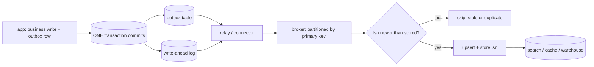

## Thesis

Reliably propagating every committed change in a database to other systems --- a search index, a cache, a warehouse, another service --- without the dual-write problem, by making the database's own commit the single source of change events: either a transactional outbox written in the same transaction and relayed, or log-based capture that tails the write-ahead log.

## Sub

**The dual-write problem** -> **the transactional outbox** -> **log-based capture off the write-ahead log** -> **zoom out** to ordering and delivery, and the pivots an interviewer rides from "keep the search index in sync" into why not dual-write, outbox versus log-based, and the exactly-once myth.

## Spine

- The problem is the **dual write** --- writing the database and then publishing an event are two operations that can't be atomic, so a crash between them loses the event or fires it for data that rolled back.
- The **transactional outbox** fixes it --- write the event to an outbox table in the *same* transaction as the data, so they commit or fail together, and a relay publishes the outbox rows.
- **Log-based CDC** is the other road --- a connector tails the write-ahead log and emits a change event per committed row, capturing every change with no application code at all.
- Delivery is **at-least-once and ordered per row** --- the consumer must be idempotent and the stream preserves per-key order, so every derived system converges on the source's state.

## Companion Notes

### walk

A change reaching a derived system

One row change from commit to a downstream system that applied it --- the dual-write trap, the outbox that closes it, the log that avoids it, and the replication slot that can take your primary down.

Say why dual-write fails first --- "the database and the broker have no shared transaction." That one fact motivates the whole pattern.

### drill

Probe Drill

Graded follow-ups on the dual write, the outbox, log-based capture, ordering and delivery --- the ones that separate "publish an event" from a reliable change pipeline.

Never claim exactly-once delivery --- CDC is at-least-once plus an idempotent consumer, which is effectively-once.

### wb

Whiteboard

Rebuild the whole change path from memory --- the cues, nothing in front of you.

Draw the transaction boundary first --- the business row and the event committing together. Everything downstream is at-least-once, and the version guard is what saves you.

### sys

System Map

Zoom out: CDC sits between the database that owns the truth and every system that has to agree with it.

Lead with the commit, not the connector --- "the database's own commit is the source of change events." The mechanism is second.

### trade

Trade-offs

The calls they drill --- outbox vs log, polling relay vs log-based router, before-images vs WAL cost, and whether you'd rather lose the stream or lose the primary.

Always name the alternative and its cost. The honest answer here is almost always "which do I want to own: app code, or a schema contract?"

### model

Model Answers

Full spoken scripts --- the beats, in order, the way you'd actually say them.

Steal the frame, not the words --- the dual write is the enemy, the commit is the source of truth, and the consumer is idempotent because delivery is at-least-once.

### num

Numbers

Back-of-envelope the change-event volume, the fan-out, and the WAL a stalled connector pins.

Lead with the number nobody expects --- a stopped CDC consumer retains write-ahead log until the source database's disk fills. Your search index falling behind is an availability risk to your primary.

### rf

Red Flags

What sinks the round --- the dual write, claiming exactly-once, a cursor-based relay that silently drops rows, and a consumer that blindly upserts the after image.

Name what the interviewer hears --- "would silently lose committed events" is the fastest no-hire in a data-pipeline round.

### open

30-Second

The opener and the close --- matched to the altitude the question is asked at.

Match the altitude --- open on the dual write and the commit, and land on ordering and idempotency as the real hard parts, not the connector.

## Drill

all | **All four levels, mixed** --- the way a real loop actually comes at you.
SDE2 | **The model and the mechanics** --- the dual write, the outbox, log-based capture, what a change event carries. The bar is "this is a reliable pipeline, not a publish call after a commit": name the failure the pattern exists to prevent.
SDE3 | **Delivery, ordering, and edges** --- relay guarantees, per-key order, the snapshot boundary, schema evolution, deletes. The bar is "I know where it silently breaks": name the failure mode and the mechanism that bounds it.
Staff | **Outbox vs log and the org calls** --- the schema-as-contract problem, the operational cost, rebuilds, and the exactly-once myth. The bar is "I know what I'm signing the team up for": name the coupling you're creating and its exit condition.

### SDE2 | what CDC is

What is change data capture?

Turning every committed change in a database into a stream of change events other systems consume --- a search index, a cache, a warehouse, another service. Instead of each consumer polling the database or the app publishing events by hand, CDC makes the database's own changes the source of a reliable event stream, so derived systems stay in sync with the source of truth.

Follow: Why not just poll the table --- select where `updated_at` is greater than my last checkpoint?
Because polling **can't see a delete**. A deleted row simply isn't there, and you cannot query for absence, so a polled mirror keeps serving rows the source removed. It also **collapses intermediate states** --- two updates between polls look like one, so you never see the transition you were reacting to --- it requires an `updated_at` column that *every* writer maintains (a migration script or a DBA's `UPDATE` won't), it adds read load to the primary, and it gives you no before image. Log-based capture reads the write-ahead log, which records *every committed change*, including the deletes.

Follow: The derived system is behind the source. What actually breaks because of that?
It's **eventually consistent**, and the failure people hit is **read-your-writes**: a user edits their profile, the search index hasn't caught up, they immediately search and see the old value --- so the system looks broken even though every component is correct. The fixes, in order: serve a user their *own* data from the **source**, not the derived copy; or make the UI optimistic for the writer; or, rarely, hold the write until the consumer acks (which couples your write latency to the pipeline and gives up most of CDC's benefit). Name the lag window out loud --- an interviewer wants to hear that you know what you traded away.

Senior: Reaching for the write-ahead log because **polling cannot see deletes or intermediate states** --- rather than describing CDC as "a nicer way to poll" --- is what shows you know why the pattern exists at all.

Speak: "It turns every committed change into an event stream, so derived systems stay in sync **without the app publishing by hand and without polling** --- and polling is genuinely broken here, because you cannot poll for a row that isn't there any more."

### SDE2 | the dual-write problem

What is the dual-write problem?

Writing to the database and then publishing an event are two separate operations that can't be atomic. A crash between them either commits the data but never fires the event, or fires the event for data that rolled back. Any "write the DB, then send to Kafka" code has this bug --- the two systems drift --- and CDC exists to eliminate it.

Follow: Then just wrap both in a distributed transaction --- two-phase commit across Postgres and Kafka. Why not?
Because **2PC buys a rare lost event and sells you a regular operational failure**. Kafka has no practical XA resource manager, so the option barely exists; and where 2PC does exist, the coordinator is a synchronous single point of failure, and a *prepared* transaction holds its locks in Postgres until someone resolves it --- so a coordinator crash leaves prepared transactions **pinning WAL and blocking vacuum** until a human intervenes. You've traded an occasional silent loss for a recurring incident that needs a person. The outbox avoids the whole class by never needing two systems to agree: it keeps the event inside the one system that already has transactions.

Follow: Fine --- so publish to the broker first, then write the database. Does that fix it?
No, it makes it **worse**. Now a crash after publishing but before committing fires an event for data that **never existed** --- consumers act on a lie, so the search index has a document for an order that isn't in the database, and no amount of retrying reconciles it because there is nothing to reconcile *to*. Losing an event is bad; **publishing a fact that never became true** is worse, because it corrupts every downstream system rather than leaving them merely stale. The point is that there is **no ordering of two separate systems that closes the gap** --- the gap is the whole problem, not the order.

Senior: Being able to say why **2PC is not the answer** (a blocking coordinator and prepared transactions pinning WAL) and why **reversing the order is strictly worse** (an orphan event is worse than a lost one) --- rather than just asserting "it isn't atomic" --- is the difference between reciting the problem and understanding it.

Speak: "The database and the broker have **no shared transaction**, so one always happens first, and a crash in the gap either loses the event or fires it for data that rolled back. Reversing the order doesn't help --- it just turns a lost event into an **orphan** one, which is worse."

### SDE2 | the transactional outbox

What is the transactional outbox pattern?

Write the event into an outbox table in the **same** transaction as the business data, so they commit or fail together --- no gap where one happens without the other. A separate relay then reads the outbox and publishes the events. The database transaction, already atomic, becomes the guarantee that the event and the data agree.

Follow: Does the outbox event have to have the same shape as the row?
**No --- and that's the entire point.** The outbox carries a **domain event you author** (`OrderShipped` with the order id, carrier and tracking number) rather than a row diff, so the event's shape is a **contract you own and version**, completely decoupled from the table's physical columns. You can refactor `orders` --- rename a column, split the table --- without touching a single consumer. That is exactly what log-based capture cannot give you, and it's the reason the outbox survives even though it costs application code.

Follow: You've put an extra write in the hot path of every business transaction. What does that cost?
An extra `INSERT` per transaction, which is cheap in itself (append-only, sequential, no contention), plus a bit more WAL. The cost that actually bites is that **the outbox table grows forever** if nobody prunes it, and the relay's `WHERE published = false` scan degrades as dead rows pile up. So you **delete each row once it's published** (the outbox is a queue, not a log --- the broker is the log), or make it a partitioned table and drop old partitions. An outbox nobody cleans up is a slow-motion outage in the primary's hottest transaction.

Senior: Knowing that the outbox's real product is a **curated, versioned domain event decoupled from your physical schema** --- not merely atomicity --- is what separates "I read the pattern" from "I chose it." Atomicity is what log-based gives you too; the *contract* is what only the outbox gives you.

Speak: "The event goes into an **outbox table in the same transaction** as the business change, so the database's atomic commit makes them succeed or fail together --- and because *I* author the row, the event is a **domain event whose shape I own**, not a raw row diff."

### SDE2 | log-based CDC

What is log-based CDC?

A connector tails the database's **write-ahead log** --- the ordered record of every committed change the database already keeps for durability --- and emits a change event per row. It captures inserts, updates, and deletes with no application code and no outbox table, because it reads the changes the database itself recorded. Debezium is the common implementation.

Follow: Concretely, what does the connector attach to in Postgres, and what does that create on the server?
It creates a **logical replication slot**. You set `wal_level = logical`, the connector opens a slot with an output plugin (`pgoutput` is the built-in one), and Postgres decodes committed transactions into a change stream for that slot --- **at commit time, in commit order**. The critical thing to understand is that a slot is **server-side, durable state**: it records the consumer's position (its LSN) and it **prevents Postgres from recycling any WAL the consumer hasn't confirmed yet**. It is not a passive tail; it is a back-pressure handle attached to your production database.

Follow: So what happens if that connector is down for a long weekend?
This is the one that takes production down. The slot **pins WAL** at the last position the consumer confirmed, so `pg_wal` grows for every write the database takes --- and it grows until the **disk fills, at which point the primary cannot write WAL and stops accepting writes.** Your search index falling behind has become an **outage of your source of truth.** So you (a) **alarm on the slot's retained bytes**, not on consumer lag, because retained WAL is what kills you; (b) consider `max_slot_wal_keep_size` (Postgres 13+), which caps retention --- but understand the trade: when the cap is hit the slot is **invalidated**, and an invalidated slot means the consumer must **re-snapshot from scratch**; and (c) **drop slots you aren't using**, because an orphaned slot from a decommissioned connector is a time bomb with no owner.

Senior: Knowing that a replication slot is **server-side state that retains WAL and can therefore take the primary down** --- and that `max_slot_wal_keep_size` trades a forced re-snapshot for keeping the database alive --- is the operational reality that separates someone who has *run* log-based CDC from someone who has read the Debezium quickstart.

Speak: "A connector opens a **logical replication slot** and tails the write-ahead log, so it sees every committed change with no app code --- but that slot is **server-side state that holds WAL back**, so if my connector dies, the WAL piles up until the primary's disk fills."

### SDE2 | the change event

What is in a CDC change event?

The operation (insert, update, delete), the table, and the row --- often both the before and after images for an update, plus metadata like the transaction and log position. The before-and-after lets a consumer see exactly what changed, not only the new state, which matters for auditing, computing diffs, or reacting to a specific transition.

Follow: You said "often both the before and after images." In Postgres, is the before image actually there by default?
**No --- and this catches people.** Postgres's default `REPLICA IDENTITY` is the **primary key**, so an `UPDATE`'s old-row image in the WAL contains only the key columns --- Debezium emits `before: null` for updates on such a table, and a `DELETE`'s before image is just the key. To get a real before image you must `ALTER TABLE t REPLICA IDENTITY FULL`, which makes **every update and delete write the entire old row into the WAL** --- roughly doubling WAL volume for an update-heavy table, which in turn doubles what a stalled slot retains. So the before image is a **setting with a standing cost**, not something the log hands you for free. Decide whether you actually need it.

Follow: An update touches one small column on a row that also has a two-megabyte JSON blob. What's in the event?
This is the **TOAST trap**, and it silently corrupts data. Postgres does not rewrite an **unchanged TOASTed (large, out-of-line) value** into the WAL for an update --- there's no reason to, for durability --- so the connector genuinely cannot see it and substitutes a placeholder (Debezium: `` `__debezium_unavailable_value` ``). A consumer that blindly writes the after image into its mirror will **overwrite the blob with the placeholder or a null** --- so the update to one small column destroys the biggest field on the row. You handle it explicitly: **detect the placeholder and leave the existing value alone**, or set `REPLICA IDENTITY FULL` so the full old row is logged and the value can be recovered, or re-read the row from the source. The reason it reaches production is that it **only bites on wide columns**, so it passes every small-table test you wrote.

Senior: Naming **`REPLICA IDENTITY`** and the **TOAST placeholder** --- that the before image is a costed setting, and that a blind upsert of the after image silently nulls out unchanged large columns --- is a detail you only have if you have actually operated this. It is the single strongest signal available on this topic.

Speak: "Operation, table, and the row --- but be careful: in Postgres the **before image is only the primary key** unless you set `REPLICA IDENTITY FULL`, and an **unchanged TOASTed column isn't in the WAL at all**, so a blind upsert of the after image will null out your biggest field."

### SDE2 | relaying the outbox

How do outbox events actually get published?

A relay process reads unpublished outbox rows and publishes them to the broker, then marks them done or deletes them. It can poll the table on an interval, or itself be driven by log-based CDC on the outbox table. Either way the relay is at-least-once --- if it crashes after publishing but before marking a row, it republishes on restart --- so consumers dedup.

Follow: Say your relay polls with `SELECT ... WHERE id > :last_id ORDER BY id`, remembering the highest id it saw. Show me the bug.
It **silently and permanently loses events**. A sequence id is allocated at `INSERT` time, but a row only becomes **visible at COMMIT** --- and those two orders are not the same. Transaction A takes id 5, transaction B takes id 6; B commits first. A poll landing between the two commits sees **6 but not 5**, advances its cursor to 6, and row 5 --- committed a moment later --- is **never published, ever.** No error, no retry, no gap in the outbox table itself, and the event is gone. The fix is to **never use a high-watermark cursor over a sequence**: poll `WHERE published = false` and claim each row *individually*, so a late-committing row is simply picked up on the next poll; or tail the outbox with log-based CDC, which reads the **WAL in commit order** and therefore cannot have this gap.

Follow: You run two relay instances for high availability. Now what?
They both read the same unpublished rows and **double-publish** --- not a correctness disaster, since consumers are idempotent, but it wastes the broker and it can **reorder** events for the same aggregate, which idempotency does *not* protect you from. The clean fix is to make the claim exclusive: `SELECT ... FOR UPDATE SKIP LOCKED`, so each relay grabs a **disjoint batch** and neither blocks the other. Alternatively, run a single active relay behind leader election (simple, but a failover window), or --- best --- delete the polling relay entirely and let **Debezium's outbox event router** tail the table, which gives you one connector, no polling load, and commit order for free.

Senior: Spotting the **sequence-gap bug** (ids are allocated at insert, visibility happens at commit, so a cursor over a monotonic id **skips a late-committing row forever**) is the sharpest correctness signal on this topic --- it is subtle, silent, and it is a bug that ships.

Speak: "A relay reads unpublished rows and publishes them --- but **never track a high-watermark id**, because ids are allocated at insert and rows appear at commit, so a lower id committing late gets **skipped forever**. Claim each row individually, or tail the outbox with the log."

### SDE2 | where CDC is used

What is CDC commonly used for?

Keeping derived systems in sync with a source database: updating a search index when rows change, invalidating or refreshing a cache, streaming into a warehouse for analytics, and synchronizing data between microservices. Anywhere one database is the source of truth and other systems must react to its changes, CDC is the reliable propagation mechanism.

Follow: Search index, cache, warehouse --- do they all consume the same events the same way?
Same **stream**, very different **sinks**. A **search index** wants a denormalized document, so one row change often has to be *materialized* --- joined against other tables to rebuild the doc --- which means the consumer does real work, not a pass-through. A **cache** wants an *invalidation* (delete the key and let it refill) more often than a refresh, because a refresh re-introduces a write path you now have to order correctly. A **warehouse** typically wants the **append-only change log itself** --- every version of the row, as history (a slowly-changing dimension) --- so it deliberately does *not* upsert. Same source of truth, three different idempotency keys and three different notions of "correct."

Follow: Cache invalidation driven by CDC --- isn't that just eventual consistency with extra steps?
It *is* eventually consistent, and I'd say so plainly. What CDC buys over a **TTL** is **precision**: you invalidate exactly the keys that changed, when they changed, instead of expiring everything on a timer and eating the miss storm. What it buys over **application-side invalidation** is **completeness**: a write from a batch job, a migration, or a DBA's manual `UPDATE` also invalidates, because the invalidation is driven by the *commit*, not by an app remembering to call `cache.del()`. That's the same argument as the whole topic --- the commit is the only thing that sees every change. The price is the lag window, and if a caller needs read-your-writes you serve them from the source.

Senior: Recognizing that the three sinks want **different shapes** --- a materialized document, an invalidation, and an append-only history --- rather than treating CDC as "one stream, everyone upserts," is what shows you've actually built more than one of these.

Speak: "Search, cache, warehouse, service-to-service sync --- one stream, but very different sinks: search **materializes a document**, a cache wants an **invalidation**, and a warehouse wants the **append-only history**, not an upsert."

### SDE3 | why dual-write can't be atomic

Why can't you write the database and publish in one atomic step?

Because the database and the broker are two separate systems with no shared transaction --- committing both atomically needs distributed-transaction machinery that's fragile and rarely used. So one always happens first, and a crash in the gap leaves them inconsistent. The outbox sidesteps it by keeping everything inside the one system that *does* have transactions: the database.

Follow: But the relay still writes to the database and then publishes to the broker. Haven't you just moved the dual write?
**This is the real question, and the answer is the whole trick.** You have not eliminated the two steps --- you have **changed which failure survives them.** The dual write's two steps were (commit data, publish event), and a crash in the gap **loses the event permanently**: nothing durable records that the event was owed, so nothing can ever retry it. The relay's two steps are (publish event, mark row done), and a crash in *that* gap leaves the outbox row **still there, still unmarked** --- so the relay republishes on restart. The failure mode has become a **duplicate**, and a duplicate is **absorbable** by an idempotent consumer. So the outbox converts an **unrecoverable loss** into a **recoverable duplicate.** That is the entire value of the pattern, and it is why idempotency downstream is a *precondition*, not a nicety.

Follow: What is the general principle there --- how do you know which way to order two side effects?
**Order them so a crash leaves you with a duplicate, never a hole.** Do the *recoverable* thing first and the *record that you did it* second, because then a crash between them makes you repeat work (safe, if you're idempotent) rather than skip it (unsafe, and undetectable). Concretely: publish, *then* mark published --- never mark, then publish. The same rule generalizes: it is why you commit a consumer's offset **after** processing rather than before, and it is why at-least-once is the achievable guarantee everywhere. A system that can silently skip work is unfixable at 3 a.m.; a system that can repeat work is a dedup key away from being correct.

Senior: Articulating that the outbox **doesn't remove the two-step --- it converts a lost event into a duplicate event** --- is the insight the pattern is actually built on. Most candidates describe the outbox's mechanism; very few can say what property it purchased.

Speak: "There's no shared transaction, so one always goes first. The outbox doesn't remove the two steps --- it **moves them somewhere the surviving failure is a duplicate, not a loss** --- and a duplicate an idempotent consumer can absorb."

### SDE3 | the relay's guarantees

How does the relay avoid missing or duplicating events?

It never **misses**: the row was committed with the data, so it's durably there to publish. It may **duplicate**: crashing after publishing but before marking the row done means it republishes on restart. So the relay is at-least-once, and consumers dedup by event id. A marked/unmarked flag or a published-offset is the simplest correct relay.

Follow: Why not mark the row done first, and then publish? It's one line either way.
Because that inverts the failure into the one you can't recover from. **Mark-then-publish** means a crash in the gap leaves a row marked `published = true` that was **never published** --- the relay will never look at it again, no consumer ever sees the event, and **nothing in the system knows.** You have re-created the exact silent loss the outbox existed to prevent, one line of code later. **Publish-then-mark** means the same crash republishes --- a duplicate, which the consumer absorbs. The ordering of the side effect *is* the guarantee; getting it backwards makes the whole pattern decorative.

Follow: How does the consumer actually dedup? What is the key, concretely?
Two levels, and the second is the one that matters. The cheap version: the **outbox row's id** (a UUID generated inside the business transaction) rides on the event, and the consumer keeps a table of seen ids with a TTL sized to the longest replay window. That works, but it needs a store and it only handles *duplicates*. The better version is to make the **effect itself idempotent** so dedup state is unnecessary: an **upsert keyed by the entity's primary key**, guarded by a version --- `INSERT ... ON CONFLICT (id) DO UPDATE ... WHERE excluded.lsn > target.lsn`. Now a replay is a no-op *and* a **stale event arriving late cannot overwrite a newer one**, which a seen-ids table would happily allow. Prefer the version-guarded upsert: no extra store, and it's correct under reordering, not just under duplication.

Senior: Knowing that the **order of the two side effects is the guarantee** --- publish then mark, because the inverse re-creates the silent loss --- and reaching for a **version-guarded upsert** over a dedup table, is the reliability instinct that reads as senior.

Speak: "It can't **miss** --- the row committed with the data --- but it can **duplicate**, if it crashes after publishing and before marking. So: **publish, then mark** (never the reverse), and let the consumer apply a **version-guarded upsert** so replays are no-ops."

### SDE3 | ordering

What ordering does CDC give you?

Per-row (per-key), not global. The stream preserves the order of changes to a single row, so a consumer applies them in sequence and converges on the source state. Global ordering across all rows is expensive and usually unnecessary; you partition the stream by key so each key's changes stay ordered --- the same model as Kafka partitions.

Follow: One transaction updates `orders` and `order_items` together. What does the consumer see?
It sees them **out of order, at different times, with no transaction boundary** --- and this is the hole in row-level CDC. The two tables typically land on **different topics**, partitioned by their own keys, so nothing sequences them relative to each other. A downstream that joins them can transiently see an `order_items` row whose parent order **doesn't exist yet** --- a referential-integrity violation that **never existed in the source database.** Three honest options: (a) make the consumer **tolerant** --- buffer the orphan and retry, which is usually right and is simplest; (b) use the connector's **transaction metadata** (Debezium publishes BEGIN/END markers with a transaction id and per-table event counts) and have the consumer buffer a whole transaction before applying it --- correct, but you are now writing a transaction assembler; or (c) **don't emit row events at all** --- emit **one outbox event per aggregate**, so the order and its items arrive as a single atomic message. Option (c) is the outbox's strongest argument and it is the one candidates miss.

Follow: You partition by primary key to get per-row order. What if the key you partition on can change?
Then the same logical row lands in **two different partitions** over its lifetime, and you have lost ordering exactly where you thought you had it --- the "before" events and the "after" events are in different partitions, consumed by different threads, in no defined order relative to each other, so an update can be applied before the insert it depends on. So: **always partition on an immutable identifier** --- the surrogate primary key, never a natural key like an email address or a username that a user can change. And note that a **primary key change is really a delete plus an insert** in the change stream: a mirror that doesn't treat it that way ends up with **two rows** where the source has one, which is a very confusing bug to find months later.

Senior: Naming the **cross-table hole** --- that a single source transaction becomes multiple unordered events, so a downstream join can see referential violations that never existed --- and knowing the outbox's aggregate event is the clean fix, is Staff-adjacent reasoning that most candidates never reach.

Speak: "**Per key, not global** --- partition by the row's immutable primary key and each row's changes stay in order. But be clear about the hole: a transaction spanning two tables becomes **two unordered streams**, so a downstream join can see a child row before its parent."

### SDE3 | at-least-once and idempotent

Why must a CDC consumer be idempotent?

Because delivery is at-least-once --- the relay or broker can redeliver a change after a crash or lost ack. So applying the same change twice must be safe: an upsert keyed by the row id, or a version check that ignores an already-applied change. CDC gives a reliable, ordered, at-least-once stream; idempotency is what makes redelivery and reprocessing harmless.

Follow: Show me the actual idempotent write --- for a search index, and for a SQL mirror.
For a **SQL mirror**, an upsert with a **version guard**: `INSERT INTO mirror (...) VALUES (...) ON CONFLICT (id) DO UPDATE SET ..., lsn = excluded.lsn WHERE excluded.lsn > mirror.lsn`. The `WHERE` is the load-bearing part --- without it you have handled duplicates but *not* staleness. For **Elasticsearch**, index the document by its **primary key** (indexing by id is inherently an upsert) and pass the commit position as an **external version** (`version_type: external`), so Elasticsearch itself **rejects any event whose version is not newer** than what it holds. That single setting makes the sink safe against both redelivery *and* out-of-order arrival, and it costs nothing --- the source's LSN or commit timestamp is already on the event.

Follow: At-least-once gives me duplicates. Can it also give me reordering, or is an upsert enough?
Both, and conflating them is where CDC consumers actually break. **Within one partition**, a redelivery replays the same suffix **in order**, so at-least-once alone gives you duplicates, and a plain upsert handles those. **Reordering comes from somewhere else**: a partition key that changes, *parallel* consumers or worker threads writing the same key concurrently, a retry of a failed write landing after a later write succeeded, or a snapshot row racing a streamed change for the same row. A plain upsert is **helpless** against all of those --- it will happily write the older value last. So the consumer must be **idempotent** (survive duplicates) **and monotonic** (reject anything older than what it has), and the second property is the one that requires the version guard. In practice, most "CDC corrupted my index" incidents are the second problem, not the first.

Senior: Separating **idempotent** (survives duplicates) from **monotonic** (rejects stale writes) --- and knowing a plain upsert only gives you the first, so it will silently apply an old value last --- is the distinction that decides whether the pipeline is actually correct.

Speak: "Delivery is at-least-once, so the consumer applies an **upsert keyed by the primary key with a version guard** --- `apply only if the incoming LSN is newer`. Idempotent alone survives duplicates; the **version guard** is what survives *reordering*, and that's the one that actually bites."

### SDE3 | snapshot plus stream

How does a new consumer get the existing data, not just future changes?

A snapshot plus stream: first read a consistent snapshot of the current table (the initial load), then switch to the change stream from the snapshot's log position onward --- so no change is missed or double-counted at the boundary. Log-based tools do this automatically; without it a new consumer sees only changes after it started and misses every existing row.

Follow: Where exactly do you start the stream --- before the snapshot, at it, or after it?
**At it or before it. Never after.** You record the log position (the LSN, or the binlog GTID) **before** you start reading rows, take the snapshot, then stream from that recorded position. You will inevitably **re-see** changes that happened *during* the snapshot --- and that is completely fine, because the consumer is idempotent and version-guarded, so the overlap is absorbed. If you instead start streaming from "now, when the snapshot finished," everything that changed **during** the snapshot falls into a **gap and is lost forever, silently.** The rule generalizes: at a boundary like this, **always err toward overlap, never toward a gap** --- an overlap is absorbed by idempotency, and a gap is absorbed by nothing. It is also precisely why idempotency is a prerequisite for the snapshot, not just for retries.

Follow: The table is two terabytes. The snapshot takes twelve hours. What breaks?
Three things at once, and they compound. In Postgres, a **long-running read transaction holds back the xmin horizon**, so **vacuum cannot clean dead tuples** for twelve hours and the source table **bloats** --- while, simultaneously, the **replication slot is pinning twelve hours of WAL**. On the connector side, a failure at hour eleven means **starting the whole snapshot over.** The modern answer is an **incremental snapshot** (Debezium's implementation of Netflix's DBLog): snapshot the table in **chunks**, **interleaved with the live stream**, with a low and a high watermark written around each chunk --- any key that appears in the *stream* between those watermarks is **dropped from the chunk's rows**, because the stream has the fresher value. The result is resumable, holds no long transaction, doesn't block streaming, and lets you **re-snapshot a single table on a running connector** without stopping the world.

Senior: The rule "**start the stream at or before the snapshot, never after --- err toward overlap, because idempotency absorbs an overlap and nothing absorbs a gap**" is the whole boundary in one sentence, and knowing incremental/watermarked snapshotting is why a 2 TB table is no longer a twelve-hour outage.

Speak: "**Snapshot, then stream from the position you recorded *before* the snapshot started** --- you'll re-see some changes, and that's fine, because the consumer is idempotent. Start *after* the snapshot and you get a **silent gap**, which nothing recovers."

### SDE3 | schema evolution

What happens to the change stream when the table schema changes?

The events' shape changes with the table --- a new column appears in the after image, a dropped one disappears. Consumers must tolerate that: additive changes are safe if missing fields default, but a removed or renamed column can break a consumer reading it. You version the event contract and coordinate schema changes with consumers, exactly as with any event stream.

Follow: Add a nullable column, versus rename a column. Which breaks a consumer, and what do you actually do about a rename?
**Adding a nullable column with a default is safe** --- an unaware consumer just ignores the extra field. A **rename is a drop plus an add**, and it breaks **every consumer that reads the old name**, the moment the connector emits the new schema. So a rename is never a single migration; it is an **expand/contract** in three deploys: **add** the new column and dual-write both, **migrate** every consumer to read the new one, **then drop** the old. That is exactly the discipline you'd apply to a public API's field --- which is the point: with log-based CDC, **your table schema IS a public API**, whether or not anyone told the developer changing it.

Follow: How does the consumer even find out the schema changed --- does Postgres put DDL in the write-ahead log?
**No.** Postgres logical decoding **does not emit DDL** --- the WAL carries data changes, not `ALTER TABLE`. The connector infers the new shape from the relation metadata attached to subsequent changes (for MySQL, Debezium parses the binlog's DDL statements and keeps a **schema-history topic**). Which means the change reaches consumers **as a surprise, at runtime, on the next write to that table.** The fix is to stop relying on discovery: publish the event schema to a **registry** with a compatibility policy, so an incompatible change is **rejected at registration** --- turning a 3 a.m. deserialization failure in someone else's service into a **failed build** in the service that caused it. Better still, gate the migration in CI against the registered schema, so the developer renaming the column is the one who finds out.

Senior: Naming that **the WAL carries no DDL**, so consumers discover a breaking change at runtime --- and that the fix is a **schema registry with a compatibility gate in CI**, which moves the failure from the victim's on-call to the author's build --- is the systems-and-org thinking that reads as senior.

Speak: "Additive with a default is safe; a **rename is a drop plus an add** and breaks every consumer reading the old field. And the WAL carries **no DDL**, so consumers find out at runtime --- which is why you put the event schema in a **registry and gate the migration in CI**."

### SDE3 | deletes and tombstones

How does CDC represent a deleted row?

As a delete event carrying the row's key, and often its last state. For a compacted stream like Kafka, a delete becomes a **tombstone** --- a record with the key and a null value --- so log compaction eventually drops the key entirely. A consumer maintaining a mirror deletes its copy on the tombstone. A delete is a first-class change, not an absence to be inferred.

Follow: Can I see what the deleted row actually contained --- for an audit trail, say?
By default in Postgres, **no --- only the key.** `REPLICA IDENTITY` defaults to the primary key, so a `DELETE`'s before image carries the key columns and nothing else. If a consumer genuinely needs the deleted row's contents --- an audit log, a warehouse keeping history --- you need `REPLICA IDENTITY FULL`, and you pay for it in **WAL volume on every update and delete**, forever, on that table. So the honest framing is: "an audit trail of deleted contents is available, and here is its standing cost on the source database" --- rather than assuming the before image is free. Otherwise the consumer must have kept its own copy, which is often the cheaper answer.

Follow: Our source uses **soft deletes** --- a `deleted_at` column gets set. What does CDC emit, and what breaks?
It emits an **`UPDATE`**, not a `DELETE` --- because at the storage layer, that is exactly what happened. So a downstream mirror that removes rows on `op: 'd'` **never deletes anything**: the search index happily keeps serving documents the application considers deleted, which is a **correctness and often a privacy bug**, and it is completely silent --- nothing errors, the pipeline is green, the data is just wrong. The consumer has to interpret **domain semantics** (`deleted_at IS NOT NULL` means remove it from the index), which is precisely the coupling problem in miniature: **log-based events are *physical* changes, and physical is not the same as domain.** An outbox emitting an explicit `OrderDeleted` event has no such ambiguity --- which is one more reason a curated event beats a row diff when the consumer is a *different system* with a *different* idea of what "deleted" means.

Senior: Knowing that a **soft delete emits an UPDATE, so a delete-on-`op:'d'` mirror silently keeps serving deleted data** --- and framing it as the physical-vs-domain gap that the outbox closes --- is a concrete, checkable failure most candidates have never considered.

Speak: "A delete event with the key, plus a **tombstone** (null value) so a compacted topic can drop the key. And watch out --- if the source **soft-deletes**, CDC emits an **UPDATE**, so a mirror that only handles hard deletes will keep serving deleted rows forever."

### Staff | outbox vs log-based

Outbox or log-based CDC --- how do you choose?

The **outbox** is explicit and in your control: you decide exactly which events to emit and their shape, at the cost of app code and an extra write. **Log-based** captures everything with no app code, but couples you to the database's internal change log and emits raw row changes you may not want as public events. Outbox for curated domain events; log-based for wholesale replication to a warehouse or search.

Follow: Is that actually a fork? Can I have both?
**You can, and in production you usually should --- that's the answer that lands.** Write a **curated domain event into an outbox table** inside the business transaction, then point **log-based CDC at the outbox table** (Debezium ships an **outbox event router** for exactly this). You get the outbox's **owned, versioned event shape** and its atomicity, *plus* the log's **commit-ordered, no-polling relay** --- and you **delete the polling relay entirely**, along with its sequence-gap bug, its `FOR UPDATE SKIP LOCKED` contention and its load on the primary. The two "options" are really a *contract* decision (outbox) and a *transport* decision (log), and they compose. Presenting them as a binary is the most common way to leave a Staff signal on the table.

Follow: Log-based captures every table for free. Why would I ever pay for the outbox's application code?
Because "for free" buys you **the wrong events**. Log-based emits **physical row changes**, one per table --- so a single domain fact spanning three tables arrives as **three unordered events**, a soft delete arrives as an update, an unchanged TOAST column arrives as a placeholder, and your **column names become a contract you may no longer refactor.** The outbox emits **one event per domain fact**, atomic downstream, in a shape you own and version. You are not paying app code for atomicity --- log-based has that too. You are paying app code to **buy a contract and a stable abstraction boundary.** So: log-based where you want a **replica of data you own** (a warehouse, a search index over one table); an outbox where the event is an **integration contract with another team.**

Senior: Refusing the false binary --- **outbox for the contract, log-based as the transport, composed via an outbox router** --- and being able to say the outbox's app code buys a *contract*, not atomicity, is precisely the systems judgment a Staff loop is testing for.

Speak: "It's not really a fork. **Outbox for the event contract, log-based as the transport** --- write a curated domain event to an outbox table in the transaction, then have Debezium's **outbox router tail that table.** You own the event shape, and you get commit order with no polling relay."

### Staff | CDC vs event notification

How does CDC relate to publishing domain events from the app?

App-published events are intentional and business-level but carry the dual-write risk; CDC derives events from committed state so they can't disagree with the database. The catch is that log-based events are *data* changes (row-level), not *domain* events. So you often use the outbox to publish real domain events reliably --- getting both intent and atomicity in one pattern.

Follow: So which is the "real" event --- the row change or the domain event?
They answer **different questions, for different audiences.** A row change is a fact about **your storage**: `orders.status` went from `packed` to `shipped`. A domain event is a fact about **your business**: `OrderShipped { orderId, carrier, trackingId }`. From the row change a consumer has to **reverse-engineer the intent** --- and its inference silently breaks the day you refactor the table, add a state, or start soft-deleting. The test I'd apply: **is the consumer another team?** If yes, publish the **domain event**, because you are creating a contract and contracts need intent, versioning, and a stable shape. If the consumer is **your own warehouse or your own index**, the row change is fine --- you own both ends, so you can fix both ends.

Follow: When you emit a domain event, do you carry the state in it, or just an id the consumer reads back?
**Carry the state.** An event that carries the fields the consumer needs (**event-carried state transfer**) lets the consumer act **without calling back**, which is the whole point --- it stays available when you're down, and it doesn't put a synchronous fan-in on your service on every event. A thin event ("order 88 changed, go look") re-introduces a **synchronous dependency** on the source *and* --- more subtly --- a **race**: by the time the consumer reads back, the row may have changed **again**, so it processes event N while reading state N+2. It has now **silently lost ordering**, and no amount of partitioning fixes it, because the reordering happens *inside the consumer*. The costs of carrying state are a fatter event and data that is stale by design --- but "stale by design" is what eventual consistency already *is*, so you have not given anything up that you still had.

Senior: The read-back race --- that a **thin event plus a read-back silently destroys ordering**, because the consumer sees a *newer* state than the event it is processing --- is a genuinely subtle failure, and naming it is a strong Staff signal.

Speak: "Row changes are facts about **storage**; domain events are facts about the **business**. If the consumer is **another team**, emit a domain event via the outbox --- and **carry the state in it**, because a thin 'go look it up' event re-adds a synchronous dependency and quietly breaks ordering."

### Staff | the log as a coupling surface

What is the risk of tailing the write-ahead log?

It turns the database's internal schema into a de-facto public interface --- consumers depend on table and column shapes never meant to be a contract, so an innocent schema change breaks them. Log-based CDC leaks the physical model. The outbox avoids this by emitting a deliberate event shape you own, decoupled from the table layout --- the schema stays private.

Follow: Walk me through what actually happens the day a developer renames a column.
Their migration passes review --- it's a rename, it's local, their tests are green --- and it merges. The connector picks up the new relation shape on the **next write to that table**, and every consumer reading the old field starts getting nulls or a **deserialization failure**, at 3 a.m., **in services that developer has never heard of** and cannot debug. Nothing in **their** CI knew those consumers existed. That's the actual shape of the failure: the **cost lands on someone who had no way to see it coming.** The fixes, strongest first: (a) put a **curated outbox** between the table and the world, so the physical schema simply **isn't** the contract and the rename is a non-event; (b) if you must tail the table, **register the event schema and gate migrations in CI** against a compatibility policy, so the build that renames the column **fails for its author**; (c) at minimum, publish the consumer list so it is at least a conversation. Note that (a) and (b) both work by moving the failure **to the person who can prevent it** --- that is the real design principle.

Follow: A warehouse is also coupled to the schema. Why is that acceptable and a microservice isn't?
Because the **blast radius, the request path, and the consent** all differ. A warehouse is **owned by a team whose job is to track the source's schema** --- that is literally what a replica is for; the break surfaces in a dbt model or a failed nightly, **not in a user-facing request path**; and it is **fixable at leisure** by people who signed up for it. A microservice consuming your raw table changes has the break **in its own request path**, on **your** deploy schedule, and its team **never agreed to the contract** --- they were handed one implicitly. So the line I'd draw is: **log-based into a replica you own is fine; log-based as an inter-service integration is where coupling turns into an organizational liability**, and that is exactly where the outbox earns its code.

Senior: Framing the coupling as an **organizational** failure --- the cost lands on a team that never consented and cannot see the change coming --- and choosing fixes by **which one moves the failure to the person who can prevent it**, is Staff-level reasoning about blast radius rather than a technical purity argument.

Speak: "Tailing the log makes your **physical schema a public API** nobody agreed to. A rename merges, and it breaks a service the author has never heard of, at 3 a.m. Either put an **outbox** in front of it, or **register the schema and gate the migration in CI** so the build fails for its *author*."

### Staff | backfill and rebuild

How do you rebuild a downstream system from scratch?

Re-snapshot and re-stream: take a fresh consistent snapshot of the source and replay the change stream from there, with the consumer applying idempotently so the rebuild is safe. This is why an idempotent consumer and a retained stream matter --- a corrupted search index or a brand-new consumer is recovered by reprocessing from the source, not by manual repair.

Follow: "Replay the change stream" --- from where? You can't replay a year of write-ahead log.
Correct, and this is a distinction people blur. **The WAL is not an archive.** It is recycled as soon as it is no longer needed, and the replication slot only holds back what a consumer hasn't confirmed --- so there is **no year of WAL to replay**, and there never was. A rebuild is therefore **not** "replay the log from the beginning"; it is **re-snapshot, then stream from that snapshot's position.** If you want a genuinely **replayable history**, you keep it in the **broker**, not the database: a Kafka topic with long (or infinite) retention, or a **compacted** topic, which retains the **latest value for every key forever** --- and a compacted topic *is*, functionally, a **replayable table.** That is what makes standing up a brand-new consumer cheap: it reads the compacted topic from offset zero and materializes the whole current state without ever touching the primary. The source's log is transient; the **stream** is what you make durable.

Follow: You're rebuilding a search index that's still serving live traffic. How do you avoid a half-built index?
**Never rebuild in place** --- rebuilding in place *is* the outage, because there is a window where users query a partially-populated index. Build **alongside**: create `orders_v2`, replay the snapshot plus stream into it while `orders_v1` keeps serving, let v2 also consume the **live stream** until its **lag is effectively zero**, and then **atomically move the alias** from v1 to v2 (Elasticsearch aliases exist precisely for this). Users never see a partial index, cutover is a single atomic metadata operation, and **rollback is moving the alias back** --- which means the rebuild is now a reversible operation rather than a one-way door. Keep v1 around until you're confident, then drop it.

Senior: Knowing the **WAL is not an archive** --- so durable replay must live in the **broker** (a compacted topic is a replayable table), not the database --- and rebuilding **blue/green behind an alias** rather than in place, is the difference between a rebuild that is a routine operation and one that is an incident.

Speak: "**Re-snapshot and re-stream** --- you can't replay old WAL, it's recycled, so durable replay lives in the **broker** (a compacted topic is basically a replayable table). And rebuild **into a new index behind an alias**, then flip --- rebuilding in place *is* the outage."

### Staff | CDC for microservice sync

How does CDC help split a monolith or sync services?

It lets one service's database changes flow to another without the first publishing events by hand --- useful in a strangler migration where the new service consumes the old database's change stream, or for maintaining a local read-copy of another service's data. The caution is coupling: consuming another service's raw table changes ties you to its schema, so a curated outbox event is usually the cleaner contract.

Follow: In a strangler migration the new service tails the monolith's tables. What's the exit condition?
That coupling is **deliberate scaffolding, and scaffolding has to come down** --- so I'd name the exit condition **at the moment I propose the pattern**, not later. The exit is the **flip of ownership**: today the new service *reads* the monolith's tables; the migration is done when the new service **owns the writes** and is itself the source of truth (publishing its own events, with the monolith reading from *it*, if it still needs the data at all). If you never flip it, the strangler **never strangles**: you have permanently welded a new service to the internals of a schema **nobody is now allowed to change**, and you have all the coupling of a distributed monolith with **none of the monolith's transactional safety** --- which is strictly worse than what you started with. An unbounded strangler is how a migration becomes a permanent tax.

Follow: Another team wants a local read-copy of my data. Do I just give them my change stream?
Give them a **curated event** (an outbox), not your raw table stream --- otherwise your physical schema becomes their contract, and you can never refactor. But the **deeper thing to say out loud** is that a local read-copy makes them **eventually consistent with you**, and they have to *design for that*: they **cannot** do "check my local copy, then act" for anything requiring a strong guarantee --- the copy may be stale, so an authorization check, a balance check, or a uniqueness check against a replicated copy is **wrong**, sometimes exploitably so. If they need a **strong** read, they must **ask me synchronously.** CDC replicates **data**; it does **not** replicate **authority.** Naming that boundary is what keeps a read-copy from quietly becoming a correctness bug in someone else's service.

Senior: "**CDC replicates data, not authority**" --- so a replicated copy must never back a decision that needs a strong guarantee --- plus insisting a strangler's coupling has a **named exit condition**, is exactly the judgment that separates a Staff answer from an enthusiastic one.

Speak: "It works, but name the **exit condition**: the new service tails the monolith's tables *temporarily*, until it **owns the writes**. And if another team wants a read-copy, give them a **curated event**, and be explicit that it's eventually consistent --- **CDC replicates data, not authority**, so they can't make strong decisions on a stale copy."

### Staff | the exactly-once myth

Can CDC deliver exactly-once?

Not exactly-once delivery --- the same at-least-once reality as any stream, because the relay or broker can redeliver after a crash. What you build is at-least-once delivery plus idempotent consumers, giving effectively-once processing. A candidate claiming exactly-once CDC is missing the crash-in-the-gap the whole pattern is designed around.

Follow: But Kafka advertises exactly-once semantics. Doesn't that just solve it?
Kafka's EOS is **real, and it is narrower than the name suggests**: it gives you exactly-once **within Kafka**. A transactional producer plus the read-process-write pattern lets you consume from a topic, process, produce to another topic, and **commit the offsets in the same Kafka transaction** --- so that hop is atomic. But the moment your sink is **outside Kafka** --- Elasticsearch, Postgres, S3 --- the write to the sink and the offset commit are **two systems again**, and **you are back at the dual write**, the very problem this topic opened with. So EOS moves the boundary; it does not remove it. Claiming "we use Kafka EOS, so it's exactly-once end-to-end" is precisely the misunderstanding an interviewer is probing for.

Follow: So how *would* you close it at the sink, if you decided you actually wanted to?
**Store the consumer's position in the same transaction as the data it writes.** If the sink is transactional, the sink's own transaction becomes the commit record: `BEGIN; upsert the rows; UPDATE consumer_offsets SET lsn = :lsn WHERE consumer = 'search'; COMMIT;`. On restart you resume from the **stored** LSN --- and because the data and the position committed **atomically**, you can neither re-apply nor skip. That is exactly-once **effect** at the sink. And notice what it is: it is **the outbox pattern pointed the other way** --- the same insight (put the two things that must agree into the one system that has transactions) applied at the **far end** of the pipeline instead of the near end. If the sink has **no** transactions (a plain search index), you cannot do this, and you fall back to **idempotency plus a version guard** --- which is why that is the default.

Senior: Knowing Kafka's EOS is **exactly-once within Kafka only**, and that closing it at the sink means **committing the offset in the sink's own transaction** --- and recognizing that this is **the outbox pattern inverted** --- is the kind of connect-the-dots answer that ends the exactly-once conversation permanently.

Speak: "Not exactly-once **delivery** --- at-least-once plus an idempotent, version-guarded consumer, which is effectively-once. And Kafka's EOS is **exactly-once inside Kafka**; the moment you write to Elasticsearch, the sink write and the offset commit are **two systems again** --- you're back at the dual write."

### Staff | when not to use CDC

When is CDC the wrong tool?

When the consumer needs a synchronous answer (CDC is asynchronous and eventually consistent), when a direct query or a scheduled batch job would do (CDC adds a pipeline to operate), or when coupling to the source schema is unacceptable and no outbox is in place. CDC earns its complexity for real-time propagation to multiple derived systems, not for occasional or synchronous needs.

Follow: Be concrete --- what operational cost am I actually signing the team up for?
A **replication slot that can take the primary down** if the connector stops (WAL accumulates until the disk fills --- so your search pipeline is now an availability dependency of your **source of truth**); a **Kafka Connect cluster** to run, upgrade, and be paged for; a **schema contract** to govern; **snapshot and rebuild runbooks** that someone has to have actually rehearsed; and **lag monitoring on every derived system**, because "the index is forty minutes stale" is now an incident with a customer impact. That is a **team-sized, permanent** cost, and the "no application code!" pitch quietly omits **every** line of it. The application code was never the expensive part.

Follow: Small team, and they genuinely do need a search index that stays in sync. What do you actually ship?
The **outbox with a simple relay.** It is a table and a loop --- on the order of fifty lines --- it creates **no server-side slot**, so it **cannot take the database down**, it gives you a **curated event** you own, and any engineer on the team can read the whole thing in an afternoon. If the freshness requirement is genuinely loose, even a **periodic reindex** (a `WHERE updated_at > :last_run` sweep, plus a **nightly full pass to catch the deletes the sweep structurally cannot see**) is a defensible answer, and I'd say the caveat out loud. **Match the machinery to the requirement:** log-based CDC earns its operational weight when you have **several** derived systems and a **tight** freshness SLA. Below that bar, it is a very heavy way to update one index --- and choosing the boring thing on purpose, and being able to say *why*, is the answer.

Senior: Being willing to **talk the interviewer out of the fancy answer** --- costing the replication slot, the Connect cluster and the on-call surface honestly, then shipping the fifty-line outbox --- is a stronger Staff signal than designing the maximal pipeline. Knowing the tool includes knowing its price.

Speak: "When you need a **synchronous** answer, or a batch job would genuinely do. Be honest about the price: a **slot that can take the primary down**, a Connect cluster, a schema contract, rebuild runbooks, and lag as a new on-call surface. For a small team, the **fifty-line outbox relay** is usually the right call."

## Walk

### The dual write is the trap

```flow
w[write orders row] -> c[crash before publish] -> l[event lost]
```

The naive approach writes the database, then publishes an event --- two operations. Between the commit and the publish there's a gap: a crash there commits the data but never fires the event, so the search index or the cache silently misses the change forever.

The reverse ordering is no better: publish first, and a crash before the commit fires an event for data that never persisted --- an *orphan*, which is worse, because now the index serves a document for an order that does not exist. There is no ordering of two separate systems that closes the gap --- the problem is that they don't share a transaction.

### The outbox commits with the data

```flow
b[business write] -> o[outbox row same txn] -> t[commit together]
```

The fix keeps everything inside the one system that has transactions. Write the event into an outbox table in the same transaction as the business change, so the database's atomic commit makes them succeed or fail as a unit.

```sql
-- the business change and its event in one transaction -- both commit or neither does
BEGIN;
UPDATE orders SET status = 'shipped' WHERE id = 88;
INSERT INTO outbox (id, aggregate, event_type, payload)
  VALUES (gen_random_uuid(), 'order', 'OrderShipped', '{"orderId":88,"carrier":"dhl"}');
COMMIT;
```

Now there is no gap: if the transaction commits, the event is durably in the outbox; if it rolls back, neither the change nor the event exists. The dual write became a single write, and the atomicity you already trust for the data now covers the event. Note that the payload is a **domain event you authored** --- not a row diff --- so refactoring the `orders` table doesn't touch a single consumer.

### A relay publishes the outbox

```flow
r[relay reads outbox] -> p[publish to broker] -> m[mark row done]
```

A separate relay reads unpublished outbox rows, publishes them to the broker, and marks them done. Because the rows are durably committed, nothing is ever lost --- but the relay can crash after publishing and before marking, so it may republish.

That makes delivery at-least-once, which is why every consumer applies idempotently. And the ordering of those two steps *is* the guarantee: **publish, then mark**. Mark first and a crash leaves a row flagged as published that never was --- you have re-created the silent loss the outbox existed to prevent. The outbox never removed the two-step; it moved it somewhere the surviving failure is a **duplicate**, not a **loss**.

### Or tail the log

```flow
wal[write-ahead log] -> conn[connector tails it] -> e[change event]
```

The other road needs no outbox and no app code. A connector tails the write-ahead log --- the ordered commit record the database already keeps --- and emits a change event for every row that changed.

```json
{
  "op": "u",
  "table": "orders",
  "before": null,
  "after":  { "id": 88, "status": "shipped" },
  "source": { "lsn": 24857392, "txId": 1044 }
}
```

This captures everything for free, ideal for replicating a whole database into a warehouse or search. Two things to notice in that payload: `before` is **null**, because Postgres's default `REPLICA IDENTITY` logs only the primary key (a real before image needs `REPLICA IDENTITY FULL`, and costs WAL on every write); and the `lsn` is the **log position**, which is the version number your consumer will guard on.

### The slot is a loaded gun

```flow
s[replication slot] -> pin[pins WAL until confirmed] -> d[disk fills / primary stops]
```

Here is the part the tutorials skip. That connector isn't a passive reader --- it holds a **logical replication slot**, which is durable server-side state that **prevents Postgres from recycling any WAL the consumer has not confirmed.**

So if the connector dies on a Friday, the WAL does not "wait" politely --- it **accumulates for every write the database takes**, until `pg_wal` fills the disk and the **primary stops accepting writes.** A stalled search-index pipeline has become an outage of your source of truth. You alarm on the slot's **retained bytes** (not on consumer lag), you decide deliberately whether to bound it with `max_slot_wal_keep_size` --- which keeps the database alive by **invalidating the slot**, forcing a full re-snapshot --- and you **drop slots nobody owns.**

### Snapshot first, then stream

```flow
pos[record log position] -> snap[consistent snapshot] -> str[stream from that position]
```

A brand-new consumer needs the rows that already exist, not just future changes. So: **record the log position first**, take a consistent snapshot of the table, then stream from **that recorded position** onward.

You will re-see changes that happened *during* the snapshot --- and that is fine, because the consumer is idempotent. What you must never do is start streaming from *after* the snapshot finished: everything that changed during those hours falls into a **silent, permanent gap**. The rule is worth memorizing: **err toward overlap, never toward a gap** --- an overlap is absorbed by idempotency, and a gap is absorbed by nothing. For a large table, an **incremental (watermarked) snapshot** chunks the work and interleaves it with the live stream, so a 2 TB table is no longer a twelve-hour transaction holding back vacuum.

### Order is per key, not global

```flow
k[partition by primary key] -> o[per-row order held] / x[cross-table order lost]
```

The stream is partitioned by the row's key, so **all changes to one row stay in order** --- which is exactly what a mirror needs to converge. Partition on the **immutable** primary key: key on something a user can change, like an email, and the same logical row lands in two partitions and its own history reorders.

But be honest about the hole. A single source transaction that touches `orders` **and** `order_items` becomes **two events on two topics with no ordering between them** --- so a downstream join can transiently see a child row whose parent does not exist yet, a referential violation **that never existed in the source**. You either make the consumer tolerant (buffer the orphan and retry), use the connector's transaction metadata to reassemble the transaction, or --- cleanest --- emit **one outbox event per aggregate**, so the order and its items arrive as a single atomic message.

### The consumer applies idempotently

```flow
e[change event] -> g[lsn newer than stored?] -> u[upsert] / s[skip]
```

Delivery is at-least-once, so the consumer must survive seeing the same change twice. But duplicates are the *easy* half. The half that actually corrupts data is **reordering** --- a retry landing after a later write, two workers on one key, a snapshot row racing a streamed change --- and a plain upsert is helpless against it: it will cheerfully write the older value last.

```sql
-- idempotent AND monotonic: a replay is a no-op, and a stale event cannot clobber a newer one
INSERT INTO orders_mirror (id, status, lsn) VALUES (88, 'shipped', 24857392)
ON CONFLICT (id) DO UPDATE
   SET status = excluded.status, lsn = excluded.lsn
 WHERE excluded.lsn > orders_mirror.lsn;
```

That `WHERE` is the load-bearing line. **Idempotent** survives duplicates; **monotonic** rejects anything older than what you already hold --- and you need both. For a search index the same idea is one setting: index by the primary key and pass the LSN as an **external version**, so Elasticsearch itself refuses any event that isn't newer.

### The schema became a contract

```flow
alter[developer renames a column] -> emit[connector emits new shape] -> brk[consumers break at 3am]
```

The bill for log-based capture arrives months later. Tailing the WAL turns your **physical schema into a public API** that nobody agreed to and nothing enforces --- so a developer renames a column, their tests pass, their migration merges, and services they have never heard of start failing at 3 a.m. Nothing in **their** CI knew those consumers existed.

Note the shape of that failure: **the cost lands on someone who had no way to see it coming.** So the fixes are the ones that move the failure back to the person who can prevent it --- put a **curated outbox** in front so the physical schema simply isn't the contract, or **register the event schema and gate migrations in CI**, so the build that renames the column fails for **its author**. And the two roads converge here: write the curated event to an outbox table, then let **log-based CDC tail the outbox** --- you own the contract, and you get commit-ordered delivery with no polling relay at all.

### Model Script

- Frame the problem | "The goal is keeping a derived system --- a search index, a cache, a warehouse --- in sync with a source database. The trap is the dual write: writing the database and then publishing an event are two operations with no shared transaction, so a crash between them loses the event or fires it for data that rolled back. Every 'write the DB then send to Kafka' has this bug."
- The outbox | "The fix is the transactional outbox. I write the event into an outbox table in the same transaction as the business change, so the database's atomic commit makes them succeed or fail together. There's no gap. A relay then reads the outbox and publishes the events."
- What the outbox actually bought | "And notice it didn't remove the two-step --- the relay still publishes and then marks the row done. What it changed is which failure survives: a crash there leaves the row unmarked, so it republishes. It turned an unrecoverable loss into a recoverable duplicate. That's the whole trick, and it's why the consumer has to be idempotent."
- Delivery reality | "So delivery is at-least-once. The consumer applies a version-guarded upsert --- upsert by primary key, but only if the incoming log position is newer than what I've already applied. Idempotent survives duplicates; the version guard survives reordering, and reordering is the one that actually corrupts data. At-least-once plus that is effectively-once --- I don't claim exactly-once delivery."
- The log-based alternative | "The other approach is log-based CDC: a connector tails the write-ahead log and emits a change event per row, with no app code --- great for replicating a whole database into a warehouse. The trade is coupling: consumers depend on the table's physical schema, so a rename breaks a service the author never knew existed."
- Interviewer: "A brand-new consumer needs all the existing data, not just new changes. How?"
- Snapshot plus stream | "Record the log position first, take a consistent snapshot, then stream from that recorded position. I'll re-see changes that happened during the snapshot, and that's fine --- the consumer is idempotent. What I never do is start streaming from after the snapshot finished, because everything that changed during it falls into a silent gap. Err toward overlap; a gap is absorbed by nothing."
- Interviewer: "You've got log-based CDC running against the primary. What keeps you up at night?"
- The operational truth | "The replication slot. It's server-side state that holds WAL back until the consumer confirms it --- so if the connector dies over a weekend, WAL accumulates until the disk fills and the primary stops accepting writes. My search pipeline becomes an availability risk to my source of truth. So I alarm on the slot's retained bytes, not on consumer lag, and I drop slots nobody owns."
- Land it | "So: the dual write is the enemy; the outbox makes the event and the data one atomic commit and converts loss into duplicate; an idempotent, version-guarded, per-key-ordered consumer makes it effectively-once; and log-based capture is the no-code transport when you want wholesale replication and can accept schema coupling. Best of both is a curated outbox event tailed by the log. The one line is that the database's own commit is the source of truth for change events."

## Whiteboard

Sketch the change path and mark where atomicity, at-least-once, and the version guard live.

### Where does atomicity come from?

The single database transaction --- the business row and the outbox row commit or roll back together, so the event can't disagree with the data.

### What did the outbox actually buy, if the relay still does two steps?

It changed which failure survives. A crash between publish and mark leaves the row **unmarked**, so it republishes --- a **duplicate**. The dual write's crash left a **loss**. Duplicates are absorbable; losses aren't.

### Why must the consumer be idempotent?

The relay is at-least-once --- it can republish after a crash --- so the consumer dedups and applies each change safely more than once.

### Idempotent isn't enough. What else?

**Monotonic.** A plain upsert survives duplicates but will happily write an *older* value last when events reorder. Guard on the log position: apply only if the incoming LSN is newer.

### What does the connector attach to, and what does it retain?

A **logical replication slot** --- durable server-side state that **pins WAL** until the consumer confirms it. A dead connector fills the disk and stops the **primary**.

### How does a brand-new consumer get the rows that already exist?

Record the log position, snapshot, then stream **from that position**. Overlap is absorbed by idempotency; starting *after* the snapshot leaves a silent, permanent gap.

### What order does the stream actually guarantee?

**Per key only** --- partition by the immutable primary key. A transaction spanning two tables becomes two unordered streams, so a downstream join can see a child before its parent.

### What's really in an update's before image?

By default, **only the primary key** --- `REPLICA IDENTITY FULL` is what buys a real before image, and it costs WAL on every write. Unchanged **TOAST** columns aren't in the log at all.

### What did you couple yourself to?

The **physical schema**. A rename breaks consumers the author never knew existed. Put a curated **outbox** in front, or register the schema and gate migrations in CI.



Verdict: the transaction makes the event atomic with the data; the relay is at-least-once; an idempotent **and monotonic** per-key-ordered consumer makes it effectively-once.

Foot: **The one people forget:** the version guard. Everyone reaches for "the consumer upserts, so replays are safe" --- and that is true for *duplicates* and false for *reordering*, which is the failure that actually corrupts an index. If you cannot say why `WHERE excluded.lsn > target.lsn` is on that statement, you have built a pipeline that silently applies stale data.

## System

Zoom out to where CDC sits between the source database and every derived system that has to agree with it.

### Where it sits

Source database: the single source of truth; every commit lands in the write-ahead log first
Capture: an outbox row in the same transaction, or a connector on a logical replication slot [*]
Relay or connector: reads committed changes and publishes them, at-least-once
Broker / stream: per-key-ordered, retained, replayable change events
Consumer: idempotent and monotonic --- upsert by key, guarded on the log position
Derived systems: search, cache, warehouse, other services --- eventually consistent with the source

### Pivots an interviewer rides

From "keep it in sync" they push on the dual write, the two mechanisms, ordering, and what you actually promised.

#### Why not just write the database and publish an event?

-> no shared transaction
The database and broker share no transaction; one happens first and a crash in the gap loses the event or orphans it. Reversing the order is worse --- it publishes a fact that never became true. The outbox closes the gap by writing the event in the same transaction as the data, which converts an unrecoverable **loss** into a recoverable **duplicate**.

#### Outbox or log-based capture?

-> curated events vs replication
The outbox emits an event shape you own, at the cost of app code; log-based captures everything with no code but makes consumers depend on the table's physical schema. It isn't really a fork --- the production answer is **both**: write the curated event to an outbox table, then let log-based CDC tail *that* table, so you own the contract and get commit-ordered delivery with no polling relay.

#### The consumer has to survive a replay. How do you actually make a write safe?

-> Idempotency (24)
An **upsert keyed by the primary key**, guarded by a version: apply only if the incoming log position is newer than the one you stored. Idempotent survives duplicates; the guard survives **reordering**, which is the failure that actually corrupts a mirror. That is the same content-keyed, effect-once thinking the idempotency topic formalizes --- here the "key" is the row's primary key and the "version" is the LSN.

#### What actually keeps the stream ordered per key?

-> Kafka internals (35)
**Partitioning.** Events are keyed by the row's primary key, and a key always hashes to the same partition, and a partition is a single ordered log consumed in order --- so one row's changes can never overtake each other. Different keys sit on different partitions and run in parallel, which is where the throughput comes from. The cost is that ordering **stops at the partition boundary**: nothing sequences two tables against each other.

#### My index is half a second behind the database. What have I actually promised?

-> Consistency models (41)
**Eventual consistency**, and you should name it rather than let the interviewer name it. Concretely you have given up **read-your-writes** on the derived system: a user edits their profile, searches immediately, and sees the old value. The fixes are to serve a user their own data from the **source**, or to be honest that the derived system is for other people's data --- not to pretend the lag isn't there.

#### The source uses soft deletes. What does the stream emit?

-> Soft deletes (18)
An **UPDATE**, not a DELETE --- because at the storage layer, that is precisely what happened. So a mirror that only removes rows on `op: 'd'` **never deletes anything**, and the search index keeps serving documents the application considers gone: a silent correctness and privacy bug. The consumer must interpret the **domain** meaning of `deleted_at`, which is the physical-vs-domain gap in miniature --- and exactly what a curated `OrderDeleted` outbox event avoids.

#### These are row changes, not domain events. Where do real events come from?

-> Event-driven backbone (11)
From the **outbox**. A row change is a fact about your *storage* (`status` went `packed` to `shipped`); a domain event is a fact about your *business* (`OrderShipped`). Consumers of row changes must reverse-engineer intent, and their inference breaks the day you refactor the table. If the consumer is **another team**, publish the domain event --- that is where CDC stops being replication and becomes an event-driven integration.

## Trade-offs

The calls that separate "publish an event" from a reliable pipeline --- each with the axis that picks a side. The tell that sinks you is defending one mechanism as universally right, because the honest answer here is almost always about **what you want to own: application code, or a schema contract.**

### Dual write vs transactional outbox

- Dual write: no extra table, but a crash between the commit and the publish drifts the two systems
- Outbox: the event is atomic with the data, at the cost of an outbox table, a relay, and dedup

Always prefer the outbox (or log-based) over a naive dual write; the gap is a real, silent data-loss bug. And be precise about what the outbox bought: it did not remove the two-step, it made the surviving failure a **duplicate** rather than a **loss** --- which is why an idempotent consumer is a precondition of the pattern, not an add-on.

### Outbox vs log-based capture

- Outbox: curated, business-level events with a shape you own, but needs app code and an extra write per change
- Log-based: every change captured with no app code, but raw row events coupled to the table's physical schema

Use the outbox for deliberate domain events; use log-based to replicate a whole database into a warehouse or search. But do not present it as a binary in an interview --- the strongest answer is **both**: write the curated event to an outbox table, then point log-based CDC at *that* table (Debezium's outbox router). Outbox is the **contract** decision; log-based is the **transport** decision, and they compose.

### Polling relay vs log-based outbox router

- Polling relay: trivially simple and dependency-free, but it adds read load to the primary, needs `FOR UPDATE SKIP LOCKED` to run more than one instance, and a cursor over the id column will **silently skip late-committing rows**
- Log-based router: no polling, no cursor bug, commit order for free --- but it needs a replication slot and a Kafka Connect cluster you now operate

Start with the polling relay if the team is small: claim rows individually (`WHERE published = false`), never track a high-watermark id, and delete rows once published. Move to the outbox router when the polling load or the operational cost of a bespoke relay outweighs running Connect --- and note that "we run Debezium anyway" makes the router nearly free.

### Default REPLICA IDENTITY vs REPLICA IDENTITY FULL

- Default (primary key): cheap --- the WAL logs only the key for an update's old row, so before-images are absent (`before: null`) and unchanged TOAST columns come through as a placeholder
- FULL: every update and delete writes the **entire old row** into the WAL, so you get true before-images and can recover unchanged TOAST values --- and you roughly double WAL volume on an update-heavy table

Default unless a consumer genuinely needs the before image --- an audit trail, a warehouse keeping history, or a table with large TOASTed columns a consumer would otherwise clobber. The cost is not just disk: **more WAL means more WAL retained by a stalled slot**, so `FULL` shortens the time you have before a dead connector fills the primary's disk.

### Row-level events vs aggregate (domain) events

- Row-level: free from the log, one event per table, but a single business fact spanning three tables arrives as **three unordered events** and consumers must reverse-engineer intent
- Aggregate/domain: one event per business fact, atomic downstream, versioned, refactor-proof --- but you write and maintain the code that emits it

Row-level is fine when you are replicating data **you own into a system you own** (your warehouse, your index). The moment the consumer is **another team**, emit the aggregate: it is the only form that survives your schema changing, and it is the only form where a multi-table transaction lands downstream as one atomic thing.

### Unbounded WAL retention vs max_slot_wal_keep_size

- Unbounded: the slot holds every byte until the consumer confirms it, so **no change is ever missed** --- and a dead connector will fill the disk and **stop the primary**
- Bounded (`max_slot_wal_keep_size`): the database protects itself by **invalidating the slot** when the cap is hit, so the primary stays up --- and the consumer must **re-snapshot from scratch**

This is the real decision, and it is a choice about **which failure you would rather have**: lose the stream, or lose the database. For any slot attached to a production primary, bound it --- a forced re-snapshot is an afternoon, and a primary that stops accepting writes is an outage. Then make it moot by alarming on the slot's **retained bytes** long before the cap.

### Real-time stream vs periodic batch

- CDC stream: near-real-time propagation and reprocessable, but a pipeline to build and operate
- Periodic batch: simple and robust, but stale between runs, heavy at run time, and a `WHERE updated_at > :last_run` sweep **structurally cannot see deletes**

Use CDC when derived systems must be near-current; a batch job is fine when hourly or daily freshness is acceptable --- but if you take the batch road, say the delete problem out loud and add the nightly full pass that catches them, because a polling sweep silently keeps serving rows the source removed.

## Model Answers

### Design it | Keep a search index in sync with a Postgres orders table.

The commit is the source of change events --- everything else is transport.

- FRAME | frame | I'd frame it around the failure I have to avoid: the **dual write**. Writing the database and then publishing to Kafka are two operations with no shared transaction, so a crash between them loses the event --- or, if you publish first, fires an event for data that rolled back. Every design here is an answer to that one problem.
- HEADLINE | head | So I make the database's **own commit** the source of the event. The **transactional outbox**: I write a curated domain event into an outbox table in the **same transaction** as the business change, so they commit or fail together. There is no gap, because there is only one write.
- THE RELAY | sub | A relay reads unpublished outbox rows and publishes them. Crucially it **publishes, then marks** --- never the reverse, because a crash after marking would lose the event silently. So delivery is **at-least-once**: it can duplicate, it cannot lose.
- THE CONSUMER | sub | Which means the consumer must be **idempotent and monotonic**. It upserts by the order's primary key, guarded on the log position: apply only if the incoming LSN is newer. Idempotent survives duplicates; the version guard survives **reordering** --- and reordering is the one that actually corrupts an index.
- BOOTSTRAP | sub | For the existing rows: record the log position, take a consistent snapshot, then stream **from that recorded position**. I'll re-see some changes and that's fine --- I'm idempotent. Starting *after* the snapshot would leave a silent gap, and a gap is absorbed by nothing.
- NAME THE RISK | risk | The risk I'd name is that **at-least-once plus a plain upsert looks correct and isn't** --- it handles duplicates and quietly applies stale data on reorder. That's why the version guard is in the design from the start, not bolted on after the first corruption incident.
- CLOSE | close | So: one atomic commit for the data and its event, an at-least-once relay, a per-key-ordered stream, and an idempotent version-guarded consumer. The user's order change reaches the index once, in order, and a replay is always safe. The hard part was never the connector.

### Kill the dual write | Why can't you just write the database and then publish?

Two systems, no shared transaction --- and reversing the order makes it worse, not better.

- FRAME | frame | Because they are **two separate systems with no shared transaction**. One of them always happens first, and a crash in the gap leaves them permanently disagreeing. This isn't a rare race --- it's the default behavior of that code under any crash, deploy, or OOM kill.
- FAILURE ONE | head | Commit first, publish second: the crash **loses the event forever**. The row is shipped, the search index never hears about it, nothing errors, nothing retries --- because nothing durable ever recorded that an event was owed. That's the worst kind of bug: silent, permanent, and invisible in your metrics.
- FAILURE TWO | sub | So people reverse it --- publish first, then commit. That's **worse**. Now a crash fires an event for data that **never persisted**: the index has a document for an order that doesn't exist. You haven't lost a fact, you've **published a lie**, and there's nothing to reconcile against.
- WHY NOT 2PC | sub | And you can't just wrap them in a distributed transaction. Kafka has no practical XA, and where 2PC does exist the coordinator is a blocking SPOF --- a prepared transaction **holds its locks and pins WAL** until a human resolves it. You'd trade a rare silent loss for a recurring incident that pages someone.
- THE FIX | sub | So keep it inside the **one system that already has transactions**: the database. Write the event to an **outbox table in the same transaction**. Two writes, one commit, one atomic unit --- the dual write simply stops existing.
- NAME THE RISK | risk | The subtlety worth saying out loud: the relay still publishes and then marks the row. So I haven't eliminated the two-step --- I've **changed which failure survives it.** A crash there leaves the row unmarked, so it republishes: a **duplicate**, not a loss. That's the actual trick.
- CLOSE | close | So: no shared transaction means the gap is unavoidable, reversing the order turns a loss into an orphan, and 2PC buys you an ops nightmare. The outbox converts an **unrecoverable loss into a recoverable duplicate** --- and duplicates an idempotent consumer absorbs.

### Outbox or log? | Outbox or log-based CDC --- pick one and defend it.

It isn't a binary: outbox is the contract decision, log-based is the transport decision.

- FRAME | frame | I'd push back gently on the framing, because treating it as a fork is how you leave the best answer on the table. They decide **different things**: the outbox decides **what the event looks like**; log-based decides **how it gets out of the database**. You can --- and usually should --- take one of each.
- THE OUTBOX'S PRODUCT | head | The outbox's real product isn't atomicity --- log-based has that too. It's the **contract**: I author `OrderShipped` with the fields consumers need, so my table's physical columns stay **private** and I can refactor `orders` without breaking a single consumer.
- THE LOG'S PRODUCT | sub | Log-based's product is **transport**: no app code, no polling load on the primary, and events in **commit order** straight from the WAL. What it emits, though, is *physical* row changes --- so a soft delete looks like an update, a multi-table fact arrives as several unordered events, and your column names become a contract.
- THE COMBINATION | sub | So the production answer is **both**: write the curated event to an outbox table in the business transaction, then point **log-based CDC at the outbox table** --- Debezium ships an outbox event router for exactly this. I own the event shape *and* I delete the polling relay, along with its cursor bug and its load on the primary.
- WHEN PURE LOG-BASED IS RIGHT | sub | Pure log-based is right when I'm replicating **data I own into a system I own** --- my warehouse, my index over one table. There's no contract to protect, because I control both ends and can fix both ends. Paying for an outbox there is ceremony.
- THE TRADE | trade | The cost of the outbox is application code on every write path and a table to prune. The cost of raw log-based is that **your schema becomes a public API** --- which is a bill that arrives months later, in someone else's on-call rotation, and is far more expensive than the code you saved.
- CLOSE | close | So: **outbox for the contract, log-based for the transport, composed via an outbox router.** Pure log-based when the consumer is you. And the question I'd actually ask to decide is: **is the consumer another team?** If yes, they need an event with intent, not a row diff.

### Guarantee delivery | What delivery guarantee does this pipeline give?

At-least-once, plus an idempotent AND monotonic consumer --- which is effectively-once.

- FRAME | frame | **At-least-once delivery plus idempotent processing**, which gives effectively-once *effect*. I want to be precise, because the wrong answer here --- "exactly-once" --- is the fastest way to signal you haven't thought about the crash this whole pattern exists for.
- WHY NOT EXACTLY-ONCE | head | Exactly-once **delivery** isn't available: the relay can crash after publishing and before recording that it published, and it can't tell "the publish succeeded and I lost the ack" from "the publish failed." Any system that guarantees **no loss** must therefore risk a **duplicate**. So I aim at exactly-once **effect**, not delivery.
- THE NO-LOSS HALF | sub | No-loss comes from the outbox: the event committed **atomically with the data**, so it is durably owed. The relay **publishes, then marks** --- and never the reverse, because marking first would let a crash lose it silently, re-creating the exact bug the outbox existed to fix.
- THE NO-DUPLICATE HALF | sub | No-duplicate comes from the consumer: an **upsert keyed by the row's primary key**, so a replay writes the same value and is a no-op. That handles duplicates completely --- and it is only **half** of what I need.
- THE HALF PEOPLE MISS | sub | The other half is **monotonicity**. Duplicates aren't the failure that corrupts data --- **reordering** is: a retry landing after a later write, two workers on one key, a snapshot row racing a streamed change. A plain upsert will happily write the **older** value last. So I guard on the log position: apply **only if the incoming LSN is newer.**
- NAME THE RISK | risk | And I'd name Kafka's EOS explicitly, because it gets misquoted: it's exactly-once **within Kafka**. The moment I write to Elasticsearch, the sink write and the offset commit are **two systems again** --- I'm back at the dual write. If I want to close it, I store the offset **in the sink's own transaction**, which is the outbox pattern pointed the other way.
- CLOSE | close | So: at-least-once so nothing is lost, idempotent so duplicates are harmless, **monotonic so a stale event can't clobber a newer one** --- and I'd call that effectively-once. Never exactly-once delivery.

### Bootstrap a consumer | A brand-new consumer needs all the existing data. How?

Record the position, snapshot, stream from that position --- and always err toward overlap.

- FRAME | frame | The change stream only carries **changes**, so a new consumer that just subscribes sees nothing until a row happens to be written --- and every row that never changes again is **missing forever**. So bootstrapping is its own problem: **snapshot, then stream**, and the entire difficulty is the **boundary between them.**
- THE ORDER OF OPERATIONS | head | **Record the log position first.** Then take a consistent snapshot of the table. Then stream from **that recorded position** onward. The position comes first, before I've read a single row --- that ordering *is* the correctness argument.
- WHY THAT ORDER | sub | Because it guarantees **overlap** rather than a gap. I will re-see changes that landed during the snapshot, and that's fine: the consumer is idempotent and version-guarded, so an overlap is absorbed. If instead I started streaming from "now, when the snapshot finished," everything that changed **during** those hours falls into a **silent, permanent gap.**
- THE RULE | sub | So the rule I'd state out loud: **err toward overlap, never toward a gap.** An overlap is absorbed by idempotency; a gap is absorbed by nothing and you will never know it happened. This is also why idempotency is a **precondition** of the snapshot, not just something you add for retries.
- THE BIG-TABLE PROBLEM | sub | On a 2 TB table a naive snapshot is a **twelve-hour read transaction**, which in Postgres holds back the xmin horizon so **vacuum can't run** and the table bloats --- while the slot simultaneously pins twelve hours of WAL. And a failure at hour eleven starts it over.
- THE MODERN ANSWER | trade | So I'd use an **incremental, watermarked snapshot** --- Debezium's implementation of Netflix's DBLog. It snapshots in **chunks interleaved with the live stream**, writing a low and high watermark around each chunk, and any key that appears in the *stream* between those watermarks is dropped from the chunk because the stream has the fresher value. It's resumable, holds no long transaction, and lets me re-snapshot one table on a **running** connector.
- CLOSE | close | So: record the position, snapshot, stream from it, and accept the overlap. Chunk it with watermarks once the table is big. The whole answer is the boundary --- and the failure everyone ships is starting the stream **after** the snapshot.

### Order it | What ordering do you actually get, and where does it break?

Per key, guaranteed. Across keys and across tables, nothing --- and that's the hole.

- FRAME | frame | You get **per-key ordering, and nothing more** --- and being precise about that boundary is the whole answer, because everyone remembers the guarantee and forgets its edge.
- HOW IT WORKS | head | Events are keyed by the row's **primary key**, a key always hashes to the same **partition**, and a partition is a single ordered log consumed in order. So one row's changes can never overtake each other, which is exactly what a mirror needs to converge. Different keys land on different partitions and run in **parallel** --- that's where the throughput comes from.
- THE KEY MUST BE IMMUTABLE | sub | Which means the partition key has to be **immutable**. Key on something a user can change --- an email, a username --- and the same logical row lands in **two different partitions** over its life, its own history reorders, and an update can be applied before the insert it depends on. Always key on the surrogate primary key.
- THE CROSS-TABLE HOLE | sub | Here's the part people miss. A single source transaction touching `orders` **and** `order_items` becomes **two events, on two topics, with no ordering between them.** So a downstream join can transiently see a child row whose **parent doesn't exist yet** --- a referential violation that **never existed in the source database.**
- THE THREE FIXES | sub | Options, in the order I'd reach for them: make the consumer **tolerant** (buffer the orphan, retry --- usually right, and simplest); use the connector's **transaction metadata** (BEGIN/END markers with per-table counts) to reassemble the transaction before applying it; or **don't emit row events at all** --- emit **one outbox event per aggregate**, so the order and its items arrive as a single atomic message.
- THE TRADE | trade | Note the third option is the outbox's **strongest argument**, and it's the one candidates never reach. Row-level CDC can't give you transactional atomicity downstream, because it decomposes the transaction by definition. If downstream atomicity matters, the **aggregate** has to be the unit of the event.
- CLOSE | close | So: per-key ordering from partitioning, on an **immutable** key. No ordering across keys, and --- the real hole --- **no ordering across tables**, so one source transaction becomes several unordered events. Tolerate it, reassemble it, or emit the aggregate.

### Operate it | It's live. What takes you down at 3 a.m.?

The replication slot --- because a stalled consumer fills the primary's disk.

- FRAME | frame | The thing that actually pages me isn't the pipeline being slow. It's that **a stalled CDC consumer can take down my source database.** That inversion --- the derived system killing the system of truth --- is the operational reality of log-based CDC, and it's the answer to this question.
- THE MECHANISM | head | The connector holds a **logical replication slot**, which is durable **server-side** state. Its job is to **prevent Postgres from recycling any WAL the consumer hasn't confirmed yet.** So if the connector dies on a Friday, WAL doesn't wait politely --- it **accumulates for every write the database takes.**
- THE FAILURE | sub | `pg_wal` grows until it **fills the disk**, and then the primary **cannot write WAL and stops accepting writes.** My search-index pipeline has become an outage of my source of truth --- and the trigger was a consumer being *down*, which every intuition says should be harmless.
- WHAT I ALARM ON | sub | So I alarm on the **slot's retained bytes**, not on consumer lag. Lag in seconds is the wrong unit --- what kills me is **bytes of WAL pinned versus disk headroom.** And I **drop slots nobody owns**: an orphaned slot from a decommissioned connector is a time bomb with no owner and no alert.
- THE HARD CHOICE | sub | Then the deliberate decision: `max_slot_wal_keep_size`. Bounding retention means the database **protects itself by invalidating the slot** --- which forces a **full re-snapshot** of the consumer. So it's a straight choice: **lose the stream, or lose the database.** For any slot on a production primary I bound it, because a re-snapshot is an afternoon and a stopped primary is an outage.
- THE REST | trade | Beyond that: **DLQ or error-topic depth** (a poison event blocking a partition), **consumer lag per derived system** (because "the index is forty minutes stale" is now a customer-visible incident), and **schema-change alerts** --- because a rename in someone else's migration is the other thing that breaks this at 3 a.m.
- CLOSE | close | So: the slot is the thing. Alarm on **retained WAL bytes**, bound it deliberately, drop unowned slots, and monitor lag per consumer. The honest summary is that log-based CDC makes your derived systems an **availability dependency of your primary** --- and that cost is nowhere in the "no application code!" pitch.

### Rebuild it | The search index is corrupted. Rebuild it with no downtime.

Re-snapshot into a new index alongside the live one, then flip the alias.

- FRAME | frame | Two things to get right: **where the history comes from**, and **how I cut over without a window where users query a half-built index.** People usually get the second one wrong by rebuilding in place --- and rebuilding in place **is** the outage.
- WHERE HISTORY LIVES | head | First, a correction I'd make out loud: I **cannot** "replay the WAL from a year ago." The **WAL is not an archive** --- it's recycled, and the slot only holds what a consumer hasn't confirmed. So a rebuild is **re-snapshot, then stream from that snapshot's position**, not a replay of old database log.
- MAKING REPLAY REAL | sub | If I want a genuinely **replayable** history, it lives in the **broker**, not the database: a Kafka topic with long retention, or better a **compacted** topic, which keeps the **latest value for every key forever.** A compacted topic is, functionally, a **replayable table** --- and that's what makes standing up a brand-new consumer cheap, because it materializes current state from offset zero without ever touching the primary.
- THE CUTOVER | sub | Then the rebuild itself, **blue/green**: create `orders_v2`, replay snapshot-plus-stream into it while `orders_v1` **keeps serving live traffic**, and let v2 also consume the **live stream** until its lag is effectively zero.
- THE FLIP | sub | Only then do I **atomically move the alias** from v1 to v2 --- Elasticsearch aliases exist precisely for this. Users never see a partial index, the cutover is a single metadata operation, and **rollback is moving the alias back.** I keep v1 until I'm confident, then drop it.
- WHY IT'S SAFE | trade | And the reason any of this is safe is the property I built in on day one: the consumer is **idempotent and version-guarded**, so replaying the entire history over live traffic **cannot corrupt anything** --- a stale replayed event is simply rejected by the LSN guard. Reprocessing-from-source is only a recovery strategy if replay is provably harmless.
- CLOSE | close | So: re-snapshot and re-stream (the WAL is not an archive), keep durable replay in a **compacted topic**, rebuild **into a new index behind an alias**, and flip when lag hits zero. That turns a rebuild from an incident into a **reversible, routine operation.**

### Name the limits | Where does this design fall short?

Eventual consistency, the slot as an availability risk, schema as an unowned contract, and no cross-table atomicity.

- FRAME | frame | Four limits, each with when it bites --- and I'd rather name them than have them found.
- EVENTUAL CONSISTENCY | head | **It is asynchronous, and that is not a detail.** Every derived system is stale by the lag window, so **read-your-writes doesn't hold**: a user edits their profile, searches immediately, and sees the old value. CDC is the wrong tool the moment a caller needs a **synchronous, authoritative** answer --- and a replicated copy must never back a decision that needs a strong guarantee, because **CDC replicates data, not authority.**
- THE SLOT | sub | **A stalled consumer can stop the primary.** The replication slot pins WAL until confirmed, so a dead connector fills the disk and the source database stops accepting writes. I've made my derived systems an **availability dependency of my system of truth** --- and I can bound it with `max_slot_wal_keep_size`, but only by choosing to **lose the stream instead**, which forces a full re-snapshot.
- THE SCHEMA CONTRACT | sub | With raw log-based capture, **my physical schema is a public API nobody agreed to.** A rename merges, tests pass, and a service the author has never heard of fails at 3 a.m. I can move that failure back to its author with a schema registry and a **CI gate on migrations**, or eliminate it with a curated **outbox** --- but I can't wish it away.
- NO CROSS-TABLE ATOMICITY | sub | And **row-level CDC decomposes transactions by definition** --- one source transaction becomes several unordered events, so downstream can see referential violations that never existed in the source. The only real fix is to stop emitting row events and emit the **aggregate**, which means writing the outbox code I was trying to avoid.
- HONEST CLOSE | trade | None of these says don't ship it. They say: **know the price.** The slot gets an alarm on retained bytes and a deliberate cap; the schema gets a registry and a CI gate; the lag gets named to whoever depends on it; and if downstream atomicity matters, the aggregate becomes the unit. And if the team is small and there's **one** derived system, the honest answer is often a **fifty-line outbox relay** instead of all of this.
- CLOSE | close | So the limits are eventual consistency, a slot that can take the primary down, a schema contract nobody consented to, and no transactional atomicity downstream --- each bounded, each watched, none a surprise. Knowing the tool includes knowing its **price**, and being willing to say the cheaper thing is enough.

## Numbers

Back-of-envelope the change-event volume CDC produces, the lag it adds --- and the write-ahead log a stalled connector pins on your primary.

One change event per committed write, fanned out to each derived system, delivered asynchronously. But the number that actually pages you is the last one: a replication slot **retains WAL until the consumer confirms it**, so a dead connector is a countdown to the source database's disk filling. That is why a stopped consumer is an **availability risk to your primary**, not merely a stale index.

- writeRate | Writes/sec | 2000 | 0 | 100
- consumers | Derived systems | 3 | 1 | 1
- lagMs | End-to-end lag (ms) | 500 | 0 | 50
- outageHrs | Connector outage (hours) | 6 | 0 | 1

```js
function (vals, fmt) {
  var writeRate = vals.writeRate, consumers = vals.consumers, lagMs = vals.lagMs, outageHrs = vals.outageHrs;
  var BYTES_PER_CHANGE = 500;
  var walPerSec = writeRate * BYTES_PER_CHANGE;
  var retained = walPerSec * outageHrs * 3600;
  var headroom = 200e9;
  var fillHrs = walPerSec > 0 ? headroom / walPerSec / 3600 : 0;
  return [
    { k: 'Change events/sec', v: fmt.n(writeRate), u: 'events/s', n: 'one event per committed write \u2014 the outbox or the log emits exactly what the database committed, no more', over: writeRate > 50000 },
    { k: 'Fan-out to systems', v: fmt.n(writeRate * consumers), u: 'deliveries/s', n: 'each change goes to ' + consumers + ' derived systems \u2014 search, cache, warehouse \u2014 so the stream is read many times over', over: writeRate * consumers > 100000 },
    { k: 'End-to-end lag', v: fmt.n(lagMs), u: 'ms', n: 'source commit to downstream apply \u2014 CDC is asynchronous, so derived systems are eventually consistent within this window and read-your-writes does NOT hold', over: lagMs > 5000 },
    { k: 'Idempotent applies', v: fmt.n(writeRate * consumers), u: 'ops/s', n: 'at-least-once means every consumer upserts and version-guards every event \u2014 the standing cost of a correct CDC consumer, and why the guard has to be cheap', over: false },
    { k: 'WAL pinned by a dead slot', v: fmt.n(Math.round(retained / 1e9)), u: 'GB', n: 'THE number that bites: at ~' + BYTES_PER_CHANGE + ' bytes of WAL per change, a connector down ' + outageHrs + 'h forces Postgres to retain this much \u2014 the slot will not let it be recycled', over: retained > 5e10 },
    { k: 'Time to fill 200 GB', v: fmt.n(Math.round(fillHrs)), u: 'hours', n: 'how long a dead connector has before pg_wal exhausts 200 GB of headroom and the PRIMARY stops accepting writes \u2014 alarm on retained bytes, not on consumer lag', over: fillHrs < 72 },
    { k: 'Lost with dual-write', v: 'nonzero', u: '', n: 'a crash between the DB write and the publish loses events at some rate \u2014 exactly the silent failure the outbox eliminates by making them one commit', over: false }
  ];
}
```

## Red Flags

What makes an interviewer wince.

### "Write the database, then publish to Kafka"

That's the dual write --- a crash between the two loses the event or fires it for data that rolled back, and the systems silently drift.

Write the event to an outbox in the same transaction as the data, or tail the write-ahead log --- so the event can't disagree with the commit. And say what that bought: it turns an unrecoverable **loss** into a recoverable **duplicate**.

Note: this is the single most common change-propagation mistake in interviews.

### "CDC gives us exactly-once delivery"

The relay or broker can redeliver after a crash, so delivery is at-least-once, not exactly-once.

Say at-least-once plus an idempotent, **version-guarded**, per-key-ordered consumer, which is effectively-once processing. And if they raise Kafka's EOS: that is exactly-once *within Kafka* --- the moment you write to a sink outside it, the sink write and the offset commit are two systems again.

### "We'll just tail the production table's log; schema changes are fine"

Log-based capture ties consumers to the table's physical schema, so a column rename or drop breaks them silently.

Emit a curated event from an outbox when you need a stable contract, or register the event schema and **gate migrations in CI** --- so the build that renames the column fails for its *author*, not for a service they've never heard of, at 3 a.m.

### "The relay just polls for rows with an id greater than the last one it saw"

A sequence id is allocated at `INSERT` but a row only becomes visible at `COMMIT`, so those orders differ: transaction A takes id 5, B takes 6, B commits first, and a poll in between advances the cursor past 5. Row 5 is **never published, ever** --- silently, with no gap in the table and no error anywhere.

**Never use a high-watermark cursor over a sequence.** Claim rows individually --- `WHERE published = false`, with `FOR UPDATE SKIP LOCKED` if you run more than one relay --- so a late-committing row is simply picked up on the next poll. Or tail the outbox with log-based CDC, which reads the WAL in **commit order** and cannot have this gap.

### "If the connector is down for a while, it just catches up when it comes back"

It does not just catch up --- it **takes the database with it.** The replication slot pins WAL until the consumer confirms it, so a dead connector makes `pg_wal` grow with every write until the disk fills and the **primary stops accepting writes.** The interviewer hears *"would let a stale search index take down the system of truth."*

Alarm on the slot's **retained bytes**, not on consumer lag --- bytes versus disk headroom is what kills you, not seconds. Decide deliberately whether to bound it with `max_slot_wal_keep_size` (which protects the database by **invalidating the slot**, forcing a re-snapshot), and **drop slots nobody owns.**

### "The consumer upserts by primary key, so a replay is safe"

Half right, and the wrong half is the one that corrupts data. An upsert survives **duplicates** --- but it is helpless against **reordering** (a retry landing after a later write, two workers on one key, a snapshot row racing a streamed change), and it will cheerfully write the **older** value last.

Make the consumer **idempotent *and* monotonic**: upsert by key, guarded on the log position --- `WHERE excluded.lsn > target.lsn` --- or, for a search index, index by primary key with the LSN as an **external version** so the sink itself rejects anything stale.

Note: this one reads as reasonable, which is exactly why it ships. Most "CDC corrupted my index" incidents are reordering, not duplication.

### "We snapshot the table, then start streaming from now"

Everything that changed **during** the snapshot falls into a gap and is lost forever --- silently, with a green pipeline and a subtly wrong index nobody will detect for months.

Record the log position **before** the snapshot, and stream from **that** position. You'll re-see some changes, and that is fine, because the consumer is idempotent. **Err toward overlap, never toward a gap:** an overlap is absorbed by idempotency, and a gap is absorbed by nothing.

### "We soft-delete, so the delete path is simple"

If the source soft-deletes, CDC emits an **UPDATE**, not a DELETE --- because that is literally what happened at the storage layer. So a mirror that removes rows on `op: 'd'` **never deletes anything**, and the search index keeps serving documents the application considers gone. It is a correctness and often a **privacy** bug, and it is completely silent.

The consumer has to interpret the **domain** meaning (`deleted_at IS NOT NULL` means remove it), which is the physical-vs-domain gap in miniature. A curated `OrderDeleted` outbox event has no such ambiguity --- which is one more argument for the outbox when the consumer is a different system.

### "We just write the after image straight into the index"

On a row with large columns this **destroys data.** Postgres doesn't rewrite an unchanged **TOASTed** value into the WAL, so the connector can't see it and substitutes a placeholder (`` `__debezium_unavailable_value` ``) --- and a blind write of the after image **overwrites the two-megabyte blob with a placeholder or a null** because someone updated an unrelated status column.

Detect the placeholder and leave the existing value alone, or set `REPLICA IDENTITY FULL` so the full old row is logged and the value is recoverable, or re-read the row from the source. Bear the cost knowingly: `FULL` writes the whole old row on **every** update, which also means a stalled slot retains WAL twice as fast.

Note: this only bites on wide columns, so it passes every small-table test you wrote --- and then eats production data.

## Opener

### 30s | The one-liner

How I open when asked to keep a derived system in sync with a database.

#### What is the shape?

Make the database's commit the source of change events --- an outbox row in the same transaction, or a connector tailing the write-ahead log.

#### What is the trap it avoids?

The dual write --- writing the DB and publishing separately isn't atomic, so a crash in the gap loses the event or orphans it.

#### What do you lead with, unprompted?

The **dual write** is the enemy, so the **commit** becomes the source of the event: a curated event in an **outbox row, written in the same transaction** as the business change. A relay publishes it --- **publishing first and marking done second**, because the reverse would lose it silently --- so delivery is **at-least-once**. Which means the consumer is **idempotent and monotonic**: it upserts by primary key, guarded on the log position, so a replay is a no-op *and* a stale event can't clobber a newer one. The stream is **per-key ordered** by partitioning on the immutable primary key. **Log-based capture** is the alternative transport --- no app code, commit order for free --- at the price of coupling consumers to my physical schema, so the best of both is an outbox table **tailed by the log**. The hard parts aren't the connector: they're **ordering, the version guard, and the replication slot that can take my primary down.**

##### Hooks

Where an interviewer usually pushes next.

- Why not dual-write? | no shared transaction | drill
- Outbox or log-based? | domain events vs replication | trade
- Exactly-once? | at-least-once plus idempotent | drill
- The slot? | a stalled consumer stops the primary | num

Foot: two sentences --- the outbox makes the event atomic with the data, and an idempotent, version-guarded consumer makes delivery effectively-once.

### Land it | How to close --- name the hard part

When time's nearly up --- or they ask *"anything else?"* --- **don't just stop.** A proactive close is a seniority signal: restate the shape, name what you'd watch, hand the wheel back. Thirty seconds, unprompted.

#### Summarize in one line.

"So --- the database's own commit is the source of change events: an outbox row in the same transaction (or the WAL itself), an at-least-once relay, a per-key-ordered stream, and a consumer that upserts by primary key guarded on the log position. Derived systems converge on the source, and a replay is always safe."

#### Name the three you'd watch.

"In production I'd watch three things. The **replication slot's retained bytes** --- a stalled consumer pins WAL until the primary's disk fills, so my search pipeline is an availability risk to my system of truth, and that's the alarm nobody sets. **Schema changes** --- with raw log-based capture my physical schema is a public API nobody agreed to, so I'd gate migrations in CI rather than find out from someone else's 3 a.m. page. And **stale writes**, not duplicates --- a plain upsert survives replay but silently applies an older value on reorder, which is the failure that actually corrupts an index."

#### Say what's next, and what you cut.

"With more time I'd add the **outbox event router** so I get a curated contract *and* commit-ordered transport with no polling relay, and **incremental snapshots** so re-bootstrapping a big table isn't a twelve-hour transaction. I deliberately left out multi-source ordering and the warehouse's slowly-changing-dimension modeling --- out of scope for the core change path. Where would you like to go deeper?"

Foot: **The close hands the wheel back.** The tell: juniors stop at "and the connector publishes to Kafka"; seniors name **ordering, the version guard, and the replication slot** as the hard parts --- and close on a *summary, a risk list, and an invitation.*

## Bank

### FRAME | "Keep a search index in sync with a Postgres orders table. Start wherever you like."

Task: Frame the scope in one line, then give your one-sentence version.
Model: **Frame:** the real problem isn't "send an event to Elasticsearch" --- it's that writing the database and publishing an event are two operations with no shared transaction, so any crash between them silently loses the change or publishes one that rolled back. Everything else follows from closing that gap. **One-liner:** make the database's own commit the source of the event --- a curated event written to an outbox table in the same transaction (or the WAL itself, tailed by a connector), relayed at-least-once over a per-key-partitioned stream, and applied by a consumer that upserts by primary key guarded on the log position.
Int: Why not just index the document from the API handler right after you commit the order?
That's the **dual write**, and it fails on any crash, deploy, or OOM kill between the two calls: the order is shipped and the index never hears about it. Nothing errors, nothing retries, and nothing in the system durably recorded that an index update was **owed** --- so it is not merely lost, it is **unrecoverable**. And reversing the order is worse: index first and a crash before the commit leaves a document for an order that doesn't exist. There is no ordering of two systems that closes the gap. The only fix is to make the event **part of the commit**, which is exactly what the outbox does.
Int2: What's the very first property you'd establish, before writing any consumer?
**Idempotency, and specifically monotonicity.** Before any of the transport exists I'd fix that the consumer applies an **upsert keyed by the primary key, guarded on the log position** --- apply only if the incoming LSN is newer. It has to be first because **everything downstream assumes it**: the relay is at-least-once, so it will duplicate; the snapshot boundary deliberately **overlaps** the stream; a rebuild replays history over live traffic. All three of those are only safe if a replay is provably harmless. Idempotency isn't a consumer feature you add later --- it's the precondition that makes the rest of the design legal.

### STRUCTURE | "Walk me through it --- from the commit to the row appearing in the index."

Task: Talk the whole path, commit to indexed --- no code, just the spine.
Model: The application writes the business row **and an outbox row in one transaction**, so they commit or fail together --- there is no gap. A **relay** reads unpublished outbox rows, **publishes to the broker, then marks them done** (never the reverse, which would lose them silently), so delivery is **at-least-once**. The broker **partitions by the order's immutable primary key**, so all changes to one order stay in order while different orders run in parallel. The **consumer** applies a **version-guarded upsert** --- upsert by id, only if the incoming log position is newer than the one stored --- so duplicates are no-ops and a stale, reordered event can't clobber a newer one. For a brand-new index, it **records the log position, snapshots, and streams from that recorded position**, accepting overlap rather than risking a gap.
Int: Where in that chain can you lose an event, and where can you only duplicate one?
You can **never lose one after the commit** --- that's the whole point of the outbox: the event is durably recorded atomically with the data, so it's owed forever until it's published. What you **can** do is duplicate: the relay publishes, crashes before marking the row, and republishes on restart; or the broker redelivers to a consumer that crashed before committing its offset. Both are duplicates, both are absorbed by the idempotent consumer. The **one place a loss is still possible** is if you get the ordering of the relay's two steps backwards --- mark-then-publish leaves a row flagged as published that never was, and nothing will ever retry it. So: after the commit, duplicates everywhere and loss nowhere --- **provided** you publish before you mark.
Int2: The consumer needs a denormalized document joining orders and customers. How does that change things?
It turns the consumer from a pass-through into a **materializer**, and that has two consequences. First, a change to `orders` now requires a **read of `customers`** to rebuild the document --- so the consumer has a synchronous dependency on the source, and I'd rather have the **outbox event carry the customer fields** it needs (event-carried state transfer) than read back, because a read-back sees a *newer* state than the event I'm processing and quietly breaks ordering. Second, a change to **`customers`** must now also update every order document that embeds it --- a **fan-out** from one row change to many documents, which needs its own idempotency and can be a large burst if a customer has many orders. This is exactly where row-level CDC starts hurting and an **aggregate outbox event** starts paying for itself: the aggregate already *is* the document.

### SCALE | "2,000 writes a second, three derived systems --- search, cache, warehouse. What breaks first?"

Task: Name the first ceiling, then the fix --- don't hand-wave "it scales."
Model: The event volume itself is unremarkable --- 2,000 events/sec fanning out to three consumers is 6,000 deliveries/sec, which any broker handles. **The first thing that breaks is the replication slot, and it breaks the *source database*.** At roughly 500 bytes of WAL per change, that's ~1 MB/s of WAL; a connector that dies pins it, so `pg_wal` grows about **3.6 GB per hour** --- and 200 GB of headroom is gone in **under three days.** When it fills, the **primary stops accepting writes.** The second ceiling is **per-partition throughput**: a hot key (one tenant, one popular product) serializes onto one partition and its consumer becomes the bottleneck, and you cannot fix it by adding consumers because ordering is *per partition*. Third, the **warehouse consumer's write amplification** --- it wants append-only history, so it writes every version, not just the latest.
Int: How do you fix the hot partition without giving up per-key ordering?
You can't split one key's ordering --- that's the guarantee, and it's the point. So you attack it from the other side. First, **check the key is actually right**: a hot partition is very often a **bad partition key** (keying on tenant instead of row id, so a big tenant's every change serializes). Keying on the **row's primary key** spreads naturally, and per-row ordering is all a mirror needs. If the key is right and one *row* is genuinely hot, then the honest answer is that ordering for that row is **inherently serial** --- but you can usually make each apply cheaper (batch the upserts, drop redundant intermediate states since only the latest value per key matters for a mirror) so the serial path is fast. And if the consumer is doing expensive *materialization*, move that work off the ordered path: order the *invalidation*, but rebuild the document in parallel. Order what must be ordered; parallelize everything else.
Int2: The warehouse is fine being an hour behind. Does it need to be on this stream at all?
Good instinct, and often **no**. If the freshness requirement is an hour, you're paying a real-time pipeline's operational cost --- another consumer, another lag alarm, another thing that can fall behind and page someone --- to deliver a batch requirement. The reasonable options are to have the warehouse **consume from the same broker at its own pace** (it's cheap, since the topic is already there, and it gets deletes correctly, which a polling sweep never would), or to feed it from a **compacted topic or object storage** so it's decoupled from live lag entirely. What I would *not* do is let "we have CDC" mean every consumer must be a real-time consumer. Match the machinery to the requirement --- and note the one thing a batch sweep genuinely cannot do is **see deletes**, so if the warehouse must reflect deletions, it stays on the stream.

### FAILURE | "The search index is 40 minutes behind, and PagerDuty says the database disk is 85% full. Go."

Task: Connect the two symptoms, contain it, then close the class.
Model: **Those are the same incident, and the second one is the emergency.** The consumer being behind means the connector isn't confirming its position, so the **replication slot is pinning WAL** --- and the disk filling is that WAL. If `pg_wal` fills, the **primary stops accepting writes**: a total outage of the system of truth, triggered by a *stale search index*. So containment is about the **database**, not the index. Immediately: check `pg_replication_slots` for the retained bytes and whether the slot is `active`. If the connector is **dead**, either restart it fast (it drains and confirms, and the WAL is released) or --- if it can't be recovered before the disk fills --- **drop the slot** and accept a re-snapshot later. Dropping the slot loses the stream; letting the disk fill loses the database. **You always choose the database.** Only after the primary is safe do you go fix why the consumer stalled.
Int: You dropped the slot to save the primary. What's the recovery, and what did it cost?
The cost is that the consumer's position is **gone**, so it cannot resume --- there is no "catch up" any more, because the WAL it needed has been recycled. Recovery is a **full re-bootstrap**: record a new log position, take a fresh snapshot, and stream from it. The reason that's *acceptable* rather than catastrophic is a decision I made much earlier --- the consumer is **idempotent and version-guarded**, so replaying the entire table over a live index **can't corrupt anything**; stale replayed events are simply rejected by the LSN guard. And I'd do it **blue/green**: snapshot into a new index and flip the alias, so users never query a half-built one. So the price is a rebuild --- an afternoon --- versus an outage of the primary. That's the trade, and it's why I'd bound the slot with `max_slot_wal_keep_size` *before* the next incident: let the database protect itself automatically rather than waiting for a human to make this call at 3 a.m.
Int2: Close the class. What makes this incident impossible next time?
Three things, in order of leverage. **One: alarm on the right signal.** Everyone alarms on *consumer lag in seconds*, which is the wrong unit --- what kills you is **bytes of WAL retained versus disk headroom**. Alarm on the slot's retained bytes, with a threshold that gives you hours of runway, so this pages long before the disk does. **Two: make the database self-defending** --- set `max_slot_wal_keep_size` so Postgres invalidates the slot rather than dying, converting an outage into a re-snapshot automatically, without needing a human to make the right call under pressure. **Three: kill the orphans** --- audit slots and drop any with no owner, because a slot from a decommissioned connector is a time bomb that will do this with **no consumer to page.** The general principle: I don't want the correct action to depend on an engineer at 3 a.m. reasoning correctly about replication slots --- I want the system to already have chosen.

### CURVEBALL | Sequence gap | "Your outbox relay polls `WHERE id > :last_id ORDER BY id` and tracks the highest id it published. It's been running flawlessly for a year. Every metric is green. You are silently losing events. Find the bug."

Task: Reframe the premise out loud, then find the bug and give the real mechanism.
Model: The premise to say aloud: "every metric is green" is **consistent with** this bug, which is exactly why it survived a year --- there is **no error, no gap in the outbox table, and no retry** to observe. The bug is that a sequence id is **allocated at `INSERT`**, but a row only becomes **visible at `COMMIT`**, and those two orders are **not the same.** Transaction A takes id 5; transaction B takes id 6; **B commits first.** A poll landing between the two commits sees **6 but not 5**, advances `last_id` to 6, and when A commits a moment later, row 5 is **behind the cursor and will never be selected again.** The event is gone, permanently, with the row still sitting right there marked unpublished. The fix is to **never use a high-watermark cursor over a sequence**: poll `WHERE published = false` and **claim each row individually** (marking or deleting it), so a late-committing row is simply picked up on the next poll. If you run multiple relays, `FOR UPDATE SKIP LOCKED` makes the claims disjoint. Better still: point **log-based CDC at the outbox table**, which reads the **WAL in commit order** and therefore cannot have this class of bug at all.
Int: You switched to `WHERE published = false`. Is that fully safe, or did you just move the bug?
It is **safe against loss**, which was the bug --- a row that isn't visible at poll time is simply picked up on the next poll, because the query re-evaluates visibility each time rather than trusting a remembered cursor. What it does **not** guarantee is **publication order matching commit order**: the late-committing row 5 gets published *after* row 6. For most outboxes that's harmless, because ordering only matters **per aggregate**, and two concurrent transactions writing the *same* aggregate would normally have serialized on a row lock anyway. But if you genuinely need per-aggregate ordering across concurrent writers, a polling relay is fighting its own design --- and this is the point where the log-based outbox router stops being an optimization and becomes the **correct** answer, because the WAL *is* commit order, by construction. So: I moved the failure from a **silent loss** (unacceptable) to a **possible reorder** (usually fine, and if it isn't, that's my signal to stop polling).

### CLOSE | "Sum it up --- and what's the one thing you'd alarm on?"

Task: Two-sentence close, then the single alarm and why it's the one.
Model: The database's own **commit** is the source of change events --- a curated event in an outbox row written in the same transaction (or the WAL itself, tailed by a connector), relayed at-least-once over a per-key-ordered stream, and applied by a consumer that upserts by primary key **guarded on the log position**, so derived systems converge on the source and a replay is always safe. The dual write is the enemy; the outbox converts an **unrecoverable loss into a recoverable duplicate**, and the version guard is what makes the duplicate --- and the reorder --- harmless. The one alarm: the **replication slot's retained WAL bytes**. Not consumer lag in seconds --- **bytes against disk headroom** --- because a stalled consumer pins WAL until the primary's disk fills and it **stops accepting writes**. Everything else on this pipeline degrades into staleness; only that one degrades into an **outage of the system of truth**, and it's the alarm almost nobody sets.
Int: You have a week, not a month. What do you cut?
The **sophistication** goes; the **correctness** never does. I'd ship: the **outbox with a simple polling relay** (claiming rows individually --- fifty lines, no replication slot, so it physically cannot take the database down), a **version-guarded upsert** in the consumer, and a **snapshot-then-stream** bootstrap. What I'd cut: the Debezium/Connect cluster and the outbox router (an optimization, and a real operational surface), incremental watermarked snapshots (a full snapshot is fine until the table is big), the compacted replay topic, and the warehouse consumer entirely. All of that layers on later **without a rewrite**, because the event contract and the idempotency were right from day one. What I would **never** cut is the **atomic commit of data and event** and the **version guard** --- because a pipeline that silently loses events or silently applies stale data isn't an MVP, it's a corruption incident with a dashboard.

### Extra Curveballs

### CURVEBALL | Snapshot gap | "You bootstrapped a new index: snapshot the table, then start streaming from the moment the snapshot finished. Clean, sequential, no duplicates. Six months later someone notices a handful of orders have never been correct. Explain."

Task: Find the boundary bug, then state the rule that prevents it.
Model: The snapshot took time --- say two hours --- and you started streaming from **after** it finished. Every row that **changed during those two hours** is the bug: the snapshot read some of them **before** they changed (so it captured the stale value), and the stream started **after** the change event went by (so it never delivered it). Those rows are frozen at a wrong value **forever**, and nothing will ever correct them --- there's no error, no lag, no retry, because from the pipeline's point of view nothing failed. Only a row that happens to be **written again later** silently self-heals, which is exactly why it's "a handful" and why it took six months to notice. The fix: **record the log position BEFORE reading any rows**, snapshot, then stream **from that recorded position.** You'll re-see changes that happened during the snapshot --- and that is **fine**, because the consumer is idempotent and version-guarded, so the overlap is absorbed. The rule: **err toward overlap, never toward a gap.** An overlap is absorbed by idempotency; a gap is absorbed by nothing.
Int: "Err toward overlap" means replaying events the snapshot already has. Doesn't the stale streamed event overwrite the fresh snapshot row?
Only if the consumer isn't **monotonic** --- and this is precisely why the version guard is a **precondition** of the snapshot, not a nicety for retries. With a version-guarded upsert (apply only if the incoming LSN is newer than the stored one), an overlapping event is either **newer** (so applying it is correct) or **older** (so it's rejected, and the snapshot row stands). Either way the row converges on the truth. If you *only* had a plain upsert, you'd be right to worry --- the replayed event could indeed write an older value last, which is the exact reordering failure that corrupts indexes. So the two design choices are **coupled**: overlapping the boundary is only safe *because* the consumer is monotonic, and that's why the "just upsert, replays are safe" instinct is dangerous --- it's true for duplicates and false for the reorder this boundary deliberately creates. Sophisticated connectors go further and **watermark** each snapshot chunk (the DBLog algorithm), dropping snapshot rows for any key the stream touched during the chunk --- letting the stream win by construction, rather than relying on the guard.

### CURVEBALL | TOAST corruption | "Your CDC pipeline mirrors a `documents` table into Elasticsearch. Someone flips a `status` column on a row whose `body` is a 2 MB JSON blob. The blob in Elasticsearch is now empty. Nobody touched `body`. Explain."

Task: Name the mechanism, then the three fixes and their costs.
Model: This is the **TOAST trap**. Postgres stores large values **out of line** (TOAST), and on an `UPDATE` that **doesn't change** the TOASTed column, it has no durability reason to rewrite that value into the WAL --- so it **doesn't**. Which means the connector genuinely **cannot see it**, and Debezium substitutes a placeholder (`` `__debezium_unavailable_value` ``) in the `after` image rather than inventing a value. Your consumer then does what it always does --- writes the whole `after` image into Elasticsearch --- and **overwrites the 2 MB blob with the placeholder or a null.** The status flip destroyed the body. Three fixes, with their costs: **(1) handle the placeholder** --- detect it and leave the existing field untouched (a partial update, not a full re-index); cheapest, but every consumer must know; **(2) `REPLICA IDENTITY FULL`** --- log the entire old row so the value is recoverable; correct, but it writes the whole old row on **every** update and delete, roughly doubling WAL on that table (which also means a stalled slot fills the disk **twice as fast**); **(3) re-read the row from the source** on the placeholder --- always correct, but re-introduces a synchronous dependency on the primary and a read-back race. I'd default to (1).
Int: How does something this destructive get all the way to production?
Because it is **invisible in every test you would think to write.** TOAST only engages when a value exceeds roughly 2 KB, so on your fixtures, your local seed data, and your staging rows, the column is stored **inline** and is present in the WAL exactly as you'd expect --- the pipeline is perfectly correct. The bug only appears on **real data with genuinely large values**, and even then only on an update that **doesn't touch** that column, which is a specific interaction nobody thinks to construct. It's the archetype of a class worth naming: **failures that are conditional on data size or shape** rather than on code paths --- so they pass unit tests, integration tests, and staging, and appear the first day production data is large enough. The defense is to **test with production-shaped data** (a row with a multi-megabyte column, updated on a different column, asserted end to end), and more generally, whenever a system has a size threshold that changes its *representation*, assume there's a bug on the other side of it and go look.

### CURVEBALL | Soft-delete phantom | "Legal asks you to prove that deleted customer records are gone from your search index. You check: your CDC pipeline handles deletes correctly, and you have a test proving it. The records are still in the index. Both facts are true."

Task: Reconcile the contradiction, then fix it and name the general lesson.
Model: Both facts are true because your pipeline handles **hard** deletes and your application does **soft** deletes. The app sets `deleted_at = now()`, which at the storage layer is an **`UPDATE`** --- so CDC faithfully emits `op: 'u'`, exactly as it should. Your consumer removes documents on `op: 'd'`, sees an update, and dutifully **re-indexes the row**, keeping the "deleted" customer perfectly searchable. Your test passes because it issues a real `DELETE`, which the application never does. Nothing is broken; everything is doing its job; the data is wrong. And it is now a **privacy and compliance problem**, not just a correctness one. The fix: the consumer must interpret **domain semantics**, not storage operations --- treat `deleted_at IS NOT NULL` as a delete and remove the document (and backfill: reindex every soft-deleted row to purge the existing phantoms). The deeper fix is to stop shipping **physical** changes as if they were **domain** events: an explicit `CustomerDeleted` outbox event has no such ambiguity, because it says what **happened**, not what **changed**.
Int: What's the general lesson, beyond soft deletes?
That **log-based CDC gives you facts about your storage, and consumers need facts about your business** --- and every gap between those two is a silent bug waiting for a specific data pattern. Soft delete is just the most common instance. The same class produces: a status column encoding a state machine that the consumer has to reverse-engineer (and mis-reads when you add a state); a row rewritten by a **backfill or migration** that emits a flood of updates carrying **no semantic change at all**, which your consumer faithfully fans out; a two-table transaction arriving as two unordered events; and an "archive" pattern that moves rows to another table, which downstream sees as a delete plus an insert of something apparently new. The lesson is that **inference is the liability.** Every time a consumer has to *infer intent from a row diff*, you've created a coupling that breaks the day the source changes how it represents something --- and it breaks **silently**, in the consumer's on-call, not the author's. That is the strongest argument for the outbox that exists: it makes the source **state its intent** instead of making N consumers guess it.

### CURVEBALL | Schema rename | "A developer renames a column in a routine migration. Their tests pass, review approves it, CI is green, it ships. At 3 a.m. two services you've never heard of are paging. Whose bug is this?"

Task: Locate the real defect, then fix the system rather than the person.
Model: It is **not the developer's bug** --- and saying that is the answer. They renamed a column in a table their service owns, their tests passed, and **nothing in their world could have told them** that two other services were reading that column's name out of the write-ahead log. The defect is **architectural**: raw log-based CDC turned their **physical schema into a public API** that no one declared, no one versioned, and nothing enforces. The organization created an invisible contract and then paged someone for violating it. So the fixes are the ones that move the failure **back to the person who can prevent it**: **(a)** put a **curated outbox** between the table and the world, so the physical schema simply **isn't** the contract and a rename is a non-event; **(b)** if you must tail the table, **register the event schema and gate migrations in CI** against a compatibility policy --- so the build that renames the column **fails for its author**, in their PR, with a message naming the consumers; **(c)** at absolute minimum, publish the consumer list so it becomes a conversation instead of a page. And note the WAL carries **no DDL**, so consumers *cannot* be notified by the database --- discovery is at runtime, on the next write, which is why (a) or (b) is mandatory rather than nice to have.
Int: The registry rejects the rename. But the developer genuinely needs to rename that column. Now what?
Then you do what you'd do to any **public API field**, because that's what it is: an **expand/contract migration** across three deploys. **Expand:** add the new column, dual-write both, and emit **both** fields in the event --- nothing breaks, because old consumers still see the old field. **Migrate:** move every consumer to the new field, at their own pace, and *verify* --- the registry or your event metrics tell you when the old field has no readers left. **Contract:** drop the old column and remove it from the event. Three deploys instead of one, and the developer is annoyed --- and that annoyance is the **entire point**: the cost of the change is now paid **by the person making it**, visibly, at design time, instead of being silently exported to two other teams' on-call at 3 a.m. If that cost feels too high for a routine rename, that is a **signal**, not an obstacle: it means the physical schema should never have been the contract, and you should be putting an outbox in front of it so renames are free again.

### CURVEBALL | Referential break | "Your consumer mirrors `orders` and `order_items` from a single source database. A downstream report keeps finding order_items whose order doesn't exist. You check the source: the foreign key is enforced and there are zero violations. Both are true."

Task: Explain how CDC manufactures a violation that never existed, then bound it.
Model: CDC **decomposes the transaction**, and that is not a bug you can configure away --- it's inherent to row-level capture. The source wrote the order and its items in **one transaction**, so the foreign key was never violated for even an instant. But the connector emits them as **separate row events**, on **separate topics** (one per table), **partitioned by their own keys** --- so nothing in the pipeline sequences an `order_items` event against its parent `orders` event. Different partitions, different consumer threads, no ordering between them: the child can be applied **before** the parent. The mirror now contains a violation **the source never had**, and it's transient, which makes it a nightmare to reproduce. Three ways to bound it: **(1) make the consumer tolerant** --- buffer the orphan and retry (or apply without enforcing the FK downstream and let it converge); usually right, and simplest. **(2) Reassemble the transaction** --- use the connector's **transaction metadata** (Debezium emits BEGIN/END markers with a transaction id and per-table event counts) so the consumer can buffer a whole transaction and apply it atomically; correct, but you are now writing a transaction assembler and you've serialized your consumer. **(3) Don't emit row events at all** --- emit **one outbox event per aggregate**, so the order **and its items** arrive as a **single atomic message**. That's the clean fix.
Int: Option 3 sounds strictly best. Why doesn't everyone just do that?
Because it costs **application code on every write path**, and it requires you to have **decided what your aggregates are** --- which is a real modeling commitment, not a config change. Log-based CDC's whole pitch is "point it at the database and get everything, with zero code," and the moment you introduce an outbox you're back to writing and maintaining event-emission logic in every transaction that matters. That's a genuine trade, not a free lunch. The honest rule I'd give: if you are **replicating data you own into a system you own** --- your warehouse, your index --- take the row events and make the consumer **tolerant**, because you control both ends, the violations are transient, and it converges. The moment **downstream atomicity actually matters** --- another team, a report that must never show an inconsistent state, a saga step that must act on a complete fact --- the **aggregate has to be the unit of the event**, and you pay for the outbox. The mistake is not picking one; it's not realizing you *made* a choice, and discovering the decomposition from a report six months later.

### CURVEBALL | Invalidated slot | "You set `max_slot_wal_keep_size` after the last incident --- good. This morning the cap fired, Postgres invalidated the slot, and your connector is dead with `requested WAL segment has already been removed`. Your instinct is that the safety valve failed. Did it?"

Task: Reframe: the valve worked. Then recover, and fix the real gap.
Model: **The valve did exactly what you asked it to.** `max_slot_wal_keep_size` is not a mechanism for keeping your stream alive --- it is a mechanism for keeping your **database** alive. It made the choice you configured it to make: when retained WAL hit the cap, it **sacrificed the slot to save the primary.** The primary is up and taking writes. That is a **success**, and it's the outcome you'd have chosen at 3 a.m. anyway --- lose the stream, not the database. The slot being invalidated is the **bill**, not the failure. Recovery: the connector cannot resume, because the WAL it needed is genuinely gone, so it's a **full re-bootstrap** --- record a new log position, re-snapshot, stream from it. That's safe precisely because the consumer is **idempotent and version-guarded**, so replaying the whole table over the live index can't corrupt it; and I'd do it **blue/green** behind an alias so users never see a partial index. Cost: an afternoon and some replay load on a read replica.
Int: So if the valve worked, what actually went wrong?
The **alarm** went wrong, not the valve. The cap is a **last line of defense** --- it should essentially never fire, because something should have paged a human **hours earlier**, while there was still time to just restart the connector and drain the backlog with **no data loss and no rebuild.** Firing the cap means every earlier safeguard was missing. So the real gap is monitoring, and specifically monitoring the **right signal**: most teams alarm on **consumer lag in seconds**, which does not tell you how close you are to disaster --- a lag of an hour is trivial on a quiet table and catastrophic on a hot one. The signal that matters is **retained WAL bytes against the cap and against disk headroom**, with a threshold that leaves **hours of runway**. Then the sequence is: the *alarm* fires and someone fixes the connector; the *cap* is what saves you when nobody did. Judging the incident properly means recognizing that the last line of defense doing its job is not a failure of the defense --- it's a failure of everything in front of it.

### CURVEBALL | Exactly-once at the sink | "Your architect says: 'We use Kafka's exactly-once semantics, so the pipeline is exactly-once end to end and the consumer doesn't need to be idempotent.' The connector, the broker, and the transforms are all EOS-configured. Is the architect right?"

Task: Grant what's true, then locate precisely where the guarantee stops.
Model: They're right about a **real feature** and wrong about its **boundary** --- and the boundary is the entire point. Kafka's EOS is genuinely exactly-once **within Kafka**: a transactional producer plus the read-process-write pattern lets you consume, process, produce, **and commit the offsets in the same Kafka transaction**, so that hop is atomic. Everything they listed is inside that boundary. But the sink is **Elasticsearch**, which is **outside** it. So the consumer writes the document to Elasticsearch and then commits its offset to Kafka --- **two systems, no shared transaction** --- and a crash between them redelivers the record and re-writes the document. That is **precisely the dual write**, the exact problem this entire topic exists to solve, reintroduced at the last hop by an architecture that believed it had been solved upstream. EOS moved the boundary; it did not remove it. And because the belief is "we don't need idempotency," the consumer has **no version guard** --- so it's exposed not just to duplicates but to **stale reordered writes**, which is the failure that actually corrupts an index.
Int: Fine --- so how would you actually close it at the sink, if you decided you wanted to?
**Put the offset in the sink's own transaction.** If the sink is transactional --- Postgres, say --- the sink's transaction becomes the commit record: `BEGIN; upsert the rows; UPDATE consumer_offsets SET lsn = :lsn WHERE consumer = 'search'; COMMIT;`. On restart you resume from the **stored** position, and because the data and the position committed **atomically**, you can neither re-apply nor skip. That is exactly-once **effect** at the sink --- and notice what it actually is: it is the **outbox pattern pointed the other way.** The same insight (put the two things that must agree inside the one system that has transactions) applied at the **far** end of the pipeline instead of the near end. Which is a nice thing to say out loud, because it shows the pattern generalizes. And when the sink has **no** transactions --- a plain search index --- you **cannot** do this, and you fall back to what you should have had all along: an **idempotent, version-guarded** write. Which is why "the consumer doesn't need to be idempotent" is never the right conclusion, no matter what the broker guarantees.

### Frames

- "Design a pipeline that keeps a search index in sync with a Postgres orders table, without ever losing a change."
- "Every service in our company needs to know when an order changes. Right now each one polls the orders table. Fix it."
- "We write to Postgres and then publish to Kafka. Occasionally the search index is missing an order and nobody knows why. Diagnose and redesign."
- "Split a monolith: a new service needs the monolith's customer data, kept current, without the monolith calling it. Walk me through it."
