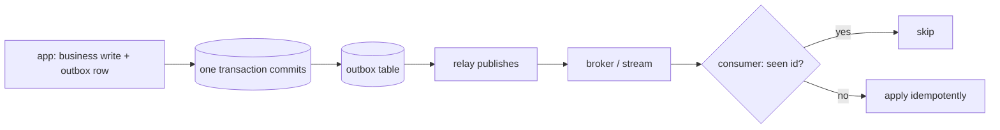

## Thesis

Reliably propagating every committed change in a database to other systems --- a search index, a cache, a warehouse, another service --- without the dual-write problem, by making the database's own commit the single source of change events: either a transactional outbox written in the same transaction and relayed, or log-based capture that tails the write-ahead log.

## Sub

**The dual-write problem** -> **the transactional outbox** -> **log-based capture off the write-ahead log** -> **zoom out** to ordering and delivery, and the pivots an interviewer rides from "keep the search index in sync" into why not dual-write, outbox versus log-based, and the exactly-once myth.

## Spine

- The problem is the **dual write** --- writing the database and then publishing an event are two operations that can't be atomic, so a crash between them loses the event or fires it for data that rolled back.
- The **transactional outbox** fixes it --- write the event to an outbox table in the *same* transaction as the data, so they commit or fail together, and a relay publishes the outbox rows.
- **Log-based CDC** is the other road --- a connector tails the write-ahead log and emits a change event per committed row, capturing every change with no application code at all.
- Delivery is **at-least-once and ordered per row** --- the consumer must be idempotent and the stream preserves per-key order, so every derived system converges on the source's state.

## Companion Notes

### walk

A change reaching a derived system

One row change from commit to a downstream system that applied it --- the dual-write trap, the outbox that closes it, and the log that avoids it.

Say why dual-write fails first --- "the database and the broker have no shared transaction." That one fact motivates the whole pattern.

### drill

Probe Drill

Graded follow-ups on the dual write, the outbox, log-based capture, and delivery --- the ones that separate "publish an event" from a reliable change pipeline.

Never claim exactly-once delivery --- CDC is at-least-once plus an idempotent consumer, which is effectively-once.

## Drill

SDE2 | the model and the mechanics
SDE3 | delivery, ordering, and edges
Staff | outbox vs log and org calls

### SDE2 | what CDC is

What is change data capture?

Turning every committed change in a database into a stream of change events other systems consume --- a search index, a cache, a warehouse, another service. Instead of each consumer polling the database or the app publishing events by hand, CDC makes the database's own changes the source of a reliable event stream, so derived systems stay in sync with the source of truth.

### SDE2 | the dual-write problem

What is the dual-write problem?

Writing to the database and then publishing an event are two separate operations that can't be atomic. A crash between them either commits the data but never fires the event, or fires the event for data that rolled back. Any "write the DB, then send to Kafka" code has this bug --- the two systems drift --- and CDC exists to eliminate it.

### SDE2 | the transactional outbox

What is the transactional outbox pattern?

Write the event into an outbox table in the **same** transaction as the business data, so they commit or fail together --- no gap where one happens without the other. A separate relay then reads the outbox and publishes the events. The database transaction, already atomic, becomes the guarantee that the event and the data agree.

### SDE2 | log-based CDC

What is log-based CDC?

A connector tails the database's **write-ahead log** --- the ordered record of every committed change the database already keeps for durability --- and emits a change event per row. It captures inserts, updates, and deletes with no application code and no outbox table, because it reads the changes the database itself recorded. Debezium is the common implementation.

### SDE2 | the change event

What is in a CDC change event?

The operation (insert, update, delete), the table, and the row --- often both the before and after images for an update, plus metadata like the transaction and log position. The before-and-after lets a consumer see exactly what changed, not only the new state, which matters for auditing, computing diffs, or reacting to a specific transition.

### SDE2 | relaying the outbox

How do outbox events actually get published?

A relay process reads unpublished outbox rows and publishes them to the broker, then marks them done or deletes them. It can poll the table on an interval, or itself be driven by log-based CDC on the outbox table. Either way the relay is at-least-once --- if it crashes after publishing but before marking a row, it republishes on restart --- so consumers dedup.

### SDE2 | where CDC is used

What is CDC commonly used for?

Keeping derived systems in sync with a source database: updating a search index when rows change, invalidating or refreshing a cache, streaming into a warehouse for analytics, and synchronizing data between microservices. Anywhere one database is the source of truth and other systems must react to its changes, CDC is the reliable propagation mechanism.

### SDE3 | why dual-write can't be atomic

Why can't you write the database and publish in one atomic step?

Because the database and the broker are two separate systems with no shared transaction --- committing both atomically needs distributed-transaction machinery that's fragile and rarely used. So one always happens first, and a crash in the gap leaves them inconsistent. The outbox sidesteps it by keeping everything inside the one system that *does* have transactions: the database.

### SDE3 | the relay's guarantees

How does the relay avoid missing or duplicating events?

It never **misses**: the row was committed with the data, so it's durably there to publish. It may **duplicate**: crashing after publishing but before marking the row done means it republishes on restart. So the relay is at-least-once, and consumers dedup by event id. A marked/unmarked flag or a published-offset is the simplest correct relay.

### SDE3 | ordering

What ordering does CDC give you?

Per-row (per-key), not global. The stream preserves the order of changes to a single row, so a consumer applies them in sequence and converges on the source state. Global ordering across all rows is expensive and usually unnecessary; you partition the stream by key so each key's changes stay ordered --- the same model as Kafka partitions.

### SDE3 | at-least-once and idempotent

Why must a CDC consumer be idempotent?

Because delivery is at-least-once --- the relay or broker can redeliver a change after a crash or lost ack. So applying the same change twice must be safe: an upsert keyed by the row id, or a version check that ignores an already-applied change. CDC gives a reliable, ordered, at-least-once stream; idempotency is what makes redelivery and reprocessing harmless.

### SDE3 | snapshot plus stream

How does a new consumer get the existing data, not just future changes?

A snapshot plus stream: first read a consistent snapshot of the current table (the initial load), then switch to the change stream from the snapshot's log position onward --- so no change is missed or double-counted at the boundary. Log-based tools do this automatically; without it a new consumer sees only changes after it started and misses every existing row.

### SDE3 | schema evolution

What happens to the change stream when the table schema changes?

The events' shape changes with the table --- a new column appears in the after image, a dropped one disappears. Consumers must tolerate that: additive changes are safe if missing fields default, but a removed or renamed column can break a consumer reading it. You version the event contract and coordinate schema changes with consumers, exactly as with any event stream.

### SDE3 | deletes and tombstones

How does CDC represent a deleted row?

As a delete event carrying the row's key, and often its last state. For a compacted stream like Kafka, a delete becomes a **tombstone** --- a record with the key and a null value --- so log compaction eventually drops the key entirely. A consumer maintaining a mirror deletes its copy on the tombstone. A delete is a first-class change, not an absence to be inferred.

### Staff | outbox vs log-based

Outbox or log-based CDC --- how do you choose?

The **outbox** is explicit and in your control: you decide exactly which events to emit and their shape, at the cost of app code and an extra write. **Log-based** captures everything with no app code, but couples you to the database's internal change log and emits raw row changes you may not want as public events. Outbox for curated domain events; log-based for wholesale replication to a warehouse or search.

### Staff | CDC vs event notification

How does CDC relate to publishing domain events from the app?

App-published events are intentional and business-level but carry the dual-write risk; CDC derives events from committed state so they can't disagree with the database. The catch is that log-based events are *data* changes (row-level), not *domain* events. So you often use the outbox to publish real domain events reliably --- getting both intent and atomicity in one pattern.

### Staff | the log as a coupling surface

What is the risk of tailing the write-ahead log?

It turns the database's internal schema into a de-facto public interface --- consumers depend on table and column shapes never meant to be a contract, so an innocent schema change breaks them. Log-based CDC leaks the physical model. The outbox avoids this by emitting a deliberate event shape you own, decoupled from the table layout --- the schema stays private.

### Staff | backfill and rebuild

How do you rebuild a downstream system from scratch?

Re-snapshot and re-stream: take a fresh consistent snapshot of the source and replay the change stream from there, with the consumer applying idempotently so the rebuild is safe. This is why an idempotent consumer and a retained stream matter --- a corrupted search index or a brand-new consumer is recovered by reprocessing from the source, not by manual repair.

### Staff | CDC for microservice sync

How does CDC help split a monolith or sync services?

It lets one service's database changes flow to another without the first publishing events by hand --- useful in a strangler migration where the new service consumes the old database's change stream, or for maintaining a local read-copy of another service's data. The caution is coupling: consuming another service's raw table changes ties you to its schema, so a curated outbox event is usually the cleaner contract.

### Staff | the exactly-once myth

Can CDC deliver exactly-once?

Not exactly-once delivery --- the same at-least-once reality as any stream, because the relay or broker can redeliver after a crash. What you build is at-least-once delivery plus idempotent consumers, giving effectively-once processing. A candidate claiming exactly-once CDC is missing the crash-in-the-gap the whole pattern is designed around.

### Staff | when not to use CDC

When is CDC the wrong tool?

When the consumer needs a synchronous answer (CDC is asynchronous and eventually consistent), when a direct query or a scheduled batch job would do (CDC adds a pipeline to operate), or when coupling to the source schema is unacceptable and no outbox is in place. CDC earns its complexity for real-time propagation to multiple derived systems, not for occasional or synchronous needs.

## Walk

### The dual write is the trap

```flow
w[write orders row] -> c[crash before publish] -> l[event lost]
```

The naive approach writes the database, then publishes an event --- two operations. Between the commit and the publish there's a gap: a crash there commits the data but never fires the event, so the search index or the cache silently misses the change forever.

The reverse ordering is no better: publish first, and a crash before the commit fires an event for data that never persisted. There is no ordering of two separate systems that closes the gap --- the problem is that they don't share a transaction.

### The outbox commits with the data

```flow
b[business write] -> o[outbox row same txn] -> t[commit together]
```

The fix keeps everything inside the one system that has transactions. Write the event into an outbox table in the same transaction as the business change, so the database's atomic commit makes them succeed or fail as a unit.

```sql
-- the business change and its event in one transaction -- both commit or neither does
BEGIN;
UPDATE orders SET status = 'shipped' WHERE id = 88;
INSERT INTO outbox (aggregate, event_type, payload)
  VALUES ('order', 'OrderShipped', '{"orderId":88}');
COMMIT;
```

Now there is no gap: if the transaction commits, the event is durably in the outbox; if it rolls back, neither the change nor the event exists. The dual write became a single write, and the atomicity you already trust for the data now covers the event.

### A relay publishes the outbox

```flow
r[relay reads outbox] -> p[publish to broker] -> m[mark row done]
```

A separate relay reads unpublished outbox rows, publishes them to the broker, and marks them done. Because the rows are durably committed, nothing is ever lost --- but the relay can crash after publishing and before marking, so it may republish.

That makes delivery at-least-once, which is why every consumer dedups by event id and applies idempotently. The outbox guarantees the event exists and agrees with the data; the relay plus an idempotent consumer guarantees it's processed exactly once in effect.

### Or tail the log

```flow
wal[write-ahead log] -> conn[connector tails it] -> e[change event]
```

The other road needs no outbox and no app code. A connector tails the write-ahead log --- the ordered commit record the database already keeps --- and emits a change event for every row that changed.

```json
{
  "op": "u",
  "table": "orders",
  "before": { "status": "packed" },
  "after":  { "status": "shipped" }
}
```

This captures everything for free, with before-and-after images, ideal for replicating a whole database into a warehouse or search. The cost is coupling: consumers now depend on the table's physical shape, so a schema change can break them --- which is exactly what the outbox's curated event avoids.

### Model Script

- Frame the problem | "The goal is keeping a derived system --- a search index, a cache, a warehouse --- in sync with a source database. The trap is the dual write: writing the database and then publishing an event are two operations with no shared transaction, so a crash between them loses the event or fires it for data that rolled back. Every 'write the DB then send to Kafka' has this bug."
- The outbox | "The fix is the transactional outbox. I write the event into an outbox table in the same transaction as the business change, so the database's atomic commit makes them succeed or fail together. There's no gap. A relay then reads the outbox and publishes the events."
- Delivery reality | "The relay is at-least-once --- it can crash after publishing but before marking a row done, so it may republish. So consumers dedup by event id and apply idempotently, and the stream is ordered per row so each key's changes converge. At-least-once plus an idempotent consumer is effectively-once --- I don't claim exactly-once delivery."
- The log-based alternative | "The other approach is log-based CDC: a connector tails the write-ahead log and emits a change event per row, with no app code and no outbox --- great for replicating a whole database into a warehouse. The trade is coupling: consumers depend on the table's physical schema, so a schema change can break them, which the outbox's curated event shape avoids."
- Interviewer: "A brand-new consumer needs all the existing data, not just new changes. How?"
- Snapshot plus stream | "A snapshot plus stream: it first reads a consistent snapshot of the current table, then switches to the change stream from the snapshot's log position onward, so nothing at the boundary is missed or double-counted. Log-based tools do this automatically, and because the consumer is idempotent, replaying to rebuild is always safe."
- Land it | "So: the dual write is the enemy; the outbox makes the event and the data one atomic commit; a relay plus idempotent, per-key-ordered consumers deliver it effectively-once; and log-based capture is the no-code alternative when you want wholesale replication and can accept schema coupling. The one line is that the database's own commit is the source of truth for change events."

## Whiteboard

Sketch the outbox path and mark where atomicity and at-least-once live.

### Where does atomicity come from?

The single database transaction --- the business row and the outbox row commit or roll back together, so the event can't disagree with the data.

### Why must the consumer be idempotent?

The relay is at-least-once --- it can republish after a crash --- so the consumer dedups and applies each change safely more than once.



Verdict: the transaction makes the event atomic with the data; the relay is at-least-once; an idempotent, per-key-ordered consumer makes it effectively-once.

## System

Zoom out to where CDC sits between the source database and derived systems.

### Where it sits

Source database: the single source of truth [*]
Outbox or write-ahead log: the durable record of what changed
Relay or connector: reads changes and publishes them
Broker / stream: carries ordered, at-least-once change events
Derived systems: search, cache, warehouse, services converge on the source

### Pivots an interviewer rides

From "keep it in sync" they push on the dual write, the two mechanisms, and delivery.

#### Why not just write the database and publish an event?

-> the dual write isn't atomic, so a crash drifts the two systems
The database and broker share no transaction; one happens first and a crash in the gap loses the event or orphans it. The outbox closes the gap by writing the event in the same transaction as the data.

#### Outbox or log-based capture?

-> outbox for curated domain events, log-based for wholesale replication
The outbox emits an event shape you own, at the cost of app code; log-based captures everything with no code but couples consumers to the table's schema. Choose by whether you want deliberate domain events or a full data replica.

## Trade-offs

The calls that separate "publish an event" from a reliable pipeline.

### Dual write vs transactional outbox

- Dual write: no extra table, but a crash between the commit and the publish drifts the two systems
- Outbox: the event is atomic with the data, at the cost of an outbox table, a relay, and dedup

Always prefer the outbox (or log-based) over a naive dual write; the gap is a real, silent data-loss bug.

### Outbox vs log-based capture

- Outbox: curated, business-level events with a shape you own, but needs app code and an extra write per change
- Log-based: every change captured with no app code, but raw row events coupled to the table's physical schema

Use the outbox for deliberate domain events; use log-based to replicate a whole database into a warehouse or search.

### Real-time stream vs periodic batch

- CDC stream: near-real-time propagation and reprocessable, but a pipeline to build and operate
- Periodic batch: simple and robust, but stale between runs and heavy at run time

Use CDC when derived systems must be near-current; a batch job is fine when hourly or daily freshness is acceptable.

## Model Answers

### the outbox | Atomic event and data

The fix for the dual write.

- Same transaction | key | outbox row commits with the business row
- Relay publishes | store | reads the outbox, at-least-once
- Idempotent consumer | note | dedup by id, effectively-once

### the two mechanisms | Outbox vs log-based

Choosing the road.

- Outbox for domain events | key | curated shape you own
- Log-based for replication | store | tails the write-ahead log, no code
- Schema coupling is the cost | note | log-based leaks the table shape

## Numbers

Back-of-envelope the change-event volume CDC produces and the lag it adds.

One change event per committed write, fanned out to each derived system, delivered asynchronously. The dual-write failure rate CDC removes is the reason it exists.

- writeRate | Writes/sec | 2000 | 0 | 100
- consumers | Derived systems | 3 | 1 | 1
- lagMs | End-to-end lag (ms) | 500 | 0 | 50

```js
function (vals, fmt) {
  var writeRate = vals.writeRate, consumers = vals.consumers, lagMs = vals.lagMs;
  return [
    { k: 'Change events/sec', v: fmt.n(writeRate), u: 'events/s', n: 'one event per committed write \u2014 the outbox or the log emits exactly what the database committed, no more', over: writeRate > 50000 },
    { k: 'Fan-out to systems', v: fmt.n(writeRate * consumers), u: 'deliveries/s', n: 'each change goes to ' + consumers + ' derived systems \u2014 search, cache, warehouse \u2014 so the stream is read many times over', over: writeRate * consumers > 100000 },
    { k: 'End-to-end lag', v: fmt.n(lagMs), u: 'ms', n: 'source commit to downstream apply \u2014 CDC is asynchronous, so derived systems are eventually consistent within this window', over: lagMs > 5000 },
    { k: 'Dedup lookups', v: fmt.n(writeRate * consumers), u: 'ops/s', n: 'at-least-once delivery means each consumer dedups every event \u2014 the standing cost of an idempotent CDC consumer', over: false },
    { k: 'Lost with dual-write', v: 'nonzero', u: '', n: 'a crash between the DB write and the publish loses events at some rate \u2014 exactly the silent failure the outbox eliminates by making them one commit', over: false }
  ];
}
```

## Red Flags

What makes an interviewer wince.

### "Write the database, then publish to Kafka"

That's the dual write --- a crash between the two loses the event or fires it for data that rolled back, and the systems silently drift.

Write the event to an outbox in the same transaction as the data, or tail the write-ahead log --- so the event can't disagree with the commit.

Note: this is the single most common change-propagation mistake in interviews.

### "CDC gives us exactly-once delivery"

The relay or broker can redeliver after a crash, so delivery is at-least-once, not exactly-once.

Say at-least-once plus an idempotent, per-key-ordered consumer, which is effectively-once processing.

### "We'll just tail the production table's log; schema changes are fine"

Log-based capture ties consumers to the table's physical schema, so a column rename or drop breaks them silently.

Emit a curated event from an outbox when you need a stable contract, or version and coordinate schema changes with every consumer.

## Opener

### 30s | The one-liner

How I open when asked to keep a derived system in sync with a database.

#### What is the shape?

Make the database's commit the source of change events --- an outbox row in the same transaction, or a connector tailing the write-ahead log.

#### What is the trap it avoids?

The dual write --- writing the DB and publishing separately isn't atomic, so a crash in the gap loses the event or orphans it.

##### Hooks

Where an interviewer usually pushes next.

- Why not dual-write? | no shared transaction | drill
- Outbox or log-based? | domain events vs replication | trade
- Exactly-once? | at-least-once plus idempotent | drill

Foot: two sentences --- the outbox makes the event atomic with the data, and an idempotent consumer makes delivery effectively-once.

## Bank

### SCALE | Two thousand writes a second feeding three systems

Task: size the change-event volume and the lag.
Model: one event per committed write, fanned out to each derived system, delivered asynchronously within a lag window; each consumer dedups every event.
Int: what does CDC remove versus a dual write?
The silent event loss when a crash falls between the database commit and the publish.

### DESIGN | Keep a search index in sync with a Postgres source

Task: design reliable propagation of row changes.
Model: a transactional outbox (or log-based CDC) so the change is atomic with the data, a relay publishing at-least-once, and an idempotent, per-key-ordered consumer that upserts the index; a snapshot-plus-stream for the initial load.
Int: how does a brand-new index get the existing rows?
A consistent snapshot first, then the change stream from the snapshot's position --- nothing missed at the boundary.

### Extra Curveballs

### CURVEBALL | rebuild | The search index is corrupted --- how do you rebuild it from the source?

Model: re-snapshot the source table and replay the change stream from that position, with the consumer applying idempotently so the rebuild is safe --- a retained stream plus an idempotent consumer is exactly what makes reprocessing-from-source the recovery path, not manual repair.

### Frames

- The dual write isn't atomic --- that's the whole problem
- The outbox makes the event and the data one commit
- At-least-once plus an idempotent, ordered consumer is effectively-once
