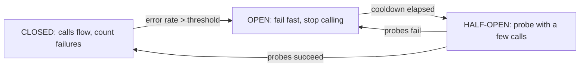

## Thesis

Stopping calls to a dependency that's clearly failing --- tripping "open" once errors cross a threshold so requests fail fast instead of piling onto a struggling service, then probing "half-open" to detect recovery before closing again --- so a failing dependency degrades one feature gracefully rather than exhausting the caller and cascading into a system-wide outage.

## Sub

**Why fail fast: retrying a dead dependency makes it worse** -> **the three states: closed, open, half-open** -> **tripping and recovery thresholds** -> **zoom out** to fallbacks, per-dependency breakers, and the pivots an interviewer rides from "add a circuit-breaker" into the state machine, threshold tuning, and how you probe for recovery.

## Spine

- A circuit-breaker **fails fast when a dependency is clearly down** --- instead of every request waiting on a timeout and retrying (piling load onto the struggling service and tying up the caller's threads), the breaker trips open and returns an error immediately.
- It's a **three-state machine** --- closed (calls flow, failures counted), open (calls short-circuit and fail fast, giving the dependency room), half-open (a limited probe to test whether it recovered) --- transitioning on an error threshold and probe results.
- The point is **breaking the feedback loop** --- retries amplify load exactly when a dependency is struggling, so the breaker stops the amplification, converting "hammer it until it dies" into "back off, let it heal, then check."
- Its real value is **graceful degradation** --- paired with a fallback (a cached value, a default, a queued write), a tripped breaker turns a dependency outage into a degraded-but-alive feature instead of a cascade.

## Companion Notes

### walk

Failing fast to let a dependency heal

One dependency going down, handled gracefully --- the breaker that trips open to stop the pile-on, the fail-fast that saves the caller's resources, the half-open probe that detects recovery, and the fallback that keeps the feature alive while it's open.

Say the feedback loop first --- "retries add load exactly when a dependency is struggling." The breaker exists to stop that amplification and give the dependency room to recover.

### drill

Probe Drill

Graded follow-ups on the state machine, tripping thresholds, half-open probing, and fallbacks --- the ones that separate "add a breaker" from a dependency failure that degrades gracefully instead of cascading.

Name the states: closed (flowing), open (failing fast), half-open (probing) -- and that the breaker's job is to stop retrying a dependency that's clearly down, not to recover individual calls.

### wb

Whiteboard

Rebuild the whole breaker from the cues --- the three states and their transitions, what trips it, what it counts, what the caller gets while it's open, and how it probes back to healthy --- with nothing in front of you.

Draw the state machine first, then label the transitions with what causes each one. Recall is the test: if you can't say what moves it out of half-open, you don't have the machine, you have the diagram.

### sys

System Map

Zoom out: the breaker sits on the wire between a caller and one dependency, deciding whether the call is even attempted.

Lead with what it protects, not what it is --- "it stops my threads piling up on a dependency that's already failing" --- then the state machine. The boxes are easy; the resource it saves is the answer.

### trade

Trade-offs

The decisions they drill --- trip fast vs trip stable, local vs shared state, error only vs a real fallback, in-process vs the mesh --- each with the condition that flips it.

Always name the failure each side buys you. A sensitive breaker flaps on a healthy dependency; a conservative one lets a dying one keep taking traffic. Say which failure you're choosing, not which setting you like.

### model

Model Answers

Full spoken scripts --- the beats, in order, the way you'd actually say them under time pressure.

Steal the frame, not the words --- open on the feedback loop ("retrying a failing dependency makes it worse"), then the state machine, then the fallback as the thing that turns the signal into graceful degradation.

### num

Numbers

Back-of-envelope what a hanging dependency does to the caller --- and how much of it the breaker actually takes away.

Lead with Little's Law: concurrency equals rate times latency. A dead dependency makes every call ride the full timeout, so the threads you need explode; an open breaker takes that to roughly zero. That collapse is the number to say out loud.

### rf

Red Flags

What sinks the round --- a 30-second timeout, a breaker that trips on 4xx, a fallback nobody has ever run, a close that slams a cold dependency back to full traffic --- and what to say instead.

Name what the interviewer hears. "We'll just keep retrying until it comes back" is the fastest way to say you've never watched a retry storm deepen an outage.

### open

30-Second

The opener and the close --- matched to the altitude the question is asked at.

Match the altitude: open on the loop the breaker cuts (retries and waiting make it worse), not on the three states. The state machine is the mechanism; containing the blast radius is the point.

## Drill

all | **All four levels, mixed** --- the way a real loop actually comes at you.
SDE2 | **The model and the states** --- what a breaker is, why failing fast beats waiting, and the closed/open/half-open machine. The bar is "this is a state machine that changes what the caller does": name the three states and the resource it actually saves.
SDE3 | **Thresholds, probing, and fallbacks** --- what trips it, what counts as a failure, what the caller gets while it's open, and how it composes with retries. The bar is "here's the switch": name the number and the failure mode it bounds.
Staff | **Storms, the stack, and distribution** --- cascades, the resilience stack, shared state, the recovery herd, and when a breaker is wrong. The bar is "contain the blast radius": name what the breaker does *not* do, and what has to be there for it to matter.

### SDE2 | what a circuit-breaker is

What is a circuit-breaker?

A wrapper around calls to a dependency that monitors failures and, when they cross a threshold, "trips" to stop making calls for a while --- returning an error (or a fallback) immediately instead of attempting the call. Named after the electrical breaker that cuts the circuit to prevent damage, it does the same for a software dependency: when a downstream service is failing, the breaker stops sending it traffic so it isn't hammered while struggling, and so the caller isn't tying up resources on calls that are going to fail anyway.

Follow: A breaker only trips *after* a batch of calls has already failed. So what actually saved you --- the calls it blocked, or something else?
The calls it blocks, and the asymmetry is the whole argument. The failures you pay *before* the trip are **bounded** --- one window's worth, a minimum request volume, once. The calls it blocks afterwards are **unbounded** --- every request for the rest of the outage, each holding a thread for the full timeout. You spend a fixed cost to avoid a cost that scales with how long the dependency stays down. At 500 rps with a 2-second timeout that's roughly 20 doomed calls traded for a thousand concurrent waits, indefinitely.

Follow: Is the breaker protecting the dependency, or protecting you?
Both, but **you first and more reliably**. The guaranteed win is the caller's: fail fast, release the threads and connections, stay alive for the endpoints that have nothing to do with this dependency. The downstream win is real but *secondary and reactive* --- it only starts once the breaker is already open, which is to say once the dependency is already in trouble. If you want to stop a dependency from *ever* being overloaded, that's a rate limiter or a concurrency limit, not a breaker. The breaker is how you survive its failure, not how you prevent it.

Senior: Describing it as a **state machine that changes the caller's behaviour** --- not as "error handling" --- and being able to name the resource it actually saves (the caller's threads and connections) separates someone who has run one in production from someone who has read the pattern's name.
Speak: Define it by what it *stops*: "a wrapper that watches failures on a dependency and, once they cross a threshold, stops calling it for a while --- returning immediately instead of waiting on a call that's going to fail." Then the payoff in one breath: it releases the caller's threads and stops piling load on a service that's already struggling.

### SDE2 | why fail fast

Why is failing fast better than retrying or waiting?

Because when a dependency is genuinely down or overloaded, retrying and waiting make things *worse*, not better. Every request that waits on a timeout holds a thread and a connection; every retry adds load to the already-struggling dependency. Multiply that across all callers and you get resource exhaustion upstream and a deeper outage downstream. Failing fast --- returning an error immediately --- releases the caller's resources and stops piling load on the dependency, which is exactly what a struggling service needs to recover. Patience helps a transient blip; it harms a real outage.

Follow: Give me the actual math. Why does *waiting* exhaust the caller?
**Little's Law**: the concurrency you must hold is arrival rate x latency. At 500 rps against a healthy 50ms dependency you hold `500 x 0.05 = 25` calls in flight. When the dependency hangs and every call rides the full 2-second timeout, you need `500 x 2 = 1000` in flight --- and if your pool is 200 threads you are **5x over budget**. The pool fills, and now requests to endpoints that never touch that dependency queue behind the ones that do. You don't die of the dependency's errors; you die of your own concurrency budget being consumed by *waiting*.

Follow: So is the real fix just a shorter timeout?
A shorter timeout is **necessary but not sufficient**. It caps how long each doomed call holds a thread --- and it's what converts a hang into a *countable* failure the breaker can see --- but you are still *making* every call, so you still pay a thread for the timeout on every single request, and you're still sending traffic to a dead service. Dropping the timeout from 10s to 500ms cuts the concurrency demand 20x; it does not take it to zero. The breaker is what takes it to zero, because an open breaker doesn't make the call at all. Timeouts bound the damage per call; the breaker stops making the calls.

Senior: Reaching for **Little's Law** --- concurrency = rate x latency --- to show that a *slow* dependency exhausts the caller's thread pool, and naming that the caller dies of **waiting** rather than of errors, is what turns "fail fast is good" into a defensible engineering claim.
Speak: Say the loop out loud: "retrying and waiting make a struggling dependency *worse*, not better." Then the mechanism in one breath --- every waiting request holds a thread, every retry adds load, so the caller exhausts its pool exactly when the dependency can least take the traffic. Failing fast releases the resource and stops the amplification.

### SDE2 | the three states

What are the three states of a circuit-breaker?

**Closed**: normal operation --- calls pass through to the dependency and the breaker counts failures. **Open**: tripped --- calls short-circuit and fail fast (or return a fallback) without touching the dependency, giving it room to recover. **Half-open**: probing --- after a cooldown, the breaker lets a limited number of calls through to test whether the dependency has recovered; if they succeed it closes (back to normal), if they fail it re-opens (another cooldown). The lifecycle is closed -> open (on too many failures) -> half-open (after cooldown) -> closed or open (based on the probe).

Follow: What actually drives the open -> half-open transition? Is there a timer thread?
Usually **not** --- it's *lazy*, evaluated on the next call. The breaker records *when* it opened; when a call arrives it asks "has the cooldown elapsed?" and, if so, transitions to half-open and lets that call through as the probe. The consequence people miss: a breaker on a dependency with **no traffic just sits open**, because nothing is asking it to re-evaluate --- it doesn't heal in the background. (Resilience4j makes this explicit with an `automaticTransitionFromOpenToHalfOpenEnabled` flag that adds a scheduler if you *do* want the transition without a call.) Practically, a low-traffic dependency recovers on the first call *after* the cooldown, not at the cooldown.

Follow: Can it go straight from closed to half-open, or from open to closed?
No --- and the reason is what each state is *for*. Closed -> open requires the failure threshold, and open -> closed *without a probe* would send full traffic to a dependency you have **no evidence** has recovered, which is exactly the second outage half-open exists to prevent. Half-open is the only path back, and it's the evidence step: probes succeed -> closed; probes fail -> open with the cooldown restarted. The machine is deliberately small --- three states, four transitions --- and it has no shortcut that skips the evidence.

Senior: Knowing the open -> half-open transition is usually **lazy** (evaluated on the next call, not by a timer), so a zero-traffic dependency's breaker never re-probes on its own, is the implementation detail that shows you've read or written one rather than just drawn it.
Speak: Name the three and what each is *doing*: "closed --- calls flow and I'm counting failures; open --- I've tripped, calls short-circuit and fail fast, giving the dependency room; half-open --- after a cooldown I let a few probes through to test recovery." Then close the loop: probes succeed, it closes; probes fail, it re-opens.

### SDE2 | what closed means

What does the "closed" state mean?

Normal operation --- the circuit is closed like a completed electrical circuit, so current (requests) flows through to the dependency. In this state the breaker is transparent: calls go to the dependency as usual, but the breaker is *watching*, counting successes and failures. When the failure count or rate crosses the configured threshold, the breaker trips from closed to open. So "closed" is the healthy default, and it's where the breaker does its monitoring job silently until things go wrong.

Follow: In closed, what exactly is it counting, and over what?
A **rolling window**, not a lifetime total --- otherwise a service that ran for a month at 1% errors could never trip. It's either **count-based** (the last N calls --- Resilience4j's default sliding window is 100) or **time-based** (the last T seconds --- Hystrix used a 10-second rolling window of 1-second buckets). Each completed call records success or failure into the window, and the failure *rate* over the window is compared to the threshold, gated by a **minimum number of calls** so that 1 failure out of 2 can't trip it. The window is what makes "is this failing *right now*" an answerable question.

Follow: Does the counting cost you anything on the hot path?
It has to be nearly free, because it runs on **every call** to that dependency --- so it's a ring buffer of outcomes and an atomic counter, not a lock and certainly not a network write. That's precisely why the state lives **in memory in the calling process** by default: the breaker sits *in* the request path, so its bookkeeping has to be nanoseconds. It's also the strongest practical argument against a *shared* breaker: putting the counter in Redis means a network round trip on the hot path of every call --- to protect you from a network round trip.

Senior: Naming the **rolling window** (count- or time-based) with a **minimum request volume**, rather than "it counts failures," is the difference between describing the pattern and *specifying* it --- and the follow-through, that the counting is a ring buffer on the hot path, is what makes the local-state default obvious.
Speak: "Closed is the healthy default --- calls pass straight through, and the breaker is *watching*, recording each outcome." The one thing to add so it's a spec and not a sketch: it's a **rate over a rolling window with a minimum volume**, not a lifetime count, so it can answer "is this failing right now."

### SDE2 | what open means

What does the "open" state mean?

Tripped --- the circuit is open (broken), so requests do *not* flow to the dependency. Instead, calls fail immediately (fast) or return a fallback, without even attempting the call. This is the protective state: it stops the caller from wasting resources on doomed calls and stops the failing dependency from being hammered. The breaker stays open for a configured cooldown period, giving the dependency time to recover, after which it moves to half-open to test the waters. "Open" is counterintuitive naming --- open means *stopped*, matching the electrical metaphor where an open circuit carries no current.

Follow: Open means the call isn't made. But what do you actually *return* --- and what does that do to *your* caller?
The fallback if you have one; an error if you don't --- and *which* error decides whether the outage propagates. Return a **500** and your own caller's breaker counts it as *you* failing and may trip on *you* --- which is honest if you genuinely cannot serve the request. Return a **degraded 200** (stale cache, partial payload) and the degradation **stops at you**. The dangerous middle is returning a 500 for a request you *could* have degraded: you propagate someone else's outage up your own call graph for no reason. If you must fail, a `503` with `Retry-After` is the honest signal --- it tells the caller this is transient and roughly when to come back.

Follow: How long should it stay open?
Long enough for the dependency to plausibly recover, short enough that you're not still cut off after it has --- typically seconds to tens of seconds (Hystrix's default sleep window was 5s; Resilience4j's default wait is 60s). Let the **asymmetry** pick the number: too *short* and you re-probe a still-broken dependency, which costs a few probe calls and another cooldown --- cheap and self-correcting. Too *long* and you keep a **recovered** dependency cut off, degrading a feature that no longer needs degrading --- expensive, and invisible unless someone is watching the breaker. So err short, keep the probe small enough that a premature probe is harmless, and jitter it so a fleet doesn't re-probe in lockstep.

Senior: Realizing that "open" is a decision about **what you return**, not just what you skip --- and that a raw 500 propagates the outage into your caller's breaker while a degraded 200 stops it at you --- is the blast-radius thinking a Staff round is actually testing for.
Speak: "Open means *tripped*: calls don't reach the dependency at all --- they short-circuit and return immediately, ideally with a fallback." Then defuse the naming trap before they ask: it's the *electrical* sense --- an open circuit carries no current --- so open means **stopped**.

### SDE2 | what half-open means

What does the "half-open" state mean?

Probing for recovery --- after the open cooldown, the breaker cautiously lets a *small* number of test calls through to see if the dependency is healthy again. If those probes succeed, the breaker assumes recovery and closes (resumes normal traffic); if they fail, it re-opens (another cooldown, without flooding the still-broken dependency with full traffic). Half-open is the safe middle ground between "stay open forever" (never recovers) and "slam back to full traffic" (risks re-overloading a fragile dependency). It's how the breaker detects recovery without causing a second outage.

Follow: Those probes are real user requests. Is a failed probe just a sacrificed customer?
Yes --- and that's the honest cost of the design, so say it before they do. In the standard implementation the probe **is** a real request, so while the dependency is still down the permitted probes are users who get an error that a still-open breaker would have turned into a fallback. It's *bounded* (a handful per cooldown, not a flood), and it's the price of learning the dependency's state. If that price is unacceptable, the alternative is an **active health check** --- a synthetic probe against a cheap health endpoint on a background timer, closing the breaker only when *it* passes. That sacrifices no user request, but it tests a *different thing*: the health endpoint, not your actual call path --- so it can report "healthy" while your real query still times out.

Follow: How many probes before you're convinced, and what if some succeed and some fail?
Enough to be evidence, few enough to be harmless --- a handful (Resilience4j permits 10 by default) --- and you decide the same way you decided to trip: on a **failure rate across the probe calls**, not "the first one wins." Requiring a single success is too trigger-happy against a flapping dependency; requiring all of them is too slow to recover. And half-open must **cap concurrency, not just count**: if you admit 10 probes and they all hang for the full timeout, you are holding threads again --- so the permitted probes are a *concurrency limit*, and everything else stays fast-failed while they're in flight.

Senior: Naming that the probe is usually a **real user request being sacrificed** --- and giving the active-health-check alternative *with its blind spot* (it tests the health endpoint, not your call path) --- is the trade-off awareness that separates a designed breaker from a configured one.
Speak: "Half-open is the recovery probe: after the cooldown, a *small* number of calls are let through and the rest are still fast-failed." Then the reason it must be small, in one line: full traffic at a just-recovering dependency re-overloads it and causes a second outage. Probes succeed -> close; probes fail -> re-open.

### SDE2 | the analogy

What's the electrical analogy, and why is it apt?

An electrical circuit-breaker cuts the circuit when current exceeds a safe level, preventing wires from overheating and starting a fire; you reset it once the fault is fixed. The software version cuts off calls to a dependency when failures exceed a threshold, preventing the "fire" of cascading failure and resource exhaustion. The apt part is the *protective, automatic* nature: it's not trying to fix the fault, it's *isolating* it to prevent wider damage, and it trips automatically rather than requiring someone to notice. The half-open probe is the analog of testing whether it's safe to reset.

Follow: Where does the analogy break down?
Three places, and knowing them is the point. **A fuse is one-shot and needs a human**; a software breaker *self-resets* through half-open --- the entire recovery half of the design has no electrical equivalent. **The electrical one trips on a directly measured quantity** (current), while the software one *infers* "unhealthy" from a statistical signal (an error rate over a window) --- so it can be **wrong**: it can flap on noise, and it can miss a slow-but-succeeding dependency entirely. And **the electrical breaker protects the wiring** --- i.e. the *caller* --- which is the honest framing of the software one too, even though it's usually sold as protecting the dependency.

Follow: If it's just a fuse, why automate it? Why not have a human flip it?
Because the failure is **faster than a human**. Thread-pool exhaustion from a hanging dependency happens in seconds --- at 500 rps with a 2-second timeout you accumulate a thousand blocked calls in the time it takes to read a dashboard --- so by the time someone is paged, orients, and flips a switch, the caller is already down. That said, the *manual* switch is still worth building: a **force-open kill switch** (shed a dependency you know is bad, or disable a feature deliberately) and a **force-closed override** (for when the breaker itself is the thing misbehaving) are standard production controls --- Hystrix shipped both. Automatic for speed, manual for judgment.

Senior: Being able to say where the analogy **breaks** --- self-reset via a probe, a *statistical* rather than measured trip signal, and the caller being the thing actually protected --- shows you are reasoning about the mechanism rather than repeating the name.
Speak: Give the analogy in one line --- "it cuts the circuit when the fault would otherwise damage the wiring" --- then immediately map it: it stops calls when failures would otherwise exhaust the caller and hammer the dependency. Then add the difference before they ask: unlike a fuse, **this one resets itself**, by probing.

### SDE3 | what trips the breaker

What causes the breaker to trip open?

Failures crossing a configured threshold within a window --- usually an **error rate** (e.g. more than 50% of calls failing over the last N requests or seconds), sometimes a raw **consecutive-failure count**. A rate is generally better than a fixed count because it adapts to volume: 5 failures means something different at 10 requests/sec than at 10,000. You also need a minimum request volume before the rate is meaningful (don't trip on 1 failure out of 2 calls). So a typical config is "trip if the error rate exceeds X% over a window, given at least N requests" --- so the breaker reacts to a real pattern of failure, not statistical noise.

Follow: You said "a rate, given a minimum volume." What's the failure mode of that minimum?
**A low-traffic dependency never trips.** If the minimum is 20 calls in a 10-second window and the dependency gets 2 calls a *minute*, the window never fills --- so the breaker sits closed while 100% of calls fail, which is exactly the case you thought you were protected against. Three answers, in order of preference: use a **count-based** window (the last N calls, however long they take to accumulate) instead of a time-based one, so low traffic just means the window fills slowly; lower the minimum for that specific dependency; or accept it --- at 2 calls a minute there is no thread-exhaustion risk to protect against anyway. Which is the honest point: the minimum volume protects you from *noise*, and at low volume there's little to protect.

Follow: The dependency isn't erroring. It's just gotten very slow. Does your breaker trip?
**Not on error rate alone --- and this is the dangerous gap.** A dependency returning 200s at p99 = 10 seconds is the *worst* case for the caller: there are no failures to count, but every call holds a thread for ten seconds, so your pool exhausts while the breaker sits happily closed and green. Two fixes. The standard one: **the timeout converts slowness into a failure** --- set it above p99 but below the latency at which you're in trouble, and a slow call becomes a timeout, which the breaker *does* count. The better one, if your library supports it: a **slow-call rate threshold** (Resilience4j has one) that trips on "more than X% of calls took longer than D," so you trip on latency *directly* rather than laundering it through a timeout.

Senior: Naming the **slow-but-succeeding dependency** as the case an error-rate breaker is structurally blind to --- and that a *timeout* is what converts latency into a countable failure (or a slow-call-rate threshold that trips on it directly) --- is the failure-mode literacy that marks the Staff answer on this card.
Speak: "Trip on an **error rate over a rolling window**, with a **minimum request volume** --- a rate adapts to traffic where a fixed count doesn't, and the minimum stops 1-of-2 noise from tripping it." Then volunteer the gap before they find it: the rate is blind to a *slow* dependency, so the timeout is what turns slowness into a failure it can count.

### SDE3 | the half-open probe

How does half-open actually test for recovery?

By allowing a limited, controlled number of calls through --- often just one, or a small handful --- while blocking the rest, and watching their outcome. If the probe call(s) succeed, the dependency looks healthy, so the breaker closes and resumes full traffic; if they fail, it re-opens for another cooldown. The critical design point is that the probe must be *small*: sending full traffic to test recovery would immediately re-overload a fragile, just-recovering dependency. So half-open is a deliberate trickle --- enough to learn the dependency's state, not enough to knock it back over if it's still weak.

Follow: Ten instances, each with its own breaker, all go half-open in the same second. How many probes does the recovering dependency actually get?
**Ten times whatever each instance permits** --- and that's the herd. Each instance believes it is sending "a few probes"; the dependency experiences the *sum*. If each of 10 instances permits 10, that's **100 concurrent calls** into a service that has just come back with cold caches, an empty connection pool and no warm JIT --- so the probes fail, all ten breakers re-open together, and you flap. The fix is de-synchronization and pacing: **jitter the cooldown** so instances don't transition in lockstep, keep each instance's permitted probes genuinely small, and **ramp** traffic after closing instead of resuming 100% instantly.

Follow: Why is the just-recovered dependency so fragile? It handled this load fine an hour ago.
Because **"recovered" is not "warm."** A service that has just come back has *cold caches* (every read is a miss straight through to the database), an *empty connection pool* (every call pays a handshake), a cold JIT, and --- if it consumes a queue --- a **backlog** to work through *on top of* live traffic. Its capacity in the first seconds is a fraction of its steady-state capacity, so the load that was fine before the outage is genuinely **not** fine now. And once it buckles you get a **metastable failure**: whatever originally broke it is long gone, but the *load itself* now sustains the outage --- full traffic knocks the cold service over, which produces failures and retries, which keep it over. That's why the probe must be small and the ramp must exist, and why "the dependency is up, resume everything" is how you cause the second outage: recovery has to *approach* full load, not arrive at it.

Senior: Explaining **why** a just-recovered service is fragile --- cold caches, empty pools, a backlog, so its immediate capacity is far below its steady-state capacity --- and connecting that to why recovery must be **ramped**, is the metastable-failure reasoning that reads as Staff.
Speak: "Half-open lets a *limited* number of calls through --- often one, or a small handful --- and fast-fails the rest; their outcome is the test." Then the reason it must be small: full traffic at a just-recovering dependency, with cold caches and empty pools, re-overloads it and causes a second outage. Small probe, **jittered** cooldown, **gradual** ramp.

### SDE3 | what to return when open

When the breaker is open, what does the caller get?

Ideally a **fallback**, not just an error. Failing fast with an error is the minimum (better than hanging), but the graceful-degradation win comes from a fallback: a cached/stale value, a sensible default, a "temporarily unavailable" response, or queuing a write to apply later. What the fallback is depends on the feature --- a recommendations service that's down can return generic popular items; a write can be enqueued; a non-critical enrichment can be skipped. The breaker gives you the *hook* to degrade gracefully (you know the dependency is down), and the fallback is what turns that from a hard failure into a soft one.

Follow: You have never actually executed that fallback in production. What's the risk?
That the fallback is **broken**, and you find out during the outage --- because that is the first time it has ever run. This is a genuinely common failure: the fallback path throws on an empty cache, carries a stale schema, is missing a config value, or --- the classic --- **calls the same overloaded dependency by a different route**, so it fails alongside the thing it was supposed to replace. It is, structurally, **the least-tested code you own**: it only executes when something else has already failed, and it runs at the worst possible moment. So you *exercise* it deliberately --- force the breaker open in staging and in a game day, dark-launch the fallback on a slice of live traffic, and assert the degraded response in an integration test. A fallback you have never run is a hypothesis, not a fallback.

Follow: The dependency is on a *write* path. What's the fallback for a write?
You can't fabricate a write the way you can fabricate a read, so the options are narrow and the choice is really one question --- **is this write deferrable?** If yes: **queue it.** Accept the request, durably enqueue the intent (the outbox pattern), acknowledge honestly --- "payment pending, we'll confirm shortly" --- and drain it when the dependency recovers. If no --- an authoritative, synchronous write like taking a payment or reserving the last seat --- then **fail cleanly**, because a fabricated success is far worse than an honest error: you'd be telling the user something happened that didn't. The one thing you must never do is return success for a write you did not perform.

Senior: Knowing the fallback is **the least-tested code you own** --- it runs only when something has already failed --- and that you therefore have to exercise it on purpose (force the breaker open, game days, dark launch), is the operational maturity that separates designed degradation from aspirational degradation.
Speak: "Failing fast with an error is the *minimum*; the win is a **fallback**." Then the menu, matched to the feature: a stale cache, a static default, queue the write for later, or skip a non-critical enrichment. The breaker gives you the **signal** that the dependency is down; the fallback is what turns a hard failure into a soft one.

### SDE3 | per-dependency breakers

Should you have one breaker or many?

Many --- one breaker **per dependency** (often per dependency-endpoint), not a single global breaker. Each downstream has its own failure profile, so lumping them together means one failing dependency could trip a breaker that also gates healthy ones, or a healthy dependency's traffic masks a failing one's errors. Isolating breakers per dependency means the payment service being down trips only the payment breaker, while the catalog service keeps flowing normally. This is closely related to the bulkhead idea: isolate failures so one dependency's problem doesn't affect calls to others.

Follow: Per dependency, or per *endpoint* of a dependency?
Per **unit that can fail independently** --- and that is often finer than the service. If one endpoint is backed by an expensive query that falls over under load while the rest of the service is fine, a service-level breaker either trips and cuts off the *healthy* endpoints, or fails to trip because the healthy traffic dilutes the error rate --- and meanwhile the bad endpoint keeps eating your threads. So split the breaker wherever the failure modes are genuinely independent: typically per **(service, operation)**, and sometimes per *shard* or per *host* when that's the thing that actually fails. The cost of splitting too finely is that each breaker's window fills more slowly, which walks you straight back into the low-traffic-never-trips problem. Split by failure domain, not by curiosity.

Follow: How is that different from a bulkhead? They both sound like isolation.
They isolate different things at different *times*. A **bulkhead** is a *static* partition of the caller's resources --- this dependency may use at most N threads or N concurrent calls --- so a hanging dependency can only ever consume its own slice, and crucially it protects the others **while the breaker is still making up its mind**. A **breaker** is a *dynamic* decision to stop calling, made *after* it has seen enough failures. The bulkhead bounds the blast radius from the very first hung call; the breaker eliminates the calls entirely once it's convinced. You want both: without the bulkhead, one dependency can exhaust the whole pool during the window the breaker is still measuring; without the breaker, you keep making doomed calls forever inside a bulkhead that is now permanently full.

Senior: Distinguishing the **bulkhead** (a static concurrency partition that protects you from the *first* hung call, before the breaker has decided) from the **breaker** (a dynamic stop, after it has) --- and saying you want both, because each covers the other's window --- is the precise resilience vocabulary a Staff interviewer is checking for.
Speak: "One breaker **per dependency** --- often per (service, operation) --- never one global breaker." The reason, in one line: a global breaker conflates failure domains, so a failing payment service either trips a breaker that also gates a healthy catalog, or its errors get diluted by healthy traffic and it never trips at all. Isolate the breaker to the thing that actually fails.

### SDE3 | circuit-breaker vs retry

How do circuit-breakers and retries work together?

They're complementary and operate at different scopes. **Retries** handle a *single* transient failure --- try again, it might work. **Circuit-breakers** handle a *sustained* failure --- stop trying, the dependency is down. Retries without a breaker cause storms (everyone keeps retrying a dead dependency); a breaker without retries gives up on genuinely-transient blips a retry would have recovered. The right combination: retry a few times for transient failures, but let the breaker trip when failures are sustained, so retries stop once it's clear the dependency is down. The breaker is what caps the retry amplification.

Follow: The retries happen *inside* the breaker's call. Does one operation with three attempts count as one failure, or three?
It should count as **one** --- the window measures *operations*, not *attempts*. Count each attempt and you inflate the rate the breaker sees: if a failing operation makes three attempts while a succeeding one makes a single call, then a breaker you configured for 50% actually fires at a **true operation-failure rate of about 25%** --- half the error rate you intended, so it trips twice as eagerly as designed. The clean composition is **breaker outside, retry inside**: the retry policy runs its attempts, produces one final outcome, and *that* single result is what the breaker records --- and when the breaker is open, the retry loop never starts. Invert the nesting --- retry *around* the breaker --- and you get the pathological case: the breaker opens, the retry loop immediately re-attempts, gets an instant fast-fail, retries again, and burns its entire budget in microseconds against an open breaker without ever touching the network.

Follow: Is the breaker even the right tool for capping retry amplification? What else is there?
A **retry budget** --- and for that *specific* job it's arguably the better tool. The breaker caps amplification only *after* it trips, and only for the dependency it wraps. A retry budget is a direct constraint: retries may be at most, say, 10% of the request rate to that dependency, enforced with a token bucket --- so a **partial** failure can't quietly multiply the load you're sending. And the multiplier *tracks the error rate*: with three attempts on a failing call you send about 1.4x the requests at a 20% error rate, but 2.6x at 80% --- so the amplification is worst exactly when the dependency can least absorb it, and much of that happens in the window *before* the breaker has tripped. That's what Envoy's `max_retries` circuit-breaker setting and Google's SRE retry-budget guidance are: a cap on retry *volume*, independent of any state machine. The two compose --- the budget bounds amplification in the **gray zone** where the breaker is still closed, and the breaker eliminates it entirely once the dependency is clearly down.

Senior: Knowing the **nesting** --- breaker *outside*, retry *inside*, so one operation is one entry in the window and an open breaker skips the retry loop entirely --- and naming the **retry budget** as the thing that caps amplification in the gray zone the breaker hasn't tripped for, is real composition depth.
Speak: "They're complementary, at different scopes: **retries** handle a *single transient* failure --- try again, it might work; the **breaker** handles a *sustained* one --- stop trying, it's down." Then the join: retries without a breaker cause storms; a breaker without retries gives up on blips. The breaker is what **caps the retry amplification**.

### SDE3 | tuning thresholds

What goes wrong if the breaker's thresholds are mistuned?

**Too sensitive** (low error threshold, short window): the breaker trips on normal transient blips, cutting off a healthy dependency and causing unnecessary degradation --- a flapping breaker. **Too slow** (high threshold, long window, long cooldown): the breaker lets a dying dependency keep taking traffic for too long before tripping, and recovers too slowly after. The cooldown matters too: too short re-probes before the dependency has recovered; too long keeps a recovered dependency cut off. Tuning is about matching the dependency's real behavior --- trip fast enough to protect, but not so fast you flap on noise, and recover promptly without re-overloading.

Follow: Where do the numbers actually come from? "It depends" isn't a threshold.
From the dependency's **normal behaviour** and *your own* capacity --- not from a blog post. Three anchors. The **error threshold** must sit well above the dependency's noise floor: if it normally runs at 1% errors, 50% is nowhere near noise, and the minimum volume kills the small-sample flapping --- that's why "50% over a 20-request minimum" is such a common starting point (it was Hystrix's default), not because 50 is magic. The **timeout** --- which determines what the breaker even *sees* --- comes from the latency distribution: just above p99, so normal-but-slow calls succeed and genuinely hung ones are cut. The **cooldown** comes from how long that dependency has *actually* taken to recover in past incidents. Then you tune with evidence, not taste.

Follow: Give me a specific mistuning that is *worse* than having no breaker at all.
A breaker that **flaps on a healthy dependency**. Set the threshold at 20% over a minimum of 5 calls and an ordinary blip --- one bad host, a GC pause, a rolling deploy --- trips it. Now a *perfectly healthy* dependency is cut off, your feature is degraded or serving stale data, the cooldown expires, the probe succeeds, it closes, and the next blip trips it again. You have **manufactured** the exact degradation the breaker exists to prevent, and you've done it during *normal operation* rather than during an outage --- so it's strictly worse than having no breaker, because without it those requests would simply have succeeded. The production tell: the breaker's state-transition metric is sawtoothing while the dependency's own error rate is flat and low.

Senior: Deriving thresholds from **the dependency's noise floor, your latency distribution, and its observed recovery time** rather than quoting a library default --- and being able to name a mistuning that is *worse than no breaker* (a flapping breaker manufacturing degradation on a healthy dependency) --- is what a tuning question is really testing.
Speak: Frame it as two failure modes, not one dial: "**too sensitive** --- it flaps on normal blips and cuts off a *healthy* dependency, manufacturing the degradation it was meant to prevent; **too slow** --- it lets a dying dependency take traffic long past the point that helped anyone." Then anchor the numbers: threshold above the noise floor, timeout just above p99, cooldown from the observed recovery time.

### SDE3 | what counts as a failure

What should count as a failure for tripping the breaker?

Server-side and transient failures --- timeouts, connection errors, 5xx responses, throttling --- because those indicate the *dependency* is unhealthy. A **4xx client error should not** count: a 400 or 404 means *your request* was wrong, not that the dependency is failing, and tripping the breaker on client errors would cut off a perfectly healthy dependency because of bad requests. So the breaker must classify responses: count the failures that reflect dependency health, ignore the ones that reflect caller error. Getting this wrong (counting all non-2xx) makes the breaker trip for the wrong reasons.

Follow: What about a 429? It's a 4xx, but something is clearly wrong.
It's the genuinely contested one, and the way to answer it is to ask what the signal **means**. A 429 says *"you are sending more than I will accept"* --- the dependency is **healthy and correctly protecting itself**. So it is not evidence of a broken dependency, and the best-targeted response is to **back off**: honor `Retry-After` and slow down in your rate limiter, because the problem is *your send rate*, not *its health*. That said, counting it is defensible --- sustained 429s mean you are persistently over budget, and a cooldown is a blunt but effective way to stop --- which is why plenty of implementations do. What is **not** defensible is counting a 400 or a 404: those are unambiguously your bug, and tripping on them cuts off a service that is working perfectly.

Follow: The dependency returns HTTP 200 with an error object in the body. Now what?
Then the breaker has to be **told**, because the status code is lying to it. This is routine with gRPC-over-HTTP, GraphQL (a 200 with an `errors` array), and any API that wraps everything in a 200 envelope --- and a naive `status >= 500` predicate sees a healthy 200 while *every single request* is failing, so the breaker never trips and you get no protection at all. The fix is that the failure predicate must be a **function of the response**, not of the status class: you configure the breaker with an "is this a failure?" callback that understands your protocol --- any serious library lets you supply one (Resilience4j takes a predicate over both the exception and the *result*). The general rule: **the breaker counts what you define as failure**, so you must define it correctly for your protocol --- the defaults are only right for plain HTTP.

Senior: Reasoning from **what the signal means** rather than from the status class --- a 429 means "you're sending too much" (so back off rather than trip), while a 200-with-an-error-body means the dependency is failing and the status code is lying --- is the classification depth this card is really probing.
Speak: "Count what reflects **the dependency's** health --- timeouts, connection errors, 5xx. A 4xx is *your* bug: a 400 or 404 means the request was wrong, and tripping on it would cut off a perfectly healthy dependency." Then the sharp edge: the failure predicate has to fit the *protocol*, because a 200-with-an-error-body is a failure your status check will never see.

### Staff | breaking storms and cascades

What's the systemic value of a circuit-breaker beyond a single call?

It breaks the two failure loops that turn a local problem into a global outage. **Retry storms**: without a breaker, callers keep retrying a struggling dependency, amplifying load and deepening the outage; the breaker trips and stops the retries, capping the amplification. **Cascading failures**: without a breaker, upstream services waiting on the slow dependency exhaust their thread pools and go down too; the breaker fails fast, releasing those resources so the upstream stays alive. So the breaker's value isn't recovering an individual call --- it's *containing the blast radius*, ensuring one dependency's failure degrades one feature rather than taking down the whole call graph above it.

Follow: Trace the cascade one hop further. *Why* does the caller's death take out its own caller?
Because thread-pool exhaustion makes a service unavailable for **everything**, not just for the thing that's failing. Service B is stuck holding a thousand threads waiting on the dead C; its pool is full, so requests to B's *other* endpoints --- the ones that never touch C at all --- now queue and time out too. **B looks entirely down to A.** So A's calls to B start timing out, A holds threads on them, A's pool fills, and A dies for *its* callers. The failure walks *up* the call graph, one saturated thread pool at a time, converting one leaf dependency's outage into a whole-graph outage. Two things stop the walk: a **bulkhead** (C can only consume its slice of B's threads, so B's other endpoints keep serving) and a **breaker** (B stops waiting on C at all).

Follow: Every service in the graph has a breaker now. Can they cascade the *other* way --- everyone tripping on everyone?
**Yes** --- and it's the failure mode of a *well-instrumented* system. If a leaf goes down and each service **propagates a 500** instead of degrading, then B's breaker on C trips, B returns 500s, A's breaker on B trips *on those 500s*, and the wave of open breakers climbs the graph --- so a leaf failure becomes a total outage **faster** than it would have without breakers. Every breaker is working exactly as configured; the *design* is wrong. What stops it is that each layer must **degrade rather than propagate** wherever it can: if B can serve a stale or partial response without C, B returns a 200 and the wave **stops at B**. The breaker gives you the signal; the **fallback** is what actually contains the blast radius. Breakers alone just make the cascade fast and tidy.

Senior: Seeing that breakers **without fallbacks can propagate a failure up the graph faster** --- each layer's 500 tripping the next layer's breaker --- and that what actually contains the blast radius is *degrading rather than propagating* at each layer, is the systems-level insight a "why do we have breakers" question is hunting for.
Speak: "The breaker's value isn't recovering one call --- it's **containing the blast radius**." Name the two loops it cuts: the **retry storm** (callers amplifying load on a struggling dependency) and the **cascade** (upstreams exhausting their thread pools waiting on it, so they die too). One dependency's failure should degrade one feature, not take down the call graph above it.

### Staff | fallback strategies

What are the main fallback strategies when a breaker is open?

A spectrum by how gracefully the feature can degrade. **Cached/stale data**: serve the last known-good value (great for reads where staleness is tolerable). **Default/static response**: a sensible generic answer (popular items instead of personalized recommendations). **Queue for later**: for writes, enqueue and apply when the dependency recovers (accepting eventual consistency). **Degrade the feature**: skip a non-critical enrichment entirely and return the core response. **Hard fail with a clear error**: when there's genuinely no safe fallback (a payment can't be faked). The design skill is choosing per-feature what "degraded but alive" looks like --- the breaker provides the signal, and the fallback defines the user experience during the outage.

Follow: Rank them. Which fallback is most likely to be *wrong*?
Worst first. A fallback that **calls another live dependency** is the most dangerous --- it is often the same database or the same saturated tier by a different route, so it fails *with* the original and can *add* load during the outage. **Stale cache** is next: usually right, but you must be explicit about the staleness bound and whether the data is *safe* to be old --- a stale product description is fine, a stale account balance or a stale permission check is not. A **static default** is safe but can be **silently wrong**: returning "0 unread" or "no discounts applied" is a lie the user cannot distinguish from the truth, so prefer a default that is *identifiable* as degraded. **Queue the write** is the strongest for deferrable writes, provided the user is told it's pending. And **failing cleanly** is the right answer more often than people admit --- for an authoritative write, an honest error beats a fabricated success.

Follow: Should the *user* be able to tell they're getting a fallback?
Usually yes --- and it's a product decision, not an engineering one. A **silent** fallback is the one that turns an availability incident into a *correctness* incident: serve a stale cache with no indication and the user acts on stale data, so you get a bug report about *wrong numbers* rather than about an outage --- and you may not notice either, which is the observability failure hiding inside it. So for anything the user might **act on**, degrade *visibly*: "showing cached results from 5 minutes ago", "payment pending, we'll confirm shortly." For a genuinely cosmetic degradation --- a recommendations rail falling back to popular items --- silence is fine, because there's no decision the user can get wrong. The rule of thumb: **if a stale or defaulted value could change what the user does, tell them.**

Senior: Ranking the fallbacks by **how likely each is to be wrong** --- putting "fall back to another live dependency" at the top of the danger list because it so often shares the failing tier --- and treating "should the user see the degradation" as a question of whether they'd *act* on the value, is the judgment that turns a list into a design.
Speak: Give the spectrum, matched to the feature: "stale cache for reads where staleness is tolerable; a static default where a generic answer is honest; queue the write when it's deferrable; skip a non-critical enrichment; and **hard-fail where there is no safe degraded answer** --- you can't fake a payment." The breaker gives you the signal; the fallback *is* the user's experience of the outage.

### Staff | the resilience stack

How do circuit-breakers combine with timeouts, retries, and bulkheads?

As layers of one defense. **Timeouts** bound each wait so a slow call releases resources quickly (and generates the failures the breaker counts). **Retries** recover transient blips. **Circuit-breakers** stop retrying and calling a dependency that's sustainedly down, capping storms. **Bulkheads** isolate the resource pool (threads/connections) per dependency so one can't starve the others. They're interdependent: the breaker needs timeouts to detect failures fast; retries need the breaker to avoid storms; the breaker needs bulkheads so that even while it's deciding to trip, the failing dependency can't consume all the threads. A mature resilience design uses all four together, because each covers a gap the others leave.

Follow: If you could only have *one* of the four, which do you take?
The **timeout**, and it isn't close. A missing timeout is the bug that makes every other layer moot: without it a call can block **forever**, so it never completes --- which means the retry never fires, the breaker never records a failure (there's no outcome to record), and the bulkhead fills and stays full. It's also the only one of the four that is genuinely **unsafe to omit**: a default-infinite timeout sits latent in a lot of HTTP clients and connection pools, and it is a queued outage. The others are optimizations on top of "a call eventually ends." That also gives you the *ordering*: fix timeouts first, then bulkhead the concurrency, then add the breaker, then tune retries. Adding a breaker to a system with no timeouts protects nothing, because there are no failures for it to count.

Follow: Deadlines instead of timeouts --- what actually changes?
A **timeout is per-call and local**; a **deadline is an absolute time that propagates** with the request across the whole call graph. It matters the moment there's more than one hop: with per-call timeouts, A gives B 2s, B gives C 2s, C gives D 2s --- so A can have **already given up** while C and D are still doing expensive work for a caller that has gone. With a deadline, A stamps "this request expires at T", every downstream receives the *remaining* budget, and a service that sees the budget is already exhausted can **reject immediately without doing any work**. That's a genuine load reduction during an overload: it stops the system doing work nobody is waiting for. Deadlines also compose cleanly with the breaker --- a hop with no budget left fails fast, which is precisely the outcome the breaker is trying to produce.

Senior: Picking the **timeout** as the non-negotiable --- because without it a call never *completes*, so the retry, the breaker and the bulkhead all have nothing to act on --- and then distinguishing a per-call timeout from a **propagated deadline** (which stops downstreams doing work for a caller that has already given up), is the layered-defense reasoning a Staff round rewards.
Speak: "Four layers of one defense, and they're interdependent. **Timeouts** bound each wait --- and *generate the failures the breaker counts*. **Retries** recover transient blips. The **breaker** stops calling a dependency that's sustainedly down, capping the storm. **Bulkheads** cap concurrency per dependency so one can't starve the others while the breaker is still deciding." Then rank them: take the timeout first --- without it, nothing else has anything to act on.

### Staff | distributed circuit-breakers

How does a circuit-breaker work across many instances of a service?

Two models. **Per-instance (local)** state: each instance tracks failures and trips its own breaker independently --- simple, no coordination, but each instance has to learn the dependency is down on its own (each pays some failed calls before tripping), and they trip at slightly different times. **Shared (distributed)** state: instances share breaker state via a coordination store (e.g. Redis), so once one detects the failure all trip together --- faster collective response, but adds a dependency and coordination complexity, and the shared store itself must be reliable. Most systems use local breakers for simplicity (the per-instance cost is small at scale), reaching for shared state only when the cost of each instance independently discovering an outage is too high.

Follow: Quantify the cost of local breakers. How much failure does the fleet actually eat?
It's **bounded, once, and usually small**: roughly `instances x the minimum-volume threshold` of doomed calls before the whole fleet is protected. With 50 instances and a 20-call minimum that's about **1,000 failed calls, one time, at the start of the outage** --- set against an outage that would otherwise have produced *every* request for its entire duration. And they're spread across 50 processes, so no single instance exhausts itself learning the lesson. The cost only gets interesting when the *per-call* cost is high (an expensive query, a paid third-party API that charges for failures) or the fleet is large *and* per-instance traffic is low --- so each instance fills its own window slowly while the dependency is down. That's the case where shared state starts to be worth its price.

Follow: You put the breaker state in Redis so all instances trip together. What have you just done to your failure model?
Put a **network call on the hot path of every protected call**, and made a shared store a dependency of the mechanism whose entire job is surviving dependency failures. The irony *is* the point: if Redis is slow or down, the thing you built to protect you from a slow dependency is now itself a slow dependency in front of every call. So a shared breaker **must fail open** --- if the shared state is unreachable, fall back to the local decision rather than blocking or erroring --- and it must be read from a **local cache with a short TTL** rather than synchronously per call, which means the shared state is *approximate anyway*. And once you've accepted approximate, gossiping state between instances (or just using local breakers) usually wins on simplicity. The usual resolution: **keep the decision local; share only the telemetry.** Aggregate what every instance sees, alert on it --- but don't put it in the request path.

Senior: Naming the **self-referential risk** --- a shared breaker store is a network dependency in front of every call, so the mechanism protecting you from a failing dependency can *itself* be the failing dependency, and must therefore fail **open** --- and landing on "keep the decision local, share only the telemetry," is exactly the judgment this question exists to test.
Speak: "Two models. **Local**, per-instance: simple, no coordination, but every instance pays its own failed calls to learn the dependency is down. **Shared**, in something like Redis: the fleet trips together, but now there's a network call in front of every protected call and your protection depends on another store." Default to local --- the cost is `instances x minimum volume`, once --- and share the **telemetry**, not the decision.

### Staff | the half-open herd

What's the risk in the half-open state at scale, and how do you handle it?

A thundering herd on recovery: if many instances (or many requests) all go half-open at the same moment and probe simultaneously, the just-recovering dependency gets slammed by a synchronized burst of probes and falls over again --- a recovery that causes a second outage. You mitigate it by keeping the half-open probe *small* (only a few requests allowed through, the rest still fast-failed), by jittering the cooldown so instances don't all probe at the same instant, and by ramping traffic gradually after closing (rather than instantly resuming 100%). The principle mirrors retry jitter: de-synchronize and rate-limit the recovery probes so testing whether the dependency is back doesn't itself re-break it.

Follow: Jitter de-synchronizes the *probe*. But when they all close, they all resume full traffic. Isn't that the same herd, one step later?
**Yes --- and that's the bug people miss**, because they fix the probe and declare victory. Closing is a **step function**: an instance goes from fast-failing 100% of its traffic to sending 100% of it, instantly. Ten instances closing within a second of each other put the dependency straight back to *full fleet load* while it is still cold --- so it falls over, and all ten re-open. The recovery must therefore be **ramped, not switched**: after closing, admit traffic *gradually* --- a share that climbs over some seconds, which is what a slowly-increasing permitted rate, or a token-bucket admission ramp, gives you. Some implementations blur half-open and closed into one continuously **adaptive admission rate** for exactly this reason. Both transitions --- *into* the probe and *out of* it --- must be de-synchronized and rate-limited.

Follow: Is there a design where the *dependency* controls its own recovery, instead of every caller guessing?
Yes, and it's the better answer **when you own both sides**. A caller-side breaker is fundamentally a client *guessing* at the server's health from the outside, and every client guesses **independently** --- which is what produces the herd in the first place. If the dependency can *tell* you, it should: return **`503` with `Retry-After`**, so callers back off for a duration the *server* chose and can stagger; or expose a load signal that clients honor. Server-side, the equivalent controls are its own **load shedding and admission control** --- reject what it cannot serve, cheaply and immediately, which both protects it during the outage *and* lets it ramp itself back up by admitting more as it warms. The clean division of labour: **the server does admission control** (it knows its own capacity); **the client does the breaker** (it knows it cannot afford to wait). When the server offers no such signal --- a third party --- the client-side breaker with jitter and a ramp is all you have, which is why it's the default.

Senior: Spotting that jitter fixes the **probe** herd but not the **close** herd --- because closing is a step function from 0% to 100% of traffic --- so the real fix is a *ramped admission rate on the way back*; plus knowing the server-side answer (`Retry-After`, load shedding, admission control) for when you own both sides, is the depth this question is set up to find.
Speak: "The risk is a **recovery** thundering herd: many instances go half-open at the same instant, the just-recovered dependency is slammed by their combined probes, and falls over again --- so the breakers re-open and you flap." Three fixes, said together: keep the probe **small**, **jitter** the cooldown so instances don't transition in lockstep, and **ramp** traffic after closing instead of resuming 100% at once.

### Staff | observability of breakers

Why is monitoring breaker state important operationally?

Because a breaker changes system behavior silently --- an open breaker means a feature is degraded or failing, and if nobody's watching, you have a partial outage you don't know about. So breaker state transitions should be *observable*: emit metrics on trips (which breaker, when), alert when a breaker is open (especially for a critical dependency), and dashboard the open/closed/half-open states. An open breaker is often the *first clear signal* of a downstream problem, so it's valuable telemetry. The anti-pattern is a breaker that trips and silently degrades a feature for hours; the breaker should make the degradation loud, not hide it.

Follow: What do you actually *page* on --- the breaker being open, or something else?
Page on the **user-visible consequence**; use the breaker state as the **diagnosis**. "Breaker X is open" is a symptom whose severity depends entirely on what's behind it: an open breaker on a recommendations service means a rail is showing popular items --- not a 3 a.m. page. An open breaker on the payment processor means checkout is degraded --- absolutely a page. So the alert fires on the **SLO** (the error rate or degraded-response rate the user actually experiences), and the breaker-state metric is the first thing on the dashboard that tells you **why**. Two breaker states *are* worth alerting on directly, though: a breaker **open for an unusually long time** (the dependency is not coming back), and a breaker that is **flapping** (it's mistuned, and the flapping is itself causing the degradation).

Follow: What's the metric that tells you the breaker is *mistuned* rather than the dependency being genuinely broken?
Compare the **breaker's state against the dependency's own health**. If your breaker is opening and closing repeatedly while the dependency's error rate --- measured *at* the dependency, or by its other callers --- is **flat and low**, then the breaker is flapping on noise: your threshold is under your noise floor, or the minimum volume is too small. The converse tell is a **real, sustained outage that your breaker never opened for**: the dependency's error rate is 100% and your breaker sat closed --- which almost always means either the minimum volume never filled (a low-traffic dependency) or the failures weren't being *counted* at all (they came back as 200s with error bodies, or the predicate only looked at 5xx). Those two comparisons belong on the dashboard, because they are what tells you whether to **trust** the thing.

Senior: Alerting on the **user-visible consequence** rather than on "a breaker opened" --- and using the breaker's state as the *diagnostic* that explains it --- plus knowing the two mistuning tells (flapping against a flat dependency error rate; a real outage the breaker never tripped for), is what makes a breaker **operable** rather than decorative.
Speak: "A breaker changes system behaviour **silently** --- an open breaker means a feature is degraded, and if nobody's watching you have a partial outage you don't know about." So: emit every state transition, dashboard open/half-open/closed per dependency, and **page on the consequence** (the SLO), using breaker state to explain it. An open breaker is usually the *first clear signal* of a downstream problem.

### Staff | when a breaker is wrong

When is a circuit-breaker unnecessary or harmful?

When there's no meaningful fallback and failing fast is no better than failing slow --- if the request simply cannot proceed without the dependency and you'd return the same error either way, the breaker adds machinery without changing the outcome (though it still saves resources by not waiting). When the dependency is *in-process* or effectively always-available (a local computation), a breaker is pointless. And a *mistuned* breaker is actively harmful --- one that flaps on transient noise cuts off a healthy dependency and manufactures the very degradation it's meant to prevent. The judgment: use breakers for network calls to dependencies that can genuinely fail sustainedly *and* where failing fast (with or without a fallback) helps; don't wrap everything reflexively, and tune what you do wrap.

Follow: Name the places it actively makes things *worse*.
Four. On a dependency you **cannot degrade and must call** --- your own primary database on a write path --- an open breaker converts "slow" into "definitely failing," so if there's no fallback you've turned a degraded service into a down one, having gained only the released threads. On a **very low-traffic** dependency the statistics are noise, so it either never trips or trips on a sample of two. A **mistuned** breaker flapping on a healthy dependency is strictly worse than none --- it manufactures degradation during *normal* operation. And the subtle one: a breaker in front of a dependency whose failures are **your fault** (you're sending malformed requests, or you're over your rate limit) will trip on a *healthy* service and hide **your bug** behind a fallback --- so the thing that would have shown you the defect now quietly papers over it.

Follow: So what's the rule for where you *do* put one?
Wrap the call when **all three** hold: it crosses a **network boundary** to something that can fail independently of you; that failure can be **sustained** rather than instantaneous, so there's a state worth *remembering*; and **failing fast changes what you do** --- either because you have a fallback, or because the resource you save (the threads that would have waited) is genuinely worth saving. If there is *no* fallback and the request cannot proceed without the dependency, the breaker still buys you the resource protection --- which is usually reason enough at high traffic and rarely worth the machinery at low traffic. And it's pointless entirely for an in-process call, or anything that cannot be *sustainedly* down. The corollary is the anti-pattern: **don't wrap everything reflexively** --- every unnecessary breaker is an untuned state machine that nobody is watching, waiting to flap.

Senior: Being *willing to say where not to use one* --- a low-traffic dependency whose statistics are noise, a must-call dependency with no fallback, a breaker that hides *your own* bug behind a fallback, and above all a mistuned one that manufactures degradation --- and then giving a concrete rule for where you *do* (network boundary + sustainable failure + failing fast changes what you do), is the judgment that separates an engineer from a pattern-matcher.
Speak: Be willing to say **no**. "A breaker is pointless in-process, and dangerous on a low-traffic dependency where the statistics are just noise. And a *mistuned* one is **worse than none** --- it flaps on a healthy dependency and manufactures the degradation it exists to prevent." Then the rule: wrap it when it's a network call to something that can fail *sustainedly*, and when failing fast actually **changes what you do**.

## Walk

### The loop: why retrying a failing dependency makes it worse

```flow
d[dependency slows] -> w[every call waits the full timeout] -> x[caller threads all held] -> c[caller is down too]
```

Start here, because the breaker only makes sense once you can say what goes wrong *without* it. The problem is not the dependency's errors --- it's what *your* service does about them. Every request that waits on a timeout holds a thread and a connection, and every retry adds load to a service that is already struggling.

The math is Little's Law: the concurrency you must hold is arrival rate x latency. At 500 rps against a healthy 50ms dependency you hold about 25 calls in flight. When it hangs and every call rides a 2-second timeout, you need **1,000** in flight --- and if your pool is 200 threads, you are five times over budget. The pool fills, requests to endpoints that never touch that dependency queue behind the ones that do, and your service goes down *with* it. You do not die of the dependency's errors. You die of your own concurrency budget, consumed by waiting.

### Closed: calls flow, failures are counted

```flow
r[request] -> d[dependency call] -> c[success/fail counted; still flowing]
```

In the closed state the breaker is transparent --- requests pass straight through to the dependency as normal. But it's watching: every call's outcome is recorded, building an error rate over a rolling window.

This is the healthy default, where the breaker does its monitoring job silently. The only thing it's deciding is whether the pattern of failures has crossed the line from "normal transient noise" into "this dependency is genuinely unhealthy" --- and that decision is what moves it out of closed.

### What it counts --- and the slow call it can't see

```flow
o[call outcome] -> p[failure predicate] -> w[rolling window + min volume] -> t[trip?]
```

The breaker only knows what you tell it to count, and that classification is where most breakers are quietly wrong. Count what reflects the **dependency's** health --- timeouts, connection errors, 5xx. Do *not* count a 4xx: a 400 or a 404 means *your request* was wrong, and tripping on it cuts off a service that is working perfectly.

```ts
// The failure predicate is a decision, not a default.
const isFailure = (res, err) =>
  ==err instanceof TimeoutError==      // slow -> counted (this is why the timeout matters)
  || err instanceof ConnectionError
  || res.status >= 500                 // the dependency is broken
  || ==(res.status === 200 && res.body.errors?.length > 0)==;   // 200 that is really a failure
// NOT res.status === 400 / 404  -- that is the CALLER's bug.
```

Two traps live in that predicate. A **200 with an error body** --- routine in gRPC-over-HTTP and GraphQL --- is a failure your status check will never see, so the breaker sits closed and green while every request fails. And an error-rate breaker is structurally **blind to a slow-but-succeeding dependency**: 200s at a p99 of ten seconds produce no failures to count, yet they exhaust your pool. The timeout is what converts that latency into a countable failure --- which is why a breaker without timeouts protects nothing.

### Trip open: fail fast, stop calling

```flow
t[error rate crosses threshold] -> o[OPEN: short-circuit] -> f[fail fast + fallback; dependency gets room]
```

When the error rate crosses the threshold (over a minimum request volume, so it's a real pattern not noise), the breaker trips open. Now requests short-circuit --- they don't touch the dependency at all --- and return immediately, ideally with a fallback.

```yaml
# per-dependency circuit-breaker
failure_rate_threshold: 50%      # trip when >50% of calls fail...
minimum_requests: 20             # ...over at least 20 requests (ignore noise)
failures_counted: [timeout, 5xx, connection_error]   # NOT 4xx client errors
open_duration: 30s               # stay open this long before probing
half_open_max_calls: 3           # probe with only a few calls
```

This is the protective move: failing fast releases the caller's threads and connections (no more waiting on doomed calls), and *not* calling the dependency stops piling load onto a service that's already struggling. Only server-side failures (timeouts, 5xx, connection errors) count toward tripping --- a 4xx is the caller's bug and must not trip a healthy dependency. The breaker stays open for the cooldown, giving the dependency room to recover.

### Behind the open breaker: the fallback

```flow
o[OPEN] -> f[fallback] -> u[stale cache / default / queued write / skip]
```

Failing fast is the minimum. The *win* is a fallback --- and this is where a breaker stops being plumbing and becomes graceful degradation. The breaker's real gift is the **signal**: you now know, structurally, that the dependency is down, which is exactly the hook a degraded path needs.

```ts
// The fallback IS the user's experience of the outage. Pick it per feature.
async function getRecommendations(userId) {
  return breaker.call(
    () => recoService.fetch(userId),
    // fallback: a generic-but-honest answer beats a spinner and beats a 500
    () => ==cache.getStale(userId) ?? popularItems()==
  );
}
// A WRITE cannot be faked. Deferrable -> enqueue it. Authoritative -> fail cleanly.
async function charge(order) {
  return breaker.call(
    () => processor.charge(order),
    () => ==outbox.enqueue(order)==   // "payment pending, we'll confirm shortly"
  );
}
```

The trap is that this is **the least-tested code you own** --- it runs only when something else has already failed, so its first execution is during an incident. Fallbacks throw on empty caches, carry stale schemas, and (the classic) call the *same* overloaded tier by another route. Exercise it on purpose: force the breaker open in staging and on a game day, dark-launch the fallback on a slice of traffic, and assert the degraded response in a test. A fallback you have never run is a hypothesis.

### Half-open: probe for recovery

```flow
cd[cooldown elapsed] -> h[HALF-OPEN: let a few through] -> res[probes ok -> close / probes fail -> re-open]
```

After the cooldown, the breaker moves to half-open and cautiously lets a *small* number of calls through while still blocking the rest. Their outcome is the test: if the probes succeed, the dependency looks recovered, so the breaker closes and resumes full traffic; if they fail, it re-opens for another cooldown.

The probe must be small on purpose --- sending full traffic to test recovery would instantly re-overload a fragile, just-healing dependency and cause a second outage. At scale you also jitter the cooldown (so instances don't all probe at once, a half-open thundering herd) and ramp traffic up gradually after closing rather than slamming back to 100%. Half-open is how the breaker detects recovery *without* causing the outage it was preventing.

### Closing without causing the second outage

```flow
p[probes succeed] -> r[ramp admission gradually] -> n[back to normal] . j[jitter so instances do not sync]
```

Jitter fixes the *probe* herd --- but closing is where people declare victory too early. Closing is a **step function**: an instance goes from fast-failing 100% of its traffic to sending 100% of it, in one move. Ten instances closing within a second of each other put the dependency straight back to full fleet load.

And a just-recovered service is **not a warm one**: cold caches (every read misses through to the database), an empty connection pool (every call pays a handshake), a cold JIT, and often a backlog to chew through *on top of* live traffic. Its capacity in those first seconds is a fraction of its steady-state capacity --- so the load that was fine an hour ago genuinely is not fine now. Push it over and you get a **metastable failure**: whatever originally broke the dependency is long gone, but the load itself now sustains the outage, because the failures drive retries that keep it down. So you ramp admission back up over seconds rather than switching it, and you jitter so the fleet doesn't arrive together. Both transitions --- into the probe and out of it --- must be de-synchronized and rate-limited.

### One breaker per dependency --- and the bulkhead beneath it

```flow
c[caller] -> b[breaker + bulkhead per dependency] -> pay[payments] . cat[catalog unaffected]
```

One breaker **per dependency** --- often per (service, operation) --- never one global breaker. A global breaker conflates failure domains: a failing payment service either trips a breaker that also gates the healthy catalog, or its errors get diluted by healthy traffic and it never trips at all. Split the breaker wherever failure modes are genuinely independent.

```yaml
# Envoy does this at the proxy, per host, with no breaker in your code:
outlier_detection:                 # PASSIVE health checking = a per-host breaker
  consecutive_5xx: 5               # eject a host after 5 consecutive 5xx
  base_ejection_time: 30s          # ...for 30s (it grows on repeat ejection)
  max_ejection_percent: 10         # never eject more than 10% of the pool
circuit_breakers:                  # NOTE: these are CONCURRENCY LIMITS (bulkheads),
  thresholds:                      # not a Nygard state machine -- different tool, same word
    - max_connections: 1024
      max_pending_requests: 256
      max_requests: 1024
      max_retries: 3               # a RETRY BUDGET: caps amplification directly
```

Underneath the breaker sits the **bulkhead**, and the pair is not redundant. A bulkhead is a *static* partition of your resources (this dependency may use at most N concurrent calls), so a hanging dependency can only ever consume its own slice --- and it protects the others **while the breaker is still making up its mind**. The breaker is the *dynamic* decision to stop calling, made after it has seen enough. Without the bulkhead, one dependency can exhaust the whole pool during the window the breaker is still measuring; without the breaker, you make doomed calls forever inside a bulkhead that is now permanently full.

### The value: graceful degradation, not cascade

```flow
dep[dependency down] -> br[breaker trips + fallback] -> deg[one feature degraded, system alive]
```

Zooming out, the breaker's real payoff is what *doesn't* happen. Without it, callers retry the dead dependency (a storm that amplifies its load) and upstream services waiting on it exhaust their thread pools (a cascade that takes them down too) --- one dependency's failure becomes a system-wide outage.

With it, the breaker trips, retries stop, threads are released, and a fallback keeps the feature limping along (stale cache, default, queued write) --- the payment service being down degrades checkout to "try again shortly," not the whole site to a white screen. Paired with per-dependency isolation, timeouts, and bulkheads, the breaker is what contains the blast radius: a failing dependency degrades one feature gracefully instead of cascading upward. And because an open breaker is a loud signal of a downstream problem, it's also your first alert. The sting in the tail: breakers *without* fallbacks can propagate a failure upward **faster** --- each layer's 500 trips the next layer's breaker --- so it is the fallback, not the breaker, that actually contains the radius. The breaker gives you the signal; degrading rather than propagating is what spends it well.

### Model Script

- Frame the feedback loop | "The core problem a breaker solves is that retrying and waiting make a failing dependency worse, not better. Every request waiting on a timeout holds a thread; every retry adds load to a struggling service. Across all callers, that exhausts the caller's resources and deepens the downstream outage -- a retry storm and a cascade. The breaker stops that: when a dependency is clearly down, fail fast instead of piling on."
- The state machine | "It's a three-state machine. Closed: calls flow, the breaker counts failures. Open: once the error rate crosses a threshold, it trips -- calls short-circuit and fail fast without touching the dependency, giving it room to recover. Half-open: after a cooldown, it lets a few probe calls through; if they succeed it closes, if they fail it re-opens. So it automatically detects the failure, protects, and detects recovery."
- Thresholds and what counts | "Trip on an error rate over a window with a minimum request volume -- a rate adapts to traffic where a fixed count doesn't, and the minimum avoids tripping on noise. Critically, only server-side failures count: timeouts, 5xx, connection errors. A 4xx is the caller's bug, not the dependency failing, so it must never trip a healthy dependency. And one breaker per dependency, not a global one, so a failing payment service trips only its own breaker while catalog keeps flowing."
- The value and the fallback | "The payoff is graceful degradation. Failing fast is the minimum; the real win is a fallback -- serve a stale cache, a default, queue the write for later, or skip a non-critical enrichment. The breaker gives you the signal that the dependency is down, and the fallback turns a hard failure into a soft one. Paired with timeouts, retries, and bulkheads, it contains the blast radius so one dependency's outage degrades one feature instead of cascading."
- Interviewer: "Your checkout calls a payment processor that goes down for ten minutes. Walk me through it."
- Applied | "Closed normally. As the processor starts timing out and returning 5xx, the breaker's error rate climbs past the threshold and it trips open. Now checkout requests fail fast instead of every one hanging on the timeout -- so my checkout service's threads aren't exhausted, and I'm not hammering the down processor. Behind the open breaker, a fallback: I queue the payment intent to retry when it recovers, and tell the user 'payment is delayed, we'll confirm shortly,' rather than a hard error or a hang. After a 30-second cooldown the breaker goes half-open, probes with a couple of calls; while the processor's still down they fail and it re-opens. When the processor recovers, the probes succeed, the breaker closes, and I drain the queued payments. Meanwhile an alert fired the moment the breaker opened, so on-call knew immediately."
- Land it | "So: a breaker fails fast when a dependency is sustainedly down, via a closed/open/half-open state machine that trips on a real error-rate pattern, counts only server-side failures, runs per-dependency, and pairs with a fallback for graceful degradation. The one line is that it breaks the retry-storm and cascade loops -- it doesn't recover a single call, it contains the blast radius so one dependency's failure degrades one feature instead of taking down everything above it."

## Whiteboard

Sketch the three-state machine and mark the transitions.

### Why not just retry until it comes back?

Because retrying a *failing* dependency amplifies the failure. Draw the loop before the machine: every waiting call holds a thread (Little's Law -- rate x latency, so a 2s timeout at 500 rps needs 1,000 threads), and every retry adds load. Say it out loud: **the caller dies of waiting, not of errors.**

### What are the states and transitions?

Closed (calls flow, counting failures) -> Open (trip on error threshold, fail fast) -> Half-open (after cooldown, probe) -> Closed (probes succeed) or Open (probes fail).

### What trips it -- the exact condition?

An **error rate over a rolling window**, gated by a **minimum request volume** -- not a raw count, because 5 failures means different things at 10 rps and 10,000. Write the three numbers on the board: threshold, minimum volume, cooldown. Say why the minimum exists: without it, 1 failure out of 2 calls trips a healthy dependency.

### What counts as a failure -- and what must not?

Count timeouts, connection errors, 5xx. **Never count a 4xx** -- that's the caller's bug, and tripping on it cuts off a healthy dependency. Then the two traps: a 200-with-an-error-body (gRPC, GraphQL) is a failure your status check misses; and an error-rate breaker is blind to a *slow* dependency, so the **timeout** is what converts latency into a countable failure.

### What does the caller get while it's open?

A **fallback**, not just an error: stale cache, static default, queued write, or a skipped enrichment. Draw it hanging off the OPEN state. Say the sharp part: the fallback is *the least-tested code you own* -- it only runs when something has already failed -- so you exercise it deliberately, or you find out it's broken during the incident.

### Why does half-open only let a few calls through?

Because full traffic on a just-recovering dependency would re-overload it and cause a second outage -- the probe must be a small trickle, jittered, and ramped up gradually on close.

### The recovery herd -- draw what goes wrong

Ten instances, ten breakers, all cooling down together: they go half-open in the same second, and the dependency sees the *sum* of their probes, not "a few." Then closing is a step from 0% to 100%. Draw both spikes. The fixes: **small probe, jittered cooldown, ramped admission** on the way back.

### One breaker or many -- and what sits underneath?

One **per dependency** (often per operation) -- a global breaker either cuts off healthy dependencies or gets its errors diluted and never trips. Draw a breaker per downstream, and a **bulkhead** under each: a static concurrency slice that protects the others *while the breaker is still deciding*.

### Where does the state live, across 50 instances?

**Local, in-process** by default -- the counting is a ring buffer on the hot path of every call, so it must be nanoseconds. The fleet cost is bounded: `instances x minimum volume` doomed calls, once. Draw Redis and cross it out: a shared breaker puts a network call in front of every protected call, making your protection depend on another store. Share the *telemetry*, not the decision.



Foot: The one people forget: **the breaker is not what contains the blast radius --- the fallback is.** A breaker with no fallback just returns a 500, which trips *your caller's* breaker, which trips theirs -- a wave of open breakers climbing the call graph, and a leaf failure becomes a total outage faster than it would have without any breakers at all. The breaker gives you the *signal*; degrading rather than propagating is what spends it.

Verdict: the breaker automatically trips on sustained failure (closed->open), gives the dependency room, then probes for recovery (half-open) and either closes or re-opens -- protecting without needing a human to notice. If you drew the three states, named the trip condition as a *rate over a window with a minimum volume*, refused to count 4xx, hung a fallback off OPEN, and said why the probe must be small and jittered --- that's the passing whiteboard. The rest (bulkheads, local vs shared state, the ramped close) are the layers that make a correct breaker safe at fleet scale.

## System

Zoom out to where the breaker sits on a dependency call.

### Where it sits

Caller: the request that needs the dependency -- its threads and connections are the resource actually at stake
Timeout and retry: bound each attempt, and generate the failures the breaker counts -- without a timeout, a call never completes and there is nothing to count
The breaker: closed/open/half-open, per dependency, counting only server-side failures over a rolling window [*]
Fallback: cache / default / queue / degrade -- the user experience while open, and the thing that actually contains the blast radius
Dependency: gets room to recover while the breaker is open -- and comes back cold, which is why the probe is small
Telemetry: breaker transitions emitted + alerted -- the first outage signal, and the only way anyone knows a feature is degraded

### Pivots an interviewer rides

From "add a breaker" they push on how it composes, where it lives, and who notices --- each chip is a door a strong answer opens on purpose.

#### You said retries stop once it trips. So how do the timeout, the retry and the breaker actually compose?

-> Retries, Timeouts, Deadlines (25)
They're one stack, and the **nesting matters**: breaker *outside*, retry *inside*, so one operation is one entry in the window and an open breaker skips the retry loop entirely. The timeout is load-bearing --- it's what converts a hang into a *countable* failure, so a breaker without timeouts counts nothing. Deadlines go further than timeouts: an absolute budget that propagates, so a downstream can reject work for a caller that has already given up.

#### An L7 proxy already ejects unhealthy hosts. Do you even need a breaker in your code?

-> Load Balancing (27)
Often not --- **outlier detection** in a proxy like Envoy *is* a per-host breaker: eject a host after N consecutive 5xx for a base ejection time, capped at a percentage of the pool. That handles a *bad host*; it does **not** handle the *whole dependency* being down, and it can't run your fallback. Note the vocabulary trap: Envoy's `circuit_breakers` block is a set of **concurrency limits** (bulkheads and a retry budget), not a Nygard state machine.

#### The dependency is failing because it's overloaded --- by us. Is a breaker the right tool?

-> Rate Limiting (9)
No --- that's a **category error**, and it's the sharpest distinction on this topic. A breaker is **reactive**: it only helps *after* the dependency is already failing. A rate limiter or a concurrency limit is **preventive**: it stops you overloading the dependency in the first place. If your own volume is the cause, cap what you send; the breaker is how you *survive* its failure, not how you *prevent* it.

#### If the problem is too much work in flight, why break the circuit instead of pushing back?

-> Backpressure (32)
Different failure. **Backpressure** is the right tool when the *queue* is growing and the work is still valid --- slow the producer, shed the excess, bound the buffer. A **breaker** is the right tool when the dependency is *failing*, so the work is doomed no matter how politely you pace it. Break when the calls will fail; shed or push back when the calls would succeed but you cannot afford them all.

#### The breaker trips and a feature silently degrades. Who finds out?

-> Observability (19)
Only if you made it loud. Emit every **state transition** as a metric, dashboard open/half-open/closed per dependency, and page on the **user-visible consequence** (the SLO), using breaker state as the *diagnosis*. Two states are worth alerting on directly: open for far too long (it isn't coming back), and **flapping** (it's mistuned, and the flapping is itself the degradation).

#### 50%-over-20-requests --- where did those numbers come from, and is the degradation even acceptable?

-> SLOs and Error Budgets (30)
Not from a blog post. The threshold sits above the dependency's **noise floor**, the timeout just above **p99**, the cooldown at its observed **recovery time**. Then the SLO answers the question the breaker cannot: an open breaker *spends error budget* --- if a fallback keeps you inside the SLO, the degradation is acceptable and shouldn't page; if it doesn't, it should. The budget is what makes "degraded" a decision instead of a shrug.

#### The breaker trips exactly as designed. Are you sure the fallback works?

-> Test the fallback path
Almost certainly not, unless you have run it. The fallback is **the least-tested code you own** --- it executes only when something else has already failed, so its debut is during the incident. It throws on an empty cache, carries a stale schema, or calls the *same* saturated tier by a different route. Exercise it on purpose: force the breaker open in staging and on a game day, dark-launch it on a slice of live traffic, and assert the degraded response in a test.

## Trade-offs

The calls that separate "add a breaker" from graceful degradation.

### Trip sensitively vs conservatively

- Sensitive (low threshold, short window): protects fast, trips early on trouble -- but flaps on transient noise, cutting off healthy dependencies
- Conservative (high threshold, long window): stable, few false trips -- but lets a dying dependency take traffic too long before protecting

Tune to the dependency's real failure behavior: trip fast enough to protect, with a minimum request volume so noise doesn't flap it. The asymmetry to remember is that a flapping breaker is *worse than no breaker* --- it manufactures degradation on a healthy dependency, during normal operation, where no breaker at all would simply have served the request.

### Local vs shared breaker state

- Local (per-instance): simple, no coordination -- but each instance independently pays failed calls to discover the outage, and they trip at different times
- Shared (distributed): all instances trip together once one detects failure -- but adds a coordination store that must itself be reliable

Use local breakers by default (the per-instance cost is small at scale); reach for shared state only when independent discovery is too costly. Quantify it before you pay: the local cost is roughly `instances x minimum volume` doomed calls, *once*. And note the irony --- a shared breaker puts a network call in front of every protected call, so the mechanism that protects you from a failing dependency becomes one; it must fail **open**.

### Fail fast with an error vs a fallback

- Error only: simple, still saves resources vs hanging -- but the feature hard-fails for the user
- Fallback: graceful degradation, feature stays alive (stale/default/queued) -- but you must design a safe fallback per feature

Provide a fallback wherever one is safe (reads, deferrable writes); hard-fail only where there's genuinely no acceptable degraded answer (e.g. a real payment). And know that this is the decision that actually contains the blast radius: an error-only breaker returns a 500, which trips *your caller's* breaker, which trips theirs --- so a leaf failure climbs the graph faster than it would have with no breakers at all.

### Trip on the error rate vs trip on slow calls

- Error rate: the default -- count timeouts, 5xx and connection errors over a rolling window; simple, and correct for a dependency that *fails*
- Slow-call rate: trip when more than X% of calls exceed a duration D -- catches the dependency that is dying but still returning 200s

Take both if the library gives them to you (Resilience4j does). The error-rate breaker is structurally blind to a slow-but-succeeding dependency --- 200s at a ten-second p99 produce zero failures while exhausting your pool --- and the usual fix is to let the **timeout** convert slowness into a countable failure. A slow-call threshold is strictly better where available, because it trips on the latency directly instead of laundering it through a timeout you also have to tune.

### In-process library vs mesh or proxy

- In-process (Resilience4j, Polly): the breaker knows your call semantics, can run a real **fallback**, and can classify a 200-with-an-error-body as a failure
- Proxy / mesh (Envoy outlier detection): zero code, uniform across languages, and it ejects *individual bad hosts* from the pool automatically

They solve overlapping but different problems, so most mature systems run both. The proxy handles the *bad host* --- passive health checking is a per-host breaker --- and gives you retry budgets and concurrency limits for free. But the proxy cannot degrade your feature: it has no idea what a stale cache or a queued write would be. If you want graceful degradation and not just fewer bad calls, the fallback has to live in the process.

### Probe with real traffic vs a synthetic health check

- Real requests: what almost every library does -- half-open admits a few live calls, and their outcome is the evidence
- Synthetic probe: a background health check against the dependency; close the breaker only when *it* passes

Real-request probing sacrifices a bounded number of user requests to learn the dependency's state, which is usually the right trade --- it's a handful per cooldown, and it tests *the actual call path*. A synthetic probe sacrifices nobody but tests a *different thing*: a health endpoint can return 200 while your real query still times out. Use synthetic probing when a failed probe is genuinely unacceptable (an expensive or externally-billed call), and accept that it can lie.

### Wrap every dependency vs wrap deliberately

- Wrap everything: uniform, nothing forgotten, easy to mandate in a template
- Wrap deliberately: a breaker only where a network call can fail *sustainedly* and failing fast changes what you do

Wrap deliberately. Every breaker is a state machine with thresholds someone has to tune and someone has to watch --- and an untuned breaker on a low-traffic dependency either never trips (its window never fills) or flaps on a sample of two. Worse, a breaker in front of a dependency whose failures are *your* fault (malformed requests, over your rate limit) will trip on a healthy service and hide your bug behind a fallback. The bar for adding one: a network boundary, a failure that can be sustained, and a fail-fast that actually changes the outcome.

## Model Answers

### Design it | "Your service calls a downstream that can go down. Make it resilient."

The whole design in one breath, then the mechanism.

- Frame | frame | The problem isn't the dependency's errors --- it's what *my* service does about them. Every call waiting on a timeout holds a thread, and every retry adds load to a service that's already struggling. So the goal is to stop *waiting* and stop *amplifying*, and degrade the one feature instead of taking down the caller.
- Headline | head | A **circuit-breaker**: a three-state machine per dependency. Closed --- calls flow and I count outcomes in a rolling window. Open --- once the error rate crosses a threshold, calls short-circuit and fail fast without touching the dependency. Half-open --- after a cooldown, a few probes test whether it's back.
- What it counts | sub | It trips on an **error rate over a rolling window with a minimum request volume**, counting only what reflects the *dependency's* health --- timeouts, connection errors, 5xx. A 4xx is my bug, not its failure, so it must never trip a healthy dependency.
- The fallback | sub | Failing fast is the minimum; the **fallback** is the win. Reads fall back to a stale cache or a sensible default; a deferrable write gets queued to an outbox and confirmed later; a non-critical enrichment gets skipped. The breaker gives me the *signal* that the dependency is down --- the fallback is what the user actually experiences.
- The stack around it | trade | It doesn't work alone. **Timeouts** bound each wait and are what convert a hang into a countable failure. **Bulkheads** cap the concurrency per dependency so one can't starve the others while the breaker is still deciding. **Retries** sit *inside* the breaker, so one operation is one entry in the window.
- The hard part | risk | Two things I'd name upfront: an error-rate breaker is **blind to a slow-but-succeeding dependency**, so the timeout has to be right; and the **fallback is the least-tested code I own** --- it runs only when something has already failed --- so I'd exercise it deliberately rather than discover it's broken during the incident.
- Land it | close | So: one breaker per dependency, tripping on a real error-rate pattern over a window, counting only server-side failures, with a fallback behind it and timeouts and bulkheads underneath. It doesn't recover a single call --- it **contains the blast radius**, so one dependency's outage degrades one feature instead of taking down everything above it.

### Why fail fast | "Why not just keep retrying until it comes back?"

The feedback loop, and the math under it.

- Frame | frame | Because retrying and waiting make a failing dependency **worse**, not better --- and they kill *me* in the process. It's the one place where patience is actively harmful: it helps a transient blip and it deepens a real outage.
- The math | head | **Little's Law**: the concurrency I must hold is arrival rate x latency. At 500 rps against a healthy 50ms dependency I hold ~25 calls in flight. When it hangs and every call rides a 2-second timeout, I need **1,000** in flight --- and if my pool is 200 threads I'm five times over budget.
- The caller dies first | sub | Once that pool is full, requests to endpoints that **never touch that dependency** queue behind the ones that do. So my service doesn't degrade --- it goes *entirely* down, for everything. I don't die of the dependency's errors; I die of my own concurrency budget, consumed by waiting.
- And I make it worse | sub | Meanwhile every caller is retrying, so the struggling dependency is getting *more* load precisely when it can least take it. That's the **retry storm**: the amplification is worst exactly when the amplification hurts most.
- Why not just a shorter timeout | trade | A shorter timeout is necessary but not sufficient --- it caps the damage *per call*, but I'm still making every call, so I still pay a thread for the timeout on every request. It takes the concurrency from 1,000 to 250; the **breaker takes it to zero**, because an open breaker doesn't make the call at all.
- The cost | risk | The honest cost is that the breaker only trips *after* some calls have failed --- a window's worth. But that cost is **bounded and paid once**, against a saving that scales with the entire duration of the outage. That asymmetry is the whole argument.
- Land it | close | So: failing fast releases the caller's threads and stops the amplification. Patience is the right instinct for a blip and exactly the wrong one for an outage --- and the breaker is what tells the two apart.

### The three states | "Walk me through the state machine."

Three states, four transitions, and no shortcut that skips the evidence.

- Frame | frame | It's a small state machine, deliberately --- three states and four transitions. What makes it interesting isn't the shape, it's *what causes each transition* and what each state is protecting.
- Closed | head | Normal operation: calls pass straight through and the breaker is **watching**, recording each outcome into a rolling window --- a ring buffer and an atomic counter, because this runs on every call and has to be nanoseconds. It leaves closed when the failure *rate* crosses the threshold.
- Open | sub | Tripped: calls **don't reach the dependency at all**. They short-circuit and return immediately --- ideally a fallback, otherwise a fast error. It's the electrical sense of "open": an open circuit carries no current, so open means *stopped*.
- Half-open | sub | After the cooldown, it admits a **small, bounded** number of calls as probes and fast-fails the rest. Their outcome is the evidence: probes succeed, it closes; probes fail, it re-opens with the cooldown restarted.
- The transition people miss | trade | Open -> half-open is usually **lazy** --- evaluated on the *next call*, not by a timer thread. So a breaker on a zero-traffic dependency just sits open; it doesn't heal in the background. It recovers on the first call *after* the cooldown, not at the cooldown.
- Why no shortcuts | risk | There's no open -> closed edge, and that's on purpose: resuming full traffic on a dependency you have **no evidence** has recovered is exactly the second outage half-open exists to prevent. Half-open is the only path back, because it's the only one that gathers evidence.
- Land it | close | So: closed counts, open protects, half-open probes --- and the machine is small precisely because every transition has to be *earned*, either by a failure rate or by a successful probe.

### What trips it | "What makes it trip --- and what counts as a failure?"

The condition, the classification, and the blind spot.

- Frame | frame | Two separate questions, and people usually only answer the first: **what's the trip condition**, and **what does the breaker even count as a failure**. Get the second wrong and the first is irrelevant.
- The condition | head | An **error rate over a rolling window**, gated by a **minimum request volume**. A rate rather than a count, because 5 failures means something completely different at 10 rps and at 10,000. The minimum, because 1 failure out of 2 calls is noise, not a pattern.
- What counts | sub | Count only what reflects the **dependency's** health: timeouts, connection errors, 5xx. **Never a 4xx** --- a 400 or a 404 means *my request* was wrong, and tripping on it cuts off a service that is working perfectly.
- The lying status code | sub | The predicate has to fit the **protocol**, not the status class. gRPC-over-HTTP and GraphQL return **200 with an error body**, so a naive `status >= 500` check sees healthy 200s while every request is failing --- the breaker sits green and you get no protection at all.
- The blind spot | trade | An error-rate breaker is structurally **blind to a slow-but-succeeding dependency**. 200s at a p99 of ten seconds produce *zero* failures to count, while exhausting my pool. That's why the **timeout** is load-bearing: it converts latency into a countable failure. Better still, a **slow-call-rate threshold** trips on the latency directly.
- The failure of the minimum | risk | The minimum-volume guard has its own failure mode: a **low-traffic dependency never trips**. At two calls a minute, a 20-call window never fills, so the breaker sits closed while 100% of calls fail. A count-based window fixes it --- or you accept it, because at that volume there's no exhaustion risk anyway.
- Land it | close | So: a rate over a window with a minimum volume, counting server-side failures only, with a predicate that understands my protocol --- and a timeout underneath it, because slowness is the failure mode the error rate cannot see.

### The fallback | "The breaker is open. What does the user get?"

The signal is the breaker's; the experience is the fallback's.

- Frame | frame | Failing fast is the **minimum** --- it saves my threads, and that's worth having on its own. But the thing that turns an outage into *graceful degradation* is what I return instead, and that's a per-feature design decision, not a library setting.
- The menu | head | **Stale cache** for reads where staleness is tolerable. A **static default** where a generic answer is honest --- popular items instead of personalized ones. **Queue the write** when it's deferrable. **Skip** a non-critical enrichment. And **fail cleanly** where there is genuinely no safe degraded answer.
- Writes are different | sub | You can't fabricate a write the way you can fabricate a read, so it comes down to one question: **is this deferrable?** If yes, enqueue it to an outbox and tell the user honestly --- "payment pending, we'll confirm shortly." If it's authoritative --- taking a payment, reserving the last seat --- **fail cleanly**. A fabricated success is far worse than an error.
- Which fallback is most likely to be wrong | sub | The one that **calls another live dependency**. It's so often the same database or the same saturated tier by a different route that it fails *alongside* the thing it replaced --- and adds load during the outage. Rank that as the most dangerous, then a stale cache with an unstated staleness bound.
- Show it or hide it | trade | If a stale or defaulted value could change what the user **does**, tell them --- "showing cached results from 5 minutes ago." A silent fallback turns an availability incident into a **correctness** incident: the user acts on stale data, and you get a bug report about wrong numbers instead of about an outage.
- The risk | risk | The fallback is **the least-tested code I own** --- it runs only when something else has already failed, so its first execution is during the incident. They throw on empty caches, carry stale schemas, call the failing tier again. So I'd exercise it deliberately: force the breaker open in staging and on a game day, dark-launch it, assert the degraded response in a test.
- Land it | close | So: the breaker gives me the **signal**; the fallback *is* the user's experience of the outage. And it's also what contains the blast radius --- a breaker that just returns a 500 propagates the failure into my caller's breaker, while a degraded 200 stops it at me.

### Half-open and recovery | "How do you know when it has recovered?"

Probing without causing the second outage.

- Frame | frame | Recovery is the half of the design people skip, and it's where the *second* outage comes from. The naive answer --- "wait a bit, then resume" --- is how you knock over a dependency that had just come back.
- The probe | head | After the cooldown, half-open admits a **small, bounded** number of calls and fast-fails the rest. Their outcome is the evidence: probes succeed -> close; probes fail -> re-open. The probes are usually **real user requests**, which is an honest cost worth naming --- a bounded number of users eat an error to learn the dependency's state.
- Why it must be small | sub | Because **"recovered" is not "warm."** A service that just came back has cold caches, an empty connection pool, a cold JIT, and often a backlog to chew through *on top of* live traffic. Its capacity in the first seconds is a fraction of steady state --- so the load that was fine an hour ago genuinely is not fine now.
- The probe herd | sub | Ten instances with ten breakers all cool down together, go half-open in the same second, and the dependency sees the **sum** of their probes, not "a few." So: **jitter the cooldown** so instances don't transition in lockstep, and keep each instance's permitted probes genuinely small.
- The herd people miss | trade | Jitter fixes the *probe*. But **closing is a step function** --- an instance goes from fast-failing 100% of its traffic to sending 100% of it, instantly. Ten instances closing together put the dependency straight back to full fleet load while it's still cold. So you **ramp** admission back up over seconds rather than switching it.
- If you own both sides | risk | The caller-side breaker is fundamentally a client **guessing** at the server's health from outside, and every client guesses independently --- which is what makes the herd. If the dependency can *tell* you, it should: a **`503` with `Retry-After`** lets the server choose and stagger the backoff, and server-side **admission control** lets it ramp itself up as it warms.
- Land it | close | So: small probe, jittered cooldown, ramped close. Both transitions --- into the probe and out of it --- have to be de-synchronized and rate-limited, or testing whether the dependency is back is what breaks it again.

### The stack | "How does this compose with timeouts, retries and bulkheads?"

Four layers, and the order you'd add them.

- Frame | frame | They're four layers of one defense, and they're **interdependent** --- each covers a gap the others leave. Naming them isn't the answer; saying how they *compose* is.
- Timeouts first | head | The **timeout** bounds each wait, and it's the one I'd take if I could only have one. Without it a call can block **forever**, so it never completes --- which means the retry never fires, the breaker never records a failure, and the bulkhead fills and stays full. A breaker on a system with no timeouts protects nothing, because there are no failures to count.
- Bulkheads | sub | A **bulkhead** is a *static* concurrency partition --- this dependency may use at most N concurrent calls. So a hanging dependency can only ever consume its own slice, and crucially it protects the others **while the breaker is still making up its mind**.
- Retries, nested correctly | sub | **Breaker outside, retry inside.** The retry runs its attempts and produces *one* outcome, and that single result is what the breaker records --- otherwise a failing operation's three attempts look like three failures, and a threshold you set at 50% actually fires at a true failure rate near 25%. And when the breaker is open, the retry loop never starts.
- Retry budgets | trade | The breaker caps amplification only *after* it trips. A **retry budget** --- retries may be at most ~10% of the request rate, enforced with a token bucket --- caps it in the **gray zone**, where a 20% error rate never crosses the threshold but is still inflating the load you send, and the multiplier climbs as the dependency degrades. That's what Envoy's `max_retries` and Google's SRE guidance are.
- Deadlines over timeouts | risk | The upgrade: a **deadline** is an absolute expiry that *propagates* across the call graph. With per-call timeouts, A can have already given up while C and D are still doing expensive work for it. With a deadline, a downstream that sees no budget left rejects immediately --- real load reduction, exactly when you need it.
- Land it | close | So the order I'd add them is: **timeouts, then bulkheads, then the breaker, then tune the retries.** The breaker is the layer everyone names first and it's the *third* thing I'd build --- because it can't do its job until the other two make failures countable and bounded.

### At scale | "Fifty instances. Where does the breaker state live?"

Local by default --- and why the shared version bites.

- Frame | frame | The choice is **local per-instance state** or **shared distributed state**, and the instinct --- "share it so the fleet trips together" --- is usually wrong for a reason that's worth walking through.
- Local | head | Each instance counts its own outcomes and trips its own breaker. Simple, no coordination, and the bookkeeping stays a **ring buffer on the hot path**, which is what it has to be: this runs on every call, so it must cost nanoseconds.
- Quantify the cost | sub | The price of local is bounded and paid **once**: roughly `instances x minimum volume` doomed calls before the whole fleet is protected. With 50 instances and a 20-call minimum, that's ~1,000 failed calls, one time --- against an outage that would otherwise produce *every* request for its entire duration.
- When shared is worth it | sub | Only when that price is genuinely high: an **expensive** per-call cost (a heavy query, a third-party API that bills failures), or a large fleet with *low* per-instance traffic, so each instance fills its own window slowly while the dependency is down.
- The irony | trade | Putting the state in Redis puts a **network call in front of every protected call** --- so the mechanism protecting me from a failing dependency becomes a dependency that can fail. It must therefore **fail open**: if the shared state is unreachable, fall back to the local decision, never block on it.
- And it's approximate anyway | risk | To keep it off the hot path you cache the shared state locally with a short TTL --- which means it's **approximate**, which was the objection to local state in the first place. Once you've accepted approximate, local usually wins on simplicity.
- Land it | close | So: **keep the decision local, share only the telemetry.** Aggregate what every instance sees, alert on it, dashboard it --- but don't put a coordination store in the request path of the thing whose entire job is surviving a failing request path.

### Land it | "Sum it up --- and what would you watch in production?"

The close: the spine, the risks, and what I'd cut.

- Frame | frame | The one-line version: a breaker **fails fast when a dependency is sustainedly down**, via a closed/open/half-open machine --- so retries stop, threads are released, and one feature degrades instead of the call graph collapsing.
- The spine | head | One breaker **per dependency**, tripping on an **error rate over a rolling window with a minimum volume**, counting only server-side failures, with a **fallback** behind it, and **timeouts and bulkheads** underneath. Half-open probes small, jittered, and ramped on the way back.
- The reframe | sub | The value isn't recovering a call --- it's **containing the blast radius**. It cuts the two loops that make a local failure global: the **retry storm** (amplifying load on a struggling dependency) and the **cascade** (upstreams exhausting their pools waiting on it).
- What I'd watch | sub | Three things. **Breaker state transitions** per dependency --- an open breaker is usually the first clear signal of a downstream problem. **Flapping** --- state sawtoothing while the dependency's own error rate is flat and low means I'm mistuned. And the **fallback rate**, because a fallback serving silently is a partial outage nobody has noticed.
- What bites | trade | I'd page on the **user-visible consequence**, not on "a breaker opened" --- an open breaker on recommendations is a rail showing popular items; on the payment processor it's checkout. The SLO decides which of those is worth a 3 a.m. page; the breaker state explains *why*.
- The risks I'd name | risk | The **slow-but-succeeding dependency** the error rate can't see. The **untested fallback** that throws on its first real execution. The **close herd** that slams a cold dependency back to full traffic. And a **mistuned** breaker, which is worse than none --- it manufactures degradation on a healthy dependency.
- What I'd cut | close | With more time: the slow-call threshold, adaptive admission on the ramp, and per-operation breakers rather than per-service. What I'd cut first: shared/distributed breaker state --- local is almost always right, and I'd rather spend the complexity budget on the **fallback**, because that's what the user actually experiences. Where would you like to go deeper?

## Numbers

Back-of-envelope what a hanging dependency does to the caller --- and how much of it the breaker actually takes away.

Little's Law is the whole story: concurrency = arrival rate x latency. A dead dependency makes every call ride the full timeout, so the threads you must hold explode; an open breaker is a state check with no network call, so the same traffic holds almost nothing. That collapse is the number to say out loud.

- rps | Requests/sec to the dependency | 500 | 0 | 50
- timeoutMs | Call timeout (ms) | 2000 | 100 | 100
- pool | Caller concurrency limit (threads) | 200 | 1 | 10
- errThresh | Trip error rate (%) | 50 | 0 | 5
- openSecs | Open cooldown (s) | 30 | 1 | 5

```js
function (vals, fmt) {
  var rps = vals.rps, tmo = vals.timeoutMs / 1000, pool = vals.pool;
  var need = rps * tmo;                    // Little's Law: concurrency = rate x latency
  var open = rps * 0.001;                  // an open breaker is a state check (~1ms), not a call
  var ratio = need / (pool || 1);
  var exhausted = need > pool;
  return [
    { k: 'Concurrency while it hangs', v: fmt.n(Math.round(need)), u: 'calls in flight',
      n: "Little's Law -- a dead dependency makes every call ride the FULL timeout, so " + fmt.n(rps) + " rps x " + tmo + "s = the threads you must hold just to keep answering.", over: exhausted },
    { k: 'Your concurrency budget', v: fmt.n(pool), u: 'threads',
      n: exhausted
        ? 'you need ' + ratio.toFixed(1) + 'x what you have -- the pool fills, and requests to endpoints that never touch this dependency queue behind the ones that do. The caller goes down WITH it.'
        : 'the pool absorbs it today -- but raise the rate or lengthen the timeout and it will not; this is the margin a breaker exists to defend.', over: exhausted },
    { k: 'Concurrency with the breaker OPEN', v: open < 1 ? '<1' : fmt.n(Math.round(open)), u: 'calls in flight',
      n: 'an open breaker is an in-memory state check, not a network call (~1ms), so the same traffic holds almost nothing -- the collapse from ' + fmt.n(Math.round(need)) + ' to ~0 IS the point of failing fast.', over: false },
    { k: 'Trips at', v: fmt.n(vals.errThresh), u: '% error rate',
      n: 'over a rolling window with a minimum request volume -- a rate adapts to traffic where a fixed count does not, and the minimum stops 1-of-2 noise from flapping it. Below your noise floor and it trips on a healthy dependency.', over: false },
    { k: 'Recovery probe after', v: fmt.n(vals.openSecs), u: 's cooldown',
      n: 'then half-open admits a few probes. JITTER this -- otherwise every instance probes the cold dependency in the same second, and the sum of their "a few" knocks it back over.', over: false },
    { k: 'Counted as a failure', v: 'timeout / 5xx', u: 'not 4xx',
      n: "only what reflects the DEPENDENCY's health -- a 4xx is the caller's bug, so counting it cuts off a healthy service. And the error rate is blind to a slow-but-succeeding dependency: the timeout above is what converts latency into a countable failure.", over: false }
  ];
}
```

## Red Flags

What makes an interviewer wince.

### "When the dependency fails, we just keep retrying until it comes back"

Continuously retrying a down dependency is a retry storm -- it amplifies load on the struggling service and ties up your threads, deepening the outage instead of helping.

Trip a circuit-breaker to fail fast once failures are sustained, stopping the retries and giving the dependency room to recover, with a fallback for the caller.

### "One circuit-breaker guards all our downstream calls"

A single global breaker conflates dependencies -- one failing service can trip a breaker that also gates healthy ones, and healthy traffic can mask a failing dependency's errors.

Use one breaker per dependency (per endpoint) so failures are isolated -- the payment service tripping doesn't cut off the catalog service.

### "The breaker trips on any non-2xx response"

Counting 4xx client errors trips the breaker for the caller's own bad requests, cutting off a perfectly healthy dependency.

Count only server-side/transient failures (timeouts, 5xx, connection errors) toward tripping; 4xx reflects caller error, not dependency health.

Note: and the reverse trap --- a 200 with an error body (gRPC, GraphQL) is a failure your status check will never see, so the breaker stays green while every request fails.

### "We set a generous 30-second timeout so slow calls have time to complete"

This is the outage. At 500 rps, a 30-second timeout means Little's Law demands 15,000 concurrent calls in flight -- your pool exhausts in seconds, and every endpoint goes down, including the ones that never touch that dependency. Worse, the breaker can't help you: with the call still hanging, there is no *outcome* to record, so the failure never enters the window and the breaker never trips.

Set the timeout just above p99 -- so normal-but-slow calls succeed and genuinely hung ones are cut. The timeout is what converts a hang into a countable failure; a breaker without one protects nothing.

Note: if you can only have one of timeout / retry / breaker / bulkhead, take the timeout. Nothing else works without it.

### "When the breaker is open, we return a 500 to our caller"

An error-only breaker propagates the outage *upward*: your 500 trips your caller's breaker, whose 500 trips theirs, so a leaf failure climbs the call graph as a wave of open breakers -- and lands *faster* than it would have with no breakers at all. Every breaker is behaving exactly as configured; the design is what's wrong.

Degrade rather than propagate wherever you can: if you can serve a stale or partial response without the dependency, return a 200 and the wave stops at you. If you genuinely cannot serve the request, a 503 with Retry-After is the honest signal. The fallback -- not the breaker -- is what actually contains the blast radius.

### "We have a fallback --- it reads from the cache"

Said with confidence about a code path that has never executed. The fallback is the least-tested code you own: it runs only when something else has already failed, so its debut is during the incident. In practice they throw on an empty cache, carry a stale schema, miss a config value -- or call the same overloaded tier by a different route, so they fail alongside the thing they were meant to replace.

Exercise it on purpose: force the breaker open in staging and on a game day, dark-launch the fallback on a slice of live traffic, and assert the degraded response in an integration test. A fallback you have never run is a hypothesis, not a fallback.

### "The dependency's healthy again, so the breaker closes and traffic goes back to normal"

That's the second outage. Closing is a step function -- an instance goes from fast-failing 100% of its traffic to sending 100% of it, instantly -- and a just-recovered service is *not* a warm one: cold caches, empty connection pools, a backlog to chew through. Its capacity in those first seconds is a fraction of steady state, so a synchronized close from every instance knocks it straight back over, re-opening every breaker and flapping.

Ramp, don't switch: keep the half-open probe small, jitter the cooldown so instances don't transition in lockstep, and admit traffic back gradually after closing.

Note: jitter fixes the *probe* herd; the ramp is what fixes the *close* herd. Fixing only the first is the common mistake.

### "The circuit-breaker protects the downstream service from being overloaded"

A category error, and a revealing one. A breaker is *reactive* -- it only does anything once the dependency is **already failing**, which means it cannot have prevented the overload. Everything before the trip is load you sent as fast as you could.

If your own volume is what overloads the dependency, the tool is *preventive*: a rate limiter or a concurrency limit on what you send, plus backpressure when the work queues up. The breaker is how you *survive* a dependency's failure -- not how you *prevent* it.

### "We wrapped every outbound call in a breaker"

Reflexive wrapping produces untuned state machines that nobody watches. On a low-traffic dependency the statistics are noise -- it either never trips (the window never fills) or trips on a sample of two. And a breaker in front of a dependency whose failures are *your* fault (malformed requests, over your rate limit) will trip on a perfectly healthy service and hide your own bug behind a fallback.

Wrap deliberately: a network boundary, a failure that can be *sustained*, and a fail-fast that actually changes what you do. Everything else is a state machine you now have to tune, watch, and eventually debug.

## Opener

### 30s | The one-liner

How I open when asked about handling a dependency that can go down.

#### What is the shape?

A three-state machine (closed, open, half-open) that fails fast when a dependency is sustainedly down -- stopping calls so retries don't storm and threads aren't exhausted -- then probes for recovery before resuming.

#### What's the real value?

Not recovering a single call, but containing the blast radius: paired with a fallback, one dependency's outage degrades one feature gracefully instead of cascading into a system-wide failure.

#### What would you name before they ask?

That the caller dies of **waiting**, not of errors --- Little's Law, so a 2-second timeout at 500 rps demands a thousand threads --- and that the **fallback**, not the breaker, is what actually contains the blast radius. Naming both upfront says you've operated one, not just drawn it.

##### Hooks

Where an interviewer usually pushes next.

- What trips it? | An error rate over a rolling window with a minimum volume, counting only timeouts, 5xx and connection errors --- never a 4xx. | The trip
- What while open? | A fallback, not just an error --- stale cache, static default, queued write, skipped enrichment. An error-only breaker propagates the outage upward. | The fallback
- Recovery? | A small, jittered probe --- and a *ramped* close, because a just-recovered dependency is cold and a synchronized close knocks it back over. | The herd
- The slow one? | An error-rate breaker is blind to a dependency returning 200s at a ten-second p99. The timeout is what makes latency countable. | The blind spot

Foot: two sentences -- retrying a down dependency makes it worse, so the breaker fails fast to stop the storm and cascade, and a fallback turns the outage into graceful degradation.

### The Close | Land it, and name what bites

Closing the breaker, compress to the spine --- fail fast, degrade, probe back --- then name the three risks that separate a designed breaker from a configured one. Say each out loud before you reveal mine.

#### The blind spot --- a slow dependency that never trips it

An error-rate breaker counts *failures*, and a dependency returning 200s at a ten-second p99 produces none --- while exhausting your pool exactly as thoroughly as one that's erroring. The timeout is what converts that latency into a countable failure, which is why a breaker without a well-tuned timeout protects nothing. Better, where the library supports it: a slow-call-rate threshold that trips on the latency directly.

#### The untested fallback --- the code that debuts during the incident

The fallback runs only when something else has already failed, so it is the least-tested code you own, and its first real execution is at the worst possible moment. It throws on an empty cache, carries a stale schema, or calls the same saturated tier by another route. Exercise it deliberately --- force the breaker open in staging and on a game day, dark-launch it, assert the degraded response in a test.

#### The mistuned breaker --- worse than no breaker at all

A breaker that flaps on a healthy dependency *manufactures* the degradation it exists to prevent, during normal operation, where no breaker would simply have served the request. The tell in production is the state metric sawtoothing while the dependency's own error rate is flat and low. Derive the numbers instead: threshold above the noise floor, timeout just above p99, cooldown from the observed recovery time.

Foot: With more time I'd add a slow-call threshold, adaptive admission on the ramp, and per-operation rather than per-service breakers. What I'd cut first is **shared/distributed breaker state** --- local is almost always right, and I'd rather spend the complexity budget on the fallback, because that's the part the user actually experiences. Where would you like to go deeper?

## Bank

### FRAME | "Your checkout calls a third-party payment processor. It goes down for ten minutes. Design for it."

Task: Frame the loop first, then the mechanism -- don't open on the three states.
Model: The problem isn't the processor's errors, it's what checkout does about them: every call waiting on the timeout holds a thread (Little's Law -- at 500 rps with a 2s timeout that's a thousand in flight against a 200-thread pool), and every retry adds load to a service that's already down. So I put a circuit-breaker on the processor: closed, it counts outcomes in a rolling window; once the error rate crosses the threshold it trips open and checkout fails fast without touching the processor; after a jittered cooldown it half-opens and probes with a few calls. Behind the open breaker, a fallback -- queue the payment intent to an outbox and tell the user "payment pending, we'll confirm shortly," then drain it on recovery. The breaker gives me the signal; the fallback is what the user actually experiences.
Int: Why not just retry the processor until it comes back?
Because retrying a dead dependency is a retry storm: it amplifies load on the struggling service and ties up my threads, so I exhaust my own pool and every checkout request queues -- including the ones that would have succeeded. Patience helps a blip and deepens an outage; the breaker is what tells the two apart.
Int2: What's the first thing you'd build, before the breaker?
The timeout. Without it a call can block forever, so it never completes -- which means the breaker never records a failure (there's no outcome to record) and never trips. The timeout is what converts a hang into a countable failure; a breaker on a system with no timeouts protects nothing.

### STRUCTURE | "Walk me through one request -- the call, the trip, the fallback, the recovery."

Task: Talk the whole path, request to recovery -- no code, just the machine.
Model: Closed: the request goes through, the call completes or times out, and the outcome lands in a rolling window -- a ring buffer on the hot path, because this runs on every call. The failure rate crosses the threshold over a minimum request volume, so the breaker trips OPEN. Now the next request doesn't touch the processor at all -- it short-circuits in microseconds and runs the fallback, which enqueues the payment intent and returns "pending" -- so my threads are released and the processor stops being hammered. The breaker stays open for the cooldown. The next call after the cooldown elapses finds the breaker HALF-OPEN -- note it's lazy, evaluated on the call, not by a timer -- and is admitted as a probe while the rest are still fast-failed. If the probes succeed the breaker closes and I ramp traffic back gradually rather than resuming 100% at once; if they fail it re-opens with a fresh, jittered cooldown. Meanwhile the state transition fired a metric the moment it opened.
Int: You said the open -> half-open transition is lazy. What breaks because of that?
A breaker on a zero-traffic dependency just sits open -- it doesn't heal in the background, because nothing is asking it to re-evaluate. It recovers on the first call *after* the cooldown, not at the cooldown. It's fine for a busy path and it surprises people on a rare one.
Int2: When the probes succeed, why not just go back to full traffic?
Because "recovered" is not "warm": the processor has cold caches, an empty connection pool, and often a backlog on top of live traffic, so its capacity in those first seconds is a fraction of steady state. Closing is a step function from 0% to 100%, and if ten instances close together the processor sees full fleet load while it's still cold -- and falls over again. So I ramp admission back up over seconds and jitter, so we don't all arrive at once.

### SCALE | A dependency many services depend on starts failing

Task: reason about containing the blast radius.
Model: without breakers, every caller retries (a storm amplifying the dependency's load) and every upstream waiting on it exhausts its thread pool (a cascade), so one failure goes system-wide; per-dependency breakers fail fast, stopping the retries and releasing threads, and fallbacks keep each feature degraded-but-alive, so the failure stays contained to the features that need that dependency.
Int: what's the breaker's single biggest contribution here?
Containing the blast radius -- turning one dependency's outage into localized degradation instead of a cascade.
Int2: Every service has a breaker and the whole site still went down in four seconds. How?
Because breakers without fallbacks propagate the failure *faster*. If each layer returns a 500 rather than degrading, B's breaker on C trips, B's 500s trip A's breaker on B, and the wave of open breakers climbs the graph. Every breaker worked; the design was wrong. What stops it is degrading rather than propagating -- if B can serve a stale or partial response without C, B returns a 200 and the wave stops at B.

### FAILURE | "The whole site is down. Your dashboards say only the recommendations service is unhealthy. Walk the incident."

Task: Walk the incident -- contain, diagnose, close the class.
Model: The shape is a cascade from thread-pool exhaustion, and the recommendations service is the leaf, not the cause of the site being down. Diagnose: the product page calls recommendations synchronously; recommendations got slow (not necessarily erroring), so every product-page request sat on the call holding a thread. Little's Law -- the concurrency demand is rate x latency, so at a ten-second hang the pool filled in seconds. Once the pool is full, the product service is down for *everything*, including endpoints that never touch recommendations -- and then its callers pile up on *it*. Contain: shed the recommendations call immediately (a force-open kill switch on that breaker, or a feature flag) so the page renders without the rail. Close the class: recommendations is a non-critical enrichment that was allowed to be a hard dependency -- so it gets a tight timeout, a bulkhead capping its share of the pool, a breaker, and a fallback to popular items. And the deeper fix is that no non-critical enrichment should ever be able to exhaust the pool the critical path shares.
Int: Recommendations was returning 200s the whole time. Why didn't the breaker trip?
Because an error-rate breaker counts *failures*, and a slow-but-succeeding dependency produces none -- it's the blind spot. The timeout is what converts latency into a countable failure, so if the timeout was long (or absent), there was nothing for the breaker to see. The direct fix is a slow-call-rate threshold that trips on latency itself.
Int2: What single change would have kept the site up?
A bulkhead on the recommendations call -- a static cap on how much of the pool it may consume. It contains the damage from the *first* hung call, before the breaker has even decided, and it means a non-critical rail can never starve the critical path.

### CURVEBALL | recovery | Your dependency recovers, but the moment your breakers close, it falls over again. What's happening and how do you fix it?

Task: Name the herd, then fix both transitions -- not just the probe.
Model: a half-open / recovery thundering herd -- many instances (or requests) go half-open and slam back to full traffic simultaneously the instant the dependency recovers, re-overloading a still-fragile service and knocking it down again, which re-opens the breakers, producing a flapping recovery loop. The fix mirrors retry jitter: keep the half-open probe small (only a few calls through, rest still fast-failed), jitter the cooldown so instances don't all probe at the same instant, and ramp traffic up gradually after closing rather than resuming 100% at once -- so testing recovery and resuming traffic don't themselves re-break the dependency.
Int: You jittered the cooldown and it still flaps. What did you miss?
The close. Jitter de-synchronizes the *probe*, but closing is a step function -- each instance goes from fast-failing 100% of its traffic to sending 100% of it, instantly. Ten instances closing within a second of each other still deliver full fleet load to a cold service. The missing piece is a ramped admission rate on the way back, not just a staggered probe.

### CLOSE | "Sum it up -- and what would you watch in prod?"

Task: Two-sentence close, then the one thing you'd alarm on.
Model: A breaker fails fast when a dependency is sustainedly down -- a closed/open/half-open machine, one per dependency, tripping on an error rate over a rolling window with a minimum volume, counting only server-side failures, with timeouts and bulkheads underneath and a fallback behind it. It doesn't recover a single call: it contains the blast radius, so one dependency's outage degrades one feature instead of collapsing the call graph above it. In prod I'd watch three things: breaker state transitions per dependency (an open breaker is usually the first clear signal of a downstream problem), flapping (state sawtoothing while the dependency's own error rate is flat and low means I'm mistuned, and a flapping breaker is worse than no breaker), and the fallback rate -- because a fallback serving silently is a partial outage nobody has noticed.
Int: You'd page on the breaker opening?
No -- I'd page on the user-visible consequence and use the breaker state as the diagnosis. An open breaker on recommendations means a rail is showing popular items; on the payment processor it means checkout is degraded. The SLO decides which of those is worth a 3 a.m. page; the breaker state explains why.
Int2: You've got a week, not a month. What ships?
Timeouts and bulkheads on every outbound call, then a breaker with a fallback on the one dependency whose failure actually hurts. I'd skip shared/distributed state entirely (local is almost always right) and skip breakers on the long tail of dependencies -- an untuned breaker on a low-traffic call is a liability, not protection.

### Extra Curveballs

### CURVEBALL | slow, not failing | Your dependency isn't returning errors. It's returning 200s, at ten seconds each. Your breaker is closed and green. Your service is dying. Explain.

Task: Name the blind spot, then give both fixes.
Model: This is the structural blind spot of an error-rate breaker: it counts *failures*, and there are none -- every call succeeds, just slowly. Meanwhile the damage is identical to an outage, because the caller dies of *waiting*, not of errors: Little's Law says concurrency = rate x latency, so at 500 rps a ten-second call demands 5,000 threads in flight, and a 200-thread pool is gone in about half a second. The breaker sits green because nothing ever entered the window as a failure. Two fixes. The standard one: a timeout, set just above p99, which converts the slow call into a *timeout* -- a countable failure the breaker will happily trip on. The better one where available: a slow-call rate threshold (Resilience4j has one), which trips on "more than X% of calls exceeded duration D" -- trip on the latency directly, rather than laundering it through a timeout you also have to tune. And underneath both, a bulkhead, so the slow dependency can only ever consume its own slice of the pool.
Int: If the timeout fixes it, why bother with a slow-call threshold at all?
Because the timeout is a blunt instrument that you have to get exactly right: too low and you fail calls that would have succeeded, too high and you're still holding threads for most of the damage. A slow-call threshold measures the thing you actually care about (the latency distribution) and trips on it, so the breaker opens on a *degrading* dependency before its calls are bad enough to time out.

### CURVEBALL | flapping | Your breaker on a healthy dependency opens and closes twelve times an hour. The dependency's own error rate is 0.5% and flat. What did you get wrong, and why is this worse than having no breaker?

Task: Diagnose the mistuning, then argue why it's net-negative.
Model: The threshold is under the noise floor. A breaker set at, say, 20% over a minimum of 5 calls will trip on any ordinary blip -- one bad host, a GC pause, a rolling deploy -- because at a 5-call sample, one failure is 20%. So a perfectly healthy dependency gets cut off, the feature degrades or serves stale data, the cooldown expires, the probe succeeds, it closes, and the next blip trips it again. It is worse than no breaker for a precise reason: without it, those requests would simply have *succeeded*. The breaker is manufacturing the exact degradation it exists to prevent, during normal operation, and doing it invisibly. The fix is to derive the numbers rather than copy them: the error threshold sits well above the dependency's observed noise floor, the minimum request volume is large enough that a small sample can't swing the rate, and the window is long enough to represent a pattern. The production tell is exactly the one in the question: state sawtoothing while the dependency's own error rate is flat and low.
Int: How would you have caught this before it started degrading users?
Dashboard breaker state against the dependency's *own* health, and alert on the disagreement. A breaker transitioning repeatedly while the dependency's error rate (measured at the dependency, or by its other callers) stays flat and low is, by definition, a mistuned breaker -- and that comparison is the one metric that distinguishes "my breaker is wrong" from "my dependency is broken."

### CURVEBALL | the untested fallback | The breaker trips exactly as designed. Your fallback throws a NullPointerException and the request 500s anyway. What happened -- and what does it tell you about fallbacks in general?

Task: Explain why this is the norm, not bad luck, then how you'd prevent it.
Model: It happened because the fallback had never executed. It is, structurally, the least-tested code in the system: it runs *only* when something else has already failed, so in a healthy system it never runs at all -- and its debut is during an incident, under load, at 3 a.m. The usual causes are exactly this shape: it dereferences a cache entry that isn't there (the cache is cold *because* the dependency has been down), it deserializes with a schema that has since changed, it reads a config value nobody set in prod -- or, the worst one, it calls the same saturated tier by a different route, so it fails alongside the thing it was replacing. The lesson generalizes: the breaker is easy and the fallback is the hard, risky part, and yet almost all the design attention goes to the breaker. So you exercise it deliberately -- force the breaker open in staging and during a game day, dark-launch the fallback against a slice of live traffic so it runs in prod while the dependency is healthy, and assert the *degraded* response in an integration test, not just the happy path.
Int: Isn't a fallback that 500s just the same as having no fallback? What's actually lost?
More is lost than that. You've kept the resource protection (you're not holding threads), but you designed the system, sized the blast radius, and told stakeholders that this feature degrades gracefully -- and it doesn't. Everything downstream of that assumption is wrong: the SLO math, the alert routing, the "this isn't a page" judgment. A fallback you haven't run isn't a weaker guarantee, it's an *unknown* one.

### CURVEBALL | breaker cascade | Every service in your graph has a circuit-breaker. A leaf service goes down and the entire site is down four seconds later -- faster than it would have been without any breakers. How is that possible?

Task: Explain why correct breakers made it worse, then the design fix.
Model: Every breaker did exactly what it was configured to do, and the design was still wrong. The leaf, D, goes down. C's breaker on D trips and C -- having no fallback -- returns a 500. But a 500 is precisely what B's breaker on C counts as a failure, so B's breaker trips, and B returns 500s. Those trip A's breaker, and so on: a wave of open breakers climbing the call graph, each one propagating the outage upward faster and more efficiently than timeouts would have. Without breakers, the failure would have crawled up the graph at the speed of thread-pool exhaustion, which is slower and might have given someone time to react. So breakers *without fallbacks* are an outage accelerator. The fix isn't fewer breakers -- it's that each layer must **degrade rather than propagate** wherever it can: if C can serve a stale or partial response without D, C returns a 200 and the wave stops at C. Where a layer genuinely cannot serve the request, it should say so honestly (a 503 with Retry-After) rather than emitting a generic 500 into its caller's failure predicate. The breaker gives you the signal; the fallback is what actually contains the blast radius.
Int: So should an upstream's breaker count a downstream's "I'm degraded" 503 as a failure?
It depends on whether the upstream can do anything about it, and this is where honest status codes pay off. A 503 with Retry-After says "transient, come back later" -- an upstream that has its own fallback should degrade rather than trip, because tripping adds nothing. If the upstream has no fallback and genuinely cannot serve the request, then it *is* failing, and tripping is honest. The rule: propagate a failure only when you truly cannot degrade, because every propagation is one more layer of the cascade.

### CURVEBALL | the protection is the dependency | You moved breaker state into Redis so the whole fleet trips together. Redis has a bad afternoon. Describe what happens to your service.

Task: Name the self-referential trap, then the two rules that make shared state survivable.
Model: You've put a network call in front of every protected call, which means the mechanism whose entire job is protecting you from a slow network dependency has *become* a slow network dependency -- and it sits in the hot path of every single call, not just the ones to the flaky downstream. If the implementation reads Redis synchronously per call, a slow Redis adds its latency to everything and can exhaust the pool by itself; if it *errors* on an unreachable Redis and that propagates, your breaker layer takes down calls to dependencies that are perfectly healthy. That's a self-inflicted outage with a straight face. Two rules make it survivable. First, it must **fail open**: if the shared state is unreachable, fall back to the *local* decision immediately -- never block on it, never error on it. Second, it must not be on the hot path synchronously: read it from a local cache with a short TTL and update asynchronously, which means the shared state is *approximate* anyway. And once you've accepted approximate, the honest question is what you bought -- because local breakers are also approximate, and they're free. The usual resolution: keep the *decision* local and use the shared store only for *telemetry* -- aggregate what every instance sees, alert on it, but keep it out of the request path.
Int: What was the actual problem you were trying to solve with shared state? Is there a cheaper fix?
The cost of every instance independently discovering the outage -- roughly instances x minimum-volume doomed calls, once. With 50 instances and a 20-call minimum that's ~1,000 failed calls, one time, which is almost always fine. It only genuinely hurts when the per-call cost is high (an expensive query, a third-party that bills you for failures) or per-instance traffic is so low that each window fills slowly. The cheaper fixes: lower the minimum volume for that dependency, use a count-based window so low traffic just fills it slowly, or gossip state between instances out-of-band. Reach for a coordination store last, not first.

### CURVEBALL | low traffic | A dependency that gets two calls a minute is completely down -- every call fails. Your breaker, configured at a 50% threshold with a 20-request minimum over a 10-second window, never opens. Why, and what do you do?

Task: Diagnose the window, then decide whether it even matters.
Model: The window never fills. With a 10-second time-based window and a 20-request minimum, a dependency at two calls a *minute* accumulates roughly one call every thirty seconds -- so at any moment the window holds zero or one call, the minimum volume is never satisfied, and the failure rate is never evaluated. The breaker sits closed and green while 100% of calls fail. The fix is to change the window's *shape*, not its threshold: a **count-based** sliding window (the last N calls, however long they take to accumulate) doesn't care about wall-clock time, so a low-traffic dependency simply fills it slowly and then trips correctly. Failing that, lower the minimum volume for this specific dependency. But the honest senior answer is to ask whether the breaker is buying you anything here at all: at two calls a minute there is *no* thread-exhaustion risk -- the whole justification for the breaker -- so the failing calls are a correctness and user-experience problem, not a resource-protection one. What you actually want is a good timeout, a fallback, and an alert. This is a case where a breaker is close to ceremonial.
Int: So is the minimum-volume threshold just a bad idea?
No -- it's protecting you from the opposite failure, and it's essential. Without a minimum, one failure out of two calls is a 50% error rate and trips the breaker on pure noise, which is the flapping mistuning that's *worse* than having no breaker. The minimum is what makes the rate statistically meaningful. What this scenario exposes is that a *time-based* window plus a minimum is the bad combination at low traffic -- the count-based window keeps the statistical protection without the wall-clock trap.

### CURVEBALL | the lying status code | Your gRPC dependency returns HTTP 200 on every single request -- with an error status inside the response body. Every call is failing. Your breaker has never once opened. Fix it.

Task: Locate the bug in the failure predicate, then generalize.
Model: The bug isn't in the breaker's state machine, it's in what you told it to count. The default failure predicate in most HTTP breakers is essentially "status >= 500 or an exception was thrown," and here neither ever happens: the transport succeeded, the status is 200, and the failure is *data* inside the payload. So no call ever enters the rolling window as a failure, the rate stays at zero, and the breaker sits closed and green while the dependency is completely down. This is routine, not exotic -- gRPC-over-HTTP puts its status in a trailer, GraphQL returns 200 with an `errors` array, and plenty of internal APIs wrap everything in a 200 envelope with a success flag. The fix is to make the failure predicate a **function of the response**, not of the status class: configure the breaker with an "is this a failure?" callback that understands your protocol -- any serious library lets you supply one (Resilience4j takes a predicate over both the thrown exception and the returned *result*). The generalization worth saying out loud: **the breaker counts what you tell it to count** -- the library's default is only correct for plain HTTP, and every breaker on a non-plain-HTTP dependency needs its predicate written on purpose.
Int: What else does a wrong predicate get you, in the other direction?
The mirror-image bug: counting things that aren't dependency failures. Count 4xx and your breaker trips because *you* sent a malformed request, cutting off a perfectly healthy service -- and worse, hiding your own bug behind a fallback, so the defect that would have shown up as errors now silently degrades a feature instead. Both directions come from the same root cause: the predicate is a *design decision* about what "the dependency is unhealthy" means, and it gets treated as a default nobody reads.

### Frames

- Your service depends on a downstream that will eventually fail. Make sure that doesn't take you down with it.
- Design the resilience layer for a service calling three third-party APIs, one of which is reliably flaky.
- A dependency goes down for ten minutes. Walk me through what your users see and what your service does.
