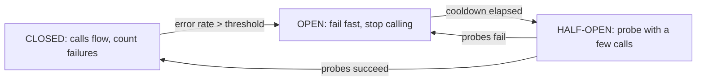

## Thesis

Stopping calls to a dependency that's clearly failing --- tripping "open" once errors cross a threshold so requests fail fast instead of piling onto a struggling service, then probing "half-open" to detect recovery before closing again --- so a failing dependency degrades one feature gracefully rather than exhausting the caller and cascading into a system-wide outage.

## Sub

**Why fail fast: retrying a dead dependency makes it worse** -> **the three states: closed, open, half-open** -> **tripping and recovery thresholds** -> **zoom out** to fallbacks, per-dependency breakers, and the pivots an interviewer rides from "add a circuit-breaker" into the state machine, threshold tuning, and how you probe for recovery.

## Spine

- A circuit-breaker **fails fast when a dependency is clearly down** --- instead of every request waiting on a timeout and retrying (piling load onto the struggling service and tying up the caller's threads), the breaker trips open and returns an error immediately.
- It's a **three-state machine** --- closed (calls flow, failures counted), open (calls short-circuit and fail fast, giving the dependency room), half-open (a limited probe to test whether it recovered) --- transitioning on an error threshold and probe results.
- The point is **breaking the feedback loop** --- retries amplify load exactly when a dependency is struggling, so the breaker stops the amplification, converting "hammer it until it dies" into "back off, let it heal, then check."
- Its real value is **graceful degradation** --- paired with a fallback (a cached value, a default, a queued write), a tripped breaker turns a dependency outage into a degraded-but-alive feature instead of a cascade.

## Companion Notes

### walk

Failing fast to let a dependency heal

One dependency going down, handled gracefully --- the breaker that trips open to stop the pile-on, the fail-fast that saves the caller's resources, the half-open probe that detects recovery, and the fallback that keeps the feature alive while it's open.

Say the feedback loop first --- "retries add load exactly when a dependency is struggling." The breaker exists to stop that amplification and give the dependency room to recover.

### drill

Probe Drill

Graded follow-ups on the state machine, tripping thresholds, half-open probing, and fallbacks --- the ones that separate "add a breaker" from a dependency failure that degrades gracefully instead of cascading.

Name the states: closed (flowing), open (failing fast), half-open (probing) -- and that the breaker's job is to stop retrying a dependency that's clearly down, not to recover individual calls.

## Drill

SDE2 | the model and the states
SDE3 | thresholds, probing, and fallbacks
Staff | storms, the stack, and distribution

### SDE2 | what a circuit-breaker is

What is a circuit-breaker?

A wrapper around calls to a dependency that monitors failures and, when they cross a threshold, "trips" to stop making calls for a while --- returning an error (or a fallback) immediately instead of attempting the call. Named after the electrical breaker that cuts the circuit to prevent damage, it does the same for a software dependency: when a downstream service is failing, the breaker stops sending it traffic so it isn't hammered while struggling, and so the caller isn't tying up resources on calls that are going to fail anyway.

### SDE2 | why fail fast

Why is failing fast better than retrying or waiting?

Because when a dependency is genuinely down or overloaded, retrying and waiting make things *worse*, not better. Every request that waits on a timeout holds a thread and a connection; every retry adds load to the already-struggling dependency. Multiply that across all callers and you get resource exhaustion upstream and a deeper outage downstream. Failing fast --- returning an error immediately --- releases the caller's resources and stops piling load on the dependency, which is exactly what a struggling service needs to recover. Patience helps a transient blip; it harms a real outage.

### SDE2 | the three states

What are the three states of a circuit-breaker?

**Closed**: normal operation --- calls pass through to the dependency and the breaker counts failures. **Open**: tripped --- calls short-circuit and fail fast (or return a fallback) without touching the dependency, giving it room to recover. **Half-open**: probing --- after a cooldown, the breaker lets a limited number of calls through to test whether the dependency has recovered; if they succeed it closes (back to normal), if they fail it re-opens (another cooldown). The lifecycle is closed -> open (on too many failures) -> half-open (after cooldown) -> closed or open (based on the probe).

### SDE2 | what closed means

What does the "closed" state mean?

Normal operation --- the circuit is closed like a completed electrical circuit, so current (requests) flows through to the dependency. In this state the breaker is transparent: calls go to the dependency as usual, but the breaker is *watching*, counting successes and failures. When the failure count or rate crosses the configured threshold, the breaker trips from closed to open. So "closed" is the healthy default, and it's where the breaker does its monitoring job silently until things go wrong.

### SDE2 | what open means

What does the "open" state mean?

Tripped --- the circuit is open (broken), so requests do *not* flow to the dependency. Instead, calls fail immediately (fast) or return a fallback, without even attempting the call. This is the protective state: it stops the caller from wasting resources on doomed calls and stops the failing dependency from being hammered. The breaker stays open for a configured cooldown period, giving the dependency time to recover, after which it moves to half-open to test the waters. "Open" is counterintuitive naming --- open means *stopped*, matching the electrical metaphor where an open circuit carries no current.

### SDE2 | what half-open means

What does the "half-open" state mean?

Probing for recovery --- after the open cooldown, the breaker cautiously lets a *small* number of test calls through to see if the dependency is healthy again. If those probes succeed, the breaker assumes recovery and closes (resumes normal traffic); if they fail, it re-opens (another cooldown, without flooding the still-broken dependency with full traffic). Half-open is the safe middle ground between "stay open forever" (never recovers) and "slam back to full traffic" (risks re-overloading a fragile dependency). It's how the breaker detects recovery without causing a second outage.

### SDE2 | the analogy

What's the electrical analogy, and why is it apt?

An electrical circuit-breaker cuts the circuit when current exceeds a safe level, preventing wires from overheating and starting a fire; you reset it once the fault is fixed. The software version cuts off calls to a dependency when failures exceed a threshold, preventing the "fire" of cascading failure and resource exhaustion. The apt part is the *protective, automatic* nature: it's not trying to fix the fault, it's *isolating* it to prevent wider damage, and it trips automatically rather than requiring someone to notice. The half-open probe is the analog of testing whether it's safe to reset.

### SDE3 | what trips the breaker

What causes the breaker to trip open?

Failures crossing a configured threshold within a window --- usually an **error rate** (e.g. more than 50% of calls failing over the last N requests or seconds), sometimes a raw **consecutive-failure count**. A rate is generally better than a fixed count because it adapts to volume: 5 failures means something different at 10 requests/sec than at 10,000. You also need a minimum request volume before the rate is meaningful (don't trip on 1 failure out of 2 calls). So a typical config is "trip if the error rate exceeds X% over a window, given at least N requests" --- so the breaker reacts to a real pattern of failure, not statistical noise.

### SDE3 | the half-open probe

How does half-open actually test for recovery?

By allowing a limited, controlled number of calls through --- often just one, or a small handful --- while blocking the rest, and watching their outcome. If the probe call(s) succeed, the dependency looks healthy, so the breaker closes and resumes full traffic; if they fail, it re-opens for another cooldown. The critical design point is that the probe must be *small*: sending full traffic to test recovery would immediately re-overload a fragile, just-recovering dependency. So half-open is a deliberate trickle --- enough to learn the dependency's state, not enough to knock it back over if it's still weak.

### SDE3 | what to return when open

When the breaker is open, what does the caller get?

Ideally a **fallback**, not just an error. Failing fast with an error is the minimum (better than hanging), but the graceful-degradation win comes from a fallback: a cached/stale value, a sensible default, a "temporarily unavailable" response, or queuing a write to apply later. What the fallback is depends on the feature --- a recommendations service that's down can return generic popular items; a write can be enqueued; a non-critical enrichment can be skipped. The breaker gives you the *hook* to degrade gracefully (you know the dependency is down), and the fallback is what turns that from a hard failure into a soft one.

### SDE3 | per-dependency breakers

Should you have one breaker or many?

Many --- one breaker **per dependency** (often per dependency-endpoint), not a single global breaker. Each downstream has its own failure profile, so lumping them together means one failing dependency could trip a breaker that also gates healthy ones, or a healthy dependency's traffic masks a failing one's errors. Isolating breakers per dependency means the payment service being down trips only the payment breaker, while the catalog service keeps flowing normally. This is closely related to the bulkhead idea: isolate failures so one dependency's problem doesn't affect calls to others.

### SDE3 | circuit-breaker vs retry

How do circuit-breakers and retries work together?

They're complementary and operate at different scopes. **Retries** handle a *single* transient failure --- try again, it might work. **Circuit-breakers** handle a *sustained* failure --- stop trying, the dependency is down. Retries without a breaker cause storms (everyone keeps retrying a dead dependency); a breaker without retries gives up on genuinely-transient blips a retry would have recovered. The right combination: retry a few times for transient failures, but let the breaker trip when failures are sustained, so retries stop once it's clear the dependency is down. The breaker is what caps the retry amplification.

### SDE3 | tuning thresholds

What goes wrong if the breaker's thresholds are mistuned?

**Too sensitive** (low error threshold, short window): the breaker trips on normal transient blips, cutting off a healthy dependency and causing unnecessary degradation --- a flapping breaker. **Too slow** (high threshold, long window, long cooldown): the breaker lets a dying dependency keep taking traffic for too long before tripping, and recovers too slowly after. The cooldown matters too: too short re-probes before the dependency has recovered; too long keeps a recovered dependency cut off. Tuning is about matching the dependency's real behavior --- trip fast enough to protect, but not so fast you flap on noise, and recover promptly without re-overloading.

### SDE3 | what counts as a failure

What should count as a failure for tripping the breaker?

Server-side and transient failures --- timeouts, connection errors, 5xx responses, throttling --- because those indicate the *dependency* is unhealthy. A **4xx client error should not** count: a 400 or 404 means *your request* was wrong, not that the dependency is failing, and tripping the breaker on client errors would cut off a perfectly healthy dependency because of bad requests. So the breaker must classify responses: count the failures that reflect dependency health, ignore the ones that reflect caller error. Getting this wrong (counting all non-2xx) makes the breaker trip for the wrong reasons.

### Staff | breaking storms and cascades

What's the systemic value of a circuit-breaker beyond a single call?

It breaks the two failure loops that turn a local problem into a global outage. **Retry storms**: without a breaker, callers keep retrying a struggling dependency, amplifying load and deepening the outage; the breaker trips and stops the retries, capping the amplification. **Cascading failures**: without a breaker, upstream services waiting on the slow dependency exhaust their thread pools and go down too; the breaker fails fast, releasing those resources so the upstream stays alive. So the breaker's value isn't recovering an individual call --- it's *containing the blast radius*, ensuring one dependency's failure degrades one feature rather than taking down the whole call graph above it.

### Staff | fallback strategies

What are the main fallback strategies when a breaker is open?

A spectrum by how gracefully the feature can degrade. **Cached/stale data**: serve the last known-good value (great for reads where staleness is tolerable). **Default/static response**: a sensible generic answer (popular items instead of personalized recommendations). **Queue for later**: for writes, enqueue and apply when the dependency recovers (accepting eventual consistency). **Degrade the feature**: skip a non-critical enrichment entirely and return the core response. **Hard fail with a clear error**: when there's genuinely no safe fallback (a payment can't be faked). The design skill is choosing per-feature what "degraded but alive" looks like --- the breaker provides the signal, and the fallback defines the user experience during the outage.

### Staff | the resilience stack

How do circuit-breakers combine with timeouts, retries, and bulkheads?

As layers of one defense. **Timeouts** bound each wait so a slow call releases resources quickly (and generates the failures the breaker counts). **Retries** recover transient blips. **Circuit-breakers** stop retrying and calling a dependency that's sustainedly down, capping storms. **Bulkheads** isolate the resource pool (threads/connections) per dependency so one can't starve the others. They're interdependent: the breaker needs timeouts to detect failures fast; retries need the breaker to avoid storms; the breaker needs bulkheads so that even while it's deciding to trip, the failing dependency can't consume all the threads. A mature resilience design uses all four together, because each covers a gap the others leave.

### Staff | distributed circuit-breakers

How does a circuit-breaker work across many instances of a service?

Two models. **Per-instance (local)** state: each instance tracks failures and trips its own breaker independently --- simple, no coordination, but each instance has to learn the dependency is down on its own (each pays some failed calls before tripping), and they trip at slightly different times. **Shared (distributed)** state: instances share breaker state via a coordination store (e.g. Redis), so once one detects the failure all trip together --- faster collective response, but adds a dependency and coordination complexity, and the shared store itself must be reliable. Most systems use local breakers for simplicity (the per-instance cost is small at scale), reaching for shared state only when the cost of each instance independently discovering an outage is too high.

### Staff | the half-open herd

What's the risk in the half-open state at scale, and how do you handle it?

A thundering herd on recovery: if many instances (or many requests) all go half-open at the same moment and probe simultaneously, the just-recovering dependency gets slammed by a synchronized burst of probes and falls over again --- a recovery that causes a second outage. You mitigate it by keeping the half-open probe *small* (only a few requests allowed through, the rest still fast-failed), by jittering the cooldown so instances don't all probe at the same instant, and by ramping traffic gradually after closing (rather than instantly resuming 100%). The principle mirrors retry jitter: de-synchronize and rate-limit the recovery probes so testing whether the dependency is back doesn't itself re-break it.

### Staff | observability of breakers

Why is monitoring breaker state important operationally?

Because a breaker changes system behavior silently --- an open breaker means a feature is degraded or failing, and if nobody's watching, you have a partial outage you don't know about. So breaker state transitions should be *observable*: emit metrics on trips (which breaker, when), alert when a breaker is open (especially for a critical dependency), and dashboard the open/closed/half-open states. An open breaker is often the *first clear signal* of a downstream problem, so it's valuable telemetry. The anti-pattern is a breaker that trips and silently degrades a feature for hours; the breaker should make the degradation loud, not hide it.

### Staff | when a breaker is wrong

When is a circuit-breaker unnecessary or harmful?

When there's no meaningful fallback and failing fast is no better than failing slow --- if the request simply cannot proceed without the dependency and you'd return the same error either way, the breaker adds machinery without changing the outcome (though it still saves resources by not waiting). When the dependency is *in-process* or effectively always-available (a local computation), a breaker is pointless. And a *mistuned* breaker is actively harmful --- one that flaps on transient noise cuts off a healthy dependency and manufactures the very degradation it's meant to prevent. The judgment: use breakers for network calls to dependencies that can genuinely fail sustainedly *and* where failing fast (with or without a fallback) helps; don't wrap everything reflexively, and tune what you do wrap.

## Walk

### Closed: calls flow, failures are counted

```flow
r[request] -> d[dependency call] -> c[success/fail counted; still flowing]
```

In the closed state the breaker is transparent --- requests pass straight through to the dependency as normal. But it's watching: every call's outcome is recorded, building an error rate over a rolling window.

This is the healthy default, where the breaker does its monitoring job silently. The only thing it's deciding is whether the pattern of failures has crossed the line from "normal transient noise" into "this dependency is genuinely unhealthy" --- and that decision is what moves it out of closed.

### Trip open: fail fast, stop calling

```flow
t[error rate crosses threshold] -> o[OPEN: short-circuit] -> f[fail fast + fallback; dependency gets room]
```

When the error rate crosses the threshold (over a minimum request volume, so it's a real pattern not noise), the breaker trips open. Now requests short-circuit --- they don't touch the dependency at all --- and return immediately, ideally with a fallback.

```yaml
# per-dependency circuit-breaker
failure_rate_threshold: 50%      # trip when >50% of calls fail...
minimum_requests: 20             # ...over at least 20 requests (ignore noise)
failures_counted: [timeout, 5xx, connection_error]   # NOT 4xx client errors
open_duration: 30s               # stay open this long before probing
half_open_max_calls: 3           # probe with only a few calls
```

This is the protective move: failing fast releases the caller's threads and connections (no more waiting on doomed calls), and *not* calling the dependency stops piling load onto a service that's already struggling. Only server-side failures (timeouts, 5xx, connection errors) count toward tripping --- a 4xx is the caller's bug and must not trip a healthy dependency. The breaker stays open for the cooldown, giving the dependency room to recover.

### Half-open: probe for recovery

```flow
cd[cooldown elapsed] -> h[HALF-OPEN: let a few through] -> res[probes ok -> close / probes fail -> re-open]
```

After the cooldown, the breaker moves to half-open and cautiously lets a *small* number of calls through while still blocking the rest. Their outcome is the test: if the probes succeed, the dependency looks recovered, so the breaker closes and resumes full traffic; if they fail, it re-opens for another cooldown.

The probe must be small on purpose --- sending full traffic to test recovery would instantly re-overload a fragile, just-healing dependency and cause a second outage. At scale you also jitter the cooldown (so instances don't all probe at once, a half-open thundering herd) and ramp traffic up gradually after closing rather than slamming back to 100%. Half-open is how the breaker detects recovery *without* causing the outage it was preventing.

### The value: graceful degradation, not cascade

```flow
dep[dependency down] -> br[breaker trips + fallback] -> deg[one feature degraded, system alive]
```

Zooming out, the breaker's real payoff is what *doesn't* happen. Without it, callers retry the dead dependency (a storm that amplifies its load) and upstream services waiting on it exhaust their thread pools (a cascade that takes them down too) --- one dependency's failure becomes a system-wide outage.

With it, the breaker trips, retries stop, threads are released, and a fallback keeps the feature limping along (stale cache, default, queued write) --- the payment service being down degrades checkout to "try again shortly," not the whole site to a white screen. Paired with per-dependency isolation, timeouts, and bulkheads, the breaker is what contains the blast radius: a failing dependency degrades one feature gracefully instead of cascading upward. And because an open breaker is a loud signal of a downstream problem, it's also your first alert.

### Model Script

- Frame the feedback loop | "The core problem a breaker solves is that retrying and waiting make a failing dependency worse, not better. Every request waiting on a timeout holds a thread; every retry adds load to a struggling service. Across all callers, that exhausts the caller's resources and deepens the downstream outage -- a retry storm and a cascade. The breaker stops that: when a dependency is clearly down, fail fast instead of piling on."
- The state machine | "It's a three-state machine. Closed: calls flow, the breaker counts failures. Open: once the error rate crosses a threshold, it trips -- calls short-circuit and fail fast without touching the dependency, giving it room to recover. Half-open: after a cooldown, it lets a few probe calls through; if they succeed it closes, if they fail it re-opens. So it automatically detects the failure, protects, and detects recovery."
- Thresholds and what counts | "Trip on an error rate over a window with a minimum request volume -- a rate adapts to traffic where a fixed count doesn't, and the minimum avoids tripping on noise. Critically, only server-side failures count: timeouts, 5xx, connection errors. A 4xx is the caller's bug, not the dependency failing, so it must never trip a healthy dependency. And one breaker per dependency, not a global one, so a failing payment service trips only its own breaker while catalog keeps flowing."
- The value and the fallback | "The payoff is graceful degradation. Failing fast is the minimum; the real win is a fallback -- serve a stale cache, a default, queue the write for later, or skip a non-critical enrichment. The breaker gives you the signal that the dependency is down, and the fallback turns a hard failure into a soft one. Paired with timeouts, retries, and bulkheads, it contains the blast radius so one dependency's outage degrades one feature instead of cascading."
- Interviewer: "Your checkout calls a payment processor that goes down for ten minutes. Walk me through it."
- Applied | "Closed normally. As the processor starts timing out and returning 5xx, the breaker's error rate climbs past the threshold and it trips open. Now checkout requests fail fast instead of every one hanging on the timeout -- so my checkout service's threads aren't exhausted, and I'm not hammering the down processor. Behind the open breaker, a fallback: I queue the payment intent to retry when it recovers, and tell the user 'payment is delayed, we'll confirm shortly,' rather than a hard error or a hang. After a 30-second cooldown the breaker goes half-open, probes with a couple of calls; while the processor's still down they fail and it re-opens. When the processor recovers, the probes succeed, the breaker closes, and I drain the queued payments. Meanwhile an alert fired the moment the breaker opened, so on-call knew immediately."
- Land it | "So: a breaker fails fast when a dependency is sustainedly down, via a closed/open/half-open state machine that trips on a real error-rate pattern, counts only server-side failures, runs per-dependency, and pairs with a fallback for graceful degradation. The one line is that it breaks the retry-storm and cascade loops -- it doesn't recover a single call, it contains the blast radius so one dependency's failure degrades one feature instead of taking down everything above it."

## Whiteboard

Sketch the three-state machine and mark the transitions.

### What are the states and transitions?

Closed (calls flow, counting failures) -> Open (trip on error threshold, fail fast) -> Half-open (after cooldown, probe) -> Closed (probes succeed) or Open (probes fail).

### Why does half-open only let a few calls through?

Because full traffic on a just-recovering dependency would re-overload it and cause a second outage -- the probe must be a small trickle, jittered, and ramped up gradually on close.



Verdict: the breaker automatically trips on sustained failure (closed->open), gives the dependency room, then probes for recovery (half-open) and either closes or re-opens -- protecting without needing a human to notice.

## System

Zoom out to where the breaker sits on a dependency call.

### Where it sits

Caller: wraps each dependency call in a breaker [*]
The breaker: closed/open/half-open, per dependency, counts server-side failures
Fallback: cache / default / queue / degrade -- the user experience while open
Dependency: gets room to recover while the breaker is open
Telemetry: breaker transitions emitted + alerted -- the first outage signal

### Pivots an interviewer rides

From "add a breaker" they push on tripping, probing, and fallbacks.

#### What makes it trip, and what counts as a failure?

-> an error rate over a window (min volume), counting only timeouts/5xx/connection errors -- not 4xx
A rate adapts to traffic and the minimum avoids noise; client errors are the caller's bug, so counting them would cut off a healthy dependency.

#### What does the user get while the breaker is open?

-> a fallback: stale cache, default, queued write, or degraded feature -- not just an error
The breaker provides the "dependency is down" signal; the fallback turns a hard failure into graceful degradation, which is the real value beyond saving resources.

## Trade-offs

The calls that separate "add a breaker" from graceful degradation.

### Trip sensitively vs conservatively

- Sensitive (low threshold, short window): protects fast, trips early on trouble -- but flaps on transient noise, cutting off healthy dependencies
- Conservative (high threshold, long window): stable, few false trips -- but lets a dying dependency take traffic too long before protecting

Tune to the dependency's real failure behavior: trip fast enough to protect, with a minimum request volume so noise doesn't flap it.

### Local vs shared breaker state

- Local (per-instance): simple, no coordination -- but each instance independently pays failed calls to discover the outage, and they trip at different times
- Shared (distributed): all instances trip together once one detects failure -- but adds a coordination store that must itself be reliable

Use local breakers by default (the per-instance cost is small at scale); reach for shared state only when independent discovery is too costly.

### Fail fast with an error vs a fallback

- Error only: simple, still saves resources vs hanging -- but the feature hard-fails for the user
- Fallback: graceful degradation, feature stays alive (stale/default/queued) -- but you must design a safe fallback per feature

Provide a fallback wherever one is safe (reads, deferrable writes); hard-fail only where there's genuinely no acceptable degraded answer (e.g. a real payment).

## Model Answers

### the reframe | Fail fast to let it heal

The frame to lead with.

- Retrying a dead dependency worsens it | key | storms + cascades
- Trip open, fail fast, stop calling | store | releases resources, gives it room
- Half-open probes for recovery | note | a small trickle, then close

### the value | Contain the blast radius

Why it matters beyond one call.

- Breaks storm + cascade loops | key | one dependency's failure stays local
- Fallback = graceful degradation | store | stale/default/queue instead of hard fail
- Open breaker = first outage signal | note | make the degradation loud

## Numbers

Back-of-envelope the fail-fast saving, the trip threshold, and the recovery window.

An open breaker returns immediately instead of every request waiting the full timeout on a dead dependency; it trips on an error rate and probes after a cooldown.

- errThresh | Trip error rate (%) | 50 | 0 | 5
- openSecs | Open cooldown (s) | 30 | 1 | 5
- p99 | Dependency p99 (ms) | 200 | 0 | 10

```js
function (vals, fmt) {
  var errThresh = vals.errThresh, openSecs = vals.openSecs, p99 = vals.p99;
  return [
    { k: 'Fail-fast latency', v: '~0', u: 'ms when open', n: 'an open breaker returns immediately instead of every request waiting the full timeout (' + p99 + 'ms+, plus retries) on a dead dependency \u2014 that is the caller resource it saves', over: false },
    { k: 'Trips at', v: fmt.n(errThresh), u: '% error rate', n: 'the breaker opens when errors cross ' + errThresh + '% over a min request volume \u2014 too low flaps on normal blips, too high lets a dying dependency keep taking traffic', over: false },
    { k: 'Recovery probe after', v: fmt.n(openSecs), u: 's cooldown', n: 'after this cooldown it goes half-open and probes with a few calls \u2014 long enough to give the dependency room, short enough to recover promptly (jittered to avoid a herd)', over: false },
    { k: 'Failure counts', v: 'timeout / 5xx', u: 'not 4xx', n: 'only server-side/transient failures count toward tripping \u2014 a 4xx is the caller bug, not the dependency failing, so it must not trip a healthy dependency', over: false },
    { k: 'Pairs with', v: 'a fallback', u: 'to degrade', n: 'a tripped breaker plus a fallback (stale cache, default, queued write) turns a dependency outage into a degraded-but-alive feature instead of a cascade', over: false }
  ];
}
```

## Red Flags

What makes an interviewer wince.

### "When the dependency fails, we just keep retrying until it comes back"

Continuously retrying a down dependency is a retry storm -- it amplifies load on the struggling service and ties up your threads, deepening the outage instead of helping.

Trip a circuit-breaker to fail fast once failures are sustained, stopping the retries and giving the dependency room to recover, with a fallback for the caller.

### "One circuit-breaker guards all our downstream calls"

A single global breaker conflates dependencies -- one failing service can trip a breaker that also gates healthy ones, and healthy traffic can mask a failing dependency's errors.

Use one breaker per dependency (per endpoint) so failures are isolated -- the payment service tripping doesn't cut off the catalog service.

### "The breaker trips on any non-2xx response"

Counting 4xx client errors trips the breaker for the caller's own bad requests, cutting off a perfectly healthy dependency.

Count only server-side/transient failures (timeouts, 5xx, connection errors) toward tripping; 4xx reflects caller error, not dependency health.

## Opener

### 30s | The one-liner

How I open when asked about handling a dependency that can go down.

#### What is the shape?

A three-state machine (closed, open, half-open) that fails fast when a dependency is sustainedly down -- stopping calls so retries don't storm and threads aren't exhausted -- then probes for recovery before resuming.

#### What's the real value?

Not recovering a single call, but containing the blast radius: paired with a fallback, one dependency's outage degrades one feature gracefully instead of cascading into a system-wide failure.

##### Hooks

Where an interviewer usually pushes next.

- What trips it? | error rate, server-side failures only | drill
- What while open? | a fallback, not just an error | drill
- Recovery? | half-open probe, small + jittered | drill

Foot: two sentences -- retrying a down dependency makes it worse, so the breaker fails fast to stop the storm and cascade, and a fallback turns the outage into graceful degradation.

## Bank

### SCALE | A dependency many services depend on starts failing

Task: reason about containing the blast radius.
Model: without breakers, every caller retries (a storm amplifying the dependency's load) and every upstream waiting on it exhausts its thread pool (a cascade), so one failure goes system-wide; per-dependency breakers fail fast, stopping the retries and releasing threads, and fallbacks keep each feature degraded-but-alive, so the failure stays contained to the features that need that dependency.
Int: what's the breaker's single biggest contribution here?
Containing the blast radius -- turning one dependency's outage into localized degradation instead of a cascade.

### DESIGN | Resilient checkout calling a payment processor that can go down

Task: design the breaker-and-fallback around a payment processor.
Model: a per-processor breaker counting timeouts/5xx; it trips when the error rate crosses threshold over a min volume, so checkout fails fast instead of hanging and stops hammering the down processor; behind the open breaker, queue the payment intent to retry on recovery and tell the user "payment delayed"; after a jittered cooldown, half-open probes with a few calls, closing when they succeed and re-opening when they fail; the breaker's open transition fires an alert.
Int: why queue rather than hard-fail the payment?
Because a queued write is a safe fallback that preserves the order and applies when the processor recovers, degrading gracefully instead of losing the sale.

### Extra Curveballs

### CURVEBALL | recovery | Your dependency recovers, but the moment your breakers close, it falls over again. What's happening and how do you fix it?

Model: a half-open / recovery thundering herd -- many instances (or requests) go half-open and slam back to full traffic simultaneously the instant the dependency recovers, re-overloading a still-fragile service and knocking it down again, which re-opens the breakers, producing a flapping recovery loop. The fix mirrors retry jitter: keep the half-open probe small (only a few calls through, rest still fast-failed), jitter the cooldown so instances don't all probe at the same instant, and ramp traffic up gradually after closing rather than resuming 100% at once -- so testing recovery and resuming traffic don't themselves re-break the dependency.

### Frames

- A breaker fails fast when a dependency is sustainedly down, via a closed/open/half-open state machine
- It breaks the retry-storm and cascade loops -- containing the blast radius, not recovering one call
- Paired with a per-dependency fallback, it turns a dependency outage into graceful degradation
