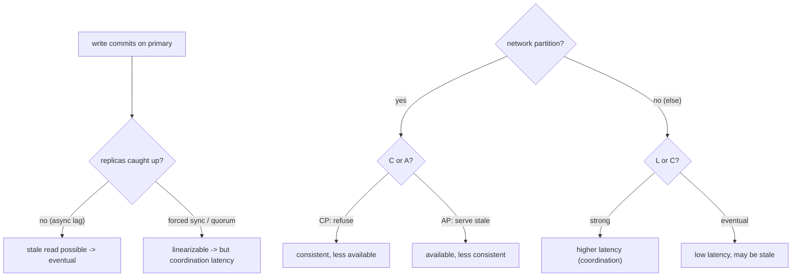

## Thesis

A consistency model is the contract a distributed data store gives you about *what a read is allowed to observe* after writes --- because once data is replicated and accessed concurrently, a read can see a stale value, an out-of-order value, or one of two conflicting values unless the system promises otherwise. The models form a spectrum from **strong** (linearizable: every read sees the latest committed write, as if there were a single copy) to **weak** (eventual: replicas converge given enough quiet time, and reads may be stale in the meantime), with genuinely useful middle points --- read-your-writes, monotonic reads, causal. Stronger consistency costs latency and availability (CAP under a partition, PACELC even without one), so the design skill is not "make everything strong" --- it is choosing the *weakest* model that still satisfies each operation, and often tuning it per read (a strong balance check, an eventual like count).

## Sub

**Why: replication and concurrency let a read observe stale or out-of-order data** -> **the spectrum: linearizable -> causal -> read-your-writes / monotonic -> eventual** -> **the cost: CAP under a partition, PACELC's latency-versus-consistency even without one** -> **zoom out** to tunable quorums (R + W > N), conflict resolution, per-operation consistency, and choosing the weakest model that works.

## Spine

- **A consistency model is a contract about what a read can see** --- with replicas and concurrent writes a read may observe a stale or out-of-order value, and the model defines exactly which anomalies are possible, so you know what your code is allowed to rely on and what it must defend against.
- **The models form a spectrum** --- **linearizable** (as if one copy, every read sees the latest committed write in real-time order) at the strong end, **eventual** (replicas converge, reads may be stale, conflicts must be resolved) at the weak end, with **causal**, **monotonic reads**, and **read-your-writes** as practical middle guarantees.
- **Strong consistency costs latency and availability** --- **CAP**: under a network partition you must choose consistency or availability; **PACELC**: *else* (no partition) you still trade latency for consistency, because strong guarantees require coordination --- so strong is a cost you pay on every operation, not a free default.
- **Choose the weakest model that satisfies the use case** --- a bank balance or a unique-username check needs strong; a like count, a feed, or a DNS record tolerates eventual --- and you frequently tune it *per operation* (a quorum read on the critical path, eventual everywhere else) rather than picking one global level for the whole system.

## Companion Notes

### walk

What a read is allowed to observe

One replicated store walked across the spectrum --- why replication lets a read go stale, what linearizable, causal, read-your-writes, and eventual each promise, what CAP and PACELC cost you for strong guarantees, and how you pick the weakest model per operation instead of making everything strong.

Say it as a contract about reads: the model defines which anomalies are possible, stronger costs latency and availability, and the skill is choosing the weakest guarantee each operation can live with.

### drill

Consistency-spectrum reps

Graded reps on the models (linearizable to eventual), the session guarantees, CAP/PACELC, and quorum tuning --- the ones that separate "we use a database" from choosing a consistency guarantee deliberately per operation.

Name the model, the anomaly it prevents, and the cost: linearizable (no stale reads, but coordination latency), eventual (stale + conflicts, but fast and available), and the middle guarantees that buy a session what it needs cheaply.

## Drill

SDE2 | the models and why replication needs them
SDE3 | the spectrum, CAP/PACELC, and quorums
Staff | linearizability vs serializability, per-op choice, and cost

### SDE2 | what a consistency model is

What does a consistency model actually specify?

It specifies **what a read is allowed to observe** given the writes that have happened --- the contract between the data store and your code about which values a read can and cannot return. In a single-copy, single-threaded world this is trivial: a read returns the last write. But once data is replicated across nodes and accessed concurrently, a read might hit a replica that has not yet received the latest write (stale), or observe writes in a different order than they happened, or see one of two values written concurrently. The consistency model names exactly which of these anomalies are possible. So it is not a vague quality knob --- it is a precise guarantee that tells you what your application can rely on (e.g. "a read always reflects your own most recent write") and, by omission, what it must handle (e.g. "another user's write may not be visible to you yet"). Knowing the model is knowing the rules of what your reads mean.

### SDE2 | strong vs eventual consistency

What is the difference between strong and eventual consistency?

**Strong consistency**: every read reflects the **latest committed write** --- the moment a write succeeds, all subsequent reads (from anywhere) see it, as if there were a single copy of the data. **Eventual consistency**: after a write, replicas will **converge** to the new value *given enough time with no new writes*, but in the interim a read may return a **stale** value, and concurrent writes may need conflict resolution. The trade is fundamental: strong consistency requires the replicas to coordinate on every operation (which costs latency and, under a partition, availability), while eventual consistency lets each replica accept reads and writes independently (which is fast and highly available but exposes staleness and conflicts to the application). Strong is "always correct, sometimes slow or unavailable"; eventual is "always fast and available, sometimes stale." The whole design question is which one --- or which point in between --- each piece of data actually needs.

### SDE2 | what linearizability means

What is linearizability, in plain terms?

Linearizability is the **strongest single-object consistency**: the system behaves *as if there is one copy of the data and every operation takes effect atomically at some instant between its start and its completion*, consistent with **real-time order**. Concretely: if write W completes before read R begins (in wall-clock time), R is guaranteed to see W's value (or a later one) --- there is no window where a completed write is invisible to a subsequent read. It makes a distributed, replicated system *look* like a single register that everyone shares. This is what you want for anything where "did my write take effect" must have a definite, immediate answer --- a lock, a leader-election flag, a unique-id allocation, a balance. The cost is that achieving it requires coordination (a consensus or a synchronous quorum) on operations, so it is the most expensive guarantee in both latency and availability. Linearizable = "one copy, real-time order, no stale reads."

### SDE2 | what eventual consistency means

What does eventual consistency promise, and what does it not?

It promises exactly one thing: **if writes stop, all replicas will eventually converge to the same value**. It does *not* promise when, does *not* promise that a read reflects the most recent write, and does *not* by itself resolve concurrent conflicting writes --- those are things the application (or the store's conflict-resolution policy) must handle. So under eventual consistency you can read a stale value (a replica that has not caught up), you can read *different* values from different replicas at the same moment, and two clients writing concurrently can create a conflict that must be reconciled (last-write-wins, vector clocks, or CRDTs). The upside is that every replica can serve reads and accept writes without coordinating first, so the system is fast and stays available even when replicas cannot talk to each other. Eventual consistency is the right default for data where a brief staleness is harmless (a view count, a cached profile, a recommendation) --- and the wrong one for data where reading a stale value causes a correctness bug.

### SDE2 | read-your-writes consistency

What is read-your-writes consistency, and why is it often the minimum a user notices?

Read-your-writes (read-your-own-writes) guarantees that **once a user has made a write, their own subsequent reads will always reflect it** --- they never see their update "disappear." It is a *session* guarantee (scoped to one user/session), weaker than global strong consistency but exactly the property users viscerally expect: you post a comment and it is there when the page reloads, you change a setting and it shows as changed. Without it, an eventually-consistent system can route a user's write to the primary and their immediate read to a lagging replica, so the user sees the *old* value and thinks the write failed (and often retries). You implement it cheaply --- route a user's reads to the primary (or a replica known to have their write) for a short window after they write, or track the write's version and read from a replica that has caught up to it --- without paying for global strong consistency. It is the classic example of buying just the guarantee the use case needs.

### SDE2 | why replication creates the problem

Why does consistency become a hard problem the moment you replicate data?

Because replication is (almost always) **asynchronous** --- a write lands on one replica (or a quorum) and is propagated to the others *after*, so for a window the replicas disagree, and a read to a lagging replica returns a stale value. You replicate for good reasons (availability if a node dies, read scaling by spreading reads across replicas, lower latency by placing replicas near users), but each replica is a *copy that can be behind*, and the more replicas and the wider the geography, the larger the lag window. Making every replica reflect every write *immediately* would require synchronous coordination on every write (wait for all replicas to acknowledge before returning), which sacrifices exactly the latency and availability you replicated to gain. So replication forces the trade: you accept some staleness (eventual/bounded) to keep the benefits, or you pay coordination to eliminate it (strong). Single-copy data has no consistency problem; the problem is *created* by having more than one copy that can diverge.

### SDE2 | a real example of each

Give a real example that needs strong consistency and one that is fine with eventual.

**Needs strong**: a **bank account balance** or a **payment** --- reading a stale balance could let a customer overdraw or double-spend, so the read must reflect every committed debit/credit immediately (linearizable), and a transfer must be atomic and isolated (serializable). Also a **unique-username / inventory-count** check: two concurrent "claim" operations must not both succeed on the last unit. **Fine with eventual**: a **like count or view count** --- if it shows 1,004 instead of 1,006 for a few seconds, nobody is harmed and it converges; a **social feed** --- a post appearing a moment late is acceptable; **DNS** --- records propagate over minutes and the system is designed around it; a **cached user profile**. The pattern that distinguishes them: ask "if a read returns a slightly stale value, does anything *break*?" If yes (money, uniqueness, safety), you need strong; if no (counts, feeds, recommendations), eventual is not just acceptable but preferable for its speed and availability.

### SDE3 | the consistency spectrum

Lay out the consistency spectrum from strongest to weakest.

From strongest to weakest: **Linearizable** (single-object) --- one copy, real-time order, every read sees the latest completed write. **Sequential** consistency --- all clients see operations in *some* single total order that respects each client's own program order, but not necessarily real-time (a completed write may not be immediately visible to another client). **Causal** consistency --- operations that are causally related (one could have influenced the other) are seen in that order by everyone, while *concurrent* operations may be seen in different orders by different clients. Then the **session guarantees** --- **read-your-writes**, **monotonic reads** (you never see time go backwards), **monotonic writes**, **writes-follow-reads** --- which are per-session slices of causal-ish behavior. Then **eventual** consistency --- convergence only, any anomaly in the meantime. The value of the spectrum is that the middle is huge and useful: you rarely need full linearizability, and causal or the session guarantees give most of the intuitive "it behaves sensibly" feel at a fraction of the coordination cost.

### SDE3 | causal consistency

What does causal consistency guarantee, and what does it deliberately leave loose?

It guarantees that **causally-related operations are observed in their causal order by every client**, while allowing **concurrent (causally-unrelated) operations to be observed in different orders**. Causality means one operation *could have influenced* another --- e.g. you read a message and then reply; anyone who sees your reply must also see the original message (the reply causally depends on it). It captures the "happened-before" relationships that matter for making sense of data, so you never see an effect without its cause (a reply to a missing message, a comment on a deleted-then-recreated post out of order). What it leaves loose is operations with **no causal link**: if Alice and Bob independently post unrelated updates, different observers may see them in different orders, and that is fine because neither depends on the other. This is a sweet spot: it preserves the ordering humans actually care about (cause before effect) without the global real-time coordination linearizability demands, which is why it is often cited as the strongest model achievable while staying available under partitions.

### SDE3 | monotonic reads and the session guarantees

What are the session guarantees, and what anomaly does each prevent?

The four **session guarantees** are per-session (per-client) properties that prevent specific jarring anomalies cheaply. **Read-your-writes**: your own reads reflect your own prior writes (your update never disappears). **Monotonic reads**: successive reads never go *backwards in time* --- once you have seen a value, you will not later see an older one (prevents "refresh and the new comment vanishes because you hit a laggier replica"). **Monotonic writes**: your writes are applied in the order you issued them (write A then B is not reordered to B then A). **Writes-follow-reads** (session causality): a write that follows a read is ordered after the write that read observed (your reply is ordered after the message you replied to). Individually they are weak, but together they give a *single session* a coherent, causally-sensible view without global coordination --- implemented typically by pinning a session to a replica or tracking versions the session has seen. They are the practical answer to "how do I make an eventually-consistent system not feel broken to a given user."

### SDE3 | the CAP theorem

State the CAP theorem precisely and the common misreading.

CAP: a distributed data store cannot simultaneously provide all three of **Consistency** (every read sees the latest write --- linearizability), **Availability** (every request to a non-failed node gets a non-error response), and **Partition tolerance** (the system keeps working despite dropped/delayed messages between nodes) --- and since **network partitions are unavoidable** in a distributed system, P is not optional, so the *real* choice under a partition is **C or A**. During a partition you either refuse requests that cannot be made consistent (choose C, sacrifice availability --- a **CP** system) or serve possibly-stale/divergent responses to stay up (choose A, sacrifice consistency --- an **AP** system). The common misreading is "pick two of three" as if you choose C-and-A by dropping P --- you cannot drop P in a real network, so it is not a free-standing choice; CAP is really "when (not if) a partition happens, do you sacrifice consistency or availability." And it is only about the partition case, which is where PACELC extends it.

### SDE3 | PACELC

What does PACELC add to CAP?

PACELC extends CAP to the *normal* (no-partition) case: **if Partition, then Availability or Consistency (PAC); Else, then Latency or Consistency (ELC)**. CAP only tells you the trade *during* a partition; PACELC's insight is that **even when the network is healthy**, a system still trades **latency against consistency** --- because providing strong consistency requires coordination (waiting for a quorum, a consensus round, a synchronous cross-region replica), which *adds latency to every operation*. So a system is characterized on two axes: what it sacrifices under a partition (A or C) and what it sacrifices in normal operation (L or C). For example, a system might be **PA/EL** (available under partition, low-latency normally --- Dynamo-style, sacrificing consistency both ways) or **PC/EC** (consistent under partition, consistent-but-higher-latency normally --- Spanner-style). PACELC is the more complete framing because it names the cost you pay *all the time* for strong consistency (latency), not just the rare-partition cost --- which is exactly why "strong everywhere" is expensive even when nothing is failing.

### SDE3 | tunable consistency and quorums

How do quorum systems let you tune consistency, and what is the R + W > N rule?

In a replicated store with **N** replicas per key, you configure how many replicas a **read** must consult (**R**) and a **write** must acknowledge (**W**), and the relationship between them tunes consistency. The key rule: **if R + W > N, the read and write quorums overlap** --- every read set intersects every write set in at least one replica, so a read is guaranteed to see the most recent acknowledged write (strong-ish consistency). If **R + W <= N**, the sets can miss each other and a read may return stale data (eventual). This gives a dial: **W = N, R = 1** favors fast reads (write to all, read from one) but slow/fragile writes; **W = 1, R = N** favors fast writes; a common balanced choice is **N = 3, W = 2, R = 2** (R + W = 4 > 3, so overlapping quorums with tolerance for one replica down). Dynamo, Cassandra, and Riak expose exactly this. It is not full linearizability (concurrent writes and read-repair subtleties remain, and Cassandra needs `LWT`/Paxos for true linearizable ops), but R + W > N is the practical knob that trades latency and availability for read freshness per operation.

### SDE3 | conflict resolution under eventual consistency

Under eventual consistency, two clients write the same key concurrently. How is the conflict resolved?

Several strategies, trading simplicity for correctness. **Last-Write-Wins (LWW)**: attach a timestamp to each write and keep the latest --- simple and what many systems default to, but it **silently discards** the losing write and depends on clock synchronization (a skewed clock can drop the "real" latest write). **Version vectors / vector clocks**: track per-replica version counters so the system can *detect* whether two writes were concurrent (a genuine conflict) versus one causally following the other; genuine conflicts are then surfaced to the application to merge (as Dynamo does with sibling versions) --- correct but pushes work to the app. **CRDTs (Conflict-free Replicated Data Types)**: data structures (counters, sets, registers) designed so that concurrent updates *merge deterministically and commutatively* with no conflict at all --- e.g. a grow-only counter sums contributions, an OR-set handles add/remove --- ideal for things like counts, presence, and collaborative state. The choice depends on the data: LWW for "last one is fine," vector clocks when you must not lose writes, CRDTs when the operations have a natural merge. The staff-level point is that eventual consistency does not *avoid* the conflict problem --- it *relocates* it to write time, and you must pick a resolution strategy deliberately.

### Staff | linearizability vs serializability

Linearizability and serializability both sound like "strong." How are they different?

They are orthogonal guarantees about different things. **Linearizability** is a **single-object, real-time** guarantee (a recency guarantee): operations on *one* register appear to take effect atomically in an order consistent with wall-clock time --- it is about "did my read see the latest write to this object." **Serializability** is a **multi-object transaction** guarantee (an isolation guarantee): the outcome of concurrent *transactions* (each spanning many objects) is equivalent to *some* serial order of those transactions --- it is about "do my multi-step transactions not interleave into an inconsistent state," and it says **nothing about real-time order** (the equivalent serial order need not match wall-clock). You can have one without the other: a system can be serializable but not linearizable (transactions are isolated, but a committed transaction might not be immediately visible in real-time order), and single-object linearizable but not serializable (each object is fresh, but there is no multi-object transaction isolation). The gold standard for a transactional database, **strict serializability**, is the *combination* --- serializable isolation *plus* linearizable real-time order (what Spanner provides). Naming which one you need --- recency of a single object versus isolation of a multi-object transaction --- is a strong signal in a senior round.

### Staff | choosing consistency per operation

Why is picking one global consistency level usually the wrong approach?

Because a single system almost always has operations with **wildly different consistency needs**, and forcing them all to one level either over-pays (strong everywhere) or under-serves (eventual everywhere). The staff approach is **per-operation consistency**: choose the guarantee each read/write actually needs. In a store like Cassandra or DynamoDB you literally set it per request --- a balance check reads at `QUORUM`/strongly-consistent, while a feed read uses `ONE`/eventually-consistent for speed; a username claim uses a lightweight transaction (linearizable), while incrementing a like count uses a plain (eventual) write. Even in a primary/replica SQL setup you route the read-your-writes-critical read to the primary and the analytics read to a replica. This treats consistency as a **per-call property**, matching cost to need: you pay coordination latency only on the operations that genuinely require freshness, and get the speed and availability of eventual consistency for everything else. "What consistency does *this operation* need?" is a far better question than "what consistency level is our database," and asking it per-operation is what an experienced engineer does.

### Staff | the cost of strong consistency

What exactly do you pay for strong (linearizable) consistency, and why is it not free?

You pay on multiple axes, all the time. **Latency**: strong consistency needs coordination --- a synchronous quorum, a consensus round, or waiting for a synchronously-replicated copy --- which adds round-trips to every operation; across regions this is brutal (a cross-continent round-trip is ~100ms+, so a globally-linearizable write pays that on the critical path). **Availability**: under a partition (or when too many replicas are down to form a quorum), a strongly-consistent system must **refuse** operations it cannot make safe rather than serve stale data --- so it is less available exactly when the network misbehaves (the CAP CP choice). **Throughput and scalability**: coordination is a serialization point, so a single strongly-consistent shard has a ceiling that eventual/partitioned designs do not. **Complexity**: consensus (Raft/Paxos), synchronous replication, and their failure modes are operationally heavy. This is why PACELC's ELC matters: the latency cost is paid on *every* operation in normal conditions, not just during partitions. The judgment is that strong consistency is a *premium* you buy only where correctness demands it (money, uniqueness, coordination primitives) --- everywhere else, the weaker model is faster, more available, and cheaper, and choosing it is not cutting a corner but right-sizing the guarantee.

### Staff | consistency in real systems

How do a few well-known systems sit on the spectrum, and what does that teach?

**Spanner** (Google): externally-consistent (strict serializability) *globally* --- it achieves linearizable, serializable transactions across regions using **TrueTime** (GPS/atomic-clock-bounded time) to order transactions by real time, and pays for it with commit-wait latency; the lesson is that global strong consistency is *possible* but requires special infrastructure and accepts latency. **DynamoDB / Cassandra** (Dynamo lineage): tunable per-operation --- eventual by default (fast, available, AP-leaning) with an opt-in strongly-consistent read or a lightweight (Paxos) transaction when you need it; the lesson is *pay for strong only per-call*. **ZooKeeper / etcd**: linearizable writes via consensus (Raft/Zab) for coordination data (small, critical, needs a single source of truth), sometimes stale reads unless you ask for a sync; the lesson is strong consistency for the *coordination* layer specifically. **DNS / CDNs**: deliberately eventual, designed around propagation delay for massive scale and availability. The teaching is that real systems place *different data at different points on the spectrum*, and often expose the dial to the caller --- there is no single "consistent database," only guarantees chosen to fit each workload.

### Staff | read-after-write in a replicated database

Users occasionally do not see their own just-created record in a read-replica setup. Diagnose and fix it.

This is the **read-your-writes violation caused by replication lag**: the write goes to the **primary**, but the immediate follow-up read is routed to a **read replica** that has not yet received it, so the user gets a "not found" or a stale value on data they just wrote (the intermittent-404-after-create shape). It is intermittent because it only fires when the read beats replication, and it worsens under load as lag grows. Fixes, cheapest first: **route the just-written user's reads to the primary** for a short window after they write (sticky-to-primary), which gives read-your-writes without global strong consistency; or **track the write's position** (a log sequence number / version) and route the read to a replica that has caught up to at least that position (read-from-a-caught-up-replica); or accept the anomaly where it is truly harmless. The general principle is that a primary/replica topology is an *eventually-consistent* system for replica reads, so any read that must reflect a user's own recent write needs a read-your-writes mechanism --- this is the exact place the consistency spectrum, replication, and the debugging topic intersect.

### Staff | why "strong everywhere" is wrong

An engineer proposes making the whole system strongly consistent "to be safe." What is wrong with that instinct, and how do you redirect it?

The instinct treats strong consistency as a free safety upgrade, but it is a **premium paid on every operation** --- added latency (coordination round-trips, brutal across regions), reduced availability (must refuse operations under a partition), a throughput ceiling (coordination is a serialization point), and operational complexity --- and most of a system's operations do not need it. Applying it globally means paying that tax on view counts, feeds, and recommendations that would be perfectly correct (and far faster and more available) under eventual consistency, while the coordination bottleneck limits scale for everyone. The redirect is to reframe from "how consistent is our database" to **"what consistency does each operation actually need,"** and to right-size per operation: strong for the handful that require it (money, uniqueness, locks, coordination), the weakest acceptable model for the rest (session guarantees where users would notice, eventual where they would not). "Strong everywhere" is not cautious --- it is over-engineering that costs latency, availability, and scale for guarantees the data does not need; the disciplined position is the *weakest correct* guarantee per operation, which is both faster and, for the operations that matter, exactly as safe.

### Staff | telling the consistency story

How do you discuss consistency well in a system-design interview?

Make it **per-operation and cost-aware**, never a single global label. When a design touches replicated or distributed data, say for each significant operation: the **model it needs**, the **anomaly that model prevents**, and the **cost you accept**. "The balance read needs linearizability --- a stale balance could allow an overdraft --- so I pay the coordination latency and, under a partition, choose to refuse rather than serve stale (CP for that path). The like count is eventually consistent --- a few seconds stale harms nothing --- so it is fast and available, and I use a CRDT counter so concurrent increments merge without a conflict. The user's own reads use read-your-writes --- I pin them to the primary briefly after a write --- so their update never appears to vanish, without paying for global strong consistency." Name the frameworks where they bite (CAP for the partition choice, PACELC for the everyday latency cost, R + W > N for the quorum dial), cite a real system as an anchor (Spanner for global strong, Dynamo for tunable), and land on the principle: choose the *weakest model each operation can tolerate*, because strong consistency is a premium you pay on latency and availability and should buy only where correctness demands it.

## Walk

### Replication lets a read observe stale data

```flow
write[write commits on the primary] -> lag[replicas receive it asynchronously, so they lag] -> stale[a read to a lagging replica returns the old value]
```

Start with where the whole problem comes from. Single-copy data has no consistency problem --- a read returns the last write. But you replicate data for availability, read scaling, and locality, and replication is (almost always) **asynchronous**: a write commits on the primary (or a quorum) and propagates to the other replicas *afterward*.

For that propagation window the replicas disagree, so a read routed to a lagging replica returns a **stale** value --- and concurrent writes to different replicas can create a **conflict**. The more replicas and the wider the geography, the larger the window. Making every replica reflect every write instantly would require synchronous coordination on every write, sacrificing the latency and availability you replicated to gain. So replication *forces* a trade, and a consistency model is the precise name for which side of it you chose.

### The spectrum, strong to eventual

```flow
lin[linearizable: one copy, real-time order] -> causal[causal: cause before effect] -> ryw[session: read-your-writes, monotonic reads] -> ev[eventual: converge, may be stale]
```

The models form a spectrum, and the middle is large and useful. **Linearizable** (strongest, single-object): as if one copy, every read sees the latest completed write in real-time order --- what a lock or a balance needs. **Causal**: causally-related operations are seen in order by everyone (you never see a reply before its message), while unrelated concurrent operations may be seen in different orders --- often the strongest model achievable while staying available under partitions. The **session guarantees** --- read-your-writes, monotonic reads, monotonic writes --- give a *single client* a coherent view cheaply. **Eventual** (weakest): replicas converge given quiet time, but a read may be stale and concurrent writes conflict.

The point of the spectrum is that you **rarely need full linearizability**. Causal or the session guarantees give most of the intuitive "it behaves sensibly" feeling at a fraction of the coordination cost, and eventual is not just acceptable but *preferable* for data where brief staleness is harmless.

### The cost: CAP under a partition, PACELC always

```flow
part[network partition -- unavoidable] -> caporc[choose availability or consistency] -> els[else no partition: still trade latency vs consistency]
```

Strong consistency is not free, and two frameworks name the cost. **CAP**: partitions are unavoidable, so *during* a partition you must choose **C or A** --- refuse operations you cannot make consistent (CP), or serve possibly-stale responses to stay up (AP). **PACELC** completes it: **else** (no partition) you *still* trade **latency vs consistency**, because strong guarantees need coordination --- a quorum, a consensus round, a synchronous cross-region replica --- which adds latency to *every* operation.

That everyday latency cost is exactly why the quorum dial exists. With N replicas per key, a read consults R and a write acknowledges W, and if **R + W > N** the quorums overlap so a read sees the latest acknowledged write:

```python
def is_strongly_consistent(N, R, W):
    # Overlapping quorums: every read set intersects every write set.
    return R + W > N

# N=3 replicas, a common balanced tuning:
is_strongly_consistent(3, R=2, W=2)   # True  -> R+W=4 > 3, fresh reads, tolerates 1 down
is_strongly_consistent(3, R=1, W=2)   # False -> R+W=3, a read may miss the latest write
```

So consistency is a per-operation dial with a latency/availability price, not a single global switch.

### Choose the weakest model per operation

```flow
balance[balance / lock / username: strong] -> feed[feed / like count / profile: eventual] -> tune[tune R and W, or route reads, per call]
```

The design skill is choosing the **weakest model each operation can tolerate**, because strong is a premium paid on latency and availability. Ask, per operation: *if a read returns a slightly stale value, does anything break?* A **balance**, a **payment**, a **unique-username claim**, a **lock** --- yes, correctness breaks, so pay for strong (linearizable / a lightweight transaction / a quorum read). A **like count**, a **feed**, a **cached profile**, **DNS** --- no, so use eventual and enjoy the speed and availability (and a CRDT counter so concurrent increments merge without conflict). A user's **own** reads --- give them read-your-writes (pin to the primary briefly after they write) so their update never appears to vanish, without paying for global strong consistency.

You tune this *per call* --- `QUORUM` vs `ONE` in Cassandra, a strongly-consistent read flag in DynamoDB, primary-vs-replica routing in SQL --- matching cost to need. "Strong everywhere" over-pays latency, availability, and scale for guarantees most operations do not need; the disciplined position is the weakest correct guarantee, operation by operation.

### Model Script

- Frame the contract | "A consistency model is the contract about what a read is allowed to observe after writes. It only becomes a problem once you replicate data, because replication is asynchronous -- a write commits on the primary and propagates afterward, so a read to a lagging replica sees a stale value. The model names exactly which anomalies are possible, so I know what my code can rely on."
- The spectrum | "The models are a spectrum, and the middle is the useful part. Linearizable at the strong end -- as if one copy, every read sees the latest write in real-time order, what a lock or a balance needs. Eventual at the weak end -- replicas converge eventually, but reads can be stale and concurrent writes conflict. In between, causal consistency preserves cause-before-effect, and the session guarantees -- read-your-writes, monotonic reads -- give one user a sensible view cheaply. You rarely need full linearizability."
- The cost | "Strong consistency isn't free, and two frameworks name the cost. CAP: partitions are unavoidable, so during one you choose consistency or availability -- refuse operations, or serve stale. PACELC adds that even with no partition you still trade latency for consistency, because strong guarantees need coordination on every operation, which is brutal across regions. The quorum dial captures it: with N replicas, if R plus W is greater than N the read and write quorums overlap, so reads see the latest write -- a per-operation knob with a latency price."
- Per-operation choice | "So the skill is choosing the weakest model each operation can tolerate. I ask: if this read is slightly stale, does anything break? A balance, a payment, a unique-username claim -- yes, so I pay for strong. A like count, a feed, a profile -- no, so eventual, and I'll use a CRDT counter so concurrent increments merge. A user's own reads get read-your-writes -- pinned to the primary briefly after they write -- so their update never seems to vanish, without paying for global strong consistency. I tune it per call."
- Interviewer: "What's the difference between linearizability and serializability -- aren't they both just 'strong'?"
- Linearizable vs serializable | "They're orthogonal. Linearizability is a single-object real-time recency guarantee -- did my read see the latest write to this one object, in wall-clock order. Serializability is a multi-object transaction isolation guarantee -- do concurrent transactions produce a result equal to some serial order, and it says nothing about real time. You can have either without the other. The gold standard, strict serializability, is both together -- serializable isolation plus linearizable real-time order, which is what Spanner provides. So I name which I need: recency of one object, or isolation of a multi-object transaction."
- Land it | "So: a consistency model is a contract about what a read can see; the models run from linearizable to eventual with causal and the session guarantees in a large useful middle; strong consistency costs latency and availability -- CAP under a partition, PACELC always, R plus W greater than N as the quorum dial; and the skill is choosing the weakest model each operation can tolerate, buying strong only where correctness demands it. Strong everywhere isn't cautious -- it over-pays latency, availability, and scale for guarantees most operations don't need."

## Whiteboard

Sketch why replication forces the trade, and how CAP and PACELC frame the cost.

### Why does having more than one copy create a consistency problem?

Because replication is asynchronous: a write commits on the primary and propagates to the other replicas afterward, so for a window they disagree and a read to a lagging replica returns a stale value (and concurrent writes to different replicas can conflict). You replicate for availability, read scaling, and locality --- but each replica is a copy that can be behind. Eliminating the staleness needs synchronous coordination on every write, which sacrifices the latency and availability you replicated to gain --- so more-than-one-copy forces the trade, and the consistency model names which side you took.

### What do CAP and PACELC each tell you about the cost of strong consistency?

CAP: partitions are unavoidable, so *during* a partition you must choose consistency (refuse operations you cannot make safe --- CP) or availability (serve possibly-stale responses --- AP). PACELC completes it: *else*, with no partition, you still trade latency for consistency, because strong guarantees require coordination that adds latency to every operation. So strong consistency costs availability under a partition *and* latency all the time --- which is why you buy it only where correctness demands it.



Verdict: replication forces staleness-vs-coordination -> CAP picks consistency-or-availability under a partition -> PACELC picks latency-or-consistency the rest of the time -> tune per operation (R + W > N for strong) and buy strong only where a stale read would break correctness.

## System

Zoom out to where consistency choices sit across a replicated data layer.

### Where it sits

The model: the contract on what a read can observe -- linearizable to eventual [*]
Replication: async replicas lag, which is what makes reads stale in the first place
The dial: R + W > N (quorum overlap) or primary-vs-replica routing, set per operation
The cost: CAP (C-or-A under partition), PACELC (L-or-C otherwise)
Conflicts: eventual writes need LWW / vector clocks / CRDTs to reconcile

### Pivots an interviewer rides

From "which database / consistency" they push on the cost and the per-operation choice.

#### How do you get read-your-writes without global strong consistency?

-> pin the user's reads to the primary (or a caught-up replica) for a short window after they write
It is a session guarantee, not global strong consistency, so you buy just it -- route the just-written user to the primary briefly, or track the write's version and read a replica that has caught up to it -- and their own update never appears to vanish, cheaply.

#### Why not make everything strongly consistent to be safe?

-> strong is a premium paid on every operation: coordination latency, reduced availability under partition, a throughput ceiling
Most operations do not need it, so global strong over-pays; right-size per operation -- strong for money/uniqueness/locks, the weakest acceptable model (session or eventual) for feeds and counts -- which is faster and more available and exactly as safe where it matters.

## Trade-offs

The calls that separate "we use a database" from choosing a guarantee deliberately.

### Strong vs eventual consistency

- Strong (linearizable): every read is fresh, no stale-read bugs, simple to reason about -- but coordination latency on every operation, reduced availability under a partition, a throughput ceiling
- Eventual: fast, highly available, scales, survives partitions -- but stale reads and concurrent-write conflicts the application must handle

Match to the operation: strong for money, uniqueness, locks, and coordination; eventual for counts, feeds, profiles, and recommendations -- and tune it per call rather than globally.

### CP vs AP under a partition

- CP (consistency): refuse operations that cannot be made consistent during a partition, so data is never wrong -- but the affected data is unavailable while partitioned
- AP (availability): keep serving reads and writes during a partition, so the system stays up -- but replicas diverge and reads can be stale, needing reconciliation afterward

CP for data where a wrong answer is unacceptable (payments, inventory, coordination); AP for data where being up-but-stale beats being down (feeds, carts, presence) -- and the choice can differ per data set within one system.

### One global level vs per-operation consistency

- One global level: simple to reason about and operate, one mental model -- but either over-pays (strong everywhere) or under-serves (eventual everywhere), because operations differ wildly in what they need
- Per-operation: matches cost to need -- pay coordination only where freshness is required -- but more surface area to reason about and get right

Per-operation is the senior default (QUORUM vs ONE, primary vs replica routing, a lightweight transaction only where needed) -- ask "what does *this* operation need," and reserve a single global level for small systems where the simplicity is worth the over/under-pay.

## Model Answers

### the reframe | Consistency is a contract, chosen per operation

The frame to lead with.

- A consistency model = what a read may observe after writes | key | replication/concurrency make reads stale or out-of-order
- The spectrum: linearizable -> causal -> session -> eventual | store | you rarely need full linearizability
- Choose the weakest model each operation can tolerate | note | strong is a premium on latency and availability

### the depth | The cost, the dial, and the anomalies

Where it is really tested.

- CAP (C-or-A under partition) + PACELC (L-or-C otherwise) | key | strong costs availability under partition and latency always
- R + W > N is the quorum dial for freshness | store | N=3, R=2, W=2 balances it
- Eventual relocates conflicts to write time: LWW / vector clocks / CRDTs | note | linearizability (recency) vs serializability (isolation) are orthogonal

## Numbers

Back-of-envelope the quorum dial: whether reads are fresh, and how many replica failures the config tolerates.

R + W > N gives overlapping quorums (fresh reads); a write needs W replicas up and a read needs R, so each can tolerate N minus that many failures.

- n | Replicas per key (N) | 3 | 1 | 1
- w | Write quorum (W) | 2 | 1 | 1
- r | Read quorum (R) | 2 | 1 | 1

```js
function (vals, fmt) {
  var n = vals.n, w = vals.w, r = vals.r;
  var strong = (r + w > n);
  var writeTol = n - w;   // replica failures a write can tolerate
  var readTol = n - r;    // replica failures a read can tolerate
  function r2(x, d) { var m = Math.pow(10, d); return Math.round(x * m) / m; }
  return [
    { k: 'R + W vs N', v: (r + w) + ' vs ' + n, u: (strong ? 'overlap' : 'gap'), n: 'R + W > N means every read set intersects every write set, so a read is guaranteed to see the latest acknowledged write', over: !strong },
    { k: 'Read freshness', v: (strong ? 'strong' : 'may be stale'), u: (strong ? 'quorums overlap' : 'R + W <= N'), n: strong ? 'overlapping quorums guarantee a fresh read of the last acknowledged write' : 'read and write sets can miss each other, so a read may return a stale value \u2014 eventual', over: !strong },
    { k: 'Write fault tolerance', v: writeTol + ' of ' + n, u: 'replicas may be down', n: 'a write needs W=' + w + ' acknowledgements, so it survives up to N - W = ' + writeTol + ' replica failures before writes stall', over: writeTol < 1 },
    { k: 'Read fault tolerance', v: readTol + ' of ' + n, u: 'replicas may be down', n: 'a read consults R=' + r + ' replicas, so it survives up to N - R = ' + readTol + ' failures before reads stall', over: readTol < 1 },
    { k: 'The trade', v: (strong ? 'freshness over latency' : 'latency over freshness'), u: '', n: 'higher R/W buys freshness and safety but costs latency and availability (more replicas must respond) \u2014 PACELC in one line', over: false }
  ];
}
```

## Red Flags

What makes an interviewer wince.

### "We'll make everything strongly consistent to be safe"

Strong consistency is a premium paid on every operation --- coordination latency (brutal across regions), reduced availability under a partition, and a throughput ceiling --- and most operations (counts, feeds, profiles) do not need it, so global strong over-pays latency, availability, and scale.

Right-size per operation: strong for money, uniqueness, and locks; the weakest acceptable model (session guarantees or eventual) for everything else --- ask "what consistency does *this* operation need."

### "Eventual consistency is fine for the account balance"

A stale balance read can allow an overdraft or a double-spend, and concurrent debits under eventual consistency can conflict and lose a write --- correctness breaks, which is exactly what eventual consistency does not protect.

Use strong consistency (linearizable read, serializable transaction) for money and any operation where a stale or lost write is a correctness bug; reserve eventual for data where brief staleness is harmless.

### "Read replicas, so reads always reflect the latest write"

Read replicas lag (replication is asynchronous), so a read to a replica can return a stale value or miss a just-created record entirely --- the intermittent-404-after-create, a read-your-writes violation.

Treat replica reads as eventually consistent: route reads that must reflect a user's own recent write to the primary (or a caught-up replica) for a short window --- read-your-writes without paying for global strong consistency.

## Opener

### 30s | The one-liner

How I open when a design touches replicated or distributed data and the interviewer asks about consistency.

#### What is the shape?

A consistency model is the contract about what a read can observe after writes --- and because replication is asynchronous, reads can be stale or out-of-order unless the system coordinates. The models run from linearizable (one copy, every read fresh) through causal and the session guarantees to eventual (converge, may be stale), and stronger costs latency and availability.

#### What's the key move?

Choose the weakest model each operation can tolerate: ask "if this read is slightly stale, does anything break?" --- strong for money, uniqueness, and locks; eventual for counts and feeds; read-your-writes for a user's own data --- and tune it per operation, because strong consistency is a premium you pay on latency and availability, not a free safety default.

##### Hooks

Where an interviewer usually pushes next.

- CAP vs PACELC? | C-or-A under partition; L-or-C always | drill
- How do you tune it? | R + W > N for fresh quorum reads | drill
- Read-your-writes cheaply? | pin the user to the primary after a write | drill

Foot: two sentences --- a consistency model names exactly which stale-or-out-of-order anomalies a read can exhibit, and the models form a spectrum from linearizable to eventual where the middle (causal, the session guarantees) is large and useful; the skill is choosing the weakest model each operation can tolerate, because strong consistency costs availability under a partition (CAP) and latency all the time (PACELC), so you buy it only where a stale read would break correctness.

## Bank

### SCALE | A globally-replicated store serving both balances and social feeds

Task: choose consistency for a system with a money-like path and a feed-like path, replicated across regions.
Model: split by operation. The balance/payment path needs strong consistency (linearizable reads, serializable transactions) -- a stale or lost write is a correctness bug -- so pay the coordination latency and choose CP under a partition (refuse rather than serve stale); localize it to reduce cross-region round-trips (keep an account's authoritative copy in one region, or use a Spanner-style TrueTime system if you truly need global strict serializability). The feed/like-count path is eventually consistent -- brief staleness is harmless -- so it is fast, available, AP under partition, and uses a CRDT counter so concurrent increments merge without conflict. A user's own reads get read-your-writes (pin to the primary briefly after a write). Tune it per operation (QUORUM vs ONE, strongly-consistent read flags) rather than one global level.
Int: how do you keep the strong path from paying a cross-continent round-trip on every read?
Localize the authority: keep the account's primary in one region so its strong reads/writes are local, and only pay cross-region latency for the rare cross-region transaction -- or relax to a bounded-staleness read where the use case allows, reserving full linearizability for the operations that truly need real-time recency.

### DESIGN | Read-your-writes on a primary/replica database

Task: design read-your-writes so a user always sees their own just-made change in a primary/replica setup.
Model: treat replica reads as eventually consistent (they lag). For a read that must reflect the user's own recent write, either route it to the primary for a short window after they write (sticky-to-primary, simplest), or capture the write's log-sequence-number/version and route the read to a replica that has replayed at least that position (read-from-a-caught-up-replica, keeps read load off the primary). Scope the stickiness to the user's session and the affected data, keep the window short (a few seconds, longer than typical replication lag), and fall back to eventual for reads that do not need it. This buys the one session guarantee users actually notice without paying for global strong consistency.
Int: why not just route all reads to the primary and avoid the problem?
Because that discards the read-scaling and availability benefits of replicas (the primary becomes the read bottleneck and a single point of failure) -- you only need read-your-writes for the user's *own* recent writes, so you pay the primary cost narrowly (that user, that window) and keep everything else on replicas.

### Extra Curveballs

### CURVEBALL | monotonic-reads | A user refreshes a page and a comment they just saw disappears, then reappears on the next refresh. No data was lost. What consistency property is missing, and how do you fix it?

Model: the missing property is **monotonic reads** -- the guarantee that successive reads never go backwards in time. What is happening is that the user's refreshes are being load-balanced across read replicas with *different* replication lag: the first read hits a caught-up replica and sees the comment, the next hits a laggier replica that has not received it yet (so the comment "disappears"), and a later read hits a caught-up one again (it "reappears"). No write was lost -- the data is converging fine -- but the user's *view* is non-monotonic because consecutive reads landed on replicas at different points in the replication stream. The fix is to give the session monotonic reads: pin a user's session to a *single* replica (session affinity / sticky sessions) so their successive reads come from one consistent point in the stream, or track the highest version the session has observed and only route subsequent reads to a replica that has caught up to at least that version (never to one behind it). Both ensure a session never sees time run backwards. The staff point is that this is a classic eventual-consistency anomaly that is invisible in single-node testing and only appears under replica load-balancing -- and the cheap fix is a session guarantee (monotonic reads via sticky-replica routing), not global strong consistency; you buy exactly the guarantee that removes the anomaly the user actually perceives.

### Frames

- A consistency model = the contract on what a read may observe after writes; replication (async lag) + concurrency are what make reads stale or out-of-order
- The spectrum: linearizable (one copy, real-time) -> causal (cause before effect) -> session guarantees (read-your-writes, monotonic reads) -> eventual (converge, may be stale, conflicts)
- Strong costs availability under a partition (CAP) and latency always (PACELC); R + W > N is the quorum dial; choose the weakest model each operation can tolerate, buying strong only where a stale read breaks correctness
