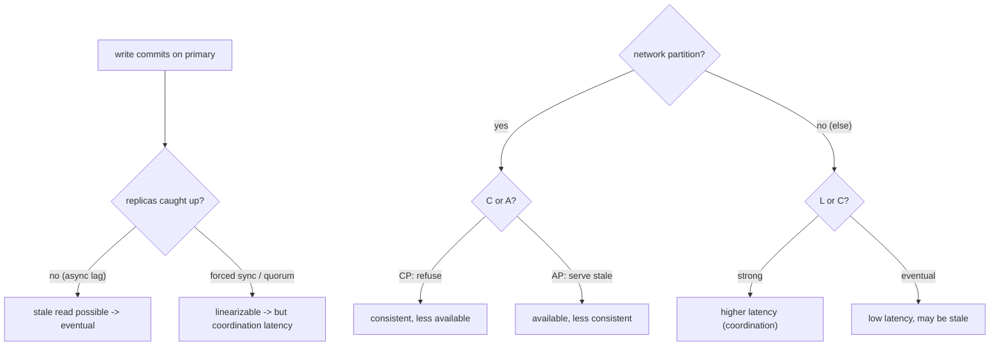

## Thesis

A consistency model is the contract a distributed data store gives you about *what a read is allowed to observe* after writes --- because once data is replicated and accessed concurrently, a read can see a stale value, an out-of-order value, or one of two conflicting values unless the system promises otherwise. The models form a spectrum from **strong** (linearizable: every read sees the latest committed write, as if there were a single copy) to **weak** (eventual: replicas converge given enough quiet time, and reads may be stale in the meantime), with genuinely useful middle points --- read-your-writes, monotonic reads, causal. Stronger consistency costs latency and availability (CAP under a partition, PACELC even without one), so the design skill is not "make everything strong" --- it is choosing the *weakest* model that still satisfies each operation, and often tuning it per read (a strong balance check, an eventual like count).

## Sub

**Why: replication and concurrency let a read observe stale or out-of-order data** -> **the spectrum: linearizable -> causal -> read-your-writes / monotonic -> eventual** -> **the cost: CAP under a partition, PACELC's latency-versus-consistency even without one** -> **zoom out** to tunable quorums (R + W > N), conflict resolution, per-operation consistency, and choosing the weakest model that works.

## Spine

- **A consistency model is a contract about what a read can see** --- with replicas and concurrent writes a read may observe a stale or out-of-order value, and the model defines exactly which anomalies are possible, so you know what your code is allowed to rely on and what it must defend against.
- **The models form a spectrum** --- **linearizable** (as if one copy, every read sees the latest committed write in real-time order) at the strong end, **eventual** (replicas converge, reads may be stale, conflicts must be resolved) at the weak end, with **causal**, **monotonic reads**, and **read-your-writes** as practical middle guarantees.
- **Strong consistency costs latency and availability** --- **CAP**: under a network partition you must choose consistency or availability; **PACELC**: *else* (no partition) you still trade latency for consistency, because strong guarantees require coordination --- so strong is a cost you pay on every operation, not a free default.
- **Choose the weakest model that satisfies the use case** --- a bank balance or a unique-username check needs strong; a like count, a feed, or a DNS record tolerates eventual --- and you frequently tune it *per operation* (a quorum read on the critical path, eventual everywhere else) rather than picking one global level for the whole system.

## Companion Notes

### walk

What a read is allowed to observe

One replicated store walked across the spectrum --- why replication lets a read go stale, what linearizable, causal, read-your-writes, and eventual each promise, what CAP and PACELC cost you for strong guarantees, and how you pick the weakest model per operation instead of making everything strong.

Say it as a contract about reads: the model defines which anomalies are possible, stronger costs latency and availability, and the skill is choosing the weakest guarantee each operation can live with.

### drill

Consistency-spectrum reps

Graded reps on the models (linearizable to eventual), the session guarantees, CAP/PACELC, and quorum tuning --- the ones that separate "we use a database" from choosing a consistency guarantee deliberately per operation.

Name the model, the anomaly it prevents, and the cost: linearizable (no stale reads, but coordination latency), eventual (stale + conflicts, but fast and available), and the middle guarantees that buy a session what it needs cheaply.

### wb

Whiteboard

Rebuild the spectrum from blank --- why a second copy creates the problem, what each model rules out, where CAP and PACELC bite, what the quorum dial does and does not buy, and how a stale read becomes a real production bug.

Draw the read path first, not the models. Every anomaly on this topic is "which copy answered, and how far behind was it" --- if the copies are on the board, the model names itself.

### sys

System Map

Zoom out: the consistency model sits between replication (which creates the staleness) and every consumer downstream --- caches, indexes, feeds, replicas --- each of which inherits the guarantee you chose, whether you named it or not.

Lead with the boundary, not the label. "Replication makes reads stale; the model names which anomalies are allowed; the dial is per operation" --- then let them pull you into quorums, locks, sagas, or multi-region.

### trade

Trade-offs

The calls that separate a level from a label --- strong vs eventual, CP vs AP, one global level vs per-operation, sticky routing vs a version token, LWW vs vector clocks vs CRDTs, strict vs sloppy quorums, regional authority vs global consensus.

Never defend a model as universally right. Say "pick when" --- name the constraint that flips it, and the cost you are accepting on the other side. Consistency is a premium, and the trade is always latency and availability.

### model

Model Answers

Full spoken scripts --- the beats, in order, the way you would actually say them under time pressure.

Steal the frame, not the words: name the model, the anomaly it rules out, and the cost you accept --- three clauses per operation. A label with no mechanism and no price is vocabulary, not design.

### num

Numbers

Back-of-envelope the quorum dial --- whether reads are fresh, how many failures the config survives, and what the guarantee actually costs in milliseconds on the write path.

Lead with the coordination round trip. R + W > N is free to say and expensive to run: the moment the quorum crosses a region, every strong write pays the RTT, and that number is what ends the "why not strong everywhere" argument.

### rf

Red Flags

What sinks the round --- "strong everywhere to be safe," "quorum so we're linearizable," "we're CA," "last-write-wins resolves it" --- and what to say instead.

Name what the interviewer hears. "We use QUORUM, so it's linearizable" is the fastest way to reveal you have read the docs and not the failure modes.

### open

30-Second

The opener and the close --- matched to the altitude the question is asked at.

Open at the contract, not the database. "A consistency model is what a read is allowed to observe" --- then the spectrum, then the price. Land on per-operation choice, because that is the judgment they are buying.

## Drill

all | All four levels, mixed --- the way a real loop actually comes at you
SDE2 | the models and why replication needs them
SDE3 | the spectrum, CAP/PACELC, and quorums
Staff | linearizability vs serializability, per-op choice, and cost

### SDE2 | what a consistency model is

What does a consistency model actually specify?

It specifies **what a read is allowed to observe** given the writes that have happened --- the contract between the data store and your code about which values a read can and cannot return. In a single-copy, single-threaded world this is trivial: a read returns the last write. But once data is replicated across nodes and accessed concurrently, a read might hit a replica that has not yet received the latest write (stale), or observe writes in a different order than they happened, or see one of two values written concurrently. The consistency model names exactly which of these anomalies are possible. So it is not a vague quality knob --- it is a precise guarantee that tells you what your application can rely on (e.g. "a read always reflects your own most recent write") and, by omission, what it must handle (e.g. "another user's write may not be visible to you yet"). Knowing the model is knowing the rules of what your reads mean.

Follow: You said the model names which anomalies are possible. Name three anomalies a read can actually exhibit, and the weakest model that rules each one out.
**Stale read** --- a completed write is not visible to a later read; ruled out only by **linearizability** (real-time recency). **Non-monotonic read** --- you see a value, then a later read shows you an *older* one (time runs backwards); ruled out by **monotonic reads**, a session guarantee, which is far cheaper than linearizability. **Effect before cause** --- you see a reply to a message you cannot see; ruled out by **causal consistency**. The point of naming them separately is that they are ruled out at wildly different prices: the flickering-comment bug costs you sticky routing, while the stale-balance bug costs you a consensus round on every read. Matching the anomaly to the cheapest model that forbids it *is* the design work.

Follow: If the model is a contract, who enforces it --- the database, or your code?
Both, and the honest answer is that **the effective model is the weakest link in the whole read path**, not the label on the database. The store gives you a menu (Cassandra's consistency level, DynamoDB's `ConsistentRead` flag, Cosmos DB's five levels, Postgres primary-vs-replica), but everything you put *above* it can silently weaken what it promised --- a read replica, a Redis cache, a CDN, a client-side store, a materialized view. A team that says "our database is strongly consistent" while serving reads from a cache with a 60-second TTL has a system whose actual guarantee is "eventual, bounded by 60 seconds," and nobody wrote that down. So the contract is enforced by the store *and* by every copy you added, and the useful question is never "what is our database" but "what is the weakest copy that can answer this read."

Senior: Treating the model as a **precise, per-anomaly contract** --- and immediately observing that the *effective* guarantee is set by the weakest copy in the read path (cache, replica, CDN), not by the database's marketing label --- is what separates someone who has debugged a stale-read incident from someone who has read the CAP page.
Speak: Define it as a contract: **"a consistency model specifies what a read is allowed to observe after a set of writes."** Then name the anomalies it rules out --- stale reads, time running backwards, effect before cause --- and add the line that shows you have shipped this: **"and the model you actually have is the weakest copy in the read path, not the one on the database's box."**

### SDE2 | strong vs eventual consistency

What is the difference between strong and eventual consistency?

**Strong consistency**: every read reflects the **latest committed write** --- the moment a write succeeds, all subsequent reads (from anywhere) see it, as if there were a single copy of the data. **Eventual consistency**: after a write, replicas will **converge** to the new value *given enough time with no new writes*, but in the interim a read may return a **stale** value, and concurrent writes may need conflict resolution. The trade is fundamental: strong consistency requires the replicas to coordinate on every operation (which costs latency and, under a partition, availability), while eventual consistency lets each replica accept reads and writes independently (which is fast and highly available but exposes staleness and conflicts to the application). Strong is "always correct, sometimes slow or unavailable"; eventual is "always fast and available, sometimes stale." The whole design question is which one --- or which point in between --- each piece of data actually needs.

Follow: "Eventual" has no clock in it. If a product manager asks "how stale can a read be," what do you actually tell them?
That eventual consistency, as a *guarantee*, gives you **no bound at all** --- it promises convergence in the limit, not a deadline --- so I would not answer with the model. I would answer with one of two things. Either I **buy a bound**: a store with an explicit bounded-staleness level (Azure Cosmos DB literally sells this --- staleness bounded by K versions or T seconds) gives you a number the system will actually enforce. Or I **measure a bound**: I chart replication lag as a first-class SLI (Postgres `replay_lag`, MySQL `Seconds_Behind_Master`), and tell them "p99 lag is 180 ms under normal load, and it degrades to several seconds during a bulk backfill." That second number is an *observation*, not a promise --- it will get worse exactly when the system is under stress. Confusing the two is how you end up with a product requirement resting on a number nothing enforces.

Follow: You said strong consistency needs coordination on every operation. Coordination with whom --- all the replicas?
No --- with a **majority**, not all, and the distinction is the whole reason quorums exist. If you wait for *all* N replicas, your write latency is the *slowest* replica's latency (the tail dominates) and your write availability collapses: any single replica being down or slow stalls writes, so a 3-replica system becomes *less* available than one node. That is strictly worse than what you replicated to get. A consensus protocol (Raft, Paxos) commits once a **majority** (N/2 + 1) has durably accepted, so it tolerates the minority being dead or slow, and the latency is the *median* replica's, not the worst. So "strong consistency coordinates" is right, but the useful precision is "with enough replicas to guarantee overlap with any future quorum" --- which is why W = N is almost always the wrong tuning even though it sounds like the safest.

Senior: Refusing to let **"eventual"** stand as an answer to "how stale" --- distinguishing a guarantee the system *enforces* (bounded staleness) from a lag you merely *measure* --- and knowing that strong consistency coordinates with a **majority, not all replicas**, is the difference between reciting the two words and having operated them.
Speak: Give the two-sided version: **"strong means every read sees the latest committed write; eventual means replicas converge given quiet time, and until then reads can be stale and concurrent writes can conflict."** Then price it: **"strong buys correctness with coordination latency and availability under a partition; eventual buys speed and availability with staleness and conflicts."** If they push on staleness, say the honest thing: eventual bounds nothing --- you either buy bounded staleness or you SLO the lag.

### SDE2 | what linearizability means

What is linearizability, in plain terms?

Linearizability is the **strongest single-object consistency**: the system behaves *as if there is one copy of the data and every operation takes effect atomically at some instant between its start and its completion*, consistent with **real-time order**. Concretely: if write W completes before read R begins (in wall-clock time), R is guaranteed to see W's value (or a later one) --- there is no window where a completed write is invisible to a subsequent read. It makes a distributed, replicated system *look* like a single register that everyone shares. This is what you want for anything where "did my write take effect" must have a definite, immediate answer --- a lock, a leader-election flag, a unique-id allocation, a balance. The cost is that achieving it requires coordination (a consensus or a synchronous quorum) on operations, so it is the most expensive guarantee in both latency and availability. Linearizable = "one copy, real-time order, no stale reads."

Follow: You said "as if there were a single copy." If a single leader serves every read and write, is the system automatically linearizable?
No --- and this is the trap. A single leader gives you a **total order**, but linearizability additionally requires that the node answering *is still the leader at the moment it answers*. A leader that has been deposed during a partition but has not learned it yet will cheerfully serve reads from its own memory, and those reads are **stale** --- the new leader has already accepted writes it has never seen. That is a real, shipped bug class, not a thought experiment. Which is exactly why etcd's linearizable read does not just answer from the leader's memory: it performs a **ReadIndex** round --- a quorum confirmation that it is still leader --- *before* answering. And a lease-based leader has to be sure its lease has not expired by a clock it cannot fully trust. So "one leader" gets you ordering; "a leader that has *proven* it is still leader" gets you linearizability, and the proof costs a round trip.

Follow: How would you actually test that a store is linearizable?
You cannot establish it by inspection or by a happy-path integration test --- you have to **record a concurrent history and search it for a valid linearization**. You log every operation with its invocation time, its return time, its arguments and its result, then ask: does there exist an ordering of these operations, with each taking effect at some single instant between its own invoke and its own return, that is consistent with a single-copy register? If no such ordering exists, you have a counterexample and the system is not linearizable. That is precisely what **Jepsen** does (Knossos, and later Elle). The critical part is that the bugs do not live on the happy path --- they live in the **failover path**, so a real test has to inject faults *while* the history is being recorded: partition the network, kill and restart leaders, skew the clocks, pause a node long enough for its lease to expire. A test suite that never partitions the network has never tested the property.

Senior: Knowing that a **single leader is not sufficient** --- that a deposed-but-unaware leader serves stale reads, so a linearizable read costs a quorum confirmation (etcd's ReadIndex) --- and that linearizability is established by **fault-injected history checking (Jepsen)**, not by reading the docs, is a genuine distributed-systems tell.
Speak: Define it precisely: **"linearizable means the system behaves as if there is one copy, and every operation takes effect atomically at some instant between its start and its finish, consistent with real time --- so a write that completed is visible to every read that starts after it."** Then the mechanism: **"one leader gets you an order; a leader that has proven it is still leader gets you linearizability --- and that proof is a quorum round trip on the read path."**

### SDE2 | what eventual consistency means

What does eventual consistency promise, and what does it not?

It promises exactly one thing: **if writes stop, all replicas will eventually converge to the same value**. It does *not* promise when, does *not* promise that a read reflects the most recent write, and does *not* by itself resolve concurrent conflicting writes --- those are things the application (or the store's conflict-resolution policy) must handle. So under eventual consistency you can read a stale value (a replica that has not caught up), you can read *different* values from different replicas at the same moment, and two clients writing concurrently can create a conflict that must be reconciled (last-write-wins, vector clocks, or CRDTs). The upside is that every replica can serve reads and accept writes without coordinating first, so the system is fast and stays available even when replicas cannot talk to each other. Eventual consistency is the right default for data where a brief staleness is harmless (a view count, a cached profile, a recommendation) --- and the wrong one for data where reading a stale value causes a correctness bug.

Follow: "Replicas converge if writes stop" --- but in a live system writes never stop. Is the guarantee actually useful?
It is a **limit statement**, and taken literally it is close to vacuous --- which is a fair criticism and I would concede it. What it *does* buy you is the absence of **permanent divergence**: it says that every replica applies the same set of updates and, given a deterministic merge, reaches the same state, so two replicas cannot disagree forever about a key that nobody is writing. That is a real property --- a system *without* it has permanent split-brain, where two copies stay different with no path back. But you are right that it is not an operational guarantee, so the engineering restatement is two-part: **convergence** (divergence is temporary and self-healing, guaranteed by the merge function) plus **a measured staleness distribution** (the lag you actually observe under load, which you SLO and alert on). If someone offers you "eventual consistency" and cannot tell you their p99 lag, they have given you the useless half.

Follow: You said concurrent writes can conflict. How does the system even *know* two writes were concurrent, rather than one following the other?
It needs **causal metadata** --- a version vector (often called a vector clock) carried with each write. Each replica keeps a counter; a write carries the version it *saw*. Now compare two versions: if B's version **dominates** A's (greater or equal in every entry), then B's writer had already observed A, so B causally follows A and overwriting is safe and correct. If **neither dominates** --- each is ahead in some entry --- the writes are **concurrent** and you have a genuine conflict, which Dynamo surfaces as siblings for the application to merge. The crucial point is what a **wall-clock timestamp cannot do**: it always yields a total order, so it can never *detect* concurrency; it just declares a winner. That is why last-write-wins is not a conflict-*detection* policy at all --- it is a silent data-loss policy that happens to terminate. If you need to know whether two writes conflicted, you need logical clocks, not physical ones.

Senior: Conceding that **"converges if writes stop" is a limit statement** and restating it operationally --- convergence (no permanent divergence) plus a *measured* lag distribution --- and knowing that **only logical clocks (version vectors) can detect concurrency** while physical timestamps merely declare a winner, is a much stronger answer than reciting the definition.
Speak: State exactly the one thing it promises: **"eventual consistency promises that if writes stop, replicas converge --- and nothing else. It does not bound staleness and it does not resolve concurrent writes for you."** Then the sharp edge: **"so you owe two things: a merge function so divergence is temporary, and a measured lag SLO, because 'eventual' with no number is not an answer to 'how stale.'"**

### SDE2 | read-your-writes consistency

What is read-your-writes consistency, and why is it often the minimum a user notices?

Read-your-writes (read-your-own-writes) guarantees that **once a user has made a write, their own subsequent reads will always reflect it** --- they never see their update "disappear." It is a *session* guarantee (scoped to one user/session), weaker than global strong consistency but exactly the property users viscerally expect: you post a comment and it is there when the page reloads, you change a setting and it shows as changed. Without it, an eventually-consistent system can route a user's write to the primary and their immediate read to a lagging replica, so the user sees the *old* value and thinks the write failed (and often retries). You implement it cheaply --- route a user's reads to the primary (or a replica known to have their write) for a short window after they write, or track the write's version and read from a replica that has caught up to it --- without paying for global strong consistency. It is the classic example of buying just the guarantee the use case needs.

Follow: You said pin the user to the primary after a write. For how long --- and what happens when you get that window wrong?
The window has to **exceed the actual replication lag**, and the trouble is that lag is a distribution, not a constant. Too short and the anomaly comes back --- intermittently, under load, precisely when lag spikes, which is the worst possible failure signature because it is unreproducible locally and correlates with your busiest hour. Too long and you shove read traffic onto the primary and give back the read-scaling the replicas existed to provide. So a fixed timer is fundamentally a **guess calibrated against a number that moves**. The version that does not depend on the guess: capture the write's **log position** (Postgres LSN, MySQL GTID), carry it with the session, and route the read to a replica whose replay position is **at or beyond** that LSN --- falling back to the primary if none has caught up. Now correctness is derived from the *actual* replication position rather than from a timer someone tuned once against last quarter's traffic.

Follow: The user writes from their phone and reads from their laptop. Does your read-your-writes still hold?
Only if the "session" is keyed to the **user**, not to the connection. This is the standard trap: if you implement stickiness with a sticky cookie, a TCP affinity, or a per-device token, then the laptop is a *different* session, gets routed to an arbitrary replica, and the user watches the change they just made on their phone fail to appear --- which is exactly the bug they were promised would not happen. Read-your-writes is fundamentally a guarantee about a **user's causal history**, and "session" is an implementation shortcut that leaks the moment the same human uses two devices. So the version token (the LSN, the last-seen version) has to be stored **against the user** server-side, or handed to the client and echoed on every read from any device. Kleppmann calls this cross-device read-after-write consistency, and it is the case that quietly breaks the naive implementation.

Senior: Rejecting the **fixed sticky window as a guess against a moving number** and reaching for an **LSN/GTID-based "read a replica that has replayed at least my write"** --- plus catching that the guarantee is per-*user*, not per-*device*, so a phone-write/laptop-read still breaks it --- is precisely the Staff-vs-SDE2 gap on this card.
Speak: Name it as a session guarantee: **"read-your-writes means a user's own reads always reflect their own writes --- they never watch their update vanish."** Then the cheap mechanism and its flaw in one breath: **"pin them to the primary briefly after a write --- but a fixed window is a guess against replication lag, so the robust version carries the write's LSN and reads a replica that has replayed past it. And key it to the user, not the device, or their phone-write/laptop-read breaks it anyway."**

### SDE2 | why replication creates the problem

Why does consistency become a hard problem the moment you replicate data?

Because replication is (almost always) **asynchronous** --- a write lands on one replica (or a quorum) and is propagated to the others *after*, so for a window the replicas disagree, and a read to a lagging replica returns a stale value. You replicate for good reasons (availability if a node dies, read scaling by spreading reads across replicas, lower latency by placing replicas near users), but each replica is a *copy that can be behind*, and the more replicas and the wider the geography, the larger the lag window. Making every replica reflect every write *immediately* would require synchronous coordination on every write (wait for all replicas to acknowledge before returning), which sacrifices exactly the latency and availability you replicated to gain. So replication forces the trade: you accept some staleness (eventual/bounded) to keep the benefits, or you pay coordination to eliminate it (strong). Single-copy data has no consistency problem; the problem is *created* by having more than one copy that can diverge.

Follow: Suppose you make replication fully synchronous to all replicas. Staleness is gone --- so is the problem solved?
The staleness is genuinely gone, so I will grant that --- but you have bought it with two properties that are usually worse. **Latency**: your write now completes at the speed of the **slowest** replica, so your write latency is a *tail* statistic, and every GC pause, every noisy neighbour, every slow disk on any one node is now on the critical path of every write. **Availability**: if *any* single replica is down or unreachable, writes **stall completely** --- so a 3-replica cluster has *lower* write availability than a single node, which is a spectacular inversion of the reason you replicated. That is why nobody ships all-replicas-synchronous. The real designs are **semi-synchronous** (wait for one standby, so you survive a primary loss without waiting on the slowest) or a **majority quorum** (Raft/Paxos: commit on N/2+1, so the slow minority never blocks you and you still tolerate failures). The lesson is that "how many replicas must acknowledge" is the single knob that sets your latency, your durability, and your failover safety all at once.

Follow: You keep saying replication is "almost always" asynchronous. When is it not?
Wherever a lost write is unacceptable. Postgres will do it: `synchronous_commit` with `synchronous_standby_names` makes the commit wait for a standby to flush the WAL, so a primary failure cannot lose an acknowledged transaction. MySQL has semi-synchronous replication for the same reason. And every **consensus-replicated** store is synchronous *by construction* --- in etcd, Spanner, or CockroachDB a write is not "committed" until a majority has durably accepted it; that is what commit *means* there. The pattern is always the same: you pay latency at commit time to buy a guarantee about what survives a node loss. And the tell of a senior answer is naming **which** replicas are synchronous --- one? a majority? all? --- because that one choice simultaneously determines the write latency, the number of failures you survive, and whether a failover can silently lose an acknowledged write.

Senior: Answering "make it all synchronous" with the **precise cost** --- write latency becomes the *slowest* replica's, and write availability drops *below* a single node's --- and then naming the real designs (semi-sync, majority quorum) plus the observation that **"how many replicas must ack" is one knob that sets latency, durability, and failover safety together**, is the systems maturity being probed.
Speak: Locate the cause: **"single-copy data has no consistency problem --- the problem is created by having a second copy that can be behind."** Then the trade in one line: **"replication is asynchronous, so a read to a lagging replica is stale; making it synchronous to all replicas removes the staleness but makes writes as slow as the slowest node and less available than a single machine --- which is why real systems wait for a majority, not for everyone."**

### SDE2 | a real example of each

Give a real example that needs strong consistency and one that is fine with eventual.

**Needs strong**: a **bank account balance** or a **payment** --- reading a stale balance could let a customer overdraw or double-spend, so the read must reflect every committed debit/credit immediately (linearizable), and a transfer must be atomic and isolated (serializable). Also a **unique-username / inventory-count** check: two concurrent "claim" operations must not both succeed on the last unit. **Fine with eventual**: a **like count or view count** --- if it shows 1,004 instead of 1,006 for a few seconds, nobody is harmed and it converges; a **social feed** --- a post appearing a moment late is acceptable; **DNS** --- records propagate over minutes and the system is designed around it; a **cached user profile**. The pattern that distinguishes them: ask "if a read returns a slightly stale value, does anything *break*?" If yes (money, uniqueness, safety), you need strong; if no (counts, feeds, recommendations), eventual is not just acceptable but preferable for its speed and availability.

Follow: You put the like count in the eventual bucket. Two users like the same post at the same moment, on different replicas. What actually happens to the count?
If you modeled it as a **register** and resolve with last-write-wins, one of the increments is **silently lost**: both replicas read 5, both compute 6, both write 6, LWW picks one --- the count is 6 when it should be 7, with no error and no conflict surfaced. That is the classic lost update, and it means my own "eventual is fine for a like count" was only half an answer. Eventual consistency does not make a **read-modify-write** safe --- it turns one into a lost-update generator. The fix is to stop storing the *value* and start storing the *operation*: a **PN-counter CRDT**, where each replica increments only its own slot and the value is the sum of all slots (merge = element-wise max), so two concurrent increments on different replicas both survive and merge to 7 --- deterministically, with no coordination. Or, if you would rather not run a CRDT, make the increment an atomic operation against a single owner for that key (a Redis `INCR`, a DynamoDB `ADD`). So: eventual is fine for the like count, *provided the merge is right*.

Follow: You said a unique-username claim needs strong consistency. Two users claim the same name at the same instant. Where exactly does the strong guarantee have to live?
Only on **that one operation, on that one key** --- and that is the entire per-operation point made concrete. What you need is a single point of serialization for the key `username:alice`: a **unique constraint** in a single-master database, or a **linearizable compare-and-set** --- DynamoDB's conditional write (`attribute_not_exists(username)`), Cassandra's lightweight transaction (`INSERT ... IF NOT EXISTS`, which runs Paxos), an etcd CAS on a key. Every one of those makes exactly one of the two racing claims fail. What you do **not** need is for the whole system --- the profile, the feed, the avatar, the follower count --- to be strongly consistent. So the guarantee is scoped to a single linearizable CAS on a single key, and everything around it stays eventual and fast. If someone answers "so we need a strongly consistent database," they have paid for a global property to solve a one-key problem.

Senior: Catching that **"eventual is fine for a like count" is wrong if you model it as a register** --- a concurrent read-modify-write silently loses an increment, and the fix is a **PN-counter CRDT or an atomic INCR**, not a stronger consistency level --- and then scoping the username claim to **one linearizable CAS on one key** rather than a strongly-consistent system, is the per-operation judgment they are testing.
Speak: Give the test, not a list: **"ask whether a stale read causes anything to break --- money, uniqueness, a lock, a safety check --- and if yes it needs strong; a feed or a count does not."** Then immediately show the trap: **"but 'eventual is fine for a like count' is only true if the merge is right --- two concurrent increments under last-write-wins lose one, so it is a PN-counter or an atomic increment, not a plain write."**

### SDE3 | the consistency spectrum

Lay out the consistency spectrum from strongest to weakest.

From strongest to weakest: **Linearizable** (single-object) --- one copy, real-time order, every read sees the latest completed write. **Sequential** consistency --- all clients see operations in *some* single total order that respects each client's own program order, but not necessarily real-time (a completed write may not be immediately visible to another client). **Causal** consistency --- operations that are causally related (one could have influenced the other) are seen in that order by everyone, while *concurrent* operations may be seen in different orders by different clients. Then the **session guarantees** --- **read-your-writes**, **monotonic reads** (you never see time go backwards), **monotonic writes**, **writes-follow-reads** --- which are per-session slices of causal-ish behavior. Then **eventual** consistency --- convergence only, any anomaly in the meantime. The value of the spectrum is that the middle is huge and useful: you rarely need full linearizability, and causal or the session guarantees give most of the intuitive "it behaves sensibly" feel at a fraction of the coordination cost.

Follow: You put sequential consistency above causal. Give me one concrete behavior sequential allows that linearizable forbids.
The **stale-but-ordered read**. Client A writes `x = 1`, and the write **returns successfully**. Client B, starting strictly *afterwards* in wall-clock time, reads `x` --- and gets the old value, `0`. Under **linearizability** that is illegal: A's write completed before B's read began, so real-time order forces B to see it. Under **sequential consistency** it is perfectly legal, because sequential only demands *some* single total order that respects each client's own program order --- and the order `[B's read, A's write]` is such an order. Nothing in sequential consistency says the total order has to agree with the wall clock. That is the *entire* difference between the two models, and it is not a technicality: dropping real-time order is exactly what makes sequential consistency **non-composable** --- two individually sequentially-consistent objects, used together, need not behave sequentially --- whereas linearizability composes, which is why it is the property you actually want for a lock or a balance.

Follow: Where do "consistent prefix" and "bounded staleness" sit, and does anyone actually ship them?
They sit in the middle, and yes --- **Azure Cosmos DB ships exactly five levels** (strong, bounded staleness, session, consistent prefix, eventual), which is the cleanest proof anywhere that the middle of the spectrum is a *product surface*, not a textbook curiosity. **Consistent prefix** guarantees you never see writes out of order: you always see *some prefix* of the true write order, so you may be behind, but you will never see write 3 before write 2. That kills the "the comment appears before the post it is on" class of anomaly for a fraction of the price of causal. **Bounded staleness** is stronger still: it bounds how far behind you can be, by *K versions* or *T seconds*, and the system enforces the bound (it will throttle writes rather than let a replica fall further behind). That is the level you buy when a product manager needs a *number* --- it is the answer to "how stale can this be" that eventual consistency structurally cannot give.

Senior: Being able to state the **exact behavioral difference between sequential and linearizable** (a completed write invisible to a later read is legal under sequential, illegal under linearizable) --- and knowing *why it matters*: linearizability **composes** and sequential does not --- plus citing **Cosmos DB's five levels** as evidence the middle is a shipping product surface, is well past the recite-the-list bar.
Speak: Walk it down with what each one *rules out*: **"linearizable --- one copy, real-time order, no stale reads. Sequential --- one agreed order, but it need not match the wall clock, so a completed write can still be invisible. Causal --- cause always precedes effect; unrelated writes may be seen in either order. Session guarantees --- one user gets a coherent view cheaply. Eventual --- convergence only."** Then land the point: **"the middle is the useful part --- you rarely need full linearizability, and Cosmos DB literally sells five of these levels."**

### SDE3 | causal consistency

What does causal consistency guarantee, and what does it deliberately leave loose?

It guarantees that **causally-related operations are observed in their causal order by every client**, while allowing **concurrent (causally-unrelated) operations to be observed in different orders**. Causality means one operation *could have influenced* another --- e.g. you read a message and then reply; anyone who sees your reply must also see the original message (the reply causally depends on it). It captures the "happened-before" relationships that matter for making sense of data, so you never see an effect without its cause (a reply to a missing message, a comment on a deleted-then-recreated post out of order). What it leaves loose is operations with **no causal link**: if Alice and Bob independently post unrelated updates, different observers may see them in different orders, and that is fine because neither depends on the other. This is a sweet spot: it preserves the ordering humans actually care about (cause before effect) without the global real-time coordination linearizability demands, which is why it is often cited as the strongest model achievable while staying available under partitions.

Follow: If causal is the strongest model you can keep while staying available, why is it comparatively rare in production?
Because the cost is not in the *guarantee*, it is in the **metadata and the apply-side check**, and both scale badly in the naive form. To enforce causality a replica must not apply a write until **all of that write's dependencies are already applied** --- which means every write has to carry enough causal metadata to identify its dependencies. Version vectors sized by the number of *replicas* are fine (that is O(replicas), a small constant). But tracking causality per *client* --- which is what you actually need if a client's reads create dependencies --- is O(clients), and that does not fit in a write header. So real causal systems compress hard: COPS carries explicit nearest-dependency lists, Eiger and Occult push further with different trade-offs, and many "causal" production systems really provide per-partition sequencing plus a stable-time barrier. The honest answer is that causal consistency is theoretically the best available deal and *operationally* the awkward one --- the metadata is the reason, and it is why most teams buy the **session guarantees** (which are causality scoped to one client, so the metadata is one token) instead of full causal.

Follow: You said concurrent operations can be seen in different orders by different clients. Does that mean the replicas permanently disagree?
No --- and separating these two properties is the crux. **Ordering** and **convergence** are different things. Causal consistency constrains the *order in which you may observe* related operations; it says nothing about the *final state*. Convergence says all replicas end up in the same state. You can have causal ordering *and* permanent divergence if you never define a merge --- two replicas each accept a concurrent write and simply keep different values forever. That is why the useful target is **"causal+"**: causal consistency **plus** convergent conflict handling (a deterministic merge, typically a CRDT or a LWW rule applied only to genuinely-concurrent writes). Then two clients may have *displayed* Alice's and Bob's unrelated posts in different orders on the way there, but every replica lands on the same final state. Causal alone orders what you see; causal+ also guarantees where you end up.

Senior: Naming the real reason causal is rare --- the **causal metadata and the apply-side dependency check** are what do not scale, not the guarantee --- and cleanly separating **ordering from convergence** (hence "causal+" = causal ordering *plus* a deterministic merge) shows you have read past the definition into why the industry mostly buys session guarantees instead.
Speak: Define it by what it forbids: **"causal consistency means you never see an effect without its cause --- if my reply depends on your message, nobody sees the reply without the message. Operations with no causal link may be seen in either order, which is fine because neither depends on the other."** Then the honest cost: **"it is the strongest model you can keep while staying available under a partition --- but tracking the causal metadata is what makes it awkward in practice, which is why most systems buy the session guarantees instead."**

### SDE3 | monotonic reads and the session guarantees

What are the session guarantees, and what anomaly does each prevent?

The four **session guarantees** are per-session (per-client) properties that prevent specific jarring anomalies cheaply. **Read-your-writes**: your own reads reflect your own prior writes (your update never disappears). **Monotonic reads**: successive reads never go *backwards in time* --- once you have seen a value, you will not later see an older one (prevents "refresh and the new comment vanishes because you hit a laggier replica"). **Monotonic writes**: your writes are applied in the order you issued them (write A then B is not reordered to B then A). **Writes-follow-reads** (session causality): a write that follows a read is ordered after the write that read observed (your reply is ordered after the message you replied to). Individually they are weak, but together they give a *single session* a coherent, causally-sensible view without global coordination --- implemented typically by pinning a session to a replica or tracking versions the session has seen. They are the practical answer to "how do I make an eventually-consistent system not feel broken to a given user."

Follow: Rank them by how loudly a user notices the violation, and tell me which you would buy first.
**Read-your-writes** is by far the loudest, because the user takes *action* on it: they post a comment, do not see it, conclude it failed, and **retry** --- so a consistency bug becomes a duplicate-data bug. Buy it first, always. **Monotonic reads** is second and the most under-diagnosed: content flickers in and out across refreshes as the load balancer bounces the user between replicas at different lag; users report it as "the site is buggy" and it almost never gets traced, because it is invisible in single-node testing and only appears once you load-balance reads. Buy it the day you add a second read replica. **Writes-follow-reads** surfaces as a reply appearing above the message it replies to --- visible, but usually cosmetic. **Monotonic writes** is the rarest, and shows up as two edits applied out of order so the *older* one wins. That ranking is not trivia --- it is the buying order, and it says: read-your-writes plus monotonic reads gets you almost all of the perceived correctness for almost none of the coordination cost.

Follow: What is the cheapest possible implementation of monotonic reads, and where does it break?
**Sticky routing**: hash the user (or session) to *one* replica so all their successive reads come from a single point in the replication stream. It is nearly free --- no version tracking, no coordination, one hash --- and it exactly satisfies the guarantee while it holds. Where it breaks: **when that replica dies or is rebalanced away**, the user is re-pinned to a different replica which may be *further behind*, and time visibly jumps backwards once --- precisely the anomaly you were preventing, now rare and unreproducible. It also fights load balancing: a hot user or a hot shard pins load to one node and you cannot spread it. The robust version drops stickiness and tracks the **highest version the session has observed**, refusing to serve the read from any replica behind that version (routing to a caught-up one, or falling back to the primary). Sticky-by-hash when it is a UX nicety; version-token when you actually care --- and know that sticky routing has a real, if narrow, failure window at exactly the moment a replica goes away.

Senior: **Ranking the four by how loudly the user notices** --- and knowing that read-your-writes is loudest because the user *retries* and turns a consistency bug into a duplicate-write bug, while monotonic reads is the invisible one that only appears once you load-balance --- plus knowing that cheap sticky routing has a real failure window on replica loss, is applied judgment rather than recall.
Speak: List them by the anomaly, not the name: **"read-your-writes --- your own update never vanishes. Monotonic reads --- time never runs backwards, so a comment you saw does not disappear on refresh. Monotonic writes --- your writes apply in the order you issued them. Writes-follow-reads --- your reply is ordered after the message it replies to."** Then the buying order: **"read-your-writes first, because users retry when it breaks; monotonic reads the day you add a second read replica."**

### SDE3 | the CAP theorem

State the CAP theorem precisely and the common misreading.

CAP: a distributed data store cannot simultaneously provide all three of **Consistency** (every read sees the latest write --- linearizability), **Availability** (every request to a non-failed node gets a non-error response), and **Partition tolerance** (the system keeps working despite dropped/delayed messages between nodes) --- and since **network partitions are unavoidable** in a distributed system, P is not optional, so the *real* choice under a partition is **C or A**. During a partition you either refuse requests that cannot be made consistent (choose C, sacrifice availability --- a **CP** system) or serve possibly-stale/divergent responses to stay up (choose A, sacrifice consistency --- an **AP** system). The common misreading is "pick two of three" as if you choose C-and-A by dropping P --- you cannot drop P in a real network, so it is not a free-standing choice; CAP is really "when (not if) a partition happens, do you sacrifice consistency or availability." And it is only about the partition case, which is where PACELC extends it.

Follow: If P is not optional, CAP reduces to "C or A." So what is the theorem actually *for*?
Its value is the **proof that the choice is forced**, not the taxonomy. Gilbert and Lynch's contribution is showing you cannot cleverly engineer your way out: during a partition the two sides cannot learn each other's writes, so if both sides answer, they can answer differently (not consistent), and if you require them to agree, at least one side must refuse to answer (not available). That is a real impossibility result and it kills a whole class of hopeful designs. What CAP is *bad* at is being used as a **system label** --- "MongoDB is CP" is close to meaningless, because the trade is made per operation and is usually configurable (write concern, read concern, consistency level), and the same cluster can be CP for one call and AP for another. So: use CAP to reason about **what a specific operation does during a partition**, and stop using it to classify databases. That misuse is the reason the theorem has a bad reputation among people who actually operate these systems.

Follow: A single-node database has no partitions. Is it CA?
That is outside CAP's scope, and the question is usually a trap. CAP is a statement about a **distributed** (multi-node) store; a single node has no inter-node network to partition, so the trade simply does not arise --- but it also has no availability under its own failure, so calling it "CA" tells you nothing useful. It is not "CA," it is *not distributed*. And the more important half: for a genuinely distributed system, **"we chose CA" is always a mistake**, because dropping P means "we assume the network never fails," which is false in every real deployment --- packets get dropped, switches fail, a GC pause or an overloaded node is *indistinguishable from a partition* to everyone else. So when someone says "we're CA," what they have actually built is a CP system with an unexamined availability risk, or an AP system with an unexamined correctness risk, and they will find out which during an incident.

Senior: Using CAP as an **impossibility result about a single operation during a partition** rather than a database taxonomy --- explicitly rejecting "MongoDB is CP" as a category error since the trade is per-operation and configurable --- and knowing that **"we're CA" is always an unexamined risk** because a GC pause is indistinguishable from a partition, is the fluency a senior round is checking.
Speak: State it precisely and then reduce it: **"during a network partition you cannot have both linearizable reads and an available response on both sides, because the two sides cannot see each other's writes. Since partitions are not optional, the real choice is C or A --- refuse the request, or serve possibly-stale data."** Then the correction people wait for: **"and it is not a database label --- it is a per-operation choice during a partition, which is why the same cluster can be CP for a payment and AP for a feed."**

### SDE3 | PACELC

What does PACELC add to CAP?

PACELC extends CAP to the *normal* (no-partition) case: **if Partition, then Availability or Consistency (PAC); Else, then Latency or Consistency (ELC)**. CAP only tells you the trade *during* a partition; PACELC's insight is that **even when the network is healthy**, a system still trades **latency against consistency** --- because providing strong consistency requires coordination (waiting for a quorum, a consensus round, a synchronous cross-region replica), which *adds latency to every operation*. So a system is characterized on two axes: what it sacrifices under a partition (A or C) and what it sacrifices in normal operation (L or C). For example, a system might be **PA/EL** (available under partition, low-latency normally --- Dynamo-style, sacrificing consistency both ways) or **PC/EC** (consistent under partition, consistent-but-higher-latency normally --- Spanner-style). PACELC is the more complete framing because it names the cost you pay *all the time* for strong consistency (latency), not just the rare-partition cost --- which is exactly why "strong everywhere" is expensive even when nothing is failing.

Follow: Give me a system that is PC/EL, and explain why that combination is even coherent.
**PNUTS** (Yahoo's) is the canonical PC/EL, and it is the example that proves the two axes are genuinely independent rather than one knob wearing two hats. Under a **partition** it chooses **consistency**: a record has a master region, and if you cannot reach that master, the write is refused rather than accepted somewhere divergent. But with **no partition** it chooses **latency**: reads are served from a local, possibly-stale replica instead of paying a cross-region round trip to the master. That is coherent because they are answers to two different questions --- *what do you do when the network breaks* and *what do you do when it does not* --- and there is no logical reason the answers must match. The reason PACELC exists at all is that most people silently assume they do match, and therefore think "we chose AP" fully describes their system, when in fact their everyday p99 is governed entirely by the ELC half they never thought about.

Follow: Where does the "ELC" latency cost actually show up as a number in *your* design?
On the critical path of every strong read or write: it is the **extra round trip to the quorum**, and its size is set entirely by *where the quorum is*. Inside one availability zone it is sub-millisecond and effectively invisible --- which is why "strong by default" is genuinely fine for a single-region system. Across AZs it is ~1 ms. Across **regions** it is the RTT, and that is where the argument ends: us-east-1 to eu-west-1 is roughly **75-90 ms**, so a globally-linearizable write pays on the order of **100 ms of pure coordination before it does a single byte of useful work**, on every call. Chain five of those in a workflow and you have spent half a second on network. That is the number that converts "why not just make everything strongly consistent" from a philosophical position into a p99 budget conversation --- and it is also why the real fix is to **localize authority** so the quorum stays inside one region.

Senior: Naming **PNUTS as PC/EL** to prove the two axes are independent decisions --- and then converting ELC from a concept into an actual number (sub-ms intra-AZ, ~75-90 ms us-east to eu-west, so a globally-linearizable write is ~100 ms of pure coordination per call) --- is what turns PACELC from a memorized acronym into a design argument.
Speak: Expand the acronym as a sentence: **"if there is a Partition, you choose Availability or Consistency; Else --- when the network is fine --- you still choose Latency or Consistency."** Then the reason it matters more than CAP: **"CAP prices a rare event; PACELC prices every single request, because strong consistency needs a coordination round trip whether or not anything is broken --- sub-millisecond inside an AZ, but 75 to 90 milliseconds from us-east to eu-west, on every write."**

### SDE3 | tunable consistency and quorums

How do quorum systems let you tune consistency, and what is the R + W > N rule?

In a replicated store with **N** replicas per key, you configure how many replicas a **read** must consult (**R**) and a **write** must acknowledge (**W**), and the relationship between them tunes consistency. The key rule: **if R + W > N, the read and write quorums overlap** --- every read set intersects every write set in at least one replica, so a read is guaranteed to see the most recent acknowledged write (strong-ish consistency). If **R + W <= N**, the sets can miss each other and a read may return stale data (eventual). This gives a dial: **W = N, R = 1** favors fast reads (write to all, read from one) but slow/fragile writes; **W = 1, R = N** favors fast writes; a common balanced choice is **N = 3, W = 2, R = 2** (R + W = 4 > 3, so overlapping quorums with tolerance for one replica down). Dynamo, Cassandra, and Riak expose exactly this. It is not full linearizability (concurrent writes and read-repair subtleties remain, and Cassandra needs `LWT`/Paxos for true linearizable ops), but R + W > N is the practical knob that trades latency and availability for read freshness per operation.

Follow: You said "strong-ish." Be precise --- does R + W > N give you linearizability, yes or no?
**No**, and this is the single most over-claimed line in system design. R + W > N guarantees exactly one thing: the read set **intersects** the write set, so a read observes at least one replica holding the latest **successfully acknowledged** write. Three things it does *not* give you. (1) A write that **failed partway** --- it reached one of three replicas and then the client got an error --- can still be read later, and read-repair can propagate it into existence, so a write you were *told* failed can become permanent. (2) Two **concurrent** writes have no defined order, so the overlap tells you a read sees *a* recent value, not *the* latest one --- you still need a conflict-resolution rule. (3) Without a synchronous write-back on read, two successive reads can return **newer then older** (non-monotonic), because the second read may consult a different subset. Kleppmann is explicit on all three. To get genuine linearizability on a Dynamo-style store you need a **consensus round** --- Cassandra's lightweight transaction (Paxos, `SERIAL`) --- not a QUORUM read.

Follow: What does a *sloppy* quorum do to the R + W > N guarantee?
It **destroys it**, which is why you must say which one you are running. Under a **strict** quorum, the W acknowledging nodes are always drawn from the key's home replica set, so any R-sized read from that same set must intersect them --- that intersection is the entire basis of the rule. Under a **sloppy quorum** (Dynamo, Riak, and Cassandra's hinted handoff), when the key's home replicas are unreachable the write is accepted by *whatever other nodes are available* --- nodes that are **not in the key's preference list at all**. The write is durable, and write availability is preserved (which is the whole point), but it can now be acknowledged by W nodes that have **zero overlap** with the R home nodes a later read consults. So the read sees the *old* value even though R + W > N holds arithmetically. The guarantee comes back only after the hints are handed off. The precise statement is therefore: **R + W > N is a guarantee about a strict quorum; a sloppy quorum trades that guarantee for write availability during a failure** --- and that is a deliberate, defensible choice, but it must be a stated one.

Senior: Refusing to let **R + W > N** stand as "linearizable" --- naming the three specific holes (a *failed* write can become visible via read-repair, concurrent writes have no order, reads can be non-monotonic) --- and then knowing that a **sloppy quorum voids the overlap guarantee entirely** in exchange for write availability, is the depth that separates having tuned Cassandra from having read its docs.
Speak: Give the rule and then immediately undercut it: **"with N replicas, a read consults R and a write acknowledges W --- and if R plus W is greater than N the read and write sets must overlap, so a read sees the latest acknowledged write. N equals 3, R and W equal 2, is the standard tuning."** Then the line that earns the round: **"but that is not linearizability --- a failed write can still surface via read repair, concurrent writes have no order, and a sloppy quorum voids the overlap entirely. For a real compare-and-set you need Paxos, not QUORUM."**

### SDE3 | conflict resolution under eventual consistency

Under eventual consistency, two clients write the same key concurrently. How is the conflict resolved?

Several strategies, trading simplicity for correctness. **Last-Write-Wins (LWW)**: attach a timestamp to each write and keep the latest --- simple and what many systems default to, but it **silently discards** the losing write and depends on clock synchronization (a skewed clock can drop the "real" latest write). **Version vectors / vector clocks**: track per-replica version counters so the system can *detect* whether two writes were concurrent (a genuine conflict) versus one causally following the other; genuine conflicts are then surfaced to the application to merge (as Dynamo does with sibling versions) --- correct but pushes work to the app. **CRDTs (Conflict-free Replicated Data Types)**: data structures (counters, sets, registers) designed so that concurrent updates *merge deterministically and commutatively* with no conflict at all --- e.g. a grow-only counter sums contributions, an OR-set handles add/remove --- ideal for things like counts, presence, and collaborative state. The choice depends on the data: LWW for "last one is fine," vector clocks when you must not lose writes, CRDTs when the operations have a natural merge. The staff-level point is that eventual consistency does not *avoid* the conflict problem --- it *relocates* it to write time, and you must pick a resolution strategy deliberately.

Follow: You said LWW depends on clock sync. Quantify the damage --- what actually goes wrong with 100 ms of clock skew between two nodes?
Any write issued from the **fast-clocked** node beats any write from the **slow-clocked** node made within that 100 ms window, *regardless of which one actually happened first*. So writes are not merged, not conflicted, not surfaced --- they are **silently deleted**, with no error, no sibling, no log line, and nothing for a reader to notice. And the failure has a much nastier tail: a node whose clock is badly *forward* (minutes, not milliseconds --- an NTP misconfiguration, a VM resuming from a snapshot) stamps a timestamp far in the future and **permanently shadows every subsequent legitimate write to that key** until wall-clock time catches up. Cassandra has this as a documented, real-world "my writes disappeared" failure mode. That is exactly why systems that cannot tolerate losing a write use **logical** clocks (version vectors, which cannot be skewed because they encode causality rather than time) or make physical-clock uncertainty **explicit and wait it out**, which is precisely what Spanner's TrueTime commit-wait does.

Follow: CRDTs sound like a free lunch --- no coordination, no conflicts. What do they actually cost, and when can you *not* use one?
Two real costs and one hard boundary. **Metadata**: an OR-Set has to remember tombstones (or dots) for removed elements so that a concurrent add and remove resolve deterministically, so the structure grows with the *history* of operations, not the current size --- and garbage-collecting that metadata safely, without a coordination round, is genuinely hard. **Expressiveness**: the merge must be commutative, associative and idempotent (a lattice join), so you only get operations that have a natural merge. And the boundary that actually matters in an interview: **a CRDT cannot enforce a global invariant.** "The balance must never go below zero" and "this username belongs to exactly one user" are not merge-able properties --- two replicas can each *locally* approve a withdrawal, or each locally grant the username, and both are individually valid; the merge then produces a jointly invalid state, and there is no merge function that can undo that. So CRDTs handle **merge-able state** (counters, sets, sequences, presence, collaborative text) beautifully, and are *structurally incapable* of enforcing a cross-replica invariant --- which is exactly the point where you still have to pay for consensus.

Senior: Quantifying LWW's failure --- writes **silently deleted** inside the skew window, and a forward-skewed clock **permanently shadowing** a key --- and then naming the hard boundary of CRDTs (**they cannot enforce a global invariant**, so "balance >= 0" and "unique username" still need consensus) is the answer that shows you have chosen a conflict strategy in anger rather than listed three.
Speak: Frame it as relocation, not avoidance: **"eventual consistency does not remove the conflict --- it moves it to write time, and you have to name the resolution strategy."** Then the three with their costs: **"last-write-wins is simple but silently drops the losing write and trusts your clocks. Version vectors actually detect concurrency, so nothing is lost, but the app has to merge the siblings. CRDTs merge deterministically with no coordination --- which is ideal for counters and sets, and structurally cannot enforce an invariant like balance-never-negative."**

### Staff | linearizability vs serializability

Linearizability and serializability both sound like "strong." How are they different?

They are orthogonal guarantees about different things. **Linearizability** is a **single-object, real-time** guarantee (a recency guarantee): operations on *one* register appear to take effect atomically in an order consistent with wall-clock time --- it is about "did my read see the latest write to this object." **Serializability** is a **multi-object transaction** guarantee (an isolation guarantee): the outcome of concurrent *transactions* (each spanning many objects) is equivalent to *some* serial order of those transactions --- it is about "do my multi-step transactions not interleave into an inconsistent state," and it says **nothing about real-time order** (the equivalent serial order need not match wall-clock). You can have one without the other: a system can be serializable but not linearizable (transactions are isolated, but a committed transaction might not be immediately visible in real-time order), and single-object linearizable but not serializable (each object is fresh, but there is no multi-object transaction isolation). The gold standard for a transactional database, **strict serializability**, is the *combination* --- serializable isolation *plus* linearizable real-time order (what Spanner provides). Naming which one you need --- recency of a single object versus isolation of a multi-object transaction --- is a strong signal in a senior round.

Follow: You said a system can be serializable but not linearizable. Give me the concrete anomaly a user would actually see.
The **stale-transaction read**. Transaction T1 commits --- it writes `x = 1` and *returns success to the user*. Transaction T2 begins strictly **after** T1 returned, reads `x`, and gets `0`. That is fully **serializable**: the equivalent serial order is simply `[T2, T1]`, which is a legal serial order, and serializability never promised the order would match the wall clock. But it is obviously not **linearizable**, and to the user it reads as "I saved it, the save said it succeeded, and the very next page load does not have it." Concretely, this is exactly what a snapshot read against a **lagging replica** in a serializable system gives you --- the replica is internally consistent (it shows a valid serial order of transactions), it is just *behind*. So serializability alone permits the database to pretend T2 ran first even though T2 demonstrably started later, and that is why **strict serializability** (serializable *plus* linearizable) is the property you actually want when a human is watching.

Follow: Where does snapshot isolation fit, and why is "SI is basically serializable" wrong?
SI is on the **isolation** axis, one notch below serializable, and the claim is wrong because of exactly one anomaly: **write skew**. SI gives every transaction a consistent snapshot and prevents dirty reads, non-repeatable reads, and lost updates *on the same row* --- so it looks serializable in most tests. But two transactions can read an **overlapping set** of rows, each verify an invariant that genuinely holds in its own snapshot, and then each write a **different** row --- so there is no write-write conflict for SI to detect, both commit, and the invariant is violated **jointly**. The canonical case: "at least one doctor must remain on call." Two doctors, each in their own transaction, read "two on call," each concludes it is safe to go off call, each updates their *own* row --- and now zero doctors are on call, with no error from the database. A serializable execution would have forbidden it. That is precisely why Postgres ships **SSI** (serializable snapshot isolation) as a distinct, stricter level, and why "we're on SI, so we're safe" is a real, shipping bug generator. And note SI is still **orthogonal to linearizability**: it is about multi-object isolation, not single-object recency.

Senior: Producing the **stale-transaction read** (T1 commits and returns; T2 starts later and does not see it --- serializable, not linearizable) as a concrete user-visible anomaly, and separately placing **snapshot isolation** with its **write-skew** hole (the on-call-doctors case, which is why Postgres has SSI), is a very strong Staff signal --- most candidates conflate all three properties into "strong."
Speak: Separate the axes explicitly: **"linearizability is single-object and about real time --- did my read see the latest write to this one object. Serializability is multi-object and about isolation --- do concurrent transactions produce a result equal to some serial order, and it says nothing about wall-clock time. They are orthogonal, and you can have either without the other."** Then land it: **"strict serializability is both together --- which is what Spanner gives you --- so I name which one I actually need: recency of one object, or isolation of a multi-object transaction."**

### Staff | choosing consistency per operation

Why is picking one global consistency level usually the wrong approach?

Because a single system almost always has operations with **wildly different consistency needs**, and forcing them all to one level either over-pays (strong everywhere) or under-serves (eventual everywhere). The staff approach is **per-operation consistency**: choose the guarantee each read/write actually needs. In a store like Cassandra or DynamoDB you literally set it per request --- a balance check reads at `QUORUM`/strongly-consistent, while a feed read uses `ONE`/eventually-consistent for speed; a username claim uses a lightweight transaction (linearizable), while incrementing a like count uses a plain (eventual) write. Even in a primary/replica SQL setup you route the read-your-writes-critical read to the primary and the analytics read to a replica. This treats consistency as a **per-call property**, matching cost to need: you pay coordination latency only on the operations that genuinely require freshness, and get the speed and availability of eventual consistency for everything else. "What consistency does *this operation* need?" is a far better question than "what consistency level is our database," and asking it per-operation is what an experienced engineer does.

Follow: Per-operation sounds great until someone picks wrong. How do you stop an eventual read from silently landing on a path that needed strong?
By making the requirement a property of the **data and the operation**, not a per-call-site decision that every engineer re-litigates from memory. Concretely: do not hand people a raw client with a consistency-level argument --- hand them **typed repository methods whose names encode the guarantee**. `getBalanceForUpdate()` reads strongly and is the **only** way to read a balance on a write path; `getBalanceForDisplay()` is eventual and says so in its name. Default the safe level for anything that feeds a write decision, and make the *fast* path the one you have to explicitly ask for --- because the failure mode you are actually defending against is a well-meaning engineer copying a fast eventual read out of a rendering path into a debit path during a latency push. A wiki page does not prevent that; a type does. And the review rule that catches the rest: **any read whose value feeds an `if` that then writes** is a strong read, no exceptions.

Follow: You cite Cassandra's per-request consistency level. Is a QUORUM read enough to implement a compare-and-set?
No, and this is a genuine production-bug generator. QUORUM gives you the **overlap** property --- your read observes the latest acknowledged write --- but it gives you **no atomicity across the read and the write**. So "read the username at QUORUM, see that it is free, then write it at QUORUM" is a **race**: two clients can both read "free," both write, and both succeed, and now two users own the name. The overlap guarantee is about *freshness*, not about *mutual exclusion*, and conflating the two is exactly the mistake. For an actual compare-and-set you need Cassandra's **lightweight transaction** (`IF NOT EXISTS` / `IF <condition>`), which runs **Paxos** at `SERIAL` or `LOCAL_SERIAL` --- roughly four round trips and dramatically slower than a QUORUM write, which is precisely *why* you reserve it for the handful of operations that genuinely need linearizable semantics. Mixing LWT for the claim and QUORUM/ONE for everything else is correct and is the whole point of per-operation consistency; assuming QUORUM *is* a CAS is how you ship a duplicate-username bug.

Senior: Turning per-operation consistency from a slogan into an **enforcement mechanism** --- encode the guarantee in the *type/method name* (`getBalanceForUpdate` vs `getBalanceForDisplay`), default to safe on any read that feeds a write, and apply the rule "a read that feeds an `if` that then writes is a strong read" --- plus knowing **QUORUM is not a CAS** (that needs Paxos/LWT), is the operational judgment that separates Staff here.
Speak: Reframe the question: **"the useful question is never 'what consistency level is our database' --- it is 'what does this operation need.' A balance read needs linearizable; a feed read is fine at eventual; a username claim needs a compare-and-set."** Then show you have shipped it: **"and I would encode that in the API, not a wiki --- `getBalanceForUpdate` reads strongly and is the only way to read a balance on a write path --- because the real failure is someone copying a fast eventual read into a debit path."**

### Staff | the cost of strong consistency

What exactly do you pay for strong (linearizable) consistency, and why is it not free?

You pay on multiple axes, all the time. **Latency**: strong consistency needs coordination --- a synchronous quorum, a consensus round, or waiting for a synchronously-replicated copy --- which adds round-trips to every operation; across regions this is brutal (a cross-continent round-trip is ~100ms+, so a globally-linearizable write pays that on the critical path). **Availability**: under a partition (or when too many replicas are down to form a quorum), a strongly-consistent system must **refuse** operations it cannot make safe rather than serve stale data --- so it is less available exactly when the network misbehaves (the CAP CP choice). **Throughput and scalability**: coordination is a serialization point, so a single strongly-consistent shard has a ceiling that eventual/partitioned designs do not. **Complexity**: consensus (Raft/Paxos), synchronous replication, and their failure modes are operationally heavy. This is why PACELC's ELC matters: the latency cost is paid on *every* operation in normal conditions, not just during partitions. The judgment is that strong consistency is a *premium* you buy only where correctness demands it (money, uniqueness, coordination primitives) --- everywhere else, the weaker model is faster, more available, and cheaper, and choosing it is not cutting a corner but right-sizing the guarantee.

Follow: You said coordination is a serialization point that caps throughput. Where *exactly* is the ceiling, and how do I raise it?
The ceiling is **per consensus group** --- per shard, per Raft range --- and the crucial, counter-intuitive part is that **you cannot raise it by adding replicas**. A single Raft group has exactly one leader, and that leader must order, append, replicate and commit **every** write to that group; so the group's write throughput is bounded by that one node. Adding replicas makes it *worse*, not better: the quorum gets larger, so the commit waits on a slower median. This is the fact that kills the intuition "we'll scale writes by adding nodes." The only escape is to **add more groups** --- shard the keyspace so each shard has its own leader and its own quorum, and the aggregate write throughput scales with the number of shards. That is precisely why Spanner and CockroachDB are **per-range Raft** rather than one big consensus group. And the sting in the tail: any operation that must be linearizable **across** shards (a cross-shard transaction) reintroduces exactly the global coordination you just escaped, now as two-phase commit across the participating groups --- so the shard boundary you draw is really a decision about which transactions stay cheap.

Follow: Give me the cross-region number. What does a globally-linearizable write actually cost me per call?
A consensus commit is **one round trip to a majority**, so the cost is the RTT to the **second-closest** voting region (the leader plus one more forms the majority of three). With replicas in us-east-1, eu-west-1 and ap-southeast-1, that is the us-east-to-eu-west leg: roughly **75-90 ms**. Add the client's own hop to the leader and a globally-linearizable write is comfortably **100-200 ms of pure coordination before it does a byte of useful work**. Chain five of those in a serial workflow and you have spent close to a second on network alone --- and a single hot key is now limited to a handful of serial updates per second, because each one has to complete before the next can start. That number is what ends the "why not just make everything strong" conversation, and it is also what motivates the real fix: **localize authority** --- keep each key's leader in the region that actually writes it, so the quorum forms **intra-region** (~1-2 ms) --- and pay the global price only for the genuinely global invariants.

Senior: Knowing the ceiling is **per consensus group and cannot be raised by adding replicas** (adding them makes it slower; you scale by adding *shards*, which is why Spanner is per-range Raft) --- and pricing the cross-region write concretely (~75-90 ms to the second-closest region, so 100-200 ms per call) leading to **localize authority** --- is the Staff answer here.
Speak: Enumerate the bill, do not hand-wave it: **"latency --- a coordination round trip on every operation, sub-millisecond inside an AZ but 75 to 90 milliseconds from us-east to eu-west. Availability --- under a partition it must refuse the operation rather than serve stale. Throughput --- one Raft group has one leader, so you cannot scale its writes by adding replicas; you scale by adding shards."** Then land the judgment: **"so strong is a premium you buy where correctness demands it, and the real move is to localize authority so the quorum stays inside a region."**

### Staff | consistency in real systems

How do a few well-known systems sit on the spectrum, and what does that teach?

**Spanner** (Google): externally-consistent (strict serializability) *globally* --- it achieves linearizable, serializable transactions across regions using **TrueTime** (GPS/atomic-clock-bounded time) to order transactions by real time, and pays for it with commit-wait latency; the lesson is that global strong consistency is *possible* but requires special infrastructure and accepts latency. **DynamoDB / Cassandra** (Dynamo lineage): tunable per-operation --- eventual by default (fast, available, AP-leaning) with an opt-in strongly-consistent read or a lightweight (Paxos) transaction when you need it; the lesson is *pay for strong only per-call*. **ZooKeeper / etcd**: linearizable writes via consensus (Raft/Zab) for coordination data (small, critical, needs a single source of truth), sometimes stale reads unless you ask for a sync; the lesson is strong consistency for the *coordination* layer specifically. **DNS / CDNs**: deliberately eventual, designed around propagation delay for massive scale and availability. The teaching is that real systems place *different data at different points on the spectrum*, and often expose the dial to the caller --- there is no single "consistent database," only guarantees chosen to fit each workload.

Follow: You lumped ZooKeeper and etcd together on "stale reads unless you sync." Be precise --- are their read defaults actually the same?
No, and it is worth getting exactly right, because people build locks on the wrong assumption. **ZooKeeper**: writes go through Zab consensus and are linearizable, but **reads are served locally** by whichever server the client happens to be connected to, and that server may be behind --- so a ZooKeeper read is **not linearizable by default**, and you must call **`sync()`** before the read if you need it to be. **etcd v3** is the opposite default: reads are **linearizable by default** --- the leader confirms it is still the leader via a quorum **ReadIndex** round before answering --- and you must explicitly opt *in* to a `serializable` read to get the cheap, local, possibly-stale one. So both can do both, but ZooKeeper defaults to *fast and possibly stale* while etcd defaults to *safe and coordinated*. Getting this backwards is precisely how someone builds a "distributed lock" on a stale ZooKeeper read and then cannot explain why two holders occasionally exist.

Follow: Spanner claims global strict serializability. What is TrueTime actually buying, and what does it cost on every commit?
TrueTime's real contribution is that it **does not pretend the clock is exact** --- it returns an *interval*, `[earliest, latest]`, with an explicit **uncertainty bound**, and GPS receivers plus atomic clocks in every datacenter keep that bound small (single-digit milliseconds). The trick is what Spanner then does with it: it assigns a commit timestamp and then performs **commit wait** --- it deliberately **blocks until the uncertainty interval has provably elapsed** before releasing the locks and acknowledging. That guarantees any transaction that *starts* after this one finishes will be assigned a strictly greater timestamp, which is what makes the **timestamp order equal the real-time order** --- and that is exactly the definition of external consistency (strict serializability). The cost is that **every read-write transaction pays that commit-wait** (on the order of twice the clock uncertainty --- milliseconds) *plus* the Paxos round. So the deep lesson is not "Google has better clocks": it is that Spanner made clock uncertainty **explicit and bounded, then waited it out**, instead of assuming NTP was right --- which is precisely the assumption that makes last-write-wins lose data everywhere else.

Senior: Correcting the **ZooKeeper-vs-etcd default** (ZK reads are local and possibly stale unless you `sync()`; etcd v3 reads are linearizable by default via ReadIndex, with `serializable` as the stale opt-in) --- and explaining **TrueTime as bounded, explicit uncertainty plus commit-wait**, not "better clocks" --- is a genuinely rare level of precision on this card.
Speak: Anchor each system to a *lesson*, not a label: **"Spanner --- global strict serializability, using TrueTime to make clock uncertainty explicit and then waiting it out at commit; global strong is possible, and it costs latency. Dynamo and Cassandra --- tunable per call, eventual by default with an opt-in strong read or a Paxos lightweight transaction. etcd and ZooKeeper --- consensus for the coordination layer specifically, and mind the read defaults: etcd reads are linearizable by default, ZooKeeper's are local and possibly stale unless you sync. DNS --- deliberately eventual, and designed around it."**

### Staff | read-after-write in a replicated database

Users occasionally do not see their own just-created record in a read-replica setup. Diagnose and fix it.

This is the **read-your-writes violation caused by replication lag**: the write goes to the **primary**, but the immediate follow-up read is routed to a **read replica** that has not yet received it, so the user gets a "not found" or a stale value on data they just wrote (the intermittent-404-after-create shape). It is intermittent because it only fires when the read beats replication, and it worsens under load as lag grows. Fixes, cheapest first: **route the just-written user's reads to the primary** for a short window after they write (sticky-to-primary), which gives read-your-writes without global strong consistency; or **track the write's position** (a log sequence number / version) and route the read to a replica that has caught up to at least that position (read-from-a-caught-up-replica); or accept the anomaly where it is truly harmless. The general principle is that a primary/replica topology is an *eventually-consistent* system for replica reads, so any read that must reflect a user's own recent write needs a read-your-writes mechanism --- this is the exact place the consistency spectrum, replication, and the debugging topic intersect.

Follow: It is intermittent and only reproduces in production. Before you change a single line of code, what do you measure?
**Replication lag, correlated with the failure rate** --- because that correlation is what turns a plausible story into a confirmed diagnosis, and it also produces the number the fix depends on. Concretely: chart the replica's lag (Postgres: `pg_last_xact_replay_timestamp()`, or `replay_lag` from `pg_stat_replication`; MySQL: `Seconds_Behind_Master`) on the same axis as the 404-after-create rate, and check whether the failures **cluster in the lag spikes**. They will, and that single chart both confirms the hypothesis and kills the competing ones (a caching bug, a race in the app, a transaction not committed). Second, **log which replica served the failing read** --- it is usually *one* lagging replica, not the whole fleet, and that changes the fix. And third, take the **lag distribution**, not the mean: if p99 lag is 800 ms, then a 1-second sticky window is a coin flip at p99.9, which is exactly the information that pushes you off a timer and onto an LSN-based route.

Follow: You fix it with sticky-to-primary. Six months later it comes back. Why?
Because a sticky **window** is a constant calibrated against a quantity that is **not constant**. Replication lag grows with write volume, with a long-running query or a lock held on the replica, during any backfill or schema migration, and while the replica vacuums --- so the 500 ms window that comfortably covered p99 lag last year is now sitting *inside* this year's lag distribution, and the bug reappears at exactly your busiest hour. It also comes back for two structural reasons that have nothing to do with the number: someone adds a **new read path** that does not go through the sticky-routing helper (a new endpoint, a background job, a GraphQL resolver), or the user reads from a **second device** so the session-scoped stickiness simply does not apply. The durable fix is to stop guessing entirely: propagate the write's **LSN/GTID** with the user (not the device), and require the serving replica to have replayed **at least** that position, falling back to the primary if none has. Then correctness is *derived from the actual replication position* rather than from a timer someone tuned once, and it cannot silently expire.

Senior: **Measuring before fixing** --- correlating the 404 rate against the replica lag distribution and logging *which* replica served the failure --- and then predicting exactly why the sticky-window fix regresses (lag is a moving distribution; new read paths bypass the helper; a second device is a different session), landing on **LSN-based routing keyed to the user**, is the incident-hardened answer.
Speak: Name the class immediately: **"that is a read-your-writes violation from replication lag --- the write went to the primary and the read got a replica that had not received it yet, which is why it is intermittent and gets worse under load."** Then measure, then fix: **"I would chart replica lag against the 404 rate to confirm it and get the lag distribution. The cheap fix is pinning that user's reads to the primary briefly; the durable one carries the write's LSN and reads a replica that has replayed past it --- because a fixed sticky window is a guess against a number that moves."**

### Staff | why "strong everywhere" is wrong

An engineer proposes making the whole system strongly consistent "to be safe." What is wrong with that instinct, and how do you redirect it?

The instinct treats strong consistency as a free safety upgrade, but it is a **premium paid on every operation** --- added latency (coordination round-trips, brutal across regions), reduced availability (must refuse operations under a partition), a throughput ceiling (coordination is a serialization point), and operational complexity --- and most of a system's operations do not need it. Applying it globally means paying that tax on view counts, feeds, and recommendations that would be perfectly correct (and far faster and more available) under eventual consistency, while the coordination bottleneck limits scale for everyone. The redirect is to reframe from "how consistent is our database" to **"what consistency does each operation actually need,"** and to right-size per operation: strong for the handful that require it (money, uniqueness, locks, coordination), the weakest acceptable model for the rest (session guarantees where users would notice, eventual where they would not). "Strong everywhere" is not cautious --- it is over-engineering that costs latency, availability, and scale for guarantees the data does not need; the disciplined position is the *weakest correct* guarantee per operation, which is both faster and, for the operations that matter, exactly as safe.

Follow: The engineer pushes back: "we're not Google. Our scale is small and we're in one region, so the latency is irrelevant --- strong everywhere really is free for us." Answer them.
At their stated scale, in a single region, **they are substantially right, and I would say so out loud** --- an intra-AZ quorum is sub-millisecond, and a single-primary Postgres with every read on the primary genuinely *is* strongly consistent, is the correct default for a small system, and I would ship it rather than invent a consistency taxonomy nobody needs. Over-engineering the *other* way is a real failure mode. The honest counter is not about scale at all --- it is about **topology**. The moment they add a **read replica** for read-scaling, or a **cache**, or a second region, "strong everywhere" quietly becomes *false* --- their replica reads are already eventual --- while the entire team still believes the label. That is the dangerous state: an eventually-consistent system that nobody has named, so nobody defends against staleness anywhere. So the position is: **strong-by-default in a single-region, single-copy system is fine and I would ship it; but the instant a second copy exists anywhere in the read path, you must name the model per operation**, because you now *have* an eventually-consistent system whether or not you chose one.

Follow: Suppose they agree to right-size it. What is the first operation you would move off strong, and how do you prove it is safe?
The **highest-volume read whose value never feeds a write decision** --- a feed, a list view, a rendered count, a profile page. And the safety criterion is not "does this look important," it is precise and it generalizes: **does any write decision depend on this read?** A stale read that only renders pixels is harmless; a stale read that feeds an `if` that then writes --- an authorization check, a balance check before a debit, an inventory check before a reserve, a read-modify-write --- is a correctness bug regardless of how unimportant the *data* looks. So the proof is three steps: (1) confirm no write path consumes that read (grep the call graph, not the wiki); (2) **bound the staleness you are introducing** by measuring the replica's actual lag distribution and checking p99 against the product requirement --- if the product cannot tolerate 300 ms of staleness, you have learned that *before* shipping; (3) ship it behind a flag and watch for the second-order anomaly --- non-monotonic flicker on refresh --- which tells you that you also need **monotonic reads** (sticky or version-token routing), not just eventual. Most teams do step 1 and skip 2 and 3, and then discover monotonic reads in a support ticket.

Senior: **Conceding the valid half** --- in one region, at small scale, strong-by-default really is nearly free and is the right call --- and then relocating the argument from *scale* to **topology** (the day a replica or cache appears, you already have an eventually-consistent system and have merely failed to name it), plus giving a generalizable safety criterion (**does any write decision depend on this read**), is a distinctly Staff-level redirect: non-dogmatic, and sharper for it.
Speak: Concede first, it buys the room: **"in one region at small scale they are basically right --- an intra-AZ quorum is sub-millisecond, and a single-primary Postgres with reads on the primary is strongly consistent and is the correct default. I would not over-engineer that."** Then move the argument: **"but it is topology, not scale. The day you add a read replica or a cache, 'strong everywhere' is already false and nobody has noticed --- you now have an eventually-consistent system you never named. So the rule is: the moment a second copy is in the read path, name the model per operation."**

### Staff | telling the consistency story

How do you discuss consistency well in a system-design interview?

Make it **per-operation and cost-aware**, never a single global label. When a design touches replicated or distributed data, say for each significant operation: the **model it needs**, the **anomaly that model prevents**, and the **cost you accept**. "The balance read needs linearizability --- a stale balance could allow an overdraft --- so I pay the coordination latency and, under a partition, choose to refuse rather than serve stale (CP for that path). The like count is eventually consistent --- a few seconds stale harms nothing --- so it is fast and available, and I use a CRDT counter so concurrent increments merge without a conflict. The user's own reads use read-your-writes --- I pin them to the primary briefly after a write --- so their update never appears to vanish, without paying for global strong consistency." Name the frameworks where they bite (CAP for the partition choice, PACELC for the everyday latency cost, R + W > N for the quorum dial), cite a real system as an anchor (Spanner for global strong, Dynamo for tunable), and land on the principle: choose the *weakest model each operation can tolerate*, because strong consistency is a premium you pay on latency and availability and should buy only where correctness demands it.

Follow: You have now named a model for three operations. The interviewer says: "you're just labeling things." How do you show this is a design and not vocabulary?
By showing that **every label changed something on the diagram**. A label with no mechanism and no price is vocabulary; a label that altered a route, a data type, a consistency level, or a failure behavior is a design. So I stop saying "the balance is linearizable" and start saying: *"the balance read goes to the leader of that account's shard, which serves it after a ReadIndex quorum confirmation --- about 2 ms intra-region --- and under a partition that shard **refuses** the read rather than serving stale, which is an availability decision I would want signed off."* And instead of "the feed is eventual": *"the feed reads any replica at CL=ONE, its p99 lag is about 200 ms, and the like count is a **PN-counter** so two concurrent increments merge instead of losing one."* Notice what each label **cost** and what it **bought**. The tell of vocabulary-without-design is that you could delete the labels and the architecture would be unchanged; the tell of a real design is that removing a label breaks something you can point at.

Follow: Halfway through, the interviewer says "actually, assume the network never partitions." Does your design change?
Two answers, and the second is the interesting one. First, gently: **that assumption is not available in production** --- a partition is not only a severed cable. A long GC pause, an overloaded node, a full send queue, or an asymmetric network failure is **indistinguishable from a partition** to everyone else in the cluster, which is exactly why "we assume no partitions" is how CA systems get built and then surprise people. But second, and more usefully: **granting the assumption entirely, my design barely changes** --- because **PACELC's ELC is where nearly all of the cost actually lives.** Strong consistency still costs a coordination round trip on every single operation with a perfectly healthy network, so I would *still* make the like count eventual and the balance strong purely for **latency** reasons. All the assumption removes is the CP-vs-AP decision, which governs behavior during a rare event; it leaves the latency-vs-consistency decision, which governs my p99 **every single day**. That is the cleanest possible demonstration of why PACELC is the more useful framework than CAP --- and it is why "we never partition" is not the get-out-of-consistency-free card people think it is.

Senior: Answering the "you're just labeling things" challenge by proving **each label changed a route, a type, or a failure behavior** (leader ReadIndex at ~2 ms and refuse-under-partition; CL=ONE with a PN-counter) --- and answering "assume no partitions" with **the design barely changes, because ELC is where the cost lives** --- is the strongest available close on this topic, and it lands the whole PACELC point without reciting it.
Speak: Give the three-clause template and use it: **"for every significant operation I name the model, the anomaly it prevents, and the cost I accept. The balance is linearizable --- a stale read allows an overdraft --- so I pay the coordination round trip and refuse rather than serve stale under a partition. The like count is eventual --- a few seconds stale harms nobody --- so it is fast, and it is a CRDT counter so concurrent increments merge. The user's own reads get read-your-writes."** Then land the principle: **"weakest model each operation can tolerate --- strong is a premium, not a default."**

## Walk

### Replication lets a read observe stale data

```flow
write[write commits on the primary] -> lag[replicas receive it asynchronously, so they lag] -> stale[a read to a lagging replica returns the old value]
```

Start with where the whole problem comes from. Single-copy data has no consistency problem --- a read returns the last write. But you replicate data for availability, read scaling, and locality, and replication is (almost always) **asynchronous**: a write commits on the primary (or a quorum) and propagates to the other replicas *afterward*.

For that propagation window the replicas disagree, so a read routed to a lagging replica returns a **stale** value --- and concurrent writes to different replicas can create a **conflict**. The more replicas and the wider the geography, the larger the window. Making every replica reflect every write instantly would require synchronous coordination on every write, sacrificing the latency and availability you replicated to gain. So replication *forces* a trade, and a consistency model is the precise name for which side of it you chose.

### The spectrum, strong to eventual

```flow
lin[linearizable: one copy, real-time order] -> causal[causal: cause before effect] -> ryw[session: read-your-writes, monotonic reads] -> ev[eventual: converge, may be stale]
```

The models form a spectrum, and the middle is large and useful. **Linearizable** (strongest, single-object): as if one copy, every read sees the latest completed write in real-time order --- what a lock or a balance needs. **Causal**: causally-related operations are seen in order by everyone (you never see a reply before its message), while unrelated concurrent operations may be seen in different orders --- often the strongest model achievable while staying available under partitions. The **session guarantees** --- read-your-writes, monotonic reads, monotonic writes --- give a *single client* a coherent view cheaply. **Eventual** (weakest): replicas converge given quiet time, but a read may be stale and concurrent writes conflict.

The point of the spectrum is that you **rarely need full linearizability**. Causal or the session guarantees give most of the intuitive "it behaves sensibly" feeling at a fraction of the coordination cost, and eventual is not just acceptable but *preferable* for data where brief staleness is harmless.

### The session guarantees are the cheap middle

```flow
sess[one user, one session] -> ryw[read-your-writes: your update never vanishes] -> mono[monotonic reads: time never runs backwards] -> cheap[bought with routing, not consensus]
```

Before you reach for a stronger model, ask what the *user* would actually notice --- because almost all of the perceived correctness of a system lives in four cheap per-session properties. **Read-your-writes**: your own reads reflect your own prior writes. **Monotonic reads**: successive reads never go backwards in time. **Monotonic writes**: your writes apply in the order you issued them. **Writes-follow-reads**: your reply is ordered after the message it replies to.

Rank them by how loudly the user notices, because that is the buying order. **Read-your-writes is loudest** --- the user posts a comment, does not see it, concludes the save failed and **retries**, so a consistency bug becomes a duplicate-data bug. **Monotonic reads is the most under-diagnosed** --- content flickers in and out across refreshes as the load balancer bounces the user between replicas at different lag, and it is reported as "the site is buggy" and almost never traced, because it is invisible in single-node testing and only appears once you load-balance reads. And crucially you buy both with **routing, not consensus**: pin the session to one replica, or track the highest version the session has seen and refuse to read from a replica behind it.

```js
// Session-token routing: correctness derived from the actual replication position,
// not from a sticky-window timer someone tuned once against last quarter's lag.
function readForUser(user, key) {
  const seen = sessionStore.lastSeenLsn(user.id);        // ==keyed to the USER, not the device==
  const replica = replicas.find(r => r.replayLsn >= seen);
  return (replica || primary).read(key);                 // ==fall back to the primary, never to a stale replica==
}
```

Keyed to the **user**, not the connection --- otherwise the same human writes on their phone, reads on their laptop, and watches their change fail to appear, which is exactly the bug you promised would not happen.

### Causal consistency: cause before effect

```flow
msg[Alice posts a message] -> reply[Bob reads it and replies] -> dep[the reply causally depends on the message] -> all[nobody may see the reply without the message]
```

Causal consistency is the strongest model you can keep while **staying available under a partition**, which is why it gets so much theoretical attention. It guarantees that **causally-related** operations --- one could have influenced the other --- are observed in that order by *everyone*: you never see an effect without its cause, so no reply to a message that is not there, no comment on a post that has not arrived.

What it deliberately leaves loose is operations with **no causal link**: if Alice and Bob post unrelated updates, different observers may see them in different orders, and that is fine because neither depends on the other. The cost is not the guarantee, it is the **metadata**: a replica must not apply a write until all of that write's dependencies are applied, so every write carries causal metadata, and tracking that per *client* rather than per *replica* is what does not fit in a header. That is the honest reason causal is rarer in production than the theory suggests --- and it is why most teams buy the **session guarantees** instead, which are simply causality scoped to one client, so the metadata collapses to a single token.

### The cost: CAP under a partition, PACELC always

```flow
part[network partition -- unavoidable] -> caporc[choose availability or consistency] -> els[else no partition: still trade latency vs consistency]
```

Strong consistency is not free, and two frameworks name the cost. **CAP**: partitions are unavoidable, so *during* a partition you must choose **C or A** --- refuse operations you cannot make consistent (CP), or serve possibly-stale responses to stay up (AP). **PACELC** completes it: **else** (no partition) you *still* trade **latency vs consistency**, because strong guarantees need coordination --- a quorum, a consensus round, a synchronous cross-region replica --- which adds latency to *every* operation.

PACELC is the more useful of the two, and here is the cleanest way to see why: if an interviewer tells you to *assume the network never partitions*, your design barely changes --- because strong consistency **still** costs a coordination round trip on every operation with a perfectly healthy network. CAP prices a rare event; PACELC prices every request you will ever serve. That everyday latency cost is exactly why the quorum dial exists. With N replicas per key, a read consults R and a write acknowledges W, and if **R + W > N** the quorums overlap so a read sees the latest acknowledged write:

```python
def is_strongly_consistent(N, R, W):
    # Overlapping quorums: every read set intersects every write set.
    return R + W > N

# N=3 replicas, a common balanced tuning:
is_strongly_consistent(3, R=2, W=2)   # True  -> R+W=4 > 3, fresh reads, tolerates 1 down
is_strongly_consistent(3, R=1, W=2)   # False -> R+W=3, a read may miss the latest write
```

So consistency is a per-operation dial with a latency/availability price, not a single global switch.

### What R + W > N does not buy you

```flow
overlap[read set intersects write set] -> not1[a FAILED write can still surface via read repair] -> not2[concurrent writes have no order] -> not3[sloppy quorum voids the overlap entirely]
```

This is the most over-claimed line in system design, so say the precise thing. **R + W > N guarantees exactly one property**: the read set intersects the write set, so a read observes at least one replica holding the latest *successfully acknowledged* write. It does **not** give you linearizability, and three specific holes show why.

**A failed write can become permanent.** A write that reached one of three replicas and then returned an *error* to the client can still be read later --- and read-repair can propagate it into existence. **Concurrent writes have no defined order.** The overlap tells you a read sees *a* recent value, not *the* latest one; you still owe a conflict-resolution rule. **Reads can run backwards.** Without a synchronous write-back on read, two successive reads may consult different subsets and return newer-then-older. And a **sloppy quorum** (hinted handoff, when the key's home replicas are unreachable) discards the guarantee entirely: the write is acknowledged by W nodes that are *not in the key's preference list*, so they may have zero overlap with the R nodes a later read consults. For genuine linearizability on a Dynamo-style store you need a **consensus round** --- Cassandra's lightweight transaction, which runs Paxos at `SERIAL` --- not a QUORUM read.

### Conflicts: eventual relocates the problem to write time

```flow
conc[two concurrent writes to one key] -> lww[LWW: keep the latest timestamp, silently drop the other] / vv[version vectors: detect concurrency, surface siblings] / crdt[CRDT: merge deterministically, lose nothing]
```

Eventual consistency does not *avoid* the conflict problem --- it **relocates** it to write time, and you must choose a resolution strategy deliberately. **Last-write-wins** keeps the newest timestamp and **silently discards** the loser: no error, no sibling, no log line. It also trusts your clocks, so with 100 ms of skew, any write from the fast-clocked node beats any write from the slow-clocked node *regardless of which actually happened first* --- and a badly forward-skewed clock permanently shadows a key until wall time catches up. **Version vectors** encode causality rather than time, so they can genuinely *detect* concurrency (neither version dominates) and surface siblings for the application to merge. **CRDTs** merge commutatively with no coordination at all.

The trap this closes is the innocent-looking one from earlier: *"eventual is fine for a like count."* It is --- **but only if the merge is right.** Modeled as a register with LWW, two concurrent likes both read 5, both write 6, and one increment is **silently lost**. Eventual consistency does not make a read-modify-write safe; it turns one into a lost-update generator. Model it as an *operation* --- a PN-counter, where each replica increments its own slot and the value is the sum --- and both survive.

```js
// A PN-counter merges by taking the element-wise MAX of each replica's own slot,
// so two concurrent increments on different replicas both survive.
const merge = (a, b) => {
  const out = {};
  for (const id of new Set([...Object.keys(a), ...Object.keys(b)]))
    out[id] = ==Math.max(a[id] || 0, b[id] || 0)==;      // commutative, associative, idempotent
  return out;
};
const value = (c) => Object.values(c).reduce((s, n) => s + n, 0);
```

And know the boundary: a CRDT **cannot enforce a global invariant.** "Balance never below zero" and "this username belongs to exactly one user" are not merge-able --- two replicas can each locally approve a withdrawal that is jointly invalid. That is precisely where you still pay for consensus.

### Linearizable is not serializable

```flow
lin[linearizability: ONE object, real-time recency] -> orth[orthogonal axes] -> ser[serializability: MANY objects, transaction isolation] -> strict[strict serializability = both, what Spanner gives]
```

Both words sound like "strong," and conflating them is one of the most common senior-round mistakes. **Linearizability** is a **single-object, real-time recency** guarantee: operations on *one* register take effect atomically in an order consistent with the wall clock --- "did my read see the latest write to this object." **Serializability** is a **multi-object isolation** guarantee: concurrent *transactions* produce a result equivalent to *some* serial order --- and it says **nothing about real time**.

They are orthogonal, and the anomaly makes it concrete: T1 commits and **returns success**; T2 begins strictly afterwards, reads the same key, and gets the **old** value. That is perfectly serializable --- `[T2, T1]` is a legal serial order --- and it is exactly what a snapshot read against a lagging replica gives you. To the user it reads as "I saved it and the next page load does not have it." **Strict serializability** is the combination (serializable isolation *plus* linearizable real-time order) and it is what Spanner provides. And one level below: **snapshot isolation** permits **write skew** --- two transactions read an overlapping set, each verifies an invariant that holds in its own snapshot, each writes a *different* row, and the invariant is violated jointly with no conflict for the database to detect (two doctors both go off call). So name which axis you need: recency of one object, or isolation of a multi-object transaction.

### Choose the weakest model per operation

```flow
balance[balance / lock / username: strong] -> feed[feed / like count / profile: eventual] -> tune[tune R and W, or route reads, per call]
```

The design skill is choosing the **weakest model each operation can tolerate**, because strong is a premium paid on latency and availability. Ask, per operation: *if a read returns a slightly stale value, does anything break?* A **balance**, a **payment**, a **unique-username claim**, a **lock** --- yes, correctness breaks, so pay for strong (linearizable / a lightweight transaction / a quorum read). A **like count**, a **feed**, a **cached profile**, **DNS** --- no, so use eventual and enjoy the speed and availability (and a CRDT counter so concurrent increments merge without conflict). A user's **own** reads --- give them read-your-writes (pin to the primary briefly after they write) so their update never appears to vanish, without paying for global strong consistency.

The criterion that generalizes is sharper than "is this data important": it is **does any write decision depend on this read?** A stale read that only renders pixels is harmless; a stale read that feeds an `if` that then writes --- an authorization check, a balance check before a debit, an inventory check before a reserve --- is a correctness bug regardless of how unimportant the data looks. You tune this *per call* --- `QUORUM` vs `ONE` in Cassandra, a strongly-consistent read flag in DynamoDB, primary-vs-replica routing in SQL --- matching cost to need. "Strong everywhere" over-pays latency, availability, and scale for guarantees most operations do not need; the disciplined position is the weakest correct guarantee, operation by operation.

### Model Script

- Frame the contract | "A consistency model is the contract about what a read is allowed to observe after writes. It only becomes a problem once you replicate data, because replication is asynchronous -- a write commits on the primary and propagates afterward, so a read to a lagging replica sees a stale value. The model names exactly which anomalies are possible, so I know what my code can rely on."
- The spectrum | "The models are a spectrum, and the middle is the useful part. Linearizable at the strong end -- as if one copy, every read sees the latest write in real-time order, what a lock or a balance needs. Eventual at the weak end -- replicas converge eventually, but reads can be stale and concurrent writes conflict. In between, causal consistency preserves cause-before-effect, and the session guarantees -- read-your-writes, monotonic reads -- give one user a sensible view cheaply. You rarely need full linearizability."
- Interviewer: "Isn't 'eventually consistent' just a bug you've decided to ship?"
- Defend eventual | "No -- it's a guarantee, and it's the right one for most data. But it has to be an honest one, so I'd say two things. It bounds nothing: 'eventual' promises convergence, not a deadline, so if you need a number you buy bounded staleness or you SLO the measured replication lag. And it doesn't resolve conflicts for you -- it relocates them to write time. That's the part people ship as a bug: 'eventual is fine for a like count' is only true if the merge is right. Under last-write-wins two concurrent likes both read five, both write six, and one increment is silently lost. Model it as a PN-counter and both survive."
- The cost | "Strong consistency isn't free, and two frameworks name the cost. CAP: partitions are unavoidable, so during one you choose consistency or availability -- refuse operations, or serve stale. PACELC adds that even with no partition you still trade latency for consistency, because strong guarantees need coordination on every operation -- sub-millisecond inside an AZ, but seventy-five to ninety milliseconds from us-east to eu-west, on every write. The quorum dial captures it: with N replicas, if R plus W is greater than N the read and write quorums overlap, so a read sees the latest acknowledged write."
- The honest caveat | "But I'd immediately undercut my own dial: R plus W greater than N is not linearizability. A write that failed can still surface later through read repair, concurrent writes have no defined order, and a sloppy quorum voids the overlap entirely. For a real compare-and-set -- claiming a username, taking a lock -- you need a consensus round, a Paxos lightweight transaction, not a QUORUM read. Overclaiming that line is the most common way to lose this topic."
- Per-operation choice | "So the skill is choosing the weakest model each operation can tolerate. The criterion isn't 'is this data important' -- it's 'does any write decision depend on this read.' A stale read that renders pixels is harmless; a stale read that feeds an if-statement that then writes is a correctness bug. So: balances, payments, username claims -- strong. Feeds, counts, profiles -- eventual, with a CRDT counter. A user's own reads -- read-your-writes, carrying the write's LSN so they read a replica that has replayed past it. I tune it per call."
- Interviewer: "What's the difference between linearizability and serializability -- aren't they both just 'strong'?"
- Linearizable vs serializable | "They're orthogonal. Linearizability is a single-object real-time recency guarantee -- did my read see the latest write to this one object, in wall-clock order. Serializability is a multi-object transaction isolation guarantee -- do concurrent transactions produce a result equal to some serial order, and it says nothing about real time. The anomaly makes it concrete: T1 commits and returns success, T2 starts afterwards and reads the old value -- perfectly serializable, obviously not linearizable, and to the user it reads as 'I saved it and it isn't there.' Strict serializability is both together, which is what Spanner provides. So I name which I need: recency of one object, or isolation of a multi-object transaction."
- Land it | "So: a consistency model is a contract about what a read can see; the models run from linearizable to eventual with causal and the session guarantees in a large useful middle; strong consistency costs availability under a partition -- CAP -- and latency always -- PACELC, which is where nearly all the cost actually lives; and the skill is choosing the weakest model each operation can tolerate, buying strong only where a write decision depends on the read. Strong everywhere isn't cautious -- it over-pays latency, availability, and scale for guarantees most operations don't need."

## Whiteboard

Rebuild the spectrum from blank --- why a second copy creates the problem at all, what each model rules out, where CAP and PACELC bite, what the quorum dial does and does *not* buy, and how a stale read becomes a real production bug. From the cues, not from memory of a diagram.

### Why does having more than one copy create a consistency problem?

Because replication is asynchronous: a write commits on the primary and propagates to the other replicas afterward, so for a window they disagree and a read to a lagging replica returns a stale value (and concurrent writes to different replicas can conflict). You replicate for availability, read scaling, and locality --- but each replica is a copy that can be behind. Eliminating the staleness needs synchronous coordination on every write, which sacrifices the latency and availability you replicated to gain --- so more-than-one-copy forces the trade, and the consistency model names which side you took. Draw the second copy *first*: every anomaly on this board is "which copy answered, and how far behind was it."

### Draw the spectrum --- and label each model by the anomaly it rules out, not by its name

Four boxes, strongest to weakest, each labelled with what it **forbids**. **Linearizable** --- forbids the stale read: a completed write is visible to every read that starts after it (one copy, real-time order). **Causal** --- forbids effect-without-cause: no reply visible without its message; unrelated concurrent writes may still be seen in either order. **Session guarantees** --- forbid the two things one *user* notices: their own write vanishing (read-your-writes) and time running backwards on refresh (monotonic reads). **Eventual** --- forbids nothing except permanent divergence: replicas converge, and that is the entire promise. Labelling by anomaly rather than by name is the whole trick, because it tells you which model to buy: match the cheapest model that forbids the bug you actually have.

### What does linearizable actually require --- and why isn't "one leader" enough?

Write it as: *every operation appears to take effect atomically at some instant between its start and its finish, consistent with real time.* A single leader gives you a **total order** --- but not linearizability, because a leader that has been **deposed during a partition and has not learned it yet** will happily serve reads from its own memory while the new leader is already accepting writes it has never seen. So draw the read path as: client to leader, and then a **quorum confirmation** before the leader is allowed to answer (etcd calls this ReadIndex). That extra round trip is the price of the guarantee. The tell of a shallow answer is "we have one primary, so we're strongly consistent"; the tell of a real one is "the node answering must *prove* it is still the leader."

### The session guarantees --- draw where each one sits in the read path

Draw one user, one write to the primary, and a fan of replicas at different lag. **Read-your-writes**: their next read must not land on a replica behind their own write --- so either pin them to the primary briefly, or carry the write's **LSN** and route to a replica that has replayed past it. **Monotonic reads**: their *successive* reads must not go backwards --- so pin the session to one replica, or track the highest version seen and never serve from a replica behind it. **Monotonic writes**: their writes apply in issue order. **Writes-follow-reads**: their reply is ordered after the message it replied to. Mark the buying order on the board: read-your-writes first (users *retry* when it breaks, so it becomes a duplicate-data bug), monotonic reads the day you add a second read replica. And key the token to the **user**, not the device --- phone-write, laptop-read is where the naive version breaks.

### Causal --- what it preserves, and what it deliberately leaves loose

Draw two arrows and one non-arrow. Alice posts a message; Bob **reads it** and replies --- that read creates a **dependency**, so the reply causally depends on the message, and no observer anywhere may see the reply without the message. Now draw Alice and Bob posting *unrelated* updates with no arrow between them: **concurrent**, so different observers may legitimately see them in either order. That is the deal --- it preserves the ordering humans actually care about (cause before effect) without global real-time coordination, which is why it is the strongest model you can hold while staying **available under a partition**. Write the cost on the board too: every write must carry causal **metadata** and a replica must not apply it until its dependencies are applied --- and that metadata is the reason most teams buy the session guarantees (causality scoped to one client, so it collapses to one token) instead of full causal.

### What do CAP and PACELC each tell you about the cost of strong consistency?

CAP: partitions are unavoidable, so *during* a partition you must choose consistency (refuse operations you cannot make safe --- CP) or availability (serve possibly-stale responses --- AP). PACELC completes it: *else*, with no partition, you still trade latency for consistency, because strong guarantees require coordination that adds latency to every operation. So strong consistency costs availability under a partition *and* latency all the time --- which is why you buy it only where correctness demands it. Put a number next to the ELC arm, because that is the one that bites daily: sub-millisecond inside an AZ, but **75-90 ms** from us-east to eu-west, on every strongly-consistent write.

### Draw the quorum dial --- R, W, N --- and mark clearly what it does NOT give you

Draw N replicas, a write touching W of them, a read touching R of them, and shade the **intersection**. If **R + W > N** the sets must overlap, so a read observes at least one replica holding the latest *acknowledged* write --- that is the whole guarantee, and N=3, R=2, W=2 is the standard tuning (fresh reads, tolerates one replica down). Now write the three things it does **not** buy, because this is the most over-claimed line in system design. It is **not linearizability**: a write that *failed* can still surface later via read-repair; concurrent writes have no defined order; and two successive reads can return newer-then-older. And a **sloppy quorum** (hinted handoff) voids the overlap entirely --- the write is acked by nodes that are not even in the key's preference list. For a genuine compare-and-set you need a consensus round (Cassandra's Paxos LWT), not QUORUM.

### Two concurrent writes land on different replicas. Draw the three resolution paths.

One key, two writers, no coordination --- draw three outgoing branches. **Last-write-wins**: compare wall-clock timestamps, keep the newer, **silently drop the other** --- no error, no sibling, no log line --- and note the failure on the board: with clock skew, the *fast-clocked* node wins regardless of what actually happened first, and a badly forward-skewed clock permanently shadows the key. **Version vectors**: neither version dominates, so the system *detects* genuine concurrency and surfaces **siblings** for the app to merge --- nothing is lost, but you owe a merge. **CRDT**: the structure merges commutatively with no coordination at all (a PN-counter sums per-replica slots, so both increments survive). Then draw the boundary line: a CRDT **cannot enforce a global invariant** --- "balance never below zero," "one owner per username" --- because two replicas can each locally approve a jointly-invalid state. That is exactly where you still pay for consensus.

### A user creates a record and immediately gets a 404. Draw the bug and the fix.

Draw it: write goes to the **primary**; the very next read is load-balanced to a **replica** that has not received it; the user gets "not found" on data they just created. Intermittent, worse under load, unreproducible locally --- the classic read-your-writes violation. Before drawing a fix, draw the **measurement**: replication lag (`replay_lag` / `Seconds_Behind_Master`) charted against the 404 rate, plus *which* replica served the failure. Then two fixes. **Sticky-to-primary for a window** --- cheap, and a guess: the window is a constant calibrated against a lag distribution that grows under load, during backfills, and while the replica vacuums, so it silently regresses. **LSN routing** --- carry the write's log position with the *user* and serve the read only from a replica that has replayed past it, falling back to the primary. That one cannot expire, because correctness is derived from the actual replication position rather than a timer.



Foot: The one people forget: **eventual consistency does not remove the conflict, it relocates it to write time.** Drawing the spectrum and the CAP/PACELC trade is the easy half; the half that separates a passing whiteboard from a strong one is drawing what happens when *two* writes land concurrently --- and saying out loud that last-write-wins is not a resolution strategy, it is a silent data-loss policy that happens to terminate.

Verdict: If you drew the second copy first, labelled each model by the **anomaly it forbids** rather than its name, wrote R + W > N *and immediately wrote what it does not buy*, and drew the concurrent-write branch with its three resolutions --- that is the passing whiteboard. Replication forces staleness-vs-coordination; CAP picks consistency-or-availability under a partition; PACELC picks latency-or-consistency the rest of the time (which is where the cost actually lives); and you tune per operation, buying strong only where a **write decision depends on the read**.

## System

Zoom out: the consistency model is the **boundary between replication --- which creates the staleness --- and every consumer downstream that inherits it.** Upstream, you replicate for availability, read scaling and locality, and every copy you add is a copy that can be behind. Downstream, caches, search indexes, feeds, and read replicas are *all* additional copies, so each one inherits the guarantee you chose --- whether or not anyone named it. The model is where you decide, deliberately, which anomalies your reads are allowed to exhibit and what you are willing to pay to forbid them.

### Where the consistency boundary sits

Writers: clients and services issuing concurrent writes -- concurrency plus replication is what creates the anomalies at all; a single copy has no consistency problem
Replication: async replicas lag, which is what makes reads stale in the first place -- the lag window is the anomaly window
The model: the contract on what a read can observe -- linearizable, causal, session guarantees, eventual -- named per operation, not per database [*]
The dial: R + W > N (quorum overlap), primary-vs-replica routing, or a consensus round for a real compare-and-set -- set per call
The cost: CAP (C-or-A under a partition) and PACELC (L-or-C the rest of the time, which is where nearly all the cost actually lives)
Consumers: caches, search indexes, read replicas, CDNs and feeds are all derived copies -- each inherits the model you chose, so a stale cache is not a bug, it is the guarantee you picked showing up downstream

### Pivots an interviewer rides

From "which database" and "is it consistent" they push on the cost, the per-operation choice, and the systems next door --- each chip is a door a strong answer opens on purpose.

#### How do you get read-your-writes without paying for global strong consistency?

-> a session guarantee, not global strong
It is a **session** guarantee, so you buy just that: route the just-written user to the primary for a short window, or --- better --- carry the write's **LSN/GTID** and read from a replica that has replayed at least that position. Their own update never appears to vanish, and you never pay for global strong consistency. Two traps: a fixed sticky window is a guess against a lag distribution that grows under load, and the token must be keyed to the **user**, not the device, or a phone-write followed by a laptop-read breaks it anyway.

#### Why not just make everything strongly consistent to be safe?

-> strong is a premium, paid every op
Because it is a premium paid on **every** operation: coordination latency (sub-millisecond intra-AZ, but 75-90 ms us-east to eu-west), reduced availability under a partition (it must refuse rather than serve stale), and a throughput ceiling (one Raft group has one leader, so you cannot scale its writes by adding replicas). Most operations do not need it. Right-size per operation --- strong for money, uniqueness and locks; the weakest acceptable model for feeds and counts --- which is faster, more available, and *exactly as safe where it matters*. And note the honest concession: in a **single-region, single-copy** system, strong-by-default really is nearly free and is the correct call.

#### You keep saying "R + W > N." What does that actually buy, and what does it not?

-> Replication and Quorums (28)
It buys exactly one property: the read set **intersects** the write set, so a read observes at least one replica holding the latest *acknowledged* write. It does **not** buy linearizability --- a write that *failed* can still surface later through read-repair, concurrent writes have no defined order, and successive reads can go newer-then-older. And a **sloppy quorum** (hinted handoff) voids the overlap entirely, because the write is acked by nodes outside the key's preference list. This is the single most over-claimed line in system design, and the quorum topic is where the mechanics live.

#### You need mutual exclusion across nodes. What consistency does the lock store need?

-> Distributed Locks (34)
**Linearizable**, with no exceptions --- an eventually-consistent lock store is not a lock, it is a suggestion, because two clients can each read "free" from different replicas and both acquire. So the acquire must be a genuine linearizable **compare-and-set** (etcd/ZooKeeper via consensus, or Cassandra's Paxos LWT --- *not* a QUORUM read followed by a write, which is a race). And even a linearizable lock is not sufficient by itself: a client can hold the lock, stall on a GC pause past its lease, and wake up believing it still holds it --- so the protected resource needs a **fencing token** (a monotonically increasing number the resource rejects if it goes backwards). Consistency of the lock store, plus fencing at the resource.

#### A transaction has to span three services. You cannot have a distributed transaction. Now what?

-> The Saga Pattern (31)
You give up **atomicity** and buy back correctness with **compensation**: a saga runs each local transaction and, on failure, runs compensating actions to unwind the ones that committed. That means the system is *deliberately* eventually consistent at the business level --- there is a real window in which the order exists but the payment has not been taken --- and you must design the product to tolerate it (a "pending" state rather than a lie). It also means every step must be **idempotent**, because at-least-once retries are unavoidable. The consistency lesson: when you cannot afford global coordination, you do not weaken the *invariant* --- you make the intermediate state visible and reconcile.

#### Your cache is a second copy of the data. What consistency does *it* have?

-> Caching Strategies (15)
A cache **is** an eventually-consistent replica, and this is the most common way a "strongly consistent" system quietly stops being one. The TTL is a **bounded-staleness** window --- a 60-second TTL means your actual guarantee is "eventual, bounded by 60 seconds," and almost nobody writes that down. Invalidation is best-effort: the write-to-DB-then-delete-from-cache pair is a **dual write** with no atomicity, so a crash between them leaves a stale entry indefinitely. So the cache does not sit *outside* your consistency model --- it *is* your consistency model for every read that hits it, and any read that feeds a write decision must not be served from it.

#### The strong path needs a cross-region round trip on every write. How do you avoid paying it?

-> Multi-Region and Disaster Recovery (44)
**Localize the authority.** Give each key (account, tenant, partition) a **home region** that owns its leader, so the consensus quorum forms *inside* one region --- 1-2 ms instead of 75-90 ms --- and route writes for that key there. Cross-region replication is then asynchronous for everything else. You pay the global price only for the genuinely **global invariants** (a cross-region transfer), and you pay it consciously. If you truly need global strict serializability, that is the Spanner/TrueTime bargain: it is possible, it needs special infrastructure, and it costs a commit-wait on every read-write transaction.

#### Isolation levels and consistency models both talk about anomalies. Are they the same thing?

-> isolation is not recency
No --- they are **orthogonal axes**, and conflating them is a classic senior-round stumble. **Isolation** (read committed, snapshot isolation, serializable) is about *multi-object transactions interleaving*; **consistency** (eventual, causal, linearizable) is about *single-object recency across replicas*. You can be serializable and still serve a stale read (T1 commits and returns; T2 starts later and sees the old value --- a legal serial order, and exactly what a lagging replica gives you). And snapshot isolation permits **write skew**, which no consistency level would fix. **Strict serializability** is the two axes together --- serializable isolation *plus* linearizable real-time order --- and it is what Spanner sells. Name which axis your problem is on before you pick a level.

## Trade-offs

The calls that separate "we use a database" from choosing a guarantee deliberately --- each one with the alternative named and its cost stated.

### Strong vs eventual consistency

- Strong (linearizable): every read is fresh, no stale-read bugs, simple to reason about -- but coordination latency on every operation, reduced availability under a partition, a throughput ceiling
- Eventual: fast, highly available, scales, survives partitions -- but stale reads and concurrent-write conflicts the application must handle

Match to the operation, and use the criterion that generalizes: **does any write decision depend on this read?** A stale read that renders pixels is harmless; a stale read that feeds an `if` that then writes is a correctness bug. Strong for money, uniqueness, locks and coordination; eventual for counts, feeds, profiles and recommendations --- and tune it per call rather than globally.

### Sticky-to-primary vs LSN-token routing (for read-your-writes)

- Sticky-to-primary for a window: one line of routing, no version tracking, works immediately -- but the window is a constant guessed against a lag distribution that grows under load, during backfills and while a replica vacuums, so it regresses silently at the worst hour; and it dumps read traffic back onto the primary
- LSN/GTID token: carry the write's log position with the user and serve only from a replica that has replayed past it (fall back to the primary) -- but you must thread the token through every read path and store it against the user, not the device

Start sticky if the system is small and the lag is comfortably inside the window --- it is genuinely cheaper. Move to the token the moment you cannot state your p99 replication lag with confidence, because at that point the window is not a design, it is a guess. And whichever you pick, key it to the **user**: a phone-write followed by a laptop-read breaks any device-scoped implementation.

### CP vs AP under a partition

- CP (consistency): refuse operations that cannot be made consistent during a partition, so data is never wrong -- but the affected data is unavailable while partitioned
- AP (availability): keep serving reads and writes during a partition, so the system stays up -- but replicas diverge and reads can be stale, needing reconciliation afterward

CP for data where a wrong answer is unacceptable (payments, inventory, coordination, locks); AP for data where being up-but-stale beats being down (feeds, carts, presence) --- and the choice can and should **differ per data set within one system**. Beware the third option people think they have: "CA" is not a choice, because a GC pause or an overloaded node is indistinguishable from a partition, so a system claiming CA is really CP or AP with the risk unexamined.

### Last-write-wins vs version vectors vs CRDTs

- Last-write-wins: trivial, stateless, what most stores default to -- but it silently discards the losing write (no error, no sibling, no log line) and it trusts your clocks, so a skewed node wins regardless of what actually happened first, and a badly forward-skewed one shadows a key until wall time catches up
- Version vectors: encode causality, so they genuinely detect concurrency and surface siblings -- nothing is lost, but the application now owes a merge function and the metadata grows with the number of replicas
- CRDTs: merge commutatively with zero coordination, so concurrent updates all survive -- but the metadata grows with the operation history (tombstones), safe garbage collection is hard, and a CRDT structurally cannot enforce a global invariant

Choose by what a lost write costs. LWW only when losing one is genuinely acceptable *and* you have said so out loud (a cached preference, a presence flag) --- never for money or for anything a user typed. Version vectors when you must not lose a write and the app can merge. CRDTs when the operation has a natural merge (counters, sets, collaborative text) --- and remember the boundary: "balance never negative" and "one owner per username" are not merge-able, so those still need consensus.

### Strict quorum vs sloppy quorum

- Strict quorum: the W acknowledging nodes always come from the key's home replica set, so R + W > N really does guarantee overlap and a fresh read -- but if enough home replicas are unreachable, the write is simply refused
- Sloppy quorum (hinted handoff): when the home replicas are down, any available node accepts the write and hands it off later, so writes keep succeeding through a failure -- but the acking nodes may have zero overlap with the read set, so the R + W > N guarantee is void until the hints drain

This is a real fork and most people do not know they have taken it. Strict when a read must not miss an acknowledged write (anything on a correctness path). Sloppy when write **availability** is the product requirement and a temporarily-invisible write is survivable (a shopping cart, telemetry, a session). The unforgivable version is running sloppy while *claiming* R + W > N --- the arithmetic still holds and the guarantee does not.

### Regional authority vs global consensus

- Regional authority: give each key a home region whose leader owns it, so the quorum forms intra-region (1-2 ms) and cross-region replication is async -- but a cross-region operation on that key now pays a hop to its home, and a region loss means either failing over (with a possible lost-write window) or being unavailable for those keys
- Global consensus (Spanner-style): every write commits through a globally-distributed quorum, so you get strict serializability anywhere -- but every read-write transaction pays the cross-region round trip plus a commit-wait, on the order of 100 ms+

Localize by default: the overwhelming majority of writes are for a key that "belongs" somewhere, so home-region authority gives you strong consistency at intra-region latency, which is the best trade in the topic. Pay for global consensus only for genuinely **global invariants** --- a cross-region transfer, a globally-unique claim --- and pay it knowing that a Spanner-class guarantee needs Spanner-class infrastructure (bounded-uncertainty clocks and a commit-wait), not just a config flag.

### One global level vs per-operation consistency

- One global level: simple to reason about and operate, one mental model -- but either over-pays (strong everywhere) or under-serves (eventual everywhere), because operations differ wildly in what they need
- Per-operation: matches cost to need -- pay coordination only where freshness is required -- but more surface area to reason about and get right

Per-operation is the senior default (`QUORUM` vs `ONE`, primary vs replica routing, a lightweight transaction only where needed) --- ask "what does *this* operation need." And make the choice **structural rather than advisory**: encode the guarantee in the API (`getBalanceForUpdate()` reads strongly and is the only way to read a balance on a write path; `getBalanceForDisplay()` is eventual and says so), because the real failure mode is a well-meaning engineer copying a fast eventual read into a debit path. Reserve a single global level for small systems where the simplicity genuinely is worth the over-pay.

## Model Answers

### the reframe | "A consistency model is the contract about what a read is allowed to observe --- and the right one is the weakest each operation can tolerate, not the strongest the database offers."

The frame to lead with, before any mechanism.

- Frame | frame | A consistency model isn't a quality knob --- it's a precise contract about what a read may observe after a set of writes. It names exactly which anomalies are possible, so I know what my code can rely on and what it must defend against.
- Why it exists | head | It only becomes a problem once you replicate. Single-copy data has no consistency problem --- a read returns the last write. But replication is asynchronous, so for a window the replicas disagree, and a read to a lagging replica is stale.
- The spectrum | sub | Linearizable at the strong end (one copy, real-time order), eventual at the weak end (converge, may be stale, conflicts). And a large useful middle --- causal, and the session guarantees --- which is where most real systems actually live.
- The cost | risk | Strong isn't free. CAP: under a partition you choose consistency or availability. PACELC: even with no partition you still trade latency for consistency, because coordination costs a round trip on every operation.
- The judgment | trade | So I choose the weakest model each operation can tolerate. Not "is this data important" --- the criterion that generalizes is "does any write decision depend on this read." Pixels can be stale; an `if` that then writes cannot.
- The trap | risk | And I'd name the sharp edge before they do: the model you actually have is the weakest copy in the read path --- a cache, a replica, a CDN --- not the label on the database.
- Land it | close | So: a contract about what a read can see, a spectrum with a big useful middle, a premium priced in latency and availability, and a per-operation choice. Strong everywhere isn't cautious --- it's over-paying for guarantees most operations don't need.

### the depth | "The cost is CAP under a partition and PACELC always --- and R + W > N is the dial, though it buys much less than people claim."

Where the topic is really tested.

- Frame | frame | Two frameworks price strong consistency, and one of them matters far more day to day than the other.
- CAP | head | Partitions are unavoidable, so during one you must choose: refuse the operation (CP) or serve possibly-stale data (AP). It's a proof that the choice is forced, not a database label --- "MongoDB is CP" is a category error, because the trade is per operation and configurable.
- PACELC | head | And *else* --- with a perfectly healthy network --- you still trade latency for consistency. That's where nearly all the cost lives: sub-millisecond inside an AZ, but 75 to 90 milliseconds from us-east to eu-west, on every strongly-consistent write.
- The dial | sub | With N replicas, a read consults R and a write acks W. If R plus W is greater than N, the sets must overlap, so a read sees the latest acknowledged write. N equals 3, R and W equal 2, is the standard tuning.
- What it doesn't buy | risk | But that is not linearizability, and I'd say so unprompted: a write that *failed* can still surface via read repair, concurrent writes have no defined order, and a sloppy quorum voids the overlap entirely. For a real compare-and-set you need Paxos, not QUORUM.
- The orthogonal axis | trade | And linearizability isn't serializability. One is single-object real-time recency; the other is multi-object transaction isolation and says nothing about real time. Strict serializability is both --- that's what Spanner sells.
- Land it | close | So: CAP prices a rare event, PACELC prices every request, the quorum dial is real but narrower than advertised, and consistency and isolation are different axes. Naming which one you need is most of the answer.

### Pick the model | "I don't pick a consistency level for the system --- I pick one per operation, using a criterion that generalizes."

How I actually choose, operation by operation.

- Frame | frame | A single system almost always has operations with wildly different needs, so one global level either over-pays or under-serves. The unit of choice is the operation, not the database.
- The criterion | head | Not "is this data important" --- that's vague and everyone thinks their data is important. The question is: **does any write decision depend on this read?** A read that renders pixels can be stale; a read that feeds an `if` that then writes is a correctness bug if it's stale.
- Strong, and only here | sub | Balances, payments, inventory decrements, unique-username claims, locks, leader flags --- all read-then-write, all break if the read is stale. These get linearizable reads or a genuine compare-and-set.
- Eventual, everywhere else | sub | Feeds, like counts, view counts, cached profiles, recommendations, search results. Nothing writes off them, brief staleness harms nobody, and they get the speed and availability for free.
- The middle | sub | And where the *user* would notice: their own reads get read-your-writes, and once I load-balance across replicas they get monotonic reads. Bought with routing, not consensus.
- Make it structural | risk | Then I'd enforce it in the API, not a wiki --- `getBalanceForUpdate()` reads strongly and is the only way to read a balance on a write path. Because the real failure is someone copying a fast eventual read into a debit path during a latency push.
- Land it | close | So: per-operation, chosen by "does a write depend on this read," and encoded in the type system rather than in tribal knowledge. That's what makes it a design rather than a preference.

### Defend eventual | "Eventual consistency is the right default for most data --- but only if I'm honest about the two things it doesn't give me."

Defending it properly, which means conceding its real gaps.

- Frame | frame | Eventual gets a bad name because it's usually oversold. I'd rather defend it precisely: it's correct, fast and highly available for most data, and it has exactly two holes I have to close myself.
- What it promises | head | Exactly one thing: if writes stop, replicas converge. That's a real property --- it means divergence is temporary and self-healing, and a system without it has permanent split-brain.
- Hole one: no bound | risk | It bounds staleness at nothing. So if a PM asks "how stale can this be," the model has no answer --- I either buy a bounded-staleness level (Cosmos DB literally sells one) or I measure replication lag and SLO it. "Eventual" with no number isn't an answer.
- Hole two: conflicts | risk | And it doesn't resolve concurrent writes --- it relocates them to write time. That's the one people ship as a bug: "eventual is fine for a like count" is only true if the merge is right. Under last-write-wins, two concurrent likes both read five, both write six, and one increment vanishes.
- The fix | sub | So I model it as an operation, not a register: a PN-counter, where each replica increments its own slot and the value is the sum, so both increments survive and merge deterministically with no coordination.
- Where it wins | trade | With those two closed, eventual is genuinely better than strong for that data --- faster, more available, survives partitions, and scales without a coordination bottleneck. Choosing it isn't cutting a corner; it's right-sizing.
- Land it | close | So I'd defend eventual as the correct default for anything no write depends on --- provided I've given it a measured staleness bound and a merge function. Without those two, it isn't eventual consistency, it's a data-loss policy with a nice name.

### Get read-your-writes | "Read-your-writes is the one guarantee users actually notice, and you can buy it with routing instead of consensus."

The cheapest guarantee that makes an eventually-consistent system stop feeling broken.

- Frame | frame | The classic symptom: a user creates a record and immediately gets a 404, or posts a comment and it isn't there on reload. Intermittent, worse under load, never reproducible locally.
- The diagnosis | head | It's a read-your-writes violation from replication lag: the write went to the primary, and the very next read got load-balanced to a replica that hadn't received it yet. A primary/replica topology is an eventually-consistent system for replica reads --- most teams have simply never said that out loud.
- Measure first | sub | Before touching code, I'd chart replica lag against the failure rate and log which replica served the failing read. That correlation confirms the diagnosis, kills the competing theories, and gives me the lag distribution the fix depends on.
- The cheap fix | sub | Pin that user's reads to the primary for a short window after they write. It works, and it's one line of routing --- no version tracking, no consensus.
- Why it regresses | risk | But it's a constant guessed against a distribution that moves --- lag grows under load, during backfills, while a replica vacuums --- so the window that covered p99 last year sits *inside* this year's lag, and the bug returns at the busiest hour.
- The durable fix | trade | So: capture the write's LSN or GTID, carry it with the **user** (not the device --- phone-write, laptop-read breaks any device-scoped version), and serve the read only from a replica that has replayed past it, falling back to the primary. Correctness is then derived from the actual replication position, not a timer.
- Land it | close | So I buy exactly the session guarantee the user perceives, for the price of a token and a routing rule --- and I never pay for global strong consistency to fix what is fundamentally a routing problem.

### Resolve conflicts | "Eventual consistency doesn't avoid the conflict --- it relocates it to write time, and I have to name the resolution strategy."

The concurrent-write question, answered with its costs.

- Frame | frame | Two clients write the same key concurrently on different replicas, with no coordination. There is no "right" answer the system can infer --- so I have to choose a resolution policy, and each one has a real cost.
- Last-write-wins | head | Keep the newest timestamp, discard the other. Simple, stateless, and what most stores default to --- but it drops a write **silently**: no error, no sibling, no log line. And it trusts your clocks.
- Why LWW bites | risk | With clock skew, the *fast-clocked* node wins regardless of what actually happened first, so writes disappear inside the skew window. Worse, a badly forward-skewed clock stamps a future timestamp and permanently shadows that key until wall time catches up.
- Version vectors | sub | Logical clocks encode causality rather than time, so they can genuinely *detect* concurrency --- if neither version dominates, it's a real conflict --- and surface siblings for the application to merge. Nothing is lost; you owe a merge function.
- CRDTs | sub | Or design the data so concurrent updates merge commutatively with no coordination at all --- a PN-counter for counts, an OR-set for sets, a sequence CRDT for collaborative text. Both writes survive, deterministically.
- The boundary | risk | And I'd name the limit before they ask: a CRDT **cannot enforce a global invariant**. "Balance never below zero," "one owner per username" --- two replicas can each locally approve a jointly-invalid state. There is no merge that undoes that, which is exactly where you still pay for consensus.
- Land it | close | So: LWW only where losing a write is genuinely acceptable and I've said so; version vectors when I must not lose one; CRDTs where the operation has a natural merge --- and consensus for anything that's actually an invariant.

### Go multi-region | "Global strong consistency is possible and it is expensive --- so I localize authority and pay the global price only for genuinely global invariants."

The cross-region question, priced.

- Frame | frame | Multi-region is where consistency stops being philosophy and becomes a p99 line item, because the coordination round trip is now measured in tens of milliseconds instead of microseconds.
- The number | head | A consensus commit is one round trip to a majority, so a globally-linearizable write costs the RTT to the second-closest voting region --- us-east to eu-west is roughly 75 to 90 milliseconds. With the client hop, call it 100 to 200 milliseconds of pure coordination before any useful work.
- What that means | risk | Chain five of those in a serial workflow and you've spent half a second on network. And a single hot key is now limited to a handful of serial updates per second, because each must complete before the next starts.
- Localize authority | sub | So the primary move is to give each key --- an account, a tenant, a partition --- a **home region** that owns its leader. The quorum then forms intra-region, 1 to 2 milliseconds, and you get genuinely strong consistency at local latency.
- The residue | sub | Cross-region replication for everything else is async, so remote reads are eventual and I say so. Only a genuinely global invariant --- a cross-region transfer, a globally-unique claim --- pays the global price, and it pays it consciously.
- If you truly need global | trade | Then it's the Spanner bargain, and I'd describe it honestly: TrueTime makes clock uncertainty **explicit and bounded**, and Spanner **waits it out** at commit so timestamp order equals real-time order. That's what buys strict serializability globally --- and every read-write transaction pays that commit-wait plus the Paxos round.
- Land it | close | So: localize by default, because the overwhelming majority of writes belong to a key that lives somewhere; pay for global consensus only for global invariants; and know that a Spanner-class guarantee needs Spanner-class infrastructure, not a config flag.

### Test it | "You cannot establish a consistency guarantee by inspection --- you record a concurrent history under faults and check it."

Proving the property, rather than asserting it.

- Frame | frame | The uncomfortable truth is that consistency bugs don't live on the happy path --- they live in the failover path. So a test suite that never partitions the network has never tested the property it claims.
- Linearizability | head | You record every operation with its invoke time, return time, arguments and result, then search for a valid linearization: does an ordering exist where each op takes effect at a single instant inside its own interval, consistent with a single-copy register? That's exactly what Jepsen does.
- Inject the faults | sub | And you do it *while* recording: partition the network, kill and restart leaders, pause a node past its lease, skew the clocks. Those are the conditions under which a deposed leader serves a stale read --- which is the bug you're actually hunting.
- Read-your-writes | sub | For the session guarantees, the test is a loop: write, then immediately read through the real routing layer, under **artificial replication lag**. If you can't inject lag, you can't test the guarantee --- which is why this bug only ever shows up in production.
- Conflict resolution | risk | And an adversarial one for the merge: issue genuinely concurrent writes to two replicas with skewed clocks and assert nothing is lost. Under LWW that test *fails*, and it should --- that's the point; it makes the data-loss policy explicit rather than accidental.
- The invariant test | trade | Finally, the one that catches the CRDT boundary: run concurrent withdrawals against two replicas and assert the balance can't go negative. If it can, the invariant needs consensus and no merge function will save you.
- Land it | close | So: fault-injected history checking for linearizability, injected lag for the session guarantees, skewed clocks for the merge, and a concurrent-invariant test for the boundary. Anything less is testing that the happy path is happy.

### Name the limits | "The honest limits: consistency is a cost, not a feature --- and every copy you add silently weakens whatever guarantee you thought you had."

What this topic costs, said plainly.

- The premium | frame | Strong consistency is a premium paid on **every** operation --- coordination latency, reduced availability under a partition, a throughput ceiling, and real operational complexity in the consensus and failover paths. It is never a free safety upgrade.
- The scaling ceiling | head | And it doesn't scale the way people assume: one Raft group has one leader, so you cannot increase its write throughput by adding replicas --- adding them makes it *slower*, because the quorum grows. You scale by adding shards, and any transaction spanning shards reintroduces the global coordination you just escaped.
- The silent downgrade | risk | The subtler limit is that every copy you add --- a read replica, a Redis cache, a CDN, a materialized view --- is another eventually-consistent replica. Teams routinely believe they run a strongly-consistent system while serving most reads from a copy that is minutes behind. Nobody wrote it down, so nobody defends against it.
- Eventual isn't free either | sub | It relocates conflicts to write time and bounds staleness at nothing. Choosing it obliges you to supply a merge function and a measured lag SLO --- and if you supply neither, you have a data-loss policy with a friendly name.
- The concession | sub | And I'd concede the case *against* my own advice: in a single-region, single-copy system, strong-by-default really is nearly free and is the correct call. Building a consistency taxonomy for a small app is over-engineering, and I'd say so.
- The mitigations are the design | trade | Which is why the mitigations *are* the answer: per-operation choice enforced in the API, session guarantees bought with routing, localized authority so quorums stay intra-region, and CRDTs where the operation merges --- keeping the cost proportional to the guarantee actually used.
- Land it | close | So: strong is a premium, eventual has a bill of its own, and the guarantee you *have* is the weakest copy in the read path. The maturity is choosing the weakest correct model per operation, and knowing that "we're strongly consistent" stopped being true the day someone added a cache.

## Numbers

Back-of-envelope the quorum dial: whether reads are fresh, how many replica failures the config survives --- and, the number people never compute, what the guarantee actually **costs in milliseconds on every single write**.

R + W > N gives overlapping quorums (fresh reads); a write needs W replicas up and a read needs R, so each tolerates N minus that many failures. But the write does not return until the **W-th acknowledgement** lands --- so the moment the quorum cannot be formed inside one region, every strongly-consistent write pays a cross-region round trip. That is PACELC's "else" arm as an actual number, and it is the figure that ends the "why not make everything strong" argument.

- n | Replicas per key (N) | 3 | 1 | 1
- w | Write quorum (W) | 2 | 1 | 1
- r | Read quorum (R) | 2 | 1 | 1
- rtt | Cross-region RTT to the nearest quorum peer (ms) | 80 | 0 | 5

```js
function (vals, fmt) {
  var n = vals.n, w = vals.w, r = vals.r, rtt = vals.rtt;
  var strong = (r + w > n);
  var writeTol = n - w;
  var readTol = n - r;
  var local = 1;                       // an intra-AZ acknowledgement: ~1 ms
  // The write fans out to all N in parallel and returns when the W-th ack lands.
  // W = 1 is satisfied by the local replica; W > 1 must reach a peer -- and if the quorum
  // cannot be formed inside one region, that peer costs one cross-region round trip.
  var writeLat = (w <= 1) ? local : rtt;
  var tax = Math.max(writeLat - local, 0);
  var serial = Math.round(1000 / Math.max(writeLat, 1));
  return [
    { k: 'R + W vs N', v: (r + w) + ' vs ' + n, u: (strong ? 'overlap' : 'gap'),
      n: 'R + W > N means every read set intersects every write set, so a read is guaranteed to observe the latest acknowledged write', over: !strong },
    { k: 'Read freshness', v: (strong ? 'fresh (not linearizable)' : 'may be stale'), u: (strong ? 'quorums overlap' : 'R + W <= N'),
      n: strong ? 'overlapping quorums guarantee a read sees the last ACKNOWLEDGED write \u2014 but this is NOT linearizability: a write that FAILED can still surface via read-repair, concurrent writes have no defined order, and a sloppy quorum voids the overlap entirely. A real compare-and-set needs Paxos, not QUORUM.' : 'the read and write sets can miss each other entirely, so a read may return a stale value \u2014 this is eventual consistency', over: !strong },
    { k: 'Write fault tolerance', v: writeTol + ' of ' + n, u: 'replicas may be down',
      n: 'a write needs W=' + w + ' acknowledgements, so it survives up to N - W = ' + writeTol + ' replica failures before writes stall entirely', over: writeTol < 1 },
    { k: 'Read fault tolerance', v: readTol + ' of ' + n, u: 'replicas may be down',
      n: 'a read consults R=' + r + ' replicas, so it survives up to N - R = ' + readTol + ' failures before reads stall', over: readTol < 1 },
    { k: 'Quorum write latency', v: fmt.n(writeLat), u: 'ms',
      n: 'the write returns on the W-th acknowledgement. W=1 is satisfied by the local replica (~1 ms); W>1 must reach a peer, and if the quorum cannot form inside one region that peer is a full cross-region round trip', over: writeLat >= 50 },
    { k: 'Coordination tax', v: fmt.n(tax), u: 'ms per write',
      n: 'the PURE network cost of the guarantee, paid on EVERY write with a perfectly healthy network \u2014 this is PACELC\u2019s ELC arm as a number, and it is exactly why you localize authority so the quorum forms inside one region', over: tax >= 50 },
    { k: 'Serial updates to one key', v: fmt.n(serial), u: 'per second',
      n: 'each update must commit before the next can begin, so a single hot key is capped near 1000 / write-latency. You cannot raise this by adding replicas (that enlarges the quorum and makes it slower) \u2014 you raise it by sharding into more consensus groups', over: serial < 20 }
  ];
}
```

## Red Flags

What makes an interviewer wince --- and, for each, the sentence to say instead.

### "We'll make everything strongly consistent to be safe"

Strong consistency is a premium paid on every operation --- coordination latency (brutal across regions), reduced availability under a partition, and a throughput ceiling --- and most operations (counts, feeds, profiles) do not need it, so global strong over-pays latency, availability, and scale.

Right-size per operation: strong for money, uniqueness, and locks; the weakest acceptable model (session guarantees or eventual) for everything else --- ask "does any write decision depend on *this* read."

Note: it also does not scale the way they think --- one consensus group has one leader, so adding replicas makes writes *slower*, not faster.

### "We use QUORUM reads and writes, so we're linearizable"

This is the single most over-claimed line in the topic, and it is wrong in three separate ways: a write that **failed** partway can still surface later through read-repair; two concurrent writes have no defined order, so overlap gives you *a* recent value, not *the* latest; and successive reads can go newer-then-older without a synchronous write-back. A **sloppy quorum** discards the overlap guarantee entirely.

Say what R + W > N actually buys --- the read set intersects the write set, so you observe the latest *acknowledged* write --- and then name the mechanism for real linearizability: a consensus round (Cassandra's Paxos lightweight transaction, a DynamoDB conditional write, an etcd CAS), not a QUORUM read.

Note: "read at QUORUM, check it's free, then write" is a **race**, not a compare-and-set --- that bug ships a duplicate username.

### "Eventual consistency is fine for the account balance"

A stale balance read can allow an overdraft or a double-spend, and concurrent debits under eventual consistency can conflict and lose a write --- correctness breaks, which is exactly what eventual consistency does not protect.

Use strong consistency (linearizable read, serializable transaction) for money and any operation where a stale or lost write is a correctness bug; reserve eventual for data where brief staleness is harmless.

### "Read replicas, so reads always reflect the latest write"

Read replicas lag (replication is asynchronous), so a read to a replica can return a stale value or miss a just-created record entirely --- the intermittent-404-after-create, a read-your-writes violation.

Treat replica reads as eventually consistent: route reads that must reflect a user's own recent write to the primary (or a caught-up replica) for a short window --- read-your-writes without paying for global strong consistency.

Note: a fixed sticky window is a guess against a lag distribution that grows under load --- carry the write's LSN and read a replica that has replayed past it.

### "We're CA --- we don't really get partitions"

There is no CA. A partition is not just a severed cable: a long GC pause, an overloaded node, a full send queue, or an asymmetric network failure is **indistinguishable from a partition** to the rest of the cluster. So "we assume the network never fails" is not an architecture, it is an unexamined risk --- and you will discover during an incident whether you actually built CP (and are unavailable) or AP (and are wrong).

Say which one you chose *and why*, per data set: "the payment path is CP --- under a partition it refuses rather than serving a stale balance; the feed is AP --- it stays up and reconciles." Then use PACELC for the everyday cost, because that is where the latency actually goes.

### "Last-write-wins, so the conflict is resolved"

LWW does not *resolve* the conflict --- it **silently deletes** one of the writes: no error, no sibling, no log line, nothing for anyone to notice. And it depends on wall clocks, so with clock skew the *fast-clocked* node wins regardless of what actually happened first, and a badly forward-skewed clock permanently shadows a key until real time catches up.

Name the strategy honestly and pick it deliberately: **version vectors** when you must not lose a write (they detect genuine concurrency and surface siblings), **CRDTs** when the operation has a natural merge, and LWW only when losing a write is genuinely acceptable and you have said so out loud.

Note: only *logical* clocks can detect concurrency --- a physical timestamp always produces a total order, so it can only declare a winner, never notice there was a conflict.

### "It's eventually consistent, so I'll just increment the counter"

An increment is a **read-modify-write**, and eventual consistency does not make one safe --- it turns it into a lost-update generator. Two concurrent likes on different replicas both read 5, both write 6, and one increment is gone. "Eventual is fine for a like count" is only true if the merge is right, and a plain register write with LWW is not.

Model it as an *operation*, not a value: a **PN-counter CRDT** (each replica increments its own slot; the value is the sum, merged by element-wise max) so both increments survive, or an atomic increment against a single owner for that key (`INCR`, DynamoDB `ADD`).

### "We're serializable, so a read always sees the latest commit"

Serializability says **nothing about real time**. Transaction T1 can commit and return success, T2 can begin strictly afterwards, and T2 can legally read the *old* value --- because `[T2, T1]` is a valid serial order. That is exactly what a snapshot read against a lagging replica gives you, and to the user it reads as "I saved it and it isn't there."

Separate the axes: **serializability** is multi-object transaction *isolation*; **linearizability** is single-object real-time *recency*. What you want when a human is watching is **strict serializability** --- both together --- which is what Spanner provides.

Note: and snapshot isolation is not serializable either --- it permits **write skew**, where two transactions each check an invariant in their own snapshot, each write a *different* row, and jointly violate it with no conflict for the database to catch.

### "We put a cache in front --- it doesn't change our consistency model"

A cache **is** an eventually-consistent replica, and this is the most common way a strongly-consistent system quietly stops being one. A 60-second TTL means your real guarantee is "eventual, bounded by 60 seconds," and nobody wrote that down. Invalidation is best-effort: write-to-DB-then-delete-from-cache is a **dual write** with no atomicity, so a crash between them leaves a stale entry indefinitely.

State it plainly: the effective consistency model is the **weakest copy in the read path**, not the label on the database. So a read that feeds a write decision must never be served from the cache --- and if it is served from a replica, a CDN, or a materialized view, that read is eventual too, whatever the database promises.

## Opener

### 30s | The one-liner

How I open when a design touches replicated or distributed data and the interviewer asks about consistency.

#### What is the shape?

A consistency model is the contract about what a read can observe after writes --- and because replication is asynchronous, reads can be stale or out-of-order unless the system coordinates. The models run from linearizable (one copy, every read fresh) through causal and the session guarantees to eventual (converge, may be stale), and stronger costs latency and availability.

#### What's the key move?

Choose the weakest model each operation can tolerate. The criterion that generalizes is not "is this data important" --- it is **"does any write decision depend on this read?"** A stale read that renders pixels is harmless; a stale read that feeds an `if` that then writes is a correctness bug. So: strong for money, uniqueness and locks; eventual for counts and feeds; read-your-writes for a user's own data --- tuned per operation, because strong consistency is a premium paid on latency and availability, not a free safety default.

##### Hooks

Where an interviewer usually pushes next.

- CAP vs PACELC? | C-or-A under partition; L-or-C always, which is where the cost lives | drill
- How do you tune it? | R + W > N --- and what it does *not* buy | drill
- Read-your-writes cheaply? | carry the write's LSN, read a replica that has replayed past it | drill

Foot: Two sentences --- a consistency model names exactly which stale-or-out-of-order anomalies a read can exhibit, and the models form a spectrum from linearizable to eventual where the middle (causal, the session guarantees) is large and useful; the skill is choosing the weakest model each operation can tolerate, because strong consistency costs availability under a partition (CAP) and latency all the time (PACELC), so you buy it only where a stale read would break correctness.

### The Close | Land it, and name what bites

Closing the topic, compress to the spine --- a contract on what a read may observe, a spectrum with a big useful middle, a premium priced by CAP and PACELC, chosen per operation --- then name the three risks that separate a real design from a recited one.

#### The silent downgrade

The consistency model you *have* is the **weakest copy in the read path** --- not the label on the database. A read replica, a Redis cache with a 60-second TTL, a CDN, a materialized view: each is another eventually-consistent replica, and teams routinely believe they run a strongly-consistent system while serving most reads from a copy that is minutes behind. Nobody wrote it down, so nobody defends against it. Audit the read path, not the config.

#### The over-claimed quorum

**R + W > N is not linearizability**, and this is where good candidates lose the round. It buys read/write set overlap --- a read observes the latest *acknowledged* write --- and nothing more: a write that *failed* can still surface via read-repair, concurrent writes have no defined order, and a sloppy quorum voids the overlap entirely. A real compare-and-set (a username claim, a lock) needs a consensus round --- Paxos, a conditional write --- not a QUORUM read.

#### The conflict you relocated

Eventual consistency does not remove the conflict --- it **moves it to write time**, and last-write-wins is not a resolution strategy, it is a silent data-loss policy that happens to terminate. Name the merge deliberately: version vectors when a lost write is unacceptable, CRDTs where the operation merges naturally --- and know the boundary, because a CRDT structurally *cannot* enforce "balance never below zero" or "one owner per username." Those still need consensus.

Foot: What's next with more time: bounded-staleness levels as a product surface (Cosmos DB ships five), causal+ and the metadata cost that keeps causal consistency rare, and the cross-shard transaction that reintroduces the global coordination sharding just escaped. What I'd cut first: the taxonomy above sequential consistency --- real, but nobody ships on the distinction; the operational content is per-operation choice, the quorum's real guarantee, and the merge.

## Bank

### FRAME | Design the consistency story for a system with money and a feed in it

Task: Frame consistency as a per-operation contract with a price before touching any database --- move from "which database is consistent" to "what does each operation need, and what does that cost."
Model: I'd frame it as a contract about what a read is allowed to observe, and note that it only becomes a problem because we replicate --- replication is asynchronous, so a read to a lagging replica is stale. Then I'd refuse to pick one global level, because this system has two wildly different classes of operation. The balance and payment path is read-then-write, so a stale read is a correctness bug: it gets linearizable reads, and under a partition that path refuses rather than serving stale. The feed and like-count path has no write depending on it, so it is eventual --- fast, available, and using a CRDT counter so concurrent increments merge instead of losing one. The user's own reads get read-your-writes, bought with routing rather than consensus. And I'd price the strong path out loud: coordination is sub-millisecond intra-AZ but 75-90 ms cross-region, which is why I localize authority.
Int: What is your actual criterion for putting an operation in the strong bucket?
Not "is the data important" --- everyone thinks their data is important. It is **does any write decision depend on this read?** A read that only renders pixels can be stale with no consequence. A read that feeds an `if` that then writes --- an authorization check, a balance check before a debit, an inventory check before a reserve, any read-modify-write --- is a correctness bug if it is stale, regardless of how unimportant the data looks. That criterion generalizes, it is mechanically checkable against the call graph, and it is the one I would put in a code-review rule.
Int2: Where does the strong guarantee actually have to live for a unique-username claim?
On exactly one operation, on one key --- and that is the per-operation point made concrete. I need a single point of serialization for the key `username:alice`: a unique constraint in a single-master database, or a genuine linearizable compare-and-set (a DynamoDB conditional write with `attribute_not_exists`, a Cassandra lightweight transaction, an etcd CAS). What I do *not* need is for the profile, the avatar, the feed, or the follower count to be strongly consistent. Answering "so we need a strongly consistent database" pays for a global property to solve a one-key problem.

### DESIGN | Read-your-writes on a primary/replica database

Task: design read-your-writes so a user always sees their own just-made change in a primary/replica setup --- and make it survive contact with production.
Model: treat replica reads as eventually consistent (they lag). For a read that must reflect the user's own recent write, either route it to the primary for a short window after they write (sticky-to-primary, simplest), or capture the write's log-sequence-number/version and route the read to a replica that has replayed at least that position (read-from-a-caught-up-replica, keeps read load off the primary). Scope the stickiness to the user's session and the affected data, keep the window short (a few seconds, longer than typical replication lag), and fall back to eventual for reads that do not need it. This buys the one session guarantee users actually notice without paying for global strong consistency.
Int: why not just route all reads to the primary and avoid the problem?
Because that discards the read-scaling and availability benefits of replicas (the primary becomes the read bottleneck and a single point of failure) -- you only need read-your-writes for the user's *own* recent writes, so you pay the primary cost narrowly (that user, that window) and keep everything else on replicas.
Int2: You ship the sticky window. Six months later the bug is back. Why, and what do you do differently?
Because a sticky window is a **constant calibrated against a distribution that moves**. Replication lag grows with write volume, during backfills and migrations, while a replica vacuums, and when a long query holds it up --- so the 500 ms window that comfortably covered p99 last year now sits inside this year's lag, and the bug returns at the busiest hour. It also returns structurally: someone adds a new read path that bypasses the routing helper, or the user reads from a second device so a session-scoped stickiness simply does not apply. The durable fix stops guessing --- carry the write's LSN/GTID with the **user** (not the device) and require the serving replica to have replayed past it, falling back to the primary. Correctness is then derived from the actual replication position, and it cannot silently expire.

### SCALE | A globally-replicated store serving both balances and social feeds

Task: choose consistency for a system with a money-like path and a feed-like path, replicated across regions --- and put a number on what the strong path costs.
Model: split by operation. The balance/payment path needs strong consistency (linearizable reads, serializable transactions) -- a stale or lost write is a correctness bug -- so pay the coordination latency and choose CP under a partition (refuse rather than serve stale); localize it to reduce cross-region round-trips (keep an account's authoritative copy in one region, or use a Spanner-style TrueTime system if you truly need global strict serializability). The feed/like-count path is eventually consistent -- brief staleness is harmless -- so it is fast, available, AP under partition, and uses a CRDT counter so concurrent increments merge without conflict. A user's own reads get read-your-writes (pin to the primary briefly after a write). Tune it per operation (QUORUM vs ONE, strongly-consistent read flags) rather than one global level.
Int: how do you keep the strong path from paying a cross-continent round-trip on every read?
Localize the authority: keep the account's primary in one region so its strong reads/writes are local, and only pay cross-region latency for the rare cross-region transaction -- or relax to a bounded-staleness read where the use case allows, reserving full linearizability for the operations that truly need real-time recency.
Int2: Put a number on it. What does a globally-linearizable write actually cost per call, and where is the throughput ceiling?
A consensus commit is one round trip to a majority, so it costs the RTT to the **second-closest** voting region --- us-east-1 to eu-west-1 is roughly 75-90 ms, and with the client hop a globally-linearizable write is comfortably 100-200 ms of pure coordination before it does a byte of useful work. Chain five in a serial workflow and you have spent half a second on network. The ceiling is worse than people expect: it is **per consensus group**, and you cannot raise it by adding replicas --- that enlarges the quorum and makes commits *slower*. You raise it by adding shards, each with its own leader, which is exactly why Spanner and CockroachDB are per-range Raft. And any transaction spanning shards reintroduces the global coordination you just escaped, now as two-phase commit.

### FAILURE | Overnight, a batch job double-charged a subset of customers. Walk the incident.

Task: Diagnose a consistency-caused correctness failure end to end --- find the stale read behind it, and fix it at the layer that actually prevents recurrence.
Model: The symptom is a double charge, so idempotency is the first suspect --- but the tell is that it hit a *subset*, which smells like a routing or timing dependence rather than a uniformly broken retry. Working back: the charge job reads the customer's "already charged this cycle" flag, and if that read is served from a **read replica**, a lagging replica returns the *pre-charge* value and the job charges again. That is a stale read feeding a write decision --- exactly the class that matters. It is a subset because only requests that landed on a lagging replica saw the old value, and it is overnight because the nightly backfill spikes replication lag. Root cause: a read that gates a write was allowed onto an eventually-consistent path. The fix at the right layer is not "add a retry guard" --- it is to make that read **strongly consistent** (route it to the primary or the leader) *and* to make the charge an idempotent conditional write keyed on (customer, cycle), so even a stale read cannot produce a second charge.
Int: Why fix it in two places --- isn't the strong read enough?
Because they defend against different failures, and money deserves defense in depth. The strong read fixes *this* bug: the decision is no longer made on stale data. But the conditional write is what makes the operation **safe under retry** --- and retries are unavoidable in any at-least-once system, so a stale read is not the only route to a duplicate charge (a timeout-then-retry produces one with a perfectly fresh read). The rule I would state: a read that gates a write must be strongly consistent, *and* the write itself must be idempotent --- consistency protects the decision, idempotency protects the effect.
Int2: How do you stop this class of bug from re-entering the codebase?
Make the guarantee **structural rather than advisory**. Do not hand engineers a raw client with a consistency-level argument they must remember to set --- give them typed repository methods whose names encode the guarantee: `getChargeStateForUpdate()` reads from the leader and is the only method permitted on a write path, while `getChargeStateForDisplay()` is eventual and says so. Default to safe for anything feeding a write decision, and make the *fast* path the one you must explicitly ask for. Then add the review rule that generalizes --- **any read whose value feeds an `if` that then writes is a strong read** --- plus a CI check that the display-path method is never called from the billing package. A wiki page does not stop a well-meaning engineer swapping in a fast read during a latency push; a type does.

### CURVEBALL | clock skew | Your production LWW store has been quietly dropping writes for weeks. The clocks are within 100 milliseconds. Show me how that is possible.

Task: Reason precisely about last-write-wins under clock skew --- why the loss is *silent*, why tighter NTP does not fix it, and what the actual fix is.
Model: This is LWW behaving exactly as designed, which is what makes it dangerous. With 100 ms of skew, any write from the **fast-clocked** node carries a higher timestamp than any write from the slow-clocked node issued within that window --- so it wins, *regardless of which actually happened first*. And the loser is not conflicted, not surfaced as a sibling, not logged: it is silently discarded. That is why it went unnoticed for weeks --- there is no error to alert on. The nastier tail: a node whose clock is badly forward (a VM resuming from a snapshot, a bad NTP config) stamps a far-future timestamp and **permanently shadows** that key --- every subsequent legitimate write loses until wall time catches up. The fix is not tighter clock sync; you cannot make skew zero, and the failure only needs skew larger than your inter-write interval. The fix is to stop resolving with physical time: use **version vectors**, which encode causality rather than time, so the system can *detect* genuine concurrency and surface siblings; or a **CRDT**, where the merge is deterministic and no write is discarded. If I truly must use physical clocks, the honest model is Spanner's --- make the uncertainty **explicit and bounded**, then **wait it out** at commit --- which is exactly what nobody does when they switch LWW on.
Int: So is last-write-wins ever the right choice?
Yes --- when losing a write is genuinely acceptable and you have **said so out loud**, in writing, as a design decision. A presence flag, a cached preference, an ephemeral session value, a "last seen" timestamp: the newest is the one you want and the old one has no value. That is legitimate. What is not legitimate is reaching for LWW *by default*, because it is the store's default, for data a human typed or for anything participating in an invariant. My test: if the losing write disappearing would be a **bug report**, LWW is the wrong policy. And because it produces no error, you will not learn this from your monitoring --- you will learn it from a customer.
Int2: How would you detect this before a customer tells you?
That is the hard part, and worth conceding that LWW is designed to be undetectable. Three things. **Instrument the resolution itself**: emit a metric every time the store discards a value on write-conflict --- almost nobody looks at this, and a nonzero, growing rate on a key class that should never see concurrent writes is the alarm. **Monitor clock skew as a first-class SLI**, alerting on NTP offset across the fleet, because a forward-skewed node's blast radius is a permanently shadowed key. And run the **adversarial test in CI**: issue genuinely concurrent writes to two replicas with deliberately skewed clocks and assert nothing is lost. Under LWW that test fails --- and it *should*, because that converts a silent data-loss policy into an explicit decision somebody has to sign off on.

### CLOSE | Two sentences --- sell me your consistency design.

Task: Compress the whole topic to its spine and its governing judgment, with no hedging.
Model: Consistency is a per-operation contract, not a database setting: for each significant operation I name the model it needs, the anomaly that model forbids, and the cost I accept --- linearizable reads plus an idempotent conditional write for balances, payments, locks and unique claims, because a stale read there feeds a write decision and breaks correctness; eventual with a CRDT counter for feeds and counts, because nothing writes off them and the speed and availability are free; and read-your-writes bought with LSN routing for a user's own data, because that is the one guarantee they viscerally notice. The hard part is not naming the models --- it is knowing that strong consistency is a premium paid on *every* operation (75-90 ms cross-region, a per-shard throughput ceiling you cannot raise with more replicas), that R + W > N buys far less than people claim, and that the guarantee you actually *have* is the weakest copy in your read path --- which stopped being the database the day somebody added a cache.
Int: If you had to cut one thing to ship, what goes?
The causal-consistency layer and the taxonomy above it go first --- real, but the metadata cost is precisely why almost nobody ships it, and the session guarantees give me the part users actually perceive for a fraction of the price. What I would never cut is the three-part spine: a **strong read plus an idempotent conditional write** on anything where a write decision depends on the read; **read-your-writes** for a user's own data; and a **deliberate merge function** (version vectors or a CRDT) anywhere concurrent writes are possible. Those three are a correct system. Bounded staleness, causal ordering, and global strict serializability are layers you buy on top, and only if the product genuinely demands them.

### Extra Curveballs

### CURVEBALL | monotonic-reads | A user refreshes a page and a comment they just saw disappears, then reappears on the next refresh. No data was lost. What consistency property is missing, and how do you fix it?

Task: Diagnose a pure read-path anomaly that no write bug explains, and fix it with the cheapest guarantee that removes it.
Model: the missing property is **monotonic reads** -- the guarantee that successive reads never go backwards in time. What is happening is that the user's refreshes are being load-balanced across read replicas with *different* replication lag: the first read hits a caught-up replica and sees the comment, the next hits a laggier replica that has not received it yet (so the comment "disappears"), and a later read hits a caught-up one again (it "reappears"). No write was lost -- the data is converging fine -- but the user's *view* is non-monotonic because consecutive reads landed on replicas at different points in the replication stream. The fix is to give the session monotonic reads: pin a user's session to a *single* replica (session affinity / sticky sessions) so their successive reads come from one consistent point in the stream, or track the highest version the session has observed and only route subsequent reads to a replica that has caught up to at least that version (never to one behind it). Both ensure a session never sees time run backwards. The staff point is that this is a classic eventual-consistency anomaly that is invisible in single-node testing and only appears under replica load-balancing -- and the cheap fix is a session guarantee (monotonic reads via sticky-replica routing), not global strong consistency; you buy exactly the guarantee that removes the anomaly the user actually perceives.
Int: Sticky routing is nearly free. Where does it break?
When the replica the user is pinned to **dies or is rebalanced away**. They are re-pinned to a different replica which may be *further behind*, and time visibly jumps backwards exactly once --- the very anomaly you were preventing, now rare and unreproducible, which is the worst kind of ticket to receive. It also fights load balancing: a hot user or a hot shard pins load to one node and you cannot spread it. So sticky-by-hash is right when this is a UX nicety, and the version-token approach --- track the highest version the session has seen and refuse to serve from any replica behind it --- is right when you actually care.

### CURVEBALL | split-brain | During a partition, both sides of your cluster elect a leader and both accept writes. The partition heals. What state are you in, and what should have prevented it?

Task: Reason about split-brain --- why majority quorum prevents it, why leases and pauses are the failure mode, and what to do once divergence has already happened.
Model: You are in genuine **divergence**: two histories of accepted writes that each believe they are authoritative, and no automatic merge that is guaranteed correct --- because the writes were accepted against *different* views of the same state, so they can violate an invariant jointly (two reservations of the last unit, two claims on one username). What should have prevented it is **majority quorum**: with a majority requirement, only one side of a partition can *ever* form a quorum, so the minority side cannot elect a leader or commit --- it becomes unavailable, which is the CP choice and is correct for any data carrying an invariant. If both sides accepted writes, then either the system was not requiring a majority (an even-sized cluster, or an AP store by design), or a **lease-based leader failed to expire its lease safely** --- a leader that pauses for a long GC and wakes believing it still leads will happily accept writes while a new leader is already running, which is why a leadership claim needs a **fencing token** the downstream resource rejects if it goes backwards. Recovery: you cannot automatically merge two divergent invariant-bearing histories, so you take the majority side's history as authoritative, **quarantine** the minority side's writes rather than silently dropping them, and reconcile through the business process (refund, re-notify, manual review) --- because the alternative, an automatic LWW merge, silently destroys real customer actions.
Int: The team wants to "just make it AP so both sides stay up." What do you say?
That AP is a perfectly legitimate choice --- for data with **no invariant**. A feed, a cart, presence, telemetry: both sides stay up, both accept writes, you reconcile with a merge afterwards, and that is genuinely better than being down. But you cannot choose AP for data that carries an invariant, because there is no merge function that can un-violate "one owner per username" or "inventory never below zero" after the fact --- both sides *individually* satisfied the invariant, and their union does not. So the answer is per-data-set, not per-cluster: AP for the merge-able, CP for the invariant-bearing. And if they want both sides up for the invariant data, the honest answer is that they are asking for something provably impossible, not something we have not been clever enough to build.

### CURVEBALL | the cache | Your system is strongly consistent, verified by a Jepsen-style test. A cache is added for read performance. Is the system still strongly consistent?

Task: Recognize that the consistency model is a property of the *read path*, not of the database --- and that a cache is an unnamed replica.
Model: **No** --- and it stopped being strongly consistent the moment the cache went in, whether or not anyone noticed. A cache is a **second copy of the data**, which is the definition of a replica, so it is an eventually-consistent replica with no version tracking, no lag monitoring, and no name. The TTL *is* your staleness bound: a 60-second TTL means the system's real guarantee is now "eventual, bounded by 60 seconds" --- and nobody wrote that down, so no code defends against it. Worse, invalidation is best-effort: the standard write-to-DB-then-delete-from-cache pattern is a **dual write** with no atomicity, so a crash between the two leaves a stale entry that outlives the TTL reasoning entirely, and a concurrent read can repopulate the cache with a value it read *before* the DB write committed. The Jepsen test still passes --- because it is testing the database, and the database is still linearizable; the test simply is not testing the system anyone actually queries. The principle: the effective consistency model is the **weakest copy in the read path**. Any read that feeds a write decision must bypass the cache and go to the leader; the cache is only ever allowed on reads that render.
Int: So how do you get the read performance without silently downgrading the model?
By making the downgrade **explicit and scoped** rather than accidental and global. Route by operation, not by convenience: reads that render (a profile page, a listing, a feed) go through the cache and are *declared* eventual, with the TTL documented as the staleness bound and the lag treated as an SLI. Reads that gate a write (a balance before a debit, an inventory check before a reserve, an authorization decision) **never** touch the cache --- they go to the leader, and I would enforce that in the API rather than by convention (`getForUpdate()` is not cacheable by construction). You then get the cache hit rate on the 95% of reads that genuinely do not care, and the 5% carrying correctness pay for the leader read. The failure mode I am designing against is not "the cache is stale" --- caches are supposed to be stale --- it is "somebody cached a read that a write depends on."

### CURVEBALL | the lock | Your distributed lock is backed by an eventually-consistent store. Occasionally two workers hold it at once. Fix it --- and then tell me why your fix is still not enough.

Task: Show that a lock requires linearizability, and then show that even a linearizable lock does not make the *protected resource* safe.
Model: An eventually-consistent lock is not a lock, it is a suggestion: two workers read "free" from two different replicas, both write "held," and both proceed, because eventual consistency has no mechanism to serialize those acquisitions. So the first fix is that the acquire must be a genuine **linearizable compare-and-set** against a consensus-backed store (etcd, ZooKeeper, or a Cassandra Paxos LWT) --- and note that a QUORUM *read* followed by a write is **still a race**, because overlap gives you freshness, not atomicity. But here is why that is still not enough, which is the part most candidates miss: even with a perfectly linearizable lock, worker A can acquire it, stall on a **long GC pause** past its lease expiry, have the lock service correctly expire the lease and grant it to worker B --- and then **wake up still believing it holds the lock** and write to the protected resource. The lock service did nothing wrong. The gap is that the *resource* has no idea a lease expired. The complete fix is a **fencing token**: the lock service issues a monotonically increasing number with each grant, the client passes it on every write, and the **resource rejects any token lower than the highest it has seen**, so A's stale write is rejected because B's token is higher. Consistency of the lock store *plus* fencing at the resource --- either alone is insufficient.
Int: What does that tell you about "just use Redlock"?
That it is solving the wrong half of the problem, which is Kleppmann's critique. Redlock tries to get a linearizable-enough lock out of a set of non-consensus Redis instances using **wall-clock timing assumptions** --- precisely the assumption a GC pause, a VM suspension, or network delay invalidates. But even granting Redlock everything it asks for, it *still* does not protect you, because no lock service alone can stop a paused-then-resumed client from writing to a resource that has no idea the lease expired. That is what makes the **fencing token** the load-bearing idea and the lock algorithm the secondary one. So: for **efficiency** (avoid duplicate work; a rare double-execution is merely wasteful), a simple lease is fine and Redlock is over-engineering. For **correctness** (a double execution corrupts data), you need a consensus-backed lock *and* fencing at the resource --- and if the resource cannot enforce a fencing token, then no lock of any kind makes you safe.

### CURVEBALL | cross-shard | You sharded to escape the single-leader write ceiling. Now product needs a transaction spanning two shards. What have you actually done?

Task: Recognize that sharding escapes coordination only *within* a shard, and that a cross-shard transaction reintroduces exactly the cost you sharded to avoid.
Model: You have reintroduced the global coordination you sharded to escape --- and it is worth being blunt, because this is the moment the shard key stops being a scaling decision and becomes a **consistency decision**. Each shard is its own consensus group with its own leader, which is exactly why sharding raises aggregate write throughput. But a transaction spanning two shards cannot be committed by either leader alone, so it needs an **atomic commit protocol across both groups** --- two-phase commit: a coordinator, a prepare round, a commit round, locks held across the round trips, and a coordinator-failure mode where participants block holding those locks until it recovers. Your latency is now the sum of coordination across both groups, and your availability is the *product* of both shards being reachable. So the honest statement is: **the shard boundary defines which transactions stay cheap.** The real move is to choose the shard key so the transactions you actually run stay *inside* one shard --- shard by customer if customer-scoped transactions dominate; co-locate both legs of a transfer where you can. Where you genuinely cannot, do not fake it: pay for 2PC knowingly, or restructure as a **saga** with compensations and accept that it is eventually consistent at the business level with a visible intermediate state.
Int: Product insists the two accounts are in different shards and the transfer must be atomic. Now what?
Then I have three honest options and I would name the cost of each rather than pretend. **Two-phase commit across the two consensus groups**: real atomicity, at the cost of cross-shard latency, held locks, and a blocking failure mode if the coordinator dies mid-commit --- viable, and essentially what Spanner does (Paxos groups plus 2PC). **Re-shard so the accounts co-locate** --- move the invariant *inside* one consensus group, by far the cheapest answer when the access pattern allows it (shard by customer, or by a ledger entity owning both legs). Or a **saga**: debit, then credit, with a compensating credit if the second leg fails --- no atomicity, an intermediate state that is briefly visible and must therefore be *modeled* in the product ("transfer pending") rather than hidden, and every step idempotent. The one thing I would refuse is to claim atomicity across shards without an atomic commit protocol --- that is not a design, it is a bug that has not fired yet.

### CURVEBALL | the invariant | The team wants a CRDT for the account balance, so writes never conflict and the system stays available. Will that work?

Task: Identify the hard boundary of CRDTs --- they merge state, they cannot enforce a cross-replica invariant --- without dismissing CRDTs generally.
Model: **No, and it fails in a specific, instructive way.** A PN-counter would merge the *balance* beautifully: concurrent deposits and withdrawals on different replicas all survive, and the arithmetic converges. That part genuinely works. What it **cannot** do is enforce the invariant `balance >= 0`. Take a balance of 100 and two replicas partitioned from each other, each receiving a withdrawal of 80. Each replica checks *locally*: 100 minus 80 is 20, which is fine, so each accepts. Both are individually valid. The merge is deterministic and correct --- and the result is a balance of -60. **No merge function can fix this**, because both operations were legitimately accepted and neither is "wrong"; the invariant is a property of their *union*, and no CRDT sees the union until after both have committed. That is the boundary: CRDTs handle **merge-able state**; they cannot enforce a **global invariant**. The same argument kills "one owner per username" and "inventory never below zero." So the design is a split: use the CRDT where it is genuinely correct --- the like count, presence, cart contents, collaborative text --- and pay for **consensus** on the operation carrying the invariant, which is the withdrawal. Available where you can be, coordinated where you must be.
Int: Is there any way to keep availability for withdrawals?
Yes, and it is a genuinely good design --- but it works by **changing the invariant**, not by defeating the theorem. Give each replica an **escrow**: partition the 100 into two reserved allowances of 50, one per replica, and let each replica approve withdrawals **up to its own escrow** with no coordination at all. The invariant now holds *locally* --- a replica can never approve more than it was allotted --- so the union can never go negative. Withdrawals stay available and fast during a partition, and coordination is needed only to **rebalance the escrow** when a replica runs low (and if it cannot reach anyone to rebalance, *that* withdrawal is refused). This is the escrow/reservation pattern, and it is how you get availability on a decrementing resource --- the same trick as reserving inventory per region. The lesson generalizes: you cannot merge your way out of an invariant, but you can often **partition** it into local invariants that compose.

### CURVEBALL | read-repair | You are told a write FAILED. The client got an error and retried elsewhere. A week later that failed write shows up in a read. Explain.

Task: Explain the failed-write-becomes-visible anomaly in a Dynamo-style quorum store --- and why it is not a bug, but the guarantee working exactly as specified.
Model: This is one of the sharpest holes in "R + W > N means strong consistency," and it is *not* a bug in the store --- it is precisely what the guarantee does and does not say. The write was sent to all N replicas in parallel. It **landed on one of them** and failed to reach the others, so the coordinator could not assemble W acknowledgements and correctly returned an **error** to the client. But nothing rolled the successful replica back --- there is no rollback in a Dynamo-style quorum, because there is no transaction. So one replica now holds a value the client was told does not exist. Later, a read consults R replicas, sees the divergence, resolves it by the configured policy (usually last-write-wins on timestamp), and if the "failed" write has the newest timestamp it **wins** --- and read-repair then propagates it to the others, making it permanent. The client was told the write failed; a week later that write is the durable, agreed value on every replica. The right framing: **R + W > N guarantees overlap, not atomicity.** It says a read observes at least one replica holding the latest *acknowledged* write; it says nothing about writes that were never acknowledged, and it certainly does not undo them.
Int: So what do you do about it?
Two things, depending on what the write means. If the operation must be **all-or-nothing**, a quorum store is the wrong primitive and I would stop trying to make it one: use a consensus round (a Paxos lightweight transaction, a conditional write) where a failed commit genuinely does not exist, or move that data to a store with real transactions. If a quorum store *is* the right primitive --- because availability matters more --- then make the operation **idempotent and self-describing** so a resurrected write is harmless: key it on a deterministic id, so the retry-elsewhere and the resurrected original are the *same* write rather than two, and never treat "the write failed" as "the write did not happen." That last clause is the durable lesson: in any at-least-once, no-rollback system, **an error is not a rollback --- it means unknown**, and code that reads it as "definitely did not happen" is the actual bug.

### Frames

- A consistency model is the contract on what a read may observe after writes; replication (async lag) plus concurrency are what make reads stale or out-of-order --- a single copy has no consistency problem at all
- The spectrum: linearizable (one copy, real-time) -> causal (cause before effect) -> session guarantees (read-your-writes, monotonic reads) -> eventual (converge, may be stale, conflicts) --- and the middle is large, useful, and bought with routing rather than consensus
- Strong costs availability under a partition (CAP) and latency always (PACELC, where nearly all the cost actually lives); R + W > N is the dial but buys overlap, NOT linearizability --- a real compare-and-set needs consensus
- Choose the weakest model each operation can tolerate --- the criterion is "does any write decision depend on this read?" --- and remember the guarantee you HAVE is the weakest copy in the read path, not the label on the database
