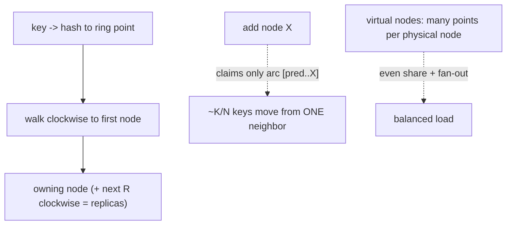

## Thesis

Distributing keys across a changing set of nodes so that adding or removing one node remaps only a small fraction of keys (about K/N) instead of nearly all of them --- by mapping both keys and nodes onto a hash ring and assigning each key to the next node clockwise, with virtual nodes to keep the distribution even --- because naive modulo hashing reshuffles almost everything whenever the node count changes, which is catastrophic for caches and sharded stores.

## Sub

**Why not modulo: it rehashes everything** -> **the hash ring: keys and nodes on a circle** -> **virtual nodes for even load** -> **zoom out** to where it's used (caches, sharded DBs), bounded load, and the pivots an interviewer rides from "shard by hashing" into modulo-vs-consistent, the ring mechanics, and why virtual nodes.

## Spine

- Naive **modulo hashing** (`hash(key) % N`) breaks when N changes --- adding or removing one node changes the modulus, so *almost every* key maps to a different node, forcing a near-total reshuffle (every cache entry misses, every shard rebalances).
- Consistent hashing puts **keys and nodes on a ring** --- hash both into the same space, and each key belongs to the first node clockwise from it, so adding or removing a node only affects the keys *between it and its neighbor* --- about K/N keys move, not all of them.
- **Virtual nodes** fix uneven distribution --- one hash point per node clumps unevenly and dumps a whole range onto a node's successor when it leaves; giving each physical node many points on the ring smooths the load and spreads a departing node's keys across many others.
- Its value is **stability under change** --- caches keep their hits, sharded stores rebalance only a fraction of data, and the system scales elastically, which is why it underpins distributed caches, Dynamo-style databases, and hash-based load balancers.

## Companion Notes

### walk

Distributing keys that survive node changes

One keyspace spread across nodes that come and go --- why modulo reshuffles everything, how the ring assigns each key to its clockwise node, why adding or removing a node moves only a fraction of keys, and how virtual nodes keep the load even.

Say the failure of modulo first --- "hash mod N remaps almost every key when N changes." The whole technique exists to make a node change move K/N keys instead of nearly all K.

### drill

Probe Drill

Graded follow-ups on the ring, virtual nodes, key movement, and where it's used --- the ones that separate "hash the key to pick a shard" from a partitioning scheme that survives elastic scaling.

Name the property: adding or removing a node remaps only about K/N keys, not all of them -- that stability under change is the entire point, and virtual nodes are what make the split even.

## Drill

SDE2 | the model and the mechanics
SDE3 | virtual nodes, movement, and lookup
Staff | bounded load, alternatives, resharding

### SDE2 | what consistent hashing is

What is consistent hashing and what problem does it solve?

A way to map keys to nodes such that when the set of nodes changes, only a small fraction of keys have to move. The problem it solves: in any system that shards data (or a cache) across N nodes, you need a rule for "which node owns this key" --- and if that rule is sensitive to N, then adding or removing a node reshuffles almost everything, causing a storm of cache misses or data movement. Consistent hashing makes the mapping *stable*: a node joining or leaving disturbs only its immediate neighborhood on a hash ring, so roughly K/N keys move instead of nearly all K.

### SDE2 | why modulo hashing is bad

Why not just use `hash(key) % N` to pick a node?

Because the moment N changes, the modulus changes, and almost every key maps to a *different* node. With N=4, key hash 10 goes to node 2 (10 % 4); add a node (N=5) and 10 % 5 = 0 --- a different node. This happens to the overwhelming majority of keys, so scaling from 4 to 5 nodes doesn't move 1/5 of the keys --- it moves *most* of them. For a cache that means a near-total miss storm (every relocated key is now on a node that doesn't have it); for a sharded database it means moving nearly all the data. Modulo hashing distributes evenly, but it's catastrophically unstable under any change in N.

### SDE2 | the hash ring

What is the hash ring?

A conceptual circle representing the entire hash output space (say 0 to 2^32-1), wrapped around so the end connects back to the start. You hash each **node** to a point on this ring, and you hash each **key** to a point too --- both live in the same space. Ownership is defined by position: a key is owned by the first node you encounter going clockwise from the key's point. So the ring partitions the keyspace into arcs, each arc owned by the node at its clockwise end. The circular structure is what localizes the effect of change --- a node only owns the arc immediately counter-clockwise of it.

### SDE2 | how a key maps to a node

How do you find which node owns a key?

Hash the key to a point on the ring, then walk **clockwise** until you hit the first node's point --- that node owns the key. Concretely, with the nodes' ring positions kept sorted, you binary-search for the smallest node position greater than the key's hash (wrapping around to the first node if the key is past the last one). So lookup is a hash plus a binary search over the (few) node positions --- fast and stateless. Every key deterministically resolves to exactly one node by this "next node clockwise" rule.

### SDE2 | adding a node

What happens when you add a node?

The new node hashes to some point on the ring and takes over the arc immediately counter-clockwise of it --- i.e. the keys that fall between the new node's position and the *previous* node's position, which used to belong to the *next* node clockwise. Only those keys move (from that one successor node to the new node); every other key stays exactly where it was. So adding a node to an N-node ring relocates roughly 1/(N+1) of the keys, all from a single neighbor, rather than reshuffling everything. That localized, minimal movement is the whole benefit.

### SDE2 | removing a node

What happens when a node is removed or fails?

Its arc is inherited by the next node clockwise --- the keys the departing node owned now walk one step further around the ring to its successor. Every other key is unaffected. So removing a node moves only *that node's* keys (about K/N of them) onto one neighbor, not a global reshuffle. (With plain single-point nodes, that dumps the whole departing node's load onto one successor, which is uneven --- the reason for virtual nodes.) The symmetry with adding is clean: a node's keys are the arc it owns, and adding/removing only ever transfers that one arc.

### SDE2 | where it's used

Where is consistent hashing actually used?

Anywhere you shard data or requests across a changing pool of nodes and can't afford a full reshuffle on every change. **Distributed caches** (memcached client-side sharding) --- so adding a cache node doesn't invalidate the whole cache. **Dynamo-style databases** (DynamoDB, Cassandra, Riak) --- the ring *is* how they partition data across nodes. **Load balancers** with cache affinity --- route a key consistently to the same backend to maximize its cache hit rate. **Sharded systems** generally, and **CDNs**. The common thread is a dynamic node set where stability of the key-to-node mapping under scaling is essential.

### SDE3 | virtual nodes

What are virtual nodes and why do you need them?

Instead of hashing each physical node to *one* point on the ring, you hash it to *many* (say 100-200), so each physical node is represented by many small arcs scattered around the ring rather than one big arc. Two problems this fixes: **even distribution** --- with one point per node, the random placement gives some nodes much larger arcs than others (lumpy load); many points per node average out, so each node's *total* share is close to 1/N. And **even rebalancing** --- when a node leaves, its many small arcs are inherited by many *different* successors, spreading its load across the cluster instead of dumping it all on one neighbor. Virtual nodes are what make consistent hashing actually balanced in practice.

### SDE3 | uneven distribution without vnodes

How bad is the imbalance without virtual nodes?

Significant --- with a handful of nodes each placed at one random ring position, arc sizes vary widely (some nodes randomly land close together, leaving a huge arc for whoever's clockwise), so one node can own several times the keys of another. And it gets *worse* on failure: when a node dies, its entire arc goes to a single successor, potentially doubling that node's load and cascading. So single-point consistent hashing solves the *stability* problem but not the *balance* problem. Virtual nodes address balance directly: with 100+ points per node, the law of large numbers makes per-node load tightly concentrated around the average, and a departing node's load fans out.

### SDE3 | how many keys move

Exactly how many keys move when the node set changes?

On average about **K/N** --- when you add the (N+1)th node it claims roughly 1/(N+1) of the keyspace; when you remove one of N nodes, its ~1/N share moves to successors. This is the headline guarantee: the fraction of keys disturbed by a single node change is inversely proportional to the number of nodes, so at scale a node change is a tiny perturbation (10 nodes: ~10% moves; 100 nodes: ~1%). Contrast modulo, where a node change moves ~(N-1)/N of the keys (nearly all). With virtual nodes the *same* K/N total moves, but it's spread across many source/destination pairs rather than concentrated.

### SDE3 | replication on the ring

How does replication work with consistent hashing?

A key is stored not just on its owning node but on the next **R** nodes clockwise around the ring (its "preference list"). So for replication factor 3, a key lives on the first node clockwise plus the two after it --- giving R copies for durability and availability, all determined by ring position. This is exactly how Dynamo-style systems place replicas: walk clockwise from the key, take the next R distinct physical nodes. Virtual nodes matter here too --- you skip virtual points that map to a physical node already holding a replica, so the R copies land on R *distinct* machines (and ideally distinct racks/AZs). The ring thus defines both ownership and replica placement in one scheme.

### SDE3 | hot keys

Does consistent hashing solve hot spots?

No --- it distributes *keys* evenly across nodes, but a single **hot key** still hashes to one node, which then bears all that key's traffic regardless of how balanced the ring is. Consistent hashing addresses *key-count* balance and *stability*, not *access* skew. Hot keys need different tools: **replicate** the hot key across multiple nodes and read from any (spreading read load), **split** the key (e.g. append a random suffix to shard a hot counter across nodes), or add a **caching layer** in front. So it's important to be clear about what the ring does and doesn't do: it evens out where keys *live*, not how often each key is *accessed* --- a hot key is orthogonal to the partitioning scheme.

### SDE3 | weighted nodes

How do you handle nodes of different capacities?

By giving more powerful nodes **more virtual nodes** (more ring points), so they own a proportionally larger share of the keyspace. A node with twice the capacity gets twice the virtual points, hence roughly twice the keys and traffic. This is the natural way to do weighted/heterogeneous distribution with consistent hashing --- weight maps directly to vnode count. It's the same mechanism that makes the distribution even in the first place (vnodes), just tuned per node, and it lets you run a mixed-capacity cluster without any of the nodes being over- or under-loaded relative to its size.

### SDE3 | the lookup mechanism

How is the ring stored and looked up efficiently?

As a sorted structure of ring positions (the virtual node points) mapping each position to its physical node. Lookup for a key is: hash the key, then **binary search** the sorted positions for the first one greater than the key's hash (wrapping to the first position if none) --- O(log V) where V is the total number of virtual points. Node changes update this structure (insert/remove that node's virtual points) but are infrequent relative to lookups. So the data structure is a sorted array or a balanced tree of ring points, lookups are a hash plus a binary search, and it's compact (V points, not K keys) --- the ring stores node placement, never the keys themselves.

### Staff | bounded-load consistent hashing

Even with virtual nodes, load can be uneven --- what's the fix?

Virtual nodes make load *statistically* even, but random hashing still leaves variance, and a popular key or an unlucky arc can overload a node. **Consistent hashing with bounded loads** adds a cap: each node may hold at most (1 + epsilon) times the average load, and if a key's natural owner is already at capacity, the key overflows to the next node clockwise that has room. This guarantees no node exceeds the bound while keeping the movement-minimizing property (overflow is local and reverts as load changes). It's the technique Google described for load balancing --- combining consistent hashing's stability with a hard load ceiling, so you get both minimal remapping *and* a firm balance guarantee rather than just statistical evenness.

### Staff | consistent hashing in Dynamo/Cassandra

How do Dynamo-style databases use the ring?

The ring *is* the partitioning and placement scheme. Each node owns ranges of the token (hash) space --- with virtual nodes, many small ranges scattered around the ring. A row's partition key is hashed to a token, which determines its position on the ring; the row is stored on the node owning that range and replicated to the next R nodes clockwise (the preference list), skipping to distinct physical nodes/racks. Adding a node reassigns a fraction of ranges to it (streaming only that data); removing one hands its ranges to successors. This is why these databases scale horizontally so cleanly --- growing the cluster moves only a proportional slice of data, and the ring simultaneously encodes ownership, replication, and rebalancing. Consistent hashing isn't a helper in Dynamo/Cassandra; it's the architectural core.

### Staff | rendezvous hashing

What is rendezvous hashing, and how does it compare?

**Rendezvous hashing** (highest random weight, HRW): for a given key, compute a hash of (key, node) for *every* node and pick the node with the highest score. The key naturally goes to its highest-scoring node, and if that node leaves, the key simply moves to its *next*-highest-scoring node --- only that key's assignments change, giving the same minimal-movement property as the ring without needing virtual nodes for balance (the scoring distributes evenly on its own). The trade: lookup is O(N) (score all nodes) versus the ring's O(log V), so rendezvous is great when N is small or you want simpler even distribution and per-key preference ordering, while the ring wins when N is large (binary search beats scoring every node). Both achieve stability under change; they differ in lookup cost and balancing approach.

### Staff | jump consistent hash

When would you use jump consistent hash instead of a ring?

**Jump consistent hash** is a clever algorithm that maps a key to one of N buckets using no memory and no stored ring --- just arithmetic that, as N grows, moves only the minimal fraction of keys (a key jumps to a new bucket only when it "should"). It's extremely fast and memory-free, and it minimizes movement optimally. Its limitation: it assumes buckets numbered 0..N-1 and only supports adding/removing the *last* bucket cleanly --- it has no notion of arbitrary node identities or removing a node in the middle, so it doesn't handle heterogeneous nodes or targeted removal well. So you use jump hash when the node set is a simple numbered range that grows/shrinks at the end (like a fixed set of shards you scale up), and the ring (or rendezvous) when nodes have identities, come and go arbitrarily, and need weighting.

### Staff | resharding operations

What does actually rebalancing data look like operationally?

Consistent hashing decides *which* keys move; you still have to *move* them safely. When a node joins, it needs to receive its arcs' data from the current owners --- a streaming/bootstrap process --- and during that window reads/writes for those keys must be handled correctly (serve from the old owner until the new one is caught up, or dual-write). You throttle the transfer so rebalancing doesn't overwhelm the cluster, verify integrity (e.g. Merkle trees to confirm the new node has the right data), and only then flip ownership. Removing a node similarly streams its data to successors before it's fully decommissioned. So the ring makes the *scope* minimal (K/N), but production resharding is a careful data-movement protocol with consistency handling during the transition --- the math is the easy part; the safe migration is the engineering.

### Staff | consistent hashing for load balancing

How is consistent hashing used in load balancing, and what's the pitfall?

For **affinity**: hash the request key (a session id, a cache key) to route it consistently to the same backend, maximizing that backend's cache hit rate (or session locality) --- and because it's consistent, adding/removing a backend only re-routes a fraction of keys, preserving most affinity. The pitfall is load imbalance: pure consistent hashing routes by key, ignoring actual backend load, so a few hot keys or an uneven key distribution can overload a backend while others idle. The fix is **bounded-load consistent hashing** (cap each backend and overflow to the next), which is exactly why Google introduced it for their load balancing --- you want the cache affinity of consistent hashing *and* a guarantee that no backend is overwhelmed, which naive consistent-hash routing doesn't provide.

### Staff | when consistent hashing is overkill

When is consistent hashing unnecessary?

When the node set is **fixed** and never changes, plain modulo hashing is simpler and perfectly even --- there's no rebalancing to minimize, so the ring's whole benefit is moot. When you have a **coordination service** already managing shard assignments (a directory/lookup table mapping key ranges to nodes, like some systems use), that explicit mapping can be more flexible (arbitrary placement, easy targeted moves) than a hash ring, at the cost of a lookup dependency. And for small, stable deployments the added complexity (virtual nodes, ring management) isn't worth it. So consistent hashing earns its place specifically when the node set is *dynamic* and you need to minimize movement on change *without* a central directory --- for a static cluster or one with an explicit shard map, simpler schemes win.

## Walk

### Modulo hashing reshuffles almost everything

```flow
m[hash(key) % N] -> add[add a node: N changes] -> re[almost every key maps elsewhere -> reshuffle]
```

The obvious way to assign keys to N nodes is `hash(key) % N`. It distributes evenly --- but it's catastrophically unstable: the moment N changes (a node added or removed), the modulus changes, so almost every key computes to a *different* node.

Scaling from 4 nodes to 5 doesn't move 1/5 of the keys; it moves *most* of them. For a distributed cache that's a near-total miss storm (every relocated key is now on a node that doesn't hold it); for a sharded database it's moving nearly all the data. The eval-evenly-but-shatter-on-change behavior is exactly what makes naive modulo unusable for a dynamic node set.

### Put keys and nodes on a ring

```flow
r[hash keys AND nodes onto a ring] -> cw[key -> first node clockwise] -> own[each node owns its counter-clockwise arc]
```

Consistent hashing maps the whole hash space onto a circle, and hashes *both* nodes and keys onto it. A key is owned by the first node encountered going clockwise from the key's point --- so the ring is partitioned into arcs, each owned by the node at its clockwise end.

Lookup is a hash plus a binary search over the (few, sorted) node positions: find the smallest node position greater than the key's hash, wrapping to the first node past the top. The circular structure is the trick --- because ownership is "next node clockwise," a change to one node only affects the arc right next to it, not the whole space.

### Adding or removing a node moves only K/N keys

```flow
a[add node X] -> seg[X takes only the arc between it and its predecessor] -> only[~K/N keys move, from one neighbor]
```

When a node joins, it lands at a ring position and takes over just the arc immediately counter-clockwise of it --- the keys between it and the previous node, which used to belong to the next node clockwise. Everything else stays put. When a node leaves, its arc is inherited by its clockwise successor. Either way, only that one arc's keys move --- about **K/N** of them.

That's the headline: a node change perturbs 1/N of the keyspace, not (N-1)/N. At 100 nodes, adding or removing one moves ~1% of keys. A cache keeps 99% of its hits through a scaling event; a sharded store streams a small slice of data. Stability under change is the entire value.

### Virtual nodes even out the load

```flow
one[one point per node -> lumpy arcs + dumps on one successor] -> many[many vnodes per node -> smooth load + fan-out]
```

Single-point placement solves stability but not *balance* --- random positions give some nodes far larger arcs than others, and a departing node dumps its whole arc onto one successor. Virtual nodes fix both: each physical node gets many ring points, so its total share averages to ~1/N, and its keys fan out to many successors on failure.

```python
import bisect, hashlib

class HashRing:
    def __init__(self, nodes, vnodes=150):
        self.ring = {}                      # ring position -> physical node
        for node in nodes:
            for v in range(vnodes):         # many points per node
                pos = self._hash(f"{node}#{v}")
                self.ring[pos] = node
        self.sorted = sorted(self.ring)     # sorted positions for lookup

    def _hash(self, key):
        return int(hashlib.md5(key.encode()).hexdigest(), 16)

    def get_node(self, key):
        h = self._hash(key)
        i = bisect.bisect(self.sorted, h)   # first position clockwise
        if i == len(self.sorted): i = 0     # wrap around the ring
        return self.ring[self.sorted[i]]
```

The ring stores node *placement* (V points), never the keys themselves; a lookup is a hash plus an O(log V) binary search. Weighted nodes get more vnodes (proportional share); replicas are the next R distinct physical nodes clockwise. Zooming out: consistent hashing gives a key-to-node mapping that's stable under an elastic node set, which is why it's the partitioning core of Dynamo-style databases, distributed caches, and affinity-based load balancers --- just remember it evens out where keys *live*, not how often each is *accessed* (hot keys are a separate problem).

### Model Script

- Frame the modulo failure | "The problem is: how do you assign keys to N nodes so that scaling the cluster doesn't reshuffle everything? Naive hash mod N distributes evenly, but it's catastrophically unstable -- change N and the modulus changes, so almost every key maps to a different node. Going from 4 to 5 nodes moves most of the keys, not a fifth. For a cache that's a total miss storm; for a sharded database it's moving nearly all the data."
- The ring | "Consistent hashing fixes it by mapping the hash space onto a circle and hashing both nodes and keys onto it. A key is owned by the first node clockwise from it. Because ownership is 'next node clockwise,' adding or removing a node only affects the arc right next to it -- so only about K over N keys move, all from one neighbor, instead of nearly all of them. At a hundred nodes, a node change moves one percent of keys. Lookup is a hash plus a binary search over the sorted node positions."
- Virtual nodes | "Single-point placement solves stability but not balance -- random positions make some arcs much bigger than others, and a failing node dumps its whole arc onto one successor. So each physical node gets many virtual points -- a hundred or more -- scattered around the ring. Now each node's total share averages to one over N, and when a node leaves its many small arcs fan out to many different successors. Virtual nodes are what make it actually balanced, and weighting is just giving a bigger node more virtual points."
- Where it lives and its limit | "This is the partitioning core of Dynamo-style databases -- DynamoDB, Cassandra: a partition key hashes to a token on the ring, the owning node stores it, and it's replicated to the next R distinct nodes clockwise. Growing the cluster streams only a proportional slice of data. It's also used in distributed caches and affinity load balancing. The key limit to state: consistent hashing evens out where keys live, not how often each is accessed -- a single hot key still lands on one node, so hot spots need replication or key-splitting, not the ring."
- Interviewer: "You're using consistent-hash routing to a cache tier and one node is getting hammered. Why, and what do you do?"
- Bounded load | "Two possibilities. If it's a hot key -- one key with disproportionate traffic -- the ring can't help; I'd replicate or split that key. If it's load imbalance from the hashing variance, that's the known weakness: pure consistent hashing routes by key, ignoring actual load. The fix is consistent hashing with bounded loads -- cap each node at, say, 1.25 times the average, and when a key's natural owner is at capacity, overflow it to the next node clockwise with room. That keeps the minimal-movement property but adds a hard balance guarantee, which is exactly why Google introduced it for load balancing."
- Land it | "So: modulo shatters on any node change, so consistent hashing puts keys and nodes on a ring where a key goes to its clockwise node, making a node change move only K over N keys; virtual nodes give even load and fan-out; the ring encodes ownership and replication in Dynamo-style stores; and bounded-load variants add a firm balance guarantee. The one line is that consistent hashing buys stability of the key-to-node mapping under an elastic node set -- minimal remapping on scaling -- which is why it underpins distributed caches and sharded databases."

## Whiteboard

Sketch the ring and show that a node change only touches one arc.

### Why does a node change move only K/N keys?

Because ownership is "first node clockwise," so a joining node claims only the arc between it and its predecessor, and a leaving node hands only its own arc to its successor -- everything else is untouched.

### What do virtual nodes fix?

Balance: one point per node gives lumpy arcs and dumps a failed node's whole load on one successor; many points per node even out each node's share and fan a departing node's keys across many successors.



Verdict: keys and nodes share a ring, each key goes to its clockwise node, so a node change moves only its one arc (~K/N keys); virtual nodes make the per-node share even and spread a departing node's load across many successors.

## System

Zoom out to where the ring sits in a sharded system.

### Where it sits

Key: hashed to a point on the ring [*]
The ring: nodes (as many virtual points) placed on a circle -- stores placement, not keys
Ownership: first node clockwise from the key owns it
Replication: the next R distinct physical nodes clockwise (preference list)
Rebalancing: a node change streams only its ~K/N arc of data

### Pivots an interviewer rides

From "hash to a shard" they push on modulo, virtual nodes, and hot keys.

#### Why not hash(key) % N?

-> it remaps ~(N-1)/N of keys on any node change; consistent hashing moves only ~K/N
Modulo distributes evenly but shatters on a node change (a total cache-miss storm / full data reshuffle); the ring localizes the change to one arc.

#### Does consistent hashing fix hot spots?

-> no -- it evens where keys live, not access frequency; a hot key still lands on one node
Hot keys need replication, key-splitting, or a cache layer; and load variance across nodes needs bounded-load consistent hashing (cap + overflow), not the plain ring.

## Trade-offs

The calls that separate "hash to a shard" from an elastic partitioning scheme.

### Modulo vs consistent hashing

- Modulo (hash % N): dead simple, perfectly even -- but a node change remaps nearly all keys (a full reshuffle)
- Consistent hashing: a node change moves only ~K/N keys, scales elastically -- but more complex (ring + virtual nodes)

Use modulo only for a fixed node set; use consistent hashing whenever the node set is dynamic and a full reshuffle on change is unacceptable.

### Consistent hashing (ring) vs rendezvous hashing

- Ring: O(log V) lookup via binary search, scales to large N -- but needs virtual nodes for even balance
- Rendezvous (HRW): even distribution and per-key preference ordering without vnodes -- but O(N) lookup (score every node)

Use the ring for large node counts (binary-search lookup); rendezvous for smaller N or when you want simple even distribution and per-key ordering.

### Plain vs bounded-load consistent hashing

- Plain: minimal movement, simple -- but only statistically even, so variance and hot keys can overload a node
- Bounded-load: a hard cap per node (overflow to the next) plus minimal movement -- but more complex, and overflow slightly weakens locality

Use bounded-load when you need a firm no-overload guarantee (load balancing); plain consistent hashing when statistical evenness with virtual nodes is sufficient.

## Model Answers

### the reframe | Stable mapping under change

The frame to lead with.

- Modulo shatters on a node change | key | remaps ~(N-1)/N of keys
- Ring: key -> first node clockwise | store | a node change moves only ~K/N keys
- Stability under an elastic node set | note | keeps cache hits, streams a slice

### the depth | Virtual nodes and limits

Where it's really tested.

- Virtual nodes = even load + fan-out | key | many points per physical node
- The ring encodes replication too | store | next R distinct nodes clockwise
- Doesn't fix hot keys | note | evens where keys live, not access frequency

## Numbers

Back-of-envelope how few keys move, versus modulo, and what virtual nodes buy.

Consistent hashing moves ~K/N keys on a node change (versus ~all with modulo); virtual nodes keep each node's share near 1/N.

- nodes | Nodes (N) | 10 | 1 | 1
- keys | Keys (K) | 1000000 | 0 | 1000
- vnodes | Vnodes per node | 150 | 1 | 10

```js
function (vals, fmt) {
  var N = vals.nodes, K = vals.keys, V = vals.vnodes;
  var moved = Math.round(K / N);
  var moduloMoved = Math.round(K * (N - 1) / N);
  var pct = Math.round(100 / N);
  return [
    { k: 'Keys moved (add/remove 1)', v: '~' + fmt.n(moved), u: 'of ' + fmt.n(K), n: 'consistent hashing moves only about K/N keys when a node joins or leaves (~' + pct + '% here), all from one neighbor \u2014 versus modulo, which remaps nearly all of them', over: false },
    { k: 'Modulo would move', v: '~' + fmt.n(moduloMoved), u: 'of ' + fmt.n(K), n: 'hash % N changes the modulus when N changes, so almost every key maps to a different node \u2014 a near-total reshuffle (every cache entry misses)', over: true },
    { k: 'Ring points', v: fmt.n(N * V), u: 'virtual nodes', n: N + ' physical nodes x ' + V + ' vnodes each \u2014 more points smooth the distribution and fan a departing node keys across many successors', over: false },
    { k: 'Per-node share', v: '~' + fmt.n(pct), u: '% of keyspace', n: 'each node owns roughly 1/N of the ring; virtual nodes are what keep the actual split close to even rather than lumpy', over: false },
    { k: 'Does NOT fix', v: 'hot keys', u: '', n: 'consistent hashing spreads keys evenly, but a single hot key still lands on one node \u2014 hot spots need replication or key-splitting, not the ring', over: false }
  ];
}
```

## Red Flags

What makes an interviewer wince.

### "We shard with hash(key) % N across the cache nodes"

The moment you add or remove a cache node, N changes and almost every key remaps to a different node -- a near-total cache-miss storm, not a 1/N adjustment.

Use consistent hashing so a node change moves only ~K/N keys, preserving most of the cache; modulo is only safe for a fixed, never-changing node set.

### "We use consistent hashing, so load is perfectly balanced"

Plain consistent hashing is only *statistically* even (and worse with few nodes), and it does nothing for hot keys -- a popular key or hashing variance can overload one node.

Use virtual nodes for even distribution, bounded-load consistent hashing for a firm per-node cap, and replicate/split hot keys separately -- the ring evens where keys live, not access frequency.

### "When a node dies, its keys just go to the next node"

With single-point nodes that dumps the *entire* departing node's load onto one successor, potentially overloading it and cascading.

Use virtual nodes so a failed node's many small arcs fan out to many different successors, spreading its load across the cluster instead of onto one neighbor.

## Opener

### 30s | The one-liner

How I open when asked to shard data or a cache across nodes.

#### What is the shape?

Map keys and nodes onto a hash ring, assign each key to the next node clockwise, and use virtual nodes for balance -- so adding or removing a node moves only ~K/N keys instead of the near-total reshuffle modulo causes.

#### What's the key limit?

It evens out where keys *live*, not how often each is *accessed* -- a hot key still lands on one node, and load variance needs bounded-load consistent hashing, not the plain ring.

##### Hooks

Where an interviewer usually pushes next.

- Why not modulo? | it reshuffles nearly everything on a node change | drill
- Why virtual nodes? | even load + fan-out on failure | drill
- Hot keys? | the ring doesn't fix them; replicate/split | drill

Foot: two sentences -- consistent hashing keeps the key-to-node mapping stable under an elastic node set, moving only K/N keys on a change, which is why it's the partitioning core of Dynamo-style stores and distributed caches -- and virtual nodes are what make it balanced.

## Bank

### SCALE | A distributed cache that must survive nodes scaling up and down

Task: reason about key movement and balance under a changing node set.
Model: modulo would remap nearly all keys on any node change (a miss storm), so use consistent hashing where a node change moves only ~K/N keys (from one neighbor), preserving most cache hits; virtual nodes (100+ per physical node) keep each node's share near 1/N and fan a departing node's load across many successors; and remember the ring doesn't fix hot keys or load variance, which need replication/splitting and bounded-load consistent hashing.
Int: what's the single biggest reason not to use modulo here?
A node change remaps nearly all keys -- a near-total cache-miss storm -- versus ~K/N with consistent hashing.

### DESIGN | Partitioning for a Dynamo-style key-value store

Task: design how keys map to nodes and replicas.
Model: a hash ring where each physical node holds many virtual points (even load, fan-out); a partition key hashes to a token, the owning node is the first clockwise, and replicas are the next R *distinct* physical nodes clockwise (skipping vnodes on the same machine, ideally distinct racks/AZs); adding a node streams only its ~K/N arcs; weighting via more vnodes for bigger nodes; and bounded-load or hot-key handling for access skew.
Int: how does the ring give you replication for free?
Replicas are just the next R distinct nodes clockwise from the key -- the same ring position that defines ownership also defines the preference list.

### Extra Curveballs

### CURVEBALL | imbalance | You use consistent hashing with virtual nodes, but one node still runs much hotter than the rest. What are the possible causes and fixes?

Model: two distinct causes. (1) A hot key -- one key with disproportionate access -- which the ring cannot balance because that key deterministically lands on one node; fix by replicating the hot key across nodes and reading from any, splitting it (e.g. suffixing a counter key to shard it), or fronting it with a cache. (2) Load variance -- even with vnodes, random hashing leaves statistical imbalance, and routing ignores actual load; fix with bounded-load consistent hashing, capping each node at (1+epsilon) times the average and overflowing an over-capacity node's keys to the next node clockwise with room, which keeps minimal movement but adds a firm balance guarantee. The key diagnostic is distinguishing access skew (a hot key -- orthogonal to partitioning) from distribution variance (which bounded loads fix).

### Frames

- Modulo shatters on a node change; consistent hashing (ring, key -> clockwise node) moves only ~K/N keys
- Virtual nodes give even load and fan-out; the ring also encodes replication (next R distinct nodes)
- It evens where keys live, not access -- hot keys and load variance need replication/splitting and bounded loads
