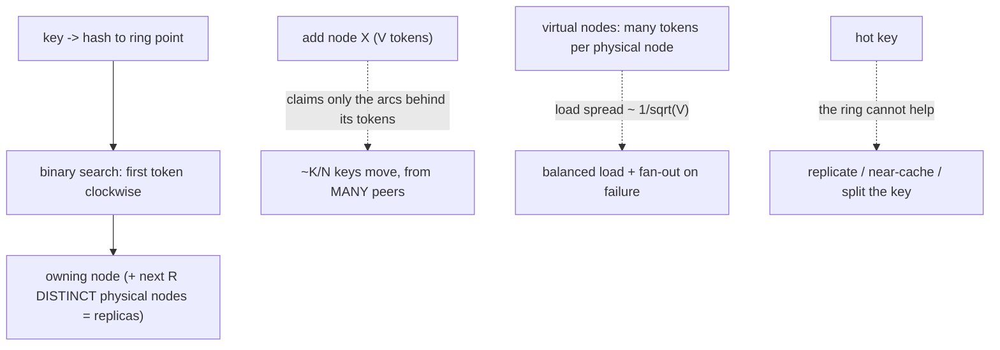

## Thesis

Distributing keys across a changing set of nodes so that adding or removing one node remaps only a small fraction of keys (about K/N) instead of nearly all of them --- by mapping both keys and nodes onto a hash ring and assigning each key to the next node clockwise, with virtual nodes to keep the distribution even --- because naive modulo hashing reshuffles almost everything whenever the node count changes, which is catastrophic for caches and sharded stores.

## Sub

**Why not modulo: it rehashes everything** -> **the hash ring: keys and nodes on a circle** -> **virtual nodes for even load** -> **zoom out** to where it's used (caches, sharded DBs), bounded load, and the pivots an interviewer rides from "shard by hashing" into modulo-vs-consistent, the ring mechanics, and why virtual nodes.

## Spine

- Naive **modulo hashing** (`hash(key) % N`) breaks when N changes --- adding or removing one node changes the modulus, so *almost every* key maps to a different node, forcing a near-total reshuffle (every cache entry misses, every shard rebalances).
- Consistent hashing puts **keys and nodes on a ring** --- hash both into the same space, and each key belongs to the first node clockwise from it, so adding or removing a node only affects the keys *between it and its neighbor* --- about K/N keys move, not all of them.
- **Virtual nodes** fix uneven distribution --- one hash point per node clumps unevenly and dumps a whole range onto a node's successor when it leaves; giving each physical node many points on the ring smooths the load and spreads a departing node's keys across many others.
- Its value is **stability under change** --- caches keep their hits, sharded stores rebalance only a fraction of data, and the system scales elastically, which is why it underpins distributed caches, Dynamo-style databases, and hash-based load balancers.

## Companion Notes

### walk

Distributing keys that survive node changes

One keyspace spread across nodes that come and go --- why modulo reshuffles everything, how the ring assigns each key to its clockwise node, why adding or removing a node moves only a fraction of keys, and how virtual nodes keep the load even.

Say the failure of modulo first --- "hash mod N remaps almost every key when N changes." The whole technique exists to make a node change move K/N keys instead of nearly all K.

### drill

Probe Drill

Graded follow-ups on the ring, virtual nodes, key movement, and where it's used --- the ones that separate "hash the key to pick a shard" from a partitioning scheme that survives elastic scaling.

Name the property: adding or removing a node remaps only about K/N keys, not all of them -- that stability under change is the entire point, and virtual nodes are what make the split even.

### wb

Whiteboard

Rebuild the ring from memory --- what sits on it, how a key finds its node, why a node change touches only one arc, and where replication and rebalancing come from.

Draw the circle and put the NODES on it first, not the keys. The ring stores node placement; the keys are never on it. Get that right and every other answer follows.

### sys

System Map

Zoom out: the ring sits between a key and the node that owns it --- a computed routing decision, with membership on one side and data movement on the other.

Lead with what the ring replaces: a directory. Ownership is COMPUTED from the key, not looked up --- that is the whole selling point, and the reason to skip the ring when you already have a coordinator.

### trade

Trade-offs

The calls they drill --- modulo vs the ring, ring vs rendezvous, plain vs bounded load, and the big one: a hash ring vs a fixed set of partitions with an explicit map.

Never defend the ring as universally right. Most modern systems (Redis Cluster, Kafka, Elasticsearch, Couchbase) do NOT use a ring --- they use fixed partitions plus a map, and knowing why is the senior signal.

### model

Model Answers

Full spoken scripts --- the beats in order, the way you would actually say them under time pressure.

Steal the frame, not the words: name the failure (modulo shatters), name the fix (the ring, K/N), name the limit (it evens where keys live, not how often they are accessed).

### num

Numbers

Back-of-envelope the keys that move, the data that streams, and the one number that sizes your virtual nodes.

Lead with the movement fraction, then the number nobody else has: a node's load spread is about one over the square root of the vnode count. That is how you defend "why 150?"

### rf

Red Flags

What sinks the round --- modulo across a cache tier, "consistent hashing means balanced," naive replica walks, and hashing a stateless service.

Name what the interviewer hears. "Would cause a total cache-miss storm on any node change" is the fastest no-hire in this topic.

### open

30-Second

The opener and the close --- matched to the altitude the question is asked at.

Open on stability under change, not on the circle. The ring is the mechanism; "a node change moves K/N keys instead of nearly all of them" is the point.

## Drill

all | **All four levels, mixed** --- the way a real loop actually comes at you.
SDE2 | **The model and the mechanics** --- why modulo shatters, what the ring is, how a key finds its node, what moves on a join or a leave. The bar is "this is a partitioning scheme, not a hash function": name the property (a node change moves ~K/N keys) and the mechanism that delivers it.
SDE3 | **Virtual nodes, movement, and lookup** --- balance, replication on the ring, hot keys, weighting, and how the lookup is actually implemented. The bar is "it depends, here's the switch": name the number (vnode count sets the load spread) and the failure each choice bounds.
Staff | **Bounded load, alternatives, resharding** --- capping load, Dynamo/Cassandra reality, rendezvous vs jump vs Maglev, and when a fixed-slot map beats the ring entirely. The bar is "I know what this does NOT solve": name the operational cost of a rebalance and the design that quietly replaced the ring in most modern systems.

### SDE2 | what consistent hashing is

What is consistent hashing and what problem does it solve?

A way to map keys to nodes such that when the set of nodes changes, only a small fraction of keys have to move. The problem it solves: in any system that shards data (or a cache) across N nodes, you need a rule for "which node owns this key" --- and if that rule is sensitive to N, then adding or removing a node reshuffles almost everything, causing a storm of cache misses or data movement. Consistent hashing makes the mapping *stable*: a node joining or leaving disturbs only its immediate neighborhood on a hash ring, so roughly K/N keys move instead of nearly all K.

Follow: You said "only a small fraction." Give me the actual number, for both schemes.
Consistent hashing: adding the (N+1)th node moves about **K/(N+1)** keys --- by symmetry, the new node's tokens land uniformly in the same space as everyone else's, so it ends up owning ~1/(N+1) of the ring, and the keys it owns are exactly the keys that moved. Removing one of N moves its ~1/N share. At 100 nodes that is ~1% of keys per node change. Modulo is the inverse: a key keeps its node only if `h % N == h % (N+1)`, which is true for about 1/(N+1) of keys --- so ~**N/(N+1)** of them move, roughly 80% going from 4 nodes to 5, and ~99% at 100 nodes. So the comparison is "1% moves" versus "99% moves," not a marginal improvement.
Follow: Is minimal movement the only property you need? What does consistent hashing NOT give you?
It gives **stability**, and that is all it gives. It does not give you **balance** --- one token per node produces badly lumpy arcs, and you need virtual nodes to fix that. It does not give you **load-awareness** --- it distributes *keys*, not *traffic*, so a single hot key still lands on one node and the ring cannot help. And it does not give you **durability** --- ownership is not replication; you still need R copies, or losing a node loses its arc. Those three are separate mechanisms bolted on top: vnodes for balance, replication for durability, and bounded-load or key-splitting for skew. The classic mistake is assuming the ring bought you all four.

Senior: Naming the property (a node change moves ~K/N, not ~all) *and* immediately naming what it does not buy --- balance, load-awareness, durability --- is what separates someone who has run a ring from someone who has read about one.
Speak: Lead with the property, not the picture: **"it makes the key-to-node mapping stable under a changing node set --- a node join or leave moves about K over N keys instead of nearly all of them."** Then say what it is not: it evens out where keys *live*, not how often each is *accessed*, and it is not replication.

### SDE2 | why modulo hashing is bad

Why not just use `hash(key) % N` to pick a node?

Because the moment N changes, the modulus changes, and almost every key maps to a *different* node. With N=4, key hash 10 goes to node 2 (10 % 4); add a node (N=5) and 10 % 5 = 0 --- a different node. This happens to the overwhelming majority of keys, so scaling from 4 to 5 nodes doesn't move 1/5 of the keys --- it moves *most* of them. For a cache that means a near-total miss storm (every relocated key is now on a node that doesn't have it); for a sharded database it means moving nearly all the data. Modulo hashing distributes evenly, but it's catastrophically unstable under any change in N.

Follow: Kafka partitions by `murmur2(key) % numPartitions`. That is plain modulo. Is Kafka wrong?
No --- and the reason is the whole lesson. Modulo is unstable *when the divisor changes*, and Kafka's divisor is a topic's **partition count, which is deliberately fixed** and treated as near-immutable. The number of *brokers* changes constantly, but partitions are reassigned to brokers through an explicit **partition-to-broker map**, so the key-to-partition function never has to change. That is exactly why adding partitions to a topic is a semi-breaking operation in Kafka: it changes the divisor, so keys start landing in different partitions and per-key ordering is broken across the change --- which is why you over-provision partitions up front. The problem was never modulo; it was letting the divisor track a *live node count*. Decouple those two and modulo is fine.
Follow: So could I fix modulo by hashing into a fixed number of buckets and mapping buckets to nodes?
Yes --- and you have just re-derived the design that most modern systems actually use. Hash to a fixed, large number of **partitions** (Redis Cluster uses 16,384 hash slots, Couchbase 1,024 vBuckets, Elasticsearch a fixed primary-shard count), which never changes, then keep a small explicit **partition-to-node map** that you rebalance by moving whole partitions. You get stability (the hash function's divisor is frozen), *exact* balance (you assign slots evenly rather than praying to a random hash), and deliberate placement (you can move one hot partition). The price is that the map is now a real component that must be kept consistent, and you must choose the partition count up front. The ring's distinguishing feature is that it needs **no map at all** --- ownership is computed. That is the actual axis: computed ownership versus a small directory.

Senior: Recognizing that **modulo's sin is a divisor tied to the live node count**, not modulo itself --- and that freezing the divisor and adding a partition map is a legitimate (and more common) fix than the ring --- is a Staff-grade reframe of an SDE2 question.
Speak: Say the mechanism, then the fix: **"the modulus is the node count, so changing the node count changes where every key lands --- about N over N+1 of them move."** Then the pivot: it's not modulo that's broken, it's tying the divisor to a live node count --- Kafka and Redis hash by modulo into a *fixed* partition count and move partitions instead.

### SDE2 | the hash ring

What is the hash ring?

A conceptual circle representing the entire hash output space (say 0 to 2^32-1), wrapped around so the end connects back to the start. You hash each **node** to a point on this ring, and you hash each **key** to a point too --- both live in the same space. Ownership is defined by position: a key is owned by the first node you encounter going clockwise from the key's point. So the ring partitions the keyspace into arcs, each arc owned by the node at its clockwise end. The circular structure is what localizes the effect of change --- a node only owns the arc immediately counter-clockwise of it.

Follow: Does the hash function need to be cryptographic?
No. You need **uniformity and speed**, not collision resistance --- the job is to scatter keys evenly, and a fast non-cryptographic hash does that fine. Cassandra uses **Murmur3**; ketama (the memcached client) historically used MD5, and xxHash is a common modern choice. Cryptographic hashes are slower for no distributional benefit. There *is* one exception worth naming: if an **adversary can choose the keys** (user-supplied identifiers on a public endpoint), a fast public hash lets them craft keys that all land on one node --- a deliberate hot-spot denial of service. In that specific case you use a **keyed or randomized hash** (SipHash, or a per-deployment seed) so the attacker cannot precompute collisions. Absent adversarial keys, reach for the fast uniform hash.
Follow: The ring is 2^32 or 2^64 points. Does the size of the space matter?
Barely --- and confusing it with balance is a common error. The space only needs to be large enough that (a) two node tokens colliding is negligible, and (b) arcs are fine-grained relative to the number of tokens. With a few hundred nodes at a couple hundred tokens each you have tens of thousands of points in a space of four billion (2^32), which is ample; Cassandra uses the 64-bit Murmur3 range anyway. What actually determines balance is the **number of tokens per node**, not the size of the space --- a 2^128 ring with one token per node is just as lumpy as a 2^32 one. So the ring size is a non-issue; the vnode count is the knob.

Senior: Knowing the hash needs **uniformity, not cryptographic strength** --- and being able to name the one case that flips it (attacker-chosen keys, which need a keyed hash to stop a crafted hot-spot) --- is a security instinct most candidates never bring to a partitioning question.
Speak: Keep it concrete: **"the hash output space, wrapped into a circle --- I hash the nodes onto it and I hash the keys onto it, and a key belongs to the first node clockwise."** Then the two clarifications that show depth: the hash needs to be *uniform*, not cryptographic, and the ring's *size* is irrelevant to balance --- the vnode count is what evens it out.

### SDE2 | how a key maps to a node

How do you find which node owns a key?

Hash the key to a point on the ring, then walk **clockwise** until you hit the first node's point --- that node owns the key. Concretely, with the nodes' ring positions kept sorted, you binary-search for the smallest node position greater than the key's hash (wrapping around to the first node if the key is past the last one). So lookup is a hash plus a binary search over the (few) node positions --- fast and stateless. Every key deterministically resolves to exactly one node by this "next node clockwise" rule.

Follow: Who computes that --- the client or the server? And what breaks if two clients disagree about the ring?
Both models ship. **Client-side** (the memcached/ketama model): every client builds the ring from a config list and routes directly --- one network hop, no proxy, but every client must have the *same* list. **Server-side** (Dynamo/Cassandra): the client can hit any node, which coordinates on its behalf using a membership view propagated by **gossip**. The divergence question is the important one: if two clients hold different rings, the same key routes to different nodes. In a **cache** that is survivable --- it's a miss, you refill, mildly wasteful. In a **store** it is a correctness problem: two clients write the same key to two different nodes and you have split that key's history, with no single node aware of both writes. That asymmetry is why stateful systems route through gossiping nodes or gate ownership changes through consensus, and why a cache can get away with a config file.
Follow: The lookup is an O(log V) binary search. Is that ever the bottleneck?
Essentially never, and saying so is the point. With, say, 100 nodes at 150 vnodes you have 15,000 sorted 64-bit tokens --- about 14 comparisons on an array that fits in L2, so tens of nanoseconds, utterly dominated by the network hop that follows. The costs that *do* matter are elsewhere: keeping the sorted array **up to date** on a membership change, and keeping it **consistent across clients**. Because the structure is read-mostly, the right implementation is copy-on-write --- rebuild the sorted array on a membership change and swap the pointer atomically, so lookups never take a lock and always see a coherent ring. Optimizing the binary search is fake work; the ring's real engineering is membership propagation.

Senior: Distinguishing the **cache case (a divergent ring is a miss) from the store case (a divergent ring splits a key's history)** --- and therefore knowing why one can route from a config file and the other must gossip --- is the correctness instinct a senior round is checking for.
Speak: Say the mechanism in one breath: **"hash the key, binary-search the sorted token array for the first token clockwise, wrap if you fall off the end."** Then add the part people miss: the lookup is nanoseconds and never the problem --- the hard part is *who owns the ring* and what happens when two clients disagree about it.

### SDE2 | adding a node

What happens when you add a node?

The new node hashes to some point on the ring and takes over the arc immediately counter-clockwise of it --- i.e. the keys that fall between the new node's position and the *previous* node's position, which used to belong to the *next* node clockwise. Only those keys move (from that one successor node to the new node); every other key stays exactly where it was. So adding a node to an N-node ring relocates roughly 1/(N+1) of the keys, all from a single neighbor, rather than reshuffling everything. That localized, minimal movement is the whole benefit.

Follow: You said the keys come "from a single neighbor." With virtual nodes, is that still true?
No --- and this is the correction that shows you have actually implemented it. The *fraction* is unchanged (~1/(N+1)), but with V tokens per node the joining node inserts V points scattered all around the ring, so it takes a small slice from **many different existing nodes**, not one. That is a feature, not an accident: the bootstrap streams in **parallel from many peers**, each giving up a little, instead of hammering one poor successor for its entire arc. The single-neighbor picture is only true of the textbook one-token-per-node ring, which nobody runs. Same total data moved; the *source* load is spread.
Follow: During the copy, who serves reads for the keys that are in flight?
The current owner keeps serving until the new node is caught up --- you do not flip ownership until the transfer is complete and verified. Concretely, in Cassandra's bootstrap the joining node **starts receiving new writes for its future ranges immediately** while it streams the *historical* data behind them, and it does not become a read replica until streaming finishes. That ordering is what makes it safe: no write issued during the window is lost (the new node already has it), and no read is served by a node with a partial dataset. For a **cache** you can be far lazier --- let the moved keys simply miss and refill, since there is no durability at stake. The wrong answer is "copy, then switch," because every write during the copy is lost.

Senior: Correcting the single-neighbor intuition --- **with vnodes a joining node pulls a small slice from many peers, so bootstrap streams in parallel** --- and knowing that the joining node takes writes *before* it serves reads, is implementation-level knowledge that reads as senior.
Speak: Give the shape, then the correction: **"the new node claims the arcs just counter-clockwise of each of its tokens --- about one over N+1 of the keyspace."** Then: with virtual nodes it does not take that from one neighbor, it takes a sliver from many, which is exactly why bootstrap can stream in parallel instead of crushing one node.

### SDE2 | removing a node

What happens when a node is removed or fails?

Its arc is inherited by the next node clockwise --- the keys the departing node owned now walk one step further around the ring to its successor. Every other key is unaffected. So removing a node moves only *that node's* keys (about K/N of them) onto one neighbor, not a global reshuffle. (With plain single-point nodes, that dumps the whole departing node's load onto one successor, which is uneven --- the reason for virtual nodes.) The symmetry with adding is clean: a node's keys are the arc it owns, and adding/removing only ever transfers that one arc.

Follow: Is a node **failing** the same ring operation as a node being **decommissioned**?
No, and conflating them is a real bug. A **decommission** is graceful: the node streams its ranges to its successors *before* it leaves, so the successors have the data the moment they own it. A **failure** is abrupt: the successors instantly own arcs whose data they may not hold. That is only survivable because of **replication** --- with RF=3, the successor is already a replica of that range, so it has the data. With RF=1, a node failure is not a rebalance, it is **data loss**; the ring cheerfully reassigns ownership of bytes that no longer exist. That is the sentence to say out loud: the ring handles *ownership*; replication handles *durability*, and the ring does not give you the second one for free.
Follow: A node flaps --- it drops out and rejoins every couple of minutes. What happens to your ring?
Thrash. Every transition is a topology change: the keys move to the successors (miss, or stream), then move back (miss, or stream again). You get continuous rebalancing and a permanently cold cache. The fix is that **health is not membership**: a failed health check must not mutate the ring. Real systems separate the two --- Cassandra marks a node DOWN for *routing* (a phi-accrual failure detector, so a slow node is not instantly declared dead) while it **keeps its token ownership**, and only an explicit decommission or `removenode` changes the topology. For a cache the equivalent is to fail over a request to the next node *without* rebuilding the ring, so the mapping stays stable and the node's keys come back to it on recovery. Route around a sick node; do not re-partition around it.

Senior: Separating **health from membership** --- a failing node is routed around, not removed from the ring --- and knowing that **the ring reassigns ownership, not data** (so RF=1 plus a failure is loss, not rebalance) is exactly the operational judgment the ring's clean math hides.
Speak: Say the mechanism, then the two traps: **"its arcs go to the next node clockwise for each of its tokens --- so with vnodes, its load fans out across many successors."** Trap one: failing is not decommissioning --- a decommission streams first, a failure relies on replication. Trap two: never rebuild the ring on a health check, or a flapping node thrashes the whole cluster.

### SDE2 | where it's used

Where is consistent hashing actually used?

Anywhere you shard data or requests across a changing pool of nodes and can't afford a full reshuffle on every change. **Distributed caches** (memcached client-side sharding) --- so adding a cache node doesn't invalidate the whole cache. **Dynamo-style databases** (DynamoDB, Cassandra, Riak) --- the ring *is* how they partition data across nodes. **Load balancers** with cache affinity --- route a key consistently to the same backend to maximize its cache hit rate. **Sharded systems** generally, and **CDNs**. The common thread is a dynamic node set where stability of the key-to-node mapping under scaling is essential.

Follow: Redis Cluster hashes to 16,384 fixed slots and keeps an explicit slot-to-node map. That is not a ring. Why not?
Because the ring's actual selling point is **no directory** --- ownership is *computed* from the key, so nothing has to store or agree on a map. The moment you are willing to keep a small map, you get strictly more: 16,384 slots is a tiny table (it gossips as a bitmap), and in exchange you get **exact balance** (assign slots evenly instead of hoping a random hash does), **deliberate placement** (move one specific hot slot off a struggling node --- the ring gives you no such handle), and **simple, resumable migration** (the unit is a whole slot, so a move is a discrete restartable job). That is why fixed-partitions-plus-a-map is the dominant modern design: Redis Cluster slots, Couchbase vBuckets, Elasticsearch shards, Kafka partitions. The ring wins specifically when you cannot afford a coordinator or a directory at all.
Follow: Of those uses, which genuinely need *minimal movement*, and which just need a *stable mapping*?
Different requirements, and mixing them up leads to using the ring where it hurts. A **cache** needs minimal movement --- every key that moves is a miss, and a mass of misses is an origin-load spike. A **sharded store** needs minimal movement --- every key that moves is bytes streamed across the network. A **load balancer with cache affinity** only needs a *stable* mapping --- a moved key means a cold backend cache, which is a performance hiccup, not a data event. And a **stateless service** behind a load balancer needs *neither* --- there is nothing on the node to find again, so consistent hashing buys you nothing and actively costs you, because it routes by key and therefore ignores real load. The test is one question: **does the node hold state or a cache that this key must find again?** If no, do not hash --- use least-request.

Senior: Being able to say that **most systems people cite as "consistent hashing" actually run fixed partitions plus an explicit map** (Redis slots, vBuckets, Kafka partitions) --- and that the ring's real, narrow advantage is needing no directory --- is the kind of accuracy that flips an interviewer's read of you.
Speak: Give the honest list: **"caches like memcached, Dynamo-style stores like Cassandra and DynamoDB, and affinity load balancing."** Then earn the round: most systems people *call* consistent hashing --- Redis Cluster, Kafka, Elasticsearch --- actually use a fixed slot count plus an explicit map, because a directory buys exact balance and deliberate placement. The ring's edge is needing no directory at all.

### SDE3 | virtual nodes

What are virtual nodes and why do you need them?

Instead of hashing each physical node to *one* point on the ring, you hash it to *many* (say 100-200), so each physical node is represented by many small arcs scattered around the ring rather than one big arc. Two problems this fixes: **even distribution** --- with one point per node, the random placement gives some nodes much larger arcs than others (lumpy load); many points per node average out, so each node's *total* share is close to 1/N. And **even rebalancing** --- when a node leaves, its many small arcs are inherited by many *different* successors, spreading its load across the cluster instead of dumping it all on one neighbor. Virtual nodes are what make consistent hashing actually balanced in practice.

Follow: How many virtual nodes? Give me a number and defend it.
It is a variance calculation, not a folk number. A node's share of the ring is the sum of its V arcs, and those arcs are (approximately) independent exponentials --- so the **relative standard deviation of a node's load is about 1/sqrt(V)**, independent of N. That gives you a design rule: V=100 gives roughly a **10%** spread around the mean; V=400 gives about **5%**; V=1 gives 100%, which is why the textbook one-token ring is unusable. So you pick V from the imbalance you are willing to tolerate: V is approximately 1/(target spread)^2. That is why the real-world numbers cluster where they do --- ketama uses 160 points per server, Dynamo used on the order of 100, Cassandra historically defaulted to 256. If an interviewer asks "why 150?", "because I want single-digit percent load spread, and that needs order-100 tokens" is the answer.
Follow: Then set V to 10,000 and get perfect balance. What stops you?
Three real costs, and the third is the one that gets systems into trouble. **(1) Metadata**: the ring is N x V tokens, and every node (and often every client) holds and gossips it --- at 500 nodes x 10,000 tokens that is five million tokens to propagate on every membership change. **(2) Streaming and repair**: these operate per-range, so more, smaller ranges means more Merkle trees, more streaming sessions, more per-range overhead --- repair gets dramatically slower. **(3) Availability**, the subtle one: with high V, every node shares replica ranges with *nearly every other node*, so the chance that a random multi-node failure covers all R replicas of **some** range goes UP. With single tokens and RF=3 you only lose data if three *ring-adjacent* nodes die; with thousands of tokens, almost any three simultaneous failures will wipe out some range's whole replica set. That combination --- repair cost and correlated-failure exposure --- is why Cassandra moved its default down from 256 tokens toward 16, paired with an allocation algorithm that *chooses* tokens to even out load rather than relying on randomness. More vnodes buys balance and sells availability.

Senior: Deriving the vnode count from **1/sqrt(V) load spread** rather than quoting a folk number --- and then naming the three costs that cap it, especially that **high vnode counts raise the probability that a multi-node failure destroys a full replica set** --- is a genuinely Staff-level answer to an SDE3 question.
Speak: Give the number and the reason: **"each physical node gets many tokens scattered around the ring, and the load spread falls as one over the square root of the token count --- so about a hundred tokens gets you within roughly ten percent."** Then the ceiling: you cannot just crank it, because more tokens means more ring metadata, much slower repair, and --- the real killer --- a higher chance that any multi-node failure takes out an entire replica set.

### SDE3 | uneven distribution without vnodes

How bad is the imbalance without virtual nodes?

Significant --- with a handful of nodes each placed at one random ring position, arc sizes vary widely (some nodes randomly land close together, leaving a huge arc for whoever's clockwise), so one node can own several times the keys of another. And it gets *worse* on failure: when a node dies, its entire arc goes to a single successor, potentially doubling that node's load and cascading. So single-point consistent hashing solves the *stability* problem but not the *balance* problem. Virtual nodes address balance directly: with 100+ points per node, the law of large numbers makes per-node load tightly concentrated around the average, and a departing node's load fans out.

Follow: Quantify "several times." What does the math actually say?
With N nodes dropped at one uniformly random point each, the arcs are the gaps between N random points on a circle, and the **largest gap is on the order of ln(N)/N** --- so the most-loaded node owns roughly **ln(N) times the average**. At N=10 that is about 2.3x; at N=100 it is about 4.6x. And since V=1, the relative standard deviation is 1/sqrt(1) = **100%**. So this is not a rounding error you can shrug off --- it is one node routinely carrying two to five times its fair share, which in a capacity-planned cluster means you must provision *every* node for the worst case. That, not elegance, is why nobody ships a one-token ring.
Follow: Could you fix the imbalance without vnodes --- by *choosing* the tokens instead of hashing them?
Yes, and it is a real technique. If you place N nodes at evenly spaced positions (i/N of the space) you get *perfect* balance with a single token each. The catch is that it destroys the property you came for: to keep the spacing even after a join, you would have to move *everyone's* token, which reshuffles the whole ring --- exactly the modulo disease. The practical middle ground is a **token allocation algorithm**: when a node joins, do not pick its tokens at random --- greedily pick tokens that *minimize* the resulting imbalance, given the current ring. That is what Cassandra 4's allocation does, and it is why it can run well with only ~16 tokens per node: you get good balance from *smart placement* instead of buying it with *many random placements*. So the two ends of the design space are random placement with many tokens, or deliberate placement with few --- and the second is where the industry has been moving, because few tokens means cheap repair and a smaller correlated-failure surface.

Senior: Quoting the actual imbalance --- **the largest arc is ~ln(N)/N, so the worst node carries ~ln(N)x the average** --- and knowing the alternative axis (deliberate token *allocation* with few tokens, versus random placement with many) is depth almost nobody brings.
Speak: Put a number on it: **"with one token per node the biggest arc is about ln N over N, so the unluckiest node carries something like two to five times the average --- and its whole load lands on one successor when it dies."** Then the two escapes: many random tokens (smooths by averaging), or few *deliberately chosen* tokens (smooths by construction) --- which is the direction Cassandra went.

### SDE3 | how many keys move

Exactly how many keys move when the node set changes?

On average about **K/N** --- when you add the (N+1)th node it claims roughly 1/(N+1) of the keyspace; when you remove one of N nodes, its ~1/N share moves to successors. This is the headline guarantee: the fraction of keys disturbed by a single node change is inversely proportional to the number of nodes, so at scale a node change is a tiny perturbation (10 nodes: ~10% moves; 100 nodes: ~1%). Contrast modulo, where a node change moves ~(N-1)/N of the keys (nearly all). With virtual nodes the *same* K/N total moves, but it's spread across many source/destination pairs rather than concentrated.

Follow: Prove the 1/(N+1). Why that number and not something else?
By **symmetry**, not by calculation. The joining node's tokens are drawn from the same distribution, into the same space, as every existing node's. So once it has joined, all N+1 nodes are *exchangeable* --- there is nothing distinguishing the new one --- and therefore it owns an expected 1/(N+1) of the ring. Now note that a key changes owner **only if** a new token is inserted into the arc it currently sits in, which means every key that moved is a key the new node now owns, and no other key moves at all. Put those together: expected keys moved = the new node's share = K/(N+1). The elegance is that you never integrate anything --- the answer falls out of the fact that the new node is statistically indistinguishable from the old ones.
Follow: Is K/(N+1) actually *optimal*? Could a cleverer scheme move fewer keys?
Not if you also want balance --- and that pairing is the real insight. If the new node must end up holding a 1/(N+1) share (that *is* the balance requirement), then at least K/(N+1) keys must move *to it*, by definition. So consistent hashing is **movement-optimal given balance**; there is nothing left to win. What actually differs between the schemes is therefore *not* the amount moved --- it is the **lookup cost**, the **balance quality**, and whether movement is *only* toward the new node. Ring, rendezvous and jump hash all achieve the optimum and only move keys to the newcomer. **Maglev** does not: rebuilding its lookup table can shuffle a few keys *between existing backends*, which is why it is described as "minimal disruption" rather than minimal movement --- it trades a little extra churn for O(1) lookup and near-perfect balance. Knowing which of those four is *not* strictly minimal is the tell that you have compared them properly.

Senior: Deriving K/(N+1) from **exchangeability** rather than hand-waving, and then knowing it is **provably optimal given the balance constraint** (so the schemes differ in lookup cost, not movement --- with Maglev the exception that is not strictly minimal), is exactly the analytical fluency Staff rounds probe for.
Speak: Give the number and the one-line proof: **"about K over N --- because the new node's tokens are drawn like everyone else's, so by symmetry it owns one over N+1 of the ring, and the only keys that move are the ones it now owns."** Then land it: that is provably optimal given you also want balance, so the alternatives compete on lookup cost, not on movement.

### SDE3 | replication on the ring

How does replication work with consistent hashing?

A key is stored not just on its owning node but on the next **R** nodes clockwise around the ring (its "preference list"). So for replication factor 3, a key lives on the first node clockwise plus the two after it --- giving R copies for durability and availability, all determined by ring position. This is exactly how Dynamo-style systems place replicas: walk clockwise from the key, take the next R distinct physical nodes. Virtual nodes matter here too --- you skip virtual points that map to a physical node already holding a replica, so the R copies land on R *distinct* machines (and ideally distinct racks/AZs). The ring thus defines both ownership and replica placement in one scheme.

Follow: What is the bug if you walk clockwise for R nodes without thinking carefully?
You get **fewer than R real replicas**. With virtual nodes, consecutive tokens on the ring frequently belong to the *same physical machine* --- that is the whole point of scattering V tokens per node. So a naive "take the next three tokens" walk can hand you three tokens that resolve to two machines (or, unluckily, one), and you have an RF=3 that survives a single failure. The walk must therefore skip any token whose **physical node is already in the preference list**, and a rack-aware system skips nodes already represented in the same **rack or availability zone**, so three copies cannot all die with one rack or one AZ. It is a small piece of code and it is a classic real-world bug --- the replication factor you configured is not the replication factor you got.
Follow: A write arrives and the first node in the preference list is down. Do you fail the write?
In a Dynamo-style store, no --- you use a **sloppy quorum**. The write goes to the next healthy node clockwise, *beyond* the top-R, tagged as a **hinted handoff**: the receiving node stores it with a note saying "this really belongs to node X," and when X comes back the hint is delivered and the temporary copy dropped. That keeps writes available through a transient failure, at a real cost: for that window, a strict-quorum read might not intersect the node holding the write, so you lean on **read repair** and **anti-entropy** (Merkle-tree comparison) to converge. The alternative --- a **strict quorum** --- refuses the write unless W of the top-R respond, preserving a cleaner consistency story at the cost of availability. That choice is the availability-versus-consistency dial, and the ring itself is neutral: it tells you *who should* hold the key; sloppy quorum decides what to do when they cannot.

Senior: Knowing the **distinct-physical-node (and distinct-rack) skip** is required --- because with vnodes adjacent tokens routinely land on one machine, so a naive walk silently gives you an RF you did not configure --- is a concrete implementation bug that proves you have built this, not read it.
Speak: State the mechanism and the trap in one move: **"the replicas are the next R distinct *physical* nodes clockwise --- the preference list --- skipping tokens that resolve to a machine already on the list, and ideally to a distinct rack."** Then the availability beat: if an intended replica is down, a Dynamo-style store does a sloppy quorum with hinted handoff rather than failing the write.

### SDE3 | hot keys

Does consistent hashing solve hot spots?

No --- it distributes *keys* evenly across nodes, but a single **hot key** still hashes to one node, which then bears all that key's traffic regardless of how balanced the ring is. Consistent hashing addresses *key-count* balance and *stability*, not *access* skew. Hot keys need different tools: **replicate** the hot key across multiple nodes and read from any (spreading read load), **split** the key (e.g. append a random suffix to shard a hot counter across nodes), or add a **caching layer** in front. So it's important to be clear about what the ring does and doesn't do: it evens out where keys *live*, not how often each key is *accessed* --- a hot key is orthogonal to the partitioning scheme.

Follow: Replicate or split --- how do you decide which?
By whether the heat is on **reads** or **writes**, and they are genuinely different problems. A **hot read** (a celebrity's profile, a viral product page) is fixed by adding *copies*: replicate the key to R nodes and read from any of them, or --- usually cheaper and better --- put a **near-cache in front** so the read never reaches the partitioned tier at all. A **hot write** (a global counter, a leaderboard, a rate-limit bucket) is *not* helped by replication --- every copy has to take every write --- so you must **split** the key: shard it into `counter:0..K`, write to a random shard, and sum the K shards on read. You are explicitly trading read cost (K reads and an aggregate) for K times the write throughput. So: hot reads want more copies; hot writes want more keys. And note both of those live *above* the ring --- the partitioner never learns the key is hot.
Follow: How would you even know you have a hot key? The ring gives you no visibility.
Exactly --- the partitioner is oblivious, so you must instrument it from outside. You track per-key (or per-partition) request counts at the client or proxy, and because keeping a counter per key is infeasible, you use a **heavy-hitter sketch** --- count-min sketch or space-saving --- to maintain an approximate top-K cheaply, then alarm on it. The diagnostic signature is the useful part: **an even key-count distribution with an uneven load distribution.** If one node's CPU and p99 are diverging from its peers *while every node owns roughly the same number of keys*, that is a hot key. If the **key counts** are also skewed, it is not a hot key at all --- it is a broken hash or too few vnodes, and the fix is completely different. Separating those two symptoms is the whole diagnosis.

Senior: Splitting hot **reads** (add copies / a near-cache) from hot **writes** (split the key into shards, trading read cost for write throughput) --- and knowing the diagnostic signature that distinguishes a hot key (even key counts, uneven load) from a bad ring (uneven key counts) --- is the diagnostic precision a senior round rewards.
Speak: Answer the question they actually asked: **"no --- it evens out where keys *live*, not how often each one is *accessed*. A hot key deterministically lands on one node and the ring cannot help."** Then the fix, split by direction: hot reads get replicas or a near-cache; hot writes get key-splitting. And the tell: even key counts with uneven load *is* the hot-key signature.

### SDE3 | weighted nodes

How do you handle nodes of different capacities?

By giving more powerful nodes **more virtual nodes** (more ring points), so they own a proportionally larger share of the keyspace. A node with twice the capacity gets twice the virtual points, hence roughly twice the keys and traffic. This is the natural way to do weighted/heterogeneous distribution with consistent hashing --- weight maps directly to vnode count. It's the same mechanism that makes the distribution even in the first place (vnodes), just tuned per node, and it lets you run a mixed-capacity cluster without any of the nodes being over- or under-loaded relative to its size.

Follow: Push that to a 10x-bigger node. What breaks?
Two things. First, **variance is set by the smallest node**: the load spread of *any* node is ~1/sqrt(its token count), so if the small nodes get, say, 100 tokens to be smooth, the 10x node needs 1,000 --- and your total ring inflates accordingly, with all the metadata and repair costs that brings. You cannot make the big node heavier by giving the small ones *fewer* tokens without making the small ones lumpy. Second, and more important, a 10x node owns 10x the data, so its failure moves 10x the data and its recovery takes 10x as long --- you have **concentrated blast radius** in exchange for a tidier rack. The healthier answer for large heterogeneity is usually to run **multiple normal-weight instances on the big machine** rather than one huge weighted node --- which, appropriately, is exactly what "virtual node" originally meant.
Follow: Is weighting a ring-only trick, or can rendezvous hashing do it?
Rendezvous does it, and arguably more cleanly. **Weighted rendezvous** scores each node as `-w_i / ln(h(key, i))` (with the hash mapped into (0,1)) and picks the maximum; that yields a selection probability *exactly* proportional to w_i. The advantage over the ring is that weight is a **continuous parameter** rather than an integer count of tokens. In the ring, changing a node's weight means adding or removing whole vnodes, which moves keys in lumps and forces you to re-place tokens; in weighted rendezvous you just change w, and only the keys that *should* move do. So if you have genuinely heterogeneous, frequently re-weighted capacity, that is a real argument for HRW over the ring --- one of the few places rendezvous strictly dominates.

Senior: Knowing that **the smallest node sets the variance floor** (so heterogeneity inflates the whole ring) and that a 10x node concentrates blast radius --- with "run several normal instances on the big box" as the usual real answer --- is capacity-planning judgment, not trivia.
Speak: Give the mechanism, then the limit: **"weight is just token count --- a node with twice the capacity gets twice the tokens, so it owns twice the ring."** Then the honest caveat: at big ratios the small nodes still need enough tokens to be smooth, so the ring inflates, and one huge node concentrates blast radius --- usually you would rather run several normal-sized instances on the big machine.

### SDE3 | the lookup mechanism

How is the ring stored and looked up efficiently?

As a sorted structure of ring positions (the virtual node points) mapping each position to its physical node. Lookup for a key is: hash the key, then **binary search** the sorted positions for the first one greater than the key's hash (wrapping to the first position if none) --- O(log V) where V is the total number of virtual points. Node changes update this structure (insert/remove that node's virtual points) but are infrequent relative to lookups. So the data structure is a sorted array or a balanced tree of ring points, lookups are a hash plus a binary search, and it's compact (V points, not K keys) --- the ring stores node placement, never the keys themselves.

Follow: The ring changes while lookups are running. How do you update it without locking the hot path?
Treat it as **read-mostly and use copy-on-write**. Membership changes at human timescales (minutes, hours); lookups happen on every request. So on a change you build an entirely **new sorted array** off to the side and **swap the reference atomically** --- readers either see the old complete ring or the new complete ring, never a torn one, and the read path takes no lock at all. You pay an O(NV log NV) rebuild on the rare path to keep the hot path contention-free, which is exactly the right trade. Mutating a shared sorted array in place --- inserting tokens while lookups binary-search it --- is how you get a reader landing on a half-updated structure and routing a key to the wrong node, or worse, indexing out of bounds.
Follow: You are a client library, not a server. Where does the ring actually come from, and how stale can it be?
From a membership source, and there are three: a **static config file** (the memcached/ketama model --- simple, and every client must be redeployed to change it), a **discovery/coordination service** (etcd, ZooKeeper, Consul --- the ring is a watched key), or the **servers themselves via gossip** (Dynamo/Cassandra --- the client talks to any node, which knows the converged view). How stale you can afford to be depends entirely on what is on the node: for a **cache**, a stale ring routes to the wrong node, which is a **miss** --- annoying, self-healing, survivable. For a **store**, a stale ring means two clients write the same key to two different nodes and neither knows about the other --- a **split history**, which is a correctness failure, not a performance one. That asymmetry is why stateful systems refuse to trust a client's local ring and route through gossiping nodes instead.

Senior: Reaching for **copy-on-write with an atomic pointer swap** (rebuild off to the side, swap, never lock the read path) --- and knowing that ring staleness is a cheap miss for a cache but a split history for a store --- is systems-implementation depth, not textbook recall.
Speak: Say the structure and the real problem: **"a sorted array of tokens to nodes; hash the key, binary-search for the first token clockwise, wrap at the end --- order log V, and never the bottleneck."** Then the actual engineering: the ring is read-mostly, so you rebuild it off to the side and swap it atomically, and the interesting question is where clients *get* it --- gossip, a coordinator, or a config file.

### Staff | bounded-load consistent hashing

Even with virtual nodes, load can be uneven --- what's the fix?

Virtual nodes make load *statistically* even, but random hashing still leaves variance, and a popular key or an unlucky arc can overload a node. **Consistent hashing with bounded loads** adds a cap: each node may hold at most (1 + epsilon) times the average load, and if a key's natural owner is already at capacity, the key overflows to the next node clockwise that has room. This guarantees no node exceeds the bound while keeping the movement-minimizing property (overflow is local and reverts as load changes). It's the technique Google described for load balancing --- combining consistent hashing's stability with a hard load ceiling, so you get both minimal remapping *and* a firm balance guarantee rather than just statistical evenness.

Follow: What does the cap cost you? Nothing is free.
Two things, and you should name both before they are asked. **Locality**: an overflowed key lands on a node that is *not* its natural owner --- which in a cache tier is precisely a **miss**. You are knowingly trading hit rate for balance. Worse, the key's location now depends on **current load and arrival order**, not purely on the hash, so ownership is no longer a pure function of the key and two routers can legitimately disagree about where a key lives. **Movement**: the guarantee is bounded but epsilon-dependent --- a tight cap (small epsilon) means more keys overflow and more churn every time load shifts, and the movement bound in Google's analysis degrades like 1/epsilon^2. So epsilon is a real dial: 1.25 (epsilon = 0.25) is a common choice --- loose enough that overflow is rare, tight enough that no node runs away.
Follow: Where is the load actually counted --- and what happens when you have ten load balancers?
This is the practical catch that sinks naive implementations. The cap requires each router to know a backend's **current load**, and if every router only tracks *its own* in-flight requests to that backend, then M independent routers each enforcing "no more than the cap" can collectively send **M times the cap** to one backend. The cap has silently become per-router, not global. Your options: (a) **accept it** and set the cap against each router's expected share of traffic; (b) have backends **report load back** --- an active-request count in a response header or a health check --- so routers converge on a shared view; or (c) **centralize** the routing decision. This is why HAProxy's `hash-balance-factor` works well in a single process that sees all the traffic it routes, and why the guarantee gets much weaker the moment you scale out to many independent routers. A "hard ceiling" that is only enforced locally is not a hard ceiling.

Senior: Naming the two costs --- **an overflowed key is a cache miss, and ownership stops being a pure function of the key** --- and then spotting that **the cap is only global if the routers share a load view** (M routers enforcing it locally admit M times the cap) is exactly the failure mode that separates having read the paper from having deployed it.
Speak: State the mechanism crisply: **"cap every node at (1 + epsilon) times the average --- say 1.25x --- and if a key's owner is full, walk clockwise to the next node with room."** Then the honest costs: an overflowed key is a cache miss, ownership is no longer a pure function of the key, and the cap is only truly global if all the routers share a view of load.

### Staff | consistent hashing in Dynamo/Cassandra

How do Dynamo-style databases use the ring?

The ring *is* the partitioning and placement scheme. Each node owns ranges of the token (hash) space --- with virtual nodes, many small ranges scattered around the ring. A row's partition key is hashed to a token, which determines its position on the ring; the row is stored on the node owning that range and replicated to the next R nodes clockwise (the preference list), skipping to distinct physical nodes/racks. Adding a node reassigns a fraction of ranges to it (streaming only that data); removing one hands its ranges to successors. This is why these databases scale horizontally so cleanly --- growing the cluster moves only a proportional slice of data, and the ring simultaneously encodes ownership, replication, and rebalancing. Consistent hashing isn't a helper in Dynamo/Cassandra; it's the architectural core.

Follow: It hashes the **partition** key specifically. Why does that distinction drive the whole data model?
Because the partition key alone chooses the token, and therefore the node --- while the **clustering columns** only order rows *within* that partition. Three consequences fall straight out, and they are the whole of Cassandra data modeling. **(1)** All rows sharing a partition key live together on one node, sorted by clustering key --- so a range scan *within* a partition is a sequential read on a single node, which is the fast path the model is built around. **(2)** A query that does not specify the partition key **cannot be routed** --- there is no token to hash --- so it degenerates into a scatter-gather across the entire ring, which is why Cassandra makes you write `ALLOW FILTERING` as a speed bump. **(3)** Choosing a partition key with too few distinct values creates one **enormous partition** pinned to a single node (the classic modeling failure --- partitioning by, say, country), while too many makes every query a fan-out. So you model the table around the query, because the hash decides placement and there is no index to save you.
Follow: Adding a node moves only K/N of the data. What actually breaks in production while it does?
The math says "cheap"; the operation is a multi-hour, throttled data migration on a live cluster, and that gap is the answer. **(1)** Bootstrap streams gigabytes from many peers while they are serving traffic, so streaming competes for disk and network and the **p99 on the source nodes rises** --- which is why you throttle it (`stream_throughput_outbound`) and do it off-peak. **(2)** The joining node accepts writes for its future ranges but is **not yet a read replica**, so your effective redundancy is thinner during the window --- which is exactly why Cassandra makes you bootstrap **one node at a time** rather than adding five at once. **(3)** If the stream dies partway, the node is stuck in a joining state holding partial data and you must clean up and restart it. And afterwards, the old owners **still hold the data they gave away** --- reclaiming it is a separate, explicit `nodetool cleanup`, deliberately not automatic, so a botched topology change is recoverable. The senior sentence: the ring makes the *scope* minimal; it does not make the *operation* trivial.

Senior: Knowing that **the partition key alone picks the node while clustering columns only sort within it** --- and therefore that an unspecified partition key means a scatter-gather, and a low-cardinality one means a hot giant partition --- is the difference between "Cassandra uses a ring" and having actually modeled data on it.
Speak: Anchor it in the data model: **"the partition key is hashed to a token, that token picks the node, and the clustering columns just sort rows inside the partition."** Everything follows: no partition key means no routing, so it is a scatter-gather; a low-cardinality partition key means one gigantic partition on one node. And a node join is minimal in *scope* but is still a throttled, one-at-a-time, multi-hour migration.

### Staff | rendezvous hashing

What is rendezvous hashing, and how does it compare?

**Rendezvous hashing** (highest random weight, HRW): for a given key, compute a hash of (key, node) for *every* node and pick the node with the highest score. The key naturally goes to its highest-scoring node, and if that node leaves, the key simply moves to its *next*-highest-scoring node --- only that key's assignments change, giving the same minimal-movement property as the ring without needing virtual nodes for balance (the scoring distributes evenly on its own). The trade: lookup is O(N) (score all nodes) versus the ring's O(log V), so rendezvous is great when N is small or you want simpler even distribution and per-key preference ordering, while the ring wins when N is large (binary search beats scoring every node). Both achieve stability under change; they differ in lookup cost and balancing approach.

Follow: O(N) per lookup sounds fatal. When does it actually stop being fine --- and can you fix it?
It is fine far longer than people assume. Scoring a node is one call to a fast non-cryptographic hash --- single-digit nanoseconds --- so N=100 is on the order of a microsecond, which is *noise* next to the network round trip you are about to make. It stops being fine at thousands of nodes, or if the lookup sits in an ultra-hot inner loop with no I/O after it. And it is fixable: **hierarchical (skeleton) rendezvous** arranges nodes into a tree of virtual clusters and runs HRW at each level, giving **O(log N)** while keeping the minimal-disruption property. So the honest framing is a resource trade, not a disqualifier: rendezvous spends **CPU per lookup**; the ring spends **memory and a sorted structure you must keep coherent**. Pick by which one you actually have.
Follow: You said rendezvous gives a preference *order* for free. Why does that matter?
Because replication and failover both want an **ordered list**, and HRW produces one natively: sort every node by score for that key and take the top R. Two properties fall out that the ring has to work for. **(1) Deterministic, agreed failover**: if the top choice is down, the second choice is already defined and *every client computes the same one* --- no coordination needed. **(2) Automatic fan-out on failure with no virtual nodes**: when a node dies, each of its keys moves to *that key's own* next-best node --- and since the ranking is different for every key, its load scatters across the whole cluster automatically. The ring needs virtual nodes specifically to buy that fan-out; rendezvous gets it from the scoring function. That is the real argument for HRW, and it is why it quietly shows up in things like cache-node selection where you want a stable ranked list per key.

Senior: Framing ring-vs-rendezvous as a **resource trade (CPU per lookup vs memory and a coherent sorted structure)** rather than "O(N) is bad" --- and knowing HRW's ranked list gives deterministic failover and load fan-out *without* virtual nodes --- is the comparative depth a Staff round is looking for.
Speak: Define it in one line: **"score every node with hash(key, node) and take the highest --- if that node leaves, the key just falls to its next-highest, so movement is minimal without any virtual nodes."** Then the real trade: it costs O(N) hashes per lookup (fine into the hundreds, fixable with a hierarchy), and it hands you a ranked preference list per key for free, which is exactly what replication and failover want.

### Staff | jump consistent hash

When would you use jump consistent hash instead of a ring?

**Jump consistent hash** is a clever algorithm that maps a key to one of N buckets using no memory and no stored ring --- just arithmetic that, as N grows, moves only the minimal fraction of keys (a key jumps to a new bucket only when it "should"). It's extremely fast and memory-free, and it minimizes movement optimally. Its limitation: it assumes buckets numbered 0..N-1 and only supports adding/removing the *last* bucket cleanly --- it has no notion of arbitrary node identities or removing a node in the middle, so it doesn't handle heterogeneous nodes or targeted removal well. So you use jump hash when the node set is a simple numbered range that grows/shrinks at the end (like a fixed set of shards you scale up), and the ring (or rendezvous) when nodes have identities, come and go arbitrarily, and need weighting.

Follow: Spell out exactly what breaks if I remove bucket 3 of 10.
Jump hash's output is a pure function of (key, N) into the range [0, N) --- there is **no node identity anywhere**. Bucket 3 is not a name, it is an index. So to remove it you must renumber buckets 4..9 down to 3..8, which means N drops to 9 and **every key recomputes against the new N**: keys that used to land in 4..9 now compute entirely different buckets. You have triggered a near-total reshuffle --- worse than the K/N you came here for. The usual workaround is an indirection: keep the bucket count *fixed*, let jump hash map keys to buckets, and maintain a **bucket-to-server table** so a dead server's buckets are reassigned. But notice what that is: you have just rebuilt fixed-partitions-plus-a-directory, and jump hash's headline feature --- zero memory, no map --- is gone. Jump hash is for a shard count that grows and shrinks at the **end**, not for a membership set that suffers failures.
Follow: If it stores nothing, what does jump hash actually cost?
CPU, and very little of it: the algorithm is a short loop that runs **O(ln N)** iterations (a linear-congruential step and a compare each), so even N=1,000 is around seven iterations --- nanoseconds. Its genuine advantages are worth naming precisely: **zero memory** (there is no ring to hold, propagate, or keep coherent across clients --- which also eliminates the entire class of "two clients disagree about the ring" bugs), and **perfect balance by construction** (no random token placement, therefore no 1/sqrt(V) variance and no virtual nodes at all --- each bucket gets exactly its share). What you pay for that is the loss of **node identity**, and everything identity buys: no weights, no rack awareness, no targeted removal, no preference list. It is a beautiful fit for a numbered shard pool and a bad fit for a cluster of machines that fail.

Senior: Understanding that jump hash's real currency is **node identity** --- it trades identity away for zero memory and perfect balance, which is exactly why it cannot handle a middle removal, a weight, or a rack --- is the level of precision that shows you compared the algorithms rather than memorized a list.
Speak: Name what it is and what it costs: **"pure arithmetic, no memory, perfectly even, and minimal movement --- but it maps to bucket *indices*, not node identities."** So removing a node in the middle means renumbering, which reshuffles everything. It is for a shard count you grow at the end, not for a cluster of machines that fail.

### Staff | resharding operations

What does actually rebalancing data look like operationally?

Consistent hashing decides *which* keys move; you still have to *move* them safely. When a node joins, it needs to receive its arcs' data from the current owners --- a streaming/bootstrap process --- and during that window reads/writes for those keys must be handled correctly (serve from the old owner until the new one is caught up, or dual-write). You throttle the transfer so rebalancing doesn't overwhelm the cluster, verify integrity (e.g. Merkle trees to confirm the new node has the right data), and only then flip ownership. Removing a node similarly streams its data to successors before it's fully decommissioned. So the ring makes the *scope* minimal (K/N), but production resharding is a careful data-movement protocol with consistency handling during the transition --- the math is the easy part; the safe migration is the engineering.

Follow: A write lands for a key whose ownership is mid-flight. Where does it go?
It has to land somewhere the **final owner will definitely see**, and there are three standard ways. **(1) The new owner takes writes immediately** while it back-fills history behind them --- Cassandra's bootstrap does this, and an LSM tree merges the live writes and the streamed history naturally. **(2) Dual-write** to both old and new owner for the duration, then cut reads over once you have verified they agree. **(3) Per-key redirect**: Redis Cluster marks the slot `MIGRATING` on the source and `IMPORTING` on the target, and for a key that has already moved the source returns an **`ASK` redirect**, so the client is bounced to the new node for exactly that key --- no window is blocked, and nothing is lost. What all three have in common is that the write path knows a migration is happening. The wrong answer --- and it is the intuitive one --- is "copy, then switch," because every write during the copy is silently dropped on the floor.
Follow: How do you know the copy is *correct* before you cut over?
You verify rather than trust, and you do it cheaply. The standard tool is a **Merkle tree** over each range: both sides build a hash tree of their keys, compare the roots, and descend only into subtrees that differ --- so you compare O(log n) hashes instead of n keys, and repair only the divergent parts. That is precisely what Dynamo/Cassandra anti-entropy repair is. Two operational rules go with it. **Do not delete on send**: the source keeps its copy until the new owner is confirmed --- which is why reclaiming space in Cassandra is a separate, explicit `nodetool cleanup` step rather than something that happens automatically, so a botched topology change is still recoverable. And **throttle the verification too**, because a full Merkle build over a large range is itself an I/O event that can take out the live path. Migrate, verify, flip, *then* reclaim --- in that order.

Senior: Knowing that a write arriving mid-migration is the whole problem --- and being able to name the three real answers (new owner takes writes while back-filling, dual-write, or a per-key `ASK` redirect) plus **Merkle-tree verification before cutover and delete-after-confirm** --- is exactly the operational rigor "we just rebalance" hides.
Speak: Separate the math from the operation: **"the ring tells me *which* keys move; it tells me nothing about how to move them safely."** The load-bearing question is where a write goes mid-flight --- new owner takes writes while streaming history behind it, or dual-write, or Redis's per-key ASK redirect. Then verify with Merkle trees, and never delete from the source until the new owner is confirmed.

### Staff | consistent hashing for load balancing

How is consistent hashing used in load balancing, and what's the pitfall?

For **affinity**: hash the request key (a session id, a cache key) to route it consistently to the same backend, maximizing that backend's cache hit rate (or session locality) --- and because it's consistent, adding/removing a backend only re-routes a fraction of keys, preserving most affinity. The pitfall is load imbalance: pure consistent hashing routes by key, ignoring actual backend load, so a few hot keys or an uneven key distribution can overload a backend while others idle. The fix is **bounded-load consistent hashing** (cap each backend and overflow to the next), which is exactly why Google introduced it for their load balancing --- you want the cache affinity of consistent hashing *and* a guarantee that no backend is overwhelmed, which naive consistent-hash routing doesn't provide.

Follow: Sell me consistent-hash routing for a *stateless* service.
I would not --- and refusing is the answer. If the backend holds no per-key state and no cache, then routing by key buys you exactly nothing, and it costs you three things: it **ignores real load** (a degraded or slow backend keeps receiving its hashed share regardless), it **turns one hot key into one hot backend**, and it **forfeits a strictly better default** --- **least-request**, or power-of-two-choices, which actively balances by watching in-flight requests. Consistent hashing in a load balancer only earns its keep when the backend has something *per-key* worth returning to: a warm cache, a session, a websocket room, an in-memory aggregation, an expensive per-key warm-up. **No state, no affinity, no consistent hashing.** Reaching for it on a stateless tier is a sign of pattern-matching rather than reasoning.
Follow: I need affinity AND I cannot let a backend melt. Both. What do you actually deploy?
**Bounded-load consistent hashing** --- hash for affinity, cap each backend at (1 + epsilon) times the mean, overflow clockwise to the next backend with room. Concretely: HAProxy exposes this as `hash-balance-factor` on a consistent-hash backend; Envoy gives you `RING_HASH`, and `MAGLEV` if you would rather have O(1) lookup and near-perfect balance and can accept slightly-more-than-minimal disruption on a backend change. But the thing to say out loud is the **trade you are consciously making**: an overflowed request is, by definition, a request sent to a backend that does *not* have that key cached --- so you are **paying cache hit rate to buy a hard ceiling on tail latency**. That is almost always the right call, because a melted backend costs far more than a miss --- but state it, rather than pretending bounded load is free.

Senior: Being willing to say **"for a stateless service I would not use consistent hashing at all --- least-request is strictly better"** --- and then naming that bounded load buys a tail-latency ceiling *by spending cache hit rate* --- is the judgment that separates reasoning from pattern-matching.
Speak: Lead with the precondition, not the technique: **"consistent-hash routing only makes sense if the backend has per-key state or a warm cache --- otherwise least-request is strictly better, because hashing ignores load."** When you do need affinity, use bounded load (HAProxy's hash-balance-factor, Envoy ring-hash) and say the trade out loud: an overflowed request is a cache miss you are paying for a tail-latency ceiling.

### Staff | when consistent hashing is overkill

When is consistent hashing unnecessary?

When the node set is **fixed** and never changes, plain modulo hashing is simpler and perfectly even --- there's no rebalancing to minimize, so the ring's whole benefit is moot. When you have a **coordination service** already managing shard assignments (a directory/lookup table mapping key ranges to nodes, like some systems use), that explicit mapping can be more flexible (arbitrary placement, easy targeted moves) than a hash ring, at the cost of a lookup dependency. And for small, stable deployments the added complexity (virtual nodes, ring management) isn't worth it. So consistent hashing earns its place specifically when the node set is *dynamic* and you need to minimize movement on change *without* a central directory --- for a static cluster or one with an explicit shard map, simpler schemes win.

Follow: Give me the decision rule, as a rule.
Four questions, in order. **(1) Does a node hold state or a cache that this key must find again?** If no --- stop. Do not hash; balance by load (least-request). **(2) Is the node set fixed?** If yes --- modulo is fine and simpler; there is no rebalancing to minimize. **(3) Can you afford a small directory --- a coordinator, or gossiped map state?** If yes --- use **fixed partitions plus an explicit partition-to-node map** (Redis Cluster's 16,384 slots, Couchbase's vBuckets, Kafka's partitions), because it gives you exact balance and deliberate placement that a ring never can. **(4) Only if you need computed ownership, with a dynamic node set, and no directory** --- now the ring is the right tool. That last cell is genuinely narrower than the topic's fame implies, and being the candidate who says so is worth more than being the candidate who can draw the circle.
Follow: But fixed partitions plus a map *also* need a rebalance when a node joins. So what did you actually gain?
Three concrete things. **(1) Exact balance**: you *assign* partitions, so 1,024 slots across 10 nodes is 102/102/103 --- no random lumpiness, no 1/sqrt(V) variance, no virtual nodes to tune. **(2) Deliberate placement**: you can move **one specific hot partition** off a struggling node. A ring gives you no such handle at all --- the hash decides, and you cannot argue with it, which is why hot-spot remediation on a ring means key-splitting instead of just moving the problem. **(3) Simple, resumable migration**: the unit of movement is a whole partition, so a move is a discrete, restartable, individually verifiable job with clean states (Redis's `MIGRATING`/`IMPORTING`), rather than an implicit arc. What you pay: the map becomes a real component that must be kept **consistent** (a coordinator, or gossip), and you must **choose the partition count up front** --- too few gives coarse balance, too many gives metadata overhead, and changing it later reshuffles everything, which is exactly the well-known pain of resizing Kafka partitions or Elasticsearch primary shards. That is the whole trade: a directory costs you a component and a decision, and buys you control.

Senior: Ending on **"the ring's cell in the decision tree is narrower than its reputation"** --- computed ownership, dynamic membership, no directory --- and being able to say precisely what a partition map buys (exact balance, deliberate placement, resumable migration) for what it costs, is the systems judgment that lands a Staff signal on this topic.
Speak: Give them the tree, not a verdict: **"no state on the node? do not hash --- use least-request. Fixed node set? modulo. Can afford a small map? fixed partitions plus an explicit slot map, because you get exact balance and can move one hot partition. Only if you need computed ownership with no directory does the ring win."** That last cell is narrower than the topic's fame suggests, and saying so is the senior move.

## Walk

### Modulo hashing reshuffles almost everything

```flow
m[hash(key) % N] -> add[add a node: N changes] -> re[almost every key maps elsewhere]
```

The obvious way to assign keys to N nodes is `hash(key) % N`. It distributes evenly --- but it's catastrophically unstable: the moment N changes (a node added or removed), the modulus changes, so almost every key computes to a *different* node.

Scaling from 4 nodes to 5 doesn't move 1/5 of the keys; it moves *most* of them. Precisely: a key keeps its node only if `h % 4 == h % 5`, which holds for about one key in five --- so ~80% move. For a distributed cache that's a near-total miss storm (every relocated key is now on a node that doesn't hold it); for a sharded database it's moving nearly all the data. Distribute-evenly-but-shatter-on-change is exactly what makes naive modulo unusable for a dynamic node set. The sin, note carefully, is not modulo --- it is tying the **divisor** to a live node count.

### Put keys and nodes on a ring

```flow
r[hash keys AND nodes onto a ring] -> cw[key -> first node clockwise] -> own[each node owns its counter-clockwise arc]
```

Consistent hashing maps the whole hash space onto a circle, and hashes *both* nodes and keys onto it. A key is owned by the first node encountered going clockwise from the key's point --- so the ring is partitioned into arcs, each owned by the node at its clockwise end.

Lookup is a hash plus a binary search over the (few, sorted) node positions: find the smallest node position greater than the key's hash, wrapping to the first node past the top. The circular structure is the trick --- because ownership is "next node clockwise," a change to one node only affects the arc right next to it, not the whole space. Note what is *not* on the ring: the keys. The ring stores only node placement, so it is tiny (tokens, not data) and every client can hold a copy.

### Adding or removing a node moves only K/N keys

```flow
a[add node X] -> seg[X takes only the arc between it and its predecessor] -> only[~K/N keys move]
```

When a node joins, it lands at a ring position and takes over just the arc immediately counter-clockwise of it --- the keys between it and the previous node, which used to belong to the next node clockwise. Everything else stays put. When a node leaves, its arc is inherited by its clockwise successor. Either way, only that one arc's keys move --- about **K/N** of them.

The proof is a symmetry argument, not a calculation: the new node's tokens are drawn from the same distribution as everyone else's, so once it has joined, all N+1 nodes are exchangeable and it owns an expected 1/(N+1) of the ring --- and the only keys that moved are the ones it now owns. At 100 nodes, adding or removing one moves ~1% of keys. A cache keeps 99% of its hits through a scaling event; a sharded store streams a small slice of data. And that is provably optimal: if the new node must end up with a fair share, at least that many keys *have* to move to it.

### Virtual nodes even out the load

```flow
one[one point per node -> lumpy arcs] -> many[many vnodes per node -> smooth load + fan-out]
```

Single-point placement solves stability but not *balance* --- with N nodes at one random position each, the largest arc runs about ln(N)/N, so the unluckiest node carries roughly ln(N) times the average (about 2.3x at ten nodes), and a departing node dumps its whole arc onto one successor. Virtual nodes fix both: each physical node gets many ring points, so its total share averages to ~1/N, and its keys fan out to many successors on failure.

```python
import bisect, hashlib

class HashRing:
    def __init__(self, nodes, vnodes=150):
        self.ring = {}                      # ring position -> physical node
        for node in nodes:
            for v in range(vnodes):         # many points per node
                pos = self._hash(f"{node}#{v}")
                self.ring[pos] = node
        self.sorted = sorted(self.ring)     # sorted positions for lookup

    def _hash(self, key):
        return int(hashlib.md5(key.encode()).hexdigest(), 16)

    def get_node(self, key):
        h = self._hash(key)
        i = bisect.bisect(self.sorted, h)   # first position clockwise
        if i == len(self.sorted): i = 0     # wrap around the ring
        return self.ring[self.sorted[i]]
```

How many vnodes? It's a variance question, not a folk number: a node's share is the sum of its V arcs, so the **relative standard deviation of its load is about 1/sqrt(V)** --- V=100 gives ~10% spread, V=400 gives ~5%, V=1 gives 100%. Pick V from the imbalance you'll tolerate. That is why the real numbers cluster where they do (ketama 160, Dynamo ~100, Cassandra historically 256).

### The lookup: hash, binary search, wrap

```flow
h[hash(key)] -> bs[binary search the sorted tokens] -> w[wrap past the top] -> n[owning node]
```

The ring in memory is just a **sorted array of tokens**, each mapping to a physical node. A lookup is: hash the key, binary-search for the first token greater than it, wrap to index 0 if you fell off the end. That's O(log V) --- at 100 nodes x 150 vnodes it's about 14 comparisons on an array that fits in cache. Tens of nanoseconds, dwarfed by the network hop that follows.

So the lookup is never the bottleneck, and optimizing it is fake work. The real engineering is **keeping the array correct**. Because it's read-mostly (membership changes in minutes, lookups happen every request), you never mutate it in place --- you rebuild the sorted array off to the side on a membership change and **swap the reference atomically**, so readers always see a complete, coherent ring and the read path never takes a lock.

### Replication rides the same ring

```flow
k[key token] -> r1[first node clockwise = owner] -> r2[keep walking, skipping repeats] -> r3[R distinct physical nodes]
```

The ring gives you replica placement for free: the key's replicas are the **next R nodes clockwise** --- Dynamo calls this the key's *preference list*. One structure encodes ownership, replication and rebalancing at once, which is why Dynamo-style stores build directly on it.

But there's a trap that is a genuine production bug. With virtual nodes, consecutive tokens on the ring frequently belong to the **same physical machine** --- that is exactly what scattering V tokens per node does. So a naive "take the next three tokens" gives you three tokens that may resolve to two machines, and you have configured RF=3 while surviving only one failure.

```python
    def preference_list(self, key, r=3, racks=None):
        h, seen, out = self._hash(key), set(), []
        i = bisect.bisect(self.sorted, h)
        for _ in range(len(self.sorted)):        # walk clockwise, at most one full lap
            node = self.ring[self.sorted[i % len(self.sorted)]]
            rack = racks.get(node) if racks else None
            if node not in seen and (rack is None or rack not in {racks[n] for n in out}):
                seen.add(node); out.append(node)  # DISTINCT physical node (and rack)
                if len(out) == r: break
            i += 1
        return out
```

The walk must skip any token whose **physical node is already on the list**, and a rack-aware system also skips a node in a rack already represented --- so three copies can't all die with one rack or one AZ. The replication factor you configured is not the one you got unless you write this loop carefully.

### Membership: who owns the ring

```flow
g[gossip or a directory] -> m[join, fail, decommission] -> hc[health is NOT membership]
```

Every client and node must agree on the ring, and there are only three places it can come from: a **static config file** (the memcached/ketama model), a **coordination service** (etcd/ZooKeeper/Consul, watched for changes), or the **nodes themselves via gossip** (Dynamo/Cassandra --- a client can ask any node, which knows the converged view).

Divergence is the risk, and its severity depends entirely on what's on the node. For a **cache**, two clients with different rings means a key routes to the wrong node --- a **miss**, self-healing and cheap. For a **store**, it means two clients write the same key to two different nodes and neither knows about the other --- a **split history**, which is a correctness failure. That asymmetry is exactly why a cache can route from a config file and a database cannot. And the rule that saves you operationally: **health is not membership.** A failing health check must route traffic around a node, not rebuild the ring --- otherwise a flapping node thrashes the entire cluster, moving keys out and back on every blip.

### Rebalancing is a data migration, not a formula

```flow
s[stream the arcs] -> v[verify with Merkle trees] -> f[flip ownership] -> c[then reclaim space]
```

The ring tells you *which* keys move. It tells you nothing about how to move them safely, and that gap is where production lives. The load-bearing question is: **a write arrives for a key whose ownership is in flight --- where does it go?** Three real answers: the **new owner takes writes immediately** while streaming the history behind them (Cassandra's bootstrap; the LSM merges them naturally); **dual-write** to both and cut over after verifying; or a **per-key redirect** (Redis Cluster marks the slot `MIGRATING`/`IMPORTING` and returns an `ASK` for keys already moved).

The intuitive answer --- "copy, then switch" --- silently drops every write made during the copy. Then you **verify before you cut over**, with a Merkle tree per range: both sides hash their keys into a tree, compare roots, and descend only into subtrees that differ, so you compare O(log n) hashes instead of every key. And you **do not delete on send**: the source keeps its copy until the new owner is confirmed, which is why reclaiming space in Cassandra is a separate explicit `nodetool cleanup` and not automatic. Migrate, verify, flip, *then* reclaim. Throttle all of it, because streaming competes with live traffic for disk and network.

### What the ring does not fix

```flow
hot[hot key: one node, regardless] -> bl[bounded load: cap and overflow] -> alt[or fixed slots plus a map]
```

Be precise about the limits, because this is where the round is won. The ring evens out **where keys live**, not **how often each is accessed** --- so a single hot key still lands on one node and no amount of virtual nodes will help. Hot *reads* want more copies (replicas, or a near-cache in front); hot *writes* want more keys (split `counter` into `counter:0..K` and aggregate on read). The diagnostic signature is worth memorizing: **even key counts with uneven load is a hot key; uneven key counts is a bad ring.**

And the ring doesn't guarantee balance either --- vnodes make it *statistically* even, but variance remains. **Bounded-load consistent hashing** caps each node at (1 + epsilon) times the average (say 1.25x) and overflows a full node's keys clockwise, buying a hard ceiling at the cost of hit rate (an overflowed key is a miss). Zooming out: the ring's genuine, narrow advantage is **computed ownership with no directory**. If you can afford a small map, **fixed partitions plus an explicit slot-to-node table** (Redis Cluster's 16,384 slots, Couchbase vBuckets, Kafka partitions) gives you exact balance, deliberate placement of a hot partition, and resumable migrations --- which is why most systems people *call* "consistent hashing" are actually that.

### Model Script

- Frame the modulo failure | "The problem is: how do you assign keys to N nodes so that scaling the cluster doesn't reshuffle everything? Naive hash mod N distributes evenly, but it's catastrophically unstable -- change N and the modulus changes, so almost every key maps to a different node. Going from 4 to 5 nodes moves about eighty percent of the keys, not a fifth. For a cache that's a total miss storm; for a sharded database it's moving nearly all the data."
- The ring | "Consistent hashing fixes it by mapping the hash space onto a circle and hashing both nodes and keys onto it. A key is owned by the first node clockwise from it. Because ownership is 'next node clockwise,' adding or removing a node only affects the arc right next to it -- so only about K over N keys move instead of nearly all of them. At a hundred nodes, a node change moves one percent of keys. And that's provably optimal: if the new node has to end up with a fair share, at least that many keys have to move to it. Lookup is a hash plus a binary search over the sorted tokens -- nanoseconds, never the bottleneck."
- Virtual nodes | "Single-point placement solves stability but not balance -- with one token each, the biggest arc runs about log N over N, so the unluckiest node carries two to five times the average, and a failing node dumps its whole arc on one successor. So each physical node gets many virtual tokens scattered around the ring. The number isn't folklore: a node's load spread falls as one over the square root of the token count, so about a hundred tokens buys you roughly ten percent spread. That's how you defend 'why 150.'"
- Replication and the trap | "The ring gives replication for free -- a key's replicas are the next R nodes clockwise, the preference list. The trap is that with virtual nodes, adjacent tokens often belong to the same physical machine, so a naive walk gives you three tokens on two boxes: an RF of three that survives one failure. You skip tokens whose physical node is already on the list, and ideally skip a rack that's already represented."
- Name the limit | "The key limit to state: consistent hashing evens out where keys live, not how often each is accessed -- a single hot key still lands on one node, so hot spots need replication, a near-cache, or key-splitting, not the ring. And the diagnostic is sharp: even key counts with uneven load means a hot key; uneven key counts means a bad ring or too few vnodes."
- Interviewer: "You're using consistent-hash routing to a cache tier and one node is getting hammered. Why, and what do you do?"
- Bounded load | "Two possibilities, and I'd separate them first. If the key counts are even and only the load is skewed, it's a hot key -- the ring can't help; I'd replicate it, front it with a near-cache, or split it. If the key counts themselves are uneven, that's ring variance -- too few virtual nodes -- and I'd raise the token count. And if I need a hard guarantee rather than a statistical one, that's consistent hashing with bounded loads: cap each node at, say, 1.25 times the average, and when a key's natural owner is at capacity, overflow it to the next node clockwise with room. That keeps the minimal-movement property but adds a firm ceiling. The cost I'd name out loud is that an overflowed key lands on a node that doesn't have it cached -- I'm paying hit rate to buy a tail-latency ceiling."
- Land it | "So: modulo shatters because the divisor tracks the node count, so consistent hashing puts keys and nodes on a ring where a key goes to its clockwise node, making a node change move only K over N keys -- provably the minimum. Virtual nodes give even load and fan-out, sized by the one-over-root-V rule; the ring encodes replication as the preference list; and bounded load adds a firm balance guarantee. The honest close is that the ring's real advantage is computed ownership with *no directory* -- and if you can afford a small map, fixed partitions plus an explicit slot table, which is what Redis Cluster and Kafka actually do, gives you exact balance and lets you move one hot partition. That's a narrower niche than the topic's reputation, and I'd rather say so."

## Whiteboard

Sketch the ring and show that a node change only touches one arc. Draw the NODES on the circle first --- the keys are never on it.

### What is actually stored on the ring --- and what is not?

Node **tokens**, and nothing else. Each physical node hashes to many points (say 150); the ring is just a sorted array of those tokens mapped to nodes. The keys are *never* stored on the ring --- they are hashed into the same space at lookup time. That's why the structure is tiny (tokens, not data) and every client can hold a copy.

### How does a key find its node?

Hash the key into the same space, then binary-search the sorted tokens for the first one **clockwise**, wrapping to index 0 past the top. O(log V) --- roughly 14 comparisons at 15,000 tokens, so nanoseconds. Never the bottleneck.

### Why does a node change move only K/N keys?

Because ownership is "first node clockwise," so a joining node claims only the arc between it and its predecessor, and a leaving node hands only its own arc to its successor -- everything else is untouched. By symmetry the newcomer owns 1/(N+1) of the ring, and the only keys that moved are the ones it now owns --- provably the minimum, given you also want balance.

### What do virtual nodes fix --- and how many?

Balance: one point per node gives lumpy arcs (the largest runs ~ln(N)/N, so the worst node carries 2-5x the average) and dumps a failed node's whole load on one successor; many points per node even out each node's share and fan a departing node's keys across many successors. The count is a variance rule: the load spread is ~**1/sqrt(V)**, so V=100 gives ~10%, V=400 gives ~5%.

### Where do the replicas live, and what's the bug?

The next **R distinct physical nodes clockwise** --- the preference list. The bug: with vnodes, adjacent tokens often belong to the *same machine*, so a naive "next three tokens" walk can give you RF=3 on two boxes. Skip any token whose physical node is already on the list, and ideally skip a rack already represented.

### A node fails vs a node is decommissioned --- same thing?

No. A **decommission** streams its ranges to the successors *before* it leaves. A **failure** hands ownership instantly to successors that may not hold the data --- survivable only because of **replication**. With RF=1, a failure isn't a rebalance, it's data loss. The ring reassigns *ownership*; it does not move *data*.

### Who owns the ring, and what if two clients disagree?

Membership comes from a config file, a coordination service, or gossip. If two clients disagree: in a **cache** the key routes to the wrong node --- a miss, cheap and self-healing. In a **store**, two clients write the same key to different nodes --- a **split history**, a correctness failure. That asymmetry is why a store must not trust a client's local ring. And: **health is not membership** --- never rebuild the ring on a failed health check, or a flapping node thrashes the cluster.

### What actually happens during a rebalance?

A throttled data migration. A write arriving mid-flight must reach the final owner: the new owner takes writes while streaming history behind them, or you dual-write, or you redirect per key (Redis `ASK`). Then **verify with Merkle trees** before flipping ownership, and **don't delete on send** --- reclaim only after confirmation. "Copy then switch" silently drops every write made during the copy.

### What does the ring NOT fix?

**Hot keys** (it evens where keys *live*, not how often they're *accessed*) and residual **load variance**. Hot reads want copies or a near-cache; hot writes want key-splitting. For a hard balance guarantee use **bounded load** (cap at 1.25x, overflow clockwise --- paying hit rate for a tail ceiling). And if you can afford a directory, **fixed slots plus a map** beats the ring outright.



Verdict: keys and nodes share a ring, each key goes to its clockwise node, so a node change moves only its one arc (~K/N keys, provably minimal); virtual nodes make the per-node share even (spread ~1/sqrt(V)) and spread a departing node's load across many successors; replication is the next R *distinct* physical nodes; and the ring fixes neither hot keys nor the need for a safe, verified migration.

Foot: **The one people forget is the last cue.** The ring's genuine advantage is *computed ownership with no directory* --- and most systems people call "consistent hashing" (Redis Cluster, Kafka, Elasticsearch, Couchbase) actually use fixed partitions plus an explicit map, because a small directory buys exact balance and lets you move one hot partition. Say that, and the interviewer knows you've compared the designs rather than memorized the circle.

## System

Zoom out: the ring is a **routing decision** --- it replaces a directory. Ownership is *computed* from the key rather than looked up, with membership feeding it on one side and data movement falling out of it on the other.

### Where it sits

Client: a key arrives -- a cache GET, a row write
Hash: key -> a token in the space (Murmur3 / MD5 -- uniform, not cryptographic)
The ring: every node's virtual tokens, sorted -- stores placement, never the keys [*]
Owner + replicas: first token clockwise, then the next R distinct physical nodes
Membership: gossip or a directory -- join, fail, decommission (health is not membership)
Rebalance: only the affected arcs stream (~K/N), throttled and verified

### Pivots an interviewer rides

From "I'd shard by hashing the key" they push on the modulo failure, on balance vs access skew, and out into replication, sharding, and how you'd actually route requests.

#### Why not hash(key) % N?

-> modulo reshuffles nearly all
Modulo distributes evenly but shatters on a node change: the modulus *is* the node count, so changing it remaps ~N/(N+1) of keys --- a total cache-miss storm or a full data reshuffle. The ring localizes the change to one arc (~K/N). The precise lesson is that modulo isn't the sin --- tying the **divisor to a live node count** is. Kafka hashes by modulo quite happily because its partition count is fixed, and reassigns *partitions* to brokers instead.

#### Does consistent hashing fix hot spots?

-> no -- access skew is separate
No. It evens out where keys *live*, not how often each is *accessed* --- a hot key deterministically lands on one node and no number of virtual nodes will help. Hot **reads** want more copies (replicas or a near-cache); hot **writes** want more keys (split the key and aggregate on read). The diagnostic that separates the two failure modes: **even key counts with uneven load is a hot key; uneven key counts is a bad ring** (too few vnodes) --- and residual variance is what **bounded-load** consistent hashing caps.

#### The next R nodes clockwise are the replicas. How does that actually work?

-> Replication and quorums (28)
The preference list *is* the ring's replica placement: walk clockwise from the key and take the next R **distinct physical** nodes (skipping tokens on a machine already chosen, ideally skipping a rack already represented --- with vnodes, adjacent tokens routinely belong to one box, so a naive walk silently gives you fewer replicas than you configured). Everything after that is the replication topic: whether a write needs W acks, whether a read queries R, and what you do when an intended replica is down --- a **sloppy quorum** with hinted handoff keeps the write available and leans on read repair to converge.

#### Isn't this just sharding with extra steps?

-> Sharding and partitioning (42)
Consistent hashing is *one* answer to the partitioning question --- specifically, hash partitioning with a stable mapping. The sharding topic is the superset: hash vs **range** partitioning (range gives you ordered scans; hash destroys them), the choice of partition key, and how you rebalance. The honest position is that the ring is the *directory-free* corner of that space, and much of the industry has chosen the other corner --- a fixed partition count plus an explicit map --- because it buys exact balance and deliberate placement.

#### This is fronting a cache tier. What happens on a scale-in?

-> Caching strategies (15)
The removed node's ~K/N keys shift to their successors, and every one of them is now a **miss** --- so a scale-in produces a burst of misses that all fall through to the origin at once. That's a thundering herd on your database, caused by an operation that looked like a routine capacity change. Mitigations are the caching topic's: shrink gradually, pre-warm the new owners, and protect the origin with request coalescing so a thousand simultaneous misses for one key become one fill.

#### Kafka partitions with plain modulo. Why is that OK?

-> Kafka internals (35)
Because Kafka's divisor is **fixed**. `murmur2(key) % numPartitions` is stable precisely because the partition count is treated as near-immutable, while *brokers* come and go --- partitions are reassigned to brokers through an explicit map, so the key-to-partition function never changes. That's also why adding partitions is a semi-breaking operation: it changes the divisor, so keys start landing elsewhere and per-key ordering breaks across the change. It's the cleanest proof that the enemy was never modulo --- it was letting the divisor track a live node count.

#### I need to route requests to a backend and keep the cache warm. How?

-> Load balancing (27)
Consistent-hash routing gives you **affinity** --- the same key lands on the same backend, keeping its cache warm --- but it routes by key and therefore **ignores real load**, so a hot key or a slow backend gets no relief. The fix is **bounded-load** consistent hashing (HAProxy's `hash-balance-factor`, Envoy's ring-hash), capping each backend and overflowing clockwise. And the precondition worth saying out loud: if the backend is **stateless**, don't hash at all --- least-request is strictly better, because it actually watches load.

## Trade-offs

The calls that separate "hash to a shard" from an elastic partitioning scheme --- and the one that separates a real answer from a memorized one: whether you should be using a ring at all.

### Modulo vs consistent hashing

- Modulo (hash % N): dead simple, perfectly even -- but a node change remaps nearly all keys (a full reshuffle)
- Consistent hashing: a node change moves only ~K/N keys, scales elastically -- but more complex (ring + virtual nodes)

Use modulo only for a fixed node set; use consistent hashing whenever the node set is dynamic and a full reshuffle on change is unacceptable. The sharper framing: modulo's flaw is tying the **divisor to a live node count** --- freeze the divisor (hash into fixed partitions) and modulo is perfectly good, which is what Kafka and Redis Cluster do.

### Consistent hashing (ring) vs rendezvous hashing

- Ring: O(log V) lookup via binary search, scales to large N -- but needs virtual nodes for even balance
- Rendezvous (HRW): even distribution and a per-key preference ORDER without vnodes -- but O(N) lookup (score every node)

Use the ring for large node counts; rendezvous for smaller N (a few hundred is still only microseconds), or when you want the ranked list it gives you free --- deterministic failover every client agrees on, and automatic load fan-out on failure with no vnodes at all. It also weights more cleanly: weight is a continuous parameter, not an integer token count. The real axis is a resource trade: rendezvous spends CPU per lookup, the ring spends memory and a sorted structure you must keep coherent.

### Plain vs bounded-load consistent hashing

- Plain: minimal movement, simple -- but only statistically even, so variance and hot keys can overload a node
- Bounded-load: a hard cap per node (overflow clockwise to the next with room) plus minimal movement -- but an overflowed key is a cache MISS, and ownership stops being a pure function of the key

Use bounded-load when you need a firm no-overload guarantee (load balancing); plain when statistical evenness with virtual nodes is sufficient. Name the two costs out loud: you're paying hit rate for a tail-latency ceiling, and the cap is only *global* if all your routers share a view of load --- M routers each enforcing it locally will happily admit M times the cap.

### Hash ring vs fixed partitions plus an explicit map

- Hash ring: ownership is COMPUTED -- no directory, no coordinator, nothing to keep consistent -- but balance is only statistical and placement is whatever the hash decides
- Fixed partitions + a map: exact balance, you can move one specific hot partition, and migration is a discrete resumable job -- but the map is a real component to keep consistent, and the partition count is fixed up front

This is the decision the topic's reputation hides. Most systems people *call* consistent hashing are actually this: Redis Cluster's 16,384 slots, Couchbase's vBuckets, Elasticsearch's primary shards, Kafka's partitions. If you can afford a small directory, take it --- exact balance and deliberate placement are worth a component. The ring earns its place specifically when you need computed ownership with **no** directory.

### Many virtual nodes vs few

- Many (256+): tight balance -- load spread falls as 1/sqrt(V) -- and a departing node's load fans out widely
- Few (16-32, deliberately allocated): cheap repair and streaming, small ring metadata, and a much smaller correlated-failure surface

More vnodes buys balance and *sells availability*: with high V every node shares replica ranges with nearly every other, so any multi-node failure is far more likely to wipe out all R replicas of some range --- and repair, which runs per-range, gets dramatically slower. That combination is why Cassandra moved from a 256-token default toward 16 paired with a token *allocation* algorithm. Use many random tokens when balance is what you lack; use few chosen ones when repair time and blast radius are what you actually feel.

### Random token placement vs deliberate allocation

- Random (hash the node id): stateless, trivial, no coordination -- but balance is only statistical, so you need many tokens to smooth it
- Deliberate allocation: pick a joining node's tokens to MINIMIZE the resulting imbalance -- excellent balance with few tokens, but it needs the current ring state to compute

Random placement buys balance with *volume* (many tokens); allocation buys it with *intelligence* (few, well-chosen ones). Allocation wins when you care about repair cost and blast radius --- both of which scale with token count --- and it is why a modern Cassandra can run well at 16 tokens per node where the old random scheme needed 256.

### Client-side ring vs server-side routing

- Client-side (ketama/memcached): one network hop, no proxy tier -- but every client must hold the same ring, and a divergent config silently misroutes
- Server-side (gossip or a proxy): clients hold nothing, the cluster owns the converged view -- but you pay an extra hop or run a routing tier

Decide by what's on the node. For a **cache**, a stale client ring costs you a miss --- cheap, self-healing --- so route from a config file and keep the hop. For a **store**, a stale ring means two clients write one key to two nodes and split its history --- a correctness failure --- so route through nodes that gossip a converged view, or gate ownership changes through consensus. Never let a client's local opinion decide who owns a durable write.

## Model Answers

### Design it | "Shard this data across a changing set of nodes."

The whole design in one arc: why modulo fails, what the ring does, what it costs, and what it doesn't fix.

- FRAME | frame | I'd frame it as **one question: what is the rule that maps a key to a node?** Everything else follows from that. And the constraint that decides it is that the node set **changes** --- we add capacity, nodes die --- so the rule has to survive a change in the node count without reshuffling the world.
- THE FAILURE | head | The obvious rule, `hash(key) % N`, fails on exactly that. The modulus **is** the node count, so changing it remaps almost every key --- going from 4 nodes to 5 moves about **80%** of them, not a fifth. For a cache that's a total miss storm; for a store it's moving nearly all the data. So I need a mapping that's stable under a changing N.
- THE RING | sub | So: **hash both the nodes and the keys into the same space, wrapped into a circle, and give each key to the first node clockwise.** Now a joining node only claims the arc behind it, so only about **K/N** keys move --- 1% at a hundred nodes --- and I can prove that's optimal: by symmetry the newcomer must own 1/(N+1) of the ring, so at least that many keys *have* to move to it. Lookup is a hash plus a binary search over the sorted tokens.
- BALANCE | sub | One token per node isn't enough --- the largest arc runs about **ln(N)/N**, so the unluckiest node carries two to five times the average. So each physical node gets **many virtual tokens** scattered around the ring. And I'd size that from the math, not folklore: a node's load spread falls as **1/sqrt(V)**, so ~100 tokens buys me roughly 10% spread, and it also makes a failing node's load fan out to many successors instead of crushing one.
- REPLICATION | sub | Replication rides the same structure: a key's replicas are the next **R distinct physical nodes** clockwise --- the preference list. The word *distinct* is load-bearing: with virtual nodes, adjacent tokens often belong to the same machine, so a naive walk gives you an RF of three living on two boxes. Skip any token whose node is already on the list, and skip a rack that's already represented.
- NAME THE RISK | risk | Two things I'd name before I'm asked. The ring **doesn't fix hot keys** --- it evens where keys *live*, not how often they're *accessed* --- so I'd handle those separately with a near-cache, replicas, or key-splitting. And the K/N math makes a rebalance *sound* free; it isn't. It's a throttled, verified, one-node-at-a-time data migration, and that's the part that actually hurts.
- CLOSE | close | So: a ring so a node change moves K/N instead of everything; virtual nodes sized by the root-V rule for balance and fan-out; the preference list for replication. And I'd say the honest thing out loud --- **the ring's real advantage is computed ownership with no directory.** If I can afford a small map, fixed partitions plus an explicit slot table is often the better design, and that's what Redis Cluster and Kafka actually do.

### Why not modulo | "Why not just hash(key) % N?"

Because the modulus is the node count --- change the node count and you change where every key lives.

- FRAME | frame | Because the modulus **is** the node count. That single sentence is the whole answer: any rule whose divisor tracks a live node count will be destroyed the moment that count changes, and node counts change constantly --- that's the entire premise of running a cluster.
- THE NUMBER | head | Precisely: going from N to N+1, a key keeps its node only if `h % N == h % (N+1)`, which is true for about **1 in (N+1)** keys. So roughly **N/(N+1)** of them move --- about **80%** at 4-to-5 nodes, about **99%** at a hundred. That's not a rebalance, it's a reshuffle.
- WHAT IT COSTS | sub | For a **cache**, every relocated key is now on a node that doesn't hold it --- so a single node addition is a near-total **miss storm**, and every one of those misses falls through to your database at once. For a **sharded store**, it means physically moving nearly all your data across the network. One capacity change, and you've taken an outage.
- THE FIX | sub | So you want a mapping where a node change perturbs only a *local* neighborhood. That's the ring: hash nodes and keys into one space, key goes to the first node clockwise, and a joining node only claims the arc behind it --- about **K/N** keys move, from many peers, and nothing else is disturbed.
- THE REFRAME | sub | But here's the sharper point I'd make: **modulo isn't the sin --- tying the divisor to a live node count is.** Kafka hashes with `murmur2(key) % numPartitions` and it's completely fine, because the *partition count* is fixed and near-immutable; brokers come and go, and partitions are reassigned to brokers through an explicit map. Freeze the divisor and modulo is a perfectly good hash function.
- NAME THE RISK | risk | Which is also why adding partitions to a Kafka topic is a semi-breaking operation --- it changes the divisor, so keys start landing in different partitions and per-key ordering breaks across the change. That's the same disease, showing up in the place people don't expect it.
- CLOSE | close | So: modulo shatters because the divisor moves. Two ways out --- make the mapping *stable* under a changing divisor (the ring, ~K/N), or **freeze the divisor** and hash into a fixed set of partitions you reassign with a map (Kafka, Redis Cluster). Both are legitimate; the second is more common than the ring's reputation suggests.

### Walk a node join | "A node joins the cluster. Walk me through exactly what happens."

Token placement, a parallel stream from many peers, writes during the window, verify, then flip --- and only then reclaim.

- FRAME | frame | I'd separate two things that get conflated: **what the ring decides** (which keys move) and **what actually has to happen** (a live data migration). The ring part is a paragraph; the migration is where production lives.
- TOKENS | head | The joining node picks **V tokens** and inserts them into the ring. Each token claims the arc immediately counter-clockwise of it. Total claimed: about **1/(N+1)** of the keyspace --- by symmetry, since its tokens are drawn like everyone else's. And because those V tokens are *scattered*, it takes a small slice from **many different nodes**, not one --- so bootstrap streams **in parallel** from many peers rather than hammering one poor successor.
- WRITES DURING | sub | Now the load-bearing question: **a write arrives for a key whose ownership is in flight --- where does it go?** It has to reach the final owner. Cassandra's answer: the joining node **starts taking writes for its future ranges immediately**, while it streams the *historical* data behind them; the LSM merges the two naturally. The alternatives are dual-writing to both, or a per-key redirect --- Redis Cluster marks the slot `MIGRATING`/`IMPORTING` and returns `ASK` for keys already moved.
- THE WRONG ANSWER | sub | The intuitive answer --- **"copy the data, then switch ownership"** --- is the one I'd specifically call out as wrong, because every write made *during* the copy is silently dropped. The migration protocol has to be write-aware. That's the difference between the math and the operation.
- VERIFY, THEN FLIP | sub | Before flipping reads to the new node, I **verify**: a **Merkle tree** per range on both sides, compare roots, descend only into subtrees that differ --- so I compare O(log n) hashes rather than every key, and repair only what diverged. Only then does it become a read replica. And I **don't delete on send** --- the source keeps its copy until the new owner is confirmed, which is why reclaiming space in Cassandra is a separate explicit `nodetool cleanup`.
- NAME THE RISK | risk | What actually bites in production: streaming competes with live traffic for **disk and network**, so p99 rises on the *source* nodes --- I throttle it and do it off-peak. And I bootstrap **one node at a time**, because a joining node isn't yet a read replica, so my effective redundancy is thinner during the window. "Add five nodes" is how you turn a capacity change into an incident.
- CLOSE | close | So: place tokens, stream in parallel from many peers, take writes on the new owner while back-filling history, verify with Merkle trees, flip ownership, *then* reclaim --- throttled, one node at a time. The ring made the **scope** minimal (K/N); it did nothing to make the **operation** safe. That's the engineering.

### One node is hot | "You're using consistent hashing with virtual nodes, and one node is still running hot. Debug it."

Separate the two causes first: even key counts with uneven load is a hot key; uneven key counts is a bad ring.

- FRAME | frame | Before I change anything, I'd **separate two completely different failure modes**, because they look identical on a CPU graph and have opposite fixes. I'd pull two distributions: the **key count** per node, and the **load** per node.
- THE DIAGNOSTIC | head | That comparison tells me which problem I have. **Even key counts, uneven load** means a **hot key** --- one key taking disproportionate traffic, which the ring cannot help with because that key deterministically lands on one node. **Uneven key counts** means the **ring itself** is lumpy --- too few virtual nodes, or an unlucky random token placement. Same symptom, different disease.
- IF IT'S THE RING | sub | If key counts are skewed, it's variance, and it's arithmetic: a node's load spread is about **1/sqrt(V)**. If someone shipped 20 tokens per node, that's a ~22% spread and this is expected behavior, not a bug. I raise the token count --- or better, move to **deliberate token allocation**, which gets good balance with *few* tokens and keeps repair cheap.
- IF IT'S A HOT KEY | sub | If it's a hot key, the fix depends on **which way the traffic flows**. A hot **read** --- a celebrity profile, a viral item --- gets more **copies**: replicate it, or (usually cheaper) put a **near-cache in front** so the read never reaches the partitioned tier. A hot **write** --- a counter, a leaderboard --- is *not* helped by replicas, since every copy takes every write; that one needs **key-splitting**: shard it into `counter:0..K`, write to a random shard, sum on read. Trade read cost for K times the write throughput.
- FINDING IT | sub | And to *find* the hot key at all, since the ring gives you zero visibility: track per-key request counts at the client or proxy with a **heavy-hitter sketch** --- count-min or space-saving --- so you get an approximate top-K without a counter per key, and alarm on it.
- TRADE | trade | If I need a hard guarantee rather than a statistical one, that's **bounded-load consistent hashing**: cap each node at ~1.25x the mean and overflow clockwise to the next node with room. I'd state the cost plainly --- an overflowed key lands somewhere that doesn't have it cached, so **I'm paying hit rate to buy a ceiling on tail latency.** Usually the right trade; never a free one.
- CLOSE | close | So: diagnose before I touch anything --- key counts versus load. Lumpy key counts means raise or reallocate tokens. Even counts with skewed load means a hot key, and then it's replicas or a near-cache for reads, key-splitting for writes, and bounded load if I need a firm ceiling. The thing I'd refuse to do is add virtual nodes to fix a hot key --- it cannot possibly work, and reaching for it says you don't know what the ring does.

### Defend the design | "Isn't a hash ring over-engineered? Redis just uses 16k slots."

Honestly --- often yes. The ring's only real advantage is computed ownership with no directory.

- FRAME | frame | Honestly? **Often it is** --- and I'd rather concede that than defend the ring on reputation. The right question isn't "is the ring elegant," it's **"can I afford a directory?"** Because that is the only axis that actually separates these designs.
- WHAT THE RING BUYS | head | The ring's single genuine advantage is that ownership is **computed, not looked up**. There's no map to store, no coordinator to run, nothing to keep consistent, and any client can route with only a list of nodes. In a large, dynamic, decentralized cluster --- Dynamo's original setting, where they explicitly didn't want a master --- that's worth a lot.
- WHAT IT COSTS | sub | But you pay for it. Balance is only **statistical** (hence virtual nodes, and their metadata and repair cost). Placement is **whatever the hash decided** --- you cannot move a hot partition off a struggling node, because the hash isn't negotiable. And every client that routes must hold and agree on the ring.
- WHAT REDIS DOES | sub | The slot design pays a small price to fix all three. 16,384 slots is a *tiny* map --- it gossips as a bitmap --- and in exchange: **exact balance** (assign slots evenly rather than praying to a random hash), **deliberate placement** (move one specific hot slot), and **resumable migration** (the unit is a whole slot, with clean `MIGRATING`/`IMPORTING` states and per-key `ASK` redirects). Couchbase does it with vBuckets, Kafka with partitions, Elasticsearch with primary shards.
- THE ACTUAL RULE | sub | So my decision rule is a short tree. **Does the node hold state this key must find again?** No --- don't hash at all, use least-request. **Is the node set fixed?** Yes --- modulo is fine. **Can I afford a small directory?** Yes --- fixed partitions plus a map. **Only if I need computed ownership, with dynamic membership, and no directory** does the ring win.
- TRADE | trade | The cost of the map is real and I'd name it: it's a component that must be kept **consistent**, and you must **pick the partition count up front** --- too few gives coarse balance, too many gives metadata overhead, and changing it later reshuffles everything, which is exactly the well-known pain of resizing Kafka partitions or Elasticsearch shards.
- CLOSE | close | So I'd defend the ring in exactly one setting --- **dynamic membership, no coordinator, computed ownership** --- and I'd cheerfully admit that's a narrower cell than the topic's fame suggests. Knowing that most systems people *call* "consistent hashing" are actually fixed slots plus a map is, I think, the more useful thing to know than being able to draw the circle.

### Operate it | "It's in production. What do you watch, and what happens on a scale-in?"

Watch key counts and load as separate signals; treat a scale-in as a planned miss storm.

- FRAME | frame | Two things to say up front: **the ring is invisible when it works**, so you have to instrument what it *can't* tell you; and a scale-in is not a routine capacity change --- it's a **planned cache-miss event**, and it should be treated like one.
- THE TWO SIGNALS | head | I'd watch **key count per node** and **load per node** as *separate* dashboards, because their divergence is the entire diagnosis. Even counts with uneven load is a **hot key**. Uneven counts is **ring variance** (too few tokens). One graph can't tell you which, and that's why most teams misdiagnose it.
- THE SCALE-IN | sub | On a scale-in, the departing node's ~K/N keys shift to their successors --- and every single one of them is now a **miss**. So a routine "remove a node" produces a burst of misses that all fall through to the origin **at once**: a thundering herd on the database, caused by a capacity change. I'd shrink **gradually**, **pre-warm** the new owners where I can, and put **request coalescing** in front of the origin so a thousand concurrent misses for one key become one fill.
- THE SCALE-OUT | sub | On a scale-out, the pain is on the *source* nodes: streaming competes with live traffic for disk and network, so their **p99 rises**. I throttle the stream, do it off-peak, and add **one node at a time** --- because a bootstrapping node isn't a read replica yet, so redundancy is thinner during the window.
- FLAPPING | sub | The failure mode I'd guard hardest against: **never rebuild the ring on a failed health check.** Health is not membership. A flapping node that gets removed and re-added moves its keys out and back on every blip --- continuous rebalancing and a permanently cold cache. Route *around* a sick node; only an explicit decommission changes the topology.
- TRADE | trade | The instrumentation costs something --- per-key telemetry isn't free, which is why you use a **heavy-hitter sketch** for the top-K rather than a counter per key. But the alternative is discovering your hot key from a pager at 3am with a flat, even, entirely unhelpful key-count graph in front of you.
- CLOSE | close | So: key counts and load as separate signals; scale-in is a deliberate miss storm to shrink slowly and coalesce behind; scale-out is throttled and one-at-a-time; and the ring never, ever moves because a health check blinked. The math says a node change is 1% of keys --- **operating it** is the part the math doesn't cover.

### Pick the scheme | "Ring, rendezvous, jump, or Maglev --- pick one and defend it."

They all achieve minimal movement; they differ in lookup cost, balance, and what they give up.

- FRAME | frame | The useful thing to say first: **movement is not the axis.** Ring, rendezvous and jump all achieve the same optimal K/N movement --- you can't do better while staying balanced. So they compete on **lookup cost, balance quality, and what they can't express** (identity, weights, racks).
- THE RING | head | **The ring**: O(log V) lookup by binary search, and it scales to large N. Its cost is that balance is only statistical, so you need virtual nodes --- and that brings metadata, slower per-range repair, and (the subtle one) a **higher chance a multi-node failure wipes all R replicas of some range**, because with many tokens every node shares ranges with nearly every other. It's the right default for a large dynamic cluster.
- RENDEZVOUS | sub | **Rendezvous (HRW)**: score every node with `hash(key, node)`, take the max. O(N) per lookup --- which is fine into the hundreds (a few microseconds, noise next to the network hop) and can be made O(log N) with a hierarchy. What you get free is a **ranked preference list per key**: deterministic failover every client agrees on, and automatic load fan-out on failure with **no virtual nodes at all**. It also weights cleanly, with a continuous parameter rather than an integer token count.
- JUMP | sub | **Jump hash**: pure arithmetic, **zero memory**, perfectly even by construction, O(ln N). Beautiful --- and it trades away **node identity**. It maps to bucket *indices*, so you can't remove a node in the middle without renumbering (which reshuffles everything), and there are no weights, no racks, no preference list. It fits a numbered shard pool you grow at the end; it does not fit a cluster of machines that fail.
- MAGLEV | sub | **Maglev**: a precomputed lookup table (a prime number of slots), giving **O(1) lookup** and near-perfect balance. Its one caveat is worth knowing: rebuilding the table can shuffle a few keys **between existing backends**, so it's *minimal disruption*, not strictly minimal movement. That's a fine trade for a load balancer at line rate, and it's exactly where Google uses it.
- TRADE | trade | So my pick depends on the setting. Large dynamic data cluster with racks and weights --- **the ring**. A few hundred nodes where I want a ranked replica list and clean weighting --- **rendezvous**. A numbered shard pool with no failures --- **jump**. A software load balancer needing O(1) at line rate --- **Maglev**.
- CLOSE | close | And the honest close: for most systems the real answer isn't on this list --- it's **fixed partitions plus an explicit map**, which beats all four on balance and placement if you can afford the directory. These four are what you use when you *can't*.

### Test it | "How would you test a consistent-hashing implementation?"

Test the properties, not the outputs --- movement, balance, distinctness, and stability under a divergent ring.

- FRAME | frame | The bugs here aren't in the happy path --- "does `get_node` return a node" passes on a completely broken ring. The bugs are in the **properties**, so I'd test the properties directly, and most of them are checkable with a loop and a counter.
- MINIMAL MOVEMENT | head | The headline property: hash a million keys against N nodes, add one node, hash them again, and **count how many changed owner**. Assert it's within a few percent of **K/(N+1)** --- and, just as importantly, assert that **every key that moved now belongs to the new node**. A key that moved between two *existing* nodes is a bug: your ring isn't stable, and that assertion catches an entire class of them.
- BALANCE | sub | Distribution: hash a million keys, count per node, and assert the spread is within tolerance --- and I'd derive the tolerance from **1/sqrt(V)** rather than guessing. That test also catches a **bad hash function**, which is the silent failure here: use a weak hash (or, classically, hash node names that share a prefix) and your tokens clump, but nothing errors --- the ring just quietly runs 3x hot on one box.
- DISTINCTNESS | sub | The replication test, and it's the one people skip: build a preference list for many keys with RF=3 and assert it contains **three distinct physical nodes** --- and, if you're rack-aware, three distinct racks. Because with virtual nodes, adjacent tokens routinely belong to the same machine, this test fails on the naive implementation, which is exactly why it's worth writing.
- STABILITY | sub | Determinism and agreement: the same key with the same node set must always map to the same node --- across processes, across restarts, and independent of **insertion order** (build the same ring by adding nodes in a different sequence and assert the token array is identical). That last one catches the bug where two clients construct rings that disagree, which in a store means a split history.
- TRADE | trade | I'd keep these as **property-based tests** over random keys and random topologies rather than a fixture of hand-picked examples, because the failures are statistical --- a golden-file test on ten keys will happily pass a ring that's 30% imbalanced.
- CLOSE | close | So: movement is ~K/(N+1) *and* only to the newcomer; spread matches the root-V prediction; preference lists hold R distinct physical nodes and racks; and the ring is identical regardless of construction order. Those four assertions catch essentially every consistent-hashing bug I've seen described, and none of them are testable by asserting a single lookup returns "node3."

### Name the limits | "Where does this design fall short?"

It doesn't fix access skew, its balance is statistical, its rebalance is an operation not a formula --- and a directory often beats it.

- FRAME | frame | Four limits, each with when it bites. None is a reason not to use a ring; all four are things I'd rather say myself than have an interviewer pull out of me.
- NOT ACCESS SKEW | head | **It evens where keys live, not how often they're accessed.** A single hot key deterministically lands on one node and no amount of virtual nodes will help. That's not a flaw in the implementation, it's the boundary of what the abstraction *does* --- and hot keys need a near-cache, replicas, or key-splitting, all of which live *above* the ring.
- BALANCE IS STATISTICAL | sub | **Balance is a distribution, not a guarantee.** With V tokens the spread is ~1/sqrt(V), so there's always a tail --- and if I need a *hard* ceiling I have to go to bounded load, which then costs me cache hit rate on every overflow. "We use consistent hashing so load is balanced" is a sentence I'd never say.
- THE REBALANCE | sub | **The K/N math makes a rebalance sound free, and it isn't.** It's a throttled, one-node-at-a-time, write-aware, Merkle-verified data migration that competes with live traffic and takes hours. The ring minimized the *scope*; it did nothing about the *operation*, and that's where the actual risk is.
- VNODES AREN'T FREE | sub | **The fix for balance creates its own problem.** More virtual nodes means more ring metadata, much slower per-range repair, and --- the one people miss --- a **higher probability that a multi-node failure destroys all R replicas of some range**, since every node now shares ranges with nearly every other. Cassandra walked its default down from 256 tokens to 16 for exactly this reason.
- THE HONEST ONE | trade | And the limit I'd volunteer even unprompted: **a directory usually beats it.** The ring's only real edge is computed ownership with no map. If I can afford 16k slots and a small consistent table, I get exact balance, deliberate placement of a hot partition, and resumable migrations --- which is why Redis Cluster, Kafka, Couchbase and Elasticsearch all chose that instead.
- CLOSE | close | So the limits are: no help with access skew, only statistical balance, a rebalance that's an operation rather than a formula, and virtual nodes trading availability for that balance --- with the honest coda that a small directory often beats the whole approach. Naming those is how I show I know where the design bends, rather than reciting the circle.

## Numbers

Back-of-envelope how few keys move versus modulo, how much data actually streams on a rebalance, and the one number that sizes your virtual nodes.

The headline is that a node change moves ~**K/N** keys (versus nearly *all* with modulo) --- but the number nobody else brings is the **load spread**: a node's share varies by about **1/sqrt(V)**, so the vnode count is a dial you can defend with arithmetic rather than folklore. Slide the vnodes down to 1 and watch the spread hit 100%; slide the dataset up and watch a "1% of keys" rebalance turn into hours of throttled streaming.

- nodes | Nodes (N) | 10 | 1 | 1
- keys | Keys (K) | 1000000 | 0 | 1000
- vnodes | Vnodes per node | 150 | 1 | 10
- dataGB | Dataset (GB) | 500 | 0 | 10

```js
function (vals, fmt) {
  var N = Math.max(1, vals.nodes), K = Math.max(0, vals.keys);
  var V = Math.max(1, vals.vnodes), G = Math.max(0, vals.dataGB);
  var moved = Math.round(K / N);
  var moduloMoved = Math.round(K * (N - 1) / N);
  var pct = Math.round(100 / N);
  var spread = Math.round(100 / Math.sqrt(V));
  var streamGB = G / (N + 1);
  var mins = streamGB * 1024 / 100 / 60;              // ~100 MB/s throttled stream
  return [
    { k: 'Keys moved (add/remove 1)', v: '~' + fmt.n(moved), u: 'of ' + fmt.n(K), n: 'consistent hashing moves only about K/N keys when a node joins or leaves (~' + pct + '% here) \u2014 and it is provably the minimum: if the newcomer must own a fair share, at least that many keys have to move to it', over: false },
    { k: 'Modulo would move', v: '~' + fmt.n(moduloMoved), u: 'of ' + fmt.n(K), n: 'hash % N changes the modulus when N changes, so almost every key maps to a different node \u2014 a near-total reshuffle (every cache entry misses at once, and they all fall through to the origin)', over: true },
    { k: 'Load spread (1 sigma)', v: '~' + fmt.n(spread), u: '% around the mean', n: 'a node owns the sum of its ' + V + ' arcs, so its share varies by about 1/sqrt(V) \u2014 this is how you defend the vnode count: ~100 tokens gives ~10%, ~400 gives ~5%, and 1 token gives 100%', over: spread > 20 },
    { k: 'Ring points', v: fmt.n(N * V), u: 'virtual nodes', n: N + ' physical nodes x ' + V + ' vnodes \u2014 every node and client holds and gossips this; more tokens smooth the load but slow per-range repair and raise the odds a multi-node failure kills a whole replica set', over: N * V > 50000 },
    { k: 'Data streamed on a join', v: '~' + fmt.n(Math.round(streamGB * 10) / 10), u: 'GB', n: 'the joining node pulls ~1/(N+1) of the dataset \u2014 but with vnodes it pulls it from MANY peers in parallel, not from one unlucky successor', over: false },
    { k: 'Rebalance time', v: '~' + fmt.n(Math.round(mins * 10) / 10), u: 'min @ 100 MB/s', n: 'this is the number that makes "only 1% of keys move" misleading \u2014 the scope is minimal, the operation is a throttled migration competing with live traffic, done one node at a time', over: mins > 60 },
    { k: 'Does NOT fix', v: 'hot keys', u: '', n: 'consistent hashing spreads keys evenly, but a single hot key still lands on one node \u2014 hot reads need replicas or a near-cache, hot writes need key-splitting, and neither is the ring\u2019s job', over: false }
  ];
}
```

## Red Flags

What makes an interviewer wince.

### "We shard with hash(key) % N across the cache nodes"

The moment you add or remove a cache node, N changes and almost every key remaps to a different node -- a near-total cache-miss storm, not a 1/N adjustment.

Use consistent hashing so a node change moves only ~K/N keys, preserving most of the cache; modulo is only safe for a fixed, never-changing node set.

Note: the deeper version of this is that modulo isn't the sin --- tying the **divisor to a live node count** is. Kafka hashes by modulo quite happily because its partition count is fixed. Say *that*, and you've turned a red flag into a Staff answer.

### "We use consistent hashing, so load is perfectly balanced"

Plain consistent hashing is only *statistically* even (and worse with few nodes), and it does nothing for hot keys -- a popular key or hashing variance can overload one node.

Use virtual nodes for even distribution, bounded-load consistent hashing for a firm per-node cap, and replicate/split hot keys separately -- the ring evens where keys live, not access frequency.

### "When a node dies, its keys just go to the next node"

With single-point nodes that dumps the *entire* departing node's load onto one successor, potentially overloading it and cascading.

Use virtual nodes so a failed node's many small arcs fan out to many different successors, spreading its load across the cluster instead of onto one neighbor.

### "Replication is easy -- the replicas are just the next three nodes clockwise"

With virtual nodes, adjacent tokens routinely belong to the **same physical machine** --- so "the next three tokens" can resolve to two boxes, or one. You've configured RF=3 and built a system that survives a single failure. The interviewer hears *"has never actually implemented a preference list."*

Walk clockwise and **skip any token whose physical node is already on the list** --- and in a rack-aware system, skip a rack that's already represented, so three copies can't die with one AZ. The replication factor you configured is not the one you got unless that loop is written carefully.

### "We'll use consistent hashing to load-balance the API servers"

The API servers are **stateless** --- there's nothing on them for a key to find again --- so hashing buys you nothing and actively costs you: it routes by key and therefore **ignores real load**, so a degraded backend keeps getting its share and one hot key becomes one hot server. The interviewer hears *"pattern-matched a technique instead of reasoning about it."*

**No state, no affinity, no consistent hashing.** Use **least-request** (or power-of-two-choices), which actually watches in-flight requests. Reach for consistent hashing only when the backend holds something per-key worth returning to --- a warm cache, a session, a websocket room --- and even then reach for **bounded load**, so affinity can't melt a backend.

### "Adding a node only moves 1/N of the keys, so scaling up is cheap"

The **math** is cheap; the **operation** is a throttled, hours-long data migration that competes with live traffic for disk and network, has to stay correct for writes issued mid-flight, and has to be verified before you flip ownership. Saying "so it's cheap" tells the interviewer you've read the property and never run the procedure.

Say what actually happens: the joining node **takes writes for its future ranges while streaming history behind them**, you **verify with Merkle trees** before it serves reads, you **don't delete from the source** until it's confirmed, you **throttle** the stream, and you add **one node at a time** --- because a bootstrapping node isn't a replica yet, so redundancy is thinner during the window. The ring minimized the *scope*, not the *risk*.

### "As soon as the health check fails, we take the node out of the ring"

That makes a **flapping node re-partition the entire cluster** --- keys move out to the successors on every blip and back again on recovery, so you get continuous rebalancing and a permanently cold cache. You've turned a transient blip into a topology change. The interviewer hears *"doesn't distinguish health from membership."*

**Health is not membership.** Route *around* a sick node (fail the request over to the next node clockwise) without touching the ring, so the mapping stays stable and its keys come back when it recovers. Only an explicit **decommission** --- which streams its data out first --- changes the topology. Real systems make this explicit: Cassandra marks a node down for routing while it keeps its token ownership.

### "More virtual nodes is strictly better -- we run 4096 per node"

Virtual nodes are not free, and the costs are severe at that scale: the ring becomes millions of tokens to hold and gossip; **repair and streaming run per-range**, so they get dramatically slower; and --- the one that actually hurts --- with that many tokens every node shares replica ranges with nearly every other, so **the probability that a random multi-node failure destroys all R replicas of some range goes UP**. You have traded availability for a decimal place of balance.

Size V from the requirement: the load spread is ~**1/sqrt(V)**, so ~100-256 tokens already gets you into single-digit percent. Beyond that you're buying nothing and selling repair time and blast radius. The modern move is **fewer, deliberately allocated tokens** --- which is exactly why Cassandra walked its default from 256 down to 16 with a token-allocation algorithm.

### "We hash with MD5, so the key distribution is secure"

This confuses **uniformity** with **security**, and it gets both wrong. A cryptographic hash is *slower* with no distributional benefit --- and it is not protecting you, because if an attacker can choose the keys they can still craft inputs that all land on one node (they just compute MD5 too). The interviewer hears *"cargo-culted a hash function."*

Pick a **fast, uniform, non-cryptographic** hash --- Murmur3, xxHash --- because the job is scattering, not secrecy. Then handle the real threat separately: **if keys are attacker-controlled**, use a **keyed or seeded hash** (SipHash, or a per-deployment seed) so an adversary can't precompute a set of keys that all collide on one node and hot-spot it into the ground.

## Opener

### 30s | The one-liner

Interviewers open with *"how would you shard this?"* as often as *"explain consistent hashing."* Give the altitude they asked for --- the property when they want the property, the mechanism when they want mechanism --- then expand only when they pull. Say each out loud before you reveal mine.

#### One breath. The whole idea in a sentence --- for *"quickly"* or *"high level."*

Hash the nodes and the keys into the same space, wrapped into a circle, and give each key to the first node clockwise --- so adding or removing a node only moves the keys in one arc, about **K/N**, instead of the near-total reshuffle `hash % N` causes.

#### Thirty seconds. What you lead with, unprompted --- the load-bearing ideas.

The problem is that `hash(key) % N` ties the **divisor to the node count**, so changing the node count remaps almost every key --- about **80%** going from four nodes to five. Consistent hashing makes the mapping stable: hash nodes and keys into one space, key goes to the first node **clockwise**, so a joining node claims only the arc behind it --- **~K/N keys move**, which is provably the minimum if you also want balance. One token per node is too lumpy (the worst node carries several times the average), so each physical node gets **many virtual tokens**, and I'd size those from the math: load spread falls as **1/sqrt(V)**, so ~100 tokens buys ~10% spread. Replication rides the same ring --- the next **R distinct physical** nodes clockwise. The two things I'd name before being asked: it **doesn't fix hot keys** (it evens where keys *live*, not how often they're *accessed*), and the K/N math makes a rebalance sound free when it's really a throttled, verified data migration.

##### Hooks

The 30-second version leaves three threads loose *on purpose* --- you're steering. Each is a tab you go deep on the moment they pull it:

- "virtual nodes" | the 1/sqrt(V) sizing rule, and why more is not strictly better | Probe Drill
- "doesn't fix hot keys" | even key counts + uneven load is the signature; replicas vs key-splitting | Whiteboard
- "provably the minimum" | the symmetry argument, and why Maglev is the exception | Trade-offs

Foot: **The skill isn't knowing one version.** *"Walk me through it"* is the next altitude --- the nine-step flow from a key to its node and back out through rebalancing --- and **"when would you NOT use a ring?"** is the deepest zoom, where the real seniority shows. It's having all of them, and reading which one they want.

### Land it | How to close --- name what it doesn't do

When time's nearly up --- or they ask *"anything else?"* --- **don't just stop.** A proactive close is a seniority signal: restate the property, name what you'd watch, and volunteer the limit. Thirty seconds, unprompted. Say each out loud before you reveal mine.

#### Summarize in one line. Re-state the property, not the picture.

"So --- keys and nodes hash into one space, a key goes to its first node clockwise, and that makes a node change move about **K/N** keys instead of nearly all of them, which is provably minimal given you also want balance. Virtual nodes make the share even and fan a failed node's load across many successors, and the same walk clockwise gives me replication for free."

#### Name what you'd watch. Naming your own risks reads as senior, not insecure.

"In production I'd watch three things. **Key count and load as separate signals** --- even counts with uneven load is a hot key, uneven counts is ring variance, and one graph can't tell you which. **Scale-in as a miss event** --- the departing node's keys all miss at once and fall through to the origin, so I shrink gradually and coalesce requests behind it. And **flapping** --- a failed health check must never rebuild the ring, or the cluster thrashes."

#### Volunteer the limit. Showing where it bends is stronger than defending it.

"And the honest limit: the ring's real advantage is **computed ownership with no directory**. If I can afford a small map, **fixed partitions plus an explicit slot table** --- Redis Cluster's 16k slots, Kafka's partitions --- gives me exact balance, lets me move one hot partition, and makes migrations resumable. That's a narrower niche for the ring than its reputation suggests, and I'd rather say so than defend the circle. Where would you like to go deeper?"

Foot: **The close hands the wheel back** --- *"where would you like to go deeper?"* --- so the last minute is theirs. The tell: juniors stop at "and we hash it onto a ring"; seniors name **what the ring doesn't fix (access skew), what the math hides (the migration), and when a directory beats it entirely.**

## Bank

### FRAME | "You need to spread a keyspace across a pool of nodes that will grow and shrink. Design the mapping."

Task: pick the rule that maps a key to a node, and defend it against a changing node count.
Model: the constraint is that N changes, so any rule whose divisor tracks N is disqualified --- `hash % N` remaps ~N/(N+1) of keys on a single node change (~80% at 4-to-5). Consistent hashing hashes nodes and keys into one space and gives each key to the first node clockwise, so a joining node claims only the arc behind its tokens: ~K/N keys move, provably minimal given balance. Virtual nodes (sized by the ~1/sqrt(V) spread rule, so ~100-256) make the share even and fan a failed node's load across many successors. Replication is the next R **distinct physical** nodes clockwise. And name the alternative before they do: if a small directory is affordable, fixed partitions plus a slot map (Redis's 16k slots, Kafka partitions) gives exact balance and deliberate placement.
Int: what's the single property that makes it worth the complexity?
Stability under a changing node set --- a node change moves ~K/N keys instead of nearly all of them, so a scaling event doesn't reshuffle the world.
Int2: and what does it explicitly NOT give you?
Balance (that's virtual nodes), durability (that's replication), and any help at all with a hot key --- it evens where keys live, not how often each is accessed.

### STRUCTURE | "Walk me through it --- a key arrives, and it ends up on a node. Every step."

Task: trace the full path from key to node, then back out through membership and rebalancing.
Model: hash the key into the token space (a fast uniform hash --- Murmur3, not a cryptographic one). Binary-search the sorted token array for the first token clockwise, wrapping at the top --- O(log V), tens of nanoseconds. That token maps to a physical node: the owner. Keep walking clockwise, skipping tokens whose physical node (or rack) is already chosen, to build the preference list of R distinct replicas. The ring itself comes from membership --- gossip, a coordination service, or a static config --- and it is read-mostly, so it's rebuilt off to the side and swapped atomically rather than mutated under readers. A membership change inserts or removes that node's V tokens, which reassigns ~K/N of the keyspace --- and *that* kicks off a throttled, write-aware, Merkle-verified data migration.
Int: what is NOT stored on the ring?
The keys. The ring holds only node tokens --- placement, not data --- which is why it's tiny and every client can hold a copy.
Int2: why is the lookup never the bottleneck?
15,000 tokens is ~14 comparisons on a cached array. It's dwarfed by the network hop that follows --- the real engineering is keeping the array correct and agreed upon, not making it faster.

### SCALE | "A distributed cache that must survive nodes scaling up and down."

Task: reason about key movement and balance under a changing node set.
Model: modulo would remap nearly all keys on any node change (a miss storm), so use consistent hashing where a node change moves only ~K/N keys, preserving most cache hits; virtual nodes (100+ per physical node) keep each node's share near 1/N --- with the spread falling as ~1/sqrt(V) --- and fan a departing node's load across many successors. Then name the operational consequence nobody mentions: a **scale-in is a planned miss storm.** The departing node's ~K/N keys all miss at once and fall through to the origin simultaneously, so shrink gradually, pre-warm where you can, and put request coalescing in front of the origin. And remember the ring fixes neither hot keys nor load variance --- those need replication/splitting and bounded-load consistent hashing.
Int: what's the single biggest reason not to use modulo here?
A node change remaps nearly all keys -- a near-total cache-miss storm -- versus ~K/N with consistent hashing.
Int2: you scale in by one node and the database falls over. Why?
Because the removed node's keys all became misses at the same instant and stampeded the origin. The ring told you only 1/N of keys moved; it didn't tell you they'd all miss at once.

### DESIGN | "Partitioning for a Dynamo-style key-value store."

Task: design how keys map to nodes and replicas.
Model: a hash ring where each physical node holds many virtual tokens (even load, fan-out); a partition key hashes to a token, the owning node is the first clockwise, and replicas are the next R *distinct* physical nodes clockwise (skipping vnodes on the same machine, ideally distinct racks/AZs); adding a node streams only its ~K/N arcs; weighting via more vnodes for bigger nodes; and bounded-load or hot-key handling for access skew. Then the availability layer: if an intended replica is down, a **sloppy quorum** writes to the next healthy node clockwise with a **hinted handoff**, and read repair plus Merkle-tree anti-entropy converge it later. Note also that the *partition* key alone picks the node --- clustering columns only sort within the partition --- which is why a query without the partition key becomes a scatter-gather.
Int: how does the ring give you replication for free?
Replicas are just the next R distinct nodes clockwise from the key -- the same ring position that defines ownership also defines the preference list.
Int2: what's the bug in "the next R nodes clockwise"?
With vnodes, adjacent tokens often belong to the same physical machine --- so a naive walk gives you RF=3 living on two boxes. You must skip tokens whose node (or rack) is already on the list.

### CURVEBALL | Balanced but hot | "Your key counts are perfectly even across all ten nodes. Virtual nodes are working exactly as designed. And one node is at 95% CPU while the others idle at 20%. Explain."

Task: diagnose from the two distributions, and name the fix for each direction of traffic.
Model: even key counts with uneven load is the **signature of a hot key** --- and it's the one thing the ring structurally cannot fix, because a key deterministically hashes to one node no matter how many virtual nodes you add. (If the *key counts* were also skewed, it would be the opposite diagnosis: ring variance from too few tokens, fixed by raising or reallocating them.) The fix depends on the direction: a hot **read** gets more **copies** --- replicate it, or better, front it with a near-cache so the read never reaches the tier --- while a hot **write** is not helped by copies at all (every replica takes every write) and needs **key-splitting**: shard it into `key:0..K`, write to a random shard, aggregate on read, trading read cost for K times the write throughput. To find it in the first place, since the ring gives you no visibility, track approximate top-K with a heavy-hitter sketch (count-min / space-saving) at the client or proxy. And if you need a hard ceiling rather than a statistical one, bounded-load consistent hashing caps each node at ~1.25x the mean and overflows clockwise --- paying cache hit rate to buy a tail-latency ceiling.
Int: why won't adding more virtual nodes help here?
Because virtual nodes even out *how many keys* each node owns, and the key counts are already even. The problem is *how often one key is accessed*, which the partitioner never sees.
Int2: what would make you diagnose it the other way?
Skewed key counts. That's ring variance --- too few tokens --- and the spread is predictable: ~1/sqrt(V). At 20 tokens a ~22% spread is expected behavior, not a bug.

### CLOSE | "Sum it up --- and tell me when you would NOT use this."

Task: land the property in one line, then volunteer the boundary.
Model: keys and nodes hash into one space, a key goes to its first node clockwise, so a node change moves ~K/N keys instead of nearly all --- provably minimal given balance. Virtual nodes even the share (spread ~1/sqrt(V)) and fan a failure's load out; the same clockwise walk gives replication. When *not* to use it: **no state on the node** (a stateless service --- use least-request, which actually watches load); a **fixed node set** (modulo is simpler); or when you **can afford a small directory** --- and then fixed partitions plus an explicit slot map (Redis Cluster, Kafka, Couchbase, Elasticsearch) beats the ring on exact balance, deliberate placement of a hot partition, and resumable migration. The ring's genuine, narrow edge is computed ownership with *no* directory.
Int: what would you watch in production?
Key count and load as *separate* signals (their divergence is the hot-key diagnosis), origin load on a scale-in (a planned miss storm), and never rebuilding the ring on a health-check blip.
Int2: if you could only keep one sentence from this whole answer, what is it?
"It evens out where keys live, not how often they're accessed" --- because that single boundary is what everyone gets wrong, and every hot-spot question in the round comes back to it.

### Extra Curveballs

### CURVEBALL | Flapping node | "A node's health check is flapping --- it drops out and rejoins every few minutes. Your ring is 'correctly' reacting each time. The cluster is melting. What did you get wrong?"

Task: name the conceptual error, not just the mitigation.
Model: you conflated **health with membership.** Every drop is a topology change --- the node's keys move to their successors (a stream, or a wave of misses) --- and every rejoin moves them back. So a transient blip becomes continuous rebalancing and a permanently cold cache, and the rebalancing traffic itself makes the node *more* likely to fail its next health check: a feedback loop. The fix is that a failed health check must **route around** a node, never re-partition around it --- fail the request over to the next node clockwise while the ring stays untouched, so the mapping is stable and the node's keys come home when it recovers. Only an explicit **decommission** (which streams its data out *first*) may change the topology. Real systems enforce exactly this: Cassandra marks a node DOWN for routing --- via a phi-accrual detector, so a *slow* node isn't instantly declared dead --- while it retains its token ownership; only `decommission` or `removenode` touches the ring.
Int: what's the general principle?
Membership changes are deliberate and rare; health changes are noisy and constant. Never let a noisy signal drive an expensive, stateful operation.

### CURVEBALL | Silent RF=1 | "You configured replication factor 3. A single node dies and you lose data. Your ring is correct, your preference-list code runs, and RF is definitely set to 3. What happened?"

Task: find the bug in the replica walk.
Model: the preference list took the next 3 **tokens** clockwise rather than the next 3 **distinct physical nodes**. With virtual nodes, each machine has ~100+ tokens scattered around the ring, so adjacent tokens frequently belong to the *same* machine --- and with bad luck all three of your "replicas" resolved to one box (or two). You had RF=3 in config and RF=1 on disk. The fix is the skip: walk clockwise and only accept a token whose **physical node isn't already on the list**, and in a rack-aware deployment also skip a **rack already represented**, so three copies can't die with one AZ. This is why it's called a *preference list* and not "the next three tokens." And it's a bug that hides perfectly in testing: with 10 nodes and random keys, most keys will get 3 distinct nodes by luck, so only a property test --- "assert every preference list contains R distinct physical nodes" --- reliably catches it.
Int: why doesn't normal testing catch this?
Because most keys *do* get distinct nodes by chance. You only see it on the unlucky fraction --- which means you see it in production, on the key that mattered.

### CURVEBALL | The 4096-token cluster | "Your team set virtual nodes to 4096 per machine 'for better balance.' Balance is indeed excellent. Repair now takes days and a two-node failure lost data. Connect these."

Task: explain why more vnodes traded availability for balance.
Model: vnodes buy balance (the load spread falls as ~1/sqrt(V)) but the marginal return dies fast --- 256 tokens is already ~6%, and 4096 buys you a decimal place. Meanwhile three costs explode. **Metadata**: the ring is N x V tokens to hold and gossip on every membership change. **Repair and streaming run per-range**, so thousands of tiny ranges per node means vastly more Merkle trees and streaming sessions --- hence repair taking days. And the killer: with that many tokens, **every node shares replica ranges with nearly every other node**, so instead of losing data only when R *ring-adjacent* nodes die, almost **any** R simultaneous failures will cover the full replica set of *some* range. You didn't just slow repair down; you converted a rare, structured failure mode into a common, unstructured one. This is exactly why Cassandra walked its default from 256 tokens down to 16, paired with a token *allocation* algorithm that gets good balance from **deliberate placement** rather than from sheer volume of random tokens.
Int: so what's the right number?
Derive it: pick the load spread you'll tolerate and take V ~ 1/spread^2 --- ~100-256 for single-digit percent. Or use few, deliberately allocated tokens and get both.

### CURVEBALL | The stateless ring | "A team hashes requests to your stateless API servers with a consistent hash 'so the load is evenly distributed.' Traffic is even. Latency is terrible and one box is pegged. Why?"

Task: explain why consistent hashing is the wrong tool here at all.
Model: because there's **no state on the node for a key to find again**, so the affinity that consistent hashing exists to provide is worth exactly nothing --- and you're paying its cost. Hashing routes by **key**, which means it is structurally **blind to load**: a server that's degraded, GC-thrashing, or stuck on a slow dependency keeps receiving its hashed share regardless, because the hash doesn't know or care. And any skew in the *key* distribution (one hot customer, one hot endpoint) becomes a permanently hot box that no rebalancing will relieve. Meanwhile the strictly better default is sitting right there: **least-request** or power-of-two-choices, which actively watches in-flight requests and steers away from a struggling backend --- which is exactly the feedback the hash refuses to use. The rule: **no state, no affinity, no consistent hashing.** Reach for it only when the backend holds something per-key worth returning to (a warm cache, a session, a websocket room), and even then reach for **bounded load** so affinity can't melt a box.
Int: when would you reintroduce hashing here?
The moment the servers start caching something per key --- then affinity has value, and I'd use bounded-load consistent hashing so the affinity can't overload one backend.

### CURVEBALL | Split ring | "Two of your cache clients were deployed with slightly different node lists. Nothing errors. Nothing alarms. Your hit rate quietly drops and your database load doubles. Trace it."

Task: explain the divergent-ring failure, and why it's silent.
Model: each client builds its ring from *its own* node list, so with different lists they compute **different rings** --- and the same key resolves to different nodes on different clients. Client A writes `user:42` to node 3; client B looks it up on node 7, misses, refetches from the database, and caches it on node 7. Now the key is duplicated, both copies can go stale independently, and every cross-client read is a miss. Nothing errors because **a miss is a legal outcome** --- the system is behaving exactly as designed, just against two different maps. The symptom is precisely what you described: hit rate sags, origin load climbs, nothing pages. And the severity is entirely determined by what's on the node: for a **cache** this is a (bad) performance bug that self-heals once the configs converge; for a **store**, the same divergence means two clients write one key to two nodes and **split its history** --- a correctness failure. That asymmetry is exactly why stateful systems refuse to trust a client's local ring and route through nodes that gossip a converged view, while a cache can get away with a config file.
Int: how would you have caught it?
Have every client expose a **hash of its ring** (the sorted token array) as a metric, and alarm when they're not all identical. A divergent ring is invisible in behavior and trivially visible in a checksum.

### CURVEBALL | Adversarial keys | "Your public API caches by a user-supplied identifier, consistent-hashed across the cache tier. An attacker takes one node down without exceeding any rate limit. How?"

Task: explain the crafted hot-spot, and the fix.
Model: the hash is **public and deterministic**, so the attacker can compute it offline. They generate identifiers until they find thousands that all hash into the arc owned by **one** node, then send perfectly ordinary, individually-rate-limit-compliant traffic --- all of which lands on that single node. Every other node idles while one is saturated. It's a hot key by construction, and no amount of virtual nodes helps, because the attacker is targeting the *arc*, not exploiting variance. The fix is to remove the attacker's ability to precompute: use a **keyed or seeded hash** --- SipHash, or a per-deployment random seed mixed into the key before hashing --- so the mapping isn't predictable from outside and crafted keys can't be aimed. (This is the same class of defense as hash-flooding protection on hash tables, which is exactly why language runtimes seed their hashes.) Belt and braces: cap per-node load with **bounded-load consistent hashing** so even a successful skew is bounded, and rate-limit per *client*, not just per key.
Int: why doesn't a cryptographic hash like MD5 or SHA-256 fix it?
Because it isn't a secrecy problem --- the attacker can compute SHA-256 too. What defeats them is a **secret** (a key or seed) they don't have, not a slower function.

### CURVEBALL | The 'free' rebalance | "You add a node during peak. Only 1% of keys move --- exactly as the math promised. Your p99 triples across the cluster and pages everyone. Explain, given that only 1% of keys moved."

Task: explain the gap between the ring's math and the operation.
Model: the math measured the **scope** of the change, not its **cost**. That 1% of keys is still gigabytes that must physically stream across the network from many peers to the joining node --- and those peers are **serving live traffic at the same time**. Streaming saturates their disk I/O and network, and every read they serve is now queued behind it: that's your p99 tripling, and note it's on the **source** nodes, not the new one, which is why it looks unrelated to the node you added. The fix is a set of operational disciplines the ring says nothing about: **throttle** the stream (Cassandra's `stream_throughput_outbound`), do it **off-peak**, bootstrap **one node at a time** (also required because a joining node isn't yet a read replica, so redundancy is thinner during the window), and **verify then reclaim** rather than deleting on send. The sentence I'd land on: consistent hashing minimizes *what* moves; it does nothing about *what it costs to move it*, and confusing the two is how "we're just adding a node" becomes an incident.
Int: so how would you have added the node?
Off-peak, throttled, one at a time, with a watch on source-node p99 and the ability to pause the stream --- and I'd have said "this is a data migration," not "this is a capacity change," in the change ticket.

### CURVEBALL | Kafka's modulo | "You just told me modulo hashing is catastrophic. Kafka picks partitions with murmur2(key) % numPartitions. Is Kafka broken, or were you wrong?"

Task: resolve the apparent contradiction, precisely.
Model: neither --- and the resolution *is* the insight. Modulo isn't dangerous; **a divisor that tracks a live node count** is. Kafka's divisor is the topic's **partition count**, which is deliberately fixed and treated as near-immutable. Brokers come and go constantly, but that never changes the key-to-partition function, because partitions are mapped to brokers through an explicit **assignment map** that Kafka rebalances. So the volatile thing (brokers) is handled by a directory, and the stable thing (partition count) is handled by modulo --- each with the right tool. And the proof that this is the real rule: **adding partitions to a Kafka topic *is* a semi-breaking operation**, precisely because it changes the divisor --- keys start landing in different partitions and per-key ordering breaks across the change, which is why you over-provision partitions up front rather than resizing later. Same disease, same cause, right where the theory predicts it. So the general principle is: freeze the divisor and modulo is excellent; tie it to a live node count and it's catastrophic. Consistent hashing is what you use when you *can't* freeze it.
Int: so when is the ring actually the right choice over Kafka's model?
When you can't afford the map --- no coordinator, no gossiped assignment table, and ownership has to be *computed* from the key by every client independently. That's the ring's real niche, and it's narrower than people think.

### Frames

- Modulo shatters on a node change; consistent hashing (ring, key -> clockwise node) moves only ~K/N keys
- Virtual nodes give even load and fan-out; the ring also encodes replication (next R distinct nodes)
- It evens where keys live, not access -- hot keys and load variance need replication/splitting and bounded loads
- The ring's real edge is computed ownership with NO directory --- if you can afford a small map, fixed partitions plus a slot table usually wins
