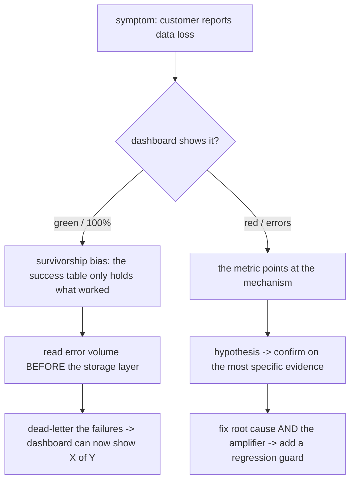

## Thesis

Production debugging is a systematic skill, not luck --- the core move is to *distrust the success metric* and go where the failures actually are (the error volume before the storage layer, the data that was never stored), form a hypothesis about the *mechanism*, and confirm it against the most specific evidence you can find before touching code, then fix the root cause *and* the amplifier that turned one bug into a flood. Most hard production bugs are not exotic; they are a handful of recurring shapes --- a success table that only holds what worked, a `WHERE` clause that silently drops NULLs, a read that beat replication, a no-backoff retry storm --- and knowing the shapes turns a multi-day hunt into a few targeted queries.

## Sub

**Why: dashboards lie about failures** -> **distrust the success metric and read the failures directly** -> **hypothesize the mechanism, confirm on the most specific evidence** -> **zoom out** to the recurring meta-patterns (survivorship bias, the absence of data, retry amplification), the fix that addresses root cause plus amplifier plus a regression guard, and how you tell the story in an interview.

## Spine

- **Success tables lie** --- dashboards query the success path, so a pipeline that only stores *successfully parsed* records shows 100% health while thousands of failures vanish; the first instinct is to check the error volume *before* the storage layer, not the success table.
- **The absence of data is data** --- `WHERE col = 'x'` silently drops rows where the column is NULL, an `INSERT ... SELECT` omits a newly-added column, a performance filter hides staleness; the rows that *aren't there* are frequently the whole bug.
- **Reproduce, then bisect** --- narrow to the smallest failing case and the change that introduced it (a deploy, a config flip, a data shape), so you are testing a hypothesis about the mechanism rather than guessing at symptoms.
- **The amplifier is louder than the root cause** --- a silent failure plus a no-backoff client becomes 30,000 errors a day; the storm you see is a retry multiplier on a small real bug, so you must fix both the cause and the amplification (idempotency, backoff, actionable errors).

## Companion Notes

### walk

The diagnostic loop on a real incident

One production incident walked from symptom to root cause --- distrust the green dashboard, read the failures before the storage layer, form a hypothesis about the mechanism (a NULL trap, replication lag), confirm it on the single most specific piece of evidence, and fix the root cause together with its amplifier and a regression guard.

Say the loop out loud first --- "distrust the success metric, find the failures, hypothesize the mechanism, confirm on the most specific evidence, fix cause plus amplifier plus guard." That sequence is what turns a multi-day hunt into a few targeted queries.

### drill

Symptom-to-diagnosis reps

Graded reps that hand you a production symptom and ask for the likely mechanism and the one query or log that would confirm it --- the patterns that separate "add print statements everywhere" from "I have seen this shape before."

Name the pattern, then the confirmation: survivorship bias -> check log volume before storage; a WHERE that drops rows -> count the NULLs; intermittent 404 after create -> check replica lag. Pattern first, then the single confirming query.

## Drill

SDE2 | the common, concrete shapes
SDE3 | the subtler mechanisms and SQL forensics
Staff | systemic anti-patterns and the workflow

### SDE2 | dashboards green, customer says missing

The dashboards show 100% success, but a customer insists data is missing. Where do you look?

At the *logs before the storage layer*, not the success table --- this is **survivorship bias**. The classic cause: an ingestion pipeline stores only *successfully parsed* records, so when a batch of payloads fails to parse (a firmware-specific encoding, say), those failures are logged but never written anywhere the dashboards query. The success table shows 100% because it only *contains* the records that worked. In one real incident the logs showed 17,000+ parse errors a week while the database held zero failed rows and APM called the error rate normal. The confirmation is to compare *log* error volume to *stored* failure count; the fix is a wrapper that writes the raw payload plus the error to a dead-letter table, so the dashboard can finally show "X of Y parsed."

### SDE2 | a WHERE clause that drops rows

A query or job is silently processing fewer rows than it should. What is the first thing you suspect?

The **NULL exclusion trap**: `WHERE col = 'value'` silently excludes every row where `col IS NULL`, because in SQL `NULL = anything` is not true (it is unknown), so those rows fail the predicate and disappear. This is how a filter meant to *include* a category quietly *drops* a whole population --- in one incident it excluded 118,933 devices from a job that looked correct. Confirm by counting NULLs in the column (`COUNT(*) FILTER (WHERE col IS NULL)`); if the missing rows match the NULL count, that is your bug. The fix is `col = 'value' OR col IS NULL`, or `col IS DISTINCT FROM ...`, or making the column NOT NULL with a default so the trap cannot recur.

### SDE2 | intermittent 404 right after create

Users occasionally get a 404 immediately after creating a record that definitely exists. What is happening?

**Replication lag**: the write goes to the primary, but the immediate follow-up read is routed to a replica that has not yet received the change, so the record genuinely is not there *yet* on the node you read. It is intermittent because it only fails when the read beats replication --- under load the lag window widens and the 404s cluster. Confirm by correlating the 404s with replica lag metrics (they spike together). The fix is *read-your-writes*: route the immediately-following read to the primary, pin the session to the primary briefly after a write, or wait for the write to replicate before acknowledging. It is the reliability-topic replication-lag problem showing up as a debugging symptom.

### SDE2 | 429s during parallel work

A batch job starts throwing 429s from a downstream API the moment you made it faster. Why?

**Unbounded concurrency** --- almost always a `Promise.all` over a large array that fires every request at once, blowing straight past the downstream rate limit and getting throttled. The "we made it faster" is the tell: serial code stayed under the limit by accident, and parallelizing removed the accidental pacing. Confirm by correlating the 429 rate with the concurrency you unleashed. The fix is to *bound* the concurrency (a `p-limit` pool, or chunked batches) so you run N-at-a-time under the limit, plus exponential backoff on the 429s themselves so a throttle does not become a retry storm. Faster is not "all at once"; it is "as parallel as the slowest dependency tolerates."

### SDE2 | clones come out with a NULL column

After a "duplicate this record" feature ships, cloned rows have a NULL in one column that the originals populate. What went wrong?

**Clone field omission**: the clone is an `INSERT INTO t (a, b, c) SELECT a, b, c FROM t WHERE ...`, and a column added to the table *after* the clone code was written is not in the SELECT list, so every clone gets the column's default (NULL). In one incident this left 17,819 records with a NULL that should have been copied. It is invisible until someone queries the new column on cloned rows. Confirm with a NULL-rate query filtered to the clone code path. The fix is to audit every `INSERT ... SELECT` after any schema change, and prefer an explicit, reviewed column mapping (or a clone helper that reflects the current columns) so a new column cannot silently fall out of the copy.

### SDE2 | works in staging, fails in production

A feature works perfectly in staging and fails in production. Before blaming the code, what do you check?

**Config drift between environments** --- the code is identical, so the difference is in what surrounds it: a feature flag that is on in staging and off in prod, an environment variable, a different NULL rate or data shape in the two databases, a downstream that behaves differently. Confirm by *diffing the environments*: the flags, the env config, the relevant data distributions. The bug is almost never "prod runs different code"; it is "prod runs the same code against a different configuration or data reality." The durable fix is parity --- config-as-code, the same flags asserted in both places, and ideally immutable images so the runtime environment cannot drift.

### SDE2 | the first query after any migration

You just ran a migration or a backfill. What is the very first query you run, before anything else?

A **NULL-rate check** on the affected column: `COUNT(*)`, `COUNT(*) FILTER (WHERE col IS NULL)`, and the percentage. A migration or backfill that missed a subset of rows leaves a silent NULL population that surfaces days later as "some records are broken." Running the NULL rate immediately catches a partial backfill while you still remember what you changed. The companion discipline: *always preview a backfill before you run it* --- `SELECT` and `COUNT` the rows the `UPDATE` will touch, eyeball a sample, then update. Preview-then-mutate on production data is the single habit that prevents the most expensive class of self-inflicted incident.

### SDE3 | APM says zero, logs say thousands

Your APM dashboard shows a 0% error rate, but the logs are full of errors and customers are complaining. How is that possible?

A **try/catch is swallowing the exception** --- the error is *caught* (so it is never thrown to the top level where APM counts it) but the handler logs it and returns a degraded result instead of failing. APM measures *uncaught* / thrown errors and HTTP error statuses; a caught-and-logged error is invisible to it while it fills the logs. Confirm by comparing *log* error volume to the APM error rate --- a large gap means exceptions are being absorbed somewhere. The lesson is twofold: caught errors must still be *observable* (structured-logged with the error code, ideally emitted as a metric), and you must never swallow silently and return success --- a caught error that is hidden is worse than one that surfaces.

### SDE3 | one bug becomes thousands of errors

The logs show 30,000 errors a day for one endpoint. Are those 30,000 distinct problems?

Almost certainly not --- it is **retry amplification**: a single silent failure plus a client or automation that retries with no backoff becomes a runaway loop, so the log volume is a *multiplier* on a small real bug, not a count of distinct issues. The tell is that the error volume is wildly out of proportion to the legitimate request volume for that path. Confirm by checking whether the errors come from a tight retry loop on the same input. The fix has two halves: *server-side*, protect yourself (idempotency so retries are safe, a rate limit or circuit breaker so a storm cannot take you down); and *client-side*, return an *actionable* error so the caller stops retrying a permanent failure instead of hammering forever. Fix the root cause, but the amplifier is what turned it into an outage.

### SDE3 | reports show the wrong day

A daily report is including or excluding records around the day boundary --- it shows the wrong day's data. What is the likely cause?

A **timezone off-by-one**: the day boundary is computed in one zone (UTC) while the data or the user expects another (local), so `created_at >= today` uses a boundary that is hours off, pulling in or dropping rows around midnight. It only shows up at the edges, which is why it looks intermittent. Confirm by finding *where* the date boundary is computed and *in which zone*, then checking a record that sits near midnight. The fix is to be explicit about timezone at *every* boundary: store timestamps in UTC, convert to the reporting zone deliberately when you compute the range, and never rely on the server's ambient locale. Timezone bugs are a data-boundary problem masquerading as a logic bug.

### SDE3 | UI says success, nothing changed

The UI reported the operation succeeded, but the actual device or record never changed. How do you approach it?

Trace the operation *end to end*, because the success signal is being recorded before (or independently of) the real effect --- two shapes cause this. **Silent stage cancellation**: a two-stage job where stage 1 succeeds and reports success, but stage 2 (the one that actually changes the device) is cancelled or never runs. **"Car without keys"**: the UI offers an option the backend cannot actually execute, so it accepts the request and reports success without a capable path behind it. Confirm by following the job past the point where success is recorded, to the actual side effect. The fix is that the success signal must reflect the *real* effect, not an intermediate acknowledgement --- verify downstream, and never let the UI claim a capability the backend cannot honor.

### SDE3 | finding duplicates and orphans

What are your go-to SQL patterns for finding duplicate and orphaned data during an investigation?

For **duplicates**: `GROUP BY` the identifying content `HAVING COUNT(*) > 1` to find repeated logical records, and a windowed `ROW_NUMBER()` to see which copies to keep versus delete. For **orphans** (broken foreign keys): `LEFT JOIN` the parent and filter `WHERE parent.id IS NULL` to find child rows whose parent no longer exists. The **"car without keys"** cross-table check is a variant: find rows that reference a capability or config that was never created, so the application offers something with no backing record. These are the workhorse forensic queries --- they turn "the data feels wrong" into an exact count and a concrete list of offending ids, which is what you need before you decide on a fix or a backfill.

### SDE3 | a slow query you did not write

Production is slow and you suspect the database. Where do you start, and what confirms it?

Start with **`pg_stat_statements`** (or the engine's equivalent) sorted by *total* time --- that surfaces the queries consuming the most database time overall, which is usually more actionable than the single slowest call. Then run **`EXPLAIN ANALYZE`** on the suspect to see the actual plan: a sequential scan where you expected an index seek, a bad row estimate, a missing index. Cross-check for *unused* indexes (write overhead and wasted storage) and *missing* ones (the seq scans). A common hidden cause is a **JSONB query with no GIN index** (or a repeated JSONB extraction that goes O(N x M)), fixable with a GIN index or a computed/generated column. The workflow is: rank by total time, read the plan, then fix the index or the query shape that the plan reveals.

### SDE3 | when did it start

You have confirmed a problem exists. Before fixing it, why is "when did it start" often the fastest path to the cause?

Because pinning the *onset* usually pins the *change* that caused it. A `DATE_TRUNC('day', created_at)` with a `COUNT(*) FILTER (WHERE broken)` over time shows exactly when a NULL rate or error rate stepped up, and a `LAG()` window makes a sudden change obvious. Once you have the timestamp, you line it up against your deploy history, config changes, and dependency incidents --- and the change that landed at that moment is your prime suspect. This turns an open-ended "why is this data wrong" into "what shipped on Tuesday afternoon," which is a far smaller search space. Timeline-first is often faster than mechanism-first, because the deploy that broke it is easier to find than the bug itself.

### Staff | a rule that blocks the safe input

A validation regex rejects some inputs and a customer automation is failing on it. What systemic anti-pattern do you look for?

**Validation risk asymmetry** --- a rule that blocks a *low-risk* input while already allowing *higher-risk* ones through the same gate, meaning the threat model does not match its own allowances. The real case: a filename regex rejected an apostrophe (low risk --- simple encoding, no shell splitting, parameterized queries neutralize injection) while permitting spaces (shell-splitting risk) and multiple periods (extension-spoofing risk). A customer automation uploaded apostrophe filenames, every request 400'd, and with no backoff it retried into 270,000+ failed calls over 10 days. The fix is **risk-ordered validation**: enumerate every character or input you *allow*, rank it by actual risk, and make sure you are not blocking something safer than what you permit. The meta-lesson is that a validation rule is a threat model --- if it is inconsistent, it is both annoying and insecure.

### Staff | the backup that could not restore

An incident escalates because a "redundant" system did not save you. What is the pattern, and how do you prevent it?

**False redundancy** --- a backup, replica, or failover that was assumed to work but was never *validated*, so it fails at the exact moment you depend on it: the backup is corrupt or incomplete, the replica was silently behind, the failover path was never exercised. Redundancy that is not tested is not redundancy; it is a comforting assumption. The prevention is to **validate the redundancy on a schedule**: actually restore from the backup into a scratch environment and diff it, actually fail over to the replica in a drill, actually exercise the degraded path. The staff-level point is that reliability claims must be *demonstrated*, not designed --- an untested recovery mechanism has an unknown success probability, which for planning purposes you should treat as zero until proven otherwise.

### Staff | a filter that hides staleness

A dashboard looked healthy through an incident where data was actually stale. How does a performance optimization cause that?

**Performance-filter masking** --- a filter added for speed (fetch only recent rows, only the last N days) silently hides a staleness or data-loss failure mode, because *fresh data* and *stale data* fail differently and the filter keeps the query looking at only the fresh window. So a pipeline that stopped updating older records looks fine, because nobody is looking at the older records. The subtle bug is that a *performance* decision quietly became a *correctness* blind spot. The fix is to **separate filtering from staleness detection**: keep the fast filtered view for the UI, but add an independent check on data freshness/completeness that is *not* subject to the same filter, so a staleness failure is detected rather than optimized out of sight.

### Staff | fix one thing, break another

Every time you fix one symptom, a different one reappears --- you are oscillating. What is going on?

**Coupled-state oscillation** --- two pieces of state that should be independent are actually entangled, so a change that satisfies one violates the other, and you ping-pong between two failing states without ever landing. The diagnostic is the **"fix one, break other" test**: if fixing A reliably re-breaks B and vice versa, you are not chasing two bugs, you are looking at one coupling. The fix is to **separate the state domains** --- identify the shared variable or shared write path that couples them and split it so each concern owns its own state and can be satisfied independently. The staff instinct is to recognize oscillation as a *structural* signal (hidden coupling) rather than to keep patching the two symptoms, which never converges.

### Staff | the meta-patterns

Across a career of production incidents, what are the recurring meta-patterns worth naming out loud?

Four keep recurring. **Success metrics lie** --- dashboards query the happy path, so silent failures are invisible; distrust the green and read the failures directly (survivorship bias). **The absence of data is data** --- NULL traps, dropped rows, omitted clone columns, staleness hidden by a filter; the rows that are *not there* are the bug. **Silent failure plus no backoff equals a storm** --- the amplifier is louder than the root cause, so fix both. And **the success signal must reflect the real effect** --- a UI or a stage that reports success before the actual side effect lies to everyone downstream. Naming these is exactly the "I have debugged real production systems, not just followed a stack trace" signal an interviewer is listening for.

### Staff | the investigation workflow

Give me your disciplined workflow for a production incident, from symptom to closed-out fix.

**Reproduce** (or bound) the failure to the smallest case and the change that introduced it. **Read the failures before the storage layer** --- check log/error volume, not the success table, so survivorship bias does not hide the real population. **Form a hypothesis about the mechanism** (a NULL trap, replication lag, a retry storm) rather than guessing at symptoms. **Confirm on the single most specific piece of evidence** --- the one query or correlated metric that proves the mechanism. **Fix the root cause *and* the amplifier** (idempotency, backoff, actionable errors) so the storm cannot recur. And **add a regression guard** --- a dead-letter table, a NULL-rate alert, a test that injects the exact failure --- so the same shape is caught mechanically next time. Debugging is hypothesis-driven and evidence-confirmed; the guard is what makes the fix permanent instead of a patch.

### Staff | telling the story in an interview

How do you answer "tell me about the hardest bug you have ever debugged"?

Structure it around the *gap and the mechanism*, not the chronology. Name the **symptom and the gap** between what the metrics showed and what was actually happening (a green dashboard while thousands of records were silently lost). State the **hypothesis and how you confirmed it** on the single most specific piece of evidence (17,000+ parse errors a week in the logs against zero stored failures). Describe the **fix as two halves plus a guard** --- the root cause, the amplifier, and the regression guard (a dead-letter table, so it can never be silent again). And close on the **meta-lesson** (success tables lie; read failures before the storage layer). Structure plus specific numbers --- 17,000 a week, 118,933 devices excluded, 270,000 failed calls in 10 days --- is what makes it land as real experience rather than a textbook answer, because the interviewer is listening for a repeatable *method* against a *real system*, not a heroic all-nighter.

## Walk

### Distrust the success metric

```flow
dash[dashboard shows 100% success] -> gap[but the customer reports missing data] -> logs[check error volume BEFORE the storage layer]
```

The instinct that separates a fast diagnosis from a multi-day hunt is to *distrust the green dashboard*. Dashboards are built on the success table, and a pipeline that stores only successfully-processed records will report 100% health no matter how many inputs failed --- the failures were logged and thrown away, never written where a dashboard could count them. This is **survivorship bias**: you are looking only at what survived.

So the first move on "data is missing but everything looks fine" is not to stare at the success table --- it is to go to the *logs*, before the storage layer, and ask "how many things failed on the way in." In the canonical incident the logs held 17,000+ parse errors a week against zero stored failures. The gap between "log error volume" and "stored failure count" *is* the bug.

### The absence of data is the clue

```flow
sym[fewer rows than expected] -> nul[NULL trap: col = value drops NULL rows] -> cnt[count the NULLs to confirm the mechanism]
```

The second recurring shape is that *the rows that are not there* are the answer. A `WHERE col = 'value'` silently excludes every NULL row (NULL compares as unknown, never equal), so a filter that looks like it *includes* a category quietly *drops* an entire population --- in one case 118,933 devices. The same shape appears as an `INSERT ... SELECT` that omits a newly-added column (clones get NULL) and as a performance filter that hides stale rows.

The confirmation is almost always a counting query. After any migration, backfill, or "why are rows missing" report, run the NULL rate first:

```sql
-- The first query after any migration/backfill, or any "missing rows" report:
SELECT
  COUNT(*)                                       AS total,
  COUNT(*) FILTER (WHERE target_column IS NULL)  AS nulls,
  ROUND(100.0 * COUNT(*) FILTER (WHERE target_column IS NULL)
    / NULLIF(COUNT(*), 0), 1)                    AS null_pct
FROM target_table;
```

If the count of missing rows matches the NULL count, you have found the mechanism, not just the symptom --- and you did it with one query instead of a day of reading code.

### Hypothesis, then the most specific evidence

```flow
hyp[hypothesis: intermittent 404 is replication lag] -> ev[404s correlate with replica lag spikes] -> conf[confirmed: fix with read-your-writes]
```

With the shape in mind, form a *specific hypothesis about the mechanism* and confirm it on the single most specific piece of evidence available. "Intermittent 404 right after create" -> hypothesis "the read is beating replication" -> evidence "the 404 timestamps line up with replica-lag spikes" -> confirmed, fix with read-your-writes. "429s the moment we parallelized" -> hypothesis "unbounded `Promise.all` blew the rate limit" -> evidence "the 429 rate tracks the concurrency" -> confirmed, bound the concurrency.

The discipline is to confirm *before* you fix. A hypothesis you have proven on correlated evidence tells you which fix to apply; a hypothesis you merely suspect leads to a change that "might help" and a second incident. One targeted piece of evidence beats a pile of print statements.

### Fix the root cause and the amplifier

```flow
root[fix the root cause] -> amp[fix the amplifier: no-backoff retry storm] -> guard[add a regression guard so the shape recurs mechanically caught]
```

The last step is to fix *both* halves. The root cause is the small real bug; the **amplifier** is what turned it into an outage --- a silent failure plus a no-backoff client becomes 30,000 errors a day, a validation rule plus infinite retries becomes 270,000 failed calls in 10 days. Fixing only the root cause leaves the storm's mechanism in place; fixing only the retries hides an ongoing bug.

Then make the fix permanent with a **regression guard** --- write the failure somewhere queryable so it can never be silent again:

```python
# The survivorship-bias fix: never silently drop a failed record.
def safe_json_parse(raw, source):
    try:
        return json.loads(raw)
    except json.JSONDecodeError as e:
        # Write the failure somewhere QUERYABLE, not just to the log.
        dead_letter.insert({
            "raw_payload": raw,
            "source": source,
            "error": str(e),
        })
        return None   # the caller handles the miss -- but it is now visible
```

A dead-letter table, a NULL-rate alert, or a test that injects the exact failure converts a lesson into a mechanical catch --- so the next occurrence of this shape shows up on a dashboard instead of in a customer complaint.

### Model Script

- Frame the skill | "The way I think about production debugging is that it is systematic, not lucky. Most hard bugs are a handful of recurring shapes, and the core move is to distrust the success metric -- go read the failures directly -- then form a hypothesis about the mechanism and confirm it on the most specific evidence before I change anything."
- The survivorship story | "The canonical one: customers report missing data, but every dashboard shows a hundred percent success. That is survivorship bias -- the pipeline only stored records that parsed successfully, so the failures were logged and thrown away, never written where a dashboard could count them. The tell was seventeen thousand parse errors a week in the logs against zero stored failures. The fix was a wrapper that writes the raw payload and the error to a dead-letter table, so the dashboard could finally show X of Y parsed."
- The absence of data | "The second shape I always check is the rows that are not there. A WHERE col equals value silently drops every NULL row, so a filter that looks like it includes a category actually drops a whole population -- in one incident that excluded a hundred and eighteen thousand devices. I confirm it by counting the NULLs; if the missing count matches, that is the bug, found with one query instead of a day of reading code."
- The amplifier | "And I always separate the root cause from the amplifier. A silent failure plus a client that retries with no backoff becomes thirty thousand errors a day -- the storm you see is a multiplier on a small bug. So I fix both: the cause, and the amplification -- idempotency, backoff, an actionable error so the client stops hammering."
- Interviewer: "Your APM says zero errors but customers are complaining. Where do you look?"
- The APM gap | "A try/catch is swallowing the exception -- it is caught, so it never reaches the top level where APM counts it, but it is filling the logs and returning a degraded result. APM measures thrown and uncaught errors; a caught-and-logged error is invisible to it. I confirm by comparing log error volume to the APM rate -- a big gap means exceptions are being absorbed. The lesson is that caught errors still have to be observable, and you never swallow silently and return success."
- Land it | "So the loop is: distrust the success metric, read the failures before the storage layer, hypothesize the mechanism, confirm on the most specific evidence, then fix the root cause plus the amplifier plus a regression guard. The one line is that debugging is hypothesis-driven and evidence-confirmed -- and the guard, a dead-letter table or a NULL-rate alert, is what makes the fix permanent instead of a patch."

## Whiteboard

Sketch how a green dashboard can hide real data loss, and how the root cause differs from the amplifier.

### Why do dashboards show green while users report data loss?

Because dashboards are built on the *success table*, and a pipeline that stores only successfully-processed records reports 100% no matter how many inputs failed --- the failures were logged and discarded, never written where a dashboard could count them. That is survivorship bias: you are measuring only the survivors. The fix is to read error volume *before* the storage layer and to dead-letter failures so the count becomes "X of Y," making the loss visible.

### What is the difference between the root cause and the amplifier?

The root cause is the small real bug (a parse failure, a validation reject); the amplifier is what turns it into an outage --- a no-backoff client retrying a permanent failure becomes tens of thousands of errors a day. They need different fixes: the root cause needs a code or data fix, the amplifier needs idempotency, backoff, or an actionable error so the caller stops. Fixing only one leaves either an ongoing bug or an ongoing storm.



Verdict: distrust the success metric (green can hide loss via survivorship bias) -> read failures before storage -> hypothesize the mechanism and confirm on specific evidence -> fix root cause plus amplifier plus a guard so the shape is caught mechanically next time.

## System

Zoom out to where debugging sits in the incident lifecycle and the tools each step leans on.

### Where it sits

Detection: metrics and alerts -- but they can lie via survivorship, so treat green with suspicion [*]
Reproduction: narrow to the smallest failing case and the change that introduced it
Hypothesis: name the mechanism (NULL trap, replication lag, retry storm) from the shape
Confirmation: the single most specific evidence -- one query or one correlated metric
Fix and guard: root cause plus amplifier, then a dead-letter / alert / injected-failure test

### Pivots an interviewer rides

From "how would you debug this" they push on avoiding false confidence and separating cause from noise.

#### How do you avoid survivorship bias?

-> read the failures before the storage layer, and dead-letter them so the count becomes X of Y
The success table only contains what worked, so it will always look healthy; the failure volume lives in the logs before storage, and writing failures somewhere queryable is what makes the loss visible on a dashboard at all.

#### How do you tell the root cause from the amplifier?

-> the amplifier is disproportionately loud -- error volume far above the legitimate request rate
A silent failure plus a no-backoff retry is a multiplier, not N distinct bugs; you fix the cause (code/data) and the amplification (idempotency, backoff, actionable errors) separately, because fixing either alone leaves the other running.

## Trade-offs

The calls that separate flailing from a disciplined investigation.

### Fail loud vs fail silent

- Fail loud (throw, or catch-log-and-dead-letter): the failure is visible and counted -- but it surfaces errors that a swallow would have hidden, which feels noisier
- Fail silent (catch and return a degraded result): the happy path stays clean -- but the failure vanishes from metrics (the APM-says-zero trap) and becomes a silent data-loss incident

Fail loud: a caught error must still be observable (structured-logged with a code, ideally a metric) and never swallowed-then-reported-as-success; a hidden failure is far more expensive than a visible one.

### Mitigate fast vs root-cause first

- Mitigate first (stop the bleeding: rate-limit the storm, roll back, flip a flag): fastest path to stability -- but if you stop there, the underlying bug stays and recurs
- Root-cause first (find the mechanism before acting): the durable fix -- but during an active outage it can prolong user pain while you investigate

Mitigate to stop the bleeding *then* root-cause; the failure mode is treating the mitigation as the fix and closing the incident with the real bug still live.

### Add a metric vs add a log

- A metric (counter / rate): cheap to aggregate and alert on, good for trend and burn -- but it misses the caught-and-swallowed path unless you explicitly emit it, and it carries no detail
- A structured log (with the error code and payload): the detail you need to diagnose, and it catches the swallowed errors -- but high volume and weaker for alerting on rate

Emit both from the failure path: a structured log with the error code (so a swallowed error is still visible and diagnosable) and a metric on it (so you can alert on the rate) -- the two together close the APM-blindness gap.

## Model Answers

### the reframe | Debugging is hypothesis-driven, not flailing

The frame to lead with.

- Distrust the success metric; read failures directly | key | dashboards query the happy path (survivorship bias)
- The absence of data is data | store | NULL traps, dropped rows, staleness hidden by a filter
- Confirm the mechanism on specific evidence before fixing | note | one query beats a pile of print statements

### the depth | Root cause plus amplifier plus guard

Where it is really tested.

- The amplifier is louder than the root cause | key | silent failure plus no backoff becomes a storm
- Fix both halves, then add a regression guard | store | idempotency/backoff plus a dead-letter or NULL-rate alert
- Caught errors must stay observable | note | the APM-says-zero, logs-say-thousands trap

## Numbers

Back-of-envelope how a small silent failure hides at scale and how a no-backoff retry amplifies it.

A silent failure is invisible in the success table; a no-backoff client multiplies it into the error volume you actually see.

- rpd | Requests / day | 1000000 | 0 | 1000
- failrate | Silent failure rate (%) | 0.24 | 0 | 0.01
- retry | Retry multiplier (no backoff) | 12 | 1 | 1

```js
function (vals, fmt) {
  var rpd = vals.rpd, failrate = vals.failrate, retry = vals.retry;
  var silent = rpd * failrate / 100;
  var amplified = silent * retry;
  var perWeek = silent * 7;
  function r(x, d) { var m = Math.pow(10, d); return Math.round(x * m) / m; }
  return [
    { k: 'Silent failures / day', v: '~' + fmt.n(Math.round(silent)), u: 'never stored', n: 'these fail after the success path, so the success table and every dashboard on it still read 100% \u2014 survivorship bias makes them invisible', over: false },
    { k: 'Amplified errors / day', v: '~' + fmt.n(Math.round(amplified)), u: 'in the logs', n: 'a no-backoff client retries each failure, so the log volume is the amplifier at ' + retry + 'x, not a count of distinct bugs', over: amplified > 20000 },
    { k: 'Silent loss / week', v: '~' + fmt.n(Math.round(perWeek)), u: 'records', n: 'the scale that hid in a real incident \u2014 thousands of unparsed records a week \u2014 before a dead-letter table surfaced it', over: false },
    { k: 'Amplifier share', v: retry + 'x', u: 'noise over signal', n: 'the error volume is ' + retry + ' times the real failure rate \u2014 fix only the retries and the bug stays; fix only the bug and the storm stays', over: retry >= 10 },
    { k: 'Time to notice, no dead-letter', v: 'never', u: 'not queryable', n: 'you cannot find what was never stored \u2014 the fix is to write the failure somewhere queryable, then a dashboard can show X of Y parsed', over: true }
  ];
}
```

## Red Flags

What makes an interviewer wince.

### "The dashboard is green, so it is fine"

The dashboard is built on the success table, which only contains records that worked -- survivorship bias means a silent-failure incident can be dropping thousands of inputs while every dashboard reads 100%.

Read the error volume *before* the storage layer and dead-letter the failures, so the loss becomes a visible "X of Y" rather than an invisible gap.

### "I will just add more retries"

Without backoff and idempotency, more retries is the *amplifier*, not the fix -- it is exactly how one silent failure becomes 30,000 errors a day or 270,000 failed calls in 10 days.

Make retries safe and bounded (idempotency, exponential backoff, a circuit breaker) and return an actionable error so a permanent failure stops being retried -- then fix the root cause underneath.

### "It works on my machine, so the code is fine"

"Works in staging, fails in prod" is almost never different code -- it is config drift: a feature flag, an env var, or a different data shape between environments.

Diff the environments (flags, config, data distributions) rather than re-reading the code, and enforce parity with config-as-code and immutable images so the runtime cannot drift.

## Opener

### 30s | The one-liner

How I open when asked how I approach a production incident or a hard bug.

#### What is the shape?

Debugging is systematic, not lucky: distrust the success metric, read the failures directly (the error volume before the storage layer), form a hypothesis about the mechanism, confirm it on the single most specific piece of evidence, then fix the root cause together with the amplifier and add a regression guard.

#### What's the key move?

Most hard bugs are recurring shapes -- a success table that only holds what worked, a WHERE that drops NULLs, a read that beat replication, a no-backoff retry storm -- so naming the shape turns a multi-day hunt into a few targeted queries, and the absence of data is usually the whole clue.

##### Hooks

Where an interviewer usually pushes next.

- How do you avoid survivorship bias? | read failures before storage, dead-letter them | drill
- How do you tell cause from amplifier? | the amplifier is disproportionately loud | drill
- APM says zero, logs say thousands? | a swallowed exception; compare the volumes | drill

Foot: two sentences -- production debugging is a hypothesis-driven, evidence-confirmed loop over a handful of recurring shapes, not print-statement archaeology; and the durable fix always addresses the root cause, the amplifier, and a regression guard, so the same shape is caught mechanically the next time instead of in a customer complaint.

## Bank

### SCALE | A pipeline where customers report missing data but every dashboard is green

Task: diagnose the class of bug and make it impossible to hide again.
Model: recognize survivorship bias -- the pipeline stores only successfully-processed records, so failures are logged and discarded and the success table reads 100%; confirm by comparing log error volume to stored failure count (the gap is the loss); fix by wrapping the parse/ingest step so failures write the raw payload plus error to a dead-letter table, then expose "X of Y processed" so the loss is visible; add a NULL-rate / dead-letter-volume alert so the next occurrence pages instead of waiting for a customer; and back-fill the recoverable dead-lettered records once the parser is fixed.
Int: why not just fix the parser and move on?
Because the parser fix stops *new* loss but does nothing about the invisibility -- without a dead-letter table and a "X of Y" metric, the next silent-failure class recurs and hides exactly the same way; the durable fix is making failures queryable, not just fixing this one parser.

### DESIGN | A runbook for a silent-failure class of bug

Task: write the diagnostic runbook a team follows for "data is missing but metrics look fine."
Model: (1) distrust the success table -- pull log/error volume before the storage layer; (2) count the population that is not there (NULL-rate query, dead-letter volume, orphan check); (3) pin onset with a DATE_TRUNC + COUNT-FILTER timeline and line it up against deploys/config changes; (4) form a mechanism hypothesis (survivorship, NULL trap, clone omission, replication lag) and confirm on one specific query or correlated metric; (5) fix root cause plus amplifier (idempotency, backoff, actionable errors); (6) add the regression guard (dead-letter, NULL-rate alert, injected-failure test). Keep it hypothesis-first so the team confirms before changing anything.
Int: what is the single most valuable step?
Reading failures before the storage layer -- it is the step that defeats survivorship bias, and without it every later step is investigating a success table that will always look healthy.

### Extra Curveballs

### CURVEBALL | apm-blind | Your APM dashboard shows a 0% error rate, but the on-call channel is full of customer complaints. Where do you look first, and why does the APM lie?

Model: look at the *logs*, and specifically at the gap between log error volume and the APM error rate -- a large gap is the signature of a try/catch that is *swallowing* exceptions. The error is caught (so it never reaches the top level or produces an HTTP error status, which is what APM counts) but the handler logs it and returns a degraded or empty result, so APM sees zero while the logs fill and users are hurt. Confirm by finding the catch blocks on the failing path and checking whether they log-and-continue instead of rethrowing or recording a metric. The fix has two parts: make caught errors *observable* -- structured-log them with the error code and emit a metric so the rate is visible to alerting -- and stop returning success on a caught failure, because a swallowed-then-hidden error is worse than one that surfaces. The staff point is that your error *rate* is only as honest as your error *handling*: any place that catches and does not re-surface is a blind spot in every metric built on thrown errors.

### Frames

- Distrust the success metric (survivorship bias) -> read failures before storage -> hypothesize the mechanism -> confirm on the most specific evidence -> fix cause plus amplifier plus guard
- The recurring shapes: success tables lie, the absence of data is data, silent failure plus no backoff is a storm, the success signal must reflect the real effect
- Fix the root cause AND the amplifier, then add a regression guard (dead-letter, NULL-rate alert, injected-failure test) so the shape is caught mechanically next time
