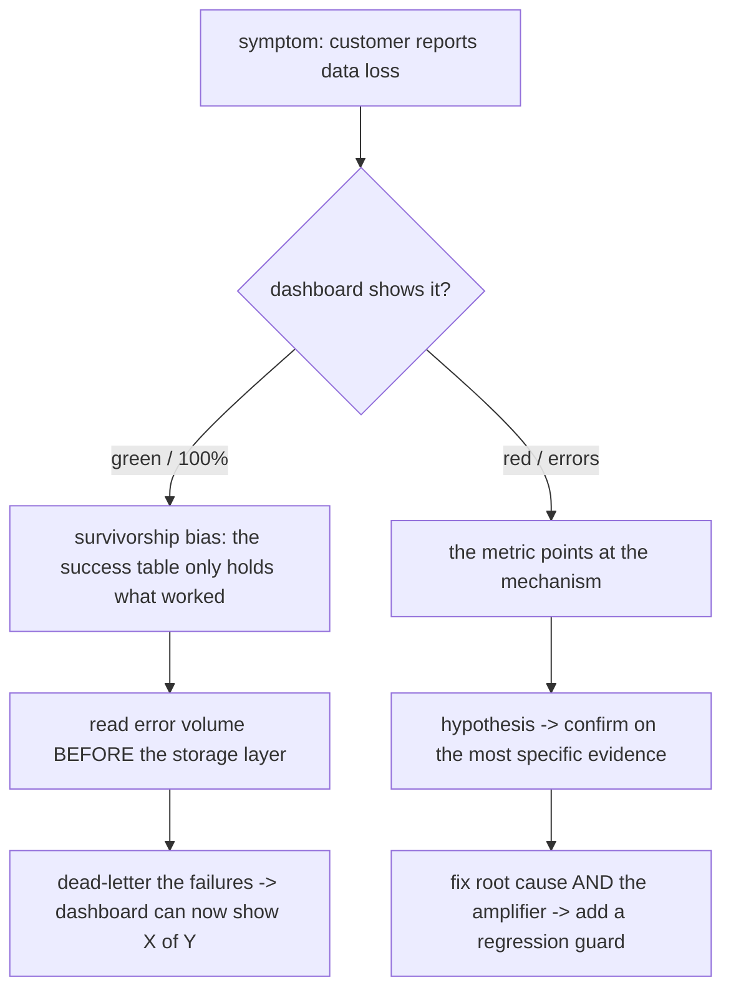

## Thesis

Production debugging is a systematic skill, not luck --- the core move is to *distrust the success metric* and go where the failures actually are (the error volume before the storage layer, the data that was never stored), form a hypothesis about the *mechanism*, and confirm it against the most specific evidence you can find before touching code, then fix the root cause *and* the amplifier that turned one bug into a flood. Most hard production bugs are not exotic; they are a handful of recurring shapes --- a success table that only holds what worked, a `WHERE` clause that silently drops NULLs, a read that beat replication, a no-backoff retry storm --- and knowing the shapes turns a multi-day hunt into a few targeted queries.

## Sub

**Why: dashboards lie about failures** -> **distrust the success metric and read the failures directly** -> **hypothesize the mechanism, confirm on the most specific evidence** -> **zoom out** to the recurring meta-patterns (survivorship bias, the absence of data, retry amplification), the fix that addresses root cause plus amplifier plus a regression guard, and how you tell the story in an interview.

## Spine

- **Success tables lie** --- dashboards query the success path, so a pipeline that only stores *successfully parsed* records shows 100% health while thousands of failures vanish; the first instinct is to check the error volume *before* the storage layer, not the success table.
- **The absence of data is data** --- `WHERE col = 'x'` silently drops rows where the column is NULL, an `INSERT ... SELECT` omits a newly-added column, a performance filter hides staleness; the rows that *aren't there* are frequently the whole bug.
- **Reproduce, then bisect** --- narrow to the smallest failing case and the change that introduced it (a deploy, a config flip, a data shape), so you are testing a hypothesis about the mechanism rather than guessing at symptoms.
- **The amplifier is louder than the root cause** --- a silent failure plus a no-backoff client becomes 30,000 errors a day; the storm you see is a retry multiplier on a small real bug, so you must fix both the cause and the amplification (idempotency, backoff, actionable errors).

## Companion Notes

### walk

The diagnostic loop on a real incident

One production incident walked from symptom to root cause --- distrust the green dashboard, read the failures before the storage layer, form a hypothesis about the mechanism (a NULL trap, replication lag), confirm it on the single most specific piece of evidence, and fix the root cause together with its amplifier and a regression guard.

Say the loop out loud first --- "distrust the success metric, find the failures, hypothesize the mechanism, confirm on the most specific evidence, fix cause plus amplifier plus guard." That sequence is what turns a multi-day hunt into a few targeted queries.

### drill

Symptom-to-diagnosis reps

Graded reps that hand you a production symptom and ask for the likely mechanism and the one query or log that would confirm it --- the patterns that separate "add print statements everywhere" from "I have seen this shape before."

Name the pattern, then the confirmation: survivorship bias -> check log volume before storage; a WHERE that drops rows -> count the NULLs; intermittent 404 after create -> check replica lag. Pattern first, then the single confirming query.

### wb

Whiteboard

Rebuild the diagnostic loop from memory --- the cues, nothing in front of you: how a green dashboard hides loss, the NULL trap, replication lag, the swallowed exception, the retry storm.

Draw the boundary first --- the success table on one side, the failures before storage on the other. Recall is the test, not recognition.

### sys

System Map

Zoom out: debugging sits across the whole incident lifecycle --- detection, reproduction, hypothesis, confirmation, mitigation, fix-and-guard --- and each interviewer pivot bridges to a deeper topic.

Lead with the lifecycle, not the tools --- "detect, reproduce, hypothesize, confirm, mitigate, fix and guard" --- then let the pivot pick where they want to go deep.

### trade

Trade-offs

The calls that separate flailing from a disciplined investigation --- fail loud vs silent, mitigate vs root-cause, roll back vs fix forward, alert per-error vs on burn rate --- each with the condition that flips it.

Always name the alternative and its cost --- "roll back to stop the pain, unless a migration already ran" --- never defend one side as universally right.

### model

Model Answers

Full spoken scripts --- the beats in order, the way you would actually say them: the survivorship story, the APM gap, staging vs prod, the SQL forensics, the hardest-bug story.

Steal the frame, not the words --- distrust the green, read failures before storage, confirm on the most specific evidence --- then the one risk you would name unprompted.

### num

Numbers

Back-of-envelope how a small silent failure hides at scale and how a no-backoff retry amplifies it into the error volume you actually see.

Lead with the amplifier --- the errors you see are a multiplier on a tiny failure rate --- and that a dead-letter table is what makes the silent loss queryable at all.

### rf

Red Flags

What sinks the round --- "the dashboard is green so it's fine," "I'll just add more retries," "I restarted it and it went away" --- and the line to say instead.

Name what the interviewer hears --- "swallowing errors and returning success" reads as someone who ships silent data loss --- then flip it to the observable fix.

### open

30-Second

The opener and the close, matched to the altitude the question is asked at: the one-liner for "quickly, how do you debug?", the full loop for "walk me through it."

Match the altitude --- open on distrusting the success metric, land on the regression guard as what makes a fix permanent, and hand the wheel back.

### bank

Mock & Curveballs

The mock-run beats and the curveball pool --- the green dashboard, the retry storm, the Heisenbug, clock skew, the poison message, silent truncation --- the way a real loop actually comes at you.

Reframe the premise out loud before you answer --- "adding logging made it vanish" means the logging changed the timing, so it is a race --- then give the mechanism, not the workaround.

## Drill

all | Every level, mixed --- the way a real production loop actually comes at you
SDE2 | the common, concrete shapes
SDE3 | the subtler mechanisms and SQL forensics
Staff | systemic anti-patterns and the workflow

### SDE2 | dashboards green, customer says missing

The dashboards show 100% success, but a customer insists data is missing. Where do you look?

At the *logs before the storage layer*, not the success table --- this is **survivorship bias**. The classic cause: an ingestion pipeline stores only *successfully parsed* records, so when a batch of payloads fails to parse (a firmware-specific encoding, say), those failures are logged but never written anywhere the dashboards query. The success table shows 100% because it only *contains* the records that worked. In one real incident the logs showed 17,000+ parse errors a week while the database held zero failed rows and APM called the error rate normal. The confirmation is to compare *log* error volume to *stored* failure count; the fix is a wrapper that writes the raw payload plus the error to a dead-letter table, so the dashboard can finally show "X of Y parsed."

Follow: You add the dead-letter table and a week later it holds 40,000 rows. How do you keep *it* from becoming the next silent graveyard?
Alarm on dead-letter *volume and age*, not just its existence --- a row landing there is a failure, so a rising count or an old un-reprocessed row should page --- and wire a drain/reprocess path so fixed records leave. A dead-letter nobody watches is the success-table blind spot again, one level down.

Follow: The dashboard now reads "X of Y parsed" and product wants it back to a clean 100%. What do you tell them?
That the old 100% *was* the bug --- it meant "100% of what we kept," not "100% of what arrived." The honest denominator is Y, everything that came in; X/Y is exactly what makes a regression visible. I keep the true ratio and alert when it dips, I do not cosmetically reset it to green.

Senior: Naming the fix as a *denominator* change --- measure against everything that arrived, not everything that was stored --- rather than just "add error handling," is the tell you grasp survivorship bias structurally.
Speak: "The dashboard reads 100% because it only *contains* what worked --- so I go to the logs before the storage layer and compare error volume to stored failures; the gap is the loss."

### SDE2 | a WHERE clause that drops rows

A query or job is silently processing fewer rows than it should. What is the first thing you suspect?

The **NULL exclusion trap**: `WHERE col = 'value'` silently excludes every row where `col IS NULL`, because in SQL `NULL = anything` is not true (it is unknown), so those rows fail the predicate and disappear. This is how a filter meant to *include* a category quietly *drops* a whole population --- in one incident it excluded 118,933 devices from a job that looked correct. Confirm by counting NULLs in the column (`COUNT(*) FILTER (WHERE col IS NULL)`); if the missing rows match the NULL count, that is your bug. The fix is `col = 'value' OR col IS NULL`, or `col IS DISTINCT FROM ...`, or making the column NOT NULL with a default so the trap cannot recur.

Follow: You patch it to `col = 'value' OR col IS NULL`. Three weeks later another engineer adds a filter and the NULLs vanish again. How do you stop the recurrence?
Make the column `NOT NULL` with a default so the trap is *structurally* impossible, or push the include-NULL logic into a shared view the team queries. A fix that relies on every future author remembering the `OR` clause is not a fix --- it is a re-armed landmine.

Follow: The column is a legitimately nullable foreign key --- NULL means "unassigned." Now what?
Then NULL carries meaning, so I decide *explicitly* whether "unassigned" belongs in the result, and reach for `col IS DISTINCT FROM 'value'` when I want "everything except value, NULLs included." The bug is *silent* exclusion; the fix is making the NULL handling a stated decision, not a side effect of `=`.

Senior: Knowing *why* `NULL = 'x'` is unknown --- SQL's three-valued logic --- and reaching for `IS DISTINCT FROM`, not just "NULLs are weird," is the forensics tell.
Speak: "`WHERE col = 'value'` silently drops every NULL row, because NULL compares as unknown, never equal --- so I count the NULLs, and if the missing rows match, that is the bug."

### SDE2 | intermittent 404 right after create

Users occasionally get a 404 immediately after creating a record that definitely exists. What is happening?

**Replication lag**: the write goes to the primary, but the immediate follow-up read is routed to a replica that has not yet received the change, so the record genuinely is not there *yet* on the node you read. It is intermittent because it only fails when the read beats replication --- under load the lag window widens and the 404s cluster. Confirm by correlating the 404s with replica lag metrics (they spike together). The fix is *read-your-writes*: route the immediately-following read to the primary, pin the session to the primary briefly after a write, or wait for the write to replicate before acknowledging. It is the reliability-topic replication-lag problem showing up as a debugging symptom.

Follow: You pin the immediate read to the primary. QPS on the primary jumps and now *it* is the bottleneck. How do you get read-your-writes without hammering the primary?
Scope the primary pin *narrowly* --- only the read that immediately follows a write, only for that session, for a few seconds --- not all reads. Or make it monotonic-reads via a version/LSN token: the client passes the write's position and a replica serves the read only once it has caught up. You want "read your own recent write," not "route everything to the primary."

Follow: It is not a replica at all --- it is a cache the write did not invalidate. Same symptom. How do you tell them apart?
Correlate the 404s with *replica lag* versus *cache age*: replication lag tracks load and clears on its own, while a stale-cache miss tracks the TTL and clears on invalidation. The confirming evidence differs, so I check which metric the 404 timestamps line up with before I pick read-your-writes versus a write-through/invalidate fix.

Senior: Recognizing this as the reliability topic's replication-lag problem *wearing a debugging costume* --- and that the fix is a consistency choice, read-your-writes, not a retry --- is the systems tell.
Speak: "The write hit the primary but the immediate read hit a replica that had not caught up, so the row genuinely is not there yet --- I confirm by correlating the 404s with replica-lag spikes and fix it with read-your-writes."

### SDE2 | 429s during parallel work

A batch job starts throwing 429s from a downstream API the moment you made it faster. Why?

**Unbounded concurrency** --- almost always a `Promise.all` over a large array that fires every request at once, blowing straight past the downstream rate limit and getting throttled. The "we made it faster" is the tell: serial code stayed under the limit by accident, and parallelizing removed the accidental pacing. Confirm by correlating the 429 rate with the concurrency you unleashed. The fix is to *bound* the concurrency (a `p-limit` pool, or chunked batches) so you run N-at-a-time under the limit, plus exponential backoff on the 429s themselves so a throttle does not become a retry storm. Faster is not "all at once"; it is "as parallel as the slowest dependency tolerates."

Follow: You cap it with a `p-limit` pool of 10 and now it is too slow to finish in the window. How do you pick the concurrency without just guessing?
The downstream's published rate limit *is* the budget --- set concurrency to roughly `rate_limit x latency` (Little's Law) so you keep the pipe full without exceeding it, then back off adaptively on any 429. If 10-under-the-limit still misses the window, the fix is not more concurrency; it is a higher limit (ask or pay) or batching the API calls, not blowing past the ceiling.

Follow: The downstream has no published limit and returns 429 unpredictably. Now how do you pace yourself?
Treat the 429s themselves as the signal: additive-increase / multiplicative-decrease --- ramp concurrency up slowly, halve it on a 429 --- so you self-tune to a limit you cannot see, with *jittered* exponential backoff so retries do not resynchronize into a fresh burst.

Senior: Reaching for a *concurrency bound plus adaptive backoff* (AIMD) rather than a fixed sleep, and citing the limit-times-latency sizing, separates "I added a delay" from "I paced it to the dependency."
Speak: "Parallelizing removed the accidental pacing that kept serial code under the limit --- so I bound concurrency to N-at-a-time under the rate limit and add jittered backoff on the 429s so a throttle does not become a retry storm."

### SDE2 | clones come out with a NULL column

After a "duplicate this record" feature ships, cloned rows have a NULL in one column that the originals populate. What went wrong?

**Clone field omission**: the clone is an `INSERT INTO t (a, b, c) SELECT a, b, c FROM t WHERE ...`, and a column added to the table *after* the clone code was written is not in the SELECT list, so every clone gets the column's default (NULL). In one incident this left 17,819 records with a NULL that should have been copied. It is invisible until someone queries the new column on cloned rows. Confirm with a NULL-rate query filtered to the clone code path. The fix is to audit every `INSERT ... SELECT` after any schema change, and prefer an explicit, reviewed column mapping (or a clone helper that reflects the current columns) so a new column cannot silently fall out of the copy.

Follow: You fix this clone. How do you make sure *no* `INSERT ... SELECT` silently drops the next column someone adds?
Stop hand-listing columns where you can avoid it --- generate the list by reflecting the current schema, or add a migration test that fails when a table's columns and its clone path diverge. The durable fix is that a new column *cannot* fall out of the copy silently; relying on review to catch every future `SELECT` list is how it recurs.

Follow: You have found 17,819 already-cloned rows with the NULL. Do you backfill them, and how safely?
Yes, but *preview then mutate*: `SELECT` and `COUNT` the affected rows, eyeball a sample, confirm the correct value is derivable, then `UPDATE` in bounded batches. And I guard the backfill itself with a NULL-rate check before and after, because a backfill that misses a subset is the same silent-population bug one layer up.

Senior: Treating every `INSERT ... SELECT` as a *schema-coupled* hazard to re-audit after any migration --- not a one-off bug --- is the maintenance-engineering tell.
Speak: "The clone is an `INSERT ... SELECT` whose column list predates the new column, so every clone gets its default of NULL --- I confirm with a NULL-rate query on the clone path and fix it by generating the column list instead of hand-listing it."

### SDE2 | works in staging, fails in production

A feature works perfectly in staging and fails in production. Before blaming the code, what do you check?

**Config drift between environments** --- the code is identical, so the difference is in what surrounds it: a feature flag that is on in staging and off in prod, an environment variable, a different NULL rate or data shape in the two databases, a downstream that behaves differently. Confirm by *diffing the environments*: the flags, the env config, the relevant data distributions. The bug is almost never "prod runs different code"; it is "prod runs the same code against a different configuration or data reality." The durable fix is parity --- config-as-code, the same flags asserted in both places, and ideally immutable images so the runtime environment cannot drift.

Follow: You diff the environments and every flag and env var matches. It still fails only in prod. Where next?
The *data*, not the config --- prod has shapes staging does not: NULLs staging never seeded, a tenant 30% larger than any test row, unicode or emoji, a row old enough to predate a column. I reproduce against a *sanitized prod snapshot*, because "same code, same config" failing in prod almost always means a different data reality.

Follow: It reproduces on the prod snapshot. How do you turn that into a permanent test?
Distill the offending row into a fixture and add a test that injects exactly that shape --- the empty string, the oversized tenant, the NULL --- so the bug is pinned mechanically. A prod-only bug you cannot reproduce in a test will recur; the snapshot is the bridge from "only in prod" to "caught in CI."

Senior: Escalating from config-diff to *data-shape diff* to a captured fixture, rather than re-reading the code, is the tell you have debugged real environment drift.
Speak: "The code is identical, so I diff what surrounds it --- flags, env, and especially the data shape --- because 'works in staging, fails in prod' is almost never different code; it is a different configuration or data reality."

### SDE2 | the first query after any migration

You just ran a migration or a backfill. What is the very first query you run, before anything else?

A **NULL-rate check** on the affected column: `COUNT(*)`, `COUNT(*) FILTER (WHERE col IS NULL)`, and the percentage. A migration or backfill that missed a subset of rows leaves a silent NULL population that surfaces days later as "some records are broken." Running the NULL rate immediately catches a partial backfill while you still remember what you changed. The companion discipline: *always preview a backfill before you run it* --- `SELECT` and `COUNT` the rows the `UPDATE` will touch, eyeball a sample, then update. Preview-then-mutate on production data is the single habit that prevents the most expensive class of self-inflicted incident.

Follow: The NULL rate comes back at 3%. Is that a bug or is it fine?
It depends on the *baseline* --- 3% is only meaningful against what the rate was *before* the migration. So I compare pre and post (or eyeball the trend), because the migration's job was not to *introduce* NULLs: a step up from 0% to 3% is a partial backfill, while a steady 3% that predates the change is just the column's normal population.

Follow: You ran the check an hour late and the backfill is already done. How do you tell if it missed rows?
The onset query still works retroactively --- `DATE_TRUNC` the NULL count over `created_at` and look for the rows the backfill's `WHERE` skipped, often the oldest or an edge partition. A backfill that missed a subset leaves a *dated* NULL cluster, which the timeline surfaces even after the fact.

Senior: Pairing the NULL-rate check with *preview-then-mutate* --- COUNT the rows an `UPDATE` will touch before you run it --- is the habit that prevents the most expensive self-inflicted incidents.
Speak: "A migration or backfill that missed a subset leaves a silent NULL population that surfaces days later --- so the very first thing I run is the NULL rate, while I still remember what I changed."

### SDE3 | APM says zero, logs say thousands

Your APM dashboard shows a 0% error rate, but the logs are full of errors and customers are complaining. How is that possible?

A **try/catch is swallowing the exception** --- the error is *caught* (so it is never thrown to the top level where APM counts it) but the handler logs it and returns a degraded result instead of failing. APM measures *uncaught* / thrown errors and HTTP error statuses; a caught-and-logged error is invisible to it while it fills the logs. Confirm by comparing *log* error volume to the APM error rate --- a large gap means exceptions are being absorbed somewhere. The lesson is twofold: caught errors must still be *observable* (structured-logged with the error code, ideally emitted as a metric), and you must never swallow silently and return success --- a caught error that is hidden is worse than one that surfaces.

Follow: You find the swallowing `catch`. The team says "but we *are* logging it --- why is that not enough?"
A log line is diagnosable but not *alertable* at a glance --- nobody watches log volume in real time, so a caught-and-logged error is invisible to every dashboard built on thrown errors. The fix is to also *emit a metric* from the catch --- increment an error counter, ideally with the error code --- so the rate becomes something you can alert on, not just something you can grep after the incident.

Follow: Some of those caught errors are genuinely recoverable and returning a degraded result is correct. How do you keep those observable without alarming on them?
Separate *expected-and-handled* from *unexpected-and-swallowed*: emit a low-severity metric (a "degraded" counter) for the recoverable path so it is visible but not paging, and reserve the alert for the ones that should not happen. The sin is not catching --- it is catching *silently and returning success*; a caught error just has to stay countable.

Senior: Stating precisely that "APM measures *thrown/uncaught* errors and HTTP error statuses," so a caught error is invisible *by definition* --- rather than "the monitoring is broken" --- is the observability tell.
Speak: "The exception is caught, so it never reaches the top level where APM counts it --- it fills the logs and returns a degraded result instead --- so I compare log error volume to the APM rate, and a big gap means something is swallowing exceptions."

### SDE3 | one bug becomes thousands of errors

The logs show 30,000 errors a day for one endpoint. Are those 30,000 distinct problems?

Almost certainly not --- it is **retry amplification**: a single silent failure plus a client or automation that retries with no backoff becomes a runaway loop, so the log volume is a *multiplier* on a small real bug, not a count of distinct issues. The tell is that the error volume is wildly out of proportion to the legitimate request volume for that path. Confirm by checking whether the errors come from a tight retry loop on the same input. The fix has two halves: *server-side*, protect yourself (idempotency so retries are safe, a rate limit or circuit breaker so a storm cannot take you down); and *client-side*, return an *actionable* error so the caller stops retrying a permanent failure instead of hammering forever. Fix the root cause, but the amplifier is what turned it into an outage.

Follow: You add idempotency and backoff server-side. The client is a third party you do not control and it *still* hammers you. What now?
Defend at your edge: return a *permanent* status (a 4xx, not a retriable 5xx) with an actionable error so a well-behaved client stops, and rate-limit or circuit-break the abusive caller so a misbehaving one cannot take you down. You cannot fix their retry loop, but you can make retries safe (idempotency) and the storm bounded (a rate limit) regardless of their behavior.

Follow: How do you actually confirm the 30,000 are amplification and not 30,000 distinct users hitting a real bug?
Group the errors by input and caller and look at the *cardinality*: amplification is a tight loop on the *same* id from a *few* callers, so a `GROUP BY` collapses 30,000 log lines to a handful of distinct requests. If instead it is 30,000 distinct users, that is a real widespread bug --- the grouping tells you which story you are in before you pick a fix.

Senior: Recognizing the error volume as a *multiplier on a small bug* --- and fixing cause *and* amplifier as two separate jobs --- rather than treating 30,000 as 30,000 problems, is the incident-scale tell.
Speak: "That is a retry storm --- one silent failure plus a no-backoff client is a multiplier, not 30,000 distinct bugs --- so I fix the root cause *and* the amplifier: idempotency and backoff so a retry is safe, and an actionable error so the client stops."

### SDE3 | reports show the wrong day

A daily report is including or excluding records around the day boundary --- it shows the wrong day's data. What is the likely cause?

A **timezone off-by-one**: the day boundary is computed in one zone (UTC) while the data or the user expects another (local), so `created_at >= today` uses a boundary that is hours off, pulling in or dropping rows around midnight. It only shows up at the edges, which is why it looks intermittent. Confirm by finding *where* the date boundary is computed and *in which zone*, then checking a record that sits near midnight. The fix is to be explicit about timezone at *every* boundary: store timestamps in UTC, convert to the reporting zone deliberately when you compute the range, and never rely on the server's ambient locale. Timezone bugs are a data-boundary problem masquerading as a logic bug.

Follow: You standardize on storing UTC. The bug persists for one specific customer. Why?
The *boundary* is still computed in the wrong zone for them --- storing UTC is necessary but not sufficient; the day range has to be computed in the *customer's* zone and then converted to UTC for the query. If every report uses a single server-local midnight, the customer whose zone differs from the server still gets rows shifted by the offset.

Follow: The customer is in a zone with daylight-saving time. Does that change your fix?
Yes --- I convert using a *named timezone* (like `America/New_York`), never a fixed UTC offset, so the day boundary follows the DST transition. A hardcoded `-05:00` is right for half the year and an hour off for the other half; the two days a year the clocks change are exactly when a fixed-offset "fix" reintroduces the off-by-one.

Senior: Treating a timezone bug as a *data-boundary* problem --- be explicit about the zone at every boundary, store UTC, convert with a *named* zone deliberately --- rather than a logic bug, is the tell.
Speak: "The day boundary is computed in one zone while the data or user expects another, so rows around midnight get pulled in or dropped --- I find where the boundary is computed and in which zone, then make the conversion explicit."

### SDE3 | UI says success, nothing changed

The UI reported the operation succeeded, but the actual device or record never changed. How do you approach it?

Trace the operation *end to end*, because the success signal is being recorded before (or independently of) the real effect --- two shapes cause this. **Silent stage cancellation**: a two-stage job where stage 1 succeeds and reports success, but stage 2 (the one that actually changes the device) is cancelled or never runs. **"Car without keys"**: the UI offers an option the backend cannot actually execute, so it accepts the request and reports success without a capable path behind it. Confirm by following the job past the point where success is recorded, to the actual side effect. The fix is that the success signal must reflect the *real* effect, not an intermediate acknowledgement --- verify downstream, and never let the UI claim a capability the backend cannot honor.

Follow: You trace it and stage 1 reports success while stage 2 is silently cancelled. Where should "success" actually be recorded?
After the *real side effect*, not after the acknowledgement --- success should reflect that the device actually changed, confirmed by a read-back or a device report, not that stage 1 accepted the request. The bug is that the success signal fires at an *intermediate* step; the fix is to move it downstream of the effect it is claiming.

Follow: The "car without keys" variant --- the UI offers an action the backend cannot execute. How do you prevent the class, not just this instance?
Make capability a *checked precondition*, not an assumption: the UI should only offer what the backend advertises it can do (a capability query), and the backend should reject-not-accept a request it cannot fulfill. Reporting success for an action with no capable path behind it is the anti-pattern; the fix is that the option and the capability come from the same source of truth.

Senior: Insisting the success signal must reflect the *real effect* --- verifying downstream rather than trusting an intermediate ack --- is the distributed-systems tell most candidates miss.
Speak: "The success signal is recorded before or independently of the real effect --- a cancelled stage 2, or a UI offering something the backend cannot do --- so I follow the operation *past* where success is logged, to the actual side effect."

### SDE3 | finding duplicates and orphans

What are your go-to SQL patterns for finding duplicate and orphaned data during an investigation?

For **duplicates**: `GROUP BY` the identifying content `HAVING COUNT(*) > 1` to find repeated logical records, and a windowed `ROW_NUMBER()` to see which copies to keep versus delete. For **orphans** (broken foreign keys): `LEFT JOIN` the parent and filter `WHERE parent.id IS NULL` to find child rows whose parent no longer exists. The **"car without keys"** cross-table check is a variant: find rows that reference a capability or config that was never created, so the application offers something with no backing record. These are the workhorse forensic queries --- they turn "the data feels wrong" into an exact count and a concrete list of offending ids, which is what you need before you decide on a fix or a backfill.

Follow: `GROUP BY ... HAVING COUNT(*) > 1` finds the duplicates. Which copy do you keep, and how do you delete the rest safely?
A windowed `ROW_NUMBER() OVER (PARTITION BY <identity> ORDER BY <tiebreak>)` --- keep `rn = 1`, delete the rest --- where the tiebreak is a deliberate rule (newest, or the row with the most complete data). And I delete in a transaction after a `SELECT` of exactly what will go, because a dedup that picks the wrong survivor or over-deletes is worse than the duplicates.

Follow: You find orphaned child rows with a `LEFT JOIN ... WHERE parent.id IS NULL`. Do you delete them or resurrect the parent?
It depends on *why* the parent is gone --- a hard delete that skipped the children (delete the orphans and add the FK/cascade that should have existed) versus a parent wrongly removed (restore it). The query finds the orphans; the *fix* needs the cause, so I check whether the parent deletion was intended before I mutate anything.

Senior: Reaching for `ROW_NUMBER()` to dedup and a `LEFT JOIN ... IS NULL` for orphans by reflex --- turning "the data feels wrong" into an exact count and a list of ids --- is the forensic-SQL tell.
Speak: "`GROUP BY` the identifying content `HAVING COUNT(*) > 1` finds duplicates, a windowed `ROW_NUMBER()` picks which to keep, and a `LEFT JOIN` with `parent.id IS NULL` finds orphans --- exact counts and ids, not a vibe."

### SDE3 | a slow query you did not write

Production is slow and you suspect the database. Where do you start, and what confirms it?

Start with **`pg_stat_statements`** (or the engine's equivalent) sorted by *total* time --- that surfaces the queries consuming the most database time overall, which is usually more actionable than the single slowest call. Then run **`EXPLAIN ANALYZE`** on the suspect to see the actual plan: a sequential scan where you expected an index seek, a bad row estimate, a missing index. Cross-check for *unused* indexes (write overhead and wasted storage) and *missing* ones (the seq scans). A common hidden cause is a **JSONB query with no GIN index** (or a repeated JSONB extraction that goes O(N x M)), fixable with a GIN index or a computed/generated column. The workflow is: rank by total time, read the plan, then fix the index or the query shape that the plan reveals.

Follow: `pg_stat_statements` shows the top query by total time is a fast query run millions of times, not a slow one. Which do you fix?
Usually the *total-time* winner, because that is where the database is actually spending itself --- a 5ms query run 10 million times costs more than a 2s query run twice. The fix differs: the high-frequency one wants caching or fewer calls (an N+1?), the genuinely slow one wants an index or a plan fix. Ranking by *total* time, not per-call latency, is what points at the real cost.

Follow: `EXPLAIN ANALYZE` shows a sequential scan you expected to be an index scan. You add the index and it is *still* a seq scan. Why?
The planner judged the seq scan cheaper --- the predicate is not selective enough (it returns most of the table), the stats are stale (`ANALYZE`), the column is wrapped in a function so the index cannot be used, or an implicit cast defeats it. An index the planner will not use is write-cost with no read benefit, so I check selectivity and the predicate shape before assuming "add index" was the fix.

Senior: Ranking by *total* time and then reading the *plan* --- rather than eyeballing the slowest single call --- plus knowing an index can be present-but-unused, is the database tell.
Speak: "I start with `pg_stat_statements` sorted by *total* time, not the single slowest call, then `EXPLAIN ANALYZE` the suspect to see the real plan --- a seq scan where I expected an index, a bad row estimate, a missing or unusable index."

### SDE3 | when did it start

You have confirmed a problem exists. Before fixing it, why is "when did it start" often the fastest path to the cause?

Because pinning the *onset* usually pins the *change* that caused it. A `DATE_TRUNC('day', created_at)` with a `COUNT(*) FILTER (WHERE broken)` over time shows exactly when a NULL rate or error rate stepped up, and a `LAG()` window makes a sudden change obvious. Once you have the timestamp, you line it up against your deploy history, config changes, and dependency incidents --- and the change that landed at that moment is your prime suspect. This turns an open-ended "why is this data wrong" into "what shipped on Tuesday afternoon," which is a far smaller search space. Timeline-first is often faster than mechanism-first, because the deploy that broke it is easier to find than the bug itself.

Follow: The onset lines up with a deploy, but that deploy has 40 commits. How do you narrow which change?
Bisect within the deploy --- if the onset is sharp, `git bisect` (or a feature-flag flip) narrows 40 commits to one in log-2 steps; if a flag was toggled at that moment, that is the prime suspect over any code change. The deploy pins the *window*, bisection pins the *commit*, and a flag flip often beats a code change as the cause.

Follow: The onset is *gradual* --- the rate creeps up over two weeks, not a step. What does that tell you?
Not a deploy --- a step change points at a release, but a *gradual* ramp points at something accumulating: data growth crossing a threshold, a slowly-filling table, a decaying cache hit-rate, a leaking resource, a cert or token nearing expiry. The *shape* of the onset curve tells me whether to hunt a change or a trend.

Senior: Reading the onset *shape* --- a sharp step versus a gradual ramp --- to decide between "what shipped" and "what is accumulating" is the tell you have used timelines to cut the search space.
Speak: "Pinning *when* it started usually pins *what* changed --- a `DATE_TRUNC` with a `COUNT FILTER` over time shows exactly when the rate stepped up, and I line that timestamp up against the deploy log."

### Staff | a rule that blocks the safe input

A validation regex rejects some inputs and a customer automation is failing on it. What systemic anti-pattern do you look for?

**Validation risk asymmetry** --- a rule that blocks a *low-risk* input while already allowing *higher-risk* ones through the same gate, meaning the threat model does not match its own allowances. The real case: a filename regex rejected an apostrophe (low risk --- simple encoding, no shell splitting, parameterized queries neutralize injection) while permitting spaces (shell-splitting risk) and multiple periods (extension-spoofing risk). A customer automation uploaded apostrophe filenames, every request 400'd, and with no backoff it retried into 270,000+ failed calls over 10 days. The fix is **risk-ordered validation**: enumerate every character or input you *allow*, rank it by actual risk, and make sure you are not blocking something safer than what you permit. The meta-lesson is that a validation rule is a threat model --- if it is inconsistent, it is both annoying and insecure.

Follow: You have shown the apostrophe is safer than the space you already allow. The security team still resists loosening the rule. How do you make the case?
Frame it as *consistency of the threat model*, not "let more through": the rule already permits higher-risk inputs (spaces enable shell-splitting, multiple periods enable extension-spoofing), so blocking a lower-risk apostrophe does not reduce risk --- it just breaks a customer while the real holes stay open. The ask is not "be laxer," it is "rank by actual risk and be consistent."

Follow: The reject cost 270,000 failed calls over 10 days via no-backoff retries. Which do you fix first --- the rule or the retries?
The *retries* stop the bleeding --- the amplifier is what turned a validation reject into 270k calls --- then the *rule* is the root cause. Fixing only the regex leaves the next over-strict rule to amplify the same way; fixing only the retries leaves a customer still blocked. Both, in that order: mitigate the storm, then fix the asymmetric rule.

Senior: Seeing a validation rule *as a threat model* --- and that an inconsistent one is both annoying *and* insecure --- rather than "just a regex," is the Staff security tell.
Speak: "It is validation risk asymmetry --- the rule blocks a low-risk input while already allowing higher-risk ones through the same gate --- so I enumerate what I *allow*, rank by actual risk, and make sure I am not blocking something safer than what I permit."

### Staff | the backup that could not restore

An incident escalates because a "redundant" system did not save you. What is the pattern, and how do you prevent it?

**False redundancy** --- a backup, replica, or failover that was assumed to work but was never *validated*, so it fails at the exact moment you depend on it: the backup is corrupt or incomplete, the replica was silently behind, the failover path was never exercised. Redundancy that is not tested is not redundancy; it is a comforting assumption. The prevention is to **validate the redundancy on a schedule**: actually restore from the backup into a scratch environment and diff it, actually fail over to the replica in a drill, actually exercise the degraded path. The staff-level point is that reliability claims must be *demonstrated*, not designed --- an untested recovery mechanism has an unknown success probability, which for planning purposes you should treat as zero until proven otherwise.

Follow: You mandate restore drills. What exactly does a drill have to prove that "the backup job succeeded" does not?
That the backup is *complete, uncorrupted, and actually restorable within the RTO* --- a green backup job only proves bytes were written, not that they reconstitute a working system. The drill restores into a scratch environment and *diffs* against production (row counts, checksums, a smoke test), because "the job ran" and "we can recover" are different claims.

Follow: Restore drills are expensive and slow. How do you get confidence without a full restore every night?
Tier it: cheap continuous checks every run (backup completed, size within band, checksum, restore of a *sample*), and a full restore-and-diff on a schedule --- weekly or monthly, plus after any schema change. The point is that *some* independent verification runs continuously; an untested recovery has an unknown success probability you should treat as zero.

Senior: Stating that reliability claims must be *demonstrated, not designed* --- an untested failover has an unknown success probability --- is the Staff reliability tell.
Speak: "Redundancy that is never validated is not redundancy, it is a comforting assumption --- so I validate on a schedule: actually restore the backup into a scratch environment and diff it, actually fail over in a drill, actually exercise the degraded path."

### Staff | a filter that hides staleness

A dashboard looked healthy through an incident where data was actually stale. How does a performance optimization cause that?

**Performance-filter masking** --- a filter added for speed (fetch only recent rows, only the last N days) silently hides a staleness or data-loss failure mode, because *fresh data* and *stale data* fail differently and the filter keeps the query looking at only the fresh window. So a pipeline that stopped updating older records looks fine, because nobody is looking at the older records. The subtle bug is that a *performance* decision quietly became a *correctness* blind spot. The fix is to **separate filtering from staleness detection**: keep the fast filtered view for the UI, but add an independent check on data freshness/completeness that is *not* subject to the same filter, so a staleness failure is detected rather than optimized out of sight.

Follow: You add an independent freshness check outside the filter. What exactly does it measure, and what does it alert on?
The *age of the newest data per source* against an expected update cadence --- `max(updated_at)` per feed, alerting when any feed's freshness exceeds its SLA. The UI keeps its fast "recent rows" filter; the freshness monitor deliberately looks at *all* sources, so a feed that stopped updating trips an alarm instead of being optimized out of view.

Follow: How did a *performance* optimization become a *correctness* blind spot in the first place --- what is the general lesson?
Because the filter changed *what the system observes*, not just what it renders --- and fresh versus stale data fail differently, so a filter tuned for the fresh window silently stops watching the stale one. The lesson: any filter added for speed is also a *scope reduction on your observability*, so pair it with a check that is not subject to the same filter.

Senior: Catching that a *performance* decision quietly became a *correctness* blind spot --- and separating filtering from staleness detection --- is the Staff tell.
Speak: "A filter added for speed --- only recent rows --- silently hides a staleness failure, because the query only ever looks at the fresh window; I separate filtering from staleness detection with a freshness check that is *not* subject to the same filter."

### Staff | fix one thing, break another

Every time you fix one symptom, a different one reappears --- you are oscillating. What is going on?

**Coupled-state oscillation** --- two pieces of state that should be independent are actually entangled, so a change that satisfies one violates the other, and you ping-pong between two failing states without ever landing. The diagnostic is the **"fix one, break other" test**: if fixing A reliably re-breaks B and vice versa, you are not chasing two bugs, you are looking at one coupling. The fix is to **separate the state domains** --- identify the shared variable or shared write path that couples them and split it so each concern owns its own state and can be satisfied independently. The staff instinct is to recognize oscillation as a *structural* signal (hidden coupling) rather than to keep patching the two symptoms, which never converges.

Follow: You suspect hidden coupling. How do you actually *find* the shared state that couples A and B?
Trace what both touch --- the variable, row, cache key, or write path they *share* --- often a single mutable field two features both read and write, or an ordering dependency. The "fix A re-breaks B" test tells me they are coupled; then I follow each symptom back to the *common* write and confirm it is one piece of state serving two masters.

Follow: You find the shared field, but splitting it is a big refactor the team resists. Is there a cheaper move?
Sometimes make the coupling *explicit and ordered* instead of splitting --- serialize the two updates, or introduce a single owner that reconciles both concerns deterministically --- so it at least stops oscillating while the proper split is scheduled. But I name that as a stopgap: unsplit coupled state keeps generating "fix one, break other" bugs until each concern owns its own state.

Senior: Reading oscillation as a *structural* signal (hidden coupling) rather than two independent bugs to keep patching --- because patching never converges --- is the Staff design tell.
Speak: "If fixing A reliably re-breaks B and vice versa, that is not two bugs --- it is one coupling: two pieces of state that should be independent share a variable or write path, so I find the shared state and split the domains."

### Staff | the meta-patterns

Across a career of production incidents, what are the recurring meta-patterns worth naming out loud?

Four keep recurring. **Success metrics lie** --- dashboards query the happy path, so silent failures are invisible; distrust the green and read the failures directly (survivorship bias). **The absence of data is data** --- NULL traps, dropped rows, omitted clone columns, staleness hidden by a filter; the rows that are *not there* are the bug. **Silent failure plus no backoff equals a storm** --- the amplifier is louder than the root cause, so fix both. And **the success signal must reflect the real effect** --- a UI or a stage that reports success before the actual side effect lies to everyone downstream. Naming these is exactly the "I have debugged real production systems, not just followed a stack trace" signal an interviewer is listening for.

Follow: Of the four meta-patterns, which one catches the most incidents in practice, and why?
"Success metrics lie" (survivorship bias) --- because it defeats *detection itself*: every other pattern assumes you already *know* something is wrong, but a green dashboard over silent loss means you never start looking. The absence-of-data and amplifier patterns are about *diagnosis*; survivorship is about whether the incident is even visible, which is why reading failures before the storage layer is the highest-leverage habit.

Follow: These are pattern-matching heuristics. What is the risk of leaning on them, and how do you guard against it?
Anchoring --- pattern-matching can make me force a familiar shape onto a novel bug and stop confirming. The guard is that the loop still *ends in evidence*: the pattern gives me a fast hypothesis, but I do not act until the specific query or correlated metric confirms *this* mechanism. The shapes speed up hypothesis; they do not replace confirmation.

Senior: Naming the patterns *and* their failure mode (anchoring) --- so they accelerate hypothesis without short-circuiting confirmation --- is the Staff judgment tell.
Speak: "Four keep recurring: success metrics lie, the absence of data is data, silent failure plus no backoff is a storm, and the success signal must reflect the real effect --- naming these is the 'I have debugged real systems' signal."

### Staff | the investigation workflow

Give me your disciplined workflow for a production incident, from symptom to closed-out fix.

**Reproduce** (or bound) the failure to the smallest case and the change that introduced it. **Read the failures before the storage layer** --- check log/error volume, not the success table, so survivorship bias does not hide the real population. **Form a hypothesis about the mechanism** (a NULL trap, replication lag, a retry storm) rather than guessing at symptoms. **Confirm on the single most specific piece of evidence** --- the one query or correlated metric that proves the mechanism. **Fix the root cause *and* the amplifier** (idempotency, backoff, actionable errors) so the storm cannot recur. And **add a regression guard** --- a dead-letter table, a NULL-rate alert, a test that injects the exact failure --- so the same shape is caught mechanically next time. Debugging is hypothesis-driven and evidence-confirmed; the guard is what makes the fix permanent instead of a patch.

Follow: An exec is watching and wants it fixed *now*. How do you keep the disciplined loop without looking slow?
Split *mitigation* from *diagnosis* out loud: "I am rate-limiting to stop user impact now, and I will root-cause in parallel so it does not recur." That stops the bleeding immediately --- visible progress --- while preserving hypothesis-then-confirm for the real fix. The failure mode is skipping confirmation under pressure and shipping a change that "might help" and causes a second incident.

Follow: You confirmed the mechanism and shipped the fix. What makes it *done* versus a patch?
The *regression guard* --- a dead-letter table, a NULL-rate alert, or a test that injects the exact failure --- so the same shape is caught mechanically next time instead of by a customer. A fix without a guard is a patch: it closes this instance but not the *class*, and the class is what recurs.

Senior: Running the loop as *hypothesis-driven and evidence-confirmed*, and closing with a guard so the fix is permanent --- not stopping at "I changed the code" --- is the Staff tell.
Speak: "Reproduce, read failures before storage, hypothesize the mechanism, confirm on the single most specific evidence, fix root cause *and* amplifier, then add a regression guard --- confirm before you change anything, and guard so it is permanent."

### Staff | telling the story in an interview

How do you answer "tell me about the hardest bug you have ever debugged"?

Structure it around the *gap and the mechanism*, not the chronology. Name the **symptom and the gap** between what the metrics showed and what was actually happening (a green dashboard while thousands of records were silently lost). State the **hypothesis and how you confirmed it** on the single most specific piece of evidence (17,000+ parse errors a week in the logs against zero stored failures). Describe the **fix as two halves plus a guard** --- the root cause, the amplifier, and the regression guard (a dead-letter table, so it can never be silent again). And close on the **meta-lesson** (success tables lie; read failures before the storage layer). Structure plus specific numbers --- 17,000 a week, 118,933 devices excluded, 270,000 failed calls in 10 days --- is what makes it land as real experience rather than a textbook answer, because the interviewer is listening for a repeatable *method* against a *real system*, not a heroic all-nighter.

Follow: You have a great story but no dramatic numbers --- it was a subtle bug, not a 270,000-call outage. How do you still make it land?
Lead with the *gap and the mechanism*, not the scale --- "the metrics said healthy while the data was silently wrong, and here is the one piece of evidence that proved it." A precise mechanism and a clean confirmation read as *method*; the numbers help, but the repeatable loop is what an interviewer is actually listening for, and a small bug diagnosed *rigorously* beats a big one debugged by luck.

Follow: The interviewer pushes: "That sounds like you got lucky finding it." How do you answer?
Reframe it as *repeatable method*, not luck: "I distrusted the green metric and read the failures directly --- that is not luck, it is the first move every time; the specific bug varied, the loop did not." Then I name the guard I added so it cannot recur silently --- which is the proof it was method: I made the *next* occurrence mechanical, not heroic.

Senior: Structuring the story around *gap, hypothesis, confirmation, fix-plus-guard, meta-lesson* --- with specific numbers as seasoning --- so it reads as a repeatable method against a real system, is the Staff storytelling tell.
Speak: "I structure it around the gap and the mechanism, not the chronology --- the symptom and the gap between metrics and reality, the hypothesis and the one piece of evidence that confirmed it, the fix as cause-plus-amplifier-plus-guard, and the meta-lesson."

## Walk

### Distrust the success metric

```flow
dash[dashboard shows 100% success] -> gap[but the customer reports missing data] -> logs[check error volume BEFORE the storage layer]
```

The instinct that separates a fast diagnosis from a multi-day hunt is to *distrust the green dashboard*. Dashboards are built on the success table, and a pipeline that stores only successfully-processed records will report 100% health no matter how many inputs failed --- the failures were logged and thrown away, never written where a dashboard could count them. This is **survivorship bias**: you are looking only at what survived.

So the first move on "data is missing but everything looks fine" is not to stare at the success table --- it is to go to the *logs*, before the storage layer, and ask "how many things failed on the way in." In the canonical incident the logs held 17,000+ parse errors a week against zero stored failures. The gap between "log error volume" and "stored failure count" *is* the bug.

### Read the failures before the storage layer

```flow
logs[read the error log volume] -> cmp[compare to the stored failure count] -> gap[the gap IS the loss]
```

Distrusting the green is only useful if you then go somewhere the failures actually live. The success table cannot help you --- by construction it holds only what worked --- so the move is to the *logs*, before the storage layer, and the single question "how many things failed on the way in." A raw error-log count you can defend beats an hour of reading the ingest code.

The confirmation is a *comparison*, not a hunch: put the log error volume next to the stored failure count. If the logs show thousands of parse errors and the failure table shows zero, that delta is the silently-lost population --- and it is also your first, concrete number for the incident writeup.

### The absence of data is the clue

```flow
sym[fewer rows than expected] -> nul[NULL trap: col = value drops NULL rows] -> cnt[count the NULLs to confirm the mechanism]
```

The second recurring shape is that *the rows that are not there* are the answer. A `WHERE col = 'value'` silently excludes every NULL row (NULL compares as unknown, never equal), so a filter that looks like it *includes* a category quietly *drops* an entire population --- in one case 118,933 devices. The same shape appears as an `INSERT ... SELECT` that omits a newly-added column (clones get NULL) and as a performance filter that hides stale rows.

The confirmation is almost always a counting query. After any migration, backfill, or "why are rows missing" report, run the NULL rate first:

```sql
-- The first query after any migration/backfill, or any "missing rows" report:
SELECT
  COUNT(*)                                       AS total,
  COUNT(*) FILTER (WHERE target_column IS NULL)  AS nulls,
  ROUND(100.0 * COUNT(*) FILTER (WHERE target_column IS NULL)
    / NULLIF(COUNT(*), 0), 1)                    AS null_pct
FROM target_table;
```

If the count of missing rows matches the NULL count, you have found the mechanism, not just the symptom --- and you did it with one query instead of a day of reading code.

### Pin when it started

```flow
time[COUNT FILTER over time] -> step[the day the rate stepped up] -> deploy[line it up against the deploy log]
```

Before hunting the mechanism, pin the *onset* --- because pinning *when* it started usually pins *what* changed. A count-over-time on the broken condition shows exactly when a NULL rate or error rate stepped up, and the shape of that curve is itself a clue: a sharp step points at a deploy or a flag flip, a gradual ramp points at something accumulating.

```sql
-- When did the failure rate step up? Then line the answer up against the deploy log.
SELECT
  DATE_TRUNC('day', created_at)                    AS day,
  COUNT(*)                                         AS total,
  COUNT(*) FILTER (WHERE broken)                   AS bad,
  ROUND(100.0 * COUNT(*) FILTER (WHERE broken)
    / NULLIF(COUNT(*), 0), 1)                      AS bad_pct
FROM events
GROUP BY 1
ORDER BY 1;
```

Once you have the timestamp, the search space collapses from "why is this data wrong" to "what shipped on Tuesday afternoon" --- and the change that landed at that moment is your prime suspect.

### Reproduce and bisect to the change

```flow
repro[narrow to the smallest failing case] -> change[what changed: deploy / config / data shape] -> hyp[now you can test a mechanism, not guess]
```

With the onset in hand, narrow the failure to the *smallest reproducing case* and the *change that introduced it*. Reproduction turns an anecdote into something you can poke at repeatedly; bisection --- across commits, a config flip, or a data shape --- points at the specific thing that flipped the behavior.

The payoff is that you are now testing a *hypothesis about the mechanism* rather than guessing at symptoms. A bug you can reproduce on demand and tie to one change is a bug you can confirm and fix; a bug you can only describe is one you will "fix" three times.

### Hypothesis, then the most specific evidence

```flow
hyp[hypothesis: intermittent 404 is replication lag] -> ev[404s correlate with replica lag spikes] -> conf[confirmed: fix with read-your-writes]
```

With the shape in mind, form a *specific hypothesis about the mechanism* and confirm it on the single most specific piece of evidence available. "Intermittent 404 right after create" -> hypothesis "the read is beating replication" -> evidence "the 404 timestamps line up with replica-lag spikes" -> confirmed, fix with read-your-writes. "429s the moment we parallelized" -> hypothesis "unbounded `Promise.all` blew the rate limit" -> evidence "the 429 rate tracks the concurrency" -> confirmed, bound the concurrency.

The discipline is to confirm *before* you fix. A hypothesis you have proven on correlated evidence tells you which fix to apply; a hypothesis you merely suspect leads to a change that "might help" and a second incident. One targeted piece of evidence beats a pile of print statements.

### Mitigate to stop the bleeding

```flow
stop[rate-limit / roll back / flip a flag] -> stable[users recover] . then[now root-cause with the pressure off]
```

If the incident is actively hurting users, *mitigate before you finish diagnosing* --- rate-limit the storm, roll back the suspect deploy, flip the feature flag off. Mitigation buys back user experience and, just as importantly, buys you the calm to run hypothesis-then-confirm instead of changing code under a live fire.

The discipline is to say it out loud as two separate moves: "I am stopping the bleeding now, and I will root-cause in parallel." The failure mode --- the one that quietly closes an incident with the real bug still live --- is treating the mitigation *as* the fix. Stopping the pain is not the same as removing the cause.

### Fix the root cause and the amplifier

```flow
root[fix the root cause] -> amp[fix the amplifier: no-backoff retry storm] -> guard[add a regression guard so the shape recurs mechanically caught]
```

The last step is to fix *both* halves. The root cause is the small real bug; the **amplifier** is what turned it into an outage --- a silent failure plus a no-backoff client becomes 30,000 errors a day, a validation rule plus infinite retries becomes 270,000 failed calls in 10 days. Fixing only the root cause leaves the storm's mechanism in place; fixing only the retries hides an ongoing bug.

Then make the fix permanent with a **regression guard** --- write the failure somewhere queryable so it can never be silent again:

```python
# The survivorship-bias fix: never silently drop a failed record.
def safe_json_parse(raw, source):
    try:
        return json.loads(raw)
    except json.JSONDecodeError as e:
        # Write the failure somewhere QUERYABLE, not just to the log.
        dead_letter.insert({
            "raw_payload": raw,
            "source": source,
            "error": str(e),
        })
        return None   # the caller handles the miss -- but it is now visible
```

A dead-letter table, a NULL-rate alert, or a test that injects the exact failure converts a lesson into a mechanical catch --- so the next occurrence of this shape shows up on a dashboard instead of in a customer complaint.

### Add a regression guard

```flow
guard[dead-letter / NULL-rate alert / injected-failure test] -> caught[the shape pages, it does not hide] -> perm[the fix is permanent, not a patch]
```

The step that separates a fix from a patch is the *guard* --- the mechanical catch that fires the next time this shape appears. A dead-letter table so a dropped record is queryable, a NULL-rate alert so a partial backfill pages, a test that injects the exact failure so CI refuses to ship it again: each closes the *class*, not just this instance.

Without a guard you have fixed one occurrence of a recurring shape, and the shape will return under a slightly different name. With one, the same bug can only ever surface *once* silently --- after that it is on a dashboard or red in CI. That is what makes the loop end, instead of looping.

### Model Script

- Frame the skill | "The way I think about production debugging is that it is systematic, not lucky. Most hard bugs are a handful of recurring shapes, and the core move is to distrust the success metric -- go read the failures directly -- then form a hypothesis about the mechanism and confirm it on the most specific evidence before I change anything."
- The survivorship story | "The canonical one: customers report missing data, but every dashboard shows a hundred percent success. That is survivorship bias -- the pipeline only stored records that parsed successfully, so the failures were logged and thrown away, never written where a dashboard could count them. The tell was seventeen thousand parse errors a week in the logs against zero stored failures. The fix was a wrapper that writes the raw payload and the error to a dead-letter table, so the dashboard could finally show X of Y parsed."
- The absence of data | "The second shape I always check is the rows that are not there. A WHERE col equals value silently drops every NULL row, so a filter that looks like it includes a category actually drops a whole population -- in one incident that excluded a hundred and eighteen thousand devices. I confirm it by counting the NULLs; if the missing count matches, that is the bug, found with one query instead of a day of reading code."
- The amplifier | "And I always separate the root cause from the amplifier. A silent failure plus a client that retries with no backoff becomes thirty thousand errors a day -- the storm you see is a multiplier on a small bug. So I fix both: the cause, and the amplification -- idempotency, backoff, an actionable error so the client stops hammering."
- Interviewer: "Your APM says zero errors but customers are complaining. Where do you look?"
- The APM gap | "A try/catch is swallowing the exception -- it is caught, so it never reaches the top level where APM counts it, but it is filling the logs and returning a degraded result. APM measures thrown and uncaught errors; a caught-and-logged error is invisible to it. I confirm by comparing log error volume to the APM rate -- a big gap means exceptions are being absorbed. The lesson is that caught errors still have to be observable, and you never swallow silently and return success."
- Land it | "So the loop is: distrust the success metric, read the failures before the storage layer, hypothesize the mechanism, confirm on the most specific evidence, then fix the root cause plus the amplifier plus a regression guard. The one line is that debugging is hypothesis-driven and evidence-confirmed -- and the guard, a dead-letter table or a NULL-rate alert, is what makes the fix permanent instead of a patch."

## Whiteboard

Sketch how a green dashboard can hide real data loss, and how the root cause differs from the amplifier.

### Why do dashboards show green while users report data loss?

Because dashboards are built on the *success table*, and a pipeline that stores only successfully-processed records reports 100% no matter how many inputs failed --- the failures were logged and discarded, never written where a dashboard could count them. That is survivorship bias: you are measuring only the survivors. The fix is to read error volume *before* the storage layer and to dead-letter failures so the count becomes "X of Y," making the loss visible.

### What is the difference between the root cause and the amplifier?

The root cause is the small real bug (a parse failure, a validation reject); the amplifier is what turns it into an outage --- a no-backoff client retrying a permanent failure becomes tens of thousands of errors a day. They need different fixes: the root cause needs a code or data fix, the amplifier needs idempotency, backoff, or an actionable error so the caller stops. Fixing only one leaves either an ongoing bug or an ongoing storm.

### Where do you look first when data is missing but every metric is green?

At the *logs, before the storage layer* --- never the success table, which by construction holds only what worked. The move is to compare log error volume to stored failure count; the gap is the silently-lost population. Reading failures before storage is the single step that defeats survivorship bias, and without it every later step is investigating a table that will always look healthy.

### A WHERE clause is dropping rows --- what is the mechanism and the one query that confirms it?

The **NULL exclusion trap**: `WHERE col = 'value'` silently drops every row where `col IS NULL`, because in SQL `NULL = anything` is unknown, never true. Confirm by counting the NULLs --- `COUNT(*) FILTER (WHERE col IS NULL)` --- and if the missing rows match the NULL count, that is the bug. Fix with `col = 'value' OR col IS NULL`, or `IS DISTINCT FROM`, or a `NOT NULL` default so it cannot recur.

### An intermittent 404 right after create --- what is it, and what is the fix?

**Replication lag**: the write went to the primary but the immediate read hit a replica that had not caught up, so the row genuinely is not there yet on that node. It is intermittent because it only fails when the read beats replication. Confirm by correlating the 404s with replica-lag spikes; fix with *read-your-writes* --- pin the following read to the primary briefly, or gate the read on the write's replication position.

### APM says zero errors, the logs say thousands --- how?

A **try/catch is swallowing the exception** --- it is caught (so it never reaches the top level where APM counts thrown errors) but the handler logs it and returns a degraded result. APM measures uncaught errors and error statuses, so a caught-and-logged error is invisible to it *by definition*. Confirm by comparing log error volume to the APM rate; the fix is to emit a metric from the catch and stop returning success on a caught failure.

### One endpoint logs 30,000 errors a day --- how many real bugs is that?

Almost never 30,000 --- it is **retry amplification**: one silent failure plus a no-backoff client is a *multiplier* on a small bug, not a count of distinct issues. Confirm by grouping the errors by input and caller; a tight loop on the same id from a few callers collapses to a handful of real requests. Fix the root cause *and* the amplifier: idempotency and backoff so a retry is safe, an actionable error so the client stops.

### How do you make a silent failure impossible to hide again?

Make the failure **queryable and countable** at the moment it happens: a dead-letter table for dropped records, a metric emitted from every catch, and an alert on the rate or volume. Change the success metric from "100% of what we kept" to **X of Y arrived** --- an honest denominator is what makes a silent drop visible on a dashboard at all --- and add a test that injects the exact failure so CI catches the shape next time.

### What is the first query you run after any migration?

A **NULL-rate check** on the affected column --- `COUNT(*)`, `COUNT(*) FILTER (WHERE col IS NULL)`, and the percentage --- because a migration or backfill that missed a subset leaves a silent NULL population that surfaces days later. Running it immediately, while you still remember what you changed, catches a partial backfill. The companion habit is *preview-then-mutate*: `SELECT` and `COUNT` the rows an `UPDATE` will touch before you run it.



Verdict: distrust the success metric (green can hide loss via survivorship bias) -> read failures before storage -> hypothesize the mechanism and confirm on specific evidence -> fix root cause plus amplifier plus a guard so the shape is caught mechanically next time.

## System

Zoom out to where debugging sits in the incident lifecycle and the tools each step leans on.

### Where it sits

Detection: metrics and alerts -- but they can lie via survivorship, so treat green with suspicion [*]
Reproduction: narrow to the smallest failing case and the change that introduced it
Hypothesis: name the mechanism (NULL trap, replication lag, retry storm) from the shape
Confirmation: the single most specific evidence -- one query or one correlated metric
Mitigation: stop the bleeding -- rate-limit the storm, roll back, or flip a flag -- while you root-cause in parallel
Fix and guard: root cause plus amplifier, then a dead-letter / alert / injected-failure test

### Pivots an interviewer rides

From "how would you debug this" they push on avoiding false confidence and separating cause from noise.

#### How do you avoid survivorship bias?

-> read the failures before the storage layer, and dead-letter them so the count becomes X of Y
The success table only contains what worked, so it will always look healthy; the failure volume lives in the logs before storage, and writing failures somewhere queryable is what makes the loss visible on a dashboard at all.

#### How do you tell the root cause from the amplifier?

-> the amplifier is disproportionately loud -- error volume far above the legitimate request rate
A silent failure plus a no-backoff retry is a multiplier, not N distinct bugs; you fix the cause (code/data) and the amplification (idempotency, backoff, actionable errors) separately, because fixing either alone leaves the other running.

#### APM says zero errors but the logs say thousands. How?

-> a swallowed exception; compare log volume to the APM rate
APM counts *thrown and uncaught* errors and error statuses, so an exception that is caught, logged, and turned into a degraded result never registers --- the log fills while the dashboard reads zero. The gap between log volume and the APM rate is the signature; the fix is to emit a metric from the catch and stop returning success on a caught failure.

#### Production is slow and you suspect the database. Where do you start?

-> pg_stat_statements by TOTAL time, then EXPLAIN the plan
Rank by *total* database time, not the single slowest call --- that surfaces where the engine actually spends itself --- then `EXPLAIN ANALYZE` the suspect to see the real plan: a seq scan where you expected an index, a stale row estimate, a JSONB query with no GIN index. Fix the index or the query shape the plan reveals, not the query you happened to notice.

#### How do you find when a problem started?

-> a DATE_TRUNC timeline, lined up against the deploy log
Pinning the *onset* usually pins the *change* --- a `DATE_TRUNC('day', created_at)` with a `COUNT FILTER` over time shows exactly when a rate stepped up, and a sharp step points at a deploy or a flag flip while a gradual ramp points at something accumulating. Line the timestamp up against the deploy log and the change that landed there is your prime suspect.

#### How do you stop a retry storm without losing legitimate retries?

-> idempotency + jittered backoff + a circuit breaker
Make retries *safe* and *bounded* rather than blocking them: idempotency so a retry cannot double-apply, jittered exponential backoff so failures do not resynchronize into a fresh burst, and a circuit breaker or rate limit so a storm cannot take you down --- plus an *actionable* error so a permanent failure stops being retried at all. Legit retries survive; the amplifier does not.

#### It works in staging and fails in production. First move?

-> diff the config and the data shape, not the code
The code is identical, so diff what surrounds it --- flags and env config first, then the *data shape*, because prod carries NULLs, tenant sizes, and edge rows staging never seeds. Reproduce against a sanitized prod snapshot rather than re-reading the code, then enforce parity with config-as-code and immutable images so the runtime cannot drift.

## Trade-offs

The calls that separate flailing from a disciplined investigation.

### Fail loud vs fail silent

- Fail loud (throw, or catch-log-and-dead-letter): the failure is visible and counted -- but it surfaces errors that a swallow would have hidden, which feels noisier
- Fail silent (catch and return a degraded result): the happy path stays clean -- but the failure vanishes from metrics (the APM-says-zero trap) and becomes a silent data-loss incident

Fail loud: a caught error must still be observable (structured-logged with a code, ideally a metric) and never swallowed-then-reported-as-success; a hidden failure is far more expensive than a visible one.

### Mitigate fast vs root-cause first

- Mitigate first (stop the bleeding: rate-limit the storm, roll back, flip a flag): fastest path to stability -- but if you stop there, the underlying bug stays and recurs
- Root-cause first (find the mechanism before acting): the durable fix -- but during an active outage it can prolong user pain while you investigate

Mitigate to stop the bleeding *then* root-cause; the failure mode is treating the mitigation as the fix and closing the incident with the real bug still live.

### Add a metric vs add a log

- A metric (counter / rate): cheap to aggregate and alert on, good for trend and burn -- but it misses the caught-and-swallowed path unless you explicitly emit it, and it carries no detail
- A structured log (with the error code and payload): the detail you need to diagnose, and it catches the swallowed errors -- but high volume and weaker for alerting on rate

Emit both from the failure path: a structured log with the error code (so a swallowed error is still visible and diagnosable) and a metric on it (so you can alert on the rate) -- the two together close the APM-blindness gap.

### Roll back vs fix forward

- Roll back (revert to the last known-good deploy): the fastest, safest return to a working state -- but you lose any good changes bundled in the same deploy, and you still have to root-cause offline
- Fix forward (patch the bug and deploy): keeps the good changes and is the only option once an irreversible migration has run -- but you are shipping a new, less-tested change in the middle of an incident

Default to rolling back to stop user pain, *unless* the deploy is unrevertable (a schema migration ran) or the fix is trivial and certain; the failure mode is heroically fixing forward under pressure and shipping a second bug on top of the first.

### Throttle yourself vs scale the dependency

- Bound your own concurrency (a p-limit pool, backoff): stays under the downstream limit at no new cost -- but you run slower, capped by what the dependency tolerates
- Raise the downstream limit / add capacity: keeps your speed -- but it costs money and just moves the ceiling, and it treats a client-side fan-out bug as a capacity problem

Bound your own concurrency first: an unbounded `Promise.all` blowing a rate limit is a *client* bug, and asking the dependency to absorb it is paying to hide your own missing backpressure -- scale the dependency only once you are genuinely pacing yourself and still need more throughput.

### Page on every error vs page on burn rate

- Alert per-error: catches the very first occurrence immediately -- but a retry storm pages you 30,000 times and the team learns to ignore the pager (alert fatigue)
- Alert on rate / SLO burn: one actionable page for a real trend -- but a rare, high-severity single failure can slip under the threshold

Alert on burn rate for anything with volume, and keep a *separate* hard alert for the specific must-never-happen events (a failed backup, a security check); per-error paging is exactly how alert fatigue starts, and a fatigued on-call misses the real page.

### Reprocess the dead-letter vs drop and alert

- Reprocess (replay the dead-lettered records after the fix): recovers the lost data -- but a replay double-applies if the operation is not idempotent, turning one incident into two
- Drop and alert (surface the loss, do not auto-replay): no double-apply risk -- but the data stays lost and someone must decide what to do with it

Dead-letter so the failure is visible and *recoverable*, and make the reprocess path idempotent so replay is safe; the trap is auto-replaying a non-idempotent operation, which is how a recovery step becomes the next outage.

## Model Answers

### the reframe | Debugging is hypothesis-driven, not flailing

The frame to lead with.

- Distrust the success metric; read failures directly | key | dashboards query the happy path (survivorship bias)
- The absence of data is data | store | NULL traps, dropped rows, staleness hidden by a filter
- Confirm the mechanism on specific evidence before fixing | note | one query beats a pile of print statements

### the depth | Root cause plus amplifier plus guard

Where it is really tested.

- The amplifier is louder than the root cause | key | silent failure plus no backoff becomes a storm
- Fix both halves, then add a regression guard | store | idempotency/backoff plus a dead-letter or NULL-rate alert
- Caught errors must stay observable | note | the APM-says-zero, logs-say-thousands trap

### the green dashboard | "Data is missing but every dashboard reads 100% success. Where do you look?"

The canonical survivorship-bias incident, walked the way you would say it out loud.

- FRAME | frame | First move: I **distrust the green**. A dashboard reading 100% success while a customer reports missing data is the classic tell that I am measuring survivors, not arrivals.
- HEADLINE | head | This is **survivorship bias** --- the pipeline stores only successfully-processed records, so failures are logged and thrown away, never written where a dashboard could count them.
- READ THE FAILURES | sub | So I do not stare at the success table --- I go to the *logs, before the storage layer*, and ask how many things failed on the way in. The gap between log error volume and stored failure count **is** the loss.
- CONFIRM | sub | In the real incident that was **17,000+ parse errors a week against zero stored failures** --- one comparison, not a day of reading code. A firmware-specific encoding was failing to parse and vanishing.
- FIX THE CAUSE | sub | Fix the parser, yes --- but the durable fix is a wrapper that writes the raw payload plus the error to a **dead-letter table**, so a failure is queryable instead of discarded.
- FIX THE INVISIBILITY | sub | Then the metric changes from "success" to **X of Y parsed** --- an honest denominator --- and a dead-letter-volume alert pages on the next occurrence instead of waiting for a customer.
- NAME THE RISK | risk | The trap is fixing only the parser and moving on: that stops *new* loss but leaves the invisibility, so the next silent-failure class hides in exactly the same way.
- CLOSE | close | So: distrust the green, read failures before storage, dead-letter them, show X of Y, alert on the volume. The loss goes from invisible to a number on a dashboard.

### the APM gap | "APM says zero errors, the logs say thousands. How is that possible?"

The swallowed-exception trap --- and why your error rate is only as honest as your error handling.

- FRAME | frame | The number I trust is the one with an *independent* reference, so I compare **log** error volume to the **APM** error rate --- and a big gap is a specific signature, not noise.
- HEADLINE | head | A **try/catch is swallowing the exception** --- it is caught, so it never reaches the top level or produces an error status, which is what APM counts, but the handler logs it and returns a degraded result.
- WHY APM IS BLIND | sub | APM measures *thrown and uncaught* errors and error statuses. A caught-and-logged error is invisible to it *by definition* --- so zero on the dashboard and thousands in the logs is exactly consistent with exceptions being absorbed.
- CONFIRM | sub | I find the catch blocks on the failing path and check whether they log-and-continue instead of rethrowing or emitting a metric. The volume gap points me at *where* to look.
- THE FIX | sub | Two parts: make caught errors **observable** --- structured-log them with the error code *and* emit a metric so the rate is alertable --- and stop returning success on a caught failure.
- WHERE IT HIDES | sub | It usually lives in a broad catch around an I/O call or a background job that logs and returns a default --- the kill zone is any handler that quietly turns a failure into a plausible-looking success.
- NAME THE RISK | risk | The deeper failure is that a swallowed-then-hidden error is *worse* than one that surfaces, because it turns a visible bug into silent data loss that no thrown-error metric will ever show.
- CLOSE | close | So your error *rate* is only as honest as your error *handling* --- any place that catches and does not re-surface is a blind spot in every metric built on thrown errors.

### staging vs prod | "It works in staging and fails in production. Before blaming the code, what do you check?"

Config drift and data drift --- because prod rarely runs different code, it runs a different reality.

- FRAME | frame | Before I re-read a line of code, I assume the code is *identical* --- because it is --- and go looking for what *surrounds* it differently in the two environments.
- HEADLINE | head | It is **config drift or data drift**: a feature flag on in staging and off in prod, an env var, or --- most often --- a different NULL rate, tenant size, or data shape between the two databases.
- DIFF THE CONFIG | sub | First pass: diff the flags and the env config. A flag mismatch or a missing variable is the cheap, common cause, and config-as-code makes it a two-minute check.
- DIFF THE DATA | sub | If config matches, I diff the *data*: prod has shapes staging never seeds --- a NULL staging did not create, a tenant 30% larger than any test row, unicode, a row old enough to predate a column.
- SCOPE IT | sub | I also check the environment-specific suspects: a downstream that behaves differently, different credentials or quotas, a clock or locale difference on the prod host.
- REPRODUCE | sub | Then I reproduce against a *sanitized prod snapshot*, because "same code, same config, fails in prod" almost always means a data reality staging does not have.
- NAME THE RISK | risk | The failure mode is re-reading the code for hours --- the bug is almost never "prod runs different code," and assuming it is sends you down the wrong path.
- CLOSE | close | So: diff config, diff data, reproduce on a snapshot, then enforce parity --- config-as-code and immutable images --- so the runtime cannot drift in the first place.

### SQL forensics | "The data feels wrong. Walk me through investigating it."

The workhorse queries that turn a vague feeling into an exact count and a list of ids.

- FRAME | frame | "Feels wrong" is not actionable, so my whole job is to convert it into a *number* --- an exact count and a list of offending ids --- before I decide on a fix or a backfill.
- HEADLINE | head | Four queries do most of the work: a **NULL-rate** check, a **duplicate** finder, an **orphan** finder, and an **onset timeline**.
- THE ABSENCE | sub | First the rows that *are not there*: `COUNT(*) FILTER (WHERE col IS NULL)` and the percentage --- a `WHERE col = 'x'` silently drops NULLs, so a missing population usually matches a NULL count.
- DUPLICATES AND ORPHANS | sub | `GROUP BY` the identity `HAVING COUNT(*) > 1` for duplicates, a windowed `ROW_NUMBER()` to pick which to keep; a `LEFT JOIN ... WHERE parent.id IS NULL` for orphaned rows whose parent is gone.
- WHEN DID IT START | sub | Then a `DATE_TRUNC('day', created_at)` with a `COUNT FILTER` over time --- the timeline shows exactly when a rate stepped up, which I line up against the deploy log.
- CONFIRM BEFORE MUTATING | risk | Whatever I find, I **preview then mutate** --- `SELECT` and `COUNT` the rows an `UPDATE` will touch, eyeball a sample --- because a backfill that misses a subset is the same silent-population bug one layer up.
- NAME THE RISK | risk | The anti-pattern is "the data feels off" followed straight by a fix --- without the count, you do not know if you fixed 12 rows or 118,000, or created a new NULL cluster.
- CLOSE | close | So the forensic loop is: count the absence, find dupes and orphans, pin the onset, then preview-then-mutate. Exact ids, not a vibe.

### make it observable | "How do you make a silent failure impossible to hide next time?"

The regression-guard half of the fix --- turning a lesson into a mechanical catch.

- FRAME | frame | A fix without a guard is a *patch* --- it closes this instance but not the class. So the question I actually answer is: how does the *next* occurrence of this shape page instead of hiding?
- HEADLINE | head | Make the failure **queryable and countable** at the moment it happens --- a dead-letter table for dropped records, a metric emitted from every catch, and an alert on the rate or volume.
- DEAD-LETTER | sub | The record that failed to process gets written --- raw payload plus error --- to a dead-letter table, so "we lost some" becomes a row you can count, reprocess, and alert on.
- THE DENOMINATOR | sub | The success metric changes from "100% of what we kept" to **X of Y arrived** --- an honest denominator is what makes a silent drop visible on a dashboard at all.
- METRIC, NOT JUST A LOG | sub | Every caught error emits a metric with its error code, not just a log line --- a log is diagnosable after the fact, a metric is *alertable* in real time, which closes the APM-blindness gap.
- ALERT ON THE RIGHT THING | sub | The alert is on *rate or burn*, not per-error --- one actionable page for a real trend, not 30,000 pages from a retry storm that trains the team to ignore the pager.
- THE TEST | risk | And a regression test that *injects the exact failure* --- the malformed payload, the NULL, the downgrade --- so the shape is caught in CI, not in a customer complaint.
- CLOSE | close | So: dead-letter the drops, alert on the volume, show X of Y, inject the failure in a test. The lesson becomes a mechanical catch instead of tribal memory.

### the hardest bug | "Tell me about the hardest bug you have ever debugged."

How to structure the story so it reads as a repeatable method against a real system.

- FRAME | frame | I structure it around the *gap and the mechanism*, not the chronology --- an interviewer is listening for a repeatable method, not a heroic all-nighter.
- THE SYMPTOM AND GAP | head | I name the **gap** first: what the metrics showed versus what was actually happening --- a green dashboard while thousands of records were silently lost.
- THE HYPOTHESIS | sub | Then the *mechanism* I suspected and *how I confirmed it* on the single most specific piece of evidence --- 17,000+ parse errors a week in the logs against zero stored failures.
- THE FIX, TWO HALVES | sub | The fix as **root cause plus amplifier**: the parse failure, and the no-backoff retry that turned it into a flood --- because naming both shows I saw the outage, not just the bug.
- THE GUARD | sub | Then the **regression guard** --- a dead-letter table, so it can never be silent again --- which is the proof it was method, not luck: I made the *next* occurrence mechanical.
- THE NUMBERS | sub | Specific numbers are the seasoning: 17,000 a week, 118,933 devices excluded, 270,000 failed calls in 10 days --- they make it land as a real system, not a textbook.
- THE META-LESSON | risk | I close on the *transferable* lesson --- success tables lie; read failures before the storage layer --- so it reads as a pattern I carry, not a one-off.
- CLOSE | close | So: gap, hypothesis-and-confirmation, cause-plus-amplifier-plus-guard, meta-lesson. Structure plus a couple of hard numbers is what makes it sound like method against a real system.

### name the limits | "Where does your debugging approach fall short?"

The honest limits, said as knowing trades --- because a flawless-sounding method reads as junior.

- FRAME | frame | A method that sounds airtight reads as junior, so I name where it *does not* reach --- each with the trigger that makes me reach for something more.
- PATTERN-MATCHING ANCHORS | head | The biggest limit is **anchoring**: recognizing shapes is fast, but it can make me force a familiar pattern onto a novel bug and stop confirming. The guard is that the loop still *ends in evidence*.
- SOME BUGS HAVE NO SHAPE | sub | Not every bug is a known shape --- a genuinely novel concurrency or hardware bug will not pattern-match, and there the method degrades to slow, first-principles bisection. I would say so rather than pretend the shapes always fire.
- OBSERVABILITY IS A PREREQUISITE | trade | The whole approach assumes I *can* read the failures --- if there is no logging before the storage layer and no metrics, step one is *adding* observability, and until then I am partly blind.
- REPRODUCIBILITY | trade | A bug I cannot reproduce --- load-dependent, timing-dependent, gone the moment I add logging --- resists "confirm on specific evidence," so I lean on correlation and tracing that does not perturb timing, and accept a probabilistic confirmation.
- COST | trade | Full observability --- dead-letter everything, high-cardinality metrics, verbose logs --- has a real cost, so on a hot path I sample or aggregate, which means some rare failures are only visible statistically, not individually.
- NAME THE RISK | risk | And the social limit: distrusting the green metric is right, but I have to bring *evidence*, not just suspicion --- "the dashboard is lying" without the log-volume comparison is just noise to a team.
- CLOSE | close | So the method is strong on *recurring shapes with observability*, weaker on *novel, unreproducible bugs in under-instrumented systems* --- and naming that precisely is itself the senior signal.

## Numbers

Back-of-envelope how a small silent failure hides at scale and how a no-backoff retry amplifies it.

A silent failure is invisible in the success table; a no-backoff client multiplies it into the error volume you actually see.

- rpd | Requests / day | 1000000 | 0 | 1000
- failrate | Silent failure rate (%) | 0.24 | 0 | 0.01
- retry | Retry multiplier (no backoff) | 12 | 1 | 1
- days | Days silent before caught | 10 | 0 | 1

```js
function (vals, fmt) {
  var rpd = vals.rpd, failrate = vals.failrate, retry = vals.retry, days = vals.days;
  var silent = rpd * failrate / 100;
  var amplified = silent * retry;
  var perWeek = silent * 7;
  var lossBeforeCaught = silent * days;
  function r(x, d) { var m = Math.pow(10, d); return Math.round(x * m) / m; }
  return [
    { k: 'Silent failures / day', v: '~' + fmt.n(Math.round(silent)), u: 'never stored', n: 'these fail after the success path, so the success table and every dashboard on it still read 100% \u2014 survivorship bias makes them invisible', over: false },
    { k: 'Amplified errors / day', v: '~' + fmt.n(Math.round(amplified)), u: 'in the logs', n: 'a no-backoff client retries each failure, so the log volume is the amplifier at ' + retry + 'x, not a count of distinct bugs', over: amplified > 20000 },
    { k: 'Silent loss / week', v: '~' + fmt.n(Math.round(perWeek)), u: 'records', n: 'the scale that hid in a real incident \u2014 thousands of unparsed records a week \u2014 before a dead-letter table surfaced it', over: false },
    { k: 'Silent loss before caught', v: '~' + fmt.n(Math.round(lossBeforeCaught)), u: 'records', n: 'at ' + fmt.n(days) + ' days green-but-broken \u2014 the survivorship gap compounds: nobody is looking, so the loss just accrues until a customer finally counts it', over: lossBeforeCaught > 50000 },
    { k: 'Amplifier share', v: retry + 'x', u: 'noise over signal', n: 'the error volume is ' + retry + ' times the real failure rate \u2014 fix only the retries and the bug stays; fix only the bug and the storm stays', over: retry >= 10 },
    { k: 'Time to notice, no dead-letter', v: 'never', u: 'not queryable', n: 'you cannot find what was never stored \u2014 the fix is to write the failure somewhere queryable, then a dashboard can show X of Y parsed', over: true }
  ];
}
```

## Red Flags

What makes an interviewer wince.

### "The dashboard is green, so it is fine"

The dashboard is built on the success table, which only contains records that worked -- survivorship bias means a silent-failure incident can be dropping thousands of inputs while every dashboard reads 100%.

Read the error volume *before* the storage layer and dead-letter the failures, so the loss becomes a visible "X of Y" rather than an invisible gap.

### "I will just add more retries"

Without backoff and idempotency, more retries is the *amplifier*, not the fix -- it is exactly how one silent failure becomes 30,000 errors a day or 270,000 failed calls in 10 days.

Make retries safe and bounded (idempotency, exponential backoff, a circuit breaker) and return an actionable error so a permanent failure stops being retried -- then fix the root cause underneath.

### "It works on my machine, so the code is fine"

"Works in staging, fails in prod" is almost never different code -- it is config drift: a feature flag, an env var, or a different data shape between environments.

Diff the environments (flags, config, data distributions) rather than re-reading the code, and enforce parity with config-as-code and immutable images so the runtime cannot drift.

### "I'll add print statements everywhere and see what shows up"

That is flailing, not debugging --- scattering prints is a guess-and-check with no hypothesis, and on a hard production bug you will drown in output while the mechanism stays hidden.

Form a hypothesis about the *mechanism* first (a NULL trap, replication lag, a retry storm), then confirm it on the single most specific piece of evidence --- one targeted query or correlated metric beats a pile of print statements.

Note: instrumentation is fine once it is *aimed* at a hypothesis; the anti-pattern is instrumenting instead of hypothesizing.

### "It's intermittent, so it's basically impossible to debug"

Intermittent is not random --- it is a *clue*. "Only sometimes" almost always means timing- or load-dependent: a read beating replication, a race, an unbounded fan-out hitting a limit under load.

Ask *what is different when it fails* --- correlate the failures with load, a specific replica, a particular input --- and the intermittency points straight at the mechanism instead of hiding it.

### "I restarted it and it went away, so it's fixed"

A restart clears *state* --- a leak, a wedged connection pool, a corrupt cache --- so the symptom disappears while the cause is untouched, and it comes back on a schedule you did not choose.

Treat "restart fixed it" as evidence the bug is *stateful*, and chase what accumulated (memory, connections, a growing queue); the restart is a mitigation that bought you time, not a root cause.

### "The code is fine, the database is just slow"

That is a guess dressed as a diagnosis --- "the database is slow" without a measurement usually means a query *you* wrote is doing a seq scan or an N+1, not that the database is failing.

Measure before blaming: `pg_stat_statements` by total time to find the real cost, then `EXPLAIN ANALYZE` the suspect --- the plan tells you whether it is a missing index, a bad estimate, or a query shape, none of which is "the database is just slow."

### "I mitigated it, so I'm closing the ticket"

Mitigation stopped the bleeding --- it did not remove the cause. Closing on the mitigation leaves the real bug live, so it recurs the next time the trigger fires, often at a worse hour.

Keep the incident open until the *root cause* is fixed *and* a regression guard is in place; the mitigation (a rate limit, a rollback, a flag) is step one of the fix, never the whole fix.

### "I'll catch the exception and return a default so nothing crashes"

Swallowing the error to "keep things running" is how a visible crash becomes *silent data loss* --- the failure vanishes from every thrown-error metric (the APM-says-zero trap) and surfaces days later as missing or wrong data.

A caught error must stay *observable*: structured-log it with the error code, emit a metric so the rate is alertable, and never return success on a failure --- a hidden error is far more expensive than one that surfaces.

## Opener

### 30s | The one-liner

How I open when asked how I approach a production incident or a hard bug.

#### What is the shape?

Debugging is systematic, not lucky: distrust the success metric, read the failures directly (the error volume before the storage layer), form a hypothesis about the mechanism, confirm it on the single most specific piece of evidence, then fix the root cause together with the amplifier and add a regression guard.

#### What's the key move?

Most hard bugs are recurring shapes -- a success table that only holds what worked, a WHERE that drops NULLs, a read that beat replication, a no-backoff retry storm -- so naming the shape turns a multi-day hunt into a few targeted queries, and the absence of data is usually the whole clue.

##### Hooks

Where an interviewer usually pushes next.

- How do you avoid survivorship bias? | read failures before storage, dead-letter them | drill
- How do you tell cause from amplifier? | the amplifier is disproportionately loud | drill
- APM says zero, logs say thousands? | a swallowed exception; compare the volumes | drill

Foot: two sentences -- production debugging is a hypothesis-driven, evidence-confirmed loop over a handful of recurring shapes, not print-statement archaeology; and the durable fix always addresses the root cause, the amplifier, and a regression guard, so the same shape is caught mechanically the next time instead of in a customer complaint.

### Land it | How to close a debugging answer

When time is nearly up --- or they ask *"anything else?"* --- don't just stop. A proactive close is a seniority signal: restate the loop, name what you would watch, and hand the wheel back. Thirty seconds, unprompted. Say each out loud before you reveal mine.

#### Restate the loop in one line

"So --- distrust the success metric, read the failures before the storage layer, hypothesize the mechanism, confirm on the most specific evidence, then fix the root cause plus the amplifier plus a guard. That is the loop."

#### Name the three you would watch

"In production I would watch three things: the **gap between log error volume and the APM rate**, because that is where swallowed failures hide; the **NULL rate after any migration**, because that is where silent data loss starts; and **dead-letter volume and age**, so a dropped record pages instead of waiting for a customer."

#### Say what is next, and what you cut

"With more time I would wire the regression guards --- a dead-letter table, a NULL-rate alert, an injected-failure test --- and add distributed tracing so I can confirm mechanisms without perturbing timing. I left out the specific tooling and the postmortem process --- out of scope for the diagnostic loop. Where would you like to go deeper?"

Foot: the close hands the wheel back --- *"where would you like to go deeper?"* --- so the last minute is theirs. The tell: juniors stop at "and then I would fix the bug"; seniors name the **regression guard** and the **observability gap**, and close on a summary, a watchlist, and an invitation.

## Bank

### FRAME | "You're on call. Data is missing but every dashboard is green. Start wherever you like."

Task: Frame the approach in one line, then give your one-sentence method.
Model: **Frame:** I do not trust the green --- a 100% dashboard over missing data is survivorship bias, so I go where the failures actually are. **One-liner:** distrust the success metric, read the failures before the storage layer, hypothesize the mechanism, confirm on the most specific evidence, then fix the root cause plus the amplifier plus a regression guard.
Int: Why start by distrusting the dashboard instead of reading the code?
Because the dashboard is built on the success table, which by construction holds only what worked, so it reads healthy no matter how much failed. Reading the code first assumes you know where to look; reading the *failure volume* first tells you, and defeats the survivorship bias that makes the loss invisible.
Int2: What if the dashboard is actually red --- does your approach change?
Then the metric is already pointing at the mechanism, so I skip straight to hypothesis-and-confirm on what it is showing. The distrust move is specifically for the *green-but-broken* case; a red dashboard is a gift, and I use it as the first piece of evidence rather than something to second-guess.

### STRUCTURE | "Walk me through your diagnostic loop, start to finish."

Task: Talk the whole loop --- symptom to closed-out fix --- no tools, just the spine.
Model: Reproduce or bound the failure to the smallest case and the change that introduced it. Read the failures *before* the storage layer so survivorship bias does not hide the population. Hypothesize the mechanism from the shape. Confirm on the single most specific piece of evidence. Mitigate to stop user pain if it is live. Fix the root cause *and* the amplifier. Then add a regression guard so the shape is caught mechanically next time.
Int: Which step do people skip, and what does skipping it cost?
Confirmation --- under pressure people jump from a *suspected* mechanism straight to a fix that "might help," and ship a change that causes a second incident. Confirming on one specific query or correlated metric before touching code is what keeps the loop from becoming guess-and-check.

### SCALE | A pipeline where customers report missing data but every dashboard is green

Task: diagnose the class of bug and make it impossible to hide again.
Model: recognize survivorship bias -- the pipeline stores only successfully-processed records, so failures are logged and discarded and the success table reads 100%; confirm by comparing log error volume to stored failure count (the gap is the loss); fix by wrapping the parse/ingest step so failures write the raw payload plus error to a dead-letter table, then expose "X of Y processed" so the loss is visible; add a NULL-rate / dead-letter-volume alert so the next occurrence pages instead of waiting for a customer; and back-fill the recoverable dead-lettered records once the parser is fixed.
Int: why not just fix the parser and move on?
Because the parser fix stops *new* loss but does nothing about the invisibility -- without a dead-letter table and a "X of Y" metric, the next silent-failure class recurs and hides exactly the same way; the durable fix is making failures queryable, not just fixing this one parser.

### DESIGN | A runbook for a silent-failure class of bug

Task: write the diagnostic runbook a team follows for "data is missing but metrics look fine."
Model: (1) distrust the success table -- pull log/error volume before the storage layer; (2) count the population that is not there (NULL-rate query, dead-letter volume, orphan check); (3) pin onset with a DATE_TRUNC + COUNT-FILTER timeline and line it up against deploys/config changes; (4) form a mechanism hypothesis (survivorship, NULL trap, clone omission, replication lag) and confirm on one specific query or correlated metric; (5) fix root cause plus amplifier (idempotency, backoff, actionable errors); (6) add the regression guard (dead-letter, NULL-rate alert, injected-failure test). Keep it hypothesis-first so the team confirms before changing anything.
Int: what is the single most valuable step?
Reading failures before the storage layer -- it is the step that defeats survivorship bias, and without it every later step is investigating a success table that will always look healthy.

### FAILURE | One endpoint is logging 30,000 errors a day

Task: Diagnose the scale first, then fix the cause and the amplifier separately.
Model: 30,000 is almost certainly not 30,000 distinct bugs --- it is **retry amplification**: one silent failure plus a no-backoff client is a multiplier on a small bug. I confirm by grouping the errors by input and caller; a tight loop on the same id from a few callers collapses to a handful of real requests. Then I fix both halves: the root cause (the code or data bug), and the amplifier --- idempotency so retries are safe, backoff and a circuit breaker so a storm cannot recur, and an actionable error so the client stops hammering.
Int: You fix the root cause but the error volume barely drops. Why?
Because the amplifier is still running --- the client is still retrying in a tight loop, now against a different failure or a stale cached response. Fixing the cause without the amplifier leaves the storm: I need backoff, a rate limit, and a permanent (4xx) status so the client stops retrying, or the volume stays high regardless of the underlying bug.

### CURVEBALL | Heisenbug | The bug vanishes the moment you add logging to investigate it

Task: Reframe the premise out loud, then give the real mechanism.
Model: The premise to say aloud: if *adding logging* makes it disappear, the logging changed the *timing*, which almost always means a **race condition** --- the log call added a tiny delay or a memory barrier that reordered the interleaving. So I stop trying to catch it with more logging, which perturbs the very thing I am measuring, and reason about the shared state: what two threads or requests read-modify-write without a lock. I confirm with tooling that does not change timing --- a race detector, or tracing with timestamps --- and fix it with the actual synchronization (a lock, an atomic, an idempotent write), not the log line that happened to paper over it.
Int: So the logging "fixed" it --- why not just ship the logging?
Because it did not fix anything --- it changed the timing enough to hide the race *most* of the time, so it comes back under different load, on different hardware, or at 3am. A race papered over by an incidental delay is a latent bug with a probability, not a fix; the only real fix is the synchronization that makes the interleaving safe regardless of timing.

### CLOSE | Sum it up --- and what would you watch in prod?

Task: Two-sentence close, then the one thing you would alarm on.
Model: It is a hypothesis-driven, evidence-confirmed loop over a handful of recurring shapes --- success tables lie, the absence of data is data, silent failure plus no backoff is a storm --- and the durable fix always addresses the root cause, the amplifier, and a regression guard. In prod I would alarm on the *gap between log error volume and the APM rate*, because a widening gap is the earliest signal that failures are being swallowed and my metrics are lying to me.
Int: If you could add only one guard to a legacy service, which and why?
A **dead-letter table** on the ingest path --- because it converts the worst failure class, silent and unqueryable loss, into a countable, alertable, recoverable row. It is the single change that turns "we lost some data and nobody noticed for a week" into "X of Y arrived, and here is the alert." Observability of failures beats almost any single fix, because you cannot debug what you cannot see.

### Extra Curveballs

### CURVEBALL | apm-blind | Your APM dashboard shows a 0% error rate, but the on-call channel is full of customer complaints. Where do you look first, and why does the APM lie?

Model: look at the *logs*, and specifically at the gap between log error volume and the APM error rate -- a large gap is the signature of a try/catch that is *swallowing* exceptions. The error is caught (so it never reaches the top level or produces an HTTP error status, which is what APM counts) but the handler logs it and returns a degraded or empty result, so APM sees zero while the logs fill and users are hurt. Confirm by finding the catch blocks on the failing path and checking whether they log-and-continue instead of rethrowing or recording a metric. The fix has two parts: make caught errors *observable* -- structured-log them with the error code and emit a metric so the rate is visible to alerting -- and stop returning success on a caught failure, because a swallowed-then-hidden error is worse than one that surfaces. The staff point is that your error *rate* is only as honest as your error *handling*: any place that catches and does not re-surface is a blind spot in every metric built on thrown errors.

### CURVEBALL | Timezone | A daily report includes the wrong day's rows --- but only around midnight, and only for some users

Task: Name the mechanism, then the fix at every boundary.
Model: A **timezone off-by-one**: the day boundary is computed in one zone (UTC, or the server's locale) while the data or the user expects another, so `created_at >= today` uses a boundary that is hours off and pulls in or drops rows around midnight. It looks intermittent because it only shows at the edges. Fix: store timestamps in UTC, compute the day range in the *user's named timezone* so DST is handled, then convert to UTC for the query --- and never rely on the server's ambient locale.
Int: It only affects *some* users, not all. Does that narrow it?
Yes --- "some users" means their timezone differs from whatever zone the boundary is computed in. If the report used each user's own zone the bug would hit everyone offset from the server and not the ones who happen to match. So the fix is per-user zone conversion at the boundary; a single global midnight is the bug.

### CURVEBALL | Thundering herd | You add a cache and latency gets *worse* --- every time a hot key expires, the database spikes

Task: Name the stampede, then how you smooth it.
Model: A **cache stampede** (thundering herd): when a popular key expires, every concurrent request misses at once and they *all* hit the database to recompute the same value, so an expiry becomes a synchronized flood. The cache made it worse because load that used to be spread now clusters at TTL boundaries. Fix: single-flight / request coalescing so only one caller recomputes while the rest wait on it, staggered TTLs with *jitter* so keys do not all expire together, and optionally serve-stale-while-revalidate.
Int: Why does jitter on the TTL help --- isn't the cache still expiring?
It still expires, but jitter *desynchronizes* the expirations so they do not land in the same instant --- instead of 10,000 keys expiring at once and 10,000 requests stampeding, they spread across a window and the database sees a trickle. Jitter turns a synchronized spike into smooth background load; the single-flight lock handles the remaining concurrency on any one key.

### CURVEBALL | Clock skew | Two servers disagree about which of two writes is newer, and the *older* value keeps winning

Task: Name the mechanism, then why wall clocks cannot order events across machines.
Model: **Clock skew under last-write-wins**: if "newest" is decided by comparing wall-clock timestamps from two servers, and their clocks differ by even tens of milliseconds, a write that happened *later* can carry an *earlier* timestamp and lose --- so the older value wins. Wall clocks are not a reliable total order across machines. Fix: order writes by a *logical* clock --- a monotonic sequence, a version vector, or a timestamp generated by a single authority like the database --- or, if you must use wall time, bound skew with NTP and treat it as approximate. The real fix is not to derive correctness from unsynchronized clocks.
Int: NTP keeps the clocks within a few milliseconds --- isn't that good enough?
Not for ordering: "within a few milliseconds" still means two events milliseconds apart can be ordered backwards, and NTP can step or drift. For a total order you need a source that is *monotonic by construction* --- a single sequence generator, a Lamport or vector clock, or letting one authority stamp the order. Clocks are for timeouts and rough timing, not for deciding which write wins.

### CURVEBALL | Poison message | One malformed message wedges your whole queue consumer --- nothing after it processes

Task: Name the poison pill, then the fix that keeps one bad message from stopping the line.
Model: A **poison message**: the consumer throws on one malformed message, the message is not acknowledged, so it is redelivered, throws again, and blocks the head of the queue forever --- one bad record stops every good record behind it. Fix: wrap per-message processing in a try/catch and, on a failure after N attempts, route the message to a *dead-letter queue* so the consumer acks it and moves on. The poison message is quarantined for inspection instead of halting the pipeline, and you alarm on DLQ volume.
Int: Why not just skip the message and keep going?
Because silently skipping is data loss with no record --- you would drop the message and never know what or why. The dead-letter queue is the difference: it moves on so the line is not blocked, while keeping the poison message queryable so you can inspect it, fix the parser or producer, and reprocess. Skip-and-forget trades a stuck queue for silent loss; dead-letter gets you unstuck *and* keeps the evidence.

### CURVEBALL | Silent truncation | A column silently stores only the first N characters of some values --- no error, just wrong data

Task: Name the mechanism, then how to make it loud.
Model: **Silent truncation**: the column is too small and the database is in a non-strict mode that *truncates and warns* instead of *erroring* on over-length input --- so oversized values are quietly clipped and stored wrong, with no exception for anyone to catch (classic MySQL non-strict-mode behavior). Fix: turn on strict mode (`STRICT_ALL_TABLES`) so an over-length write *errors* instead of truncating, size the column to the real domain, and validate length at the application boundary --- make the failure loud so it cannot corrupt data silently.
Int: How would you even detect data that was already truncated?
Look for values sitting *exactly* at the column limit --- a suspicious pile of rows at precisely the max length is the fingerprint of truncation, because real data is rarely all exactly that length. `WHERE LENGTH(col) = <limit>` surfaces the likely-clipped rows; then I cross-check against the source, because the absence of an error means the only evidence is the shape of the stored data itself.

### CURVEBALL | Pool exhaustion | Under load, requests time out waiting for a database connection --- but the database itself is nearly idle

Task: Name the resource that is actually exhausted, then the leak that usually causes it.
Model: The **connection pool**, not the database: requests block waiting to *check out* a connection because the pool is exhausted, while the database sits idle because few queries actually reach it. The usual cause is a connection *leak* --- a code path that borrows a connection and never returns it (an early return or an exception before release), so the pool bleeds connections until none are free. Fix: release connections in a `finally` / with-block on every path, size the pool to real concurrency, and add a checkout timeout plus a leak detector that logs a stack trace for connections held too long.
Int: The database being idle seems to rule out a slow query. Does it?
Mostly --- if the database were the bottleneck you would see it busy: high CPU, long-running queries, lock waits. An *idle* database with requests queued on checkout points upstream, to the pool: either it is too small for the concurrency, or connections are leaking and never coming back. The tell is *where* the wait is --- waiting to *acquire* a connection is a pool problem, waiting for a *query to finish* is a database problem.

### Frames

- Distrust the success metric (survivorship bias) -> read failures before storage -> hypothesize the mechanism -> confirm on the most specific evidence -> fix cause plus amplifier plus guard
- The recurring shapes: success tables lie, the absence of data is data, silent failure plus no backoff is a storm, the success signal must reflect the real effect
- Fix the root cause AND the amplifier, then add a regression guard (dead-letter, NULL-rate alert, injected-failure test) so the shape is caught mechanically next time
