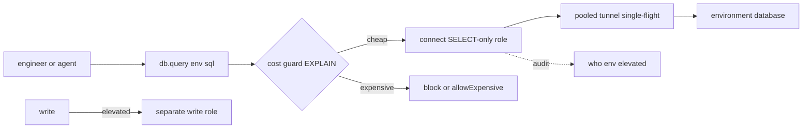

## Thesis

Building the tooling that lets other engineers move faster and safer --- abstracting repetitive, error-prone infrastructure (environments, credentials, tunnels, access) behind a self-service, safe-by-default interface so the common task is one call and the dangerous one is hard --- and designing that interface as a product with a paved road, guardrails, and a deliberate escape hatch, justified by the friction it removes across a whole team.

## Sub

**Why a platform: friction times many engineers** -> **the interface: self-service, safe-by-default, paved road** -> **guardrails and the escape hatch** -> **zoom out** to platform-as-product, tool-surface design, and adoption, and the pivots an interviewer rides from "an internal tool" into what-makes-it-a-platform, safe-by-default, and build-vs-buy.

## Spine

- A developer platform **multiplies a team** --- it abstracts the repetitive, error-prone infrastructure work (reaching 21 environments, resolving credentials, managing tunnels) behind a self-service interface, so a task that cost every engineer ten minutes becomes one call.
- The interface is **safe-by-default** --- the common path is easy and the dangerous path is hard: production is read-only unless you explicitly elevate, every query is EXPLAIN-checked before it runs, and the environment is always explicit so a dev query can't hit prod.
- It's a **paved road with an escape hatch** --- the golden path handles the 90% case ergonomically and guardrails catch mistakes, but a deliberate, audited override exists for the cases the golden path doesn't cover.
- A platform is a **product** --- adoption is voluntary, so it competes with "just do it manually"; it's justified by the friction it removes (a tool saving ten minutes across a team compounds into hundreds of hours), and it decays, so it needs maintenance and re-assessment.

## Companion Notes

### walk

The tooling that multiplies a team

One friction-heavy task turned into a self-service, safe-by-default call --- the abstraction that removes the toil, the guardrails that catch mistakes, the escape hatch for the exceptions, and the product thinking that decides it's worth building.

Say the multiplier first --- "a tool that removes ten minutes of friction, used across a team, compounds into hundreds of hours." That framing is what makes a platform an investment, not a side project.

### drill

Probe Drill

Graded follow-ups on self-service, safe-by-default, the paved road, and platform-as-product --- the ones that separate "I wrote a script" from designing a platform other engineers depend on.

Name safe-by-default: the common path easy, the dangerous path deliberately hard (prod read-only, elevation audited) is the single instinct that reads as platform maturity.

### wb

Whiteboard

Rebuild the platform between developers and infrastructure from the cues alone --- the intent-in interface, where safety is actually enforced, the cost guard, the escape hatch, the pooled tunnels, and the audit trail.

Draw the front door first, then ask the only question that matters: where is the safety enforced? If the answer is "in my code that reads the SQL string," you have a suggestion, not a boundary.

### sys

System Map

Where the platform sits between engineers and 21 environments --- the callers above it, the credentials and pooled infrastructure below it, and the estate whose side doors must stay closed for any of it to mean anything.

The platform is only a safety win if it is the ONLY path. Concentrating access while the direct route stays open gives you a nice audit log of the well-behaved half.

### trade

Trade-offs

The calls that separate "a script I wrote" from a platform --- where to enforce safety, how hard to make the guardrail bite, whose identity reaches the database, and what to build versus buy.

Every one of these is a switch condition, not a favourite. Name what each choice bounds, and what it costs you when the choice is wrong.

### model

Model Answers

Nine rehearsed arcs --- the whole design, safe-by-default, the cost guard, the tool surface, the managed infrastructure, adoption, build-vs-buy, the one you built, and the honest limits.

Open with the multiplier and close with adoption. The middle is mechanism; those two are the reason the mechanism is worth anything.

### num

Numbers

The back-of-envelope that decides whether to build at all --- payback period, not lines of code. Build cost is one-time; the saving recurs per use, per engineer.

Lead with the payback period and then show its sensitivity to adoption: half the adoption doubles the payback. That single relationship is the whole argument for treating it as a product.

### rf

Red Flags

The moves that quietly tank a platform round --- relying on vigilance, string-matching the SQL, running EXPLAIN ANALYZE to "check the cost", and calling low adoption a people problem.

Most of these are one sentence away from a no-hire because they show the candidate has never actually operated the thing they designed.

### open

Opener

How to open on internal tooling at altitude --- the one-breath version, the thirty-second model, and the close that names what bites.

Open at the friction and the multiplier, not at the CLI. The tool is the answer to a question you should state first.

## Drill

all | **All four levels, mixed** --- the way a real platform discussion actually comes at you.
SDE2 | **the model and the mechanics** --- what a platform is, self-service, the paved road, abstraction, safe-by-default, guardrails, the tool surface. The bar is "the common path is easy and the dangerous path is hard": name the abstraction and the default that makes it safe.
SDE3 | **safety, the paved road, and tool design** --- where safety is *enforced*, EXPLAIN-before-execute, the tunnel lifecycle, the escape hatch, environment isolation, the API, the audit trail. The bar is "a guardrail is not a boundary": name what enforces the rule, not what suggests it.
Staff | **platform-as-product and org calls** --- adoption, measurement, build-vs-buy, knowledge, the team model, prematurity, the security boundary. The bar is "adoption is the metric": name why an engineer would choose it, and what one compromised platform costs you.

### SDE2 | what a developer platform is

What is a developer platform, in practice?

Internal tooling that abstracts infrastructure so other engineers can self-serve the things they'd otherwise do manually and repetitively --- connecting to environments, running queries, deploying, provisioning. Instead of every engineer learning the SSH-tunnel-plus-credentials dance for 21 environments, they call one tool. It's the layer between developers and raw infrastructure whose job is to remove friction and enforce good defaults, so the team spends its time on product, not on plumbing.

Follow: That sounds like a shared library. What actually makes it a *platform* rather than a library everyone imports?
A library hands you a **capability**; a platform owns the capability **and the policy attached to it**. A library that opens a database connection still leaves every caller to find the credentials, stand up the tunnel, and decide for themselves whether a production write is acceptable --- so every caller reimplements those decisions, and some caller forgets. A platform holds the credentials, manages the tunnel, enforces prod-read-only, and records who did what, behind one interface. The test is whether the **policy travels with the capability**. A library is *a* way to do the thing; a platform is meant to be *the* way, and it is the place the rules live --- which is also why it inherits the obligation to be audited and hardened.

Follow: Who is the user of a developer platform --- is it really just engineers?
Increasingly it's **engineers and the agents acting for them**, and that changes the design. A human can read a README, guess a parameter, and recover from a confusing error. An agent has only the tool's name, its parameter schema, and its description --- those *are* the interface it reasons over. So the surface has to be **self-describing** rather than merely documented, the errors have to be **actionable** rather than merely accurate ("add a WHERE clause or pass allowExpensive=true", not "query rejected"), and the safety cannot rest on the caller being careful, because the caller may be a model that will confidently do the wrong thing at speed. Designing for the agent as a first-class caller is what forces the discipline --- explicit parameters, no implicit state, safe defaults --- that turns out to make it better for humans too.

Senior: Distinguishing a **platform from a library** --- the platform owns the mechanism *and* the policy, so the guardrails travel with the capability and there is exactly one auditable path --- and naming the **AI agent as a first-class caller** that cannot be trusted to be careful, is what separates "I wrote a helper script" from "I designed a platform other people depend on."
Speak: A developer platform is internal tooling that **abstracts infrastructure so engineers self-serve** what they'd otherwise do by hand --- 21 environments, tunnels, credentials, MFA, collapsed into one call. What makes it a platform rather than a library is that the **policy travels with the capability**: it holds the credentials, enforces prod-read-only, and records who did what. So there's one path, and the rules live in it.

### SDE2 | self-service

Why is self-service the core idea?

Because it removes the human bottleneck --- engineers get what they need without filing a ticket and waiting on a platform team, and the platform team stops being a queue of one-off requests. The value is a multiplier: a capability built once and exposed as self-service is used by everyone, so the effort amortizes across the whole team. A platform that still requires a human in the loop for the common case isn't a platform; it's a service desk.

Follow: If self-service means nobody approves the request, haven't you just removed the safety review?
No --- you've **moved it from per-request to per-capability**, which is the whole point. A ticket queue reviews every request by hand, which is slow, inconsistent, and doesn't actually scale attention: the hundredth approval gets rubber-stamped. Self-service replaces that with policy encoded **once, in the capability**: prod is read-only by default, the environment is required, the cost guard runs on every query, the elevation is logged and attributed. The review moved *earlier* and got *stricter* --- it's now a property of the tool rather than a human's judgment at 2am. Where a genuine human decision is still required (a production write, a schema change), you keep the approval, but you keep it for the **narrow, genuinely dangerous set**, not for the boring 95%.

Follow: What's the failure mode of a platform team that stays a ticket queue?
Their impact is **capped at their headcount** and they become the bottleneck they were hired to remove. Every environment change, credential rotation, or access grant is a ticket, so throughput is limited by how many tickets a small team can close, latency for the requester is hours-to-days, and the team spends its time on repetitive execution rather than on building the leverage that would end the repetition. Worse, the queue *creates* the workaround: engineers who can't wait find a side door --- a personal credential, a shared password, a laptop tunnel --- so the ticket queue produces exactly the unaudited scattered access the platform existed to eliminate. The metric shift is the fix: stop counting tickets closed, start counting **friction removed and self-service adoption**.

Senior: Reframing self-service as **moving the review from per-request to per-capability** --- policy encoded once in the tool, so it's stricter and scales, with human approval reserved for the genuinely dangerous minority --- and naming that a ticket queue *manufactures* the unaudited side doors it's meant to prevent.
Speak: Self-service removes the **human bottleneck**: a capability built once and exposed to everyone amortizes across the team, and the platform team stops being a queue. And it doesn't remove the safety review --- it **moves it from per-request to per-capability**, encoded in the tool, where it's consistent and doesn't get rubber-stamped at request one hundred. A platform that needs a human in the loop for the common case is a service desk.

### SDE2 | the paved road

What is a "paved road" or golden path?

The well-supported, opinionated way to do a common task --- the path the platform makes easy, safe, and obvious, so the default choice is also the right one. A paved road for "run a query against staging" means the tunnel, credentials, and safety checks are handled for you if you stay on it. The point is to make the good path the path of least resistance, so most engineers do the right thing without having to know all the infrastructure underneath.

Follow: Is the paved road mandatory? What if a team genuinely needs to go off it?
The road is **paved, not walled** --- you make it the *cheapest* path, not the *only* path, and you leave a deliberate, audited exit. That's a real design decision, and it cuts both ways: if you *force* everyone onto it, you either have to make it handle every case (which bloats it into a thicket of options and destroys the ergonomics that made it fast) or you block legitimate work and people build a shadow tool you can't see. If you make it purely optional with no gravity, you get inconsistency and no leverage. The resolution is **gravity, not walls**: the golden path is so much easier that leaving it costs you something, the exit is explicit and logged, and a *pattern* of exits is a signal to widen the road, not to punish the people taking them.

Follow: How do you know the road is paved in the right place?
By watching where people **leave it**, which is why the escape hatch has to be instrumented rather than merely allowed. If 40% of queries pass `allowExpensive`, the cost threshold is wrong, not the engineers. If a whole team routes around the platform for one workflow, that workflow is the missing lane. The paved road is discovered from usage, not designed from first principles: you ship the 80% case, measure the exits, and pave where the traffic actually is. A platform team that never looks at its override rate is guessing at where the road should go --- and is usually paving the case *they* found interesting rather than the one the team hits fifty times a day.

Senior: Framing the paved road as **gravity, not walls** --- cheapest path plus a logged exit --- and then treating the **exit rate as the design signal** (a high override rate means the threshold or the road is wrong, not that the engineers are careless) is what shows you've operated a platform rather than merely shipped one.
Speak: A paved road is the **opinionated, well-supported way** to do the common task --- tunnel, credentials, and safety checks handled if you stay on it --- so the default choice is also the right one. It's **paved, not walled**: the cheapest path, plus a deliberate, logged exit. And the exit rate is the design signal --- if people keep leaving the road at the same point, that's where the road is wrong, not the people.

### SDE2 | abstraction

What does the platform actually abstract away?

The incidental complexity of the infrastructure --- SSH tunnels to a bastion, per-environment connection strings, credentials pulled from a secrets manager, MFA. All of that is real work the platform hides behind a single call like "query this environment." The engineer expresses intent (what they want) and the platform handles mechanism (how to reach it safely). Good abstraction exposes the intent cleanly while keeping the mechanism replaceable underneath, so the infrastructure can change without the interface changing.

Follow: Every abstraction leaks. What happens the first time the tunnel breaks and the caller sees a raw SSH error?
That's the moment the abstraction is judged, and the answer is that **you own the failure, not just the happy path**. A leak that surfaces `ssh: connect to host bastion port 22: Connection timed out` to someone who never asked for a tunnel is a broken abstraction: it exposes the mechanism at exactly the moment the caller has no context to act on it. The fix isn't to pretend the tunnel doesn't exist --- it's to **translate the failure into the caller's vocabulary and act on it where you can**: recreate a dead tunnel automatically and retry once (the caller never sees it), and when it genuinely can't be recovered, return an error in the domain the caller understands ("cannot reach staging: the bastion is unreachable; infra is paged"). The abstraction's job is to be *honest and actionable* at the boundary, not to be airtight --- an abstraction that hides the mechanism when it works and dumps it raw when it fails is worse than no abstraction, because you've removed the caller's ability to fix it themselves without giving them anything in return.

Follow: What is the test for whether you've abstracted at the right level --- intent versus mechanism?
Ask whether **you could replace the mechanism without changing the interface**. If you moved from an SSH bastion to AWS SSM port forwarding, or from static secrets-manager passwords to short-lived IAM auth tokens, would a single caller have to change a single line? If yes, you've leaked mechanism into the interface --- a `tunnelPort` parameter, a `sshKeyPath`, a caller-supplied password. If no, the abstraction is at intent level: `query({ environment, sql })` says *what*, and everything about *how* is yours to change. That's not a purity argument, it's the payoff: the whole reason to build the platform is that you can rotate the credential model, swap the bastion, or add a read-replica for prod reads **once**, centrally, instead of chasing it through every engineer's shell history.

Senior: Naming the **replaceability test** --- if you can't swap SSH-bastion for SSM port-forwarding without touching a caller, mechanism has leaked into your interface --- and owning the **failure path** as part of the abstraction (auto-recover, then translate the error into the caller's domain) is what distinguishes designing an abstraction from merely wrapping a command.
Speak: It abstracts the **incidental complexity** --- the bastion tunnel, the per-environment connection string, the secrets-manager lookup, the MFA. The caller expresses **intent**, the platform owns **mechanism**. And the test for whether you got the line right is **replaceability**: if I can swap the SSH bastion for SSM port-forwarding without a single caller changing a line, the abstraction is at the right level. If they'd have to, mechanism leaked into the interface.

### SDE2 | safe-by-default

What does safe-by-default mean for a platform?

The default behavior is the safe one, and doing something dangerous takes a deliberate extra step. Production defaults to read-only; a write requires an explicit `elevated` flag. The environment is always required, so you can't accidentally run against prod. The idea is that the easy, obvious thing should be the safe thing, and the risky thing should require intent --- so a tired engineer at 2am is protected by the defaults rather than relying on remembering to be careful.

Follow: Give me the failure this actually prevents. What does "not safe-by-default" look like in practice?
It looks like a shell with a **sticky context**. You `use prod` to check something, get distracted, come back, and run the `DELETE` you meant for your dev database --- and there is nothing between you and the damage but your memory of which environment you were in. That is the single most common self-inflicted production incident in the category, and it has two root causes, both of which are *defaults*: there was an **implicit current environment** (so the target was ambient state, not an argument), and the connection was **writable by default** (so a mistake was immediately destructive). Safe-by-default kills both: the environment is a required parameter of every call, so there is no ambient state to be stale, and the prod connection has no write privilege at all unless you deliberately elevate. The mistake becomes *impossible*, not merely *discouraged* --- and that's the distinction the phrase is actually pointing at.

Follow: Isn't this just friction? You've made the dangerous thing take an extra step --- won't people just always pass the flag?
That's the real risk, and it's why the extra step has to be **narrow, rare, and visible**. Friction only works as a safety mechanism when the safe path covers the overwhelming majority of what people actually do --- if 90% of your work needs `elevated: true`, the flag stops being a decision and becomes a reflex you type without reading, and you've bought nothing but a longer command. So you size the default to the real distribution: reads dominate, so reads are free and writes are deliberate. And you make the deliberate act **attributable and observable** --- it's logged with the identity, and the elevation rate is a number someone looks at. The moment the elevation rate climbs, either the default is wrong or someone's workflow has quietly become dangerous, and both are things you want to know. A guardrail everyone overrides isn't a guardrail; it's a speed bump you've trained people to ignore.

Senior: Naming the **concrete accident** (a sticky ambient environment plus a writable-by-default connection) and killing both with *structure* --- environment as a required parameter, no write privilege without elevation --- then closing the loop by treating the **elevation rate as a monitored signal**, because a default everyone overrides has already failed.
Speak: Safe-by-default means the **easy path is the safe one and the dangerous one takes deliberate intent**. Production is read-only unless you explicitly elevate, and the environment is a **required parameter**, so there's no ambient "current env" to be stale --- which kills the classic accident of running a DELETE against prod because you forgot which shell you were in. Safety comes from the **defaults and the required intent**, not from the engineer's vigilance at 2am. And you watch the elevation rate: a guardrail everyone overrides isn't a guardrail.

### SDE2 | guardrails

What are guardrails on a platform?

Automatic checks that catch mistakes before they cause damage --- not blocking everything, but stopping the clearly-bad. Running EXPLAIN on every query to detect a full-table scan and refusing one that would read ten million rows; requiring the environment to be named; capping cost. Guardrails differ from permissions: permissions say who *may*, guardrails say "this specific action looks dangerous, confirm you mean it." They make the platform forgiving of honest mistakes, which is most of what goes wrong.

Follow: You've drawn a line between permissions and guardrails. Push on it --- why does the distinction matter operationally?
Because they fail differently, and confusing them is how people build **safety theatre**. A permission is a **boundary**: it's enforced somewhere the caller cannot reach (a database role with no `UPDATE` grant, a network path that doesn't exist), so a determined or confused caller *cannot* cross it. A guardrail is **advice with teeth**: it's a check the platform performs, so it's only as good as the platform's ability to see what's coming, and it is designed to be **overridable** --- that's the point of it. The operational consequence: you must never rely on a guardrail to hold a security boundary. "Prod is read-only because my code checks the SQL for the word UPDATE" is a guardrail cosplaying as a permission, and it will be defeated by the first CTE that writes. The right architecture uses both: the **permission** makes the catastrophic case impossible, and the **guardrail** catches the merely expensive, careless case with a helpful message and an override.

Follow: How do you tune a guardrail so it isn't noise?
By measuring its **override rate and its false-positive rate**, and being willing to move the threshold. A guardrail that fires on 2% of queries and is overridden a third of the time is doing real work. A guardrail that fires on 40% and is overridden almost every time has become a **dialog people dismiss** --- it's costing everyone a step, teaching them to click through warnings, and catching nothing, which is strictly worse than not having it, because now you *believe* you're protected. The tuning discipline is the same as alerting: set the threshold where the block correlates with genuine harm, review the overrides periodically to see whether they cluster (a cluster means the road needs widening or the threshold is wrong), and make sure the message tells the caller **exactly how to proceed safely** --- "this would scan 10M rows; add a WHERE clause on `created_at`, or pass `allowExpensive=true`" --- so the guardrail is a teacher, not a wall.

Senior: Drawing the sharp line --- a **permission is a boundary the caller cannot reach; a guardrail is overridable advice** --- and refusing to let a guardrail carry a security invariant, then tuning the guardrail like an alert (override rate, false-positive rate, actionable message) so it doesn't decay into a dialog people dismiss.
Speak: Guardrails are **automatic checks that catch the clearly-bad before it lands** --- EXPLAIN every query and refuse a ten-million-row scan, require the environment, cap cost. And keep them distinct from permissions: **permissions say who may; guardrails say "this looks dangerous, confirm you mean it."** A permission is a boundary the caller can't reach; a guardrail is overridable by design --- so never make a guardrail carry a security invariant, and tune it like an alert, or it becomes a dialog people click through.

### SDE2 | the capability surface

When you build a tool, what is its "surface"?

The set of actions it exposes and how they're organized --- the verbs an engineer (or an AI agent) can call. A database tool exposes `connect`, `query`, `tunnel`, `disconnect`; an environment tool exposes `list`, `show`, `test`. Designing the surface is grouping related actions coherently, naming them by intent, and keeping each one focused. A tool with 95 actions is usable only if the surface is organized by domain and each action does one clear thing; a sprawling, inconsistent surface is a tool nobody can hold in their head.

Follow: What is the actual cost of a large surface? Ninety-five actions --- what breaks?
Two different things break, and they're worth separating. For a **human**, a large flat surface is a **discovery and memory** cost: nobody holds ninety-five verbs in their head, so the tool is only usable if the surface is grouped by domain, named consistently, and discoverable from inside the tool itself. For an **AI agent**, the cost is more literal and more brutal: every tool's name, description, and parameter schema is **in the context window on every single call**, so the surface has a direct token cost, and --- more importantly --- the model has to **choose** among ninety-five options, so any two actions whose descriptions overlap become a coin flip. The failure mode isn't "the model can't find the tool"; it's "the model confidently picks the *wrong* one" --- calling `db.query` when it wanted `db.explain`, or picking a destructive verb whose description didn't clearly say so. So the surface has to be **disjoint** as well as organized: each action's description must make it obvious not just what it does but when *not* to use it.

Follow: So do you collapse it? One tool with an `action` parameter instead of ninety-five tools?
That trades one problem for a worse one, and I'd resist it. A single `db(action, ...)` mega-tool shrinks the listed surface, but it pushes the real complexity into an **untyped, conditional parameter blob** --- `sql` is required when action is `query` but meaningless when it's `disconnect`, `elevated` only applies to some --- so the schema stops describing anything and the caller (especially an agent) loses exactly the signal it needs. You've hidden the surface, not designed it. The genuinely useful moves are **namespacing and progressive disclosure**: group by domain into a handful of coherent tools so the caller reasons about *domains* first (`db`, `environment`, `health`), keep each action focused with a schema that actually constrains it, and expose a **discovery action** so the caller can enumerate capability on demand rather than carrying all of it. And then be ruthless about the count itself --- ninety-five actions usually means a dozen are load-bearing and the rest are someone's convenience wrapper. The fix for a sprawling surface is most often **deleting from it**.

Senior: Separating the two costs of a big surface --- **human memory/discovery** versus an agent's **token cost and selection ambiguity** --- naming that the real agent failure is a *confident wrong pick* between overlapping descriptions (so actions must be disjoint, not merely organized), and rejecting the mega-tool because it hides the surface in an untyped parameter blob instead of designing it.
Speak: The surface is **the verbs you expose and how they're grouped** --- `db.query`, `db.tunnel`, `environment.list`. Design it by **intent, grouped by domain, one focused thing each**. And the cost of getting it wrong differs by caller: a human pays in memory and discovery; an **agent pays in tokens and in wrong picks**, because every schema is in its context and two overlapping descriptions become a coin flip. So make the actions **disjoint**, not just organized --- and if you have ninety-five, the honest fix is usually to delete some.

### SDE3 | safe-by-default in practice

How do you actually implement safe-by-default for production access?

Layer the defaults so the safe path needs no thought and the risky path needs intent: production connections default to **read-only**, and a write operation requires an explicit `elevated: true` that's logged; the target environment is a **required** parameter, so there's no implicit "current" environment to get wrong; and destructive or expensive actions demand a confirmation flag. The principle is that safety comes from the *defaults and the required intent*, not from the engineer's vigilance --- you design so the accident is impossible-by-default and the deliberate act is auditable.

Follow: Where is "read-only" actually enforced? Be specific --- I want the mechanism, not the policy.
This is the question that separates the two answers, and the wrong one is very common: **do not enforce it by inspecting the SQL string.** "Reject anything that isn't a SELECT" is a blacklist, and Postgres will walk straight through it --- `WITH d AS (DELETE FROM orders WHERE id < 100 RETURNING *) SELECT * FROM d;` starts with `WITH`, reads like a query, and deletes a hundred rows. So does `SELECT some_function_that_writes()`. Enforcement has to live **below the caller**, in the database's own privilege system: the platform connects to production as a **role that has been granted only `SELECT`** --- no `INSERT`, `UPDATE`, `DELETE`, `TRUNCATE` --- so a write doesn't get rejected by my parser, it gets rejected by Postgres, which is not fooled by clever SQL. Elevating means using a **different, write-capable role** for that one deliberate, logged call. Even stronger where it fits: point read traffic at a **physical read replica**, which refuses writes at the server level because it's in recovery, so the write path physically does not exist. Note also what you *cannot* use: `default_transaction_read_only` is a session GUC the client can flip back off, so it's a nice guardrail against accident but it is **not a boundary**.

Follow: Your platform takes SQL from the caller. Can't they just prepend `SET ROLE` or `SET statement_timeout = 0` and undo your defaults?
Only if you let them send **multiple statements**, and you shouldn't. Postgres's simple query protocol happily executes a semicolon-separated batch, which means an unvalidated string is a `SET`-then-do-anything primitive. The fix is protocol-level, not parsing-level: send the caller's SQL through the **extended query protocol** as a single parameterized statement, which **rejects multiple commands outright**. Now the caller controls exactly one statement, and the session settings I established on that connection --- the role, the `statement_timeout`, the read-only transaction --- are mine and stay mine. That closes the last hole: the privileges come from the role (which the caller can't change, because they'd need a `SET ROLE` statement they can't send), the timeout is set by me on connection setup, and the SQL is one statement executed in a transaction I opened. Structure, not string-matching.

Senior: Locating enforcement **in the database's privilege system, not in the platform's parser** --- a SELECT-only role (or a physical read replica) so a write CTE is rejected by Postgres rather than by a regex --- and then closing the escape by refusing multi-statement input via the extended query protocol, so the caller can never `SET` their way out of your defaults. Knowing that `default_transaction_read_only` is a USERSET GUC and therefore *not* a boundary is the tell that you've actually built this.
Speak: The policy is prod-read-only, environment required, elevation logged --- but the thing that matters is **where it's enforced**. Not in my code reading the SQL: `WITH d AS (DELETE ... RETURNING *) SELECT * FROM d` defeats that in one line. Enforce it in the **database's privilege system** --- connect to prod as a role granted only SELECT, or point reads at a physical replica that refuses writes at the server level. And send **one statement over the extended protocol**, so the caller can't prepend a `SET` and undo my defaults. Structure, not string-matching.

### SDE3 | explain-before-execute

What problem does running EXPLAIN on every query solve?

It catches expensive operations *before* they hit production, rather than after they've caused an incident. Every SELECT is run through EXPLAIN first: a sequential scan on a large table, a missing index, an estimated ten-million-row read --- the platform sees the cost and blocks the query with a helpful message ("this would scan 10M rows; add a WHERE clause or pass allowExpensive=true"). It converts "run it and find out" into "know the cost, then decide," which is the difference between a guardrail and a post-mortem. The estimate is cheap; the runaway query is not.

Follow: EXPLAIN gives you the planner's *estimate*. What happens when the estimate is wrong?
It's wrong more often than people expect, and that's the honest limit of this guardrail. The planner's row counts come from the statistics in `pg_statistic`, which are refreshed by `ANALYZE` (usually via autovacuum). If a table was just bulk-loaded, or autovacuum is behind, or the predicate is correlated in a way the planner's independence assumption doesn't model, the estimate can be off by orders of magnitude --- it says twelve rows and the query reads forty million. So **EXPLAIN is a pre-flight heuristic, not a bound**: it is very good at catching the obvious, honest mistake (the missing WHERE clause, the accidental cross join, the seq scan on the biggest table), and it will occasionally wave through something that turns out to be catastrophic. Which means it cannot be the only thing standing between an engineer and production --- you need something that constrains the *actual* execution, not the *predicted* one.

Follow: So what actually bounds the damage when the estimate is wrong?
A hard **`statement_timeout`** on the platform's connection, set by the platform, not the caller. It doesn't care what the planner predicted --- if the statement is still running after N seconds, Postgres aborts it. That's the backstop that turns "we estimated wrong" from an incident into an error message. I'd layer three things, and they're deliberately different in kind: **EXPLAIN** as the cheap pre-flight that catches the common mistake *and teaches* (the error tells you to add a WHERE clause); **`statement_timeout`** as the enforced ceiling on actual runtime; and a **read-only role or replica** so that even a pathological read can't corrupt anything --- worst case it burns CPU and gets killed. And I'd add the operational point: on the primary, a long-running read isn't harmless either --- it holds a snapshot that can block vacuum from cleaning up dead tuples --- which is another reason to send ad-hoc analytical reads to a **replica** rather than to prod's primary at all.

Senior: Naming EXPLAIN's real limit --- it consumes **planner estimates from `pg_statistic`**, which go stale, so it is a heuristic and not a bound --- and then layering an *enforced* backstop (`statement_timeout` set platform-side) plus a read-only role or replica, so the guardrail teaches and the boundary contains. Knowing that a long read on the primary also holds back vacuum is the operational detail that reads as someone who's actually run this.
Speak: Every query goes through **EXPLAIN first** --- plan only, no execution --- so a seq scan on a huge table or an estimated ten-million-row read is caught *before* it runs, with a message that tells you how to fix it. But be honest about what it is: EXPLAIN reads **planner estimates**, which come from statistics that go stale, so it's a **heuristic, not a bound** --- it will occasionally wave through something terrible. So you back it with an enforced ceiling: a **`statement_timeout`** the platform sets, and a read-only role or a replica. EXPLAIN teaches; the timeout contains.

### SDE3 | infrastructure lifecycle

Why treat something like an SSH tunnel as managed infrastructure?

Because it's expensive to create and fragile, so leaving it to ad hoc per-command setup is slow and flaky. The platform manages its lifecycle explicitly: create it, health-check it, reuse it across many queries, idle-timeout and kill it when done, and auto-recreate it if it dies mid-use. That's the same lifecycle discipline you'd apply to a database connection pool. The lesson generalizes --- anything costly and failure-prone that the platform depends on (tunnels, connections, sessions) should be pooled, health-checked, and self-healing, not created and torn down per call.

Follow: How do you health-check a tunnel? Be precise --- what does a *good* check look like?
The naive check is to dial the local forwarded port and call it healthy if the TCP connect succeeds --- and that check is **almost worthless**, because `ssh -L` binds the local listener locally. The listener accepting a connection tells you the SSH *client process* is alive; it tells you nothing about whether the forwarded channel to the remote host still works. And that's exactly the failure you actually get: a NAT or firewall silently drops the idle TCP session, or the remote target becomes unreachable, and the tunnel looks perfectly healthy right up until the moment a real query hangs on it. So the only honest health check is **end-to-end through the tunnel**: open a connection to the database *via* the forwarded port and run `SELECT 1`. If that round-trips, the whole path works. I'd also set `ServerAliveInterval` so the SSH client notices a dead peer on its own rather than waiting for a query to discover it, and treat the health check as cheap enough to run on checkout from the pool.

Follow: The bastion restarts and every tunnel dies at once. Twenty engineers' next queries all try to recreate it. What happens, and how do you stop it?
That's a **thundering herd**, and it's the same problem as a cache stampede. Twenty callers all discover a dead tunnel, all decide to recreate it, and all initiate SSH connections plus MFA against a bastion that has just restarted and is at its most fragile --- so you turn a brief blip into a self-inflicted denial of service against your own bastion, and you may hit connection limits or rate limits and fail *all* of them. The fix is **single-flight**: creation is behind a per-environment mutex, so the first caller creates the tunnel and the other nineteen **wait on that same in-flight creation** and then share the result. One SSH handshake, not twenty. I'd pair it with **bounded retry and jittered backoff** for the case where recreation genuinely fails (so you don't hammer a bastion that's still down), a **circuit breaker** per environment so a persistently dead environment fails fast with a clear error instead of making every caller wait out a timeout, and a **cap on pool size** so the platform can't open unbounded connections when things go wrong.

Senior: Knowing that a **TCP dial to the local forwarded port proves nothing** --- the listener is local, the forwarded channel can be silently dead --- so the health check must be an **end-to-end `SELECT 1` through the tunnel**; and treating simultaneous recreation as a **thundering herd** solved by **single-flight plus jittered backoff and a per-environment breaker**, rather than letting twenty callers dogpile a bastion that just restarted.
Speak: Treat the tunnel as **managed infrastructure, not a per-command side effect**: create, health-check, reuse across queries, idle-timeout, auto-recreate --- the same discipline as a connection pool. Two details that matter. The health check must be **end-to-end** --- a `SELECT 1` *through* the tunnel --- because dialing the local port only proves the SSH client is alive, not that the forwarded channel still works. And recreation must be **single-flight**, or a bastion restart turns twenty engineers into a thundering herd against a bastion that just came back up.

### SDE3 | the escape hatch

Why does a paved road need an escape hatch, and how do you build one?

Because a golden path that can't be left forces people off the platform entirely the moment their case doesn't fit --- and then they lose all the guardrails too. So the paved road handles the 90% case, and a **deliberate override** covers the rest: `allowExpensive: true` to run the query the cost-guard blocked, `elevated: true` for the prod write. The override is explicit, logged, and slightly inconvenient by design, so it's used only when meant. The tension is real --- too rigid and adoption drops, too loose and the guardrails are noise; the escape hatch resolves it by keeping the safe path default and the override intentional.

Follow: What stops the escape hatch from just becoming the normal path?
Three things, and the first is the one people skip: **you have to measure it.** The override rate is a first-class metric, per flag and per team --- if `allowExpensive` is on 40% of queries, the cost threshold is miscalibrated and the guardrail has already decayed into a dialog people dismiss, and the fix is to *retune the threshold or widen the road*, not to scold anyone. Second, the override must be **narrow**: it overrides *one specific check* it names, not "safety" in general. `allowExpensive` must not also grant a write; `elevated` must not also disable the cost guard. An override that turns off everything is a `--force` flag, and `--force` becomes muscle memory. Third, the override is **attributable and visible** --- logged with the identity and the reason, and surfaced somewhere a human occasionally looks, because an override nobody ever reviews is functionally an unlogged one.

Follow: You said the escape hatch should be "slightly inconvenient by design." How do you make something inconvenient without just making it annoying?
The distinction is whether the friction **carries information**. Good friction makes the caller *state something true* that they wouldn't state accidentally --- passing an explicit named flag, confirming a count ("this will update 4,812 rows"), or supplying a reason string that lands in the audit log. Each of those is a beat where a person who's about to make a mistake gets a chance to notice, and each produces a **record** that makes the deliberate act reviewable. Bad friction is a delay, an extra confirmation dialog with no new information, or a ceremony that's identical for a trivial and a catastrophic action --- that just trains people to click through, and it degrades the signal because now the confirmation means nothing. So: the friction should be **proportional to the blast radius** and it should **produce evidence**. If the extra step doesn't tell the user something they didn't know, or doesn't tell the audit log something it didn't know, it's noise --- remove it.

Senior: Treating the **override rate as a monitored product metric** (a high rate means the *threshold* is wrong, not the engineers), keeping each override **narrow to the single check it names** so it never degrades into `--force`, and demanding that the friction **produce information** --- a stated reason, a confirmed row count --- rather than just being a delay people learn to click through.
Speak: The paved road needs an exit, or the first case that doesn't fit pushes the engineer **off the platform entirely and out of the guardrails**. So: `allowExpensive`, `elevated` --- explicit, narrow, logged. Narrow matters: an override that disables *everything* is a `--force` flag, and `--force` becomes muscle memory. And the **override rate is a metric you watch** --- if it's 40%, your threshold is wrong, not your engineers. The friction should produce information (a reason, a row count), not just delay.

### SDE3 | environment isolation

How do you stop someone running a dev query against production?

Make the environment an explicit, required part of every operation and isolate the machinery per environment --- separate connection, tunnel, and credentials for each, so there's no shared "current environment" state to be stale or wrong. `db.query({ environment: 'staging', sql })` names the target every time; there's no default that a context switch could leave pointing at prod. Combined with prod-read-only-by-default, the result is that hitting production is always a conscious, named act, never a leftover from the last command.

Follow: Making it required stops the *implicit* mistake. But the caller can still explicitly pass `prod` when they meant `staging` --- especially if the caller is an agent. What then?
Right, and it's important to be honest about that: a required parameter eliminates **ambient state**, not **wrong intent**. The two need different defences. Against *wrong intent*, the layers are: **prod is read-only anyway**, so a mistargeted read is embarrassing rather than destructive; the **cost guard** runs regardless of environment; the write path requires a **separate deliberate elevation**, so hitting prod by mistake and *also* passing `elevated: true` is now two independent errors rather than one; and the action is **attributed**, so it's discoverable after the fact. There's also a cheap and underrated one: **don't fuzzy-match the environment name**. If someone passes `prd` or `production-2` and you helpfully resolve it to prod, you have built a machine for turning a typo into an incident. Resolve exact names only, fail with the list of valid environments, and make the names unambiguous enough that nobody has to guess.

Follow: What does "isolate the machinery per environment" actually buy you beyond preventing the mix-up?
**Blast-radius containment and failure isolation.** If every environment has its own tunnel, its own connection pool, and its own credentials, then a broken bastion in one environment can't exhaust the pool that serves the other twenty, a leaked credential is scoped to exactly one environment rather than being a skeleton key, and a runaway workload against staging can't starve the connections that prod reads need. It also makes the **circuit breaker meaningful** --- you can trip staging and leave everything else healthy --- and it makes the credential story honest: the platform holds twenty-one *narrow* credentials rather than one broad one, so the worst case of a compromise is bounded by the environment, not by the estate. Shared machinery is the thing that quietly re-couples environments you thought you had separated: one pool, one credential, one tunnel process, and now a problem anywhere is a problem everywhere.

Senior: Separating the two failures --- **required parameters kill ambient state; they do nothing about wrong intent** --- and then naming the layered defences for intent (prod read-only anyway, a *separate* elevation so a mistarget is two errors not one, exact-match environment names so a typo can't resolve to prod), plus arguing per-environment isolation on **blast radius and credential scope**, not just on preventing the mix-up.
Speak: The environment is a **required parameter of every call**, and the machinery --- tunnel, pool, credentials --- is **isolated per environment**, so there's no ambient "current env" to be stale. But be precise about what that buys: required parameters kill *implicit* mistakes, not *wrong intent*. For intent you lean on the other layers --- prod is read-only anyway, a write needs a **separate** elevation, so a mistarget is two errors not one --- and you **never fuzzy-match** an environment name, or you've built a machine that turns a typo into an incident.

### SDE3 | designing a tool API

What makes a good tool API for engineers (or AI agents) to call?

Actions named by **intent**, grouped by **domain**, each doing one focused thing, with required parameters that make misuse hard --- and clear, actionable errors. When the caller might be an AI agent, this matters more: the tool descriptions and parameter shapes *are* the interface the model reasons over, so they must be unambiguous and self-describing. Organizing dozens of actions into coherent tools (a `db` tool, an `environment` tool, a `health` tool) rather than one flat list of 95 loose functions is what keeps a large surface learnable. The API is a product surface; its ergonomics determine whether the tool gets used.

Follow: "The descriptions are the interface." Make that concrete --- what does a badly-written tool description actually cost you?
It costs you a **wrong call, made confidently**. If `db.query` says "run a query against an environment" and `db.execute` says "execute SQL against an environment," a model picking between them is guessing --- and the one it guesses might be the one that writes. The description isn't documentation appended to the interface; for an agent it **is** the dispatch logic. So it has to carry the things a human would infer from context and an agent cannot: what the action does, **what it does not do**, when to prefer the sibling action, and what the dangerous parameter means. "Runs a read-only SELECT against the named environment. Does not write --- use `db.mutate` with `elevated: true` for writes, which is audited." That single sentence does more for correctness than any amount of downstream validation, because it prevents the wrong call instead of rejecting it. The same goes for **error messages**: an agent's next action is a function of your error string, so "query rejected" produces a random retry, whereas "estimated 10.2M rows scanned; add a WHERE clause on created_at, or pass allowExpensive=true" produces the right one.

Follow: This API has real callers now, including automated ones. How do you change it without breaking them?
The same way you'd evolve any published API, and the important shift is admitting it **is** one --- an internal tool with dozens of callers and agents in the loop has a contract whether you acknowledge it or not. So: **additive changes are free** (a new optional parameter with a safe default, a new action), and **anything else needs a deprecation path** --- keep the old action working, have it warn, and *measure who's still calling it* (the platform sees every call, which is the one genuine advantage you have over a public API). Never **silently change a default**, because a default is the part of your API that callers depend on without naming --- flipping `elevated` or a cost threshold quietly is how you break people who did nothing. And never **repurpose a name**: an action that used to be safe and is now destructive is far worse than a new action, because every cached agent prompt, every runbook, and every muscle memory still says the old thing is safe. Rename rather than redefine.

Senior: Treating **descriptions and error strings as executable interface** for an agent caller --- naming what an action *doesn't* do and which sibling to prefer, so the wrong call is prevented rather than rejected --- and then holding the internal API to real contract discipline: additive-by-default, deprecate-and-measure (you can see every caller), **never silently change a default**, and **never repurpose a name** to mean something more dangerous.
Speak: Actions named by **intent**, grouped by **domain**, one focused thing each, required parameters that make misuse hard, and errors that tell you what to do next. When the caller can be an agent, the **descriptions are the dispatch logic** --- so each one must say what it does, **what it doesn't do**, and which sibling to prefer, or the model makes a confident wrong pick. And it's a real API with real callers: additive changes are free, everything else needs deprecation --- and you **never silently change a default or repurpose a name** to mean something more dangerous.

### SDE3 | auditability

Why is auditability part of a platform, not an afterthought?

Because a platform concentrates access --- everyone's production queries and elevated writes flow through it --- so it's the natural place to record who did what, against which environment, and whether they elevated. That log is what lets you answer "who ran the query that locked the table" and what makes safe-by-default trustworthy: elevation isn't just gated, it's attributed. A platform that brokers powerful access without recording its use trades one problem (scattered, unlogged manual access) for a worse one (concentrated, unlogged access); the audit trail is what makes the concentration a net win.

Follow: Your platform connects to the database with one service credential. The DBA looks at the database's own logs and sees every query attributed to `platform_svc`. Is that a problem?
Yes --- you've **lost attribution at the layer that outlives you**. The platform's own log knows the human, but the database's log --- the one the DBA, the security team, and the incident responder actually read --- says only "the platform did it," which is useless for the question they're asking. Two fixes, and I'd do both. Cheap and effective: **propagate the identity into the session** so it lands in the database's own records --- set `application_name` (which shows up in `pg_stat_activity` and can be included in `log_line_prefix`), or set a local custom GUC on the transaction, so the human's identity is stamped on every statement and visible in `pg_stat_activity` while the query is still running --- which is exactly what you want when you're staring at a lock and asking "whose query is this?". Stronger, where the estate supports it: **per-user database identity**, using short-lived credentials rather than one shared service password --- RDS IAM authentication mints a token valid for about fifteen minutes, so the platform brokers the *user's* identity to the database rather than substituting its own. Then attribution is native, and it survives even if the platform's log doesn't.

Follow: Someone can still SSH to the bastion directly with their own credentials and bypass the platform entirely. What is your audit log worth then?
Considerably less than it appears, and this is the point people miss: **concentrating access is only a safety win if the alternative paths are closed.** A platform sitting alongside an open direct route gives you a beautiful, complete audit log of the well-behaved half of your traffic, and precisely nothing about the half you actually needed to see --- and worse, it gives you *false confidence*, because the log looks clean. So the platform being the front door has to be true at the **infrastructure layer, not the social layer**: revoke direct human credentials to production databases, restrict the bastion's security group so it accepts connections only from the platform's role, and make the platform the only principal holding the database credentials at all. If a break-glass path must exist --- and it should --- it is **sealed, alarmed and time-boxed**: using it fires a page, not a log line nobody reads. The rule is that the paved road is a *road*, but the direct route to production is a *wall*.

Senior: Catching that a **shared service credential destroys attribution in the database's own logs** --- and fixing it by propagating identity into the session (`application_name` / a local GUC, so it's visible in `pg_stat_activity` mid-query) or brokering per-user short-lived credentials (RDS IAM auth) --- and then insisting that the audit trail is only worth anything if the **direct paths are closed at the infrastructure layer**, with break-glass sealed and alarmed rather than merely logged.
Speak: The platform concentrates access, so it's the natural place to record **who did what, where, and whether they elevated**. Two traps. If the platform connects with **one shared service credential**, the database's own log says "platform" and you've lost attribution exactly where the DBA looks --- so propagate the identity into the session, or broker short-lived per-user credentials. And an audit log is worthless if the **side doors are open**: revoke direct human credentials and lock the bastion to the platform, or you've got a clean log of the honest half and false confidence about the rest.

### Staff | platform-as-product

What does it mean to treat an internal platform as a product?

It means adoption is **voluntary and earned** --- your platform competes with "just SSH in and do it manually," so if it's clunkier than the manual path, engineers route around it and you've built a shelf-ware tool with all the maintenance and none of the leverage. So you treat engineers as users: understand their workflow, make the paved path genuinely faster than the alternative, dogfood it, and iterate on friction. The failure mode of internal platforms is building what's architecturally elegant instead of what people will actually adopt; product thinking (who's the user, what's their job, why would they choose this) is what avoids it.

Follow: Couldn't you just make adoption mandatory --- close the alternatives and be done with it?
You often *should* close the direct-to-production route, but you should be clear-eyed that **mandating adoption doesn't create it, it hides the absence of it.** If the platform is genuinely worse than the manual path and you simply remove the manual path, three things happen: you've now taxed everyone's daily work with your bad ergonomics; people build a shadow tool you can't see, can't audit, and don't even know exists; and --- worst --- you have destroyed your only honest feedback signal, because the adoption rate no longer tells you anything about whether the thing is good. The order matters: **earn adoption first, then close the side doors to make the audit trail real.** Mandate is how you finish, not how you start. And a mandated platform has a *higher* quality bar, not a lower one, because now every hour of friction you ship is an hour every engineer is forced to pay.

Follow: How do you actually find the friction? Engineers rarely file a ticket saying "your tool is annoying."
They don't, and that's the trap --- **absence of complaints is not adoption**. You find it the way a product team does. **Dogfood it**: the platform team does its own work through the platform, so the friction lands on the people who can fix it (and a platform team that keeps a private SSH shortcut for itself will ship a tool nobody else wants either). **Instrument the funnel**: time-to-first-successful-query for a new engineer, error rates by action, which errors people hit and then *stop* (an abandoned flow is a scream), and the override rate. **Watch the bypasses**: if the bastion still shows direct logins, those are your requirements list --- each one is a case the paved road doesn't cover. And **go and watch someone use it**, once, without helping them; a five-minute observation of an engineer failing on a confusing parameter name will teach you more than a quarter of survey responses.

Senior: Refusing the easy answer that you can *mandate* adoption --- naming that a mandate on a bad tool hides the failure, breeds an unauditable shadow tool, and destroys the one honest signal you had, so you **earn adoption first and close the side doors second** --- and then treating friction discovery as instrumented product work (dogfooding, funnel metrics, abandoned flows, bypass logs) rather than waiting for complaints that never come.
Speak: A platform is a **product with voluntary adoption** --- it competes with "just SSH in and do it manually," so if it's clunkier, engineers route around it and you've built shelfware with all the maintenance and none of the leverage. And you can't fix that by **mandating** it: a mandate on a bad tool just hides the failure, spawns a shadow tool you can't audit, and kills the only honest signal you had. **Earn adoption first, then close the side doors.** Find the friction by dogfooding, instrumenting the funnel, and reading the bypass logs --- nobody files a ticket saying "your tool is annoying."

### Staff | measuring platform success

How do you know an internal platform is succeeding?

By the friction it removes and the adoption it earns, not by lines of code --- **time saved** (a tool that cuts ten minutes off a task done many times a day across a team compounds into hundreds of hours a year), **adoption rate** (are engineers choosing it over the manual path?), and **incidents prevented** (expensive queries blocked, prod accidents that didn't happen). The compounding is the whole justification: the build cost is one-time and the savings recur per use per engineer, so a tool that saves a little a lot of times is a large, ongoing return. If adoption is low, the platform is failing regardless of how good the internals are.

Follow: "Incidents prevented" is a counterfactual --- you can't count things that didn't happen. How do you make that defensible?
You don't claim the counterfactual; you **count the events that would have caused it** and let those stand on their own. The platform *does* have a hard number here: it knows exactly how many queries the cost guard blocked, what those queries estimated, and how many of them were subsequently re-run in a fixed form versus overridden. "The cost guard blocked 340 queries last quarter with an estimated cost above the threshold, and 280 of them were rewritten rather than overridden" is a fact, and it's a much stronger claim than "we prevented an outage." The same for elevation: "prod writes now require an audited elevation, and there were 12 last quarter, all attributed" is a fact about the change in *exposure*. Then --- and this is the honest part --- you pair it with the **trailing indicator**: the rate of a specific incident *class* (accidental prod writes, runaway queries on the primary) before and after. That's not a clean experiment, but a category of incident that used to happen monthly and hasn't happened since is a real signal, and stating it as an observed rate change rather than a claimed save is what keeps it credible.

Follow: What's the counter-metric --- the number that tells you the platform is doing harm?
Every good metric needs one, and here I'd track three. First, **the bypass rate**: direct bastion logins, or direct database credentials still in use. That number rising while your adoption number also rises means you're serving the easy cases and losing the important ones. Second, **the override rate** --- if the escape hatch is on a large fraction of calls, the guardrails have decayed into a dialog and the safety you're claiming isn't real. Third, and this is the one platform teams hate: **platform-induced latency and downtime**. You have inserted yourself into everyone's inner loop, so if a query that used to take 200ms of tunnel-reuse now takes 4 seconds because your pool is cold, or if the platform is down for an hour, you have *added* friction to twenty engineers rather than removing it --- and that cost is invisible in a "time saved" number that only counts the happy path. A platform that measures only its benefits will always look like it's winning.

Senior: Refusing to claim a counterfactual --- reporting **blocked-query counts and elevation counts as facts** plus the observed rate-change of an incident *class*, rather than asserting outages prevented --- and volunteering the **counter-metrics** (bypass rate, override rate, and the platform's own latency and downtime), because a platform that measures only its benefits will always look like it's winning.
Speak: Measure it like a product: **time saved, adoption, and incidents prevented** --- with the compounding as the argument, because the build cost is one-time and the saving recurs per use per engineer. But be rigorous. Don't claim outages you prevented; **count what the guard actually blocked**, and report the rate-change of the incident class. And name the **counter-metrics**: the bypass rate, the override rate, and the platform's own downtime --- because you're in everyone's inner loop now, and a platform that measures only its benefits will always look like it's winning.

### Staff | build vs buy

How do you decide whether to build an internal tool or adopt an existing one?

Build only where the friction is **specific to your environment** and no off-the-shelf tool fits --- the 21-environment, bastion-tunnelled, MFA-gated database access was peculiar enough that a bespoke server made sense; a generic secrets manager or a CI system you buy. The test: is this a differentiated, environment-specific problem, or a solved commodity? Building commodity infrastructure yourself is a tax you pay forever in maintenance; buying the peculiar thing that doesn't fit is a tax you pay in workarounds. Most internal-platform value is the thin, bespoke layer that adapts commodity tools to your specific environment, not reinventing the commodities.

Follow: Be concrete. "Safe, audited database access across many environments" sounds like a solved commodity to me. Name the products, and tell me honestly what's left to build.
It largely *is* a commodity, and a Staff answer has to say so rather than pretend the whole thing was novel. **Teleport** and **HashiCorp Boundary** both provide identity-based, certificate-brokered access to SSH and database targets with per-user identity, RBAC, and session recording --- which is most of my access story. **AWS Systems Manager Session Manager** gives you port-forwarding to an RDS instance through an EC2 host without opening inbound ports or distributing SSH keys, which removes the bastion-with-static-keys problem entirely. **RDS IAM authentication** mints a short-lived per-user token instead of a static password, which solves the shared-credential attribution problem natively. If I were starting today, I would take those and not write a line of tunnel-management code. What is genuinely **not** commodity, and is what I'd actually build, is the thin layer on top: the **EXPLAIN pre-flight cost guard** with an actionable error and an override, and the **agent-facing tool surface** --- an interface whose descriptions and schemas are designed to be dispatched by a model, with prod-read-only defaults that a confidently-wrong caller cannot talk its way past. That's the differentiated part. The transport isn't.

Follow: So was building it the wrong call?
Partly, and I'd say so plainly --- the ability to name what you'd un-build is a stronger signal than defending the whole thing. The **cost-guard and the tool surface** earned their keep: they were specific to how we worked, they prevented a real class of incident, and no product did them. The **tunnel and credential machinery** was, in hindsight, re-implementing a commodity, and I paid for that the way you always do --- in maintenance, in the edge cases of SSH lifecycle management, and in every hour spent on a health check that Session Manager would have given me for free. The instructive part is *why* it happened: the friction was real and urgent, and building the transport was the obvious first step, so nobody stopped to ask whether the transport was the *differentiated* part. The lesson I'd carry forward is to **separate the two layers before you start** --- write down which part of this is genuinely peculiar to us, buy or adopt everything below it, and be honest that "we needed it fast" is a reason to reach for the commodity, not a reason to rebuild it.

Senior: Naming the actual commodity products by name (**Teleport, Boundary, SSM Session Manager, RDS IAM auth**), conceding that the transport layer was a rebuild of a solved problem, and locating the genuinely differentiated value precisely --- the **EXPLAIN cost guard and the agent-legible tool surface** --- is what a Staff round is checking for. Being able to say "I'd un-build this half" is a stronger signal than defending the whole thing.
Speak: Build only the **thin, bespoke layer specific to your environment**; buy the commodities. And be honest about which is which: safe, audited database access is largely **solved** --- Teleport, Boundary, SSM Session Manager for the transport, RDS IAM auth for per-user short-lived credentials. I'd take those today. What I'd still build is the differentiated part: the **EXPLAIN cost guard** with an actionable override, and the **agent-facing tool surface** with prod-read-only defaults. The tunnel machinery was me re-implementing a commodity, and I paid for it in maintenance.

### Staff | knowledge as platform

Why is documentation and knowledge management part of the platform?

Because a platform (and the systems it fronts) is only usable if the knowledge of *how* is captured and findable --- and that knowledge decays. The discipline is to **organize by topic, not chronology** (an `auth` doc, not "notes from March"), **synthesize rather than accumulate** (compress raw findings into structured references), **index everything** from one entry point, and **update in place** as understanding improves. And because it goes stale, you build **re-assessment triggers** --- quarterly reviews, post-incident updates. Knowledge that's scattered across transcripts and never synthesized is knowledge you don't have; treating it as a maintained artifact of the platform is what keeps the platform learnable over time.

Follow: Documentation always rots. What makes any of this survive contact with a team that's busy?
Only one thing reliably does: **make the documentation load-bearing, so it breaks when it's wrong.** Prose that merely *describes* the system rots silently, because nothing punishes the drift --- and no amount of quarterly-review discipline survives a busy quarter. So you move as much of the knowledge as you can into places where staleness is *detectable*: the **tool descriptions and error messages** (which are read on every call, and which an agent's behaviour immediately punishes if they're wrong), **executable examples** that run in CI (a doc snippet that no longer works fails the build), and **the platform's own `--help` / discovery action** generated from the schema rather than written beside it, so it cannot disagree with the code. What's genuinely left --- the *why*, the design decisions, the incident history --- is the part prose is actually good at, and that's the part worth the ceremony of an index and a re-assessment trigger. The mistake is spending the discipline on the mechanical parts that should have been generated, and having none left for the reasoning that can't be.

Follow: What does knowledge decay actually cost a platform team, concretely?
It shows up as **the platform team becoming the documentation**. If the knowledge isn't findable, every question routes to the two people who hold it in their heads, and you're back to a ticket queue --- except the tickets are now Slack messages, so they don't even show up in your metrics. The costs compound: onboarding slows (a new engineer's time-to-first-successful-query is a direct measurement of your knowledge quality, and it's a metric you should actually track); the bus factor concentrates on whoever built it; and --- most damaging --- **stale knowledge is worse than none**, because a runbook that confidently describes the old behaviour will be followed during an incident, at the worst possible moment, by someone who has no way to know it's wrong. That last one is why the re-assessment trigger isn't bureaucratic hygiene: an out-of-date runbook is an *active* hazard, not a neutral absence, and the honest move when you can't maintain a page is to **delete it** rather than let it lie.

Senior: Refusing the platitude that documentation needs more discipline, and instead **making knowledge load-bearing so staleness is detectable** --- generate the help from the schema, put the guidance in tool descriptions and error strings that are exercised on every call, run doc examples in CI --- reserving prose for the *why*, and naming that a **stale runbook is an active hazard** you should delete rather than let lie.
Speak: Docs are part of the platform, because a capability nobody can find isn't a capability. Organize by **topic, not chronology**; synthesize rather than accumulate; index it; and build **re-assessment triggers**, because it decays. But the real move is to **make knowledge load-bearing so staleness breaks something** --- generate the help from the schema, put the guidance in tool descriptions and error messages that get exercised on every call, run the examples in CI --- and reserve prose for the *why*. And delete a runbook you can't maintain: a confidently-wrong runbook gets followed during an incident.

### Staff | the platform team model

Who owns an internal platform, and how should they operate?

A platform team whose product is *other engineers' productivity*, operating by **self-service, not ticket-ops** --- they build capabilities teams consume directly, rather than being a queue that does the work for people. The anti-pattern is the platform team as a bottleneck (every environment change is a ticket to them); the goal is leverage (they build the paved road, teams walk it themselves). That reframes the team's success metric from "tickets closed" to "friction removed and self-service adoption," and it's why the interface, the guardrails, and the docs matter so much --- they're what let the team scale its impact without scaling its headcount linearly.

Follow: A platform team with no tickets and no users is also a failure. How does the team stay connected to real problems rather than building what it finds interesting?
By **being a user, and by being on the hook**. Three mechanisms, in order of how much they actually work. First, **dogfood**: the platform team does its own operational work through the platform, so its own friction is the first friction it feels --- a team with a private SSH shortcut will ship a tool nobody wants. Second, **embed and rotate**: put a platform engineer inside a product team for a sprint, or rotate product engineers through the platform team, so the problems arrive as lived experience rather than as a feature request filtered through three layers. Third --- and this is the one that keeps it honest --- **the platform team should carry the pager for the platform**. If you are in everyone's inner loop, you must feel it when you break, or you will optimize for elegance and let reliability rot. The failure mode this whole structure guards against is a platform team that has become an **architecture team with a build pipeline**: technically excellent, entirely disconnected, shipping abstractions that solve problems nobody had.

Follow: How do you decide what the platform team should *not* build?
By demanding that a candidate capability clear two bars, and being willing to say no when it doesn't. The first is **repetition across teams**: does this friction recur, for many people, enough that removing it compounds? A one-team problem is a one-team script --- it does not belong in a shared platform, because the moment you put it there you own it forever and you've coupled that team's needs to everyone else's roadmap. The second is **specificity**: is this actually peculiar to us, or is it a commodity someone already sells? The default answer to "should the platform team build this?" should be **no**, precisely because the team's leverage comes from a *small* surface that is genuinely excellent, and the fastest way to destroy that leverage is to accumulate a long tail of half-maintained capabilities that each have one user. The hardest and most valuable thing a platform team does is **delete** --- retire the action with three callers, decline the request that serves one team, and keep the paved road narrow enough to actually keep paved.

Senior: Naming the real failure mode --- a platform team drifting into an **architecture team with a build pipeline**, disconnected from lived friction --- and the mechanisms that prevent it (**dogfood, embed/rotate, and carry the platform's pager**); then arguing that the team's leverage comes from a *small* excellent surface, so the default answer to a new capability is **no**, and the hardest thing the team does is delete.
Speak: The platform team's product is **other engineers' productivity**, and it operates by **self-service, not ticket-ops** --- it builds the road, teams walk it. So the metric is friction removed and adoption, not tickets closed. Two things keep it honest: **dogfood and carry the pager** --- if you're in everyone's inner loop, you must feel it when you break. And the default answer to "should we build this?" is **no**: leverage comes from a small, genuinely excellent surface, so the hardest thing the team does is **delete**.

### Staff | when a platform is premature

When is building a developer platform the wrong move?

When the friction doesn't yet justify the investment --- a handful of engineers and two environments don't need a 13K-line access server; a documented script or a runbook is honest and cheaper. Platforms earn their cost when the friction is **repeated across many engineers and environments** (so the savings compound) and **specific enough** that no commodity tool fits. Building a platform for a problem that isn't yet painful, or that an off-the-shelf tool already solves, is premature abstraction: you pay the build-and-maintain cost up front for leverage that isn't there. Let the pain and the scale justify the tool, then build the thin layer that removes exactly that friction.

Follow: Give me the number. When does it actually pay back?
Take the payback period, and then take its sensitivity to adoption, because that second number is the one that changes the decision. Twenty engineers, ten minutes saved, three uses a day is **600 minutes --- ten engineer-hours --- saved per day**, so a thirty-engineer-day build (about 240 engineer-hours) pays back in roughly **24 working days**: five weeks, and clearly worth it. Now change one thing: at **50% adoption**, the payback doubles to ten weeks, and at 20% adoption it's most of a year --- which is a completely different decision, and it's the decision most internal platforms actually face, because most of them never reach full adoption. And the same arithmetic kills the premature case instantly: **three** engineers, one environment, and the same build is a payback of well over a year, during which you are also paying maintenance. The rule that falls out is that payback is **linear in adoption and linear in team size** --- so the two questions that decide "build or not" are "how many people, how often" and "will they actually use it," and neither of them is a question about the technology.

Follow: What do you build instead, when it's premature?
The cheapest thing that removes the friction **without creating an artifact you have to own forever**, and in roughly this order. A **documented runbook** first --- honest, zero maintenance beyond the words, and it makes the friction *visible* so you can tell whether it's actually recurring. Then a **shared script** in a repo, if the steps are mechanical: it captures the knowledge, but critically it has no state, no lifecycle, and no on-call. Then a **commodity tool**, configured --- Session Manager, or an existing access product --- which gives you most of the safety with none of the build. Only when the friction is demonstrably recurring across many people, and the commodity genuinely doesn't fit, do you write the bespoke layer, and even then you write **only the part that doesn't fit**. The discipline is that each step up costs more to own, permanently, so you should be forced up it by evidence, not by ambition --- and the runbook you outgrew is the best possible specification for the tool you now know you need.

Senior: Doing the arithmetic out loud and drawing the right conclusion --- **payback is linear in adoption and in team size**, so 50% adoption doubles it and a small team makes it never pay --- and then naming the **escalation ladder** (runbook, then script, then commodity tool, then and only then a bespoke layer, and only the part that doesn't fit), because each rung is a permanent ownership cost you should be pushed onto by evidence rather than ambition.
Speak: A platform earns its cost when the friction is **repeated across many engineers and environments** and **specific enough that no commodity fits**. Do the arithmetic: twenty engineers times ten minutes times three uses is ten engineer-hours a day, so a thirty-day build pays back in about five weeks --- but at **50% adoption it doubles**, and for three engineers it never pays. Payback is **linear in adoption and in team size**. Below that bar, climb the cheap ladder instead: a runbook, then a script, then a commodity tool --- each rung is permanent ownership, so let evidence push you up it.

### Staff | the platform as a security boundary

If the platform brokers powerful access, how do you keep it from becoming the weak point?

Treat it as a **security boundary**, not just a convenience: it holds *least-privilege* credentials scoped per environment (not one god-credential), brokers access without exposing the underlying secrets to the caller, gates elevation behind identity and MFA, and logs every privileged action. The danger of concentrating access is that one compromised platform is a skeleton key --- so the platform must be *more* locked down than the manual path it replaces, not less: short-lived credentials, per-user attribution rather than a shared service identity, and the same guardrails applied to its own access. Concentrating access is a net win only when the concentration point is the most-hardened, most-audited path in the system, never a shared backdoor that trades scattered risk for a single catastrophic one.

Follow: The platform's CLI runs on every engineer's laptop and auto-updates. Walk me through why that keeps you up at night.
Because an auto-updating client that holds credentials to twenty-one environments is, precisely stated, **a remote-code-execution channel into every engineer's machine, with production access attached**. Whoever can publish a version can run arbitrary code on forty laptops that are already authenticated. That's not a hypothetical class of attack --- it's the shape of every serious supply-chain compromise, and an internal tool is a *softer* target than a public package because nobody is watching it. So the mitigations are the supply-chain ones. **Sign the artifacts** and have the client verify the signature before it executes, so publishing requires a key and not just write access to a bucket. **Protect the release path** like production: no direct pushes, a reviewed change, a build from a known source, and ideally a two-person rule on publishing. **Pin and stage** rather than auto-updating everyone at once. And the structural fix that makes all of it less catastrophic: **don't hold long-lived credentials on the client at all.** If the laptop holds only a short-lived user token and the platform *server* brokers the actual database credentials, then compromising the client gets you that user's already-scoped, already-expiring access --- bad, but bounded and attributable --- rather than twenty-one standing credentials.

Follow: You've concentrated access, so the platform is now a very attractive target. Argue the other side --- why is this *better* than the scattered access it replaced?
Because scattered access wasn't safe, it was just **unmeasured**, and that's the honest comparison. Before: twenty engineers each held long-lived database credentials in a `.pgpass` file, a password manager, a shell history, and probably a Slack DM --- twenty independent, permanently-valid, unrotatable, unattributable ways into production, each as strong as the least careful laptop. That's not a smaller attack surface than the platform; it's a *larger* one that you cannot see, cannot rotate, and cannot audit. Concentration is a genuine improvement **on three specific conditions**, and I'd state them as the conditions rather than as a claim: (1) the credentials now live in **one hardened place** and are **short-lived**, so a compromise expires; (2) every use is **attributed to a human**, so you can answer "who" and revoke one person, not everyone; and (3) the **direct paths are closed**, so the concentration is real rather than additive. Fail any of those and I've made it worse --- I've built a skeleton key and left the old doors open. The trade is that you accept a single high-value target in exchange for the ability to actually defend, rotate, monitor, and revoke --- which you fundamentally could not do when the access was spread across twenty laptops.

Senior: Naming the **auto-updating client with standing credentials as a supply-chain RCE with production attached** --- and fixing it structurally by moving the credentials server-side so the client holds only a short-lived user token --- then defending concentration honestly by stating it as **three conditions** (hardened + short-lived, attributed per human, side doors closed) rather than as a claim, and conceding that failing any one of them makes it strictly worse than the scattered access it replaced.
Speak: A platform that brokers access **is** a security boundary, so it must be *more* hardened than the path it replaced: least-privilege credentials **scoped per environment**, short-lived, brokered server-side so the caller never sees the secret, elevation behind identity and MFA, every privileged action attributed. Two things I'd raise unprompted. An **auto-updating CLI holding standing credentials is a supply-chain RCE into every laptop with prod attached** --- so sign the artifacts and keep the real credentials on the server. And concentration only beats scattered access on **three conditions**: short-lived and hardened, attributed per human, and the side doors closed. Fail one and you've built a skeleton key.

## Walk

### The call --- one intent-in request

```flow
n[engineer or agent] -> p[db.query({ environment, sql })] -> t[one call] . a[not the 21-env tunnel dance]
```

An engineer --- or an agent acting for one --- makes a single call: `db.query({ environment, sql })`. That one call stands in for the whole manual ritual it replaces: find the right host among **21 environments**, stand up an SSH tunnel through a bastion, pull credentials from a secrets manager, clear MFA, and only then run the query. The platform's entire reason to exist is that the common task costs one call and the dangerous one is deliberately hard.

```ts
// intent in -- the caller says WHAT, the platform owns HOW
const rows = await db.query({
  environment: =='staging'==,     // required: no ambient "current env" to be stale
  sql: 'SELECT ... WHERE ...',  // ==one== statement -- the extended protocol rejects a batch
});
// no host, no tunnel, no password, no MFA prompt at the call site -- all of it is the platform's
```

The signature is the product. `environment` is a **required parameter**, so there is no ambient "current environment" a context-switch could leave pointing at prod; `sql` is a single statement; and nothing about *how* to reach the database --- host, tunnel, credential --- appears at the call site, which is exactly what lets the platform change all of it underneath without touching a caller.

### Resolve the environment --- exact match, isolated machinery

```flow
p[environment: 'staging'] -> t[exact-match lookup] / r[unknown -> list valid, fail] . a[never fuzzy-resolve]
```

The named environment is resolved by **exact match** to its own isolated machinery --- its own tunnel, connection pool, and credentials. There is no shared "current environment" to be stale, and the resolver **never fuzzy-matches**: `prd` or `production-2` does not helpfully resolve to prod, it fails with the list of valid names. Fuzzy-matching an environment name is a machine for turning a typo into an incident.

Per-environment isolation buys more than preventing the mix-up. Each environment holds its own narrow credential rather than one broad skeleton key, so a leak is scoped to one environment; a broken bastion in one can't exhaust the pool serving the other twenty; and the per-environment **circuit breaker** becomes meaningful --- you can trip staging and leave everything else healthy. Shared machinery is what quietly re-couples environments you thought you had separated.

### Check out a tunnel from the pool --- managed infrastructure

```flow
p[tunnel pool] -> t[reuse warm tunnel] / r[dead? single-flight recreate] . a[health-check end-to-end]
```

The connection runs over an SSH tunnel the platform treats as **managed infrastructure**, not a per-command side effect: create it, health-check it, reuse it across many queries, idle-timeout it, and auto-recreate it if it dies --- the same lifecycle discipline as a connection pool.

Two details separate a real pool from a wrapper. The health check must be **end-to-end** --- a `SELECT 1` *through* the tunnel --- because dialing the local forwarded port only proves the SSH client is alive, not that the forwarded channel still works; a NAT can silently drop the idle session and the port stays open right up until a real query hangs on it. And recreation must be **single-flight**: when a bastion restarts and twenty callers all discover a dead tunnel at once, a per-environment mutex makes the first caller rebuild it while the other nineteen wait on that same in-flight creation --- one SSH handshake, not a thundering herd against a bastion that just came back up.

### Connect as a least-privilege role --- safety is a boundary, not a check

```flow
p[connect] -> t[prod: SELECT-only role] / r[write attempt -> Postgres rejects] . a[identity stamped on the session]
```

The platform connects to production as a role that has been granted **only `SELECT`** --- no `INSERT`, `UPDATE`, `DELETE`, `TRUNCATE`. Read-only is not a check my code performs on the SQL string; it is a **privilege the caller cannot reach**, enforced by the database itself.

```sql
-- prod-read-only is a DATABASE PRIVILEGE, not a string check in my code
CREATE ROLE platform_ro NOLOGIN;
GRANT SELECT ON ALL TABLES IN SCHEMA public TO platform_ro;   -- and nothing else
-- so this -- which string-matching "is it a SELECT?" waves straight through -- is rejected by Postgres:
WITH gone AS (DELETE FROM orders WHERE id < 100 RETURNING *) SELECT * FROM gone;
```

Enforcement lives in the role and not in a parser because a blacklist loses: `WITH gone AS (DELETE ... RETURNING *) SELECT * FROM gone` starts with `WITH`, reads like a query, and deletes a hundred rows. Postgres is not fooled by clever SQL. Where it fits, point reads at a **physical read replica**, which refuses writes at the server level because it is in recovery --- the write path physically does not exist.

### One statement, one identity, one timeout

```flow
p[extended query protocol] -> t[single statement only] / r[SET ROLE / batch -> rejected] . a[statement_timeout set platform-side]
```

The caller's SQL is sent as a **single parameterized statement over the extended query protocol**, which rejects a semicolon-separated batch outright. That closes the last hole: the caller can't prepend `SET ROLE` or `SET statement_timeout = 0` to undo the platform's defaults, because they'd need a second statement they cannot send.

```sql
-- the platform sets these on the connection; the caller controls exactly ONE statement
SET SESSION statement_timeout = '10s';            -- enforced ceiling on actual runtime
SET application_name = 'platform:alice@staging';  -- human identity, visible in pg_stat_activity
-- caller's single statement runs here, under a role it cannot change
```

The session settings are the platform's and stay the platform's --- the role the caller can't switch, the `statement_timeout` it can't clear, and the `application_name` that stamps the *human's* identity onto every statement so it shows up in `pg_stat_activity` while the query is still running. That last one is what lets a DBA staring at a lock answer "whose query is this?" instead of reading "platform_svc".

### The cost guard --- EXPLAIN before execute

```flow
p[EXPLAIN the query] -> t[cheap? run it] / r[10M-row scan -> block + how-to-fix] . a[allowExpensive to override]
```

Before a read runs, it goes through **EXPLAIN** --- plan only, no execution --- and the platform reads the estimated cost. A sequential scan on a huge table or an estimated ten-million-row read is caught *before* it hits production and blocked with a message that says exactly how to proceed.

```sql
-- EXPLAIN, not EXPLAIN ANALYZE -- plan only, do NOT execute the very query you are guarding
EXPLAIN (FORMAT JSON) SELECT ... FROM events WHERE ...;
-- read Plan."Total Cost" / "Plan Rows"; if the estimate blows the budget, block with the fix:
--   "estimated 10.2M rows scanned; add a WHERE on created_at, or pass allowExpensive=true"
```

The one detail that matters: it is plain **`EXPLAIN`**, never `EXPLAIN ANALYZE` --- `ANALYZE` *executes* the query, so it would run the very ten-million-row scan you were trying to prevent. And be honest about the estimate: it comes from `pg_statistic`, which goes stale between `ANALYZE` runs, so EXPLAIN is a **heuristic, not a bound** --- which is why it is backed by the platform-set `statement_timeout` that bounds the *actual* runtime.

### The escape hatch --- a deliberate, narrow, logged override

```flow
t[read: default path] / r[write: elevated:true] -> p[separate write-capable role] . a[narrow + attributed + logged]
```

The paved road handles the 90% case; a **deliberate override** covers the rest. `elevated: true` for a prod write uses a *different*, write-capable role for that one call; `allowExpensive: true` runs the query the cost guard blocked. Each override is **narrow** --- it overrides the one check it names and nothing else --- explicit, and logged with the identity and reason.

Narrowness is the whole game. An override that turns off *everything* is a `--force` flag, and `--force` becomes muscle memory --- so `allowExpensive` must never also grant a write, and `elevated` must never also disable the cost guard. And because a guardrail everyone overrides has already failed, the **override rate is a first-class metric**, per flag and per team. If `allowExpensive` is on 40% of queries, the threshold is miscalibrated and the fix is to retune it or widen the road, not to scold anyone.

### Audit --- attribution that outlives the platform

```flow
p[every call logged] -> t[who / what / env / elevated?] . a[+ identity native in the DB's own log]
```

The platform concentrates access, so it is the natural place to record **who did what, against which environment, and whether they elevated**. That log is what makes safe-by-default trustworthy --- elevation isn't just gated, it's attributed --- and it's what answers "who ran the query that locked the table."

The trap is attribution that dies at the platform's edge. If the platform connects with one shared service credential, the *database's* own log --- the one the DBA and incident responder actually read --- says only `platform_svc`, which is useless for the question they're asking. So the human identity is propagated into the session (the `application_name` from the previous step, or a local GUC on the transaction), and, where the estate supports it, the platform brokers **per-user short-lived credentials** (RDS IAM auth mints a token valid ~15 minutes) so attribution is native and survives even if the platform's own log doesn't.

### Return the tunnel, and the side doors that must stay shut

```flow
t[return tunnel to pool] / r[env persistently dead -> breaker trips] . a[direct route to prod = a WALL]
```

The tunnel goes back to the pool --- idle-timeout eventually reaps it, and a persistently dead environment trips its circuit breaker so callers fail fast with a clear error instead of waiting out a timeout. And the thing that makes the whole flow *mean* anything: the platform is only a safety win if it is the **only** path.

Concentrating access while the direct route stays open gives you a beautiful, complete audit log of the well-behaved half of your traffic and nothing about the half you needed to see --- plus false confidence, because the log looks clean. So the front door being the front door has to be true at the **infrastructure layer**: revoke direct human credentials to prod, restrict the bastion's security group to accept only the platform's role, and make the platform the only principal holding the database credentials. A break-glass path may exist, but it is sealed, alarmed, and time-boxed --- using it fires a page, not a log line nobody reads. The paved road is a road; the direct route to production is a wall.

### Model Script

- Frame the multiplier | "A developer platform multiplies a team: it hides the repetitive, error-prone infrastructure work --- reaching 21 environments, tunnels, credentials, MFA --- behind one self-service call, so a task that cost every engineer ten minutes becomes `db.query({ environment, sql })`."
- Safe-by-default | "The interface is safe-by-default: the common path is easy and the dangerous path is deliberately hard. The environment is a required parameter, so there's no ambient 'current env' to be stale, and production is read-only unless you explicitly elevate."
- Enforce it below the caller | "And 'read-only' is enforced where the caller can't reach it --- a SELECT-only database role, or a read replica --- not by my code inspecting the SQL string, because `WITH d AS (DELETE ... RETURNING *) SELECT * FROM d` defeats string-matching in one line. One statement over the extended protocol, so they can't SET their way out."
- The cost guard | "Every read goes through EXPLAIN first, so a ten-million-row scan is caught before it runs, with a message telling you how to fix it --- but EXPLAIN is a heuristic on stale statistics, so it's backed by a platform-set statement_timeout that actually bounds runtime."
- Managed infrastructure | "The SSH tunnels are pooled and health-checked end-to-end --- a SELECT 1 through the tunnel, because dialing the local port only proves the client is alive --- and recreated single-flight, so a bastion restart doesn't turn twenty engineers into a thundering herd."
- The escape hatch | "The road is paved, not walled: a deliberate, narrow, logged override --- elevated for a write, allowExpensive for the blocked query --- and I watch the override rate, because a guardrail everyone overrides isn't a guardrail."
- Interviewer: "You've concentrated everyone's production access behind one tool. Isn't that a bigger target?"
- Attribution and the side doors | "It's a security boundary, so it has to be more hardened than the path it replaced: per-user short-lived credentials so the database's own log names the human, and the direct routes closed --- revoke the personal creds, lock the bastion to the platform --- because an audit log next to an open side door is just a clean record of the honest half."
- Land it | "So: one intent-in call, safe-by-default enforced in the database and not my parser, a cost guard that teaches and a timeout that contains, pooled self-healing tunnels, a narrow logged escape hatch, and attribution that survives --- and it's only a win because it's the *only* path, earning its keep by the friction it removes across the whole team."

## Whiteboard

For each cue, draw it from memory first --- then reveal to check. Produce all nine cold and you can run the platform round on a whiteboard.

### What is the front door?

`db.query({ environment, sql })` --- one intent-in call. The caller says *what*; the platform owns *how* (tunnel, credential, MFA). `environment` is **required**, so there's no ambient state to be stale.

### Where is safety actually enforced?

The only question that matters. **In the database's privilege system** --- a SELECT-only role or a read replica --- not in your code reading the SQL. If the answer is "my parser checks for the word DELETE," you have a suggestion, not a boundary.

### What defeats string-matching the SQL?

A write CTE: `WITH d AS (DELETE ... RETURNING *) SELECT * FROM d` reads like a query and starts with `WITH`. And one statement over the **extended protocol**, so the caller can't prepend `SET ROLE`.

### What catches the expensive query?

**EXPLAIN before execute** --- block a 10M-row scan with an actionable error. But it's a heuristic on stale `pg_statistic`, so back it with a platform-set **`statement_timeout`**. EXPLAIN teaches; the timeout contains.

### Why does the paved road need an escape hatch?

Because a golden path you can't leave pushes the first non-fitting case **off the platform and out of the guardrails**. So: `elevated`, `allowExpensive` --- narrow, logged, and the **override rate is a metric** you watch.

### How do you treat the SSH tunnel?

As **managed infrastructure**: create, health-check **end-to-end** (a `SELECT 1` *through* it), reuse, idle-timeout, auto-recreate **single-flight** --- or a bastion restart is a thundering herd.

### Who does the database think ran the query?

If the platform uses **one shared service credential**, the DB's own log says `platform_svc` and attribution dies where the DBA looks. Propagate the human identity (`application_name` / a local GUC), or broker **per-user short-lived credentials** (RDS IAM).

### What makes the audit trail worth anything?

The **side doors being closed**. A platform beside an open direct route logs the well-behaved half and gives false confidence. Revoke direct creds; lock the bastion to the platform. Break-glass is sealed and **alarmed**, not logged-and-ignored.

### Why is this a product, not a script?

Adoption is **voluntary** --- it competes with "just SSH in." You can't fix a clunky tool by mandating it; you **earn adoption, then close the side doors**. The payback is friction removed across a team, and it's linear in adoption. (The one people forget.)



Foot: **The one people forget:** cue 2. Everything else is mechanism; *where safety is enforced* is the whole answer. A guardrail your code performs is overridable by design --- only a privilege the caller cannot reach is a boundary. Say "SELECT-only role, not a SQL string check" and you're ahead of most of the room.

Verdict: **All nine cold.** One intent-in call, safety enforced in the database and not the parser, a cost guard backed by an enforced timeout, self-healing pooled tunnels, attribution that survives, and the side doors shut --- a paved road that's the *only* road, justified by the friction it removes.

## System

The platform is the **one path** between engineers and 21 environments. Above it sit the callers --- humans and the agents acting for them; below it sit the credentials and the pooled infrastructure it brokers; around it is the estate whose side doors must stay closed for any of it to mean anything. Leading with *what the platform concentrates, and why that's a win*, is what turns "an internal tool" into a systems answer.

### Where the platform sits

Callers: engineers, and increasingly the agents acting for them
The platform: self-service, safe-by-default, the one auditable path [*]
Guardrails: EXPLAIN cost guard, statement_timeout, prod-read-only role
Brokered infrastructure: pooled SSH tunnels, per-environment least-privilege credentials
The 21 environments: an isolated tunnel, pool and credential per environment
The estate: direct routes to prod that must be closed for the audit to mean anything

### Pivots an interviewer rides

From "an internal tool" they push on what makes it a platform, where the safety and the secrets live, and what one compromised concentration point costs. Each bridges into another deep-dive --- tap to see the connecting answer.

#### Where do the 21 sets of credentials live, and what stops one leak becoming a skeleton key?

-> AWS hardening (4)
The platform holds **21 narrow credentials, not one god-credential** --- each scoped to a single environment, so the worst case of a compromise is bounded by that environment rather than the estate. They live in a secrets manager, never on the client, and the strong version is that they're **short-lived**: rather than a static password, the platform brokers a token that expires (RDS IAM auth mints one valid ~15 minutes), so a leaked credential is a leak with a clock on it. The platform's own role is least-privilege too --- connect to *these* databases, publish to *these* topics, nothing broad --- so a compromised platform credential does bounded damage, not anything-as-anyone. That posture --- scoped, short-lived, brokered without exposing the secret to the caller --- is the AWS-hardening topic applied to the thing that now holds everyone's access.

#### The platform decides who may elevate to a production write. Isn't that just authorization?

-> Tenant authorization (3)
Partly --- and the distinction matters. Authorization decides *what you may do*; the platform **enforces** that decision at the moment of access and, crucially, **attributes** it. Elevation to a prod write is gated behind identity and MFA, which is an authorization check --- but the platform's job is to make that check *unforgeable* (a SELECT-only role means an unelevated caller physically cannot write, not merely "isn't allowed to") and *auditable* (the elevation is logged with the human's identity). So it inherits the authorization boundary rather than reinventing it: the same per-principal, least-privilege thinking the authz topic enforces on data, now enforced on the infrastructure access itself.

#### You said sign the CLI so a bad release can't ship RCE to every laptop. How does signing actually work?

-> Signing (2)
An auto-updating CLI that holds credentials to 21 environments is, precisely stated, a **remote-code-execution channel into every engineer's laptop with production attached** --- whoever can publish a version runs arbitrary code on forty authenticated machines. So the release is protected like production: the artifacts are **signed**, and the client **verifies the signature before it executes**, so shipping a version requires a key rather than write access to a bucket. That's the code-signing topic exactly --- a trust root, a signature over the artifact, verification at the point of use --- plus the supply-chain hygiene around it (a reviewed release path, a two-person rule, staged rollout). And the structural fix that makes it all less catastrophic is upstream: keep the real credentials on the server so a compromised client leaks only a short-lived user token, not 21 standing ones.

#### The tool surface is a real API with agents calling it. How do you evolve it without breaking them?

-> API design and contracts (40)
By admitting it *is* a published API --- an internal tool with dozens of callers and agents in the loop has a contract whether you acknowledge it or not. So **additive changes are free** (a new optional parameter with a safe default, a new action) and everything else needs a **deprecation path**: keep the old action working, have it warn, and *measure who's still calling it* --- the one genuine advantage over a public API is that the platform sees every call. Two rules are absolute: never **silently change a default** (a default is the part of the contract callers depend on without naming), and never **repurpose a name** to mean something more dangerous, because every cached agent prompt and every runbook still says the old thing is safe. Rename rather than redefine.

#### A bastion that just restarted shouldn't make every caller wait out a timeout. How do you fail fast?

-> Circuit breaker (26)
You put a **per-environment circuit breaker** in front of the brokered infrastructure. When a bastion restarts or an environment goes dark, the first failures trip the breaker for *that environment*, and subsequent calls fail fast with a clear error --- "staging is unreachable, infra is paged" --- instead of every caller queueing behind a connection timeout and exhausting the pool. Per-environment is the point: you can trip staging and leave the other twenty healthy, precisely because the machinery is isolated. It pairs with **single-flight recreation** (so recovery is one handshake, not twenty) and **jittered backoff** (so you don't hammer a bastion that's still coming back). That's the circuit-breaker topic applied to a dependency the whole team now shares.

#### How do you know adoption is real and the guardrails aren't decaying into dialogs people dismiss?

-> Observability (19)
The platform is in everyone's inner loop, so you instrument it like any production service --- and the interesting metrics are the *product* ones. **Adoption** measured honestly: time-to-first-successful-query for a new engineer, and the **bypass rate** (direct bastion logins still happening), because adoption rising while bypass also rises means you're serving the easy cases and losing the important ones. **Guardrail health**: the override rate per flag --- if `allowExpensive` is on 40% of queries, the guardrail has decayed into a dialog people dismiss. And the platform's **own** latency and downtime, because you've inserted yourself into the critical path, so a cold pool that adds four seconds is friction you *added*. That's the observability topic pointed at "is this platform actually helping, and are its guarantees still real?"

#### The cost guard caps one query. What stops one team hammering the platform and starving everyone else?

-> Rate limiting (9)
The cost guard bounds a *single* query's blast radius; it does nothing about *aggregate* load. So the platform also carries **per-user and per-environment rate limits** --- a token bucket sized to what each environment can absorb --- so one team running a tight loop of queries can't saturate a shared pool and starve everyone else. It's defense the platform applies to *itself*: the concentration point that removed scattered access is now a shared resource, and a shared resource without a limiter is a shared outage waiting for its busiest caller. That's the rate-limiting topic --- bound the fast path, meter the drain, fail a hammering caller with a clear "slow down" rather than a mystery timeout --- applied to protect the platform from its own users.

## Trade-offs

The calls that separate "a script I wrote" from a platform other engineers depend on --- each with the **axis** that picks a side. The senior move is naming what forces the choice; the tell that sinks you is defending one option as universally right, because here the honest answer is almost always about **where the safety is actually enforced** and **whether the friction you're adding is worth what it removes**.

### Enforce read-only in the app vs in the database

- In the app (inspect the SQL): never for the security boundary --- a blacklist that `WITH ... DELETE ... RETURNING` walks straight through; fine only as an *overridable guardrail* with a helpful message.
- In the database (SELECT-only role / replica): **always for the boundary** --- a privilege the caller cannot reach, so a write is rejected by Postgres, not by your regex.

These aren't alternatives; they're **layers**. The database role makes the catastrophic case impossible; the app-level EXPLAIN guard catches the merely-expensive, careless case with a message and an override. The failure is using the guardrail *as* the boundary --- "prod is read-only because my code checks the SQL" is a guardrail cosplaying as a permission, and the first writing CTE defeats it.

### Guardrail vs permission

- Guardrail (overridable advice): the merely-expensive, careless mistake --- the 10M-row scan. Overridable by design, tuned like an alert on its override and false-positive rate.
- Permission (a boundary): the catastrophic, irreversible action --- a prod write, a schema change. Enforced somewhere the caller can't reach, never overridable from the client.

Keep them distinct or you build safety theatre. A **permission** is enforced below the caller (a role with no UPDATE grant, a network path that doesn't exist); a **guardrail** is a check the platform performs and is *meant* to be overridable. Never let a guardrail carry a security invariant, and never make a permission a dialog --- the first decays into noise, the second into a wall people route around.

### One shared service credential vs per-user short-lived credentials

- Shared service credential: simplest to build, and where many platforms start --- one credential, the platform authenticates as itself.
- Per-user short-lived (RDS IAM / brokered token): the real answer where the estate supports it --- the platform brokers the *user's* identity, and the credential expires.

The shared credential quietly **destroys attribution in the database's own logs** --- the DBA sees `platform_svc` on every statement, which is useless during an incident. Cheap fix: propagate identity into the session (`application_name`, a local GUC) so it lands in `pg_stat_activity`. Real fix: per-user short-lived credentials, so attribution is native and a compromise expires. The cost of the real fix is an identity-brokering integration; the cost of the shortcut is finding out during an outage that you can't answer "who".

### Paved road: gravity vs walls

- Gravity (make it the cheapest path, leave a logged exit): the default --- the golden path is so much easier that leaving it costs something, and a *pattern* of exits is a signal to widen the road.
- Walls (mandate it, close all alternatives): only *after* the tool has earned adoption, and only to make the audit trail real --- never to force a bad tool on people.

Mandate doesn't create adoption, it **hides the absence of it**: force everyone onto a clunky tool and you tax daily work, breed an unauditable shadow tool, and destroy the one honest signal you had. Earn adoption first with gravity; *then* close the side doors. And a mandated platform has a *higher* quality bar, because now every hour of friction is one every engineer is forced to pay.

### Build vs buy the access layer

- Buy / adopt (Teleport, Boundary, SSM Session Manager, RDS IAM): the transport and credential brokering --- identity-based access, port-forwarding without bastions or static keys, short-lived per-user tokens. Largely a solved commodity.
- Build: only the **thin, differentiated layer** --- the EXPLAIN cost guard with an actionable override, and the agent-legible tool surface with prod-read-only defaults a confidently-wrong caller can't talk past.

Building commodity infrastructure is a tax you pay forever in maintenance; the tunnel-and-credential machinery is a rebuild of a solved problem, and you pay for it in SSH-lifecycle edge cases Session Manager would have given you free. Separate the two layers before you start: buy everything below the line, build only the part genuinely peculiar to you. Being able to say "I'd un-build this half" is a stronger signal than defending the whole thing.

### Big flat tool surface vs namespaced, disjoint actions

- Flat list of many actions: tolerable for a human who can search, but for an **agent** every schema is in the context on every call, and two overlapping descriptions become a confident wrong pick.
- Namespaced + disjoint (`db`, `environment`, `health`) with a discovery action: the caller reasons about *domains* first, each action's description says what it does *and when not to*, and a mega-tool's untyped `action` blob is avoided.

The agent failure isn't "can't find the tool," it's "confidently picks the *wrong* one" --- calling `db.query` when it wanted `db.explain`. So actions must be **disjoint**, not merely organized. Resist collapsing to one `db(action, ...)` mega-tool: it hides the surface in an untyped parameter blob instead of designing it. And if you have ninety-five actions, the honest fix is usually to **delete** --- most are one person's convenience wrapper.

### Credentials on the client vs brokered server-side

- On the client (the CLI holds the credentials): fewer moving parts --- but an auto-updating CLI holding 21 standing credentials is a supply-chain RCE with production attached.
- Brokered server-side (the client holds only a short-lived user token): the platform server holds the real credentials; compromising a laptop gets that user's already-scoped, already-expiring access.

The structural question is *what a compromised laptop yields*. Client-side standing credentials mean one published bad version, or one stolen laptop, is 21 environments. Server-side brokering bounds it to one user's short-lived token --- bad, but attributable and expiring. The cost is running a broker service; the cost of the shortcut is that your convenience tool is now the softest, highest-value target in the company.

## Model Answers

### Design it | "Design an internal platform for safe database access across many environments."

A self-service, safe-by-default interface: one intent-in call, safety enforced in the database, a cost guard, a narrow escape hatch, and attribution --- justified by the friction it removes.

- FRAME | frame | I'd frame it as **multiplying a team**: the platform hides the repetitive, error-prone infrastructure work --- reaching 21 environments, tunnels, credentials, MFA --- behind one self-service call, so a task that cost every engineer ten minutes becomes `db.query({ environment, sql })`. Everything else follows from making the common path easy and the dangerous path hard.
- SAFE-BY-DEFAULT | head | The interface is **safe-by-default**. The environment is a *required* parameter, so there's no ambient "current env" a context-switch could leave pointing at prod, and production is **read-only unless you explicitly elevate**. Safety comes from the defaults and the required intent, not from the engineer's vigilance at 2am.
- ENFORCE IT BELOW THE CALLER | sub | And read-only is enforced where the caller can't reach it --- a **SELECT-only database role**, or a read replica --- not by my code inspecting the SQL, because `WITH d AS (DELETE ... RETURNING *) SELECT * FROM d` defeats string-matching in one line. One statement over the extended protocol, so they can't `SET` their way out of my defaults.
- THE COST GUARD | sub | Every read goes through **EXPLAIN** first, so a ten-million-row scan is caught before it runs, with a message that says how to fix it. EXPLAIN reads stale planner statistics, so it's a heuristic --- I back it with a platform-set **`statement_timeout`** that actually bounds runtime, and a replica so a pathological read can't corrupt anything.
- MANAGED INFRASTRUCTURE | sub | The SSH tunnels are **pooled and self-healing** --- health-checked end-to-end with a `SELECT 1` *through* the tunnel, recreated single-flight so a bastion restart isn't a thundering herd. And the whole thing is **audited**: who ran what, against which environment, whether they elevated.
- NAME THE RISK | risk | The risk I'd name is **concentration**: I've put everyone's production access behind one tool, so it's now the highest-value target in the company. That's only a net win if it's *more* hardened than the path it replaced --- short-lived per-user credentials, and the direct routes closed --- otherwise I've built a skeleton key.
- CLOSE | close | So: one intent-in call, safe-by-default enforced in the database not my parser, a cost guard that teaches and a timeout that contains, pooled self-healing tunnels, a narrow logged escape hatch, and attribution that survives --- a paved road that's the *only* road, justified by the friction it removes across the whole team.

### Make it safe | "What does 'safe-by-default' actually mean here?"

The easy path is the safe one and the dangerous one takes deliberate, attributable intent --- and you watch the elevation rate, because a default everyone overrides has already failed.

- FRAME | frame | Safe-by-default means the **accident is impossible-by-default and the deliberate act is auditable**. The concrete accident it kills is the classic one: `use prod` to check something, get distracted, come back, and run the `DELETE` you meant for dev.
- TWO ROOT CAUSES, BOTH DEFAULTS | head | That accident has two causes, both *defaults*: an **implicit current environment** (the target was ambient state, not an argument) and a **writable-by-default connection**. So I kill both --- the environment is a **required parameter**, and the prod connection has **no write privilege** unless you deliberately elevate. The mistake becomes impossible, not merely discouraged.
- NARROW AND RARE | sub | Friction only works as safety if the safe path covers the overwhelming majority of real work. If 90% of queries needed `elevated: true`, the flag would become a reflex you type without reading. So I size the default to the real distribution --- reads dominate, so reads are free and writes are deliberate.
- ATTRIBUTABLE AND WATCHED | sub | The deliberate act is **logged with the identity**, and the **elevation rate is a monitored signal**. The moment it climbs, either the default is wrong or someone's workflow has quietly become dangerous --- both things I want to know. A guardrail everyone overrides isn't a guardrail; it's a speed bump I've trained people to ignore.
- GUARDRAIL VS PERMISSION | sub | And I'd keep two things distinct. A **permission** is a boundary the caller can't reach (the role with no UPDATE grant); a **guardrail** is overridable advice (the EXPLAIN cost check). I never let a guardrail carry a security invariant --- that's the single most common way safe-looking systems aren't safe.
- NAME THE RISK | risk | The subtle failure is **friction that carries no information** --- an extra confirmation dialog identical for a trivial and a catastrophic action just trains people to click through, and now the confirmation means nothing. Good friction makes the caller state something true (a reason, a confirmed row count) that also produces a record.
- CLOSE | close | So: required environment, no write without elevation, the dangerous act narrow and attributed, the elevation rate watched, and permissions kept distinct from guardrails. Safety is a property of the *structure*, not of the engineer remembering to be careful.

### Enforce read-only | "Where is read-only actually enforced? Give me the mechanism."

In the database's privilege system, not the platform's parser --- a SELECT-only role or a replica --- with multi-statement input refused so the caller can't SET their way out.

- FRAME | frame | This is the question that separates the two answers, and the wrong one is common: **do not enforce it by inspecting the SQL string.** "Reject anything that isn't a SELECT" is a blacklist, and Postgres walks straight through it.
- THE DEFEAT | head | `WITH d AS (DELETE FROM orders WHERE id < 100 RETURNING *) SELECT * FROM d;` starts with `WITH`, reads like a query, and deletes a hundred rows. So does `SELECT some_function_that_writes()`. Any parser I write is a blacklist, and blacklists lose to clever input.
- WHERE IT LIVES | sub | Enforcement lives **below the caller**, in the privilege system: the platform connects as a role granted **only `SELECT`** --- no INSERT, UPDATE, DELETE, TRUNCATE --- so a write isn't rejected by my regex, it's rejected by Postgres, which is not fooled by SQL. Stronger where it fits: point reads at a **physical read replica**, which refuses writes at the server level because it's in recovery.
- CLOSE THE SET-ESCAPE | sub | Then I close the last hole. If the caller can send **multiple statements**, an unvalidated string is a `SET`-then-do-anything primitive. So the SQL goes through the **extended query protocol** as a single parameterized statement, which rejects a batch outright --- the role, the timeout, and the read-only transaction I set on the connection stay mine.
- WHAT'S NOT A BOUNDARY | sub | And I'd name what I *can't* rely on: `default_transaction_read_only` is a session GUC the client can flip back off, so it's a nice guardrail against accident but **not a boundary**. Knowing that distinction is the tell that I've actually built this.
- TRADE | trade | The cost is that elevation needs a **separate, write-capable role** for that one deliberate call, and read replicas add replication lag I have to be honest about for read-your-writes. Both are worth it: the alternative is a security invariant riding on a string match.
- CLOSE | close | So: a SELECT-only role or a replica so a write CTE is rejected by the database, one statement over the extended protocol so the caller can't `SET` out of my defaults, and the timeout set platform-side. Structure, not string-matching.

### The tool surface | "You expose this to engineers and AI agents. How do you design the surface?"

Actions named by intent, grouped by domain, disjoint enough that an agent can't confidently pick the wrong one --- and the descriptions and errors are the dispatch logic.

- FRAME | frame | When the caller can be an **agent**, the tool descriptions and parameter schemas *are* the interface it reasons over --- so they have to be self-describing, not merely documented, and the errors have to be actionable, not merely accurate.
- THE REAL FAILURE | head | The failure isn't "the model can't find the tool," it's "the model confidently picks the **wrong** one" --- calling `db.query` when it wanted `db.explain`, or a destructive verb whose description didn't clearly say so. So actions must be **disjoint**, not just organized: each description says what it does, **what it does not do**, and which sibling to prefer.
- DESCRIPTIONS ARE DISPATCH | sub | "Runs a read-only SELECT against the named environment. Does not write --- use `db.mutate` with `elevated: true` for writes, which is audited." That one sentence does more for correctness than any downstream validation, because it **prevents** the wrong call instead of rejecting it. Same for errors: "estimated 10.2M rows; add a WHERE on created_at, or pass allowExpensive=true" produces the right retry; "query rejected" produces a random one.
- DON'T COLLAPSE IT | sub | I'd resist the mega-tool. A single `db(action, ...)` shrinks the listed surface but pushes the complexity into an **untyped, conditional parameter blob** --- `sql` required when action is query, meaningless when it's disconnect --- so the schema stops constraining anything. That hides the surface; it doesn't design it.
- NAMESPACE AND DISCOVER | sub | Instead: group by domain into a handful of coherent tools (`db`, `environment`, `health`), keep each action focused with a schema that actually constrains it, and expose a **discovery action** so the caller enumerates capability on demand rather than carrying ninety-five schemas in context.
- NAME THE RISK | risk | And it's a **real API with real callers**, so I hold it to contract discipline: additive changes are free, everything else deprecates-and-measures, and I **never silently change a default or repurpose a name** to mean something more dangerous --- every cached agent prompt still says the old thing is safe.
- CLOSE | close | So: intent-named, domain-grouped, disjoint actions; descriptions and errors written as the agent's dispatch logic; no untyped mega-tool; and real deprecation discipline. And if the surface has ninety-five actions, the honest fix is usually to **delete** from it.

### Managed infrastructure | "Why treat an SSH tunnel as managed infrastructure?"

Because it's expensive and fragile, so you pool it, health-check it end-to-end, and recreate it single-flight --- or a bastion restart becomes a self-inflicted DoS.

- FRAME | frame | A tunnel is expensive to create and fragile, so leaving it to ad-hoc per-command setup is slow and flaky. I manage its **lifecycle**: create, health-check, reuse across many queries, idle-timeout, and auto-recreate if it dies --- the same discipline as a connection pool.
- THE HEALTH CHECK | head | The naive check --- dial the local forwarded port and call it healthy if the TCP connect succeeds --- is **almost worthless**, because `ssh -L` binds the listener *locally*. It proves the SSH client is alive, not that the forwarded channel still works. A NAT silently drops the idle session and the tunnel looks healthy right up until a real query hangs.
- END-TO-END | sub | So the only honest check is **end-to-end**: open a connection to the database *through* the forwarded port and run `SELECT 1`. If that round-trips, the whole path works. I'd also set `ServerAliveInterval` so the client notices a dead peer itself, and run the check cheaply on checkout from the pool.
- THE THUNDERING HERD | sub | The bastion restarts and every tunnel dies at once; twenty callers all try to recreate it against a bastion at its most fragile --- a self-inflicted DoS. The fix is **single-flight**: creation behind a per-environment mutex, so the first caller rebuilds and the other nineteen wait on that same in-flight creation. One handshake, not twenty.
- CONTAIN THE FAILURE | sub | I pair it with **jittered backoff** (so I don't hammer a bastion that's still down), a **per-environment circuit breaker** (so a dead environment fails fast instead of making every caller wait out a timeout), and a **pool cap** (so the platform can't open unbounded connections when things go wrong).
- TRADE | trade | The cost is real lifecycle code --- pooling, health checks, breakers --- which is exactly the commodity a tool like SSM Session Manager gives you for free. That's the build-vs-buy tension: this machinery is a rebuild of a solved problem, and I'd reach for the commodity if I were starting today.
- CLOSE | close | So: pool it, health-check it end-to-end with a `SELECT 1` through the tunnel, recreate it single-flight with jittered backoff and a breaker. Anything costly and failure-prone the platform depends on gets pooled, health-checked, and self-healing --- not created and torn down per call.

### Adoption | "It's built. How do you get engineers to actually use it?"

Adoption is voluntary and earned --- you can't mandate a clunky tool into being good, so you dogfood, instrument the funnel, read the bypass logs, and earn adoption before you close the side doors.

- FRAME | frame | A platform is a **product with voluntary adoption** --- it competes with "just SSH in and do it manually," so if it's clunkier, engineers route around it and I've built shelfware with all the maintenance and none of the leverage.
- YOU CAN'T MANDATE IT | head | And I can't fix that by **mandating** it. A mandate on a bad tool hides the failure, spawns an unauditable shadow tool, and destroys the one honest signal I had --- the adoption rate. So the order is **earn adoption first, then close the side doors** to make the audit trail real. Mandate is how you finish, not how you start.
- FIND THE FRICTION | sub | Nobody files a ticket saying "your tool is annoying," so I find the friction like a product team. **Dogfood it** --- the platform team does its own work through the platform, so the friction lands on the people who can fix it. A team with a private SSH shortcut ships a tool nobody else wants.
- INSTRUMENT THE FUNNEL | sub | I measure **time-to-first-successful-query** for a new engineer, error rates by action, which errors people hit and then *abandon* (an abandoned flow is a scream), and the override rate. And I **watch the bypasses** --- direct bastion logins are my requirements list, each one a case the paved road doesn't cover.
- WATCH SOMEONE USE IT | sub | And once, I **watch someone use it without helping them** --- five minutes of an engineer failing on a confusing parameter name teaches me more than a quarter of survey responses.
- NAME THE RISK | risk | The trap is **mistaking absence of complaints for adoption**. A quiet tool can be quietly bypassed. So I trust the funnel and the bypass logs over the silence, and I treat a rising override rate as the road being wrong, not the engineers being careless.
- CLOSE | close | So: earn adoption with genuine ergonomics, dogfood, instrument the funnel, read the bypass logs, and only *then* close the side doors --- because a mandated platform has a higher quality bar, since every hour of friction is now one every engineer is forced to pay.

### Build vs buy | "Was building this the right call, versus buying something?"

Buy the commodity transport, build only the thin differentiated layer --- and be able to say which half you'd un-build.

- FRAME | frame | Build only where the friction is **specific to your environment** and no off-the-shelf tool fits; buy the commodities. The test is: is this a differentiated, environment-specific problem, or a solved commodity?
- NAME THE COMMODITIES | head | And "safe, audited database access across many environments" is largely **solved**. **Teleport** and **Boundary** give identity-based, certificate-brokered access with per-user identity and session recording. **SSM Session Manager** port-forwards to RDS through an EC2 host with no inbound ports and no SSH keys. **RDS IAM auth** mints short-lived per-user tokens instead of a static password. Starting today, I'd take those and not write a line of tunnel code.
- WHAT'S ACTUALLY DIFFERENTIATED | sub | What's genuinely *not* commodity --- what I'd actually build --- is the thin layer on top: the **EXPLAIN pre-flight cost guard** with an actionable error and an override, and the **agent-facing tool surface** whose descriptions and schemas are designed to be dispatched by a model, with prod-read-only defaults a confidently-wrong caller can't talk past.
- CONCEDE THE REBUILD | sub | So was building it right? Partly. The cost guard and the tool surface earned their keep --- specific to how we worked, prevented a real class of incident, no product did them. The **tunnel and credential machinery** was, in hindsight, re-implementing a commodity, and I paid for it the way you always do: in maintenance and in every SSH-lifecycle edge case Session Manager would have given me free.
- WHY IT HAPPENED | sub | The instructive part is *why*: the friction was real and urgent, building the transport was the obvious first step, and nobody stopped to ask whether the transport was the *differentiated* part. The lesson is to **separate the two layers before you start** --- write down which part is genuinely peculiar to us, and buy everything below it.
- TRADE | trade | Building the commodity is a tax you pay forever in maintenance; buying the peculiar thing that doesn't fit is a tax you pay in workarounds. Most internal-platform value is the **thin bespoke layer** that adapts commodities to your environment, not reinventing the commodities.
- CLOSE | close | So: buy Teleport / Boundary / SSM / RDS-IAM for the transport, build only the cost guard and the agent-legible surface. Being able to say "I'd un-build this half" is a stronger signal than defending the whole thing.

### One you built | "Tell me about a platform you've actually built."

A database-access server for 21 environments --- pooled tunnels, prod-read-only roles, an EXPLAIN cost guard, an agent-facing surface --- where the differentiated value was the guard and the surface, not the transport.

- CONTEXT | frame | The one I'd talk about is an **internal database-access platform** I built for a fleet of **21 environments** --- bastion-tunnelled, MFA-gated --- that engineers and, increasingly, agents used to query and operate the estate. It replaced the per-engineer SSH-plus-credentials ritual with one self-service call.
- SAFE-BY-DEFAULT | head | The core was **safe-by-default**: the environment was a required parameter, production connected as a **SELECT-only role**, and a write took an explicit, logged `elevated: true` on a separate write-capable role. Read-only lived in the database privilege system, not in a SQL parser, precisely because a write CTE defeats string-matching.
- THE COST GUARD | sub | The piece I'm proudest of was the **EXPLAIN pre-flight cost guard**: every read was planned before it ran, and a ten-million-row scan was blocked with an actionable message --- "add a WHERE on created_at, or pass allowExpensive." I backed it with a platform-set `statement_timeout`, because EXPLAIN reads stale statistics and is a heuristic, not a bound.
- THE TOOL SURFACE | sub | And because agents were first-class callers, I designed the **tool surface** for dispatch --- actions grouped by domain, disjoint descriptions that said what each did *and didn't*, errors written to produce the right next call. Designing for the agent forced the discipline --- explicit parameters, safe defaults --- that made it better for humans too.
- THE TRANSPORT, IN HINDSIGHT | sub | The **tunnel and credential machinery** I'd call honestly: it worked, but it was re-implementing a commodity --- SSH lifecycle, health checks, pooling --- that SSM Session Manager and RDS IAM auth would have given me for free. I paid for that rebuild in maintenance.
- RESULT | trade | The result was that the common task cost one call, the dangerous one was deliberately hard, every privileged action was attributed, and a whole class of runaway-query and wrong-environment incident stopped happening --- measured not as "outages prevented" but as blocked-query counts and a rate-change I could point to.
- CLOSE | close | What I'd carry forward: the **cost guard and the agent-legible surface were the differentiated value**; the transport was a rebuild I'd buy next time. Separate the peculiar from the commodity *before* you start, and build only the peculiar part.

### Name the limits | "Where does this design fall short?"

Concentration as a target, the mandate-vs-adoption tension, EXPLAIN's stale estimates, and the rebuilt commodity transport --- each bounded and watched.

- FRAME | frame | Four limits I'd name, each with why it's a limit and when it actually bites. None is a reason not to build --- they're the things I'd monitor and the follow-ups I'd sequence.
- CONCENTRATION | head | **I've concentrated everyone's production access behind one tool**, so it's the highest-value target in the company, and an auto-updating client holding standing credentials is a supply-chain RCE with prod attached. That's only a net win on three conditions --- the credentials hardened and short-lived, every use attributed to a human, and the direct paths closed --- and failing any one makes it strictly *worse* than the scattered access it replaced.
- ADOPTION IS EARNED, NOT OWED | sub | **The platform is only a safety win if it's the only path, but I can't mandate my way there.** Adoption is voluntary; a mandate on a clunky tool breeds a shadow tool and kills my signal. So there's an inherent tension --- I need it to be *the* path for the audit to be real, but I have to *earn* that before I close the doors, and if the ergonomics slip the bypass rate is my early warning.
- THE GUARD IS A HEURISTIC | sub | **The cost guard is a heuristic, not a bound.** EXPLAIN reads `pg_statistic`, which goes stale, so it will occasionally wave through something catastrophic. That's why it can't be the only thing between an engineer and production --- the enforced `statement_timeout` and the read replica are the actual backstops, and I'd say so rather than oversell the guard.
- THE REBUILT TRANSPORT | sub | **Half of what I built is a commodity I re-implemented.** The tunnel and credential machinery is SSH-lifecycle code a product would have given me free, and I pay for it in maintenance forever. The follow-up I'd sequence is migrating the transport to Session Manager and RDS IAM and keeping only the differentiated layer.
- HONEST CLOSE | trade | The pattern in all four: a platform trades **scattered, unmeasured risk for concentrated, measurable risk**, and every limit is a place where that trade needs active defense --- hardening, adoption, backstops, and a smaller surface. I'd watch the bypass rate, the override rate, the elevation rate, and the platform's own latency.
- CLOSE | close | So the limits are concentration as a target, adoption I must earn before I can rely on it, a cost guard that's a heuristic, and a transport I'd buy next time --- each bounded, each watched, none a surprise. Naming them is how I show I know where this bends.

## Numbers

The back-of-envelope that decides whether to build at all --- **payback period, not lines of code.** The build cost is one-time; the saving recurs per use, per engineer, so a tool that saves a little a lot of times is a large, ongoing return.

Lead with the payback period, then show its **sensitivity to adoption** --- payback is linear in adoption and in team size, so half the adoption doubles the payback. That single relationship is the whole argument for treating the platform as a product, not a side project.

- engineers | Engineers on the team | 20 | 0 | 1
- minSaved | Minutes saved per use | 10 | 0 | 1
- usesDay | Uses per engineer per day | 3 | 0 | 1
- adoption | Adoption (%) | 100 | 0 | 5
- buildDays | Build cost (engineer-days) | 30 | 0 | 5

```js
function (vals, fmt) {
  var eng = Math.max(0, vals.engineers);
  var min = Math.max(0, vals.minSaved);
  var uses = Math.max(0, vals.usesDay);
  var adopt = Math.max(0, Math.min(100, vals.adoption)) / 100;
  var build = Math.max(0, vals.buildDays);
  var effEng = eng * adopt;                              // engineers who actually use it
  var savedMinDay = effEng * min * uses;                // minutes saved across the team per working day
  var savedHrsDay = savedMinDay / 60;
  var savedEngDaysDay = savedHrsDay / 8;                 // one engineer-day = 8 hours
  var payback = savedEngDaysDay > 0 ? build / savedEngDaysDay : Infinity;  // working days to recoup
  var weeks = payback / 5;                               // a 5-day working week
  var paybackHalf = payback * 2;                         // linear in adoption: half the adoption, double the payback
  var annualHrs = savedHrsDay * 250;                     // ~250 working days per year
  var buildHrs = build * 8;
  var days = function (d) { return isFinite(d) ? fmt.n(Math.round(d)) : 'never'; };
  return [
    { k: 'Time saved / day', v: fmt.n(Math.round(savedHrsDay)), u: 'eng-hours',
      n: eng + ' engineers \u00D7 ' + min + ' min \u00D7 ' + uses + ' uses at ' + Math.round(adopt * 100) + '% adoption \u2014 the recurring return', over: false },
    { k: 'Payback period', v: days(payback), u: 'working days',
      n: 'build cost \u00F7 daily saving \u2014 the number that decides build-or-not, not lines of code', over: payback > 60 },
    { k: 'Payback (calendar)', v: isFinite(weeks) ? weeks.toFixed(1) : 'never', u: 'weeks',
      n: 'at a 5-day week \u2014 about five weeks at the defaults, most of a year for a 3-engineer team', over: weeks > 20 },
    { k: 'Payback at half adoption', v: days(paybackHalf), u: 'working days',
      n: 'payback is LINEAR in adoption \u2014 50% adoption doubles it, and most platforms never reach full adoption', over: paybackHalf > 60 },
    { k: 'Saved / year', v: fmt.n(Math.round(annualHrs)), u: 'eng-hours',
      n: 'at ~250 working days \u2014 the saving recurs every year; the build cost is paid once', over: false },
    { k: 'Build cost', v: fmt.n(Math.round(buildHrs)), u: 'eng-hours',
      n: build + ' engineer-days, one-time \u2014 compare it against the saving PER YEAR, not per day', over: false }
  ];
}
```

## Red Flags

The moves that quietly tank a developer-platform round --- each something a shakier candidate actually says, what the interviewer hears, and the line that flips it. Most trace back to relying on vigilance instead of structure, or to never having operated the thing you designed.

### "Production is read-only because my code checks that the query is a SELECT"

That's a **guardrail cosplaying as a permission**, and it's defeated by the first CTE that writes: `WITH d AS (DELETE ... RETURNING *) SELECT * FROM d` reads like a query and starts with `WITH`. The interviewer hears *"put a security invariant on a string match."*

Enforce read-only in the **database's privilege system** --- connect as a SELECT-only role, or point reads at a physical replica that refuses writes at the server level. A write is then rejected by Postgres, not by your regex, and Postgres isn't fooled by clever SQL.

Note: and refuse multi-statement input via the extended query protocol, or the caller prepends `SET ROLE` and undoes your defaults anyway.

### "I run EXPLAIN ANALYZE to check the query's cost before allowing it"

`EXPLAIN ANALYZE` **executes the query** --- it's plain `EXPLAIN` that plans without running. So your "safety check" runs the ten-million-row scan you were trying to prevent. The interviewer hears *"doesn't know EXPLAIN from EXPLAIN ANALYZE,"* which on this topic is disqualifying.

Use plain **`EXPLAIN`** for the pre-flight --- plan only, no execution --- and read the estimated cost. And know its limit: the estimate comes from stale `pg_statistic`, so it's a heuristic; the actual bound is a platform-set `statement_timeout`.

### "The tool exposes all 95 actions so an agent can do anything"

A large flat surface is a **token cost and a selection-ambiguity cost** for an agent --- every schema is in its context on every call, and two overlapping descriptions become a **confident wrong pick**. The interviewer hears *"never designed a surface a model has to dispatch over."*

**Group by domain**, keep actions **disjoint** (each description says what it does *and when not to*), and expose a discovery action instead of carrying ninety-five schemas. Be ruthless about the count --- a sprawling surface usually means a dozen actions are load-bearing and the rest are convenience wrappers to **delete**.

### "Safety is fine --- engineers just have to remember to pass the right flags"

Relying on **vigilance** is the thing safe-by-default exists to replace --- a tired engineer at 2am with a sticky prod context is the *default* accident, not a rare one. The interviewer hears *"designed for the careful user, who doesn't exist."*

Make the accident **structurally impossible**: environment a required parameter (no ambient state to be stale), no write privilege without a deliberate elevation. Safety comes from the defaults and required intent, not from anyone remembering.

### "The platform connects with a service account, so every query is attributed to it"

You've **lost attribution at the layer that outlives you** --- the database's own log says `platform_svc`, which is useless to the DBA staring at a lock asking "whose query is this?" The interviewer hears *"concentrated access and threw away the audit."*

**Propagate the human identity into the session** --- set `application_name` (visible in `pg_stat_activity` mid-query) or a local GUC --- and, better, broker **per-user short-lived credentials** (RDS IAM auth) so attribution is native and survives even if the platform's own log doesn't.

Note: a platform that brokers powerful access without recording *who* trades scattered-unlogged access for concentrated-unlogged access --- strictly worse.

### "Low adoption is a people problem --- we'll just mandate it"

A **mandate on a clunky tool hides the failure** --- it taxes everyone's daily work, breeds an unauditable shadow tool, and destroys the one honest signal you had. The interviewer hears *"would force a bad product on a captive audience and call it success."*

**Earn adoption first, then close the side doors.** Treat it as a product: dogfood it, instrument the funnel (time-to-first-success, abandoned flows, override rate), read the bypass logs. A pattern of bypasses is your requirements list, not a discipline problem.

### "If the tunnel's local port accepts a connection, the tunnel is healthy"

`ssh -L` binds the listener **locally**, so a TCP connect to that port only proves the SSH *client* is alive --- the forwarded channel can be silently dead (a NAT dropped the idle session) and the port stays open until a real query hangs. The interviewer hears *"health-checks the wrong end of the tunnel."*

Health-check **end-to-end** --- a `SELECT 1` *through* the tunnel to the database. If it round-trips, the whole path works. Set `ServerAliveInterval` so the client notices a dead peer on its own, and run the check on checkout from the pool.

### "When the bastion restarts, each caller just reconnects"

Twenty callers all discovering a dead tunnel and all reconnecting at once is a **thundering herd** against a bastion at its most fragile --- you turn a brief blip into a self-inflicted DoS and may fail all of them on connection limits. The interviewer hears *"never operated a pool under failure."*

**Single-flight** the recreation behind a per-environment mutex --- the first caller rebuilds, the rest wait on that same in-flight creation --- plus jittered backoff, a per-environment circuit breaker so a dead env fails fast, and a pool cap.

### "We built our own tunnel and credential management for all 21 environments"

Safe, audited multi-environment access is **largely a commodity** --- Teleport, Boundary, SSM Session Manager, RDS IAM auth --- so building the transport yourself is re-implementing a solved problem you'll pay for forever in maintenance. The interviewer hears *"didn't separate the differentiated part from the commodity."*

**Buy the transport, build the thin bespoke layer.** Adopt Session Manager for port-forwarding and RDS IAM for short-lived per-user credentials; build only what's genuinely peculiar to you --- the EXPLAIN cost guard and the agent-legible tool surface. Being able to name what you'd un-build is the senior signal.

Note: "we needed it fast" is a reason to reach for the commodity, not a reason to rebuild it.

## Opener

### 30s | The paved road, said three ways

Interviewers ask *"quickly, how would you build an internal tool for X?"* as often as *"design a developer platform."* Give the altitude they asked for --- the multiplier when they want the why, the mechanism when they want the how --- then expand only when they pull. Say each out loud before you reveal mine.

#### What is the shape?

A **self-service, safe-by-default** interface between engineers and infrastructure: one intent-in call (`db.query({ environment, sql })`) that hides the tunnel, credential and MFA, with the dangerous path --- a prod write --- deliberately hard. A paved road with a narrow, logged escape hatch.

#### What is the hard part?

**Where safety is enforced.** Read-only has to live in the database's privilege system --- a SELECT-only role or a replica --- not in your code inspecting the SQL, because a write CTE defeats string-matching. A guardrail your code performs is overridable by design; only a privilege the caller can't reach is a boundary.

#### What would you name unprompted?

Two things: it's a **product** (adoption is voluntary, so it competes with "just SSH in," and you can't mandate a clunky tool into being good); and it's a **security boundary** (you've concentrated everyone's prod access, so it must be *more* hardened than the path it replaced, or it's a skeleton key).

##### Hooks

The 30-second version leaves three threads loose *on purpose* --- you're steering. Each is a tab you go deep on the moment they pull it.

- Where's safety enforced? | SELECT-only role vs a SQL string check, and the write CTE that defeats it | drill
- Why a product? | voluntary adoption, dogfooding, and why you can't mandate it | model
- Concentrated risk? | one hardened path vs scattered creds, and the three conditions | drill

Foot: **Two sentences, then stop.** "A self-service, safe-by-default interface --- one call hides the infrastructure, and the dangerous path is deliberately hard." If they want more, the next altitude is *where safety is enforced* (in the database, not your parser) --- and the deepest zoom is **attribution and the closed side doors**, where the real seniority shows.

### Land it | How to close --- name the hard part

When time's nearly up --- or they ask *"anything else?"* --- **don't just stop.** A proactive close is a seniority signal: restate the shape, name what you'd watch, hand the wheel back. Thirty seconds, unprompted. Say each out loud before you reveal mine.

#### **Summarize in one line.** Re-state the shape so they remember it, not the detours.

"So --- a self-service, safe-by-default interface: one intent-in call hides the tunnel, credential and MFA; the environment is required so there's no ambient prod; read-only is enforced by a **SELECT-only database role**, not a SQL check; a cost guard EXPLAINs before it runs; and a narrow, logged escape hatch covers the rest. A paved road that's the *only* road."

#### **Name the three you'd watch.** Naming your own risks reads as senior, not insecure.

"In production I'd watch three numbers. The **override rate** --- if `allowExpensive` is on 40% of queries, the guardrail has decayed into a dialog and the threshold is wrong. The **bypass rate** --- direct bastion logins mean the paved road is missing a lane, and the audit trail isn't real. And the **elevation rate**, because a spike means either the default is wrong or someone's workflow has quietly become dangerous."

#### **Say what's next, and what you cut.** Shows you scoped on purpose, not from missing it.

"With more time I'd move the transport onto **SSM Session Manager and RDS IAM** --- the tunnel machinery was me rebuilding a commodity --- and broker credentials server-side so the client holds only a short-lived token. I left out the CLI supply-chain hardening --- signing the artifacts, a two-person release rule --- and the knowledge layer. Where would you like to go deeper?"

Foot: **The close hands the wheel back** --- *"where would you like to go deeper?"* --- so the last minute is theirs. The tell: juniors stop at "and I wrote a CLI"; seniors name **where safety is enforced and the concentration risk as the hard parts**, and close on a summary, a risk list, and an invitation.

## Bank

### FRAME | "Design the internal tooling that lets a team safely operate a fleet of database environments. Start wherever you like."

Task: Frame the scope in one line, then give your one-sentence design.
Model: **Frame:** every engineer needs to reach 21 environments to query and operate them, and doing it by hand --- tunnels, credentials, MFA, remembering which shell is prod --- is slow and dangerous, so the platform is the boundary that owns all of that so they don't. **One-liner:** a self-service, safe-by-default interface --- one intent-in call that hides the tunnel and credential, production read-only unless you deliberately elevate, a cost guard that EXPLAINs before it runs, a narrow logged escape hatch, and every action attributed --- a paved road that's the only path.
Int: Why a platform rather than a shared library everyone imports?
A library hands you a **capability**; a platform owns the capability **and the policy attached to it**. A library that opens a connection still leaves every caller to find the credentials, stand up the tunnel, and decide for themselves whether a prod write is acceptable --- so every caller reimplements those decisions and some caller forgets. A platform holds the credentials, manages the tunnel, enforces prod-read-only, and records who did what, behind one interface --- so the **policy travels with the capability** and there is exactly one auditable path. That's also why it inherits the obligation to be audited and hardened: it's meant to be *the* way, not *a* way.
Int2: Who's the user --- is it really just engineers?
Increasingly it's **engineers and the agents acting for them**, and that changes the design. A human reads a README, guesses a parameter, recovers from a confusing error; an agent has only the tool's name, schema and description --- those *are* the interface it reasons over. So the surface has to be **self-describing**, the errors **actionable** ("add a WHERE clause or pass allowExpensive", not "query rejected"), and the safety can't rest on the caller being careful, because the caller may be a model that confidently does the wrong thing at speed. Designing for the agent forces the discipline --- explicit parameters, safe defaults --- that makes it better for humans too.

### STRUCTURE | "Walk me through one query, end to end --- the call to the rows coming back."

Task: Talk the whole flow, call to result --- no code, just the spine.
Model: The engineer calls `db.query({ environment, sql })` -> the environment is resolved by **exact match** to its own isolated tunnel, pool and credential (no fuzzy-matching a typo into prod) -> a **pooled SSH tunnel** is checked out, health-checked end-to-end with a `SELECT 1` through it, recreated single-flight if dead -> the platform connects as a **least-privilege role** (prod is SELECT-only) and sets the `statement_timeout` and the human's identity on the session -> the SQL goes through **EXPLAIN** first, and a ten-million-row scan is blocked with an actionable message -> it runs as a **single statement over the extended protocol**, so the caller can't `SET` out of the defaults -> the rows return, the **action is audited** (who, which environment, whether elevated), and the tunnel goes back to the pool. A write is the same flow with a deliberate, logged `elevated: true` on a separate write-capable role.
Int: Where in that flow is "production is read-only" actually enforced?
In the **database's privilege system**, not anywhere in my code. The platform connects to prod as a role granted only `SELECT`, so a write is rejected by Postgres --- I don't inspect the SQL for the word DELETE, because `WITH d AS (DELETE ... RETURNING *) SELECT * FROM d` walks straight through any such check. Elevating means using a *different*, write-capable role for that one deliberate call. And I refuse multi-statement input via the extended query protocol, so the caller can't prepend a `SET ROLE` to grant themselves the write. The rule is that a guardrail my code performs is overridable by design; only a privilege the caller can't reach is a boundary --- so the boundary lives in the role, and the parser does nothing security-critical.

### SAFETY | "An engineer runs a DELETE against production that they meant for their dev database. Whose fault, and how does your platform make it impossible?"

Task: Diagnose the accident's root causes, then kill each structurally.
Model: It's not the engineer's fault --- it's the **defaults'**, and there are two of them. There was an **implicit current environment** (so the target was ambient state, not an argument), and the connection was **writable by default** (so the mistake was immediately destructive). Safe-by-default kills both: the environment is a **required parameter** of every call, so there's no sticky "current env" to be stale, and the prod connection has **no write privilege at all** unless you deliberately elevate to a separate role. So this exact DELETE can't happen: it has no ambient prod to hit, and even aimed at prod on purpose it's rejected by the SELECT-only role unless the engineer *also* passes `elevated: true` --- now two independent, logged errors instead of one slip.
Int: Making the environment required stops the *implicit* mistake. What about an engineer --- or an agent --- who explicitly passes `prod` when they meant `staging`?
Right --- a required parameter eliminates **ambient state**, not **wrong intent**, and those need different defences. Against wrong intent: prod is **read-only anyway**, so a mistargeted read is embarrassing not destructive; the write path needs a **separate deliberate elevation**, so hitting prod by mistake *and* passing `elevated: true` is two errors, not one; and the action is **attributed**, so it's discoverable after the fact. Plus the cheap, underrated one: **don't fuzzy-match the environment name**. If `prd` or `production-2` helpfully resolves to prod, you've built a machine for turning a typo into an incident --- so resolve exact names only, and fail with the list of valid environments.

### FAILURE | "The bastion for production restarts at peak. Walk the incident."

Task: Walk it --- what happens, contain, then close the class.
Model: **What happens:** every tunnel to prod dies at once, and the next query from each of twenty engineers discovers a dead tunnel and tries to recreate it --- a **thundering herd** of SSH-plus-MFA against a bastion that just restarted and is at its most fragile, so you may trip connection limits and fail *all* of them, turning a brief blip into a self-inflicted outage. **Contain:** the per-environment **circuit breaker** should already be tripping --- prod fails fast with a clear "bastion unreachable, infra paged" instead of every caller queueing behind a timeout and exhausting the pool. **Close the class:** recreation must be **single-flight** behind a per-environment mutex, so the first caller rebuilds the tunnel and the other nineteen wait on that same in-flight creation --- one handshake, not twenty --- with jittered backoff so you don't hammer a bastion still coming up.
Int: The breaker's open and prod is failing fast. An engineer needs a genuinely urgent prod read right now. What do they get?
A **clear, honest failure, not a hang** --- "production is unreachable; the bastion restarted; infra is paged; retry shortly" --- because a fast, informative error beats a thirty-second timeout that ends the same way. The breaker is doing its job: it's protecting the shared pool from being exhausted by everyone piling onto a dead dependency, which would make recovery *slower* for that urgent reader too. What I would *not* build is a break-glass that bypasses the breaker into the same dead bastion --- that just rejoins the herd. If there's a genuine break-glass path it goes to a *different* route (a standing read replica, say), and it's sealed, alarmed, and time-boxed --- using it fires a page. The urgent reader is best served by the platform recovering in one single-flight handshake, which is seconds, not by being let through to hammer the thing that's down.

### CURVEBALL | Guardrail masquerading as a boundary | "Your platform blocks prod writes by checking the SQL starts with SELECT. I hand you a WITH ... DELETE ... RETURNING CTE that reads like a query. It ran. Your move."

Task: Reframe the premise out loud, then give the real mechanism.
Model: The premise to say aloud: **a check my code performs on the SQL string was never a boundary --- it's a guardrail, and it's overridable by construction.** A blacklist ("is it a SELECT?") loses to input cleverer than the list: the write CTE reads like a query, starts with `WITH`, and deletes rows; `SELECT a_function_that_writes()` does too. So the fix isn't a better parser --- it's to move enforcement **below the caller**, into the database's privilege system: connect to prod as a role granted **only `SELECT`**, so the write is rejected by Postgres, which is not fooled by clever SQL. Even stronger, point reads at a **physical read replica**, in recovery, where the write path physically does not exist. And close the adjacent hole --- refuse multi-statement input via the **extended query protocol**, or I'll just prepend `SET ROLE` and undo your role.
Int: I control the SQL. Can't I just send `SET ROLE writer;` before my statement and grant myself the write?
Only if I let you send **multiple statements**, and I don't. Postgres's simple query protocol will happily run a semicolon-separated batch, which makes an unvalidated string a `SET`-then-do-anything primitive. So the caller's SQL goes through the **extended query protocol** as a single parameterized statement, which **rejects multiple commands outright** --- you control exactly one statement, and the session settings I established on that connection (the role you'd need `SET ROLE` to change, the `statement_timeout`, the read-only transaction) are mine and stay mine. You can't `SET ROLE` because that's a second statement you can't send, and you can't switch to `writer` because the role I connected as wasn't granted membership in it. Structure, not string-matching --- the privilege comes from the role, and the role is not something the caller can reach.

### CLOSE | "Sum it up --- and what would you watch in prod?"

Task: Two-sentence close, then the one thing you'd alarm on.
Model: It's a self-service, safe-by-default boundary: one intent-in call hides the tunnel and credential, production is read-only via a **SELECT-only role** (enforced in the database, not a SQL check), a cost guard EXPLAINs before it runs and a `statement_timeout` bounds it, tunnels are pooled and single-flight-recreated, and every privileged action is attributed --- a paved road that's the only path, justified by the friction it removes across the team. In prod I'd alarm on the **override rate** and the **bypass rate** --- a high override rate means the guardrails have decayed into dialogs people dismiss, and a high bypass rate means the paved road is missing a lane and the audit trail isn't real, so both tell me the thing is failing while every "success" metric still looks green.
Int: You've got a month, not a quarter. Cut something to ship --- what goes?
The **rebuildable transport** goes first --- I'd not hand-roll tunnel and credential machinery, I'd adopt **SSM Session Manager and RDS IAM** and spend the month on the differentiated layer. And I'd cut the polish: the knowledge/docs layer, the fancier discovery action, per-user rate limiting --- all addable later. What I would **not** cut is the **enforcement boundary** (the SELECT-only role and the required environment) and the **audit/attribution**, because those are the correctness and the trust --- a platform that concentrates access without a real boundary or a real audit trades scattered risk for a concentrated, unaccountable one, which is strictly worse than the manual path it replaced. Knowing which parts are the boundary and which are the polish is the answer.

### Extra Curveballs

### CURVEBALL | attribution | "The DBA pulls the database's own logs during an incident. Every single query is attributed to platform_svc. They ask you who actually ran the one that locked the table. What do you say?"

Model: I say I've **lost attribution at the layer that outlives me**, and I fix it two ways. The platform's own log knows the human, but the database's log --- the one the DBA and the incident responder actually read --- says only "the platform did it," which is useless for the question they're asking. Cheap and immediate: **propagate the identity into the session** --- set `application_name` to `platform:alice@prod` (it shows up in `pg_stat_activity` while the query is still running, and in `log_line_prefix`), or set a local custom GUC on the transaction --- so the human is stamped on every statement and visible *mid-query*, which is exactly what you want when you're staring at a lock. Stronger, where the estate supports it: **per-user short-lived credentials** --- RDS IAM auth mints a ~15-minute token --- so the platform brokers the *user's* identity to the database instead of substituting its own, and attribution is native and survives even if my log doesn't. A shared service credential is the trap; identity in the session or per-user creds is the fix.

### CURVEBALL | open side door | "You've built a beautiful audited platform. Adoption is at 70%. Someone points out engineers can still SSH to the bastion directly with their own keys. What is your audit log actually worth?"

Model: **Considerably less than it appears --- and this is the point people miss: concentrating access is only a safety win if the alternative paths are closed.** A platform sitting beside an open direct route gives me a complete, beautiful audit log of the *well-behaved 70%* and precisely nothing about the 30% I actually needed to see --- and worse, it gives me **false confidence**, because the log looks clean. So being the front door has to be true at the **infrastructure layer, not the social layer**: revoke direct human credentials to production databases, restrict the bastion's security group so it accepts connections only from the platform's role, and make the platform the only principal holding the database credentials. A break-glass path can exist --- it *should* --- but sealed, alarmed, and time-boxed: using it fires a page, not a log line nobody reads. The paved road is a road; the direct route to production is a **wall**. And note the sequencing --- I close the doors *after* earning the 70%, not before, or I've just built a shadow tool I can't see.

### CURVEBALL | premature | "A three-person team with two environments asks you to build them this 13,000-line access platform. Talk them out of it --- or into it."

Model: Out of it, at that scale --- and the way to show it is the **arithmetic**, not an opinion. Payback is **linear in adoption and in team size**: twenty engineers saving ten minutes three times a day is ten engineer-hours a day, so a thirty-engineer-day build pays back in about five weeks. Three engineers and one environment, same build, is a payback of **well over a year** --- during which you're also paying maintenance on a stateful thing you now own forever. So below the bar you climb the **cheap ladder** instead: a **documented runbook** first (zero maintenance, and it makes the friction *visible* so you can tell if it's actually recurring), then a **shared script** if the steps are mechanical (no state, no lifecycle, no on-call), then a **commodity tool configured** (Session Manager gives you most of the safety with none of the build). Only when the friction is demonstrably repeated across many people *and* genuinely peculiar to you do you write the bespoke layer --- and even then, only the part that doesn't fit. The runbook you outgrew is the best possible spec for the tool you now know you need.

### CURVEBALL | supply chain | "Your platform's CLI runs on every engineer's laptop and auto-updates. Tell me why that keeps me up at night."

Model: Because an auto-updating client that holds credentials to 21 environments is, precisely stated, a **remote-code-execution channel into every engineer's machine, with production access attached.** Whoever can publish a version can run arbitrary code on forty laptops that are already authenticated --- and an internal tool is a *softer* target than a public package because nobody's watching it. So the mitigations are the supply-chain ones: **sign the artifacts** and have the client verify the signature before it executes, so publishing needs a key, not just write access to a bucket; **protect the release path** like production --- no direct pushes, a reviewed change, ideally a two-person rule; and **pin and stage** rather than pushing to everyone at once. The structural fix that makes all of it less catastrophic: **don't hold long-lived credentials on the client at all** --- if the laptop holds only a short-lived user token and the *server* brokers the real database credentials, compromising the client gets you that user's already-scoped, already-expiring access, bad but bounded, rather than 21 standing credentials.

### CURVEBALL | override decay | "You add allowExpensive as an escape hatch for the cost guard. Six months later, 40% of queries pass it. Is the guard working?"

Model: No --- the guard has **decayed into a dialog people dismiss**, and that's strictly worse than not having it, because now I *believe* I'm protected. An override on 40% of calls isn't a considered decision, it's a reflex people type without reading, so it's costing everyone a step, training them to click through warnings, and catching nothing. And the fix is **not to scold anyone** --- a 40% override rate means the **threshold is wrong or the road is too narrow**, not that the engineers are careless. So I'd look at *what* is being overridden: if it clusters on one workflow, that workflow is the missing lane and I widen the road (raise the threshold, or add a first-class action for it); if it's diffuse, the cost threshold is just miscalibrated for this data and I retune it. The discipline is to treat the **override rate as a first-class product metric**, review the overrides for clusters, and keep each override **narrow** --- `allowExpensive` must never also grant a write --- so it never degrades into a `--force` flag, which is the thing that *really* becomes muscle memory.

### CURVEBALL | knowledge rot | "Six months after you leave, every runbook for the platform is out of date. What did you build wrong?"

Model: I let the knowledge live somewhere that **rots silently** --- prose that merely *describes* the system, where nothing punishes the drift. The fix isn't "more discipline on quarterly reviews," which never survives a busy quarter; it's to **make the knowledge load-bearing so staleness breaks something.** Move as much as I can into places where being wrong is *detectable*: the **tool descriptions and error messages** (read on every call, and an agent's behaviour punishes them immediately if they're wrong), **executable examples that run in CI** (a doc snippet that no longer works fails the build), and a **`--help` / discovery action generated from the schema** rather than written beside it, so it can't disagree with the code. What's genuinely left for prose --- the *why*, the design decisions, the incident history --- is the part prose is actually good at, and worth an index and a re-assessment trigger. And the honest move for a page I can't maintain is to **delete it**, because a confidently-wrong runbook gets followed during an incident, at the worst possible moment, by someone with no way to know it's wrong --- a stale runbook is an *active hazard*, not a neutral absence.

### CURVEBALL | ticket queue | "Your platform team is drowning --- every environment change, credential rotation and access grant is a ticket to them. They're the bottleneck they were hired to remove. What's the fix?"

Model: The fix is a **reframe from ticket-ops to self-service**: the team's product is *other engineers' productivity*, so its job is to build capabilities teams consume directly, not to be a queue that does the work for people. A ticket queue caps the team's impact at its **headcount** and, worse, *manufactures* the very thing the platform exists to kill --- engineers who can't wait find a side door (a personal credential, a shared password, a laptop tunnel), so the queue produces exactly the unaudited scattered access you were trying to eliminate. So you encode the policy **once, in the capability** (prod read-only by default, elevation logged, the cost guard on every query) and let people self-serve against it, reserving genuine human approval for the narrow, genuinely dangerous set. The metric shifts from "tickets closed" to "**friction removed and self-service adoption**," and the team stays honest by **dogfooding and carrying the platform's pager** --- if you're in everyone's inner loop, you must feel it when you break. The hardest and most valuable thing the team then does is **delete**: decline the one-team request, retire the action with three callers, and keep the paved road narrow enough to actually keep paved.

### CURVEBALL | platform as SPOF | "Your platform is now the only way to reach any database. It just went down, and every engineer is locked out of all 21 environments at once. Did you build a single point of failure?"

Model: Yes, in the availability sense --- and that's the honest cost of concentration I have to own, not wave away. By making the platform the only path (on purpose, so the audit trail is real), I've made it a **single point of failure for access**, so its own uptime has to match the criticality of what it fronts. Three answers, in order. First, the platform is **stateless and horizontally scaled** behind a load balancer --- it brokers access, it doesn't store the data --- so "it went down" should mean a node, not the service, and I run enough replicas that losing one is invisible. Second, I treat its availability as a real **SLO and carry the pager for it**, because I've inserted myself into everyone's inner loop. Third --- the part people forget --- there is a **sealed, alarmed break-glass path** for a genuine total outage: a documented, credential-vaulted direct route a human can invoke, which fires a page when used. The distinction from the "open side door" mistake is that break-glass is **closed by default and alarmed**, not standing-open --- it exists precisely so the platform being the only path doesn't mean "no path" when the platform is down. Concentration trades many small risks for one big, *defensible* one; making it defensible means treating the platform's own uptime as production-critical.

### Frames

- Multiply a team: hide the repetitive infrastructure behind one self-service call
- Safe-by-default: the common path easy, the dangerous path deliberately hard --- and enforced in the database, not your parser
- It's a product *and* a security boundary: earn adoption, close the side doors, and be more hardened than the path you replaced
