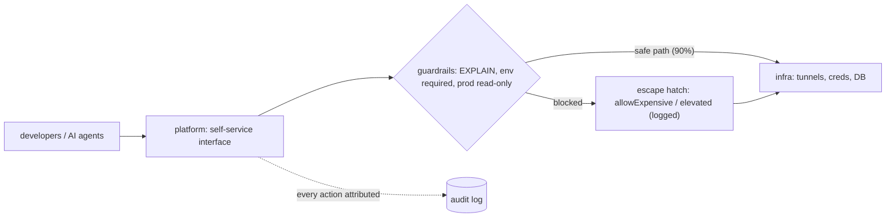

## Thesis

Building the tooling that lets other engineers move faster and safer --- abstracting repetitive, error-prone infrastructure (environments, credentials, tunnels, access) behind a self-service, safe-by-default interface so the common task is one call and the dangerous one is hard --- and designing that interface as a product with a paved road, guardrails, and a deliberate escape hatch, justified by the friction it removes across a whole team.

## Sub

**Why a platform: friction times many engineers** -> **the interface: self-service, safe-by-default, paved road** -> **guardrails and the escape hatch** -> **zoom out** to platform-as-product, tool-surface design, and adoption, and the pivots an interviewer rides from "an internal tool" into what-makes-it-a-platform, safe-by-default, and build-vs-buy.

## Spine

- A developer platform **multiplies a team** --- it abstracts the repetitive, error-prone infrastructure work (reaching 21 environments, resolving credentials, managing tunnels) behind a self-service interface, so a task that cost every engineer ten minutes becomes one call.
- The interface is **safe-by-default** --- the common path is easy and the dangerous path is hard: production is read-only unless you explicitly elevate, every query is EXPLAIN-checked before it runs, and the environment is always explicit so a dev query can't hit prod.
- It's a **paved road with an escape hatch** --- the golden path handles the 90% case ergonomically and guardrails catch mistakes, but a deliberate, audited override exists for the cases the golden path doesn't cover.
- A platform is a **product** --- adoption is voluntary, so it competes with "just do it manually"; it's justified by the friction it removes (a tool saving ten minutes across a team compounds into hundreds of hours), and it decays, so it needs maintenance and re-assessment.

## Companion Notes

### walk

The tooling that multiplies a team

One friction-heavy task turned into a self-service, safe-by-default call --- the abstraction that removes the toil, the guardrails that catch mistakes, the escape hatch for the exceptions, and the product thinking that decides it's worth building.

Say the multiplier first --- "a tool that removes ten minutes of friction, used across a team, compounds into hundreds of hours." That framing is what makes a platform an investment, not a side project.

### drill

Probe Drill

Graded follow-ups on self-service, safe-by-default, the paved road, and platform-as-product --- the ones that separate "I wrote a script" from designing a platform other engineers depend on.

Name safe-by-default: the common path easy, the dangerous path deliberately hard (prod read-only, elevation audited) is the single instinct that reads as platform maturity.

## Drill

SDE2 | the model and the mechanics
SDE3 | safety, the paved road, and tool design
Staff | platform-as-product and org calls

### SDE2 | what a developer platform is

What is a developer platform, in practice?

Internal tooling that abstracts infrastructure so other engineers can self-serve the things they'd otherwise do manually and repetitively --- connecting to environments, running queries, deploying, provisioning. Instead of every engineer learning the SSH-tunnel-plus-credentials dance for 21 environments, they call one tool. It's the layer between developers and raw infrastructure whose job is to remove friction and enforce good defaults, so the team spends its time on product, not on plumbing.

### SDE2 | self-service

Why is self-service the core idea?

Because it removes the human bottleneck --- engineers get what they need without filing a ticket and waiting on a platform team, and the platform team stops being a queue of one-off requests. The value is a multiplier: a capability built once and exposed as self-service is used by everyone, so the effort amortizes across the whole team. A platform that still requires a human in the loop for the common case isn't a platform; it's a service desk.

### SDE2 | the paved road

What is a "paved road" or golden path?

The well-supported, opinionated way to do a common task --- the path the platform makes easy, safe, and obvious, so the default choice is also the right one. A paved road for "run a query against staging" means the tunnel, credentials, and safety checks are handled for you if you stay on it. The point is to make the good path the path of least resistance, so most engineers do the right thing without having to know all the infrastructure underneath.

### SDE2 | abstraction

What does the platform actually abstract away?

The incidental complexity of the infrastructure --- SSH tunnels to a bastion, per-environment connection strings, credentials pulled from a secrets manager, MFA. All of that is real work the platform hides behind a single call like "query this environment." The engineer expresses intent (what they want) and the platform handles mechanism (how to reach it safely). Good abstraction exposes the intent cleanly while keeping the mechanism replaceable underneath, so the infrastructure can change without the interface changing.

### SDE2 | safe-by-default

What does safe-by-default mean for a platform?

The default behavior is the safe one, and doing something dangerous takes a deliberate extra step. Production defaults to read-only; a write requires an explicit `elevated` flag. The environment is always required, so you can't accidentally run against prod. The idea is that the easy, obvious thing should be the safe thing, and the risky thing should require intent --- so a tired engineer at 2am is protected by the defaults rather than relying on remembering to be careful.

### SDE2 | guardrails

What are guardrails on a platform?

Automatic checks that catch mistakes before they cause damage --- not blocking everything, but stopping the clearly-bad. Running EXPLAIN on every query to detect a full-table scan and refusing one that would read ten million rows; requiring the environment to be named; capping cost. Guardrails differ from permissions: permissions say who *may*, guardrails say "this specific action looks dangerous, confirm you mean it." They make the platform forgiving of honest mistakes, which is most of what goes wrong.

### SDE2 | the capability surface

When you build a tool, what is its "surface"?

The set of actions it exposes and how they're organized --- the verbs an engineer (or an AI agent) can call. A database tool exposes `connect`, `query`, `tunnel`, `disconnect`; an environment tool exposes `list`, `show`, `test`. Designing the surface is grouping related actions coherently, naming them by intent, and keeping each one focused. A tool with 95 actions is usable only if the surface is organized by domain and each action does one clear thing; a sprawling, inconsistent surface is a tool nobody can hold in their head.

### SDE3 | safe-by-default in practice

How do you actually implement safe-by-default for production access?

Layer the defaults so the safe path needs no thought and the risky path needs intent: production connections default to **read-only**, and a write operation requires an explicit `elevated: true` that's logged; the target environment is a **required** parameter, so there's no implicit "current" environment to get wrong; and destructive or expensive actions demand a confirmation flag. The principle is that safety comes from the *defaults and the required intent*, not from the engineer's vigilance --- you design so the accident is impossible-by-default and the deliberate act is auditable.

### SDE3 | explain-before-execute

What problem does running EXPLAIN on every query solve?

It catches expensive operations *before* they hit production, rather than after they've caused an incident. Every SELECT is run through EXPLAIN first: a sequential scan on a large table, a missing index, an estimated ten-million-row read --- the platform sees the cost and blocks the query with a helpful message ("this would scan 10M rows; add a WHERE clause or pass allowExpensive=true"). It converts "run it and find out" into "know the cost, then decide," which is the difference between a guardrail and a post-mortem. The estimate is cheap; the runaway query is not.

### SDE3 | infrastructure lifecycle

Why treat something like an SSH tunnel as managed infrastructure?

Because it's expensive to create and fragile, so leaving it to ad hoc per-command setup is slow and flaky. The platform manages its lifecycle explicitly: create it, health-check it, reuse it across many queries, idle-timeout and kill it when done, and auto-recreate it if it dies mid-use. That's the same lifecycle discipline you'd apply to a database connection pool. The lesson generalizes --- anything costly and failure-prone that the platform depends on (tunnels, connections, sessions) should be pooled, health-checked, and self-healing, not created and torn down per call.

### SDE3 | the escape hatch

Why does a paved road need an escape hatch, and how do you build one?

Because a golden path that can't be left forces people off the platform entirely the moment their case doesn't fit --- and then they lose all the guardrails too. So the paved road handles the 90% case, and a **deliberate override** covers the rest: `allowExpensive: true` to run the query the cost-guard blocked, `elevated: true` for the prod write. The override is explicit, logged, and slightly inconvenient by design, so it's used only when meant. The tension is real --- too rigid and adoption drops, too loose and the guardrails are noise; the escape hatch resolves it by keeping the safe path default and the override intentional.

### SDE3 | environment isolation

How do you stop someone running a dev query against production?

Make the environment an explicit, required part of every operation and isolate the machinery per environment --- separate connection, tunnel, and credentials for each, so there's no shared "current environment" state to be stale or wrong. `db.query({ environment: 'staging', sql })` names the target every time; there's no default that a context switch could leave pointing at prod. Combined with prod-read-only-by-default, the result is that hitting production is always a conscious, named act, never a leftover from the last command.

### SDE3 | designing a tool API

What makes a good tool API for engineers (or AI agents) to call?

Actions named by **intent**, grouped by **domain**, each doing one focused thing, with required parameters that make misuse hard --- and clear, actionable errors. When the caller might be an AI agent, this matters more: the tool descriptions and parameter shapes *are* the interface the model reasons over, so they must be unambiguous and self-describing. Organizing dozens of actions into coherent tools (a `db` tool, an `environment` tool, a `health` tool) rather than one flat list of 95 loose functions is what keeps a large surface learnable. The API is a product surface; its ergonomics determine whether the tool gets used.

### SDE3 | auditability

Why is auditability part of a platform, not an afterthought?

Because a platform concentrates access --- everyone's production queries and elevated writes flow through it --- so it's the natural place to record who did what, against which environment, and whether they elevated. That log is what lets you answer "who ran the query that locked the table" and what makes safe-by-default trustworthy: elevation isn't just gated, it's attributed. A platform that brokers powerful access without recording its use trades one problem (scattered, unlogged manual access) for a worse one (concentrated, unlogged access); the audit trail is what makes the concentration a net win.

### Staff | platform-as-product

What does it mean to treat an internal platform as a product?

It means adoption is **voluntary and earned** --- your platform competes with "just SSH in and do it manually," so if it's clunkier than the manual path, engineers route around it and you've built a shelf-ware tool with all the maintenance and none of the leverage. So you treat engineers as users: understand their workflow, make the paved path genuinely faster than the alternative, dogfood it, and iterate on friction. The failure mode of internal platforms is building what's architecturally elegant instead of what people will actually adopt; product thinking (who's the user, what's their job, why would they choose this) is what avoids it.

### Staff | measuring platform success

How do you know an internal platform is succeeding?

By the friction it removes and the adoption it earns, not by lines of code --- **time saved** (a tool that cuts ten minutes off a task done many times a day across a team compounds into hundreds of hours a year), **adoption rate** (are engineers choosing it over the manual path?), and **incidents prevented** (expensive queries blocked, prod accidents that didn't happen). The compounding is the whole justification: the build cost is one-time and the savings recur per use per engineer, so a tool that saves a little a lot of times is a large, ongoing return. If adoption is low, the platform is failing regardless of how good the internals are.

### Staff | build vs buy

How do you decide whether to build an internal tool or adopt an existing one?

Build only where the friction is **specific to your environment** and no off-the-shelf tool fits --- the 21-environment, bastion-tunnelled, MFA-gated database access was peculiar enough that a bespoke server made sense; a generic secrets manager or a CI system you buy. The test: is this a differentiated, environment-specific problem, or a solved commodity? Building commodity infrastructure yourself is a tax you pay forever in maintenance; buying the peculiar thing that doesn't fit is a tax you pay in workarounds. Most internal-platform value is the thin, bespoke layer that adapts commodity tools to your specific environment, not reinventing the commodities.

### Staff | knowledge as platform

Why is documentation and knowledge management part of the platform?

Because a platform (and the systems it fronts) is only usable if the knowledge of *how* is captured and findable --- and that knowledge decays. The discipline is to **organize by topic, not chronology** (an `auth` doc, not "notes from March"), **synthesize rather than accumulate** (compress raw findings into structured references), **index everything** from one entry point, and **update in place** as understanding improves. And because it goes stale, you build **re-assessment triggers** --- quarterly reviews, post-incident updates. Knowledge that's scattered across transcripts and never synthesized is knowledge you don't have; treating it as a maintained artifact of the platform is what keeps the platform learnable over time.

### Staff | the platform team model

Who owns an internal platform, and how should they operate?

A platform team whose product is *other engineers' productivity*, operating by **self-service, not ticket-ops** --- they build capabilities teams consume directly, rather than being a queue that does the work for people. The anti-pattern is the platform team as a bottleneck (every environment change is a ticket to them); the goal is leverage (they build the paved road, teams walk it themselves). That reframes the team's success metric from "tickets closed" to "friction removed and self-service adoption," and it's why the interface, the guardrails, and the docs matter so much --- they're what let the team scale its impact without scaling its headcount linearly.

### Staff | when a platform is premature

When is building a developer platform the wrong move?

When the friction doesn't yet justify the investment --- a handful of engineers and two environments don't need a 13K-line access server; a documented script or a runbook is honest and cheaper. Platforms earn their cost when the friction is **repeated across many engineers and environments** (so the savings compound) and **specific enough** that no commodity tool fits. Building a platform for a problem that isn't yet painful, or that an off-the-shelf tool already solves, is premature abstraction: you pay the build-and-maintain cost up front for leverage that isn't there. Let the pain and the scale justify the tool, then build the thin layer that removes exactly that friction.

### Staff | the platform as a security boundary

If the platform brokers powerful access, how do you keep it from becoming the weak point?

Treat it as a **security boundary**, not just a convenience: it holds *least-privilege* credentials scoped per environment (not one god-credential), brokers access without exposing the underlying secrets to the caller, gates elevation behind identity and MFA, and logs every privileged action. The danger of concentrating access is that one compromised platform is a skeleton key --- so the platform must be *more* locked down than the manual path it replaces, not less: short-lived credentials, per-user attribution rather than a shared service identity, and the same guardrails applied to its own access. Concentrating access is a net win only when the concentration point is the most-hardened, most-audited path in the system, never a shared backdoor that trades scattered risk for a single catastrophic one.

## Walk

### The friction a platform removes

```flow
e[21 environments] -> f[tunnel + creds + MFA each] -> t[10+ min just to connect]
```

The starting point is toil: every engineer who needs to run a query against one of 21 environments has to open an SSH tunnel to a bastion, pull environment-specific credentials from a secrets manager, and handle MFA --- ten-plus minutes of plumbing before a single query.

That cost is paid by every engineer, every time, so it's a multiplier waiting to be collapsed. Building the capability once and exposing it as self-service turns ten minutes of per-person, per-task friction into one call --- which is exactly the compounding that makes a platform an investment rather than a nice-to-have.

### The interface is self-service and safe-by-default

```flow
i[intent: query env] -> s[env explicit, prod read-only] -> w[write needs elevation]
```

The engineer expresses intent --- "query this environment" --- and the platform handles the mechanism (tunnel, credentials, connection). The defaults are where the safety lives.

```js
// environment is always explicit -- there is no "current" env to hit prod by accident
db.query({ environment: 'staging', sql: 'SELECT ...' });

// production defaults to read-only; a write needs a deliberate, audited flag
db.query({ environment: 'prod', sql: 'UPDATE ...', elevated: true });
```

The common path is easy and the dangerous path is hard: the environment is required so nothing runs against an implicit target, production is read-only unless you explicitly elevate, and the elevation is logged. Safety comes from the defaults and the required intent, not from the engineer remembering to be careful --- so the accident is impossible-by-default and the deliberate act is attributable.

### Guardrails on the golden path

```flow
q[SELECT] -> x[EXPLAIN first] -> b[block if too expensive / allowExpensive to override]
```

On top of the safe defaults, the platform catches expensive mistakes before they land. Every SELECT is run through EXPLAIN first, so a sequential scan on a huge table or an estimated ten-million-row read is seen *before* execution and blocked with a helpful message.

The guardrail isn't a wall --- it's paired with a deliberate escape hatch. "This would scan 10M rows; add a WHERE clause or pass `allowExpensive=true`" tells the engineer the cost and offers a conscious override for the case where they really do mean it. The paved road handles the 90%, the guardrail catches the honest mistake, and the logged override covers the rest, so the tool guides without boxing anyone in.

### Treat infrastructure as managed, and treat the tool as a product

```flow
tun[tunnel: create -> health -> reuse -> kill] -> adopt[adoption is voluntary] -> val[justified by friction removed]
```

The fragile, expensive dependencies are managed like infrastructure: a tunnel is created, health-checked, reused across many queries, idle-timed-out, and auto-recreated if it dies --- the same lifecycle discipline as a connection pool, so the platform is fast and self-healing rather than flaky.

And the whole thing is a product. Adoption is voluntary --- it competes with "just do it manually" --- so it lives or dies on being genuinely faster than the alternative, and it's justified by the friction it removes: a tool that saves ten minutes across a team, used many times a day, compounds into hundreds of hours a year. That compounding is the case for building it, and because tools decay, staying adopted means maintaining the paved road and the knowledge around it. Build the thin, bespoke layer that removes exactly your friction --- and keep it worth choosing.

### Model Script

- Frame the multiplier | "A developer platform is internal tooling that lets other engineers self-serve the repetitive, error-prone infrastructure work -- reaching 21 environments, resolving credentials, managing tunnels -- so a task that cost everyone ten minutes becomes one call. The framing that matters: a tool removing ten minutes of friction, used across a team, compounds into hundreds of hours a year. That's what makes it an investment, not a side project."
- Safe-by-default | "The core design instinct is safe-by-default: the common path easy, the dangerous path deliberately hard. Production defaults to read-only and a write needs an explicit, logged elevation; the environment is always required so you can't hit prod by accident; and every query runs through EXPLAIN first, so a ten-million-row scan is caught and blocked before it runs, not after it causes an incident. Safety comes from the defaults, not from the engineer's vigilance at 2am."
- Paved road and escape hatch | "It's a paved road with an escape hatch. The golden path handles the 90% case ergonomically and the guardrails catch honest mistakes -- but a deliberate override, allowExpensive or elevated, covers the rest, explicit and logged. Too rigid and people route around the platform and lose the guardrails; too loose and the guardrails are noise. The escape hatch keeps the safe path default and the override intentional. And the fragile bits -- tunnels -- are managed like a connection pool: created, health-checked, reused, self-healing."
- Platform-as-product | "The Staff-level point is that a platform is a product with voluntary adoption -- it competes with 'just SSH in manually,' so if it's clunkier, engineers route around it and you've built shelf-ware. So you treat engineers as users, make the paved path genuinely faster, dogfood it, and measure success by friction removed and adoption, not lines of code. And you build only the thin, bespoke layer specific to your environment -- buy the commodities."
- Interviewer: "How would you decide this is worth building at all?"
- The build-vs-buy and scale test | "Two tests. Is the friction repeated across enough engineers and environments that the savings compound -- because the build cost is one-time and the savings recur per use per person? And is it specific enough to my environment that no off-the-shelf tool fits -- the 21-environment, bastion-tunnelled, MFA-gated access was peculiar enough to justify a bespoke server, whereas a secrets manager or CI I'd buy. If it's not yet painful or a commodity tool solves it, building is premature abstraction. Let the pain and the scale justify the tool."
- Land it | "So: a platform multiplies a team by abstracting infrastructure behind a self-service, safe-by-default interface; the common path is easy and the dangerous one is deliberately hard and audited; guardrails catch mistakes with a logged escape hatch for exceptions; the fragile dependencies are managed like infrastructure; and the whole thing is a product justified by compounding friction-removal and kept alive by adoption. The one line is that you build the thin, bespoke layer that removes exactly your team's friction, make the good path the easy path, and measure it by the hours it gives back."

## Whiteboard

Sketch the platform between developers and infrastructure, and mark where safety lives.

### Where does the safety come from?

The defaults and required intent -- prod read-only, environment always explicit, EXPLAIN before every query -- not the engineer's vigilance. The accident is impossible-by-default; the deliberate act is elevated and logged.

### Why does the paved road need an escape hatch?

So a case that doesn't fit the golden path doesn't push the engineer off the platform entirely (losing the guardrails); a deliberate, logged override handles the exception while keeping the safe path the default.



Verdict: the platform sits between developers and infrastructure; safety is in the defaults and guardrails, exceptions go through a logged escape hatch, and every action is attributed.

## System

Zoom out to where the platform sits and what it fronts.

### Where it sits

Developers / AI agents: express intent, self-serve [*]
The platform: abstraction + guardrails + audit
Escape hatch: deliberate, logged overrides for the exceptions
Managed infrastructure: pooled tunnels, connections, credentials
Knowledge base: topic-organized, synthesized, re-assessed docs

### Pivots an interviewer rides

From "an internal tool" they push on safety, adoption, and build-vs-buy.

#### What makes it safe to give a whole team production access?

-> safe-by-default: prod read-only, environment explicit, EXPLAIN-checked, elevation logged
The common path is easy and the dangerous path requires deliberate, audited intent, so accidents are prevented by the defaults rather than by vigilance, and concentrating access makes it the natural audit point.

#### Why would engineers actually use it instead of doing it manually?

-> because the paved path is genuinely faster, and adoption is the real success metric
A platform competes with the manual path; it earns adoption by removing more friction than it adds, which is why ergonomics, the escape hatch, and dogfooding matter as much as the internals.

## Trade-offs

The calls that separate "a script I wrote" from a platform.

### Paved road rigidity vs flexibility

- Rigid golden path: strong guardrails, safe, simple -- but people route around it the moment their case doesn't fit, losing the guardrails
- Flexible / many overrides: handles every case -- but the guardrails become noise and the safe default erodes

Keep the safe path the default and add a deliberate, logged escape hatch for exceptions -- guide without boxing people in.

### Build vs buy for internal tooling

- Build: fits your exact, peculiar environment -- but a permanent maintenance cost you own
- Buy: no maintenance, supported -- but may not fit the environment-specific friction

Build only the thin, bespoke layer specific to your environment; buy the commodities (secrets, CI, monitoring) and adapt them.

### Self-service platform vs ticket-ops

- Self-service: engineers unblock themselves, the platform team scales its impact -- but needs real interface, guardrail, and docs investment upfront
- Ticket-ops: less to build -- but the platform team is a bottleneck and a queue, and impact scales with headcount

Invest in self-service; a platform team that's a ticket queue doesn't multiply anyone.

## Model Answers

### the multiplier | Friction removed, compounded

The frame to lead with.

- Abstracts the toil | key | 21 envs, tunnels, creds -> one self-service call
- Compounds across the team | store | 10 min saved x many uses x many engineers
- An investment, not a script | note | one-time build, recurring savings

### safe-by-default | Easy path safe, risky path hard

The instinct that reads as maturity.

- Defaults are the safety | key | prod read-only, env explicit, EXPLAIN-checked
- Deliberate, logged escape hatch | store | allowExpensive / elevated for exceptions
- Concentrated access is audited | note | the platform is the natural audit point

## Numbers

Back-of-envelope the compounding that justifies building a platform.

The build cost is one-time; the savings recur per use, per engineer --- a tool that removes a little friction a lot of times is a large, ongoing return.

- engineers | Engineers on the team | 20 | 1 | 1
- minsSaved | Minutes saved per use | 10 | 0 | 1
- usesPerDay | Uses per engineer per day | 3 | 0 | 1

```js
function (vals, fmt) {
  var eng = vals.engineers, m = vals.minsSaved, u = vals.usesPerDay;
  var perDay = eng * m * u;
  return [
    { k: 'Time saved / day', v: fmt.n(perDay), u: 'min/day', n: 'a tool that removes ' + m + ' min of friction, used ' + u + 'x/day across ' + eng + ' engineers \u2014 this is the daily payback that recurs for free', over: false },
    { k: 'Time saved / year', v: fmt.n(Math.round(perDay * 230 / 60)), u: 'hrs/yr (~230 days)', n: 'the compounding is the whole justification: build cost is one-time, savings recur per use per engineer, so a small saving many times is a large return', over: false },
    { k: 'Adoption', v: 'voluntary', u: 'competes with manual', n: 'a platform only pays off if engineers choose it over doing it by hand \u2014 so ergonomics and a genuinely faster paved path are the adoption lever', over: false },
    { k: 'Safe by default', v: 'prod read-only', u: 'elevation logged', n: 'the dangerous path (a prod write, an expensive query) needs deliberate, audited intent \u2014 the common path is easy, the risky one is hard', over: false },
    { k: 'Escape hatch', v: 'allowExpensive / elevated', u: '', n: 'the paved road handles the 90%; a logged override covers the rest, so guardrails guide without pushing people off the platform', over: false }
  ];
}
```

## Red Flags

What makes an interviewer wince.

### "Production access is open -- engineers just need to be careful"

Relying on vigilance means the accident is always one tired 2am mistake away, and there's no audit of who did what.

Make it safe-by-default: production read-only unless explicitly elevated, the environment always required, and every elevation logged -- safety from the defaults, not from care.

### "We built the internal platform; adoption is just low because engineers won't change"

A platform competes with the manual path -- low adoption almost always means it's clunkier than doing it by hand, not that engineers are stubborn.

Treat it as a product: find the friction, make the paved path genuinely faster, dogfood it, and measure adoption; a tool nobody chooses is shelf-ware regardless of its internals.

### "We built our own secrets manager and CI system too"

Building commodity infrastructure yourself is a permanent maintenance tax for capability you could have bought.

Build only the thin, bespoke layer specific to your environment's friction; buy the commodities and adapt them -- the differentiated value is the adapter, not reinventing the commodity.

## Opener

### 30s | The one-liner

How I open when asked about internal tooling or a developer platform.

#### What is the shape?

Tooling that multiplies a team -- abstracting repetitive infrastructure behind a self-service, safe-by-default interface, so the common task is one call and the dangerous one is deliberately hard.

#### What makes it work?

A paved road with guardrails and a logged escape hatch, treated as a product: adoption is voluntary, so it must be genuinely faster than doing it by hand, and it's justified by compounding friction-removal.

##### Hooks

Where an interviewer usually pushes next.

- Safe for a whole team on prod? | safe-by-default, elevation logged | drill
- Why would they adopt it? | paved path faster than manual | drill
- Build or buy? | bespoke thin layer, buy commodities | trade

Foot: two sentences -- a platform makes the good path the easy path and the dangerous path deliberately hard, and it's justified by the friction it removes compounding across a team.

## Bank

### SCALE | A tool that saves ten minutes, used across a whole team

Task: reason about the value case for building a platform.
Model: the build cost is one-time but the saving recurs per use per engineer, so ten minutes times many uses per day times many engineers compounds into hundreds of hours a year; adoption is the gate (it competes with the manual path), and safe-by-default plus a logged escape hatch is what makes concentrating access a net win.
Int: what's the single biggest determinant of whether it pays off?
Adoption -- a platform engineers don't choose over the manual path is shelf-ware no matter how good the internals are.

### DESIGN | Safe self-service database access across 21 environments

Task: design the platform that lets a team query 21 environments safely.
Model: one self-service interface abstracting the SSH-tunnel-to-bastion, per-environment credentials from a secrets manager, and MFA; environment always explicit and prod read-only by default with elevation logged; EXPLAIN on every query to block expensive scans with an allowExpensive override; tunnels managed like a connection pool (create, health-check, reuse, auto-recreate); every action attributed in an audit log.
Int: how do you stop a dev query hitting prod?
The environment is a required parameter with isolated per-env machinery -- there's no implicit current environment -- and prod is read-only unless deliberately elevated.

### Extra Curveballs

### CURVEBALL | rigidity | Engineers are bypassing your platform for edge cases and losing the guardrails. What do you do?

Model: that's the paved-road-too-rigid failure -- when the golden path can't handle their case, they leave it entirely and lose the safety with it. The fix is a deliberate, logged escape hatch (allowExpensive, elevated, a documented advanced mode) that keeps them on the platform for the exception while preserving the safe default for everyone else, plus understanding the edge cases well enough to widen the paved road where it's genuinely too narrow. Guardrails should guide, not force people off the road.

### Frames

- A platform multiplies a team: abstract the toil behind a self-service call, and the saving compounds
- Safe-by-default: the common path easy, the dangerous path deliberately hard and audited
- It's a product: adoption is voluntary, so build the bespoke thin layer and make the paved path faster than manual
