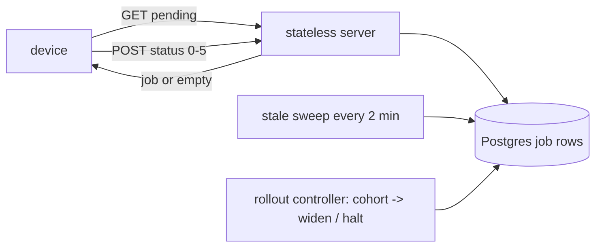

## Thesis

Getting a command or config change out to a fleet of tens of thousands of intermittently-connected devices --- where you cannot hold a live connection to each, so devices **pull** their pending work from a stateless server, execute it, and report a status code, and a background sweep reconciles the jobs that never report back.

## Sub

**The dispatch slice** -> **the pull loop and why the server is stateless** -> **the job lifecycle and the stale sweep** -> **zoom out** to push-versus-pull, all-at-once versus staged, and the pivots an interviewer rides from "roll this to the fleet" into connection scale, delivery tracking, and reconciliation.

## Spine

- Devices **pull; the server does not push** --- you cannot hold a live connection to 50,000 intermittently-connected terminals, so each device polls for its pending job on its own schedule and the server answers from a table, holding no per-device state.
- Dispatch is **resolve, build, queue** --- resolve which devices are eligible, build the job payload once, and write a per-device job row; the fanout is a set of rows, not a set of live sends.
- Every job is a **state machine** --- queued, in-progress, success, failed, cancelled, expired --- and the device reports a status code the server records, so at any moment you know exactly where the fleet stands.
- Jobs that never finish are **reconciled, not trusted** --- a device can go dark mid-job, so a periodic atomic sweep expires stale in-progress jobs rather than leaving them stuck forever.

## Companion Notes

### walk

A config change reaching a device

One change from trigger to a device that has applied it --- targeting, the payload, the poll, and the status that closes the loop.

Lead with the pull model --- "the server can't push to fifty thousand terminals, so they poll." That one fact explains every other choice.

### drill

Probe Drill

Graded follow-ups on push-versus-pull, the job lifecycle, and reconciliation --- the ones that separate "send it to the devices" from a real fleet design.

Never assume dispatched means done --- a job is done only when the device reports it, and stuck jobs are swept, not trusted.

### wb

Whiteboard

Rebuild the whole pull loop from memory --- dispatch, the job row, the claim, verify-before-apply, the reported status, and the sweep.

Draw the arrow direction first. Every arrow starts at the device. If you draw the server reaching out to a terminal, you have already lost the room.

### sys

System Map

Zoom out: dispatch sits between an approved change and a terminal that is provably running it.

Lead with the boundary, not the boxes --- "a change becomes rows, devices pull the rows, and a reported status is the only thing that counts as done."

### trade

Trade-offs

The calls they drill --- push vs pull, all-at-once vs staged, the poll interval, payload inline vs by reference, expire vs re-queue --- each with the condition that flips it.

Always name what the alternative costs. "Pull, because push cannot reach an offline device" is an answer; "pull is better" is a preference.

### model

Model Answers

Full spoken scripts --- the beats in order, the way you would actually say them under time pressure.

Steal the frame, not the words. Headline first ("they pull, and dispatched is not done"), then the one risk you would name unprompted.

### num

Numbers

Back-of-envelope the poll load, the dispatch fanout, and the number nobody quotes: the offline tail.

Lead with poll QPS --- fleet size over the interval --- then land on the tail, because that is the number that decides when a rollout is actually finished.

### rf

Red Flags

What sinks the round --- assuming push, assuming dispatched means applied, trusting a silent device --- and what to say instead.

Name what the interviewer hears. "We'll just push the config to each device" is the fastest way to show you have never operated a fleet.

### open

30-Second

The opener and the close --- matched to the altitude the question is asked at.

Match the altitude --- open at the pull model, not the database, and land on "a job is done only when the device says so" as the real discipline.

## Drill

all | **All three levels, mixed** --- the way a real fleet round actually comes at you: the model, then the edges, then the rollout call.
SDE2 | **The model and the mechanics** --- pull vs push, the job row, status codes, where state lives. The bar is "this is a fleet, not a for-loop over devices": name the pull loop and why the server holds no per-device state.
SDE3 | **Scale, tracking, and edges** --- the stateless server, the stale sweep, idempotent apply, the offline device, cancellation. The bar is "dispatched is not done": name the reconciliation that keeps the reported state honest.
Staff | **Rollout strategy and org calls** --- all-at-once vs staged, the thundering herd, a bricking config, observability, build vs buy, payload versioning. The bar is "bound the blast radius and know when it's actually finished."

### SDE2 | what fleet dispatch is

What is device fleet dispatch?

Getting a command or configuration out to many devices --- here, tens of thousands of payment terminals. The work is: decide which devices should get it, build the payload, and get each device to apply it and confirm. The hard part is that the devices are numerous and not always online, so you cannot just call each one.

Follow: You said "decide which devices should get it." A change applies only to terminals on firmware >= 4.2 in the EU --- where does that filter actually run?
In **eligibility resolution**, server-side, at dispatch time: a query over the device inventory (firmware, region, model, tenant) returns the target set, and you snapshot that set into per-device job rows. The device never evaluates its own eligibility --- a device you have decided to exclude should never even see the job. Resolution is a query against what the server already knows about the fleet, not something you ask the devices.

Follow: A device that was eligible at dispatch gets decommissioned before it ever polls. What happens to its job?
Its row sits **queued** and is simply never claimed, so it does no harm --- but you do not want it counted as "pending forever." Two handles: a queued job carries an expiry so it ages out of the in-flight count on its own, and decommissioning a device should cancel its outstanding queued jobs. The eligibility snapshot is a point-in-time decision; expiry is what stops a stale snapshot from polluting the fleet's reported progress.

Senior: Separating the two halves --- **eligibility as a server-side query over device attributes, and the per-device job row as the snapshot of that decision** --- rather than treating dispatch as "loop over devices and send," is what shows you have thought about a fleet as data, not as a set of live connections.
Speak: Frame it as **"decide, build, deliver, confirm"**: resolve who is eligible with a server-side query, build the payload once, write a job row per device, and count it done only when the device reports back. The hard part is that the devices are numerous and offline, so you can't just call each one.

### SDE2 | why devices pull

Why do devices pull work instead of the server pushing to them?

Because you cannot hold a live connection to 50,000 intermittently-connected terminals --- the connection state alone would be enormous, and a device that is offline can't be pushed to at all. So each device **polls**: it asks the server "is there a job for me?" on its own interval. The server answers from a table and keeps no per-device connection, which is what lets one stateless service serve the whole fleet.

Follow: A device is behind a NAT or a corporate firewall with no inbound ports open. Does that change the push-vs-pull calculus, or is it purely about scale?
It clinches it. Even setting scale aside, most of these terminals sit behind NAT or firewalls with **no inbound reachability** --- there is no address the server can open a connection to. Pull inverts the direction so the device makes the **outbound** connection, which NAT and firewalls allow by default. So pull is not only the scalable choice, it is often the only one that works at all: you can't push to something you can't route to.
Follow: If devices pull, the server has no idea a device exists until it polls. Isn't that a problem for knowing your fleet?
It separates two different questions. **Inventory** --- which devices exist --- is its own registry, populated at provisioning, not inferred from polls. **Liveness and dispatch** --- which of them are currently reachable and doing work --- is what polling tells you. A device that has not polled in a while is "dark," which is information, not a gap: you know it exists (from inventory) and you know it is not currently checking in (from the absence of polls). Pull gives you a clean liveness signal for free; it just is not the same thing as the inventory.

Senior: Naming that pull is forced by **NAT/firewall reachability, not just connection-count scale** --- an offline or unroutable device can't be pushed to at all --- is the detail that shows you have actually operated devices in the field, not just sized a fanout.
Speak: Lead with the one fact: **"you can't hold a live connection to fifty thousand terminals, and half of them are behind NAT anyway --- so they poll."** The server answers each poll from a table with no per-device state, which is what lets one stateless service serve the whole fleet.

### SDE2 | what is in a job

What does dispatching a job involve?

Two steps the dispatch side owns: **eligibility resolution** --- which devices match the change --- and **payload building** --- the job document the device will apply. The result is a per-device job row: this device, this payload, state queued. The device picks it up on its next poll.

Follow: Why a row *per device* rather than one shared job row that all the eligible devices point at?
Because the **state is per device**, not per change. Each terminal applies the job at a different time, succeeds or fails independently, and goes dark independently --- so each needs its own state, its own timestamps, its own status code. A shared row can't represent "device A succeeded, device B is mid-apply, device C went dark." The per-device row is what turns "roll this change" into a fleet you can query by state; the change itself is just the payload those rows share.
Follow: 50,000 rows per rollout, several rollouts a week --- doesn't that table grow without bound?
The **hot** working set stays small --- it is only the in-flight jobs (queued + in-progress) --- because terminal rows (success/failed/expired) can be aged out once the rollout is reconciled and archived. You keep recent history for audit, partition or archive by age, and index the hot query (state + device) so "what is still pending" stays a cheap seek regardless of total history. Growth is bounded by a retention policy, the same way any append-heavy job table is; it is not a reason to avoid the per-device row.

Senior: Justifying the **per-device row as the unit of state** --- because success, failure, and going-dark all happen per device and independently --- rather than modeling the change once, is the storage instinct that separates a fleet design from a broadcast.
Speak: Say **"the change is the payload; the state is per device."** Dispatch resolves eligibility and writes one queued row per device carrying that shared payload, so each terminal's progress --- applied, mid-apply, or dark --- is its own row you can query.

### SDE2 | the status codes

How do you know a device applied the change?

The device reports a **status code** when it finishes, and the server updates that job's row. The lifecycle is a small set of states --- queued, in-progress, success, failed, cancelled, expired --- so a job is never ambiguous. "Dispatched" is not "done"; done is a reported success recorded against the row.

Follow: The device applies the change fine but its status report never reaches the server --- the ack is lost on the way back. What state is the job in, and what happens next?
It is stuck in **in-progress** on the server even though the device is actually done --- the classic lost-ack. Two things resolve it: on its next poll the device can **re-report** the terminal status (the report is itself retried, idempotently, keyed by job id), or, if the device has moved on, the **stale sweep** eventually expires the in-progress row. So a lost ack degrades to "reconciled late," never "wrong forever" --- the server's view converges on the device's, either by a re-report or by the sweep.
Follow: Why distinguish `failed` from `expired` --- aren't both just "it didn't work"?
Because they mean different things and demand different responses. **Failed** is a device that reported back and said "I tried and it did not apply" --- a real, attributable failure you can read the reason code for and decide to retry or fix. **Expired** is a device that **never reported at all** --- you don't know if it applied, failed, or is just dark. Collapsing them would hide the most important distinction on a rollout: "the change is breaking devices" (rising failed) versus "devices aren't reachable" (rising expired) are different incidents with different fixes.

Senior: Insisting that the state machine distinguish a **reported failure from a silent non-report (expired)** --- because "it broke" and "it went dark" are different incidents --- is the modeling discipline that keeps the fleet's status honest under partial visibility.
Speak: **"Dispatched is not done; done is a reported terminal status."** The job is a small state machine, and the states carry information --- especially the split between `failed` (the device told me it broke) and `expired` (the device never told me anything), which are different problems.

### SDE2 | where job state lives

Where is the state of all these jobs kept?

In a durable store --- a job row per device in Postgres, carrying the target, the payload reference, the state, and timestamps. The device is stateless about history; the server's table is the single source of truth for where every job stands, which is what you query to see the fleet's progress.

Follow: Postgres for a job queue at fleet scale --- why not a dedicated queue like SQS or Kafka?
Because the workload is **stateful lookup, not stream consumption**. A device polls "what is *my* pending job?" --- a keyed query on `(device_id, state)` --- and the server updates that specific row's state and reads aggregates by state for progress. That is a database access pattern: random-access by key, per-row state transitions, group-by for reporting. A queue gives you ordered delivery and consumer groups, which is not what a per-device pull needs. You would end up rebuilding a table's query surface on top of the queue. Postgres with the right indexes is the honest fit; a queue is the wrong shape.
Follow: The job table is now a single point of failure for the whole fleet. How do you keep that from taking dispatch down?
The same way you make any primary datastore reliable, plus the pull model's own cushion: **replication with failover** so the table survives an instance loss, read replicas for the aggregate/reporting queries so they don't compete with the poll path, and --- crucially --- **the devices tolerate the store being briefly unavailable**. A poll that fails just retries on the next interval; the device is not blocked, and no job is lost because nothing was in flight on the device's side. So the table is a SPOF for *progress*, not for *correctness*: a short outage delays polls, it doesn't drop work.

Senior: Arguing that the workload is **keyed stateful lookup with group-by reporting** --- a database access pattern, not stream consumption --- so a relational table beats a queue, is the systems-fit judgment an interviewer is checking, not just "I'd use Postgres."
Speak: **"The table is the source of truth."** One durable row per device with state and timestamps; the device holds no history. A poll is a keyed lookup, a report is a row update, and progress is a group-by --- which is a database access pattern, so it is a table, not a queue.

### SDE2 | the payload

What does the job payload look like?

A self-contained document the device can apply without further calls --- an id, the target, and the config to apply. It is built once at dispatch and the same document is served to the device on its poll, so the device needs only the payload it pulled, not a conversation with the server.

Follow: The payload is a 200 MB firmware image. Do you still inline it in the job row?
No --- past a few KB you switch to **by-reference**: the job row carries a URL and a checksum, and the device fetches the blob from object storage or a CDN. Inlining a large image bloats every row, hammers the database's bandwidth on every poll that returns the job, and couples the dispatch path to the transfer. By-reference keeps the job row tiny and lets the bulk transfer use infrastructure built for it (range requests, resumable downloads, CDN edges). The rule of thumb: small config inline, anything large by reference with an integrity check.
Follow: With a by-reference payload, what stops a device from applying a corrupted or tampered download?
The **checksum in the job row**, verified before apply --- the device hashes the fetched blob and refuses to apply unless it matches. For a firmware image you go further and require it to be **signed**, with the device verifying the signature against a trusted key, so a swapped blob at the URL or a man-in-the-middle can't get applied. The job row is the trusted channel (small, authenticated); the blob store is untrusted bulk transport, so the row carries the integrity check that gates the apply.

Senior: Knowing the **inline/by-reference split by payload size**, and that a by-reference payload *must* carry a checksum (and a signature for firmware) verified before apply, is the delivery-mechanics detail that shows you have shipped real over-the-air changes.
Speak: **"Small config inline; anything large by reference with an integrity check."** The job row is self-contained and tiny; a big image lives in object storage behind a URL, and the row carries a checksum --- verified before apply --- so a corrupted or swapped download never gets applied.

### SDE2 | long-poll vs short-poll

Should devices short-poll or long-poll for work?

Short-poll returns immediately, empty if there is no job --- simple but wasteful at fleet scale, mostly empty responses. Long-poll holds the request briefly until a job appears or it times out, cutting empty responses and job latency, but it holds a connection for that window, which at scale is its own load. For a very large fleet, short-poll with jitter is often simpler; long-poll suits smaller fleets needing lower job latency.

Follow: Long-poll holds a connection per waiting device. For 50,000 devices, what does that actually cost the server?
Up to **50,000 concurrent held connections**, mostly idle, waiting. That is real memory and file-descriptor pressure and needs an event-driven server (not thread-per-connection) to be viable --- the C10K problem at fleet scale. It is the same cost push would impose, just voluntary and time-boxed. So long-poll trades short-poll's wasted empty requests for held-connection pressure: you have moved the cost from "many cheap requests" to "many idle sockets," and for a large fleet the socket pressure is usually the worse of the two.
Follow: Most of the time there is no job. Is there a middle ground between hammering with short-polls and holding 50,000 long-poll connections?
Yes --- **a long-ish short-poll interval with jitter is the pragmatic default**, because job latency for a config rollout rarely needs to be sub-minute. If you genuinely need low latency without held connections, a **lightweight push wake-up** (a silent push notification or an MQTT keepalive that just says "poll now") lets devices idle-poll slowly and only poll eagerly when told to. That gets long-poll's latency without long-poll's held connections: the wake-up channel is cheap, and the actual work still flows through the stateless pull. You reserve true long-poll for smaller fleets where the connection count is manageable.

Senior: Recognizing that long-poll just **relocates the connection cost from push to the device's own request** --- 50,000 idle held sockets, the C10K problem --- and that a wake-up-then-pull hybrid buys the latency without the sockets, is the trade-off fluency a senior round wants.
Speak: **"Short-poll with jitter for a big fleet; long-poll only when latency matters and the fleet is small."** Long-poll cuts empty responses but holds a connection per device --- 50,000 idle sockets --- so at scale a slow jittered short-poll, or a cheap push wake-up that just says "poll now," beats it.

### SDE3 | why a stateless server

Why does the dispatch server need to be stateless?

So it scales with the fleet. If the server held a connection or session per device, 50,000 devices would mean 50,000 pieces of live state, and the server couldn't be scaled out or restarted freely. A stateless server answers each poll from the shared table, so any instance can serve any device and you scale by adding instances behind a load balancer.

Follow: "Stateless" server but a very stateful database. Haven't you just moved the bottleneck from the server to Postgres?
You have moved it to the place that is **built to be the shared source of truth**, and that is the point. The server tier scales horizontally precisely *because* it is stateless --- add instances freely. The database is the one shared thing, but its load is bounded and shapeable: a poll is a cheap keyed lookup you can serve from read replicas, a report is a single-row update, and the connection pool caps concurrency. You scale the database with replicas, partitioning by device or tenant, and caching the "no job for you" answer. So yes, the state lives in one place --- but that place is designed for it, and the stateless tier is what lets everything *around* it scale.
Follow: A device polls, one server instance marks the job in-progress, then that instance dies. Is the job lost or stuck?
Neither, because the **state is in the table, not the instance**. The in-progress transition was a durable row update, so any other instance can serve that device's next report or poll --- the dying instance held nothing. If the device already applied the change, it re-reports and any instance records it; if it hadn't, the job is either still claimable or the sweep expires the in-progress row and it gets re-dispatched. Statelessness is exactly what makes an instance death a non-event: there is no session to lose, so failover is just "another instance reads the same row."

Senior: Answering that statelessness **pushes the one shared piece of state into the datastore that is designed for it** --- so the server tier scales horizontally and an instance death is a non-event --- rather than claiming there is no bottleneck, is the honest scaling answer.
Speak: **"Any instance serves any device, because the state is in the table."** No per-device session means you scale the server tier by adding instances and an instance death loses nothing --- the database is the one shared thing, and it is the thing built to be shared.

### SDE3 | the stale sweep

A device pulls a job and then goes dark. What happens to it?

The job would sit in **in-progress** forever, because the device that owns it never reports. So a periodic sweep --- every couple of minutes --- finds in-progress jobs older than a threshold and moves them to **expired**. It must be **atomic** so two sweep runs don't both act on the same row. Reconciliation, not trust: a job that stops reporting is expired, not assumed complete.

Follow: What makes the sweep atomic, concretely --- two sweeper instances run at the same time, why don't they both expire and double-handle a row?
A **single conditional UPDATE** does it: `UPDATE jobs SET state='expired' WHERE state='in_progress' AND updated_at < now() - threshold`. The `WHERE state='in_progress'` is the guard --- the first sweeper's update flips the row, so the second sweeper's identical statement matches zero rows for it. The row transition is atomic at the database level. If the sweep also *does* something per expired row (emit an event, enqueue a retry), you use `... RETURNING` or `SELECT ... FOR UPDATE SKIP LOCKED` so exactly one sweeper claims each row. The invariant is: only one transition per row, enforced by the conditional predicate, not by hoping only one sweeper runs.
Follow: How do you pick the threshold? Too short and you expire a slow-but-alive device; too long and a dark device lingers.
You size it to the **maximum legitimate apply time plus a margin** --- if applying the change can take ten minutes on a slow terminal, a two-minute threshold would wrongly expire live devices mid-apply. Better than a static guess: have the device **heartbeat progress** during a long apply (a periodic "still working" that bumps `updated_at`), so the threshold only needs to cover the gap between heartbeats, not the whole job. Then a genuinely dark device trips the threshold quickly while a slow-but-alive one keeps its lease renewed. Static threshold sized to worst-case apply time is the simple version; heartbeat-extended lease is the robust one.

Senior: Grounding atomicity in a **single conditional UPDATE guarded by the state predicate** (not "hope one sweeper runs") and sizing the threshold to **max apply time --- or a heartbeat-extended lease** so you don't expire a slow-but-alive device, is the reconciliation depth an interviewer probes.
Speak: **"A device that stops reporting is expired, not assumed done."** A periodic conditional UPDATE flips in-progress rows older than a threshold to expired --- atomic because the `WHERE state='in_progress'` guard means only one sweeper transitions each row --- and the threshold is sized to the worst-case apply time, or a heartbeat renews the lease.

### SDE3 | idempotent execution

The same job reaches a device twice --- what should happen?

Applying it twice must be safe. A poll can be retried, or a job re-served after a lost status report, so the device may see the same job id more than once. The device applies by job id idempotently --- if it already applied this id, it re-reports the status rather than doing the work again. Same discipline as any at-least-once consumer, pushed to the edge.

Follow: How does the device actually know it already applied job 88 --- what does it check before doing the work?
It keeps a small **local record of applied job ids and their outcomes** --- a durable log or a marker in its own state. On receiving a job it checks that record first: if id 88 is already there, it skips the work and re-reports the stored outcome; if not, it applies, records the outcome, then reports. The check-and-record has to survive a reboot (so it is on durable local storage, not memory), because the whole point is to be safe across the crash-and-re-serve that caused the duplicate. It is the device-side dedup store, the mirror of the server-side idempotency key.
Follow: Applying "set config X" twice is naturally safe. But what about a job like "increment the firmware version" or "reboot" --- how do you make a non-idempotent action idempotent?
You make it **declarative or fence it with the job id**. "Increment" becomes "set version to 4.2" --- a desired-state assertion that is naturally idempotent no matter how many times it runs. For an inherently one-shot action like "reboot" or "rotate this key," you gate it on the job id: the device records "I already executed job 88's reboot" and refuses to do it again for the same id. So either you express the change as a target state (idempotent by construction) or you carry the job id as a fence token the device dedups on. The design move is preferring declarative payloads precisely because they dodge this problem.

Senior: Knowing the device needs a **durable local record of applied job ids**, and that non-idempotent actions get fixed by **declarative "set to X" payloads or job-id fencing**, is the at-least-once-at-the-edge depth that separates a real answer from "just make it idempotent."
Speak: **"The device dedups on job id."** It keeps a durable local record of applied ids; a re-served job is re-reported, not re-done. And you prefer declarative "set to version 4.2" payloads over "increment," because a desired-state assertion is idempotent no matter how many times it runs.

### SDE3 | tracking fleet progress

How do you know how the whole fleet is doing mid-rollout?

You aggregate the job table by state: how many queued, in-progress, succeeded, failed, expired. Because every job is a row with a state, fleet progress is a group-by, not a guess. That aggregate is also what tells you to stop or investigate --- a rising failed or expired count is the signal something is wrong.

Follow: 90% success looks great --- but what if most of the fleet just hasn't polled yet? How do you avoid that false comfort?
By reading the rate **among devices that have reported**, and watching the **drain rate** separately. A 90% success figure computed over *reported* jobs while 40% of the fleet is still queued is not "90% done" --- it is "90% of the early responders succeeded, and the rest is unknown." So you track two things: the failure ratio among devices that have actually reported (is the change breaking things?) and how fast the queued count is draining (how much of the fleet has even attempted it?). Declaring victory on success-over-reported while the queue is still full is exactly the false comfort a staged rollout is supposed to prevent.
Follow: The group-by over 50,000 rows runs constantly on your dashboard and during the rollout's auto-halt checks. Does that query become a problem?
It can if it scans, so you make it a **cheap aggregate**: a partial index or a covering index on `(rollout_id, state)` so the group-by is an index-only scan, or you maintain **running counters per state** updated on each transition (increment success, decrement in-progress) so the dashboard reads a tiny counter row instead of re-aggregating. For the auto-halt check especially you want it near-instant, so a maintained counter beats a live group-by. The progress view is derived data with clear invalidation points (every state transition), which makes it a good candidate for a maintained aggregate.

Senior: Reading success **among reported devices** while separately watching the **drain rate** --- so you don't call a rollout done when most of the fleet hasn't polled --- and maintaining per-state counters so the auto-halt check is instant, is the observability judgment a senior round rewards.
Speak: **"Progress is a group-by, but read it right."** Aggregate the table by state --- and watch the failure ratio *among devices that reported* alongside the *drain rate*, because 90% success over early responders while the queue is still full is not 90% done.

### SDE3 | the offline device

A device is offline for a week during a rollout. What happens?

Nothing bad --- its job sits queued until it comes back and polls, then it picks the job up. Pull handles offline devices for free: there is no failed push to retry, just a row waiting. The only question is staleness --- whether a job that old is still valid --- which is why jobs can carry an expiry so a device doesn't apply something long superseded.

Follow: A week later the device comes back, but you've since dispatched a *newer* config. It now has two queued jobs. Which does it apply, and in what order?
This is where a naive queue bites you --- applying both in order could set the old config then the new, or worse, apply a superseded change. The clean answer is **latest-wins by superseding**: dispatching the newer config should **supersede (cancel) the device's outstanding queued jobs** for the same target, so the returning device finds only the current desired state. If you can't cancel in time, jobs carry a **generation or version**, and the device applies only the newest and skips the stale one. Either way the device converges on the *current* desired config, not a replay of history --- which is why a desired-state model beats a raw command queue for config.
Follow: How does the returning device even get told "there's a job" --- does it just poll blindly, or is there a smarter trigger?
It **just polls**, and that is the strength of pull: there is no delivery to have failed while it was away, so reconnection needs no special handling --- the device resumes its normal interval and the very next poll returns whatever is currently queued for it. No retry backlog, no "redeliver on reconnect" logic, no missed-push recovery. The returning device is indistinguishable from any other polling device; the job was waiting in the table the whole time. Pull turns "handle a device that was offline for a week" into "answer its next poll," which is the same code path as everything else.

Senior: Recognizing that an offline device re-entering needs **supersede-on-dispatch or a generation check** so it converges on *current* desired state rather than replaying a stale queued job --- and that reconnection needs no special path because nothing failed --- is the correctness thinking a senior interviewer checks.
Speak: **"Its job just waits; pull handles offline for free."** No failed push to retry --- the returning device's next poll returns whatever is queued. The only care is staleness: dispatching a newer config supersedes the old queued job, or a generation number makes the device apply only the current one.

### SDE3 | cancelling a job

Can you cancel a job after dispatch?

A **queued** job, yes --- set its state to cancelled and the device never picks it up. An **in-progress** job is harder: the device already pulled it, so cancellation is best-effort (the device checks state, or you rely on the change being idempotent and correct forward). This is why the state machine has an explicit cancelled state distinct from failed.

Follow: For an in-progress job, is there *any* way to make cancellation reliable, or is best-effort the ceiling?
Best-effort is close to the ceiling, but you can raise the floor. The device can **poll a cancel flag at safe checkpoints** during a long apply --- before an irreversible step it re-checks "is this job still wanted?" and aborts if cancelled. That makes cancellation reliable *up to the last checkpoint* but not mid-atomic-step: once it has started flashing firmware you can't un-flash. So the honest answer is "cancellable at checkpoints, not instantaneously," and the design lever is placing checkpoints before the expensive or irreversible operations. You can't beat the physics of an in-flight change, but you can bound how far it gets after a cancel.
Follow: A device applied a bad config before you could cancel. Cancellation is too late --- now what's the recovery model?
You **roll forward, not back**: dispatch a *new* job that sets the correct desired state, because the fleet converges on the latest desired config, not on undoing history. If the bad config bricked the device's ability to poll, that is the real danger --- which is why risky changes ship with a **device-side watchdog** (apply, verify health, auto-rollback to the last-known-good if it can't confirm) so a device that breaks itself recovers autonomously rather than needing a dispatch it can no longer receive. Cancellation prevents; watchdog-plus-roll-forward recovers. A change that can brick the poll path is the one case where you cannot rely on dispatch to fix dispatch.

Senior: Distinguishing **checkpoint-based cancellation (reliable up to the last safe point) from instantaneous**, and pairing roll-forward with a **device-side watchdog/auto-rollback** for a change that could brick the poll path, is the recovery-model depth that reads as senior.
Speak: **"Queued cancels cleanly; in-progress is best-effort at checkpoints."** The device re-checks a cancel flag before irreversible steps. If a bad config already landed, you roll *forward* with a new desired-state job --- and risky changes carry a device-side watchdog that auto-rolls-back if it can't confirm health, so a bricked device recovers itself.

### SDE3 | at-least-once dispatch

Can a device receive and apply the same job twice? Why?

Yes. A device can apply a job and then have its status report lost, so on the next poll the server --- still seeing the job as in-progress or queued --- re-serves it. That is why execution is idempotent by job id: a re-served job is re-reported, not re-applied. Pull-based dispatch inherits the same at-least-once reality as any queue; the device is the idempotent consumer.

Follow: Why is exactly-once dispatch impossible here --- couldn't you just have the device ack before you re-serve?
Because you **can't distinguish "the apply failed" from "the apply succeeded but the ack was lost"** --- the two look identical from the server's side (no report arrived). If you never re-serve until acked, a genuinely failed device never gets retried (you lose the change). If you re-serve on missing ack, a device whose ack was merely lost gets the job twice. That is the exactly-once impossibility: any protocol that guarantees the change eventually lands must risk a duplicate, so you choose at-least-once (never lose) and make the duplicate harmless with idempotency. Exactly-once *effect* is achievable; exactly-once *delivery* is not.
Follow: Where exactly do you record the "I applied this" marker --- on the device or the server --- to make the re-serve safe?
On **both, at different layers**. The **device** keeps the durable applied-id record so *it* won't redo the work on a re-serve --- that is what makes the duplicate harmless at the point of action. The **server** records the reported status against the row so *it* stops re-serving once a terminal status arrives. You need the device-side record because the server can't prevent the duplicate delivery (it can't tell a lost ack from a real failure), and you need the server-side record so the loop terminates once the device successfully reports. Device-side dedup makes the extra delivery a no-op; server-side status makes the re-serving stop.

Senior: Framing it as the **exactly-once impossibility** --- a lost ack is indistinguishable from a failure, so you pick at-least-once and neutralize the duplicate with device-side idempotency --- and knowing dedup lives device-side while stop-re-serving lives server-side, is the distributed-systems literacy that marks the answer.
Speak: **"Pull dispatch is at-least-once, because a lost ack is indistinguishable from a failure."** So the device dedups on job id (the duplicate is a no-op, re-report not re-do) and the server stops re-serving once a terminal status lands. Exactly-once effect, not exactly-once delivery.

### Staff | all-at-once vs staged

Do you roll to the whole fleet at once, or in stages?

The baseline here is **all-at-once** --- resolve every eligible device and queue them together. An interviewer will push on staging, and it is the natural enhancement: dispatch to a small cohort first, watch the success and failure rates, then widen. Staging trades rollout speed for blast-radius control; the honest answer is that all-at-once is simplest and correct for low-risk changes, and staging is what you add when a bad config could take out terminals.

Follow: How do you pick the first cohort --- random 1%, or something smarter?
Smarter than random. You want the cohort to be **representative and low-stakes**: cover the firmware versions, hardware models, and regions that exist in the fleet (so a model-specific failure shows up in the canary, not in the 99%), while biasing toward **low-value or internal devices first** (test terminals, a friendly pilot merchant) so an early failure hurts least. Pure random 1% might miss a rare hardware variant entirely, then blow up when you widen. So: stratified by the dimensions that could break differently, weighted toward devices you can afford to break. The cohort is a sample designed to *surface* failures, not just a fraction.
Follow: What's the automated halt condition --- what number, measured over what population, stops the rollout from widening?
The **failure rate among devices in the current cohort that have reported**, checked against a threshold before each widening step --- e.g. "if more than 2% of the reported cohort failed, halt and page." Critically it is measured over *reported* devices in *this cohort*, not the whole fleet, and you wait for a minimum number of reports before deciding (so you don't halt or proceed on three devices). You also watch expired (went-dark) rate separately, because a change that makes devices dark is as bad as one that makes them fail. The halt is automatic and conservative: widen only when this cohort's reported failure rate is under threshold with enough signal, otherwise stop and get a human.

Senior: Designing the cohort as a **stratified, low-stakes sample built to surface failures** and the halt as a **threshold on the reported-cohort failure rate with a minimum-signal gate** --- not random 1% and a gut call --- is exactly the rollout-safety rigor that lands a Staff signal.
Speak: **"All-at-once is the baseline; stage when a bad config could brick devices."** The first cohort is a stratified, low-stakes sample --- cover the models and regions, bias to devices you can afford to break --- and you widen only when that cohort's *reported* failure rate stays under a threshold, halting automatically otherwise.

### Staff | the thundering herd

50,000 devices could all poll at the same instant. What breaks?

The stateless server takes a synchronized spike --- a thundering herd --- if all devices poll on the same schedule. Spread the polls: jitter the interval per device, or stagger by a device-derived offset, so the load is smooth instead of a spike every interval. The pull model scales only if the polls are spread across time.

Follow: Jitter fixes steady-state, but the whole fleet reboots after a regional power outage and they all poll on startup. How do you survive the reconnect stampede?
That is the **correlated-recovery herd**, and jitter alone won't save you because the trigger synchronized them. Two defenses: the devices add a **random startup delay before their first poll** (so a power-restore doesn't produce a synchronized wave), and the server sheds load gracefully --- it returns a **`Retry-After` / backoff hint** when overloaded, and the client honors it with exponential backoff and jitter. So the server can *tell* the herd to spread out rather than falling over. The combination --- randomized reconnect on the device, server-driven backoff under load --- turns a stampede into a ramp. This is the same shape as any thundering-herd problem: break the synchronization at the source and give the server a way to push back.
Follow: The server tells overloaded clients to back off. Doesn't a device that backs off risk a longer delay before it gets an urgent job?
It can, so you make backoff **respect urgency, not blanket it**. Steady-state polling is cheap to slow down (a config change tolerating an extra minute is fine), but for an urgent push you use the **wake-up channel** to override the backoff --- a lightweight "poll now" signal that jumps the device to the front regardless of its current backoff. So backoff protects the server during a stampede without capping urgent latency, because urgency comes through a separate, cheap out-of-band nudge rather than through faster routine polling. You separate "how often do I check in normally" (backoff-controlled) from "something needs you now" (wake-up), and only the former is throttled.

Senior: Handling the **correlated-recovery herd** (randomized reconnect delay plus server-driven `Retry-After` backoff) distinctly from steady-state jitter, and keeping urgent latency via a **wake-up channel that overrides backoff**, is the load-shedding depth that separates Staff from "just add jitter."
Speak: **"Jitter the steady state; survive the reconnect stampede with backoff."** Per-device offset spreads normal polls; a regional reboot needs randomized startup delay *and* a server that returns `Retry-After` under load. Urgent jobs bypass the throttle through a cheap "poll now" wake-up, so backoff never caps the latency that matters.

### Staff | poison job

A config change bricks the devices that apply it. How do you limit the damage?

This is the argument for staging even over an all-at-once baseline: a small cohort first bounds how many devices a bad change can hit before you see the failure rate climb and halt. Pair it with an expiry on queued jobs and a fast cancel path, so a change caught early never reaches the devices that haven't polled yet. All-at-once has no such brake --- which is the trade you name out loud.

Follow: The bricked devices can't poll anymore, so they can't receive a fix. How do you recover a device that broke its own poll path?
You **can't dispatch your way out of it**, which is the whole danger --- so the recovery has to be **device-side and autonomous**. Risky changes apply behind a **watchdog**: the device applies, then must positively confirm it is still healthy (can still reach the server, core function works) within a timeout, or it **auto-rolls-back to the last-known-good** image/config. Combined with an **A/B partition scheme** (apply to the inactive slot, boot into it, and fall back to the good slot if the new one fails to confirm), a device that bricks itself recovers on its own. If even that fails, you are down to physical/manual recovery --- which is why the watchdog exists: to keep "bad config" from meaning "truck roll to every terminal."
Follow: Staging bounds the blast radius, but the canary devices are now bricked. Is a small number of bricked devices just the accepted cost of a canary?
Largely yes --- **that is what the canary is for**, and picking low-stakes devices for it is how you make that cost acceptable --- but you minimize it. The canary devices ideally recover via the watchdog/A-B rollback, so "bricked" is really "auto-recovered after one bad boot," not "dead." And you cap the *count*: a canary is dozens, not thousands, so even a total loss is bounded and known. The senior framing is that a canary is a **deliberate, bounded sacrifice of the cheapest devices to protect the fleet** --- so you choose those devices to be recoverable and low-value, and you accept the small residual as the price of not shipping a bricking change to 50,000 terminals.

Senior: Pairing staging with **device-side autonomy --- a watchdog plus A/B partitions that auto-roll-back** --- because a bricked device can't be dispatched to, and framing the canary as a bounded sacrifice of recoverable low-value devices, is the blast-radius thinking a Staff round wants.
Speak: **"Staging bounds it, but a bricked device can't be dispatched to --- so recovery is device-side."** A watchdog with A/B partitions auto-rolls-back to last-known-good if the device can't confirm health, so a bad config self-recovers. The canary is a deliberate, bounded sacrifice of the cheapest, most recoverable devices.

### Staff | observability

What do you monitor across the fleet?

The job-state aggregate over time --- success rate, failure rate, expired (went-dark) rate, and how fast the queued count drains. Plus poll volume and server latency. The failure mode is a rollout that looks fine because most devices haven't polled yet, so you watch the *drain rate* and the failure ratio among devices that *have* reported, not just raw success counts.

Follow: A device goes dark. How do you tell "it applied the change and then legitimately went offline" from "the change killed it"?
By **correlation with the rollout and the baseline dark rate**. A fleet always has some devices offline for benign reasons (powered off overnight, poor connectivity), so you know its normal dark rate. The signal is a **spike in the expired rate concentrated among devices that just applied this change** --- if devices go dark *right after* pulling this job, at a rate above baseline, the change is the suspect. A device that went dark without ever pulling the job, or long after applying it successfully, is just normal churn. So it is not one device's darkness that tells you --- it is the *conditional* dark rate (dark given they just applied this change) against the baseline. That correlation is exactly why you record per-job timestamps and outcomes, not just a live count.
Follow: What's the one alert you'd page a human on during a rollout, versus what you'd just dashboard?
Page on the **auto-halt firing** --- the rollout stopped widening because the cohort's failure or dark rate crossed the threshold --- because that is a human-decision moment: investigate, roll forward a fix, or abort. Everything else is a dashboard: raw counts, drain progress, poll QPS, latency. The discipline is that you page on *a decision being required*, not on *a number being nonzero* --- a few failures in a big rollout is expected and self-limited by staging, so paging on every failure is noise. The halt is the event that means "the automation reached the edge of what it will do on its own," which is precisely when you want a person.

Senior: Distinguishing a change-induced dark spike from baseline churn via the **conditional (dark-given-just-applied) rate against baseline**, and paging only on **the auto-halt firing** rather than on any nonzero failure, is the operational judgment that reads as Staff.
Speak: **"Watch the drain rate and the reported-failure ratio, not raw success."** A device going dark right after applying *this* change --- above the baseline dark rate --- is the change-killed-it signal. Page only when the auto-halt fires, because that is the moment a human decision is actually required.

### Staff | poll interval

How do you choose the poll interval?

It trades freshness against load. A short interval means changes reach devices fast but the poll QPS is high (fleet size divided by interval); a long interval is cheap but a change waits longer to land. Pick the longest interval that meets the freshness requirement, add jitter to avoid the herd, and consider a shorter interval only while a rollout is active.

Follow: Can the interval be adaptive rather than one fixed number for the whole fleet?
Yes, and it is a strong move: **poll slowly when idle, fast when there's work**. The server can hand back a **next-poll hint** in each response --- "nothing for you, check back in 5 minutes" during quiet periods, "check back in 10 seconds" while a rollout targets you --- so a device that is not being rolled to costs almost nothing, and one that is gets low latency. This collapses the freshness-vs-load trade: you pay the high QPS only for the devices and windows that need it. It is the server steering the fleet's aggregate poll load in real time, which is far better than a static interval sized for the worst case all the time.
Follow: A shorter interval during a rollout means the rollout itself spikes your poll QPS right when the server is also doing dispatch work. Is that self-defeating?
It is a real coupling, so you **bound it and shed if needed**. The rollout-time QPS is predictable --- fleet-under-rollout divided by the fast interval --- so you provision the stateless tier for it (it scales horizontally, that is the point) and keep the *dispatch* work cheap (a poll is a keyed lookup, not heavy computation). If it still bites, the server's backoff hint throttles the fast pollers under pressure, trading a little rollout latency for stability. The key is that the spike is *anticipated and shaped* --- adaptive intervals mean only the rolling cohort polls fast, not the whole fleet --- so you are provisioning for "the cohort at a fast interval," not "50,000 devices at 10 seconds forever."

Senior: Proposing a **server-driven adaptive interval (slow when idle, fast during a rollout, via a next-poll hint)** that collapses the freshness-vs-load trade, and provisioning for the anticipated cohort-only spike, is the design maturity a Staff interviewer probes.
Speak: **"Longest interval that meets freshness, jittered --- and make it adaptive."** The server hands back a next-poll hint: minutes when idle, seconds while a rollout targets you. That way you pay the high poll QPS only for the cohort under rollout, not the whole fleet all the time.

### Staff | build vs buy

Would you build fleet dispatch or use a device-management platform?

For a fleet this size and this specific --- payment terminals with a custom eligibility and payload model --- owning the dispatch slice is defensible, because the targeting and the job semantics *are* the product. But the generic parts --- device identity, connectivity, the OTA transport, an MDM-style console --- are exactly what a device-management platform gives you. The call is to own the domain-specific dispatch logic and buy the undifferentiated fleet plumbing, not to rebuild an MDM from scratch.

Follow: Where exactly do you draw the build/buy line --- what's the seam between "our dispatch" and "their platform"?
The seam is between **policy and transport**. You **build** the parts that encode your domain: eligibility resolution over *your* device attributes, the payload contract, the job state machine and reconciliation semantics, the rollout/staging policy --- these *are* your differentiation and no vendor models them the way payment terminals need. You **buy** the transport and management substrate: device enrollment and identity, the secure OTA channel, certificate management, a fleet console, remote diagnostics. So "our dispatch" decides *what* each device should run and tracks whether it did; "their platform" handles *getting bytes to a device securely and knowing the device exists*. Draw the line at "would a competitor's fleet need this exact logic?" --- if no, build it; if yes, buy it.
Follow: If you buy the transport, aren't you now coupled to a vendor for something as critical as pushing config to your entire fleet?
Yes, and you manage that coupling deliberately. You keep the **dispatch logic vendor-neutral** --- the job model and reconciliation live in your system, talking to the transport through a thin adapter --- so the vendor is a replaceable delivery mechanism, not the brain. You avoid encoding domain policy in their console (where it would lock you in), and you keep your own source of truth for job state (so you are never dependent on their reporting to know your fleet). The concentration risk is real for anything fleet-wide, so you also want the transport to degrade safely: if the vendor is down, no jobs *move*, but nothing is *lost* --- devices just poll a stalled queue. Buying transport is fine as long as the vendor stays a swappable pipe and your system owns the state and the policy.

Senior: Drawing the seam precisely at **policy (build: eligibility, payload contract, state machine, staging) versus transport (buy: enrollment, OTA channel, console)**, and keeping the dispatch brain vendor-neutral behind a thin adapter so the vendor stays a swappable pipe, is the build-vs-buy judgment that marks a Staff answer.
Speak: **"Own the policy, buy the transport."** Eligibility, the payload contract, the job state machine, and staging *are* your product --- build those. Device enrollment, the secure OTA channel, and the console are undifferentiated --- buy those, behind a thin adapter, so the vendor stays a swappable pipe and your system keeps the source of truth.

### Staff | versioning the payload

How do you evolve the job payload format across a fleet on mixed firmware?

Version it and keep the server additive --- old devices ignore fields they don't know, new fields are optional, and you never repurpose or remove a field a device reads. Because devices update on their own schedule, many firmware versions are live at once, so the payload is a backward-compatible contract: a device on old firmware must safely apply or safely reject a document built by a newer server.

Follow: A new payload field is not just cosmetic --- it changes behavior, and old firmware ignoring it would apply the change *wrong*. How do you ship that safely?
You cannot rely on "ignore unknown fields" when ignoring it is *incorrect* --- so you make the payload **declare a minimum firmware/schema version it requires**, and the device refuses (reports a clear "unsupported" status) rather than misapplying. Then either you **gate eligibility on firmware** (only dispatch the new-format job to devices that can honor it) or you **update firmware first** as a prerequisite job, then send the config. The rule: additive-and-ignorable changes ride the backward-compatible contract; behavior-changing ones are gated by a required-version check so an old device declines instead of silently doing the wrong thing. Safe-reject is as important as safe-ignore.
Follow: How do you ever retire an old payload field if devices in the field might still be reading it?
Slowly, in a **deprecate-then-remove** cycle driven by fleet telemetry, never in one step. You stop *writing* the field for new jobs but keep the server *tolerating* it, monitor how many devices are still on firmware that reads it, and drive that population down (through firmware rollouts) until the last reader is gone --- *then* remove it. Because devices update on their own schedule, "no one reads this anymore" is an empirical claim you verify from the fleet's firmware distribution, not an assumption. The field's lifetime is bounded by the slowest device you still support, which is why you track the firmware histogram: it tells you when a removal is actually safe.

Senior: Knowing that **behavior-changing fields need a required-version gate (safe-reject, not just safe-ignore)** and that field *removal* is a telemetry-driven deprecate-then-remove bounded by the slowest supported firmware --- not a one-step edit --- is the mixed-fleet contract depth that reads as Staff.
Speak: **"The payload is a backward-compatible contract across mixed firmware."** Additive fields ride safe-ignore; a behavior-changing field carries a required-version so old firmware safely *rejects* instead of misapplying. And you retire a field only after the fleet's firmware histogram shows the last reader is gone.

## Walk

### The dispatch slice resolves and queues

```flow
t[config change] -> e[resolve eligible devices] -> p[build payload] -> q[per-device job rows]
```

A change triggers the dispatch slice: it resolves which devices are eligible, builds the job payload once, and writes a job row per device in state queued. The fanout is a set of rows in a table, not a set of live sends --- which is exactly what makes it cheap and restart-safe.

```json
{
  "jobId": 88,
  "deviceKey": "G6-A1F3",
  "type": "config.apply",
  "state": "queued",
  "gen": 4,
  "payload": { "profile": "retail-v4", "checksum": "9f2c" }
}
```

Each row is self-contained --- the device gets everything it needs to apply the change from the payload it pulls, with no follow-up conversation. The same document is served back on the poll, so the device and the server never need to be online at the same time.

### The device pulls its pending job

```flow
d[device polls] -> s[stateless lookup] -> r[return job or empty]
```

On its own interval, the device asks the server for a pending job. The server does a stateless lookup against the job table and returns the queued job, or nothing. Crucially, the server holds no connection to the device between polls --- it is just answering a query, so any instance can serve any device.

That is the whole reason the model scales: a device that is offline simply doesn't poll, and its job waits; a device that comes back after a week polls and picks it up. There is no failed push to retry, because there was never a push.

### The device claims the job --- queued to in-progress

```flow
d[device pulls job] -> c[server marks in-progress] -> l[claim is a durable row update]
```

Handing the job to the device is a **state transition**: the server moves the row from queued to in-progress and stamps `updated_at`. That claim is what starts the reconciliation clock --- from here, the server expects a terminal report, and if it never comes the sweep will act.

```sql
-- claim the job atomically as it's served, so a re-poll doesn't double-claim
UPDATE jobs SET state = 'in_progress', updated_at = now()
WHERE job_id = 88 AND state = 'queued'
RETURNING payload;
```

The claim is a conditional update guarded by `state = 'queued'` --- so two near-simultaneous polls from the same flaky device can't both claim it, and the transition is recorded in the one place that matters, the table. In-progress means "a device has this and owes me a status," which is different from "done."

### Verify before apply

```flow
x[fetch payload] -> v[check version + checksum] -> a[apply] / r[safe-reject -> report unsupported]
```

Before touching anything, the device validates the job: it checks the payload's required firmware/schema version and, for a by-reference payload, verifies the checksum (and signature) of the fetched blob. Only then does it apply. A job it cannot safely honor is **rejected with a clear status**, not misapplied.

Safe-reject is as important as safe-apply. On a mixed-firmware fleet, an old device receiving a newer job must decline cleanly --- reporting "unsupported" --- rather than ignore a behavior-changing field and do the wrong thing. Verification is the device's contract check against a document built by a server it was never in a live conversation with.

### The device executes and reports status

```flow
x[apply payload] -> c[status code 0 to 5] -> u[update job row]
```

The device applies the payload and reports a status code; the server records it against the job row, moving it to success, failed, or another terminal state. The device applies by job id idempotently, so a re-served job is re-reported rather than re-applied.

"Dispatched" is not "done." A job is done only when its device reports a terminal status, and until then the row sits in in-progress. The table, aggregated by state, is the fleet's live progress --- a group-by, not a guess.

### Idempotent re-apply on a re-served job

```flow
d[re-served job 88] -> h[already applied?] -> y[re-report stored outcome] / n[apply then record]
```

A lost status report means the server still sees the job as in-progress and re-serves it on the next poll. The device consults its **durable local record of applied job ids**: if 88 is already there, it re-reports the stored outcome and does no work; if not, it applies, records, then reports.

That device-side dedup is what makes at-least-once dispatch safe. The server can't tell a lost ack from a real failure, so it *must* be willing to re-serve --- and the device's applied-id log turns the resulting duplicate into a harmless re-report. Prefer declarative "set to version 4.2" payloads too, so even the apply itself is idempotent by construction.

### Progress is a group-by on the table

```flow
j[job rows by state] -> g[group by rollout, state] -> m[queued / in-progress / success / failed / expired]
```

Because every job is a row with a state, fleet progress is an aggregate: count by state per rollout. The dashboard and the rollout's auto-halt check both read that group-by --- ideally from maintained per-state counters so the check is instant, not a live scan of 50,000 rows.

Read it honestly: success computed over *reported* devices while the queued count is still high is not "done." You watch the failure ratio among devices that reported alongside the drain rate, because a rollout that looks fine only because most devices haven't polled yet is the classic false comfort.

### The stale sweep reconciles what went dark

```flow
w[sweep every 2 min] -> f[find stale in-progress] -> e[expire atomically]
```

A device can pull a job and then vanish, leaving its row stuck in in-progress forever. So a periodic sweep finds in-progress jobs older than a threshold and moves them to expired.

```sql
-- reconcile jobs whose device went dark mid-apply
UPDATE jobs SET state = 'expired', updated_at = now()
WHERE state = 'in_progress' AND updated_at < now() - interval '2 minutes';
```

The sweep must be atomic so two runs can't both act on the same row and double-count. The `WHERE state = 'in_progress'` guard means only one sweeper transitions each row. Reconciliation over trust: a job that stops reporting is expired and made visible, never quietly assumed complete --- which is what keeps the fleet's reported state honest.

### Staged rollout bounds the blast radius

```flow
c[cohort 1: 1%] -> h[failure rate under threshold?] -> w[widen] / s[auto-halt + page]
```

For a risky change you don't queue the whole fleet at once --- you dispatch to a small, stratified cohort first, watch its reported failure and dark rates, and widen only when they stay under threshold. An auto-halt stops the rollout and pages a human the moment a cohort crosses the line.

This is the brake all-at-once lacks. The cohort is chosen to *surface* failures (cover the models and regions, bias to low-stakes devices), and a bad change is caught at 1% of the fleet, not 100%. Pair it with an expiry on queued jobs and a fast cancel so a change halted early never reaches the devices that haven't polled yet.

### Model Script

- Frame the fleet | "The problem is getting a config change out to tens of thousands of terminals that aren't always online. The key decision is that the server can't push to fifty thousand intermittently-connected devices --- so the devices pull. Each polls for its pending job on its own interval, and the server stays stateless."
- The dispatch slice | "Dispatch itself is resolve, build, queue: resolve which devices are eligible, build the payload once, and write a job row per device in state queued. The fanout is rows in a table, not live sends, so it's cheap and restart-safe."
- The pull loop | "The device polls, the server does a stateless lookup and returns the job or nothing, the device applies the payload and reports a status code, and the server records it against the row. Because the server holds no per-device connection, any instance serves any device and I scale by adding instances."
- Tracking and reconciliation | "Every job is a state machine --- queued, in-progress, success, failed, cancelled, expired --- so fleet progress is a group-by on the table. And because a device can go dark mid-job, a sweep every couple of minutes atomically expires stale in-progress jobs. Dispatched is never assumed to be done; done is a reported status, and stuck jobs are swept."
- Interviewer: "A config change bricks the devices that apply it. How do you limit the blast radius?"
- Name the trade honestly | "The baseline is all-at-once, which has no brake. To bound the damage I'd stage it --- dispatch to a small cohort first, watch the failure rate among devices that report, then widen --- and put an expiry and a fast cancel on queued jobs so a change caught early never reaches devices that haven't polled yet. And because a bricked device can't be dispatched to, risky changes carry a device-side watchdog that auto-rolls-back to last-known-good."
- Land the shape | "So: pull not push, dispatch as queued rows, a stateless server answering polls, a job state machine as the source of truth, and a sweep that reconciles what goes dark. The one line is that you can't push to fifty thousand terminals, so they pull, and a job is done only when the device says so."

## Whiteboard

Rebuild the pull loop from memory --- draw each cue before you reveal it. Get all nine cold and you can run the fleet-dispatch round on a whiteboard, arrows starting at the device.

### Direction --- who initiates, and why it must be the device.

The **device polls**; the server never reaches out. You can't hold a connection to 50,000 intermittent terminals behind NAT --- so the arrow starts at the device, always. Push is the wrong-direction answer.

### Dispatch --- how a change becomes work.

**Resolve, build, queue:** a server-side query resolves eligible devices, the payload is built once, and you write **one queued row per device**. The fanout is rows in a table, not live sends.

### The job row --- the unit of state.

Per-device row: `device, payload-ref, state, gen, timestamps`. State is per device because each succeeds, fails, or goes dark independently. The table is the single source of truth.

### The claim --- queued to in-progress.

Serving the job is a **conditional UPDATE** guarded by `state='queued'`. It starts the reconciliation clock: in-progress means "a device owes me a status," which is not "done."

### Verify --- the device's contract check.

Before apply, the device checks the **required version** and the **checksum/signature** of a by-reference payload. A job it can't safely honor it **safe-rejects**, reporting "unsupported" --- it never misapplies.

### Apply + report --- closing the loop.

The device applies **idempotently by job id** and reports a **status code**; the server records it against the row. Dispatched is not done --- a reported terminal status is.

### Reconcile --- what the sweep does.

A device can go dark mid-job, leaving a row stuck in-progress. A periodic **atomic sweep** (`WHERE state='in_progress' AND updated_at < now()-threshold`) expires it. Reconciliation, not trust.

### Progress --- reading the fleet.

**Group-by state** per rollout (from maintained counters). Read the failure ratio among *reported* devices and the *drain rate* --- not raw success, which is a mirage while the queue is still full.

### Blast radius --- staging the risky ones.

A **stratified canary cohort first**; widen only if its reported failure/dark rate stays under threshold, auto-halt otherwise. All-at-once has no brake; a bricked device needs a device-side watchdog to recover.



Foot: **The one people draw backwards:** the very first arrow. If you draw the server reaching out to a terminal, you have shown you have never operated a fleet --- half of them are offline or behind NAT, and there is nothing to reach. Every arrow starts at the device; the server only ever answers.

Verdict: **All nine cold.** You can rebuild the pull loop --- dispatch, claim, verify, apply, report, sweep --- from memory, and defend "dispatched is not done" as the discipline. The fleet round is yours to lose, not to pass.

## System

Zoom out to where dispatch sits between an approved change and a terminal that is provably running it. A change becomes rows, devices pull the rows, and a reported status is the only thing that counts as done.

### Where it sits

Change / trigger: an approved config or command change
Dispatch slice: resolve eligibility, build payload, queue a row per device [*]
Job table: per-device state machine, the single source of truth
Device poll: a stateless lookup returns the pending job or nothing
Apply + report: the device applies idempotently and reports a status code
Reconcile + track: the sweep expires dark jobs, a group-by shows fleet progress

### Pivots an interviewer rides

From "roll this to the fleet" they bridge out into who gets told, where the desired state came from, and every hard edge of pull-based delivery. Each leads into another deep-dive --- tap to see the connecting answer.

#### A job finishing --- or failing --- is an event. Who gets told?

-> Notifications (5)
The reported status is a domain event, and telling the right *humans* is a different system's job. When a rollout completes or a device fails, the dispatch layer emits `notify(operator, event)` and the **notification system** fans it out --- once, on the channel the operator watches, deduped and idempotent. Clean boundary: dispatch delivers to *devices* and records the status; notifications deliver to *people*. Dispatch owns "did the fleet apply it"; notifications own "who needs to know, and don't spam them."

#### Where does "the config it should be running" even come from?

-> Desired state (7)
From the **reconciler**. The desired-state loop owns *what* each device should be running and detects drift between desired and actual; when it decides a device needs to change, that decision becomes a job to dispatch. Dispatch is the **actuator**, not the brain: it delivers the change and confirms application, then the reconciler compares reported actual against desired and closes the loop. That is also why declarative "set to version 4.2" payloads fit --- dispatch is executing a desired-state assertion, which is idempotent by construction.

#### Queued to in-progress to success/failed/expired --- how do you model those transitions safely?

-> State machine (21)
As an explicit **state machine** with only legal transitions and clearly terminal states. A poll claims queued into in-progress (a guarded conditional update); a report moves in-progress to a terminal state; the sweep is the **timeout edge** that moves a stuck in-progress to expired. Modeling it as a state machine is exactly what makes "dispatched is not done" precise --- and what keeps `failed` (reported broken) distinct from `expired` (never reported), because they are different transitions triggered by different events.

#### A re-served job gets applied twice. How is that safe?

-> Idempotency (24)
The device applies **idempotently by job id**. A lost status report leaves the server thinking the job is unfinished, so it re-serves --- and the device's **durable applied-id record** turns the duplicate into a re-report, not re-work. It is the same at-least-once-plus-idempotent discipline any queue consumer needs, pushed to the device edge, plus a preference for declarative payloads so the apply is idempotent by construction. The duplicate is inevitable; idempotency makes it harmless.

#### 50,000 devices could poll at the same instant. How do you not melt the server?

-> Rate limiting (9)
You **spread the load** and let the server push back. Per-device **jitter** on the poll interval smooths steady state; a **server-driven backoff hint** (`Retry-After`) sheds load during a correlated-recovery stampede after a regional reboot. It is a rate-limiting problem in disguise: the pull model only scales if the polls are spread across time and the server can tell an overloaded fleet to slow down --- with urgent jobs still cutting the line through a cheap wake-up channel.

#### How do you know delivery is actually healthy across the fleet?

-> Observability (19)
From the **job-state aggregate over time** and the right ratios. You watch the **drain rate**, the failure ratio **among devices that reported**, and the **expired (went-dark) rate** --- not raw success, which is a mirage while most of the fleet hasn't polled. The tell that a change is *killing* devices is a dark spike *conditional on having just applied this job*, above the fleet's baseline dark rate. Fleet health is a query over the table, read honestly.

#### The status report is lost and the job re-serves. What guarantee is that?

-> Retries + timeouts (25)
**At-least-once.** A lost ack is indistinguishable from a real failure, so the server must be willing to re-serve, which makes execution idempotent a requirement, not a nicety. The **sweep is the deadline** that bounds how long a dark device sits before it is reconciled --- a timeout on the in-progress state. The device is the idempotent consumer; the sweep is the timeout; together they are the same retries-and-deadlines machinery every distributed hand-off needs, applied to a fleet.

## Trade-offs

The calls that separate "send it to the devices" from a designed fleet system --- each with the condition that flips it. Name what the alternative costs; "pull is better" is a preference, "pull because push can't reach an offline device" is an answer.

### Push vs pull

- Push: low latency and immediate, but needs a live connection per device and can't reach an offline or NAT'd one
- Pull: scales to a huge intermittent fleet on a stateless server and handles offline for free, at the cost of poll latency and poll load

For a large, intermittently-connected fleet behind NAT, pull is the only model that scales --- and often the only one that routes at all; accept the latency, spread the polls, and add a cheap wake-up channel if you need to cut the latency for urgent jobs.

### All-at-once vs staged rollout

- All-at-once: simplest, fastest to complete, correct for low-risk changes, but no blast-radius brake
- Staged: a stratified cohort first with an auto-halt on rising failures, bounding the damage of a bad change, at the cost of rollout speed and orchestration

Default to all-at-once for low-risk config; stage when a bad change could take devices out, and name that trade explicitly. The cohort is a sample built to *surface* failures, not a random slice.

### Short vs long poll interval

- Short interval: changes land fast, but poll QPS is high (fleet size over interval)
- Long interval: cheap steady load, but a change waits longer to reach a device

Pick the longest interval that meets the freshness need, jitter it to avoid a herd, and make it **adaptive** --- the server hands back a next-poll hint so only the cohort under rollout polls fast, not the whole fleet all the time.

### Payload inline vs by reference

- Inline in the job row: self-contained and simple, no second fetch --- right for small config (a few KB)
- By reference (URL + checksum): keeps the row tiny and uses transfer infrastructure built for bulk --- required for a large image, at the cost of a second fetch and an integrity check

Inline small config; put anything large behind a URL with a checksum (and a signature for firmware) verified before apply, so a corrupted or swapped download never lands. The row is the trusted channel; the blob store is untrusted bulk transport.

### Expire vs re-queue a stale job

- Expire: mark the dark job expired and surface it --- safe and visible, but the device needs a fresh dispatch to try again
- Re-queue: automatically set it back to queued for another attempt --- self-healing, but risks a double-apply if the device was merely slow, not dark

Expire-and-surface is the safe default when apply isn't provably idempotent; re-queue only when execution is idempotent by job id, so a device that was just slow re-reports instead of re-doing. The choice hinges entirely on whether the apply is safe to repeat.

### Own dispatch vs a device-management platform

- Build dispatch: the eligibility, payload contract, state machine, and staging *are* your product --- own them
- Buy a platform (MDM): device enrollment, the secure OTA channel, and the console are undifferentiated --- their scale and security beat rebuilding them

Own the policy, buy the transport, behind a thin adapter so the vendor stays a swappable pipe and your system keeps the source of truth for job state. Draw the line at "would a competitor's fleet need this exact logic?"

### Aggressive vs lenient sweep threshold

- Aggressive (short threshold): a dark device is reconciled fast, but you risk expiring a slow-but-alive device mid-apply
- Lenient (long threshold): never expires a live device, but a genuinely dark one lingers in-progress longer, delaying reconciliation

Size the threshold to the **maximum legitimate apply time plus a margin** --- or better, have the device **heartbeat** during a long apply so the threshold only covers the gap between heartbeats. Then a dark device trips quickly while a slow one keeps its lease renewed.

## Model Answers

### Design it | "Roll a config or firmware change out to a fleet of terminals."

Pull, not push: devices poll a stateless server for queued jobs, apply idempotently, and report a status; a sweep reconciles what goes dark.

- FRAME | frame | I'd frame it as **pull-based dispatch**. The defining constraint is that you can't hold a live connection to tens of thousands of intermittently-connected terminals --- many behind NAT --- so the devices **pull**: each polls a stateless server for its pending job. Every other choice follows from that. Let me build it up.
- DISPATCH | head | Dispatch itself is **resolve, build, queue**: a server-side query resolves the eligible devices over their attributes, the payload is built once, and I write **one queued row per device**. The fanout is rows in a table, not live sends --- cheap and restart-safe.
- THE PULL LOOP | sub | The device polls, the server does a **stateless keyed lookup** and returns the job or nothing, the device applies and reports a **status code**, and the server records it against the row. No per-device connection, so any instance serves any device and I scale the tier by adding instances.
- JOB AS STATE MACHINE | sub | Every job is a **state machine** --- queued, in-progress, success, failed, cancelled, expired. The device reports the terminal status; the table, grouped by state, is the fleet's live progress. **Dispatched is not done** --- done is a reported status.
- RECONCILIATION | sub | Because a device can go dark mid-job, a periodic **atomic sweep** expires stale in-progress jobs. And because a lost ack is indistinguishable from a failure, the device applies **idempotently by job id**, so a re-served job is re-reported, not re-done.
- NAME THE RISK | risk | The risk I'd name unprompted is a **bricking change** --- so for anything risky I stage it to a canary cohort with an auto-halt, and rely on a device-side watchdog to recover, because a bricked device can't be dispatched to.
- CLOSE | close | So: pull not push, dispatch as queued rows, a stateless server answering polls, a job state machine as the source of truth, and a sweep that reconciles what goes dark. A change becomes rows; a reported status is the only thing that counts as done.

### Why pull | "Why do the devices pull instead of you pushing to them?"

Because you can't hold or even route a connection to a huge intermittent fleet --- pull inverts the direction so an offline or NAT'd device is handled for free.

- FRAME | frame | Because **you can't push to what you can't reach**, and at a fleet this size you can't reach most of it on demand. Pull is forced by two things --- scale and reachability --- not chosen for elegance.
- REACHABILITY | head | Most terminals sit **behind NAT or firewalls** with no inbound port open, so there's no address to push to. Pull has the device make the **outbound** connection, which NAT allows by default. For a large slice of the fleet, pull isn't just better --- it's the only thing that routes.
- SCALE | sub | Even ignoring NAT, pushing means **holding per-device state** --- a connection or session for each of 50,000 devices. That's enormous, and it means the server can't scale out or restart freely. Pull keeps the server **stateless**: it answers each poll from the shared table, so any instance serves any device.
- OFFLINE FOR FREE | sub | An offline device simply **doesn't poll**, and its job waits in the table. There's **no failed push to retry**, no redeliver-on-reconnect logic --- the returning device's next poll returns whatever's queued. Pull turns "handle a week-offline device" into "answer its next poll."
- THE COST | sub | What I pay for it is **latency** --- a change waits for the next poll --- and **poll load**, fleet-size-over-interval, mostly empty responses. I manage both with a jittered, adaptive interval and, if I need low latency, a cheap wake-up channel that just says "poll now."
- NAME THE RISK | risk | The trap is a **half-push** --- "the device tells us it's online and we push then" --- which still needs connection tracking and still can't reach an offline device. If you're maintaining connection state, you've rebuilt push's cost; commit to pull.
- CLOSE | close | So pull because you can't route to a NAT'd device and can't afford per-device state at fleet scale, and offline is handled for free. The cost is latency and poll load, both manageable; the alternative doesn't even reach half the fleet.

### Walk a stuck job | "A device pulled a job and never reported. Walk the debugging."

Distinguish "dark device" from "lost ack" from "the change killed it" --- the state and the correlation tell you which, and the sweep bounds it.

- FRAME | frame | A job stuck in **in-progress** has three possible stories, and they need different responses, so first I figure out which one it is from the data --- I don't guess.
- LOST ACK | head | Story one: the device **applied it fine but its status report was lost**. The tell is that the device is still polling and healthy. It resolves itself --- the device **re-reports** on its next poll (the report is retried, idempotently by job id), and the server records the terminal status. A lost ack degrades to "reconciled late," not "wrong forever."
- DARK DEVICE | sub | Story two: the device **went dark** --- powered off, lost connectivity --- and genuinely isn't coming back soon. It's not doing work; it just can't tell me. The **sweep** handles it: an in-progress row older than the threshold is expired, so it stops counting as live progress and is visible for a later re-dispatch when the device returns.
- CHANGE KILLED IT | sub | Story three, the dangerous one: **the change bricked it**, so it applied something that broke its ability to poll. The tell is a **dark spike conditional on having just applied this job**, above the baseline dark rate --- devices going dark right after pulling this change. That's an incident, not churn.
- DISTINGUISH | sub | So I read the **state and the correlation**: still-polling-and-healthy means lost ack (self-heals); dark-but-uncorrelated means normal offline (sweep handles); dark-right-after-this-change means the change is the suspect (halt the rollout). The per-job timestamps and outcomes are exactly what let me tell these apart.
- NAME THE RISK | risk | The mistake is **trusting the in-progress state** --- assuming a stuck job means "still working." It might mean the device died an hour ago. Reconciliation, not trust: the sweep makes the dark case visible instead of leaving it stuck forever.
- CLOSE | close | So: lost ack self-heals via re-report, a dark device is expired by the sweep, and a change-induced dark spike halts the rollout. The state machine plus the conditional dark rate tells me which story I'm in --- I never assume the job is fine because it's "in progress."

### Track the fleet | "How do you know the rollout is actually done?"

A group-by on the table --- but read among reported devices, watch the drain rate, and the tail of dark devices is what really decides "done."

- FRAME | frame | "Done" is a **measured claim over the job table**, not a vibe --- and the honest version is harder than a success percentage, because most of the fleet might not have polled yet.
- THE AGGREGATE | head | Every job is a row with a state, so progress is a **group-by**: queued, in-progress, success, failed, expired, per rollout. I read it from **maintained per-state counters** so the dashboard and the auto-halt check are instant, not a live scan of 50,000 rows.
- READ IT HONESTLY | sub | The trap is **success over reported devices while the queue is still full** --- "90% success" when 40% haven't polled is not 90% done. So I track two things: the failure ratio **among devices that reported**, and the **drain rate** of the queued count. One tells me if it's breaking things; the other tells me how much of the fleet has even tried.
- THE TAIL | sub | The number nobody quotes is the **offline tail**: the last few percent of devices that are dark for days or weeks. A rollout is rarely "100% applied" --- it's "applied to everything that came online, and the tail converges as devices return." So "done" is defined against the **reachable** fleet, with the tail tracked separately as it drains.
- WHAT DECIDES IT | sub | Practically, I call a rollout done when the **queue has drained to the persistent-dark tail**, the reported failure rate is under threshold, and the tail is being reconciled (returning devices pick up their queued job). The tail is a known, bounded set I can name --- not an open question.
- NAME THE RISK | risk | The failure mode is **declaring victory early** because the early responders looked good. Staging plus reading success-among-reported is exactly what stops that --- you widen on real signal, not on optimism.
- CLOSE | close | So: group-by from maintained counters, failure rate among reported devices, drain rate, and the offline tail tracked to convergence. Done means the queue drained to a known dark tail with an acceptable failure rate --- not a success percentage computed while the fleet was still polling.

### Defend the design | "Isn't a stateless pull server with a whole job table over-engineered? Why not just push?"

Because push can't reach half the fleet and holds per-device state, and the table is what makes "dispatched is not done" a query instead of a hope --- both cheap now, painful to retrofit.

- FRAME | frame | "Just push" is the demo answer; the system is what happens when devices are behind NAT, half are offline, and a change can brick a terminal. The two things I'd defend hardest --- **pull and the job table** --- are cheap now and a rewrite to retrofit.
- WHY PULL | head | Push **can't reach a NAT'd or offline device at all**, and it holds **per-device connection state** that caps your scale and blocks free restarts. Pull inverts the direction (outbound, NAT-friendly), keeps the server stateless (scale by adding instances), and handles offline for free. That's not over-engineering --- it's what makes the fleet reachable and the server scalable.
- WHY THE TABLE | sub | Without a **per-device job table**, you have no answer to "is the fleet actually running this?" The table makes progress a **group-by** and reconciliation a **sweep** --- so "dispatched is not done" is a query, not a hope. A fire-and-forget push knows what it *sent*, never what *applied*.
- WHY RECONCILIATION | sub | The **sweep and idempotent apply** look optional until a device goes dark mid-job or an ack is lost. Then they're the difference between "reconciled and visible" and "stuck in-progress forever, fleet state silently wrong." At-least-once is the reality of any hand-off; ignoring it doesn't make it go away.
- WHAT I'D CUT | sub | What I *would* cut to ship faster: staged rollouts, adaptive intervals, the wake-up channel, by-reference payloads --- all addable later without a rewrite. I'd never cut **pull or the job table**, because those *are* the rewrite if you skip them.
- TRADE | trade | So the cost is a table and a poll loop instead of a for-loop of pushes; the payoff is a system that reaches an intermittent fleet, scales statelessly, and can prove what applied. A dispatch system that can't tell you what the fleet is running isn't simpler --- it's blind.
- CLOSE | close | The defense: every piece maps to a reality it handles --- unreachable devices (pull), unknown state (the table), dark devices and lost acks (sweep + idempotency). The two non-negotiables are the cheapest to add now and the most expensive to retrofit.

### Operate it | "It's live and a rollout is going out. How do you run it safely?"

Stage to a canary, watch the reported-failure and conditional-dark rates, auto-halt on the threshold, and page a human only when a decision is required.

- FRAME | frame | Operating a rollout is mostly about **catching a bad change small and knowing when it's actually done** --- the failures here are partly silent (a device that goes dark won't tell you why), so I instrument for that.
- STAGE IT | head | I dispatch to a **stratified canary cohort first** --- covering the firmware versions, models, and regions, biased to low-stakes devices --- and widen only when its **reported failure and dark rates** stay under threshold, with a minimum-signal gate so I don't decide on three devices. The auto-halt stops widening the instant a cohort crosses the line.
- WATCH THE RIGHT NUMBERS | sub | I watch the **drain rate**, the **failure ratio among reported devices**, and the **expired rate** --- and specifically the **dark rate conditional on having just applied this change** against baseline, because that's the signal the change is *killing* devices rather than devices just being offline.
- PAGE ON DECISIONS | sub | I page a human on **the auto-halt firing** --- that's the moment the automation reached the edge of what it'll do alone and a person must decide: investigate, roll forward a fix, or abort. Everything else is a dashboard. I don't page on every failure; a few in a big rollout is expected and self-limited by staging.
- RECOVERY | sub | For a change that can brick the poll path, the devices carry a **watchdog with A/B partitions** --- apply to the inactive slot, confirm health, auto-roll-back to last-known-good otherwise --- because I **can't dispatch my way out of a bricked device**. Recovery has to be device-side and autonomous.
- TRADE | trade | The cost is the orchestration --- cohorts, thresholds, watchdogs, instrumentation; the payoff is that a bricking change hits 1% of the fleet and self-recovers, not 100% and a truck roll. That trade is worth it the moment a change *can* brick a device.
- CLOSE | close | So: canary first, widen on real signal, auto-halt and page on the decision moment, and lean on a device-side watchdog for the un-dispatchable case. Running a rollout safely is bounding the blast radius and reading "done" honestly --- not watching a success counter tick up.

### One you built | "Tell me about a fleet or dispatch system you've actually built."

The Invenco terminal fleet: pull-based config and firmware dispatch to tens of thousands of intermittently-connected payment terminals, with a per-device job state machine and a reconciliation sweep.

- CONTEXT | frame | At **Invenco** I worked on getting config and firmware changes out to a fleet of **tens of thousands of payment terminals** --- devices that are intermittently connected, often behind merchant NATs, and absolutely cannot be bricked, because a dead terminal is a merchant that can't take payment.
- THE PULL DECISION | head | The defining call was **pull, not push**: the terminals poll a **stateless server** for their pending job on their own interval. I couldn't hold connections to that many devices, and most weren't reachable inbound anyway --- so the server answered each poll from a **job table** and held no per-device state, which let it scale by adding instances and restart freely.
- THE JOB MODEL | sub | Each change became **one queued row per eligible device** --- a per-device **state machine** (queued, in-progress, success, failed, cancelled, expired) carrying the payload and timestamps. The table was the single source of truth, so fleet progress was a **group-by**, and "dispatched is not done" was enforced by the model: a job was done only when the terminal reported a status.
- RECONCILIATION | sub | The detail I'm proudest of is the **reconciliation sweep**. A terminal could pull a job and go dark mid-apply, leaving the row stuck in-progress; a periodic **atomic sweep** expired those, so the fleet's reported state stayed honest instead of quietly wrong. And apply was **idempotent by job id**, so a lost status report re-served the job as a re-report, not a double-apply.
- SAFETY | sub | Because bricking a terminal was unacceptable, risky changes were **staged to a cohort** with the failure rate watched among reporting devices, and firmware applied behind an **A/B partition with auto-rollback** --- apply to the inactive slot, confirm health, fall back to last-known-good otherwise --- because a bricked terminal couldn't be dispatched to.
- RESULT | trade | The result was a system where a config change reliably reached the reachable fleet and *converged* on the offline tail as terminals returned, where I could always answer "what is the fleet actually running" from the table, and where a bad change was caught at a cohort, not the whole fleet. Simple pull loop; careful reconciliation.
- CLOSE | close | What I'd carry forward: the **stateless pull server** and the **per-device job state machine** were what made it scale and stay honest, and the **reconciliation sweep plus idempotent apply** were the details that turned "at-least-once to intermittent devices" from a hazard into a routine. The discipline that stuck with me is "a job is done only when the device says so."

### Test it | "How do you test fleet dispatch?"

Test the guarantees the failures live in --- idempotent re-apply, the sweep expiring a dark job, staged auto-halt --- not just "a device got the job."

- FRAME | frame | The bugs here are in the **reconciliation and the edges**, not the happy path, so I test those directly --- a device getting a job and applying it is the easy case that rarely breaks.
- IDEMPOTENCY | head | The critical test: **serve the same job twice and assert one apply**. Simulate a lost ack --- the device applies, the report is dropped, the server re-serves --- and verify the device **re-reports** from its applied-id record rather than re-doing the work. Plus the declarative-payload variant: applying "set version 4.2" twice leaves the same state.
- THE SWEEP | sub | The **sweep** is a timing test: put a job in-progress, advance the clock past the threshold with no report, run the sweep, assert the row is **expired**. Then the concurrency case: two sweepers over the same stale row, assert **exactly one** transition (the conditional-update guard holds). And the false-positive case: a slow-but-alive device that heartbeats keeps its lease and is *not* expired.
- STAGING | sub | The **staged rollout**: inject a cohort where the failure rate crosses the threshold and assert the **auto-halt fires and the rollout does not widen**; inject a clean cohort and assert it **widens**. The halt logic is a decision, so I test both branches, including the minimum-signal gate (don't decide on too few reports).
- MIXED FIRMWARE | sub | The **contract tests**: an old-firmware device receiving a newer, behavior-changing payload must **safe-reject** with "unsupported," not misapply; a by-reference payload with a bad checksum must be **refused before apply**. These are the "safe-reject is as important as safe-apply" cases.
- TRADE | trade | I'd lean on **integration tests against a simulated fleet** --- fake devices that poll, apply, report, and can be told to go dark or drop acks --- for the loop and reconciliation, and unit tests for the state-machine transitions and the halt logic. I don't need real terminals to test the guarantees; I need controllable ones.
- CLOSE | close | So: a re-served job applies once, the sweep expires a dark job (and only once, and not a live one), staging halts on a bad cohort, and mixed-firmware jobs safe-reject. I test the guarantees I'm making --- reconciliation and blast-radius control --- not that a single device happened to apply a change.

### Name the limits | "Where does this design fall short?"

Poll latency, the offline tail never being truly 100%, the job-table ceiling, and reconciliation being visibility not control.

- FRAME | frame | Four limits I'd name, each with why it's a limit and when it bites --- because knowing where the design bends is how I show I've actually run it.
- POLL LATENCY | head | **Pull has a latency floor.** A change waits for the device's next poll --- fine for config, wrong for "do this *now*." The moment I need low-latency delivery, plain pull is the wrong tool, and I'd add a **wake-up channel** to nudge a poll, accepting that extra mechanism rather than pretending polling is instant.
- THE TAIL | sub | **The offline tail is never truly 100%.** Some devices are dark for weeks; a rollout converges on the *reachable* fleet and the tail drains as devices return, but "every device applied it" is asymptotic, not a moment. For a compliance-critical change, that tail is a real operational problem I'd have to escalate (forced check-ins, physical intervention), not wish away.
- TABLE CEILING | sub | **The job table has a ceiling.** Per-device rows across many rollouts grow; the partial index and archiving keep the hot query cheap for a long time, but at enough scale I'd shard by device or tenant, or move to a write-optimized store --- a migration I'd rather do deliberately than under fire.
- VISIBILITY NOT CONTROL | sub | **Reconciliation gives visibility, not control.** The sweep tells me a device went dark; it can't *make* the device apply the change. For a device that's dark or bricked, dispatch is powerless --- which is why real recovery leans on **device-side autonomy** (watchdog, A/B rollback), and why "we can see the problem" isn't "we can fix it remotely."
- HONEST CLOSE | trade | None of these blocks shipping --- they're what I'd monitor and sequence: a wake-up channel where latency demands it, tail-management for compliance changes, sharding when the table demands it, and device-side recovery for the un-dispatchable cases.
- CLOSE | close | So the limits are poll latency, an asymptotic offline tail, the job-table ceiling, and reconciliation being visibility rather than control --- each bounded, each watched, none a surprise. Naming them is how I show I know exactly where pull-based dispatch stops being enough.

## Numbers

Back-of-envelope the poll load a pull model puts on the stateless server, the dispatch fanout, and the reconciliation lag that decides how fast a dark device is caught.

Steady poll load is fleet size divided by the interval, and a synchronized fleet turns that into a spike unless polls are spread. Dispatch writes one row per eligible device, and the stale-sweep threshold sets how long a dark device sits before it is reconciled.

- fleetSize | Devices | 50000 | 0 | 1000
- pollSec | Poll interval (s) | 60 | 5 | 5
- jobKB | Payload KB | 2 | 0 | 1
- sweepMin | Stale-sweep threshold (min) | 5 | 1 | 1

```js
function (vals, fmt) {
  var fleetSize = vals.fleetSize, pollSec = vals.pollSec, jobKB = vals.jobKB, sweepMin = vals.sweepMin;
  return [
    { k: 'Steady poll QPS', v: fmt.n(Math.round(fleetSize / pollSec)), u: 'req/s', n: 'fleet size over the interval \u2014 the constant load on the stateless server just from devices asking for work', over: Math.round(fleetSize / pollSec) > 2000 },
    { k: 'Synchronized spike', v: fmt.n(fleetSize), u: 'req/s', n: 'if every device polled on the same schedule they would all hit at once \u2014 a thundering herd, which is why polls are jittered', over: fleetSize > 5000 },
    { k: 'Dispatch fanout', v: fmt.n(fleetSize), u: 'rows', n: 'one job row per eligible device, all-at-once \u2014 a bulk insert, not 50k live sends, so the fanout is cheap and restart-safe', over: false },
    { k: 'Payload served / interval', v: fmt.n(Math.round(fleetSize / pollSec * jobKB / 1000)), u: 'MB/s', n: 'each poll that returns a job ships the payload \u2014 keep the document small; a fat payload times the fleet is real bandwidth, which is why a large image goes by reference', over: Math.round(fleetSize / pollSec * jobKB / 1000) > 50 },
    { k: 'Dark-device detection lag', v: fmt.n(Math.round(pollSec / 60) + sweepMin), u: 'min', n: 'worst case before a device that went dark mid-apply is reconciled \u2014 roughly a poll plus the sweep threshold; too short and you expire slow-but-alive devices', over: false },
    { k: 'Time to drain (10/s writes)', v: fmt.n(Math.round(fleetSize / 600)), u: 'min', n: 'even queuing conservatively, the fleet is dispatched in minutes \u2014 the long pole is devices polling and applying, not the enqueue', over: false }
  ];
}
```

## Red Flags

What makes an interviewer wince --- and what to say instead. Most of these trace back to treating "send it to the devices" as the whole problem, when the hard part is that the devices are numerous, offline, and untrusted to have applied anything.

### "The server pushes the change to each device"

You can't hold connections to 50,000 intermittent terminals, and a push can't reach an offline or NAT'd one at all. The interviewer hears *"has never operated a fleet"* --- half the devices aren't reachable inbound.

Have devices **pull** --- poll a stateless server for their pending job --- so offline devices are handled for free and the server scales. Pull inverts the connection direction, which is NAT-friendly, and holds no per-device state.

Note: Assuming push is the single most common fleet-dispatch mistake in interviews.

### "Once it's dispatched, the fleet has the change"

Dispatched only means **queued**. A device may be offline, mid-apply, or gone dark, so the rollout isn't complete just because the rows exist. The interviewer hears *"confuses sending with applying."*

Treat a job as done only when its device **reports a terminal status**, and aggregate the table by state to see real progress --- reading success among *reported* devices, not the whole fleet.

### "A stuck in-progress job means the device is still working"

Or the device went dark and will never report --- trusting it leaves the job stuck forever and the fleet state wrong. The interviewer hears *"trusts a silent device."*

Run a periodic **atomic sweep** that expires stale in-progress jobs, so reconciliation keeps the reported state honest. Reconciliation, not trust: a job that stops reporting is expired and surfaced, never assumed complete.

### "The device tells us it's online, then we push to it"

That's a **half-push** --- it still needs connection tracking and still can't reach a device that's currently offline. The interviewer hears *"rebuilt push's cost and kept its weakness."*

Commit to **pull**: the device polls for work on its own interval. If you're maintaining per-device connection state, you've taken on push's scaling cost without its benefit --- and offline devices still get nothing.

### "If the device doesn't respond, we retry the push until it succeeds"

There is **no push to retry** --- an offline device has no open connection, so "retry the push" is retrying against nothing, forever. The interviewer hears *"doesn't understand why offline breaks push."*

In a pull model there's nothing to retry: the job **waits in the table** until the device polls. Offline is handled for free; the device's next poll returns the queued job, no delivery having failed.

### "The sweep just deletes the stuck jobs"

Deleting a stuck job **throws away the signal** --- you lose that the device went dark and can't distinguish it from a device that never had a job. The interviewer hears *"discards the evidence."*

**Expire** it to a terminal `expired` state and surface it --- keep it distinct from `failed` (reported broken). A device that went dark is information you need for the fleet's real state and for re-dispatch when it returns.

### "Every device polls every 5 seconds so changes land fast"

At 50,000 devices that's **10,000 req/s of mostly-empty polls**, and if they're synchronized it's a periodic spike. The interviewer hears *"turned the poll load into a self-inflicted DDoS."*

Pick the **longest interval that meets the freshness need**, **jitter** it to avoid a herd, and make it **adaptive** --- only the cohort under rollout polls fast. If you truly need seconds, that's a **wake-up channel**, not faster polling.

### "We inline the firmware image in every job row"

A large payload inlined **bloats every row and hammers the database's bandwidth** on every poll that returns it. The interviewer hears *"put a 200 MB blob through the job queue."*

Small config **inline**; anything large goes **by reference** --- a URL plus a **checksum** (and a signature for firmware) verified before apply. The row stays tiny and the bulk transfer uses infrastructure built for it.

### "We roll every change to all 50,000 devices at once"

All-at-once has **no blast-radius brake** --- a bricking change hits the entire fleet before you see the failure rate climb. The interviewer hears *"one bad config away from a fleet-wide outage."*

**Stage** anything risky: a stratified canary cohort first, an **auto-halt** on the reported failure rate, then widen. Pair it with an expiry and fast cancel so a halted change never reaches devices that haven't polled yet.

## Opener

### Match the altitude | The same pull loop, said three ways

Interviewers open with *"quickly, how do you push a config to a fleet?"* as often as *"design fleet dispatch."* Give the altitude they asked for --- the pull model when they want the model, the mechanism when they want mechanism --- then expand only when they pull. Say each out loud before you reveal mine.

#### **One breath.** The whole pull loop in a single sentence --- for *"high level"* or *"quickly."*

Devices **pull** their pending job from a stateless server, apply it idempotently, and report a status code --- dispatch just queues a row per device, and a background sweep reconciles the jobs that never report back.

#### **Thirty seconds.** What you lead with, unprompted --- the load-bearing ideas, no name-drops.

The defining constraint is that you **can't push to tens of thousands of intermittently-connected terminals**, many behind NAT --- so they **pull**: each polls a **stateless server** for its pending job. Dispatch is resolve-build-queue: I write **one queued row per eligible device**. The device applies **idempotently by job id** and reports a **status code**, and the table --- grouped by state --- is the fleet's live progress, because **dispatched is not done**. A device can go dark mid-job, so a periodic **atomic sweep** expires stale in-progress jobs: reconciliation, not trust. The genuinely hard parts aren't the delivery --- they're **reconciliation and bounding the blast radius** of a change that could brick a terminal.

##### Hooks

The 30-second version leaves three threads loose *on purpose* --- you're steering. Each is a tab you go deep on the moment they pull it:

- "pull, not push" | why a NAT'd, offline fleet forces it, and the stateless server | Trade-offs &middot; Probe Drill
- "dispatched is not done" | the job state machine, the sweep, reconciliation | Whiteboard &middot; System Map
- "bound the blast radius" | staged cohorts, auto-halt, the device-side watchdog | Trade-offs &middot; Numbers

Foot: **The skill isn't knowing one version.** *"Walk me through it"* is the next altitude --- the pull loop from queued row to reported status --- and **reconciliation and blast-radius control** are the deepest zoom, where the seniority shows. It's having all of them, and reading which one they want.

### Land it | How to close --- name the hard part

When time's nearly up --- or they ask *"anything else?"* --- **don't just stop.** A proactive close is a seniority signal: restate the loop, name what you'd watch, hand the wheel back. Thirty seconds, unprompted. Say each out loud before you reveal mine.

#### **Summarize in one line.** Re-state the loop so they remember the shape, not the detours.

"So --- devices pull queued jobs from a stateless server, apply idempotently, and report a status; the table is the source of truth, and a sweep reconciles what goes dark. A change becomes rows, and a reported status is the only thing that counts as done."

#### **Name the three you'd watch.** Naming your own risks reads as senior, not insecure.

"In production I'd watch three things: the **thundering herd** --- unless polls are jittered, a synchronized fleet spikes the server; the **offline tail** --- a rollout only converges on the reachable fleet, so I track the dark set draining; and a **bricking change** --- which is why risky rollouts stage to a canary and lean on a device-side watchdog, because a bricked device can't be dispatched to."

#### **Say what's next, and what you cut.** Shows you scoped on purpose, not from missing it.

"With more time I'd add **adaptive poll intervals** and a **wake-up channel** for low-latency jobs, and **by-reference payloads** for firmware images. I left out the enrollment and secure-transport layer --- I'd buy that from a device-management platform --- and the analytics pipeline. Where would you like to go deeper?"

Foot: **The close hands the wheel back** --- *"where would you like to go deeper?"* --- so the last minute is theirs. The tell: juniors stop at "and the device gets the config"; seniors name **reconciliation and blast-radius control as the hard parts** and close on a *summary, a risk list, and an invitation.*

## Bank

### FRAME | "Design a system to roll config and firmware changes out to a fleet of tens of thousands of payment terminals. Start wherever you like."

Task: Frame the scope in one line, then give your one-sentence version.
Model: **Frame:** the fleet is numerous, intermittently connected, often behind NAT, and cannot be bricked --- so the whole problem is delivering a change and *knowing it applied*, when you can't hold a connection to any device. **One-liner:** devices pull their pending job from a stateless server, apply it idempotently and report a status code; dispatch queues one row per eligible device, and a background sweep reconciles the jobs that never report back.
Int: Why pull instead of push --- isn't push simpler and lower-latency?
Because push **can't reach most of the fleet on demand** --- terminals sit behind NAT with no inbound port, and an offline device has no connection to receive a push at all. Push also holds **per-device connection state**, which caps scale and blocks free restarts. Pull inverts the direction: the device makes the outbound connection (NAT-friendly), the server stays stateless (scale by adding instances), and an offline device is handled for free --- its job just waits in the table until it polls. The latency cost is real but manageable with a jittered interval and, if needed, a cheap wake-up channel. Push is simpler only if the whole fleet is always reachable, which a terminal fleet never is.
Int2: What's the very first thing you'd establish, before any delivery mechanism?
That **dispatched is not done** --- the job is a per-device **state machine** and the source of truth is a table, not the act of sending. Before I design the poll or the payload, I fix that a change becomes one queued row per device, moves to in-progress on claim, and is only *done* when the device reports a terminal status --- and that a device which never reports is **reconciled** (swept to expired), not trusted. That discipline is what separates a fleet system from a fire-and-forget broadcast; without it, every scaling and delivery detail is building on a lie about what the fleet is actually running.

### STRUCTURE | "Walk me through it --- a config change from trigger to a terminal provably running it."

Task: Talk the whole flow, trigger to confirmed --- no code, just the spine.
Model: A change triggers **dispatch**: a server-side query **resolves eligible devices** over their attributes, the payload is **built once**, and I write **one queued row per device** &rarr; on its own interval the device **polls** a stateless server, which does a keyed lookup and **claims** the job (queued &rarr; in-progress, a guarded update) or returns nothing &rarr; the device **verifies** the payload (required version, checksum/signature) and **safe-rejects** anything it can't honor &rarr; it **applies idempotently by job id** and **reports a status code**, which the server records against the row &rarr; progress is a **group-by on the table** read among reported devices &rarr; a device that went dark mid-job leaves a stuck in-progress row, which a periodic **atomic sweep** expires &rarr; and for a risky change the whole thing is **staged to a cohort** with an auto-halt. Trigger to confirmed, and the table always knows where every device stands.
Int: You said the claim is a guarded update. Why does that matter --- what breaks without it?
Without the guard, a **flaky device that polls twice in quick succession** (or two server instances handling near-simultaneous polls) could both hand out and claim the same job, double-counting it or racing the state. The claim is a conditional `UPDATE ... WHERE state='queued'`: the first poll flips the row, the second matches zero rows, so exactly one claim wins. It's the same discipline as the sweep's conditional expire --- every state transition is guarded by the state it's transitioning *from*, so concurrency can't produce two transitions of one row. That's what lets the stateless tier have many instances safely: correctness lives in the conditional update, not in coordinating the instances.

### SCALE | "Fifty thousand terminals on one dispatch service. What's the real bottleneck, and what breaks first?"

Task: Name the first ceiling, then the fix --- don't hand-wave "it scales."
Model: The bottleneck **isn't the per-poll lookup** --- that's a cheap keyed query --- it's the **synchronized-poll herd**. Fifty thousand devices at a 60s interval is ~800 req/s steady, which is nothing; but if they poll on the *same* schedule (or all reboot after a regional outage), it's a **spike of 50,000 at once**. So the first thing that breaks is the server taking a correlated stampede. The fix: **jitter** the interval per device so steady-state is smooth, a **randomized startup delay** so a mass reboot doesn't produce a synchronized wave, and a **server-driven backoff** (`Retry-After`) so an overloaded server can tell the fleet to spread out. The stateless tier scales horizontally for the anticipated load; the herd is what you engineer against.
Int: Jitter smooths steady state. What specifically saves you when the whole region reboots and they all poll on startup?
The **randomized startup delay plus server backoff**, because the reboot re-synchronized them and steady-state jitter assumed they were already spread. Each device waits a random interval before its *first* poll, so a power-restore produces a ramp rather than a wall. And the server sheds load gracefully: under pressure it returns a `Retry-After` hint, and clients honor it with exponential backoff and jitter --- so the server can *push back* on the herd instead of falling over. Urgent jobs still cut the line through a separate cheap wake-up channel, so backoff never caps the latency that matters. Break the synchronization at the source, and give the server a valve.
Int2: Postgres holds all the job state. When does *it* become the ceiling, and what do you do?
When the **poll and aggregate load** on it outgrows what replicas can absorb, or the job table's size makes the hot queries expensive. The fixes, in order: serve poll lookups and progress group-bys from **read replicas** so they don't compete with writes; **maintain per-state counters** so the dashboard and auto-halt read a tiny row instead of scanning; **cache the "no job for you"** answer (the common case) so most polls don't even hit the primary; and **archive terminal rows** so the hot working set is only in-flight jobs. If it still bites, **shard by device or tenant**. The point is that the database is the one shared thing, so you scale it deliberately with replicas, counters, caching, and archiving before you reach for sharding --- and the stateless tier scaling for free is what buys you the room to do that.

### FAILURE | "A rollout is at 70% success, 25% still in-progress, and the in-progress number isn't moving. Walk the incident."

Task: Walk the incident --- diagnose the stuck in-progress, then act.
Model: **In-progress that isn't moving means devices that claimed a job and haven't reported** --- and I need to know *why* before I touch anything. Three cases, told apart by data: (1) **lost acks** --- the devices applied fine but reports were dropped; they're still polling and healthy, and they'll re-report, or the sweep will reconcile. (2) **dark devices** --- they went offline mid-apply; the **sweep** should be expiring them, so if the number is frozen I'd check the *sweep is actually running*. (3) **the change bricked them** --- the dangerous one, signalled by a **dark spike right after applying this job**, above baseline. My first move is to check whether the sweep is alive (a frozen in-progress count often means the sweep died), then read the conditional dark rate to rule case 3 in or out. If it's case 3, **halt the rollout immediately** so it stops widening to devices that haven't polled.
Int: You said a frozen in-progress count might mean the sweep died. Why is the sweep failing so dangerous here?
Because the **sweep is the only thing that reconciles dark devices** --- without it, every device that goes dark mid-job stays in-progress forever, so the fleet's reported state silently drifts from reality and "in-progress" stops meaning anything. Worse, if the rollout's auto-halt reads in-progress/expired rates to decide whether to widen, a dead sweep **feeds it stale numbers** --- it might widen a bricking change because the dark devices never got counted as expired. So a failed sweep is both a visibility failure (you no longer know what the fleet is doing) and a safety failure (the halt logic is now blind). That's why the sweep itself needs monitoring --- its last-run time and rows-expired are health metrics --- so "the reconciler is down" pages a human, the same way a dead health-check would.
Int2: It turns out to be case 3 --- the change is bricking devices. You've halted. Now what?
**Contain, recover, roll forward.** Halt stops it spreading (done). Recovery is **device-side and autonomous**, because a bricked terminal can't be dispatched to: the risky change should have shipped behind a **watchdog with A/B partitions**, so a device that can't confirm health after applying **auto-rolls-back to last-known-good** --- meaning most "bricked" devices are really "self-recovered after one bad boot." For any that didn't recover, I'm down to escalation (field intervention), which is exactly why the canary was small and low-stakes. Then I **roll forward**: fix the config and dispatch a *new* desired-state job, because the fleet converges on the latest desired state, not on undoing history. The incident review then asks why the canary didn't catch it --- usually the cohort wasn't representative of the model or firmware that broke.

### CURVEBALL | Poison rollout | "A config change bricks every device that applies it. Your dispatch system is working perfectly --- it's faithfully delivering a change that kills terminals. What does 'dispatch working correctly' actually need to include?"

Task: Reframe the premise, then name what dispatch must own beyond delivery.
Model: The reframe to say aloud: **correct delivery of a fatal change is still a fleet-wide outage** --- "the pipe works" was never the goal; "the fleet stays alive and running the right thing" is. So dispatch done right has to include **blast-radius control and recovery**, not just delivery. Concretely: **staged rollout** (a stratified canary cohort first, so a bricking change hits dozens, not 50,000) with an **auto-halt** on the cohort's failure/dark rate; an **expiry and fast cancel** on queued jobs so a halted change never reaches un-polled devices; and **device-side recovery** --- a watchdog with A/B partitions that auto-rolls-back to last-known-good --- because a bricked device can't be dispatched to, so dispatch alone can never fix it. "Dispatch working" has to mean "delivers changes *and* bounds and survives a bad one," or it's just an efficient way to break a fleet.
Int: The canary caught nothing because the bricking bug only triggers on a specific hardware revision that wasn't in your cohort. How do you fix the *canary*, not just this rollout?
By making the cohort **stratified across the dimensions that can fail differently** --- firmware version, hardware revision, region, model --- rather than a random percentage. A random 1% can miss a rare hardware variant entirely, which is exactly what happened. So the canary is *constructed*: it must include at least N devices of each hardware revision and firmware line present in the target set, so a revision-specific failure surfaces at the canary instead of at the 99%. And I'd add **progressive widening within representative strata** --- widen per-stratum, watching each --- so even a failure that only shows at higher scale in one revision halts before it's fleet-wide. The lesson is that a canary is only as good as its *coverage* of the ways the fleet is heterogeneous; a fleet of identical devices can random-sample, a mixed fleet must stratify.

### CLOSE | "Sum it up --- and what's the one thing you'd alarm on in production?"

Task: Two-sentence close, then the single alarm.
Model: It's pull-based dispatch: devices poll a stateless server for queued jobs, apply idempotently and report a status, the per-device job table is the source of truth, and a sweep reconciles what goes dark --- so a change becomes rows and a reported status is the only thing that counts as done. In production the one thing I'd alarm on is the **auto-halt firing** --- a rollout cohort crossing its failure or dark-rate threshold --- because that's the moment the automation hit the edge of what it'll do alone and a human must decide to investigate, roll forward, or abort; everything else (raw counts, drain, poll QPS) is a dashboard, and I'd also health-check the **sweep itself**, since a dead reconciler blinds both the fleet view and the halt logic.
Int: You've got a week, not a month. Cut one thing you described to ship --- what goes?
The **sophistication goes, never the reconciliation.** I'd ship **all-at-once** (skip staged cohorts and the auto-halt --- addable later) for low-risk changes, a **fixed jittered poll interval** (skip adaptive intervals and the wake-up channel), **inline payloads only** (skip by-reference until firmware images show up), and **manual re-dispatch** of the offline tail (skip auto-supersede). All of that layers on without a rewrite. What I would **not** cut is **pull, the per-device job table, and the reconciliation sweep** --- those are the correctness: without pull you can't reach the fleet, without the table you can't tell what applied, and without the sweep a dark device corrupts your fleet state forever. And I'd keep the **device-side watchdog** for anything that touches firmware, because a bricked terminal with no recovery is an incident no dispatch design can undo. Knowing which parts are the skeleton and which are the polish is the answer.

### Extra Curveballs

### CURVEBALL | Thundering herd | "Your fleet polls beautifully in the demo. In production, a regional power outage knocks out 20,000 terminals; when power returns they all boot and poll within the same few seconds. Your dispatch server falls over. Fix it."

Task: Name the correlated-recovery herd, then the fix that steady-state jitter misses.
Model: This is a **correlated-recovery herd**, and it's why steady-state jitter alone doesn't save you: the outage **re-synchronized** 20,000 devices, so their carefully-spread intervals all reset to "now." The fix has two halves. On the **device**: a **randomized startup delay** before the first poll, so power-restore produces a ramp over minutes, not a wall in seconds. On the **server**: graceful load-shedding via a **`Retry-After` backoff hint** --- when overloaded it tells clients to back off, and they honor it with exponential backoff and jitter, so the server can *spread the herd itself* instead of collapsing. Urgent jobs still bypass via a cheap wake-up channel, so backoff doesn't cap the latency that matters. Break the synchronization at the source, and give the server a valve to push back.
Int: The server backs off the herd, but now those 20,000 recovering terminals take a while to get their pending jobs. Is that acceptable, or have you just traded a crash for a slow rollout?
It's an acceptable and *deliberate* trade, because **availability beats latency for a recovering fleet**. A server that stays up and drains the herd over a few minutes is strictly better than one that crashes and drains *nothing* --- and for config/firmware jobs, a few minutes of extra delay on devices that were just *fully offline* is irrelevant. The devices weren't getting anything while powered off; taking a few minutes more after boot changes nothing that matters. What I've actually traded is a crash (unbounded recovery, cascading failure, possibly manual intervention) for a bounded, self-healing ramp. If some job genuinely *were* urgent for a just-recovered device, that's what the wake-up channel is for --- but "roll config to a terminal that was dark for an hour" is not that. Matching the response to the criticality: shed load, ramp the recovery, and don't pretend a config rollout needs sub-second delivery to a rebooting fleet.

### CURVEBALL | The slow-but-alive device | "Your stale-sweep expires in-progress jobs older than 2 minutes. A terminal on a slow link is legitimately applying a large firmware image --- it takes 6 minutes. The sweep expires its job at 2 minutes; the device reports success at 6. Now your state is a mess. Fix it."

Task: Diagnose the sweep-vs-apply race, then make the threshold honest.
Model: The bug is a **threshold sized shorter than the legitimate apply time** --- the sweep can't tell "dark" from "slow," so it wrongly expires a live device, then the device reports success against an already-expired job and the states disagree. Two fixes. The simple one: **size the threshold to the maximum legitimate apply time plus a margin** --- if a firmware apply can take 6 minutes, the threshold is 10, not 2. The robust one: have the device **heartbeat progress** during a long apply --- a periodic "still working" that bumps `updated_at` (renews the lease) --- so the threshold only needs to cover the gap *between heartbeats*, not the whole job. Then a genuinely dark device trips quickly while a slow-but-alive one keeps renewing. And the report handler must be **idempotent about state**: a success arriving for an expired job should reconcile (the device *did* apply it), not error --- late truth is still truth.
Int: With heartbeats, what stops a device that's stuck in an infinite loop --- still "heartbeating" but never actually finishing --- from renewing its lease forever?
You **bound the total apply time separately from the heartbeat lease**. The heartbeat says "I'm alive"; it must not also mean "I get unlimited time." So the device (or the server) enforces a **hard ceiling on total time in-progress** --- say, 3x the expected apply time --- after which the job is failed regardless of heartbeats, because a device that's been "applying" for 30 minutes is malfunctioning even if it's still checking in. Ideally the *device* self-aborts and reports failure when it exceeds its own apply budget (it knows best that it's stuck), with the server's hard ceiling as the backstop for a device too broken to even do that. So there are two timers: the **heartbeat lease** (short, renewed, catches *dark*) and the **absolute deadline** (long, un-renewable, catches *stuck-but-alive*). Heartbeats fix the false-positive expiry; the absolute deadline stops heartbeats from becoming a loophole. It's the same reason a distributed lock has both a lease renewal *and* a sanity bound.

### CURVEBALL | Lost report, double apply | "A terminal applies a config, but its success report is lost in the network. The server still sees the job in-progress, so on the next poll it re-serves the same job. The terminal applies it again. For this particular change, applying twice is harmful. Fix it."

Task: Locate the at-least-once reality, then make the harmful apply safe.
Model: The reframe: **pull dispatch is at-least-once** --- a lost ack is indistinguishable from a failure, so the server *must* be willing to re-serve, and a re-serve is unavoidable. So I can't fix this by "not re-serving"; I fix it by making the **apply idempotent**. First choice: make the payload **declarative** --- "set config to X" instead of "toggle" or "increment" --- so applying it twice is a no-op, which dodges the whole problem. If the action is inherently one-shot (rotate a key, reboot), the device keeps a **durable record of applied job ids** and **fences on it**: on a re-served job 88, it finds 88 already applied and **re-reports the stored outcome instead of re-doing the work**. The duplicate delivery becomes a harmless re-report. At-least-once delivery plus idempotent-by-job-id apply is effectively exactly-once *effect*.
Int: The device records "applied job 88," but the crash is between *applying* and *writing that record*. The re-serve doesn't see the record and applies again. How do you close that window?
That's the genuine crux, and honestly you can't make it *zero* --- it's the same lost-ack impossibility one layer down. But you order the operations to make the residual **safe rather than harmful**. For a **declarative** payload it's moot: re-applying "set to X" is harmless whether or not the record was written, so you prefer declarative payloads precisely because they make this window disappear. For a **one-shot** action, you **write the intent record *before* the irreversible step and mark it done after** --- so a crash between them leaves a "started but unconfirmed" marker, and on re-serve the device sees it and can **refuse or require explicit re-authorization** rather than blindly redoing a harmful one-shot. That converts the rare double-apply into a rare *skipped* apply (safer, reconcilable) or a held one needing confirmation. The honest framing: exactly-once is impossible, so you make the action idempotent (best), or you order the record ahead of the effect so the unavoidable edge fails *safe* (a skip) instead of *harmful* (a double).

### CURVEBALL | The offline tail | "Your rollout dashboard says 99.2% success. Leadership wants to call it done. But 400 terminals have been dark for two weeks and never applied a mandatory security patch. Is the rollout done? What do you tell them?"

Task: Reframe "done" against the reachable fleet, then handle the mandatory tail.
Model: The reframe: **99.2% isn't "done," it's "done for the reachable fleet, with a known 400-device tail."** For a routine config that's fine --- the tail **converges** as devices come back online and their next poll returns the queued patch. But this is a **mandatory security patch**, so "converges eventually" isn't good enough: an unpatched terminal is a live risk, and "it'll get it when it powers on" could be never. So what I tell leadership is precise: the patch has *reached* 99.2% and *will* reach any device that comes online, but 400 devices are currently unreachable and **that tail needs active management, not a checkbox**. Then I'd escalate the tail as its own workstream --- because a security rollout is defined by the *last* device, not the first 99%.
Int: So how do you actually close a mandatory tail of devices that just won't come online?
It **escalates out of pure dispatch into operations**, and I'd be clear that's the nature of the tail. First, keep the job **queued indefinitely** (or re-dispatched on each return) so any device that *does* come online, even briefly, gets patched immediately --- and ideally the device **prioritizes a security job** on reconnect over routine polling. Second, **identify the tail concretely** --- which 400 devices, which merchants, which regions --- because "400 anonymous devices" is unactionable but "these 400 terminals at these locations" is a field-ops task list. Third, **enforcement**: for a payment terminal you often have a lever --- a device that hasn't checked in / patched within a window can be **flagged for review or have capabilities restricted** until it does, which turns "please come online" into a consequence. And you feed it back into **provisioning**: devices that go dark for weeks may be decommissioned or faulty, so the tail also cleans your inventory. The honest answer is that dispatch can *offer* the patch forever and prioritize it on reconnect, but *closing* a mandatory tail is an operational and policy problem --- physical access, enforcement, and inventory hygiene --- not something a better sweep can solve.

### CURVEBALL | Superseded change | "A terminal is offline for three weeks. During that time you dispatch config A, then config B (which replaces A), then config C. The terminal finally comes online. A naive queue makes it apply A, then B, then C in sequence. Why is that wrong, and what's right?"

Task: Diagnose the stale-replay problem, then the desired-state fix.
Model: It's wrong because the terminal **replays history it should skip** --- applying A then B then C means it briefly runs two superseded configs, does 3x the work, and passes through intermediate states that may be invalid or even harmful, when all that matters is it ends on **C, the current desired state**. Config isn't an event log to replay; it's a **desired state to converge to**. The right model: dispatching a newer config **supersedes (cancels) the device's outstanding queued jobs** for the same target, so when the terminal returns it finds only C queued. If you can't cancel cleanly, each job carries a **generation number** and the device applies only the **highest generation**, skipping the rest. Either way the returning device converges directly on current desired state --- which is exactly why a desired-state model beats a raw command queue for config.
Int: Superseding works for config that fully replaces prior config. But what if A, B, and C are *incremental* --- each a delta on the last --- so you genuinely can't skip A and B?
Then you've told me the payload is the wrong shape for an intermittent fleet, and I'd fix *that*. Incremental deltas assume every device sees every step in order --- a bad assumption when devices are offline for weeks --- so for a fleet like this you want **each job to be a complete desired state, not a delta**, precisely so a returning device can jump straight to current with one apply. If deltas are unavoidable (e.g. a large firmware built as sequential patches), then the returning device must apply them **in order and idempotently**, and the server should **collapse the chain**: recognize the device is at the base version and hand it a single **cumulative** job (the composed A+B+C, or a full image at C) rather than three deltas. So the answer is either make jobs declarative full-states (best for config), or, when deltas are structural, collapse the outstanding chain into one cumulative job so the device still converges in one step. The anti-pattern is making a three-weeks-offline device walk a delta chain it happened to miss --- that's replaying history to a device that only cares about the destination.

### CURVEBALL | Concurrent sweepers | "For availability you run two instances of the reconciliation sweep. Someone worries they'll both expire the same job, or double-emit the 'device went dark' event. Are they right? Prove your design is safe."

Task: Show the sweep is safe under concurrency, or fix it so it is.
Model: They're right to worry and the design has to *prove* safety, not assume one sweeper. The **state transition itself is safe** by construction: expiring is a single **conditional UPDATE** --- `SET state='expired' WHERE state='in_progress' AND updated_at < threshold`. The first sweeper's update flips the row; the second sweeper's identical statement now matches **zero** rows for it, because the `state='in_progress'` guard no longer holds. The database serializes the two updates, so exactly one wins per row --- no double-expire. The **event emission** is the actual risk: if each sweeper does "find stale rows, then emit an event per row," both could find the row before either updates it, and double-emit. The fix is to **tie the emission to the winning update**: use `UPDATE ... RETURNING` (or `SELECT ... FOR UPDATE SKIP LOCKED` then update) so only the sweeper whose update *actually transitioned the row* emits the event. Claim-by-update, emit-on-claim --- so exactly one sweeper owns each expired row end to end.
Int: `UPDATE ... RETURNING` makes the update-and-claim atomic, but the sweeper then emits the event as a *separate* step and could crash between the update and the emit. Now the row is expired but no event fired. How do you handle that?
That's the **dual-write problem** --- two systems (the table and the event stream) that can't be updated atomically --- and the honest answer is you make the event **derivable from the state, not dependent on a fire-that-can-be-missed**. Cleanest is the **transactional outbox**: in the *same transaction* that expires the row, write an "expired event" to an outbox table; a separate relay publishes outbox rows at-least-once. Now the expire and the intent-to-emit commit atomically, so a crash after the transaction still leaves the outbox row to be published on recovery --- the event can't be lost. The consumers of that event must be **idempotent** anyway (at-least-once publishing means possible duplicates), which they should be regardless. Alternatively, since the *state* is the source of truth, you don't strictly need a reliable event at all --- anything that cares about "expired" can **read it from the table** (the group-by already surfaces expired counts), making the event an optimization rather than a correctness dependency. So: outbox for a reliable event, or derive from state and skip the fragile emit --- either way the row's state, not a best-effort event, is what's authoritative.

### CURVEBALL | Payload version skew | "You add a new field to the job payload that changes how a device applies a config. Half your fleet is on old firmware that doesn't know the field. The old devices silently ignore it and apply the config *wrong*. You didn't find out for a week. Fix it, and fix how you didn't catch it."

Task: Fix the unsafe-ignore, then the process that let it ship silently.
Model: The bug is relying on **"ignore unknown fields" when ignoring is incorrect** --- safe-ignore is only safe for *additive* changes, and this field changes behavior, so an old device ignoring it does the wrong thing silently. The fix: the payload **declares a minimum firmware/schema version it requires**, and a device that doesn't meet it **safe-rejects** with a clear "unsupported" status instead of misapplying. Then either **gate eligibility on firmware** (only dispatch the new-format job to devices that can honor it) or ship a **firmware-update prerequisite job first**, then the config. Safe-**reject** is as important as safe-ignore. How I didn't catch it: I had **no negative signal** --- old devices reported "success" while applying wrong, so nothing looked broken. The fix there is that a version-incompatible device must produce a **visible rejection** (which shows up as a non-success in the rollout metrics), plus a **contract test** that feeds a new-format payload to an old-firmware simulator and asserts safe-reject, not silent success.
Int: Requiring a minimum version means old devices reject the job and just... don't get the config. Isn't a fleet where half the devices silently *skip* changes also a problem?
Yes --- **reject-and-skip isn't a resting state, it's a signal to act**, and treating it as "handled" would be its own bug. The rejection is *visible* (unlike the silent misapply), which is the whole point: those devices now show up in the rollout as "unsupported," so I *know* half the fleet can't take this change, rather than believing they applied it. What I do with that signal: **sequence a firmware rollout first** to bring the old devices up to a version that supports the field, *then* dispatch the config --- so the config's eligibility naturally includes them once they're upgraded. For changes that can't wait, I ship **two payload variants** --- an old-format one that achieves the same effect within old firmware's capabilities, and the new-format one --- dispatched by firmware version, so every device gets a *correct* change in the shape it understands. The principle: on a mixed-firmware fleet, "this device can't safely apply this" must be **loud and actionable**, and closing the gap is a *deliberate firmware-then-config sequence*, not leaving half the fleet silently un-changed. Visible-and-sequenced beats silent-and-wrong every time.

### Frames

- Devices pull; the server can't push to a huge, NAT'd, intermittent fleet.
- A job is done only when the device reports it --- dispatched is not done.
- Reconcile the stuck jobs; never trust a silent device.
- Bound the blast radius: stage the risky change, because a bricked device can't be dispatched to.
