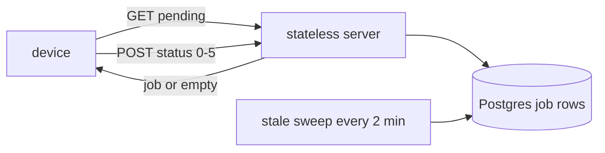

## Thesis

Getting a command or config change out to a fleet of tens of thousands of intermittently-connected devices --- where you cannot hold a live connection to each, so devices **pull** their pending work from a stateless server, execute it, and report a status code, and a background sweep reconciles the jobs that never report back.

## Sub

**The dispatch slice** -> **the pull loop and why the server is stateless** -> **the job lifecycle and the stale sweep** -> **zoom out** to push-versus-pull, all-at-once versus staged, and the pivots an interviewer rides from "roll this to the fleet" into connection scale, delivery tracking, and reconciliation.

## Spine

- Devices **pull; the server does not push** --- you cannot hold a live connection to 50,000 intermittently-connected terminals, so each device polls for its pending job on its own schedule and the server answers from a table, holding no per-device state.
- Dispatch is **resolve, build, queue** --- resolve which devices are eligible, build the job payload once, and write a per-device job row; the fanout is a set of rows, not a set of live sends.
- Every job is a **state machine** --- queued, in-progress, success, failed, cancelled, expired --- and the device reports a status code the server records, so at any moment you know exactly where the fleet stands.
- Jobs that never finish are **reconciled, not trusted** --- a device can go dark mid-job, so a periodic atomic sweep expires stale in-progress jobs rather than leaving them stuck forever.

## Companion Notes

### walk

A config change reaching a device

One change from trigger to a device that has applied it --- targeting, the payload, the poll, and the status that closes the loop.

Lead with the pull model --- "the server can't push to fifty thousand terminals, so they poll." That one fact explains every other choice.

### drill

Probe Drill

Graded follow-ups on push-versus-pull, the job lifecycle, and reconciliation --- the ones that separate "send it to the devices" from a real fleet design.

Never assume dispatched means done --- a job is done only when the device reports it, and stuck jobs are swept, not trusted.

## Drill

SDE2 | the model and the mechanics
SDE3 | scale, tracking, and edges
Staff | rollout strategy and org calls

### SDE2 | what fleet dispatch is

What is device fleet dispatch?

Getting a command or configuration out to many devices --- here, tens of thousands of payment terminals. The work is: decide which devices should get it, build the payload, and get each device to apply it and confirm. The hard part is that the devices are numerous and not always online, so you cannot just call each one.

### SDE2 | why devices pull

Why do devices pull work instead of the server pushing to them?

Because you cannot hold a live connection to 50,000 intermittently-connected terminals --- the connection state alone would be enormous, and a device that is offline can't be pushed to at all. So each device **polls**: it asks the server "is there a job for me?" on its own interval. The server answers from a table and keeps no per-device connection, which is what lets one stateless service serve the whole fleet.

### SDE2 | what is in a job

What does dispatching a job involve?

Two steps the dispatch side owns: **eligibility resolution** --- which devices match the change --- and **payload building** --- the job document the device will apply. The result is a per-device job row: this device, this payload, state queued. The device picks it up on its next poll.

### SDE2 | the status codes

How do you know a device applied the change?

The device reports a **status code** when it finishes, and the server updates that job's row. The lifecycle is a small set of states --- queued, in-progress, success, failed, cancelled, expired --- so a job is never ambiguous. "Dispatched" is not "done"; done is a reported success recorded against the row.

### SDE2 | where job state lives

Where is the state of all these jobs kept?

In a durable store --- a job row per device in Postgres, carrying the target, the payload reference, the state, and timestamps. The device is stateless about history; the server's table is the single source of truth for where every job stands, which is what you query to see the fleet's progress.

### SDE2 | the payload

What does the job payload look like?

A self-contained document the device can apply without further calls --- an id, the target, and the config to apply. It is built once at dispatch and the same document is served to the device on its poll, so the device needs only the payload it pulled, not a conversation with the server.

### SDE3 | why a stateless server

Why does the dispatch server need to be stateless?

So it scales with the fleet. If the server held a connection or session per device, 50,000 devices would mean 50,000 pieces of live state, and the server couldn't be scaled out or restarted freely. A stateless server answers each poll from the shared table, so any instance can serve any device and you scale by adding instances behind a load balancer.

### SDE3 | the stale sweep

A device pulls a job and then goes dark. What happens to it?

The job would sit in **in-progress** forever, because the device that owns it never reports. So a periodic sweep --- every couple of minutes --- finds in-progress jobs older than a threshold and moves them to **expired**. It must be **atomic** so two sweep runs don't both act on the same row. Reconciliation, not trust: a job that stops reporting is expired, not assumed complete.

### SDE3 | idempotent execution

The same job reaches a device twice --- what should happen?

Applying it twice must be safe. A poll can be retried, or a job re-served after a lost status report, so the device may see the same job id more than once. The device applies by job id idempotently --- if it already applied this id, it re-reports the status rather than doing the work again. Same discipline as any at-least-once consumer, pushed to the edge.

### SDE3 | tracking fleet progress

How do you know how the whole fleet is doing mid-rollout?

You aggregate the job table by state: how many queued, in-progress, succeeded, failed, expired. Because every job is a row with a state, fleet progress is a group-by, not a guess. That aggregate is also what tells you to stop or investigate --- a rising failed or expired count is the signal something is wrong.

### SDE3 | the offline device

A device is offline for a week during a rollout. What happens?

Nothing bad --- its job sits queued until it comes back and polls, then it picks the job up. Pull handles offline devices for free: there is no failed push to retry, just a row waiting. The only question is staleness --- whether a job that old is still valid --- which is why jobs can carry an expiry so a device doesn't apply something long superseded.

### SDE3 | cancelling a job

Can you cancel a job after dispatch?

A **queued** job, yes --- set its state to cancelled and the device never picks it up. An **in-progress** job is harder: the device already pulled it, so cancellation is best-effort (the device checks state, or you rely on the change being idempotent and correct forward). This is why the state machine has an explicit cancelled state distinct from failed.

### Staff | all-at-once vs staged

Do you roll to the whole fleet at once, or in stages?

The baseline here is **all-at-once** --- resolve every eligible device and queue them together. An interviewer will push on staging, and it is the natural enhancement: dispatch to a small cohort first, watch the success and failure rates, then widen. Staging trades rollout speed for blast-radius control; the honest answer is that all-at-once is simplest and correct for low-risk changes, and staging is what you add when a bad config could take out terminals.

### Staff | the thundering herd

50,000 devices could all poll at the same instant. What breaks?

The stateless server takes a synchronized spike --- a thundering herd --- if all devices poll on the same schedule. Spread the polls: jitter the interval per device, or stagger by a device-derived offset, so the load is smooth instead of a spike every interval. The pull model scales only if the polls are spread across time.

### Staff | poison job

A config change bricks the devices that apply it. How do you limit the damage?

This is the argument for staging even over an all-at-once baseline: a small cohort first bounds how many devices a bad change can hit before you see the failure rate climb and halt. Pair it with an expiry on queued jobs and a fast cancel path, so a change caught early never reaches the devices that haven't polled yet. All-at-once has no such brake --- which is the trade you name out loud.

### Staff | observability

What do you monitor across the fleet?

The job-state aggregate over time --- success rate, failure rate, expired (went-dark) rate, and how fast the queued count drains. Plus poll volume and server latency. The failure mode is a rollout that looks fine because most devices haven't polled yet, so you watch the *drain rate* and the failure ratio among devices that *have* reported, not just raw success counts.

### Staff | poll interval

How do you choose the poll interval?

It trades freshness against load. A short interval means changes reach devices fast but the poll QPS is high (fleet size divided by interval); a long interval is cheap but a change waits longer to land. Pick the longest interval that meets the freshness requirement, add jitter to avoid the herd, and consider a shorter interval only while a rollout is active.

### Staff | build vs buy

Would you build fleet dispatch or use a device-management platform?

For a fleet this size and this specific --- payment terminals with a custom eligibility and payload model --- owning the dispatch slice is defensible, because the targeting and the job semantics *are* the product. But the generic parts --- device identity, connectivity, the OTA transport, an MDM-style console --- are exactly what a device-management platform gives you. The call is to own the domain-specific dispatch logic and buy the undifferentiated fleet plumbing, not to rebuild an MDM from scratch.

## Walk

### The dispatch slice resolves and queues

```flow
t[config change] -> e[resolve eligible devices] -> p[build payload] -> q[per-device job rows]
```

A change triggers the dispatch slice: it resolves which devices are eligible, builds the job payload once, and writes a job row per device in state queued. The fanout is a set of rows in a table, not a set of live sends --- which is exactly what makes it cheap and restart-safe.

```json
{
  "jobId": 88,
  "deviceKey": "G6-A1F3",
  "type": "config.apply",
  "state": "queued",
  "payload": { "profile": "retail-v4", "checksum": "9f2c" }
}
```

Each row is self-contained --- the device gets everything it needs to apply the change from the payload it pulls, with no follow-up conversation. The same document is served back on the poll, so the device and the server never need to be online at the same time.

### The device pulls its pending job

```flow
d[device polls] -> s[stateless lookup] -> r[return job or empty]
```

On its own interval, the device asks the server for a pending job. The server does a stateless lookup against the job table and returns the queued job, or nothing. Crucially, the server holds no connection to the device between polls --- it is just answering a query, so any instance can serve any device.

That is the whole reason the model scales: a device that is offline simply doesn't poll, and its job waits; a device that comes back after a week polls and picks it up. There is no failed push to retry, because there was never a push.

### The device executes and reports status

```flow
x[apply payload] -> c[status code 0 to 5] -> u[update job row]
```

The device applies the payload and reports a status code; the server records it against the job row, moving it to success, failed, or another terminal state. The device applies by job id idempotently, so a re-served job is re-reported rather than re-applied.

"Dispatched" is not "done." A job is done only when its device reports a terminal status, and until then the row sits in in-progress. The table, aggregated by state, is the fleet's live progress --- a group-by, not a guess.

### The stale sweep reconciles what went dark

```flow
w[sweep every 2 min] -> f[find stale in-progress] -> e[expire atomically]
```

A device can pull a job and then vanish, leaving its row stuck in in-progress forever. So a periodic sweep finds in-progress jobs older than a threshold and moves them to expired.

```sql
-- reconcile jobs whose device went dark mid-apply
UPDATE jobs SET state = 'expired', updated_at = now()
WHERE state = 'in_progress' AND updated_at < now() - interval '2 minutes';
```

The sweep must be atomic so two runs can't both act on the same row and double-count. Reconciliation over trust: a job that stops reporting is expired and made visible, never quietly assumed complete --- which is what keeps the fleet's reported state honest.

### Model Script

- Frame the fleet | "The problem is getting a config change out to tens of thousands of terminals that aren't always online. The key decision is that the server can't push to fifty thousand intermittently-connected devices --- so the devices pull. Each polls for its pending job on its own interval, and the server stays stateless."
- The dispatch slice | "Dispatch itself is resolve, build, queue: resolve which devices are eligible, build the payload once, and write a job row per device in state queued. The fanout is rows in a table, not live sends, so it's cheap and restart-safe."
- The pull loop | "The device polls, the server does a stateless lookup and returns the job or nothing, the device applies the payload and reports a status code, and the server records it against the row. Because the server holds no per-device connection, any instance serves any device and I scale by adding instances."
- Tracking and reconciliation | "Every job is a state machine --- queued, in-progress, success, failed, cancelled, expired --- so fleet progress is a group-by on the table. And because a device can go dark mid-job, a sweep every couple of minutes atomically expires stale in-progress jobs. Dispatched is never assumed to be done; done is a reported status, and stuck jobs are swept."
- Interviewer: "A config change bricks the devices that apply it. How do you limit the blast radius?"
- Name the trade honestly | "The baseline is all-at-once, which has no brake. To bound the damage I'd stage it --- dispatch to a small cohort first, watch the failure rate among devices that report, then widen --- and put an expiry and a fast cancel on queued jobs so a change caught early never reaches devices that haven't polled yet. Staging trades rollout speed for blast-radius control."
- Land the shape | "So: pull not push, dispatch as queued rows, a stateless server answering polls, a job state machine as the source of truth, and a sweep that reconciles what goes dark. The one line is that you can't push to fifty thousand terminals, so they pull, and a job is done only when it's reported."

## Whiteboard

Sketch the pull loop and where jobs are reconciled.

### Why do devices pull instead of the server pushing?

You can't hold a connection to 50,000 intermittent terminals --- so they poll a stateless server, and an offline device's job just waits.

### How is a stuck job resolved?

A periodic atomic sweep expires in-progress jobs that stopped reporting --- reconciliation, not an assumption that they finished.



Verdict: devices pull from a stateless server, the job table is the source of truth, and a sweep reconciles what goes dark --- dispatched is never assumed done.

## System

Zoom out to where dispatch sits between a change and a device that applied it.

### Where it sits

Trigger: a config or command change
Dispatch slice: resolve eligibility, build payload, queue rows [*]
Job table: per-device rows, the source of truth
Device poll: stateless lookup returns a job or nothing
Reported status: device applies and reports, sweep reconciles the rest

### Pivots an interviewer rides

From "roll this to the fleet" they push on connection scale, tracking, and blast radius.

#### Push to devices or let them pull?

-> pull, because you cannot hold connections to a huge intermittent fleet
Pushing needs a live connection per device and fails for anything offline. Pulling lets each device poll on its own interval from a stateless server, handles offline devices for free, and scales by adding stateless instances. The cost is latency --- a change waits for the next poll.

#### How do you know the fleet's real state?

-> aggregate the job table by state, and reconcile what goes silent
Every job is a row with a state, so progress is a group-by. A device that stops reporting is not assumed done --- a periodic atomic sweep expires stale in-progress jobs, so the reported state stays honest.

## Trade-offs

The calls that separate "send it to the devices" from a designed fleet system.

### Push vs pull

- Push: low latency and immediate, but needs a live connection per device and can't reach an offline one
- Pull: scales to a huge intermittent fleet on a stateless server and handles offline for free, at the cost of poll latency and poll load

For a large, intermittently-connected fleet, pull is the only model that scales; accept the latency and spread the polls.

### All-at-once vs staged rollout

- All-at-once: simplest, fastest to complete, correct for low-risk changes, but no blast-radius brake
- Staged: a cohort first with a halt on rising failures, bounding the damage of a bad change, at the cost of rollout speed and orchestration

Default to all-at-once for low-risk config; stage when a bad change could take devices out, and name that trade explicitly.

### Short vs long poll interval

- Short interval: changes land fast, but poll QPS is high (fleet size over interval)
- Long interval: cheap steady load, but a change waits longer to reach a device

Pick the longest interval that meets the freshness need, jitter it to avoid a herd, and shorten only while a rollout is active.

## Model Answers

### the pull model | Why devices pull

The decision every other choice follows from.

- No connection per device | key | can't hold 50k live sessions
- Stateless server | store | any instance answers any poll
- Offline is free | note | the job just waits for the next poll

### the job lifecycle | State plus reconciliation

The point that keeps the fleet state honest.

- Job is a state machine | key | queued to a terminal state
- Progress is a group-by | store | aggregate the table by state
- Sweep the stuck ones | note | expire stale in-progress atomically

## Numbers

Back-of-envelope the poll load a pull model puts on the stateless server and the dispatch fanout.

Steady poll load is fleet size divided by the interval, and a synchronized fleet turns that into a spike unless polls are spread. Dispatch writes one row per eligible device.

- fleetSize | Devices | 50000 | 0 | 1000
- pollSec | Poll interval (s) | 60 | 5 | 5
- jobKB | Payload KB | 2 | 0 | 1

```js
function (vals, fmt) {
  var fleetSize = vals.fleetSize, pollSec = vals.pollSec, jobKB = vals.jobKB;
  return [
    { k: 'Steady poll QPS', v: fmt.n(Math.round(fleetSize / pollSec)), u: 'req/s', n: 'fleet size over the interval \u2014 the constant load on the stateless server just from devices asking for work', over: Math.round(fleetSize / pollSec) > 2000 },
    { k: 'Synchronized spike', v: fmt.n(fleetSize), u: 'req/s', n: 'if every device polled on the same schedule they would all hit at once \u2014 a thundering herd, which is why polls are jittered', over: fleetSize > 5000 },
    { k: 'Dispatch fanout', v: fmt.n(fleetSize), u: 'rows', n: 'one job row per eligible device, all-at-once \u2014 a bulk insert, not 50k live sends, so the fanout is cheap and restart-safe', over: false },
    { k: 'Payload served / interval', v: fmt.n(Math.round(fleetSize / pollSec * jobKB / 1000)), u: 'MB/s', n: 'each poll that returns a job ships the payload \u2014 keep the document small; a fat payload times the fleet is real bandwidth', over: Math.round(fleetSize / pollSec * jobKB / 1000) > 50 },
    { k: 'Time to drain (10/s writes)', v: fmt.n(Math.round(fleetSize / 600)), u: 'min', n: 'even queuing conservatively, the fleet is dispatched in minutes \u2014 the long pole is devices polling and applying, not the enqueue', over: false }
  ];
}
```

## Red Flags

What makes an interviewer wince.

### "The server pushes the change to each device"

You can't hold connections to 50,000 intermittent terminals, and a push can't reach an offline one at all.

Have devices pull --- poll a stateless server for their pending job --- so offline devices are handled for free and the server scales.

Note: assuming push is the most common fleet-dispatch mistake in interviews.

### "Once it's dispatched, the fleet has the change"

Dispatched only means queued. A device may be offline, mid-apply, or gone dark, so the rollout isn't complete just because the rows exist.

Treat a job as done only when its device reports a terminal status, and aggregate the table by state to see real progress.

### "A stuck in-progress job means the device is still working"

Or the device went dark and will never report --- trusting it leaves the job stuck forever and the fleet state wrong.

Run a periodic atomic sweep that expires stale in-progress jobs, so reconciliation keeps the reported state honest.

## Opener

### 30s | The one-liner

How I open when asked to roll a change to a device fleet.

#### What is the shape?

Devices pull their pending job from a stateless server, apply it, and report a status; dispatch just queues a row per device.

#### What is the one hard part?

You can't push to tens of thousands of intermittent terminals --- so they pull, and a job is done only when it's reported.

##### Hooks

Where an interviewer usually pushes next.

- Push or pull? | pull, stateless server | trade
- Know the fleet state? | group-by plus a stale sweep | drill
- Bad config? | all-at-once vs staged | trade

Foot: two sentences --- devices pull from a stateless server, and dispatched is not done.

## Bank

### SCALE | Fifty thousand terminals on one dispatch service

Task: size the poll load and argue the server stays stateless.
Model: steady QPS is fleet over interval; jitter the polls to avoid a synchronized spike; the server answers each poll from the table with no per-device state, so it scales by adding instances.
Int: what is the real bottleneck?
The synchronized-poll herd if intervals aren't spread, not the per-poll lookup.

### DESIGN | Roll a config change to the whole fleet

Task: design dispatch, delivery, and tracking.
Model: resolve eligibility and queue a job row per device; devices pull, apply idempotently, and report a status code; aggregate the table by state for progress; a sweep expires stale in-progress jobs.
Int: what does "done" mean here?
A reported terminal status per device --- not the existence of the queued rows.

### Extra Curveballs

### CURVEBALL | rollout | A change could brick devices --- how do you roll it safely?

Model: move off the all-at-once baseline to staged --- a small cohort first, halt on a rising failure rate among devices that report, then widen --- and put an expiry and a fast cancel on queued jobs so a change caught early never reaches devices that haven't polled yet.

### Frames

- Devices pull; the server can't push to a huge intermittent fleet
- A job is done only when the device reports it
- Reconcile the stuck jobs; never assume dispatched means done
