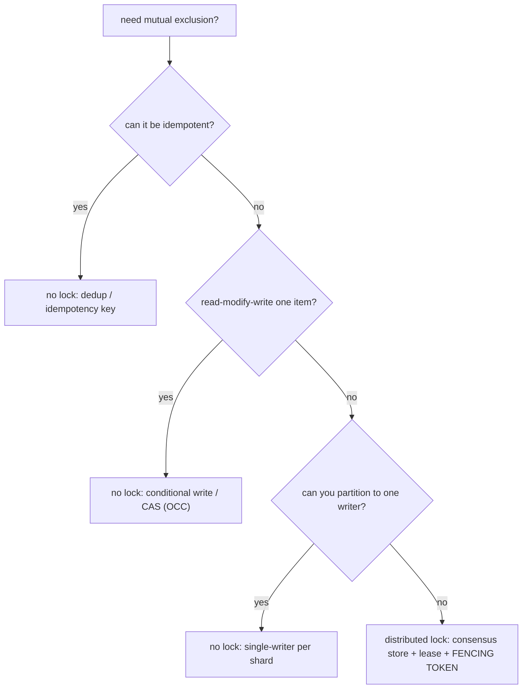

## Thesis

Ensuring only one process across many machines can hold a resource or run a critical section at a time --- mutual exclusion, but across a network where the holder can crash, pause, or be partitioned --- which is hard because a lock alone doesn't stop a holder that *thinks* it still holds it (after a pause or expiry) from acting, so a correct distributed lock needs a lease (auto-expiry) plus a fencing token (the resource rejects a stale holder); and often the deeper answer is to avoid the distributed lock entirely by designing the operation not to need one (idempotency, optimistic concurrency, a single writer).

## Sub

**Why: mutual exclusion across machines, where correctness matters** -> **the lock: acquire / TTL / release (Redis, Redlock, ZooKeeper/etcd)** -> **the safety problem: a lock isn't safe without fencing** -> **zoom out** to "do you even need one" (idempotency, OCC, single-writer) and the pivots an interviewer rides from "just grab a lock" into how a lock works, the Redlock critique, and fencing.

## Spine

- A **distributed lock** provides mutual exclusion across processes/machines --- only one holder at a time may enter a critical section or touch a resource --- and unlike an in-process mutex it works across a network where the holder can crash, pause, or be partitioned, so it needs a **TTL/lease** (the lock auto-expires if the holder dies, or it'd be held forever).
- Implementations range from **a single Redis key to a consensus store** --- Redis `SET NX PX` (fast, simple, but a single point of failure and no strong guarantee), **Redlock** (acquire on a majority of independent Redis nodes for availability --- but controversial), or **ZooKeeper/etcd** (consensus-backed ephemeral nodes/leases --- stronger correctness, the choice when correctness matters).
- A lock alone is **not safe** without a fencing token --- a holder can *believe* it still holds the lock after its lease expired (a GC pause, a network delay) and then act, letting two "holders" act at once; the fix is a **monotonic fencing token** the protected resource checks, rejecting a stale holder --- exactly as with leader election (a lock and leadership are the same primitive).
- Often the right move is to **avoid the distributed lock** --- they're a correctness-and-availability liability, so before reaching for one, ask whether the operation can be made **idempotent** (safe to run twice, no exclusion needed), use **optimistic concurrency** (a conditional write / compare-and-set that *detects* a conflict instead of preventing it), a **unique constraint**, or a **single-writer/partitioned** design; a distributed lock is a last resort, not a first reach.

## Companion Notes

### walk

Mutual exclusion across machines

A critical section that must run on only one node at a time --- why a network lock needs a TTL, how a simple Redis lock works and how it's released safely, why a lock alone is unsafe against pauses (and needs fencing), and why the best answer is often to design the lock away entirely.

Say the two things first --- "a distributed lock needs a lease, and a lease isn't enough." A lease stops a dead holder blocking forever; a fencing token stops a stale holder from acting; and often idempotency or optimistic concurrency removes the need for the lock at all.

### drill

Probe Drill

Graded follow-ups on TTLs, Redlock, fencing tokens, and the lock-free alternatives --- the ones that separate "we grab a Redis lock" from knowing when a lock is safe, when it's unsafe, and when you shouldn't be using one at all.

Name the recipe and the escape hatch: a safe lock = lease (auto-expiry) + fencing token (resource rejects a stale holder); the escape hatch = don't lock -- make it idempotent, use a conditional write (OCC), or a single writer.

### wb

Whiteboard

Rebuild the safe lock and its failure from memory --- the acquire/release atomic details, the GC-pause two-holders timeline, where the fencing token cuts it, and the "do I even need a lock?" decision tree.

Draw the pause first --- holder checks the lock, freezes past its TTL, another acquires, the holder wakes and writes. The fencing token is the line you draw at the *resource* that rejects the stale write. That picture is the whole topic.

### sys

System Map

Zoom out: a lock sits between an operation that needs exclusion and the resource it protects, with a lease for liveness and a fencing token for correctness --- and the pivots bridge out to leader election, idempotency, quorums, and partitioning.

Lead with the boundary, not the box --- "the lock service can't stop a paused client from believing it holds the lock, so the resource must fence." Then every pivot is a way to *not* need the lock.

### trade

Trade-offs

The decisions they drill --- Redis vs consensus store, lock vs lock-free, short vs long TTL, fence vs tune, DB lock vs dedicated service --- each with the axis that flips the choice.

Always name the axis: **correctness or efficiency?** An efficiency lock tolerates a weak lock; a correctness lock needs consensus plus fencing or a lock-free design. Never defend one lock as universally right.

### model

Model Answers

Full spoken scripts --- design it, the reframe, walk the failure, correctness-vs-efficiency, the Redlock debate, design it out, which store, one you'd build, name the limits --- the beats in order.

Steal the frame, not the words --- lead with "a lock needs a lease, and a lease isn't enough," then move correctness to the resource with a fencing token, then say your real instinct is to design the lock out.

### num

Numbers

Back-of-envelope the throughput a lock serializes away, the TTL-vs-operation danger zone, and the pause that eats the lease --- the numbers that show a lock is a bottleneck and a timeout is a guess.

Lead with the ceiling --- a lock caps throughput at one-over-the-critical-section, and a pause longer than the lease's headroom expires it under you. Both point at "fence, or design it out."

### rf

Red Flags

What sinks the round --- "a Redis lock makes it safe," a bare `DEL` release, "just make the TTL long enough," "Redlock's five nodes make it correct" --- and the line that flips each.

Name what the interviewer hears --- "a lock guarantees one at a time" is exactly the false confidence Kleppmann warns about; the fix is fencing at the resource, or a design that needs no exclusion.

### open

30-Second

The opener and the close --- matched to the altitude. Open at "cross-machine mutual exclusion needs a lease *and* a fencing token"; close on "design the lock out, and reserve a real lock for the irreducibly-exclusive case."

Match the altitude --- give the one-liner when they say "quickly," the correctness-vs-efficiency fork when they want depth, and land on idempotency / OCC / single-writer as the senior instinct.

## Drill

all | **All four tiers, the way a real loop comes at you** --- from "what is a distributed lock" through Redlock and fencing to the debate and designing it out. The through-line: a safe lock is a lease *plus* a fencing token, and the senior instinct is to not need the lock at all.
SDE2 | **The mechanism** --- what a lock is, why it needs a TTL, the atomic Redis recipe, safe release, and the two-holders risk. The bar is "this is a network primitive, not an in-process mutex": name the lease, and know why a bare `DEL` is a bug.
SDE3 | **The safety problem** --- Redlock, the fencing token, why a lease alone is unsafe, ZooKeeper/etcd, and the lock-free alternatives. The bar is "a lock is a performance optimization": name the pause and move correctness to the resource.
Staff | **The judgment** --- correctness-vs-efficiency, the Redlock debate, lock = leader election, the database as a lock, designing it out at scale, deadlocks. The bar is "why can't this be idempotent, OCC, or single-writer?" *before* you reach for a lock.

### SDE2 | what a distributed lock is

What is a distributed lock and how is it different from a regular mutex?

A distributed lock provides **mutual exclusion across processes on different machines** --- it ensures that, out of many nodes that might want to, only one holds the lock (and thus may enter a critical section or act on a resource) at any time. A regular (in-process) mutex works because all the threads share one memory space and one OS/runtime enforcing it; a *distributed* lock must coordinate processes that **share nothing but a network**, using some shared external system (Redis, ZooKeeper, etcd, a database row) as the arbiter of who holds it. The hard differences: the holder can **crash** (and never release --- so the lock needs a timeout), the network can **partition or delay** messages (so the holder and the lock service can disagree about who holds it), and there's no shared memory to make the acquire-and-check atomic --- all of which make a distributed lock far trickier to get right than a mutex, and are why "just use a lock" across machines hides real subtleties.

Follow: You said it coordinates through an external system --- what property must the *acquire* operation have, and what breaks without it?
It must be **atomic** --- a single "set only if absent" (compare-and-set). Without atomicity two clients both read "free" and both write "mine," and both think they won the race. So the store has to offer one indivisible test-and-set --- Redis `SET NX`, a database unique-insert, a consensus round --- and that atomic primitive is what the whole lock is built on. "Check if free, then take it" as two steps is the classic broken lock.

Follow: Name the three things a mutex never worries about but a distributed lock must.
**Holder crash** (no OS to reclaim the lock, so it needs a TTL or it's held forever); **partition or message delay** (the holder and the store can disagree about who holds it); and **no shared memory**, so "acquire, check, then act" isn't one atomic step across the network --- time can pass between the check and the act, and the holder can be stale. Those three are exactly what a fencing token and a lease exist to survive.

Senior: Recognizing that the hard part isn't "a shared flag" but that the *coordinator, the holder, and the resource* are three parties over a network that can disagree --- so the lock needs a lease for liveness and the resource needs to fence for safety --- is what separates a real answer from "it's a mutex, but distributed."
Speak: A distributed lock is mutual exclusion across machines that share nothing but a network --- so unlike a mutex the holder can crash, pause, or be partitioned, and that's the whole reason it's hard.

### SDE2 | why a TTL is needed

Why does a distributed lock need a TTL / lease?

Because the holder can **die while holding it**, and without a timeout the lock would be **held forever** (a deadlock for everyone else). A regular mutex is released when the owning thread finishes or the process exits (the OS cleans up); but a distributed lock lives in an *external* store, so if the process that acquired it crashes (or is partitioned away and never comes back), nothing releases it --- the key just sits there "locked," and every other process waits indefinitely. The fix is a **TTL (lease)**: the lock automatically **expires** after a set duration if not renewed, so a dead holder's lock is freed and someone else can acquire it. This makes the lock *self-healing* against crashes. The tension it introduces (which comes up later): the TTL must be long enough that a live holder doesn't lose the lock mid-operation, but short enough that a dead holder is cleared reasonably fast --- and the very fact that the lock can expire while you still think you hold it is the root of the safety problem.

Follow: The TTL frees a dead holder's lock --- but what new bug does the TTL *itself* introduce?
The lock can **expire while a live holder is still working** --- its operation ran long, or it was paused --- so the lease auto-expires, a second client acquires, and now **two holders act at once**. The TTL trades "held forever by a corpse" for "briefly held by two." That two-holders window is the seed of every correctness problem in the topic, and it exists *because* of the timeout, not despite it.

Follow: How do you pick the TTL value, and why is there no perfect one?
Longer than the worst-case critical section (so a live holder doesn't lose it mid-operation), but short enough that a crashed holder is cleared quickly. That's a genuine tension with no perfect answer: too short risks expiry mid-operation (the two-holders bug); too long means a dead holder stalls everyone for the whole TTL. And crucially, **no finite TTL is safe against an unbounded pause** --- which is why TTL sizing reduces the *frequency* of the failure but can't eliminate it, and why you fence.

Senior: Naming the TTL as a *liveness* mechanism that introduces a *safety* hole --- and refusing to "just tune the TTL," because tuning lowers the odds but a pause can be arbitrarily long --- is the reframe that leads straight to fencing.
Speak: A dead holder would hold the lock forever, so it needs a lease that auto-expires --- but that same expiry is the seed of the two-holders bug, which is exactly why a TTL alone isn't enough for correctness.

### SDE2 | a basic Redis lock

How do you implement a basic lock with Redis?

With an atomic **`SET key value NX PX ttl`**: `NX` means "set only if the key doesn't exist" (so only one client wins the race to create it), `PX ttl` sets an expiry (the TTL/lease), and `value` is a **unique token** the acquiring client generates (e.g. a random UUID). If the `SET` succeeds, you hold the lock; do your work; then **release** it. The atomicity of `SET NX` is what makes acquisition a proper race-winner-takes-all (two clients can't both think they acquired). The unique value matters for safe release (below). So the pattern is: `SET lock:resource <uuid> NX PX 30000` -> if OK, you're the holder for up to 30s -> do the critical section -> release. It's simple and fast, which is why it's popular --- but "simple Redis lock" is *only* safe for the "occasional double-execution is fine" case, not for strict correctness (you need fencing and, arguably, a consensus store for that).

Follow: Why `SET NX PX` in one command --- what's wrong with `SET` then `EXPIRE` as two?
Two commands aren't atomic. If the client **crashes between the `SET` and the `EXPIRE`**, the key exists with **no TTL** --- held forever, which is the exact deadlock the lease was supposed to prevent. `SET key val NX PX ttl` is a single atomic operation, so the lock *always* comes with its expiry; there's no window where it exists without one. It's a small detail that's the difference between a self-healing lock and a permanent one.

Follow: You already have `NX` for mutual exclusion --- what's the unique token actually for?
`NX` wins the *acquire* race, but the token is for safe *release*. On release you must delete the lock **only if the stored value is still yours** --- because if your TTL expired and another client acquired the lock, a bare `DEL` would delete *their* lock. So the token is how release checks "is this still mine?" `NX` is acquire-safety; the unique token is release-safety --- two different jobs.

Senior: Knowing that the correctness of a simple Redis lock lives in its two atomicity details --- `SET NX PX` as one op, and compare-and-delete on release --- not in the `SET` itself, is what shows you've actually shipped one rather than copied a snippet.
Speak: `SET key uuid NX PX ttl` --- `NX` makes acquisition a race only one client wins, `PX` is the lease, and the `uuid` is a unique token I check on release so I never delete a lock that's no longer mine.

### SDE2 | releasing the lock safely

Why must you release a distributed lock carefully, and what's the bug if you don't?

Because you must **only delete the lock if you still own it** --- naively doing `DEL lock:resource` can delete *someone else's* lock. The bug: client A acquires the lock with a 30s TTL; A's operation runs slow and the **lock expires** at 30s; client B now acquires the (freed) lock; then A finishes and calls `DEL lock:resource` --- **deleting B's lock**, so now C can acquire it while B still thinks it holds it -> two holders. The fix is to make release **check the token**: only delete if the stored value equals *your* unique token (the UUID you set). Because "read the value, compare, then delete" must be atomic, you do it with a small **Lua script** (Redis executes it atomically) or a compare-and-delete primitive --- `if redis.get(key) == mytoken then redis.del(key)`. This "release only my own lock" discipline is the first correctness subtlety of distributed locking, and forgetting it (a bare `DEL`) is a classic bug that silently breaks mutual exclusion.

Follow: Why can't you do the get-check-del from the client --- read the value, confirm it's yours, then `DEL`?
That's **check-then-act with a gap**. Between your `GET` and your `DEL`, your lock could expire and another client acquire it --- and your `DEL` then deletes *theirs*. The check and the delete have to be **one indivisible step**, which is why you push it into a Lua script (Redis runs the whole script atomically, nothing interleaves) or a compare-and-delete. Doing the compare on the client re-opens exactly the race you were trying to close.

Follow: With a correct atomic compare-and-delete release, is the lock now safe? Why not?
No. Safe release fixes the "delete someone else's lock" bug, but **not the pause bug**: a holder paused past its TTL still acts on the *resource* after another client has acquired. Release-safety is about not clobbering another lock; it says nothing about a stale holder writing to the protected resource. So you've closed one hole and the biggest one --- the two-holders-act case --- is still open, which is what fencing is for.

Senior: Seeing safe release as *necessary but the least* of the correctness problems --- the one people fix and then wrongly conclude the lock is now safe --- is the tell that you understand where the real danger lives (at the resource, not the release).
Speak: Release has to be an atomic compare-and-delete --- delete only if the stored token is still mine, via a Lua script --- because a bare `DEL` can remove a lock that already expired and was re-acquired by someone else.

### SDE2 | when the holder crashes or the lock expires mid-op

What happens if the holder crashes, or the lock expires while it's still working?

Two related cases. If the holder **crashes** cleanly, the TTL saves you: the lock expires and another process acquires it --- that's the TTL doing its job (the crashed holder isn't doing anything anymore, so there's no conflict). The *dangerous* case is if the lock **expires while the original holder is still alive and working** (its operation took longer than the TTL, or it was paused): now the lock is free, a **second** process acquires it, and **both** the original (which still believes it holds the lock) and the new holder are in the critical section **at the same time** --- violating mutual exclusion and potentially corrupting the resource. This is the core failure mode of distributed locks: the lock can expire out from under a live holder, and the holder has no reliable way to know. It's why a TTL alone isn't sufficient for correctness, and why you either size the TTL very carefully (still risky under pauses) or --- the real fix --- use **fencing tokens** so the resource rejects the stale holder even if two clients both think they hold the lock.

Follow: The clean crash is fine because the TTL frees it. Why is expiry-while-alive categorically worse than a crash?
Because a **crashed holder isn't doing anything** --- there's no conflict when another acquires. An **expired-but-alive** holder is still executing the critical section, so when a second client acquires, *both* act --- and that's the mutual-exclusion violation. The danger isn't the dead holder (the TTL handles it); it's the *live, stale* holder that keeps working, unaware its lease is gone. Crash = safe; expiry-under-a-live-holder = corruption.

Follow: A watchdog renews the TTL while the holder works. Does that fix expiry-mid-op?
It fixes the **slow-operation** case --- a live, running holder periodically extends its lease so a legitimately long operation doesn't lose the lock. It does **not** fix the **pause** case: a process frozen by a stop-the-world GC or a VM suspend *can't run its watchdog to renew*, so its lease expires while it's frozen, and it wakes up stale. Renewal narrows the window to "actively running and healthy"; the moment the holder is paused, the watchdog is paused too, and only fencing saves you.

Senior: Distinguishing "operation ran long" (renewal helps) from "the process was paused" (renewal *can't*, because a frozen process can't renew) --- and concluding you fence regardless --- is the distinction that shows you've thought past the happy path.
Speak: A clean crash is safe --- the TTL frees the lock and the dead holder does nothing --- but the lock expiring while the holder is *still alive and working* is the dangerous case, because then two holders act at once.

### SDE2 | an example

Give a concrete example where you'd want a distributed lock.

A **scheduled job that must run exactly once** across a fleet: several instances of a service each run a cron, but the job (say, sending a daily report or a billing run) must execute only once --- so each instance tries to acquire a distributed lock before running, and only the one that gets it proceeds. Another: **exclusive access to an external resource** --- only one worker at a time may modify a particular file, call a non-idempotent external API, or process a specific entity, so workers acquire a per-entity lock. Or **preventing concurrent processing of the same item** in a queue (a per-item lock so two workers don't handle the same order). In each case the lock enforces "only one doer for this specific thing right now." But notice: the *cron-once* case is often better solved by idempotency or a leader (only the leader runs crons), and the *per-item* case by optimistic concurrency or partitioning --- which is why "I'd use a distributed lock here" should always be followed by "...unless I can design it so I don't need one."

Follow: You said a cron that must run once. Isn't leader election a cleaner fit than a per-run lock?
Often yes --- for a **long-lived "one coordinator" role**, leader election is the natural frame (the elected leader runs the crons), whereas a distributed lock is the natural frame for **short-lived, per-resource** exclusion (lock this entity, do the thing, release). They're the same primitive underneath; you pick the framing that matches the *lifetime and cardinality* of the need. "One owner of a role, ongoing" reads as election; "one doer of this specific action, briefly" reads as a lock.

Follow: For "process this order exactly once," what would you reach for before a lock?
**Idempotency or single-writer partitioning.** Idempotency: a unique constraint / idempotency key on the order id, so a duplicate attempt is a harmless no-op --- no lock, no fencing. Single-writer: route every operation for an order to the *one* consumer that owns that partition (Kafka-style), so there's no contention to lock against. The lock is the last resort, only if the order's processing genuinely can't be made idempotent *and* can't be partitioned.

Senior: Following every "I'd use a lock here" with "...unless I can make it idempotent, conditional, or single-writer" --- treating the lock as a smell to *justify*, not a default to reach for --- is the instinct that reads as senior.
Speak: Classic cases are a cron that must run once across a fleet, or exclusive access to a non-idempotent external resource --- but I'd first ask whether idempotency or a single writer removes the need for the lock at all.

### SDE2 | the two-holders risk

What's the fundamental risk with a distributed lock?

That **two processes both believe they hold the lock and act simultaneously** --- breaking the mutual exclusion the lock was supposed to guarantee. There are a few ways it happens: (1) the lock **expires** while the first holder is still working (slow operation or a pause), and a second process acquires it; (2) a naive release **deletes someone else's lock**, letting a third party in; (3) with a single-node lock store, the store fails over to a replica that **didn't have the lock recorded** (async replication lost the write), so a second client acquires it on the new primary; (4) a **network partition** separates the holder from the store, the lock expires from the store's view, another acquires it, and the partitioned holder --- unaware --- keeps acting. All of these produce the same bad state: concurrent holders. This is why a distributed lock isn't just "SET a key" --- the entire discipline (unique tokens, safe release, careful TTLs, and above all **fencing tokens**, plus a decision about correctness-vs-efficiency) exists to prevent, or tolerate, the two-holders case.

Follow: Of the ways two holders happen --- expiry, bad release, failover, partition --- which does a fencing token fix, and which does it *not*?
A fencing token fixes **all of them at the point of action** --- whatever caused two clients to believe they hold the lock, the *resource* rejects the one carrying the lower token, so only one write lands. What fencing does *not* fix is the lock **service** letting two clients acquire in the first place (that's the store's availability/consistency problem) --- it makes that harmless. So fencing doesn't prevent two-holders; it makes two-holders *not matter*, which is the more robust guarantee.

Follow: Single-node Redis "losing" the lock on failover --- walk the exact sequence.
Client A acquires the lock on the primary; the write **hasn't replicated yet** (Redis replication is asynchronous); the primary **fails**, and a replica that never saw A's lock is **promoted**; client B now acquires the "same" lock on the new primary --- **two holders**. It's the async-replication lost-write hole: the acknowledgment to A didn't guarantee durability across a failover. That's precisely why a correctness-critical lock wants a *consensus* store (the write is agreed by a majority before it's acknowledged), not a single Redis primary.

Senior: Enumerating the *four distinct causes* of two-holders and mapping each to its mitigation --- token for bad release, consensus for failover, fencing for the pause, all-of-the-above tolerance at the resource --- rather than treating "two holders" as one undifferentiated risk, is the systems-thinking signal.
Speak: The one risk is two processes both believing they hold the lock and acting at once --- from expiry under a pause, a bad release, an async-failover lost write, or a partition --- all producing the same corrupt state, which is why the whole discipline exists.

### SDE3 | Redlock

What is Redlock and why does it exist?

**Redlock** is Redis's algorithm for a distributed lock across **multiple independent Redis nodes** (typically 5), designed to remove the single-point-of-failure of a one-instance Redis lock. To acquire, a client tries to `SET NX PX` the lock on **all N nodes**, and considers the lock **held only if it succeeds on a majority** (e.g. 3 of 5) *within* a time budget (and it accounts for the time spent acquiring against the TTL). To release, it deletes on all nodes. The idea: with a majority requirement across *independent* nodes, the lock survives a minority of Redis nodes failing (unlike a single instance, whose failure or failover breaks the lock). It exists because a single-node Redis lock has two problems --- the node is a SPOF, and Redis replication is async so a failover can lose the lock write (letting two clients acquire). Redlock spreads the lock across independent nodes to get availability without that failover hole. However --- and this is the controversial part --- Redlock is **still not sufficient for correctness under process pauses and clock issues** without fencing tokens, which is the heart of the Kleppmann/antirez debate. So Redlock improves *availability* over a single-node lock, but doesn't, by itself, make the lock safe for correctness-critical use.

Follow: Redlock needs a majority of N *independent* nodes. Why independent --- what fails if they're a primary and its replicas?
Because replicas **aren't independent failure domains**. A primary's async-replicated lock can be lost on failover (the single-node hole), and correlated failure defeats the whole point of a majority. Redlock's safety argument assumes the N nodes fail *independently*, so they must be **N separate masters** (no replication between them), not one master with replicas. Run it over a replica set and you've reintroduced the exact lost-write-on-failover problem Redlock was meant to escape.

Follow: Redlock counts elapsed time against the TTL during acquisition. Why must it, and what assumption does that bake in?
Acquiring across N nodes takes real time; if that time eats most of the TTL, you'd "hold" the lock with almost no valid lease left. So Redlock **subtracts the elapsed acquisition time** (and a clock-drift margin) from the TTL and only considers the lock held if enough validity remains. That bakes in a **bounded-clock / bounded-drift assumption** --- the algorithm's timing is only sound if clocks don't jump and drift stays within the margin. That assumption is exactly what Kleppmann attacks: an NTP step or a paused VM can violate it.

Senior: Understanding that Redlock solves the single-node *availability* hole (SPOF plus async-failover lost write) but **not** the pause/clock *correctness* hole --- and being able to say precisely which problem it does and doesn't address --- is what keeps you from overselling it.
Speak: Redlock acquires the lock on a majority of N independent Redis nodes, so a minority failing doesn't lose it --- fixing the single-node SPOF and failover hole --- but it's still not correctness-safe without a fencing token.

### SDE3 | the fencing token

What is a fencing token and why is it the key to a safe distributed lock?

A **fencing token** is a **monotonically increasing number** returned each time the lock is granted, which the **protected resource** uses to reject a stale holder's requests. It's the mechanism that makes a lock safe *at the point of action*, closing the "two holders both think they hold the lock" hole. The flow: each acquisition gets a strictly higher token (33, 34, 35...); the holder includes its token with every request to the resource it's protecting; the resource **remembers the highest token it has seen and rejects any request carrying a lower token**. So if holder-with-token-33 is paused, its lock expires, holder-with-token-34 acquires and writes (resource now records "highest = 34"), and then the paused holder-33 resumes and sends its write --- the resource rejects it (33 < 34). Even though *two clients believed they held the lock*, only one can actually *act* on the resource, because the resource enforces the ordering. This is the crucial insight: the lock service can't prevent a client from *thinking* it holds the lock after an expiry (it can't reach into a paused process), so the *resource* must be the one to enforce safety, via a token it can check. A distributed lock without a fencing token is not safe for correctness --- this is the single most important point about distributed locking.

Follow: Where does the monotonic token come from --- what safely generates strictly increasing numbers?
The **lock service itself**, tied to each grant: ZooKeeper's `zxid` or a node version, etcd's `mod_revision`, or a monotonic counter the consensus store increments on every acquisition. It has to be issued by the *same authority that grants the lock* and be strictly increasing across grants, so a later acquisition always outranks an earlier one. A client-generated random number won't do --- it isn't ordered --- which is why the token comes from the coordination store, not the holder.

Follow: The resource must reject lower tokens --- what does that demand of the resource, and when can't you do it?
The resource must **persist "highest token seen" and check it atomically on every write** --- so it needs conditional-write / compare-and-set support. You **can't fence a resource that can't check a token**: a dumb filesystem, a legacy third-party API, a physical device. And that's the cruel irony --- the resources you most want to fence (external, non-idempotent) are often exactly the ones that can't check a token, which is when a distributed lock is both most necessary and least safe.

Senior: Locating correctness **at the resource**, not the lock service --- the insight that the service can't stop a paused client from *believing* it holds the lock, so the resource must enforce order via a token it checks --- is the single sentence that marks real understanding of this topic.
Speak: A fencing token is a monotonically increasing number handed out on each grant; the holder sends it with every write and the resource rejects any token below the highest it's seen --- so a stale holder's write is refused even though two clients think they hold the lock.

### SDE3 | a lock is not safe without fencing

Why is a lock (or lease) fundamentally insufficient for correctness without fencing?

Because of **unbounded process pauses**: a holder can check "do I hold the lock?" (yes), then be **paused** (a long stop-the-world GC, VM suspension, or being descheduled) for longer than the lock's TTL, during which the lock **expires** and another client acquires it, and then the paused holder **resumes and acts** --- still believing, from its pre-pause check, that it holds the lock. Two holders act; state corrupts. No amount of TTL tuning eliminates this, because pauses can be arbitrarily long and the holder can't detect that time has passed. This is the argument from Kleppmann's "How to do distributed locking": a lock/lease is at best a **performance optimization** (it usually prevents contention and wasted work), but it is **not a correctness mechanism** on its own, because the client's belief about holding the lock can be stale at the moment it acts. Correctness requires moving the check to the **resource**, via a fencing token the resource enforces --- the resource, unlike the paused client, always knows the current highest token. So "we have a lock (or a lease, or Redlock)" does *not* imply "we're safe"; the resource must fence, or the operation must not need strict exclusion (idempotency/OCC).

Follow: Make the pause concrete --- what real-world thing freezes a process past a 30-second TTL?
A **stop-the-world GC pause** (a large JVM heap can pause for seconds, occasionally tens of seconds); **VM live-migration or hypervisor suspend** (the whole guest is frozen); an **overloaded host descheduling** the process for a long time; even a laptop lid-close in dev. The point isn't any one cause --- it's that pauses are **unbounded and invisible to the process**: it has no reliable way to know that wall-clock time passed while it was frozen, so its "I hold the lock" belief is stale the instant it resumes.

Follow: Kleppmann calls a lock "at best a performance optimization." What does that phrase actually mean here?
It means the lock **usually** prevents contention and wasted/duplicate work --- so it's worth having for *efficiency* --- but it **can't be relied on for correctness**, because the client's belief about holding it can be stale at the exact instant it acts. So the honest posture is: keep the lock to *reduce* contention and duplicate work, but get *correctness* from something the client can't get wrong under a pause --- a fencing token the resource checks, or a design (idempotency/OCC) that needs no exclusion at all.

Senior: Framing "we have a lock / lease / Redlock" as explicitly **not** implying "we're safe" --- and moving the correctness guarantee to the resource, the only party that always knows the current highest token --- is the reframe the whole topic is built to test.
Speak: An unbounded pause --- a long GC --- can freeze a holder past its TTL; the lock expires, another acquires, and the paused holder resumes and acts, so a lock alone is a performance optimization, not a correctness mechanism.

### SDE3 | lock granularity and TTL sizing

How do you choose lock granularity and TTL?

**Granularity**: lock the **narrowest** thing that gives correctness --- a per-entity lock (lock *this* order, *this* user) rather than one global lock, so unrelated work proceeds in parallel and the lock isn't a system-wide bottleneck. Too coarse (one big lock) serializes everything and kills throughput; too fine can add overhead and risk deadlocks if an operation needs several locks. **TTL**: it must be **longer than the critical section's worst-case duration** (so a live holder doesn't lose the lock mid-operation), but **short enough** that a crashed holder's lock is released reasonably quickly (long TTL = long stall for others when a holder dies). This is a genuine tension with no perfect answer: a fixed TTL that's too short risks expiry-mid-operation (the two-holders bug); too long risks slow recovery. Mitigations: **renew/extend** the lock (a "watchdog" that periodically extends the TTL while the holder is still working and alive --- but this doesn't help if the holder is *paused*, since it can't renew while frozen), and size the TTL for the realistic worst case. The deeper point is that no TTL is perfectly safe against pauses (hence fencing), so TTL sizing is about *reducing* the frequency of the failure and bounding recovery time, not eliminating the risk.

Follow: You lock per-entity to allow parallelism. What failure does fine-grained locking introduce that one global lock doesn't?
**Deadlock.** The moment an operation needs *several* fine-grained locks and different operations acquire them in **different orders**, you get a circular wait (A holds lock1 wants lock2, B holds lock2 wants lock1) --- which a single global lock can't produce, because there's only one lock. So fine granularity buys throughput at the cost of multi-lock deadlock risk, which you then have to manage with a consistent **lock ordering** or **timeouts**. Coarse locks trade throughput for simplicity; fine locks trade simplicity for deadlock exposure.

Follow: Your critical section is p99 = 8s but p999 = 40s. What TTL, and what about the tail?
You **can't** size for the absolute max (it's effectively unbounded), so size the TTL above the *realistic* worst case --- say 30--60s --- **and** add a renewal watchdog so a legitimately long run keeps extending its lease while it's alive, **and** fence at the resource so the rare tail that still outruns the lease can't corrupt anything. TTL sizing bounds the *frequency* of expiry-mid-op; the renewal handles honest long runs; fencing bounds the *consequence* of the one that slips through. Three layers, because no single one is sufficient.

Senior: Treating TTL sizing as *risk-frequency management* (not risk elimination), and pairing narrow granularity with a deliberate deadlock-avoidance discipline (ordering or timeouts), rather than reaching for one knob, is the maturity a senior round rewards.
Speak: Lock the narrowest thing that gives correctness --- per-entity, not global --- and size the TTL above the worst-case critical section with a renewal watchdog, but fence anyway, because no TTL survives an unbounded pause.

### SDE3 | ZooKeeper / etcd locks

How do ZooKeeper or etcd implement locks, and why are they stronger than a Redis lock?

They build the lock on a **consensus-backed store**, so the lock state itself is strongly consistent and survives node failures without the async-replication hole. **ZooKeeper**: a client creates an **ephemeral sequential** znode under a lock path; the client with the lowest sequence number holds the lock; others watch the node just below them and are notified when it disappears. "Ephemeral" means the node is tied to the client's **session** --- if the client crashes or disconnects, ZooKeeper (which is monitoring the session via heartbeats) automatically **deletes the node**, releasing the lock (a built-in, session-based lease that's more robust than a fixed TTL because it's tied to liveness detection). **etcd**: uses **leases** --- a client acquires a lock key associated with a lease (TTL) and keeps it alive; the lock releases when the lease expires. Both are stronger than a single Redis lock because the store runs **consensus** (ZAB/Raft) so the lock's existence is agreed by a majority and doesn't vanish on a failover (no lost-write-on-async-replica problem), and their liveness detection (sessions/leases) is integral. They're the recommended choice **when the lock is for correctness**. (They still benefit from fencing tokens at the resource for the pause case --- ZooKeeper's `zxid`/version can serve as the fencing token --- but the underlying lock is far more trustworthy than a Redis key.)

Follow: ZooKeeper makes you watch the node just below you, not the lock itself. Why?
To avoid the **thundering herd.** If every waiter watched the *lock* directly, releasing it would wake **all** of them at once, and they'd stampede to re-acquire --- hammering the ensemble. By having each waiter watch only its **immediate predecessor** in the sequential queue, a release notifies **exactly one** client (the next in line), turning the free-for-all into an orderly hand-off. It's a queueing lock: fair, and one wake-up per release instead of N.

Follow: The ephemeral node releases on session loss. Can that release a lock a live holder still holds?
Yes --- and it's the same pause problem. A **GC pause or network blip** can expire the ZooKeeper session (missed heartbeats) even though the client is alive; ZK deletes the ephemeral node, another client acquires, and the paused holder resumes still believing it holds the lock. The session timeout is itself a lease, so consensus makes the *store* trustworthy but doesn't eliminate the stale-holder window --- which is why even ZooKeeper wants **fencing** at the resource, using the `zxid` as the monotonic token.

Senior: Knowing that consensus fixes the *store's* correctness (no lost-write-on-failover) and gives *integral* liveness (sessions), yet the session timeout is still a lease --- so even ZooKeeper needs fencing for the pause case, with `zxid` as the token --- is the nuance that separates "use ZooKeeper" from understanding *why*.
Speak: ZooKeeper's ephemeral sequential znodes give a consensus-backed lock with session-based auto-release --- stronger than a Redis key because ZAB or Raft agrees the lock by majority so it survives failover --- and its `zxid` can serve as the fencing token.

### SDE3 | do you actually need a lock

Before using a distributed lock, what should you ask --- and what's the idempotency alternative?

Ask: **can I make the operation not need mutual exclusion at all?** The most common answer is **idempotency** --- design the operation so that running it **twice produces the same result as running it once**, and then you don't care if two processes both do it. If "send this email" is deduplicated by a message id, or "create this record" uses an idempotency key that makes the duplicate a no-op, or "set status to X" is naturally idempotent (setting it twice is fine), then concurrent execution is *harmless*, and the whole distributed-lock apparatus (with its TTLs, fencing, availability risks) disappears. This is a huge simplification: instead of the hard problem "guarantee only one does it" (which needs consensus/fencing to do correctly), you solve the easier problem "make it safe for more than one to do it." Many uses of distributed locks are really trying to prevent *duplicate side effects*, and idempotency addresses that directly and more robustly. So the senior instinct is: reach for idempotency first; a lock is only needed when the operation *genuinely* can't be made idempotent and *must* be exclusive.

Follow: Give a concrete example of turning a lock into an idempotency key --- "charge the customer once."
Instead of locking the customer to prevent a double charge, attach an **idempotency key** (a client-generated request id) to the charge; the payment store records it under a **unique constraint**, so a retry carrying the same key is a **no-op that returns the original result**. No lock, no lease, no fencing --- the *uniqueness of the key* is the exclusion, enforced atomically by the store's constraint. You've moved from "prevent two charges" to "make a second charge attempt harmless," which is both simpler and more robust.

Follow: Idempotency makes duplicates harmless. When is that *not* enough --- when do you still need real exclusion?
When the action isn't a repeatable side effect you can dedup, but a genuinely **exclusive or order-sensitive** operation on a resource you can't make conditional --- e.g. "only one process may control this physical device," or "only one may run this non-idempotent migration step against a system with no idempotency support." Idempotency handles duplicate *effects*; it doesn't handle "there must be strictly one actor at a time" on an action that can't be made a safe-to-repeat no-op. That's the residue where a real lock (with fencing) earns its place.

Senior: Reaching for idempotency **first** and reframing "guarantee only one does it" (needs consensus + fencing) into the easier "make it safe for many to do it" (needs only a dedup key) --- is the single highest-leverage instinct in the whole topic.
Speak: Before any lock I ask whether the operation can be made idempotent --- dedup by a key so running it twice equals running it once --- because that turns the hard exclusion problem into a harmless-duplicate one, with no lock at all.

### SDE3 | optimistic concurrency as an alternative

How does optimistic concurrency control replace a lock?

By **detecting** conflicts instead of **preventing** them --- so no lock is held. Each item carries a **version** (or you use a conditional write / compare-and-set): a writer reads the item and its version, computes its update, then writes **only if the version is still what it read** (`UPDATE ... WHERE version = N`, or a DynamoDB conditional write, or a compare-and-swap). If another writer got there first, the version changed, the conditional write **fails**, and the loser **retries** (re-read, recompute, re-write). This gives correctness (no lost updates) with **no lock held** during the operation --- concurrent writers proceed optimistically, and only the rare actual conflict costs a retry. It's ideal when **contention is low** (conflicts are rare, so retries are rare) and the operation is a **read-modify-write on a single item** the store can conditionally update. Compared to a distributed lock: OCC has no held lock (no TTL, no held-forever risk, no fencing needed --- the atomic conditional write *is* the safety), and it's typically faster and simpler. Its limit: under **high contention** (many writers to the same item), retries thrash (livelock-ish), and it only works when the store supports atomic conditional writes on the unit you're guarding. But for the common "avoid lost updates on a record" case, OCC (or an atomic DB operation) is usually the better answer than a distributed lock.

Follow: OCC retries the loser on a version conflict. What happens under *high* contention, and what do you do?
It **degrades** --- many writers to one item means most conditional writes fail and retry, wasting work (a livelock-ish spiral), and throughput collapses because everyone keeps re-reading and re-losing. Under high contention you either **reduce the contention** (shard or partition the hot item so a single writer owns it --- back to single-writer) or fall back to a **pessimistic lock** that serializes cleanly. OCC is the right tool precisely when conflicts are *rare*; when they're common, "detect and retry" becomes "retry forever."

Follow: OCC vs a distributed lock --- what does OCC give you for free that the lock makes you engineer?
Everything the lock's machinery exists to manage: **no held lock** means no TTL, no held-forever risk, no lease renewal, no fencing token --- the store's **atomic conditional write is the safety**, applied at the exact instant of the write. A distributed lock makes you engineer each of those pieces separately and still leaves the pause hole; OCC folds correctness into one compare-and-set the store executes atomically. That's why "can this be a conditional write?" is the question to ask before "which lock?"

Senior: Matching OCC to the **contention regime** (low = OCC shines; high = OCC thrashes, so you partition to a single writer) rather than treating it as universally better than a lock --- is the judgment that shows you understand *why* it works, not just that it does.
Speak: Optimistic concurrency detects conflicts instead of preventing them --- read a version, write conditionally on it, retry the loser --- so there's no held lock, no TTL, no fencing, and the atomic conditional write is the safety, ideal when contention is low.

### Staff | the Redlock debate

What is the Redlock debate (Kleppmann vs antirez) actually about?

It's about whether Redlock is safe for **correctness**, and it hinges on the **efficiency-vs-correctness** distinction. **Kleppmann's critique**: Redlock (and any lock built on timeouts) is unsafe for correctness-critical use because (a) **process pauses** (GC, etc.) can make a holder act after its lock expired, and (b) Redlock **relies on synchronized clocks / bounded clock drift** (its timing assumptions can be violated by clock jumps, NTP steps), so the majority-of-Redis-nodes approach doesn't actually guarantee mutual exclusion under adversarial timing --- and crucially, **without fencing tokens, no lock is safe** against the pause case regardless. His conclusion: if you need correctness, use a consensus system (ZooKeeper) *and* fencing tokens; if you only need efficiency, a single Redis lock is fine and Redlock's complexity isn't worth it. **antirez's (Redis author's) response**: Redlock's assumptions (bounded pauses/clock drift) are reasonable in practice for many systems, the algorithm is sound under its stated model, and the clock-drift concerns are addressable; fencing tokens aren't always available (the protected resource may not support them). The debate turns on **what guarantee you need** and **what failure model you assume**: Kleppmann argues for the strict model (unbounded pauses, adversarial clocks) where you need fencing/consensus; antirez argues the practical model is often fine. The staff takeaway isn't "who won" --- it's that the *right question* is "**is this lock for correctness or for efficiency?**", because that determines whether Redlock (or any timeout lock) is adequate or whether you need consensus + fencing.

Follow: Strip it to one sentence --- what's the actual technical disagreement, not the personalities?
Whether a **timeout-based lock can be relied on for correctness.** Kleppmann: no, because unbounded pauses and clock jumps break its timing assumptions, and without a fencing token *nothing* is safe. antirez: its bounded-pause / bounded-drift model is reasonable in practice and the algorithm is sound *under that model*. The disagreement is really about which **failure model** you assume --- adversarial (unbounded pauses, clock steps) or practical (bounded) --- and everything else follows from that choice.

Follow: antirez says fencing tokens aren't always available. Is that a rebuttal to Kleppmann, or a concession?
It's really a **concession that reframes the problem.** If you *can't* fence --- the resource won't check a token --- then you genuinely can't get correctness from *any* lock, Redlock included, so you're operating in efficiency-mode whether you admit it or not. It doesn't make Redlock correctness-safe; it says correctness may be *unreachable* for that resource --- which is Kleppmann's point arrived at from the other direction. "Fencing isn't always available" concedes that fencing is what correctness *requires*.

Senior: Refusing to score "who won" and instead extracting the decision rule --- "is this lock for correctness or efficiency?" --- because *that*, not the debate, determines whether Redlock or any timeout lock is adequate, is the staff-level way to hold this.
Speak: The debate is whether a timeout lock like Redlock is safe for correctness --- Kleppmann says no, unbounded pauses and clock drift break it and without fencing nothing's safe; antirez says the bounded model is fine in practice --- and the real takeaway is "correctness or efficiency?"

### Staff | locks for correctness vs efficiency

Why is "is this lock for correctness or efficiency?" the most important question?

Because it completely changes what lock (if any) you need. A lock **for efficiency** exists to *avoid wasted or duplicate work* --- e.g. "don't let two workers both recompute the same expensive cache entry" --- and here **occasional** double-execution is **harmless** (you just waste some work, the result is still correct), so a **weak, simple lock** (single Redis key, no fencing) is perfectly fine; if it rarely fails and two workers occasionally both run, no harm done. A lock **for correctness** exists to *prevent a state-corrupting outcome* --- e.g. "only one process may deduct from this balance" or "only one may write this file" --- and here even a **single** violation (two holders acting) causes **damage** (double-spend, corruption), so a weak lock is **not acceptable**: you need the full rigor (a consensus store for the lock, and **fencing tokens** at the resource, or a design that avoids the lock). Conflating the two is the common mistake: people use a simple Redis lock (fine for efficiency) for a correctness-critical section (where it's dangerously insufficient), or over-engineer consensus+fencing for a mere efficiency optimization (wasteful). So the first thing to establish is the *stakes of a violation*: harmless-waste -> weak lock is fine; state-corruption -> you need fencing/consensus or a lock-free correct design. This single distinction resolves most "which lock should I use" questions.

Follow: Give the canonical example of each, and why a weak lock is fine for one.
**Efficiency:** "don't let two workers both recompute the same expensive cache entry." If the lock rarely fails and two occasionally run, you waste a little compute --- the result is still correct --- so a **single Redis key with no fencing** is perfectly fine. **Correctness:** "only one process may deduct from this account balance." One violation is a **double-spend** --- money is wrong --- so a weak lock is unacceptable; you need a consensus store *and* fencing, or better, a lock-free correct design (an atomic conditional decrement). Same word "lock," opposite requirements, decided entirely by what a violation costs.

Follow: What are the two *symmetric* mistakes people make once you frame it this way?
(1) Using a **simple Redis lock** (fine for efficiency) to guard a **correctness-critical** section --- dangerously insufficient, the false-confidence case. (2) **Over-engineering** consensus plus fencing for a mere **efficiency** optimization --- wasteful complexity for a case where an occasional double-run is harmless. People err in *both* directions, and both come from not asking "what does a violation actually cost?" first. Establishing the stakes prevents both the under- and the over-build.

Senior: Establishing the **stakes of a violation** first (harmless waste vs state corruption) and letting *that* --- not habit --- pick the mechanism, resolving most "which lock" questions in one stroke, is the staff move that reframes the whole conversation.
Speak: The decisive question is "correctness or efficiency?" --- efficiency tolerates occasional double-execution so a simple lock is fine, correctness can't tolerate one violation so it needs consensus plus fencing, or a lock-free design.

### Staff | distributed lock vs leader election

How do distributed locks and leader election relate, and when do you frame a problem as which?

They're the **same underlying primitive** --- "at most one holder/leader at a time, safe under partitions and pauses" --- and share the same machinery (a consensus/coordination store, a lease/TTL, and fencing tokens). A leader *is* whoever holds a particular long-lived lock; acquiring "the lock on the coordinator role" *is* being elected. You frame it as **leader election** when you have **one long-lived coordinator role** for a whole service/cluster (with responsibilities like catch-up, log recovery, ongoing coordination) --- the emphasis is on the *role* and its continuity across failovers. You frame it as a **distributed lock** when you have **shorter-lived, possibly many, mutual-exclusion needs over specific resources** (lock *this* entity for *this* operation, then release; there may be thousands of different locks) --- the emphasis is on *per-resource exclusion*. But the safety requirements are identical: both need a majority/consensus-backed store to be safe against partition (a Redis lock and a naive election have the *same* unsafety), both need leases so a dead holder relinquishes, and **both need fencing tokens** so a stale holder/leader can't act. The staff insight: if you understand one, you understand the other, and the "aha" is recognizing when a problem stated as "I need a lock" is really "I need to elect a single owner" (or vice versa) --- and applying the same discipline (consensus store + lease + fencing, or design it away) regardless of the label.

Follow: If they're the same primitive, why do both terms exist --- when do you say "lock" vs "election"?
The framing follows **lifetime and cardinality.** **Leader election**: *one long-lived coordinator role* for a whole service, where the emphasis is the role's continuity across failovers (the leader keeps doing coordination work). **Distributed lock**: *many short-lived, per-resource exclusions* (lock this entity, act, release --- possibly thousands of distinct locks), where the emphasis is per-resource mutual exclusion. Same machinery underneath; the words just signal whether you're guarding *one ongoing role* or *many brief actions*.

Follow: A candidate says "I'll elect a leader with a Redis `SET NX`." Same critique as the Redis lock?
**Exactly the same.** A naive Redis election has the identical unsafety --- single-node SPOF, async-failover lost write, no fencing --- so you can end up with **two leaders** ("split brain") just like two lock-holders, and two leaders both issuing writes corrupts state the same way. Election for correctness needs a **consensus store + lease + a fencing token on the leader's writes**, for precisely the reasons a correctness lock does. "Elect with `SET NX`" is the same red flag as "lock with `SET NX`," dressed differently.

Senior: Recognizing when a problem stated as "I need a lock" is really "I need to elect one owner" (or vice versa), and applying the identical discipline --- consensus + lease + fencing, or design it away --- regardless of the label, is the unifying insight that makes both topics one.
Speak: A distributed lock and leader election are the same primitive --- at-most-one holder, safe under partitions and pauses --- a leader is just whoever holds a long-lived lock, so both need a consensus store, a lease, and fencing.

### Staff | the database as a lock

Can you use your database as the distributed lock instead of Redis or ZooKeeper? What are the trade-offs?

Yes --- several DB-native mechanisms serve as a distributed lock, and for many systems they're the simplest *correct* option because you already run the DB and it's transactional. **Row locks (`SELECT ... FOR UPDATE`)**: a transaction locks a row and other transactions block until it commits or rolls back --- mutual exclusion tied to the transaction, auto-released on commit/rollback/disconnect (no separate TTL, and no held-forever if the holder dies, because the DB releases the lock when the transaction/session ends). **Advisory locks** (Postgres `pg_advisory_lock`): an explicit application-level lock keyed by a number, not tied to a row --- session- or transaction-scoped, purpose-built for "I want a named lock." **A lock table / conditional insert**: `INSERT` a row for the lock key with a unique constraint (the insert fails if it exists = someone holds it), or a conditional `UPDATE ... WHERE`, using the DB's atomicity and constraints as the lock. The big advantages: **transactional integration** --- the lock and the protected data change atomically in one transaction, and the lock releases exactly when the transaction ends, so there's no lease/TTL gymnastics and no orphaned lock from a crashed holder (the DB detects the dead session and releases) --- and **you already have the DB** (no extra system like ZooKeeper to run). The disadvantages: the **DB becomes a contention point and can bottleneck** (locks consume connections/transactions; a `FOR UPDATE` on a hot row serializes everyone and long-held locks block many transactions), it **doesn't scale horizontally** the way a dedicated coordination service or a partitioned design does, and **connection-pool exhaustion** under many waiters is a real failure mode. Fencing: if the protected resource is *external* to the DB you still need a fencing token there --- but if everything you're guarding is *in* the DB, the transaction itself gives you atomicity and you often need no separate fencing token at all (a genuinely nice property). The staff framing: a DB-native lock is often the **pragmatic best choice when the contended resource IS the database** (the transaction buys correctness for free, and it's simpler and safer than a Redis lock for that case); reach for a dedicated coordination service (ZooKeeper/etcd) when you need a lock *independent* of the DB or at a scale where DB-lock contention is the bottleneck --- and, as always, prefer designing the lock out (single-writer / OCC) when the DB is the hotspot.

Follow: `SELECT ... FOR UPDATE` gives a lock with no TTL. Why is "no TTL" both an advantage and a risk?
**Advantage:** the DB auto-releases the row lock on **commit / rollback / disconnect**, and it detects a dead session, so a crashed holder can't hold forever --- no lease gymnastics, no orphaned lock, no fencing needed *within* the DB. **Risk:** a **live holder inside a long transaction blocks every waiter for the whole transaction**, and long-held row locks plus many blocked waiters can **exhaust the connection pool** (every waiter is holding a connection open, doing nothing). "No TTL" removes *held-forever-by-a-corpse* but not *held-too-long-by-a-live-transaction* --- which under load looks like the whole app hanging.

Follow: When everything you're guarding is *in* the database, why might you need no fencing token at all?
Because the **transaction itself provides the atomicity** a fencing token would. The lock (a row or advisory lock) and the write to the protected data commit **together, in one transaction**, and the lock releases exactly when that transaction ends --- so there's no window where a stale holder can act on the guarded data, because acting on it *is* the transaction that holds the lock. Fencing exists to protect a resource *external* to the lock; when the resource and the lock are the same transactional store, atomicity replaces the token. That's the genuinely nice property of a DB-native lock.

Senior: Reaching for a DB-native lock when the contended resource **is** the database (the transaction buys correctness for free --- simpler and safer than a Redis lock there) and reserving a dedicated coordination service for locks *independent* of the DB or at scales where DB-lock contention bottlenecks --- is the pragmatic call most candidates miss.
Speak: You can use the database itself --- `SELECT FOR UPDATE`, a Postgres advisory lock, or a unique-constraint insert --- and when the contended resource *is* the DB it's often the best option, because the transaction gives atomicity and auto-release, no separate TTL or fencing needed.

### Staff | designing the lock out at scale

At scale, how do you avoid distributed locks entirely?

By **structuring the system so exclusive coordination isn't needed** --- because a distributed lock on a hot resource is a throughput bottleneck (it serializes) and a correctness liability, so high-scale designs engineer it out. The main techniques: (1) **Single-writer partitioning** --- shard the data/work so each partition has exactly one owner (one consumer, one thread, one node), and *route* all operations for a given key to its owner; then there's **no contention** within a partition (one writer by construction) and thus **no lock needed** --- this is how Kafka (one consumer per partition), sharded databases, and the actor model achieve serialization without locks. (2) **Idempotency + at-least-once** --- make operations safe to repeat (idempotency keys, dedup), so concurrent/duplicate execution is harmless and no exclusion is required. (3) **Optimistic concurrency / atomic operations** --- use the datastore's conditional writes, compare-and-set, or atomic counters/`INCR` so read-modify-write is safe without a held lock (the *store* provides the atomicity). (4) **Immutable/append-only + conflict resolution** --- append events and resolve/merge rather than mutating shared state under a lock. The unifying idea is to **remove the shared mutable resource that needs protecting** --- partition it (one owner), make writes commutative/idempotent, or push atomicity into the store --- rather than guarding a contended resource with a lock. The staff framing: at scale, a distributed lock is often a **design smell** signaling a shared mutable hotspot; the scalable fix is to eliminate the hotspot (single-writer per shard) or make concurrent access safe (idempotency/OCC), reserving actual distributed locks for genuinely-rare, genuinely-exclusive operations where none of those apply.

Follow: Single-writer partitioning removes contention "by construction." Concretely, how does Kafka give you that?
Each partition has **exactly one consumer** in a consumer group, and you **partition by the key you'd have locked** (user_id, entity_id). All operations for a given key route to the **one consumer that owns that partition**, and are processed **in sequence** --- so there's no concurrency to lock against, and ordering within the key is free. The lock is replaced by *routing*: instead of many workers contending for a lock on a key, one worker owns the key and no lock is needed at all.

Follow: You partitioned the hot resource to a single writer. What new failure mode did you introduce?
That single writer is now a **per-partition bottleneck and a single point of failure.** If its consumer dies, you need **partition reassignment** --- and handing the partition to a new owner *safely* is itself leader-election / lock territory (you're back to "elect one owner without two"). And a **hot key** (a celebrity partition, one tenant that's 30% of traffic) can't be parallelized --- everything for that key is stuck behind one writer. So you traded lock contention for **ownership-handoff** and **hot-key** problems; single-writer isn't free, it relocates the hard part.

Senior: Seeing a distributed lock on a hot resource as a **design smell** signaling a shared mutable hotspot --- and eliminating the hotspot (single-writer per shard, idempotency, atomic store ops) rather than guarding it, while owning the new hot-key and ownership-handoff trade-offs --- is the scale-level judgment.
Speak: At scale I design the lock out --- partition the data so each shard has one owner and route by key, like Kafka's one consumer per partition, so there's no contention to lock --- reserving actual locks for the genuinely-rare exclusive operations.

### Staff | deadlocks and liveness

What are the liveness concerns with distributed locks (deadlocks, held-forever)?

Two families. **Held-forever / crashed-holder**: a holder that dies without releasing would block everyone permanently --- the **TTL/lease** is the escape hatch (the lock auto-expires), and session-based locks (ZooKeeper ephemeral nodes) release automatically on disconnect; without a TTL, a single crash deadlocks the resource forever, so a TTL is mandatory for liveness. **Deadlock (circular wait)**: if an operation needs **multiple** locks and different operations acquire them in **different orders**, you get the classic deadlock (A holds lock1 waits for lock2, B holds lock2 waits for lock1) --- and it's *harder* to handle in a distributed setting because there's no global lock manager to detect the cycle. Mitigations are the classic ones adapted: **lock ordering** (always acquire multiple locks in a consistent global order, so no cycle can form --- the primary prevention), **lock timeouts** (don't wait forever for a lock; time out and retry/abort, so a deadlock resolves itself at the cost of a retry --- distributed systems lean on timeouts because global deadlock *detection* is hard), and **try-lock with backoff** (attempt to acquire all needed locks, release and retry if you can't get them all). The broader liveness point: distributed locks trade the safety risk (two holders) against liveness risks (deadlock, held-forever, and also the **thundering herd** when a popular lock releases and many waiters stampede to acquire) --- so a robust design uses TTLs (against held-forever), lock ordering or timeouts (against deadlock), and jittered retry (against herds). And --- recurring theme --- avoiding multi-lock operations entirely (single-writer partitioning) sidesteps distributed deadlock altogether.

Follow: Global deadlock *detection* is hard in a distributed system --- why, and what do you lean on instead?
Because there's **no single lock manager with a global view** of the wait-for graph --- locks live across Redis, ZooKeeper, and databases, and holders across many machines, so no one component can cheaply see the cycle. So distributed systems **prevent** rather than detect: **lock ordering** (always acquire multiple locks in a consistent global order, so a cycle *can't form*) and **timeouts** (don't wait forever --- time out, release, retry, so a deadlock resolves itself probabilistically). You trade the precision of detection for the simplicity of prevention, because detection needs a global view you don't have.

Follow: A popular lock releases and 500 waiters stampede. Name the problem and the fix.
The **thundering herd** --- all waiters wake and retry simultaneously, spiking the lock store just as it's handing off. Fixes: **jittered backoff** on retry (spread the stampede across time so they don't all hit at once), or a **queueing lock** like ZooKeeper's watch-your-predecessor, where a release wakes **exactly one** waiter (the next in line) instead of all of them. Turn the free-for-all into an orderly queue --- either by spreading retries in time, or by making the lock itself a fair FIFO.

Senior: Treating locks as trading a *safety* risk (two holders) against *liveness* risks (deadlock, held-forever, thundering herd) --- and defaulting to avoiding multi-lock operations entirely (single-writer) to sidestep distributed deadlock rather than managing it --- is the systems-level framing.
Speak: Liveness has two families --- held-forever from a crashed holder, solved by the TTL/lease, and deadlock from acquiring multiple locks in different orders, solved by a consistent lock ordering or timeouts, because global deadlock detection is hard with no single lock manager.

### Staff | when a distributed lock is genuinely right

When is a distributed lock actually the right tool, and how do you do it safely?

It's right when you have a **genuinely exclusive operation** that **cannot be made idempotent, cannot use optimistic concurrency, and cannot be partitioned to a single writer** --- i.e. a true "only one actor may do this specific thing at this time, and a violation would cause harm" requirement with no lock-free alternative. Examples: coordinating access to an **external system that has no conditional-write / idempotency support** (a legacy API, a physical device, a filesystem operation) where you can't push atomicity into the resource and can't make the action safe to repeat. When it *is* the right tool, do it **safely**: (1) use a **consensus-backed store** for the lock (ZooKeeper/etcd, not a single Redis key) if it's correctness-critical, so the lock doesn't vanish on failover; (2) use a **lease/TTL** so a dead holder frees the lock (liveness); (3) **fence at the resource** with a monotonic token so a paused/stale holder can't act (the correctness guarantee TTLs alone can't give) --- this is non-negotiable for correctness; (4) size the TTL for the worst-case operation and consider a renewal watchdog; (5) keep the lock **granular** (per-resource, not global) to limit the throughput hit. Conversely, it's a **code smell** when it's guarding something that *could* be idempotent/OCC/partitioned (most cases), or when it's a single Redis lock protecting a correctness-critical section (insufficient), or when it's a coarse global lock serializing a hot path (a scalability bottleneck). The staff summary: a distributed lock is a legitimate but **last-resort** tool for irreducibly-exclusive operations against un-coordinatable resources; use a consensus store + lease + **fencing token** when you must, and treat "why can't this be idempotent, OCC, or single-writer?" as the question you must answer *before* reaching for the lock.

Follow: Give the archetypal case where none of idempotency, OCC, or single-writer applies --- so a real lock is justified.
Coordinating an **external resource with no conditional-write or idempotency support that can't be partitioned to one owner** --- a **legacy third-party API** that isn't idempotent, a **physical device** (a robot arm, a printer), or a **filesystem operation on a shared mount**. You can't push atomicity into it (no CAS to fence with), can't make the action a safe-to-repeat no-op (it has real external side effects), and can't route it to a single owner (it's genuinely shared). When all three escape hatches are closed, genuine mutual exclusion is the only tool left.

Follow: You've decided you must lock. Give the checklist that makes it as safe as it can be.
(1) **Consensus-backed store** (ZooKeeper/etcd, not a single Redis key) so the lock survives failover; (2) a **lease/TTL** so a dead holder frees it (liveness); (3) a **fencing token** at the resource so a paused/stale holder can't act (correctness --- non-negotiable, *if* the resource can check it); (4) **TTL sized** to the worst-case operation plus a **renewal watchdog** for long runs; (5) keep it **granular** (per-resource, not a coarse global lock) to limit the throughput hit. Consensus for the store, lease for liveness, token for safety, sizing and granularity for practicality.

Senior: Treating the distributed lock as a legitimate but **last-resort** tool --- justified only when idempotency, OCC, and single-writer *all* genuinely fail --- and, when used, applying the full consensus + lease + fencing discipline rather than a bare Redis key, is the staff summary of the entire topic.
Speak: A distributed lock is right only for a genuinely-exclusive operation you can't make idempotent, conditional, or single-writer --- typically an external resource with no atomicity --- and then it's a consensus store plus a lease plus a fencing token, never a bare Redis key on a correctness-critical section.

## Walk

### Mutual exclusion across machines needs a lease

```flow
procs[many processes] -> res[one shared resource] -> lock[distributed lock with a TTL: a dead holder auto-expires]
```

Start with what a distributed lock is and why it's harder than a mutex. You want **only one process across many machines** to enter a critical section or touch a resource at a time. An in-process mutex works because threads share memory and one runtime enforces it; here the processes **share nothing but a network** and must use an external arbiter (Redis, ZooKeeper, etcd).

The first consequence: the holder can **crash** while holding the lock, and nothing would release it --- so the lock would be held forever, deadlocking everyone. Hence a **TTL (lease)**: the lock auto-expires if not renewed, freeing it after a crash. That's necessary for liveness --- but the fact that the lock can expire *while a live holder still thinks it holds it* is the seed of the safety problem.

### A simple Redis lock, and releasing it safely

```flow
acq[SET key uuid NX PX ttl] -> work[do the critical section] -> rel[release only if the stored token is still yours]
```

The common simple lock is an atomic Redis `SET key <uuid> NX PX <ttl>` --- `NX` (set only if absent) makes acquisition a race only one client wins, `PX` is the TTL, and the `<uuid>` is a unique token the client generates.

```python
import uuid

def acquire_lock(redis, key, ttl_ms):
    token = str(uuid.uuid4())                 # unique per acquisition
    ok = redis.set(key, token, nx=True, px=ttl_ms)   # atomic: only one winner
    return token if ok else None

# release must be atomic "delete only if the token is still mine" (a Lua script)
_RELEASE = """
if redis.call('get', KEYS[1]) == ARGV[1] then
  return redis.call('del', KEYS[1])
else
  return 0
end"""

def release_lock(redis, key, token):
    redis.eval(_RELEASE, 1, key, token)       # never delete someone else's lock

# and the RESOURCE fences: reject a stale holder even if two think they hold it
def guarded_write(resource, fencing_token, data):
    if fencing_token < resource.highest_token_seen:
        raise StaleHolderError("fenced: a newer holder exists")
    resource.highest_token_seen = fencing_token
    resource.apply(data)
```

The safe-release rule is subtle and essential: a bare `DEL` can delete *someone else's* lock (if yours expired and another client acquired it), so release must **check the token atomically** (the Lua script) and only delete if it's still yours. Forgetting this is a classic mutual-exclusion bug.

### A lock alone isn't safe --- fence at the resource

```flow
pause[holder pauses past its TTL] -> exp[lock expires, another acquires] -> resume[old holder resumes and acts -> two holders]
```

Here's the failure a TTL can't fix: the holder checks "do I hold the lock?" (yes), then gets **paused** (a long GC pause, VM suspend) for longer than the TTL; the lock **expires**; a second client acquires it; then the paused holder **resumes and acts**, still believing it holds the lock. **Two holders act** --- and no TTL tuning eliminates this, because pauses can be arbitrarily long and the holder can't tell that time passed.

The fix is the **fencing token** in the code above: each acquisition gets a strictly higher token, the holder sends it with every request, and the **resource rejects any token below the highest it has seen**. So the paused holder's stale (lower) token is rejected at the resource even though two clients believe they hold the lock. This is *the* point about distributed locking: the lock service can't stop a paused client from *thinking* it holds the lock, so the **resource** must enforce safety via a token. A lock (or lease, or Redlock) without fencing is **not** safe for correctness --- it's at best a performance optimization.

### Redlock --- a majority across independent nodes

```flow
c[client] -> nodes[SET NX on 5 independent Redis nodes] -> maj[held only if a majority (3/5) succeed in time] . still[still needs fencing]
```

A single-node Redis lock has two holes: the node is a **single point of failure**, and Redis replication is **async**, so a failover to a replica that never saw the lock lets a second client acquire it. **Redlock** tries to close the availability holes by acquiring on **N independent Redis nodes** (typically 5) and treating the lock as held only if a **majority** succeed within a time budget --- so a minority failing doesn't lose the lock.

But note what Redlock does *not* fix: the **pause** and **clock** problems. It counts elapsed acquisition time against the TTL and assumes bounded clock drift --- assumptions a GC pause or an NTP step can violate. So Redlock buys **availability** over a single node, but it is **still not correctness-safe without fencing** --- which is the heart of the Kleppmann/antirez debate. Availability and correctness are different guarantees; Redlock improves the first, not the second.

### ZooKeeper / etcd --- a consensus-backed lock

```flow
c[client] -> zk[create ephemeral sequential znode] -> low[lowest sequence holds the lock] -> watch[others watch their predecessor -> orderly hand-off]
```

When the lock is for **correctness**, move it onto a **consensus-backed store**. In **ZooKeeper**, a client creates an **ephemeral sequential** znode under a lock path; the lowest sequence number holds the lock; each waiter watches only the node just below it, so a release wakes exactly one --- an orderly queue, not a thundering herd. "Ephemeral" ties the node to the client's **session**: crash or disconnect, and ZooKeeper deletes it, releasing the lock. **etcd** does the equivalent with **leases**.

Why stronger than Redis: the store runs **consensus (ZAB/Raft)**, so the lock's existence is agreed by a majority *before* it's acknowledged --- no lost-write-on-async-failover --- and liveness detection (sessions/leases) is integral, not bolted on. It's the recommended choice when correctness matters. It still benefits from **fencing** at the resource for the pause case, and conveniently ZooKeeper's `zxid` can *be* the fencing token.

### The database as the lock --- when the resource is the DB

```flow
tx[BEGIN] -> lock[SELECT ... FOR UPDATE / advisory lock / unique-insert] -> work[change guarded data in the same tx] -> commit[COMMIT -> lock releases]
```

If you already run a transactional database and the contended resource **is** that database, the DB itself is often the simplest *correct* lock. `SELECT ... FOR UPDATE` locks a row until the transaction ends; a Postgres **advisory lock** gives a named application-level lock; a **unique-constraint insert** fails if someone already holds the key. All auto-release on commit/rollback/disconnect --- the DB detects a dead session, so there's no held-forever and no separate TTL.

The nicest property: when the lock and the guarded data change in the **same transaction**, atomicity means there's no window for a stale holder to act --- so you often need **no fencing token at all**. The costs: the DB becomes a **contention point** (a hot `FOR UPDATE` serializes everyone, long transactions block waiters, and many waiters can exhaust the connection pool). So reach for a DB lock when the DB is the resource; reach for a dedicated coordination service when the lock must be *independent* of the DB or the DB-lock contention becomes the bottleneck.

### Correctness or efficiency --- the question that picks the lock

```flow
q[is this lock for correctness or efficiency?] -> eff[efficiency: occasional double-run is harmless -> a simple Redis lock is fine] / corr[correctness: one violation corrupts -> consensus + fencing, or lock-free]
```

Before choosing *any* lock, ask the decisive question: **is this lock for correctness or for efficiency?** An **efficiency** lock avoids wasted or duplicate work --- "don't let two workers recompute the same cache entry" --- where an occasional double-run just wastes some compute and the result is still correct, so a **weak single Redis lock is perfectly fine**.

A **correctness** lock prevents a state-corrupting outcome --- "only one process may deduct from this balance" --- where a *single* violation is a double-spend, so a weak lock is unacceptable: you need a **consensus store plus a fencing token**, or better, a **lock-free correct design** (an atomic conditional decrement). The two symmetric mistakes are using a simple Redis lock for a correctness-critical section (dangerously insufficient) and over-engineering consensus+fencing for a mere efficiency optimization (wasteful). Establish the **stakes of a violation** first, and the mechanism follows.

### Design the lock out --- idempotency, OCC, single-writer

```flow
idem[idempotent: safe to run twice] -> occ[optimistic concurrency: conditional write, detect conflict] -> single[single-writer: partition so one owner]
```

The senior move is to ask "**do I even need a lock?**" before reaching for one --- because distributed locks are a correctness-and-availability liability. Three common ways to design the lock away: make the operation **idempotent** (dedup by id / idempotency key, so two executions are harmless and no exclusion is needed --- solve "safe for many to do it" instead of the harder "guarantee only one does it"); use **optimistic concurrency** (a conditional write / compare-and-set on a version, which *detects* a conflict and retries the loser, with no lock held --- ideal under low contention); or **partition to a single writer** (route all operations for a key to one owner, like Kafka's one-consumer-per-partition, so there's no contention by construction).

Zooming out: a distributed lock is the **same primitive as leader election** (at-most-one holder, needing a consensus store + lease + fencing), the crucial question is always "**is this lock for correctness or efficiency?**", and at scale a lock on a hot resource is a **bottleneck and a smell** signaling a shared mutable hotspot you should eliminate. Most uses of a distributed lock are really preventing *duplicate side effects* or *lost updates* --- and idempotency and OCC address those directly, without a held lock.

### When a lock is genuinely right --- and it's leader election too

```flow
closed[idempotency / OCC / single-writer all fail] -> lock[a real lock: consensus store + lease + fencing token] . same[same primitive as leader election]
```

Reserve an actual distributed lock for the case where **all three escape hatches are closed** --- a genuinely-exclusive operation you can't make idempotent, can't make a conditional write, and can't partition to a single owner. Typically that's an **external resource with no atomicity**: a legacy non-idempotent API, a physical device, a shared-filesystem operation. Then, and only then, do it with the full discipline: a **consensus store** (not a bare Redis key), a **lease** for liveness, and a **fencing token** at the resource for correctness.

And notice the framing collapses into one primitive: a distributed lock and **leader election** are the same thing --- "at most one holder, safe under partitions and pauses" --- so a leader is just whoever holds a long-lived lock, and a naive "elect with `SET NX`" has the exact same split-brain unsafety as a naive Redis lock. Whether you call it a lock or an election, the discipline is identical: consensus store + lease + fencing, or design it away.

### Model Script

- Frame the two truths | "A distributed lock is mutual exclusion across machines -- only one process at a time may touch a resource -- and it's much harder than an in-process mutex because the processes share nothing but a network, so the holder can crash, pause, or be partitioned. The first consequence is that a dead holder would hold the lock forever, so you need a TTL, a lease, that auto-expires it. But the two truths to lead with are: a distributed lock needs a lease, and a lease is not enough for correctness."
- The simple lock and safe release | "The simple version is an atomic Redis SET with NX and a PX expiry, storing a unique token. NX makes acquisition a race only one client wins; the token matters for release. The subtle, essential part is releasing safely: you must only delete the lock if the stored token is still yours -- a bare DEL can delete someone else's lock, because if your lock expired and another client acquired it, your DEL removes theirs. So release is an atomic check-and-delete, a Lua script: delete only if the value equals my token. Forgetting that is a classic bug that silently breaks mutual exclusion."
- Why a lock isn't safe -- fencing | "Here's the failure a TTL can't fix. The holder checks 'do I hold the lock,' sees yes, then gets paused by a long GC for longer than the TTL. The lock expires, a second client acquires it, and then the paused holder resumes and acts, still believing it holds the lock. Two holders act, and no TTL tuning eliminates it because pauses can be arbitrarily long and the holder can't tell time passed. The fix is a fencing token: each acquisition gets a strictly higher number, the holder sends it with every request, and the resource rejects any token below the highest it's seen. So the paused holder's stale token is rejected at the resource, even though two clients think they hold the lock. That's the key point -- the lock service can't stop a paused client from thinking it holds the lock, so the resource must enforce safety with a token. A lock without fencing is not safe for correctness; it's at best a performance optimization."
- Avoid the lock | "The senior move is to ask whether I even need a lock. Three ways to design it away. Make the operation idempotent -- dedup by an id or idempotency key so two executions are harmless, which turns the hard problem 'guarantee only one does it' into the easy one 'make it safe for many to do it.' Use optimistic concurrency -- a conditional write on a version that detects a conflict and retries the loser, with no lock held, which is great under low contention. Or partition to a single writer -- route all operations for a key to one owner, like Kafka's one consumer per partition, so there's no contention by construction. Most uses of distributed locks are really preventing duplicate side effects or lost updates, and idempotency or optimistic concurrency address those directly and more robustly."
- Interviewer: "When would you actually use a distributed lock, then?"
- The last resort, done right | "When the operation is genuinely exclusive and I can't make it idempotent, can't use a conditional write, and can't partition it to a single writer -- typically coordinating an external resource that has no conditional-write or idempotency support, like a legacy API, a device, or a filesystem operation. And the first question I always answer is: is this lock for correctness or for efficiency? If it's for efficiency -- avoid duplicate work -- occasional double-execution is harmless, so a simple Redis lock is fine. If it's for correctness -- a violation corrupts state, like a double-spend -- a single Redis lock is not enough; I'd use a consensus-backed store like ZooKeeper or etcd so the lock doesn't vanish on a failover, a lease so a dead holder frees it, and crucially a fencing token so a paused holder can't act. That last part is non-negotiable for correctness."
- Land it | "So: a distributed lock is cross-machine mutual exclusion; it needs a TTL so a dead holder doesn't block forever, and safe release so you don't delete someone else's lock; but a lock or lease alone is not safe against process pauses -- the fix is a fencing token the resource checks. It's the same primitive as leader election, the decisive question is correctness versus efficiency, and at scale a lock on a hot resource is a bottleneck and a smell. So my instinct is to design the lock out -- idempotency, optimistic concurrency, or single-writer partitioning -- and reserve an actual distributed lock, done with a consensus store plus lease plus fencing token, for the genuinely-exclusive operations that have no lock-free alternative."

## Whiteboard

Sketch the "do you need a lock?" decision and the fencing safeguard.

### You have a Redis lock with a TTL -- why isn't that safe for correctness?

A holder can be paused (long GC) past the TTL, the lock expires, another acquires it, and the paused holder resumes and acts -- two holders. No TTL eliminates this. Only a fencing token (a monotonic number the resource checks, rejecting a lower one) makes it safe -- the lock is a performance optimization, not a correctness mechanism.

### How do you avoid needing a distributed lock at all?

Make the operation idempotent (dedup, so two runs are harmless), use optimistic concurrency (a conditional write that detects conflicts), or partition to a single writer (one owner per key, no contention). Most locks are really preventing duplicate effects or lost updates -- these address that without a lock.

### Draw a safe Redis lock -- acquire, release, and the one atomic detail on each.

Acquire is one atomic `SET key <uuid> NX PX <ttl>` -- `NX` wins the race, `PX` is the lease, the `<uuid>` is your token (never `SET` then `EXPIRE`, or a crash between them leaves a no-TTL key held forever). Release is an atomic compare-and-delete (a Lua script): delete only if the stored value is still your token, or a bare `DEL` removes a lock someone else now holds.

### Show the GC-pause two-holders timeline, and where the fencing token cuts it.

Holder A checks the lock (yes, token 33) -> A freezes on a GC pause -> lease expires -> B acquires (token 34), writes, resource records "highest = 34" -> A resumes and writes with token 33. The cut is at the *resource*: it rejects 33 < 34. Two clients believed they held the lock; only one write landed, because the resource -- not the lock service -- enforces the order.

### Redis lock vs ZooKeeper/etcd -- what does consensus buy you?

A single Redis lock can vanish on failover (async replication loses the write -> two acquirers). A consensus store agrees the lock by a majority (ZAB/Raft) *before* acknowledging, so it survives failover, and its sessions/leases detect a dead holder integrally. Consensus fixes the *store's* correctness; it does not fix the pause -- you still fence at the resource (ZooKeeper's `zxid` can be the token).

### Where does the fencing token come from, and what must the resource do?

The token is issued by the lock service on each grant, strictly increasing -- ZooKeeper's `zxid`, etcd's `mod_revision`, a monotonic counter. The resource must persist "highest token seen" and check it atomically on every write, rejecting anything lower -- so it needs conditional-write / CAS support. If the resource can't check a token (a dumb device, a legacy API), you *can't* fence it -- which is exactly when a lock is most needed and least safe.

### Correctness vs efficiency -- draw the decision.

One fork: what does a violation cost? **Efficiency** (two workers both recompute a cache entry -> wasted compute, still correct) -> a weak single Redis lock is fine. **Correctness** (two deduct from a balance -> a double-spend) -> consensus + fencing, or a lock-free correct design. The mistake is either direction: a weak lock on a correctness section, or consensus+fencing on a mere efficiency optimization.

### Distributed lock vs leader election -- one diagram.

Same primitive: at-most-one holder, safe under partitions and pauses. A *leader* is whoever holds one long-lived lock (a role, ongoing); a *lock* is many short-lived per-resource exclusions. "Elect with `SET NX`" has the same split-brain unsafety as "lock with `SET NX`" -- two leaders is two holders. Both need consensus + lease + fencing, or design it away.

### The database as a lock -- when, and why no fencing needed.

When the contended resource *is* the DB: `SELECT ... FOR UPDATE`, a Postgres advisory lock, or a unique-insert. The lock and the guarded write commit in the *same transaction*, so atomicity means no stale-holder window -- often no fencing token needed at all. It auto-releases on commit/disconnect (no TTL). The cost: DB contention -- a hot `FOR UPDATE` serializes everyone and long transactions can exhaust the connection pool.



Verdict: reach for idempotency, then optimistic concurrency, then single-writer partitioning before a lock; when a lock is truly needed, it is a consensus store + a lease (liveness) + a fencing token (correctness) -- never a bare Redis key guarding a correctness-critical section.

## System

Zoom out to where a lock (or its absence) sits.

### Where it sits

The operation: what must happen at most once (a billing run, a device write)
Ask first: can it avoid exclusion? idempotency / OCC / single-writer
The lock store: Redis (fast, weak) / Redlock / ZooKeeper / etcd / a DB row [*]
Lease / TTL: frees the lock if the holder dies (liveness)
Fencing token: the resource rejects a stale holder (correctness)
The resource: acts only on the highest token it has seen

### Pivots an interviewer rides

From "just grab a lock" they push on the same primitive elsewhere, and on not needing it.

#### This is "at most one holder, safe under partitions" -- isn't that electing one owner?

-> Leader election (33)
Identical primitive and machinery: a leader is whoever holds one long-lived lock, so both need a consensus store, a lease, and a fencing token -- and a naive "elect with SET NX" has the same split-brain unsafety as a naive Redis lock (two leaders is two holders). You frame it as election for a long-lived role, as a lock for short-lived per-resource exclusion.

#### The senior move is to not lock -- how do you make the operation safe to repeat?

-> Idempotency (24)
Dedup by a content-derived or client-supplied key under a unique constraint, so running it twice equals running it once -- and concurrent execution becomes harmless, with no lock, no lease, no fencing. Most locks are really preventing duplicate side effects; idempotency addresses that directly and more robustly, turning "guarantee only one does it" into "make it safe for many to do it."

#### A single Redis lock dies on failover -- what store agrees the lock so it survives?

-> Replication and quorums (28)
A consensus/quorum store agrees the lock by a majority before acknowledging, so it doesn't vanish when a primary fails over to a replica that never saw the write (the async-replication lost-write hole that lets two clients acquire). That is exactly why a correctness-critical lock wants ZooKeeper/etcd (ZAB/Raft) rather than a single Redis primary -- the quorum is the durability.

#### Single-writer partitioning removes the need to lock -- how do you route by key?

-> Sharding and partitioning (42)
Partition the data by the key you'd have locked and give each partition exactly one owner, then route every operation for a key to its owner -- so there's no contention to lock against and ordering within the key is free (Kafka's one-consumer-per-partition). The catch you inherit: a hot key can't be parallelized, and handing a partition to a new owner safely is itself leader-election territory.

#### The lock store is often Redis -- what else is that Redis doing?

-> Caching strategies (15)
The same Redis is usually your cache, which is why the "efficiency lock" pattern is so common (don't let two workers recompute the same cached value) -- and why people reach for a Redis lock reflexively. Fine for an efficiency lock where a double-run just wastes work; dangerous when that same Redis key is guarding a correctness-critical section, where you need a consensus store and fencing instead.

#### The lease is just a timeout, and a paused holder still acts -- how do timeouts really behave?

-> Retries, timeouts, deadlines (25)
A lease is a timeout, and a timeout is a guess about liveness that a pause or a network delay can violate -- you can't distinguish "the holder is dead" from "the holder is frozen/slow," which is precisely why the lease can expire under a live holder. So the lease bounds held-forever but can't certify the holder is gone, and the correctness gap it leaves is what the fencing token closes.

#### Fencing rejects a stale write -- what consistency does the resource need to check the token?

-> Consistency models (41)
The resource must read-and-compare "highest token seen" atomically -- a linearizable compare-and-set -- so that two concurrent writers can't both pass the check. Eventual consistency on that counter would let a stale token slip through; the fence is only as strong as the atomicity of the token check, which is why fencing needs a store that can do a strongly-consistent conditional write.

## Trade-offs

The calls that separate "we grab a Redis lock" from a safe design.

### Redis lock vs consensus lock (ZooKeeper/etcd)

- Redis (SET NX / Redlock): fast, simple, low-latency -- but a single node is a SPOF and async failover can lose the lock; even Redlock isn't correctness-safe without fencing
- ZooKeeper/etcd: consensus-backed (survives failover), integral liveness (sessions/leases), stronger -- but an operational dependency and higher latency

Use a Redis lock only for efficiency (occasional double-run is harmless); use a consensus store (plus fencing) when the lock is for correctness.

### Distributed lock vs lock-free (idempotency / OCC / single-writer)

- Distributed lock: enforces true exclusion for irreducibly-exclusive operations -- but serializes (throughput bottleneck), has held-forever/expiry/fencing hazards, and is a scale smell on a hot resource
- Lock-free: no held lock, scales (single-writer per shard), robust (idempotency tolerates duplicates, OCC detects conflicts) -- but needs a redesign and only fits when the operation can be made idempotent/conditional/partitioned

Design the lock out (idempotency -> OCC -> single-writer) whenever possible; reserve a distributed lock for genuinely-exclusive operations against resources you can't coordinate otherwise.

### Short vs long lock TTL

- Short TTL: a dead holder's lock frees quickly (fast recovery) -- but risks expiring mid-operation while a live holder still works (the two-holders bug)
- Long TTL: safely outlasts the critical section -- but a crashed holder blocks others for the whole TTL (slow recovery)

Size the TTL above the worst-case critical section, add a renewal watchdog for long operations -- and fence regardless, because no TTL is safe against an unbounded pause.

### Fence at the resource vs tune the TTL for safety

- Tune the TTL: no resource change needed -- but it only lowers the *odds* of expiry-mid-op; an unbounded pause (GC, VM suspend) still expires the lease under a live holder, so it can't give correctness
- Fencing token: the resource rejects a stale (lower) token, so two holders can't both act -- correctness at the point of action -- but the resource must support an atomic token check (many can't)

Tuning the TTL is efficiency-mode risk reduction; fencing is the only thing that makes a lock correctness-safe -- so fence when a violation corrupts state, and don't pretend a longer TTL is a substitute.

### Single Redis node vs Redlock (majority)

- Single Redis node: simplest and fastest -- but a SPOF, and async failover to a replica without the lock lets a second client acquire it (two holders)
- Redlock (majority of N independent nodes): survives a minority failing, no single-failover lost-write hole -- but more complex, assumes bounded clock drift, and is *still* not correctness-safe without fencing

Redlock buys availability over a single node, not correctness -- if you need correctness use a consensus store and fencing; if you only need efficiency, a single Redis lock is usually enough and Redlock's complexity isn't worth it.

### Dedicated coordination service vs the database as the lock

- The database (SELECT FOR UPDATE / advisory lock / unique-insert): you already run it, transactional (lock + data commit atomically, often no fencing needed), auto-releases on commit/disconnect -- but the DB becomes a contention point and connection-pool exhaustion is a real failure mode
- Dedicated service (ZooKeeper/etcd): purpose-built, scales as a lock independent of the DB -- but another system to run and depend on

Use the DB lock when the contended resource *is* the DB (the transaction buys correctness for free); reach for a coordination service when the lock must be independent of the DB or DB-lock contention becomes the bottleneck.

### Pessimistic lock vs optimistic concurrency (OCC)

- Pessimistic lock: acquire first, then act -- correct under high contention (no wasted retries), but a held lock (TTL, held-forever risk, fencing) and it serializes
- OCC (conditional write on a version): no held lock, the atomic write is the safety, faster and simpler -- but under high contention the retries thrash, and it needs a store that supports conditional writes on the guarded unit

Use OCC when contention is low (conflicts and retries are rare); switch to a pessimistic lock (or reduce contention by partitioning to a single writer) when many writers hammer the same item.

## Model Answers

### Design it | Guard a critical section across machines

The shape of the whole answer, built up.

- Frame: cross-machine mutual exclusion, harder than a mutex | frame | processes share nothing but a network -- the holder can crash, pause, or partition
- A dead holder needs a TTL/lease, or it holds forever | head | that's liveness -- but the expiry is the seed of the safety problem
- The simple lock: atomic SET NX PX with a unique token, safe compare-and-delete release | sub | NX wins the race, the token stops you deleting someone else's lock
- But a lease alone is unsafe -> fence at the resource | risk | a paused holder acts after expiry; the resource rejects a lower monotonic token
- The decisive question: correctness or efficiency? | trade | efficiency tolerates a weak lock; correctness needs consensus + fencing
- The senior instinct: design the lock out -- idempotency / OCC / single-writer | sub | most locks prevent duplicate effects or lost updates
- Reserve a real lock (consensus + lease + fencing) for the irreducibly-exclusive case | close | it's the same primitive as leader election

### the reframe | A lock needs a lease, and a lease isn't enough

The frame to lead with.

- Cross-machine mutual exclusion; needs a TTL so a dead holder frees it | frame | unlike a mutex, holders crash/pause/partition
- Two truths up front: a lock needs a lease, and a lease isn't enough | head | say both before anyone cuts in
- The lease stops a dead holder blocking forever -- that's liveness | sub | a self-healing lock against crashes
- A lease alone is unsafe against pauses -> fence at the resource | risk | a paused holder acts after expiry; the resource rejects a stale monotonic token
- The lock service can't reach into a paused process; only the resource can enforce order | sub | correctness lives at the resource, not the lock
- It's the same primitive as leader election | trade | consensus store + lease + fencing, whatever you call it
- So a lock/lease/Redlock does not imply safe -- fence, or design it out | close | a lock is a performance optimization, not a correctness mechanism

### Walk the failure | Show me how two holders happen, and what stops it

Trace the pause, then the fence.

- Set the scene: holder A has the lock, 30s TTL, token 33 | frame | it checks "do I hold it?" -- yes
- A freezes on a long stop-the-world GC pause, longer than the TTL | head | pauses are unbounded and invisible to the process
- The lease expires; client B acquires (token 34) and writes | sub | the store did nothing wrong -- the lease is doing its job
- A resumes, still believing it holds the lock, and writes | risk | two holders act -- mutual exclusion is violated, state corrupts
- No TTL tuning fixes this -- the pause can be arbitrarily long | sub | tuning lowers the odds, never the possibility
- The fix: the resource records "highest token = 34" and rejects A's 33 | trade | only one write lands, because the resource enforces order
- So the resource, not the lock, is where correctness is enforced -- via a fencing token | close | the lock service can't stop A from *thinking* it holds the lock

### Correctness or efficiency | Which lock do you actually need?

Where it's really decided.

- First establish the stakes of a violation | frame | that single question changes what lock, if any, you need
- Efficiency lock: avoid duplicate work (two workers recompute a cache entry) | head | an occasional double-run just wastes compute -- result still correct
- So for efficiency a weak single Redis lock is perfectly fine | sub | if it rarely fails and two run, no harm done
- Correctness lock: prevent a state-corrupting outcome (two deduct a balance) | risk | one violation is a double-spend -- a weak lock is unacceptable
- Correctness needs a consensus store + fencing, or a lock-free correct design | sub | or an atomic conditional decrement, no lock at all
- The two symmetric mistakes: weak lock on a correctness section, or consensus+fencing on a mere optimization | trade | people err in both directions
- Establish the stakes first and the mechanism follows | close | this one distinction resolves most "which lock" questions

### The Redlock debate | Is Redlock safe? Defend a position.

Hold the nuance, don't score points.

- Redlock acquires on a majority of N independent Redis nodes | frame | it fixes the single-node SPOF and the async-failover lost-write hole
- Kleppmann: it's unsafe for correctness | head | unbounded pauses act after expiry, and it assumes bounded clock drift
- And without a fencing token, no timeout lock is safe against the pause -- regardless of Redlock | risk | that's the load-bearing claim
- antirez: the bounded-pause/bounded-drift model is reasonable in practice, and fencing isn't always available | sub | which is really a concession -- if you can't fence, correctness may be unreachable for that resource
- So the split is the failure model you assume: adversarial vs practical | sub | everything follows from that choice
- The right question isn't "who won" but "is this lock for correctness or efficiency?" | trade | that decides whether Redlock is adequate
- For correctness, use consensus + fencing; for efficiency, a single Redis lock is fine and Redlock's complexity isn't worth it | close | Redlock improves availability, not correctness

### Design it out | Why is your instinct to avoid the lock?

The senior default.

- A distributed lock is a correctness-and-availability liability, so I ask "do I even need one?" | frame | most locks prevent duplicate effects or lost updates
- Idempotency: dedup by a key so running twice equals once | head | turns "guarantee only one does it" into "make it safe for many to do it"
- Optimistic concurrency: a conditional write on a version, detect the conflict, retry the loser | sub | no held lock; the atomic write is the safety, ideal under low contention
- Single-writer partitioning: route each key to one owner, no contention by construction | sub | Kafka's one-consumer-per-partition; ordering within the key is free
- Each removes the shared mutable hotspot rather than guarding it | trade | at scale a lock on a hot resource is a bottleneck and a smell
- The catch: single-writer relocates the hard part to hot keys and ownership handoff | risk | a celebrity partition can't be parallelized
- So design the lock out first; reserve a real lock for the genuinely-exclusive case with no alternative | close | idempotency -> OCC -> single-writer, then a lock

### Which store | Redis, ZooKeeper, or the database -- pick.

Match the store to the stakes.

- Start from correctness or efficiency, and where the resource lives | frame | the store follows the requirement, not habit
- Efficiency lock: a single Redis SET NX is fine | head | fast, simple, and an occasional double-run is harmless
- Correctness lock, independent of a DB: a consensus store (ZooKeeper/etcd) | sub | agreed by a majority so it survives failover; sessions/leases detect a dead holder
- Correctness lock where the resource *is* the DB: the database itself | sub | SELECT FOR UPDATE / advisory lock -- the transaction gives atomicity, often no fencing needed
- Redlock only buys availability over a single Redis node -- not correctness | risk | still needs fencing; don't reach for it thinking it's safe
- Whatever the store, fence at the resource if it's external and correctness-critical | trade | the store's strength doesn't close the pause hole
- Default: DB lock when the DB is the resource, consensus store when it's independent, Redis only for efficiency | close | and always ask whether you can skip the lock entirely

### One you'd build | A cron that must run once across a fleet

A concrete design, with the lock-free reflex.

- The problem: N instances each fire the same cron; the billing run must execute once | frame | the textbook "distributed lock" ask
- First reflex: can it be idempotent or leader-only? | head | make the run dedup on a run-id, or have only the elected leader run crons (same primitive)
- If I must coordinate: acquire a lock before running, release safely after | sub | atomic SET NX PX with a token, compare-and-delete release
- Size the TTL above the run's worst case, add a renewal watchdog for long runs | sub | but a paused instance can't renew -- so that's not the safety
- The risk: two instances both run (one was paused past the TTL) | risk | for a billing run, that's double-charging -- correctness-critical
- So make the side effect idempotent (a unique key per run) or fence the external writes | trade | the fencing token or the idempotency key is what actually saves you
- Land it: idempotency first, leader/lock second, fencing non-negotiable if it writes an external resource | close | the lock reduces contention; the key or token gives correctness

### Name the limits | Where does this bend?

The honest close.

- A lock is a performance optimization, not a correctness mechanism -- alone | frame | correctness needs fencing or a lock-free design
- Fencing needs a resource that can check a token -- many can't | head | a legacy API, a device, a filesystem -- exactly where a lock is most needed and least safe
- Every lock serializes -- it's a throughput ceiling on a hot resource | sub | at scale that's a bottleneck and a design smell
- Timeouts are guesses -- you can't distinguish a dead holder from a paused one | risk | the lease bounds held-forever but can't certify liveness
- Redlock's safety rests on bounded clock drift -- an NTP step can violate it | sub | availability, not correctness
- None of these says "never lock" -- they say "know which guarantee you have" | trade | efficiency vs correctness, and fence when it's correctness
- So I'd design the lock out where I can, fence where I must, and reserve a real lock for the irreducibly-exclusive case | close | consensus + lease + fencing, never a bare Redis key on a correctness section

## Numbers

Back-of-envelope the throughput ceiling a lock imposes, the expiry-vs-operation danger, and the pause that eats the lease.

A lock serializes the critical section (a throughput ceiling); the TTL must outlast the operation, and a pause longer than the headroom still needs fencing.

- holders | Contending processes | 10 | 1 | 1
- ttl | Lock TTL (s) | 30 | 1 | 1
- op | Critical section (s) | 5 | 0 | 1
- pause | Max STW/GC pause (s) | 8 | 0 | 1

```js
function (vals, fmt) {
  var holders = vals.holders, ttl = vals.ttl, op = vals.op, pause = vals.pause;
  function r(x, d) { var m = Math.pow(10, d); return Math.round(x * m) / m; }
  var thru = op > 0 ? 1 / op : 0;
  var headroom = ttl - op;
  var lastWait = (holders - 1) * op;
  var worstHold = op + pause;
  return [
    { k: 'Serialized throughput', v: op > 0 ? '~' + fmt.n(r(thru, 2)) : 'n/a', u: 'ops/s (one at a time)', n: 'a lock serializes the critical section -- contenders queue rather than add throughput, so the lock caps throughput at 1 / critical-section', over: false },
    { k: 'Expiry headroom', v: fmt.n(headroom), u: 's before TTL', n: 'the lock must outlast the operation -- as the critical section (' + fmt.n(op) + 's) approaches the TTL (' + fmt.n(ttl) + 's), it can expire mid-operation and a second holder acquires', over: headroom <= 0 },
    { k: 'Op + pause vs the lease', v: worstHold >= ttl ? 'YES: expires' : 'fits (' + fmt.n(ttl - worstHold) + 's spare)', u: worstHold >= ttl ? 'unsafe' : '', n: 'a ' + fmt.n(pause) + 's pause on top of a ' + fmt.n(op) + 's op needs ' + fmt.n(worstHold) + 's of validity but the lease is ' + fmt.n(ttl) + 's -- and a pause can be arbitrarily long, so a second holder can acquire while you are frozen. FENCE regardless.', over: worstHold >= ttl },
    { k: 'Last-in-queue wait', v: '~' + fmt.n(lastWait), u: 's', n: 'with ' + fmt.n(holders) + ' contenders serialized at ' + fmt.n(op) + 's each, the last waits this long -- contention on a lock is a latency multiplier (a scale smell)', over: lastWait > 30 },
    { k: 'The safe recipe', v: 'lease + fence', u: 'or avoid', n: 'a correct lock = TTL (a dead holder frees it) + fencing token (a stale holder is rejected) -- or better, design it out with idempotency / OCC / single-writer', over: false }
  ];
}
```

## Red Flags

What makes an interviewer wince.

### "We use a Redis lock, so the critical section is safe"

A single Redis lock is a SPOF and its async failover can lose the lock (two acquirers); and no timeout lock is safe against a process pause that expires it mid-operation -- two holders can act and corrupt state.

First ask "is this for correctness or efficiency?" -- efficiency tolerates a simple lock; correctness needs a consensus store (ZooKeeper/etcd) AND a fencing token at the resource, or a lock-free design.

### "We just DEL the key to release the lock"

A bare DEL can delete *someone else's* lock -- if yours expired and another client acquired it, your release removes theirs, letting a third party in and breaking mutual exclusion.

Release atomically only if the stored token is still yours (a Lua compare-and-delete), so you never delete a lock you no longer hold.

### "We have a lock, so we don't need fencing / idempotency"

A lock/lease can't stop a paused holder from acting after expiry, so a lock alone isn't correctness-safe; and reaching for a lock at all is often avoidable.

Fence at the resource (a monotonic token it checks) for correctness, and prefer designing the lock out -- idempotency (safe to repeat), optimistic concurrency (conditional write), or single-writer partitioning.

### "We just make the TTL long enough that it never expires mid-operation"

A longer TTL only lowers the *odds* of expiry-mid-op -- an unbounded pause (a long GC, a VM suspend) can still expire the lease under a live holder -- and a long TTL means a *crashed* holder blocks everyone for the whole TTL, so you've traded one failure for another without fixing correctness.

Size the TTL to the realistic worst case with a renewal watchdog for long runs, but fence at the resource regardless -- no finite TTL survives an unbounded pause, so the token, not the timeout, is the correctness guarantee.

### "Redlock uses five nodes, so it's correct"

A majority of independent nodes fixes *availability* (a single node's SPOF and its async-failover lost write), not *correctness* -- Redlock still assumes bounded clock drift and, without fencing, a paused holder acts after expiry exactly as with one node.

Be precise: Redlock improves availability over a single Redis lock; for correctness you still need a fencing token at the resource (and arguably a consensus store), because no timeout lock is safe against pauses on its own.

### "Each operation grabs the locks it needs, in whatever order"

Acquiring multiple fine-grained locks in inconsistent orders is the classic deadlock -- A holds lock1 waiting for lock2 while B holds lock2 waiting for lock1 -- and it's worse distributed, because there's no global lock manager to detect the cycle.

Impose a consistent global lock-ordering so a cycle can't form, or use lock timeouts (wait-die / try-and-back-off) so a deadlock resolves itself -- and better, avoid multi-lock operations entirely with single-writer partitioning.

### "We SET the key, then EXPIRE it to add the TTL"

SET-then-EXPIRE is two commands, not atomic -- if the client crashes between them the key exists with *no* TTL, so it's held forever: the exact deadlock the lease was meant to prevent.

Acquire in one atomic command -- `SET key <token> NX PX <ttl>` -- so the lock always carries its expiry and there's no window where it exists without one.

### "A watchdog renews the lease every few seconds, so it can never expire under us"

Renewal only helps a *live, running* holder -- a process frozen by a stop-the-world GC or a VM suspend can't run its watchdog to renew, so the lease expires while it's paused and it wakes up stale, thinking it still holds the lock.

Renewal narrows the expiry window for honest long operations, but it can't close the pause hole -- fence at the resource so a stale holder's write is rejected even when its watchdog was frozen.

### "We'll grab a distributed lock for this"

Reaching for a distributed lock as the *default* is the smell -- most "must be exclusive" needs are really preventing duplicate side effects or lost updates, which idempotency and optimistic concurrency solve without a held lock, its TTL, its fencing, and its availability risk.

Ask first: can it be idempotent, a conditional write (OCC), or partitioned to a single writer? Reserve an actual distributed lock for the irreducibly-exclusive operation with no lock-free alternative -- and then do it with a consensus store, a lease, and a fencing token.

## Opener

### 30s | The one-liner

How I open when asked to guard a critical section across machines.

#### What is the shape?

Cross-machine mutual exclusion needs a lock with a TTL (so a dead holder frees it) and safe release (only delete your own token) -- but a lock alone isn't safe against pauses, so the resource must fence on a monotonic token; and often you should design the lock away entirely.

#### What's the key move?

Ask "correctness or efficiency?" -- efficiency tolerates a simple lock, correctness needs a consensus store + fencing token. And prefer idempotency, optimistic concurrency, or single-writer partitioning so no lock is held at all.

##### Hooks

Where an interviewer usually pushes next.

- Is a Redis lock / Redlock safe? | not for correctness without fencing | drill
- Why still fence with a lease? | the GC-pause-then-resume hole | drill
- Can you avoid the lock? | idempotency / OCC / single-writer | drill

Foot: two sentences -- a distributed lock is cross-machine mutual exclusion that needs a lease (a dead holder frees it) and a fencing token (a stale holder is rejected at the resource), because a lock alone is only a performance optimization, not a correctness guarantee against process pauses. It's the same primitive as leader election, the decisive question is correctness-vs-efficiency, and the senior instinct is to design the lock out with idempotency, optimistic concurrency, or single-writer partitioning -- reserving an actual lock (consensus store + lease + fencing) for genuinely-exclusive operations with no lock-free alternative.

### Land it | How to close -- name the hard part

When time's nearly up -- or they ask "anything else?" -- don't just stop. A proactive close reads as senior: restate the recipe, name what you'd watch, hand the wheel back. Thirty seconds, unprompted.

#### Summarize in one line

"So -- a distributed lock is cross-machine mutual exclusion: it needs a lease so a dead holder doesn't block forever, and safe release so you don't delete someone else's lock; but a lock or lease alone isn't safe against a process pause, so the resource fences on a monotonic token. It's the same primitive as leader election, and the decisive question is correctness versus efficiency."

#### Name the three you'd watch

"In production I'd watch three things: the *two-holders* case -- a pause expiring the lease under a live holder, which only fencing catches; *lock contention* -- a hot lock serializes and becomes a latency multiplier and a scale smell; and the *lock store itself* -- a single Redis node is a SPOF whose failover can lose the lock, which is why correctness wants a consensus store."

#### Say what's next, and what you'd design out

"With more time I'd push to remove the lock entirely -- make the operation idempotent, use a conditional write, or partition to a single writer -- because most locks are really preventing duplicate effects or lost updates. I'd reserve an actual lock, done with a consensus store plus a lease plus a fencing token, for the irreducibly-exclusive case. Where would you like to go deeper?"

Foot: the close hands the wheel back -- "where would you like to go deeper?" -- so the last minute is theirs. The tell: juniors stop at "we grab a Redis lock"; seniors name the *pause-then-fence* hole and the *correctness-vs-efficiency* fork as the hard parts, and close on a summary, a risk list, and an invitation.

## Bank

### FRAME | "You need only one process across many machines to run a critical section at a time. Design it -- start wherever you like."

Task: frame the scope in one line, then give your one-sentence version.
Model: **Frame:** this is cross-machine mutual exclusion where the holder can crash, pause, or be partitioned -- so the real questions are liveness (a dead holder mustn't block forever) and safety (two holders mustn't both act), and whether I even need the lock. **One-liner:** a distributed lock is a lease (so a dead holder auto-expires) plus a fencing token (so the resource rejects a stale holder) -- and my first instinct is to design the lock out with idempotency, optimistic concurrency, or single-writer partitioning, reserving a real lock (consensus store + lease + fencing) for the irreducibly-exclusive case.
Int: Why isn't "just SET a key in Redis with a TTL" the answer?
Because that's safe only for an *efficiency* lock, where an occasional double-run just wastes work. For correctness it has two holes: a single Redis node is a SPOF whose async failover can lose the lock (two acquirers), and no timeout lock survives a process pause that expires the lease under a live holder -- so two holders act and corrupt state. The SET-a-key version hides the two hard parts: the store's consistency, and the pause, which only a fencing token at the resource closes.
Int2: Before any lock, what's the one question you'd answer?
"Is this lock for correctness or efficiency?" -- because it changes everything. Efficiency (don't let two workers recompute the same cache entry) tolerates a weak single Redis lock; correctness (only one may deduct from a balance) can't tolerate a single violation, so it needs a consensus store plus fencing, or a lock-free correct design. Getting the stakes of a violation straight *first* is what tells me which lock, if any, I actually need.

### STRUCTURE | "Walk me through a safe distributed lock -- acquire to release, and where it can still go wrong."

Task: talk the whole spine, no code -- acquire, work, release, and the safety gap.
Model: **Acquire** with one atomic operation -- `SET key <token> NX PX <ttl>` -- so only one client wins and the lock always carries its lease (never SET-then-EXPIRE, or a crash leaves a no-TTL key held forever). **Work** the critical section, and if it's legitimately long, a watchdog renews the lease. **Release** with an atomic compare-and-delete -- delete only if the stored token is still mine -- so a bare `DEL` can't remove a lock that expired and was re-acquired. The gap that remains after all of that: a **process pause** can expire the lease while I'm frozen, another client acquires, and I resume and act -- two holders. So the resource **fences** on a monotonic token, rejecting my stale one. Acquire and release get the mechanics right; the fence is what gets *correctness* right.
Int: You said a watchdog renews the lease. Doesn't that remove the pause problem?
No -- and that's the trap. The watchdog only runs while the process is *alive and scheduled*; a stop-the-world GC or a VM suspend freezes the watchdog too, so the lease expires while I'm paused and I wake up stale. Renewal helps an honest long-running operation avoid losing the lock; it does nothing for a pause, because a frozen process can't renew. The pause hole is closed at the resource with a fencing token, not by renewing harder.

### SCALE | "A scheduled billing run must execute exactly once across a fleet of instances. Design it -- and don't hand-wave 'grab a lock.'"

Task: give the lock-free design first, then the lock done safely, then what actually saves you.
Model: First, prefer a **lock-free** design: make the run **idempotent** (dedup by a run-id under a unique constraint, so a duplicate run is a no-op), or have only the **elected leader** run crons (leader election -- the same primitive). If I do use a lock: acquire an atomic `SET NX PX` with a unique token, release with a compare-and-delete, and size the TTL above the run's worst case with a renewal watchdog. For a **correctness-critical** run (billing) use a **consensus store** (etcd/ZooKeeper) so the lock survives failover, and -- because the run writes an external resource -- a **fencing token** so a paused instance can't double-run its side effects.
Int: Two instances both acquire (the first was paused past the TTL). What saves you?
The **fencing token** or the **idempotency key** -- not the lock. The external billing resource has recorded the newer instance's higher token and rejects the paused instance's lower one, so only one instance's charge lands. Or, better, the run was idempotent -- keyed on the run-id -- so even two executions produce one charge. The lock reduced contention; the token or the key is what actually gives correctness when the lock's mutual exclusion failed under the pause.
Int2: The billing resource is a third-party API that can't check a fencing token. Now what?
Then I can't fence, so I can't get correctness from the lock -- I have to get it from **idempotency at the boundary**. I'd give each logical run an idempotency key and record "this run already charged" in *my* store with a conditional write *before* calling the API, so a second (paused) instance finds the key and skips the call. If the third-party API supports its own idempotency key (many payment APIs do), I pass that so the duplicate is a no-op on their side too. When the resource can't fence, the exclusion has to move to a place that *can* do an atomic check -- my database -- because a bare lock over an un-fenceable resource is exactly the unsafe case.

### FAILURE | "Two processes both held the lock and both wrote. The lock service logs look clean. Walk the incident."

Task: diagnose the two-holders cause, then close the class.
Model: **Clean lock-service logs is the tell** -- the lock worked as designed; the bug is that a lock alone can't prevent two holders *acting*. I'd find which cause: a **pause** (a GC log or a VM event showing the holder frozen past the TTL, then resuming and writing); an **async-failover lost write** (the primary failed right after an acquire, a replica without the lock was promoted, a second client acquired); or a **bad release** (a bare `DEL` deleted a lock that had expired and been re-acquired). Each has a different immediate fix, but the **class** fix is the same: move correctness to the resource with a **fencing token** (reject the lower token), and for the store, use a **consensus** lock so failover can't lose it. Then the same failure -- two clients believing they hold the lock -- can't corrupt state, because only the highest token writes.
Int: You added a fencing token. Why is that the durable fix and not "raise the TTL and fix the GC"?
Because raising the TTL and tuning GC only lower the *probability* of the pause -- they don't change the fact that a lock is a performance optimization, not a correctness mechanism, so the next unbounded pause (or a VM suspend you don't control) reintroduces it. The fencing token makes two-holders *harmless*: whatever causes two clients to think they hold the lock, the resource rejects the stale one, so correctness no longer depends on nobody ever pausing. You close the class by making the bad outcome impossible at the resource, not by making its trigger rarer.

### CURVEBALL | efficiency-vs-correctness | Your teammate protects a "deduct from account balance" operation with a single Redis SET NX lock and says "it's fine, the lock guarantees only one deduction at a time." What's your concern, and how do you decide what's actually needed?

Task: reframe "the lock guarantees one at a time," then give the real mechanism.
Model: The concern is that this is a **correctness-critical** operation (a double-deduction is a real financial bug), and a single Redis lock is not sufficient for two reasons. First, the lock's own availability: a single Redis node is a SPOF, and replication is async, so a failover to a replica without the lock write lets a second client acquire the "same" lock -> two holders deducting. Second, and more fundamental, the **pause**: the holder can check the lock, be paused by a long GC past the TTL, the lock expires, another client acquires and deducts, and the paused holder resumes and *also* deducts -- and no TTL tuning fixes this. The decision framework is **correctness vs efficiency**: if this were an efficiency lock (avoid recomputing a cache entry) an occasional double-run would be harmless and a simple Redis lock fine. But it's for correctness, so the right answers in order: (1) make it lock-free and correct -- an **atomic conditional decrement** (`UPDATE ... SET balance = balance - amount WHERE balance >= amount`), so the store itself guarantees no double-deduction, no lock held; or an append-only ledger with an idempotency key per transaction. (2) If I truly must lock, a **consensus store** (etcd/ZooKeeper) so the lock survives failover, a lease, and -- non-negotiably -- a **fencing token** the balance-store checks. "The lock guarantees one at a time" is exactly the false confidence Kleppmann warns about: a lock is a performance optimization, not a correctness mechanism.
Int: Your teammate says "but we've run this for months and never seen a double-deduction." How do you respond?
Absence of evidence isn't safety here -- the failure is *rare and silent*: it needs a pause or a failover to coincide with contention on the same balance, and when it fires it just produces a wrong number, not an error or a crash, so nobody notices until an audit or a customer dispute surfaces the discrepancy. "We've never seen it" is exactly what a low-probability, high-impact correctness bug looks like right up until the incident. And the cost is asymmetric: the fix -- an atomic conditional decrement, or fencing -- is cheap and permanent, while a single double-deduction on real money is a financial-and-trust problem. So I wouldn't argue the odds; I'd remove the possibility, because for money you engineer the correctness bug out rather than bet it stays rare.

### CLOSE | "Sum it up -- and what would you watch in production?"

Task: two-sentence close, then the one thing you'd alarm on.
Model: A distributed lock is cross-machine mutual exclusion that needs a **lease** (so a dead holder frees it) and safe release, but a lock or lease alone isn't correctness-safe against a process pause -- so the **resource fences** on a monotonic token, it's the same primitive as leader election, and the decisive question is correctness versus efficiency. In production I'd alarm on **lock-wait time / contention** (a rising queue on a hot lock is a latency multiplier and a scale smell telling me to partition to a single writer) and on **lock-store failovers** (a single-Redis failover can silently produce two holders) -- and I'd treat any correctness-critical lock without a fencing token as a standing bug, because that's the two-holders incident waiting to happen.
Int: One week, not one month. What do you cut, and what do you refuse to cut?
I'd cut the **sophistication**, never the **correctness**. Cut: Redlock's multi-node complexity (a single well-monitored lock store is fine to start for an *efficiency* lock), the renewal watchdog (size the TTL generously instead), and fine-grained per-entity locks (a coarser lock ships faster). What I would *not* cut: for anything correctness-critical, the **fencing token** (or designing the lock out with an atomic conditional write / idempotency), because a lock without it is a double-spend waiting to happen -- that's not a feature to defer, it's the whole point. Knowing which parts are polish and which part is the correctness guarantee is the answer.

### Extra Curveballs

### CURVEBALL | clock drift | Your 5-node Redlock is running happily. An operator fixes a misconfigured NTP and one node's clock jumps forward 30 seconds. Suddenly a lock two clients "can't both hold" is held by two. Explain.

Task: connect the clock jump to Redlock's timing assumption, then say what actually protects you.
Model: Redlock's safety rests on a **bounded-clock-drift assumption** -- it counts elapsed acquisition time against the TTL and trusts that each node's expiry timing is roughly right. A **30-second forward jump** makes that node expire the lock key ~30s early, so the key vanishes there while the holder still thinks the lock is valid; another client can now win a fresh majority (that node plus others as their keys turn over) and acquire the "same" lock -> two holders. This is exactly Kleppmann's critique: Redlock assumes clocks behave, and an NTP step is a clock *not* behaving, so the majority-across-nodes argument doesn't actually guarantee mutual exclusion under adversarial timing. What protects you isn't better clocks -- it's a **fencing token**: the resource records the highest token and rejects the stale holder's lower one, so even with two "holders," only one write lands. The lesson: a timeout lock's correctness can't rest on wall-clock assumptions; correctness lives at the resource.
Int: So would using a consensus store like etcd instead of Redlock have avoided this?
It removes *this* failure but not the underlying one. A consensus store (etcd/ZooKeeper) doesn't derive lock validity from independent wall clocks the way Redlock does -- the lock's existence is agreed by a Raft/ZAB majority, so a single node's clock jump can't unilaterally expire it, which is genuinely more robust. But the **lease/session is still a timeout**, so a *paused* holder (not a clock jump) can still have its session expire while it's frozen and then resume stale -- the pause hole survives the switch. So etcd fixes the clock-drift and failover holes; the pause hole is still closed only by fencing. Better store, same final rule: fence at the resource for correctness.

### CURVEBALL | process pause | Your lock has a 30-second TTL. A holder checks it, then a stop-the-world GC freezes the process for 45 seconds. It wakes and writes to the resource. The lock service is behaving perfectly. Fix it.

Task: locate the bug (not in the lock), then give the fix and why TTL tuning won't do.
Model: The lock service is behaving perfectly -- that's the point. The lease expired at 30s (correctly, from its view), another client acquired, and the paused holder resumed at 45s and acted **stale**. The bug isn't in the lock; it's the assumption that "I held the lock 45 seconds ago" means "I hold it now." The fix is a **fencing token**: each grant hands out a strictly higher number, the holder sends it with every write, and the resource **rejects any token below the highest it's seen** -- so the paused holder's older token is refused even though it believes it holds the lock. TTL tuning can't fix this: a pause is **unbounded** (a bigger heap, a busier host, a VM migration can all exceed any fixed TTL), and the process can't tell that time passed. You move correctness to the resource, the only party that always knows the current highest token.
Int: The resource is an S3-style object store or a plain file -- it can't check a fencing token. Now what?
Then you can't fence, so you can't make the lock correctness-safe for that resource -- and the honest move is to change the *design*, not pretend the lock is enough. Options: make the write **idempotent / content-addressed** so a duplicate is harmless (write to a key derived from the content or the operation id, so the stale holder overwrites with the same bytes, or a conditional PUT `If-None-Match` fails the loser); route all writes for that object through a **single writer** (one partition owner) so there's no second holder to fence; or put a **fenceable front** in the path (write through a service or a DB row that *can* check the token, and let it gate the object write). The principle: if the resource can't check a token, exclusion has to move to a layer that can do an atomic check, or the operation has to be made safe-to-repeat -- a bare lock over an un-fenceable resource is the unsafe case, full stop.

### CURVEBALL | async failover | Single Redis for locks, with a replica for HA. A client acquires the lock; a millisecond later the primary crashes before replicating; failover promotes the replica; a second client acquires the "same" lock. Two holders. Your HA setup caused the bug. Explain and fix.

Task: explain why HA replication *caused* it, then the fix.
Model: The irony is that the **replica for HA is what caused it**. Redis replication is **asynchronous**: the primary acknowledged the acquire to client A *before* the write reached the replica, so when the primary crashed and the replica was promoted, the new primary had **no record of A's lock** -- and client B acquired it cleanly. Async replication trades durability-on-failover for speed, and a lock is exactly the kind of write where that lost-write hole produces two holders. Fixes, in order: (1) use a **consensus store** (etcd/ZooKeeper) instead -- the lock is agreed by a **majority before it's acknowledged**, so a single node failing can't lose it (this is the right fix for a correctness lock); (2) or **Redlock** across independent nodes, which avoids relying on one primary's replication (buys availability, still needs fencing); (3) and regardless, **fence at the resource**, so even if two clients acquire, only the higher token writes. The root cause is "acknowledged before durable"; the fix is "agreed by a quorum before acknowledged," plus fencing for the pause.
Int: Couldn't you just make Redis replication synchronous (WAIT) and keep the simpler setup?
It helps but doesn't fully close it, and it costs you the thing you wanted. Redis `WAIT` makes the client block until N replicas acknowledge, shrinking the lost-write window -- but it's **not consensus**: it doesn't guarantee the *promoted* replica is one that acknowledged, failover is still driven by Sentinel/Cluster with its own timing, and under partition you can still get a stale promotion. And you've traded away the low latency that was Redis's whole appeal, for a guarantee that's weaker than a real quorum. So if correctness matters enough to make replication synchronous, you've talked yourself into wanting a **consensus store** -- which gives the majority-agreed-before-ack guarantee properly. `WAIT` is a mitigation for an efficiency lock; a correctness lock wants Raft/ZAB, plus fencing.

### CURVEBALL | distributed deadlock | Two workflows each need a "user" lock and an "account" lock. Most of the time it's fine. Occasionally the whole system wedges -- requests pile up, nothing releases. Diagnose and fix without a global lock manager.

Task: name the deadlock, then prevent it distributed (no global detector).
Model: It's a classic **deadlock from inconsistent lock ordering**: workflow 1 grabs *user* then wants *account*; workflow 2 grabs *account* then wants *user*; they each hold what the other needs and wait forever -- a circular wait. It's occasional because it needs the interleaving. It's *worse* distributed because there's **no global lock manager** to see the wait-for cycle and abort a victim, so it just wedges. The primary fix is **consistent global lock ordering**: define a total order on lockable resources (e.g. always acquire in ascending resource-id order) and make *every* workflow acquire multiple locks in that order -- then a cycle **can't form**. Backups: **lock timeouts** (don't wait forever -- time out, release everything, retry with backoff, so a deadlock resolves itself at the cost of a retry), and **try-lock-all-or-release** (attempt all needed locks, and if you can't get them all, drop what you have and retry). And the real senior move: **avoid multi-lock operations entirely** -- partition so one owner handles both the user and the account for a given key, so there's no second lock to deadlock on.
Int: Lock ordering works if everyone remembers it. How do you make it impossible to get wrong?
You make the ordering **structural**, not a rule people remember. Wrap multi-lock acquisition in a single helper -- `withLocks([user, account], fn)` -- that **sorts the resources into the canonical order internally** before acquiring, so a caller physically can't acquire them out of order no matter what order they pass. That turns "always acquire in ascending order" from a discipline into a property of the one code path everyone uses, exactly like injecting a tenant filter at the data layer instead of remembering a WHERE clause. Add a test that acquires the same two locks from two threads in opposite *call* orders and asserts no deadlock, as a backstop. The durable fix for "if everyone remembers it" is to make the correct thing the only thing you *can* write.

### CURVEBALL | thundering herd | A popular lock is released and 1,000 waiting workers all wake and stampede to re-acquire, spiking the lock store to the point it falls over. Fix it without dropping the lock or the feature.

Task: name the herd, then two fixes -- and the deeper one.
Model: That's a **thundering herd**: every waiter is polling or watching the *same* lock, so a release wakes all 1,000 at once and they hammer the store in the same instant. Two fixes. (1) **Jittered backoff**: waiters retry with randomized, exponentially-backed-off delays, so the stampede spreads across time instead of landing in one millisecond -- the store sees a ramp, not a spike. (2) A **queueing / fair lock** like ZooKeeper's recipe: each waiter creates a sequential node and **watches only its immediate predecessor**, so a release notifies **exactly one** waiter (the next in line) rather than all of them -- the herd becomes an orderly FIFO hand-off. The deeper fix is to question the **hot lock itself**: 1,000 workers contending for one lock is a serialization bottleneck and a design smell -- if I can **partition** the work so each key has its own owner (single-writer), there's no shared lock to stampede, and throughput scales with partitions instead of collapsing onto one lock.
Int: The queueing lock serializes 1,000 workers into a line -- haven't you just turned a stampede into a slow single-file queue?
Yes, and that's the tell that the *lock* is the wrong shape for this workload, not that the queue is wrong. A fair lock fixes the *store-melting* stampede, but if 1,000 workers genuinely need to touch the same resource, serializing them -- herd or queue -- is a throughput ceiling either way; the queue just makes it orderly instead of catastrophic. So the queue is the right *tactical* fix (the store survives), but the *strategic* fix is to remove the single hot resource: **shard** it so the 1,000 workers spread across many independent locks/owners (each key serialized, but keys parallel), or make the operation **lock-free** (idempotent / conditional write) so they don't queue at all. If the work truly can't be partitioned and truly must be one-at-a-time, then a slow single-file queue is the *correct* behavior and the real answer is "reduce how often you take this lock" -- but usually a hot lock means a hotspot you should design away.

### CURVEBALL | connection exhaustion | You used SELECT ... FOR UPDATE as your distributed lock. It worked in testing. Under production load the app hangs -- no errors, no crashes, just requests timing out and a pile of "waiting" queries. What happened?

Task: explain the DB-lock failure mode, then fix it.
Model: You turned a **row lock into a systemic bottleneck**. `SELECT ... FOR UPDATE` holds the lock until the transaction commits, and each waiter **holds a database connection open while it blocks**. Under load, many requests contend for the same hot row: one holds it inside a slow transaction, the rest queue -- each occupying a connection from the pool. Once the **connection pool is exhausted**, *every* request (even ones that don't touch that row) can't get a connection and hangs -- which is why it's silent: no errors, no crashes, just everything waiting. It worked in testing because low concurrency never exhausted the pool. Fixes: (1) **shorten the critical section** -- hold the `FOR UPDATE` for the minimum work and commit fast, never across a network call; (2) add a **lock timeout** (`SELECT ... FOR UPDATE NOWAIT` or a `lock_timeout`) so waiters fail fast and release their connection instead of piling up; (3) reduce contention on the hot row -- **partition** it, or use **optimistic concurrency** (a conditional `UPDATE ... WHERE version = N`) so writers don't *hold* a lock at all; (4) if it's a general named lock rather than a row, a Postgres **advisory lock** avoids row-lock/connection coupling somewhat, but the contention point remains.
Int: So is "use the database as a lock" just a bad idea you should always avoid?
No -- it's often the *best* idea, when the contended resource **is** the database. Then the transaction gives you the lock and the data change atomically, auto-release on commit/disconnect, and often no fencing token needed -- simpler and safer than bolting a Redis lock next to your DB. The failure here wasn't "DB locks are bad"; it was using a `FOR UPDATE` on a **hot row inside a long transaction**, which converts a lock into a connection-pool DoS. The rule is: DB locks are excellent for **low-contention, short-transaction** exclusion where the DB is already the resource; they're the wrong tool for a **high-contention hotspot** (where you partition or go optimistic) or for guarding a resource **outside** the DB (where a held row lock buys you nothing and costs you connections). Match the lock to the contention and to where the resource lives.

### CURVEBALL | network partition | A partition cuts the holder off from the lock store. From the store's side the lease expires and a second client acquires. But the resource is on the holder's side of the split, so the holder keeps writing to it. Two holders, and each can only reach part of the system. Untangle it.

Task: reason about which side the resource is on, then the fix -- and its limit.
Model: This is the partition flavor of two-holders, and the twist is **where the resource sits relative to the split**. The holder can't reach the lock store, so from the store's view the lease expired and client B acquired -- but the holder is still alive and can still reach the **resource** on its side, so it keeps writing while B also acts. Neither is "wrong": the store correctly freed a lease it couldn't refresh, and the holder correctly kept working on a resource it can still see. This is a CAP-style impossibility -- the holder and store **can't agree while they can't communicate** -- so you *cannot* rely on the lock to prevent two holders under partition. You rely on the same invariant as always: **fence at the resource**. Whichever token the resource recorded as highest wins; the other holder's writes are rejected, regardless of which side each is on. The lock never guaranteed one holder; the resource guarantees one *writer*.
Int: You keep saying "fence at the resource." What if the resource is exactly what the partition splits -- both halves accept writes independently?
Then fencing can't save you, because there's no single "highest token seen" -- each half has its own view, so both accept their local holder's writes and you get **genuine split-brain**: two divergent versions of the state. At that point the lock was never the real problem; the problem is a **mutable resource writable on both sides of a partition**, the thing distributed systems work hardest to avoid. The structural fixes: make the resource itself **consensus-backed** so a write needs a quorum (the minority partition simply can't commit -- it sacrifices availability, per CAP, to keep consistency); or make writes **conflict-free / mergeable** (CRDTs, or last-writer-wins with vector clocks) so the halves reconcile deterministically on heal; or route all writes for the key to a **single partition-owner** so there's only ever one writable side. A fencing token orders writers against *one* resource; it can't reconcile *two* resources that both took writes. So under a resource-splitting partition you choose your CAP trade-off at the resource -- the lock was always the wrong layer to expect safety from.

### Frames

- Guard a critical section so only one process across many machines runs it at a time -- and know when you shouldn't be using a lock at all.
- Only one worker may process each job in a queue, and a worker can crash mid-job. Design the exclusion so a crash doesn't wedge the queue and a pause doesn't double-process.
- A scheduled billing run must execute exactly once across a fleet of instances. Build it, and defend it against the instance that pauses past its lease.
- You're told "just put a Redis lock around it." Decide whether that's safe here, and if not, what you'd do instead.
