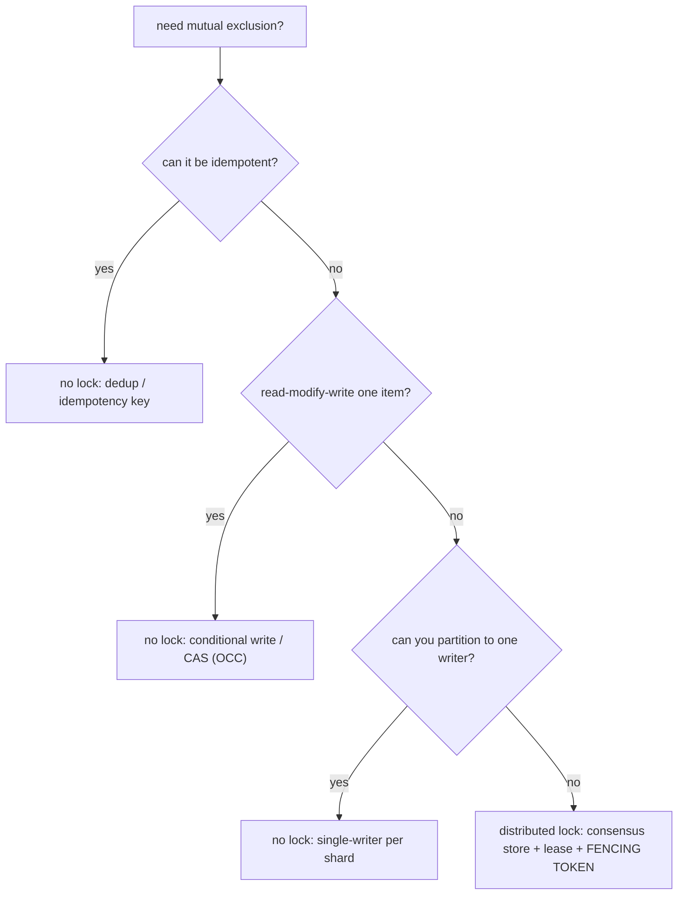

## Thesis

Ensuring only one process across many machines can hold a resource or run a critical section at a time --- mutual exclusion, but across a network where the holder can crash, pause, or be partitioned --- which is hard because a lock alone doesn't stop a holder that *thinks* it still holds it (after a pause or expiry) from acting, so a correct distributed lock needs a lease (auto-expiry) plus a fencing token (the resource rejects a stale holder); and often the deeper answer is to avoid the distributed lock entirely by designing the operation not to need one (idempotency, optimistic concurrency, a single writer).

## Sub

**Why: mutual exclusion across machines, where correctness matters** -> **the lock: acquire / TTL / release (Redis, Redlock, ZooKeeper/etcd)** -> **the safety problem: a lock isn't safe without fencing** -> **zoom out** to "do you even need one" (idempotency, OCC, single-writer) and the pivots an interviewer rides from "just grab a lock" into how a lock works, the Redlock critique, and fencing.

## Spine

- A **distributed lock** provides mutual exclusion across processes/machines --- only one holder at a time may enter a critical section or touch a resource --- and unlike an in-process mutex it works across a network where the holder can crash, pause, or be partitioned, so it needs a **TTL/lease** (the lock auto-expires if the holder dies, or it'd be held forever).
- Implementations range from **a single Redis key to a consensus store** --- Redis `SET NX PX` (fast, simple, but a single point of failure and no strong guarantee), **Redlock** (acquire on a majority of independent Redis nodes for availability --- but controversial), or **ZooKeeper/etcd** (consensus-backed ephemeral nodes/leases --- stronger correctness, the choice when correctness matters).
- A lock alone is **not safe** without a fencing token --- a holder can *believe* it still holds the lock after its lease expired (a GC pause, a network delay) and then act, letting two "holders" act at once; the fix is a **monotonic fencing token** the protected resource checks, rejecting a stale holder --- exactly as with leader election (a lock and leadership are the same primitive).
- Often the right move is to **avoid the distributed lock** --- they're a correctness-and-availability liability, so before reaching for one, ask whether the operation can be made **idempotent** (safe to run twice, no exclusion needed), use **optimistic concurrency** (a conditional write / compare-and-set that *detects* a conflict instead of preventing it), a **unique constraint**, or a **single-writer/partitioned** design; a distributed lock is a last resort, not a first reach.

## Companion Notes

### walk

Mutual exclusion across machines

A critical section that must run on only one node at a time --- why a network lock needs a TTL, how a simple Redis lock works and how it's released safely, why a lock alone is unsafe against pauses (and needs fencing), and why the best answer is often to design the lock away entirely.

Say the two things first --- "a distributed lock needs a lease, and a lease isn't enough." A lease stops a dead holder blocking forever; a fencing token stops a stale holder from acting; and often idempotency or optimistic concurrency removes the need for the lock at all.

### drill

Probe Drill

Graded follow-ups on TTLs, Redlock, fencing tokens, and the lock-free alternatives --- the ones that separate "we grab a Redis lock" from knowing when a lock is safe, when it's unsafe, and when you shouldn't be using one at all.

Name the recipe and the escape hatch: a safe lock = lease (auto-expiry) + fencing token (resource rejects a stale holder); the escape hatch = don't lock -- make it idempotent, use a conditional write (OCC), or a single writer.

## Drill

SDE2 | the lock, the TTL, and the risk
SDE3 | Redlock, fencing, and alternatives
Staff | the debate, designing it out, and deadlocks

### SDE2 | what a distributed lock is

What is a distributed lock and how is it different from a regular mutex?

A distributed lock provides **mutual exclusion across processes on different machines** --- it ensures that, out of many nodes that might want to, only one holds the lock (and thus may enter a critical section or act on a resource) at any time. A regular (in-process) mutex works because all the threads share one memory space and one OS/runtime enforcing it; a *distributed* lock must coordinate processes that **share nothing but a network**, using some shared external system (Redis, ZooKeeper, etcd, a database row) as the arbiter of who holds it. The hard differences: the holder can **crash** (and never release --- so the lock needs a timeout), the network can **partition or delay** messages (so the holder and the lock service can disagree about who holds it), and there's no shared memory to make the acquire-and-check atomic --- all of which make a distributed lock far trickier to get right than a mutex, and are why "just use a lock" across machines hides real subtleties.

### SDE2 | why a TTL is needed

Why does a distributed lock need a TTL / lease?

Because the holder can **die while holding it**, and without a timeout the lock would be **held forever** (a deadlock for everyone else). A regular mutex is released when the owning thread finishes or the process exits (the OS cleans up); but a distributed lock lives in an *external* store, so if the process that acquired it crashes (or is partitioned away and never comes back), nothing releases it --- the key just sits there "locked," and every other process waits indefinitely. The fix is a **TTL (lease)**: the lock automatically **expires** after a set duration if not renewed, so a dead holder's lock is freed and someone else can acquire it. This makes the lock *self-healing* against crashes. The tension it introduces (which comes up later): the TTL must be long enough that a live holder doesn't lose the lock mid-operation, but short enough that a dead holder is cleared reasonably fast --- and the very fact that the lock can expire while you still think you hold it is the root of the safety problem.

### SDE2 | a basic Redis lock

How do you implement a basic lock with Redis?

With an atomic **`SET key value NX PX ttl`**: `NX` means "set only if the key doesn't exist" (so only one client wins the race to create it), `PX ttl` sets an expiry (the TTL/lease), and `value` is a **unique token** the acquiring client generates (e.g. a random UUID). If the `SET` succeeds, you hold the lock; do your work; then **release** it. The atomicity of `SET NX` is what makes acquisition a proper race-winner-takes-all (two clients can't both think they acquired). The unique value matters for safe release (below). So the pattern is: `SET lock:resource <uuid> NX PX 30000` -> if OK, you're the holder for up to 30s -> do the critical section -> release. It's simple and fast, which is why it's popular --- but "simple Redis lock" is *only* safe for the "occasional double-execution is fine" case, not for strict correctness (you need fencing and, arguably, a consensus store for that).

### SDE2 | releasing the lock safely

Why must you release a distributed lock carefully, and what's the bug if you don't?

Because you must **only delete the lock if you still own it** --- naively doing `DEL lock:resource` can delete *someone else's* lock. The bug: client A acquires the lock with a 30s TTL; A's operation runs slow and the **lock expires** at 30s; client B now acquires the (freed) lock; then A finishes and calls `DEL lock:resource` --- **deleting B's lock**, so now C can acquire it while B still thinks it holds it -> two holders. The fix is to make release **check the token**: only delete if the stored value equals *your* unique token (the UUID you set). Because "read the value, compare, then delete" must be atomic, you do it with a small **Lua script** (Redis executes it atomically) or a compare-and-delete primitive --- `if redis.get(key) == mytoken then redis.del(key)`. This "release only my own lock" discipline is the first correctness subtlety of distributed locking, and forgetting it (a bare `DEL`) is a classic bug that silently breaks mutual exclusion.

### SDE2 | when the holder crashes or the lock expires mid-op

What happens if the holder crashes, or the lock expires while it's still working?

Two related cases. If the holder **crashes** cleanly, the TTL saves you: the lock expires and another process acquires it --- that's the TTL doing its job (the crashed holder isn't doing anything anymore, so there's no conflict). The *dangerous* case is if the lock **expires while the original holder is still alive and working** (its operation took longer than the TTL, or it was paused): now the lock is free, a **second** process acquires it, and **both** the original (which still believes it holds the lock) and the new holder are in the critical section **at the same time** --- violating mutual exclusion and potentially corrupting the resource. This is the core failure mode of distributed locks: the lock can expire out from under a live holder, and the holder has no reliable way to know. It's why a TTL alone isn't sufficient for correctness, and why you either size the TTL very carefully (still risky under pauses) or --- the real fix --- use **fencing tokens** so the resource rejects the stale holder even if two clients both think they hold the lock.

### SDE2 | an example

Give a concrete example where you'd want a distributed lock.

A **scheduled job that must run exactly once** across a fleet: several instances of a service each run a cron, but the job (say, sending a daily report or a billing run) must execute only once --- so each instance tries to acquire a distributed lock before running, and only the one that gets it proceeds. Another: **exclusive access to an external resource** --- only one worker at a time may modify a particular file, call a non-idempotent external API, or process a specific entity, so workers acquire a per-entity lock. Or **preventing concurrent processing of the same item** in a queue (a per-item lock so two workers don't handle the same order). In each case the lock enforces "only one doer for this specific thing right now." But notice: the *cron-once* case is often better solved by idempotency or a leader (only the leader runs crons), and the *per-item* case by optimistic concurrency or partitioning --- which is why "I'd use a distributed lock here" should always be followed by "...unless I can design it so I don't need one."

### SDE2 | the two-holders risk

What's the fundamental risk with a distributed lock?

That **two processes both believe they hold the lock and act simultaneously** --- breaking the mutual exclusion the lock was supposed to guarantee. There are a few ways it happens: (1) the lock **expires** while the first holder is still working (slow operation or a pause), and a second process acquires it; (2) a naive release **deletes someone else's lock**, letting a third party in; (3) with a single-node lock store, the store fails over to a replica that **didn't have the lock recorded** (async replication lost the write), so a second client acquires it on the new primary; (4) a **network partition** separates the holder from the store, the lock expires from the store's view, another acquires it, and the partitioned holder --- unaware --- keeps acting. All of these produce the same bad state: concurrent holders. This is why a distributed lock isn't just "SET a key" --- the entire discipline (unique tokens, safe release, careful TTLs, and above all **fencing tokens**, plus a decision about correctness-vs-efficiency) exists to prevent, or tolerate, the two-holders case.

### SDE3 | Redlock

What is Redlock and why does it exist?

**Redlock** is Redis's algorithm for a distributed lock across **multiple independent Redis nodes** (typically 5), designed to remove the single-point-of-failure of a one-instance Redis lock. To acquire, a client tries to `SET NX PX` the lock on **all N nodes**, and considers the lock **held only if it succeeds on a majority** (e.g. 3 of 5) *within* a time budget (and it accounts for the time spent acquiring against the TTL). To release, it deletes on all nodes. The idea: with a majority requirement across *independent* nodes, the lock survives a minority of Redis nodes failing (unlike a single instance, whose failure or failover breaks the lock). It exists because a single-node Redis lock has two problems --- the node is a SPOF, and Redis replication is async so a failover can lose the lock write (letting two clients acquire). Redlock spreads the lock across independent nodes to get availability without that failover hole. However --- and this is the controversial part --- Redlock is **still not sufficient for correctness under process pauses and clock issues** without fencing tokens, which is the heart of the Kleppmann/antirez debate. So Redlock improves *availability* over a single-node lock, but doesn't, by itself, make the lock safe for correctness-critical use.

### SDE3 | the fencing token

What is a fencing token and why is it the key to a safe distributed lock?

A **fencing token** is a **monotonically increasing number** returned each time the lock is granted, which the **protected resource** uses to reject a stale holder's requests. It's the mechanism that makes a lock safe *at the point of action*, closing the "two holders both think they hold the lock" hole. The flow: each acquisition gets a strictly higher token (33, 34, 35...); the holder includes its token with every request to the resource it's protecting; the resource **remembers the highest token it has seen and rejects any request carrying a lower token**. So if holder-with-token-33 is paused, its lock expires, holder-with-token-34 acquires and writes (resource now records "highest = 34"), and then the paused holder-33 resumes and sends its write --- the resource rejects it (33 < 34). Even though *two clients believed they held the lock*, only one can actually *act* on the resource, because the resource enforces the ordering. This is the crucial insight: the lock service can't prevent a client from *thinking* it holds the lock after an expiry (it can't reach into a paused process), so the *resource* must be the one to enforce safety, via a token it can check. A distributed lock without a fencing token is not safe for correctness --- this is the single most important point about distributed locking.

### SDE3 | a lock is not safe without fencing

Why is a lock (or lease) fundamentally insufficient for correctness without fencing?

Because of **unbounded process pauses**: a holder can check "do I hold the lock?" (yes), then be **paused** (a long stop-the-world GC, VM suspension, or being descheduled) for longer than the lock's TTL, during which the lock **expires** and another client acquires it, and then the paused holder **resumes and acts** --- still believing, from its pre-pause check, that it holds the lock. Two holders act; state corrupts. No amount of TTL tuning eliminates this, because pauses can be arbitrarily long and the holder can't detect that time has passed. This is the argument from Kleppmann's "How to do distributed locking": a lock/lease is at best a **performance optimization** (it usually prevents contention and wasted work), but it is **not a correctness mechanism** on its own, because the client's belief about holding the lock can be stale at the moment it acts. Correctness requires moving the check to the **resource**, via a fencing token the resource enforces --- the resource, unlike the paused client, always knows the current highest token. So "we have a lock (or a lease, or Redlock)" does *not* imply "we're safe"; the resource must fence, or the operation must not need strict exclusion (idempotency/OCC).

### SDE3 | lock granularity and TTL sizing

How do you choose lock granularity and TTL?

**Granularity**: lock the **narrowest** thing that gives correctness --- a per-entity lock (lock *this* order, *this* user) rather than one global lock, so unrelated work proceeds in parallel and the lock isn't a system-wide bottleneck. Too coarse (one big lock) serializes everything and kills throughput; too fine can add overhead and risk deadlocks if an operation needs several locks. **TTL**: it must be **longer than the critical section's worst-case duration** (so a live holder doesn't lose the lock mid-operation), but **short enough** that a crashed holder's lock is released reasonably quickly (long TTL = long stall for others when a holder dies). This is a genuine tension with no perfect answer: a fixed TTL that's too short risks expiry-mid-operation (the two-holders bug); too long risks slow recovery. Mitigations: **renew/extend** the lock (a "watchdog" that periodically extends the TTL while the holder is still working and alive --- but this doesn't help if the holder is *paused*, since it can't renew while frozen), and size the TTL for the realistic worst case. The deeper point is that no TTL is perfectly safe against pauses (hence fencing), so TTL sizing is about *reducing* the frequency of the failure and bounding recovery time, not eliminating the risk.

### SDE3 | ZooKeeper / etcd locks

How do ZooKeeper or etcd implement locks, and why are they stronger than a Redis lock?

They build the lock on a **consensus-backed store**, so the lock state itself is strongly consistent and survives node failures without the async-replication hole. **ZooKeeper**: a client creates an **ephemeral sequential** znode under a lock path; the client with the lowest sequence number holds the lock; others watch the node just below them and are notified when it disappears. "Ephemeral" means the node is tied to the client's **session** --- if the client crashes or disconnects, ZooKeeper (which is monitoring the session via heartbeats) automatically **deletes the node**, releasing the lock (a built-in, session-based lease that's more robust than a fixed TTL because it's tied to liveness detection). **etcd**: uses **leases** --- a client acquires a lock key associated with a lease (TTL) and keeps it alive; the lock releases when the lease expires. Both are stronger than a single Redis lock because the store runs **consensus** (ZAB/Raft) so the lock's existence is agreed by a majority and doesn't vanish on a failover (no lost-write-on-async-replica problem), and their liveness detection (sessions/leases) is integral. They're the recommended choice **when the lock is for correctness**. (They still benefit from fencing tokens at the resource for the pause case --- ZooKeeper's `zxid`/version can serve as the fencing token --- but the underlying lock is far more trustworthy than a Redis key.)

### SDE3 | do you actually need a lock

Before using a distributed lock, what should you ask --- and what's the idempotency alternative?

Ask: **can I make the operation not need mutual exclusion at all?** The most common answer is **idempotency** --- design the operation so that running it **twice produces the same result as running it once**, and then you don't care if two processes both do it. If "send this email" is deduplicated by a message id, or "create this record" uses an idempotency key that makes the duplicate a no-op, or "set status to X" is naturally idempotent (setting it twice is fine), then concurrent execution is *harmless*, and the whole distributed-lock apparatus (with its TTLs, fencing, availability risks) disappears. This is a huge simplification: instead of the hard problem "guarantee only one does it" (which needs consensus/fencing to do correctly), you solve the easier problem "make it safe for more than one to do it." Many uses of distributed locks are really trying to prevent *duplicate side effects*, and idempotency addresses that directly and more robustly. So the senior instinct is: reach for idempotency first; a lock is only needed when the operation *genuinely* can't be made idempotent and *must* be exclusive.

### SDE3 | optimistic concurrency as an alternative

How does optimistic concurrency control replace a lock?

By **detecting** conflicts instead of **preventing** them --- so no lock is held. Each item carries a **version** (or you use a conditional write / compare-and-set): a writer reads the item and its version, computes its update, then writes **only if the version is still what it read** (`UPDATE ... WHERE version = N`, or a DynamoDB conditional write, or a compare-and-swap). If another writer got there first, the version changed, the conditional write **fails**, and the loser **retries** (re-read, recompute, re-write). This gives correctness (no lost updates) with **no lock held** during the operation --- concurrent writers proceed optimistically, and only the rare actual conflict costs a retry. It's ideal when **contention is low** (conflicts are rare, so retries are rare) and the operation is a **read-modify-write on a single item** the store can conditionally update. Compared to a distributed lock: OCC has no held lock (no TTL, no held-forever risk, no fencing needed --- the atomic conditional write *is* the safety), and it's typically faster and simpler. Its limit: under **high contention** (many writers to the same item), retries thrash (livelock-ish), and it only works when the store supports atomic conditional writes on the unit you're guarding. But for the common "avoid lost updates on a record" case, OCC (or an atomic DB operation) is usually the better answer than a distributed lock.

### Staff | the Redlock debate

What is the Redlock debate (Kleppmann vs antirez) actually about?

It's about whether Redlock is safe for **correctness**, and it hinges on the **efficiency-vs-correctness** distinction. **Kleppmann's critique**: Redlock (and any lock built on timeouts) is unsafe for correctness-critical use because (a) **process pauses** (GC, etc.) can make a holder act after its lock expired, and (b) Redlock **relies on synchronized clocks / bounded clock drift** (its timing assumptions can be violated by clock jumps, NTP steps), so the majority-of-Redis-nodes approach doesn't actually guarantee mutual exclusion under adversarial timing --- and crucially, **without fencing tokens, no lock is safe** against the pause case regardless. His conclusion: if you need correctness, use a consensus system (ZooKeeper) *and* fencing tokens; if you only need efficiency, a single Redis lock is fine and Redlock's complexity isn't worth it. **antirez's (Redis author's) response**: Redlock's assumptions (bounded pauses/clock drift) are reasonable in practice for many systems, the algorithm is sound under its stated model, and the clock-drift concerns are addressable; fencing tokens aren't always available (the protected resource may not support them). The debate turns on **what guarantee you need** and **what failure model you assume**: Kleppmann argues for the strict model (unbounded pauses, adversarial clocks) where you need fencing/consensus; antirez argues the practical model is often fine. The staff takeaway isn't "who won" --- it's that the *right question* is "**is this lock for correctness or for efficiency?**", because that determines whether Redlock (or any timeout lock) is adequate or whether you need consensus + fencing.

### Staff | locks for correctness vs efficiency

Why is "is this lock for correctness or efficiency?" the most important question?

Because it completely changes what lock (if any) you need. A lock **for efficiency** exists to *avoid wasted or duplicate work* --- e.g. "don't let two workers both recompute the same expensive cache entry" --- and here **occasional** double-execution is **harmless** (you just waste some work, the result is still correct), so a **weak, simple lock** (single Redis key, no fencing) is perfectly fine; if it rarely fails and two workers occasionally both run, no harm done. A lock **for correctness** exists to *prevent a state-corrupting outcome* --- e.g. "only one process may deduct from this balance" or "only one may write this file" --- and here even a **single** violation (two holders acting) causes **damage** (double-spend, corruption), so a weak lock is **not acceptable**: you need the full rigor (a consensus store for the lock, and **fencing tokens** at the resource, or a design that avoids the lock). Conflating the two is the common mistake: people use a simple Redis lock (fine for efficiency) for a correctness-critical section (where it's dangerously insufficient), or over-engineer consensus+fencing for a mere efficiency optimization (wasteful). So the first thing to establish is the *stakes of a violation*: harmless-waste -> weak lock is fine; state-corruption -> you need fencing/consensus or (better) a lock-free correct design (idempotency/OCC). This single distinction resolves most "which lock should I use" questions.

### Staff | distributed lock vs leader election

How do distributed locks and leader election relate, and when do you frame a problem as which?

They're the **same underlying primitive** --- "at most one holder/leader at a time, safe under partitions and pauses" --- and share the same machinery (a consensus/coordination store, a lease/TTL, and fencing tokens). A leader *is* whoever holds a particular long-lived lock; acquiring "the lock on the coordinator role" *is* being elected. You frame it as **leader election** when you have **one long-lived coordinator role** for a whole service/cluster (with responsibilities like catch-up, log recovery, ongoing coordination) --- the emphasis is on the *role* and its continuity across failovers. You frame it as a **distributed lock** when you have **shorter-lived, possibly many, mutual-exclusion needs over specific resources** (lock *this* entity for *this* operation, then release; there may be thousands of different locks) --- the emphasis is on *per-resource exclusion*. But the safety requirements are identical: both need a majority/consensus-backed store to be safe against partition (a Redis lock and a naive election have the *same* unsafety), both need leases so a dead holder relinquishes, and **both need fencing tokens** so a stale holder/leader can't act. The staff insight: if you understand one, you understand the other, and the "aha" is recognizing when a problem stated as "I need a lock" is really "I need to elect a single owner" (or vice versa) --- and applying the same discipline (consensus store + lease + fencing, or design it away) regardless of the label.

### Staff | the database as a lock

Can you use your database as the distributed lock instead of Redis or ZooKeeper? What are the trade-offs?

Yes --- several DB-native mechanisms serve as a distributed lock, and for many systems they're the simplest *correct* option because you already run the DB and it's transactional. **Row locks (`SELECT ... FOR UPDATE`)**: a transaction locks a row and other transactions block until it commits or rolls back --- mutual exclusion tied to the transaction, auto-released on commit/rollback/disconnect (no separate TTL, and no held-forever if the holder dies, because the DB releases the lock when the transaction/session ends). **Advisory locks** (Postgres `pg_advisory_lock`): an explicit application-level lock keyed by a number, not tied to a row --- session- or transaction-scoped, purpose-built for "I want a named lock." **A lock table / conditional insert**: `INSERT` a row for the lock key with a unique constraint (the insert fails if it exists = someone holds it), or a conditional `UPDATE ... WHERE`, using the DB's atomicity and constraints as the lock. The big advantages: **transactional integration** --- the lock and the protected data change atomically in one transaction, and the lock releases exactly when the transaction ends, so there's no lease/TTL gymnastics and no orphaned lock from a crashed holder (the DB detects the dead session and releases) --- and **you already have the DB** (no extra system like ZooKeeper to run). The disadvantages: the **DB becomes a contention point and can bottleneck** (locks consume connections/transactions; a `FOR UPDATE` on a hot row serializes everyone and long-held locks block many transactions), it **doesn't scale horizontally** the way a dedicated coordination service or a partitioned design does, and **connection-pool exhaustion** under many waiters is a real failure mode. Fencing: if the protected resource is *external* to the DB you still need a fencing token there --- but if everything you're guarding is *in* the DB, the transaction itself gives you atomicity and you often need no separate fencing token at all (a genuinely nice property). The staff framing: a DB-native lock is often the **pragmatic best choice when the contended resource IS the database** (the transaction buys correctness for free, and it's simpler and safer than a Redis lock for that case); reach for a dedicated coordination service (ZooKeeper/etcd) when you need a lock *independent* of the DB or at a scale where DB-lock contention is the bottleneck --- and, as always, prefer designing the lock out (single-writer / OCC) when the DB is the hotspot.

### Staff | designing the lock out at scale

At scale, how do you avoid distributed locks entirely?

By **structuring the system so exclusive coordination isn't needed** --- because a distributed lock on a hot resource is a throughput bottleneck (it serializes) and a correctness liability, so high-scale designs engineer it out. The main techniques: (1) **Single-writer partitioning** --- shard the data/work so each partition has exactly one owner (one consumer, one thread, one node), and *route* all operations for a given key to its owner; then there's **no contention** within a partition (one writer by construction) and thus **no lock needed** --- this is how Kafka (one consumer per partition), sharded databases, and the actor model achieve serialization without locks. (2) **Idempotency + at-least-once** --- make operations safe to repeat (idempotency keys, dedup), so concurrent/duplicate execution is harmless and no exclusion is required. (3) **Optimistic concurrency / atomic operations** --- use the datastore's conditional writes, compare-and-set, or atomic counters/`INCR` so read-modify-write is safe without a held lock (the *store* provides the atomicity). (4) **Immutable/append-only + conflict resolution** --- append events and resolve/merge rather than mutating shared state under a lock. The unifying idea is to **remove the shared mutable resource that needs protecting** --- partition it (one owner), make writes commutative/idempotent, or push atomicity into the store --- rather than guarding a contended resource with a lock. The staff framing: at scale, a distributed lock is often a **design smell** signaling a shared mutable hotspot; the scalable fix is to eliminate the hotspot (single-writer per shard) or make concurrent access safe (idempotency/OCC), reserving actual distributed locks for genuinely-rare, genuinely-exclusive operations where none of those apply.

### Staff | deadlocks and liveness

What are the liveness concerns with distributed locks (deadlocks, held-forever)?

Two families. **Held-forever / crashed-holder**: a holder that dies without releasing would block everyone permanently --- the **TTL/lease** is the escape hatch (the lock auto-expires), and session-based locks (ZooKeeper ephemeral nodes) release automatically on disconnect; without a TTL, a single crash deadlocks the resource forever, so a TTL is mandatory for liveness. **Deadlock (circular wait)**: if an operation needs **multiple** locks and different operations acquire them in **different orders**, you get the classic deadlock (A holds lock1 waits for lock2, B holds lock2 waits for lock1) --- and it's *harder* to handle in a distributed setting because there's no global lock manager to detect the cycle. Mitigations are the classic ones adapted: **lock ordering** (always acquire multiple locks in a consistent global order, so no cycle can form --- the primary prevention), **lock timeouts** (don't wait forever for a lock; time out and retry/abort, so a deadlock resolves itself at the cost of a retry --- distributed systems lean on timeouts because global deadlock *detection* is hard), and **try-lock with backoff** (attempt to acquire all needed locks, release and retry if you can't get them all). The broader liveness point: distributed locks trade the safety risk (two holders) against liveness risks (deadlock, held-forever, and also the **thundering herd** when a popular lock releases and many waiters stampede to acquire) --- so a robust design uses TTLs (against held-forever), lock ordering or timeouts (against deadlock), and jittered retry (against herds). And --- recurring theme --- avoiding multi-lock operations entirely (single-writer partitioning) sidesteps distributed deadlock altogether.

### Staff | when a distributed lock is genuinely right

When is a distributed lock actually the right tool, and how do you do it safely?

It's right when you have a **genuinely exclusive operation** that **cannot be made idempotent, cannot use optimistic concurrency, and cannot be partitioned to a single writer** --- i.e. a true "only one actor may do this specific thing at this time, and a violation would cause harm" requirement with no lock-free alternative. Examples: coordinating access to an **external system that has no conditional-write / idempotency support** (a legacy API, a physical device, a filesystem operation) where you can't push atomicity into the resource and can't make the action safe to repeat. When it *is* the right tool, do it **safely**: (1) use a **consensus-backed store** for the lock (ZooKeeper/etcd, not a single Redis key) if it's correctness-critical, so the lock doesn't vanish on failover; (2) use a **lease/TTL** so a dead holder frees the lock (liveness); (3) **fence at the resource** with a monotonic token so a paused/stale holder can't act (the correctness guarantee TTLs alone can't give) --- this is non-negotiable for correctness; (4) size the TTL for the worst-case operation and consider a renewal watchdog; (5) keep the lock **granular** (per-resource, not global) to limit the throughput hit. Conversely, it's a **code smell** when it's guarding something that *could* be idempotent/OCC/partitioned (most cases), or when it's a single Redis lock protecting a correctness-critical section (insufficient), or when it's a coarse global lock serializing a hot path (a scalability bottleneck). The staff summary: a distributed lock is a legitimate but **last-resort** tool for irreducibly-exclusive operations against un-coordinatable resources; use a consensus store + lease + **fencing token** when you must, and treat "why can't this be idempotent, OCC, or single-writer?" as the question you must answer *before* reaching for the lock.

## Walk

### Mutual exclusion across machines needs a lease

```flow
procs[many processes] -> res[one shared resource] -> lock[distributed lock with a TTL: a dead holder auto-expires]
```

Start with what a distributed lock is and why it's harder than a mutex. You want **only one process across many machines** to enter a critical section or touch a resource at a time. An in-process mutex works because threads share memory and one runtime enforces it; here the processes **share nothing but a network** and must use an external arbiter (Redis, ZooKeeper, etcd).

The first consequence: the holder can **crash** while holding the lock, and nothing would release it --- so the lock would be held forever, deadlocking everyone. Hence a **TTL (lease)**: the lock auto-expires if not renewed, freeing it after a crash. That's necessary for liveness --- but the fact that the lock can expire *while a live holder still thinks it holds it* is the seed of the safety problem.

### A simple Redis lock, and releasing it safely

```flow
acq[SET key uuid NX PX ttl] -> work[do the critical section] -> rel[release only if the stored token is still yours]
```

The common simple lock is an atomic Redis `SET key <uuid> NX PX <ttl>` --- `NX` (set only if absent) makes acquisition a race only one client wins, `PX` is the TTL, and the `<uuid>` is a unique token the client generates.

```python
import uuid

def acquire_lock(redis, key, ttl_ms):
    token = str(uuid.uuid4())                 # unique per acquisition
    ok = redis.set(key, token, nx=True, px=ttl_ms)   # atomic: only one winner
    return token if ok else None

# release must be atomic "delete only if the token is still mine" (a Lua script)
_RELEASE = """
if redis.call('get', KEYS[1]) == ARGV[1] then
  return redis.call('del', KEYS[1])
else
  return 0
end"""

def release_lock(redis, key, token):
    redis.eval(_RELEASE, 1, key, token)       # never delete someone else's lock

# and the RESOURCE fences: reject a stale holder even if two think they hold it
def guarded_write(resource, fencing_token, data):
    if fencing_token < resource.highest_token_seen:
        raise StaleHolderError("fenced: a newer holder exists")
    resource.highest_token_seen = fencing_token
    resource.apply(data)
```

The safe-release rule is subtle and essential: a bare `DEL` can delete *someone else's* lock (if yours expired and another client acquired it), so release must **check the token atomically** (the Lua script) and only delete if it's still yours. Forgetting this is a classic mutual-exclusion bug.

### A lock alone isn't safe --- fence at the resource

```flow
pause[holder pauses past its TTL] -> exp[lock expires, another acquires] -> resume[old holder resumes and acts -> two holders]
```

Here's the failure a TTL can't fix: the holder checks "do I hold the lock?" (yes), then gets **paused** (a long GC pause, VM suspend) for longer than the TTL; the lock **expires**; a second client acquires it; then the paused holder **resumes and acts**, still believing it holds the lock. **Two holders act** --- and no TTL tuning eliminates this, because pauses can be arbitrarily long and the holder can't tell that time passed.

The fix is the **fencing token** in the code above: each acquisition gets a strictly higher token, the holder sends it with every request, and the **resource rejects any token below the highest it has seen**. So the paused holder's stale (lower) token is rejected at the resource even though two clients believe they hold the lock. This is *the* point about distributed locking: the lock service can't stop a paused client from *thinking* it holds the lock, so the **resource** must enforce safety via a token. A lock (or lease, or Redlock) without fencing is **not** safe for correctness --- it's at best a performance optimization.

### Often, avoid the lock entirely

```flow
idem[idempotent: safe to run twice] -> occ[optimistic concurrency: conditional write, detect conflict] -> single[single-writer: partition so one owner]
```

The senior move is to ask "**do I even need a lock?**" before reaching for one --- because distributed locks are a correctness-and-availability liability. Three common ways to design the lock away: make the operation **idempotent** (dedup by id / idempotency key, so two executions are harmless and no exclusion is needed --- solve "safe for many to do it" instead of the harder "guarantee only one does it"); use **optimistic concurrency** (a conditional write / compare-and-set on a version, which *detects* a conflict and retries the loser, with no lock held --- ideal under low contention); or **partition to a single writer** (route all operations for a key to one owner, &agrave; la Kafka's one-consumer-per-partition, so there's no contention by construction).

Zooming out: a distributed lock is the **same primitive as leader election** (at-most-one holder, needing a consensus store + lease + fencing), the crucial question is always "**is this lock for correctness or efficiency?**" (efficiency tolerates a weak lock; correctness needs fencing/consensus or a lock-free design), and at scale a lock on a hot resource is a **bottleneck and a smell** signaling a shared mutable hotspot you should eliminate. Reserve actual distributed locks for genuinely-exclusive operations against resources you can't make idempotent, conditional, or single-writer --- and when you must use one, it's a consensus store + a lease + a **fencing token**, never a bare Redis key guarding a correctness-critical section.

### Model Script

- Frame the two truths | "A distributed lock is mutual exclusion across machines -- only one process at a time may touch a resource -- and it's much harder than an in-process mutex because the processes share nothing but a network, so the holder can crash, pause, or be partitioned. The first consequence is that a dead holder would hold the lock forever, so you need a TTL, a lease, that auto-expires it. But the two truths to lead with are: a distributed lock needs a lease, and a lease is not enough for correctness."
- The simple lock and safe release | "The simple version is an atomic Redis SET with NX and a PX expiry, storing a unique token. NX makes acquisition a race only one client wins; the token matters for release. The subtle, essential part is releasing safely: you must only delete the lock if the stored token is still yours -- a bare DEL can delete someone else's lock, because if your lock expired and another client acquired it, your DEL removes theirs. So release is an atomic check-and-delete, a Lua script: delete only if the value equals my token. Forgetting that is a classic bug that silently breaks mutual exclusion."
- Why a lock isn't safe -- fencing | "Here's the failure a TTL can't fix. The holder checks 'do I hold the lock,' sees yes, then gets paused by a long GC for longer than the TTL. The lock expires, a second client acquires it, and then the paused holder resumes and acts, still believing it holds the lock. Two holders act, and no TTL tuning eliminates it because pauses can be arbitrarily long and the holder can't tell time passed. The fix is a fencing token: each acquisition gets a strictly higher number, the holder sends it with every request, and the resource rejects any token below the highest it's seen. So the paused holder's stale token is rejected at the resource, even though two clients think they hold the lock. That's the key point -- the lock service can't stop a paused client from thinking it holds the lock, so the resource must enforce safety with a token. A lock without fencing is not safe for correctness; it's at best a performance optimization."
- Avoid the lock | "The senior move is to ask whether I even need a lock. Three ways to design it away. Make the operation idempotent -- dedup by an id or idempotency key so two executions are harmless, which turns the hard problem 'guarantee only one does it' into the easy one 'make it safe for many to do it.' Use optimistic concurrency -- a conditional write on a version that detects a conflict and retries the loser, with no lock held, which is great under low contention. Or partition to a single writer -- route all operations for a key to one owner, like Kafka's one consumer per partition, so there's no contention by construction. Most uses of distributed locks are really preventing duplicate side effects or lost updates, and idempotency or optimistic concurrency address those directly and more robustly."
- Interviewer: "When would you actually use a distributed lock, then?"
- The last resort, done right | "When the operation is genuinely exclusive and I can't make it idempotent, can't use a conditional write, and can't partition it to a single writer -- typically coordinating an external resource that has no conditional-write or idempotency support, like a legacy API, a device, or a filesystem operation. And the first question I always answer is: is this lock for correctness or for efficiency? If it's for efficiency -- avoid duplicate work -- occasional double-execution is harmless, so a simple Redis lock is fine. If it's for correctness -- a violation corrupts state, like a double-spend -- a single Redis lock is not enough; I'd use a consensus-backed store like ZooKeeper or etcd so the lock doesn't vanish on a failover, a lease so a dead holder frees it, and crucially a fencing token so a paused holder can't act. That last part is non-negotiable for correctness."
- Land it | "So: a distributed lock is cross-machine mutual exclusion; it needs a TTL so a dead holder doesn't block forever, and safe release so you don't delete someone else's lock; but a lock or lease alone is not safe against process pauses -- the fix is a fencing token the resource checks. It's the same primitive as leader election, the decisive question is correctness versus efficiency, and at scale a lock on a hot resource is a bottleneck and a smell. So my instinct is to design the lock out -- idempotency, optimistic concurrency, or single-writer partitioning -- and reserve an actual distributed lock, done with a consensus store plus lease plus fencing token, for the genuinely-exclusive operations that have no lock-free alternative."

## Whiteboard

Sketch the "do you need a lock?" decision and the fencing safeguard.

### You have a Redis lock with a TTL -- why isn't that safe for correctness?

A holder can be paused (long GC) past the TTL, the lock expires, another acquires it, and the paused holder resumes and acts -- two holders. No TTL eliminates this. Only a fencing token (a monotonic number the resource checks, rejecting a lower one) makes it safe -- the lock is a performance optimization, not a correctness mechanism.

### How do you avoid needing a distributed lock at all?

Make the operation idempotent (dedup, so two runs are harmless), use optimistic concurrency (a conditional write that detects conflicts), or partition to a single writer (one owner per key, no contention). Most locks are really preventing duplicate effects or lost updates -- these address that without a lock.



Verdict: reach for idempotency, then optimistic concurrency, then single-writer partitioning before a lock; when a lock is truly needed, it is a consensus store + a lease (liveness) + a fencing token (correctness) -- never a bare Redis key guarding a correctness-critical section.

## System

Zoom out to where a lock (or its absence) sits.

### Where it sits

The contended resource: what needs exclusive access [*]
The lock store: Redis (fast, weak) / Redlock / ZooKeeper / etcd (consensus, strong)
Lease/TTL: frees the lock if the holder dies (liveness)
Fencing token: the resource rejects a stale holder (correctness)
Alternatives: idempotency / optimistic concurrency / single-writer partitioning

### Pivots an interviewer rides

From "just grab a lock" they push on safety and alternatives.

#### Is a lock (or lease, or Redlock) safe for correctness?

-> not on its own -- a paused holder can act after expiry; you need a fencing token the resource enforces
A lock is a performance optimization; correctness comes from the resource fencing on a monotonic token, or from a design that needs no exclusion -- and correctness-vs-efficiency decides which lock you even need.

#### Can you avoid the lock?

-> idempotency (safe to repeat), optimistic concurrency (conditional write), or single-writer partitioning (one owner)
Most locks prevent duplicate effects or lost updates; those alternatives address that directly, without a held lock -- a distributed lock is a last resort and, at scale, often a shared-hotspot smell.

## Trade-offs

The calls that separate "we grab a Redis lock" from a safe design.

### Redis lock vs consensus lock (ZooKeeper/etcd)

- Redis (SET NX / Redlock): fast, simple, low-latency -- but a single node is a SPOF and async failover can lose the lock; even Redlock isn't correctness-safe without fencing
- ZooKeeper/etcd: consensus-backed (survives failover), integral liveness (sessions/leases), stronger -- but an operational dependency and higher latency

Use a Redis lock only for efficiency (occasional double-run is harmless); use a consensus store (plus fencing) when the lock is for correctness.

### Distributed lock vs lock-free (idempotency / OCC / single-writer)

- Distributed lock: enforces true exclusion for irreducibly-exclusive operations -- but serializes (throughput bottleneck), has held-forever/expiry/fencing hazards, and is a scale smell on a hot resource
- Lock-free: no held lock, scales (single-writer per shard), robust (idempotency tolerates duplicates, OCC detects conflicts) -- but needs a redesign and only fits when the operation can be made idempotent/conditional/partitioned

Design the lock out (idempotency -> OCC -> single-writer) whenever possible; reserve a distributed lock for genuinely-exclusive operations against resources you can't coordinate otherwise.

### Short vs long lock TTL

- Short TTL: a dead holder's lock frees quickly (fast recovery) -- but risks expiring mid-operation while a live holder still works (the two-holders bug)
- Long TTL: safely outlasts the critical section -- but a crashed holder blocks others for the whole TTL (slow recovery)

Size the TTL above the worst-case critical section, add a renewal watchdog for long operations -- and fence regardless, because no TTL is safe against an unbounded pause.

## Model Answers

### the reframe | A lock needs a lease, and a lease isn't enough

The frame to lead with.

- Cross-machine mutual exclusion; needs a TTL so a dead holder frees it | key | unlike a mutex, holders crash/pause/partition
- A lock/lease alone is unsafe against pauses -> fence at the resource | store | monotonic token, resource rejects a stale holder
- It's the same primitive as leader election | note | consensus store + lease + fencing

### the depth | Correctness-vs-efficiency and designing it out

Where it's really tested.

- "Is this lock for correctness or efficiency?" decides everything | key | efficiency tolerates a weak lock; correctness needs fencing/consensus
- Avoid the lock: idempotency / OCC / single-writer partitioning | store | most locks prevent duplicate effects or lost updates
- Redlock improves availability, not correctness | note | the Kleppmann/antirez debate turns on the failure model

## Numbers

Back-of-envelope the throughput ceiling a lock imposes and the expiry-vs-operation danger.

A lock serializes the critical section (a throughput ceiling); the TTL must outlast the operation, and a pause still needs fencing.

- holders | Contending processes | 10 | 1 | 1
- ttl | Lock TTL (s) | 30 | 1 | 1
- op | Critical section (s) | 5 | 0 | 1

```js
function (vals, fmt) {
  var holders = vals.holders, ttl = vals.ttl, op = vals.op;
  function r(x, d) { var m = Math.pow(10, d); return Math.round(x * m) / m; }
  var thru = op > 0 ? 1 / op : 0;
  var headroom = ttl - op;
  var lastWait = (holders - 1) * op;
  return [
    { k: 'Serialized throughput', v: op > 0 ? '~' + fmt.n(r(thru, 2)) : 'n/a', u: 'ops/s (one at a time)', n: 'a lock serializes the critical section \u2014 contenders queue rather than add throughput, so the lock caps throughput at 1 / critical-section', over: false },
    { k: 'Expiry headroom', v: fmt.n(headroom), u: 's before TTL', n: 'the lock must outlast the operation \u2014 as the critical section (' + fmt.n(op) + 's) approaches the TTL (' + fmt.n(ttl) + 's), it can expire mid-operation and a second holder acquires', over: headroom <= 0 },
    { k: 'Expires mid-operation?', v: op >= ttl ? 'YES: unsafe' : 'no (but pause?)', u: '', n: op >= ttl ? 'the critical section is >= the TTL, so the lock expires while you still hold it -> two holders -> you MUST fence' : 'the TTL exceeds the operation, but a GC pause can still expire it under you \u2014 fence anyway', over: op >= ttl },
    { k: 'Last-in-queue wait', v: '~' + fmt.n(lastWait), u: 's', n: 'with ' + fmt.n(holders) + ' contenders serialized at ' + fmt.n(op) + 's each, the last waits this long \u2014 contention on a lock is a latency multiplier (a scale smell)', over: lastWait > 30 },
    { k: 'The safe recipe', v: 'lease + fence', u: 'or avoid', n: 'a correct lock = TTL (a dead holder frees it) + fencing token (a stale holder is rejected) \u2014 or better, design it out with idempotency / OCC / single-writer', over: false }
  ];
}
```

## Red Flags

What makes an interviewer wince.

### "We use a Redis lock, so the critical section is safe"

A single Redis lock is a SPOF and its async failover can lose the lock (two acquirers); and no timeout lock is safe against a process pause that expires it mid-operation -- two holders can act and corrupt state.

First ask "is this for correctness or efficiency?" -- efficiency tolerates a simple lock; correctness needs a consensus store (ZooKeeper/etcd) AND a fencing token at the resource, or a lock-free design.

### "We just DEL the key to release the lock"

A bare DEL can delete *someone else's* lock -- if yours expired and another client acquired it, your release removes theirs, letting a third party in and breaking mutual exclusion.

Release atomically only if the stored token is still yours (a Lua compare-and-delete), so you never delete a lock you no longer hold.

### "We have a lock, so we don't need fencing / idempotency"

A lock/lease can't stop a paused holder from acting after expiry, so a lock alone isn't correctness-safe; and reaching for a lock at all is often avoidable.

Fence at the resource (a monotonic token it checks) for correctness, and prefer designing the lock out -- idempotency (safe to repeat), optimistic concurrency (conditional write), or single-writer partitioning.

## Opener

### 30s | The one-liner

How I open when asked to guard a critical section across machines.

#### What is the shape?

Cross-machine mutual exclusion needs a lock with a TTL (so a dead holder frees it) and safe release (only delete your own token) -- but a lock alone isn't safe against pauses, so the resource must fence on a monotonic token; and often you should design the lock away entirely.

#### What's the key move?

Ask "correctness or efficiency?" -- efficiency tolerates a simple lock, correctness needs a consensus store + fencing token. And prefer idempotency, optimistic concurrency, or single-writer partitioning so no lock is held at all.

##### Hooks

Where an interviewer usually pushes next.

- Is a Redis lock / Redlock safe? | not for correctness without fencing | drill
- Why still fence with a lease? | the GC-pause-then-resume hole | drill
- Can you avoid the lock? | idempotency / OCC / single-writer | drill

Foot: two sentences -- a distributed lock is cross-machine mutual exclusion that needs a lease (a dead holder frees it) and a fencing token (a stale holder is rejected at the resource), because a lock alone is only a performance optimization, not a correctness guarantee against process pauses. It's the same primitive as leader election, the decisive question is correctness-vs-efficiency, and the senior instinct is to design the lock out with idempotency, optimistic concurrency, or single-writer partitioning -- reserving an actual lock (consensus store + lease + fencing) for genuinely-exclusive operations with no lock-free alternative.

## Bank

### SCALE | A scheduled job that must run exactly once across a fleet of instances

Task: ensure only one instance runs it.
Model: first prefer a lock-free design -- make the job idempotent (dedup by a run id so a duplicate run is a no-op) or have only the elected leader run crons (leader election), which is the same primitive; if a lock is used, acquire an atomic lock (SET NX PX with a unique token) before running, release it safely (compare-and-delete only your token), and size the TTL above the job's worst-case duration with a renewal watchdog; for correctness-critical jobs use a consensus store (etcd/ZooKeeper) and, if the job writes an external resource, a fencing token so a paused instance can't double-run its side effects.
Int: two instances both acquire (the first was paused past the TTL) -- what saves you?
The fencing token: the external resource has recorded the newer instance's higher token and rejects the paused instance's lower one, so only one instance's effects take hold -- or, better, the job was idempotent so a double-run is harmless anyway.

### DESIGN | Preventing lost updates when many workers modify the same record

Task: avoid two workers clobbering each other.
Model: use optimistic concurrency, not a lock -- each worker reads the record with its version, computes the update, and writes conditionally (UPDATE ... WHERE version = N, or a DynamoDB conditional write / compare-and-set); if another worker committed first, the version changed, the conditional write fails, and the loser re-reads and retries. No lock is held, it scales under low contention, and the atomic conditional write is the safety. If contention is very high (many writers to one record), reduce contention (partition/shard the record so a single writer owns it) rather than fall back to a held lock.
Int: why is optimistic concurrency better than a distributed lock here?
No held lock means no TTL, no held-forever risk, no fencing needed, and no serialization bottleneck -- the store's atomic conditional write gives correctness, and only the rare real conflict costs a retry.

### Extra Curveballs

### CURVEBALL | efficiency-vs-correctness | Your teammate protects a "deduct from account balance" operation with a single Redis SET NX lock and says "it's fine, the lock guarantees only one deduction at a time." What's your concern, and how do you decide what's actually needed?

Model: the concern is that this is a correctness-critical operation (a double-deduction is a real financial bug -- money is wrong), and a single Redis lock is not sufficient for correctness for two reasons. First, availability/consistency of the lock itself: a single Redis node is a SPOF, and Redis replication is async, so if the node fails over to a replica that didn't yet have the lock write, a second client can acquire the "same" lock on the new primary -> two holders deducting. Second, and more fundamental, the pause problem: the holder can check the lock, then be paused by a long GC past the TTL, the lock expires, another client acquires and deducts, and then the paused holder resumes and *also* deducts -- two deductions, even though each believed it held the lock, and no TTL tuning fixes this because pauses are unbounded. The decision framework is the correctness-vs-efficiency question: if this lock were for *efficiency* (e.g. avoid two workers both recomputing a cache entry), occasional double-execution would be harmless and a simple Redis lock would be fine. But it's for *correctness* -- a violation corrupts state -- so a weak lock is unacceptable. The right answers, in order of preference: (1) make it lock-free and correct -- model the balance update as an atomic conditional operation (a compare-and-set / conditional write / atomic decrement with a "balance >= amount" condition), so the database itself guarantees no double-deduction and no lost update, with no lock held; or use an append-only ledger of transactions with an idempotency key per transaction so a retry is a no-op. (2) If you genuinely must use a lock (the resource can't do atomic conditional writes), use a consensus-backed store (etcd/ZooKeeper) so the lock survives failover, a lease for liveness, and -- non-negotiably -- a fencing token the balance-store checks so a paused holder's stale-token deduction is rejected. The staff point is that "the lock guarantees one at a time" is exactly the false confidence Kleppmann warns about: a lock is a performance optimization, not a correctness mechanism, so for a money operation I'd push to make the write itself atomic/idempotent (designing the lock out) and only fall back to consensus-lock-plus-fencing if the resource forces it.

### Frames

- Cross-machine mutual exclusion needs a TTL (dead holder frees it) + safe release (delete only your token) -- but a lock/lease alone is not correctness-safe
- A paused holder can act after expiry -> fence at the resource (a monotonic token it checks); "correctness or efficiency?" decides which lock you need
- Prefer designing the lock out -- idempotency, optimistic concurrency (conditional write), single-writer partitioning; a distributed lock is a last resort (consensus store + lease + fencing) and a scale smell on a hot resource
