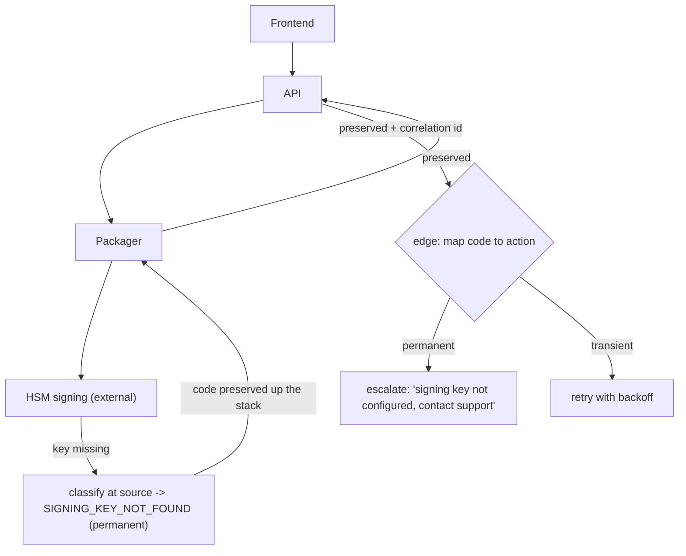

## Thesis

When a request crosses several independently-deployed services, the naive outcome is that every deep failure collapses into a generic "something went wrong" at the top --- useless to the user (retry? escalate? my fault?) and to on-call (which service, which cause?). Meaningful error propagation is a deliberate design: define a machine-readable failure-code taxonomy, classify each failure into a specific code *at its source*, carry that code (not just a message) across every boundary, and map codes to concrete user actions at the edge --- so a signing-key rejection deep in an external HSM surfaces as "your signing key is not configured, contact support" instead of "packaging failed," and on-call can tell a transient timeout from a permanent misconfiguration at a glance.

## Sub

**Why: deep failures collapse to "something went wrong"** -> **a machine-readable failure-code taxonomy** -> **classify at the source, preserve the code across boundaries, map to user actions** -> **zoom out** to transient-versus-permanent (retry versus escalate), the self-timeout that turns a hang into a definite failure, keeping the error contract backward-compatible, and the deployment ordering that evolves it safely.

## Spine

- **Messages are for humans; codes are for machines** --- free-text errors cannot be branched on, mapped to actions, or localized, so the contract is a set of machine-readable failure codes (SIGNING_KEY_NOT_FOUND, PACKAGER_TIMEOUT) and the human message is a derived, safe presentation of the code.
- **Classify at the source, preserve across boundaries** --- the service closest to the failure knows the real cause and emits the specific code; every layer above must *preserve and propagate* that code rather than catching it and rethrowing its own generic one, or the specificity dies at the first boundary.
- **Map codes to user actions at the edge** --- the frontend turns a code into what the user should *do*: retry (transient), fix the input (validation), or escalate to support (permanent) --- the error's whole job is to make the next step obvious.
- **Transient versus permanent decides retry versus escalate** --- each code is classified as retryable or not; a self-timeout converts a stuck operation into a definite retryable failure instead of an indefinite hang, and the code set is an API contract that must evolve additively so a new code never breaks an old client.

## Companion Notes

### walk

A failure crossing four services

One request threaded through frontend, API, packager, and an external signing service --- turning a deep signing-key rejection into a specific, actionable, coded error at the edge instead of a generic "packaging failed," and classifying it as permanent so the client escalates rather than retries.

Say it as a contract, not a try/catch: machine-readable codes, classified at the source, preserved across every boundary, and mapped to a user action (retry, fix, escalate) at the edge.

### drill

Error-contract reps

Graded reps that hand you a cross-service failure and ask for the code, how it propagates up the stack, and the user action it maps to --- the ones that separate "return a 500" from a designed error contract.

Code (not message) at the source, preserved up the stack rather than re-generalized, mapped to retry / fix / escalate at the edge --- and transient-versus-permanent is what decides retry versus escalate.

## Drill

SDE2 | the contract and the fundamentals
SDE3 | the classifier, self-timeout, and evolution
Staff | systemic error design and judgment

### SDE2 | why "something went wrong" is a bug

Why is a generic top-level error message a design failure, not just a UX nit?

Because it strips the user and on-call of the one thing an error exists to provide: *what to do next*. A generic "something went wrong" does not tell the user whether to retry (transient), fix their input (validation), or escalate (permanent) --- so they retry a permanent failure forever or give up on a transient one. It does not tell on-call *which* service or *which* cause failed, so triage starts from zero. A meaningful error answers three questions --- what failed, whose fault it is, and what the next step is --- and a generic message answers none of them. The generic collapse is a design failure because the information existed at the source and was thrown away on the way up.

### SDE2 | codes vs messages

What is the difference between an error code and an error message, and why does it matter?

A **code** is a machine-readable identifier (an enum value like `SIGNING_KEY_NOT_FOUND`); a **message** is human-readable free text. The code is the *contract* --- it can be branched on (retry vs escalate), mapped to a specific user action, localized into any language, and counted on a dashboard. The message is a *presentation* derived from the code, for a human to read. Free text cannot be any of those: you cannot reliably `if (error.message === "packaging failed")` across versions and locales. So the design rule is that services communicate *codes*, and the human message is generated from the code at the edge --- never the other way around, where the message is the source of truth and the code an afterthought.

### SDE2 | classify at the source

Which service should decide what a failure actually was, and why?

The service **closest to the failure**, because it is the only one with the real cause in hand. The signing service knows the difference between "the key is missing" (SIGNING_KEY_NOT_FOUND, permanent) and "the HSM is briefly unavailable" (SIGNING_SERVICE_ERROR, transient); a service three hops away sees only "the call failed" and can at best guess. So the failure is classified into a specific code *at its source*, where the information is richest. Every layer above should trust and carry that code rather than re-deriving it from less information --- re-classifying far from the source is how a precise "missing key" degrades into a vague "packaging failed."

### SDE2 | preserve the code across boundaries

A downstream service returns a specific error code. What must each layer above it do with that code?

**Preserve and propagate it** --- pass the source's code up unchanged, rather than catching it and rethrowing the layer's own generic code. The default failure mode is that each service wraps everything in its own error (the API turns `SIGNING_KEY_NOT_FOUND` into `PACKAGING_FAILED`), so the specific cause is destroyed at the very first boundary and the user gets the generic top-level message. Preservation means the code set is a *shared vocabulary*: a layer that receives a known code lets it flow through untouched, adding context (a correlation id, its own layer's breadcrumb) without overwriting the code. You only *translate* a raw, un-coded error into a code; you never *downgrade* an already-specific code into a generic one.

### SDE2 | map codes to user actions

How does a failure code become something useful to the user?

At the edge, you **map each code to a concrete next action**: retryable-transient codes map to "retry" (often automatic), validation codes map to "fix these fields," and permanent codes map to "escalate to support." So `PACKAGER_TIMEOUT` becomes "still working, retrying," `VALIDATION_FAILED` becomes "check the highlighted fields," and `SIGNING_KEY_NOT_FOUND` becomes "your signing key is not configured, contact support." The mapping lives in one place (the frontend or the API edge), is driven by the code, and turns an error from a dead end into a directive. This is the payoff of the whole taxonomy: the user always knows the next step, because the code carried enough information to decide it.

### SDE2 | transient vs permanent

Why is classifying a failure as transient or permanent the most important attribute of its code?

Because it decides the single most consequential thing about handling a failure: **retry or escalate**. A transient failure (a timeout, a throttle, a brief dependency blip) will likely succeed on retry, so you retry it (with backoff). A permanent failure (a missing key, bad input, an unsupported operation) will *never* succeed on retry, so retrying it is pure waste --- and with a no-backoff client it becomes a storm hammering an operation that cannot work. Getting this wrong is expensive in both directions: retrying a permanent failure is a self-inflicted flood, and escalating a transient one wastes a support ticket on something that would have self-resolved. So every code carries a retryable flag, and it is the first thing the classifier decides.

### SDE2 | store the code, not just the message

When an operation fails, what should you persist on the record, and why the code specifically?

The **failure code**, not just a rendered message, because everything downstream needs to *act* on it. Persisting the code on the record lets the status field drive UI ("failed: signing key missing"), lets a retry job re-attempt only the transient ones, lets a dashboard count `SIGNING_KEY_NOT_FOUND` occurrences this week, and lets a support engineer query for a specific failure class. A stored free-text message can be displayed but not aggregated or branched on. So the code is the durable, queryable record of *what went wrong*, and the message is regenerated from it for display --- which also means fixing the wording later does not require a data migration, because the truth on the record is the code.

### SDE3 | the cascading classifier

How do you get specific codes without every service needing to understand every other service's internals?

With a **cascading classifier** at each boundary that maps whatever it received into the nearest known code, in priority order: if the downstream returned an *already-known* code, preserve it unchanged; if it returned a *raw* error (an HTTP 504, an exception, a dependency's 500), map that raw signal into the closest code in the taxonomy (a 504 becomes `PACKAGER_TIMEOUT`); and only if nothing matches do you fall back to a generic code, *logged* as an unclassified case to fix later. This is what lets a layer produce specific codes while only knowing the taxonomy plus a few raw-error mappings, not the full internals of the services below it. The key discipline is the ordering: preserve first, map raw signals second, generic only as a logged last resort --- so specificity is the default and the generic code is the exception you can measure.

### SDE3 | the self-timeout pattern

An operation waits on an external service that can hang indefinitely. What do you build in?

A **self-timeout**: the operation sets its own deadline, and if the downstream has not answered by then, it *fails itself* with a definite, retryable code (`PACKAGER_TIMEOUT`) instead of hanging forever. A stuck operation with no timeout is worse than a fast failure --- it holds a connection, a worker, and a slot; it gives the user no signal (an eternal spinner); and it can cascade into resource exhaustion upstream. The self-timeout converts an *indefinite hang* into a *definite, classified, retryable failure*, which the rest of the contract can then handle (retry with backoff, or surface "timed out, retrying"). It is self-healing in the sense that the operation guarantees it will terminate with a meaningful result within a bounded time, rather than depending on the flaky dependency to eventually respond.

### SDE3 | error contract backward compatibility

The set of failure codes is an API contract. What breaks when you add a new code, and how do you add one safely?

An **old client that does not recognize the new code** breaks --- it falls into an "unknown error" branch and shows a generic message, or worse, mishandles it (e.g. treats an unknown as retryable and storms, or as permanent and blocks a recoverable case). So the contract must be evolved *additively and defensively*: clients handle unknown codes with a *safe default* (a conservative action --- usually "show generic + do not auto-retry + log it") so a new code degrades gracefully rather than crashing; and you only ever *add* codes, never repurpose an existing code's meaning or remove one clients depend on. Treating the code set as a versioned, append-only vocabulary is what lets producers introduce specificity without a lockstep upgrade of every consumer.

### SDE3 | don't leak internals in the error

The specific cause is useful internally but dangerous externally. How do you resolve that tension?

By splitting the error into an **internal cause** and an **external presentation**. The specific code and its internal detail (stack traces, hostnames, the exact downstream response) go to the *logs*, correlated by request id, for on-call. The *user-facing* message is a safe, actionable derivative of the code that reveals no internals --- `SIGNING_KEY_NOT_FOUND` becomes "your signing key is not configured, contact support," not the HSM's raw rejection with an internal endpoint in it. This gives you specificity where it is safe (internal, for triage) and safety where it is exposed (external, for the user), from the same code. Leaking internal detail in a user-facing error is both a security issue (information disclosure) and a UX one (unintelligible), so the code is the bridge: rich internally, sanitized at the edge.

### SDE3 | correlate the error across services

The code tells you *what* failed. How do you find *where* in a multi-service chain it originated?

With a **correlation id** (a request/trace id) propagated across every service, so you can reconstruct the full path of a single request and see exactly which hop produced the failure. The code says *what* (a signing-key error); the correlation id says *where* (this specific request's HSM call, at this timestamp, in this service). Without it, "we are seeing SIGNING errors" is un-actionable --- you cannot tie a user's report to the exact failing call among millions. With it, on-call pulls the request id from the error and gets the whole cross-service story: which services it touched, where it failed, and what each layer saw. Code plus correlation id is the pair that makes a distributed failure debuggable --- one classifies it, the other locates it (and it is exactly what the debugging topic leans on).

### SDE3 | retry only the retryable, with backoff

Given the transient/permanent classification, how does it drive your retry policy?

You **retry only the codes marked retryable (transient), with exponential backoff and a cap**, and you **fail fast to the user on permanent codes**. The classification is precisely what makes retries safe and bounded: a transient code is a promise that retrying *can* work, so you retry it a few times with growing delays; a permanent code is a promise that retrying *cannot* work, so you do not waste attempts and you surface it immediately for the user to fix or escalate. This is the error contract feeding retry policy, and it is why the classification matters operationally --- without it you either retry everything (storming on permanent failures) or retry nothing (giving up on recoverable blips). It also composes with a circuit breaker: repeated transient failures from one dependency trip the breaker so you stop retrying a service that is clearly down.

### SDE3 | deployment ordering for an error contract change

You are adding a new code that a downstream service will emit and an upstream service must handle. In what order do you deploy them?

Deploy the **consumer before the producer** --- the service that *handles* the new code must be live before the service that *emits* it, so no old consumer ever receives a code it does not understand. If you deploy the producer first, it starts emitting the new code while the old consumer is still running, and that consumer hits its unknown-code path (generic message at best, mishandling at worst) for the window until it is upgraded. Ordering the rollout --- handler first, emitter second --- closes that window. It is the same principle as any backward-incompatible-looking change made compatible through sequencing: make the receiving side tolerant first, then turn on the sending side. (And because consumers handle unknowns safely, even a mis-ordered deploy degrades gracefully rather than breaking --- the ordering makes it clean, the safe-default makes it safe.)

### Staff | the error contract as a first-class API

At scale across many teams, how do you keep cross-service error handling from devolving into chaos?

Treat the **failure-code taxonomy as a first-class, versioned, documented API surface** --- not a pile of ad-hoc strings each team invents. Every service *publishes* the codes it can emit (with their retryable classification and meaning), consumers handle them *explicitly*, and the contract is reviewed like any other interface when it changes. This is what makes error handling coherent across an org: a consuming team can see exactly what failures a dependency can produce and write deliberate handling for each, instead of catching a generic error and guessing. The anti-pattern is every service throwing its own untyped errors and every consumer catching `Exception` and logging it --- which produces exactly the generic-collapse the whole taxonomy exists to prevent. Errors are part of your API; design and version them like the rest of it.

### Staff | avoiding the generic-error collapse

What is the *default* behavior of a multi-service system's error handling, and why must you actively fight it?

The default is **catch, log, rethrow-generic at every layer** --- each service wraps whatever it caught in its own error type, so a specific cause is generalized away at the first boundary and everything above sees a vague failure. It is the default because it is what a naive `try/catch` does: catch the exception, log it, throw a new one. You have to *actively* invert it: the rule becomes *propagation preserves the source code by default*, and degrading to a generic code is an *explicit, logged* fallback rather than the automatic behavior. That inversion --- preserve-by-default instead of generalize-by-default --- is the core discipline of error propagation, and it is why this is a design topic and not just "return good error messages." The information is always there at the source; the entire game is not throwing it away on the way up.

### Staff | partial failure and degraded responses

A request fans out to several services and some succeed while others fail. Should that be a total failure?

Not necessarily --- the error contract should be able to express **partial success** and let the client decide, rather than collapsing a 3-of-4 outcome into a total failure. A request that packaged three of four artifacts, or fetched two of three data sources, has real value; forcing it to all-or-nothing throws that away and often triggers a full retry that redoes the successful work. So the response expresses *which* parts succeeded and *which* failed (with their codes), and the client chooses: retry only the failed part (if the operation is idempotent), proceed in a degraded mode, or escalate. This is the staff-level nuance --- error propagation is not only about a single failure path but about *composing* many outcomes into a response that preserves partial value and exposes, via codes, exactly what is missing so the caller can make an informed decision.

### Staff | idempotency and error propagation

Why are the retryable codes in your error contract coupled to idempotency?

Because a **retryable code is an implicit promise that retrying is safe** --- and retrying is only safe if the operation is idempotent, or you will double-act on every transient failure. If `PACKAGER_TIMEOUT` is retryable but the packaging operation is not idempotent, the retry might produce a duplicate artifact, a double charge, a second email. So marking a code retryable is a claim about the *operation*, not just the failure: it asserts that the client can safely re-attempt. That couples the error contract to idempotency design --- an idempotency key so the retry is deduplicated, or an operation designed to converge. The staff point is that "retryable" is not a property of the error alone; it is a joint property of the failure *and* the operation's idempotency, and treating a non-idempotent operation's failures as freely retryable is how a transient blip becomes duplicated side effects. (It is the direct tie between this topic and idempotency.)

### Staff | error budgets and error classes

Not every error should count against your reliability. How does the classification help?

By letting you **separate service failures from user errors** when you compute your SLI. A user's bad input (a validation failure, a 4xx-class code) is *not* a reliability failure of your service --- the service worked correctly and rejected invalid input; a timeout or an internal 5xx *is*. If your availability SLI counts *all* failed requests, a spike in user validation errors makes a perfectly healthy service look like it is burning its error budget, and you freeze features to chase a non-problem. So the code's class feeds the SLI: count the codes that represent *service* failures, exclude the ones that represent *user* errors, and your error budget then reflects actual reliability. This is where error propagation meets SLOs --- the taxonomy is what lets you draw the line between "we failed" and "the request was invalid," which is essential to a meaningful reliability number.

### Staff | the self-timeout vs the caller's timeout

Every layer in a call chain has a timeout. How do you set them so the *specific* failure wins?

Give **every layer its own timeout, decreasing outward** --- the caller's deadline must be *longer* than the callee's, so the deeper, more specific failure fires *first*. If the packager self-times-out at 25 seconds with `PACKAGER_TIMEOUT`, the API calling it must wait longer than 25 seconds; otherwise the API times out first with its own generic "upstream timeout" and you lose the specific code the packager was about to give you. So you nest the deadlines (inner short, outer longer) so the innermost layer that can produce the most specific classification wins the race to fail. Getting this inverted --- an outer timeout shorter than an inner one --- is a subtle bug that silently degrades every deep failure into the caller's generic timeout, defeating the classification you built. The rule is: the closer to the failure, the shorter the deadline, so specificity fires before the generic outer timeout can.

### Staff | telling the error-propagation story

How do you present error propagation compellingly in a system-design or debugging interview?

Lead with the **naive state and the concrete win**: "a request through frontend, API, packager, and an external signing service --- when the HSM rejected a key, the user saw 'packaging failed,' which is useless. I made a deep signing-key rejection surface as 'your signing key is not configured, contact support.'" Then the design: a **machine-readable code taxonomy** (the contract), a **cascading classifier** that preserves the source code and maps raw errors, **mapping codes to user actions** (retry / fix / escalate) driven by a transient-versus-permanent flag, and the operational payload --- **self-timeout** so a hang becomes a definite failure, a **correlation id** to locate it, **backward-compatible** additive codes, and **consumer-before-producer deployment ordering**. Ground it in the real pipeline and one concrete before/after, and close on the principle: the information exists at the source, and error propagation is the discipline of not throwing it away on the way up.

## Walk

### Deep failures collapse to "something went wrong"

```flow
hsm[external HSM rejects the signing key] -> api[API catches and rethrows a generic error] -> user[user sees: packaging failed]
```

Start with the naive state, because it is the default. A request threads through the frontend, the API, a packaging container, and an external HSM signing service. When the HSM rejects a key --- a specific, permanent, actionable failure --- each layer on the way up catches the error and rethrows its own generic one, so by the time it reaches the user it is "packaging failed."

That message is useless in every direction. The user cannot tell that it is *their* misconfigured key (a permanent problem they must escalate), so they retry it forever. On-call cannot tell it was the *signing* step, not packaging, so triage starts from nothing. The specific cause existed at the source and was destroyed at the first boundary --- which is the entire problem error propagation solves.

### Define machine-readable failure codes and classify at the source

```flow
raw[raw failure at the source] -> code[classify into a specific code: SIGNING_KEY_NOT_FOUND] -> carry[carry the code up the stack, not just the message]
```

The fix begins with a **machine-readable taxonomy** --- codes, not free text --- classified at the source where the cause is richest, and a cascading classifier that preserves a known code and only maps raw errors:

```python
FAILURE_CODES = {
    "SIGNING_KEY_NOT_FOUND",   # permanent -> escalate
    "SIGNING_SERVICE_ERROR",   # transient -> retry
    "PACKAGER_TIMEOUT",        # transient -> retry
    "PACKAGING_FAILED",        # permanent -> escalate (last-resort generic)
    "VALIDATION_FAILED",       # permanent -> fix input
}

def classify(err):
    # Cascading classifier: preserve a known code, else map the raw error.
    if err.code in FAILURE_CODES:
        return err.code                       # preserve the source's code
    if err.status == 504:
        return "PACKAGER_TIMEOUT"             # map a raw timeout
    if err.status == 404 and err.hint == "key":
        return "SIGNING_KEY_NOT_FOUND"        # map a raw signing failure
    return "PACKAGING_FAILED"                 # generic, but LOG it as unclassified
```

The signing service knows a missing key (`SIGNING_KEY_NOT_FOUND`, permanent) from a brief outage (`SIGNING_SERVICE_ERROR`, transient); a layer three hops away could only guess. So the code is set at the source, and the message becomes a derived presentation of it.

### Preserve the code across boundaries and map to user actions

```flow
src[code set at the source] -> up[each layer preserves it, does not overwrite] -> edge[the edge maps the code to an action: retry, fix, or escalate]
```

Now the propagation rule: every layer above **preserves and carries** the source's code, adding context (a correlation id, its own breadcrumb) without overwriting it. A layer only *translates* a raw, un-coded error into a code; it never *downgrades* a specific code into a generic one. That single inversion --- preserve-by-default instead of generalize-by-default --- is what keeps the specific cause alive all the way to the edge.

At the edge, the code becomes an **action**. A small map turns each code into what the user should do next, driven by its retryable/permanent class:

```json
{
  "SIGNING_KEY_NOT_FOUND": { "retryable": false, "action": "escalate",  "message": "Your signing key is not configured. Contact support." },
  "PACKAGER_TIMEOUT":      { "retryable": true,  "action": "retry",     "message": "Packaging timed out. Retrying..." },
  "VALIDATION_FAILED":     { "retryable": false, "action": "fix_input", "message": "Check the highlighted fields." }
}
```

So the HSM's key rejection now reads "your signing key is not configured, contact support" --- specific, safe, and actionable --- instead of "packaging failed."

### Transient vs permanent, the self-timeout, and evolving the contract

```flow
class[classify transient vs permanent] -> retry[retry transient with backoff, escalate permanent] -> evolve[self-timeout, backward-compatible codes, deploy the consumer first]
```

The transient/permanent flag drives everything operational: **retry only transient codes** (with backoff and a cap), **escalate permanent ones** immediately. That is what makes retries safe --- retrying a permanent failure is a storm, giving up on a transient one wastes a recoverable request.

Three pieces make it robust in production. A **self-timeout**: the packager sets its own deadline so a hanging HSM becomes a definite `PACKAGER_TIMEOUT` instead of an eternal spinner --- and every layer's timeout decreases outward, so the deepest, most specific failure fires before the caller's generic one. **Backward compatibility**: the code set is a versioned, append-only vocabulary, and clients handle unknown codes with a safe default (generic message, no auto-retry, logged), so a new code never breaks an old client. And **deployment ordering**: when you add a code, deploy the *consumer* that handles it before the *producer* that emits it, so no old consumer ever sees an unknown code. The information was always there at the source; error propagation is the discipline of carrying it, intact and actionable, all the way up.

### Model Script

- Frame the problem | "When a request crosses several services, the naive outcome is that every deep failure collapses into 'something went wrong' at the top. That is useless: the user can't tell whether to retry, fix their input, or escalate, and on-call can't tell which service or cause failed. The information existed at the source and got thrown away on the way up -- error propagation is the discipline of not doing that."
- The taxonomy | "So the contract is machine-readable codes, not free text -- a code can be branched on, mapped to an action, localized, and counted; a message can't. And you classify at the source, because the service closest to the failure is the only one that knows a missing signing key from a brief HSM outage. The human message becomes a derived presentation of the code, never the other way round."
- Preserve and map | "The key rule is that every layer above preserves and carries the source's code rather than catching it and rethrowing its own generic one -- preserve-by-default instead of generalize-by-default. Then at the edge you map each code to a user action driven by a transient-or-permanent flag: transient means retry, validation means fix the input, permanent means escalate. So a deep signing-key rejection surfaces as 'your signing key is not configured, contact support' instead of 'packaging failed.'"
- The operational payload | "Three things make it robust: a self-timeout so a hanging dependency becomes a definite retryable failure instead of an eternal spinner, with each layer's timeout shorter as you go inward so the specific failure fires first; a correlation id so you can locate which hop failed; and treating the code set as an append-only contract with clients handling unknown codes safely, deploying the consumer before the producer when you add one."
- Interviewer: "How do you decide whether a given failure is retryable?"
- Transient vs permanent | "By whether retrying can plausibly succeed. A timeout, a throttle, a brief dependency outage -- transient, retry with backoff, because a moment later it may work. A missing key, invalid input, an unsupported operation -- permanent, fail fast, because no number of retries fixes it. Getting it wrong is expensive both ways: retrying a permanent failure is a self-inflicted storm, and escalating a transient one wastes a support ticket on something that would have self-resolved. And retryable is a joint property of the failure and the operation's idempotency -- I only mark a code retryable if re-attempting is actually safe."
- Land it | "So: a machine-readable code taxonomy classified at the source, preserved across every boundary, and mapped to a user action at the edge, with a transient-or-permanent flag driving retry-versus-escalate; plus self-timeouts, correlation ids, and an additive contract for production. The one line is that the specific cause always exists at the source -- error propagation is simply the discipline of carrying it, intact and actionable, all the way up instead of collapsing it into 'something went wrong.'"

## Whiteboard

Sketch how a specific deep failure becomes a generic top-level error, and how a code becomes a user action.

### Why does a specific deep failure become a generic error at the top?

Because the default behavior at every boundary is catch-log-rethrow-generic --- each service wraps whatever it caught in its own error type, so the specific source code is generalized away at the very first hop and everything above sees a vague failure. The fix is to invert the default: preserve and carry the source's code by default, and only degrade to a generic code as an explicit, logged fallback. The information exists at the source; the whole game is not throwing it away on the way up.

### How does a code become a user action?

At the edge, a mapping keyed by the code (and its transient/permanent flag) turns each failure into a directive: transient -> retry (often automatic), validation -> fix these fields, permanent -> escalate to support. So `SIGNING_KEY_NOT_FOUND` becomes "your signing key is not configured, contact support" rather than "packaging failed" --- specific, safe, and telling the user exactly what to do next.



Verdict: classify at the source (rich cause) -> preserve the code across every boundary (not catch-and-generalize) -> map the code to a user action at the edge (retry / fix / escalate via the transient-permanent flag) -> so a deep, specific failure stays specific and actionable all the way to the user.

## System

Zoom out to the error path across a service chain and the attributes each code carries.

### Where it sits

Source service: classifies the raw failure into a specific code (richest cause) [*]
Each boundary: preserves and carries the code, adds a correlation id, never generalizes
Retry policy: retries transient codes with backoff, fails fast on permanent
Edge: maps the code to a user action (retry / fix / escalate) and a safe message
Ops: self-timeout (hang -> definite failure), correlation id (locate the hop), additive contract

### Pivots an interviewer rides

From "return a good error" they push on preserving specificity and deciding retryability.

#### How do you keep a specific cause from becoming a generic error?

-> preserve-and-carry the source code by default; degrade to generic only as an explicit, logged fallback
The default try/catch generalizes at the first boundary, so you invert it: a known code flows through untouched, only a raw un-coded error is translated into a code, and a generic code is the measured exception, never the automatic behavior.

#### How do you decide if a failure is retryable?

-> whether retrying can succeed (transient) and whether the operation is idempotent (safe to retry)
A timeout or throttle is transient (retry with backoff); a missing key or bad input is permanent (fail fast) -- and retryable is a joint property of the failure and the operation's idempotency, so you only mark a code retryable if re-attempting is actually safe.

## Trade-offs

The calls that separate a designed error contract from "return a 500."

### Specific codes vs a small generic set

- Many specific codes: each failure maps to a distinct, actionable outcome and a precise dashboard -- but a code per line of code is unmaintainable and clients cannot handle hundreds meaningfully
- A few generic codes: simple to produce and consume -- but they collapse distinct failures into the same non-action, which is the problem you set out to solve

Have exactly as many codes as drive *distinct* user actions or triage paths -- specific enough that retry/fix/escalate and on-call routing differ, coarse enough that clients can handle them all; the granularity test is "does this code change what someone does?"

### Preserve source code vs re-classify at each layer

- Preserve: the specific cause survives to the edge, one source of truth, minimal per-layer knowledge -- but every layer must agree to carry codes it did not create
- Re-classify at each layer: each service fully owns its errors -- but specificity dies at the first boundary and you rebuild the generic-collapse

Preserve the source code by default and only translate *raw, un-coded* errors into a code; re-classifying an already-specific code is how the whole taxonomy degrades back into "something went wrong."

### Self-timeout vs wait for the real answer

- Self-timeout: a hanging dependency becomes a definite, retryable failure in bounded time -- but you might give up a few seconds before a slow-but-successful response
- Wait indefinitely: you never abandon a request that would have succeeded -- but a stuck call holds resources, shows an eternal spinner, and can cascade into exhaustion

Self-timeout with a retryable code, tuned above the dependency's normal latency but well below "forever"; an indefinite hang is worse than a fast, classified failure the contract can retry.

## Model Answers

### the reframe | Meaningful errors are a contract, not a message

The frame to lead with.

- Codes (machine-readable) are the contract; messages are derived | key | branch, map, localize, count -- messages can't
- Classify at the source, preserve across boundaries | store | the cause dies at the first catch-and-generalize
- Map codes to user actions at the edge | note | retry / fix / escalate via a transient-permanent flag

### the depth | The classifier, self-timeout, and evolution

Where it is really tested.

- Cascading classifier: preserve known, map raw, generic-as-logged-fallback | key | specificity by default
- Self-timeout turns a hang into a definite retryable failure | store | inner deadlines shorter than outer
- The code set is an append-only contract; deploy consumer before producer | note | clients handle unknowns safely

## Numbers

Back-of-envelope how the transient/permanent split routes failures, and the cost of misclassifying.

Classification decides retry versus escalate; a permanent failure wrongly marked retryable becomes a storm, and with a taxonomy every failure is actionable instead of a generic dead end.

- fpd | Failures / day | 5000 | 0 | 100
- transient | Transient (retryable) share (%) | 60 | 0 | 5
- retries | Retries per transient failure | 3 | 0 | 1

```js
function (vals, fmt) {
  var fpd = vals.fpd, transient = vals.transient, retries = vals.retries;
  var tCount = fpd * transient / 100;
  var pCount = fpd - tCount;
  var retryLoad = tCount * retries;
  var stormIfMisclassified = pCount * retries;
  function r(x, d) { var m = Math.pow(10, d); return Math.round(x * m) / m; }
  return [
    { k: 'Transient / day (retry)', v: '~' + fmt.n(Math.round(tCount)), u: 'retryable', n: 'these can succeed on retry, so the contract retries them with backoff \u2014 a transient code is a promise that re-attempting can work', over: false },
    { k: 'Permanent / day (escalate)', v: '~' + fmt.n(Math.round(pCount)), u: 'fail fast', n: 'these never succeed on retry \u2014 a missing key, bad input \u2014 so they fail fast and map to fix-input or escalate, not a retry loop', over: false },
    { k: 'Legit retry load', v: '~' + fmt.n(Math.round(retryLoad)), u: 'attempts / day', n: 'the extra attempts retrying the transient failures adds \u2014 which is only safe if the operation is idempotent, so retryable codes and idempotency are coupled', over: false },
    { k: 'Storm if permanent misclassified', v: '~' + fmt.n(Math.round(stormIfMisclassified)), u: 'wasted attempts / day', n: 'if the permanent failures were wrongly marked retryable, this many attempts hammer operations that can never succeed \u2014 the self-inflicted flood', over: stormIfMisclassified > 5000 },
    { k: 'Actionable share', v: '100%', u: 'vs generic collapse', n: 'with a taxonomy every failure maps to retry / fix / escalate; the naive generic collapse leaves 0% actionable \u2014 the user cannot tell what to do', over: false }
  ];
}
```

## Red Flags

What makes an interviewer wince.

### "Just return a 500 with 'internal error'"

A single generic error collapses every distinct failure into the same non-action -- the user cannot tell retry from escalate from fix-my-input, and on-call cannot tell which service or cause failed, so triage starts from zero.

Define a machine-readable code taxonomy classified at the source, and map each code to a user action at the edge -- the specific cause exists at the source, so carry it instead of discarding it.

### "Each service catches everything and throws its own error"

That is the generic-collapse by construction -- the specific source code is generalized away at the very first boundary, so the top-level error is always vague no matter how precise the failure was.

Preserve and carry the source's code by default (add context, never overwrite); only translate a raw, un-coded error into a code, and degrade to generic only as an explicit, logged fallback.

### "We retry on any error"

Retrying permanent failures (a missing key, invalid input) is pure waste and, with a no-backoff client, a self-inflicted storm hammering an operation that can never succeed.

Classify each code transient vs permanent and retry only the transient ones (with backoff and a cap), failing fast on permanent -- and only mark a code retryable if the operation is idempotent enough to re-attempt safely.

## Opener

### 30s | The one-liner

How I open when asked about error handling across services or "why does everything say 'something went wrong.'"

#### What is the shape?

Meaningful error propagation is a contract, not a message: define machine-readable failure codes, classify each failure into a specific code at its source, preserve and carry that code across every boundary, and map codes to user actions (retry / fix / escalate) at the edge -- so a deep, specific failure stays specific and actionable all the way to the user.

#### What's the key move?

Invert the default: instead of every layer catching and rethrowing its own generic error (which destroys the cause at the first boundary), preserve the source code by default and degrade to generic only as an explicit, logged fallback -- because the information always exists at the source, and the whole game is not throwing it away on the way up.

##### Hooks

Where an interviewer usually pushes next.

- How do you decide retryable? | transient vs permanent, and only if idempotent | drill
- How do you keep specificity? | preserve-and-carry, don't catch-and-generalize | drill
- What about a hang? | self-timeout -> a definite retryable failure | drill

Foot: two sentences -- error propagation turns a distributed system's default "something went wrong" into a designed contract where every failure carries a machine-readable code, classified at the source and preserved to the edge, that tells the user exactly what to do next; and the operational payload -- self-timeouts, correlation ids, transient-vs-permanent retry policy, and an append-only contract deployed consumer-first -- is what makes it hold up in production.

## Bank

### SCALE | A multi-service request where deep failures show as "something went wrong"

Task: redesign the error handling so failures are specific and actionable end to end.
Model: define a machine-readable failure-code taxonomy (each code with a transient/permanent flag); classify at the source service (richest cause) with a cascading classifier that preserves a known code, maps raw errors into the nearest code, and falls back to a logged generic only as a last resort; preserve and carry the code across every boundary (adding a correlation id, never overwriting); at the edge map each code to a user action (retry / fix-input / escalate) and a safe, sanitized message; drive retry policy from the transient/permanent flag (retry transient with backoff, fail fast on permanent); and persist the code on the record so status, retries, and dashboards can act on it.
Int: where does the specificity usually get lost?
At the first boundary -- the default try/catch catches the specific error and rethrows the layer's own generic one, so you must invert the default to preserve-and-carry and only degrade to generic as an explicit, logged fallback.

### DESIGN | The error contract for a pipeline spanning four services

Task: design the error contract for frontend -> API -> packager -> external HSM.
Model: publish the code set as a versioned, append-only API surface (SIGNING_KEY_NOT_FOUND permanent, SIGNING_SERVICE_ERROR transient, PACKAGER_TIMEOUT transient, VALIDATION_FAILED permanent, PACKAGING_FAILED generic-fallback); classify at the source, preserve across boundaries with a correlation id; self-timeout the packager so a hanging HSM becomes a definite PACKAGER_TIMEOUT, with each layer's deadline shorter as you go inward so the specific failure fires first; map codes to actions at the edge; make clients handle unknown codes safely (generic + no auto-retry + logged); and deploy the consumer before the producer when adding a code.
Int: how do you add a new code without breaking clients?
Additively -- never repurpose or remove a code; have clients treat unknown codes with a safe default; and deploy the handler (consumer) before the emitter (producer) so no old consumer ever receives a code it does not understand.

### Extra Curveballs

### CURVEBALL | contract-evolution | A downstream service needs to start emitting a new, more specific failure code, and several upstream services consume its errors. Walk me through rolling it out with zero broken clients.

Model: treat the code set as an append-only contract and sequence the rollout. First, make sure every consumer already handles *unknown* codes with a safe default (generic message, no auto-retry, log it as unclassified) -- if that was designed in from the start, an unexpected code degrades gracefully rather than breaking. Then deploy the *consumers* that add explicit handling for the new code *before* the *producer* that emits it, so by the time the producer turns the code on, every consumer already understands it and no old consumer ever sees an unknown. The new code must be purely additive -- you do not repurpose an existing code's meaning (that silently breaks consumers that branch on it) or remove one still in use. Finally, roll the producer out gradually (a flag or a canary) while watching the consumers' unclassified-code metric, so if a consumer was missed it shows up as a measurable blip rather than a user-facing failure. The staff point is that errors are part of the API: you evolve them with the same additive-change, tolerant-reader, ordered-deployment discipline as any other backward-compatible contract change -- the tolerant reader makes it safe, the ordering makes it clean.

### Frames

- Codes (machine-readable) are the contract; classify at the source, preserve across boundaries, map to user actions at the edge (retry / fix / escalate)
- Invert the default: preserve-and-carry the source code, degrade to generic only as an explicit logged fallback -- the cause exists at the source, don't throw it away
- Transient vs permanent drives retry-vs-escalate (only if idempotent); self-timeout turns a hang into a definite failure; the code set is an append-only contract deployed consumer-first
