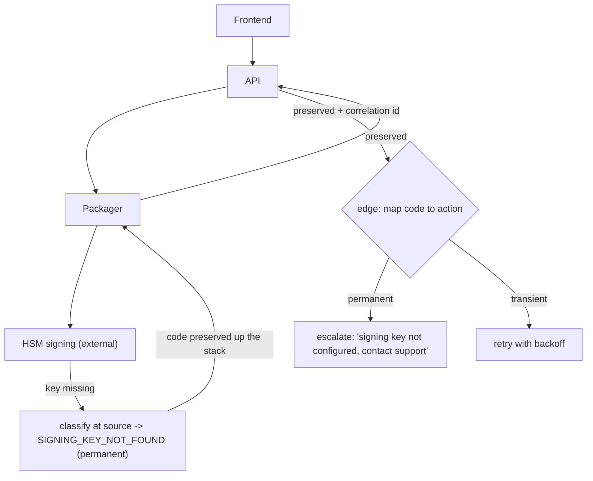

## Thesis

When a request crosses several independently-deployed services, the naive outcome is that every deep failure collapses into a generic "something went wrong" at the top --- useless to the user (retry? escalate? my fault?) and to on-call (which service, which cause?). Meaningful error propagation is a deliberate design: define a machine-readable failure-code taxonomy, classify each failure into a specific code *at its source*, carry that code (not just a message) across every boundary, and map codes to concrete user actions at the edge --- so a signing-key rejection deep in an external HSM surfaces as "your signing key is not configured, contact support" instead of "packaging failed," and on-call can tell a transient timeout from a permanent misconfiguration at a glance.

## Sub

**Why: deep failures collapse to "something went wrong"** -> **a machine-readable failure-code taxonomy** -> **classify at the source, preserve the code across boundaries, map to user actions** -> **zoom out** to transient-versus-permanent (retry versus escalate), the self-timeout that turns a hang into a definite failure, keeping the error contract backward-compatible, and the deployment ordering that evolves it safely.

## Spine

- **Messages are for humans; codes are for machines** --- free-text errors cannot be branched on, mapped to actions, or localized, so the contract is a set of machine-readable failure codes (SIGNING_KEY_NOT_FOUND, PACKAGER_TIMEOUT) and the human message is a derived, safe presentation of the code.
- **Classify at the source, preserve across boundaries** --- the service closest to the failure knows the real cause and emits the specific code; every layer above must *preserve and propagate* that code rather than catching it and rethrowing its own generic one, or the specificity dies at the first boundary.
- **Map codes to user actions at the edge** --- the frontend turns a code into what the user should *do*: retry (transient), fix the input (validation), or escalate to support (permanent) --- the error's whole job is to make the next step obvious.
- **Transient versus permanent decides retry versus escalate** --- each code is classified as retryable or not; a self-timeout converts a stuck operation into a definite retryable failure instead of an indefinite hang, and the code set is an API contract that must evolve additively so a new code never breaks an old client.

## Companion Notes

### walk

A failure crossing four services

One request threaded through frontend, API, packager, and an external signing service --- turning a deep signing-key rejection into a specific, actionable, coded error at the edge instead of a generic "packaging failed," and classifying it as permanent so the client escalates rather than retries.

Say it as a contract, not a try/catch: machine-readable codes, classified at the source, preserved across every boundary, and mapped to a user action (retry, fix, escalate) at the edge.

### drill

Error-contract reps

Graded reps that hand you a cross-service failure and ask for the code, how it propagates up the stack, and the user action it maps to --- the ones that separate "return a 500" from a designed error contract.

Code (not message) at the source, preserved up the stack rather than re-generalized, mapped to retry / fix / escalate at the edge --- and transient-versus-permanent is what decides retry versus escalate.

### wb

Whiteboard

Rebuild the error contract from memory --- the cues, nothing in front of you: taxonomy, classify-at-source, preserve, map-to-action, retry policy, self-timeout, correlation id, and the additive contract.

Draw the boundary first --- source on one side (produces the code), edge on the other (interprets it), the code crossing every hop untouched. Recall is the test, not recognition.

### sys

System Map

Zoom out: error propagation is the path a failure takes from the service that produced it, up through every boundary, to the user action at the edge --- and the attributes each code carries along the way.

Lead with the inversion, not the boxes --- "preserve the source code by default; collapsing to generic is the exception, not the automatic behavior."

### trade

Trade-offs

The calls that separate a designed error contract from "return a 500" --- code granularity, preserve-versus-reclassify, self-timeout-versus-wait, and whether a partial fan-out is a total failure.

Always name the alternative and its cost --- "a code per line of code is unmaintainable; one generic code is the problem you set out to solve" --- never defend one extreme as universally right.

### model

Model Answers

Full spoken scripts --- the beats, in order, the way you would actually say them, from "design it" to "name the limits."

Steal the frame, not the words --- lead with the one-line inversion ("the cause exists at the source; don't throw it away"), then the one risk you would name.

### num

Numbers

Back-of-envelope how the transient/permanent split routes failures --- and the cost of misclassifying, plus the share of failures that stay actionable versus collapse to generic.

Lead with the routing: classification decides retry versus escalate, and a permanent failure wrongly marked retryable becomes a storm --- that number is the one that scares people.

### rf

Red Flags

What sinks the round --- "just return a 500," catch-and-generalize at every layer, retry-on-any-error, leaking the stack trace to the user --- and the line that flips each one.

Name what the interviewer hears --- "would storm a permanent failure forever" is the fastest tell that you have not run one of these in production.

### open

30-Second

The opener and the close --- matched to the altitude the question is asked at, from "why does everything say something went wrong" to "design cross-service error handling."

Match the altitude --- open on the contract-not-a-message inversion, and land on the operational payload (self-timeout, correlation id, additive contract) as the part that holds up in production.

## Drill

all | All four tiers, mixed --- the way a real loop actually comes at you, from the error contract to the systemic judgment.
SDE2 | the contract and the fundamentals
SDE3 | the classifier, self-timeout, and evolution
Staff | systemic error design and judgment

### SDE2 | why "something went wrong" is a bug

Why is a generic top-level error message a design failure, not just a UX nit?

Because it strips the user and on-call of the one thing an error exists to provide: *what to do next*. A generic "something went wrong" does not tell the user whether to retry (transient), fix their input (validation), or escalate (permanent) --- so they retry a permanent failure forever or give up on a transient one. It does not tell on-call *which* service or *which* cause failed, so triage starts from zero. A meaningful error answers three questions --- what failed, whose fault it is, and what the next step is --- and a generic message answers none of them. The generic collapse is a design failure because the information existed at the source and was thrown away on the way up.

Follow: The user just wants it to work --- why does the *user* care whether it says "something went wrong" or "signing key not configured"?
Because the message is the only thing that tells them what to *do*. "Something went wrong" leaves one option: retry blindly, forever. "Your signing key is not configured, contact support" tells them it is permanent, it is a config problem on their side, and retrying is useless --- so they escalate instead of hammering a button for an hour. The message's whole job is to select the user's next action; a generic one selects nothing.

Follow: You keep saying the information "existed at the source." Prove it --- where exactly was it, and where did it die?
The HSM returned a specific rejection --- key-not-found, a 404 with a key hint --- so at the signing service the cause was fully known. It died at the first `catch` that wrapped it in a generic PACKAGING_FAILED. The information was present at hop four and destroyed at hop three; every layer above only ever saw the generic wrapper. That is the whole bug: not *missing* information, *discarded* information.

Senior: An SDE2 says "it is bad UX." The Staff framing is that an error's *purpose* is to select the next action --- retry, fix, or escalate --- and a generic message makes that selection impossible for both the user and on-call, so it is a design failure at the point where information was thrown away, not a wording problem.
Speak: Say what an error is *for*: "an error exists to tell you what to do next --- retry, fix your input, or escalate. 'Something went wrong' answers none of those, so the user retries a permanent failure forever and on-call triages from zero. The cause existed at the source and got discarded on the way up."

### SDE2 | codes vs messages

What is the difference between an error code and an error message, and why does it matter?

A **code** is a machine-readable identifier (an enum value like `SIGNING_KEY_NOT_FOUND`); a **message** is human-readable free text. The code is the *contract* --- it can be branched on (retry vs escalate), mapped to a specific user action, localized into any language, and counted on a dashboard. The message is a *presentation* derived from the code, for a human to read. Free text cannot be any of those: you cannot reliably `if (error.message === "packaging failed")` across versions and locales. So the design rule is that services communicate *codes*, and the human message is generated from the code at the edge --- never the other way around, where the message is the source of truth and the code an afterthought.

Follow: Can't I just parse the message string --- regex out "key not found" and branch on that?
No --- that is the anti-pattern. Messages change wording between versions, get localized, get rephrased for tone; a regex keyed on "key not found" silently breaks the day someone edits the copy to "signing key missing." You would be coupling machine logic to human prose. The code is a stable enum precisely so branching survives every wording change. If you are regexing error messages, you have already admitted the code should have existed.

Follow: So who owns the human message, and where is it generated?
The edge owns it --- the frontend or API boundary maps the code to a localized, sanitized string at render time. The code travels the whole way; the message is generated last, from the code, in the user's language. Never the reverse (message as source of truth, code derived from it), because then the message is load-bearing and you are back to parsing prose.

Senior: The tell is stating the *direction* of derivation --- code is the source of truth, message is a late presentation derived from it at the edge --- and naming the four things a code enables that a string cannot: branch, map-to-action, localize, and count on a dashboard.
Speak: "A code is a machine-readable enum --- SIGNING_KEY_NOT_FOUND; a message is human prose derived from it at the edge. You branch, map, localize, and count on the code; you can't reliably do any of those on free text. The message is generated from the code, never the other way round."

### SDE2 | classify at the source

Which service should decide what a failure actually was, and why?

The service **closest to the failure**, because it is the only one with the real cause in hand. The signing service knows the difference between "the key is missing" (SIGNING_KEY_NOT_FOUND, permanent) and "the HSM is briefly unavailable" (SIGNING_SERVICE_ERROR, transient); a service three hops away sees only "the call failed" and can at best guess. So the failure is classified into a specific code *at its source*, where the information is richest. Every layer above should trust and carry that code rather than re-deriving it from less information --- re-classifying far from the source is how a precise "missing key" degrades into a vague "packaging failed."

Follow: The signing service is three hops from the frontend. How does the frontend even get that specific code --- doesn't each hop have to understand signing?
No --- each hop only has to *preserve* the code, not understand it. The signing service classifies (SIGNING_KEY_NOT_FOUND); the packager and API pass it up untouched as an opaque token from a shared vocabulary. The frontend maps it. No middle layer needs to know what signing is; they treat the code as a value to carry, and only the two ends --- source (produces) and edge (interprets) --- attach meaning. That is what keeps specificity without coupling every layer to every other.

Follow: What if the source itself can't tell --- the HSM just returns a 500 with no detail?
Then the source classifies as far as it honestly can and marks the rest generic-but-logged. If the HSM gives an opaque 500, the signing service emits SIGNING_SERVICE_ERROR (transient) --- it knows the *signing* step failed even if not why --- rather than a bare 500. The rule is "classify with the richest information available at this point," not "always produce the most specific code." An honest transient-service-error beats a fake-specific code, and the logged raw 500 is the signal to add a finer classification later.

Senior: The nuance is that "classify at the source" is about *information locality*, not seniority of service --- the source has the richest signal, so it classifies as finely as it truthfully can, and every layer above trusts-and-carries rather than re-deriving from less. Re-classifying upstream is strictly lossy.
Speak: "Classify where the information is richest --- the service closest to the failure. It knows a missing key from a brief outage; a service three hops up sees only 'the call failed.' Everyone above just preserves that code; only the source produces it and only the edge interprets it."

### SDE2 | preserve the code across boundaries

A downstream service returns a specific error code. What must each layer above it do with that code?

**Preserve and propagate it** --- pass the source's code up unchanged, rather than catching it and rethrowing the layer's own generic code. The default failure mode is that each service wraps everything in its own error (the API turns `SIGNING_KEY_NOT_FOUND` into `PACKAGING_FAILED`), so the specific cause is destroyed at the very first boundary and the user gets the generic top-level message. Preservation means the code set is a *shared vocabulary*: a layer that receives a known code lets it flow through untouched, adding context (a correlation id, its own layer's breadcrumb) without overwriting the code. You only *translate* a raw, un-coded error into a code; you never *downgrade* an already-specific code into a generic one.

Follow: But I want to know the failure passed through the packager --- if I don't wrap it, I lose that context, right?
You add context *without* overwriting the code. Preservation is not "do nothing" --- each layer appends its own breadcrumb (a correlation id, its span, "seen at packager") to the error envelope while leaving the *code field* untouched. You get both: the source's specific code and the full path it traveled. Wrapping-that-replaces destroys the code; wrapping-that-annotates keeps it. The mistake is conflating "add my context" with "throw my own error type."

Follow: A layer receives a code it has never seen --- brand new, the source just started emitting it. Does it preserve it or reject it?
Preserve it, untouched. A middle layer has no business rejecting a code just because it does not recognize it --- it is a pass-through, so it carries any code, known or not. Only the *edge* needs a policy for unknowns (safe default: generic message, no auto-retry, log it). This is exactly what makes the contract additive: middle layers are transparent to new codes, so a new code from the source flows through old intermediaries without a redeploy.

Senior: What reads as senior is "annotate, don't overwrite" --- a layer enriches the error envelope (correlation id, its breadcrumb) while the code field flows through unchanged --- plus the realization that intermediaries must be transparent to *unknown* codes, which is what makes the contract additive.
Speak: "Each layer preserves and carries the source's code --- it adds context, a correlation id, its own breadcrumb, but never overwrites the code with its own generic one. The failure mode is catch-and-rethrow-generic; the fix is annotate-don't-overwrite, so the specific cause survives to the edge."

### SDE2 | map codes to user actions

How does a failure code become something useful to the user?

At the edge, you **map each code to a concrete next action**: retryable-transient codes map to "retry" (often automatic), validation codes map to "fix these fields," and permanent codes map to "escalate to support." So `PACKAGER_TIMEOUT` becomes "still working, retrying," `VALIDATION_FAILED` becomes "check the highlighted fields," and `SIGNING_KEY_NOT_FOUND` becomes "your signing key is not configured, contact support." The mapping lives in one place (the frontend or the API edge), is driven by the code, and turns an error from a dead end into a directive. This is the payoff of the whole taxonomy: the user always knows the next step, because the code carried enough information to decide it.

Follow: Where does that mapping live, and what happens when you add a code but forget to add its mapping?
It lives in *one* place at the edge --- a table from code to action-and-message. If you add a code with no mapping, the edge hits its default branch: generic message, no auto-retry, and --- critically --- it *logs* the unmapped code. That log is the to-do list: "these codes reached the edge with no action." So a missing mapping degrades gracefully (safe generic) and is measurable (count the unmapped codes and add them). Centralizing the map is what makes "did we handle every code?" a single answerable question.

Follow: Two codes both mean "the user should retry" --- do they need separate mappings, or is that over-granular?
If they drive the *same* action and the *same* message, they should not be separate codes at all --- that is the granularity test: a code earns its existence only if it changes what someone *does* (the user's action, or on-call's triage path). Two codes mapping to identical action and message are a smell: merge them, or make them differ in the message or telemetry. You size the taxonomy to distinct actions, not distinct causes --- coarser than "every failure," finer than "one generic."

Senior: The senior instinct is the granularity test --- a code exists only if it changes a user action or a triage path --- plus centralizing the code-to-action map so "every code is handled" is a single auditable question, with unmapped codes logged as a measurable backlog.
Speak: "At the edge, one table maps each code to a next action --- transient to retry, validation to fix-these-fields, permanent to escalate --- and a safe message. SIGNING_KEY_NOT_FOUND becomes 'your signing key isn't configured, contact support.' The code carried enough to decide the action; the edge just looks it up."

### SDE2 | transient vs permanent

Why is classifying a failure as transient or permanent the most important attribute of its code?

Because it decides the single most consequential thing about handling a failure: **retry or escalate**. A transient failure (a timeout, a throttle, a brief dependency blip) will likely succeed on retry, so you retry it (with backoff). A permanent failure (a missing key, bad input, an unsupported operation) will *never* succeed on retry, so retrying it is pure waste --- and with a no-backoff client it becomes a storm hammering an operation that cannot work. Getting this wrong is expensive in both directions: retrying a permanent failure is a self-inflicted flood, and escalating a transient one wastes a support ticket on something that would have self-resolved. So every code carries a retryable flag, and it is the first thing the classifier decides.

Follow: How do you actually decide the class --- is a 500 always transient and a 400 always permanent?
Mostly, but the class is about "can retrying plausibly succeed," not the raw status. 5xx / timeout / 429 are transient (the condition may clear); 4xx like 400 / 404 / 422 are permanent (the request is wrong and stays wrong). But the seams cut *both* ways, and naming them is the answer: a **429** is a 4xx that is transient-with-a-required-delay (respect Retry-After); a **500 from a deterministic bug** is a 5xx that is *permanent* --- a poison payload fails identically on every attempt, so retrying it is pure waste and, at volume, a self-inflicted storm; and a **409** conflict may be retryable after re-reading state. And be precise about 503: it is *specified* as temporary --- the server is briefly unable to cope and will likely recover --- so a "permanent 503" is not a thing; permanently gone is **410**. So you default by status class but let the source override when it knows better --- which is exactly why the source classifies: it can distinguish "briefly unavailable" from "gone."

Follow: You mark something transient and retry it, but it stays transient for six hours. Retrying forever is also wrong --- where's the line?
Transient means "retry is not futile," not "retry forever." You cap it: a few attempts with exponential backoff, then *stop* and escalate to a dead-letter or alert, converting a long-transient into an operational permanent. And a circuit breaker sits above: if one dependency's transient failures pile up, trip the breaker and stop retrying it entirely until it recovers. So "transient" bounds the retry policy (backoff plus a cap plus a breaker); it does not license infinite retries --- an unbounded transient is just a slow storm.

Senior: The Staff framing is that transient/permanent is the one bit that routes retry-vs-escalate, *and* that "transient" is bounded --- backoff, a cap, a circuit breaker, a fallback to escalate --- so it never means "retry forever"; conflating "retryable" with "infinitely retryable" is the subtle miss.
Speak: "Transient vs permanent decides the one thing that matters: retry or escalate. Transient --- a timeout, a throttle, a blip --- retry with backoff and a cap. Permanent --- a missing key, bad input --- fail fast, because no number of retries fixes it. Retrying a permanent failure is a self-inflicted storm; giving up on a transient one wastes a recoverable request."

### SDE2 | store the code, not just the message

When an operation fails, what should you persist on the record, and why the code specifically?

The **failure code**, not just a rendered message, because everything downstream needs to *act* on it. Persisting the code on the record lets the status field drive UI ("failed: signing key missing"), lets a retry job re-attempt only the transient ones, lets a dashboard count `SIGNING_KEY_NOT_FOUND` occurrences this week, and lets a support engineer query for a specific failure class. A stored free-text message can be displayed but not aggregated or branched on. So the code is the durable, queryable record of *what went wrong*, and the message is regenerated from it for display --- which also means fixing the wording later does not require a data migration, because the truth on the record is the code.

Follow: Why not store both the code and the rendered message --- isn't storing the message convenient for display?
Store the code as the source of truth; a cached message for display is fine, but it must be *regenerated* from the code, never authoritative. Persist only the message and you cannot aggregate ("how many SIGNING_KEY_NOT_FOUND this week?"), cannot re-drive only the transient ones, and cannot re-word the copy without a data migration. A denormalized message alongside the code is acceptable *if* everyone agrees the code wins. The trap is letting the stored message become the thing you branch on.

Follow: A retry job wants to re-attempt only the transient failures. How does the stored code make that a query?
Because the code carries the class, the retry job is a WHERE clause: `... WHERE status='failed' AND code IN (<transient set>) AND attempts < cap`. The transient/permanent classification lives in the code, so "retry the recoverable ones" becomes a filtered scan, not a per-row guess. Permanent codes are excluded by construction, so the job cannot storm a missing-key failure. Storing the code turns retry policy, dashboards, and support queries all into filters over one indexed column.

Senior: The signal is treating the persisted code as queryable *state* --- it drives the status field, filters the retry job to transient codes, powers dashboards and support queries --- with the message regenerated from it, so re-wording never needs a migration and "what failed" is always aggregatable.
Speak: "Persist the *code* on the failed record, not just a rendered message. The code is queryable: it drives the status UI, lets a retry job re-attempt only the transient ones, lets a dashboard count a failure class, lets support filter for it. The message is regenerated from the code, so fixing the wording later isn't a data migration."

### SDE3 | the cascading classifier

How do you get specific codes without every service needing to understand every other service's internals?

With a **cascading classifier** at each boundary that maps whatever it received into the nearest known code, in priority order: if the downstream returned an *already-known* code, preserve it unchanged; if it returned a *raw* error (an HTTP 504, an exception, a dependency's 500), map that raw signal into the closest code in the taxonomy (a 504 becomes `PACKAGER_TIMEOUT`); and only if nothing matches do you fall back to a generic code, *logged* as an unclassified case to fix later. This is what lets a layer produce specific codes while only knowing the taxonomy plus a few raw-error mappings, not the full internals of the services below it. The key discipline is the ordering: preserve first, map raw signals second, generic only as a logged last resort --- so specificity is the default and the generic code is the exception you can measure.

Follow: What stops the generic fallback from quietly becoming the common case --- 80% of failures just falling to PACKAGING_FAILED?
You *instrument* the fallback. Every time the classifier hits its generic branch, it logs the raw error it could not place, tagged unclassified, and you alarm on the unclassified *rate*. A rising generic share is a visible signal that a real failure mode is hiding behind the catch-all, and each logged raw error is a candidate for a new specific mapping. So the generic code is designed to be measurable and shrinking, not a silent drain --- "generic is the exception you can count," which is what keeps it from eating the taxonomy.

Follow: The order is preserve-known, then map-raw, then generic. Why does that order matter --- what breaks if you map-raw first?
If you map raw signals before checking for a known code, you *re-derive* a code the source already set, from less information. Say the source sent SIGNING_KEY_NOT_FOUND but the HTTP status was also 404; a map-raw-first classifier sees 404 and slaps on a generic NOT_FOUND, destroying the specific code. Preserve-first guarantees an already-classified code is never downgraded by a coarser raw-signal rule. The order encodes the principle: trust the richer upstream classification over your own coarser inference; only classify what arrived *un-coded*.

Senior: The depth is the ordered discipline --- preserve a known code, else map a raw signal to the nearest code, else generic-but-*logged* --- plus instrumenting the generic branch (alarm on the unclassified rate) so the catch-all is a measurable, shrinking exception, not a silent sink.
Speak: "A cascading classifier at each boundary, in order: an already-known code, preserve it; a raw error --- a 504, an exception --- map it to the nearest code; nothing matches, a generic fallback, *logged* as unclassified. The order matters: preserve-first means you never downgrade a specific code, and the logged generic is a measurable backlog, not a silent sink."

### SDE3 | the self-timeout pattern

An operation waits on an external service that can hang indefinitely. What do you build in?

A **self-timeout**: the operation sets its own deadline, and if the downstream has not answered by then, it *fails itself* with a definite, retryable code (`PACKAGER_TIMEOUT`) instead of hanging forever. A stuck operation with no timeout is worse than a fast failure --- it holds a connection, a worker, and a slot; it gives the user no signal (an eternal spinner); and it can cascade into resource exhaustion upstream. The self-timeout converts an *indefinite hang* into a *definite, classified, retryable failure*, which the rest of the contract can then handle (retry with backoff, or surface "timed out, retrying"). It is self-healing in the sense that the operation guarantees it will terminate with a meaningful result within a bounded time, rather than depending on the flaky dependency to eventually respond.

Follow: You self-timeout at 25s and emit PACKAGER_TIMEOUT --- but the operation might have actually succeeded at 26s. Now what?
That is the core hazard: a timeout is a statement about *your* waiting, not the operation's outcome. The downstream may still complete after you gave up, so a self-timeout on a state-changing call must be paired with idempotency --- the same idempotency key on the retry, so a late-completing original plus your retry converge to *one* effect, not two. For a read it is harmless; for a write (sign, charge, package-and-store) an un-idempotent self-timeout-then-retry is exactly how you get duplicates. So a self-timeout is safe to *retry* only when the operation is idempotent; otherwise you self-timeout and *escalate* rather than blindly retry.

Follow: How do you pick the timeout value --- too low kills slow-but-fine requests, too high hangs?
Set it from the dependency's latency distribution, not a guess: a bit above its p99 (or p99.9 for critical paths), so normal-slow succeeds and only a genuine hang trips it. Then it must fit inside the caller's budget --- the nested-deadline rule --- so the inner timeout is shorter than the outer. And make it adaptive where you can: a deadline *propagated* from the caller ("you have 8s left") beats a fixed constant, because a fixed 25s is wrong for both a 200ms-budget request and a five-minute batch. Tune to the distribution, fit the budget, propagate the deadline.

Senior: The Staff move is naming that a self-timeout is a claim about *your* wait, not the operation's outcome --- so retrying one safely requires idempotency (a late-completing original plus the retry must converge) --- and that the value comes from the dependency's p99 fitted inside the caller's budget, ideally as a propagated deadline.
Speak: "A self-timeout: the operation sets its own deadline and, if the downstream hasn't answered, fails *itself* with a definite retryable code instead of hanging forever. An eternal spinner holds a worker and a connection and tells the user nothing; a self-timeout converts an indefinite hang into a definite, classified, retryable failure the contract can handle."

### SDE3 | error contract backward compatibility

The set of failure codes is an API contract. What breaks when you add a new code, and how do you add one safely?

An **old client that does not recognize the new code** breaks --- it falls into an "unknown error" branch and shows a generic message, or worse, mishandles it (e.g. treats an unknown as retryable and storms, or as permanent and blocks a recoverable case). So the contract must be evolved *additively and defensively*: clients handle unknown codes with a *safe default* (a conservative action --- usually "show generic + do not auto-retry + log it") so a new code degrades gracefully rather than crashing; and you only ever *add* codes, never repurpose an existing code's meaning or remove one clients depend on. Treating the code set as a versioned, append-only vocabulary is what lets producers introduce specificity without a lockstep upgrade of every consumer.

Follow: "Clients handle unknowns with a safe default" --- what *is* the safe default, concretely, and why that one?
Show a generic message, do *not* auto-retry, and log the unknown code. That specific combination because each alternative is dangerous: auto-retrying an unknown could storm a permanent failure; treating it as permanent could block a recoverable case; crashing is worst. "Generic + no auto-retry + logged" is the least-harmful reading of "I don't know what this is" --- it neither storms nor blocks, it degrades to the safe minimum and leaves a trail. A tolerant reader's default has to assume the worst about an unknown, which means the most conservative action.

Follow: Repurposing a code's meaning is banned. Why is that worse than adding a new code?
Because repurposing *silently* breaks every consumer that already branches on the old meaning --- their code still "handles" it, just wrongly. Redefine SIGNING_ERROR from transient to cover a permanent case, and every client that auto-retries SIGNING_ERROR now storms a permanent failure, with no error and no signal anything changed. A *new* code fails loudly-and-safely (unknown -> safe default); a *repurposed* code fails quietly-and-wrongly (known -> wrong action). Additive change is safe because old consumers keep their correct behavior for old codes; semantic change is unsafe because it invalidates behavior they already shipped.

Senior: The senior framing is "codes are a versioned, append-only vocabulary": the tolerant-reader default (generic + no-retry + log) makes a *new* code degrade loudly-and-safely, while *repurposing* a code fails quietly-and-wrongly by invalidating logic consumers already shipped --- so you only ever add, never redefine or remove.
Speak: "The code set is an API contract, so evolve it additively: only *add* codes, never repurpose or remove one clients depend on. And build clients as tolerant readers --- an unknown code degrades to a safe default: generic message, no auto-retry, logged --- so a new code never breaks an old client, it just isn't specifically handled yet."

### SDE3 | don't leak internals in the error

The specific cause is useful internally but dangerous externally. How do you resolve that tension?

By splitting the error into an **internal cause** and an **external presentation**. The specific code and its internal detail (stack traces, hostnames, the exact downstream response) go to the *logs*, correlated by request id, for on-call. The *user-facing* message is a safe, actionable derivative of the code that reveals no internals --- `SIGNING_KEY_NOT_FOUND` becomes "your signing key is not configured, contact support," not the HSM's raw rejection with an internal endpoint in it. This gives you specificity where it is safe (internal, for triage) and safety where it is exposed (external, for the user), from the same code. Leaking internal detail in a user-facing error is both a security issue (information disclosure) and a UX one (unintelligible), so the code is the bridge: rich internally, sanitized at the edge.

Follow: Where exactly do you sanitize --- and why does "redact before logging" matter, not just before the response?
Sanitize at the edge for the user message, but redact secrets before the *log* call too, because logs are an exposure surface: a stack trace echoing a key, an internal hostname, or a raw HSM response in the logs leaks to anyone with log access and often to third-party log sinks. So there are two derivations from the code: a sanitized user message (no internals at all) and an internal log entry that is rich but *scrubbed* of secrets (key material, tokens) before the write, not just before the HTTP response. Leaking into logs is the subtler version of the same bug.

Follow: The user sees "contact support" but support needs the detail. How do they get it without the user seeing it?
The correlation id is the bridge. The user gets a safe message plus an opaque request id; support takes that id and looks up the full internal error --- code, breadcrumbs, scrubbed stack --- in the logs. So the specific cause is available to the people who should see it, keyed by an id that itself reveals nothing. That is the whole split: rich-internal keyed by correlation id, safe-external for the user, and the id is what lets support cross from one to the other without exposing internals in the UI.

Senior: The senior point is that the *same* code yields two derivations --- a sanitized user message and a secret-scrubbed internal log, redacted before the log call not just the response --- bridged by a correlation id, so support gets full detail keyed by an opaque id while the user sees nothing internal.
Speak: "Split the error into internal cause and external presentation. The specific code and its detail --- scrubbed of secrets --- go to the logs for on-call, correlated by request id. The user message is a safe derivative that reveals no internals, plus that request id. Leaking a hostname or key in a user error is both a security bug and a UX one."

### SDE3 | correlate the error across services

The code tells you *what* failed. How do you find *where* in a multi-service chain it originated?

With a **correlation id** (a request/trace id) propagated across every service, so you can reconstruct the full path of a single request and see exactly which hop produced the failure. The code says *what* (a signing-key error); the correlation id says *where* (this specific request's HSM call, at this timestamp, in this service). Without it, "we are seeing SIGNING errors" is un-actionable --- you cannot tie a user's report to the exact failing call among millions. With it, on-call pulls the request id from the error and gets the whole cross-service story: which services it touched, where it failed, and what each layer saw. Code plus correlation id is the pair that makes a distributed failure debuggable --- one classifies it, the other locates it (and it is exactly what the debugging topic leans on).

Follow: Who generates the correlation id, and what happens if a middle service forgets to propagate it?
The edge (the first service the request hits) generates it if the client did not supply one, and every service propagates it --- inbound header, into logs and outbound calls, ideally via automatic context propagation (a trace context like W3C traceparent) so no one has to remember. If a middle service drops it, the trace *breaks* at that hop: you can follow the request up to that service and lose it after --- which is itself a signal (that service is not propagating). That is why you push propagation into shared middleware, not app code: a hand-threaded id gets forgotten exactly once and blinds you for that request.

Follow: How is a correlation id different from a full distributed trace --- do you need OpenTelemetry, or is an id enough?
A correlation id is the minimum: one id shared across all logs for a request, so you can grep the whole path. A distributed trace (spans, parent/child, timing) is the richer version --- same id at the root, plus per-hop spans that show *where* the time went and the exact call tree. For just locating the failing hop, the shared id in structured logs is often enough; for latency attribution and the call graph you want real tracing. They compose: the trace id *is* the correlation id, error logs reference it, so "what failed" (code) plus "where" (trace) plus "why slow" (spans) come from one identifier.

Senior: The senior detail is pushing propagation into shared instrumentation (a trace context, not hand-threaded) so a dropped id is impossible-by-default and a break localizes the non-propagating hop --- and knowing the correlation id and a distributed trace are the same id at two fidelities: grep-the-path versus the timed call tree.
Speak: "A correlation id --- a request or trace id --- propagated across every service, so you can reconstruct one request's whole path and see which hop failed. The code says *what*; the correlation id says *where*. Push propagation into shared middleware so no one forgets it, and the same id powers your distributed trace. Code plus correlation id is what makes a distributed failure debuggable."

### SDE3 | retry only the retryable, with backoff

Given the transient/permanent classification, how does it drive your retry policy?

You **retry only the codes marked retryable (transient), with exponential backoff and a cap**, and you **fail fast to the user on permanent codes**. The classification is precisely what makes retries safe and bounded: a transient code is a promise that retrying *can* work, so you retry it a few times with growing delays; a permanent code is a promise that retrying *cannot* work, so you do not waste attempts and you surface it immediately for the user to fix or escalate. This is the error contract feeding retry policy, and it is why the classification matters operationally --- without it you either retry everything (storming on permanent failures) or retry nothing (giving up on recoverable blips). It also composes with a circuit breaker: repeated transient failures from one dependency trip the breaker so you stop retrying a service that is clearly down.

Follow: Exponential backoff with a cap --- why the jitter, and why the cap specifically?
Jitter breaks synchronization: if a dependency blips and a thousand callers all fail at once, plain exponential backoff retries them at the *same* later instants --- a thundering herd that re-hammers the recovering service. Full jitter randomizes each retry within its window, so the load spreads into a ramp, not a spike. The cap bounds total effort: without it, exponential backoff on a long outage means unbounded attempts and ever-growing delay; with a cap (max attempts or max elapsed) you convert "still failing after N" into a definite escalate or DLQ. Jitter smooths the herd; the cap turns an endless transient into a decision.

Follow: Retries and a circuit breaker seem to overlap --- when does the breaker do something retries don't?
Retries handle a *single* request's transient blip; a circuit breaker handles a *dependency* that is broadly down. Per-request retries with backoff still send load at a dead service --- every request tries a few times before giving up, so a hard-down dependency gets hammered by all callers' retries at once. The breaker sits above: after a failure threshold it *opens* and every call fails fast (no attempts) for a cool-off, then half-opens to probe recovery. So retries recover isolated blips; the breaker stops you retrying into a service that is clearly down, protecting it and your own threads from the retry amplification. They compose: retry within a request, break across requests.

Senior: The reliability depth is distinguishing the two scales --- per-request retries (backoff + full jitter + cap) recover an isolated blip, while a circuit breaker across requests stops retry-amplification into a dependency that is broadly down --- and knowing jitter kills the thundering herd while the cap converts an endless transient into an escalate.
Speak: "Retry only the codes marked transient, with exponential backoff, full jitter, and a cap; fail fast on permanent codes. The classification is what makes retries safe: transient promises retrying can work, permanent promises it can't. Jitter breaks the thundering herd, the cap turns 'still failing' into an escalate, and a circuit breaker stops you retrying into a dependency that's clearly down."

### SDE3 | deployment ordering for an error contract change

You are adding a new code that a downstream service will emit and an upstream service must handle. In what order do you deploy them?

Deploy the **consumer before the producer** --- the service that *handles* the new code must be live before the service that *emits* it, so no old consumer ever receives a code it does not understand. If you deploy the producer first, it starts emitting the new code while the old consumer is still running, and that consumer hits its unknown-code path (generic message at best, mishandling at worst) for the window until it is upgraded. Ordering the rollout --- handler first, emitter second --- closes that window. It is the same principle as any backward-incompatible-looking change made compatible through sequencing: make the receiving side tolerant first, then turn on the sending side. (And because consumers handle unknowns safely, even a mis-ordered deploy degrades gracefully rather than breaking --- the ordering makes it clean, the safe-default makes it safe.)

Follow: If clients already handle unknowns safely, why does the deploy order even matter --- won't a mis-order just degrade gracefully?
Exactly right, and that is the point: the safe-default makes a mis-order *safe*, the ordering makes it *clean*. Deploy the producer first and old consumers hit their unknown-code path --- generic message, no specific handling --- for the window until they are upgraded. Nothing breaks (that is the tolerant reader), but every user hitting that failure in the window gets the degraded generic experience instead of the specific one. Consumer-first closes that window so the specific handling is live *before* the code can appear. So order is not for safety (the default provides that), it is to avoid a real-but-graceful degradation window.

Follow: What about the reverse --- you're *removing* or renaming a code. Same order, or different?
Different, and harder: for removal you deploy the producer-stops-emitting *first*, then remove the consumer handling once the code can no longer appear --- the mirror of adding. But really you should rarely remove: retire a code by ceasing to emit it and leaving the (now-dead) consumer handling in place, since dead handling is harmless and removing it risks a straggler producer. Renaming is add-new plus migrate-emitters plus retire-old, never an in-place rename. The invariant across all of them: never have a code in flight that no live consumer understands, and never a consumer depending on a code a producer still emits under a changed meaning.

Senior: The senior framing is that the safe-default makes ordering a *quality* concern, not a safety one --- consumer-first merely closes a graceful-degradation window --- and that removal is the mirror (producer-stops-first), with the real invariant being "never a code in flight no live consumer understands."
Speak: "Deploy the consumer before the producer --- the handler must be live before the emitter, so no old consumer ever receives a code it doesn't understand. It's the make-the-receiver-tolerant-first principle. And because consumers already handle unknowns safely, a mis-ordered deploy degrades gracefully rather than breaking --- the ordering makes it clean, the safe default makes it safe."

### Staff | the error contract as a first-class API

At scale across many teams, how do you keep cross-service error handling from devolving into chaos?

Treat the **failure-code taxonomy as a first-class, versioned, documented API surface** --- not a pile of ad-hoc strings each team invents. Every service *publishes* the codes it can emit (with their retryable classification and meaning), consumers handle them *explicitly*, and the contract is reviewed like any other interface when it changes. This is what makes error handling coherent across an org: a consuming team can see exactly what failures a dependency can produce and write deliberate handling for each, instead of catching a generic error and guessing. The anti-pattern is every service throwing its own untyped errors and every consumer catching `Exception` and logging it --- which produces exactly the generic-collapse the whole taxonomy exists to prevent. Errors are part of your API; design and version them like the rest of it.

Follow: "Publish the codes each service can emit" --- how do you actually keep that catalog honest as code changes?
Make the catalog the *source* the code is generated from, not a doc that drifts. Codes live in a shared, versioned schema (an enum in a shared package, a proto, an IDL) that both producer and consumer import --- so a producer cannot emit a code that is not in the catalog, and a consumer's handling is checked against it. Adding a code is a reviewed change to that schema, like any interface change. A hand-maintained wiki of error codes rots the first sprint; a generated-from-schema catalog cannot, because emitting an off-catalog code is a compile error. The contract is honest because it is mechanized.

Follow: Every service publishing its codes could mean thousands of codes across an org. Doesn't that collapse under its own weight?
It does if codes are global and flat; you scope and layer them. Each service owns a *namespace* (SIGNING_*, PACKAGER_*), so codes are local and discoverable, and consumers mostly care about a dependency's codes plus a small set of *cross-cutting* classes (a shared transient/permanent flag, coarse categories like AUTH / VALIDATION / UNAVAILABLE) they can branch on generically. So a consumer handles the handful of specific codes it cares about and falls back to the coarse class for the rest --- it does not need to know all thousand. The taxonomy scales by being namespaced and by having a small shared top-level class every code maps to.

Senior: The Staff-level answer is mechanizing the contract --- codes generated from a shared versioned schema so an off-catalog code will not compile --- and scaling it by namespacing per service plus a small shared cross-cutting class set, so a consumer handles the few codes it cares about and generically handles the rest by class.
Speak: "Treat the failure-code taxonomy as a first-class, versioned, documented API surface --- generated from a shared schema, not a wiki that rots. Every service publishes the codes it emits with their retryable class; consumers handle them explicitly. Namespace per service and give everything a small shared cross-cutting class, so a consumer handles the few codes it cares about and the rest generically. Errors are part of your API; version them like it."

### Staff | avoiding the generic-error collapse

What is the *default* behavior of a multi-service system's error handling, and why must you actively fight it?

The default is **catch, log, rethrow-generic at every layer** --- each service wraps whatever it caught in its own error type, so a specific cause is generalized away at the first boundary and everything above sees a vague failure. It is the default because it is what a naive `try/catch` does: catch the exception, log it, throw a new one. You have to *actively* invert it: the rule becomes *propagation preserves the source code by default*, and degrading to a generic code is an *explicit, logged* fallback rather than the automatic behavior. That inversion --- preserve-by-default instead of generalize-by-default --- is the core discipline of error propagation, and it is why this is a design topic and not just "return good error messages." The information is always there at the source; the entire game is not throwing it away on the way up.

Follow: In a big codebase, how do you make preserve-by-default actually stick, not just a guideline people forget?
You make it structural, not disciplinary. A shared error-handling library every service uses: it preserves a known code by default, requires you to *explicitly* opt into a generic downgrade (and logs when you do), and makes "catch Exception, rethrow generic" the harder path to write. Plus a lint or test that flags a catch block swallowing a coded error into a bare generic. When the framework's default *is* preserve-and-annotate, an engineer gets it right by doing the easy thing; a wiki guideline loses to the nearest `catch (e) { throw new Error('failed') }`. You beat the default by changing what the default *code* does, not by asking people to remember.

Follow: Is there ever a case where catch-and-generalize is the *right* call, not the anti-pattern?
Yes --- at a *trust* or *abstraction* boundary. When you deliberately do not want to leak a dependency's error vocabulary to your callers (a third-party API's idiosyncratic codes, or exposing internal codes across a public API), you *intentionally* translate into your own stable, published codes. The difference from the anti-pattern is that it is a deliberate re-classification into a *defined* code at a boundary you own, preserving the class (transient/permanent) and logging the original --- not a lazy "catch-all, throw generic" that loses the class and the cause. Translate-at-a-boundary is designed and lossless-in-class; catch-and-generalize-everywhere is accidental and lossy.

Senior: The Staff insight is that you beat generalize-by-default with *structure* --- a shared library whose default is preserve-and-annotate and where a generic downgrade is explicit-and-logged --- and that deliberate translation at a trust/abstraction boundary (into your own published codes, class preserved, original logged) is the legitimate cousin of the anti-pattern.
Speak: "The default at every layer is catch-log-rethrow-generic --- a naive try/catch generalizes the cause at the first boundary. You actively invert it: preserve the source code by default, and degrading to generic is an explicit, logged exception. And you make it stick with *structure* --- a shared error library whose default preserves --- not a guideline people forget. The information's always at the source; the whole game is not throwing it away."

### Staff | partial failure and degraded responses

A request fans out to several services and some succeed while others fail. Should that be a total failure?

Not necessarily --- the error contract should be able to express **partial success** and let the client decide, rather than collapsing a 3-of-4 outcome into a total failure. A request that packaged three of four artifacts, or fetched two of three data sources, has real value; forcing it to all-or-nothing throws that away and often triggers a full retry that redoes the successful work. So the response expresses *which* parts succeeded and *which* failed (with their codes), and the client chooses: retry only the failed part (if the operation is idempotent), proceed in a degraded mode, or escalate. This is the staff-level nuance --- error propagation is not only about a single failure path but about *composing* many outcomes into a response that preserves partial value and exposes, via codes, exactly what is missing so the caller can make an informed decision.

Follow: How do you actually shape a partial-success response so the client can act on it, versus just returning 200 with a mess?
Return a structured result explicit about per-item outcome: an overall status of "partial," plus a list where each item carries its own code (succeeded, or its failure code) and enough id to retry just that one. Not a 200 that hides failures (the client thinks it all worked), not a 500 that hides successes (the client redoes finished work) --- a distinct multi-status shape (HTTP has 207 for exactly this) where the client can enumerate what landed and what did not. The contract is that the *response* composes many codes, so the caller decides per item: retry the failed ones, proceed degraded, or escalate.

Follow: The client retries only the failed parts --- what makes that safe, and when should it *not* be partial?
Safe only if each item is independently idempotent, so re-submitting the failed subset cannot duplicate the succeeded ones --- the same idempotency coupling, per item. And it should *not* be partial when the operation is atomic-by-requirement: if the sub-results only make sense together (a transaction, an all-or-nothing invariant), partial success is a lie and you should fail the whole thing and roll back. So partial success applies to *composable*, independent work (fan-out reads, batch sends); it is wrong for operations with a cross-item invariant, where the honest answer is all-or-nothing with compensation. Knowing which regime you are in is the call.

Senior: The Staff nuance is distinguishing composable fan-out (express partial success as a multi-status response, per-item codes, retry the failed subset idempotently) from atomic-by-requirement operations (where partial success is a lie and you fail-and-compensate) --- error propagation is about *composing* outcomes, not just one failure path.
Speak: "Don't collapse a 3-of-4 outcome into total failure --- express partial success. The response says which parts succeeded and which failed, with codes, so the client decides: retry only the failed part if it's idempotent, proceed degraded, or escalate. All-or-nothing throws away real value and often triggers a full retry that redoes the successful work. The exception is atomic-by-requirement operations, where partial success is a lie and you fail-and-compensate."

### Staff | idempotency and error propagation

Why are the retryable codes in your error contract coupled to idempotency?

Because a **retryable code is an implicit promise that retrying is safe** --- and retrying is only safe if the operation is idempotent, or you will double-act on every transient failure. If `PACKAGER_TIMEOUT` is retryable but the packaging operation is not idempotent, the retry might produce a duplicate artifact, a double charge, a second email. So marking a code retryable is a claim about the *operation*, not just the failure: it asserts that the client can safely re-attempt. That couples the error contract to idempotency design --- an idempotency key so the retry is deduplicated, or an operation designed to converge. The staff point is that "retryable" is not a property of the error alone; it is a joint property of the failure *and* the operation's idempotency, and treating a non-idempotent operation's failures as freely retryable is how a transient blip becomes duplicated side effects. (It is the direct tie between this topic and idempotency.)

Follow: So who's responsible for idempotency --- the code author marking it retryable, or the operation's designer? And where does the key live?
It is a joint responsibility, and that is the point: marking a code retryable is a *claim* about the operation, so whoever marks it must ensure the operation is idempotent, or the retry policy is unsafe. Concretely the client sends an idempotency key with the request; the *server* deduplicates on it (records the key with the result, returns the stored result on a replay). So the key travels with the retry, but the safety is enforced server-side. The failure mode is marking a code retryable while the operation has no dedup --- then the contract *promises* safe retry the implementation does not deliver, and every transient blip doubles the side effect.

Follow: What if you genuinely can't make an operation idempotent --- a non-idempotent third-party call? Is its failure just non-retryable?
Effectively yes at the automatic-retry level: if you cannot dedup it, you must *not* mark its failures freely retryable, because a self-timeout or blip plus a retry risks a double effect. Your options: wrap it to *make* it idempotent (a dedup layer keyed on your own id, so you do not re-invoke the third party if you have already succeeded), or treat the ambiguous-outcome failures as needing *reconciliation* rather than blind retry --- record "unknown outcome," then check the third party's state (a query API, a webhook) before deciding. So a non-idempotent operation's timeout is not "retry"; it is "reconcile." You never let "retryable" outrun "safe to repeat."

Senior: The Staff tie is that "retryable" is a joint property of the failure *and* the operation's idempotency --- the client carries an idempotency key, the server dedups on it --- and that a genuinely non-idempotent operation's ambiguous failure is a *reconcile* case (check outcome, then decide), never a blind retry.
Speak: "A retryable code is an implicit promise that retrying is safe --- and retrying is only safe if the operation is idempotent, or every transient failure doubles the effect: a duplicate artifact, a double charge. So marking a code retryable is a claim about the operation, not just the failure: it asserts the client can safely re-attempt, which means an idempotency key and server-side dedup. If you can't dedup it, its ambiguous failure is a reconcile case, not a retry."

### Staff | error budgets and error classes

Not every error should count against your reliability. How does the classification help?

By letting you **separate service failures from user errors** when you compute your SLI. A user's bad input (a validation failure, a 4xx-class code) is *not* a reliability failure of your service --- the service worked correctly and rejected invalid input; a timeout or an internal 5xx *is*. If your availability SLI counts *all* failed requests, a spike in user validation errors makes a perfectly healthy service look like it is burning its error budget, and you freeze features to chase a non-problem. So the code's class feeds the SLI: count the codes that represent *service* failures, exclude the ones that represent *user* errors, and your error budget then reflects actual reliability. This is where error propagation meets SLOs --- the taxonomy is what lets you draw the line between "we failed" and "the request was invalid," which is essential to a meaningful reliability number.

Follow: Where do you draw the line --- is every 4xx "user error" and every 5xx "our fault"? A 429 or 401 muddies that.
Roughly 4xx-is-user and 5xx-is-service, but the class in the *code* lets you be precise where the line blurs. A 400 / 422 (bad input) is genuinely the user --- exclude it. A 500 / timeout is you --- count it. But a 429 is *your* capacity decision (you throttled them), so it arguably counts against you; a 401 / 403 is usually the user; a 404 depends. The point of coding the failure is that you set the SLI-relevant class deliberately per code rather than trusting the HTTP status, so "the request was invalid" versus "we failed" is a property you assign, not one you infer.

Follow: A dependency you call is down and you return 503 --- is that *your* reliability failure or the dependency's?
It is yours, as far as *your* SLO is concerned --- your users experienced unavailability, and "my dependency failed" is not an excuse to the user, so a dependency-caused 503 counts against your error budget. That is deliberate: it creates the right pressure to add resilience (circuit breaker, fallback, degraded mode) around a flaky dependency rather than blaming it. You might *also* attribute it to the dependency in a separate breakdown to drive a conversation with that team, but your user-facing availability SLI counts the failed request regardless of whose fault the root cause was. The SLO measures user experience, not fault assignment.

Senior: The Staff point is that the code's class *feeds* the SLI --- you deliberately assign SLI-relevance per code (user-error excluded, service-failure counted) rather than trusting HTTP status --- and that a dependency-caused failure counts against *your* budget because the SLO measures user experience, not fault attribution, which is what pressures you to add resilience.
Speak: "Use the code's class to separate service failures from user errors in your SLI. A validation failure --- the user sent bad input, the service correctly rejected it --- isn't a reliability failure; a timeout or 5xx is. If the SLI counts *all* failed requests, a spike in user errors makes a healthy service look like it's burning its budget. Assign SLI-relevance per code deliberately --- and a dependency-caused failure still counts against *your* budget, because the SLO measures user experience."

### Staff | the self-timeout vs the caller's timeout

Every layer in a call chain has a timeout. How do you set them so the *specific* failure wins?

Give **every layer its own timeout, decreasing inward** --- the caller's deadline must be *longer* than the callee's, so the deeper, more specific failure fires *first*. If the packager self-times-out at 25 seconds with `PACKAGER_TIMEOUT`, the API calling it must wait longer than 25 seconds; otherwise the API times out first with its own generic "upstream timeout" and you lose the specific code the packager was about to give you. So you nest the deadlines (inner short, outer longer) so the innermost layer that can produce the most specific classification wins the race to fail. Getting this inverted --- an outer timeout shorter than an inner one --- is a subtle bug that silently degrades every deep failure into the caller's generic timeout, defeating the classification you built. The rule is: the closer to the failure, the shorter the deadline, so specificity fires before the generic outer timeout can.

Follow: Concretely, if the packager self-times-out at 25s, what should the API's timeout be, and the frontend's?
Each outer layer's deadline must exceed the inner's by enough to receive and process the inner's response: if the packager self-times-out at 25s, the API should wait ~27-28s (25 plus margin for the packager to emit its code and the network hop), and the frontend longer still. The margins are for the specific failure to travel up before the outer gives up. Better than fixed values: propagate a *deadline* --- the frontend says "you have 30s," the API passes "you have ~28s" to the packager, which sizes its own timeout under that. Then the nesting is automatic and correct regardless of the absolute budget.

Follow: What actually goes wrong if you get it backwards --- outer shorter than inner?
The outer times out *first*, with its own generic "upstream timeout," while the inner was about to produce the specific code --- so you systematically lose specificity on every deep failure. The packager is one second from emitting SIGNING_KEY_NOT_FOUND, but the API already gave up at 20s and returned a generic GATEWAY_TIMEOUT; the user sees "timed out," not "your key is missing." It is insidious because *nothing errors* --- you quietly get generic timeouts instead of specific causes, defeating the entire classification you built. An inverted deadline is a silent specificity leak.

Senior: The Staff catch is that inverted deadlines are a *silent specificity leak* --- the outer generic timeout fires before the inner specific code can travel up --- so you nest deadlines (inner shortest) or, better, propagate a decreasing deadline down the chain so the nesting is automatic regardless of the absolute budget.
Speak: "Give every layer its own timeout, decreasing inward --- the caller's deadline must be *longer* than the callee's, so the deeper, more specific failure fires first. If the packager self-times-out at 25s, the API must wait longer, or it fires its own generic 'upstream timeout' and you lose the specific code the packager was about to give. Better yet, propagate a decreasing deadline down the chain. An outer-shorter-than-inner timeout is a silent specificity leak."

### Staff | telling the error-propagation story

How do you present error propagation compellingly in a system-design or debugging interview?

Lead with the **naive state and the concrete win**: "a request through frontend, API, packager, and an external signing service --- when the HSM rejected a key, the user saw 'packaging failed,' which is useless. I made a deep signing-key rejection surface as 'your signing key is not configured, contact support.'" Then the design: a **machine-readable code taxonomy** (the contract), a **cascading classifier** that preserves the source code and maps raw errors, **mapping codes to user actions** (retry / fix / escalate) driven by a transient-versus-permanent flag, and the operational payload --- **self-timeout** so a hang becomes a definite failure, a **correlation id** to locate it, **backward-compatible** additive codes, and **consumer-before-producer deployment ordering**. Ground it in the real pipeline and one concrete before/after, and close on the principle: the information exists at the source, and error propagation is the discipline of not throwing it away on the way up.

Follow: That's a lot of concepts. If they give you *one* minute, what do you cut to?
The before/after and the one principle. Lead with the concrete win: "a deep signing-key rejection surfaced as 'packaging failed' --- useless; I made it surface as 'your signing key isn't configured, contact support.'" Then the single principle that generates everything else: "the specific cause always exists at the source; error propagation is the discipline of carrying it, classified and actionable, instead of collapsing it on the way up." Everything else --- classifier, self-timeout, correlation id, additive contract --- you name as "and the production payload is X, Y, Z" and expand only if they pull. One minute equals one before/after, one principle, and a named list you can zoom into.

Follow: What's the signal that separates a Staff telling from a mid-level one on *this* topic?
Mid-level describes the mechanism (codes, retry, timeouts) correctly. Staff frames it as *inverting a default* and names the seams: that preserve-by-default fights a naive try/catch, that "retryable" is coupled to idempotency, that inverted timeouts silently leak specificity, that the code's class feeds the SLI, that partial-success composes many outcomes. The tell is talking about error handling as a *designed contract* with failure modes and org-level discipline --- and naming its own limits (taxonomy sprawl, coverage) --- rather than as "return good error messages." Staff sees the systemic seams; mid-level sees the mechanism.

Senior: The Staff-level telling leads with one concrete before/after and the single generative principle (the cause exists at the source; don't throw it away), then names the systemic seams --- preserve inverts a default, retryable couples to idempotency, inverted timeouts leak specificity, the class feeds the SLI --- which is what separates "designed contract" from "good error messages."
Speak: "Lead with the naive state and the concrete win --- 'the HSM rejected a key, the user saw "packaging failed"; I made it surface as "your signing key isn't configured, contact support."' Then the design: a code taxonomy, a cascading classifier, mapping codes to actions via a transient-permanent flag, plus the operational payload --- self-timeout, correlation id, additive contract, consumer-first deploy. Close on the principle: the information exists at the source, and error propagation is the discipline of not throwing it away on the way up."

## Walk

### Deep failures collapse to "something went wrong"

```flow
hsm[external HSM rejects the signing key] -> api[API catches and rethrows a generic error] -> user[user sees: packaging failed]
```

Start with the naive state, because it is the default. A request threads through the frontend, the API, a packaging container, and an external HSM signing service. When the HSM rejects a key --- a specific, permanent, actionable failure --- each layer on the way up catches the error and rethrows its own generic one, so by the time it reaches the user it is "packaging failed."

That message is useless in every direction. The user cannot tell that it is *their* misconfigured key (a permanent problem they must escalate), so they retry it forever. On-call cannot tell it was the *signing* step, not packaging, so triage starts from nothing. The specific cause existed at the source and was destroyed at the first boundary --- which is the entire problem error propagation solves.

### Define machine-readable failure codes and classify at the source

```flow
raw[raw failure at the source] -> code[classify into a specific code: SIGNING_KEY_NOT_FOUND] -> carry[carry the code up the stack, not just the message]
```

The fix begins with a **machine-readable taxonomy** --- codes, not free text --- classified at the source where the cause is richest, and a cascading classifier that preserves a known code and only maps raw errors:

```python
FAILURE_CODES = {
    "SIGNING_KEY_NOT_FOUND",   # permanent -> escalate
    "SIGNING_SERVICE_ERROR",   # transient -> retry
    "PACKAGER_TIMEOUT",        # transient -> retry
    "PACKAGING_FAILED",        # permanent -> escalate (last-resort generic)
    "VALIDATION_FAILED",       # permanent -> fix input
}

def classify(err):
    # Cascading classifier: preserve a known code, else map the raw error.
    if err.code in FAILURE_CODES:
        return err.code                       # preserve the source's code
    if err.status == 504:
        return "PACKAGER_TIMEOUT"             # map a raw timeout
    if err.status == 404 and err.hint == "key":
        return "SIGNING_KEY_NOT_FOUND"        # map a raw signing failure
    return "PACKAGING_FAILED"                 # generic, but LOG it as unclassified
```

The signing service knows a missing key (`SIGNING_KEY_NOT_FOUND`, permanent) from a brief outage (`SIGNING_SERVICE_ERROR`, transient); a layer three hops away could only guess. So the code is set at the source, and the message becomes a derived presentation of it.

### Preserve the code across boundaries and map to user actions

```flow
src[code set at the source] -> up[each layer preserves it, does not overwrite] -> edge[the edge maps the code to an action: retry, fix, or escalate]
```

Now the propagation rule: every layer above **preserves and carries** the source's code, adding context (a correlation id, its own breadcrumb) without overwriting it. A layer only *translates* a raw, un-coded error into a code; it never *downgrades* a specific code into a generic one. That single inversion --- preserve-by-default instead of generalize-by-default --- is what keeps the specific cause alive all the way to the edge.

At the edge, the code becomes an **action**. A small map turns each code into what the user should do next, driven by its retryable/permanent class:

```json
{
  "SIGNING_KEY_NOT_FOUND": { "retryable": false, "action": "escalate",  "message": "Your signing key is not configured. Contact support." },
  "PACKAGER_TIMEOUT":      { "retryable": true,  "action": "retry",     "message": "Packaging timed out. Retrying..." },
  "VALIDATION_FAILED":     { "retryable": false, "action": "fix_input", "message": "Check the highlighted fields." }
}
```

So the HSM's key rejection now reads "your signing key is not configured, contact support" --- specific, safe, and actionable --- instead of "packaging failed."

### Transient vs permanent --- the retryable flag routes the failure

```flow
fail[a failure arrives] -> flag[read the code's retryable flag] -> t[transient: retry with backoff] / p[permanent: fail fast, escalate]
```

Every code carries one load-bearing bit: **retryable or not**. It is the first thing the classifier decides and the thing that routes everything downstream. A transient failure --- a timeout, a throttle, a brief dependency blip --- *can* succeed on a retry, so the contract retries it. A permanent failure --- a missing key, invalid input, an unsupported operation --- *cannot*, so it fails fast and maps to fix-input or escalate.

Getting this bit wrong is expensive in both directions, which is why it is worth naming explicitly. Retry a permanent failure and you get a self-inflicted storm --- a no-backoff client hammering an operation that can never work. Escalate a transient one and you waste a support ticket on something that would have self-resolved in a second. The retryable flag is the hinge the whole retry-versus-escalate decision swings on.

### The cascading classifier --- preserve, map, generic-as-logged

```flow
in[whatever arrived] -> known[already a known code? preserve] / mapped[a raw 504 / exception? map to the nearest code] / generic[nothing matches? generic + LOG unclassified]
```

A layer produces specific codes without knowing every service's internals by running a **cascading classifier** in strict priority order. First: if the downstream returned an *already-known* code, preserve it untouched. Second: if it returned a *raw* signal --- a 504, an exception, a dependency's 500 --- map that to the nearest code in the taxonomy. Third, and only if nothing matches: a generic fallback, *logged* as unclassified.

The order is the whole discipline. Preserve-first means an already-specific code is never downgraded by a coarser raw-signal rule (a SIGNING_KEY_NOT_FOUND that also happens to be a 404 must not become a generic NOT_FOUND). And the generic branch is *instrumented*: every hit logs the raw error it could not place, and you alarm on the unclassified *rate* --- so the catch-all is a measurable, shrinking exception with a to-do list attached, not a silent drain where real failure modes hide.

### The self-timeout and nested deadlines

```flow
call[call the HSM with a deadline] -> wait[answered in time? use its code] / timeout[deadline hit? PACKAGER_TIMEOUT, retryable] . a[inner deadline < outer, so the specific code wins]
```

An external dependency can hang indefinitely, so each operation sets its own **self-timeout**: if the downstream has not answered by the deadline, it fails *itself* with a definite, retryable code instead of hanging forever. An eternal spinner holds a worker, a connection, and a slot, tells the user nothing, and can cascade into upstream exhaustion; a self-timeout converts that indefinite hang into a definite, classified, retryable failure the contract can handle.

```python
async def package(req, deadline):
    try:
        # deadline propagated from the caller; inner timeout < the caller's budget
        return await asyncio.wait_for(sign_via_hsm(req), timeout=deadline - MARGIN)
    except asyncio.TimeoutError:
        raise SignError("PACKAGER_TIMEOUT", retryable=True)   # definite, not a hang
```

The subtlety is that the deadlines must **nest, decreasing inward**: the caller's deadline is longer than the callee's, so the deeper, more specific failure fires *first*. Invert that --- an outer timeout shorter than an inner one --- and the outer's generic "upstream timeout" fires while the packager was one second from emitting SIGNING_KEY_NOT_FOUND, silently degrading every deep failure into a generic timeout. Propagating a decreasing deadline down the chain makes the nesting automatic regardless of the absolute budget.

### Correlate the failure --- locate which hop broke

```flow
edge[edge mints a correlation id] -> hops[every hop logs + forwards it] -> fail[on failure, pull the id] -> path[replay the whole cross-service path]
```

The code tells you *what* failed; a **correlation id** propagated across every service tells you *where*. The edge mints a request/trace id (or accepts the client's), and every hop carries it into its logs and its outbound calls --- ideally through shared instrumentation (a trace context) so no service can forget it. On a failure, on-call pulls the id from the error and replays the request's whole path: which services it touched, where it broke, and what each layer saw.

Push propagation into middleware, not app code, because a hand-threaded id gets forgotten exactly once --- and then that request is un-debuggable, and the break itself localizes the non-propagating hop. The same id is your distributed trace's root, so "what failed" (the code), "where" (the trace), and "why slow" (the spans) all come from one identifier. Code plus correlation id is the pair that makes a distributed failure debuggable, and it is exactly what the debugging and observability topics lean on.

### Retry policy --- backoff, jitter, cap, and the breaker

```flow
code[transient code] -> retry[backoff + full jitter + cap] / open[dependency down? circuit breaker opens, fail fast] . a[idempotency key rides every retry]
```

The transient/permanent flag *drives* the retry policy: retry only the transient codes, with **exponential backoff, full jitter, and a cap**; fail fast to the user on permanent ones. Jitter breaks synchronization --- a thousand callers failing at once would otherwise retry at the same later instants, a thundering herd re-hammering the recovering service; full jitter spreads them into a ramp. The cap bounds total effort, converting "still failing after N" into a definite escalate or dead-letter.

Above per-request retries sits a **circuit breaker** for a dependency that is broadly down: after a failure threshold it opens and every call fails fast, then half-opens to probe recovery --- so you stop retrying into a service that is clearly dead and protect it from the retry amplification. And every retry rides the **same idempotency key**: a retryable code is a promise that re-attempting is safe, which is only true if the operation is idempotent, or each transient blip doubles the effect.

### Evolve the contract --- additive codes, tolerant readers, consumer-first deploy

```flow
add[add a code, additively] -> client[clients handle unknowns safely: generic + no-retry + log] -> deploy[consumer deployed before producer]
```

The code set is an API contract, so it evolves like one: **only ever add codes**, never repurpose an existing code's meaning or remove one clients depend on. A new code fails loudly-and-safely at a tolerant client; a *repurposed* code fails quietly-and-wrongly, silently invalidating logic every consumer already shipped. And every client is a **tolerant reader**: an unknown code degrades to a safe default --- generic message, no auto-retry, logged --- so a new code never breaks an old client, it just is not specifically handled yet.

Then you **deploy the consumer before the producer**: the handler for a new code must be live before the emitter, so no old consumer ever receives a code it does not understand. Because clients handle unknowns safely, a mis-ordered deploy degrades gracefully rather than breaking --- the ordering makes it *clean*, the safe-default makes it *safe*. The whole arc holds because the information was always at the source; error propagation is the discipline of carrying it, intact and actionable, all the way up.

### Model Script

- Frame the problem | "When a request crosses several services, the naive outcome is that every deep failure collapses into 'something went wrong' at the top. That is useless: the user can't tell whether to retry, fix their input, or escalate, and on-call can't tell which service or cause failed. The information existed at the source and got thrown away on the way up -- error propagation is the discipline of not doing that."
- The taxonomy | "So the contract is machine-readable codes, not free text -- a code can be branched on, mapped to an action, localized, and counted; a message can't. And you classify at the source, because the service closest to the failure is the only one that knows a missing signing key from a brief HSM outage. The human message becomes a derived presentation of the code, never the other way round."
- Preserve and map | "The key rule is that every layer above preserves and carries the source's code rather than catching it and rethrowing its own generic one -- preserve-by-default instead of generalize-by-default. Then at the edge you map each code to a user action driven by a transient-or-permanent flag: transient means retry, validation means fix the input, permanent means escalate. So a deep signing-key rejection surfaces as 'your signing key is not configured, contact support' instead of 'packaging failed.'"
- The operational payload | "Three things make it robust: a self-timeout so a hanging dependency becomes a definite retryable failure instead of an eternal spinner, with each layer's timeout shorter as you go inward so the specific failure fires first; a correlation id so you can locate which hop failed; and treating the code set as an append-only contract with clients handling unknown codes safely, deploying the consumer before the producer when you add one."
- Interviewer: "How do you decide whether a given failure is retryable?"
- Transient vs permanent | "By whether retrying can plausibly succeed. A timeout, a throttle, a brief dependency outage -- transient, retry with backoff, because a moment later it may work. A missing key, invalid input, an unsupported operation -- permanent, fail fast, because no number of retries fixes it. Getting it wrong is expensive both ways: retrying a permanent failure is a self-inflicted storm, and escalating a transient one wastes a support ticket on something that would have self-resolved. And retryable is a joint property of the failure and the operation's idempotency -- I only mark a code retryable if re-attempting is actually safe."
- Land it | "So: a machine-readable code taxonomy classified at the source, preserved across every boundary, and mapped to a user action at the edge, with a transient-or-permanent flag driving retry-versus-escalate; plus self-timeouts, correlation ids, and an additive contract for production. The one line is that the specific cause always exists at the source -- error propagation is simply the discipline of carrying it, intact and actionable, all the way up instead of collapsing it into 'something went wrong.'"

## Whiteboard

Sketch how a specific deep failure becomes a generic top-level error, and how a code becomes a user action --- then rebuild the whole contract from the cues.

### What is the contract you are rebuilding --- codes or messages?

A set of **machine-readable failure codes**, not free-text messages. The code is the source of truth: it can be branched on (retry vs escalate), mapped to a user action, localized, and counted on a dashboard --- none of which you can reliably do to a string. The human message is a *derived* presentation of the code, generated at the edge, never the authority. Draw two columns: code (machine, the contract) on the left, message (human, derived) on the right, with a one-way arrow from code to message.

### Where do you classify the failure, and why there?

At the **source** --- the service closest to the failure, because it is the only one with the real cause in hand. The signing service knows a missing key (permanent) from a brief HSM outage (transient); a service three hops up sees only "the call failed." So classification is about information locality: the source classifies as finely as it truthfully can, and every layer above trusts-and-carries. Re-classifying far from the source is strictly lossy --- it is how a precise "missing key" degrades into a vague "packaging failed."

### What does each layer above do with the code?

**Preserve and carry it** --- pass a known code up untouched, adding context (a correlation id, its breadcrumb) without overwriting it. Only a raw, un-coded error gets translated into a code; an already-specific code is never downgraded. Middle layers are transparent even to codes they have never seen, which is what makes the contract additive. Draw the code flowing through every hop unchanged, each hop annotating the envelope but leaving the code field alone.

### How does a code become a user action?

At the edge, a mapping keyed by the code (and its transient/permanent flag) turns each failure into a directive: transient -> retry (often automatic), validation -> fix these fields, permanent -> escalate to support. So `SIGNING_KEY_NOT_FOUND` becomes "your signing key is not configured, contact support" rather than "packaging failed" --- specific, safe, and telling the user exactly what to do next. The mapping lives in one place, so "is every code handled?" is a single answerable question, with unmapped codes logged.

### What decides retry versus escalate?

The **transient/permanent flag** on the code --- but bounded, and only if idempotent. Transient means retrying *can* work, so you retry with exponential backoff, full jitter, and a cap; permanent means it *cannot*, so you fail fast. "Transient" never means "retry forever": the cap converts a long-transient into an escalate, and a circuit breaker stops you retrying into a dependency that is broadly down. And retryable is a joint property of the failure and the operation --- you only mark a code retryable if re-attempting is genuinely safe.

### A downstream hangs forever --- what do you build in, and how do the timeouts nest?

A **self-timeout**: the operation sets its own deadline and, if the downstream has not answered, fails itself with a definite retryable code instead of hanging. And the deadlines **nest, decreasing inward** --- the caller waits longer than the callee, so the deepest, most specific failure fires before the outer generic timeout. Invert that and the outer's generic "upstream timeout" fires first, silently degrading every deep failure into a generic timeout. Draw nested boxes with shrinking deadlines toward the center.

### Where in a five-service chain did it fail?

You cannot tell from the code alone --- the code says *what*, a **correlation id** propagated across every hop says *where*. Mint it at the edge, carry it into every log and outbound call through shared instrumentation, and on failure pull the id to replay the request's whole path. The same id is your distributed trace's root, so what-failed (code), where (trace), and why-slow (spans) all come from one identifier. Without it, "we're seeing SIGNING errors" is un-actionable among millions of requests.

### You are adding a new code --- how do you not break old clients?

**Additively.** Only ever add codes, never repurpose or remove one; a new code fails loudly-and-safely at a tolerant client, a repurposed one fails quietly-and-wrongly. Every client is a tolerant reader --- an unknown code degrades to generic + no-auto-retry + logged. And deploy the **consumer before the producer**, so the handler is live before the emitter and no old consumer ever sees an unknown code. The safe-default makes a mis-order safe; the ordering makes it clean.

### Why does a specific deep failure become a generic error at the top?

Because the default behavior at every boundary is catch-log-rethrow-generic --- each service wraps whatever it caught in its own error type, so the specific source code is generalized away at the very first hop and everything above sees a vague failure. The fix is to invert the default: preserve and carry the source's code by default, and only degrade to a generic code as an explicit, logged fallback. The information exists at the source; the whole game is not throwing it away on the way up.



Verdict: classify at the source (rich cause) -> preserve the code across every boundary (not catch-and-generalize) -> map the code to a user action at the edge (retry / fix / escalate via the transient-permanent flag) -> so a deep, specific failure stays specific and actionable all the way to the user.

## System

Zoom out to the error path across a service chain and the attributes each code carries.

### Where it sits

Source service: classifies the raw failure into a specific code (richest cause) [*]
Each boundary: preserves and carries the code, adds a correlation id, never generalizes
Retry policy: retries transient codes with backoff, fails fast on permanent
Edge: maps the code to a user action (retry / fix / escalate) and a safe message
Record: the code is persisted on the failed row so status, retry jobs, and dashboards act on it
Ops: self-timeout (hang -> definite failure), correlation id (locate the hop), additive contract, SLI classification

### Pivots an interviewer rides

From "return a good error" they push on preserving specificity, deciding retryability, locating the failure, and what counts against your reliability.

#### How do you keep a specific cause from becoming a generic error?

-> preserve by default, generic as a logged fallback
The default try/catch generalizes at the first boundary, so you invert it: a known code flows through untouched, only a raw un-coded error is translated into a code, and a generic code is the measured exception, never the automatic behavior.

#### How do you decide if a failure is retryable?

-> transient, and only if idempotent
A timeout or throttle is transient (retry with backoff); a missing key or bad input is permanent (fail fast) -- and retryable is a joint property of the failure and the operation's idempotency, so you only mark a code retryable if re-attempting is actually safe.

#### Which of five services actually failed, and how do you find it?

-> correlation id + distributed trace
The code says WHAT failed; a correlation id propagated across every hop says WHERE. Pull the id from the error and replay the request's whole path -- which services it touched, where it broke, what each layer saw. Push propagation into shared instrumentation so no hop can forget it, and the same id is your distributed trace's root. (This is exactly what the debugging and observability topics lean on.)

#### A dependency keeps failing -- do you just keep retrying it?

-> circuit breaker over the retries
No -- per-request retries still send load at a dead service. A circuit breaker sits above the retry: after a failure threshold it opens and every call fails fast for a cool-off, then half-opens to probe recovery. Retries recover an isolated blip; the breaker stops you retrying into a dependency that is broadly down and protects it from the retry amplification.

#### Your retryable codes assume retrying is safe -- when is it not?

-> only if the operation is idempotent
A retryable code is a promise that re-attempting is safe, and that is only true if the operation is idempotent -- an idempotency key plus server-side dedup -- or every transient blip doubles the effect. So retryable is a joint property of the failure and the operation. A non-idempotent operation's ambiguous failure is a reconcile case, not a blind retry.

#### Every layer has a timeout -- how do you set them so the specific failure wins?

-> nested deadlines, decreasing inward
The caller's deadline must exceed the callee's, so the deeper, more specific failure fires before the outer generic timeout -- better still, propagate a decreasing deadline down the chain. Inverted deadlines (outer shorter than inner) are a silent specificity leak: the outer generic "upstream timeout" fires before the inner specific code can travel up.

#### Which of these failures should count against your reliability?

-> the code's class feeds the SLI
Separate service failures from user errors by the code's class: a validation failure is the user's bad input, not your reliability failure; a timeout or 5xx is. If the SLI counts all failed requests, a spike in user errors makes a healthy service look like it is burning its error budget. (This is where error propagation meets the SLOs topic.)

## Trade-offs

The calls that separate a designed error contract from "return a 500."

### Specific codes vs a small generic set

- Many specific codes: each failure maps to a distinct, actionable outcome and a precise dashboard -- but a code per line of code is unmaintainable and clients cannot handle hundreds meaningfully
- A few generic codes: simple to produce and consume -- but they collapse distinct failures into the same non-action, which is the problem you set out to solve

Have exactly as many codes as drive *distinct* user actions or triage paths -- specific enough that retry/fix/escalate and on-call routing differ, coarse enough that clients can handle them all; the granularity test is "does this code change what someone does?"

### Preserve source code vs re-classify at each layer

- Preserve: the specific cause survives to the edge, one source of truth, minimal per-layer knowledge -- but every layer must agree to carry codes it did not create
- Re-classify at each layer: each service fully owns its errors -- but specificity dies at the first boundary and you rebuild the generic-collapse

Preserve the source code by default and only translate *raw, un-coded* errors into a code; re-classifying an already-specific code is how the whole taxonomy degrades back into "something went wrong."

### Self-timeout vs wait for the real answer

- Self-timeout: a hanging dependency becomes a definite, retryable failure in bounded time -- but you might give up a few seconds before a slow-but-successful response
- Wait indefinitely: you never abandon a request that would have succeeded -- but a stuck call holds resources, shows an eternal spinner, and can cascade into exhaustion

Self-timeout with a retryable code, tuned above the dependency's normal latency but well below "forever"; an indefinite hang is worse than a fast, classified failure the contract can retry.

### Fail the whole request vs express partial success

- All-or-nothing: simple to reason about and correct for an atomic operation with a cross-item invariant -- but for a fan-out it throws away the parts that succeeded and often triggers a full retry that redoes finished work
- Partial success (a 207-style multi-status): preserves the value of the parts that landed and lets the client retry only what failed -- but it is a richer contract, and it is a *lie* if the operation was actually atomic

Express partial success for *composable* fan-out (each item idempotent, retry only the failures); keep all-or-nothing (with compensation) for operations where the sub-results only make sense together -- match the response shape to whether the work is independent or atomic.

### Retry at every hop vs retry once at the edge

- Retry deep (each hop retries its own downstream): failures are absorbed close to the source, before they propagate up -- but retries *multiply* down the stack (3 x 3 x 3 = 27 attempts for one user request), amplifying load on an already-struggling dependency
- Retry at the edge only: one coordinated retry policy, no multiplication -- but a transient blip deep in the chain surfaces all the way up before anything re-attempts it

Retry at a single, deliberate layer (usually nearest the caller or at the edge) and let deeper layers fail fast and propagate the code; stacking retries at every hop is how a small blip becomes an exponential retry storm -- the classic retry-amplification bug.

### Rich internal error vs sanitized user error

- One error object everywhere: simplest -- but it either leaks internals to the user (a stack trace, a hostname, a key) or is too vague for on-call, and you cannot have both from one string
- Split cause from presentation: a secret-scrubbed rich error to the logs (keyed by correlation id) and a safe, actionable message to the user -- but it is two derivations from the code to maintain, and you must remember to sanitize before *logging*, not just before the response

Split it: rich-internal for triage, safe-external for the user, bridged by a correlation id -- leaking internal detail in a user-facing error is both an information-disclosure bug and an unintelligible-UX one, so the code is the bridge, rich internally and sanitized at the edge.

### Exceptions vs error-as-value

- Throw exceptions: ergonomic, and unhandled failures propagate automatically instead of being silently dropped -- but the failure is invisible in the type signature, so a caller can forget to handle it and a catch-all swallows the code into a generic
- Error-as-value (a typed Result / a code in the return): every failure is explicit in the signature, so the compiler forces the caller to handle each code -- but it is more verbose and a foreign style in exception-first ecosystems

Prefer whichever makes *forgetting to propagate the code* the hard path: a typed Result makes the failure and its code first-class in the signature; if you use exceptions, back them with a shared error type and a lint that flags catch-and-generalize, so the code cannot be silently swallowed.

## Model Answers

### Design it | "Design error handling for a request that crosses several services."

Meaningful errors are a contract, not a message: codes classified at the source, preserved across boundaries, mapped to user actions at the edge.

- FRAME | frame | I would frame it as a *contract*, not a pile of messages. A request crosses frontend, API, packager, and an external signing service, and the naive outcome is that every deep failure collapses to "something went wrong" at the top. The whole design is: make the specific cause survive from the source to the user, as something they can act on. Let me build it up.
- CODES | head | The foundation, before any handling, is a *machine-readable failure-code taxonomy* -- SIGNING_KEY_NOT_FOUND, PACKAGER_TIMEOUT -- not free text. A code can be branched on, mapped to an action, localized, and counted; a message can't. The human message becomes a derived, safe presentation of the code, generated at the edge.
- CLASSIFY | sub | You classify at the *source* -- the service closest to the failure, because it is the only one that knows a missing key (permanent) from a brief HSM outage (transient). A cascading classifier there preserves a known code, maps a raw error to the nearest code, and falls back to a logged generic only as a last resort.
- PRESERVE | sub | Every layer above *preserves and carries* the code rather than catching it and rethrowing its own generic one -- it adds context, a correlation id, its breadcrumb, but never overwrites the code. That single inversion, preserve-by-default instead of generalize-by-default, is what keeps the specific cause alive to the edge.
- MAP | sub | At the edge you *map each code to a user action* driven by a transient-or-permanent flag: transient means retry, validation means fix these fields, permanent means escalate. So the HSM's key rejection surfaces as "your signing key is not configured, contact support" instead of "packaging failed."
- NAME THE RISK | risk | The risk I would name is the *generic collapse* -- the default at every layer is catch-log-rethrow-generic, which destroys the cause at the first boundary. So I make preserve-by-default structural, in a shared error library, not a guideline people forget.
- CLOSE | close | So: a code taxonomy classified at the source, preserved across every boundary, mapped to a user action at the edge -- the information exists at the source, and the whole game is not throwing it away on the way up.

### The guarantee | "What does 'meaningful error propagation' actually guarantee?"

That a specific deep failure stays specific and actionable all the way to the user, and that retry-versus-escalate is decided correctly.

- FRAME | frame | The guarantee is two things: the *specificity* of a failure survives from source to edge, and the *right action* -- retry, fix, or escalate -- is chosen from it. Not "we return an error"; "we return the error that tells you exactly what to do."
- SPECIFICITY | head | Specificity survives because the source classifies into a code and every layer preserves it. The alternative -- each layer catching and rethrowing generic -- destroys the cause at the first boundary, and no amount of good wording at the top recovers information that was thrown away three hops down.
- THE ACTION | sub | The action is chosen at the edge from the code's transient-or-permanent class. Transient (a timeout, a throttle) means retry with backoff; permanent (a missing key, bad input) means fail fast and escalate or fix. That one bit is the most consequential attribute of any code.
- BOUNDED RETRY | sub | "Transient" is *bounded*, not "retry forever": backoff with full jitter, a cap that converts a long-transient into an escalate, and a circuit breaker that stops you retrying into a dependency that is broadly down. Retrying a permanent failure is a self-inflicted storm; that is the failure I am guaranteeing against.
- SAFE TO RETRY | sub | And "retryable" is a joint property of the failure *and* the operation's idempotency -- I only mark a code retryable if re-attempting is genuinely safe, with an idempotency key and server-side dedup, or a transient blip doubles the side effect.
- NAME THE RISK | risk | The subtle failure is claiming a guarantee you do not have -- marking a code retryable while the operation has no dedup. The contract then promises safe retry the implementation does not deliver, and every blip becomes a duplicate.
- CLOSE | close | So the guarantee is: the specific cause reaches the user, and the retry-versus-escalate decision is correct and bounded -- specificity preserved, action derived, retry safe only where it is actually safe.

### Walk a failure | "A deep failure shows as 'something went wrong.' Walk the debugging."

Trace it to where the specific code died -- catch-and-generalize, a missing classification, or an inverted timeout -- from the correlation id.

- FRAME | frame | "Something went wrong" means the specific cause was destroyed somewhere on the way up, and my job is to find *where*. I would not guess -- I would pull the request's correlation id and replay its path first, because each cause has a different fix.
- LOCATE | head | The correlation id gives me the whole cross-service story: which services it touched, where it failed, what each layer saw. Say it failed at the signing service with a real SIGNING_KEY_NOT_FOUND -- now I know the cause existed, and the question is where it turned generic.
- SUSPECT ONE | sub | One: *catch-and-generalize*. A layer above caught the specific code and rethrew its own PACKAGING_FAILED. The logs show the specific code at the signing service and a generic one at the next hop -- that boundary is the bug. The fix is preserve-and-annotate at that layer.
- SUSPECT TWO | sub | Two: *the classifier hit its generic branch*. The signing service returned a raw error the classifier could not place, so it fell to the logged generic. The unclassified log has the raw error -- I add a specific mapping for it. A rising unclassified rate is the signal this is happening.
- SUSPECT THREE | sub | Three: *an inverted timeout*. The API's deadline was shorter than the packager's, so the API fired its own generic "upstream timeout" a second before the packager could emit the specific code. The fix is nesting the deadlines, decreasing inward, or propagating a deadline down.
- NAME THE RISK | risk | The fix I would resist is "add a better message at the top" -- that is treating the symptom. The cause is upstream, where the code was discarded, and a better top-level string cannot recover information that no longer exists at the edge.
- CLOSE | close | So: locate with the correlation id, classify which of the three killed the specificity -- catch-and-generalize, unclassified fallback, or inverted timeout -- and fix it at the layer where the information was thrown away, not at the top where it is already gone.

### Retry policy | "How do you decide what to retry, and how?"

Retry only the transient codes, with backoff, jitter, and a cap; fail fast on permanent; and only if the operation is idempotent.

- FRAME | frame | Retry is driven entirely by the code's transient-or-permanent class, and the decision is "can retrying plausibly succeed, and is it safe to repeat." Two separate questions, and I answer both before retrying anything.
- CAN IT SUCCEED | head | Transient -- a timeout, a throttle, a 5xx, a brief dependency outage -- can succeed on a retry, so I retry it. Permanent -- a missing key, a 400, an unsupported operation -- cannot, so I fail fast. Retrying a permanent failure is pure waste and, with a no-backoff client, a self-inflicted storm.
- HOW TO RETRY | sub | Transient retries use *exponential backoff with full jitter and a cap*. Jitter breaks the thundering herd -- a thousand callers failing at once would otherwise retry in the same instants and re-hammer the recovering service. The cap converts "still failing after N" into a definite escalate or dead-letter.
- THE BREAKER | sub | Above per-request retries sits a *circuit breaker* for a dependency that is broadly down: after a threshold it opens and every call fails fast, then half-opens to probe recovery. Retries recover an isolated blip; the breaker stops retry-amplification into a service that is clearly dead.
- IS IT SAFE | sub | And I only mark a code retryable if the operation is *idempotent* -- an idempotency key the server dedups on -- because a retryable code is a promise that re-attempting is safe. If I cannot dedup it, its ambiguous failure is a reconcile case, not a blind retry.
- NAME THE RISK | risk | The classic bug is *retry amplification*: retries stacked at every hop multiply -- 3 x 3 x 3 is 27 attempts for one request -- turning a small blip into an exponential storm. So I retry at one deliberate layer, not every one.
- CLOSE | close | So: retry only transient codes, with backoff plus jitter plus a cap, guarded by a circuit breaker, at a single layer, and only when the operation is idempotent -- the classification is what makes retries both safe and bounded.

### Evolve the contract | "How do you add a new failure code without breaking clients?"

Additively, with tolerant readers and a consumer-before-producer deploy -- the code set is a versioned, append-only vocabulary.

- FRAME | frame | The code set is an API contract, so I evolve it like any other interface: additively, defensively, and in a deliberate order. The failure I am designing against is an old client receiving a code it does not understand.
- ADDITIVE ONLY | head | I *only ever add* codes -- never repurpose an existing code's meaning or remove one clients depend on. A new code fails loudly-and-safely at a tolerant client; a repurposed code fails quietly-and-wrongly, silently invalidating logic every consumer already shipped. Additive is the only safe direction.
- TOLERANT READER | sub | Every client handles an unknown code with a *safe default*: generic message, no auto-retry, logged. That specific combination because auto-retrying an unknown could storm a permanent failure and treating it as permanent could block a recoverable one -- the least-harmful reading of "I don't know this."
- DEPLOY ORDER | sub | I deploy the *consumer before the producer*: the handler for the new code must be live before the emitter, so no old consumer ever receives a code it cannot handle. Because clients handle unknowns safely, a mis-order degrades gracefully -- the ordering makes it clean, the safe-default makes it safe.
- MECHANIZE IT | sub | At org scale I generate codes from a *shared versioned schema* both producer and consumer import, so an off-catalog code will not compile and the catalog cannot drift into a rotting wiki. Namespaced per service, with a small shared cross-cutting class so consumers can handle the rest generically.
- NAME THE RISK | risk | The tempting mistake is an in-place *rename* -- it looks additive but it is a repurpose, and it breaks every consumer branching on the old name. A rename is add-new, migrate-emitters, retire-old, never edited in place.
- CLOSE | close | So: add only, build tolerant readers, deploy consumer-first, and mechanize the catalog from a shared schema -- that is how producers introduce specificity without a lockstep upgrade of every consumer.

### Defend the design | "Isn't a code taxonomy over-engineering for 'return an error'?"

Because without it every deep failure collapses to generic and every retry is a guess -- both cheap now, a rewrite to retrofit.

- FRAME | frame | "Return an error" is the demo; the system is what happens with four services, retries, an external dependency, and a user who needs to know what to do. The two things I would defend hardest -- the code taxonomy and preserve-by-default -- are cheap now and painful to retrofit.
- WHY CODES | head | Without *codes*, the top-level error is free text, which you cannot branch on, map to an action, localize, or count. The moment you need to auto-retry some failures and escalate others, you are regexing error strings across versions and locales -- which is the bug the code existed to prevent.
- WHY PRESERVE | sub | Without *preserve-by-default*, the naive try/catch generalizes the cause at the first boundary, so the user always gets "something went wrong" no matter how precise the failure was. Preserve-and-annotate is a few lines in a shared library, and it is the difference between a debuggable system and a black box.
- WHY THE FLAG | sub | Without the *transient-or-permanent flag*, you either retry everything (storming on permanent failures) or retry nothing (giving up on recoverable blips). That one bit is what makes retries both safe and bounded -- it is not decoration, it is the retry policy.
- WHAT I'D CUT | sub | What I *would* cut to ship faster: a large taxonomy (start with a handful of codes plus a coarse class), partial-success composition, a mechanized schema. All addable later because the boundary is there. I would never cut codes or preserve-by-default, because those *are* the rewrite if you skip them.
- TRADE | trade | So the cost is a bit of upfront structure; the payoff is a system where a deep failure stays specific and actionable, and where retry-versus-escalate is correct. An error system that says "something went wrong" for everything is not an MVP, it is a black box.
- CLOSE | close | The defense: every piece maps to a failure it prevents -- generic collapse, un-branchable errors, retry storms -- and the two non-negotiables are the cheapest to add now and the most expensive to add later.

### Operate it | "It's live. How do you keep errors meaningful in production?"

Watch the unclassified rate, the correlation-id coverage, and the retry/storm signals -- and keep the SLI honest with the code's class.

- FRAME | frame | Operating this is mostly about catching *silent* degradation -- a taxonomy quietly rotting into generic, a retry storm building, a trace that breaks. The failures here do not announce themselves, so I instrument for them.
- UNCLASSIFIED RATE | head | The one metric I alarm on is the *unclassified rate* -- the share of failures falling to the logged generic code. A rising share means a real failure mode is hiding behind the catch-all, and each logged raw error is a candidate for a new specific mapping. It is the earliest sign the contract is decaying.
- CORRELATION COVERAGE | sub | I watch that the *correlation id propagates* end to end -- a hop that drops it makes those requests un-debuggable, and the break itself localizes the non-propagating service. Propagation lives in shared middleware precisely so it is not forgotten per service.
- RETRY SIGNALS | sub | I watch *retry volume and circuit-breaker state* -- a spike in retries on a permanent code means something is misclassified and storming; an open breaker means a dependency is down and I am correctly failing fast instead of amplifying. Retry amplification shows up here before it shows up as an outage.
- THE SLI | sub | And I keep the *SLI honest* with the code's class: count service failures (timeouts, 5xx), exclude user errors (validation, bad input). Otherwise a spike in user errors makes a healthy service look like it is burning its error budget, and I freeze features to chase a non-problem.
- TRADE | trade | The cost is instrumentation -- structured logs keyed by code and correlation id, dashboards per failure class; the payoff is knowing the contract is decaying from the unclassified rate before users report "something went wrong." Silent failure is the enemy.
- CLOSE | close | So: alarm on the unclassified rate, verify correlation-id coverage, watch retry and breaker signals, and classify the SLI by code -- operating error propagation is mostly about catching the failures that stay quiet.

### One you built | "Tell me about error handling you've built."

The signing pipeline: a coded taxonomy across four services, a cascading classifier, and closing a visibility-versus-keys gap that surfaced as a useless generic error.

- CONTEXT | frame | I built the error handling for a device-firmware *signing pipeline* -- frontend, API, packager, and an external HSM signing service. The symptom that started it was operators seeing "packaging failed" for failures that were really deep in signing, with no way to tell retry from escalate.
- THE TAXONOMY | head | I defined a *machine-readable code taxonomy* -- SIGNING_KEY_NOT_FOUND (permanent), SIGNING_SERVICE_ERROR (transient), PACKAGER_TIMEOUT (transient), VALIDATION_FAILED, PACKAGING_FAILED as a logged generic -- each with a retryable flag, classified at the source and preserved up the stack instead of caught-and-generalized.
- THE CLASSIFIER | sub | At each boundary a *cascading classifier* preserved a known code, mapped a raw error (a 504 to PACKAGER_TIMEOUT) to the nearest code, and fell to the logged generic only as a last resort. I alarmed on the unclassified rate, so the generic branch was a shrinking backlog, not a silent sink.
- THE GAP | risk | The subtle bug was a *visibility-versus-keys* gap: a tenant could be provisioned to *see* a product type before a signing *key* existed for it, so signing failed at request time with a confusing generic error. I made the classification explicit -- a distinct SIGNING_KEY_NOT_FOUND mapped to "your key isn't configured, contact support" -- and surfaced the mismatch at provisioning, not sign time.
- THE DETAIL I'M PROUD OF | sub | *Error sanitization on the log path.* Signing errors are dangerous -- a stack trace echoing a key or key id leaks into logs -- so every error was scrubbed of secrets before the log call, not just before the response, and bridged to support by a correlation id. Security on the error path, not politeness.
- WHAT I'D CHANGE | trade | If I did it again I would mechanize the taxonomy earlier -- generate the codes from a shared schema so a producer could not emit an off-catalog code and consumers were checked against it. We kept it honest by review, which works until the team grows.
- CLOSE | close | So the value was the coded taxonomy and closing the visibility-versus-keys gap, not clever error strings -- the systems work in error handling is the *contract and the failure modes*, and a deep signing-key rejection surfacing as an actionable message instead of "packaging failed" is the whole payoff.

### Name the limits | "Where does this design fall short?"

Coverage of the taxonomy, its granularity drift, cross-team discipline, and the cost of partial-failure composition.

- FRAME | frame | Four limits I would name, each with why it is a limit and when it bites -- naming them is how I show I know where the design bends.
- COVERAGE | head | *The guarantee is only as good as its coverage.* Preserve-by-default and the code mapping hold only where they are applied -- a new send path that skips the shared library, or an unmapped code, reintroduces the generic collapse. That is why I make preservation structural (a shared library, a lint) rather than a convention, but a determined bypass still degrades to generic.
- GRANULARITY | sub | *The taxonomy drifts.* Too few codes and distinct failures collapse to the same non-action; too many and clients cannot handle them meaningfully and the catalog sprawls. The granularity test -- "does this code change what someone does?" -- needs ongoing curation, and without it the taxonomy either bloats or rots toward generic.
- CROSS-TEAM | sub | *It needs org-wide discipline.* One service throwing untyped errors, or a team repurposing a code's meaning, reintroduces the chaos across a boundary I do not own. Mechanizing the catalog from a shared schema helps, but the contract is only coherent if every team treats errors as part of their API.
- PARTIAL FAILURE | sub | *Partial-success composition is genuinely complex.* Expressing a 3-of-4 fan-out as a multi-status response, with per-item codes and idempotent retry of just the failures, is real design and testing cost -- so I reserve it for composable fan-out and keep all-or-nothing (with compensation) where the work is atomic.
- HONEST CLOSE | trade | None of these is a reason not to build it -- they are what I monitor and the follow-ups I sequence: structural enforcement of preservation, ongoing taxonomy curation, a mechanized cross-team catalog, and partial-success only where it earns its complexity.
- CLOSE | close | So the limits are coverage, granularity drift, cross-team discipline, and partial-failure cost -- each bounded, each watched, none a surprise. The design is strong where it is applied; the work is keeping it applied everywhere.

## Numbers

Back-of-envelope how the transient/permanent split routes failures, and the cost of misclassifying.

Classification decides retry versus escalate; a permanent failure wrongly marked retryable becomes a storm, an unclassified failure is a generic dead end, and with a taxonomy every other failure is actionable.

- fpd | Failures / day | 5000 | 0 | 100
- transient | Transient (retryable) share (%) | 60 | 0 | 5
- retries | Retries per transient failure | 3 | 0 | 1
- generic | Fall to the generic code (unclassified) (%) | 2 | 0 | 1

```js
function (vals, fmt) {
  var fpd = vals.fpd, transient = vals.transient, retries = vals.retries, generic = vals.generic;
  var tCount = fpd * transient / 100;
  var pCount = fpd - tCount;
  var retryLoad = tCount * retries;
  var stormIfMisclassified = pCount * retries;
  var unclassified = fpd * generic / 100;
  var actionable = 100 - generic;
  return [
    { k: 'Transient / day (retry)', v: '~' + fmt.n(Math.round(tCount)), u: 'retryable', n: 'these can succeed on retry, so the contract retries them with backoff \u2014 a transient code is a promise that re-attempting can work', over: false },
    { k: 'Permanent / day (escalate)', v: '~' + fmt.n(Math.round(pCount)), u: 'fail fast', n: 'these never succeed on retry \u2014 a missing key, bad input \u2014 so they fail fast and map to fix-input or escalate, not a retry loop', over: false },
    { k: 'Legit retry load', v: '~' + fmt.n(Math.round(retryLoad)), u: 'attempts / day', n: 'the extra attempts retrying the transient failures adds \u2014 only safe if the operation is idempotent, so retryable codes and idempotency are coupled', over: false },
    { k: 'Storm if permanent misclassified', v: '~' + fmt.n(Math.round(stormIfMisclassified)), u: 'wasted attempts / day', n: 'if the permanent failures were wrongly marked retryable, this many attempts hammer operations that can never succeed \u2014 the self-inflicted flood', over: stormIfMisclassified > 5000 },
    { k: 'Unclassified / day (fix the classifier)', v: '~' + fmt.n(Math.round(unclassified)), u: 'generic', n: 'failures that fall to the logged generic code \u2014 each is a raw error to map to a specific code; a rising share means a real failure mode is hiding behind the catch-all', over: generic > 10 },
    { k: 'Actionable share', v: fmt.n(actionable) + '%', u: 'vs generic collapse', n: 'the share that maps to retry / fix / escalate; the rest collapse to a generic dead end \u2014 the naive design leaves 0% actionable, the taxonomy drives it toward 100%', over: false }
  ];
}
```

## Red Flags

What makes an interviewer wince.

### "Just return a 500 with 'internal error'"

A single generic error collapses every distinct failure into the same non-action -- the user cannot tell retry from escalate from fix-my-input, and on-call cannot tell which service or cause failed, so triage starts from zero.

Define a machine-readable code taxonomy classified at the source, and map each code to a user action at the edge -- the specific cause exists at the source, so carry it instead of discarding it.

### "Each service catches everything and throws its own error"

That is the generic-collapse by construction -- the specific source code is generalized away at the very first boundary, so the top-level error is always vague no matter how precise the failure was.

Preserve and carry the source's code by default (add context, never overwrite); only translate a raw, un-coded error into a code, and degrade to generic only as an explicit, logged fallback.

### "We retry on any error"

Retrying permanent failures (a missing key, invalid input) is pure waste and, with a no-backoff client, a self-inflicted storm hammering an operation that can never succeed.

Classify each code transient vs permanent and retry only the transient ones (with backoff and a cap), failing fast on permanent -- and only mark a code retryable if the operation is idempotent enough to re-attempt safely.

### "The error returns the downstream stack trace so we can debug it"

Echoing internals -- a stack trace, an internal hostname, the raw HSM response, a key id -- into the user-facing error is an information-disclosure bug, and into the logs it leaks to anyone with log access and third-party sinks.

Split the error: a secret-scrubbed rich error to the logs (redacted before the log call, not just the response), keyed by a correlation id, and a safe, actionable message to the user -- rich internally, sanitized at the edge.

### "If a send fails, we just log it and move on"

Log-and-move-on silently *drops* the failure -- no propagation, no retry, no user signal -- so a transient blip that would have recovered is lost and a permanent failure never surfaces to be fixed.

Propagate a classified code every time: transient goes to a bounded retry, permanent surfaces to the user or a dead-letter queue -- a failure is parked, visible, and recoverable, never silently swallowed.

### "We just wait for the signing service -- it'll respond eventually"

An unbounded wait on a dependency that can hang is worse than a fast failure -- it holds a worker and a connection, shows the user an eternal spinner, and can cascade into upstream resource exhaustion.

Self-timeout: the operation sets its own deadline and fails itself with a definite, retryable PACKAGER_TIMEOUT instead of hanging -- tuned above the dependency's p99 and nested inside the caller's budget so the specific failure fires first.

### "A new error code? Clients will figure it out"

Shipping a new code without tolerant clients means an old client hits its unknown-code path and shows generic at best, or mishandles it -- auto-retrying a permanent failure and storming, or blocking a recoverable one.

Treat the code set as an append-only contract: clients handle unknowns with a safe default (generic + no auto-retry + logged), you only ever add codes, and you deploy the consumer before the producer so no old client ever sees a code it cannot handle.

### "When it fails we just grep the logs to find which service"

Without a shared id you cannot tie a user's report to the exact failing call among millions, and per-service logs do not join up -- so "we're seeing SIGNING errors" is un-actionable and triage is archaeology.

Propagate a correlation id across every hop through shared instrumentation, so on failure you pull the id and replay the request's whole path -- the code says what failed, the correlation id says where, and the same id is your distributed trace's root.

### "Our availability counts every 4xx and 5xx the same"

Counting user errors (validation, bad input) as reliability failures makes a healthy service look like it is burning its error budget when users send bad requests -- so you freeze features to chase a non-problem.

Use the code's class to feed the SLI: count service failures (timeouts, 5xx), exclude user errors (4xx-class validation) -- the taxonomy is what draws the line between "we failed" and "the request was invalid."

Note: this one sounds rigorous -- "count every failure" feels honest -- but it conflates *the service failing* with *the user sending something invalid*, and only the first is a reliability failure of yours.

## Opener

### 30s | The one-liner

How I open when asked about error handling across services or "why does everything say 'something went wrong.'"

#### What is the shape?

Meaningful error propagation is a contract, not a message: define machine-readable failure codes, classify each failure into a specific code at its source, preserve and carry that code across every boundary, and map codes to user actions (retry / fix / escalate) at the edge -- so a deep, specific failure stays specific and actionable all the way to the user.

#### What's the key move?

Invert the default: instead of every layer catching and rethrowing its own generic error (which destroys the cause at the first boundary), preserve the source code by default and degrade to generic only as an explicit, logged fallback -- because the information always exists at the source, and the whole game is not throwing it away on the way up.

##### Hooks

Where an interviewer usually pushes next.

- How do you decide retryable? | transient vs permanent, and only if idempotent | drill
- How do you keep specificity? | preserve-and-carry, don't catch-and-generalize | drill
- What about a hang? | self-timeout -> a definite retryable failure | drill

Foot: two sentences -- error propagation turns a distributed system's default "something went wrong" into a designed contract where every failure carries a machine-readable code, classified at the source and preserved to the edge, that tells the user exactly what to do next; and the operational payload -- self-timeouts, correlation ids, transient-vs-permanent retry policy, and an append-only contract deployed consumer-first -- is what makes it hold up in production.

### Land it | How to close -- name the hard part

When time is nearly up -- or they ask "anything else?" -- don't just stop. A proactive close is a seniority signal: restate the inversion, name what you would watch, hand the wheel back. Thirty seconds, unprompted. Say each out loud before you reveal mine.

#### Summarize in one line

"So -- machine-readable codes classified at the source, preserved across every boundary, and mapped to a user action at the edge, with a transient-or-permanent flag driving retry-versus-escalate. That's the contract: a deep, specific failure stays specific and actionable all the way to the user."

#### Name the three you'd watch

"In production I'd watch three things: the *unclassified rate* -- the share of failures falling to the logged generic code, which is the earliest sign the taxonomy is decaying; the *self-timeout and nested deadlines* -- an inverted timeout silently degrades every deep failure into a generic one; and *retry-on-permanent and non-idempotent retries* -- the two ways the retry policy turns into a storm or a duplicate."

#### Say what's next, and what you cut

"With more time I'd add *partial-success composition* for fan-out requests, and *mechanize the taxonomy* from a shared schema so no service can emit an off-catalog code. I left out the transport details and the retry infrastructure internals -- out of scope for the error contract. Where would you like to go deeper?"

Foot: the close hands the wheel back -- "where would you like to go deeper?" -- so the last minute is theirs. The tell: juniors stop at "and we return an error"; seniors name the *generic collapse as the default you fight*, the retry-and-idempotency coupling, and the SLI classification, and close on a summary, a risk list, and an invitation.

## Bank

### FRAME | "Design error handling for a request that crosses several services -- start wherever you like."

Task: Frame the scope in one line, then give your one-sentence version.
Model: **Frame:** a request crosses several independently-deployed services, and the job is to make a deep, specific failure survive from the service that produced it to the user, as something they can act on -- instead of collapsing to "something went wrong." **One-liner:** define machine-readable failure codes, classify each at its source, preserve the code across every boundary rather than catching-and-generalizing, and map codes to user actions (retry / fix / escalate) at the edge.
Int: Why a code, not just a good error message -- isn't a clear message enough?
Because a message is for humans and a code is for machines, and the handling is done by machines. A code can be branched on (retry vs escalate), mapped to a specific action, localized, and counted on a dashboard; a message can be none of those reliably -- you cannot `if (error.message === "packaging failed")` across versions and locales without it breaking the day someone edits the copy. So the code is the contract and the message is a derived, safe presentation generated from it at the edge. A clear message on top of no code is a black box that happens to read nicely.
Int2: What's the very first thing you'd establish, before any handling logic?
The *taxonomy and where it is set*: a machine-readable set of failure codes, each carrying a transient-or-permanent flag, classified at the *source* -- the service closest to the failure, because it is the only one that knows a missing key from a brief outage. Everything else -- preservation, the edge mapping, retry policy -- builds on codes existing and being set where the information is richest. Get that wrong (classify far from the source, or use free text) and no amount of downstream handling recovers the specificity, because it was never captured. So the foundation is "codes, classified at the source," not the handling.

### STRUCTURE | "Walk me through it -- a failure from the external signing service up to the user."

Task: Talk the whole path, source to user -- no code, just the spine.
Model: The HSM rejects a key, and the signing service -- the *source* -- classifies it into a specific code, SIGNING_KEY_NOT_FOUND, permanent, because it is the only layer that knows a missing key from a brief outage. That code flows *up* through the packager and the API, each *preserving* it and *annotating* the envelope with a correlation id and its breadcrumb, never overwriting it with their own generic error. At the *edge*, a mapping keyed by the code and its permanent flag turns it into a user action: escalate, with the message "your signing key is not configured, contact support." Meanwhile the specific cause -- scrubbed of secrets -- goes to the logs keyed by that correlation id, so on-call gets the full story the user never sees.
Int: The packager sits between signing and the API. What exactly does it do with a code it did not create and does not understand?
It *preserves and forwards* it, untouched. The packager is a pass-through for the code -- it does not need to know what SIGNING_KEY_NOT_FOUND means, only that it is a value from a shared vocabulary to carry up. It *may* add context (its correlation-id breadcrumb, its span) to the error envelope, but it never overwrites the code field with its own PACKAGING_FAILED. That is the whole discipline: middle layers annotate, they do not generalize, and they are transparent even to codes they have never seen -- which is exactly what lets the source introduce a new code without redeploying the packager.

### SCALE | "One dependency starts failing and every request retries it. What breaks?"

Task: Name the first ceiling, then the fix -- don't hand-wave "it scales."
Model: The first thing that breaks is *retry amplification*. If every layer retries its own downstream, the attempts multiply down the stack -- three layers each making three attempts is up to twenty-seven calls on the bottom dependency for one user request -- so a struggling dependency gets *more* load exactly when it is least able to take it, and the retries turn a blip into a self-sustaining storm. The fixes: retry at *one* deliberate layer, not every hop; use exponential backoff with full jitter so a thousand callers do not retry in the same instants; cap the attempts so "still failing" becomes an escalate; and put a *circuit breaker* over the dependency so that once it is clearly down, calls fail fast instead of piling on. The breaker is what converts "hammer the dead service" into "stop, let it recover."
Int: Backoff and a breaker pace the load. But is retrying at all even right if the failures are permanent?
No -- and that is the deeper bug. If the dependency is returning *permanent* failures (a missing key, a 400), retrying is pure waste no matter how well you pace it, because no number of attempts fixes a permanent failure. So before the retry policy even engages, the *classification* has to be right: retry only the transient codes, fail fast on permanent. A storm of retries on a permanent failure means something upstream misclassified it as retryable -- the fix is the taxonomy, not the backoff. Pacing a retry that should never happen is treating the symptom.
Int2: How would you even see this building before it becomes an outage?
Watch *retry volume and circuit-breaker state* as first-class signals. A spike in retries -- especially retries on a code that should be permanent -- and a breaker flipping toward open are the early warning that amplification is building, well before it shows up as a user-facing outage. I would alarm on retry rate per dependency and on breaker state transitions, and cross-reference the *unclassified rate*, because a new raw failure falling to a mishandled generic is a common trigger. The signal is in the retry and breaker metrics; the outage is just the lagging indicator.

### FAILURE | "Users report 'something went wrong' with no detail. Walk the incident."

Task: Walk the incident -- locate, classify, close the class.
Model: **Locate, then find where the code died.** I pull the request's *correlation id* and replay its cross-service path -- which services it touched, where it failed, what each layer saw. Say it failed at signing with a real SIGNING_KEY_NOT_FOUND; now I know the cause *existed*, so the bug is where it turned generic. Three suspects, and the logs disambiguate: the *same specific code at the source but a generic one at the next hop* means a layer caught-and-generalized -- fix is preserve-and-annotate there; the *classifier's generic branch fired* on a raw error it could not place -- the unclassified log has the raw error, add a mapping; or an *inverted timeout* fired the outer generic "upstream timeout" before the inner code could travel up -- fix the nested deadlines. Then I *close the class*: make preservation structural so a new path cannot re-drop it.
Int: You found the layer that caught-and-generalized and fixed it. Why isn't that the end of it?
Because the generic collapse is a *class*, not one path -- the same catch-and-generalize exists anywhere a layer wraps a coded error, and patching one is whack-a-mole. The durable fix is *structural*: a shared error-handling library whose default is preserve-and-annotate, where degrading to generic is an explicit, logged opt-in, plus a lint that flags a catch block swallowing a coded error into a bare generic. You close the class by making the mistake the *hard* path to write, not by remembering the rule at each call site. Same principle as enforcing a query filter at the data layer instead of per-query -- make the safe path the default path.
Int2: A dependency is fully down, not just one request. What should users experience?
*Degraded, not a black box.* The failure is classified as transient (a 5xx or timeout from the dependency), the *circuit breaker* opens so we stop hammering it and fail fast, and the edge maps that to an honest, specific message -- "this is temporarily unavailable, we're retrying" -- not "something went wrong." Requests that do not need the dead dependency keep working; the ones that do get a *specific transient* error, not a generic one, and nothing double-acts on recovery because every retry rides the idempotency key. A dependency outage should surface as a *named, transient, bounded* failure with a clear user action, which is precisely what the taxonomy buys you over a generic 500.

### CURVEBALL | Timeout ambiguity | "Your packager self-times-out at 25s and returns PACKAGER_TIMEOUT. The signing service actually finished at 26s. The client retries. Now what?"

Task: Reframe what a timeout actually proves, then make the retry safe.
Model: The premise to say aloud: a timeout is a statement about *your waiting*, not about the operation's *outcome*. PACKAGER_TIMEOUT means "I gave up waiting," not "it failed" -- so the downstream may well have completed at 26s, and now the client's retry is a *second* attempt at an operation that already succeeded. For a read that is harmless; for a state-changing operation (sign-and-store, charge) it is a duplicate. The fix is *idempotency*: the retry carries the same idempotency key, the server deduplicates on it, and the late-completing original plus the retry converge to exactly one effect. So a self-timeout is only safe to *retry* when the operation is idempotent -- and if it genuinely cannot be made idempotent, the ambiguous timeout is a *reconcile* case (check the downstream's state before deciding), never a blind retry.
Int: The retry and the original both hit the server. Which one "wins," and how do you guarantee they don't both take effect?
The *first to record the idempotency key wins*, and the other returns the stored result. Concretely: the operation records the key with a conditional write *before* (or atomically with) committing its side effect; whichever attempt wins that conditional write performs the effect, and the loser sees the key already present and returns the recorded outcome instead of acting again. So the late original and the retry race on a single atomic key-claim, and only one can win it -- the other becomes a no-op that returns the same answer. The residual edge is a crash *between* claiming the key and committing the effect, which yields a rare *missed* effect you reconcile, rather than a duplicate -- and you would rather occasionally miss-and-reconcile than double-charge. Exactly-once is impossible; at-least-once plus an idempotent, atomically-claimed operation is effectively exactly-once.

### CLOSE | "Sum it up -- and what would you watch in prod?"

Task: Two-sentence close, then the one thing you'd alarm on.
Model: Meaningful error propagation is a contract, not a message: machine-readable codes classified at the source, preserved across every boundary rather than caught-and-generalized, and mapped to a user action -- retry, fix, or escalate -- at the edge, with a transient-or-permanent flag driving retry-versus-escalate. In prod I would alarm on the *unclassified rate* -- the share of failures falling to the logged generic code -- because a rising share is the earliest sign the taxonomy is decaying back toward "something went wrong," and each logged raw error is a specific code waiting to be added.
Int: One more: which single metric tells you the whole system is drifting back to generic?
The *unclassified rate*, trended over time. It is the one number that captures the decay directly: every failure that falls to the logged generic code is a failure that reached a user or on-call as a non-action, and a rising trend means new raw failure modes are appearing that the classifier does not yet place. Retry rate and breaker state tell me about *load* failures, and SLI-by-class tells me about *reliability*, but the unclassified rate tells me whether the *contract itself* is still holding -- whether specificity is winning or the generic collapse is creeping back. If I could watch only one, that is the one, because it measures the thing this whole design exists to prevent.

### Extra Curveballs

### CURVEBALL | Contract evolution | "A downstream service needs to start emitting a new, more specific failure code, and several upstream services consume its errors. Walk me through rolling it out with zero broken clients."

Task: Sequence the rollout so no consumer ever sees a code it can't handle.
Model: Treat the code set as an append-only contract and sequence the rollout. First, make sure every consumer already handles *unknown* codes with a safe default (generic message, no auto-retry, log it as unclassified) -- if that was designed in from the start, an unexpected code degrades gracefully rather than breaking. Then deploy the *consumers* that add explicit handling for the new code *before* the *producer* that emits it, so by the time the producer turns the code on, every consumer already understands it and no old consumer ever sees an unknown. The new code must be purely additive -- you do not repurpose an existing code's meaning (that silently breaks consumers that branch on it) or remove one still in use. Finally, roll the producer out gradually (a flag or a canary) while watching the consumers' unclassified-code metric, so if a consumer was missed it shows up as a measurable blip rather than a user-facing failure. The staff point is that errors are part of the API: you evolve them with the same additive-change, tolerant-reader, ordered-deployment discipline as any other backward-compatible contract change -- the tolerant reader makes it safe, the ordering makes it clean.
Int: A consumer three teams away never updated and now receives the new code. Because it's a tolerant reader, what exactly does its user see, and is that acceptable?
It sees the *safe default*: a generic message, no auto-retry, and the code logged as unclassified on that consumer. So the user gets a correct-but-unspecific error ("something went wrong, we've logged it") instead of the precise, actionable one a fully-updated consumer would show -- degraded, but never *wrong*: it does not storm a permanent failure or block a recoverable one. Whether that is acceptable depends on the code: for a rare, low-stakes failure it is fine as an interim state until that team updates, and the logged unclassified metric is exactly the signal that tells that team (and me) they have a code to handle. For a high-value failure I would not rely on "eventually they'll update" -- I would drive the consumer update before widening the producer canary. The safe default buys time and prevents breakage; it is not a substitute for the specific handling, just a graceful floor beneath it.

### CURVEBALL | Timeout inversion | "Every deep failure in your system mysteriously shows up as a generic gateway timeout, even though the services below emit specific codes. What's wrong?"

Task: Diagnose the inverted deadlines, then fix the nesting.
Model: This is the classic *inverted-timeout* bug: an outer layer's deadline is *shorter* than an inner layer's, so the outer times out first with its own generic "upstream timeout" a beat before the inner layer can emit its specific code. The packager is one second from returning SIGNING_KEY_NOT_FOUND, but the API already gave up at 20s and returned a generic GATEWAY_TIMEOUT -- so every deep failure gets silently degraded to the caller's generic timeout, defeating the entire classification underneath. The fix is to *nest the deadlines, decreasing inward*: the caller waits longer than the callee, with enough margin for the inner code to travel up, so the deepest, most specific failure fires first. Better still, propagate a *decreasing deadline* down the chain -- the frontend says "you have 30s," the API passes "you have ~28s" to the packager -- so the nesting is automatic and correct regardless of the absolute budget.
Int: It's insidious because nothing errors -- how would you catch an inverted timeout before it silently eats your specific codes?
Two ways. *Statically*, treat timeouts as a reviewed contract: each service declares its own timeout and the deadline it grants its callees, and a check (a test or a config lint) asserts the invariant "my timeout is greater than any downstream's timeout plus margin" across the chain -- an inversion is then a failing check, not a silent production behavior. *Dynamically*, it shows up as a *symptom in the data*: a suspiciously high rate of generic gateway-timeout codes co-occurring with the same requests where a downstream *did* emit a specific code (visible via the correlation id) -- so a dashboard of "generic-timeout-at-edge but specific-code-downstream for the same trace" surfaces it. The tell that distinguishes an inverted timeout from a genuine one is exactly that: the specific code *exists* in the trace, it just lost the race to the outer generic timeout. Catch it with the deadline invariant in review, and backstop with the trace-level co-occurrence alarm.

### CURVEBALL | Non-idempotent retry | "Your contract marks PACKAGER_TIMEOUT as retryable. The packaging operation isn't idempotent. What's the failure, and how do you fix it without dropping retries?"

Task: Explain why the retryable flag is a lie here, then make it true.
Model: The failure is that *retryable is a promise the operation can't keep*. Marking PACKAGER_TIMEOUT retryable asserts "re-attempting is safe," but a non-idempotent packaging operation, re-attempted after a self-timeout, may *double-act* -- a duplicate artifact, a second stored package -- especially because a timeout is ambiguous (the original might have succeeded after you gave up). So every transient blip becomes a duplicate side effect. The fix is not to drop retries but to *make the operation idempotent*: the client sends an idempotency key, and the server records it with a conditional write and returns the stored result on a replay, so the original-plus-retry converge to one effect. Now the retryable flag is *true* -- re-attempting is genuinely safe -- and you keep the retries. Retryable is a joint property of the failure *and* the operation, so you make the operation live up to the flag rather than weakening the flag.
Int: You genuinely can't make a third-party call idempotent -- it has no idempotency-key support. Now what?
Then you do *not* let the automatic retry policy treat its timeouts as freely retryable, because you cannot guarantee re-attempting is safe. Two real options. One: *wrap it to make it idempotent on your side* -- keep your own dedup record keyed by your request id, so before re-invoking the third party you check "did I already succeed for this id?" and skip the call if so; you are synthesizing idempotency the provider does not offer. Two, when even that is impossible (you truly cannot tell if the first call took effect): treat the ambiguous timeout as a *reconcile* case, not a retry -- record "outcome unknown," then query the third party's state (a lookup API, a webhook, a later reconciliation job) to find out whether it succeeded before deciding to re-invoke. The principle is that "retryable" must never outrun "safe to repeat": if you cannot make repetition safe, the ambiguous failure is reconciled, not blindly retried -- and you would rather occasionally miss-and-reconcile than double-act.

### CURVEBALL | Partial fan-out | "A request fans out to four services; three succeed, one fails. Your system returns a 500 for the whole thing. The user retries and redoes all four. Is the 500 right?"

Task: Argue partial success vs all-or-nothing, then shape the response.
Model: The blanket 500 is usually *wrong* for a fan-out, because it throws away the value of the three that succeeded and triggers a full retry that redoes finished work -- and if those operations are not idempotent, the redo duplicates them. The better contract *expresses partial success*: an overall status of "partial," plus a per-item list where each carries its own code (succeeded, or its specific failure code) and enough id to retry just the one that failed -- HTTP even has 207 Multi-Status for exactly this. Then the client decides: retry *only* the failed item (safe if it is idempotent), proceed in a degraded mode, or escalate. The one case where the 500 *is* right is when the operation is *atomic-by-requirement* -- the four sub-results only make sense together, a cross-item invariant -- and then partial success would be a lie, so you fail the whole thing and *compensate* (roll back the three). So the answer is: partial success for composable, independent fan-out; all-or-nothing-with-compensation for atomic operations -- match the response shape to whether the work is independent or must hold together.
Int: If you return partial success, how do you keep the client's retry of just the failed item from re-triggering the three that already succeeded?
The retry has to target *only the failed item*, and that only works if each item is *independently addressable and idempotent*. Independently addressable: the partial-success response gives each item its own id, so the client re-submits just the failed id, not the whole request -- the API has to accept a retry scoped to one item, not force a re-run of the batch. Idempotent: even the failed item's retry carries an idempotency key, so if it *had* actually half-completed (ambiguous failure again), the retry converges rather than duplicating. The three successes are untouched because the client never re-submits them -- that is the whole point of per-item codes and ids in the response. If the API can only accept the batch as a unit, you cannot retry the one, and you are back to redoing all four -- so partial success is only real if the *retry granularity* matches the *response granularity*: per-item codes in, per-item retry out.

### CURVEBALL | Leaked internals | "A user pastes you a screenshot of your error dialog. It contains an internal hostname, a stack trace, and part of a signing key. Triage this."

Task: Name both the security and design failures, then fix the split.
Model: This is two failures at once. The *security* failure is information disclosure -- an internal hostname aids reconnaissance, a stack trace reveals your stack and code paths, and *part of a signing key* is a live secret leak that may require key rotation and an incident. The *design* failure is that there is no split between the *internal cause* and the *external presentation*: the same raw error object went to both the logs and the user, so the user-facing dialog is rendering internals. The fix is the split every error should have: the *user* gets a safe, actionable message derived from the code (`SIGNING_KEY_NOT_FOUND` -> "your signing key is not configured, contact support") plus an opaque correlation id, and *nothing* internal; the *rich* error -- scrubbed of secrets -- goes only to the logs, keyed by that correlation id, for on-call. Critically, secrets are redacted *before the log call*, not just before the response, because logs are their own exposure surface. Immediate triage: rotate the exposed key, then make the edge render only code-derived messages and add secret-scrubbing to the error path.
Int: How do you make sure a secret can never reach a log line or an error message in the first place -- not just fix this one?
You make it *structural*, because relying on every developer to remember to redact is how this happens. Concretely: route all outbound errors and log writes through a *single sanitization layer* that (a) for user-facing messages renders *only* from the code and a safe template, never the raw error, so internals structurally cannot reach the UI, and (b) for logs, runs a *redaction pass* -- pattern-matching known secret shapes (key material, tokens, PII) and dropping or masking them before the write. You reinforce it with a *typed secret wrapper*: secrets are held in a type whose `toString`/serialization is redacted by default, so accidentally interpolating one into a message or log yields `[REDACTED]`, not the value -- the leak becomes a compile-time-ish impossibility rather than a review catch. And a test that asserts known-secret patterns never appear in emitted errors or logs, run in CI. The principle is the same as everywhere in this topic: make the safe path the *only* path -- render user messages from codes, wrap secrets so they self-redact, and gate it in CI -- rather than trusting each error site to remember.

### CURVEBALL | Unclassified flood | "A dependency ships an update and starts returning a new error shape your classifier has never seen. Overnight, 40% of your failures are the generic code. What do you do?"

Task: Respond to the spike now, then close the gap durably.
Model: First, the spike is *visible* precisely because the generic branch is instrumented -- the *unclassified rate* jumping to 40% is the alarm, and every one of those failures logged the *raw error* it could not place. So the immediate move is to read those logged raw errors: they will cluster on the dependency's new shape, which tells me exactly what changed and what the real failure is (say the dependency now returns a structured 422 where it used to return a 500). Then I *add a mapping* for the new raw shape to the correct specific code -- with the right transient-or-permanent class, because that also fixes retry behavior (if the new failures are permanent and were being retried as generic-transient, I was also storming). That is a fast, additive classifier change, deploy-consumer-style. Durably: this is why the generic fallback is *logged and alarmed*, not silent -- the catch-all is a measurable backlog, so a dependency's change surfaces as a spike I can act on within minutes instead of a silent decay users discover for me.
Int: The new failures turn out to be permanent, but you'd been auto-retrying them as generic. What damage was done, and how do you prevent the retry side of this next time?
The damage is a *retry storm on permanent failures*: while they fell to a generic code that the retry policy treated as transient (or defaulted to retrying), you were re-attempting failures that could never succeed -- amplifying load on a dependency that just shipped a change, wasting capacity, and possibly duplicating side effects if the operation was not idempotent. The prevention is in what the *generic default does*: an *unknown or generic code should default to no-auto-retry*, not retry -- the tolerant-reader safe default (generic + no-retry + log) applies to the classifier's own fallback too, so an unrecognized failure is *escalated and logged*, never silently retried. That way a novel failure shape degrades to "surface it and stop," not "hammer it." So two fixes: the generic/unknown class is non-retryable by default (fail safe, not fail-retry), and the unclassified alarm drives a fast mapping so the failure gets its correct class quickly. The storm was caused by an unknown being *optimistically* retried; the fix is making "unknown" pessimistic about retry.

### CURVEBALL | Cross-team taxonomy | "Two teams independently invented overlapping error codes -- both have an 'AUTH_FAILED', meaning different things. A consumer branches on it and does the wrong thing. Untangle it."

Task: Diagnose the collision, then the governance that prevents it.
Model: The collision is a *namespace* failure: two producers minted the same code string for different meanings, so a consumer that branches on `AUTH_FAILED` does the right thing for one producer and the wrong thing for the other -- it might escalate what should be a retry, or block a recoverable case. The immediate untangle: *namespace the codes by owning service* -- `BILLING_AUTH_FAILED` vs `SIGNING_AUTH_FAILED` -- so the meaning is unambiguous and the consumer branches on the qualified code, and migrate the consumer's handling additively (handle both new codes, then retire the ambiguous bare one). The durable fix is *governance*: treat the taxonomy as a first-class, versioned API surface -- codes generated from a *shared schema* both producers and consumers import, so an off-catalog or colliding code will not compile, and each service owns a namespace. Plus a small set of *cross-cutting classes* (a shared transient/permanent flag, coarse categories) every code maps to, so a consumer can handle a dependency's specific codes it cares about and fall back to the class for the rest -- coherent across teams because the vocabulary is shared and mechanized, not invented per team.
Int: A shared schema stops new collisions, but you have hundreds of codes across dozens of teams already. How does a single consumer stay sane?
It handles the *few codes it actually cares about specifically, and everything else by class* -- which is exactly what the cross-cutting classes are for. A consumer does not need to understand hundreds of codes; it needs to branch specifically on the handful that change *its* behavior (the ones from its direct dependencies that it can meaningfully act on), and for everything else read the shared *transient-or-permanent flag* and coarse category (AUTH, VALIDATION, UNAVAILABLE) and do the generic-correct thing -- retry the transient, escalate the permanent, fix-input on validation. So the taxonomy scales by being *namespaced* (codes are discoverable and local to their owner) and *layered* (every specific code maps to a small shared class), which means a consumer's cognitive load is bounded by its own dependencies, not by the org-wide code count. The anti-pattern is expecting every consumer to know every code; the design is "specific where it matters to you, generic-by-class everywhere else," and the shared schema is what guarantees the class is always present to fall back to.

### Frames

- Codes (machine-readable) are the contract; classify at the source, preserve across boundaries, map to user actions at the edge (retry / fix / escalate)
- Invert the default: preserve-and-carry the source code, degrade to generic only as an explicit logged fallback -- the cause exists at the source, don't throw it away
- Transient vs permanent drives retry-vs-escalate (only if idempotent); self-timeout turns a hang into a definite failure; the code set is an append-only contract deployed consumer-first
