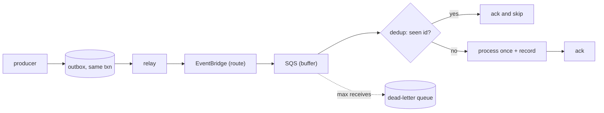

## Thesis

Decoupling producers from consumers through a durable queue --- a producer emits an event and moves on, the queue buffers and absorbs bursts, a consumer pulls at its own pace --- where the delivery guarantee is at-least-once, so the consumer must be **idempotent** and the inevitable duplicates become harmless rather than a second charge or a double-shipped order.

## Sub

**The backbone** -> **the ack gap and why at-least-once is the ceiling** -> **the idempotent consumer** -> **zoom out** to ordering, dead-letter queues, and the pivots an interviewer rides from "put a queue between them" into delivery guarantees, duplicates, and effectively-once.

## Spine

- Decouple through a **durable queue** --- the producer emits and forgets, the queue buffers, the consumer pulls at its own rate; a slow or crashed consumer never blocks the producer, and a burst is absorbed instead of dropped.
- **At-least-once is the ceiling** --- the broker can't tell a crashed consumer from a lost ack, so it redelivers; duplicates are inevitable, not a bug you can configure away.
- The consumer must be **idempotent** --- a dedup key or a conditional write makes reprocessing the same message a no-op, and that is what turns at-least-once into effectively-once.
- A message that keeps failing goes to a **dead-letter queue** --- after N attempts it is moved aside so it stops blocking the queue and can be inspected, rather than retried forever or silently dropped.

## Companion Notes

### walk

A message from emit to ack

One event from the producer to a processed, acked message --- the path, and the gap in it where duplicates are born.

Say the guarantee out loud early --- "delivery is at-least-once, so the consumer is idempotent." That one sentence pre-empts half the follow-ups.

### drill

Probe Drill

Graded follow-ups on the delivery guarantee, the idempotent consumer, and the failure path --- the ones that separate "add a queue" from a real async design.

Never claim exactly-once delivery --- say at-least-once plus an idempotent consumer, which is effectively-once.

### wb

Whiteboard

Rebuild the whole backbone from memory --- emit, outbox, route, buffer, lease, gap, dedup, order, dead-letter --- with nothing in front of you.

Draw the ack gap first, as an actual gap between "work done" and "ack landed." Every other box on the board exists to make that gap survivable.

### sys

System Map

Zoom out: the backbone sits between a producer that commits a state change and the consumers that must react to it, exactly once.

Lead with the boundary, not the broker --- "the producer emits and returns; the system owns delivery." Name the guarantee before anyone asks which queue you picked.

### trade

Trade-offs

The decisions they drill --- sync vs async, standard vs FIFO, queue vs log, fat vs thin events --- each with the condition that flips the choice.

Never defend async as universally right. The honest answer is always "it depends on whether anyone is waiting for the answer" --- name that constraint out loud.

### model

Model Answers

Full spoken scripts --- the beats, in order, the way you would actually say them under time pressure.

Steal the frame, not the words. Headline first ("emit, buffer, process idempotently, dead-letter"), then the one risk you would name yourself.

### num

Numbers

Back-of-envelope the consumer fleet, the duplicate rate, and the standing cost of the dedup guarantee.

Lead with Little's law --- concurrency is rate times processing time --- then show what the dedup store actually costs, because that is the number nobody has done.

### rf

Red Flags

What sinks the round --- claiming exactly-once, acking before the work, a random idempotency key --- and the sentence that turns each around.

Name what the interviewer hears. "We save to the database, then publish the event" is a dual write, and they will hear a silently lost event.

### open

30-Second

The opener and the close --- matched to the altitude the question is actually asked at.

Open at the boundary and the guarantee, not the broker. Land on idempotency and the failure path as the genuinely hard parts.

## Drill

all | **All four levels, mixed** --- the way a real loop actually comes at you.
SDE2 | **The model and the mechanics** --- what event-driven is, why the queue, the guarantee, the visibility timeout, the DLQ. The bar is "this is a delivery system, not a for-loop with a queue in front": name the guarantee and the mechanism that enforces it.
SDE3 | **Delivery, duplicates, and edges** --- the ack gap, the idempotent consumer, ordering, poison messages, backpressure, partial batches. The bar is "name the failure each choice bounds": say where the duplicate is born and what makes it harmless.
Staff | **Guarantees and org trade-offs** --- the exactly-once myth, replay, schema evolution, fat vs thin, when *not* to go async. The bar is "reach effectively-once, honestly": name what you cannot promise, then what you would build instead.

### SDE2 | what event-driven is

What does an event-driven architecture mean?

A producer emits an **event** to a broker or queue and does not wait for a consumer; one or more consumers process it asynchronously. The two sides are decoupled in time and in deployment --- the producer doesn't know or wait for the consumer, so each scales, fails, and deploys independently.

Follow: "Decoupled" is doing a lot of work in that sentence. What is the producer still coupled to?
The **event schema** and the **broker**. You have not removed coupling, you have moved it: the producer no longer depends on the consumer's uptime, latency, or even its existence, but it absolutely depends on the broker accepting the write, and on the event's shape staying readable by consumers it has never met. That is why the event becomes a versioned **contract** you evolve additively, and why the broker is now the component whose availability you actually engineer. Event-driven trades N service-to-service couplings for one coupling to the bus plus a schema contract --- a good trade, but not a free one.

Follow: If the producer doesn't wait, how does the caller ever learn the work is done?
Not through the same request. Either the API returns **202 Accepted plus a handle** --- a job id the client polls, or a subscription it listens on --- or the completion is itself an event that drives a push or a notification. What you must not do is hide the async boundary behind a synchronous-looking response, because then a request "succeeds" while the work has not happened, and the caller has no way to tell. You surface the boundary explicitly: acknowledge receipt, hand back a handle, let them observe completion.

Senior: Saying the producer is decoupled *in time and deployment* but is still coupled to the **schema and the broker** --- and that async means returning **202 plus a handle**, never a fake-synchronous success --- turns a textbook definition into a design.
Speak: "A producer emits an event and returns; consumers process it on their own clock, so neither blocks the other." Then immediately name what you did *not* decouple --- the schema is now the contract, and the broker is the dependency you engineer for.

### SDE2 | why a queue between services

Why put a queue between two services instead of calling directly?

Two reasons: **decoupling** and **buffering**. A direct call couples the producer's availability to the consumer's --- if the consumer is down or slow, the producer blocks or fails. A queue lets the producer emit and move on, absorbs traffic bursts the consumer can't take instantly, and lets the consumer retry on its own terms.

Follow: The queue is now a component that can fail. Haven't you just moved the single point of failure?
Moved it, yes --- but onto something built to be **durable and highly available**, whose only job is to accept a write and not lose it, replicated across availability zones. The comparison isn't "queue versus nothing," it's "depend on a replicated one-job component" versus "depend on a service with its own database, its own bugs, and ten deploys a day." And the **failure modes** differ, which is the real point: a down consumer *behind a queue* means depth rises and nothing is lost; a down consumer *behind a direct call* means the producer's request fails right now, in the user's face.

Follow: You still have to get the event *into* the queue. The producer commits its database transaction, then the publish call fails. Now what?
That is the **dual-write problem**, and it is the honest hole in "just add a queue." Your database and the broker are two systems and you cannot commit them atomically, so a crash in between either loses the event or --- if you publish first --- emits an event for work that then rolled back. The fix is the **transactional outbox**: write the event to an outbox table *in the same transaction* as the business change, so they commit or roll back together, then a relay (a poller, or CDC off the write-ahead log) reads the outbox and publishes, retrying until the broker acks. The event is now durable exactly when the state change is, and the relay's at-least-once publishing is absorbed by the consumer's idempotency.

Senior: Naming the **dual-write problem** unprompted --- and the **transactional outbox** as the fix --- is the tell that you have run a queue in production. "Just add a queue," without it, is a design that silently loses events every time a producer crashes at the wrong microsecond.
Speak: "Decoupling and buffering --- the producer emits and moves on, the queue absorbs the burst, the consumer drains at its own rate." Then pre-empt the follow-up: "The subtlety is getting the event *into* the queue atomically with the state change --- that's the transactional outbox."

### SDE2 | delivery guarantees

At-least-once, at-most-once, or exactly-once?

**At-most-once** may drop messages (fire and forget, no retry). **At-least-once** never drops but may duplicate (retry until acked). **Exactly-once** delivery is effectively unattainable across a network --- what you build instead is at-least-once delivery plus an idempotent consumer, which gives effectively-once *processing*.

Follow: Kafka ships a feature literally called "exactly-once semantics." Is the vendor lying?
No --- it is real, but far narrower than the name suggests. Kafka's EOS gives you exactly-once **within a Kafka-to-Kafka transaction**: consume from a topic, produce to a topic, and commit the consumer offset, all in one atomic transaction, so a reprocess cannot re-emit. That works only because Kafka owns **both endpoints** and can make the offset commit and the output write part of the same transaction (an idempotent producer, transactional writes, and `read_committed` consumers). The moment your side effect leaves Kafka --- you charge a card, call a third-party API, write to an unrelated database --- the transaction cannot span it, and you are back to at-least-once plus idempotency. So EOS is genuinely useful for **stream processing**, and irrelevant to the "my consumer does a side effect" case an interviewer is almost always asking about.

Follow: You said at-most-once "drops." When would you ever *choose* it?
When the data is **high-volume, low-value, and self-correcting**, and the machinery to retry costs more than the loss. Metrics samples, click beacons, cache-warming hints, a heartbeat that reports full current state every second --- if the *next* message makes a lost one irrelevant, at-most-once is a legitimate and cheap choice, and paying for a durable queue plus a dedup store would be over-engineering. You would never choose it where the event *is* the record: a payment, an order, an audit entry. The question to ask is "does a later message repair this loss?" --- if yes, at-most-once is on the table.

Senior: Knowing that **Kafka's exactly-once is real but scoped to Kafka-to-Kafka transactions** --- and dies the moment a side effect leaves the system --- rather than either parroting "exactly-once is impossible" or swallowing the marketing, is the distributed-systems literacy that separates a memorized answer from an understood one.
Speak: "At-most-once can drop, at-least-once can duplicate, and exactly-once *delivery* isn't achievable across a network." Then land the buildable target in one breath: "at-least-once delivery plus an idempotent consumer, which is effectively-once *processing*."

### SDE2 | the visibility timeout

What is a visibility timeout?

When a consumer pulls a message, the queue hides it for a set window instead of deleting it. If the consumer acks (deletes) within that window, it is gone; if not --- the consumer crashed or ran long --- the message reappears and is redelivered. The timeout must exceed the real processing time or a slow message gets redelivered while still being worked.

Follow: You set it to 30 seconds and a message occasionally takes five minutes. What actually happens, and how do you fix it without setting it to five minutes for everything?
The message becomes visible again **while the first consumer is still working on it**, so a second consumer picks it up and you get *concurrent* duplicate processing --- the nastiest kind, because both are in flight at once and a naive read-then-write dedup check can let both through. The blunt fix, raising the timeout to the worst case, means every genuine crash now takes five minutes to redeliver, which wrecks your recovery latency. The right fix is a **heartbeat**: while the consumer is still working it periodically extends the timeout (`ChangeMessageVisibility`), so the lease tracks *actual* progress rather than a guessed worst case. Set the base timeout to the normal case, extend while alive, and a crash still redelivers in one base window.

Follow: Why does the visibility timeout exist at all --- why not just delete the message when the consumer takes it?
Because delete-on-receive is **at-most-once**: the instant you delete before the work is done, a consumer crash loses the message with nothing left to redeliver and no trace it existed. The visibility timeout is precisely the mechanism that buys at-least-once *without* holding a lock forever --- it is a **lease**, not a delete. The message is invisible, so no other consumer duplicates it in the normal case, but still *present*, so a crash brings it back. Delete-on-receive gives away durability and buys nothing; the lease keeps both properties, and its expiry is what makes redelivery --- and therefore at-least-once --- work at all.

Senior: Reaching for a **heartbeat / visibility extension** instead of "set the timeout to the worst case," and framing the timeout as a **lease whose expiry is the engine of at-least-once**, is the difference between having operated a queue and having read about one.
Speak: "It's a **lease**, not a delete --- the message is hidden while you work, and it comes back if you don't ack." Then the operational tell: "Set it to the normal case and **extend it with a heartbeat**; setting it to the worst case just makes every crash slow to recover."

### SDE2 | the dead-letter queue

What is a dead-letter queue for?

A message that fails repeatedly is moved to a separate **dead-letter queue** after a max-receive count, so it stops cycling through the main queue, blocking throughput and burning retries. The DLQ is where you inspect poison messages --- a bad payload, a bug --- without losing them or letting them jam the pipeline.

Follow: A message lands in the DLQ. Concretely, what happens next --- who does what?
A DLQ nobody watches is just a slower way to lose data, so the answer is entirely about the **alarm and the redrive path**. Concretely: you alarm on **DLQ depth above zero** (or on arrival rate), because a non-empty DLQ means something is definitively broken and a human must look. Then you triage --- a **bad payload** (fix the producer, or accept the loss), a **bug** (fix the consumer, then **redrive** the messages back onto the main queue, which is safe *because the consumer is idempotent*), or a **downstream that was down** (redrive once it recovers). And you give the DLQ its own long **retention** --- typically the maximum, 14 days on SQS --- so the evidence outlives the incident. Without the alarm and the redrive, you have built an expensive trash can.

Follow: How do you pick the max-receive count?
By the **failure you expect to survive**, not a magic number. The counter exists to let *transient* failures through and to stop *permanent* ones fast. A downstream that flaps or rate-limits deserves enough attempts, spread over a backoff window, to ride out a blip --- a handful, five-ish. A structurally invalid message --- a payload the consumer cannot parse --- will fail identically fifty times, so retries just burn money and *delay the alarm*; those you want to detect as **non-retryable** in the consumer and dead-letter immediately, rather than letting them grind through the counter. So: classify retryable versus non-retryable in code, use a modest count to bound the retryable case, and never rely on the counter to catch what you can already see is permanent.

Senior: Treating the DLQ as an **operational surface** --- alarmed, triaged, redriven, with retention sized to outlive the incident --- and **classifying retryable versus non-retryable** so a permanent failure doesn't burn five retries before anyone notices, is what separates "I know what a DLQ is" from "I have run one."
Speak: "A poison message moves aside after a max-receive count, so it stops jamming the queue." Then the part that matters: "A DLQ nobody **alarms on** is just a slower way to lose data --- you alarm on depth, triage, fix, and **redrive**, which is only safe because the consumer is idempotent."

### SDE2 | standard vs FIFO queue

SQS standard or FIFO --- what is the difference?

**Standard** queues have the highest throughput but only best-effort ordering and at-least-once delivery (occasional duplicates). **FIFO** queues guarantee order and dedup within a window, at much lower throughput. Most high-volume pipelines use standard queues and handle ordering and dedup in the consumer, because the FIFO throughput ceiling is real.

Follow: FIFO gives you deduplication. Doesn't that mean you *don't* need an idempotent consumer?
No --- and this is the trap. FIFO's dedup is a **five-minute, producer-side window** keyed on a deduplication id: it suppresses the same message being *sent* twice within that window. It does nothing about the duplicate that comes from the **consumer side**. If your consumer does the work and crashes before acking, a FIFO queue redelivers it exactly like a standard queue would, because that redelivery is not a duplicate *send* --- it is the at-least-once guarantee working as designed. **The ack gap exists on FIFO too.** So FIFO buys ordering plus producer-side dedup within a window; the idempotent consumer is still the only thing that makes redelivery harmless.

Follow: The FIFO throughput ceiling --- where does it actually bind, and can you get around it?
FIFO orders within a **message group id**, and that group is the unit both of ordering *and* of parallelism --- which is the whole insight. SQS FIFO runs at roughly 300 messages/second per API action, about 3,000/s if you batch ten per call, with a high-throughput mode that raises the total substantially; but ordering is still per group. So if you pick a **coarse** group id --- one group for the entire queue --- you have serialized everything and the ceiling is brutal. Pick the **natural entity** as the group --- `device_id`, `order_id`, `account_id` --- and you get the ordering you actually needed (per entity) while parallelism scales with the number of distinct entities. That is exactly the Kafka partition-key model. You don't route around the ceiling; you choose a group key fine-grained enough that you never reach it.

Senior: Knowing that **FIFO dedup does not replace an idempotent consumer** --- its window is producer-side, and the ack gap still redelivers --- and that the **message group id is simultaneously the ordering unit and the parallelism unit**, so a coarse group key is what actually causes the throughput ceiling, is the depth this question exists to find.
Speak: "Standard for throughput, with dedup in the consumer; FIFO when order is a hard requirement --- and I'd *still* keep the consumer idempotent." The line that lands: "FIFO's dedup is a five-minute producer-side window; it doesn't close the ack gap."

### SDE2 | fan-out to many consumers

How do two independent services each consume the same event?

Fan-out: the event goes to a topic or bus that delivers a copy to each consumer's own queue, so each processes independently at its own pace and a slow consumer doesn't block the other. A single shared queue would make consumers compete for messages, each seeing only some; fan-out gives every consumer its own full copy.

Follow: Why a queue *per consumer*? Why not have both services subscribe straight to the topic?
Because a bare topic subscription is fire-and-forget with **no durable buffer per subscriber**. If the email service is down when the topic delivers, that copy is retried a few times and dropped --- while the analytics service, which happened to be up, got its copy. Give each subscriber its **own durable queue** and a consumer outage becomes a **backlog instead of a data loss**, with independent retry, its own DLQ, its own backpressure, and its own scaling. That is the SNS-to-SQS fan-out shape; in Kafka the retained log itself is the durable buffer and each consumer group holds its own offset. The two properties you are buying: a slow consumer cannot slow the others, and a down consumer cannot lose its copy.

Follow: How is that different from just adding a second consumer to the *same* queue?
Completely different, and this is the distinction people fumble. Multiple consumers on **one queue** are **competing consumers**: the queue hands each message to *exactly one* of them, so they share the work --- that is how you **scale one logical consumer horizontally**. Multiple consumers each on **their own queue** behind a topic are **independent subscribers**: each receives *every* message --- that is how *different* services react to the same event. Put the email service and the analytics service on one shared queue and each will see roughly half the events and neither will do its job, and it will look like a mysterious data-loss bug. Same queue equals scale-out; queue-per-subscriber equals fan-out.

Senior: Crisply separating **competing consumers on one queue (scale-out)** from **queue-per-subscriber behind a topic (fan-out)** --- and insisting on the per-subscriber queue so a down consumer backlogs rather than losing its copy --- immediately reads as someone who has actually built this and debugged the half-the-events bug.
Speak: "Fan-out: the topic drops a copy into **each consumer's own queue**." The discriminator: "Share one queue and they become **competing** consumers --- each sees only some messages. A queue each means every consumer sees every event, retries independently, and backlogs instead of losing it."

### SDE3 | why duplicates are inevitable

Why can't you just prevent duplicate delivery?

Because of the **ack gap**. After a consumer does the work but before its ack reaches the broker, the network can drop the ack or the consumer can crash. The broker sees no ack within the visibility timeout and cannot distinguish "work never happened" from "work happened, ack lost" --- so it must redeliver. The duplicate is a consequence of the guarantee, not a defect.

Follow: Then flip it --- ack *first*, then do the work. No duplicates. What have you traded?
At-least-once for **at-most-once**. Now a crash between the ack and the work **loses the message silently** --- nothing is left in the queue to redeliver, and nothing anywhere records that it existed. You have swapped a loud, cheap, absorbable problem (a duplicate, which idempotency neutralizes) for a quiet, permanent one (a lost message, which nobody detects until a customer complains). That asymmetry is the entire reason the ordering is always **work, then ack**, and it is why the idempotent consumer exists: it is the price you pay to keep loss off the table.

Follow: The ack gap has a two-generals flavour. Is there *any* way to close it?
Not by messaging alone --- you cannot make the ack and the side effect atomic across two systems, which is essentially the impossibility result. What you *can* do is make the **side effect and the dedup record atomic with each other**, inside **one** system: write "event X processed" and the business change in the **same database transaction**. Then it no longer matters how many times the broker redelivers --- the second attempt sees the id already committed and does nothing. You haven't closed the gap; you have made it **irrelevant**, because the operation is now idempotent by construction. (That is exactly the move Kafka's EOS makes, and it only works there because Kafka owns both endpoints and can put the offset commit and the output write in one transaction.)

Senior: Being able to say **why you don't just ack first** --- it converts a loud, absorbable duplicate into a silent, permanent loss --- and that the ack gap is never *closed* but made **irrelevant** by committing the dedup record in the same transaction as the effect, is the reasoning a Staff interviewer is actually probing for.
Speak: "The ack gap --- the broker can't tell a crashed consumer from a lost ack, so it *must* redeliver." Then the payoff: "So I don't try to prevent the duplicate. I make it **harmless**, by committing the dedup record in the same transaction as the work."

### SDE3 | the idempotent consumer

How do you make a consumer idempotent?

Give each message a stable **id** and record processed ids: check the dedup record first, and if the id is already there, ack and skip with no second effect. The write must be atomic with the check --- a conditional insert (INSERT ... ON CONFLICT DO NOTHING) or a conditional update --- so two concurrent deliveries can't both pass the check.

Follow: Your dedup table is in Postgres and the side effect is a Stripe charge. You cannot put an HTTP call inside a database transaction. Now what?
Correct --- and rather than pretend, you use **claim-then-confirm** plus the provider's own idempotency. Concretely: (1) **claim** the event id in the dedup table with status `IN_PROGRESS` via a conditional insert --- if a `DONE` row exists, skip and ack; (2) call Stripe **passing your event id as their `Idempotency-Key`**, so *their* side collapses a retry of the same charge; (3) mark the row `DONE`. A crash between (2) and (3) leaves an `IN_PROGRESS` row, and the redelivery re-issues the identical call with the identical key --- Stripe returns the original charge instead of making a second one. The general principle: when the effect is external, **push idempotency into the external system using a key you own**, and keep a local record so you can reason about the in-flight state.

Follow: What is the *right* id to dedup on --- the broker's message id, or something from the payload?
Something derived from the **business event**, never the transport. The broker's message id is an artifact of *this delivery*: a redriven or re-sent SQS message can carry a **new** message id, and when your outbox relay publishes the same event twice (which it will, because it is at-least-once), the broker mints two different message ids for one logical event --- and your dedup happily lets both through. Dedup on an id that is a property of the **event itself**: an `event_id` assigned once at emit and carried in the payload, or a deterministic hash of the business identity, `hash(order_id, 'shipped')`. The rule is simple: **the id must be identical for two deliveries of the same logical event**, and that is precisely the property a transport-level id does not guarantee.

Senior: Handling the case the textbook answer breaks on --- a **non-transactional side effect** --- with **claim-then-confirm and your own id as the provider's idempotency key**, and insisting the dedup id come from the **business event rather than the transport**, is the difference between having read about idempotency and having shipped it.
Speak: "A stable id per event, and a **conditional** write --- `INSERT ... ON CONFLICT DO NOTHING` --- so the check and the claim are one atomic step." Then the two traps: "The id comes from the **event**, not the broker's message id; and when the effect is external, I pass that same id as **their** idempotency key."

### SDE3 | the dedup store

What does the dedup store look like?

A keyed record of processed message ids --- a Redis set with a TTL, or a database table with the id as the primary key. The natural business key often works too (an order id, an event id). The TTL or retention must outlive the maximum possible redelivery window, or a late duplicate slips past an expired record.

Follow: You put the dedup store in Redis for speed. Redis is not the database holding the business write. What breaks?
The **atomicity between the dedup record and the effect** --- which was the entire point of the exercise. "Record the id" (Redis) and "apply the change" (Postgres) are now two systems, so a crash between them gives you one of two outcomes: the id is recorded but the change never applied --- so the redelivery sees the id, skips, and **the work is silently never done**, which is strictly *worse* than a duplicate --- or the change is applied but the id never recorded, which is a duplicate. The first failure mode is a silent data-loss bug that looks *exactly* like a working dedup. So when the effect is transactional, put the dedup row in the **same database as the write** and commit them together --- it is free and it is correct. Redis is a fine choice when the effect is *already* non-transactional (an external API call), or as a fast **pre-filter** in front of the authoritative check --- but it must not be the *only* record when a transactional option exists.

Follow: How do you size the TTL, and what actually goes wrong if you get it wrong?
The TTL must outlive the **longest possible gap between the first delivery and its last redelivery** --- and that window is not the visibility timeout. It is the visibility timeout times the max-receive count, *plus* everything that can re-inject the message much later: a **DLQ redrive** you run three days after the incident, an outbox relay that was stuck, an operator replaying a topic. Too **short** and a late duplicate finds an expired record and re-executes --- and this is the vicious one, because it passes every test and only bites during an incident *recovery*, which is exactly when a double charge is least survivable. Too **long** and the store grows without bound and costs real money. So set it to comfortably exceed your longest recovery path --- days, not minutes --- and hold the invariant: **anything you can redrive, you must still be able to dedup.** If the DLQ retains for 14 days and your dedup TTL is one hour, that is a bug patiently waiting for an outage.

Senior: Spotting that a dedup store in a **different system from the write** re-opens the atomicity hole --- and that its failure mode is the *silent* one, id recorded and work never done --- then sizing the TTL against the **DLQ-redrive and replay** window rather than the visibility timeout, is exactly the second-order thinking that reads as Staff.
Speak: "A keyed record of processed event ids --- ideally a **row in the same database as the write**, committed in the same transaction." Then the sizing rule: "The TTL has to outlive the **longest** redelivery path, including a DLQ redrive days later --- not just the visibility timeout."

### SDE3 | ordering

How do you get ordering in an event-driven system?

You usually don't get global ordering cheaply --- standard queues don't guarantee it. Options: a FIFO queue (at a throughput cost), partitioning by a key so all events for one entity land on one ordered partition (the Kafka model), or designing consumers to tolerate out-of-order arrival with version checks. Most systems need ordering only *per entity*, which partitioning gives.

Follow: You partition by `device_id` so one device's events are ordered. Now you scale the consumer out and add a second worker. What breaks?
Nothing --- **provided the unit of parallelism is the partition, not the message**. Per-key ordering survives only if exactly one consumer processes a given partition at a time, which is precisely what Kafka's consumer-group assignment enforces: a partition is assigned to exactly one consumer in the group, and adding consumers redistributes *partitions*, not individual messages. What silently destroys it is pulling a batch off one partition and processing those messages **concurrently inside the worker** --- your own internal parallelism throws away the ordering the partition just handed you, for free, with no error. So the rule is: parallelism scales with the **number of partitions**, and *within* a partition you process serially. The corollary is a capacity decision people miss: **your maximum consumer parallelism is your partition count**, and raising the partition count later rehashes keys, so ordering is not preserved across the change.

Follow: A consumer rebalances mid-flight --- a worker dies and its partition moves to another worker. Can that reorder or duplicate?
It **duplicates**, and it can look like a reorder if you are sloppy. On rebalance, the new owner resumes from the **last committed offset**, so anything processed but not yet committed gets **reprocessed** --- at-least-once again, absorbed by idempotency. Ordering *within* the partition is intact, because the log *is* the order and the new consumer reads that same log forward. The way people actually break this is by **committing offsets ahead of the work** --- async auto-commit --- because then a rebalance *skips* messages that were never processed. That is real loss, not a reorder, and it is far worse. So: commit **after** the work, accept reprocessing on rebalance, and let the idempotent consumer turn it into a no-op.

Senior: Knowing that **per-key ordering only holds if the partition is the unit of parallelism** --- so a batch processed concurrently inside a worker silently destroys it --- and that **partition count is a hard ceiling on consumer parallelism** that you cannot raise without rehashing keys, is a detail that only surfaces once you have actually run a partitioned consumer.
Speak: "Global ordering is expensive and almost never what you need --- what you need is order **per entity**." The mechanism: "Partition by the entity key so one entity's events land on one ordered partition, and make the **partition** the unit of parallelism --- never process a partition's batch concurrently."

### SDE3 | poison messages

A message fails every time --- what happens?

Without a limit it cycles forever, blocking the queue and burning the consumer. Set a **max-receive count** (the 3-to-50 range depending on how transient the failures are), after which the message moves to the DLQ. Then alert on DLQ arrivals and replay them once the bug or bad payload is fixed --- a poison message must never be able to jam the main pipeline.

Follow: Now put that poison message in a **Kafka partition**. You can't "move it aside" --- the log is ordered and you cannot skip it without committing past it. What do you do?
This is where Kafka diverges sharply from SQS, and it is a great tell. Core Kafka has **no built-in DLQ**, and a poison record at the head of a partition **blocks that entire partition** --- head-of-line blocking --- so every key that hashes to it stalls behind one bad record. You therefore build the dead-letter path yourself in the consumer: catch the failure, retry a bounded number of times (often via a **retry topic** with a delay, so you are not hot-spinning), and if it still fails, **produce the record to a dead-letter topic and commit the offset anyway**, letting the partition move on. The one thing you must never do is retry in place forever, because you are not blocking one message --- you are blocking every message behind it on that partition, and your lag graph will show a single partition climbing while the rest look fine.

Follow: You drain the DLQ back into the main queue after a fix. Is that safe?
Only **because the consumer is idempotent** --- and that dependency is worth saying out loud. A redrive is by definition a *re-delivery* of messages that may have **partially** succeeded: the classic poison message is not "did nothing," it is "wrote the row, then blew up calling the downstream." Replaying it re-runs the handler, and without a dedup check on the event id you get a double write. Two more things to get right: redrive at a **controlled rate**, because dumping 50,000 DLQ messages into a live queue is a self-inflicted thundering herd on the downstream that just recovered; and confirm the **dedup records have not expired** --- if the DLQ held those messages for ten days and your dedup TTL is one hour, the redrive re-executes every single one.

Senior: Knowing that **Kafka has no DLQ and a poison record head-of-line-blocks the whole partition** --- so you build retry and dead-letter topics and commit past it yourself --- and that a **DLQ redrive is safe only because of idempotency plus an unexpired dedup record**, is precisely the operational depth that separates SDE3 from Staff here.
Speak: "Bound the retries with a max-receive count, then dead-letter it --- a poison message must never jam the pipeline." The differentiator: "On **Kafka** you don't get that for free: a bad record **blocks the partition**, so you dead-letter to a topic and commit past it yourself."

### SDE3 | backpressure

How does an event-driven system handle backpressure?

The queue *is* the backpressure mechanism --- when consumers fall behind, messages accumulate rather than overwhelming anything, and queue depth becomes the signal to scale consumers out. The trade is latency: messages wait longer. You watch queue depth and message age, and autoscale consumers on depth, so the buffer never grows unbounded.

Follow: You autoscale consumers on queue depth. Those consumers hammer a downstream database that is *already* the bottleneck. What have you just done?
**Amplified the outage.** Scaling on depth is only correct when the *consumer* is the constraint. If the **downstream** is the constraint, adding consumers raises concurrency against a saturated dependency, driving its latency up, which makes each message take longer, which makes depth rise *faster*, which scales you out further --- a **positive feedback loop** that turns a slow dependency into a dead one. The queue protected the producer; nothing is protecting the downstream. So you need a **concurrency ceiling** --- a hard cap on consumers or in-flight messages, sized to what the downstream can actually absorb (reserved concurrency on Lambda exists for exactly this) --- plus a **circuit breaker or rate limiter** in front of the dependency so consumers back off instead of piling on. Backpressure has to propagate all the way down; it must not stop at the queue.

Follow: Depth is flat, but users say it's slow. What is the metric you actually watch?
**Message age** --- the age of the oldest un-processed message (`ApproximateAgeOfOldestMessage`, or consumer lag in Kafka) --- not depth. Depth is a *stock*, and it lies in both directions: a queue holding 10,000 messages that drains in two seconds is perfectly healthy, while a queue holding five messages that have been stuck for an hour is an incident. Depth also cannot see a **stalled partition or a head-of-line-blocked poison message** --- the count barely moves while the age climbs linearly. Age maps directly to the user-visible SLA ("how stale is the oldest thing I still owe you"), and its **derivative** is the real health signal: an age growing linearly means arrival rate has overtaken drain rate, and it will not recover on its own.

Senior: Recognizing that **autoscaling on depth into a saturated downstream is a positive feedback loop** --- so you cap consumer concurrency and put a breaker in front of the dependency --- and then watching **message age rather than depth**, is the operational judgment a Staff round is grading.
Speak: "The queue **is** the backpressure --- depth rises instead of something toppling, and depth is the signal to scale consumers." Then the two traps: "Cap the concurrency, or you scale straight into a saturated downstream. And watch **message age**, not depth --- depth lies in both directions."

### SDE3 | partial batch failure

Your consumer pulls a batch and one message fails. What must you handle?

Partial batch failure. If you fail the whole batch, the good messages redeliver and reprocess --- safe only because the consumer is idempotent, but wasteful. The better handling reports exactly which messages failed so only those redeliver and the rest are acked. Batch processing makes per-message idempotency and per-message failure reporting both necessary.

Follow: Concretely, how do you tell the queue "these three of ten failed"?
With a **partial batch response**. On SQS plus Lambda you opt in with `ReportBatchItemFailures` and return `batchItemFailures` --- the list of message ids that failed --- while the invocation itself reports success; the queue then makes *only* those messages visible again and deletes the rest. If you *don't* opt in, throwing from the handler fails the **entire** batch and all ten redeliver. Outside Lambda, the equivalent is deleting each message individually as it succeeds, so only the un-deleted ones time out and come back. And there is a consequence people miss: when the whole batch fails, the **receive count increments on the nine good messages too**, walking them toward the DLQ --- so a single poison message in a batch can dead-letter perfectly healthy messages that never actually failed.

Follow: Does partial-batch handling save you from needing idempotency?
No --- it **reduces** duplicates, it does not eliminate them. Even with flawless per-message reporting, the consumer can still crash after processing message seven and before reporting anything, and the whole batch redelivers; the ack gap is entirely untouched. Partial-batch handling is an **efficiency and blast-radius** measure --- don't reprocess nine good messages because of one bad one, and don't let good messages accumulate receive-counts toward the DLQ --- sitting *on top of* idempotency, which is the **correctness** measure. If you had to pick one, you would pick idempotency every time: it makes the duplicates *safe*. Partial-batch handling only makes them *rarer*.

Senior: Naming the concrete mechanism (**`batchItemFailures`**, or per-message delete) *and* the consequence almost nobody mentions --- that a whole-batch failure **increments the receive count on the good messages**, so a single poison message can dead-letter healthy ones --- while still framing it as an efficiency layer on top of idempotency rather than a replacement, is a level of specificity that lands.
Speak: "Report **which** messages failed --- `batchItemFailures` --- so only those redeliver." The consequence people miss: "Fail the whole batch and the nine good messages redeliver *and* their receive-count climbs --- they can end up in the DLQ having never failed."

### Staff | the exactly-once myth

An interviewer asks for exactly-once. What do you say?

That exactly-once *delivery* isn't achievable across an unreliable network, and I wouldn't promise it. What I deliver is at-least-once delivery plus an idempotent consumer --- effectively-once *processing*. It is the honest and standard answer; a candidate who claims exactly-once delivery is signalling they don't understand the ack gap.

Follow: Don't just say no --- how do you *handle* the interviewer who insists the requirement is exactly-once?
Accept the **requirement** and correct the **mechanism**, out loud, without scoring a pedantic point. Their requirement is real and reasonable: the customer must not be charged twice. What is unachievable is exactly-once *delivery*. So I would say: "Agreed --- the customer gets charged exactly once. I'll get there with at-least-once delivery plus an idempotent consumer, because exactly-once *delivery* isn't something a network can give you; what I can guarantee is exactly-once **effect**." That reframing is the whole play. You have shown you understand *their* goal, named the precise distinction, and replaced a wish with a mechanism. The candidate who just says "that's impossible" sounds like they are refusing the requirement; the one who says "here is how you actually get it" is the one who gets hired.

Follow: Where does "effectively-once" actually leak? Name a case where at-least-once plus idempotency still visibly double-acts.
When the effect **isn't in a system you can dedup against**. Two classic leaks. First, a **non-idempotent third party**: you call an API with no idempotency key, so your dedup record and their side effect cannot be made atomic, and a crash between the call and the record means the redelivery calls them again --- your mitigation is to pass a key if they support one, and otherwise to **reconcile after the fact** rather than pretend. Second, **effects with no natural identity**: appending to a log, incrementing a counter, sending an email. `count = count + 1` is not idempotent; `SET count = 5` is. The general rule is that idempotency needs both a **stable id** and a **conditional or absolute write** --- where you cannot have both, you do not get effectively-once. You get at-least-once plus reconciliation, and the senior move is to *say that* rather than bluff.

Senior: **Accepting the requirement while correcting the mechanism** --- "you'll get exactly-once *effect*" --- instead of winning a pedantic argument, and then honestly **naming where effectively-once leaks** (non-idempotent third parties, effects with no natural identity), is precisely the Staff-versus-SDE3 gap on this question.
Speak: "The requirement is right; the mechanism isn't." Say it as: "You'll get exactly-once *effect* --- at-least-once delivery plus an idempotent consumer. Exactly-once *delivery* across a network isn't a thing, and anyone promising it hasn't thought about the lost ack."

### Staff | EventBridge vs SQS vs SNS

EventBridge, SQS, and SNS --- when each?

**EventBridge** is content-based routing: rules match event patterns and fan out to many targets, good for a bus with many event types and consumers. **SNS** is pub/sub fan-out to subscribers. **SQS** is a durable point-to-point queue with buffering and retries. A common shape is EventBridge to route, SQS to buffer per consumer, Lambda to process --- routing, then a durable buffer, then work.

Follow: Where does **Kafka** sit in that list, and when would you take it over all three?
Kafka is not a queue --- it is a **durable, replayable, ordered log**, and that is the axis that decides. SQS, SNS and EventBridge all **delete on ack**: once a consumer acknowledges, the message is gone, so there is no replay and a new consumer can never read history. Kafka **retains the log independently of consumption**, which buys three things: you can **replay** (add a consumer six months later and read from the beginning, or rewind after fixing a bug); you get **per-partition ordering** for free; and multiple consumer groups read the same log at their own offsets with no fan-out plumbing at all. So you take Kafka when you need **replay, ordering, or many independent consumers reading at different positions** --- event sourcing, CDC, analytics. You take SQS when the event is a **task**: do this once, then forget it. The tell of an unconsidered answer is "Kafka because it scales"; the real discriminator is **whether the stream is a log you will want to re-read, or a task you will want to complete and delete**.

Follow: You said "EventBridge to route, SQS to buffer, Lambda to process." Why not just have EventBridge invoke Lambda directly?
Because you would lose the **buffer**, and everything the buffer gives you. EventBridge straight into Lambda means an event spike becomes an immediate **concurrency spike**: you can exhaust the account concurrency limit, get throttled, and once the retries are exhausted, **lose events** --- and you are invoking Lambda once per event rather than in batches. Putting SQS in between gives you a **durable buffer** so a spike raises depth instead of throttling; **batching**, so ten messages per invoke means ten times fewer invocations; **reserved concurrency** as a hard ceiling protecting a fragile downstream; a **DLQ with a redrive path**; and **retries with backoff** that don't burn Lambda invocations. The rule of thumb: EventBridge is an excellent **router** and a poor **buffer** --- put a queue in front of anything whose slowness or failure you actually need to survive.

Senior: Framing the choice on the axis that matters --- a **replayable retained log (Kafka)** versus a **delete-on-ack work queue (SQS)** --- rather than reciting service blurbs, and knowing exactly *why* a queue belongs between a router and a worker (buffer, batching, concurrency ceiling, DLQ), is the systems judgment this question exists to find.
Speak: "EventBridge routes, SNS fans out, SQS buffers --- and I'd put SQS *between* the router and the worker so a spike raises **depth**, not Lambda concurrency." The bigger axis: "The real question is whether I need a **replayable log** or a **delete-on-ack work queue**."

### Staff | when not to go event-driven

When would you *not* use an event-driven design?

When the caller needs an immediate answer (a synchronous read, a user waiting on a result) --- async adds latency and complexity there. And when strong ordering or a transaction across steps is required, event-driven eventual consistency fights you. The async tax --- harder debugging, eventual consistency, duplicate handling --- is only worth paying where decoupling and buffering actually matter.

Follow: The team is already all-in on events, and someone proposes a **saga** to get a transaction across three services. Is that the right call?
Sometimes --- but it is precisely the moment to ask whether the **service boundary** is wrong. A saga (a chain of local transactions, each with a compensating action) is a genuine tool when the steps really do span independently-owned systems: place order, reserve inventory, charge card, with a compensation for each. But it is **expensive**: you must write and test a compensating action for every step, handle the compensations themselves failing, and reason about **intermediate states users can see** (the order exists but isn't paid). If three services are so coupled that they need a distributed transaction on *every write*, that is strong evidence they are **one service that was split too early**, and the cheapest fix is to merge them and use one ACID transaction --- not to build a saga to paper over a bad split. The Staff answer names the saga *and* questions the boundary that made it necessary.

Follow: How do you decide, concretely --- what's the test?
Ask **who is waiting**. If a human is blocked on the result and the result is only useful *now* --- a login, a search, "does this coupon apply," any read --- it is synchronous, and wrapping it in a queue buys nothing but latency and a status-polling dance. If the work can complete *after* the caller has been told "received" --- send the email, generate the invoice, re-index the document --- it is a candidate for async. Then apply the second test: **what is the correct behaviour if the consumer is down for an hour?** If the answer is "the work happens an hour later," async is right and the queue is doing its job. If the answer is "the caller should have been told NO, immediately," you have hidden a failure the caller needed to see. Async is right when **delay is acceptable and loss is not**; sync is right when **the answer is the product**.

Senior: Naming the **saga** as the tool *and* immediately questioning whether a boundary that needs a distributed transaction on every write is simply **a service split too early** --- plus carrying a concrete test ("who is waiting?", "is delay acceptable but loss not?") instead of a vibe --- is the architectural judgment a Staff loop is grading.
Speak: "Async isn't free --- you pay in eventual consistency, duplicate handling, and much harder debugging." The test: "Ask **who is waiting**. If a human is blocked on the answer, stay synchronous. If the right behaviour when the consumer is down for an hour is 'it happens an hour later,' go async."

### Staff | observability

What do you monitor on an event-driven pipeline?

**Queue depth** (are consumers keeping up), **message age** (oldest unprocessed --- the real latency), **DLQ arrival rate** (are messages failing), and consumer error and duplicate rates. The failure mode is silent backlog: everything looks healthy while the queue grows. Depth and age are the two numbers that catch it early.

Follow: A user says "my order never shipped." You have twelve services and a bus. How do you find where it died?
**Correlation.** The event carries a **correlation id** --- and ideally a **causation id**, the id of the event that caused this one --- from the moment the request enters the system, every producer copies it onto everything it emits, and every log line and every span carries it. Then "where did it die" is one query, not an archaeological dig across twelve services. Without it, an async system is **effectively undebuggable**: there is no stack trace and no call chain, and one order's events are interleaved with a million others, so you cannot follow a request by timestamp across a bus. This is the single biggest hidden cost of going event-driven, and it must be **built in on day one** --- retrofitting a correlation id across twelve services is a migration, not a patch. Distributed tracing (OpenTelemetry, with trace context propagated **in the message headers**) is the productized form of exactly this.

Follow: What would you actually **page** on, as opposed to graph?
Page on what is **user-visible, will not self-heal, and has an action**. So: **age of the oldest message** crossing the SLA --- this is the real one, because it means work is not getting done and it will *not* recover on its own if arrival rate exceeds drain rate; **DLQ depth above zero**, because something is definitively broken and a human must triage; and a **consumer error-rate** spike. What you **graph but never page on**: raw queue depth --- it is spiky *by design*, and a queue absorbing a burst is the system *working*, so paging on it trains people to ignore the pager --- and raw throughput, which is only meaningful relative to arrivals. The discipline is that a page must mean "a human must act now." An alert that fires when the queue does its job is how you manufacture alert fatigue, and alert fatigue is how you miss the real one.

Senior: Naming **correlation and causation ids propagated in the message headers** as a day-one requirement --- because an async system without them is undebuggable and retrofitting is a migration --- then distinguishing **page-worthy** signals (oldest-message age, DLQ above zero) from **graph-only** ones (raw depth, which is spiky by design), is exactly the operating maturity a Staff round wants.
Speak: "Depth, **age of the oldest message**, DLQ arrivals, error rate --- and the failure mode is the **silent backlog**: everything looks healthy while the queue quietly grows." Then the thing most people forget: "A **correlation id** on every event, propagated in the headers. Without it, an async system is undebuggable --- and you can't retrofit it cheaply."

### Staff | event schema evolution

How do you evolve the shape of an event over time?

Version the event and make consumers tolerant --- add fields, never repurpose or remove one that a consumer reads, and default missing fields. Producers and consumers deploy independently, so at any moment old and new versions coexist on the queue. Treating the event as a **contract**, additive-only, is what keeps a schema change from breaking a consumer you didn't deploy.

Follow: "Additive-only" forever means the schema accretes junk. How do you ever actually *remove* a field?
With a **deprecate, then prove, then remove** cycle that is gated by evidence rather than a calendar. (1) Mark the field deprecated in the schema registry and stop writing anything meaningful to it. (2) **Prove nobody reads it** --- this is the step everyone skips and the only one that matters, because with independent deploys you cannot know removal is safe unless you can *demonstrate* no consumer reads the field. "I grepped the repos" is not proof when a consumer might be a replay of an old topic or a team you have never met; you need a schema registry with consumer lineage, or instrumentation that logs reads of the field. (3) Once no consumer has read it for longer than your longest replay window, remove it from the producer. (4) Only then remove it from the schema. And the structural half of the answer: this is why you enforce **compatibility rules in a registry** --- backward-compatible means you may add optional fields and remove nothing a reader requires --- instead of relying on everyone's discipline.

Follow: The events are retained for **replay**. Doesn't that mean an old event, in the old shape, will hit your *new* consumer code --- forever?
Yes, and this is what makes event schema genuinely harder than API schema. An HTTP API's old version stops being called the moment the last client upgrades. A **retained log's old events are immortal**: a replay from the start of a Kafka topic feeds 2019-shaped events to today's consumer. So consumer tolerance is not a transitional courtesy --- it is **permanent**, and the consumer must read every version still inside the retention window. Two ways to live with it: **upcasting**, a translation layer at the consumer's edge that reads any historical version and emits the current internal shape, so the business logic only ever sees one shape; or **rewriting the log** on migration, republishing the topic transformed into the new shape, which is only possible if you can afford to rewrite history. This is the real price of choosing a replayable log: the schema's past never goes away, which makes your **retention period a schema-compatibility commitment**.

Senior: Recognizing that in a **replayable log the old event shapes are immortal** --- so consumer tolerance is permanent, not transitional, and you need an **upcasting layer** --- and that removing a field requires *proving* nobody reads it via a registry, not announcing a deprecation, is what separates a Staff answer here.
Speak: "The event is a **contract** --- additive-only, never repurpose a field, and consumers default what's missing." Then the Staff line: "And in a **replayable** log the old shapes are immortal --- a replay feeds year-old events to today's consumer, so tolerance is permanent, not transitional."

### Staff | replay and reprocessing

Can you re-run events after fixing a consumer bug?

Only if the events are **retained and replayable**. A durable log --- Kafka, or an archived stream --- lets you reprocess a window after a fix, and an idempotent consumer makes that replay safe to run. A plain queue deletes on ack, so it cannot replay; keeping an event archive is the price of being able to recover from a consumer that was silently wrong. Replay plus idempotency is the recovery story for bad processing, the same way a DLQ is the story for bad messages.

Follow: You replay a week of events to fix a bug in consumer A. Consumers B, C and D are subscribed to the same topic. What just happened?
**They reprocessed the week too** --- and that is exactly how a "safe" replay sends a week of duplicate emails to every customer. Replay is only safe when it is **scoped to the consumer that needs it**, and in a log it can be: you reset the offset for **consumer group A only**, and B, C and D never notice, because every group tracks its own offset against the same log. That is a badly under-rated argument for the log model. What you must **never** do is **re-publish** the old events onto the topic to force a replay --- that re-delivers to *every* consumer group and mints records that look brand new. So: **rewind one group's offset; never republish.** And even for the group you are replaying, idempotency is what makes it a no-op wherever the work was already correct --- which points at the real rule: replay is **safe for consumers that build derived state** and **dangerous for consumers with external side effects**, so you often want to point the replay at a *fresh* output (a new table, a new index) and swap, rather than re-run charges and emails.

Follow: If replay is so valuable, why isn't every queue a log? What's the actual cost?
You are paying **retention and operational complexity** to buy **the ability to re-read the past**. A log stores every event for the retention period whether or not anyone will ever need it --- storage, plus a cluster with partitions, replication factor and brokers to run or a managed bill. A queue stores only the **un-acked backlog**, which in a healthy system is approximately zero, so it is nearly free. The log also forces you to own **partitioning, consumer groups, offset management and rebalances** --- real, permanent operational surface. So the honest trade: take the log when the **stream is an asset** --- you will replay it, add consumers later, rebuild a derived view, audit history. Take the queue when the event is a **task**: do it once and it is genuinely worthless afterwards. Most real systems have both, and the classic mistake is running Kafka for what is actually a work queue, paying a permanent operational tax for a replay you will never once perform.

Senior: Knowing that a replay is done by **rewinding one consumer group's offset, never by republishing** --- which would re-deliver to every other consumer --- and that replay is **safe for derived state and dangerous for external side effects**, so you replay into a fresh output and swap, is the difference between "we can replay" and having actually done it at 2am.
Speak: "Replay needs a **retained log** --- a queue deletes on ack, so it simply cannot --- plus an **idempotent** consumer to make it safe." The Staff detail: "You replay by **rewinding one consumer group's offset**, never by republishing --- republishing re-delivers to *every* consumer."

### Staff | fat vs thin events

Should an event carry its data, or just say something happened?

A thin event says X changed, go look, and the consumer fetches current state --- small and always fresh, but it couples the consumer to a read API and adds a call. A fat, event-carried-state event includes the data --- self-contained and replayable, no callback, but larger and able to go stale. The choice trades coupling and extra calls against payload size and staleness.

Follow: "Fat events go stale" --- walk me through the bug that actually causes.
The consumer acts on data that was true when the event was emitted and is not true now. Concretely: `OrderUpdated{total: $100}` and `OrderUpdated{total: $50}` are emitted a second apart, they arrive **out of order** (different partitions, a retry, a redelivery), the consumer applies $50 and then $100 --- and the order is now permanently wrong, because **the last writer won and the last writer was the older event**. That is why a fat event is only safe if you can **order or version** it: carry a **monotonic version or sequence number** on the entity and have the consumer **reject anything not newer than what it has applied** (`WHERE version < :incoming`), or partition by the entity key so one order's events are ordered by construction. A *thin* event dodges this specific bug entirely --- "order 7 changed, go fetch it" always fetches **current** state, so a stale, out-of-order *notification* is harmless; you just re-read and get the same answer. That is precisely the trade: the thin event pays a read to be immune to staleness.

Follow: So thin events are safer. What's the cost that makes you reach for fat ones anyway?
Three costs, and they are large. **One: a read amplification and a re-coupling.** Every consumer must call back into the producer's API, so fanning out to five consumers turns one event into five reads --- and now the producer's API is on the **critical path of every consumer**, which is exactly the availability coupling the queue was supposed to remove. If the producer is down, every consumer stalls, and the event you so carefully made durable is useless. **Two: you lose replayability.** Replaying a year-old thin event fetches *today's* state, not the state at the time, so you cannot rebuild a historical view --- which kills event sourcing and audit. **Three: the read is racy** --- by the time the consumer fetches, the entity may have changed again, so a thin event does not actually give you "the state at the event," it gives you "some later state." So: thin for **freshness and small payloads inside one trust boundary where the producer is reliably up**; fat for **autonomy, replay, and crossing a boundary** --- and fat **with a version number**, which closes the staleness bug.

Senior: Naming the concrete failure of a fat event --- an **out-of-order update applying the older state last** --- and closing it with a **version the consumer checks**, rather than vaguely saying "it can go stale," and knowing that thin events put the **producer's API back on every consumer's critical path** (re-coupling availability and killing replay), is a genuinely senior read of this trade.
Speak: "Thin says *what happened* and the consumer re-reads; fat **carries the state**, so the consumer needs nothing." The decider: "Fat buys autonomy and replay, but it can arrive **stale and out of order** --- so carry a **version**, and have the consumer drop anything older than what it has already applied."

## Walk

### The producer emits and moves on

```flow
p[producer] -> b[EventBridge rule] -> m[match + route]
```

A producer emits an event --- a small, self-describing message --- and returns immediately; it does not wait for anyone to process it. On a bus like EventBridge, rules match the event's shape and route it to the right targets, so the producer doesn't even name its consumers.

```json
{
  "id": "evt-7",
  "source": "device.config",
  "detail-type": "RolloutScheduled",
  "detail": { "deviceId": 4821, "firmware": "2.4.1" }
}
```

The event carries a stable **id** and just enough detail for the consumer to act. That id is not decoration --- it is the handle the consumer will use to dedup, so it is assigned once at emit and never regenerated on a retry.

### The emit is made atomic --- the outbox

```flow
t[one DB txn] -> o[outbox row] . r[relay publishes] -> q[broker acks]
```

There is a hole in "the producer emits and moves on": the producer commits its business change to its database, then publishes to the broker --- two systems, two writes, no atomicity. Crash in between and the state changed while the event was never emitted, silently. That is the **dual-write problem**, and it is the most common unspoken bug in an event-driven design.

The fix is the **transactional outbox**: the event is written to an outbox table *inside the same transaction* as the business change, so they commit or roll back together. A separate relay --- a poller, or change-data-capture reading the write-ahead log --- publishes outbox rows to the broker and retries until it is acked. The relay is at-least-once (it can publish a row twice if it crashes before marking it sent), which is fine, because the consumer downstream is idempotent anyway.

```sql
BEGIN;
  UPDATE devices SET firmware = '2.4.1' WHERE id = 4821;
  INSERT INTO outbox (event_id, type, payload) VALUES ('evt-7', 'RolloutScheduled', '...');
COMMIT;
```

One transaction, two rows, one fate. The event is now durable exactly when the state change is durable --- which is the only way "at-least-once" is honest end to end rather than just from the broker inward.

### The router fans out to each consumer's own queue

```flow
b[bus] -> q1[queue: billing] / q2[queue: analytics] / q3[queue: email]
```

One event, many interested consumers. The bus delivers a **copy into each consumer's own durable queue** --- not into one shared queue. Each consumer then drains at its own pace, retries on its own terms, and has its own dead-letter queue.

That per-consumer queue is the whole point, and it is where people slip. Put two different services on **one** queue and they become **competing consumers**: the queue hands each message to exactly one of them, so each service sees only *some* of the events and neither does its job. One queue each and every consumer sees every event --- and a consumer that is *down* accumulates a **backlog** instead of losing its copy.

### The queue buffers and the consumer pulls

```flow
m[routed event] -> q[SQS queue] -> c[consumer pulls a batch]
```

The event lands in a durable queue that holds it until a consumer is ready. This is the decoupling: a burst of events, or a consumer that is briefly down, changes only the queue depth --- the producer is unaffected and no event is lost. The consumer pulls a batch, does the work, and acks.

The queue is also the backpressure valve. When consumers fall behind, depth rises instead of anything toppling, and that depth is the signal to scale consumers out. Latency is the price --- messages wait --- but nothing is dropped.

### The message is leased, not handed over

```flow
c[consumer receives] -> h[hidden for N sec] . x[no ack] -> v[becomes visible again]
```

Pulling a message does not delete it. The queue **hides** it for a visibility window --- a lease --- and only the ack actually deletes it. If the consumer acks inside the window, the message is gone; if it crashes or the ack is lost, the lease expires and the message becomes visible again for someone else.

This is the mechanism that makes at-least-once possible at all: the message is *invisible* (so nobody duplicates it in the normal case) yet still *present* (so a crash cannot lose it). It also has an operational edge --- if the work runs longer than the lease, the message reappears **while you are still processing it**, and a second consumer starts the same work concurrently. The fix is not a huge timeout (that makes every real crash slow to recover); it is a **heartbeat** that extends the lease while the consumer is genuinely still working.

### The consumer processes and acks --- with a gap

```flow
c[consumer] -> w[do the work] -> a[ack and delete]
```

The consumer processes the message and then acks it, which deletes it from the queue. Between doing the work and the ack landing, there is a gap: if the consumer crashes or the ack is lost on the network, the broker never hears the ack.

After the visibility timeout the broker sees an un-acked message and cannot tell "the work never happened" from "the work happened but the ack was lost" --- so it redelivers. That is the whole reason duplicates are inevitable: the guarantee is at-least-once, and the ack gap is where the extra delivery comes from.

### Duplicates are made harmless

```flow
d[message arrives again] -> k[dedup check] -> s[skip or process once]
```

The consumer treats every message as possibly a duplicate. It checks the dedup record for the message id first; if the id is already recorded, it acks and skips with no second effect. Only a first-seen id is processed, and the id is recorded atomically with the work.

```ts
async function handle(msg) {
  const firstTime = await dedup.claim(msg.id);   // ==INSERT id ON CONFLICT DO NOTHING==
  if (!firstTime) return ack(msg);               // already processed -- no second effect
  await apply(msg.detail);
  return ack(msg);
}
```

The claim and the work must be atomic --- a conditional insert, not a read-then-write --- or two concurrent deliveries both pass the check and both run. Done right, this is what turns at-least-once delivery into effectively-once processing.

### Ordering, where it actually matters

```flow
e[events] -> p[partition by device_id] -> o[one ordered partition per device]
```

Global ordering across the whole stream is expensive and almost never what the problem needs. What you need is ordering **per entity**: this device's config changes must apply in the order they were made; another device's are irrelevant.

You get that by **partitioning on the entity key**, so all of one device's events land on one partition and are consumed in order. The rule that keeps it true: the **partition** must be the unit of parallelism --- one consumer per partition at a time, processed serially. Pull a partition's batch and process it concurrently inside your worker and you have thrown away the ordering, silently and with no error. The corollary is a capacity decision: your maximum consumer parallelism is your **partition count**.

### Failure: bounded retries, then dead-letter

```flow
f[handler throws] -> r[retry up to N] -> dl[dead-letter queue] . al[alarm + redrive]
```

A failing message is retried a bounded number of times, and then it is moved aside into a **dead-letter queue**. Bounded is the operative word: an unbounded retry of a *permanent* failure cycles a poison message forever, blocking the queue behind it and burning the consumer.

The DLQ is only worth anything if it is **operated**: you alarm on depth above zero (a non-empty DLQ means something is definitively broken), you triage the message, and once the bug is fixed you **redrive** it back onto the main queue --- which is safe only because the consumer is idempotent, and only if the dedup records have not expired since. A DLQ nobody watches is just a slower way to lose data.

### The numbers you watch

```flow
d[depth] . a[age of oldest] . l[DLQ arrivals] -> s[scale, or page]
```

Depth tells you how much is waiting; **age of the oldest message** tells you how late you are, and it is the one that maps to a user-visible SLA. Depth lies in both directions --- ten thousand messages that drain in two seconds is healthy; five messages stuck for an hour is an incident --- and only age catches a stalled partition or a head-of-line-blocked consumer.

Scale consumers on depth, but **cap the concurrency**. If the bottleneck is a downstream database rather than the consumer, adding consumers drives that dependency's latency up, which makes depth rise faster, which scales you out further --- a positive feedback loop that turns a slow dependency into a dead one. Backpressure has to reach all the way down: a concurrency ceiling and a circuit breaker in front of the dependency, not just a queue in front of the consumer.

### Model Script

- Frame the backbone | "An event-driven backbone decouples producers from consumers through a durable queue. The producer emits an event and moves on, the queue buffers and absorbs bursts, and consumers pull at their own pace --- so a slow or down consumer never blocks the producer and a spike is absorbed instead of dropped."
- Name the guarantee | "The key property is the delivery guarantee: it is at-least-once. The broker retries until it gets an ack, so it never drops a message, but it will sometimes deliver one twice. Exactly-once delivery isn't achievable across a network --- I don't promise it."
- Why duplicates happen | "Duplicates come from the ack gap. After the consumer does the work but before the ack reaches the broker, the network can drop the ack or the consumer can crash. The broker can't tell 'work never happened' from 'work happened, ack lost', so it redelivers. The duplicate is a consequence of the guarantee, not a bug."
- Make it harmless | "So I make the consumer idempotent. Every message has a stable id; the consumer checks a dedup record, and if the id is already there it acks and skips. The claim is atomic with the work --- a conditional insert --- so concurrent deliveries can't both run. That turns at-least-once delivery into effectively-once processing."
- Interviewer: "Hold on --- how does the event get into the queue in the first place? Doesn't the producer have the same problem?"
- Close the dual write | "It does, and that's the outbox. The producer writes the event to an outbox table in the same transaction as its business change, so they commit together, and a relay publishes outbox rows to the broker and retries until acked. Without it you have a dual write: commit the change, crash, and the event is silently never emitted."
- Interviewer: "A message fails every single time. What happens to it?"
- Handle the poison message | "Without a limit it cycles forever and jams the queue. I set a max-receive count, after which the message moves to a dead-letter queue. Then I alert on DLQ arrivals and replay them once the bug or bad payload is fixed --- a poison message must never block the main pipeline."
- Land the guarantees | "So the shape is: emit through an outbox so the event is atomic with the state change, route to a durable queue per consumer, process with an idempotent consumer, and dead-letter what keeps failing. The one line to remember is at-least-once plus an idempotent consumer, which is effectively-once."

## Whiteboard

Sketch the backbone and mark where duplicates are handled.

### Entry --- what the producer hands over, and what it does not know

A **domain event** with a stable id --- "this happened" --- and then it returns. It does not know which consumers exist, how many there are, or what channel they use. The producer's job ends at "something happened."

### Atomicity --- how the event and the state change commit together

The **transactional outbox**: the event row is written *in the same transaction* as the business change, and a relay publishes it afterwards, retrying until acked. Otherwise it is a **dual write** --- commit, crash, event silently lost.

### Routing --- one event, many consumers

The bus copies the event into **each consumer's own durable queue**. Not one shared queue --- that would make them **competing** consumers, each seeing only some events. A queue each means every consumer sees every event and a down one backlogs instead of losing its copy.

### The buffer --- what the queue absorbs, and what it costs

A burst, and a consumer that is down or slow. Depth rises; the producer never notices; nothing is dropped. The price is **latency** --- messages wait --- and the queue is also your backpressure signal.

### The lease --- why the message is hidden, not deleted, while you work

A **visibility timeout**: the message is invisible (so nobody duplicates it normally) but still present (so a crash brings it back). Delete-on-receive would be at-most-once. Extend the lease with a **heartbeat** if the work runs long.

### Where does a duplicate come from?

The ack gap --- work done, ack lost or consumer crashed, so the broker redelivers after the visibility timeout.

### Where is it made harmless?

At the consumer --- a dedup check on the message id, atomic with the work, so a second delivery is a no-op.

### Ordering --- what you get, and what you don't

Not global order --- you don't need it and it doesn't scale. **Partition by the entity key** for per-entity order, and make the partition the unit of parallelism. Process a partition's batch concurrently and you silently destroy the ordering you just paid for.

### The failure path --- retry, dead-letter, redrive

Bounded retries, then the **DLQ**. Alarm on depth above zero, triage, fix, **redrive** --- safe only because the consumer is idempotent and the dedup records have not expired. A DLQ nobody watches is a slower way to lose data.



Verdict: at-least-once delivery plus an idempotent consumer is effectively-once; the outbox makes the emit atomic, and the dead-letter queue catches what keeps failing.

## System

Zoom out to where the backbone sits between a producer and its consumers.

### Where it sits

Producer: emits an event and returns
Outbox relay: publishes it atomically with the state change
Router / bus: matches and routes the event [*]
Durable queue: buffers, retries, gives backpressure
Consumer: pulls, processes idempotently, acks
Dead-letter queue: holds what keeps failing
The effect: applied once, however many times it was delivered

### Pivots an interviewer rides

From "put a queue between them" they push on the guarantee, the duplicates, and the failure path.

#### Which delivery guarantee?

-> at-least-once + idempotent
The broker retries until acked, so it never drops but may duplicate. Exactly-once delivery isn't achievable across a network; at-least-once plus a dedup check gives effectively-once processing, which is the honest answer.

#### How do you handle a message that keeps failing?

-> max receives, then a DLQ
A poison message cycled forever would jam the queue. After N attempts it moves to a DLQ where it can be inspected and replayed, so one bad payload can never block the pipeline.

#### How does the event get into the queue atomically in the first place?

-> Change data capture (16)
That is the **dual-write problem**: the producer commits its state change and *then* publishes, and a crash in between silently loses the event. The fix is the **transactional outbox** --- write the event to an outbox table in the same transaction as the business change, then have a relay publish it. Reading that outbox by tailing the database log rather than polling it *is* change data capture, which is why the two topics are the same mechanism seen from different ends. Without it, "at-least-once" is only true from the broker inward.

#### Who actually consumes these events, and what do they do with them?

-> Notifications (5)
A notification system is the archetypal consumer of this backbone. It subscribes to domain events, and everything on this page is what it depends on: it needs its **own queue** so a channel outage backlogs instead of losing events; it must be **idempotent** or an at-least-once redelivery emails the user twice; and it needs a **DLQ** so one malformed recipient doesn't jam the send path. The backbone owns delivery *of the event*; the notification system owns delivery *to the human*. Same guarantee, one layer up.

#### When do you need a replayable log rather than a queue?

-> Kafka internals (35)
When the stream is an **asset**, not a task. A queue **deletes on ack** --- so it cannot replay, and a consumer added later can never read history. A log **retains** independently of consumption, which buys replay after a bug fix, per-partition ordering, and many consumer groups reading at their own offsets. You pay for it in retention and in real operational surface --- partitions, consumer groups, offsets, rebalances --- so the test is: will you ever want to *re-read* this, or is it a task you complete and forget?

#### The consumers are falling behind. What actually gives?

-> Backpressure (32)
The queue *is* the backpressure --- depth rises instead of something toppling --- but that only protects the **producer**. Scaling consumers on depth is right when the consumer is the bottleneck, and catastrophic when the **downstream** is: more consumers means more concurrency against a saturated dependency, which raises latency, which raises depth, which scales you out further. You need a **concurrency ceiling** and a breaker in front of the dependency, and you watch **message age**, not depth, because depth lies in both directions.

#### You need a transaction across three services. Now what?

-> The Saga Pattern (31)
You cannot have a distributed ACID transaction across independently-owned services, so you decompose it into a **saga**: a chain of local transactions, each with a compensating action to undo it. It is a real tool --- and it is expensive, because every step needs a tested compensation, the compensations themselves can fail, and users can observe the intermediate states. So the Staff move is to name the saga *and then* ask whether three services that need a distributed transaction on every write are really **one service that was split too early**.

## Trade-offs

The calls that separate "add a queue" from a designed async system.

### Synchronous call vs event-driven

- Synchronous: an immediate answer and simple flow, but the caller is coupled to the callee's availability and latency
- Event-driven: decoupling and buffering, but eventual consistency, duplicates to handle, and harder debugging

Go async where decoupling and burst absorption matter; stay synchronous where the caller needs an immediate result or a transaction across steps.

### Standard queue vs FIFO queue

- Standard: highest throughput, best-effort ordering, occasional duplicates handled in the consumer
- FIFO: guaranteed order and dedup within a window, at a much lower throughput ceiling

Default to standard queues with an idempotent consumer; reach for FIFO only where strict ordering is a hard requirement and the volume fits.

### Retry in place vs dead-letter

- Retry in place: transient failures recover on their own, but a poison message cycles forever and jams the queue
- Dead-letter after N: the pipeline keeps flowing and bad messages are isolated for inspection, at the cost of a replay step

Retry a bounded number of times, then dead-letter --- unbounded retry of a permanent failure is how one bad message stalls everything.

### Work queue vs replayable log

- Work queue (SQS): the event is a **task** --- do it once, ack, and it is deleted. Nearly free, because you only store the un-acked backlog, and there is almost no operational surface
- Replayable log (Kafka): the event is an **asset** --- retained independently of consumption, so you can replay after a bug fix, add a consumer that reads history, and get per-partition ordering for free

The test is whether you will ever want to **re-read** the stream. A log costs you retention plus real operational weight (partitions, consumer groups, offsets, rebalances); paying that for what is genuinely a work queue buys you a replay you will never perform.

### Fat event vs thin event

- Fat (event-carried state): the payload carries the data, so the consumer needs no callback --- autonomous, replayable, and immune to the producer being down; but larger, and it can arrive **stale and out of order**
- Thin (notification): "order 7 changed, go look" --- small and always fresh, because the consumer re-reads current state; but it puts the producer's API back on **every consumer's critical path**, and a replayed thin event fetches *today's* state, so you lose historical replay

Reach for **fat with a version number** across a boundary --- the version lets the consumer reject anything older than what it has applied, which closes the staleness bug. Thin is fine inside one trust boundary where the producer is reliably up and freshness matters more than autonomy.

### Choreography vs orchestration

- Choreography: each service reacts to the others' events, with no coordinator --- maximally decoupled, and services can be added without touching anyone else; but **no one owns the workflow**, so the business process exists only as an emergent property of who happens to listen to what, and nobody can answer "where is order 7 stuck?"
- Orchestration: a coordinator (a saga orchestrator, a step-function) drives the steps explicitly --- the workflow is a readable, debuggable, testable artifact with visible state; but it is a component that must be built, and it re-introduces a central thing that knows about everyone

Choreograph the simple stuff --- two or three reactions to an event. **Orchestrate anything with a business-visible lifecycle**, especially anything with compensations, because when a customer asks "where is my order," "somewhere in the event graph" is not an answer you can give.

### Scale on queue depth vs cap consumer concurrency

- Autoscale on depth: consumers grow until the backlog drains --- correct and self-healing exactly when the **consumer** is the bottleneck
- Cap concurrency: a hard ceiling on in-flight messages, sized to what the **downstream** can absorb --- the backlog drains slower, but the dependency survives

They are not alternatives; you need both, and the failure of using only the first is nasty. If the bottleneck is a saturated downstream, scaling on depth is a **positive feedback loop** --- more consumers, higher dependency latency, slower drain, more depth, more consumers --- which converts a slow dependency into a dead one. Autoscale *within* a concurrency ceiling, and put a breaker in front of the dependency.

## Model Answers

### the delivery guarantee | Why it is at-least-once

The line that pre-empts the exactly-once trap.

- FRAME | frame | I want to be precise here, because the common wrong answer is "exactly-once" and it is the fastest way to signal you haven't thought about a lost ack. The guarantee I build is **at-least-once delivery plus idempotent processing**, and together those give effectively-once.
- At-least-once, never dropped | key | the broker retries until acked
- Duplicates from the ack gap | store | crash or lost ack, broker can't tell
- Effectively-once via dedup | note | idempotent consumer closes it
- WHY NOT EXACTLY-ONCE | head | Exactly-once *delivery* across a network is unachievable: you cannot distinguish "the work succeeded but the ack was lost" from "the work failed," so any system that promises never to lose a message **must** accept that it will sometimes duplicate one. So I aim at exactly-once **effect**, not exactly-once delivery.
- THE ONE EXCEPTION | trade | Kafka's exactly-once semantics is real, but it is **Kafka-to-Kafka**: consume, produce, and commit the offset inside one transaction, which works only because Kafka owns both endpoints. The moment the side effect leaves the system --- a charge, an email, a third-party call --- you are back to at-least-once plus idempotency.
- NAME THE RISK | risk | The tempting "fix" is to **ack first, then do the work** --- no duplicates. But that is at-most-once: a crash in between loses the message silently, with nothing left to redeliver. You have traded a loud, absorbable duplicate for a quiet, permanent loss. Always work, then ack.
- CLOSE | close | So: at-least-once so nothing is lost, an idempotent consumer so nothing is doubled, and I would call that effectively-once **processing**. I would never claim exactly-once delivery, because that is the tell that you haven't thought about the ack gap.

### the idempotent consumer | Making duplicates harmless

The point most answers skip.

- FRAME | frame | Given at-least-once, the duplicate is not a bug to prevent --- it is a **certainty to absorb**. So the consumer's job is to make reprocessing the same event a **no-op**, and everything below is in service of that one property.
- Stable id per message | key | assigned at emit, never on retry
- Atomic claim with the work | store | conditional insert, not read-then-write
- Skip a seen id | note | ack with no second effect
- THE ID COMES FROM THE EVENT | head | Not from the broker. A redriven or re-published message gets a **new** message id, so deduping on the transport id lets the duplicate straight through. The id must be a property of the **event** --- assigned once at emit, or a deterministic hash of the business identity like `hash(order_id, 'shipped')` --- so two deliveries of the same logical event compute the same id.
- WHEN THE EFFECT IS EXTERNAL | sub | You cannot put an HTTP call in a database transaction, so for a payment or an email you **claim-then-confirm**: conditionally insert the id as `IN_PROGRESS`, call the provider **passing your event id as their idempotency key**, then mark it `DONE`. A crash mid-flight re-issues an identical call with an identical key, and the provider collapses it.
- NAME THE RISK | risk | Putting the dedup record in a **different system** from the write --- Redis for speed, Postgres for the data. Now they cannot commit together, and the bad case is silent: the id gets recorded, the work never happens, and the redelivery *skips*. That is worse than a duplicate, and it looks exactly like a working dedup.
- CLOSE | close | So: a stable id from the event, a conditional write that makes the check and the claim one atomic step, ideally in the same transaction as the effect --- and a TTL that outlives the **longest** redelivery path, including a DLQ redrive days later. That is what turns at-least-once delivery into effectively-once processing.

### design it | "Design the async backbone between these services."

The whole shape, in the order I would actually build it.

- FRAME | frame | I would frame it as a **delivery boundary**: the producer's job ends at "something happened," and the backbone owns getting that fact to everyone who cares, exactly once in effect. Let me build it up from the emit.
- THE EMIT IS THE HARD PART | head | Before any queue, I would fix the **dual write**. If the producer commits its change and then publishes, a crash in between loses the event silently. So the event goes into an **outbox table in the same transaction** as the business change, and a relay publishes it. Now "at-least-once" is honest end to end, not just from the broker inward.
- ROUTE, THEN BUFFER | sub | A bus routes the event on its shape, and it lands in **a durable queue per consumer** --- not one shared queue, which would make them competing consumers each seeing half the events. Own queue each means independent retry, independent scaling, and a down consumer backlogs instead of losing its copy.
- THE GUARANTEE | sub | Delivery is **at-least-once**. The broker cannot tell a crashed consumer from a lost ack, so it redelivers. I say that out loud early, because it determines everything the consumer has to do.
- THE IDEMPOTENT CONSUMER | sub | So every event carries a stable id, and the consumer **conditionally claims** it --- `INSERT ... ON CONFLICT DO NOTHING` --- in the same transaction as the work. A seen id acks and skips. That is what makes the inevitable duplicate harmless.
- THE FAILURE PATH | sub | Bounded retries, then a **dead-letter queue** --- alarmed on depth above zero, triaged, and redriven once fixed, which is safe because the consumer is idempotent. Unbounded retry of a permanent failure is how one bad message stalls the whole pipeline.
- NAME THE RISK | risk | The two I would name myself: the **dual write** (the event that was never emitted --- invisible, and the reason for the outbox), and **autoscaling into a saturated downstream** (scaling consumers on depth when the *database* is the bottleneck is a positive feedback loop, so I cap concurrency).
- CLOSE | close | So: outbox for an atomic emit, a bus to route, a durable queue per consumer for buffering and backpressure, an idempotent consumer for effectively-once, and a dead-letter queue with an alarm and a redrive path. One line: **at-least-once plus an idempotent consumer.**

### the double-charge | "A customer was charged twice. Walk the incident."

Contain, diagnose, then close the class --- not the instance.

- FRAME | frame | A double-charge in an async system is almost always the **idempotency contract failing**, in one of four specific ways. I would find out which from the logs before changing a line, because each has a different fix and three of them look identical from the outside.
- CONTAIN FIRST | head | Before diagnosing: stop the bleeding. Refund the affected customers, and if the duplicate rate is climbing, **pause the consumer** --- the queue is durable, so pausing costs latency, not data. That is a large part of why the queue is there.
- SUSPECT ONE | sub | **The id was random, not stable.** A fresh UUID per delivery attempt collides with nothing, so the dedup store dutifully records two different ids for one logical event and lets both charges through. It looks like idempotency and dedups nothing.
- SUSPECT TWO | sub | **The check was read-then-write.** `SELECT` then `INSERT` is a race: two concurrent deliveries --- which the visibility timeout expiring mid-work will happily produce --- both read "not seen" and both charge. The check and the claim must be **one conditional write**.
- SUSPECT THREE | sub | **The dedup TTL expired before the redelivery.** A DLQ redrive three days later, against a one-hour dedup TTL, re-executes everything. This one passes every test and only bites during an incident recovery.
- SUSPECT FOUR | sub | **The dedup store and the write are in different systems** --- and the crash landed between them. Or the consumer acked *before* charging, so a retry re-charged. The logs tell me which: the *same* id charged twice means the check isn't running or isn't atomic; *two* ids for one order means the id isn't stable.
- NAME THE RISK | risk | The fix I would resist is "add a check to that one path." That is whack-a-mole. Idempotency has to be **structural** --- one claim gate that every handler goes through, so a new consumer physically cannot forget it --- plus a test that fires a duplicate at every consumer.
- CLOSE | close | So: contain, classify from the logs (random id, racy check, expired TTL, cross-system crash), fix the specific cause, then **close the class** by making the dedup gate unavoidable rather than remembered. The double-charge is the fastest way to lose a customer's trust, so it is worth closing at the class level.

### ordering | "Events for one device must apply in order. How?"

Per-entity order, not global order --- and the trap that silently undoes it.

- FRAME | frame | First I would push back gently on the requirement, because "in order" almost always means **per entity**, not globally. Global ordering across the whole stream means one serialized consumer, and it is an enormous cost for something nobody asked for.
- PARTITION BY THE ENTITY | head | So I partition on `device_id`. Every event for one device lands on **one partition** and is consumed in order; different devices are on different partitions and run in parallel. That is the Kafka model, and SQS FIFO's message group id is the same idea with a different name.
- THE UNIT OF PARALLELISM | sub | The rule that keeps it true: the **partition is the unit of parallelism**. One consumer owns a partition at a time and processes it **serially**. Parallelism scales with the number of partitions, which is why the entity is the right key --- it gives order where you need it and parallelism everywhere else.
- THE TRAP | sub | The way people silently break this: pull a batch off a partition and process the messages **concurrently inside the worker**. Your own internal parallelism throws away the ordering the partition just gave you --- no error, no warning, and it only shows up as a corrupted entity weeks later.
- THE CAPACITY CONSEQUENCE | trade | Partition count is therefore a **hard ceiling on consumer parallelism**, and you cannot raise it freely: adding partitions rehashes keys, so a device's events can move to a new partition and ordering is not preserved across the change. Pick the count with room to grow.
- TOLERATE, DON'T ASSUME | sub | Even with partitioning I would make the consumer **version-tolerant**: carry a monotonic version on the entity and reject anything not newer than what has been applied. Redeliveries, retries and rebalances all reorder at the margins, and a version check is cheap insurance.
- NAME THE RISK | risk | The other thing partitioning buys you is a **hot key**. If one device is thirty percent of the traffic, its partition is a hotspot and no amount of consumer scaling helps, because that partition is serial by design. That is when you either shard the key further or accept the ceiling knowingly.
- CLOSE | close | So: partition by the entity, keep the partition as the unit of parallelism, process serially within it, add a version check to tolerate the edges --- and know that partition count caps your parallelism and a hot key caps a partition. Per-entity ordering is cheap; global ordering is not, and is almost never the requirement.

### the outbox | "How does the event get into the queue in the first place?"

The dual write --- the bug hiding underneath "just add a queue."

- FRAME | frame | This is the question that separates people who have drawn the diagram from people who have shipped it. Everything downstream --- at-least-once, dedup, DLQ --- is about the broker *inward*. The **emit itself** is where events get silently lost.
- THE DUAL WRITE | head | The producer commits its business change to the database, then publishes to the broker. Two systems, two writes, **no atomicity**. Crash in between and the state changed while the event was never emitted --- and nothing anywhere records that. Publish first instead and you emit events for work that then rolls back. Both directions are broken.
- WHY YOU CAN'T JUST RETRY | sub | "Wrap it in a try/catch and retry the publish" doesn't fix it: the process can die between the commit and the retry loop, and now there is no in-memory state left to retry *from*. The event has to be **durable somewhere that survives the crash**, and the only thing that already commits atomically with your change is your own database.
- THE OUTBOX | sub | So the event is written to an **outbox table in the same transaction** as the business change. One transaction, two rows, one fate --- they commit together or roll back together. A separate **relay** then reads the outbox and publishes to the broker, marking rows sent, and retrying until it gets an ack.
- POLL OR TAIL | trade | The relay can **poll** the outbox table (simple, adds a little latency, and puts a small constant read load on the database) or **tail the write-ahead log** with change data capture --- Debezium and friends --- which is lower latency and no query load, at the cost of running CDC infrastructure. Same pattern, two implementations.
- IT IS AT-LEAST-ONCE TOO | sub | The relay can crash after publishing and before marking the row sent, so it will sometimes publish the same event twice. That is fine --- and it is worth saying so out loud, because it shows the design is coherent: the consumer is **already idempotent**, so the relay's duplicates are absorbed by exactly the same mechanism.
- NAME THE RISK | risk | The failure people don't see coming: the **relay stalls**. The business writes keep committing, the outbox grows, and *nothing is emitted* --- while every dashboard is green, because the queue is empty and the consumers are idle. You alarm on **outbox lag** (age of the oldest unsent row), not on queue depth.
- CLOSE | close | So: the outbox makes the emit atomic with the state change, the relay publishes at-least-once, and the idempotent consumer absorbs its duplicates. Without it, "we never lose an event" is only true from the broker inward --- and the producer is exactly where the loss actually happens.

### queue or log | "SQS or Kafka? Defend it."

One axis decides it, and it isn't throughput.

- FRAME | frame | I would not decide this on scale --- both scale far past most systems. The axis that actually decides it is: **is this event a task, or is it an asset?** Everything else follows from that.
- DELETE ON ACK VS RETAIN | head | A queue **deletes on ack**: once the consumer acknowledges, the message is gone. A log **retains** independently of consumption --- consumers just hold an offset into it. That single difference is what gives the log replay, history for consumers that don't exist yet, and per-partition ordering.
- WHEN THE EVENT IS A TASK | sub | "Resize this image," "send this email," "sync this record." You do it once, and afterwards it is genuinely worthless. **SQS.** You store only the un-acked backlog --- approximately nothing in a healthy system --- and there is almost no operational surface: no partitions, no consumer groups, no offsets, no rebalances.
- WHEN THE EVENT IS AN ASSET | sub | "Order placed," "payment settled," "device reported state." You will want to replay it after a bug, rebuild a derived view from it, add an analytics consumer next quarter, or audit it. **Kafka.** The stream is a source of truth you re-read, not a task you complete.
- THE REPLAY ARGUMENT | sub | This is the one that usually settles it. A queue **cannot** replay --- the messages are gone --- so a consumer bug that silently mis-processed a week of events is *unrecoverable*. With a log you rewind that consumer group's offset and reprocess. If "we mis-processed a week and cannot rebuild it" is unacceptable, you need the log.
- THE COST | trade | The log is not free: retention costs storage, and you now own partitions, consumer groups, offset management and rebalances --- permanent operational surface, plus the partition count becomes a ceiling on consumer parallelism you cannot raise without rehashing keys. The classic mistake is running Kafka for what is genuinely a work queue.
- NAME THE RISK | risk | Two, in opposite directions. Pick the queue and you can never replay --- so a silent processing bug is permanent data loss. Pick the log and the **schema's past becomes immortal**: a replay feeds year-old events to today's consumer, so consumer tolerance is forever and you likely need an upcasting layer.
- CLOSE | close | So: **task, then delete --- queue. Asset you will re-read --- log.** Most real systems have both, and I would not pay Kafka's permanent operational tax for a replay I am never going to perform.

### operate it | "It's 3am, the queue is backing up. What do you do?"

Diagnose from two numbers, and know which fix makes it worse.

- FRAME | frame | "Backing up" is a symptom with three different causes and three different fixes --- and the reflexive fix, scale the consumers, makes one of them dramatically worse. So the first move is to find out **which** it is, from the metrics, before touching anything.
- THE TWO NUMBERS | head | **Depth** and **age of the oldest message**. Depth alone lies in both directions: ten thousand messages draining in two seconds is healthy; five messages stuck for an hour is an incident. **Age** is what maps to the user-visible SLA, and the **derivative of age** is the real signal --- rising linearly means arrival rate has overtaken drain rate, and it will not recover on its own.
- CAUSE ONE: MORE ARRIVED | sub | Arrival rate genuinely spiked, and the consumers are healthy but outnumbered. This is the one where **scaling out is the right answer** --- the queue did its job, it absorbed the burst, and depth is exactly the signal to add consumers. Latency rose; nothing was lost.
- CAUSE TWO: THE DOWNSTREAM IS SLOW | sub | Consumer latency per message has gone up because a dependency is saturated. Here **scaling out is the wrong answer and actively harmful**: more consumers means more concurrency against a dying database, which raises its latency, which raises depth, which scales you out further. A positive feedback loop. You **cap concurrency** and put a breaker in front of it.
- CAUSE THREE: SOMETHING IS STUCK | sub | Depth is flat-ish but age climbs linearly --- that is a **poison message** head-of-line-blocking a partition, or a consumer wedged on a deadlock. Scaling does nothing at all, because the blockage is serial. You find the stuck partition, dead-letter the record, and commit past it.
- HOW TO TELL THEM APART | sub | Arrival rate versus drain rate versus per-message latency, plus the DLQ. Arrivals up and latency flat means cause one. Arrivals flat and latency up means cause two --- go look at the dependency. Depth flat and age climbing on *one* partition means cause three.
- NAME THE RISK | risk | The reflex is to scale the consumers, and in cause two that converts a slow dependency into a **dead** one --- you turn a latency incident into an outage, at 3am, while believing you are fixing it. Which is precisely why the concurrency ceiling should already exist before the incident.
- CLOSE | close | So: read **age**, not just depth; classify into more-arrived, slower-downstream, or something-stuck; scale only in the first case; cap and break in the second; unblock in the third. And the durable fix afterwards is a **concurrency ceiling** so the 3am reflex cannot amplify the next outage.

### name the limits | "Where does this design break?"

The four places I would look first --- named before anyone asks.

- FRAME | frame | I would rather name my own limits than have them found. There are four places this design genuinely breaks, and three of them fail **silently**, which is what makes them worth saying out loud.
- LIMIT ONE: THE EMIT | head | If there is no **outbox**, the producer's dual write loses events on crash --- and it is invisible. The state changed, no event was emitted, no error was raised, every dashboard is green. And even *with* an outbox, a **stalled relay** looks like a *quiet* system, not a broken one, because the queue is empty and the consumers are idle. Alarm on outbox lag.
- LIMIT TWO: THE DEDUP WINDOW | sub | Idempotency is only as good as the **TTL**. A DLQ redrive days after the incident, against a one-hour dedup TTL, re-executes everything --- and this passes every test, because it only fires during a recovery. The invariant is: **anything you can redrive, you must still be able to dedup.**
- LIMIT THREE: EFFECTS YOU CAN'T DEDUP | sub | Effectively-once needs a **stable id** and a **conditional or absolute write**. A non-idempotent third-party API gives you neither, and `count = count + 1` has no conditional form. Where you cannot have both, you do not get effectively-once --- you get at-least-once plus **reconciliation**, and I would say so rather than bluff.
- LIMIT FOUR: THE HOT KEY | sub | Partitioning gives per-entity ordering, but a single entity that is thirty percent of traffic is a **serial partition** no amount of consumer scaling can help. That is a hard ceiling by design, and the only real answers are sharding the key further or accepting it knowingly.
- THE OPERATIONAL LIMIT | trade | Beyond the mechanics: an async system is **undebuggable** without correlation ids propagated through the headers from day one. There is no stack trace across a bus. Retrofitting that across a dozen services is a migration, not a patch --- so it is a limit you set on day one, whether you know it or not.
- NAME THE RISK | risk | If I had to pick the one that has actually bitten people hardest, it is the **silent** class: the dual write, the stalled relay, the expired dedup TTL. Duplicates are loud and get fixed; **silent loss and silent re-execution** are quiet, and they surface as a customer complaint months later.
- CLOSE | close | So: the emit (outbox, and alarm on relay lag), the dedup window (TTL must outlive the longest redrive), effects that cannot be deduped (say "reconciliation," don't bluff), and the hot key. Everything else in this design is a solved problem --- those four are where it actually breaks.

## Numbers

Back-of-envelope the consumer fleet a queue needs and the cost of the dedup guarantee.

Consumer concurrency follows Little's law --- rate times processing time --- and the queue absorbs bursts the consumers drain later. Every message also costs one dedup lookup, the price of effectively-once.

- msgRate | Messages/sec | 5000 | 0 | 100
- procMs | Processing ms/msg | 50 | 0 | 10
- maxRecv | Max receives | 5 | 1 | 1
- dedupDays | Dedup TTL (days) | 7 | 1 | 1

```js
function (vals, fmt) {
  var msgRate = vals.msgRate, procMs = vals.procMs, maxRecv = vals.maxRecv, dedupDays = vals.dedupDays;
  var conc = Math.ceil(msgRate * procMs / 1000);
  var keys = msgRate * 86400 * dedupDays;
  var dedupGB = keys * 50 / 1e9;
  return [
    { k: 'Consumer concurrency', v: fmt.n(conc), u: 'workers', n: 'Little law \u2014 rate times latency; at ' + fmt.n(msgRate) + '/s and ' + procMs + 'ms each you need this many in-flight to keep up', over: conc > 500 },
    { k: 'Buffer at 10x burst', v: fmt.n(Math.round(msgRate * 10 * procMs / 1000 / Math.max(1, conc))), u: 'sec', n: 'a 10x spike is absorbed by the queue and drained by the same fleet \u2014 depth rises, nothing topples, latency is the only cost', over: false },
    { k: 'Redelivered per hour', v: fmt.n(Math.round(msgRate * 3600 * 0.001)), u: 'msgs', n: 'even a 0.1 percent redelivery rate at this volume is this many duplicates an hour \u2014 which is exactly why the consumer must be idempotent', over: Math.round(msgRate * 3600 * 0.001) > 10000 },
    { k: 'Dedup lookups', v: fmt.n(msgRate), u: 'ops/s', n: 'one dedup check per message \u2014 the standing cost of effectively-once; it sizes the dedup store, so keep the record small and TTL it', over: msgRate > 50000 },
    { k: 'Dedup keys retained', v: fmt.n(keys), u: 'keys', n: 'every processed id kept for ' + dedupDays + ' day(s). The TTL must outlive the LONGEST redelivery path \u2014 a DLQ redrive days after the incident \u2014 not just the visibility timeout, or a late duplicate finds an expired record and re-executes', over: false },
    { k: 'Dedup store size', v: fmt.n(Math.round(dedupGB)), u: 'GB', n: 'at ~50 bytes per record (id + timestamp). This is the standing price of effectively-once, and it is why the record is a small key with a TTL rather than a copy of the message \u2014 and why a long TTL is not free', over: dedupGB > 100 },
    { k: 'To DLQ after ' + maxRecv + ' tries', v: 'bounded', u: '', n: 'a message is retried at most ' + maxRecv + ' times before it is dead-lettered \u2014 bounded, so a poison message can never cycle forever and jam the queue', over: false }
  ];
}
```

## Red Flags

What makes an interviewer wince.

### "We use exactly-once delivery"

Exactly-once delivery isn't achievable across an unreliable network --- claiming it signals you don't see the ack gap.

Say at-least-once delivery plus an idempotent consumer, which is effectively-once processing.

Note: this is the single most common event-driven mistake in interviews.

### "If a message fails we just keep retrying it"

Unbounded retry of a permanent failure cycles a poison message forever, jamming the queue and burning the consumer.

Bound the retries with a max-receive count, then move the message to a dead-letter queue to inspect and replay.

### "The consumer acks first, then does the work"

Then a crash after the ack but before the work loses the message silently --- at-most-once, not at-least-once.

Do the work, then ack --- so a crash before the ack causes a safe redelivery, which the idempotent consumer absorbs.

### "We save to the database, then publish the event"

That is a **dual write** --- two systems, no atomicity. A crash between the commit and the publish means the state changed and the event was never emitted, silently, with no error and a green dashboard. It is the most common unspoken bug in an event-driven design, and an interviewer who hears this sentence is now waiting to see whether you know the word "outbox."

Write the event to an **outbox table in the same transaction** as the business change, and let a relay publish it and retry until acked. One transaction, two rows, one fate.

Note: say it unprompted --- naming the dual write before they ask is the strongest signal in this topic.

### "The consumer checks if the row exists, then inserts it"

That is a **read-then-write race**, not idempotency. Two concurrent deliveries --- which a visibility timeout expiring mid-work produces routinely --- both read "not seen," both pass the check, and both do the work. The dedup logic is present, correct-looking, and useless under exactly the conditions it exists for.

Make the check and the claim **one atomic conditional write**: `INSERT ... ON CONFLICT DO NOTHING`, or a conditional update, and act on whether it affected a row.

### "We use a UUID as the idempotency key"

A fresh random id per delivery attempt collides with nothing --- so the retry writes a *second* dedup record and does the work again. You have built a dedup store that dedups nothing, and it will pass every test where you send each message once.

The id must be a property of the **event**, not of the attempt: assigned once at emit and carried in the payload, or a deterministic hash of the business identity --- `hash(order_id, 'shipped')` --- so two deliveries of the same logical event compute the same id.

Note: the same trap hides in "we dedup on the SQS message id" --- a redriven message gets a new one.

### "Ordering is fine, we just use one queue"

A standard queue gives **best-effort** ordering, not guaranteed ordering, and the moment you run more than one consumer they race regardless. And if you do serialize to get order --- one FIFO group, one consumer --- you have capped the entire pipeline's throughput at a single worker.

**Partition by the entity key.** You almost never need global order; you need order *per entity*. One partition per key gives ordering where it matters and parallelism everywhere else --- and the partition, not the message, must be the unit of parallelism.

### "If the queue backs up we'll just autoscale the consumers"

Only correct when the **consumer** is the bottleneck. If the bottleneck is a saturated downstream, adding consumers raises concurrency against a dying dependency, which raises its latency, which raises queue depth, which scales you out further --- a positive feedback loop that converts a slow dependency into a dead one, usually at 3am, while you believe you are fixing it.

Autoscale **within a concurrency ceiling** sized to what the downstream can absorb, and put a circuit breaker in front of it. Backpressure has to propagate all the way down, not stop at the queue.

### "Kafka has exactly-once, so we don't need idempotency"

Kafka's exactly-once semantics is real but **Kafka-to-Kafka**: it makes consuming, producing, and committing the offset one atomic transaction, which is only possible because Kafka owns both endpoints. It does nothing for a side effect that leaves the system --- a card charge, an email, a third-party API call --- which is exactly what the interviewer is asking about.

Use EOS for stream processing, where it genuinely applies. For external effects, say at-least-once plus an idempotent consumer, and pass your event id as the provider's idempotency key.

Note: this one reads worse than the plain exactly-once claim, because it sounds informed.

## Opener

### 30s | The one-liner

How I open when asked to design an event-driven flow.

#### What is the backbone?

A producer emits to a durable queue and moves on; consumers pull, buffered and decoupled from the producer.

#### What is the one hard part?

Delivery is at-least-once, so duplicates are inevitable --- the consumer has to be idempotent to make them harmless.

##### Hooks

Where an interviewer usually pushes next.

- Which guarantee? | at-least-once, not exactly-once | trade
- Handle duplicates? | idempotent consumer, dedup key | drill
- How does it get emitted? | the outbox, and the dual write | walk
- Message keeps failing? | max receives into a DLQ | trade

Foot: two sentences --- the durable queue, then at-least-once plus an idempotent consumer. Everything else is a thread they pull.

### Land it | How to close --- name the hard part

When time is nearly up --- or they ask "anything else?" --- don't just stop. A proactive close reads as senior: restate the boundary, name what you would watch, hand the wheel back. Thirty seconds, unprompted. Say each out loud before you reveal mine.

#### Summarize in one line

"So --- the producer emits through an outbox so the event is atomic with the state change, a bus routes it into a durable queue per consumer, an idempotent consumer claims each event id atomically with the work, and what keeps failing is dead-lettered and redriven. At-least-once delivery plus an idempotent consumer, which is effectively-once."

#### Name the two you would watch

"In production I would watch two numbers. **Age of the oldest message**, not depth --- depth lies in both directions, and age is what maps to the SLA. And **outbox lag**, because a stalled relay looks like a *quiet* system, not a broken one: the queue is empty, the consumers are idle, and every dashboard is green while nothing is being emitted."

#### Say what you cut, and what is next

"With more time I would add a **replayable log** if this stream is an asset rather than a task --- a queue can never replay, so a consumer bug that silently mis-processed a week is unrecoverable. I left out schema evolution and the saga for cross-service transactions, deliberately, as out of scope for the delivery path. Where would you like to go deeper?"

Foot: the tell is what you name as hard. Juniors say "and then the consumer processes it"; seniors name **the dual write and the dedup window** --- the two places this design fails *silently* --- and close on a summary, a risk, and an invitation.

## Bank

### FRAME | "Design the async backbone between these services. Start wherever you like."

Task: Frame the scope in one line, then give your one-sentence version.
Model: **Frame:** the producer's job ends at "something happened," and the backbone owns getting that fact to everyone who cares --- exactly once in effect, even though delivery is at-least-once. **One-liner:** the producer commits its change and its event together through an **outbox**, a relay publishes to a bus that routes into **a durable queue per consumer**, and each consumer is **idempotent** --- it claims the event id atomically with the work --- so the inevitable redelivery is a no-op; what keeps failing is dead-lettered, alarmed, and redriven.
Int: Why a queue at all --- why not just call the service directly?
Decoupling and buffering. A direct call couples the producer's availability and latency to the consumer's: if the consumer is down or slow, the producer's request fails or blocks, in the user's face. A queue means the producer emits and returns, a burst raises **depth** instead of toppling something, and a down consumer produces a **backlog rather than a data loss**. The trade is real and worth saying out loud --- you pay in eventual consistency, duplicate handling, and much harder debugging --- so it is right where **delay is acceptable and loss is not**, and wrong where a human is blocked waiting for the answer.
Int2: What's the very first thing you'd build, before any consumer?
The **outbox** --- because the emit is where events get lost, and it is the one failure nobody sees. If the producer commits its business change and *then* publishes, a crash in between means the state changed and the event was never emitted: no error, no retry, no trace, green dashboards. Everything downstream --- at-least-once, dedup, DLQ --- only makes the system honest **from the broker inward**. So before any consumer exists I would write the event into an outbox table *in the same transaction* as the business change, and have a relay publish it and retry until acked. The relay is itself at-least-once, which is fine, because the consumer is idempotent anyway --- the design is coherent.

### STRUCTURE | "Walk me through it --- emit to effect."

Task: Talk the whole flow, producer to applied effect --- no code, just the spine.
Model: The producer commits its change and writes the event to an **outbox in the same transaction** --- one fate --- and a **relay** publishes it, retrying until the broker acks. A **bus** matches the event's shape and drops a copy into **each consumer's own durable queue** (not a shared one --- that would make them competing consumers each seeing half the events). The consumer pulls a batch; the message is **leased**, not deleted, so a crash brings it back. It **claims the event id** with a conditional write, atomically with the work --- a seen id acks and skips --- then does the work and **then** acks. Between the work and the ack sits the **ack gap**: crash there and the broker, unable to distinguish a dead consumer from a lost ack, redelivers --- which the claim absorbs. A message that keeps failing exhausts a **max-receive count** and lands in the **DLQ**, which is alarmed, triaged, and **redriven** once fixed.
Int: You said the message is "leased." Why not just delete it when the consumer takes it?
Because delete-on-receive is **at-most-once**: the instant you delete before the work is done, a consumer crash loses the message with nothing left to redeliver and no trace it existed. The visibility timeout is what buys at-least-once *without* holding a lock forever --- the message is **invisible** so nobody duplicates it in the normal case, but still **present** so a crash brings it back. Its expiry is the engine of redelivery. The operational subtlety is that if the work outruns the lease, the message reappears **while you are still processing it** and a second consumer starts the same work concurrently --- so you extend the lease with a **heartbeat** while genuinely still working, rather than setting the timeout to the worst case, which would make every real crash slow to recover.
Int2: Where exactly is the duplicate born, and why can't you just prevent it?
In the **ack gap** --- between the work completing and the ack landing at the broker. If the consumer crashes there, or the network eats the ack, the broker sees an un-acked message when the lease expires and **cannot distinguish** "the work never happened" from "the work happened and the ack was lost." Those two states are genuinely indistinguishable from the outside, so the broker must choose: redeliver (risking a duplicate) or not (risking a loss). At-least-once chooses to redeliver. You cannot prevent this by making the ack "more reliable," because the same gap just moves. So I don't try to prevent the duplicate --- I make it **harmless**, by committing the dedup record in the **same transaction** as the effect. That doesn't close the gap; it makes it irrelevant, because the operation is now idempotent by construction.

### DESIGN | A dispatch pipeline that must not double-act

Task: design so a redelivered command doesn't act twice.
Model: EventBridge routes, SQS buffers, an idempotent consumer claims each message id atomically with the work and skips a seen id; failures dead-letter after N tries.
Int: where does the duplicate come from in the first place?
The ack gap --- work done, ack lost or consumer crashed, broker redelivers.
Int2: The dispatch command goes to a device over an API you don't control, and it has no idempotency key. Now what?
Then you cannot get effectively-once, and the senior move is to **say so** rather than bluff. Idempotency needs two things --- a **stable id** and a **conditional or absolute write** --- and a third-party API with no idempotency key gives you neither, so your dedup record and their side effect can never be made atomic: a crash between the call and the record means the redelivery calls them again. What you build instead is **at-least-once plus reconciliation**. Concretely: **claim-then-confirm** (write the event id as `IN_PROGRESS` *before* the call, so a redelivery can at least see that an attempt was in flight and route to a slower, careful path rather than blindly re-firing); make the command **absolute rather than relative** where you can --- "set firmware to 2.4.1" is naturally idempotent, "increment the version" is not, and that choice is often yours to make in the command's design; and **reconcile afterwards** against the device's reported state, which is the desired-state loop doing the job the API refused to do. The honest summary is: you narrow the window, you make the command idempotent by *shape*, and you reconcile the residue.

### SCALE | Five thousand events a second through the pipeline

Task: size the consumer fleet and argue the queue absorbs bursts.
Model: concurrency is rate times processing time by Little's law; a spike raises queue depth, which the same fleet drains, so nothing topples.
Int: what is the standing cost of the delivery guarantee?
One dedup lookup per message --- the price of effectively-once.
Int2: At 5,000/s with a 7-day dedup TTL, that's about 3 billion dedup keys. Is that actually reasonable?
It is the honest number, and it is exactly why this is worth doing on the whiteboard: 5,000/s times 86,400 seconds times 7 days is roughly **3 billion records**, and at ~50 bytes each that's ~150 GB **just to remember what you have already processed**. So you attack it on three axes. **Shrink the record**: an id and a timestamp, never a copy of the message. **Shorten the TTL --- but not below the longest redelivery path**, which is the hard floor, because if the DLQ retains for 14 days and you dedup for 1 hour, a redrive re-executes everything; so the TTL is bounded *below* by your recovery paths, not by your storage budget. **Change the granularity**: dedup at the *entity* level rather than the message level where the effect is naturally absolute --- "set firmware to 2.4.1" doesn't need a per-message key at all, because applying it twice is already a no-op. And if the store is still too big, a **probabilistic pre-filter** (a Bloom filter in front of the authoritative check) absorbs the "definitely not seen" majority cheaply. The point of the estimate is that **effectively-once has a standing price**, and most designs never compute it.

### FAILURE | "Customers were charged twice. Walk the incident."

Task: Contain, diagnose, then close the class --- not the instance.
Model: **Contain first:** refund the affected customers, and if the duplicate rate is climbing, **pause the consumer** --- the queue is durable, so pausing costs latency, not data, which is a big part of why the queue is there. **Then classify from the logs**, because a double-charge is the idempotency contract failing in one of four ways and they look identical from the outside: the id was **random rather than stable** (two dedup rows for one logical event); the check was **read-then-write** rather than a conditional write (two concurrent deliveries both passed it); the **dedup TTL expired** before a redelivery (a DLQ redrive days later against a one-hour TTL); or the **dedup store and the write are in different systems** and the crash landed between them. The logs discriminate: the *same* id charged twice means the check isn't running or isn't atomic; *two* ids for one order means the id isn't stable. **Then close the class:** make the claim gate structural --- one path every handler goes through --- so a new consumer physically cannot forget it.
Int: You added the dedup check to the handler that was double-charging. Why isn't that the end of it?
Because the double-charge is a **class**, not a path. The same gap exists anywhere a handler can do work without going through the claim, and patching one handler is whack-a-mole --- the next consumer someone writes will forget it, and you will find out from a customer. The durable fix is **structural**: make the claim something every handler goes through *unavoidably* --- a single `process(event, fn)` wrapper that owns the conditional insert and only calls your function on a first-seen id --- so a new consumer physically cannot execute without it. Then add a test that fires a **duplicate delivery at every consumer** in CI, so the property is enforced rather than remembered. You close a class by making the mistake **unwritable**, not by remembering the check each time.
Int2: You said "pause the consumer." Doesn't that just make the backlog worse?
It makes the **backlog** worse and the **damage** better, and that is the right trade for a correctness bug. This is precisely what the durable queue is *for*: pausing costs **latency**, not data --- the messages sit there, the producer is unaffected, and nothing is lost. Every minute the consumer keeps running with a broken idempotency contract is more customers charged twice, and refunds are far more expensive than delay. The one thing to watch is that the queue's own **message retention** (default 4 days on SQS, max 14) is now a real clock --- pause long enough and messages age out and *are* lost --- so you pause knowing you have hours, not weeks, and you have a concrete restart criterion. That is the shape of the judgment: trade a reversible cost (latency, bounded by retention) against an irreversible one (money moved incorrectly).

### CURVEBALL | Silent loss | "Your consumers are healthy, the queue is empty, the dashboards are green --- and a customer says their order never shipped. There is no error anywhere. Where is it?"

Task: Resist the queue-shaped explanations --- the evidence says the event was never emitted.
Model: An empty queue and idle consumers is not evidence of health --- it is **also** exactly what a system that is emitting nothing looks like. So I would stop looking downstream, because every downstream failure mode leaves a trace: a redelivery leaves a duplicate, a poison message leaves a DLQ entry, a slow consumer leaves depth and age. **Silence with no trace points at the emit.** The two candidates: a **dual write** --- the producer committed the order and crashed before publishing, so the state changed and no event was ever emitted, with no error and nothing to retry --- or, if there *is* an outbox, a **stalled relay**, where the rows are piling up unsent and the queue is empty precisely *because* nothing is being published. The check is one query: does the order exist in the database, and is there an outbox row for it, and is that row marked sent? That triangulates it in seconds. The fix for the first is the **outbox**; the fix for the second is to **alarm on outbox lag** --- the age of the oldest unsent row --- because it is the only signal that distinguishes "quiet" from "broken," and queue depth definitionally cannot see it.
Int: The dashboards were green throughout. What alert would have caught this?
**Outbox lag** --- the age of the oldest unsent outbox row --- and nothing else on a standard queue dashboard would have. This is the blind spot: every queue metric measures what is *in* the queue, so a system that emits nothing scores perfectly on all of them. Depth is zero, age is zero, error rate is zero, DLQ is empty, consumer lag is zero. The pipeline's health metrics are all *downstream of the very thing that failed*. So you need a signal on the **producer** side, and the outbox gives you exactly one for free: rows accumulate with an unsent timestamp, so their age is a direct measure of "how long have we been failing to emit." The broader principle is worth naming out loud, because interviewers are listening for it: **you cannot detect an absence with a metric that only counts presences.** Somewhere you need a check that compares what *should* have been emitted against what *was* --- outbox lag is the cheap version, and a periodic reconciliation between business state and emitted events is the thorough one.

### CLOSE | "Anything you'd change, or anything we missed?"

Task: Close proactively --- summary, the risks you'd watch, and what you deliberately cut.
Model: **Summary:** outbox for an atomic emit, a bus to route, a durable queue per consumer for buffering and backpressure, an idempotent consumer for effectively-once, and a dead-letter queue that is alarmed and redriven. One line: at-least-once delivery plus an idempotent consumer. **What I'd watch:** the **age of the oldest message** rather than depth (depth lies in both directions), and **outbox lag**, because a stalled relay looks like a quiet system rather than a broken one. **What I cut:** I did not build a replayable log --- if this stream turns out to be an *asset* rather than a task, a queue can never replay, so a consumer bug that silently mis-processed a week would be unrecoverable, and that would push me to Kafka. I also left out schema evolution and cross-service transactions (the saga) as out of scope for the delivery path.
Int: If you could only ship two of those pieces, which two?
The **outbox** and the **idempotent consumer** --- and they are the two for the same reason: they are the only pieces that make the system **correct**, and everything else makes it *nice*. The outbox is what makes "we never lose an event" true at the **producer**, which is the one place loss is completely invisible --- no error, no retry, no trace. The idempotent consumer is what makes at-least-once **survivable** at the other end, and without it the very first redelivery double-acts, which on a payment or a dispatch is a customer-visible incident. Notice that the DLQ, autoscaling, partitioning and observability are all *operational* --- they make a correct system easier to run --- but a system without the outbox and idempotency is **incorrect from day one** and will simply lose or double things quietly until someone notices. Correctness first, operability second: if I have to ship two, I ship the two that make the guarantee true.

### Extra Curveballs

### CURVEBALL | ordering | Events for one device must be applied in order --- how?

Model: partition by device id so all of one device's events land on one ordered partition (or a FIFO queue keyed by device), giving per-entity ordering without a global-order bottleneck; consumers still version-check to tolerate the rare reorder.

### CURVEBALL | Poison message | "You're on Kafka. One malformed record is at the head of a partition. You can't 'move it aside' --- the log is ordered. Meanwhile every device that hashes to that partition has stopped updating."

Task: Name head-of-line blocking, then build the dead-letter path Kafka doesn't give you.
Model: This is **head-of-line blocking**, and it is where Kafka differs sharply from SQS: core Kafka has **no built-in DLQ**, and you cannot skip a record without committing past it, so a poison record at the head of a partition stalls **every key on that partition** --- which is exactly the symptom, one partition's devices frozen while the rest of the fleet looks fine. Retrying in place is the trap: you are not blocking one message, you are blocking everything behind it, forever. So you build the dead-letter path in the consumer: catch the failure, retry a **bounded** number of times (ideally via a **retry topic** with a delay, so you are not hot-spinning and burning the partition's throughput on one bad record), and if it still fails, **produce the record to a dead-letter topic and commit the offset anyway** --- explicitly choosing to move the partition on. The diagnostic tell that this is happening at all is **per-partition lag**: aggregate lag looks unremarkable while one partition's lag climbs linearly, which is why you alarm on max-partition lag, not average.
Int: You committed past the bad record. Haven't you just chosen to lose it?
No --- you have chosen to **quarantine** it, which is the opposite of losing it, and the distinction is the whole point of the dead-letter topic. The record is durably **produced to the dead-letter topic before** the offset is committed, so it is preserved with its full payload, its headers, its correlation id, and ideally the exception that killed it. What you have given up is *in-order* processing of that one record --- deliberately, because the alternative was to keep an unbounded number of *healthy* records blocked behind it indefinitely. That is a real trade and worth naming: for that key, you now have a **gap in the order**, so if ordering is semantically load-bearing for that entity you may need to quarantine the entity, not just the record, and stop processing that key until a human resolves it. The general rule: **bounded damage to one key beats unbounded damage to a partition** --- and the dead-letter topic is what turns "lost" into "parked, visible, and replayable."

### CURVEBALL | Replay blast | "You replay a week of events to fix a bug in the billing consumer. Overnight, every customer gets a week of duplicate emails."

Task: Diagnose what the replay actually did, then give the mechanism that scopes it.
Model: Somebody **re-published** the old events onto the topic instead of **rewinding one consumer group's offset**. Republishing puts the events back on the log as *new* records, so **every** consumer group sees them --- billing, notifications, analytics, everything --- and the notification consumer dutifully did its job a week over. The correct mechanism is to **reset the offset for the billing consumer group only**: every group tracks its own offset against the same immutable log, so rewinding one is invisible to the others. That is a badly under-rated argument for the log model, and it is exactly the property republishing throws away. Two more things I'd get right: replay is **safe for consumers that build derived state and dangerous for consumers with external side effects**, so where I *can*, I point the replay at a **fresh output** (a new table, a new index) and swap on completion rather than re-executing side effects at all; and I'd **rate-limit the replay**, because dumping a week of events into a live pipeline is a self-inflicted thundering herd on every downstream.
Int: Even scoped to the billing group, the replay re-runs a week of billing logic. What makes that safe?
**Idempotency --- and only if the dedup records still exist**, which is the trap. The consumer will re-see every event id from that week, and the claim will find them already recorded and skip --- which is exactly what you want *where the original processing was correct*. But that is the rub, and it cuts both ways. If your dedup TTL is shorter than the replay window --- a one-hour TTL against a seven-day replay --- then **every event looks brand new** and the "safe" replay re-executes a week of charges. And conversely, if the dedup records *are* intact, the replay **skips everything**, including the events you were trying to reprocess with the fixed logic --- so the replay does nothing at all, which is a much better failure but still a failure. That is the real subtlety: idempotency and replay are in **direct tension**, and you have to resolve it deliberately. Usually that means the replay writes to a **fresh output** with its own dedup namespace --- so the fixed logic runs cleanly against a clean slate and you swap --- rather than trying to re-execute in place and hoping the TTL is on your side.

### CURVEBALL | Stale state | "A consumer applies OrderUpdated with a total of $50, then applies OrderUpdated with $100 --- but the $100 event was emitted *first*. The order is now permanently wrong."

Task: Name why fat events reorder, then close it without giving up event-carried state.
Model: This is the **fat-event staleness bug**, and it is the one concrete failure that makes people wrongly abandon event-carried state. The consumer applied **last-writer-wins**, and the last writer was the **older** event --- because two events for the same order took different paths (different partitions, a retry, a redelivery after a lease expiry) and arrived out of order. The event carried *state*, so applying it is a blind overwrite, and there is nothing in the payload that says "I am older than what you already have." The fix is **not** to switch to thin events --- that trades this bug for a read on every consumer and puts the producer's API back on everyone's critical path. The fix is to carry a **monotonic version** (or sequence number) on the entity and have the consumer **reject anything not newer than what it has applied**: `UPDATE orders SET total = :total, version = :v WHERE id = :id AND version < :v`. Now the stale $50 event applies to a row already at a higher version, updates zero rows, and is discarded harmlessly. The structural alternative is to **partition by order id**, which makes the reorder impossible by construction --- and in practice you do both, because partitioning stops the common case and the version check catches the redelivery edge.
Int: Isn't a version check just optimistic locking? What's different here?
Mechanically it is the same primitive, and it is worth saying that --- but the **failure it defends against is different**, and that changes where you put it. Optimistic locking defends against **concurrent writers racing** on live state: two requests read version 4, both write version 5, one loses and **retries**. Here there is no race --- the writes are *sequential* --- and the defect is that they arrive in the **wrong order** from a queue that never promised ordering. So the loser must be **discarded, not retried**: retrying a stale event would just re-apply the old state, which is precisely the bug. That difference is why the condition is `WHERE version < :incoming` (accept only strictly newer) rather than `WHERE version = :expected` (accept only the exact successor) --- an event-driven consumer must **tolerate gaps**, because a redelivered or replayed stream will legitimately skip versions it has already applied. Same tool, opposite failure, and a different response to losing.

### CURVEBALL | Dedup expiry | "You redrive 40,000 messages out of the DLQ three days after an incident. Every single one is processed as brand new."

Task: Explain why the dedup silently missed, then state the invariant that prevents it.
Model: The **dedup TTL was shorter than the redrive window.** Those 40,000 messages had already been *partially* processed during the incident --- the classic poison message is not "did nothing," it is "wrote the row, then blew up calling the downstream" --- but their dedup records **expired** before you redrove them, so the conditional claim found nothing, treated every one as first-seen, and re-executed the whole batch. And this is the nastiest class of bug in the topic, because it is **invisible in testing**: every test sends a message once, or redelivers it within seconds, so the TTL is never the variable under test. It only fires during an incident *recovery* --- exactly when a double-execution is least survivable and everyone is already tired. The invariant to state out loud is: **anything you can redrive, you must still be able to dedup.** Concretely, the dedup TTL must be sized against the **longest** path back into the pipeline --- DLQ retention (up to 14 days on SQS), a replay window, a stuck relay --- and *not* against the visibility timeout, which is the number everyone reaches for. If the DLQ holds messages for 14 days, a 1-hour dedup TTL is not a tuning choice, it is a latent outage.
Int: So make the TTL enormous. What's the catch?
Cost and honesty about what you are storing. The dedup store is *pure overhead* --- it exists only to remember what you have already done --- and at 5,000 messages/second a 7-day TTL is ~3 **billion** keys, roughly 150 GB at ~50 bytes each, growing linearly with the TTL you pick. So "just make it enormous" is a real bill, and there are better moves. **Shrink the record** to an id and a timestamp, never a copy of the message. **Change the granularity**: dedup at the *entity* level rather than per-message where the effect is naturally **absolute** --- "set firmware to 2.4.1" is idempotent by *shape*, so it needs no key at all, and designing commands to be absolute rather than relative is often free and eliminates the problem instead of paying to store it. **Put a probabilistic pre-filter in front** --- a Bloom filter absorbs the "definitely not seen" majority cheaply, with the authoritative store behind it for the maybes. And **bound the redrive window deliberately**: if you decide a message older than 3 days will never be redriven, then say so, set the DLQ retention to match, and size the TTL to *that*. The real answer is that the TTL is not a free knob --- it is the **price of effectively-once**, and it should be a number you have actually computed rather than a default you inherited.

### CURVEBALL | Backpressure | "The queue is backing up. You autoscale the consumers from 20 to 200. Ten minutes later the database is down and the backlog is worse than before."

Task: Explain the feedback loop, then say what should have existed before the incident.
Model: You built a **positive feedback loop**. Scaling on queue depth is correct when the **consumer** is the bottleneck --- but here the **downstream** was, and 200 consumers means ten times the concurrency against an already-saturated database. Its latency climbs, so each message now takes longer, so the drain rate *falls*, so depth rises *faster*, so the autoscaler adds more consumers --- and it converges on the database being dead. The queue was protecting the **producer**; nothing was protecting the **dependency**, and the autoscaler was actively attacking it. The tell that distinguishes this from a genuine arrival spike is available *before* you scale: in a real spike, **arrival rate** is up and per-message latency is flat; here arrival rate was flat and **per-message latency** was climbing --- which says "the downstream is sick," and scaling is precisely the wrong response. What should have existed beforehand is a **concurrency ceiling** --- a hard cap on in-flight messages sized to what the database can actually absorb (reserved concurrency on Lambda exists for exactly this) --- and a **circuit breaker** in front of the dependency, so consumers back off and let it recover rather than piling on. Backpressure has to propagate all the way **down**; a queue only propagates it *up*.
Int: With a concurrency ceiling the backlog just grows. Isn't that also a failure?
It is a **bounded, recoverable** failure, and that is exactly the trade you want. With the ceiling: latency rises, depth rises, and the database **stays alive** --- so the moment the pressure eases, that fixed fleet drains the backlog at full rate and the system recovers *on its own*, with nothing lost, because the queue is durable. Without the ceiling: the database **dies**, and now the backlog *also* grows --- but nothing is draining it at all, recovery requires a human, and everything else that depends on that database is down too. So the choice is not "backlog versus no backlog," it is "**a backlog with a live database** versus **a backlog with a dead one**" --- and the second is strictly worse in every dimension. The deeper point is what the growing backlog actually *is*: it is the system **telling you the truth** about a capacity shortfall, instead of hiding it by destroying a dependency. That is what makes it a signal you can act on --- add capacity to the *database*, shed low-priority load, or accept the latency --- rather than an outage you have to recover from.

### CURVEBALL | Competing consumers | "You add an analytics consumer to the existing order queue. Overnight, half your customers stop getting their order emails --- and analytics only sees the other half. Nothing errored anywhere."

Task: Name the topology bug, then give the shape that makes it impossible.
Model: You put two **different services** on **one queue**, which makes them **competing consumers**: a queue hands each message to *exactly one* receiver. That is correct, intended behaviour --- it is how you **scale one logical consumer horizontally** --- but it is catastrophic when the two receivers do *different jobs*, because each message goes to whichever one polled first. So the email service sees roughly half the orders and analytics sees the other half, split at random. And it is **silent**: nothing errors, no message is lost, the queue drains cleanly, depth is zero, the DLQ is empty. Every metric says healthy, because from the queue's point of view it *is*. The fix is the **fan-out** topology: the event goes to a **topic or bus**, which delivers a **copy into each consumer's own durable queue**. Then every consumer sees **every** event, each retries and scales independently, and a down consumer accumulates a **backlog instead of losing its copy**. The rule worth saying out loud: **same queue equals scale-out; queue-per-subscriber equals fan-out** --- and they are not interchangeable.
Int: How would you have caught this before a customer did?
By asserting on a property the queue's own metrics structurally **cannot see**: that every consumer processed every event. Depth, age, error rate and DLQ are all *per queue*, and this queue was perfectly healthy, so none of them could ever have fired. What you need is a **per-consumer** count reconciled against the **producer's** count --- orders emitted this hour, versus orders the email service handled, versus orders analytics handled. Those three numbers should be equal, and here two of them are half. It is the same principle as the outbox-lag alarm: **you cannot detect an absence with a metric that only counts presences.** And the deeper lesson is that this is a **topology** bug, not a runtime one --- it was introduced by a config change (a second consumer pointed at an existing queue), and no amount of runtime instrumentation makes it *impossible*. So the durable fix is structural: if every consumer gets its own queue **by construction**, nobody can accidentally subscribe two services to one queue in the first place.

### Frames

- Decouple and buffer with a durable queue
- At-least-once plus an idempotent consumer is effectively-once
- Bound the retries, then dead-letter --- never retry a poison message forever
- The emit is the hard part --- an outbox, or the event is silently lost
