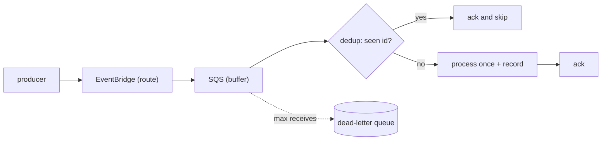

## Thesis

Decoupling producers from consumers through a durable queue --- a producer emits an event and moves on, the queue buffers and absorbs bursts, a consumer pulls at its own pace --- where the delivery guarantee is at-least-once, so the consumer must be **idempotent** and the inevitable duplicates become harmless rather than a second charge or a double-shipped order.

## Sub

**The backbone** -> **the ack gap and why at-least-once is the ceiling** -> **the idempotent consumer** -> **zoom out** to ordering, dead-letter queues, and the pivots an interviewer rides from "put a queue between them" into delivery guarantees, duplicates, and effectively-once.

## Spine

- Decouple through a **durable queue** --- the producer emits and forgets, the queue buffers, the consumer pulls at its own rate; a slow or crashed consumer never blocks the producer, and a burst is absorbed instead of dropped.
- **At-least-once is the ceiling** --- the broker can't tell a crashed consumer from a lost ack, so it redelivers; duplicates are inevitable, not a bug you can configure away.
- The consumer must be **idempotent** --- a dedup key or a conditional write makes reprocessing the same message a no-op, and that is what turns at-least-once into effectively-once.
- A message that keeps failing goes to a **dead-letter queue** --- after N attempts it is moved aside so it stops blocking the queue and can be inspected, rather than retried forever or silently dropped.

## Companion Notes

### walk

A message from emit to ack

One event from the producer to a processed, acked message --- the path, and the gap in it where duplicates are born.

Say the guarantee out loud early --- "delivery is at-least-once, so the consumer is idempotent." That one sentence pre-empts half the follow-ups.

### drill

Probe Drill

Graded follow-ups on the delivery guarantee, the idempotent consumer, and the failure path --- the ones that separate "add a queue" from a real async design.

Never claim exactly-once delivery --- say at-least-once plus an idempotent consumer, which is effectively-once.

## Drill

SDE2 | the model and the mechanics
SDE3 | delivery, duplicates, and edges
Staff | guarantees and org trade-offs

### SDE2 | what event-driven is

What does an event-driven architecture mean?

A producer emits an **event** to a broker or queue and does not wait for a consumer; one or more consumers process it asynchronously. The two sides are decoupled in time and in deployment --- the producer doesn't know or wait for the consumer, so each scales, fails, and deploys independently.

### SDE2 | why a queue between services

Why put a queue between two services instead of calling directly?

Two reasons: **decoupling** and **buffering**. A direct call couples the producer's availability to the consumer's --- if the consumer is down or slow, the producer blocks or fails. A queue lets the producer emit and move on, absorbs traffic bursts the consumer can't take instantly, and lets the consumer retry on its own terms.

### SDE2 | delivery guarantees

At-least-once, at-most-once, or exactly-once?

**At-most-once** may drop messages (fire and forget, no retry). **At-least-once** never drops but may duplicate (retry until acked). **Exactly-once** delivery is effectively unattainable across a network --- what you build instead is at-least-once delivery plus an idempotent consumer, which gives effectively-once *processing*.

### SDE2 | the visibility timeout

What is a visibility timeout?

When a consumer pulls a message, the queue hides it for a set window instead of deleting it. If the consumer acks (deletes) within that window, it is gone; if not --- the consumer crashed or ran long --- the message reappears and is redelivered. The timeout must exceed the real processing time or a slow message gets redelivered while still being worked.

### SDE2 | the dead-letter queue

What is a dead-letter queue for?

A message that fails repeatedly is moved to a separate **dead-letter queue** after a max-receive count, so it stops cycling through the main queue, blocking throughput and burning retries. The DLQ is where you inspect poison messages --- a bad payload, a bug --- without losing them or letting them jam the pipeline.

### SDE2 | standard vs FIFO queue

SQS standard or FIFO --- what is the difference?

**Standard** queues have the highest throughput but only best-effort ordering and at-least-once delivery (occasional duplicates). **FIFO** queues guarantee order and dedup within a window, at much lower throughput. Most high-volume pipelines use standard queues and handle ordering and dedup in the consumer, because the FIFO throughput ceiling is real.

### SDE3 | why duplicates are inevitable

Why can't you just prevent duplicate delivery?

Because of the **ack gap**. After a consumer does the work but before its ack reaches the broker, the network can drop the ack or the consumer can crash. The broker sees no ack within the visibility timeout and cannot distinguish "work never happened" from "work happened, ack lost" --- so it must redeliver. The duplicate is a consequence of the guarantee, not a defect.

### SDE3 | the idempotent consumer

How do you make a consumer idempotent?

Give each message a stable **id** and record processed ids: check the dedup record first, and if the id is already there, ack and skip with no second effect. The write must be atomic with the check --- a conditional insert (INSERT ... ON CONFLICT DO NOTHING) or a conditional update --- so two concurrent deliveries can't both pass the check.

### SDE3 | the dedup store

What does the dedup store look like?

A keyed record of processed message ids --- a Redis set with a TTL, or a database table with the id as the primary key. The natural business key often works too (an order id, an event id). The TTL or retention must outlive the maximum possible redelivery window, or a late duplicate slips past an expired record.

### SDE3 | ordering

How do you get ordering in an event-driven system?

You usually don't get global ordering cheaply --- standard queues don't guarantee it. Options: a FIFO queue (at a throughput cost), partitioning by a key so all events for one entity land on one ordered partition (the Kafka model), or designing consumers to tolerate out-of-order arrival with version checks. Most systems need ordering only *per entity*, which partitioning gives.

### SDE3 | poison messages

A message fails every time --- what happens?

Without a limit it cycles forever, blocking the queue and burning the consumer. Set a **max-receive count** (the 3-to-50 range depending on how transient the failures are), after which the message moves to the DLQ. Then alert on DLQ arrivals and replay them once the bug or bad payload is fixed --- a poison message must never be able to jam the main pipeline.

### SDE3 | backpressure

How does an event-driven system handle backpressure?

The queue *is* the backpressure mechanism --- when consumers fall behind, messages accumulate rather than overwhelming anything, and queue depth becomes the signal to scale consumers out. The trade is latency: messages wait longer. You watch queue depth and message age, and autoscale consumers on depth, so the buffer never grows unbounded.

### Staff | the exactly-once myth

An interviewer asks for exactly-once. What do you say?

That exactly-once *delivery* isn't achievable across an unreliable network, and I wouldn't promise it. What I deliver is at-least-once delivery plus an idempotent consumer --- effectively-once *processing*. It is the honest and standard answer; a candidate who claims exactly-once delivery is signalling they don't understand the ack gap.

### Staff | EventBridge vs SQS vs SNS

EventBridge, SQS, and SNS --- when each?

**EventBridge** is content-based routing: rules match event patterns and fan out to many targets, good for a bus with many event types and consumers. **SNS** is pub/sub fan-out to subscribers. **SQS** is a durable point-to-point queue with buffering and retries. A common shape is EventBridge to route, SQS to buffer per consumer, Lambda to process --- routing, then a durable buffer, then work.

### Staff | when not to go event-driven

When would you *not* use an event-driven design?

When the caller needs an immediate answer (a synchronous read, a user waiting on a result) --- async adds latency and complexity there. And when strong ordering or a transaction across steps is required, event-driven eventual consistency fights you. The async tax --- harder debugging, eventual consistency, duplicate handling --- is only worth paying where decoupling and buffering actually matter.

### Staff | observability

What do you monitor on an event-driven pipeline?

**Queue depth** (are consumers keeping up), **message age** (oldest unprocessed --- the real latency), **DLQ arrival rate** (are messages failing), and consumer error and duplicate rates. The failure mode is silent backlog: everything looks healthy while the queue grows. Depth and age are the two numbers that catch it early.

### Staff | event schema evolution

How do you evolve the shape of an event over time?

Version the event and make consumers tolerant --- add fields, never repurpose or remove one that a consumer reads, and default missing fields. Producers and consumers deploy independently, so at any moment old and new versions coexist on the queue. Treating the event as a **contract**, additive-only, is what keeps a schema change from breaking a consumer you didn't deploy.

### Staff | replay and reprocessing

Can you re-run events after fixing a consumer bug?

Only if the events are **retained and replayable**. A durable log --- Kafka, or an archived stream --- lets you reprocess a window after a fix, and an idempotent consumer makes that replay safe to run. A plain queue deletes on ack, so it cannot replay; keeping an event archive is the price of being able to recover from a consumer that was silently wrong. Replay plus idempotency is the recovery story for bad processing, the same way a DLQ is the story for bad messages.

## Walk

### The producer emits and moves on

```flow
p[producer] -> b[EventBridge rule] -> m[match + route]
```

A producer emits an event --- a small, self-describing message --- and returns immediately; it does not wait for anyone to process it. On a bus like EventBridge, rules match the event's shape and route it to the right targets, so the producer doesn't even name its consumers.

```json
{
  "id": "evt-7",
  "source": "device.config",
  "detail-type": "RolloutScheduled",
  "detail": { "deviceId": 4821, "firmware": "2.4.1" }
}
```

The event carries a stable **id** and just enough detail for the consumer to act. That id is not decoration --- it is the handle the consumer will use to dedup, so it is assigned once at emit and never regenerated on a retry.

### The queue buffers and the consumer pulls

```flow
m[routed event] -> q[SQS queue] -> c[consumer pulls a batch]
```

The event lands in a durable queue that holds it until a consumer is ready. This is the decoupling: a burst of events, or a consumer that is briefly down, changes only the queue depth --- the producer is unaffected and no event is lost. The consumer pulls a batch, does the work, and acks.

The queue is also the backpressure valve. When consumers fall behind, depth rises instead of anything toppling, and that depth is the signal to scale consumers out. Latency is the price --- messages wait --- but nothing is dropped.

### The consumer processes and acks --- with a gap

```flow
c[consumer] -> w[do the work] -> a[ack and delete]
```

The consumer processes the message and then acks it, which deletes it from the queue. Between doing the work and the ack landing, there is a gap: if the consumer crashes or the ack is lost on the network, the broker never hears the ack.

After the visibility timeout the broker sees an un-acked message and cannot tell "the work never happened" from "the work happened but the ack was lost" --- so it redelivers. That is the whole reason duplicates are inevitable: the guarantee is at-least-once, and the ack gap is where the extra delivery comes from.

### Duplicates are made harmless

```flow
d[message arrives again] -> k[dedup check] -> s[skip or process once]
```

The consumer treats every message as possibly a duplicate. It checks the dedup record for the message id first; if the id is already recorded, it acks and skips with no second effect. Only a first-seen id is processed, and the id is recorded atomically with the work.

```ts
async function handle(msg) {
  const firstTime = await dedup.claim(msg.id);   // ==INSERT id ON CONFLICT DO NOTHING==
  if (!firstTime) return ack(msg);               // already processed -- no second effect
  await apply(msg.detail);
  return ack(msg);
}
```

The claim and the work must be atomic --- a conditional insert, not a read-then-write --- or two concurrent deliveries both pass the check and both run. Done right, this is what turns at-least-once delivery into effectively-once processing.

### Model Script

- Frame the backbone | "An event-driven backbone decouples producers from consumers through a durable queue. The producer emits an event and moves on, the queue buffers and absorbs bursts, and consumers pull at their own pace --- so a slow or down consumer never blocks the producer and a spike is absorbed instead of dropped."
- Name the guarantee | "The key property is the delivery guarantee: it is at-least-once. The broker retries until it gets an ack, so it never drops a message, but it will sometimes deliver one twice. Exactly-once delivery isn't achievable across a network --- I don't promise it."
- Why duplicates happen | "Duplicates come from the ack gap. After the consumer does the work but before the ack reaches the broker, the network can drop the ack or the consumer can crash. The broker can't tell 'work never happened' from 'work happened, ack lost', so it redelivers. The duplicate is a consequence of the guarantee, not a bug."
- Make it harmless | "So I make the consumer idempotent. Every message has a stable id; the consumer checks a dedup record, and if the id is already there it acks and skips. The claim is atomic with the work --- a conditional insert --- so concurrent deliveries can't both run. That turns at-least-once delivery into effectively-once processing."
- Interviewer: "A message fails every single time. What happens to it?"
- Handle the poison message | "Without a limit it cycles forever and jams the queue. I set a max-receive count, after which the message moves to a dead-letter queue. Then I alert on DLQ arrivals and replay them once the bug or bad payload is fixed --- a poison message must never block the main pipeline."
- Land the guarantees | "So the shape is: emit to a bus that routes, buffer in a durable queue that also gives backpressure, process with an idempotent consumer, and dead-letter what keeps failing. The one line to remember is at-least-once plus an idempotent consumer, which is effectively-once."

## Whiteboard

Sketch the backbone and mark where duplicates are handled.

### Where does a duplicate come from?

The ack gap --- work done, ack lost or consumer crashed, so the broker redelivers after the visibility timeout.

### Where is it made harmless?

At the consumer --- a dedup check on the message id, atomic with the work, so a second delivery is a no-op.



Verdict: at-least-once delivery plus an idempotent consumer is effectively-once; the dead-letter queue catches what keeps failing.

## System

Zoom out to where the backbone sits between a producer and its consumers.

### Where it sits

Producer: emits an event and returns
Router / bus: matches and routes the event [*]
Durable queue: buffers, retries, gives backpressure
Consumer: pulls, processes idempotently, acks
Dead-letter queue: holds what keeps failing

### Pivots an interviewer rides

From "put a queue between them" they push on the guarantee, the duplicates, and the failure path.

#### Which delivery guarantee?

-> at-least-once plus an idempotent consumer, never exactly-once delivery
The broker retries until acked, so it never drops but may duplicate. Exactly-once delivery isn't achievable across a network; at-least-once plus a dedup check gives effectively-once processing, which is the honest answer.

#### How do you handle a message that keeps failing?

-> a max-receive count into a dead-letter queue
A poison message cycled forever would jam the queue. After N attempts it moves to a DLQ where it can be inspected and replayed, so one bad payload can never block the pipeline.

## Trade-offs

The calls that separate "add a queue" from a designed async system.

### Synchronous call vs event-driven

- Synchronous: an immediate answer and simple flow, but the caller is coupled to the callee's availability and latency
- Event-driven: decoupling and buffering, but eventual consistency, duplicates to handle, and harder debugging

Go async where decoupling and burst absorption matter; stay synchronous where the caller needs an immediate result or a transaction across steps.

### Standard queue vs FIFO queue

- Standard: highest throughput, best-effort ordering, occasional duplicates handled in the consumer
- FIFO: guaranteed order and dedup within a window, at a much lower throughput ceiling

Default to standard queues with an idempotent consumer; reach for FIFO only where strict ordering is a hard requirement and the volume fits.

### Retry in place vs dead-letter

- Retry in place: transient failures recover on their own, but a poison message cycles forever and jams the queue
- Dead-letter after N: the pipeline keeps flowing and bad messages are isolated for inspection, at the cost of a replay step

Retry a bounded number of times, then dead-letter --- unbounded retry of a permanent failure is how one bad message stalls everything.

## Model Answers

### the delivery guarantee | Why it is at-least-once

The line that pre-empts the exactly-once trap.

- At-least-once, never dropped | key | the broker retries until acked
- Duplicates from the ack gap | store | crash or lost ack, broker can't tell
- Effectively-once via dedup | note | idempotent consumer closes it

### the idempotent consumer | Making duplicates harmless

The point most answers skip.

- Stable id per message | key | assigned at emit, never on retry
- Atomic claim with the work | store | conditional insert, not read-then-write
- Skip a seen id | note | ack with no second effect

## Numbers

Back-of-envelope the consumer fleet a queue needs and the cost of the dedup guarantee.

Consumer concurrency follows Little's law --- rate times processing time --- and the queue absorbs bursts the consumers drain later. Every message also costs one dedup lookup, the price of effectively-once.

- msgRate | Messages/sec | 5000 | 0 | 100
- procMs | Processing ms/msg | 50 | 0 | 10
- maxRecv | Max receives | 5 | 1 | 1

```js
function (vals, fmt) {
  var msgRate = vals.msgRate, procMs = vals.procMs, maxRecv = vals.maxRecv;
  return [
    { k: 'Consumer concurrency', v: fmt.n(Math.ceil(msgRate * procMs / 1000)), u: 'workers', n: 'Little law \u2014 rate times latency; at ' + fmt.n(msgRate) + '/s and ' + procMs + 'ms each you need this many in-flight to keep up', over: Math.ceil(msgRate * procMs / 1000) > 500 },
    { k: 'Buffer at 10x burst', v: fmt.n(Math.round(msgRate * 10 * procMs / 1000 / Math.max(1, Math.ceil(msgRate * procMs / 1000)))), u: 'sec', n: 'a 10x spike is absorbed by the queue and drained by the same fleet \u2014 depth rises, nothing topples, latency is the only cost', over: false },
    { k: 'Redelivered per hour', v: fmt.n(Math.round(msgRate * 3600 * 0.001)), u: 'msgs', n: 'even a 0.1 percent redelivery rate at this volume is this many duplicates an hour \u2014 which is exactly why the consumer must be idempotent', over: Math.round(msgRate * 3600 * 0.001) > 10000 },
    { k: 'Dedup lookups', v: fmt.n(msgRate), u: 'ops/s', n: 'one dedup check per message \u2014 the standing cost of effectively-once; it sizes the dedup store, so keep the record small and TTL it', over: msgRate > 50000 },
    { k: 'To DLQ after ' + maxRecv + ' tries', v: 'bounded', u: '', n: 'a message is retried at most ' + maxRecv + ' times before it is dead-lettered \u2014 bounded, so a poison message can never cycle forever and jam the queue', over: false }
  ];
}
```

## Red Flags

What makes an interviewer wince.

### "We use exactly-once delivery"

Exactly-once delivery isn't achievable across an unreliable network --- claiming it signals you don't see the ack gap.

Say at-least-once delivery plus an idempotent consumer, which is effectively-once processing.

Note: this is the single most common event-driven mistake in interviews.

### "If a message fails we just keep retrying it"

Unbounded retry of a permanent failure cycles a poison message forever, jamming the queue and burning the consumer.

Bound the retries with a max-receive count, then move the message to a dead-letter queue to inspect and replay.

### "The consumer acks first, then does the work"

Then a crash after the ack but before the work loses the message silently --- at-most-once, not at-least-once.

Do the work, then ack --- so a crash before the ack causes a safe redelivery, which the idempotent consumer absorbs.

## Opener

### 30s | The one-liner

How I open when asked to design an event-driven flow.

#### What is the backbone?

A producer emits to a durable queue and moves on; consumers pull, buffered and decoupled from the producer.

#### What is the one hard part?

Delivery is at-least-once, so duplicates are inevitable --- the consumer has to be idempotent to make them harmless.

##### Hooks

Where an interviewer usually pushes next.

- Which guarantee? | at-least-once, not exactly-once | trade
- Handle duplicates? | idempotent consumer, dedup key | drill
- Message keeps failing? | max receives into a DLQ | trade

Foot: two sentences --- the durable queue, then at-least-once plus an idempotent consumer.

## Bank

### SCALE | Five thousand events a second through the pipeline

Task: size the consumer fleet and argue the queue absorbs bursts.
Model: concurrency is rate times processing time by Little's law; a spike raises queue depth, which the same fleet drains, so nothing topples.
Int: what is the standing cost of the delivery guarantee?
One dedup lookup per message --- the price of effectively-once.

### DESIGN | A dispatch pipeline that must not double-act

Task: design so a redelivered command doesn't act twice.
Model: EventBridge routes, SQS buffers, an idempotent consumer claims each message id atomically with the work and skips a seen id; failures dead-letter after N tries.
Int: where does the duplicate come from in the first place?
The ack gap --- work done, ack lost or consumer crashed, broker redelivers.

### Extra Curveballs

### CURVEBALL | ordering | Events for one device must be applied in order --- how?

Model: partition by device id so all of one device's events land on one ordered partition (or a FIFO queue keyed by device), giving per-entity ordering without a global-order bottleneck; consumers still version-check to tolerate the rare reorder.

### Frames

- Decouple and buffer with a durable queue
- At-least-once plus an idempotent consumer is effectively-once
- Bound the retries, then dead-letter --- never retry a poison message forever
