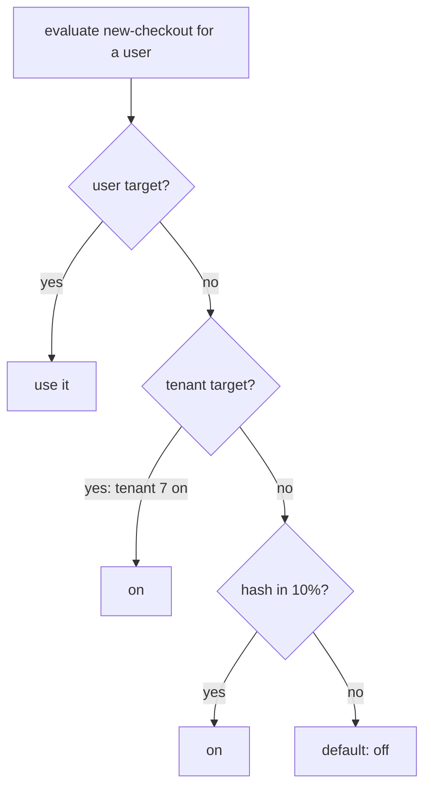

## Thesis

Changing behavior at runtime without a deploy --- a flag or config value resolved per request against a hierarchy of overrides (a global default, then environment, tenant, user), evaluated locally and safe-by-default, so you can roll a change out gradually, target a cohort, and kill it instantly, decoupling *release* from *deploy*.

## Sub

**Flags versus dynamic config** -> **the resolution hierarchy** -> **gradual rollout and the kill switch** -> **zoom out** to evaluation and staleness, and the pivots an interviewer rides from "put it behind a flag" into flag-versus-config, how you target a percentage, and what happens if the flag service is down.

## Spine

- Flags decouple **release from deploy** --- code ships dark behind a flag, and turning it on is a config change, not a deployment, so release is a runtime decision you can stage and reverse instantly.
- A flag resolves against a **hierarchy** --- a global default overridden per environment, tenant, or user, the most-specific match winning; it is the shared-definition-plus-overrides pattern applied to behavior.
- **Gradual rollout and targeting** are the point --- turn a flag on for 1 percent, then 10, then everyone, or for a specific cohort, watching metrics, so a bad change reaches few before you halt.
- The system must be **safe by default** --- if the flag service is unreachable or a flag is unknown, evaluation falls back to a safe default and reads the locally cached config, so an outage can't take the app down.

## Companion Notes

### walk

A change released behind a flag

One change from shipped-dark to fully rolled out --- the resolution against the hierarchy, the percentage rollout, and the kill switch that ends it.

Say the decoupling first --- "the flag separates release from deploy." Everything else (rollout, targeting, kill) follows from that.

### drill

Probe Drill

Graded follow-ups on release-versus-deploy, the hierarchy, rollout, and the failure mode --- the ones that separate "add a boolean" from a real flag system.

Name the safe-default behavior --- an unknown flag or a down service evaluates to the safe value, never an error.

### wb

Whiteboard

Rebuild the whole path from memory --- definition, distribution, resolution, bucketing, kill, fallback, retirement --- with nothing in front of you.

Draw the boundary first: the control plane on one side, the in-process ruleset on the other, and the request never crossing between them. That single fact is the design.

### sys

System Map

Zoom out: a flag sits on the request path between a control plane that never sees your traffic and a code branch that never sees the network.

Lead with the split --- "the ruleset is pushed to every instance, and evaluation is a local lookup." Everything about latency, staleness, and the kill switch falls out of that one sentence.

### trade

Trade-offs

The calls they drill --- flag it or ship it, evaluate here or there, poll or stream, ramp or experiment --- each with the condition that flips the choice.

Always name the switch, never a universal answer. The honest axis here is almost always blast radius: how bad is it if this is wrong, and how fast can you take it back?

### model

Model Answers

Full spoken scripts --- the beats, in order, the way you would actually say them under time pressure.

Steal the arc, not the words: frame the decoupling, name the resolution order, then name the one risk (a flag flips code, not data) before they ask.

### num

Numbers

Back-of-envelope the evaluation load --- and find the number that forces evaluation to be local rather than remote.

Lead with evaluations per second, not requests per second. That is the number that kills the naive design, and saying it first shows you know where the ceiling is.

### rf

Red Flags

What sinks the round --- a hard dependency on the flag service, a rollout that flickers, flags that never die --- and the line that flips each one.

Name what the interviewer hears. "We'd just flip the flag back" on a data migration is the fastest way to show you think a flag can undo a write.

### open

30-Second

The opener and the close --- matched to the altitude the question was asked at.

Match the altitude: open on release-versus-deploy, and land on the two hard parts --- staying safe when the control plane is dark, and knowing a flag flips code, not data.

## Drill

all | **All four levels, mixed** --- the way a real loop actually comes at you.
SDE2 | **The model and the mechanics** --- release vs deploy, the resolution hierarchy, the percentage rollout, the kill switch. The bar is "this is a control plane, not an if-statement": name where the value comes from at evaluation time, and what happens when it can't be fetched.
SDE3 | **Rollout, evaluation, and edges** --- stable bucketing, targeting, staleness, the outage, flag types. The bar is "it depends, here's the switch": name the constraint and the failure each choice bounds.
Staff | **Flag lifecycle and org calls** --- flag debt, governance, experiments, config safety, when a flag is the wrong tool. The bar is "a flag flips code, not data": name the limit of the tool and the process that keeps it from rotting.

### SDE2 | what a feature flag is

What is a feature flag?

A named runtime switch that gates a piece of behavior --- the code checks the flag and does one thing if it's on, another if off. It lets you ship code that's dormant and turn it on later by changing config, not by deploying. The value is control: you decide *when* a feature is live, separately from *when* its code shipped.

Follow: You said the code "checks the flag." At that instant, on the hot path --- is that a network call?
No, and that constraint shapes everything. The SDK holds the **whole ruleset in memory**, refreshed in the background by a stream or a poll, so a check is a map lookup plus a hash --- not a round-trip. If evaluation were a network call, every request would pay it for every flag it touches, and flags would become too expensive to use liberally, which defeats the entire purpose. **Local evaluation is not an optimization; it is the design.**

Follow: So what does the call site actually pass in, and what does it get back?
It passes the **flag key** and an **evaluation context** --- the user id plus whatever attributes targeting might need (tenant, plan, region) --- and gets a value back. Crucially it also passes a **default in the code itself**: `variation('new-checkout', ctx, false)`. That last argument is what's returned if the SDK cannot evaluate at all. So the safe default does not live only in the flag dashboard --- it lives at the call site, in code, where a reviewer can see it. That is what makes a flag outage degrade to known-good behavior instead of an exception.

Senior: "It's a runtime switch" is the SDE2 floor. What lifts it is naming **where the value comes from at evaluation time** --- an in-memory ruleset, not a network call --- and that **the call site carries its own default**. Those two facts are what make a flag safe to put on a hot path *and* safe when the provider is dark, and they are the difference between describing an if-statement and describing a control plane.
Speak: "A named runtime switch --- but the part that matters is the mechanics: **the code asks the SDK for a value, the SDK answers from an in-memory ruleset, and the call site passes its own safe default.** So it's a map lookup on the hot path, and if the flag service is dark the call still returns the old behavior instead of throwing."

### SDE2 | release vs deploy

What does "decoupling release from deploy" mean?

Deploy is putting code on servers; release is making a feature visible to users. A flag splits them --- you deploy the code dark, behind a flag that's off, and later flip the flag to release. So a risky deploy carries no user-facing change, and the actual release is a small, reversible config flip you can stage and time independently of the deployment.

Follow: The flag has been off in production for two weeks. What have you actually de-risked, and what have you not?
You have de-risked the **deployment**, completely --- the build, the migration, the dependency bump, the startup path are all now proven in production. You have de-risked the **feature** not at all, because nobody has executed its code path. That distinction matters because it tells you what the ramp is for: the flag moved the risk from deploy day to ramp day, it did not remove it. Which is exactly why you start the ramp at 1 percent and not at 100 --- the feature is still entirely unproven the moment before you flip it.

Follow: Two weeks of dark code that nobody runs. Doesn't it just rot?
It does, and that is the honest cost of the pattern. An unexecuted path drifts: the code around it changes, only its tests keep it honest, and merge conflicts accumulate. So you bound the window rather than pretend it's free --- **keep the dark period in days, not quarters**, **run the test suite with the flag both on and off** for the flag currently in flight, and **ramp early to an internal cohort** so somebody is actually executing the path. A flag that has been off for six months isn't de-risking anything; it's unexecuted code plus a config entry, and it will not work when you finally turn it on.

Senior: SDE2 says "deploy is servers, release is users." Staff names what the split actually buys **and doesn't**: it de-risks the deployment fully and the feature not at all, so **the ramp --- not the flag --- is what de-risks the feature**. And it names the cost honestly: dark code rots, which is why the dark window is measured in days.
Speak: "Deploy puts code on servers; release makes it visible. **The flag splits them, so the deploy carries no user-facing change and the release is a value I flip.** What that actually buys is a de-risked *deployment* --- the feature itself is still unproven until the ramp, which is exactly why I start at one percent and not at a hundred."

### SDE2 | flags vs dynamic config

How are feature flags and dynamic config related?

Both are values resolved at runtime without a deploy --- a flag is usually a boolean gating behavior, dynamic config is any value you tune live (a timeout, a limit, a URL). They share the same machinery: a value with a default, resolvable per context, changeable without shipping code. A flag is a special case of dynamic config aimed at turning behavior on and off.

Follow: If they're the same machinery, why would you ever govern them differently?
**Because the blast radius is different.** A boolean flag gates a path you built and tested on both sides --- the worst case is that you serve the old behavior. A config value is an **open domain**: a timeout, a page size, a pool size. There is no "off" to fall back to, and a semantically valid but wrong value --- `timeout_ms: 1`, `max_connections: 5` --- can take the entire fleet down *instantly* and *everywhere*, because config propagates exactly as fast as a kill switch does. Same delivery mechanism, completely different failure mode. That asymmetry is why config earns **schema validation on write** and a **staged rollout**, and a boolean release flag usually doesn't.

Follow: So does a config change get a percentage rollout too?
It gets a **staged** rollout, which is not the same thing --- and the difference is the unit. A flag's percentage rollout slices by **user**; a config change is per-**instance**, so you stage it across the **fleet**: push to a canary group of hosts, bake while watching health, then widen, with an **automatic rollback wired to an alarm**. That is precisely what a managed config service like AppConfig does --- it treats a config change as a monitored, gradual, reversible deployment rather than an instant global write. Users for a flag, instances for config: getting that unit wrong is how people try to "roll out" a thread-pool size to 10 percent of users and discover it makes no sense.

Senior: The SDE2 answer is "a flag is a boolean, config is any value." The senior answer is that they share a **delivery mechanism** but not a **blast radius** --- config has no safe "off," so it earns schema validation and a fleet-staged, auto-rollback deployment --- and that the **unit of the rollout differs**: users for a flag, instances for config.
Speak: "**Same machinery --- a value with a default, resolved per context, changed without a deploy.** A flag is the boolean special case. But config has **no safe 'off'** --- `timeout_ms: 1` is perfectly valid and kills the fleet --- so config gets a schema check and a staged, auto-rollback push across **instances**, where a flag ramps across **users**."

### SDE2 | the resolution hierarchy

How does a flag get a value for a given request?

It resolves against a **hierarchy**: a global default, overridden per environment, then per tenant, then per user, with the most-specific match winning. A user targeting beats a tenant setting beats the environment beats the global default. It's the shared-definition pattern --- one default, plus overrides at increasing specificity, resolved most-specific-first.

Follow: Two rules match --- "all EU tenants: on" and "this specific user: off." Which wins, and how does the system *know* it's more specific?
The user rule wins, but the system does not *infer* specificity --- and that's the correction worth making. The rules are an **ordered list evaluated first-match-wins**: individual user targets first, then rule and segment matches in the order they are authored on the flag, then the percentage rollout, then the default. So "most-specific wins" is really "**the specific rules are ordered first**." Specificity is not computed, it is **authored as an order** --- which means reordering the rules changes the answer, and that is a real source of bugs that a "most-specific wins" mental model will never let you see.

Follow: Where does the percentage rollout sit in that order?
**Last, immediately before the default --- it is the fallthrough, not a filter.** A user who matched no explicit target and no rule falls through into the bucketing, and only then to the default if the bucket says no. That ordering is what makes "on for tenant 7, plus 10 percent of everyone else" mean what you'd expect: tenant 7 is decided by its target and **never reaches the bucketing at all**. Get the order backwards --- bucket first --- and your explicit targets silently become a coin flip, which is the kind of bug that looks like flakiness for weeks.

Senior: Anyone can say "most-specific wins." The senior detail is that specificity is **not derived, it is an ordered rule list evaluated first-match** --- targets, then rules, then the percentage **fallthrough**, then the default --- so reordering rules changes behavior, and an explicit target never reaches the bucketing.
Speak: "It resolves against an **ordered rule list, first match wins**: individual user targets, then segment and attribute rules, then the percentage rollout as the **fallthrough**, then the default. **'Most specific wins' is really 'the specific rules are ordered first'** --- so an explicit target is decided before the bucketing ever runs."

### SDE2 | gradual rollout

What is a percentage rollout?

Turning a flag on for a slice of users --- 1 percent, then 10, then 50, then all --- rather than everyone at once. You watch error rates and metrics at each step, so a bad change is caught while it affects few. It converts a release from a binary all-or-nothing event into a controlled, observable ramp you can pause or reverse.

Follow: You're at 10 percent and it "looks fine." What actually tells you it is safe to go to 50?
Not "it looks fine." A **pre-agreed set of metrics with thresholds, compared against the held-back cohort as a control**. That is the underrated payoff of holding 90 percent off: you are not comparing against yesterday (where seasonality, a deploy, and a traffic shift all confound you) --- you are comparing the flagged cohort against the unflagged one, **right now, under identical conditions**. The other half of the answer is statistical power: at 1 percent of low traffic you may observe nothing at all, and **"no errors" from a sample too small to show them is a false green**. So: name the metrics before the ramp, gate each step on them, and make each step big enough to be observable.

Follow: Is there a class of bug a ramp will simply never catch?
Yes --- **saturation**, and it is the classic trap. A ramp catches **correctness** bugs and per-request regressions, because those show up proportionally at any sample size. It does **not** catch a **resource ceiling that only exists at full load**: the new path comfortably fits inside the connection pool, the cache, or the downstream rate limit at 10 percent, and exhausts it at 100. Anything contending for a **shared, finite resource** can pass every single ramp step and then fail on the last one. So the final step is its own risk class: you either **load-test the 100 percent case separately**, or you ramp the last step slowly with **saturation metrics** --- pool utilization, downstream throttle rate, queue depth --- watched explicitly, not just error rate.

Senior: The SDE2 answer is "1, 10, 50, 100, watch metrics." The senior answer names **what the ramp can and cannot catch**: it catches correctness against a live control group (which is why holding traffic back is the point), and it **does not catch saturation** --- a ceiling that only exists at full load --- so the last step carries its own risk and needs its own metrics.
Speak: "Ramp 1, 10, 50, 100, gating each step on **metrics compared against the held-back control** --- that control group is the real reason to hold traffic back. And I'd say out loud what a ramp **can't** catch: **saturation.** The new path fits in the pool at 10 percent and exhausts it at 100 --- so the last step gets its own load test."

### SDE2 | the kill switch

What is a kill switch?

A flag whose sole job is to instantly disable a feature or a dependency when it misbehaves. Because turning a flag off is a config change that propagates in seconds, you can shut down a bad feature without a rollback deploy. Every risky feature ships with one, so the response to an incident is a flip, not a redeploy under pressure.

Follow: You flip it. How long until it takes effect on every instance --- and what is happening in the meantime?
Bounded by **how the ruleset reaches the instances**, and I'd refuse to say "instantly." With a **streaming** connection it's typically sub-second to a few seconds. With **polling** it is **up to the poll interval** --- a 60-second poll means a 60-second worst case, during which part of your fleet is still happily serving the bad feature. That number is a **design parameter, not an implementation detail**: if the kill switch's job is to contain an incident, its propagation bound **is** your minimum time-to-mitigate, and it is a number you should be able to state out loud. (Requests already past the evaluation point are unaffected either way.)

Follow: Why is a kill switch better than just rolling back the deploy? A rollback is also "a button."
Three reasons, all about **time and scope**. A rollback is **minutes** --- rebuild, redeploy, roll the fleet --- against **seconds** for a flip. A rollback reverts **the whole release**, including the unrelated changes in it that were perfectly fine, so you undo good work to undo one bad thing. And a rollback can be **impossible** if the release contained a forward-only migration. The flip is surgical: one feature, one value, seconds, no build. The honest caveat --- and I'd volunteer it --- is that **the flip only helps if the bad thing was behind the flag.** If the regression is in code that ships unconditionally, the flag is useless and rollback is still your tool.

Senior: What separates the levels here is **refusing to say "instantly."** Staff states the **propagation bound** --- stream latency or poll interval --- as the real time-to-mitigate, and volunteers the **limit of the tool**: a flip reverts only what was behind the flag, so unconditional code and forward-only migrations still need a rollback.
Speak: "A flag whose only job is to disable a feature fast. **Flipping it propagates within the refresh window --- sub-second on a stream, up to the poll interval otherwise --- and that bound is my real time-to-mitigate.** It beats a rollback because it's seconds instead of minutes and it's surgical --- but only for what was actually *behind* the flag."

### SDE2 | where a flag is evaluated

Is a flag evaluated on the client or the server?

Either, and it matters. **Server-side** evaluation keeps the logic and the rollout rules private and is the default for backend behavior. **Client-side** is needed to toggle UI, but the flag rules and unreleased state are then exposed to the client, so you evaluate server-side and send only the decision when secrecy matters. The rule is: don't ship targeting logic to a client you don't trust.

Follow: You send only the decision --- so the browser now holds a boolean. What stops the user flipping it in devtools?
**Nothing --- and that is fine, provided you know what that boolean is.** A client-side flag value is a **rendering hint, never an authorization decision.** If flipping it in devtools reveals a button, and that button calls an API, then **the API must independently enforce the same gate** --- the flag is checked again, server-side, on the request that actually does the work. So the rule is sharp: **a flag can hide a feature; it cannot secure one.** If unauthorized use is a *security* problem rather than a *product* problem, then the flag is not the control --- authorization is --- and the flag merely decides whether to render the button.

Follow: The client fetches its flags just after first paint, so users see the old UI flash and then flip. Fix it.
That's the **flash of the wrong variant**, and it's a real bug --- worse than cosmetic, because for an experiment it contaminates the exposure data. The fix is to **bootstrap**: evaluate the flags **server-side during the page render**, for that user's context, and inline the resulting *values* into the initial HTML payload, so the client SDK starts with correct values on first paint and its later fetch merely confirms them. You get client-side dynamism without the flicker --- and notice it preserves the security property, because you shipped **the decisions, not the rules.**

Senior: The SDE2 answer is "server-side for secrets, client-side for UI." The senior answer knows the two consequences: a client-side flag is a **rendering hint, not an authorization boundary** (so the API re-checks), and a naively-fetched client flag causes a **flash of the wrong variant**, fixed by **bootstrapping** the server-evaluated values into the first render.
Speak: "**Evaluate server-side and ship the decision, not the rules** --- targeting logic on an untrusted client leaks your roadmap and your segments. Two things I'd add: the client value is a **rendering hint, not an authorization check**, so the API re-enforces it; and I'd **bootstrap** the server-evaluated values into the first render so there's no flash of the wrong variant."

### SDE3 | consistent percentage rollout

How do you keep a percentage rollout consistent per user?

Hash the user id (with the flag key) to a number in a fixed range and compare against the percentage --- so a given user always lands in the same bucket and stays in or out across requests. Consistency is the point: a user shouldn't see the feature flicker on and off between requests, and hashing the id gives a stable, uniform assignment without storing per-user state.

Follow: Why hash the flag key into it as well? The user id alone is already stable.
To **decorrelate the flags**. If the bucket is `hash(user_id)` alone, a user lands in the same bucket for *every* flag --- so the unlucky users in the bottom 1 percent become the first cohort for **every rollout you will ever run**, and they eat every bad change you ship, forever. That's a real and quietly cruel outcome. It also poisons experiments: your treatment groups across different experiments become perfectly correlated, so you can't separate their effects. Salting with the flag key --- `hash(flag_key + user_id)` --- gives every flag an independent, uniform assignment, so being in the first 1 percent of one rollout tells you nothing about the next.

Follow: You ramp from 10 percent to 20. Does a user who was in the 10 stay in?
**Yes --- and that property is worth designing for deliberately, not stumbling into.** Compute `bucket = hash(flag_key + user_id) mod 100` once; you're in if `bucket < 10` at 10 percent, and `bucket < 20` at 20. Every user under 10 is still under 20, so **widening the ramp is monotone: it only ever adds users, it never churns one out to let another in.** Two things break it. **Lowering** the percentage does drop users, which is unavoidable. And **changing the salt --- renaming the flag key** --- reshuffles every bucket and silently re-randomizes your entire population: the dashboard still says 10 percent, but it's a *different* 10 percent, and users watch the feature appear and vanish. That one is nasty because nothing looks wrong.

Senior: SDE3 says "hash the user id so it's sticky." The depth is two-fold: **salt with the flag key** so cohorts don't correlate across every flag you own, and know that **the ramp is monotone** because a fixed bucket is compared against a rising threshold --- so widening never churns users, while **changing the salt silently re-randomizes the population**, which is the bug nobody can see.
Speak: "**Bucket equals hash of flag key plus user id, mod 100 --- you're in if the bucket is under the percentage.** Salting with the flag key stops the same unlucky users being first for every rollout. And because the bucket is fixed and the threshold rises, **widening the ramp is monotone --- it only adds users.** Rename the flag key mid-ramp, though, and you silently reshuffle everyone."

### SDE3 | targeting rules

How do you turn a flag on for a specific cohort?

Targeting rules --- attributes on the evaluation context (plan, region, user id, tenant) matched against rules on the flag, so "on for enterprise tenants in the EU" resolves without code. The rules live as flag data, evaluated at request time against the context the app passes in. It's the same override mechanism as the hierarchy, generalized from levels to arbitrary attribute predicates.

Follow: Where do `plan` and `region` actually come from at evaluation time?
From the **evaluation context the application passes in** --- not from the flag service. That direction is the whole point: **the flag service holds the rules; the application holds the facts.** The caller builds a context (`{ key: userId, tenant, plan, region }`) and the SDK matches the rules against it, locally. The consequence people miss is that **your targeting is bounded by what the call site actually knows.** Adding a new targeting dimension usually means threading a new attribute all the way down to wherever the flag is evaluated --- which is the hidden cost of rich targeting, and exactly why mature teams standardize on a single context builder rather than assembling one at each call site.

Follow: Marketing wants "on for the 50,000 users in this uploaded list." Does that still fit in an in-memory ruleset?
Not comfortably --- and this is **the case that breaks the no-network-call promise**, so it's worth naming rather than hiding. A rule is a *predicate* over the context, which is cheap and tiny. A **large explicit membership list is data**, and you cannot sanely ship 50,000 (or 5 million) ids inside a ruleset that is pushed to every instance and refreshed continuously. So big segments get handled out of band: membership lives in an **external store** (Redis, DynamoDB), and evaluating that one rule does a **membership lookup** --- reintroducing precisely the network hop the architecture exists to avoid, now scoped to only the flags that need it. The framing I'd give: **rules stay in memory, large sets go out of band, and you knowingly pay a lookup on the flags that use them.**

Senior: The SDE3 answer is "attributes matched against rules." What lifts it is knowing the two boundaries: **the app supplies the context** (so targeting is bounded by what the call site knows, and each new dimension must be threaded through), and **a large explicit segment does not fit in the ruleset** --- it moves to an external membership store and buys back a network lookup on those flags.
Speak: "Targeting rules are **predicates over an evaluation context the app passes in** --- tenant, plan, region. **The flag service holds the rules; the app holds the facts.** The edge I'd volunteer: **a 50,000-user uploaded segment isn't rules, it's data** --- that moves to an external membership store and reintroduces a network lookup on the flags that use it."

### SDE3 | flag staleness and caching

How fresh is a flag value, and why cache it?

Flags are cached in each app instance and refreshed on a short interval or via a push, so evaluation is a local in-memory lookup with no network call per request. The trade is a small staleness window --- a change takes up to the refresh interval to reach every instance. You keep the interval short for responsiveness and accept that a flag flip isn't perfectly instantaneous fleet-wide.

Follow: So for a few seconds, one instance says on and another says off. Does that actually matter?
It depends entirely on **what the two branches do**, and that's the analysis to give. For a stateless read path, a briefly split fleet is **harmless** --- some requests take the new path, some the old, both are correct. It becomes dangerous in exactly two cases. First, if the branches **write incompatible state** (one writes the new schema, one the old), a split fleet is now producing two shapes of data simultaneously. Second, if a user's **consecutive requests land on different instances**, they watch the feature appear and vanish --- which looks broken, and for an experiment it corrupts the exposure record. So the mitigations are: **keep the branches write-compatible during the flip**, and **resolve the flag once and carry the decision** rather than re-evaluating everywhere.

Follow: You evaluate the same flag at three layers in one request. What could go wrong?
The **ruleset can refresh mid-request**, so the three evaluations can legitimately disagree. You check the flag at the API layer and take the new path; a refresh lands; you check again at the persistence layer and take the **old** write path. That's a **torn request** --- half new, half old --- and it is a genuinely horrible bug: rare, non-deterministic, and only reproducible at the exact instant of a flip, which is the one moment nobody is running a debugger. The fix is structural: **evaluate once at the request boundary, put the decision in the request context, and pass it down.** A request is then internally consistent even if a flip lands during it. It's the same discipline as reading a config snapshot once instead of re-reading a mutable global mid-transaction.

Senior: SDE3 explains the staleness window. Staff names its **two real consequences** --- a split fleet is only dangerous when the branches write incompatible state or a user sees the feature flicker across requests --- and gives the structural fix: **evaluate once at the request boundary and carry the decision**, so a mid-request refresh cannot tear a request in half.
Speak: "The ruleset is cached in-process and refreshed in the background, so evaluation is local and the price is a **bounded staleness window**. Two consequences I'd name: **a briefly split fleet is fine unless the two branches write incompatible state**; and I **resolve each flag once at the request boundary and pass the decision down**, so a refresh landing mid-request can't tear the request in half."

### SDE3 | the flag service is down

What happens if the flag service is unreachable?

Evaluation falls back to the locally cached config, and an unknown flag resolves to its safe default --- usually off. The flag system must never be a hard dependency that takes the app down; a value is always available from the last-known cache. Fail-safe, not fail-closed-with-an-error: the app keeps serving on the last good config.

Follow: You said "safe default --- usually off." When is "off" the *dangerous* value?
Whenever the flag's **polarity is inverted**, and this is the trap. "Safe default" does not mean `false`; it means **the value that preserves known-good behavior.** `enable_new_checkout` defaulting to false is safe. But `disable_expensive_recompute` --- a kill switch phrased as a *disable* --- also defaults to false, which means **the expensive path stays on exactly when your control plane is broken**, which is the worst possible moment. So the discipline is to **write every flag so that `false` is the old, known-good behavior** ("on = the new thing"), and to keep the default at the **call site in code** where a reviewer sees it next to the branch. Consistent polarity is what turns "default off" from a coin flip into a rule.

Follow: The service is down *and* the process just restarted --- there's no in-memory cache. Now what?
That is the genuinely hard case, and it's why fallback is **three layers, not one.** First the **in-memory ruleset** --- gone, we just restarted. Then a **persisted local cache**: the SDK writes the last-known ruleset to disk or a shared store, so a fresh process boots on the last-good config rather than on nothing. And finally the **code default at the call site**, which is what you actually get if there's no cache at all. The failure mode almost everybody misses is exactly this one: they test "the flag service goes down" against a *warm* process, watch it keep serving, and declare victory --- and never test **"the service is down AND we scale up,"** where new instances arrive with no ruleset and every flag silently collapses to its code default. If a kill switch is currently **engaged**, that means the kill switch **quietly disengages on the new instances** --- during an incident, while you're scaling because of the incident. That is the scenario worth saying out loud.

Senior: The SDE3 answer is "fall back to cache and a safe default." The Staff answer knows **"safe" is not "false"** --- polarity is a discipline, write flags so `false` is always the old behavior --- and that fallback is **three layers** (memory, a persisted cache, the code default), because the real failure is a **cold start during the outage**, where an engaged kill switch silently disengages on new instances.
Speak: "It **fails safe, not closed**: the SDK evaluates from its in-memory ruleset, then a **persisted local cache**, then the **default passed at the call site**. Two things I'd say out loud: **'safe' means the old behavior, not `false`** --- so I keep polarity consistent --- and the case people miss is a **cold start during the outage**, where an engaged kill switch quietly disengages on the new instances."

### SDE3 | flag types

What kinds of flags are there beyond on/off?

**Boolean** (on/off) is the common case, but **multivariate** flags return one of several values --- a variant for an experiment, a config choice per cohort --- and **config flags** return arbitrary values (a number, a string, JSON). The evaluation is the same; only the return type differs. Multivariate is what makes flags usable for A/B experiments, not just toggles.

Follow: A flag returning a JSON blob of settings --- at what point have you accidentally built a config service?
The line is **lifetime and governance, not return type.** If it's a short-lived, ramped, reversible switch, it's a flag no matter what it returns. If it's a **permanent, structured value that other things depend on**, you have built config --- and it should inherit config's controls: a **schema**, validation on write, a staged rollout, typed access. The failure mode is a JSON flag that quietly becomes load-bearing infrastructure with no schema, edited through a dashboard text box, where **one stray comma takes the fleet down.** So: a JSON-valued flag is fine for a bounded rollout, and a smell the moment it becomes permanent.

Follow: Does a multivariate flag automatically give you an A/B test?
**No, and conflating those is a real and common error.** A multivariate flag gives you **assignment** --- a stable, uniform mapping from user to variant. An experiment needs three more things: **exposure logging** (a record of which variant a user was actually *shown*, at the moment the code ran), a **pre-declared metric and hypothesis**, and an **analysis that respects the statistics** --- a fixed sample size or a properly sequential test, because peeking at the results and stopping the moment they look good inflates your false-positive rate badly. So the flag system is the assignment-and-exposure *layer*; the experiment is a **discipline** on top of it. "We shipped a multivariate flag, therefore we're running an experiment" is exactly how teams end up confidently wrong.

Senior: Anyone can list boolean, multivariate, config-valued. The senior distinctions are that a **permanent JSON-valued flag is config wearing a flag's clothes** (and needs a schema), and that a **multivariate flag gives you assignment, not an experiment** --- the experiment additionally needs exposure logging, a pre-declared metric, and statistics that forbid peeking.
Speak: "Boolean, **multivariate** (a variant per user), and **config-valued** (a number, a string, JSON) --- same evaluation, different return type. Two lines I'd add: a **permanent JSON flag is really config** and should get a schema; and a **multivariate flag gives you assignment, not an experiment** --- an experiment needs exposure logging and statistics on top."

### SDE3 | it is shared-definition

How is a flag system the shared-definition pattern?

A flag is a definition with a default; the per-environment, per-tenant, per-user settings are overrides; resolution is most-specific-wins. That's exactly a definitions table plus a polymorphic values table resolved by specificity. Recognizing it means the same concerns apply --- validate flag values on write, index the lookup, and cache the resolution --- because it's the same shape with "flag" in place of "attribute."

Follow: If it's the same pattern, what does a flag system have to do that a generic attribute store doesn't?
Three things, and all three are forced by the **read path**. First, resolution runs on **every request**, so it must be an **in-process** lookup --- a generic attribute store can afford a query; a flag cannot. Second, resolution includes a **percentage bucket**, which is a hash, not an override --- no attribute store has that concept at all. Third, it must be **safe when the store is unreachable**, via a code-level default, because a missing attribute is an inconvenience while a missing flag is an outage. Same *shape* --- definitions plus overrides resolved by specificity --- but tuned for a hot, fail-safe read path, and those three additions are exactly the tuning.

Follow: So could you just build flags on top of your existing config store and skip the flag service?
You can, and plenty of teams do --- the honest way to answer is to enumerate **what you'd have to rebuild.** You get definitions, overrides, and resolution for free. You would build: **local caching with background refresh** (or you're doing a query per request, which defeats the point), **stable percentage bucketing with a flag-key salt**, **fail-safe defaults with a persisted cache**, an **audit trail** of who flipped what, and eventually **exposure logging** for experiments. That's not nothing --- it's a few weeks, not a platform. So the call is the ordinary one: **build it when flags are a handful of booleans on one service; buy it once you need targeting, ramps, experiments, and audit across many services** --- because at that point you are rebuilding a product, and the interesting part of your job is not the flag service.

Senior: Recognizing the shared-definition shape is the SDE3 signal. The Staff move is naming what the flag system adds **because of its read path** --- in-process evaluation, percentage bucketing as part of resolution, and a code-level fail-safe default --- and then using that exact list to answer build-versus-buy honestly, instead of treating "it's just a table" as a conclusion.
Speak: "It **is** the shared-definition pattern --- a definition with a default, overrides, resolved most-specific-first. What flags add is forced by the **read path**: it runs on **every request**, so evaluation is **in-process**; resolution includes a **percentage bucket**; and it must **fail safe** to a code-level default. Same shape, tuned for a hot path."

### SDE3 | evaluation performance

Why must flag evaluation be local and fast?

Because it's on the hot path --- every request may evaluate several flags, so a network call per flag would add latency to everything. So the flag set is cached locally and evaluated in memory, turning each check into a map lookup and a hash. A flag system that added a round-trip per evaluation would make flags too expensive to use liberally, which defeats their purpose.

Follow: You keep saying "a map lookup." Is a flag evaluation actually O(1)?
The **lookup** is; the **evaluation** is not necessarily, and it's worth being precise. Once you've found the flag you still walk its **ordered rule list**, and each rule is a predicate over the context --- nanoseconds for `plan == 'enterprise'`, but **not cheap if a rule tests membership in a large segment**, which is a set lookup that may not even be local. So the honest cost model is: **O(1) to find the flag, O(rules) to evaluate it** --- where most rules are free and **a big-segment rule is secretly a network call.** A flag with fifty cheap rules, evaluated eight times per request, is still nothing. A flag whose rule hits an external segment store on every request is a completely different animal, and that's the one to watch for.

Follow: Two hundred flags held in memory in every instance --- does the footprint ever bite?
Rarely, and being concrete beats hand-waving: a flag definition with its rules is on the order of a **kilobyte**, so a couple hundred flags is a few hundred KB per process. Nothing. What **does** bite is two other things. **Large segments**, where the payload is a membership list rather than rules --- which is exactly why those get pushed out of the ruleset entirely. And **refresh churn**: thousands of flags on a short poll means every instance in the fleet is repeatedly re-fetching and re-parsing the *whole* document, which is a bandwidth and CPU cost on **the fleet**, not on the request. That is the real argument for **streaming deltas** rather than polling the full ruleset --- the cost you're avoiding isn't per-request latency, it's fleet-wide churn.

Senior: "It's a map lookup" is the SDE3 answer. The senior version carries a **cost model**: O(1) to find the flag, O(rules) to evaluate it, and **a big-segment rule is secretly a network call**. And it knows the memory story is boring (a KB per flag) while the **refresh** story is not --- polling a full ruleset across a large fleet is the reason streaming deltas exist.
Speak: "It has to be local because it's on the hot path --- every request resolves several flags, so a round-trip per flag would tax everything. **The real cost model is O(1) to find the flag, O(rules) to evaluate it** --- and the exception I'd name is a **large-segment rule, which is secretly a network lookup.**"

### Staff | flag debt

What is flag debt and why does it matter?

Flags that outlived their rollout and now sit permanently on, cluttering code with dead branches and untested combinations. Every flag is a fork in the code; a hundred stale flags is exponential untested state and a maintenance and reasoning burden. Flags are meant to be temporary for rollouts --- so you track their age and retire them, treating a long-lived flag as debt to pay down, not a permanent switch.

Follow: Concretely, how do you retire a flag? What is the order of operations?
The order matters enormously and people get it exactly backwards. **Delete the code first, the flag second.** Step one: pick the winner, **delete the losing branch and the flag check**, leaving only the surviving path, and ship that. Step two: now that nothing reads it, **delete the flag definition.** Do it the other way --- delete the flag while code still calls it --- and every call site falls back to its **code default**, which is very often the *old* branch, so **you silently un-release a shipped feature.** That failure is quiet, it happens during a cleanup nobody is watching, and it is precisely why "delete the flag" is the *last* step, never the first.

Follow: You inherit 400 flags and no idea which are stale. Where do you start?
You make staleness **measurable, then automatic.** Measure it from the telemetry you already have: the flag system records **evaluations and their results**, so find every flag that has **returned the same value for 100 percent of evaluations for N weeks** --- those are constants wearing a flag's clothes, and they are your cleanup list. Then find flags with **zero evaluations** --- the code that read them is already gone, so the definition is orphaned and can simply be deleted. Then make it automatic: give every flag an **owner and a type at creation** --- a release flag gets an **expiry date**; an ops kill switch legitimately does not --- and **alert the owner** when a release flag passes its expiry. The point is that flag debt is a **process failure, not a coding one**: unowned, unexpiring flags accumulate *by default*, so the fix is to make expiry the default and cleanup a tracked task rather than a good intention.

Senior: The Staff signal is refusing to call all flags debt --- **an ops kill switch is meant to be permanent** --- while making *release*-flag cleanup mechanical: an **owner and an expiry at creation**, staleness detected from **evaluation telemetry** (a flag returning one value forever is a constant), and the **retire order: code first, definition second**, because deleting the flag first silently reverts the feature to its code default.
Speak: "Stale flags are dead branches and untested combinations --- every flag is a fork, and they multiply. But I'd be precise: **release flags are temporary; ops kill switches legitimately are not.** So: **owner and expiry at creation**, find the constants from **evaluation telemetry**, and retire in the right order --- **delete the code branch first, the flag definition second** --- or every call site silently falls back to its default."

### Staff | flags vs config vs secrets

How do flags, config, and secrets differ operationally?

**Flags** gate behavior and change often, for rollout. **Config** tunes values and changes occasionally. **Secrets** are credentials --- they need encryption, tight access, and rotation, and must never sit in a flag system's plaintext store. Conflating them is the risk: putting a secret in a config flag leaks it. Each has its own store and its own change controls.

Follow: Be specific --- what actually goes wrong when someone puts an API key in a flag?
Several things at once, and they compound. The flag store is **not a secrets store**: the value is typically visible in a **web UI to everyone with flag access** (a far broader group than key holders), it sits in the **change history and audit log in plaintext**, it has **no rotation story**, and --- the one that turns a bad habit into an incident --- **if that flag is ever evaluated client-side, the SDK ships its value to the browser**, so your key is now in a JavaScript payload on the public internet. That's the deep reason it's not merely untidy: **the flag system's entire job is to distribute values widely and fast**, which is the exact inverse of a secret's requirement.

Follow: Where's the line, though? A database *hostname* isn't a secret. Does that go in a flag?
It goes in **config**, not a flag --- and the test I'd use isn't secrecy, it's **who changes it, how often, and what happens if it's wrong.** A **flag** gates behavior, changes often, and is expected to be flipped by a human mid-rollout. **Config** parameterizes behavior, changes rarely, and is usually tied to an environment: a hostname, a pool size, a timeout. **Secrets** are credentials needing encryption, tight access, and rotation. Put the hostname in the flag system and it *will* get changed by the wrong person for the wrong reason at 2am --- **because the tool invites it.** That's the real argument: the store you choose determines the change *culture* around the value, so pick the store that makes the dangerous change hard.

Senior: The Staff move is refusing "flags for everything." Naming why a secret in a flag store is *specifically* catastrophic --- **the flag system exists to distribute values widely and fast, possibly all the way to a browser** --- and offering a usable boundary test (**who changes it, how often, what breaks if it's wrong**) shows you've watched this fail, not just read the taxonomy.
Speak: "**Flags gate behavior and change often; config tunes values and changes rarely; secrets are credentials needing encryption, access control, and rotation.** The secret-in-a-flag one is genuinely dangerous: **the flag system's whole job is to distribute values widely and fast, possibly to a browser** --- the exact opposite of what a secret needs."

### Staff | a bad flag is an incident

How do flags change incident response?

They make the fastest mitigation a flip, not a deploy --- a misbehaving feature or a failing dependency is disabled by turning its flag off, which propagates in seconds. So the incident playbook for a flagged feature is "kill the flag first, investigate second." The flip itself is a change, so it's audited and, for sensitive flags, gated --- but the point is a bounded, instant mitigation.

Follow: "Kill the flag first" --- when is that the *wrong* call?
When the flagged path has **written state you cannot take back**, or when **off is the more dangerous state.** If the feature has been **writing data in a new format** for an hour, killing the flag stops new writes but **does not un-write the existing rows** --- and now your restored old read path is staring at new-format data it doesn't understand, so your "mitigation" made things worse. The inverted-polarity case is the same shape: flip `disable_the_fallback` "off" and you have just re-enabled something that was off for a reason. So the honest rule is **"kill the flag first --- *if the flip is genuinely reversible*"** --- and reversibility is a property you should establish **when you create the flag**, not reason about at 3am. Which is itself the argument for keeping flagged branches side-effect-compatible.

Follow: The flip is a production change with no review. Doesn't a 2am kill switch bypass every control you have?
It does --- and you resolve that tension by **tiering, not by gating everything.** A kill switch's entire value is that it is **fast and unilateral**; put an approval workflow in front of it and your time-to-mitigate is now *the time to find a second human at 2am*, which is how a five-minute incident becomes an hour. So kill switches are **pre-approved by design**: the review happened when the flag was *created*, not when it's flipped. The control you keep is **after the fact** --- an immutable **audit record** (who, what, when, from what value to what) and an **automatic alert to a channel** on every production flag change, so the flip is unmissable even though it was unblocked. Meanwhile, **high-blast-radius flips that are not incident tools** --- "ramp to 100 percent," "enable for all tenants" --- absolutely should require a second pair of eyes. **Speed where it's a mitigation; approval where it's a release.**

Senior: The Staff distinction is knowing **when the flip is not the right first move** (state already written, or an inverted polarity where "off" is worse) and then resolving the governance tension correctly: **kill switches are pre-approved and audited after the fact**, because gating them destroys the very speed they exist for, while **release flips toward new behavior get the approval.**
Speak: "Flags make the fastest mitigation a **flip, not a deploy** --- seconds, no rollback build --- so the playbook is 'kill the flag, then investigate.' Two caveats I'd volunteer: **that only works if the flip is genuinely reversible** --- it doesn't un-write data --- and **you never gate a kill switch behind an approval.** You pre-approve it and audit the flip afterwards."

### Staff | config validation and safe rollout

How do you roll out a *config* change safely, not just a flag?

Validate the new config against a schema before it's applied, then deploy it in stages with monitoring and automatic rollback --- push to a canary, watch health, then widen, and roll back if a metric regresses. A bad config value can break the fleet as hard as bad code, so a managed config service (like AppConfig) treats a config change as a monitored, staged, reversible deployment, not an instant global write.

Follow: A schema catches a string where you wanted a number. What class of bad config does it *not* catch?
The **semantically valid but operationally lethal** value --- which is most of the real incidents. `timeout_ms: 1` is a perfectly valid positive integer. `max_connections: 5` validates. `cache_ttl: 0` validates. A schema checks **shape and type, not consequence**, so the fleet cheerfully accepts the config and then falls over. That's exactly why validation is **necessary but not sufficient**, and why the **staged rollout with an automatic rollback** is the control that actually saves you: you cannot enumerate every bad value in advance, so instead you **limit the blast radius and let the metrics decide.** Validation catches the typo; the staged deploy catches the judgment error.

Follow: What does a config canary look like concretely --- what do you bake for, and what do you watch?
You push to a **small slice of the fleet** --- a host group, a percentage of instances, *not* a percentage of users, because config is per-instance --- and then you **bake.** The bake period is set by **how long your slowest relevant signal takes to move**: if the config affects a cache, you must wait for the cache to actually turn over, so a 60-second bake against a 10-minute cache tells you literally nothing and gives you false confidence. You watch the canary's **error rate, latency, and saturation against the un-canaried fleet as a control**, with the **rollback wired to an alarm** so a human isn't required to be looking. Then you widen in steps. The two things people get wrong: **baking for less time than the signal needs**, and **having no automatic revert** --- so the canary technically detected the problem, at 3am, with nobody watching the graph.

Senior: The Staff insight is that **a schema catches typos, not judgment** --- `timeout_ms: 1` validates perfectly and kills the fleet --- so the load-bearing control is the **staged, auto-reverting rollout**. Then the concrete depth: canary by **instance**, not user; **bake as long as the slowest signal takes to move**; compare against the un-canaried fleet as a **control**; and **wire the rollback to an alarm**, not to a human noticing.
Speak: "**Validate against a schema, then roll it out like a deployment** --- canary a slice of the *fleet*, bake, watch health against the un-canaried instances, widen, auto-rollback on an alarm. The line I'd add: a **schema catches a typo, not a judgment error** --- `timeout_ms: 1` is perfectly valid and takes the fleet down --- so the **staged rollout is the control that actually saves you.**"

### Staff | experimentation

How do flags support A/B experiments?

A multivariate flag assigns each user a variant by a consistent hash, and the app records which variant a user saw alongside the outcome metric, so you can compare cohorts. The flag system is the assignment-and-exposure layer; the analysis is separate. The care is a stable assignment (a user stays in one variant) and clean exposure logging, or the experiment's results are noise.

Follow: You assign a variant by a stable hash. Why isn't that enough to trust the result?
Because **assignment is not exposure**, and the analysis needs exposure. A user can be *bucketed* into the treatment and never reach the code path --- they bounce before the page renders, they never open the tab the feature lives behind. Analyze on **assignment** and you have diluted the treatment group with people who never saw the treatment, which **pulls the measured effect toward zero** and can make a genuine win look like noise. So you analyze on **exposure**: the event logged at the moment the variant was actually served. But here is the subtlety that bites people --- **you must be able to identify the equivalent trigger point in the control arm.** If you only log exposure where the *new* code runs, you have no comparable set in control and you've traded a dilution problem for a far worse **selection bias**. The clean fix is to **log the exposure at the point of flag evaluation**, which happens identically in both arms, so both groups are filtered by the same condition.

Follow: Your 50/50 experiment shows 52/48 exposures across four million users. What is it?
That's a **sample ratio mismatch**, and it means **something in the pipeline is broken, so the result is not trustworthy and you do not ship on it.** At that N, a 52/48 split is astronomically unlikely by chance --- so it's a bug, and it is almost never the randomizer. The usual causes: **exposure logging differs between the arms** (the treatment path errors or is slow, so fewer of its exposures get logged --- meaning the treatment is *literally losing users*, which is itself the finding); a **bot or crawler filter** that treats the arms differently; or a **redirect or client-side variant failing silently** for one arm. The reason SRM is the first check anyone runs is that it does not tell you the result is off by a little --- **it tells you the population is not what you think it is, so every number downstream is suspect.** Diagnose before you interpret.

Senior: Anyone can describe bucketing users into variants. The Staff signals are: **analyze on exposure, not assignment** --- and know the trap, that exposure must be logged at a point that exists in **both** arms, or you swap dilution for selection bias; **don't peek**, because repeated looks inflate false positives; and **run the SRM check first**, because an off-ratio split at large N means the pipeline is broken and nothing downstream can be trusted.
Speak: "The flag is the **assignment and exposure layer**; the analysis is a separate discipline. Three things I'd name: **analyze on exposure, not assignment** --- but log that exposure **at the evaluation point, which exists in both arms**, or you've traded dilution for selection bias; **don't peek**, because stopping when it looks significant inflates false positives; and **check the sample ratio first** --- a 52/48 split on a 50/50 test means the pipeline is broken, not that the feature won."

### Staff | who can change a flag

Why gate and audit flag changes?

Because a flag flip is a production change --- it can release an unfinished feature or disable a dependency, so who can flip which flags, and a record of every change, matters. High-blast-radius flags (a kill switch, a rollout to all) warrant approval and an audit trail, exactly like the rules engine's governed changes. A flag system without change controls is an ungoverned path to production behavior.

Follow: What actually goes in the audit record --- and what do you use it for at 3am?
**Who, which flag, when, from what value to what value, in which environment, and why** (a required reason field is worth the friction). The 3am use is what justifies all of it: your **incident timeline.** The single most valuable question in an outage is *"what changed?"* --- and a flag flip is a production change that leaves **no deploy, no commit, and no CI run.** If it isn't in the audit log, it is **invisible** to every single tool you would normally reach for. That's the real argument, and it's stronger than the compliance one: **flags create a change channel that bypasses your entire deployment paper trail**, so the audit log is not theater --- it is the *only* place that change exists. Which is why you want flag changes plotted **on the same timeline as deploys and alerts**, so "error rate stepped at 02:14" lines up against "someone ramped `new-pricing` to 50 percent at 02:13."

Follow: So gate every flag change behind an approval. What does that break?
It breaks the thing you built flags **for** --- speed. If flipping a kill switch requires a second approver, your **time-to-mitigate is now the time to find a human**, which at 3am can *be* the entire incident. A blanket approval policy quietly converts your best mitigation tool into a slow one, and people route around it --- a shared account, a break-glass path used routinely, which is worse than no policy. The workable answer is to tier by **direction, not just by flag**: **flipping *toward* the known-good state --- a kill, a rollback, a ramp-down --- is unilateral and instant**, because you cannot be harmed by reverting to what was already running. **Flipping *toward* new behavior** --- ramping up, enabling all tenants, changing a config value --- is what earns the approval. **Cheap to be safe, gated to be brave.**

Senior: The Staff answer is that a flag flip is a **production change with no deploy, no commit, and no CI run**, so the audit log is the only record it exists in and belongs on the same timeline as deploys and alerts. And it resolves governance by **direction, not blanket policy**: flipping *toward* known-good is unilateral (it cannot hurt you), flipping *toward* new behavior earns the approval --- because blanket gating destroys the exact time-to-mitigate that flags were bought to provide.
Speak: "A flip is a **production change that leaves no deploy, no commit, and no CI run** --- so the audit log is the only place it exists, and it belongs on the same timeline as your deploys and alerts. On governance I'd tier by **direction**: **flipping toward the known-good state is unilateral and instant**; flipping toward *new* behavior --- ramping up, enabling everyone --- is what earns an approval."

### Staff | when a flag is wrong

When is a feature flag the wrong tool?

For permanent behavior (that's config or just code, not a flag to leave on forever), for a change with no rollback concern (the flag is pure overhead), and for anything needing a coordinated multi-service switch (a flag per service races; you need a real migration). Flags earn their place for gradual, reversible, targeted rollout --- not as a substitute for configuration or for proper change management.

Follow: But I *can* put a new write path behind a flag. What actually breaks?
**The flag flips the code, not the data** --- and that one sentence is the whole answer. Say the flag enables a new write format and runs for an hour. Flipping it back stops *new* writes in the new format, but the rows already written are **still there, in the new format**, and your restored old read path does not understand them. So the "rollback" reverted the behavior and left you with data that looks corrupt --- a rollback that isn't one. The correct shape is **expand-contract**: first make the system able to **read both** formats, then **dual-write** both, then **backfill**, then move the **read** path over --- and *that* read cutover **is** safely flaggable, because reading is idempotent and genuinely reversible --- and only then stop writing the old format. So the flag is an excellent tool for the **read** cutover and a **dangerous illusion** as a rollback for a **write** cutover, because writes leave residue.

Follow: "A flag per service races for a coordinated switch." So what would you actually do for a change that must flip across five services at once?
First I'd **challenge the premise**, because "must flip everywhere at once" is nearly always a **design smell rather than a requirement**: it means the services are coupled through a shared assumption --- a wire format, a field --- with no compatibility window. So the real fix is to **remove the need for simultaneity**: make the change **backward-compatible** so that *any* mix of old and new services works (a new field is additive and ignored by old readers), then roll each service independently. That's just **expand-contract across a service boundary.** If simultaneity is genuinely required, then the switch is **data, not code**: put a **version or epoch value in one shared place** that all five services read --- the config itself, or a value carried in the request --- so they all observe **one atomic change of one value** instead of five flags converging. But the far better answer is almost always "make it compatible so it doesn't have to be simultaneous," and an interviewer asking this is usually checking whether you reach for **coordination** or for **compatibility.**

Senior: The Staff answer refuses to treat a flag as a universal rollback. **A flag flips code, not data** --- so a write-format change behind a flag leaves residue the "rollback" cannot undo; the disciplined shape is expand-contract, and the flag is only safe on the **read** cutover. And on a multi-service switch, the senior instinct is to **remove the need for simultaneity through backward compatibility**, not to coordinate five flags.
Speak: "Flags are wrong for **permanent behavior** (that's config or just code), for changes with **no rollback concern** (pure overhead), and --- the important one --- **as a rollback for a data migration.** The **flag flips the code, not the data**, so flipping back leaves the new-format rows behind. That's expand-contract, and the flag only safely gates the **read** cutover."

## Walk

### Ship the code dark behind a flag

```flow
d[deploy code] -> f[flag off by default] -> u[users see no change]
```

The code for the new feature ships to production behind a flag that's off. The deploy carries no user-facing change --- the feature is dormant, so shipping it is low-risk and decoupled from releasing it.

This is the core move: deploy and release are now separate events. The code being live is a deployment fact; the feature being visible is a runtime decision you make later, independently, and can reverse. What you have de-risked is the **deployment** --- the build, the migration, the startup path are all proven in prod. The **feature** is still entirely unproven, which is exactly what the ramp is for.

### Define the flag --- and put the default in the code

```flow
k[key + type] -> r[rules + default] . c[call-site default in code]
```

A flag is a **key**, a **type** (boolean, multivariate, or a config value), a **default**, and an ordered list of **targeting rules**. But the load-bearing detail is where the *fallback* default lives: at the **call site, in code**, passed as an argument to the evaluation.

```ts
// the third argument is the value returned if evaluation cannot happen at all
const on = client.==variation==('new-checkout', ctx, ==false==);
```

That argument is what you get when the SDK has no ruleset --- a cold start during a provider outage. Which means the safe default is reviewable in a pull request, next to the branch it guards, rather than living only in a dashboard nobody diffs. And "safe" means **the old, known-good behavior**, not literally `false`: keep polarity consistent (**on = the new thing**) or a flag named `disable_x` will fail *open* at the worst possible moment.

### Distribute the ruleset to every instance

```flow
cp[control plane] -> s[stream or poll] -> m[in-memory ruleset per instance] . p[persisted cache on disk]
```

The control plane pushes the **whole ruleset** --- every flag, its rules, its rollout --- out to each app instance, over a streaming connection or a short poll. Each instance holds it in memory and also **persists the last-known copy**, so a restarting process boots on the last-good config instead of on nothing.

This is the architectural hinge of the entire topic. The flag service never sees your request traffic --- it sees your **fleet**, refreshing. That single fact is what buys you sub-microsecond evaluation, a hard cap on the flag service's load, and survival when it's down. It also buys the one cost: a **staleness window**, bounded by the refresh interval.

### Resolve the flag against the hierarchy

```flow
r[request context] -> h[resolve: default to override] -> v[on or off for this user]
```

On each request, the flag resolves against a hierarchy --- a global default, overridden per environment, tenant, or user --- with the most-specific match winning. The evaluation reads the flag's rules against the context the app passes in.

```json
{
  "key": "new-checkout",
  "default": false,
  "rollout": { "percent": 10 },
  "targets": [ { "tenant": 7, "value": true } ]
}
```

It's the shared-definition pattern applied to behavior: one default, plus overrides at increasing specificity. Here the flag is off by default, forced on for tenant 7, and otherwise on for 10 percent of users --- all resolved from data, no code change. Precisely: it is an **ordered list, first match wins** --- targets, then rules, then the percentage **fallthrough**, then the default. Tenant 7 is decided by its target and never reaches the bucketing at all.

### Roll out by percentage, consistently

```flow
p[percent rollout] -> hsh[hash user id] -> b[stable in or out]
```

The percentage rollout turns the flag on for a slice of users. To keep it consistent, the user id (with the flag key) is hashed into a fixed range and compared against the percentage --- so a given user always lands in the same bucket and doesn't see the feature flicker between requests.

You ramp the percentage --- 1, 10, 50, 100 --- watching metrics at each step. A bad change surfaces while it affects a small, bounded group, so you halt before it's everyone. The ramp turns a release into an observable, reversible experiment. Two properties fall out of the formula `bucket = hash(flag_key + user_id) mod 100`: the **flag key as salt** stops the same unlucky users leading every rollout you ever run, and because the bucket is fixed while the threshold rises, **widening the ramp only ever adds users** --- it never churns one out.

### Ramp on evidence, not on nerve

```flow
m[metrics vs held-back control] -> g[gate each step] / h[halt and flip off]
```

Each step of the ramp is gated on **pre-agreed metrics compared against the users still held back** --- not against yesterday. That control group is the actual reason to hold 90 percent off: it lets you compare two cohorts under identical conditions, with no seasonality or unrelated deploy to confound you.

And say out loud what a ramp cannot catch: **saturation**. A ramp catches correctness bugs, which show up proportionally at any sample size. It does not catch a **resource ceiling that only exists at full load** --- the new path fits inside the connection pool at 10 percent and exhausts it at 100. So the last step is its own risk class, and it gets its own load test and its own saturation metrics.

### The kill switch and the safe default

```flow
k[flip flag off] -> c[cache refresh] -> s[feature disabled fast]
```

If the feature misbehaves, flipping its flag off disables it within the cache-refresh window --- seconds, not a rollback deploy. And if the flag service itself is unreachable, evaluation falls back to the locally cached config, with an unknown flag resolving to its safe default.

So the system is safe by default in two directions: a bad feature is killed by a flip, and a flag-service outage can't take the app down because every instance evaluates on its last-known config. The flag is a control, never a new hard dependency. Be precise about the speed, though: the flip lands **within the refresh window** --- sub-second on a stream, up to the poll interval otherwise --- and **that bound is your real time-to-mitigate**, so it's a number worth knowing rather than a hand-wave.

### Fail safe when the control plane is dark

```flow
e[evaluate] -> a[in-memory ruleset] / b[persisted cache] / c[call-site default]
```

Fallback is **three layers, not one**: the in-memory ruleset, then the persisted local copy, then the default passed at the call site. Each is what you get when the one before it is unavailable, and the last one always exists --- so evaluation can never throw and can never block.

The failure people never test is the third layer. They kill the flag service against a **warm** process, watch it serve happily from memory, and declare victory. Now do it during a scale-up: the **new instances start cold**, with no ruleset, and every flag collapses to its **code default**. If a kill switch was **engaged**, it has just **silently disengaged** --- on fresh capacity, during the incident that made you scale. That is why the persisted cache exists, and why the call-site default must be the old, known-good behavior.

### Retire the flag --- code first, definition second

```flow
w[pick the winner] -> dc[delete the losing branch] -> df[delete the flag definition]
```

A release flag is temporary, so retiring it is part of the work, not a chore for later. **Delete the code first**: choose the winner, remove the losing branch and the flag check, ship the single surviving path. **Then** delete the flag definition, once nothing reads it.

Reverse that order and you get a silent, expensive bug: delete the flag while code still calls it, and every call site falls back to its **code default** --- which is usually the *old* branch. You have just **un-released a shipped feature**, during a cleanup nobody was watching. (Note the asymmetry: **ops kill switches are meant to be permanent** and are not debt --- only *release* flags carry an expiry.)

### Model Script

- Frame the decoupling | "A feature flag separates release from deploy. The code ships dark behind a flag that's off, so the deploy carries no user-facing change, and releasing the feature is a later config flip I can stage, time, and reverse. Release becomes a runtime decision, not a deployment."
- The mechanics | "The load-bearing detail is where the value comes from at evaluation time: the SDK holds the whole ruleset in memory, refreshed by a stream or a poll, so a check is a map lookup and a hash --- never a network call. The flag service sees my fleet refreshing, not my traffic. Everything else falls out of that."
- The hierarchy | "A flag resolves per request against an ordered rule list, first match wins --- individual targets, then attribute rules, then the percentage rollout as the fallthrough, then the default. It's the shared-definition pattern applied to behavior: one default plus overrides, resolved from data with no code change."
- Rollout and consistency | "The point is gradual rollout: on for 1 percent, then 10, then everyone, gating each step on metrics compared against the users I held back --- that control group is why holding traffic back matters. I bucket on hash of flag key plus user id, so a user stays in or out, and because the bucket is fixed while the threshold rises, widening only ever adds users."
- Safety | "And it's safe by default in three layers: the in-memory ruleset, a persisted local cache, then the default passed at the call site. So a flag-service outage degrades to last-known behavior, never an error. The case people miss is a cold start during that outage --- new instances boot with no ruleset, and an engaged kill switch can silently disengage."
- Interviewer: "You need to tune a timeout live, not just toggle a feature. Same system?"
- Config vs flags | "Same machinery --- a value with a default, resolvable per context, changeable without a deploy. That's dynamic config; a flag is the boolean special case. But config has no safe 'off': `timeout_ms: 1` is perfectly valid and takes the fleet down. So config gets schema validation and a staged rollout across instances with auto-rollback --- a managed config service treats a config change as a monitored, reversible deployment."
- Name the risk | "The risk I'd name unprompted is that a flag flips code, not data. If it gated a new write format, flipping it off doesn't un-write the rows --- so a flag is not a rollback for a migration. That's expand-contract, and the flag only safely gates the read cutover."
- Land it | "So: flags decouple release from deploy, resolve against an ordered rule list, ramp on a consistent hash gated against a control group, and stay safe by default via local caching and a call-site default. The one line is that release becomes a controlled, reversible runtime decision --- for behavior, not for state."

## Whiteboard

Sketch the resolution and the rollout, and mark the safe default.

### How does a flag get its value?

A hierarchy resolved most-specific-first --- user targeting beats tenant beats environment beats the global default.

### What keeps a percentage rollout stable?

A consistent hash of the user id, so the same user stays in or out and the feature doesn't flicker between requests.

### Where does the value physically come from on the hot path?

An **in-memory ruleset** inside the process --- pushed from the control plane by a stream or a poll. The flag service sees the **fleet refreshing**, never the request traffic. A check is a map lookup and a hash.

### What is the resolution order, exactly?

An **ordered list, first match wins**: individual targets, then attribute and segment rules, then the percentage rollout as the **fallthrough**, then the default. Specificity is authored as an order, not inferred.

### Why salt the bucket with the flag key?

So cohorts don't correlate across flags. `hash(user_id)` alone means the same unlucky 1 percent lead **every** rollout forever --- and it makes ramping monotone only per-user, never per-flag.

### What are the three fallback layers?

In-memory ruleset -> **persisted local cache** -> the **default passed at the call site**. The last one always exists, so evaluation can never throw. "Safe" means the **old behavior**, not `false`.

### What is the kill switch's real speed?

Bounded by the refresh window: **sub-second on a stream, up to the poll interval on a poll**. That bound *is* your time-to-mitigate --- so state it, never say "instant."

### What can a flag NOT roll back?

**Data.** The flag flips code, not the rows already written. A write-format change behind a flag leaves residue a flip cannot undo. Expand-contract; flag the **read** cutover only.

### What is the retire order, and why?

**Code first, definition second.** Delete the flag while code still reads it and every call site falls back to its code default --- silently un-releasing the shipped feature. (The one people do backwards.)



Verdict: most-specific override wins, a consistent hash drives the percentage, and an unknown flag or a down service falls to the safe default.

Foot: **The one people forget:** cue 8. A flag is a control over **code**, not over **state** --- so "we'd just flip it back" is a complete answer for a rendering change and a dangerous fiction for a write-path change. If you can say that unprompted, the interviewer knows you have actually operated one of these rather than read about them.

## System

Zoom out to where flag evaluation sits on the request path.

### Where it sits

Control plane: the flag definitions, targeting rules, and the audit log of every flip
Distribution: stream or poll the whole ruleset out to every app instance
Local ruleset cache: the last-known config, held in memory and persisted to disk
Evaluation: resolve key plus context to a value, in-process, on every request [*]
The gated code path: the new behavior, or the old one --- never an error
Telemetry: exposure events and the metrics that gate the next step of the ramp

### Pivots an interviewer rides

From "put it behind a flag" they push on where the value comes from, how you bucket it, who may flip it, and what the ramp is gated on.

#### Isn't this just a definitions table with overrides under a different name?

-> Shared definition (14)
Yes --- and saying so is the right move. A flag is a definition with a default; environment, tenant, and user settings are overrides; resolution is most-specific-first. What the flag system **adds** is forced by its read path: resolution runs on **every request**, so it must be **in-process**; resolution includes a **percentage bucket**, which is a hash rather than an override; and it must **fail safe** to a code-level default, because a missing attribute is an inconvenience while a missing flag is an outage. Same shape, tuned for a hot, fail-safe read path.

#### You hash the user into a bucket. Is that consistent hashing?

-> Consistent hashing (29)
**No, and conflating them is a trap worth stepping around out loud.** Rollout bucketing maps a user to a **fixed 0-99 space** with a stable hash, so the assignment is sticky and the ramp is monotone. **Consistent hashing** solves a different problem: distributing keys across a **changing set of nodes** with minimal remapping when a node joins or leaves --- a ring, virtual nodes, rebalancing. The flag case has no nodes and no membership churn, so it needs none of that machinery. The only thing they share is "a stable hash gives a stable assignment." Reaching for a hash ring to do a percentage rollout is over-engineering, and calling bucketing "consistent hashing" reads as pattern-matching rather than understanding.

#### The whole ruleset lives in every instance. What is the invalidation story?

-> Caching (15)
It's a **push cache with a bounded staleness window**, which is the cleanest cache there is. The control plane pushes the ruleset (stream) or the instance pulls it (poll), so the invalidation is **time-bounded, not event-perfect**: a flip reaches every instance within the refresh window, and until then the fleet is briefly **split**. That split is harmless for a stateless branch and dangerous when the two branches **write incompatible state** --- which is the real reason to keep flagged branches write-compatible. The persisted copy is a second cache tier: it exists so a **cold start** during a control-plane outage boots on last-known config rather than on nothing.

#### A kill switch is a human noticing and flipping. Why not have the system trip it?

-> Circuit breaker (26)
Because they fail differently, and the honest answer is **both**. A **circuit breaker** trips **automatically** on a signal it can measure locally --- error rate or latency to a dependency --- and it is **fast, local, and unsupervised**, which is exactly right for "this downstream is timing out." A **kill switch** is **human-triggered, global, and semantic** --- it disables a *feature* on a judgment ("this is behaving wrong in a way no local signal captures"), which no automatic trip can infer. So a breaker protects you from a dependency; a kill switch protects you from **yourself.** The interesting middle ground is an **auto-rollback on the ramp**: gate a ramp step on an alarm and let it revert without a human --- which is a breaker applied to the *release*, and is what a staged config deployment already does.

#### At 10 percent, what actually tells you it's safe to widen?

-> SLOs and error budgets (30)
The metrics you agreed on **before** the ramp, compared against the users you **held back** --- and an explicit **budget** for how much regression is tolerable. That's where SLOs enter: an error budget converts "does this look OK?" into "**has this ramp step consumed more than X of the budget?**", which is a decision a machine can make and a human can't argue with at 2am. It also gives you the halt condition: a ramp that burns budget faster than its threshold auto-reverts. And the honest caveat is that the ramp is measuring the wrong thing if the step is too small to be statistically observable --- **"no errors" from a sample too small to show them is a false green.**

#### A flip is a prod change with no deploy, commit, or CI run. How is that governed?

-> Rules engine (13)
By the same principle as any **governed change**: an **immutable audit record** (who, which flag, when, from what value to what, and why) plotted on the **same timeline as deploys and alerts**, because otherwise the change is invisible to every tool you would reach for in an incident. Then you gate by **direction, not blanket policy**: flipping **toward the known-good state** --- a kill, a ramp-down --- is **unilateral and instant**, because reverting to what was already running cannot hurt you, and gating it would make the time-to-mitigate the time to find a human. Flipping **toward new behavior** --- ramp to 100, enable all tenants, change a config value --- is what earns a second pair of eyes. Cheap to be safe, gated to be brave.

#### How do you even know which users saw which variant?

-> Observability (19)
Through an **exposure event** emitted at the point of **evaluation**, not at assignment --- and that distinction is the whole game. Assignment says "this user was bucketed into treatment"; exposure says "this user was actually **served** the treatment." Analyze on assignment and you dilute the treatment group with users who bounced before ever seeing it, biasing the effect toward zero. But log exposure only where the *new* code runs and you have **no comparable set in control** --- a far worse selection bias. So you emit it at the **evaluation point, which exists identically in both arms**. And the first thing you check is the **sample ratio**: a 50/50 test showing 52/48 across millions of users means the pipeline is broken, and no number downstream can be trusted.

## Trade-offs

The calls that separate "add a boolean" from a designed flag system.

### Flag behind a deploy vs release with the deploy

- Flag: deploy dark and release later with a reversible flip, at the cost of a flag and its cleanup
- Ship-and-release together: no flag overhead, but the deploy *is* the release, so a bad change needs a rollback deploy

Flag anything risky or worth a gradual rollout; ship trivial, low-risk changes directly to avoid flag debt.

### Server-side vs client-side evaluation

- Server-side: rollout rules and unreleased state stay private, but the client can't toggle its own UI without a decision from the server
- Client-side: toggles UI directly, but exposes targeting logic and unreleased features to an untrusted client

Evaluate server-side for anything sensitive and send only the decision; evaluate client-side only for non-secret UI toggles. And remember what a client-side value *is*: a **rendering hint, not an authorization check** --- the API must re-enforce the gate, because the user can flip a boolean in devtools.

### Short refresh vs push updates

- Short polling refresh: simple, but a flip takes up to the interval to reach every instance
- Push (streaming) updates: near-instant propagation, but a live connection to every instance to operate

Poll on a short interval for simplicity; add push only where a flip must land fleet-wide in well under a second. Note what you are really buying: the refresh interval **is** the kill switch's propagation bound, so this trade is a direct choice about your **time-to-mitigate**.

### Local evaluation vs a remote evaluation service

- Local (SDK holds the ruleset): sub-microsecond evaluation, survives a provider outage, but the whole ruleset must fit and reach every instance
- Remote (call an evaluation endpoint): tiny footprint and rules never leave the server, but a network hop on every evaluation and a hard dependency on an available service

Local is the default and it is not an optimization --- it is what makes flags cheap enough to use liberally and safe enough to be off the critical path. Go remote only where the client genuinely cannot hold a ruleset (a browser, an untrusted edge), and accept that you have re-introduced the dependency you were avoiding.

### Percentage ramp vs a measured experiment

- Percentage ramp: an operational safety mechanism --- limit blast radius, watch for regressions, halt on a bad signal
- Experiment: a measurement mechanism --- a pre-declared hypothesis and metric, exposure logging, and statistics that forbid peeking

They use the same bucketing and are not the same thing. A ramp answers "**is this safe?**"; an experiment answers "**is this better?**" Treating a ramp as an experiment is how you ship on noise --- no pre-declared metric, no exposure logging, and a peeked-at result that inflates false positives.

### Buy a flag platform vs build one

- Buy: targeting, ramps, audit, SDKs, streaming, and experiment plumbing on day one --- at a per-seat cost and a vendor on your critical path (mitigated, because evaluation is local)
- Build: no vendor and full control, but you own local caching, stable bucketing, fail-safe defaults, the audit trail, and eventually exposure logging

Build when flags are a handful of booleans on one service --- it is a few weeks, not a platform. Buy once you need targeting, ramps, audit, and experiments across many services, because at that point you are rebuilding a product and the interesting part of your job is not the flag service.

### Manual kill switch vs automatic circuit breaker

- Kill switch: human-triggered, global, and **semantic** --- it disables a *feature* on a judgment that no local signal can infer
- Circuit breaker: automatic, local, and **fast** --- it trips on a measurable signal (error rate, latency) against a dependency, with no human in the loop

Not a choice --- you want both, because they catch different failures. A breaker protects you from a **dependency**; a kill switch protects you from **yourself**. The middle ground worth naming is an **auto-reverting ramp**: gate a ramp step on an alarm so it rolls back without a human, which is a breaker applied to the release itself.

## Model Answers

### release vs deploy | "Why do you actually need feature flags?"

The decoupling to lead with --- and what it does and doesn't buy.

- FRAME | frame | I'd frame it as **decoupling release from deploy**. Deploying is putting code on servers; releasing is making a feature visible. A flag splits them: the code ships **dark**, and turning it on later is a config change, not a deployment.
- WHAT IT BUYS | head | Three things fall out immediately: a **gradual ramp** (1, 10, 50, 100 percent, watching metrics), **targeting** (on for this cohort, this tenant, this user), and an **instant kill switch** --- so a bad feature is a flip, not a rollback deploy.
- BE PRECISE | sub | But I'd be precise about what it de-risks. Shipping dark de-risks the **deployment** completely --- build, migration, startup path, all proven in prod. It de-risks the **feature** not at all, because nobody has run its code. **The ramp is what de-risks the feature; the flag just makes the ramp possible.**
- THE MECHANICS | sub | Mechanically it's a **runtime lookup, not a network call**: the SDK holds the whole ruleset in memory, refreshed by a stream or a poll, and the call site passes its own default. That's what makes it safe on a hot path and safe when the provider is down.
- NAME THE RISK | risk | The risk I'd name unprompted is **flag debt** --- every flag is a fork in the code, and dark code rots because nobody executes it. So the dark window is measured in **days, not quarters**, and release flags get an owner and an expiry at creation.
- TRADE | trade | The cost is real: a flag plus its cleanup, and a codebase with more branches. So you flag what's **risky or worth ramping**, and ship trivial low-risk changes directly rather than flagging reflexively.
- CLOSE | close | So: flags turn release into a **controlled, reversible runtime decision**. Deploy is boring, release is a dial, and the kill switch means a bad change is contained in seconds. The discipline is retiring them, or you trade deploy risk for flag debt.

### the hierarchy | "How does a flag get its value for a given request?"

The shared-definition shape --- but the ordering is the part people get wrong.

- FRAME | frame | It resolves against a **hierarchy** --- a global default, overridden per environment, tenant, and user, most-specific-wins. It's the shared-definition pattern applied to behavior: one definition with a default, plus overrides at increasing specificity.
- THE CORRECTION | head | But I'd sharpen "most-specific wins," because the system doesn't *infer* specificity. It's an **ordered rule list, evaluated first-match-wins**: individual targets first, then attribute and segment rules **in the order they're authored**, then the percentage rollout, then the default.
- WHY IT MATTERS | sub | That means **reordering the rules changes the answer** --- specificity is authored as an order, not computed. A "most-specific wins" mental model will never let you see that bug, and it looks like flakiness for weeks.
- THE FALLTHROUGH | sub | And the percentage rollout sits **last, immediately before the default --- it's the fallthrough, not a filter**. So "on for tenant 7, plus 10 percent of everyone else" works as you'd expect: tenant 7 is decided by its target and **never reaches the bucketing at all**.
- THE CONTEXT | sub | The rules are matched against an **evaluation context the application passes in** --- user id, tenant, plan, region. The flag service holds the *rules*; the app holds the *facts*. Which means targeting is bounded by what the call site actually knows.
- NAME THE RISK | risk | The edge I'd flag: a **large explicit segment** --- "these 50,000 uploaded users" --- isn't rules, it's **data**, and it doesn't fit in a ruleset pushed to every instance. That moves to an external membership store and reintroduces a network lookup on the flags that use it.
- CLOSE | close | So: an **ordered list, first match wins** --- targets, rules, percentage fallthrough, default --- resolved in-process against a context the app supplies. It's definitions-plus-overrides, with a hash bucket bolted into the resolution.

### design it | "Design a feature flag and dynamic config system."

The whole thing, built up from the constraint that decides everything.

- FRAME | frame | I'd start from the constraint that decides the architecture: **evaluation is on the hot path of every request**, so it **cannot be a network call**. Everything else --- the caching, the staleness window, the failure behavior --- falls out of that one decision.
- THE SPLIT | head | So the system splits in two. A **control plane** owns flag definitions, targeting rules, and an audit log of every change. A **data plane** --- the SDK inside each app instance --- holds the **whole ruleset in memory** and evaluates locally. The control plane **never sees your request traffic**; it sees your fleet refreshing.
- DISTRIBUTION | sub | The ruleset reaches instances by **stream or short poll**, and each instance **persists the last-known copy**. So the flag service's load is driven by instance count and refresh interval --- not by traffic --- and a restarting process boots on last-good config rather than on nothing.
- EVALUATION | sub | Evaluation resolves a key plus an **evaluation context** against an **ordered rule list, first match wins**: targets, then rules, then a **percentage bucket** on `hash(flag_key + user_id) mod 100`, then the default. Salting with the flag key keeps cohorts uncorrelated across flags.
- FAIL SAFE | sub | Fallback is **three layers**: in-memory ruleset, persisted local cache, then the **default passed at the call site**. So evaluation can never throw and never blocks --- a flag-service outage degrades to last-known behavior, and "safe" means the **old behavior**, not literally `false`.
- NAME THE RISK | risk | The two risks I'd name up front: **flag debt** (every flag is a fork; release flags get an owner and an expiry) and the big one --- **a flag flips code, not data**. It is not a rollback for a write-path migration, because flipping it back doesn't un-write the rows.
- CLOSE | close | So: a control plane for definitions and audit, a ruleset pushed to every instance, in-process resolution against an ordered rule list with a stable hash bucket, and a three-layer fail-safe. Flags for behavior; **config for values, which earns schema validation and a staged rollout, because it has no safe 'off'**.

### the rollout | "Roll a risky checkout change out to 1 percent of users. Go."

The ramp mechanics, and what a ramp genuinely cannot catch.

- FRAME | frame | Ship it **dark** first --- the code goes to prod behind a flag that's off, so the deploy proves the build and the migration and carries zero user-facing change. Then the release is a separate, staged decision.
- BUCKETING | head | For the 1 percent I bucket on **`hash(flag_key + user_id) mod 100`**, in if the bucket is under the percentage. **Stable**, so a user never sees the feature flicker between requests. **Salted with the flag key**, so the same unlucky users aren't the first cohort of every rollout I ever run.
- MONOTONE | sub | And because the bucket is fixed while the threshold rises, **widening the ramp is monotone --- it only ever adds users**, never churns one out for another. The thing that silently breaks that is **renaming the flag key mid-ramp**, which reshuffles every bucket while the dashboard still reads 10 percent.
- THE GATE | sub | Each step is gated on **pre-agreed metrics compared against the users I held back** --- error rate, latency, and the business metric, cohort against cohort under identical conditions. That control group is the actual reason to hold traffic back, rather than comparing against yesterday.
- POWER | sub | I'd also check the step is **big enough to be observable**: at 1 percent of low traffic you may see nothing at all, and **"no errors" from a sample too small to show them is a false green**, not a pass.
- NAME THE RISK | risk | And I'd say what a ramp **cannot** catch: **saturation**. It catches correctness, which shows up proportionally at any sample size. It does not catch a **resource ceiling that only exists at full load** --- the new path fits in the connection pool at 10 percent and exhausts it at 100. So the final step is its own risk class.
- CLOSE | close | So: dark deploy, stable salted bucket, ramp 1-10-50-100 gated on metrics against a held-back control, a kill switch throughout --- and the last step gets its own load test, because the ramp never proved the 100 percent case.

### service down | "Your flag provider has a total outage. What do users see?"

Three fallback layers --- and the one everybody forgets to test.

- FRAME | frame | Nothing. And that's a **design property, not luck**: the flag system is a **control, never a hard dependency**. If a flag provider outage can take down my app, I've traded a deploy risk for a new single point of failure, which is backwards.
- WHY | head | It holds because evaluation is **already local**. The SDK isn't calling the provider per request --- it's evaluating an **in-memory ruleset**. So when the provider goes dark, the refresh stops and evaluation carries on against **last-known config**. Users see the behavior that was live a moment ago.
- LAYER TWO | sub | Second layer: the SDK **persists the last-known ruleset** to disk or a shared store, so a **restarting process boots on last-good config** rather than on nothing. Without this, a deploy or a crash during the outage is a cliff.
- LAYER THREE | sub | Third layer: the **default passed at the call site** --- `variation(key, ctx, false)`. That's what you actually get if there's no cache at all. It lives in code, next to the branch, where a reviewer sees it --- not only in a dashboard nobody diffs.
- POLARITY | sub | And "safe" means **the old, known-good behavior --- not literally `false`**. A flag named `disable_expensive_path` defaults false and therefore fails **open**. So I keep polarity consistent: **on equals the new thing**, always.
- NAME THE RISK | risk | The failure nobody tests: they kill the provider against a **warm** process, watch it serve, and declare victory. Do it during a **scale-up** --- **new instances start cold, with no ruleset, and every flag collapses to its code default.** If a kill switch was **engaged**, it has just **silently disengaged**, on fresh capacity, during the incident that caused the scaling.
- CLOSE | close | So: **fail safe, not closed** --- in-memory ruleset, persisted cache, call-site default, with consistent polarity so the default is always the old behavior. And I'd test the **cold start during the outage**, because that's the one that actually bites.

### at scale | "Twenty thousand requests a second, eight flags each. Isn't the flag service a bottleneck?"

The number that kills the naive design, said first.

- FRAME | frame | Let me start with the number that decides it: that's **160,000 flag evaluations per second**. If each one were a network call, that's 160,000 QPS against the flag service **and** roughly **8 milliseconds added to every single request** --- for a config lookup. That design is dead on arrival.
- THE FIX | head | So evaluation is **in-process**. The SDK holds the **entire ruleset in memory** and resolves locally: a map lookup and a hash. The flag service **never sees the 160,000** --- it sees the **fleet refreshing**, which is instances divided by refresh interval. Three hundred instances on a 30-second poll is **ten requests a second.** Four orders of magnitude.
- THE COST MODEL | sub | Being honest about the cost: it's **O(1) to find the flag, O(rules) to evaluate it**. Most rules are a nanosecond --- `plan == 'enterprise'`. The exception is a rule testing membership in a **large segment**, which is a set lookup that may not even be local --- **that one is secretly a network call**, and it's the thing to watch.
- MEMORY | sub | Memory is a non-issue: a flag with its rules is about a **kilobyte**, so a couple hundred flags is a few hundred KB per process. What actually bites is **refresh churn** --- thousands of flags on a short poll means the whole fleet is repeatedly re-fetching and re-parsing the full document, which is why you **stream deltas** rather than poll the whole ruleset.
- THE TRADE | trade | The price of local evaluation is a **staleness window** bounded by the refresh interval. A flip reaches the fleet within that window and the fleet is **briefly split** in the meantime. That's fine for a stateless branch and dangerous if the two branches **write incompatible state**.
- NAME THE RISK | risk | And that staleness bound is **exactly your kill switch's propagation time**. So the refresh interval isn't a tuning detail --- **it is your time-to-mitigate**, and it's the number I'd want to be able to state out loud in an incident review.
- CLOSE | close | So the flag service is never the bottleneck, because it's **not on the request path** --- it's on the **fleet-refresh path**. Evaluation is a local map lookup. The real ceilings are large segments (a hidden network call) and the staleness window (which is your time-to-mitigate).

### a bad flip | "A flag flip took down checkout at 2am. Walk the incident."

Contain, diagnose, close the class --- and the trap in "just flip it back."

- FRAME | frame | **Contain first, diagnose second.** The whole point of shipping behind a flag is that mitigation is a **flip, not a rollback deploy** --- seconds instead of minutes, and surgical, so I don't revert the unrelated good changes that shipped in the same release.
- THE TRAP | head | But before I flip, one question: **is this flip actually reversible?** If the flagged path has been **writing data in a new format**, turning it off stops new writes but **does not un-write the existing rows** --- and now the restored old read path is staring at data it doesn't understand. **The flag flips code, not data.** That check takes five seconds and it is the difference between a mitigation and a second incident.
- DIAGNOSE | sub | Assuming it's reversible, I flip and then diagnose. The **audit log** is where I start --- who flipped what, from what value to what, and when --- plotted **on the same timeline as deploys and alerts**, because a flag flip leaves **no deploy, no commit, and no CI run**, so it is invisible to every other tool.
- THE SUSPECTS | sub | The usual causes, and the logs distinguish them: a **ramp step too large** for the saturation it caused (fit in the pool at 10 percent, exhausted it at 100); an **inverted polarity** flag where someone turned "off" a thing named `disable_x`; or a **torn request** --- the flag evaluated at two layers with a refresh landing between them, so half the request took the new path.
- CLOSE THE CLASS | sub | Then I close the **class**, not just the instance. **Evaluate each flag once at the request boundary** and pass the decision down, so a refresh can't tear a request. **Enforce polarity** (on equals the new thing) so `false` is always known-good. And **gate the ramp on an alarm** so it auto-reverts without waiting for a human at 2am.
- NAME THE RISK | risk | The fix I'd resist is "add an approval to every flag change." That makes the **time-to-mitigate the time to find a second human**, which is how a five-minute incident becomes an hour --- and people route around it with a shared account. **Gate by direction instead**: flipping toward known-good is unilateral; flipping toward new behavior earns the approval.
- CLOSE | close | So: check reversibility, flip, then use the audit timeline to diagnose. The durable fixes are structural --- evaluate once per request, consistent polarity, auto-reverting ramps --- and **not** a blanket approval gate, because that destroys the exact speed the flag was bought for.

### flag debt | "Two years in, you have 400 flags. What went wrong, and what do you do?"

The distinction most people miss, then the mechanical fix.

- FRAME | frame | First I'd reject the framing that all 400 are debt, because **not every flag is temporary**. **Release** flags are meant to be short-lived. **Ops** flags --- kill switches for a feature or a dependency --- are legitimately **permanent** and are not debt. **Permission** flags (entitlements) are permanent too. Lumping them together leads to deleting the switch you need at 3am.
- THE ACTUAL PROBLEM | head | The real problem is **release flags that never got retired**. Each is a **fork in the code** with a dead branch nobody executes, and they compound: N booleans is **2^N** reachable combinations, essentially none of which are tested. That's the reasoning burden.
- WHY IT HAPPENED | sub | It happened because **unowned, unexpiring flags accumulate by default.** Nobody decided to keep them --- nobody decided anything. Flag debt is a **process failure**, not a coding one, so the fix has to be process, not willpower.
- FIND THEM | sub | I'd make staleness **measurable** from telemetry I already have. The flag system records **evaluations and their results**: find flags that have **returned the same value for 100 percent of evaluations for N weeks** --- those are constants wearing a flag's clothes. And find flags with **zero evaluations** --- the code that read them is already gone, so the definition is orphaned.
- THE RETIRE ORDER | sub | Then retire in the right order, which people get **exactly backwards**: **delete the code first, the definition second.** Remove the losing branch and the flag check, ship it, and *then* delete the flag. Delete the flag while code still reads it and every call site falls back to its **code default** --- silently **un-releasing a shipped feature**, during a cleanup nobody is watching.
- MAKE IT STICK | trade | To stop it recurring: **an owner and a type at creation**, with a release flag getting an **expiry date** and the owner **alerted when it passes**. The cost is a little friction at creation; the payoff is that cleanup is a tracked task rather than a good intention.
- CLOSE | close | So: separate **release** flags (temporary, expiring) from **ops** flags (permanent by design). Find the constants from evaluation telemetry. Retire **code first, definition second**. And make expiry the default at creation, because debt accumulates by default and only recedes on purpose.

### name the limits | "Where does a flag system fall short?"

Four honest limits, each with when it bites.

- FRAME | frame | Four limits I'd name, each with why it's a limit and when it actually bites. None of them is a reason not to use flags --- they're the things I'd monitor and the follow-ups I'd sequence.
- IT FLIPS CODE, NOT DATA | head | The big one: **a flag flips code, not data.** If it gated a new **write** format, flipping it off doesn't un-write the rows already written --- so the "rollback" leaves residue the old read path doesn't understand. Flags are not a rollback for a migration. That's **expand-contract**, and a flag only safely gates the **read** cutover.
- STALENESS IS REAL | sub | **Propagation is bounded, not instant.** A flip lands within the refresh window --- sub-second on a stream, up to the poll interval otherwise --- and the fleet is **briefly split** in between. That's harmless for a stateless branch and dangerous when the two branches write incompatible state.
- THE RAMP HAS A BLIND SPOT | sub | **A ramp cannot catch saturation.** It catches correctness, proportionally, at any sample size. It cannot catch a **resource ceiling that only exists at full load** --- so a change can pass every ramp step and fail on the last one, and the 100 percent step needs its own load test.
- IT IS A NEW CHANGE CHANNEL | sub | **A flip is a production change with no deploy, no commit, and no CI run.** So it is invisible to every tool you'd normally reach for in an incident, unless you deliberately put the audit log on the same timeline as deploys and alerts. Flags don't remove change risk --- they **relocate** it somewhere your existing tooling can't see.
- AND IT COSTS | trade | And the standing cost: **flag debt.** Every flag is a fork; dark code rots; N booleans is 2^N untested combinations. It's payable --- owner, expiry, telemetry-driven cleanup, retire code-first --- but it is a bill that arrives whether or not you budgeted for it.
- CLOSE | close | So: it flips **code, not data**; propagation is **bounded, not instant**; the ramp is **blind to saturation**; and it opens a **change channel your tooling can't see**. Each is bounded, each is watchable, none is a surprise --- and naming them is how I show I know where the design bends.

## Numbers

Back-of-envelope the evaluation load and why it must be local.

Every request resolves its flags, so evaluation lives in memory off a locally cached config --- no network hop per flag. A kill switch reaches the fleet within the refresh window.

- rps | Requests/sec | 20000 | 0 | 1000
- flagsPerReq | Flags evaluated per request | 8 | 1 | 1
- flags | Active flags | 200 | 0 | 10
- instances | App instances | 300 | 1 | 10
- refreshSec | Config refresh (sec) | 30 | 1 | 5
- rolloutPct | Rollout (%) | 10 | 0 | 5

```js
function (vals, fmt) {
  var rps = vals.rps, perReq = vals.flagsPerReq, flags = vals.flags;
  var inst = vals.instances, refresh = vals.refreshSec, pct = vals.rolloutPct;
  var evals = rps * perReq;
  return [
    { k: 'Flag evaluations/sec', v: fmt.n(evals), u: '/s', n: 'every request resolves every flag it touches \u2014 THIS is the number that decides the architecture, not the request rate', over: false },
    { k: 'If each eval were a round-trip', v: fmt.n(evals), u: 'QPS on the service', n: 'plus ~' + perReq + ' ms added to EVERY request at a 1 ms RTT \u2014 a config lookup taxing the entire hot path. This is the ceiling that forces the ruleset in-process; local evaluation is not an optimization, it is the design', over: true },
    { k: 'Load the flag service sees', v: fmt.n(inst * 60 / refresh), u: 'polls/min', n: 'the FLEET refreshing its ruleset \u2014 driven by instance count and refresh interval, never by traffic. Compare it with the evaluation rate above: that gap is the whole trick', over: false },
    { k: 'Kill-switch propagation bound', v: fmt.n(refresh), u: 'sec worst case', n: 'an instance can be one full refresh interval stale, so this is the honest upper bound on a kill switch \u2014 your real time-to-mitigate. Streaming updates collapse it to sub-second; polling does not', over: false },
    { k: 'Blast radius at ' + pct + '%', v: fmt.n(rps * pct / 100), u: 'req/s on the new path', n: 'what a bad change is actually reaching at this step of the ramp \u2014 and the number that makes ramping worth the flag. Note the ramp still cannot catch saturation, which only exists at 100%', over: false },
    { k: 'Ruleset held per instance', v: fmt.n(flags), u: 'KB', n: 'at ~1 KB per flag with its rules \u2014 trivial to hold in memory, which is why the whole set is cached. Large user SEGMENTS are the exception: those are data, not rules, so they move to an external store and buy back a network lookup', over: false }
  ];
}
```

## Red Flags

What makes an interviewer wince.

### "The flag service is a hard dependency --- if it's down, we error"

Then a flag-system outage takes down your app, which is backwards: the flag was meant to add control, not a new single point of failure.

Cache the flag config locally and resolve unknown flags to a safe default, so an outage means last-known behavior, not an error.

Note: the version of this that survives review is subtler --- the app *does* fall back to cache, but nobody tested a **cold start** during the outage. New instances scale up with no ruleset, every flag collapses to its code default, and an engaged kill switch silently disengages.

### "We just leave the flags in once the feature's out"

Every stale flag is a dead branch and untested combinations --- a hundred of them is exponential untested state and a reasoning burden.

Treat rollout flags as temporary: track their age and retire them once the feature is fully shipped. Give each an **owner and an expiry at creation**, find the dead ones from evaluation telemetry (a flag that returned one value for weeks is a constant), and retire **code first, definition second.**

### "Ship the targeting rules to the client"

That leaks your rollout logic and unreleased features to an untrusted client, who can read or flip them.

Evaluate server-side and send only the decision when the rules or the unreleased state must stay private. And treat the value the client *does* get as a **rendering hint, not an authorization check** --- the API re-enforces the gate, because a boolean in a browser is a suggestion.

### "For 10 percent, I just check if `Math.random() < 0.1`"

That re-rolls the dice on **every request**, so a user sees the feature appear and vanish as they click around --- and each page load is an independent coin flip. It also makes any measurement meaningless, because there is no stable cohort to measure.

Bucket on a **stable hash of the user**: `hash(flag_key + user_id) mod 100`, in if the bucket is under the percentage. Same user, same answer, every time --- and salting with the flag key stops the same unlucky users leading every rollout you ever run.

### "If the new write path breaks, we just flip the flag back"

**A flag flips code, not data.** The rows already written in the new format are still there, and the restored old read path doesn't understand them --- so the "rollback" leaves you with data that looks corrupt. The interviewer hears *"thinks a config change can undo a write."*

Use **expand-contract**: read both formats, then dual-write, then backfill, then move the **read** path over --- and *that* read cutover is safely flaggable, because reading is reversible. The flag is an excellent tool for the read switch and a dangerous fiction as a rollback for the write switch.

### "We keep the third-party API key in a config flag --- it's the same thing"

It is not. The flag store's value is visible in a **web UI** to everyone with flag access, sits in the **change history in plaintext**, has no **rotation** story, and if that flag is ever evaluated **client-side, the SDK ships it to the browser.**

Secrets go in a **secrets manager**: encrypted at rest, tightly scoped, rotatable, audited. The deep reason isn't tidiness --- **the flag system's entire job is to distribute values widely and fast**, which is the exact inverse of a secret's requirement.

### "We ship it to everyone at once --- if it breaks, we roll back"

Then the blast radius of a bad change is **100 percent of users**, and your mitigation is a **rollback deploy** --- minutes, not seconds --- which also reverts every unrelated good change in that release, and is impossible if the release carried a forward-only migration.

**Ramp it**: 1, 10, 50, 100, gating each step on metrics compared against the **users you held back** as a control. And keep the last step honest --- **a ramp cannot catch saturation**, so the 100 percent step gets its own load test.

### "Anyone on the team can flip any flag in prod --- that's the point"

Half right, and the half that's wrong is expensive. A flip is a **production change with no deploy, no commit, and no CI run** --- so if it isn't audited, it is **invisible** to every tool you'd reach for in an incident. "What changed at 02:13?" has no answer.

Gate by **direction, not blanket approval**: flipping **toward the known-good state** (a kill, a ramp-down) stays **unilateral and instant** --- gating it would make your time-to-mitigate the time to find a human. Flipping **toward new behavior** (ramp to 100, enable all tenants) earns a second pair of eyes. And **every** flip lands in an audit log on the same timeline as deploys and alerts.

### "We just check the flag wherever we need it in the request"

If the same flag is evaluated at the API layer and again at the persistence layer, a **ruleset refresh landing between them** means the two evaluations disagree --- so a single request takes the **new** path at the top and the **old** path at the bottom. A **torn request**: rare, non-deterministic, and only reproducible at the exact instant of a flip.

**Evaluate once at the request boundary**, put the decision in the request context, and pass it down. The request is then internally consistent even if a flip lands mid-flight --- the same discipline as reading a config snapshot once instead of re-reading a mutable global mid-transaction.

## Opener

### 30s | The one-liner

How I open when asked to add feature flags.

#### What is the shape?

A runtime switch resolved per request against a most-specific-wins hierarchy, so releasing a feature is a config flip, not a deploy.

#### What is the payoff?

Gradual, targeted, reversible rollout with an instant kill switch --- release decoupled from deploy, safe by default.

#### What is the mechanism, in one breath?

The SDK holds the **whole ruleset in memory**, refreshed by a stream or a poll, so evaluation is a **map lookup and a hash** --- never a network call. The flag service sees my **fleet refreshing**, not my traffic. Local evaluation is not an optimization; it is what makes flags cheap enough to use and safe enough to be off the critical path.

##### Hooks

Where an interviewer usually pushes next.

- Flag or config? | same machinery, boolean vs value | trade
- Consistent rollout? | hash the user id into a bucket | drill
- Service down? | local cache plus safe default | drill
- Rollback a migration? | a flag flips code, not data | drill

Foot: two sentences --- flags decouple release from deploy, resolved against a hierarchy, safe by default.

### Land it | How to close --- name what a flag can't do

When time's nearly up --- or they ask *"anything else?"* --- **don't just stop.** A proactive close is a seniority signal: restate the shape, name what you'd watch, hand the wheel back. Thirty seconds, unprompted. Say each out loud before you reveal mine.

#### Summarize in one line.

"So --- a control plane owns the definitions and the audit log, the ruleset is pushed to every instance, evaluation is an in-process lookup against an ordered rule list with a stable hash bucket, and fallback is three layers deep to a call-site default. Release becomes a controlled, reversible runtime decision instead of a deployment."

#### Name the three you'd watch.

"In production I'd watch three things. **The staleness window** --- it's the propagation bound on my kill switch, so it *is* my time-to-mitigate, and I want to be able to state the number. **Flag debt** --- release flags get an owner and an expiry at creation, or they accumulate by default and nobody ever decides to keep them. And **the cold-start path** --- I'd deliberately test a scale-up *during* a flag-service outage, because that's where an engaged kill switch silently disengages."

#### Say what a flag can't do --- and what you cut.

"The limit I'd name unprompted: **a flag flips code, not data.** It is not a rollback for a write-path migration, because flipping it back doesn't un-write the rows --- that's expand-contract, and the flag only safely gates the read cutover. With more time I'd add **experimentation** (exposure logging, a pre-declared metric, an SRM check) and **schema-validated staged config rollout**. I left out large-segment stores and the SDK-per-language surface as out of scope. Where would you like to go deeper?"

Foot: **The close hands the wheel back** --- *"where would you like to go deeper?"* --- so the last minute is theirs. The tell: juniors stop at "and then we flip it on"; seniors name the **staleness bound as their time-to-mitigate** and volunteer that **a flag flips code, not data**, before anyone asks.

## Bank

### FRAME | "Design a feature flag and dynamic config system. Start wherever you like."

Task: Frame the scope in one line, then give your one-sentence version.
Model: **Frame:** teams need to change behavior in production without a deploy --- to release gradually, target a cohort, and kill a bad change instantly --- and the flag system is the boundary that owns that, so it never becomes a per-service if-statement. **One-liner:** a control plane owns definitions, rules, and an audit log; the whole ruleset is pushed to every app instance; evaluation is an in-process resolve against an ordered rule list with a stable hash bucket; and fallback is three layers deep to a default in the code, so an outage degrades to last-known behavior instead of an error.
Int: Why a system at all --- isn't a flag just an if-statement on a config value?
The if-statement is the easy 5 percent. Everything that makes it *safe* is the system: **stable bucketing** so a user doesn't flicker (a naive `random()` re-rolls per request), **local evaluation** so 160,000 checks a second aren't 160,000 network calls, a **three-layer fallback** so the flag service can never take the app down, an **audit trail** because a flip is a production change with no deploy or commit behind it, and **lifecycle** so 400 stale flags don't become 2^400 untested combinations. Skip the system and you get the if-statement plus every one of those failures, discovered one incident at a time.
Int2: What's the very first constraint you'd establish, before any of it?
That **evaluation cannot be a network call.** It is on the hot path of every request --- multiple flags per request --- so a round-trip per evaluation both taxes every request and puts your entire traffic volume onto the flag service. Establishing that first is what *forces* the rest of the architecture: the ruleset must fit in memory, so it gets pushed to every instance; pushing it means the flag service sees the fleet rather than the traffic; holding it locally means you survive the provider's outage; and it means the cost of the whole design is a **bounded staleness window**, which turns out to be the propagation bound on your kill switch. One constraint, and the rest of the system falls out of it.

### STRUCTURE | "Walk me through it --- a developer adding a flag, through to the feature being fully rolled out and the flag gone."

Task: Talk the whole lifecycle, definition to retirement --- no code, just the spine.
Model: A developer **defines the flag** (key, type, default, rules) and wraps the new path, **passing a default at the call site** so the code is safe even with no ruleset -> the code **deploys dark**, flag off, so the deploy carries no user-facing change -> the control plane **pushes the ruleset** to every instance by stream or poll, and each instance **persists a copy** -> on each request the SDK **resolves in-process**: an ordered rule list, first match wins --- targets, rules, then a **stable percentage bucket** on hash of flag key plus user id, then the default -> the team **ramps** 1, 10, 50, 100, gating each step on metrics **against the users held back** -> if it misbehaves, the **kill switch** flips it off, landing within the refresh window -> once it's fully out, they **retire it: delete the losing branch first, the flag definition second.**
Int: Why is "delete the branch first, the definition second" the order? It sounds like a detail.
It's the difference between a cleanup and an outage. If you delete the **flag definition** while code still calls it, every call site falls back to its **code default** --- which is usually the *old* branch. So you have just **silently un-released a shipped feature**, at the exact moment nobody is watching, because "deleting some stale flags from the dashboard" doesn't look like a production change. Delete the code first and the flag becomes genuinely unreferenced, so removing the definition is a no-op. The order encodes the dependency: the code depends on the flag, so the code goes first.
Int2: Where in that spine does the flag stop being reversible?
The moment the flagged path **writes state the other path can't read.** Everything before that is a code branch, and a code branch is reversible by definition --- flip the value, get the old behavior. But once the new path has **written rows in a new format**, flipping back stops new writes and leaves the old ones, and the restored old read path chokes on them. So the reversibility of a flag isn't a property of the flag --- it's a property of **what the branch does**. Which is why I'd establish it when the flag is *created*, not reason about it during an incident, and why a write-format change gets expand-contract with the flag gating only the **read** cutover.

### SCALE | "Twenty thousand requests a second, eight flags on each. Isn't the flag service the bottleneck?"

Task: Name the first ceiling, then the fix --- don't hand-wave "it scales."
Model: The ceiling is stated by the number: **160,000 flag evaluations a second.** As a network call that's 160,000 QPS on the flag service **and** roughly **8 ms added to every request** at a 1 ms RTT --- a config lookup taxing the whole hot path. So the fix is structural: the SDK holds the **entire ruleset in memory** and resolves locally, a map lookup and a hash. The flag service then **never sees the 160,000** --- it sees the **fleet refreshing**: 300 instances on a 30-second poll is **10 requests a second.** The service's load is a function of **instance count and refresh interval, not of traffic**, and that decoupling is the whole design.
Int: You keep saying "a map lookup." Is evaluation genuinely O(1)?
The **lookup** is; the **evaluation** isn't necessarily. Finding the flag is O(1), but you then walk its **ordered rule list**, so it's **O(rules)** --- and most rules are a nanosecond (`plan == 'enterprise'`). The exception worth naming is a rule testing membership in a **large segment**: 50,000 uploaded user ids aren't rules, they're **data**, and they don't fit in a ruleset pushed to every instance and refreshed constantly. So that membership moves to an **external store**, and evaluating that one rule does a **lookup** --- reintroducing precisely the network hop the whole architecture exists to avoid, now scoped to the flags that need it. It's the one place the "no network call" promise genuinely bends.
Int2: What does local evaluation actually cost you? Nothing is free.
A **staleness window**, and it's the honest price. The ruleset each instance holds is up to one refresh interval old, so a flip takes that long to reach the whole fleet, and in between the fleet is **split** --- some instances on the new value, some on the old. That's harmless for a stateless branch (both answers are correct) and dangerous when the two branches **write incompatible state**. And here's the part I'd volunteer: that same window **is the propagation bound on your kill switch** --- so it is your **time-to-mitigate**. Which reframes the poll-versus-stream trade entirely: you're not tuning a refresh interval, you're choosing how fast you can contain an incident.

### FAILURE | "A flag flip took down checkout at 2am. Walk the incident."

Task: Walk the incident --- contain, diagnose, close the class.
Model: **Check reversibility, contain, then diagnose.** Before flipping back I ask one question: **did the flagged path write state the old path can't read?** If yes, the flip is not a rollback and I'd make things worse --- a flag flips **code, not data**. If it's reversible, I flip, which lands within the refresh window. Then I diagnose from the **audit log** --- who, which flag, from what value to what, when --- plotted **on the same timeline as deploys and alerts**, because a flip leaves no deploy, no commit, no CI run and is otherwise invisible. The usual causes: a **ramp step too big** for the saturation it caused, an **inverted-polarity** flag where "off" was the dangerous state, or a **torn request** from evaluating the flag at two layers across a refresh.
Int: You flipped it back and checkout recovered. Why isn't that the end of it?
Because I fixed an **instance**, not a **class** --- and each of those three causes recurs by default. So: **evaluate each flag once at the request boundary** and pass the decision down, so a mid-request refresh can't tear a request in half on any flag, ever. **Enforce polarity** --- on equals the new thing --- so `false` is always the known-good behavior and an on-call flipping "off" under pressure can never make things worse. And **gate ramp steps on an alarm** so a bad step **auto-reverts** without waiting for a human to notice at 2am. The flip was the mitigation; the structural changes are the fix, and without them the next flag reproduces this incident exactly.
Int2: The obvious fix is "require approval for flag changes." Why would you push back on that?
Because it **destroys the property you bought flags for.** If flipping a kill switch needs a second approver, then your **time-to-mitigate becomes the time to find a human at 2am**, which can *be* the entire incident --- and in practice people route around it with a shared account or a break-glass path used routinely, which is worse than no policy. The right control is by **direction**: flipping **toward the known-good state** --- a kill, a ramp-down --- is **unilateral and instant**, because reverting to what was already running cannot hurt you. Flipping **toward new behavior** --- ramp to 100, enable all tenants, change a config value --- is what earns the second pair of eyes. **Cheap to be safe, gated to be brave** --- and everything, in both directions, lands in the audit log.

### CURVEBALL | Sticky bucketing | "'Roll it out to 10 percent of users.' So I wrote `if (Math.random() < 0.1)`. Ship it?"

Task: Reframe the premise out loud, then give the real mechanism.
Model: Say the premise aloud: that isn't a 10 percent **rollout**, it's a 10 percent chance **per request**. The same user gets the new checkout on one page load and the old one on the next, so they watch the feature **flicker** as they click --- and if the two paths differ at all in state, they're now interleaving them within a session. It also makes any measurement worthless: there is **no stable cohort** to compare. The mechanism is a **stable hash bucket**: `bucket = hash(flag_key + user_id) mod 100`, in if `bucket < 10`. Same user, same bucket, same answer, forever --- no state stored anywhere.
Int: Why hash the flag key into it? The user id alone is already stable.
To **decorrelate the flags**. With `hash(user_id)` alone, a user lands in the same bucket for **every flag you own** --- so the unlucky people at the bottom of the range become the first cohort of **every rollout you will ever run**, and they eat every bad change, forever. That's a genuinely cruel outcome you'd never notice from a dashboard. It also ruins experiments: treatment groups across different experiments become perfectly correlated, so you cannot separate their effects. Salting with the flag key gives each flag an **independent, uniform** assignment.
Int2: Ramping from 10 percent to 20 --- does a user in the first 10 stay in?
**Yes, and that's a property to design for deliberately.** The bucket is fixed and the threshold rises, so everyone with `bucket < 10` still satisfies `bucket < 20`: **widening is monotone --- it only ever adds users, never churns one out to admit another.** Two things break it. **Lowering** the percentage does drop users, which is unavoidable and fine. And **changing the salt --- renaming the flag key mid-ramp** --- **reshuffles every single bucket**: the dashboard still reads 10 percent, but it's a *different* 10 percent, and users watch the feature appear and vanish while nothing looks wrong anywhere. That one is worth naming, because it's invisible.

### CLOSE | "Sum it up --- and what would you watch in prod?"

Task: Two-sentence close, then the one thing you'd alarm on.
Model: A control plane owns the definitions, rules, and audit log; the whole ruleset is pushed to every instance; evaluation is an **in-process resolve** against an ordered rule list with a **stable hash bucket**; and fallback is **three layers** deep to a call-site default --- so release is a controlled, reversible runtime decision, and the flag system can never take the app down. In prod I'd alarm on **flags whose evaluation results suddenly shift without a corresponding audit-log entry** (that means the ruleset changed underneath you --- a bad push, a salt change, or a fleet failing over to a stale cache), and I'd watch **the age of every release flag past its expiry**, because flag debt is the failure that accumulates silently rather than paging you.
Int: You've got a week, not a month. What do you cut?
The **sophistication** goes; the **safety** never does. I'd cut **multivariate and experimentation** entirely (booleans only), **rich targeting** (environment and a percentage --- no attribute rules, no segments), **streaming** (poll on a short interval and live with the staleness), and the **self-serve UI** (a config file in a repo with code review is a perfectly good control plane for a week). What I would **not** cut: **local in-process evaluation** (or flags are too expensive to use), **stable hash bucketing** (or the rollout flickers and means nothing), the **three-layer fallback with a call-site default** (or I've added a single point of failure to my own app), and the **audit trail** (or a prod change is invisible). Those four are the correctness; the rest is convenience, and every one of them layers on later without a rewrite.

### Extra Curveballs

### CURVEBALL | Cold-start fallback | "Your flag provider has a total outage. Your app keeps serving --- you cached the ruleset, nice work. Then autoscaling adds twenty instances. Now what?"

Task: Find the layer that isn't there, then say what breaks first.
Model: The new instances come up **cold** --- no in-memory ruleset, and the provider they'd fetch it from is down. If the only fallback is "the cache we already had," those twenty instances have **nothing**, so every flag collapses to its **call-site default**. Which means: any flag currently **on** is now **off** on 20 instances (users randomly lose a released feature), and --- far worse --- **any kill switch currently engaged has silently disengaged**, re-enabling the broken feature, on fresh capacity, during the incident that caused the scale-up. The missing layer is a **persisted local cache**: the SDK writes the last-known ruleset to disk or a shared store, so a **cold process boots on last-good config** rather than on nothing.
Int: Suppose you do have the persisted cache. Is the problem fully solved?
Mostly, and the residual is worth naming. A brand-new instance in a brand-new AZ or a fresh container image may have **no persisted copy either** --- the cache is only as good as its durability and its reachability, so a shared store (Redis, S3, a config volume) beats a local disk that dies with the container. And even with a cache, the config is **frozen as of the outage**: you cannot flip *anything* while the provider is down, so your kill switch is inert for the duration. That's the honest limit --- **fallback preserves the last decision; it does not give you new ones.** Which is an argument for a genuinely independent break-glass path for the one or two flags that must remain flippable in a disaster.
Int2: So how would you have caught this before it bit you?
By testing the failure **the way it actually happens**, not the way it's convenient. Nearly everyone tests "the flag provider goes down" against a **warm** fleet, watches it serve happily from memory, and declares the fallback proven --- and that test passes even with **no persisted cache at all**, which is exactly why it's worthless. The test that matters is **"the provider is down AND we scale up"** or **"the provider is down AND we deploy"**: bring up a **cold** process with the provider unreachable and assert it serves the **last-known ruleset**, not the code defaults. Then the sharper assertion: **engage a kill switch, kill the provider, start a new instance, and assert the switch is still engaged.** That's a test that fails today in most systems, and it's the one that would have caught this.

### CURVEBALL | Flag as rollback | "You put a new write path behind a flag. It corrupts data. You flip the flag off. Is the incident over?"

Task: Say what the flip did and didn't do, then the correct shape.
Model: **No --- the flip stopped the bleeding, it did not heal the wound.** A **flag flips code, not data.** Turning it off means **no new** rows are written in the corrupt shape, but every row already written **is still there**, and now the restored old read path is reading data it doesn't understand --- so the flip may have *converted* a write bug into a read bug, and the user-visible symptom can get **worse** at the exact moment you "rolled back." The incident is: stop the writes (the flip), **assess and quarantine the corrupted rows**, then **repair or backfill** them, and only then call it closed. The lesson is that reversibility was never a property of the flag --- it was a property of **what the branch did**.
Int: So how *should* a write-path change have been rolled out?
**Expand-contract**, with the flag doing the one job it's actually safe for. First **expand**: make the reader able to understand **both** formats --- that ships unconditionally and is backward-compatible, so nothing can break. Then **dual-write** both formats, so new data is valid under either reader. Then **backfill** the existing rows. Only *then* move the **read** path across --- and **that** cutover is genuinely flaggable, because reading is idempotent and reversible: flip it back and you're reading the old format again, with no residue. Finally **contract**: stop writing the old format and delete the old reader. The flag is an excellent tool for the **read** switch, and a dangerous illusion as a rollback for the **write** switch.
Int2: That's a lot of steps for a schema change. When is it genuinely overkill?
When the write is **additive and nobody reads it yet** --- and being able to say *when you don't need the ceremony* is as much a signal as knowing the ceremony. Adding a **new nullable column** that only the new code path writes and only the new code path reads is safe to flag directly: flip it off and you have some rows with a populated column that nothing looks at. No residue, no incompatible reader, genuinely reversible. The full expand-contract dance is for changes where **the old reader would choke on what the new writer produces** --- changing a format, repurposing a field, moving data between columns. So the test isn't "is it a write?", it's **"if I flip this back, is there any state that the surviving code path cannot correctly interpret?"** If no, flag it. If yes, expand-contract, and the flag only rides the read cutover.

### CURVEBALL | Torn request | "One request checks the same flag at the API layer and again at the persistence layer. During a flip, a request takes the new path at the top and the old path at the bottom. Explain it, then close it."

Task: Explain why re-evaluation is not idempotent, then make it structural.
Model: The ruleset is refreshed **in the background**, so the two evaluations are separated in time by however long the request spends between the layers --- and a refresh can land in that gap. The first `variation()` sees the old ruleset and returns **on**; the refresh arrives; the second sees the new one and returns **off**. The request is now **torn**: it took the new code path at the top and the old write path at the bottom, which is a combination **no version of the code was ever tested with**. It's rare, non-deterministic, and reproducible only in the instant of a flip --- the worst possible bug profile. The fix is structural: **evaluate each flag once, at the request boundary, put the decision in the request context, and pass it down.** The request is then internally consistent even if a flip lands mid-flight.
Int: Couldn't you just freeze the ruleset for the duration of each request instead?
You could, and it's a legitimate design --- **snapshot the ruleset at request start and evaluate everything against that snapshot** --- and it generalizes better, because it fixes *every* flag in the request without anyone remembering to thread a decision through. The costs are that you need the SDK to expose an immutable snapshot handle (not all do), you must carry it through the call stack anyway (so you haven't escaped plumbing), and you'll pin an old ruleset for the lifetime of a long-running request. **Evaluate-once-and-pass-the-decision is the cheaper 90 percent** and is available in any SDK; the snapshot is the more complete version if your framework already has a request-scoped context to hang it on. Either way the principle is the same: **a request should see one consistent view of the world**, which is exactly why you don't re-read a mutable global mid-transaction.
Int2: Does this mean caching the flag value is always right? What if a long-lived worker holds it for an hour?
No --- and the distinction is **the unit of consistency**, which should be the unit of **work**, not an arbitrary duration. For a request, that unit is the request: evaluate once, hold it for milliseconds, and a flip lands on the *next* request. For a **long-running job**, holding one value for an hour means your **kill switch is inert against that job for an hour**, which defeats the point --- so a worker should **re-evaluate per unit of work** (per message, per batch, per item), not once at startup. And for a **truly long-running loop** you might even want the flag checked **between iterations** specifically so it *can* be killed mid-flight. So the rule isn't "cache it" or "don't" --- it's **evaluate once per unit of work, and make the unit small enough that your kill switch still means something.**

### CURVEBALL | Sample ratio mismatch | "Your 50/50 experiment reports 52/48 exposures across four million users. The treatment 'wins' by 3 percent. Ship it?"

Task: Name the check, then say why the win is not a win.
Model: **No --- and I wouldn't even look at the win.** That's a **sample ratio mismatch**. At four million users, a 52/48 split against an intended 50/50 is astronomically unlikely by chance, so **something in the pipeline is broken** --- and SRM doesn't mean "the result is off by a little," it means **the population is not what I think it is, so every number downstream is suspect**, including the 3 percent. And it's almost never the randomizer. The usual culprit is chilling: **the exposure logging differs between the arms** --- the treatment path errors, times out, or is slow enough that fewer of its exposures get logged. Which means the treatment is **literally losing users**, and that missing 2 percent is not a logging artifact, it's **the finding**.
Int: Suppose you prove the randomizer is fine. Where else does an SRM come from?
Several places, and they're all "something differs between the arms that shouldn't." **Bot and crawler filtering** that treats the arms differently (a bot filter keyed on a behavior the treatment changes). A **client-side variant that fails to load** for one arm --- a redirect, a bundle, a slow render --- so those users never fire an exposure. **Assignment happening at a different point than exposure**, so one arm has a drop-off between the two that the other doesn't. Or a **carryover** from a previous experiment that reused the same salt on the same population, so the groups weren't independent to begin with. The through-line: an SRM is a **symptom of asymmetry**, and asymmetry between arms is precisely the thing an A/B test assumes away. That's why it's the first check, before you read a single metric.
Int2: What's the discipline that stops all of this being a mess in the first place?
Three things, and they're cheap **before** the experiment and impossible after. **Log the exposure at the point of evaluation, not at the point the new code runs** --- because the evaluation happens **identically in both arms**, so both groups get filtered by the same condition. Log it only where the new code runs and you have no comparable set in control, and you've traded a dilution problem for a much worse **selection bias**. **Pre-declare the metric, the hypothesis, and the sample size** --- because **peeking** (checking repeatedly and stopping the moment it crosses significance) inflates the false-positive rate badly; if you want to monitor continuously, use a **sequential test designed for it**. And **run the SRM check automatically**, before the results dashboard renders a single number, so nobody ever reads a metric from a broken population.

### CURVEBALL | The salt change | "Someone renames a flag key mid-rollout. The dashboard still says 10 percent, and the metrics look normal. Users start reporting the feature appears and disappears. What happened?"

Task: Trace it to the bucketing input, then say why nothing looked wrong.
Model: The flag key is the **salt in the bucketing hash** --- `bucket = hash(flag_key + user_id) mod 100` --- so renaming it **rehashes every user**. Everyone gets a **new, uniformly random bucket**, which means the rollout is still, truthfully, **10 percent of users**: it is simply a **completely different 10 percent**. Roughly 10 percent of the old cohort stays in by chance; the other 90 percent silently **lose** the feature, and an equal number of new users suddenly **gain** it, mid-session. Nothing in the aggregate metrics moves --- the percentage is right, the error rate is right, the user count is right --- which is exactly why it's so hard to see: **every number is correct and the population underneath them has been swapped.**
Int: How would you make that class of mistake impossible rather than just documenting it?
By **decoupling the bucketing salt from the human-editable name.** The flag needs two identifiers: a **display key** people read and rename freely, and an **immutable internal id** (a UUID, assigned at creation, never editable) that is what actually goes into the hash. Then renaming is genuinely cosmetic. If the platform doesn't offer that, the next best thing is to **make renaming a flag with an active rollout structurally impossible** --- block it in the UI and the API while `rollout.percent` is strictly between 0 and 100 --- and make the audit log **shout** about a key change on a live flag rather than recording it like any other edit. The general principle: **anything that is an input to a hash is load-bearing and must not look like a label.**
Int2: Is there any other everyday change that silently re-randomizes a cohort like this?
Yes, and they're worth knowing because they share the signature --- *the aggregate looks fine and the population moved*. **Changing the bucketing attribute** (from user id to, say, account id or session id) rehashes everyone in exactly the same way, and it's an easy change to make while "improving" targeting. **Reusing the same salt for a follow-up experiment on the same population** doesn't re-randomize, but it does the mirror-image damage: the *same* users land in the *same* arm again, so a carryover effect from the first experiment contaminates the second. And **lowering a rollout percentage** legitimately drops users --- that one is expected, not a bug, but it looks identical to a user. The unifying rule: **treat the bucketing inputs --- salt, attribute, and percentage --- as a stable contract**, and change them the way you'd change a schema, not the way you'd fix a typo.

### CURVEBALL | Polarity trap | "It's 3am. The on-call sees a flag called `disable_legacy_fallback` and, to turn the legacy fallback off, flips it to off. Things get worse. Explain."

Task: Name the double negative, then make it unwritable.
Model: They flipped it **backwards, and the name invited it.** `disable_legacy_fallback = false` means **do not disable** the fallback --- i.e. the legacy fallback is now **on**. Under pressure, "turn it off" reads as "set it to off," so the on-call **re-enabled** the very thing they were trying to kill. That's the **double-negative flag**, and it fails exactly when you can least afford it: at 3am, in an incident, with someone who didn't write the flag reading its name for the first time. It also poisons the fail-safe path --- when the flag service is unreachable, an unknown flag resolves to its code default of `false`, which here means the legacy fallback silently **stays on**, so the flag **fails open**.
Int: The obvious fix is "name it better." Is that enough?
No --- naming is a convention, and conventions are what fail at 3am. Make it **structural**. **One:** enforce polarity as a rule the platform checks --- **`true` always means "the new behavior," `false` always means "the old, known-good behavior"** --- so `false` is *always* safe, on every flag, and the fail-safe default is meaningful rather than a coin flip. That immediately outlaws `disable_*` and `skip_*` names, because those invert the meaning of `false`. **Two:** make the flag's **UI show the resulting behavior, not the boolean** --- "legacy fallback: ON / OFF" rather than "`disable_legacy_fallback`: true / false" --- because the person flipping it at 3am is reasoning about the *system*, not about your variable name. Convention plus a lint rule plus a UI that speaks in outcomes; the name alone is the weakest of the three.
Int2: Does the polarity rule interact with the safe-default story?
It **is** the safe-default story --- that's why it's worth enforcing rather than merely preferring. The whole fail-safe design says: when the SDK can't evaluate, return the **default passed at the call site**, and that default must be **the old, known-good behavior**. But "the old behavior" is only reliably expressible as `false` **if polarity is consistent everywhere**. The moment you have one `disable_x` flag, `false` means "old behavior" on 99 flags and "new, riskier behavior" on that one --- so your entire fail-safe story now has an exception nobody remembers, and it will surface during a provider outage, which is precisely the worst moment. **Consistent polarity is what upgrades "default to false" from a habit into an invariant** --- and an invariant is the only kind of safety that survives 3am.

### CURVEBALL | Delete-the-flag-first | "A cleanup PR deletes 40 stale flag definitions from the dashboard. No code changed. Overnight, three shipped features silently revert. Explain."

Task: Trace the fallback, then give the order and the guard.
Model: Three of those 40 flags were **still being read by code.** They were "stale" in the sense that they'd been at **100 percent for months** --- fully rolled out, permanently on, nobody thinking about them --- so they looked exactly like dead flags on a dashboard. But the **flag check was still in the code.** Delete the definition and the SDK can no longer resolve the key, so every call site falls back to its **default passed at the call site** --- which, for a release flag, is almost always `false`: **the old branch.** So three fully-released features quietly reverted to their pre-release behavior, with **no deploy, no commit, and no alert**, because nothing in the code changed and nothing errored. It's the most silent production regression in this entire topic.
Int: What's the correct order, and why does it work?
**Delete the code first, the definition second** --- the order encodes the dependency. Step one: pick the winner, **delete the losing branch and the flag check**, leaving only the surviving code path, and ship that. Now **nothing reads the flag.** Step two: delete the definition, which is now genuinely a no-op --- there is no call site left to fall back to anything. Doing it the other way round makes the code's **fallback path** load-bearing at the exact moment you intended the flag to be irrelevant, and the fallback path points at the branch you were trying to retire. The cleanup and the code change are **one unit of work in a specific order**, not two independent chores that happen to touch the same flag.
Int2: How do you tell a genuinely dead flag from one that's just permanently on?
From **evaluation telemetry**, and the distinction is exactly the one that PR got wrong. A **dead** flag has **zero evaluations** --- no code is asking for it, the definition is orphaned, and deleting it is genuinely safe. A **permanently-on** flag has **plenty of evaluations, all returning the same value** --- which means code is very much still asking, it just always gets `true`. Those two look identical on a dashboard sorted by "last modified" and are **opposites** in terms of what deleting them does. So the cleanup query isn't "which flags are old?", it's **"which flags have zero evaluations in the last N days?"** --- those you delete. The ones evaluating constantly at a single value are your **code-cleanup backlog**: they need a PR that removes the branch **first**. Sorting by age instead of by evaluation telemetry is the mistake that produced this incident.

### Frames

- Flags decouple release from deploy --- and the ramp, not the flag, is what de-risks the feature
- Resolution is an ordered rule list, first match wins --- specificity is authored, not inferred
- Evaluation is local, or flags are too expensive to use --- the service sees your fleet, never your traffic
- Safe by default: in-memory ruleset, persisted cache, call-site default --- and "safe" means the old behavior, not `false`
- A flag flips code, not data --- so it is never a rollback for a migration
