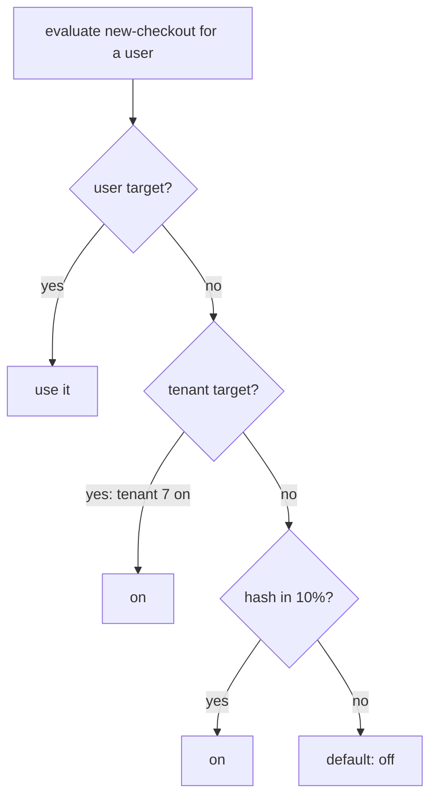

## Thesis

Changing behavior at runtime without a deploy --- a flag or config value resolved per request against a hierarchy of overrides (a global default, then environment, tenant, user), evaluated locally and safe-by-default, so you can roll a change out gradually, target a cohort, and kill it instantly, decoupling *release* from *deploy*.

## Sub

**Flags versus dynamic config** -> **the resolution hierarchy** -> **gradual rollout and the kill switch** -> **zoom out** to evaluation and staleness, and the pivots an interviewer rides from "put it behind a flag" into flag-versus-config, how you target a percentage, and what happens if the flag service is down.

## Spine

- Flags decouple **release from deploy** --- code ships dark behind a flag, and turning it on is a config change, not a deployment, so release is a runtime decision you can stage and reverse instantly.
- A flag resolves against a **hierarchy** --- a global default overridden per environment, tenant, or user, the most-specific match winning; it is the shared-definition-plus-overrides pattern applied to behavior.
- **Gradual rollout and targeting** are the point --- turn a flag on for 1 percent, then 10, then everyone, or for a specific cohort, watching metrics, so a bad change reaches few before you halt.
- The system must be **safe by default** --- if the flag service is unreachable or a flag is unknown, evaluation falls back to a safe default and reads the locally cached config, so an outage can't take the app down.

## Companion Notes

### walk

A change released behind a flag

One change from shipped-dark to fully rolled out --- the resolution against the hierarchy, the percentage rollout, and the kill switch that ends it.

Say the decoupling first --- "the flag separates release from deploy." Everything else (rollout, targeting, kill) follows from that.

### drill

Probe Drill

Graded follow-ups on release-versus-deploy, the hierarchy, rollout, and the failure mode --- the ones that separate "add a boolean" from a real flag system.

Name the safe-default behavior --- an unknown flag or a down service evaluates to the safe value, never an error.

## Drill

SDE2 | the model and the mechanics
SDE3 | rollout, evaluation, and edges
Staff | flag lifecycle and org calls

### SDE2 | what a feature flag is

What is a feature flag?

A named runtime switch that gates a piece of behavior --- the code checks the flag and does one thing if it's on, another if off. It lets you ship code that's dormant and turn it on later by changing config, not by deploying. The value is control: you decide *when* a feature is live, separately from *when* its code shipped.

### SDE2 | release vs deploy

What does "decoupling release from deploy" mean?

Deploy is putting code on servers; release is making a feature visible to users. A flag splits them --- you deploy the code dark, behind a flag that's off, and later flip the flag to release. So a risky deploy carries no user-facing change, and the actual release is a small, reversible config flip you can stage and time independently of the deployment.

### SDE2 | flags vs dynamic config

How are feature flags and dynamic config related?

Both are values resolved at runtime without a deploy --- a flag is usually a boolean gating behavior, dynamic config is any value you tune live (a timeout, a limit, a URL). They share the same machinery: a value with a default, resolvable per context, changeable without shipping code. A flag is a special case of dynamic config aimed at turning behavior on and off.

### SDE2 | the resolution hierarchy

How does a flag get a value for a given request?

It resolves against a **hierarchy**: a global default, overridden per environment, then per tenant, then per user, with the most-specific match winning. A user targeting beats a tenant setting beats the environment beats the global default. It's the shared-definition pattern --- one default, plus overrides at increasing specificity, resolved most-specific-first.

### SDE2 | gradual rollout

What is a percentage rollout?

Turning a flag on for a slice of users --- 1 percent, then 10, then 50, then all --- rather than everyone at once. You watch error rates and metrics at each step, so a bad change is caught while it affects few. It converts a release from a binary all-or-nothing event into a controlled, observable ramp you can pause or reverse.

### SDE2 | the kill switch

What is a kill switch?

A flag whose sole job is to instantly disable a feature or a dependency when it misbehaves. Because turning a flag off is a config change that propagates in seconds, you can shut down a bad feature without a rollback deploy. Every risky feature ships with one, so the response to an incident is a flip, not a redeploy under pressure.

### SDE2 | where a flag is evaluated

Is a flag evaluated on the client or the server?

Either, and it matters. **Server-side** evaluation keeps the logic and the rollout rules private and is the default for backend behavior. **Client-side** is needed to toggle UI, but the flag rules and unreleased state are then exposed to the client, so you evaluate server-side and send only the decision when secrecy matters. The rule is: don't ship targeting logic to a client you don't trust.

### SDE3 | consistent percentage rollout

How do you keep a percentage rollout consistent per user?

Hash the user id (with the flag key) to a number in a fixed range and compare against the percentage --- so a given user always lands in the same bucket and stays in or out across requests. Consistency is the point: a user shouldn't see the feature flicker on and off between requests, and hashing the id gives a stable, uniform assignment without storing per-user state.

### SDE3 | targeting rules

How do you turn a flag on for a specific cohort?

Targeting rules --- attributes on the evaluation context (plan, region, user id, tenant) matched against rules on the flag, so "on for enterprise tenants in the EU" resolves without code. The rules live as flag data, evaluated at request time against the context the app passes in. It's the same override mechanism as the hierarchy, generalized from levels to arbitrary attribute predicates.

### SDE3 | flag staleness and caching

How fresh is a flag value, and why cache it?

Flags are cached in each app instance and refreshed on a short interval or via a push, so evaluation is a local in-memory lookup with no network call per request. The trade is a small staleness window --- a change takes up to the refresh interval to reach every instance. You keep the interval short for responsiveness and accept that a flag flip isn't perfectly instantaneous fleet-wide.

### SDE3 | the flag service is down

What happens if the flag service is unreachable?

Evaluation falls back to the locally cached config, and an unknown flag resolves to its safe default --- usually off. The flag system must never be a hard dependency that takes the app down; a value is always available from the last-known cache. Fail-safe, not fail-closed-with-an-error: the app keeps serving on the last good config.

### SDE3 | flag types

What kinds of flags are there beyond on/off?

**Boolean** (on/off) is the common case, but **multivariate** flags return one of several values --- a variant for an experiment, a config choice per cohort --- and **config flags** return arbitrary values (a number, a string, JSON). The evaluation is the same; only the return type differs. Multivariate is what makes flags usable for A/B experiments, not just toggles.

### SDE3 | it is shared-definition

How is a flag system the shared-definition pattern?

A flag is a definition with a default; the per-environment, per-tenant, per-user settings are overrides; resolution is most-specific-wins. That's exactly a definitions table plus a polymorphic values table resolved by specificity. Recognizing it means the same concerns apply --- validate flag values on write, index the lookup, and cache the resolution --- because it's the same shape with "flag" in place of "attribute."

### SDE3 | evaluation performance

Why must flag evaluation be local and fast?

Because it's on the hot path --- every request may evaluate several flags, so a network call per flag would add latency to everything. So the flag set is cached locally and evaluated in memory, turning each check into a map lookup and a hash. A flag system that added a round-trip per evaluation would make flags too expensive to use liberally, which defeats their purpose.

### Staff | flag debt

What is flag debt and why does it matter?

Flags that outlived their rollout and now sit permanently on, cluttering code with dead branches and untested combinations. Every flag is a fork in the code; a hundred stale flags is exponential untested state and a maintenance and reasoning burden. Flags are meant to be temporary for rollouts --- so you track their age and retire them, treating a long-lived flag as debt to pay down, not a permanent switch.

### Staff | flags vs config vs secrets

How do flags, config, and secrets differ operationally?

**Flags** gate behavior and change often, for rollout. **Config** tunes values and changes occasionally. **Secrets** are credentials --- they need encryption, tight access, and rotation, and must never sit in a flag system's plaintext store. Conflating them is the risk: putting a secret in a config flag leaks it. Each has its own store and its own change controls.

### Staff | a bad flag is an incident

How do flags change incident response?

They make the fastest mitigation a flip, not a deploy --- a misbehaving feature or a failing dependency is disabled by turning its flag off, which propagates in seconds. So the incident playbook for a flagged feature is "kill the flag first, investigate second." The flip itself is a change, so it's audited and, for sensitive flags, gated --- but the point is a bounded, instant mitigation.

### Staff | config validation and safe rollout

How do you roll out a *config* change safely, not just a flag?

Validate the new config against a schema before it's applied, then deploy it in stages with monitoring and automatic rollback --- push to a canary, watch health, then widen, and roll back if a metric regresses. A bad config value can break the fleet as hard as bad code, so a managed config service (like AppConfig) treats a config change as a monitored, staged, reversible deployment, not an instant global write.

### Staff | experimentation

How do flags support A/B experiments?

A multivariate flag assigns each user a variant by a consistent hash, and the app records which variant a user saw alongside the outcome metric, so you can compare cohorts. The flag system is the assignment-and-exposure layer; the analysis is separate. The care is a stable assignment (a user stays in one variant) and clean exposure logging, or the experiment's results are noise.

### Staff | who can change a flag

Why gate and audit flag changes?

Because a flag flip is a production change --- it can release an unfinished feature or disable a dependency, so who can flip which flags, and a record of every change, matters. High-blast-radius flags (a kill switch, a rollout to all) warrant approval and an audit trail, exactly like the rules engine's governed changes. A flag system without change controls is an ungoverned path to production behavior.

### Staff | when a flag is wrong

When is a feature flag the wrong tool?

For permanent behavior (that's config or just code, not a flag to leave on forever), for a change with no rollback concern (the flag is pure overhead), and for anything needing a coordinated multi-service switch (a flag per service races; you need a real migration). Flags earn their place for gradual, reversible, targeted rollout --- not as a substitute for configuration or for proper change management.

## Walk

### Ship the code dark behind a flag

```flow
d[deploy code] -> f[flag off by default] -> u[users see no change]
```

The code for the new feature ships to production behind a flag that's off. The deploy carries no user-facing change --- the feature is dormant, so shipping it is low-risk and decoupled from releasing it.

This is the core move: deploy and release are now separate events. The code being live is a deployment fact; the feature being visible is a runtime decision you make later, independently, and can reverse.

### Resolve the flag against the hierarchy

```flow
r[request context] -> h[resolve: default to override] -> v[on or off for this user]
```

On each request, the flag resolves against a hierarchy --- a global default, overridden per environment, tenant, or user --- with the most-specific match winning. The evaluation reads the flag's rules against the context the app passes in.

```json
{
  "key": "new-checkout",
  "default": false,
  "rollout": { "percent": 10 },
  "targets": [ { "tenant": 7, "value": true } ]
}
```

It's the shared-definition pattern applied to behavior: one default, plus overrides at increasing specificity. Here the flag is off by default, forced on for tenant 7, and otherwise on for 10 percent of users --- all resolved from data, no code change.

### Roll out by percentage, consistently

```flow
p[percent rollout] -> hsh[hash user id] -> b[stable in or out]
```

The percentage rollout turns the flag on for a slice of users. To keep it consistent, the user id (with the flag key) is hashed into a fixed range and compared against the percentage --- so a given user always lands in the same bucket and doesn't see the feature flicker between requests.

You ramp the percentage --- 1, 10, 50, 100 --- watching metrics at each step. A bad change surfaces while it affects a small, bounded group, so you halt before it's everyone. The ramp turns a release into an observable, reversible experiment.

### The kill switch and the safe default

```flow
k[flip flag off] -> c[cache refresh] -> s[feature disabled fast]
```

If the feature misbehaves, flipping its flag off disables it within the cache-refresh window --- seconds, not a rollback deploy. And if the flag service itself is unreachable, evaluation falls back to the locally cached config, with an unknown flag resolving to its safe default.

So the system is safe by default in two directions: a bad feature is killed by a flip, and a flag-service outage can't take the app down because every instance evaluates on its last-known config. The flag is a control, never a new hard dependency.

### Model Script

- Frame the decoupling | "A feature flag separates release from deploy. The code ships dark behind a flag that's off, so the deploy carries no user-facing change, and releasing the feature is a later config flip I can stage, time, and reverse. Release becomes a runtime decision, not a deployment."
- The hierarchy | "A flag resolves per request against a hierarchy --- a global default, overridden per environment, tenant, or user, most-specific wins. It's the shared-definition pattern applied to behavior: one default plus overrides at increasing specificity, resolved from data with no code change."
- Rollout and consistency | "The point is gradual rollout: on for 1 percent, then 10, then everyone, watching metrics, so a bad change hits few before I halt. To keep it consistent I hash the user id into a bucket, so a user stays in or out across requests and doesn't see the feature flicker."
- Safety | "And it's safe by default. Every risky feature has a kill switch --- flipping the flag off disables it in seconds, no rollback deploy. And if the flag service is down, evaluation falls back to the locally cached config and unknown flags resolve to a safe default, so the flag system can never take the app down."
- Interviewer: "You need to tune a timeout live, not just toggle a feature. Same system?"
- Config vs flags | "Same machinery --- a value with a default, resolvable per context, changeable without a deploy. That's dynamic config; a flag is the boolean special case. But a config value can break the fleet as hard as bad code, so I'd validate it against a schema and roll it out in stages with monitoring and auto-rollback --- a managed config service treats a config change as a staged, reversible deployment."
- Land it | "So: flags decouple release from deploy, resolve against a most-specific-wins hierarchy, roll out by a consistent-hash percentage with a kill switch, and stay safe by default via local caching. The one line is that release becomes a controlled, reversible runtime decision."

## Whiteboard

Sketch the resolution and the rollout, and mark the safe default.

### How does a flag get its value?

A hierarchy resolved most-specific-first --- user targeting beats tenant beats environment beats the global default.

### What keeps a percentage rollout stable?

A consistent hash of the user id, so the same user stays in or out and the feature doesn't flicker between requests.



Verdict: most-specific override wins, a consistent hash drives the percentage, and an unknown flag or a down service falls to the safe default.

## System

Zoom out to where flag evaluation sits on the request path.

### Where it sits

Flag config source: definitions, rollout rules, targets
Local cache in each instance: the last-known config, refreshed [*]
Evaluation on the request path: in-memory resolve against the context
The feature: gated behind the resolved value
Safe default / fallback: used when a flag is unknown or the service is down

### Pivots an interviewer rides

From "put it behind a flag" they push on flag-versus-config, targeting, and the failure mode.

#### A flag or a config value?

-> same machinery; a flag is the boolean toggle, config is any tuned value
Both are runtime values with a default, resolvable per context, changeable without a deploy. A flag gates behavior; dynamic config tunes a number or a string. A config change, being higher-blast-radius, gets schema validation and a staged rollout.

#### What happens when the flag service is down?

-> fall back to the local cache and the safe default
Every instance evaluates on its cached config, and an unknown flag resolves to its safe default (usually off). The flag system is never a hard dependency, so its outage can't take the app down.

## Trade-offs

The calls that separate "add a boolean" from a designed flag system.

### Flag behind a deploy vs release with the deploy

- Flag: deploy dark and release later with a reversible flip, at the cost of a flag and its cleanup
- Ship-and-release together: no flag overhead, but the deploy *is* the release, so a bad change needs a rollback deploy

Flag anything risky or worth a gradual rollout; ship trivial, low-risk changes directly to avoid flag debt.

### Server-side vs client-side evaluation

- Server-side: rollout rules and unreleased state stay private, but the client can't toggle its own UI without a decision from the server
- Client-side: toggles UI directly, but exposes targeting logic and unreleased features to an untrusted client

Evaluate server-side for anything sensitive and send only the decision; evaluate client-side only for non-secret UI toggles.

### Short refresh vs push updates

- Short polling refresh: simple, but a flip takes up to the interval to reach every instance
- Push (streaming) updates: near-instant propagation, but a live connection to every instance to operate

Poll on a short interval for simplicity; add push only where a flip must land fleet-wide in well under a second.

## Model Answers

### release vs deploy | Why flags exist

The decoupling to lead with.

- Deploy dark, release later | key | code ships off behind a flag
- Gradual, reversible ramp | store | 1 to 10 to 100 percent, watch metrics
- Kill switch | note | a bad feature is a flip, not a rollback

### the hierarchy | How a flag resolves

The shared-definition shape.

- Default plus overrides | key | global, env, tenant, user
- Most-specific wins | store | user beats tenant beats env beats default
- Safe default on failure | note | unknown flag or down service to off

## Numbers

Back-of-envelope the evaluation load and why it must be local.

Every request resolves its flags, so evaluation lives in memory off a locally cached config --- no network hop per flag. A kill switch reaches the fleet within the refresh window.

- rps | Requests/sec | 20000 | 0 | 1000
- flags | Active flags | 200 | 0 | 10
- rolloutPct | Rollout (%) | 10 | 0 | 5

```js
function (vals, fmt) {
  var rps = vals.rps, flags = vals.flags, rolloutPct = vals.rolloutPct;
  return [
    { k: 'Flag evaluations/sec', v: fmt.n(rps), u: '/s', n: 'every request resolves its flags \u2014 which is why evaluation is a local in-memory lookup, never a network call per flag', over: false },
    { k: 'In a ' + rolloutPct + '% rollout', v: fmt.n(rolloutPct) + '%', u: 'of users', n: 'a consistent hash puts this fraction in the on group, and the same user stays in or out across requests so the experience never flickers', over: false },
    { k: 'Eval latency', v: '~0', u: 'ms', n: 'flags cached locally and evaluated in memory \u2014 a map lookup and a hash add nothing measurable to the request path', over: false },
    { k: 'Config cached locally', v: fmt.n(flags), u: 'flags', n: 'the whole flag set is cached in each instance, so an outage of the flag service can not take the app down \u2014 it evaluates on the last-known config', over: false },
    { k: 'Kill-switch reach', v: 'seconds', u: '', n: 'flipping a flag off propagates within the cache-refresh window \u2014 a bad feature is contained in seconds, not a rollback deploy', over: false }
  ];
}
```

## Red Flags

What makes an interviewer wince.

### "The flag service is a hard dependency --- if it's down, we error"

Then a flag-system outage takes down your app, which is backwards: the flag was meant to add control, not a new single point of failure.

Cache the flag config locally and resolve unknown flags to a safe default, so an outage means last-known behavior, not an error.

### "We just leave the flags in once the feature's out"

Every stale flag is a dead branch and untested combinations --- a hundred of them is exponential untested state and a reasoning burden.

Treat rollout flags as temporary: track their age and retire them once the feature is fully shipped.

### "Ship the targeting rules to the client"

That leaks your rollout logic and unreleased features to an untrusted client, who can read or flip them.

Evaluate server-side and send only the decision when the rules or the unreleased state must stay private.

## Opener

### 30s | The one-liner

How I open when asked to add feature flags.

#### What is the shape?

A runtime switch resolved per request against a most-specific-wins hierarchy, so releasing a feature is a config flip, not a deploy.

#### What is the payoff?

Gradual, targeted, reversible rollout with an instant kill switch --- release decoupled from deploy, safe by default.

##### Hooks

Where an interviewer usually pushes next.

- Flag or config? | same machinery, boolean vs value | trade
- Consistent rollout? | hash the user id into a bucket | drill
- Service down? | local cache plus safe default | drill

Foot: two sentences --- flags decouple release from deploy, resolved against a hierarchy, safe by default.

## Bank

### SCALE | Twenty thousand requests a second evaluating flags

Task: argue evaluation stays cheap at this rate.
Model: the flag set is cached locally in each instance and resolved in memory, so a check is a map lookup and a hash --- no network hop per flag --- and a flip reaches the fleet within the refresh window.
Int: what would make flags too expensive to use?
A network round-trip per evaluation; local caching is what makes flags cheap enough to use liberally.

### DESIGN | Roll a risky checkout change out safely

Task: design the rollout and the safety net.
Model: ship dark behind a flag, resolve against a default-plus-overrides hierarchy, ramp a consistent-hash percentage while watching metrics, and keep a kill switch; fall back to the safe default if the flag service is down.
Int: how do you keep a user's experience stable during the ramp?
Hash the user id so they stay in the same bucket across requests --- no flicker.

### Extra Curveballs

### CURVEBALL | incident | A newly-ramped feature is spiking errors at 50 percent rollout. What's the move?

Model: flip its kill switch first --- disabling the flag propagates in seconds and contains the incident without a rollback deploy --- then investigate with the feature off. Because the flip is a production change, it's audited, but the mitigation is instant and bounded, which is the whole point of shipping the feature behind a flag.

### Frames

- Flags decouple release from deploy
- Resolution is the shared-definition hierarchy, most-specific wins
- Safe by default --- cached config, safe fallback, instant kill switch
