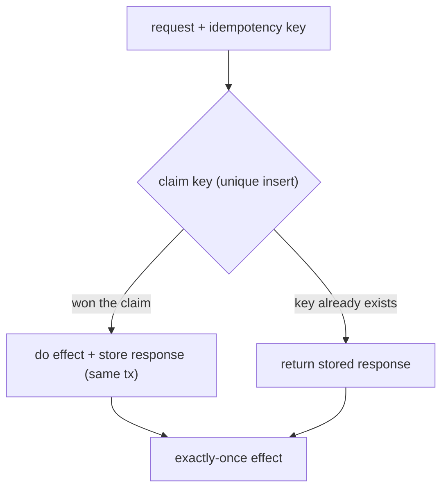

## Thesis

Making an operation safe to apply more than once --- so a retried request, a redelivered message, or a double-clicked button produces the same result as a single application, not a double charge or a duplicate record --- by giving each operation a stable identity the system records and deduplicates, because "exactly-once delivery" doesn't exist in a distributed system and at-least-once plus idempotency is how you get an exactly-once *effect*.

## Sub

**Why idempotency: retries are unavoidable** -> **naturally idempotent vs made idempotent** -> **the idempotency key and the dedup mechanism** -> **zoom out** to exactly-once-effect, key scope, and concurrency, and the pivots an interviewer rides from "just retry it" into why-not-exactly-once-delivery, the idempotency key, and two duplicates arriving at once.

## Spine

- Idempotency exists because **retries are unavoidable** --- a network call can fail ambiguously (the request may have succeeded; the caller can't tell), queues redeliver, clients double-submit, so any operation *will* be attempted more than once, and the only question is whether that's safe.
- Some operations are **naturally idempotent** (a PUT that sets a value, a DELETE); the rest must be **made** idempotent, usually by attaching a stable **idempotency key** the server records, so a repeat with the same key returns the first result instead of acting again.
- The mechanism is **recognize-and-dedup** --- record the key (and ideally the response) *atomically* with the effect, so a duplicate is detected and the original outcome replayed rather than a second charge applied.
- The goal is **exactly-once effect from at-least-once delivery** --- you can't guarantee a message arrives exactly once, but you can guarantee that processing it twice has the same effect as once, which is what "exactly-once" means in practice.

## Companion Notes

### walk

One operation made safe to repeat

One request from an ambiguous failure to a deduplicated, exactly-once effect --- the retry that forces the problem, the idempotency key that gives the operation identity, the atomic dedup that recognizes the repeat, and the concurrency edge where two duplicates race.

Say the impossibility first --- "exactly-once delivery doesn't exist; you get at-least-once and make the effect idempotent." Everything else is how you buy exactly-once *effect* on top of unreliable delivery.

### drill

Probe Drill

Graded follow-ups on retries, idempotency keys, atomic dedup, and exactly-once semantics --- the ones that separate "add a retry" from an operation that's actually safe to repeat.

Name the real guarantee: you can't stop a message arriving twice, but you can make processing it twice equal processing it once --- exactly-once effect, not exactly-once delivery.

## Drill

SDE2 | the model and the mechanics
SDE3 | keys, dedup, and consumers
Staff | exactly-once, scale, and atomicity

### SDE2 | what idempotency is

What does it mean for an operation to be idempotent?

Applying it multiple times has the same effect as applying it once. Setting a user's email to a value is idempotent --- do it once or five times, the end state is identical. Incrementing a balance by 10 is *not* --- five applications add 50. The property is about the *effect on state*, not the return value, and it's what makes an operation safe to retry: if you can't tell whether your first attempt landed, you can safely try again only if a second application can't do harm.

### SDE2 | why it matters

Why is idempotency such a big deal in distributed systems?

Because retries are unavoidable and failures are ambiguous. When a network call times out, the caller genuinely cannot tell whether the request succeeded and the *response* was lost, or the request never arrived --- so the only safe move is to retry, and now the operation might run twice. Add queues that redeliver on at-least-once semantics and users who double-click, and every operation will eventually be attempted more than once. Idempotency is what makes that safe instead of a double charge.

### SDE2 | naturally idempotent operations

Which operations are naturally idempotent?

Ones that *set* rather than *change-by-a-delta*: a PUT that writes a full value, a DELETE (deleting an already-deleted thing is a no-op), a GET (no effect at all). These are idempotent by construction --- repeating them can't move the state further. The non-idempotent ones are the relative operations: "add 10," "append an item," "create a new record" (a POST) --- each repeat does more. The HTTP method semantics encode exactly this: GET, PUT, DELETE are defined as idempotent; POST is not.

### SDE2 | what an idempotency key is

What is an idempotency key?

A unique token the client attaches to a request so the server can recognize a retry of *that specific operation*. The client generates it once (a UUID) and sends it with the original request and every retry; the server records which keys it has already processed, so a repeat with a seen key returns the original result instead of executing again. It's how you give a non-idempotent operation ("charge this card") an identity, turning "did I already do this?" from unanswerable into a lookup.

### SDE2 | at-least-once vs exactly-once

What's the difference between at-least-once and exactly-once delivery?

**At-least-once**: the system guarantees a message is delivered, but possibly more than once (it retries until acknowledged, so a lost ack causes redelivery). **Exactly-once**: the fantasy that each message is delivered once and only once. At-least-once is what real queues and networks give you, because the alternative (at-most-once) drops messages on failure. Exactly-once *delivery* is effectively impossible over an unreliable network; what you actually build is at-least-once delivery plus idempotent processing, which yields exactly-once *effect*.

### SDE2 | the double-charge example

Give a concrete example of why this matters.

A payment. A client sends "charge this card $50," the charge succeeds, but the response is lost to a network blip. The client, seeing a timeout, retries --- and without idempotency, the card is charged $50 twice. With an idempotency key on the request, the server recognizes the retry as the same operation, skips the second charge, and returns the original success. This is the canonical case: any operation with a real-world side effect (money, email, provisioning) must be idempotent, because the retry that causes the double effect is not a bug you can eliminate --- it's inherent to unreliable networks.

### SDE2 | HTTP method semantics

How do HTTP methods relate to idempotency?

The spec defines GET, HEAD, PUT, and DELETE as idempotent, and POST as not. A client (or a proxy) may safely retry a GET, PUT, or DELETE automatically, because repeating them is defined to be harmless; it must *not* blindly retry a POST, because a second POST typically creates a second resource. This is why "create" endpoints (POST) are the ones that need explicit idempotency keys, while "set" and "delete" endpoints are safe by their semantics --- the method is a contract about repeatability, and honoring it is what lets the whole HTTP stack retry correctly.

### SDE3 | implementing an idempotency key

How do you actually implement idempotency-key handling?

Record the key and the outcome in a store, keyed by the idempotency key, *atomically with the effect*: when a request arrives, check whether the key exists; if not, perform the operation and persist "key -> result" in the same transaction; if it does, return the stored result without re-running. The critical parts are that the check-and-store is atomic (a unique constraint on the key, so a duplicate insert fails rather than double-executes) and that you store the *response*, so a retry gets the original answer, not just a "already done." Done right, the second request is indistinguishable from the first to the client.

### SDE3 | exactly-once effect vs delivery

If exactly-once delivery is impossible, what does "exactly-once" mean in practice?

Exactly-once *effect* (sometimes "effectively-once"). You accept at-least-once *delivery* --- the message may arrive multiple times --- and you make the *processing* idempotent, so duplicates have no additional effect. The end state is as if the message were processed exactly once, even though it was delivered more than once. Systems that advertise "exactly-once" (some stream processors) achieve it this way internally: at-least-once delivery plus deduplication or transactional idempotent writes. The distinction matters because chasing exactly-once *delivery* is a dead end; making the *effect* idempotent is the achievable, correct goal.

### SDE3 | concurrent duplicates

What happens when two copies of the same request arrive at the same time?

The race: both check for the idempotency key, both find it absent, and both proceed to execute --- a double effect, exactly what the key was meant to prevent. The fix is to make the key claim atomic: a **unique constraint** on the key column so the second insert fails, or a conditional write / lock so only one request can be "in flight" for a given key. The loser then either waits for the winner's result or returns it. Idempotency isn't just about sequential retries; it has to hold under concurrent duplicates, which is why the dedup has to be an atomic claim, not a check-then-act.

### SDE3 | key scope and TTL

How long do you remember idempotency keys, and at what scope?

Long enough to cover the maximum retry horizon of any caller, and scoped so keys can't collide across unrelated operations. The **TTL** must exceed how long a client might keep retrying (hours, sometimes days) --- forget too soon and a late retry is treated as new, re-executing the effect. The **scope** is usually per-endpoint or per-account, so the same key value used for two different operations doesn't accidentally dedup them. There's a storage cost (every request stores a key), so you set the shortest TTL that safely exceeds real retry windows, and clean up expired keys.

### SDE3 | what to return on a duplicate

When you detect a duplicate, what should the response be?

The **original response**, replayed --- the same status, the same body, as if the first call were happening now. Returning an error ("duplicate request") is wrong, because from the client's perspective its retry *is* the request, and it needs the actual result (the charge id, the created resource). So you store the original response alongside the key and serve it on a duplicate. The client can't distinguish the replay from a fresh success, which is exactly the goal: the retry is transparent, and the client gets what it would have gotten had no failure occurred.

### SDE3 | making an operation idempotent

How do you make an inherently non-idempotent operation idempotent?

Three common techniques. **Client-supplied idempotency key** with server-side dedup (the general method, for "create"/"charge"). **Natural-key dedup / upsert**: use a business key that's already unique (an order id) and do an insert-or-ignore or upsert, so a repeat updates rather than duplicates. **Conditional operations**: make the change contingent on current state (compare-and-swap, "set status to shipped *only if* pending"), so a repeat is a no-op because the precondition no longer holds. Which you use depends on whether there's a natural unique key and whether the operation is a state transition or a creation.

### SDE3 | idempotency in message consumers

How do you make a message-queue consumer idempotent?

Deduplicate on a stable message identity. Since the queue is at-least-once, the consumer will occasionally see the same message twice, so you record processed message ids (or, for a partitioned log like Kafka, track the committed offset) and skip anything already handled --- or make the write itself idempotent (an upsert keyed by the message's business id). The consumer must assume redelivery, so the handler is written so that reprocessing is safe: dedup by id, or design the side effect to be naturally idempotent. This is the queue-side version of the same principle: at-least-once delivery, idempotent processing.

### Staff | exactly-once is a myth

An interviewer says "we need exactly-once processing." How do you respond?

By reframing it: exactly-once *delivery* is essentially impossible over an unreliable network (you can't distinguish a lost message from a lost acknowledgment, so you must either risk dropping or risk duplicating, and safe systems choose at-least-once). What's achievable is exactly-once *effect* --- at-least-once delivery plus idempotent processing or transactional dedup. So the answer isn't "we'll guarantee each message is delivered once"; it's "we'll accept duplicates and make processing them idempotent, so the outcome is as if each were processed once." Naming this distinction is a senior signal: it shows you know the guarantee to design for is on the *effect*, not the delivery.

### Staff | dedup store at scale

What are the challenges of the idempotency-key store at high volume?

It's a write on every request, holding every key for its TTL, so at scale it's a large, hot, short-lived dataset --- and it's on the critical path (every operation checks it), so it must be fast and highly available or it becomes the bottleneck and the single point of failure for the whole write path. You size it for peak-rate times TTL, use a store with efficient TTL expiry (Redis with per-key expiry, or DynamoDB TTL), pick the shortest safe TTL to bound the size, and make sure its unavailability degrades gracefully (do you fail closed and reject writes, or fail open and risk duplicates?). The dedup layer's own reliability becomes part of the system's reliability.

### Staff | the atomicity problem

Why is committing the key and the effect together the hard part?

Because if they're separate steps, a crash between them corrupts the guarantee. Perform the charge, then (before recording the key) crash --- the retry finds no key and charges again: a double effect. Record the key, then crash before the charge --- the retry finds the key and skips: a *lost* effect (a "success" with no charge). So the key and the effect must be in one atomic unit: same database transaction if both are in the same store, or a carefully designed protocol (the effect writes the key as part of its own transaction, or an outbox pattern) if they span systems. Idempotency reduces to a *transactional* problem, and getting the atomicity wrong gives you exactly the double- or lost-effect the key was supposed to prevent.

### Staff | idempotency across side effects

How do you keep idempotency when one operation has several side effects across systems?

You can't wrap external systems in one transaction, so you make each step independently idempotent and drive them so the whole flow is safe to replay. Give the operation one idempotency key and thread it through: each downstream call (charge, then provision, then email) is itself idempotent on that key, so replaying the flow re-runs each step but none double-acts. Often this is an idempotent state machine or a saga --- the flow records how far it got, and a retry resumes, with each step's idempotency ensuring re-execution is harmless. The principle scales from one write to a multi-step process: identity flows through, and every step dedups on it.

### Staff | natural keys vs generated keys

Client-supplied idempotency key, or dedup on a natural business key --- which?

Depends on whether a natural unique key exists and who owns identity. A **natural key** (order id, a hash of the request content) needs no extra token and dedups meaningfully --- two requests for "order 123" *are* the same operation --- but requires that such a key genuinely exists and is stable. A **client-generated key** (a random token) works for operations with no inherent unique identity ("charge this card," where two legitimate identical charges are possible), putting the client in charge of declaring "this is the same operation as before." Content-hash keys risk conflating two intentionally-identical operations; random keys risk a client not reusing the key on retry. The choice is really "is there a business identity, or must the client assert one?"

### Staff | idempotency and ordering

How does idempotency relate to commutativity and ordering?

They're distinct properties that often need to be reasoned about together. Idempotency handles *duplicates* (same operation twice); commutativity handles *reordering* (operations arriving in a different order still converge). A retry-heavy, out-of-order stream needs both: dedup so a repeat is harmless, and either order-independence or a way to reject stale updates (a version/sequence number, last-writer-wins by timestamp). Idempotency alone doesn't fix ordering --- two *different* idempotent updates applied in the wrong order can still leave the wrong state --- so at scale you frequently pair idempotency keys with a monotonic version to get "each update applied once, and stale ones ignored." Knowing they're separate concerns is the senior nuance.

### Staff | when not to bother

When is idempotency not worth the cost?

When the operation is already naturally idempotent (a pure set or delete needs no key), when it's a safe read, or when the cost of a rare duplicate is genuinely trivial and the dedup machinery would cost more than it saves (a best-effort metric increment, a non-critical log). Idempotency adds a store, a write on every request, and latency on the critical path, so you spend it where a duplicate does real harm --- money, provisioning, anything with an external irreversible effect --- and skip it where duplicates are harmless or the operation is idempotent by construction. Blanket idempotency on every endpoint is over-engineering; the discipline is applying it precisely where at-least-once delivery would otherwise cause a costly double effect.

## Walk

### The ambiguous failure that forces retries

```flow
c[client sends request] -> t[timeout: no response] -> u[succeeded? unknown -> must retry]
```

A client calls "charge this card" and the connection times out before a response comes back. The fundamental problem: the client cannot tell whether the charge succeeded and the *response* was lost, or the request never arrived at all.

Faced with that ambiguity, the only safe behavior is to retry --- dropping the operation risks losing a legitimate charge. But now the operation may run twice. This isn't a bug to fix; it's inherent to unreliable networks, and it's why every operation with a real side effect needs to be safe to repeat.

### Attach an idempotency key

```flow
g[client generates key once] -> s[sends key with request + every retry] -> k[server checks the key]
```

To make the retry safe, the client gives the operation an identity: it generates a unique idempotency key once and sends it with the original request and every retry.

```bash
# same key on the first attempt AND every retry
curl -X POST https://api/charges \
  -H "Idempotency-Key: 7f3a1c2e-9b04-4d1e-8a6f-2c5e1d9b3a01" \
  -d '{ "card": "tok_visa", "amount": 5000 }'
```

The key is the operation's fingerprint: it lets the server recognize "this is a retry of the charge I may have already done," turning the unanswerable "did I already run this?" into a lookup. The client must reuse the *same* key on retries --- a fresh key per attempt would defeat the whole mechanism.

### Recognize and dedup, atomically

```flow
k[key seen?] -> n[no: do effect + store key+result in ONE tx] -> y[yes: return the stored result]
```

The server checks whether it has seen the key. If not, it performs the effect and records the key together with the response --- and the "together" must be atomic:

```sql
-- claim the key atomically; a duplicate insert fails instead of double-charging
INSERT INTO idempotency_keys (key, status, response)
VALUES ('7f3a1c2e-...', 'processing', NULL)
ON CONFLICT (key) DO NOTHING;
-- only the request that inserted the row proceeds to charge;
-- it then writes status='done' + the response in the SAME transaction as the charge
```

The unique constraint on `key` is what makes the claim atomic --- exactly one request inserts the row and proceeds; any duplicate hits the conflict and instead reads back the stored result. Storing the *response* (not just a flag) means a retry gets the original charge id, indistinguishable from the first call. And committing the key with the effect in one transaction is essential: a crash between them would either double-charge (no key recorded) or lose the charge (key recorded, effect not).

### Concurrent duplicates, and exactly-once effect

```flow
two[two copies arrive at once] -> claim[unique key: one wins the insert] -> once[other returns the winner's result]
```

The dedup has to hold not just for sequential retries but for two duplicates arriving simultaneously. A naive check-then-act races --- both see no key, both charge. The atomic claim closes it: both attempt the insert, the unique constraint lets exactly one win, and the loser reads back (or waits for) the winner's result.

The net is **exactly-once effect from at-least-once delivery**: the network delivered the request more than once, but the card was charged exactly once and every caller got the same answer. That's what "exactly-once" actually means in a real system --- not that the message arrived once (impossible), but that its *effect* happened once. Idempotency is the mechanism that buys it.

### Model Script

- Frame the impossibility | "The starting point is that exactly-once delivery doesn't exist over an unreliable network. When a call times out, the client can't tell if the request was lost or just the response, so it has to retry -- and now the operation might run twice. You can't eliminate that; it's inherent. So the goal isn't exactly-once delivery, it's exactly-once effect: accept that duplicates happen, and make processing them idempotent."
- Natural vs made idempotent | "Some operations are naturally idempotent -- a PUT that sets a value, a DELETE -- and those are safe to retry by construction; HTTP even defines them that way. The dangerous ones are the creates and the deltas: charge a card, append a record. Those I make idempotent with an idempotency key: the client generates a unique token once and sends it on the original request and every retry, giving the operation an identity the server can recognize."
- The dedup mechanism | "The server records the key with the result, atomically with the effect. First time: do the charge and store key-to-response in one transaction. Retry: find the key, return the stored response -- the original charge id, not an error, so the client's retry is transparent. The atomicity is the crux: if the key and the effect aren't in one transaction, a crash between them either double-charges or loses the charge. So idempotency is really a transactional problem."
- Concurrency and consumers | "It has to hold under concurrent duplicates too -- two copies arriving at once. A check-then-act races, so I make the claim atomic: a unique constraint on the key, so exactly one request wins the insert and the other returns its result. Same idea on the queue side: consumers are at-least-once, so I dedup on message id or make the write an upsert. At-least-once delivery, idempotent processing."
- Interviewer: "The team wants exactly-once processing across a payment and three downstream calls. How?"
- Multi-step idempotency | "One idempotency key threaded through the whole flow, and every step independently idempotent on it -- the charge, the provisioning, the email each dedup on that key, so replaying the flow re-runs each step but none double-acts. That's an idempotent state machine or a saga: it records how far it got and resumes on retry, with each step's idempotency making re-execution harmless. You can't wrap external systems in one transaction, so you make identity flow through and every step safe to repeat."
- Land it | "So: retries are unavoidable and failures are ambiguous, so every side-effecting operation must be safe to repeat. Naturally-idempotent ones are free; the rest get an idempotency key, deduplicated atomically with the effect, returning the original response, holding under concurrent duplicates, and threaded through multi-step flows. The one line is that you can't get exactly-once delivery, so you build at-least-once delivery plus idempotent processing to get exactly-once effect -- and the hard part is the atomicity of recording the key with the effect."

## Whiteboard

Sketch the dedup path and mark where the atomic claim happens.

### Where does the double-effect get prevented?

At the atomic key claim -- a unique constraint (or conditional write) lets exactly one request execute the effect; every duplicate reads back the stored result instead of acting.

### Why must the key and the effect commit together?

Because a crash between them breaks the guarantee: effect-then-key double-charges on retry, key-then-effect loses the charge. One atomic transaction is the only safe ordering.



Verdict: the atomic key claim is the whole mechanism -- one winner does the effect and stores its response transactionally; duplicates replay that response, giving exactly-once effect over at-least-once delivery.

## System

Zoom out to where idempotency sits in the request path.

### Where it sits

Client: generates the idempotency key, reuses it on every retry [*]
Network / queue: at-least-once -- duplicates and ambiguous failures happen here
Dedup store: records key -> status + response, atomic claim, TTL'd
The effect: charge / create / provision -- committed with the key in one tx
Downstream: each side effect independently idempotent on the same key

### Pivots an interviewer rides

From "just retry" they push on delivery guarantees, concurrency, and atomicity.

#### Can you guarantee exactly-once?

-> exactly-once effect, not delivery: at-least-once + idempotent processing
Exactly-once delivery is impossible over an unreliable network; you accept duplicates and dedup them so the effect happens once, which is what exactly-once means in practice.

#### Two duplicate requests arrive simultaneously -- what happens?

-> an atomic key claim (unique constraint) lets exactly one execute; the other replays its result
A check-then-act races and double-executes; making the claim atomic closes the window so concurrency can't produce a double effect.

## Trade-offs

The calls that separate "add a retry" from a retry-safe operation.

### Idempotency key vs natural-key dedup

- Client-supplied key: works for operations with no natural identity (a charge), client asserts sameness -- but the client must reuse the key correctly on retry
- Natural business key / upsert: no extra token, dedups on real identity (order id) -- but requires a genuinely unique, stable business key to exist

Use a natural key when one exists (upsert on it); fall back to a client-supplied idempotency key when the operation has no inherent unique identity.

### Fail-open vs fail-closed on the dedup store

- Fail-open (proceed if the store is down): availability preserved -- but risks duplicate effects during the outage
- Fail-closed (reject if the store is down): no duplicates -- but the dedup store becomes a hard dependency that can halt writes

Choose by the cost of a duplicate: fail-closed for money and irreversible effects; fail-open where a rare duplicate is tolerable and availability matters more.

### Idempotency everywhere vs where it counts

- Everywhere: uniform, never think about it -- but a store write and latency on every request, much of it unnecessary
- Targeted: spend the cost only where duplicates do harm -- but you must judge which operations need it

Apply idempotency to side-effecting, irreversible operations (money, provisioning, notifications); skip it for naturally-idempotent sets/deletes and safe reads.

## Model Answers

### the reframe | Exactly-once effect, not delivery

The frame to lead with.

- Delivery is at-least-once | key | duplicates and ambiguous failures are inherent
- Make processing idempotent | store | so a duplicate has no additional effect
- Net: exactly-once effect | note | what exactly-once actually means

### the mechanism | Atomic key claim

How you buy it.

- Idempotency key = operation identity | key | client generates once, reuses on retry
- Claim it atomically | store | unique constraint -> one winner does the effect
- Commit key + effect together | note | or a crash double-charges or loses the charge

## Numbers

Back-of-envelope the duplicate rate, the dedup-store size, and the guarantee.

Every request carries a key and hits the dedup store; duplicates arrive constantly, and keys are held for a TTL that must exceed any caller's retry horizon.

- rps | Requests/sec | 1000 | 0 | 100
- dupPct | Duplicate / retry rate (%) | 3 | 0 | 1
- keyTTL | Idempotency key TTL (hrs) | 24 | 1 | 1

```js
function (vals, fmt) {
  var rps = vals.rps, dupPct = vals.dupPct, keyTTL = vals.keyTTL;
  var dupsPerSec = rps * dupPct / 100;
  var keysStored = rps * 3600 * keyTTL;
  return [
    { k: 'Duplicate requests', v: fmt.n(Math.round(dupsPerSec)), u: '/sec', n: 'at ' + dupPct + '% retries and double-submits these arrive constantly \u2014 each must produce the same effect as the original, or you double-charge', over: false },
    { k: 'Keys to store', v: fmt.n(keysStored), u: 'over the TTL window', n: 'every request records a key held for ' + keyTTL + 'h \u2014 the dedup store must hold this many, so TTL and cleanup are a real, hot-path cost', over: keysStored > 1e8 },
    { k: 'The guarantee', v: 'exactly-once effect', u: 'from at-least-once', n: 'you cannot guarantee a message arrives once, but you can guarantee processing it twice equals once \u2014 that is what exactly-once means', over: false },
    { k: 'Atomicity', v: 'key + effect', u: 'one transaction', n: 'they must commit together \u2014 effect-then-key double-charges on retry, key-then-effect loses the charge; one atomic tx is the only safe ordering', over: false },
    { k: 'Dedup window', v: fmt.n(keyTTL), u: 'hrs remembered', n: 'keys live only this long \u2014 a retry after the window is treated as new and re-executes, so the TTL must exceed every caller\u2019s maximum retry horizon', over: keyTTL < 24 }
  ];
}
```

## Red Flags

What makes an interviewer wince.

### "We use a message queue, so each message is processed exactly once"

Queues are at-least-once -- they redeliver on a lost ack -- so a consumer will see duplicates, and assuming exactly-once delivery is a correctness bug waiting to happen.

Design the consumer to be idempotent: dedup on message id (or committed offset), or make the write an upsert, so reprocessing a duplicate is safe.

### "We check if the key exists, then run the operation if it doesn't"

Check-then-act races -- two concurrent duplicates both see no key and both execute, the exact double-effect the key was meant to prevent.

Make the claim atomic: a unique constraint on the key (insert fails on conflict) or a conditional write, so exactly one request executes and the rest replay its result.

### "We record the idempotency key after the charge succeeds"

A crash between the charge and recording the key means the retry finds no key and charges again -- a double effect.

Commit the key and the effect in one atomic transaction (or an outbox), so there's no window where the effect happened but the key wasn't recorded.

## Opener

### 30s | The one-liner

How I open when asked about retries, dedup, or exactly-once.

#### What is the shape?

Exactly-once delivery is impossible over an unreliable network, so you accept at-least-once delivery and make processing idempotent -- giving each operation an identity and deduplicating repeats to get exactly-once effect.

#### What's the crux?

The dedup must be an atomic claim (a unique key, not check-then-act) and the key must commit with the effect in one transaction, or you double-charge or lose the charge.

##### Hooks

Where an interviewer usually pushes next.

- Guarantee exactly-once? | effect, not delivery | drill
- Two duplicates at once? | atomic key claim, one wins | drill
- Multi-step flow? | one key threaded, each step idempotent | drill

Foot: two sentences -- you can't stop a message arriving twice, so you make processing it twice equal processing it once, and the hard part is the atomicity of recording the key with the effect.

## Bank

### SCALE | A high-volume charge API behind an at-least-once network

Task: reason about duplicates and the dedup store.
Model: every request carries an idempotency key and hits the dedup store on the critical path; duplicates arrive continuously from retries and double-submits, so the store must be fast and highly available, sized for peak-rate times TTL, with a TTL exceeding callers' retry horizon and graceful behavior if it's unavailable (fail-closed for money).
Int: what's the single biggest correctness risk?
A non-atomic check-then-act (or key recorded separately from the effect) producing a double charge.

### DESIGN | Exactly-once processing across a payment and downstream provisioning

Task: design a multi-step flow that's safe to replay.
Model: one idempotency key threaded through the whole operation; each step (charge, provision, notify) independently idempotent on that key; the flow as an idempotent state machine or saga that records progress and resumes on retry, so replaying re-runs each step but none double-acts; the charge and its key committed atomically.
Int: why not just wrap it all in one transaction?
You can't span external systems in one transaction, so you make each step idempotent and thread identity through instead of relying on a distributed rollback.

### Extra Curveballs

### CURVEBALL | ordering | Retries arrive out of order and two different updates race. Does idempotency fix it?

Model: no -- idempotency handles duplicates (the same operation twice), not reordering (two different operations arriving in the wrong order). Two distinct idempotent updates applied out of order can still leave the wrong state. So you pair idempotency with an ordering mechanism: a monotonic version or sequence number so a stale update is rejected (last-writer-wins by version), or make the operations commutative so order doesn't matter. The senior point is that idempotency and ordering are separate concerns -- "each update applied once" and "stale updates ignored" -- and a retry-heavy out-of-order stream needs both.

### Frames

- Exactly-once delivery is impossible; at-least-once + idempotent processing = exactly-once effect
- Give the operation an identity (idempotency key or natural key) and dedup the repeat atomically
- The key must commit with the effect in one transaction, and dedup must hold under concurrent duplicates
