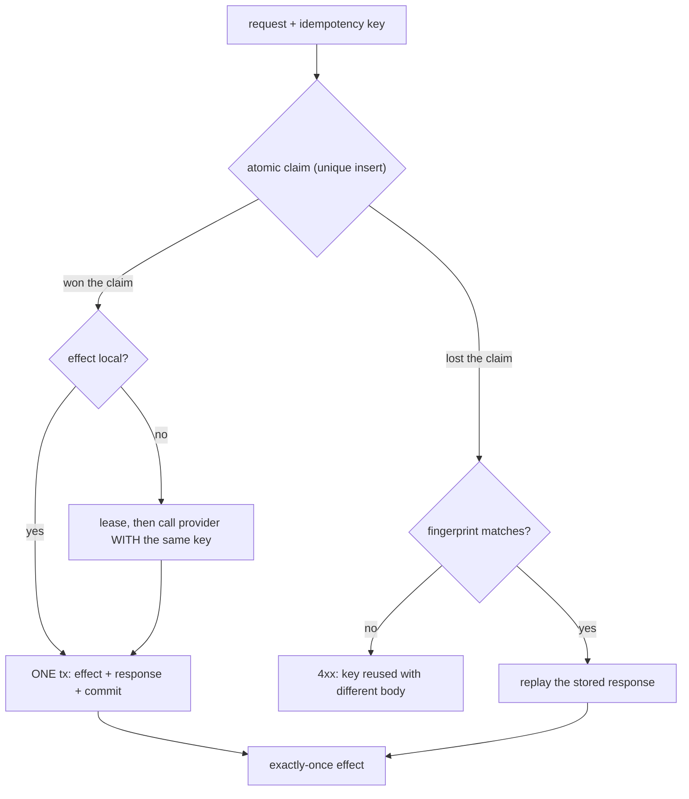

## Thesis

Making an operation safe to apply more than once --- so a retried request, a redelivered message, or a double-clicked button produces the same result as a single application, not a double charge or a duplicate record --- by giving each operation a stable identity the system records and deduplicates, because "exactly-once delivery" doesn't exist in a distributed system and at-least-once plus idempotency is how you get an exactly-once *effect*.

## Sub

**Why idempotency: retries are unavoidable** -> **naturally idempotent vs made idempotent** -> **the idempotency key and the atomic dedup claim** -> **zoom out** to exactly-once-effect, the atomicity crux, and the pivots an interviewer rides from "just retry it" into why-not-exactly-once-delivery, two duplicates arriving at once, and what happens when the effect lives in someone else's system.

## Spine

- Idempotency exists because **retries are unavoidable** --- a network call can fail ambiguously (the request may have succeeded; the caller can't tell), queues redeliver, clients double-submit, so any operation *will* be attempted more than once, and the only question is whether that's safe.
- Some operations are **naturally idempotent** (a PUT that sets a value, a DELETE); the rest must be **made** idempotent, usually by attaching a stable **idempotency key** the server records, so a repeat with the same key returns the first result instead of acting again.
- The mechanism is **an atomic claim, not check-then-act** --- record the key (and the response) in the *same transaction* as the effect, so a duplicate is detected and the original outcome replayed rather than a second charge applied.
- The goal is **exactly-once effect from at-least-once delivery** --- you can't guarantee a message arrives exactly once, but you can guarantee that processing it twice has the same effect as once, which is what "exactly-once" means in practice.

## Companion Notes

### walk

One operation made safe to repeat

One request from an ambiguous failure to a deduplicated, exactly-once effect --- the retry that forces the problem, the idempotency key that gives the operation identity, the atomic claim that recognizes the repeat, and the crash window that decides whether you double-charge or lose the charge.

Say the impossibility first --- "exactly-once delivery doesn't exist; you get at-least-once and make the effect idempotent." Everything else is how you buy an exactly-once effect on top of unreliable delivery.

### drill

Probe Drill

Graded follow-ups on retries, idempotency keys, atomic dedup, and exactly-once semantics --- the ones that separate "add a retry" from an operation that is actually safe to repeat.

Name the real guarantee: you cannot stop a message arriving twice, but you can make processing it twice equal processing it once --- exactly-once effect, not exactly-once delivery.

### wb

Whiteboard

Rebuild the dedup path from memory --- the cues, nothing in front of you.

Draw the claim first, not the store. One winner does the effect and commits its response in the same transaction; every duplicate reads that response back. If you can draw the atomic claim you can defend the whole topic.

### sys

System Map

Zoom out: idempotency is a seam that sits between an unreliable network and an irreversible effect.

Lead with the seam, not the store --- "delivery is at-least-once, so the write path has to be a claim, not a check." The dedup store is an implementation detail of that sentence.

### trade

Trade-offs

The calls they drill --- client key vs natural key, key in the effect's store vs a fast cache, fail-open vs fail-closed --- each with the switch condition.

Always name the cost of a duplicate first. Every trade-off here is decided by "what does a second application actually do," so lead with the blast radius, not the mechanism.

### model

Model Answers

Full spoken scripts --- the beats, in order, the way you would actually say them.

Steal the frame, not the words. Headline first ("you cannot get exactly-once delivery, so you make the effect idempotent"), then the one risk you would name: the atomicity of recording the key with the effect.

### num

Numbers

Back-of-envelope the duplicate rate and the dedup store --- and know which number makes the dedup layer the ceiling.

Lead with the fact that the store is on the critical path of every write. It is not a side table; it is a hot, high-churn dataset your entire write path now depends on.

### rf

Red Flags

What sinks the round --- check-then-act, a random key per retry, the key in Redis and the charge in Postgres --- and what to say instead.

Name what the interviewer hears. "Two concurrent duplicates would both execute" is the fastest no-hire in a payments round.

### open

30-Second

The opener and the close --- matched to the altitude the question is asked at.

Match the altitude. Open on the impossibility (no exactly-once delivery), and land on the atomicity of the key and the effect as the real hard part --- not on the dedup store.

## Drill

all | **All four levels, mixed** --- the way a real loop actually comes at you.
SDE2 | **The model and the mechanics** --- what idempotency is, why retries force it, which operations are free, and what a key buys you. The bar is "the property is about the *state*, not the response": name the guarantee and the mechanism that enforces it.
SDE3 | **Keys, dedup, and consumers** --- the atomic claim, the TTL, the response replay, and the consumer side. The bar is "check-then-act races, so the claim has to be atomic": name the failure each choice bounds.
Staff | **Exactly-once, atomicity, and scale** --- the crash window, the external effect, ordering, and when not to bother. The bar is "idempotency is a *transactional* problem": name the hard part and why the dedup store is the easy part.

### SDE2 | what idempotency is

What does it mean for an operation to be idempotent?

Applying it multiple times has the same effect as applying it once. Setting a user's email to a value is idempotent --- do it once or five times, the end state is identical. Incrementing a balance by 10 is *not* --- five applications add 50. The property is about the *effect on state*, not the return value, and it's what makes an operation safe to retry: if you can't tell whether your first attempt landed, you can safely try again only if a second application can't do harm.

Follow: A DELETE returns 204 the first time and 404 the second. The responses differ --- is it still idempotent?
Yes, and this is the distinction people get wrong. Idempotency is defined on the **effect on server state**, not on the response: HTTP's own wording is that the *intended effect on the server* of several identical requests is the same as for a single one. The resource is gone either way; the 404 just describes a different starting state. Conflating "idempotent" with "returns an identical response" matters practically --- a client that treats that 404 as a failure will retry forever, and an engineer who thinks the response must match will wrongly conclude DELETE needs a key.
Follow: Is a GET idempotent, and is that the same as saying it's safe?
GET is both, but they are different properties and the difference is the point. **Safe** means no state change at all (GET, HEAD, OPTIONS, TRACE). **Idempotent** means a repeat doesn't move the state *further* --- which is true of the safe methods *and* of PUT and DELETE, neither of which is safe. So every safe method is idempotent; not every idempotent method is safe. PUT and DELETE change state --- they just don't change it *more* on the second application, which is exactly the property a retry needs.
Senior: Separating the *effect on state* from the *response* --- and knowing idempotent is not the same as safe --- is the difference between an SDE2 who says "same result" and a Staff engineer who says "same state, and the response is allowed to differ."
Speak: "Applying it N times leaves the same state as applying it once. Setting an email is idempotent; adding 10 to a balance isn't. And note the property is on the *state*, not the response --- a second DELETE can legitimately 404 and still be perfectly idempotent."

### SDE2 | why it matters

Why is idempotency such a big deal in distributed systems?

Because retries are unavoidable and failures are ambiguous. When a network call times out, the caller genuinely cannot tell whether the request succeeded and the *response* was lost, or the request never arrived --- so the only safe move is to retry, and now the operation might run twice. Add queues that redeliver on at-least-once semantics and users who double-click, and every operation will eventually be attempted more than once. Idempotency is what makes that safe instead of a double charge.

Follow: Why can't the client just query whether the first attempt succeeded, and only retry if it didn't?
Because the check has exactly the same problem it's trying to solve. "Did my charge land?" is itself a network call that can time out --- and even when it answers, the answer can be stale: the original request may still be in flight and land *after* your check returns "no." You've built check-then-act across a network, which races. Nothing about asking harder closes the window; the only thing that does is making the *operation* safe to repeat, so you never have to know whether it landed.
Follow: So should a client retry a timeout on an endpoint that isn't idempotent?
No --- and that's the trap worth naming out loud. On a timeout you can't distinguish success from failure, so retrying a non-idempotent POST risks a double effect while *not* retrying risks silently dropping a legitimate operation. There is no safe branch, which is precisely why the endpoint has to be *made* idempotent before anyone is allowed to retry it. Until then the honest answer is "surface the ambiguity or reconcile out of band" --- you don't get to blind-retry, and a candidate who says "we just retry with backoff" has skipped the actual problem.
Senior: Recognizing that the ambiguity is *irreducible* --- that no amount of status-checking closes it, because the check races too --- is what separates "retries are annoying" from "retries are why this topic exists."
Speak: "Failures are *ambiguous* --- a timeout doesn't tell you whether the request or the response was lost. So you must retry, and now it might run twice. You can't check your way out either, because the check races with the in-flight original. The only fix is making the operation safe to repeat."

### SDE2 | naturally idempotent operations

Which operations are naturally idempotent?

Ones that *set* rather than *change-by-a-delta*: a PUT that writes a full value, a DELETE (deleting an already-deleted thing is a no-op), a GET (no effect at all). These are idempotent by construction --- repeating them can't move the state further. The non-idempotent ones are the relative operations: "add 10," "append an item," "create a new record" (a POST) --- each repeat does more. The HTTP method semantics encode exactly this: GET, PUT, DELETE are defined as idempotent; POST is not.

Follow: Is `UPDATE accounts SET balance = balance + 10` ever safe to retry?
Not on its own --- it's a *relative* operation, so every replay adds another 10. You make it safe by converting it into something absolute or conditional. Three standard moves: guard it with an idempotency key so the repeat is deduplicated; make it a compare-and-set on a version (`SET balance = 110 WHERE version = 7`), so the second attempt finds the precondition false; or --- the cleanest for money --- stop storing a mutable balance at all and **insert a ledger row keyed by a transfer id**, deriving the balance from the rows. That last one turns the delta into an *identified event*, and an identified event dedups for free.
Follow: A PUT sets the whole resource, so it's idempotent. Two different clients PUT concurrently and each retries. Is PUT enough?
No, and this is a genuinely common conflation. PUT is idempotent but not *concurrency-safe*: A-then-B and B-then-A each leave a single consistent value, but one client's write is silently lost. Idempotency only promises that a *repeat* does no extra damage --- it says nothing about which of two *different* writes wins. That's the lost-update problem, and the fix is a **conditional** PUT (`If-Match` on an ETag, or a version column), not an idempotency key. Two different problems, two different mechanisms, and mixing them up is how people "solve" lost updates with a dedup store that can't see them.
Senior: Knowing the *transformation* --- that you make a delta idempotent by turning it into an identified event or a conditional set, not by wrapping it in a retry guard --- is the reflex that shows you've actually had to fix one of these.
Speak: "Sets are free, deltas are not. `balance = balance + 10` doubles on a retry. You fix it by making it absolute or identified --- a compare-and-set on a version, or a ledger row keyed by a transfer id, which turns the delta into an event that dedups by construction."

### SDE2 | what an idempotency key is

What is an idempotency key?

A unique token the client attaches to a request so the server can recognize a retry of *that specific operation*. The client generates it once (a UUID) and sends it with the original request and every retry; the server records which keys it has already processed, so a repeat with a seen key returns the original result instead of executing again. It's how you give a non-idempotent operation ("charge this card") an identity, turning "did I already do this?" from unanswerable into a lookup.

Follow: Who generates the key --- and what breaks if the client mints a fresh UUID on each attempt?
The client generates it **once per logical operation** and reuses it across every retry. A fresh UUID per attempt is the single most common way this mechanism silently does nothing: each retry presents a new key, the server sees a brand-new operation, and charges again --- you have all the machinery and none of the protection. The subtlety is *where* the key is minted: it has to be at the point the **intent** is formed (the button click, the row in your jobs table), not inside the retry loop, because anything created inside the loop is by definition regenerated on every pass.
Follow: Could the server generate the key instead?
Not for the case that actually matters. The whole problem is that the client doesn't know whether its first request arrived --- so if the server mints the identity, the retry carries nothing linking it to the original and the server can't recognize it. Identity has to come from something the *client* holds across attempts. The one exception is a natural key already in the payload (an order id, an event id): that's effectively a client-supplied key by another name, and it's better than a random token precisely because the client can't forget to reuse it.
Senior: Naming that the key must be minted where the *intent* is formed --- not inside the retry loop --- is the detail that separates someone who has shipped this from someone who has read about it, because "we generate a UUID per request" is the bug that looks exactly like the fix.
Speak: "A token the client mints **once** for the operation and resends on every retry, so the server can recognize the repeat. The failure everyone hits: generating it inside the retry loop. A new UUID per attempt collides with nothing, so you've built dedup that dedups nothing."

### SDE2 | at-least-once vs exactly-once

What's the difference between at-least-once and exactly-once delivery?

**At-least-once**: the system guarantees a message is delivered, but possibly more than once (it retries until acknowledged, so a lost ack causes redelivery). **Exactly-once**: the fantasy that each message is delivered once and only once. At-least-once is what real queues and networks give you, because the alternative (at-most-once) drops messages on failure. Exactly-once *delivery* is effectively impossible over an unreliable network; what you actually build is at-least-once delivery plus idempotent processing, which yields exactly-once *effect*.

Follow: Why not just build at-most-once and retry carefully?
At-most-once means you never redeliver --- so any message lost in flight is lost permanently. You've traded duplicates for *data loss*, which for a payment, an order, or a provisioning request is the strictly worse failure. And "retry carefully" is a contradiction in terms: the moment you retry, you are at-least-once. So the real decision isn't a spectrum, it's a fork --- risk losing it, or risk doing it twice --- and for anything with a real effect you choose "possibly twice" and then spend engineering to make twice harmless.
Follow: Where does the impossibility actually come from? Why can't a cleverer protocol fix it?
Because the acknowledgment is itself a message, and it can be lost. The sender cannot distinguish "you never received it" from "you received it and your ack died" --- that's the Two Generals problem, and it's an impossibility result, not an engineering gap. Any protocol that guarantees no loss must therefore be willing to *resend*, and resending is exactly what manufactures duplicates. You cannot remove the duplicate; you can only relocate it to a place where it does no harm, which is what idempotent processing does.
Senior: Framing it as a *forced choice* --- at-most-once loses, at-least-once duplicates, and there is no third door because the ack can be lost --- is the distributed-systems literacy that turns a definition into an argument.
Speak: "At-least-once means it may arrive twice; at-most-once means it may not arrive at all. There's no third option, because the ack can be lost and you can't tell a dead ack from a dead message. So you take at-least-once --- never lose --- and make processing it twice harmless."

### SDE2 | the double-charge example

Give a concrete example of why this matters.

A payment. A client sends "charge this card $50," the charge succeeds, but the response is lost to a network blip. The client, seeing a timeout, retries --- and without idempotency, the card is charged $50 twice. With an idempotency key on the request, the server recognizes the retry as the same operation, skips the second charge, and returns the original success. This is the canonical case: any operation with a real-world side effect (money, email, provisioning) must be idempotent, because the retry that causes the double effect is not a bug you can eliminate --- it's inherent to unreliable networks.

Follow: Your service charged the card, then died before recording anything. The retry arrives. How do you know it already happened?
You ask the party that *does* know --- the payment provider --- and the way you earn the right to ask is by **threading your idempotency key down to them**. Providers expose exactly this (Stripe takes an `Idempotency-Key` header). So on recovery you don't run a forensic query: you simply **re-issue the same call with the same key**. The provider recognizes it, doesn't charge again, and hands back the original charge. You've converted "did it happen?" from an unanswerable question into a *safe, repeatable call*. Without threading the key, your only fallback is a reconciliation job diffing your ledger against theirs --- which works, but is a batch process standing in for a guarantee.
Follow: Now the effect is sending an email. You can't un-send it and there's no provider-side dedup. Which way do you lean?
You accept that you can't have atomicity here and you *choose your failure* explicitly. Recording the key **before** the send means a crash in between yields a **missed** email (the retry sees the key and skips). Recording it **after** means a crash yields a **duplicate**. Neither is free, and pretending the window isn't there is the actual red flag. The practical shape is a two-phase claim --- mark the key `processing` with a lease, send, then mark `done` --- so a crashed attempt's claim eventually *expires* and is retried rather than being lost forever, and you knowingly accept a small duplicate risk on that path. Then you size the risk against the harm: a duplicate receipt is noise, a missed password-reset is a support ticket. Naming which side of the window you're landing on is the answer.
Senior: Knowing that you **thread your key into the downstream provider's idempotency key** --- so recovery is "call again," not "investigate" --- is the single most practical thing on this card, and it's what turns the double-charge story from a cautionary tale into a design.
Speak: "Charge succeeds, response is lost, client retries, card is charged twice. The fix isn't just a key on *my* endpoint --- it's threading that key **down to the provider**, so when I crash mid-charge my recovery is simply to call again with the same key and get the original charge back."

### SDE2 | HTTP method semantics

How do HTTP methods relate to idempotency?

The spec defines GET, HEAD, PUT, and DELETE as idempotent, and POST as not. A client (or a proxy) may safely retry a GET, PUT, or DELETE automatically, because repeating them is defined to be harmless; it must *not* blindly retry a POST, because a second POST typically creates a second resource. This is why "create" endpoints (POST) are the ones that need explicit idempotency keys, while "set" and "delete" endpoints are safe by their semantics --- the method is a contract about repeatability, and honoring it is what lets the whole HTTP stack retry correctly.

Follow: If PUT and DELETE are idempotent by spec, can a proxy or a client library just auto-retry them?
In principle yes --- that guarantee is precisely what it's *for*, and real clients and intermediaries do lean on it. But the guarantee is only as true as *your handler*. If your DELETE also decrements a counter, or your PUT appends an audit row with a fresh id each time, you have quietly broken the contract that the entire stack is retrying against --- and the retries will be automatic and invisible. So the honest framing is that HTTP semantics don't *make* your endpoint idempotent; they **oblige** you to, and they hand out automatic retries on the assumption that you kept your promise.
Follow: So a POST can never be idempotent?
POST isn't *defined* as idempotent, so a generic client must not assume it --- but you can absolutely make a specific POST idempotent, and an idempotency key is exactly that: identity added at the application layer that the method doesn't carry. There's a second option worth knowing if you own the API: **reshape the create as a PUT to a client-chosen id** --- `PUT /orders/{client-generated-uuid}` --- and idempotency falls straight out of the method, because the URL *is* the key. It's a genuinely nice trick: no header, no extra store contract, and every HTTP intermediary already understands the semantics.
Senior: Offering `PUT /orders/{client-chosen-id}` as an alternative to a bolted-on key header --- and knowing the method is a *promise you have to keep*, not a property you get for free --- is API-design maturity most candidates don't reach.
Speak: "GET, PUT, DELETE are idempotent by spec; POST isn't, which is why creates need a key. But note the spec *obliges* you --- if your DELETE decrements a counter you've broken the contract the whole stack auto-retries against. And if you own the API, `PUT /orders/{client-chosen-uuid}` gets you idempotency straight from the method."

### SDE3 | implementing an idempotency key

How do you actually implement idempotency-key handling?

Record the key and the outcome in a store, keyed by the idempotency key, *atomically with the effect*: when a request arrives, check whether the key exists; if not, perform the operation and persist "key -> result" in the same transaction; if it does, return the stored result without re-running. The critical parts are that the check-and-store is atomic (a unique constraint on the key, so a duplicate insert fails rather than double-executes) and that you store the *response*, so a retry gets the original answer, not just a "already done." Done right, the second request is indistinguishable from the first to the client.

Follow: You said "in the same transaction." What if the effect is a call to a payment provider that can't join your transaction?
Then you can't have one transaction, and you switch to a **two-phase claim**. Insert the key with status `processing` and a **lease** --- that insert is the atomic claim, and its unique constraint is what serializes duplicates. Then call the provider, **passing your key as their idempotency key**. Then commit `done` plus the stored response. The provider's own dedup is what makes step two safe to repeat, so every crash lands somewhere recoverable: the lease expires, another attempt takes over, re-calls the provider, and the provider replays the original charge instead of making a new one. You've replaced an atomicity you can't have with idempotency at the boundary --- the same pattern, recursing one level down.
Follow: What stops a crashed worker's `processing` row from blocking that key forever?
A **lease** --- an owner and an expiry on the claim --- plus a takeover path. Without it, a single crash means the key is permanently stuck: every retry sees a claim, declines to act, and the operation can *never* complete. That's a **lost effect wearing dedup's clothing**, and it's silent, which makes it worse than the double-charge it was protecting against. So the state machine is `processing` (owner + deadline) -> `done` (with the response), and a request that finds an *expired* `processing` row is allowed to seize it. People remember the unique constraint and forget the lease every single time.
Senior: Knowing the unique constraint is only *half* the mechanism --- that a `processing` state without a lease converts a crash into a permanently wedged key --- is the operational scar tissue that reads as Staff on an SDE3 card.
Speak: "Claim the key atomically with a unique insert, do the effect, store the response --- in one transaction if the effect is local. If it's an external call, two-phase it: claim `processing` **with a lease**, call the provider *with your key as their key*, then mark `done`. The lease is what stops a crashed worker from wedging that key forever."

### SDE3 | exactly-once effect vs delivery

If exactly-once delivery is impossible, what does "exactly-once" mean in practice?

Exactly-once *effect* (sometimes "effectively-once"). You accept at-least-once *delivery* --- the message may arrive multiple times --- and you make the *processing* idempotent, so duplicates have no additional effect. The end state is as if the message were processed exactly once, even though it was delivered more than once. Systems that advertise "exactly-once" (some stream processors) achieve it this way internally: at-least-once delivery plus deduplication or transactional idempotent writes. The distinction matters because chasing exactly-once *delivery* is a dead end; making the *effect* idempotent is the achievable, correct goal.

Follow: Kafka advertises exactly-once semantics. Is it lying?
No, but it's much narrower than the marketing sounds, and knowing the boundary is the whole answer. `enable.idempotence` makes the **producer** deduplicate *its own retries*: the broker tracks a (producer id, epoch, sequence number) per partition and drops a resent record. Kafka **transactions**, with consumers on `isolation.level=read_committed`, give you atomic read-process-write **within Kafka** --- consume, transform, produce, and commit offsets as one unit. What none of it gives you is exactly-once when the effect *leaves* Kafka: the moment your consumer charges a card or writes to Postgres, that write is not in Kafka's transaction, and you are squarely back to at-least-once plus your own idempotency. The guarantee is real inside the boundary, and it stops at the boundary.
Follow: So does the idempotent producer stop duplicate *events* entirely?
No --- and this trips people who enable the flag and think they're done. It stops duplicates caused by a **producer retry within a session**; it does not deduplicate two records your application *chose* to send. If your code calls `send()` twice for the same logical event, those are two records with two sequence numbers and the broker keeps both, happily. And the producer id is per-session, so across a restart (absent a `transactional.id` that pins a stable id) the dedup window is gone. Producer idempotence protects **the wire**, not your business logic. Application-level dedup is still entirely yours.
Senior: Being able to say exactly *where* Kafka's exactly-once ends --- inside Kafka, and not one inch past the first external side effect --- is what turns "exactly-once is a myth" from a slogan into a precise, defensible engineering claim.
Speak: "Exactly-once *effect*, not delivery. And when someone cites Kafka: its idempotent producer dedups *producer retries*, and its transactions give atomic read-process-write **inside Kafka**. The second your consumer charges a card, that effect is outside the transaction --- at-least-once plus your own idempotency, again."

### SDE3 | concurrent duplicates

What happens when two copies of the same request arrive at the same time?

The race: both check for the idempotency key, both find it absent, and both proceed to execute --- a double effect, exactly what the key was meant to prevent. The fix is to make the key claim atomic: a **unique constraint** on the key column so the second insert fails, or a conditional write / lock so only one request can be "in flight" for a given key. The loser then either waits for the winner's result or returns it. Idempotency isn't just about sequential retries; it has to hold under concurrent duplicates, which is why the dedup has to be an atomic claim, not a check-then-act.

Follow: What should the loser of that race actually *do* --- block, or return an error?
Both are legitimate; you pick by what the client can handle, and you should be able to defend either. **Reject** is the simplest and most honest: the operation is genuinely still in progress, so return a 409 and let the client retry shortly (this is what Stripe does when a request with that key is still in flight). It holds no connection and no server resource. **Block and replay** --- wait for the winner, return its result --- is friendlier to a naive client but pins a request slot for the duration and needs a hard timeout, or you've accidentally built a queue. What you must *not* do is let the loser proceed, and you must not return a bare "already done" with no result, because the client's retry *is* its request and it needs the charge id.
Follow: Could you just take a distributed lock on the key instead of a unique constraint?
A lock is the wrong primitive, because it gives you **mutual exclusion but not memory**. It serializes the two concurrent copies --- so the first runs and releases --- and then the second acquires the lock and *runs too*, because nothing durably recorded that the operation already happened. You'd still need a dedup record, and once you have one, its unique constraint already gave you the exclusion for free. So the lock is strictly redundant *and* strictly weaker. (It also drags in a safety argument you don't need to have --- lock leases expiring under a GC pause, clock skew --- to solve a problem a unique index solves exactly.) A unique constraint is a **durable** claim; a lock is a temporary one, and duplicates are a durable problem.
Senior: Naming that a lock provides *exclusion without memory* --- so the serialized second attempt simply runs afterwards --- is the crisp argument that kills the most popular wrong answer on this card, and it does it without hand-waving about Redlock.
Speak: "Check-then-act races: both see no key, both charge. Make the claim **atomic** --- a unique insert, so exactly one wins. And when they suggest a lock: a lock gives exclusion, not *memory*. It serializes the duplicates, then the second one runs anyway. You need a durable record, and that record's unique index already gives you the exclusion."

### SDE3 | key scope and TTL

How long do you remember idempotency keys, and at what scope?

Long enough to cover the maximum retry horizon of any caller, and scoped so keys can't collide across unrelated operations. The **TTL** must exceed how long a client might keep retrying (hours, sometimes days) --- forget too soon and a late retry is treated as new, re-executing the effect. The **scope** is usually per-endpoint or per-account, so the same key value used for two different operations doesn't accidentally dedup them. There's a storage cost (every request stores a key), so you set the shortest TTL that safely exceeds real retry windows, and clean up expired keys.

Follow: A client retries after your TTL expired. What actually happens, and is it acceptable?
The key is gone, so the server sees a brand-new operation and **executes it again** --- a double effect, arriving late. That is why the TTL is a **correctness parameter, not a storage knob**, and it has to be sized to the longest retry horizon anyone can produce: a message parked in a DLQ for a day and then redriven, a mobile client that retries when it regains connectivity next morning, a human clicking "retry" on a stuck job. (Stripe holds keys for 24 hours, which tells you the horizon they're willing to underwrite.) If you genuinely cannot bound the caller's retry window, a TTL alone cannot save you and you need a second line of defence --- a natural business key that never expires, or reconciliation.
Follow: What's the right scope --- global, per-endpoint, or per-account?
Scope it so two *different* operations can never collide on the same key value, and so one caller can't interfere with another. The practical answer is that the stored key is really the tuple **(account, endpoint, key)** --- namespaced by the authenticated caller and the operation. Global scope means one client's random UUID could in principle collide with another's, turning an improbable event into a silent cross-customer dedup; worse, it lets a caller **squat on or probe** another caller's key space. Namespacing by the authenticated principal makes the collision *impossible* rather than *unlikely*, which is the standard you want when the failure mode is "we swallowed a stranger's payment."
Senior: Treating the TTL as a **correctness** parameter tied to the longest real retry horizon (DLQ redrives, offline mobile clients) --- rather than a storage-cost dial --- and namespacing the key by the authenticated caller, is the pair that shows you've operated one of these rather than designed one on a whiteboard.
Speak: "TTL must exceed the longest retry horizon anyone has --- a DLQ redrive a day later, a phone that reconnects tomorrow. It's a *correctness* parameter, not a storage knob; expire too early and the late retry re-charges. And scope it to (account, endpoint, key), so nobody can collide with, or squat on, someone else's key."

### SDE3 | what to return on a duplicate

When you detect a duplicate, what should the response be?

The **original response**, replayed --- the same status, the same body, as if the first call were happening now. Returning an error ("duplicate request") is wrong, because from the client's perspective its retry *is* the request, and it needs the actual result (the charge id, the created resource). So you store the original response alongside the key and serve it on a duplicate. The client can't distinguish the replay from a fresh success, which is exactly the goal: the retry is transparent, and the client gets what it would have gotten had no failure occurred.

Follow: The first attempt returned a 500. A retry arrives with the same key. Do you replay the 500?
No --- and this is the subtle one that quietly bricks systems. If you record a **transient** failure as the terminal outcome for that key, the client's retry faithfully replays the 500 *forever*, and the operation can never succeed: you have converted a retryable error into a permanent one, using the very mechanism that exists to make retries safe. So you persist only **terminal** outcomes --- a success, or a *deterministic business* failure like "card declined," which is a real result a replay should reproduce faithfully. A transient failure must **release the claim** so that a retry genuinely re-attempts the operation. Distinguishing "this is the answer" from "this attempt failed" is the whole design of the state machine.
Follow: The same key arrives but the body is different --- the amount changed from $50 to $500. What do you do?
Reject it, loudly. That is not a retry; it is a client bug or an attack, and both possible behaviours are wrong: replaying the original $50 response silently lies to the client, and charging $500 under a key you've already used destroys the guarantee. The standard defence is to store a **fingerprint** --- a hash of the request payload --- alongside the key, and if a repeat key arrives with a *different* fingerprint, fail with a 4xx saying the key was already used with different parameters (Stripe does exactly this). Idempotency means "**the same operation**, again" --- so you have to actually verify that it *is* the same operation, rather than trusting the key alone.
Senior: The two failure branches on this card --- **never cache a transient error under the key**, and **fingerprint the body so a reused key with different parameters is rejected** --- are the ones that separate an engineer who has *operated* an idempotent API from one who has drawn the happy path of one.
Speak: "Replay the original response --- the client's retry *is* its request, so it needs the charge id, not an error. Two traps: never cache a *transient* 500 under the key, or the retry replays the error forever and the operation can never succeed. And fingerprint the body --- same key with a different amount is a client bug, and you reject it."

### SDE3 | making an operation idempotent

How do you make an inherently non-idempotent operation idempotent?

Three common techniques. **Client-supplied idempotency key** with server-side dedup (the general method, for "create"/"charge"). **Natural-key dedup / upsert**: use a business key that's already unique (an order id) and do an insert-or-ignore or upsert, so a repeat updates rather than duplicates. **Conditional operations**: make the change contingent on current state (compare-and-swap, "set status to shipped *only if* pending"), so a repeat is a no-op because the precondition no longer holds. Which you use depends on whether there's a natural unique key and whether the operation is a state transition or a creation.

Follow: You listed upsert on a natural key. When does that quietly go wrong?
When the "natural" key is unique for the *entity* but not for the *operation* --- and when the upsert is a `DO UPDATE`. Two legitimately different requests that happen to carry the same business id will silently merge into one. Worse, `ON CONFLICT DO UPDATE` is **last-writer-wins**, so a *late retry of an old request* can overwrite a **newer** legitimate update: the retry isn't a no-op, it's a time-travelling clobber. For create-once semantics you want `ON CONFLICT DO NOTHING` (or a conditional update guarded by a version), not a blind upsert. The upsert dedups the *insert*; it does nothing to protect you from stale writes, and people reach for it as though it did both.
Follow: Compare-and-swap makes the repeat a no-op. Doesn't that make the idempotency key redundant?
For a pure **state transition**, very nearly --- and that's a real simplification worth taking: "set status to shipped *only if* pending" is safe to repeat by construction, because the second attempt finds the precondition false. But it changes the **contract** in two ways. First, the retry now receives "precondition failed," and the client has to read that as "already done" rather than "error" --- which is only sound if nothing *else* could have moved the state. Second, and more damaging, CAS gives you **no response replay**: if the first call minted a shipment id, the retry cannot recover it. So CAS suffices for a transition where the caller needs nothing back, and fails the moment the caller needs the original result.
Senior: Knowing that `ON CONFLICT DO UPDATE` is last-writer-wins --- so a *late* retry can clobber a *newer* write --- and that CAS gives you no way to replay the original result, is the level of precision that stops these three techniques from being interchangeable bullet points.
Speak: "Three moves: a client key with server dedup; an upsert on a natural key; or a conditional/CAS write. Know the edges --- `DO UPDATE` is last-writer-wins, so a late retry can clobber a newer update, and CAS can't replay the original response, so it fails whenever the caller needs the id back."

### SDE3 | idempotency in message consumers

How do you make a message-queue consumer idempotent?

Deduplicate on a stable message identity. Since the queue is at-least-once, the consumer will occasionally see the same message twice, so you record processed message ids (or, for a partitioned log like Kafka, track the committed offset) and skip anything already handled --- or make the write itself idempotent (an upsert keyed by the message's business id). The consumer must assume redelivery, so the handler is written so that reprocessing is safe: dedup by id, or design the side effect to be naturally idempotent. This is the queue-side version of the same principle: at-least-once delivery, idempotent processing.

Follow: Doesn't the committed offset alone make the consumer idempotent?
No --- an offset is a **progress marker, not a dedup record**, and the gap between them is exactly where duplicates live. You process a record and then commit the offset; crash in between and the offset is still behind, so the record is redelivered. That window exists no matter how you order the commit: commit *first* and you've simply swapped it for at-most-once, losing records instead of repeating them. The offset can tell you *where to resume*; it can never tell you whether **this specific record's effect** already landed. That has to be a property of the write itself.
Follow: So how do you dedup when the consumer's effect is a write to Postgres?
Put the dedup record **in Postgres, in the same transaction as the effect**. Insert the message id into a `processed_messages` table with a unique constraint, and do the business write, in one transaction: a redelivery hits the constraint, the transaction aborts, you commit the offset and move on. That's the whole trick, and it's beautiful because the marker and the effect share a transaction --- so there is **no window between them at all**. The instructive contrast: if you'd put the marker in Redis and the effect in Postgres, you would have reopened precisely the crash window you were trying to close, because two stores cannot commit together.
Senior: "Put the dedup marker in the same store as the effect, in the same transaction" is the answer that dissolves the problem instead of managing it --- and being able to say *why* a Redis marker in front of a Postgres write is strictly worse is the reasoning that earns the SDE3 tick.
Speak: "The offset is a *progress marker*, not a dedup record --- crash between processing and committing and it redelivers. So dedup on the message id, and put that marker **in the same store, in the same transaction, as the effect**. A `processed_messages` unique insert plus the business write in one tx has no window at all."

### Staff | exactly-once is a myth

An interviewer says "we need exactly-once processing." How do you respond?

By reframing it: exactly-once *delivery* is essentially impossible over an unreliable network (you can't distinguish a lost message from a lost acknowledgment, so you must either risk dropping or risk duplicating, and safe systems choose at-least-once). What's achievable is exactly-once *effect* --- at-least-once delivery plus idempotent processing or transactional dedup. So the answer isn't "we'll guarantee each message is delivered once"; it's "we'll accept duplicates and make processing them idempotent, so the outcome is as if each were processed once." Naming this distinction is a senior signal: it shows you know the guarantee to design for is on the *effect*, not the delivery.

Follow: They push back --- "our vendor sells exactly-once." How do you answer without being pedantic?
Take the claim seriously and **scope it**, rather than debunking it. Most such products are honest about a *bounded* guarantee --- Kafka's transactional read-process-write, Flink's checkpoint-plus-two-phase-commit sinks --- and they achieve it internally with the same at-least-once-plus-dedup you would build yourself. So the useful question is never "is exactly-once real?" but "**where does the boundary end?**" The moment an effect crosses out of the system the vendor coordinates --- a card charge, an email, a write to a store they don't own --- the guarantee stops and idempotency is yours again. Framing it as a boundary question is both more accurate and more collegial than myth-busting, and it lands the same point.
Follow: If exactly-once *effect* really is achievable, why does anyone still get double-charged?
Because the guarantee is only as good as its **coverage**, and coverage decays. It fails at the paths that skip the dedup gate --- a new endpoint, an admin script, a backfill job, a "quick fix" that calls the provider directly. It fails at the boundary where the key wasn't threaded down to the provider, so a crash mid-charge is unrecoverable. And it fails at the atomicity gap when the key and the effect live in different stores. Every one of those is a **structural** gap, not a logic bug --- which is why the durable answer is to make the dedup **unavoidable** (one charge primitive that owns the claim, so a new call site inherits it and physically cannot opt out) rather than something each call site is trusted to remember.
Senior: Converting "exactly-once is a myth" into a **boundary question** --- and then naming coverage decay as the reason real systems still double-charge despite having a key --- is the difference between reciting the distinction and being able to run the design review.
Speak: "I'd reframe rather than debunk: exactly-once *effect* is achievable, exactly-once *delivery* isn't. And when they cite a vendor, the question is **where the boundary ends** --- Kafka or Flink can give it inside their own system; the first external side effect puts idempotency back on me."

### Staff | dedup store at scale

What are the challenges of the idempotency-key store at high volume?

It's a write on every request, holding every key for its TTL, so at scale it's a large, hot, short-lived dataset --- and it's on the critical path (every operation checks it), so it must be fast and highly available or it becomes the bottleneck and the single point of failure for the whole write path. You size it for peak-rate times TTL, use a store with efficient TTL expiry (Redis with per-key expiry, or DynamoDB TTL), pick the shortest safe TTL to bound the size, and make sure its unavailability degrades gracefully (do you fail closed and reject writes, or fail open and risk duplicates?). The dedup layer's own reliability becomes part of the system's reliability.

Follow: You're storing the response body under every key. At 1,000 writes/sec with a 24-hour TTL, how big does that get?
About **86 million keys live at any moment** --- 1,000 x 86,400 --- and at a few hundred bytes per stored response you're in the tens of gigabytes: call it **~35 GB at 400 bytes a key**. That is not a footnote; it's a hot, high-churn, multi-tens-of-GB dataset sitting on the critical path of *every single write*. Three consequences fall straight out: use a store with cheap native TTL expiry (Redis per-key expiry, DynamoDB TTL) rather than a cron job chasing tombstones; keep the stored response **small** (the id and the status, not a fat serialized payload); and treat every hour you shave off the TTL as real money --- while never going below the retry horizon.
Follow: It's on the critical path of every write. What happens when the dedup store is unavailable?
You must have decided this **in advance**, because there is no good improvised answer at 3am. **Fail closed** --- reject writes while the store is down --- preserves correctness and makes the dedup store a hard dependency whose outage becomes your outage. **Fail open** --- process without the check --- preserves availability and *knowingly* accepts duplicates for the duration of the incident. For money you fail closed and you say so out loud. For a low-harm effect you fail open and reconcile afterwards. What actually sinks the round is having **no position**: an unavailable dedup store is not hypothetical, and "we'd put it in Redis" without naming its failure semantics is an unfinished answer.
Senior: Producing the number unprompted --- ~86M live keys and tens of GB at a thousand writes a second --- and then immediately naming the fail-open/fail-closed decision as a *policy you own*, is the cost-and-availability modelling that reads unmistakably as Staff.
Speak: "Every request writes a key and holds it for the TTL --- at 1,000/sec and 24 hours that's ~86 million live keys, tens of gigabytes, on the critical path of every write. So: native TTL expiry, keep the stored response small, and **decide the failure policy up front** --- fail closed for money, fail open where a duplicate is cheap."

### Staff | the atomicity problem

Why is committing the key and the effect together the hard part?

Because if they're separate steps, a crash between them corrupts the guarantee. Perform the charge, then (before recording the key) crash --- the retry finds no key and charges again: a double effect. Record the key, then crash before the charge --- the retry finds the key and skips: a *lost* effect (a "success" with no charge). So the key and the effect must be in one atomic unit: same database transaction if both are in the same store, or a carefully designed protocol (the effect writes the key as part of its own transaction, or an outbox pattern) if they span systems. Idempotency reduces to a *transactional* problem, and getting the atomicity wrong gives you exactly the double- or lost-effect the key was supposed to prevent.

Follow: Give me the ordering that's actually safe when the effect is in the same database.
One transaction, with the claim as the first statement: `BEGIN;` then `INSERT INTO idempotency_keys(key) VALUES ($1);` --- protected by a unique constraint --- then the business write, then store the response, then `COMMIT`. A crash **anywhere** rolls back *both*: no key, no effect, so the retry cleanly redoes the whole thing. A concurrent duplicate **blocks on the unique index** and, once the winner commits, takes the conflict path and reads back the response. The elegance is that a single primitive --- the unique index --- delivers the dedup *and* the mutual exclusion, and the transaction closes the crash window that made them necessary in the first place. When the effect is local, this is the entire answer, and it needs no lock, no Redis, and no lease.
Follow: And when the effect is a third-party API you've told me you can't wrap in a transaction?
Then you stop trying to make it **atomic** and make it **repeatable** instead. Two-phase: claim the key `processing` (durable, atomic, **leased**), call the provider **with your key as their idempotency key**, then record `done` plus the response. The provider's dedup is what makes a repeat of the middle step harmless, so every crash lands somewhere recoverable --- before the claim: clean retry; after the claim but before or during the call: the lease expires, someone takes over, re-calls, and the provider replays the original charge; after the call but before `done`: identical. If the downstream has *no* idempotency support, you fall back to an **outbox** plus reconciliation and you accept a bounded window --- and you say so, rather than pretending the transaction extends across the internet.
Senior: Being able to write the safe SQL ordering from memory --- and then immediately explain that the *whole* trick evaporates when the effect is external, requiring a leased two-phase claim and a key threaded downstream --- is the single strongest thing you can demonstrate on this topic.
Speak: "It's a **transactional** problem. Effect-then-key double-charges on a crash; key-then-effect *loses* the charge. If the effect is local, one transaction with the unique insert first --- the index gives you dedup and exclusion, and the tx closes the window. If it's external, two-phase with a lease, and thread your key into *their* idempotency key so recovery is just calling again."

### Staff | idempotency across side effects

How do you keep idempotency when one operation has several side effects across systems?

You can't wrap external systems in one transaction, so you make each step independently idempotent and drive them so the whole flow is safe to replay. Give the operation one idempotency key and thread it through: each downstream call (charge, then provision, then email) is itself idempotent on that key, so replaying the flow re-runs each step but none double-acts. Often this is an idempotent state machine or a saga --- the flow records how far it got, and a retry resumes, with each step's idempotency ensuring re-execution is harmless. The principle scales from one write to a multi-step process: identity flows through, and every step dedups on it.

Follow: If every step is idempotent, a retry can just replay the flow from the top. Why bother recording progress at all?
Because *harmless* is not the same as *free*. Replaying from the top is **correct** --- the charge won't double, the provisioning won't duplicate --- but you're paying real latency and real downstream calls to re-derive what you already knew, and at scale that's a self-inflicted load multiplier on the systems least able to absorb it. So you keep both, and they do different jobs: **idempotency is the correctness backstop** (a replayed step cannot hurt you) and **the progress record is the efficiency** (a retry resumes rather than restarting). Neither substitutes for the other --- progress without idempotency is a race, and idempotency without progress is a stampede.
Follow: A downstream step fails permanently *after* the charge succeeded. Idempotency doesn't help. Now what?
Correct --- and this is precisely where idempotency ends and **compensation** begins, which is a boundary worth naming explicitly. Idempotency makes a repeat safe; it can never make a *completed* effect un-happen. If provisioning is permanently impossible after a successful charge, the flow must run a compensating action --- refund the charge --- and that compensation **must itself be idempotent**, keyed off the same operation, or your retry of the refund double-refunds and you've reproduced the original bug pointing the other way. That's the saga: forward steps idempotent, backward steps idempotent, and a durable record of how far you got so you know which compensations to run.
Senior: Drawing the line where idempotency *stops* --- it makes repeats safe but cannot undo a committed effect, so a permanent downstream failure needs an **idempotent compensation** --- is the systems judgment that distinguishes a Staff answer from a confident SDE3 one.
Speak: "One key threaded through every step, each step idempotent on it, so replay is harmless. But keep a **progress record** too --- replay is correct, not free. And know where it ends: idempotency can't *undo* a committed charge, so a permanent downstream failure needs a compensating refund --- which must itself be idempotent, or the retry double-refunds."

### Staff | natural keys vs generated keys

Client-supplied idempotency key, or dedup on a natural business key --- which?

Depends on whether a natural unique key exists and who owns identity. A **natural key** (order id, a hash of the request content) needs no extra token and dedups meaningfully --- two requests for "order 123" *are* the same operation --- but requires that such a key genuinely exists and is stable. A **client-generated key** (a random token) works for operations with no inherent unique identity ("charge this card," where two legitimate identical charges are possible), putting the client in charge of declaring "this is the same operation as before." Content-hash keys risk conflating two intentionally-identical operations; random keys risk a client not reusing the key on retry. The choice is really "is there a business identity, or must the client assert one?"

Follow: You mention a content hash as a key. What exactly is the trap?
It **conflates two intentionally-identical operations**. Hash the request body and two genuinely separate $5 charges --- the customer really did buy the same coffee twice --- produce the same key, so you silently swallow the second one. A content hash encodes "the same **bytes**," which is emphatically not "the same **intent**." And the failure is invisible: nobody gets an error, a customer just doesn't get charged, and your ledger quietly disagrees with reality. It's a fine key where the payload already carries something naturally unique (an order id, an event id, a timestamped ledger line) and actively dangerous where the payload is legitimately repeatable. When in doubt, make the client **assert** identity rather than inferring it from bytes.
Follow: If a natural key already exists, is a client-supplied key ever still worth adding on top?
Yes --- when the natural key doesn't cover the **whole operation**. A natural key dedups the row it identifies; but the same request may also charge a card, call a provisioning API, and emit an event, and an upsert on `order_id` protects **none** of those. So the natural key gives you a free, meaningful dedup on the write, and the idempotency key gives you a single identity for the *entire* operation --- including the **response replay**, which an upsert simply cannot provide. Where both exist, the clean synthesis is usually to **derive the idempotency key from the natural key**: the identity is real, it's stable across retries, and the client cannot forget to send it.
Senior: Deriving the idempotency key *from* the natural key --- so identity is real and the client can't forget to resend it --- while knowing a content hash silently swallows a legitimately-repeated operation, is the identity-modelling nuance that separates the two mechanisms properly instead of treating them as interchangeable.
Speak: "Natural key when a real business identity exists --- and prefer *deriving* the idempotency key from it, so the client can't forget to reuse it. Client-supplied token when there's no inherent identity. And beware the content hash: it dedups identical **bytes**, so two legitimate identical $5 charges collide and one silently vanishes."

### Staff | idempotency and ordering

How does idempotency relate to commutativity and ordering?

They're distinct properties that often need to be reasoned about together. Idempotency handles *duplicates* (same operation twice); commutativity handles *reordering* (operations arriving in a different order still converge). A retry-heavy, out-of-order stream needs both: dedup so a repeat is harmless, and either order-independence or a way to reject stale updates (a version/sequence number, last-writer-wins by timestamp). Idempotency alone doesn't fix ordering --- two *different* idempotent updates applied in the wrong order can still leave the wrong state --- so at scale you frequently pair idempotency keys with a monotonic version to get "each update applied once, and stale ones ignored." Knowing they're separate concerns is the senior nuance.

Follow: Give me a concrete case where every operation is idempotent and the result is still wrong.
Two updates to the same field: `set status = shipped` and `set status = cancelled`. Each is *perfectly* idempotent --- apply either one twice and the state is unchanged. But deliver them out of order and you end up with `shipped` on an order the customer **cancelled**. No amount of deduplication helps, because there is no duplicate: there are two **different** operations that arrived in the wrong sequence. That's the whole distinction in one example --- idempotency answers *how many times*, ordering answers *in what order*, and a system with retries and parallel consumers cheerfully violates both at once.
Follow: So how do you actually get "each update applied once, and stale ones ignored"?
You attach a **monotonic version** to the operation and make the write conditional on it: `UPDATE ... SET status = $new, version = $v WHERE version < $v`. The idempotency key deduplicates the retry; the version rejects the stale update. That is last-writer-wins by **version**, not by arrival --- and the version must come from a source of truth (the producer's sequence number, the row's own version, the event's offset), never from a wall clock you don't control, because clock skew turns your ordering guarantee into a coin flip. The alternative, where the domain allows it, is to make the operations **commutative** so order stops mattering at all --- but for a mutually-exclusive state field like this one, a version is the honest fix.
Senior: Holding the two properties apart cleanly --- and then showing the *composite* mechanism (key for the duplicate, version for the stale write) with the warning that the version must never be a wall clock --- is the distributed-systems precision a Staff round is actually probing for.
Speak: "Different problems. `set status=shipped` and `set status=cancelled` are each idempotent, and delivered out of order they still leave the order shipped. Dedup can't help --- there's no duplicate. So you pair the key with a **monotonic version**: the key kills the retry, the version rejects the stale write. And the version comes from the source, never a wall clock."

### Staff | when not to bother

When is idempotency not worth the cost?

When the operation is already naturally idempotent (a pure set or delete needs no key), when it's a safe read, or when the cost of a rare duplicate is genuinely trivial and the dedup machinery would cost more than it saves (a best-effort metric increment, a non-critical log). Idempotency adds a store, a write on every request, and latency on the critical path, so you spend it where a duplicate does real harm --- money, provisioning, anything with an external irreversible effect --- and skip it where duplicates are harmless or the operation is idempotent by construction. Blanket idempotency on every endpoint is over-engineering; the discipline is applying it precisely where at-least-once delivery would otherwise cause a costly double effect.

Follow: How do you actually decide? Give me the test.
Ask what a **second application actually does**, and whether the operation is already safe by construction. If the effect is irreversible and externally visible --- money moved, an SMS sent, a VM provisioned, an order placed --- a duplicate is an *incident*, and you pay for idempotency without argument. If it's a pure set or delete, you get the property free from the shape of the operation and a key adds cost for nothing. If it's a metric increment, a cache warm, or a log line, the duplicate is *noise* and the dedup machinery costs more than the harm it prevents. Note what the test is **not**: it isn't "is this endpoint important?" --- it's "what does a repeat *do*, and can I afford it?"
Follow: Isn't "skip it where duplicates are harmless" exactly how you end up with the one endpoint that double-charges?
It is the real risk, and it's why the judgment is anchored on the **effect**, not on the endpoint's perceived importance --- and why the default in any money path is idempotent **by construction**. The failure you're describing is a **coverage** failure: someone adds a new path and reasons "this one's fine." You close it *structurally*, not with vigilance --- make the charge/deliver primitive itself own the claim, so any new call site inherits idempotency and cannot opt out by accident. Then "skip it" only ever applies where someone has deliberately routed **around** the primitive, which is a visible, reviewable act rather than a silent omission. Vigilance doesn't scale; making the mistake unwritable does.
Senior: Refusing the lazy "apply it everywhere" answer *and* the lazy "use judgment" answer --- and instead closing the coverage gap structurally, so the dedup lives inside the primitive and a new call site inherits it --- is the organizational leverage that marks a Staff answer.
Speak: "Ask what a *second application does*: irreversible and externally visible --- money, SMS, provisioning --- always. Naturally idempotent --- free, skip it. Metric increment --- noise, not worth it. But close the gap **structurally**: put the dedup inside the charge primitive so a new call site can't accidentally opt out. Vigilance doesn't scale."

## Walk

### The ambiguous failure that forces retries

```flow
c[client sends charge] -> t[timeout, no response] . u[succeeded? unknowable] / r[so it must retry]
```

A client calls "charge this card" and the connection times out before a response comes back. The fundamental problem: the client cannot tell whether the charge succeeded and the *response* was lost, or the request never arrived at all.

Faced with that ambiguity, the only safe behavior is to retry --- dropping the operation risks losing a legitimate charge. But now the operation may run twice. This isn't a bug to fix; it's inherent to unreliable networks, and it's the reason every operation with a real side effect needs to be safe to repeat. And you cannot *check* your way out of it: "did my charge land?" is itself a call that can time out, and its answer can be stale because the original may still be in flight. The ambiguity is irreducible, so the operation has to absorb it.

### First ask: is it already idempotent?

```flow
op[the operation] / set[PUT / DELETE: free] / delta[add 10 / create: not free] -> k[only the deltas need a key]
```

Before reaching for machinery, check the *shape* of the operation. A **set** is idempotent by construction --- a PUT that writes a full value, a DELETE --- and repeating it cannot move the state further. A **delta** is not: "add 10," "append a row," "create a record" each do more on every repeat.

The interesting move is that you can often *convert* one into the other, and that's cheaper than any dedup store. A balance update `balance = balance + 10` doubles on a retry --- but the same intent expressed as a **ledger row keyed by a transfer id** dedups for free, because the identity is now in the data. Likewise `PUT /orders/{client-chosen-uuid}` gets idempotency straight from the HTTP method, with no header and no key store, because the URL *is* the key. Reach for the idempotency-key machinery when the operation genuinely has no natural identity --- "charge this card," where two identical charges can both be legitimate.

### Give the operation an identity

```flow
g[client mints key ONCE] -> s[sends it with the original AND every retry] -> k[server can recognize the repeat]
```

To make the retry safe, the client gives the operation an identity: it generates a unique idempotency key once and sends it with the original request and every retry.

```bash
# the SAME key on the first attempt AND every retry
curl -X POST https://api/charges \
  -H "Idempotency-Key: 7f3a1c2e-9b04-4d1e-8a6f-2c5e1d9b3a01" \
  -d '{ "card": "tok_visa", "amount": 5000 }'
```

The key is the operation's fingerprint: it turns the unanswerable "did I already run this?" into a lookup. The detail that decides whether this works at all is *where the key is minted*: at the point the **intent** is formed --- the button click, the row in the jobs table --- and never inside the retry loop. A fresh UUID per attempt collides with nothing, so the dedup store fills up with keys that never match and you have all the machinery with none of the protection. That is the most common way this mechanism silently does nothing.

### Claim the key atomically, not check-then-act

```flow
two[two duplicates arrive at once] -> c[both check: no key] -> b[both charge] . x[check-then-act RACES]
```

The naive implementation reads "is this key present? if not, do the work." Under concurrency that races: two copies of the request both find the key absent, both proceed, and the card is charged twice --- the precise failure the key existed to prevent.

```sql
-- the CLAIM is the atomic operation; a duplicate loses the insert instead of double-charging
INSERT INTO idempotency_keys (key, account_id, endpoint, fingerprint, status)
VALUES ($1, $2, $3, $4, 'processing')
ON CONFLICT (account_id, endpoint, key) DO NOTHING
RETURNING id;
-- zero rows returned  =  someone else already claimed it  =  this is a duplicate
```

The unique constraint is what makes the claim atomic: exactly one request inserts the row and earns the right to perform the effect; every duplicate hits the conflict, gets zero rows back, and reads the stored result instead. Note the key is scoped by `(account, endpoint, key)`, so one caller's random UUID can never collide with --- or squat on --- another's. A **distributed lock is not a substitute**: a lock gives mutual exclusion but no *memory*, so it serializes the duplicates and then lets the second one run anyway once the first releases. You need a durable record, and that record's unique index already gives you the exclusion for free.

### Commit the key with the effect

```flow
begin[BEGIN] -> claim[claim key] -> eff[do the effect] -> resp[store the response] -> commit[COMMIT]
```

Claiming the key is only half of it. If the key and the effect are separate steps, a crash between them corrupts the guarantee in one of two directions --- and both are bad.

```sql
BEGIN;
  INSERT INTO idempotency_keys (...) VALUES (...);   -- unique constraint = the claim
  INSERT INTO charges (id, card, amount) VALUES (...);        -- THE EFFECT
  UPDATE idempotency_keys SET status='done', response=$1 WHERE key=$2;
COMMIT;   -- a crash ANYWHERE rolls back BOTH: no key, no charge, clean retry
```

Effect-then-key: crash in between and the retry finds no key and **charges again** --- a double effect. Key-then-effect: crash in between and the retry finds the key and skips --- a **lost** charge, reported to the client as a success, which is arguably worse because it's silent. One transaction removes the window entirely: a crash rolls back both, so the retry cleanly redoes the whole thing. This is why idempotency is really a **transactional** problem, and why a dedup marker in Redis in front of an effect in Postgres re-opens exactly the window you were trying to close --- two stores cannot commit together.

### Replay the original response

```flow
dup[duplicate arrives] -> f[fingerprint matches?] / y[yes: replay stored response] / n[no: 4xx, key reused]
```

A duplicate must receive **the original response** --- the same status, the same body, the same charge id --- because from the client's point of view its retry *is* the request. Returning "duplicate request" as an error is wrong: the client still needs the result it never got.

Two branches here are what separate a working implementation from a broken one. First, **never persist a transient failure** as the terminal outcome: if the first attempt 500s and you record that under the key, every retry faithfully replays the 500 and the operation can *never* succeed --- you have used the retry-safety mechanism to make a retryable error permanent. You store only terminal outcomes (a success, or a deterministic business failure like "card declined") and *release* the claim on a transient one. Second, **fingerprint the request body** and store it with the key: if the same key arrives with a different payload --- $50 became $500 --- that is a client bug, not a retry, and you reject it with a 4xx rather than replaying a response that no longer describes what was asked.

### When the effect lives in someone else's system

```flow
claim[claim key: processing + lease] -> call[call provider WITH your key as theirs] -> done[record done + response]
```

The single-transaction trick works only when the effect is in your database. The moment the effect is a third-party charge, you cannot enrol it in your transaction --- so you stop chasing atomicity and buy **repeatability** instead.

```js
await db.claim(key, { status: 'processing', lease: now() + 30_000 });   // ==atomic==, leased
const charge = await stripe.charges.create(payload, {
  idempotencyKey: key,          // ==thread YOUR key into THEIRS== -- this is the whole trick
});
await db.finish(key, { status: 'done', response: charge });
```

Because the provider dedups on that same key, the middle step is **safe to repeat**. So every crash lands somewhere recoverable: before the claim, a clean retry; after the claim but during the call, the lease expires, another attempt takes over, re-issues the identical call, and the provider replays the *original* charge rather than making a new one; after the call but before `done`, the same. You have replaced an atomicity you cannot have with idempotency at the boundary --- the same pattern, recursing one level down. If the downstream offers no idempotency at all, you fall back to an outbox plus reconciliation and you *name* the residual window instead of pretending it isn't there.

### The crash that wedges a key

```flow
worker[worker claims key] -> dies[worker dies] -> stuck[processing forever] / lease[lease expires: takeover]
```

The two-phase claim introduces a failure the single-transaction version doesn't have: a worker claims the key, dies, and the row sits at `processing` forever. Every retry now sees a claim, politely declines to act, and the operation **can never complete**.

That is a *lost effect wearing dedup's clothing* --- and it's silent, which makes it worse than the double-charge it was guarding against. The fix is a **lease**: the claim carries an owner and a deadline, and a request that finds an *expired* `processing` row is entitled to seize it and drive the operation forward (safely, because the downstream call is idempotent on the same key). So the state machine is `processing` (owner + deadline) to `done` (with the stored response), with a takeover path for expired leases and reconciliation behind it as a backstop. Everyone remembers the unique constraint; almost nobody remembers the lease, and the resulting bug is invisible until a customer asks where their order went.

### The consumer side, and what idempotency does not fix

```flow
q[at-least-once queue] -> h[handler] -> tx[processed_messages insert + effect in ONE tx] . o[offset != dedup]
```

On the queue side the principle is identical, but the trap is different: people assume the **committed offset** is a dedup record. It isn't --- it's a *progress marker*. You process a record, then commit the offset; crash in between and the record is redelivered. Commit first instead and you have merely swapped duplication for loss. The offset tells you where to resume; it can never tell you whether *this record's effect* already landed.

So you make the write itself idempotent: insert the message id into a `processed_messages` table with a unique constraint **in the same transaction as the business write**, and a redelivery aborts harmlessly. And then name the limit out loud, because it's the thing interviewers push on: idempotency handles **duplicates**, not **order**. `set status = shipped` and `set status = cancelled` are each perfectly idempotent, and delivered out of order they still leave a cancelled order marked shipped. There is no duplicate to dedup. That needs a **monotonic version** on the write (`WHERE version < $v`) --- the key kills the retry, the version rejects the stale update, and they are two mechanisms for two genuinely different problems.

### Model Script

- Frame the impossibility | "The starting point is that exactly-once delivery doesn't exist over an unreliable network -- the ack can be lost, so you can't distinguish 'you never got it' from 'you got it and the ack died.' That means every guarantee is a forced choice: at-most-once loses messages, at-least-once duplicates them. Safe systems take at-least-once. So the goal isn't exactly-once delivery, it's exactly-once *effect*: accept that duplicates happen, and make processing them idempotent."
- Check the shape first | "Before any machinery I ask whether the operation is already idempotent. A PUT that sets a value, a DELETE -- those are free, and HTTP even defines them that way. And I can often *convert*: a balance delta becomes a ledger row keyed by a transfer id, or a create becomes a PUT to a client-chosen id, and idempotency falls out of the data model instead of a dedup store. I reach for a key when the operation genuinely has no natural identity -- charge this card, where two identical charges can both be legitimate."
- The key and the atomic claim | "Then the client mints an idempotency key *once* -- at the point the intent is formed, never inside the retry loop -- and resends it on every attempt. Server side, the critical word is *claim*, not *check*: check-then-act races, so two concurrent duplicates both see no key and both charge. I do a unique insert scoped by account and endpoint, so exactly one request wins and every duplicate reads back the stored response. And a distributed lock is not a substitute -- a lock gives exclusion but no memory, so it just serializes the duplicates and lets the second one run anyway."
- The atomicity crux | "The hard part isn't the store, it's committing the key *with* the effect. Effect-then-key double-charges on a crash; key-then-effect silently loses the charge. If the effect is in my database, one transaction closes it: the unique insert, the business write, the stored response, commit -- a crash rolls back both. Which is why a dedup marker in Redis in front of a write in Postgres re-opens exactly the window you were trying to close. Idempotency is a *transactional* problem."
- Interviewer: "The effect is a Stripe charge. You can't put that in your transaction. Now what?"
- Repeatability instead of atomicity | "Right -- so I stop chasing atomicity and buy repeatability. Two-phase: claim the key as `processing` with a *lease*, call the provider passing my key as *their* idempotency key, then record done plus the response. Because they dedup on that key, the middle step is safe to repeat -- so a crash anywhere is recoverable: the lease expires, someone takes over, re-issues the identical call, and Stripe replays the original charge instead of making a new one. The lease is the part people forget: without it a crashed worker wedges that key forever, which is a lost charge dressed up as dedup."
- Land it | "So: retries are unavoidable and failures are ambiguous, so every side-effecting operation must be safe to repeat. Free ones are free; the rest get an identity, claimed atomically, committed with the effect, replaying the original response -- never a cached transient error -- and fingerprinted so a reused key with a different body is rejected. Across services, thread the one key through and make each step idempotent. The one line is that you can't get exactly-once delivery, so you build at-least-once plus idempotent processing to get exactly-once effect -- and the hard part is the atomicity, not the dedup store."

## Whiteboard

Sketch the dedup path from memory --- and mark the two places a crash can still hurt you.

### Why does a retry happen at all --- can't the client just check first?

Because failure is **ambiguous**: a timeout doesn't say whether the request or the response was lost. And the check races too --- "did it land?" can time out, and its answer goes stale the moment the original is still in flight. The ambiguity is irreducible, so the *operation* must absorb it.

### Before any machinery --- is it already idempotent?

A **set** is free (PUT, DELETE); a **delta** is not (`balance + 10`, create, append). Often you can *convert*: a delta becomes a **ledger row keyed by a transfer id**, a create becomes `PUT /orders/{client-chosen-uuid}`. Only reach for a key when the operation has no natural identity.

### What gives the operation its identity?

An **idempotency key**, minted by the client **once** --- at the point the intent is formed --- and resent on every retry. Minted *inside* the retry loop it collides with nothing: all the machinery, none of the protection.

### Where does the double-effect actually get prevented?

At the **atomic claim**. A unique insert scoped by `(account, endpoint, key)` --- exactly one request wins and does the effect; every duplicate loses the insert and reads back the stored response.

### Why isn't "check, then act" good enough?

It **races**. Two concurrent duplicates both find no key, both proceed, both charge. Only an atomic claim closes it. And a **distributed lock is not a substitute** --- a lock gives exclusion but no *memory*, so it serializes the duplicates and then lets the second one run anyway.

### Why must the key and the effect commit together?

Because a crash between them breaks the guarantee in one of two directions: **effect-then-key double-charges** on the retry; **key-then-effect silently loses** the charge. One transaction rolls back both. This is why a Redis marker in front of a Postgres write re-opens the window.

### What do you return on a duplicate --- and what must you never store?

The **original response** (the client's retry *is* its request; it needs the charge id). Never persist a **transient** failure as the outcome --- the retry would replay the 500 forever and the operation could never succeed. And **fingerprint the body**: same key, different amount is a client bug, not a retry.

### The effect is a third-party charge. Now what?

Two-phase: claim `processing` **with a lease**, call the provider **passing your key as their idempotency key**, then record `done` + the response. Their dedup makes the middle step safe to repeat, so every crash is recoverable by simply calling again.

### What does idempotency NOT fix?

**Ordering.** `set status = shipped` and `set status = cancelled` are each idempotent, and out of order they still leave a cancelled order shipped --- there is no duplicate to dedup. That needs a **monotonic version** (`WHERE version < $v`). The key kills the repeat; the version kills the stale write.



Verdict: the atomic claim is the mechanism, but the **atomicity** is the answer --- one winner does the effect and commits its response in the same transaction (or, across a boundary, leases the claim and threads the key downstream so the call is safe to repeat). Duplicates replay the response; exactly-once effect over at-least-once delivery.

Foot: **The two people forget:** the **lease** (a crashed worker's `processing` row wedges the key forever --- a lost charge wearing dedup's clothing) and the **transient-error trap** (caching a 500 under the key makes a retryable failure permanent). Everyone draws the unique constraint. Almost nobody draws these, and they are where real systems actually break.

## System

Zoom out: idempotency is a **seam** --- it sits between an unreliable network that will deliver twice and an effect that cannot be taken back.

### Where the seam sits

Client / producer: mints the key ONCE at the point of intent, resends it on every retry
Network / queue: at-least-once --- ambiguous failures and redelivery are manufactured here
The dedup claim: atomic unique insert, scoped (account, endpoint, key), leased [*]
The effect: charge / create / provision --- committed with the key in ONE transaction
Downstream systems: each independently idempotent on the SAME threaded key
Reconciliation: expired leases, stuck claims, your ledger vs theirs --- the backstop

### Pivots an interviewer rides

From "just retry it" they push on the retry policy, the concurrency, the crash window, and everything the key does *not* solve.

#### If retries are what create duplicates, how should I actually be retrying?

-> Retries, Timeouts, Deadlines (25)
Idempotency is what makes a retry *safe*; the retry policy is what makes it *sane*. You still need bounded attempts, exponential backoff with **full jitter** (or a thousand simultaneous failures retry in lockstep and hammer the recovering service), a budget so retries can't amplify an outage, and a deadline so you stop rather than retrying into the void. The two topics are complements: without idempotency a retry is dangerous, and without a policy an idempotent retry is merely a safe way to melt your dependency.

#### Two duplicates land at once --- why not just take a distributed lock on the key?

-> Distributed Locks (34)
Because a lock gives you **mutual exclusion but not memory**. It serializes the two copies, the first runs and releases, and then the second acquires it and runs *too* --- nothing durably recorded that the work was done. You'd still need the dedup record, and once you have one its unique index gives you the exclusion for free. So the lock is redundant *and* weaker, and it imports a safety argument (lease expiry under a GC pause, clock skew) you never needed to have.

#### One key across a charge, a provisioning call, and an email --- how does that hold together?

-> The Saga Pattern (31)
You thread the single key through every step and make each step idempotent on it, so a replay re-runs them and none double-acts. But idempotency only makes a repeat safe --- it can't **undo** a committed effect. If provisioning fails permanently after the charge succeeded, you need a **compensating** refund, and that compensation must itself be idempotent or your retry double-refunds. That's the saga: forward steps idempotent, backward steps idempotent, and a durable record of where you got to.

#### Kafka sells exactly-once. Doesn't that make this whole topic obsolete?

-> Kafka Internals (35)
No --- it makes the *boundary* the question. `enable.idempotence` dedups the **producer's own retries** via (producer id, epoch, sequence) per partition; transactions plus `read_committed` give atomic read-process-write **inside Kafka**. Neither covers an effect that *leaves* Kafka: the moment a consumer charges a card or writes to Postgres, that write is outside the transaction and you are back to at-least-once plus your own idempotency. Real inside the boundary; stops at it.

#### How do I get the effect and the event published atomically, when they're in different systems?

-> Change Data Capture (16)
The **outbox**: write the event into an outbox table *in the same transaction* as the effect, so they commit or fail together, and let a relay (or CDC off the WAL) publish it. That's the same atomicity argument as the idempotency key --- you cannot commit across two systems, so you put both writes in the one store that *can* commit them together, and make the publish step at-least-once and idempotent downstream. The dual-write problem and the key-and-effect problem are the same problem.

#### The operation is a state transition. Do I even need a key?

-> State Machine Design (21)
Often not --- a guarded transition is idempotent by construction: "set status to shipped **only if** pending" is a no-op on the second attempt because the precondition no longer holds. It's cheaper than a dedup store and it's self-documenting. But it changes the contract: the retry gets "precondition failed" and the caller must read that as *already done*, which is only sound if nothing else could have moved the state --- and CAS gives you **no response replay**, so it fails the moment the caller needs the id the first call minted.

#### How does the client even know to send a key --- and what do I return on a duplicate?

-> API Design and Contracts (40)
It's a contract, not a convention. You publish the header (`Idempotency-Key`), state the **TTL** so callers know their retry horizon, define the **scope** (per account, per endpoint), specify that a duplicate replays the original response *including its status*, and define the errors: a **409** while the original is still in flight, and a **4xx** if the key is reused with a different body. An idempotency key nobody is told to send, or whose retention nobody knows, is decoration.

## Trade-offs

The calls that separate "add a retry" from an operation that is genuinely retry-safe. Every one of them is decided by the same first question --- **what does a second application actually do?** --- so lead with the blast radius, not the mechanism.

### Client-supplied key vs natural-key dedup

- Client-supplied key: the operation has **no inherent identity** --- "charge this card," where two identical $50 charges can both be legitimate. The client asserts sameness, and you get a response replay for free. Cost: the client must reuse the key correctly, and a client that mints one per attempt silently defeats the whole thing.
- Natural business key: a genuinely unique, stable id already exists in the payload (an order id, an event id). `ON CONFLICT DO NOTHING` on it dedups meaningfully and the client cannot forget to send it. Cost: it only protects the row it identifies --- not the charge, the email, or the event the same request also fires.

Use the natural key when one exists, and prefer **deriving the idempotency key from it** so identity is real and unforgettable. Fall back to a client-minted token when the operation has no inherent identity. Beware the third option people reach for: a **content hash** dedups identical *bytes*, so two legitimately-repeated identical charges collide and one silently vanishes.

### Key in the effect's store vs a separate fast store

- Same store as the effect (Postgres): the claim and the effect commit in **one transaction**, so there is no crash window at all --- the single strongest correctness position available. Cost: the dedup write lands on your primary database, adding a write to every request on the hot path.
- A separate fast store (Redis / DynamoDB): sub-millisecond claims, cheap native TTL expiry, and the load stays off your primary. Cost: **two stores cannot commit together**, so you have re-opened the exact crash window the transaction was closing --- you are now choosing between a double effect and a lost one.

Default to the effect's own store, because that is where the atomicity lives; the extra write is a price worth paying for a window that doesn't exist. Move to a separate store only when the volume genuinely demands it --- and then say the quiet part out loud: you are accepting a crash window and backing it with a lease plus reconciliation.

### Fail-open vs fail-closed when the dedup store is down

- Fail closed (reject writes): correctness is preserved and no duplicate can slip through. Cost: the dedup store becomes a **hard dependency** on the critical path of every write --- its outage is now your outage.
- Fail open (process without the check): availability is preserved and the write path survives the incident. Cost: you are **knowingly** producing duplicate effects for the duration --- an unbounded number of them.

Decide by the cost of a duplicate, and decide it **before** the incident. Money and irreversible provisioning fail closed, and you accept that the dedup store is now a tier-0 dependency. A low-harm effect fails open and reconciles afterwards. Having no position is what actually sinks the round --- "we'd add a Redis" without naming its failure semantics is an unfinished design.

### Store the full response vs store a bare "seen" flag

- Store the response: a duplicate is served the **original status and body** --- the charge id, the created resource --- so the client's retry is genuinely transparent and it gets what the lost response would have carried. Cost: the dedup store now holds a payload per key, which is what turns it into a tens-of-gigabytes dataset.
- Store a flag only: tiny rows, cheap TTL, trivially fast. Cost: on a duplicate you can say "already done" but you **cannot say what happened** --- the client never learns the charge id, so it must go and hunt for it, which is the ambiguity you were eliminating.

Store the response. The flag-only variant optimizes the store at the cost of the guarantee: a retry that gets "already done, no idea what" has not actually been made safe, it has been made silent. Keep the stored payload *small* (ids and status, not a fat serialization) and shorten the TTL rather than dropping the response.

### Reject the in-flight duplicate vs block and replay

- Reject with a 409: the honest answer --- the operation is genuinely still in progress, so tell the caller to retry shortly. Holds no connection, no server resource, no timeout to tune. Cost: a naive client must be taught to handle it.
- Block and replay: wait for the winner and hand back its result, so the caller sees one clean success. Cost: it **pins a request slot** for the duration of the original, needs a hard timeout, and under a burst you have accidentally built a queue in front of your own API.

Reject with a 409 by default and document it (Stripe does exactly this). Block-and-replay is defensible for a short, bounded operation with a client you control. What is never defensible is letting the loser proceed, or returning a bare "duplicate" with no result --- the client's retry *is* its request.

### Short TTL vs long TTL

- Short TTL (hours): a far smaller, cheaper, faster dedup store --- and at scale the TTL is the single biggest lever on its size. Cost: a **late** retry arriving after expiry is treated as brand new and **re-executes the effect**.
- Long TTL (days): covers a DLQ redrive, an offline mobile client reconnecting tomorrow, a human clicking "retry" on a stuck job. Cost: the store grows linearly with it --- at 1,000 writes/sec, every extra day is another ~86M keys.

The TTL is a **correctness parameter, not a storage knob**: its floor is the longest retry horizon any caller can produce, and only above that floor is it a cost decision. If you genuinely cannot bound the caller's horizon, a TTL cannot save you --- you need a natural key that never expires, or reconciliation.

### Idempotency everywhere vs inside the primitive

- Everywhere (every endpoint): uniform, nothing to remember, no judgment calls. Cost: a store write and hot-path latency on every request, most of it protecting operations that were never at risk.
- Inside the primitive: the charge/deliver function itself owns the claim, so every call site **inherits** idempotency and cannot opt out by accident. Cost: you have to actually identify the primitives, and anything deliberately routed around them is unprotected.

Put the dedup **inside the primitive**, not at each call site. The failure you are guarding against is not "we forgot on this endpoint," it's **coverage decay** --- a new path, an admin script, a backfill that calls the provider directly. Vigilance doesn't scale; making the mistake unwritable does. Skip it entirely only where the operation is idempotent by construction or a duplicate is genuinely noise (a metric increment, a log line).

## Numbers

Back-of-envelope the duplicate rate and the dedup store --- and notice that it isn't a side table, it's a hot dataset on the critical path of **every** write.

Every request writes a claim before the effect, and every key is held for its TTL --- so the dedup layer's size is peak-rate x TTL, and its availability is now part of your write path's availability.

- rps | Writes/sec | 1000 | 0 | 100
- dupPct | Duplicate / retry rate (%) | 3 | 0 | 1
- keyTTL | Idempotency key TTL (hrs) | 24 | 1 | 1
- respBytes | Stored bytes per key (key + status + response) | 400 | 50 | 50

```js
function (vals, fmt) {
  var rps = vals.rps, dupPct = vals.dupPct, keyTTL = vals.keyTTL, respBytes = vals.respBytes;
  var dupsPerSec = rps * dupPct / 100;
  var keysStored = rps * 3600 * keyTTL;
  var storeGB = keysStored * respBytes / 1e9;
  return [
    { k: 'Duplicate requests', v: fmt.n(Math.round(dupsPerSec)), u: '/sec', n: 'at ' + dupPct + '% retries and double-submits these arrive continuously -- each MUST produce the same effect as the original, or you double-charge ' + fmt.n(Math.round(dupsPerSec * 86400)) + ' times a day', over: false },
    { k: 'Keys live at once', v: fmt.n(keysStored), u: 'keys', n: 'peak rate x TTL -- every request records a key and holds it for ' + keyTTL + 'h. This is the dedup store\u2019s working set, and it never gets smaller than this', over: keysStored > 1e8 },
    { k: 'Dedup store size', v: fmt.n(Math.round(storeGB)), u: 'GB', n: 'at ' + respBytes + ' bytes/key (you store the RESPONSE, not just a flag, so a duplicate can be replayed) -- a hot, high-churn dataset, which is why you want native TTL expiry and a SMALL stored payload', over: storeGB > 25 },
    { k: 'Extra hot-path writes', v: fmt.n(rps), u: 'writes/sec', n: 'the claim is a write on EVERY request, before the effect -- the dedup layer roughly doubles your write ops and sits on the critical path of 100% of them, so its latency and availability are now yours', over: true },
    { k: 'Dedup window', v: fmt.n(keyTTL), u: 'hrs remembered', n: 'a retry arriving after this is treated as NEW and re-executes -- so the TTL is a CORRECTNESS parameter: its floor is the longest retry horizon any caller has (a DLQ redrive, a phone reconnecting tomorrow)', over: keyTTL < 24 },
    { k: 'The guarantee', v: 'exactly-once effect', u: 'from at-least-once', n: 'you cannot guarantee a message arrives once -- the ack can be lost -- but you can guarantee processing it twice equals once. The hard part is the ATOMICITY of the key and the effect, not the store above', over: false }
  ];
}
```

## Red Flags

What makes an interviewer wince. Most of them are not ignorance of idempotency --- they're the *half*-implementations, which look like the fix and protect nothing.

### "We use a message queue, so each message is processed exactly once"

Queues are **at-least-once** --- they redeliver on a lost ack --- so a consumer *will* see duplicates. The interviewer hears *"has never operated a consumer,"* because this is the assumption that produces the double-charge on the first bad deploy.

Design the consumer to assume redelivery: dedup on the message id (a `processed_messages` unique insert **in the same transaction as the effect**), or make the write itself an upsert on a business key. At-least-once delivery, idempotent processing.

Note: if they cite Kafka's exactly-once, scope it rather than debunk it --- it's real *inside* Kafka (idempotent producer, transactional read-process-write) and stops at the first effect that leaves it.

### "We check if the key exists, then run the operation if it doesn't"

**Check-then-act races.** Two concurrent duplicates both find no key, both proceed, and both charge --- the exact double-effect the key existed to prevent. The interviewer hears *"drew the sequential case and never considered concurrency."*

Make the claim **atomic**: a unique constraint on the key (`INSERT ... ON CONFLICT DO NOTHING`, a Redis `SET NX`, a DynamoDB `attribute_not_exists`), so exactly one request wins the insert and every duplicate reads back the stored result.

### "We record the idempotency key after the charge succeeds"

A crash between the charge and the record means the retry finds **no key and charges again**. And the opposite ordering has the mirror bug: key-then-effect loses the charge *silently*, reporting success for something that never happened.

Commit the key **and** the effect in one transaction (`BEGIN; claim; effect; store response; COMMIT`), so a crash rolls back both. If the effect is external and can't join the transaction, use a leased two-phase claim and thread your key into the provider's idempotency key so the call is safe to repeat.

### "The client generates a new UUID for each attempt"

Then **nothing ever collides**, and the dedup store is an expensive write-only log. Every retry looks like a first-time operation and charges again. The interviewer hears *"built the whole mechanism and got the one detail wrong that makes it work."*

The key is minted **once, where the intent is formed** --- the button click, the row in the jobs table --- and resent unchanged on every attempt. Anything generated inside the retry loop is regenerated by definition.

### "On a duplicate we return 409 Conflict"

For a *completed* operation that's wrong: the client's retry **is** its request, and it needs the actual result --- the charge id, the created resource. Returning an error leaves it exactly as stranded as the lost response did. (A 409 for a duplicate that is still **in flight** is correct --- these are different cases and conflating them is the tell.)

Replay the **original response**: the same status, the same body, stored alongside the key. The retry should be indistinguishable from the call that never came back.

### "We put the idempotency key in Redis and the charge in Postgres"

Two stores **cannot commit together**, so you have re-opened the exact crash window the key existed to close --- and you have done it while feeling safe. The interviewer hears *"understands dedup, does not understand atomicity."*

Put the dedup record in the **same store as the effect**, in the same transaction. If the effect is genuinely external, you cannot have atomicity --- so buy repeatability instead: a leased claim plus the key threaded downstream, and *name* the residual window rather than pretending it's gone.

### "We take a distributed lock on the key so only one request runs"

A lock gives **mutual exclusion but not memory**. It serializes the duplicates --- and then the second one acquires the lock and runs *too*, because nothing durably recorded that the work was done. The interviewer hears *"reached for the fashionable primitive instead of the correct one."*

Use a **durable claim**: the unique constraint on the dedup record gives you the exclusion *and* the memory, in one primitive, with no lease-expiry or clock-skew argument to have.

### "We cache whatever the first attempt returned"

If the first attempt returned a transient **500** and you persist that as the outcome, every retry faithfully replays the 500 and the operation **can never succeed**. You have used the retry-safety mechanism to turn a retryable error into a permanent one.

Persist only **terminal** outcomes --- a success, or a deterministic business failure like "card declined." A transient failure must **release the claim** so a retry genuinely re-attempts.

### "Idempotency means we don't have to worry about ordering"

They're different problems. `set status = shipped` and `set status = cancelled` are each *perfectly* idempotent, and delivered out of order they still leave a cancelled order marked shipped. There is no duplicate to deduplicate.

Pair the key with a **monotonic version** and make the write conditional: `UPDATE ... SET status = $new, version = $v WHERE version < $v`. The key kills the repeat; the version rejects the stale write. And the version comes from the source of truth --- never a wall clock you don't control.

## Model Answers

### Design it | "Make this payment API safe to retry."

The full arc: the impossibility, the identity, the atomic claim, and the transaction that is the actual hard part.

- FRAME | frame | I'd start from the impossibility, because it decides everything after: <b>exactly-once delivery doesn't exist</b>. The ack can be lost, so a timeout never tells you whether the request or the response died. That means retries are mandatory and duplicates are guaranteed, and the goal isn't to prevent the second attempt --- it's to make the second attempt <b>harmless</b>.
- CHECK THE SHAPE | head | Before any machinery I ask whether the operation is <i>already</i> idempotent. A PUT that sets a value or a DELETE is free. And I can often <b>convert</b>: a balance delta becomes a ledger row keyed by a transfer id; a create becomes <code>PUT /orders/{client-chosen-uuid}</code>, where the URL <i>is</i> the key. I reach for a dedup store only when the operation has no natural identity --- charge this card, where two identical $50 charges can both be legitimate.
- THE KEY | sub | The client mints an <b>idempotency key once</b>, at the point the intent is formed --- the button click, the row in the jobs table --- and resends it unchanged on every retry. The detail that decides whether any of this works: a key generated <i>inside</i> the retry loop is regenerated every attempt, collides with nothing, and gives you all the machinery with none of the protection.
- CLAIM, DON'T CHECK | sub | Server side the word is <b>claim</b>, not check. Check-then-act races --- two concurrent duplicates both see no key and both charge. So it's a unique insert, scoped by <code>(account, endpoint, key)</code>: exactly one request wins and earns the right to do the effect, and every duplicate loses the insert and reads back the stored response.
- THE ATOMICITY | sub | Then the part that actually matters: the key and the effect must commit <b>together</b>. Effect-then-key double-charges on a crash; key-then-effect silently <i>loses</i> the charge and reports success. If the effect is in my database that's one transaction --- claim, charge, store the response, commit --- and a crash rolls back both. Idempotency is a <b>transactional</b> problem, not a storage problem.
- NAME THE RISK | risk | The risk I'd name unprompted is the <b>external effect</b>. The moment the charge is Stripe's, I can't put it in my transaction --- so I two-phase it: claim <code>processing</code> with a <b>lease</b>, call the provider <b>passing my key as their idempotency key</b>, then record done. Their dedup makes the call safe to repeat, so a crash is recoverable by just calling again. Without the lease, a dead worker wedges that key forever --- a lost charge dressed up as dedup.
- CLOSE | close | So: at-least-once is forced on me, so the operation absorbs it. Free ones are free; the rest get an identity, claimed atomically, committed with the effect, replaying the original response. The hard part isn't the dedup store --- it's the <b>atomicity</b>, and across a service boundary you buy repeatability instead by threading the key downstream.

### The guarantee | "Can you give me exactly-once?"

Exactly-once effect, not delivery --- and the honest answer to "but our vendor sells it" is a boundary question, not a debunking.

- FRAME | frame | I want to be precise here, because the imprecision is where systems break. <b>Exactly-once <i>delivery</i> is impossible</b>; <b>exactly-once <i>effect</i> is routine</b>. What I can give you is the second one, and I'd rather say so than nod at the first.
- WHY IMPOSSIBLE | head | The acknowledgment is itself a message, and it can be lost. So the sender cannot distinguish "you never got it" from "you got it and your ack died" --- that's the <b>Two Generals</b> problem, an impossibility result, not an engineering gap. Any protocol that guarantees no loss must be willing to <b>resend</b>, and resending is exactly what manufactures the duplicate.
- THE FORK | sub | Which means the guarantee is a <b>forced choice</b>, not a spectrum. <b>At-most-once</b> never redelivers, so it loses messages. <b>At-least-once</b> retries until acked, so it duplicates them. There is no third door. For anything with a real effect I take at-least-once --- never lose --- and then spend engineering making "twice" harmless.
- THE PAIR | sub | So the guarantee I actually offer is <b>at-least-once delivery plus idempotent processing</b>, which composes to exactly-once <i>effect</i>. Neither half is sufficient alone: at-least-once without idempotency double-charges, and idempotency without at-least-once can silently drop. Together they give the caller the experience of exactly-once.
- THE VENDOR CLAIM | trade | When someone says "but our platform does exactly-once," I don't debunk it --- I <b>scope</b> it. Kafka's idempotent producer dedups <i>its own retries</i>; its transactions give atomic read-process-write <b>inside Kafka</b>; Flink checkpoints with two-phase-commit sinks. Those are real. The question is always <b>where the boundary ends</b> --- and it ends at the first effect that leaves the system, which is where my idempotency starts again.
- NAME THE RISK | risk | The risk is <b>coverage decay</b>, and it's why people with a key still get double-charged. The guarantee holds only where the dedup gate is on the path --- and a new endpoint, an admin script, or a backfill that calls the provider directly quietly routes around it. That's structural, not a logic bug, so the fix is structural: the dedup lives <i>inside</i> the charge primitive, so a new call site inherits it and cannot opt out by accident.
- CLOSE | close | So: I'll give you exactly-once <b>effect</b>, built from at-least-once delivery and idempotent processing, and I'll tell you exactly where the boundary of any vendor's guarantee is. What I won't do is claim exactly-once <i>delivery</i> --- that's the tell that someone hasn't thought about a lost ack.

### Double-charge | "A customer got charged twice. Walk the debugging."

Four causes, each with a distinct signature in the logs --- and the fix is to close the class, not the one path.

- FRAME | frame | A double-charge is <b>the idempotency key failing</b>, and there are only about four ways it does that. Each has a different signature in the logs, so I'd classify from the data <i>before</i> touching anything --- because the fixes are different and the wrong one leaves the bug live.
- SUSPECT ONE | head | <b>The key isn't on that path.</b> Two charges, two <i>different</i> keys, or no key at all --- a new endpoint, an admin tool, a backfill calling the provider directly. This is the most common one at scale, and it's a <b>coverage</b> failure rather than a logic one.
- SUSPECT TWO | sub | <b>The key is regenerated per attempt.</b> Same logical charge, two different key values, both marked first-time in the dedup store. The client minted the UUID inside its retry loop. It looks exactly like a working implementation and protects nothing.
- SUSPECT THREE | sub | <b>Check-then-act.</b> Same key, two rows or two claims racing, timestamps within milliseconds --- two concurrent duplicates both read "no key" and both proceeded. The tell is the near-simultaneity: this one only appears under load, which is why it survives testing.
- SUSPECT FOUR | sub | <b>The atomicity gap.</b> Same key, a charge in the provider, and <i>no</i> corresponding key row --- the process died between charging and recording. Or the key lives in Redis and the charge in Postgres, so the two never committed together. The signature is a provider charge your ledger has never heard of.
- CLOSE THE CLASS | risk | Whichever it is, I'd resist "add the check to that endpoint" --- that's whack-a-mole, and the next path will forget too. The durable fix is <b>structural</b>: one charge primitive that owns the claim, so no call site <i>can</i> skip it; the claim atomic; the key and effect in one transaction (or leased and threaded downstream); and a duplicate-fires-once test on every path.
- CLOSE | close | So: classify from the logs --- missing key, regenerated key, raced claim, or atomicity gap --- fix the specific cause, then make the class <b>unwritable</b>. And refund the customer before any of that. A double-charge is the fastest way to lose trust, so it's worth closing at the class level rather than the incident level.

### Two at once | "Two copies of the request arrive at the same millisecond."

The race, the atomic claim that closes it, and what the loser should actually be told.

- FRAME | frame | This is the case that separates a real implementation from a drawing. Sequential retries are easy; <b>concurrent duplicates</b> are where the naive version fails, and it fails only under load, so it survives every test you wrote.
- THE RACE | head | If the logic is "check whether the key exists, and if not, do the work," both copies check, both find nothing, and <b>both charge</b>. That's a classic <b>check-then-act</b> race, and the window is exactly as wide as your lookup latency --- which under load is precisely when duplicates cluster.
- THE CLAIM | sub | So the check and the write have to be <b>one atomic operation</b>: a unique insert. <code>INSERT ... ON CONFLICT DO NOTHING RETURNING id</code> in Postgres, <code>SET NX</code> in Redis, <code>attribute_not_exists</code> in DynamoDB. Exactly one caller gets a row back and earns the right to act; the other gets zero rows and knows it's the duplicate.
- NOT A LOCK | sub | The tempting wrong answer is a <b>distributed lock</b> on the key. A lock gives mutual exclusion but <b>no memory</b>: it serializes the two copies, the first runs and releases, and then the second acquires it and runs <i>too</i>. You'd still need a durable record --- and once you have one, its unique index gave you the exclusion for free, with no lease-expiry or clock-skew argument to have.
- THE LOSER | trade | Then: what does the loser <i>do</i>? If the winner has finished, it replays the stored response. If the winner is still in flight, I'd <b>return a 409</b> and let the client retry shortly --- honest, holds no resource, and it's what Stripe does. Block-and-replay is friendlier but pins a request slot and needs a timeout, or you've built a queue in front of your own API.
- NAME THE RISK | risk | What the loser must <b>never</b> do is proceed --- and it must never get a bare "duplicate request" with no result, because the client's retry <i>is</i> its request and it still needs the charge id. An error response leaves the caller exactly as stranded as the lost response did.
- CLOSE | close | So: the claim is atomic, not check-then-act; the unique constraint is the primitive, not a lock; the winner does the effect and stores its response; the loser replays it, or gets a 409 if the original is still running. Concurrency is where this topic is actually decided.

### Retrofit it | "You have a live, non-idempotent create endpoint. Make it safe without breaking clients."

The realistic version of this problem --- you can't flag-day the clients, so you sequence it.

- FRAME | frame | The constraint that shapes everything: I <b>cannot make the key mandatory on day one</b>, because existing clients don't send one and I'd break them all. So this is a migration, not a feature, and I'd sequence it so that every stage is independently safe.
- FREE WIN FIRST | head | Before adding a header, I'd look for a <b>natural key already in the payload</b> --- an order id, a client-side request id, anything genuinely unique per operation. If one exists I can dedup on it <i>immediately</i>, with a unique constraint and <code>ON CONFLICT DO NOTHING</code>, and get protection for <b>every existing client without them changing a line</b>. That's the highest-leverage move and people skip straight past it.
- ACCEPT, THEN REQUIRE | sub | Then I add the <code>Idempotency-Key</code> header as <b>optional</b>: honored when present, ignored when absent. Publish the contract --- the TTL, the scope, the 409-while-in-flight, the 4xx on a reused key with a different body. Migrate clients, measure the <b>adoption rate</b> from the header's presence, and only when it's at 100% do I make it required.
- CLOSE THE HOLE | sub | While adoption is partial I'm still exposed, so I put the dedup <b>inside the create primitive</b> rather than at the endpoint. Every path --- the public API, the internal caller, the admin tool --- inherits it. That way the retrofit converges on structure rather than on a header everyone has to remember.
- BACKFILL THE DAMAGE | trade | And I'd look <i>backwards</i>, not just forwards: run a reconciliation to find the duplicates the endpoint has <b>already</b> created, because they exist and nobody has noticed. That's usually a self-join on business identity within a short time window --- and it's how you find out how bad the problem actually was, which is also how you fund the work.
- NAME THE RISK | risk | The risk in a retrofit is a <b>partial</b> guarantee that everyone believes is total. Once the header exists, people assume the endpoint is safe --- including the clients that never send it. So I'd instrument it: alarm on writes with no key and no natural key, and make "unprotected create" a visible number rather than an assumption.
- CLOSE | close | So: natural key first for a free immediate win, then optional header, then a measured migration to required, with the dedup pushed into the primitive so new paths inherit it --- plus a reconciliation for the duplicates already out there. The migration order is the answer; the mechanism is the easy part.

### Consumers | "Make this Kafka consumer safe against redelivery."

The offset is not a dedup record --- and putting the marker in the same transaction as the effect makes the window vanish.

- FRAME | frame | The consumer <b>will</b> see the same record twice --- that's not a bug in the queue, it's what at-least-once <i>means</i>. So the handler has to be written on the assumption of redelivery, and the question is only where the dedup lives.
- THE TRAP | head | The most common wrong answer is that the <b>committed offset</b> already handles it. It doesn't --- an offset is a <b>progress marker, not a dedup record</b>. You process, then commit; crash in between and the record is redelivered. Commit <i>first</i> and you've simply swapped duplication for <b>loss</b>. The offset tells you where to resume; it can never tell you whether this record's <i>effect</i> already landed.
- THE MECHANISM | sub | So dedup on the record's identity: insert the message id into a <code>processed_messages</code> table with a unique constraint, <b>in the same transaction as the business write</b>. A redelivery hits the constraint, the transaction aborts harmlessly, you commit the offset and move on. Because the marker and the effect share a transaction, <b>there is no window between them at all</b>.
- OR MAKE THE WRITE IDEMPOTENT | sub | Better still, if the effect has a natural key, skip the marker entirely --- an <b>upsert on the business id</b> is idempotent by construction. Fewer moving parts, no extra table, and nothing to expire. I'd reach for the <code>processed_messages</code> table when the effect has no natural key or fans out to several writes.
- THE ANTI-PATTERN | trade | The version I'd push back on is a dedup marker in <b>Redis</b> in front of an effect in <b>Postgres</b>. It feels fast and safe and it re-opens exactly the crash window you were closing, because two stores cannot commit together. The dedup record belongs in the store that can commit with the effect.
- NAME THE RISK | risk | And I'd name what this does <b>not</b> fix: <b>ordering</b>. Partitioned consumers process in parallel, so two <i>different</i> records can land out of order --- and dedup is useless against that, because there's no duplicate. If the effect is a state transition I add a <b>monotonic version</b> and make the write conditional, so a stale update is rejected on arrival.
- CLOSE | close | So: assume redelivery, dedup on the message id in the same transaction as the effect (or upsert on a natural key), never trust the offset as a dedup record, never split the marker and the effect across two stores --- and add a version if order matters, because idempotency doesn't buy it.

### Defend it | "Isn't this over-engineering? Just retry."

Every piece maps to a failure it prevents --- and the two you'd never cut are the two that are cheapest now and most expensive later.

- FRAME | frame | I'd push back on the premise gently: <b>"just retry" is the thing that creates the bug.</b> Without idempotency, a retry is not a recovery mechanism --- it's a duplicate-effect generator, and retries are not optional, so the choice isn't "add complexity or don't," it's "make the retry safe or ship a double-charge."
- THE COST IS SMALL | head | And the cost is genuinely small in the common case: a table with a unique constraint and one extra insert inside a transaction you were already opening. That's the whole thing. It's not a distributed lock, not a consensus protocol, not a new service --- and if the effect is already in my database, the transaction I need is one I'm already committing.
- WHAT IT BUYS | sub | What it buys is that the <b>worst incident in this class becomes impossible</b>: charging a customer twice, provisioning two VMs, placing a duplicate order. Those aren't degradations, they're incidents with a refund, a support ticket, and a trust cost --- and they are triggered by a network blip, which is to say, constantly.
- WHAT I'D CUT | sub | I'm happy to scope <i>down</i>, though, and I'd say what I'd cut: the <b>response replay</b> (start with dedup-only if callers can tolerate re-querying), the <b>fingerprint check</b>, a <b>dedicated store</b>, a long TTL. All of those are additive. What I would <b>not</b> cut is the <b>atomic claim</b> and <b>committing the key with the effect</b> --- those aren't polish, they're the correctness.
- WHERE I AGREE | trade | And I'd genuinely agree with them in places: <b>don't put it everywhere</b>. A naturally-idempotent set or delete needs no key. A metric increment, a cache warm, a log line --- a duplicate is noise, and the machinery costs more than the harm. Blanket idempotency on every endpoint <i>is</i> over-engineering; the discipline is spending it precisely where a second application does real damage.
- NAME THE RISK | risk | The reason I won't defer it is <b>retrofit cost</b>. Adding idempotency later means a client migration you can't flag-day, a backfill to find the duplicates you already created, and an endpoint that's half-protected while everyone assumes it's safe. It's cheap now and a migration later --- which is exactly the profile of a thing you build in from the start.
- CLOSE | close | So: every piece maps to a failure --- the claim to the concurrent duplicate, the transaction to the crash, the fingerprint to the client bug. I'll cut the polish happily. I won't cut the atomic claim or the transaction, because those are the parts that make the retry --- which is happening whether we design for it or not --- actually safe.

### Test it | "How do you prove it's actually idempotent?"

Test the guarantee, not the happy path --- and the tests that matter are the concurrent one and the crash one.

- FRAME | frame | The bugs here are <b>not</b> on the happy path, so a test that sends one request and asserts one charge proves nothing. I test the <b>guarantee</b>, and specifically the three ways it fails: the sequential retry, the concurrent duplicate, and the crash window.
- THE OBVIOUS ONE | head | <b>Send the same key twice, assert one effect and two identical responses.</b> Not just "one charge" --- the second call must return the <i>same</i> charge id with the same status, because the client's retry needs the result. That single assertion catches "we dedup but return an error," which is a surprisingly common half-implementation.
- THE ONE THAT MATTERS | sub | <b>Fire N concurrent duplicates and assert exactly one effect.</b> This is the test that finds check-then-act, and it must be genuinely concurrent --- fire them in parallel against a real database, not sequentially against a mock. A mock will happily pass an implementation that races, because the race only exists in the store.
- THE CRASH TEST | sub | <b>Kill the process between the effect and the record, then retry.</b> Assert no double charge. This is the one people skip because it's awkward to write, and it's exactly the one that catches the atomicity bug --- the key in Redis, the effect in Postgres, and a window nobody believes is real until it fires.
- THE NEGATIVE TESTS | sub | Then the ones that prove the edges: <b>same key, different body</b> asserts a 4xx, not a replay. <b>Transient failure, then retry</b> asserts the operation genuinely re-attempts rather than replaying a cached 500. <b>Key past its TTL</b> asserts the behavior you intended, so at least the re-execution is a decision and not a surprise.
- COVERAGE | trade | And because the real-world failure is <b>coverage</b>, not logic, I'd make the duplicate test a <b>property of every write path</b> rather than one test on one endpoint --- ideally a shared harness that any new charge-like route is automatically enrolled in. A test that only covers the endpoint someone remembered to test protects exactly that endpoint.
- CLOSE | close | So: one key twice yields one effect and the same response; N concurrent duplicates yield one effect; a crash mid-flight yields no double; a reused key with a different body is rejected; a transient error is not cached. And I run the duplicate assertion on every path, because coverage decay is how this breaks in production.

### Name the limits | "Where does this design fall short?"

Four honest limits, each with when it bites --- naming them is how you show you know where the design bends.

- FRAME | frame | Four limits I'd name, each with when it actually bites. None of them is a reason not to ship --- they're the things I'd monitor and the follow-ups I'd sequence.
- THE EXTERNAL EFFECT | head | <b>Across a service boundary there is no atomicity, only repeatability.</b> If the downstream provider supports idempotency keys, I thread mine through and a crash is recoverable. If it <i>doesn't</i>, I have a genuine window --- I claim, I call, I crash, and nobody can tell me whether it happened. Then I'm down to an outbox plus reconciliation, and I'd say that plainly rather than pretending the transaction extends across the internet.
- THE TTL | sub | <b>The guarantee has an expiry date.</b> A retry arriving after the TTL is treated as new and re-executes. I size the TTL above the longest retry horizon I know about --- a DLQ redrive, an offline client reconnecting --- but I can't bound a horizon I don't control. If a caller can retry after a week, my 24-hour key cannot save them, and a natural business key or reconciliation is the only real answer.
- COVERAGE | sub | <b>It's only as good as its coverage.</b> Every new path that bypasses the dedup gate reintroduces the double-effect, and paths accumulate --- an admin script, a backfill, a "quick fix." I mitigate it structurally, by putting the claim inside the primitive, but I'd still monitor unprotected writes rather than assume the structure holds forever.
- ORDERING | sub | <b>It buys me nothing on ordering.</b> Two different idempotent updates delivered out of order still leave the wrong state, and no amount of dedup helps because there's no duplicate. That needs a monotonic version, and versions have their own cost --- so a retry-heavy, out-of-order stream needs <i>both</i> mechanisms, and I'd rather say so than let idempotency take credit for something it doesn't do.
- HONEST CLOSE | trade | The meta-limit is that all of this is <b>defence in depth around an impossibility</b>. I can't stop the duplicate from being <i>generated</i> --- the network guarantees it --- I can only stop it from <i>mattering</i>. Which is why reconciliation sits behind the whole thing: a periodic diff of my ledger against the provider's, catching whatever slipped through the window I couldn't close.
- CLOSE | close | So the limits are: no atomicity across a boundary without a cooperating downstream, a guarantee that expires with the TTL, correctness that decays with coverage, and nothing at all for ordering. Each bounded, each watched, none a surprise --- and reconciliation behind them, because the honest position is that I'm making the duplicate harmless, not making it go away.

## Opener

### Match the altitude | The same retry-safe seam, said three ways

Interviewers ask this as *"how do you stop a double charge?"* as often as *"design an idempotent API."* Give the altitude they asked for --- the impossibility when they want the frame, the mechanism when they want mechanism --- then expand only when they pull. Say each out loud before you reveal mine.

#### **One breath.** The whole idea in a single sentence --- for *"quickly"* or *"high level."*

Exactly-once *delivery* doesn't exist, so you accept at-least-once and make the **effect** idempotent --- giving each operation an identity, claiming it atomically, and committing that claim in the same transaction as the effect, so a duplicate replays the original response instead of charging again.

#### **Thirty seconds.** What you lead with, unprompted --- the load-bearing ideas, no product name-drops.

The starting point is an impossibility: **the ack can be lost**, so a timeout never tells you whether the request or the response died --- which means retries are mandatory and duplicates are guaranteed. So the goal isn't preventing the second attempt, it's making it **harmless**. First I check the *shape*: a PUT or DELETE is idempotent for free, and I can often **convert** --- a balance delta becomes a ledger row keyed by a transfer id, a create becomes `PUT /orders/{client-chosen-uuid}`. When the operation has no natural identity --- charge this card --- the client mints an **idempotency key once**, at the point of intent, and resends it on every retry. Server side the word is **claim**, not check: check-then-act races, so it's a unique insert, and exactly one request wins. Then the part that actually matters --- the key and the effect must commit **together**, or a crash either double-charges or silently loses the charge. The hard part isn't the dedup store; it's the **atomicity**.

##### Hooks

The 30-second version leaves three threads loose *on purpose* --- you're steering. Each is a tab you go deep on the moment they pull it:

- "claim, not check" | the concurrent-duplicate race, and why a lock is the wrong primitive | Whiteboard - Probe Drill
- "commit together" | the crash window, and the leased two-phase claim when the effect is external | Walkthrough - Probe Drill
- "no natural identity" | natural keys, content-hash traps, and PUT to a client-chosen id | Trade-offs - System Map

Foot: **The skill isn't knowing one version.** *"Walk me through it"* is the next altitude --- the nine steps from ambiguous failure to exactly-once effect --- and **the atomicity of the key with the effect** is the deepest zoom, where the real seniority shows. It's having all of them, and reading which one they want.

### Land it | How to close --- name the hard part

When time's nearly up --- or they ask *"anything else?"* --- **don't just stop.** A proactive close is a seniority signal: summarize the seam, name what you'd watch, hand the wheel back. Thirty seconds, unprompted. Say each out loud before you reveal mine.

#### **Summarize in one line.** Re-state the shape so they remember the argument, not the detours.

"So --- delivery is at-least-once and failures are ambiguous, so every side-effecting operation has to be safe to repeat. Naturally-idempotent ones are free; the rest get an identity, claimed atomically with a unique insert, committed in the same transaction as the effect, replaying the original response on a duplicate. That's exactly-once **effect** built on at-least-once delivery --- and the hard part is the atomicity, not the store."

#### **Name the three you'd watch.** Naming your own risks reads as senior --- not insecure.

"In production I'd watch three things. **Coverage** --- any new path that bypasses the dedup gate reintroduces the double-effect, so I'd keep the claim *inside* the charge primitive and alarm on unprotected writes. **The dedup store** --- it's on the critical path of every write, so its latency and availability are now mine, and I'd have decided fail-open versus fail-closed *before* the incident. And **the crash window** on external effects --- a stuck `processing` claim is a lost charge wearing dedup's clothing, so I'd alarm on expired leases and run reconciliation behind it."

#### **Say what's next, and what you cut.** Shows you scoped on purpose, not from missing it.

"With more time I'd add the **fingerprint check** so a reused key with a different body is rejected, and a **reconciliation job** diffing my ledger against the provider's to catch whatever slipped through the window I couldn't close. I deliberately left out the retry *policy* --- backoff, jitter, budgets --- and ordering, which idempotency doesn't buy you and which needs a monotonic version. Where would you like to go deeper?"

Foot: **The close hands the wheel back** --- *"where would you like to go deeper?"* --- so the last minute is theirs. The tell: juniors stop at "we add an idempotency key"; seniors name the **atomicity of the key with the effect** as the hard part, admit the boundary where it stops, and close on a *summary, a risk list, and an invitation.*

## Bank

### FRAME | "This payment endpoint gets retried and customers get charged twice. Fix it. Start wherever you like."

Task: Frame the real problem in one line, then give your one-sentence version.
Model: **Frame:** the retry isn't the bug --- it's forced on us, because a timeout can't distinguish a lost request from a lost response, so the client *must* retry and the operation *will* run twice. The job isn't to prevent the second attempt; it's to make it harmless. **One-liner:** give the operation a stable identity (an idempotency key the client mints once and resends), claim that identity **atomically** with a unique insert, commit the claim in the **same transaction** as the effect, and replay the stored response on a duplicate --- exactly-once *effect* built on at-least-once delivery.
Int: Why can't the client just check whether the first charge succeeded before retrying?
Because the check has the same problem it's trying to solve. "Did my charge land?" is itself a network call that can time out --- and even when it answers, the answer can be **stale**: the original request may still be in flight and land *after* the check returns "no." You've built check-then-act across a network, which races. Asking harder never closes the window; the only thing that does is making the *operation* safe to repeat, so nobody ever has to know whether it landed. That reframe --- from "detect the duplicate" to "make the duplicate harmless" --- is the whole topic.
Int2: What's the very first thing you'd build, before any dedup store?
I'd check whether the operation is **already idempotent**, because the cheapest key is the one you don't need. A PUT that sets a value or a DELETE is free by construction. And I can often *convert* rather than protect: a balance update `balance = balance + 10` doubles on a retry, but the same intent as a **ledger row keyed by a transfer id** dedups for free because identity is now in the data --- and a create can become `PUT /orders/{client-chosen-uuid}`, where the URL *is* the key and idempotency falls straight out of the HTTP method. Only when the operation has genuinely no natural identity --- charge this card, where two identical $50 charges can both be legitimate --- do I reach for a key and a dedup store. Reaching for machinery first is how people end up maintaining a store they didn't need.

### STRUCTURE | "Walk me through it --- the request arrives, and I want to see every step until the charge is safe."

Task: Talk the whole path, ambiguous failure to exactly-once effect --- no code, just the spine.
Model: The client mints an **idempotency key once**, at the point of intent, and resends it unchanged on every retry --> the server does an **atomic claim**, not a check: a unique insert scoped by `(account, endpoint, key)`, so exactly one request wins and every duplicate loses the insert --> the winner performs the **effect** and stores the **response**, all in **one transaction** with the claim, so a crash rolls back both and the retry cleanly redoes it --> a duplicate reads back that stored response and gets the original charge id, indistinguishable from the call that never came back --> and if the body doesn't match the stored **fingerprint**, that's a client bug, not a retry, so it's rejected with a 4xx. If the effect is **external**, the single transaction is impossible, so it becomes a leased two-phase claim with my key threaded into the provider's idempotency key --- which makes the call itself safe to repeat.
Int: You said "atomic claim, not check." What breaks if I just check?
Two concurrent duplicates both check, both find no key, and **both charge** --- a check-then-act race, and the window is exactly as wide as your lookup latency, which is precisely when duplicates cluster under load. It's the failure that survives every test you wrote, because sequential tests never expose it. The fix is that the check and the write must be *one operation*: `INSERT ... ON CONFLICT DO NOTHING RETURNING id`, or `SET NX`, or a conditional write --- exactly one caller gets a row back and earns the right to act. And a distributed **lock** is not the answer, because a lock gives you mutual exclusion without **memory**: it serializes the duplicates, the first runs and releases, and the second acquires it and runs *too*. You need a durable record, and that record's unique index already gave you the exclusion for free.
Int2: Where's the hardest part of that flow --- the part you'd spend the most time on?
The **atomicity** --- committing the claim with the effect --- and it's the part people skip because the dedup store feels like the answer. If they're separate steps, a crash between them corrupts the guarantee in one of two directions: effect-then-key means the retry finds no key and **charges again**; key-then-effect means the retry finds the key, skips, and you've **silently lost** the charge while reporting success --- which is arguably worse, because it's invisible. One transaction closes it when the effect is local. And this is exactly why a dedup marker in **Redis** in front of an effect in **Postgres** is a trap: it feels fast and safe and it re-opens precisely the window the transaction was closing, because two stores cannot commit together. Idempotency is a *transactional* problem, and the dedup store is an implementation detail of that sentence.

### SCALE | "A thousand writes a second, 24-hour key retention. Tell me what the dedup layer actually costs you."

Task: Size it, then name the ceiling --- don't hand-wave "we'll put it in Redis."
Model: Two numbers and a policy. **Size:** every request writes a key held for the TTL, so it's peak-rate x TTL --- 1,000 x 86,400 = **~86 million live keys**, and because you store the *response* (not just a flag) at a few hundred bytes each, that's **~35 GB** of hot, high-churn data. **Hot path:** the claim is a write on **every** request, before the effect --- so the dedup layer roughly doubles your write ops and sits on the critical path of 100% of them, which means its latency and availability are now *your* latency and availability. **Policy:** therefore you need native TTL expiry (Redis per-key, DynamoDB TTL) rather than a cron chasing tombstones, the smallest stored payload that still lets you replay (ids and status, not a fat serialization), and the shortest TTL that still clears the longest retry horizon.
Int: You keep saying the TTL is the lever. How do you actually choose it?
The TTL is a **correctness parameter, not a storage knob** --- and that inverts how you pick it. Its **floor** is the longest retry horizon any caller can produce: a message parked in a DLQ and redriven a day later, a mobile client that retries when it reconnects tomorrow morning, a human clicking "retry" on a stuck job. Below that floor, a late retry finds no key, is treated as brand new, and **re-executes the effect** --- so shortening the TTL to save storage is buying disk with double-charges. Only *above* the floor is it a cost decision, and there every hour you shave is real money at 86M keys. (Stripe holds keys 24 hours, which tells you the horizon they're willing to underwrite.) And if you genuinely cannot bound a caller's horizon, a TTL cannot save you at all --- you need a natural business key that never expires, or reconciliation behind it.
Int2: The dedup store is now on the critical path of every write. What happens when it's down?
You must have decided **in advance**, because there's no good improvised answer at 3am. **Fail closed** --- reject writes while it's down --- preserves correctness and makes the dedup store a tier-0 hard dependency whose outage is now your outage. **Fail open** --- process without the check --- preserves availability and *knowingly* produces an unbounded number of duplicate effects for the duration of the incident. For money and irreversible provisioning you fail closed and you say so out loud, accepting what that means for your availability budget. For a low-harm effect you fail open and reconcile afterwards. What actually sinks the round is having **no position**: an unavailable dedup store isn't hypothetical, it's a Tuesday, and "we'd add a Redis" without naming its failure semantics is an unfinished design.

### FAILURE | "Your ledger says one charge. Stripe says two. Walk the incident."

Task: Walk it --- contain, diagnose, close the class.
Model: **Refund first, diagnose second, close the class third.** A double-charge is the idempotency key failing, and there are about four ways, each with a distinct signature: **two different key values for one logical charge** means the client is minting the UUID *inside* its retry loop, so nothing ever collides; **the same key claimed twice within milliseconds** means check-then-act raced under load; **a charge at the provider with no key row at all** means the atomicity gap --- the process died between charging and recording, or the key is in Redis and the charge in Postgres; **no key on the request whatsoever** means a path that bypasses the dedup gate entirely (an admin tool, a backfill, a new endpoint). The logs tell you which. Then I fix the specific cause and **close the class**: the claim atomic, the key and effect in one transaction, the key threaded downstream, and the dedup pushed *inside* the charge primitive so no call site can skip it.
Int: You've added the missing check to the endpoint that was double-charging. Why isn't that the end of it?
Because the double-charge is a **class**, not a path, and patching one path is whack-a-mole --- the same gap exists anywhere a charge bypasses the gate, and paths accumulate faster than anyone audits them. The durable fix is **structural**: make the idempotency claim something every charge goes through *unavoidably* --- one charge primitive that owns the claim, so a new channel, a new call site, or a well-meaning "quick fix" physically cannot charge without it. Plus a duplicate-fires-once test enrolled on every write path rather than the one endpoint someone remembered. You close a class by making the mistake **unwritable**, not by remembering the check each time. Vigilance doesn't scale; structure does. It's the same principle as enforcing a tenant filter at the data layer instead of per-query.
Int2: Your ledger and the provider's disagree. Beyond fixing the code, how do you *find* the other victims?
**Reconciliation** --- and the fact that you need it is the honest admission that no window is fully closed. You pull the provider's charge list for the affected period and diff it against your ledger on the business identity: a charge they have that you don't means an atomicity-gap orphan (you charged and died before recording); two of theirs against one of yours means a genuine double. Both are actionable and neither shows up in your own database, which is exactly why "my ledger looks fine" is not evidence. Then I'd make that diff a **standing job**, not an incident response --- a periodic reconciliation that alarms on drift --- because the residual windows I *couldn't* close (a crash mid-call to a provider with no idempotency support, a retry after the TTL) will keep producing exactly this, at a low rate, forever. Idempotency makes the duplicate rare; reconciliation is how you find the ones that still get through.

### CURVEBALL | Crash window | "You claim the key, then charge Stripe, then record the response. The process dies right after Stripe charges the card but before you record anything. The retry arrives. Your key row says 'processing'. Now what?"

Task: Reframe what the claim actually bought you, then give the real mechanism.
Model: Say the premise out loud: the atomic claim bought me **exclusion, not durability of the effect** --- it stopped two duplicates racing, and it did nothing about a crash mid-flight. And notice the trap in the state I'm in: if the retry sees `processing` and politely refuses to act, that key is **wedged forever** and the charge is lost --- a lost effect wearing dedup's clothing, which is *worse* than the double-charge I was preventing, because it's silent. The mechanism is a **lease**: the claim carries an owner and a deadline, so an expired `processing` row can be **seized** by a later attempt, which then drives the operation forward. And the reason that's safe is the thing I did one step earlier --- I passed **my idempotency key as Stripe's idempotency key**, so re-issuing the identical call is harmless: Stripe recognizes it, doesn't charge again, and hands back the **original** charge. That's the whole trick: I can't make the call atomic, so I make it **repeatable**, and recovery becomes "just call again" instead of "investigate."
Int: And if the downstream provider has no idempotency-key support at all? You can't just call again.
Then I genuinely cannot close the window, and the mature answer is to **say so** and bound it rather than pretend. Without downstream dedup, re-calling risks a double charge and *not* calling risks a lost one, and nothing in my control resolves the ambiguity --- it's the Two Generals problem, one level down. So I do three things. I **choose the failure explicitly** based on which costs more: for money I'd rather stall than double-charge, so an expired lease escalates to a human or a hold queue instead of blind-retrying. I add a **query-then-act** recovery *if* the provider exposes any way to search by my reference (many do, even without idempotency keys --- pass a client reference id on the charge and look it up before retrying); that's not atomic, but it converts an unanswerable question into a probable answer. And I put **reconciliation** behind all of it, diffing my ledger against theirs on a schedule, because that residual window will fire at a low rate forever. The senior move is naming the window, sizing it, and building the backstop --- not claiming the design has no hole.

### CLOSE | "Sum it up --- and what would you actually watch in production?"

Task: Two-sentence close, then the one thing you'd alarm on.
Model: Delivery is at-least-once and failures are ambiguous, so every side-effecting operation must be safe to repeat: give it an identity, claim that identity **atomically**, commit the claim in the **same transaction** as the effect, and replay the stored response on a duplicate --- exactly-once *effect* built on at-least-once delivery, with the key threaded downstream when the effect leaves your database. In production I'd alarm on **stuck `processing` claims** (expired leases mean a crashed worker wedged a key, which is a *lost* charge and is silent) and on **writes that reach the effect with no key** (coverage decay --- a new path that bypassed the dedup gate is a double-charge waiting for its first network blip), with **reconciliation against the provider** running behind both to catch whatever slips through the windows I couldn't close.
Int: You've got a week, not a month. What do you cut?
The **polish** goes; the **correctness** never does. I'd cut the **response replay** (dedup-only to start, if callers can tolerate re-querying for the id), the **fingerprint** check, a **dedicated** dedup store (just use a table in the effect's own database --- which is *better*, not worse, because it gives me the transaction for free), a long TTL, and the reconciliation job. All of those layer on later without a rewrite. What I would **not** cut, at any deadline, is the **atomic claim** and **committing the key with the effect in one transaction** --- because those two aren't features, they're the difference between an endpoint that's safe to retry and one that double-charges on the first bad network day. And a payments MVP that double-charges isn't an MVP, it's an incident. Knowing which parts are the load-bearing wall and which are the paint is the answer.

### Extra Curveballs

### CURVEBALL | Two at once | "Your idempotency check works perfectly in testing. In production, under load, you still get double-charges --- and the logs show the same key, twice, milliseconds apart. Explain it."

Task: Name the race precisely, then give the primitive that closes it --- and reject the popular wrong one.
Model: That's **check-then-act**, and the fact that it only appears under load is its signature. The code reads "is this key present? if not, do the work," and two concurrent duplicates both execute the read before either executes the write --- so both see no key and both charge. The window is exactly as wide as your lookup latency, which is why it never fires in a sequential test and always fires in production. The fix is that the check and the write must be **one atomic operation**: `INSERT ... ON CONFLICT DO NOTHING RETURNING id` (zero rows back means you're the duplicate), Redis `SET NX`, DynamoDB `attribute_not_exists`. Exactly one caller wins. And the popular wrong fix --- a **distributed lock** on the key --- doesn't work: a lock gives mutual exclusion but no **memory**, so it serializes the two copies, the first runs and releases, and then the second acquires it and runs *too*. You still need a durable record, and once you have one its unique index gave you the exclusion for free.
Int: Fine --- the winner does the charge. What do you actually return to the request that lost the race?
It depends on whether the winner has **finished**, and these are genuinely different cases. If the winner has committed, the loser reads back the **stored response** and returns it --- the original charge id, the original status, so the client's retry gets exactly what the lost response would have carried. If the winner is still **in flight**, there is no response to replay yet, and I'd return a **409** telling the client to retry shortly (which is what Stripe does for a key that's still in use). That's honest, holds no connection, and needs no timeout tuning. The alternative --- block and wait for the winner, then replay --- is friendlier to a naive client but pins a request slot for the duration of the original and needs a hard timeout, or under a burst you've accidentally built a queue in front of your own API. What is **never** acceptable is letting the loser proceed, or returning a bare "duplicate request" error with no result --- because the client's retry *is* its request, and an error leaves it exactly as stranded as the lost response did.

### CURVEBALL | Store split | "You put the idempotency key in Redis with SET NX --- fast, atomic, cheap --- and the charge in Postgres. Your dedup is atomic and your database is transactional. What's still broken?"

Task: Locate the window the two-store design re-opened, then say what you'd actually do.
Model: The **claim** is atomic and the **effect** is transactional, but they are in **two different stores, and two stores cannot commit together** --- so the window between them is wide open, and it's the exact window the key existed to close. Concretely: `SET NX` succeeds, then the process dies before the Postgres commit --- now the key exists, the charge doesn't, and every retry sees the key and **skips**. You've silently *lost* a charge and reported success. Flip the order and you get the mirror bug: charge, die, no key, retry charges again. Redis being atomic doesn't help, because the atomicity you need isn't *within* the dedup store --- it's *between* the dedup record and the effect. The fix is to put the dedup record **in Postgres, in the same transaction as the charge**: one `BEGIN`, the unique insert, the effect, the stored response, one `COMMIT`. The unique index gives you dedup *and* exclusion, and the transaction makes the window not exist. The extra write on the primary is a price worth paying for a window that's gone rather than managed.
Int: But we chose Redis because Postgres can't take the write volume. That constraint is real. Now what?
Then I accept that I'm buying throughput with a **crash window**, and I say that out loud rather than letting "it's atomic" paper over it. Concretely: I'd use the Redis claim as a **lease**, not a decision --- `SET NX` with a TTL, and the Postgres transaction as the *durable* record that the operation completed. The Redis key alone must never be sufficient evidence that the charge happened; the source of truth stays the database. Then a crashed attempt's Redis lease **expires**, the retry re-claims it, and it re-checks the durable store (or the provider, via the threaded idempotency key) before deciding whether the effect landed --- which means the recovery path is what actually gives me correctness, and Redis is only giving me *concurrency control*. And I'd challenge the premise, gently: the dedup insert is one small row in a transaction I'm already opening for the charge, so the marginal write cost is far lower than a separate round-trip suggests --- I'd want a measurement before I traded a correctness property for it. If the volume genuinely demands it, fine --- but then the window is a **known, monitored, reconciled** risk, not an invisible one.

### CURVEBALL | Same key, new body | "A client sends the same idempotency key it used an hour ago --- but the amount is now $500 instead of $50. Your dedup store has the key. What do you return?"

Task: Reject the two obvious answers, then give the mechanism.
Model: Both obvious answers are wrong, and saying *why* is the point. **Replaying the original $50 response** silently lies to the client: it asked to charge $500, you told it $50 succeeded, and it has no way to know its request was ignored. **Charging the $500** destroys the guarantee outright: the key no longer identifies an operation, and a genuine retry of the *original* request would now be ambiguous. So neither branch is acceptable, because the request is neither a retry nor a new operation --- it's a **client bug** (or an attack). The mechanism is a **fingerprint**: store a hash of the request payload alongside the key, and on a repeat, compare. Matching fingerprint means it's a true retry, so replay the stored response. Mismatched fingerprint means the key was reused for a different operation, so you fail with a **4xx** that says exactly that (Stripe does precisely this). Idempotency means "*the same operation*, again" --- so you have to actually *verify* it's the same operation rather than trusting the key alone.
Int: What if the difference is something harmless --- a changed `User-Agent`, or a retry that added a trace header? Do you 4xx on that too?
No, and that's why the fingerprint has to be over a **deliberately chosen** subset, not the raw bytes. Hashing the entire request --- headers, ordering, whitespace --- gives you a fingerprint that changes for reasons that have nothing to do with the operation's identity, and you'd start rejecting legitimate retries from a client that merely upgraded its HTTP library. That's a self-inflicted outage dressed as a safety check. So you fingerprint the **semantically load-bearing fields**: the amount, the currency, the target account, the line items --- the things where a difference genuinely means "this is a different operation." You explicitly exclude transport-level noise: user agents, trace ids, timestamps, header ordering, and JSON key ordering (so you canonicalize before hashing). And you err toward *including* a field when in doubt, because a false 4xx is a visible, debuggable failure the client can act on, whereas a false *replay* is a silent one where a $500 charge quietly becomes a $50 response nobody notices. Fail loud on ambiguity, never silent.

### CURVEBALL | Kafka EOS | "The team lead says we don't need any of this --- we turned on Kafka's exactly-once semantics. The consumer charges a card. Is he right?"

Task: Scope the guarantee rather than debunk it, then locate exactly where it stops.
Model: He's right about something real, and wrong about what it covers --- and the useful move is to scope it, not debunk it. What Kafka genuinely gives: `enable.idempotence` makes the **producer** deduplicate **its own retries**, because the broker tracks a (producer id, epoch, sequence number) per partition and drops a resent record. And Kafka **transactions**, with consumers on `isolation.level=read_committed`, give **atomic read-process-write inside Kafka** --- consume, transform, produce, and commit the offsets as a single unit, so a crash doesn't leave you having produced output without committing the input. Both are real and both are useful. What neither covers is the thing he actually described: **the charge is not in Kafka's transaction.** The moment the effect leaves Kafka --- a card charge, an email, a write to Postgres --- it is outside the transactional boundary, so a crash between charging and committing the offset means the record is **redelivered and the card is charged again**. Kafka's guarantee is real *inside* Kafka and stops at the first external side effect. The consumer still needs its own idempotency: dedup on the record's identity, or thread a deterministic key into the payment provider.
Int: So what if we write the charge to Postgres instead of calling a provider --- can we get a real transaction then?
Not a single one spanning both, no --- Kafka and Postgres can't join a common transaction (absent an XA/2PC setup nobody wants). But you can get something **just as good**, and it's the standard pattern: make the **Postgres write itself the dedup record**. Insert the message id (or a key derived from it) into a `processed_messages` table with a unique constraint **in the same Postgres transaction as the business write**. Then a redelivery hits the constraint, the transaction aborts harmlessly, and you commit the offset and move on. The offset commit is now allowed to be sloppy --- it can be redelivered any number of times --- because the *effect* is guarded by a constraint inside the store that actually commits it. That's the whole trick: you don't need a distributed transaction, you need the dedup marker to live in the same store as the effect, so they commit or fail together. This pattern is often called the "transactional outbox"'s mirror image on the inbox side, and it's what makes at-least-once delivery genuinely safe rather than merely tolerable.

### CURVEBALL | Wedged key | "Your keys have a 24-hour TTL. A worker claimed a key, crashed, and the row has said 'processing' for six hours. Customer support says the order never went through. What happened, and whose fault is the design?"

Task: Name the failure mode precisely --- it's not the one they think --- then fix the state machine.
Model: This is a **lost effect**, not a duplicate --- and it's the failure the naive idempotency design *creates*. The worker claimed the key, so every retry since has seen `processing`, concluded "someone else is handling it," and declined to act. Nothing is handling it; the worker is dead. So the operation can never complete, and it fails **silently** --- no error, no duplicate, no alarm, just an order that quietly never happened. That's arguably worse than the double-charge the key was protecting against, because a double-charge gets reported in minutes and this gets reported in days. The design fault is a claim with **no lease**: the state `processing` was treated as durable truth rather than as *someone's in-progress attempt*. The fix is a lease --- an owner and a deadline on the claim --- plus a takeover path: a request finding an **expired** `processing` row is entitled to seize it and drive the operation forward, which is safe precisely because the downstream call is idempotent on the same key. So the state machine is `processing` (owner + deadline) to `done` (with the stored response), never `processing` forever.
Int: How long should the lease be --- and what happens if the "crashed" worker wasn't actually dead, just slow, and wakes up mid-takeover?
The lease should be comfortably longer than the operation's **p99 duration** and comfortably shorter than the customer's patience --- so you're not seizing work from a worker that's merely slow, and you're not leaving an order wedged for hours. But your real question is the sharp one, and the honest answer is: **you must assume it will happen**, because a lease expiring is not proof of death. A worker stalled by a long GC pause or a network partition can wake up after its lease expired and continue --- so at that instant *two* workers believe they own the key. This is exactly the fencing problem, and the reassuring part is that **idempotency is what makes it survivable**: both workers call the provider with the **same idempotency key**, so the provider dedups and only one charge exists regardless of who wins. The danger isn't the duplicate charge --- that's covered --- it's the **stale write-back**: the zombie worker overwriting the `done` state or the stored response with its own stale view. So the final `processing` to `done` transition must be a **conditional write** guarded by the lease owner and a **fence token** (`UPDATE ... WHERE owner = $me AND status = 'processing'`), so a worker whose lease expired simply loses the update and no-ops. The lease bounds the *usual* case; the conditional write and the downstream idempotency make the *unusual* one harmless. That's the honest architecture: don't try to guarantee only one worker acts --- guarantee that it doesn't matter if two do.

### CURVEBALL | Expired guarantee | "Your idempotency keys expire after 24 hours. A message sat in a DLQ for three days, then someone redrove it. The customer was charged a second time. Whose bug is this?"

Task: Locate the bug in the TTL as a correctness parameter, then say what actually fixes it.
Model: It's a **design** bug, and specifically it's treating the TTL as a **storage** knob when it is a **correctness** parameter. The key expired, so the redriven message presented an identity the server had forgotten, and the server did exactly what it was built to do: treated it as a brand-new operation and charged the card. Nobody wrote a bug; the TTL was simply set below the **actual retry horizon** of the system --- and a DLQ that holds messages for three days *is* a three-day retry horizon, whether or not anyone wrote that down. That's the real lesson: your retry horizon is not what you intended, it's the **maximum over every path that can re-present a request** --- a DLQ redrive, a mobile client reconnecting after a weekend, a human clicking "retry" on a stuck job, a replay from an event log. The TTL's floor is that maximum, and only *above* the floor is it a cost decision.
Int: So just set the TTL to a month? That's 30x the storage. Is that really the answer?
No --- and if the honest answer is "I need an unbounded horizon," then a TTL **cannot** save me and I should stop trying to buy correctness with disk. Two better moves. First, **bound the horizon** rather than extending the memory: give the DLQ a redrive window and *refuse* to redrive a message older than the key TTL, failing it to a human queue instead. That turns a silent double-charge into a visible, deliberate decision by someone who can look at the ledger --- which is exactly what you want for a three-day-old payment anyway, since the customer's context has changed. Second, and more durable, **use a key that never expires**: a **natural business key** --- the order id --- with a unique constraint on the charges table itself. That constraint has no TTL, costs one index, and *cannot* be outlived, so a redrive from any horizon is safe. That's the deeper point: the idempotency-key store is a *cache of recent identity*, and caches expire --- but a uniqueness constraint on real business identity is **permanent**. Where a natural key exists, it is strictly stronger than a TTL'd token, and the two together give you cheap dedup for the common case and an unexpirable backstop for the pathological one.

### CURVEBALL | Cached error | "You store the response under the key and replay it on duplicates --- exactly as designed. A transient 500 from your database got stored. Now the client retries forever and always gets the 500. The operation can never succeed. Explain."

Task: Name the category error, then fix the state machine.
Model: The category error is treating **"what the first attempt returned"** as **"the outcome of the operation."** They are not the same thing, and conflating them turns the retry-safety mechanism into a retry-*prevention* mechanism. A 500 from a transient database blip isn't a *result* --- it's an **attempt that failed**, and the entire point of the client's retry is to try again. By persisting it under the key as the terminal outcome, you've guaranteed the retry replays the error instead of re-attempting, so a **transient failure has been promoted to a permanent one**, using the machinery that exists to make transient failures survivable. The fix is in the state machine: you persist only **terminal** outcomes --- a success, or a **deterministic business** failure like "card declined" or "insufficient funds," which are genuine results a replay *should* faithfully reproduce (re-running them would just get the same answer, and the client needs to see it). A **transient** failure --- a 5xx, a timeout, a deadlock, a connection reset --- must **release the claim**, so a retry genuinely re-executes. So the terminal question is: "would running this again plausibly produce a different result?" If yes, it wasn't an outcome, and it doesn't belong under the key.
Int: How do you actually classify them at runtime --- and what if you get the classification wrong?
You classify the same way a retry policy does, because it's the same judgment: **retryable** (5xx, timeouts, deadlocks, connection resets, throttles) releases the claim; **non-retryable** (4xx, validation failures, business rejections like a declined card) is a terminal result and gets stored and replayed. And the errors you can't classify are the interesting ones --- so I'd make the **default safe rather than clever**. Getting it wrong in one direction, storing a transient error as terminal, is the failure in the question: silent, permanent, and the operation can never succeed. Getting it wrong the other direction, releasing the claim on something that was actually terminal, just means the client retries and gets the same deterministic rejection again --- wasted work, no harm, and *self-correcting*. So the asymmetry is stark, and it tells you where to lean: **when in doubt, release the claim.** A wrongly-retried permanent failure costs you one redundant call; a wrongly-cached transient failure costs you the operation. And I'd rather the claim-release path be the default and the "store this as terminal" path be the one that requires an explicit, reviewed decision --- because that's the direction where a mistake is loud instead of silent.

### CURVEBALL | Ordering | "Retries arrive out of order and two different updates race. Does idempotency fix it?"

Task: Separate the two properties, then give the composite mechanism.
Model: No --- and the clean way to see it is that there is **no duplicate to deduplicate**. Idempotency handles *the same operation twice*; ordering handles *two different operations arriving in the wrong sequence*. `set status = shipped` and `set status = cancelled` are each **perfectly idempotent** --- apply either twice and the state is unchanged --- and delivered out of order they still leave a cancelled order marked shipped. A dedup store is blind to it, because both operations are legitimately first-time. So you need a **second** mechanism: attach a **monotonic version** to the operation and make the write conditional on it --- `UPDATE ... SET status = $new, version = $v WHERE version < $v` --- so the idempotency key kills the *retry* and the version rejects the *stale update*. That's last-writer-wins by **version**, not by arrival. And the version must come from the source of truth --- the producer's sequence number, the row's own version, the event's offset --- **never a wall clock**, because clock skew turns your ordering guarantee into a coin flip. The alternative, where the domain allows it, is to make the operations **commutative** so order stops mattering at all; but for a mutually-exclusive state field, a version is the honest fix.
Int: Partitioning by entity id gives me per-entity ordering. Doesn't that solve it without versions?
It solves it for **same-source** reordering, and it's the right first move --- partition the stream by `order_id` and one order's events are consumed in sequence while different orders stay parallel, so you get causal order exactly where it's observable and parallelism everywhere else. But it has two limits worth naming. First, it buys ordering at the cost of **head-of-line blocking**: one slow or poisoned message stalls that partition, so you're paying for order on every entity, including the ones that never needed it. Second, and more fundamentally, **partitioning cannot reconstruct an order that never existed on input** --- if `shipped` and `cancelled` are emitted by two *different* upstream services, sequencing my consumer's queue doesn't tell me which genuinely happened first. There was no total order to preserve. Then I need ordering information carried **in the events themselves** (a source-assigned version or sequence number), or I need to fix it upstream by making one service own the state machine and emit transitions in order --- which is usually the real answer, because "who owns this entity's state?" is an ownership question masquerading as an ordering one. So: partition for same-source ordering, version for cross-source causality, and know which problem you actually have.

### Frames

- "This endpoint gets retried and customers get charged twice. Make it safe."
- "Design an API where a client can retry any request without side effects. Walk me through it."
- "Our queue guarantees at-least-once delivery and our consumer charges cards. What do you need to build?"
- "Give me exactly-once processing across a payment and three downstream calls."
