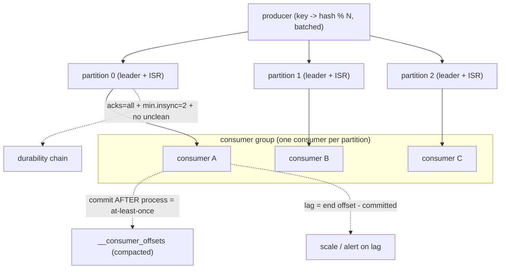

## Thesis

Kafka is a distributed, append-only commit log --- topics split into partitions, each an ordered, immutable sequence of records that consumers read by tracking an offset --- and that log model is what gives it its properties: high throughput (sequential disk writes, partitioned parallelism), durability and replay (records are retained, not deleted on read), and per-partition ordering; the design consequences to understand are how partitions enable parallelism (and the ordering-vs-parallelism trade), how consumer groups distribute partitions and how consumer lag signals a slow consumer, how replication (ISR) provides durability, and how the log model delivers at-least-once with a path to exactly-once.

## Sub

**Why: a durable, replayable, high-throughput log, not a traditional queue** -> **partitions and offsets (the log, ordering, parallelism)** -> **consumer groups, lag, and replication (ISR)** -> **zoom out** to delivery semantics and the pivots an interviewer rides from "it's a message queue" into the log model, partitions and ordering, and consumer groups and lag.

## Spine

- Kafka is a **distributed commit log**, not a traditional queue --- a topic is split into **partitions**, each an **append-only, ordered, immutable** sequence of records; consumers read by advancing an **offset**, and records are **retained** (by time/size) rather than deleted when consumed, which is what enables **replay**, multiple independent consumers, and very high throughput (sequential disk I/O).
- **Partitions are the unit of parallelism and ordering** --- a topic's throughput scales with its partition count (more partitions = more parallel producers/consumers), and ordering is guaranteed **only within a partition** (not across the topic); the **partition key** decides which partition a record lands in (same key -> same partition -> ordered), so choosing the key is how you trade global ordering for parallelism.
- **Consumer groups distribute partitions, and lag measures keeping up** --- within a consumer group each partition is consumed by **exactly one** consumer (so a group parallelizes across partitions, capped at the partition count), and Kafka tracks each consumer's committed offset; **consumer lag** (latest offset minus committed offset) is the key health signal --- growing lag means consumers can't keep up (the backpressure / scaling signal).
- **Replication (ISR) gives durability, and the log model gives at-least-once** --- each partition is replicated across brokers with one **leader** and a set of **in-sync replicas (ISR)**; `acks` plus ISR set the durability/latency trade, and because consumers commit offsets separately from processing, the default guarantee is **at-least-once** (duplicates on failure), with **exactly-once** available via idempotent producers plus transactions.

## Companion Notes

### walk

A distributed log, not a queue

A high-throughput event backbone where records are appended to partitioned logs and retained for replay --- why the log model differs from a traditional queue, how partitions give both ordering and parallelism, how consumer groups share the work and lag signals falling behind, and how replication and offset commits set durability and delivery semantics.

Say the model first --- "Kafka is an append-only log, not a queue that deletes on read." Retention-plus-offsets is what enables replay, multiple consumers, and high throughput, and almost every property (ordering, parallelism, lag, delivery semantics) follows from partitions being ordered immutable logs.

### drill

Probe Drill

Graded follow-ups on partitions and ordering, consumer groups and lag, replication/ISR, and delivery semantics --- the ones that separate "Kafka is a message queue" from understanding why it's a partitioned commit log and what that buys and costs.

Name the model and its consequences: a topic is N append-only partitions; ordering is per-partition (via the key), parallelism scales with partitions (one consumer per partition in a group), lag = latest minus committed offset, and the default is at-least-once (offsets commit separately from processing).

### wb

Whiteboard

Rebuild the partitioned log from memory --- producer to key to partition to consumer group, with replication underneath and the offset commit that decides your delivery semantics.

Draw the partition first, not the cluster. Everything an interviewer asks --- ordering, parallelism, lag, durability, duplicates --- is a property of "a partition is an ordered, retained, immutable log with one consumer per group."

### sys

System Map

Zoom out: Kafka sits between the services that emit events and everything that reads them --- sinks, stream processors, and the materialized views that are rebuildable from the log.

Lead with the boundary, not the brokers --- "producers append to a partitioned retained log; any number of independent consumer groups read it at their own pace." The cluster topology is a detail; the log is the design.

### trade

Trade-offs

The Kafka decisions an interviewer actually drills --- the partition key (ordering vs parallelism), acks and min.insync (durability vs latency), partition count, retention vs compaction, and what to do with a record that will not process.

Every one of these has the same shape: you are trading ordering, durability, or simplicity against throughput. Name the axis, then the switch condition --- never defend a setting as universally right.

### model

Model Answers

Full spoken scripts --- the beats, in order, the way you would actually say them under time pressure.

Steal the frame, not the words. Lead with "it's a log, not a queue," and land on the one risk you would name --- usually that at-least-once means the consumer must be idempotent.

### num

Numbers

Back-of-envelope the two Kafka numbers that decide a design: the consumer-parallelism ceiling (partitions), and the retention clock (how long before a lagging consumer starts losing records).

Lead with the ceiling --- a group can never have more working consumers than partitions. Then the deadline: lag measured in time against the retention window is when "slow" becomes "data loss."

### rf

Red Flags

What sinks a Kafka round --- claiming global ordering, "just add consumers," "we set acks=all so we can't lose data," and treating a partitioned log as a task queue.

Name what the interviewer hears. "Kafka guarantees ordering" tells them you have never had to choose a partition key, and that is the fastest way to lose the room.

### open

30-Second

The opener and the close --- matched to the altitude the question is asked at, from a one-line reframe to the failure modes you would watch in production.

Match the altitude: open on the log model, not the broker config. Land on at-least-once and the partition key as the real hard parts, because those are where the design decisions live.

## Drill

all | All four levels, mixed --- the way a real loop actually comes at you
SDE2 | **The log, partitions, and lag** --- what Kafka *is*, why it is not a queue, how partitions and offsets work, and what consumer groups and lag actually mean. The bar is "this is a partitioned commit log, not a message bus": name the model and let the properties fall out of it.
SDE3 | **Ordering, replication, and delivery** --- the partition key, the ISR and acks, offset commits, and rebalancing. The bar is "here is the trade and here is the switch": name the guarantee each setting buys and the failure it leaves open.
Staff | **Exactly-once, skew, and failure modes** --- transactions and their boundary, hot partitions, partition-count consequences, and the ways real deployments lose data. The bar is "I know where this bends": name the durability chain, the ordering cost of every fix, and the thing Kafka is genuinely the wrong tool for.

### SDE2 | what Kafka is

What is Kafka, and how is its model different from a traditional message queue?

Kafka is a **distributed, append-only commit log** used as a streaming/event platform. A **topic** is divided into **partitions**, each an ordered, immutable sequence of records appended to disk; producers append to the end, and consumers read forward by tracking a position (offset). The key difference from a traditional queue (like RabbitMQ): in a classic queue, a message is **delivered to one consumer and then deleted** (the queue holds pending work, and consumed messages are gone). In Kafka, records are **retained** (for a configured time or size) **regardless of consumption** --- reading doesn't remove them. That single difference (a durable retained log vs a delete-on-consume queue) is what gives Kafka its defining properties: **replay** (re-read from any past offset), **multiple independent consumers** (each tracking its own offset over the same data), and very **high throughput** (append-only sequential disk writes and reads are fast). So Kafka is better thought of as a "distributed log you subscribe to" than a "queue you drain."

Follow: You said records are retained rather than deleted on read. So what *does* delete them --- and what happens to a consumer slower than that?
**Retention deletes them, on a clock the consumer does not control.** Kafka expires whole log segments from the *front* of each partition once they age past `retention.ms` (default 7 days) or the partition exceeds `retention.bytes`. So the log has a **moving floor**: it advances whether or not anyone has read those records. A consumer whose lag, measured in **time**, exceeds the retention window has its unread records **deleted before it reads them** --- silent, unrecoverable data loss, with no error anywhere (the consumer just resumes at the new earliest offset via `auto.offset.reset`, having skipped the gap). That is the operational price of "retention, not consumption": the queue's back-pressure ("the queue grows until you deal with it") is replaced by a **deadline**. It is why you monitor lag *in time against the retention window*, not just as a record count.

Follow: If reading doesn't remove a record, how does the broker know a consumer is done with it --- and where does that state live?
**It doesn't, and that is the point.** The broker keeps **no per-message delivery state** at all --- no in-flight table, no per-consumer ack bookkeeping. All it stores is **one committed offset per (consumer group, partition)**, written to an internal **compacted** topic called `__consumer_offsets` (compaction keeps the latest value per key, so it stays bounded), replicated like any other topic. That is the whole record of "what have I consumed": a single number per group per partition. This is precisely why Kafka's fan-out is cheap where a queue's is not --- a traditional broker tracks state *per message per consumer*, so N consumers over M messages is O(N x M) bookkeeping; Kafka is O(N x partitions). The trade is that Kafka **cannot** ack an individual message, which is exactly why it has no priorities, no selective redelivery, and no native dead-letter queue.

Senior: A Staff answer doesn't stop at "it's a log" --- it names the **consequence chain**. Retention-not-deletion is what buys replay and many independent consumers, and the price is a **moving retention floor** that silently deletes data out from under a lagging consumer. And it knows the broker holds **one offset per group per partition**, not per-message state, which is simultaneously *why* fan-out is cheap and *why* Kafka can never ack a single message (no priorities, no DLQ, no selective redelivery).
Speak: "Kafka's a distributed commit log, not a queue --- a topic is N append-only partitions, and records are retained by time or size, not deleted when they're consumed. That one property buys you replay, many independent consumers, and huge throughput, because the broker only tracks an offset per group per partition, not per-message delivery state. The flip side: it can't ack an individual message, which is why there's no priority and no native DLQ."

### SDE2 | topics and partitions

What are topics and partitions?

A **topic** is a named stream of records (the logical category, e.g. `orders`); a **partition** is a physical, ordered, append-only log that a topic is split into. A topic has one or more partitions, and each partition is an independent sequence of records stored on a broker (and replicated). Partitions are the crucial structural unit because they're what makes Kafka **scalable and parallel**: the topic's data and load are spread across its partitions (which can live on different brokers), so producing and consuming can happen in parallel across them rather than being bottlenecked on a single log. Each record within a partition has a monotonically increasing **offset** (its position). When you produce a record, it goes to *one* partition (chosen by key or round-robin); when you consume, you read partitions forward by offset. So "topic" is the logical stream and "partition" is the physical, ordered shard of it --- and understanding that a topic is really N parallel ordered logs is the foundation for everything else (ordering, parallelism, consumer groups).

Follow: So can I just set 1000 partitions on every topic and never worry about the ceiling?
**No --- partitions are not free, and you cannot take them back.** Each partition is a real object on every broker that hosts it: open **file handles** (each segment is a file, plus its index files), **memory** for the producer's per-partition batch buffers and the broker's index, and a **replication fetch** stream per follower. The costs that actually bite: (1) **failover time** --- when a broker dies, the controller must elect a new leader for *every* partition it led, so a cluster with hundreds of thousands of partitions has a visibly longer unavailability window; (2) **rebalance time** --- reassigning a group with thousands of partitions is slow; (3) **weaker batching** --- a producer batches *per partition*, so spreading the same throughput over 10x more partitions makes each batch 10x smaller, which costs you compression ratio and adds request overhead and end-to-end latency. And you **cannot reduce** a topic's partition count, so "just set it high to be safe" is a permanent tax. Size it to peak required consumer parallelism plus headroom, not to the maximum you can imagine.

Follow: Do all of a topic's partitions live on one broker?
**No --- and if they did, the topic couldn't scale past one machine.** Kafka distributes a topic's partitions across the brokers in the cluster: each partition has a **leader** on one broker and **followers** on others, and the controller spreads leadership so that no single broker owns every partition (and, with `broker.rack` set, spreads the replicas of a partition across **racks / availability zones** so a correlated failure can't take out a whole ISR). That distribution is exactly what makes a topic's throughput scale beyond a single machine's disk and NIC --- producers write to many leaders concurrently and consumers fetch from many leaders concurrently. It also means the partition is the unit of **placement** as well as parallelism, which is why partition count and key skew are *also* a disk-balance and network-balance problem on the brokers, not just a consumer problem.

Senior: Knowing the partition is the unit of **placement, replication, ordering and parallelism all at once** --- so partition count is a *capacity decision*, not a tuning knob --- and being able to name the concrete costs of too many (file handles, memory, **leader-election time on failover**, rebalance time, and *weaker batching* because a producer batches per partition), rather than a vague "there's overhead."
Speak: "A topic is the logical stream; a partition is the physical, ordered, append-only log it's split into, and partitions are spread across brokers --- that's what lets a topic scale past one machine. So a topic is really N parallel ordered logs, and that framing is the foundation for everything: ordering, parallelism, consumer groups, and the fact that partition count is a sticky capacity decision you can't undo."

### SDE2 | offsets

What is an offset and how do consumers use it?

An **offset** is a record's sequential position within a partition (0, 1, 2, ...) --- a monotonically increasing id unique to that partition. Consumers use offsets to track **where they are** in each partition: a consumer reads records in order and remembers the offset of the last one it processed (its **committed offset**), so it knows where to resume. This is fundamentally different from a queue where the broker tracks per-message delivery/ack; in Kafka the **consumer's position is just an offset**, and Kafka stores each consumer group's committed offset per partition (in an internal topic). Because the position is a simple offset into a retained log, a consumer can **re-read** (reset its offset backward to replay) or **skip** (seek forward), and multiple consumers can be at different offsets in the same partition independently. The offset is the whole mechanism for "what have I consumed" --- lightweight (just a number per partition per group), which is part of why Kafka scales: the broker doesn't track per-message state for each consumer, just where each group's offset pointer is.

Follow: A consumer's *current position* and its *committed offset* are not the same thing. Why does that distinction matter?
Because **the gap between them is exactly your duplicate window.** The **position** is where the consumer will read next --- it lives in memory and advances on every `poll()`. The **committed offset** is what has been durably recorded as processed, and it is the *only* thing that matters after a crash or a rebalance: a restarted consumer (or the new owner of the partition) resumes from the **committed** offset, not the position. So everything the consumer processed but had not yet committed gets **reprocessed**. That gap is a knob you control: commit after every record and the duplicate window is one record (but you pay a commit round-trip per record); commit every 5 seconds or every 500 records and the window is 5 seconds or 500 records of reprocessing. That is the real content of "at-least-once" --- you are choosing the *blast radius* of duplicates, and the consumer must be idempotent enough to absorb whatever radius you chose.

Follow: Where is the committed offset actually stored, and what happens if a group has no committed offset at all?
It lives in the internal **`__consumer_offsets`** topic --- a compacted Kafka topic keyed by (group, topic, partition), so it keeps the latest committed offset per key and is replicated exactly like your data. (Offsets *do* expire: a group with no active members has its offsets removed after `offsets.retention.minutes`, which defaults to 7 days --- a real trap for a consumer that is down over a long holiday.) If a group has **no** committed offset for a partition --- brand-new group, or offsets expired/deleted --- the consumer falls back to **`auto.offset.reset`**, and that default is a genuine data decision, not boilerplate: **`earliest`** replays the entire retained log (correct, but a brand-new consumer suddenly firehoses a week of history through your side effects), and **`latest`** starts at the end (cheap, but it **silently skips** everything produced while the group was away --- data loss that looks like "it's working"). `none` throws instead, which is the honest choice when neither silent behaviour is acceptable.

Senior: Distinguishing **position** (in-memory, advances on poll) from **committed offset** (durable, where a restart resumes) --- and naming the gap between them as *the duplicate window you are choosing* --- plus treating **`auto.offset.reset`** as a real data-loss/duplicate decision (and knowing offsets themselves expire) rather than a default nobody looks at.
Speak: "An offset is just the record's position in the partition, and the consumer's position is the entire 'what have I consumed' mechanism --- the broker stores one committed offset per group per partition in an internal compacted topic, not per-message state. The subtlety: your in-memory position and your *committed* offset aren't the same, and the gap between them is precisely the window a crash reprocesses. That's what at-least-once actually means."

### SDE2 | retention and replay

Since records aren't deleted on read, how does retention and replay work?

Kafka **retains** records in each partition for a configured **retention period** (e.g. 7 days) or **size** (e.g. up to 100GB per partition), independent of whether they've been consumed; when a record ages past the retention limit, old log segments are deleted from the front. Because records persist for the retention window, any consumer can **replay** by resetting its offset backward and re-reading --- reprocess after a bug fix, bootstrap a brand-new consumer that reads all history, or let a second independent application consume the same stream from the beginning. This is a defining capability a delete-on-consume queue can't offer: the log is a durable, re-readable record of events, not a transient holding area. It also means consumers are **decoupled** from producers in time --- a consumer can be down for hours and catch up later (as long as it stays within the retention window), and the produce rate isn't coupled to any consumer's speed (Kafka absorbs the mismatch in the retained log). The trade is storage (you're keeping data you may not re-read) and the operational rule that a consumer lagging beyond the retention window will **lose** data (old records get deleted before it reads them).

Follow: You reset a consumer group's offsets to replay a week of data. What breaks?
Two things, and both are about the **sink**, not about Kafka. (1) **Replay re-fires side effects.** Every record goes through your consumer again, so every external write, API call, email or charge happens *again*. Replay is only a superpower if the consumer is **idempotent** (upsert on a business key, conditional write, dedup table) or if you replay into a **fresh sink** you build alongside and swap in atomically --- which is the cleanest pattern, because it also lets you validate the new output before cutting over. (2) **Replay is a firehose.** You are no longer consuming at the real-time produce rate; you are consuming as fast as the consumer can go, so a week of traffic can hit a downstream database in an hour. That is how a "harmless reprocess" becomes an outage of the system you were reprocessing *into*. The mitigations are to **rate-limit the replay**, and to run it as a **separate consumer group** (a new `group.id`) so the live group's offsets are untouched and production traffic keeps flowing while the backfill runs beside it. The mistake is resetting the *live* group's offsets in place --- now you have stopped serving current traffic in order to reprocess history.

Follow: Retention is 7 days, but you need to keep a "current value" per key forever. What do you use?
**Log compaction** (`cleanup.policy=compact`) --- retention *by key* instead of *by age*. Compaction guarantees Kafka retains **at least the latest record for every key** indefinitely, garbage-collecting only records that a later record with the same key has **superseded**; writing a record with a **null value** (a **tombstone**) marks the key for deletion (retained briefly, per `delete.retention.ms`, so consumers reading from the start still see the delete). That turns the topic into a durable **changelog / key-value snapshot** you can replay from offset 0 to rebuild the current state of every key --- which is exactly how Kafka stores its own consumer offsets and how Kafka Streams makes local state stores recoverable. (You can also set `compact,delete` to compact *and* age out, e.g. keep the latest per key but drop keys untouched for a year.) The property to say out loud: a compacted topic's size is bounded by the **key space**, not by the event history, which is what makes "keep it forever" affordable at all. The thing it does **not** give you is the full history of a key --- compaction destroys the intermediate values, so a compacted topic is a *table*, not an *audit log*.

Senior: Knowing replay is only a superpower if the **sink** is designed for it --- idempotent, or replay into a fresh sink you swap --- and that a replay is a **full-throughput firehose** into a downstream sized for real-time, run under a *separate group id* so it doesn't stall live traffic. Then reaching for **compaction** as the answer to "keep the latest per key forever," and knowing its cost: a compacted topic is a table, not an audit log.
Speak: "Records are retained by time or size, not deleted on read --- so any consumer can reset its offset backward and replay. Two things I'd say about replay: it re-fires side effects, so the sink has to be idempotent or you replay into a fresh sink and swap; and it's a firehose, not real-time, so I'd rate-limit it and run it as a separate consumer group. And if I need the latest value per key forever, that's compaction, not infinite retention."

### SDE2 | consumer groups

What is a consumer group and how does it parallelize consumption?

A **consumer group** is a set of consumers that **cooperatively** consume a topic, with Kafka assigning each **partition to exactly one consumer in the group**. So if a topic has 6 partitions and the group has 3 consumers, each consumer gets 2 partitions; the group as a whole reads all 6 in parallel, and the work is divided without duplication (within the group, no two consumers read the same partition). This is how Kafka scales consumption horizontally: add consumers to the group (up to the partition count) to process more in parallel. Crucially, **different groups are independent** --- each group has its own offset per partition and reads the whole topic on its own, so you can have many applications (each its own group) all consuming the same topic without interfering (this is the multiple-independent-consumers property). Within a group, the exactly-one-consumer-per-partition rule is what gives both parallelism *and* per-partition ordering (one consumer sees a partition's records in order). The cap to remember: **a group can't have more actively-consuming members than partitions** --- extra consumers sit idle, because there's no partition left to assign them.

Follow: You have 12 partitions and 12 consumers, all keeping up. You add a 13th for headroom. What happens?
**It sits idle and does nothing.** A partition is assigned to exactly one consumer in the group, and there is no 13th partition to give it --- so the 13th member joins the group, is assigned zero partitions, and consumes zero records. It is not extra capacity; it is a **warm standby** that only starts doing work after a rebalance hands it a partition (i.e. when one of the other 12 dies). That is not nothing --- it does buy you faster failover --- but it must not be mistaken for scaling. The honest statement is: **partition count is the hard ceiling on a group's parallelism**, so once you are at that ceiling, "add consumers" is no longer a scaling lever at all. The only ways past it are to make each consumer faster, or to **add partitions** --- which is disruptive precisely because it remaps `hash(key) % N` and breaks per-key ordering across the change. That is why partition count is an up-front capacity decision rather than a dial.

Follow: Two different applications need to consume the same topic in full. How does that work, and what does it cost?
Each application is its **own consumer group** (its own `group.id`), so each independently tracks its own committed offsets over every partition and reads **every record** --- no interference, no coordination, and neither can starve the other. That is the "multiple independent consumers" property, and it is the reason Kafka is an event *backbone* rather than a point-to-point pipe: one write, N readers, and a new reader is a new group id, not a change to the producer. The cost is **read amplification, not storage** --- the data is stored once, but each group *reads* it, so the brokers' network and disk-read load scales with the number of groups. The nuance that matters at scale: a **caught-up** consumer reads from the OS **page cache** (the records were just written, so they're still in memory), and on a **PLAINTEXT** connection Kafka serves it **zero-copy** (`sendfile`) straight from page cache to socket, which makes it nearly free. The caveat worth naming, because it is the *normal* configuration and it flips the conclusion: **TLS disables the zero-copy path.** The broker cannot hand encrypted bytes off to `sendfile`, so it must pull the records into userspace to encrypt them --- meaning on a TLS cluster (which is essentially every production one) each extra consumer group costs real **broker CPU per byte served**, not just a page-cache read. And a consumer **replaying from the beginning** reads cold from disk, evicts the page cache the live consumers depend on, and is dramatically more expensive again --- which is why a big backfill can slow down every *other* consumer on that broker. So the honest ordering is: adding readers is far cheaper than adding replayers, but with TLS on it is not *free* the way the zero-copy story implies.

Senior: Naming the ceiling out loud --- **group parallelism is capped at the partition count**, so past it "add consumers" is not a plan --- and knowing that extra groups cost **read amplification, not storage**, with the page-cache nuance: a caught-up consumer is nearly free (zero-copy from cache) *on plaintext*, but **TLS disables `sendfile`**, so on a real cluster each extra group costs broker CPU per byte; and a **replaying** consumer reads cold from disk and degrades every other consumer on that broker. Knowing that the zero-copy story quietly assumes a plaintext connection is the detail almost nobody carries.
Speak: "A consumer group divides the partitions: each partition goes to exactly one consumer in the group, so the group reads all of them in parallel with no duplication. Different groups are fully independent --- each reads the whole topic with its own offsets, which is what makes Kafka an event backbone rather than a pipe. The cap: a group can never have more working consumers than partitions. A 13th consumer on 12 partitions is a warm standby, not capacity."

### SDE2 | producers and the partition key

How does a producer decide which partition a record goes to?

By the record's **partition key**: Kafka hashes the key and maps it to a partition (`hash(key) % numPartitions`), so **all records with the same key go to the same partition**. If no key is provided, the producer distributes records across partitions (round-robin / sticky batching) for balance. The key choice is significant because it controls two things at once: **ordering** (same key -> same partition -> those records are strictly ordered relative to each other) and **distribution** (how evenly load spreads across partitions). For example, keying by `user_id` guarantees all of one user's events are ordered and processed by one consumer, while spreading different users across partitions for parallelism. So the producer's partitioning (via the key) is where you make the fundamental trade: pick a key to get the ordering you need (events that must be ordered share a key) while keeping keys diverse enough that load spreads evenly. A poorly-chosen key (one that concentrates traffic on few values) causes **hot partitions** (skew); no key at all gives even spread but no ordering guarantees across records.

Follow: You keyed by `user_id`. Six months later you double the partition count. What breaks?
**Per-key ordering breaks, silently.** The mapping is `hash(key) % N`, so changing N changes the destination for most keys: a given user's *new* records now land on a **different partition** than their *history*. Kafka does **not** move existing data on a partition increase --- the old records stay exactly where they are. So for a window around the change, that user's records exist in **two partitions**, being consumed **in parallel by two different consumers**, with no ordering between them. Nothing errors. Nothing alarms. You find out when a customer reports that "cancelled" was processed before "created." This is exactly the **naive modulo hashing** resize problem that consistent hashing exists to solve --- and the reason Kafka does *not* just use consistent hashing is instructive: a partition is not a cache bucket, it is a **physical ordered log with history**. Consistent hashing would let a key move to a new partition with minimal reshuffling, but the key's *past* records would still be sitting in the old partition, so you would have the same ordering break. You cannot relocate a key without relocating (and re-ordering) its entire history. The safe paths are therefore: over-provision partitions up front; or **drain the topic to zero lag before expanding** (no key has records in flight across the change, so nothing is split); or cut over to a **new topic** with the right partition count.

Follow: What if you send with no key at all?
The record is placed for **balance, not by content**. Modern clients use **sticky partitioning** --- the producer fills a whole batch destined for *one* partition, sends it, then picks another partition for the next batch --- rather than strict per-record round-robin. That is a deliberate throughput optimization: batching by partition means bigger batches, better compression, and fewer requests, which is why sticky partitioning *lowers* latency under load compared to the old round-robin behaviour (round-robin scattered every record into a different partition's tiny batch). You get even spread and maximum parallelism. What you give up is **ordering, entirely**: consecutive records from the same producer can land in different partitions, be consumed by different consumers, and be processed in any order relative to each other. So a null key is correct **only** when your records are genuinely independent --- metrics, logs, click events where each stands alone. The moment two records have a causal relationship ("created" before "cancelled"), a null key is a bug.

Senior: Recognizing that `hash(key) % N` is **naive modulo hashing** --- the partition count is baked into the key mapping, so growing it re-shuffles keys and **silently** breaks per-key ordering --- and being able to say *why Kafka doesn't just adopt consistent hashing*: a partition is a physical ordered log with history, and you cannot relocate a key without relocating its past. That is what turns "add partitions" from a dial into a migration.
Speak: "The key picks the partition --- `hash(key) % N` --- so the same key always lands on the same partition and is ordered there. That one choice sets both your ordering boundary and your load distribution: skewed key, hot partition; no key, perfect spread and zero ordering. And because it's modulo the partition count, adding partitions remaps keys, so a key's new records land somewhere different from its history --- which breaks per-key ordering silently."

### SDE2 | consumer lag

What is consumer lag and why does it matter?

**Consumer lag** is the difference between the **latest offset** in a partition (the newest record produced, the "log end offset") and the consumer group's **committed offset** (the last record it has processed) --- i.e. **how many records behind** the consumer is. It's the single most important operational health metric for a Kafka consumer: **lag near zero** means the consumer is keeping up (processing about as fast as records arrive); **growing lag** means the consumer is **falling behind** (producing faster than it consumes), which leads to increasing end-to-end latency (records wait longer to be processed) and, if it grows past the retention window, **data loss** (records deleted before they're read). So you monitor lag to answer "are my consumers keeping up?", alert on it, and use it to decide when to **scale** consumers (add members to the group, up to the partition count) or investigate a slow/stuck consumer. Lag is also, in effect, Kafka's **backpressure signal**: because Kafka is pull-based (consumers fetch at their own pace), a slow consumer doesn't get overwhelmed --- it just lags, and the lag tells you to act. "Watch consumer lag" is the first thing to say about operating Kafka consumers.

Follow: Your lag is 5 million records and completely flat. Is that a problem?
**Probably not --- and this is where a raw record count misleads you.** A large but *stable* lag means the consumer is keeping up: its consume rate equals the produce rate, it is simply running a constant distance behind. What actually matters is two derived numbers. First, the **trend**: flat is fine, *rising* is the incident. A small, steadily-growing lag is far more dangerous than a big flat one, because the flat one is a steady state and the growing one has no equilibrium. Second, lag expressed in **time** (records behind / consume rate): 5 million records at 100k/s is **50 seconds** behind, which is fine against a 7-day retention and fine for most pipelines --- and catastrophic if your SLA is sub-second. The same 5 million records at 100/s is **14 hours** behind, and that is an emergency. So the answer is: I cannot tell you from the record count, and neither can your alert. Alert on the derivative and on lag-in-time; the absolute count is close to meaningless on its own.

Follow: Lag is growing. You add consumers up to the partition count and it is *still* growing. Now what?
You are at the **parallelism ceiling**, so "more consumers" is dead as a lever and you have to work the other side. In order: (1) **Make per-record processing faster** --- the bottleneck is almost never Kafka, it is what the consumer *does* with each record. Is it doing a synchronous per-record call to a database or an API? Batch those writes, or parallelize the parts of the work that are not order-dependent. (2) **Rule out rebalance thrash** --- if processing exceeds `max.poll.interval.ms`, Kafka evicts consumers as dead, the group rebalances, and throughput *drops*; that presents identically to a capacity problem while actually being a configuration problem, and adding consumers makes it worse. (3) **Add partitions** and scale the group past the old ceiling, accepting the key-remap (drain to zero lag first if the topic is keyed for ordering). (4) If the data is loss-tolerant (metrics, telemetry), **shed or downsample** rather than build capacity for a peak you don't need. And do this *first*, before any of it: compute **lag in time against the retention window**. That number is your deadline --- past it, this stops being a latency problem and becomes irreversible data loss, and it determines whether you have days to fix it properly or minutes to bump retention as a stopgap.

Senior: Reading lag as a **derivative and a time**, not an absolute record count --- "flat 5M is fine, rising 50k is an incident" --- and knowing the partition count is a hard ceiling, so past it the levers are faster processing or more partitions, never more consumers. Then the move almost nobody makes under pressure: **compute lag-in-time against retention first**, because that is the deadline that decides whether you have days or minutes.
Speak: "Lag is the log end offset minus the group's committed offset --- how far behind you are. It's the health signal, but I'd read it as a *trend* and as a *time*, not a record count: flat five million is fine, steadily-rising fifty thousand is an incident. And the number I'd compute first is lag in time against the retention window, because when lag-in-time exceeds retention, Kafka deletes records before they're read. That's the deadline you're racing."

### SDE3 | partitions and ordering

What ordering guarantees does Kafka provide, and how does the partition key relate?

Kafka guarantees **total ordering only within a partition**, never across a whole topic. Records in one partition are strictly ordered by offset (a consumer reads them in the exact order they were appended); but there is **no ordering guarantee between partitions** (records in partition 0 and partition 1 have no defined relative order --- they're consumed in parallel by possibly-different consumers). This is a direct consequence of partitions being independent parallel logs. So to get ordering for a set of related records, you must **route them to the same partition** by giving them the **same partition key** (e.g. all events for `order_id=123` share the key `123` -> same partition -> ordered). The design tension is fundamental: **ordering and parallelism pull against each other** --- you get ordering by concentrating related records on one partition (which limits their parallelism to that one partition/consumer), and you get parallelism by spreading records across partitions (which sacrifices cross-partition ordering). The senior framing: decide the *ordering boundary* your domain needs (usually per-entity, e.g. per-user or per-order) and key by that, so you get the ordering you require within each entity while still parallelizing across entities. Demanding global total ordering forces a single partition (no parallelism) --- which is why you almost never want it.

Follow: Your producer sends record A, then record B --- same key, same partition. Can B ever be written *before* A?
**Yes --- and this is the ordering hole almost everyone misses, because it is on the producer side, not the consumer side.** The producer sends batches asynchronously and may have several requests **in flight** to the same partition at once (`max.in.flight.requests.per.connection`, default 5). If A's batch fails (a transient network error, a `NotEnoughReplicas`) and is **retried** while B's batch has already succeeded, then B is appended *before* A. Ordering is broken **inside the partition** --- the very guarantee you thought the key bought you. The old, blunt fix was `max.in.flight.requests.per.connection=1`, which restores ordering by destroying pipelining (and your throughput). The right modern fix is the **idempotent producer** (`enable.idempotence=true`, the **default since Kafka 3.0**): each batch carries a producer id and a monotonic **sequence number** per partition, so the broker **rejects any out-of-sequence batch** and the producer must resend in order. That preserves ordering *and* keeps up to 5 requests in flight. So "same key -> same partition -> ordered" carries a silent precondition: **the producer must be configured not to reorder its own retries.** On a modern client that is the default; with idempotence explicitly disabled and retries enabled, it is not.

Follow: One entity's events must be handled by service A and *then* service B, in that order. Does Kafka's ordering give you that?
**No.** Kafka orders **delivery within a partition to one consumer**; it says nothing about the order in which two *independent consumer groups* get around to processing a record. A and B each have their own group, their own offsets, and their own speed --- B may well process record 7 before A has processed record 5. Per-partition ordering is not a cross-service execution order, and stretching it into one is a real design error. If you genuinely need A-then-B for the same entity, you must **make the dependency explicit**, and there are two honest ways. (1) **Chain them through the log**: A consumes the event, does its work, and then **produces** a new event to a topic that B consumes. Now the ordering is a *data dependency* --- B physically cannot see the record until A has emitted it, so it is enforced by construction rather than by hope. This is the standard pattern, and it is why event-driven pipelines are chains of topics rather than one topic with several listeners. (2) **Model the sequence as state**: a saga or state machine where B consumes the same event but *checks* the state A wrote, and defers or re-queues if A has not landed yet. Option 1 is almost always right; option 2 is the fallback when B must also react to events A never touches.

Senior: Knowing that per-partition ordering can be broken **by the producer's own retries** (in-flight requests plus a retried batch) unless idempotence is on --- most candidates only ever think about the consumer side --- and then refusing to let "Kafka is ordered" stretch into a **cross-consumer processing order** it does not provide, instead making the dependency explicit by chaining topics.
Speak: "Ordering is per-partition only, never across a topic --- partitions are independent parallel logs, so you buy ordering by giving related records the same key, and you pay for it in parallelism. Two caveats I'd name: the *producer* can reorder its own retries if idempotence is off, so the guarantee has a precondition; and per-partition ordering says nothing about the order two different consumer *groups* process things in --- if you need A-then-B, you chain topics."

### SDE3 | partitions and parallelism

How do partitions determine parallelism and throughput, and what's the consumer cap?

Partitions are the **unit of parallelism** for both producing and consuming, so **throughput scales with partition count** (up to broker/network limits): more partitions means producers can write in parallel to more logs (often on different brokers) and, critically, a consumer group can have **more consumers working in parallel**. The hard cap: within a consumer group, **each partition is consumed by exactly one consumer**, so the **maximum useful parallelism of a group equals the partition count** --- if a topic has 12 partitions, at most 12 consumers in a group do work (a 13th sits idle). This means the partition count sets the **ceiling on how fast one consumer group can drain the topic** (partitions x per-consumer throughput). So sizing partitions is really sizing your maximum consumer parallelism: you want *enough* partitions to allow the consumer parallelism you'll need (now and with headroom for growth), because it constrains scaling. The catch (a staff concern): you can add partitions later but it's disruptive (it changes key-to-partition mapping, breaking the same-key-same-partition property for existing keys) and you can't easily *reduce* them --- so partition count is a fairly sticky, up-front capacity decision, and both too-few (throughput cap) and too-many (overhead) have costs.

Follow: 12 partitions, 4 consumers. Who actually decides which consumer gets which partitions?
**It depends which rebalance protocol you are on, and knowing that is now the actual senior signal.** Under the **classic** protocol --- still the client default --- it is **not** the broker: the **group coordinator** (a broker) owns membership and heartbeats, but on a rebalance it elects one consumer as the **group leader**, and *that consumer* **computes the assignment** using a pluggable client-side **assignor**, then ships the result back through the coordinator to everyone else. The assignor is a config you should set deliberately. **`RangeAssignor`** assigns contiguous per-topic ranges and systematically **imbalances** a group subscribed to several topics --- the first consumer gets partition 0 of *every* topic and does disproportionately more work --- and it is still the **effective default**, because it heads the default `partition.assignment.strategy` list, so most groups are running it right now without having chosen it. **`RoundRobinAssignor`** spreads evenly across all subscribed topic-partitions. **`StickyAssignor`** balances *and* minimizes how many partitions move between rebalances, so a consumer keeps its partitions and its warm local state. **`CooperativeStickyAssignor`** does all of that **and** rebalances incrementally, without the stop-the-world revoke --- switching to it is one of the cheapest, highest-value changes you can make to a classic-protocol group. But **KIP-848**, the new consumer rebalance protocol (**GA in Kafka 4.0**, opt-in per consumer with `group.protocol=consumer`), moves all of this **server-side**: the **coordinator itself** computes the target assignment with a **server-side assignor** (`uniform` or `range`) and drives the group toward it **incrementally**, so there is **no client-side leader and no global sync barrier** at all. Which also means the client-side assignor config --- `CooperativeStickyAssignor` included --- simply **does not apply** there. So the answer is "the group leader, a consumer" *on the classic protocol*, and "the broker coordinator" on the new one, and the candidate who knows which one they are running is the one who is actually current.

Follow: Can you break the one-consumer-per-partition cap and process a single partition with multiple threads?
Not inside the group protocol --- Kafka will never assign one partition to two members of the same group. But you *can* decouple **consumption** from **processing** in your application: one thread polls the partition and hands records to a worker pool, which is what a "parallel consumer" library does. What you must say out loud is the **two things it costs**. (1) **You have given up in-partition ordering** --- workers complete out of order, so the entire reason you keyed the topic evaporates. (The good version of this keys the *workers* by the record key, restoring per-key ordering while parallelizing across keys within the partition --- worth naming, because it is the difference between a thoughtful design and a bug.) (2) **Offset commits become genuinely hard.** You may only commit the **contiguous completed prefix**: if records 1-10 are dispatched and 1, 2, 3, 5, 6 have finished but 4 has not, you may commit only through **3**. Committing the *highest* completed offset (6) would, on a crash, **skip record 4 forever** --- silent data loss. So you must track per-record completion and commit the prefix, which is real machinery. The honest summary: do this only when ordering genuinely does not matter (or when you can key the workers), and if you cannot accept those costs, **add partitions instead** --- that is what partitions are *for*.

Senior: Knowing that **which component computes the assignment depends on the protocol** --- the **group leader** (a consumer, not the broker) with a pluggable client-side assignor on the **classic** protocol, versus the **broker coordinator** with a server-side assignor under **KIP-848** (GA in Kafka 4.0, `group.protocol=consumer`), where there is no client-side leader and `CooperativeStickyAssignor` no longer applies. Naming the assignor is table stakes; naming *which protocol you are on* is the current answer. Plus being honest that in-app fan-out past one-consumer-per-partition costs you **ordering** *and* **correct offset commits**: you may only commit the contiguous completed prefix, never the highest completed offset, or a crash silently skips the gap.
Speak: "Partitions are the unit of parallelism, so throughput scales with partition count --- and within a group, each partition goes to exactly one consumer, so **partition count is the hard ceiling on group parallelism**. Sizing partitions *is* sizing your maximum consumer parallelism, and it's an up-front decision because growing it later remaps `hash(key) % N`. And I'd be precise about who assigns: on the classic protocol it's the group *leader* --- one of the consumers, not the broker --- and there I'd set the cooperative sticky assignor. On KIP-848, GA in Kafka 4.0, the broker coordinator computes it server-side and that config doesn't apply, so the first thing I'd establish is which protocol we're on."

### SDE3 | replication and ISR

How does Kafka replicate partitions, and what is the ISR?

Each partition is **replicated** across a configurable number of brokers (the **replication factor**, e.g. 3): one broker is the partition **leader** (handles all reads and writes for that partition) and the others are **followers** that replicate the leader's log. The **ISR (in-sync replicas)** is the set of replicas (including the leader) that are **caught up** to the leader within a threshold --- followers that have fully replicated the leader's recent records. Replication provides **durability and availability**: if the leader broker fails, one of the in-sync followers is elected the new leader (so the partition stays available and no acknowledged data is lost, provided it was replicated to the ISR). The ISR is central to the durability guarantee because Kafka only considers a record fully committed (and only lets a new leader be elected from) replicas that are **in-sync** --- so a record acknowledged with `acks=all` is guaranteed to be on all current ISR members, meaning it survives the loss of any replica outside the leader. If a follower falls behind (slow, or its broker is struggling), it's **removed from the ISR** (the ISR shrinks) until it catches up; if the ISR shrinks to just the leader, you've lost redundancy for that partition (a durability risk, and the setup for the unclean-leader-election problem). So replication + ISR is how Kafka keeps partitions durable and available across broker failures, and the ISR is the live set that the durability guarantees are defined against.

Follow: What actually decides whether a follower is *in* the ISR --- how far behind is too far?
**Time, not records.** A follower stays in the ISR as long as it has caught up to the leader's log end offset at some point within **`replica.lag.time.max.ms`** (default 30 seconds). Go longer than that without catching up and the leader **evicts it from the ISR**; it is re-admitted automatically once it catches back up. The history explains the design: Kafka *used* to also have a message-count threshold (`replica.lag.max.messages`), and it was **removed**, because a count misfires on bursty traffic --- a legitimate produce spike pushes every healthy follower past a record threshold *at the same instant* and ejects the entire ISR, precisely when you least want it. A time threshold is robust to bursts: a follower fetching as fast as it can, merely behind *because a lot arrived*, is still healthy. The thing to internalize is that the ISR is a **live set that shrinks and grows**, so your durability guarantee is defined against **whatever the ISR happens to be at that moment** --- which is exactly why `acks=all` on its own is not a durability guarantee at all.

Follow: RF=3 with `acks=all`. How many brokers can you lose?
**It depends entirely on `min.insync.replicas`, and that is the whole lesson.** With RF=3 and `min.insync.replicas=2`: lose **one** broker and the ISR is 2, which still meets the minimum --- writes continue, nothing is lost, the partition is fully available. Lose a **second** and the ISR drops to 1, below the minimum, so the leader **rejects every write** with `NotEnoughReplicasException` and the partition goes **read-only**. That rejection is not a bug, it is the design *working*: Kafka is refusing to acknowledge a write that would exist on only one machine, choosing consistency over availability, which is exactly what you want for data you cannot lose. Now the trap. Had you set `min.insync.replicas=1`, that second failure would **not** stop writes --- the leader would keep accepting them onto a lone replica, and `acks=all` would be acknowledging "all in-sync replicas" where "all" means **one**. `acks=all` with `min.insync.replicas=1` is a **durability illusion**: it reads as the strongest possible setting and gives you no more protection than `acks=1` the moment the ISR shrinks. So the durability contract is **RF and min.insync together** --- RF alone tells you nothing, and neither does `acks` alone. And one more link: the producer needs `retries` / `delivery.timeout.ms` set so it actually **retries** the `NotEnoughReplicas` rejection, or Kafka's correct refusal just becomes a dropped record inside your application instead.

Senior: Knowing ISR membership is a **time** threshold (`replica.lag.time.max.ms`), not a record count --- and *why* the old record-count threshold was removed (a burst ejected healthy followers). Then stating the availability consequence exactly: RF=3 + `min.insync.replicas=2` survives one broker loss and **deliberately stops accepting writes** on the second, and `acks=all` with `min.insync.replicas=1` is a durability illusion that reads as the strongest setting.
Speak: "Each partition is a leader plus followers, and the ISR is the set of replicas caught up to the leader --- and membership is a *time* threshold, `replica.lag.time.max.ms`, not a record count. Durability is defined against the ISR: `acks=all` means every *in-sync* replica has it. Which is why `acks=all` alone isn't a guarantee --- if the ISR shrinks to just the leader, 'all' means one. You pair it with `min.insync.replicas` of at least 2, so the write is *rejected* rather than accepted onto a lone replica."

### SDE3 | acks and durability

How do producer `acks` settings trade durability against latency?

The producer's **`acks`** setting controls how many replicas must acknowledge a write before it's considered successful --- the core durability/latency knob. **`acks=0`**: the producer doesn't wait for any acknowledgment (fire-and-forget) --- fastest, but records can be **lost** (if the leader hasn't received it, or the leader fails, you never know). **`acks=1`**: the producer waits for the **leader** to write the record --- a middle ground, but if the leader **fails before followers replicate** that record, it's **lost** (the new leader never had it). **`acks=all`** (a.k.a. `-1`): the producer waits until the record is replicated to **all in-sync replicas (the ISR)** --- strongest durability (the record survives the loss of any single broker, since it's on every ISR member), at the cost of **higher latency** (waiting for replication). For real durability you pair `acks=all` with **`min.insync.replicas`** (e.g. require at least 2 in-sync replicas to accept a write) so that a write isn't acknowledged when the ISR has shrunk to just the leader (which would make `acks=all` meaningless). So the trade is explicit: `acks=0/1` are faster but can lose data on failure; `acks=all` + `min.insync.replicas>=2` gives strong durability with added latency --- and the right choice depends on whether the data is loss-tolerant (metrics) or must-not-lose (financial events).

Follow: With `acks=1` the leader acks immediately. Can a consumer read that record before it is replicated?
**No --- and this is the part almost nobody knows.** Consumers can only fetch up to the **high watermark**, which is the **minimum log-end-offset across the ISR**: a record is not readable by *any* consumer until **every in-sync replica has it**. So `acks` controls when the **producer** is told "done"; it does **not** control when the record becomes **visible**. The reason for that design is worth stating, because it is the whole point: if consumers could read past the high watermark, they could process a record that existed only on the leader --- and if that leader then died, the record would **vanish from the log**, having already been acted upon. A consumer would have processed an event that, after failover, never happened. Kafka structurally refuses to create that phantom read. So the precise consequence is: `acks=1` risks **losing an acknowledged write**, but it never risks a consumer **seeing a record that later disappears**. The producer's risk and the consumer's view are decoupled, and the high watermark is what decouples them. (It also explains a latency mystery: a slow follower holds the high watermark back, so end-to-end latency rises for *consumers* even though the producer is on `acks=1` and never waits for anyone.)

Follow: Does `acks=all` mean the record is on disk on every replica?
**No --- `acks=all` means replicated, not flushed, and this is Kafka's most misunderstood durability property.** When an in-sync replica "has" a record, it has written it into its log through the OS **page cache**; it has **not** necessarily `fsync`'d it to a physical disk. Kafka deliberately does not fsync per write (`log.flush.interval.messages` / `log.flush.interval.ms` are effectively "never" by default) --- it leaves flushing to the OS and derives durability from **replication across independent brokers** instead. State both directions of the consequence, because that is what makes it a real answer rather than trivia: a **process crash** on a broker loses **nothing** (the page cache outlives the process; the OS still writes it out), while a **simultaneous power loss across every member of the ISR** *can* lose acknowledged records, because none of them may have reached a platter. That is a conscious trade --- fsync-per-write would collapse the sequential-write throughput that is Kafka's entire reason for existing --- and it is exactly why **rack / AZ-aware replica placement** (`broker.rack`) is load-bearing rather than a nice-to-have: it turns "the whole ISR loses power at once" from one rack's PDU into a genuinely improbable event. So **durable** in Kafka means *replicated across independent failure domains*, not "flushed to disk" --- and if your compliance model truly requires the latter, you must set the flush intervals and pay for it in throughput.

Senior: Naming the two things nobody names. Consumers only read to the **high watermark** (so `acks` can never create a phantom read --- and a slow follower raises *consumer* latency even at `acks=1`), and `acks=all` means **replicated to page cache, not fsync'd**: Kafka's durability is *replication across failure domains*, which is precisely why `broker.rack` and AZ-spread replica placement are load-bearing rather than cosmetic.
Speak: "`acks` is the durability-latency knob: 0 is fire-and-forget, 1 waits for the leader and loses the record if the leader dies before replicating, `all` waits for every in-sync replica. Two things I'd add. It's only meaningful with `min.insync.replicas` at 2 or more --- otherwise a shrunk ISR makes 'all' mean 'the leader.' And it means *replicated*, not fsync'd: Kafka's durability comes from replication across brokers, not a disk flush, which is exactly why you spread replicas across AZs."

### SDE3 | offset commits and delivery semantics

How do offset commits determine delivery semantics, and why is at-least-once the default?

Because **processing a record and committing its offset are two separate steps**, and the order/timing between them determines the guarantee. The default is **at-least-once**: you process the record, *then* commit the offset --- so if the consumer crashes **after processing but before committing**, on restart it re-reads from the last committed offset and **reprocesses** the record (a duplicate). No records are lost (you always committed only what you processed), but you can get duplicates --- hence "at least once." The inverse, **at-most-once**, is committing the offset *before* processing: if you crash after committing but before processing, that record is **skipped** (lost) on restart, but never duplicated. At-least-once is the sensible default (losing data is usually worse than a duplicate), which is exactly **why idempotency matters** on the consumer side (so reprocessing a duplicate is harmless). The subtlety that bites people: **auto-commit** (Kafka periodically commits offsets on a timer) can produce *either* duplicates *or* loss depending on timing relative to processing, so for precise semantics you disable auto-commit and **commit manually after processing** (for at-least-once). And to get **exactly-once**, you need more than offset ordering --- idempotent producers plus transactions that atomically commit the processing output and the offset together (the staff topic). So: commit-after = at-least-once (default, needs idempotent consumers); commit-before = at-most-once; atomic = exactly-once.

Follow: Why is auto-commit dangerous when it *sounds* like the safe default?
Because it commits on a **timer, decoupled from whether you actually processed anything** --- and the failure it produces is **loss**, not duplicates, which is the opposite of what people brace for. Mechanically: with `enable.auto.commit=true`, the commit happens **inside `poll()`**, and what it commits are the offsets of the records the **previous** `poll()` handed you. Kafka's assumption is "you called poll() again, so you must be finished with the last batch." That assumption breaks the instant your processing is not synchronous-and-complete before the next poll --- most commonly when you hand the batch to a **thread pool** or an async pipeline and loop straight back to poll. Now `poll()` cheerfully commits offsets for records that are still **in flight**, and if the process dies, those records are **never reprocessed**: they are silently skipped, forever, with no error and no gap in any metric. (It can *also* duplicate --- crash after processing but before the timer fires --- so it gives you the worst of both, non-deterministically.) The fix is not subtle: `enable.auto.commit=false`, plus an explicit `commitSync()` **after** processing completes. That is the only way the "process, then commit" ordering that *defines* at-least-once becomes real rather than aspirational.

Follow: At-least-once means duplicates are guaranteed. What actually makes them harmless?
**Idempotency at the sink --- and nothing Kafka does can give it to you.** Kafka can dedupe a *producer's* retries and it can make a Kafka-to-Kafka cycle atomic, but the moment your consumer's effect lands somewhere else, "is a duplicate harmless" is a property of **your write**, not of the broker. The concrete techniques, roughly in order of how often they are the right answer: an **upsert keyed by a business id** (`INSERT ... ON CONFLICT DO UPDATE`) rather than a blind insert; a **conditional write / compare-and-set** so the second application is a no-op; a **dedup table** keyed by a deterministic id derived from the record --- either a business event id, or the `(topic, partition, offset)` triple, which is unique by construction --- where the dedup row is written **in the same database transaction as the effect**, so they commit or fail together; or an operation that is **naturally idempotent** (setting a value, a set union, a max) rather than one that is not. The trap is the effect that cannot be made idempotent cheaply --- "increment a counter," "send an email," "charge a card" --- where a duplicate is a real, user-visible bug and you have to build the dedup store you were hoping to avoid. So the design question is never "how do I stop Kafka duplicating"; it is **"is my sink idempotent, and if not, what do I key the dedup on."** That reframing *is* the answer.

Senior: Being able to say **precisely how auto-commit loses data** --- it commits the *previous* poll's offsets inside the next `poll()`, whether or not you finished processing them, so any async processing silently skips records --- rather than the vague "auto-commit can cause duplicates." And then locating exactly-once responsibility at the **sink's idempotency** (upsert on a business key, or a dedup row written in the same transaction as the effect), not at the broker.
Speak: "Processing and committing the offset are two separate steps, so their *order* is the guarantee. Commit after processing and you get at-least-once --- a crash in between reprocesses the record. Commit before, and you get at-most-once. So duplicates are guaranteed by default, which means the consumer's effect has to be idempotent --- an upsert on a business key, not a blind insert. And I'd turn auto-commit *off*: it commits the previous poll's offsets on a timer, so with async processing it silently skips records you never finished."

### SDE3 | consumer group rebalancing

What is a consumer group rebalance, what triggers it, and why is it a concern?

A **rebalance** is Kafka **reassigning partitions among the consumers in a group** --- recomputing the partition-to-consumer mapping. It's triggered when **group membership or topic metadata changes**: a consumer **joins** (scaling up), a consumer **leaves or crashes** (or fails to heartbeat within the session timeout, so it's presumed dead), or the topic's **partition count changes**. Rebalancing is necessary (to redistribute work when consumers come and go), but the classic concern is that the traditional ("eager") rebalance is **stop-the-world**: *all* consumers in the group **revoke all their partitions**, then the new assignment is computed, then everyone re-acquires --- during which **no consumption happens** (a processing pause / latency spike), and consumers may have to re-establish state for newly-assigned partitions. Frequent rebalances (e.g. from consumers repeatedly timing out due to slow processing, or flapping instances) cause a **"rebalance storm"** --- repeated pauses that tank throughput. Mitigations (staff-level): **cooperative/incremental rebalancing** (only the partitions that need to move are reassigned, so unaffected consumers keep processing --- no full stop-the-world), **static group membership** (a consumer that restarts quickly keeps its identity and partitions, avoiding a rebalance on transient restarts), and tuning session/heartbeat timeouts and processing time (so a slow-but-alive consumer isn't falsely evicted). So rebalancing is essential machinery, but its cost (pause + potential storms) is a real operational concern, which modern Kafka addresses with cooperative rebalancing and static membership.

Follow: Your consumers keep getting kicked out of the group, but the processes are alive and healthy. What is happening?
**Processing is exceeding `max.poll.interval.ms`** (default 5 minutes) --- and what makes this so confusing is that Kafka has **two independent liveness checks**, and most people only know the first. **`session.timeout.ms` plus heartbeats** proves the **process is alive** --- and crucially, since Kafka 0.10.1 heartbeats are sent from a **background thread**, so they keep firing happily *while your main thread is blocked inside a slow `process()` call*. Your consumer looks perfectly healthy to the coordinator. **`max.poll.interval.ms`** proves the consumer is **making progress**: if you do not call `poll()` again within it, the coordinator concludes you are livelocked, **evicts you**, and reassigns your partitions. So a consumer that is slowly-but-healthily grinding through a big batch gets thrown out of its own group --- and here is the vicious part: the new owner inherits the same big batch and the same slow processing, so it gets evicted too, and the group walks itself into a **storm**. It presents as a capacity problem while actually being a config problem, and **adding consumers makes it worse**. The fixes all amount to making the batch fit the interval: lower **`max.poll.records`** so each poll's batch is comfortably processable, raise `max.poll.interval.ms` to cover realistic worst-case processing, or move the slow work off the poll thread (with the offset-commit care that implies).

Follow: A rolling deploy of a 30-consumer group triggers a rebalance on every pod restart. How do you stop the thrash?
Two mechanisms, solving different halves. **Static group membership** (`group.instance.id`) gives each consumer a **stable identity**, so when it restarts *within* `session.timeout.ms` the coordinator **waits for it** and gives back **the same partitions** --- **no rebalance happens at all**. That is the big win for rolling restarts, and the number to size carefully is `session.timeout.ms`: it must comfortably exceed your pod's real restart time, or static membership buys you nothing. (A pod that takes 90 seconds to come back with a 45-second session timeout is declared dead and rebalanced anyway --- this is the number-one reason static membership "doesn't work" for people who enabled it.) **Cooperative / incremental rebalancing** (`CooperativeStickyAssignor`) handles the case where a rebalance genuinely *is* needed: rather than the eager protocol's "everybody revoke everything," it computes the difference and **revokes only the partitions that must change owners**, so the other 29 consumers **never stop processing**. Together they turn a 30-pod rolling deploy from 30 stop-the-world pauses into approximately nothing --- and both are close to free to adopt.

Senior: Knowing there are **two independent liveness checks** --- `session.timeout.ms` + heartbeats (on a *background thread*: is the process alive?) versus `max.poll.interval.ms` (is it making *progress*?) --- and that the evictions behind nearly every rebalance storm are the **second** one, which is why the group looks healthy while it thrashes. That distinction *is* the diagnosis. Plus knowing static membership is useless unless `session.timeout.ms` genuinely exceeds your pod's restart time.
Speak: "A rebalance is Kafka reassigning partitions when membership changes. The classic pain is the eager protocol --- everybody revokes everything and nobody consumes. And the usual trigger isn't a crash: it's processing exceeding `max.poll.interval.ms`, so a slow-but-alive consumer gets evicted, its partitions move to a consumer that's equally slow, and the group storms. The modern fixes are cooperative incremental rebalancing, so only what must move moves, and static membership, so a quick restart doesn't rebalance at all."

### SDE3 | consumer lag operationally

How do you use consumer lag operationally?

As the **primary signal for consumer health and scaling decisions**. You continuously **monitor** lag per partition (and aggregated per consumer group) --- typically exporting it to a metrics system (via Kafka's offset APIs, or tools like Burrow / kafka-lag-exporter / the consumer group's own metrics) and graphing/alerting on it. What it tells you: **steady low lag** = healthy (keeping up); **steadily growing lag** = consumers can't keep up (produce rate > consume rate) -> you need to **scale out** consumers (add members to the group, up to the partition count) or speed up processing, or you'll accumulate latency and risk data loss past retention; **lag on one partition only** = **skew** (a hot partition, or a slow/stuck consumer on that partition) -> investigate the key distribution or that specific consumer; **sudden lag spike then recovery** = a transient (a burst, a brief consumer slowdown, or a rebalance pause). You **alert** on lag exceeding a threshold or a sustained upward trend (not just an absolute number, since a big-but-stable lag can be fine while a small-but-growing one is a problem). Lag also informs **capacity planning**: if lag creeps up under normal load, you're near the consumer-parallelism ceiling and may need more partitions (to allow more consumers). The operational mantra: lag is how you *see* whether your consumers are keeping up, so it's the first dashboard and the first alert for any Kafka consumer, and a rising trend is the trigger to scale or investigate before it becomes latency or loss.

Follow: Lag on exactly one partition; the other eleven sit at zero. Give me your two hypotheses and how you tell them apart.
**Hypothesis one: key skew --- a hot partition.** A dominant key concentrates records on that partition, so its single consumer genuinely has more work than its peers. **Hypothesis two: a stuck or slow consumer.** The *member* that owns that partition is unhealthy --- a poison record it is retrying forever, a GC death-spiral or a resource limit on that one pod, or a downstream dependency that only it happens to hit. These present **identically** on a lag dashboard, and the fixes are opposite: one is a **data** problem you fix in the *key*, the other is an **instance** problem you fix on the *pod*. The discriminator is the metric people forget to graph: **per-partition produce rate**. If that partition's *incoming* record rate is far above its peers, it is **skew** --- the data is lopsided, and restarting the consumer will do nothing. If its incoming rate is **normal** and it is *consumption* that has stalled, it is the **consumer** --- go read that pod's logs and look for one specific record failing in a retry loop. Same symptom, opposite fix, and one graph tells you which.

Follow: What do you actually alert on --- and why is "lag > 100k" a bad alert?
Because an **absolute record count is meaningless without the rate**. 100k records at 1k/s is 100 seconds behind; at 100k/s it is **one second** behind. The same threshold is simultaneously a false alarm on one topic and a missed incident on another, which is exactly how teams learn to ignore their lag alerts. Alert on three things instead. (1) **Lag in *time*** (records behind / consume rate) against your **latency SLO** --- the only lag number that means anything to the business, because it is literally "how stale is our data." (2) **The trend** --- a sustained positive derivative. A small but *steadily growing* lag is a far worse signal than a large flat one: the flat one is an equilibrium, the growing one has no bound. (3) **Lag-in-time as a fraction of the retention window** --- this is the **data-loss deadline**, and it deserves its own loud page, because past it you are not slow, you are **permanently losing records**. And measure all of it **per partition and take the max**, never the sum or the mean: a group with eleven healthy partitions and one badly-lagging one looks fine on an average, and that one partition *is* the incident.

Senior: Alerting on **lag-in-time** and its **trend**, against both the latency SLO and --- separately, as a hard page --- the **retention window**, instead of an absolute record count. Then using **per-partition produce rate** to separate **skew** (a data/key problem) from a **stuck consumer** (an instance problem), which are indistinguishable in a lag graph, and taking the **max** across partitions rather than the mean, because the average hides the one partition that is the incident.
Speak: "Lag is the first dashboard and the first alert for any Kafka consumer --- but I'd watch it per-partition and take the max, not the average, because an average hides the one hot partition that *is* the incident. And I'd alert on the *trend* and on lag expressed in *time*, not a record count, because lag-in-time against the retention window is the data-loss deadline. Lag on one partition only is either skew or a stuck consumer, and the per-partition produce rate tells me which."

### Staff | exactly-once semantics

How does Kafka provide exactly-once semantics, and what are the caveats?

Through **idempotent producers** plus **transactions**, which together make a read-process-write cycle atomic. **Idempotent producer**: the producer tags records with a producer id and sequence number so the broker **deduplicates retries** --- a producer retry (from a network hiccup) won't append the record twice, eliminating producer-side duplicates. **Transactions**: a producer can write to multiple partitions **and** commit consumer offsets **atomically** within a transaction --- so in a stream-processing app (consume from topic A, produce to topic B), the output writes to B *and* the offset commit for A are committed together or not at all. This gives **exactly-once processing** within Kafka: if the transaction commits, the output is written and the input offset advanced exactly once; if it aborts (crash), neither takes effect, and reprocessing produces the same single result (the aborted output is invisible to `read_committed` consumers). The **caveats**: (1) exactly-once is **within Kafka's boundary** --- it covers Kafka-to-Kafka (and offset commits), but the moment your processing has a **side effect outside Kafka** (write to an external DB, call an API), Kafka's transactions don't extend there, so you still need **idempotency** on that external effect (exactly-once end-to-end across systems is really "at-least-once + idempotent sinks"). (2) It adds **latency and complexity** (transaction coordination overhead), so you enable it only where you need it. (3) Consumers must use **`read_committed`** isolation to not see aborted-transaction records. So the honest staff answer is: Kafka gives genuine exactly-once *within the Kafka pipeline* via idempotent producers + transactions, but "exactly-once" across your whole system (with external side effects) still relies on making those effects idempotent --- the transaction handles the Kafka part, idempotency handles the rest.

Follow: Walk me through what the idempotent producer actually does --- and what it does *not* cover.
The broker assigns each producer a **producer id (PID)**, and the producer stamps every batch with a monotonically increasing **sequence number, per partition**. The broker remembers the last sequence it accepted for each `(PID, partition)` and **rejects any duplicate or out-of-order batch** --- so a producer retry after a lost ack is deduplicated *at the broker*, and ordering survives even with up to 5 requests in flight. It is cheap (a few bytes per batch and some broker-side state) and it is on by default since Kafka 3.0. Now the three things it does **not** cover, which is the actual question. (1) It is scoped to a **producer session**: the PID is assigned at init, so if your *application* crashes and restarts, it comes back with a **new PID** and the broker cannot tell its re-sends from brand-new records --- duplicates return. That is precisely the hole **`transactional.id`** fills: a stable, user-supplied id lets the new session reclaim the old PID (bumping an epoch, which **fences** the zombie old producer out) and clean up. (2) It is **per-partition**, so it says nothing about atomicity *across* partitions --- writing to three topics is still three independent appends. (3) It does **nothing** about consumer-side duplicates from reprocessing after a crash. So the idempotent producer is a narrow, cheap guarantee: **"my own retries don't duplicate"** --- not "exactly-once."

Follow: The consumer does a read-process-write into Kafka *and* writes a row to Postgres. Can transactions make that exactly-once?
**No --- and saying so plainly, rather than reaching for a config, is the answer.** Kafka transactions are atomic across **Kafka partitions and the offset commit**; there is no XA / two-phase commit between the Kafka transaction coordinator and Postgres, and there is not going to be. Your real options are three. (1) **Make the external write idempotent** --- an upsert on a deterministic key (a business event id, or `(topic, partition, offset)`), so at-least-once plus an idempotent sink gives exactly-once *effect*. This is what almost everyone actually does, and it is the right default. (2) **Move the "transaction" into the external store**: write the **offset itself into Postgres, in the same DB transaction as the business row**, and on startup `seek()` to that stored offset instead of trusting Kafka's committed offset. Now the database is the single source of truth for "what have I processed," and the atomicity is genuine, because there is only one transactional resource. This is the strongest correct answer and it is under-used. (3) **Transactional outbox**, for the other direction --- when the DB is the source and you are producing *to* Kafka, write the business row and an outbox row in one DB transaction, and relay the outbox to Kafka (which is what CDC / Debezium automates). The honest framing to land: exactly-once **within** Kafka is real; exactly-once **end-to-end** is always "at-least-once plus an idempotent or transactionally-coupled sink," and any vendor claiming otherwise is selling you one of these three under a nicer name.

Senior: Being precise that the idempotent producer is a **per-session, per-partition** dedup (PID + sequence number), and that **`transactional.id`** is what makes it survive a restart (by fencing the zombie producer with an epoch bump) --- then **refusing** to claim exactly-once across an external system, and instead naming the two real mechanisms: an **idempotent sink**, or **storing the offset in the sink's own transaction** and seeking to it on startup.
Speak: "Exactly-once in Kafka is two mechanisms. The idempotent producer stamps batches with a producer id and a per-partition sequence number, so the broker dedupes retries. And transactions commit the output records *and* the input offsets atomically, with consumers on `read_committed`. But that's exactly-once *within* Kafka. The moment you write to an external system, transactions don't reach it --- so it's at-least-once plus an idempotent sink, or you store the offset in the sink's own transaction and seek to it on restart."

### Staff | the log as source of truth

Beyond a queue, how is Kafka used as a source of truth (event sourcing, stream-table duality, compaction)?

Because Kafka is a **durable, ordered, replayable log**, it can serve as the **system of record** for events, not just transport --- which underpins several patterns. **Event sourcing**: store the log of events (state changes) as the source of truth, and derive current state by replaying them; Kafka's retained, ordered log is a natural fit, and new consumers/views can be built by replaying history. **Log compaction**: a retention mode where Kafka keeps **at least the latest record per key** (rather than deleting by age), so a compacted topic becomes a **changelog** that always retains the current value for every key --- effectively a durable key-value snapshot you can replay to rebuild state (used for offset storage, and for materializing tables). **Stream-table duality** (Kafka Streams / ksqlDB): a stream (the log of events) and a table (the current state per key) are two views of the same data --- you can turn a stream into a table (by keeping the latest per key, i.e. compaction/aggregation) and a table back into a stream (its changelog); this duality lets you build stateful stream processing where local state stores are backed by compacted changelog topics (so state is durable and recoverable by replay). The staff framing: Kafka is often mis-described as "just a message queue," but its log-plus-retention-plus-compaction model makes it an **event store and a streaming database substrate** --- the log is the source of truth, tables/views are derived and rebuildable from it, and this is why Kafka anchors event-driven architectures (CDC pipelines, event sourcing, stream processing) rather than merely moving messages. The trade is that treating the log as source-of-truth is a real architectural commitment (schema management, retention/compaction strategy, reprocessing discipline), not free.

Follow: Kafka Streams keeps local state --- a RocksDB store on the instance. What happens when that instance dies?
The store is rebuilt from Kafka, because **the local state is a cache, not the truth**. Every write to a Kafka Streams state store is *also* produced to a **compacted changelog topic** in Kafka. So when an instance dies, the partition (and its state) is reassigned, and the new owner **replays the changelog from offset 0** to reconstruct the store exactly. That is the stream-table duality made operational: the **table is derived, the log is authoritative**, and there is no state anywhere that Kafka cannot regenerate. Compaction is what makes it affordable --- the changelog's size is bounded by the **key space**, not by the event history, so restoring a store means replaying one record per key rather than every update ever made. The real operational cost is **restore time**: a large store can take many minutes to rebuild, and processing for those partitions is **stalled** the whole time, which turns a single pod restart into a visible latency incident. The mitigation is **standby replicas** (`num.standby.replicas`), warm copies on other instances that keep applying the changelog continuously so a failover is a promotion rather than a rebuild. That trade --- extra memory and disk on standbys, in exchange for fast failover --- is the actual design decision, and it is the one people discover only after their first restore.

Follow: If the log is the source of truth, what is the genuinely hard part in practice?
**Schema evolution and reprocessing discipline** --- and both are organizational, which is why event sourcing is expensive in ways a design diagram never shows. Because the log is retained and **replayed**, any consumer that ever replays must be able to read **records written years ago**. So you need a **schema registry** with an *enforced* compatibility policy (backward-compatible changes only: add optional fields, never remove or repurpose a required one), because a breaking schema change is not merely a failed deploy --- it **poisons your history**, permanently, and there is no migration to run because the log is immutable. That immutability is the second hard part: you **cannot fix a bad event** by editing it. A wrong record is corrected by emitting a *compensating* event, or by rebuilding the derived view --- which means every consumer must tolerate "an event that says the previous event was wrong." Third: **reprocessing must be safe**, so every consumer of a source-of-truth log has to be idempotent or replay-into-a-fresh-sink, forever, not just when convenient. And fourth: you have to decide what is genuinely a **fact** versus a derived value, because facts live forever and you will be reading them for a decade. The honest staff answer is that log-as-source-of-truth is a commitment to **schema governance, retention policy, and replay runbooks** --- an organizational discipline, not a config flag --- and it is why plenty of teams should *not* adopt it.

Senior: Knowing local state stores are a **materialization backed by a compacted changelog** (Kafka is the truth, the store is rebuildable) --- and naming **restore time** and **standby replicas** as the real operational cost, because that is what turns a pod restart into an incident. Then being honest that the hard part of log-as-source-of-truth is not the log at all: it is **schema governance** (a breaking change poisons your history, permanently) and **reprocessing discipline**.
Speak: "Because the log is durable, ordered and replayable, it can *be* the source of truth --- that's event sourcing. Compaction turns a topic into a changelog that keeps the latest value per key forever, which gives you the stream-table duality: the log is authoritative and every table is derived and rebuildable, including Kafka Streams' own state stores. The hard part isn't the log, though --- it's schema governance, because a breaking change poisons history you can't migrate, and reprocessing discipline, because replay re-fires everything."

### Staff | partition-count consequences

How do you choose partition count, and what are the consequences of too few or too many?

Partition count is a **sticky, up-front capacity decision** that sets your parallelism ceiling, and both extremes hurt. **Too few**: caps consumer parallelism (a group can't exceed the partition count) and per-topic throughput, so you can't scale consumers to keep up under load --- and you're stuck, because **increasing partitions later is disruptive**: it changes the `hash(key) % N` mapping, so existing keys move to different partitions, **breaking the same-key-same-partition ordering guarantee** for in-flight/historical keys (a real correctness hazard for ordered processing). **Too many**: each partition has overhead --- more open file handles and memory on brokers, more replication connections, **longer leader-election and rebalance times** (rebalancing a group with thousands of partitions is slow, and broker failover must re-elect leaders for every partition), and potentially **higher end-to-end latency** and lower per-partition batching efficiency; there's a practical per-broker/per-cluster partition limit. And you **can't easily reduce** partitions (Kafka doesn't support shrinking a topic's partitions in place). So the guidance: estimate your **peak required consumer parallelism** (peak throughput / per-consumer throughput) and provision partitions for that **plus headroom** for growth, but not wildly more (avoid "just set 1000 to be safe"). Because it's hard to change safely in either direction, partition count is one of the few Kafka decisions you want to get roughly right at design time --- the staff move is to reason about the parallelism you'll need over the topic's life and the ordering key you'll use, and size partitions accordingly, rather than treating it as a tunable you can freely adjust later.

Follow: Give me the actual method --- how do you size partitions for a brand-new topic?
Size for the **peak drain rate, not the average produce rate**, and be explicit that you are sizing a *ceiling* you cannot easily raise. Concretely: (1) Measure per-consumer throughput **C** against *realistic* processing --- and the number that matters is almost never Kafka, it is the slow external call inside your handler, so measure the handler, not a `poll()` loop. (2) Take **peak** produce rate **R** --- the rollout, the Black Friday spike, the backfill --- not the steady-state average, because the average is the number that will not save you. (3) You need at least `ceil(R / C)` consumers, so at least that many partitions. (4) Now the step people skip: multiply for **catch-up**. After an outage you must drain a backlog *faster than real-time*, so if you want to clear an hour's backlog in fifteen minutes you need **4x** the steady-state capacity --- and it is usually *this*, not the steady state, that actually sets the partition count. (5) Add headroom for growth (2-4x is common) because expanding later is a migration, not a config change. (6) Finally, sanity-check against **key cardinality**: there is no point in 200 partitions if your ordering key has 20 distinct values --- you would get 20 hot partitions and 180 empty ones. That last check is the one that catches an otherwise-perfect calculation, and it is worth saying out loud.

Follow: Suppose you got it wrong and must expand a topic that is keyed for ordering. How do you do it safely?
You cannot expand in place without breaking per-key ordering, so you engineer around it. Three paths, and I would name all three and pick. (1) **Drain to zero lag, then expand.** The ordering break only affects keys that have records **in flight across the change** --- records in the old partition, unconsumed, while new records go to a different partition. If you quiesce the producers, let consumers drain the topic to **zero lag**, and only then expand, there are no such keys, and every key's history is fully processed before its new records land elsewhere. This is the cheapest safe path, and it costs you a maintenance window. (2) **New topic, cut over.** Create a topic with the right partition count, switch producers to it, migrate consumers, and (if history matters) copy the old topic across with the new partitioning via a Streams job or MirrorMaker. Ordering is preserved because each key's history moves coherently. This is the zero-downtime path, and it is more work. (3) **A custom partitioner** that keeps the mapping stable --- hash into a large fixed virtual space and map ranges of it onto partitions, which is essentially implementing consistent hashing yourself. This is the right *design* if you know you will grow, and a genuine migration to retrofit. The wrong answer, and the one that actually happens, is **"just bump the partition count in prod"** --- because the failure is not an error, it is **silent per-key ordering corruption** you discover in a customer complaint weeks later, with no metric that ever moved.

Senior: Sizing partitions for the **peak catch-up / drain rate** (you must clear a backlog faster than real-time), not the steady-state average --- and sanity-checking against **key cardinality**, since partitions beyond your key count are just empty. Then knowing the ordering-safe expansion path is **drain to zero lag** or **cut over to a new topic**, never "just bump it," because the failure mode is *silent* per-key ordering corruption rather than an error anyone will page you about.
Speak: "Partition count is the parallelism ceiling and it's an up-front, sticky decision. Too few caps your consumers; too many costs file handles, memory, failover time, rebalance time and batching efficiency. You can't shrink it, and *growing* it remaps `hash(key) % N`, so a key's new records land on a different partition than its history --- that silently breaks per-key ordering. So I size for the peak *drain* rate with headroom, and if I must grow it, I drain to zero lag first or cut over to a new topic."

### Staff | rebalancing deep dive

Go deeper on rebalancing --- eager vs cooperative, static membership, and the at-scale problem.

The core issue is that reassigning partitions can be **disruptive**, and Kafka has evolved to reduce that. **Eager (classic) rebalancing**: on any membership change, **all** consumers revoke **all** partitions, a new assignment is computed, and everyone re-joins --- a **stop-the-world** pause where no consumption happens and consumers may reload state for reassigned partitions. At scale (large groups, frequent scaling, or slow consumers timing out), this causes **rebalance storms**: repeated global pauses that collapse throughput, sometimes self-reinforcing (a rebalance pause makes a consumer slow to heartbeat, triggering another rebalance). **Cooperative / incremental rebalancing** (`CooperativeStickyAssignor` --- and note it is **not** the default, it is an explicit opt-in: `partition.assignment.strategy` defaults to `[RangeAssignor, CooperativeStickyAssignor]`, and because RangeAssignor heads the list it wins, so a stock consumer group is running **eager** Range unless someone changed it): instead of revoking everything, it computes the *difference* and **only moves the partitions that need to change owners**, so consumers that keep their partitions **keep processing** through the rebalance --- eliminating the global stop-the-world for the unaffected majority. **Static group membership**: each consumer has a stable `group.instance.id`, so when it **restarts quickly** (a deploy, a transient blip) it **rejoins with the same identity and keeps its partitions** without triggering a rebalance at all (Kafka waits out the session timeout rather than immediately reassigning) --- hugely reduces rebalances from rolling restarts. Beyond those: tune **`max.poll.interval.ms`** and processing time so a slow-but-alive consumer isn't falsely evicted (a common cause of rebalance storms is processing taking longer than the poll interval, so Kafka thinks the consumer died), and keep session/heartbeat intervals sensible. The staff summary: rebalancing is necessary but historically a major source of latency and instability; the modern answers --- cooperative incremental rebalancing (don't move what doesn't need moving) and static membership (don't rebalance on quick restarts) --- plus correct timeout/processing tuning, are what make large consumer groups stable, and "we see rebalance storms" is almost always slow processing exceeding poll intervals or transient restarts triggering eager rebalances, fixed by those mechanisms.

Follow: Cooperative rebalancing sounds strictly better. Why is it not simply the default everywhere --- what is the catch?
Two catches, and both are worth knowing before you promise your team a free win. (1) **The migration itself is two-phase.** You **cannot mix** eager and cooperative assignors within one group, so switching a running group requires a **rolling upgrade in two passes**: first roll every consumer to a build that lists *both* assignors (so the group can negotiate down to eager while mixed), and only *then* roll again to drop the eager one and switch to cooperative. A naive single deploy that just swaps the assignor breaks the group. (2) **It is not free, it is a different trade.** Cooperative rebalancing takes **two rebalance rounds** (revoke, then reassign) rather than one, so the *total elapsed* rebalance can actually be **longer** --- you have traded a **short total outage** for a **longer window of partial availability**. That is almost always the right trade (29 of 30 consumers still working beats 30 stopped), but "strictly better" is the wrong phrase and an interviewer will notice. And the thing it emphatically does **not** do is fix the *cause* of storms: if your processing keeps exceeding `max.poll.interval.ms`, you will still thrash --- just less catastrophically. Cooperative rebalancing bounds the **damage per rebalance**; it does nothing about the **rate**.

Follow: You have enabled cooperative rebalancing and static membership, and you *still* see a rebalance storm. Where do you look?
At **why members keep leaving**, because a rebalance is a **symptom**, and the assignor only sets how much each one hurts --- something else is setting how *often* they happen. In order of likelihood: (1) **`max.poll.interval.ms` versus real worst-case processing.** Still the number-one cause. Look at the actual p99 of "time between polls," not the average, and either cut `max.poll.records` so a batch fits or raise the interval to cover reality. (2) **Instance churn.** Pods being OOM-killed, evicted by the scheduler, or failing a liveness probe and restarting. Note that **static membership only helps if the restart completes within `session.timeout.ms`** --- if your pod takes 90 seconds to come back and the session timeout is 45, the coordinator declares it dead and rebalances anyway, and you have static membership configured and doing nothing. (3) **A poison record crash-looping through the group.** This one is beautiful and awful: a consumer dies on a bad record, the group rebalances, its partition moves to another consumer, **which dies on the same record**, and so on --- a "rebalance storm" that is really a poison pill walking through your fleet. You will chase assignor configs for hours if you do not consider it. (4) **GC pauses or network blips** long enough to miss the session timeout. The diagnostic move is to stop tuning and instead **correlate rebalance events with the coordinator's member-leave *reasons*** in the broker logs --- they tell you which of these it is, and every minute spent tuning the assignor before doing that is wasted.

Senior: Knowing cooperative rebalancing needs a **two-phase rolling upgrade** (you cannot mix assignors in a group) and that it trades a short total outage for a longer *partial*-availability window --- so it bounds the damage per rebalance but does nothing about the **rate**. Then treating a storm as a *symptom* and going after the cause: slow processing, pod churn that outlives `session.timeout.ms`, or a **poison record crash-looping through the group**, which masquerades perfectly as an assignor problem.
Speak: "Eager rebalancing is stop-the-world --- everyone revokes everything. Cooperative incremental only moves the partitions that must change owners, so the rest keep processing, and static membership means a quick restart doesn't rebalance at all. Two honest caveats: switching to cooperative needs a two-phase rolling upgrade because you can't mix assignors, and it bounds the *damage* per rebalance, not the *rate*. If you're still storming, the cause is slow processing, pod churn, or a poison record crash-looping through the group."

### Staff | Kafka vs a traditional queue

When should you use Kafka vs a traditional message queue like RabbitMQ?

They're architecturally different tools, so match the tool to the need. **Kafka** (log/pull/retain/replay): a **partitioned, retained log** where consumers pull at their own pace and records persist for replay; strengths are **high throughput**, **many independent consumers** over the same stream, **replay/reprocessing**, **ordering per partition**, and serving as an **event backbone / source of truth** for streaming and event-driven systems. Weaknesses/costs: no built-in per-message features like priority queues, delayed messages, or (natively) dead-letter queues; ordering only per-partition; more operational weight; and it's overkill for simple task queuing. **Traditional queue (RabbitMQ)** (broker/push/delete): the **broker pushes** messages to consumers and **deletes on ack**, with rich **per-message routing** (exchanges, topics, priorities, TTLs, delayed delivery) and built-in **dead-letter queues**, **prefetch**-based flow control, and typically **lower latency** for individual messages; ideal for **task queues / RPC / work distribution** where you want flexible routing, per-message handling, and don't need replay or massive fan-out throughput. Weaknesses: lower throughput ceiling than Kafka, no replay (consumed = gone), and a single queue can become a bottleneck. **When to use which**: reach for **Kafka** when you need a high-throughput event stream, multiple consumers of the same data, replay/reprocessing, event sourcing/CDC, or stream processing --- an *event log*. Reach for a **traditional queue** when you need flexible per-message routing, priorities, delays, dead-lettering, or straightforward work/task distribution to a pool of workers with low latency --- a *task queue*. The staff nuance: it's not "Kafka is newer/better"; it's log-vs-queue semantics --- if you need retained, replayable, ordered streams consumed by many, that's Kafka; if you need a smart broker doing per-message routing to workers, that's RabbitMQ (and many systems use both, for different jobs).

Follow: You need a delayed retry --- "try this again in 10 minutes." Kafka has no delay primitive. What do you actually build?
You build it, and **every option costs you something you should name**. (1) **Retry topics with delay tiers** --- the standard pattern. On failure, produce the record to a `retry-5m` topic; its consumer reads a record, checks the record's timestamp, and if it is not yet due, **pauses the partition** (`consumer.pause()`) until it is. (You must not simply `Thread.sleep()` past `max.poll.interval.ms`, or you get evicted and start a rebalance storm --- this is the bug everyone writes first.) Cascade tiers (5m, 30m, 2h) and then a **DLQ topic**. The cost, which you must say out loud: **you have given up ordering for that key** --- the retried record now lands *after* records that came behind it --- and you now operate several extra topics. (2) **An external scheduler**: an SQS delay queue, a Redis sorted set, or a DB table with a `due_at` column and a poller. You leave Kafka for the waiting and come back. Often the cleanest answer, and people are strangely reluctant to say it. (3) **Blocking retry in the consumer**, acceptable only for *short* backoffs, staying inside `max.poll.interval.ms` (or pausing the partition) --- and note it **blocks the entire partition** behind that one record, so it is a head-of-line stall, not a retry. The point to land: RabbitMQ ships delayed delivery, priorities and a DLQ as **broker features**; in Kafka these are **application patterns you build and operate**, because the log has no per-message state. That is not a flaw --- it is the direct, unavoidable consequence of the log model --- but it *is* real work you must budget for, and pretending otherwise is how teams end up with five undocumented retry topics.

Follow: So is Kafka just the wrong tool for a task queue?
**Usually yes --- and being willing to say so is the signal.** Everything a task queue needs is something the log model structurally does not have: **per-message ack/nack** (there is only an offset, so you cannot ack message 7 while leaving 5 outstanding), **priority** (the log is ordered by arrival, full stop), **delay**, **selective redelivery**, a **native DLQ**, and **workers that scale independently of a fixed partition count** (your worker pool is capped by partitions, which is exactly what a task queue must never be). On top of that, **one poison record blocks its partition**, which for a task queue is a catastrophic property and for a log is merely a fact. Where Kafka **is** right: a high-throughput **event stream** consumed by **many independent** groups, needing **replay**, **per-key ordering**, or serving as an **event backbone / source of truth** (CDC, event sourcing, stream processing). The mature framing is **log semantics versus queue semantics**, and most serious systems run **both** --- Kafka as the event backbone, SQS or RabbitMQ for work distribution --- rather than forcing one to be the other. And the failure mode to name explicitly, because it is extremely common: a team adopts Kafka for *everything*, and eighteen months later they have **reimplemented a message broker badly on top of a log** --- retry topics, delay tiers, DLQ topics, a hand-rolled poison-pill handler, and a scheduler --- all of which they would have gotten for free from a queue.

Senior: Being able to **build** the missing primitives (retry topics with delay tiers, partition-pause rather than sleep, a DLQ topic) **and name their cost** --- you lose per-key ordering on retry, and a blocking retry stalls the whole partition --- and then being willing to say Kafka is the **wrong tool for a task queue** rather than defending it, because the log has no per-message state to ack, delay or prioritize. Naming "we reimplemented a broker on top of a log" as the failure mode is the Staff tell.
Speak: "It's log-versus-queue semantics, not newer-versus-better. Kafka: retained, replayable, pull-based, per-partition ordering, many independent consumers, enormous throughput --- an event backbone. RabbitMQ: a smart broker with per-message routing, priorities, delays, a native DLQ, delete-on-ack --- a task queue. Kafka has no per-message state, so there's no ack-one-but-not-another, no priority, no delay, no DLQ --- you build those as retry topics and you pay in ordering. Most real systems run both."

### Staff | hot partitions and skew

What causes hot partitions / key skew, and how do you mitigate it?

A **hot partition** is one that receives disproportionately more traffic than the others, so its single consumer (within a group) becomes the bottleneck while other consumers are underutilized --- caused by **key skew**: because the partition is chosen by `hash(key) % N`, a key value that's far more frequent than others sends most records to one partition. Classic cause: keying by something with a skewed distribution --- e.g. keying by `customer_id` when one giant customer produces most of the traffic, or by a low-cardinality field, or a "celebrity" key (one user/entity vastly more active). The consequences: that partition lags (its consumer can't keep up) even though the topic as a whole is under capacity, and adding consumers doesn't help (the extra consumers can't take that partition's load --- only one consumer per partition). Mitigations: (1) **Choose a higher-cardinality / more uniform key** so load spreads evenly (if per-entity ordering isn't strictly needed for the hot entity, key by something more granular). (2) **Composite / salted keys** for the hot key --- append a small random suffix or sub-shard (`hotkey:0..k`) to split the hot entity across several partitions (trading strict per-entity ordering for spread --- acceptable if you only need ordering within the sub-shard, or can re-merge downstream). (3) **Increase partitions** if the skew is mild and more partitions dilute it (limited help if one key dominates). (4) **Handle the hot entity specially** (a dedicated topic/partition and a beefier consumer, or application-level load balancing). The staff framing: hot partitions are the Kafka manifestation of the general **hot-key** problem, and the core tension is **ordering vs balance** --- the same key that guarantees ordering for an entity also concentrates its load, so mitigating skew usually means giving up some ordering granularity (salting/sub-sharding) for that entity. You detect it via **per-partition lag** (lag concentrated on one partition), and the fix is fundamentally about the **key design**.

Follow: You salt the hot key across 4 partitions to spread the load. What exactly did you just break, and how do you get it back?
You broke **per-entity ordering**, completely: that entity's records are now spread across 4 partitions consumed in parallel by up to 4 different consumers, so there is **no defined order** among them at all. What you do about it depends entirely on what you actually needed, and there are three honest answers. (a) **You probably needed a finer ordering boundary all along.** Most "we need per-user ordering" requirements are really "we need ordering per user **per session**" or "per conversation" or "per order." If so, key by *that* --- and the skew disappears without any salting, because the finer key has vastly higher cardinality. This is the correct answer far more often than people expect, and it is the first thing to check. (b) **Re-order at the sink.** If the entity's events genuinely must end up ordered, carry a **producer-assigned sequence number** (or event timestamp) on every record and have the sink **buffer and sort**. But be honest about what you just signed up for: a bounded buffer window, a **late-arrival policy** for records that show up after you flushed, and effectively a watermark problem. You have moved a distributed-ordering problem into your sink, and it is not small. (c) **Exploit commutativity.** If the processing is an idempotent upsert of the latest value, a set union, or a max --- order simply does not matter, and the salt is free. Recognizing this case is a genuine win, and it is why "what does the consumer actually *do* with these records" is the right first question. The senior move is (a): find the **narrowest ordering boundary the domain truly requires**, because it usually makes the whole problem evaporate.

Follow: How would you *detect* a hot partition before a customer tells you?
Instrument at the **partition level**, because every aggregate hides it --- that is the entire lesson. Three signals. (1) **Per-partition produce rate** (records and bytes): the *direct* measure of skew, and the one that distinguishes it from a slow consumer (which looks identical in a lag graph). If one partition's incoming rate is 10x its peers, you have skew, full stop. (2) **Per-partition consumer lag, alerting on the *max*, not the sum or the mean**: a single partition's lag climbing while the group's average looks healthy is the classic signature, and an averaged dashboard will show you a green line right through the incident. (3) **Per-partition log size / bytes-in on the broker**: skew shows up as one partition's segments growing much faster than its peers --- which also means it is a **disk-balance problem for that broker**, not only a consumer problem, and that is worth knowing because it can take a broker down independently. But the real answer is **design-time**, not detection: before you choose a key, **look at the actual frequency distribution of the candidate key in real data**. Almost all skew is *predictable* --- you already know you have a customer who is 30% of your traffic, you just did not think to check whether the key you picked would concentrate them. Discovering that in an incident, when you could have discovered it in a query, is the avoidable part.

Senior: Naming **exactly** what a salted key costs (per-entity ordering) and the three ways out --- a finer *true* ordering boundary (which usually dissolves the problem), sink-side reordering with sequence numbers and a late-arrival policy (which is a watermark problem you now own), or exploiting **commutativity**. Then detecting skew from **per-partition produce rate**, which is what separates it from a stuck consumer --- and the design-time move of checking the key's **frequency distribution** before choosing it, because almost all skew is predictable.
Speak: "A hot partition is key skew. Because partition is `hash(key) % N`, one dominant key sends most records to one partition, whose single consumer becomes the bottleneck while the others idle --- and adding consumers cannot help, because only one consumer per partition. So you fix it in the *key*: find the narrowest ordering boundary the domain actually needs, which is usually finer than 'all of one user's events.' Or you salt the hot key --- and then you own reordering downstream. And I'd check the key's frequency distribution *before* choosing it, because this is predictable."

### Staff | real-world failure modes

What real-world failure modes bite Kafka deployments?

Several, mostly around rebalancing, replication/durability, and consumer semantics. **Rebalance storms** --- slow consumer processing exceeding `max.poll.interval.ms` (so Kafka thinks consumers died) or flapping instances trigger repeated eager rebalances, each a stop-the-world pause, collapsing throughput (fixed by cooperative rebalancing, static membership, and right-sizing processing/timeouts). **Unclean leader election / data loss** --- if a partition's ISR shrinks to just the leader and that leader dies, either the partition goes offline (if `unclean.leader.election=false`, correct but unavailable) or an out-of-sync replica is elected leader (`unclean=true`), which **loses** the un-replicated records (availability at the cost of data loss --- a real durability pitfall, so you set `acks=all` + `min.insync.replicas>=2` and disallow unclean election for important data). **Consumer lag spirals** --- consumers falling behind faster than they recover, risking data loss past retention (needs scaling, faster processing, or backpressure upstream). **Poison messages with no native DLQ** --- Kafka has no built-in dead-letter queue, so a record that always fails to process can **block the partition** (the consumer retries forever, or must skip it and lose it) unless you build DLQ handling yourself (route failures to a separate topic). **Offset-commit pitfalls** --- auto-commit causing surprise duplicates or loss (timing vs processing), or committing before processing and silently skipping records on a crash (needs manual commit-after-processing for at-least-once, and idempotent consumers). **ISR shrink / replication lag** --- a slow or overloaded follower drops out of the ISR, silently reducing redundancy (and, with `acks=all` + `min.insync.replicas`, potentially **blocking producers** if too few replicas are in-sync --- a correct-but-surprising availability effect). **Hot partitions** --- key skew overloading one partition/consumer (fixed via key design). **Retention misconfiguration** --- retention shorter than a consumer's downtime -> data deleted before it's read (data loss); or too-long retention -> storage blowup. The staff summary: the recurring themes are (1) rebalancing instability from slow processing / restarts (modern rebalancing + static membership + tuning), (2) durability edge cases around ISR and unclean leader election (`acks=all`, `min.insync.replicas`, no unclean election), and (3) consumer-semantics footguns around offset commits and the lack of a native DLQ (manual commit + idempotency + a DLQ topic) --- none are exotic, but each silently corrupts, loses, or stalls if you take the defaults without understanding the log/ISR/offset model.

Follow: Of everything you listed, which one has actually *lost data* in real deployments --- and what is the exact config that prevents it?
The **durability chain around the ISR and unclean leader election** --- and the crucial point is that it is a **chain of four settings**, not one, and **missing any single link reopens the hole**. The failure: the ISR shrinks to just the leader (a slow follower, or brokers down), the leader then dies, and either the partition goes offline or --- with `unclean.leader.election.enable=true` --- an **out-of-sync replica is promoted to leader**, which silently **discards every record the dead leader had but never replicated**. Acknowledged writes simply vanish, with no error to anyone. The prevention is all four of these together: **producer `acks=all`** (wait for the ISR); **topic `min.insync.replicas=2`** with RF=3 (so a write is *rejected* rather than accepted onto a lone replica); **`unclean.leader.election.enable=false`** (so a stale replica can never be promoted --- you are explicitly choosing unavailability over silent loss); and **producer `retries` / `delivery.timeout.ms`** set so the producer actually **retries** the `NotEnoughReplicas` rejection instead of dropping the record inside your app, which would turn Kafka's correct refusal into your data loss. Miss one and the chain is decorative: `acks=all` with `min.insync.replicas=1` is a durability illusion, and `acks=all` with unclean election enabled loses data anyway. The **second** most common real-world loss is far dumber and just as fatal: **retention shorter than a consumer's downtime**, which deletes records before they are ever read.

Follow: One record in the middle of a partition always throws. Your consumer retries it forever. What is happening, and what do you do?
That is a **poison pill**, and what makes it so bad is **structural**, not incidental. Because a partition is a strictly-ordered log and progress is a **single offset**, you **cannot** skip record 7 and process 8 while leaving 7 outstanding --- there is no per-message ack to withhold. So the consumer has exactly three options, and you must choose one **deliberately**, because doing nothing chooses the worst one: (1) **Retry forever** --- the partition **stops**, lag grows without bound, and eventually you breach retention and lose data *on that partition*. This is the default behaviour, it takes a partition down, and it is what "we just retry" actually means. (2) **Skip it** --- commit past the record, which silently loses it. (3) **Route it to a DLQ topic and commit past it** --- the record is preserved with its error and headers for inspection or replay, the partition keeps moving, and you **alarm on DLQ depth**. That is the right answer, and Kafka has **no native DLQ**, so you build it (Kafka Connect and most frameworks ship one; in a raw consumer it is a try/catch that produces the failed record to `<topic>-dlq` and then commits). Two subtleties worth naming. First, it is very often a **deserialization** failure --- the record cannot even be parsed --- which means it blows up **before** your business logic ever runs, so a `try/catch` around your handler will never see it; you need error handling at the **deserializer boundary** (an `ErrorHandlingDeserializer`, or an error-tolerant Connect converter). Second, if the bad record **crash-loops the process** rather than throwing inside the handler, it does not just stall one partition --- it **walks through the group as a rebalance storm**, killing each consumer that inherits it in turn.

Senior: Naming the durability **chain** --- `acks=all` **plus** `min.insync.replicas=2` **plus** `unclean.leader.election=false` **plus** producer retries --- and that **missing any one link reopens the hole**, which is the difference between reciting settings and understanding them. Then treating the poison pill as a **structural** consequence of "one offset, no per-message ack," so the only real answer is a **DLQ topic you build yourself** --- with the **deserializer boundary** as the place it usually bites, since a parse failure happens before your handler ever runs.
Speak: "The recurring ones: rebalance storms from processing exceeding `max.poll.interval.ms`; data loss around ISR shrink and unclean leader election, which needs `acks=all` *plus* `min.insync.replicas` of 2 *plus* no unclean election *plus* producer retries --- miss any link and the chain is decorative; lag spirals that breach retention; and poison pills, which block the partition because there's no per-message ack, so you build a DLQ topic. None are exotic, but every one of them silently loses or stalls if you take the defaults."

## Walk

### A durable, replayable log --- not a queue

```flow
prod[producer appends] -> log[partitioned append-only log, records retained] -> cons[consumers read forward by offset]
```

Start with the model, because everything follows from it. Kafka is a **distributed commit log**: a topic is split into **partitions**, each an append-only, ordered, immutable sequence of records on disk. Producers append to the end; consumers read forward tracking an **offset**.

The defining difference from a traditional queue is that records are **retained** (by time or size) rather than **deleted on consumption**. That one property gives Kafka its character: **replay** (re-read from any past offset), **multiple independent consumers** (each with its own offset over the same data), and very **high throughput** (append-only sequential disk I/O is fast). Consumers are also **decoupled in time** --- a consumer can be down and catch up later, because Kafka absorbs the producer/consumer rate mismatch in the retained log. Think "a durable log you subscribe to," not "a queue you drain."

### Partitions: parallelism and per-partition ordering

```flow
topic[topic] -> parts[N partitions, key routes each record] -> guar[ordered within a partition, parallel across partitions]
```

**Partitions** are the unit of both **parallelism** and **ordering**, and the two pull against each other. A topic's throughput scales with its partition count (more partitions = more parallel producers and consumers), but ordering is guaranteed **only within a partition** --- never across the topic.

The **partition key** ties these together: `hash(key) % N` picks the partition, so **same key -> same partition -> ordered**, while different keys spread across partitions for parallelism. So you choose the key to set your **ordering boundary** --- key by `order_id` and all of one order's events are strictly ordered and handled by one consumer, while different orders parallelize across partitions. Demanding *global* ordering forces a single partition (no parallelism), which is why you almost never want it; instead you pick the per-entity ordering your domain needs. A skewed key (one dominant value) concentrates load on one partition --- a **hot partition**.

### The producer: the key picks the partition, the batch buys the throughput

```flow
rec[record + key] -> hash[hash(key) % N picks the partition] -> app[appended to the end of that log] . batch[linger.ms + batch.size + compression = the throughput]
```

The producer does two things worth narrating. First, **partitioning**: `hash(key) % N` routes the record, so the key is simultaneously your **ordering boundary** and your **load distribution** --- one choice, two consequences. With **no key**, modern clients use **sticky partitioning** (fill one partition's batch, send it, then move on) rather than per-record round-robin, which produces bigger batches and *lower* latency under load --- and gives you **zero ordering**, which is correct only if the records are genuinely independent.

Second, **batching**, which is where Kafka's throughput actually comes from. The producer accumulates records **per partition** into a batch, and ships it when `batch.size` fills or `linger.ms` elapses; the batch is then compressed as a unit. This is why partition count is a throughput trade in *both* directions --- spreading the same volume over 10x more partitions makes every batch 10x smaller, which costs you compression ratio and adds request overhead. And it is where **ordering can break on the producer side**: with several requests in flight, a retried batch can land *behind* one that succeeded. The **idempotent producer** (`enable.idempotence=true`, default since Kafka 3.0) closes that --- a producer id plus a per-partition sequence number lets the broker reject out-of-order batches, preserving ordering *and* pipelining.

### Consumer groups and lag

```flow
group[consumer group] -> assign[one consumer per partition] -> lag[lag = latest offset minus committed offset]
```

A **consumer group** shares the work: Kafka assigns **each partition to exactly one consumer** in the group, so the group reads all partitions in parallel with no duplication --- and different groups are independent (each with its own offsets over the whole topic). The cap: **a group can't have more working consumers than partitions** (extras sit idle).

```python
def run_consumer(consumer, resource):
    consumer.subscribe(["orders"])
    while True:
        records = consumer.poll(timeout_ms=500)   # PULL: consumer fetches at its own pace
        for r in records:
            process(r, resource)                  # do the work FIRST
        consumer.commit()                         # commit offset AFTER -> at-least-once
        # (a crash between process and commit -> the record is reprocessed = a duplicate,
        #  which is why the consumer must be idempotent)

def consumer_lag(admin, group, partition):
    end = admin.log_end_offset(partition)         # latest record produced
    committed = admin.committed_offset(group, partition)
    return end - committed                         # how far behind -> the health signal
```

**Consumer lag** = latest offset minus the group's committed offset --- how many records behind the consumer is. It's the primary health metric: near-zero = keeping up; **growing = falling behind** (produce rate > consume rate), which raises latency and risks data loss past retention. Because Kafka is **pull-based**, a slow consumer isn't overwhelmed --- it just lags, and the lag is the signal to **scale consumers** (up to the partition count) or investigate. Lag on one partition only = **skew** (a hot partition or a stuck consumer).

### The commit: where your delivery semantics are actually decided

```flow
poll[poll a batch] -> proc[process the records] -> commit[commit the offset] . gap[a crash in the gap = reprocess = duplicate]
```

This is the step people skip, and it is the one that decides your guarantee. **Processing and committing are two separate operations**, so the *order* between them *is* the delivery semantic. Commit **after** processing and you get **at-least-once**: a crash in between reprocesses the batch, so duplicates are **guaranteed**, and the consumer must be **idempotent** (an upsert on a business key, not a blind insert). Commit **before** processing and you get **at-most-once**: a crash silently *skips* the record.

The trap is **auto-commit**, which sounds like the safe default and is not. With `enable.auto.commit=true`, the commit fires **inside `poll()`** and commits the offsets of the **previous** poll's records --- on the assumption that calling poll again means you finished them. Hand a batch to a thread pool and loop back to poll, and you have just committed offsets for records still in flight: if the process dies, they are **never reprocessed**, and no metric moves. So: `enable.auto.commit=false`, and `commitSync()` **after** processing. Then notice what you are really tuning --- the **gap** between your in-memory position and your committed offset **is the duplicate window**, and how often you commit is you choosing its blast radius.

### Replication and the ISR

```flow
lead[leader takes all reads and writes] -> foll[followers fetch and replicate] -> isr[ISR = replicas caught up within replica.lag.time.max.ms]
```

Each partition is **replicated** across brokers: one **leader** (which handles all reads and writes) and followers that fetch from it. The **ISR (in-sync replicas)** is the set that is **caught up to the leader** --- and membership is a **time** threshold (`replica.lag.time.max.ms`, default 30s), not a record count, because a record-count threshold would eject perfectly healthy followers during a legitimate traffic burst. If the leader dies, a **new leader is elected from the ISR**, so acknowledged data survives *provided it reached the ISR*.

Two things follow that most people miss. First, the ISR is a **live set that shrinks and grows**, so any durability guarantee is defined against **whatever the ISR is at that moment** --- which is why `acks=all` alone is not a guarantee. Second, consumers can only read up to the **high watermark**, the *minimum* log-end-offset across the ISR: **a record is invisible to every consumer until every in-sync replica has it.** That is deliberate --- it means a consumer can never process a record that a subsequent leader failover would erase. It also means a slow follower holds the high watermark back and raises **consumer** latency, even when the producer is on `acks=1` and waits for nobody.

### The durability chain: acks, min.insync, and unclean election

```flow
acks[acks=all waits for the ISR] -> min[min.insync.replicas of 2 rejects a lone-replica write] -> unclean[unclean.leader.election=false refuses a stale leader]
```

`acks` is the durability/latency knob: **`acks=0`** is fire-and-forget (fast, loses records silently); **`acks=1`** waits for the leader only (a leader failure before replication **loses an acknowledged write**); **`acks=all`** waits for every in-sync replica.

But `acks=all` on its own is a **durability illusion**, and this is the thing to say out loud. If the ISR has shrunk to just the leader, "all in-sync replicas" means **one**, and `acks=all` is doing nothing. Durability is a **chain of four**, and missing any link reopens the hole: **`acks=all`** (wait for the ISR) + **`min.insync.replicas=2`** with RF=3 (so a write is *rejected* rather than accepted onto a lone replica --- and with two brokers down the partition correctly goes **read-only**) + **`unclean.leader.election.enable=false`** (so a stale, out-of-sync replica can never be promoted, silently discarding everything it never replicated) + **producer retries** (so the `NotEnoughReplicas` rejection is *retried*, not dropped inside your app). And one honest caveat: `acks=all` means **replicated to page cache, not `fsync`'d to disk** --- Kafka's durability comes from **replication across independent brokers**, not from a disk flush, which is exactly why you spread replicas across racks/AZs with `broker.rack`.

### Rebalancing: where the operational pain actually lives

```flow
change[a member joins, leaves, or stalls] -> re[rebalance: partitions reassigned] -> pause[eager = stop-the-world; cooperative = only what must move] . storm[slow poll -> eviction -> storm]
```

When group membership changes, Kafka **rebalances** --- reassigning partitions. The **eager** (classic) protocol is **stop-the-world**: every consumer revokes every partition, the assignment is recomputed, everyone rejoins, and *nobody consumes* in between. Two mechanisms fix it, and both are nearly free: **cooperative / incremental rebalancing** (`CooperativeStickyAssignor`) revokes **only the partitions that must change owners**, so the rest of the group keeps processing; and **static membership** (`group.instance.id`) means a consumer that restarts *within* `session.timeout.ms` gets its **same partitions back with no rebalance at all** --- which is what makes a rolling deploy stop thrashing.

But the thing to actually understand is **why members keep leaving**, because the assignor only bounds how much each rebalance *hurts*. Kafka has **two independent liveness checks**: `session.timeout.ms` + heartbeats proves the **process is alive** (and heartbeats run on a **background thread**, so they keep firing while your handler is blocked), while **`max.poll.interval.ms`** proves you are **making progress**. Processing that overruns the poll interval gets a perfectly healthy consumer **evicted**; its partitions move to another consumer, which is equally slow and is *also* evicted --- a **storm** that looks exactly like a capacity problem, and that adding consumers makes worse. That, pod churn outliving the session timeout, and a **poison record crash-looping through the group** are the three real causes.

### Exactly-once, compaction, and the log as the source of truth

```flow
idem[idempotent producer: PID + sequence dedups retries] -> txn[transactions: output + offset commit, atomically] -> comp[compaction: latest value per key, forever]
```

**Exactly-once within Kafka** is two mechanisms. The **idempotent producer** stamps each batch with a producer id and a per-partition **sequence number**, so the broker rejects duplicate or out-of-order batches --- that kills *producer-retry* duplicates (and it is per-session, which is why `transactional.id` exists: a stable id lets a restarted producer fence its own zombie). **Transactions** then commit the **output records and the input offsets atomically**, with consumers reading `read_committed` so aborted records are invisible. Together they make a read-process-write cycle exactly-once *inside Kafka*. **Outside** Kafka they do nothing --- there is no two-phase commit to your database --- so end-to-end it is always **at-least-once plus an idempotent sink**, or you store the offset **in the sink's own transaction** and seek to it on restart.

Zooming out: Kafka's retained, ordered, replayable log makes it an **event backbone and source of truth** --- **compaction** (`cleanup.policy=compact`) keeps the latest record per key *forever*, turning a topic into a durable **changelog** whose size is bounded by the **key space** rather than the event history. That is the **stream-table duality**: the log is authoritative, and tables (including Kafka Streams' own state stores) are **derived and rebuildable by replay**. The costs are real and worth naming: **schema governance** (a breaking change poisons history you cannot migrate, because the log is immutable) and **reprocessing discipline** (replay re-fires every side effect). And the operational realities stay the same three: **lag** (scale on it, and read it in *time* against retention), **rebalancing** (cooperative + static membership), and the **durability chain** (`acks=all` + `min.insync.replicas` + no unclean election). The log model is the thing --- ordering, parallelism, lag, and delivery semantics all fall out of "partitions are ordered, retained, immutable logs."

### Model Script

- Frame the model | "The key thing about Kafka is that it's a distributed commit log, not a traditional queue. A topic is split into partitions, and each partition is an append-only, ordered, immutable log on disk. Producers append to the end, consumers read forward tracking an offset. And the defining difference from a queue is that records are retained -- by time or size -- rather than deleted when consumed. That one property gives Kafka everything: replay, because you can re-read from any past offset; multiple independent consumers, each with its own offset over the same data; and very high throughput, because append-only sequential disk I/O is fast. So it's a durable log you subscribe to, not a queue you drain -- and almost every property follows from that."
- Partitions: ordering vs parallelism | "Partitions are the unit of both parallelism and ordering, and those two pull against each other. Throughput scales with partition count -- more partitions, more parallel producers and consumers. But ordering is guaranteed only within a partition, never across the topic. The partition key ties them together: hash of the key mod N picks the partition, so the same key always goes to the same partition and is ordered, while different keys spread across partitions for parallelism. So you choose the key to set your ordering boundary -- key by order id and all of one order's events are ordered and handled by one consumer, while different orders parallelize. Global ordering would force a single partition and kill parallelism, so you almost never want it; you pick the per-entity ordering your domain actually needs."
- The producer | "On the produce side, two things matter. The key picks the partition -- so that one choice is simultaneously your ordering boundary and your load distribution, and a skewed key means a hot partition. And batching is where the throughput actually comes from: the producer accumulates records per partition and compresses the batch, which is also why spreading the same volume over far more partitions makes every batch smaller and costs you compression. One subtlety worth naming: with several requests in flight, a retried batch can land behind one that succeeded -- so the producer can break its own ordering. Idempotence, which is on by default now, closes that with a producer id and a sequence number the broker checks."
- Consumer groups and lag | "Consumption scales through consumer groups: Kafka assigns each partition to exactly one consumer in the group, so the group reads all partitions in parallel with no duplication, and different groups are independent. The cap is that a group can't have more working consumers than partitions. And the metric that matters is consumer lag -- the latest offset minus the group's committed offset, meaning how many records behind you are. Near-zero is healthy; growing lag means consumers can't keep up. But I'd read it as a trend and as a time, not a record count -- because lag measured in time against the retention window is the point where records get deleted before they're read. That's data loss, and it's the real deadline."
- The commit decides the semantics | "The thing people skip is that processing and committing the offset are two separate steps, so their order is the guarantee. Commit after processing and you get at-least-once -- a crash in between reprocesses the record, so duplicates are guaranteed and the consumer must be idempotent. Commit before, and you get at-most-once, which silently skips. And I'd turn auto-commit off: it commits the previous poll's offsets on a timer, so if you've handed the batch to a thread pool, it can commit records you never finished -- which is silent data loss, not duplicates."
- Replication and durability | "Durability comes from replication: each partition has a leader and followers, and the in-sync replica set -- the ISR -- is the replicas caught up to the leader, on a time threshold, not a record count. Acks is the durability-latency knob: acks=0 or 1 are faster but can lose an acknowledged write if the leader fails before replicating; acks=all waits for the ISR. But acks=all alone is an illusion -- if the ISR has shrunk to just the leader, 'all' means one. So it's a chain: acks=all, plus min-insync-replicas of at least two, plus no unclean leader election, plus producer retries. Miss a link and the chain is decorative. And it means replicated, not fsync'd -- Kafka's durability is replication across brokers, which is why you spread replicas across AZs."
- Interviewer: "A consumer group's lag is growing on all partitions. Walk me through it."
- Diagnose lag | "Growing lag across all partitions means the whole group can't keep up -- produce rate exceeds the group's total consume rate. First I'd compute lag in time against retention, because that tells me whether I have days or minutes. Then I'd confirm it's sustained, not a burst or a rebalance pause. Then the levers: add consumers -- but only up to the partition count, since one consumer per partition is the hard cap, so if I'm already there, more consumers do literally nothing. Speed up per-record processing -- the bottleneck is almost never Kafka, it's the synchronous call inside the handler. Rule out a rebalance storm, because if processing exceeds max-poll-interval, Kafka evicts consumers and throughput collapses while looking exactly like a capacity problem -- and adding consumers makes that worse. And if I'm genuinely at the ceiling, add partitions, draining to zero lag first if the topic is keyed for ordering. If lag were on just one partition, that's skew or a stuck consumer, and the per-partition produce rate tells me which."
- Land it | "So Kafka is a partitioned, retained, replayable commit log. Ordering is per-partition via the key, which trades against parallelism; consumer groups parallelize with one consumer per partition, capped at the partition count; lag is the health signal, read as a trend and as a time against retention; replication plus the ISR plus the acks chain sets durability; and the default is at-least-once, so consumers must be idempotent. The one line is that Kafka is a distributed log, not a queue -- retention plus offsets is what gives you replay, many consumers, and high throughput -- and everything else, ordering, parallelism, lag, delivery semantics, falls out of partitions being ordered, immutable, retained logs. Which is also why it's an event backbone and a source of truth, not just message transport."

## Whiteboard

For each cue, draw and say it from memory first --- then reveal to check. Produce all nine cold and you can run the partitioned log on a whiteboard.

### The model --- what is Kafka, in one line, and what does that buy?

A **distributed, append-only commit log**: a topic is N **partitions**, each an ordered, immutable log; records are **retained** by time/size, not deleted on read. That one property buys **replay**, **many independent consumers**, and **high throughput** (sequential I/O). The broker stores **one offset per group per partition** --- no per-message state --- which is why fan-out is cheap and why there is no per-message ack, hence no priority and no native DLQ.

### What does the partition key actually decide?

Both **ordering** and **load**, in one choice. `hash(key) % N` picks the partition, so **same key -> same partition -> ordered**. Skewed key -> **hot partition**. No key -> even spread (sticky batching) and **zero ordering**. And because it is *modulo N*, **adding partitions remaps keys** --- a key's new records land away from its history, silently breaking per-key ordering.

### Why is ordering only guaranteed within a partition?

Partitions are independent parallel logs consumed by different consumers, so there's no cross-partition order. You get ordering for related records by giving them the same key (same key -> same partition). This trades against parallelism: ordering concentrates a key on one partition/consumer, so you pick a per-entity ordering boundary rather than global order. (And the *producer* can break in-partition ordering too, by retrying a batch behind one that succeeded --- unless idempotence is on.)

### Why can't you scale a consumer group past the partition count?

Because a partition is assigned to **exactly one consumer in the group**. A 13th consumer on 12 partitions gets **zero partitions** --- it is a warm standby, not capacity. So **partition count is the hard ceiling on group parallelism**, and past it the only levers are faster per-record processing or more partitions. Different *groups* are independent and each read the whole topic.

### What is consumer lag and what does a growing trend mean?

Lag = latest offset minus committed offset -- how far behind the consumer is. Growing lag means consume rate < produce rate: rising latency and, past retention, data loss. Fix by scaling consumers (up to partition count) or speeding processing; lag on one partition means skew. Read it as a **trend** and as a **time**: lag-in-time against the retention window is the **data-loss deadline**, and the per-partition **produce rate** is what tells skew apart from a stuck consumer.

### Where does the committed offset live, and what does a crash between process and commit do?

In the internal **compacted** `__consumer_offsets` topic --- one offset per (group, partition). Process **then** commit = **at-least-once**: a crash in the gap **reprocesses** the batch, so duplicates are guaranteed and the sink must be **idempotent**. Commit then process = at-most-once (silently skips). And **auto-commit is the trap**: it commits the *previous* poll's offsets on a timer, so async processing can commit records it never finished --- silent **loss**.

### What is the ISR, and what does `acks=all` actually promise?

Leader + followers; the **ISR** is the replicas caught up to the leader within `replica.lag.time.max.ms` (a **time** threshold, not a record count). `acks=all` = every **in-sync** replica has it. Two things people miss: consumers only read up to the **high watermark** (min log-end-offset across the ISR), so `acks` never creates a phantom read; and `acks=all` means **replicated to page cache, not fsync'd** --- durability is replication across brokers, hence `broker.rack`.

### Why isn't `acks=all` enough on its own?

Because the ISR **shrinks**. If it collapses to just the leader, "all in-sync replicas" means **one**. Durability is a **chain of four**: `acks=all` + `min.insync.replicas=2` (RF=3) so a lone-replica write is **rejected** + `unclean.leader.election=false` so a stale replica is never promoted (which would silently discard un-replicated records) + **producer retries** so the rejection is retried, not dropped in your app. Miss one link and it is decorative.

### A record in the middle of a partition always throws. What happens, and why is the log model to blame?

A **poison pill**. Progress is a **single offset** with no per-message ack, so you cannot skip record 7 and still process 8. Three options: retry forever (**the partition stops**, lag grows, you breach retention and lose data), skip it (silent loss), or --- correct --- **route it to a DLQ topic and commit past it**, alarming on DLQ depth. Kafka has no native DLQ, so you build it. Note it is usually a **deserialization** failure, so it throws *before* your handler.



Foot: **The one people forget:** cue 8. Almost everyone can say `acks=all`, and almost nobody says that it means **nothing** once the ISR has shrunk to the leader. Durability is `acks=all` **plus** `min.insync.replicas` **plus** no unclean leader election **plus** producer retries --- and if you can only name one of the four, an interviewer knows you have configured Kafka but never lost data on it.

Verdict: **All nine cold.** A topic is N ordered retained partitions; the key sets ordering *and* load; a consumer group maps one consumer per partition (parallelism capped there); the commit ordering *is* the delivery semantic; durability is the four-link chain, not `acks=all`; and lag-in-time against retention is the deadline. Ordering, parallelism, duplicates and durability all fall out of the partitioned-log model.

## System

Zoom out to where Kafka sits as an event backbone --- what feeds the log, what the log guarantees, and everything downstream that is *derived* from it and can be rebuilt by replay.

### Where it sits

Event producers: services append records, keyed for ordering, batched for throughput
The partitioned log: N ordered, retained, immutable partition logs [*]
Replication: leader + ISR per partition; the acks / min-insync chain sets durability
Consumer groups: one consumer per partition; lag is the health signal and the scaling trigger
Delivery semantics: at-least-once by default (commit after process); exactly-once via transactions
Downstream: sinks, stream processors, materialized views --- all derived, all rebuildable by replay

### Pivots an interviewer rides

From "it's a message queue" they push on the log model, ordering, durability, and what the consumer owes you.

#### The default is at-least-once, so duplicates are guaranteed. What must the consumer actually do?

-> Idempotency (24)
Kafka can dedupe a **producer's** retries and it can make a Kafka-to-Kafka cycle atomic --- but the moment the consumer's effect lands **outside** Kafka, "is a duplicate harmless" is a property of **your write**, not the broker. So the consumer must be **idempotent**: an **upsert on a business key** rather than a blind insert, a **conditional write**, or a **dedup row keyed by `(topic, partition, offset)` written in the same transaction as the effect**. The trap is the effect that cannot be made idempotent cheaply --- charge a card, send an email --- where you must build the dedup store. This is the topic Kafka hands you and does not solve.

#### Growing consumer lag --- isn't that just backpressure by another name?

-> Backpressure (32)
It is backpressure, and Kafka's answer is unusual: because consumption is **pull-based**, a slow consumer is **never overwhelmed** --- it simply **lags**, and the log absorbs the producer/consumer rate mismatch. So Kafka converts what would be a crash-or-drop problem into a **buffer plus a signal**. The catch is that the buffer is **not infinite**: it is bounded by **retention**, so lag-in-time is a **countdown to data loss**, not an indefinite cushion. That is the difference from a blocking queue --- Kafka never pushes back on the producer, it just quietly starts a clock.

#### Adding partitions remaps `hash(key) % N`. Isn't that the problem consistent hashing solves?

-> Consistent Hashing (29)
Exactly the same problem --- naive modulo hashing, where growing N re-shuffles nearly every key --- and Kafka **deliberately does not** adopt the fix, which is the interesting part. Consistent hashing lets a key move to a new bucket with minimal reshuffling, but a Kafka partition is **not a cache bucket**: it is a **physical, ordered log holding that key's history**. Moving a key to a new partition would leave its past sitting in the old one, so you would have the same ordering break with extra machinery. The cost is paid instead at **design time** (size partitions up front) or in a **migration** (drain to zero lag, or cut over to a new topic).

#### A hot partition from one dominant key --- how is that different from a hot shard?

-> Sharding and Partitioning (42)
It **is** the hot-key problem, wearing Kafka's clothes --- with one extra cruelty: in a sharded database you can often add read replicas for the hot shard, but a Kafka partition is consumed by **exactly one consumer per group**, so **you cannot add capacity to it at all**. The mitigations are the same family (finer key, salted/composite key, isolate the hot entity) and so is the core tension --- **ordering versus balance**, because the key that guarantees ordering is the key that concentrates load. Detect it by **per-partition produce rate**, not lag, because lag cannot tell skew apart from a stuck consumer.

#### `acks=all` plus `min.insync.replicas` --- is the ISR just a quorum?

-> Replication and Quorums (28)
Related, but **not a majority quorum**, and the distinction is genuinely interesting. A majority quorum (Raft, or `R + W > N`) tolerates **f** failures with **2f+1** replicas and needs no membership tracking. Kafka's ISR instead requires **every replica currently in-sync** to ack, and maintains that set **dynamically** --- which tolerates **f** failures with only **f+1** replicas (more storage-efficient), at the price of a live set that can **shrink**, silently reducing your redundancy. That is exactly why `min.insync.replicas` exists: it is the floor that stops the shrinking set from hollowing out the guarantee. (And the punchline: **KRaft** --- the metadata layer --- *does* use a Raft majority quorum. Kafka runs both models: a quorum for metadata, the ISR for data.)

#### Where do the events in the log come from if the source of truth is a database?

-> Change Data Capture (16)
From the database's own **write-ahead log**, tailed and published --- which is the honest answer to the **dual-write problem**: a service that commits to Postgres and *then* produces to Kafka can crash in between, and the two diverge forever with nothing to detect it. CDC removes the second write entirely: the **commit log is the event stream**, so producing is a *consequence* of committing, not a separate action that can fail. (The **transactional outbox** is the same insight done by hand --- write the business row and an outbox row in one transaction, relay the outbox.) Note the ordering fit: keying the CDC stream by primary key gives you per-row ordering in Kafka, which is exactly the guarantee a row-level changelog needs.

#### Stateful processing on top of the log --- how does that actually work?

-> Stream and Batch Processing (45)
Through the **stream-table duality**. A stream (the log of events) and a table (the latest value per key) are two views of the same data: aggregate a stream by key and you get a table; take a table's changelog and you get a stream. Kafka Streams makes that operational --- local **RocksDB state stores** backed by **compacted changelog topics**, so state is a *cache* and Kafka is the truth: a dead instance is recovered by **replaying the changelog**. The costs to name are **restore time** (a big store stalls processing while it rebuilds, which is why **standby replicas** exist) and the fact that **batch and stream become the same code path** --- reprocessing history is just replaying the log with a different start offset.

## Trade-offs

The calls that separate "Kafka is a queue" from using the log model well. Every one has the same shape --- you are trading **ordering**, **durability**, or **simplicity** against **throughput** --- so name the axis and the switch condition, and never defend a setting as universally right.

### Ordering vs parallelism (the partition key)

- Fewer keys / concentrated: strong per-entity (or global) ordering -- but limits parallelism to one partition/consumer per key, and risks hot partitions
- More keys / spread: high parallelism and even load -- but no ordering across records with different keys
- No key at all: maximum spread and best batching (sticky partitioning) -- but zero ordering, so only for genuinely independent records

Key by the **narrowest ordering boundary your domain actually requires** --- which is usually finer than people assume (per user *per session*, not per user), so you get ordering within an entity and parallelism across entities. Never key for global ordering (that is a single partition). And check the key's **frequency distribution in real data** before you commit: almost all skew is predictable.

### acks=1 vs acks=all (the durability chain)

- acks=1 (leader only): lower latency -- but a leader failure before replication loses an *acknowledged* write
- acks=all + min.insync.replicas>=2: survives any single broker loss -- but higher latency, and with 2 of 3 brokers down the partition correctly goes read-only
- acks=all alone (min.insync=1): reads as the strongest setting -- and is a durability *illusion*, since a shrunk ISR makes "all" mean "the leader"

Durability is a **chain of four**, not a setting: `acks=all` + `min.insync.replicas=2` (RF=3) + `unclean.leader.election=false` + producer retries --- miss any link and the hole reopens. Use it for must-not-lose data; `acks=1` only for loss-tolerant, latency-sensitive streams (metrics, telemetry). And know it means **replicated, not fsync'd**, so spread replicas across AZs with `broker.rack`.

### Too few partitions vs too many

- Too few: cheap, better batching and compression, fast failover and rebalance -- but caps consumer parallelism at the partition count, and you cannot raise it without remapping keys
- Too many: high consumer parallelism and headroom -- but more file handles and memory, slower leader election on broker failure, slower rebalances, and smaller per-partition batches (worse compression, higher latency)

Size for the **peak catch-up rate**, not the average: after an outage you must drain a backlog *faster than real-time*, and that is usually what sets the number. Then sanity-check against **key cardinality** (200 partitions with a 20-value key gives you 20 hot partitions and 180 empty ones). You can never shrink it, and growing it is a migration --- so this is one of the few Kafka decisions to get roughly right up front.

### At-least-once + idempotent sink vs exactly-once transactions

- At-least-once + idempotent sink: simple, fast, works across *any* system -- but you must design every sink to absorb a duplicate (upsert on a business key, dedup row, conditional write)
- Kafka transactions (EOS): genuine exactly-once for read-process-write *inside Kafka*, no sink work -- but adds coordination latency, requires `read_committed` consumers, and **stops at Kafka's boundary**

Use transactions when the pipeline is **Kafka-to-Kafka** (a Streams topology): that is exactly what they are for, and they are worth it. The moment a side effect lands **outside** Kafka, transactions cannot reach it --- so it is at-least-once plus an idempotent sink, or you store the **offset in the sink's own transaction** and seek to it on restart. Also note `read_committed` consumers read only to the **last stable offset**, so a long-running open transaction *stalls* them.

### Retention (delete) vs log compaction

- Retention by time/size (`delete`): keeps the full event history for a window -- an audit log you can replay, but it *expires*, so a consumer lagging past the window silently loses data
- Compaction (`compact`): keeps the latest value per key **forever**, bounded by key space not event count -- a durable table you can replay to rebuild state, but it **destroys the intermediate values**

Ask what the topic *is*. An **event stream** ("order placed") is a history --- use retention, and size the window to your worst plausible consumer downtime plus a wide margin. A **changelog** ("the current state of order 123") is a table --- use compaction, which is how `__consumer_offsets` and every Kafka Streams state store work. `compact,delete` gives you both (latest per key, but drop keys untouched for a year). The mistake is using retention for something that is really a table, and then discovering your state is gone.

### Retry in place vs a retry topic vs a DLQ

- Retry in place (block the partition): trivially preserves ordering -- but one bad record **stops the whole partition**, lag grows unbounded, and you eventually breach retention and lose data
- Retry topic with delay tiers: the partition keeps moving and the record is not lost -- but you **give up ordering for that key**, and you now build and operate the delay machinery (pause the partition, never `sleep()` past `max.poll.interval.ms`)
- DLQ topic: the partition never stalls, the failure is preserved with its error for inspection or replay -- but you must build it (Kafka has none natively) and *alarm on depth*, or it becomes a silent graveyard

Decide **before** you ship, because the default (retry forever) silently chooses the worst option and takes a partition down. For a transient failure, a bounded in-place retry is right. For anything that can fail *permanently*, you need a **DLQ topic** --- and note the poison record is usually a **deserialization** failure, so it throws *before* your handler and a `try/catch` around your business logic will never catch it.

### Kafka (log) vs RabbitMQ (queue)

- Kafka: high throughput, replay, many independent consumers, per-partition ordering, event backbone -- but no native priorities/delays/DLQ, ordering only per-partition, one poison record blocks a partition, heavier ops
- RabbitMQ: flexible routing, priorities, delays, native DLQ, per-message ack, low per-message latency -- but lower throughput ceiling, no replay (consumed = gone), and a queue can become a bottleneck

It is **log semantics vs queue semantics**, not newer-vs-better. Kafka is the wrong tool for a **task queue**, because everything a task queue needs --- per-message ack, priority, delay, selective redelivery, workers that scale past a fixed partition count --- is something the log structurally cannot do (there is only an offset). Use Kafka for retained, replayable event streams read by many; use a real queue for work distribution. Most serious systems run **both** --- and the failure mode to name is the team that adopts Kafka for everything and spends two years reimplementing a broker badly on top of a log.

## Model Answers

### Explain it | "What is Kafka, and why not just use a message queue?"

The reframe: a partitioned, retained, replayable **log** --- and every property you care about falls out of that one sentence.

- FRAME | frame | I'd start by correcting the framing, gently, because the whole design follows from it: Kafka is a **distributed commit log**, not a queue. A topic is split into **partitions**, and each partition is an **append-only, ordered, immutable** log on disk. Producers append to the end; consumers read forward tracking an **offset**.
- THE ONE PROPERTY | head | The defining difference from a queue is that records are **retained** --- by time or size --- rather than **deleted when consumed**. Reading does not remove anything. That single property is the whole thing, and I'd pause on it, because everything else is a consequence.
- WHAT IT BUYS | sub | Three things fall straight out. **Replay**: any consumer can reset its offset backward and re-read history. **Many independent consumers**: each group has its own offset over the same data, so a new reader is a new group id, not a change to the producer. And **high throughput**: append-only sequential I/O, batched and compressed, and served straight from the **page cache** --- zero-copy via `sendfile` on a plaintext connection, though TLS disables that path and makes the broker pay CPU per byte.
- WHY IT'S CHEAP | sub | The broker keeps **no per-message state** --- just one committed offset per group per partition, in an internal compacted topic. A traditional broker tracks state per message per consumer, which is what caps its fan-out. Kafka tracks a number per partition, which is why fanning out to twenty consumers costs almost nothing.
- THE PRICE | risk | And I'd name the flip side immediately, because it is the honest half: **no per-message ack** means no priorities, no delayed delivery, no selective redelivery, and **no native dead-letter queue**. One poison record blocks its partition. Those are not missing features --- they are structurally impossible in a log.
- SO WHEN | trade | So it is log semantics versus queue semantics. Kafka for a high-throughput event stream read by many consumers, needing replay or per-key ordering --- an event backbone. A real queue for task distribution with routing, priorities and delays. Not newer-versus-better.
- CLOSE | close | The line I'd land on: it is a **durable log you subscribe to**, not a queue you drain. If you understand that records are retained and the position is just an offset, you can derive ordering, parallelism, lag, and delivery semantics without memorizing any of them.

### Partitions | "How do partitions work, and how do you choose the key?"

Partitions are the unit of ordering *and* parallelism --- and the key is the one choice that sets both.

- FRAME | frame | Partitions are where the two things everyone wants collide. A partition is the unit of **parallelism** --- throughput scales with partition count --- and it is also the unit of **ordering**, because ordering is guaranteed *only within a partition*, never across the topic. Those pull against each other, and the partition key is where you resolve it.
- THE MECHANISM | head | The producer computes `hash(key) % N`, so the **same key always lands on the same partition** and is strictly ordered there, while different keys spread out for parallelism. That one line is doing two jobs at once: it sets your **ordering boundary** and it sets your **load distribution**.
- CHOOSING IT | sub | So I choose the key by asking what *actually* needs to be ordered. And the answer is almost always narrower than people's first instinct --- not "all of one user's events," but "one user's events *per session*," or per order, or per conversation. Finding the narrowest true ordering boundary gives you the ordering you need *and* much better spread.
- THE CAP | sub | Within a consumer group, each partition goes to **exactly one consumer**. So the partition count is the **hard ceiling on group parallelism** --- a 13th consumer on 12 partitions gets zero partitions and does zero work. It is a warm standby, not capacity.
- NAME THE RISK | risk | Two risks. A **skewed key** --- one customer who is 30% of traffic --- concentrates load on one partition whose single consumer cannot be helped by adding more. And because it is *modulo N*, **adding partitions remaps keys**: a key's new records land away from its history, which silently breaks per-key ordering. No error, no metric --- you find out from a customer.
- SIZE IT | trade | Which is why I size partitions for the **peak catch-up rate** up front --- you must drain a backlog faster than real-time --- with headroom, and sanity-check against key cardinality. If I genuinely must grow later, I drain to zero lag first, or cut over to a new topic.
- CLOSE | close | So: the key is the single highest-leverage decision in a Kafka design. It decides ordering, it decides balance, and it quietly decides whether you can ever change the partition count. I'd check the key's real frequency distribution before committing to it, because almost all skew is predictable.

### Guarantee durability | "How do you make sure Kafka doesn't lose your data?"

Not with `acks=all` --- with a four-link chain, where missing any one link reopens the hole.

- FRAME | frame | I'd resist the one-word answer, because `acks=all` on its own is the most confidently-wrong thing people say about Kafka. Durability is a **chain**, and it is only as strong as its weakest link.
- REPLICATION | head | The foundation is replication: each partition has a **leader** and followers, and the **ISR** --- in-sync replicas --- is the set caught up to the leader, on a *time* threshold, `replica.lag.time.max.ms`, not a record count. A record is committed when every ISR member has it, and a new leader is only elected from the ISR.
- THE ILLUSION | sub | Here is the trap. The ISR **shrinks**. If followers fall behind and it collapses to just the leader, then "all in-sync replicas" means **one**, and `acks=all` is doing nothing at all --- while reading like the strongest setting on the page.
- THE CHAIN | sub | So the real answer is four settings together. `acks=all`, so you wait for the ISR. `min.insync.replicas=2` with RF=3, so a write onto a lone replica is **rejected** rather than accepted --- and yes, that means with two brokers down the partition goes read-only, which is *correct*. `unclean.leader.election=false`, so a stale out-of-sync replica can never be promoted and silently discard everything it never replicated. And producer **retries**, so that rejection is retried rather than dropped inside my app.
- THE HONEST CAVEAT | risk | And one thing I'd volunteer: `acks=all` means **replicated, not fsync'd**. Kafka does not flush to disk on every write --- it derives durability from replication across independent brokers. So a process crash loses nothing, but a simultaneous power loss across the whole ISR *can*. That is exactly why `broker.rack` and AZ-spread replicas are load-bearing, not cosmetic.
- THE TRADE | trade | The cost is latency --- you are waiting for replication on every write --- so I'd apply the full chain to must-not-lose data (payments, orders) and happily run `acks=1` for loss-tolerant streams like metrics, where the throughput matters more than a record.
- CLOSE | close | So: not a setting, a chain. `acks=all` plus `min.insync.replicas` plus no unclean election plus producer retries --- and if someone can only name one of the four, they've configured Kafka but they've never lost data on it.

### Delivery semantics | "What delivery guarantee do you get, and how do you get exactly-once?"

At-least-once by default, because the commit is separate from the processing --- so the sink must be idempotent.

- FRAME | frame | The guarantee is decided by something very simple: **processing a record and committing its offset are two separate operations**, so the *order* between them *is* the delivery semantic. That's the whole mechanism.
- AT-LEAST-ONCE | head | Commit **after** processing and you get **at-least-once**: if you crash in between, the restarted consumer resumes from the last committed offset and **reprocesses**. Nothing is lost, duplicates are guaranteed. That is the sensible default, and it is what you should assume you have.
- THE INVERSE | sub | Commit **before** processing and you get at-most-once: a crash after the commit silently **skips** the record. Never a duplicate, sometimes a hole. Almost never what you want.
- THE AUTO-COMMIT TRAP | sub | And I'd flag `enable.auto.commit`, because it sounds like the safe default and produces *loss*. It commits the **previous** poll's offsets inside the next `poll()`, assuming you finished them. Hand a batch to a thread pool and loop back to poll, and you have just committed records still in flight --- they are never reprocessed, and no metric moves. So: auto-commit off, `commitSync()` after processing.
- EXACTLY-ONCE | sub | For exactly-once *inside Kafka*, two mechanisms. The **idempotent producer** stamps batches with a producer id and a per-partition sequence number, so the broker rejects duplicate retries. And **transactions** commit the output records and the input offsets **atomically**, with consumers on `read_committed`. Together, a read-process-write cycle is exactly-once.
- THE BOUNDARY | risk | But that boundary is Kafka's. The moment a side effect lands **outside** --- a database, an API, a charge --- transactions cannot reach it; there is no two-phase commit. So end-to-end it is always **at-least-once plus an idempotent sink**: an upsert on a business key, a dedup row keyed by `(topic, partition, offset)`. Or the stronger move: store the **offset in the sink's own transaction** and seek to it on restart, so the database is the single source of truth for what you've processed.
- CLOSE | close | So: at-least-once by default, and duplicates are not a bug to eliminate --- they are a property to absorb. The design question is never "how do I stop Kafka duplicating," it is "**is my sink idempotent, and if not, what do I key the dedup on**."

### Diagnose lag | "Your consumer group's lag is climbing. Walk me through it."

Lag is a trend and a time, not a record count --- and the retention window is the deadline.

- FRAME | frame | First I'd reframe the number, because "lag is 5 million" tells me almost nothing. Five million records at 100k/s is **50 seconds** behind, which is fine. At 100/s it is **14 hours**, which is an emergency. So I want two things: the **trend**, and lag expressed in **time**.
- THE DEADLINE | head | And the very first number I'd compute is **lag-in-time against the retention window**. That is the deadline: when lag-in-time exceeds retention, Kafka deletes records *before they are read* --- silent, permanent data loss. It tells me whether I have days to fix this properly or minutes to bump retention as a stopgap, and everything else depends on that answer.
- ONE PARTITION OR ALL? | sub | Then: is it **every** partition or **one**? If it's one, it is either **key skew** (a hot partition) or a **stuck consumer** --- and those look identical in a lag graph. The discriminator is the **per-partition produce rate**: if that partition's *incoming* rate is far above its peers, it's skew, a data problem I fix in the key. If its incoming rate is normal and consumption stalled, it's that pod --- go look for one record failing in a retry loop.
- RULE OUT THE FAKE ONE | sub | If it's all partitions, before I add capacity I'd rule out a **rebalance storm**: if processing exceeds `max.poll.interval.ms`, Kafka evicts perfectly healthy consumers, their partitions move to equally-slow consumers, and throughput collapses --- which presents *exactly* like a capacity problem, and adding consumers makes it **worse**. That's the trap.
- THE ACTUAL LEVERS | sub | Then, in order: **add consumers** --- but only up to the partition count, since that is a hard cap and a 13th consumer on 12 partitions does literally nothing. **Speed up per-record processing** --- the bottleneck is almost never Kafka, it's the synchronous call inside the handler, so batch it or move it off the path. And if I'm genuinely at the ceiling, **add partitions**, draining to zero lag first if the topic is keyed for ordering.
- NAME THE RISK | risk | The thing I'd resist is bumping retention and calling it fixed. That buys time, it does not fix anything, and it hides the clock I was using to measure how much trouble I'm in.
- CLOSE | close | So: read it as a trend and a time, compute the retention deadline first, use per-partition produce rate to separate skew from a stuck consumer, rule out rebalance thrash before scaling, and then scale within the cap or raise the cap. Lag is the one Kafka metric that means something, so I'd alert on the derivative and on lag-in-time --- never on an absolute record count.

### Rebalancing | "Your consumer group keeps thrashing. Why, and what do you do?"

The assignor bounds how much each rebalance hurts; something else decides how *often* they happen.

- FRAME | frame | A rebalance is Kafka reassigning partitions when group membership changes. The classic pain is the **eager** protocol: every consumer revokes **every** partition, the assignment is recomputed, and *nobody consumes* in between --- stop-the-world.
- THE TWO CHECKS | head | But the thing to actually understand is **why members keep leaving**, and that turns on Kafka having **two independent liveness checks**. `session.timeout.ms` plus heartbeats proves the **process is alive** --- and heartbeats run on a **background thread**, so they keep firing happily while your handler is blocked. `max.poll.interval.ms` proves you're **making progress**.
- THE ACTUAL CAUSE | sub | So the usual cause isn't a crash at all: processing overruns `max.poll.interval.ms`, a perfectly healthy consumer gets **evicted**, its partitions go to another consumer that's equally slow, which gets evicted too --- and the group walks itself into a **storm**. It looks exactly like a capacity problem, and adding consumers makes it worse.
- THE FIXES | sub | Two mechanisms, both nearly free. **Cooperative incremental rebalancing** (`CooperativeStickyAssignor`) revokes only the partitions that must change owners, so the rest of the group keeps processing. And **static membership** (`group.instance.id`) means a consumer restarting *within* `session.timeout.ms` gets its same partitions back with **no rebalance at all** --- which is what makes a rolling deploy stop thrashing.
- AND THE TUNING | sub | Plus the actual fix for the cause: cut `max.poll.records` so a batch comfortably fits the interval, or raise `max.poll.interval.ms` to cover realistic worst-case processing. That's what stops the evictions; the assignors just make the ones that remain cheap.
- NAME THE RISK | risk | Two honest caveats. Switching to cooperative needs a **two-phase rolling upgrade** --- you cannot mix assignors in one group. And if you've enabled both and *still* storm, suspect pod churn that outlives the session timeout, or a **poison record crash-looping through the group** --- a consumer dies on a bad record, the partition moves, the next consumer dies on the same record. That masquerades perfectly as an assignor problem.
- CLOSE | close | So: the assignor bounds the **damage** per rebalance; slow processing, pod churn, or a poison pill decides the **rate**. I'd correlate rebalance events with the coordinator's member-leave *reasons* before touching a single config --- otherwise you tune the wrong layer for a day.

### Defend the design | "Isn't Kafka overkill? Why not just use SQS?"

Often it *is* overkill --- and being willing to say so is the answer.

- FRAME | frame | Honestly, quite often it is, and I'd rather say that than defend Kafka reflexively. The question is not which is better; it's whether you need **log semantics** or **queue semantics**, and most teams reaching for Kafka need a queue.
- WHEN A QUEUE WINS | head | If you need per-message ack, priorities, delayed retries, selective redelivery, a native DLQ, and a worker pool that scales freely --- that is a **task queue**, and SQS or RabbitMQ gives you every one of those as a broker feature. Kafka gives you none of them, because a log has **no per-message state**: there's only an offset, so you cannot ack message 7 while leaving 5 outstanding. And one poison record blocks its partition.
- WHEN KAFKA WINS | sub | Kafka earns its weight when you need things a queue structurally cannot do: **replay** (re-read history after a bug fix, or bootstrap a brand-new consumer from the beginning), **many independent consumers** over the same stream (one write, N readers, a new reader is just a new group id), **per-key ordering** at high throughput, or the log as a **source of truth** --- CDC, event sourcing, stream processing.
- THE REAL TEST | sub | So my test is a single question: **will more than one system need to read this stream, and will anyone ever need to re-read it?** If yes, that is a log, and retrofitting replay onto a queue is impossible --- consumed is gone. If no, you probably want a queue and you'll be happier.
- THE FAILURE MODE | risk | And I'd name the anti-pattern explicitly, because it's extremely common: a team adopts Kafka for *everything*, and eighteen months later they have **reimplemented a message broker badly on top of a log** --- retry topics, delay tiers, DLQ topics, a hand-rolled poison-pill handler, a scheduler. Every one of those would have been free in a queue.
- BOTH | trade | Which is why most serious systems run **both**: Kafka as the event backbone, a real queue for work distribution. They are not competitors; they're different tools, and using each for its job is cheaper than forcing one to be the other.
- CLOSE | close | So the defense isn't "Kafka is powerful." It's: **if this stream is read by many and re-read by anyone, it's a log**, and Kafka is the right shape. If it's work handed to a pool of workers, it's a queue --- and I'd use one, and I'd say so.

### Operate it | "It's in production. What do you actually watch?"

Lag as a time, the ISR, and the DLQ --- because every Kafka failure is silent until it isn't.

- FRAME | frame | The theme is that Kafka's failures are **quiet**. It does not crash --- it lags, it shrinks an ISR, it stalls a partition, and it deletes records you never read. So operating it is mostly about instrumenting the things that fail silently.
- LAG, PROPERLY | head | First: **consumer lag, per partition, taking the max** --- never the sum or the mean, because a group with eleven healthy partitions and one badly-lagging one looks green on an average, and that one partition *is* the incident. I alert on the **trend**, on **lag-in-time** against the latency SLO, and --- separately, as a hard page --- on **lag-in-time as a fraction of retention**, because that one is the data-loss deadline.
- THE ISR | sub | Second: **ISR shrink** --- `UnderReplicatedPartitions` and `UnderMinIsrPartitions`. A shrinking ISR is a **silent loss of redundancy**: nothing fails, throughput is fine, and your durability guarantee has quietly evaporated. `UnderMinIsr` is the one that means producers are about to start getting rejected --- that's a page, not a dashboard.
- THE DLQ | sub | Third: **DLQ depth**. A DLQ with no alarm on it is a graveyard --- records go in and nobody ever looks. A spike means a bad deploy or a schema change, and it's usually the earliest signal that something upstream broke.
- REBALANCES | sub | Fourth: **rebalance rate**. A group that rebalances constantly is burning throughput on pauses, and it's the leading indicator of the storm --- I'd graph it alongside the coordinator's member-leave *reasons*, because that's what tells you whether it's slow processing, pod churn, or a poison pill.
- THE TRADE | trade | The cost is real instrumentation --- per-partition metrics, an offset-lag exporter, alarms with actual thresholds. The payoff is that you find out about a shrinking ISR from a graph rather than from an outage, and that you catch a lagging consumer while it's still *latency* and not yet *loss*.
- CLOSE | close | So: lag as a time and a trend, per partition, max not mean; ISR shrink; DLQ depth; rebalance rate. Every one of those is a failure that is invisible until it is catastrophic, and that asymmetry is the whole reason you instrument them.

### Name the limits | "Where does this design fall short?"

Four limits, each bounded, each watched, none a surprise.

- FRAME | frame | Four, and I'd name them unprompted, because they're the places I'd expect this to bend --- and knowing where a design bends is the difference between having shipped it and having read about it.
- THE PARTITION CEILING | head | **Partition count is a ceiling I can't easily raise.** A group can never have more working consumers than partitions, and growing the count remaps `hash(key) % N`, which *silently* breaks per-key ordering. So I size for peak drain rate up front and accept that if I'm wrong, the fix is a drain-and-expand window or a topic cut-over --- a migration, not a config change.
- ORDERING IS NARROW | sub | **Ordering is per-partition, and that's less than people want.** There's no global ordering without a single partition (which kills parallelism), and no ordering guarantee *across consumer groups* at all. Anything that needs "A must finish before B" has to be built explicitly, by chaining topics --- Kafka won't give it to you.
- EXACTLY-ONCE STOPS AT THE EDGE | sub | **Exactly-once is real, but only inside Kafka.** Transactions cover Kafka partitions and the offset commit; they do not extend to a database or an API, and there's no two-phase commit coming. So every external side effect is at-least-once, and its idempotency is *my* problem --- which means every sink is design work.
- THE LOG IS NOT A QUEUE | sub | **No per-message ack.** That's not a gap to be patched --- it's structural. No priorities, no delays, no native DLQ, and a poison record blocks its partition. If the workload genuinely needs those, I'm using the wrong tool, and I'd rather say that than build a broker on top of a log.
- HONEST CLOSE | trade | None of these is a reason not to use Kafka --- they're the things I'd monitor and the follow-ups I'd sequence: size partitions for catch-up, chain topics where ordering across services matters, make every sink idempotent, and put a real queue next to Kafka for the task-queue workloads instead of forcing them through it.
- CLOSE | close | So the limits are the partition ceiling, ordering that's narrower than it sounds, exactly-once that stops at Kafka's boundary, and the absence of per-message acks. Each bounded, each watched, none a surprise --- and naming them is how I show I know where this design actually bends.

## Numbers

Back-of-envelope the two numbers that decide a Kafka design: the **consumer-parallelism ceiling** (set by the partition count, and unraisable without a migration), and the **retention clock** (how long a lagging group has before "slow" becomes permanent data loss).

Partition count caps consumer parallelism --- a group can never have more working consumers than partitions. And if the produce rate exceeds the group's capacity, lag does not just grow: it grows on a **deadline**, because lag measured in *time* against the retention window is the moment Kafka starts deleting records nobody has read.

- rate | Produce rate (msgs/s) | 100000 | 0 | 1000
- parts | Partitions | 12 | 1 | 1
- percons | Per-consumer rate (msgs/s) | 10000 | 0 | 500
- retain | Retention (hours) | 168 | 1 | 24
- recsize | Avg record size (bytes) | 1000 | 1 | 100

```js
function (vals, fmt) {
  var rate = vals.rate, parts = vals.parts, percons = vals.percons;
  var retain = vals.retain, recsize = vals.recsize;
  var perPart = parts > 0 ? rate / parts : 0;
  var groupCap = parts * percons;
  var need = percons > 0 ? Math.ceil(rate / percons) : 0;
  var consumers = Math.min(need, parts);
  var keepsUp = rate <= groupCap;
  // Lag-in-TIME grows at (1 - capacity/rate). Data loss when the oldest unread
  // record ages past the retention window: t = W / (1 - C/R).  Guarded: the
  // ternary never evaluates the divide when C >= R.
  var burnHrs = keepsUp ? 0 : retain / (1 - groupCap / rate);
  var bytesPerRepl = rate * retain * 3600 * recsize;
  function r(x, d) { var m = Math.pow(10, d); return Math.round(x * m) / m; }
  function gb(b) { return r(b / 1e9, 1); }
  return [
    { k: 'Per-partition rate', v: '~' + fmt.n(r(perPart, 0)), u: 'msgs/s each', n: 'the produce rate spread EVENLY over partitions \u2014 which a hot key breaks: one dominant key sends most records to one partition, whose single consumer cannot be helped by adding more', over: false },
    { k: 'Max consumers in group', v: fmt.n(parts), u: '= partitions', n: 'one partition per consumer within a group, so group parallelism is CAPPED at the partition count \u2014 a 13th consumer on 12 partitions is a warm standby, not capacity', over: false },
    { k: 'Max group throughput', v: '~' + fmt.n(groupCap), u: 'msgs/s', n: fmt.n(parts) + ' partitions \u00D7 ' + fmt.n(percons) + '/s per consumer \u2014 the ceiling on how fast ONE consumer group can drain this topic', over: false },
    { k: 'Keeps up?', v: keepsUp ? 'yes' : 'NO: lag grows', u: '', n: keepsUp ? 'group capacity exceeds the produce rate \u2014 consumers keep up and lag stays flat near zero' : 'produce rate exceeds group capacity \u2014 lag grows without bound: rising latency first, then DATA LOSS once lag-in-time passes retention', over: !keepsUp },
    { k: 'Consumers needed', v: fmt.n(consumers) + (need > parts ? ' (CAPPED)' : ''), u: 'of ' + fmt.n(parts) + ' partitions', n: need > parts ? 'you need ' + fmt.n(need) + ' consumers to match the rate but only have ' + fmt.n(parts) + ' partitions \u2014 more consumers do NOTHING. You must add partitions, which remaps hash(key) % N and silently breaks per-key ordering.' : 'to match the produce rate, within the partition-count cap', over: need > parts },
    { k: 'Deadline to data loss', v: keepsUp ? 'n/a' : '~' + fmt.n(r(burnHrs, 1)) + ' h', u: keepsUp ? '(lag is flat)' : 'until unread records expire', n: keepsUp ? 'lag is flat, so the oldest unread record never ages past the ' + fmt.n(retain) + 'h retention window' : 'lag-in-TIME grows at (1 - capacity/rate); when it exceeds the ' + fmt.n(retain) + 'h retention window, Kafka deletes records BEFORE they are read. THIS is the clock you are racing \u2014 not the record count.', over: !keepsUp },
    { k: 'Retained log (1 replica)', v: fmt.n(gb(bytesPerRepl)), u: 'GB', n: fmt.n(rate) + '/s \u00D7 ' + fmt.n(retain) + 'h \u00D7 ' + fmt.n(recsize) + 'B \u2014 what ONE copy of the topic holds at steady state. Retention is the storage bill.', over: false },
    { k: 'Disk at RF=3', v: fmt.n(gb(bytesPerRepl * 3)), u: 'GB', n: 'replication factor 3 triples it \u2014 the number the capacity planner needs. Compression (lz4/zstd) typically cuts it 2-5\u00D7; COMPACTION bounds it by KEY count instead of event count.', over: gb(bytesPerRepl * 3) > 10000 }
  ];
}
```

## Red Flags

What makes an interviewer wince. Each is something a shakier candidate genuinely says, what the interviewer hears, and the line that flips it --- and almost all of them trace back to treating a **partitioned log** as if it were a message queue.

### "Kafka guarantees message ordering"

Kafka guarantees ordering only *within a partition*, never across a topic -- records in different partitions are consumed in parallel with no defined relative order. The interviewer hears *"has never had to choose a partition key"* --- which is the single most consequential decision in a Kafka design.

Get ordering for related records by giving them the same partition key (same key -> same partition -> ordered), and choose the ordering boundary per-entity; global ordering would force a single partition (no parallelism). And know the precondition: the **producer** can reorder its own retries unless idempotence is on.

### "We'll just add consumers to the group to go faster"

A consumer group can have at most one consumer per partition -- adding consumers beyond the partition count leaves them completely idle, so you cannot scale past the partition count without adding partitions first. The interviewer hears *"doesn't know where the ceiling is,"* and it's the ceiling that shapes the whole design.

Provision enough partitions up front for your peak consumer parallelism (it's disruptive to change later); scale consumers within that cap, and past it the levers are **faster per-record processing** or **more partitions** --- never more consumers.

### "Kafka is exactly-once, so no duplicates"

By default Kafka is at-least-once (offsets commit separately from processing, so a crash reprocesses records = duplicates); and exactly-once via transactions only covers the *Kafka* boundary -- external side effects aren't included. The interviewer hears *"will discover duplicates in production, in the payments table."*

Make consumers idempotent (the real defense), commit offsets after processing, and use idempotent-producer + transactions only for Kafka-to-Kafka exactly-once -- external writes still need their own idempotency, keyed on a business id or `(topic, partition, offset)`.

### "We set acks=all, so we can't lose data"

`acks=all` means "all *in-sync* replicas" -- and the ISR **shrinks**. If it collapses to just the leader, "all" means **one**, and the setting is doing nothing while reading like the strongest option on the page. The interviewer hears *"has configured Kafka but has never actually lost data on it."*

Durability is a **chain of four**: `acks=all` + `min.insync.replicas=2` (with RF=3, so a lone-replica write is *rejected*) + `unclean.leader.election=false` (so a stale replica is never promoted) + **producer retries** (so the rejection is retried, not dropped in your app). Miss any one link and the hole reopens.

### "We use auto-commit, so offsets are handled"

Auto-commit fires on a **timer, inside `poll()`**, and commits the offsets of the **previous** poll's records -- assuming you finished them. Hand a batch to a thread pool and loop back to poll, and you've just committed records still in flight: on a crash they are **never reprocessed**. That's silent *data loss*, not duplicates -- and no metric moves.

Set `enable.auto.commit=false` and `commitSync()` **after** processing completes. That's the only way the "process, then commit" ordering that *defines* at-least-once is actually real, rather than something you believe is happening.

Note: this one reads as completely reasonable --- it's the *default*, and the failure it causes is the *opposite* of the one people brace for (loss, not duplicates), so it survives code review indefinitely. It is the most common silent data-loss bug in Kafka consumers.

### "If a record fails, we just retry it until it succeeds"

A record that *always* fails is a **poison pill**, and because progress is a single offset with no per-message ack, you cannot skip it and keep going. So "retry forever" means the **partition stops**: lag grows without bound, and you eventually breach retention and lose data on that partition. The interviewer hears *"one bad record takes a partition down."*

Choose deliberately: bounded retry for a **transient** failure, and for anything that can fail **permanently**, route it to a **DLQ topic**, commit past it, and **alarm on DLQ depth**. Kafka has no native DLQ, so you build it -- and note the poison record is usually a **deserialization** failure, so it throws *before* your handler and a `try/catch` around your business logic never sees it.

### "We'll just add partitions when we need more throughput"

Partitioning is `hash(key) % N`, so **changing N remaps the keys**. A key's new records land on a different partition than its history, and since Kafka never moves existing data, that key is briefly being consumed from two partitions in parallel -- **per-key ordering is broken, silently**. No error, no alarm; you find out from a customer weeks later.

Size partitions up front for the **peak drain rate** (you must clear a backlog faster than real-time) with headroom. If you genuinely must grow: **drain the topic to zero lag first** (so no key has records in flight across the change), or cut over to a **new topic** with the right count. Never just bump it in prod.

### "Kafka's our message queue -- we'll add priorities and delayed retries later"

Those are not features you add; a log **structurally cannot have them**. There's no per-message state --- only an offset --- so there is no way to ack message 7 while leaving 5 outstanding, no way to reorder by priority, and no way to defer one record. The interviewer hears *"is about to spend two years reimplementing a broker on top of a log."*

Decide up front whether you need **log semantics** (retained, replayable, many independent readers, per-key ordering) or **queue semantics** (per-message ack, priority, delay, native DLQ, workers that scale freely). If it's the latter, use a queue --- and run **both** if you need both. That's not a compromise; it's using each tool for its job.

### "If we need to reprocess, we'll just replay the topic"

Replay **re-fires every side effect** -- every database write, API call, email and charge happens again -- and it arrives as a **firehose**, at max consumer throughput rather than the real-time produce rate, so a week of traffic can hit a downstream sized for real-time in an hour. And if you reset the *live* group's offsets, you've stopped serving current traffic in order to reprocess history.

Replay only into a sink designed for it: **idempotent**, or a **fresh sink** you build alongside and swap in. Run it as a **separate consumer group** so live traffic is untouched, and **rate-limit** it so the backfill doesn't take down the system you're backfilling. Replay is a superpower, but it's a superpower aimed at your own downstream.

## Opener

### 30s | The one-liner

Interviewers open with *"quickly, what is Kafka?"* as often as *"design an event-streaming system."* Give the altitude they asked for --- the model when they want the model, the mechanism when they want mechanism --- then expand only when they pull. Say each out loud before you reveal mine.

#### One breath. The whole model in a sentence --- for *"high level"* or *"quickly."*

Kafka is a distributed **append-only commit log**: a topic is N **retained, ordered partitions**, producers append and consumers read by **offset**, and records **persist rather than being deleted on read** -- which is what buys replay, many independent consumers, and very high throughput.

#### What is the shape?

Kafka is a distributed append-only commit log: a topic is N retained, ordered partitions; producers append, consumers read by offset, and records persist for replay -- which gives high throughput, many independent consumers, and per-partition ordering.

#### What are the consequences?

Ordering is **per-partition via the key** (which trades against parallelism, and a skewed key gives you a hot partition); consumer groups map **one consumer per partition** (so the partition count is a hard ceiling); **consumer lag** is the health signal, read as a *trend* and as a *time* against the retention window; **replication + the ISR + the acks chain** set durability; and the default is **at-least-once**, so the consumer's sink must be idempotent. The genuinely hard parts aren't the brokers --- they're the **partition key** and the **at-least-once boundary**.

##### Hooks

The one-liner leaves three threads loose *on purpose* --- you're steering. Each is a tab you go deep on the moment they pull it:

- "per-partition ordering" | the key sets ordering *and* load; adding partitions remaps it | Walkthrough - Trade-offs
- "consumer lag" | the ceiling, the trend, and the retention deadline | Probe Drill - Numbers
- "at-least-once" | why the sink must be idempotent, and where transactions stop | Probe Drill - System Map

Foot: **The skill isn't knowing one version.** *"Walk me through it"* is the next altitude --- the nine-step flow from an appended record to a committed offset --- and the **partition key** and the **durability chain** are the deepest zoom, where real seniority shows. It's having all of them, and reading which one they want.

### Land it | How to close --- name the hard part

When time's nearly up --- or they ask *"anything else?"* --- **don't just stop.** A proactive close is a seniority signal: summarize the model, name what you'd watch, hand the wheel back. Thirty seconds, unprompted. Say each out loud before you reveal mine.

#### Summarize in one line. Re-state the model so they remember the shape, not the detours.

"So --- Kafka is a partitioned, retained, replayable commit log, not a queue. Ordering is per-partition via the key; consumer groups give one consumer per partition, so the partition count is the parallelism ceiling; lag is the health signal; replication and the acks chain set durability; and the default is at-least-once, so the sink has to be idempotent. Everything else falls out of the log model."

#### Name the three you'd watch. Naming your own risks reads as senior, not insecure.

"In production I'd watch three things. **Lag in time against retention** --- that's the data-loss deadline, and it's a different alarm from the latency one. **ISR shrink** --- `UnderMinIsrPartitions`, because a shrinking ISR silently hollows out `acks=all` while nothing fails. And **DLQ depth and rebalance rate** --- a poison record blocks a partition, and processing that overruns `max.poll.interval.ms` will storm a group while looking exactly like a capacity problem."

#### Say what's next, and what you cut. Shows you scoped on purpose, not from missing it.

"With more time I'd size the partitions properly against the peak *catch-up* rate rather than the average, and decide the retention-versus-compaction question per topic. I left out Kafka Streams topologies, schema-registry governance, and multi-region replication --- out of scope for the core log model. And I'd want to check the partition key's real frequency distribution before committing to it, because skew is predictable. Where would you like to go deeper?"

Foot: **The close hands the wheel back** --- *"where would you like to go deeper?"* --- so the last minute is theirs. The tell: juniors stop at "and the consumer reads it"; seniors name the **partition key** and the **at-least-once boundary** as the hard parts, and close on a *summary, a risk list, and an invitation*.

## Bank

### FRAME | "Design an event-streaming backbone. Several services produce events; several teams need to consume them. Start wherever you like."

Task: Frame the scope in one line, then give your one-sentence version.
Model: **Frame:** many producers need to publish events that many independent consumers read at their own pace, some of which will need to *re-read* them --- and that "re-read" requirement is what makes this a **log**, not a queue, so I'd say that first and let the design follow from it. **One-liner:** a partitioned, retained, append-only log --- producers append keyed records so `hash(key) % N` gives per-key ordering, consumer groups map one consumer per partition (which is the parallelism ceiling), replication plus the `acks` chain sets durability, and the default is at-least-once, so every consumer's sink must be idempotent.
Int: Why a log and not a queue? Be specific.
Because records are **retained** rather than deleted on read, and that single property buys the three things a queue structurally cannot give me: **replay** (any consumer can reset its offset and re-read history --- after a bug fix, or to bootstrap a brand-new consumer from the beginning), **many independent consumers** (each group has its own offset over the same data, so a new reader is a new group id and zero change to the producer), and **very high throughput** (append-only sequential I/O, batched and compressed, served straight from the page cache). In a queue, consumed is gone --- so you cannot retrofit replay, and every new consumer is a producer-side change. If the answer to "will anyone ever need to re-read this?" is yes, it's a log.
Int2: What is the very first design decision you'd make?
The **partition key** --- before brokers, before acks, before anything. It's the one choice that sets *two* things simultaneously: my **ordering boundary** (same key -> same partition -> strictly ordered) and my **load distribution** (a skewed key gives me a hot partition whose single consumer cannot be helped by adding more). And it's effectively irreversible, because partitioning is `hash(key) % N` --- so it also silently constrains whether I can ever change the partition count. Everything else in Kafka is a config I can change on a Tuesday; the key is a decision I live with. So I'd ask what genuinely needs to be ordered, and I'd expect the honest answer to be *narrower* than the first instinct --- per user *per session*, not per user.

### STRUCTURE | "Walk me through it --- a record from produced to processed."

Task: Talk the whole flow, producer to committed offset --- no code, just the spine.
Model: A producer **appends a keyed record**: `hash(key) % N` picks the partition, and the record joins a **per-partition batch** (`linger.ms` / `batch.size`, compressed as a unit --- which is where the throughput comes from) -> it's written to the **partition leader**, and **followers fetch and replicate**; once every **in-sync replica** has it, the **high watermark** advances and *only then* is the record visible to any consumer -> the producer's `acks` setting decides when *it* gets told "done" (`all` = the full ISR) -> a **consumer group** has each partition assigned to **exactly one** consumer, which **pulls** batches at its own pace -> it **processes** the records, and **then commits the offset** to the internal `__consumer_offsets` topic -> and that ordering *is* the delivery semantic: a crash between processing and committing **reprocesses**, so it's at-least-once and the sink must be idempotent -> and **consumer lag** (log-end-offset minus committed) is how I see whether any of this is keeping up.
Int: You said a record isn't visible until every in-sync replica has it. Why would Kafka do that --- doesn't it just add latency?
It does add latency, and it's worth it, because the alternative is a **phantom read**. If consumers could read past the high watermark, they could process a record that exists only on the leader --- and if that leader then dies, the record **vanishes from the log** on failover, having already been acted upon downstream. A consumer would have processed an event that, afterwards, never happened, and there is no way to undo that. So Kafka structurally refuses it: `acks` governs the **producer's** risk (with `acks=1` you can lose an *acknowledged* write), but the **consumer's view** is always safe. The two are deliberately decoupled, and the high watermark is what decouples them. The side effect worth knowing: a slow follower holds the high watermark back, so it raises **consumer** latency even when the producer is on `acks=1` and waits for nobody.
Int2: Where in that flow does ordering actually get decided --- and where can it break?
Ordering is decided at the **key**, and it can break in three places, only one of which people usually name. (1) **Across partitions** --- there is no ordering at all, ever, so if related records get different keys you have no ordering, full stop. (2) **On the producer**, which is the one people miss: with multiple requests in flight, a **retried batch can land behind one that succeeded**, breaking order *inside* the partition --- unless the **idempotent producer** is on (a producer id plus a per-partition sequence number, so the broker rejects out-of-sequence batches). (3) **Across the partition count**, if anyone ever adds partitions: `hash(key) % N` changes, a key's new records land away from its history, and the guarantee breaks silently. So "same key, same partition, ordered" has real preconditions, and I'd state them rather than treat ordering as a property I get for free.

### SCALE | "A high-throughput event stream that several independent applications must each consume in full."

Task: Design the topic and consumers --- then name the first ceiling you'll hit.
Model: Use Kafka precisely because it's a retained log, so **each application is its own consumer group** and independently reads the whole stream with its own offsets (and can replay) --- one write, N readers, and the cost is read amplification, not storage. Partition for **peak consumer parallelism** (peak throughput / per-consumer rate, plus catch-up headroom, since after an outage you must drain a backlog *faster* than real-time) --- and be clear that partition count is a **sticky up-front decision** that caps a group at one consumer per partition. Key by the entity that genuinely needs ordering (per order, per session) so related events are ordered within a partition while different entities parallelize. Set RF=3 with `acks=all` + `min.insync.replicas=2` and `unclean.leader.election=false` for durability. And make every consumer **idempotent** with manual commit-after-processing, because at-least-once is the default. **The first ceiling is the partition count** --- once a group has one consumer per partition, adding consumers does literally nothing.
Int: One application's consumer group is lagging while the others aren't. What does that tell you?
That it's **that group's problem, not the topic's** --- and that's a genuinely useful piece of information, because it eliminates half the search space immediately. The other groups are reading the *same partitions* from the *same brokers* at the same rate and are fine, which proves the produce side, the brokers, and the partition balance are all healthy. So the fault is in that one group: either its **processing is too slow** (a slow synchronous call in its handler), it has **too few consumers** (below the partition count), or it's **rebalance-thrashing** because its processing overruns `max.poll.interval.ms`. I'd check whether the lag is on *all* its partitions (a capacity or thrash problem) or *one* (skew or a stuck consumer). What I would *not* do is touch the topic --- adding partitions to fix one slow group would remap keys and hurt everyone else.
Int2: You're at 12 partitions with 12 consumers and lag is still growing. Walk me through what you actually do.
First, compute **lag-in-time against the retention window**, because that tells me whether I have days or minutes --- and it changes the whole response. Then: I'm at the parallelism ceiling, so **more consumers is a no-op**, and I need to be explicit about that rather than reflexively scaling. Real levers, in order: (1) **Make processing faster** --- the bottleneck is almost never Kafka, it's the synchronous call inside the handler, so batch the downstream writes or move the slow step off the consume path. (2) **Rule out a rebalance storm** --- if processing overruns `max.poll.interval.ms`, Kafka is evicting healthy consumers and throughput has collapsed for a reason that *looks* exactly like insufficient capacity, and adding consumers makes it worse. (3) **Add partitions** and scale the group past the old ceiling --- but if the topic is keyed for ordering, I must **drain to zero lag first** (so no key has records in flight across the remap) or cut over to a new topic, because otherwise I've silently broken per-key ordering. (4) If the data is loss-tolerant, **shed or downsample**. And if I'm about to breach retention while doing any of this, I bump retention as a **stopgap** --- explicitly labelled as buying time, not as a fix, because it also blinds the clock I was using to measure the danger.

### FAILURE | "Consumers are being kicked out of the group constantly. Throughput has collapsed. Walk the incident."

Task: Walk the incident --- contain, diagnose, close the class.
Model: **Diagnose before scaling, because the obvious move is the wrong one here.** Collapsed throughput plus constant evictions smells like insufficient capacity, and adding consumers will make it **worse**. The mechanism: Kafka has **two independent liveness checks** --- `session.timeout.ms` + heartbeats (which run on a **background thread**, so they keep firing happily while my handler is blocked, meaning the process *looks* perfectly alive) and **`max.poll.interval.ms`**, which asks whether I'm making *progress*. If processing overruns the poll interval, a healthy consumer is **evicted**, its partitions move to another consumer that is **equally slow**, which is evicted too --- and the group storms. So I'd look at the coordinator's **member-leave reasons** and the p99 time-between-polls, not the average. **Contain:** cut `max.poll.records` so a batch fits the interval (fastest lever), or raise `max.poll.interval.ms` to real worst-case processing. **Close the class:** enable **cooperative incremental rebalancing** (only the partitions that must move, move) and **static membership** (`group.instance.id`, so a quick restart doesn't rebalance at all), and put an alarm on **rebalance rate** so this is a graph, not an outage.
Int: You've enabled cooperative rebalancing and static membership, and it's *still* storming. Now where do you look?
At **why members keep leaving** --- because the assignor only bounds how much each rebalance *hurts*, it does nothing about the **rate**, and I'd say that out loud before touching another config. Three suspects. (1) **Processing still overruns `max.poll.interval.ms`** --- the assignor change didn't fix the cause, it just made each rebalance cheaper. (2) **Pod churn that outlives the session timeout** --- static membership *only* helps if the restart completes within `session.timeout.ms`; if pods take 90 seconds to come back and the timeout is 45, the coordinator declares them dead and rebalances anyway, so I have static membership configured and doing absolutely nothing. That's the number-one reason it "doesn't work." (3) A **poison record crash-looping through the group** --- a consumer dies on a bad record, its partition is reassigned, the next consumer dies on the *same* record, and so on. That masquerades perfectly as an assignor problem and you can chase configs for a day. The move is to correlate rebalances with member-leave *reasons* in the coordinator logs, which tells me which of the three it is in about a minute.
Int2: The team wants to "just bump `max.poll.interval.ms` to an hour" and move on. Push back or accept?
I'd accept it as a **containment** step and push back on it as a **fix**, and I'd be clear about which is which. It genuinely stops the evictions right now, and stopping the bleeding has real value. But it also **disables Kafka's only livelock detector**: with an hour-long poll interval, a genuinely hung consumer --- deadlocked, or blocked on a downstream that will never respond --- now holds its partitions for a full hour before anyone notices, and those partitions are simply *not being consumed* the entire time. You've converted a loud, self-healing failure into a silent one. So the real fix is to make **processing fit the interval**: cut `max.poll.records` so each batch is comfortably processable, or move the slow work off the poll thread. And I'd set the interval to a defensible multiple of realistic worst-case processing --- not to an hour, which is just "detection off." The instinct to raise the timeout until the alarm stops is exactly how you end up with a system that never alarms and never works.

### CURVEBALL | Partition expansion | "Your topic was at capacity, so six months ago you doubled the partitions from 12 to 24. Throughput improved and nobody complained. Today a customer reports that an order was marked 'shipped' before it was 'confirmed.' Your code hasn't changed. Explain."

Task: Connect the partition change to the ordering bug, then say what should have happened.
Model: The partition expansion **broke per-key ordering**, silently, six months ago --- and it took a customer to find it, which is the whole point of the story. Partitioning is `hash(key) % N`. Changing N from 12 to 24 changed the destination of most keys, so `order_id=123`'s **new** records went to a different partition than its **history** --- and Kafka **never moves existing data** on a partition increase, so the old records stayed exactly where they were. For any order with records **in flight across the change**, its events then existed in **two partitions**, consumed **in parallel by two different consumers**, with no ordering between them. "Shipped" (new partition) raced "confirmed" (old partition), and won. Nothing errored. No metric moved. There is no alarm for this, and that is precisely why it survived six months. What should have happened: either **drain the topic to zero lag first** (quiesce producers, let consumers catch up completely, *then* expand --- so no key has records straddling the change), or **cut over to a new topic** with the right partition count and migrate consumers. And the deeper lesson: `hash(key) % N` is **naive modulo hashing**, so the partition count is baked into the key mapping. That's the exact problem consistent hashing solves --- and Kafka deliberately doesn't use it, because a partition is a **physical ordered log holding that key's history**, and you cannot relocate a key without relocating its past.
Int: Fine --- but it's six months later. What do you actually do *now*?
First, **stop making it worse and scope the blast radius**, because the ordering break was a *transition* event, not an ongoing one. Any key whose records were in flight *during* the expansion window was at risk; keys that started fresh afterwards are consistently mapped and perfectly fine. So the corruption is **bounded to a window six months ago** --- which is good news, and I'd establish that before anyone panics or proposes a migration. Then: I need to know if it's *only* ordering that broke, or if downstream **state** is now wrong. If the consumer built a state machine ("shipped" after "confirmed"), some orders may be in a bad terminal state --- so I'd query for orders that violate the state machine's invariants and quantify it. If it's a handful, **repair them directly**. If the log still has the history (it won't, after six months of 7-day retention --- which is its own lesson about what the source of truth really is), I could **replay into a fresh sink** and swap. And going forward: fix the *process*, not the incident --- expansion of a keyed topic goes through a drain-first runbook, and I'd add an **invariant check** on the consumer (reject an out-of-order state transition and route it to a DLQ rather than applying it), so the next silent ordering break becomes a loud one. The real failure here wasn't the expansion --- it was that a correctness violation had **no detector**.

### CLOSE | "Sum it up --- and what's the one thing you'd alarm on?"

Task: Two-sentence close, then the one alarm and why it beats the obvious ones.
Model: Kafka is a **partitioned, retained, replayable commit log, not a queue** --- so ordering is per-partition via the key (which also sets your load distribution, and which you can't change without a migration), consumer groups give one consumer per partition (the hard parallelism ceiling), replication plus the `acks` chain sets durability, and the default is at-least-once, so every sink must be idempotent. In production I'd alarm on **consumer lag expressed in time, as a fraction of the retention window** --- because that is the one number where "we're a bit slow" turns into "we have permanently lost data," and it is the only Kafka alarm with an actual **deadline** attached to it. (Close behind: `UnderMinIsrPartitions`, because a shrinking ISR silently hollows out `acks=all` while nothing appears to fail.)
Int: Why lag-in-time-versus-retention rather than just alerting on lag, which everyone does?
Because **absolute lag is meaningless without the rate**, and an alert that's meaningless is an alert people learn to ignore --- which is worse than no alert. A hundred thousand records behind at 1k/s is a hundred seconds; at 100k/s it's **one second**. The same threshold is simultaneously a false alarm on one topic and a missed incident on another. Lag-in-time is the only version that means something to a human ("our data is 50 seconds stale"), and lag-in-time **against retention** is the only version with a **deadline**: past it, Kafka deletes records before anyone reads them, and that is not recoverable --- there is no backfill, because the data is gone. So I'd run two separate alarms off the same metric: lag-in-time against the **latency SLO** (a normal page), and lag-in-time against the **retention window** (a loud, wake-someone page), because they are genuinely different severities. And I'd measure it **per partition and take the max**, never the mean --- a group with eleven healthy partitions and one badly-lagging one averages out to green, and that one partition is the incident.
Int2: You've got one week, not a month. What do you cut?
The **sophistication** goes; the **correctness** never does. I'd ship a single topic with a **deliberately chosen key** and **generously over-provisioned partitions** (over-provisioning is cheap; under-provisioning is a migration), `acks=all` + `min.insync.replicas=2` + no unclean election, manual commit-after-processing, and **idempotent sinks**. Then I'd cut: exactly-once transactions (at-least-once plus an idempotent sink covers it), Kafka Streams and any stateful processing, retry topics and delay tiers, schema-registry governance, and multi-region. What I would **not** cut, because these are the ones that are expensive-to-impossible to retrofit: the **partition key** and **partition count** (both effectively irreversible --- get them roughly right or accept a migration), the **durability chain** (all four links, or you've configured a placebo), **idempotent sinks** (retrofitting idempotency onto a system that's been double-writing for a year means reconciling a year of data), and a **DLQ path**, because without one the *default* behaviour of a bad record is to take a partition down. Knowing which parts are the skeleton and which are the polish is the actual answer.

### Extra Curveballs

### CURVEBALL | ordering | You keyed a Kafka topic by user_id for per-user ordering, but one "power user" produces 40% of all events, and that partition's consumer is now the bottleneck (its lag grows while other consumers idle). How do you fix it without losing the ordering you need?

Task: Name the trade you are making, then find the ordering boundary you actually need.
Model: this is a hot partition from key skew -- because partition = hash(user_id) % N, the power user's events all land on one partition, whose single consumer (one consumer per partition in a group) can't keep up, and adding consumers doesn't help (no other consumer can take that partition). The tension is real: the same key that gives you per-user ordering also concentrates that user's load. Options, weighing ordering: (1) First ask how strict the per-user ordering must be for the hot user -- often you need ordering per some finer sub-entity (per user *per session*, per user *per conversation*), not strictly all of one user's events globally ordered. If so, key by that finer entity (user_id + session_id), which spreads the power user across partitions while preserving the ordering you actually need. (2) If you truly need all of that user's events ordered, you can't split them across partitions without losing order -- so instead scale the *processing* of that one partition: make the consumer faster (batch, parallelize the non-order-dependent parts of the work, or offload the heavy step), since the ordering constraint is on *consumption order*, not necessarily on every downstream side effect. (3) Salt the hot key -- append a small suffix (user:0..k) to sub-shard the power user across k partitions, accepting that ordering is now only within each sub-shard, and re-merge/re-order downstream if global per-user order is needed (e.g. buffer and sort by a sequence number/timestamp at the sink) -- trading strict Kafka-level ordering for spread plus application-level reordering. (4) Give the hot user a dedicated topic/partition with a beefier consumer, isolating its load. The staff framing: hot partitions are the Kafka form of the hot-key problem, and the core trade is ordering vs balance -- you detect it via per-partition lag (concentrated on one partition), and the fix is fundamentally about key design: find the *narrowest ordering boundary your domain actually requires* (usually finer than "all of one user's events") and key by that, or sub-shard and reconcile ordering downstream. The mistake is keying by a coarse, skewed entity for ordering you don't strictly need, which concentrates load; the fix is matching the key to the true ordering requirement so load spreads.
Int: Suppose the ordering requirement is genuinely "all of this user's events, in order" and you cannot narrow it. Are you stuck?
Not stuck, but you have to be honest that **you cannot parallelize that user's consumption in Kafka** --- one partition, one consumer, by definition. So the lever moves from *Kafka* to the *work*. Three real options. (1) **Make the consumer faster on that partition specifically**: the ordering constraint binds the *order you consume in*, not necessarily the order every downstream side effect completes in. If the handler does an ordered state transition plus three independent enrichment calls, only the state transition needs the ordering --- so pipeline it: apply the ordered step synchronously and fan the rest out. (2) **Isolate it**: give the power user a **dedicated topic** with its own (beefier, better-tuned) consumer, so its load stops competing with everyone else's and you can scale that one consumer vertically. It doesn't beat the one-consumer limit, but it stops the skew from being a *shared* problem and gives you a place to spend money. (3) **Push back on the requirement**, which is the most valuable thing you can do --- ask what breaks if two of that user's events are processed out of order. Very often the answer is "nothing, as long as the *final state* is right," which means the operations are **commutative** and you never needed the ordering at all; you needed **convergence**. Distinguishing "must be ordered" from "must converge" is the senior move, because the second one parallelizes freely and the first one genuinely does not.

### CURVEBALL | durability | "You set `acks=all`. You have replication factor 3. You lost acknowledged records anyway. Explain how that's possible."

Task: Name all three ways, then the four-link chain that closes them.
Model: There are **three** ways, and a strong answer names which one it was rather than guessing --- because they're all real and they have different fixes. (1) **`min.insync.replicas=1`.** `acks=all` means "all *in-sync* replicas," and the ISR **shrinks**. If two followers fell behind (a slow disk, a struggling broker) the ISR collapses to just the leader, "all" now means **one**, and `acks=all` is acknowledging a write that exists on a single machine while reading like the strongest setting on the page. When that leader dies, the record is gone. This is the most common cause by a mile, and it's why `min.insync.replicas=2` exists: with it, that write would have been **rejected** instead of accepted. (2) **`unclean.leader.election.enable=true`.** The ISR shrank, the leader died, and Kafka promoted an **out-of-sync** replica to leader --- which silently **truncates** everything the dead leader had but never replicated. You chose availability over data, possibly without knowing it was a choice. (3) **The producer dropped it and you never knew** --- `retries` exhausted, or `delivery.timeout.ms` elapsed, and the send failed while your application ignored the callback/future. Kafka correctly refused the write and your code correctly forgot about it. So: durability is a **chain of four** --- `acks=all` + `min.insync.replicas=2` (RF=3) + `unclean.leader.election=false` + producer retries *and actually handling the failure* --- and missing **any one link** reopens the hole. And a fourth thing worth volunteering: `acks=all` means **replicated to page cache, not fsync'd**, so a simultaneous power loss across the whole ISR can lose acknowledged records too --- which is exactly why replicas must be spread across racks/AZs with `broker.rack`, and why "durable" in Kafka means *replicated across independent failure domains*, not *written to a platter*.
Int: You've set all four correctly. Now a whole availability zone goes down. What happens, and is that acceptable?
It depends entirely on **where your replicas are**, which is the question the four settings *don't* answer --- and that's the point. If all three replicas of a partition happened to land in the failed AZ (which is exactly what happens without `broker.rack`, because Kafka spreads replicas across *brokers*, and it has no idea which brokers share a failure domain), the partition is simply **offline**: no leader, no ISR, and with unclean election correctly disabled, Kafka will **not** promote a stale replica. That's the right behaviour and it's still an outage. With **rack awareness** configured, Kafka places the three replicas in three different AZs, so an AZ loss takes out **one** replica: the ISR drops to 2, which still meets `min.insync.replicas=2`, so **writes continue and nothing is lost**. That's the whole point of the setting, and it costs you cross-AZ replication traffic (real money, and some added produce latency on `acks=all`). Is it acceptable? For must-not-lose data, yes, unambiguously --- you're buying survival of a correlated failure, and that's the failure that actually happens. The honest edge to name: with RF=3 across 3 AZs and `min.insync=2`, losing **one** AZ is survivable but leaves you with **zero headroom** --- a single additional broker failure now drops the ISR below the minimum and the partition goes read-only. So an AZ outage is a *degraded, brittle* state, not a comfortable one, and if you truly cannot tolerate that, the answer is a higher replication factor, not a lower `min.insync`.

### CURVEBALL | delivery | "Your queue guarantees at-least-once. A consumer processes a payment, then crashes before committing the offset. On restart it reprocesses and charges the customer twice. Kafka is 'working correctly.' Fix it."

Task: Reframe the premise out loud, then give the real mechanism.
Model: Say the premise out loud first: **Kafka is working exactly as designed.** At-least-once *means* "reprocess anything not committed," and a crash between processing and committing is precisely the case it exists to handle. Nothing is broken in Kafka --- what's missing is **idempotency in my sink**, and that is my job, not the broker's. The fix: make the charge **idempotent** on a deterministic key. Concretely, derive an id that is **stable across the retry** --- a business `payment_id`, or the `(topic, partition, offset)` triple, which is unique by construction and identical on reprocessing --- and either send it to the payment provider as an **idempotency key** (every serious payments API supports exactly this, precisely because this problem is universal), or record it in a **dedup table written in the same database transaction as the charge**, so the two commit or fail together and the reprocessed record finds the key already present and no-ops. The thing *not* to do is reach for exactly-once transactions: Kafka transactions are atomic across **Kafka partitions and the offset commit** and cannot enrol the payment provider --- there is no two-phase commit to Stripe. So exactly-once *within* Kafka is real, and exactly-once *end-to-end* is always **at-least-once plus an idempotent sink**. And the stronger variant worth naming: store the **offset itself in my database**, in the same transaction as the charge, and `seek()` to it on startup rather than trusting Kafka's committed offset --- now there is exactly **one** transactional resource, "what have I processed" and "what have I charged" are the same commit, and the race cannot exist at all.
Int: There's still a window --- you record the dedup key, then crash before actually calling the payment API. Now the retry sees the key and skips a charge that never happened. Which failure do you prefer?
This is the real question, and the honest answer is that **you cannot make it atomic across two systems, so you choose which way it fails.** Write the dedup key **first** and you can **miss** a charge (crash between the key and the call). Call the API **first** and you can **double-charge** (crash between the call and the key). For payments, **missing a charge is strictly better than double-charging** --- one is recoverable revenue you can reconcile and re-bill, the other is a customer-trust and chargeback event --- so I'd write the key first and accept the miss. But I wouldn't stop there, because "accept the miss" is only acceptable if you can **detect** it: I'd record the dedup row in a `PENDING` state *before* the call and flip it to `CONFIRMED` after, so a crash leaves a **visibly stuck PENDING row**, and a reconciliation job sweeps for PENDING rows older than N minutes and **queries the provider** ("did this idempotency key actually go through?") to resolve them either way. That's the pattern: you can't get atomicity across the boundary, so you get **an unambiguous record of intent plus a reconciler**. The senior framing is that this is not a bug to be engineered away --- it's the **fundamental impossibility** of a distributed transaction across two systems, and the mature response is to pick the failure you can live with, make it *detectable*, and build the thing that cleans it up.

### CURVEBALL | poison pill | "One record in the middle of a partition throws on every attempt. Your consumer retries it. Six hours later that partition's lag is millions of records and climbing, and nobody was paged. What happened, and what should the design have been?"

Task: Explain why the LOG MODEL makes this so bad, then the design that survives it.
Model: A **poison pill**, and the reason it took the whole partition down is **structural, not a bug in your retry code**. Kafka tracks progress as a **single offset per partition** with **no per-message ack** --- so there is physically no way to "skip record 7 and keep processing 8 while leaving 7 outstanding." The consumer's only options are to stop, or to move past the record. "Retry until it succeeds" therefore means **the partition stops**, permanently, and everything behind that record queues up forever. And the reason nobody was paged is the second half of the lesson: the *service* was healthy, CPU was fine, no errors were spiking (it's the same error, over and over, which most alerting smooths right over), and the **aggregate** group lag looked survivable because the other 11 partitions were fine. Only the **per-partition** lag was screaming, and nobody was watching it. What the design should have been: choose the failure path **deliberately**, because the default silently chooses the worst one. A bounded retry (a few attempts with backoff) for **transient** failures, and then --- for anything that fails **permanently** --- route the record to a **DLQ topic** with its error, headers and offset, **commit past it**, and **alarm on DLQ depth**. Kafka has no native DLQ, so this is code you write. Two subtleties that decide whether it works: it's very often a **deserialization** failure, which throws *before* your handler ever runs, so a `try/catch` around your business logic **never sees it** --- you need error handling at the **deserializer boundary**. And the alarms have to be **per-partition lag (max, not mean)** plus **DLQ depth**, or you have built the DLQ and still won't know when it's being used.
Int: You add the DLQ. A week later it has 40,000 records in it and nobody noticed. Isn't that just the same failure with extra steps?
**Yes --- and that's the honest answer.** A DLQ without an alarm is a **graveyard**: you've converted a loud failure (a stalled partition) into a silent one (records quietly disappearing into a topic nobody reads), which is arguably *worse*, because at least the stalled partition eventually made someone notice. The DLQ is only a solution if it comes with three things, and shipping it without them is shipping a liability. (1) **An alarm on depth *and* on rate** --- any sustained non-zero arrival rate is a bug, and a spike means a bad deploy or an upstream schema change; this should page, not sit on a dashboard. (2) **An owner and a runbook** --- who looks, what they do, and how a record gets **replayed** after the bug is fixed (which means the DLQ record must carry enough context to be reprocessed: the original payload, the error, the source topic-partition-offset, and the headers). (3) **A retention policy on the DLQ itself**, or you'll discover the records you needed to replay expired weeks ago. The deeper point: the failure in the original incident was never "we didn't have a DLQ" --- it was that **a correctness violation had no detector**. If you add the DLQ without the alarm, you have not fixed that; you have just moved where the undetected thing accumulates. The fix for a silent failure is always a **detector**, and the DLQ is just the place you park the evidence.

### CURVEBALL | retention | "Your team took the consumer down for a long weekend deploy. Retention is 24 hours. On Tuesday, the consumer comes back up, reports no errors, and consumer lag reads zero. Everyone's relieved. Should they be?"

Task: Explain why 'zero lag' is the alarm, not the all-clear.
Model: **No --- that "zero lag" is the alarm, not the all-clear.** Retention is 24 hours and the consumer was down for roughly 72, so Kafka **deleted the records it never read** --- the log's floor moved past its committed offset. On restart the consumer found its committed offset **no longer exists** in the partition (it points into deleted segments), so it fell back to **`auto.offset.reset`**. If that's `latest` (a very common default), it **jumped to the end of the log** and started consuming new records --- which is exactly why lag reads **zero** and why there are no errors. Everything about the system looks perfectly healthy. Meanwhile roughly **48 hours of events were silently, permanently dropped**, and there is no backfill, because the data is *gone from Kafka*. This is the single dumbest way to lose data in Kafka and it is extremely common: the failure presents as **success**. The reads-as-reasonable trap is that lag is *the* health metric, so "lag is zero" feels like proof --- but lag is measured against the *committed* offset, and the committed offset was **reset**, so it's now measuring the wrong thing entirely. What should have happened: retention sized to the **worst plausible consumer downtime** (a long weekend, a holiday, an incident) with a wide margin, an **alarm on lag-in-time as a fraction of the retention window** (which would have paged on Saturday, with 12 hours to spare), and `auto.offset.reset=earliest` --- or better, `none`, which **throws** rather than silently choosing a behaviour, forcing a human to decide.
Int: How would you even *detect*, on Tuesday, that this happened --- and how do you get the data back?
Detection first, because you have to know the size of the hole before you can talk about filling it. The signals: (1) the broker exposes a **records-lag / offset-reset** event, and the consumer logs an **`OffsetOutOfRangeException`** (or the reset) when its committed offset is out of range --- that line in the log is the smoking gun, and it's why "no errors" is usually "no errors *anyone was watching for*." (2) The partition's **earliest available offset is now greater than the group's last committed offset** --- you can query both with the admin API and compute exactly how many records fell in the gap, per partition. That gives you a precise count of what was lost, which is the number leadership will ask for. (3) Downstream, the derived data has a **hole shaped like the outage window** --- so I'd reconcile against a source that *didn't* go through Kafka (the producing service's own database, an audit log, the upstream API) to confirm the gap and its boundaries. Recovery: **you cannot get it back from Kafka** --- the records are deleted, and no amount of offset seeking will resurrect them. So recovery is only possible if the data exists **somewhere else**: re-emit from the **producer's** source of truth (its database, or a transactional outbox), or accept the loss and correct the derived state. And that's the real lesson to land: this incident is what "the log is the source of truth" **actually costs** --- if you commit to that model, retention *is* your durability window, and a consumer's downtime budget is a **hard, unforgiving** number you must design and alarm around, not a config someone set to the default once.

### CURVEBALL | exactly-once | "You enabled exactly-once semantics with transactions. Now a downstream consumer's lag is climbing steadily, but the producer's throughput is normal and no errors are firing anywhere. What's happening?"

Task: Find the invisible coupling, then decide whether to keep transactions at all.
Model: The consumer is almost certainly on **`isolation.level=read_committed`** --- which it *must* be, or transactions are pointless --- and it is **blocked behind an open transaction**. Here's the mechanism, and it's the thing nobody learns until it bites them. A `read_committed` consumer can only read up to the **Last Stable Offset (LSO)**, not the high watermark: it must not expose records from transactions that might still **abort**. So the LSO sits at the **first offset of the oldest still-open transaction** in that partition. If a producer opens a transaction and then hangs --- a slow external call inside the transaction, a GC pause, a stuck thread, or a producer that simply crashed without cleanly aborting --- then **every record after that transaction's start is invisible** to `read_committed` consumers, *even records from other producers that committed perfectly fine*. The producer's throughput looks normal (records are being appended, the high watermark is advancing), no errors fire (nothing has failed), and the consumer's lag climbs steadily because it is being **correctly** starved. It resolves itself only when that transaction commits, aborts, or hits **`transaction.timeout.ms`** and the coordinator aborts it for you --- which is why that timeout is the thing to look at, and why keeping transactions **short** is not a style preference but a latency requirement. Diagnostics: compare the consumer's position against the **LSO** versus the high watermark (a large gap between them *is* the diagnosis), and look for long-running or hung transactional producers. The framing to land: exactly-once is not free --- it introduces a **head-of-line blocking coupling** between a producer's transaction duration and every downstream `read_committed` consumer's latency, and that coupling is invisible in every metric that isn't the LSO.
Int: So would you turn transactions off?
Only if I didn't actually need them --- and I'd genuinely ask, because a lot of pipelines enable exactly-once out of anxiety rather than requirement. The real question is **where the side effects land**. If the pipeline is **Kafka-to-Kafka** (a Streams topology: consume, transform, produce, commit offsets), transactions are exactly what they're for and they give you a guarantee you cannot get any other way --- I'd **keep them**, and instead fix the actual problem: keep transactions **short** (never do a slow external call inside one --- that's the anti-pattern that causes this), tune **`transaction.timeout.ms`** down so a hung producer is aborted in seconds rather than minutes, and **monitor the LSO gap** so this failure has a detector instead of being invisible. If, on the other hand, the pipeline's real side effect is **outside Kafka** --- a database write, an API call --- then the transaction was **never buying what people thought it was**: it cannot enrol the external system, so the pipeline was *already* effectively at-least-once, and I've paid the coordination latency and this head-of-line blocking for a guarantee that stops at Kafka's edge. In that case I'd absolutely turn it off, make the **sink idempotent** (upsert on a business key, or store the offset in the sink's own transaction), and take the throughput and latency back. So: keep transactions for Kafka-to-Kafka, drop them the moment the effect leaves Kafka --- and either way, **keep them short**.

### CURVEBALL | rebalancing | "You scale your consumer group from 10 pods to 30 to clear a backlog. Throughput goes *down*. Explain."

Task: Give both causes, then say which number you check first.
Model: Two causes, and I'd figure out which by checking one number first: **the partition count.** (1) **If the topic has fewer than 30 partitions** --- say 12 --- then 12 consumers get partitions and **18 sit completely idle**. You've added zero capacity, because a partition is assigned to exactly one consumer in a group. And you haven't merely wasted pods: **each pod joining triggered a rebalance**, and with the **eager** protocol every rebalance is **stop-the-world** (all consumers revoke all partitions, nobody consumes, then everyone re-acquires). Scaling 10 -> 30 fires a burst of rebalances back to back, each one a pause, so throughput **drops** while you scale, and settles at exactly what 12 consumers could already do. That's the common answer. (2) **Even if there are 30+ partitions**, the throughput can still drop, and this one is sneakier: more consumers means **more, smaller fetches**, more group coordination, and --- critically --- if per-record processing overruns **`max.poll.interval.ms`**, more consumers means **more evictions**, so the group starts **storming**: rebalance, pause, re-assign, evict, repeat. Throughput collapses and it looks exactly like you need *even more* consumers, which makes it worse. So: check `partitions` versus `consumers` first (a 30-second check that resolves most of these), use **cooperative incremental rebalancing** so scaling doesn't stop the world, and understand that **partition count is a hard ceiling** --- past it, the lever is faster processing or more partitions, never more pods. The deeper point: "add more consumers" is the single most common wrong reflex in Kafka operations, and it is wrong in *both* directions --- it does nothing past the cap, and it actively hurts during a storm.
Int: Fine, so you add partitions. But the topic is keyed for ordering. Now what?
Now "add partitions" is a **migration, not a config change**, and the thing to say immediately is *why*: partitioning is `hash(key) % N`, so increasing N **remaps most keys** --- a key's new records land on a different partition from its history, and Kafka **never moves existing data**. Any key with records **in flight across the change** is suddenly being consumed from two partitions in parallel, and its **per-key ordering breaks silently**: no error, no metric, and you find out from a customer. So the safe paths, in order of preference. (1) **Drain to zero lag, then expand**: quiesce the producers, let the consumers catch up completely (so no key straddles the change), *then* raise the partition count and resume. It costs a maintenance window and it's the cheapest correct answer. (2) **Cut over to a new topic** with the right count --- switch producers, migrate consumers, optionally copy history with the new partitioning. Zero downtime, more work, and it's the answer if you can't take a window. (3) **A custom partitioner with a stable mapping** (hash into a large virtual space, map ranges to partitions --- essentially doing consistent hashing yourself), which is the right *design* if you know you'll grow, and a real migration to retrofit. And the meta-lesson, which is the one worth carrying out of the room: this is exactly why partition count is a **capacity decision you make up front**, sized for the peak **catch-up** rate rather than the average --- because the moment you're in an incident, "just add partitions" is a trap, and the cost of over-provisioning partitions on day one is trivial next to the cost of this.

### Frames

- "Design an event-streaming backbone. Several services produce events; several teams need to consume them. Start wherever you like."
- "Design a system that ingests a million events a second, guarantees per-entity ordering, survives a broker failure without losing data, and lets a new team replay six months of history."
- "We're using Kafka as our message queue and we need priorities and delayed retries. How would you build that?"
- "Walk me through what happens to a single record from the moment a producer sends it to the moment a consumer commits its offset --- and tell me every place it can be lost, duplicated, or reordered."

## Visual

```json
{
  "mode": "kafka-consumer-lag",
  "labels": { "src": "producers", "queue": "partitions", "sink": "consumer group" },
  "params": { "lanes": 6, "rate": 120, "sinks": 3, "capacity": 30 },
  "stories": [
    {
      "name": "Spike, then scale out",
      "steps": [
        { "t": 0, "cap": "Steady: 60 msg/s in, capacity 90. Lag near zero.", "set": { "rate": 60 } },
        { "t": 3, "cap": "Traffic spikes 3x (180 msg/s). Capacity 90 -- every partition queue backs up.", "set": { "rate": 180 } },
        { "t": 9, "cap": "Scale out: a 4th consumer. Rebalance stall first... then capacity 120.", "set": { "sinks": 4 } },
        { "t": 13, "cap": "Still growing: 180 in vs 120 out. A 5th -- capacity 150.", "set": { "sinks": 5 } },
        { "t": 17, "cap": "Spike ends. Capacity 150 -- the backlog drains.", "set": { "rate": 60 } },
        { "t": 24, "cap": "The interview line: scale consumers to drain lag -- capacity versus rate." },
        { "t": 28 }
      ]
    },
    {
      "name": "Consumers beyond partitions",
      "steps": [
        { "t": 0, "cap": "6 partitions, 6 consumers: capacity 180 vs 150 in. Balanced.", "set": { "rate": 150, "sinks": 6 } },
        { "t": 4, "cap": "A 7th consumer joins. It owns NO partition -- a hollow ring. Capacity unchanged.", "set": { "sinks": 7 } },
        { "t": 10, "cap": "An 8th. Still nothing. Consumers beyond the partition count are idle.", "set": { "sinks": 8 } },
        { "t": 16, "cap": "The interview line: partition count caps consumer-group parallelism." },
        { "t": 20 }
      ]
    }
  ]
}
```
