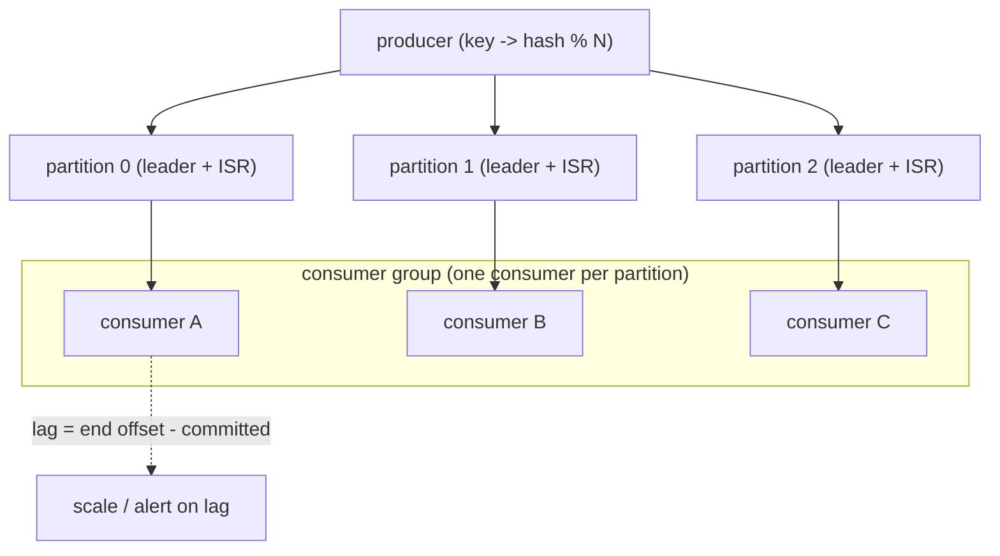

## Thesis

Kafka is a distributed, append-only commit log --- topics split into partitions, each an ordered, immutable sequence of records that consumers read by tracking an offset --- and that log model is what gives it its properties: high throughput (sequential disk writes, partitioned parallelism), durability and replay (records are retained, not deleted on read), and per-partition ordering; the design consequences to understand are how partitions enable parallelism (and the ordering-vs-parallelism trade), how consumer groups distribute partitions and how consumer lag signals a slow consumer, how replication (ISR) provides durability, and how the log model delivers at-least-once with a path to exactly-once.

## Sub

**Why: a durable, replayable, high-throughput log, not a traditional queue** -> **partitions and offsets (the log, ordering, parallelism)** -> **consumer groups, lag, and replication (ISR)** -> **zoom out** to delivery semantics and the pivots an interviewer rides from "it's a message queue" into the log model, partitions and ordering, and consumer groups and lag.

## Spine

- Kafka is a **distributed commit log**, not a traditional queue --- a topic is split into **partitions**, each an **append-only, ordered, immutable** sequence of records; consumers read by advancing an **offset**, and records are **retained** (by time/size) rather than deleted when consumed, which is what enables **replay**, multiple independent consumers, and very high throughput (sequential disk I/O).
- **Partitions are the unit of parallelism and ordering** --- a topic's throughput scales with its partition count (more partitions = more parallel producers/consumers), and ordering is guaranteed **only within a partition** (not across the topic); the **partition key** decides which partition a record lands in (same key -> same partition -> ordered), so choosing the key is how you trade global ordering for parallelism.
- **Consumer groups distribute partitions, and lag measures keeping up** --- within a consumer group each partition is consumed by **exactly one** consumer (so a group parallelizes across partitions, capped at the partition count), and Kafka tracks each consumer's committed offset; **consumer lag** (latest offset minus committed offset) is the key health signal --- growing lag means consumers can't keep up (the backpressure / scaling signal).
- **Replication (ISR) gives durability, and the log model gives at-least-once** --- each partition is replicated across brokers with one **leader** and a set of **in-sync replicas (ISR)**; `acks` plus ISR set the durability/latency trade, and because consumers commit offsets separately from processing, the default guarantee is **at-least-once** (duplicates on failure), with **exactly-once** available via idempotent producers plus transactions.

## Companion Notes

### walk

A distributed log, not a queue

A high-throughput event backbone where records are appended to partitioned logs and retained for replay --- why the log model differs from a traditional queue, how partitions give both ordering and parallelism, how consumer groups share the work and lag signals falling behind, and how replication and offset commits set durability and delivery semantics.

Say the model first --- "Kafka is an append-only log, not a queue that deletes on read." Retention-plus-offsets is what enables replay, multiple consumers, and high throughput, and almost every property (ordering, parallelism, lag, delivery semantics) follows from partitions being ordered immutable logs.

### drill

Probe Drill

Graded follow-ups on partitions and ordering, consumer groups and lag, replication/ISR, and delivery semantics --- the ones that separate "Kafka is a message queue" from understanding why it's a partitioned commit log and what that buys and costs.

Name the model and its consequences: a topic is N append-only partitions; ordering is per-partition (via the key), parallelism scales with partitions (one consumer per partition in a group), lag = latest minus committed offset, and the default is at-least-once (offsets commit separately from processing).

## Drill

SDE2 | the log, partitions, and lag
SDE3 | ordering, replication, and delivery
Staff | exactly-once, skew, and failure modes

### SDE2 | what Kafka is

What is Kafka, and how is its model different from a traditional message queue?

Kafka is a **distributed, append-only commit log** used as a streaming/event platform. A **topic** is divided into **partitions**, each an ordered, immutable sequence of records appended to disk; producers append to the end, and consumers read forward by tracking a position (offset). The key difference from a traditional queue (like RabbitMQ): in a classic queue, a message is **delivered to one consumer and then deleted** (the queue holds pending work, and consumed messages are gone). In Kafka, records are **retained** (for a configured time or size) **regardless of consumption** --- reading doesn't remove them. That single difference (a durable retained log vs a delete-on-consume queue) is what gives Kafka its defining properties: **replay** (re-read from any past offset), **multiple independent consumers** (each tracking its own offset over the same data), and very **high throughput** (append-only sequential disk writes and reads are fast). So Kafka is better thought of as a "distributed log you subscribe to" than a "queue you drain."

### SDE2 | topics and partitions

What are topics and partitions?

A **topic** is a named stream of records (the logical category, e.g. `orders`); a **partition** is a physical, ordered, append-only log that a topic is split into. A topic has one or more partitions, and each partition is an independent sequence of records stored on a broker (and replicated). Partitions are the crucial structural unit because they're what makes Kafka **scalable and parallel**: the topic's data and load are spread across its partitions (which can live on different brokers), so producing and consuming can happen in parallel across them rather than being bottlenecked on a single log. Each record within a partition has a monotonically increasing **offset** (its position). When you produce a record, it goes to *one* partition (chosen by key or round-robin); when you consume, you read partitions forward by offset. So "topic" is the logical stream and "partition" is the physical, ordered shard of it --- and understanding that a topic is really N parallel ordered logs is the foundation for everything else (ordering, parallelism, consumer groups).

### SDE2 | offsets

What is an offset and how do consumers use it?

An **offset** is a record's sequential position within a partition (0, 1, 2, ...) --- a monotonically increasing id unique to that partition. Consumers use offsets to track **where they are** in each partition: a consumer reads records in order and remembers the offset of the last one it processed (its **committed offset**), so it knows where to resume. This is fundamentally different from a queue where the broker tracks per-message delivery/ack; in Kafka the **consumer's position is just an offset**, and Kafka stores each consumer group's committed offset per partition (in an internal topic). Because the position is a simple offset into a retained log, a consumer can **re-read** (reset its offset backward to replay) or **skip** (seek forward), and multiple consumers can be at different offsets in the same partition independently. The offset is the whole mechanism for "what have I consumed" --- lightweight (just a number per partition per group), which is part of why Kafka scales: the broker doesn't track per-message state for each consumer, just where each group's offset pointer is.

### SDE2 | retention and replay

Since records aren't deleted on read, how does retention and replay work?

Kafka **retains** records in each partition for a configured **retention period** (e.g. 7 days) or **size** (e.g. up to 100GB per partition), independent of whether they've been consumed; when a record ages past the retention limit, old log segments are deleted from the front. Because records persist for the retention window, any consumer can **replay** by resetting its offset backward and re-reading --- reprocess after a bug fix, bootstrap a brand-new consumer that reads all history, or let a second independent application consume the same stream from the beginning. This is a defining capability a delete-on-consume queue can't offer: the log is a durable, re-readable record of events, not a transient holding area. It also means consumers are **decoupled** from producers in time --- a consumer can be down for hours and catch up later (as long as it stays within the retention window), and the produce rate isn't coupled to any consumer's speed (Kafka absorbs the mismatch in the retained log). The trade is storage (you're keeping data you may not re-read) and the operational rule that a consumer lagging beyond the retention window will **lose** data (old records get deleted before it reads them).

### SDE2 | consumer groups

What is a consumer group and how does it parallelize consumption?

A **consumer group** is a set of consumers that **cooperatively** consume a topic, with Kafka assigning each **partition to exactly one consumer in the group**. So if a topic has 6 partitions and the group has 3 consumers, each consumer gets 2 partitions; the group as a whole reads all 6 in parallel, and the work is divided without duplication (within the group, no two consumers read the same partition). This is how Kafka scales consumption horizontally: add consumers to the group (up to the partition count) to process more in parallel. Crucially, **different groups are independent** --- each group has its own offset per partition and reads the whole topic on its own, so you can have many applications (each its own group) all consuming the same topic without interfering (this is the multiple-independent-consumers property). Within a group, the exactly-one-consumer-per-partition rule is what gives both parallelism *and* per-partition ordering (one consumer sees a partition's records in order). The cap to remember: **a group can't have more actively-consuming members than partitions** --- extra consumers sit idle, because there's no partition left to assign them.

### SDE2 | producers and the partition key

How does a producer decide which partition a record goes to?

By the record's **partition key**: Kafka hashes the key and maps it to a partition (`hash(key) % numPartitions`), so **all records with the same key go to the same partition**. If no key is provided, the producer distributes records across partitions (round-robin / sticky batching) for balance. The key choice is significant because it controls two things at once: **ordering** (same key -> same partition -> those records are strictly ordered relative to each other) and **distribution** (how evenly load spreads across partitions). For example, keying by `user_id` guarantees all of one user's events are ordered and processed by one consumer, while spreading different users across partitions for parallelism. So the producer's partitioning (via the key) is where you make the fundamental trade: pick a key to get the ordering you need (events that must be ordered share a key) while keeping keys diverse enough that load spreads evenly. A poorly-chosen key (one that concentrates traffic on few values) causes **hot partitions** (skew); no key at all gives even spread but no ordering guarantees across records.

### SDE2 | consumer lag

What is consumer lag and why does it matter?

**Consumer lag** is the difference between the **latest offset** in a partition (the newest record produced, the "log end offset") and the consumer group's **committed offset** (the last record it has processed) --- i.e. **how many records behind** the consumer is. It's the single most important operational health metric for a Kafka consumer: **lag near zero** means the consumer is keeping up (processing about as fast as records arrive); **growing lag** means the consumer is **falling behind** (producing faster than it consumes), which leads to increasing end-to-end latency (records wait longer to be processed) and, if it grows past the retention window, **data loss** (records deleted before they're read). So you monitor lag to answer "are my consumers keeping up?", alert on it, and use it to decide when to **scale** consumers (add members to the group, up to the partition count) or investigate a slow/stuck consumer. Lag is also, in effect, Kafka's **backpressure signal**: because Kafka is pull-based (consumers fetch at their own pace), a slow consumer doesn't get overwhelmed --- it just lags, and the lag tells you to act. "Watch consumer lag" is the first thing to say about operating Kafka consumers.

### SDE3 | partitions and ordering

What ordering guarantees does Kafka provide, and how does the partition key relate?

Kafka guarantees **total ordering only within a partition**, never across a whole topic. Records in one partition are strictly ordered by offset (a consumer reads them in the exact order they were appended); but there is **no ordering guarantee between partitions** (records in partition 0 and partition 1 have no defined relative order --- they're consumed in parallel by possibly-different consumers). This is a direct consequence of partitions being independent parallel logs. So to get ordering for a set of related records, you must **route them to the same partition** by giving them the **same partition key** (e.g. all events for `order_id=123` share the key `123` -> same partition -> ordered). The design tension is fundamental: **ordering and parallelism pull against each other** --- you get ordering by concentrating related records on one partition (which limits their parallelism to that one partition/consumer), and you get parallelism by spreading records across partitions (which sacrifices cross-partition ordering). The senior framing: decide the *ordering boundary* your domain needs (usually per-entity, e.g. per-user or per-order) and key by that, so you get the ordering you require within each entity while still parallelizing across entities. Demanding global total ordering forces a single partition (no parallelism) --- which is why you almost never want it.

### SDE3 | partitions and parallelism

How do partitions determine parallelism and throughput, and what's the consumer cap?

Partitions are the **unit of parallelism** for both producing and consuming, so **throughput scales with partition count** (up to broker/network limits): more partitions means producers can write in parallel to more logs (often on different brokers) and, critically, a consumer group can have **more consumers working in parallel**. The hard cap: within a consumer group, **each partition is consumed by exactly one consumer**, so the **maximum useful parallelism of a group equals the partition count** --- if a topic has 12 partitions, at most 12 consumers in a group do work (a 13th sits idle). This means the partition count sets the **ceiling on how fast one consumer group can drain the topic** (partitions x per-consumer throughput). So sizing partitions is really sizing your maximum consumer parallelism: you want *enough* partitions to allow the consumer parallelism you'll need (now and with headroom for growth), because it constrains scaling. The catch (a staff concern): you can add partitions later but it's disruptive (it changes key-to-partition mapping, breaking the same-key-same-partition property for existing keys) and you can't easily *reduce* them --- so partition count is a fairly sticky, up-front capacity decision, and both too-few (throughput cap) and too-many (overhead) have costs.

### SDE3 | replication and ISR

How does Kafka replicate partitions, and what is the ISR?

Each partition is **replicated** across a configurable number of brokers (the **replication factor**, e.g. 3): one broker is the partition **leader** (handles all reads and writes for that partition) and the others are **followers** that replicate the leader's log. The **ISR (in-sync replicas)** is the set of replicas (including the leader) that are **caught up** to the leader within a threshold --- followers that have fully replicated the leader's recent records. Replication provides **durability and availability**: if the leader broker fails, one of the in-sync followers is elected the new leader (so the partition stays available and no acknowledged data is lost, provided it was replicated to the ISR). The ISR is central to the durability guarantee because Kafka only considers a record fully committed (and only lets a new leader be elected from) replicas that are **in-sync** --- so a record acknowledged with `acks=all` is guaranteed to be on all current ISR members, meaning it survives the loss of any replica outside the leader. If a follower falls behind (slow, or its broker is struggling), it's **removed from the ISR** (the ISR shrinks) until it catches up; if the ISR shrinks to just the leader, you've lost redundancy for that partition (a durability risk, and the setup for the unclean-leader-election problem). So replication + ISR is how Kafka keeps partitions durable and available across broker failures, and the ISR is the live set that the durability guarantees are defined against.

### SDE3 | acks and durability

How do producer `acks` settings trade durability against latency?

The producer's **`acks`** setting controls how many replicas must acknowledge a write before it's considered successful --- the core durability/latency knob. **`acks=0`**: the producer doesn't wait for any acknowledgment (fire-and-forget) --- fastest, but records can be **lost** (if the leader hasn't received it, or the leader fails, you never know). **`acks=1`**: the producer waits for the **leader** to write the record --- a middle ground, but if the leader **fails before followers replicate** that record, it's **lost** (the new leader never had it). **`acks=all`** (a.k.a. `-1`): the producer waits until the record is replicated to **all in-sync replicas (the ISR)** --- strongest durability (the record survives the loss of any single broker, since it's on every ISR member), at the cost of **higher latency** (waiting for replication). For real durability you pair `acks=all` with **`min.insync.replicas`** (e.g. require at least 2 in-sync replicas to accept a write) so that a write isn't acknowledged when the ISR has shrunk to just the leader (which would make `acks=all` meaningless). So the trade is explicit: `acks=0/1` are faster but can lose data on failure; `acks=all` + `min.insync.replicas>=2` gives strong durability with added latency --- and the right choice depends on whether the data is loss-tolerant (metrics) or must-not-lose (financial events).

### SDE3 | offset commits and delivery semantics

How do offset commits determine delivery semantics, and why is at-least-once the default?

Because **processing a record and committing its offset are two separate steps**, and the order/timing between them determines the guarantee. The default is **at-least-once**: you process the record, *then* commit the offset --- so if the consumer crashes **after processing but before committing**, on restart it re-reads from the last committed offset and **reprocesses** the record (a duplicate). No records are lost (you always committed only what you processed), but you can get duplicates --- hence "at least once." The inverse, **at-most-once**, is committing the offset *before* processing: if you crash after committing but before processing, that record is **skipped** (lost) on restart, but never duplicated. At-least-once is the sensible default (losing data is usually worse than a duplicate), which is exactly **why idempotency matters** on the consumer side (so reprocessing a duplicate is harmless). The subtlety that bites people: **auto-commit** (Kafka periodically commits offsets on a timer) can produce *either* duplicates *or* loss depending on timing relative to processing, so for precise semantics you disable auto-commit and **commit manually after processing** (for at-least-once). And to get **exactly-once**, you need more than offset ordering --- idempotent producers plus transactions that atomically commit the processing output and the offset together (the staff topic). So: commit-after = at-least-once (default, needs idempotent consumers); commit-before = at-most-once; atomic = exactly-once.

### SDE3 | consumer group rebalancing

What is a consumer group rebalance, what triggers it, and why is it a concern?

A **rebalance** is Kafka **reassigning partitions among the consumers in a group** --- recomputing the partition-to-consumer mapping. It's triggered when **group membership or topic metadata changes**: a consumer **joins** (scaling up), a consumer **leaves or crashes** (or fails to heartbeat within the session timeout, so it's presumed dead), or the topic's **partition count changes**. Rebalancing is necessary (to redistribute work when consumers come and go), but the classic concern is that the traditional ("eager") rebalance is **stop-the-world**: *all* consumers in the group **revoke all their partitions**, then the new assignment is computed, then everyone re-acquires --- during which **no consumption happens** (a processing pause / latency spike), and consumers may have to re-establish state for newly-assigned partitions. Frequent rebalances (e.g. from consumers repeatedly timing out due to slow processing, or flapping instances) cause a **"rebalance storm"** --- repeated pauses that tank throughput. Mitigations (staff-level): **cooperative/incremental rebalancing** (only the partitions that need to move are reassigned, so unaffected consumers keep processing --- no full stop-the-world), **static group membership** (a consumer that restarts quickly keeps its identity and partitions, avoiding a rebalance on transient restarts), and tuning session/heartbeat timeouts and processing time (so a slow-but-alive consumer isn't falsely evicted). So rebalancing is essential machinery, but its cost (pause + potential storms) is a real operational concern, which modern Kafka addresses with cooperative rebalancing and static membership.

### SDE3 | consumer lag operationally

How do you use consumer lag operationally?

As the **primary signal for consumer health and scaling decisions**. You continuously **monitor** lag per partition (and aggregated per consumer group) --- typically exporting it to a metrics system (via Kafka's offset APIs, or tools like Burrow / kafka-lag-exporter / the consumer group's own metrics) and graphing/alerting on it. What it tells you: **steady low lag** = healthy (keeping up); **steadily growing lag** = consumers can't keep up (produce rate > consume rate) -> you need to **scale out** consumers (add members to the group, up to the partition count) or speed up processing, or you'll accumulate latency and risk data loss past retention; **lag on one partition only** = **skew** (a hot partition, or a slow/stuck consumer on that partition) -> investigate the key distribution or that specific consumer; **sudden lag spike then recovery** = a transient (a burst, a brief consumer slowdown, or a rebalance pause). You **alert** on lag exceeding a threshold or a sustained upward trend (not just an absolute number, since a big-but-stable lag can be fine while a small-but-growing one is a problem). Lag also informs **capacity planning**: if lag creeps up under normal load, you're near the consumer-parallelism ceiling and may need more partitions (to allow more consumers). The operational mantra: lag is how you *see* whether your consumers are keeping up, so it's the first dashboard and the first alert for any Kafka consumer, and a rising trend is the trigger to scale or investigate before it becomes latency or loss.

### Staff | exactly-once semantics

How does Kafka provide exactly-once semantics, and what are the caveats?

Through **idempotent producers** plus **transactions**, which together make a read-process-write cycle atomic. **Idempotent producer**: the producer tags records with a producer id and sequence number so the broker **deduplicates retries** --- a producer retry (from a network hiccup) won't append the record twice, eliminating producer-side duplicates. **Transactions**: a producer can write to multiple partitions **and** commit consumer offsets **atomically** within a transaction --- so in a stream-processing app (consume from topic A, produce to topic B), the output writes to B *and* the offset commit for A are committed together or not at all. This gives **exactly-once processing** within Kafka: if the transaction commits, the output is written and the input offset advanced exactly once; if it aborts (crash), neither takes effect, and reprocessing produces the same single result (the aborted output is invisible to `read_committed` consumers). The **caveats**: (1) exactly-once is **within Kafka's boundary** --- it covers Kafka-to-Kafka (and offset commits), but the moment your processing has a **side effect outside Kafka** (write to an external DB, call an API), Kafka's transactions don't extend there, so you still need **idempotency** on that external effect (exactly-once end-to-end across systems is really "at-least-once + idempotent sinks"). (2) It adds **latency and complexity** (transaction coordination overhead), so you enable it only where you need it. (3) Consumers must use **`read_committed`** isolation to not see aborted-transaction records. So the honest staff answer is: Kafka gives genuine exactly-once *within the Kafka pipeline* via idempotent producers + transactions, but "exactly-once" across your whole system (with external side effects) still relies on making those effects idempotent --- the transaction handles the Kafka part, idempotency handles the rest.

### Staff | the log as source of truth

Beyond a queue, how is Kafka used as a source of truth (event sourcing, stream-table duality, compaction)?

Because Kafka is a **durable, ordered, replayable log**, it can serve as the **system of record** for events, not just transport --- which underpins several patterns. **Event sourcing**: store the log of events (state changes) as the source of truth, and derive current state by replaying them; Kafka's retained, ordered log is a natural fit, and new consumers/views can be built by replaying history. **Log compaction**: a retention mode where Kafka keeps **at least the latest record per key** (rather than deleting by age), so a compacted topic becomes a **changelog** that always retains the current value for every key --- effectively a durable key-value snapshot you can replay to rebuild state (used for offset storage, and for materializing tables). **Stream-table duality** (Kafka Streams / ksqlDB): a stream (the log of events) and a table (the current state per key) are two views of the same data --- you can turn a stream into a table (by keeping the latest per key, i.e. compaction/aggregation) and a table back into a stream (its changelog); this duality lets you build stateful stream processing where local state stores are backed by compacted changelog topics (so state is durable and recoverable by replay). The staff framing: Kafka is often mis-described as "just a message queue," but its log-plus-retention-plus-compaction model makes it an **event store and a streaming database substrate** --- the log is the source of truth, tables/views are derived and rebuildable from it, and this is why Kafka anchors event-driven architectures (CDC pipelines, event sourcing, stream processing) rather than merely moving messages. The trade is that treating the log as source-of-truth is a real architectural commitment (schema management, retention/compaction strategy, reprocessing discipline), not free.

### Staff | partition-count consequences

How do you choose partition count, and what are the consequences of too few or too many?

Partition count is a **sticky, up-front capacity decision** that sets your parallelism ceiling, and both extremes hurt. **Too few**: caps consumer parallelism (a group can't exceed the partition count) and per-topic throughput, so you can't scale consumers to keep up under load --- and you're stuck, because **increasing partitions later is disruptive**: it changes the `hash(key) % N` mapping, so existing keys move to different partitions, **breaking the same-key-same-partition ordering guarantee** for in-flight/historical keys (a real correctness hazard for ordered processing). **Too many**: each partition has overhead --- more open file handles and memory on brokers, more replication connections, **longer leader-election and rebalance times** (rebalancing a group with thousands of partitions is slow, and broker failover must re-elect leaders for every partition), and potentially **higher end-to-end latency** and lower per-partition batching efficiency; there's a practical per-broker/per-cluster partition limit. And you **can't easily reduce** partitions (Kafka doesn't support shrinking a topic's partitions in place). So the guidance: estimate your **peak required consumer parallelism** (peak throughput / per-consumer throughput) and provision partitions for that **plus headroom** for growth, but not wildly more (avoid "just set 1000 to be safe"). Because it's hard to change safely in either direction, partition count is one of the few Kafka decisions you want to get roughly right at design time --- the staff move is to reason about the parallelism you'll need over the topic's life and the ordering key you'll use, and size partitions accordingly, rather than treating it as a tunable you can freely adjust later.

### Staff | rebalancing deep dive

Go deeper on rebalancing --- eager vs cooperative, static membership, and the at-scale problem.

The core issue is that reassigning partitions can be **disruptive**, and Kafka has evolved to reduce that. **Eager (classic) rebalancing**: on any membership change, **all** consumers revoke **all** partitions, a new assignment is computed, and everyone re-joins --- a **stop-the-world** pause where no consumption happens and consumers may reload state for reassigned partitions. At scale (large groups, frequent scaling, or slow consumers timing out), this causes **rebalance storms**: repeated global pauses that collapse throughput, sometimes self-reinforcing (a rebalance pause makes a consumer slow to heartbeat, triggering another rebalance). **Cooperative / incremental rebalancing** (the modern default): instead of revoking everything, it computes the *difference* and **only moves the partitions that need to change owners**, so consumers that keep their partitions **keep processing** through the rebalance --- eliminating the global stop-the-world for the unaffected majority. **Static group membership**: each consumer has a stable `group.instance.id`, so when it **restarts quickly** (a deploy, a transient blip) it **rejoins with the same identity and keeps its partitions** without triggering a rebalance at all (Kafka waits out the session timeout rather than immediately reassigning) --- hugely reduces rebalances from rolling restarts. Beyond those: tune **`max.poll.interval.ms`** and processing time so a slow-but-alive consumer isn't falsely evicted (a common cause of rebalance storms is processing taking longer than the poll interval, so Kafka thinks the consumer died), and keep session/heartbeat intervals sensible. The staff summary: rebalancing is necessary but historically a major source of latency and instability; the modern answers --- cooperative incremental rebalancing (don't move what doesn't need moving) and static membership (don't rebalance on quick restarts) --- plus correct timeout/processing tuning, are what make large consumer groups stable, and "we see rebalance storms" is almost always slow processing exceeding poll intervals or transient restarts triggering eager rebalances, fixed by those mechanisms.

### Staff | Kafka vs a traditional queue

When should you use Kafka vs a traditional message queue like RabbitMQ?

They're architecturally different tools, so match the tool to the need. **Kafka** (log/pull/retain/replay): a **partitioned, retained log** where consumers pull at their own pace and records persist for replay; strengths are **high throughput**, **many independent consumers** over the same stream, **replay/reprocessing**, **ordering per partition**, and serving as an **event backbone / source of truth** for streaming and event-driven systems. Weaknesses/costs: no built-in per-message features like priority queues, delayed messages, or (natively) dead-letter queues; ordering only per-partition; more operational weight; and it's overkill for simple task queuing. **Traditional queue (RabbitMQ)** (broker/push/delete): the **broker pushes** messages to consumers and **deletes on ack**, with rich **per-message routing** (exchanges, topics, priorities, TTLs, delayed delivery) and built-in **dead-letter queues**, **prefetch**-based flow control, and typically **lower latency** for individual messages; ideal for **task queues / RPC / work distribution** where you want flexible routing, per-message handling, and don't need replay or massive fan-out throughput. Weaknesses: lower throughput ceiling than Kafka, no replay (consumed = gone), and a single queue can become a bottleneck. **When to use which**: reach for **Kafka** when you need a high-throughput event stream, multiple consumers of the same data, replay/reprocessing, event sourcing/CDC, or stream processing --- an *event log*. Reach for a **traditional queue** when you need flexible per-message routing, priorities, delays, dead-lettering, or straightforward work/task distribution to a pool of workers with low latency --- a *task queue*. The staff nuance: it's not "Kafka is newer/better"; it's log-vs-queue semantics --- if you need retained, replayable, ordered streams consumed by many, that's Kafka; if you need a smart broker doing per-message routing to workers, that's RabbitMQ (and many systems use both, for different jobs).

### Staff | hot partitions and skew

What causes hot partitions / key skew, and how do you mitigate it?

A **hot partition** is one that receives disproportionately more traffic than the others, so its single consumer (within a group) becomes the bottleneck while other consumers are underutilized --- caused by **key skew**: because the partition is chosen by `hash(key) % N`, a key value that's far more frequent than others sends most records to one partition. Classic cause: keying by something with a skewed distribution --- e.g. keying by `customer_id` when one giant customer produces most of the traffic, or by a low-cardinality field, or a "celebrity" key (one user/entity vastly more active). The consequences: that partition lags (its consumer can't keep up) even though the topic as a whole is under capacity, and adding consumers doesn't help (the extra consumers can't take that partition's load --- only one consumer per partition). Mitigations: (1) **Choose a higher-cardinality / more uniform key** so load spreads evenly (if per-entity ordering isn't strictly needed for the hot entity, key by something more granular). (2) **Composite / salted keys** for the hot key --- append a small random suffix or sub-shard (`hotkey:0..k`) to split the hot entity across several partitions (trading strict per-entity ordering for spread --- acceptable if you only need ordering within the sub-shard, or can re-merge downstream). (3) **Increase partitions** if the skew is mild and more partitions dilute it (limited help if one key dominates). (4) **Handle the hot entity specially** (a dedicated topic/partition and a beefier consumer, or application-level load balancing). The staff framing: hot partitions are the Kafka manifestation of the general **hot-key** problem, and the core tension is **ordering vs balance** --- the same key that guarantees ordering for an entity also concentrates its load, so mitigating skew usually means giving up some ordering granularity (salting/sub-sharding) for that entity. You detect it via **per-partition lag** (lag concentrated on one partition), and the fix is fundamentally about the **key design**.

### Staff | real-world failure modes

What real-world failure modes bite Kafka deployments?

Several, mostly around rebalancing, replication/durability, and consumer semantics. **Rebalance storms** --- slow consumer processing exceeding `max.poll.interval.ms` (so Kafka thinks consumers died) or flapping instances trigger repeated eager rebalances, each a stop-the-world pause, collapsing throughput (fixed by cooperative rebalancing, static membership, and right-sizing processing/timeouts). **Unclean leader election / data loss** --- if a partition's ISR shrinks to just the leader and that leader dies, either the partition goes offline (if `unclean.leader.election=false`, correct but unavailable) or an out-of-sync replica is elected leader (`unclean=true`), which **loses** the un-replicated records (availability at the cost of data loss --- a real durability pitfall, so you set `acks=all` + `min.insync.replicas>=2` and disallow unclean election for important data). **Consumer lag spirals** --- consumers falling behind faster than they recover, risking data loss past retention (needs scaling, faster processing, or backpressure upstream). **Poison messages with no native DLQ** --- Kafka has no built-in dead-letter queue, so a record that always fails to process can **block the partition** (the consumer retries forever, or must skip it and lose it) unless you build DLQ handling yourself (route failures to a separate topic). **Offset-commit pitfalls** --- auto-commit causing surprise duplicates or loss (timing vs processing), or committing before processing and silently skipping records on a crash (needs manual commit-after-processing for at-least-once, and idempotent consumers). **ISR shrink / replication lag** --- a slow or overloaded follower drops out of the ISR, silently reducing redundancy (and, with `acks=all` + `min.insync.replicas`, potentially **blocking producers** if too few replicas are in-sync --- a correct-but-surprising availability effect). **Hot partitions** --- key skew overloading one partition/consumer (fixed via key design). **Retention misconfiguration** --- retention shorter than a consumer's downtime -> data deleted before it's read (data loss); or too-long retention -> storage blowup. The staff summary: the recurring themes are (1) rebalancing instability from slow processing / restarts (modern rebalancing + static membership + tuning), (2) durability edge cases around ISR and unclean leader election (`acks=all`, `min.insync.replicas`, no unclean election), and (3) consumer-semantics footguns around offset commits and the lack of a native DLQ (manual commit + idempotency + a DLQ topic) --- none are exotic, but each silently corrupts, loses, or stalls if you take the defaults without understanding the log/ISR/offset model.

## Walk

### A durable, replayable log --- not a queue

```flow
prod[producer appends] -> log[partitioned append-only log, records retained] -> cons[consumers read forward by offset]
```

Start with the model, because everything follows from it. Kafka is a **distributed commit log**: a topic is split into **partitions**, each an append-only, ordered, immutable sequence of records on disk. Producers append to the end; consumers read forward tracking an **offset**.

The defining difference from a traditional queue is that records are **retained** (by time or size) rather than **deleted on consumption**. That one property gives Kafka its character: **replay** (re-read from any past offset), **multiple independent consumers** (each with its own offset over the same data), and very **high throughput** (append-only sequential disk I/O is fast). Consumers are also **decoupled in time** --- a consumer can be down and catch up later, because Kafka absorbs the producer/consumer rate mismatch in the retained log. Think "a durable log you subscribe to," not "a queue you drain."

### Partitions: parallelism and per-partition ordering

```flow
topic[topic] -> parts[N partitions, key routes each record] -> guar[ordered within a partition, parallel across partitions]
```

**Partitions** are the unit of both **parallelism** and **ordering**, and the two pull against each other. A topic's throughput scales with its partition count (more partitions = more parallel producers and consumers), but ordering is guaranteed **only within a partition** --- never across the topic.

The **partition key** ties these together: `hash(key) % N` picks the partition, so **same key -> same partition -> ordered**, while different keys spread across partitions for parallelism. So you choose the key to set your **ordering boundary** --- key by `order_id` and all of one order's events are strictly ordered and handled by one consumer, while different orders parallelize across partitions. Demanding *global* ordering forces a single partition (no parallelism), which is why you almost never want it; instead you pick the per-entity ordering your domain needs. A skewed key (one dominant value) concentrates load on one partition --- a **hot partition**.

### Consumer groups and lag

```flow
group[consumer group] -> assign[one consumer per partition] -> lag[lag = latest offset minus committed offset]
```

A **consumer group** shares the work: Kafka assigns **each partition to exactly one consumer** in the group, so the group reads all partitions in parallel with no duplication --- and different groups are independent (each with its own offsets over the whole topic). The cap: **a group can't have more working consumers than partitions** (extras sit idle).

```python
def run_consumer(consumer, resource):
    consumer.subscribe(["orders"])
    while True:
        records = consumer.poll(timeout_ms=500)   # PULL: consumer fetches at its own pace
        for r in records:
            process(r, resource)                  # do the work FIRST
        consumer.commit()                         # commit offset AFTER -> at-least-once
        # (a crash between process and commit -> the record is reprocessed = a duplicate,
        #  which is why the consumer must be idempotent)

def consumer_lag(admin, group, partition):
    end = admin.log_end_offset(partition)         # latest record produced
    committed = admin.committed_offset(group, partition)
    return end - committed                         # how far behind -> the health signal
```

**Consumer lag** = latest offset minus the group's committed offset --- how many records behind the consumer is. It's the primary health metric: near-zero = keeping up; **growing = falling behind** (produce rate > consume rate), which raises latency and risks data loss past retention. Because Kafka is **pull-based**, a slow consumer isn't overwhelmed --- it just lags, and the lag is the signal to **scale consumers** (up to the partition count) or investigate. Lag on one partition only = **skew** (a hot partition or a stuck consumer).

### Replication (ISR) and delivery semantics

```flow
repl[each partition: leader + in-sync replicas] -> acks[acks=all waits for the ISR] -> sem[at-least-once by default, exactly-once via transactions]
```

Each partition is **replicated** across brokers: one **leader** (handles reads/writes) and followers that replicate it; the **ISR (in-sync replicas)** is the set caught up to the leader. If the leader fails, an in-sync follower is elected, so acknowledged data survives (provided it reached the ISR). The producer's **`acks`** sets the durability/latency trade: `acks=0/1` are faster but can lose data on failure; `acks=all` + `min.insync.replicas>=2` waits for the ISR for strong durability at higher latency.

Because **processing and offset-commit are separate steps**, the default is **at-least-once** (commit *after* processing -> a crash in between reprocesses the record = a duplicate, so consumers must be **idempotent**). Committing *before* processing gives at-most-once (skip on crash); atomic offset+output commits (idempotent producer + transactions) give **exactly-once within Kafka**. Zooming out: Kafka's retained, ordered, replayable log makes it an **event backbone and source of truth** (event sourcing, CDC, compaction, stream-table duality), not "just a queue"; partition count is a **sticky up-front decision** (the parallelism ceiling, disruptive to change); and the operational realities are **lag** (scale on it), **rebalancing** (cooperative + static membership to avoid stop-the-world storms), and **durability edges** (ISR, no unclean leader election). The log model is the thing --- ordering, parallelism, lag, and delivery semantics all fall out of "partitions are ordered, retained, immutable logs."

### Model Script

- Frame the model | "The key thing about Kafka is that it's a distributed commit log, not a traditional queue. A topic is split into partitions, and each partition is an append-only, ordered, immutable log on disk. Producers append to the end, consumers read forward tracking an offset. And the defining difference from a queue is that records are retained -- by time or size -- rather than deleted when consumed. That one property gives Kafka everything: replay, because you can re-read from any past offset; multiple independent consumers, each with its own offset over the same data; and very high throughput, because append-only sequential disk I/O is fast. So it's a durable log you subscribe to, not a queue you drain -- and almost every property follows from that."
- Partitions: ordering vs parallelism | "Partitions are the unit of both parallelism and ordering, and those two pull against each other. Throughput scales with partition count -- more partitions, more parallel producers and consumers. But ordering is guaranteed only within a partition, never across the topic. The partition key ties them together: hash of the key mod N picks the partition, so the same key always goes to the same partition and is ordered, while different keys spread across partitions for parallelism. So you choose the key to set your ordering boundary -- key by order id and all of one order's events are ordered and handled by one consumer, while different orders parallelize. Global ordering would force a single partition and kill parallelism, so you almost never want it; you pick the per-entity ordering your domain actually needs."
- Consumer groups and lag | "Consumption scales through consumer groups: Kafka assigns each partition to exactly one consumer in the group, so the group reads all partitions in parallel with no duplication, and different groups are independent. The cap is that a group can't have more working consumers than partitions. And the metric that matters is consumer lag -- the latest offset minus the group's committed offset, meaning how many records behind you are. Near-zero is healthy; growing lag means consumers can't keep up, which raises latency and risks losing data past the retention window. Because Kafka is pull-based, a slow consumer isn't overwhelmed -- it just lags, and the lag tells you to scale consumers, up to the partition count, or to investigate. Lag on just one partition means skew -- a hot partition or a stuck consumer."
- Replication and delivery | "Durability comes from replication: each partition has a leader and followers, and the in-sync replica set -- the ISR -- is the replicas caught up to the leader. If the leader fails, an in-sync follower takes over, so acknowledged data survives as long as it reached the ISR. The producer's acks setting is the durability-latency knob: acks=0 or 1 are faster but can lose data if the leader fails before replication; acks=all plus min-insync-replicas of at least 2 waits for the ISR and is strongly durable but higher latency. And delivery semantics come from the fact that processing and committing the offset are separate steps -- the default is at-least-once: you commit after processing, so a crash in between reprocesses the record, a duplicate, which is exactly why consumers must be idempotent. Exactly-once within Kafka needs idempotent producers plus transactions that commit the output and the offset atomically."
- Interviewer: "A consumer group's lag is growing on all partitions. Walk me through it."
- Diagnose lag | "Growing lag across all partitions means the whole group can't keep up -- produce rate exceeds the group's total consume rate. First I'd confirm it's sustained, not a transient burst or a rebalance pause. Then the levers: add consumers to the group to increase parallelism -- but only up to the partition count, since one consumer per partition is the cap, so if I'm already at that ceiling I'd need to add partitions first, which is disruptive because it remaps keys. Or speed up per-consumer processing -- if each record does a slow external call, batch or parallelize the work, or the bottleneck may be downstream. I'd also check for a rebalance storm -- if processing exceeds max-poll-interval, Kafka evicts consumers and they thrash, so I'd verify cooperative rebalancing and static membership are on and processing fits the poll interval. If lag were on just one partition, that's skew -- a hot key -- and I'd fix the key design. And I'd make sure I'm not about to breach retention, because if lag exceeds the retention window, records get deleted before they're read -- that's data loss."
- Land it | "So Kafka is a partitioned, retained, replayable commit log. Ordering is per-partition via the key, which trades against parallelism; consumer groups parallelize with one consumer per partition, capped at the partition count; lag is the health signal you scale on; replication and the ISR plus acks set durability; and the default is at-least-once, so consumers must be idempotent. The one line is that Kafka is a distributed log, not a queue -- retention plus offsets is what gives you replay, many consumers, and high throughput -- and everything else, ordering, parallelism, lag, delivery semantics, falls out of partitions being ordered, immutable, retained logs. Which is also why it's an event backbone and source of truth, not just message transport."

## Whiteboard

Sketch the topic-partition-consumer-group layout with replication.

### Why is ordering only guaranteed within a partition?

Partitions are independent parallel logs consumed by different consumers, so there's no cross-partition order. You get ordering for related records by giving them the same key (same key -> same partition). This trades against parallelism: ordering concentrates a key on one partition/consumer, so you pick a per-entity ordering boundary rather than global order.

### What is consumer lag and what does a growing trend mean?

Lag = latest offset minus committed offset -- how far behind the consumer is. Growing lag means consume rate < produce rate: rising latency and, past retention, data loss. Fix by scaling consumers (up to partition count) or speeding processing; lag on one partition means skew.



Verdict: a topic is N ordered retained partitions; a consumer group maps one consumer per partition (parallelism capped at partition count), each partition is leader + ISR (durability via acks=all), and consumer lag is the health signal -- ordering, parallelism, and delivery semantics all follow from the partitioned-log model.

## System

Zoom out to where Kafka sits as an event backbone.

### Where it sits

The topic: N ordered, retained, immutable partition logs [*]
Partition key: routes records (same key -> same partition -> ordered)
Consumer group: one consumer per partition; independent groups replay the same data
Replication: leader + ISR per partition; acks/min-insync set durability
Delivery: at-least-once default (commit after process); exactly-once via transactions

### Pivots an interviewer rides

From "it's a message queue" they push on the log model, ordering, and consumers.

#### How is Kafka different from a traditional queue?

-> retained replayable log (pull, offsets) vs delete-on-consume broker (push, per-message routing)
Kafka: high throughput, many consumers of the same stream, replay, per-partition ordering, event-backbone/source-of-truth. RabbitMQ: flexible per-message routing, priorities, delays, native DLQ, low-latency task queues. Log vs queue -- match to the need.

#### Consumers can't keep up -- what do you do?

-> lag is the signal: scale consumers (capped at partition count), speed processing, or add partitions
Because it's pull-based, a slow consumer lags rather than being overwhelmed; growing lag risks latency and data loss past retention. Lag on one partition = skew (hot key) -> fix the key.

## Trade-offs

The calls that separate "Kafka is a queue" from using the log model well.

### Ordering vs parallelism (partition key)

- Fewer keys / concentrated: strong per-entity (or global) ordering -- but limits parallelism to one partition/consumer per key, and risks hot partitions
- More keys / spread: high parallelism and even load -- but no ordering across records with different keys

Key by the ordering boundary your domain needs (usually per-entity, e.g. per-order), so you get ordering within an entity and parallelism across entities; never key for global ordering (a single partition).

### acks=1 vs acks=all (durability)

- acks=1 (leader only): lower latency -- but a leader failure before replication loses the record
- acks=all + min.insync.replicas>=2: survives any single broker loss -- but higher latency (waits for the ISR)

Use acks=all + min.insync.replicas for must-not-lose data (and disallow unclean leader election); acks=1 only for loss-tolerant, latency-sensitive streams.

### Kafka (log) vs RabbitMQ (queue)

- Kafka: high throughput, replay, many consumers, per-partition ordering, event backbone -- but no native priorities/delays/DLQ, per-partition ordering only, heavier ops
- RabbitMQ: flexible routing, priorities, delays, native DLQ, low per-message latency -- but lower throughput ceiling, no replay (consumed = gone)

Use Kafka for high-throughput replayable event streams consumed by many (event sourcing/CDC/streaming); use RabbitMQ for flexible-routing, low-latency task queues -- log semantics vs smart-broker semantics.

## Model Answers

### the reframe | A partitioned, retained, replayable log

The frame to lead with.

- A topic is N append-only partitions; records retained, not deleted on read | key | replay + many consumers + high throughput
- Ordering per-partition (via the key), parallelism scales with partitions | store | one consumer per partition in a group
- At-least-once by default (offsets commit separately from processing) | note | consumers must be idempotent

### the depth | Lag, ISR, and delivery

Where it's really tested.

- Consumer lag = latest minus committed offset; the scaling/health signal | key | pull-based, so slow = lag not overwhelm
- Replication + ISR + acks=all set durability | store | leader + in-sync replicas; min.insync.replicas
- Exactly-once = idempotent producer + transactions (within Kafka) | note | external side effects still need idempotency

## Numbers

Back-of-envelope the consumer parallelism ceiling and whether a group keeps up.

Partition count caps consumer parallelism; if produce rate exceeds group capacity, lag grows.

- rate | Produce rate (msgs/s) | 100000 | 0 | 1000
- parts | Partitions | 12 | 1 | 1
- percons | Per-consumer rate (msgs/s) | 10000 | 0 | 500

```js
function (vals, fmt) {
  var rate = vals.rate, parts = vals.parts, percons = vals.percons;
  var perPart = parts > 0 ? rate / parts : 0;
  var groupCap = parts * percons;
  var need = percons > 0 ? Math.ceil(rate / percons) : 0;
  var consumers = Math.min(need, parts);
  function r(x, d) { var m = Math.pow(10, d); return Math.round(x * m) / m; }
  return [
    { k: 'Per-partition rate', v: '~' + fmt.n(r(perPart, 0)), u: 'msgs/s each', n: 'produce rate spread evenly over partitions \u2014 a hot key landing on one partition breaks this evenness (skew -> that partition lags)', over: false },
    { k: 'Max consumers in group', v: fmt.n(parts), u: '= partitions', n: 'one partition per consumer within a group, so parallelism is capped at the partition count \u2014 extra consumers sit idle', over: false },
    { k: 'Max group throughput', v: '~' + fmt.n(groupCap), u: 'msgs/s', n: fmt.n(parts) + ' partitions x ' + fmt.n(percons) + '/s per consumer \u2014 the ceiling on how fast one consumer group can drain the topic', over: false },
    { k: 'Keeps up?', v: rate <= groupCap ? 'yes' : 'NO: lag grows', u: '', n: rate <= groupCap ? 'group capacity exceeds produce rate \u2014 consumers keep up, lag stays near zero' : 'produce rate exceeds group capacity -> consumer lag grows unbounded (latency, then data loss past retention) -> add partitions + consumers', over: rate > groupCap },
    { k: 'Consumers needed', v: fmt.n(consumers) + (need > parts ? ' (capped)' : ''), u: 'of ' + fmt.n(parts) + ' partitions', n: need > parts ? 'you need ' + fmt.n(need) + ' consumers to match the rate, but you only have ' + fmt.n(parts) + ' partitions \u2014 you must ADD PARTITIONS first (disruptive: remaps keys)' : 'to match the produce rate, within the partition-count cap', over: need > parts }
  ];
}
```

## Red Flags

What makes an interviewer wince.

### "Kafka guarantees message ordering"

Kafka guarantees ordering only *within a partition*, never across a topic -- records in different partitions are consumed in parallel with no defined relative order.

Get ordering for related records by giving them the same partition key (same key -> same partition -> ordered), and choose the ordering boundary per-entity; global ordering would force a single partition (no parallelism).

### "We'll just add consumers to the group to go faster"

A consumer group can have at most one consumer per partition -- adding consumers beyond the partition count leaves them idle, so you can't scale past the partition count without adding partitions first.

Provision enough partitions up front for your peak consumer parallelism (it's disruptive to change later); scale consumers within that cap, and add partitions (accepting the key-remap) when you hit it.

### "Kafka is exactly-once, so no duplicates"

By default Kafka is at-least-once (offsets commit separately from processing, so a crash reprocesses records = duplicates); and exactly-once via transactions only covers the *Kafka* boundary -- external side effects aren't included.

Make consumers idempotent (the real defense against duplicates), commit offsets after processing, and use idempotent-producer + transactions only for Kafka-to-Kafka exactly-once -- external writes still need their own idempotency.

## Opener

### 30s | The one-liner

How I open when asked about Kafka, event streaming, or a high-throughput event backbone.

#### What is the shape?

Kafka is a distributed append-only commit log: a topic is N retained, ordered partitions; producers append, consumers read by offset, and records persist for replay -- which gives high throughput, many independent consumers, and per-partition ordering.

#### What are the consequences?

Ordering is per-partition via the key (trading against parallelism), consumer groups map one consumer per partition (capped at partition count), consumer lag is the health/scaling signal, replication + ISR + acks set durability, and the default is at-least-once (so consumers must be idempotent).

##### Hooks

Where an interviewer usually pushes next.

- How is it different from a queue? | retained replayable log vs delete-on-consume broker | drill
- Consumers can't keep up? | lag is the signal; scale to partition count | drill
- Is it exactly-once? | at-least-once default; transactions only within Kafka | drill

Foot: two sentences -- Kafka is a partitioned, retained, replayable commit log, not a queue, so ordering is per-partition (via the key), parallelism scales with partitions (one consumer per partition in a group), consumer lag is the signal you scale on, and replication plus the ISR and acks set durability. The default is at-least-once because offsets commit separately from processing, so consumers must be idempotent -- and the log-as-source-of-truth model is why Kafka anchors event-driven architectures rather than merely moving messages.

## Bank

### SCALE | A high-throughput event stream that several independent applications must each consume in full

Task: design the topic and consumers.
Model: use Kafka (retained log, not a queue) so each application is its own consumer group and independently reads the whole stream with its own offsets (and can replay); partition the topic for enough consumer parallelism (peak throughput / per-consumer rate, with headroom -- partition count is a sticky up-front decision and caps parallelism at one consumer per partition); key by the entity that needs ordering (e.g. per-order) so related events are ordered within a partition while different entities parallelize; set replication factor 3 with acks=all + min.insync.replicas=2 (and no unclean leader election) for durability; and make consumers idempotent (at-least-once default) with manual commit-after-processing.
Int: one application's consumer group is lagging while others aren't -- what does that tell you?
It's that group's problem, not the topic's -- its consumers can't keep up (slow processing or too few consumers), so scale that group (up to the partition count) or speed its processing; the other groups reading the same partitions fine proves the data/produce side is healthy.

### DESIGN | Choosing between Kafka and RabbitMQ for a workload

Task: pick the right tool and justify it.
Model: it's log-vs-queue semantics, not newer-vs-older. Choose Kafka for a high-throughput event stream consumed by many, needing replay/reprocessing, per-partition ordering, or as an event-sourcing/CDC backbone -- a retained, pull-based, replayable log. Choose RabbitMQ for flexible per-message routing (exchanges, priorities, TTLs, delayed delivery), native dead-letter queues, and low-latency task/work distribution to a worker pool -- a push-based smart broker that deletes on ack. Many systems use both: Kafka as the event backbone, RabbitMQ for task queues with rich routing. Decide by whether you need retained replayable streams for many consumers (Kafka) or smart per-message routing to workers (RabbitMQ).
Int: your task queue needs priorities, delayed retries, and a dead-letter queue -- Kafka or RabbitMQ?
RabbitMQ -- those are per-message broker features it provides natively; Kafka has no built-in priorities/delays/DLQ (you'd build them), because its model is an ordered retained log, not a routing broker.

### Extra Curveballs

### CURVEBALL | ordering | You keyed a Kafka topic by user_id for per-user ordering, but one "power user" produces 40% of all events, and that partition's consumer is now the bottleneck (its lag grows while other consumers idle). How do you fix it without losing the ordering you need?

Model: this is a hot partition from key skew -- because partition = hash(user_id) % N, the power user's events all land on one partition, whose single consumer (one consumer per partition in a group) can't keep up, and adding consumers doesn't help (no other consumer can take that partition). The tension is real: the same key that gives you per-user ordering also concentrates that user's load. Options, weighing ordering: (1) First ask how strict the per-user ordering must be for the hot user -- often you need ordering per some finer sub-entity (per user *per session*, per user *per conversation*), not strictly all of one user's events globally ordered. If so, key by that finer entity (user_id + session_id), which spreads the power user across partitions while preserving the ordering you actually need. (2) If you truly need all of that user's events ordered, you can't split them across partitions without losing order -- so instead scale the *processing* of that one partition: make the consumer faster (batch, parallelize the non-order-dependent parts of the work, or offload the heavy step), since the ordering constraint is on *consumption order*, not necessarily on every downstream side effect. (3) Salt the hot key -- append a small suffix (user:0..k) to sub-shard the power user across k partitions, accepting that ordering is now only within each sub-shard, and re-merge/re-order downstream if global per-user order is needed (e.g. buffer and sort by a sequence number/timestamp at the sink) -- trading strict Kafka-level ordering for spread plus application-level reordering. (4) Give the hot user a dedicated topic/partition with a beefier consumer, isolating its load. The staff framing: hot partitions are the Kafka form of the hot-key problem, and the core trade is ordering vs balance -- you detect it via per-partition lag (concentrated on one partition), and the fix is fundamentally about key design: find the *narrowest ordering boundary your domain actually requires* (usually finer than "all of one user's events") and key by that, or sub-shard and reconcile ordering downstream. The mistake is keying by a coarse, skewed entity for ordering you don't strictly need, which concentrates load; the fix is matching the key to the true ordering requirement so load spreads.

### Frames

- Kafka is a partitioned, retained, replayable commit log (not a delete-on-consume queue) -> replay, many independent consumers, high throughput
- Ordering is per-partition via the key (trades against parallelism); consumer groups map one consumer per partition (capped at partition count); consumer lag = latest minus committed offset is the scaling/health signal
- Replication + ISR + acks=all set durability; default is at-least-once (commit after process -> duplicates on crash), so consumers must be idempotent; exactly-once (transactions) covers only the Kafka boundary

## Visual

```json
{
  "mode": "queue-flow",
  "labels": { "src": "producers", "queue": "partitions", "sink": "consumer group" },
  "params": { "lanes": 6, "rate": 120, "sinks": 3, "capacity": 30 },
  "stories": [
    {
      "name": "Spike, then scale out",
      "steps": [
        { "t": 0, "cap": "Steady: 60 msg/s in, capacity 90. Lag near zero.", "set": { "rate": 60 } },
        { "t": 3, "cap": "Traffic spikes 3x (180 msg/s). Capacity 90 -- every partition queue backs up.", "set": { "rate": 180 } },
        { "t": 9, "cap": "Scale out: a 4th consumer. Rebalance stall first... then capacity 120.", "set": { "sinks": 4 } },
        { "t": 13, "cap": "Still growing: 180 in vs 120 out. A 5th -- capacity 150.", "set": { "sinks": 5 } },
        { "t": 17, "cap": "Spike ends. Capacity 150 -- the backlog drains.", "set": { "rate": 60 } },
        { "t": 24, "cap": "The interview line: scale consumers to drain lag -- capacity versus rate." },
        { "t": 28 }
      ]
    },
    {
      "name": "Consumers beyond partitions",
      "steps": [
        { "t": 0, "cap": "6 partitions, 6 consumers: capacity 180 vs 150 in. Balanced.", "set": { "rate": 150, "sinks": 6 } },
        { "t": 4, "cap": "A 7th consumer joins. It owns NO partition -- a hollow ring. Capacity unchanged.", "set": { "sinks": 7 } },
        { "t": 10, "cap": "An 8th. Still nothing. Consumers beyond the partition count are idle.", "set": { "sinks": 8 } },
        { "t": 16, "cap": "The interview line: partition count caps consumer-group parallelism." },
        { "t": 20 }
      ]
    }
  ]
}
```
