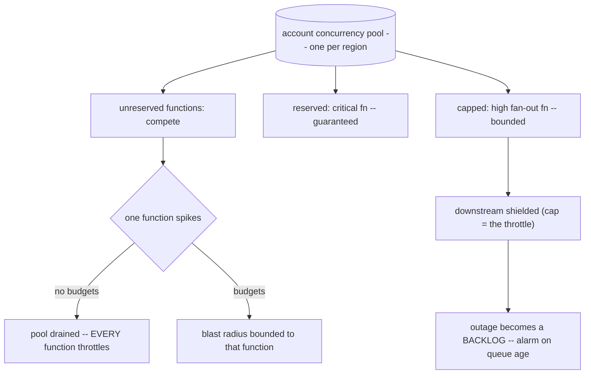

## Thesis

Keeping a serverless estate of a hundred-plus functions operable --- organized by business domain with a naming convention that makes logs browseable and IAM scopeable, the right concurrency model per function so one workload can't starve another or hammer a downstream, the trigger matched to the pattern, and the cold-start, VPC, and runtime-sprawl realities managed --- so serverless stays an asset instead of a hundred snowflakes drawing from one shared pool.

## Sub

**The inventory / sprawl problem** -> **domain organization and naming** -> **concurrency models: reserved, provisioned, shared** -> **zoom out** to cold starts, VPC, and triggers, and the pivots an interviewer rides from "just write a function" into how-to-organize, concurrency-as-isolation, and the cold-start reality.

## Spine

- Organize by **business domain, not technical concern** --- a naming convention (`org-lambda-domain-function-env`) so CloudWatch log groups are browseable and IAM policies are domain-scopeable, or a hundred functions become a hundred snowflakes.
- **Concurrency is the shared-fault-domain lever** --- every unreserved function draws from one account-wide pool, so reserved concurrency both caps a function (it can't starve the pool or hammer a downstream) and guarantees it slots; provisioned concurrency pre-warms for latency at a cost.
- **The trigger fits the pattern** --- synchronous (ALB / API Gateway) for request-response, asynchronous (SQS / EventBridge / S3 / Kinesis) for decoupled work, each with its own retry, ordering, and error semantics.
- The **operational realities bite at scale** --- cold starts (a p99 problem, whose VPC penalty the folklore badly overstates), runtime deprecation as a fleet migration, and the one shared account limit are what turn a single function into an estate to manage.

## Companion Notes

### walk

One function in a large estate

One event from invocation to a well-organized, concurrency-bounded function --- the cold start, the concurrency scale-out, the reserved cap that isolates, and the domain naming that keeps a hundred functions operable.

Say the shared pool first --- "every unreserved function draws from one account-wide concurrency pool." Reserved concurrency and most of the operational pain follow from that.

### drill

Probe Drill

Graded follow-ups on cold starts, concurrency, triggers, and the estate-scale realities --- the ones that separate "write a Lambda" from operating a hundred of them.

Name the noisy-neighbor: one unreserved function can throttle every other function in the account by draining the shared pool.

### wb

Whiteboard

Rebuild the estate from memory --- the shared pool, what partitions it, what the trigger decides, and why the name is load-bearing. Nothing in front of you.

Draw the pool first, then the budgets. Every other answer in this topic hangs off "one shared limit, partitioned by reservations."

### sys

System Map

Zoom out: a function sits between a trigger that sets its retry semantics and a downstream its own elasticity can flatten --- with one shared concurrency pool underneath everything.

Lead with the fault domain, not the boxes --- "a hundred functions are not a hundred independent things; they share one limit."

### trade

Trade-offs

The calls an interviewer drills --- reserve or share, provision or accept the cold start, Lambda or a container, serialize or order --- each with the condition that flips it.

Always name the switch. Nothing here is universally right; the honest answer is almost always about the traffic shape and who is waiting.

### model

Model Answers

Full spoken scripts --- the beats, in order, the way you would actually say them under time pressure.

Steal the frame, not the words. Open on the shared pool, close on the discipline that makes a hundred functions navigable.

### num

Numbers

Back-of-envelope the concurrency a traffic level actually needs, what it draws from the shared pool, and where Lambda stops being cheaper than a container.

Lead with Little's Law --- rate times duration. One multiplication turns "it scales" into a number you can defend.

### rf

Red Flags

What sinks the round --- unbounded concurrency, blanket provisioning, a reservation of one mistaken for ordering, and quoting a cold-start number from 2018.

Name what the interviewer hears. "Functions just scale as needed" is heard as "one bad deploy takes out the account."

### open

30-Second

The opener and the close, matched to the altitude the question is asked at.

Match the altitude --- open at the estate and the shared pool, and land on concurrency budgets and the naming discipline as the real work.

## Walk

### An event invokes a function --- cold or warm

```flow
e[event arrives] -> c[cold: new env inits] -> w[warm: reuse env]
```

An invocation either lands on a fresh execution environment --- which must be created, download your code, start the runtime, and run your initialization before the handler sees the event --- or reuses a warm one and skips all of it. Cold starts hit on a scale-out and after an idle environment is reaped.

So a cold start is a **tail problem, not an average one**. A steady, busy function keeps environments warm and pays it rarely; a low-traffic function (environments reaped between calls) and a spiky one (every burst scales out into fresh environments) pay it constantly. That is why the fix is never "make cold starts faster" in the abstract --- it is "who is actually waiting on this p99, and how often does it happen?"

### Init runs once --- and most of it is your code

```flow
i[INIT: runtime + your module scope] -> h[INVOKE: handler only] . r[reused while warm]
```

The environment has two phases. **Init** runs once per environment: the runtime boots, your module-scope code executes --- imports, SDK client construction, config --- and only then does the **invoke** phase call your handler. Warm invocations skip straight to the handler, which is why init work is amortized and handler work is not.

That split tells you exactly where to optimize. **Ship less code** (a 40 MB dependency tree is a slow download and a slow parse), **import only what you use** (modular SDK clients, not one monolithic import), and **don't do slow blocking work at init** --- a synchronous secrets fetch at module scope is added to every cold start. What you *should* do at init is construct the clients you want reused. And the corollary people miss: module scope is a **cache, not a store** --- it survives between invocations on the same environment, but there are N environments and they are reaped without warning, so a counter or a dedup set up there is simply wrong.

### Concurrency scales out --- one environment per in-flight invocation

```flow
n[N concurrent invocations] -> i[N environments] -> l[Little's Law: rate x duration]
```

Each environment handles **one invocation at a time**, so N simultaneous invocations run as N parallel environments. Lambda creates and reaps them to match the arrival rate; there is no threading model inside a function, only "how many copies are running."

Which makes the capacity model one multiplication --- **Little's Law: concurrency = arrival rate x average duration**. Two hundred requests a second at 120 ms each is 24 concurrent environments. And it carries the trap that catches people: **duration is a concurrency multiplier**. If a downstream slows and average duration triples, concurrency triples on *identical* traffic --- which is how a slow dependency quietly eats the shared pool and starts throttling functions that never changed.

### One shared pool --- and "throttled" means three different things

```flow
p[account pool: 1000/region] -> u[every unreserved fn draws from it] / t[over the line -> throttle]
```

Every function without a reservation draws from a single **per-region** account pool --- 1,000 concurrent executions by default, a soft limit you can raise. That one shared limit is the root of most estate-scale pain: when total demand exceeds it, invocations throttle, and one busy function drawing heavily starves every other function in the account.

But **what throttling does depends entirely on the trigger**, and this is the part that gets missed. A **synchronous** caller gets a `429` immediately and owns the retry. An **asynchronous** invoke is not lost --- Lambda's internal queue retries it with backoff for up to about six hours before giving up to the failure destination. An **event-source mapping** (SQS) is different again: the poller's invoke is throttled, the messages return to the queue, and their `receiveCount` climbs --- so enough throttling can push perfectly good, never-processed messages past `maxReceiveCount` and into the dead-letter queue. Throttling can silently *discard work*, and only on that third path.

### Reserved concurrency partitions the pool

```flow
r[reserve/cap a function] -> g[guaranteed room] -> d[downstream shielded] . z[zero-sum]
```

Reserved concurrency turns the shared pool into **budgets**. Reserving for a critical function guarantees it room even when another spikes; capping a function bounds its draw so it can neither drain the pool nor overwhelm a fragile downstream with too many parallel calls. It costs nothing --- it is an allocation, not a purchase.

It is also **zero-sum**: a reservation is carved out of the pool whether the function uses it or not, and AWS holds back at least 100 unreserved so the sharing majority is never starved to zero. So you reserve *surgically* --- **cap** the functions whose worst case is frightening, **guarantee** the small set that must survive a bad day, and let the well-behaved majority share, because absorbing uncorrelated bursts efficiently is exactly what a shared pool is for. And know the limit of the promise: a reservation isolates you from other *Lambdas*, not from the shared *downstream* --- if the database is saturated, your guaranteed environments just fill up with slow invocations and you throttle from the inside.

### Provisioned concurrency buys away the init --- for a price

```flow
pc[N pre-warmed envs] -> s[skip init] / o[traffic above N -> cold anyway]
```

Provisioned concurrency keeps N environments pre-initialized, so invocations land warm and skip init entirely. You pay for the time they are *kept* warm, not just the time they run --- at roughly \$0.000004 per GB-second, a 1 GB instance held warm all month is about \$11 before it serves a single request.

The trap is that it is a **floor, not a ceiling**. Provision 10 and take 30 concurrent requests: ten land warm and twenty spill into ordinary on-demand environments and cold-start anyway. So it removes the tail only up to the level you paid for, which means it should be the *last* lever, not the first: trim the init, then try **SnapStart** (a snapshot of the initialized environment, restored on invoke --- most of the win without paying to keep anything warm), and only then pay continuously. And check that anything is actually waiting: buying provisioned concurrency for a queue-triggered function is pure waste, because the queue was already absorbing the latency.

### The trigger decides the retry semantics

```flow
sy[sync: caller retries] . as[async: Lambda retries -> destination] . es[ESM: the source retries]
```

The trigger is not wiring, it is a choice of failure model. **Sync** (ALB, API Gateway, direct invoke): the error goes to the caller, who owns the retry. **Async** (`Event` invokes, S3, EventBridge, SNS): Lambda accepts it, returns `202`, and owns the retries --- two by default --- then routes what exhausts them to an **on-failure destination** (which carries the error and the request id, not just the payload, unlike the legacy DLQ). **Event-source mapping** (SQS, Kinesis, DynamoDB Streams): Lambda polls, and the *source's* semantics own the retry --- visibility timeout, redrive policy, shard ordering.

The same `throw` therefore means three different things: **propagate** to the caller, **ask Lambda to retry you**, or **fail the entire batch** --- and on SQS that last one sends every message in the batch back to the queue, including the ones you already processed successfully. Which is why an SQS handler either reports **partial batch failures** (returning only the failed message ids) or is idempotent enough that reprocessing the successes is harmless. Because every one of these paths is **at-least-once**, an idempotent handler is not a nicety here; it is the contract.

### Organize the estate by domain

```flow
dn[domain naming] -> lg[browseable log groups] -> iam[domain-scoped IAM]
```

At a hundred functions the organizing scheme is what keeps it operable. Group functions by business domain --- not by technical layer --- and name them consistently, because the name is the only thing that appears in the log group, the ARN, the metric dimension *and* the bill. It is the single join key across all four.

```bash
# {org}-lambda-{domain}-{function}-{env} -- the name IS the log group and the IAM scope
app-lambda-fps-update-prices-prod      # pricing domain
app-lambda-rnds-render-template-prod   # config-rendering domain
app-lambda-cron-dispatch-prod          # core scheduling

# CloudWatch derives the log group from the name:  /aws/lambda/app-lambda-fps-update-prices-prod
# IAM scopes on the ARN with one wildcard:         arn:aws:lambda:*:*:function:app-lambda-fps-*
```

That is why the convention is load-bearing rather than cosmetic. Ad-hoc names mean you cannot glob a domain's logs at 03:00, and your IAM policy is forced to either enumerate a hundred ARNs (nobody maintains that) or wildcard the whole account (which is the over-broad grant the audit finds). **Tags cannot replace it** --- they are not in the ARN and not in the log group name --- so you *name* for the structural things (identity, IAM scope, logs, alarms) and *tag* for the metadata (cost centre, owner). And a convention only holds if it is structural: a shared IaC module that emits a correctly-named, correctly-scoped, correctly-alarmed function makes the compliant path the *easy* path, and CI rejects the rest.

### Ship it, and move the fleet

```flow
c[IaC] -> v[immutable version] -> a[weighted alias] . m[runtime deprecation = fleet migration]
```

Everything as code --- functions, triggers, concurrency, IAM --- so the estate is reproducible and reviewable rather than click-configured. For a risky function you publish an **immutable version** (code *and* configuration frozen together) and shift a **weighted alias** gradually, so rollback is a **pointer move, not a pipeline run**: point the alias back at version 41, one API call, no rebuild, guaranteed to restore exactly what was running.

The canary needs a signal, and the subtlety is that you must alarm on the **new version's own metrics** --- aggregate function metrics blend the canary in with the 95% that is healthy, so a 100% failure on 5% of traffic looks like a 5% error rate and may trip nothing. And the estate-scale version of "deploy" is the **runtime migration**: when a runtime is deprecated, AWS does not stop invoking your function --- it stops shipping security patches, blocks *creating* new functions on it, and then blocks *updating* the ones you have. So the function keeps running, unpatched, and you discover the problem at the worst possible moment: when you need to ship a fix and cannot. The version bump is cheap; what is expensive is everything those never-touched functions carry.

### Model Script

- Frame the shared pool | "The thing that makes serverless at scale different is that every function without a reservation draws from one per-region concurrency pool. So a hundred functions aren't a hundred independent things -- they share a fault domain. One runaway function can drain the pool and throttle everyone. Most of the operational discipline follows from that."
- Make it a number | "And I'd size it rather than hand-wave: concurrency is Little's Law -- arrival rate times duration. Two hundred requests a second at a hundred and twenty milliseconds is twenty-four concurrent environments. The trap in that formula is that duration is a multiplier: if a downstream gets slow, concurrency rises on identical traffic, which is how a slow dependency quietly eats the shared pool."
- Concurrency as the lever | "Reserved concurrency is how I partition that pool into budgets: guarantee the critical function so it always has room, cap the risky one so it can't starve the rest or hammer a downstream. It's free, but it's zero-sum -- it's carved out whether it's used or not -- so I reserve surgically and let the well-behaved majority share."
- Cold starts and triggers | "Cold starts are a p99 problem, so the question is who's waiting: I'll pay for provisioned concurrency on an interactive endpoint, but accept them on a queue-triggered function because the queue already absorbed the latency. And I'd correct one thing people still say -- the multi-second VPC cold start was fixed in 2019 when AWS moved ENI setup off the invoke path. The trigger also sets the retry model: sync errors go to the caller, async gets Lambda's retries and a failure destination, and an event-source mapping fails the whole batch -- and all of them are at-least-once, so the handler has to be idempotent."
- Organizing the estate | "At a hundred functions the organizing scheme is the whole game. Group by business domain, not technical layer, with a strict name -- because the log group IS the function name and IAM wildcards match the ARN, so the name is the only join key across logs, IAM, metrics, and the bill. Right-size memory by measuring, remembering CPU scales with memory -- one full vCPU at about 1,769 megabytes -- so a CPU-bound function gets faster and often cheaper with more RAM."
- Interviewer: "A downstream database keeps getting overwhelmed by one of your stream processors. What do you do?"
- Contain the fan-out | "That's the classic serverless failure -- and note the database dies from connection count, not query load, because each environment opens its own connection. The concurrency isn't something anyone typed: on Kinesis it's shards times the parallelization factor, so a fifty-shard stream at a factor of ten is five hundred concurrent invocations. I'd cap that function's reserved concurrency to what the database can take -- and say the rest out loud: that converts an outage into a backlog, so I alarm on queue age, not depth, and check the backlog can't outrun retention. The cap buys time; RDS Proxy or a bigger batch size buys throughput."
- Land it | "So: it's an estate, not a pile of functions -- organized by domain with a naming convention that makes it navigable and scopeable, concurrency budgeted so the shared pool isn't a single point of failure, cold starts managed by who's waiting, triggers chosen for their retry semantics with idempotent handlers, and runtime deprecation treated as a fleet migration. The one line is that at scale the discipline -- naming, concurrency budgets, right-sizing -- is what turns serverless from a hundred snowflakes back into an asset."

## Drill

all | **All three levels, mixed** --- the way a real loop actually comes at you: a definition, then the number behind it, then the org call.
SDE2 | **The model and the mechanics** --- cold starts, the concurrency model, reserved vs provisioned, sync vs async, the shared account limit. The bar is "this is an estate, not a for-loop over functions": name the mechanism, and name the one shared resource everything draws from.
SDE3 | **Concurrency, triggers, and the edges** --- isolation vs ordering, the VPC reality, at-least-once and idempotency, a fan-out flattening a downstream, memory as the CPU dial. The bar is "it depends, here's the switch": name the constraint and the failure each choice bounds.
Staff | **Operating the estate and the org calls** --- containment during a retry storm, the utilization crossover off Lambda, runtime deprecation as a fleet migration, where the seam between functions belongs. The bar is "a hundred functions is an estate, not a pile": name the discipline that makes it navigable and the budget that makes it safe.

### SDE2 | cold starts

What is a Lambda cold start?

The latency of the first invocation on a **new execution environment** --- Lambda has to create the environment, download your code, start the runtime, and run your initialization (everything outside the handler) before the handler ever sees the event. A warm invocation reuses an already-initialized environment and skips all of it. Cold starts hit on a **scale-out** and after an idle environment is **reaped** --- so they are a **p99 problem, not a p50 one**, which is exactly why they bite low-traffic and spiky functions hardest.

Follow: You said p99, not p50. Why does that distinction change what you actually do about it?
Because the fix depends on how *often* you pay it. A steady, busy function keeps environments warm, so cold starts are a thin tail and the right answer is usually to leave it alone. It is the **low-traffic** function (environments reaped between calls) and the **spiky** one (every burst scales out into fresh environments) that pay it constantly --- and those are the only ones worth a leaner init or provisioned concurrency. So I look at the cold-start **rate** (what fraction of invocations report an `Init` duration), not the average latency, and I spend money only where a human is on the other end of that tail. On a queue-triggered function, the queue already absorbed the latency and the cold start is free.

Follow: What in your own code actually decides the size of a cold start?
The **init phase** --- everything outside the handler. That is the runtime bootstrap plus your module imports, SDK client construction, config fetch, and any connection setup. The levers are concrete: **ship less code** (bundle and tree-shake; a 40 MB dependency tree is a slow download and a slow parse), **import only what you use** (the modular AWS SDK clients rather than one monolithic import), and **do not do slow blocking work at init** --- a synchronous secrets fetch at module scope is added to every cold start. What you *should* do at init is the work you want amortized: construct clients once so warm invocations reuse them. Runtime choice matters too --- an interpreted runtime initializes in the low hundreds of milliseconds while a JVM is seconds, which is precisely the gap SnapStart exists to close.

Senior: Framing cold starts as a **tail (p99) problem whose rate is set by the traffic shape** --- and knowing the init phase is mostly *your* code (bundle size, imports, client construction), not just AWS overhead --- is what separates a real answer from "cold starts are slow."
Speak: Define it precisely: **'the init of a new execution environment --- create, download, runtime bootstrap, and everything outside my handler --- before the handler sees the event.'** Then the framing that matters: it is a **p99 problem**, so it bites low-traffic and spiky functions, and most of its size is my own init code.

### SDE2 | the concurrency model

How does Lambda concurrency work?

One execution environment handles **one invocation at a time**, so N simultaneous invocations means N environments running in parallel --- concurrency is simply the number of in-flight invocations. Lambda creates and reaps environments to match the arrival rate. There is no threading model to reason about inside a function; you reason about **how many copies run at once**, and that is what every scaling and isolation decision on this topic is really about.

Follow: If concurrency is just in-flight invocations, how do you predict how much a given traffic level needs?
**Little's Law: concurrency = arrival rate x average duration.** Two hundred requests a second at 120 ms each is `200 x 0.12` = **24 concurrent environments**. That one multiplication is the entire capacity model, and it has a corollary that catches people: **duration is a concurrency multiplier**. If a downstream slows and your average duration triples, your concurrency triples on *identical* traffic --- which is exactly how a slow dependency quietly eats the shared account pool and starts throttling functions that never changed and never deployed. So when I size a reservation I size it against duration **under stress**, not the happy path.

Follow: One environment, one invocation --- so what state can I safely keep between invocations?
Anything you are happy to have **reused, but never to depend on**. The environment *is* reused, so module-scope state survives: a database client, an SDK client, a cached config --- and caching those at init is the main reason warm invocations are fast. What you must not do is treat it as **storage**. You do not control which environment serves a request, environments are created and reaped without warning, and there is no coherence between them --- so a counter, or a "have I already seen this event" set, in module scope is simply wrong: it is per-environment, and there are N of them. The rule is **module scope is a cache, not a store** --- safe for anything you could recompute, unsafe for anything you would lose. `/tmp` has the same property: it survives on that one environment, so it is a scratch cache, never state.

Senior: Reaching for **Little's Law** to turn traffic into a concurrency number --- and knowing **duration is a multiplier**, so a slow dependency silently inflates your draw on the shared pool --- is the quantitative instinct that turns this from a definition into an answer.
Speak: State the model in one line: **'one environment, one invocation at a time --- concurrency is just how many are in flight.'** Then make it quantitative: **concurrency = rate x duration**. And name the trap: if a downstream slows, duration rises and concurrency rises with it, on the same traffic.

### SDE2 | reserved concurrency

What is reserved concurrency?

A cap on how many concurrent environments a function may use --- and it does **two** things: it **limits** the function (it can never exceed the cap) and it **guarantees** it that much (the reservation is carved out of the account pool for it alone). It costs nothing; it is an allocation, not a purchase. You set it to stop a function consuming the whole account's concurrency, to protect a fragile downstream from too many parallel calls, or to bound the blast radius of anything whose worst case frightens you.

Follow: You say it both caps and guarantees. Where does the guaranteed capacity come from, and what does it cost the rest of the account?
It comes out of the **same shared pool**, so a reservation is **zero-sum**: reserving 200 for function A removes 200 from the unreserved pool that every other function shares --- **whether A uses it or not**. That is the real cost: not dollars, but headroom. Which is why you cannot simply reserve everything --- AWS will not let you, it holds back at least **100 concurrency unreserved** so unreserved functions are never starved to zero --- and why an estate that reserves aggressively ends up with a thin common pool where the unreserved majority starts throttling. A reservation is a budget you are taking from your neighbours, so you spend it where isolation genuinely matters and leave the steady, low-risk majority sharing.

Follow: What actually happens to invocations that exceed a function's reserved concurrency?
They are **throttled** --- and what "throttled" *means* depends entirely on the trigger, which is the part people miss. A **synchronous** caller (API Gateway, ALB, a direct invoke) gets a `429 TooManyRequestsException` immediately and owns the retry. An **asynchronous** invoke is not lost: Lambda's internal queue retries it with backoff for up to about **six hours** before giving up to the failure destination. An **event-source mapping** (SQS, Kinesis) is different again: the poller's invoke is throttled, the messages go back to the queue, and their **`receiveCount` increments** --- which is the footgun, because enough throttling pushes perfectly good, never-processed messages past `maxReceiveCount` and straight into the dead-letter queue. So setting reserved concurrency is a different decision on each trigger, and on SQS it is the one that can silently discard valid work.

Senior: Knowing a reservation is **zero-sum against the shared pool** (you are taking headroom from everyone else, used or not) and that **"throttled" means three different things** by trigger --- an immediate 429, a six-hour async retry, or an SQS redelivery that can dead-letter good messages --- is the operational depth that reads as senior.
Speak: Name both halves: **'reserved concurrency is a cap *and* a guarantee --- and it is free, because it is an allocation, not a purchase.'** Then the sharp edge: it is carved out of the shared pool whether used or not, and what happens when you exceed it depends on the trigger --- a 429 for sync, a long retry for async, and redelivery for SQS, which can dead-letter good messages.

### SDE2 | provisioned concurrency

What is provisioned concurrency, and when do you use it?

**Pre-initialized environments kept warm**, so invocations skip the init phase entirely --- you pay to hold N environments ready. You use it for a latency-sensitive interactive endpoint where a cold start in the tail is genuinely unacceptable. It is a **cost** decision, and the mechanism is the point: provisioned environments bill for the time they are **kept warm**, not just the time they run. At roughly \$0.000004 per GB-second, a 1 GB instance held warm all month is about \$11 --- before it has served a single request. Which is why most estates run zero provisioned concurrency and accept cold starts wherever a queue is already absorbing the latency.

Follow: Where does provisioned concurrency stop helping --- can it be exceeded?
Yes, and this is the trap: it is a **floor of warm environments, not a ceiling on traffic**. Provision 10 and take 30 concurrent requests, and the first ten land warm while the other twenty **spill into ordinary on-demand environments and cold-start anyway**. So it does not eliminate cold starts; it eliminates them *up to the level you paid for*, and a spike past that level pays the tail regardless. That means you size it against the concurrency you actually see (Little's Law, at the percentile you care about), you put **autoscaling** on it so it tracks the daily curve instead of being sized for the peak forever, and you accept that a genuinely unpredictable spike still cold-starts. And if the traffic is spiky enough that you would have to provision for the peak, you are paying peak cost for average load --- which is precisely the point where a container starts to look better.

Follow: A Java function has a four-second cold start. Do you just buy provisioned concurrency?
That is the reflex, but it should be the **last** move, not the first. The order I would go: **make the init cheaper** (trim the bundle, lazy-load what init does not need, drop the monolithic SDK import) --- free, and it helps every environment forever. Then **SnapStart**, which is built for exactly this case: it snapshots the initialized environment and restores from it, giving you most of the cold-start win **without paying to keep environments warm** --- a materially different cost profile from provisioned concurrency, which bills continuously. *Then*, if it still is not enough, provisioned concurrency. And before any of it, I would check whether **anything is actually waiting**: a four-second cold start on a queue-triggered function is a non-issue, and paying to fix it is pure waste. The senior move is spending money last.

Senior: Knowing provisioned concurrency is a **floor, not a ceiling** (traffic above what you provisioned spills to cold on-demand environments) --- and that **a leaner init and SnapStart both come before paying to keep instances warm** --- is the cost discipline that separates a Staff answer from "add provisioned concurrency."
Speak: Define it as **'pre-initialized environments I pay to keep warm, so the invocation skips init.'** Then the two things people get wrong: it is a **floor, not a ceiling** --- a spike past it still cold-starts --- and it is the *last* lever: trim the init and try SnapStart before paying to keep anything warm.

### SDE2 | sync vs async invocation

What's the difference between synchronous and asynchronous invocation?

**Synchronous** (ALB, API Gateway, a `RequestResponse` invoke) --- the caller holds the connection and gets the response, an error goes straight back, and the **caller** owns the retry. **Asynchronous** (`Event` invokes, S3, EventBridge, SNS) --- Lambda accepts the event onto an internal queue, returns `202` immediately, and processes it detached from any caller, so **Lambda** owns the retries and a failure destination catches what exhausts them. And there is a **third** model people forget: an **event-source mapping** (SQS, Kinesis, DynamoDB Streams), where Lambda **polls** the source and the *source's* semantics --- visibility timeout, redrive policy, shard ordering --- own the retry. The trigger picks your retry and error model, so it is a design decision, not a wiring detail.

Follow: You named three models. Why does that distinction change the code I write?
Because it changes **who owns a failure, and what a `throw` even means**. On **sync**, throwing is fine --- the error propagates to the caller, who decides; your job is to fail fast with a useful status. On **async**, throwing is how you *request a retry* --- Lambda will re-invoke you (twice more by default) --- so the handler must be **idempotent** or the retry duplicates the side effect. On an **event-source mapping**, throwing fails the **whole batch**: with SQS, every message in that batch goes back to the queue and is redelivered, *including the ones you already processed successfully*. Which is why an SQS handler either returns **partial batch failures** (`ReportBatchItemFailures`, reporting only the failed message ids) or is idempotent enough that reprocessing the successes is harmless. Same `throw`; three completely different consequences.

Follow: If async gets retried for free, when would you ever choose sync?
When **a caller is genuinely waiting on the answer and there is nothing useful to do without it** --- that is the whole test. An HTTP request that must return the result (a lookup, a validation, a rendered response) has to be sync; there is nobody to hand a `202` to. What you should *not* do is pick sync for work the caller does not need to wait for --- a thumbnail render, a notification, an audit write --- because then you have coupled the caller's latency and availability to your function **and to everything it calls**. The pattern for that is **accept-and-enqueue**: the sync path validates and returns `202` fast, and an async function does the work with the retries and the failure destination that come free. The rule of thumb: **sync when the answer is the product; async when the answer is a side effect.**

Senior: Naming **three** invocation models rather than two --- sync, async, and the event-source mapping --- knowing a `throw` propagates, requests a retry, or **fails an entire batch** depending on which one you are on, and reaching for **partial batch responses** on SQS, is the trigger fluency an interviewer is probing for.
Speak: Give three, not two: **'sync --- the caller waits and owns the retry. Async --- Lambda queues it, retries it, and dead-letters it. Event-source mapping --- Lambda polls, and the *source's* semantics own the retry.'** The line that lands: the same `throw` propagates, retries, or fails a whole batch depending on which one you are on.

### SDE2 | the account concurrency limit

What is the account concurrency limit?

A **per-region** ceiling on total concurrent executions across *all* your functions --- they share one pool. The default is **1,000** (a soft limit you can raise), and every function without a reservation draws from whatever is left once reservations are carved out. When demand exceeds the limit, invocations are throttled --- differently, depending on the trigger. This single shared limit is why one busy function can starve the others, and it is the entire reason reserved concurrency exists.

Follow: The limit is per-region. Why does that matter?
Because it is a **blast-radius boundary you already own, for free**. Concurrency is not a global account budget --- it is per-region --- so a runaway function in `us-east-1` cannot drain the pool in `eu-west-1`. Two things follow. First, a multi-region deployment gives you concurrency isolation as a **side effect**, which is a real argument for it beyond latency and DR. Second, and far more practically: **your quota increases are per-region too.** A team that raised the limit to 5,000 in their primary region and then fails over to a region still sitting at the default 1,000 discovers, mid-incident, that the failover region throttles at a fifth of the load. So "raise the limit" is a per-region checklist item, and the failover region is the one everybody forgets --- which is a lovely way to turn a regional outage into a global one.

Follow: If the limit is soft and I can just raise it, why bother with reserved concurrency at all?
Because raising the limit **does not allocate anything --- it just makes the shared pool bigger, and it is still shared.** A bigger pool raises the ceiling that everyone competes for; it does nothing to stop one function consuming all of it. If a retry storm can drain 1,000, it can drain 5,000 --- you have bought **time, not isolation**. Reserved concurrency is the only thing that actually **partitions** the pool: it guarantees the critical function its slice regardless of what anyone else is doing, and it bounds the risky function's draw so it cannot take the rest. So the two do different jobs --- **the limit is capacity, the reservation is isolation** --- and a bigger number is never a substitute for a boundary. In practice you want both: enough headroom that normal traffic never approaches the ceiling, *and* reservations so the pathological case is contained.

Senior: Understanding that **raising the account limit buys capacity, not isolation** --- a bigger shared pool is still one shared pool, and only a reservation partitions it --- plus knowing the limit is **per-region** and the failover region is the one nobody raised, is the systems judgment this card is really testing.
Speak: State it precisely: **'one per-region pool, 1,000 by default, shared by every function without a reservation.'** Then the punchline: raising the limit buys **capacity, not isolation** --- a bigger shared pool is still shared, and only a reservation partitions it.

### SDE2 | organize by domain

How should you organize a large number of functions?

By **business domain, not technical layer** --- group the pricing functions together, the config-rendering functions together, and name them consistently (`org-lambda-domain-function-env`). The domain prefix is **load-bearing, not cosmetic**: the CloudWatch log group is literally `/aws/lambda/<function-name>`, so the name *is* your log taxonomy, and an IAM policy can scope an entire domain with one wildcard on the ARN (`function:app-lambda-fps-*`). Organizing by technical concern instead --- all the "handlers," all the "processors" --- scatters a single feature across the estate and makes nothing findable or scopeable.

Follow: You keep saying the naming convention is load-bearing. Show me what actually breaks without it.
Three things, all of which bite at 03:00. **Logs**: the log group name is *derived* from the function name, so with ad-hoc names you cannot glob a domain's logs --- you are hunting through a hundred log groups to find which function threw. **IAM**: with a domain prefix you write one policy scoped to `arn:aws:lambda:*:*:function:app-lambda-fps-*`; without it you either enumerate a hundred ARNs (which nobody maintains, so it rots) or you wildcard the whole account --- which is the over-broad grant that shows up in the security review. **Cost and ownership**: you cannot attribute spend or page the right team, because nothing in the name says who owns it. The name is the one string guaranteed to appear in the **log group, the ARN, the metric dimension, and the bill** --- so it is the only join key across all four. That is why it is a convention and not a preference.

Follow: Doesn't the same thing come from tags? Why does the *name* have to carry it?
Tags are genuinely useful --- for cost allocation and inventory they are exactly right --- but they are **not in the ARN and not in the log group name**, and that is the whole difference. IAM resource policies match on the **ARN**, so a wildcard scope needs the domain in the *name* (you can do tag-based access control with condition keys, but it is more fragile and not every action supports it). CloudWatch derives the log group from the **name**, so no tag will ever make your logs browseable. And a tag can silently be missing or wrong on one function with nothing to stop you, whereas the name is unavoidable and visible in every console, log line, alarm, and ARN. So: **name for the structural things** (identity, IAM scope, logs, alarms) and **tag for the metadata** (cost centre, owner, data classification). Tags complement the convention; they cannot replace it.

Senior: Grounding the convention in the **mechanisms that consume it** --- the log group *is* `/aws/lambda/<name>`, IAM wildcards match the **ARN**, so the name is the only join key across logs, IAM, metrics and the bill --- and knowing precisely why **tags cannot substitute** (not in the ARN, not in the log group) --- is what turns "use a naming convention" from a style opinion into an architecture argument.
Speak: Organize by **domain, not technical layer**, and make the name do work: **'the log group is /aws/lambda/ plus the function name, and IAM wildcards match the ARN --- so the name is the only join key across logs, IAM, metrics, and the bill.'** Tags are for cost and ownership; they can never make logs browseable.

### SDE3 | concurrency as isolation

How does reserved concurrency give you isolation?

By turning the shared pool into **partitioned budgets**. Reserving concurrency for a critical function guarantees it always has room even when another function spikes; capping a noisy function stops it draining the pool and throttling everyone else. Without reservations, every function competes for one limit, so a single runaway function is an **account-wide outage**. Reserved concurrency is how you make the blast radius of one misbehaving function **bounded instead of global**.

Follow: I have a hundred functions. Do I reserve concurrency on all of them?
No --- and blanket reservation is its own failure mode. Reservations are **zero-sum** against the pool, AWS holds back **100 unreserved** as a floor, and a fully-reserved estate throws away the entire *benefit* of a shared pool: that a hundred functions with **uncorrelated, bursty** traffic can share far less capacity than the sum of their individual peaks. Reserve everything and you are now capacity-planning a hundred functions by hand, forever, badly --- and the first one to be under-reserved throttles while unused headroom sits idle inside somebody else's reservation. So the allocation is deliberately **asymmetric and surgical**: **cap** the functions whose worst case is frightening (high fan-out, unbounded triggers, anything touching a fragile downstream), **guarantee** only the small set that must survive a bad day (auth, payments, the incident-response path), and leave the well-behaved majority **unreserved**, sharing efficiently. That is what a shared pool is *for*.

Follow: A reservation guarantees room. Does it actually guarantee my function *works* when the account is under pressure?
It guarantees it **concurrency** --- and that is a narrower promise than it sounds. Your reserved slice cannot be taken by another Lambda, so you will not be throttled at the *Lambda* layer. But concurrency is not the only thing that is shared: **the downstream is**. If the noisy function is hammering the same database, the same cache, the same third-party API, then your guaranteed 50 environments will start up perfectly and then sit there **timing out on a saturated dependency** --- and because duration explodes under that stress, your own 50 slots fill up and you **throttle anyway, from the inside**, on unchanged traffic. So the reservation isolates you from the *Lambda* fault domain and does nothing at all about the *shared dependency* fault domain. Real isolation for a critical path is the reservation **plus** an isolated or rate-limited downstream, **plus** an aggressive timeout and a circuit breaker so a slow dependency cannot convert itself into concurrency exhaustion. Naming that gap out loud --- "reserved concurrency is not bulkheading" --- is the point of the question.

Senior: Knowing reservations are **zero-sum and therefore surgical** (cap the dangerous, guarantee the critical, let the majority share) --- and, crucially, that a reservation isolates you from the *Lambda* fault domain but **not from the shared downstream**, so a saturated database still throttles you from the inside --- is the fault-domain thinking that lands a senior signal.
Speak: Frame it as partitioning: **'reservations turn one shared pool into budgets --- guarantee the critical, cap the dangerous, let the rest share.'** Then name the limit of the promise: a reservation protects you from other *Lambdas*, not from the shared *downstream* --- if the database is saturated, your guaranteed slots just fill with slow invocations and you throttle from the inside.

### SDE3 | serialize vs order

How do you force sequential processing --- and does that give you ordering?

Set reserved concurrency to **1** and only one invocation runs at a time. That **serializes execution**, which is what you want when a downstream cannot take parallelism or an operation is not safe to overlap. But be precise about what it does **not** buy: **serialization is not ordering.** Standard SQS makes no ordering guarantee at all, so processing an unordered queue one-at-a-time still processes messages in an arbitrary order --- you have made it slow *and* left it unordered. If you need updates to the same entity applied **in order**, the mechanism is a **FIFO queue with the entity id as the `MessageGroupId`**: SQS guarantees order *within* a message group, Lambda processes one batch per group at a time, and different groups run in **parallel** --- so you get per-entity ordering without serializing the whole system. (Kinesis gives you the same shape with a partition key per shard.)

Follow: What actually goes wrong if I just set reserved concurrency to 1 on a standard SQS queue?
You get a **throttle-and-redeliver loop that can dead-letter valid messages** --- this is the classic footgun. The event-source mapping's pollers know nothing about your cap: they scale up, fetch messages, and try to invoke. With a reservation of 1, all but one of those invokes are **throttled**. The throttled messages go back to the queue with their **`receiveCount` incremented**, and if you have a redrive policy (and you should), enough of those failed attempts push perfectly good, **never-processed** messages past `maxReceiveCount` and straight into the dead-letter queue. So the naive combination does not merely run slowly --- it **silently discards work**. The correct control is **`MaximumConcurrency` on the event-source mapping** (its `ScalingConfig`), which caps how many concurrent invocations the *poller* will drive: the poller simply does not over-fetch, so you never manufacture the throttles at all. And note its **minimum is 2** --- which tells you something important: the ESM cap is a **scaling control, not a serialization mechanism**. If you truly need one-at-a-time *and* in-order, you want FIFO with a message group, not a concurrency of one.

Follow: FIFO with a message group per entity --- what does that cost, and where does it bite?
**Head-of-line blocking, scoped to the group.** Ordering within a group means the group is processed strictly in sequence, so one poisonous or slow message blocks **every subsequent message for that entity** until it succeeds or is dead-lettered. That is usually the trade you want (it is the same bargain as a Kafka partition), but it has two teeth. First, **your parallelism is bounded by the number of active message groups, not the number of messages** --- so the group key *is* the parallelism key. Key it too coarsely (by tenant rather than by entity) and a single hot tenant becomes one serial lane and your throughput collapses to that lane's width. Choosing the key **is** the design decision. Second, FIFO throughput is itself bounded (far lower than standard SQS unless you enable high-throughput mode), so it is not a free upgrade. The senior framing: you buy ordering **with** parallelism, you pay for it in head-of-line blocking, and you should only buy it **where the out-of-order anomaly is actually observable**. Most events do not need it --- and making the message **self-describing** (carry the resulting state, not a delta) is very often the cheaper fix than ordering the stream at all.

Senior: The whole card turns on one distinction: **serialization is not ordering.** Knowing that reserved-concurrency-of-1 on a standard queue gives you neither ordering *nor* safety (it manufactures throttles that dead-letter good messages), that **`MaximumConcurrency` on the event-source mapping** is the correct way to cap SQS-driven concurrency, and that real per-entity ordering is **FIFO + `MessageGroupId`** with head-of-line blocking as its price --- is exactly what separates someone who has *operated* SQS-to-Lambda from someone who has read about it.
Speak: Separate the two ideas out loud: **'a reservation of one *serializes* --- it does not *order*.'** Standard SQS is unordered, so one-at-a-time on an unordered queue is just slow and still unordered. For real ordering: **FIFO with the entity id as the message group** --- ordered within the group, parallel across groups. And cap SQS concurrency with **MaximumConcurrency on the event-source mapping**, not with a reservation, or throttled redeliveries will dead-letter good messages.

### SDE3 | cold starts and the VPC

People say VPC-attached functions cold start slowly. Is that still true?

It **was** true, and it is the most persistent stale fact in serverless. Before 2019, Lambda created an **elastic network interface per execution environment** during init, which could add many seconds to a VPC-attached cold start --- that is where "VPC Lambdas take eight seconds to start" comes from. AWS then re-architected it: the ENI is now **pre-created and shared across a unique subnet + security-group combination**, and attached when you **configure** the function, not on the invoke path. So today a VPC-attached cold start is **roughly the same as a non-VPC one** --- dominated by runtime bootstrap and your own init code, not by networking. Quoting the old number in an interview is a tell that you last looked at this in 2018.

Follow: So if the cold-start penalty is gone, is a VPC free now?
The *latency* cost is essentially gone; the **operational** costs are not, and those are the ones that actually bite an estate. Three real ones. **Subnet IP exhaustion** --- those shared ENIs consume IPs in your subnets, and scaling a hundred functions out across undersized subnets is a genuine way to run out of addresses, so you give Lambda its own generously-sized subnets. **The `Pending` state** --- creating or updating the VPC/ENI configuration takes time, so a function whose VPC config changes goes to `Pending` and cannot be invoked until it is ready; that is a **deployment** consideration, not a runtime one, and it surprises people mid-rollout. **Egress cost** --- a function inside a VPC has **no route to the internet without a NAT gateway** (its ENI never gets a public IP, so even a public subnet does not save you), and NAT bills per hour **and per GB**, which is a classic surprise line item. If the function only talks to AWS services, a **VPC endpoint** avoids NAT entirely and is almost always the right answer. So "should this be in a VPC?" is now a question about **IPs, deploys, and egress cost** --- not milliseconds.

Follow: Given that, when *should* a function be in a VPC?
**When it needs to reach something that only exists inside the VPC** --- an RDS instance, an ElastiCache cluster, an internal service on a private subnet. That is the entire reason. What you should *not* do is attach a function to a VPC as a reflexive **security** gesture: a Lambda is not "on the internet" by default --- it runs in an AWS-managed network --- and its real boundary is **IAM**, not a subnet. Putting a function that only calls DynamoDB and S3 into a VPC buys you no security whatsoever and costs you subnet IPs, a slower deploy path, and (if the routing is wrong) a NAT bill for traffic that never needed to leave AWS. So the decision rule is a **private-resource** question, and the security posture lives somewhere else entirely: in the **execution role's scope** --- least-privilege IAM --- which is where the AWS-hardening conversation belongs.

Senior: Knowing the **multi-second VPC cold start is stale folklore** --- AWS moved ENI setup off the invoke path with shared, pre-created ENIs, so VPC attachment now costs roughly nothing at init --- and being able to name what it *actually* costs today (**subnet IPs, the `Pending` state on a config change, and NAT egress**), plus that the security boundary is **IAM, not a subnet**, is the single strongest currency signal available on this topic.
Speak: Correct the premise, carefully: **'that was true before 2019 --- Lambda created an ENI per environment at init. AWS moved that off the invoke path with shared, pre-created ENIs, so a VPC cold start is now about the same as a non-VPC one.'** Then say what a VPC actually costs today: **subnet IPs, the Pending state on a config change, and NAT egress** --- and note you attach to reach a **private resource**, never for security, because the boundary is IAM.

### SDE3 | async retries and the DLQ

What happens when an asynchronous invocation fails?

It depends on **which async you mean**, and you have to say so. For a true **async invoke** (`Event`, S3, EventBridge, SNS), **Lambda** retries it --- **2 retries by default**, three attempts total, with backoff --- and the event can live in Lambda's internal queue for up to about **six hours** before it is handed to the **on-failure destination** (or the legacy DLQ). For an **SQS event-source mapping**, Lambda's retry policy is not involved at all: the **queue's** redrive policy decides, the message returns after the visibility timeout, and it is redelivered until `maxReceiveCount` sends it to the *queue's* DLQ. Two different retry engines. Either way, you must **configure** the failure path, or events that exhaust retries are simply dropped.

Follow: You mentioned on-failure destinations and the legacy DLQ. Why prefer destinations?
Because a **DLQ gives you the payload and nothing else**, while a **destination gives you the payload plus the context**: the invocation record carries the **error and stack trace**, the request id, and the condition that fired it --- so you can see *why* it failed without hand-correlating log streams by timestamp. Destinations also route to more than a queue (SQS, SNS, EventBridge, or another function), and they support **on-success** too, which lets you chain the next step without the function knowing anything about it. The difference at 03:00 is concrete: with a DLQ you get a mystery message and go hunting in CloudWatch; with a destination you get the message **and** the reason. DLQs are the older mechanism and still work fine, but for a new async function the destination is strictly more informative.

Follow: A poison message keeps failing and lands in the DLQ. What do you do --- and what if it's not one message but a bad deploy failing everything?
Those are **two completely different incidents**, and telling them apart is the job. A **single poison message** is a data problem: it is out of the hot path, the queue behind it kept flowing, so you inspect it, fix the handler (or the producer that emitted something malformed), and **redrive** it. Park, inspect, replay --- that is what a DLQ is for. A **bad deploy failing everything** is a different animal: *every* message is now poison, the DLQ fills at the full arrival rate, and redriving thousands of events afterwards is a **second incident** waiting to happen (you are about to replay them into a system that may not be idempotent). Which is why the alarm has to be on the **rate of dead letters, not the depth** --- a DLQ gaining one message an hour is a bug ticket; a DLQ gaining a thousand a minute is a **rollback**. And the response is to **stop the bleeding first**: roll the alias back, or **disable the event-source mapping** so the messages stay safely in the source queue with their retention intact, rather than churning through retries and manufacturing dead letters while you debug. Turning the trigger *off* is the underrated move --- SQS will hold the work for you --- and only then do you redrive.

Senior: Distinguishing the **two async retry engines** (Lambda's own for `Event` invokes vs the queue's redrive policy for an event-source mapping), preferring **on-failure destinations** because they carry the error rather than only the payload, and --- the real operational tell --- alarming on the **DLQ arrival *rate*, not its depth**, then **disabling the event-source mapping** to stop the bleeding before redriving, is genuine incident experience.
Speak: Be precise about which engine: **'a true async invoke gets Lambda's own retries --- two by default, up to about six hours --- then the on-failure destination. An SQS trigger uses the *queue's* redrive policy instead.'** Prefer a **destination** over a bare DLQ (it carries the error, not just the payload), and alarm on the **rate** of dead letters, not the depth --- a trickle is a bug ticket, a flood is a rollback.

### SDE3 | idempotency

Why must a Lambda triggered by a queue or a stream be idempotent?

Because those triggers are **at-least-once**. A retry after a partial failure, an SQS redelivery after a visibility timeout expires, or a batch that fails on message 8 of 10 can all invoke your function again for an event it has already processed. So processing the same event twice must be **safe**: an upsert keyed by a deterministic event id, or a dedup check before the side effect. This is the same at-least-once reality as any queue consumer --- Lambda does not change it, and assuming exactly-once delivery is the bug.

Follow: Give me the concrete mechanism --- how do you actually make the handler idempotent?
Pick the cheapest correct one for the side effect. If the side effect is a **write you control**, make the write itself **naturally idempotent**: a conditional put or upsert keyed by the event id --- `PutItem` with `attribute_not_exists(id)`, or `INSERT ... ON CONFLICT DO NOTHING`. A duplicate is then a **no-op with no extra machinery**, and this is by far the best option because there is no second store to keep consistent with the first. Only if the side effect is **not idempotent and not yours** --- charging a card, sending an email, calling a third-party API --- do you need an explicit **idempotency store**: record the event id *before* the side effect with a conditional write, and skip if it is already there. The key must be **content-derived** (a hash of the event's identity), never a fresh UUID --- a random key is *different* on the retry, so it collides with nothing and you have built the appearance of idempotency with none of the substance. And give it a **TTL longer than the longest possible retry window** (Lambda's ~6-hour async horizon, or your queue's retention), or a late redelivery arrives after the key expired and processes again.

Follow: What's the residual failure --- the case idempotency alone doesn't cover?
The **crash between the side effect and recording it** --- and you cannot make those two atomic across a boundary, so you are choosing which failure you prefer. **Record first, then act**: a crash in between means the retry sees the key and *skips* --- so you get a **missed** side effect. **Act first, then record**: a crash in between means the retry sees no key and *repeats* --- a **duplicate**. That is the **dual-write problem**, exactly-once is unachievable across a remote boundary, and what you are actually building is at-least-once delivery plus idempotent handling, which gives exactly-once **effect** with a small reconcilable edge. For most processing work you record first --- a rare miss you can reconcile beats a duplicate charge. Where the edge is genuinely intolerable (money), you push the idempotency **into the downstream itself** --- a provider-side idempotency key, or a conditional write in the *same* database as the business row, so the record and the effect commit **together** and there is no window at all. Naming that window honestly, rather than claiming exactly-once, is the answer.

Senior: Reaching **first** for a naturally idempotent write (a conditional upsert on a content-derived event id) rather than reflexively bolting on a dedup table --- and then being able to name the **residual dual-write window** (record-then-act risks a miss; act-then-record risks a duplicate; you choose, or you push idempotency into the downstream so they commit together) --- is the distributed-systems honesty that separates a real answer from "I'd add a dedup store."
Speak: Start from the guarantee: **'these triggers are at-least-once, so a retry is not an edge case --- it is the contract.'** Make the **write itself** idempotent where you can (a conditional upsert on a content-derived event id) and only add a dedup store when the side effect is not yours. Then name the honest limit: you cannot make a remote side effect and its record atomic --- you are choosing between a rare **miss** and a rare **duplicate**.

### SDE3 | fan-out and downstream throttling

What's the classic way a Lambda fan-out breaks a downstream?

A high-parallelism trigger scales Lambda out to hundreds of concurrent environments, **each opening its own connection** to the same database --- and the database falls over from **connection count, not query load**. That is the signature serverless failure: a Postgres sized for a pool of 100 suddenly sees 500 clients, each holding a connection for a 50 ms query. Serverless scales so effortlessly that the bottleneck **moves to whatever it calls**, and the function's concurrency **is** the parallelism the downstream actually feels.

Follow: You said hundreds of environments. What actually sets that number on a Kinesis or SQS trigger?
It is a property of the **event source**, and it is worth knowing exactly, because it is a number you are choosing without realizing. For **Kinesis / DynamoDB Streams**, concurrency is **shards x parallelization factor** --- one invocation per shard by default, and the parallelization factor (up to 10) multiplies it --- so a 50-shard stream at a factor of 10 is up to **500 concurrent invocations**, and you got there by scaling the *stream*, not the function. For **SQS**, the pollers scale up on queue depth, adding pollers over time, driving as much concurrency as the function (and the account) will give them --- so a deep backlog will happily saturate whatever is available. In neither case did anyone type "500" anywhere: **the parallelism is emergent**, which is precisely why it surprises people in production and never in the diagram. So the discipline is to work out the **maximum concurrency the source can produce** and decide whether the downstream can absorb it --- before it decides for you.

Follow: You cap the function's concurrency to protect the database. Doesn't that just move the problem into a growing backlog?
Yes --- and that **is** the trade, but you have to say the rest of it out loud. Capping converts a **downstream outage into a queue backlog**, which is strictly the better failure: the work stays durable, the database stays up, and you drain when you can. What you *owe* that trade is **visibility and a bound**. Alarm on **queue age** (`ApproximateAgeOfOldestMessage`), not depth --- age is what tells you whether you are falling behind, while depth alone cannot distinguish a burst from a death spiral. And check that the backlog cannot exceed the queue's **retention** (14 days on SQS), or you are silently *losing* events while congratulating yourself on the cap. Then be honest that the cap is a **backstop, not a fix**: if the sustained arrival rate genuinely exceeds what the downstream can absorb, the queue grows without bound and no amount of throttling saves you. At that point the real answers are **connection pooling** (RDS Proxy, so hundreds of Lambdas multiplex onto a small pool of real database connections --- this is the purpose-built fix for exactly this problem), **batching** (raise the batch size so one invocation does ten rows' work over one connection instead of ten invocations over ten), or **a store that likes fan-out** (DynamoDB has no connection-count problem at all). **The cap buys you time; the architecture has to buy you throughput.**

Senior: Knowing the **source** sets the concurrency (shards x parallelization factor on Kinesis; poller scale-out on SQS) so the parallelism is **emergent, not chosen** --- and that capping **converts an outage into a backlog**, which you must then bound with an alarm on queue **age** and a check against **retention**, while the real fix is **RDS Proxy / batching / a fan-out-friendly store** --- is the difference between "add reserved concurrency" and actually having operated this.
Speak: Name the mechanism precisely: **'the database dies from *connection count*, not query load --- each environment opens its own connection.'** Cap the function's reserved concurrency to what the downstream can take, then be honest that this **converts an outage into a backlog** --- so alarm on queue **age**, check it cannot outrun retention, and pool the connections with **RDS Proxy** for the real fix.

### SDE3 | memory and CPU

How do you size a Lambda's memory, and why does it affect CPU?

Right-size by **measuring**, not guessing: watch `MaxMemoryUsed` in the report line and set the allocation with headroom over the observed p99. The non-obvious part is that **CPU scales linearly with memory** --- memory is the *only* dial, and it buys proportional CPU. At **1,769 MB a function gets the equivalent of one full vCPU**; below that you are getting a fraction of one, and above it you get more (up to roughly six vCPUs at the 10,240 MB ceiling). So a **CPU-bound** function --- compression, crypto, image work, a large JSON parse --- is made faster by allocating **more memory even though it does not need the RAM**. You are buying CPU, not memory.

Follow: If more memory costs more per millisecond, how can raising it ever be *cheaper*?
Because Lambda bills **GB-seconds** --- memory **x** duration --- so if doubling the memory **more than halves** the duration, the product goes *down*. That is exactly what happens to a CPU-bound function sitting below the one-vCPU line: at 512 MB it has under a third of a vCPU, so the work takes roughly three times longer than it needs to and you are paying for every millisecond of it. Raise it to 1,769 MB and the duration can fall by more than the memory rose --- **cheaper and faster at the same time**, which is the genuinely counter-intuitive result. The corollary matters just as much: **the curve flattens**. Once the function is no longer CPU-starved --- or if the work is **I/O-bound** and simply *waiting* on a database --- extra memory buys no extra speed at all, the duration stops falling, and you are now paying strictly more per millisecond for nothing. So the shape is a **U**: too little memory is slow *and* expensive, too much is fast *and* expensive, with a minimum in between --- which is why you **measure the curve** (a power-tuning sweep across configurations, plotting cost against speed) rather than reason about it from an armchair.

Follow: Across a hundred functions, is memory right-sizing actually where the money is?
Usually **no** --- and knowing that is the senior half of the answer. Right-sizing is worth doing: it is free money on the CPU-bound outliers and it is the same dial that fixes their latency. But at estate scale the dominant costs are elsewhere, and in roughly this order: **the workloads that should not be on Lambda at all** (a steady, always-busy function paying the serverless premium around the clock --- one of those outweighs a hundred functions right-sized by 20%); **provisioned concurrency left switched on** where nothing needs it, billing continuously whether or not it serves a request; **duration spent waiting on slow downstreams** (you are billed for the wait, so a 400 ms query is a cost problem, not just a latency one --- and it inflates your concurrency draw at the same time); and **NAT gateway egress** for VPC-attached functions. So the order of attack is: find the always-warm, always-busy functions and move them to containers; kill provisioned concurrency nobody needs; fix the slow dependencies; **then** sweep memory. Memory tuning is the easy, visible, satisfying lever --- which is exactly why people start there and miss the money.

Senior: Explaining **why more memory can be cheaper** (billing is GB-seconds, so on a CPU-starved function duration falls faster than memory rises) *and* that the curve **flattens** once the function is I/O-bound --- then correctly ranking memory tuning **below** always-busy workloads, idle provisioned concurrency, and slow downstreams --- is the cost judgment a Staff round is actually checking for.
Speak: Give the mechanism and the number: **'CPU scales with memory --- one full vCPU at 1,769 MB --- so a CPU-bound function gets faster by being given RAM it does not need.'** Then the counter-intuitive part: billing is **GB-seconds**, so if doubling the memory more than halves the duration, it is **cheaper *and* faster**. Measure the curve; do not reason about it.

### Staff | operating a hundred functions

What does it take to keep an estate of 100+ functions operable?

Discipline that **scales without a human enforcing it**: domain-based organization so related functions live together; a strict naming convention (`org-lambda-domain-function-env`) that makes log groups browseable and IAM domain-scopeable; right-sized memory; per-function concurrency budgets; and everything defined in **IaC** so the estate is reproducible rather than click-configured. The failure mode is a hundred inconsistent snowflakes --- nobody can find the function behind an incident, IAM is either dangerously broad or unmanageably granular, and the shared concurrency pool is a free-for-all. The organizing scheme is the difference between an **estate** and a **sprawl**.

Follow: Conventions decay. How do you make the convention actually hold across a hundred functions and a dozen teams?
You **stop relying on people remembering it**, because a convention that lives in a wiki is already half-broken. Three layers, cheapest first. **Make the paved road easier than the alternative**: a shared IaC module (a Terraform module, a CDK construct) that *takes* a domain and a function name and *emits* the correctly-named function with the right log retention, base IAM, structured logging, and alarms already wired --- so the compliant path is one line and the non-compliant path is real work. That is the layer that actually does the job, because you are giving teams something **faster**, not just a rule. **Fail the build**: a CI check that rejects a function whose name does not match the pattern, or that has no owner tag, or no recorded concurrency decision. **Detect the drift you cannot prevent**: a scheduled audit over `ListFunctions` (or an AWS Config rule) that reports violations, so the exception list is **visible and shrinking** rather than invisible and growing. The principle is the same one as everywhere else in this topic: **the mistake must be unwritable, not merely discouraged.**

Follow: You've inherited the sprawl --- a hundred functions, no convention, no owners. Where do you start?
**Not with a rename.** Renaming a Lambda is a *destructive* change --- it is a new function, a new ARN, a new log group, and every trigger and permission has to move --- so a big-bang rename of a hundred functions is a fleet-wide outage waiting to happen, and on its own it delivers **nothing**. I would sequence by **risk bought down per unit of disruption**. First, **inventory and ownership**: enumerate everything, tag an owner, and find the functions nobody claims --- the unowned ones *are* the risk, and you reliably discover several are **dead** and can simply be deleted, which is the cheapest win available and shrinks the problem before you start. Second, **the sharp edges, which need no rename at all**: the functions with **no concurrency cap on a high-fan-out trigger** (that is the account-wide outage), the ones on a **deprecated runtime**, the ones with **over-broad IAM** --- fix those in place, today. Third, **stop the bleeding**: put the paved-road module and the CI naming check in front of all *new* functions, so the sprawl stops growing. Only then, **convention by attrition**: apply the naming to new functions and to old ones as they are touched for other reasons, and accept a long tail of legacy names --- because the *value* of a rename is browseable logs and scopeable IAM, and that is not worth an outage. Refusing the heroic migration and buying down the actual risk first **is** the senior move.

Senior: Making the convention **structural rather than aspirational** (a paved-road module that makes the compliant path the *easy* path, a CI gate, a drift audit --- "the mistake must be unwritable") and, on inherited sprawl, **refusing the big-bang rename** in favour of ownership, then the sharp edges, then stopping the bleeding --- is the org-scale judgment that distinguishes Staff from a tidy-minded engineer.
Speak: Say the failure mode first: **'a hundred functions is a hundred snowflakes unless the organizing scheme is structural.'** A shared module that emits a correctly-named, correctly-scoped, correctly-alarmed function makes the compliant path the **easy** path --- then CI rejects the rest. And on inherited sprawl: **do not rename first.** Ownership, then the sharp edges, then stop the bleeding.

### Staff | the shared pool as a fault domain

Why is the account concurrency limit a fault domain, and how do you contain it?

Because every unreserved function draws from **one per-region pool**, a single function that suddenly spikes --- a bad deploy, a retry storm, a runaway trigger, or merely a **downstream that got slow and tripled everyone's duration** --- can consume the entire limit and **throttle every other function in the account**. One function's problem becomes an account-wide outage, and nothing on the architecture diagram shows the coupling. You contain it by **partitioning**: reserve concurrency for the critical functions so they always have room, and cap the high-risk ones so their draw is bounded. Unbudgeted, concurrency is a shared single point of failure.

Follow: A retry storm is draining the pool right now and unrelated functions are throttling. What do you actually do, in order?
**Contain, then diagnose --- and the containment is a concurrency edit, not a deploy.** The fastest lever is to set **reserved concurrency to 0** on the offending function: that throttles it completely, instantly returns its draw to the pool, takes seconds, and requires **no deploy and no build** (if the function is worth keeping alive at a trickle, set a small number instead). If the trigger is an **event-source mapping**, **disable the mapping** instead --- that is strictly better than throttling, because the messages then sit safely in the source queue rather than churning through throttled redeliveries and burning `receiveCount` toward the DLQ, so you are not manufacturing dead letters while you work. With the pool released, the collateral functions recover on their own, and you have converted an outage into an incident affecting one function. **Then** diagnose: a bad deploy (roll the alias back --- a pointer move), a poison message driving infinite retries, or a slow downstream inflating duration so the same traffic now needs three times the concurrency. And the real follow-up is the uncomfortable one: **that function should have had a cap all along**. An incident that requires a human to be paged to type a concurrency limit is an incident that a reservation would simply have prevented.

Follow: If reservations contain the blast radius, why not just reserve everything --- and how do you pick the numbers?
Because reservations are **zero-sum**. Every reserved unit leaves the shared pool whether it is used or not, AWS holds back **100 unreserved** as a floor, and a fully-reserved estate throws away the entire *point* of a shared pool: a hundred functions with **uncorrelated** bursty traffic can share far less capacity than the sum of their peaks. Reserve everything and you are capacity-planning a hundred functions by hand forever --- and the first one under-reserved throttles while headroom sits idle inside someone else's reservation. So the allocation is deliberately **asymmetric**. **Cap** the functions whose *worst case* frightens you (high fan-out, unbounded triggers, anything a retry storm could run away with) --- and size the cap to **what the downstream can absorb**, not to what the function would like. **Guarantee** only the small set that must survive a bad day (auth, payments, the incident-response path) --- size those from **Little's Law at peak, plus headroom**. Leave the well-behaved majority **unreserved**. Then watch the **account-level `ConcurrentExecutions` against the limit** and alarm at a fraction of it, because the number you actually need to know is your **headroom** --- and if you are routinely near the ceiling, the answer is a **quota increase**, not more reservations.

Senior: Knowing the containment move is a **concurrency edit, not a deploy** (reserved concurrency to 0, or disable the event-source mapping so messages stay in the queue instead of burning `receiveCount`) --- and that reservations are **zero-sum**, so the allocation is asymmetric (cap the frightening, guarantee the critical, let the majority share) with an alarm on **account headroom** --- is unmistakably "I have been on this page at 3am."
Speak: Name the fault domain: **'every unreserved function draws from one per-region pool, so one runaway function throttles the whole account.'** The containment is a **concurrency edit, not a deploy** --- reserved concurrency to zero on the offender, or disable its event-source mapping so the messages stay in the queue --- and the pool is released in seconds. Then the durable fix: **the cap it should have had**, so nobody has to be paged to type one.

### Staff | when Lambda is wrong

When is Lambda the wrong tool at scale?

Three shapes. **Long-running** work --- the hard **15-minute execution ceiling** ends the conversation, and well before that per-invocation overhead dominates. **Steady, high-throughput** workloads, where always-on containers are simply cheaper: per **busy** vCPU-hour Lambda costs roughly **twice** a Fargate vCPU-hour, so a function that is *always* busy is paying a premium for elasticity it never uses. And **latency-critical** paths where the cold-start tail is unacceptable and provisioned concurrency --- which bills continuously --- erases the very cost advantage that justified serverless. Lambda wins for **spiky, event-driven, bursty** work; a persistent workload at constant high load belongs on ECS/Fargate.

Follow: You said Lambda costs about 2x a container per busy vCPU-hour. Where does that number come from, and where's the crossover?
From the two price lists, normalized to the same unit. Lambda bills **GB-seconds** and gives one full vCPU at **1,769 MB**, so an hour of one *busy* vCPU-equivalent is `3600 s x ~1.73 GB x ~\$0.0000167/GB-s`, which is about **\$0.10** --- plus the per-request charge. Fargate is roughly **\$0.04 per vCPU-hour** plus a few tenths of a cent per GB-hour, so call a comparable 1 vCPU / 2 GB task about **\$0.05**. That is the ~2x. But the number that actually **decides** it is **utilization**, because the container bills for **wall-clock** whether or not it is working, while Lambda bills only while your code runs. So if Lambda is ~2x per *busy* hour, it wins whenever you are busy **less than about half the time** --- and loses above that. The crossover is roughly **50% utilization**. That is a defensible back-of-envelope, not a law: Savings Plans, Spot, and Graviton all push it in Fargate's favour, while needing three tasks for availability pushes it back --- and the point is not the exact figure, it is that **"what is this function's utilization?"** is the question that answers "should this be a Lambda?", and almost nobody asks it.

Follow: You have a hundred functions. How do you actually find the ones that shouldn't be Lambdas?
**Look for the ones that are never cold** --- that is the signature, because a function whose environments are always warm is a function that is always busy, which is precisely the workload Lambda is worst at. Concretely, from CloudWatch: for each function compute `Invocations x average Duration` over a period, which gives you **busy-seconds**; divide by the period for **average concurrency**; and compare that to its **peak**. A function with **high average concurrency and a low peak-to-average ratio** is a steady workload wearing a serverless costume --- there is no burst for the elasticity to pay for, and it is paying the premium every second of every day. The ones you happily *keep* are the mirror image: **high peak-to-average ratio, low average concurrency, long idle stretches**, where zero-idle-cost is worth real money. Then **sort the estate by spend and check the top ten against that ratio**, because the cost is concentrated --- a hundred functions right-sized by 20% is worth less than one always-busy function moved to a Fargate service. And be honest that the migration is not free: it is a new deployment model, new scaling configuration, a VPC, and a load balancer --- so you move the ones where the arithmetic **clearly** wins, not on principle.

Senior: Being able to **derive the ~2x** from the actual billing units (GB-seconds; one vCPU at 1,769 MB; versus a Fargate vCPU-hour) and turn it into a **utilization crossover around 50%** --- then knowing how to *find* the offenders in a real estate (**never cold; high average concurrency; low peak-to-average ratio; sorted by spend**) --- is exactly the quantitative cost judgment a Staff round is looking for.
Speak: Give the three shapes: **'long-running --- the 15-minute ceiling; steady high throughput; and latency-critical paths where provisioned concurrency eats the savings.'** Then quantify it: Lambda is about **2x a container per busy vCPU-hour**, so it wins below roughly **50% utilization** and loses above it. The tell in a real estate is the function that is **never cold**.

### Staff | runtime and dependency sprawl

What's the operational tax of runtimes and dependencies across a large estate?

Runtime deprecation becomes a **fleet migration** --- and the mechanics matter, because most people describe them wrong. AWS does not shoot the function. It stops shipping **security patches**, then blocks **creating** new functions on that runtime, and then blocks **updating** the ones you already have. That last step is the one that hurts: your unpatched function **keeps invoking perfectly**, but you can no longer ship a change to it --- so you discover the problem at the worst possible moment, which is the day you need to deploy a fix. At a hundred functions this is a coordinated migration, and it is worst for the "it works, don't touch it" functions nobody has opened in a year. The runtime bump itself is cheap; the real work hides in the **legacy patterns those functions carry**.

Follow: You keep saying the version bump is the easy part. What's actually hard?
The functions forced into an upgrade are, **by selection**, the ones nobody has touched --- so the upgrade is where you discover everything that was never modernized. Concretely: an ancient **SDK major version** (the AWS SDK v2-to-v3 move in Node is a genuine code change, not a version string, and v2 is itself out of support); dependencies pinned years ago carrying **known CVEs**, with no lockfile discipline; **secrets in KMS-encrypted environment variables** instead of Secrets Manager or Parameter Store; `console.log` instead of **structured logging**, so the function is invisible in exactly the migration where you would most like to see it; and **no tests**, which is precisely why nobody wanted to touch it in the first place. *That* is the tax. The deprecation deadline is just the forcing function that finally makes you pay down a decade of deferred maintenance across the fleet --- and the estimate everyone gets wrong is assuming it is `s/nodejs16/nodejs20/` times a hundred.

Follow: How do you keep this from happening again --- and do Lambda Layers help or hurt?
You make the runtime a property of the **paved road, not of each function**: the shared IaC module owns the runtime version, so bumping it is a change in **one** place that flows outward, and **CI fails on a runtime approaching deprecation** so the deadline arrives as a ticket rather than a surprise. You also need a **continuous inventory** (a scheduled scan of `ListFunctions` grouped by runtime) so "how many functions are on the dying runtime" is a dashboard, not an archaeology project --- plus dependency scanning in CI so the CVEs surface before the deadline forces them to. **Layers** are the interesting part, because they cut both ways. They genuinely help with **duplication** --- one shared dependency bundle instead of a hundred copies --- but they are emphatically **not** a versioning solution: a layer is **immutable and pinned by version ARN**, so publishing a new one **updates nobody**. You still have to **redeploy every consuming function** to pick it up. Which means a layer can quietly **centralize the risk** (one vulnerable layer, a hundred functions still pinned to the old version ARN) while giving you the comfortable *feeling* of having solved dependency management. They also add cold-start cost to unzip and are capped at five per function. So my honest position: use layers for genuinely shared, slow-moving runtime dependencies, but never mistake them for dependency management --- **the fleet-wide redeploy is the unavoidable part**, and what actually saves you is having a pipeline that can confidently redeploy a hundred functions. The real asset is **the ability to move the fleet**, not any one mechanism for sharing code.

Senior: Getting the **deprecation mechanics right** (AWS blocks create, then blocks **update** --- the function still runs, but you cannot ship a fix, which is why it bites at the worst moment), knowing the cost is the **legacy patterns** rather than the version string, and having a genuinely sharp take on **Layers** (immutable, pinned by version ARN --- they centralize risk without removing the fleet-wide redeploy) --- is fleet-scale experience you cannot fake.
Speak: Correct the common framing: **'AWS does not stop running the function --- it stops letting you *update* it. So you find out on the day you need to ship a fix and cannot.'** The bump is cheap; what is expensive is what those untouched functions carry --- old SDK majors, CVEs, secrets in env vars, no structured logging. And be sharp on **Layers**: immutable and pinned by version ARN, so they never remove the fleet-wide redeploy --- they just centralize the risk.

### Staff | observability across functions

How do you get observability across a large fan-out of functions?

**Correlation and consistent naming.** A request that fans out across several functions needs a **trace / correlation id propagated through every event** --- in the **message attributes**, not buried in the payload body --- so the pieces reassemble into one trace; and the **naming convention** groups each domain's logs so you can find them at all. Without the propagated id, a hundred functions are a hundred disconnected log streams and you cannot follow a single request across them. Without the naming discipline, you cannot even locate the right log group. The organizing scheme **is** what makes the estate debuggable.

Follow: Why does the correlation id have to be in the message attributes rather than the payload?
Because **the things that need to read it are not your handler**. The trace context has to survive an **asynchronous boundary** --- a queue, a topic, a stream --- and on the far side the tracing layer wants to establish the parent span **before your code runs**, while the infrastructure (a filter policy, a router, an EventBridge rule) may want to route or sample on it **without deserializing an opaque body**. If the id is buried in the payload, only your own code can see it --- so nothing generic (a tracing SDK, a middleware, a log processor) can link the spans, and you end up hand-threading the id through a hundred handlers and hoping nobody forgets. **Attributes are the envelope, and trace context belongs on the envelope** --- a postmark is not inside the letter. The practical version: tracing propagates automatically along supported *synchronous* paths, but **across a queue you are responsible** for putting the context on the message and picking it up on the other side --- and the way you make that reliable is to do it **once, in the shared wrapper**, not in a hundred handlers.

Follow: A request fans out through six functions and the p99 is bad. What do you actually look at?
**A distributed trace --- because logs and metrics structurally cannot answer this question.** Metrics tell you *that* it is slow; logs tell you what happened *inside one function*; only a trace shows you where the time went **across** the six, and that is the only question you have. So I reassemble the fan-out by correlation id and look for one of four shapes. **Serial where it should be parallel** --- six functions in a chain each waiting on the last, when the fan-out could have been concurrent (the fix is the orchestration, not the function). **A cold-start tail** --- if the slow traces are disproportionately `Init` segments, the p99 belongs to the traffic shape, not the code. **One slow downstream** hiding inside one function, which the sub-segments show directly. And the one people miss: **queue wait**. If the functions are chained through queues, most of the elapsed time may be the event **sitting in the queue**, not executing --- and **no function-level metric will ever show you that**, because Lambda's `Duration` starts when your handler starts. That is exactly why the metric to watch on an async chain is **queue age**: a perfectly healthy p99 `Duration` on all six functions is entirely compatible with a catastrophic end-to-end latency, and if you are only watching function metrics you will stare at six green dashboards while the product is broken.

Senior: Knowing trace context belongs on the **envelope** (message attributes) because the tracing layer and the infrastructure must read it without deserializing the body --- and that on an async chain **most of the end-to-end latency can be queue wait that no function-level `Duration` can see**, so you watch **queue age** --- is the observability depth that marks someone who has genuinely debugged a serverless fan-out.
Speak: Two things make an estate debuggable: **a correlation id on the message *attributes* (the envelope, not the payload), and a naming convention that makes the log group findable.** Then the trap worth naming out loud: **`Duration` starts when the handler starts** --- so on an async chain, most of your end-to-end latency can be **queue wait** that every function-level metric swears is fine.

### Staff | function granularity

One function per task, or a fatter function handling many routes?

The trade is **isolation versus sprawl**. **Fine-grained** (a function per task) gives independent scaling, genuinely least-privilege IAM per function, and a small blast radius --- at the cost of more functions to operate, more cold-start surfaces, and each one warming separately. **Coarser** (one function routing many paths) gives fewer deploys, warmer instances, and a smaller estate --- but a bigger blast radius, an IAM role that is the **union** of everyone's permissions, and one bad path able to throttle the others because they share a concurrency budget. Most estates land in the middle: grouped by domain, split where **scaling profiles or security boundaries genuinely differ**, rather than dogmatically one-function-per-route.

Follow: Give me the actual test --- when do you split?
I split on **a difference that the platform can only express per function**, because that is the only thing a split actually *buys* you. Every dial Lambda gives you is per-function: the **IAM role**, **concurrency** (reserved and provisioned), **memory**, **timeout**, and the **trigger**. So the test is simply: *do these two handlers need different values for one of those?* Concretely --- one path writes to the payments table and the other reads a public config: **different IAM**, so split (a shared role is the union, and that *is* the least-privilege violation). One path is a rarely-used admin endpoint and the other is the hot read path: **different scaling and different criticality**, so split (now the admin path cannot eat the read path's concurrency, and you can provision the read path without provisioning the admin one). One path is CPU-bound image work and the other is a 20 ms lookup: **different memory**, so split, or you are paying 3 GB for a lookup. But if two handlers want the **same** role, the same memory, the same timeout, and the same concurrency posture, splitting them buys you **nothing** but two more things to deploy, two more cold-start surfaces, and a network hop. **The seam is the configuration boundary, not the URL.**

Follow: What actually goes wrong with the extremes --- a hundred tiny functions, or one big one?
They fail in **mirror-image** ways, and both are real. **A hundred tiny functions** usually does not fail on Lambda at all --- it fails on **everything around it**: a hundred pipelines, a hundred alarm sets, a hundred IAM roles to review, and a hundred **cold-start surfaces** that each warm independently, so at low traffic the traffic is divided but the **cold starts are not** --- none of them ever stays warm. Meanwhile a single request now crosses five network hops with five chances to fail and a p99 that is the **sum of five tails**. That is the **distributed monolith**: all the operational cost of microservices and none of the independence, because they still deploy together and break together. **One big function** fails the other way: the IAM role becomes the **union of every permission any path needs** --- so the public health-check path can, in principle, write to the payments table, which is exactly the privilege escalation a reviewer will find; one path's runaway consumes the shared concurrency and throttles all the others; every deploy risks every route; and the cold start now loads **every dependency any route might need**, so your fast path pays for the slow path's imports. The honest position is that **the middle is not a compromise, it is the answer** --- and both extremes are the *same* mistake: letting a dogma pick the seam instead of letting the actual difference in IAM, scaling, and criticality pick it.

Senior: Producing an **operational test for the seam** --- split when two handlers need different values for something Lambda can only set *per function* (IAM, concurrency, memory, timeout, trigger); keep them together when they would not --- and being able to name how **both** extremes fail (the distributed monolith's undivided cold starts and summed tail latency; the fat function's union-of-permissions IAM role) --- is architecture judgment rather than a preference.
Speak: Give a test, not a preference: **'split where two handlers need different values for something Lambda can only set per function --- IAM, concurrency, memory, timeout, trigger. If they would take the same values, splitting buys nothing.'** The seam is the **configuration boundary, not the URL** --- and both extremes fail: a hundred tiny functions is a distributed monolith; one fat function has an IAM role that is the union of every path.

### Staff | deploying the estate

How do you deploy and version a hundred functions safely?

**Everything as code** --- functions, triggers, concurrency, IAM --- defined in IaC so the estate is reproducible and reviewable, not click-configured. For a risky function you publish an **immutable version** and shift a **weighted alias** gradually, so a bad deploy is caught at a small traffic share and rolled back by **moving the alias** --- a metadata change, not a redeploy. At a hundred functions, manual deploys and mutable `$LATEST` code are how you get drift and un-rollbackable incidents; **versioned, alias-routed, IaC-managed** deploys are what make change safe at fleet scale.

Follow: Why does an alias make the rollback safe --- what's actually wrong with just redeploying the old code?
Because a redeploy is a **build-and-ship under incident pressure**, while an alias shift is a **pointer move**. Rolling back by redeploying means finding the previous artifact, rebuilding or re-uploading it, waiting for the pipeline, and hoping it is green and that nothing else changed in the interim --- minutes at best, and it is **the same fallible path that just broke you**. A published Lambda **version** is **immutable**, and crucially it freezes the **code *and* the configuration together** --- which matters enormously, because a bad deploy is very often a bad *config* (a memory drop, a changed env var, a shortened timeout), not bad code. So rollback becomes "point the alias back at version 41": **one API call**, effective immediately, no build, and guaranteed to restore exactly what was running before, because that artifact still exists byte-for-byte. The same mechanism gives you the canary on the way in --- a routing config splits traffic across two versions by weight --- so the thing that lets 5% of traffic find the bug is the thing that takes it away. The general rule this is an instance of: **in an incident you want to change a pointer, not run a pipeline.**

Follow: A canary needs a signal. What do you gate the rollout on --- and what does a weighted alias *not* protect you from?
The gate must be **automatic and fast**, because a canary a human watches is a canary that ships the bug the moment the human blinks. So you alarm on the **new version's own metrics** --- its `Errors` rate, its `Throttles`, its p99 `Duration`, and a business metric if you have one --- and let the deployment tool **auto-roll-back on alarm**. The **version-scoped** part is what people miss: aggregate function metrics blend the canary in with the 95% that is healthy, so a **100% failure on 5% of traffic looks like a 5% error rate** and may trip nothing at all --- you must alarm on the canary's *own* metrics, or the canary is invisible to itself. And then the honest limits of the mechanism. A weighted alias only helps where **traffic is being routed**, so it does **nothing** about a bad **migration or side effect the canary has already committed** --- 5% of the traffic still wrote the corrupt row, and rolling the code back does not roll the **data** back. And it does nothing about **blast radius outside the function**: if the new version's bug is that it hammers a downstream or drains the concurrency pool, **5% of traffic is more than enough** to take out the shared dependency for everybody. So a canary is a **code-defect detector**, not a safety net for data changes or shared-resource abuse --- which is why irreversible changes need a different protocol (expand/contract migrations, feature flags), and why the **concurrency cap still matters even with a canary**.

Senior: Understanding that a version is **immutable code *and* config**, so an alias shift is a **pointer move rather than a pipeline run** --- and then naming what the canary **cannot** see (you must alarm on the **version-scoped** metrics or a 100% failure on 5% of traffic hides inside the aggregate; and it does nothing for **committed data changes** or a downstream the canary has already saturated) --- is the deployment-safety depth a Staff round rewards.
Speak: Frame it as pointers: **'a published version is immutable --- code *and* config --- and the alias is just a pointer at one, so rollback is a single API call, not a rebuild.'** Then the two sharp bits: alarm on the **canary version's own metrics** (aggregate metrics hide a 100% failure on 5% of traffic), and know what it **cannot** undo --- **the rows the canary already wrote**.

## Whiteboard

For each cue, say it from memory first --- then reveal to check. Produce all nine cold and you can run the serverless-estate round on a whiteboard.

### The pool --- what every function is actually drawing from.

**One per-region account pool** (1,000 by default). Every function **without a reservation** draws from it. A hundred functions are not a hundred independent things --- they share a fault domain.

### Reserved concurrency --- what it does to that pool.

**Partitions it into budgets.** A cap **and** a guarantee, and **free** --- but **zero-sum**: carved out whether used or not, so you cap the dangerous, guarantee the critical, and let the majority share.

### The limit of that promise --- what a reservation does not protect.

The **shared downstream**. A reservation isolates you from other *Lambdas*, not from a saturated database --- your guaranteed environments just fill with slow invocations and you throttle **from the inside**.

### Concurrency, from traffic --- the one multiplication.

**Little's Law: rate x duration.** 200/s at 120 ms = **24 concurrent**. And **duration is a multiplier** --- a slow downstream triples your concurrency on identical traffic.

### The trigger --- what "it failed" actually means.

**Sync**: 429, the caller retries. **Async**: Lambda retries (2, up to ~6h) then a failure destination. **Event-source mapping**: the *source* retries --- and a `throw` fails the **whole batch**.

### Ordering --- what a reservation of one does not buy.

**Serialization is not ordering.** Standard SQS is unordered, so one-at-a-time is just slow *and* unordered. Real ordering = **FIFO + `MessageGroupId`**. (And reserved=1 on SQS **dead-letters good messages** via throttled redeliveries --- cap with `MaximumConcurrency` instead.)

### Fan-out --- how a function kills a database.

**Connection count, not query load.** Each environment opens its own. Kinesis concurrency = **shards x parallelization factor** --- nobody typed "500." Cap it, then **RDS Proxy** for the real fix.

### Memory --- the only dial.

**CPU scales with memory; one full vCPU at 1,769 MB.** Billing is **GB-seconds**, so on a CPU-bound function more memory can be **cheaper *and* faster** --- until the curve flattens.

### The name --- why it is load-bearing.

The log group **is** `/aws/lambda/<name>`, and IAM wildcards match the **ARN**. So the name is the only join key across **logs, IAM, metrics, and the bill**. Tags cannot do this.



Foot: **The one people forget:** cue 3. A reservation is not a bulkhead --- it buys you concurrency, not a working downstream. If the database is saturated, duration explodes, your guaranteed slots fill with slow invocations, and you throttle **from the inside** on traffic that never changed. Say that out loud and you have named the fault domain nobody draws.

Verdict: **All nine cold.** The shared pool is the fault domain, reservations are the budgets, the trigger is the retry model, and the name is the join key --- rebuild that from memory and the estate round is yours to lose, not to pass.

## System

A function sits between a **trigger that dictates its retry semantics** and a **downstream its own elasticity can flatten** --- with **one shared concurrency pool** underneath everything and an **estate of a hundred peers** drawing from the same pool. Knowing what sits on either side, and being able to walk from an event to a bounded, observable, deployable function, is what turns "write a Lambda" into a systems answer.

### Where it sits

Trigger: ALB / API Gateway (sync), or SQS / EventBridge / S3 / Kinesis (async) --- and it picks the retry model
The execution environment: one invocation at a time; init once, then reuse [*]
Account concurrency pool: one shared, per-region limit, partitioned only by reservations
Downstream: the databases and APIs the fan-out can flatten by connection count
Estate conventions: domain naming, IAM scoping, right-sized memory, correlation ids
Deploy and fleet: IaC, immutable versions, weighted aliases, and runtime migrations across every function

### Pivots an interviewer rides

From "just write a function" they push on organization, concurrency, the blast radius, and what it costs.

#### How do you organize a hundred functions?

-> domain naming: logs + IAM
Group by **business domain, not technical layer**, and name as `org-lambda-domain-function-env`. The name is load-bearing: the CloudWatch log group **is** `/aws/lambda/<name>` and IAM wildcards match the **ARN**, so the name is the only join key across logs, IAM, metrics and the bill. Tags cannot substitute --- they are in neither. And the convention only holds if it is **structural**: a paved-road IaC module that emits a correctly-named, correctly-scoped function, plus a CI check that rejects the rest.

#### The downstream is getting hammered by a fan-out. What do you do?

-> cap it, then pool the connections
The database dies from **connection count, not query load** --- each environment opens its own, and the concurrency is **emergent** (Kinesis: shards x parallelization factor). Cap the function's reserved concurrency to what the downstream can absorb --- and say the rest out loud: that **converts an outage into a backlog**, so alarm on **queue age**, check the backlog cannot outrun retention, and reach for **RDS Proxy** or a bigger batch size for the actual throughput fix.

#### Do updates to the same entity arrive in order?

-> FIFO + MessageGroupId, not reserved=1
**Serialization is not ordering.** A reservation of 1 makes it slow and leaves it unordered (standard SQS has no ordering guarantee) --- and worse, on SQS it manufactures throttled redeliveries that push good messages past `maxReceiveCount` into the DLQ. For real per-entity ordering: **FIFO with the entity id as the message group** --- ordered within a group, parallel across groups. The group key *is* the parallelism key, and you pay in head-of-line blocking.

#### Should this workload be on Lambda at all?

-> utilization decides, around 50%
Lambda costs roughly **2x a container per *busy* vCPU-hour** (GB-seconds, one vCPU at 1,769 MB, vs a Fargate vCPU-hour) --- but it bills only while your code runs, so it wins whenever you are busy **less than about half the time** and loses above that. The tell in a real estate is the function that is **never cold**: always warm means always busy means paying a premium for elasticity it never uses. Long-running work is settled separately by the **15-minute ceiling**.

#### How is this function's blast radius bounded --- and its permissions?

-> AWS hardening (4)
By the two per-function dials, and they are the same posture as any AWS layer. **Concurrency**: a reservation caps the draw so one function cannot drain the account pool. **IAM**: a **least-privilege execution role**, scoped per function --- which is exactly why granularity matters, because a fat function's role is the **union** of every path's permissions, and the public health-check route ends up nominally able to write the payments table. And note the network boundary is **IAM, not a subnet** --- attaching to a VPC is for reaching a private resource, not for security.

#### How does the whole estate get defined and moved?

-> IaC (8)
Every function, trigger, concurrency setting and role declared as code, so the estate is reproducible and reviewable rather than click-configured --- and so the **runtime version lives in one shared module** instead of a hundred. That is what makes a deprecation a *change in one place that flows out*, rather than a hundred-function archaeology project. Deploys ride **immutable versions and weighted aliases**, so rollback is a pointer move, not a pipeline run.

#### A rollout finishing --- or a function failing --- has to reach a human. How?

-> Notifications (5)
It **emits an event**; it does not send the email. A function that fails, dead-letters, or completes a fleet operation hands a domain event to the notification boundary, which owns channels, preferences, deduplication and fallback. That keeps the function channel-ignorant --- and it matters especially here, because the alarms that *matter* on an estate are the aggregate ones (**DLQ arrival rate**, **queue age**, **account concurrency headroom**), not a hundred per-function pages nobody reads.

## Trade-offs

The calls that separate "write a Lambda" from operating an estate --- each with the **axis** that picks a side. The senior move is naming what forces the choice; the tell that sinks you is defending one setting as universally right, because here the honest answer is almost always about **the traffic shape and who is waiting**.

### Reserved vs unreserved concurrency

- Reserved: the function's **worst case frightens you** (high fan-out, an unbounded trigger, a fragile downstream) or it **must survive a bad day** (auth, payments) --- a cap bounds the blast radius, a guarantee protects the critical path
- Unreserved: the steady, well-behaved **majority** --- they share the pool efficiently, absorbing uncorrelated bursts with far less capacity than the sum of their peaks

Reservations are **free but zero-sum** --- carved out whether used or not, and AWS keeps 100 unreserved as a floor. So reserve **surgically and asymmetrically**: cap the dangerous, guarantee the critical, let everything else share. Reserving everything means capacity-planning a hundred functions by hand, forever, badly.

### Provisioned concurrency vs accepting cold starts

- Provisioned: **a human is waiting on the p99** --- an interactive endpoint where the cold-start tail is genuinely unacceptable, and you have already trimmed init and tried SnapStart
- Accept cold: **a queue is waiting** --- an async or event-source-mapped function where buffering already absorbed the latency, so the cold start costs nobody anything

Provisioned concurrency is a **floor, not a ceiling** (traffic above it spills to cold on-demand environments) and it bills **continuously**, so it is the last lever, not the first: a leaner init is free, SnapStart is cheap, and paying to keep environments warm forever is what erases the zero-idle-cost advantage that justified serverless.

### Lambda vs containers at scale

- Lambda: **spiky, event-driven, bursty** --- zero idle cost is worth real money when you are idle most of the time, and elasticity is free
- Containers (ECS/Fargate): **steady, high-throughput, long-running** --- always warm, no 15-minute ceiling, and roughly **half the cost per busy vCPU-hour**

**Utilization is the axis**, and it is computable: Lambda costs ~2x a container per *busy* vCPU-hour but bills only while running, so it wins below roughly **50% utilization** and loses above it. The tell in a real estate is the function that is **never cold** --- always warm means always busy means paying a premium for elasticity it never uses.

### Reserved concurrency vs MaximumConcurrency (capping an SQS consumer)

- Reserved concurrency: you want a **function-wide** cap that also **reserves** capacity, and the trigger is **not** a queue whose redrive policy can hurt you
- `MaximumConcurrency` (on the event-source mapping): the trigger **is** SQS --- cap the **poller** so it never over-fetches, and no throttles are manufactured in the first place

This is the trap in the topic. Reserved concurrency caps the *function*, but the SQS pollers do not know that: they invoke anyway, get **throttled**, the messages return with `receiveCount` incremented, and enough of that pushes **good, never-processed messages** past `maxReceiveCount` into the DLQ. `MaximumConcurrency` caps the source instead, so the throttles never happen. Its minimum is **2** --- which tells you it is a **scaling control, not a serialization mechanism**.

### Serialize vs order

- Reserved concurrency = 1 (serialize): a **downstream cannot take parallelism**, or an operation is unsafe to overlap --- you want one-at-a-time, and you do **not** care about sequence
- FIFO + `MessageGroupId` (order): updates to the **same entity must be applied in sequence** --- ordered within the group, parallel across groups

**Serialization is not ordering.** Standard SQS has no ordering guarantee, so one-at-a-time on an unordered queue is slow *and* still unordered --- the worst of both. Buy ordering only where the anomaly is **observable**, because you pay in **head-of-line blocking** and your parallelism becomes the number of message groups. Very often the cheaper fix is making the message **self-describing** (carry the resulting state, not a delta) so order stops mattering.

### Fine-grained vs coarse functions

- Fine-grained (a function per task): the handlers need **different values for something Lambda sets per function** --- a different IAM role, concurrency, memory, timeout, or trigger
- Coarse (one function, many routes): they would take the **same** configuration --- so splitting buys nothing but more pipelines, more alarms, more cold-start surfaces, and a network hop

**The seam is the configuration boundary, not the URL.** Both extremes fail identically-badly: a hundred tiny functions is a **distributed monolith** (traffic divided, cold starts *not* divided, a p99 that is the sum of five tails), while one fat function has an IAM role that is the **union of every path's permissions** --- so the health-check route can nominally write the payments table.

### VPC-attached vs not

- In a VPC: the function must reach a resource that **only exists inside the VPC** --- RDS, ElastiCache, an internal service on a private subnet
- Not in a VPC: it only talks to **AWS service endpoints** (DynamoDB, S3, SQS) or the public internet --- attaching buys nothing

The cold-start argument is **dead** --- AWS moved ENI setup off the invoke path in 2019, so a VPC cold start is now about the same as a non-VPC one, and anyone still quoting eight seconds is citing 2018. What a VPC *does* still cost is **subnet IPs**, the **`Pending` state** on a config change, and **NAT gateway egress** (a Lambda ENI never gets a public IP, so even a public subnet needs NAT --- use a **VPC endpoint** instead). And never attach for *security*: the boundary is **IAM, not a subnet**.

## Model Answers

### Organize it | "You have a hundred Lambdas. How do you keep it operable?"

The estate answer: domain naming that IAM and CloudWatch actually consume, and concurrency budgets on a shared pool.

- FRAME | frame | I would frame it as an **estate, not a pile of functions** --- and the thing that makes it an estate is that they are not independent: every function without a reservation draws from **one per-region concurrency pool**, so they share a fault domain. Two disciplines follow from that: an **organizing scheme** so a hundred functions stay navigable, and **concurrency budgets** so the shared pool is not a single point of failure.
- THE NAME IS LOAD-BEARING | head | I group by **business domain, not technical layer**, and name strictly --- `org-lambda-domain-function-env`. That is not cosmetic: the CloudWatch log group **is** `/aws/lambda/<function-name>`, and IAM policies wildcard on the **ARN**. So the name is the **only join key across logs, IAM, metrics, and the bill**, and tags cannot substitute because they are in neither the ARN nor the log group.
- MAKE IT STRUCTURAL | sub | A convention in a wiki is already half-broken, so I make it **unwritable to get wrong**: a shared IaC module that takes a domain and a name and **emits** the correctly-named function with log retention, base IAM, structured logging and alarms already wired --- the compliant path becomes the *easy* path. Then CI rejects anything off-pattern, and a scheduled audit reports the drift I could not prevent.
- BUDGET THE POOL | sub | Then concurrency. Reservations are **free but zero-sum**, so I allocate asymmetrically: **cap** the functions whose worst case frightens me (high fan-out, unbounded triggers), **guarantee** the small set that must survive a bad day, and leave the well-behaved majority **unreserved** --- because absorbing uncorrelated bursts efficiently is what a shared pool is *for*.
- WHAT I WATCH | sub | Three aggregate signals, not a hundred per-function pages: **account concurrency headroom** against the limit, **DLQ arrival rate** (a trickle is a bug ticket, a flood is a rollback), and **queue age** on the async chains --- because `Duration` starts when the handler starts, so queue wait is invisible to every function-level metric.
- NAME THE RISK | risk | The risk I would name is the **shared pool**: one bad deploy or retry storm draining it throttles every other function in the account, and nothing in the architecture diagram shows that coupling. The containment is a **concurrency edit, not a deploy** --- reserved concurrency to zero on the offender --- but an incident that needs a human to type that is an incident a **cap** would have prevented.
- CLOSE | close | So: organized by domain with a name that IAM and CloudWatch actually consume, made structural by a paved-road module and a CI gate, concurrency budgeted so the pool is partitioned rather than shared blindly, and the estate defined in IaC so it can be **moved as a fleet**. That is what turns a hundred snowflakes back into an asset.

### Concurrency model | "Explain Lambda concurrency --- reserved, provisioned, and the account limit."

One environment per in-flight invocation, drawn from one shared per-region pool, partitioned only by reservations.

- FRAME | frame | Three things that people routinely blur together. **Concurrency** is just how many invocations are in flight --- one execution environment each. The **account limit** is the shared ceiling they all draw from. **Reserved** and **provisioned** concurrency are different tools that sound similar and do completely different jobs.
- THE MODEL | head | One environment handles **one invocation at a time**, so N concurrent invocations means N environments. Which makes the capacity model a single multiplication --- **Little's Law: concurrency = rate x duration**. Two hundred requests a second at 120 ms is 24 concurrent. And the trap inside that formula: **duration is a multiplier**, so if a downstream slows and duration triples, concurrency triples on *identical* traffic.
- THE ACCOUNT LIMIT | sub | Every function without a reservation draws from **one per-region pool** --- 1,000 by default, a soft limit. That is the fault domain: one function spiking can consume the whole thing and throttle everyone else. And raising the limit buys **capacity, not isolation** --- a bigger shared pool is still shared.
- RESERVED | sub | **Reserved** concurrency is a **cap and a guarantee**, and it is **free** --- it is an allocation, not a purchase. It is the only thing that actually **partitions** the pool. But it is **zero-sum**: carved out whether used or not, with 100 held back unreserved --- so you reserve surgically, not everywhere.
- PROVISIONED | sub | **Provisioned** concurrency is a different animal entirely: pre-initialized environments you **pay to keep warm**, to remove the cold start. It costs real money continuously, and it is a **floor, not a ceiling** --- traffic above what you provisioned spills into on-demand environments and cold-starts anyway.
- NAME THE RISK | risk | The subtle one is that **"throttled" means three different things**. Sync gets a `429` and the caller retries. Async gets Lambda's own retries for up to about six hours, then a failure destination. An **event-source mapping** sends messages back to the queue with `receiveCount` incremented --- so on SQS, throttling can push good, never-processed messages into the DLQ. Only that third path can silently **discard work**.
- CLOSE | close | So: concurrency is in-flight invocations, sized by rate times duration; the account limit is one shared per-region pool and the fault domain; **reserved** partitions it for free; **provisioned** buys away the cold start for money. Reserved is about **isolation**; provisioned is about **latency**. Confusing the two is the giveaway.

### Contain a runaway | "One function is throttling the whole account. Walk the incident."

Contain with a concurrency edit, not a deploy --- then diagnose, then fix the missing cap.

- FRAME | frame | This is the **shared-pool fault domain** doing exactly what it does: one function drained the per-region pool and every unreserved function in the account is now collateral damage. So the order is **contain, then diagnose** --- and the containment does not involve a deploy, which is the whole point.
- CONTAIN | head | I set **reserved concurrency to 0** on the offending function. That throttles it completely and instantly returns its draw to the pool --- **seconds, one API call, no build, no pipeline**. If it is worth keeping alive at a trickle, I set a small number instead. The collateral functions then recover on their own, and I have converted an account-wide outage into an incident affecting one function.
- IF IT IS A QUEUE | sub | If the trigger is an **event-source mapping**, I **disable the mapping** rather than throttling. That is strictly better: the messages stay safely in the source queue with their retention, instead of churning through throttled redeliveries and burning `receiveCount` toward the DLQ. Throttling an SQS consumer **manufactures dead letters** while you debug --- turning the trigger off does not.
- DIAGNOSE | sub | Now the cause, and there are three usual suspects. A **bad deploy** --- roll the alias back to the previous immutable version, another pointer move. A **poison message** driving an infinite retry loop. Or --- the one people miss --- a **slow downstream**: duration tripled, so the same traffic now needs three times the concurrency, and a function nobody deployed became the one that ate the account.
- THE REAL FIX | sub | The follow-up is uncomfortable: that function **should have had a cap all along**. An incident that requires a human to be paged to type a concurrency limit is an incident that a reservation would simply have prevented --- so the remediation is not "we responded well," it is a **cap on that function** and an audit for the others like it.
- NAME THE RISK | risk | And I would be honest about what a cap does **not** buy: it isolates you from other *Lambdas*, not from the **shared downstream**. If the runaway function saturated the database, my critical function's guaranteed environments will start up perfectly and then sit there timing out --- duration explodes, its own reserved slots fill, and it throttles **from the inside** on unchanged traffic. Reserved concurrency is not bulkheading.
- CLOSE | close | So: reserved concurrency to zero (or disable the event-source mapping) to release the pool in seconds; then diagnose bad deploy, poison message, or slow downstream; then fix the missing cap so it cannot recur. **In an incident you want to change a pointer, not run a pipeline** --- and the durable output is a budget, not a hero.

### Protect the downstream | "A stream processor is overwhelming its database. Fix it."

It dies from connection count, not query load --- cap the fan-out, then pool the connections.

- FRAME | frame | This is the signature serverless failure, and naming the mechanism precisely is most of the answer: the database is not dying from **query load**, it is dying from **connection count**. Every execution environment opens **its own connection**, so a Postgres sized for a pool of 100 suddenly has 500 clients, each holding a connection for a 50 ms query.
- WHERE THE 500 CAME FROM | head | And nobody typed "500" anywhere --- the parallelism is **emergent**, which is why it surprises people in production and never in the diagram. On **Kinesis**, concurrency is **shards x parallelization factor**: a 50-shard stream at a factor of 10 is up to 500 concurrent invocations, and you got there by scaling the **stream**. On SQS, the pollers scale on queue depth and take whatever concurrency the account will give them.
- CAP IT | sub | So the immediate lever is **reserved concurrency**, capped to what the downstream can actually absorb --- the function's concurrency **is** the parallelism the database feels, so concurrency is the throttle. (If the trigger is SQS, I cap with **`MaximumConcurrency` on the event-source mapping** instead, so the poller never over-fetches and I do not manufacture throttled redeliveries that dead-letter good messages.)
- SAY THE CONSEQUENCE | sub | Then I say the rest of it out loud, because the cap is not free: it **converts a downstream outage into a queue backlog**. That is strictly the better failure --- the work stays durable and the database stays up --- but I owe it **visibility and a bound**: alarm on **queue age** (`ApproximateAgeOfOldestMessage`), not depth, and check the backlog cannot outrun the queue's **retention**, or I am silently losing events while congratulating myself on the cap.
- THE REAL FIX | sub | The cap buys **time**; the architecture has to buy **throughput**. So: **RDS Proxy**, which is purpose-built for exactly this --- hundreds of Lambdas multiplex onto a small pool of real database connections. **Bigger batches**, so one invocation does ten rows' work over one connection instead of ten invocations over ten. Or a **store that likes fan-out** --- DynamoDB has no connection-count problem at all.
- NAME THE RISK | risk | The risk is treating the cap as the fix. If the **sustained arrival rate genuinely exceeds** what the downstream can absorb, the queue grows without bound and no amount of throttling saves you --- you have just moved the failure somewhere quieter and slower. The cap is a **backstop**, and the honest question is whether the downstream is sized for the load at all.
- CLOSE | close | So: it is connection count, not query load; the concurrency was set by the **source**, not by me; cap it (with `MaximumConcurrency` on SQS), accept a **backlog** and alarm on **queue age**; and fix it properly with **connection pooling or batching**. Serverless scales so easily that the bottleneck **moves to whatever it calls** --- so the discipline is knowing the maximum concurrency your source can produce **before it finds out for you**.

### Cold starts | "Your p99 is terrible and it's cold starts. What do you do?"

Spend money last: it is a tail problem, most of it is your own init, and the VPC number people quote is from 2018.

- FRAME | frame | First I would separate two questions, because they have different answers: **how bad is a cold start** (its duration) and **how often do we pay one** (the rate). Cold starts are a **p99 problem, not a p50 one** --- so a steady, busy function barely pays them, and it is the **low-traffic** function (environments reaped) and the **spiky** one (every burst scales out fresh) that live in the tail.
- IS ANYONE WAITING? | head | So before I spend anything: **who is actually waiting?** On an interactive endpoint, a human feels it and it is worth money. On a **queue-triggered** function, the queue already absorbed the latency and the cold start costs literally nobody anything --- paying to fix that is pure waste, and I have seen provisioned concurrency bought for exactly that.
- IT IS MOSTLY MY CODE | sub | Then I fix the **init phase**, which is mostly mine, not AWS's: **ship less code** (a 40 MB dependency tree is a slow download and a slow parse), **import only what I use** (modular SDK clients, not one monolithic import), and **do no slow blocking work at module scope** --- a synchronous secrets fetch at init is added to every cold start. This is free, and it improves every environment forever.
- THEN SNAPSTART | sub | If the runtime is the problem --- a JVM initializing for seconds --- I reach for **SnapStart** before provisioned concurrency: it snapshots the initialized environment and restores from it, so I get most of the win **without paying to keep anything warm**. That is a fundamentally different cost profile from something that bills continuously.
- THEN PAY | sub | Only then, **provisioned concurrency** --- and knowing what it is: a **floor, not a ceiling**. Provision 10, take 30 concurrent requests, and twenty spill into on-demand environments and cold-start anyway. So I size it from Little's Law at the percentile I care about, autoscale it against the daily curve, and accept that a genuinely unpredictable spike still pays the tail.
- CORRECT THE MYTH | risk | And I would correct one thing, because it is the most persistent stale fact in serverless: **the multi-second VPC cold start was fixed in 2019.** AWS moved ENI setup off the invoke path --- the ENI is pre-created and shared per subnet plus security-group combination --- so a VPC cold start is now roughly the same as a non-VPC one. What a VPC still costs is **subnet IPs, the `Pending` state on a config change, and NAT egress** --- not milliseconds.
- CLOSE | close | So the order is: **check anyone is waiting, trim the init, try SnapStart, then pay** --- and never for a function behind a queue. The judgment being tested is whether I reach for the credit card first or last, and the currency signal is knowing the VPC penalty everyone quotes has not been true for years.

### Order the work | "Updates to the same entity must be applied in order. Design it."

Serialization is not ordering --- FIFO with a message group, not a reservation of one.

- FRAME | frame | The first thing I would do is separate two things that get conflated, because the wrong one is the common answer: **serialization** (only one invocation at a time) and **ordering** (they are applied in sequence). **They are not the same, and one does not imply the other.**
- THE WRONG ANSWER | head | The reflex answer is **reserved concurrency = 1**. It does serialize --- but **standard SQS has no ordering guarantee**, so processing an unordered queue one-at-a-time still processes messages in an arbitrary order. You have made it **slow *and* still unordered**: the worst of both.
- AND IT IS WORSE THAN THAT | sub | It is also actively dangerous on SQS. The pollers do not know about the cap: they scale up, invoke, and all but one get **throttled**. Those messages return to the queue with **`receiveCount` incremented**, and enough of that pushes **perfectly good, never-processed messages** past `maxReceiveCount` and straight into the **DLQ**. So the naive combination does not just run slowly --- it **silently discards work**.
- THE RIGHT MECHANISM | sub | For real ordering: a **FIFO queue with the entity id as the `MessageGroupId`**. SQS guarantees order **within** a group, Lambda processes one batch per group at a time, and **different groups run in parallel** --- so I get per-entity ordering without serializing the entire system. Kinesis gives the same shape with a partition key per shard. It is the Kafka-partition bargain.
- THE PRICE | sub | And I would name what it costs: **head-of-line blocking**, scoped to the group --- one poisonous message blocks every later message for that entity. Which means **the group key *is* the parallelism key**: key it too coarsely (by tenant instead of entity) and one hot tenant becomes a single serial lane and throughput collapses. Choosing that key **is** the design decision.
- NAME THE RISK | risk | The risk is buying ordering you did not need. It is expensive, so I would only buy it **where the anomaly is actually observable** --- and very often the cheaper fix is making the message **self-describing**: carry the **resulting state**, not a delta, and out-of-order delivery stops mattering because the last write wins and is correct. Ordering the stream is what you do when you genuinely cannot do that.
- CLOSE | close | So: **serialization is not ordering**; reserved-concurrency-1 on a standard queue gives neither, and dead-letters good messages besides; cap SQS with **`MaximumConcurrency` on the event-source mapping** if capping is what I want; and buy real ordering with **FIFO + `MessageGroupId`**, paying in head-of-line blocking, only where the anomaly is visible.

### When not Lambda | "Should this be a Lambda at all?"

Utilization decides it, and it is computable --- roughly 50%.

- FRAME | frame | The question almost nobody asks, and it is the one that answers this: **what is this function's utilization?** Lambda's entire economic bargain is that you **do not pay for idle**. So the value of that bargain depends completely on how idle you actually are --- and that is a number, not a philosophy.
- DO THE ARITHMETIC | head | Lambda bills **GB-seconds** and gives one full vCPU at **1,769 MB** --- so an hour of one *busy* vCPU-equivalent is about **\$0.10**, plus the per-request charge. Fargate is roughly **\$0.04 per vCPU-hour** plus a little for memory, so call it **\$0.05**. Lambda is therefore about **2x per busy hour** --- but it bills **only while running**, and the container bills for **wall-clock** whether it works or not.
- THE CROSSOVER | sub | Which gives the crossover directly: if Lambda is ~2x per busy hour, it **wins when you are busy less than about half the time** and **loses above that**. Roughly **50% utilization**. That is a back-of-envelope, not a law --- Savings Plans, Spot and Graviton push it toward Fargate; needing three tasks for availability pushes it back --- but it makes the decision **arithmetic instead of taste**.
- THE OTHER TWO SHAPES | sub | Two shapes settle it without any arithmetic. **Long-running** work hits the hard **15-minute execution ceiling** --- the conversation is over. And **latency-critical** paths where the cold-start tail is unacceptable: the moment you buy enough provisioned concurrency to fix that, you are paying continuously for warm capacity and you have **erased the very cost advantage** that justified serverless.
- FIND THEM | sub | In a real estate I find them by looking for the functions that are **never cold** --- always warm means always busy, which is exactly the workload Lambda is worst at. From CloudWatch: `Invocations x Duration` gives busy-seconds, divide by the period for **average concurrency**, and compare to the peak. **High average concurrency with a low peak-to-average ratio** is a steady workload wearing a serverless costume.
- NAME THE RISK | risk | The risk is migrating on **principle** rather than arithmetic. Moving off Lambda is not free --- it is a new deployment model, new scaling configuration, a VPC, a load balancer, and capacity you now have to manage. So I **sort the estate by spend**, check the top ten against that ratio, and move only where the numbers **clearly** win. A hundred functions right-sized by 20% is worth less than **one** always-busy function moved to Fargate.
- CLOSE | close | So: Lambda for **spiky, event-driven, bursty**; containers for **steady, high-throughput, long-running**; the axis is **utilization** with a crossover around **50%**; and the 15-minute ceiling settles the rest. The tell is the function that is **never cold** --- and the discipline is doing the arithmetic before the migration, not after.

### Migrate the fleet | "The runtime is deprecated across a hundred functions. Plan it."

The version bump is trivial; what those untouched functions carry is not.

- FRAME | frame | First I would get the **mechanics** right, because most people describe them wrong and it changes the urgency. AWS does **not** stop running the function. It stops shipping **security patches**, then blocks **creating** new functions on the runtime, and then blocks **updating** the ones you have. That last one is the killer: the function keeps invoking, unpatched --- but you can no longer **ship a change to it**.
- WHY THAT BITES | head | Which means you discover the problem at the **worst possible moment**: the day you need to deploy a fix and cannot. So the deadline is not "when it stops working," it is **"when we lose the ability to respond"** --- and that reframing is what gets it prioritized, because "it still runs fine" is exactly why nobody funds it.
- THE REAL WORK | sub | The version string is trivial. The work is that the functions forced into an upgrade are, **by selection, the ones nobody has touched** --- so the migration is where you discover everything never modernized: an **ancient SDK major** (the v2-to-v3 move is a real code change, not a version bump), dependencies with **known CVEs**, **secrets in env vars** instead of Secrets Manager, `console.log` instead of structured logging, and **no tests** --- which is precisely why nobody wanted to touch it.
- SEQUENCE IT | sub | So I **inventory first** (a scan of `ListFunctions` by runtime, so "how many are on the dying runtime" is a dashboard, not archaeology), then find the **dead ones and delete them** --- reliably several, and the cheapest win available. Then I go in **risk order**, not alphabetically, and I use the migration to pay down the pattern debt while I am already in there, because I will not get funded to come back.
- STOP IT RECURRING | sub | And the durable fix: the runtime becomes a property of the **paved road, not of each function** --- the shared IaC module owns the version, so a bump is a change in **one place that flows out**; CI **fails on a runtime approaching deprecation** so the deadline arrives as a ticket; and dependency scanning surfaces the CVEs before a deadline forces them.
- NAME THE RISK | risk | And I would be sharp about **Layers**, because they look like the answer and are not. A layer is **immutable and pinned by version ARN** --- publishing a new one **updates nobody**. You still have to **redeploy every consuming function**. So a layer can quietly **centralize the risk** (one vulnerable layer, a hundred functions on the old version ARN) while giving you the feeling of having solved dependency management. **The fleet-wide redeploy is the unavoidable part.**
- CLOSE | close | So: get the mechanics right (they block **updates**, which is when it bites), inventory and delete the dead, migrate in risk order and pay down the legacy patterns while you are in there, and move the runtime into the shared module so it never recurs. The real asset you are building is **the ability to move the fleet** --- and that is the same capability the next migration will need.

### Name the limits | "Where does this design fall short?"

Four honest limits: the pool is still shared, the cap is a backstop, the cold start never goes to zero, and the convention rots.

- FRAME | frame | Four limits, each with why it is a limit and when it actually bites. None is a reason not to run serverless --- they are the things I would **watch** and the follow-ups I would **sequence**.
- THE POOL IS STILL SHARED | head | **Reservations bound the blast radius; they do not remove it.** The unreserved majority still competes for one pool, and I deliberately left them there because that sharing is the *point*. So a function I did not think was dangerous can still surprise me --- and my only real defence is **headroom** (alarm on account `ConcurrentExecutions` against the limit) plus the willingness to type a zero. That is a monitoring answer, not an architectural one, and I would say so.
- THE CAP IS A BACKSTOP | sub | Capping a fan-out **converts an outage into a backlog** --- better, but not a fix. If the sustained arrival rate genuinely exceeds what the downstream can absorb, the queue grows without bound and no throttle saves me; I have just moved the failure somewhere quieter. And a reservation isolates me from other *Lambdas*, **not from the shared downstream** --- a saturated database still throttles me from the inside, because duration explodes and my own slots fill.
- COLD STARTS NEVER HIT ZERO | sub | Provisioned concurrency is a **floor, not a ceiling**, so a genuinely unpredictable spike **always** pays the tail --- there is no configuration that makes the p99 cold start disappear, only money that makes it rarer. If a product requirement is "never a cold start," the honest answer is that Lambda is the wrong runtime for it, not that I need a bigger number.
- THE CONVENTION ROTS | sub | The naming and organization discipline is **social**, and social things decay. A paved-road module and a CI gate hold it for the functions that go through them --- but the console-created one, the emergency fix, the team that forked the module: those accumulate, and a rename is **destructive** (new ARN, new log group, moved triggers), so the legacy tail is effectively **permanent**. I plan for an exception list, not a clean estate.
- HONEST CLOSE | trade | None of these is fatal, and each has a watch: **account headroom** for the pool, **queue age and retention** for the backlog, the **cold-start rate** for the tail, and a **drift audit** for the convention. What I would *not* do is pretend a reservation is a bulkhead or that a canary protects the data --- the failures I have not bounded are the ones I want named out loud.
- CLOSE | close | So the limits are: the pool is still shared (bounded, not removed), the cap is a backstop and not throughput, the cold-start tail never reaches zero, and the convention has a permanent legacy tail. Each is watched, none is a surprise --- and naming them is how I show I know **where this design bends**, rather than claiming it does not.

## Numbers

Back-of-envelope the concurrency a traffic level actually needs, what that draws from the one shared pool, and the point where Lambda stops being cheaper than an always-on container.

The headline is **Little's Law: concurrency = rate x duration**. That single multiplication turns "it scales automatically" into a number you can defend --- and it carries the trap, because **duration is a multiplier**: if a downstream slows, your concurrency rises on identical traffic. The second number is **utilization**, which is what actually decides whether this should be a Lambda at all.

- rps | Steady request rate (req/s) | 200 | 0 | 10
- durMs | Avg duration (ms) | 120 | 1 | 10
- memMb | Memory (MB) | 1024 | 128 | 128
- accountLimit | Account concurrency limit | 1000 | 0 | 100
- fns | Functions in the estate | 108 | 0 | 10

```js
function (vals, fmt) {
  var rps = vals.rps, durMs = vals.durMs, memMb = vals.memMb;
  var limit = vals.accountLimit, fns = vals.fns;
  var gb = memMb / 1024;
  var conc = rps * (durMs / 1000);                          // Little's Law
  var poolPct = limit > 0 ? (conc / limit) * 100 : 0;
  var invPerMo = rps * 2592000;                             // 30 days
  var gbSec = invPerMo * (durMs / 1000) * gb;
  var lambdaMo = (invPerMo / 1e6) * 0.20 + gbSec * 0.0000166667;
  var vcpu = conc * (memMb / 1769);                         // 1769 MB == 1 full vCPU
  var fargateMo = 730 * (vcpu * 0.04048 + conc * gb * 0.004445);
  var ratio = fargateMo > 0 ? lambdaMo / fargateMo : 0;
  var estate = conc * fns;
  return [
    { k: 'Concurrency needed', v: fmt.n(Math.ceil(conc)), u: 'concurrent', n: 'Little\u2019s Law: rate \u00D7 duration. The whole capacity model is one multiplication \u2014 and duration is a MULTIPLIER: if a downstream slows and duration triples, this triples on identical traffic, which is how a slow dependency quietly eats the pool', over: false },
    { k: 'Share of the shared pool', v: poolPct.toFixed(1) + '%', u: 'of ' + fmt.n(limit), n: 'one function\u2019s draw on the ONE per-region pool every unreserved function shares \u2014 the fault domain. Only a reservation partitions it; raising the limit just makes the shared pool bigger', over: poolPct > 50 },
    { k: 'Lambda cost / month', v: '$' + fmt.n(Math.round(lambdaMo)), u: '/mo', n: 'at $0.20/M requests + ~$0.0000167/GB-s over ' + fmt.n(Math.round(invPerMo / 1e6)) + 'M invocations \u2014 you pay only while code runs, which is the entire serverless bargain', over: false },
    { k: 'Always-on equivalent', v: '$' + fmt.n(Math.round(fargateMo)), u: '/mo', n: 'the same steady compute as Fargate (~$0.04/vCPU-hr; Lambda gives 1 vCPU at 1,769 MB) \u2014 billed for wall-clock whether busy or idle', over: false },
    { k: 'Lambda vs always-on', v: ratio.toFixed(1) + '\u00D7', u: 'the container', n: ratio > 1 ? 'STEADY enough that Lambda is paying a premium for elasticity it never uses \u2014 Lambda costs ~2\u00D7 per BUSY vCPU-hour, so it only wins below roughly 50% utilization. The always-warm, always-busy function is the one to move to containers' : 'Lambda wins \u2014 idle enough that not paying for idle beats the ~2\u00D7 per-busy-vCPU-hour premium. This is the spiky, event-driven shape serverless is for', over: ratio > 1 },
    { k: 'If all ' + fmt.n(fns) + ' did this', v: fmt.n(Math.ceil(estate)), u: 'concurrent', n: 'the estate\u2019s aggregate draw against a ' + fmt.n(limit) + ' pool \u2014 this is why a hundred functions is a shared fault domain and not a hundred independent things. Over the line, somebody throttles, and it will not be the function that caused it', over: estate > limit }
  ];
}
```

## Red Flags

What makes an interviewer wince --- each is something a shakier candidate genuinely says, what the interviewer *hears*, and the line that flips it. Most of them trace back to treating a hundred functions as a hundred independent things.

### "We don't set reserved concurrency --- functions just scale as needed"

Then every function competes for **one per-region pool**, and one spiking function --- a bad deploy, a retry storm, or merely a downstream that got slow --- throttles the entire account. The interviewer hears *"one function's bug is an account-wide outage, and nothing on their diagram shows it."*

**Partition the pool.** Cap the functions whose worst case frightens you (high fan-out, unbounded triggers) and guarantee the small set that must survive a bad day. Reservations are **free**, so the only cost is headroom --- and an incident that needs a human paged to type a concurrency limit is an incident a cap would have prevented.

### "Lambda scales automatically, so the database will be fine"

It is the *automatic* scaling that kills the database --- and by **connection count, not query load**: every environment opens its own connection, so a Postgres sized for a pool of 100 meets 500 clients. The interviewer hears *"has never watched serverless flatten a downstream."*

Work out the **maximum concurrency the source can produce** (Kinesis: **shards x parallelization factor** --- nobody typed "500"), **cap** the function to what the downstream absorbs, and pool the connections with **RDS Proxy**. Serverless scales so easily that the bottleneck **moves to whatever it calls**.

### "We'll just add provisioned concurrency everywhere to kill cold starts"

Provisioned concurrency bills **continuously**, warm or idle --- so blanket provisioning erases the zero-idle-cost advantage that justified serverless in the first place, and it is a **floor, not a ceiling**, so the spike you feared still cold-starts. The interviewer hears *"reached for the credit card first."*

Spend money **last**. Check anyone is actually waiting (a queue-triggered function's cold start costs nobody anything), then **trim the init** (it is mostly your own imports and clients), then **SnapStart**, and only then pay to keep environments warm --- sized from Little's Law, and autoscaled.

### "Don't put it in a VPC --- VPC Lambdas have eight-second cold starts"

That was true **before 2019**. AWS moved ENI setup off the invoke path (pre-created ENIs, shared per subnet + security-group combination), so a VPC cold start is now roughly the same as a non-VPC one. The interviewer hears *"last looked at this in 2018 and is repeating folklore."*

Know what a VPC **actually** costs today: **subnet IP consumption**, the **`Pending` state** on a config change, and **NAT gateway egress** (a Lambda ENI never gets a public IP, so use a **VPC endpoint**). Attach to reach a **private resource** --- never for security, because the boundary is **IAM, not a subnet**.

Note: This one is dangerous precisely because it *sounds* knowledgeable --- it is a real fact, confidently delivered, six years out of date. Correcting it is one of the strongest currency signals available on this topic.

### "I'll set reserved concurrency to 1 so the queue is processed in order"

**Serialization is not ordering.** Standard SQS has no ordering guarantee, so one-at-a-time on an unordered queue is slow *and still unordered*. Worse, on SQS it **manufactures throttled redeliveries** that increment `receiveCount` and push good, never-processed messages past `maxReceiveCount` into the DLQ. The interviewer hears *"has built something that silently discards work."*

For real per-entity ordering: **FIFO with the entity id as the `MessageGroupId`** --- ordered within a group, parallel across groups, paid for in head-of-line blocking. To merely **cap** an SQS consumer, use **`MaximumConcurrency` on the event-source mapping**, which limits the poller so no throttles are created at all.

### "The runtime is deprecated but the function still runs, so we're fine"

AWS does not shoot the function --- it stops the **security patches**, blocks **creating**, and then blocks **updating**. So the function keeps invoking, unpatched, and you find out the day you need to **ship a fix and cannot**. The interviewer hears *"will discover this during an incident."*

Reframe the deadline as **"when we lose the ability to respond,"** not "when it stops working" --- that is what gets it funded. Then inventory by runtime, delete the dead functions, and move the runtime version into the **shared IaC module** so the next bump is one change that flows out, with CI failing on an approaching deprecation.

### "Every route gets its own function --- that's what serverless means"

A hundred tiny functions is a **distributed monolith**: a hundred pipelines and alarm sets, a request crossing five hops with a p99 that is the **sum of five tails**, and --- the one people miss --- traffic divided while **cold starts are not**, so at low volume nothing ever stays warm. The interviewer hears *"let a dogma pick the seam."*

**The seam is the configuration boundary, not the URL.** Split when two handlers need different values for something Lambda can only set **per function** --- IAM role, concurrency, memory, timeout, trigger. If they would take the same values, splitting buys nothing but hops and cold starts.

### "It's just a Lambda --- we deployed it from the console"

Console-configured functions **drift**, cannot be reviewed, cannot be reproduced, and cannot be rolled back to a known artifact --- and at a hundred functions that is how you get an estate nobody can rebuild. The interviewer hears *"there is no way back from a bad change."*

**Everything as code** --- function, trigger, concurrency, IAM --- then publish an **immutable version** (code **and** config, frozen together) and route a **weighted alias**, so rollback is a **pointer move, not a pipeline run**. And alarm on the **canary version's own metrics**, because a 100% failure on 5% of traffic hides inside the aggregate as a 5% error rate.

### "We just raise the account limit when we get throttled"

Raising the limit buys **capacity, not isolation** --- a bigger shared pool is **still one shared pool**, so if a retry storm can drain 1,000 it can drain 5,000. You have bought time, not a boundary. The interviewer hears *"treats a quota as an architecture."*

**The limit is capacity; the reservation is isolation** --- only a reservation partitions the pool. Do both: raise the limit so normal traffic never approaches the ceiling, *and* reserve so the pathological case is contained. And remember the limit is **per-region**, so the failover region nobody raised is the one that throttles at a fifth of the load, mid-incident.

## Opener

### Match the altitude | The same estate, said three ways

Interviewers open with *"quickly, how would you run a lot of Lambdas?"* as often as *"design the serverless platform."* Give the altitude they asked for --- the estate when they want the estate, the mechanism when they want mechanism --- then expand only when they pull. Say each out loud before you reveal mine.

#### **One breath.** The whole thing in a single sentence --- for *"high level"* or *"quickly."*

An **estate, not a pile**: functions grouped by business domain with a naming convention that CloudWatch and IAM literally consume, and **concurrency budgeted** against the one shared per-region pool --- because a hundred functions are not a hundred independent things.

#### **Thirty seconds.** What you lead with, unprompted --- the load-bearing ideas, no service name-drops.

The thing that makes serverless *at scale* different is that every function without a reservation draws from **one per-region concurrency pool** --- so they share a **fault domain**, and one runaway function throttles the whole account. **Reserved concurrency** is what partitions that pool into budgets: it is **free but zero-sum**, so I cap the functions whose worst case frightens me, guarantee the few that must survive a bad day, and let the well-behaved majority share. I size it with **Little's Law --- rate times duration** --- knowing duration is a **multiplier**, so a slow downstream inflates my concurrency on identical traffic. The **trigger** picks my retry model --- sync, async, event-source mapping are three different meanings for the same `throw` --- and all of them are **at-least-once**, so the handler is **idempotent**. And at a hundred functions the **organizing scheme is the whole game**: the log group *is* the function name and IAM wildcards match the ARN, so the name is the only join key across logs, IAM, metrics and the bill. The genuinely hard parts are not the functions --- they are the **shared pool and the discipline**.

##### Hooks

The 30-second version leaves three threads loose *on purpose* --- you are steering. Each is a tab you go deep on the moment they pull it:

- "shared fault domain" | the pool, reservations as budgets, containing a runaway with a concurrency edit | Whiteboard - Probe Drill
- "the trigger picks the retry model" | sync vs async vs event-source mapping, and why a throw means three things | Walkthrough - Trade-offs
- "should this be a Lambda at all" | the utilization crossover, and the function that is never cold | Numbers - System Map

Foot: **The skill is not knowing one version.** *"Walk me through it"* is the next altitude --- init, scale-out, the pool, the cap, the trigger, the name --- and the **shared pool and the concurrency budget** are the deepest zoom, where the seniority actually shows. It is having all of them, and reading which one they want.

### Land it | How to close --- name the hard part

When time is nearly up --- or they ask *"anything else?"* --- **do not just stop.** A proactive close is a seniority signal: summarize the estate, name what you would watch, hand the wheel back. Thirty seconds, unprompted. Say each out loud before you reveal mine.

#### **Summarize in one line.** Re-state the shape so they remember it, not the detours.

"So --- it is an **estate**, not a pile of functions: organized by domain with a name that CloudWatch and IAM actually consume, **concurrency budgeted** so the shared pool is not a single point of failure, the **trigger** chosen for its retry semantics with idempotent handlers, and the whole thing in **IaC** so it can be rolled back with a pointer and moved as a fleet."

#### **Name the three you would watch.** Naming your own risks reads as senior --- not insecure.

"In production I would watch three things. **Account concurrency headroom** --- the pool is the fault domain, and headroom is the only warning you get. **DLQ arrival rate, not depth** --- a trickle is a bug ticket, a flood is a rollback. And **queue age** on the async chains --- because `Duration` starts when the handler starts, so queue wait is invisible to every function-level metric, and you can be staring at six green dashboards while the product is broken."

#### **Say what is next, and what you cut.** Shows you scoped on purpose, not from missing it.

"With more time I would run a **utilization sweep** to find the always-warm functions that should be containers, and move the runtime version into the shared module so the next deprecation is one change instead of a hundred. I left out Step Functions for orchestration and the multi-account story --- out of scope for the core estate. Where would you like to go deeper?"

Foot: **The close hands the wheel back** --- *"where would you like to go deeper?"* --- so the last minute is theirs. The tell: juniors stop at "and Lambda scales automatically"; seniors name the **shared pool as a fault domain** and the **naming discipline** as the hard parts, and close on a *summary, a risk list, and an invitation*.

## Bank

### FRAME | "You have a hundred-plus Lambdas across a dozen teams. Make it operable. Start wherever you like."

Task: Frame the scope in one line, then give your one-sentence version.
Model: **Frame:** the question is not how to write a Lambda --- it is that a hundred of them are **not independent**. They draw from one shared per-region concurrency pool, and they have to be findable, scopeable and deployable by people who did not write them. **One-liner:** organize by **business domain** with a naming convention that CloudWatch and IAM literally consume, **budget concurrency** against the shared pool so no function can starve the rest, match the **trigger** to the retry semantics with idempotent handlers, and define the estate in **IaC** so it can be moved as a fleet.
Int: Why is a hundred functions qualitatively different from one function, rather than a hundred times the work?
Because of **one shared resource and one missing index**. The shared resource is the **per-region concurrency pool**: every unreserved function draws from it, so a hundred functions share a fault domain --- one bad deploy or retry storm drains the pool and throttles every other function in the account, and *nothing on the architecture diagram shows that coupling*. The missing index is **findability**: with one function you know where the logs are; with a hundred, the function name is the only string that appears in the log group, the ARN, the metric dimension **and** the bill --- so without a convention you cannot find the function behind an incident, and IAM is forced to be either dangerously broad or unmaintainably granular. Neither problem exists at n=1, and both are **structural rather than incremental** --- which is exactly why the answer is an organizing scheme and a budget, not "the same thing, but more of it."
Int2: What is the very first thing you would do --- before any naming or refactoring?
**Find the functions that can take the account down**, because that is the only item on the list that is an **outage** rather than an inconvenience. Concretely: enumerate every function and look for a **high-fan-out trigger with no concurrency cap** --- a many-shard Kinesis stream, a queue that can go deep --- because those can drain the shared pool and throttle everything else; plus anything on a **deprecated runtime** and anything with **over-broad IAM**. Those get fixed **in place, today**, and none of them needs a rename or a convention. Naming and organization are what make an estate *operable*; a missing cap is what makes it *fragile* --- and fragile beats untidy every time. I would also tag **ownership** immediately, because the unowned functions are where the risk concentrates, and you reliably discover several are simply **dead** and can be deleted, which is the cheapest win available and shrinks the problem before you start.

### STRUCTURE | "Walk me through one invocation --- event to a bounded, observable, deployable function."

Task: Talk the whole path, trigger to deploy --- no code, just the spine.
Model: An event hits a **trigger**, which has already decided the retry model -> the invocation lands on a **cold** environment (init: runtime bootstrap plus *my* imports and clients) or a **warm** one, so cold starts are a **p99 problem** -> **one environment, one invocation**, so concurrency is just how many are in flight, sized by **Little's Law: rate x duration** -> that concurrency is drawn from **one shared per-region pool**, which is the fault domain -> **reserved concurrency** partitions the pool into budgets: a cap bounds this function's blast radius, a guarantee protects a critical one -> the function calls a **downstream**, which feels my concurrency as **connection count**, so the cap doubles as the downstream's throttle -> a failure means one of three things depending on the trigger (**429 to the caller** / **Lambda retries, then a failure destination** / **the whole batch back to the queue**), and all three are **at-least-once**, so the handler is **idempotent** -> it propagates a **correlation id on the message attributes** so the fan-out reassembles into one trace -> and it ships as an **immutable version behind a weighted alias**, so rollback is a pointer move, not a pipeline run.
Int: You said "one environment, one invocation." So what can you safely keep between invocations?
Anything you are happy to have **reused, but never to depend on**. The environment *is* reused, so module-scope state survives --- and caching a database client or an SDK client at init is the main reason a warm invocation is fast, so you absolutely *should* do that. What you must not do is treat it as **storage**: you do not control which environment serves a request, environments are created and reaped without warning, and there is no coherence between them --- so a counter, or a "have I already processed this event" set, in module scope is simply **wrong**, because it is per-environment and there are N of them. The rule is **module scope is a cache, not a store**: safe for anything you could recompute, unsafe for anything you would lose. `/tmp` has exactly the same property --- it survives on that one environment, so it is a scratch cache, never state. And this is precisely why idempotency has to live in a **shared store** (a conditional write keyed by the event id) and never in the function's memory.

### SCALE | "A rollout fires. Fifty thousand devices report in over ten minutes, into a Kinesis stream a Lambda drains into Postgres. What breaks?"

Task: Name the first ceiling, then the fix --- do not hand-wave "it scales."
Model: **The database --- and by connection count, not query load.** Kinesis concurrency is **shards x parallelization factor**, so a 50-shard stream at a factor of 10 is up to **500 concurrent invocations** --- and *nobody typed 500*; I got there by scaling the **stream**. Each environment opens **its own connection**, so a Postgres sized for a pool of 100 meets 500 clients holding connections for a 50 ms write, and it falls over. Then the **second-order** failure, which is worse: those 500 environments are drawn from the **shared account pool**, so while the database is dying, this one function is simultaneously **throttling every other function in the account**. Fixes in order: **cap reserved concurrency** to what Postgres can absorb (which bounds the pool draw at the same time), **RDS Proxy** so hundreds of Lambdas multiplex onto a small pool of real connections, and a **larger batch size** so one invocation does many records' work over one connection. And say the consequence out loud: the cap **converts the outage into a backlog**, so I alarm on **iterator age**, not depth.
Int: You capped it, so now the stream backs up. When does that backlog become its own incident?
When it approaches the **retention window** --- because that is the point where throttling stops being back-pressure and becomes **data loss**. Kinesis retains records for 24 hours by default, so a backlog draining slower than it arrives is on a clock, and if the oldest record ages out **it is gone**. That is exactly why the metric is **iterator age** (`GetRecords.IteratorAgeMilliseconds`) rather than any depth or count: age directly answers "how far behind am I, and how close to the edge," while depth alone cannot distinguish a burst that will drain from a death spiral that will not. So I alarm on iterator age against a fraction of retention, and that alarm means one specific thing: **the cap is now too tight for the sustained arrival rate.** At which point the honest conclusion is that **the cap bought time and the architecture has to buy throughput** --- bigger batches, RDS Proxy, more shards with a downstream that can take them, or a store with no connection-count problem at all. A cap that permanently cannot keep up is not back-pressure; it is a slow-motion outage with a dashboard.
Int2: The device fleet doubles. Do you add shards?
**Only after checking which ceiling I am actually hitting** --- because adding shards is the reflex, and here it makes things *worse*. Shards raise **read parallelism**, so they help when the bottleneck is that I cannot pull records off the stream fast enough. But if the bottleneck is the **downstream** --- which it is in this scenario --- then adding shards multiplies Lambda concurrency (shards x parallelization factor) and points **more** connections at the database that was already the constraint. I would have scaled the thing that was not broken and amplified the thing that was. So the order is: identify the bottleneck from the signals --- **rising iterator age with a healthy downstream** means I am ingest-bound (add shards); **rising downstream latency and errors** means I am write-bound (fix the write path first: RDS Proxy, batch size, or a different store --- *then* add shards to match). And the fleet doubling also **doubles the aggregate draw on the shared account pool**, so this is precisely the moment to re-check headroom and whether both the cap and the account limit still make sense. The senior move is refusing to scale the stream until the downstream can absorb what the stream will produce.

### FAILURE | "Every function in the account is throttling. Your phone is going off. Go."

Task: Walk the incident --- contain, diagnose, close the class.
Model: **Contain, then diagnose --- and the containment is a concurrency edit, not a deploy.** The symptom (everything throttling) says the **shared per-region pool** is drained, so I find the consumer --- account-level `ConcurrentExecutions` plus per-function concurrency --- and **set its reserved concurrency to 0**. That throttles it completely, instantly returns its draw to the pool, and takes **seconds, with no build and no pipeline**; the collateral functions then recover on their own. If its trigger is an **event-source mapping**, I **disable the mapping** instead --- strictly better, because the messages sit safely in the source queue rather than churning through throttled redeliveries and burning `receiveCount` toward the DLQ, which would be *manufacturing dead letters while I debug*. **Then** diagnose: a **bad deploy** (roll the alias back --- another pointer move), a **poison message** driving an infinite retry loop, or the one people miss --- a **slow downstream** that tripled duration, so identical traffic now needs three times the concurrency and a function nobody deployed ate the account.
Int: You set reserved concurrency to zero. Is that not just an outage for that function, which you chose to cause?
**Yes --- deliberately --- and being explicit that it is a choice is the answer.** I am choosing a **bounded, single-function outage over an unbounded, account-wide one**. The pool is a shared resource, so right now that one function is **externalizing** its failure onto every other team in the account, none of whom deployed anything; taking it to zero **internalizes the failure back to where it belongs**. And it is usually far less destructive than it sounds: if the trigger is a queue or a stream, the work is **not lost** --- it accumulates durably in the source and drains once I fix the cause --- so I have converted an account-wide outage into a **delay on one function**, which is exactly the trade queues exist to let you make. If that function is genuinely critical and cannot be zeroed, I set a **small number** instead, which caps the bleeding while keeping it alive --- and the real finding is then that a critical function should have had a **guaranteed reservation** all along, so it was never in the shared free-for-all to begin with. Either way, the uncomfortable follow-up: an incident that needs a human paged to type a concurrency limit is an incident that a **cap would have prevented**.
Int2: A week later it happens again, on a different function. What did you actually get wrong the first time?
I **fixed the instance and not the class.** Capping the one function that blew up is whack-a-mole --- the vulnerability was never "that function," it was that the estate had **no default posture** for the shared pool, so every uncapped function is a loaded gun and I unloaded exactly one. The durable fix is **structural**, in four parts. **A default**: the paved-road IaC module *requires* a concurrency decision --- every new function declares a cap or explicitly opts into the shared pool with a documented reason --- so "unbounded by accident" becomes **unwritable**. **An audit**: a scheduled sweep for functions with a high-fan-out trigger and no cap, so the existing exposure is a **visible, shrinking list** rather than an unknown. **A guarantee**: reservations on the genuinely critical paths (auth, payments, incident response) so that even when I miss a runaway, the things that must survive a bad day are not in the free-for-all. **An alarm on account headroom**, so the next one pages me *before* the pool drains rather than after. The general principle --- the same one behind the naming convention --- is that **the mistake must be unwritable, not merely discouraged**. If my remediation is "we will remember to cap things," I have written a wish, not a fix.

### CURVEBALL | The invisible dependency | "Team A's function has a reserved concurrency of 200 and has been perfect for months. Team B deploys a new function. Team A starts throttling. Team B touched nothing of Team A's. Explain."

Task: Reframe the premise out loud, then find the coupling nobody drew.
Model: The premise to say aloud: **"Team B touched nothing of Team A's" is false --- they share resources that appear on neither team's diagram.** And because A is **reserved at 200**, its slots *cannot* be taken by B --- which is precisely the clue that rules out the concurrency pool and points at the **shared downstream**. The mechanism: B's new function hammers the same database, cache, or third-party API that A depends on; that dependency saturates; **A's duration explodes**; and by Little's Law A's concurrency requirement rises on **identical traffic** --- so A's 200 reserved environments, which were ample, now fill with slow invocations and A **throttles from the inside**. The insight this question exists to extract: **a reservation guarantees you concurrency, not a working downstream --- reserved concurrency is not bulkheading.** The tell in the data is unmistakable: A's p99 `Duration` rose while its **invocation count did not** --- a slow dependency, not more traffic.
Int: So how do you fix it --- and can you make Team A immune to whatever Team B does next?
You **cannot** make A immune with a Lambda setting, and saying that plainly *is* the answer: the coupling is not in Lambda, so no concurrency configuration can sever it. What you can do is **bound the damage** and **isolate the resource**. Bound the damage: give A an **aggressive timeout** and a **circuit breaker** on the shared dependency, so a slow downstream **fails fast** instead of converting into concurrency exhaustion --- A's invocations then fail quickly, its slots free, and a total throttle degrades into "serving, with errors on that path," which is a far better failure. Isolate the resource: the real fix is at the **dependency layer** --- B gets its **own budget** (a separate RDS Proxy target group, its own connection limit, a per-caller rate limit at the API), so B **physically cannot** consume all the shared capacity. That is a **bulkhead**, and it is the thing reserved concurrency only *looked* like. And organizationally, the shared database **is** a shared fault domain, so it needs the same treatment as the concurrency pool: **budgets per consumer, a headroom alarm, and an owner** --- otherwise every new function is a fresh opportunity to take out an unrelated team. The honest summary: I bounded the blast radius **in** Lambda and forgot the blast radius **below** it, and the fix belongs where the sharing actually happens.

### CLOSE | "Sum it up --- and what would you alarm on?"

Task: Two-sentence close, then the signals you would actually page on.
Model: It is an **estate, not a pile of functions**: organized by business domain with a naming convention that CloudWatch and IAM literally consume, **concurrency budgeted** against one shared per-region pool so no function can starve the rest, the **trigger** chosen for its retry semantics with idempotent handlers, and everything in **IaC** behind immutable versions and weighted aliases so it rolls back with a pointer and moves as a fleet. I would alarm on **three** things, and deliberately not on a hundred: **account concurrency headroom** (the pool is the fault domain, and headroom is the only warning you get), **DLQ arrival rate rather than depth** (a trickle is a bug ticket, a flood is a rollback), and **queue age** on the async chains (because `Duration` starts when the handler starts, so queue wait is invisible to every function-level metric --- you can be staring at green dashboards while the product is broken).
Int: You have a week, not a quarter. What do you cut?
The **tidiness** goes; the **blast radius** never does. I would cut the **renaming** of the existing hundred (it is destructive --- new ARN, new log group, moved triggers --- and it buys browseable logs, not safety), the **memory right-sizing sweep** (real money, but a percentage on an already-small number), **tracing** beyond a propagated correlation id (it can arrive next month), and the **utilization audit** for functions that should be containers (a cost win, not a risk win). What I would **not** cut, in order: **caps on the high-fan-out functions that have no concurrency limit** --- that is the account-wide outage, and it is a one-line change per function; **reservations on the critical paths**, so auth and payments are not in the free-for-all; the **alarm on account headroom**, so the next runaway pages me before it drains the pool; and the **paved-road module plus the CI check** in front of all *new* functions, so the sprawl stops growing while I am not looking. The judgment being tested is knowing which of these is an **outage** and which is merely **untidy**: a hundred badly-named functions is embarrassing, but one uncapped fan-out function is an incident --- and it costs an afternoon to fix.

### Extra Curveballs

### CURVEBALL | The p99 that is not there | "A request fans out through six of your functions. End-to-end p99 is nine seconds and users are complaining. You check all six: every one has a p99 Duration under 200 ms. Every dashboard is green. Where is the time?"

Task: Explain why the metric structurally cannot see it, then say what you would look at.
Model: **In the queues between them --- and no function-level metric can ever show you that, by construction.** Lambda's `Duration` starts **when your handler starts**, which is *after* the event sat in a queue, *after* the poller picked it up, and *after* init. So six functions each executing in 200 ms is entirely compatible with a nine-second end-to-end latency: the elapsed time is **queue wait**, and every function is honestly reporting that it did *its own job* quickly. The dashboards are not lying --- they are **answering a different question than the one you asked**. What I would look at: **queue age** at each hop (`ApproximateAgeOfOldestMessage`, or iterator age on a stream), which is the metric that exposes **wait** rather than **work**; and a **distributed trace** correlated across all six by a **correlation id on the message attributes**, which is the only artifact that shows where time went *across* a boundary. Likely causes: an **under-concurrent or throttled consumer** midway (keeping up on average, building a backlog at peak), a **cold-start tail** on a low-traffic hop, or a **cap** someone set to protect a downstream that is now the bottleneck.
Int: Suppose queue age is near zero at every hop too. Now where is it?
Then it is neither wait nor per-hop execution, so it is in the **shape of the chain** --- and three things are left. **It is serial when it should be parallel**: six hops at 200 ms is 1.2 seconds of pure execution before any overhead, and if each waits on the previous one, the **tails compound**. And end-to-end p99 is emphatically **not** the sum of the p99s --- it is worse, because the request is slow if **any** hop is slow, so a chain of six hops each with a 1-in-100 slow path has roughly a **1-in-17** chance of hitting at least one: your end-to-end p99 is being built out of everyone else's p95s. The fix is architectural --- fan out **concurrently** where steps are independent, or **collapse hops that never needed to be separate functions** (the seam is the configuration boundary, not the URL: if all six want the same IAM, memory and concurrency, they should probably not be six). **Cold starts**: a low-traffic hop reaps its environments between requests, so the *tail* requests pay init while the *average* request does not --- which is why you look at the **cold-start rate** per hop, not the mean duration. **Retries**: a hop failing intermittently and being retried by Lambda or the queue adds a full backoff or visibility-timeout delay to that request, while reporting a perfectly healthy `Duration` on the attempt that finally succeeded. All three are invisible in per-function dashboards and obvious in a trace --- which is the real lesson: **metrics tell you *that*, logs tell you *inside one function*, and only a trace tells you *across*.**

### CURVEBALL | The cap that dead-lettered production | "You cap an SQS-triggered function with reserved concurrency to protect a fragile downstream. It works --- the database is fine. A day later you find thousands of messages in the DLQ that were never processed even once. Explain, and fix it."

Task: Trace the mechanism precisely, then give the right control.
Model: **The cap manufactured throttles, and the throttles ate the retry budget.** The SQS event-source mapping's pollers know nothing about your reserved concurrency: they scale up on queue depth, fetch messages, and **invoke anyway**. Everything above the cap is **throttled** --- and a throttled invocation is a *failed receive*, so those messages go back to the queue with their **`receiveCount` incremented**, having **never run your code**. Repeat that enough and perfectly good, never-processed messages cross `maxReceiveCount` and are redriven to the **dead-letter queue**. So the DLQ is full of messages whose only sin was **arriving while the function was busy**: the cap did not throttle the work, it **destroyed** it. The correct control is **`MaximumConcurrency` on the event-source mapping** (its `ScalingConfig`), which caps how many concurrent invocations the **poller** drives --- it simply does not over-fetch, so **no throttles are manufactured** and `receiveCount` is never burned. Reserved concurrency caps the **function**; `MaximumConcurrency` caps the **source** --- and for SQS you want the source.
Int: You fix the cap. What do you do about the thousands of messages already in the DLQ --- just redrive them?
**Not blindly, and not all at once** --- redriving thousands of messages into a system you have just proven is capacity-constrained is how you cause a second incident with the fix for the first. Three things first. **Verify they really are unprocessed**: a message dead-lettered by a *throttle* never ran, but a message dead-lettered by a genuine **poison-message** failure may have **partially executed** --- so the DLQ is probably not one population, and the evidence distinguishes them (a throttled message has *no* invocation and *no* error logged; a real failure has both). **Confirm the handler is idempotent**, because I am about to replay at-least-once traffic, and if any of it *did* partially execute then a duplicate side effect is exactly what I would be creating --- this is precisely the situation idempotency exists for. **Then redrive with the brakes on**: `MaximumConcurrency` is now in place so the drain is *paced by the poller* rather than throttled, and I redrive **in batches**, watching the downstream and the queue age, stopping if either degrades. And the durable lesson is the **alarm**: a DLQ should be alarmed on its **arrival rate**, not its depth. Thousands of dead letters accumulating over a day is exactly the failure a **rate** alarm catches in minutes and a depth alarm (or no alarm) discovers a day later --- which is precisely how this became "thousands" instead of "twelve."

### CURVEBALL | The 2018 fact | "A senior engineer on the panel says: 'we cannot put that function in a VPC --- VPC Lambdas have eight-second cold starts.' You believe that is wrong. What do you say?"

Task: Correct a senior person's stale fact without being obnoxious --- and be right.
Model: **Be right, be specific, and give them the graceful exit --- because they are not making it up, they are quoting something that used to be true.** I would say: "That was absolutely true until 2019 --- Lambda created an **ENI per execution environment** during init, and it could add many seconds. AWS re-architected it: the ENI is now **pre-created and shared across a subnet plus security-group combination**, and it is attached when you **configure** the function rather than on the invoke path. So a VPC cold start is now roughly the same as a non-VPC one --- dominated by runtime bootstrap and our own init code, not by networking." Then I would **immediately pivot to what a VPC does still cost**, because that is the useful conversation and it lets them be right about the *instinct*: **subnet IP consumption** (those ENIs consume addresses --- give Lambda its own generously-sized subnets), the **`Pending` state** when the VPC config changes (a deployment consideration), and **NAT gateway egress** (a Lambda ENI never gets a public IP, so even a public subnet needs NAT --- use a **VPC endpoint** if it only talks to AWS services). And I would offer to **measure it** rather than win on assertion.
Int: They push back: "I have seen multi-second VPC cold starts myself, recently." Are they lying?
**No --- and I would take that seriously rather than repeat myself**, because they have almost certainly seen something real and **misattributed the cause**. Multi-second cold starts absolutely still happen; the question is **what produces them**. The usual culprits, none of which is the ENI: a **heavy runtime** (a JVM initializing for seconds --- which is exactly what SnapStart exists for), a **large deployment package** (a 200 MB bundle is a slow download and a slow parse), or **slow init code** --- a synchronous secrets fetch, a config call, or eagerly opening a **database connection at module scope**. And note that last one **correlates strongly with VPC functions**, because a function is usually VPC-attached *precisely so it can reach a database* --- so it is the function most likely to be **connecting to a database at init**. That correlation is exactly how the folklore survives: VPC functions really *are* often slower to start, but because of **what they do**, not because of the VPC. Which is why the way to settle it is **measurement, not argument**: pull `Init Duration` from the report line for a VPC-attached and a non-VPC function with comparable code, and the gap will be small. If it is *not* small, then we have found something specific and real and we should chase it --- so either way we learn something, which is a much better outcome than one of us being right from memory.

### CURVEBALL | The reservation that starved the estate | "You are proud of your concurrency discipline: every function has a reserved concurrency. Then a routine traffic increase throttles a function --- while the account limit is 1,000 and total usage is nowhere near it. What did you do wrong?"

Task: Explain how reserving everything breaks the very thing reservations are for.
Model: **You turned one shared pool into a hundred private ones, and lost the entire benefit of sharing.** A reservation is a **cap** as well as a guarantee --- so a function reserved at 50 throttles at 51 **even though 800 concurrency is sitting idle in the account**, because that idle capacity is locked inside *other functions' reservations* and is unreachable. That is the bug: "headroom in the account" and "headroom this function can use" became **different things** the moment you reserved everything. The whole point of a shared pool is **statistical multiplexing** --- a hundred functions with **uncorrelated, bursty** traffic can share far less capacity than the sum of their individual peaks, because they do not peak together. Reserve everything and you have **opted out** of that: you are now hand-capacity-planning a hundred functions forever, each sized for its own peak, and the first one under-provisioned throttles while capacity it cannot touch sits idle next door. Reservations must be **asymmetric and surgical** --- **cap** the dangerous, **guarantee** the critical, leave the well-behaved majority **unreserved**. Sharing is not a failure to configure; it is the feature.
Int: So how do you decide which functions actually deserve a reservation --- what is the rule?
I reserve **only where the shared pool's default behaviour is unacceptable**, and there are exactly two such cases; everything else shares, **on purpose**. **Cap** a function when its **worst case is frightening**: an unbounded or high-fan-out trigger (a many-shard stream, a queue that can go deep) means a bug, a retry storm, or a backlog replay could drive it to hundreds of concurrent environments and drain the pool. And I size that cap to **what the downstream can absorb**, not to what the function would like --- because the cap is doing double duty as the downstream's throttle. **Guarantee** a function when it **must survive somebody else's bad day**: auth, payments, the incident-response path. Those I size from **Little's Law at peak, plus headroom**, and they are deliberately **few**, because every guarantee is capacity taken from everyone else. Everything else --- steady, bounded, well-behaved --- goes **unreserved**, and I would defend that as a **decision, not an omission**. What then makes it safe is not more reservations but **observability**: an alarm on **account concurrency headroom**, so I know when the pool is genuinely tight (and the answer to *that* is a **quota increase**, since the limit is soft --- not more reservations); and an alarm on **per-function throttles**, so a function that has outgrown its cap tells me rather than silently failing. The test I apply to any proposed reservation is one question: **"what specifically goes wrong if this one shares?"** --- and if I cannot answer that concretely, it shares.

### CURVEBALL | The idempotency that was not | "Your queue-triggered function is idempotent: it writes an event id to a dedup table before processing, and skips if it is already there. Users still report duplicate side effects. The dedup table is working perfectly. What is wrong?"

Task: Find the flaw without touching the dedup mechanism, which is fine.
Model: **The key is probably not content-derived --- and if it is, the duplicates are arriving from a path that never reaches the gate.** Three candidates, and the table being "perfect" is the clue that the bug is **around** it. **A non-deterministic key**: if the id is a fresh UUID generated *inside* the handler, or a hash that folds in a timestamp, an attempt number, or a delivery-level identifier that **changes on redelivery**, then the retry computes a **different** key, finds nothing, and processes again. The table is working perfectly --- it is faithfully recording **two different keys for one logical event**. The key must be a **deterministic function of the event's business identity**, ideally stamped by the **producer**, or you have the appearance of idempotency with none of the substance. **A bypass**: the gate is in *this* handler, but the same side effect is reachable from another path --- a second function, a manual replay, a direct invoke --- that never passes it. Which is why idempotency has to be **structural**: one path owns the check, so a new call site **physically cannot** skip it. **An expired key**: if the TTL is shorter than the maximum retry window (Lambda's ~6-hour async horizon, or the queue's retention), a late redelivery arrives **after the key expired**, finds an empty table, and reprocesses --- a duplicate that looks exactly like broken dedup but is really an **expiry bug**.
Int: Say the key is genuinely deterministic, there is no bypass, and the TTL is long. There is still a rare duplicate. Now what?
Then you have hit the **irreducible one** --- the **dual-write window** --- and the mature answer is to **name it** rather than keep hunting for a bug that is not there. Writing the key and performing the side effect are **two operations against two different systems**, and they cannot be made atomic. You chose **record-then-act**, which is the right ordering, and it means a crash *between* them yields a **missed** side effect, not a duplicate. So a **duplicate** implies something else is true: either the side effect is being performed before the key is **durably committed**, or --- far more likely --- the "conditional" write is **not actually atomic**. A read-then-write ("is the key there? no -> insert -> process") has a **race**: two concurrent redeliveries both read "not there," both insert, and both proceed. The fix is a genuine **atomic conditional write** --- `PutItem` with `attribute_not_exists`, or `INSERT ... ON CONFLICT DO NOTHING` --- so exactly **one** of the racing invocations **wins the write** and the loser no-ops. That is atomicity **in the store**, not a check in your code, and it is the single most common way "we have idempotency" turns out to be a race. And if even that is not enough, the honest architectural answer is to stop bolting idempotency **on top of** the side effect and push it **into** it: a provider-side idempotency key, or a conditional write in the **same transaction** as the business row, so the record and the effect **commit together** and no window exists at all. Exactly-once across a remote boundary is unachievable --- you either shrink the window until it is negligible, or you **move the boundary** so there is nothing to lose.

### CURVEBALL | The migration that made it worse | "Costs are up. You find a function that is always warm and always busy --- 24/7, high concurrency. Textbook 'should be a container.' You migrate it to Fargate. Costs drop, exactly as predicted. Two weeks later a different function starts throttling. Connect it."

Task: Find the second-order effect of removing a workload from a shared pool.
Model: **You did not just move a workload --- you moved a *connection load*, and you dropped the ceiling that was quietly holding it back.** The likely mechanism: that Lambda had a **reserved concurrency cap**, and the cap was doing **double duty** --- it bounded the draw on the account pool **and** it throttled the fan-out into a shared downstream. On Fargate, the workload now scales on **its own autoscaling policy** with a **connection pool per task**, and *nothing is enforcing the old ceiling* --- so it can open **more** concurrent connections to the shared database than it ever could as a Lambda. The database saturates; the **other** function's duration explodes on that saturated dependency; by Little's Law its concurrency requirement rises on unchanged traffic; and it **throttles from the inside**. (The mirror-image mechanism is also worth naming: if the migrated function had been *unreserved*, it was absorbing pool pressure, and removing it changed the pool's dynamics for everyone else.) Either way the lesson is the same: **a concurrency cap is a contract with the downstream, and migrating the workload did not migrate the contract.**
Int: So what should the migration checklist have included?
**Everything the Lambda configuration was silently enforcing** --- because those settings were never just Lambda settings, they were the workload's **contract with the rest of the system**, and the platform was holding them **for free**. Before cutting over I would enumerate what the function's config was actually doing and find the Fargate equivalent for each. **Reserved concurrency** was a downstream throttle -> the container needs an explicit **connection-pool limit** and an autoscaling **maximum** (or a rate limiter) to reproduce that ceiling. **The IAM execution role** was the least-privilege boundary -> the **task role** must be equally scoped, not the broader one someone reaches for because "it is a container now." **The timeout** was a bound on a runaway invocation -> the container needs request timeouts and circuit breakers, because a Fargate task will happily hang forever where Lambda would have killed it at fifteen minutes. **Retries and the DLQ** came free from the event source -> a container consuming SQS must implement visibility-timeout handling, backoff, partial-batch semantics and the redrive path **itself**, and that is a genuine source of new bugs. And **elastic burst absorption** is now **capacity you must provision** --- the scaling policy has to actually keep up with the spike Lambda used to absorb instantly. The general principle, and the line I would say out loud: **serverless gives you a lot of guardrails you stop noticing** --- concurrency caps, timeouts, per-function least privilege, retries, DLQs --- and a migration that moves only the *code* **silently deletes every one of them**. The cost model was right; the checklist was what I got wrong --- and I would look for the **shared downstream contract** first, because that is the coupling nobody draws.

### CURVEBALL | The alias that lied | "You canary a new version behind a weighted alias at 5%. No alarm fires for an hour. You shift to 100%. Everything immediately breaks. The canary was clean. What happened?"

Task: Name the ways a canary can be blind, then make it honest.
Model: **The canary was probably not clean --- it was *invisible*.** The classic cause: you alarmed on the **function's aggregate metrics** instead of the **new version's own**. At a 5% weight, a **100% failure rate on the canary appears as a 5% error rate on the function** --- almost certainly under whatever threshold you set. The alarm did exactly what you told it to and told you nothing. A canary that cannot see itself is **theatre**, so you alarm on the **version-scoped** metrics (`Errors`, `Throttles`, p99 `Duration`, plus a business metric). But there are three ways it can be **honestly** clean and still catastrophic, and those are the interesting ones. **Traffic mix**: 5% of traffic may never have exercised the broken path --- a rare branch, a specific tenant, a payload shape --- so an hour of clean canary proves nothing about the 95% it never saw. **Scale-dependent failure**: at 5% the function held five database connections; at 100% it holds a hundred and exhausts the pool, drains the concurrency pool, or trips a downstream rate limit. **The bug *is* the load, and the canary was defined to not have any.** **Warm-up**: the canary's handful of environments stayed warm; the full shift cold-starts a hundred at once.
Int: Given all that, is the weighted alias worth anything --- or should you just not canary?
It is **absolutely worth it --- but only for the class of failure it can actually detect**, and knowing that class **is** the skill. A weighted alias is a **code-defect detector**: it reliably catches the change that is broken **for everyone, immediately** --- a bad deploy, a config regression (remember the version freezes **code *and* config**), a null dereference on the common path. That is the majority of bad deploys, and for those it is superb, because rollback is a **pointer move, not a pipeline run**. What it is **not** is a safety net for three other things, and I would name them rather than pretend. It cannot catch **load-dependent** failures, because by construction the canary has no load --- so connection exhaustion, rate limits and pool drain need a **staged ramp with pauses** (5 -> 25 -> 50 -> 100, alarmed at each step and **held long enough to see the slow signals**) or a real load test, not a single 5% soak. It cannot undo **side effects the canary already committed**: 5% of the traffic **wrote the corrupt row**, and rolling the code back does **not** roll the data back --- so irreversible changes need a different protocol entirely (expand/contract migrations, and feature flags decoupled from deploys so the *behaviour* can be turned off without a rollback). And it does not bound **blast radius outside the function**: if the new version's bug is that it hammers a shared downstream or drains the pool, **5% of traffic is more than enough** to take it out for everybody --- which is exactly why the **concurrency cap still matters even with a canary**. So: canary, always --- but alarm on the **version's own metrics**, **ramp** rather than jump, and be clear-eyed that it protects you from bad **code**, not from bad **data** or bad **capacity**.

### Frames

- "You have a hundred and eight Lambda functions across a dozen teams. Nobody can find anything, IAM is a mess, and last week one function took down the whole account. Fix it."
- "Design the serverless platform: how do functions get named, deployed, bounded, and observed --- so that adding the hundred-and-ninth is boring?"
- "One of your Lambdas is throttling every other function in the account. Contain it, then tell me what should have prevented it."


