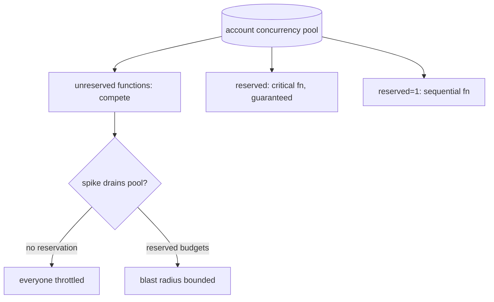

## Thesis

Keeping a serverless estate of a hundred-plus functions operable --- organized by business domain with a naming convention that makes logs browseable and IAM scopeable, the right concurrency model per function so one workload can't starve another or hammer a downstream, the trigger matched to the pattern, and the cold-start, VPC, and runtime-sprawl realities managed --- so serverless stays an asset instead of a hundred snowflakes drawing from one shared pool.

## Sub

**The inventory / sprawl problem** -> **domain organization and naming** -> **concurrency models: reserved, provisioned, shared** -> **zoom out** to cold starts, VPC, and triggers, and the pivots an interviewer rides from "just write a function" into how-to-organize, concurrency-as-isolation, and the cold-start reality.

## Spine

- Organize by **business domain, not technical concern** --- a naming convention (`org-lambda-domain-function-env`) so CloudWatch log groups are browseable and IAM policies are domain-scopeable, or a hundred functions become a hundred snowflakes.
- **Concurrency is the shared-fault-domain lever** --- every unreserved function draws from one account-wide pool, so reserved concurrency both caps a function (it can't starve the pool or hammer a downstream) and guarantees it slots; provisioned concurrency pre-warms for latency at a cost.
- **The trigger fits the pattern** --- synchronous (ALB / API Gateway) for request-response, asynchronous (SQS / EventBridge / S3 / Kinesis) for decoupled work, each with its own retry, ordering, and error semantics.
- The **operational realities bite at scale** --- cold starts (3-8s when VPC-attached), runtime deprecation across a hundred functions, and the account concurrency limit are what turn a single function into an estate to manage.

## Companion Notes

### walk

One function in a large estate

One event from invocation to a well-organized, concurrency-bounded function --- the cold start, the concurrency scale-out, the reserved cap that isolates, and the domain naming that keeps a hundred functions operable.

Say the shared pool first --- "every unreserved function draws from one account-wide concurrency pool." Reserved concurrency and most of the operational pain follow from that.

### drill

Probe Drill

Graded follow-ups on cold starts, concurrency, triggers, and the estate-scale realities --- the ones that separate "write a Lambda" from operating a hundred of them.

Name the noisy-neighbor: one unreserved function can throttle every other function in the account by draining the shared pool.

## Drill

SDE2 | the model and the mechanics
SDE3 | concurrency, triggers, and edges
Staff | operating the estate and org calls

### SDE2 | cold starts

What is a Lambda cold start?

The latency of the first invocation on a new execution environment --- Lambda has to spin up a container, load the runtime, and initialize your code before it can handle the event. A warm invocation reuses an already-initialized environment and skips all that. Cold starts hit after a scale-out or after idle, and they're much worse for VPC-attached functions (3-8 seconds), which is why they're a real concern for interactive endpoints.

### SDE2 | the concurrency model

How does Lambda concurrency work?

One execution environment handles one invocation at a time, so N simultaneous invocations means N environments running in parallel --- concurrency is just the number of in-flight invocations. Lambda scales environments up and down automatically to match the arrival rate. There's no threading model to reason about inside a function; you reason about how many copies run at once, which is what every scaling and isolation decision is really about.

### SDE2 | reserved concurrency

What is reserved concurrency?

A cap on how many concurrent environments a function may use --- it both *limits* the function (it can never exceed the cap) and *guarantees* it that much (the reservation is carved out of the account pool for it alone). You set it to stop a function from consuming the whole account's concurrency, to protect a fragile downstream from too many parallel calls, or to force sequential processing with a reservation of one.

### SDE2 | provisioned concurrency

What is provisioned concurrency, and when do you use it?

Pre-initialized environments kept warm and ready, so invocations skip the cold start entirely --- you pay to have N instances always warm. You use it for latency-sensitive interactive endpoints where a cold start is unacceptable. It's a cost decision: warm instances cost even when idle (roughly \$15 a month each), so many estates run zero provisioned concurrency and accept cold starts, especially where queue buffering hides them.

### SDE2 | sync vs async invocation

What's the difference between synchronous and asynchronous invocation?

**Synchronous** (ALB, API Gateway, a direct invoke) --- the caller waits for the response, and an error goes straight back to the caller; you handle retries client-side. **Asynchronous** (SQS, EventBridge, S3 events) --- the event is queued and the function processes it detached from any caller, so Lambda (or the source) owns retries and a dead-letter queue catches the failures. The trigger determines the error and retry semantics, so it's a design choice, not a detail.

### SDE2 | the account concurrency limit

What is the account concurrency limit?

A per-region ceiling on total concurrent Lambda executions across *all* your functions --- they share one pool. Every function without a reservation draws from it, so the pool is a shared resource. When demand exceeds the limit, invocations are throttled (sync callers get a 429; async events retry). This single shared limit is why one busy function can starve the others, and why reserved concurrency exists to carve out guarantees.

### SDE2 | organize by domain

How should you organize a large number of functions?

By **business domain, not technical layer** --- group the functions for pricing together, the functions for config rendering together, and name them consistently (`org-lambda-domain-function-env`). The domain prefix makes CloudWatch log groups browseable and lets IAM policies be scoped per domain. Organizing by technical concern (all the "handlers," all the "processors") scatters a feature across the estate and makes nothing findable or scopeable.

### SDE3 | concurrency as isolation

How does reserved concurrency give you isolation?

By turning the shared pool into partitioned budgets --- reserving concurrency for a critical function guarantees it always has room even when another function spikes, and capping a noisy function stops it from draining the pool and throttling everyone else. Without reservations, all functions compete for one limit, so a runaway function is an account-wide outage. Reserved concurrency is how you make the blast radius of one misbehaving function bounded instead of global.

### SDE3 | concurrency of one

How do you force sequential processing, and pick up work quickly anyway?

Set reserved concurrency to **1** --- only one invocation runs at a time, so updates to the same entity or ordered deployments can't overlap. The catch is responsiveness: with a single slot, you still want work picked up the instant the slot frees. The trick on an SQS source is to keep the event-source `maximum_concurrency` higher (say 10) --- multiple pollers race to deliver into the single Lambda slot, so a freed slot is filled immediately even though only one runs at a time.

### SDE3 | cold starts and VPC

Why are VPC-attached functions slower to cold start, and when does it matter?

Attaching a function to a VPC means Lambda must set up an elastic network interface into your subnets during initialization, which pushes cold starts to several seconds. Whether it matters depends on the trigger: on an ALB-fronted interactive endpoint, the first request after idle visibly stalls; on an SQS-triggered function, queue buffering absorbs the cold start because nothing is synchronously waiting. So you fix it where a human waits (provisioned concurrency, or avoid the VPC) and accept it where a queue hides it.

### SDE3 | async retries and DLQ

What happens when an asynchronous invocation fails?

Lambda retries it (a couple of times for async invokes, or the queue's redrive policy for SQS), and if it keeps failing the event goes to a dead-letter queue instead of being lost. So async processing is at-least-once with a safety net: transient failures are retried automatically, and poison events land in the DLQ for inspection rather than silently disappearing. You must configure the DLQ (or the failure destination), or repeatedly-failing events are dropped after the retries are exhausted.

### SDE3 | idempotency

Why must a Lambda triggered by a queue or stream be idempotent?

Because async and stream triggers are at-least-once --- a retry after a partial failure, or an SQS redelivery, can invoke your function twice for the same event. So processing the same event twice must be safe: an upsert keyed by the event id, or a dedup check before a side effect. This is the same at-least-once reality as any queue consumer; Lambda doesn't change it, and assuming exactly-once delivery is the bug.

### SDE3 | fan-out and downstream throttling

What's the classic way a Lambda fan-out breaks a downstream?

A trigger with high parallelism --- a Kinesis stream with many shards, or a burst of SQS messages --- scales Lambda out to hundreds of concurrent environments, each opening a connection to the same database, and the database falls over from the connection storm. The fix is reserved concurrency as a throttle: cap the function so the fan-out can't exceed what the downstream can take. Serverless scales so easily that the bottleneck moves to whatever it calls, and concurrency is the lever that protects it.

### SDE3 | memory and CPU

How do you size a Lambda's memory, and why does it affect CPU?

Right-size by measuring --- start around 256MB, watch `MaxMemoryUsed`, raise it if p99 exceeds ~80% of the allocation and lower it if it's under ~40%. The non-obvious part is that **CPU scales with memory**: a 256MB function gets a fraction of a vCPU, a ~1800MB function gets about a full one. So a CPU-bound function (crypto, compression, image work) is sped up by allocating *more memory* even if it doesn't need the RAM --- you're really buying CPU, and sometimes more memory is cheaper because the function finishes faster.

### Staff | operating a hundred functions

What does it take to keep an estate of 100+ functions operable?

Discipline that scales: **domain-based organization** so related functions live together, a **strict naming convention** (`org-lambda-domain-function-env`) that makes log groups browseable and IAM domain-scopeable, right-sized memory per function, and per-function concurrency budgets. The failure mode is a hundred inconsistent snowflakes --- no one can find the function behind an incident, IAM is either too broad or unmanageable, and the shared concurrency pool is a free-for-all. The organizing scheme is the difference between an estate and a sprawl.

### Staff | the shared pool as a fault domain

Why is the account concurrency limit a fault domain, and how do you contain it?

Because every unreserved function draws from the one account-wide pool, a single function that suddenly spikes --- a bad deploy, a retry storm, a runaway trigger --- can consume the entire limit and throttle every other function in the account, turning one function's problem into an account-wide outage. You contain it by reserving concurrency for critical functions (guaranteeing them room) and capping high-risk ones (bounding their draw), so the pool is partitioned into budgets and no single function can starve the rest. Unbudgeted, concurrency is a shared single point of failure.

### Staff | when Lambda is wrong

When is Lambda the wrong tool at scale?

For **long-running** work (past the execution timeout, or where per-invocation overhead dominates), for **steady high-throughput** workloads where always-on containers are cheaper than paying per invocation and fighting cold starts, and for **latency-critical** paths where the cold-start tax is unacceptable and provisioned concurrency erases the cost advantage. Lambda wins for spiky, event-driven, or bursty work; a persistent workload at constant high load usually belongs on containers (ECS/Fargate) where you're not paying the serverless premium for elasticity you don't use.

### Staff | runtime and dependency sprawl

What's the operational tax of runtimes and dependencies across a large estate?

Runtime deprecation becomes a fleet problem --- when a runtime (say Node 16) is force-deprecated, every function on it must be upgraded before AWS stops running it, and at a hundred functions that's a coordinated migration, worst for the "works, don't touch it" functions no one has opened in a year. The runtime bump itself is usually backward-compatible and cheap; the real work hides in the *legacy patterns* those old functions carry --- secrets in KMS-encrypted config instead of a config service, no structured logging --- so the migration is as much about modernizing patterns as changing a version string.

### Staff | observability across functions

How do you get observability across a large fan-out of functions?

Correlation and consistent naming. A request that fans out across several functions needs a **trace/correlation id propagated through every event** (in the message attributes) so the pieces reassemble into one trace, and the **naming convention** groups each domain's logs so you can actually find them. Without the propagated id, a hundred functions are a hundred disconnected log streams and you can't follow one request; without the naming discipline, you can't even locate the right log group. This is where the estate meets observability: the organizing scheme *is* what makes it debuggable.

### Staff | function granularity

One function per task, or a fatter function handling many routes?

The trade is isolation versus sprawl. **Fine-grained** (a function per task) gives independent scaling, least-privilege IAM per function, and a small blast radius, at the cost of more functions to operate and more cold-start surfaces. **Coarser** (one function routing many paths, or a small monolith-in-Lambda) means fewer deploys and warmer instances, but a bigger blast radius and broader permissions. Most estates land in the middle --- grouped by domain, split where scaling profiles or security boundaries genuinely differ --- rather than dogmatically one-function-per-route.

### Staff | deploying the estate

How do you deploy and version a hundred functions safely?

Everything as code --- the functions, their triggers, concurrency, and IAM defined in IaC (Terraform, SAM, or CDK) so the estate is reproducible and reviewable, not click-configured. For a risky function you publish an immutable **version** and shift a **weighted alias** gradually (a canary), so a bad deploy is caught at a small traffic share and rolled back by moving the alias, not by redeploying. At a hundred functions, manual deploys and mutable, unversioned code are how you get drift and un-rollbackable incidents; versioned, alias-routed, IaC-managed deploys are what make change safe at fleet scale.

## Walk

### An event invokes a function --- cold or warm

```flow
e[event arrives] -> c[cold: new env inits] -> w[warm: reuse env]
```

An invocation either lands on a fresh execution environment --- which must spin up the container, load the runtime, and initialize your code before handling the event --- or reuses a warm one and skips all that. Cold starts hit after a scale-out or after idle.

The tax is much heavier when the function is VPC-attached, because Lambda has to set up a network interface into your subnets, pushing cold starts to 3-8 seconds. Whether that matters depends entirely on who's waiting: a person on an interactive endpoint feels it; a queue behind an async trigger hides it.

### Concurrency scales out --- one environment per concurrent invocation

```flow
n[N concurrent invocations] -> i[N environments] -> p[drawn from one account pool]
```

Each environment handles one invocation at a time, so N simultaneous invocations run as N parallel environments. Lambda scales them to match arrival rate --- and crucially, every unreserved function draws from a single account-wide concurrency pool.

That shared pool is the root of most estate-scale pain: when total demand exceeds the account limit, invocations throttle (sync callers get a 429, async events retry), and one busy function drawing heavily can starve every other function. Reasoning about "how many copies run at once" against that shared ceiling is the core of every scaling and isolation decision.

### Reserved concurrency isolates and protects downstream

```flow
r[reserve/cap a function] -> g[guaranteed room] -> d[downstream shielded]
```

Reserved concurrency partitions the shared pool into budgets. Reserving for a critical function guarantees it room even when another spikes; capping a function bounds its draw so it can't drain the pool or overwhelm a fragile downstream with too many parallel calls.

A reservation of **one** forces sequential processing --- no overlapping updates to the same entity, ordered deployments. To stay responsive with a single slot, an SQS source keeps `maximum_concurrency` higher (say 10) so several pollers race to fill the one slot the instant it frees. And a high-fan-out trigger (a Kinesis stream with many shards) is exactly where an uncapped function opens hundreds of database connections and topples it --- so the cap is the fan-out throttle.

### Organize the estate by domain

```flow
dn[domain naming] -> lg[browseable log groups] -> iam[domain-scoped IAM]
```

At a hundred functions, the organizing scheme is what keeps it operable. Group functions by business domain and name them consistently, so a domain prefix makes log groups browseable and IAM policies scopeable per domain.

```bash
# {org}-lambda-{domain}-{function}-{env} -- domain prefix -> browseable logs, scopeable IAM
app-lambda-fps-update-prices-prod      # pricing domain
app-lambda-rnds-render-template-prod   # config-rendering domain
app-lambda-cron-dispatch-prod          # core scheduling
```

The alternative --- organizing by technical concern, or letting names grow ad hoc --- scatters a feature across the estate, makes the function behind an incident unfindable, and forces IAM to be either dangerously broad or unmanageably granular. The naming convention is not cosmetic; it's what makes a hundred functions navigable, debuggable, and secure.

### Model Script

- Frame the shared pool | "The thing that makes serverless at scale different is that every function without a reservation draws from one account-wide concurrency pool. So a hundred functions aren't a hundred independent things -- they share a fault domain. One runaway function can drain the pool and throttle everyone. Most of the operational discipline follows from that."
- Concurrency as the lever | "Reserved concurrency is how I partition that pool into budgets: reserve for a critical function so it always has room, cap a risky one so it can't starve the rest or hammer a downstream. A reservation of one forces sequential processing -- and on SQS I keep the event-source maximum_concurrency higher so pollers race to fill the single slot and pickup stays fast."
- Cold starts and triggers | "Cold starts are the other reality -- 3 to 8 seconds when VPC-attached, because of the network interface setup. Whether it matters is about who's waiting: I'll pay for provisioned concurrency on an interactive ALB endpoint, but accept cold starts on an SQS-triggered function because queue buffering hides them. The trigger also sets the retry semantics -- sync errors go to the caller, async gets retries and a dead-letter queue -- and at-least-once delivery means the function has to be idempotent."
- Organizing the estate | "At a hundred functions the organizing scheme is the whole game. I group by business domain, not technical layer, with a strict name -- org-lambda-domain-function-env -- so log groups are browseable and IAM is domain-scopeable. Right-size memory by measuring, remembering CPU scales with memory so a CPU-bound function gets faster with more RAM. And runtime deprecation is a fleet migration, where the real work is modernizing the legacy patterns the old functions carry, not the version bump."
- Interviewer: "A downstream database keeps getting overwhelmed by one of your stream processors. What do you do?"
- Contain the fan-out | "That's the classic serverless failure -- the stream has many shards, Lambda scales out to hundreds of concurrent environments, and each opens a connection, so the database dies from the connection storm. I cap that function's reserved concurrency to what the database can take. Serverless scales so easily that the bottleneck moves to whatever it calls, and concurrency is the throttle that protects the downstream -- possibly with connection pooling (RDS Proxy) on top."
- Land it | "So: it's an estate, not a pile of functions -- organized by domain with a naming convention that makes it navigable and scopeable, concurrency budgeted so the shared pool isn't a single point of failure, cold starts managed by who's waiting, triggers chosen for their retry semantics with idempotent handlers, and runtime sprawl migrated as a fleet. The one line is that at scale the discipline -- naming, concurrency budgets, right-sizing -- is what turns serverless from a hundred snowflakes back into an asset."

## Whiteboard

Sketch the shared pool and where reserved concurrency partitions it.

### What do all the functions share?

One account-wide concurrency pool -- every unreserved function draws from it, so a spike in one can throttle the rest.

### What does reserved concurrency do?

Partitions that pool into budgets -- guarantees room for critical functions and caps risky ones, bounding a runaway function's blast radius.



Verdict: the shared pool is the fault domain; reserved concurrency partitions it into budgets so one function can't starve the estate, and a reservation of one forces ordering.

## System

Zoom out to where a function sits in the estate and its infrastructure.

### Where it sits

Trigger: ALB (sync) or SQS/EventBridge/S3/Kinesis (async) [*]
The function: one environment per concurrent invocation
Account concurrency pool: shared across all functions, partitioned by reservations
Downstream: databases and APIs the fan-out can overwhelm
Estate conventions: domain naming, IAM scoping, right-sized memory

### Pivots an interviewer rides

From "just write a function" they push on organization, concurrency, and cold starts.

#### How do you organize a hundred functions?

-> by business domain with a naming convention, so logs are browseable and IAM scopeable
Grouping by domain (not technical layer) and naming as org-lambda-domain-function-env keeps the estate navigable, debuggable, and least-privilege. Ad hoc naming turns it into an unmanageable sprawl.

#### The downstream is getting hammered by a fan-out. What do you do?

-> cap the function's reserved concurrency to what the downstream can take
A high-fan-out trigger scales Lambda to hundreds of environments, each hitting the downstream; reserved concurrency is the throttle that bounds the parallelism, often with connection pooling on top.

## Trade-offs

The calls that separate "write a Lambda" from operating an estate.

### Reserved vs unreserved concurrency

- Reserved: guarantees a function room and caps its draw, isolating it -- but carves capacity out of the shared pool whether used or not
- Unreserved: flexible, shares the whole pool -- but competes with every other function, so one spike can throttle all

Reserve for critical functions and cap risky ones; leave the steady, low-risk majority unreserved to share the pool efficiently.

### Provisioned concurrency vs accepting cold starts

- Provisioned: no cold start, predictable latency -- but a standing cost (~\$15/month per instance) even when idle
- Accept cold: no idle cost -- but 3-8s first-request latency when VPC-attached

Provision only where a human waits (interactive endpoints); accept cold starts where queue buffering hides them, which is most async work.

### Lambda vs containers at scale

- Lambda: zero-idle cost, auto-scaling, great for spiky and event-driven work -- but cold starts and a per-invocation premium at constant load
- Containers (ECS/Fargate): always warm, cheaper at steady high throughput, no timeout ceiling -- but you manage capacity and pay for idle

Use Lambda for bursty, event-driven workloads; move steady high-throughput or long-running work to containers where the serverless premium buys nothing.

## Model Answers

### the shared pool | Concurrency is the fault domain

The frame to lead with.

- One account-wide pool | key | every unreserved function draws from it
- Reserved partitions it | store | guarantee critical, cap risky
- Reservation of one | note | forces ordering; SQS pollers keep pickup fast

### the estate | Organize or sprawl

What makes a hundred functions operable.

- Domain naming | key | org-lambda-domain-function-env
- Browseable + scopeable | store | log groups and IAM per domain
- Right-size by measuring | note | and CPU scales with memory

## Numbers

Back-of-envelope the estate scale and the shared-pool and cold-start realities.

Every unreserved function shares one account concurrency pool; cold-start exposure depends on the trigger, and provisioned concurrency trades idle cost for latency.

- fns | Functions | 108 | 0 | 10
- accountLimit | Account concurrency | 1000 | 0 | 100
- coldMs | VPC cold start (ms) | 5000 | 0 | 500

```js
function (vals, fmt) {
  var fns = vals.fns, accountLimit = vals.accountLimit, coldMs = vals.coldMs;
  return [
    { k: 'Functions to operate', v: fmt.n(fns), u: 'functions', n: 'past ~100 functions organization stops being optional \u2014 domain naming, IAM scoping, and browseable log groups are what keep it operable', over: fns > 500 },
    { k: 'Shared concurrency pool', v: fmt.n(accountLimit), u: 'concurrent', n: 'every unreserved function draws from this one account-wide pool \u2014 one runaway function can starve all the others, which is why reserved concurrency exists', over: false },
    { k: 'Cold-start exposure', v: fmt.n(coldMs), u: 'ms', n: 'VPC-attached Node cold starts in this range \u2014 noticeable on an ALB-fronted first request, hidden by queue buffering for an SQS-triggered one', over: coldMs > 3000 },
    { k: 'Reserve to protect', v: 'per-function cap', u: '', n: 'a reserved-concurrency cap both guarantees a function room AND stops its fan-out hammering a downstream \u2014 concurrency is the throttle', over: false },
    { k: 'Provisioned cost', v: '~$15/mo', u: 'per instance', n: 'keeping instances warm is a standing cost, so zero-provisioned and accept-cold is a valid decision wherever queue buffering hides the cold start', over: false }
  ];
}
```

## Red Flags

What makes an interviewer wince.

### "We don't set reserved concurrency -- functions just scale as needed"

Then every function competes for one account-wide pool, and one spiking function throttles the entire account -- a single function's problem becomes an outage.

Reserve concurrency for critical functions and cap high-risk ones, so the pool is partitioned into budgets and a runaway function's blast radius is bounded.

### "Lambda scales automatically, so the database will be fine"

A high-fan-out trigger scales Lambda to hundreds of concurrent environments, each opening a connection -- the database dies from the connection storm.

Cap the function's reserved concurrency to what the downstream can absorb, and pool connections (RDS Proxy); serverless moves the bottleneck to whatever it calls.

### "We'll just add provisioned concurrency everywhere to kill cold starts"

Provisioned concurrency is a standing per-instance cost even when idle, so blanket provisioning erases the whole zero-idle-cost advantage of serverless.

Provision only where a human waits; accept cold starts where queue buffering hides them, which covers most async, event-driven functions.

## Opener

### 30s | The one-liner

How I open when asked about running many Lambdas.

#### What is the shape?

An estate, not a pile: functions grouped by domain with a naming convention that makes logs browseable and IAM scopeable, and concurrency budgeted against the one shared account pool.

#### What is the core risk?

The shared concurrency pool is a fault domain -- one unreserved function can throttle the whole account -- so reserved concurrency partitions it into budgets.

##### Hooks

Where an interviewer usually pushes next.

- Organize a hundred? | domain naming + IAM scoping | drill
- Fan-out kills the DB? | cap reserved concurrency | drill
- Cold starts? | who is waiting decides | trade

Foot: two sentences -- concurrency is the shared fault domain that reservations partition, and at scale the naming and organization discipline is what keeps it operable.

## Bank

### SCALE | A hundred-plus functions on one account concurrency pool

Task: reason about the shared-pool risk and how to bound it.
Model: every unreserved function draws from one account-wide limit, so a spike in one throttles the rest; reserved concurrency partitions the pool into budgets (guarantee critical, cap risky), and domain naming keeps the estate navigable and IAM scopeable.
Int: what's the single biggest estate-scale risk?
The shared concurrency pool as a fault domain -- one runaway function taking down the account.

### DESIGN | A stream processor is overwhelming its database

Task: design the fix for a high-fan-out Lambda toppling a downstream.
Model: the many-shard stream scales Lambda to hundreds of concurrent environments each opening a connection; cap the function's reserved concurrency to the downstream's capacity, add connection pooling (RDS Proxy), and make the handler idempotent for the at-least-once retries.
Int: why does this happen so easily with serverless?
Because it scales out effortlessly, so the bottleneck moves to whatever it calls -- concurrency is the throttle that protects it.

### Extra Curveballs

### CURVEBALL | ordering | You need updates to the same entity processed strictly in order, but still picked up fast. How?

Model: set the function's reserved concurrency to 1 so only one invocation runs at a time and updates can't overlap -- and on the SQS event source keep maximum_concurrency higher (e.g. 10) so multiple pollers race to fill the single Lambda slot the instant it frees, keeping pickup fast despite the single-slot serialization. Sequential processing without sacrificing responsiveness.

### Frames

- It's an estate: domain naming makes logs browseable and IAM scopeable
- The shared concurrency pool is a fault domain; reserved concurrency partitions it
- Cold starts and triggers are about who's waiting and the retry semantics
