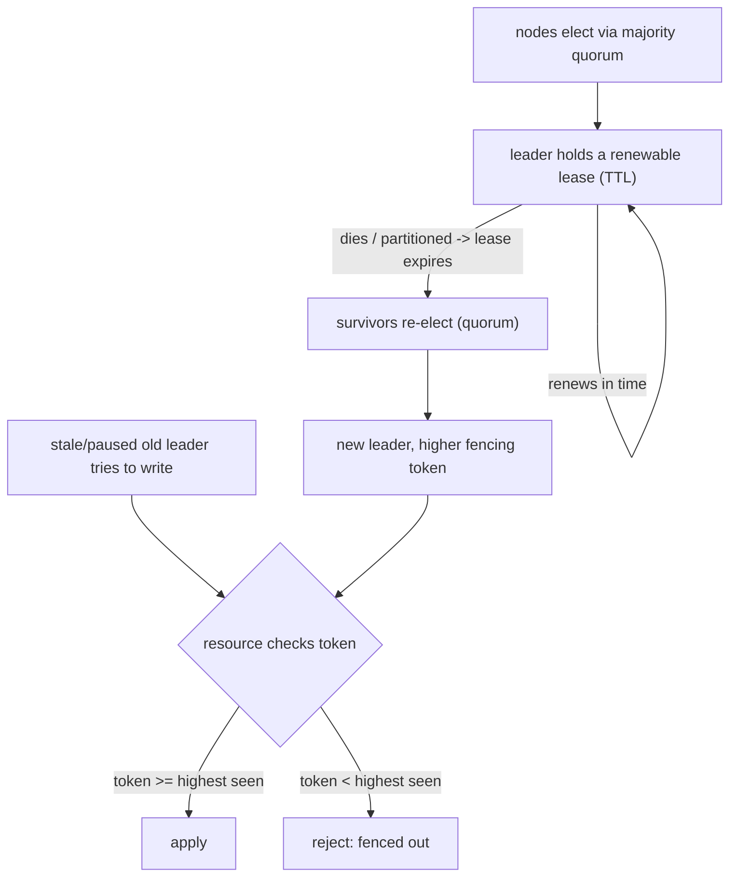

## Thesis

Choosing a single node among many to act as the coordinator --- the one that serializes writes, is the single source of truth, or drives a workflow --- and reliably re-choosing when it fails, so that exactly one node holds the role at a time; the hard part is doing this correctly under network partitions and process pauses, where naive approaches produce two leaders at once (split-brain), which is why real systems use consensus (a majority quorum) plus time-bounded leases and fencing tokens to guarantee at-most-one active leader.

## Sub

**Why: some work must be done by exactly one node** -> **electing a leader by majority quorum, held via a lease** -> **failure, re-election, and split-brain / fencing** -> **zoom out** to the at-most-one safety guarantee, the safety-vs-availability trade, and the pivots an interviewer rides from "who's in charge" into why you need a leader, how election works, and split-brain.

## Spine

- Some responsibilities need **exactly one node** --- serializing writes to avoid conflicts, being the single source of truth, coordinating/scheduling, or avoiding duplicated work --- so you elect a **leader** (primary / master / coordinator) that holds the role while the others follow or stand by.
- Election requires **agreement under failure** --- the nodes must agree on who leads even as nodes crash and the network partitions, which is a **consensus** problem; correct systems require a **majority quorum** to elect (so a minority partition can't elect its own leader), via Raft/Paxos or a coordination service (ZooKeeper/etcd).
- The failure to prevent is **split-brain** --- a partition or a stalled leader can leave **two nodes both believing they lead**, each accepting writes and corrupting state; the defenses are **leases** (leadership is time-bounded and must be renewed, so a stalled leader's lease expires) plus **fencing tokens** (a monotonically increasing leadership number that lets downstream resources reject a stale leader).
- Leadership is a **safety-vs-availability trade** --- requiring a quorum and leases guarantees at-most-one leader (safety) but makes the system briefly unavailable for coordinated writes during the election window after a failure; you tune the timeouts to balance fast failover against false failovers (flapping).

## Companion Notes

### walk

Electing exactly one coordinator

A cluster where one node must serialize the work --- why you need a single leader, how a majority quorum elects one under failures, what happens when it dies, and how leases plus fencing tokens prevent the two-leaders-at-once catastrophe that a naive election allows.

Say the safety goal first --- "at most one active leader, ever." Everything else (quorum, leases, fencing) exists to hold that guarantee under partitions and process pauses, where the naive "just pick a node" approach produces split-brain.

### drill

Probe Drill

Graded follow-ups on quorum, leases, fencing tokens, and split-brain --- the ones that separate "we have a primary" from an election that stays correct when the network partitions and the old leader comes back thinking it's still in charge.

Name the guarantee and its three pillars: at-most-one active leader, via a majority quorum (a minority can't elect), a time-bounded lease (a stalled leader expires), and a fencing token (a stale leader gets rejected downstream).

### wb

Whiteboard

Rebuild the whole election path from memory --- the cues, nothing in front of you: why a leader, why a quorum, how the lease expires, and where the fencing token is actually checked.

Draw the resource last and circle it --- that box is where safety really lives. Quorum decides who is elected; only the resource decides whose write takes effect.

### sys

System Map

Zoom out: a leader sits between a pile of interchangeable candidates and the one resource that must only ever have a single writer.

Lead with the guarantee, not the algorithm --- "at most one node can act" --- then let quorum, lease and fencing fall out of it as the three things that make it true.

### trade

Trade-offs

The calls they drill --- timeout length, buy-vs-build the consensus store, one global leader vs sharded, lease-only vs fenced --- each with the condition that flips it.

Never defend a timeout number in the abstract. Say what it trades: shorter means faster failover and more flapping, longer means a stabler cluster and a longer outage.

### model

Model Answers

Full spoken scripts --- the beats, in order, the way you would actually say them under time pressure.

Steal the frame, not the words: quorum, lease, fencing --- three layers, three different holes --- then name the pause as the one a lease cannot close.

### num

Numbers

Back-of-envelope the quorum, the fault tolerance, the failover time --- and the one number that proves you need fencing.

Lead with the pause-versus-lease comparison. When the worst-case pause outlasts the lease, the lease is provably not enough, and that number is the whole argument for a fencing token.

### rf

Red Flags

What sinks the round --- electing without a quorum, trusting a lease alone, running two nodes "for HA" --- and what to say instead.

Name what the interviewer hears. "Each node decides for itself when to take over" is heard as "this design split-brains on the first partition," and the round is effectively over.

### open

30-Second

The opener and the close --- matched to the altitude the question was asked at.

Match the altitude: open on the guarantee (at most one node can act), not on Raft. The algorithm is the mechanism; the guarantee is the answer.

## Drill

all | **All four levels, mixed** --- the way a real loop actually comes at you.
SDE2 | **Why a leader, and split-brain** --- what the role is, why agreement is hard, and what two leaders do to your data. The bar is "this is a real safety problem, not a config flag": say *at most one node can act* and mean it.
SDE3 | **Election, leases, and fencing** --- terms and votes, the lease that expires, the token the resource checks. The bar is "I know which mechanism closes which hole": name the pause-then-resume gap a lease provably cannot close.
Staff | **Consensus, scaling, and the clock** --- why this *is* consensus, why sharding leadership is the only way it scales, and why time is the thing you cannot trust. The bar is "I see the failure before it ships": safety lives at the resource, not in the leader's belief.

### SDE2 | what leader election is

What is leader election and why do you need it?

Leader election is the process by which a group of nodes **agrees on a single node** to act as the coordinator ("leader"), and re-agrees when that node fails. You need it whenever some work must be done by **exactly one node at a time** --- for example, one node that serializes all writes (so concurrent updates don't conflict), one node that's the authoritative source of truth, one node that schedules or coordinates work (so tasks aren't done twice), or one node that owns a resource. Without a designated leader, multiple nodes might all try to do the coordinating work simultaneously, producing conflicts, duplicates, or inconsistency. So leader election gives you a single point of coordination while keeping the *system* fault-tolerant (if the leader dies, another is elected) --- you get the simplicity of a single coordinator without a permanent single point of failure.

Follow: You said "exactly one node at a time." Can you actually guarantee that --- that at no instant do two nodes both think they're the leader?
No --- and being honest about that is the whole topic. Failure detection over an asynchronous network is unreliable, so two nodes genuinely *can* simultaneously **believe** they lead: a partitioned leader simply hasn't found out yet. What you guarantee is different, and it's the precise thing to say: **at most one leader can *act***. A quorum bounds who can be **elected**; a fencing token bounds whose writes **take effect** at the resource. The safety property is about **effect**, not belief --- and a candidate who claims "only one node ever thinks it's the leader" is claiming something no distributed system delivers.

Follow: Why not avoid a leader entirely --- let every node do the work?
You can, and sometimes you should. If the work **commutes** --- append-only logs, CRDTs, independent idempotent tasks --- then a **leaderless** design (Dynamo-style, quorum reads and writes) is genuinely better: no election, no failover window, no bottleneck. You need a leader precisely when the work **does not commute**: ordering writes, allocating a unique resource, driving a workflow that must run once. So the first question I'd actually ask is "**does this work need serializing at all?**" --- because a leader is a cost (a failover window, a bottleneck, a whole class of split-brain bugs) that you should only pay when the answer is yes.

Senior: Refusing the phrase "exactly one node is the leader" and replacing it with "**at most one node can act**" --- because it shows you know failure detection is unreliable and that safety is enforced at the resource, not by the election. Most candidates never make that distinction; it is the frame the whole topic hangs on.
Speak: Lead with the *why*, not the *how*: "some work needs exactly one doer, so you elect a coordinator --- and re-elect on failure, so you get a single coordinator without a permanent single point of failure." Then, before they push, tighten it yourself: **the guarantee is at-most-one *active* leader, not at-most-one node that believes it leads.**

### SDE2 | what a leader does

What kinds of things does the leader actually do?

Anything that benefits from a single decision-maker. **Serialize writes**: in a primary/replica database, the primary (leader) accepts all writes and orders them, so replicas apply a single consistent sequence --- no write conflicts. **Coordinate/schedule**: a leader assigns work to workers, decides partitioning, or runs periodic jobs exactly once (rather than every node running the cron and duplicating it). **Own a resource exclusively**: the leader holds a lock or is the only one allowed to act on some external system. **Be the source of truth for cluster metadata**: the leader decides membership, configuration, or the current state. Concrete examples: a database primary; the active instance of an HA service (only one instance processes, the others stand by); a Kubernetes controller (only the elected leader reconciles, so controllers don't fight); a saga orchestrator (exactly one instance drives each workflow). The common thread is "a job where having two doers causes conflict or duplication."

Follow: You named a Kubernetes controller. If two controllers *did* both reconcile, what actually breaks --- isn't reconciliation idempotent anyway?
Often it is, which is exactly why Kubernetes survives brief overlap --- but "idempotent" is not the same as "**safe to run concurrently**." Two reconcilers can interleave a read-modify-write on the same object and clobber each other, or both act on a *stale* read and scale a Deployment to two different replica counts, or duplicate an **external** side effect (provisioning two cloud load balancers). What actually saves Kubernetes is that every write to the API server is a **conditional update guarded by `resourceVersion`** --- optimistic concurrency. A stale controller's write is rejected with a conflict, and it re-reads and reconciles again. That conditional write **is a fencing token by another name.** So the honest framing is: overlap is tolerable *because* the write path is conditionally guarded --- not because the leadership is airtight.

Follow: Of those jobs, which is the most dangerous to double-run?
Anything with an **external, non-idempotent side effect** --- charging a card, issuing a payout, provisioning hardware, cutting a release, sending mail to a customer list. Internal state you can nearly always protect with a conditional write or a version check; an external effect you often **cannot take back**. So I'd rank the danger by the **reversibility of the side effect**, not by how important the job feels. A duplicated cron that recomputes a cache is a non-event; a duplicated cron that emails fifty thousand customers is an incident with a postmortem. That ranking also tells you *where* to spend the fencing effort: on the irreversible edges.

Senior: Volunteering that Kubernetes only survives controller overlap because `resourceVersion` conditional writes fence the API-server writes --- i.e. spotting a fencing token wearing a different hat --- and then generalizing it to "**rank the risk by reversibility of the side effect.**" That is systems judgment, not trivia.
Speak: Give one sentence of taxonomy, then one sharp example: "**anything where two doers cause conflict or duplication** --- ordering writes, running a cron once, driving a saga." Then land the operational point: "and the one I'd actually protect hardest is the **irreversible external side effect** --- a duplicate cache rebuild is free, a duplicate payout is an incident."

### SDE2 | the basic problem

What makes electing a leader hard?

Getting **all the nodes to agree** on who the leader is, *despite failures* --- nodes crashing, messages being lost or delayed, and the network partitioning. In a perfect network you could just pick the node with the lowest ID; the difficulty is that the moment nodes can't reliably communicate, they can disagree about who's alive and who leads. If node A can't reach node B, is B dead (elect a new leader) or just unreachable-but-alive (still the leader)? Getting this wrong in *either* direction is bad: declare a live leader dead and you might end up with two leaders; fail to detect a dead leader and the system stalls with no coordinator. So leader election is fundamentally a **distributed agreement (consensus) problem under uncertainty** --- the nodes must converge on one leader even though they have only partial, possibly-stale information about each other, which is exactly why naive approaches fail and real systems lean on consensus algorithms.

Follow: You said you can't tell "B is dead" from "B is slow." Is that a practical limitation or a theoretical one?
**Theoretical**, and that matters because it means no amount of engineering removes it. In a genuinely asynchronous network there is no timeout that is provably long enough --- a message can always be one millisecond slower than you waited. That is the heart of the **FLP** result: in an asynchronous system with even one possible crash failure, no deterministic algorithm can guarantee consensus *terminates*. Real systems escape it by assuming **partial synchrony**: they use timeouts as an admittedly imperfect failure detector and accept that a false positive costs an unnecessary election. So the guarantee Raft actually makes is precise and worth quoting: **safety always, liveness only when the network eventually behaves.** It will never elect two leaders; it *can* fail to elect any.

Follow: So the timeout is a guess. What happens when the guess is wrong in each direction?
Too **short**: you declare a live leader dead, elect a new one, and pay a needless failover --- and in the bad case **flapping**, where leadership bounces between nodes and every transition is a mini-outage. Too **long**: a genuinely dead leader goes unnoticed for that whole window, and coordinated writes stall the entire time. Here's the part that scores: **both of those are availability costs, not correctness costs.** A badly tuned timeout makes the system slow or twitchy; it never makes it *unsafe*, because quorum and fencing hold no matter what the timeout is. That's the separation I'd say out loud --- **timeouts tune liveness; quorum and fencing hold safety** --- and it's why I'd never try to fix a split-brain bug by adjusting a timeout.

Senior: Naming **FLP** and then drawing the *engineering* consequence from it --- "safety always, liveness only under partial synchrony," therefore **timeouts tune liveness and never buy safety.** Candidates who have only read about Raft describe the timeout; candidates who understand it know that no timeout value can ever be the fix for a correctness bug.
Speak: Frame it as an epistemics problem, not a networking one: "the hard part isn't electing --- it's that **you cannot tell a dead node from a slow one**, ever, and if you guess wrong in one direction you get two leaders and in the other you stall." Then the payoff line: "so I tune timeouts for *liveness*, and I get *safety* from quorum and fencing --- never from the timeout."

### SDE2 | when the leader fails

What happens when the leader fails?

The other nodes **detect the failure and elect a new leader** --- that's the whole point of election being a *repeatable* process, not a one-time setup. Detection is usually via **heartbeats/lease expiry**: the leader periodically signals it's alive (or renews a lease), and if the followers stop hearing from it for a timeout, they consider it dead and start a new election. A new leader is chosen (by quorum), it takes over the coordinating role, and the system continues. The critical subtlety is the **window** between "old leader failed" and "new leader elected and active" --- during that window there's no leader, so coordinated writes pause (a brief unavailability), which is the price of ensuring you don't elect a second leader prematurely. And you must ensure the *old* leader, if it wasn't really dead (just slow/partitioned), doesn't keep acting as leader after a new one is elected --- which is the split-brain problem.

Follow: During that leaderless window, what should a client actually see?
An **explicit, retryable failure** --- not a hang, and above all not a wrong answer. Coordinated writes should fail fast with something like "no leader, retry," the client backs off and retries, and a well-behaved client rediscovers the new leader (any node can redirect to the current one, or the client re-reads the lease holder from the store). Reads may keep working, depending on the consistency you promise. What you must **never** do is let some node serve the write anyway "to stay available" --- that is precisely the availability-over-safety trade that manufactures split-brain. The honest posture for the window is: **unavailable for coordinated writes, and still correct.** An interviewer is listening for whether you'll trade correctness for uptime under pressure, and the answer is no.

Follow: How do you shorten that window without making false failovers more likely?
Attack the parts of it that **aren't** the timeout. The window is roughly **detection + election + the new leader catching up**, and only the first term is the flapping trade. So: keep followers **hot and caught up**, so the new leader has nothing to replay before it can serve; use **randomized election timeouts** so a split vote doesn't cost you a second full round; add **pre-vote** so a rejoining node can't trigger a spurious election. And crucially, for a *planned* event --- a deploy, a restart --- don't wait for a timeout at all: have the leader **step down deliberately** and hand off to a caught-up follower, which turns a multi-second failover into a sub-second one. Most of the failover time people complain about is planned restarts paying the unplanned-failure price.

Senior: Separating the failover window into **detection + election + catch-up** and observing that only *detection* is bound by the flapping trade --- so the way to fast failover is hot standbys, randomized timeouts, pre-vote and **graceful leadership handoff on planned restarts**, not a shorter timeout. That reframes "make failover faster" from a dangerous knob into an engineering plan.
Speak: Be concrete about the sequence: "heartbeats stop, the lease expires, the survivors re-elect by quorum, the new leader catches up and serves." Then own the cost instead of hiding it: "there is a real window where coordinated writes are **unavailable --- and that's correct.** I'd rather return 'no leader, retry' than let some node write to stay up, because that's how you get two leaders."

### SDE2 | what split-brain is

What is split-brain?

The dangerous state where **two (or more) nodes simultaneously believe they are the leader**, and both act on it --- both accepting writes, both coordinating --- which corrupts state (conflicting writes, duplicated actions, divergent history). It typically arises from a **network partition**: the cluster splits into two groups that can't see each other, and each group, thinking the other side is dead, elects (or retains) its own leader. Now you have two leaders, each serving its side, and when the partition heals their divergent states conflict. It can also arise from a **slow or paused leader**: the old leader is briefly frozen (a long GC pause), the others time it out and elect a new leader, then the old one resumes and --- not knowing it was replaced --- keeps acting as leader. Split-brain is *the* failure mode leader election must prevent, because a system with two leaders is worse than a system with none: no-leader stalls (recoverable), but two-leaders silently corrupts data.

Follow: Both sides of the partition took writes. The partition heals. What now?
This is the ugly part, and the honest answer is that **there is no automatic, always-correct recovery** --- you have two divergent histories and you must either lose one or merge them. In order of honesty: (1) **Prevent it** --- which is the entire reason quorum exists; the minority side never accepted a write, so there is nothing to reconcile. (2) If it happened anyway, **pick a winner and discard the loser's writes** (majority side wins, or last-write-wins) --- that is real, acknowledged data loss that you have to be able to explain to whoever lost their write. (3) **Keep both and merge** --- only possible if the data type is conflict-free (a set union, a counter CRDT, an append-only log). So the reason split-brain is *the* headline failure isn't that it's likely; it's that **recovery is lossy or impossible.** The whole design exists to never arrive here.

Follow: Why is two leaders worse than zero leaders? Zero leaders is a total outage.
Because **zero leaders is a loud, recoverable failure and two leaders is a silent, unrecoverable one.** With no leader: writes stop, the system is visibly down, you find out in seconds, **nothing is corrupted**, and when a quorum returns you continue from a consistent state. With two leaders: the system looks *healthy* --- both sides accept traffic, both return success, both report green --- and they quietly diverge. You find out hours later from a customer, and by then the damage is durably committed. That asymmetry is exactly why these systems choose **CP over AP for the leadership decision**: an outage is a bad afternoon; corrupted data is a bad quarter, and sometimes it is unrecoverable. "Two leaders is worse than none" is the sentence I'd want the interviewer to remember.

Senior: Explaining *why* recovery from split-brain is lossy --- two divergent histories, so you either discard writes or need a conflict-free data type --- and then drawing the asymmetry: **a stall is loud and recoverable, divergence is silent and permanent.** That's what justifies choosing unavailability, which is the trade the interviewer is really probing.
Speak: Define it in one line, then immediately give the asymmetry, because that's the memorable part: "two nodes both think they lead, both write, and the state diverges. And **two leaders is worse than none** --- no leader stalls, which is loud and recoverable; two leaders looks perfectly healthy while it silently corrupts your data."

### SDE2 | an example

Give a concrete example of leader election in a real system.

**Database primary/replica** (Postgres, MySQL): one node is the primary (leader) accepting writes; if it fails, a failover process promotes a replica to primary --- that promotion is a leader election, and doing it safely (not promoting two primaries) is exactly the split-brain concern. **ZooKeeper / etcd**: distributed coordination services that *provide* leader election as a primitive --- applications use them to elect a leader (e.g. via an ephemeral node in ZooKeeper, or a lease in etcd) so they don't have to implement consensus themselves. **Kubernetes**: the controller-manager and scheduler use leader election (via a Lease object in etcd) so that in an HA control plane only one instance is active and they don't conflict. **Kafka**: each partition has a leader broker that handles its reads/writes, elected from the in-sync replicas. In all of these, the pattern is identical: many candidates, one elected leader, safe re-election on failure, and machinery to prevent two leaders.

Follow: You said Kafka elects a partition leader from the in-sync replicas. What if none of the replicas is in sync?
Then you hit the choice Kafka literally exposes as a config flag, `unclean.leader.election.enable`, and it is the CAP trade made explicit. **False (the safe default):** the partition simply goes **offline** --- no leader, no writes, no reads --- until an in-sync replica comes back. You have chosen consistency: you would rather be unavailable than serve a replica that is missing committed records. **True:** Kafka elects an out-of-sync replica, the partition comes back immediately --- and **acknowledged writes that only existed on the dead leader are permanently lost**, and consumers can even observe the log truncate underneath them. So I'd leave it **off** for anything financial or auditable, and only consider turning it on where availability genuinely outranks a bounded amount of silent data loss --- and I'd want that decision written down, because it is a data-loss policy, not a tuning knob.

Follow: Kafka's controller decides who leads each partition. So who elects the controller?
It's turtles for exactly one level, and then it **bottoms out in a consensus quorum** --- which is the pattern worth naming. Classically, brokers raced to create an **ephemeral znode in ZooKeeper**; the winner became the controller, and it was **ZooKeeper's own ZAB quorum** that made the race safe. In modern **KRaft** mode ZooKeeper is gone and the controllers form their **own Raft quorum**, electing a leader among themselves and keeping cluster metadata in a replicated log. Either way the architecture is the lesson: **you elect one controller expensively, through real consensus, so that you can then elect thousands of partition leaders cheaply, as ordinary metadata writes.** Nobody runs a Raft group per partition --- that wouldn't scale. You pay for consensus once and amortize it.

Senior: Knowing that `unclean.leader.election.enable` is a **data-loss policy** rather than a tuning knob, and being able to say who elects the *controller* --- i.e. that the recursion terminates in one expensive consensus quorum which then makes per-partition leadership cheap. That's the architectural insight the example exists to teach.
Speak: Give three examples fast --- "a DB primary, a Kubernetes controller on an etcd Lease, a Kafka partition leader" --- then go one level deeper unprompted, because that's the differentiator: "and the interesting bit in Kafka is **who elects the controller** --- that's a real consensus quorum, and it's what makes the thousands of per-partition elections cheap."

### SDE2 | why a quorum is needed

Why does electing a leader require a majority (quorum)?

To make it **impossible for two partitions to each elect a leader** --- the core split-brain defense. If a leader can be elected by *any* subset of nodes, then when the network partitions into two groups, each group could elect its own leader -> two leaders. But if election requires a **majority (quorum)** of the total nodes to agree, then at most *one* partition can have a majority (two disjoint groups can't both be more than half of the whole), so at most one leader can be elected. The minority side simply *can't* elect a leader (it lacks the votes) and correctly stands down. This is why consensus-based systems need a quorum, and why you run an **odd number** of nodes (3, 5, 7): an odd count maximizes fault tolerance for a given size and avoids the split where the cluster halves exactly (with 4 nodes a 2-2 split has no majority either side -> no leader; 3 or 5 splits always give one side a majority). The majority requirement is the mathematical guarantee behind at-most-one-leader.

Follow: You said two disjoint groups can't both be a majority. Is that still true while I'm *changing* the membership --- say growing a 3-node cluster to 5?
**Not during the change**, and that is the subtle killer. If nodes switch from "quorum of 3 is 2" to "quorum of 5 is 3" at *different moments*, you can briefly have two disjoint majorities --- 2 nodes still on the old config, 3 on the new --- and elect **two leaders**, with no partition and no pause required. Which is why Raft refuses to let you swap configurations by hand: it uses **joint consensus** (a transitional configuration in which a decision needs a majority of the old set *and* a majority of the new set, so overlap is preserved throughout), or restricts you to **single-server changes** (add or remove exactly one node at a time, where the old and new majorities always intersect). The rule to say out loud: **a membership change is itself a consensus decision** --- it goes through the log, it is not edited on the side.

Follow: Why plain majority? Why not weight the votes, or let the biggest datacenter win?
Because the safety property comes from **intersection**, not from size --- any two quorums must share at least one node, so a decision made by one is visible to the next. Weighted or hierarchical schemes *can* preserve that (**Flexible Paxos** formalized this: the *election* quorum and the *replication* quorum only need to intersect **each other**, not themselves --- which is why you can run, say, a large election quorum and a small write quorum), but "the biggest datacenter wins" usually destroys it: it makes that DC a single point of failure, and if it is partitioned away the rest of the fleet cannot elect at all. So plain majority is the default because it is **the simplest rule that guarantees intersection with nothing to configure wrong** --- and every clever quorum scheme has to prove intersection all over again.

Senior: Volunteering the **membership-change** hole unprompted --- that a naive config swap creates two disjoint majorities and elects two leaders with no partition at all --- and naming joint consensus / single-server changes as the fix. Almost everyone can recite "majority prevents two leaders" in the *static* case; only someone who has operated one of these knows the guarantee is fragile exactly when you resize the cluster.
Speak: Give the math in one breath --- "**two disjoint groups can't both be more than half**, so at most one side can elect; the minority lacks the votes and stands down" --- then reach for the odd-sizing consequence, and then, if there's room, drop the membership-change caveat: "and the one place that guarantee *breaks* is a sloppy resize, which is why Raft makes membership changes go through the log."

### SDE3 | how election works

How does leader election work in a consensus algorithm like Raft?

Through **terms** and **majority votes**. Time is divided into **terms** (monotonically increasing numbers); each term has at most one leader. Every node is a follower by default, resetting an **election timeout** each time it hears from the leader. If a follower's timeout elapses without hearing from a leader (leader presumed dead), it becomes a **candidate**: it increments the term, votes for itself, and requests votes from all other nodes. Each node grants its vote to at most one candidate per term (first-come, and only if the candidate's log is at least as up-to-date). If the candidate receives votes from a **majority** of nodes, it becomes the **leader** for that term and starts sending heartbeats (which reset everyone's election timeouts, keeping them followers). If no candidate wins (split vote), the timeout elapses again and a new term/election starts --- and Raft uses **randomized** election timeouts so that split votes are rare (one node usually times out first and wins). The majority requirement guarantees only one leader per term, and the term number lets nodes reject stale leaders (a message from an older term is ignored). That combination --- terms + majority votes + randomized timeouts --- is how Raft elects a single leader safely and re-elects on failure.

Follow: A node is partitioned away for ten minutes, timing out and bumping its term the whole while. It rejoins with a term far higher than the leader's. What happens?
In plain Raft, something genuinely disruptive: a **higher term always wins the term comparison**, so your perfectly healthy leader sees the bigger term, converts to **follower**, and steps down --- even though the rejoining node has a **stale log** and could never actually win the vote. You get a needless election and a leaderless gap caused by a node that was never eligible to lead in the first place. The fix is **pre-vote**: before incrementing its term for real, a candidate runs a "would you vote for me?" round, and peers say no if they have heard from a leader recently *or* if the candidate's log is behind. Only if it could actually win does it bump the term. Pre-vote plus **CheckQuorum** (a leader that cannot reach a majority steps down on its own) is the standard hardening, and etcd ships both. This is one of the few places where textbook Raft is genuinely not what you want to run.

Follow: You said a node only votes for a candidate whose log is "at least as up-to-date." Why is that restriction load-bearing?
Because it is what delivers **Leader Completeness** --- the guarantee that a new leader already holds **every committed entry**, so no acknowledged write is ever lost. The argument is a lovely two-step: an entry is committed only once it is on a **majority**; a candidate needs votes from a **majority**; any two majorities **intersect**, so at least one voter necessarily holds that committed entry --- and that voter will **refuse** to vote for a candidate whose log is behind its own (compared by last-log **term first, then index**). So a candidate missing a committed entry can never assemble a majority. Strip the restriction out and Raft would still elect exactly one leader --- it would just occasionally elect one that silently drops acknowledged writes. **The vote restriction is where "we never lose a committed write" is enforced --- at election time, not by repair afterwards.**

Senior: Knowing that **textbook Raft has a real disruption bug** (term inflation from a rejoining partitioned node) and naming **pre-vote + CheckQuorum** as the production fix --- and being able to derive **Leader Completeness** from quorum intersection rather than just asserting it. That's the difference between having read the paper and having run the thing.
Speak: Walk it as a story, not a spec: "everyone's a follower; the heartbeat stops; someone times out, **bumps the term, votes for itself, asks everyone else**; a majority makes it leader for that term; **randomized timeouts** keep two candidates from tying." Then add the detail that scores: "and a node only votes for a candidate whose **log is at least as up-to-date** --- which is what guarantees the new leader already has every committed write."

### SDE3 | lease-based leadership

What is a lease, and why use one for leadership?

A **lease** is time-bounded leadership: the leader holds the role only for a bounded duration (a TTL) and must **renew** it before it expires; if the leader stops renewing (because it died or got partitioned), the lease **expires** and someone else can take over. The point is to make leadership **self-expiring** so a dead or unreachable leader automatically loses its claim without needing anyone to explicitly revoke it --- you don't have to reliably detect "the leader is dead" (hard under partitions); you just wait for the lease to lapse. Practically: the leader periodically renews (heartbeats to the coordination store), and holds leadership only while the lease is valid; followers know that if the lease hasn't been renewed within the TTL, the leadership is up for grabs. The critical safety rule is that a leader must **stop acting as leader once it can no longer be sure its lease is valid** (e.g. it lost contact with the store) --- because from the cluster's perspective, an un-renewed lease means it's *not* the leader anymore, and if it keeps acting, that's split-brain. Leases turn "detect the dead leader" into "wait for the clock," which is far more robust.

Follow: A lease is measured in time. Whose clock --- and what if they disagree?
Here's the precise version, because most people overstate this: a lease does **not** need synchronized clocks. Both parties measure an **elapsed duration**, not a wall-clock instant, so a monotonic clock is enough and NTP skew is irrelevant. What it *does* need is bounded **drift rate**. If the leader's clock runs **slow**, it will still believe it has lease remaining after the store has already expired it --- and that gap is a two-leader window. The standard defense is an **asymmetric safety margin**: the leader treats its lease as expiring *earlier* than the store does --- it renews at roughly a third of the TTL and **self-demotes some epsilon before** the store's expiry --- so the store's view always outlives the leader's belief. But be honest that this is a **mitigation, not a proof**. It shrinks the window; it cannot close it, because no clock discipline survives an unbounded pause. Which is the exact reason fencing exists.

Follow: The leader can't reach the coordination store for two seconds. Should it keep serving?
**No --- it must stop immediately, and this is a hard rule, not a judgment call.** From the cluster's point of view an un-renewed lease means it is **no longer the leader**, and the store may have already handed the lease to someone else. So the correct behaviour is to **self-demote the instant renewal fails** --- or, more precisely, the instant it comes within its safety margin of expiry --- and to stop all leader work **before** the lease could possibly have lapsed, rather than after it discovers it lost. The bug I actively look for in real code is a leader that keeps happily processing while a background renew loop retries in the dark: that is **exactly the pause-then-resume hole**, just with a network blip instead of a GC pause, and it is far more common. The rule in one line: **a leader that cannot prove it still leads must behave as though it doesn't.**

Senior: Getting the clock requirement *right* --- leases need bounded **drift rate**, not synchronized clocks --- and then naming the **asymmetric safety margin** (the leader expires itself before the store does) while explicitly calling it a mitigation rather than a proof. Candidates who say "leases need synchronized clocks" reveal they've only read the summary.
Speak: Sell the lease as a *reframing*: "leadership is time-bounded and must be renewed --- which turns **'reliably detect the dead leader,' which is impossible, into 'wait for the clock,' which is trivial**." Then immediately state the obligation, because it's the part people forget: "and the leader's duty is symmetric --- **the moment it can't renew, it must stop acting**, before the lease could have expired, not after it finds out."

### SDE3 | fencing tokens

What is a fencing token and what problem does it solve?

A **fencing token** is a **monotonically increasing number** issued each time leadership is granted, used by downstream resources to **reject a stale leader's requests**. It solves the problem that a lease/lock alone doesn't fully prevent: a leader can *believe* it still holds leadership when it actually doesn't (its lease expired during a GC pause, or a network delay), and then send a request to a shared resource. Without fencing, that stale request is accepted and corrupts state. With fencing: each new leader gets a strictly higher token (leader-1, leader-2, ...), and includes it with every request to the protected resource; the resource **remembers the highest token it has seen and rejects any request with a lower token**. So when leader-1 (stale) sends a request after leader-2 has taken over, the resource has already seen token 2 and rejects leader-1's token-1 request --- the stale leader is "fenced off." This is the piece that makes leadership *safe at the point of action* even when the leader's own belief about its status is wrong. The classic lesson (from Kleppmann's critique of naive locking) is that a lock/lease without a fencing token is not safe against a paused-then-resumed leader --- you need the resource to enforce the ordering.

Follow: Where does the monotonic number actually come from? I don't want to run a counter service.
You don't need one --- and this is the detail most people miss: **the store that already serializes leadership hands you a token for free.** In **Raft**, the **term** is exactly this: it increments on every election and never goes backwards. In **etcd**, every key carries a monotonically increasing **revision**, and the `CreateRevision` of your election key is a perfect token. In **ZooKeeper**, the **zxid** of the ephemeral znode does it --- Chubby named these **sequencers** and shipped them for precisely this purpose. **Kafka** calls it the **leader epoch**; **HDFS's Quorum Journal Manager** calls it the **epoch number**, and the JournalNodes reject any write below it. So the answer is: **take the token from the thing that already agreed on who leads.** Minting a separate counter would just be one more thing that has to be consistent --- and it would need its own consensus to be monotonic anyway.

Follow: The resource is a plain object store, or a legacy device that can't check a token. Now what?
Then you cannot fence *at* the resource, and the first move is to **say so honestly** rather than pretend the lease is enough. Then you relocate the check somewhere you *do* control. (1) **A conditional write is a fencing token wearing different clothes** --- `If-Match` / compare-and-set on an object store, a DynamoDB condition expression, `UPDATE ... WHERE version = ?`. If the resource can do CAS on *anything* monotonic, you can fence. (2) **Put a proxy in front** that holds the token and rejects stale writers, so the dumb resource sits behind a smart gate. (3) **Fence the node instead of the request** --- **STONITH**: power it off, isolate it at the network, revoke its IAM credentials, detach the volume. Pacemaker does exactly this, and it's why database HA stacks ship it. (4) If none of that is available, **make the operation idempotent** so a duplicate is harmless --- and then be explicit that what you have is an **efficiency lock, not a correctness lock**, and that the residual risk is real.

Senior: Knowing that you **never mint your own fencing counter** --- the Raft term, the etcd revision, the ZooKeeper zxid, the Kafka leader epoch and the HDFS QJM epoch are all the same idea --- and having a real ladder of fallbacks (conditional write, fencing proxy, STONITH, idempotence) for a resource that can't check a token. Recognizing a **conditional write as a fencing token** is the insight that generalizes.
Speak: Explain it as a relocation of trust: "the leader can be **wrong about its own status** --- so you stop trusting its belief and put the check **at the point of effect**. Every leadership grant gets a **higher number**; the resource remembers the highest it has seen and **rejects anything lower**." Then land the source: "and you don't invent that number --- **it's the Raft term, or the etcd revision, or the ZooKeeper zxid.**"

### SDE3 | preventing split-brain

How do you prevent split-brain, putting the pieces together?

With **three layers** working together. (1) **Quorum election**: require a majority to elect, so a minority partition *cannot* elect a leader --- this stops two leaders from being elected in the first place. (2) **Leases**: leadership is time-bounded and must be renewed, so a leader that gets partitioned or crashes automatically loses its claim when the lease expires (it can't hold leadership forever just because it can't be reached) --- and a correct leader *voluntarily steps down* if it can't renew (it knows it might have been replaced). (3) **Fencing tokens**: even if a stale leader still *thinks* it leads and tries to act, the downstream resource rejects its lower token, so its actions have no effect. Quorum prevents electing two; leases ensure a lost leader relinquishes; fencing ensures a stale leader can't do damage even in the gap. You need all three because each closes a different hole: quorum handles the partition-elects-two case, leases handle the crashed/partitioned-leader case, and fencing handles the paused-then-resumed case where the leader's belief is stale but it hasn't been stopped. Together they deliver the at-most-one-*active*-leader guarantee.

Follow: If fencing at the resource is what actually delivers safety, why bother with quorum and leases at all?
Because fencing alone buys you **safety with neither liveness nor sanity**. Fencing only decides, at the resource, **whose write wins** --- it is a *rejection* mechanism. It says nothing about **who should be leader**, and it does nothing to make the loser **stop**. Drop **quorum** and both sides of a partition elect a "leader"; one wins every fencing race and the other spins --- but meanwhile you have two nodes doing all the work that **isn't** behind the fenced resource: running timers, calling third parties, holding external locks, burning capacity, sending mail. Fencing never covered any of that. Drop the **lease** and a crashed leader's claim never expires, so nobody takes over and the system **stalls until a human intervenes.** So: quorum makes leadership **agreed and unique**, the lease makes it **relinquishable**, fencing makes it **enforceable at the point of effect**. Fencing is the last line, not the only one.

Follow: Rank them. If you could only build one, which?
**Quorum** --- but the reasoning matters more than the answer. Quorum comes first because it is the only one that stops the bad state from ever being *entered*: without it a minority elects, and everything else is damage control. Leases come second, because a dead leader nobody can replace is an outage that needs a human at 3am. Fencing sits "last" in that ordering, yet it's the one that makes the guarantee **airtight** --- and, honestly, it's usually the **cheapest** to add, because your store already hands you a term or a revision. So the real answer is that the ranking is a trap: **each closes a different hole, and shipping two of the three just chooses which incident you'd like to have.** If someone genuinely forces me to one, I take quorum --- and then I say out loud, explicitly, which failure I remain exposed to. Naming the residual risk is the point.

Senior: Refusing the "which one matters most" framing and instead showing that each layer closes a **different** hole --- and, in particular, knowing what fencing does *not* cover (all the un-fenced work: timers, third-party calls, capacity) so that "just fence everything" is visibly not a plan. Then naming the residual risk explicitly rather than pretending the tradeoff away.
Speak: Say it as three holes and three plugs, in that order: "**quorum** stops two from being *elected*; the **lease** makes a lost leader *relinquish*; the **fencing token** stops a stale leader from *taking effect*. Three layers, because each closes a different hole --- **partition, crash, and pause** --- and you need all three or you've just picked which incident you'd like."

### SDE3 | coordination service

How do applications use a coordination service (ZooKeeper/etcd) for leader election?

They offload the hard consensus part to the service and use a simple primitive. **ZooKeeper**: candidates create an **ephemeral sequential** znode under a shared path; the one with the lowest sequence number is the leader; each other node watches the node just below it, so when the current leader's session ends (its ephemeral node auto-deletes because ZooKeeper detected its session died) the next-in-line is notified and becomes leader. Ephemeral = tied to the session, so a crashed/disconnected leader's node vanishes automatically (built-in lease-like behavior). **etcd**: uses **leases** directly --- a candidate acquires a key with a lease (TTL) and keeps it alive; whoever holds the key is leader, and if it stops renewing, the lease expires and the key is released for another to grab (etcd's `election` API packages this). In both, the *application* doesn't implement Raft/Paxos --- the coordination service runs consensus internally (ZooKeeper via ZAB, etcd via Raft) and exposes leader election as an easy, correct primitive. The tradeoff is an operational dependency on that service, but it's vastly safer than hand-rolling consensus, which is why "use ZooKeeper/etcd for leader election" is the standard advice.

Follow: In the ZooKeeper recipe, why does each candidate watch the node *just below* it rather than watching the leader?
To avoid the **herd effect**, and it's a lovely little detail. If every candidate watched the leader's znode, its deletion would wake **all N of them at once**, and they would all stampede ZooKeeper with reads and writes to figure out who's next --- a thundering herd against the one service you desperately need to stay healthy *during a failover*, which is precisely the worst moment. By having each node watch **only its immediate predecessor** in the sequence, the leader's exit wakes **exactly one** node: the next in line. It's a linked list of watches, so failover costs O(1) notifications instead of O(N). Knowing this signals you've actually read the recipe rather than just heard "use ephemeral sequential nodes" --- and it's the same reasoning that makes you jitter retries anywhere else.

Follow: The ZooKeeper session drops but my process is alive and still thinks it leads. What does ZooKeeper do --- and is it enough?
ZooKeeper expires the **session** after the session timeout, which **auto-deletes the ephemeral znode**, and the next candidate is promoted. So the *cluster's* view repairs itself with nobody intervening --- that's the real value of ephemeral nodes. But it is **not enough**, and this is exactly the trap: the old process may not have **noticed** its session died --- that's the whole point, it was paused or partitioned --- so it can still be mid-operation, believing it leads, about to write. ZooKeeper cannot reach into your process and stop it. Which is why ZooKeeper's own answer is the **sequencer**: pass the znode's version/zxid to the resource, and have the resource reject a stale one. Fencing, again. The one-line summary: **the coordination service reliably fixes who is elected; only the resource can enforce who acts.**

Senior: Knowing *why* the ZooKeeper recipe watches the predecessor (herd avoidance --- O(1) rather than O(N) wakeups during the exact moment the service is most fragile), and then refusing to let the ephemeral node stand in for safety: **the session expiring fixes the cluster's view, not the stale process's behaviour.** That's the gap that sends you back to fencing.
Speak: Give the two recipes crisply --- "**ZooKeeper**: ephemeral sequential znodes, lowest sequence leads, each node watches its predecessor. **etcd**: a key held under a lease you keep alive." Then the framing that matters: "in both cases the app **doesn't implement consensus** --- the service does, and it hands me an election primitive. What it *can't* hand me is a way to stop my own stale process, so the fencing token still has to travel with every write."

### SDE3 | election timeouts

How do election/lease timeouts affect the system, and how do you tune them?

They set the **failover time vs false-failover** trade. A **shorter** heartbeat/lease timeout means the cluster detects a dead leader and re-elects **faster** (less downtime during failover) --- but it's more likely to *falsely* declare a live-but-slow leader dead (a brief network blip or GC pause exceeds the short timeout), triggering an unnecessary failover, and worse, **flapping** (leadership bouncing between nodes as timeouts fire spuriously), which is disruptive and can cause repeated brief outages. A **longer** timeout is more tolerant of transient slowness (fewer false failovers, more stable) --- but means **longer downtime** when the leader genuinely dies (you wait the full timeout before re-electing). So you tune based on your network's typical latency/jitter and pause behavior: long enough to ride out normal blips and GC pauses (avoid false positives/flapping), short enough that real failover is acceptably fast for your availability target. Raft's randomized timeouts also matter here --- randomization prevents repeated split votes (which would extend the leaderless window). The staff-adjacent point is that these timeouts encode your failure-detection assumptions, and getting them wrong causes either sluggish failover or a flapping, unstable cluster.

Follow: Give me real numbers. What would you set inside one datacenter, and across regions?
Inside a datacenter, where RTT is well under a millisecond, the practical shape is a **heartbeat in the tens to low hundreds of milliseconds and an election timeout roughly ten times that, randomized** --- etcd's defaults are a 100ms heartbeat and a 1000ms election timeout, so failover lands around a second. **Across regions**, with RTTs of 50--150ms, those same numbers cause continuous false failovers: the election timeout has to clear the worst-case round trip plus jitter with real headroom, so you're into **seconds**, and you accept multi-second failover as the price. The invariant worth stating is the one from the Raft paper: **broadcast time << election timeout << mean time between failures.** If your election timeout isn't comfortably above both your p99 round trip **and** your worst observed pause, you will flap. And the honest conclusion for cross-region is usually **don't stretch a single Raft group across regions at all** --- keep the quorum local and replicate asynchronously, or you've signed up for WAN latency on every single write.

Follow: I've now tuned the timeout above my worst observed GC pause. Am I safe from the pause problem?
No --- you've made it **rarer, not impossible**, and collapsing those two is the classic mistake. "Worst-case pause" is an **observed maximum**, not a **bound**. A bad heap moment, a hypervisor stealing CPU, a VM live-migration, a host that starts swapping, a container throttled against its CPU quota --- any of these can freeze you for far longer than anything you ever saw in testing. So a timeout tuned to your p99.9 pause converts a **weekly** bug into a **yearly** one --- and a yearly *silent data-corruption* bug is arguably **worse**, because by then nobody is looking for it and no one will connect the corruption to a pause. So: tuning the timeout is a **liveness optimization** that reduces needless failovers. It is **not a safety mechanism.** Safety still has to come from a fencing token at the resource, which doesn't care how long you were frozen.

Senior: Quoting the real invariant (**broadcast time << election timeout << MTBF**), having actual numbers for the LAN and cross-region cases, and then --- the killer --- refusing to accept that a generous timeout is a *safety* fix: an observed maximum pause is not a bound, so a longer timeout only trades a frequent bug for a rare and much harder-to-diagnose one.
Speak: Name the axis before the number: "it's **failover speed versus false failovers**." Then be concrete --- "in a datacenter, roughly a 100ms heartbeat and a 1s election timeout; across regions, seconds, or better, **don't stretch the quorum across regions at all**." Then the line that separates you: "and I'd be clear that a longer timeout is a **liveness** knob --- it never buys safety, because there's no such thing as a bounded pause."

### SDE3 | taking over as leader

What must a node do when it becomes the new leader?

Safely **take over without conflicting with the old leader**, then resume coordination. Key steps: (1) **Fence the old leader** --- ensure the previous leader can no longer act, via the fencing token (the new leader's higher token means the resource rejects the old one) and by waiting long enough that the old leader's lease has definitely expired before acting (so you don't overlap). (2) **Catch up / recover state** --- the new leader must have the latest committed state before making decisions; in Raft it must have an up-to-date log (which is *why* only a node with an up-to-date log can win the election); in a DB failover, the promoted replica should be caught up (or you accept some data loss if it wasn't). (3) **Establish itself** --- start sending heartbeats/renewing its lease so others recognize it and don't start another election, and begin serving the coordinating role. (4) **Reconcile** any in-flight work the old leader left (e.g. a saga orchestrator picks up sagas that were mid-flight). The subtle safety requirement is the *ordering*: fence and confirm the old leader is out (or its token is superseded) *before* taking actions, because acting while the old leader might still be acting is exactly split-brain --- so a correct takeover deliberately sequences "make sure the old one can't act" ahead of "start acting."

Follow: You said "wait for the old lease to expire before acting." How does the new leader know when that is --- it has no idea when the old leader last renewed.
It doesn't need to, provided it measures from the right event. The safe construction is: **wait one full lease TTL from the moment you acquired leadership** before taking any exclusive action. The old lease must already have expired for the store to grant a new one, so a further full TTL is a conservative upper bound on how long the old leader could still believe itself valid (assuming bounded clock drift). That wait is real and unavoidable --- it is a chunk of your failover time that you are **paying for safety**. And notice what kind of argument it is: a **timing** argument, which is precisely the kind fencing lets you stop making. With a fencing token, the new leader **doesn't have to wait at all** --- it just acts, and if the old leader shows up late, the resource rejects its lower token. So the neat framing: **fencing buys back the failover time that safe waiting costs you.** That's a performance argument for fencing, not just a correctness one.

Follow: The new leader inherits a workflow the old leader left half-finished. How do you avoid re-doing the completed half?
You make progress **durable and replayable**, and you accept that you cannot make the handoff exactly-once. The old leader's in-memory state is simply **gone** --- you can never recover "what it was about to do" --- so the design rule is that every step is **journaled before it is taken** and every step is **idempotent**. The new leader reads the persisted state, sees which steps are marked done, and resumes at the first incomplete one. Steps must be idempotent (or guarded by a conditional write) because the old leader may well have **completed a step and died before recording it**, so the new leader *will* re-run it. That's the same at-least-once-plus-idempotency bargain as any message queue: **you can't make the handoff exactly-once, so you make re-execution harmless.** A saga orchestrator and a Raft state machine are both exactly this shape --- the log is the truth, and the leader is just whoever is currently reading it.

Senior: Spotting that the "wait out the old lease" step is a **timing argument**, and that a fencing token **eliminates the wait entirely** --- so fencing is a *failover-latency* win as well as a correctness one. And then the handoff rule: journal before you act, make every step idempotent, because the old leader may have done a step and died before recording it.
Speak: Emphasize the **ordering**, because that's the whole answer: "**make sure the old one can't act, then start acting** --- never the reverse." Then the three concrete jobs: "fence it (or wait out its lease), **catch up** on committed state, then start heartbeating so nobody elects over you." And the tidy close: "with a fencing token I don't even have to wait --- **I just act, and the resource rejects the old leader if it turns up late.**"

### Staff | consensus underpinning

How does leader election relate to consensus (Raft/Paxos)?

Leader election is **part of consensus**, and consensus is what makes it correct. Consensus algorithms (Paxos, Raft) solve "get a group of nodes to agree on a value despite failures," and Raft in particular *structures* consensus around a leader: it first elects a leader (leader election), and then that leader drives agreement on the sequence of operations (log replication) --- so in Raft, leader election and consensus are inseparable, election is the first phase. The **majority-quorum** property is the shared foundation: consensus requires a majority to agree (so any two majorities overlap in at least one node, which prevents contradictory decisions), and that same majority requirement is what guarantees a single leader per term. This is why "correct leader election" and "consensus" are effectively the same engineering problem: you can't have a safe, agreed-upon single leader under partitions *without* a consensus mechanism (or a service that provides one). The staff framing: don't hand-roll leader election with ad-hoc heartbeats and hope --- leader election that's safe under partitions *is* consensus, so use Raft/Paxos (or ZooKeeper/etcd which implement them), because the majority-overlap math is what actually delivers the guarantee, and naive schemes that skip it will split-brain under the right partition.

Follow: You say correct leader election *is* consensus --- but Raft uses a leader to *do* consensus. Isn't that circular?
It looks circular and it genuinely isn't, and untangling it is the real insight. The two halves need **different guarantees**. Electing a leader is **single-shot** consensus on one value ("who leads this term"), and crucially it is **allowed to fail**: a split vote just means no leader this term --- bump the term, try again. That's why the plain majority-vote rule suffices, with no leader needed to run it. Then the elected leader is used to make the **repeated** consensus --- agreeing on an unbounded *log* of commands --- **efficient**: one round trip per entry, instead of the two-phase negotiation multi-Paxos needs whenever proposers compete. So the shape is: **the election is the hard, safety-critical, rarely-run part; log replication is the hot path, and leadership is what makes it fast.** Raft's actual innovation was making the leader the **only** proposer, so the common path has zero contention. Multi-Paxos does the same thing and calls it a "distinguished proposer" --- same idea, worse pedagogy.

Follow: If Omega --- an *eventual* leader detector --- is enough to solve consensus, does that mean my elector has to be perfect?
No, and this is a genuinely liberating result. Chandra, Hadzilacos and Toueg showed that **Omega is the *weakest* failure detector sufficient to solve consensus**: it only has to **eventually** settle on a single correct leader that everyone agrees on. Before that point it is allowed to be **wrong** --- multiple leaders, no leader, flapping --- and consensus is still **safe**; it simply makes no progress. Which maps precisely onto Raft: split votes and duelling candidates violate nothing, they just cost you a term. The design consequence I'd actually draw: **stop trying to build a perfect failure detector.** Perfect detection is impossible anyway (FLP), and --- this is the point --- **you don't need it.** What you need is (a) safety that holds unconditionally, which is quorum plus fencing, and (b) a detector good enough to *eventually* converge, which a randomized timeout already achieves. Every hour spent on cleverer heartbeats is an hour not spent on the fencing that actually makes you safe.

Senior: Resolving the apparent circularity --- **single-shot, failure-tolerant consensus for the election; leader-driven consensus for the log, purely as an optimization** --- and then citing **Omega as the weakest failure detector for consensus** to argue that a *perfect* elector is neither achievable nor necessary. That reframes effort away from heartbeat cleverness and toward quorum and fencing, which is exactly the judgment the tier is testing.
Speak: Say the equivalence plainly, then dissolve the paradox before they raise it: "safe leader election under partitions **is** consensus --- same majority-overlap math. And no, it isn't circular: **electing is single-shot consensus that's allowed to fail** (a split vote costs you a term), and then you use the leader to make the *repeated* consensus fast. So: **don't hand-roll it --- use Raft, or a service that already runs it.**"

### Staff | leader election vs distributed locks

How is leader election related to a distributed lock?

They're two faces of the same primitive: **a leader is whoever holds a specific distributed lock**, and both require the same safety machinery. "Elect a leader" and "acquire the exclusive lock on the coordinator role" are essentially equivalent --- the node holding the lock/lease *is* the leader, and releasing it (or letting it expire) triggers re-election / re-acquisition. Crucially, **fencing tokens apply to both** for the same reason: a distributed lock, like a lease, doesn't prevent a client that *thinks* it still holds the lock (after a pause/expiry) from acting on the protected resource, so the resource must enforce a fencing token to reject a stale holder --- exactly as with a stale leader. The differences are mostly framing/granularity: "leader election" usually connotes one long-lived coordinator role for a whole service/cluster (with catch-up, log recovery, etc.), while "distributed lock" connotes shorter-lived mutual exclusion over a specific resource, possibly many different locks. But the underlying guarantee (at-most-one holder, safe under partitions and pauses) and the mechanisms (quorum/consensus store, lease/TTL, fencing token) are the same. The staff insight: if you understand why a distributed lock needs a fencing token and a consensus-backed store, you understand leader election --- and conversely, "just use a lock in Redis" for leadership has the same well-known unsafety (a lease without fencing) as naive distributed locking.

Follow: So can I just use Redis for leadership --- `SET key node NX PX 15000`, and renew it?
You can, and plenty of people do --- but only if you can state **exactly what you bought**. That gives you a **lease**, and a lease is an **efficiency** mechanism: it stops two workers doing the same job *most* of the time. It is **not a correctness mechanism**, for two independent reasons, and the second is the one people miss. First, **no fencing token** --- a paused holder wakes up and writes, and Redis has no way to stop it. Second, and more damning: **Redis replication is asynchronous.** If the primary accepts your `SET NX` and then fails over **before replicating it**, the new primary has **no record of your lock** and will cheerfully grant it to someone else --- **two holders, with no partition and no pause required at all.** **Redlock** was proposed to patch that failover hole with a multi-instance majority, and Kleppmann's critique is that it still leans on timing assumptions and still gives you **no fencing token**. So: Redis for a lock whose worst case is **wasted work**; a consensus store **plus a fencing token** for a lock whose worst case is **wrong data**. Knowing which one you're in *is* the skill.

Follow: Then when is "leader election" genuinely a *different* problem from "a distributed lock"?
When **continuity and state** matter --- which the lock abstraction simply doesn't model. Three real differences. (1) **The leader carries state.** A new leader must **catch up** --- replay the log, load the in-flight workflows, learn what the old one committed --- whereas a lock holder typically starts from nothing. That's precisely why Raft has a vote restriction (only an up-to-date log can win) and a lock has no equivalent concept. (2) **Leadership is long-lived and continuously renewed**, so the failure mode you engineer for is **failover** (how fast, how safe, who catches up); a lock is short-lived, so the failure mode you engineer for is **contention** (throughput, fairness, deadlock). (3) **Leadership is one-of-N over a whole role**, so you care about the *election*; locks are usually many-independent-keys, so you care about *scale*. The **safety machinery is identical** --- quorum-backed store, lease, fencing token. What differs is **everything around the handoff.** The giveaway that someone hasn't thought it through is treating leadership as a lock **with no catch-up story**.

Senior: Being able to name the **second** Redis failure --- that **async replication can hand the same lock to two holders with no partition and no pause** --- rather than only the fencing gap. Almost everyone can recite the Kleppmann fencing critique; far fewer know the failover hole underneath it. And then drawing the real distinction: **same safety machinery, different operational problem --- the leader has to catch up, and a lock never does.**
Speak: Collapse them first, then separate them: "**a leader is just whoever holds a particular distributed lock** --- same quorum-backed store, same lease, same need for a fencing token." Then the sharp bit: "which is exactly why '**just use Redis**' fails the same way for both --- no fencing, and async replication can hand the lock to two holders on a failover. **Efficiency lock, not a correctness lock.**"

### Staff | the leader as a bottleneck

Isn't routing everything through one leader a bottleneck and a reliability risk? How do you address it?

Yes --- a single leader can become a throughput bottleneck (all coordinated writes go through one node) and, while re-election gives fault tolerance, there's still the brief unavailability window on failover. You address it by **not making one leader do everything**: (1) **Shard/partition the leadership** --- instead of one global leader, partition the data/work and elect a *separate* leader per shard (Kafka does this: each partition has its own leader broker, so leadership --- and thus write throughput --- is spread across the cluster; Spanner/CockroachDB elect a leader per range). This scales writes horizontally while keeping single-leader semantics *within* each shard. (2) **Offload reads to followers** --- the leader serializes writes, but reads can be served by replicas/followers (accepting the read-consistency implications), so the leader isn't a read bottleneck. (3) **Keep the leader's job minimal** --- have the leader only do the part that *needs* a single decision-maker (ordering, coordination) and let workers do the heavy lifting in parallel, so the leader isn't a compute bottleneck. (4) **Fast failover** --- tune leases/timeouts and keep hot standbys so the unavailability window is short. The staff framing: "single leader" is a *scalability* concern only if you have *one* leader for *everything*; the standard fix is to shard leadership (many leaders, one per partition) so you get single-leader correctness locally and horizontal scale globally --- and to separate the write path (leader) from the read path (replicas). A design that funnels all traffic through one global leader and can't shard is the anti-pattern.

Follow: You shard leadership. Now one logical operation spans two shards with two different leaders. What did you just buy?
**A distributed transaction --- and that is the true price of sharding leadership, which people skip straight past.** Inside a shard, ordering is free: one leader, one log. **Across** shards you have two independent consensus groups, and making one atomic operation now requires **two-phase commit across the leaders** --- which is exactly what Spanner does: **2PC layered over Paxos groups**, with one leader acting as coordinator. That costs extra round trips, holds locks across them, and adds a coordinator-failure path of its very own. So the honest framing is: **sharding leadership converts a throughput problem into a coordination problem.** You do it anyway, because it is the only thing that scales writes --- but the real design work is **choosing the partition boundary so the common operation stays inside one shard.** That is what "pick a good partition key" actually *means* here, and a design that shards leadership and then needs cross-shard 2PC on the **hot path** has picked the wrong boundary.

Follow: You'd serve reads from followers. Doesn't that defeat the whole point of having one leader?
It breaks **linearizability** unless you do something specific about it --- and the something has a name. A follower can lag, so a client that writes to the leader and immediately reads a follower can **fail to see its own write**. Three real options. (1) **Read at the leader** --- but even *that* isn't automatically safe: a leader that has been partitioned out will happily serve stale data because it doesn't yet know it was deposed. The fix is **ReadIndex** (before answering, the leader confirms with a heartbeat round to a quorum that it is *still* leader) or a **leader lease**. This is a real bug people ship, not a theoretical one. (2) **Follower reads with a read-index**: the follower asks the leader for the current commit index and waits until it has applied that far --- linearizable, at the cost of a round trip to the leader. (3) **Explicitly stale reads**, which are genuinely fine and very fast for a huge fraction of traffic --- as long as you **say the word "stale" out loud** and make it opt-in per query. The failure I'd actually call out: silently serving stale follower reads while calling the system strongly consistent. **That's the exact bug the leader existed to prevent, reintroduced on the read path.**

Senior: Naming the cost of the fix, not just the fix: **sharded leadership converts a throughput problem into a coordination problem (2PC over Paxos, Spanner-style)**, so the partition boundary is the real design decision. Plus knowing that **even leader reads are unsafe without ReadIndex or a leader lease** --- a deposed leader serves stale data confidently, and that is the subtlest bug in this whole topic.
Speak: Concede the bottleneck immediately, then fix it structurally: "yes --- if you have **one leader for everything**. The fix is to **shard leadership**: one leader per partition, like Kafka, or per range, like Spanner and CockroachDB --- **single-leader correctness locally, horizontal scale globally.**" Then pre-empt the follow-up: "the price is that **cross-shard operations now need 2PC**, so I'd choose the partition boundary to keep the hot path inside one shard."

### Staff | why an even number is bad

Why run an odd number of nodes, and what's wrong with two (or four)?

Because **quorum is a majority, and even counts waste a node while risking a no-majority split**. With N nodes, quorum = floor(N/2)+1, and the cluster can tolerate N - quorum failures while still having a majority. Compare: **3 nodes** -> quorum 2, tolerates 1 failure. **4 nodes** -> quorum 3, tolerates 1 failure (same as 3, but you paid for an extra node!) --- and worse, a 2-2 network partition gives *neither* side a majority, so *no* leader can be elected and the whole cluster is unavailable for writes. **5 nodes** -> quorum 3, tolerates 2 failures. So even numbers give you *no extra fault tolerance* over the odd number below them, and introduce the exact-half-split failure. **Two nodes** is the pathological case: quorum is 2 (you need *both*), so it tolerates *zero* failures (if either dies, no majority -> no leader) --- a 2-node cluster is *less* available than a single node for leadership purposes, and any partition kills it. That's why coordination clusters (ZooKeeper, etcd) are always **3, 5, or 7**: odd, so a partition always leaves one side with a strict majority, and each added pair of nodes buys one more tolerated failure. The staff point: the quorum math dictates odd sizing; running 2 or 4 nodes for a consensus role reflects a misunderstanding of how majority tolerance works.

Follow: I have exactly two datacenters and I need to survive losing either one. Can I?
**Not with a single quorum --- and I'd push back on the premise rather than pretend otherwise.** Whatever odd number you choose, one DC necessarily holds a strict minority; lose the *majority* DC and the survivor cannot elect. That isn't a tuning problem, it's the quorum math, and no configuration escapes it. The real options: (1) **Add a third site holding a tiny witness/arbiter** --- it votes but stores no data, so it's cheap (a small VM, or a managed instance in a third cloud region). A 2+2+1 layout survives losing either big DC, and this is the standard answer. (2) **Accept asymmetry honestly**: designate a primary site holding the majority, and make failover to the secondary a **deliberate, human-approved** operation that explicitly accepts possible data loss --- which is what most DR runbooks genuinely are, just labelled honestly. (3) **Don't stretch the quorum at all** --- run an independent leader per site with async replication between them, and accept eventual consistency across sites. What you must **never** do is configure a 2-of-4 quorum, or add a manual override letting either side "promote itself" --- that is a split-brain generator with a checkbox on it.

Follow: Then why do so many production clusters run 4 or 6 nodes?
Two very different reasons, and separating them is the whole answer. The **legitimate** one: **the voting set and the data set are not the same size.** You can run 5 **voters** and add **non-voting learners / observers** for read scale-out or geographic reach --- etcd learners, CockroachDB non-voting replicas, ZooKeeper observers. Those don't count toward quorum, so the *total* node count can be even or arbitrary and **the quorum math is completely untouched.** That's deliberate and correct. The **illegitimate** one: somebody scaled the cluster like a stateless service --- "more nodes means more availability" --- and added a voter without noticing that **quorum went from 2-of-3 to 3-of-4, so fault tolerance stayed at 1 while the number of things that can break went up.** Under independent failures a 4-node cluster is **strictly less available than a 3-node one**, at higher cost. So the diagnostic question I'd ask is simply: **"how many of those are voters?"** If the answer is "all of them, and it's an even number," that's a misunderstanding, not a design.

Senior: Refusing the impossible request ("survive losing either of two DCs with one quorum") and offering the three real alternatives --- witness in a third site, honestly-labelled asymmetric DR, or independent per-site leaders --- while flagging that a manual "promote yourself" override is a split-brain generator. Plus the **voters vs learners** distinction, which is the only legitimate reason to see an even node count.
Speak: Lead with the arithmetic, because it's decisive: "**quorum is floor(N/2)+1**, so 3 tolerates 1 and 4 *also* tolerates 1 --- you paid for a node and got nothing, and now a **2-2 split elects nobody**. **Two nodes is the worst case**: quorum is 2, so it tolerates **zero** failures --- **less available than a single node.**" Then the practical rule: "**3, 5 or 7 voters** --- and if you see an even count, ask **how many are voters** versus non-voting learners."

### Staff | self-managed vs external coordinator

Should you implement leader election in-process (embedded Raft) or use an external coordinator (ZooKeeper/etcd)? What's the trade?

It's a build-vs-buy trade on where the consensus lives. **External coordinator** (ZooKeeper/etcd as a separate cluster your app talks to): you get a battle-tested consensus implementation and a simple election primitive, and multiple services can share the same coordination cluster --- but you take on an **operational dependency** (another distributed system to run, monitor, and keep highly available; if it's down, elections can't happen) and network round-trips to it. **Embedded/self-managed** (your service nodes run a consensus protocol like Raft *among themselves*, e.g. via a library, or the datastore has consensus built in like CockroachDB/etcd itself): no external dependency, leadership is intrinsic to the cluster, and it can be lower-latency --- but you must **operate consensus yourself** (correctly configuring quorum, handling membership changes, upgrades) and get it right, which is subtle. The rule of thumb: if you're building an *application* that needs a leader, **use an external coordinator** (etcd/ZooKeeper) or a managed equivalent --- don't hand-roll consensus, because the failure modes (split-brain under partition) are exactly the ones that are easy to get subtly wrong and catastrophic in production. If you're building *infrastructure* (a database, a queue) where consensus is core to the product, you embed it (often via Raft) and invest in getting it right. The staff insight: the decision hinges on whether consensus is incidental (offload it) or core (own it), and the dominant failure to avoid either way is a naive DIY election that skips the quorum/fencing rigor.

Follow: My app elects its leader through etcd. etcd goes down. What happens to my app?
It depends entirely on a decision you should have made **deliberately**, and the interesting part is that **two answers are defensible**. **Fail-closed (the correct default):** the current leader can't renew its lease, so it **steps down and stops doing leader work**, and nobody else can be elected --- your coordinated work **pauses** until etcd returns. You have inherited etcd's availability as a hard dependency, and that is the **honest, unavoidable cost of the buy decision** --- which is exactly why you run etcd itself as 3 or 5 nodes. **Fail-open:** the leader keeps working while it can't reach etcd --- which **is** the split-brain hole, and is only defensible if the work is idempotent or fenced downstream. The nuance worth adding: a well-designed system **degrades rather than dies.** Non-leader work --- serving reads, buffering incoming events, health checks --- keeps running; only the **exclusive path** pauses. So the answer isn't "we're down," it's "**the exclusive path pauses, everything else degrades gracefully, and we page someone**" --- and I'd have tested that path, because an untested fail-closed path is just an outage you haven't met yet.

Follow: You say "don't hand-roll consensus" --- but etcd, Consul and CockroachDB all embed Raft. Someone has to. When is it you?
When **consensus is the product, not a dependency**, and the test I'd apply is: **is the replicated log something my users are buying, or just something I happen to need?** If you're building a database, a queue, a scheduler, a config store --- something whose entire value proposition is "we don't lose your data and we agree on its order" --- then you embed it, because (a) a network hop to an external coordinator on **every operation** would be your dominant cost, and (b) **your failure semantics *are* your product.** If you're building an application that merely needs one instance of a cron job, you are not in that business, and embedding Raft means you now own membership changes, snapshotting and log compaction, upgrade compatibility, and a decade of subtle bugs --- to save one network call. There's a second, **operational** test people forget: an embedded quorum means your **app's** deploys, restarts and autoscaling must now respect quorum --- you can't rolling-restart 2 of 3 nodes, and your autoscaler must never reap a voter. That surprises teams badly. And even when you *do* embed, you **use a proven library** (etcd's raft, HashiCorp's raft, Ratis): "don't hand-roll" means don't write the **protocol**, not don't run it.

Senior: Turning "what if etcd is down?" into a **deliberate fail-closed-vs-fail-open decision with graceful degradation**, rather than a shrug --- and then giving a real test for *when* to embed (**is the replicated log the product?**) plus the operational trap nobody mentions: an embedded quorum constrains your **deploys and autoscaling**, because you can no longer restart nodes like a stateless service.
Speak: Frame it as **incidental versus core**: "if consensus is **incidental** to what I'm building --- I just need one cron runner --- I **offload** it to etcd or ZooKeeper and accept them as a dependency. If consensus **is** the product --- a database, a queue --- I **embed** it, with a proven library." Then the sharp caveat: "and 'don't hand-roll' means **don't write the protocol** --- not 'never run one.'"

### Staff | the lease-and-clock subtlety

Leases rely on time --- what's the subtlety, and why is fencing still needed even with leases?

The subtlety is that **leases assume bounded clock behavior and no unbounded pauses, which don't always hold** --- so a lease alone can't guarantee safety, and you need fencing at the resource. The failure: a leader checks "is my lease still valid?", sees yes, and is about to act --- but then it gets **paused** (a long stop-the-world GC pause, VM suspension, or the scheduler descheduling it) for longer than the remaining lease. While it's paused, the lease **expires**, a new leader is elected, and *then the old leader resumes* and completes its action, still believing (from its pre-pause check) that its lease was valid. Now two leaders have acted --- split-brain --- even though the lease "worked." Leases also assume clocks don't drift wildly and that "the lease is valid for T seconds" means the same on all nodes, which network/clock issues can violate. This is why **fencing tokens are still required even with leases**: the resource, not the leader, enforces the ordering --- the paused leader's request carries an old token, the resource has already seen the new leader's higher token, and it rejects the stale request. Fencing moves the safety check to the *point of action* (where it can't be fooled by a pause), rather than relying on the leader's *earlier* belief about its lease. The staff lesson (straight from Kleppmann's "How to do distributed locking"): a lease/lock is a *performance optimization* to reduce contention, but it is **not sufficient for correctness** against process pauses --- correctness requires the resource to fence based on a monotonic token. Anyone who says "we have a lease so we're safe" is missing the pause-then-resume hole.

Follow: If fencing is what actually makes it safe, why keep the lease at all? Just fence everything.
Because they do **different jobs**, and dropping the lease costs you **liveness**, not safety. Fencing decides, at the resource, **whose write wins** --- it's a **rejection** mechanism. It does not tell the cluster **when to elect a replacement**, and it does not make the loser **stop**. Without a lease: a crashed leader's claim **never expires**, so nobody takes over and the system **stalls indefinitely** until a human intervenes. And a partitioned old leader keeps **trying** --- burning capacity, hammering the resource, and, critically, doing all the **un-fenced** work that fencing never covered: running timers, calling third parties, sending mail, holding external locks. So the lease is what makes leadership **self-healing and self-limiting**: it turns "reliably detect the dead leader" --- unsolvable --- into "wait for the clock," and it makes a correct leader **voluntarily stand down**. The pairing is deliberate: **the lease handles the 99% --- a clean crash, a clean partition --- automatically; fencing handles the 1% the lease provably cannot: the pause.** Ship only one and you've chosen which incident you'd like.

Follow: Kubernetes' controller-manager runs on Leases. Is Kubernetes' leader election unsafe?
It is **unfenced, and Kubernetes says so upfront** --- client-go's leader election documents that it does **not** guarantee only one client acts (i.e. it provides no fencing), and that you must stop work as soon as renewal fails. So strictly: yes, two controllers can briefly overlap. The reason it is nonetheless **acceptable in that context** is the part worth saying out loud: Kubernetes controllers are **reconcilers that write through the API server**, and every write is a **conditional update guarded by `resourceVersion`** --- optimistic concurrency. A stale controller's write is **rejected with a conflict**; it re-reads and reconciles again. **That conditional write *is* a fencing token, wearing a different hat** --- so safety lives at the API server, exactly where this topic insists it should. The accurate statement is therefore: **Kubernetes doesn't fence the leader, it fences the write** --- and that works precisely *because* the work is idempotent reconciliation against a versioned store. Copy the same pattern into a system whose leader performs a **non-idempotent external side effect** --- charging a card, provisioning hardware, cutting a release --- and it becomes **genuinely unsafe.** That transplant is the mistake I'd be watching for.

Senior: Diagnosing Kubernetes correctly instead of scoring a cheap point --- it is unfenced, *and* it is safe in context because `resourceVersion` conditional writes fence the **write** rather than the leader. Then generalizing the danger: the pattern **stops** being safe the moment the leader's action is a non-idempotent external side effect. That's the difference between reciting Kleppmann and being able to apply him.
Speak: Tell it as a timeline, because the timeline is the argument: "the leader **checks its lease --- valid** --- then gets **paused by a 20-second GC on a 15-second lease**. While it's frozen the lease expires, a new leader is elected, and then **the old one wakes up and finishes its write**, still trusting a check it made before the pause. **Two leaders acted, and the lease 'worked.'**" Then the moral: "so the lease is a **contention optimization**, and **only the resource fencing on a monotonic token is correctness.**"

### Staff | real-world failure modes

What real-world failure modes bite leader-election implementations?

Several, mostly around the failover window and stale leaders. **Split-brain from a naive election** --- no quorum requirement, so a partition elects two leaders that both accept writes and diverge (the headline failure). **Paused-leader-resumes** --- a GC pause / VM suspend longer than the lease, old leader resumes and acts stale; without fencing tokens it corrupts state (the subtle one that leases alone don't fix). **Dual writes during failover** --- in the window where the old leader hasn't fully stepped down and the new one has started, both briefly act; fixed by fencing + waiting out the old lease before acting. **Flapping / election storms** --- timeouts set too aggressively (or a genuinely flaky leader) cause leadership to bounce repeatedly, each transition a mini-outage and a burst of re-election traffic; worse, a **thundering herd** on the coordination service when many candidates retry simultaneously. **Losing quorum entirely** --- too many nodes down (or an even-split partition) means *no* leader can be elected and the system stalls for coordinated writes (correct but unavailable --- the safety-vs-availability reality). **Stale reads from a deposed leader** --- a leader that was partitioned out keeps serving reads believing it's current, returning stale data (needs leader leases for reads, or read-from-quorum). **The promoted replica is behind** --- in async-replicated DB failover, promoting a lagging replica loses the un-replicated writes (a data-loss vs availability call). **Clock skew breaking leases** --- lease validity misjudged across nodes with drifting clocks. The staff summary: the recurring theme is that the *unsafe* cases all live in partitions and pauses --- the naive path (heartbeat + "I'm leader now" with no quorum, no fencing, aggressive timeouts) works in testing and splits-brains or flaps in production, which is why quorum election + leases + fencing tokens + carefully-tuned timeouts + sharded leadership for scale are the non-negotiable ingredients, and why offloading to a proven coordinator (etcd/ZooKeeper) is usually wiser than rolling your own.

Follow: Of that whole list, which one actually bites people most often --- and why isn't it split-brain?
Honestly it's **flapping and the failover window**, not split-brain --- and the reason is instructive. Split-brain is comparatively **rare precisely because everyone is terrified of it** and therefore reaches for etcd or ZooKeeper, which prevent it by construction. What actually pages you at 3am is far more mundane: an election timeout tuned for a **healthy** network meeting a GC pause, a noisy-neighbour VM, a brief packet-loss event, or a **slow disk** --- a leader that can't fsync its log fast enough will miss heartbeats and get deposed, which surprises people because they're watching the network, not the disk. Then leadership starts bouncing; each bounce is a mini-outage; and if the *new* leader is equally starved you get an **election storm** that makes everything worse **under load, exactly when you can least afford it.** The other frequent one is **losing quorum on purpose**: somebody rolling-restarts two of three etcd nodes, or an autoscaler reaps a voter. So the practical priority is: **get quorum and fencing right once --- they're design-time and then they're done** --- and spend your **ongoing** energy on timeout tuning, pause and disk-latency monitoring, pre-vote, and making it impossible to rolling-restart the quorum.

Follow: What would you actually put on a dashboard for this?
Five things --- and I'd care about the **rate of change** far more than the absolute values. (1) **Leader identity and the leadership-change count** --- the single most diagnostic signal there is; a step up in the change *rate* is flapping, and an unexpected change is your incident starting. (2) **Time without a leader**, as a proper SLI --- that is the coordinated-write outage, and it is literally what your availability budget is being spent on. (3) **Lease-renewal latency, p99** --- this is the **leading** indicator: renewals creeping toward the TTL means you are **about to** flap, and it catches a sick network or a slow disk **before** anything gets deposed. (4) **Process-pause / GC-pause duration** and the **fsync/commit latency of the consensus log**, because those are the two things that most often knock over an otherwise-healthy leader. (5) **Fenced-request count** --- a non-zero rate of rejected stale tokens means there is a node out there that still **thinks** it leads, and it is the only **direct evidence you will ever get** that your fencing is earning its keep. And I'd **alarm** on leadership-changes-per-hour and on renewal-latency-approaching-TTL --- **not** merely on "no leader," because by the time there is no leader you are already down.

Senior: Having the honesty and the operational experience to say the headline failure (**split-brain**) is **not** the common one --- flapping, slow disks and self-inflicted quorum loss are --- and then producing a dashboard whose star is a **leading** indicator (**lease-renewal latency creeping toward the TTL**) plus the **fenced-request count**, which is the only direct proof your fencing is doing anything.
Speak: Group them by cause, not as a list: "the **unsafe** ones all live in **partitions and pauses** --- naive election with no quorum, and the paused leader that resumes stale. The ones that actually **page you** are **flapping and quorum loss** --- aggressive timeouts meeting a GC pause or a slow disk." Then close on the operational point: "so I'd alarm on **leadership changes per hour** and on **renewal latency creeping toward the TTL** --- by the time there's *no* leader, you're already down."

## Walk

### Some work needs exactly one node, so elect a leader

```flow
n[many nodes] -> p[one must serialize writes / coordinate] -> t[elect a leader] . a[others follow or stand by]
```

Start with why a leader exists at all. Some responsibilities need **exactly one doer**: serializing writes so concurrent updates don't conflict, being the single source of truth, or coordinating/scheduling work so it isn't done twice. If every node tried to do that job, you'd get conflicts and duplicates.

So you designate one node as the **leader** (primary/coordinator) that holds the role, while the rest follow or stand by. The trick is doing this *without* creating a permanent single point of failure --- which is why election is a *repeatable* process: if the leader dies, the survivors elect a new one. You get the simplicity of a single coordinator with the fault-tolerance of a cluster.

### The hard part is that you cannot tell "dead" from "slow"

```flow
n[leader stops answering] -> p[crashed? or just slow?] -> t[you cannot tell] . r[guess wrong either way and you break]
```

Before any mechanism, name the difficulty honestly, because everything downstream is a response to it. Over an asynchronous network there is **no timeout that is provably long enough** --- a reply can always be one millisecond slower than you waited. So "the leader is dead" is always a **guess**.

Guess wrong in one direction (declare a live leader dead) and you may end up with **two leaders**. Guess wrong in the other (fail to notice a dead one) and the system **stalls**. This is the **FLP** result in practical dress: in an asynchronous system you cannot have both guaranteed safety and guaranteed progress. Real systems choose **safety always, progress when the network behaves** --- which is why the rest of this walk is about making the *guess* harmless rather than making it correct.

### Election needs a majority quorum

```flow
n[nodes vote] -> p[a majority must agree] -> t[at most one leader] . r[a minority partition cannot elect]
```

The core requirement is that a leader is elected only by a **majority (quorum)** of the nodes. This is the mathematical guard against two leaders: two disjoint groups can't *both* be more than half of the whole, so at most one partition can hold a majority and elect a leader --- the minority side lacks the votes and correctly stands down.

This is why consensus systems run an **odd number** of nodes (3, 5, 7): an odd count means a partition always leaves one side with a strict majority (a 2-2 split of 4 nodes leaves *neither* side able to elect --- no leader). It's also why you never run 2 nodes for this (quorum would be 2, so *either* node failing kills leadership). The majority requirement is the whole reason quorum-based election is safe where a "lowest ID wins" scheme isn't.

### How the vote actually runs: terms, votes, randomized timeouts

```flow
n[election timeout fires] -> p[bump term, vote for self, request votes] -> t[a majority -> leader for that term] . a[randomized timeouts prevent split votes]
```

Concretely, in Raft: time is chopped into **terms**, and each term has **at most one leader**. A follower that hasn't heard a heartbeat before its **election timeout** becomes a **candidate** --- it increments the term, votes for itself, and asks everyone else. Each node grants **at most one vote per term**, and only to a candidate whose **log is at least as up-to-date as its own**. A majority makes you leader; the heartbeats you then send reset everyone else's timeouts and keep them followers.

Two details carry more weight than they look. The **randomized** timeout is what prevents repeated split votes --- one node almost always wakes first and wins, so you don't burn term after term in a tie. And the **log-freshness restriction on voting** is what guarantees the new leader already holds **every committed entry**: an entry is committed only on a majority, a candidate needs a majority, and any two majorities **intersect** --- so at least one voter holds that entry, and it will refuse to vote for anyone behind it. That single rule is why failover never loses an acknowledged write.

### Leadership is a lease, not a title

```flow
n[leader holds a lease] -> p[renew before the TTL expires] -> t[leadership is time-bounded] . a[wait for the clock, not for a detector]
```

Leadership is not a permanent badge --- it is a **lease**: a TTL the leader must keep **renewing**. Stop renewing (because you crashed, or got partitioned) and the lease simply **expires**, and the role is up for grabs. Nobody has to successfully *detect* your death.

That is the whole point, and it's the elegant move in the design: leases convert the **impossible** problem ("reliably detect the dead leader across a partition") into a **trivial** one ("wait for the clock"). Worth being precise about what a lease actually requires: **not synchronized clocks** --- both sides measure an elapsed *duration*, so a monotonic clock suffices --- but **bounded clock drift**. Which is why a careful leader renews at roughly a third of the TTL and **treats its own lease as expiring earlier than the store does**, keeping the store's view always ahead of its own belief.

### The leader's other duty: step down the moment it can't renew

```flow
n[renew fails] -> p[self-demote immediately] -> t[stop all leader work] . r[keep working = split-brain]
```

The lease imposes a **symmetric obligation** that people routinely forget. Holding the lease lets you lead. Failing to renew it means, *from the cluster's point of view*, that **you are no longer the leader** --- and the store may already have granted it to somebody else.

So the rule is absolute: **the instant renewal fails, self-demote and stop all leader work** --- and do it *before* the lease could possibly have lapsed, not after you find out you lost it. The bug I look for in real code is a leader that happily keeps processing while a background renew loop quietly retries in the dark. That is exactly the pause-then-resume hole, with a network blip standing in for the GC pause, and it is far more common in practice. **A leader that cannot prove it still leads must behave as if it doesn't.**

### Failure triggers re-election, and split-brain is the danger

```flow
n[leader stops renewing] -> p[lease expires] -> t[survivors re-elect by quorum] . r[a paused leader may resume, stale]
```

Leadership is held via a **lease** (a TTL the leader must renew); if the leader dies or is partitioned, it stops renewing, the lease **expires**, and the survivors elect a new leader. Leases turn the hard problem "reliably detect the dead leader" into the robust one "wait for the clock."

```python
class LeaderElector:
    def __init__(self, store, node_id, ttl):
        self.store, self.node_id, self.ttl = store, node_id, ttl

    def try_acquire(self):
        # atomic compare-and-set in a consensus store (etcd/ZooKeeper):
        # take leadership only if the lease key is free or already ours
        ok, fencing_token = self.store.acquire_lease(
            key="leader", holder=self.node_id, ttl=self.ttl)
        return ok, fencing_token          # token increases on every NEW leadership

    def renew(self):
        # a leader MUST stop acting if it cannot renew -- an un-renewed
        # lease means, to the cluster, it is no longer the leader
        return self.store.renew_lease(key="leader", holder=self.node_id, ttl=self.ttl)

def do_privileged_write(resource, fencing_token, data):
    # the RESOURCE enforces safety: reject any token below the highest seen,
    # so a stale (paused/partitioned) old leader is fenced out
    if fencing_token < resource.highest_token_seen:
        raise StaleLeaderError("fenced: a newer leader exists")
    resource.highest_token_seen = fencing_token
    resource.apply(data)
```

The danger is **split-brain**: a partition, or a leader that was merely *paused* (a long GC pause) and then resumes, can leave two nodes both believing they lead --- both writing, corrupting state. Two leaders is worse than none: no-leader stalls (recoverable), two-leaders silently diverges.

### Fencing: safety actually lives at the resource

```flow
n[stale leader writes] -> p[resource compares the fencing token] -> t[token not below the highest seen: apply] / r[token below: reject]
```

Here is the step that makes the whole thing airtight, and it is the one most designs are missing. A lease can be **defeated by a pause**: the leader checks "is my lease valid?" --- yes --- and is then frozen for longer than the lease. It is replaced while frozen, wakes up, and completes its write **trusting a check it made before the pause**. The lease "worked," and there are now two leaders acting.

The fix is to stop trusting the leader's **belief** and move the check to the **point of effect**. Every leadership grant carries a **monotonically increasing fencing token**; the resource remembers the **highest token it has ever seen** and rejects anything lower. The paused leader's stale token is refused. And you never mint that number yourself --- **the store that already agreed on who leads hands you one for free**:

```python
# WHERE THE TOKEN COMES FROM -- you never invent a counter.
# The store that already serializes leadership hands you a monotonic number:
#
#   Raft      -> the TERM          (increments on every election, never goes back)
#   etcd      -> the REVISION      (CreateRevision of the election key)
#   ZooKeeper -> the ZXID          (Chubby shipped these as "sequencers")
#   Kafka     -> the LEADER EPOCH  (stale leaders are rejected by epoch)
#   HDFS QJM  -> the EPOCH         (JournalNodes refuse writes below it)

def apply_write(resource, token, data):
    # The resource is the ONLY party a pause cannot fool: it checks at the
    # moment of EFFECT, not at the leader's earlier moment of BELIEF.
    if token < resource.highest_token_seen:
        raise StaleLeaderError("fenced out -- a newer leader already wrote")
    resource.highest_token_seen = token
    resource.apply(data)
```

And when the resource genuinely *cannot* check a token --- a legacy device, a dumb blob store --- you say so honestly and relocate the check: a **conditional write** (`If-Match`, compare-and-set, `WHERE version = ?`) *is* a fencing token in disguise; a **proxy** can hold the token for a dumb resource; **STONITH** fences the *node* instead of the request; and failing all that, you make the operation **idempotent** and admit you have an efficiency lock, not a correctness one.

### The guarantee: at-most-one active leader, via quorum plus lease plus fencing

```flow
n[quorum: minority cannot elect] -> p[lease: a lost leader expires and steps down] -> t[fencing token: a stale leader is rejected downstream] . a[at-most-one ACTIVE leader]
```

Three layers deliver the **at-most-one-active-leader** guarantee, each closing a different hole. **Quorum** stops two leaders from being *elected* (a minority partition can't). **Leases** ensure a crashed or partitioned leader *relinquishes* the role (it can't hold it forever just by being unreachable, and a correct leader steps down when it can't renew). **Fencing tokens** ensure that even if a stale leader still *thinks* it leads and tries to act, the downstream resource rejects its lower token, so its actions have no effect.

You need all three: quorum handles the partition-elects-two case, leases handle the crashed/partitioned leader, and fencing handles the paused-then-resumed case where the leader's belief is stale but nothing has stopped it. Zooming out: this is fundamentally *consensus* (the majority-overlap math), leadership is the same primitive as a distributed lock (and needs the same fencing), it's a safety-vs-availability trade (there's a brief no-leader window on failover), and it scales by *sharding leadership* (one leader per partition, &agrave; la Kafka) rather than funneling everything through one global leader. The one thing never to do is a naive heartbeat election with no quorum and no fencing --- it works in testing and split-brains in production.

### Model Script

- Frame the goal | "The whole point of leader election is a safety guarantee: at most one active leader, ever. You elect one node to be the coordinator -- the thing that serializes writes so they don't conflict, or is the single source of truth, or schedules work so it isn't done twice -- because some jobs need exactly one doer or you get conflicts and duplicates. And it's a repeatable process, not a one-time setup, so that if the leader dies the survivors elect a new one -- you get a single coordinator without a permanent single point of failure."
- The honest difficulty | "And I want to name the hard part before the mechanism, because everything else is a response to it: you can never distinguish a crashed node from a slow one. There's no timeout that's provably long enough, so 'the leader is dead' is always a guess -- that's FLP in practical terms. Guess wrong one way and you get two leaders; guess wrong the other and you stall. So the design goal isn't to make the guess correct -- it's to make a wrong guess harmless."
- Quorum | "The core mechanism is that a leader is elected only by a majority -- a quorum -- of the nodes. That's the mathematical guard against two leaders: two disjoint groups can't both be more than half the cluster, so at most one partition can have a majority and elect a leader, and the minority side lacks the votes and stands down. That's why consensus clusters run an odd number of nodes -- 3, 5, 7 -- so a partition always leaves one side with a strict majority, and why you never run 2 nodes, where either failure kills leadership."
- Failure and split-brain | "Leadership is held via a lease -- a TTL the leader must keep renewing. If it dies or gets partitioned, it stops renewing, the lease expires, and the survivors re-elect. Leases turn 'reliably detect the dead leader,' which is hard under partitions, into 'wait for the clock,' which is robust. The danger the whole design exists to prevent is split-brain -- two nodes both thinking they're the leader, both writing, corrupting state. That happens on a partition, or when a leader is merely paused by a long GC and then resumes not knowing it was replaced. And two leaders is worse than none: no leader stalls and is recoverable, two leaders silently diverges."
- The three pillars | "So the guarantee -- at most one *active* leader -- comes from three layers, each closing a different hole. Quorum stops two leaders from being elected. Leases ensure a crashed or partitioned leader relinquishes the role, and a correct leader voluntarily steps down if it can't renew. And fencing tokens ensure that even if a stale leader still thinks it leads and tries to act, the downstream resource -- which remembers the highest token it's seen -- rejects its lower token, so its write has no effect. You need all three, because quorum handles the partition case, leases handle the crashed-leader case, and fencing handles the paused-then-resumed case where the leader's belief is stale but nothing stopped it."
- Interviewer: "You have a lease. Why do you still need fencing tokens?"
- The pause hole | "Because a lease relies on time, and processes can pause unboundedly. The leader checks 'is my lease valid,' sees yes, and is about to write -- then it gets paused by a long stop-the-world GC for longer than the remaining lease. While it's paused the lease expires, a new leader is elected, and then the old one resumes and completes its write, still believing from its pre-pause check that its lease was good. Two leaders have now acted, even though the lease 'worked.' Fencing fixes this by moving the safety check to the point of action: the resource rejects the paused leader's old token because it's already seen the new leader's higher one. The lease is a performance optimization to reduce contention; it is not sufficient for correctness against pauses -- only the resource fencing on a monotonic token is. That's the Kleppmann distributed-locking lesson."
- Interviewer: "Where does that monotonic token come from -- do I have to run a counter service?"
- The token is free | "No -- and this is the part people miss. The store that already agreed on who leads hands you a monotonic number for nothing. In Raft it's the term, which increments on every election and never goes backwards. In etcd it's the key's revision -- the CreateRevision of your election key. In ZooKeeper it's the zxid on the ephemeral znode; Chubby shipped exactly this and called them sequencers. Kafka calls it the leader epoch, and HDFS's journal nodes call it an epoch number and reject writes below it. So you never invent a counter -- you take the token from the thing that already serializes leadership, because anything else would need its own consensus to stay monotonic."
- Land it | "So: some work needs exactly one node, so you elect a leader by majority quorum -- which makes two-leader election impossible -- hold it via a renewable lease so a lost leader expires, and fence with a monotonic token so a stale leader is rejected at the resource. It's really consensus underneath, it's the same primitive as a distributed lock, and it's a safety-versus-availability trade because there's a brief no-leader window on failover. It scales by sharding leadership -- one leader per partition, like Kafka -- not by funneling everything through one global leader. And the thing never to do is a naive heartbeat election with no quorum and no fencing: it passes tests and split-brains in production, so I'd use etcd or ZooKeeper rather than hand-roll consensus."

## Whiteboard

Sketch the quorum election and the split-brain defenses. For each cue, draw it from memory first --- then reveal to check. Produce all nine cold and you can run this round on a whiteboard.

### Why does this system need a leader at all?

Because the work **doesn't commute**: ordering writes, owning a resource, running a job once. If the work *did* commute --- append-only logs, CRDTs, independent idempotent tasks --- **leaderless is strictly better** (no election, no failover window, no bottleneck). Ask "does this actually need serializing?" before you pay for a leader.

### What is the actual hard part --- why isn't this just "pick the lowest ID"?

You **cannot distinguish a dead node from a slow one.** No timeout is provably long enough, so "the leader is dead" is permanently a guess (FLP). Guess wrong one way -> two leaders; wrong the other -> a stall. Everything below exists to make a **wrong guess harmless**, not to make the guess right.

### Why does election need a majority quorum?

Two disjoint partitions can't both hold a majority, so at most one side can elect a leader -- the minority can't and stands down. That's the guarantee against two leaders, and why clusters are odd-sized (3/5/7): a partition always leaves one side with a strict majority.

### Who wins the vote, and why does that rule matter?

A candidate needs a **majority**, and a node only votes for one whose **log is at least as up-to-date** as its own. Since a committed entry is on a majority and any two majorities **intersect**, a candidate missing a committed entry can never win. That single rule is why failover **never loses an acknowledged write**.

### How is leadership held --- and what does the leader owe in return?

A **lease**: a TTL it must keep renewing. It converts "detect the dead leader" (impossible) into "wait for the clock" (trivial). The obligation is symmetric and always forgotten: **the instant it can't renew, it must self-demote and stop**, *before* the lease could have lapsed --- not after it discovers it lost.

### You have a lease -- why still need fencing tokens?

A leader can be paused (long GC) past its lease, get replaced, then resume and act still believing its lease was valid -- two leaders act. Fencing moves the check to the resource: it rejects the old leader's lower token because it's seen the new leader's higher one. A lease reduces contention; only fencing gives correctness against pauses.

### Where does the fencing token come from?

**From the store that already agreed on who leads --- you never mint one.** Raft: the **term**. etcd: the key's **revision**. ZooKeeper: the **zxid** (Chubby called these *sequencers*). Kafka: the **leader epoch**. HDFS QJM: the **epoch**. A separate counter would need its own consensus to stay monotonic.

### The resource can't check a token (a legacy device, a dumb blob store). Now what?

Say so honestly, then relocate the check. A **conditional write** (`If-Match`, CAS, `WHERE version = ?`) **is** a fencing token in disguise. Or put a **fencing proxy** in front. Or **STONITH** --- fence the *node*, not the request. Failing all of it: make the op **idempotent** and admit you have an *efficiency* lock, not a correctness one.

### It works. Now the leader is the bottleneck --- what do you do, and what does it cost?

**Shard leadership**: one leader per partition (Kafka) or per range (Spanner, CockroachDB) --- single-leader correctness locally, horizontal scale globally. The cost people skip: a cross-shard operation now needs **2PC across two leaders**. So the real work is choosing the boundary so the **hot path stays inside one shard**.



Foot: **The one people forget: cue 8.** Everyone draws quorum, most draw the lease, the good ones draw the fencing token --- and then the interviewer says *"the resource is a payment terminal from 2009, it cannot check your token"* and the whole design collapses. Have the ladder ready: **conditional write, fencing proxy, STONITH, or idempotence-plus-honesty.** Knowing what to do when you *can't* fence is what separates someone who has read the blog post from someone who has shipped this.

Verdict: quorum makes electing two leaders impossible, a renewable lease makes a lost leader step down, and a fencing token makes a stale leader's write get rejected at the resource -- together, at-most-one active leader under partitions and pauses.

## System

Zoom out to where a leader sits in a cluster: between a pile of interchangeable candidates and the one resource that must only ever have a single writer. The leader is not the safety mechanism --- the **resource** is. Knowing what sits on either side, and being able to walk from "N identical nodes" to "exactly one write takes effect," is what turns "we have a primary" into a systems answer.

### Where the leader sits

Candidates: N interchangeable nodes, any of which could coordinate
Coordination store: consensus-backed quorum --- Raft/Paxos, or etcd/ZooKeeper
The elected leader: holds the lease, coordinates, renews or steps down [*]
Followers / standbys: stay caught up, watch the lease, ready to take over
The fenced resource: checks the monotonic token --- rejects a stale leader
Scale-out: leadership sharded per partition (Kafka) or per range (Spanner)

### Pivots an interviewer rides

The questions that bridge out of leader election. Each leads into another deep-dive --- tap to see the connecting answer.

#### Isn't a leader just whoever holds a distributed lock?

-> Distributed locks (34)
Yes --- and that's the useful collapse: **the node holding the lock *is* the leader**, and both need the identical safety machinery (a consensus-backed store, a lease/TTL, and a **fencing token**, since neither a lock nor a lease can stop a paused holder from resuming and writing). Which is also why "just use Redis" fails the same way for both --- no fencing, plus async replication that can hand the same lock to two holders on a failover. Where they genuinely diverge is **state and continuity**: a new *leader* must **catch up** (replay the log, load in-flight work) and is expected to hold the role for a long time, so you engineer for **failover**; a *lock* holder starts fresh and holds briefly, so you engineer for **contention**. Same safety problem, different operational problem.

#### The leader serializes writes --- so what are the followers actually for, and what is the quorum replicating?

-> Replication and quorums (28)
They're the same quorum wearing two hats, which is worth making explicit. The **election** quorum decides *who* leads; the **replication** quorum decides *what is committed* --- an entry is committed once it's durably on a majority. The two are tied together by **intersection**: because any two majorities share a node, and because a node refuses to vote for a candidate whose log is behind its own, **the new leader is guaranteed to already hold every committed entry.** That is precisely why followers must stay caught up --- they are not idle spares, they are the *durability* of every acknowledged write, and they are the pool the next leader is drawn from. A follower that has fallen out of sync is a node that cannot safely be promoted.

#### You said "shard leadership like Kafka." How does Kafka actually elect a partition leader?

-> Kafka internals (35)
The **controller** assigns a partition leader from the **in-sync replica set (ISR)** --- and the recursion is the interesting bit: **who elects the controller?** Classically, brokers raced for an ephemeral znode in **ZooKeeper**, whose ZAB quorum made the race safe; in **KRaft** mode the controllers form their own **Raft quorum**. So Kafka pays for **real consensus once** (electing the controller) and then makes **thousands** of per-partition elections cheap (a metadata write). Two details to have ready: if the ISR is empty, `unclean.leader.election.enable` decides between **staying offline** and **electing a stale replica and losing acknowledged writes** --- a data-loss policy, not a tuning knob. And the **leader epoch** is Kafka's fencing token: a stale leader's requests are rejected by epoch.

#### One leader per partition scales writes --- but how do I pick the partition boundary?

-> Sharding and partitioning (42)
This is where the cost of sharded leadership actually lands. Inside a shard, ordering is free --- one leader, one log. **Across** shards, an atomic operation needs **two-phase commit between two leaders** (which is exactly what Spanner does: 2PC layered over Paxos groups). So sharding leadership **converts a throughput problem into a coordination problem**, and the partition key is the lever that decides how much of that you pay: choose it so the **common operation stays inside one shard**. A design that shards leadership and then needs cross-shard 2PC on the **hot path** has picked the wrong boundary --- and that, not the election, is where the real engineering is.

#### A saga orchestrator must be driven by exactly one instance. Is that leader election?

-> The Saga Pattern (31)
It is exactly this problem, and it exposes the **handoff** requirement more sharply than anything else. Only the leader drives sagas; when it dies, the new leader must **pick up workflows mid-flight** --- and the old leader's in-memory state is simply **gone forever**. So the design rule is: **journal each step before taking it, and make every step idempotent**, because the old leader may well have *completed* a step and died *before recording it*, meaning the new leader **will** re-run it. That's the same at-least-once-plus-idempotency bargain as any queue: **you can't make the handoff exactly-once, so you make re-execution harmless.** And any step with an irreversible external effect (a payment, a payout) is exactly where the fencing token has to travel.

#### How do I set the lease TTL and election timeout without causing flapping?

-> Retries, timeouts, deadlines (25)
By respecting the invariant from the Raft paper: **broadcast time << election timeout << mean time between failures.** In one datacenter that's roughly a 100ms heartbeat and a ~1s election timeout (etcd's defaults), randomized to prevent split votes. The trap is that the binding constraint is usually **not** the network --- it's the **worst-case process pause** (GC, VM live-migration, CPU throttling) and the **fsync latency of the consensus log** (a leader that can't flush fast enough misses heartbeats and gets deposed, which people never think to monitor). And the essential caveat: a longer timeout is a **liveness** knob. It makes the pause bug rarer; it **never** makes it impossible, because there is no such thing as a bounded pause. Safety still comes from fencing.

#### The leader is in one region and half my clients are in another. What breaks?

-> Multi-region and DR (44)
Every coordinated write pays a **cross-region round trip to the leader**, and worse, each write must be replicated to a **quorum** --- so if the quorum spans regions, your write latency is bounded by the **second-slowest region's RTT**, permanently. And the harder truth: with only **two** regions, you **cannot** survive losing either one with a single quorum --- one region always holds a strict minority. The honest options are a **witness/arbiter in a third region** (it votes, stores no data, and makes 2+2+1 survive either loss), an **asymmetric DR plan** where promoting the secondary is a deliberate, human-approved action that accepts data loss, or **per-region leaders with async replication** and eventual consistency across regions. What you must never do is let each region "promote itself" when it can't see the other --- that's a split-brain generator with a checkbox.

## Trade-offs

The calls that separate "we have a primary" from an election safe under partitions. Each one has an **axis** that picks a side --- name the condition that flips it, and never defend a number in the abstract. The tell that sinks you here is treating any of these as a universal best practice, because in this topic the honest answer is almost always about **which failure you are willing to have**.

### Shorter vs longer election/lease timeout

- Shorter: faster failover (less downtime when the leader dies) -- but more false failovers on a blip/GC pause, and risk of flapping (leadership bouncing)
- Longer: stable, tolerant of transient slowness (fewer false positives) -- but longer downtime on a genuine failure (you wait out the timeout)

Set the timeout to comfortably exceed normal network jitter and GC pauses (avoid flapping), yet short enough that real failover meets your availability target. The invariant is **broadcast time << election timeout << MTBF** --- and the caveat that matters: a longer timeout is a **liveness** knob only. It makes the paused-leader bug rarer; it never makes it impossible, because an observed maximum pause is not a bound. Safety comes from fencing, never from the timeout.

### Consensus store (etcd/ZooKeeper) vs hand-rolled election

- Coordination service: proven consensus, a simple correct primitive, shareable across services -- but an operational dependency and network hops
- Hand-rolled: no external dependency, potentially lower latency -- but you must implement consensus correctly, and the failure modes (split-brain) are subtle and catastrophic

For an application needing a leader, use etcd/ZooKeeper; hand-roll consensus only when it's core to your product (a database/queue) and you'll invest in getting it right. The real test: **is the replicated log something your users buy, or just something you need?** And note "don't hand-roll" means don't write the **protocol** --- if you must embed, use a proven library (etcd's raft, HashiCorp's raft), and accept that your deploys and autoscaling now have to respect quorum.

### Lease alone vs lease plus fencing token

- Lease alone: simple, one dependency, and it handles the common cases (a clean crash, a clean partition) automatically -- but it is provably unsafe against an unbounded process pause, so its worst case is silent data corruption
- Lease plus fencing: correctness at the point of effect, and it also removes the "wait out the old lease" delay from failover -- but the protected resource must be able to check a monotonic token

This is the one decision that is *not* really a trade: **if the leader's action is irreversible, you fence.** The lease is an *efficiency* mechanism (it stops two workers duplicating work most of the time); only the resource rejecting a stale token is *correctness*. Lease-only is defensible when the work is **idempotent** or the worst case is merely wasted effort --- and you should say that out loud rather than imply you're safe.

### Leader-only reads vs follower reads

- Leader reads: the simple, strongly-consistent default -- but the leader becomes a read bottleneck, and (the subtle part) a partitioned-out leader will confidently serve stale data unless it confirms leadership first
- Follower reads: read throughput scales horizontally with replicas -- but a follower lags, so a client can fail to see its own write

Even leader reads are not automatically safe: use **ReadIndex** (the leader confirms with a quorum heartbeat that it is still leader before answering) or a leader lease. For followers, either pay a **read-index round trip** to the leader (linearizable, slower) or serve **explicitly stale** reads --- which are genuinely fine and fast for most traffic, provided you say the word "stale" and make it opt-in. The failure to avoid is serving stale follower reads while calling the system strongly consistent: that is the exact bug the leader existed to prevent, reintroduced on the read path.

### One global leader vs sharded leadership

- Global leader: simplest single-decision-maker semantics -- but a throughput bottleneck and a single failover window for everything
- Sharded (leader per partition): horizontal write scale, blast radius limited to one shard -- but more leadership to manage and cross-shard work needs coordination

Shard leadership (per-partition leaders, Kafka-style) for throughput; a single global leader is fine only for low-volume coordination that can't be partitioned. Be explicit about the price: sharding converts a **throughput** problem into a **coordination** problem, because a cross-shard atomic operation now needs **2PC across two leaders** (Spanner does exactly this over its Paxos groups). So the real design decision isn't "shard or not" --- it's **choosing the partition boundary so the hot path stays inside one shard.**

### Automatic failover vs human-gated promotion

- Automatic: fast (seconds), no human in the loop, and it handles the 3am case -- but it will sometimes fire on a false positive, and if the promoted replica is behind, it silently accepts data loss on your behalf
- Human-gated: a person confirms the primary is truly dead and accepts the data-loss cost knowingly -- but recovery takes minutes-to-hours, and humans are slow and asleep

Automate it when the quorum is **local and healthy** and the replicas are **synchronously caught up**, because then failover is both fast and lossless. Gate it on a human when promotion implies **acknowledged data loss** --- an async replica, or a cross-region DR promotion --- because that is a business decision, not an availability one. The anti-pattern is an automatic failover that quietly promotes a lagging replica: it looks like high availability right up until someone asks where the last thirty seconds of orders went.

### One stretched quorum across regions vs a leader per region

- Stretched quorum: one global source of truth, strong consistency everywhere -- but every write pays a cross-region quorum round trip, permanently, bounded by the second-slowest region
- Per-region leaders + async replication: local write latency, each region survives on its own -- but the regions are only eventually consistent, and cross-region conflicts are yours to resolve

Stretch a quorum only when you genuinely need one linearizable order globally and can pay the latency (and then place the quorum so the majority is near your writers). Otherwise keep the quorum **local** and replicate asynchronously. And know the hard limit: **with only two regions you cannot survive losing either one** with a single quorum --- one side always holds a strict minority. The fix is a **witness in a third region**, or an honestly-labelled asymmetric DR plan; never a manual override that lets each side promote itself.

## Model Answers

### Design it | "Design leader election for a service where only one instance may act at a time."

The frame to lead with: elect one coordinator, safely --- and say the guarantee before the algorithm.

- FRAME | frame | I'd lead with the **guarantee**, not the algorithm: **at most one node can *act*.** Note I said *act*, not *believe* --- two nodes can genuinely both think they lead, because failure detection is unreliable. Everything I build exists to make that harmless. Let me build it up.
- WHY A LEADER AT ALL | head | First I'd check the premise: a leader is only needed when the work **doesn't commute** --- ordering writes, owning a resource, running a job once. If it commutes (append-only, CRDTs, idempotent tasks), **leaderless is strictly better** --- no election, no failover window, no bottleneck. Assuming it doesn't, I elect.
- QUORUM | sub | Election requires a **majority quorum**. Two disjoint groups can't both be more than half, so **a minority partition simply cannot elect** --- that's the mathematical guard against two leaders, and it's why the cluster is **odd-sized (3/5/7)** and never 2, where either failure kills leadership.
- LEASE | sub | Leadership is held as a **lease** --- a TTL the leader must renew. That converts "reliably detect the dead leader," which is impossible across a partition, into "**wait for the clock**," which is trivial. And it imposes a duty: **the moment it can't renew, the leader self-demotes and stops** --- before the lease could have lapsed, not after it finds out.
- FENCING | sub | Then the piece most designs miss: a **monotonic fencing token** on every write, which the **resource** checks against the highest it has seen. That's what survives a **GC pause** --- the leader's belief can be stale, but the resource checks at the moment of *effect*. And I don't invent the counter: it's the **Raft term**, the **etcd revision**, the **ZooKeeper zxid**.
- NAME THE RISK | risk | The risk I'd name unprompted is **split-brain**, and specifically that **a lease alone does not prevent it** --- a paused leader resumes and writes. Second risk: **flapping** from a timeout tuned for a healthy network. The first is a correctness bug, the second is an availability bug, and I'd fix them with different tools.
- CLOSE | close | So: **quorum** so two can't be elected, a **lease** so a lost leader relinquishes, a **fencing token** so a stale one can't take effect --- three layers, three different holes: partition, crash, pause. I'd use **etcd or ZooKeeper** rather than hand-roll consensus, and **shard leadership** if one leader becomes the bottleneck.

### The guarantee | "What safety guarantee do you actually provide?"

Be precise: at-most-one *active* leader --- not at-most-one node that believes it leads.

- FRAME | frame | The honest guarantee is **at-most-one *active* leader**, and I want to be precise because the common wrong answer --- "exactly one node is the leader" --- is claiming something **no distributed system delivers.**
- WHY NOT "EXACTLY ONE" | head | You **cannot** guarantee only one node *believes* it leads. Failure detection over an asynchronous network is unreliable --- a partitioned leader hasn't found out yet, and a paused one is frozen mid-thought. Two nodes can absolutely hold that belief simultaneously. Anyone who promises otherwise hasn't met a GC pause.
- SO WHAT *IS* GUARANTEED | sub | Two things, enforced in two different places. **Quorum** bounds who can be **elected** --- a minority can't. **Fencing** bounds whose write **takes effect** --- the resource rejects a lower token. Between them: at most one node's actions ever land. The guarantee is about **effect**, not belief.
- THE LEASE'S JOB | sub | The **lease** isn't the safety mechanism --- it's the **liveness** mechanism. It makes a crashed or partitioned leader **relinquish** the role automatically, so the cluster heals without a human. Without it you'd stall forever waiting for a dead node; with it you just wait for the clock.
- WHERE SAFETY LIVES | sub | So the punchline: **safety lives at the resource, not in the election.** The election is a *hint* about who should act; the fencing token is the *enforcement*. That's the single most important sentence in this topic, and it's what "at most one can act" actually means.
- NAME THE RISK | risk | The subtle failure is a team that has a lease, believes the lease *is* the guarantee, and ships without fencing. It works perfectly in testing --- because nothing pauses in testing --- and corrupts data in production. **"We have a lock, so we're safe" is the sentence that precedes the incident.**
- CLOSE | close | So: **at-most-one *active* leader.** Quorum makes electing two impossible; a lease makes a lost leader step down; a fencing token makes a stale leader's write bounce at the resource. I'd never claim exactly-one-believer --- that's the tell you haven't thought about pauses.

### Walk a split-brain | "Two nodes both think they're the leader. Walk the incident."

Classify which of the three holes opened --- partition, crash, or pause --- because each has a different fix.

- FRAME | frame | Two leaders means **one of three specific holes** opened, and the logs tell me which. I'd classify **before** touching anything, because the fixes are completely different --- and the instinct to "just restart the old leader" can destroy the evidence.
- HOLE ONE: NO QUORUM | head | If the election required **no majority** --- each node decided for itself that the other was dead --- then a partition elected two, and this will recur on **every** partition. Signature: both sides have a *coherent* history from the moment of the split. Fix: a real quorum, via etcd/ZooKeeper. This is a design bug, not an incident.
- HOLE TWO: THE LEASE | sub | If there *was* a quorum, check whether the old leader **kept acting after failing to renew**. Signature: it has writes *after* its lease expiry timestamp. That's a leader that didn't **self-demote** --- almost always a background renew loop retrying quietly while the main loop kept working. Fix: stop the instant renewal fails.
- HOLE THREE: THE PAUSE | sub | If it renewed correctly and *still* double-wrote, look for a **pause**: a GC log, a VM migration, CPU throttling, a stop-the-world of longer than the lease. Signature: a long gap in the leader's own logs, then it resumes mid-operation. **No lease tuning fixes this.** Fix: a fencing token.
- CONTAIN AND RECOVER | sub | Containment first: **fence or STONITH the old leader** so it can't write again. Then the ugly part --- **reconciling two divergent histories has no automatic correct answer.** You either pick a winner and **knowingly discard writes**, or merge if the data is conflict-free. Recovery is lossy; that's *why* prevention is the whole design.
- NAME THE RISK | risk | The fix I'd resist is "**increase the lease TTL**." It makes the pause case rarer and therefore **harder to diagnose next time** --- you've converted a weekly bug into a yearly silent-corruption bug that nobody is looking for. Tuning a timeout is never the fix for a correctness bug.
- CLOSE | close | So: classify the hole (**no quorum / no self-demotion / a pause**), fence the old leader, reconcile knowing you'll lose writes, then close the **class** --- quorum, mandatory self-demotion, and a fencing token --- so it can't recur through the same hole or its two siblings.

### Scale the leader | "The single leader is now a write bottleneck. Fix it."

Shard leadership --- and be honest that it converts a throughput problem into a coordination problem.

- FRAME | frame | "Single leader" is a scalability problem only if you have **one leader for everything.** The fix isn't to remove the leader --- it's to have **many**, each owning a slice. But I want to name the price before I sell the fix.
- SHARD LEADERSHIP | head | **One leader per partition.** Kafka elects a leader per *partition*; Spanner and CockroachDB elect one per *range*. Now write throughput scales **horizontally** with the number of shards, while each shard keeps clean **single-leader semantics** internally. Failover blast radius drops to one shard too.
- THE PRICE | sub | Here's what you just bought: a cross-shard atomic operation now needs **two-phase commit across two leaders** --- which is literally what Spanner does, **2PC layered over Paxos groups.** Extra round trips, locks held across them, and a coordinator-failure path of its own. **Sharding converts a throughput problem into a coordination problem.**
- SO THE BOUNDARY IS THE DESIGN | sub | Which means the real engineering isn't "shard or not" --- it's **choosing the partition key so the hot path stays inside one shard.** A design that shards leadership and then needs cross-shard 2PC on the *common* operation has picked the wrong boundary and will be slower than the single leader it replaced.
- OFFLOAD THE READS | sub | Separately, the leader shouldn't be a **read** bottleneck: serve reads from followers. But do it honestly --- a follower lags, so either pay a **read-index** round trip for linearizability, or serve **explicitly stale** reads. And even *leader* reads need **ReadIndex**, or a deposed leader will confidently serve stale data.
- NAME THE RISK | risk | Two risks. **Hot shards**: partition by something that distributes, or one leader is still the bottleneck --- sharding by tenant when one tenant is 30% of traffic buys you nothing. And **silently stale follower reads** presented as strong consistency: that's the exact bug the leader existed to prevent, reintroduced on the read path.
- CLOSE | close | So: **shard leadership** for write scale, **follower reads** for read scale, **keep the leader's job minimal** so it only does what genuinely needs one decision-maker. And choose the partition boundary deliberately, because that decision --- not the election --- is where the performance actually lives.

### Defend the design | "Quorum, leases, AND fencing tokens? Isn't that over-engineered for picking a node?"

Each layer maps to a specific failure --- drop one and you've chosen which incident you'll have.

- FRAME | frame | "Picking a node" is the demo; the system is what happens under a **partition** and a **GC pause**. Each of the three layers maps to exactly one failure, and dropping one doesn't simplify the design --- it just **chooses which incident you'd like to have.**
- WHY QUORUM | head | Drop **quorum** and a partition elects **two leaders**, both accept writes, and the histories diverge. Recovery is **lossy or impossible** --- you discard someone's committed writes. This isn't a rare edge; it's what a partition *does*. Quorum is not optional, and it costs essentially nothing.
- WHY THE LEASE | sub | Drop the **lease** and a crashed leader's claim **never expires** --- nobody takes over, and the system stalls until a human is paged. The lease is what makes leadership **self-healing**, and it's the difference between a blip and an outage with a phone call.
- WHY FENCING | sub | Drop **fencing** and you are safe right up until a leader is **paused past its lease** --- and then it resumes and writes, and you have two leaders *with* a perfectly working quorum and lease. This is the one people cut, and it's the one that produces **silent corruption**, which is the worst failure mode there is.
- WHAT I'D ACTUALLY CUT | sub | What I *would* cut to ship faster: **sharded leadership** (start with one leader, shard when it's the bottleneck), **follower reads**, and **automatic failover** (start human-gated). All of those layer on later without a rewrite. What I would **not** cut is quorum or fencing --- **those *are* the rewrite if you skip them.**
- TRADE | trade | And the cost is genuinely small: quorum means **using etcd instead of Redis**; fencing means **passing a number you already have** --- the Raft term or the etcd revision --- and one comparison at the resource. That is not over-engineering. Over-engineering would be **writing my own consensus** to avoid the dependency.
- CLOSE | close | So the defense is that every piece maps to a failure it prevents --- **partition, crash, pause** --- and the two non-negotiables are also the **cheapest** to add now and the most expensive to retrofit after the incident. Leadership that split-brains isn't an MVP; it's a data-loss event with a roadmap.

### Operate it | "It's live. What do you actually watch?"

The failures that page you aren't split-brain --- they're flapping, slow disks, and self-inflicted quorum loss.

- FRAME | frame | Here's the honest operational truth: **split-brain is not what pages you.** It's rare precisely *because* everyone fears it and reaches for etcd. What actually wakes you up is **flapping** and **losing quorum by accident** --- so that's what I instrument.
- THE HEADLINE METRIC | head | **Leadership changes per hour.** It's the single most diagnostic signal there is: a step change in the *rate* is flapping, and an unexpected change is your incident starting. I alarm on the **rate**, not on "we have a leader," because by the time there's no leader you're already down.
- THE LEADING INDICATOR | sub | **Lease-renewal latency, p99.** This is the one that earns its keep: renewals **creeping toward the TTL** means you are *about to* flap. It catches a sick network or a **slow disk** before anything gets deposed --- and I'd alarm on renewal-latency-approaching-TTL, which is a warning rather than a postmortem.
- THE TWO HIDDEN CAUSES | sub | **Process-pause duration** (GC, VM live-migration, CPU throttling) and the **fsync latency of the consensus log.** A leader that can't flush its log fast enough misses heartbeats and gets deposed --- and people never think to look at the **disk**, because they're staring at the network.
- PROOF THE FENCING WORKS | sub | **Fenced-request count.** A non-zero rate of rejected stale tokens means there is a node out there that still *thinks* it leads --- and it is the **only direct evidence you will ever get** that your fencing is doing anything. Zero forever might mean it's perfect, or that it's not wired up.
- TRADE | trade | And I'd make it **impossible to lose quorum by accident**: no rolling-restart of two of three etcd nodes, no autoscaler allowed to reap a voter. That's a guardrail, not a metric --- the most common "outage" here is **self-inflicted**, and no dashboard prevents it.
- CLOSE | close | So: alarm on **leadership-changes-per-hour** and **renewal latency approaching the TTL**, watch **pause and fsync latency** as the causes, track **fenced requests** as proof the last line works, and put a guardrail on the quorum. Time-without-a-leader is the SLI --- that's the outage your budget is actually paying for.

### One you built | "Tell me about a system where you had to guarantee exactly one actor."

The per-tenant reconciler lock --- and, honestly, what it was missing.

- CONTEXT | frame | The **desired-state reconciler** for our payment-terminal platform. Tens of thousands of terminals across many tenants, each converging to a declared config. The safety requirement was blunt: **two reconcilers must never deploy to the same device at once**, or you get interleaved, conflicting config pushes to a live payment terminal.
- THE MECHANISM | head | So the exclusive actor was gated by a **per-tenant distributed lock** --- a lease with a **bounded TTL and acquire window**. One reconciler at a time **within** a tenant, fully **parallel across** tenants. And the TTL did the work leases are for: a crashed holder didn't block the fleet forever, it just **expired** and someone else took over. No detector needed.
- KEEPING THE LOCK CHEAP | sub | The lesson that generalized: **hold the lock for as little as possible.** Resolve, render, hash and diff were all **read-only**, so they ran **outside** the lock, concurrently. The lock covered **only** the exclusive deploy-and-record step --- whose entire job was "never two reconcilers on the same device." A big critical section would have serialized work that never needed it.
- SHARDING THE LEADERSHIP | sub | And when a single large tenant outgrew one lock, the fix was exactly this topic's answer: **sub-partition it** --- **per-site sub-locks** along a non-overlapping device boundary --- so independent slices reconciled in parallel while preserving **one-device-one-lock**. That's sharded leadership, arrived at from the throughput side.
- WHAT IT WAS MISSING | risk | And here's what I'd change, because it's the honest gap: **it was a lease without a fencing token.** A reconciler paused past its TTL could, in principle, have resumed and pushed config while a new holder was already deploying. We mitigated with a **short critical section** and a generous TTL --- which makes it *rare*, not *impossible*. **The rigorous fix is a monotonic token checked at the deploy step**, so a stale reconciler is rejected at the device.
- THE OTHER GAP | trade | The second thing I'd scrutinize is **what backs the lock.** A lease is only as safe as the store granting it --- if that store fails over **asynchronously**, it can hand the same lock to two holders with **no partition and no pause at all**. So: a **consensus-backed** store, or you don't really have mutual exclusion, you have a strong suggestion.
- THE LESSON | close | What I carry forward: **the lock is the easy part; the critical section and the fencing are the design.** Keeping the locked region tiny is what made it scale, sub-partitioning is what let it grow --- and knowing that a **TTL lease is a contention optimization, not a correctness guarantee**, is the thing I'd build in from day one rather than reason about afterwards.

### Test it | "How do you test leader election? It only breaks under partitions."

Test the guarantees adversarially --- you must be able to *inject* a partition and a pause, or you've tested nothing.

- FRAME | frame | The bugs here **only exist in failure**, so a happy-path test proves nothing at all. If I can't **inject a partition and a pause on demand**, I haven't tested leader election --- I've tested that it starts up. So the first investment is the **fault injection**, not the assertions.
- THE ONE ASSERTION THAT MATTERS | head | Across every test, one invariant: **at most one node's writes ever take effect.** Not "at most one node claims leadership" --- that's *allowed*. I assert on the **resource**: the sequence of accepted writes must be attributable to a **non-decreasing** fencing token. That's the property, so that's the assertion.
- PARTITION TESTS | sub | **Partition the cluster** and assert the **minority side cannot elect** and cannot write. Then partition the leader **away from its followers but still reachable by clients** --- the nastiest case --- and assert it **self-demotes** and stops serving, rather than happily accepting writes it can never replicate.
- THE PAUSE TEST | sub | The one everybody skips, and the one that matters most: **SIGSTOP the leader** for longer than its lease, let a new leader be elected, then **SIGCONT it** and let it complete its in-flight write. Assert the write is **rejected at the resource**. That test is the entire justification for the fencing token, and it will fail on most systems.
- CHAOS AND CLOCKS | sub | Then **randomized failure injection over long runs** --- Jepsen-style: kill, pause, partition, and **skew clocks** at random, while continuously checking **linearizability** of the history. That's how you find the ordering bugs no hand-written test imagines. Clock skew specifically probes whether your lease math is as safe as you claimed.
- TRADE | trade | Deterministic simulation beats chaos where you can get it --- **run the whole cluster on a virtual clock in one process** (FoundationDB's approach), so failures are **reproducible** rather than "it flaked once in CI." A concurrency bug you can't reproduce is a concurrency bug you can't fix.
- CLOSE | close | So: **inject partitions and pauses**, assert on the **resource** (a non-decreasing token, at most one writer's effects), specifically **SIGSTOP-past-the-lease**, and run randomized long-haul chaos checking linearizability. **If your test suite has never paused a leader, your fencing token is decorative.**

### Name the limits | "Where does this design fall short?"

Four honest limits: the availability cost, the pause you can't bound, the unfenceable resource, and the fact that the coordinator is now your dependency.

- FRAME | frame | Four limits, each with why it's a limit and when it bites. None of them is a reason not to ship --- they're the things I'd **monitor** and the follow-ups I'd sequence.
- AVAILABILITY IS THE PRICE | head | **You are choosing CP.** Requiring a quorum means that when you **lose quorum** --- two of three nodes down, or an even-split partition --- **no leader can be elected, and coordinated writes stop.** That is not a bug; it is the design **working**. But it means leadership has an availability ceiling you cannot tune away, and someone will eventually ask you to "just let the last node take over," and the answer has to be **no**.
- THE PAUSE HAS NO BOUND | sub | **You can never prove a process won't pause.** A generous lease makes the pause bug rare; it can't make it impossible, because "worst observed pause" is not a bound --- a VM migration or a swapping host will beat it. So fencing isn't belt-and-braces, it's **load-bearing**, and any part of the system that *can't* be fenced remains genuinely at risk.
- SOME RESOURCES CAN'T BE FENCED | sub | And that's the real-world limit: a **legacy device or a dumb endpoint that cannot check a token.** You fall back to a conditional write, a fencing proxy, or STONITH --- and if none is available, you're left with an **idempotence-and-hope** design that you must **label honestly**. That's a genuine hole, not a solved problem.
- THE COORDINATOR IS NOW A DEPENDENCY | sub | Offloading to etcd/ZooKeeper is the right call, and it means **their availability is now yours.** If etcd is down, you correctly **fail closed** --- the exclusive path pauses. So you now run *another* quorum, and "don't rolling-restart it" is a real operational constraint you've taken on.
- HONEST CLOSE | trade | And a fifth, quieter one: **failover is never free.** There's always a window --- detection, election, catch-up --- where coordinated writes are unavailable, and the only way to shrink it materially is hot standbys, pre-vote, and **graceful handoff on planned restarts**, not a shorter timeout.
- CLOSE | close | So the limits are: **quorum means unavailability under quorum loss**, **pauses are unbounded so fencing is mandatory**, **some resources can't be fenced**, and **the coordinator becomes your dependency**. Each is bounded, each is watched, none is a surprise --- and naming them is how I show I know where the design bends rather than where I hope it doesn't.

## Numbers

Back-of-envelope the quorum, the fault tolerance, the failover time --- and the one comparison that *proves* you need a fencing token rather than merely asserting it.

Quorum is a majority; odd sizing maximizes tolerance; failover waits out the lease, and the leader must renew well within it. But the row to lead with is **pause vs lease**: when the worst-case process pause outlasts the lease TTL, the lease is **provably** insufficient --- the leader is replaced while frozen, then wakes and writes. No timeout tuning closes that. Only fencing does.

- nodes | Cluster nodes (voters) | 5 | 1 | 2
- lease | Lease TTL (s) | 15 | 1 | 1
- renew | Renew interval (s) | 5 | 1 | 1
- pause | Worst-case process pause (s) | 20 | 0 | 1

```js
function (vals, fmt) {
  var nodes = vals.nodes, lease = vals.lease, renew = vals.renew, pause = vals.pause;
  var quorum = Math.floor(nodes / 2) + 1;
  var tolerate = nodes - quorum;
  var renewals = renew > 0 ? Math.floor(lease / renew) : 0;
  var exposed = pause >= lease;
  return [
    { k: 'Quorum needed', v: fmt.n(quorum), u: 'of ' + fmt.n(nodes) + ' voters', n: 'a majority must agree to elect \u2014 so a minority partition cannot elect a second leader (the split-brain guard). Non-voting learners/observers do not count here.', over: false },
    { k: 'Tolerates', v: fmt.n(tolerate), u: 'voter(s) down', n: '5 tolerate 2, 3 tolerate 1. An EVEN count buys no extra tolerance over the odd number below it \u2014 and adds one more node that can fail, so it is strictly LESS available at higher cost.', over: nodes % 2 === 0 },
    { k: 'Worst-case failover', v: '~' + fmt.n(lease), u: 's (lease TTL)', n: 'a silently-dead leader must let its lease expire before a new one is elected, then the new leader must catch up. Shorter TTL = faster failover but more false failovers and flapping.', over: lease > 30 },
    { k: 'Renew headroom', v: fmt.n(renewals) + 'x', u: 'renews per lease', n: 'the leader renews every ' + fmt.n(renew) + 's inside a ' + fmt.n(lease) + 's lease. It needs 3+ attempts, or a single dropped packet costs it leadership and the cluster flaps for no reason.', over: renewals < 3 },
    { k: 'Pause vs lease', v: fmt.n(pause) + 's vs ' + fmt.n(lease) + 's', u: exposed ? 'PAUSE WINS \u2014 FENCE IT' : 'lease survives it', n: exposed ? 'a ' + fmt.n(pause) + 's stop-the-world pause OUTLASTS the ' + fmt.n(lease) + 's lease: the leader is replaced while frozen, then resumes and writes trusting its pre-pause check. THIS is the split-brain a lease cannot prevent \u2014 only a fencing token at the resource rejects it.' : 'the lease outlives the worst pause you have MEASURED \u2014 but a measured maximum is not a bound (a VM migration or a swapping host can beat it), so fencing is still required. A longer TTL makes this rarer, never impossible.', over: exposed },
    { k: 'The guarantee', v: 'at-most-one', u: 'ACTIVE leader', n: 'quorum (a minority cannot elect) + a renewable lease (a lost leader expires and steps down) + a fencing token (a stale leader is rejected at the resource). Note: at-most-one leader that can ACT \u2014 not at-most-one that BELIEVES it leads.', over: false }
  ];
}
```

## Red Flags

What makes an interviewer wince --- and what to say instead. Almost all of these are the same mistake wearing different hats: **trusting the leader's own belief about its status** instead of enforcing the guarantee where it can't be fooled.

### "Each node checks if the leader is down and, if so, becomes the leader"

With no quorum requirement, a network partition lets each side declare the other dead and elect its own leader -> two leaders, both writing, diverging (split-brain) -- the headline catastrophe.

Require a majority quorum to elect (via consensus or etcd/ZooKeeper), so a minority partition simply can't elect a leader -- two disjoint groups can't both hold a majority.

Note: this is the "bully algorithm" instinct, and it is fine in a textbook with no partitions and fatal in production with them.

### "We hold a lock/lease for leadership, so it's safe"

A lease alone doesn't stop a leader that was paused (a long GC) past its lease from resuming and acting while a new leader is already active -- two leaders act, and state corrupts.

Add a fencing token (a monotonic number the resource checks), so the stale leader's lower token is rejected at the point of action; the lease reduces contention but only fencing gives correctness against pauses.

Note: "we have a lock, so we're safe" is the single most common sentence uttered immediately before this class of incident.

### "We run two nodes for high availability"

For a quorum role, 2 nodes need both to agree (quorum = 2), so *either* one failing leaves no majority and no leader -- less available than a single node, and any partition kills it.

Run an odd number (3, 5, 7): a partition always leaves one side with a strict majority, and each added pair buys one more tolerated failure.

Note: the same instinct produces 4- and 6-node clusters, which cost more than the odd number below them and tolerate exactly the same number of failures.

### "We'll just use Redis --- SET NX with a TTL, and renew it"

Two independent holes, and the second one surprises people. There's **no fencing token**, so a paused holder resumes and writes. And Redis replication is **asynchronous**: if the primary accepts your lock and fails over before replicating it, the new primary has no record of it and grants the same lock to someone else -- **two holders, with no partition and no pause at all**.

Use a consensus-backed store (etcd/ZooKeeper) whose lease survives its own failover, and carry a fencing token the resource checks. Redis is fine for a lock whose worst case is *wasted work*; it is not fine for one whose worst case is *wrong data*.

Note: Redlock was proposed to patch the failover hole; Kleppmann's critique is that it still relies on timing assumptions and still gives you no fencing token.

### "The node with the most recent heartbeat timestamp wins"

This makes leadership depend on **comparing wall clocks across machines**, which is exactly the thing you cannot trust -- clock skew, NTP steps, and a leap second all become correctness bugs. And it has no quorum, so a partition still elects two.

Elect by **majority vote**, and order leadership by a **logical** counter --- the Raft term, the etcd revision, the ZooKeeper zxid --- which is monotonic by construction and needs no clock at all.

Note: leases *do* use time, but only to measure an **elapsed duration** on one machine's monotonic clock --- never to compare instants across machines. That distinction is the whole difference.

### "Exactly one node will always be the leader"

Nobody can deliver that. Failure detection over an asynchronous network is unreliable, so two nodes genuinely can *believe* they lead --- a partitioned leader simply hasn't found out yet. Claiming this tells the interviewer you haven't thought about a GC pause.

Say the real guarantee: **at most one node can *act*.** Quorum bounds who can be **elected**; a fencing token bounds whose write **takes effect**. The property is about **effect**, not belief.

Note: this correction, offered unprompted, is one of the strongest signals you can send in this round.

### "We set the election timeout to 500ms so failover is fast"

An aggressive timeout guarantees **false failovers**: a GC pause, a noisy-neighbour VM, a brief packet-loss event, or a slow fsync on the consensus log will all exceed it. Leadership starts **flapping**, every bounce is a mini-outage, and under load you get an election storm exactly when you can least afford one.

Size the timeout above your p99 round trip **and** your worst-case pause --- the invariant is **broadcast time << election timeout << MTBF** --- and get failover speed from **hot standbys, pre-vote, and graceful handoff on planned restarts** instead.

Note: and never reach for a longer timeout to fix a *correctness* bug. It converts a frequent, visible bug into a rare, silent one.

### "The leader serves the reads, so reads are always consistent"

A leader that has been **partitioned out doesn't know it yet** --- and will keep confidently serving reads from its stale local state long after a new leader has been elected and moved on. Being the leader a second ago is not the same as being the leader now.

Confirm leadership before answering: **ReadIndex** (a quorum heartbeat round before the read) or a **leader lease**. Or serve reads from followers and label them **explicitly stale**, which is honest and fast.

Note: this is the subtlest bug in the topic, because the system looks perfectly healthy and every individual component is behaving exactly as designed.

### "If we lose quorum, we'll let the surviving node take over so we stay up"

That is a split-brain generator with a checkbox. The whole point of quorum is that a minority **must not** be able to elect; an override that lets it do so precisely when the network is broken re-creates the failure the design exists to prevent --- and it will fire at the worst possible moment.

Accept the unavailability: **losing quorum means coordinated writes stop, and that is the design working.** If you truly need to survive losing a whole site, add a **witness/arbiter in a third location** so a majority still exists --- don't weaken the majority rule.

Note: this request usually arrives from outside engineering, mid-incident, phrased as "can't we just...". Having the witness-node answer ready is how you say no constructively.

## Opener

### 30s | The one-liner

How I open when asked to make one node the coordinator, or to design failover. Interviewers ask *"quickly, how would you make sure only one instance runs this?"* as often as *"design leader election."* Give them the altitude they asked for, then expand only when they pull. Say each out loud before you reveal mine.

#### What is the shape?

Elect a single leader by majority quorum (so a minority partition can't elect a rival), hold leadership via a renewable lease (so a lost leader auto-expires), and fence with a monotonic token (so a stale leader is rejected at the resource) -- at most one active leader.

#### What's the key danger?

Split-brain -- two leaders both writing. Quorum prevents electing two, the lease makes a lost leader step down, and fencing stops a paused-then-resumed leader from acting; a lease alone is not safe against process pauses.

#### What's the sentence that separates you?

**"At most one node can *act* --- not at most one node that *believes* it leads."** Say it unprompted. Failure detection is unreliable, so two nodes can genuinely both think they're the leader; what you actually guarantee is that only one node's writes ever **take effect**. Quorum bounds who gets **elected**; the fencing token bounds whose write **lands**. **Safety lives at the resource, not in the election** --- and most candidates never draw that line.

##### Hooks

Where an interviewer usually pushes next.

- What prevents two leaders? | quorum + lease + fencing token | drill
- Why still fence if you have a lease? | the GC-pause-then-resume hole | drill
- Where does the token come from? | the Raft term / etcd revision / ZK zxid | drill
- Isn't the leader a bottleneck? | shard leadership per partition (Kafka) | drill

Foot: two sentences -- leader election picks one coordinator and re-elects on failure, and correctness under partitions and pauses comes from three layers: a majority quorum (a minority can't elect), a renewable lease (a lost leader expires), and a fencing token (a stale leader is rejected downstream). It's consensus underneath and the same primitive as a distributed lock, so the right move is to use etcd/ZooKeeper and shard leadership for scale, not to hand-roll a naive heartbeat election.

### Land it | How to close --- name the hard part

When time's nearly up --- or they ask *"anything else?"* --- **don't just stop.** A proactive close is a seniority signal: restate the guarantee, name what you'd watch, hand the wheel back. Thirty seconds, unprompted. Say each out loud before you reveal mine.

#### Summarize in one line.

*"So --- elect by majority quorum so a minority can't elect a rival, hold leadership as a renewable lease so a lost leader expires and steps down on its own, and carry a monotonic fencing token that the resource checks so a stale leader's write is rejected. Three layers, three different holes --- partition, crash, pause --- and together they give you at most one **active** leader."*

#### Name what you'd watch.

*"In production I'd watch three things. **Leadership changes per hour** --- a step in the rate is flapping, and that's what actually pages you, far more often than split-brain. **Lease-renewal latency approaching the TTL** --- the leading indicator, because it catches a slow disk or a sick network before anything gets deposed. And the **fenced-request count** --- a non-zero rate means there's a node out there that still thinks it leads, and it's the only direct proof my last line of defense is doing anything."*

#### Say what you cut, and what you'd never cut.

*"To ship faster I'd cut **sharded leadership** (start with one leader, shard when it's the bottleneck), **follower reads**, and **automatic failover** --- all addable later without a rewrite. What I would **never** cut is **quorum** and the **fencing token**: they're the cheapest things to add now and the most expensive to retrofit after the incident, because retrofitting them means you've already corrupted data. Where would you like to go deeper?"*

Foot: **The close hands the wheel back** --- *"where would you like to go deeper?"* --- so the last minute is theirs. The tell: juniors stop at *"and then we elect a new leader"*; seniors name the **pause-then-resume hole as the hard part**, admit **failover has an unavoidable availability cost**, and close on a *summary, a watchlist, and an invitation.*

## Bank

### FRAME | "You have a job that must run on exactly one instance at a time. Design that. Start wherever you like."

Task: Frame the guarantee in one line before you touch a mechanism, then give the one-sentence version.
Model: **Frame:** the requirement is a safety property, not a feature --- **at most one instance may *act*** --- and everything I build exists to hold that under a network partition and a process pause, which are the only two things that break it. **One-liner:** elect by **majority quorum** so a minority partition can't elect a rival, hold leadership as a **renewable lease** so a crashed or partitioned leader auto-expires and steps down, and carry a **monotonic fencing token** the protected resource checks so a stale leader's write is rejected at the point of effect --- three layers closing three different holes, and I'd use etcd or ZooKeeper rather than hand-roll consensus.
Int: Why not just have each node check whether the leader is alive and take over if it isn't?
Because that has **no quorum**, so a partition lets **each side** declare the other dead and elect its own leader --- two leaders, both writing, diverging, and the recovery is **lossy or impossible** because you have two histories and must discard one. The majority requirement is what makes that arithmetically impossible: two disjoint groups can't both be more than half the cluster, so at most one side can elect and the minority correctly stands down. It's the same instinct as the textbook bully algorithm, and it's fine in a world with no partitions --- which is not the world.
Int2: What's the very first thing you'd build, before any election logic?
The **fencing check at the resource** --- and that ordering surprises people. It's first because it is the only mechanism that is **unconditionally** safe: it doesn't care about timeouts, clocks, pauses or how good my failure detector is. Everything else --- quorum, leases, heartbeats --- is about *deciding* who should lead, and all of it can be fooled by a pause. The resource checking a monotonic token **cannot** be, because it checks at the moment of **effect** rather than trusting a leader's earlier **belief**. So I'd establish that every privileged write carries a token and that the resource rejects anything below the highest it has seen --- and *then* build the election on top. Get it the other way round and fencing becomes a retrofit you do after the incident.

### STRUCTURE | An HA service where only one instance may process at a time, such as a saga orchestrator or a cron runner

Task: ensure exactly one active instance, with failover.
Model: elect a leader via a consensus-backed store (etcd/ZooKeeper) using a renewable lease; only the leader processes, the rest stand by; the leader must stop processing the instant it can't renew (an un-renewed lease means it's no longer leader); on the leader's death the lease expires and a standby is elected and takes over, reconciling any in-flight work; and every action on a shared resource carries a fencing token so a paused-then-resumed old leader is rejected. Tune the lease TTL to exceed normal GC/network blips (avoid flapping) but keep failover acceptably fast.
Int: two instances both think they're the leader during a network blip -- what saves you?
The fencing token: the resource has seen the new leader's higher token and rejects the old leader's lower one, so only one instance's actions take effect even though both believe they lead.
Int2: The new leader inherits a workflow the old one left half-finished. How does it avoid re-doing the completed half?
It can't perfectly, and the design accepts that. The old leader's **in-memory state is gone forever** --- you can never recover "what it was about to do" --- so every step must be **journaled before it is taken** and every step must be **idempotent**. The new leader reads the persisted state, sees which steps are marked done, and resumes at the first incomplete one. Idempotence is non-negotiable because the old leader may well have **completed a step and died before recording it**, so the new leader **will** re-run it. It's the same at-least-once-plus-idempotency bargain as any message queue: **you cannot make the handoff exactly-once, so you make re-execution harmless** --- and any step with an irreversible external effect is exactly where the fencing token has to travel.

### SCALE | "It works. Now the single leader is saturated --- it is the write bottleneck for the whole platform. Fix it."

Task: Name the fix, then name its price --- don't hand-wave "we'll shard it."
Model: **Shard the leadership.** Instead of one global leader, partition the work and elect a **separate leader per partition** --- exactly what Kafka does per *partition* and what Spanner and CockroachDB do per *range*. Write throughput now scales **horizontally** with the shard count, each shard keeps clean single-leader semantics internally, and the failover blast radius drops to one shard instead of the whole platform. Separately, take reads off the leader: serve them from followers, either paying a **read-index** round trip for linearizability or serving **explicitly stale** reads. But the price has to be said out loud: a cross-shard atomic operation now needs **two-phase commit across two leaders** --- literally what Spanner does, 2PC layered over Paxos groups --- with extra round trips, locks held across them, and a coordinator-failure path of its own. So **sharding converts a throughput problem into a coordination problem**, and the real engineering is choosing the partition boundary so the **hot path stays inside one shard**.
Int: You sharded by tenant. One tenant is 30% of your traffic. What did sharding actually buy you?
Very little for that tenant, and it's the right thing to catch. A hot shard means its leader is **still** the bottleneck --- I've distributed the *other* 70% and left the actual problem untouched. So I'd **sub-partition the hot tenant** along a boundary that doesn't overlap --- per-site, per-device-group, whatever the natural non-overlapping unit is --- so its slices reconcile in parallel while still preserving one-writer-per-device. That is exactly sharded leadership applied a second time, one level down. The general lesson: **a partition key that doesn't distribute isn't a partition key**, and "shard it" is only an answer once you've checked the resulting distribution.
Int2: Isn't there a limit to sharding leadership --- can't you just keep going?
The limit isn't the sharding, it's the **coordination you re-introduce**. Every shard boundary you add makes more operations **cross-shard**, and each of those now pays 2PC. So there's a sweet spot: shard until the leaders stop being the bottleneck, and no further, because past that point you're trading a throughput win for a **latency and complexity** loss on every operation that straddles a boundary. And the second limit is **operational**: a thousand Raft groups means a thousand elections, a thousand sets of heartbeats, and a metadata layer that itself needs a leader --- which is why Kafka elects **one controller** through real consensus and then makes the per-partition elections cheap metadata writes. **You pay for consensus once and amortize it.**

### FAILURE | Database primary failover without split-brain

Task: promote a replica to primary safely when the primary fails.
Model: use quorum-based failover (a majority of nodes/an odd-sized control group must agree the primary is dead before promoting) so a partition can't promote two primaries; fence the old primary (STONITH / revoke its ability to accept writes, or fencing tokens on the shared storage) before or as the new one is promoted; promote a replica that's caught up (or accept bounded data loss if promoting a lagging async replica -- an availability-vs-durability call); and redirect clients to the new primary. Never allow both to accept writes concurrently.
Int: the old primary was only partitioned, not dead, and comes back -- what happens?
It must be fenced: quorum elected a new primary, and the old one is prevented from accepting writes (rejected by fencing / STONITH) -- otherwise it's split-brain with two primaries and divergent writes.
Int2: The only caught-up replica is in another region. Promote it, or wait for the local lagging one?
That's a **business decision disguised as an engineering one**, and I'd escalate it as such rather than quietly pick. Promoting the **caught-up remote** replica is **lossless** but every subsequent write pays a cross-region round trip until you fail back --- you've traded latency for durability. Promoting the **lagging local** replica is fast and local but **silently discards the un-replicated writes** --- and "silently" is the problem: someone's order, someone's payment. So the honest answer is that the choice depends on what those writes *were*, which means the real fix is upstream: run **semi-synchronous replication** so at least one replica is always caught up, and the question never arises. And I'd want this decided **before** the incident, in a runbook, because a data-loss decision made at 3am by whoever is on call is not a decision --- it's an accident.

### CURVEBALL | pause | Your leader passes its "is my lease valid?" check, then suffers a 20-second stop-the-world GC pause on a 15-second lease, then resumes and writes. Walk through what happens and how to make it safe.

Task: Walk the timeline second by second, then name the only mechanism that closes it.
Model: this is the canonical pause-then-resume split-brain. At T=0 the leader checks its lease (valid, ~15s left) and begins an operation; at T=0 it's paused by GC. During the pause (say T=0..20s) the lease (15s) expires at T=15; the other nodes, not hearing renewals, elect a new leader around T=15, which starts acting with a *higher* fencing token. At T=20 the old leader resumes exactly where it left off -- still believing, from its pre-pause check, that its lease is valid -- and completes its write. Now both the old and new leader have acted: split-brain, and if the write hits shared state it corrupts it. The lease did not save you, because the validity check happened *before* the pause and the leader had no way to know time had passed. The fix is fencing tokens enforced at the resource: the old leader's write carries its old token (say 33), but the resource has already accepted the new leader's token (34) and remembers "highest seen = 34," so it rejects the old leader's token-33 write with a stale-leader error. The safety decision is moved to the point of action, where it can't be fooled by a pause, instead of relying on the leader's earlier belief. Additional mitigations: keep leases long enough to exceed worst-case pauses (reduces frequency but doesn't eliminate the hole), monitor GC/pause times, and have the leader re-check its lease immediately before each critical action (narrows but still can't close the window -- only resource-side fencing truly closes it). The staff point, straight from Kleppmann: a lease/lock is a contention optimization, not a correctness mechanism; correctness against unbounded pauses *requires* the resource to fence on a monotonically increasing token.
Int: Fine --- I'll just set the lease to 60 seconds, longer than any pause we've ever seen. Am I safe now?
No --- you've made it **rarer, not impossible**, and conflating those two is the trap the question is set to catch. "The longest pause we've ever seen" is an **observed maximum**, not a **bound**: a hypervisor stealing CPU, a VM live-migration, a host that starts swapping, or a container throttled against its CPU quota can all freeze you for far longer than anything in your dataset. So a 60-second lease converts a **weekly** bug into a **yearly** one --- and a yearly *silent data-corruption* bug is arguably **worse**, because by then nobody is watching for it and nobody will ever connect the corruption back to a pause. Worse still, you've now made **failover 60 seconds slow** for every genuine crash, so you paid a large, certain availability cost to buy a probabilistic reduction in a correctness bug you didn't actually fix. Tuning the timeout is a **liveness** knob. It is never the fix for a correctness bug. Fence the resource.

### CLOSE | "Sum it up --- and what would you watch in production?"

Task: Two-sentence close, then the thing you'd actually alarm on.
Model: It's a safety guarantee before it's an algorithm: **at most one node can *act*** --- delivered by a **majority quorum** so a minority partition can't elect a rival, a **renewable lease** so a crashed or partitioned leader auto-expires and steps down, and a **monotonic fencing token** the resource checks so a stale leader's write is rejected at the point of effect. Three layers, three different holes: partition, crash, pause. In production I'd alarm on **leadership changes per hour** and on **lease-renewal latency creeping toward the TTL** --- because the failure that actually pages you is **flapping**, not split-brain (split-brain is rare precisely because everyone fears it and reaches for etcd), and renewal latency is the *leading* indicator that catches a slow disk or a sick network **before** anything gets deposed. And I'd watch the **fenced-request count**, because a non-zero rate is the only direct evidence I'll ever get that my last line of defense is real.
Int: You've got a week, not a month. What ships?
The **sophistication** goes; the **correctness** never does. I'd ship a single leader elected through **etcd** with a **lease**, and a **fencing token** checked at the one resource that matters --- and that's genuinely a small amount of code, because etcd hands me both the election primitive and the monotonic revision to use as the token. What I'd cut: **sharded leadership** (one leader until it's actually the bottleneck), **follower reads**, **automatic failover** (start human-gated, which is safer anyway), and any pre-vote/CheckQuorum hardening. All of those layer on later without a rewrite. What I would **not** cut is **quorum** or **fencing** --- because those two *are* the rewrite if you skip them, and you don't discover you needed them until after you've corrupted data. A leader election that split-brains isn't an MVP; it's a data-loss event with a roadmap attached.

### Extra Curveballs

### CURVEBALL | redis | Your team already runs Redis. "Just SET NX with a TTL for the leader key --- why drag in etcd?" Answer them.

Task: Name both failures --- and only one of them is the famous one.
Model: I'd grant what's true first: `SET key node NX PX 15000` **does** give you a lease, and it will stop two workers duplicating a job most of the time. That's an **efficiency** lock, and if the worst case is *wasted work*, it's genuinely fine and I'd ship it. But if the worst case is *wrong data*, it fails for **two independent reasons**, and the second one is the one people haven't heard. **One: no fencing token.** A holder paused past its TTL wakes up and writes; Redis has no way to stop it, because Redis isn't in the write path. **Two --- and this is the killer --- Redis replication is asynchronous.** If the primary accepts your `SET NX` and then fails over **before that write replicates**, the new primary has **no record of your lock** and will happily grant the same lock to somebody else. **Two holders. No partition. No pause. No GC.** Just a routine failover. **Redlock** was proposed to patch that hole with a majority across independent instances, and Kleppmann's critique is that it *still* leans on timing assumptions and *still* gives you no fencing token. So the answer to the team: **etcd isn't overhead, it's the thing whose lease survives its own failover** --- and it hands you the fencing token (the key revision) for free.
Int: Suppose I add a fencing token on top of Redis. Is Redis fine now?
Better, and honestly for many workloads good enough --- but you've fixed the *famous* hole and left the *quiet* one. With a fencing token the resource will reject a stale holder, so the **pause** case is genuinely closed. What is **not** closed is that **two holders can both believe they hold the lock at the same time**, because an async failover lost the record of the first one. Fencing means only one of them can **write to the fenced resource** --- so your data is safe --- but they're both out there doing all the **un-fenced** work: running timers, calling third-party APIs, sending email, holding external locks, burning capacity, and fighting each other. Fencing protects the **resource**; it doesn't protect **everything the leader does**. So: Redis-plus-fencing is a defensible *efficiency* lock with a correctness backstop on one resource. If I need genuine mutual exclusion over the **role**, I need a store whose lease survives its own failover --- and that means consensus.

### CURVEBALL | quorum loss | Two of your three etcd nodes are down. Nothing can be coordinated. Your VP says: "just let the last node take over so we stay up." Answer them.

Task: Say no --- and then give them something they can actually have.
Model: The answer is **no**, and the reason has to be said in their language, not mine. Letting a **minority** elect is *exactly* the thing quorum exists to prevent --- and it fires at the **worst possible moment**, because "I can't see the other nodes" is indistinguishable from "the other nodes can't see me." If the two "down" nodes are actually **alive on the other side of a partition**, they have a majority, they may have **already elected a leader**, and that leader may be **taking writes right now**. Letting our lone node promote itself creates **two leaders**, and the resulting divergence is **lossy or impossible to reconcile** --- so the proposal doesn't trade availability for consistency, it trades a **recoverable outage** for **permanent data corruption**. Then I'd give them what they can actually have: **the outage is the design working**, and it's bounded --- restore quorum and writes resume from a consistent state. And if the real requirement is "survive losing two nodes," then the answer is a **5-node cluster** (quorum 3, tolerates 2), or a **witness node in a third location** if this is about surviving a whole site. Those are real fixes. "Let the minority promote itself" is a split-brain generator with a checkbox on it.
Int: What if I'm certain the other two nodes are genuinely dead --- hardware is gone, I can see the burned-out rack?
Then you have **out-of-band evidence the algorithm doesn't have**, and that changes things --- this is exactly why the escape hatch exists. Every serious system ships one: etcd has `--force-new-cluster`, and DB HA stacks have a manual promote. What makes it *safe* is precisely that it is **manual, deliberate, and requires a human to assert the fact the cluster cannot verify** --- namely "the other side is definitively gone and cannot come back." The danger is never the operation itself; it's **automating** it, because an automatic version can't tell "genuinely dead" from "partitioned," and will happily fire during the exact scenario it must not. So: keep it as a **break-glass runbook with a human assertion and, ideally, a physical or infrastructural confirmation** (the instances are terminated, the rack is powered down) --- and make **absolutely sure the old nodes can never rejoin**, because if they come back holding divergent data, you've just created the split-brain by hand.

### CURVEBALL | flapping | Leadership is bouncing every 40 seconds. No node is down, the network looks healthy, CPU is fine. Diagnose it.

Task: Look where nobody looks.
Model: Leadership bounces when the leader **fails to heartbeat in time**, so I'd stop assuming that means "the leader is sick" and ask **what is making it late**. The network looks healthy and the CPU is fine, so I'd go straight to the two things people never instrument. **First, the disk.** A Raft leader must **fsync its log** before it can acknowledge and continue; if commit latency spikes --- a noisy neighbour on the volume, a throttled EBS burst balance exhausted, a failing disk --- the leader **cannot heartbeat on time even though it is perfectly healthy and idle**. That's the classic invisible cause, and "CPU is fine" actively misleads you. **Second, process pauses:** a GC pause, a container hitting its CPU quota and getting throttled (which does *not* show up as high CPU --- it shows up as *stolen* time), or a VM live-migration. Both produce exactly this signature: a healthy-looking node that periodically goes quiet for longer than the election timeout. I'd pull **lease-renewal latency p99** (creeping toward the TTL is the smoking gun), **fsync/commit latency** on the consensus log, and **GC and CPU-throttle counters**. And I'd fix the **cause**, not the symptom --- lengthening the timeout would hide it while the underlying disk continues to die.
Int: You said don't just lengthen the timeout. But if I fix the disk, isn't a short timeout still risky?
Yes --- and this is the difference between the diagnosis and the design. Fixing the disk removes **this** cause; it doesn't make the timeout **correct**. The timeout has to clear your **p99 round trip *and* your worst-case pause** with real headroom --- the Raft invariant is **broadcast time << election timeout << MTBF** --- and a 40-second flap cycle tells me it almost certainly doesn't. So I'd do **both**: fix the disk (the immediate cause), *and* re-derive the timeout from measured pause and fsync distributions rather than from whatever the default was. And I'd add **pre-vote**, so a node that times out spuriously can't **depose a healthy leader** just by showing up with a higher term --- which is what turns a single hiccup into a bounce. But I'd be very clear that **none of this is a safety fix.** It makes the cluster stable; it does nothing about the paused leader that resumes and writes. That's still the fencing token's job, and no amount of stability tuning replaces it.

### CURVEBALL | term inflation | A node was partitioned away for ten minutes. It rejoins --- and instantly deposes your perfectly healthy leader, which had a completely up-to-date log. Why? And stop it.

Task: Explain why textbook Raft does the wrong thing here.
Model: This is **term inflation**, and it is a genuine flaw in vanilla Raft --- worth knowing because it's one of the few places the paper isn't what you want to run. While partitioned, the isolated node kept timing out and **incrementing its term** on every failed election --- ten minutes of that, so it rejoins with a term far above everyone else's. In Raft, **a higher term always wins the term comparison**: any node seeing a message from a higher term immediately **converts to follower**. So your healthy leader sees the giant term, **steps down**, and the cluster is forced into an election --- caused by a node that has a **stale log** and therefore **cannot actually win the vote**. You get a completely needless leaderless gap, triggered by a node that was never eligible to lead. The fix is **pre-vote**: before incrementing its term for real, a candidate runs a "**would** you vote for me?" round, and peers say **no** if they've heard from a leader recently or if the candidate's log is behind theirs. Only if it could genuinely win does it bump the term. Pair it with **CheckQuorum** --- a leader that can't reach a majority steps down on its own, so it doesn't linger as a zombie. etcd ships both, and this is precisely why.
Int: Why is a higher term allowed to depose a leader at all? That rule seems to be the bug.
The rule is **load-bearing**, which is what makes this subtle --- you can't simply delete it. Terms are Raft's **logical clock**, and "higher term wins" is what guarantees that a **genuinely stale leader** --- one that was partitioned away while the rest of the cluster moved on and elected a successor --- **steps down the instant it reconnects**, instead of continuing to act as leader against a cluster that has replaced it. Remove that rule and you've created the very split-brain the algorithm exists to prevent. So the term comparison is doing exactly the right job; the problem is that **an isolated node is allowed to inflate its term without ever demonstrating it could win.** Pre-vote fixes it precisely by separating those two things: **"could I win?"** is asked *before* the term is incremented, so a node with a stale log or a live leader in earshot never gets to inflate. The term rule stays; the ability to abuse it goes.

### CURVEBALL | stale read | Your leader is partitioned from its followers but still reachable from clients. It happily keeps serving reads. Everything looks green. What is wrong, and what is the fix?

Task: Explain why "the leader serves reads, so reads are consistent" is false.
Model: The leader **doesn't know it isn't the leader any more.** On the other side of the partition the followers have a majority; they timed it out, elected a **new leader**, and that leader has been **committing writes**. Our node, meanwhile, has heard from nobody --- but nothing has *told* it to stop, so it keeps confidently serving reads from **increasingly stale local state**. And this is the nastiest failure in the whole topic, because **every component is behaving exactly as designed** and every dashboard is green: the node is up, it's serving, latency is great. It just isn't the leader. **Being the leader a second ago is not the same as being the leader now** --- and a read served on the strength of an expired belief is exactly as wrong as a write. The fix is to make the leader **prove** its leadership at read time. **ReadIndex**: before answering, the leader confirms with a **heartbeat round to a quorum** that it is *still* leader; if it can't reach a majority, it can't answer, which is correct. Or a **leader lease**: it serves reads only while it holds a time-bounded lease, and self-demotes when it can't renew. etcd does exactly this --- linearizable reads go through ReadIndex, and stale reads are an explicit opt-in.
Int: ReadIndex costs a quorum round trip on every read. That's expensive. Is there a cheaper way?
Yes, and the choice is a genuine trade rather than a trick. **Batch it**: many concurrent reads can share **one** ReadIndex confirmation, so the quorum round trip is amortized across a whole batch --- that alone kills most of the cost under real load. **Leader leases** avoid the round trip entirely by relying on **time** instead: the leader knows no one else can be elected before its lease expires, so it serves locally. That's fast, but it's now a **timing** argument, which means it's exposed to **clock drift and pauses** --- the same class of assumption this whole topic warns about, and you should say so rather than pretend it's free. Or --- and this is usually the right answer --- **admit the read is stale and make it explicit.** A huge fraction of reads genuinely do not need linearizability, and serving them from followers is fast, scales horizontally, and is **perfectly honest as long as you say the word "stale"** and make it opt-in per query. The unforgivable option is the fourth one: **serving stale reads while telling everyone the system is strongly consistent.**

### CURVEBALL | unfenceable | The protected resource is a payment terminal from 2009. It cannot check a fencing token, and it never will. Now make leadership safe.

Task: Don't pretend. Give the ladder of fallbacks, in order.
Model: First I'd say the honest thing out loud: **if the resource cannot check a token, I cannot get the full guarantee at the resource** --- so I'm going to relocate the check to somewhere I *do* control, and if I can't, I'm going to be explicit about the residual risk rather than dress it up. The ladder, in order of strength. **(1) Find a conditional write.** A fencing token is really just a **compare-and-set on something monotonic** --- so if the device supports *any* versioned or sequence-numbered operation ("apply config version N, reject if you already have a higher N"), that **is** a fencing token, and I've won. Devices more often support this than people assume. **(2) Put a fencing proxy in front.** The dumb device sits behind a gateway I own; the gateway holds the highest token seen and rejects a stale leader. This works whenever all traffic must pass through my infrastructure --- which for a device fleet it does. **(3) Fence the node, not the request --- STONITH.** If I can't stop the write at the destination, stop the writer: kill the process, revoke its credentials, cut it off at the network. Pacemaker exists for exactly this, and it's why serious DB HA stacks ship it. **(4) If none of that is possible: make the operation idempotent**, keep the critical section tiny, use a generous lease --- and then **say plainly that this is an efficiency lock, not a correctness one**, and that the residual failure is a paused leader pushing a stale config. Naming the hole is part of the answer; pretending it's closed is what gets you dinged.
Int: The device is behind our gateway anyway. So option 2 solves it. Why would I ever need the others?
Because option 2 quietly **moves** the problem rather than eliminating it, and I want to know where it moved to. The gateway is now the thing holding the "highest token seen," which means **the gateway's state is now safety-critical**: if it's replicated across several instances, they must **agree** on that highest value --- and if they don't, two gateway instances can each accept a different leader, and you have re-created the split-brain **one layer up**. So the gateway's token store has to be **strongly consistent** (backed by the same consensus store, or a single serialized store with a conditional write), which is a real design constraint people miss when they reach for a proxy. It's still the right answer here --- I'd take option 2 --- but the point is that **fencing has to bottom out in something linearizable somewhere.** You can move the check; you cannot make it disappear. And that's exactly why option 1 is strictly better when it's available: the check lives at the *actual* resource, and there's no new state to keep consistent.

### CURVEBALL | membership | You grow the cluster from 3 nodes to 5 by starting two more with the new config and restarting the others. Explain the outage you just caused.

Task: Show why a membership change is a consensus decision, not a config edit.
Model: You created a window in which **two disjoint majorities existed at the same time**, and therefore potentially **two leaders** --- with no partition and no pause involved. The arithmetic: under the old config, quorum is **2 of 3**; under the new one, it's **3 of 5**. If the nodes adopt the new configuration at **different moments** --- which they inevitably do, because you restarted them one at a time --- then during the overlap, **two nodes still on the old config** form a perfectly legal majority and can elect a leader, while **three nodes on the new config** form a perfectly legal majority and can elect a *different* one. Two leaders, both correct by their own rules, both accepting writes, diverging. This is why Raft flatly refuses to let you swap configurations by hand. It uses **joint consensus**: a transitional configuration in which a decision requires a majority of the **old** set **and** a majority of the **new** set, so the two can never be disjoint at any instant. Or it restricts you to **single-server changes** --- add or remove exactly **one** node at a time, where the old and new majorities are guaranteed to overlap. Either way, the rule to say out loud: **the membership change is itself a consensus decision --- it goes through the log, and it is never edited on the side.**
Int: So what's the safe procedure to actually get from 3 nodes to 5?
**Add one node at a time, through the cluster's own membership API, and wait for it to be caught up and committed before adding the next.** Concretely: 3 -> 4 (quorum goes 2 -> 3), let it stabilize, then 4 -> 5 (quorum stays 3). At every single step the old and new majorities **overlap**, so two disjoint leaders are impossible at any instant --- which is exactly the property joint consensus is protecting. Two practical notes. Add the new member as a **non-voting learner** first, so it can catch up its log **without** counting toward quorum --- because a fresh, empty voter immediately makes quorum harder to reach while contributing nothing, and if you add two of them at once to a 3-node cluster you can lose quorum outright. Only promote it to voter once it's caught up. And **never** do this by hand-editing config files and restarting: use `etcdctl member add` or the equivalent, so the change is **replicated through the log** like any other committed decision. The transient state during a membership change is the single most dangerous moment in the life of a consensus cluster, and it is entirely self-inflicted.

### Frames

- Some work needs exactly one node -> elect a leader by majority quorum (a minority partition can't elect), re-elect on failure
- Hold leadership via a renewable lease (a lost leader auto-expires) + fence with a monotonic token (the resource rejects a stale leader) -> at-most-one active leader
- Split-brain (two leaders) is the catastrophe; a lease alone isn't safe against GC pauses; it's consensus underneath (use etcd/ZooKeeper), and it scales by sharding leadership per partition
- The guarantee is at-most-one leader that can ACT, not at-most-one that BELIEVES it leads --- safety lives at the resource, not in the election
