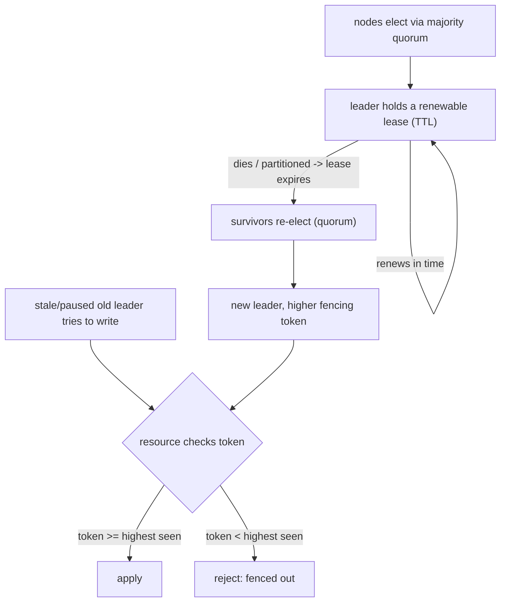

## Thesis

Choosing a single node among many to act as the coordinator --- the one that serializes writes, is the single source of truth, or drives a workflow --- and reliably re-choosing when it fails, so that exactly one node holds the role at a time; the hard part is doing this correctly under network partitions and process pauses, where naive approaches produce two leaders at once (split-brain), which is why real systems use consensus (a majority quorum) plus time-bounded leases and fencing tokens to guarantee at-most-one active leader.

## Sub

**Why: some work must be done by exactly one node** -> **electing a leader by majority quorum, held via a lease** -> **failure, re-election, and split-brain / fencing** -> **zoom out** to the at-most-one safety guarantee, the safety-vs-availability trade, and the pivots an interviewer rides from "who's in charge" into why you need a leader, how election works, and split-brain.

## Spine

- Some responsibilities need **exactly one node** --- serializing writes to avoid conflicts, being the single source of truth, coordinating/scheduling, or avoiding duplicated work --- so you elect a **leader** (primary / master / coordinator) that holds the role while the others follow or stand by.
- Election requires **agreement under failure** --- the nodes must agree on who leads even as nodes crash and the network partitions, which is a **consensus** problem; correct systems require a **majority quorum** to elect (so a minority partition can't elect its own leader), via Raft/Paxos or a coordination service (ZooKeeper/etcd).
- The failure to prevent is **split-brain** --- a partition or a stalled leader can leave **two nodes both believing they lead**, each accepting writes and corrupting state; the defenses are **leases** (leadership is time-bounded and must be renewed, so a stalled leader's lease expires) plus **fencing tokens** (a monotonically increasing leadership number that lets downstream resources reject a stale leader).
- Leadership is a **safety-vs-availability trade** --- requiring a quorum and leases guarantees at-most-one leader (safety) but makes the system briefly unavailable for coordinated writes during the election window after a failure; you tune the timeouts to balance fast failover against false failovers (flapping).

## Companion Notes

### walk

Electing exactly one coordinator

A cluster where one node must serialize the work --- why you need a single leader, how a majority quorum elects one under failures, what happens when it dies, and how leases plus fencing tokens prevent the two-leaders-at-once catastrophe that a naive election allows.

Say the safety goal first --- "at most one active leader, ever." Everything else (quorum, leases, fencing) exists to hold that guarantee under partitions and process pauses, where the naive "just pick a node" approach produces split-brain.

### drill

Probe Drill

Graded follow-ups on quorum, leases, fencing tokens, and split-brain --- the ones that separate "we have a primary" from an election that stays correct when the network partitions and the old leader comes back thinking it's still in charge.

Name the guarantee and its three pillars: at-most-one active leader, via a majority quorum (a minority can't elect), a time-bounded lease (a stalled leader expires), and a fencing token (a stale leader gets rejected downstream).

## Drill

SDE2 | why a leader, and split-brain
SDE3 | election, leases, and fencing
Staff | consensus, scaling, and the clock

### SDE2 | what leader election is

What is leader election and why do you need it?

Leader election is the process by which a group of nodes **agrees on a single node** to act as the coordinator ("leader"), and re-agrees when that node fails. You need it whenever some work must be done by **exactly one node at a time** --- for example, one node that serializes all writes (so concurrent updates don't conflict), one node that's the authoritative source of truth, one node that schedules or coordinates work (so tasks aren't done twice), or one node that owns a resource. Without a designated leader, multiple nodes might all try to do the coordinating work simultaneously, producing conflicts, duplicates, or inconsistency. So leader election gives you a single point of coordination while keeping the *system* fault-tolerant (if the leader dies, another is elected) --- you get the simplicity of a single coordinator without a permanent single point of failure.

### SDE2 | what a leader does

What kinds of things does the leader actually do?

Anything that benefits from a single decision-maker. **Serialize writes**: in a primary/replica database, the primary (leader) accepts all writes and orders them, so replicas apply a single consistent sequence --- no write conflicts. **Coordinate/schedule**: a leader assigns work to workers, decides partitioning, or runs periodic jobs exactly once (rather than every node running the cron and duplicating it). **Own a resource exclusively**: the leader holds a lock or is the only one allowed to act on some external system. **Be the source of truth for cluster metadata**: the leader decides membership, configuration, or the current state. Concrete examples: a database primary; the active instance of an HA service (only one instance processes, the others stand by); a Kubernetes controller (only the elected leader reconciles, so controllers don't fight); a saga orchestrator (exactly one instance drives each workflow). The common thread is "a job where having two doers causes conflict or duplication."

### SDE2 | the basic problem

What makes electing a leader hard?

Getting **all the nodes to agree** on who the leader is, *despite failures* --- nodes crashing, messages being lost or delayed, and the network partitioning. In a perfect network you could just pick the node with the lowest ID; the difficulty is that the moment nodes can't reliably communicate, they can disagree about who's alive and who leads. If node A can't reach node B, is B dead (elect a new leader) or just unreachable-but-alive (still the leader)? Getting this wrong in *either* direction is bad: declare a live leader dead and you might end up with two leaders; fail to detect a dead leader and the system stalls with no coordinator. So leader election is fundamentally a **distributed agreement (consensus) problem under uncertainty** --- the nodes must converge on one leader even though they have only partial, possibly-stale information about each other, which is exactly why naive approaches fail and real systems lean on consensus algorithms.

### SDE2 | when the leader fails

What happens when the leader fails?

The other nodes **detect the failure and elect a new leader** --- that's the whole point of election being a *repeatable* process, not a one-time setup. Detection is usually via **heartbeats/lease expiry**: the leader periodically signals it's alive (or renews a lease), and if the followers stop hearing from it for a timeout, they consider it dead and start a new election. A new leader is chosen (by quorum), it takes over the coordinating role, and the system continues. The critical subtlety is the **window** between "old leader failed" and "new leader elected and active" --- during that window there's no leader, so coordinated writes pause (a brief unavailability), which is the price of ensuring you don't elect a second leader prematurely. And you must ensure the *old* leader, if it wasn't really dead (just slow/partitioned), doesn't keep acting as leader after a new one is elected --- which is the split-brain problem.

### SDE2 | what split-brain is

What is split-brain?

The dangerous state where **two (or more) nodes simultaneously believe they are the leader**, and both act on it --- both accepting writes, both coordinating --- which corrupts state (conflicting writes, duplicated actions, divergent history). It typically arises from a **network partition**: the cluster splits into two groups that can't see each other, and each group, thinking the other side is dead, elects (or retains) its own leader. Now you have two leaders, each serving its side, and when the partition heals their divergent states conflict. It can also arise from a **slow or paused leader**: the old leader is briefly frozen (a long GC pause), the others time it out and elect a new leader, then the old one resumes and --- not knowing it was replaced --- keeps acting as leader. Split-brain is *the* failure mode leader election must prevent, because a system with two leaders is worse than a system with none: no-leader stalls (recoverable), but two-leaders silently corrupts data.

### SDE2 | an example

Give a concrete example of leader election in a real system.

**Database primary/replica** (Postgres, MySQL): one node is the primary (leader) accepting writes; if it fails, a failover process promotes a replica to primary --- that promotion is a leader election, and doing it safely (not promoting two primaries) is exactly the split-brain concern. **ZooKeeper / etcd**: distributed coordination services that *provide* leader election as a primitive --- applications use them to elect a leader (e.g. via an ephemeral node in ZooKeeper, or a lease in etcd) so they don't have to implement consensus themselves. **Kubernetes**: the controller-manager and scheduler use leader election (via a Lease object in etcd) so that in an HA control plane only one instance is active and they don't conflict. **Kafka**: each partition has a leader broker that handles its reads/writes, elected from the in-sync replicas. In all of these, the pattern is identical: many candidates, one elected leader, safe re-election on failure, and machinery to prevent two leaders.

### SDE2 | why a quorum is needed

Why does electing a leader require a majority (quorum)?

To make it **impossible for two partitions to each elect a leader** --- the core split-brain defense. If a leader can be elected by *any* subset of nodes, then when the network partitions into two groups, each group could elect its own leader -> two leaders. But if election requires a **majority (quorum)** of the total nodes to agree, then at most *one* partition can have a majority (two disjoint groups can't both be more than half of the whole), so at most one leader can be elected. The minority side simply *can't* elect a leader (it lacks the votes) and correctly stands down. This is why consensus-based systems need a quorum, and why you run an **odd number** of nodes (3, 5, 7): an odd count maximizes fault tolerance for a given size and avoids the split where the cluster halves exactly (with 4 nodes a 2-2 split has no majority either side -> no leader; 3 or 5 splits always give one side a majority). The majority requirement is the mathematical guarantee behind at-most-one-leader.

### SDE3 | how election works

How does leader election work in a consensus algorithm like Raft?

Through **terms** and **majority votes**. Time is divided into **terms** (monotonically increasing numbers); each term has at most one leader. Every node is a follower by default, resetting an **election timeout** each time it hears from the leader. If a follower's timeout elapses without hearing from a leader (leader presumed dead), it becomes a **candidate**: it increments the term, votes for itself, and requests votes from all other nodes. Each node grants its vote to at most one candidate per term (first-come, and only if the candidate's log is at least as up-to-date). If the candidate receives votes from a **majority** of nodes, it becomes the **leader** for that term and starts sending heartbeats (which reset everyone's election timeouts, keeping them followers). If no candidate wins (split vote), the timeout elapses again and a new term/election starts --- and Raft uses **randomized** election timeouts so that split votes are rare (one node usually times out first and wins). The majority requirement guarantees only one leader per term, and the term number lets nodes reject stale leaders (a message from an older term is ignored). That combination --- terms + majority votes + randomized timeouts --- is how Raft elects a single leader safely and re-elects on failure.

### SDE3 | lease-based leadership

What is a lease, and why use one for leadership?

A **lease** is time-bounded leadership: the leader holds the role only for a bounded duration (a TTL) and must **renew** it before it expires; if the leader stops renewing (because it died or got partitioned), the lease **expires** and someone else can take over. The point is to make leadership **self-expiring** so a dead or unreachable leader automatically loses its claim without needing anyone to explicitly revoke it --- you don't have to reliably detect "the leader is dead" (hard under partitions); you just wait for the lease to lapse. Practically: the leader periodically renews (heartbeats to the coordination store), and holds leadership only while the lease is valid; followers know that if the lease hasn't been renewed within the TTL, the leadership is up for grabs. The critical safety rule is that a leader must **stop acting as leader once it can no longer be sure its lease is valid** (e.g. it lost contact with the store) --- because from the cluster's perspective, an un-renewed lease means it's *not* the leader anymore, and if it keeps acting, that's split-brain. Leases turn "detect the dead leader" into "wait for the clock," which is far more robust.

### SDE3 | fencing tokens

What is a fencing token and what problem does it solve?

A **fencing token** is a **monotonically increasing number** issued each time leadership is granted, used by downstream resources to **reject a stale leader's requests**. It solves the problem that a lease/lock alone doesn't fully prevent: a leader can *believe* it still holds leadership when it actually doesn't (its lease expired during a GC pause, or a network delay), and then send a request to a shared resource. Without fencing, that stale request is accepted and corrupts state. With fencing: each new leader gets a strictly higher token (leader-1, leader-2, ...), and includes it with every request to the protected resource; the resource **remembers the highest token it has seen and rejects any request with a lower token**. So when leader-1 (stale) sends a request after leader-2 has taken over, the resource has already seen token 2 and rejects leader-1's token-1 request --- the stale leader is "fenced off." This is the piece that makes leadership *safe at the point of action* even when the leader's own belief about its status is wrong. The classic lesson (from Kleppmann's critique of naive locking) is that a lock/lease without a fencing token is not safe against a paused-then-resumed leader --- you need the resource to enforce the ordering.

### SDE3 | preventing split-brain

How do you prevent split-brain, putting the pieces together?

With **three layers** working together. (1) **Quorum election**: require a majority to elect, so a minority partition *cannot* elect a leader --- this stops two leaders from being elected in the first place. (2) **Leases**: leadership is time-bounded and must be renewed, so a leader that gets partitioned or crashes automatically loses its claim when the lease expires (it can't hold leadership forever just because it can't be reached) --- and a correct leader *voluntarily steps down* if it can't renew (it knows it might have been replaced). (3) **Fencing tokens**: even if a stale leader still *thinks* it leads and tries to act, the downstream resource rejects its lower token, so its actions have no effect. Quorum prevents electing two; leases ensure a lost leader relinquishes; fencing ensures a stale leader can't do damage even in the gap. You need all three because each closes a different hole: quorum handles the partition-elects-two case, leases handle the crashed/partitioned-leader case, and fencing handles the paused-then-resumed case where the leader's belief is stale but it hasn't been stopped. Together they deliver the at-most-one-*active*-leader guarantee.

### SDE3 | coordination service

How do applications use a coordination service (ZooKeeper/etcd) for leader election?

They offload the hard consensus part to the service and use a simple primitive. **ZooKeeper**: candidates create an **ephemeral sequential** znode under a shared path; the one with the lowest sequence number is the leader; each other node watches the node just below it, so when the current leader's session ends (its ephemeral node auto-deletes because ZooKeeper detected its session died) the next-in-line is notified and becomes leader. Ephemeral = tied to the session, so a crashed/disconnected leader's node vanishes automatically (built-in lease-like behavior). **etcd**: uses **leases** directly --- a candidate acquires a key with a lease (TTL) and keeps it alive; whoever holds the key is leader, and if it stops renewing, the lease expires and the key is released for another to grab (etcd's `election` API packages this). In both, the *application* doesn't implement Raft/Paxos --- the coordination service runs consensus internally (ZooKeeper via ZAB, etcd via Raft) and exposes leader election as an easy, correct primitive. The tradeoff is an operational dependency on that service, but it's vastly safer than hand-rolling consensus, which is why "use ZooKeeper/etcd for leader election" is the standard advice.

### SDE3 | election timeouts

How do election/lease timeouts affect the system, and how do you tune them?

They set the **failover time vs false-failover** trade. A **shorter** heartbeat/lease timeout means the cluster detects a dead leader and re-elects **faster** (less downtime during failover) --- but it's more likely to *falsely* declare a live-but-slow leader dead (a brief network blip or GC pause exceeds the short timeout), triggering an unnecessary failover, and worse, **flapping** (leadership bouncing between nodes as timeouts fire spuriously), which is disruptive and can cause repeated brief outages. A **longer** timeout is more tolerant of transient slowness (fewer false failovers, more stable) --- but means **longer downtime** when the leader genuinely dies (you wait the full timeout before re-electing). So you tune based on your network's typical latency/jitter and pause behavior: long enough to ride out normal blips and GC pauses (avoid false positives/flapping), short enough that real failover is acceptably fast for your availability target. Raft's randomized timeouts also matter here --- randomization prevents repeated split votes (which would extend the leaderless window). The staff-adjacent point is that these timeouts encode your failure-detection assumptions, and getting them wrong causes either sluggish failover or a flapping, unstable cluster.

### SDE3 | taking over as leader

What must a node do when it becomes the new leader?

Safely **take over without conflicting with the old leader**, then resume coordination. Key steps: (1) **Fence the old leader** --- ensure the previous leader can no longer act, via the fencing token (the new leader's higher token means the resource rejects the old one) and by waiting long enough that the old leader's lease has definitely expired before acting (so you don't overlap). (2) **Catch up / recover state** --- the new leader must have the latest committed state before making decisions; in Raft it must have an up-to-date log (which is *why* only a node with an up-to-date log can win the election); in a DB failover, the promoted replica should be caught up (or you accept some data loss if it wasn't). (3) **Establish itself** --- start sending heartbeats/renewing its lease so others recognize it and don't start another election, and begin serving the coordinating role. (4) **Reconcile** any in-flight work the old leader left (e.g. a saga orchestrator picks up sagas that were mid-flight). The subtle safety requirement is the *ordering*: fence and confirm the old leader is out (or its token is superseded) *before* taking actions, because acting while the old leader might still be acting is exactly split-brain --- so a correct takeover deliberately sequences "make sure the old one can't act" ahead of "start acting."

### Staff | consensus underpinning

How does leader election relate to consensus (Raft/Paxos)?

Leader election is **part of consensus**, and consensus is what makes it correct. Consensus algorithms (Paxos, Raft) solve "get a group of nodes to agree on a value despite failures," and Raft in particular *structures* consensus around a leader: it first elects a leader (leader election), and then that leader drives agreement on the sequence of operations (log replication) --- so in Raft, leader election and consensus are inseparable, election is the first phase. The **majority-quorum** property is the shared foundation: consensus requires a majority to agree (so any two majorities overlap in at least one node, which prevents contradictory decisions), and that same majority requirement is what guarantees a single leader per term. This is why "correct leader election" and "consensus" are effectively the same engineering problem: you can't have a safe, agreed-upon single leader under partitions *without* a consensus mechanism (or a service that provides one). The staff framing: don't hand-roll leader election with ad-hoc heartbeats and hope --- leader election that's safe under partitions *is* consensus, so use Raft/Paxos (or ZooKeeper/etcd which implement them), because the majority-overlap math is what actually delivers the guarantee, and naive schemes that skip it will split-brain under the right partition.

### Staff | leader election vs distributed locks

How is leader election related to a distributed lock?

They're two faces of the same primitive: **a leader is whoever holds a specific distributed lock**, and both require the same safety machinery. "Elect a leader" and "acquire the exclusive lock on the coordinator role" are essentially equivalent --- the node holding the lock/lease *is* the leader, and releasing it (or letting it expire) triggers re-election / re-acquisition. Crucially, **fencing tokens apply to both** for the same reason: a distributed lock, like a lease, doesn't prevent a client that *thinks* it still holds the lock (after a pause/expiry) from acting on the protected resource, so the resource must enforce a fencing token to reject a stale holder --- exactly as with a stale leader. The differences are mostly framing/granularity: "leader election" usually connotes one long-lived coordinator role for a whole service/cluster (with catch-up, log recovery, etc.), while "distributed lock" connotes shorter-lived mutual exclusion over a specific resource, possibly many different locks. But the underlying guarantee (at-most-one holder, safe under partitions and pauses) and the mechanisms (quorum/consensus store, lease/TTL, fencing token) are the same. The staff insight: if you understand why a distributed lock needs a fencing token and a consensus-backed store, you understand leader election --- and conversely, "just use a lock in Redis" for leadership has the same well-known unsafety (a lease without fencing) as naive distributed locking.

### Staff | the leader as a bottleneck

Isn't routing everything through one leader a bottleneck and a reliability risk? How do you address it?

Yes --- a single leader can become a throughput bottleneck (all coordinated writes go through one node) and, while re-election gives fault tolerance, there's still the brief unavailability window on failover. You address it by **not making one leader do everything**: (1) **Shard/partition the leadership** --- instead of one global leader, partition the data/work and elect a *separate* leader per shard (Kafka does this: each partition has its own leader broker, so leadership --- and thus write throughput --- is spread across the cluster; Spanner/CockroachDB elect a leader per range). This scales writes horizontally while keeping single-leader semantics *within* each shard. (2) **Offload reads to followers** --- the leader serializes writes, but reads can be served by replicas/followers (accepting the read-consistency implications), so the leader isn't a read bottleneck. (3) **Keep the leader's job minimal** --- have the leader only do the part that *needs* a single decision-maker (ordering, coordination) and let workers do the heavy lifting in parallel, so the leader isn't a compute bottleneck. (4) **Fast failover** --- tune leases/timeouts and keep hot standbys so the unavailability window is short. The staff framing: "single leader" is a *scalability* concern only if you have *one* leader for *everything*; the standard fix is to shard leadership (many leaders, one per partition) so you get single-leader correctness locally and horizontal scale globally --- and to separate the write path (leader) from the read path (replicas). A design that funnels all traffic through one global leader and can't shard is the anti-pattern.

### Staff | why an even number is bad

Why run an odd number of nodes, and what's wrong with two (or four)?

Because **quorum is a majority, and even counts waste a node while risking a no-majority split**. With N nodes, quorum = floor(N/2)+1, and the cluster can tolerate N - quorum failures while still having a majority. Compare: **3 nodes** -> quorum 2, tolerates 1 failure. **4 nodes** -> quorum 3, tolerates 1 failure (same as 3, but you paid for an extra node!) --- and worse, a 2-2 network partition gives *neither* side a majority, so *no* leader can be elected and the whole cluster is unavailable for writes. **5 nodes** -> quorum 3, tolerates 2 failures. So even numbers give you *no extra fault tolerance* over the odd number below them, and introduce the exact-half-split failure. **Two nodes** is the pathological case: quorum is 2 (you need *both*), so it tolerates *zero* failures (if either dies, no majority -> no leader) --- a 2-node cluster is *less* available than a single node for leadership purposes, and any partition kills it. That's why coordination clusters (ZooKeeper, etcd) are always **3, 5, or 7**: odd, so a partition always leaves one side with a strict majority, and each added pair of nodes buys one more tolerated failure. The staff point: the quorum math dictates odd sizing; running 2 or 4 nodes for a consensus role reflects a misunderstanding of how majority tolerance works.

### Staff | self-managed vs external coordinator

Should you implement leader election in-process (embedded Raft) or use an external coordinator (ZooKeeper/etcd)? What's the trade?

It's a build-vs-buy trade on where the consensus lives. **External coordinator** (ZooKeeper/etcd as a separate cluster your app talks to): you get a battle-tested consensus implementation and a simple election primitive, and multiple services can share the same coordination cluster --- but you take on an **operational dependency** (another distributed system to run, monitor, and keep highly available; if it's down, elections can't happen) and network round-trips to it. **Embedded/self-managed** (your service nodes run a consensus protocol like Raft *among themselves*, e.g. via a library, or the datastore has consensus built in like CockroachDB/etcd itself): no external dependency, leadership is intrinsic to the cluster, and it can be lower-latency --- but you must **operate consensus yourself** (correctly configuring quorum, handling membership changes, upgrades) and get it right, which is subtle. The rule of thumb: if you're building an *application* that needs a leader, **use an external coordinator** (etcd/ZooKeeper) or a managed equivalent --- don't hand-roll consensus, because the failure modes (split-brain under partition) are exactly the ones that are easy to get subtly wrong and catastrophic in production. If you're building *infrastructure* (a database, a queue) where consensus is core to the product, you embed it (often via Raft) and invest in getting it right. The staff insight: the decision hinges on whether consensus is incidental (offload it) or core (own it), and the dominant failure to avoid either way is a naive DIY election that skips the quorum/fencing rigor.

### Staff | the lease-and-clock subtlety

Leases rely on time --- what's the subtlety, and why is fencing still needed even with leases?

The subtlety is that **leases assume bounded clock behavior and no unbounded pauses, which don't always hold** --- so a lease alone can't guarantee safety, and you need fencing at the resource. The failure: a leader checks "is my lease still valid?", sees yes, and is about to act --- but then it gets **paused** (a long stop-the-world GC pause, VM suspension, or the scheduler descheduling it) for longer than the remaining lease. While it's paused, the lease **expires**, a new leader is elected, and *then the old leader resumes* and completes its action, still believing (from its pre-pause check) that its lease was valid. Now two leaders have acted --- split-brain --- even though the lease "worked." Leases also assume clocks don't drift wildly and that "the lease is valid for T seconds" means the same on all nodes, which network/clock issues can violate. This is why **fencing tokens are still required even with leases**: the resource, not the leader, enforces the ordering --- the paused leader's request carries an old token, the resource has already seen the new leader's higher token, and it rejects the stale request. Fencing moves the safety check to the *point of action* (where it can't be fooled by a pause), rather than relying on the leader's *earlier* belief about its lease. The staff lesson (straight from Kleppmann's "How to do distributed locking"): a lease/lock is a *performance optimization* to reduce contention, but it is **not sufficient for correctness** against process pauses --- correctness requires the resource to fence based on a monotonic token. Anyone who says "we have a lease so we're safe" is missing the pause-then-resume hole.

### Staff | real-world failure modes

What real-world failure modes bite leader-election implementations?

Several, mostly around the failover window and stale leaders. **Split-brain from a naive election** --- no quorum requirement, so a partition elects two leaders that both accept writes and diverge (the headline failure). **Paused-leader-resumes** --- a GC pause / VM suspend longer than the lease, old leader resumes and acts stale; without fencing tokens it corrupts state (the subtle one that leases alone don't fix). **Dual writes during failover** --- in the window where the old leader hasn't fully stepped down and the new one has started, both briefly act; fixed by fencing + waiting out the old lease before acting. **Flapping / election storms** --- timeouts set too aggressively (or a genuinely flaky leader) cause leadership to bounce repeatedly, each transition a mini-outage and a burst of re-election traffic; worse, a **thundering herd** on the coordination service when many candidates retry simultaneously. **Losing quorum entirely** --- too many nodes down (or an even-split partition) means *no* leader can be elected and the system stalls for coordinated writes (correct but unavailable --- the safety-vs-availability reality). **Stale reads from a deposed leader** --- a leader that was partitioned out keeps serving reads believing it's current, returning stale data (needs leader leases for reads, or read-from-quorum). **The promoted replica is behind** --- in async-replicated DB failover, promoting a lagging replica loses the un-replicated writes (a data-loss vs availability call). **Clock skew breaking leases** --- lease validity misjudged across nodes with drifting clocks. The staff summary: the recurring theme is that the *unsafe* cases all live in partitions and pauses --- the naive path (heartbeat + "I'm leader now" with no quorum, no fencing, aggressive timeouts) works in testing and splits-brains or flaps in production, which is why quorum election + leases + fencing tokens + carefully-tuned timeouts + sharded leadership for scale are the non-negotiable ingredients, and why offloading to a proven coordinator (etcd/ZooKeeper) is usually wiser than rolling your own.

## Walk

### Some work needs exactly one node, so elect a leader

```flow
nodes[many nodes] -> need[one must serialize writes / coordinate] -> elect[elect a leader, others follow or stand by]
```

Start with why a leader exists at all. Some responsibilities need **exactly one doer**: serializing writes so concurrent updates don't conflict, being the single source of truth, or coordinating/scheduling work so it isn't done twice. If every node tried to do that job, you'd get conflicts and duplicates.

So you designate one node as the **leader** (primary/coordinator) that holds the role, while the rest follow or stand by. The trick is doing this *without* creating a permanent single point of failure --- which is why election is a *repeatable* process: if the leader dies, the survivors elect a new one. You get the simplicity of a single coordinator with the fault-tolerance of a cluster.

### Election needs a majority quorum

```flow
vote[nodes vote] -> maj[a majority must agree] -> one[at most one leader: a minority partition cannot elect]
```

The core requirement is that a leader is elected only by a **majority (quorum)** of the nodes. This is the mathematical guard against two leaders: two disjoint groups can't *both* be more than half of the whole, so at most one partition can hold a majority and elect a leader --- the minority side lacks the votes and correctly stands down.

This is why consensus systems run an **odd number** of nodes (3, 5, 7): an odd count means a partition always leaves one side with a strict majority (a 2-2 split of 4 nodes leaves *neither* side able to elect --- no leader). It's also why you never run 2 nodes for this (quorum would be 2, so *either* node failing kills leadership). The majority requirement is the whole reason quorum-based election is safe where a "lowest ID wins" scheme isn't.

### Failure triggers re-election, and split-brain is the danger

```flow
fail[leader stops renewing] -> exp[lease expires] -> re[survivors re-elect by quorum]
```

Leadership is held via a **lease** (a TTL the leader must renew); if the leader dies or is partitioned, it stops renewing, the lease **expires**, and the survivors elect a new leader. Leases turn the hard problem "reliably detect the dead leader" into the robust one "wait for the clock."

```python
class LeaderElector:
    def __init__(self, store, node_id, ttl):
        self.store, self.node_id, self.ttl = store, node_id, ttl

    def try_acquire(self):
        # atomic compare-and-set in a consensus store (etcd/ZooKeeper):
        # take leadership only if the lease key is free or already ours
        ok, fencing_token = self.store.acquire_lease(
            key="leader", holder=self.node_id, ttl=self.ttl)
        return ok, fencing_token          # token increases on every NEW leadership

    def renew(self):
        # a leader MUST stop acting if it cannot renew -- an un-renewed
        # lease means, to the cluster, it is no longer the leader
        return self.store.renew_lease(key="leader", holder=self.node_id, ttl=self.ttl)

def do_privileged_write(resource, fencing_token, data):
    # the RESOURCE enforces safety: reject any token below the highest seen,
    # so a stale (paused/partitioned) old leader is fenced out
    if fencing_token < resource.highest_token_seen:
        raise StaleLeaderError("fenced: a newer leader exists")
    resource.highest_token_seen = fencing_token
    resource.apply(data)
```

The danger is **split-brain**: a partition, or a leader that was merely *paused* (a long GC pause) and then resumes, can leave two nodes both believing they lead --- both writing, corrupting state. Two leaders is worse than none: no-leader stalls (recoverable), two-leaders silently diverges.

### The guarantee: at-most-one active leader, via quorum plus lease plus fencing

```flow
q[quorum: minority cannot elect] -> l[lease: a lost leader expires and steps down] -> f[fencing token: a stale leader is rejected downstream]
```

Three layers deliver the **at-most-one-active-leader** guarantee, each closing a different hole. **Quorum** stops two leaders from being *elected* (a minority partition can't). **Leases** ensure a crashed or partitioned leader *relinquishes* the role (it can't hold it forever just by being unreachable, and a correct leader steps down when it can't renew). **Fencing tokens** ensure that even if a stale leader still *thinks* it leads and tries to act, the downstream resource rejects its lower token, so its actions have no effect.

You need all three: quorum handles the partition-elects-two case, leases handle the crashed/partitioned leader, and fencing handles the paused-then-resumed case where the leader's belief is stale but nothing has stopped it. Zooming out: this is fundamentally *consensus* (the majority-overlap math), leadership is the same primitive as a distributed lock (and needs the same fencing), it's a safety-vs-availability trade (there's a brief no-leader window on failover), and it scales by *sharding leadership* (one leader per partition, à la Kafka) rather than funneling everything through one global leader. The one thing never to do is a naive heartbeat election with no quorum and no fencing --- it works in testing and split-brains in production.

### Model Script

- Frame the goal | "The whole point of leader election is a safety guarantee: at most one active leader, ever. You elect one node to be the coordinator -- the thing that serializes writes so they don't conflict, or is the single source of truth, or schedules work so it isn't done twice -- because some jobs need exactly one doer or you get conflicts and duplicates. And it's a repeatable process, not a one-time setup, so that if the leader dies the survivors elect a new one -- you get a single coordinator without a permanent single point of failure."
- Quorum | "The core mechanism is that a leader is elected only by a majority -- a quorum -- of the nodes. That's the mathematical guard against two leaders: two disjoint groups can't both be more than half the cluster, so at most one partition can have a majority and elect a leader, and the minority side lacks the votes and stands down. That's why consensus clusters run an odd number of nodes -- 3, 5, 7 -- so a partition always leaves one side with a strict majority, and why you never run 2 nodes, where either failure kills leadership."
- Failure and split-brain | "Leadership is held via a lease -- a TTL the leader must keep renewing. If it dies or gets partitioned, it stops renewing, the lease expires, and the survivors re-elect. Leases turn 'reliably detect the dead leader,' which is hard under partitions, into 'wait for the clock,' which is robust. The danger the whole design exists to prevent is split-brain -- two nodes both thinking they're the leader, both writing, corrupting state. That happens on a partition, or when a leader is merely paused by a long GC and then resumes not knowing it was replaced. And two leaders is worse than none: no leader stalls and is recoverable, two leaders silently diverges."
- The three pillars | "So the guarantee -- at most one *active* leader -- comes from three layers, each closing a different hole. Quorum stops two leaders from being elected. Leases ensure a crashed or partitioned leader relinquishes the role, and a correct leader voluntarily steps down if it can't renew. And fencing tokens ensure that even if a stale leader still thinks it leads and tries to act, the downstream resource -- which remembers the highest token it's seen -- rejects its lower token, so its write has no effect. You need all three, because quorum handles the partition case, leases handle the crashed-leader case, and fencing handles the paused-then-resumed case where the leader's belief is stale but nothing stopped it."
- Interviewer: "You have a lease. Why do you still need fencing tokens?"
- The pause hole | "Because a lease relies on time, and processes can pause unboundedly. The leader checks 'is my lease valid,' sees yes, and is about to write -- then it gets paused by a long stop-the-world GC for longer than the remaining lease. While it's paused the lease expires, a new leader is elected, and then the old one resumes and completes its write, still believing from its pre-pause check that its lease was good. Two leaders have now acted, even though the lease 'worked.' Fencing fixes this by moving the safety check to the point of action: the resource rejects the paused leader's old token because it's already seen the new leader's higher one. The lease is a performance optimization to reduce contention; it is not sufficient for correctness against pauses -- only the resource fencing on a monotonic token is. That's the Kleppmann distributed-locking lesson."
- Land it | "So: some work needs exactly one node, so you elect a leader by majority quorum -- which makes two-leader election impossible -- hold it via a renewable lease so a lost leader expires, and fence with a monotonic token so a stale leader is rejected at the resource. It's really consensus underneath, it's the same primitive as a distributed lock, and it's a safety-versus-availability trade because there's a brief no-leader window on failover. It scales by sharding leadership -- one leader per partition, like Kafka -- not by funneling everything through one global leader. And the thing never to do is a naive heartbeat election with no quorum and no fencing: it passes tests and split-brains in production, so I'd use etcd or ZooKeeper rather than hand-roll consensus."

## Whiteboard

Sketch the quorum election and the split-brain defenses.

### Why does election need a majority quorum?

Two disjoint partitions can't both hold a majority, so at most one side can elect a leader -- the minority can't and stands down. That's the guarantee against two leaders, and why clusters are odd-sized (3/5/7): a partition always leaves one side with a strict majority.

### You have a lease -- why still need fencing tokens?

A leader can be paused (long GC) past its lease, get replaced, then resume and act still believing its lease was valid -- two leaders act. Fencing moves the check to the resource: it rejects the old leader's lower token because it's seen the new leader's higher one. A lease reduces contention; only fencing gives correctness against pauses.



Verdict: quorum makes electing two leaders impossible, a renewable lease makes a lost leader step down, and a fencing token makes a stale leader's write get rejected at the resource -- together, at-most-one active leader under partitions and pauses.

## System

Zoom out to where a leader sits in a cluster.

### Where it sits

The cluster: many candidate nodes, one elected leader [*]
Election: majority quorum via consensus (Raft/Paxos) or etcd/ZooKeeper
Leadership: held via a renewable lease (TTL); lost -> auto-expires
Fencing: monotonic token the resource checks to reject a stale leader
Scale: shard leadership (one leader per partition, e.g. Kafka)

### Pivots an interviewer rides

From "who's in charge" they push on the quorum, the split-brain defenses, and scaling.

#### What prevents two leaders (split-brain)?

-> quorum (a minority can't elect) + lease (a lost leader expires) + fencing token (a stale leader is rejected)
Each closes a different hole: quorum the partition case, lease the crashed-leader case, fencing the paused-then-resumed case -- you need all three for at-most-one-active-leader.

#### Isn't the single leader a bottleneck?

-> shard leadership (one leader per partition, like Kafka) and serve reads from replicas
Single-leader is a scale problem only with *one* leader for *everything*; partitioning gives single-leader correctness per shard with horizontal write scale, and reads offload to followers.

## Trade-offs

The calls that separate "we have a primary" from an election safe under partitions.

### Shorter vs longer election/lease timeout

- Shorter: faster failover (less downtime when the leader dies) -- but more false failovers on a blip/GC pause, and risk of flapping (leadership bouncing)
- Longer: stable, tolerant of transient slowness (fewer false positives) -- but longer downtime on a genuine failure (you wait out the timeout)

Set the timeout to comfortably exceed normal network jitter and GC pauses (avoid flapping), yet short enough that real failover meets your availability target.

### Consensus store (etcd/ZooKeeper) vs hand-rolled election

- Coordination service: proven consensus, a simple correct primitive, shareable across services -- but an operational dependency and network hops
- Hand-rolled: no external dependency, potentially lower latency -- but you must implement consensus correctly, and the failure modes (split-brain) are subtle and catastrophic

For an application needing a leader, use etcd/ZooKeeper; hand-roll consensus only when it's core to your product (a database/queue) and you'll invest in getting it right.

### One global leader vs sharded leadership

- Global leader: simplest single-decision-maker semantics -- but a throughput bottleneck and a single failover window for everything
- Sharded (leader per partition): horizontal write scale, blast radius limited to one shard -- but more leadership to manage and cross-shard work needs coordination

Shard leadership (per-partition leaders, Kafka-style) for throughput; a single global leader is fine only for low-volume coordination that can't be partitioned.

## Model Answers

### the reframe | Elect one coordinator, safely

The frame to lead with.

- Some work needs exactly one node; elect a leader, re-elect on failure | key | single coordinator, no permanent SPOF
- Elect only by majority quorum -> at most one leader | store | a minority partition can't elect
- Safety-vs-availability: a brief no-leader window on failover | note | tune timeouts

### the depth | The split-brain defenses

Where it's really tested.

- Lease (renewable TTL) -> a lost leader auto-expires and steps down | key | wait for the clock, not detection
- Fencing token (monotonic) -> the resource rejects a stale leader | store | fixes the paused-then-resumed hole
- It's consensus underneath; same primitive as a distributed lock | note | use etcd/ZooKeeper, don't hand-roll

## Numbers

Back-of-envelope the quorum, fault tolerance, and failover time.

Quorum is a majority; odd sizing maximizes tolerance; failover waits out the lease, and the leader must renew well within it.

- nodes | Cluster nodes | 5 | 1 | 2
- lease | Lease TTL (s) | 15 | 1 | 1
- renew | Renew interval (s) | 5 | 1 | 1

```js
function (vals, fmt) {
  var nodes = vals.nodes, lease = vals.lease, renew = vals.renew;
  var quorum = Math.floor(nodes / 2) + 1;
  var tolerate = nodes - quorum;
  function r(x, d) { var m = Math.pow(10, d); return Math.round(x * m) / m; }
  var renewals = renew > 0 ? Math.floor(lease / renew) : 0;
  return [
    { k: 'Quorum needed', v: fmt.n(quorum), u: 'of ' + fmt.n(nodes) + ' nodes', n: 'a majority must agree to elect \u2014 so a minority partition cannot elect a second leader (the split-brain guard)', over: false },
    { k: 'Tolerates', v: fmt.n(tolerate), u: 'node(s) down', n: 'the cluster keeps a leader while a majority survives \u2014 5 tolerate 2, 3 tolerate 1; an even count buys no extra tolerance and risks a no-majority split', over: nodes % 2 === 0 },
    { k: 'Worst-case failover', v: '~' + fmt.n(lease), u: 's (lease TTL)', n: 'a silently-dead leader must let its lease expire before a new one is elected \u2014 shorter TTL = faster failover but more false failovers / flapping', over: lease > 30 },
    { k: 'Renew headroom', v: fmt.n(renewals) + 'x', u: 'renews / lease', n: 'the leader renews every ' + fmt.n(renew) + 's within a ' + fmt.n(lease) + 's lease \u2014 it must renew comfortably before expiry or a transient blip costs it leadership', over: renewals < 2 },
    { k: 'The guarantee', v: 'at-most-one', u: 'active leader', n: 'quorum + a renewable lease + a fencing token \u2014 a stalled or partitioned old leader is expired and then fenced out at the resource', over: false }
  ];
}
```

## Red Flags

What makes an interviewer wince.

### "Each node checks if the leader is down and, if so, becomes the leader"

With no quorum requirement, a network partition lets each side declare the other dead and elect its own leader -> two leaders, both writing, diverging (split-brain) -- the headline catastrophe.

Require a majority quorum to elect (via consensus or etcd/ZooKeeper), so a minority partition simply can't elect a leader -- two disjoint groups can't both hold a majority.

### "We hold a lock/lease for leadership, so it's safe"

A lease alone doesn't stop a leader that was paused (a long GC) past its lease from resuming and acting while a new leader is already active -- two leaders act, and state corrupts.

Add a fencing token (a monotonic number the resource checks), so the stale leader's lower token is rejected at the point of action; the lease reduces contention but only fencing gives correctness against pauses.

### "We run two nodes for high availability"

For a quorum role, 2 nodes need both to agree (quorum = 2), so *either* one failing leaves no majority and no leader -- less available than a single node, and any partition kills it.

Run an odd number (3, 5, 7): a partition always leaves one side with a strict majority, and each added pair buys one more tolerated failure.

## Opener

### 30s | The one-liner

How I open when asked to make one node the coordinator, or to design failover.

#### What is the shape?

Elect a single leader by majority quorum (so a minority partition can't elect a rival), hold leadership via a renewable lease (so a lost leader auto-expires), and fence with a monotonic token (so a stale leader is rejected at the resource) -- at most one active leader.

#### What's the key danger?

Split-brain -- two leaders both writing. Quorum prevents electing two, the lease makes a lost leader step down, and fencing stops a paused-then-resumed leader from acting; a lease alone is not safe against process pauses.

##### Hooks

Where an interviewer usually pushes next.

- What prevents two leaders? | quorum + lease + fencing token | drill
- Why still fence if you have a lease? | the GC-pause-then-resume hole | drill
- Isn't the leader a bottleneck? | shard leadership per partition (Kafka) | drill

Foot: two sentences -- leader election picks one coordinator and re-elects on failure, and correctness under partitions and pauses comes from three layers: a majority quorum (a minority can't elect), a renewable lease (a lost leader expires), and a fencing token (a stale leader is rejected downstream). It's consensus underneath and the same primitive as a distributed lock, so the right move is to use etcd/ZooKeeper and shard leadership for scale, not to hand-roll a naive heartbeat election.

## Bank

### SCALE | An HA service where only one instance may process at a time (e.g. a saga orchestrator or a cron runner)

Task: ensure exactly one active instance, with failover.
Model: elect a leader via a consensus-backed store (etcd/ZooKeeper) using a renewable lease; only the leader processes, the rest stand by; the leader must stop processing the instant it can't renew (an un-renewed lease means it's no longer leader); on the leader's death the lease expires and a standby is elected and takes over, reconciling any in-flight work; and every action on a shared resource carries a fencing token so a paused-then-resumed old leader is rejected. Tune the lease TTL to exceed normal GC/network blips (avoid flapping) but keep failover acceptably fast.
Int: two instances both think they're the leader during a network blip -- what saves you?
The fencing token: the resource has seen the new leader's higher token and rejects the old leader's lower one, so only one instance's actions take effect even though both believe they lead.

### DESIGN | Database primary failover without split-brain

Task: promote a replica to primary safely when the primary fails.
Model: use quorum-based failover (a majority of nodes/an odd-sized control group must agree the primary is dead before promoting) so a partition can't promote two primaries; fence the old primary (STONITH / revoke its ability to accept writes, or fencing tokens on the shared storage) before or as the new one is promoted; promote a replica that's caught up (or accept bounded data loss if promoting a lagging async replica -- an availability-vs-durability call); and redirect clients to the new primary. Never allow both to accept writes concurrently.
Int: the old primary was only partitioned, not dead, and comes back -- what happens?
It must be fenced: quorum elected a new primary, and the old one is prevented from accepting writes (rejected by fencing / STONITH) -- otherwise it's split-brain with two primaries and divergent writes.

### Extra Curveballs

### CURVEBALL | pause | Your leader passes its "is my lease valid?" check, then suffers a 20-second stop-the-world GC pause on a 15-second lease, then resumes and writes. Walk through what happens and how to make it safe.

Model: this is the canonical pause-then-resume split-brain. At T=0 the leader checks its lease (valid, ~15s left) and begins an operation; at T=0 it's paused by GC. During the pause (say T=0..20s) the lease (15s) expires at T=15; the other nodes, not hearing renewals, elect a new leader around T=15, which starts acting with a *higher* fencing token. At T=20 the old leader resumes exactly where it left off -- still believing, from its pre-pause check, that its lease is valid -- and completes its write. Now both the old and new leader have acted: split-brain, and if the write hits shared state it corrupts it. The lease did not save you, because the validity check happened *before* the pause and the leader had no way to know time had passed. The fix is fencing tokens enforced at the resource: the old leader's write carries its old token (say 33), but the resource has already accepted the new leader's token (34) and remembers "highest seen = 34," so it rejects the old leader's token-33 write with a stale-leader error. The safety decision is moved to the point of action, where it can't be fooled by a pause, instead of relying on the leader's earlier belief. Additional mitigations: keep leases long enough to exceed worst-case pauses (reduces frequency but doesn't eliminate the hole), monitor GC/pause times, and have the leader re-check its lease immediately before each critical action (narrows but still can't close the window -- only resource-side fencing truly closes it). The staff point, straight from Kleppmann: a lease/lock is a contention optimization, not a correctness mechanism; correctness against unbounded pauses *requires* the resource to fence on a monotonically increasing token.

### Frames

- Some work needs exactly one node -> elect a leader by majority quorum (a minority partition can't elect), re-elect on failure
- Hold leadership via a renewable lease (a lost leader auto-expires) + fence with a monotonic token (the resource rejects a stale leader) -> at-most-one active leader
- Split-brain (two leaders) is the catastrophe; a lease alone isn't safe against GC pauses; it's consensus underneath (use etcd/ZooKeeper), and it scales by sharding leadership per partition
