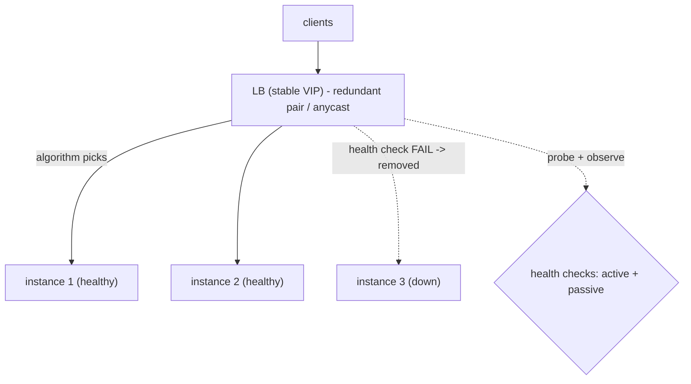

## Thesis

Spreading incoming traffic across a pool of backend instances --- picking a target by some algorithm, checking each instance's health so requests only go to ones that can serve, at the transport (L4) or application (L7) layer --- so no single instance is overwhelmed, a failed instance is routed around automatically, and the pool scales horizontally behind one stable address.

## Sub

**Why load-balance: one instance can't scale and will fail** -> **where it sits: L4 vs L7** -> **the algorithm and health checks** -> **zoom out** to affinity, the LB as a single point of failure, and the pivots an interviewer rides from "put a load balancer in front" into L4-vs-L7, picking the algorithm, and how failures are detected.

## Spine

- A load balancer **fronts a pool behind one stable address** --- clients hit the LB, which distributes each request to a backend instance, so you can add or remove instances (scale horizontally) and survive instance failures without clients ever knowing.
- It operates at **L4 (transport) or L7 (application)** --- L4 routes by IP and port (fast, connection-level, protocol-agnostic), L7 routes by request content (URL, headers --- smarter routing, but it must parse the request).
- The **algorithm picks the target** --- round-robin, least-connections, weighted, or hash-based --- trading simplicity against awareness of each instance's actual load and any need for stickiness.
- **Health checks make it fault-tolerant** --- the LB probes each instance (active) or observes failures (passive) and stops routing to unhealthy ones, so a dead instance leaves rotation automatically; but the LB itself must be made redundant, or it becomes the single point of failure.

## Companion Notes

### walk

Spreading traffic across a healthy pool

One request from a client to a healthy backend --- the stable address it hits, the algorithm that picks an instance, the L4/L7 layer it routes at, the health check that keeps dead instances out of rotation, and the redundancy that stops the LB itself being the weak point.

Say the stable-address idea first --- "clients hit one address; instances scale and fail behind it, invisibly." Horizontal scale and fault tolerance both fall out of that one indirection.

### drill

Probe Drill

Graded follow-ups on L4-vs-L7, the balancing algorithm, health checks, and affinity --- the ones that separate "add a load balancer" from a traffic layer that scales and self-heals.

Name the two jobs: distribute load evenly (the algorithm) and route around failure (health checks) -- and that the LB itself must be redundant or it's just a fancier single point of failure.

## Drill

SDE2 | the model and the mechanics
SDE3 | L4/L7, affinity, and health
Staff | global, scale, and client-side

### SDE2 | what a load balancer is

What is a load balancer and why do you need one?

A component that sits in front of a pool of backend instances and distributes incoming requests across them, presenting one stable address to clients. You need it for two reasons: **scale** --- a single instance can only handle so much, so you run many and spread the load; and **availability** --- if one instance dies, the LB routes around it, so clients aren't affected. It's the indirection that lets a service be many instances that come and go, while clients see one unchanging endpoint.

### SDE2 | L4 vs L7

What's the difference between L4 and L7 load balancing?

**L4 (transport layer)** balances by IP address and port --- it forwards TCP/UDP connections without looking inside the traffic, so it's fast and protocol-agnostic but can only route by network-level info. **L7 (application layer)** balances by the *content* of the request --- it parses HTTP, so it can route by URL path, headers, cookies, or host (send `/api` to one pool, `/images` to another), and do things like TLS termination and content-based routing. L4 is simpler and faster; L7 is smarter but does more work per request. The trade is raw throughput versus routing intelligence.

### SDE2 | round-robin

What is round-robin load balancing?

The simplest algorithm: hand each successive request to the next instance in order, cycling through the pool --- request 1 to instance A, request 2 to B, request 3 to C, request 4 back to A. It distributes requests evenly *by count* and needs no state about the instances. Its weakness is that it's blind to actual load: if requests vary in cost or instances vary in capacity, equal *counts* don't mean equal *load* --- a slow request pins one instance while round-robin keeps sending it more. It's the right default when requests and instances are roughly uniform.

### SDE2 | least-connections

What is least-connections load balancing?

Send each new request to the instance with the fewest active connections --- a proxy for "least busy right now." Unlike round-robin, it's *load-aware*: an instance stuck on slow requests accumulates open connections, so it stops receiving new ones until it catches up. This handles uneven request costs much better than round-robin, because it responds to what instances are actually doing rather than blindly cycling. It needs the LB to track connection counts per instance, but that's cheap, and it's a common default for workloads with variable request duration.

### SDE2 | what a health check is

What is a health check?

A test the load balancer runs against each backend instance to decide whether it's fit to receive traffic --- typically an HTTP request to a `/health` endpoint or a TCP connection attempt. If an instance passes, it stays in the rotation; if it fails (a threshold of times), the LB removes it from the pool and stops sending it requests, adding it back once it passes again. This is what makes the LB fault-tolerant: a crashed, hung, or overloaded instance is detected and routed around automatically, so its failure doesn't reach clients.

### SDE2 | active vs passive health checks

What's the difference between active and passive health checks?

**Active**: the LB proactively probes each instance on a schedule (every few seconds, hit `/health`), independent of real traffic --- it detects a sick instance even if no request has hit it yet. **Passive** (a.k.a. outlier detection): the LB watches *real* request outcomes and marks an instance unhealthy when it starts returning errors or timing out, without a separate probe --- no extra load, and it catches failures the probe might miss (the instance answers `/health` fine but errors on real requests). They're complementary: active gives fast, traffic-independent detection; passive catches real-world failures the shallow probe can't. Robust setups use both.

### SDE2 | horizontal scaling

How does a load balancer enable horizontal scaling?

By decoupling clients from instances: clients hit the LB's one stable address, and behind it you add or remove backend instances freely, with the LB spreading traffic across whatever's currently in the pool. So to handle more load you add instances (scale out) rather than making one bigger (scale up), and the LB immediately starts using them. This is the foundation of horizontal scaling --- capacity becomes "how many instances," which you can change dynamically (with autoscaling) without touching clients. The LB is what makes a pool of interchangeable instances behave like one elastic service.

### SDE3 | L4 vs L7 trade-offs

When would you choose L4 over L7, or vice versa?

Choose **L4** when you need raw throughput and low latency, when the traffic isn't HTTP (arbitrary TCP/UDP), or when you don't need content-based decisions --- it's cheaper per connection because it doesn't parse payloads, and it preserves the connection end-to-end. Choose **L7** when you need to route by request content (path/host/header-based routing, API gateways), terminate TLS centrally, do sticky sessions by cookie, or apply per-request logic --- the intelligence is worth the parsing cost. Many architectures use both: an L4 balancer for sheer connection spreading at the edge, and L7 balancers deeper for smart routing. The decision is "do I need to look inside the request?"

### SDE3 | weighted load balancing

What is weighted load balancing and when do you use it?

Assigning each instance a weight so it receives traffic proportional to its capacity, rather than an equal share. You use it when the pool is **heterogeneous** --- some instances are bigger (more CPU/memory) or you're doing a **canary/gradual rollout** (send 5% of traffic to the new version). Weighted round-robin or weighted least-connections respects the weights, so a 2x-larger instance gets 2x the traffic. It's the mechanism behind canary deploys and mixed-instance-size pools: you tune the weights to match capacity or to control how much traffic a new version sees.

### SDE3 | sticky sessions

What are sticky sessions and what's the catch?

Session affinity --- routing a given client consistently to the same backend instance (by a cookie the LB sets, or by source IP hash), so requests from one session land on the instance that holds that session's in-memory state. You use it when the backend keeps per-session state locally. The catch is that it **undermines even load distribution and fault tolerance**: traffic can pile unevenly on whichever instances hold hot sessions, and if a sticky instance dies, its sessions are lost (the state was only there). Stickiness is a workaround for stateful backends; the better answer is usually to make the backend *stateless* (session state in Redis/a shared store) so any instance can serve any request and no affinity is needed.

### SDE3 | consistent hashing for LB

When would a load balancer use consistent hashing?

When you want a *stable* mapping from a key to an instance --- most often for **cache affinity**: hash the request key (a user id, a cache key) so the same key consistently routes to the same instance, maximizing that instance's cache hit rate. Plain modulo hashing would remap almost everything when an instance is added or removed; **consistent hashing** remaps only a small fraction of keys, so scaling the pool doesn't blow away everyone's cache locality. So it's the algorithm of choice when you're balancing across a distributed cache tier or otherwise want key-to-instance stickiness that survives pool changes gracefully.

### SDE3 | health check tuning

How do you tune health checks, and what goes wrong if you don't?

Balance detection speed against stability via the **interval** (how often to probe), the **unhealthy threshold** (consecutive failures before removing), and the **healthy threshold** (successes before re-adding). Too aggressive (short interval, low threshold) and a single transient blip evicts a healthy instance --- and instances **flap** in and out, thrashing the pool. Too lax (long interval, high threshold) and a dead instance keeps receiving (and failing) traffic for too long before removal. The thresholds exist precisely to avoid flapping: require a few consecutive failures to remove and a few successes to restore, so you react to real state changes, not noise --- roughly the same tuning tension as a circuit-breaker.

### SDE3 | the LB as a single point of failure

The load balancer improves availability --- but isn't it a single point of failure?

Yes, and that's the catch: if all traffic flows through one LB and it dies, the whole service is down, so the LB *itself* must be made redundant. Common approaches: an **active-passive pair** with a floating/virtual IP that fails over to the standby; **active-active** LBs behind DNS or anycast; **DNS-based** distribution across multiple LB endpoints; or **anycast**, where the same IP is announced from multiple locations and the network routes to the nearest healthy one. The principle is that you can't remove a single point of failure by adding a component that is itself one --- the LB layer has to be as redundant as the backends it protects.

### SDE3 | connection draining

What is connection draining and why does it matter?

Graceful removal: when you take an instance out of the pool (deploy, scale-in, maintenance), the LB **stops sending it new requests but lets in-flight requests finish** before fully removing it, rather than killing active connections. Without draining, deploying or scaling down abruptly severs live requests --- users see errors mid-request. With it, the instance is marked "draining," receives no new traffic, and is removed only once its existing requests complete (or a timeout elapses). This is essential for zero-downtime deploys and clean autoscaling: you can cycle instances without dropping the requests they were already handling.

### Staff | global load balancing

How does load balancing work across regions, globally?

In layers. A **global** layer routes users to the right *region* --- typically **GeoDNS** (DNS returns a region-appropriate IP based on the client's location) or **anycast** (one IP announced from many locations, the network routes to the nearest). Within each region, **local** load balancers spread traffic across that region's instance pool. So there's global routing (get the user to a nearby, healthy region --- for latency and for regional failover) and local balancing (spread within the region). Global health matters too: if a whole region is down, the global layer (via DNS failover or anycast withdrawal) steers users to another region. It's a hierarchy: global picks the region, local picks the instance.

### Staff | algorithms at scale

Why not just use global least-connections at very large scale?

Because tracking exact least-connections across a huge fleet requires global state that's expensive and stale by the time you use it --- the coordination cost and the race between "read the counts" and "route the request" make perfect global load-awareness impractical. The elegant fix is **power-of-two-choices**: pick two instances at random and send the request to the less-loaded of the two. This gets *most* of the benefit of least-connections (dramatically better tail load distribution than random or round-robin) with *almost none* of the coordination cost, and it avoids the herding problem where everyone piles onto the single "least loaded" instance simultaneously. It's a classic result: two random choices beat one, and beat trying to be globally optimal.

### Staff | thundering herd on scale-up

What happens when you add fresh instances to a hot pool, and how do you handle it?

A cold-start herd: a brand-new instance has empty caches, cold connection pools, and JIT not warmed up, so it's *slower* than the warm ones initially --- and if the LB immediately sends it a full equal share (or worse, least-connections sends it *extra* because it has zero connections), it gets overwhelmed before it's ready and may fail its health check, flapping. You handle it by **slow-starting**: ramp the new instance's traffic weight up gradually (many LBs have a slow-start / warm-up period), so it eases into load as its caches fill. This matters most during autoscaling and deploys, where new instances arrive under existing load and can't take a full share cold.

### Staff | client-side vs server-side load balancing

What's client-side load balancing, and when is it used?

**Server-side** (the classic model): a dedicated LB sits between clients and backends and makes routing decisions. **Client-side**: the *client* knows the pool of instances (via service discovery) and picks one itself, with no LB hop in the middle --- common in microservices and gRPC, often via a **service mesh** (a sidecar proxy per service instance does the balancing). Client-side saves a network hop and a central bottleneck, and gives fine-grained, per-client control, but pushes the balancing logic (and discovery, health, retries) into every client/sidecar. It's favored in east-west (service-to-service) traffic where a central LB per call would add latency and a chokepoint; north-south (client-to-edge) traffic still usually goes through a server-side LB.

### Staff | sticky sessions vs stateless

Why do senior designs avoid sticky sessions?

Because stickiness trades away the LB's two core benefits to prop up a stateful backend. It **breaks even distribution** (load piles on instances holding hot sessions), it **breaks fault tolerance** (a dead instance loses its sessions --- the state lived only there), and it complicates scaling (you can't freely move traffic). The root cause is per-session state stored *in the instance*. The senior move is to make the backend **stateless** --- push session state to a shared store (Redis) or a signed token (JWT) the client carries --- so any instance can serve any request. Then you can use any balancing algorithm, lose an instance without losing sessions, and scale freely. Stickiness is a smell that says "this tier is stateful when it shouldn't be."

### Staff | shallow vs deep health checks

Shallow or deep health checks --- what's the trade-off and the hidden risk?

A **shallow** check confirms the instance is up and responding (a `/health` that returns 200 if the process is alive). A **deep** check verifies the instance can actually do its job --- it checks dependencies (can it reach the database, the cache?). Deep checks catch more real failures (an instance that's up but can't reach its DB), but they carry a dangerous failure mode: if a *shared* dependency (the database) goes down, *every* instance's deep health check fails simultaneously, so the LB marks the *entire* pool unhealthy and takes the whole service down --- turning a degraded dependency into a total outage. So deep checks must be designed carefully: don't fail the health check for shared-dependency issues that affect all instances equally (better to serve degraded than remove everything), and distinguish "this instance is broken" from "a shared dependency is down." The judgment is checking enough to catch instance-specific failures without letting a common dependency evict the whole fleet.

### Staff | when an LB is overkill

When don't you need a dedicated load balancer?

For very simple or low-traffic cases, **DNS round-robin** (return multiple A records, clients pick) can spread load without a dedicated LB --- though it lacks health awareness (DNS keeps returning dead IPs until TTLs expire and records are pulled) and offers no fine control. For a single small instance with no availability requirement, no balancing is needed at all. And in client-side/service-mesh architectures, the "load balancer" is distributed into sidecars rather than a central appliance. So a dedicated LB is warranted when you have a real pool needing health-aware, controllable distribution; for trivial cases DNS or nothing suffices, and the cost/complexity of a managed LB isn't always justified. That said, at any real scale or availability bar, you want proper health-checked load balancing.

## Walk

### Clients hit one address; the LB picks a backend

```flow
c[client] -> lb[load balancer: one stable VIP] -> pick[selects a backend instance]
```

Clients send every request to the load balancer's single stable address (a virtual IP), never to individual instances. The LB's job on each request is to pick one healthy backend from the pool to handle it.

That one indirection is what buys both benefits at once: because clients only know the LB, you can add instances (scale out), remove them (scale in), or lose them (failure) entirely behind it, and clients see one unchanging endpoint the whole time. The pool becomes elastic and fault-tolerant without any client awareness.

### The algorithm distributes; at L4 or L7

```flow
r[request] -> alg[algorithm: round-robin / least-conn / weighted] -> layer[route at L4 by IP or L7 by content]
```

Which instance gets the request is the algorithm's call: **round-robin** (cycle evenly, blind to load), **least-connections** (send to the least-busy, load-aware), or **weighted** (proportional to instance capacity, and the mechanism behind canary rollouts). And the LB routes at a layer: **L4** forwards by IP/port without parsing (fast, protocol-agnostic), **L7** parses the request to route by path/host/header (smarter --- API-gateway routing, TLS termination --- at more cost per request).

The two choices are somewhat independent: pick an algorithm for *how evenly* to spread, and a layer for *how smartly* to route. Uniform requests on identical instances want round-robin at L4; variable-cost requests want least-connections; content-based routing needs L7.

### Health checks route around failures

```flow
h[LB probes /health + observes real requests] -> mark[unhealthy instance removed from pool] -> only[traffic to healthy only]
```

The LB continuously judges each instance's fitness and keeps only healthy ones in rotation --- **active** probes on a schedule (hit `/health` every few seconds, catches a sick instance before traffic does) plus **passive** outlier detection (watch real request outcomes, catches an instance that answers `/health` but errors on real work).

```yaml
# load-balancer pool + algorithm + health checks
upstream backend:
  algorithm: least_connections
  instances: [svc-1, svc-2, svc-3, svc-4]
  health_check:
    active:   { path: /health, interval: 5s, unhealthy_threshold: 3, healthy_threshold: 2 }
    passive:  { max_errors: 5, eject_for: 30s }   # outlier detection on real traffic
    slow_start: 30s        # ramp new instances up gradually (cold-start warm-up)
    drain_timeout: 60s     # finish in-flight requests before removing
```

The thresholds are what prevent **flapping**: require a few consecutive failures before removing an instance and a few successes before restoring it, so a transient blip doesn't thrash the pool. `slow_start` eases a cold instance into load (its caches are empty, so a full share would overwhelm it), and `drain_timeout` lets an instance being removed finish its in-flight requests instead of severing them. Together, the LB automatically detects a dead instance (in interval x threshold seconds) and routes around it, with no client impact.

### The LB is a single point of failure --- make it redundant, and drain

```flow
f[single LB dies -> total outage] -> red[active-passive / DNS / anycast redundancy] -> dr[remove instances via draining]
```

The uncomfortable truth: if all traffic flows through one load balancer and it fails, the *whole service* is down --- the thing that gives you availability is itself a single point of failure. So the LB layer must be as redundant as the backends: an **active-passive pair** with a floating IP that fails over, **active-active** LBs behind DNS or **anycast** (the same IP announced from many places, the network routing to the nearest healthy one).

And instance removal is graceful: **draining** stops new traffic to an instance while letting its in-flight requests finish, so deploys and scale-in don't drop live requests. Zooming out, the LB has two jobs --- spread load evenly (the algorithm) and route around failure (health checks) --- behind one stable address that makes a pool of instances behave as one elastic, self-healing service. Just don't forget to make the LB itself not the weak point.

### Model Script

- Frame the indirection | "A load balancer fronts a pool of backend instances behind one stable address, and it does two jobs: distribute load across them, and route around any that fail. The key idea is the indirection -- clients only know the LB's address, so behind it I can add instances to scale out, or lose instances to failure, and clients never notice. Horizontal scale and fault tolerance both fall out of that one decoupling."
- L4 vs L7 | "It routes at one of two layers. L4, the transport layer, forwards by IP and port without looking inside the traffic -- fast, protocol-agnostic, cheap per connection. L7, the application layer, parses the request so it can route by URL, host, or header, terminate TLS, do content-based routing -- smarter, but it does more work per request. The question is just: do I need to look inside the request? Edge connection-spreading is often L4; API-gateway-style routing needs L7."
- The algorithm | "Then the algorithm picks the instance. Round-robin cycles evenly but is blind to load. Least-connections sends to the least-busy instance, which handles variable request costs much better. Weighted sends traffic proportional to capacity -- that's how canary rollouts work, sending a small percentage to a new version. At very large scale, exact global least-connections is too much coordination, so power-of-two-choices -- pick two at random, send to the less loaded -- gets most of the benefit for almost none of the cost."
- Health checks | "Health checks are what make it fault-tolerant. Active probes hit a /health endpoint on a schedule and catch a sick instance before traffic does; passive outlier detection watches real request outcomes and catches an instance that passes /health but errors on real work -- I use both. The thresholds prevent flapping: a few consecutive failures to remove, a few successes to restore. And I slow-start new instances so a cold one isn't overwhelmed, and drain instances on removal so in-flight requests finish -- that's what makes deploys and scale-in zero-downtime."
- Interviewer: "The load balancer improves availability -- but isn't it now a single point of failure?"
- The SPOF answer | "Exactly the catch -- you can't remove a single point of failure by adding a component that is one. So the LB layer has to be redundant itself: an active-passive pair with a floating IP that fails over to the standby, or active-active LBs behind DNS or anycast, where the same IP is announced from multiple locations and the network routes to the nearest healthy one. The LB has to be as redundant as the backends it's protecting."
- Land it | "So: one stable address fronting a pool; an algorithm to spread load evenly, matched to whether requests are uniform or variable; L4 or L7 depending on whether I need content routing; active plus passive health checks with anti-flap thresholds to route around failure; slow-start and draining for clean scaling and deploys; and a redundant LB layer so it isn't the SPOF. The one line is that a load balancer makes a pool of interchangeable instances behave as one elastic, self-healing service behind one address -- and the sticky-session trap is worth avoiding by keeping the backend stateless."

## Whiteboard

Sketch the LB fronting a pool and mark where failure is handled.

### What are the LB's two jobs?

Distribute load across the pool (the algorithm), and route around failed instances (health checks) -- behind one stable address that lets the pool scale and self-heal invisibly to clients.

### Why must the LB itself be redundant?

Because all traffic flows through it, so a single LB is a single point of failure -- it needs an active-passive pair, DNS, or anycast, or the availability layer becomes the fragility.



Verdict: the LB spreads traffic across healthy instances via the algorithm, ejects unhealthy ones via active+passive health checks, and must itself be redundant so the availability layer isn't the single point of failure.

## System

Zoom out to where the LB sits in the request path.

### Where it sits

Clients: hit one stable address, unaware of instances [*]
The LB: L4 or L7, an algorithm, health checks -- and redundant itself
Backend pool: interchangeable instances, added/removed behind the LB
Health checks: active probes + passive outlier detection eject the unhealthy
Global layer: GeoDNS / anycast routes users to a region, local LBs within

### Pivots an interviewer rides

From "put an LB in front" they push on L4/L7, the algorithm, and failure.

#### L4 or L7 -- how do you choose?

-> L4 for raw throughput and non-HTTP; L7 when you need to route by request content
L4 forwards by IP/port without parsing (fast, protocol-agnostic); L7 parses to route by path/host/header and terminate TLS (smart, more work). The question is whether you need to look inside the request.

#### The LB improves availability -- isn't it a SPOF?

-> yes; make the LB layer redundant (active-passive + floating IP, or active-active behind DNS/anycast)
You can't remove a single point of failure with a component that is one, so the LB must be as redundant as the backends -- failover IP, anycast, or DNS across multiple LB endpoints.

## Trade-offs

The calls that separate "add an LB" from a scalable, self-healing traffic layer.

### Round-robin vs least-connections

- Round-robin: dead simple, no per-instance state, even by count -- but blind to load, so variable request costs pin an instance
- Least-connections: load-aware, handles variable request duration -- but needs the LB to track connection counts

Use round-robin for uniform requests on identical instances; least-connections (or power-of-two-choices at scale) when request costs vary.

### L4 vs L7

- L4: fast, cheap per connection, protocol-agnostic, preserves the connection -- but can only route by IP/port
- L7: content-based routing, TLS termination, cookie stickiness, per-request logic -- but parses every request, more cost

Use L4 for high-throughput connection spreading and non-HTTP; L7 when you need to route on request content or terminate TLS.

### Sticky sessions vs stateless backend

- Sticky sessions: lets a stateful backend keep session state in-instance -- but breaks even distribution and fault tolerance (a dead instance loses its sessions)
- Stateless backend: any instance serves any request, free balancing, no session loss on failure -- but requires externalizing session state (Redis / token)

Prefer a stateless backend with shared/token session state; use stickiness only as a stopgap for a backend you can't yet make stateless.

## Model Answers

### the reframe | One address, an elastic pool

The frame to lead with.

- Fronts a pool behind one stable address | key | clients unaware of instances
- Two jobs: spread load, route around failure | store | algorithm + health checks
- Scale out and survive failure invisibly | note | horizontal scale falls out

### the depth | The algorithm, the layer, the SPOF

Where it's really tested.

- L4 fast vs L7 content-routing | key | do you need to look inside the request
- Health checks: active + passive, anti-flap | store | eject the unhealthy automatically
- The LB itself must be redundant | note | or it's a fancier single point of failure

## Numbers

Back-of-envelope the per-instance load, the failure headroom, and detection time.

The LB spreads traffic across the pool; when an instance drops, its load redistributes, so capacity needs headroom, and health checks detect failure in interval x threshold.

- instances | Backend instances | 6 | 1 | 1
- rps | Requests/sec | 6000 | 0 | 100
- checkInt | Health check interval (s) | 5 | 1 | 1

```js
function (vals, fmt) {
  var instances = vals.instances, rps = vals.rps, checkInt = vals.checkInt;
  var per = Math.round(rps / instances);
  var onFail = Math.round(rps / Math.max(1, instances - 1));
  return [
    { k: 'Per-instance load', v: fmt.n(per), u: 'req/s each', n: 'the LB spreads ' + fmt.n(rps) + ' req/s across ' + instances + ' instances \u2014 roughly even, so no single instance is overwhelmed', over: false },
    { k: 'Load if one fails', v: fmt.n(onFail), u: 'req/s each', n: 'when one instance drops, its traffic redistributes to the remaining ' + (instances - 1) + ' \u2014 capacity must have headroom to absorb it, or losing one instance cascades', over: onFail > per * 1.5 },
    { k: 'Failure detected in', v: '~' + fmt.n(checkInt) + '-' + fmt.n(checkInt * 3), u: 's (interval x threshold)', n: 'a dead instance leaves rotation after the health check fails a threshold of times \u2014 interval times threshold is the detection window, trading speed against flapping', over: false },
    { k: 'One stable address', v: 'the VIP', u: 'clients unaware', n: 'clients hit one address; instances scale in/out and fail behind it invisibly \u2014 horizontal scale and fault tolerance in one indirection', over: false },
    { k: 'The LB itself', v: 'must be redundant', u: 'or it is the SPOF', n: 'a single LB is a single point of failure \u2014 it needs an active-passive pair, DNS, or anycast, or the availability layer becomes the fragility', over: false }
  ];
}
```

## Red Flags

What makes an interviewer wince.

### "We use round-robin, so load is evenly distributed"

Round-robin balances by request *count*, not *load* -- with variable request costs or instance sizes, equal counts mean uneven load, and a slow request pins an instance while round-robin keeps feeding it.

Use least-connections (or power-of-two-choices at scale) for variable request duration, and weighted balancing for heterogeneous instance sizes.

### "The load balancer gives us high availability"

A single load balancer is itself a single point of failure -- if it dies, everything behind it is unreachable.

Make the LB layer redundant: an active-passive pair with a floating IP, or active-active LBs behind DNS or anycast, so the availability layer isn't the fragility.

### "Our deep health check verifies the instance can reach the database"

If the shared database goes down, every instance's deep check fails at once, so the LB marks the *entire* pool unhealthy and takes the whole service down -- a degraded dependency becomes a total outage.

Design health checks so a shared-dependency failure doesn't evict the whole fleet -- distinguish "this instance is broken" from "a common dependency is down," and prefer serving degraded over removing everything.

## Opener

### 30s | The one-liner

How I open when asked to scale a service or handle instance failures.

#### What is the shape?

A load balancer fronts a pool of instances behind one stable address, doing two jobs -- spreading load via an algorithm and routing around failure via health checks -- so the pool scales out and self-heals invisibly to clients.

#### What's the catch?

The LB itself becomes a single point of failure, so it must be made redundant (active-passive with a floating IP, or anycast), and sticky sessions should be avoided by keeping the backend stateless.

##### Hooks

Where an interviewer usually pushes next.

- L4 or L7? | look inside the request or not | drill
- Which algorithm? | uniform vs variable request cost | drill
- Isn't the LB a SPOF? | make the LB layer redundant | drill

Foot: two sentences -- a load balancer makes a pool of interchangeable instances behave as one elastic, self-healing service behind one address, and the LB layer itself must be redundant or it's just a fancier single point of failure.

## Bank

### SCALE | A pool sized so losing one instance must not overload the rest

Task: reason about failure headroom and detection.
Model: the LB spreads load roughly evenly, but when an instance fails its traffic redistributes to the survivors, so the pool must be sized with headroom (N+1 or more) to absorb a loss without overloading; health checks (active + passive, anti-flap thresholds) detect and eject the dead instance in interval x threshold seconds, and slow-start eases replacements in cold.
Int: what's the risk of running the pool near capacity?
Losing one instance overloads the rest, which fail their health checks, which redistributes more load -- a cascade, so you need headroom.

### DESIGN | A load-balanced, self-healing service tier

Task: design the LB layer for a horizontally-scaled service.
Model: one stable VIP fronting the pool; least-connections (or power-of-two-choices) for variable request costs, weighted for canary/mixed sizes; L7 if content-based routing/TLS termination is needed, else L4; active /health probes plus passive outlier detection with anti-flap thresholds; slow-start for cold instances and connection draining for clean removal; a redundant LB layer (active-passive + floating IP or anycast); and a stateless backend (session state in Redis/token) so any instance serves any request.
Int: why keep the backend stateless rather than use sticky sessions?
So any instance can serve any request -- preserving even distribution and fault tolerance, and avoiding session loss when an instance dies.

### Extra Curveballs

### CURVEBALL | deep-check | Your health check pings the database. The database has a brief hiccup and suddenly your whole service is marked down. What happened and how do you fix it?

Model: the deep health check failed on the shared database for *every* instance simultaneously, so the LB marked the entire pool unhealthy and removed all backends -- turning a brief, recoverable dependency hiccup into a total outage. The fix is to make health checks distinguish instance-specific failure from shared-dependency failure: a shallow liveness check (is this process serving?) shouldn't fail because a common dependency is down, and where you do check dependencies, don't eject the whole fleet for a shared outage -- better to keep serving (degraded) than to remove everything, since removing all instances helps nobody. Deep checks catch real instance failures, but they must not let one shared dependency evict the entire pool.

### Frames

- An LB fronts a pool behind one stable address: spread load (algorithm) + route around failure (health checks)
- L4 (fast, by IP/port) vs L7 (smart, by content); least-connections/weighted vs round-robin
- The LB itself must be redundant, and a stateless backend beats sticky sessions
