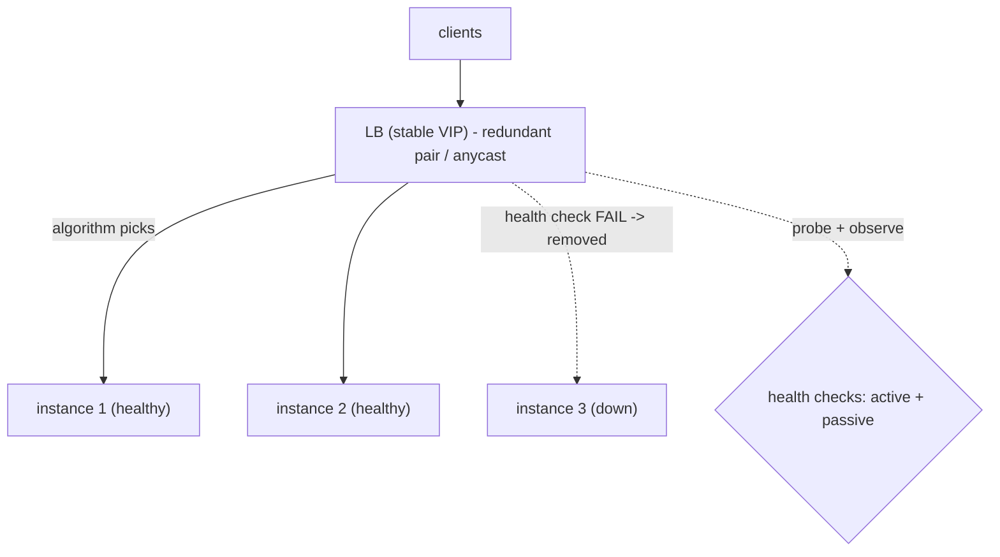

## Thesis

Spreading incoming traffic across a pool of backend instances --- picking a target by some algorithm, checking each instance's health so requests only go to ones that can serve, at the transport (L4) or application (L7) layer --- so no single instance is overwhelmed, a failed instance is routed around automatically, and the pool scales horizontally behind one stable address.

## Sub

**Why load-balance: one instance can't scale and will fail** -> **where it sits: L4 vs L7** -> **the algorithm and health checks** -> **zoom out** to affinity, the LB as a single point of failure, and the pivots an interviewer rides from "put a load balancer in front" into L4-vs-L7, picking the algorithm, and how failures are detected.

## Spine

- A load balancer **fronts a pool behind one stable address** --- clients hit the LB, which distributes each request to a backend instance, so you can add or remove instances (scale horizontally) and survive instance failures without clients ever knowing.
- It operates at **L4 (transport) or L7 (application)** --- L4 routes by IP and port (fast, connection-level, protocol-agnostic), L7 routes by request content (URL, headers --- smarter routing, but it must parse the request).
- The **algorithm picks the target** --- round-robin, least-connections, weighted, or hash-based --- trading simplicity against awareness of each instance's actual load and any need for stickiness.
- **Health checks make it fault-tolerant** --- the LB probes each instance (active) or observes failures (passive) and stops routing to unhealthy ones, so a dead instance leaves rotation automatically; but the LB itself must be made redundant, or it becomes the single point of failure.

## Companion Notes

### walk

Spreading traffic across a healthy pool

One request from a client to a healthy backend --- the stable address it hits, the algorithm that picks an instance, the L4/L7 layer it routes at, the health check that keeps dead instances out of rotation, and the redundancy that stops the LB itself being the weak point.

Say the stable-address idea first --- "clients hit one address; instances scale and fail behind it, invisibly." Horizontal scale and fault tolerance both fall out of that one indirection.

### drill

Probe Drill

Graded follow-ups on L4-vs-L7, the balancing algorithm, health checks, and affinity --- the ones that separate "add a load balancer" from a traffic layer that scales and self-heals.

Name the two jobs: distribute load evenly (the algorithm) and route around failure (health checks) -- and that the LB itself must be redundant or it's just a fancier single point of failure.

### wb

Draw the pool cold

Nine cues, from the stable address down to the panic threshold that stops a shared-dependency outage evicting your entire fleet. Draw each from memory first, then reveal.

The one people miss is the last: a deep health check plus a shared database is how a brief dependency hiccup becomes a total outage.

### sys

Where the LB sits

Client to global layer to LB to health checks to the pool. The pivots bridge out to consistent hashing, circuit breakers, autoscaling, multi-region and retries --- the LB touches all of them.

Every pivot here is a real interviewer bridge: they rarely stay on "which algorithm," they ride the LB into how you detect failure and what happens when you retry.

### trade

The calls that separate levels

Seven decisions: round-robin vs least-connections, L4 vs L7, sticky vs stateless, active vs passive checks, shallow vs deep checks, exact least-connections vs power-of-two-choices, server-side vs client-side.

Never say "it depends" and stop. Name the alternative, name what it costs you, and name the condition that decides it.

### model

Nine spoken answers

Design it, pick the algorithm, walk a bad deploy, defend the SPOF, health checks, operate it, one you built, test it, name the limits. Each is a script you can say out loud under time pressure.

Rehearse the close of each one. The last beat is what they remember, and it is the beat most people never write.

### num

Sizing the pool

Per-instance load, utilization, what happens when one instance dies, how many you can afford to lose, and how long a dead instance keeps taking traffic. Four inputs, five numbers you can defend.

The number that changes the design is failure headroom: if losing one instance pushes the survivors past 100% utilization, the pool cascades and the LB cannot save you.

### rf

What fails the loop

Nine phrasings that make an interviewer wince --- from "round-robin, so load is even" to "the LB gives us high availability" to the deep health check that takes the whole fleet down.

Most of these are not wrong facts. They are confident claims with an unexamined failure mode behind them, which is exactly what a senior interviewer probes.

### open

The one-liner and the close

Two cards: how you open when asked to scale a service, and how you land it when time is nearly up. Say each out loud before you reveal.

The close is the seniority signal. Summarize the shape, name the three things you would watch, say what you deliberately cut, and hand the wheel back.

## Drill

all | All four levels, mixed --- the way a real loop actually comes at you
SDE2 | the model and the mechanics
SDE3 | L4/L7, affinity, and health
Staff | global, scale, and client-side

### SDE2 | what a load balancer is

What is a load balancer and why do you need one?

A component that sits in front of a pool of backend instances and distributes incoming requests across them, presenting one stable address to clients. You need it for two reasons: **scale** --- a single instance can only handle so much, so you run many and spread the load; and **availability** --- if one instance dies, the LB routes around it, so clients aren't affected. It's the indirection that lets a service be many instances that come and go, while clients see one unchanging endpoint.

Follow: You said it routes around a failed instance. How does it actually know the instance failed?
Health checks. The LB probes each instance on a schedule (**active**) and/or watches real request outcomes (**passive/outlier detection**), and removes an instance from rotation once it fails a threshold of times. That means failure isn't detected instantly --- there's a window of roughly `interval x unhealthy_threshold` (say 5s x 3 = **15 seconds**) where a dead instance is still being handed requests. So the LB doesn't make instance failure *invisible*; it makes it **brief and bounded**. Closing the remaining gap is a request-time job: passive ejection plus retrying the failed request against another backend.

Follow: If the LB is what gives you availability, what happens when the LB dies?
Everything behind it is unreachable --- which is the catch: you cannot remove a single point of failure by adding a component that is one. So the **LB layer itself must be redundant**: an active-passive pair sharing a floating/virtual IP that fails over on a heartbeat, or active-active LBs behind **anycast** (the same IP announced from several locations, the network routing to the nearest healthy one). The LB has to be at least as redundant as the backends it protects, or you've concentrated risk rather than reduced it.

Senior: Not "it distributes traffic," but naming the **indirection** as the thing that buys scale and fault tolerance *at once* --- and volunteering, unprompted, that the LB itself is now the SPOF and must be made redundant. Juniors describe the mechanism; seniors immediately audit what the mechanism just centralized.
Speak: "A load balancer fronts a pool behind one stable address and does two jobs: spread load, and route around failure. The indirection is the point --- clients only know the LB, so instances can be added, removed, or die behind it invisibly. And the LB itself has to be redundant, or I've just relocated the single point of failure."

### SDE2 | L4 vs L7

What's the difference between L4 and L7 load balancing?

**L4 (transport layer)** balances by IP address and port --- it forwards TCP/UDP connections without looking inside the traffic, so it's fast and protocol-agnostic but can only route by network-level info. **L7 (application layer)** balances by the *content* of the request --- it parses HTTP, so it can route by URL path, headers, cookies, or host (send `/api` to one pool, `/images` to another), and do things like TLS termination and content-based routing. L4 is simpler and faster; L7 is smarter but does more work per request. The trade is raw throughput versus routing intelligence.

Follow: If L7 can do everything L4 can and more, why would anyone still choose L4?
Because the "more" costs you. L7 must **parse every request** and usually **terminates TLS**, which makes it CPU-bound on handshakes and puts a proxy hop in the middle of every connection --- at very high connection rates that parsing and crypto *is* the bottleneck. L4 forwards packets/connections with far less per-request work, handles **non-HTTP protocols** (arbitrary TCP/UDP --- databases, game traffic, MQTT), and can **pass TLS straight through** so the LB never holds a private key and never sees plaintext. So L4 for cheap, protocol-agnostic, end-to-end-encrypted connection spreading; L7 when you actually need to look inside.

Follow: Where does TLS get terminated in each case, and what does that change?
At **L7 the LB terminates TLS** --- so it holds the certificate and private key, does the handshake CPU, can read and route on the request, and then opens its *own* connection to the backend (plaintext, or re-encrypted if you require encryption in transit internally). At **L4 you can pass TLS through** untouched --- the backend terminates it, holds the cert, and the LB never sees plaintext. The trade: L7 gives you central cert management, SNI-based routing and request inspection, at the cost of owning the key material and the crypto load; L4 passthrough gives you true end-to-end encryption and a cheaper LB, at the cost of not being able to route on anything inside the request.

Senior: Knowing that the real question is **"do I need to look inside the request?"** --- and that TLS termination is the hidden capability *and* hidden cost that rides along with L7 (key custody, handshake CPU, a plaintext internal hop). The other tell is knowing most real stacks use **both**: L4 at the edge to spread connections cheaply, L7 deeper for content routing.
Speak: "L4 forwards by IP and port without parsing --- fast, protocol-agnostic, and it can pass TLS through untouched. L7 parses HTTP, so it can route by path, host, or header, and terminate TLS centrally. The question is just: do I need to look inside the request? If yes, L7. If I only need to spread connections cheaply, L4."

### SDE2 | round-robin

What is round-robin load balancing?

The simplest algorithm: hand each successive request to the next instance in order, cycling through the pool --- request 1 to instance A, request 2 to B, request 3 to C, request 4 back to A. It distributes requests evenly *by count* and needs no state about the instances. Its weakness is that it's blind to actual load: if requests vary in cost or instances vary in capacity, equal *counts* don't mean equal *load* --- a slow request pins one instance while round-robin keeps sending it more. It's the right default when requests and instances are roughly uniform.

Follow: Your requests are uniform, but one instance is a box with twice the CPU. What does round-robin do?
It gives the big box **exactly the same number of requests** as the small ones --- so the big instance sits half idle while the small ones saturate. Round-robin's implicit assumption is a **homogeneous pool**, and that assumption is silent: nothing errors, you just quietly waste capacity and hit a ceiling early. The fix is **weighted round-robin**: give each instance a weight proportional to its capacity, so a 2x box gets 2x the requests. Weight is how you encode heterogeneity that plain round-robin cannot see.

Follow: You're on L4 round-robin with keep-alive --- say HTTP/2 or gRPC. Is load still even?
No, and this is the classic production surprise. **L4 balances connections, not requests.** It picks a backend once, at connection establishment, and every request on that connection goes to the same place for its lifetime. With HTTP/2 or gRPC a single long-lived connection **multiplexes thousands of requests**, so a busy client that opened one connection pins all of its traffic to one backend --- and with a small number of clients you can get wildly uneven load while round-robin is technically "working." The fixes are **request-level (L7) balancing**, a **client-side/mesh balancer** that spreads per-call, or forcing periodic re-establishment (max connection age / max requests per connection).

Senior: Knowing round-robin balances **counts, not load** --- and, one level deeper, that at L4 with keep-alive it balances **connections, not even requests**. That second fact is the one that actually bites teams in production (a gRPC service where two of six pods are pinned at 90% CPU and round-robin is "fine").
Speak: "Round-robin cycles through the pool --- simple, no state, even by count. But count isn't load: variable request costs or unequal instance sizes make it uneven, and weighted round-robin is how you fix the unequal-instance case. The sharper catch is that at L4 with long-lived connections it balances connections, not requests --- so HTTP/2 can pin a whole client's traffic to one backend."

### SDE2 | least-connections

What is least-connections load balancing?

Send each new request to the instance with the fewest active connections --- a proxy for "least busy right now." Unlike round-robin, it's *load-aware*: an instance stuck on slow requests accumulates open connections, so it stops receiving new ones until it catches up. This handles uneven request costs much better than round-robin, because it responds to what instances are actually doing rather than blindly cycling. It needs the LB to track connection counts per instance, but that's cheap, and it's a common default for workloads with variable request duration.

Follow: A brand-new instance joins the pool with zero active connections. What does least-connections do to it?
It **hammers it**. Zero connections makes it look like the least busy instance in the pool, so it receives a burst of new requests --- but it is in fact the *slowest* instance there: empty caches, cold connection pools, un-warmed JIT. It gets overwhelmed while cold, its latency spikes, it may fail its health check, get ejected, restart, and flap. This is the pathological case for least-connections, and the fix is **slow-start**: ramp the new instance's effective weight up over a warm-up window so it eases into load as its caches fill. Crucially the ramp must be applied as a **weight inside the algorithm** (weighted least-connections), not bolted beside it --- otherwise the raw zero connection count wins and the ramp does nothing.

Follow: You have five load balancers in front of this pool. How does any one of them know the connection count?
It doesn't --- it only knows **its own** connections to each backend. With N load balancers, each has a **partial view**, so "least-connections" is least-connections *per LB*, not globally. That has two consequences: the choice is only locally optimal, and worse, several LBs can independently decide the same idle-looking instance is the least loaded and all pile onto it at once --- a **herd**. Getting a truly global count needs shared, constantly-updated state that is expensive to maintain and stale by the time you use it. That is exactly why large fleets use **power-of-two-choices**: sample two backends at random, send to the less loaded of the two. It needs no global ordering and, because each LB samples a different pair, it dissolves the herd.

Senior: Knowing least-connections is only load-aware **within one LB's view**, and naming the **zero-connection newcomer** as its pathological case. The senior fixes are structural --- slow-start folded into the weight, and power-of-two-choices at fleet scale --- not "track more state."
Speak: "Least-connections sends each request to the instance with the fewest open connections --- a proxy for least-busy, which handles variable request cost far better than round-robin. Two catches: a brand-new instance has zero connections, so it looks idle and gets slammed while it's cold --- that's what slow-start is for. And with multiple LBs, each only sees its own connections, so it's never globally optimal."

### SDE2 | what a health check is

What is a health check?

A test the load balancer runs against each backend instance to decide whether it's fit to receive traffic --- typically an HTTP request to a `/health` endpoint or a TCP connection attempt. If an instance passes, it stays in the rotation; if it fails (a threshold of times), the LB removes it from the pool and stops sending it requests, adding it back once it passes again. This is what makes the LB fault-tolerant: a crashed, hung, or overloaded instance is detected and routed around automatically, so its failure doesn't reach clients.

Follow: The instance answers `/health` with a 200, but every real request 500s. What catches that?
**Passive health checking** --- outlier detection. An active probe only proves the process is listening and can serve *that one trivial endpoint*; an instance with a poisoned cache, an exhausted connection pool, a bad config, or a corrupt in-memory state will happily return 200 on `/health` and fail everything real. Passive detection watches the outcomes of **actual production requests** to each backend and ejects one whose error rate or consecutive-failure count crosses a threshold. It costs nothing extra (it's observing traffic you're already sending) and it catches precisely the class of failure the shallow probe is blind to. Active and passive are not alternatives; passive is what closes this hole.

Follow: How long does a dead instance keep receiving traffic before it's removed?
Roughly `interval x unhealthy_threshold`, plus the probe timeout on the failing attempt --- with a 5-second interval and a threshold of 3, that's about a **15-second window** during which the LB is still routing requests to a box that cannot serve them. Every request in that window fails or hangs. You can shrink the window by probing faster or lowering the threshold, but both push you toward **flapping** (evicting a healthy instance on one transient blip) and add probe load. The better answer is to stop treating it as a probe-tuning problem: add **passive ejection** (the first few real failures eject it, faster than the probe would) and **retry the failed request against another backend**, which hides the window from the user entirely.

Senior: Quantifying the **detection window** (`interval x threshold`) instead of saying "the LB removes it," and knowing an active probe alone cannot catch an instance that is up-but-broken. The senior instinct is to close the gap at *request* time (passive ejection + retry), not by probing ever faster.
Speak: "A health check is how the LB decides an instance is fit to serve --- usually a probe to a /health endpoint. Fail it a threshold of times and the instance leaves the pool; pass again and it comes back. That's what makes the LB fault-tolerant. The number I'd name is the detection window: interval times threshold, so 5 seconds times 3 is 15 seconds where a dead instance is still taking traffic."

### SDE2 | active vs passive health checks

What's the difference between active and passive health checks?

**Active**: the LB proactively probes each instance on a schedule (every few seconds, hit `/health`), independent of real traffic --- it detects a sick instance even if no request has hit it yet. **Passive** (a.k.a. outlier detection): the LB watches *real* request outcomes and marks an instance unhealthy when it starts returning errors or timing out, without a separate probe --- no extra load, and it catches failures the probe might miss (the instance answers `/health` fine but errors on real requests). They're complementary: active gives fast, traffic-independent detection; passive catches real-world failures the shallow probe can't. Robust setups use both.

Follow: If passive detection catches the real failures, why bother with active probes at all?
Because passive detection is **blind without traffic**. It can only learn from requests you actually send: an instance that is currently receiving no traffic is never evaluated, a **newly added** instance has no history at all, and --- most importantly --- an **ejected** instance receives zero requests by definition, so passive detection can never observe that it recovered. Active probes are traffic-independent: they catch a sick instance *before* a user does, they validate a new instance before you trust it with load, and they are the mechanism by which an ejected instance is **re-admitted**. Passive tells you the truth about real work; active gives you detection and recovery that don't depend on victims.

Follow: An instance is ejected by outlier detection. How does it ever come back?
Through an explicit **re-admission path**, and if you don't have one, a single bad minute permanently shrinks your pool. The standard shape (this is Envoy's model) is a **base ejection time** --- say 30 seconds --- after which the host is tentatively returned to the pool, with the ejection duration **multiplied by the number of times it has been ejected**, so a repeatedly-flapping instance backs off progressively instead of thrashing in and out. In practice you pair that with active probes, so an instance only returns once it's actually answering. The thing to notice is that re-admission is inherently a gamble --- you must send it real traffic to find out if it recovered --- which is why the backoff matters.

Senior: Knowing passive detection **cannot see an instance it has ejected** (no traffic, no signal), so an explicit re-admission path with **exponential backoff on repeat ejections** is mandatory --- and that this is exactly why active and passive are complements, not competitors.
Speak: "Active probes hit /health on a schedule --- traffic-independent, so they catch a sick instance before a user does, and they're how a recovered instance gets re-admitted. Passive outlier detection watches real request outcomes and ejects an instance that's erroring --- it catches the one that answers /health but 500s on real work. I'd run both; each covers the other's blind spot."

### SDE2 | horizontal scaling

How does a load balancer enable horizontal scaling?

By decoupling clients from instances: clients hit the LB's one stable address, and behind it you add or remove backend instances freely, with the LB spreading traffic across whatever's currently in the pool. So to handle more load you add instances (scale out) rather than making one bigger (scale up), and the LB immediately starts using them. This is the foundation of horizontal scaling --- capacity becomes "how many instances," which you can change dynamically (with autoscaling) without touching clients. The LB is what makes a pool of interchangeable instances behave like one elastic service.

Follow: You add ten instances and throughput doesn't move. Where do you look?
Three places, in order. **One: the app tier wasn't the bottleneck.** Scaling out only helps if the constraint is the thing you scaled --- if the wall is a shared database, a lock, a rate-limited downstream, or a saturated queue, ten more app instances just contend harder on the same choke point (and can make it *worse*, by opening ten times as many DB connections). **Two: the LB itself is saturated** --- an L7 LB terminating TLS is CPU-bound, and it can be the ceiling. **Three: traffic isn't actually reaching the new instances** --- which is the next follow-up, and the most common one.

Follow: The new instances are in the pool and healthy, but the old ones stay hot. Why?
**Long-lived connections.** With keep-alive, HTTP/2 or gRPC, the LB (especially at L4) chooses a backend at **connection establishment** --- and existing connections are already pinned to existing backends. A new instance only receives traffic from *new* connections, so if your clients hold persistent connections, the new capacity sits idle while the old instances stay saturated. The fixes: balance at the **request** level (L7, or a client-side/mesh balancer), and force periodic re-establishment with a **max connection age** or **max requests per connection** so the pool gets reshuffled. It's the reason "we scaled out and nothing happened" is such a common gRPC story.

Senior: Knowing that scale-out only works if (a) the app tier is genuinely the bottleneck and (b) traffic actually **moves** onto the new instances --- and that long-lived connections silently defeat (b). Naming max-connection-age as the blunt fix shows you've actually shipped this.
Speak: "The LB decouples clients from instances --- clients hit one address, and I add or remove instances behind it, so capacity becomes a dial: scale out, not up. Two things have to be true for it to work, though: the app tier has to be the actual bottleneck, and traffic has to reach the new instances --- long-lived connections don't move on their own."

### SDE3 | L4 vs L7 trade-offs

When would you choose L4 over L7, or vice versa?

Choose **L4** when you need raw throughput and low latency, when the traffic isn't HTTP (arbitrary TCP/UDP), or when you don't need content-based decisions --- it's cheaper per connection because it doesn't parse payloads, and it preserves the connection end-to-end. Choose **L7** when you need to route by request content (path/host/header-based routing, API gateways), terminate TLS centrally, do sticky sessions by cookie, or apply per-request logic --- the intelligence is worth the parsing cost. Many architectures use both: an L4 balancer for sheer connection spreading at the edge, and L7 balancers deeper for smart routing. The decision is "do I need to look inside the request?"

Follow: You terminate TLS at the L7 load balancer. What did you just take on?
Four things. **Key custody**: the LB now holds the private key and owns the certificate lifecycle --- rotation, expiry, SNI across many domains --- so it becomes a high-value target and a recurring operational chore. **CPU**: TLS handshakes are the expensive part, so the LB tier is now compute-bound on new connections and must be sized for handshake rate, not just bandwidth. **A plaintext internal hop**: unless you re-encrypt LB-to-backend, traffic inside your network is cleartext, which is a compliance conversation in a lot of shops. And **you lose the client's IP** --- which is the next question.

Follow: Backend logs now show every request coming from the load balancer's IP. Why, and how do you fix it?
Because an L7 proxy **terminates the client's TCP connection and opens its own** to the backend --- so from the backend's perspective the peer genuinely *is* the LB. The fix is to propagate the original address out of band: **`X-Forwarded-For` / `Forwarded`** headers at L7, or the **PROXY protocol** at L4 (which prepends the real source address to the connection). The trap that matters: those headers are **client-supplied data**. If your app trusts `X-Forwarded-For` blindly, any client can spoof its source IP --- and defeat your IP allowlists, rate limits, geo-rules and audit logs. You must only trust the header when it arrives from your own LB, and take the correct hop (strip/overwrite at the trust boundary rather than appending and hoping).

Senior: Naming the **consequences** of termination --- key custody, handshake CPU, a plaintext internal hop, and the lost client IP --- rather than just "L7 is smarter." The `X-Forwarded-For` spoofing trap is the specific tell: everyone knows the header exists; far fewer say "and if you trust it unconditionally, your rate limiter is bypassable."
Speak: "L4 when I need raw throughput, non-HTTP traffic, or end-to-end TLS. L7 when I need to route on request content, terminate TLS centrally, or apply per-request logic. Most real stacks run both --- L4 spreading connections at the edge, L7 deeper for smart routing. And once I terminate at L7, I own the certs, the handshake CPU, and propagating the client IP safely."

### SDE3 | weighted load balancing

What is weighted load balancing and when do you use it?

Assigning each instance a weight so it receives traffic proportional to its capacity, rather than an equal share. You use it when the pool is **heterogeneous** --- some instances are bigger (more CPU/memory) or you're doing a **canary/gradual rollout** (send 5% of traffic to the new version). Weighted round-robin or weighted least-connections respects the weights, so a 2x-larger instance gets 2x the traffic. It's the mechanism behind canary deploys and mixed-instance-size pools: you tune the weights to match capacity or to control how much traffic a new version sees.

Follow: You set the canary to 5%. Five percent of *what*, exactly?
That ambiguity is the bug. Weighted balancing at L4 gives the canary 5% of **new connections** --- and with keep-alive or HTTP/2, a client that lands on the canary sends *all* of its requests there for the life of that connection, so 5% of connections can be far more (or far less) than 5% of requests, and it's a **different 5% of users** depending on who reconnects. At L7 with per-request balancing you get 5% of **requests**, but they're scattered across users, so no single user's whole journey is on the canary --- which is the right choice for load testing but the wrong one for testing a multi-step flow. If you want 5% of **users** with a coherent experience, you need to route on a stable key (a user-id hash), not a weight. Requests, connections and users are three different things and the interviewer is checking whether you noticed.

Follow: Your canary is at 5% with an identical error rate to baseline, so you ramp to 100% --- and it falls over. What did the canary miss?
Three classes of failure a 5% canary structurally cannot see. **Rare paths**: 5% of traffic may contain none of the expensive, unusual requests that break the new code. **Load-dependent failures**: connection-pool exhaustion, lock contention, GC pressure, cache-miss storms and downstream rate limits only appear at *full* share --- at 5% the new version is being carried by warm neighbours and an under-utilized database. **Aggregate effects**: a small memory leak or an N+1 query is invisible at 5% and lethal at 100%. So a healthy canary is **evidence, not proof** --- it bounds blast radius and catches gross regressions. The mitigation is to ramp in stages (5 -> 25 -> 50 -> 100) with bake time and automated rollback on SLO burn at each step, not to treat 5%-is-green as a pass.

Senior: Refusing the sloppy "5% of traffic" and distinguishing **requests vs connections vs users** --- then saying out loud that a green canary is evidence rather than proof, and naming the load-dependent failures that only surface at full share. That's the difference between someone who has *configured* a canary and someone who has been burned by one.
Speak: "Weighted balancing gives each instance traffic proportional to its weight --- I use it for heterogeneous instance sizes, and it's the mechanism behind canary rollouts. The thing I'd be precise about is what the percentage measures: with long-lived connections, 5% of weight is 5% of connections, not requests, and it isn't 5% of users unless I route on a stable key."

### SDE3 | sticky sessions

What are sticky sessions and what's the catch?

Session affinity --- routing a given client consistently to the same backend instance (by a cookie the LB sets, or by source IP hash), so requests from one session land on the instance that holds that session's in-memory state. You use it when the backend keeps per-session state locally. The catch is that it **undermines even load distribution and fault tolerance**: traffic can pile unevenly on whichever instances hold hot sessions, and if a sticky instance dies, its sessions are lost (the state was only there). Stickiness is a workaround for stateful backends; the better answer is usually to make the backend *stateless* (session state in Redis/a shared store) so any instance can serve any request and no affinity is needed.

Follow: A sticky instance dies. What does the user actually experience?
The load balancer does its job perfectly --- and the user is still broken. The LB notices the instance is unhealthy and re-routes them to a healthy one, which has **no idea who they are**: their session state died with the process. So they're logged out mid-flow, their cart is empty, their multi-step form resets. That is the whole indictment of stickiness in one sentence: it converts an instance failure into a **user-visible failure**, which is precisely the thing the load balancer existed to prevent. The LB failed over; the *state* didn't.

Follow: You can't make the app stateless this quarter. How do you limit the damage?
Four levers, in order of value. **Use cookie-based affinity, not source-IP hashing** --- source IP collapses behind NAT and carrier-grade NAT, so an entire office or a whole mobile network can hash to one backend, which is both a load disaster and a single-failure blast radius. **Externalize the state opportunistically anyway**: write session state through to a shared store even while keeping affinity, so a failover degrades (a slightly stale session) instead of destroying (a logout). **Drain on deploy** --- graceful connection draining plus a pre-stop delay so you don't sever every session on every release, which is otherwise a self-inflicted outage every deploy. And **monitor the imbalance** explicitly, because with stickiness your per-instance load is no longer something the algorithm controls. It's a stopgap with a named cost and an exit plan, not an architecture.

Senior: Naming that stickiness **converts an instance failure into a user-visible failure** --- undoing the LB's core purpose --- and, when forced to keep it, choosing **cookie affinity over source-IP hashing** because source IP collapses behind NAT. Volunteering "write session state through to a shared store anyway, so failover degrades rather than destroys" is the answer of someone who has had to live with a stateful tier.
Speak: "Sticky sessions pin a client to one instance so its in-memory session state is there. The catch is it breaks both of the LB's jobs: load piles unevenly on the instances holding hot sessions, and when a sticky instance dies its sessions die with it --- the user gets logged out. It's a workaround for a stateful backend; the real fix is externalizing session state so any instance can serve any request."

### SDE3 | consistent hashing for LB

When would a load balancer use consistent hashing?

When you want a *stable* mapping from a key to an instance --- most often for **cache affinity**: hash the request key (a user id, a cache key) so the same key consistently routes to the same instance, maximizing that instance's cache hit rate. Plain modulo hashing would remap almost everything when an instance is added or removed; **consistent hashing** remaps only a small fraction of keys, so scaling the pool doesn't blow away everyone's cache locality. So it's the algorithm of choice when you're balancing across a distributed cache tier or otherwise want key-to-instance stickiness that survives pool changes gracefully.

Follow: Consistent hashing buys you locality. What does it cost you in load balance?
**Load-awareness --- entirely.** Hash-based routing is deterministic and therefore blind: a **hot key** (a celebrity user, a tenant that is 30% of your traffic, one viral cache entry) maps to exactly one instance, sends it disproportionate load, and the LB **cannot move it**, because moving it is precisely what consistent hashing exists to prevent. You have traded even distribution for locality, and that trade is silent until the hot key appears. The mitigations, in order: **virtual nodes** (each physical instance owns many points on the ring), which smooths *statistical* lumpiness from an uneven ring but does nothing for a single hot key; **bounded-load consistent hashing**, which caps how loaded any node may get and spills the overflow to the next node on the ring --- that one does directly address the hot key, at the cost of some cache misses; and at the extreme, **splitting the hot key** across several nodes with a suffix, giving up locality for exactly that key.

Follow: One node in a consistently-hashed pool dies. What happens to the keys it owned?
Only **its share** of the keyspace --- roughly `1/N` --- moves; every other key keeps its owner. That is the entire point versus modulo hashing, where changing `N` remaps nearly every key at once. But the keys that *do* move arrive **cold** at their new owner: a burst of cache misses landing on one node, at exactly the moment the system is already down an instance and the remaining nodes have absorbed extra request load. Without **virtual nodes**, all of the dead node's keys fall to a single neighbour on the ring --- so one node takes the whole cold burst *and* the whole traffic burst, and can topple, cascading around the ring. With virtual nodes, the dead node's segments are scattered, so the takeover is spread across many nodes and no single neighbour is asked to absorb it alone. Virtual nodes are as much about **failure blast radius** as about smooth distribution.

Senior: Knowing consistent hashing buys locality by **giving up load-awareness**, and naming the *specific* remedies rather than waving at "add virtual nodes" --- virtual nodes fix statistical lumpiness and cold-takeover blast radius, **bounded-load** consistent hashing is what actually fixes a hot key. Explaining that a ring without virtual nodes cascades on node death is the tell you've operated one.
Speak: "Consistent hashing is for when I want a stable key-to-instance mapping --- usually cache affinity, so the same key keeps landing on the instance that has it cached. Plain modulo remaps almost every key when the pool changes; consistent hashing moves only about 1/N. The cost is that it's load-blind: a hot key pins to one instance and I can't move it, which is what bounded-load consistent hashing is for."

### SDE3 | health check tuning

How do you tune health checks, and what goes wrong if you don't?

Balance detection speed against stability via the **interval** (how often to probe), the **unhealthy threshold** (consecutive failures before removing), and the **healthy threshold** (successes before re-adding). Too aggressive (short interval, low threshold) and a single transient blip evicts a healthy instance --- and instances **flap** in and out, thrashing the pool. Too lax (long interval, high threshold) and a dead instance keeps receiving (and failing) traffic for too long before removal. The thresholds exist precisely to avoid flapping: require a few consecutive failures to remove and a few successes to restore, so you react to real state changes, not noise --- roughly the same tuning tension as a circuit-breaker.

Follow: Give me actual numbers. What would you start with, and what does that buy you?
A reasonable default: **interval 5s, probe timeout 2s, unhealthy threshold 3, healthy threshold 2.** That gives a worst-case detection window of about `5 x 3 = 15 seconds` and a recovery window of about `5 x 2 = 10 seconds`. Then I'd ask the question that actually matters: **is 15 seconds of errors acceptable against our error budget?** If not, the wrong move is to drop the interval to 1 second --- that multiplies probe load across every LB times every instance and makes flapping far more likely on a transient GC pause. The right move is to close the gap where the user actually feels it: **passive outlier ejection** (the first two or three real failures eject it, faster than the probe) plus **a retry against another backend**, which makes the window invisible. The probe numbers are a starting point; the SLO is what tunes them.

Follow: What happens if you set the probe timeout longer than the probe interval?
Probes **overlap and pile up**. With a 2-second interval and a 5-second timeout you can have three probes in flight to the same instance at once, so "three consecutive failures" stops meaning what you think it means --- the responses can complete out of order, the failure count becomes a function of timing rather than health, and you are adding load to an instance that is already struggling to respond. The rule is **timeout < interval**, always. And the related discipline: **keep the probe cheap** --- no database call, no downstream dependency, no heavyweight work --- because a probe that is itself expensive will time out on a *healthy but busy* instance and evict it exactly when you need it most. That's a self-inflicted outage: the health check becomes the thing that removes your capacity under load.

Senior: Giving **concrete numbers and the derived detection window**, then explicitly refusing the obvious "probe faster" fix in favour of passive ejection plus retry. The `timeout < interval` rule --- and the observation that an expensive probe evicts healthy-but-busy instances under load, turning the health check into the outage --- is not something you know from reading docs.
Speak: "Three knobs: interval, unhealthy threshold, healthy threshold. Detection time is interval times threshold --- 5 seconds times 3 is a 15-second window where a dead instance still gets traffic. Tighten it and you flap on a transient blip; loosen it and dead instances linger. If 15 seconds is too long, I don't probe faster --- I add passive ejection and a retry, which closes the gap at request time."

### SDE3 | the LB as a single point of failure

The load balancer improves availability --- but isn't it a single point of failure?

Yes, and that's the catch: if all traffic flows through one LB and it dies, the whole service is down, so the LB *itself* must be made redundant. Common approaches: an **active-passive pair** with a floating/virtual IP that fails over to the standby; **active-active** LBs behind DNS or anycast; **DNS-based** distribution across multiple LB endpoints; or **anycast**, where the same IP is announced from multiple locations and the network routes to the nearest healthy one. The principle is that you can't remove a single point of failure by adding a component that is itself one --- the LB layer has to be as redundant as the backends it protects.

Follow: With an active-passive pair and a floating IP, how does the standby know the primary is dead --- and what's the failure mode?
A **heartbeat** between the two (VRRP, typically via keepalived). While the standby hears the primary it does nothing; when the heartbeat stops, it **claims the virtual IP** and announces the change to the local network with a **gratuitous ARP** so switches update their tables and traffic starts arriving at the new box --- typically a failover of a few seconds. The failure mode is **split-brain**: if the *heartbeat link* fails but both machines are alive and healthy, each concludes the other is dead and **both claim the VIP**. Now you have two hosts answering for the same address, ARP tables flapping, and connections landing unpredictably on either --- which is worse than the outage you were preventing. You guard against it with a **redundant heartbeat path** (a second network, a serial link) so a single link failure can't be mistaken for a node failure, and ideally a **third witness / quorum** so a partitioned node knows it is the one in the minority and refuses to take the VIP.

Follow: Why not just put two LB IPs in DNS and be done with it?
Because **DNS is a distribution mechanism, not a failover mechanism.** The moment you rely on it for failover you're relying on TTL expiry, and TTLs are aspirational: recursive resolvers cache, some ignore short TTLs and enforce their own floor, OS and application-level resolver caches sit on top, and long-running processes (JVMs are notorious) can cache a resolved address effectively forever. So after you pull a dead IP, a meaningful fraction of clients keep being handed --- and keep dialling --- the dead address for minutes. Modern clients soften this (browsers do happy-eyeballs-style retries across the returned addresses), but you cannot depend on the client. For **fast** failover you want a mechanism that doesn't ask the client to change its mind: a **floating IP** (seconds, via ARP) or **anycast** (the network reconverges when the sick location withdraws its route). DNS is a fine coarse layer for geo-distribution --- just don't ask it to be your failover.

Senior: Naming **split-brain** as the concrete failure mode of active-passive --- and the guards, a redundant heartbeat path plus a quorum witness --- rather than stopping at "use a floating IP." Equally: knowing **DNS TTLs are not honoured** in practice, so DNS is distribution, not failover. Both are the difference between having read about HA and having been paged by it.
Speak: "It is a single point of failure --- and you can't fix a SPOF by adding a component that is one. So the LB layer has to be redundant itself: an active-passive pair with a floating IP that fails over on a heartbeat, or active-active behind anycast, where the same IP is announced from several locations and the network routes to the nearest healthy one. DNS is fine for coarse distribution but too slow for failover, because TTLs get cached."

### SDE3 | connection draining

What is connection draining and why does it matter?

Graceful removal: when you take an instance out of the pool (deploy, scale-in, maintenance), the LB **stops sending it new requests but lets in-flight requests finish** before fully removing it, rather than killing active connections. Without draining, deploying or scaling down abruptly severs live requests --- users see errors mid-request. With it, the instance is marked "draining," receives no new traffic, and is removed only once its existing requests complete (or a timeout elapses). This is essential for zero-downtime deploys and clean autoscaling: you can cycle instances without dropping the requests they were already handling.

Follow: Your drain timeout is 60 seconds, but you have a WebSocket that's been open for three hours. What happens?
It gets **force-closed at the timeout**, and the user's connection drops. Draining is defined in terms of **in-flight requests** --- work that has a natural end --- and a long-lived connection doesn't have one, so waiting for it to "finish" means waiting forever. The 60-second timeout is what stops that, and it is a guillotine, not a graceful close. For long-lived connections the LB alone cannot solve this: the **application has to cooperate**. It sends an explicit shutdown signal --- an HTTP/2 **GOAWAY** frame, or a WebSocket close frame with a reconnect hint --- so the client knows to re-establish, and you **stagger** the reconnects (jitter) so ten thousand clients don't all reconnect to the remaining instances in the same second and take them down too. Draining handles requests; graceful shutdown of long-lived connections is an application protocol concern.

Follow: You drain and replace instances one at a time during a deploy, and users *still* see errors. What's missing?
The **deregistration race**. Removing an instance from the pool is not instantaneous --- the deregistration (or the health check flipping to unhealthy) takes time to propagate to every load balancer node, and connections are being routed by those nodes *right now*. If the process receives SIGTERM and exits promptly, it will be killed while traffic is **still arriving** at it, and those requests are refused. The fix is a **pre-stop delay**: on shutdown, first mark yourself unhealthy / deregister, then **keep serving normally for several seconds** (long enough for the LB to converge --- a few health-check intervals), *then* stop accepting new work, drain what's in flight, and only then exit. The counter-intuitive part is that the pod must keep happily serving traffic for a while *after* you've decided to kill it. Skipping that window is the single most common cause of "we do rolling deploys and still drop requests."

Senior: Knowing the **deregistration race** --- that traffic keeps arriving for a propagation window after you deregister, so the shutdown sequence must include a deliberate pre-stop delay where the instance keeps serving while it is already marked for death. And knowing draining covers *requests*, not long-lived connections, which need GOAWAY plus jittered reconnects.
Speak: "Draining means: stop sending an instance new requests, but let its in-flight ones finish before removing it --- otherwise a deploy or scale-in severs live requests and users see errors. The subtlety is the deregistration race: traffic keeps arriving for a few seconds after you deregister, so the instance has to keep serving during a pre-stop delay before it actually exits."

### Staff | global load balancing

How does load balancing work across regions, globally?

In layers. A **global** layer routes users to the right *region* --- typically **GeoDNS** (DNS returns a region-appropriate IP based on the client's location) or **anycast** (one IP announced from many locations, the network routes to the nearest). Within each region, **local** load balancers spread traffic across that region's instance pool. So there's global routing (get the user to a nearby, healthy region --- for latency and for regional failover) and local balancing (spread within the region). Global health matters too: if a whole region is down, the global layer (via DNS failover or anycast withdrawal) steers users to another region. It's a hierarchy: global picks the region, local picks the instance.

Follow: GeoDNS routes on the *resolver's* location, not the user's. When does that break?
Whenever the user's resolver isn't near the user --- which is common. A user on a public resolver (8.8.8.8, 1.1.1.1) historically presented the *resolver's* network location to your authoritative server, so someone in Sydney using a resolver that egresses in Singapore got sent to the wrong region, and you'd never see it in your own metrics because from your side the routing looked correct. The mitigation is **EDNS Client Subnet (ECS)**, where the resolver passes a truncated prefix of the client's subnet so your authoritative server can decide based on the *user's* network rather than the resolver's --- but it depends on the resolver choosing to send it, and it's a privacy trade the resolver operator makes. **Anycast** sidesteps the whole problem: it makes no guess about where the client is, because the routing decision is made by the network itself, hop by hop, from the client's actual position.

Follow: A region isn't down --- it's *up and serving 40% errors*. Does your global layer notice?
Almost certainly not, and that's the outage everyone remembers. DNS failover and anycast health are usually wired to **liveness**: is the endpoint reachable, does it answer. A region that is up, answering, and returning garbage sails through that check and keeps taking its full share of users. To catch it, **global health has to be a success-rate signal, not a liveness signal** --- either the health endpoint the global layer probes goes unhealthy when the region's SLO is burning, or you run **external probers** measuring real end-to-end success from outside and feed that into the routing decision. And you need a **human-triggerable regional drain**, because the automated signal will always lag the incident and an operator who can see it should be able to shift traffic in one command. "Up" is not "healthy," and a global layer that only knows "up" will faithfully route half your users into a broken region.

Senior: Knowing GeoDNS resolves on the **resolver's** location (hence ECS, and hence anycast's structural advantage), and --- the bigger one --- that a global layer keyed on **liveness cannot see a degraded-but-up region**. Naming the fix as a success-rate health signal plus an operator-triggerable drain is the Staff-level move: the routing is easy, the *health signal* is the design problem.
Speak: "It's a hierarchy. A global layer gets the user to a healthy nearby region --- GeoDNS or anycast --- and local LBs spread traffic within it. Global picks the region, local picks the instance. The hard part isn't the routing, it's the health signal: a region that's up but serving errors stays in rotation unless health means success rate, not liveness."

### Staff | algorithms at scale

Why not just use global least-connections at very large scale?

Because tracking exact least-connections across a huge fleet requires global state that's expensive and stale by the time you use it --- the coordination cost and the race between "read the counts" and "route the request" make perfect global load-awareness impractical. The elegant fix is **power-of-two-choices**: pick two instances at random and send the request to the less-loaded of the two. This gets *most* of the benefit of least-connections (dramatically better tail load distribution than random or round-robin) with *almost none* of the coordination cost, and it avoids the herding problem where everyone piles onto the single "least loaded" instance simultaneously. It's a classic result: two random choices beat one, and beat trying to be globally optimal.

Follow: Why is sampling two and taking the better one so much better than sampling one? Give me the intuition.
It's the **balanced-allocations** result (Azar, Broder, Karlin and Upfal). Throw `n` balls into `n` bins: with **one** random choice the maximum bin load grows like `log n / log log n`; with **two** choices it collapses to `log log n / log 2`. That is an **exponential** improvement --- and the further jump from two choices to three only buys a constant factor, which is why two is the sweet spot. The intuition: to overload a bin under one-choice, you just have to be unlucky *once* --- a bin gets picked repeatedly by chance. Under two-choice, a ball only lands in a loaded bin if that bin was the **less loaded of two independent draws**, which means its competitor had to be loaded too. Overloading now requires a *conspiracy* of bad luck rather than a single unlucky streak, and conspiracies are exponentially rarer. The comparison is what does the work, not the sampling.

Follow: But power-of-two-choices still needs per-instance load --- isn't that the expensive thing you just said to avoid?
No, and the distinction is the whole point. It needs the load of the **two sampled instances only**, at the moment of the decision --- and the LB already has that for free: its own count of in-flight requests to each backend, held in local memory, needing no coordination with anyone. What was expensive was maintaining a **globally consistent ordering** of every backend across every LB so that "the least loaded" is a well-defined thing. Sampling two removes the need for any ordering at all. And it removes the **herd** as a side effect: under exact least-connections, every LB reads the same state and independently concludes the same instance is idlest, so they all stampede it simultaneously and it becomes the *most* loaded. Under P2C each LB draws a different random pair, so their decisions decorrelate. You give up global optimality and get robustness --- which is the better trade at fleet scale.

Senior: Being able to state the **balls-into-bins result** precisely (exponential improvement from one choice to two; only a constant factor from two to three) *and* identifying that the win is as much about **destroying the herd across many LBs** as about the distribution itself. Most candidates know "P2C is good"; very few can say why two is enough and three is pointless.
Speak: "Exact global least-connections needs state that's expensive to maintain and stale by the time you use it --- and it herds, because every LB reads the same counts and stampedes the same 'idlest' instance. Power-of-two-choices fixes both: sample two backends at random, send to the less loaded one. It needs no global ordering, each LB samples a different pair so the herd dissolves, and the max load drops exponentially versus a single random choice."

### Staff | thundering herd on scale-up

What happens when you add fresh instances to a hot pool, and how do you handle it?

A cold-start herd: a brand-new instance has empty caches, cold connection pools, and JIT not warmed up, so it's *slower* than the warm ones initially --- and if the LB immediately sends it a full equal share (or worse, least-connections sends it *extra* because it has zero connections), it gets overwhelmed before it's ready and may fail its health check, flapping. You handle it by **slow-starting**: ramp the new instance's traffic weight up gradually (many LBs have a slow-start / warm-up period), so it eases into load as its caches fill. This matters most during autoscaling and deploys, where new instances arrive under existing load and can't take a full share cold.

Follow: How long should the slow-start window be, and what are you actually waiting for?
You're waiting for the things that make a warm instance fast: **JIT compilation** of the hot paths, **connection pools** (to the database, to downstream services) filling so a request doesn't pay connection setup, **local caches** populating so it isn't fetching everything cold, and any lazy initialization completing. So the window should come from the app's **actual warm-up curve** --- watch a fresh instance's p99 latency and error rate until they converge on the pool's, and set the ramp to at least that. In practice that's tens of seconds for a Go service to a couple of minutes for a big JVM. The tension is real: too short and the ramp does nothing; too long and you're slow to add capacity during the exact spike you added it for --- so it's a number you measure, not a number you guess.

Follow: Slow-start ramps traffic in. But least-connections still sees zero connections on that instance. Do they fight?
Yes --- and this is a real configuration trap. If slow-start is implemented as something *beside* the algorithm, least-connections looks at the cold instance's zero in-flight count, decides it's the idlest thing in the pool, and hands it a burst, **defeating the ramp entirely**. The ramp has to **modulate the algorithm's own choice**: slow-start must express itself as a **weight** that the selection consumes --- weighted least-connections, where the effective score is connections divided by (or scaled against) the ramping weight --- so a cold instance with zero connections and a 10% weight is still only picked about 10% as often as a warm peer. So the correct statement isn't "use least-connections *and* slow-start," it's "use **weighted** least-connections, with slow-start driving the weight." Turning on least-connections without a slow-start-aware weight silently reintroduces exactly the cold-instance hammering you were trying to prevent.

Senior: Knowing slow-start must **modulate the algorithm** (weighted least-connections) rather than sit beside it --- because naive least-connections actively *seeks out* the cold instance. And deriving the ramp length from a measured warm-up curve rather than picking 30 seconds because it's the default.
Speak: "A new instance is cold --- empty caches, cold connection pools, un-JITed --- so it's the slowest in the pool, and least-connections sees zero connections and hammers it. It fails its health check and flaps. The fix is slow-start: ramp its weight up over a warm-up window. And the ramp has to be a weight *inside* the algorithm, or least-connections just overrides it."

### Staff | client-side vs server-side load balancing

What's client-side load balancing, and when is it used?

**Server-side** (the classic model): a dedicated LB sits between clients and backends and makes routing decisions. **Client-side**: the *client* knows the pool of instances (via service discovery) and picks one itself, with no LB hop in the middle --- common in microservices and gRPC, often via a **service mesh** (a sidecar proxy per service instance does the balancing). Client-side saves a network hop and a central bottleneck, and gives fine-grained, per-client control, but pushes the balancing logic (and discovery, health, retries) into every client/sidecar. It's favored in east-west (service-to-service) traffic where a central LB per call would add latency and a chokepoint; north-south (client-to-edge) traffic still usually goes through a server-side LB.

Follow: Client-side removes the LB hop. What did you just distribute into every client?
The load balancer's **entire job** --- you didn't delete it, you **replicated** it N times. Every client now needs **service discovery** (know the pool, and watch it change), **health checking** (which, if each client actively probes each backend, is `clients x backends` probes --- probe traffic that can genuinely rival real traffic in a large mesh, which is why sidecars lean on passive detection and a shared control plane), the **algorithm**, and **retry policy**. And the one people forget: **config rollout**. Changing the balancing policy, the retry budget, or the outlier thresholds is now a change to every client --- a redeploy of your entire fleet instead of a config push to one tier. A **service mesh** exists precisely to reclaim that: the sidecar keeps the data path direct (no extra hop through a central box), but a **control plane** owns discovery, policy and config centrally. You get client-side's data path with server-side's operability.

Follow: Your mesh control plane goes down. What happens to traffic?
Nothing, if you designed it correctly --- and that property has a name: **fail static**. The control plane is **not on the request path**; it configures the sidecars, and the sidecars keep routing on the **last-known-good configuration** they already hold. So requests keep flowing with the endpoints, weights and policies they had a second before the outage. What you lose is **change**: newly-started instances are never discovered (so a scale-up delivers no capacity), terminated instances aren't removed from the endpoint list (though local passive outlier detection will still eject them when they start failing, which is precisely why local health matters), and no config or certificate rotation propagates. So a control-plane outage isn't an immediate outage --- it's a **slowly rotting view of the world**, and the danger is that it's *invisible* until something needs to change. That is exactly why you alert on control-plane staleness rather than only on request errors, and why "the data plane must survive a control-plane outage" is a hard design requirement, not a nice-to-have.

Senior: Naming that client-side balancing doesn't *remove* the LB, it **replicates it into every client** --- with the discovery, probe-amplification and config-rollout costs that implies --- and that a mesh's control plane exists to reclaim central operability without a central hop. Then knowing the control plane must **fail static**, and that its failure mode is a silently stale world view, not an outage.
Speak: "Server-side is a dedicated LB in the path. Client-side means the client picks a backend itself from service discovery --- common in gRPC and service meshes, where a sidecar does the balancing. It saves a hop and a central chokepoint, which matters for east-west traffic. But it doesn't delete the load balancer, it replicates it into every client: discovery, health, retries and policy rollout all become everyone's problem, which is exactly what a mesh control plane is for."

### Staff | sticky sessions vs stateless

Why do senior designs avoid sticky sessions?

Because stickiness trades away the LB's two core benefits to prop up a stateful backend. It **breaks even distribution** (load piles on instances holding hot sessions), it **breaks fault tolerance** (a dead instance loses its sessions --- the state lived only there), and it complicates scaling (you can't freely move traffic). The root cause is per-session state stored *in the instance*. The senior move is to make the backend **stateless** --- push session state to a shared store (Redis) or a signed token (JWT) the client carries --- so any instance can serve any request. Then you can use any balancing algorithm, lose an instance without losing sessions, and scale freely. Stickiness is a smell that says "this tier is stateful when it shouldn't be."

Follow: You move session state to Redis. Haven't you just relocated the single point of failure?
You've relocated it --- **to somewhere it can actually be solved**, and that's the entire argument. State trapped in an app process is in the *worst possible* place for it: an app instance is deliberately ephemeral, un-replicated, killed on every deploy and every scale-in, and there is no mechanism by which its memory survives. Redis is a **purpose-built store you can make highly available** --- replication with automatic failover, or a managed cluster --- and, critically, its redundancy is **amortized across every service that uses it**, so you pay for HA once instead of pretending each app tier will somehow protect its own memory. Losing an app instance now loses **nothing**. The honest framing isn't "we eliminated the SPOF" --- it's "we moved the state out of a place where redundancy is impossible into a place where redundancy is a solved, purchasable problem," and we accepted a network hop and a hard dependency in exchange. That's a trade you can defend; "the session lives in the pod" is not.

Follow: What about the token approach --- a signed JWT the client carries? What breaks?
**Revocation and freshness.** The token is self-contained, which is exactly what makes it stateless --- and exactly what means you **cannot take it back**. Log a user out, revoke a session, strip a permission, ban an account: the token in their hand is still cryptographically valid until it expires, and the only way to stop honouring it is to keep a **server-side denylist** --- which reintroduces the shared state you were trying to escape. Same with any claim you bake in (roles, entitlements, tenant): it is a **snapshot**, stale from the moment it's issued, so a permission change doesn't take effect until the token turns over. The workable design is **short-lived access tokens (minutes) plus a refresh token**, so the staleness window is bounded and revocation happens at refresh time, with a denylist reserved for the genuine emergency. So it *is* genuinely stateless on the hot path --- you just have to be honest that you bought that by accepting a bounded window in which revocation doesn't work.

Senior: Refusing the lazy "stateless is strictly better" and naming the *specific* cost of each externalization --- Redis moves state to a place where redundancy is a solved problem (at the price of a hop and a hard dependency); JWTs buy true statelessness at the price of **revocation and freshness**, bounded by short TTLs. Volunteering the JWT revocation problem unprompted is the strongest single tell on this card.
Speak: "Stickiness props up a stateful backend at the cost of both of the LB's jobs --- even distribution and fault tolerance. The senior move is to make the tier stateless: session state in a shared store like Redis, or a signed token the client carries. Then any instance serves any request, losing an instance doesn't lose sessions, and I can use any algorithm. With Redis I've moved the state somewhere redundancy is actually solvable; with a JWT I've traded away revocation, which short TTLs bound."

### Staff | shallow vs deep health checks

Shallow or deep health checks --- what's the trade-off and the hidden risk?

A **shallow** check confirms the instance is up and responding (a `/health` that returns 200 if the process is alive). A **deep** check verifies the instance can actually do its job --- it checks dependencies (can it reach the database, the cache?). Deep checks catch more real failures (an instance that's up but can't reach its DB), but they carry a dangerous failure mode: if a *shared* dependency (the database) goes down, *every* instance's deep health check fails simultaneously, so the LB marks the *entire* pool unhealthy and takes the whole service down --- turning a degraded dependency into a total outage. So deep checks must be designed carefully: don't fail the health check for shared-dependency issues that affect all instances equally (better to serve degraded than remove everything), and distinguish "this instance is broken" from "a shared dependency is down." The judgment is checking enough to catch instance-specific failures without letting a common dependency evict the whole fleet.

Follow: Concretely, how do you distinguish "this instance is broken" from "a shared dependency is down"?
By looking at the **scope** of the failure, not the failure itself --- an instance cannot tell the difference from the inside, so the discrimination has to happen where the *whole pool* is visible: at the load balancer. Two mechanisms, and you want both. **Separate the signals**: the endpoint the LB probes reports **instance-local liveness only** (am I serving, are my threads alive, is my local state sane), while dependency health is a *different* signal that drives alerting and graceful degradation, not eviction. And then the structural guard --- the one that actually saves you --- a **minimum-healthy-percentage / panic threshold**. Envoy calls it panic mode, defaulted to 50%: if the fraction of healthy hosts in the cluster falls below the threshold, the LB **disregards health status entirely and balances across all hosts**. The reasoning is exactly the one you want the interviewer to hear: if 90% of your fleet just went unhealthy, the overwhelmingly likely explanation is that *the health signal is wrong*, not that 90% of your machines died --- and even if they really are sick, removing them helps nobody, because there is nowhere else for the traffic to go. That threshold makes whole-fleet eviction **impossible by construction**, which is far stronger than promising to write the check carefully.

Follow: But suppose the dependency really *is* down. Is serving degraded actually better than serving nothing?
Usually, yes --- and it should be a deliberate decision, not an accident. Removing every instance converts "**the requests that need the database fail**" into "**every request fails**," including the ones that never touched it: cached reads, static content, health endpoints, the status page, the login screen that would have told the user what's happening. You've also destroyed your own ability to serve a graceful error --- clients now get connection failures and timeouts instead of a fast, honest 503, which makes *their* retries worse. So the default posture is **fail open**: keep the instances in rotation, serve from cache, shed the dependent features, return a fast typed error for the rest. But it is genuinely a judgment call, and the discriminator is **whether a wrong answer is worse than no answer**. For a payment authorization, a permission check, a fraud decision --- serving a stale or degraded answer can be worse than failing, and there you **fail closed** on purpose. The rule I'd state: fail *open* for availability-shaped failures, fail *closed* where correctness is the point --- and know which one you are, because the default is silently one of them either way.

Senior: Naming the **structural guard** --- a panic / minimum-healthy threshold under which the LB ignores health and balances across everything --- instead of promising to "design the check carefully," because a promise doesn't survive the next engineer. And then being able to say **when failing closed is actually right**, rather than reciting "fail open" as a slogan.
Speak: "Shallow proves the process is alive; deep proves it can do its job. Deep catches more, but it has a lethal failure mode: if a shared dependency like the database goes down, every instance's deep check fails at once and the LB evicts the entire pool --- a degraded dependency becomes a total outage. The guard is a panic threshold: if most of the pool goes unhealthy, the LB ignores health and balances across everything, because if 90% of your fleet is 'unhealthy', the health signal is the thing that's broken --- and removing them all helps nobody."

### Staff | when an LB is overkill

When don't you need a dedicated load balancer?

For very simple or low-traffic cases, **DNS round-robin** (return multiple A records, clients pick) can spread load without a dedicated LB --- though it lacks health awareness (DNS keeps returning dead IPs until TTLs expire and records are pulled) and offers no fine control. For a single small instance with no availability requirement, no balancing is needed at all. And in client-side/service-mesh architectures, the "load balancer" is distributed into sidecars rather than a central appliance. So a dedicated LB is warranted when you have a real pool needing health-aware, controllable distribution; for trivial cases DNS or nothing suffices, and the cost/complexity of a managed LB isn't always justified. That said, at any real scale or availability bar, you want proper health-checked load balancing.

Follow: You said DNS round-robin has no health awareness. Concretely, how bad is that?
It is **distribution without failover**, which is a much weaker thing than it sounds. When an instance dies, its A record keeps being handed out until you notice, pull it, *and* every cached copy expires --- and caches don't respect you: recursive resolvers cache, some enforce their own TTL floor, the OS caches, and long-running application runtimes can pin a resolved address for the life of the process. So a fraction of clients keep dialling a dead box for **minutes**, and there's no mechanism anywhere in the system that is trying to fix that. Modern clients soften it --- a browser doing happy-eyeballs-style retries will fail over to the next address in the set fairly quickly --- but you're now depending on client behaviour you don't control, and a non-browser client (a script, an SDK, a JVM) may well just take the first address and fail. It's fine when "some users get errors for a few minutes" is acceptable. That's the bar it clears, and you should say so out loud rather than pretending it's an availability story.

Follow: If a service mesh already balances every call, do you still need an edge load balancer?
Yes --- because **north-south and east-west are different jobs**. A mesh balances calls between services that already trust each other, inside your network, with identity established by mTLS and a control plane you own. The edge has a completely different set of responsibilities that no sidecar performs: something must **hold the public address** (an anycast IP or the DNS target) and be the stable thing the internet talks to, **terminate public TLS** with your public certificates, **absorb and shed abuse** --- DDoS, floods, scrapers --- before it reaches anything that costs you money, apply **rate limiting and WAF rules at the boundary**, and translate untrusted public traffic into trusted internal traffic. That's an edge concern, and you want it done *once*, at a hardened tier, not replicated into every sidecar. So it isn't either/or: an **edge LB (or CDN) at the boundary for north-south**, and **mesh/client-side balancing inside for east-west**. Saying "we have a mesh, so we don't need a load balancer" tells the interviewer you've only thought about the inside of the system.

Senior: Knowing DNS round-robin is **distribution without failover**, and that caching makes it worse than the TTL implies --- then refusing the trap in the second question: a mesh does not replace the edge, because the edge's job (public address, public TLS, abuse absorption, rate limiting, the untrusted-to-trusted boundary) is not a balancing job at all.
Speak: "For a low-traffic case, DNS round-robin can spread load with no dedicated LB --- but it has no health awareness: it keeps handing out dead IPs until records are pulled and caches expire, so it's distribution without failover. And in a mesh, the balancing moves into sidecars. But neither removes the edge: something still has to hold the public address, terminate public TLS, and absorb abuse. Any real availability bar wants a health-checked load balancer."

## Walk

### Clients hit one address; the LB picks a backend

```flow
c[client] -> lb[load balancer: one stable VIP] -> pick[selects a backend instance]
```

Clients send every request to the load balancer's single stable address (a virtual IP), never to individual instances. The LB's job on each request is to pick one healthy backend from the pool to handle it.

That one indirection is what buys both benefits at once: because clients only know the LB, you can add instances (scale out), remove them (scale in), or lose them (failure) entirely behind it, and clients see one unchanging endpoint the whole time. The pool becomes elastic and fault-tolerant without any client awareness.

### The LB learns the pool: registration and discovery

```flow
i[instance boots] -> reg[registers with discovery / target group] -> lb[LB watches the endpoint list] . d[dead instance deregisters]
```

The LB has to know *what* is in the pool, and that list changes constantly --- autoscaling adds instances, deploys replace them, failures remove them. So the pool is not a static config file: instances **register** themselves on boot (with a service registry, or by being added to a cloud target group), and the LB **watches** that endpoint list, picking up additions and removals within seconds.

This is the seam where two classic bugs live. A **registered-but-not-ready** instance --- one that registers before its caches, pools and migrations are ready --- starts receiving traffic it cannot serve, which is why readiness is a *separate* signal from liveness. And on the way out, **deregistration is not instantaneous**: it takes a propagation window to reach every LB node, so an instance that exits the moment it deregisters is killed while traffic is still arriving. Both ends of an instance's life need a deliberate delay.

### The algorithm distributes; at L4 or L7

```flow
r[request] -> alg[algorithm: round-robin / least-conn / weighted] -> layer[route at L4 by IP or L7 by content]
```

Which instance gets the request is the algorithm's call: **round-robin** (cycle evenly, blind to load), **least-connections** (send to the least-busy, load-aware), or **weighted** (proportional to instance capacity, and the mechanism behind canary rollouts). And the LB routes at a layer: **L4** forwards by IP/port without parsing (fast, protocol-agnostic), **L7** parses the request to route by path/host/header (smarter --- API-gateway routing, TLS termination --- at more cost per request).

The two choices are somewhat independent: pick an algorithm for *how evenly* to spread, and a layer for *how smartly* to route. Uniform requests on identical instances want round-robin at L4; variable-cost requests want least-connections; content-based routing needs L7.

### What L7 buys, and what it costs

```flow
t[TLS handshake terminated at LB] -> p[parse request: path / host / header] -> route[route by content] . x[client IP now the LB's --- forward it]
```

At L7 the LB **terminates the client's connection**: it completes the TLS handshake (so it holds the certificate and the private key), parses the HTTP request, routes on its content, and then opens its **own** connection to the chosen backend. That is what makes path-based routing, header-based canaries, cookie affinity and central certificate management possible at all.

It is also what you pay for. The LB tier becomes **CPU-bound on TLS handshakes**, so it must be sized for connection rate, not just bandwidth; the hop from LB to backend is **plaintext** unless you re-encrypt; and because the backend's peer is now the LB, **the client's IP is gone** --- you have to forward it explicitly (`X-Forwarded-For` at L7, or the PROXY protocol at L4). The trap is that a forwarded header is client-supplied data: if the backend trusts `X-Forwarded-For` from anyone, a client can forge its own source IP and walk straight through your rate limits, allowlists and audit trail. Trust it only from the LB.

### Health checks route around failures

```flow
h[LB probes /health + observes real requests] -> mark[unhealthy instance removed from pool] -> only[traffic to healthy only]
```

The LB continuously judges each instance's fitness and keeps only healthy ones in rotation --- **active** probes on a schedule (hit `/health` every few seconds, catches a sick instance before traffic does) plus **passive** outlier detection (watch real request outcomes, catches an instance that answers `/health` but errors on real work).

```yaml
# load-balancer pool + algorithm + health checks
upstream backend:
  algorithm: least_connections
  instances: [svc-1, svc-2, svc-3, svc-4]
  health_check:
    active:   { path: /health, interval: 5s, timeout: 2s, unhealthy_threshold: 3, healthy_threshold: 2 }
    passive:  { max_errors: 5, eject_for: 30s }   # outlier detection on real traffic
    panic_threshold: 50%   # if MOST of the pool is 'unhealthy', ignore health -- the signal is wrong
    slow_start: 30s        # ramp new instances up gradually (cold-start warm-up)
    drain_timeout: 60s     # finish in-flight requests before removing
```

The thresholds are what prevent **flapping**: require a few consecutive failures before removing an instance and a few successes before restoring it, so a transient blip doesn't thrash the pool (and keep `timeout` below `interval`, or probes overlap and the consecutive-failure count stops meaning anything). Detection takes `interval x unhealthy_threshold` --- 15 seconds here. `panic_threshold` is the guard that stops a *shared* dependency failure evicting the entire fleet; `slow_start` eases a cold instance into load; `drain_timeout` lets a departing instance finish its in-flight requests instead of severing them.

### Slow-start: a cold instance cannot take a full share

```flow
n[new instance: empty cache, cold pools, no JIT] -> lc[least-conn sees ZERO connections] -> burst[hands it a burst] . fix[slow-start ramps the weight instead]
```

A brand-new instance is the **slowest** thing in the pool --- empty caches, cold connection pools, un-warmed JIT --- and yet it looks the most attractive to the algorithm, because least-connections sees zero open connections and concludes it is idle. So it gets a burst of traffic while it is least able to serve it, its latency spikes, it fails its health check, gets ejected, restarts, and flaps.

**Slow-start** fixes this by ramping the new instance's **weight** up over a warm-up window, so it takes a small share first and grows into a full one as its caches fill. The critical detail is that the ramp must live *inside* the algorithm --- **weighted** least-connections, where the weight scales the selection --- not beside it. Bolt slow-start onto a plain least-connections and the raw zero-connection count still wins, the ramp is ignored, and you have the cold-start herd back. Derive the window from the app's measured warm-up curve (watch a fresh instance's p99 converge on the pool's), not from a default.

### Request-time failure: retry another backend, eject the outlier

```flow
f[request fails / times out] -> retry[LB retries a DIFFERENT backend] -> ok[user never sees it] . e[repeated errors -> eject the outlier]
```

Health checks bound how long a dead instance stays in rotation, but they cannot make that window zero --- so requests *will* land on a failing instance. The LB closes that gap at request time: it **retries the failed request against a different backend**, so the user sees a slightly slower success instead of an error, and **passive outlier detection** ejects an instance whose real requests keep failing, faster than the probe would have.

Both of those are loaded guns. A retry is only safe if the request is **idempotent** --- retrying a non-idempotent `POST` that actually succeeded before timing out will double-charge someone. And retries **amplify load precisely when the system is already struggling**: if every LB retries every failure, a pool at 90% capacity gets an instant traffic multiplier and topples. That is what a **retry budget** is for --- cap retries as a percentage of requests (say 20%), so retries can rescue a few unlucky requests but can never become a self-inflicted DDoS.

```yaml
retry_policy:
  retry_on: [connect-failure, refused-stream, 503]  # NOT on a timeout for a non-idempotent write
  num_retries: 2
  retry_budget: { max_retry_ratio: 0.2 }   # retries may never exceed 20% of active requests
  outlier_detection:
    consecutive_5xx: 5
    base_ejection_time: 30s      # x the number of prior ejections -> backoff on a flapper
    max_ejection_percent: 50%    # never eject more than half the pool, whatever the signal says
```

Every safety rail here is a bound on the *blast radius of the cure*: the retry budget stops retries from amplifying an overload, `base_ejection_time` multiplies on repeat ejections so a flapping instance backs off instead of thrashing, and `max_ejection_percent` refuses to evict more than half the pool no matter how bad the signal looks --- because if most of your fleet appears broken, the signal is far more likely to be broken than the fleet.

### Connection draining: remove an instance without dropping requests

```flow
d[deregister] -> wait[pre-stop delay: KEEP SERVING while the LB converges] -> drain[no new requests; finish in-flight] -> exit[process exits]
```

Taking an instance out --- for a deploy, a scale-in, maintenance --- must not sever the requests it is already handling. **Draining** is the graceful path: the LB stops sending it new requests, the instance finishes what is in flight, and only then is it removed. Without it, every rolling deploy severs live requests and users see errors.

The step everyone omits is the one in the middle. Deregistering is **not instantaneous** --- it takes a propagation window to reach every LB node, and traffic is still being routed to the instance during it. So a process that receives SIGTERM and exits promptly is killed **while requests are still arriving**. The correct shutdown sequence is: deregister (or fail the health check) --> **keep serving normally for several seconds** while the LB converges --> *then* stop accepting new work and drain what is in flight --> then exit. The counter-intuitive part is that the instance must go on cheerfully serving traffic for a while *after* you have decided to kill it. And note draining only covers requests that *end*: a three-hour WebSocket has no natural finish, so long-lived connections need the application to send a **GOAWAY** or close frame with **jittered** reconnects, or the drain timeout simply guillotines them.

### The LB is a single point of failure --- make it redundant, and drain

```flow
f[single LB dies -> total outage] -> red[active-passive / DNS / anycast redundancy] -> dr[remove instances via draining]
```

The uncomfortable truth: if all traffic flows through one load balancer and it fails, the *whole service* is down --- the thing that gives you availability is itself a single point of failure. So the LB layer must be as redundant as the backends: an **active-passive pair** with a floating IP that fails over, **active-active** LBs behind DNS or **anycast** (the same IP announced from many places, the network routing to the nearest healthy one).

And instance removal is graceful: **draining** stops new traffic to an instance while letting its in-flight requests finish, so deploys and scale-in don't drop live requests. Zooming out, the LB has two jobs --- spread load evenly (the algorithm) and route around failure (health checks) --- behind one stable address that makes a pool of instances behave as one elastic, self-healing service. Just don't forget to make the LB itself not the weak point.

### Model Script

- Frame the indirection | "A load balancer fronts a pool of backend instances behind one stable address, and it does two jobs: distribute load across them, and route around any that fail. The key idea is the indirection -- clients only know the LB's address, so behind it I can add instances to scale out, or lose instances to failure, and clients never notice. Horizontal scale and fault tolerance both fall out of that one decoupling."
- L4 vs L7 | "It routes at one of two layers. L4, the transport layer, forwards by IP and port without looking inside the traffic -- fast, protocol-agnostic, cheap per connection. L7, the application layer, parses the request so it can route by URL, host, or header, terminate TLS, do content-based routing -- smarter, but it does more work per request. The question is just: do I need to look inside the request? Edge connection-spreading is often L4; API-gateway-style routing needs L7."
- The algorithm | "Then the algorithm picks the instance. Round-robin cycles evenly but is blind to load. Least-connections sends to the least-busy instance, which handles variable request costs much better. Weighted sends traffic proportional to capacity -- that's how canary rollouts work, sending a small percentage to a new version. At very large scale, exact global least-connections is too much coordination, so power-of-two-choices -- pick two at random, send to the less loaded -- gets most of the benefit for almost none of the cost."
- Health checks | "Health checks are what make it fault-tolerant. Active probes hit a /health endpoint on a schedule and catch a sick instance before traffic does; passive outlier detection watches real request outcomes and catches an instance that passes /health but errors on real work -- I use both. The thresholds prevent flapping: a few consecutive failures to remove, a few successes to restore. And I slow-start new instances so a cold one isn't overwhelmed, and drain instances on removal so in-flight requests finish -- that's what makes deploys and scale-in zero-downtime."
- Interviewer: "The load balancer improves availability -- but isn't it now a single point of failure?"
- The SPOF answer | "Exactly the catch -- you can't remove a single point of failure by adding a component that is one. So the LB layer has to be redundant itself: an active-passive pair with a floating IP that fails over to the standby, or active-active LBs behind DNS or anycast, where the same IP is announced from multiple locations and the network routes to the nearest healthy one. The LB has to be as redundant as the backends it's protecting."
- Land it | "So: one stable address fronting a pool; an algorithm to spread load evenly, matched to whether requests are uniform or variable; L4 or L7 depending on whether I need content routing; active plus passive health checks with anti-flap thresholds to route around failure; slow-start and draining for clean scaling and deploys; and a redundant LB layer so it isn't the SPOF. The one line is that a load balancer makes a pool of interchangeable instances behave as one elastic, self-healing service behind one address -- and the sticky-session trap is worth avoiding by keeping the backend stateless."

## Whiteboard

Sketch the LB fronting a pool and mark where failure is handled.

### What are the LB's two jobs?

Distribute load across the pool (the algorithm), and route around failed instances (health checks) -- behind one stable address that lets the pool scale and self-heal invisibly to clients.

### Why must the LB itself be redundant?

Because all traffic flows through it, so a single LB is a single point of failure -- it needs an active-passive pair, DNS, or anycast, or the availability layer becomes the fragility.

### Which algorithm, and what decides it?

Round-robin if requests and instances are uniform; weighted if instances differ in size or you're canarying; least-connections if request costs vary; power-of-two-choices at fleet scale, because exact least-connections needs global state that is expensive and stale; consistent hashing only when you want cache affinity, accepting that it is load-blind.

### L4 or L7 -- what actually changes?

L4 forwards by IP and port without parsing: fast, protocol-agnostic, TLS can pass through untouched, but it balances *connections*, not requests. L7 terminates TLS and parses the request, so it can route by path, host or header and balance per request -- at the cost of handshake CPU, key custody, and the client's IP (which you must forward, and must not trust from anyone but the LB).

### How does a dead instance leave rotation, and how fast?

An active probe fails `unhealthy_threshold` times in a row, so detection takes roughly `interval x threshold` -- 5s x 3 = about 15 seconds. Passive outlier detection ejects it faster, off real request failures, and a retry against another backend hides the remaining window from the user.

### What stops the pool from flapping?

The thresholds: several consecutive failures to eject, several successes to restore, so a transient blip doesn't thrash the pool -- plus `timeout < interval` (or probes overlap and the consecutive-failure count is meaningless), and an ejection backoff that lengthens each time the same instance is ejected.

### Why does a new instance need slow-start?

Because it is the *slowest* instance in the pool -- empty caches, cold connection pools, no JIT -- while least-connections sees zero open connections and concludes it is the *idlest*, so it hands it a burst it cannot serve. Slow-start ramps its weight up over a warm-up window, and the ramp must live inside the algorithm (weighted least-connections) or the raw connection count overrides it.

### How do you remove an instance without dropping requests?

Deregister, then **keep serving** for a pre-stop delay while the LB converges (deregistration is not instant, and traffic is still arriving), then stop taking new work and drain the in-flight requests, then exit. Long-lived connections never "finish", so they need an application-level GOAWAY plus jittered reconnects.

### Why is a deep health check dangerous?

Because a *shared* dependency failing makes **every** instance's deep check fail at once, so the LB evicts the entire pool and a degraded database becomes a total outage. The structural guard is a panic / minimum-healthy threshold: if most of the pool looks unhealthy, ignore health and balance across everything -- if 90% of your fleet is "unhealthy", the signal is far more likely broken than the fleet, and removing them all helps nobody.



Verdict: the LB spreads traffic across healthy instances via the algorithm, ejects unhealthy ones via active+passive health checks, and must itself be redundant so the availability layer isn't the single point of failure.

Foot: **The one people forget is the last cue.** Everyone can draw the pool and the health check; almost nobody volunteers that the health check is itself a way to take the whole service down. Say the panic threshold out loud and you are the only candidate that day who did.

## System

Zoom out to where the LB sits in the request path.

### Where it sits

Clients: hit one stable address, unaware of instances
The LB: L4 or L7, an algorithm, health checks -- and redundant itself [*]
Backend pool: interchangeable instances, added/removed behind the LB
Health checks: active probes + passive outlier detection eject the unhealthy
Connection lifecycle: slow-start ramps a cold instance in, draining takes it out cleanly
Global layer: GeoDNS / anycast routes users to a region, local LBs within

### Pivots an interviewer rides

From "put an LB in front" they push on L4/L7, the algorithm, and failure. Each of these bridges into another deep-dive --- tap to see the connecting answer.

#### L4 or L7 -- how do you choose?

-> L4 vs L7
L4 forwards by IP/port without parsing (fast, protocol-agnostic); L7 parses to route by path/host/header and terminate TLS (smart, more work). The question is whether you need to look inside the request.

#### The LB improves availability -- isn't it a SPOF?

-> Redundant LB layer
You can't remove a single point of failure with a component that is one, so the LB must be as redundant as the backends -- failover IP, anycast, or DNS across multiple LB endpoints.

#### You want the same key to keep hitting the instance that has it cached. How?

-> Consistent hashing (29)
Hash the key to a point on a ring, so the same key routes to the same instance and its cache stays warm --- and adding or removing an instance remaps only ~1/N of keys instead of nearly all of them, which is what plain modulo hashing would do. The price is that hash routing is **load-blind**: a hot key pins to one instance and the LB cannot move it, which is what **bounded-load** consistent hashing (spill past a load cap) and **virtual nodes** (spread the cold-takeover burst on node death) exist to fix. It is the same ring, and the same trade, as the consistent-hashing deep-dive.

#### Passive ejection stops sending traffic to a failing instance. Isn't that just a circuit breaker?

-> Circuit breaker (26)
It's the same idea at a different granularity. Outlier detection *is* a circuit breaker the LB operates **per backend instance**: count consecutive failures, trip, stop sending traffic, back off, then tentatively re-admit --- the open/half-open/closed cycle, with `base_ejection_time x prior ejections` as the backoff and the probe as the half-open trial. The difference is scope: a circuit breaker in your client protects *you* from a failing **dependency**; outlier ejection at the LB protects the **pool's users** from one failing member. And both need the same guard --- a cap on how much you may eject, or the cure removes the whole fleet.

#### Autoscaling adds and removes instances constantly. What does that do to the LB?

-> Autoscaling (36)
It makes both edges of an instance's life the LB's problem. On the way **in**, a fresh instance is cold and least-connections finds it *most* attractive (zero connections) exactly when it is *least* able to serve --- so scale-up without **slow-start** hands new capacity a burst it fails, flaps, and the scaler replaces it in a loop. On the way **out**, scale-in must **drain**: deregister, keep serving through the propagation window, finish in-flight requests, then exit. Autoscaling is the thing that makes slow-start and draining non-optional rather than nice-to-have --- it exercises them continuously.

#### How does this work across regions?

-> Multi-region (44)
As a hierarchy: a **global** layer (GeoDNS or anycast) gets the user to a healthy nearby region; **local** LBs spread traffic within it. Global picks the region, local picks the instance. The hard part is not the routing --- it's the **health signal**. GeoDNS resolves on the *resolver's* location, not the user's (hence EDNS Client Subnet, and hence anycast's structural advantage), and a global layer wired to **liveness** cannot see a region that is up and serving 40% errors. Regional health has to mean *success rate*, plus an operator-triggerable drain.

#### The LB retries a failed request against another backend. What could go wrong?

-> Retries, timeouts (25)
Two things, and both are severe. A retry is only safe if the request is **idempotent** --- retrying a `POST` that actually succeeded before the timeout double-charges someone --- so the retry policy must be scoped to safe methods and safe failure classes (connect-failure, refused-stream), not "any error". And retries **amplify load exactly when the system is already failing**: a pool at 90% capacity that suddenly serves every failure a retry gets an instant traffic multiplier and topples. A **retry budget** (retries may never exceed ~20% of live requests) is what keeps the cure from becoming the outage.

## Trade-offs

The calls that separate "add an LB" from a scalable, self-healing traffic layer.

### Round-robin vs least-connections

- Round-robin: dead simple, no per-instance state, even by count -- but blind to load, so variable request costs pin an instance
- Least-connections: load-aware, handles variable request duration -- but needs the LB to track connection counts

Use round-robin for uniform requests on identical instances; least-connections (or power-of-two-choices at scale) when request costs vary.

### L4 vs L7

- L4: fast, cheap per connection, protocol-agnostic, preserves the connection -- but can only route by IP/port
- L7: content-based routing, TLS termination, cookie stickiness, per-request logic -- but parses every request, more cost

Use L4 for high-throughput connection spreading and non-HTTP; L7 when you need to route on request content or terminate TLS.

### Sticky sessions vs stateless backend

- Sticky sessions: lets a stateful backend keep session state in-instance -- but breaks even distribution and fault tolerance (a dead instance loses its sessions)
- Stateless backend: any instance serves any request, free balancing, no session loss on failure -- but requires externalizing session state (Redis / token)

Prefer a stateless backend with shared/token session state; use stickiness only as a stopgap for a backend you can't yet make stateless.

### Active vs passive health checks

- Active probes: traffic-independent, so they catch a sick instance before a user does, and they're the only way to re-admit an ejected one -- but they only prove the probe endpoint works, and they add `LBs x instances` of probe load
- Passive outlier detection: free (it observes traffic you're already sending) and it catches the instance that answers `/health` but 500s on real work -- but it is blind without traffic, so it can never see that an instance it ejected has recovered

They are not alternatives --- run both. Active gives you detection before the first victim and a recovery path; passive gives you the truth about real requests. Each one covers precisely the blind spot of the other, which is why every serious LB ships both.

### Shallow vs deep health checks

- Shallow (`/health` returns 200 if the process is alive): cannot take the fleet down, but misses the instance that is up and broken -- a poisoned cache, an exhausted pool, a bad config
- Deep (the check verifies the instance can reach its database and dependencies): catches real inability to serve -- but a **shared** dependency failing fails **every** instance's check at once, so the LB evicts the entire pool and a degraded database becomes a total outage

Prefer a shallow, instance-local liveness check for eviction decisions, and treat dependency health as a *separate* signal that drives alerting and degradation --- then add the structural guard, a **panic / minimum-healthy threshold** under which the LB ignores health and balances across everything. The guard matters more than the discipline: "we'll design the check carefully" does not survive the next engineer, but a threshold that makes whole-fleet eviction impossible does.

### Exact least-connections vs power-of-two-choices

- Exact least-connections: genuinely picks the least-loaded instance -- but needs a globally consistent view that is expensive to maintain, stale by the time you use it, and **herds** (every LB reads the same state and stampedes the same "idlest" instance, making it the busiest)
- Power-of-two-choices: sample two instances at random, send to the less loaded --- needs no global state (each LB already knows its own in-flight counts), and each LB samples a different pair so the herd dissolves -- but any single decision is only "good", never optimal

At fleet scale, take P2C. The balanced-allocations result is that going from one random choice to two drops the maximum load from about `log n / log log n` to `log log n / log 2` --- an exponential improvement --- while going from two to three only buys a constant factor. You are giving up global optimality and buying robustness, and at scale robustness is worth far more.

### Server-side LB vs client-side (service mesh)

- Server-side: one central tier owns balancing, health, retries and policy -- one place to configure, one place to observe; but it is an extra network hop and a central chokepoint on every call
- Client-side / sidecar: the client picks a backend itself from service discovery --- no extra hop, per-call balancing, no central bottleneck; but it **replicates the load balancer into every client**, so discovery, health probing (`clients x backends`), retry policy and *config rollout* all become everyone's problem

Server-side at the **edge** (north-south): something must hold the public address, terminate public TLS, and absorb abuse --- that is not a balancing job and no sidecar does it. Client-side or mesh **inside** (east-west), where a central hop per call is pure latency and a chokepoint. A mesh's control plane is what reclaims central operability without a central hop --- and it must **fail static**, so a control-plane outage leaves the data plane routing on its last-known-good config rather than dropping traffic.

## Model Answers

### the reframe | One address, an elastic pool

The frame to lead with.

- Fronts a pool behind one stable address | key | clients unaware of instances
- Two jobs: spread load, route around failure | store | algorithm + health checks
- Scale out and survive failure invisibly | note | horizontal scale falls out
- FRAME | frame | The load balancer is an <b>indirection</b>, and everything else follows from it. Clients know one address. Behind that address, instances are born, take traffic, get sick, and die --- and the client never learns any of it.
- CAPACITY | sub | Because of that indirection, capacity becomes a <b>dial</b>: to serve more, add instances. You are not rebuilding anything, you are turning a number up, and the LB starts using the new instances as soon as they are healthy.
- FAILURE | sub | And failure becomes <b>routine</b> instead of an event: an instance dies, the health check notices in `interval x threshold` seconds, the LB stops routing to it, and the survivors absorb its share. The pool self-heals.
- NAME THE RISK | risk | The risk you have created by saying all that: <b>every request now flows through the load balancer</b>. If it dies, everything behind it is unreachable. So the LB layer has to be redundant --- and I would say that before the interviewer gets to ask it.

### the depth | The algorithm, the layer, the SPOF

Where it's really tested.

- L4 fast vs L7 content-routing | key | do you need to look inside the request
- Health checks: active + passive, anti-flap | store | eject the unhealthy automatically
- The LB itself must be redundant | note | or it's a fancier single point of failure
- THE ALGORITHM | head | Round-robin balances <b>counts, not load</b>. Least-connections is load-aware but hands a burst to the zero-connection newcomer. Power-of-two-choices gets most of least-connections' benefit with none of its coordination. The choice follows from whether requests are uniform.
- THE LAYER | sub | L4 balances <b>connections</b>; L7 balances <b>requests</b>. With HTTP/2 or gRPC that distinction stops being academic: one long-lived connection can pin a whole client's traffic to one backend while round-robin reports itself as working perfectly.
- THE HEALTH SIGNAL | sub | Active probes are traffic-independent and are the only way to re-admit an ejected instance; passive outlier detection is the only thing that catches an instance that answers <code>/health</code> and 500s on real work. Neither is optional.
- THE TRAP | risk | A <b>deep</b> health check plus a <b>shared</b> database means one dependency hiccup fails every instance's check simultaneously and the LB evicts the entire fleet. A panic threshold --- ignore health if most of the pool looks unhealthy --- is the guard that makes that impossible.

### Design it | "Put a load balancer in front of this service. Design the traffic layer."

One stable address, an algorithm matched to the workload, health checks that eject and re-admit, and a redundant LB tier.

- FRAME | frame | I'd frame it as <b>one indirection with two jobs</b>: a stable address in front of an interchangeable pool, which <b>spreads load</b> (the algorithm) and <b>routes around failure</b> (health checks). Horizontal scale and fault tolerance both fall out of that single decoupling --- so I'll build it in that order.
- THE LAYER | head | First, L4 or L7: the question is <b>do I need to look inside the request?</b> If I need path or host routing, TLS termination, or per-request balancing, it's L7. If I just need to spread connections cheaply, or the traffic isn't HTTP, it's L4. Real stacks usually run both --- L4 at the edge, L7 deeper.
- THE ALGORITHM | sub | Then the algorithm. Uniform requests on identical boxes: <b>round-robin</b>. Unequal instance sizes or a canary: <b>weighted</b>. Variable request cost: <b>least-connections</b>. At fleet scale: <b>power-of-two-choices</b>, because exact least-connections needs global state that's expensive, stale, and herds.
- HEALTH | sub | <b>Active</b> probes on a schedule --- say 5s interval, threshold 3, so detection is about 15 seconds --- plus <b>passive</b> outlier detection on real request outcomes, because an instance can pass <code>/health</code> and fail everything real. Thresholds on both sides so a transient blip doesn't flap the pool.
- LIFECYCLE | sub | Instances arrive and leave constantly, so both edges need handling: <b>slow-start</b> ramps a cold instance's weight up (its caches are empty, and least-connections would otherwise hammer it precisely because it looks idle), and <b>draining</b> plus a pre-stop delay lets a departing one finish in-flight requests instead of severing them.
- NAME THE RISK | risk | Two risks I'd name unprompted. The <b>LB is now the single point of failure</b> --- so active-passive with a floating IP, or active-active behind anycast. And <b>sticky sessions</b> would undo the whole design, so the backend stays <b>stateless</b>, with session state in a shared store or a signed token.
- CLOSE | close | So: one stable address; an algorithm chosen from whether requests are uniform; L4 or L7 from whether I need to look inside; active plus passive health checks with anti-flap thresholds; slow-start and draining so autoscaling and deploys are clean; a redundant LB tier; and a stateless backend so any instance can serve any request.

### The algorithm | "Which balancing algorithm would you use, and why?"

Round-robin, weighted, least-connections, P2C, consistent hashing --- each answers a different question about the workload.

- FRAME | frame | The algorithm is a function of <b>two properties of the workload</b>: are requests <b>uniform in cost</b>, and are instances <b>uniform in capacity</b>? Answer those and the algorithm mostly picks itself. So rather than name a favourite, let me walk the decision.
- ROUND-ROBIN | head | If requests are uniform and instances are identical, <b>round-robin</b> is correct and I would not gold-plate it: no state, no coordination, even by count. Its assumption is a homogeneous pool, and that assumption is silent --- when it's violated, nothing errors, you just quietly waste capacity.
- WEIGHTED | sub | The moment instances differ --- a bigger box, or a canary version --- I need <b>weighted</b>, so traffic is proportional to capacity rather than equal by count. It's the same mechanism behind gradual rollout: give the new version 5% of the weight and watch it.
- LEAST-CONNECTIONS | sub | If request <i>costs</i> vary --- some requests take 10ms, some take 2 seconds --- counts stop meaning anything and I want <b>least-connections</b>: an instance stuck on slow work accumulates open connections and stops being chosen. It responds to what instances are actually doing.
- AT SCALE | sub | Across a big fleet, exact least-connections stops being worth it: the global view is expensive, stale on arrival, and it <b>herds</b> --- every LB reads the same counts and stampedes the same idle instance. <b>Power-of-two-choices</b> --- sample two, take the less loaded --- gets most of the benefit, needs no global state, and each LB samples a different pair, so the herd dissolves.
- NAME THE RISK | risk | The trap in least-connections is the <b>zero-connection newcomer</b>: a fresh instance has no connections, so it looks idlest exactly when it's slowest, and gets hammered while cold. Slow-start fixes it, but only if the ramp is a <b>weight inside the algorithm</b> --- bolt it on beside and the raw connection count overrides it.
- CLOSE | close | So: round-robin when everything is uniform, weighted when instances or versions aren't, least-connections when request costs vary, power-of-two-choices at fleet scale, and consistent hashing only when I specifically want cache affinity --- accepting that it's load-blind and a hot key will pin.

### Bad deploy | "Half your requests start 502ing seconds after a deploy. Walk the incident."

The new instances are 'healthy' by a shallow probe but not actually ready, or the old ones were killed before the LB stopped routing to them.

- FRAME | frame | A 502 means the load balancer <b>could not get a valid response from a backend</b> --- so the LB is working and telling me the truth. The question is which backends it's talking to and why they can't answer. During a deploy, that's almost always one of two races, and I'd distinguish them from the logs before touching anything.
- SUSPECT ONE | head | <b>The new instances were routed to before they were ready.</b> They passed a shallow liveness probe --- the process is up, the port is open --- but their caches, connection pools or migrations weren't done, so real requests fail. That's the readiness-vs-liveness distinction: registering for traffic is a <i>separate</i> decision from being alive.
- SUSPECT TWO | sub | <b>The old instances were killed while traffic was still arriving.</b> Deregistration isn't instant --- it takes a propagation window to reach every LB node --- so a process that exits promptly on SIGTERM is torn down mid-request. That's the deregistration race, and it's the most common cause of "we do rolling deploys and still drop requests."
- DIAGNOSE | sub | The logs separate them: 502s to the <b>new</b> instances' IPs means they were trusted too early; 502s to the <b>old</b> instances' IPs, or connection-refused during the window right after each pod was terminated, means they were killed too fast. The timing relative to each rollout step tells me which.
- FIX | sub | For the first: a real <b>readiness check</b> gated on dependencies and warm state, plus <b>slow-start</b> so a cold instance eases in rather than taking a full share. For the second: a <b>pre-stop delay</b> --- deregister, then keep serving normally for several seconds while the LB converges, <i>then</i> drain in-flight requests, <i>then</i> exit.
- NAME THE RISK | risk | The fix I'd resist is <b>"slow the rollout down"</b>. That makes the window smaller, not the bug absent --- it will come back the day someone runs a faster deploy under pressure. Both causes are <b>structural races</b>, and they need structural fixes: readiness gating and a pre-stop delay, not a longer sleep between batches.
- CLOSE | close | So: classify from the logs --- trusted-too-early versus killed-too-fast --- fix the specific race, then make the deploy safe by construction with readiness gating, slow-start, a pre-stop delay and draining. A rolling deploy should be boring, and if it isn't, one of those four is missing.

### The SPOF | "You've made the load balancer the thing everything depends on. Defend that."

You can't remove a single point of failure by adding a component that is one --- so the LB tier is made redundant, at the layer the failure actually lives.

- FRAME | frame | It's a fair hit, and I'd concede the premise immediately: I <b>have</b> concentrated all traffic through one component. What I'd defend is that this is the right trade --- <i>provided</i> I make the LB tier redundant, which is a solved problem, whereas making an arbitrary app tier self-organizing is not.
- WHY CENTRALIZE | head | The alternative to a load balancer isn't "no single point of failure" --- it's pushing discovery, health, retries and balancing into <b>every client</b>. That doesn't remove the failure mode, it <b>replicates</b> it, and now the policy lives in fifty codebases and changing it is a fleet-wide redeploy. Centralizing a cross-cutting concern is the right instinct; the cost is that you must then harden the thing you centralized.
- HOW YOU HARDEN IT | sub | <b>Active-passive</b> with a floating/virtual IP: a heartbeat between the pair, and the standby claims the VIP with a gratuitous ARP when the heartbeat stops --- failover in seconds. Or <b>active-active</b> behind <b>anycast</b>: the same IP announced from multiple locations, and the network routes to the nearest healthy one, withdrawing the route from a sick site.
- THE FAILURE MODE | sub | The one I'd name for active-passive is <b>split-brain</b>: if the heartbeat <i>link</i> fails but both LBs are alive, each concludes the other is dead and <b>both</b> claim the VIP. You guard it with a redundant heartbeat path so one link failure can't be mistaken for a node failure, and a third witness for quorum so a partitioned node knows it's the minority.
- WHY NOT DNS | sub | And I'd explicitly <i>not</i> lean on DNS for this. DNS is a fine <b>distribution</b> mechanism and a terrible <b>failover</b> one: TTLs are aspirational --- resolvers cache, some enforce their own floor, and long-running runtimes pin an address for the life of the process --- so a dead IP keeps getting dialled for minutes after you pull it.
- NAME THE RISK | risk | The subtler risk is that the LB becomes a <b>capacity</b> bottleneck, not just an availability one --- an L7 LB terminating TLS is CPU-bound on handshakes, and it can be the ceiling you hit while every backend sits idle. So I'd size the LB tier on <b>connection rate</b>, not bandwidth, and watch it as a first-class service.
- CLOSE | close | So: yes, it's a single point of failure --- and the answer isn't to avoid centralizing, it's to make the centralized thing redundant. A floating IP or anycast for availability, a redundant heartbeat and a quorum witness against split-brain, DNS for coarse distribution only, and the LB tier monitored and sized like the production service it is.

### Health checks | "How do you know an instance is dead --- and how fast?"

Active probes bound the window at `interval x threshold`; passive ejection and a retry close what's left.

- FRAME | frame | There are two questions hiding in that one, and I'd separate them: <b>how do I detect a dead instance</b>, and <b>how long is it still hurting users while I do</b>. The second is the one with a number attached, and it's the one that actually drives the design.
- ACTIVE | head | <b>Active</b> probing: hit <code>/health</code> on a schedule, and eject after `unhealthy_threshold` consecutive failures. With a 5-second interval and a threshold of 3, detection takes about <b>15 seconds</b> --- and for those 15 seconds the LB is still handing requests to a box that cannot serve them. That's the number I'd put on the table.
- PASSIVE | sub | <b>Passive</b> outlier detection: watch the outcomes of <i>real</i> requests and eject an instance whose error rate crosses a threshold. It costs nothing, it's faster than the probe, and crucially it catches the failure an active probe is <b>structurally blind to</b> --- an instance that returns 200 on <code>/health</code> and 500s on everything real.
- WHY BOTH | sub | They're complements, not alternatives. Passive is blind without traffic --- it can never see that an instance it <i>ejected</i> has recovered, because it's sending it nothing. So active is what validates a new instance and what <b>re-admits</b> an ejected one, with the ejection time backing off on repeat offences so a flapper doesn't thrash.
- CLOSING THE WINDOW | sub | If 15 seconds of errors is too much, the wrong fix is to probe every second --- that multiplies probe load and makes flapping on a GC pause far more likely. The right fix is to close it <b>at request time</b>: passive ejection removes it after the first few real failures, and a <b>retry against another backend</b> makes the remaining window invisible to the user.
- NAME THE RISK | risk | Two ways health checks become the outage. A <b>deep</b> check against a <b>shared</b> dependency fails every instance at once and evicts the whole fleet --- so I want a <b>panic threshold</b> that ignores health when most of the pool looks unhealthy. And an <b>expensive</b> probe times out on a healthy-but-busy instance, evicting capacity exactly when load is highest. Keep the probe cheap, and keep `timeout < interval` or the probes overlap and the failure count stops meaning anything.
- CLOSE | close | So: active probes for traffic-independent detection and re-admission, passive ejection for the truth about real requests, a retry to hide the detection window, anti-flap thresholds on both sides, and a panic threshold so the health system can never take the whole service down. Detection time is `interval x threshold` --- know the number, and decide if it fits your error budget.

### Operate it | "It's in production. What do you watch, and what pages you?"

Per-instance load skew, health-check flapping, the LB's own saturation, and retry ratio --- because each one is an outage that hasn't happened yet.

- FRAME | frame | I'd watch four things, and each one maps to a specific failure I've already talked about. The theme is that the load balancer <b>hides</b> problems by design --- that's its job --- so the metrics have to look at what it's hiding, not just at whether requests are succeeding.
- LOAD SKEW | head | <b>Per-instance request rate and utilization, as a distribution --- not an average.</b> The whole promise is even spread, so skew is the first sign the algorithm's assumptions are broken: a hot key on consistent hashing, a pinned client on L4 keep-alive, a sticky session pile-up. The average will look perfectly healthy while two of six instances are at 95%.
- HEALTH-CHECK CHURN | sub | <b>Ejections and re-admissions per instance, over time.</b> A steady trickle of ejects is a sick instance; a <i>rhythm</i> of eject-readmit-eject is <b>flapping</b>, which means my thresholds are too tight or my probe is too expensive --- and flapping quietly removes capacity under exactly the load that caused it.
- THE LB ITSELF | sub | <b>The LB tier's own CPU, connection rate and handshake rate.</b> It's a production service, not plumbing --- an L7 LB is CPU-bound on TLS, and it can be the ceiling while every backend sits idle. And I'd alert on <b>failover events</b>, because a silent failover to the standby means I'm now running without redundancy and nobody knows.
- RETRY RATIO | sub | <b>Retries as a fraction of requests.</b> A rising retry ratio is the early warning of an overload that's about to become self-sustaining --- retries amplify load precisely when the pool is struggling. That's what a <b>retry budget</b> caps, and the ratio approaching the cap is a page, not a dashboard curiosity.
- NAME THE RISK | risk | The metric that lies to you is the <b>aggregate success rate</b>. It is the last thing to move and the first thing everyone looks at --- a fleet where a third of instances are broken and the LB is faithfully routing around them shows a beautiful success rate right up until the survivors run out of headroom, and then it falls off a cliff. Watch <b>headroom</b>, not just health.
- CLOSE | close | So: per-instance skew rather than averages, ejection churn for flapping, the LB's own saturation and any failover event, and the retry ratio against its budget. And the capacity question I'd keep on the dashboard permanently: <b>if I lose one instance right now, do the survivors stay under 100%?</b> If not, I'm one failure from a cascade.

### Name the limits | "What breaks first, and what did you leave out?"

The LB cannot create capacity, cannot fix a stateful backend, and its own health system is the most dangerous thing in the design.

- FRAME | frame | Three honest limits, and I'd rather say them than have them found. The load balancer is an extremely good <b>distributor</b> and a completely useless <b>source of capacity</b> --- and most of the ways it hurts you come from forgetting that distinction.
- IT CANNOT CREATE CAPACITY | head | If the pool is genuinely at capacity, <b>no algorithm saves you</b> --- perfect distribution of too much traffic is still too much traffic. The LB will faithfully spread an overload across every instance and take them all down together. What handles that is upstream: <b>rate limiting, load shedding and backpressure</b>, plus autoscaling to add real capacity. I'd name that boundary rather than pretend the LB is a defence.
- FAILURE HEADROOM | sub | And its distribution has a hard arithmetic limit: when an instance dies, its share <b>redistributes onto the survivors</b>. If they were at 90%, they are now over 100%, they start failing health checks, they get ejected, and their load redistributes again --- a <b>cascade</b>. So the pool must be sized so that `rps / (n - 1)` stays under capacity. That's the number I'd defend, and it is not a detail.
- THE HEALTH SYSTEM | sub | The most dangerous component here is the one meant to protect me. A <b>deep</b> health check against a <b>shared</b> dependency evicts the entire fleet on a brief hiccup; an <b>expensive</b> probe evicts healthy-but-busy instances under peak load; <b>aggressive</b> thresholds flap the pool. Every one of those turns a degradation into an outage, which is why the panic threshold exists.
- WHAT I CUT | trade | I scoped to a single-region traffic layer. I'd have added <b>global routing</b> (GeoDNS or anycast, and the hard part there is that regional health has to mean success rate, not liveness --- a region that's up and serving 40% errors stays in rotation), and the <b>edge concerns</b>: WAF, DDoS absorption, rate limiting at the boundary. Both are real, both were out of scope for the core spreading question.
- NAME THE RISK | risk | And the one I'd flag as an <b>architectural</b> risk rather than an operational one: if the backend is <b>stateful</b> and I've reached for sticky sessions, I have quietly given back both of the LB's guarantees --- even distribution and fault tolerance --- and no amount of tuning recovers them. That's a design problem wearing a load-balancer costume, and I'd say so.
- CLOSE | close | So the limits: it distributes, it doesn't create capacity, so shedding and autoscaling sit around it; the pool needs headroom to absorb a lost instance or it cascades; the health system is the most dangerous thing in the design and needs a panic threshold; and stickiness would undo the whole thing. I cut global routing and edge protection deliberately --- happy to go into either.

## Numbers

Back-of-envelope the per-instance load, the failure headroom, and detection time.

The LB spreads traffic across the pool; when an instance drops, its load redistributes, so capacity needs headroom, and health checks detect failure in interval x threshold.

- instances | Backend instances | 6 | 1 | 1
- rps | Requests/sec | 6000 | 0 | 100
- capacity | Capacity per instance (req/s) | 1500 | 1 | 100
- checkInt | Health check interval (s) | 5 | 1 | 1

```js
function (vals, fmt) {
  var n = vals.instances, rps = vals.rps, cap = Math.max(1, vals.capacity), iv = vals.checkInt;
  var per = Math.round(rps / n);
  var util = Math.round(per / cap * 100);
  var onFail = Math.round(rps / Math.max(1, n - 1));
  var failUtil = Math.round(onFail / cap * 100);
  var need = Math.ceil(rps / cap);
  var spare = n - need;
  var detect = iv * 3;
  return [
    { k: 'Per-instance load', v: fmt.n(per), u: 'req/s each', n: 'the LB spreads ' + fmt.n(rps) + ' req/s across ' + n + ' instances -- roughly even, so no single instance is overwhelmed', over: false },
    { k: 'Utilization', v: util + '%', u: 'of ' + fmt.n(cap) + ' req/s', n: 'how hard each instance is working at steady state -- this is the number people quote, and it is the one that hides the real risk', over: util > 100 },
    { k: 'If one instance dies', v: fmt.n(onFail) + ' req/s (' + failUtil + '%)', u: 'on each survivor', n: 'its traffic redistributes to the remaining ' + Math.max(1, n - 1) + ' -- if this crosses 100%, the survivors start failing health checks, get ejected, and their load redistributes again: that is the cascade', over: failUtil > 100 },
    { k: 'Instances you can lose', v: fmt.n(spare), u: 'of ' + n, n: 'you need ' + need + ' instances to serve ' + fmt.n(rps) + ' req/s at all -- everything above that is failure headroom. Below 1, a single instance failure takes the service down; this is the N+1 rule, and it is what pool sizing is actually for', over: spare < 1 },
    { k: 'Failure detected in', v: '~' + fmt.n(detect), u: 's (interval x threshold)', n: 'at a ' + iv + 's probe interval and 3 consecutive failures to eject -- the window during which a dead instance is still being handed requests. Tighten it and you flap on a transient blip; the real fix is passive ejection plus a retry, which closes the window at request time', over: false },
    { k: 'The LB itself', v: 'must be redundant', u: 'or it is the SPOF', n: 'a single LB is a single point of failure -- it needs an active-passive pair with a floating IP, or anycast, or the availability layer becomes the fragility', over: false }
  ];
}
```

## Red Flags

What makes an interviewer wince.

### "We use round-robin, so load is evenly distributed"

Round-robin balances by request *count*, not *load* -- with variable request costs or instance sizes, equal counts mean uneven load, and a slow request pins an instance while round-robin keeps feeding it.

Use least-connections (or power-of-two-choices at scale) for variable request duration, and weighted balancing for heterogeneous instance sizes.

Note: at L4 with keep-alive it's worse --- it balances *connections*, not even requests, so one HTTP/2 client can pin all its traffic to one backend.

### "The load balancer gives us high availability"

A single load balancer is itself a single point of failure -- if it dies, everything behind it is unreachable.

Make the LB layer redundant: an active-passive pair with a floating IP, or active-active LBs behind DNS or anycast, so the availability layer isn't the fragility.

### "Our deep health check verifies the instance can reach the database"

If the shared database goes down, every instance's deep check fails at once, so the LB marks the *entire* pool unhealthy and takes the whole service down -- a degraded dependency becomes a total outage.

Design health checks so a shared-dependency failure doesn't evict the whole fleet -- distinguish "this instance is broken" from "a common dependency is down," and prefer serving degraded over removing everything.

Note: the structural guard is a **panic / minimum-healthy threshold** --- if most of the pool looks unhealthy, the LB ignores health and balances across everything. A promise to "design the check carefully" doesn't survive the next engineer; a threshold does.

### "We'll set the health check interval to one second so we detect failures instantly"

Aggressive probing doesn't buy you instant detection --- it buys you **flapping**. A transient GC pause or a one-second network blip now evicts a perfectly healthy instance, its load redistributes onto the others, and you thrash capacity under exactly the conditions that caused the blip. It also multiplies probe load by every LB times every instance, on boxes that are already busy.

Keep the interval and thresholds sane (5s, 3 failures to eject, 2 successes to restore) and close the detection window where the user actually feels it: **passive outlier ejection** on real request failures, plus a **retry against another backend**. That hides the window entirely, without making the probe a load source.

Note: and always keep `timeout < interval` --- otherwise probes overlap, and "three consecutive failures" stops meaning anything.

### "If a backend fails, the load balancer just retries another one"

Two unexamined assumptions, both dangerous. First, that the request is **idempotent** --- retrying a `POST` that actually succeeded before the response was lost will double-charge a customer, and the LB has no way to know it did. Second, that retries are free --- but they **amplify load exactly when the system is failing**: a pool at 90% capacity that suddenly serves a retry for every failure gets an instant traffic multiplier and topples.

Scope retries to safe methods and safe failure classes (connect-failure, refused-stream --- not a timeout on a write), and cap them with a **retry budget** so retries can never exceed a small fraction of live requests. The retry is a rescue for the unlucky few, never a policy applied to everyone.

### "We use sticky sessions so the user always hits the same server"

That is not a feature, it is a confession that the backend is stateful --- and it silently surrenders **both** of the load balancer's jobs. Load piles unevenly on whichever instances hold hot sessions, and when a sticky instance dies its sessions die with it: the LB fails over correctly and the user is still logged out mid-checkout. You have converted an instance failure into a **user-visible** failure, which is precisely what the LB existed to prevent.

Make the tier **stateless** --- session state in a shared store (Redis) or a signed token the client carries --- so any instance can serve any request. If you genuinely cannot yet, use **cookie** affinity rather than source-IP hashing (source IP collapses behind NAT, so a whole office lands on one backend), write session state through to a shared store anyway so failover degrades instead of destroying, and treat it as a stopgap with an exit plan.

### "Autoscaling adds instances, so the LB just starts using them"

A brand-new instance is the **slowest** thing in the pool --- empty caches, cold connection pools, no JIT --- and least-connections looks at its zero open connections and concludes it is the **idlest**, so it hands it a burst precisely when it is least able to serve one. It fails its health check, gets killed, autoscaling adds another, and you have a replacement loop that adds no capacity while the incident continues.

**Slow-start**: ramp the new instance's weight up over a warm-up window derived from its measured warm-up curve. And the ramp must be a **weight inside the algorithm** (weighted least-connections) --- bolted on beside a plain least-connections, the raw zero-connection count wins and the ramp does nothing.

### "We do rolling deploys, so there's no downtime"

Rolling deploys drop requests by default, and it takes two deliberate mechanisms to stop them. Instances get traffic **before they are ready** (a shallow liveness probe passes the moment the port is open, long before caches and pools are warm), and they are **killed while traffic is still arriving** (deregistration takes a propagation window to reach every LB node, so a process that exits promptly on SIGTERM is torn down mid-request).

Gate registration on a real **readiness** check that is distinct from liveness, and give shutdown a **pre-stop delay**: deregister, then keep serving normally for several seconds while the LB converges, *then* stop accepting new work and drain the in-flight requests, *then* exit. The counter-intuitive part --- the instance keeps cheerfully serving traffic after you have decided to kill it --- is the part everybody omits.

### "The load balancer protects the backends from overload"

It does the opposite of what that sentence implies: a load balancer **distributes** load, it does not **reduce** it. Perfect distribution of too much traffic is still too much traffic --- the LB will faithfully spread an overload across every instance and take all of them down together, evenly. Worse, as instances start failing their health checks under the load, they get ejected, and their traffic redistributes onto the survivors, which pushes *them* over: the cascade.

Overload is handled by different tools sitting around the LB: **rate limiting** and **load shedding** at the edge (reject early and cheaply), **backpressure** so upstream slows down, and **autoscaling** to add genuine capacity. And size the pool with failure headroom --- if losing one instance pushes the survivors past 100%, no algorithm can save you.

## Opener

### 30s | The one-liner

How I open when asked to scale a service or handle instance failures.

#### What is the shape?

A load balancer fronts a pool of instances behind one stable address, doing two jobs -- spreading load via an algorithm and routing around failure via health checks -- so the pool scales out and self-heals invisibly to clients.

#### What's the catch?

The LB itself becomes a single point of failure, so it must be made redundant (active-passive with a floating IP, or anycast), and sticky sessions should be avoided by keeping the backend stateless.

##### Hooks

Where an interviewer usually pushes next.

- L4 or L7? | look inside the request or not | drill
- Which algorithm? | uniform vs variable request cost | drill
- Isn't the LB a SPOF? | make the LB layer redundant | drill

Foot: two sentences -- a load balancer makes a pool of interchangeable instances behave as one elastic, self-healing service behind one address, and the LB layer itself must be redundant or it's just a fancier single point of failure.

### Land it | How to close --- name the hard part

When time is nearly up --- or they ask *"anything else?"* --- **don't just stop.** A proactive close is a seniority signal: re-state the shape, name what you would watch, say what you deliberately cut, and hand the wheel back. Thirty seconds, unprompted. Say each out loud before you reveal mine.

#### Summarize in one line

"So --- one stable address in front of an interchangeable pool, doing two jobs: an algorithm to spread load, matched to whether request costs are uniform, and health checks to route around failure. L4 or L7 depending on whether I need to look inside the request. Slow-start and draining so autoscaling and deploys are clean. A redundant LB tier so it isn't the SPOF. And a stateless backend, so any instance can serve any request."

#### Name the three you'd watch

"In production I'd watch three things. **Per-instance skew, not the average** --- the whole promise is even spread, so skew is the first sign the algorithm's assumptions broke: a hot key, a pinned keep-alive client, a sticky pile-up. **Health-check churn** --- a rhythm of eject-readmit-eject is flapping, and flapping removes capacity under exactly the load that caused it. And **failure headroom** --- if I lose one instance right now, do the survivors stay under 100%? If not, I'm one failure from a cascade."

#### Say what's next, and what you cut

"With more time I'd add the **global layer** --- GeoDNS or anycast to route users to a healthy region --- where the hard part isn't the routing, it's that regional health has to mean *success rate*, not liveness, or a region that's up and serving 40% errors stays in rotation. I left out the **edge concerns** --- WAF, DDoS absorption, rate limiting --- deliberately, since they sit *around* the balancing question rather than inside it. Where would you like to go deeper?"

Foot: **The close hands the wheel back.** The tell: juniors stop at "and the load balancer spreads the traffic"; seniors name the **health system as the most dangerous component in their own design** --- the thing that turns a database hiccup into a total outage --- and close on a *summary, a risk list, and an invitation.*

## Bank

### FRAME | Design the traffic layer for a service that has to take ten times its current load. Start wherever you like.

Task: Frame the scope in one line, then give your one-sentence version.
Model: **Frame:** one instance can neither serve the load nor survive its own failure, so I need a pool of interchangeable instances behind one stable address, with something deciding *which* instance each request goes to and *whether* that instance is still fit to serve. **One-liner:** a load balancer fronts the pool behind one stable address and does two jobs --- spread load with an algorithm matched to whether request costs are uniform, and route around failure with active plus passive health checks --- so the pool scales out and self-heals invisibly, with slow-start and draining making instance churn safe, and a redundant LB tier so the availability layer isn't itself the single point of failure.
Int: Why not just make the one instance bigger?
Because scaling up hits a ceiling and does nothing for availability. There is a largest machine, and you will eventually reach it --- but the harder problem is that one instance is **one failure away from total outage**, and no amount of CPU fixes that. Scaling *out* gives you both: capacity becomes a dial you can turn (add instances), and failure becomes routine rather than an event (lose one, the LB routes around it). The load balancer is what makes a pool of instances behave as one service, and that indirection is what buys you both properties at once.
Int2: What's the very first thing you'd nail down, before any algorithm?
**Whether the backend is stateless.** Everything else in the design is downstream of that. If the tier holds per-session state in memory, I'm forced into sticky sessions, and stickiness surrenders *both* of the LB's jobs --- load piles unevenly on the instances holding hot sessions, and when one dies its sessions die with it, so an instance failure becomes a user-visible logout. That's not a tuning problem, it's an architectural one, and no algorithm recovers from it. So: session state in a shared store or a signed token, then any instance can serve any request and I'm free to pick any algorithm I like.

### STRUCTURE | Walk me through it --- one request, from the client to a backend instance.

Task: Trace the path end to end, naming what decides each hop.
Model: The client resolves one **stable address** --- a VIP, or an anycast address --- and connects; it never knows an instance exists. The LB decides **which layer** it is operating at: at **L4** it forwards by IP and port without parsing, so it picks a backend once, at connection establishment; at **L7** it terminates TLS, parses the request, and can pick a backend **per request**. Then the **algorithm** chooses from the *healthy* pool --- round-robin if requests and instances are uniform, weighted if they aren't, least-connections if request costs vary, power-of-two-choices at fleet scale. "Healthy" is maintained continuously by **active** probes (a `/health` hit on a schedule --- eject after N consecutive failures, so detection takes `interval x threshold`) and **passive** outlier detection (eject on real request failures, which is the only thing that catches an instance that answers `/health` and 500s on real work). If the chosen backend fails, the LB may **retry another one** --- safe only if the request is idempotent, and capped by a retry budget so retries don't amplify an overload. And the pool underneath is constantly churning: instances **register** on boot and are eased in with **slow-start** (they're cold, and least-connections would otherwise hammer them precisely because they look idle), and are removed with **draining** plus a pre-stop delay so in-flight requests finish instead of being severed.
Int: Where in that path is the decision that most people get wrong?
The **health signal**. Everyone gets the algorithm roughly right; almost nobody thinks hard about what "healthy" means. A shallow probe misses the instance that is up and broken. A *deep* probe --- one that checks the database --- introduces a catastrophic failure mode: when the **shared** dependency hiccups, **every** instance's check fails simultaneously, the LB evicts the entire pool, and a brief degradation becomes a total outage. The design has to distinguish "this instance is broken" from "a common dependency is down," and the only reliable way is structural: a **panic threshold** under which the LB ignores health entirely and balances across everything, because if most of the fleet looks unhealthy, the signal is far more likely wrong than the fleet.
Int2: At which hop does the client's IP address disappear?
At **L7 termination**. The L7 proxy terminates the client's TCP connection and opens its *own* connection to the backend, so from the backend's perspective the peer genuinely is the load balancer --- every request appears to come from the LB's IP. You restore it out of band: `X-Forwarded-For` / `Forwarded` at L7, or the **PROXY protocol** at L4. And the trap that matters: those are **client-supplied** headers. If the app trusts `X-Forwarded-For` from anyone, a client can forge its source IP and walk straight through your IP allowlists, rate limits, geo-rules and audit logs --- so you must only trust the header when it arrives from your own LB, and overwrite it at the trust boundary rather than appending and hoping.

### DESIGN | A load-balanced, self-healing service tier

Task: design the LB layer for a horizontally-scaled service.
Model: one stable VIP fronting the pool; least-connections (or power-of-two-choices) for variable request costs, weighted for canary/mixed sizes; L7 if content-based routing/TLS termination is needed, else L4; active /health probes plus passive outlier detection with anti-flap thresholds; slow-start for cold instances and connection draining for clean removal; a redundant LB layer (active-passive + floating IP or anycast); and a stateless backend (session state in Redis/token) so any instance serves any request.
Int: why keep the backend stateless rather than use sticky sessions?
So any instance can serve any request -- preserving even distribution and fault tolerance, and avoiding session loss when an instance dies.
Int2: You said slow-start and least-connections. Don't those two fight each other?
They do, if you wire them naively --- and this is a real configuration trap. Least-connections looks at a cold instance's **zero** open connections and concludes it is the idlest thing in the pool, so it hands it a burst at exactly the moment it is least able to serve one. If slow-start is implemented as something sitting *beside* the algorithm, the raw connection count simply wins and the ramp does nothing. The fix is that slow-start must **modulate the algorithm's own choice**: it expresses itself as a **weight** that the selection consumes --- weighted least-connections --- so a cold instance with zero connections and a 10% weight is still only picked about a tenth as often as a warm peer. The correct statement isn't "use least-connections *and* slow-start," it's "use **weighted** least-connections, with slow-start driving the weight."

### SCALE | A pool sized so losing one instance must not overload the rest

Task: reason about failure headroom and detection.
Model: the LB spreads load roughly evenly, but when an instance fails its traffic redistributes to the survivors, so the pool must be sized with headroom (N+1 or more) to absorb a loss without overloading; health checks (active + passive, anti-flap thresholds) detect and eject the dead instance in interval x threshold seconds, and slow-start eases replacements in cold.
Int: what's the risk of running the pool near capacity?
Losing one instance overloads the rest, which fail their health checks, which redistributes more load -- a cascade, so you need headroom.
Int2: Put numbers on it. Six instances, 6,000 req/s, each instance good for 1,500 req/s. Are you safe?
Yes, with room to spare --- and the arithmetic is worth saying out loud because it's the number that decides the design. Steady state: `6000 / 6 = 1000` req/s per instance, which is **67%** of the 1,500 capacity. Lose one: `6000 / 5 = 1200` req/s each, or **80%** --- uncomfortable but stable, so the pool absorbs a single failure. The general test is `rps / (n - 1) < capacity`. And the sizing question behind it: I need `ceil(6000 / 1500) = 4` instances just to serve the traffic at all, so with 6 I can lose **two**. If I'd run 5 instances, losing one puts the survivors at `6000 / 4 = 1500` --- exactly at 100%, with zero margin, where the first latency blip starts failing health checks, ejects an instance, and redistributes its load onto four boxes that are already at the line. That's the cascade, and it starts as an innocuous-looking capacity decision.

### CURVEBALL | bad-deploy | Half your requests start returning 502 seconds after a deploy. The new instances report healthy. Walk it.

Task: Diagnose it from the shape of the failure, not by rolling back and hoping.
Model: A 502 means the LB **could not get a valid response from a backend** --- so the LB is working and telling the truth; the question is which backends it's talking to. During a deploy it is almost always one of two **races**. Either the new instances were **routed to before they were ready** --- they passed a shallow liveness probe (process up, port open) while caches, connection pools or migrations weren't done, so real requests fail --- or the old instances were **killed while traffic was still arriving**, because deregistration takes a propagation window to reach every LB node and a process that exits promptly on SIGTERM is torn down mid-request. The logs separate them: 502s to the *new* instances' IPs means trusted-too-early; connection-refused to the *old* instances' IPs in the seconds after each pod was terminated means killed-too-fast. Fix the first with a real **readiness** check (distinct from liveness) plus **slow-start**; fix the second with a **pre-stop delay** --- deregister, keep serving normally for several seconds while the LB converges, *then* drain in-flight requests, *then* exit.
Int: Couldn't you just slow the rollout down so there's more time between batches?
That makes the window smaller, not the bug absent --- and it will come back the day someone runs a faster deploy under pressure, which is exactly when you can least afford it. Both causes are **structural races**, and a sleep is not a fix for a race, it's a bet on timing. Readiness gating makes "trusted too early" *impossible* (an instance cannot receive traffic until it says it is ready, and it says so only when it actually is), and a pre-stop delay makes "killed too fast" impossible (the process keeps serving until the LB has demonstrably stopped routing to it). Fix the race, then the rollout speed becomes a performance decision rather than a safety one.
Int2: The instance keeps serving traffic *after* you've decided to kill it. That feels wrong --- justify it.
It feels wrong and it is exactly right, because **you and the load balancer do not agree yet**. The moment you decide to terminate an instance, the LB is still routing live requests to it --- your decision hasn't propagated. If the process exits at that moment, every request already in flight, and every one the LB sends during the propagation window, is refused. So the shutdown sequence has to be ordered by *the LB's* view, not yours: first make yourself unroutable (deregister, or fail the health check), then **keep behaving completely normally** for long enough that the LB has converged --- a few health-check intervals --- and only then stop accepting new work, finish what's in flight, and exit. The instance is serving traffic during its own execution, on purpose, because the alternative is dropping it.

### CLOSE | Sum it up --- and what would you watch in prod?

Task: Land the design in three sentences, then name the risks you would actually monitor.
Model: **Summary:** one stable address in front of an interchangeable pool, with an algorithm to spread load (chosen from whether request costs and instance sizes are uniform), active plus passive health checks to route around failure, slow-start and draining so instance churn is safe, a redundant LB tier, and a stateless backend so any instance serves any request. **What I'd watch:** **per-instance skew** rather than the average, because even spread is the entire promise and skew is the first sign the algorithm's assumptions broke (a hot key, a pinned keep-alive client, a sticky pile-up); **health-check churn**, because a rhythm of eject-readmit-eject is flapping, which removes capacity under precisely the load that caused it; the **LB tier's own saturation and any failover event**, because an L7 LB is CPU-bound on TLS handshakes and a silent failover means I'm now running without redundancy; and the **retry ratio** against its budget, because retries amplify load exactly when the pool is struggling.
Int: If you could only have one dashboard panel, what would it be?
**Failure headroom: if I lose one instance right now, do the survivors stay under 100%?** It's `rps / (n - 1)` against per-instance capacity, and it is the single number that predicts a cascade before it happens. Everything else on the dashboard tells you about a problem you already have; this one tells you that the *next* problem --- an entirely routine one, a single instance dying, which will definitely happen --- will take the whole service down. And it's the metric the aggregate success rate hides most completely: a pool at 95% utilization has a beautiful success rate, right up until the moment it doesn't.
Int2: What would page you at 3am, versus what would you look at in the morning?
**Page:** the LB tier itself (if it's saturated or has failed over, I'm one event from a total outage and nothing else matters); failure headroom crossing into "cannot survive one loss"; and the retry ratio hitting its budget ceiling, because that's an overload about to become self-sustaining. **Morning:** per-instance skew (a real problem, but it degrades rather than falls over), and a slow drift in ejection churn --- both are telling me an *assumption* is wrong, and an assumption being wrong is a design conversation, not an incident. The rule I'd apply: page on things that are **about to become irreversible**, review on things that are merely **getting worse**.

### Extra Curveballs

### CURVEBALL | deep-check | Your health check pings the database. The database has a brief hiccup and suddenly your whole service is marked down. What happened and how do you fix it?

Task: Explain why the blast radius was the entire fleet, then make it structurally impossible.
Model: the deep health check failed on the shared database for *every* instance simultaneously, so the LB marked the entire pool unhealthy and removed all backends -- turning a brief, recoverable dependency hiccup into a total outage. The fix is to make health checks distinguish instance-specific failure from shared-dependency failure: a shallow liveness check (is this process serving?) shouldn't fail because a common dependency is down, and where you do check dependencies, don't eject the whole fleet for a shared outage -- better to keep serving (degraded) than to remove everything, since removing all instances helps nobody. Deep checks catch real instance failures, but they must not let one shared dependency evict the entire pool.
Int: "Don't design the check that way" is a discipline, not a guarantee. What stops the next engineer re-introducing it?
A **structural guard**, which is the real answer: a **panic / minimum-healthy threshold**. Envoy calls it panic mode and defaults it to 50%: if the fraction of healthy hosts falls below the threshold, the LB **disregards health status entirely and balances across all hosts**. The reasoning is precisely the one you want to say out loud --- if 90% of your fleet just went unhealthy, the overwhelmingly likely explanation is that *the health signal is wrong*, not that 90% of your machines died; and even if they genuinely are sick, removing them helps nobody, because there is nowhere else for the traffic to go. That threshold makes whole-fleet eviction **impossible by construction**, which survives the next engineer in a way that a code-review convention does not.
Int2: Suppose the database really is down. Is serving degraded actually better than serving nothing?
Usually yes, and it should be a *decision* rather than an accident. Evicting every instance converts "the requests that need the database fail" into "**every** request fails" --- including cached reads, static content, the login page, and the status page that would have told users what was happening. It also destroys your ability to return a fast, honest 503, so clients get timeouts instead, and *their* retries get worse. So the default posture is **fail open**: keep the pool in rotation, serve from cache, shed the dependent features. But it is genuinely a judgment call, and the discriminator is **whether a wrong answer is worse than no answer** --- for a payment authorization, a permissions check, a fraud decision, serving a stale or degraded answer can be worse than failing, and there you **fail closed** on purpose. Fail open for availability-shaped failures; fail closed where correctness is the point --- and know which one you are, because you are silently one of them either way.

### CURVEBALL | retry-storm | One backend gets slow. Your LB retries failed requests against other backends. Within ninety seconds the entire pool is down. What did you build?

Task: Name the amplification loop, then bound it.
Model: You built a **positive feedback loop**. One slow backend times out; the LB retries that request against another backend, so the *offered load* on the healthy instances rises. Those instances, now carrying their own share plus the retries, get slower; some of their requests start timing out too; those get retried, adding still more load. Every failure is multiplied into additional work at the precise moment the system has the least capacity to absorb it, and the pool collapses far faster than the original slow backend could ever have taken it down. Worse, if the retries also happen at the client *and* the LB, the amplification compounds multiplicatively. The bound is a **retry budget**: cap retries as a fraction of live requests (say 20%), so a retry remains a rescue for the unlucky few and can never become a fleet-wide traffic multiplier. Then add **passive outlier ejection** so the slow backend is removed rather than repeatedly retried around, **timeouts** short enough that a hung request frees its resources, and **jittered backoff** so retries don't synchronize into waves.
Int: Isn't the real bug just that the LB retried at all? Should it retry a timeout?
Not for a **non-idempotent** request, no --- and that's a separate, equally serious bug hiding in the same config. A timeout is ambiguous: the request may have completed successfully and only the response was lost. Retrying a `POST` in that state double-charges the customer, and the LB has no way to know it did. So retry policy has to be scoped by **both** safety and failure class: retry on `connect-failure` or `refused-stream` (where you know the request never reached the backend), and retry non-idempotent requests **not at all** unless they carry an idempotency key that makes the duplicate harmless. "Retry on any 5xx or timeout" is the setting that quietly creates double-charges *and* the storm.
Int2: You cap retries at 20%. During the incident, that budget is exhausted in the first second. Now what?
Then the system does exactly what it should: it **fails fast and honestly** instead of amplifying. Requests that would have been retried get a prompt error rather than joining a queue that will never drain, and --- crucially --- the healthy instances only ever see their real share of load, so they *stay* healthy and the pool doesn't collapse. That's the whole point of the budget: it is not there to make retries work during an incident, it's there to make sure retries cannot *cause* one. What handles the underlying overload is different machinery entirely: **outlier ejection** removes the slow backend, **load shedding** rejects excess work cheaply at the edge, and **autoscaling** adds real capacity. Retries are a rescue mechanism for an unlucky request, never a capacity strategy --- and an exhausted retry budget is the system correctly telling you the problem is bigger than a retry can fix.

### CURVEBALL | sticky-death | You use sticky sessions. One instance dies and twenty thousand users are instantly logged out. Your fix?

Task: Explain why the load balancer failing over correctly did not save the user, then fix the actual cause.
Model: The load balancer did its job **perfectly** --- it detected the dead instance and re-routed those users to a healthy one. It's just that the healthy instance has **no idea who they are**, because their session state lived in the dead instance's memory and died with the process. That is the whole indictment of stickiness in one sentence: it converts an **instance** failure into a **user-visible** failure, which is precisely the thing the load balancer existed to prevent. The root cause is not the LB, the algorithm, or the health check --- it is that the tier is **stateful**, and stickiness was the workaround. The fix is to externalize the state: **session state in a shared store** (Redis, with replication and failover) or a **signed token** the client carries. Then any instance can serve any request, losing an instance loses nothing, and you're free to use any balancing algorithm --- all three benefits arrive together, because they were all one problem.
Int: We can't make the app stateless this quarter. What do you do in the meantime?
Four things, in order of value. **Switch source-IP hashing to cookie-based affinity** --- source IP collapses behind NAT and carrier-grade NAT, so an entire office or a whole mobile network can hash to one backend, which is simultaneously a load disaster and a huge blast radius. **Write session state through to a shared store anyway**, even while keeping affinity: the sticky instance stays the fast path, but a failover now *degrades* (a slightly stale session) instead of *destroying* (a logout). **Drain properly on deploy** --- with a pre-stop delay --- because otherwise every single release severs every session, and you're inflicting this outage on yourself weekly. And **monitor the load skew explicitly**, because with stickiness your per-instance load is no longer something the algorithm controls. It is a stopgap with a named cost and an exit date, not an architecture.
Int2: Doesn't moving session state to Redis just relocate the single point of failure?
It relocates it **to somewhere it can actually be solved**, and that's the entire argument. State trapped in an app process is in the worst possible place for it: app instances are deliberately ephemeral, un-replicated, and killed on every deploy and every scale-in --- there is no mechanism by which their memory could survive, and no amount of engineering will give them one. Redis is a **purpose-built store you can make highly available** --- replication with automatic failover, or a managed cluster --- and its redundancy is **amortized across every service that uses it**, so you pay for HA once rather than pretending each app tier will somehow protect its own memory. The honest framing is not "we eliminated the SPOF," it's "we moved the state out of a place where redundancy is *impossible* into a place where redundancy is a solved, purchasable problem," and we accepted a network hop and a hard dependency in exchange. That is a trade you can defend in a design review; "the session lives in the pod" is not.

### CURVEBALL | cold-start-loop | Traffic spikes. Autoscaling adds ten instances. Each one immediately gets slammed, fails its health check, and is killed --- so autoscaling adds ten more. The incident never ends. Diagnose the loop.

Task: Find the interaction between three individually-reasonable settings.
Model: Three correct-looking components are conspiring. **One:** a new instance is the *slowest* thing in the pool --- empty caches, cold connection pools, no JIT. **Two:** **least-connections** looks at its **zero** open connections and concludes it is the **idlest** instance available, so it routes it a disproportionate share of a spike --- it actively seeks out the coldest box and hands it the most work. **Three:** the instance, buried under traffic it cannot serve while cold, blows its health-check latency, fails the threshold, and is ejected and killed; autoscaling observes that capacity is still short and launches a replacement, which lands in exactly the same trap. That's the loop: it will run forever, adding no capacity, while the incident continues. The fix is **slow-start** --- ramp the new instance's weight up over a warm-up window derived from its measured warm-up curve --- and, critically, the ramp must be a **weight inside the algorithm** (weighted least-connections), because bolted on beside a plain least-connections the raw zero-connection count still wins and the ramp does nothing. A generous **initial health-check grace period** (don't judge an instance during its warm-up) closes the rest.
Int: Why doesn't round-robin have this problem as badly?
Because round-robin is **blind**, and here blindness is a virtue. It gives the cold instance exactly `1/N` of the traffic --- the same as everyone else --- which is merely *too much for a cold box*, not *catastrophically too much*. Least-connections is **load-aware**, and its load signal (open connections) is exactly, perfectly wrong for a brand-new instance: zero connections means "idle" for a warm instance and "hasn't started yet" for a cold one, and the algorithm cannot tell those apart. So the very sophistication that makes least-connections better on a steady-state pool is what makes it pathological on a churning one. It's a lovely illustration of the general lesson: a load signal is only as good as its assumptions, and "few connections means capacity to spare" quietly assumes the instance is warm.
Int2: You add slow-start and it still flaps, just more slowly. What else is wrong?
Then the **health check itself is probably the problem**, in one of two ways. Either the probe is **expensive** --- it does real work, touches a dependency, or shares a thread pool with request handling --- so a busy-but-perfectly-healthy instance times out on it and gets evicted **precisely when load is highest**, which means the health check is now a load-shedding mechanism that sheds *your own capacity*. Or the **grace period is too short**: you're judging the instance during its warm-up window, so a ramp that correctly limits its *traffic* still doesn't stop you *evicting* it for being slow while cold. Keep the probe cheap and independent of dependencies, keep `timeout < interval`, give a new instance an explicit startup grace period before its checks count, and put an **ejection backoff** in (base ejection time multiplied by prior ejections) so a flapping instance backs off rather than thrashing in and out of the pool.

### CURVEBALL | l4-keepalive | Four backends, an L4 load balancer, round-robin, gRPC clients. Two backends sit at 90% CPU and two are nearly idle. Round-robin is 'working correctly'. What happened?

Task: Explain why an algorithm that is behaving exactly as designed produced a badly unbalanced pool.
Model: Round-robin *is* working correctly --- it is balancing the thing it actually balances, which at **L4** is **connections, not requests**. L4 picks a backend **once**, at connection establishment, and every byte on that connection goes to the same place for its lifetime. gRPC runs over **HTTP/2**, which **multiplexes** --- a single long-lived connection carries thousands of concurrent requests. So with a handful of clients each holding one persistent connection, round-robin distributed the *connections* perfectly evenly and, in doing so, pinned each client's entire request stream to one backend. If two clients happen to be heavy and two light, you get exactly this: two hot backends, two idle, and an algorithm reporting perfect fairness. The fixes: balance at the **request** level --- an **L7** proxy that understands HTTP/2 and picks a backend per *stream*, or **client-side / mesh** balancing where the client (or its sidecar) spreads calls across the endpoint set --- and, as a blunt safety net, **max connection age** or **max requests per connection**, forcing periodic re-establishment so the pool gets reshuffled.
Int: You add more backends to relieve the hot ones. What happens?
**Nothing** --- and this is the second half of the trap. The new backends receive traffic only from **new connections**, and your clients already have theirs: established, healthy, multiplexing happily, with no reason on earth to reconnect. So you have added capacity that will sit idle indefinitely while the two hot backends stay pinned at 90%, and every dashboard will tell you the pool is under-utilized on average. This is precisely why "we scaled out and throughput didn't move" is such a common gRPC story. Adding instances only helps if traffic can *move* to them, and long-lived connections are exactly what stops it moving --- which is why a max connection age isn't a micro-optimization, it's the thing that makes horizontal scaling *work at all* for a persistent-connection protocol.
Int2: Doesn't the load balancer's least-connections mode fix this? It's connection-aware.
No --- and the reason is worth being precise about, because it sounds like it should. Least-connections at L4 counts **connections**, and every backend has roughly the same number of them (round-robin already spread them evenly); it has no visibility whatsoever into how many *requests* are being multiplexed inside each one, or how expensive they are. So least-connections looks at four backends with one connection each, concludes they are perfectly and identically balanced, and changes nothing. The problem isn't the *choice function* --- it's the **unit of balancing**. No L4 algorithm can fix this, because the imbalance lives entirely inside a dimension L4 cannot see. You have to move the decision to a layer that counts requests: L7, or the client.

### CURVEBALL | dns-failover | Your active-passive LB pair fails over cleanly. Users are still down for five minutes. Your DNS TTL is 300 seconds. Explain, and fix the failover.

Task: Identify what the failover actually failed to move, then choose a mechanism that doesn't depend on clients changing their minds.
Model: The LB pair failed over; the **clients** didn't. If your two LBs have **different IP addresses** and the failover is performed by updating a DNS record, then the mechanism by which traffic moves is **clients re-resolving** --- and that is entirely outside your control. Recursive resolvers cache for the TTL (and some enforce their own floor and ignore a short one), the OS caches on top of that, and long-running runtimes --- the JVM is notorious --- can pin a resolved address for the life of the process. So after the "successful" failover, a large fraction of clients keep dialling the **dead** IP for the full TTL and often well beyond it. DNS is a fine **distribution** mechanism and a poor **failover** one, and the five-minute outage is exactly the TTL you configured. The fix is a failover mechanism that does not ask the client to change its mind: a **floating / virtual IP** shared by the pair, where the standby claims the *same* address on failover (announcing it with a gratuitous ARP so switches update their tables) --- so the client keeps using the identical IP and the *network* re-points it, in seconds. At larger scale, **anycast**: the same address announced from multiple locations, and a sick site simply withdraws its route while the network reconverges.
Int: Why not just set the TTL to 5 seconds and keep using DNS?
Because you'd be trusting a number that nobody is obliged to honour. Short TTLs are widely ignored or floored by intermediate resolvers, application and OS caches sit above the resolver and have their own lifetimes, and some clients resolve **once at startup** and never again --- for those, the TTL is irrelevant no matter what you set it to. You'd also be multiplying your DNS query volume, and making every client's resolution a hot path. So a 5-second TTL buys you a *faster average* failover with a **long, unbounded tail** of clients still hammering a dead address --- which is the worst kind of fix, because it looks like it worked in testing and fails on the users you can't see. If failover time is an availability requirement, you need a mechanism whose latency you actually **control**, and DNS isn't one.
Int2: You move to a floating IP with a heartbeat between the pair. What's the new failure mode?
**Split-brain.** The standby claims the VIP when the heartbeat stops --- but the heartbeat stopping does not prove the primary is *dead*, only that it is *unreachable over that link*. If the heartbeat link itself fails while both LBs are alive and healthy, each concludes the other has died, and **both** claim the same virtual IP. Now two machines are answering for one address, ARP tables flap, and connections land unpredictably on either --- which is arguably worse than the outage you were preventing, because it's intermittent and maddening to diagnose. The guards: a **redundant heartbeat path** (a second network, or a serial link) so a single link failure cannot masquerade as a node failure, and ideally a **third witness / quorum** so a partitioned node can determine that *it* is the one in the minority and refuse to take the VIP. The general principle: never let a node infer "my peer is dead" from a single channel it shares with that peer.

### CURVEBALL | lb-saturation | Every backend is healthy and nearly idle. Latency is terrible and users are timing out. The load balancer says it's fine. Where do you look?

Task: Suspect the component nobody instruments, and give the specific exhaustion modes.
Model: Look at **the load balancer itself** --- it is a production service, not plumbing, and it is the one component in this design that everybody forgets to instrument. Idle backends plus terrible user latency means the bottleneck is **in front of** the backends. The specific exhaustion modes, in rough order of likelihood: **TLS handshake CPU** --- an L7 LB is compute-bound on new connections, not on bandwidth, so a burst of *new* clients (a mobile app resuming, a cache expiring, a thundering-herd reconnect) can saturate it while throughput looks trivial; **connection or file-descriptor limits** on the LB process, where new connections queue or are refused while established ones are served fine; **ephemeral port exhaustion** on the LB-to-backend side, since an L7 proxy opens its *own* connections to backends and can run out of source ports against a small backend set (which is one of the things backend connection pooling and keep-alive to the backend exist to prevent); and **accept-queue overflow**, where connections are dropped before the LB ever logs them --- which is exactly why the LB's own request metrics look healthy: the requests it never accepted are not in its statistics.
Int: The LB's dashboards show normal request rate and normal latency. Doesn't that exonerate it?
No --- it's **survivorship bias**, and it's the reason this failure is so hard to see. The LB can only report on the connections it **accepted**. Requests that never made it out of the kernel's accept queue, or that were refused at a connection limit, or that timed out during a TLS handshake that never completed, are **invisible to its request metrics** --- so the LB is honestly telling you that everything it managed to handle, it handled well. That is entirely consistent with dropping half your traffic. The metrics that would actually reveal it are the ones nobody puts on a dashboard: **accept-queue depth and overflow counters**, **new-connection rate** (distinct from request rate), **TLS handshake rate and failures**, **CPU on the LB itself**, and **ephemeral port / file-descriptor usage**. The general lesson --- and it's a good one to say out loud --- is that any component reporting on its own health can only report on the work it *saw*.
Int2: You confirm the LB is CPU-bound on TLS handshakes. How do you fix it?
In three moves. **Immediately: scale the LB tier horizontally** --- it is a single point of failure *and* a single point of capacity, so it has to be a pool too, fronted by **anycast** or multiple DNS-advertised addresses (this is the one job DNS is genuinely fine for: coarse distribution across LB endpoints, not failover). **Structurally: reduce the handshake load** --- enable **session resumption / TLS tickets** so returning clients skip the expensive full handshake, and keep client connections alive longer so you're not paying for a handshake per request. **Architecturally: move the work** --- terminate TLS at a CDN or edge tier that is built for exactly this, or, if you don't need to inspect the request, drop to **L4 passthrough** and let the backends terminate TLS, which spreads the crypto cost across the pool you already have sitting idle. The general principle: the LB tier must be sized on **connection and handshake rate**, not on bandwidth, and the moment you forget that, it becomes the ceiling while every backend you're paying for sits at 5% CPU.

### Frames

- An LB fronts a pool behind one stable address: spread load (algorithm) + route around failure (health checks)
- L4 (fast, by IP/port) vs L7 (smart, by content); least-connections/weighted vs round-robin
- The LB itself must be redundant, and a stateless backend beats sticky sessions
