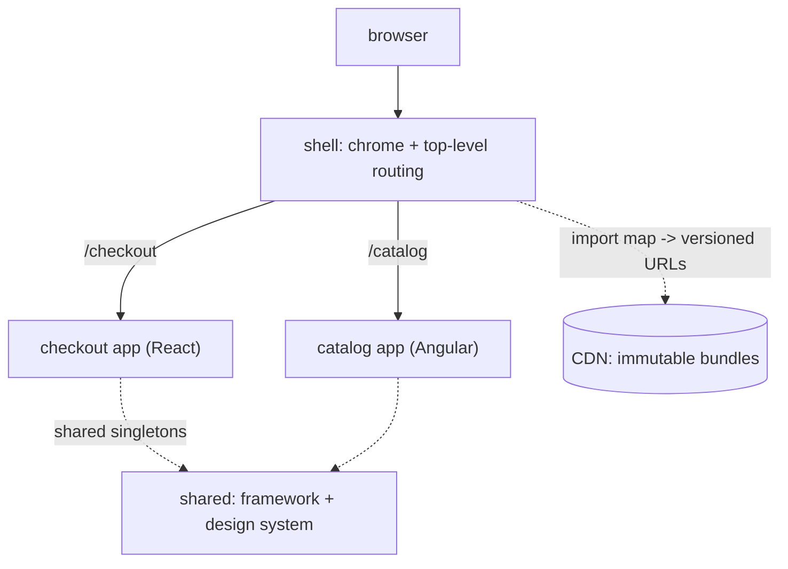

## Thesis

Composing one application from independently-built, independently-deployed frontend pieces --- a thin shell that owns the shared chrome and routing, and feature apps that each own a slice of the UI and can even be different frameworks --- so teams ship on their own cadence instead of one monolithic bundle, at the cost of runtime integration, shared-dependency, and consistency problems a monolith never has.

## Sub

**Why microfrontends: independent deploy and team autonomy** -> **composition: a shell plus feature apps** -> **runtime integration: routing, shared deps, communication** -> **zoom out** to the coherence and performance costs, and the pivots an interviewer rides from "split the frontend" into why-not-a-monolith, how-they-compose, and the shared-dependency problem.

## Spine

- Microfrontends extend **independent deployability to the frontend** --- each feature app is built, versioned, and deployed on its own by its own team, instead of one monolithic bundle everyone commits to and releases together.
- Composition is a **shell plus feature apps** --- a thin container owns the shared chrome and top-level routing and mounts/unmounts feature apps (via single-spa or module federation), each owning a slice of the UI, possibly in a different framework.
- The hard part is **runtime integration** --- routing across apps, sharing dependencies so you don't ship the framework several times, cross-app communication without tight coupling, and consistent styling across independently-built pieces.
- The trade is **team autonomy versus coherence** --- you buy independent deploys and framework freedom, and you pay in bundle size, integration complexity, and the constant work to make separately-built apps feel like one product.

## Companion Notes

### walk

One app assembled from many

One page composed at runtime from a shell and several independently-deployed feature apps --- how the shell mounts them, how they share dependencies and route, and the coherence and isolation costs of stitching separately-built pieces into one product.

Say the reframe first --- "independent deployability, but for the frontend." Every benefit (team autonomy) and every cost (shared deps, consistency) follows from that one goal.

### drill

Probe Drill

Graded follow-ups on the composition model, runtime integration, and the costs --- the ones that separate "split the frontend into folders" from a real microfrontend architecture.

Name the real driver: microfrontends solve an *organizational* problem (independent team deploys), not a technical one --- if you don't have that problem, it's a monolith with extra steps.

## Drill

SDE2 | the model and the mechanics
SDE3 | integration, sharing, and deploys
Staff | when it is worth it and org calls

### SDE2 | what a microfrontend is

What is a microfrontend?

Applying the microservice idea to the frontend --- one user-facing application composed from several independently-built, independently-deployed pieces, each owning a slice of the UI. Instead of one monolithic single-page app that everyone contributes to and releases together, a "checkout" team owns and ships the checkout app, a "catalog" team owns the catalog app, and a shell stitches them into one experience at runtime. The unit of ownership and deployment moves from the whole frontend to a feature-sized app.

### SDE2 | why not a monolithic frontend

Why split a frontend into microfrontends instead of keeping one app?

Because a monolithic frontend couples every team to one codebase and one release train --- everyone merges into the same repo, and a deploy ships everyone's changes together, so one team's bug blocks another team's release. Microfrontends give each team its own repo/build/deploy, so they ship independently and own their slice end to end. The motivation is organizational: it's about decoupling teams and their release cadences, not about the UI being technically better. Small orgs don't need it; large ones with many frontend teams do.

### SDE2 | shell and feature apps

What's the shell-plus-feature-apps model?

A thin **shell** (or container) app owns the shared chrome --- the top navigation, the layout, the authentication, and the top-level routing --- and **feature apps** own the content of each area. The shell decides which feature app to mount for the current route and hands it a piece of the page; the feature app renders its slice. The shell is deliberately thin (orchestration, not features) so it rarely changes, while the feature apps evolve independently. It's the composition root that makes many apps look like one.

### SDE2 | runtime integration

How are the pieces actually integrated?

Usually at **runtime** in the browser: the shell loads a feature app's JavaScript bundle on demand and mounts it into a DOM node. **single-spa** is a common orchestrator --- feature apps register lifecycle functions (bootstrap, mount, unmount) and single-spa calls them as routes change. **Module federation** (Webpack) is the other main approach, letting one build consume modules from another at load time. Either way, the shell composes independently-deployed bundles into one running app in the browser, rather than everything being bundled together at build time.

### SDE2 | import maps

How does the shell know where each app's code lives?

Through an **import map** --- a manifest that maps a module name to a URL, so `@org/checkout` resolves to `https://cdn/checkout/v1.4.2/bundle.js`. The shell loads apps by name, and the import map is the indirection that says which *version* of each app is live. Deploying a new version of the checkout app is then just updating its entry in the import map to point at the new CDN URL --- no rebuild of the shell or the other apps. The import map is the single place that pins the composition.

### SDE2 | team autonomy

How do microfrontends map to team structure?

They're Conway's law applied deliberately: each feature app is owned by one team, so the architecture mirrors the org chart on purpose. A team owns its app's code, tech choices, tests, and deploys, and its boundary is a real deployment boundary, not just a folder. That autonomy is the whole point --- teams move without coordinating a shared release --- but it means the boundaries have to align with team ownership, or you get apps that need three teams to change, which defeats the purpose.

### SDE2 | different frameworks

Can different microfrontends use different frameworks?

Yes --- that's one of the headline capabilities: the shell can mount a React app next to an Angular app next to a Vue app, because each is just a bundle exposing mount/unmount lifecycles. That's what lets an organization run Angular and React side by side, or migrate framework by framework without a big-bang rewrite. But it's a capability to use sparingly: every distinct framework is shipped to the browser, so mixing frameworks multiplies the payload and the maintenance surface. Useful for gradual migration; expensive as a steady state.

### SDE3 | the shared-dependency problem

What's the biggest technical cost of microfrontends, and how do you manage it?

Duplicated dependencies --- if three apps each bundle their own copy of the framework and the design system, the browser downloads the framework three times, and the total payload balloons. You manage it by **sharing** common dependencies: single-spa loads shared libraries once via the import map, module federation designates shared singletons so only one copy loads. The catch is version alignment --- shared singletons must be compatible versions, so independent teams can't drift their framework version arbitrarily. So the autonomy is real but bounded: you're independent on your app, coordinated on the shared platform.

### SDE3 | routing across apps

How does routing work across microfrontends?

Two levels: the **shell owns top-level routing** --- it decides which feature app is active for a URL prefix (`/checkout/*` -> checkout app) --- and each **feature app owns its own sub-routing** within its slice. The shell and apps have to agree on the URL contract (which prefixes belong to whom) and cooperate on the browser history so back/forward works across app boundaries. Get the split wrong and you either centralize all routing in the shell (killing autonomy) or let apps fight over the URL. The clean model is prefix-per-app, shell routes to the app, app routes within itself.

### SDE3 | cross-app communication

How do microfrontends communicate without becoming tightly coupled?

Through loose, contract-based channels --- a shared event bus (custom DOM events or a pub/sub) where an app publishes "cart updated" and whoever cares reacts, or a small shared state slice with a defined shape. The rule is no direct imports of another app's internals: they communicate through published events or shared props from the shell, not by reaching into each other. Tight coupling (app A calling app B's functions) recreates the monolith's entanglement at runtime and destroys independent deployability, so the interface between apps is a *contract*, kept deliberately thin.

### SDE3 | style isolation

How do you keep one app's CSS from breaking another's?

By isolating styles at the boundary --- scoped CSS (CSS modules, a build-time hash), a naming convention (BEM with an app prefix), or Shadow DOM for hard encapsulation --- so a global selector in one app can't restyle another. The tension is that you *also* want visual consistency, which pulls toward shared styles. The resolution is a shared design system (shared tokens and components) for the intentional common look, plus isolation for everything app-specific, so apps look coherent by sharing the design system, not by leaking CSS into each other.

### SDE3 | independent deployment

What does deploying one microfrontend actually involve?

The team builds its app, publishes the versioned bundle to a **CDN** (immutable, e.g. `/checkout/v1.4.2/`), and flips the **import map** entry to point at the new URL --- the shell and other apps are untouched. Because bundles are immutable and versioned, rollback is repointing the import map at the previous version, and you can even canary by serving the new import map to a fraction of users. The whole deploy is "publish a bundle, update one pointer," which is exactly what makes the cadence independent --- no coordinated monolith release, no rebuild of anyone else's app.

### SDE3 | the shared design system

Why is a design system essential to microfrontends specifically?

Because independently-built apps drift visually and behaviorally unless something enforces consistency, and to the user it's supposed to be *one* product. A shared design system --- shared design tokens (color, spacing, type) and shared UI components (buttons, inputs, modals) consumed by every app --- is what keeps the seams invisible. It's a shared dependency, so it carries the same version-alignment cost as the framework, but without it microfrontends produce a patchwork of subtly different UIs. The design system is the coherence mechanism that pays for the autonomy.

### SDE3 | build-time vs run-time integration

Module federation or single-spa --- build-time or run-time composition?

**single-spa** composes at **run-time**: the shell loads independently-deployed bundles in the browser via the import map, so apps are fully decoupled at build time and you update a pointer to deploy. **Module federation** composes at **load-time** with build-time contracts: one build declares what it exposes and consumes from remotes, sharing dependencies as singletons more ergonomically, but with a tighter coupling of build configuration. Run-time (single-spa) maximizes independence and simple deploys; federation gives smoother dependency sharing at the cost of more build-time coordination. The choice trades deployment simplicity against dependency ergonomics.

### Staff | when it is worth it

When are microfrontends actually the right call?

When the **organization** has the problem they solve: many frontend teams whose shared monolith and release train have become a bottleneck --- teams blocking each other's deploys, a repo too big to reason about, an inability to adopt or migrate frameworks incrementally. The justification is org scale and team autonomy, not technical elegance. If you have one or two frontend teams, the integration overhead, the shared-dependency management, and the consistency tax cost more than they buy. The honest test is "are independent team deploys a pain we feel today," and only a large enough org feels it.

### Staff | the coherence tax

What's the ongoing cost of making many apps feel like one product?

Consistency work that never ends --- a shared design system to maintain and version, cross-app UX conventions to enforce, and vigilance against the frontend fragmenting into subtly different experiences. Independently-built apps naturally diverge (different loading states, different error handling, different spacing), so keeping them coherent is continuous effort, not a one-time setup. This coherence tax is the hidden cost teams underestimate: the deployment autonomy is easy to see, but the standing investment in a design system, shared tooling, and cross-team conventions to keep the product unified is what actually makes or breaks a microfrontend architecture.

### Staff | performance cost

What are the performance risks, and how do you contain them?

The frontend can get heavy --- duplicated dependencies if sharing isn't disciplined, multiple frameworks if you mix them freely, and the overhead of loading and mounting several apps. You contain it by sharing common dependencies as singletons, minimizing distinct frameworks (mixing is for migration, not steady state), lazy-loading feature apps only when their route is hit, and watching the total payload as a first-class metric. The failure mode is a microfrontend app that's noticeably slower and heavier than the monolith it replaced, which erodes the whole justification --- so performance has to be actively managed, because the architecture makes bloat easy.

### Staff | the shell-app contract

What's the contract between the shell and the feature apps, and why does it matter?

A versioned interface: the lifecycle each app must expose (bootstrap/mount/unmount), the props or context the shell passes in (the mount node, the current user, shared services), the URL prefixes each app owns, and the shared-dependency versions everyone aligns on. It matters because independent deployability only holds if apps and shell can evolve *without breaking that contract* --- change the mount signature or a shared dependency's major version and every app breaks at once, recreating the coordinated release you were trying to escape. So the contract is deliberately small and stable, and changes to it are treated as breaking API changes with a migration path, not casual updates.

### Staff | testing across microfrontends

How do you test a system split across independently-deployed apps?

At two levels. Each app is tested in isolation (unit and component tests) by its owning team, against the shell contract (often with the shell mocked). But because the composition happens at runtime across versions that were built separately, you also need **integration/end-to-end tests of the assembled application** --- the real shell mounting the real (or a known-good) set of app versions, exercising cross-app flows and routing. The hard question microfrontends introduce is *version compatibility*: app A v2 and app B v5 were tested separately but must also work together, so contract tests and an integration environment that assembles current versions are what catch the "each app passed, the whole broke" failure.

### Staff | failure isolation

How do you keep one broken microfrontend from taking down the whole app?

Isolate at the mount boundary --- the shell wraps each feature app in an **error boundary** so an app that throws during mount or render is caught and shows a fallback in *its* region while the shell and the other apps keep working. Combined with independent deploys (a bad app version is rolled back by repointing the import map, without touching the others) and lazy loading (a failed load degrades one area, not the page), you get graceful degradation: the checkout app being down shows "checkout unavailable," not a blank page. This isolation is a genuine advantage over a monolith, where one component's uncaught error can white-screen everything --- but only if the shell actually sandboxes each app rather than trusting it.

### Staff | when it is overkill

When are microfrontends the wrong choice?

When you don't have the organizational problem --- a small team, a single frontend, no cross-team deploy pain. Then microfrontends add real cost (runtime composition, shared-dependency management, a design system to keep apps consistent, cross-app testing) for autonomy nobody needs, and you've built distributed-frontend complexity to solve a problem you don't have. A modular monolith --- one app with clear internal module boundaries and code-splitting --- gives you most of the maintainability with none of the runtime-integration tax, and you can extract a microfrontend later if a team genuinely needs to deploy independently. The default should be a well-structured monolith; microfrontends are what you reach for when team-scale deployment pain is real.

## Walk

### The shell owns the chrome and top-level routing

```flow
u[browser] -> s[shell: nav + layout + auth + top routing] -> r[picks the app for the route]
```

The shell is a thin container that owns everything shared --- the top navigation, the layout frame, authentication, and the top-level routing. It doesn't render features itself; it decides which feature app belongs to the current route and prepares to mount it.

Keeping the shell thin is deliberate: it's the composition root, so it should rarely change while the feature apps evolve underneath it. Everything a user perceives as "the app frame" lives here; everything inside the frame is a separately-owned, separately-deployed feature app.

### Feature apps mount into the shell

```flow
route[/checkout] -> mount[shell mounts the checkout bundle] -> own[app renders its slice]
```

For the active route, the shell loads that feature app's bundle and mounts it into a DOM node, handing it a slice of the page. The app renders its area and owns its internal routing; on navigation away, the shell unmounts it. Where each app's code lives is an indirection:

```json
{
  "imports": {
    "@org/shell": "https://cdn.example.com/shell/v3.1.0/shell.js",
    "@org/checkout": "https://cdn.example.com/checkout/v1.4.2/checkout.js",
    "@org/catalog": "https://cdn.example.com/catalog/v2.8.0/catalog.js"
  }
}
```

The import map maps each app name to a versioned CDN URL, so the shell loads apps by name and this manifest pins exactly which version of each is live. That indirection is the seam: apps are composed at runtime in the browser, not bundled together at build time, so single-spa (or module federation) can assemble independently-built pieces into one running app.

### Independent deploy: publish a bundle, flip one pointer

```flow
b[team builds app] -> cdn[immutable versioned CDN bundle] -> im[update import map entry]
```

A team deploys by building its app, publishing the immutable versioned bundle to the CDN, and flipping its entry in the import map to the new URL --- the shell and every other app are untouched. No coordinated release, no rebuild of anyone else's code.

Because bundles are immutable and versioned, rollback is repointing the import map at the previous version, and a canary is serving the new import map to a fraction of users. This is the entire payoff made concrete: the deployment unit is one feature app, so a team ships on its own cadence, which is the organizational problem microfrontends exist to solve.

### The costs: shared deps, consistency, isolation

```flow
n[N apps] -> share[share framework + design system, or ship them N times] -> iso[error-boundary each app; shell survives one crash]
```

The autonomy has a bill. If each app bundles its own framework and design system, the browser downloads them repeatedly, so common dependencies are **shared** as singletons via the import map or federation --- which bounds autonomy, because shared singletons must be version-aligned. Independently-built apps also drift visually, so a **shared design system** is what keeps them feeling like one product --- a standing consistency cost, not a one-time setup.

And the composition needs **failure isolation**: the shell wraps each app in an error boundary, so one app throwing shows a fallback in its region while the rest keep working, and a bad version is rolled back by repointing the import map. The through-line: microfrontends buy independent team deploys and framework freedom, and you pay for them in shared-dependency discipline, continuous consistency work, and the integration machinery to make many apps behave as one --- costs a monolith simply doesn't have.

### Model Script

- Frame the reframe | "Microfrontends are the microservice idea applied to the frontend -- one app composed from several independently-built, independently-deployed pieces, each owning a slice of the UI. A checkout team ships checkout, a catalog team ships catalog, and a shell stitches them into one experience at runtime. The unit of deployment moves from the whole frontend to a feature-sized app, and everything follows from that."
- The composition model | "The structure is a thin shell plus feature apps. The shell owns the shared chrome -- nav, layout, auth, top-level routing -- and mounts the right feature app for the route; each app owns its slice and its own sub-routing. Apps are loaded at runtime by name through an import map that points each name at a versioned CDN bundle, with an orchestrator like single-spa calling each app's mount and unmount lifecycles. Different apps can even be different frameworks, which is what lets you run Angular and React side by side or migrate incrementally."
- Runtime integration | "The hard part is integration. Shared dependencies: if every app bundles its own framework you ship it N times, so you share common libraries as singletons -- which means teams have to align on those versions, so autonomy is real but bounded. Routing is two-level: shell owns the URL prefixes, apps route within their slice. Cross-app communication is a thin contract -- an event bus or shared props, never one app importing another's internals -- or you recreate the monolith at runtime. And a shared design system keeps independently-built apps looking like one product."
- Deploy and isolation | "Deployment is the payoff: a team builds its app, publishes an immutable versioned bundle to a CDN, and flips one import-map pointer -- no coordinated release, rollback is repointing at the old version, canary is a partial import map. And failure is isolated: the shell wraps each app in an error boundary, so one app crashing shows a fallback in its region while the rest keep running -- a real advantage over a monolith that white-screens on one uncaught error."
- Interviewer: "When would you actually not use microfrontends?"
- The org-scale test | "When you don't have the organizational problem they solve. Microfrontends fix many frontend teams blocking each other on a shared release train -- that's an org-scale, team-autonomy problem, not a technical one. With one or two frontend teams, the runtime composition, shared-dependency management, consistency tax, and cross-app testing cost far more than they buy. The default should be a well-structured modular monolith with code-splitting; you extract a microfrontend when a team genuinely needs to deploy independently. Microfrontends are a solution to a scaling-the-org problem, so without that problem they're complexity with no payoff."
- Land it | "So: independent deployability for the frontend -- a thin shell composing independently-deployed feature apps at runtime via an import map, teams shipping on their own cadence, framework freedom for migration; paid for with shared-dependency discipline, a design system for coherence, thin cross-app contracts, and error-boundary isolation. The one line is that microfrontends solve an organizational problem, not a technical one -- if you don't have many teams fighting over one release train, it's a monolith with extra steps."

## Whiteboard

Sketch the shell composing feature apps and mark the shared dependencies.

### What makes the deploys independent?

Each app is an immutable versioned bundle on a CDN, loaded by name through an import map -- deploying is publishing a bundle and flipping one pointer, with the shell and other apps untouched.

### What's the biggest technical cost?

Duplicated dependencies -- so the framework and design system are shared as singletons via the import map or federation, which bounds autonomy because shared versions must align.



Verdict: the shell composes independently-deployed apps at runtime via the import map; shared dependencies are singletons to avoid duplication, at the cost of version alignment.

## System

Zoom out to where the seams are and what each owns.

### Where it sits

Browser: one experience to the user [*]
Shell: chrome, auth, top-level routing, composition root
Feature apps: independently built/deployed, own a UI slice + sub-routes
Import map + CDN: names -> versioned bundles, the deploy seam
Shared platform: framework + design system singletons, version-aligned

### Pivots an interviewer rides

From "split the frontend" they push on the motivation, sharing, and consistency.

#### Why microfrontends instead of a monolithic frontend?

-> independent team deploys -- it's an organizational problem, not a technical one
A monolith couples every team to one repo and one release train; microfrontends give each team its own build and deploy, so the driver is team autonomy at org scale, and small orgs don't have the problem.

#### How do you avoid shipping the framework several times?

-> share common dependencies as singletons via the import map / federation
Sharing loads the framework and design system once, but shared singletons must be version-compatible, so teams are independent on their app and coordinated on the shared platform -- bounded autonomy.

## Trade-offs

The calls that separate "folders in one repo" from a microfrontend architecture.

### Microfrontends vs a modular monolith

- Microfrontends: independent team deploys, framework freedom, failure isolation -- but runtime composition, shared-dependency management, and a consistency tax
- Modular monolith: most of the maintainability with code-splitting, one simple deploy -- but every team shares one release train

Default to a modular monolith; adopt microfrontends only when independent team deploys are a real, felt bottleneck at org scale.

### Run-time (single-spa) vs build-time (module federation) integration

- single-spa / run-time: maximal independence, deploy by flipping an import-map pointer -- but you wire dependency sharing yourself
- Module federation / load-time: smoother shared-dependency ergonomics -- but tighter build-time coordination between apps

Choose run-time composition when deployment independence is paramount; federation when ergonomic dependency sharing matters more than build decoupling.

### Sharing dependencies vs full independence

- Shared singletons: one copy of the framework and design system, smaller payload -- but teams must align on versions
- Fully independent bundles: no version coordination -- but the framework and design system ship several times, bloating the app

Share common heavy dependencies and accept the version-alignment coordination; the payload cost of not sharing usually outweighs the autonomy gained.

## Model Answers

### the reframe | Independent deploys, for the frontend

The frame to lead with.

- Microservices for the UI | key | one app from independently-deployed feature apps
- Shell composes at runtime | store | import map -> versioned CDN bundles, single-spa mounts
- An org problem, not a tech one | note | team autonomy is the driver

### the costs | Autonomy has a bill

What you pay for the independence.

- Shared deps as singletons | key | or ship the framework N times; versions must align
- Design system for coherence | store | independently-built apps drift without it
- Error-boundary isolation | note | one app crashes, the shell survives

## Numbers

Back-of-envelope the payload cost of duplication and what sharing saves.

Each feature app deploys independently; the risk is that each also ships its own framework and design system, multiplying the download --- which is why shared singletons matter.

- apps | Feature apps | 5 | 1 | 1
- fwSize | Framework KB (shared) | 140 | 0 | 10
- appKB | Per-app code KB | 200 | 0 | 10

```js
function (vals, fmt) {
  var apps = vals.apps, fw = vals.fwSize, appKB = vals.appKB;
  return [
    { k: 'Framework shipped once', v: fmt.n(fw), u: 'KB (shared)', n: 'sharing the framework as a singleton ships it once for the whole app \u2014 the goal', over: false },
    { k: 'If each ships its own', v: fmt.n(apps * fw), u: 'KB (' + apps + 'x)', n: apps + ' apps each bundling the framework duplicates this much weight \u2014 the classic microfrontend bloat that sharing via the import map or federation avoids', over: apps * fw > 400 },
    { k: 'App code payload', v: fmt.n(apps * appKB), u: 'KB total', n: 'the apps own code is inherent; only what loads for the current route needs to ship, so lazy-load feature apps per route rather than all up front', over: false },
    { k: 'Independent deploys', v: fmt.n(apps), u: 'cadences', n: 'each app builds, versions, and deploys on its own by flipping one import-map pointer \u2014 the organizational payoff', over: false },
    { k: 'Consistency mechanism', v: 'design system', u: 'shared, versioned', n: apps + ' independently-built apps only feel like one product if a shared design system enforces it \u2014 the coherence cost microfrontends always carry', over: false }
  ];
}
```

## Red Flags

What makes an interviewer wince.

### "We adopted microfrontends because the codebase was getting big"

Size alone isn't the reason -- a modular monolith with code-splitting solves a big codebase without the runtime-integration tax.

Adopt microfrontends for the *organizational* problem -- many teams blocked on one release train -- not for code size; otherwise you've bought distributed-frontend complexity you don't need.

### "Each app bundles everything it needs, fully independent"

Then the browser downloads the framework and design system once per app, and the total payload balloons.

Share common heavy dependencies as singletons via the import map or module federation, accepting the version-alignment coordination that comes with it -- independent on your app, coordinated on the shared platform.

### "The apps just import functions from each other when they need to"

Direct imports between apps recreate the monolith's entanglement at runtime and destroy independent deployability.

Communicate through a thin contract -- a shared event bus or props from the shell -- and never reach into another app's internals; the interface between apps must stay small and stable.

## Opener

### 30s | The one-liner

How I open when asked about splitting or scaling a frontend.

#### What is the shape?

Independent deployability for the frontend -- a thin shell composing independently-built, independently-deployed feature apps at runtime via an import map, so each team ships on its own cadence.

#### What's the catch?

It solves an organizational problem, not a technical one, and you pay for the autonomy in shared-dependency discipline, a design system for coherence, and runtime integration.

##### Hooks

Where an interviewer usually pushes next.

- Why not a monolith? | org problem: independent team deploys | drill
- Ship the framework N times? | shared singletons, versions align | drill
- When is it overkill? | small org -> modular monolith | trade

Foot: two sentences -- microfrontends are independent deploys for the frontend via a shell and an import map, and they're justified by team-scale autonomy, not by the UI being technically better.

## Bank

### SCALE | Several feature apps, each tempted to ship its own framework

Task: reason about the payload cost and the sharing that fixes it.
Model: each app deploying independently is the goal, but if each also bundles the framework and design system the browser downloads them per app, multiplying the payload; the fix is sharing common dependencies as singletons via the import map or federation, which bounds autonomy because shared versions must align -- independent on your app, coordinated on the platform, and lazy-load per route so only the active app ships.
Int: what's the single biggest technical cost here?
Duplicated dependencies -- the framework shipped once per app instead of once for the whole page.

### DESIGN | One product, several teams, independent frontend deploys

Task: design a microfrontend architecture for many teams shipping independently.
Model: a thin shell owning chrome, auth, and top-level routing; feature apps owned one-per-team, each a versioned immutable CDN bundle loaded by name via an import map and mounted at runtime (single-spa); shared framework and design system as version-aligned singletons; cross-app communication through a thin event/contract, never direct imports; error boundaries per app for isolation; and integration/e2e tests that assemble current app versions to catch cross-version breaks.
Int: how does a team deploy without coordinating with the others?
It publishes a new immutable bundle to the CDN and flips its import-map entry; the shell and other apps are untouched, and rollback is repointing at the previous version.

### Extra Curveballs

### CURVEBALL | consistency | Your microfrontends have drifted into subtly different UIs -- different buttons, spacing, loading states. How do you fix it and prevent it?

Model: that's the coherence tax coming due -- independently-built apps diverge unless something enforces consistency. The fix is a shared design system: shared design tokens (color, spacing, type) and shared UI components (buttons, inputs, modals) that every app consumes, plus cross-app UX conventions (loading, error, empty states) and lint/visual-regression checks to hold the line. It's a shared, versioned dependency with the same alignment cost as the framework -- and maintaining it is ongoing, not a one-time setup, because keeping many apps feeling like one product is continuous work, which is exactly the cost teams underestimate when they adopt microfrontends.

### Frames

- Independent deployability for the frontend: a shell composing independently-deployed feature apps at runtime
- It solves an organizational problem (team autonomy), not a technical one
- The autonomy is paid for in shared-dependency discipline, a design system for coherence, and error-boundary isolation
