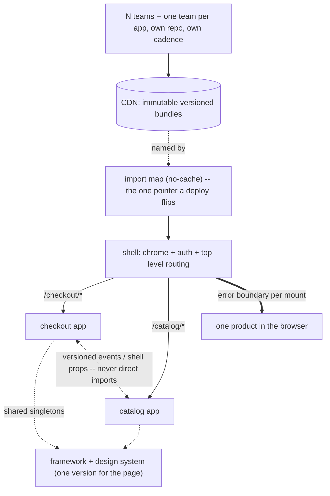

## Thesis

Composing one application from independently-built, independently-deployed frontend pieces --- a thin shell that owns the shared chrome and routing, and feature apps that each own a slice of the UI and can even be different frameworks --- so teams ship on their own cadence instead of one monolithic bundle, at the cost of runtime integration, shared-dependency, and consistency problems a monolith never has.

## Sub

**Why microfrontends: independent deploy and team autonomy** -> **composition: a shell plus feature apps** -> **runtime integration: routing, shared deps, communication** -> **zoom out** to the coherence and performance costs, and the pivots an interviewer rides from "split the frontend" into why-not-a-monolith, how-they-compose, and the shared-dependency problem.

## Spine

- Microfrontends extend **independent deployability to the frontend** --- each feature app is built, versioned, and deployed on its own by its own team, instead of one monolithic bundle everyone commits to and releases together.
- Composition is a **shell plus feature apps** --- a thin container owns the shared chrome and top-level routing and mounts/unmounts feature apps (via single-spa or module federation), each owning a slice of the UI, possibly in a different framework.
- The hard part is **runtime integration** --- routing across apps, sharing dependencies so you don't ship the framework several times, cross-app communication without tight coupling, and consistent styling across independently-built pieces.
- The trade is **team autonomy versus coherence** --- you buy independent deploys and framework freedom, and you pay in bundle size, integration complexity, and the constant work to make separately-built apps feel like one product.

## Companion Notes

### walk

One app assembled from many

One page composed at runtime from a shell and several independently-deployed feature apps --- how the shell mounts them, how they share dependencies and route, and the coherence and isolation costs of stitching separately-built pieces into one product.

Say the reframe first --- "independent deployability, but for the frontend." Every benefit (team autonomy) and every cost (shared deps, consistency) follows from that one goal.

### drill

Probe Drill

Graded follow-ups on the composition model, runtime integration, and the costs --- the ones that separate "split the frontend into folders" from a real microfrontend architecture.

Name the real driver: microfrontends solve an *organizational* problem (independent team deploys), not a technical one --- if you don't have that problem, it's a monolith with extra steps.

### wb

Whiteboard

Rebuild the composition from memory --- shell, import map, mount, shared singletons, deploy, isolation --- the cues, nothing in front of you.

Draw the seam first: the shell on one side, the independently-deployed apps on the other, and the import map as the one pointer between them. Recall is the test, not recognition.

### sys

System Map

Zoom out: the microfrontend layer sits between the teams that build features and the single page a user experiences, turning N repos into one product at runtime.

Lead with the seam, not the tooling --- "teams own apps, the CDN holds immutable versioned bundles, the import map points at them, and the shell composes them in the browser."

### trade

Trade-offs

The decisions they drill --- monolith vs microfrontends, single-spa vs module federation, sharing vs independence, client vs server composition, domain vs page-region splits --- each with the switch condition.

Always say "pick when" --- name the coupling each choice buys and what it costs, and never defend microfrontends as universally better, because most of the time they aren't.

### model

Model Answers

Full spoken scripts --- the beats, in order, the way you'd actually say them.

Steal the frame, not the words --- headline first ("independent deploys for the frontend, and it's an org problem"), then the one risk you'd name.

### num

Numbers

Back-of-envelope the payload --- and know which number decides whether the shared-dependency coupling is worth accepting.

Lead with the duplication tax: the framework and design system shipped once *per app* is the number that forces you into shared singletons, and version alignment is exactly what you pay for them.

### rf

Red Flags

What sinks the round --- adopting it for code size, per-app framework copies, direct imports between apps, splitting by page region, deploying everything together --- and what to say instead.

Name what the interviewer hears --- "we deploy all the apps together so the versions match" is a distributed monolith, and it's the fastest no-hire in the room.

### open

30-Second

The opener and the close --- matched to the altitude the question is asked at.

Match the altitude --- open at the deployment boundary, not the tooling, and land on the org justification and the coherence tax as the real hard parts.

## Drill

all | **All four levels, mixed** --- the way a real loop actually comes at you.
SDE2 | **The model and the mechanics** --- what a microfrontend actually is, the shell/feature-app split, how apps are loaded and mounted. The bar is "this is a deployment boundary, not a folder": name what is independently *deployed*, and by whom.
SDE3 | **Integration and its bill** --- shared dependencies, routing, cross-app contracts, style isolation, deploy and rollback. The bar is "it depends, here's the switch": name the coupling each choice buys and what it costs you.
Staff | **When it is worth it, and the org call** --- where to cut the boundary, the coherence tax, the performance floor, the distributed-monolith trap. The bar is "this solves an org problem": name the pain that justifies it, and say plainly when you'd refuse.

### SDE2 | what a microfrontend is

What is a microfrontend?

Applying the microservice idea to the frontend --- one user-facing application composed from several independently-built, independently-deployed pieces, each owning a slice of the UI. Instead of one monolithic single-page app that everyone contributes to and releases together, a "checkout" team owns and ships the checkout app, a "catalog" team owns the catalog app, and a shell stitches them into one experience at runtime. The unit of ownership and deployment moves from the whole frontend to a feature-sized app.

Follow: Isn't that just lazy-loading a route bundle? What is actually different?
Lazy-loading splits one **build**; a microfrontend splits the **build and the deploy**. A code-split route chunk is produced by the same bundler run, from the same repo, on the same release, with one lockfile and one version of React --- you cannot ship it without shipping everything else. A feature app is built by a different team, in a different repo, on a different day, and lands in production without rebuilding the shell or any sibling. The test is not "is the code in a separate file," it is **"can that team deploy without me"** --- and if the answer is no, you have a code-split monolith, which is a perfectly good thing to have, but it is not a microfrontend.

Follow: So what is the actual unit of the split --- a page, a component, a team?
A **team-sized business domain**, and the page/component framing is exactly where people go wrong. Checkout, catalog, search: each is a vertical slice one team owns end to end, so one feature is one team's deploy. If instead you split horizontally --- a header app, a sidebar app, a body app --- then a single user-facing feature spans three teams and three deploys, and you have taken on every runtime cost of microfrontends while getting none of the autonomy. The unit is the domain the team owns, and the deployment boundary has to fall where the *ownership* boundary already falls.

Senior: Defining it by the **deployment boundary** --- "can that team ship without me?" --- rather than by folders, bundles, or lazy-loading; and immediately naming the **vertical domain**, not the page region, as the unit of the split.
Speak: Lead with the boundary, not the tooling: **"one app composed from several independently-*deployed* pieces, each owned by one team."** Then the line that separates it from code-splitting --- a route chunk still ships on your release train; a feature app ships on its own.

### SDE2 | why not a monolithic frontend

Why split a frontend into microfrontends instead of keeping one app?

Because a monolithic frontend couples every team to one codebase and one release train --- everyone merges into the same repo, and a deploy ships everyone's changes together, so one team's bug blocks another team's release. Microfrontends give each team its own repo/build/deploy, so they ship independently and own their slice end to end. The motivation is organizational: it's about decoupling teams and their release cadences, not about the UI being technically better. Small orgs don't need it; large ones with many frontend teams do.

Follow: A monolith with good module boundaries and code owners gets you most of that. What specifically does it *not* give you?
**An independent release.** Module boundaries and CODEOWNERS give you clean code and safe review; they do not give you a separate deploy. In a monolith everyone still merges to one trunk and ships on one pipeline, so a broken test, a failed build, or a risky change from *any* team blocks *every* team's release --- and a rollback is all-or-nothing, reverting innocent teams' work along with the culprit's. Microfrontends move the *release* boundary, which is the one thing a module boundary cannot move. That is the whole and only thing you are buying, which is exactly why it is worth so little if release contention is not actually hurting you.

Follow: So how do you know the org really has that problem --- what would you measure before proposing this?
Look for the release train being the bottleneck, in numbers. **Deploy frequency per team** (are teams shipping daily, or batching into a weekly train because coordination costs too much?), **lead time from merge to production**, **how often a release is blocked or rolled back for a change that was not yours**, and **how much of a team's week goes to release coordination**. If teams already deploy often enough and the pipeline is not a queue, microfrontends solve nothing and you have bought runtime integration for free. If teams are visibly waiting on each other, that is the pain --- and it is the only justification I would accept, because none of the costs (shared deps, coherence, cross-version testing, a slower page) are worth paying for an aesthetic.

Senior: Naming that the **only** thing a monolith cannot give you is an independent *release* --- module boundaries already give you everything else --- and then insisting on **measuring release contention** (deploy frequency, blocked releases, coordination time) before proposing the split, instead of reaching for it because the repo feels big.
Speak: Say the reframe out loud: **"it's an organizational problem, not a technical one."** A modular monolith gives you clean boundaries; the one thing it cannot give you is a separate deploy. So the question is not "is the codebase big," it is "are teams blocked on each other's releases" --- and I'd want the deploy-frequency and blocked-release numbers before I'd propose it.

### SDE2 | shell and feature apps

What's the shell-plus-feature-apps model?

A thin **shell** (or container) app owns the shared chrome --- the top navigation, the layout, the authentication, and the top-level routing --- and **feature apps** own the content of each area. The shell decides which feature app to mount for the current route and hands it a piece of the page; the feature app renders its slice. The shell is deliberately thin (orchestration, not features) so it rarely changes, while the feature apps evolve independently. It's the composition root that makes many apps look like one.

Follow: The shell owns auth and the nav, and both change constantly. Doesn't the shell become the bottleneck you were escaping?
That is the real failure mode: a **fat shell** is a monolith with extra steps, because every change to it is a coordinated release for everyone. You keep it thin by being ruthless about what qualifies --- the shell owns **composition**, not features: the mount points, the route-to-app map, the auth session and token refresh, and the shared-dependency versions. It should *not* own nav **items** (each app contributes its own entries through a registration API or a manifest, so adding a menu entry is the app team's deploy), and it should *not* own shared **components** (those belong in the independently-versioned design-system package). The test is brutal and simple: if shipping a feature requires a change to the shell, the boundary is in the wrong place.

Follow: The shell has to render before it knows which app to load. Isn't that a waterfall --- shell, then import map, then app, then the app's own chunks?
Yes, and it is a real cost the monolith did not have: every hop is a round trip before the first feature pixel. You compress it --- **inline the import map in the HTML document** so it costs zero extra requests, **`modulepreload` the app for the current route** from the server so the app bundle and the shared framework start downloading in parallel with the shell rather than after it, and keep the shell tiny so it parses fast. What you cannot do is make it disappear: runtime composition means the browser is doing at load time what a bundler used to do at build time, and if the route's app is only discoverable *after* the shell boots, you have paid a round trip. That waterfall is why "the composed app is slower than the monolith it replaced" is the single most common way this architecture disappoints.

Senior: Naming the **fat shell** as the way this architecture quietly recreates the monolith --- and being concrete about the line (the shell owns composition, auth and shared versions; nav items belong to the apps, shared components to the design system) --- plus knowing the **load waterfall** the shell introduces and how to preload around it.
Speak: **"A thin shell that owns composition --- mount points, routing, auth --- and feature apps that own the slices."** Then say the trap out loud: the shell must not accrete features or shared components, because a fat shell is a coordinated release for everyone, which is precisely the thing you split to escape.

### SDE2 | runtime integration

How are the pieces actually integrated?

Usually at **runtime** in the browser: the shell loads a feature app's JavaScript bundle on demand and mounts it into a DOM node. **single-spa** is a common orchestrator --- feature apps register lifecycle functions (bootstrap, mount, unmount) and single-spa calls them as routes change. **Module federation** (Webpack) is the other main approach, letting one build consume modules from another at load time. Either way, the shell composes independently-deployed bundles into one running app in the browser, rather than everything being bundled together at build time.

Follow: Walk me through what single-spa actually calls on an app.
Each app exports **lifecycle functions --- `bootstrap`, `mount`, `unmount`** (and optionally `update`), each returning a promise. The shell's root config calls `registerApplication` with the app's name, a loader function that imports the bundle, and an `activeWhen` predicate on the URL. On every route change single-spa diffs which apps *should* be active: it calls `bootstrap` once on first activation, then `mount(props)` with a DOM element and the props the shell passes down, and calls `unmount` on any app that should no longer be active. So the contract an app must satisfy is literally: export these promise-returning functions, render into the node you are handed, and **tear yourself down completely on unmount** --- which is exactly where the bugs live, because an app that leaves its event listeners, timers, and subscriptions behind keeps running after it is visually gone.

Follow: And Module Federation is also loaded at runtime. So what is the real distinction?
Both fetch code at runtime, so "build-time vs run-time" is the sloppy version of this answer. The real difference is **where the contract lives**. With single-spa the contract is a *runtime* one --- a bundle at a URL exposing lifecycle functions --- and you wire dependency sharing yourself (SystemJS plus an import map). With Module Federation the contract is declared in each app's **build config**: a remote declares what it `exposes`, a host declares the `remotes` it consumes and the packages that are `shared`, and webpack emits a `remoteEntry.js` that negotiates a shared scope at load time --- so dependency sharing and version negotiation are *built in* rather than hand-rolled. You pay for that with build-time coupling: changing what you expose or share is a build-config change coordinated across builds. So single-spa maximizes decoupling and makes you own sharing; federation owns sharing and makes you accept a build contract.

Senior: Being able to name the **actual lifecycle** (`bootstrap`/`mount`/`unmount`, promise-returning, and that `unmount` must fully tear down or you leak) instead of hand-waving "it loads the bundle" --- and correcting the common sloppy framing that federation is "build-time": both load at runtime, and what differs is *where the contract lives*.
Speak: **"The shell loads a bundle and calls its lifecycle --- bootstrap, mount into this node, unmount."** Then the precise distinction: single-spa leaves dependency sharing to you and the import map; Module Federation bakes exposes/remotes/shared into the build config and negotiates a shared scope at load. Both load at runtime --- the difference is where the contract lives.

### SDE2 | import maps

How does the shell know where each app's code lives?

Through an **import map** --- a manifest that maps a module name to a URL, so `@org/checkout` resolves to `https://cdn/checkout/v1.4.2/bundle.js`. The shell loads apps by name, and the import map is the indirection that says which *version* of each app is live. Deploying a new version of the checkout app is then just updating its entry in the import map to point at the new CDN URL --- no rebuild of the shell or the other apps. The import map is the single place that pins the composition.

Follow: The bundles sit on a CDN with a one-year immutable cache. What must *not* be cached that way, and what happens if you get it wrong?
**The import map itself** --- and the HTML document that carries it. The bundles are versioned in their URL, so they are safe to cache forever (`Cache-Control: max-age=31536000, immutable`). The import map is the *pointer*, and the entire deploy mechanism is "change the pointer." Cache it aggressively and you have built a system where deploying does nothing: users keep resolving `@org/checkout` to the old URL until their cached map expires, and a **rollback --- the one thing that has to be instant --- is equally stuck**. So the map is served `no-cache` (or a very short TTL with revalidation), typically inlined into the HTML document, which then also cannot be long-cached. It is the classic mistake: you cache the immutable thing correctly, and then cache the mutable thing identically.

Follow: A user has had the page open for an hour with the old import map. You deploy, and the CDN prunes the old checkout bundle. They click checkout. What happens?
They get a **module-load failure**: their in-memory import map still points at `checkout/v1.4.2/`, which is now a 404, so the dynamic import rejects and the app never mounts. Two rules prevent it. First, **never delete old bundles** --- they are immutable and cheap, so you keep them, and a long-lived session keeps working against the version it was loaded with, which is the entire point of immutable versioned artifacts. Second, **handle the failure anyway**, because eventually a build *will* be pruned: catch the module-load rejection at the mount boundary and either re-fetch the import map and retry, or prompt a reload --- so a stale session self-heals instead of white-screening. This is the microfrontend form of a stale-deploy bug, and the deploy that "went fine" is precisely the one that kills the tab somebody left open.

Senior: Knowing the **cache asymmetry** cold --- immutable-forever on the bundles, `no-cache` on the map that points at them --- and volunteering the **stale-session / pruned-bundle** failure unprompted, because that is the bug that actually bites in production and almost nobody raises it.
Speak: **"A manifest mapping a bare name to a versioned CDN URL --- so a deploy is publishing a bundle and flipping one entry."** Then the two things that make it real: cache the *bundles* forever and the *map* never, and never delete an old bundle --- or the tab someone left open dies on their next route change.

### SDE2 | team autonomy

How do microfrontends map to team structure?

They're Conway's law applied deliberately: each feature app is owned by one team, so the architecture mirrors the org chart on purpose. A team owns its app's code, tech choices, tests, and deploys, and its boundary is a real deployment boundary, not just a folder. That autonomy is the whole point --- teams move without coordinating a shared release --- but it means the boundaries have to align with team ownership, or you get apps that need three teams to change, which defeats the purpose.

Follow: Conway's law cuts both ways. What happens when a feature genuinely spans three teams' apps?
It becomes a **cross-team, multi-deploy feature** --- which is precisely the cost you took on, and if it keeps happening, your boundaries are wrong. Tactically you sequence it: the producing app ships the new event or field first (additive, behind a flag), consumers adopt it, then the old path is removed --- three deploys in order, never one atomic release. Strategically, if a whole *class* of features keeps spanning apps, that is the signal that the split does not match how the product actually changes, and the fix is to **move the boundary** --- merge two apps, or re-cut them along the axis features actually run --- not to keep paying the coordination tax forever. Microfrontend boundaries are only cheap when features fall *inside* them, so the frequency of cross-app features is the metric that tells you whether you cut the split correctly.

Follow: And if the boundaries are wrong and everything needs coordinated deploys --- what do you actually have?
A **distributed monolith**, which is the worst of both worlds. You pay every cost of microfrontends --- runtime composition, shared-dependency version alignment, cross-version testing, a design system to maintain, a heavier and slower page --- and you get zero of the benefit, because nothing can actually ship independently. It is the direct analogue of the distributed monolith in microservices, and the tell is **behavioral, not architectural**: if your release runbook has a step called "deploy the apps in this order," or if a shared-contract change means a coordinated release, you have one. The remedy is the same as on the backend --- make contracts additive and versioned so producers and consumers deploy on their own schedules --- or admit the boundary is wrong and collapse the apps back together, because shipping a plain monolith is strictly better than shipping a distributed one.

Senior: Naming the **distributed monolith** and diagnosing it *behaviorally* --- "does a release require deploying the apps in a particular order?" --- and treating the **frequency of cross-app features** as the metric that says whether the boundary was cut in the right place.
Speak: **"Conway's law on purpose --- one team, one app, one deploy."** Then the failure: if features keep spanning apps, the boundary is wrong, and coordinated deploys mean you've built a distributed monolith --- every cost of the split, none of the autonomy. A plain monolith beats a distributed one, every time.

### SDE2 | different frameworks

Can different microfrontends use different frameworks?

Yes --- that's one of the headline capabilities: the shell can mount a React app next to an Angular app next to a Vue app, because each is just a bundle exposing mount/unmount lifecycles. That's what lets an organization run Angular and React side by side, or migrate framework by framework without a big-bang rewrite. But it's a capability to use sparingly: every distinct framework is shipped to the browser, so mixing frameworks multiplies the payload and the maintenance surface. Useful for gradual migration; expensive as a steady state.

Follow: Two apps, both React, but one is on 17 and the other on 18 --- and React is shared as a singleton. What actually happens?
One version wins the shared scope and the other app runs against a React it was not built for. With Module Federation's `singleton: true` and a `requiredVersion` it cannot satisfy, webpack logs an **unsatisfied-version warning and proceeds** with the single loaded copy --- unless you set `strictVersion`, which makes it throw instead --- so the failure surfaces at *runtime*, inside a component built against a different API, not as a clean build error. The classic fingerprint is React's **"Invalid hook call,"** because hooks resolve through a shared internal dispatcher: the wrong copy, or two copies, and a component's hooks find no matching renderer. The nuance worth saying out loud: two React copies are genuinely **fine** if each app is a fully isolated tree that never shares React context, elements, or hooks across the boundary --- you simply pay the payload twice. The moment a design-system component, a context provider, or a portal crosses the seam, React must be a true singleton, and then the versions have to actually agree.

Follow: So is "any team can pick any framework" something you would actually sell as a feature?
No --- I would sell it as a **migration tool, not a steady state**. The capability is enormously valuable exactly once: it lets you move a large Angular app to React one route at a time, both running side by side, with no big-bang rewrite and no six-month feature freeze. As a permanent policy it is a tax you pay forever: every distinct framework is a separate runtime shipped to the browser, a separate implementation of every design-system component to build and keep in sync, separate tooling and testing, and engineers who cannot move between teams without relearning the stack. So the position I would defend is: the architecture **permits** framework diversity, we **use** that permission to migrate, and we hold an explicit expectation of **converging** --- one default framework, and any exception carries a written reason and a plan to come back.

Senior: Getting the React-singleton nuance exactly right --- duplicate copies are harmless for *isolated* trees and fatal the moment context, hooks, or components cross the seam, with "Invalid hook call" as the fingerprint --- and refusing to sell framework freedom as a steady state, only as a migration path with an explicit convergence plan.
Speak: **"Yes --- and I'd use it to migrate, not to live in."** Different frameworks side by side is what lets you move Angular to React a route at a time with no big-bang rewrite. As a permanent policy it's a permanent tax: N runtimes shipped, N design-system implementations, no engineer mobility. Permit it, and use it to converge.

### SDE3 | the shared-dependency problem

What's the biggest technical cost of microfrontends, and how do you manage it?

Duplicated dependencies --- if three apps each bundle their own copy of the framework and the design system, the browser downloads the framework three times, and the total payload balloons. You manage it by **sharing** common dependencies: single-spa loads shared libraries once via the import map, module federation designates shared singletons so only one copy loads. The catch is version alignment --- shared singletons must be compatible versions, so independent teams can't drift their framework version arbitrarily. So the autonomy is real but bounded: you're independent on your app, coordinated on the shared platform.

Follow: Concretely, how does Module Federation's shared scope decide which copy actually wins?
At load, every participating build **registers the versions it can provide** for a shared package into a **shared scope**, along with the range it *requires*. When a module asks for a shared dependency, federation resolves it to the **highest version in the scope that satisfies the requesting build's `requiredVersion`**; with `singleton: true` there is exactly one instance in the scope for everyone, so one copy is loaded and every app uses it. If a build's requirement cannot be satisfied by what is in the scope, you get an unsatisfied-version warning --- or a throw, under `strictVersion`. The footgun is `eager: true`, which bundles the shared dep into the initial chunk instead of loading it asynchronously; people set it to paper over a load-order bug and then wonder why the payload grew. And the consequence worth naming out loud: the winning version is negotiated by **whoever happens to be on the page**, so it can differ from route to route --- which is why you pin ranges deliberately instead of letting them float.

Follow: Sharing means teams must agree on a React version. How do you upgrade React across twelve independently-deployed apps without a flag day?
You make the upgrade **rolling, not atomic**, using overlapping compatible ranges. A minor is free --- `^18` already covers 18.2 and 18.3, so the singleton simply resolves higher. A **major** is a program: publish the design system in a version compatible with both majors, let each app widen its `requiredVersion` and upgrade on its own schedule, and drop the old from the range only once telemetry says every app has landed. And you have an escape hatch: during the window you can deliberately **un-share React**, accept the duplicate payload temporarily, and let the two majors run side by side in isolated trees --- then re-enable the singleton once everyone is across. The thing to land is that the shared-dependency graph is a **coordination surface**, so upgrading it is a migration with a window and a plan, not a pull request --- and that standing cost is exactly what "bounded autonomy" means in practice.

Senior: Being precise about the **shared-scope negotiation** --- highest version satisfying the requester's range, one instance under `singleton`, and the `eager` payload footgun --- and treating a shared *major* upgrade as a **rolling program with an overlap window**, including temporarily un-sharing to buy back independence, rather than "we'd coordinate a flag day."
Speak: **"Share the framework and the design system as singletons --- or ship them once per app."** Then the catch: a singleton means one version for everyone, so the shared graph is a coordination surface. Upgrading a shared major is a rolling program with an overlap window --- and if you must, un-share temporarily and eat the duplicate bytes so apps can move independently.

### SDE3 | routing across apps

How does routing work across microfrontends?

Two levels: the **shell owns top-level routing** --- it decides which feature app is active for a URL prefix (`/checkout/*` -> checkout app) --- and each **feature app owns its own sub-routing** within its slice. The shell and apps have to agree on the URL contract (which prefixes belong to whom) and cooperate on the browser history so back/forward works across app boundaries. Get the split wrong and you either centralize all routing in the shell (killing autonomy) or let apps fight over the URL. The clean model is prefix-per-app, shell routes to the app, app routes within itself.

Follow: Two apps both call `history.pushState`. Who wins, and what breaks?
Nothing "wins" --- the browser just applies the last call --- and what breaks is that **nobody is notified**. `pushState` does not fire `popstate`, so an app that navigates imperatively changes the URL without telling anyone, and neither the shell nor the sibling app ever re-evaluates which app should now be active. That is precisely why orchestrators **patch the History API**: single-spa monkey-patches `pushState`/`replaceState` to emit its own routing event, so a navigation from *any* app re-triggers the `activeWhen` evaluation and the right apps mount and unmount. The rule that falls out of it is clean: an app may own history only *within its own prefix*, and every **cross-app navigation goes through a navigation function the shell provides** (single-spa's `navigateToUrl`). Two routers both believing they own the URL is the single most common source of "the back button does something insane."

Follow: The user hits back and lands on a route owned by a *different* app. What has to happen for that to feel instant instead of flashing an empty frame?
The shell has to unmount the outgoing app and mount the incoming one, so the incoming app's code must already be present or the user watches a gap. Three moves. **Keep the module resident after unmount** --- unmounting removes the DOM, it does not have to evict the module, so `bootstrap` runs once and the second `mount` is cheap. **Prefetch adjacent apps** on idle or on link hover, so the likely next route is already warm. And **render a stable skeleton in the shell's slot** during the transition so the chrome never blinks. The failure to avoid is unmount-then-fetch: tear down the old app, *then* start a network request for the new one. There is also a state consequence riding along --- an unmounted app is **gone**, so anything the user typed is lost unless it was lifted into the URL or a shell-owned store, which makes unmount/remount a design constraint, not just a rendering one.

Senior: Knowing **why** the orchestrator must patch `pushState` (it does not fire `popstate`, so imperative navigation is silent) and converting that into the rule --- apps own only their prefix, cross-app navigation goes through the shell --- plus treating unmount/remount as a **state and latency** constraint (prefetch, keep the module resident, lift the state), not a pure render concern.
Speak: **"Two levels --- the shell owns a URL prefix per app, the app owns its own sub-routes."** The trap is two routers both thinking they own the URL: `pushState` doesn't fire `popstate`, so orchestrators patch history to force a re-evaluation on every navigation. Apps never touch history for a cross-app move --- they call the shell.

### SDE3 | cross-app communication

How do microfrontends communicate without becoming tightly coupled?

Through loose, contract-based channels --- a shared event bus (custom DOM events or a pub/sub) where an app publishes "cart updated" and whoever cares reacts, or a small shared state slice with a defined shape. The rule is no direct imports of another app's internals: they communicate through published events or shared props from the shell, not by reaching into each other. Tight coupling (app A calling app B's functions) recreates the monolith's entanglement at runtime and destroys independent deployability, so the interface between apps is a *contract*, kept deliberately thin.

Follow: An event bus is "loose coupling." But isn't a published event just an unversioned API with no schema?
Yes --- and that is the sharpest thing you can say about it. Replacing an import with a `CustomEvent` does not remove the coupling; it makes it **implicit, untyped, and invisible to your tooling**. The compiler that used to fail the build when you changed a function signature now says *nothing* when you rename a field in an event payload, and you find out in production. So an event bus only beats a direct import if you treat the events as what they actually are: a **public, versioned contract**. That means a schema per event (a shared types package the apps depend on), **additive-only** evolution --- add a field, never repurpose or remove one without a deprecation window --- and a versioned event name when you genuinely must break it. Then you keep the real benefit (a producer that doesn't know who consumes, so consumers come and go without a producer deploy) while getting back the compile-time safety the direct import gave you for free. What you are avoiding is not coupling --- it is **undeclared** coupling.

Follow: Two apps both need the current user and the feature flags. Do they each fetch them?
No --- that is **shared state, not communication**, and conflating the two is a design error. Anything that is needed by many apps, is expensive or stateful to obtain, and must be *identical everywhere* --- the authenticated session, the current user, the tenant, feature flags, the theme, the locale --- belongs to the **shell**, which resolves it once and passes it down as **mount props**, with a subscription for updates. The pathological version is every app running its own auth: **N refresh races on one expiring token**, N different opinions about whether the user is signed in, and a logout in one app that quietly leaves the others authenticated. So the split is clean: the shell owns the **ambient** state (identity, session, config) and injects it, and the event bus carries only **peer domain events** --- "cart updated," "item selected" --- where the producer genuinely does not care who is listening.

Senior: Refusing the comfortable "events are loose coupling" answer and naming an event for what it is --- an **unversioned API**, fixed with a schema, additive-only evolution, and a deprecation policy --- plus cleanly separating **shell-owned ambient state** (session, user, flags, theme) from **peer domain events**, instead of letting each app fetch its own and race on token refresh.
Speak: **"A thin, versioned contract --- never a direct import of another app's internals."** Then the sharp part: an event bus isn't coupling-free, it's *undeclared* coupling --- a public API with no schema and no compiler. So version the events, and keep the session, the user, and the flags in the shell, passed down as props, not re-fetched per app.

### SDE3 | style isolation

How do you keep one app's CSS from breaking another's?

By isolating styles at the boundary --- scoped CSS (CSS modules, a build-time hash), a naming convention (BEM with an app prefix), or Shadow DOM for hard encapsulation --- so a global selector in one app can't restyle another. The tension is that you *also* want visual consistency, which pulls toward shared styles. The resolution is a shared design system (shared tokens and components) for the intentional common look, plus isolation for everything app-specific, so apps look coherent by sharing the design system, not by leaking CSS into each other.

Follow: Shadow DOM gives hard isolation. Why doesn't everyone just use it?
Because the isolation is a **wall, not a filter**, and a real app needs some things to pass through it. Concretely: your global stylesheet and resets no longer reach inside, so every shadow root must be *given* its styles --- constructable stylesheets via `adoptedStyleSheets`, or an injected `<style>`. And any component that renders into `document.body` --- most modals, tooltips, dropdowns, anything using a portal --- **escapes the shadow root entirely** and lands unstyled in the light DOM. The saving grace is that **inherited properties (font, color) and CSS custom properties do cross the boundary**, so theming by tokens still works, which is what makes it viable at all. But a lot of the ecosystem assumes global CSS: CSS-in-JS libraries injecting into `document.head`, third-party widgets, and query/testing tools that do not pierce shadow roots. So Shadow DOM buys a guarantee nothing else offers --- a rogue global selector *cannot* reach in --- and you pay for it in integration friction, which is why most teams reach for build-time scoping first and use Shadow DOM only where they genuinely cannot trust the code they are mounting.

Follow: Then scoped CSS it is. But scoping is a build-time convention --- what actually stops one app shipping `button { ... }` and restyling everyone?
**Nothing at runtime**, and that is the honest answer. CSS Modules, hashed class names, and BEM prefixes scope the classes you *author*; none of them stops you writing a bare element selector, a global reset, or an `!important` on `body` --- and once that stylesheet is in `document.head`, it applies to the whole page. So enforcement has to move to where it can actually work. **Lint it at build time** --- a stylelint rule banning bare element selectors and global resets outside the design system, requiring every selector to sit under the app's prefix or root class --- and **fail the build**, rather than trusting review to catch it. Then **catch the rest with visual-regression tests on the *composed* page**, because a style leak is by definition a cross-app bug, so a suite that only ever renders one app in isolation is **structurally incapable** of seeing it. That last point is the one people miss: high coverage on each app tells you exactly nothing about the leak.

Senior: Being specific about **why Shadow DOM is not free** --- portals escape it and global stylesheets don't reach in, but inherited properties and custom properties do, so token theming still works --- and, on the scoped-CSS path, moving enforcement from human review to a **build-failing lint rule plus visual regression on the composed page**, since a single-app test can never see a cross-app leak.
Speak: **"Scope at the boundary, and share the look on purpose."** Shadow DOM is the only hard guarantee, and the price is portals escaping it and globals not reaching in. Otherwise scoping is just a build-time convention --- so enforce it with a lint rule that fails the build, and catch leaks with visual regression on the *composed* page, because a single-app test structurally cannot see one.

### SDE3 | independent deployment

What does deploying one microfrontend actually involve?

The team builds its app, publishes the versioned bundle to a **CDN** (immutable, e.g. `/checkout/v1.4.2/`), and flips the **import map** entry to point at the new URL --- the shell and other apps are untouched. Because bundles are immutable and versioned, rollback is repointing the import map at the previous version, and you can even canary by serving the new import map to a fraction of users. The whole deploy is "publish a bundle, update one pointer," which is exactly what makes the cadence independent --- no coordinated monolith release, no rebuild of anyone else's app.

Follow: Canary and rollback are well understood for a backend service. What is different when the artifact is a bundle in someone's browser?
Two things, and both change the mental model. First, **you cannot drain the old version**: users already have the old bundle loaded in a live tab, and it keeps running until they navigate or reload. So a rollback is instant for *new* sessions and only eventually-consistent for existing ones, and anything the old bundle still talks to --- an API, a shared contract --- has to stay compatible for as long as sessions live. Second, **the routing decision isn't yours**: there is no load balancer in front of the browser, so you canary by **what the document hands out** --- serve a different import map (or a flag-gated entry) to a percentage of sessions, which makes the canary sticky per session and puts the decision wherever the map is generated. The rollback itself is genuinely excellent --- flip one pointer, no rebuild --- but the model shifts from "route traffic away from the bad version" to **"stop handing out the bad version, and survive the ones already in the wild."**

Follow: How do you even know the canary is bad, given the failure happens in someone else's browser?
You need **client-side telemetry attributed per app and per version**, or the signal is unreadable. Every app reports its own name and version alongside its errors and its performance marks, and you watch, **sliced by version**: the **JS error rate** --- specifically the mount-failure and module-load-failure rates, which are the microfrontend-native ones --- the **Core Web Vitals** for routes that app owns, and a **business metric for that app's own funnel**, because a broken checkout usually surfaces as "conversions dropped," not as an exception. Two microfrontend-flavoured traps. An error thrown inside one app must not be attributed to the shell, so the error boundary has to **tag the owning app before it reports**. And a change to a *shared* dependency can degrade an app that never deployed at all --- which is why you attribute to the **composition** (the whole set of versions that were on the page), not just to the app. Without that, you get an error-rate graph you cannot act on.

Senior: Knowing that a browser artifact **cannot be drained** --- the old bundle keeps running in an open tab, so backward compatibility must hold for the session lifetime --- and that canarying moves from the load balancer to *what the document hands out*; plus insisting on **per-app, per-version, per-composition** client telemetry, because the failure happens somewhere you cannot see.
Speak: **"Publish an immutable versioned bundle, flip one import-map entry."** Rollback is repointing; canary is serving a different map to a slice of sessions. Then the part people miss: you can't drain a browser --- the old bundle is still running in someone's open tab --- so the old version has to keep working, and without per-app, per-version telemetry you can't even see the canary fail.

### SDE3 | the shared design system

Why is a design system essential to microfrontends specifically?

Because independently-built apps drift visually and behaviorally unless something enforces consistency, and to the user it's supposed to be *one* product. A shared design system --- shared design tokens (color, spacing, type) and shared UI components (buttons, inputs, modals) consumed by every app --- is what keeps the seams invisible. It's a shared dependency, so it carries the same version-alignment cost as the framework, but without it microfrontends produce a patchwork of subtly different UIs. The design system is the coherence mechanism that pays for the autonomy.

Follow: The design system is a shared singleton. Doesn't that make every design-system change a coordinated release across all apps?
Only if you version it badly --- and this is exactly where most implementations quietly rot into a distributed monolith. The discipline is the same as any public API: **additive-only, semver-honest, with a deprecation window**. A new prop, a new component, a new token is additive: it ships freely and apps adopt it when they choose. A **breaking** change --- renaming a prop, removing a variant, changing default spacing --- is a major, and you do not force it: you ship the new API alongside the old, mark the old deprecated (a console warning, and a codemod if you can write one), let each app migrate on its own schedule, and remove the old only when telemetry says nobody is still on it. What you must never do is treat the design system as "internal code we all share" and change it freely --- because the moment a DS release requires every app to redeploy, you have **re-coupled every team through the component library**, and you are now paying microfrontend costs to run a monolith.

Follow: If it's an independently-versioned package, how do you stop the apps drifting onto five different majors of it?
You **make drift visible, make upgrading nearly free, and own the upgrade yourself** --- rather than mandating alignment and hoping. Concretely: publish a **dashboard of which app is on which DS version** (the composition telemetry already gives you this), declare an explicit **support window** --- the DS supports the current major and the previous one, and beyond that you are unsupported and the platform team will not fix your bug --- and ship a **codemod with every major**, with the platform team **opening the upgrade PRs** rather than filing tickets. Then accept a floor of drift as healthy, because perfect alignment is only achievable by taking back the autonomy you paid for. The one thing to actively prevent is the **stuck app**: one team parked on a two-year-old major, blocking removal of the old API forever --- and the lever there is the support window plus a real deprecation deadline, not a policy memo.

Senior: Treating the design system as a **public API** --- additive-only, deprecation-windowed, never forcing a synchronized redeploy --- and naming that a DS release which forces everyone to redeploy has re-coupled the teams; plus **owning the upgrade** (codemods, platform-opened PRs, a published support window) instead of mandating alignment and hoping.
Speak: **"The design system is what buys back the coherence you lost."** But it's a shared singleton, which makes it a public API: additive-only, semver-honest, deprecate with a window, and never force a synchronized redeploy --- or you've re-coupled every team through the component library and turned this straight back into a monolith with extra steps.

### SDE3 | build-time vs run-time integration

Module federation or single-spa --- build-time or run-time composition?

**single-spa** composes at **run-time**: the shell loads independently-deployed bundles in the browser via the import map, so apps are fully decoupled at build time and you update a pointer to deploy. **Module federation** composes at **load-time** with build-time contracts: one build declares what it exposes and consumes from remotes, sharing dependencies as singletons more ergonomically, but with a tighter coupling of build configuration. Run-time (single-spa) maximizes independence and simple deploys; federation gives smoother dependency sharing at the cost of more build-time coordination. The choice trades deployment simplicity against dependency ergonomics.

Follow: Give me the decision rule. When do you actually pick one over the other?
Pick **Module Federation** when your apps share a *lot* --- the same framework, a large design system, common utilities --- and that sharing is the thing you would otherwise have to hand-build: the `shared` config and the shared-scope negotiation are genuinely better than wiring SystemJS and an import map yourself, and if you are already on webpack (or a bundler that implements the federation protocol) it is close to free. Pick **single-spa with import maps** when **deployment independence** is the value you are maximizing and you want the loosest possible coupling: apps agree on a URL and a lifecycle and nothing else, so you can genuinely mix build tools and frameworks. The honest tiebreaker is organizational --- federation puts the contract in build config, which means a **platform team has to own and evolve a shared build configuration**: fine if you *have* one, a nightmare if every team runs a bespoke build. And they are not exclusive: plenty of shops run single-spa as the router with federation doing the sharing underneath.

Follow: Both of those compose in the browser. When is client-side composition simply the wrong answer?
When the **first paint has to be fast or indexable** --- a public, SEO-critical, or conversion-sensitive page. Client-side composition means the browser boots the shell, resolves the map, fetches the app, and only *then* renders content: a waterfall stacked on top of a JS-first render, which is bad LCP, worse on a mid-tier phone, and dependent on the crawler executing your JavaScript. The alternative is **server-side or edge composition**: each team's app renders an HTML **fragment**, and a composition layer stitches the fragments into one document before it is sent --- Edge Side Includes at the CDN, or a fragment-composition server (Podium, Tailor, and similar). You keep independent deploys, because each team deploys its own fragment service. What you trade is that the page now has a **runtime dependency on every fragment**, so composition needs a **timeout and a fallback per fragment** or one slow team's service becomes everyone's slow page. So the rule: internal, authenticated, app-like surfaces --- compose in the browser; public, content-first, SEO-critical surfaces --- compose on the server, and accept fragment-service reliability as the price.

Senior: Having a real **decision rule** rather than a preference --- federation when sharing is heavy and a platform team owns the build config, single-spa/import maps when deployment independence is the point --- and knowing that *both* are client-side composition, so **neither** is the answer when first paint or SEO matters and you need server/edge **fragment composition** with per-fragment timeouts instead.
Speak: **"Both load at runtime --- what differs is where the contract lives."** Federation if you share heavily and a platform team owns the build config; single-spa plus an import map if maximal deployment independence is the point. And if the page is public and LCP- or SEO-critical, neither: compose fragments on the server, with a timeout and a fallback per fragment.

### Staff | when it is worth it

When are microfrontends actually the right call?

When the **organization** has the problem they solve: many frontend teams whose shared monolith and release train have become a bottleneck --- teams blocking each other's deploys, a repo too big to reason about, an inability to adopt or migrate frameworks incrementally. The justification is org scale and team autonomy, not technical elegance. If you have one or two frontend teams, the integration overhead, the shared-dependency management, and the consistency tax cost more than they buy. The honest test is "are independent team deploys a pain we feel today," and only a large enough org feels it.

Follow: Give me the cheapest thing that gets 80% of the benefit. Why isn't that just the answer?
The cheapest thing is a **modular monolith with enforced boundaries**: one build, one deploy, clear module ownership, lint rules that forbid cross-module imports, code-splitting per route. It gets you almost everything --- clean boundaries, ownership, lazy-loaded routes, one version of React, one bundle to optimize, no runtime composition, no coherence tax, and a fast page. And I would argue it *should* be the answer for most teams, which is why it is my default. The one thing it cannot give you is an **independent release**, so the only reason to go further is that release contention is measurably hurting you: teams batching into a weekly train, blocked by each other's failures, unable to roll back their own change without reverting someone else's. If that pain is real and expensive, microfrontends are the only thing that fixes it, and the cost is worth paying. If it isn't, you have bought a slower page and a permanent coordination surface to solve a problem you don't have. So the modular monolith isn't a lesser option --- it is the *correct* one until a specific, measured pain says otherwise.

Follow: Say you're at that threshold. How would you actually get there --- would you rewrite?
Never a big-bang rewrite --- I'd **strangle** it. First, stand the shell up around the *existing* monolith, mounting it as a single "legacy" app that owns every route: nothing changes for users, but the composition layer now exists and is proven in production. Then extract **one** route --- ideally a genuinely separable one owned by the team feeling the most coordination pain --- into its own independently-deployed app, with the shell routing that prefix to it and everything else still going to the legacy app. Now both models run side by side and you can measure honestly: **did that team's deploy frequency actually improve, and what did the page cost in bytes and LCP?** If the answer is "barely, and a lot," you stop --- you have spent one team-quarter, not a year, and you keep the monolith. If it clearly paid, you extract the next one. The strangler pattern is the right answer here *specifically because the justification is empirical*: microfrontends are a bet on an organizational payoff, and the only honest way to make that bet is incrementally, with a real exit.

Senior: Naming the **modular monolith as the correct default** (not a lesser option), with *measured* release contention as the only trigger --- then proposing a **strangler migration with an explicit exit**: shell around the monolith, extract one route, measure the deploy-frequency win against the byte and LCP cost, and be genuinely willing to stop.
Speak: **"When independent team deploys are a real, measured bottleneck --- and not one step before that."** A modular monolith gets you almost everything; the one thing it can't give you is a separate release. So I'd measure release contention first, then strangle: shell around the monolith, extract one route, measure the deploy win against the byte cost, and be genuinely willing to stop.

### Staff | the coherence tax

What's the ongoing cost of making many apps feel like one product?

Consistency work that never ends --- a shared design system to maintain and version, cross-app UX conventions to enforce, and vigilance against the frontend fragmenting into subtly different experiences. Independently-built apps naturally diverge (different loading states, different error handling, different spacing), so keeping them coherent is continuous effort, not a one-time setup. This coherence tax is the hidden cost teams underestimate: the deployment autonomy is easy to see, but the standing investment in a design system, shared tooling, and cross-team conventions to keep the product unified is what actually makes or breaks a microfrontend architecture.

Follow: Name what actually drifts. "Consistency" is too vague to act on.
Three layers, and they drift at different speeds and need different owners. **Visual** --- spacing, type scale, button variants, the exact grey --- which is the one everybody means, and the one a design system with real **tokens** (not just components) genuinely solves. **Behavioral** --- the loading state is a spinner here and a skeleton there, errors are a toast in one app and an inline banner in another, one app confirms destructive actions and one doesn't, validation fires on blur here and on submit there. That is the drift users *feel* as "this app is weird," and a component library alone does not fix it, because it is a **pattern** problem, not a component problem. And **page-level/systemic** --- keyboard focus order across a mount boundary, whether a route change is announced to a screen reader, analytics event naming, the shape of error reports. Accessibility is the sharpest example: focus management is a **whole-page property, and no team owns the whole page**, so it degrades by default unless the shell explicitly owns it. Naming the three separately is what lets you actually assign owners --- tokens and components to the design system, patterns to a written spec plus lint, page-level properties to the shell.

Follow: So who pays for that? Where does the design system live organizationally?
It has to be a **funded product with a team --- not a volunteer tax on whoever cares** --- and getting this wrong is the most common way a microfrontend adoption rots. The failing model is "we'll all contribute to the shared library": nobody owns it, breaking changes land carelessly, nobody runs the deprecations, and within a year every app has forked the components it needed. The working model is a **platform team that owns the shell, the design system, and the build/deploy toolchain as a product**, with the feature teams as its customers --- which means it is measured on **adoption and on how fast a feature team can ship**, not on how many components it published. And its most important job is making the paved path genuinely *cheaper* than going around it, because if using the shared button is harder than writing your own, teams will write their own and no policy will stop them. The cost is real and permanent: you are adding a team. And if the org is not big enough to fund one, it is not big enough for microfrontends --- which is another honest test of whether you should be doing this at all.

Senior: Decomposing "consistency" into **visual / behavioral / page-level** and noting that the last one (focus, screen-reader route announcements) **degrades by default because no team owns the whole page** --- plus insisting the design system is a **funded platform product measured on adoption**, and that being unable to fund one is itself the signal you shouldn't adopt microfrontends.
Speak: **"Independently-built apps drift, and the drift is continuous work."** Split it three ways: visual drift (tokens), behavioral drift (loading, errors, confirmation --- a spec, not a component), and page-level drift like focus and screen-reader route announcements, which rots by default because no team owns the whole page. And it needs a funded platform team --- if you can't fund one, you can't afford microfrontends.

### Staff | performance cost

What are the performance risks, and how do you contain them?

The frontend can get heavy --- duplicated dependencies if sharing isn't disciplined, multiple frameworks if you mix them freely, and the overhead of loading and mounting several apps. You contain it by sharing common dependencies as singletons, minimizing distinct frameworks (mixing is for migration, not steady state), lazy-loading feature apps only when their route is hit, and watching the total payload as a first-class metric. The failure mode is a microfrontend app that's noticeably slower and heavier than the monolith it replaced, which erodes the whole justification --- so performance has to be actively managed, because the architecture makes bloat easy.

Follow: Be specific --- where exactly does a composed page lose to the monolith it replaced?
Four places, and only one of them is the one people talk about. **Duplicated dependencies** --- the obvious one, and the one sharing fixes. **The load waterfall** --- document, shell, import-map resolution, app entry, the app's own chunks: every hop a round trip the monolith never paid, and on mobile that is real time. **Lost whole-program optimization** --- and this is the underrated, structural one: a single bundler sees the entire app and can tree-shake, dedupe, hoist and split chunks *globally*, while independently-built bundles cannot. Two apps that each import three functions from a utility library ship those functions **twice**, and no `shared` config saves you, because sharing works at the **package** level, not the function level. You have permanently given up cross-app optimization, and that is not a tuning problem --- it is a property of the architecture. And **runtime overhead** --- the orchestrator, N framework bootstraps, N mounts. The honest summary: sharing fixes the first, preloading mitigates the second, **nothing fixes the third**, and the fourth is small. A composed page is *structurally* heavier than the equivalent monolith, and the only real question is whether you have kept the gap small enough to be worth the deploy autonomy.

Follow: How do you stop it regressing, given that no single team owns the page's performance?
You make the composed page's budget a **first-class, owned, CI-enforced artifact**, because the failure here is a tragedy of the commons: every team's individual change looks fine, and the page is 30% heavier a year later. Concretely: a **per-app byte budget** --- each team owns a number, measured on *their* bundle, enforced in *their* CI so it fails *their* build, because the feedback has to land on the team that caused it. Plus a **whole-page budget on the composed artifact**, measured by a synthetic run of the real assembled page, **owned by the platform team** and alarmed on regression. Then **RUM sliced by app and version** to catch what synthetic misses. And the structural piece: **the shared-dependency list is governed** --- adding a new heavyweight shared dep is a platform-team decision, not a `package.json` edit, because that is where the biggest regressions come from. The principle is simple: **a cost nobody owns is a cost that always grows**, so you assign the page's weight to a specific team and give every other team a budget they can only breach visibly.

Senior: Naming **lost whole-program optimization** as the structural, unfixable cost --- sharing dedupes *packages*, never *functions*, so two apps importing three utilities ship them twice --- and then solving the ownership problem: per-app budgets that fail the *owning* team's CI, plus a composed-page budget owned by the platform team, because a cost nobody owns always grows.
Speak: **"A composed page is structurally heavier --- the only question is how much."** Duplication (sharing fixes it), the load waterfall (preload mitigates it), and the one nobody says out loud: you have permanently lost whole-program optimization --- one bundler tree-shakes across the whole app, N bundlers can't, so shared code still ships twice at the function level. Then own the budget: per app, failing that team's own CI.

### Staff | the shell-app contract

What's the contract between the shell and the feature apps, and why does it matter?

A versioned interface: the lifecycle each app must expose (bootstrap/mount/unmount), the props or context the shell passes in (the mount node, the current user, shared services), the URL prefixes each app owns, and the shared-dependency versions everyone aligns on. It matters because independent deployability only holds if apps and shell can evolve *without breaking that contract* --- change the mount signature or a shared dependency's major version and every app breaks at once, recreating the coordinated release you were trying to escape. So the contract is deliberately small and stable, and changes to it are treated as breaking API changes with a migration path, not casual updates.

Follow: Make it concrete. What is actually in that contract, and what happens when you need to change it?
It is a small, deliberate surface: the **lifecycle** (`bootstrap`/`mount`/`unmount` and their promise semantics), the **mount props** the shell injects (the DOM node, the authenticated user and a way to get a fresh token, the tenant/locale/theme, a navigation function, an error reporter), the **URL prefixes** each app owns, the **events** apps may publish and consume, and the **shared-dependency versions** everyone aligns on. Changing it is the interesting part, because a breaking change here breaks **every app simultaneously** --- the one thing this architecture exists to prevent. So it is versioned and evolved **additively**, exactly like a public API: new props are added, never repurposed; a removed prop goes through a deprecation window during which the shell passes both; and if you truly must break it, the shell **supports two contract versions at once** --- apps declare which they implement, and the shell adapts --- until everyone has migrated. The rule of thumb worth saying: the shell contract should change roughly **never**, and if it is changing often, the shell is doing too much. The churn is the symptom; the fix is to move whatever keeps changing *out* of the shell.

Follow: How do you actually stop an app from breaking the composition, without testing every combination of versions?
You cannot test the combinatorial space, so you **collapse it with a contract**, two-sided. Each app runs, in its own CI, against a **published shell-contract harness** --- a fake shell that mounts it with the contract's props and asserts the lifecycle behaves: it mounts, it unmounts cleanly, it removes its listeners and timers, it does not leak globals, it does not touch history outside its prefix. And the **shell runs, in its own CI, against a set of app stubs** that conform to the contract, so the shell cannot break its side either. That is consumer-driven contract testing, moved to the frontend. Then you add exactly **one** integration environment that continuously assembles the **current production versions** of every app and runs a handful of genuinely cross-app journeys --- not a matrix, just the one combination that actually exists in production, plus the one you are about to ship. And you canary anyway, because the final combination is only ever truly exercised in production. So: contracts eliminate the matrix, one integration environment tests the *real* combination, and the canary catches the residual.

Senior: Enumerating the contract precisely (lifecycle, mount props including auth and token refresh, URL prefixes, events, shared versions) and evolving it like a **public API that supports two versions during a migration** --- plus killing the version-matrix problem with **two-sided contract tests** and a single integration environment that assembles *the versions actually in production*, not a combinatorial matrix.
Speak: **"A small, versioned interface --- lifecycle, mount props, URL prefixes, events, shared versions."** A breaking change here breaks every app at once, which is the exact thing you split to avoid --- so it's additive, deprecation-windowed, and if you truly must break it, the shell speaks two contract versions until everyone lands. And if the contract changes often, the shell is doing too much.

### Staff | testing across microfrontends

How do you test a system split across independently-deployed apps?

At two levels. Each app is tested in isolation (unit and component tests) by its owning team, against the shell contract (often with the shell mocked). But because the composition happens at runtime across versions that were built separately, you also need **integration/end-to-end tests of the assembled application** --- the real shell mounting the real (or a known-good) set of app versions, exercising cross-app flows and routing. The hard question microfrontends introduce is *version compatibility*: app A v2 and app B v5 were tested separately but must also work together, so contract tests and an integration environment that assembles current versions are what catch the "each app passed, the whole broke" failure.

Follow: "Each app's tests passed and the composed page broke." Give me a concrete bug that exists *only* in composition.
Several, and they are exactly the ones a per-app suite is structurally blind to. A **style leak** --- app A ships a global `button { }` rule that restyles app B; both suites pass, because each renders alone. A **shared-singleton collision** --- both apps work against their own React, but composed, one loses the shared-scope negotiation and throws "Invalid hook call." A **global collision** --- two apps register the same custom element name and the second `customElements.define` throws, or both write `window.__store` and quietly clobber each other. A **route fight** --- both routers claim a URL and the back button does something insane. A **focus/accessibility break** --- unmounting an app leaves focus on a removed node, so keyboard users land nowhere; no app's test can see that, because the bug lives in the *transition between* apps. Plus the inevitable **z-index war** between two apps' modals. Every one is invisible to a suite that renders one app in isolation --- which is why "our coverage is high" is not an answer to this question.

Follow: So what does the suite actually look like, and who owns each layer?
Four layers, each with an explicit owner, because an unowned test layer does not get maintained. **Unit and component tests** --- the app team, in their repo, fast, the bulk of the coverage. **Contract tests** --- still the app team, but run against the **platform's published harness**: mount me in a fake shell and assert I mount, unmount cleanly, leak no listeners or globals, and stay inside my URL prefix. That is where most composition bugs get caught *before* composing. **Composed integration/E2E** --- owned by the **platform team**, running the real shell against the current production versions, exercising a small number of genuinely cross-app journeys (sign in, browse, add to cart, check out --- crossing three apps) plus the composition invariants themselves: no duplicate custom-element registration, no global leaks, focus survives a cross-app route change. And **visual regression on the composed page** --- also platform-owned, and the only thing that catches style drift and leaks. The load-bearing call is the ownership: the cross-app layer must belong to the platform team, because it is nobody's feature and therefore nobody's job, and an E2E suite that is everyone's responsibility is nobody's.

Senior: Being able to name **specific composition-only bug classes** --- global style leak, shared-singleton hook collision, duplicate `customElements.define`, dueling routers, focus lost across an unmount --- and then assigning **explicit ownership per test layer**, with the cross-app suite owned by the platform team, because a test nobody owns rots.
Speak: **"Two levels --- each app against the contract, and the composed page against reality."** Then name a composition-only bug: a global CSS rule from app A restyling app B, or two apps registering the same custom element. Neither app's suite can see it, because each renders alone. So contract-test each app in a fake shell, and let the *platform team* own the composed E2E and the visual regression.

### Staff | failure isolation

How do you keep one broken microfrontend from taking down the whole app?

Isolate at the mount boundary --- the shell wraps each feature app in an **error boundary** so an app that throws during mount or render is caught and shows a fallback in *its* region while the shell and the other apps keep working. Combined with independent deploys (a bad app version is rolled back by repointing the import map, without touching the others) and lazy loading (a failed load degrades one area, not the page), you get graceful degradation: the checkout app being down shows "checkout unavailable," not a blank page. This isolation is a genuine advantage over a monolith, where one component's uncaught error can white-screen everything --- but only if the shell actually sandboxes each app rather than trusting it.

Follow: An error boundary catches a render error. What does it *not* catch --- and what's the microfrontend-specific way one app still kills the page?
Error boundaries catch errors during **render, lifecycle, and constructors of the tree below them** --- and nothing else. They do not catch errors in **event handlers**, in **async callbacks** (a rejected promise, a `setTimeout`), during server rendering, or thrown by the boundary itself. And the microfrontend-native kills are worse, because they are **global, not tree-scoped**: an app that corrupts a **shared singleton** (patches `Array.prototype`, mutates the shared store, monkey-patches `fetch` or `history` badly) breaks every app and no boundary ever sees it; a duplicate **`customElements.define`** throws and kills the registration for everyone; an app that **leaks listeners and timers on unmount** degrades the page slowly; and an app that pins the **main thread** (an infinite render loop, a runaway `requestAnimationFrame`) freezes the entire tab. So isolation-by-error-boundary is **partial**: it makes a *rendering* failure local, which is genuinely valuable and much better than a monolith's white screen, but the shared runtime means true isolation does not exist. Real isolation needs a real boundary --- an **iframe** or a worker, with its own JS realm --- and you pay for it with a separate DOM, no shared context, awkward routing and sizing, and painful cross-frame communication. That trade is why almost nobody uses iframes, and why "we have error boundaries" is a **mitigation, not a guarantee**.

Follow: The checkout app's bundle 404s entirely. What should the user see, and what should the system do?
**Degraded, scoped, and self-healing.** The user should still get the shell, the nav, and every *other* app working, with the checkout region showing a scoped, honest fallback --- "Checkout is temporarily unavailable, retry" --- not a blank page and not a generic full-page error. Mechanically, the shell wraps the **load** as well as the **mount**, so a rejected dynamic import is caught the same way a render error is; single-spa models this as an app status of "broken" and simply stops trying to mount it, which is right --- one bad app must not take the router down with it. Then the system should **recover automatically where it can**: retry the load once, because a transient CDN blip is common; and if the cause is a **stale pointer** --- the user's cached import map naming a bundle that was pruned --- re-fetch the map and retry, which turns the single most common cause into a self-healing event rather than an outage. And it should **report loudly**: a module-load failure tagged with the app and the version is the highest-signal microfrontend alert you have, because it almost always means a bad deploy or a bad cache --- and it is the one thing you can roll back in seconds by flipping the pointer.

Senior: Knowing exactly what an error boundary **doesn't** catch --- event handlers, async, and any *global* corruption (a patched prototype, a duplicate `customElements.define`, leaked listeners, a pinned main thread) --- so isolation is a **mitigation, not a guarantee**, and real isolation means an iframe or worker with its own realm and a real integration cost you probably won't pay.
Speak: **"Error-boundary every app at its mount point, so one crash is a fallback in its region, not a white screen."** But be honest about the limit: boundaries catch render errors --- not event handlers, not async, and not global corruption. A patched prototype or a duplicate custom-element registration still kills everyone. Real isolation is an iframe, and nobody wants the price.

### Staff | when it is overkill

When are microfrontends the wrong choice?

When you don't have the organizational problem --- a small team, a single frontend, no cross-team deploy pain. Then microfrontends add real cost (runtime composition, shared-dependency management, a design system to keep apps consistent, cross-app testing) for autonomy nobody needs, and you've built distributed-frontend complexity to solve a problem you don't have. A modular monolith --- one app with clear internal module boundaries and code-splitting --- gives you most of the maintainability with none of the runtime-integration tax, and you can extract a microfrontend later if a team genuinely needs to deploy independently. The default should be a well-structured monolith; microfrontends are what you reach for when team-scale deployment pain is real.

Follow: Suppose you inherit one --- five apps, all deployed together, page is slow. Do you unwind it?
Probably yes, and I would say so plainly --- but I would fix the *cheap* thing first and prove the diagnosis before proposing surgery. Step one: find out **why** they deploy together. It is usually one or two specific couplings --- a shared store every app writes to, a design system that breaks on every release, a contract that was never versioned --- and fixing those may buy back real independence for a fraction of the cost of unwinding. So: make the contracts additive and versioned, put the design system on a deprecation policy, and then see whether teams *can* now deploy alone. If after that they still can't --- if the boundaries genuinely do not match how the product changes --- then the split is wrong at the root, and I would **merge the apps back into a modular monolith**. Because a monolith is strictly better than a distributed monolith: the same coupling, but one build, one deploy, one React, whole-program optimization, no coherence tax, and a fast page. That's an unpopular recommendation, so I would bring numbers --- deploy frequency (unchanged by the split), page weight and LCP (worse), the platform-team cost (real) --- and I would propose it as a **strangle in reverse**, one app at a time, not a rewrite.

Follow: What's the one-sentence test you'd give a team asking whether to adopt this?
**"Are your teams blocked on each other's releases today --- and can you afford a platform team?"** Both halves, because either one alone gives the wrong answer. If teams are not blocked, you are buying a slower page, a permanent coordination surface, and a coherence tax to solve a problem you don't have, and a modular monolith is strictly better. And if you *are* blocked but cannot fund a team to own the shell, the design system, and the toolchain, the architecture will rot into exactly the distributed monolith we just described --- because the shared pieces will belong to nobody, and shared code with no owner always decays. I insist on both halves because microfrontends are the **only** fix for the first problem and are **guaranteed to fail** without the second. Which is really the whole topic in one line: this is not a technical decision with an organizational side effect --- it is an organizational decision with a technical implementation.

Senior: Being willing to say **"merge it back"** --- that a modular monolith is strictly better than a distributed one --- and bringing *numbers* (deploy frequency unchanged, LCP worse, platform cost real) instead of an aesthetic argument; plus compressing the adoption test into one sentence with **both** halves: measured release contention *and* the ability to fund a platform team.
Speak: **"A modular monolith with code-splitting --- until independent team deploys are a real, felt bottleneck."** Then the one-sentence test, both halves: are your teams blocked on each other's releases today, and can you afford a platform team to own the shell and the design system? No to the first and you've bought complexity for nothing. No to the second and it rots into a distributed monolith.

## Walk

### The shell owns the chrome and top-level routing

```flow
u[browser] -> s[shell: nav + layout + auth + top-level routing] -> r[picks the app for this route]
```

The shell is a thin container that owns everything shared --- the top navigation, the layout frame, authentication, and the top-level routing. It doesn't render features itself; it decides which feature app belongs to the current route and prepares to mount it.

Keeping the shell thin is deliberate: it's the composition root, so it should rarely change while the feature apps evolve underneath it. And it's a hard discipline, not a preference --- a **fat shell is a monolith with extra steps**, because every change to it is a coordinated release for everyone. The line to hold: the shell owns *composition* (mount points, the route-to-app map, the auth session, the shared-dependency versions), never *features*. Nav items are contributed by the apps; shared components live in the design system. If shipping a feature needs a shell change, the boundary is in the wrong place.

### The import map names the apps

```flow
n[@org/checkout] -> m[import map] -> v[cdn/checkout/v1.4.2/checkout.js] . a[one pointer per app]
```

The shell loads apps **by name**, never by URL. An import map is the indirection in between --- a manifest mapping a bare specifier to a versioned CDN URL --- so the shell says "give me `@org/checkout`" and the map decides which *version* of checkout is live right now.

```json
{
  "imports": {
    "@org/shell": "https://cdn.example.com/shell/v3.1.0/shell.js",
    "@org/checkout": "https://cdn.example.com/checkout/v1.4.2/checkout.js",
    "@org/catalog": "https://cdn.example.com/catalog/v2.8.0/catalog.js",
    "react": "https://cdn.example.com/vendor/react@18.3.1/index.js"
  }
}
```

This one file pins the whole composition, which makes the caching rules asymmetric and load-bearing: the **bundles** are content-versioned in their URL, so they're cached forever (`max-age=31536000, immutable`), while the **map** is the mutable pointer and must be served `no-cache` --- usually inlined into the HTML document. Cache the map like a bundle and deploying silently does nothing, and rollback (the one thing that must be instant) is stuck too. Note `react` in the map as well: that's how the run-time model shares a single copy of the framework instead of shipping it once per app.

### The shell mounts a feature app

```flow
b[load bundle by name] -> l[bootstrap -> mount(node, props)] -> o[app renders its slice] / x[route away -> unmount]
```

For the active route the shell imports that app's bundle and calls its **lifecycle**: `bootstrap` once on first activation, then `mount(props)` with a DOM node to render into and the props the shell injects --- the current user and a way to refresh the token, the tenant, the theme, a navigation function, an error reporter. On navigating away it calls `unmount`.

Each lifecycle function returns a promise, and the contract is stricter than it looks. **`unmount` must tear the app down completely** --- remove its listeners, clear its timers, cancel its subscriptions --- because the page is not reloading between apps. An app that leaves anything running keeps running after it is visually gone, and those leaks accumulate across a session as the user moves between routes. Mount is where the shell hands over control; unmount is where most of the bugs actually live.

### Routing is two-level, and history is shared

```flow
url[/checkout/cart] -> sh[shell: prefix /checkout -> checkout app] -> ap[app routes /cart internally] . w[apps never touch history directly]
```

The shell owns a **URL prefix per app** (`/checkout/*` belongs to checkout) and the app owns its own sub-routes inside that prefix. That split is the whole routing contract, and it's what keeps the shell from becoming a router for everyone's pages.

The trap is that there is exactly **one** browser history and every app can see it. `pushState` does not fire `popstate`, so an app that navigates imperatively changes the URL and **nobody is notified** --- the shell never re-evaluates which app should now be active. That's why orchestrators patch the History API: single-spa monkey-patches `pushState`/`replaceState` to emit its own routing event, so a navigation from *any* app forces a re-evaluation and the right apps mount and unmount. The rule that falls out: an app owns history only inside its prefix, and **every cross-app navigation goes through a function the shell provides**. Two routers both believing they own the URL is the classic "the back button does something insane" bug.

### Shared dependencies become singletons

```flow
n[N apps] -> d[each bundles its own React + design system] -> r[N copies downloaded] / s[share as singletons -> one copy, versions must align]
```

If every app bundles its own framework and its own design system, the browser downloads them once **per app** --- and that is the single biggest technical cost of this architecture. So common heavy dependencies are **shared**: loaded once via the import map, or declared `shared: { react: { singleton: true } }` under module federation, which negotiates a shared scope at load and resolves one copy for everyone.

That sharing is not free, and naming its price is the senior move: a singleton means **one version for the whole page**, so the shared dependency graph becomes a **coordination surface** across otherwise independent teams. Upgrading a shared major is a rolling program with an overlap window, not a pull request. And there's a real nuance in the framework case --- two copies of React are actually fine if each app is an isolated tree, and fatal the moment context, hooks, or design-system components cross the seam ("Invalid hook call" is the fingerprint). So: independent on your app, **coordinated on the shared platform**. That's the bounded autonomy you actually bought.

### Apps talk through a thin contract, never imports

```flow
a[app A] -> e[publish event / shell props] -> b[app B reacts] . x[never import app B internals]
```

Apps must never import each other's internals --- that recreates the monolith's entanglement at runtime and destroys independent deployability. They communicate through a **thin contract**: domain events on a bus ("cart updated"), or props the shell passes down.

But say the sharp part out loud: an event bus is **not** coupling-free, it is *undeclared* coupling --- a public API with no schema and no compiler to catch you renaming a field. So events get treated as the contract they are: a schema per event, additive-only evolution, a deprecation window before anything is removed. And the other half of the split matters just as much: anything **ambient** --- the session, the current user, feature flags, the theme --- belongs to the **shell**, resolved once and injected. Let every app own its own auth and you get N token-refresh races on one expiring token, and a logout in one app that leaves the others signed in.

### Styles: isolate the app, share the look

```flow
c[app CSS] -> s[scoped: modules / prefix / shadow DOM] -> i[cannot leak into siblings] . d[design system: shared tokens + components]
```

Independently-built apps have to be isolated from each other's CSS and *simultaneously* look like one product, and those pull in opposite directions. The resolution is to isolate what is app-specific and share what is meant to be common: scope every app's styles (CSS Modules, an app prefix, or Shadow DOM for a hard guarantee), and get the deliberate shared look from a **design system** of tokens and components.

The catch is that build-time scoping is a *convention*, not a runtime guarantee --- nothing stops an app shipping a bare `button { }` rule that restyles the whole page. So enforcement moves to where it can actually work: a **lint rule that fails the build** on global selectors outside the design system, plus **visual-regression tests on the composed page**. A leak is by definition a cross-app bug, so a suite that renders one app in isolation is structurally incapable of catching it --- which is exactly why per-app coverage tells you nothing here.

### Independent deploy: publish a bundle, flip one pointer

```flow
b[team builds app] -> cdn[immutable versioned CDN bundle] -> im[flip one import-map entry] . r[rollback = repoint]
```

A team deploys by building its app, publishing the immutable versioned bundle to the CDN, and flipping its entry in the import map --- the shell and every other app are untouched. Rollback is repointing at the previous version; a canary is serving the new map to a fraction of sessions. This is the entire payoff made concrete: the deployment unit is one feature app, so a team ships on its own cadence.

Two things make it real in production. **Never delete an old bundle** --- they're immutable and cheap, and a user with the page open still resolves to the version they loaded with; prune it and their next route change 404s and white-screens. And **you cannot drain a browser**: the old bundle keeps running in an open tab, so a rollback is instant for *new* sessions and only eventually-consistent for existing ones, which means the old version has to keep working against your APIs for as long as sessions live. That's the shape of deploying to somebody else's computer.

### Failure isolation: sandbox every mount

```flow
f[app throws at mount] -> e[error boundary at the mount point] -> g[fallback in its region] . o[shell + other apps keep running]
```

The shell wraps each app's **load and mount** in an error boundary, so an app that throws --- or whose bundle 404s --- degrades to a scoped fallback in its own region while the shell, the nav, and every other app keep working. A bad version is rolled back by flipping the pointer; a stale-pointer load failure can even self-heal by re-fetching the import map and retrying.

Be honest about the limit, because this is where candidates over-claim. An error boundary catches **render and lifecycle** errors --- not event handlers, not async rejections, and not *global* corruption. An app that patches a prototype, duplicates a `customElements.define`, leaks listeners on unmount, or pins the main thread takes everyone down and no boundary ever sees it. Real isolation means a real boundary --- an iframe or a worker with its own JS realm --- and almost nobody pays that price. So this is a genuine advantage over a monolith's white screen, but it is a **mitigation, not a guarantee**: the runtime is still shared.

### Model Script

- Frame the reframe | "Microfrontends are the microservice idea applied to the frontend -- one app composed from several independently-built, independently-deployed pieces, each owning a slice of the UI. A checkout team ships checkout, a catalog team ships catalog, and a shell stitches them into one experience at runtime. The unit of deployment moves from the whole frontend to a feature-sized app, and everything -- every benefit and every cost -- follows from that one move."
- Say what it is not | "And I'd separate it from code-splitting immediately, because that's the common confusion. A lazy-loaded route chunk still comes out of one build, one repo, one release train -- you can't ship it without shipping everyone. A feature app is built by a different team, on a different day, and lands in production without rebuilding the shell or any sibling. The test isn't 'is the code in a separate file,' it's 'can that team deploy without me.'"
- The composition model | "The structure is a thin shell plus feature apps. The shell owns the shared chrome -- nav, layout, auth, top-level routing -- and mounts the right app for the route; each app owns its slice and its own sub-routes. Apps are loaded by name through an import map that points each name at an immutable versioned CDN bundle, and an orchestrator like single-spa calls each app's bootstrap, mount and unmount. The shell has to stay thin, because a fat shell is a coordinated release for everyone -- which is the exact thing we split to escape."
- Runtime integration is the hard part | "Three problems. Shared dependencies: if every app bundles its own framework you ship it N times, so you share the framework and the design system as singletons -- which means one version for the whole page, so the shared graph is a coordination surface and autonomy is real but bounded. Routing is two-level: the shell owns a URL prefix per app, the app routes within it, and apps never touch history directly, or two routers fight over the URL. And cross-app communication is a thin, versioned contract -- an event bus or props from the shell, never a direct import -- while anything ambient, the session and the flags, belongs to the shell."
- Deploy and isolation | "Deployment is the payoff: build, publish an immutable versioned bundle, flip one import-map pointer -- no coordinated release, rollback is repointing, canary is serving a different map to a slice of sessions. And failure is scoped: the shell error-boundaries each app, so one app crashing shows a fallback in its region while the rest keep running. Though I'd be honest that it's a mitigation, not a guarantee -- boundaries don't catch async or global corruption, because the runtime is still shared."
- Interviewer: "When would you actually not use microfrontends?"
- The org-scale test | "When you don't have the organizational problem they solve. This fixes many frontend teams blocking each other on a shared release train -- that's an org problem, not a technical one. A modular monolith with enforced boundaries and code-splitting gets you almost everything: clean boundaries, ownership, lazy routes, one React, whole-program optimization, a fast page. The single thing it cannot give you is an independent release. So I'd want the numbers first -- deploy frequency per team, how often a release is blocked by someone else's change -- and if teams aren't actually blocked, microfrontends buy a slower page and a permanent coordination surface for nothing. And there's a second half: can you fund a platform team to own the shell and the design system? If not, the shared pieces belong to nobody and it rots into a distributed monolith -- every cost of the split, none of the autonomy, which is strictly worse than the monolith you started with."
- Land it | "So: independent deployability for the frontend -- a thin shell composing independently-deployed feature apps at runtime through an import map, teams shipping on their own cadence, framework freedom as a migration tool rather than a lifestyle. Paid for in shared-dependency discipline, a design system to buy back coherence, thin versioned contracts, and a page that is structurally heavier than the monolith it replaced. The one line I'd leave them with: microfrontends solve an organizational problem, not a technical one -- so if your teams aren't fighting over one release train, it's a monolith with extra steps."

## Whiteboard

For each cue, draw it from memory first --- then reveal to check. Produce all nine cold and you can run the frontend seam on a whiteboard.

### Entry --- what the shell actually owns, and what it must not.

**Composition, never features**: the mount points, the route-to-app map, the auth session and token refresh, the shared-dependency versions. Not nav items (apps contribute those), not shared components (the design system owns those). A **fat shell is a coordinated release for everyone** --- the exact thing you split to escape.

### Naming --- how the shell finds an app's code.

By **bare name through an import map** --- `@org/checkout` resolves to `cdn/checkout/v1.4.2/`. The map is the one file that pins the whole composition, so a deploy is publishing a bundle and flipping one entry.

### Caching --- the asymmetry that makes deploys work.

**Bundles immutable forever** (`max-age=31536000, immutable`, versioned in the URL); the **map `no-cache`**, usually inlined in the HTML. Cache the map like a bundle and deploying silently does nothing --- and rollback, which must be instant, is stuck too.

### Mount --- the contract an app has to satisfy.

**`bootstrap` / `mount(node, props)` / `unmount`**, each returning a promise. The shell injects the node, the user + token refresh, tenant, theme, a navigate function. **`unmount` must tear down completely** --- listeners, timers, subscriptions --- because the page never reloads between apps. (The step where the leaks actually live.)

### Routing --- two levels, one history.

**Shell owns a URL prefix per app; the app routes within it.** The trap: `pushState` doesn't fire `popstate`, so an imperative navigation is silent --- which is why orchestrators **patch history** to force a re-evaluation. Apps never navigate cross-app themselves; they call the shell.

### Sharing --- the biggest technical cost, and its price.

Framework + design system as **singletons** (import map, or `shared: { singleton: true }`) --- or ship them once **per app**. The price: **one version for the whole page**, so the shared graph is a coordination surface and a major upgrade is a rolling program, not a PR. Bounded autonomy, stated plainly.

### Contracts --- how apps talk without re-coupling.

A **thin, versioned contract**: domain events with a schema, or props from the shell. Never a direct import. And say the sharp part: an event bus is *undeclared* coupling --- an API with no schema and no compiler. Ambient state (session, user, flags) belongs to the **shell**, or you get N token-refresh races.

### Deploy --- the payoff, and the two rules that make it real.

Build, publish an **immutable versioned bundle**, **flip one pointer**. Rollback = repoint. Then: **never delete an old bundle** (the open tab still resolves to it), and remember you **cannot drain a browser** --- the old version keeps running, so it has to keep working.

### Isolation --- what a boundary buys, and what it doesn't.

**Error-boundary the load and the mount**, so one app degrades to a fallback in its region, not a white screen. But it's a **mitigation, not a guarantee**: boundaries miss event handlers, async, and *global* corruption --- a patched prototype, a duplicate `customElements.define`, a pinned main thread. Real isolation is an iframe; nobody pays that price. (The one people over-claim.)



Verdict: the shell composes independently-deployed apps at runtime through the import map; heavy dependencies are shared singletons, which is what bounds the autonomy; and the deploy is one pointer, which is what buys it.

Foot: **The one people forget:** the price tag. Anyone can draw the shell and the boxes. What separates a real answer is saying, unprompted, that **sharing costs you a single version for the whole page** (so autonomy is bounded), that **error boundaries are a mitigation, not isolation** (the runtime is still shared), and that a composed page is **structurally heavier** than the monolith it replaced. Draw the architecture and its bill, or the interviewer hears someone who has read about this and never paid for it.

## System

The microfrontend layer is the **frontend seam**. On one side are the teams that build features on their own cadence; on the other is the single page a user experiences. Everything in between --- the CDN, the import map, the shell --- exists to turn N independently-deployed bundles into one product at runtime. Knowing what sits on either side of that seam, and being able to walk the whole chain from a team's commit to a mounted app, is what turns "we split the frontend" into a systems answer.

### Where the frontend seam sits

Teams: one team owns one feature app --- its repo, its stack, its release cadence
Build + CDN: each app ships as an immutable, versioned bundle, kept forever
Import map: app name -> versioned URL --- the one mutable pointer a deploy flips
Shell: chrome, auth, top-level routing --- the composition root [*]
Feature apps: mounted at runtime, each owning a UI slice and its own sub-routes
Shared platform: framework + design system as version-aligned singletons
The user: one coherent product, assembled in their browser

### Pivots an interviewer rides

The questions that bridge out of the composition layer. Each leads into another deep-dive --- tap to see the connecting answer.

#### Why microfrontends instead of a modular monolith with code-splitting?

-> an org problem, not a tech one
A modular monolith gives you clean boundaries, ownership, lazy routes, one React, whole-program optimization and a fast page. The **one** thing it cannot give you is an **independent release** --- everyone still merges to one trunk and ships on one pipeline, so one team's failure blocks every team. That is the entire purchase, which is why I'd want the numbers first: deploy frequency per team, lead time, how often a release is blocked by someone else's change. No release contention, no reason.

#### How do you avoid shipping the framework several times?

-> shared singletons, versions align
Share the framework and the design system as **singletons** --- once via the import map, or `shared: { singleton: true }` under federation, which negotiates one copy in a shared scope at load. And name the price: a singleton means **one version for the whole page**, so the shared graph becomes a coordination surface and upgrading a major is a rolling program with an overlap window. Independent on your app, coordinated on the platform --- bounded autonomy.

#### The shell-app interface is a public API between teams. How do you version it?

-> API design and contracts (40)
Exactly like any published contract, because a breaking change here breaks **every app at once** --- the one thing the architecture exists to prevent. So it evolves **additively**: props are added, never repurposed; removals go through a deprecation window where the shell passes both; and if you must truly break it, the shell **speaks two contract versions** while apps migrate. The rule of thumb: the shell contract should change roughly never, and frequent churn means the shell is doing too much.

#### How do you canary or roll back one app's new version?

-> Feature flags (17)
There is no load balancer in front of a browser, so you canary by **what the document hands out**: serve a flag-gated import map to a percentage of sessions, which makes the canary sticky per session. Rollback is repointing the map --- seconds, no rebuild. The twist the backend doesn't have: **you cannot drain a browser**, so the old bundle keeps running in open tabs and must stay compatible for the session's lifetime.

#### The CDN caches bundles forever. What must *not* be cached like that?

-> Caching strategies (15)
The **import map** --- and the document carrying it. Bundles are versioned in their URL, so they're immutable and cached for a year. The map is the *mutable pointer*, and the whole deploy mechanism is "change the pointer": cache it aggressively and deploying silently does nothing, while rollback --- the thing that must be instant --- is equally stuck. It's the classic mistake: cache the immutable thing correctly, then cache the mutable thing identically.

#### One app throws during mount. What does the user actually see?

-> Error propagation (39)
A **scoped fallback in that app's region**, with the shell, the nav, and every other app still working --- because the shell error-boundaries each app's load *and* mount, and a bad version rolls back by flipping the pointer. But be honest about the limit: boundaries catch render and lifecycle errors, **not** event handlers, async rejections, or *global* corruption --- a patched prototype or a duplicate `customElements.define` still kills everyone. It's a mitigation; the runtime is still shared.

#### Who owns the shell, the design system, and the build toolchain?

-> Developer platform (22)
A **funded platform team**, with the feature teams as its customers --- measured on adoption and on how fast a feature team can ship, not on components published. This is the half people skip: shared code with no owner decays, breaking changes land carelessly, and within a year every app has forked the components it needed. If you can't fund that team, the architecture rots into a distributed monolith --- which is itself the signal you shouldn't have adopted it.

## Trade-offs

The calls that separate "folders in one repo" from a microfrontend architecture --- each with the **axis** that picks a side. The senior move is naming the coupling each option buys and what it costs; the tell that sinks you is defending microfrontends as universally better, because most of the time they simply aren't.

### Microfrontends vs a modular monolith

- Modular monolith: the **default**. One build, one deploy, clear module boundaries, lint-enforced, code-split per route. You get ownership, lazy loading, one React, whole-program optimization, and a fast page --- everything except an independent release.
- Microfrontends: when **release contention is measurably hurting you** --- teams batching into a weekly train, blocked by each other's failures, unable to roll back without reverting someone else's work. The only thing that fixes it, and the only reason to pay for it.

Default to the modular monolith and mean it. The one thing it cannot give you is a separate *release*, so measure that first --- deploy frequency per team, blocked releases, coordination time --- and only then split. Adopting for "the codebase is big" buys a slower page and a permanent coordination surface for a problem you don't have.

### Run-time composition (single-spa) vs build-time contracts (Module Federation)

- single-spa + import maps: when **deployment independence** is what you're maximizing. Apps agree on a URL and a lifecycle and nothing else, so you can mix build tools and frameworks, and a deploy is one pointer. You wire dependency sharing yourself.
- Module Federation: when apps **share heavily** (same framework, a big design system) and a **platform team owns the build config**. `shared`/`exposes`/`remotes` and shared-scope negotiation beat hand-rolling it --- at the cost of a build contract coordinated across teams.

Both load at runtime; what differs is **where the contract lives** --- a URL and a lifecycle, or a build config. Federation if sharing is the hard part and someone owns the build; single-spa if decoupling is. And they're not exclusive: plenty of shops run single-spa as the router with federation doing the sharing underneath.

### Sharing dependencies vs full independence

- Shared singletons: **almost always**. One copy of the framework and the design system for the whole page. The bill is a single version everyone must satisfy, so the shared graph becomes a coordination surface.
- Fully independent bundles: when apps are genuinely **isolated trees** that never pass components, context, or hooks across the seam --- or **temporarily**, during a shared-major migration, to let apps upgrade on their own schedule.

Share the heavy common dependencies and accept the version-alignment coupling; the payload cost of not sharing dwarfs the autonomy you'd gain. But know the escape hatch: **deliberately un-sharing during a React major upgrade** --- eating duplicate bytes for a window so apps can move independently --- is the move that turns a flag day into a rolling migration.

### Client-side composition vs server/edge composition

- Client-side (single-spa, federation): **internal, authenticated, app-like** surfaces. The browser boots the shell, resolves the map, fetches and mounts the app. Simple, no server fan-out, and first paint is a JS-first waterfall.
- Server/edge (ESI, a fragment server like Podium or Tailor): **public, content-first, SEO- or LCP-critical** surfaces. Each team renders an HTML fragment; a composition layer stitches the document before it's sent. You keep independent deploys per fragment.

If the page must paint fast or be indexable, client-side composition is the wrong answer --- you've stacked a composition waterfall on top of a JS-first render. Server composition fixes it and hands you a new problem: the page now has a **runtime dependency on every fragment**, so each needs a **timeout and a fallback**, or one slow team's service becomes everyone's slow page.

### Split by business domain vs split by page region

- By **vertical domain** (checkout, catalog, search): the only split that works. One feature is one team's deploy, because the deployment boundary lands where the ownership boundary already is.
- By **page region** (a header app, a sidebar app, a body app): almost never. It looks tidy on a wireframe and it means a single user-facing feature spans three teams and three deploys.

Cut along the axis features actually change. A horizontal, layer-shaped split gives you every runtime cost of microfrontends and **none of the autonomy** --- it is the fastest route to a distributed monolith. And the diagnostic is behavioral: if features keep spanning apps, or your runbook says "deploy the apps in this order," the boundary is wrong.

### One framework everywhere vs framework freedom

- One framework (with escape hatches): the **steady state you want**. One runtime shipped, one implementation of each design-system component, engineers who can move between teams.
- Many frameworks: as a **migration tool** --- running Angular and React side by side to move a large app one route at a time, with no big-bang rewrite and no feature freeze.

The architecture *permits* framework diversity and you should *use* that permission --- to converge, not to live in. As a permanent policy it's a permanent tax: N runtimes in the browser, N design-system implementations to keep in sync, no engineer mobility. Permit the exception, require a written reason and a plan to come back.

### Shadow DOM vs build-time scoped CSS

- Shadow DOM: when you genuinely **cannot trust the code you're mounting** (third-party or legacy apps). It is the only *hard* guarantee --- a rogue global selector physically cannot reach in.
- Scoped CSS (CSS Modules, hashed classes, an app prefix): the **pragmatic default** for first-party apps. No integration friction, and it scopes everything you author.

Shadow DOM's isolation is a wall, not a filter: portals (modals, tooltips, dropdowns) **escape it**, and global stylesheets don't reach in --- though inherited properties and custom properties do, which is what keeps token theming working. Scoping is only a *convention*, so back it with a **lint rule that fails the build** on global selectors, plus visual regression **on the composed page** --- a single-app test structurally cannot see a leak.

### Event bus vs props from the shell

- **Props from the shell**: for anything **ambient** --- the session, the current user, the tenant, feature flags, the theme. Resolved once, injected at mount, updated by subscription.
- **Events on a bus**: for **peer domain events** between apps --- "cart updated," "item selected" --- where the producer genuinely doesn't care who is listening.

Never let each app own its own auth: that's N refresh races on one expiring token and a logout that leaves the other apps signed in. And don't mistake an event bus for zero coupling --- it's *undeclared* coupling, a public API with no schema and no compiler to catch a renamed field. Version the events (schema, additive-only, deprecation window) and you keep the decoupling **and** the safety.

## Model Answers

### Design it | "Design a microfrontend architecture for a large frontend org."

A thin shell composing independently-deployed feature apps at runtime --- and the org justification stated before any tooling.

- FRAME | frame | I'd frame it as **independent deployability, applied to the frontend**: several teams each own a feature app, build it, and ship it without a coordinated release. Everything in the design -- and every cost -- follows from that one goal, so I want to establish the goal before I name a single tool.
- HEADLINE | head | The structure is a **thin shell plus feature apps**. The shell owns composition -- the mount points, the top-level route-to-app map, the auth session, and the shared-dependency versions. Feature apps own the slices. And the shell stays **thin on purpose**: a fat shell is a coordinated release for everyone, which is exactly the thing we split to escape.
- LOAD + MOUNT | sub | Apps are loaded **by name** through an **import map** that points each name at an immutable, versioned CDN bundle, and mounted through a lifecycle -- `bootstrap`, `mount(node, props)`, `unmount`. The shell injects the node, the user and token refresh, tenant and theme, a navigate function. `unmount` has to tear down completely, because the page never reloads between apps.
- THE HARD PART | sub | Runtime integration is where the work is. **Shared dependencies**: the framework and design system become singletons, or you ship them once per app. **Routing**: the shell owns a URL prefix per app, the app routes within it, and apps never touch history directly. **Communication**: a thin versioned contract -- events with a schema, or props from the shell -- never a direct import.
- DEPLOY | sub | The payoff, made concrete: a team builds, publishes an immutable versioned bundle, and **flips one import-map entry**. No coordinated release. Rollback is repointing at the previous version; a canary is serving a different map to a slice of sessions. That single pointer is the entire organizational benefit, mechanized.
- NAME THE RISK | risk | Two risks I'd name unprompted. The **distributed monolith** -- if apps must deploy together, you're paying every cost and getting no autonomy, and that's strictly worse than the monolith you started with. And the **performance floor** -- a composed page is structurally heavier than the monolith it replaced, because you've given up whole-program optimization. Both are architecture-level, not bugs.
- CLOSE | close | So: a thin shell, apps by name through an import map, shared singletons for the heavy dependencies, a versioned contract between everything, one pointer to deploy, and an error boundary per mount. And I'd say the caveat out loud -- this solves an **organizational** problem, so if teams aren't blocked on each other's releases, I wouldn't build it.

### Justify the split | "Why microfrontends and not just a monolith?"

Because the only thing a monolith cannot give you is an independent release --- and that has to be a measured pain, not a feeling.

- FRAME | frame | The honest answer starts by conceding almost everything. A **modular monolith** with enforced boundaries gets you clean modules, code owners, lint rules against cross-module imports, lazy-loaded routes, one version of React, whole-program optimization, and a fast page. That's most of what people *think* they're buying.
- THE ONE THING | head | What it cannot give you is an **independent release**. Everyone still merges to one trunk and ships on one pipeline, so a broken test or a risky change from *any* team blocks *every* team -- and a rollback is all-or-nothing, reverting innocent work along with the culprit's. Microfrontends move the *release* boundary, and that is the one boundary a module boundary can't move.
- SO MEASURE IT | sub | Which means the decision is empirical, and I'd bring numbers: **deploy frequency per team** (shipping daily, or batching into a weekly train?), **lead time from merge to production**, **how often a release is blocked or rolled back for someone else's change**, and how much of a team's week goes to release coordination. If teams already ship freely, there is nothing here to buy.
- THE SECOND HALF | sub | And there's a second question people skip: **can you fund a platform team?** Someone has to own the shell, the design system, and the toolchain as a *product*. Shared code with no owner decays -- breaking changes land carelessly, deprecations never run, and within a year every app has forked the components it needed.
- WHAT IT COSTS | trade | Because the bill is real: runtime composition, a shared-dependency graph that's now a coordination surface, cross-version testing, a permanent coherence tax, and a page that's structurally slower. None of that is worth paying for an aesthetic, and all of it is worth paying if teams are genuinely gridlocked.
- NAME THE RISK | risk | The failure I'd flag is adopting it for the **wrong reason** -- "the codebase got big." Size is a modular-monolith problem with a code-splitting fix. Adopt for size and you get distributed-frontend complexity solving a problem you never had, and you'll still have the big codebase, now spread across five repos.
- CLOSE | close | So: default to the modular monolith, and mean it. Adopt microfrontends when release contention is **measured** and a platform team is **funded** -- both halves. It's an organizational decision with a technical implementation, not the other way around.

### Kill the duplication | "You're shipping React three times and the page is 2 MB. Fix it."

Share the heavy dependencies as singletons, name the coupling that buys, and know the one cost sharing can never fix.

- FRAME | frame | Three copies of React means nothing is **shared** -- each app bundled its own. That's the signature failure of this architecture, and it's fixable. But I'd separate the fixable duplication from the structural cost underneath it, because they need different answers.
- THE FIX | head | Make the heavy common dependencies **singletons**: load them once through the import map, or declare them `shared: { react: { singleton: true, requiredVersion: '^18' } }` under federation, which registers versions into a **shared scope** at load and resolves **one copy** everyone uses. Same for the design system, which is usually the second-biggest offender.
- THE PRICE | sub | And I'd immediately name what that costs, because it isn't free: a singleton means **one version for the whole page**. The shared graph becomes a **coordination surface** across otherwise independent teams, so upgrading a shared major is a rolling program with an overlap window -- widen ranges, migrate app by app, drop the old only when telemetry says nobody's on it -- not a pull request.
- THE NUANCE | sub | There's a subtlety worth stating: two copies of React are actually **fine** if each app is a fully isolated tree -- you just pay the bytes twice. It's fatal the moment context, hooks, or a shared design-system component crosses the seam, and the fingerprint is **"Invalid hook call,"** because hooks resolve through a shared internal dispatcher. So "must React be a singleton?" depends on whether the seam is crossed.
- WHAT SHARING WON'T FIX | trade | Then the honest part: sharing dedupes at the **package** level, never the **function** level. Two apps each importing three utilities from a library still ship them **twice**, because independently-built bundles cannot tree-shake across each other. You have permanently given up whole-program optimization -- that's structural, not a tuning problem, and no config fixes it.
- NAME THE RISK | risk | The trap I'd avoid is `eager: true` on a shared dep -- people set it to paper over a load-order bug, and it bundles the dependency into the **initial chunk**, which is the opposite of what you wanted. And the other one: lazy-load apps **per route**, because only apps mounted **together** duplicate anything. Thirty apps in the org cost nothing if one route mounts one app.
- CLOSE | close | So: singletons for the framework and the design system, ranges pinned deliberately, upgrades run as rolling migrations, lazy-load per route -- and be honest that a composed page still ends up structurally heavier than the monolith. The question is whether you've kept the gap small enough to be worth the deploy autonomy.

### Walk a broken deploy | "Checkout shipped 20 minutes ago and it white-screens for some users. Walk the incident."

Roll back by flipping the pointer, then diagnose which of the four microfrontend-native failures it actually was.

- FRAME | frame | First, **mitigate before diagnosing** -- and this architecture is unusually kind here: I flip the import-map entry back to the previous version. That's seconds, no rebuild, no pipeline. Every *new* session immediately gets the good bundle. Then I diagnose.
- THE CATCH | head | But I'd say the thing people miss out loud: **you cannot drain a browser.** Users with the page already open still have the bad bundle running in their tab, and they keep running it until they navigate or reload. So the rollback is instant for new sessions and only eventually-consistent for existing ones -- and if the bad version is corrupting data, I need a forced-reload path, not just a repoint.
- DIAGNOSE | sub | Then which failure it was. **"Some users"** is the clue, and it usually means a **composition** problem, not a code problem -- the same bundle works alone and breaks on the page. The suspects: a **shared-singleton collision** (checkout needs React 18, the page resolved 17 -- "Invalid hook call"); a **stale import map** (their cached map points at a pruned bundle, so the module load 404s); a **global collision** (a duplicate `customElements.define`, or two apps clobbering the same global); or plain **bad code** in the new version.
- READ THE TELEMETRY | sub | The logs tell me which, *if* I built them right: errors tagged with the **app name and version** separate "checkout is broken" from "the shell is broken." A **module-load failure** points at the stale-map/pruned-bundle case. And I need the error attributed to the **composition** -- the whole set of versions on the page -- because a shared-dependency change can break an app that never deployed.
- CLOSE THE CLASS | sub | Then fix the class, not the instance. If it was the pruned bundle: **never delete old bundles**, and make module-load failures **self-heal** by re-fetching the map and retrying. If it was the singleton: pin `requiredVersion` ranges and consider `strictVersion` so it fails loudly at load instead of mysteriously at render. If it was plain bad code: it should have been caught by a **canary** -- serve the new map to 1% of sessions and watch that app's error rate and funnel before going wide.
- NAME THE RISK | risk | The fix I'd resist is "add an error boundary and move on." A boundary makes the white screen a fallback, which is good -- but it **hides** the failure rather than preventing it, and it catches only render errors, not the async and global failures that cause half of these. The boundary is the seatbelt, not the brakes.
- CLOSE | close | So: repoint the map to mitigate, accept that open tabs keep the bad version, diagnose from per-app/per-version telemetry, and close the class -- keep old bundles, self-heal load failures, pin shared ranges, canary the map. The rollback being one pointer is genuinely the best property this architecture has.

### Defend the design | "Isn't all this over-engineered? It's a website."

Yes --- for most teams. Here is exactly the threshold where it stops being.

- FRAME | frame | For most teams, **yes** -- and I'd say so rather than defend it reflexively. If you have one or two frontend teams, this is complexity with no payoff, and a modular monolith is strictly better on every axis I care about: simpler, faster, cheaper, easier to test.
- THE THRESHOLD | head | It stops being over-engineered at exactly one threshold: **teams are blocked on each other's releases**, measurably. A weekly train because coordination is expensive. A failed test from another team blocking your deploy. A rollback that reverts three innocent teams' work. That is a real, expensive, organizational pain, and microfrontends are the only thing that fixes it.
- WHAT I'D DEFEND HARDEST | sub | Given that threshold is met, the two things I'd never cut are the **thin shell** (a fat one recreates the coordinated release, so the whole thing is pointless) and the **versioned contracts** -- shell props, events, the design system. Skip those and apps have to deploy together, which is a **distributed monolith**: every cost, no autonomy.
- WHAT I'D CUT | sub | What I *would* cut to ship: framework diversity (pick one), Shadow DOM (scoped CSS plus a lint rule is enough for first-party code), server-side composition (unless the page is public and SEO-critical), and an elaborate cross-app state layer (props from the shell go a long way). All addable later.
- THE HONEST COST | trade | And the standing bill I'd put on the table: a **funded platform team**, a page that is structurally heavier, and a permanent coherence tax -- visual, behavioral, and page-level drift that has to be actively fought. If the org can't fund the team, it can't afford the architecture, and I'd say that to the person asking for it.
- NAME THE RISK | risk | The failure I'd name is adopting it as **fashion** -- because it's what large companies do. Large companies do it because they have the org problem. Copy the solution without the problem and you've bought a slower page, a permanent coordination surface, and a platform team's salary to fix nothing.
- CLOSE | close | So my defense isn't "microfrontends are good." It's: **here is the one problem they solve, here is how you measure whether you have it, and here is what it costs if you do.** If you don't have that problem, I'd argue *against* my own design -- and that's the answer I'd want to hear if I were on the other side of the table.

### Operate it | "It's live across eight apps. What do you actually watch?"

Client-side telemetry attributed per app, per version, and per composition --- because the failure happens where you can't see it.

- FRAME | frame | The defining operational fact is that **the failure happens in someone else's browser**, on a composition you didn't build in one place. So everything starts with attribution: every app reports its **name and version** with its errors and its performance marks, or the graphs are unreadable.
- THE ALERTS | head | Two microfrontend-native signals I'd alarm on above everything. **Module-load failure rate** -- that's a bad deploy, a pruned bundle, or a bad cache, and it's the one thing I can fix in seconds by flipping the pointer. And **mount-failure rate per app** -- an app that loads but won't mount, which is usually a shared-singleton collision.
- PERFORMANCE | sub | Then the page's weight, because **a cost nobody owns always grows**. A **per-app byte budget** enforced in *that team's* CI, so the feedback lands on whoever caused it. A **whole-page budget** on the composed artifact, owned by the platform team and alarmed on regression. And **RUM sliced by app and version** -- Core Web Vitals for the routes each app owns.
- ATTRIBUTION TRAPS | sub | Two traps that make telemetry lie. An error thrown inside an app must not be attributed to the **shell** -- the error boundary has to tag the owning app *before* it reports, or every incident looks like a shell incident. And a change to a **shared dependency** can degrade an app that never deployed, which is why I attribute to the **composition** -- the whole set of versions on the page -- not just the app.
- COHERENCE | sub | And I'd watch the things that rot silently: **which app is on which design-system version** (a dashboard, with a support window), and **visual regression on the composed page**. Drift doesn't page anyone -- it just accumulates until the product feels like five products.
- TRADE | trade | The cost is real instrumentation and a platform team to own it. The payoff is that a bad deploy is a **seconds-long pointer flip** instead of an outage -- which is genuinely the best operational property this architecture has, and you only get it if the telemetry can tell you *which* app and *which* version broke.
- CLOSE | close | So: per-app/per-version/per-composition attribution, alarm on module-load and mount failures, budgets enforced in the owning team's CI, RUM by app, and a DS-version dashboard. Operating microfrontends is mostly about making failures **attributable** -- the shared page is what makes that hard, and the pointer flip is what makes it worth it.

### One you built | "Tell me about a frontend you split -- or chose not to."

The version worth telling is the one where you measured, extracted one route, and were willing to stop.

- CONTEXT | frame | The version I'd tell is a **strangler**, because that's the only honest way to make this bet. The setup: several teams on one large single-page app, a shared release train, and a growing complaint that one team's failing test blocked everyone's deploy on a Friday.
- MEASURE FIRST | head | Before proposing anything I'd get the **numbers**: deploy frequency per team, lead time from merge to production, and how often a release was blocked or rolled back for a change that wasn't the blocked team's. That last one is the killer statistic -- if it's near zero, there is no problem to solve, and I'd have said so and stopped there.
- THE SHELL FIRST | sub | Given the pain was real, step one is **not** extracting an app -- it's standing the shell up **around the existing monolith**, mounting it as a single "legacy" app that owns every route. Nothing changes for users, but the composition layer now exists and is proven in production, and the risk is nearly zero.
- ONE ROUTE | sub | Then extract exactly **one** route -- the one owned by the team feeling the most coordination pain -- into an independently-deployed app: its own repo, its own bundle on the CDN, its own import-map entry, with the shell routing that prefix to it and everything else still going to the legacy app. Both models now run side by side.
- MEASURE AGAIN | sub | And then the part most people skip: **measure whether it worked.** Did that team's deploy frequency actually improve? What did the page cost in **bytes and LCP**? If the answer is "barely, and a lot," you stop -- and you've spent one team-quarter, not a year, and you still have a monolith that works.
- TRADE | trade | What I'd carry forward: the shell-around-the-monolith step is the cheapest de-risking move in the whole playbook, and the willingness to **stop after one extraction** is what separates an engineering decision from a fashion decision. The strangler isn't just a migration technique here -- it's how you make the bet **falsifiable**.
- CLOSE | close | So the story I'd be proudest of isn't "we split it." It's that the split was **empirical**: measured contention going in, one route extracted, deploy-frequency win weighed against the byte cost, and a real exit if it didn't pay. Microfrontends are a bet on an organizational payoff, and a bet you can't lose gracefully isn't a bet -- it's a rewrite.

### Test it | "How do you test a system split across independently-deployed apps?"

Contract-test each app against a fake shell, then test the one composition that actually exists in production.

- FRAME | frame | The bugs that matter here **only exist in composition** -- "every app's tests passed and the page broke" is the defining failure. So I'd start by naming the bug classes a per-app suite is structurally blind to, because that's what tells you what the suite has to be.
- THE INVISIBLE BUGS | head | A **global style leak** -- app A ships `button { }` and restyles app B; both suites pass because each renders alone. A **shared-singleton collision** -- one app loses the shared-scope negotiation and throws "Invalid hook call." A **global collision** -- a duplicate `customElements.define`, or two apps clobbering one global. **Dueling routers** fighting over the URL. And **focus lost across an unmount**, where the bug lives in the *transition between* apps. None are visible to a test that renders one app.
- CONTRACT TESTS | sub | You can't test the version matrix, so you **collapse it with a contract**, two-sided. Each app runs in *its own* CI against a **published shell-contract harness**: a fake shell mounts it with the real props and asserts it mounts, unmounts cleanly, removes its listeners and timers, leaks no globals, and stays inside its URL prefix. And the shell runs against **app stubs**, so it can't break its side either.
- ONE INTEGRATION ENV | sub | Then **one** integration environment that continuously assembles the **current production versions** and runs a handful of genuinely cross-app journeys -- sign in, browse, add to cart, check out, crossing three apps -- plus the composition invariants themselves: no duplicate custom-element registration, no global leaks, focus survives a cross-app route change. Not a matrix. The one combination that actually exists, plus the one I'm about to ship.
- VISUAL + CANARY | sub | **Visual regression on the composed page** is the only thing that catches style drift and leaks. And I'd canary anyway, because the final combination is only ever truly exercised in production -- serve the new import map to 1% of sessions and watch that app's error rate and funnel.
- TRADE | trade | The ownership call is the load-bearing one: the **cross-app layer belongs to the platform team**. It's nobody's feature, so it's nobody's job -- and an E2E suite that is everyone's responsibility is nobody's. That's not a testing detail; it's the reason these suites rot.
- CLOSE | close | So: unit and component tests in the app team's repo, **contract tests against a fake shell** to catch composition bugs before composing, one integration environment on the **real production versions**, visual regression on the composed page, and a canary for the residual. Contracts kill the matrix; the canary catches what's left.

### Name the limits | "Where does this design fall short?"

The performance floor, the coherence tax, partial isolation, and the distributed monolith one bad boundary away.

- FRAME | frame | Four limits, each with why it's a limit and when it bites. None of them is a reason not to ship if the org problem is real -- but naming them is how I show I know where this design bends.
- THE PERFORMANCE FLOOR | head | **A composed page is structurally heavier than the monolith it replaced.** Sharing fixes duplication and preloading mitigates the waterfall, but **nothing** fixes the loss of whole-program optimization: one bundler tree-shakes across the entire app, N bundlers can't, so two apps importing three utilities each ship them twice. That's a property of the architecture, not a tuning problem, and it never goes away.
- THE COHERENCE TAX | sub | **Consistency is continuous work, and it's never done.** Visual drift a design system can fix. Behavioral drift -- spinner here, skeleton there, toast here, inline banner there -- is a *pattern* problem a component library doesn't solve. And **page-level** drift, like focus order and screen-reader route announcements, rots by default, because **no team owns the whole page**.
- ISOLATION IS PARTIAL | sub | **Error boundaries are a mitigation, not isolation.** They catch render and lifecycle errors -- not event handlers, not async rejections, and not global corruption. One app patching a prototype, duplicating a `customElements.define`, or pinning the main thread takes everyone down and no boundary sees it. Real isolation is an iframe with its own realm, and the integration cost is one almost nobody pays.
- THE DISTRIBUTED MONOLITH | sub | And the whole thing is **one bad boundary away from being worthless**. Cut by page region instead of business domain, or let a shared contract go unversioned, and apps have to deploy together -- at which point you're paying every cost and getting zero autonomy. That's strictly worse than the monolith you started with, and it's the most common way this fails.
- HONEST CLOSE | trade | So what I'd do about them: enforce budgets in the owning team's CI, fund a platform team for coherence, treat isolation as a seatbelt rather than a guarantee, and watch **cross-app feature frequency** as the early warning that the boundary is wrong. Each bounded, each watched, none a surprise.
- CLOSE | close | The limits are a structural performance floor, a permanent coherence tax, isolation that's only partial, and a distributed monolith one bad boundary away. Which loops back to the thesis: this buys **exactly one thing** -- independent team deploys -- and if you don't need that badly enough to pay this list, you shouldn't be doing it.

## Numbers

The estimation for microfrontends isn't request rate --- it's **payload**. The number that decides your architecture is what the framework and the design system cost when every app ships its own copy, because that number is what forces you to accept the shared-singleton coupling.

The headline is that **duplication scales with the apps mounted *together* on one route, not with the apps in the org** --- thirty apps cost nothing if a route mounts one. And note the second act: once sharing has killed the duplication, the *remaining* weight is your own feature code, so the next lever is lazy-loading per route, not more sharing.

- apps | Feature apps co-mounted on one route | 3 | 1 | 1
- fwKB | Framework KB per copy (minified) | 140 | 0 | 10
- dsKB | Design system KB per copy (minified) | 120 | 0 | 10
- appKB | Feature code KB per app (minified) | 120 | 0 | 10

```js
function (vals, fmt) {
  var apps = vals.apps, fw = vals.fwKB, ds = vals.dsKB, own = vals.appKB;
  var shared = fw + ds;                       // shipped ONCE, as singletons
  var dupd = apps * shared;                   // shipped once PER APP
  var tax = dupd - shared;
  var mult = shared ? (dupd / shared).toFixed(1) : '1.0';
  var gzShared = Math.round((shared + apps * own) / 3);   // ~3:1 minified -> gzipped for JS
  var gzDup = Math.round((dupd + apps * own) / 3);
  var BUDGET = 200;                           // KB compressed -- a common mobile JS budget
  return [
    { k: 'Shared as singletons', v: fmt.n(shared), u: 'KB, once', n: 'framework + design system loaded ONE time for the whole page \u2014 the singleton is not an optimization, it is the price of admission', over: false },
    { k: 'If every app bundles its own', v: fmt.n(dupd), u: 'KB (' + mult + 'x)', n: apps + ' apps each shipping their own copy \u2014 the browser downloads the same framework and design system ' + apps + ' times over', over: dupd > 400 },
    { k: 'The duplication tax', v: fmt.n(tax), u: 'KB wasted', n: 'pure waste \u2014 bytes the user pays for that do nothing. THIS is the number that buys the version-alignment coupling: you accept one shared version for the whole page so you do not send this.', over: tax > 200 },
    { k: 'Total JS, shared (gzipped)', v: fmt.n(gzShared), u: 'KB', n: 'shared deps + ' + apps + ' apps of feature code, at roughly 3:1 minify-to-gzip, against a mobile budget of ~' + BUDGET + ' KB compressed \u2014 note what dominates once sharing works: your OWN code, so the next lever is lazy-loading per route', over: gzShared > BUDGET },
    { k: 'Total JS, duplicated (gzipped)', v: fmt.n(gzDup), u: 'KB', n: 'the same page with no sharing \u2014 this is what blows the budget, and it is why the shared-singleton coupling stops being optional at any real app count', over: gzDup > BUDGET },
    { k: 'What sharing cannot fix', v: 'tree-shaking', u: 'across apps', n: 'sharing dedupes at the PACKAGE level, never the FUNCTION level \u2014 two apps each importing three utilities still ship them twice, because independently-built bundles cannot tree-shake across each other. Whole-program optimization is gone for good; that is the structural floor under every number above.', over: false }
  ];
}
```

## Red Flags

The moves that quietly tank a microfrontend round. Each is something a shakier candidate actually says, what the interviewer hears, and the line that flips it --- and almost all of them trace back to treating this as a *technical* upgrade rather than an organizational trade.

### "We adopted microfrontends because the codebase was getting big"

Size alone is a **modular-monolith problem with a code-splitting fix**. The interviewer hears *"bought distributed-frontend complexity to solve a problem a lint rule solves"* --- and you'll still have the big codebase, now smeared across five repos with a runtime integration layer on top.

Adopt for the **organizational** problem --- many teams blocked on one release train --- and be ready to prove it: deploy frequency per team, lead time, how often a release is blocked by someone else's change. The only thing a monolith cannot give you is an **independent release**; everything else (boundaries, ownership, lazy routes) you already have.

### "Each app bundles everything it needs --- they're fully independent"

Then the browser downloads the **framework and the design system once per app**, and the payload balloons: three apps is 3x the shared weight before a single line of your own code. The interviewer hears *"has never actually measured this page."*

**Share the heavy common dependencies as singletons** --- once via the import map, or `shared: { react: { singleton: true } }` under federation --- and then say the price out loud: one version for the whole page, so the shared graph is a coordination surface and a major upgrade is a rolling migration. Independent on your app, coordinated on the platform.

### "The apps just import functions from each other when they need to"

A direct import **recreates the monolith's entanglement at runtime** and destroys independent deployability --- app B can no longer ship without app A's blessing. The interviewer hears *"built a distributed monolith on purpose."*

Communicate through a **thin, versioned contract** --- domain events with a schema, or props from the shell --- and never reach into another app's internals. And be sharp about it: an event bus isn't coupling-free, it's *undeclared* coupling, an API with no schema and no compiler. So version the events: additive-only, deprecation window, a shared types package.

### "We split it into a header app, a sidebar app, and a main-content app"

That's a **horizontal, page-region split**, so a single user-facing feature spans three teams and three deploys. The interviewer hears *"took on every runtime cost of microfrontends and got none of the autonomy."*

Split by **vertical business domain** --- checkout, catalog, search --- so one feature is one team's deploy and the deployment boundary lands where the ownership boundary already is. The diagnostic is behavioral: if features keep spanning apps, the boundary is wrong, and the fix is to move it, not to keep paying the coordination tax.

### "We deploy all the apps together so the versions always match"

Then you have a **distributed monolith** --- every cost of the split (runtime composition, shared-version alignment, cross-version testing, a coherence tax, a slower page) and **zero** of the benefit, since nothing ships independently. The interviewer hears *"strictly worse than the monolith they started with."*

Make the contracts **additive and versioned** --- shell props, events, the design system --- so producers and consumers deploy on their own schedules. And if that still doesn't free them, admit the boundary is wrong and **merge the apps back into a modular monolith**: same coupling, but one build, one deploy, one React, and a fast page.

Note: This one reads as *responsible* --- "we test the whole thing together before release" --- which is exactly why it's dangerous. It is the single most common way a microfrontend adoption fails, and the tell is in the runbook: if a release has a step called *"deploy the apps in this order,"* the architecture has already stopped paying for itself.

### "Every team picks their own framework --- that's the whole point"

As a **steady state**, that's a permanent tax: every distinct framework is another runtime shipped to the browser, another implementation of every design-system component to keep in sync, separate tooling, and engineers who can't move between teams. The interviewer hears *"mistook a migration tool for an architecture."*

Frame it correctly: the architecture **permits** framework diversity, and you **use** that permission to **converge** --- running Angular and React side by side to migrate a route at a time, with no big-bang rewrite. Then one default framework, and any exception carries a written reason and a plan to come back.

### "The shell owns the shared components, so we just add features there"

That's a **fat shell**, and a fat shell is a monolith with extra steps: every change to it is a coordinated release for everyone, which is precisely what you split to escape. The interviewer hears *"rebuilt the bottleneck in the middle of the new architecture."*

The shell owns **composition only** --- mount points, the route-to-app map, the auth session and token refresh, shared-dependency versions. Nav *items* are contributed by the apps; shared *components* live in the independently-versioned design system. The test: if shipping a feature requires a shell change, the boundary is in the wrong place.

### "CSS is fine --- we use a naming convention"

A convention scopes the classes you **author**; nothing stops an app shipping a bare `button { }`, a global reset, or an `!important` on `body`, and once that stylesheet is in `document.head` it applies to the whole page. The interviewer hears *"is relying on everyone remembering."*

Move enforcement to where it works: a **lint rule that fails the build** on global selectors outside the design system, plus **visual-regression tests on the composed page**. A leak is by definition a cross-app bug, so a suite that renders one app in isolation is **structurally incapable** of catching it --- and if you truly can't trust the code, that's what **Shadow DOM** is for.

### "Each app handles its own authentication"

Then N apps race to refresh the **same expiring token**, they disagree about whether the user is signed in, and a logout in one leaves the others authenticated. The interviewer hears *"duplicated the single most security-sensitive thing on the page, N times."*

Auth is **ambient state**, so it belongs to the **shell**: it owns the session, performs the one token refresh, and passes the user and a `getToken()` down as **mount props**, with a subscription for changes. The rule generalizes --- anything that must be *identical everywhere* (session, tenant, feature flags, theme, locale) is resolved once by the shell and injected, never re-fetched per app.

## Opener

### Match the altitude | The same frontend seam, said three ways

Interviewers open with *"quickly, what's a microfrontend?"* as often as *"design a microfrontend architecture."* Give the altitude they asked for --- the boundary when they want the boundary, the mechanism when they want mechanism --- then expand only when they pull. Say each out loud before you reveal mine.

#### **One breath.** The whole seam in a single sentence --- for *"high level"* or *"quickly."*

Independent deployability applied to the frontend: a thin shell composes independently-built, independently-deployed feature apps at runtime through an import map, so each team ships on its own cadence --- which solves an **organizational** problem, not a technical one.

#### **Thirty seconds.** What you lead with, unprompted --- the load-bearing ideas, no tool name-drops.

Microfrontends move the **unit of deployment** from the whole frontend to a feature-sized app --- one team, one app, one deploy. The structure is a **thin shell** owning composition (mount points, top-level routing, auth, shared versions) plus feature apps owning slices, loaded **by name** through an import map that points at immutable versioned CDN bundles. A deploy is publishing a bundle and **flipping one pointer**; rollback is repointing it. The hard part isn't the composition --- it's the **bill**: shared dependencies become singletons, so one version binds the whole page and the shared graph turns into a coordination surface; a design system has to buy back the coherence you lost; and the composed page is structurally heavier than the monolith it replaced. And the honest headline is that it solves an **org** problem --- so if your teams aren't blocked on each other's releases, it's a monolith with extra steps.

##### Hooks

The 30-second version leaves three threads loose *on purpose* --- you're steering. Each is a tab you go deep on the moment they pull it:

- "one pointer to deploy" | the import map, the cache asymmetry, and why you never delete an old bundle | Walkthrough
- "shared singletons" | the shared scope, one version for the page, and rolling a React major | Probe Drill
- "an org problem" | the modular-monolith default, and the numbers that justify splitting | Trade-offs

Foot: **The skill isn't knowing one version.** *"Walk me through it"* is the next altitude --- the nine-step chain from a team's commit to a mounted app --- and **the shared-dependency coupling and the coherence tax** are the deepest zoom, where the seniority actually shows. It's having all three, and reading which one they want.

### Land it | How to close --- name the price, not just the picture

When time's nearly up --- or they ask *"anything else?"* --- **don't just stop.** A proactive close is a seniority signal: summarize the seam, name what you'd watch, hand the wheel back. Thirty seconds, unprompted. Say each out loud before you reveal mine.

#### **Summarize in one line.** Re-state the seam so they remember the shape, not the detours.

"So --- teams own feature apps, each an immutable versioned bundle on a CDN, named by an import map, composed at runtime by a thin shell that owns routing, auth and the shared versions. A deploy is one pointer; a rollback is repointing it. That's the frontend seam --- and it buys exactly one thing: independent team deploys."

#### **Name the three you'd watch.** Naming your own risks reads as senior --- not insecure.

"In production I'd watch three things. **Module-load and mount failures per app and version** --- that's a bad deploy or a stale import map, and it's the one thing I can fix in seconds by flipping the pointer. **The composed page's byte budget** --- a cost nobody owns always grows, so each team's budget fails their own CI and the platform team owns the whole-page number. And **cross-app feature frequency** --- if features keep spanning apps, my boundary is wrong and I'm drifting toward a distributed monolith."

#### **Say what's next, and what you cut.** Shows you scoped on purpose, not from missing it.

"With more time I'd add **server-side fragment composition** if any of this were public and SEO-critical, and a real **contract-test harness** so apps verify themselves against a fake shell in their own CI. I deliberately left out framework diversity --- I'd converge on one --- and Shadow DOM, since scoped CSS plus a build-failing lint rule is enough for first-party code. Where would you like to go deeper?"

Foot: **The close hands the wheel back** --- *"where would you like to go deeper?"* --- so the last minute is theirs. The tell: juniors stop at *"and the shell mounts the apps"*; seniors name **the shared-version coupling, the coherence tax, and the distributed-monolith trap** as the real hard parts, and are willing to say *"for most teams, I wouldn't do this at all."*

## Bank

### FRAME | "Your frontend is one React app. Forty engineers, six teams, one release train, and everyone's furious about it. Design your way out."

Task: Frame the real problem in one line, then give your one-sentence architecture --- and do not reach for a tool yet.
Model: **Frame:** the pain is *organizational*, not technical --- six teams are serialized behind one pipeline, so one team's failing test blocks everyone and a rollback reverts innocent work. The fix has to move the **release boundary**, and that is the only boundary a module boundary cannot move. **One-liner:** each team owns a feature app, built and deployed independently as an immutable versioned CDN bundle, named by an import map, and composed at runtime by a thin shell that owns routing, auth and the shared-dependency versions --- so a deploy is publishing a bundle and flipping one pointer.
Int: Why not just enforce module boundaries and code owners in the monolith --- wouldn't that fix the fury?
It fixes the *code*, not the *release*. Boundaries and CODEOWNERS give clean modules and safe review, but everyone still merges to one trunk and ships on one pipeline --- so a broken test from any team still blocks every team, and a rollback still reverts three innocent teams' work. That's the specific pain they described, and it is precisely the one thing a module boundary cannot address. So I'd genuinely try the cheap fix first, and I'd say so --- but if the complaint is "we're blocked on each other's deploys," the release boundary is the thing that has to move, and microfrontends are the only thing that moves it.
Int2: Before you build any of this, what would you go and measure?
**Deploy frequency per team, lead time from merge to production, and how often a release is blocked or rolled back for a change that wasn't that team's** --- that last one is the killer statistic. If teams are already shipping daily and blocked releases are near zero, there is no problem here and I'd recommend *against* my own design: they'd be buying a structurally slower page and a permanent coordination surface for nothing. And I'd ask the second question too: **can they fund a platform team** to own the shell, the design system, and the toolchain? Because if not, the shared pieces belong to nobody, they decay, and the whole thing rots into a distributed monolith --- which is strictly worse than the monolith they have now. Both halves have to be yes.

### STRUCTURE | "Walk me through it --- how does a page actually get composed at runtime?"

Task: Talk the whole chain, team commit to mounted app --- no code, just the spine.
Model: A team **builds its app** and publishes an **immutable, versioned bundle** to a CDN (`/checkout/v1.4.2/`) -> it **flips one entry in the import map**, the manifest mapping `@org/checkout` to that URL --- and that map is the single mutable pointer, served `no-cache`, usually inlined in the document, while the bundles are cached for a year -> the browser loads the **shell**, which owns the chrome, auth, and the **top-level route-to-app map** -> for the current route the shell **imports the app by name** and calls its lifecycle: `bootstrap` once, then `mount(node, props)` with the DOM node, the user and token refresh, tenant and theme -> the app renders its slice and owns its **sub-routes inside its URL prefix** -> heavy dependencies (framework, design system) resolve to **shared singletons**, one copy for the page -> apps talk through a **thin versioned contract**, events or shell props, never direct imports -> and the shell **error-boundaries each load and mount**, so a broken app degrades to a fallback in its region.
Int: Both apps need to navigate. Who owns the browser history --- and what breaks if they both touch it?
The shell owns a **URL prefix per app**; the app owns routes *within* its prefix, and nothing else. The break is subtle: `pushState` **does not fire `popstate`**, so an app that navigates imperatively changes the URL and *nobody is notified* --- the shell never re-evaluates which app should now be active, and the sibling app never learns it should unmount. That's exactly why orchestrators like single-spa **monkey-patch the History API**, so a navigation from any app emits a routing event and forces re-evaluation. The rule that falls out: apps never navigate cross-app themselves, they call a navigate function the shell provides. Two routers both believing they own the URL is the classic "the back button does something insane" bug.
Int2: You said `unmount`. Why does that matter so much --- the app is gone, isn't it?
Visually gone, not *actually* gone --- and that's the whole point. The page never reloads between apps, so an app that doesn't fully tear itself down on `unmount` keeps its **event listeners, timers, subscriptions and observers running**, in the same JS realm as everything else. Those leaks accumulate as the user moves between routes: memory climbs, a stale interval keeps polling and mutating state for an app nobody is looking at, and two mounts of the same app can end up with doubled handlers firing. In a monolith a full page navigation cleaned this up for you; here nothing does. So `unmount` is a real, testable part of the shell contract --- I'd assert it in the app's contract tests: mount, unmount, and prove no listeners, timers, or globals survive.

### SCALE | "You're now at twelve feature apps. The page is 40% heavier than the monolith was, and LCP regressed. What's actually happening?"

Task: Name the ceilings in order, then the fixes --- and be honest about which one has no fix.
Model: Four causes, and they are not equal. **Duplicated dependencies** --- if apps bundle their own framework and design system, the browser downloads them once *per co-mounted app*; fixed by **shared singletons**. **The load waterfall** --- document, shell, import-map resolution, app entry, the app's chunks: round trips the monolith never paid; mitigated by **inlining the import map** and `modulepreload`-ing the current route's app from the server. **Lost whole-program optimization** --- one bundler tree-shakes across the whole app, twelve bundlers cannot, so two apps each importing three utilities ship them **twice**; sharing dedupes at the *package* level, never the *function* level, and **this one has no fix** --- it's structural. And **runtime overhead** --- the orchestrator plus N framework bootstraps and mounts; small. Also: only apps mounted **together** duplicate anything, so twelve apps in the org cost nothing if a route mounts one --- **lazy-load per route**.
Int: You said sharing fixes duplication. So why is the page still heavy after you turn on singletons?
Because once duplication is gone, **your own feature code is what's left** --- and that's the honest second act people don't expect. Shared deps are a fixed cost paid once; feature code scales with the number of apps you actually mount together. So the next lever isn't more sharing, it's **mounting less**: lazy-load apps strictly per route, don't co-mount apps the route doesn't need, and split each app's own bundle internally. Then the structural floor underneath everything: the lost cross-app tree-shaking means the sum of independently-built bundles is *always* larger than one bundler's output for the same code. So a composed page is **structurally heavier than the monolith it replaced** --- the only real question is whether you kept the gap small enough that the deploy autonomy was worth it.
Int2: Nobody owns the page's performance --- twelve teams each say their app is fine. How do you stop the regression?
That's a **tragedy of the commons**, and you solve it with ownership, not exhortation. Two budgets. A **per-app byte budget**: each team owns a number, measured on *their* bundle, and enforced in **their** CI so it fails **their** build --- because the feedback has to land on whoever caused it, or it lands nowhere. And a **whole-page budget** on the composed artifact, measured by a synthetic run of the real assembled page and **owned by the platform team**, alarmed on regression. Add **RUM sliced by app and version** for what synthetic misses. And the structural piece: **govern the shared-dependency list** --- adding a new heavyweight shared dep is a platform decision, not a `package.json` edit, because that's where the biggest jumps come from. The principle is that **a cost nobody owns always grows**, so you assign the page's weight to a specific team and give everyone else a budget they can only breach visibly.

### FAILURE | "Checkout shipped 20 minutes ago. Some users see a white screen, some are fine. Walk the incident."

Task: Mitigate first, then diagnose the composition --- and close the class, not the instance.
Model: **Mitigate:** flip the import-map entry back to the previous version. Seconds, no rebuild --- every *new* session gets the good bundle immediately. But say the thing people miss: **you cannot drain a browser**, so users with the tab already open are still running the bad bundle until they navigate or reload; if it's corrupting data, I need a forced-reload path, not just a repoint. **Diagnose:** "some users" points at a **composition** failure --- the bundle works alone and breaks on the page. Suspects: a **shared-singleton collision** (checkout wants React 18, the page resolved 17 --> "Invalid hook call"); a **stale import map** (their cached map names a pruned bundle --> module load 404s); a **global collision** (duplicate `customElements.define`, or two apps clobbering a global); or simply bad code. Per-app, per-version telemetry tells me which. **Close the class:** never delete old bundles, self-heal load failures by re-fetching the map and retrying, pin `requiredVersion` ranges, and canary the map next time.
Int: The error reports all point at the shell, not at checkout. Why, and what does that tell you about your telemetry?
It tells me my telemetry is **lying by construction**, and it's the classic microfrontend attribution bug. The app throws, the *shell's* error boundary catches it, and whatever reports the error stamps it with the shell's context --- so every incident in every app looks like a shell incident, and the graph is useless exactly when I need it. The fix is that the boundary must **tag the owning app and its version before it reports** --- the shell knows which app it was mounting, so it attaches that identity to the report. And I'd go one step further: attribute to the **composition**, the whole set of app versions on the page, because a change to a *shared* dependency can break an app that never deployed at all --- and without composition-level attribution that failure is unattributable to anything.
Int2: You rolled back and it's fine. But the same bundle passed every test in checkout's CI. How did it get through?
Because checkout's CI tested checkout **alone**, and the bug only exists in **composition** --- which is the defining failure class of this architecture. A per-app suite structurally cannot see a shared-singleton collision, a global style leak, a duplicate custom-element registration, or two routers fighting over the URL: each app renders in isolation and passes. So the suite has to change shape. **Contract tests**: each app runs in its own CI against a **published fake-shell harness** that mounts it with the real props and asserts it mounts, unmounts cleanly, leaks no listeners or globals, and stays inside its URL prefix --- that catches most of it before composing. Then **one integration environment** that continuously assembles the **current production versions** and runs a few cross-app journeys plus the composition invariants. Not a version matrix --- just the combination that actually exists, plus the one about to ship. And you canary anyway, because the final combination is only ever truly exercised in production.

### CURVEBALL | Distributed monolith | "Your five microfrontends have a release runbook. Step 3 says: 'deploy the apps in this order.' Everything works, users are happy, teams ship weekly. What's wrong?"

Task: Reframe the premise out loud, then say the unpopular thing.
Model: The premise to say aloud: **nothing works --- you have a distributed monolith.** If deploys must be ordered, the apps are *not* independently deployable, which means you are paying **every** cost of microfrontends --- runtime composition, a shared-dependency graph as a coordination surface, cross-version testing, a design system to maintain, a structurally heavier page, and a platform team's salary --- and collecting **zero** of the only benefit, because nothing ships alone. "Teams ship weekly" is the tell, not the defense: they shipped weekly *in the monolith too*. The ordering requirement means a contract somewhere is **unversioned** --- a shared store, a design-system major, an event payload, a shell prop --- so a consumer breaks unless its producer lands first. The fix is to make every contract **additive and versioned** so order stops mattering. And if you can't get there, the honest recommendation is to **merge the apps back into a modular monolith**: same coupling, but one build, one deploy, one React, whole-program optimization, no coherence tax, and a fast page. A monolith is strictly better than a distributed one.
Int: Merging back is an enormous, unpopular proposal. How do you make that case without it being an aesthetic argument?
With **numbers**, and by fixing the cheap thing first so the diagnosis is proven rather than asserted. First I'd find out *why* the order exists --- it's usually one or two specific couplings, and making those contracts additive and versioned may buy back real independence for a fraction of the cost of unwinding. So: version the events, put the design system on a deprecation policy, remove the shared mutable store. Then re-measure: **can a team now deploy alone?** If yes, we're done and I never proposed the scary thing. If no --- if the boundaries genuinely don't match how the product changes --- I'd bring three numbers to the table: **deploy frequency** (unchanged by the split --- so we bought nothing), **page weight and LCP** (measurably worse --- so we paid), and the **platform-team cost** (real, ongoing). That's not an aesthetic argument, it's a balance sheet. And I'd propose it as a **strangle in reverse** --- collapse one app back at a time, keeping the shell until the last one --- because a big-bang re-merge is the same mistake in the other direction.

### CLOSE | "Sum it up --- and what would you alarm on in prod?"

Task: Two-sentence close, then the one thing you'd page someone for.
Model: It's a frontend seam: teams own feature apps, each an immutable versioned bundle on a CDN, named by an import map, composed at runtime by a thin shell that owns routing, auth and the shared-dependency versions --- so a deploy is publishing a bundle and flipping one pointer, and a rollback is repointing it. It buys **exactly one thing** --- independent team deploys --- and it's paid for with a shared-version coupling, a permanent coherence tax, and a page that's structurally heavier than the monolith it replaced. In prod I'd page on **module-load and mount failure rate, per app and per version**: it means a bad deploy, a pruned bundle, or a stale import map, it's the failure users actually see as a white screen, and it's the one thing I can fix in **seconds** by flipping the pointer.
Int: You've got a week, not a quarter. Cut one thing you described --- what goes?
The **sophistication** goes, never the boundary. I'd ship with **one framework** (no diversity), **scoped CSS plus a lint rule** instead of Shadow DOM, **client-side composition** (no server fragments), **props from the shell** instead of an event bus, and the **main design system as-is** rather than a perfectly versioned one. All of that layers on later without a rewrite. What I would **not** cut is the **thin shell** and the **versioned contracts** --- because a fat shell or an unversioned contract means the apps have to deploy together, and at that point I've built a distributed monolith: every cost, no autonomy, strictly worse than the monolith I started from. Knowing which parts are the *boundary* and which are the *polish* is the whole answer --- and honestly, if the week is that tight, the right call is often "don't split yet."

### Extra Curveballs

### CURVEBALL | Stale session | "You deploy checkout v2 and prune v1 from the CDN to save space. Ten minutes later, support is flooded: users who had the tab open all morning click checkout and get a white screen. Your deploy was green. Explain."

Model: They're running an **old import map**. Their page loaded with a map naming `checkout/v1.4.2/`, that map lives in *their* browser memory, and you just deleted the bundle it points at --- so the dynamic import 404s and the app never mounts. The deploy was green because the *new* map and the *new* bundle are perfectly consistent; the breakage is in sessions that predate them. Two rules. **Never delete old bundles** --- they're immutable and cheap, and keeping them is exactly what lets an old session keep working against the version it loaded with; that is the entire point of immutable versioned artifacts, and pruning them throws that property away to save pennies of storage. And **handle it anyway**, because a build will eventually be pruned: catch the module-load rejection at the mount boundary, **re-fetch the import map and retry**, and if that still fails, prompt a reload. That turns the most common cause of this into a **self-healing** event rather than an outage. The general principle is that **you cannot drain a browser** --- old versions keep running in open tabs, so anything they still depend on has to survive for as long as sessions live.
Int: If old bundles live forever, doesn't the CDN become an unbounded graveyard of dead versions?
It grows, but it grows **cheaply and predictably**, and the trade is wildly in your favour: a JS bundle is measured in hundreds of kilobytes, so a year of frequent deploys across a dozen apps is single-digit gigabytes of static objects on the cheapest storage tier --- against the alternative, which is periodically white-screening every user with a long-lived tab. So you don't prune aggressively; you **age out on a policy** that's tied to how long sessions can plausibly live, not to how much space you'd like back --- keep, say, every version from the last N months plus every version still observed in telemetry, and expire only beyond that. And note the telemetry makes this decidable rather than a guess: your per-app, per-version reporting tells you exactly which versions are still being loaded, so you can retire a bundle when *nobody is on it* instead of when it feels old. Cheap storage is the correct thing to spend here, because the thing you're buying with it is that a deploy can never break a session that already started.

### CURVEBALL | Singleton collision | "Two teams, both on React. Search upgrades to React 18. Checkout is still on 17. React is a shared singleton. Nothing fails at build time. What happens in prod, and whose fault is it?"

Model: One version wins the **shared scope** and the other app runs against a React it wasn't built for. Under Module Federation with `singleton: true`, if a build's `requiredVersion` can't be satisfied by what's in the scope, webpack logs an **unsatisfied-version warning and proceeds** with the single loaded copy --- it doesn't fail the build, and it doesn't fail the load, so you find out at **render time**, inside a component, in production. The classic fingerprint is **"Invalid hook call,"** because hooks resolve through React's shared internal dispatcher: the wrong copy, or two copies, and a component's hooks find no matching renderer. Whose fault: **nobody's, and that's the point** --- it's the architecture handing you a coupling you didn't declare. The fixes are layered. Turn the silent failure loud with **`strictVersion`**, so an unsatisfiable range throws at load instead of mysteriously at render. Pin `requiredVersion` ranges deliberately rather than letting them float. And run the major as a **rolling migration** --- overlapping ranges, apps upgrade on their own schedule, drop the old only when telemetry says nobody's on it.
Int: Wait --- why does React even *need* to be a singleton? Couldn't each app just keep its own copy and eat the bytes?
Yes --- and this is the nuance most people get wrong in both directions. Two copies of React are **completely fine** if each app is a **fully isolated tree**: its own root, its own render, and nothing --- no elements, no context, no hooks --- crossing the seam. Each React manages its own tree, they never meet, and you simply pay the payload twice. It becomes **fatal** the moment the seam is crossed: a shared design-system component rendered by app A inside app B's tree, a context provider in the shell that apps consume, a portal, or any hook called across the boundary --- because hooks and context resolve through module-level internals that are *identity-scoped to a copy of React*. So the honest rule is: **React must be a singleton if and only if React objects cross the app boundary** --- and in practice they almost always do, because a shared design system is exactly the thing that crosses. Which is why the answer to "can we just duplicate it" is usually no, and the cost is exactly the coordination surface you were trying to avoid. Worth saying that during a major migration you can deliberately **un-share** React and enforce tree isolation for the window --- eat the bytes, buy back independence, re-share when everyone lands.

### CURVEBALL | The fat shell | "Your shell started at 40 lines. It now has the nav, a shared modal system, the analytics client, a global store, and six feature flags. Teams are complaining they wait on shell releases. What did you build?"

Model: **A monolith with extra steps** --- and the complaint is the diagnosis. The shell is the one thing every app depends on, so anything you put in it becomes a **coordinated release for everyone**, which is precisely the bottleneck microfrontends exist to remove. You've rebuilt the release train in the middle of the architecture that was supposed to abolish it. The line to hold is that the shell owns **composition, not features**: the mount points, the route-to-app map, the auth session and token refresh, and the shared-dependency versions --- and nothing else. Everything on that list gets evicted. **Nav items**: apps *contribute* their entries through a registration API or a manifest, so adding a menu item is the app team's deploy, not the shell's. **The shared modal system and any shared UI**: that's the **design system**, an independently-versioned package, so a component change ships without touching the shell. **The analytics client**: a shared library, versioned like any other, not a shell service. **The global store**: delete it --- ambient state (session, user, flags) is injected as mount props; everything else is a versioned event. **Feature flags**: the shell may *expose* the flag client, but the flags themselves belong to the apps. The test to leave them with: **if shipping a feature requires a shell change, the boundary is in the wrong place.**
Int: But the nav genuinely has to render before any app mounts, and it needs to know every app's entries. How can the apps own it if the shell has to draw it?
By separating **who declares** an entry from **who renders** it, and moving the declaration out of the shell's *code* and into its *data*. The shell renders the nav chrome, but it doesn't hardcode the items --- it reads them from a **manifest** that each app publishes alongside its bundle (or registers at build/deploy time), the same way the import map declares where an app's code lives. So the nav becomes a *composition input*, not shell source: a team adding a menu entry updates its own manifest and deploys its own app, and the shell picks it up with no shell release. That also solves the ordering and permission problems cleanly, because each entry can carry its own metadata --- position, required role, feature-flag gate --- and the shell just sorts and filters. The general principle is the reusable one: **anything the shell needs to know about apps should be data the apps own, not code the shell owns** --- the import map already proved the pattern, and the nav manifest is the same trick applied to the chrome.

### CURVEBALL | The performance regression | "You finished the migration. Deploy frequency is up 4x, teams love it. LCP went from 1.8s to 3.1s and conversion dropped 6%. The CFO wants to know if this was worth it."

Model: I'd answer honestly rather than defend the architecture: **a 6% conversion drop almost certainly outweighs a 4x deploy-frequency win**, and the correct first response is to fix the regression, not to argue about it. Then I'd separate the three causes, because two are fixable and one isn't. **The waterfall** --- document, shell, import-map resolution, app entry, chunks --- is round trips the monolith never paid; fix it by **inlining the import map** in the document, `modulepreload`-ing the current route's app and the shared framework from the server so they download in parallel with the shell, and keeping the shell tiny. **Duplication** --- if sharing isn't actually working (a common surprise: singletons misconfigured, or apps co-mounted that needn't be), fix the `shared` config and **lazy-load strictly per route**, because only co-mounted apps duplicate anything. **Lost whole-program optimization** --- and this one has **no fix**: N bundlers cannot tree-shake across each other, so the composed page is *structurally* heavier than the monolith, permanently. If, after fixing the first two, LCP is still materially worse and conversion is still down, then the honest answer to the CFO is that **the trade was bad for this product**, and I'd say so --- a public, conversion-sensitive surface is exactly where client-side composition is the wrong tool, and it belongs on **server/edge fragment composition** instead, which keeps independent deploys and moves the assembly off the user's phone.
Int: So did the architecture fail --- or did you apply it to the wrong surface?
The second, and the distinction is the whole lesson. Microfrontends are not wrong; **client-side composition on a conversion-critical public page** is wrong, and I conflated the organizational pattern with one particular implementation of it. The org benefit --- independent team deploys --- is real and I measured it at 4x. What I got wrong is that I bought it by making the *user's browser* do the assembly, on the one surface where first paint is money. The fix keeps the benefit and moves the cost: **compose fragments on the server or at the edge** --- each team renders an HTML fragment from its own independently-deployed service, and a composition layer (ESI, or a fragment server like Podium or Tailor) stitches the document before it's sent. Teams still deploy alone; the user gets HTML. The new bill is that the page now has a **runtime dependency on every fragment**, so each needs a **timeout and a cached fallback**, or one slow team's service becomes everyone's slow page. And the durable rule I'd take away: **pick the composition point by the surface, not by the org chart** --- internal, authenticated, app-like surfaces compose in the browser; public, content-first, revenue-critical surfaces compose on the server.

### CURVEBALL | The unversioned event | "Cart publishes a `cart:updated` event. Header listens for it. Someone on the cart team renames `payload.total` to `payload.totalCents`. TypeScript is green. Both apps' tests pass. The header now shows an empty basket."

Model: This is the **event bus's dirty secret** made concrete: an event is a **public API with no schema and no compiler**, so "loose coupling" quietly bought you *undeclared* coupling. TypeScript was green because the two apps are **separately compiled** --- the cart team's types changed, the header team's types didn't, and nothing on either side of the seam ever compared them. The tests passed because each app tests itself, and the contract lives *between* them. So the coupling was never removed by using events; it was just made **invisible to every tool that could have caught it**, which is arguably worse than the direct import it replaced --- at least the import would have failed the build. The fix is to make the contract real. **A schema per event**, in a shared types package both apps depend on, so a rename is a version bump both sides can see. **Additive-only evolution**: add `totalCents`, keep `total`, deprecate it with a window, and remove it only when telemetry says nobody reads it. **Version the event name** when you truly must break it (`cart:updated:v2`), so old consumers keep working. And **runtime validation at the boundary**, so a malformed payload is a loud, attributable error rather than an empty basket.
Int: A shared types package that both apps depend on is itself a shared dependency. Haven't you just recreated the coupling you were trying to avoid?
You've made it **explicit and versioned**, which is the entire difference --- and it's worth being precise, because it sounds like a gotcha and isn't. The coupling **already existed** the moment the header consumed the event; the only question was ever whether it was *declared*. An undeclared contract couples you just as tightly but gives you no version, no compiler, no deprecation path, and no way to know who your consumers are --- so it breaks silently in production. A declared one gives you all four, and crucially it lets producer and consumer **deploy independently anyway**, because the contract evolves additively: cart ships `totalCents` alongside `total`, header adopts it whenever it likes, and nothing has to be ordered. That's the real distinction --- not "coupled vs decoupled," which is a fantasy, but **"can the two sides change on independent schedules?"** And notice the types package is a *build-time* dependency you can be several versions behind on, not a runtime singleton that binds the whole page --- so it costs you nothing at runtime and it's exactly the kind of coupling you *want*: visible, versioned, and additive.

### CURVEBALL | The style leak | "Every app's visual tests are green. On the composed page, half the buttons in checkout are suddenly 4px shorter and the wrong shade of blue. Nobody deployed checkout."

Model: **A global CSS leak from another app**, and the "nobody deployed checkout" is the giveaway --- the change came from a sibling that *did* deploy. Someone shipped a bare element selector (`button { padding: ... }`), a global reset, or an `!important` on a shared class, and once that stylesheet is in `document.head` it applies to **the whole page**, including apps that never changed. Every app's visual tests passed because each renders **alone**, and a leak is by definition a **cross-app** bug --- so a suite that renders one app in isolation is *structurally incapable* of seeing it. That's the real lesson: per-app coverage tells you literally nothing about this class of failure. The fixes are layered. **Prevent**: a **stylelint rule that fails the build** on bare element selectors and global resets outside the design system, requiring every selector to sit under the app's prefix or root class --- enforcement has to be a build failure, not a review comment, because conventions are exactly what erode. **Detect**: **visual-regression tests on the composed page**, owned by the platform team, since it's nobody's feature and therefore nobody's job. **Contain**: if you genuinely can't trust what you're mounting, **Shadow DOM** is the only *hard* guarantee --- a rogue global selector physically cannot reach in.
Int: So why not just put every app in a Shadow DOM and be done with it?
Because the isolation is a **wall, not a filter**, and a real product needs things to pass through it. Three concrete costs. **Portals escape**: modals, tooltips, dropdowns and most overlay components render into `document.body`, which is *outside* your shadow root --- so they leave the boundary and land in the light DOM unstyled, which is a spectacular way to break exactly the components you most wanted protected. **Global styles don't reach in**: your design-system stylesheet and resets have to be explicitly injected into every shadow root (`adoptedStyleSheets` or an injected `<style>`), which is real plumbing. And **the ecosystem assumes global CSS**: CSS-in-JS libraries inject into `document.head`, third-party widgets expect to be in the light DOM, and many query and testing tools don't pierce shadow roots. The saving grace --- and the reason it works at all when you do use it --- is that **inherited properties (font, color) and CSS custom properties *do* cross the boundary**, so token-based theming still flows in. So the pragmatic split is: **first-party apps get build-time scoping plus a build-failing lint rule** (cheap, no friction), and **Shadow DOM is reserved for code you genuinely cannot trust** --- a third-party widget, or a legacy app you're strangling.

### CURVEBALL | Auth in five places | "Each of your five apps handles its own auth --- each reads the token, each refreshes it when it expires. It works. Then you add a sixth app and users start getting randomly logged out."

Model: You've got a **token-refresh race**, and it was always there --- the sixth app just made it likely enough to notice. When the token expires, all five (now six) apps discover it at roughly the same moment and **all call refresh concurrently**. With a rotating refresh token, the first call succeeds and invalidates the old refresh token; the other four now present a **stale refresh token**, get rejected, and log the user out. It "worked" before purely by luck --- fewer racers, fewer collisions. And the race is only the loudest symptom: five independent auth implementations also means five opinions about whether the session is valid, a logout in one app that leaves the others authenticated, and the single most security-sensitive code on the page duplicated five times with five chances to get it wrong. The fix is structural: **auth is ambient state, so it belongs to the shell.** The shell owns the session, performs the **one** refresh (de-duplicated --- concurrent callers await a single in-flight promise), and passes the user and a `getToken()` down as **mount props**, with a subscription so every app sees a logout at once. Apps never touch the token store.
Int: Generalize it --- what's the actual rule for what belongs in the shell versus an app?
The rule is: **anything that must be *identical* across apps, and is expensive or stateful to obtain, is ambient state and belongs to the shell** --- resolved once, injected as props, updated by subscription. That's the session and the token, the current user, the tenant, feature flags, the theme, and the locale. The reason isn't tidiness, it's that these have a **single correct value for the page**, so N independent owners means N chances to disagree --- and disagreement here shows up as a security bug (a logout that doesn't propagate), a race (the refresh storm), or an incoherent UI (two apps on different themes). Everything else --- domain state, anything an app can compute or fetch for itself, anything where two apps holding different values is *fine* --- stays in the app, and the apps coordinate through **versioned domain events**, not shared state. And note the tension with the fat-shell warning, because this is where people get confused: putting *ambient state* in the shell is correct and does **not** make it fat --- what makes a shell fat is owning **features** (nav items, shared components, business logic). The shell owns **composition and the ambient context**; it never owns product.

### Frames

- "You have six frontend teams and one release train. Everyone is blocked on everyone. Fix the architecture."
- "Design a system where a checkout team and a catalog team can each ship to production, independently, several times a day, into the same page."
- "Walk me through composing one page from three independently-deployed frontend applications --- and tell me what it costs you."
