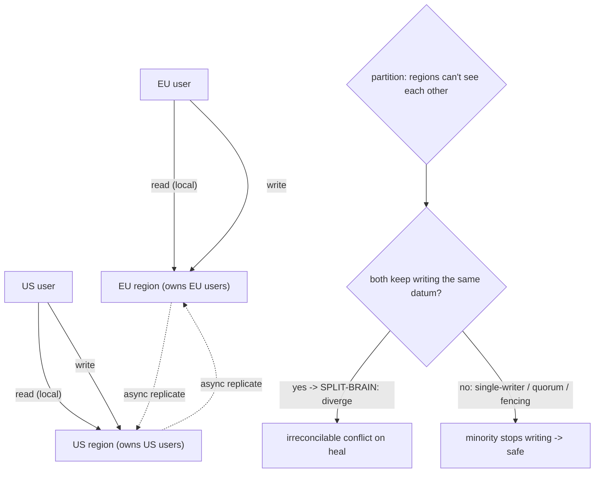

## Thesis

Multi-region is running your system across geographically separate regions for three distinct reasons --- **disaster recovery** (survive a whole-region outage), **latency** (serve each user from a nearby region), and sometimes **data residency** (keep data inside a jurisdiction) --- and it is dominated by two coupled decisions: the **topology** (active-passive: one region serves while another stands by for failover, versus active-active: multiple regions serve simultaneously) and **how data crosses regions** (asynchronous replication with a lag and a data-loss window, versus synchronous with a latency cost). Those two choices determine your failover behavior (**RTO/RPO**), your consistency story, and your exposure to the hardest problem --- **split-brain**, when regions cannot see each other yet both believe they are in charge. It is hard because the speed of light makes cross-region coordination expensive (tens to hundreds of milliseconds per round trip), so you cannot just "run the same system in two places" --- you must decide what is replicated how, which region owns which data, and what happens when they diverge.

## Sub

**Why: survive a region outage, cut user latency, meet data residency** -> **topology: active-passive (a standby you fail over to) vs active-active (all regions serve)** -> **cross-region data: async (a lag = your RPO) vs sync (a latency tax), with a single owner per datum to avoid conflicts** -> **zoom out** to RTO/RPO, failover mechanics and traffic routing, split-brain prevention, and the cost of cross-region coordination that makes multi-AZ the right answer for most systems.

## Spine

- **Multi-region buys disaster recovery, latency, and residency --- and each pulls the design differently** --- surviving a whole-region failure wants a standby you can promote; low latency wants active-active with users served locally; data residency wants data pinned per jurisdiction; knowing *which* you are solving for is the first decision because they trade against each other.
- **Topology is active-passive versus active-active** --- **active-passive** (one region serves, a warm/cold standby fails over) is simpler and avoids multi-writer conflicts but wastes the standby and has a failover delay; **active-active** (all regions serve) gives low latency and no idle capacity but forces you to handle concurrent writes and conflicts across regions.
- **Cross-region data is the hard part because the speed of light is fixed** --- synchronous cross-region replication is slow (tens-to-hundreds of ms added per write), so you usually replicate **asynchronously**, accepting a replication lag that is a **data-loss window (your RPO)** on failover; and you decide which region **owns** which data so writes do not conflict.
- **Split-brain is the failure you design against, and RTO/RPO are the numbers you commit to** --- when regions cannot communicate but both keep accepting writes, they diverge irreconcilably; you prevent it with a **single writer per datum, a quorum, or fencing**, and you state **RTO** (how fast you recover) and **RPO** (how much data you can lose) explicitly rather than hoping.

## Companion Notes

### walk

Running a system across regions to survive an outage and serve users locally

One system walked from single-region to multi-region --- why you do it (DR, latency, residency), how active-passive and active-active trade simplicity against latency and conflicts, why cross-region data is the hard part (async lag = your RPO, and a single owner per datum), and how failover and split-brain define whether your DR actually works.

Say it as motivation then two coupled decisions: what you are solving for (DR / latency / residency), the topology (active-passive vs active-active), and the cross-region data model (async RPO vs sync latency, single-owner-per-datum) --- with split-brain and RTO/RPO as the outcomes you commit to.

### drill

Multi-region and DR reps

Graded reps on active-passive vs active-active, async vs sync replication, RTO/RPO, failover, and split-brain --- the ones that separate "we have a second region" from a disaster-recovery design that actually fails over and does not diverge.

Anchor on the two coupled decisions --- topology (active-passive simple/idle vs active-active low-latency/conflicting) and cross-region data (async lag = RPO vs sync latency, single owner per datum) --- plus the two you commit to (RTO/RPO) and the one you prevent (split-brain).

## Drill

SDE2 | why multi-region, AZ vs region, active-passive/active, RTO/RPO
SDE3 | topology trade, async vs sync, failover, residency, standby tiers
Staff | split-brain, multi-region writes, failover decision, routing

### SDE2 | what multi-region is

What does it mean to run multi-region, and why would you?

Running multi-region means deploying your system across two or more geographically separate cloud regions (e.g. us-east and eu-west), each a full set of infrastructure, rather than in one. There are three distinct motivations: **disaster recovery** --- a whole region can fail (a natural disaster, a large-scale outage, a fiber cut), and running in a second region lets you survive it (fail over and keep serving); **latency** --- users far from your single region see high latency, so serving them from a nearby region cuts round-trip time dramatically (a user in Europe hitting a US-only service pays ~100ms+ each way); and **data residency** --- laws (GDPR, data-sovereignty rules) may require certain data to physically stay within a country/region, forcing per-region data placement. These motivations are different and pull the design in different directions --- DR wants a standby you can promote, latency wants all regions actively serving, residency wants data pinned per region --- so the first thing to establish is *which* problem you are actually solving, because the right topology and data model depend on it. Multi-region is powerful but expensive and complex (you are running and coordinating multiple copies of everything across high-latency links), so it is justified by a real need for one of these three, not adopted by default.

### SDE2 | region vs availability zone

What is the difference between an availability zone and a region, and why does it matter for resilience?

A **region** is a broad geographic area (e.g. us-east-1) that contains multiple **availability zones (AZs)** --- physically separate data centers within that region, each with independent power, cooling, and networking, but close enough to be connected by low-latency links (single-digit ms). The distinction matters enormously for resilience because **multi-AZ and multi-region protect against different failures**. **Multi-AZ** (running across AZs within one region --- the standard, and often nearly free) protects against a single data-center failure: if one AZ loses power or floods, the others in the region keep serving, with negligible added latency because AZs are close. **Multi-region** protects against a *whole-region* failure (a regional outage, a disaster affecting the entire area, a region-wide control-plane failure) --- which multi-AZ cannot, since all AZs are in the same region. The key insight for interviews: **most systems only need multi-AZ**, which is cheap and low-complexity and handles the common failure (a data center going down), while multi-region is a much bigger investment justified only when you genuinely need to survive an entire region disappearing, or need low latency in distant geographies, or have residency requirements. Confusing "we run in three AZs" with "we are multi-region" is a common and consequential mistake --- they are different blast radii.

### SDE2 | active-passive basics

What is an active-passive multi-region setup?

Active-passive (also called active-standby or primary-secondary) means **one region actively serves all traffic (the active/primary), while a second region sits on standby (passive/secondary), ready to take over if the active fails**. Under normal operation only the active region handles requests; the passive region is kept up to date (data is replicated to it) but does not serve users. If the active region goes down, you **fail over** --- shift traffic to the passive region and promote it to active. Its appeal is **simplicity**: there is exactly one region serving and (usually) one place writes happen, so you avoid the hard problem of concurrent writes/conflicts across regions --- the standby is just a replica you promote. Its costs are that the standby is **idle capacity** you pay for but do not use for serving (unless you at least serve reads from it), and there is a **failover delay** (detecting the failure, redirecting traffic, promoting the standby --- your RTO) plus a potential **data-loss window** (anything not yet replicated when the active died --- your RPO). Active-passive is the natural fit when the goal is **disaster recovery** (survive a region loss) rather than latency, because it is far simpler than active-active and DR does not require the standby to serve in normal times.

### SDE2 | active-active basics

What is an active-active multi-region setup, and what does it add over active-passive?

Active-active means **multiple regions serve traffic simultaneously** --- each region actively handles requests (typically from nearby users), and all regions are "live." Over active-passive it adds two big things: **low latency everywhere** (each user is served from a nearby region rather than a single distant one, so a global user base gets good latency) and **no idle capacity** (every region does useful work, and losing one region just shifts its load to the others rather than activating a cold standby --- so failover can be faster and capacity is not wasted). The price is the **hardest problem in multi-region: concurrent writes**. Because multiple regions accept writes at once, the same data can be modified in two regions "simultaneously" (given cross-region replication lag), creating **conflicts** that must be resolved, and you cannot have cheap strong global consistency (coordinating every write across regions would add the cross-region latency you went active-active to avoid). So active-active buys latency and capacity efficiency at the cost of a real distributed-data problem --- conflict resolution, per-region data ownership, and eventual (not strong) cross-region consistency. It is the right choice when **low global latency** is the goal and you are willing to engineer the write/conflict story; if you only need DR, active-passive is much simpler.

### SDE2 | RTO and RPO

What are RTO and RPO, and why are they the core disaster-recovery metrics?

They are the two numbers that define your disaster-recovery requirement, and every DR design is really a way to hit a target RTO and RPO. **RTO --- Recovery Time Objective** --- is *how quickly you must be back up* after a disaster: the maximum acceptable downtime (e.g. "we must recover within 15 minutes"). It is driven by failover speed --- detecting the failure, shifting traffic, promoting the standby, warming capacity. **RPO --- Recovery Point Objective** --- is *how much data you can afford to lose*: the maximum acceptable data-loss window, expressed as time (e.g. "we can lose at most the last 5 seconds of writes"). It is driven by replication --- with asynchronous cross-region replication, anything written but not yet replicated when the region died is lost, so your RPO is roughly your replication lag; with synchronous replication RPO can be near zero (but at a latency cost). They are the core metrics because they turn "we need DR" into concrete, testable targets that dictate the architecture: a tight RTO demands a warm/hot standby and automated failover (a cold standby you rebuild from backups cannot recover in minutes); a tight RPO demands synchronous or very-low-lag replication (async replication with minutes of lag means minutes of data loss). Stating RTO and RPO explicitly --- and choosing the standby tier and replication mode to meet them --- is what separates a real DR plan from "we have a backup somewhere."

### SDE2 | failover basics

At a high level, what happens during a region failover?

Failover is the process of shifting from a failed region to a healthy one, in roughly three phases. **Detect** --- health checks (from an external monitoring point or a global routing layer) determine the active region is actually down, not just briefly slow; this must be reliable because a false positive (failing over on a transient blip) is itself disruptive, so detection uses multiple checks over a short window. **Redirect traffic** --- steer users to the healthy region, typically at the DNS/global-routing layer (update DNS to point at the other region, or a global load balancer / anycast withdraws the failed region), so new requests go to the survivor. **Promote/activate the target** --- in active-passive, promote the standby (make its database replica the new primary/writable, spin up any not-yet-running capacity, ensure it can take writes); in active-active, the surviving regions simply absorb the extra load (less to "promote," which is part of active-active's appeal). Afterward there is **failback** (returning to the original region once it recovers, carefully, to avoid a second disruption) and reconciliation of any data written during the event. The two things that make failover hard are doing it **fast enough** (your RTO --- which pushes toward warm standbys and automation) and doing it **safely** (not failing over on a false alarm, and not creating split-brain if the "failed" region is actually still alive and reachable by some clients).

### SDE2 | why cross-region is hard

Why is coordinating across regions fundamentally harder than within a region?

Because the **speed of light is fixed and regions are far apart**, so cross-region communication has irreducible latency --- a round trip between, say, US and Europe is on the order of ~80-100+ ms (versus sub-millisecond within a data center and single-digit ms across AZs). That physical latency is the root of every multi-region difficulty. It means **synchronous coordination across regions is expensive**: if a write must be confirmed by another region before returning, every write pays that cross-region round trip, which is often unacceptable (you went multi-region partly for latency, and now writes are 100ms slower). So you are pushed toward **asynchronous** replication (send the change to the other region in the background, return immediately) --- which introduces **replication lag** (the other region is behind by the network delay plus processing), and lag is what creates the two core problems: **data loss on failover** (unreplicated writes vanish if the source region dies --- your RPO) and **conflicts** (two regions can independently modify the same data during the lag window, since neither sees the other's write yet). It also makes **strong global consistency impractically slow** (guaranteeing every region agrees on every write requires cross-region coordination on the write path). In short: cross-region latency forces async replication, async replication forces you to accept lag, and lag forces you to handle data-loss windows and write conflicts --- which is the entire hard core of multi-region design, all downstream of physics you cannot change.

### SDE3 | active-passive vs active-active

Compare active-passive and active-active and say when you would choose each.

The trade is **simplicity and safety versus latency and efficiency**. **Active-passive**: one region serves, another stands by. Pros --- far simpler (one region serving, typically one writer, so no cross-region write conflicts to resolve, and a clean consistency story); the standby is a straightforward replica you promote. Cons --- the standby is idle capacity (you pay for a region that does not serve, unless you at least route reads to it); failover has a delay (RTO) and a data-loss window (RPO); and it does nothing for latency (users are still served from the single active region). **Active-active**: all regions serve. Pros --- low latency (users served locally), no idle capacity (every region works), and faster/graceful failure handling (losing a region just redistributes load, no cold standby to activate). Cons --- concurrent writes across regions create **conflicts** requiring a resolution strategy; no cheap strong global consistency (only eventual, or expensive coordination); and substantially more complex data ownership and operations. Choose **active-passive** when the goal is **disaster recovery** and you do not need low global latency --- it is much simpler and DR does not require the standby to serve normally. Choose **active-active** when you need **low latency for a geographically distributed user base** (or maximum availability and capacity efficiency) *and* you are prepared to engineer the write-conflict/ownership story. Many systems land in between (active-active for reads, single-writer for writes --- see read-local/write-global), getting local read latency without the full multi-writer conflict problem.

### SDE3 | async vs sync cross-region replication

When do you replicate synchronously across regions versus asynchronously, and what does each cost?

**Asynchronous replication** (the default across regions): a write is committed in its origin region and returned to the client immediately, and the change is shipped to other regions in the background. It costs you a **replication lag** --- other regions are behind by the network delay plus processing --- which becomes a **data-loss window (RPO)** if the origin region dies before replicating, and it allows **stale reads** and **write conflicts** in the lag window. Its benefit is **low write latency** (writes do not wait for a cross-region round trip), which is usually essential given ~100ms cross-region RTT. **Synchronous replication**: a write is not acknowledged until another region (or a quorum of regions) has durably received it. It gives you a **near-zero RPO** (no committed write is lost, since it is confirmed elsewhere before returning) and stronger consistency, but it costs **the full cross-region latency on every write** (each write waits ~100ms+ for the remote ack) and **reduced availability** (if the remote region is unreachable, writes block or must fall back). The decision: use **synchronous** only for the small set of data where you cannot tolerate *any* loss and can accept the write-latency hit (e.g. critical financial transactions, and even then often within a region or a nearby region pair, or via a system like Spanner that engineers this with special infrastructure); use **asynchronous** for essentially everything else, and manage the resulting RPO and conflicts. Most multi-region systems are asynchronous with a well-understood RPO, because paying 100ms per write globally is rarely acceptable --- so you accept a small data-loss window instead.

### SDE3 | failover mechanics

Walk through the mechanics of an automated regional failover in an active-passive setup.

Detect, redirect, promote --- with safeguards at each step. **Detect**: a health-checking system (ideally external to both regions, or a global routing service like Route 53 health checks / a global load balancer) probes the active region's health from multiple vantage points; failover triggers only when it is convincingly down (multiple failed checks over a short window, to avoid reacting to a transient blip or a network hiccup between the checker and the region). **Redirect**: shift traffic to the secondary, typically by **DNS failover** (update the DNS record / health-checked routing policy so the hostname now resolves to the secondary region --- subject to DNS TTL, so you keep TTLs low for DR-critical records) or via a **global load balancer / anycast** that stops routing to the failed region. **Promote**: make the secondary able to serve writes --- **promote its database replica to primary** (the async replica becomes the new writable primary), scale up any capacity that was not fully warm, and flip application config so the secondary knows it is now active. Then **verify** (the secondary is genuinely serving correctly) and later **fail back** carefully (re-establish the original as a replica of the new primary, sync it, and switch back during a controlled window --- avoiding a second outage and a fresh split-brain). The critical safeguards: **reliable detection** (false failover is an outage you cause yourself, and DNS/promotion are not instant to reverse) and **fencing/single-writer guarantees** so that if the "failed" region is actually still alive, you do not end up with two primaries taking writes (split-brain). Automating this hits a tight RTO, but the automation must be conservative about *when* it fires.

### SDE3 | data residency and sovereignty

How does data residency change a multi-region design?

Data residency (data-sovereignty) requirements --- laws like GDPR or national rules that mandate certain data physically stay within a specific country or region --- turn multi-region from an availability/latency choice into a **data-placement constraint**, and it reshapes the design around *keeping data in the right place* rather than replicating it everywhere. Concretely: you can no longer freely replicate all data to all regions (which DR/active-active normally wants), because, say, EU users' personal data must remain in the EU and must *not* be copied to the US. So you **partition data by residency** --- often sharding users by their home region and keeping their regulated data only in that region's data store (an EU user's data lives in and stays in the EU region). This interacts with your topology: an active-active system must ensure a write for an EU user lands in and stays in the EU region (data ownership aligned to residency), and cross-region replication is **selective** (replicate what you may, keep what you must local). It also complicates DR (you cannot fail an EU region's regulated data over to a US region --- the standby for EU-resident data must itself be in-jurisdiction, e.g. another EU region), and complicates global features (a global view of users may need to query per region rather than a single replicated store, or store only non-regulated fields globally). The senior point is that residency is a **hard constraint that dictates where data can live**, so you design **region as the unit of data ownership by jurisdiction** --- pinning regulated data to compliant regions, replicating only within-jurisdiction for DR, and keeping the global system working by partitioning users by home region rather than replicating everything everywhere.

### SDE3 | read-local write-global

Explain the read-local, write-global pattern and why it is popular.

Read-local/write-global (sometimes "local reads, global writes" or a single-writer-with-local-read-replicas model) is a middle ground that captures most of active-active's benefit while sidestepping its hardest problem. The idea: **replicate data to all regions so reads are served locally (low latency, from a nearby replica), but route all writes for a given piece of data to a single owning region** (the "home" region for that data / user), which is the sole writer. Reads --- usually the large majority of traffic --- get local latency from the regional replica; writes go (cross-region if needed) to the one region that owns the data, which then replicates the change out to the others. It is popular because it **eliminates write conflicts** (there is exactly one writer per datum, so no two regions can concurrently modify the same data --- no conflict resolution needed) while still giving **local read performance everywhere**, which is what most read-heavy applications actually need. The cost is that **writes pay cross-region latency when the user is not in their data's home region** (a write is routed to the owning region), and there is still async **replication lag** for the propagation to other regions (so a user might read a slightly stale value from their local replica right after a write elsewhere --- addressed with read-your-writes techniques like reading from the home region or a session pin after a write). This pattern is common precisely because it decouples the two concerns: reads scale and localize trivially via replicas, and writes stay simple and conflict-free via single-region ownership --- you only pay the cross-region cost on writes, and only when the writer is remote from the data's home. It is the pragmatic default for "multi-region for latency" without committing to full active-active multi-writer.

### SDE3 | warm, cold, and pilot-light standby

What are the standby readiness tiers for DR, and how do they trade cost against RTO?

They are points on a spectrum from "cheap but slow to recover" to "expensive but instant," and you pick by your RTO/RPO budget versus cost. **Backup-and-restore (cold)**: no running standby --- you keep backups (and maybe infra-as-code) and, on disaster, **provision a new environment and restore from backup**. Cheapest (you run nothing extra), but the slowest RTO (hours --- spin up infra, restore data) and worst RPO (as stale as your last backup). **Pilot light**: a **minimal always-on core** in the standby region --- typically the data layer replicating continuously (so data is current, good RPO) but application/compute scaled to near-zero, ready to be scaled up on failover. Cheaper than a full standby (you pay mainly for replicated storage and a small footprint), with a moderate RTO (scale up compute, which is faster than building from scratch). **Warm standby**: a **fully functional but scaled-down** copy of the system always running in the standby region (all components live, just smaller), so on failover you scale it up and redirect --- faster RTO (minutes, since everything is already running) at higher cost (you run a whole second environment, albeit small). **Hot standby / active-active**: a **full-scale** second region (or all regions serving) --- near-instant failover (little to promote, capacity already there) and the best RTO, at the highest cost (a full duplicate, or genuinely active-active). The trade is monotonic: more always-on capacity in the standby -> faster recovery -> more cost. You choose the cheapest tier that meets your required RTO/RPO --- most systems that need real DR land at pilot-light or warm standby (current data via replication, fast-ish recovery via pre-provisioned or quickly-scaled compute), reserving hot/active-active for the lowest-RTO, highest-value systems.

### SDE3 | testing disaster recovery

Why is testing failover essential, and what does a good DR test look like?

Because **an untested DR plan is not a DR plan --- it is an assumption**, and multi-region failover is exactly the kind of complex, rarely-exercised procedure that quietly rots and fails when you finally need it. The failure modes hide until tested: the standby's data replication silently broke weeks ago (so failover reveals a huge RPO or missing data); DNS TTLs are too high so traffic does not actually shift in your RTO; the standby was under-provisioned and falls over under real load; a config or secret or dependency exists only in the primary region; promotion scripts have bugs; or nobody actually knows the runbook. You only discover these by **exercising failover for real**. A good DR test is a **game day**: on a schedule, deliberately fail over to the secondary region (in production or a production-like environment) --- simulate the primary going down, execute the actual failover procedure, and **measure the real RTO and RPO** against your targets, verifying the secondary genuinely serves correct traffic under representative load. Good practice includes: testing regularly (so it stays current as the system evolves), testing the *full* path (detection, traffic shift, promotion, and failback), verifying data integrity after (no loss beyond RPO, no corruption), and ideally continuous validation (some organizations run active-active partly *because* both regions are always exercised, or use chaos engineering to routinely kill a region). The senior stance: you **do not have DR until you have failed over under test and hit your RTO/RPO** --- the plan on paper is worthless until proven, and the first real failover should never be during an actual disaster.

### Staff | split-brain and preventing it

What is split-brain in a multi-region context, and how do you prevent it?

Split-brain is when a **network partition** cuts the regions off from each other, but **both regions continue accepting writes as if they are in charge** --- so each independently modifies data, and when the partition heals the two histories have **diverged irreconcilably** (conflicting writes to the same data, both "committed"). It is the most dangerous multi-region failure because it silently corrupts data (there is no single truth to reconcile to) and is easy to cause accidentally during failover: if the primary region is not actually dead but merely *unreachable* from the failover controller, and you promote the secondary to primary, you now have **two primaries taking writes** --- classic split-brain. Prevention is about ensuring **at most one region can write a given datum at any time**, via one of: **single-writer per datum** (only the owning region ever writes it --- read-local/write-global inherently avoids split-brain because there is one writer, and the other regions never accept writes for that data even if they cannot see the owner); **quorum / consensus** (writes require a majority of regions/nodes to agree, so a minority partition *cannot* form a quorum and therefore cannot accept writes --- the partition that loses the majority stops writing, which is exactly how Raft/Paxos-based systems avoid split-brain, at the cost of needing an odd number of regions/witnesses and blocking the minority side); and **fencing** (when you promote a new primary, you must *fence off* the old one --- revoke its ability to write, e.g. via a fencing token / lease / STONITH-style isolation --- so that if it was only unreachable, it cannot resume as a second writer). The staff framing: split-brain is prevented not by hoping the old primary is dead but by **structurally guaranteeing a single writer** --- through ownership (one region writes), quorum (a minority cannot write), or fencing (the old writer is provably cut off before the new one starts) --- and the classic mistake is automated failover that promotes a secondary without fencing the primary, turning a partition into permanent data divergence.

### Staff | multi-region writes and conflict resolution

In active-active with multi-region writes, how do you handle write conflicts?

You either **avoid** conflicts by design (strongly preferred) or **resolve** them with a defined strategy when you cannot. **Avoidance --- single-writer per datum**: partition ownership so each piece of data has exactly one region that may write it (route a user's/entity's writes to their home region), so concurrent conflicting writes are structurally impossible --- this is read-local/write-global, and it is the cleanest answer because there is simply nothing to reconcile. When you genuinely need multiple regions to write the same data (true active-active writes), you need a **conflict-resolution strategy** and must accept eventual consistency: **Last-Write-Wins (LWW)** --- attach a timestamp/version and the latest write wins --- simple but **loses data** (the discarded write silently vanishes) and depends on clock sync (dangerous across regions); acceptable only when losing one of two concurrent writes is tolerable. **Conflict-free replicated data types (CRDTs)** --- data structures mathematically designed so concurrent updates **merge deterministically without loss** (counters, sets, sequences) --- the strong choice when your data fits a CRDT (collaborative editing, counters, shopping carts modeled as add/remove sets), because every region converges to the same value automatically. **Version vectors / application-level merge** --- detect the conflict (via vector clocks that show two writes are concurrent, not one-after-the-other) and hand both versions to the application (or the user) to merge (as Dynamo/Riak do with siblings) --- preserves both writes at the cost of merge logic. The staff decision hierarchy: **design for single-writer per datum whenever possible** (no conflicts, no reconciliation); if you must multi-write, **use CRDTs where the data model allows** (deterministic, lossless convergence); fall back to **detect-and-merge (version vectors)** when semantics need it; and use **LWW only when silent loss of a concurrent write is acceptable**. This is the consistency-models topic applied to geography --- concurrent writes with cross-region lag are exactly the conflict scenario, and ownership/CRDTs/merge are how you converge.

### Staff | the failover decision: automatic vs manual

Should regional failover be automatic or manual, and what governs the choice?

It is a genuine trade between **RTO and the risk of a false failover**, and the answer depends on how confident your detection is and how costly a wrong failover is. **Automatic failover** hits a tight RTO (a machine reacts in seconds/minutes, no human in the loop) --- necessary when downtime must be minimal and a human cannot respond fast enough. But it is dangerous because **failover itself is disruptive and hard to reverse**: promoting a secondary, shifting DNS, and re-pointing writes are not instant to undo, so a **false positive** (failing over on a transient network blip, a brief slowness, or a partial failure that would have self-healed) causes an outage *you* triggered, and worse can cause **split-brain** if the "failed" primary is actually alive. It can also **flap** (failing back and forth) if the trigger is noisy. **Manual failover** (or "assisted": automation prepares and a human approves) avoids false positives and lets a human apply judgment about whether the region is *really* down and whether failing over is wise --- at the cost of a slower RTO (human response time, especially off-hours). What governs the choice: the **required RTO** (very tight -> lean automatic), the **reliability of detection** (can you distinguish a real region failure from a blip confidently? if not, automation is risky), the **blast radius and reversibility** of failover (if failover is cheap and safe, automate; if it is disruptive and hard to reverse, gate it), and **fencing guarantees** (you should only automate if you can *fence the old primary*, or you risk split-brain). Common mature practice: **automate detection and preparation but require confident, multi-signal triggers**, use **conservative thresholds** (multiple failed checks over time to avoid reacting to blips), always **fence** before promoting, and for the highest-stakes systems keep a **human approval** step (assisted failover) so a machine does not unilaterally trigger a disruptive, hard-to-reverse action on ambiguous evidence. The staff point: the cost of a *wrong* failover is often comparable to the outage you are protecting against, so you optimize not just for fast failover but for **not failing over when you shouldn't** --- confident detection, fencing, and often a human gate.

### Staff | cross-region consistency

What consistency can you realistically offer across regions, and how do you structure the system around it?

Realistically, **strong consistency is per-region (or per-owning-region), and cross-region is eventual** --- because guaranteeing global strong consistency requires cross-region coordination on the write path, which costs the ~100ms cross-region latency per write and reduces availability under partition (CAP/PACELC made physical by distance). So you structure the system to **contain strong-consistency needs within a region** and accept eventual consistency between regions. Concretely: **assign each datum a home region that is its source of truth and sole writer** (single-writer per datum), so within that region you can offer strong consistency (linearizable reads/writes locally), while other regions hold **asynchronously-replicated, eventually-consistent copies** for local reads. Operations that need strong consistency are routed to the home region (paying cross-region latency only when the caller is remote); operations that can tolerate staleness read the local replica. For the rare truly-global strong-consistency requirement, you either use a system engineered for it (Spanner with TrueTime, at real latency/infra cost) or a quorum spanning regions (accepting the latency) --- reserved for data that genuinely cannot be eventually consistent. The design consequence is **you decide, per piece of data, its consistency and its home**: most data is single-writer-per-region with local eventually-consistent read replicas (strong where written, eventual elsewhere); a small set needing global agreement pays for cross-region consensus. The staff framing mirrors consistency-models across geography: you cannot cheat physics, so you **localize strong consistency to a region via ownership**, make cross-region **eventual** with a defined convergence/conflict strategy, and only pay for cross-region strong consistency on the narrow slice that truly requires it --- never "strong consistency everywhere," which would reintroduce the cross-region latency you built multi-region to avoid.

### Staff | traffic routing across regions

How do you route users to the right region, and steer traffic during a failover?

Through a **global traffic-routing layer** that decides, per request/client, which region to send it to --- and that same layer is what executes failover. The main mechanisms: **Geo-DNS / latency-based DNS** (a DNS service like Route 53 resolves your hostname to the nearest or lowest-latency healthy region based on the client's location/network) --- simple and widely used, but subject to **DNS caching/TTL** (clients cache the resolution, so changes propagate only as TTLs expire, which is why DR-critical records use low TTLs). **Anycast** (the same IP is announced from multiple regions, and BGP routes each client to the topologically-nearest one) --- used by global load balancers and CDNs; failover is fast because withdrawing a region's announcement reroutes traffic at the network layer without waiting for DNS TTLs. **Global load balancer** (a cloud global LB / edge network that terminates connections at the edge and routes to healthy regional backends, with built-in health checking) --- gives fast, health-aware routing and failover without client-side DNS caching issues. For **failover**, the routing layer is health-checking regions and **stops sending traffic to an unhealthy one** (DNS failover updates the record to the healthy region; anycast/global-LB withdraws the failed region) --- so "shift traffic" is a routing-layer operation. Key considerations: **health checks** must be reliable and multi-vantage (to avoid false failover); **DNS TTL** must be low for anything you need to fail over quickly (high TTL = slow failover regardless of how fast you detect); **session/stickiness** must be handled (a user mid-session may need to move regions, and read-your-writes may require pinning them to a region briefly after a write); and **anycast/global-LB** generally beat raw geo-DNS for failover speed because they do not depend on client DNS cache expiry. The staff framing: routing is both the **latency optimizer** (send each user to the nearest healthy region) and the **failover actuator** (withdraw an unhealthy region), and its failover speed is gated by the mechanism --- anycast/global-LB fail over in seconds at the network layer, while geo-DNS is bounded by TTL --- so DR-critical systems favor anycast or a global LB and keep any DNS TTLs low.

### Staff | when NOT to go multi-region

When is multi-region the wrong choice, and what do you do instead?

Very often --- multi-region is a **large, permanent increase in cost and complexity**, and most systems do not need it, so the default should be **multi-AZ within a single region** unless a concrete requirement forces otherwise. Multi-region is the wrong choice when: your availability requirement is met by **multi-AZ** (which already survives a data-center failure --- the common failure mode --- cheaply and simply, and a full region outage is rare); your users are **concentrated in one geography** (no latency case for distant regions); you have **no data-residency requirement**; or you have not yet exhausted **simpler resilience** (multi-AZ, good backups, automated recovery within a region). The costs you would take on unnecessarily: **doubled (or more) infrastructure spend** (running/replicating everything across regions); **major complexity** (cross-region data replication, conflict resolution or ownership, failover orchestration, split-brain prevention, DR testing) that adds risk and slows the team; **cross-region latency** intruding on the data model; and **operational burden** (game days, multi-region deploys, more failure modes). What to do instead: **multi-AZ** for data-center-failure resilience (the biggest resilience win per dollar), **robust backups + tested restore** and infra-as-code for recovering from disasters (accepting a longer RTO than a hot standby, which is fine for many businesses), a **CDN/edge caching** for read latency to distant users without full multi-region backends, and only **escalate to multi-region when a real requirement appears** --- a strict RTO/RPO that a single region cannot meet (regulated uptime, a business that cannot survive a multi-hour region outage), genuinely global users needing low write latency, or data-residency law. The staff judgment: **name the specific requirement (DR beyond what multi-AZ gives, global latency, or residency) that justifies multi-region, and if you cannot, do not do it** --- because you would be paying double and adding the hardest distributed-systems problems (conflicts, split-brain, failover) to solve a problem multi-AZ and backups already handle. Match the resilience investment to the actual RTO/RPO and latency requirements, and reach for multi-region last.

### Staff | telling the multi-region story

How do you present a multi-region design well in an interview?

Lead with the **motivation**, because it dictates everything: "First, why multi-region --- disaster recovery, latency for a global user base, or data residency? They pull the design differently, so I'd pin that down." Then the **topology** as a consequence: "For pure DR, active-passive --- a warm standby I fail over to --- is much simpler and avoids multi-writer conflicts. For low global latency I'd go active-active, or more likely read-local/write-global: replicate for local reads, but route each datum's writes to a single owning region so I don't have write conflicts." Then the **cross-region data model** honestly: "Cross-region I replicate asynchronously --- paying 100ms per write synchronously isn't viable --- so I accept a replication lag, which is my RPO, and I'd state an explicit RTO and RPO target rather than hand-wave." Then the **hard problems**: "The failure I design against is split-brain --- I prevent it with single-writer ownership or a quorum, and I always fence the old primary before promoting a new one, so an unreachable-but-alive region can't become a second writer. Failover is health-checked at a global routing layer --- anycast or a global LB for fast, TTL-independent failover --- with conservative detection so I don't fail over on a blip, and I test it with game days because DR isn't real until I've failed over under test and hit my RTO/RPO." Close on **restraint**: "And I'd challenge whether multi-region is needed at all --- multi-AZ plus good backups handles most resilience; I'd only go multi-region for a strict RTO/RPO a single region can't meet, genuinely global latency, or residency law." That arc --- motivation, topology, async data + RTO/RPO, split-brain/fencing/failover/testing, and the restraint to prefer multi-AZ --- is the complete senior answer, and it signals you understand multi-region as a set of physics-driven trade-offs, not a checkbox.

## Walk

### Why multi-region: DR, latency, residency

```flow
single[single region] -> risk[a whole region can fail, distant users lag, data must stay in-jurisdiction] -> multi[run across regions -- but pick which problem you are solving]
```

Start with the three distinct motivations, because they pull the design apart. **Disaster recovery**: a whole region can fail (disaster, outage, control-plane failure), and a second region lets you survive it. **Latency**: distant users pay ~100ms+ to a single far region, so serving them locally is a big win. **Data residency**: law (GDPR, sovereignty) may force certain data to physically stay in a jurisdiction.

These do not want the same design --- DR wants a **standby you promote**, latency wants **all regions serving**, residency wants **data pinned per region**. And multi-region is expensive and complex (running and coordinating copies of everything across high-latency links), so the first move is to name *which* problem you are solving. Crucially, this is **not** the same as multi-AZ: running across availability zones in one region survives a data-center failure (cheap, common need), but not a *whole-region* failure --- most systems only need multi-AZ.

### Topology: active-passive vs active-active

```flow
topo[topology?] -> ap[active-passive: one serves, a standby fails over -- simple, idle, failover delay] -> aa[active-active: all serve -- low latency, no idle, but write conflicts]
```

**Active-passive**: one region serves, a warm/cold standby is kept replicated and promoted on failure. Simpler (one writer, no cross-region conflicts) but the standby is idle capacity, and failover has an RTO delay and an RPO data-loss window. The natural fit for **DR**. **Active-active**: all regions serve --- low latency everywhere, no idle capacity, graceful load redistribution on failure --- but multiple regions writing the same data creates **conflicts**, and there is no cheap strong global consistency. The fit for **global latency**, if you engineer the write story.

Most systems that want local latency without full multi-writer pain choose the middle --- **read-local, write-global**: replicate everywhere for local reads, but route each datum's writes to a single owning region:

```python
def owner_region(entity):
    return entity.home_region              # each datum has ONE writer region

def route_write(entity, write):
    home = owner_region(entity)
    if current_region == home:
        apply(write)                       # local write, then replicate out async
    else:
        forward_to(home, write)            # cross-region hop to the owner -- no conflict
```

One writer per datum means no conflicts to resolve; reads stay local and fast. You only pay cross-region latency on writes, and only when the writer is remote from the data's home.

### Cross-region data: async vs sync, and RPO

```flow
data[cross-region write] -> sync[synchronous: wait for remote ack -- near-zero RPO, +100ms per write] -> async[asynchronous: return now, ship in background -- low latency, lag = RPO]
```

The speed of light is the root problem: a cross-region round trip is ~80-100+ ms (versus sub-ms in a data center). So **synchronous** replication --- not acking a write until another region confirms it --- gives a near-zero RPO but taxes *every* write with the full cross-region latency and blocks if the remote is unreachable. Almost always too expensive.

So you replicate **asynchronously**: commit and return in the origin region, ship the change in the background. That keeps writes fast but introduces a **replication lag**, and lag is what creates the two core problems --- **data loss on failover** (unreplicated writes vanish if the origin dies --- your **RPO** is roughly the lag) and **conflicts** (two regions can modify the same data in the lag window). You state an explicit **RTO** (recovery time) and **RPO** (tolerable data loss) as targets, and choose the standby tier and replication mode to hit them --- reserving synchronous for the narrow slice of data that can tolerate *no* loss and *can* pay the latency.

### Failover and split-brain

```flow
detect[health checks: region down?] -> promote[shift traffic + fence old primary + promote standby -- your RTO] -> brain[but if it was only unreachable and unfenced -> split-brain: two writers diverge]
```

Failover is detect -> redirect -> promote. **Detect** convincingly (multiple checks over a short window --- a false failover is an outage you cause). **Redirect** at a global routing layer (anycast / global LB for fast, TTL-independent failover; geo-DNS is bounded by TTL, so keep it low). **Promote** the standby (its async replica becomes the writable primary), then verify and later fail back carefully. Tighter RTO pushes toward warm/hot standbys and automation.

The failure to design against is **split-brain**: a partition cuts the regions off, but both keep writing, and their histories diverge irreconcilably --- easy to cause if you promote a secondary while the primary is merely *unreachable, not dead*, giving you **two primaries**. You prevent it structurally: **single-writer per datum** (ownership --- the other region never writes that data), a **quorum** (a minority partition can't get a majority, so it can't write), or **fencing** (revoke the old primary's ability to write --- a fencing token/lease --- *before* promoting the new one). And you don't have DR until you've **failed over under a game day** and hit your RTO/RPO. Motivation, topology, async data + RTO/RPO, split-brain/fencing --- and the restraint to prefer multi-AZ unless a real requirement forces multi-region.

### Model Script

- Frame the motivation | "The first question with multi-region is why -- because the three reasons pull the design apart. Disaster recovery: a whole region can fail, and a second region lets you survive it. Latency: distant users pay a hundred milliseconds or more to a single far region, so serving them locally is a big win. And data residency: law may force certain data to stay in a jurisdiction. DR wants a standby you promote, latency wants all regions serving, residency wants data pinned per region -- so I pin down which problem I'm solving. And I'd note this is not multi-AZ: running across AZs survives a data-center failure cheaply, but not a whole-region failure, and most systems only need multi-AZ."
- Topology | "Then the topology follows from the motivation. For pure DR, active-passive -- one region serves, a warm standby fails over -- is much simpler and avoids multi-writer conflicts, at the cost of idle capacity and a failover delay. For low global latency, active-active: all regions serve, no idle capacity, graceful failure -- but concurrent writes across regions create conflicts. Most of the time I'd actually go read-local, write-global: replicate everywhere for local reads, but route each datum's writes to a single owning region. One writer per datum means no conflicts to resolve, reads stay local and fast, and I only pay cross-region latency on writes, and only when the writer is remote from the data's home."
- Cross-region data | "Cross-region data is the hard part because the speed of light is fixed -- a round trip is around a hundred milliseconds. Synchronous replication, where a write waits for a remote region to confirm, gives near-zero data loss but taxes every write with that full latency and blocks if the remote is down -- almost always too expensive. So I replicate asynchronously: commit and return locally, ship the change in the background. That keeps writes fast but introduces replication lag, and the lag is my RPO -- the data I'd lose if the origin region died before replicating. So I state explicit RTO and RPO targets -- how fast I recover, how much data I can lose -- and pick the standby tier and replication mode to hit them, reserving synchronous for the narrow slice of data that can tolerate no loss."
- Failover and split-brain | "Failover is detect, redirect, promote -- detect convincingly with multiple checks so I don't fail over on a blip, redirect at a global routing layer, promote the standby's replica to primary. The failure I design against is split-brain: a partition cuts the regions off but both keep writing and diverge -- which happens if I promote a secondary while the primary is only unreachable, not dead, giving me two writers. I prevent it structurally: single-writer ownership, or a quorum where a minority can't write, or fencing -- revoking the old primary's ability to write before I promote the new one. And I don't consider DR real until I've failed over under a game day and hit my RTO and RPO -- an untested DR plan is just an assumption."
- Interviewer: "Your monitoring says the primary region is down and you fail over automatically. But the primary was actually just partitioned from your monitoring and is still serving some users. What now?"
- The split-brain trap | "That's the classic split-brain trap, and it's why fencing is non-negotiable. If I promoted the secondary without fencing the primary, I now have two primaries taking writes, and when the partition heals their histories have diverged with no single truth to reconcile to -- silent data corruption. The prevention is structural: I only ever promote after fencing the old primary -- revoking its write capability via a fencing token or lease, so even if it's alive it can't keep writing -- or I use a quorum model where the partitioned-off minority can't form a majority and therefore stops accepting writes on its own. It also argues for conservative, multi-signal failover detection and often a human approval gate, because the cost of a wrong failover -- split-brain -- is as bad as the outage I'm protecting against. So: fence before promote, or use quorum so the minority self-stops."
- Land it | "So the arc is: name the motivation -- DR, latency, or residency -- because it dictates the design; pick the topology -- active-passive for DR, active-active or read-local-write-global for latency; replicate asynchronously and commit to explicit RTO and RPO; and design against split-brain with single-writer ownership, quorum, or fencing, with health-checked failover I've actually tested. And I'd push back on whether multi-region is even needed -- multi-AZ plus good backups handles most resilience, so I'd only go multi-region for a strict RTO/RPO a single region can't meet, genuinely global latency, or residency law."

## Whiteboard

Sketch how active-active with per-region ownership serves locally, and how a partition creates split-brain.

### How does a multi-region system serve users locally without write conflicts?

Via **read-local, write-global**: replicate data to every region so reads are served from a nearby replica (low latency), but give each datum a single **owning region** that is its sole writer. Reads (the majority) are local; a write is routed to the data's home region, which applies it and replicates it out asynchronously. Because only one region ever writes a given datum, there are **no cross-region write conflicts** to resolve --- you get local read latency everywhere while keeping writes conflict-free. You pay cross-region latency only on writes, and only when the writer is remote from the data's home; async replication lag means a local read just after a remote write may be briefly stale (handled with read-your-writes pinning).

### What happens when the regions can't see each other?

A partition risks **split-brain**: if both regions keep accepting writes for the same data (or a failover promotes a secondary while the primary is only unreachable, not dead), both modify it independently and their histories **diverge irreconcilably** when the partition heals. You prevent it structurally --- **single-writer ownership** (the non-owner never writes that datum), a **quorum** (the minority side can't reach a majority, so it stops writing), or **fencing** (the old primary's write capability is revoked before the new one is promoted).



Verdict: name the motivation (DR / latency / residency) -> pick topology (active-passive for DR, read-local/write-global or active-active for latency) -> replicate async with explicit RTO/RPO -> prevent split-brain with single-writer, quorum, or fencing -> and prefer multi-AZ unless a real requirement forces multi-region.

## System

Zoom out to how a multi-region system is laid out and its cross-cutting concerns.

### Where it sits

Motivation: DR (survive a region) / latency (serve locally) / residency (pin data) -- decides everything [*]
Topology: active-passive (standby + failover) vs active-active vs read-local/write-global (single owner per datum)
Cross-region data: async replication (lag = RPO) is the default; sync only for no-loss data (pays ~100ms/write)
Failover: health-checked at a global routing layer (anycast / global LB fast; geo-DNS bounded by TTL); RTO/RPO explicit
Split-brain: prevented by single-writer ownership, quorum (minority can't write), or fencing the old primary before promoting

### Pivots an interviewer rides

From "make it multi-region" they push on the data model and the failure modes.

#### Active-passive or active-active?

-> active-passive for DR (simple, no write conflicts); active-active / read-local-write-global for global latency
DR does not need the standby to serve, so active-passive is far simpler; low global latency needs local serving, so active-active -- but route each datum's writes to a single owning region (read-local/write-global) to avoid the multi-writer conflict problem entirely.

#### How do you prevent split-brain on failover?

-> fence the old primary before promoting, or use a quorum so a partitioned minority can't write
Never promote a secondary while the primary might be alive-but-unreachable without fencing it (revoking its write capability); or require writes to hold a majority quorum, so the minority side of a partition structurally cannot accept writes -- and detect conservatively so you don't fail over on a blip.

## Trade-offs

The calls that separate "we have a second region" from a DR design that works.

### Active-passive vs active-active

- Active-passive: simple (one writer, no cross-region conflicts, clean consistency), a straightforward standby to promote -- but idle standby capacity, a failover delay (RTO) and data-loss window (RPO), and no latency benefit
- Active-active: low latency everywhere, no idle capacity, graceful failure redistribution -- but concurrent cross-region writes create conflicts, no cheap strong global consistency, and far more complex ownership/ops

Active-passive for disaster recovery (much simpler, and DR doesn't need the standby to serve); active-active (or read-local/write-global) for genuinely global low-latency needs -- and prefer single-writer-per-datum ownership so you get local reads without the multi-writer conflict problem.

### Async vs sync cross-region replication

- Async: low write latency (commit and return, replicate in background), the practical default given ~100ms cross-region RTT -- but a replication lag that is your RPO (data loss on failover) and allows stale reads and conflicts
- Sync: near-zero RPO (no committed write lost) and stronger consistency -- but every write pays the full cross-region round trip (~100ms+) and writes block if the remote region is unreachable

Async for essentially everything, with a well-understood RPO; sync only for the narrow set of data that can tolerate no loss and can pay the per-write latency -- most multi-region systems are async with an explicit, tested RPO because 100ms per write globally is rarely acceptable.

### Multi-region vs multi-AZ

- Multi-AZ (one region, many AZs): survives a data-center failure (the common case) cheaply and simply, negligible added latency, no conflict/split-brain problems -- but does not survive a whole-region outage
- Multi-region: survives a full region loss, enables global low latency, meets residency -- but doubles infra cost and adds the hardest distributed problems (conflicts, failover, split-brain, DR testing)

Multi-AZ is the right answer for most systems (biggest resilience per dollar, handles the common failure); escalate to multi-region only for a strict RTO/RPO a single region can't meet, genuinely global users, or data-residency law -- pair multi-AZ with tested backups and a CDN before reaching for multi-region.

## Model Answers

### the reframe | Name the motivation, then the two coupled decisions

The frame to lead with.

- Why: DR / latency / residency -- they pull the design differently | key | and this is not multi-AZ (region vs data-center blast radius)
- Topology = active-passive (DR) vs active-active / read-local-write-global (latency) | store | single owner per datum avoids conflicts
- Cross-region data = async (lag = RPO) vs sync (latency); commit to explicit RTO/RPO | note | physics: ~100ms cross-region RTT

### the depth | Split-brain, failover, and the restraint to prefer multi-AZ

Where it is really tested.

- Split-brain is the failure to design against: fence the old primary or use quorum | key | classic trap: auto-failover on a partitioned-but-alive primary
- Failover = health-checked at a global routing layer; test it with game days | store | anycast/global-LB fast, geo-DNS bounded by TTL; no DR until tested
- Prefer multi-AZ + backups + CDN; multi-region only for a real requirement | note | it doubles cost and adds conflicts/failover/split-brain

## Numbers

Back-of-envelope the RPO of asynchronous replication and the latency tax of synchronous, from cross-region RTT and write rate.

RPO (data at risk) is roughly replication lag times the write rate; synchronous replication instead adds the full cross-region round trip to every write.

- rtt | Cross-region round-trip (ms) | 90 | 1 | 5
- lag | Async replication lag (seconds) | 3 | 0 | 1
- wps | Writes per second | 5000 | 0 | 500

```js
function (vals, fmt) {
  var rtt = vals.rtt, lag = vals.lag, wps = vals.wps;
  var atRisk = lag * wps;                 // writes not yet replicated if the region dies now
  var syncAdded = rtt;                    // sync replication waits one cross-region RTT per write
  var localWrite = 5;                     // ~5ms local write baseline
  var syncTotal = localWrite + syncAdded;
  function r(x, d) { var m = Math.pow(10, d); return Math.round(x * m) / m; }
  return [
    { k: 'RPO window (async)', v: '~' + fmt.n(lag) + ' s', u: 'of writes at risk', n: 'asynchronous replication means the last ~' + fmt.n(lag) + 's of writes are not yet in the other region \u2014 lost if the origin region dies now (this IS your RPO)', over: false },
    { k: 'Writes lost on failover', v: '~' + fmt.n(Math.round(atRisk)), u: 'writes', n: 'replication lag (' + fmt.n(lag) + 's) x write rate (' + fmt.n(wps) + '/s) \u2014 the concrete data-loss count if the region fails mid-lag', over: atRisk > 1000 },
    { k: 'Sync write latency', v: '~' + fmt.n(syncTotal) + ' ms', u: 'per write', n: '~' + fmt.n(localWrite) + 'ms local + ' + fmt.n(syncAdded) + 'ms cross-region round trip \u2014 what EVERY write costs if you replicate synchronously for near-zero RPO', over: syncTotal > 50 },
    { k: 'Sync latency multiple', v: fmt.n(r(syncTotal / localWrite, 1)) + 'x', u: 'vs local write', n: 'synchronous cross-region replication makes each write this many times slower than a local write \u2014 why async is the default despite the RPO', over: (syncTotal / localWrite) >= 5 },
    { k: 'Verdict', v: (atRisk > 1000 ? 'tighten lag / sync critical data' : 'async is fine'), u: '', n: atRisk > 1000 ? 'the data-loss window is large \u2014 reduce replication lag, or replicate the truly-critical subset synchronously despite the latency' : 'the at-risk window is small \u2014 async replication with this RPO is acceptable', over: false }
  ];
}
```

## Red Flags

What makes an interviewer wince.

### "We're multi-region -- we run in three availability zones"

Multi-AZ and multi-region are different blast radii: three AZs are all in one region and survive a data-center failure, but not a whole-region outage -- so calling multi-AZ "multi-region" misstates what you're protected against.

Be precise: multi-AZ (cheap, standard) survives a data-center failure; multi-region (expensive, complex) survives a whole-region failure and enables global latency/residency -- and name which one the requirement actually needs.

### "On failure we just promote the standby to primary"

Promoting a secondary while the old primary might be alive-but-unreachable creates split-brain -- two primaries take writes and diverge irreconcilably when the partition heals.

Fence the old primary (revoke its write capability via a fencing token/lease) before promoting, or use a quorum so a partitioned minority structurally cannot write -- and detect the failure conservatively (multiple signals) so you don't fail over on a transient blip.

### "We'll replicate synchronously across regions so we never lose data"

Synchronous cross-region replication adds the full ~100ms round trip to every write and blocks writes when the remote region is unreachable -- usually unacceptable, and it reintroduces the latency you may have gone multi-region to avoid.

Replicate asynchronously with an explicit, tested RPO for essentially everything, and reserve synchronous replication for the narrow slice of data that can tolerate no loss and can pay the per-write latency -- accept a small data-loss window rather than taxing every write.

## Opener

### 30s | The one-liner

How I open when asked to make a system multi-region or design for disaster recovery.

#### What is the shape?

Multi-region is running across geographically separate regions for one of three reasons --- disaster recovery, latency, or data residency --- and it is dominated by two coupled decisions: the topology (active-passive for DR vs active-active for latency) and how data crosses regions (async with a data-loss window, or sync with a latency tax), which together set your RTO/RPO and your exposure to split-brain.

#### What's the key move?

Name the motivation (it dictates the design), then prefer single-writer-per-datum (read-local/write-global) so reads are local and writes are conflict-free, replicate asynchronously with explicit RTO/RPO, and design against split-brain with ownership, quorum, or fencing the old primary before promoting. And challenge whether multi-region is needed at all --- multi-AZ plus backups handles most resilience.

##### Hooks

Where an interviewer usually pushes next.

- Active-passive or active-active? | DR vs latency; read-local/write-global as the middle | drill
- Async or sync replication? | async (lag = RPO) default; sync only for no-loss data | drill
- How do you prevent split-brain? | fence the old primary or quorum; test failover | drill

Foot: two sentences --- multi-region runs across regions for disaster recovery, latency, or residency, and those motivations pull the design apart, so you name which you are solving before choosing a topology (active-passive for DR, active-active or read-local/write-global for latency) and a cross-region data model (asynchronous replication with a replication lag that is your RPO, reserving synchronous for the narrow no-loss slice that can pay ~100ms per write); the hard core is physics --- cross-region latency forces async, async forces you to accept a data-loss window and write conflicts, and a partition risks split-brain --- so you commit to explicit RTO/RPO, prevent split-brain structurally with single-writer ownership, quorum, or fencing the old primary before promoting, health-check failover at a global routing layer and prove it with game days, and reach for multi-region only when a strict RTO/RPO, genuinely global latency, or residency law justifies it over cheaper multi-AZ.

## Bank

### SCALE | A globally-distributed service needing low latency and region-failure survival

Task: take a single-region service global --- low latency for users worldwide and survival of a whole-region outage.
Model: establish the motivation (both latency and DR here). Topology: read-local, write-global --- replicate data to all regions so reads are served from a nearby replica (local latency), but give each user/entity a single owning region as its sole writer, so there are no cross-region write conflicts; route a user's writes to their home region (cross-region hop only when they're roaming), which applies and async-replicates out. Cross-region replication is asynchronous (paying ~100ms/write synchronously is untenable), with an explicit RTO/RPO (e.g. RTO minutes, RPO seconds); reserve synchronous replication for any no-loss-critical subset. Route users via anycast / a global load balancer (fast, TTL-independent failover) with multi-vantage health checks. For region failure, surviving regions absorb load (active-active-ish) and any single-owner data whose home died is failed over to an in-region-family standby with fencing before promotion. Prevent split-brain via single-writer ownership + fencing + conservative detection. If residency applies, pin regulated data to compliant regions and replicate only within-jurisdiction. Test with game days measuring real RTO/RPO.
Int: how do you keep a user's writes conflict-free while their reads are local everywhere?
Single-writer per datum: replicate for local reads everywhere, but designate one owning region as the only writer for each user's data and route their writes there; because only one region ever writes a given datum, concurrent conflicting writes are structurally impossible -- I pay cross-region latency only on writes and only when the user is away from their home region, and I use read-your-writes pinning to avoid a stale local read right after a remote write.

### DESIGN | A disaster-recovery plan for a business-critical single-region system

Task: add disaster recovery to a critical system currently in one region, with a target RTO of 15 minutes and RPO of 1 minute.
Model: this is DR, not latency, so active-passive is the right, simpler topology --- a standby in a second region, not active-active. To hit RPO 1 min, replicate the data layer continuously/asynchronously with sub-minute lag (monitored, alerting if lag exceeds RPO). To hit RTO 15 min, the standby must be at least **warm** (or pilot-light with fast scale-up) --- data always replicating and compute pre-provisioned or rapidly scalable, since a cold backup-restore can't recover in 15 minutes. Failover: multi-vantage health checks detect a real region outage (conservative, to avoid false failover), a global routing layer / low-TTL DNS shifts traffic, and the standby's replica is promoted to primary --- with the old primary fenced before promotion to prevent split-brain. Fail back carefully after recovery. Critically, run scheduled game days that actually execute failover and measure real RTO/RPO against the 15-min/1-min targets --- adjusting standby warmth and replication lag until they're met --- because the plan isn't real until tested.
Int: why not active-active, since it fails over faster?
Because the requirement is DR, not global latency, and active-active carries the full multi-writer conflict/consistency complexity and cost for benefits (low global latency, no idle capacity) the requirement doesn't ask for; active-passive meets a 15-min RTO / 1-min RPO far more simply -- one writer, no conflicts, a clean promote-the-standby model -- so it's the right-sized solution, and I'd only move to active-active if a latency or near-zero-RTO requirement emerged that active-passive couldn't meet.

### Extra Curveballs

### CURVEBALL | residency | Your active-active global service must comply with GDPR: EU users' personal data cannot leave the EU. How does that change the design?

Model: residency turns the design from "replicate everywhere for availability/latency" into a **data-placement constraint**, so you partition data by residency and stop replicating regulated data globally. Concretely: (1) **Shard users by home region / jurisdiction** and store EU users' personal data *only* in EU region(s) --- their regulated data lives in and stays in the EU, and is never replicated to non-EU regions. (2) **Selective replication** --- replicate freely the data you may (non-regulated, or non-EU users' data), but keep regulated EU data within-jurisdiction; cross-region replication becomes per-field/per-dataset policy-driven rather than blanket. (3) **DR within jurisdiction** --- the standby/DR copy for EU-resident data must itself be in the EU (e.g. a second EU region), because you can't fail EU personal data over to the US; so residency-constrained data has an in-jurisdiction DR pair, separate from your global DR story. (4) **Data ownership aligned to residency** --- in active-active, ensure a write for an EU user is routed to and owned by an EU region (residency-aware single-writer ownership), so it never even transits a non-compliant region. (5) **Global features query per-region** --- a global view (analytics, a user directory) either queries each region's store and aggregates, or stores only non-regulated fields globally (e.g. a user id and home region globally, personal fields only in-region), so you get a global system without copying regulated data out. (6) **Auditability and deletion** --- residency also implies you can demonstrate *where* data lives and honor deletion/right-to-be-forgotten per region. The staff framing: residency makes **region the unit of data ownership by jurisdiction** --- you pin regulated data to compliant regions, replicate only within-jurisdiction (including for DR), route writes to keep data in-region, and keep the global system functioning by partitioning users by home region and replicating only non-regulated data globally, rather than the "replicate everything everywhere" that pure availability/latency designs assume. It constrains but doesn't break active-active --- it just forces ownership and replication to follow the law's geography.

### Frames

- Multi-region for DR / latency / residency (each pulls differently); NOT the same as multi-AZ (region vs data-center blast radius) -- most systems only need multi-AZ
- Topology = active-passive (DR, simple, idle, failover delay) vs active-active (latency, no idle, conflicts); read-local/write-global (single owner per datum) is the conflict-free middle; cross-region data = async (lag = RPO) default, sync only for no-loss data (pays ~100ms/write)
- Physics forces async -> accept RPO + conflicts; commit to explicit RTO/RPO; prevent split-brain with single-writer / quorum / fencing-before-promote; health-check failover at a global routing layer (anycast/global-LB fast, geo-DNS TTL-bound) and PROVE it with game days; prefer multi-AZ + backups + CDN unless a real requirement forces multi-region
