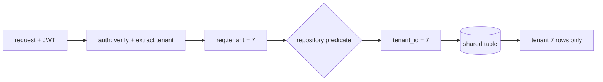

## Thesis

Keeping every tenant's data invisible to every other tenant inside one shared system --- enforced **structurally**, by a predicate the data layer always adds, rather than by a filter each handler is trusted to remember, so that a single forgotten scope can never return another company's rows.

## Sub

**How the tenant flows down** -> **shared database or database per tenant** -> **one enforcement point, not per-handler** -> **zoom out** to the silent cross-tenant leak, and the pivots an interviewer rides from "scope it by tenant" into where the tenant id comes from, row-level security, and noisy neighbours.

## Spine

- The tenant id comes from the **token, not the input** --- it is a verified JWT claim, never a request parameter a caller could set, so a client can't ask for another tenant by changing a field.
- **One structural enforcement point** --- the tenant predicate lives in the repository or the database, added to every read and write, so no individual handler can forget it and open a hole.
- **Shared rows or separate databases** --- one table scoped by tenant id is cheap and dense but a bug leaks wide; a database per tenant is a hard wall at the cost of fan-out and per-tenant migrations.
- The failure mode is **silent** --- a missing predicate does not error, it returns someone else's data, so isolation is something you build in structurally and prove, not something you notice at runtime.

## Companion Notes

### walk

The tenant flowing down

One request from token to scoped rows, one layer at a time --- how the tenant id travels from the JWT to the predicate on the query.

Say where the id comes from before you say what you filter on --- "from the verified claim, never the request body." That sentence is the whole security argument.

### drill

Probe Drill

Graded follow-ups on the isolation model, the enforcement point, and the leak --- the ones that separate "add a filter" from a Staff-level answer about structural isolation.

Name the enforcement *point*, not just the predicate --- where it lives is what makes it safe.

### wb

Whiteboard

Rebuild the whole tenant boundary from memory --- the cues, nothing in front of you.

Draw the boundary first --- the request on one side, the shared table on the other, the verified claim crossing once. Recall is the test, not recognition.

### sys

System Map

Zoom out: the tenant boundary sits between the identity that names a tenant and the shared store that holds every tenant's rows.

Lead with the boundary, not the boxes --- "the token names the tenant, one layer enforces the scope, the database is the backstop."

### trade

Trade-offs

The decisions they drill --- shared vs per-tenant, RLS vs app-layer, one pool vs cells --- each with the switch condition.

Always say "pick when" --- name the constraint that flips the choice, never defend one isolation model as universally right.

### model

Model Answers

Full spoken scripts --- the beats, in order, the way you'd actually say them.

Steal the frame, not the words --- headline first ("the tenant comes from the token, one layer adds the predicate"), then the one failure you'd name.

### num

Numbers

Back-of-envelope the isolation math --- and know the blast radius of a single missing predicate.

Lead with the blast radius --- one forgotten predicate returns every other tenant's rows, and that is why the filter is structural rather than remembered.

### rf

Red Flags

What sinks the round --- a tenant id from a request parameter, a filter each handler adds, a cache key with no tenant --- and what to say instead.

Name what the interviewer hears --- "trusts the client's tenant id" is the fastest no-hire in a tenancy round.

### open

30-Second

The opener and the close --- matched to the altitude the question is asked at.

Match the altitude --- open at the tenant boundary, not the ORM, and land on the isolation model and the noisy neighbour as the real hard parts.

## Drill

all | **All four levels, mixed** --- the way a real loop actually comes at you.
SDE2 | **Fundamentals under pressure** --- the tenant from a verified claim, the predicate on every query, the silent leak. The bar is "this is real isolation, not a WHERE clause bolted on": name the enforcement point, not just the filter.
SDE3 | **Depth and trade-offs** --- one enforcement point, row-level security, pooled-connection context, the shared cache. The bar is "it depends, here's the switch": name the axis and the failure each choice bounds.
Staff | **Systems judgment** --- blast radius, cells, residency, the tenant lifecycle. The bar is "I see what one missing predicate exposes": name the three isolations and the layers that bound each.

### SDE2 | what multi-tenancy is

What does multi-tenant isolation mean?

One running system serves many customers (**tenants**), and each tenant must see only its own data even though the code, and often the database, are shared. Isolation is the guarantee that tenant A can never read or write tenant B's rows --- the core correctness and security property of any SaaS.

Follow: Isolation of what, exactly --- is one tenant reading another's rows the only failure?
No, and separating the kinds is the framing move. There are **three** isolations. **Data**: no tenant reads or writes another's rows --- the one everyone names. **Performance**: no tenant's load degrades another's latency --- the noisy neighbour, which a perfectly data-isolated system still fails. **Blast radius**: one tenant's bad day is not everyone's --- a bad migration, a poison message, a runaway query hitting the whole customer base at once. They need *different* mechanisms: a predicate, per-tenant limits, and cells respectively. An answer that only covers the first is the answer the interviewer is waiting to push on.

Follow: Where does "tenant" actually stop --- is a tenant always a company?
Usually the tenancy is a **hierarchy** --- org, then workspace, then project --- and the isolation boundary is whichever level is the **trust and billing** boundary, which is normally the company. Everything *below* that is ordinary authorization *within* a tenant, and it is enforced differently: a workspace check is a permission, a tenant check is a hard wall. Conflating them is exactly how a "workspace super-admin" role quietly reaches across companies. So pick the boundary deliberately, enforce it structurally, and let the sub-levels be normal role checks on top of it.

Senior: Separating the **three** isolations --- data, performance, and blast radius --- rather than only naming the row leak. An SDE2 says "tenants can't see each other's data"; a Staff answer adds "and one tenant can't *starve* or *take down* another," because those are different failures with different mechanisms.
Speak: Define it as three isolations, not one: **'data --- no cross-tenant rows; performance --- no noisy neighbour; and blast radius --- one tenant's bad day isn't everyone's.'** Most candidates name only the first, and the other two are exactly where the interviewer is heading.

### SDE2 | where the tenant id comes from

Where does the tenant id come from on a request?

From the **verified token** --- a tenant id (or company id) claim inside the authenticated JWT, extracted after the signature is checked. Never from a request parameter, header, or body the caller controls, because anything the client can set, a malicious client can set to someone else's tenant.

Follow: The token is client-supplied too --- why trust anything inside it?
You don't *trust* the token, you **verify** it: the signature is checked against the issuer's public key, so a tampered or forged token is rejected outright. Once verified, the *claims* are trustworthy because the **issuer** put them there, not the client. That is the whole difference --- a sealed letter and a sticky note both arrive via the courier, but only one is authenticated. A header like `X-Tenant-Id` has no signature at all, so an authenticated user of tenant A simply sends tenant B's id and reads B's data.

Follow: Your admin console genuinely needs to act on a chosen tenant. Doesn't that make the tenant an input there?
The **selection** is an input; the **authority** still isn't. The verified claim says which tenants this principal may act on (or marks them an internal operator with an explicit, granted scope), and the requested tenant is checked *against* that --- never trusted on its own. So the rule survives intact: a request may **propose** a tenant, but only a verified claim may **authorize** it. And that path is a separate, audited, time-boxed accessor, not the normal handler with the predicate relaxed.

Follow: A background job has no request and no token. Where does its tenant come from?
It has to be carried **explicitly**. The tenant is part of the job's payload, written at enqueue time by a request that *did* have a verified claim, and re-established into the context at the top of the worker --- with the same deny-by-default rule, so a job with no tenant throws rather than running unscoped. The two bugs to name: a worker that inherits *nothing* and quietly runs a full-table query, and a worker looping over tenants that fails to **clear** the context between iterations, so tenant N+1's work runs under tenant N's scope. Off the request path the tenant travels with the work item, and it is set per item and cleared after.

Senior: Knowing the tenant is **derived** from a verified claim and never **accepted** from the request --- and then handling the two cases that actually break naive answers, the admin console and the background job, *without* abandoning the rule. Anyone can say "get it from the JWT"; the tell is what you do when there is no JWT.
Speak: State the non-negotiable: **'the tenant comes from a verified claim in the signed token, never a parameter the caller can set.'** Then take the awkward cases before they're asked --- an admin console *proposes* a tenant and the claim *authorizes* it, and a background job carries the tenant in its payload from the request that enqueued it.

### SDE2 | shared DB vs DB per tenant

Shared database or a database per tenant?

**Shared** --- one set of tables, every row carrying a tenant id, scoped by a predicate --- is cheap, dense, and easy to operate, but the isolation is only as strong as the predicate. **Database per tenant** gives a hard wall at the cost of N times the connections, migrations, and operational overhead. Most systems start shared and peel off the largest tenants later.

Follow: Pick one for a platform with five whales and five thousand small tenants.
The **hybrid**, and I'd say so directly rather than picking a pure model. **Pool** the long tail --- five thousand small tenants get density, one migration, and near-free onboarding --- and **silo** the five whales, who are the ones that actually need dedicated capacity, their own encryption key, possibly residency, and their own blast radius. What makes the hybrid practical rather than a mess is resolving **tenant to datasource in one layer**, so moving a tenant from pool to silo is a *routing* change, not a rewrite. Declaring one model universally right is the tell that you haven't run this.

Follow: What actually forces the split --- give me the trigger, not "when it's big."
Four concrete triggers, and size alone is not one of them. **Residency or compliance**: the data is legally bound to a region, or a contract demands physical separation. **A dedicated SLA**: you've promised a performance floor the shared pool cannot guarantee. **Uncontainable load**: the noisy neighbour that per-tenant limits can no longer hold. **Per-tenant restore**: "roll *this* customer back to last Tuesday" is trivial in a silo and effectively impossible in a pool. Size is only a trigger when it *breaks* one of those four --- which is why the honest answer names the constraint, not a row count.

Senior: Refusing to name a universal winner and instead naming the **switch condition** --- residency, an SLA, uncontainable load, or per-tenant restore --- and then noting that a **tenant-to-datasource resolution layer** is what turns the hybrid into a routing change rather than a rewrite.
Speak: Put it on the axis: **'shared for density, per-tenant for a hard wall --- and in practice a hybrid: pool the long tail, silo the whales and the regulated.'** Then give the trigger rather than the size: residency, a dedicated SLA, uncontainable noisy-neighbour load, or a per-tenant restore.

### SDE2 | row-level scoping

How does row-level scoping actually work?

Every tenant-owned table has a tenant id column, and every query carries a `tenant_id = ?` predicate bound to the request's tenant. Reads return only that tenant's rows; writes stamp the tenant id so new rows are owned correctly. The whole scheme rests on that predicate being present on **every** statement.

Follow: How does that query stay fast once the table has half a billion rows?
Put `tenant_id` on the **leading edge** of the primary key and of every composite index. Then `WHERE tenant_id = ? AND created_at > ?` against an index on `(tenant_id, created_at)` is a **range seek** into that tenant's contiguous slice --- the leftmost-prefix rule. Put the tenant column *last* and the index cannot seek to a tenant at all; you scan and filter, which is exactly the thing you were trying to avoid. Column order in a composite index is not cosmetic here: it decides whether isolation costs you a seek or a scan.

Follow: Does that tenant-leading index still help your biggest tenant?
It still **isolates**, but it stops **narrowing**. If one tenant is forty percent of the table, `tenant_id = whale` selects forty percent of the rows --- the index hands you a *contiguous* range, not a *small* one. So for the whale the **second** column has to do the real work: targeted indexes on `(tenant_id, whatever it actually queries by)`, or you silo it and let it have its own statistics and its own cache. Isolation and selectivity are related levers but not the same one, and the whale is precisely where they come apart.

Senior: Connecting the isolation predicate to the **query plan** --- `tenant_id` must **lead** the composite index for the scoped query to be a range seek --- and knowing the tenant-leading index isolates but stops *narrowing* for a whale. That is the "so how does it stay fast" follow-up most candidates have nothing for.
Speak: Tie the predicate to the plan: **'tenant_id leads the primary key and every composite index, so the scoped query is a range seek, not a scan.'** Leftmost prefix --- put the tenant last and you have a scan. Then name the limit yourself: for a tenant that's forty percent of the table, the tenant column isolates but no longer narrows.

### SDE2 | the forgotten filter

What happens if one handler forgets the tenant filter?

It returns **every tenant's rows** --- a cross-tenant data leak, with no error and no crash. That is why the filter can't be a thing each handler remembers; a single miss in one endpoint is a breach. The fix is to make the predicate structural, not per-handler.

Follow: Why is a missing tenant filter so much more dangerous than an ordinary bug?
Because it fails **open** and it fails **silently**. A missing predicate does not throw, does not 500, does not time out --- it returns *more rows*, and more rows looks exactly like success. Every other class of bug announces itself by the thing breaking; this one announces itself when a customer emails to say they can see another company's data. That combination --- a silent failure whose blast radius is the entire customer base --- is the entire reason isolation is the one thing you make structural rather than remembered.

Follow: So you moved the predicate into the repository. What still gets past it?
Anything that doesn't go **through** it, and naming the list unprompted is the point. A **raw SQL** query or an ORM escape hatch. A **new datastore** added later --- the search index, the cache, the object store, the analytics copy --- none of which the repository knows about. A **background job** with no tenant context. A **report** built against a read replica. So the layer is necessary but not sufficient: you add a **database-level backstop** (row-level security) for the store that has one, a lint or review rule against raw datastore access outside the repository, and an **adversarial test** that injects a foreign tenant's id into every read path and asserts zero rows. The layer prevents the common mistake; the backstop catches the one that escapes it.

Senior: Naming the two properties that make this failure special --- it fails **open** (more rows, not an error) and it fails **silently** --- and then immediately listing what still escapes a repository predicate: raw SQL, the cache, the search index, background jobs. "Add a filter" is SDE2; "the filter is unforgettable, *and* here is what still gets past it" is Staff.
Speak: Name the failure mode precisely: **'a missing tenant predicate does not error --- it returns someone else's rows, and more rows looks like success.'** That asymmetry is why it's structural, not remembered. Then volunteer what still escapes the layer: raw SQL, the cache, the search index, and background jobs.

### SDE2 | the noisy neighbour

What is the noisy-neighbour problem?

In a shared system one tenant's heavy load --- a huge query, a traffic spike --- degrades latency for everyone sharing the same database and pool. Isolation of *data* does not give isolation of *performance*; that needs per-tenant limits, quotas, or moving the heavy tenant to dedicated capacity.

Follow: Where does it actually bite first --- what is the scarcest shared resource?
The **database**, essentially always. The API tier autoscales; the shared Postgres does not. So the first thing one tenant exhausts is **connections**, and then **buffer cache and IO** --- a single unbounded analytical query holds a connection, evicts everyone else's hot pages, and drives every other tenant's p99 up while the API tier looks perfectly healthy. This is why edge rate limits alone don't contain it: they protect the API tier and do nothing for the database. What protects the database is a per-tenant **statement timeout**, a per-tenant **connection cap** so no single tenant can take the whole pool, and routing heavy or analytical work off the interactive path entirely.

Follow: How do you even know *which* tenant is the problem at three in the morning?
Per-tenant metrics, or you don't. Every request emits `tenant_id` as a **dimension** --- QPS, p99, database time, rows scanned --- and you compare each tenant's actual consumption against its configured limit. Without that dimension your dashboard says "the database is slow" and you're grepping logs; with it you say "tenant 42 is at thirty times its normal database time" and you throttle precisely. The honest caveat: `tenant_id` as a metric **label** across five thousand tenants is a real cardinality bill, so in practice you keep the top-N tenants plus an "other" bucket as metrics, and hold the full per-tenant slice in **logs and traces**, where high cardinality is cheap.

Senior: Knowing the database is the scarcest shared resource --- the API tier autoscales, the shared Postgres does not --- so edge rate limits alone never contain it. And knowing you cannot fix a noisy neighbour you cannot **attribute**, which means `tenant_id` as a metric dimension, with an honest word about the cardinality cost of doing that naively.
Speak: Separate the isolations first: **'data isolation is intact --- this is *performance* isolation, the noisy neighbour.'** Then go where it actually bites: the database, not the API tier --- per-tenant statement timeouts and connection caps, because one unbounded query holds a connection and evicts everyone's hot pages. And you need tenant-dimensioned metrics, or you can't even name the tenant.

### SDE2 | the tenant on a write

How do you ensure a newly created row belongs to the right tenant?

The repository stamps the tenant id from the request context onto every insert, so the caller never supplies it. Just as reads add the predicate, writes set tenant_id from the verified claim --- there is no field for the caller to set, so a row can't be created under another tenant. Writes are scoped by the same single enforcement point as reads.

Follow: A write can also target the *wrong existing row*. Does stamping the tenant on insert cover that?
No --- that's only half the write path. Stamping covers **INSERT**: the new row is owned correctly. But **UPDATE** and **DELETE** carry a `WHERE` clause, and if that clause is `WHERE id = ?` with a client-supplied id and no tenant predicate, tenant A can modify or destroy tenant B's row --- which is *worse* than a read leak, because now you've corrupted someone else's data. So the predicate belongs on the write path too: `... WHERE id = ? AND tenant_id = ?`. And you check the **affected-row count**: zero rows updated means it wasn't yours, and that's a 404, not a silent success.

Follow: What about foreign keys --- can a row in one tenant point at a row in another?
Yes, and it's the sneaky one. A row in tenant A can carry a `project_id` belonging to tenant B if you only validate that the id **exists**. The scoped repository handles the common case (you look the parent up *through* the scoped accessor, so a foreign parent simply isn't found) --- but the **database** doesn't know: a plain foreign key checks existence, not ownership. The structural fix is to put the tenant in the key: a **composite foreign key** on `(tenant_id, project_id)` referencing `(tenant_id, id)`, so the schema itself cannot represent a cross-tenant reference. It's the same discipline as the predicate, pushed down into the constraint.

Senior: Extending the write rule past INSERT --- stamping on insert is the easy half; the UPDATE/DELETE `WHERE` clause needs the predicate too, with a zero-affected-rows check that returns 404 --- and reaching for a **composite foreign key on `(tenant_id, id)`** so the schema cannot even express a cross-tenant reference.
Speak: Cover both halves of the write: **'the repository stamps tenant_id on insert, and the predicate is on the UPDATE and DELETE WHERE clause too --- zero rows affected means it wasn't yours, which is a 404.'** Then the one people miss: make the foreign key composite on `(tenant_id, id)`, so the schema can't represent a cross-tenant reference at all.

### SDE3 | one enforcement point

Where should the tenant predicate be enforced?

At **one structural layer** the whole application funnels through --- the repository or data-access layer, an ORM global scope, or the database itself --- so the predicate is added automatically to every query and no handler can bypass it. Per-handler filtering is fragile by construction: correctness then depends on every developer remembering every time.

Follow: Concretely, what is doing the injecting?
A data-access layer the whole app goes through: an **ORM global scope or extension** (a Prisma client extension, a Sequelize `defaultScope`, a Rails `default_scope`), or a hand-rolled repository whose only public methods are already scoped. It reads the tenant from a **per-request context** --- `AsyncLocalStorage` in Node, a request-scoped bean in Spring, an explicit `context.Context` in Go --- and appends the tenant to the `where` on every read and to the payload on every write. The property you're actually buying: business code calls `findOrders()` and **never types the filter**, so it cannot omit it. You've moved isolation from "remember" to "cannot forget."

Follow: And when the tenant context is missing at the moment the layer runs?
It **throws**. It must never degrade to an unscoped query. "No tenant context" means "called outside a request, or something is wrong," and the correct response is a loud failure, not a silent full-table read. This is **deny-by-default**, and it is the single most important line in the layer, because it converts the *leak* path into a *crash* path --- so a lost context shows up in your tests and your error rate, where you'll fix it, instead of in a customer's screenshot. Returning an empty list instead would be worse than either: it hides the bug *and* silently does no work.

Senior: Naming the actual mechanism --- an ORM global scope or repository reading the tenant from request-scoped context --- **and** the deny-by-default rule: missing context throws, never degrades to unscoped. The reframe from "a check I perform" to "a predicate the system injects, which I *cannot* omit" is the architectural insight the question is testing for.
Speak: Reframe it in one line: **'isolation isn't a filter each handler remembers --- it's a predicate one layer injects into every query, so the unscoped query is something a developer cannot write.'** Then the safety rule, unprompted: no tenant context **throws**. A lost context has to be a crash, not a full-table read.

### SDE3 | Postgres row-level security

How does database-enforced isolation work?

Postgres **row-level security** attaches a policy to a table so the database itself appends `tenant_id = current_setting('app.tenant')` to every query. You set the tenant in a session variable after auth, and even a query that forgets the predicate is scoped by the engine. It moves the guarantee below the application, where a code bug can't defeat it --- at the cost of policy complexity and per-connection setup.

Follow: What are the ways to get RLS subtly wrong?
Four classics, and naming them is how you prove you've shipped it. **One:** `ENABLE ROW LEVEL SECURITY` does *not* apply to the table's **owner** --- you must also `FORCE ROW LEVEL SECURITY` and connect the application as a **non-owner** role, or your policies quietly do nothing at all. **Two:** superusers, and any role with the `BYPASSRLS` attribute, skip policies entirely. **Three:** set the tenant **transaction-scoped**, not session-scoped --- a session-level `SET` persists on a pooled connection and the *next* request, a different tenant, inherits it. **Four:** an RLS-enabled table with **no matching policy denies everything**, which is the right default but a genuinely confusing one if you enabled RLS and forgot to write the policy.

Follow: Doesn't the policy predicate wreck your query plans?
Not the simple scoped scan. `current_setting()` is **STABLE**, so the planner treats the tenant value as a constant for the duration of the query and can still use the tenant-leading index --- the policy is adding the very same `tenant_id = ?` predicate you'd have written by hand. Where RLS *can* cost you is subtler: the policy qual is a **security barrier**, so a user-supplied qual that isn't `LEAKPROOF` can't be pushed down ahead of it, and plans across **joins and views** can come out worse than the hand-written equivalent. So the honest answer is: the scoped seek is fine, and you measure the joins.

Follow: How do you actually set the tenant, given that `SET LOCAL` can't take a bind parameter?
That's the practical trap. `SET LOCAL app.tenant = ?` is not valid --- `SET` takes a **literal**, so you'd end up string-interpolating a value into SQL on the single most security-critical path in the system, which is exactly the injection footgun you can't afford here. The correct form is the **function**: `select set_config('app.tenant', ?, true)`, where the third argument `true` means transaction-local --- so you get `SET LOCAL` semantics *with* a proper bind parameter. You issue it as the first statement inside every transaction, right after checkout.

Senior: Listing the RLS footguns --- `FORCE` plus a **non-owner** connection, transaction-scoped not session-scoped so the tenant can't ride a pooled connection into the next request, deny-on-no-policy --- and knowing that `set_config(..., true)` is how you set it with a bind parameter rather than interpolating a literal. That's the difference between "I've read about RLS" and "I've shipped it and watched a tenant leak across a pool."
Speak: Push the guarantee below the app: **'RLS makes the *database* append the predicate, so even a query that forgot it comes back scoped.'** Then prove you've shipped it: `FORCE` it and connect as a non-owner or the owner bypasses; and set the tenant with `set_config(..., true)` inside the transaction, never a session-level `SET` that a pooled connection carries to the next tenant.

### SDE3 | the JWT is the trust root

Why is the signed token the trust boundary?

Because the entire scheme collapses if the tenant claim can be forged. The JWT signature is what makes a tenant id trustworthy --- verify it on every request, and derive the tenant only from verified claims. If you ever read the tenant from an unsigned source, a caller rewrites one value and reads any tenant.

Follow: Signed by whom --- and what happens when that key is compromised?
Verified against the **issuer's public key**, fetched from its **JWKS** endpoint and cached with rotation in mind. A compromised signing key is **rotated at the issuer**: publish the new key to JWKS, retire the old, and tokens signed with the old key stop verifying. The blast-radius argument applies here exactly as it does everywhere else in this topic --- one *shared* signing key means a single compromise forges tokens for **every** tenant, whereas per-issuer or per-tenant keys scope a compromise to one customer and let you rotate that customer's key without disrupting anyone else.

Follow: The token is valid for an hour. A user is removed from a tenant. What can they still do?
Everything their claims say, until it expires --- and that's the honest, unavoidable cost of stateless verification. You **bound** it rather than pretend it away: short access-token lifetimes (minutes, not hours) so stale claims self-heal quickly; a **revocable refresh token** you *can* kill server-side; and, for genuinely dangerous operations, a check against **live state** rather than the cached claim. Tier it by blast radius --- a stale read for five minutes is usually fine, and a stale "yes, you are still an admin of this tenant" on a destructive write is not.

Follow: What if the token is signed correctly --- but by the *wrong* issuer?
That is the one people miss, and it's a real vulnerability class. Verifying the **signature** is necessary but not sufficient: you must also check that the token came from the issuer you **expect** and was minted **for you**. Validate `iss` against an **allowlist** --- crucially, never fetch the verification key from whatever issuer the *token itself* names, because then an attacker just points `iss` at their own key server and signs whatever claims they like. And validate `aud` against your own service, so a validly-signed token intended for a *different* service can't be replayed at yours. Signature valid does not mean token meant for me.

Senior: Knowing the signature is necessary but **not sufficient** --- you validate `iss` against an allowlist (never fetching the key from the issuer the token names) and `aud` against your own service, or a perfectly-signed token minted somewhere else is accepted. And naming the stateless-revocation tension honestly: short lifetimes, a revocable refresh, and a live check on the dangerous action.
Speak: Say *why* the claim is trustworthy: **'the signature verifies against the issuer's JWKS key, so the *issuer* put that tenant claim there, not the client.'** Then the part almost everyone skips: check `iss` against an allowlist and `aud` against your own service --- a validly-signed token from someone else's issuer is still not a token for you.

### SDE3 | tenant-scoped cache keys

How do you keep a shared cache from leaking across tenants?

**Namespace every key by tenant** --- tenant:7:user:42, never user:42. A cache is shared state just like the database; an un-namespaced key serves one tenant's cached value to another. The same discipline as the query predicate, applied to the cache layer.

Follow: The ids are UUIDs --- they can't collide across tenants. Do I still need the tenant in the key?
Yes, and this is exactly where people get burned. **Primary-key** lookups like `user:<uuid>` are safe *by accident*, because the id happens to be globally unique. But most real cache keys are **derived**, not primary: `settings:featureX`, `report:2026-06:top-products`, `permissions:role:admin`, `search:invoice`. Those contain **no tenant at all** and collide across every single tenant. So the rule cannot be "namespace the ones that might collide" --- it has to be "namespace **all** of them," because the moment someone adds one derived key, a scheme that was safe by accident starts leaking silently.

Follow: How do you make that unforgettable, the way you did with the query predicate?
Exactly the same move: don't let anyone build a raw key. The cache client is **wrapped** so its only public method takes a *logical* key and prefixes the tenant from the request context itself --- `cache.get('settings:featureX')` becomes `t:7:settings:featureX` *inside* the wrapper --- and there is no API that accepts a fully-formed key. Deny-by-default applies here too: no tenant context, throw. And then the reasoning **generalizes**, which is the real answer: the cache is just the first item on a long list of shared state that is not the database --- the **search index**, the **object store's key prefixes**, the **queue**, the **rate limiter's counters**, the **metrics labels**, and the **export and temp files**. Every one of them needs the tenant in its key, and every one of them is somewhere a leak has actually happened.

Senior: Killing the "UUIDs make it safe" argument --- primary-key lookups are safe by *accident*, while **derived** keys like `settings:featureX` carry no tenant and collide everywhere --- and then generalizing from the cache to every other piece of shared state: the search index, the object-store prefix, the queue, the rate limiter, the export files.
Speak: Apply the same discipline one layer out: **'every cache key is namespaced by tenant --- t:7:user:42, never user:42.'** Then kill the UUID objection: primary keys are safe by accident, but derived keys like `settings:featureX` carry no tenant and collide across everyone. Then generalize --- the cache, the search index, the object-store prefix, the queue, the rate limiter: all shared state, all need the tenant in the key.

### SDE3 | cross-tenant work

How do you run a query that must span tenants?

Deliberately and narrowly --- a separate, audited path (a background job or an admin service) that explicitly opts out of the tenant scope, never the normal request handler. The default must be scoped; crossing tenants is the special case that is logged and reviewed, so an ordinary bug can never accidentally read across the boundary.

Follow: Support needs to look at a customer's data to debug something. Same thing?
Related, and it's the case you must not hand-wave. Support gets an explicit **break-glass** or impersonation path: a separate privileged role, the access **logged with who, which tenant, and why**, ideally gated on a second approver or the customer's own consent, and the elevation **expires**. What you never do is hand support a standing "super-admin" role that sees everything --- that is a permanent breach waiting on one compromised support account. The boundary isn't removed; it's crossed **under a spotlight, with a receipt**. And that receipt is exactly the artifact enterprise buyers and auditors ask for, so it's a feature, not just a control.

Follow: How do you stop the audited opt-out accessor from just becoming the accessor everyone uses?
By making the safe path the easy one and the escape hatch genuinely **harder to reach**. Concretely: the unscoped accessor lives in a **separate module** the ordinary code path doesn't import; calling it **requires a reason argument** that lands in the audit log; its use is gated in review (a lint rule, or CODEOWNERS on that file); and the audit trail is actually **watched** --- a spike in unscoped reads should page somebody. The failure you're guarding against is the escape hatch becoming *more convenient* than the correct path, because at that point everyone uses it and you are back to having no isolation at all, just a longer function name.

Senior: Treating deliberate boundary-crossing as its own **designed feature** --- audited, time-boxed break-glass with a reason and an expiry, rather than a standing super-admin --- *and* worrying that the escape hatch will become the default path. The instinct that the unscoped accessor must be harder to reach than the scoped one is what separates a designed system from a loophole.
Speak: Make crossing the boundary the exception, with a receipt: **'a separate, audited accessor that explicitly opts out --- never the normal handler with the filter removed.'** For support that means time-boxed break-glass --- who, which tenant, why, and it expires --- not a standing super-admin role, which is a permanent breach waiting on one compromised account.

### SDE3 | migrations across tenants

What is harder about schema migrations under each model?

**Shared DB:** one migration covers all tenants at once, but it must be backward-compatible because every tenant is on it instantly. **DB per tenant:** each database migrates independently --- safer to stage and roll back per tenant, but you now run the migration N times and track which tenants are on which version.

Follow: In the shared model, why does the migration *have* to be backward-compatible?
Because every tenant lands on it the instant it ships --- there is no canary, no staged rollout, no "try it on one percent of customers." So a migration that breaks the currently-deployed code breaks **everyone, simultaneously**. That forces **expand/contract** (the parallel-change discipline): first **expand** --- add the new column nullable, dual-write old and new, deploy code that can read either; then **backfill** the data in the background; then **contract** --- stop writing the old column and drop it, in a *later* deploy. Each step is independently safe and independently reversible. The blast radius of a shared schema is the entire customer base, so the migration *process* is where you buy that safety back.

Follow: And per-tenant databases let you stage it --- so what's the hidden cost?
**Version skew.** The moment you *can* migrate tenants independently, you *will* have tenant A on v5 and tenant B on v6 at the same time --- which means the application must support **every version currently deployed anywhere, simultaneously**, for as long as the rollout takes. You've traded "one scary migration" for "N migrations plus a permanent compatibility matrix," plus the operational work of tracking who is on what, plus the long tail of tenants whose migration fails and who are now **stuck** on an old version while your code slowly drifts away from them. The staged rollout is a genuine safety win; it just isn't free, and the cost lands in the application, not the database.

Senior: Naming **expand/contract** as the *reason* a shared migration can be safe --- every tenant lands on it at once, so there is no canary --- and then naming the per-tenant model's hidden cost, **version skew**: independent migration means the app must support every deployed version at once, plus a compatibility matrix and the tenants that get stuck.
Speak: Give both costs honestly: **'shared means one migration for everyone --- so it *must* be expand/contract, because there is no canary and every tenant lands on it at once.'** Per-tenant lets you stage it, but the hidden cost is **version skew**: tenant A on v5 and tenant B on v6 means your app supports both, and you now track who's on what.

### SDE3 | the pooled connection tenant

With database row-level security and a connection pool, what is the subtle bug?

A pooled connection carries whatever tenant session variable the last user set. If you don't set the tenant on every checkout, a request can run against the previous request's tenant. The rule is that the tenant context must be set --- and ideally reset --- on each checkout, never inherited from the connection's last use, or pooling silently defeats the isolation.

Follow: Walk me through the exact leak. Where does the tenant actually cross?
Request one checks out a pooled connection, runs a **session-scoped** `SET app.tenant = 7`, does its work, and returns the connection to the pool **without resetting it**. Request two --- a *different* tenant --- checks out that same physical connection. If its code path relies on RLS and fails to set the tenant, or sets it *after* its first query, the session variable is still `7`, so the engine cheerfully scopes tenant 9's request to tenant 7's rows. Notice what did *not* fail: the policy worked perfectly, the predicate was applied, the database did exactly what it was told. The leak is that the **connection carried state across a trust boundary**. The fix is transaction-scoped context --- `set_config(..., true)` inside the transaction, so it's gone on commit --- plus a pool release hook that resets (`DISCARD ALL`) so nothing survives a return to the pool.

Follow: You're behind PgBouncer in transaction pooling mode. Does that change anything?
It promotes transaction-scoped context from *correct* to **mandatory**. In transaction pooling a client is assigned a server connection only **for the duration of a transaction**, so a session-level `SET` isn't merely leaky --- it's **meaningless**: the client's next transaction may land on an entirely different server connection that never saw it. Anything session-scoped is off the table in that mode (session `SET`, session-level prepared statements, advisory locks, `LISTEN`). So the tenant *must* be established **inside the transaction that uses it**, as its first statement --- which is, conveniently, exactly the pattern that is also correct under session pooling. Get it right once and both modes work.

Senior: Being able to narrate the **exact** leak --- request one's session `SET` survives the connection's return to the pool, and request two, having forgotten to set it, silently inherits tenant 7's scope while the RLS policy works flawlessly --- and knowing that PgBouncer's transaction pooling makes session-scoped state not just unsafe but *meaningless*. It's the tell that you've debugged this rather than read about it.
Speak: Name the subtle one: **'a pooled connection carries the last request's session state --- so a session-level SET of the tenant leaks it to the next request that forgets to set its own.'** The policy never failed; the *connection* carried state across a boundary. Fix: set it transaction-scoped, inside the transaction, and reset on release.

### Staff | when to split a tenant out

When do you move a tenant to its own database?

When its size or requirements stop fitting the shared model --- it dominates the shared resources (noisy neighbour), or it needs data residency, a dedicated performance SLA, or contractual physical isolation. The pattern is a **hybrid**: most tenants shared for density, the few largest or most-regulated on dedicated infrastructure.

Follow: You've decided to move a whale out of the pool. How do you actually do it, live?
The same way as any live data move --- and the whole point is that you **designed for it**. The application resolves **tenant to datasource in one layer**, so "which database is this tenant on" is *config*, not code. Then: stand up the new database and **backfill** that tenant's rows; **dual-write** (or replicate by change-data-capture) so the new store stays current while the backfill runs; **verify** with per-table row counts and checksums; **flip the routing entry** for that one tenant, ideally behind a brief write-freeze so you get a clean cut; then leave the old rows in place, keep verifying, and delete them later. The tenant is a natural unit of migration precisely **because** everything was already scoped by it --- which is the payoff for having enforced the boundary structurally in the first place.

Follow: What breaks in your application the moment a tenant lives in a different database?
Anything that quietly assumed all tenants share one database. **Cross-tenant joins and aggregate reports** --- they now have to run against a warehouse, not the primary, which is another argument for putting cross-tenant analytics in its own system anyway. **Transactions that spanned tenants** --- they can't anymore, though they never should have. **Global unique constraints and sequences** --- a `users.email` unique index no longer covers the tenant that moved, so uniqueness must become per-tenant or be enforced centrally. And any **cache or queue keyed without the tenant**. The clean way to say it: the split is only cheap if you never let tenants *depend* on sharing a database --- and if you did, that dependency **is** the coupling you're now paying off.

Senior: Having an actual live-migration **plan** --- backfill, dual-write, verify, flip one routing entry --- rather than "we'd move it," and then naming what the split **breaks**: cross-tenant joins, global unique constraints, cross-tenant transactions. The insight underneath is that the tenant is a cheap unit of migration *only* if you never let tenants depend on sharing a database.
Speak: Give the trigger, then the mechanics: **'residency, a dedicated SLA, uncontainable load, or per-tenant restore --- then backfill, dual-write, verify, and flip one routing entry.'** It's cheap because the tenant-to-datasource lookup is one layer. And name what breaks: cross-tenant joins and global unique constraints --- things you should never have depended on anyway.

### Staff | data residency

How does tenancy interact with data residency?

Some tenants are contractually or legally bound to a region (EU data stays in the EU). That pushes toward **per-region, sometimes per-tenant** databases, and the routing layer must send each tenant's requests to the right region's store. Residency is often the first requirement that forces a shared system to shard by tenant.

Follow: Residency means the data stays in the EU. *Which* data, exactly?
All of it --- and this is where the requirement gets expensive, because "the data" is emphatically not just the primary table. It's the tenant's rows, yes, but also the **backups**, the **read replicas**, the **search index**, the **object store**, the **cache**, the **queue's message payloads**, the **logs and traces** (which routinely carry PII inside request bodies), the **warehouse copy**, and any **third-party processor** you forward to. A residency commitment that only covers the primary database is one incident away from being *false*. So residency is really a statement about the **entire data path**, and the only practical way to hold it is to run a full **regional stack** --- not a global stack with a regional database bolted on.

Follow: So does residency force a database per tenant?
No --- and refusing this conflation is the whole answer. Residency forces a stack per **region**, which is a *far* cheaper thing. You can still **pool every EU tenant together** in an EU stack and every US tenant in a US stack; the regulation says the data doesn't leave the region, not that tenants can't share infrastructure inside it. A **contract demanding physical separation** is a *different* requirement, and *that* is what forces a per-tenant database. Saying this out loud matters, because conflating them is how teams conclude "residency means silo everyone" and take on an order of magnitude more cost than the rule actually asked for. The routing layer maps tenant to region to (pooled) datasource --- the same tenant-to-datasource resolution you already needed.

Senior: Separating the two requirements everyone conflates --- **residency** forces a per-**region** stack (EU tenants happily pool together, they just pool in the EU), while a **contract demanding physical separation** is what forces a per-**tenant** database. And knowing "the data" means the whole path: backups, replicas, search index, cache, queue, **logs**, and the warehouse copy.
Speak: Refuse the conflation: **'residency means a stack per *region*, not a database per *tenant* --- EU tenants can still pool together, they just pool in the EU.'** Then be honest about the scope: it's the entire data path --- backups, replicas, the search index, the cache, the logs, the warehouse --- not just the primary table.

### Staff | per-tenant limits

Why do you need per-tenant rate limits and quotas?

To contain the noisy neighbour and to bill fairly --- a per-tenant request rate protects the shared service from any one tenant, and a per-tenant usage quota enforces plan limits. Data isolation stops tenants seeing each other; per-tenant limits stop them **starving** each other.

Follow: A tenant hits its limit. What actually happens to the request?
It's rejected with a **429** and a `Retry-After` --- and the part that actually matters is *where the counter lives*. Ten API instances each enforcing "one thousand requests per second for this tenant" **locally** would collectively allow ten thousand. So the counter has to be **shared and atomic**: a token bucket or window counter in Redis, keyed by tenant, decremented atomically (a Lua script or an atomic op), so every instance draws from **one** budget. And you **tier what gets shed**: a tenant over its limit should have its *bulk and background* traffic paced first and its *interactive* traffic kept alive, because "your dashboard is down" and "your bulk import is being throttled" are very different outcomes for the same customer hitting the same number.

Follow: Limits protect you from the tenant. What protects the *tenant* from a limit that's simply wrong?
Two things, and neither is optional. First, limits are a **product surface**, not just an ops knob: they map to plan tiers, they must be **discoverable** (documented, and surfaced in response headers so a client can see what's left), and hitting one has to be a clear, actionable 429 --- never a mysterious timeout the customer has to guess at. Second, you don't roll them out blind: run the limiter in **shadow mode** first, logging what it *would* have rejected, and only then enforce --- because the fastest way to take down your biggest customer is to ship a limit you sized from a guess. And every limit needs a **per-tenant override**, so raising it for one customer at three in the morning is a config change, not a deploy.

Senior: Knowing the limiter's counter must be **shared and atomic** (ten instances each enforcing the limit locally allow ten times it), that you shed a tenant's **bulk** traffic before its **interactive** traffic, and that you ship a new limit in **shadow mode** first --- because a limit sized from a guess is how you take down your biggest customer with your own safety control.
Speak: Separate the isolations again: **'data isolation stops tenants seeing each other; per-tenant limits stop them *starving* each other.'** Then show you've shipped it: the counter is shared and atomic (ten instances enforcing locally allow ten times the limit), you shed bulk before interactive, and you run the limit in shadow mode before you turn it on.

### Staff | the blast radius

What is the blast radius of the shared-schema choice?

A schema or data bug in a shared database can affect **every** tenant at once --- one bad migration, one leak, one runaway query hits the whole customer base. Database per tenant shrinks the blast radius to one tenant per incident. That containment, not raw performance, is often the real argument for splitting the largest or most critical tenants out.

Follow: How do you shrink the blast radius *without* giving every tenant its own database?
**Cells.** You partition the entire stack --- app, database, cache, queue --- into independent **cells**, each a complete copy serving a **subset** of tenants (say five hundred each), with a thin router mapping tenant to cell. Now a bad migration, a poison-pill message, a runaway query, or a bad deploy hits **one cell** --- a few hundred tenants --- instead of all five thousand. You get most of the containment of full per-tenant isolation at a small fraction of the cost, because you're operating ten stacks rather than five thousand databases. You also get a natural **deployment unit**: roll a release cell by cell, and a bad deploy is bounded long before it's global. The costs are real --- the router becomes a critical component that must never be wrong, you now operate N stacks, and "which cell is this tenant on" is state you can never afford to lose.

Follow: Cells contain the data blast radius. What's still global, and can still take everyone down?
Everything the cells **share**, and naming it is the honest part of the answer. The **cell router** itself --- if it's down or wrong, *everything* is down. The **identity provider** and auth. The **control plane** that provisions tenants and assigns cells. **DNS**, the **CDN**, the shared **object store**, and the **deploy pipeline** that will happily push the same bad artifact to every cell in sequence. So the accurate framing is: cellular architecture bounds the blast radius of **data-plane** failures and does approximately nothing for a **control-plane** failure. Which is exactly why the control plane must be simpler, more conservative, and more independently testable than the data planes it manages --- and why the router should be able to **fail static**, continuing to serve from cached tenant-to-cell mappings when the control plane is unavailable.

Senior: Reaching for **cells** --- a full stack per few hundred tenants behind a thin tenant-to-cell router --- as the way to bound blast radius without paying for per-tenant isolation, and then immediately naming what cells **don't** contain: the router, the identity provider, the control plane, and the deploy pipeline. Knowing the data-plane/control-plane split, and that the router must **fail static**, is the Staff signal here.
Speak: Answer blast radius with **cells**, not silos: **'a full stack per few hundred tenants, with a thin tenant-to-cell router --- so one bad migration hits one cell, not all five thousand tenants.'** Then name what cells *don't* contain: the router, auth, the control plane, and the deploy pipeline that ships the same bad artifact everywhere. Data-plane blast radius is bounded; control-plane isn't.

### Staff | onboarding a new tenant

How do you provision a new tenant?

In the shared model it is nearly free --- a new tenant id and some seed rows, no infrastructure. In the per-tenant model it is a real workflow: create the database, run every migration, wire routing and credentials. That asymmetry --- instant versus provisioned --- is another reason the shared model carries the long tail of tenants and only the few that need it get their own database.

Follow: In the per-tenant model, provisioning is a workflow. What makes that workflow hard?
It's a **long-running, distributed, partially-failing** process, and it *will* fail halfway. Creating a database, running N migrations, seeding reference data, minting credentials and a KMS key, registering the tenant in the router, warming a cache, creating a search index, verifying --- each step can fail independently, and a **half-provisioned tenant is worse than no tenant**, because it exists enough to be routed to and not enough to work. So it has to be a real workflow: **idempotent** steps so a retry is safe, a **resumable state machine** rather than a script you rerun from the top, and the tenant is only marked **active** --- only made *routable* --- at the very **end**, after verification passes. Until then it is `PROVISIONING` and the router refuses it. That's the same deny-by-default posture, applied to the tenant lifecycle.

Follow: What's the *rest* of the tenant lifecycle --- it isn't just create?
It's create, **suspend**, **export**, and **delete** --- and the last three are the ones nobody designs and everybody then builds under legal pressure. **Suspend** (non-payment, abuse): the data must **persist** while all access stops --- a flag the router and the enforcement layer honour, not a deletion. **Export** (they're leaving, or GDPR portability): you owe them their data in a usable form, which is a database dump in a silo and a scoped multi-table export in a pool. **Delete** (right to erasure) is the genuinely hard one, because it spans the primary tables **and** the backups, the caches, the search index, the object store, the logs, and the warehouse copy --- and you **cannot selectively edit an immutable backup**. Which is why per-tenant **encryption keys** are not merely an isolation feature: destroying that tenant's key **crypto-shreds every copy at once**, backups included, and that is the only practical way to make erasure *true* across media you can't rewrite.

Senior: Treating provisioning as a **resumable, idempotent state machine** whose tenant is only made routable *after* verification --- because a half-provisioned tenant is worse than none --- and then volunteering the rest of the lifecycle: suspend, export, delete. Reaching for per-tenant keys and **crypto-shredding** as the answer to erasure across immutable backups is the detail that reads as someone who has actually been handed a deletion request.
Speak: Contrast the two models, then go past create: **'shared onboarding is a row; per-tenant onboarding is a resumable, idempotent workflow that only marks the tenant routable *after* it verifies.'** Then the rest of the lifecycle nobody designs: suspend, export, delete --- and erasure reaches backups you can't edit, which is why per-tenant keys and crypto-shredding are the real answer.

### Staff | RLS vs app-layer

Database row-level security or application-layer scoping --- which?

**App-layer** (a repository predicate or ORM scope) is portable, easy to reason about, and where most teams start; its weakness is that a path bypassing the layer bypasses isolation. **RLS** puts the guarantee in the database so no code bug can defeat it, at the cost of policy complexity and session setup. Defence in depth uses both --- scope in the app, and let RLS be the backstop.

Follow: If the database enforces it anyway, why keep the app-layer predicate at all?
Because they fail **differently**, and defence in depth is about covering *different* failure modes, not doing the same job twice. The **app layer** buys you **portability** --- your search index, your cache, your object store, a DynamoDB table: none of them have RLS, and the app layer is the only place that can scope *all* of them uniformly --- plus clearer errors, and enforcement that doesn't depend on every connection being configured correctly. **RLS** buys you a backstop that survives a raw query, an ORM escape hatch, a new service connecting straight to the database, or a migration script someone ran by hand at midnight. The app layer **prevents** the common mistake; the database **catches** the one that escapes. Drop either and you have exactly one layer between you and a breach.

Follow: You're on a store with no RLS --- DynamoDB, or a search cluster. What's the backstop *there*?
You push the boundary into whatever layer *can* enforce below the app --- and usually that's the **credential**. On DynamoDB it's IAM: the `dynamodb:LeadingKeys` condition scopes a credential to items whose partition key **begins with** its tenant id, which is row-level isolation enforced by IAM rather than application code (with the well-known gotcha that **Scan bypasses it**, so you lock down who may Scan). The general principle: if the *store* can't enforce it, make the *credential* enforce it --- a per-tenant credential, a per-tenant prefix policy on the object store, a per-tenant index or routing alias on the search cluster. And where genuinely **nothing** below the app can enforce it, then say so plainly: you have **one** layer, so you compensate with **adversarial tests in CI** that inject a foreign tenant's id into every read path and assert zero rows. Be honest that it's one layer, and make the test the second one.

Senior: Arguing defence in depth by **failure mode** --- the app layer is the only thing that can scope the cache, the search index, and the object store *uniformly*; RLS is the only thing that survives a raw query or a hand-run script --- and then knowing what to reach for when the store has no RLS (IAM `LeadingKeys`, per-tenant credentials and prefixes), and what to do when nothing below the app can enforce it: adversarial CI tests, and *saying out loud* that you're down to one layer.
Speak: Refuse the either/or: **'scope in the app, and let RLS be the backstop --- they fail differently.'** The app layer is the only thing that can also scope the cache, the search index, and the object store; RLS is the only thing that survives a raw query. And on a store with no RLS --- DynamoDB, a search cluster --- push it into the **credential** instead: `LeadingKeys`, a per-tenant prefix.

### Staff | cross-tenant analytics

The product team wants aggregate metrics across all tenants. How, without weakening isolation?

Through a separate, access-controlled read path --- a warehouse or a read replica --- that explicitly operates outside the tenant scope, never the tenant-facing service with the predicate removed. Cross-tenant aggregation is legitimate, but it lives in a distinct system with its own auth, so the tenant-facing code path stays unconditionally scoped and no ordinary bug there can read across tenants.

Follow: Why not just run the aggregate against a read replica with the predicate removed?
Because "the tenant-facing code path with the filter removed" is *precisely* the thing you spent this entire design making impossible --- and re-introducing it, even against a replica, puts an **unscoped query path back into the product codebase** where an ordinary bug can reach it. The replica isn't the problem; the **shared code path** is. If the analytical query runs through the same repository, the same models, the same connection logic, then sooner or later somebody reuses that unscoped accessor from a request handler, and now a customer-facing endpoint can read across tenants. So the aggregate lives in a genuinely **separate system** --- a warehouse fed by change-data-capture or a nightly export --- with its own credentials, its own access control, and **no code path back into the tenant-facing service**. What you're separating isn't a replica; it's a **blast radius**.

Follow: The warehouse now holds every tenant's data in one place. Haven't you just moved the risk?
You've moved it, and you should say so plainly --- but you've moved it somewhere with **much better properties**, and then you shrink it. It is now: a system with **no tenant-facing request path**, so a bug in the product literally cannot read from it; reachable by a **small, named set** of humans and jobs rather than by every code path in the app; **auditable in one place**; and somewhere you can **aggregate and de-identify on ingest** --- because for most of the questions being asked ("what's median API latency by plan tier?") you don't need row-level tenant data at all, so you strip or hash the tenant identifiers on the way in and keep only what the question requires. The honest close: cross-tenant analytics is a **legitimate need**, so the goal isn't to eliminate the risk --- it's to **concentrate** it in one auditable place, **minimize** what lands there, and keep it strictly off any path a customer request can ever reach.

Senior: Locating the actual risk in the **shared code path** rather than the replica --- an unscoped accessor sitting in the product codebase *will* eventually get reused from a handler --- and then being honest that a warehouse **concentrates** the risk rather than removing it, so you minimize what lands there (aggregate and de-identify on ingest) and keep it entirely off any customer-reachable path.
Speak: Put it in a different **system**, not a different replica: **'cross-tenant aggregation lives in a warehouse with its own auth and no code path back into the tenant-facing service.'** The risk was never the replica --- it's an unscoped accessor sitting in the product codebase, which someone eventually reuses from a handler. And be honest: the warehouse concentrates the risk, so de-identify on ingest and audit it in one place.

## Walk

### The request arrives with a tenant claim

```flow
r[request + JWT] -> v[auth verifies signature] -> c[extract tenant_id = 7]
```

Every authenticated request carries a signed token, and inside it is the tenant claim. The auth middleware verifies the signature first, then extracts the claim. The signature is what makes the claim trustworthy: it is the difference between "this request belongs to tenant 7" and "this request says it belongs to tenant 7."

The tenant is derived **only** from the verified token, never from a URL, header, or body. That single rule is the whole security argument --- anything the caller can set, a malicious caller can set to another tenant. And verifying the signature is necessary but not sufficient: you also check the issuer against an allowlist and the audience against your own service, so a validly-signed token minted somewhere else can't be replayed at you.

### Middleware pins the tenant to the request

```flow
c[verified claim] -> x[pin to request context] -> t[req.tenant = 7]
```

Once extracted, the tenant id is pinned onto the request context so every layer below can read it without re-parsing the token. It becomes an ambient fact about the request --- "this is a tenant-7 request" --- that the data layer will consume.

Pinning it once, centrally, is what lets the enforcement below be automatic. No handler passes the tenant around by hand; it is simply present on the context the repository already has. Off the request path --- in a worker draining a queue --- there is no middleware, so the tenant travels **in the job payload** and is established the same way at the top of the worker, then cleared when the item is done.

### The repository adds the predicate to every query

```flow
t[req.tenant] -> p[repository predicate] -> q[WHERE tenant_id = 7]
```

The single enforcement point: the repository layer reads the tenant from the context and adds the tenant predicate to every read, and stamps the tenant id on every write. Because all data access funnels through here, the predicate is present on every statement without any handler doing anything.

This is what makes isolation structural instead of remembered. In the fragile version, handler A adds the filter and handler B forgets it, and B is a leak. Here there is nowhere to forget it --- the predicate is added by the layer, not the caller. And if the context is missing, the layer **throws**: no tenant means a crash, never an unscoped query.

```ts
// one enforcement point -- every query is scoped by the request's tenant
function findScoped(sql, params, ctx) {
  if (!ctx.tenant) throw new Error('no tenant context');   // ==deny by default -- never unscoped==
  return db.query(
    scope(sql, 'tenant_id = $tenant'),
    { ...params, tenant: ctx.tenant }   // ==from the verified claim, never the request==
  );
}
```

In a database that supports it, row-level security is the same idea pushed one layer down: the engine appends the predicate from a session variable, so even a query that forgot it is scoped.

### Only the tenant's rows come back

```flow
q[scoped query] -> s[shared table] -> o[tenant 7 rows only]
```

The query runs against the shared table --- rows for many tenants --- and returns only tenant 7's. The other tenants' rows were never eligible; the predicate excluded them at the source, not by filtering in the application after the fact.

That is the property to state out loud: cross-tenant data is not fetched then hidden, it is **never fetched**. The boundary lives at the query, which is the cheapest and safest place for it. And it stays cheap because `tenant_id` **leads** the index --- the scoped query is a range seek into one tenant's contiguous slice, not a scan with a filter.

### Or let the database enforce it

```flow
q[any query] -> e[RLS policy on the table] -> o[tenant 7 rows only]
```

The enforcement point can move even lower --- into the database itself, so not even a bug in the data layer can defeat it.

Row-level security attaches a policy to the table; you set the tenant once per transaction after auth, and the engine appends the predicate to every statement against that table.

```sql
-- the database appends the predicate, even if a query forgets it
CREATE POLICY tenant_isolation ON orders
  USING (tenant_id = current_setting('app.tenant')::int);
ALTER TABLE orders ENABLE ROW LEVEL SECURITY;
ALTER TABLE orders FORCE  ROW LEVEL SECURITY;  -- or the table OWNER bypasses it
```

Now a query that forgot the scope still returns only tenant 7's rows. Two footguns come with it: `ENABLE` alone does not apply to the table's owner, so you `FORCE` it and connect as a non-owner; and the tenant must be set **transaction-scoped**, or a pooled connection carries it into the next request.

```sql
-- transaction-scoped, and bindable -- SET LOCAL cannot take a parameter
BEGIN;
  SELECT set_config('app.tenant', $1, true);  -- true = local to this transaction
  SELECT * FROM orders WHERE status = 'open'; -- engine adds tenant_id = 7
COMMIT;                                       -- setting is gone; the pool is clean
```

The cost is policy complexity and per-transaction setup, so most teams scope in the repository first and add row-level security as the backstop where a leak must be impossible.

### The write path is scoped too

```flow
w[write] -> i[INSERT stamps tenant_id] / u[UPDATE/DELETE carry the predicate] . a[0 rows = 404]
```

Reads are only half of it. An **insert** is stamped with the tenant from the context, so a caller can't create a row under someone else's tenant. An **update or delete** carries the predicate in its `WHERE` clause, because `WHERE id = ?` with a client-supplied id would otherwise let one tenant modify or destroy another's row --- which is strictly worse than reading it.

The check that closes it is the **affected-row count**: if the statement touched zero rows, the id wasn't yours, and that's a 404, not a silent success. And the structural version of the same rule lives in the schema --- make the foreign key **composite** on `(tenant_id, id)`, so the database itself cannot represent a row in one tenant pointing at a row in another.

### Everything else that is shared

```flow
d[the database is scoped] -> c[cache] . s[search index] . o[object store] . q[queue]
```

The database is the part everyone remembers. The leak usually happens somewhere else --- because a cache, a search index, an object store, a queue, a rate-limiter's counters, an export file and a log line are **all shared state**, and none of them are behind the repository.

The rule generalizes exactly: the tenant goes in the **key**. `t:7:settings:featureX`, never `settings:featureX`. And the "our ids are UUIDs so they can't collide" argument is a trap --- primary-key lookups are safe by accident, but *derived* keys carry no tenant at all and collide across every tenant on the platform. You wrap the cache client so it prefixes the tenant itself and there is no API that takes a raw key, which is the same "you cannot forget it" move you made at the query.

### The tenant that will not share

```flow
n[one tenant floods] -> l[per-tenant limit] / t[statement timeout] . m[per-tenant metrics]
```

Data isolation is intact and the platform is still on fire: one tenant's spike is degrading everyone else's latency. That is **performance** isolation --- a different failure with a different fix.

Limits at the edge protect the API tier, which autoscales anyway. The scarce shared resource is the **database**: one unbounded query holds a connection and evicts everyone's hot pages. So the controls that matter are a per-tenant **statement timeout**, a per-tenant **connection cap**, and a shared, **atomic** rate-limit counter (ten instances enforcing a limit locally would allow ten times it). And none of it works without `tenant_id` as a **metric dimension** --- you cannot throttle a noisy neighbour you cannot name.

### Where the blast radius stops

```flow
r[tenant -> cell router] -> c[cell 1: 500 tenants] / d[cell 2: 500 tenants] . w[whale: own stack]
```

The last question is the one a shared schema answers badly: when something goes wrong --- a bad migration, a poison message, a bad deploy --- **how many customers find out?** In one shared stack, the answer is all of them.

**Cells** bound it: a full copy of the stack per few hundred tenants, with a thin router mapping tenant to cell, so a bad migration hits one cell instead of five thousand tenants --- and a release rolls cell by cell. The whales, and anyone with residency or a contractual wall, get peeled onto their own stack. Be honest about what cells *don't* contain, though: the router, the identity provider, the control plane, and the deploy pipeline are still global, which is why the control plane must be simpler than the data planes it manages, and why the router should keep serving from cached mappings when it can't reach one.

### Model Script

- Frame the boundary | "Multi-tenant isolation is keeping each customer's data invisible to every other customer in a shared system. The key move is to make it structural --- one enforcement point the whole app funnels through --- rather than a filter each handler is trusted to add."
- Name the three isolations | "And I'd be precise that there are three of them, because they need different mechanisms: data --- no cross-tenant rows; performance --- no noisy neighbour; and blast radius --- one tenant's bad day isn't everyone's. Most designs only solve the first."
- Where the tenant comes from | "The tenant id comes from the verified JWT claim, never from a request parameter. That is the whole security argument: anything the caller can set, a malicious caller can set to someone else's tenant, so the id has to come from the signed token."
- The enforcement point | "I pin the tenant onto the request context in auth middleware, and the repository layer adds the tenant predicate to every query and stamps it on every write. Because all data access goes through that one layer, there is nowhere for a handler to forget the filter --- which is the failure that leaks. And if the context is missing, it throws rather than running unscoped."
- The isolation model | "For most tenants I keep a shared database with row scoping: cheap, dense, one migration for everyone. The trade is that isolation is only as strong as the predicate, so where the stakes are higher I back it with Postgres row-level security so the database enforces it even if a query forgets."
- Past the database | "And I'd say out loud that the database is the part people remember --- the leak usually happens in the cache, the search index, or the object store, because those are shared state too. So the tenant goes in the key everywhere, and the cache client prefixes it itself so nobody can build a raw key."
- Interviewer: "One big customer is slowing everyone down. Is that an isolation bug?"
- Separate data from performance | "No --- data isolation is intact; that is the noisy-neighbour problem. Shared data doesn't give shared-performance isolation. I'd add per-tenant rate limits and quotas to contain it, and the controls that actually bite are on the database --- a per-tenant statement timeout and connection cap, since one unbounded query evicts everyone's hot pages. And per-tenant metrics, or I can't even tell you which tenant it is."
- Land the guarantees | "So the shape is: tenant from the signed token, pinned once in middleware, enforced by a single predicate in the repository with RLS as a backstop, the tenant in the key for every other shared store, per-tenant limits for the neighbour, and cells to bound the blast radius. The leak everyone worries about is a forgotten filter --- and the answer is to make it structural so there is nothing to forget."

## Whiteboard

Sketch how the tenant travels from the token to a scoped query, and where the predicate is enforced. Produce all nine cold and you can run the tenant boundary on a whiteboard.

### Where does the tenant id come from?

The verified JWT claim, extracted in auth middleware --- never a request parameter the caller controls. And you check the issuer against an allowlist and the audience against your service, because a valid signature from someone else's issuer is still not a token for you.

### Where is isolation enforced?

At one point --- the repository predicate, or database row-level security --- so every query is scoped without a handler adding anything. And with no tenant context it **throws**: deny-by-default turns the leak path into a crash path.

### What does a missing predicate actually do?

It **returns more rows** --- no error, no crash. It fails open and it fails silently, and more rows looks exactly like success. That single property is why isolation is structural rather than remembered.

### How is the write path scoped?

Insert **stamps** the tenant; update and delete **carry** the predicate in the `WHERE`. Zero affected rows means it wasn't yours --- a 404, not a silent success. And a composite FK on `(tenant_id, id)` stops one tenant's row pointing at another's.

### What keeps the scoped query fast?

`tenant_id` **leads** the primary key and every composite index, so the scoped read is a **range seek** into one tenant's contiguous slice. Put the tenant last and it's a scan. (For a whale that's 40% of the table, it isolates but no longer narrows.)

### What is shared that is *not* the database?

The **cache**, the **search index**, the **object store**, the **queue**, the rate-limiter's counters, the logs. All shared state, none behind the repository. The tenant goes in the **key** --- and UUIDs don't save you, because derived keys carry no tenant at all.

### What is the pooled-connection trap?

A **session-scoped** tenant setting survives the connection's return to the pool, so the next request inherits it. Set it **transaction-scoped** (`set_config(..., true)`) and reset on release. Under PgBouncer transaction pooling, session state isn't just leaky --- it's meaningless.

### What stops one tenant starving the rest?

**Per-tenant limits** --- and the controls that bite are on the database: a per-tenant statement timeout and connection cap, plus a **shared, atomic** rate-limit counter. Plus `tenant_id` as a metric dimension, or you can't name the noisy tenant.

### Where does the blast radius stop?

**Cells** --- a full stack per few hundred tenants behind a tenant-to-cell router --- so one bad migration hits one cell, not everyone. What cells don't contain: the router, auth, the control plane, and the deploy pipeline. (The one people forget.)



Foot: **The one people forget:** the database is the part everyone scopes. The leak usually happens in the **cache, the search index, or the object store** --- shared state that never went through the repository --- or in a **background job** that ran with no tenant context at all. Volunteering that list unprompted is the tell that you've defended a real multi-tenant system rather than read about one.

Verdict: the tenant comes from the signed token and the predicate is added by one layer --- so cross-tenant rows are never fetched, not fetched then hidden.

## System

Zoom out to where the tenant boundary sits along the request path. The identity layer **names** the tenant; one enforcement point **scopes** every query to it; the shared store holds **every** tenant's rows and hands back only the ones that were eligible. Being able to walk that chain --- and to say which layer catches which mistake --- is what turns "we filter by tenant id" into a systems answer.

### Where it sits

Client: sends a request with a signed token --- never a tenant parameter it could set
Auth middleware: verifies the signature, checks issuer and audience, extracts the tenant claim
Request context: pins req.tenant so every layer below reads it without re-parsing the token
Tenant boundary: one enforcement point adds the predicate to every read and stamps every write [*]
Shared store: all tenants' rows in one table --- RLS is the engine-level backstop, tenant_id leads the index
Per-tenant controls: limits, quotas, keys, metrics, cells --- isolating resources, not just rows

### Pivots an interviewer rides

From "scope it by tenant" they push on where the id comes from, how it is enforced, what shared resource leaks next, and what happens when one tenant will not behave. Each one bridges into another deep-dive --- tap to see the connecting answer.

#### Which isolation model, shared or per-tenant?

-> shared rows or a hard wall
Shared scopes every row by tenant id --- cheap and dense, but isolation is only as strong as the predicate. Per-tenant databases are a hard wall at N times the operational cost. Most systems are a hybrid: shared for the many, dedicated for the largest or most regulated. The switch condition is never "it got big" --- it is residency, a dedicated SLA, uncontainable load, or per-tenant restore.

#### How do you stop the leak?

-> one enforcement point
The predicate lives in the repository or in database row-level security, added to every query automatically. Per-handler filtering fails the moment one handler forgets; a single structural point has nowhere to forget it. And with no tenant context the layer **throws** --- deny-by-default, so a lost context is a crash rather than a full-table read.

#### Who verifies the tenant claim, and what stops a forged one?

-> Tenant authorization (3)
The **identity layer** mints and signs it; the tenant boundary only ever **consumes** it. The claim is trustworthy because the signature verifies against the issuer's JWKS key --- and because you check `iss` against an allowlist and `aud` against your own service, so a validly-signed token from elsewhere can't be replayed. That whole layer --- what a principal *is*, and what it may *do* within its tenant --- is the authorization topic. Isolation decides **whose** data; authorization decides **what** you may do with it.

#### Tenant is the shard key --- so how do you place tenants and move a whale?

-> Sharding and Partitioning (42)
Tenancy is a **partitioning** problem wearing a security hat: `tenant_id` leads the key, so a tenant's rows are contiguous and a scoped read is a range seek. The hard parts are the same ones sharding always has --- a **hot partition** (the whale that is 40% of your traffic), **placement** (which tenants share a shard), and **rebalancing** (moving one tenant's data live: backfill, dual-write, verify, flip the routing entry). The one gift tenancy gives you is that the tenant is a *natural* unit of migration, because everything was already scoped by it.

#### The cache is shared too --- what stops it serving tenant A's value to tenant B?

-> Caching Strategies (15)
The tenant goes in the **key**: `t:7:user:42`, never `user:42`. And the "our ids are UUIDs" defence fails, because the dangerous keys are the **derived** ones --- `settings:featureX`, `report:top-products` --- which carry no tenant at all. So you wrap the cache client to prefix the tenant itself and expose no API that takes a raw key. Every caching concern the topic raises --- invalidation, stampedes, TTLs --- now has a per-tenant dimension on top.

#### One tenant is flooding you. What actually contains it?

-> Rate Limiting (9)
Per-tenant limits --- and the details are exactly the rate-limiting topic's: the counter must be **shared and atomic** (ten instances enforcing "1000 rps" locally allow 10,000), a token bucket paces bursts, a 429 with `Retry-After` is the contract, and you ship it in **shadow mode** first so you don't take down your biggest customer with your own safety control. The multi-tenant twist: the limit is a **plan tier**, so it's a product surface with per-tenant overrides, not just an ops knob.

#### An EU customer says their data cannot leave the EU. What actually has to move?

-> Multi-region and DR (44)
More than people expect: not just the primary table but the **backups, replicas, search index, object store, cache, queue payloads, logs, and the warehouse copy**. Which means residency is a statement about the whole data path, and the practical answer is a full **regional stack**. The key clarification: residency forces a stack per **region**, not a database per **tenant** --- EU tenants happily pool together, they just pool in the EU. That regional-stack design, and its failover, is the multi-region topic.

#### You cannot fix a noisy neighbour you cannot name. How do you find it?

-> Observability (19)
`tenant_id` becomes a **dimension** on everything --- QPS, p99, database time, rows scanned --- so you can say "tenant 42 is at 30x its normal database time" instead of "the database is slow." The catch is straight out of the observability topic: `tenant_id` as a **metric label** across 5,000 tenants is a cardinality bomb, so you keep top-N tenants (plus an "other" bucket) as metrics and push the full per-tenant slice into **logs and traces**, where high cardinality is cheap.

#### A tenant asks to be deleted. Is that just a DELETE?

-> Soft Deletes (18)
Almost never. First, the same soft-delete question applies per tenant --- a `deleted_at` flag means the rows are still **there**, so every scoped query must also filter deleted, and "we deleted your data" is not yet true. Then erasure spans the copies: **backups, caches, the search index, the object store, logs, and the warehouse** --- and you cannot selectively edit an immutable backup. Which is why per-tenant **encryption keys** matter: destroying the key **crypto-shreds** every copy at once, which is the only way erasure is genuinely true across media you can't rewrite.

## Trade-offs

The calls that separate "add a filter" from a designed isolation model. For each one the answer is "it depends --- here is the constraint that flips it," never a universal winner. Name the axis.

### Shared database vs database per tenant

- Shared, row-scoped: cheap, dense, one migration for all, but a bug leaks wide and tenants share performance
- Database per tenant: a hard isolation wall and a small blast radius, but N times the connections, migrations, and cost
- Hybrid (pool + silo): the realistic default --- pool the long tail, silo the whales and the regulated

Start shared for density and peel off the largest, noisiest, or most-regulated tenants; a hybrid beats either pure model at scale. The switch condition is never size alone --- it is **residency, a dedicated SLA, uncontainable load, or per-tenant restore**. And what makes the hybrid cheap is resolving tenant-to-datasource in **one layer**, so the move is a routing change rather than a rewrite.

### App-layer predicate vs database row-level security

- Repository predicate: portable and easy to reason about, and the only layer that can also scope the cache, the search index, and the object store
- Row-level security: the database enforces it so no code bug can defeat it --- survives a raw query, an ORM escape hatch, or a hand-run script

Scope in the application and let row-level security be the backstop --- defence in depth, not one or the other, because they fail **differently**. The app layer *prevents* the common mistake; the database *catches* the one that escapes. On a store with no RLS (DynamoDB, a search cluster), push the boundary into the **credential** instead --- an IAM `LeadingKeys` condition, a per-tenant prefix policy.

### Shared schema vs schema per tenant

- Shared schema: one set of tables, simplest to operate and query across, but no structural separation
- Schema per tenant: namespace-level separation inside one database, cleaner than shared rows, heavier than shared tables

Prefer shared rows for scale and reach for schema-per-tenant only when a middle ground between row-scoping and full per-tenant databases is genuinely needed. Be aware of the ceiling: thousands of schemas means thousands of copies of every table in the catalog, which bloats `pg_catalog`, slows planning and autovacuum, and makes a full dump painful. It is a middle ground with a real tenant-count limit, not a free upgrade.

### Transaction-scoped tenant context vs connection per tenant

- Transaction-scoped (`set_config(..., true)`): you pool connections across tenants --- the norm at scale --- so the tenant is set inside the transaction and gone on commit
- Connection per tenant: a handful of large tenants, and you want physical connection isolation --- but it does not scale to thousands (pool sprawl)

For any pooled system the rule is **transaction-scoped, never session-scoped**: a session-level setting rides a reused connection straight into the next tenant's request. Under PgBouncer transaction pooling it isn't even a choice --- session state is meaningless there, because the next transaction may land on a different server connection. Connection-per-tenant is clean but only viable for a handful of tenants.

### One shared stack vs cells of a few hundred tenants

- One stack: simplest to operate and cheapest, and correct until the blast radius of a single bad change is your entire customer base
- Cells: a full stack per few hundred tenants behind a tenant-to-cell router --- a bad migration or deploy hits one cell, and releases roll cell by cell

Cells buy most of the containment of per-tenant isolation at a fraction of the cost, and they give you a natural deployment unit. The honest cost: you now operate N stacks, the router becomes a component that must never be wrong, and cells contain **data-plane** failures only --- the router, auth, the control plane, and the deploy pipeline are still global. So the control plane must be simpler than the data planes it manages, and the router must **fail static** on cached mappings.

### Shared search index vs an index per tenant

- Shared index with a tenant filter: cheap, one index to operate, and it scales to a very long tail of small tenants --- but a missing filter is the same silent leak as a missing predicate, now outside the database
- Index per tenant: a hard wall and per-tenant tuning, but each index carries fixed shard overhead, so thousands of tenants means thousands of shards and a cluster that spends its life on management overhead

Mirror the database decision: a shared index (with the tenant as a routing key **and** a mandatory filter clause injected by a wrapper, never by the caller) for the long tail, a dedicated index for the whales and the regulated. The trap specific to search is that the index is a **second store**, so it does not inherit the repository's predicate --- and a leak here is exactly as severe as one in the database.

### Per-tenant encryption keys vs one platform key

- One platform key: simple, cheap, no per-tenant key management --- and fine until you must prove a tenant's data is unrecoverable
- Per-tenant keys (envelope encryption, a per-tenant data key wrapped by KMS): a per-tenant cryptographic boundary, and **crypto-shredding** --- destroying the key makes every copy unreadable, backups included

The argument for per-tenant keys is rarely "encryption at rest" --- you have that either way. It is **erasure** and **blast radius**: you cannot selectively edit an immutable backup, so destroying the tenant's key is the only practical way to make "your data is gone" true across media you can't rewrite. The cost is real key management (rotation, wrapping, an audit trail, and a key-loss path that is now indistinguishable from data loss), so it is worth it for the regulated and the large, not for every free-tier tenant.

## Model Answers

### Design it | "Design multi-tenant isolation for a SaaS."

The tenant from the token, one enforcement point, and the three isolations named up front.

- FRAME | frame | I'd frame it as **three** isolations, not one, because they need different mechanisms: **data** --- no tenant reads another's rows; **performance** --- no noisy neighbour; and **blast radius** --- one tenant's bad day isn't everyone's. Most designs only solve the first, and the interviewer is listening for the other two.
- HEADLINE | head | For data, the headline is that isolation is a **predicate one layer injects**, not a filter each handler remembers. The unscoped query has to be something a developer **cannot write** --- because a missing predicate doesn't error, it just returns someone else's rows, and more rows looks like success.
- IDENTITY | sub | The tenant comes from a **verified claim** in the signed token, never a request parameter --- anything the caller can set, a malicious caller sets to someone else's tenant. And I'd check `iss` against an allowlist and `aud` against my own service, because a valid signature from another issuer is still not a token for me.
- ENFORCEMENT | sub | The claim is pinned to the **request context** in middleware; the repository reads it and adds the predicate to every read and stamps every write. No tenant context **throws** --- deny-by-default, so a lost context is a crash, not a full-table read. And the database is the **backstop**: RLS `FORCE`d, so even a raw query is scoped.
- PAST THE DATABASE | risk | The risk I'd name unprompted is that the database is the part everyone scopes --- the leak usually lands in the **cache, the search index, the object store, or a background job**. All shared state, none of it behind the repository. So the tenant goes in the **key** everywhere, and the cache client prefixes it itself so nobody can build a raw one.
- THE OTHER TWO | trade | For **performance**, per-tenant limits --- and the controls that bite are on the database, not the edge: a per-tenant statement timeout and connection cap. For **blast radius**, **cells**: a full stack per few hundred tenants, so one bad migration hits one cell instead of all five thousand.
- CLOSE | close | So: tenant from the signed token, one predicate injected by one layer with RLS behind it, the tenant in the key for every other shared store, per-tenant limits for the neighbour, and cells to bound the blast radius. Isolation a developer can't forget.

### The isolation model | "Shared database, or a database per tenant?"

Shared for density, per-tenant for a wall --- and in practice a hybrid, keyed on a named trigger.

- FRAME | frame | It's a **trade, not a default**, so I'd name the axis before picking: **cost and agility** against **isolation and blast radius**. Declaring one model universally right is the tell that you haven't operated this.
- THE TWO | head | **Shared** (pooled rows, scoped by a predicate): cheap, dense, one migration for everyone, near-free onboarding --- but isolation is only as strong as the predicate, tenants share performance, and one bad migration hits every customer. **Per-tenant**: a hard wall and a tiny blast radius --- at N times the connections, migrations, and idle capacity.
- MY DEFAULT | sub | For a platform with a few whales and a long tail I'd **hybrid**: pool the thousands of small tenants for density, silo the few that actually need it. What makes that practical rather than a mess is resolving **tenant to datasource in one layer**, so moving a tenant is a *routing* change, not a rewrite.
- THE TRIGGER | sub | And I'd give the **trigger**, not a size: **residency or a contractual wall**, a **dedicated SLA** the pool can't guarantee, **uncontainable noisy-neighbour load**, or **per-tenant restore** --- "roll *this* customer back to Tuesday" is trivial in a silo and effectively impossible in a pool. Size only matters when it breaks one of those.
- THE MIDDLE GROUND | sub | Schema-per-tenant exists between them, and I'd be careful with it: thousands of schemas means thousands of copies of every table in the catalog, which bloats planning, autovacuum, and dumps. It's a middle ground with a real tenant-count ceiling, not a free upgrade.
- THE HONEST COST | risk | The pooled model's honest cost is **blast radius** --- and I'd rather answer that with **cells** than with silos: a full stack per few hundred tenants gets me most of the containment for a fraction of the price, and gives me a deploy unit. Silos are for the tenants whose *requirements* demand them, not for containment I can buy more cheaply.
- CLOSE | close | So: pool by default, cells to bound the blast radius, and silo the specific tenants whose residency, SLA, load, or restore requirements genuinely force it --- and I'd resist calling any one model universally right.

### The enforcement point | "How do you make sure no query ever forgets the tenant?"

By making the unscoped query something a developer cannot write --- then backstopping the paths that escape.

- FRAME | frame | The alternative --- "every developer adds the tenant filter and we catch misses in review" --- is a **discipline**, and disciplines fail at scale. One person forgets one query, one time, and it's a breach. So I move the guarantee from **remember** to **cannot forget**.
- HEADLINE | head | The predicate is **injected by the shared data layer**: an ORM global scope or a repository reading the tenant from request-scoped context, appending it to every `where` and stamping every write. Business code calls `findOrders()` and **never types the filter** --- so it cannot omit it.
- DENY BY DEFAULT | sub | And with **no tenant context it throws**. Never an unscoped query, and never a silent empty list --- an empty list hides the bug *and* does no work. A throw converts the **leak** path into a **crash** path, so a lost context surfaces in my tests and my error rate instead of a customer's screenshot.
- THE BACKSTOP | sub | The database is the second layer: **RLS**, `FORCE`d, connected as a **non-owner** --- so a raw query, an ORM escape hatch, or a migration script someone ran by hand is *still* scoped. They fail differently, which is the point of having both: the app layer prevents the mistake, the database catches the one that escaped.
- WHAT STILL ESCAPES | risk | I'd name what gets past both, unprompted: a **new datastore** the repository doesn't know about --- the cache, the search index, the object store --- and a **background job** with no request context. That's where real leaks happen. So the tenant goes in the key everywhere, and a job carries its tenant in the payload.
- PROVE IT | trade | Then I'd **prove** it rather than assert it: an **adversarial test in CI** that seeds two tenants, runs as A while handing it B's ids, and asserts **zero rows** on every read path. Happy-path tests pass while the isolation hole ships --- you have to actively try to cross the boundary to catch it.
- CLOSE | close | So: one injected predicate so the mistake is unwritable, deny-by-default so a lost context crashes, RLS as the backstop for what escapes the layer, the tenant in the key for every other shared store, and an adversarial test gating CI. The strongest control is the one you can't bypass by forgetting.

### Walk a leak | "A customer reports seeing another company's data. Go."

Contain, find the escaped scope, close the class, prove it can't recur.

- FRAME | frame | This is a **Sev-1** --- a confidentiality breach, and possibly a reportable one. So: contain first, diagnose second, prove it can't recur third. I don't start by guessing the cause, and I don't start by pushing a fix.
- CONTAIN | head | Immediately: scope the **blast radius from audit logs** --- who saw what, across which tenants, for how long --- because that determines the disclosure obligation, and the answer is needed whether or not I've found the bug. If the path is still live, I disable it. Stop the bleeding before the forensics.
- THE USUAL CAUSE | sub | Nine times in ten it's a query that **escaped the scoped layer**: a raw SQL query, an ORM escape hatch, a `getById` that fetched by primary key and never checked ownership, or a **background job with no tenant context**. The predicate wasn't wrong --- it was **bypassed**.
- THE ONE PEOPLE MISS | sub | And if the database path looks clean, I go straight to the **other shared state**: an un-namespaced **cache key** serving one tenant's value to another, a **search index** queried without the tenant filter, an **object-store prefix**. Those aren't behind the repository, so a perfect predicate doesn't protect them.
- CLOSE THE CLASS | risk | Fix the instance, then close the **class** --- patching the one endpoint is whack-a-mole. Route that access through the shared layer, make the accessor deny-by-default, and if RLS wasn't `FORCE`d, force it, so the database *would* have caught it. The question I'm answering is "why was this bypassable," not "what was this bug."
- PROVE IT | trade | Then a **regression test that injects the foreign tenant's id** and asserts zero rows, gated in CI, so this exact leak fails the build forever --- plus an audit sweep for other unscoped paths, and a blameless postmortem on why the layer was bypassable at all.
- CLOSE | close | So: contain from the audit logs and size the disclosure, find the escaped path --- and check the cache and the index, not just the database --- close the class rather than the instance, and lock it with an adversarial test. A leak is a missing **layer**, not just a missing filter.

### The noisy neighbour | "One big customer is slowing everyone down. Is that an isolation bug?"

Yes --- but a performance-isolation bug, which is a different failure with a different fix.

- FRAME | frame | It **is** an isolation bug --- just not the one people mean. **Data** isolation is intact: nobody is reading anyone else's rows. What's failed is **performance** isolation. A system where one tenant can consume another's share has failed isolation just as surely as one that leaks rows; it just fails it in the latency graph instead of the security review.
- WHERE IT BITES | head | And I'd go straight to where it *actually* bites: the **database**. The API tier autoscales; the shared Postgres does not. So the first thing a tenant exhausts is **connections**, then **buffer cache and IO** --- one unbounded analytical query holds a connection and evicts everyone else's hot pages, and every other tenant's p99 climbs while the API tier looks perfectly healthy.
- THE CONTROLS | sub | Which means edge rate limits alone don't contain it --- they protect the tier that was already fine. The controls that matter are a per-tenant **statement timeout**, a per-tenant **connection cap** so no tenant can take the whole pool, and **routing heavy or analytical work off the interactive path** entirely. The whale gets its own lane, not the whole road.
- THE LIMITER | sub | The rate limit itself has one detail people get wrong: the counter must be **shared and atomic**. Ten API instances each enforcing "a thousand a second" *locally* collectively allow ten thousand. So it's a token bucket in a shared store, decremented atomically, and every instance draws from **one** budget.
- ATTRIBUTION | risk | And none of it works if I can't **name the tenant**. `tenant_id` becomes a dimension on QPS, p99, and database time --- otherwise my dashboard says "the database is slow" at 3am and I'm grepping logs. The honest caveat: `tenant_id` as a *metric label* across thousands of tenants is a cardinality bill, so it's top-N tenants as metrics and the full slice in logs and traces.
- THE ESCALATION | trade | If limits stop containing it, that's my **trigger to silo** --- the tenant has outgrown the pool, and the answer is dedicated capacity, not a tighter throttle. And I'd ship any new limit in **shadow mode** first, because the fastest way to take down my biggest customer is a limit I sized from a guess.
- CLOSE | close | So: name it as *performance* isolation, fix it at the **database** (statement timeouts, connection caps, workload separation) rather than the edge, enforce limits on a shared atomic counter, get `tenant_id` into the metrics so I can attribute it --- and treat "limits no longer contain it" as the signal to move the tenant out.

### Blast radius | "One bad migration can hit all 5,000 tenants. Shrink that."

Cells --- a full stack per few hundred tenants --- and be honest about what cells don't contain.

- FRAME | frame | This is the third isolation, and it's the one a pooled design answers worst. The question isn't "can tenants see each other" --- it's **"when something goes wrong, how many customers find out?"** In one shared stack the answer is: all of them.
- THE OBVIOUS ANSWER | head | The obvious fix --- a database per tenant --- **works** and is wildly overpriced: I'd be operating five thousand databases to bound a risk I can bound far more cheaply. Per-tenant isolation should be driven by a tenant's **requirements**, not bought as a blunt instrument for containment.
- CELLS | sub | The right tool is **cells**: partition the whole stack --- app, database, cache, queue --- into independent copies, each serving a few hundred tenants, with a thin router mapping tenant to cell. A bad migration, a poison message, a runaway query, or a bad deploy now hits **one cell**. I'm operating ten stacks, not five thousand databases.
- THE DEPLOY WIN | sub | And cells give me something I wanted anyway: a **deployment unit**. Releases roll cell by cell, so a bad deploy is caught at one cell and bounded before it's global. Blast-radius containment and progressive delivery turn out to be the same mechanism.
- WHAT CELLS DON'T CONTAIN | risk | I'd name the limits before being asked. Cells bound **data-plane** failures and do nothing for the **control plane**: the **router** (if it's wrong, everything is wrong), **auth**, the **provisioning control plane**, DNS, and the **deploy pipeline** that will happily push the same bad artifact to every cell in turn. A cellular architecture with a fragile router has just relocated the single point of failure.
- THE DISCIPLINE | trade | Which sets the rule: the **control plane must be simpler and more conservative than the data planes it manages**, and the router must **fail static** --- keep serving from cached tenant-to-cell mappings when it can't reach the control plane. And "which cell is this tenant on" becomes state I can never lose, so it's replicated and backed up like the data itself.
- CLOSE | close | So: cells to bound the data-plane blast radius and give me a deploy unit, silos only where a tenant's *requirements* demand them, a router that fails static, and a control plane deliberately kept boring. The honest close is that cells shrink the blast radius --- they don't eliminate it, and the control plane is where the residue lives.

### Operate it | "It's live. What do you watch?"

Per-tenant everything --- because you cannot fix what you cannot attribute.

- FRAME | frame | Operating a multi-tenant system is two jobs: **detect a boundary violation**, and **keep one tenant from starving the rest**. Both are impossible without **per-tenant visibility**, so that's where I'd start.
- ATTRIBUTION | head | `tenant_id` becomes a **dimension** on everything --- QPS, p99, database time, error rate, rows scanned. Without it, every incident starts as "the system is slow" and I'm grepping logs; with it, it starts as "tenant 42 is at thirty times its normal database time." The cardinality caveat is real, so it's top-N tenants as metrics and the full per-tenant slice in logs and traces.
- AUDIT | sub | Every access is **logged** --- who, which tenant, which object --- and **cross-tenant attempts** are a first-class alarm, not a log line. That trail is both the detective control and the artifact I'll need in the first ten minutes of a breach, when the only question that matters is *how many tenants were exposed and for how long*.
- THE LEAK ALARM | sub | I'd alarm on the **shape** of a leak, not just its report: a spike in requests for ids outside a tenant's normal range, an unusual rate of 404s from one principal, and --- the important one --- **any use of the unscoped accessor**, which should be rare enough that a spike pages someone. If the escape hatch gets busy, isolation is quietly eroding.
- FAIRNESS | risk | For the neighbour: per-tenant **limits, quotas, statement timeouts and connection caps**, with a **per-tenant override** so raising a limit at 3am is a config change and not a deploy. And any new limit ships in **shadow mode** --- logging what it *would* have rejected --- because a limit sized from a guess is how you take down your biggest customer with your own safety control.
- LIFECYCLE | trade | And the parts nobody instruments until they need them: **provisioning** (a half-provisioned tenant is worse than none, so it isn't routable until it verifies), **suspend**, **export**, and **delete**. Erasure spans the backups, caches, index, and warehouse --- which is why per-tenant keys and crypto-shredding are on the roadmap before the first deletion request, not after.
- CLOSE | close | So: `tenant_id` on every metric, log, and trace; audit every access and alarm on cross-tenant attempts *and* on use of the escape hatch; per-tenant limits with overrides, shipped in shadow mode first; and a tenant lifecycle that's designed rather than improvised. Operating multi-tenancy is mostly about being able to say **which tenant**.

### Cut scope | "Two weeks to an MVP. What goes?"

Cut the sophistication, never the boundary. A leaked-tenant MVP is an incident, not an MVP.

- FRAME | frame | The rule I'd state up front: I cut **sophistication**, never the **boundary**. A multi-tenant MVP that leaks isn't an MVP, it's a breach with a launch date --- and it's the one class of bug you cannot quietly fix later, because the disclosure has already happened.
- KEEP | head | Non-negotiable on day one: the tenant from a **verified claim**; the **predicate injected by one layer** so it can't be forgotten; **deny-by-default** so a missing context throws; the **write path scoped** (stamp on insert, predicate on update and delete); and the **tenant in every cache key**. That's the irreducible core, and it's about a day of work.
- KEEP: THE TEST | sub | I'd also keep the **adversarial test** --- seed two tenants, query as A with B's ids, assert zero rows --- because it's an hour of work and it's the only thing that tells me the boundary actually holds. Shipping the boundary without the test means I *believe* I'm isolated.
- CUT: THE MODEL | sub | **Pool everyone.** No silos, no cells, no per-tenant keys. Cheapest and fastest --- and because tenant-to-datasource resolution is one layer, I can silo a tenant later without a rewrite. I'm deliberately buying the ability to defer this.
- CUT: THE FAIRNESS | sub | **No per-tenant limits, no quotas, no fair queuing** --- with one exception: I'd still set a **statement timeout**, because it's one line of config and it's the difference between a slow tenant and a down platform. The rest waits for a real noisy neighbour to show up.
- DON'T CUT: RLS | risk | If I'm on Postgres I'd **still `FORCE` RLS**. It's close to free, and it's the backstop that turns a future bug from a *breach* into a *caught error*. That's the cheapest insurance in the entire design, and it's the one "advanced" thing I'd refuse to cut.
- CLOSE | close | So: pool everyone, no cells, no per-tenant keys, no fairness controls beyond a statement timeout --- but the verified claim, the injected predicate, deny-by-default, the scoped write path, tenant-namespaced cache keys, RLS, and the adversarial test all ship on day one. **The boundary is the product.**

### Name the limits | "Where does this design fall short?"

The honest edges: the escaped path, the whale, stale claims, and a warehouse that concentrates the risk.

- FRAME | frame | Four honest limits --- and naming them unprompted is the point, because pretending isolation is airtight is the junior tell. Each one has a mitigation I'd put on the roadmap rather than a fix I'd claim.
- THE ESCAPED PATH | risk | The predicate only protects code that goes **through the layer**. A raw query, a **new datastore** nobody wired into the repository, a background job that lost its context --- each bypasses it. RLS backs up the database, but the cache, the search index, and the object store have no RLS, so **the guarantee is only as good as its coverage**. That's why I make the coverage a checklist, not an assumption.
- THE WHALE | trade | A tenant-leading index **isolates** but stops **narrowing** once one tenant is most of the data --- so the whale needs targeted indexes or a silo, and it will also be the tenant that makes every fairness control feel unfair. Isolation and query performance are related levers, and the whale is exactly where they come apart.
- STALE CLAIMS | risk | Tenant context comes from a **stateless token**, which is a snapshot until it expires --- so a revoked user or a changed tenant membership lags. I bound it with short lifetimes, a revocable refresh, and a live check on destructive actions, but **immediate revocation and stateless verification are genuinely in tension**, and I'd rather say that than pretend the token is live state.
- THE WAREHOUSE | sub | Cross-tenant analytics is a legitimate need, and my answer --- a separate warehouse --- **concentrates** every tenant's data in one place. I've improved the properties (no customer-reachable path, few named principals, one audit surface, de-identified on ingest) but I have not removed the risk, and I'd rather name that than claim I solved it.
- THE CONTROL PLANE | trade | And cells bound the **data-plane** blast radius while leaving the **control plane** --- the router, auth, provisioning, the deploy pipeline --- global. A bad artifact still reaches every cell if the pipeline pushes it. So the residual blast radius lives in the control plane, which is why it stays boring on purpose.
- CLOSE | close | None of these is a reason not to ship --- they're the trade-offs I'd name before being asked, each with a mitigation on the roadmap rather than a claim that it's solved. The one I'd genuinely lose sleep over is the **escaped path**, because it's the only one whose failure is silent.

## Numbers

Back-of-envelope why a shared database stays cheap, where per-tenant cost comes from --- and, above all, what a **single missing predicate** actually exposes.

A shared model adds one indexed column and one predicate per query --- effectively free. Per-tenant databases multiply the fixed overhead --- connections, migrations, idle capacity --- by the tenant count, which is what makes density the default. But the number that decides the *design* is neither of those: it is the **blast radius of one forgotten predicate**, which is essentially every other tenant's rows. That is why the filter is structural rather than remembered, and why cells exist.

- tenants | Tenants | 5000 | 0 | 100
- rowsM | Total rows (millions) | 500 | 0 | 10
- connPerDb | Connections per DB | 20 | 0 | 5
- migMinutes | Minutes per migration | 3 | 0 | 1

```js
function (vals, fmt) {
  var tenants = Math.max(1, vals.tenants), rowsM = vals.rowsM;
  var connPerDb = vals.connPerDb, migMinutes = vals.migMinutes;
  var perCell = 500;
  var cells = Math.ceil(tenants / perCell);
  var inCell = Math.min(tenants, perCell);
  var blastM = rowsM * (tenants - 1) / tenants;
  var crossPct = (tenants - 1) / tenants * 100;
  var conns = tenants * connPerDb;
  var migHours = tenants * migMinutes / 60;
  return [
    { k: 'Blast radius of ONE missing predicate', v: fmt.n(Math.round(blastM)), u: 'M rows', n: 'a single forgotten predicate returns every OTHER tenant\u2019s rows \u2014 ' + crossPct.toFixed(2) + '% of the table. It does not error, it just returns more. This one number is the whole topic.', over: true },
    { k: 'Rows per average tenant', v: fmt.n(Math.round(rowsM * 1e6 / tenants)), u: 'rows', n: 'total rows \u00F7 tenants \u2014 the working set a scoped query actually touches, and why a tenant-leading index turns the read into a range seek', over: false },
    { k: 'Tenant-leading index speedup', v: fmt.n(tenants), u: '\u00D7', n: 'the scoped read seeks 1 tenant\u2019s contiguous slice instead of scanning all ' + fmt.n(rowsM) + 'M rows \u2014 put tenant_id LAST in the index and you get the scan back', over: false },
    { k: 'Per-tenant connections', v: fmt.n(conns), u: 'conns', n: 'a dedicated database per tenant needs its own pool \u2014 ' + connPerDb + ' each across ' + fmt.n(tenants) + ' tenants. This is the number that makes density the default.', over: conns > 10000 },
    { k: 'Migrate every tenant DB', v: fmt.n(Math.round(migHours)), u: 'hours', n: 'one migration run per tenant database \u2014 the shared model does this ONCE, the per-tenant model does it ' + fmt.n(tenants) + ' times (and then lives with version skew)', over: migHours > 24 },
    { k: 'Tenants hit by one bad migration', v: fmt.n(inCell) + ' of ' + fmt.n(tenants), u: 'with cells', n: 'one shared stack exposes all ' + fmt.n(tenants) + ' at once; cells of ' + perCell + ' bound it to ' + fmt.n(inCell) + ' \u2014 ' + fmt.n(cells) + ' cells, not ' + fmt.n(tenants) + ' databases. Containment without silos.', over: false }
  ];
}
```

## Red Flags

What makes an interviewer wince. Each is something a shakier candidate actually says, what the interviewer hears, and the line that flips it --- and most of them come from treating "add a WHERE clause" as the whole problem.

### "The tenant id comes from a request parameter"

Anything the caller sets, a malicious caller sets to another tenant --- that is a one-line cross-tenant read. The interviewer hears *"authenticated user of tenant A sends tenant B's id and reads B's data,"* which is the fastest no-hire in a tenancy round.

Derive the tenant only from the verified JWT claim, after checking the signature --- and check the issuer against an allowlist and the audience against your own service, so a validly-signed token minted elsewhere can't be replayed at you.

Note: this is the single most common multi-tenancy security mistake in interviews.

### "Each handler adds the tenant filter"

That is fragile by construction --- correctness depends on every developer remembering every time, and one miss is a breach. The interviewer hears *"isolation is a code-review convention,"* which is a policy, not a control.

Enforce the predicate at one structural layer --- the repository, an ORM scope, or database row-level security --- so no handler can forget it. The unscoped query has to be something a developer **cannot write**, not something they're trusted to avoid.

### "If the tenant context is missing we just return an empty list"

That is the *worst* of the three options, and it sounds like the safe one. An empty list **hides a real bug** --- a background job that lost its context now silently does nothing, and you find out weeks later --- while doing nothing to prove the query was scoped in the first place.

**Throw.** No tenant context is a loud crash, never a silent empty result and never an unscoped read. Deny-by-default turns the leak path into a crash path, so a lost context surfaces in your tests and your error rate instead of in production.

Note: this is the one candidates volunteer *thinking it shows caution*. It shows the opposite.

### "The ids are UUIDs, so the cache keys can't collide"

Primary-key lookups are safe **by accident**. The interviewer is already thinking about the keys that aren't primary --- `settings:featureX`, `report:top-products`, `permissions:role:admin` --- which contain **no tenant at all** and collide across every tenant on the platform.

Namespace **every** key by tenant --- `t:7:settings:featureX` --- and make it unforgettable the same way you did the predicate: wrap the cache client so it prefixes the tenant itself, and expose no API that accepts a raw key.

### "We set the tenant on the connection when we check it out"

If that's a **session-scoped** setting, it survives the connection's return to the pool --- so the *next* request, a different tenant, inherits it. The interviewer hears *"a pooled connection carries the last tenant's scope,"* and the RLS policy will have worked perfectly the entire time.

Set it **transaction-scoped** --- `set_config('app.tenant', ?, true)` as the first statement inside the transaction --- so it's gone on commit, and reset the connection on release. Under PgBouncer transaction pooling, session state isn't just leaky, it's meaningless.

### "We turned on RLS, so we're covered"

`ENABLE ROW LEVEL SECURITY` does **not** apply to the table's **owner** --- and most apps connect as the owner. So the policies exist, the tests look green, and the engine is enforcing nothing at all. The interviewer hears *"has read about RLS."*

`FORCE ROW LEVEL SECURITY` **and** connect as a **non-owner** role. Know the rest of the footguns too: superusers and `BYPASSRLS` roles skip policies entirely, and an RLS-enabled table with **no** policy denies everything.

### "Support gets a super-admin role so they can help customers"

A standing cross-tenant role is a **permanent breach waiting on one compromised account** --- and it's the account most likely to be phished. The interviewer hears *"every customer's data is one support login away."*

**Break-glass**: a separate, audited, **time-boxed** impersonation path --- who, which tenant, and why, ideally with a second approver --- that **expires**. The boundary isn't removed, it's crossed under a spotlight, with a receipt. That receipt is what enterprise buyers and auditors actually ask for.

### "We run one query across all tenants for the admin dashboard"

Fine only if it is a separate, audited path that explicitly opts out of the scope --- not the normal handler with the filter removed. The interviewer hears *"there is an unscoped accessor sitting in the product codebase,"* and they're right to assume someone will eventually call it from a request handler.

Keep the default scoped and make crossing tenants the special, logged case. Cross-tenant **aggregation** belongs in a separate system --- a warehouse with its own auth and no code path back into the tenant-facing service --- so an ordinary bug in the product can never read across the boundary.

### "We'll just give every tenant their own database --- it's the safest"

Over-isolating is its own red flag. It buys a data wall at N times the connections, migrations, and idle capacity --- and it does **not** fix the shared cache, the shared queue, the shared API tier, or the blast radius of a bad **deploy**. Worse, it doesn't remove the predicate: the datasource lookup is now the single point of isolation, so a **routing bug is the same class of leak**, just relocated.

Pool by default, use **cells** to bound the blast radius cheaply, and silo the specific tenants whose **requirements** --- residency, a contractual wall, a dedicated SLA, per-tenant restore --- actually demand it. Isolation is a set of layers you choose deliberately, not a single expensive switch.

## Opener

### 30s | The one-liner

How I open when asked to design multi-tenant isolation.

#### What is the boundary?

Each tenant sees only its own data in a shared system, enforced by one predicate the whole app funnels through --- with the tenant coming from a verified claim, never a request parameter.

#### What is the one hard part?

Making isolation structural --- the tenant from the signed token, the predicate added by one layer --- so a forgotten filter can't leak. And then remembering that **data** isolation is only one of three: the noisy neighbour and the blast radius are separate failures with separate fixes.

##### Hooks

Where an interviewer usually pushes next.

- Which model? | shared rows vs per-tenant DB vs cells | trade
- Stop the leak? | one enforcement point, RLS as backstop | drill
- Big tenant slows others? | noisy neighbour, per-tenant limits | trade

Foot: two sentences --- the tenant from the token, then the single enforcement point. If you have a third, make it the one that shows range: *"and data isolation is only one of three --- performance and blast radius need their own mechanisms."*

### Land it | How to close --- name the hard part

When time is nearly up --- or they ask *"anything else?"* --- **don't just stop.** A proactive close is a seniority signal: summarize the boundary, name what you'd watch, hand the wheel back. Thirty seconds, unprompted. Say each out loud before you reveal mine.

#### Summarize in one line

"So --- the tenant comes from the verified claim, one layer injects the predicate into every read and stamps every write, deny-by-default so a lost context throws, RLS as the backstop, the tenant in the key for every other shared store, per-tenant limits for the neighbour, and cells to bound the blast radius. That's the tenant boundary."

#### Name the three you'd watch

"In production I'd watch three things: the **escaped path** --- anything that bypasses the layer, which is why RLS backstops it and an adversarial test gates CI; the **noisy neighbour**, contained at the database with per-tenant statement timeouts and connection caps, not just at the edge; and the **blast radius**, because in one shared stack a bad migration reaches every customer at once."

#### Say what's next, and what you cut

"With more time I'd add **per-tenant encryption keys** --- crypto-shredding is the only honest answer to erasure across immutable backups --- and a designed **tenant lifecycle**: suspend, export, delete. I left out the identity provider itself and the authorization model *within* a tenant; those are a layer above the boundary. Where would you like to go deeper?"

Foot: **The close hands the wheel back** --- *"where would you like to go deeper?"* --- so the last minute is theirs. The tell: juniors stop at "and we filter by tenant id"; seniors name the **escaped path and the blast radius as the hard parts**, and close on a *summary, a risk list, and an invitation*.

## Bank

### FRAME | "Design multi-tenant isolation for a SaaS. Start wherever you like."

Task: Frame the scope in one line, then give your one-sentence version.
Model: **Frame:** many customers share one system, and each must be unable to see, slow down, or take down another --- so the notable thing isn't the filter, it's that there are **three** isolations (data, performance, blast radius) and they need different mechanisms. **One-liner:** the tenant comes from a verified claim in the signed token, one layer injects the tenant predicate into every read and stamps every write (deny-by-default, RLS as the backstop), the tenant goes in the key for every other shared store, per-tenant limits contain the neighbour, and cells bound the blast radius.
Int: Why not just have each handler add the tenant filter --- it's one line?
Because it's a **discipline**, and disciplines fail at scale: one developer forgets one query, one time, and it is a breach --- and a missing predicate **does not error**, it returns someone else's rows, which looks exactly like success. So there is no failing test, no alert, no 500. You make it **structural**: the predicate is injected by one layer, so the developer never types the filter and therefore cannot omit it. It is the same reason you don't scatter auth checks across every endpoint --- a cross-cutting guarantee belongs at a boundary, not copy-pasted into hundreds of call sites where one omission is invisible.
Int2: What's the very first thing you'd build?
The **tenant context plus the injected predicate, deny-by-default** --- in that order, before any feature. The tenant is pinned from the verified claim in middleware, the repository reads it and scopes every statement, and if the context is missing it **throws** rather than running unscoped. It's first because it's the only part of this design that is **catastrophic to retrofit**: every query written before the layer exists is a query you now have to audit by hand, and you will miss one. Everything else --- silos, cells, per-tenant keys, fairness controls --- layers on later without a rewrite. The boundary does not.

### STRUCTURE | "Walk me through it --- request to scoped rows."

Task: Talk the whole flow, token to rows --- no code, just the spine.
Model: A request arrives with a **signed token** -> auth **verifies the signature** and checks `iss` against an allowlist and `aud` against this service, then extracts the tenant **claim** -> the tenant is **pinned to the request context**, so no handler passes it by hand -> every data access funnels through **one layer**, which adds `tenant_id = ?` to every read and **stamps** it on every write (and **throws** if there's no context) -> the query hits the shared table, where `tenant_id` **leads the index**, so it's a range seek into that tenant's contiguous slice -> the database is the **backstop**: RLS `FORCE`d, tenant set **transaction-scoped** so it can't ride a pooled connection into the next request -> and the same tenant goes in the **key** for the cache, the search index, and the object store, which are shared state the repository never sees.
Int: A background job has no request and no token. Where does its tenant come from?
It has to be carried **explicitly**: the tenant is part of the **job payload**, written at enqueue time by a request that *did* have a verified claim, and re-established into the context at the top of the worker --- with the same deny-by-default rule, so a job with no tenant **throws** rather than running unscoped. Two bugs to name, because both are real: a worker that inherits *nothing* and quietly issues a full-table query, and a worker looping over tenants that fails to **clear** the context between iterations, so tenant N+1's work runs under tenant N's scope. Off the request path the tenant travels **with the work item**, set per item and cleared after --- background jobs are where most real leaks actually live, precisely because there's no middleware to pin the context for you.
Int2: You said the database is the backstop. What backstops the cache and the search index?
Nothing below the app --- and I'd say that plainly rather than imply defence in depth I don't have. The cache and the search index are a **second and third store** with no RLS, so the application layer is the *only* thing scoping them, which makes it a single layer instead of two. You compensate three ways: **make it unforgettable** (wrap the client so it prefixes the tenant itself and expose no API that takes a raw key --- the same "cannot write the unscoped call" move); **push it into the credential** where the store allows it (a per-tenant object-store prefix policy, a per-tenant index or routing alias); and **prove it** with an adversarial CI test that queries as tenant A and asserts zero of tenant B's documents come back. The honest framing is that the database has two layers and the other stores have one plus a test.

### SCALE | Five thousand tenants on one platform

Task: argue why they stay on a shared database and what forces a split.
Model: shared rows scoped by tenant id are cheap and dense; residency, an SLA, or noisy-neighbour load peels the largest few onto dedicated databases.
Int: what is the real cost of going per-tenant for everyone?
N times the connections and migrations, and N idle capacity --- density is why shared is the default.
Int2: If containment is the goal, isn't a database per tenant the obvious answer? Why cells instead?
Because you'd be paying for **five thousand databases** to bound a risk you can bound with **ten stacks**. Per-tenant isolation should be driven by a tenant's **requirements** --- residency, a contractual wall, a dedicated SLA, per-tenant restore --- not bought as a blunt instrument for containment. **Cells** give you the containment directly: a full copy of the stack per few hundred tenants behind a thin tenant-to-cell router, so a bad migration, a poison message, or a bad deploy hits **one cell** instead of everyone --- and you get a **deployment unit** for free, since releases roll cell by cell. The honest limit is that cells bound **data-plane** failures only: the router, auth, the control plane, and the deploy pipeline are still global, which is why the control plane stays deliberately boring and the router must **fail static** on cached mappings.

### DESIGN | A SaaS with free and enterprise tiers

Task: design isolation across tiers.
Model: all tenants share the scoped database; enterprise tenants that need residency or a dedicated SLA move to their own database, with per-tenant limits containing the noisy neighbour.
Int: where does the tenant id come from?
The verified JWT claim, never a request parameter --- the whole security argument.
Int2: The enterprise tier is sold on "your data is isolated." What are you actually promising, and can you prove it?
I'd be careful to sell only what I can **demonstrate**, because this is a contractual claim, not a marketing one. If "isolated" means a **dedicated database**, then the proof is the tenant-to-datasource routing plus a per-tenant backup and restore you can actually exercise on demand. If it means "unrecoverable on request," that's **per-tenant encryption keys** --- envelope encryption with a per-tenant data key --- because destroying the key **crypto-shreds** every copy including the immutable backups, which is the only honest way to make erasure true. If it just means "no other tenant can read your rows," that's the predicate plus RLS, and the proof is the **adversarial CI test** and the audit log. The failure mode I'd guard against is a sales promise the architecture can't back --- so I'd nail down which of those three "isolated" means *before* it's in a contract, because retrofitting a cryptographic boundary onto a pooled tenant is far more painful than provisioning it on day one.

### FAILURE | "A customer says they can see another company's data. Walk the incident."

Task: Walk the incident --- contain, diagnose, close the class.
Model: **Contain, diagnose, close the class.** First **contain**: scope the blast radius from **audit logs** --- who saw what, across which tenants, for how long --- because that drives the disclosure obligation and is needed whether or not I've found the bug; if the path is live, disable it. Then **diagnose**: nine times in ten it's a query that **escaped the layer** --- raw SQL, an ORM escape hatch, a `getById` that fetched by primary key and never checked ownership, or a **background job with no tenant context**. If the database path looks clean, go straight to the **other shared state**: an un-namespaced **cache key**, a **search index** queried without the filter, an object-store prefix. Then **close the class**: route that access through the shared layer, make the accessor deny-by-default, `FORCE` RLS so the database *would* have caught it, and add a **regression test that injects the foreign tenant's id and asserts zero rows**, gated in CI.
Int: You fixed the endpoint that was leaking. Why isn't that the end of it?
Because the leak is a **class**, not a path --- the same gap exists anywhere a query bypasses the layer, and patching one endpoint is whack-a-mole while the next one ships. The durable fix is **structural**: make the scoped accessor the only one reachable from product code, put the unscoped one in a separate module that requires an explicit reason argument and is gated in review, `FORCE` RLS so the database catches whatever still escapes, and add the adversarial test to CI so the *class* fails the build forever. The question I'm actually answering in the postmortem is not "what was this bug" but **"why was the layer bypassable at all"** --- because if the answer is "a developer can just write raw SQL," then I haven't fixed anything, I've just closed today's instance of a bug that will recur.
Int2: The audit log shows one tenant's user pulled 400 records across 12 other tenants over three weeks. Does the incident change?
Completely --- that is no longer a **bug**, it is an **intrusion**, and the response changes shape. The volume and the spread over time say this was **deliberate enumeration**, not a handler that forgot a filter and leaked to whoever happened to hit it. So: preserve evidence rather than just patching (the audit log is now forensic material), involve security and legal immediately because this is a reportable breach in most regimes, determine whether the account was **compromised or malicious**, and scope exactly which records were exfiltrated per affected tenant --- every one of whom must be notified. The engineering fix is the same (close the class), but it stops being the *urgent* part. And the detection failure is its own finding: a user pulling ids outside their tenant's range for **three weeks** should have alarmed on day one. That's the control I'd add --- alarm on the *shape* of enumeration, not just wait for a customer to report the symptom.

### CLOSE | "Sum it up --- and what would you watch in prod?"

Task: Two-sentence close, then the one thing you'd alarm on.
Model: It's a tenant boundary: the tenant comes from a **verified claim**, one layer injects the predicate into every read and stamps every write (deny-by-default, RLS `FORCE`d as the backstop), the tenant goes in the **key** for every other shared store, per-tenant limits contain the neighbour, and **cells** bound the blast radius --- so a forgotten filter is something a developer cannot write, and a bad day is one cell's problem rather than everyone's. In prod I'd alarm on **any use of the unscoped accessor** and on the **shape of enumeration** (a principal reading ids outside its tenant's normal range), because those catch the two failures that are otherwise **silent** --- the escaped path and the deliberate probe --- long before a customer reports them.
Int: You've got a week, not a month. What's the one thing you refuse to cut?
The **injected predicate with deny-by-default** --- the tenant from the verified claim, added by one layer, throwing when there's no context. Everything else in the design layers on later without a rewrite: cells, per-tenant keys, silos, fairness controls, the warehouse. The boundary does not, and that asymmetry is the whole argument. Every query written before the layer exists is a query you must later audit **by hand**, and you will miss one --- and the bug you miss doesn't page you, it emails you months later from a customer who can see a competitor's data. A multi-tenant MVP that leaks isn't an MVP, it's a breach with a launch date --- and unlike a performance problem or a missing feature, you cannot quietly fix it after the fact, because the disclosure has already happened.

### Extra Curveballs

### CURVEBALL | leak | A bug returned another tenant's rows --- root cause and fix?

Model: a handler queried without the tenant predicate. Root cause is per-handler filtering; the fix is to move enforcement to one structural layer (repository or RLS) so there is nothing to forget, plus an audit for other unscoped paths.

### CURVEBALL | RLS + pooling | "RLS is on. You FORCEd it. You connect as a non-owner. A tenant still saw another tenant's rows. The policy is correct. Explain."

Model: The policy never failed --- the **connection** carried state across a trust boundary. The tenant was set with a **session-scoped** `SET`, which survives the connection's **return to the pool**. Request one sets tenant 7 and finishes; request two --- a different tenant --- checks out that same physical connection, and on a code path that relies on RLS *and forgets to set the tenant* (or sets it after its first query), the session variable is still 7, so the engine faithfully scopes tenant 9's request to tenant 7's rows. Everything did exactly what it was told. The fix: set it **transaction-scoped** --- `set_config('app.tenant', ?, true)` as the first statement inside the transaction, so it's gone on commit --- and reset on release (`DISCARD ALL`). Under **PgBouncer transaction pooling** this isn't even a choice: session state is *meaningless* there, since the next transaction may land on a different server connection entirely.
Int: Why not just always set the tenant on checkout and be done with it?
Because "always" is a **discipline** again, and you just watched a discipline fail --- one code path forgot, and that was the whole breach. Setting it on checkout also leaves the value **live for the whole session**, so any path that checks out a connection and *doesn't* overwrite it inherits the previous tenant; you've made the leak less likely without making it **impossible**, which is the same mistake as per-handler filtering, one layer down. Transaction-scoped context is structurally different: the value **cannot outlive the transaction**, so there is no window in which a stale tenant is sitting on a connection waiting for someone to forget. And it composes correctly with transaction pooling, where checkout-scoped state doesn't even mean anything. The principle is the same one as the predicate --- don't make the dangerous state *less likely to leak*, make it **unable to persist**.

### CURVEBALL | the whale | "One tenant is 40% of your rows and 60% of your traffic. Everyone else's p99 has doubled. You cannot silo them this quarter --- no budget, no migration window. Now what?"

Model: Accept the constraint and buy time with **fairness controls**, then be honest that they're a tourniquet. Immediately: a per-tenant **statement timeout** and **connection cap** so the whale can't take the whole pool (the database is the scarce resource --- the API tier autoscales, Postgres doesn't); **route their heavy/analytical queries off the interactive path** to a replica, which is often the single biggest win because one unbounded query evicts everyone's hot pages; a **shared, atomic** per-tenant rate limit that sheds their **bulk** traffic while keeping their **interactive** traffic alive. Then the query-level work: the tenant-leading index **isolates but no longer narrows** at 40% of the table, so add **targeted indexes on `(tenant_id, their actual query dimension)`** so the second column does the work the tenant column can't. And say the honest part out loud: this **contains** the symptom, it does not fix the model --- the whale has outgrown the pool, and "limits no longer contain it" is precisely the trigger to silo. I'd use the quarter to build the migration path (backfill, dual-write, verify, flip the routing entry) rather than pretend the tourniquet is a cure.
Int: The whale is your biggest customer. They'll notice the throttling and escalate. How do you defend it?
By making it a **product conversation rather than an ops one**, and by having the numbers ready. First, I'd never have shipped the limit blind --- it runs in **shadow mode** first, logging what it *would* have rejected, so I can tell them exactly what will and won't be affected before it bites. Second, I'd shed **bulk before interactive**, so what they actually experience is "the overnight export is paced," not "our dashboard is down" --- and that distinction is the entire difference between a manageable conversation and an escalation. Third, the limit is a **plan tier**, not a punishment: it comes with a per-tenant **override** so I can raise it for them at 3am as a config change, and it comes with the honest framing that their usage has outgrown the shared tier --- which is a **sales conversation about dedicated capacity**, not an engineering apology. The failure mode I'm avoiding is throttling my largest customer silently and letting them discover it as a mysterious slowdown; the same limit, communicated as a tier with a documented ceiling and an upgrade path, is a contract instead of an outage.

### CURVEBALL | the cache | "Your database predicate is perfect. RLS is FORCEd. Your isolation tests all pass. A tenant reports seeing another company's dashboard numbers. Where is it?"

Model: The **cache** --- and the tests all passed because they only ever tested the **database**. The dashboard aggregates something expensive, so it's memoized under a key like `report:2026-06:top-products` or `settings:featureX` --- a **derived** key that contains **no tenant at all**. Tenant A computes it, tenant B reads it. And the reason nobody caught it is the argument that *sounds* right: "our ids are UUIDs, they can't collide." That's true and irrelevant --- **primary-key** lookups (`user:<uuid>`) are safe **by accident**, but derived keys have no id in them to be unique. The fix is the same structural move, one layer out: **wrap the cache client** so its only public method takes a *logical* key and prefixes the tenant from the request context itself, with **no API that accepts a raw key** --- and deny-by-default, so no tenant context throws. Then generalize immediately, because the cache is only the first item on the list: the **search index**, the **object-store prefixes**, the **queue**, the **rate limiter's counters**, and the **export files** are all shared state that never went through the repository, and every one of them needs the tenant in its key.
Int: Your isolation test suite is green and it missed this entirely. What was wrong with the tests?
They tested the **layer**, not the **boundary** --- and that's the general lesson, not a detail about caching. The suite seeded two tenants, ran queries through the repository, and asserted no cross-tenant rows: it verified that *the code path the tests knew about* was scoped. The leak was in a store the tests never modeled. So the fix isn't "add a cache test," it's changing what the test **asserts against**: run a realistic *request* as tenant A --- through the actual handler, cache and all --- then run the same request as tenant B, and assert B **never observes any artifact of A's request**. That catches the cache, and it would also catch the search index, the memoized report, and the object-store prefix, because it tests the property you actually care about (**tenant A's data does not reach tenant B**) rather than the mechanism you happened to build (**the repository adds a WHERE clause**). Any test written against the mechanism is blind to every store the mechanism doesn't cover --- which is precisely the set of places leaks live.

### CURVEBALL | erasure | "A tenant invokes their right to be forgotten. Your backups are immutable, retained for 90 days, and you cannot selectively edit them. Is your deletion a lie?"

Model: With a naive design, **yes** --- and the mature answer is to say so rather than bluff. A scoped multi-table `DELETE` handles the primary tables; a `deleted_at` **soft delete** doesn't even do that (the rows are still there, so "we deleted your data" is simply false, and every scoped query must now *also* filter deleted). And even a true hard delete leaves the data in the **backups, the caches, the search index, the object store, the logs, and the warehouse copy**. You cannot rewrite an immutable backup --- that's the entire point of it being immutable. Two honest mechanisms: **retention expiry** (the data ages out in 90 days, which you can *document* as your erasure SLA, and which is legally acceptable in many regimes if disclosed), and **crypto-shredding** --- if the tenant's data is encrypted under a **per-tenant data key** (envelope encryption, wrapped by KMS), then **destroying that key makes every copy unreadable at once**, backups included, instantly and provably. That is why per-tenant keys are not merely an isolation feature: they are the only practical way to make erasure *true* across media you cannot edit.
Int: So per-tenant keys solve it. What did they cost you, and what new failure did you just create?
They cost **real key management**, and they create a failure mode that is genuinely frightening: **key loss is now indistinguishable from total data loss**. If you lose or accidentally destroy a tenant's data key, their data is unrecoverable **by design** --- the property you *wanted* for erasure is the property that destroys you on an operator error, and no backup can save you, because the backup is encrypted with the key you just destroyed. So the key becomes the most critical thing you own: it needs its own durability guarantees, its own access controls (destroying a key must require more authority than deleting a row --- ideally multi-party approval), an audit trail, a **rotation** story, and a **scheduled-deletion window** (KMS gives you a mandatory waiting period precisely because irreversible destruction needs a chance to be aborted). You've also added latency and a hard dependency on the KMS on the data path. The honest trade: you accept a small, well-guarded risk of catastrophic key loss in exchange for the ability to make a **provable, instantaneous** erasure claim --- which is worth it for regulated and enterprise tenants and is *not* worth it for every free-tier account.

### CURVEBALL | the background job | "A nightly job that emails each tenant a usage report sent tenant A a report full of tenant B's data. The report query goes through your scoped repository. Explain how that's possible."

Model: The repository was scoped **perfectly** --- it was scoped to the **wrong tenant**, because the job **reused the context** across iterations. The loop sets the tenant for tenant A, builds the report, and then --- somewhere --- fails to **clear or reset** the context before the next iteration, or (worse) sets it *once* outside the loop, or hands work to an async continuation / worker pool that has already moved on to the next tenant while the previous one's query is still resolving. Deny-by-default doesn't help you here, because the context is **not missing** --- it's *present and stale*, which is the one case a "throw if empty" check cannot catch. That's the important insight: **deny-by-default protects against absence, not against staleness.** The structural fixes: the tenant is **scoped to the unit of work, not to the loop** --- each iteration runs inside its own context scope (`AsyncLocalStorage.run()` per tenant, a fresh child context per item) so the value cannot outlive the item; and better still, the job **doesn't loop over tenants at all** --- it enqueues **one message per tenant**, each carrying its tenant in the payload, and workers process them independently, so there is no shared mutable context to leak between iterations in the first place.
Int: What test would have caught it? The unit test on the report query passes --- it's correctly scoped.
A unit test on the query never could, because the query was never wrong --- so I'd test the **iteration**, not the query. The test that catches it: run the *actual job* with **two tenants seeded with distinguishable data**, capture every outbound artifact (the rendered reports, the emails, the rows read), and assert that **tenant A's output contains zero of tenant B's data and vice versa** --- an end-to-end, per-tenant assertion on the job's *outputs*, not on its query. That's the same principle as the cache case: assert the **property** (no tenant's data reaches another) rather than the **mechanism** (the repository adds a filter), because every leak I've described lives in the gap between them. And I'd add a cheap runtime guard as defence in depth: **stamp every row the job reads with the tenant it was fetched under, and assert at render time that every row in tenant A's report is tenant A's** --- so if the context ever goes stale again, the job **crashes** instead of emailing a competitor's numbers.

### CURVEBALL | residency | "A large customer will sign only if their data never leaves the EU. You have one stack, in us-east-1. What actually has to move --- and what do you tell them by Friday?"

Model: First, **refuse the conflation** everyone makes: residency forces a stack per **region**, not a database per **tenant**. Every EU customer can happily *pool together* --- they just pool **in the EU**. So what I'm building is an **EU stack**, not a bespoke silo, and that same investment serves every future EU customer, which completely changes the business case. Second, be precise about what "their data" means, because it is emphatically **not** just the primary table: it's the **backups**, the **read replicas**, the **search index**, the **object store**, the **cache**, the **queue's message payloads**, the **logs and traces** (which routinely carry PII inside request bodies --- this is the one people miss and it's the one that makes the commitment false), the **warehouse copy**, and any **third-party processor** I forward to (the email provider, the error tracker, the analytics vendor). A residency commitment that covers only the database is a commitment I will breach. Third: the **routing layer** already resolves tenant to datasource, so tenant-to-**region**-to-datasource is the same lookup with one more level --- which is why building that indirection early keeps paying. By Friday I'd tell them what I can commit to *today* (the data path I can actually attest to), what needs the EU stack (with a date), and what I'd have to **stop doing** --- e.g. an analytics vendor with no EU region has to be replaced or dropped for them.
Int: The control plane, the identity provider, and the cell router still live in us-east-1. Is that a residency violation?
It depends entirely on **what data those components hold**, and the honest answer is "it depends, and here's how I'd determine it" rather than yes or no. The distinction that matters is **customer data** versus **metadata**: a router that maps `tenant_id -> eu-cell` holds a tenant identifier and a region --- that's configuration, and in most interpretations it is *not* personal data subject to residency. But an identity provider holds **user email addresses and names**, which unambiguously *are* personal data --- so a US-hosted IdP serving EU users is very likely a genuine violation, and the fix is a regional IdP (or a regional identity partition) rather than a hand-wave. Same test for the control plane: if it stores only tenant ids, cell assignments, and plan tiers, it's probably fine; if it caches user records, tenant contact details, or --- classically --- **logs the request bodies it proxies**, it is now processing EU personal data in us-east-1. So I'd inventory each global component by **what it actually stores and logs**, not by what it's *for*, and I'd get counsel to confirm the line rather than asserting it myself --- because the failure here isn't technical, it's that an engineer confidently gave a legal answer. What I *can* say technically: the global components must be **data-minimal by design** --- identifiers and configuration only, and no request bodies in the logs --- which is a good idea regardless of the regulation.

### CURVEBALL | the safety control | "You shipped per-tenant rate limits to fix the noisy neighbour. That night, your largest customer was hard down for 40 minutes. Your limits worked exactly as configured. Explain."

Model: The limit was **sized from a guess**, and the safety control became the outage. Most likely one of three, and I'd want the data to tell me which. **One:** the limit was set from *average* traffic while the customer's real workload is spiky (a nightly batch, an end-of-month close), so their normal peak instantly exceeded a ceiling that looked generous on a dashboard of means. **Two:** the limit was enforced **undifferentiated** --- it shed *interactive* traffic alongside *bulk*, so instead of "your export is paced" the customer got "your dashboard returns 429," which is a hard-down from their side even though the platform was healthy. **Three:** the limiter was applied per-instance rather than on a **shared atomic counter**, so behaviour was wildly inconsistent and effectively random under load. The fix is process, not code: **shadow mode first** --- run the limiter for a week logging what it *would* have rejected, and diff that against reality before enforcing anything; **tier the shedding** so bulk and background traffic is paced long before interactive traffic is touched; **per-tenant overrides** so raising a ceiling is a config change, not a deploy; and **alarm on rejections**, so a limit that starts biting a real customer pages *me* rather than being discovered by them.
Int: Isn't this an argument against per-tenant limits? The noisy neighbour is a hypothetical; this outage was real.
No --- it's an argument against **shipping a control you haven't measured**, and I'd push back on the framing, because the noisy neighbour isn't hypothetical: it's the reason we built this, and without limits *one* tenant can take down *every* tenant, which is a strictly worse outage than the one we just had. What this incident actually proves is that a **safety control is a change like any other**, and deserves the same rigour: it needs to be observed before it's enforced (shadow mode), rolled out progressively (one tenant, then a cell, then everyone), differentiated by traffic class so it degrades gracefully instead of cliff-edging, and instrumented so *it* is visible when it acts. The mistake wasn't adding limits --- it was treating them as configuration rather than as a risky deploy, and shipping them to the highest-stakes tenant on day one with a number nobody had validated. Removing the limits would trade a **bounded, controllable** failure (I throttled someone, and I can raise the ceiling in seconds) for an **unbounded, uncontrollable** one (a tenant floods the shared database and everybody is down, and my only lever is to beg them to stop).

### Frames

- The tenant comes from the token, never the input
- One enforcement point, so there is nothing to forget
- Cross-tenant rows are never fetched, not fetched then hidden
- Three isolations, not one --- data, performance, and blast radius each need their own mechanism
