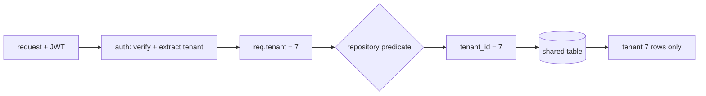

## Thesis

Keeping every tenant's data invisible to every other tenant inside one shared system --- enforced **structurally**, by a predicate the data layer always adds, rather than by a filter each handler is trusted to remember, so that a single forgotten scope can never return another company's rows.

## Sub

**How the tenant flows down** -> **shared database or database per tenant** -> **one enforcement point, not per-handler** -> **zoom out** to the silent cross-tenant leak, and the pivots an interviewer rides from "scope it by tenant" into where the tenant id comes from, row-level security, and noisy neighbours.

## Spine

- The tenant id comes from the **token, not the input** --- it is a verified JWT claim, never a request parameter a caller could set, so a client can't ask for another tenant by changing a field.
- **One structural enforcement point** --- the tenant predicate lives in the repository or the database, added to every read and write, so no individual handler can forget it and open a hole.
- **Shared rows or separate databases** --- one table scoped by tenant id is cheap and dense but a bug leaks wide; a database per tenant is a hard wall at the cost of fan-out and per-tenant migrations.
- The failure mode is **silent** --- a missing predicate does not error, it returns someone else's data, so isolation is something you build in structurally and prove, not something you notice at runtime.

## Companion Notes

### walk

The tenant flowing down

One request from token to scoped rows, one layer at a time --- how the tenant id travels from the JWT to the predicate on the query.

Say where the id comes from before you say what you filter on --- "from the verified claim, never the request body." That sentence is the whole security argument.

### drill

Probe Drill

Graded follow-ups on the isolation model, the enforcement point, and the leak --- the ones that separate "add a filter" from a Staff-level answer about structural isolation.

Name the enforcement *point*, not just the predicate --- where it lives is what makes it safe.

## Drill

SDE2 | the model and the mechanics
SDE3 | enforcement and the edges
Staff | scaling tenancy and org calls

### SDE2 | what multi-tenancy is

What does multi-tenant isolation mean?

One running system serves many customers (**tenants**), and each tenant must see only its own data even though the code, and often the database, are shared. Isolation is the guarantee that tenant A can never read or write tenant B's rows --- the core correctness and security property of any SaaS.

### SDE2 | where the tenant id comes from

Where does the tenant id come from on a request?

From the **verified token** --- a tenant id (or company id) claim inside the authenticated JWT, extracted after the signature is checked. Never from a request parameter, header, or body the caller controls, because anything the client can set, a malicious client can set to someone else's tenant.

### SDE2 | shared DB vs DB per tenant

Shared database or a database per tenant?

**Shared** --- one set of tables, every row carrying a tenant id, scoped by a predicate --- is cheap, dense, and easy to operate, but the isolation is only as strong as the predicate. **Database per tenant** gives a hard wall at the cost of N times the connections, migrations, and operational overhead. Most systems start shared and peel off the largest tenants later.

### SDE2 | row-level scoping

How does row-level scoping actually work?

Every tenant-owned table has a tenant id column, and every query carries a `tenant_id = ?` predicate bound to the request's tenant. Reads return only that tenant's rows; writes stamp the tenant id so new rows are owned correctly. The whole scheme rests on that predicate being present on **every** statement.

### SDE2 | the forgotten filter

What happens if one handler forgets the tenant filter?

It returns **every tenant's rows** --- a cross-tenant data leak, with no error and no crash. That is why the filter can't be a thing each handler remembers; a single miss in one endpoint is a breach. The fix is to make the predicate structural, not per-handler.

### SDE2 | the noisy neighbour

What is the noisy-neighbour problem?

In a shared system one tenant's heavy load --- a huge query, a traffic spike --- degrades latency for everyone sharing the same database and pool. Isolation of *data* does not give isolation of *performance*; that needs per-tenant limits, quotas, or moving the heavy tenant to dedicated capacity.

### SDE3 | one enforcement point

Where should the tenant predicate be enforced?

At **one structural layer** the whole application funnels through --- the repository or data-access layer, an ORM global scope, or the database itself --- so the predicate is added automatically to every query and no handler can bypass it. Per-handler filtering is fragile by construction: correctness then depends on every developer remembering every time.

### SDE3 | Postgres row-level security

How does database-enforced isolation work?

Postgres **row-level security** attaches a policy to a table so the database itself appends `tenant_id = current_setting('app.tenant')` to every query. You set the tenant in a session variable after auth, and even a query that forgets the predicate is scoped by the engine. It moves the guarantee below the application, where a code bug can't defeat it --- at the cost of policy complexity and per-connection setup.

### SDE3 | the JWT is the trust root

Why is the signed token the trust boundary?

Because the entire scheme collapses if the tenant claim can be forged. The JWT signature is what makes a tenant id trustworthy --- verify it on every request, and derive the tenant only from verified claims. If you ever read the tenant from an unsigned source, a caller rewrites one value and reads any tenant.

### SDE3 | tenant-scoped cache keys

How do you keep a shared cache from leaking across tenants?

**Namespace every key by tenant** --- tenant:7:user:42, never user:42. A cache is shared state just like the database; an un-namespaced key serves one tenant's cached value to another. The same discipline as the query predicate, applied to the cache layer.

### SDE3 | cross-tenant work

How do you run a query that must span tenants?

Deliberately and narrowly --- a separate, audited path (a background job or an admin service) that explicitly opts out of the tenant scope, never the normal request handler. The default must be scoped; crossing tenants is the special case that is logged and reviewed, so an ordinary bug can never accidentally read across the boundary.

### SDE3 | migrations across tenants

What is harder about schema migrations under each model?

**Shared DB:** one migration covers all tenants at once, but it must be backward-compatible because every tenant is on it instantly. **DB per tenant:** each database migrates independently --- safer to stage and roll back per tenant, but you now run the migration N times and track which tenants are on which version.

### Staff | when to split a tenant out

When do you move a tenant to its own database?

When its size or requirements stop fitting the shared model --- it dominates the shared resources (noisy neighbour), or it needs data residency, a dedicated performance SLA, or contractual physical isolation. The pattern is a **hybrid**: most tenants shared for density, the few largest or most-regulated on dedicated infrastructure.

### Staff | data residency

How does tenancy interact with data residency?

Some tenants are contractually or legally bound to a region (EU data stays in the EU). That pushes toward **per-region, sometimes per-tenant** databases, and the routing layer must send each tenant's requests to the right region's store. Residency is often the first requirement that forces a shared system to shard by tenant.

### Staff | per-tenant limits

Why do you need per-tenant rate limits and quotas?

To contain the noisy neighbour and to bill fairly --- a per-tenant request rate protects the shared service from any one tenant, and a per-tenant usage quota enforces plan limits. Data isolation stops tenants seeing each other; per-tenant limits stop them **starving** each other.

### Staff | the blast radius

What is the blast radius of the shared-schema choice?

A schema or data bug in a shared database can affect **every** tenant at once --- one bad migration, one leak, one runaway query hits the whole customer base. Database per tenant shrinks the blast radius to one tenant per incident. That containment, not raw performance, is often the real argument for splitting the largest or most critical tenants out.

### Staff | onboarding a new tenant

How do you provision a new tenant?

In the shared model it is nearly free --- a new tenant id and some seed rows, no infrastructure. In the per-tenant model it is a real workflow: create the database, run every migration, wire routing and credentials. That asymmetry --- instant versus provisioned --- is another reason the shared model carries the long tail of tenants and only the few that need it get their own database.

### Staff | RLS vs app-layer

Database row-level security or application-layer scoping --- which?

**App-layer** (a repository predicate or ORM scope) is portable, easy to reason about, and where most teams start; its weakness is that a path bypassing the layer bypasses isolation. **RLS** puts the guarantee in the database so no code bug can defeat it, at the cost of policy complexity and session setup. Defence in depth uses both --- scope in the app, and let RLS be the backstop.

## Walk

### The request arrives with a tenant claim

```flow
r[request + JWT] -> v[auth verifies signature] -> c[extract tenant_id = 7]
```

Every authenticated request carries a signed token, and inside it is the tenant claim. The auth middleware verifies the signature first, then extracts the claim. The signature is what makes the claim trustworthy: it is the difference between "this request belongs to tenant 7" and "this request says it belongs to tenant 7."

The tenant is derived **only** from the verified token, never from a URL, header, or body. That single rule is the whole security argument --- anything the caller can set, a malicious caller can set to another tenant.

### Middleware pins the tenant to the request

```flow
c[verified claim] -> x[pin to request context] -> t[req.tenant = 7]
```

Once extracted, the tenant id is pinned onto the request context so every layer below can read it without re-parsing the token. It becomes an ambient fact about the request --- "this is a tenant-7 request" --- that the data layer will consume.

Pinning it once, centrally, is what lets the enforcement below be automatic. No handler passes the tenant around by hand; it is simply present on the context the repository already has.

### The repository adds the predicate to every query

```flow
t[req.tenant] -> p[repository predicate] -> q[WHERE tenant_id = 7]
```

The single enforcement point: the repository layer reads the tenant from the context and adds the tenant predicate to every read, and stamps the tenant id on every write. Because all data access funnels through here, the predicate is present on every statement without any handler doing anything.

This is what makes isolation structural instead of remembered. In the fragile version, handler A adds the filter and handler B forgets it, and B is a leak. Here there is nowhere to forget it --- the predicate is added by the layer, not the caller.

```ts
// one enforcement point -- every query is scoped by the request's tenant
function findScoped(sql, params, ctx) {
  return db.query(
    scope(sql, 'tenant_id = $tenant'),
    { ...params, tenant: ctx.tenant }   // ==from the verified claim, never the request==
  );
}
```

In a database that supports it, row-level security is the same idea pushed one layer down: the engine appends the predicate from a session variable, so even a query that forgot it is scoped.

### Only the tenant's rows come back

```flow
q[scoped query] -> s[shared table] -> o[tenant 7 rows only]
```

The query runs against the shared table --- rows for many tenants --- and returns only tenant 7's. The other tenants' rows were never eligible; the predicate excluded them at the source, not by filtering in the application after the fact.

That is the property to state out loud: cross-tenant data is not fetched then hidden, it is **never fetched**. The boundary lives at the query, which is the cheapest and safest place for it.

### Or let the database enforce it

```flow
q[any query] -> e[RLS policy on the table] -> o[tenant 7 rows only]
```

The enforcement point can move even lower --- into the database itself, so not even a bug in the data layer can defeat it.

Row-level security attaches a policy to the table; you set the tenant once per connection after auth, and the engine appends the predicate to every statement against that table.

```sql
-- the database appends the predicate, even if a query forgets it
CREATE POLICY tenant_isolation ON orders
  USING (tenant_id = current_setting('app.tenant')::int);
ALTER TABLE orders ENABLE ROW LEVEL SECURITY;
```

Now a query that forgot the scope still returns only tenant 7's rows. The cost is policy complexity and per-connection setup, so most teams scope in the repository first and add row-level security as the backstop where a leak must be impossible.

### Model Script

- Frame the boundary | "Multi-tenant isolation is keeping each customer's data invisible to every other customer in a shared system. The key move is to make it structural --- one enforcement point the whole app funnels through --- rather than a filter each handler is trusted to add."
- Where the tenant comes from | "The tenant id comes from the verified JWT claim, never from a request parameter. That is the whole security argument: anything the caller can set, a malicious caller can set to someone else's tenant, so the id has to come from the signed token."
- The enforcement point | "I pin the tenant onto the request context in auth middleware, and the repository layer adds the tenant predicate to every query and stamps it on every write. Because all data access goes through that one layer, there is nowhere for a handler to forget the filter --- which is the failure that leaks."
- The isolation model | "For most tenants I keep a shared database with row scoping: cheap, dense, one migration for everyone. The trade is that isolation is only as strong as the predicate, so where the stakes are higher I back it with Postgres row-level security so the database enforces it even if a query forgets."
- Interviewer: "One big customer is slowing everyone down. Is that an isolation bug?"
- Separate data from performance | "No --- data isolation is intact; that is the noisy-neighbour problem. Shared data doesn't give shared-performance isolation. I'd add per-tenant rate limits and quotas to contain it, and if one tenant keeps dominating, move it to its own database to shrink the blast radius."
- Land the guarantees | "So the shape is: tenant from the signed token, pinned once in middleware, enforced by a single predicate in the repository with RLS as a backstop, shared DB for density with the largest tenants peeled off. The leak everyone worries about is a forgotten filter --- and the answer is to make it structural so there is nothing to forget."

## Whiteboard

Sketch how the tenant travels from the token to a scoped query, and where the predicate is enforced.

### Where does the tenant id come from?

The verified JWT claim, extracted in auth middleware --- never a request parameter the caller controls.

### Where is isolation enforced?

At one point --- the repository predicate, or database row-level security --- so every query is scoped without a handler adding anything.



Verdict: the tenant comes from the signed token and the predicate is added by one layer --- so cross-tenant rows are never fetched, not fetched then hidden.

## System

Zoom out to where the tenant boundary sits along the request path.

### Where it sits

Client: sends a request with a signed token
Auth middleware: verifies and extracts the tenant claim [*]
Request context: carries req.tenant down the stack
Repository / database: adds the predicate to every query
Shared store: holds all tenants' rows, returns only the scoped ones

### Pivots an interviewer rides

From "scope it by tenant" they push on where the id comes from, how it is enforced, and what shared resource leaks next.

#### Which isolation model, shared or per-tenant?

-> shared rows for density, a database per tenant for a hard wall
Shared scopes every row by tenant id --- cheap and dense, but isolation is only as strong as the predicate. Per-tenant databases are a hard wall at N times the operational cost. Most systems are a hybrid: shared for the many, dedicated for the largest or most regulated.

#### How do you stop the leak?

-> one structural enforcement point, not per-handler filtering
The predicate lives in the repository or in database row-level security, added to every query automatically. Per-handler filtering fails the moment one handler forgets; a single structural point has nowhere to forget it.

## Trade-offs

The calls that separate "add a filter" from a designed isolation model.

### Shared database vs database per tenant

- Shared, row-scoped: cheap, dense, one migration for all, but a bug leaks wide and tenants share performance
- Database per tenant: a hard isolation wall and a small blast radius, but N times the connections, migrations, and cost

Start shared for density and peel off the largest, noisiest, or most-regulated tenants; a hybrid beats either pure model at scale.

### App-layer predicate vs database row-level security

- Repository predicate: portable and easy to reason about, but a path that bypasses the layer bypasses isolation
- Row-level security: the database enforces it so no code bug can defeat it, at the cost of policy complexity and session setup

Scope in the application and let row-level security be the backstop --- defence in depth, not one or the other.

### Shared schema vs schema per tenant

- Shared schema: one set of tables, simplest to operate and query across, but no structural separation
- Schema per tenant: namespace-level separation inside one database, cleaner than shared rows, heavier than shared tables

Prefer shared rows for scale and reach for schema-per-tenant only when a middle ground between row-scoping and full per-tenant databases is genuinely needed.

## Model Answers

### the enforcement point | Why isolation is structural

The point most leak-stories miss.

- One layer, not per-handler | key | the repository adds the predicate
- From the token | store | tenant id is a verified claim, never input
- RLS as a backstop | note | the database enforces it if code forgets

### the isolation model | Shared vs per-tenant, decided

Framed as a trade, not a default.

- Shared for density | key | one table scoped by tenant id
- Per-tenant for a wall | store | dedicated DB shrinks blast radius
- Hybrid at scale | note | peel off the largest and most regulated

## Numbers

Back-of-envelope why a shared database stays cheap and where per-tenant cost comes from.

A shared model adds one indexed column and one predicate per query --- effectively free. Per-tenant databases multiply the fixed overhead --- connections, migrations, idle capacity --- by the tenant count, which is what makes density the default.

- tenants | Tenants | 5000 | 0 | 100
- connPerDb | Connections per DB | 20 | 0 | 5
- migMinutes | Minutes per migration | 3 | 0 | 1

```js
function (vals, fmt) {
  var tenants = vals.tenants, connPerDb = vals.connPerDb, migMinutes = vals.migMinutes;
  return [
    { k: 'Shared: predicate cost', v: '~0', u: 'ms', n: 'one indexed tenant_id column and a scope predicate per query \u2014 the shared model adds essentially nothing to a request', over: false },
    { k: 'Per-tenant connections', v: fmt.n(tenants * connPerDb), u: 'conns', n: 'a dedicated database per tenant needs its own pool \u2014 ' + connPerDb + ' each across ' + fmt.n(tenants) + ' tenants is a connection explosion the shared model avoids', over: tenants * connPerDb > 10000 },
    { k: 'Migrate all tenants', v: fmt.n(Math.round(tenants * migMinutes / 60)), u: 'hours', n: 'one migration run per tenant database \u2014 the shared model does this once, the per-tenant model does it ' + fmt.n(tenants) + ' times', over: tenants * migMinutes / 60 > 24 },
    { k: 'Shared blast radius', v: fmt.n(tenants), u: 'tenants', n: 'a schema or data bug in the shared database can hit every tenant at once \u2014 the containment argument for peeling the largest tenants out', over: tenants > 1000 },
    { k: 'Break-even to split', v: '~1', u: 'tenant', n: 'it takes just one tenant big or regulated enough \u2014 residency, an SLA, or noisy-neighbour load \u2014 to justify its own database; the rest stay shared', over: false }
  ];
}
```

## Red Flags

What makes an interviewer wince.

### "The tenant id comes from a request parameter"

Anything the caller sets, a malicious caller sets to another tenant --- that is a one-line cross-tenant read.

Derive the tenant only from the verified JWT claim, after checking the signature.

Note: this is the single most common multi-tenancy security mistake in interviews.

### "Each handler adds the tenant filter"

That is fragile by construction --- correctness depends on every developer remembering every time, and one miss is a breach.

Enforce the predicate at one structural layer --- the repository, an ORM scope, or database row-level security --- so no handler can forget it.

### "We run one query across all tenants for the admin dashboard"

Fine only if it is a separate, audited path that explicitly opts out of the scope --- not the normal handler with the filter removed.

Keep the default scoped and make crossing tenants the special, logged case, so an ordinary bug can never read across the boundary.

## Opener

### 30s | The one-liner

How I open when asked to design multi-tenant isolation.

#### What is the boundary?

Each tenant sees only its own data in a shared system, enforced by one predicate the whole app funnels through.

#### What is the one hard part?

Making isolation structural --- the tenant from the signed token, the predicate added by one layer --- so a forgotten filter can't leak.

##### Hooks

Where an interviewer usually pushes next.

- Which model? | shared rows vs per-tenant DB | trade
- Stop the leak? | one enforcement point or RLS | drill
- Big tenant slows others? | noisy neighbour, per-tenant limits | trade

Foot: two sentences --- the tenant from the token, then the single enforcement point.

## Bank

### SCALE | Five thousand tenants on one platform

Task: argue why they stay on a shared database and what forces a split.
Model: shared rows scoped by tenant id are cheap and dense; residency, an SLA, or noisy-neighbour load peels the largest few onto dedicated databases.
Int: what is the real cost of going per-tenant for everyone?
N times the connections and migrations, and N idle capacity --- density is why shared is the default.

### DESIGN | A SaaS with free and enterprise tiers

Task: design isolation across tiers.
Model: all tenants share the scoped database; enterprise tenants that need residency or a dedicated SLA move to their own database, with per-tenant limits containing the noisy neighbour.
Int: where does the tenant id come from?
The verified JWT claim, never a request parameter --- the whole security argument.

### Extra Curveballs

### CURVEBALL | leak | A bug returned another tenant's rows --- root cause and fix?

Model: a handler queried without the tenant predicate. Root cause is per-handler filtering; the fix is to move enforcement to one structural layer (repository or RLS) so there is nothing to forget, plus an audit for other unscoped paths.

### Frames

- The tenant comes from the token, never the input
- One enforcement point, so there is nothing to forget
- Cross-tenant rows are never fetched, not fetched then hidden
