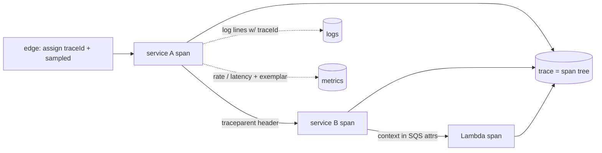

## Thesis

Making a running system explainable from the outside --- structured logs, metrics, and traces emitted as first-class data and correlated by an id that follows a request across service and Lambda boundaries --- so you can answer "what is happening and why" for a request you have never seen, without redeploying to add a print statement, while the telemetry never breaks the business logic and never costs more than the system it watches.

## Sub

**The three pillars --- logs, metrics, traces** -> **structured logging and correlation** -> **distributed tracing: spans plus propagation** -> **zoom out** to health checks, sampling, and cost, and the pivots an interviewer rides from "add logging" into logs-vs-metrics-vs-traces, cardinality, and how a trace survives a Lambda boundary.

## Spine

- The three pillars are **logs, metrics, and traces** --- logs are discrete events, metrics are aggregatable numbers over time, traces are the causal path of one request; each answers a different question and you need all three.
- Logs must be **structured and correlated** --- JSON with a trace id on every line, so logs are queryable data you can stitch across services, not free text you grep.
- A trace is **spans plus propagation** --- each service records a span and passes the trace context across the wire (and across a Lambda boundary) so the spans reassemble into one end-to-end timeline.
- Instrumentation must be **safe and cheap** --- telemetry falls back to no-ops when the collector is down so it can't break business logic, and labels stay low-cardinality so metrics don't explode.

## Companion Notes

### walk

A request made explainable

One request from a structured log line to a reassembled trace --- correlation, span propagation, the Lambda boundary, and the no-op fallback that keeps telemetry from ever breaking the app.

Say the join key first --- "one id on every log line and span ties the three pillars together." Everything else hangs off that.

### drill

Probe Drill

Graded follow-ups on the pillars, structured logging, tracing, and the failure modes --- the ones that separate "add a logger" from an observable system.

Name the no-op fallback --- telemetry that can take down the app is a worse liability than no telemetry.

### wb

Whiteboard

Rebuild the observable request from memory --- the join key, a structured log line, a span, propagation, the Lambda boundary, sampling, and the fail-open rule.

Draw the join key crossing every pillar first --- one trace id on the log line, the span, and the metric exemplar. Recall is the test, not recognition.

### sys

System Map

Zoom out: telemetry sits beside the request path as a side-channel, threaded by a correlation id, exported vendor-neutrally, and budgeted at the backend.

Lead with the boundary, not the tools --- "telemetry is a side-channel that never blocks the request and whose destination is a config change." That framing is the whole design.

### trade

Trade-offs

The calls that separate a logger from observability --- metric vs log vs trace, head vs tail sampling, OpenTelemetry vs a vendor agent, and symptoms vs causes for alerts.

Always name the axis that forces the choice --- latency the feature needs, the cost you can afford, whether you must capture every error --- never defend one pillar as universally right.

### model

Model Answers

Full spoken scripts --- the beats in order, the way you would actually say them, from "make it observable" to "the dashboards are green but users are failing."

Steal the frame, not the words --- lead with "three pillars joined by one correlation id," then the two things you insist on: fail open, and budget the spend.

### num

Numbers

Back-of-envelope the telemetry volume --- log bytes times retention is the dominant cost, sampling and cardinality are the two levers that bend the curve.

Lead with the cost that surprises people --- log volume times retention, not the send rate. That number is what forces levels, sampling, and tiered retention.

### rf

Red Flags

What sinks the round --- telemetry as a hard dependency, a user-id metric label, trusting a green dashboard --- and the line that flips each one.

Name what the interviewer hears --- "observability that can take the system down" and "melts the metrics bill" are the fastest tells that you have not run one of these in production.

### open

30-Second

The opener and the close --- matched to the altitude the question is asked at, from a one-line boundary to a summary-plus-risks-plus-invitation.

Match the altitude --- open on the three pillars joined by one id, and land on the two non-negotiables: fail open, and budget it.

## Drill

all | All four levels, mixed --- the way a real loop actually comes at you, from the pillars to the org call
SDE2 | the pillars and the mechanics
SDE3 | tracing, sampling, and cardinality
Staff | shipping, migration, and org calls

### SDE2 | the three pillars

What are the three pillars of observability?

**Logs** --- discrete, timestamped events with detail. **Metrics** --- aggregatable numbers over time (a rate, a latency, a count). **Traces** --- the causal path of one request across services. Each answers a different question: metrics say *how many / how fast* cheaply, logs say *what exactly happened* in one case, traces say *where the time went* end to end. You need all three; none substitutes for another.

Follow: You said metrics are cheap and logs expensive --- why is a metric cheaper than a log for the same event?
A metric is *pre-aggregated*: incrementing a counter adds a few bytes to one existing time series no matter how many events hit it, so cost is fixed by the number of series, not the traffic. A log is a full record *per event*, so its cost scales with volume x size x retention. Metrics compress a million events into one number; logs keep the million.

Follow: If you could keep only one pillar, which, and why?
Metrics --- they are the cheapest way to know *that* something is wrong and to alert on it, and you can run a service on RED metrics alone. You lose per-case detail and cross-service localization, but a system with no metrics is blind to its own health, whereas no traces just means debugging is harder. Detection beats forensics if I am forced to choose.

Senior: framing the three as *different questions* (how-many/how-fast, what-exactly, where-the-time-went) rather than three tools --- and that they cross-reference through one id --- is the tell; a junior lists "logs, metrics, traces" as if interchangeable.
Speak: "Three pillars, three questions: metrics tell me *that* it broke and how fast, logs tell me *what* happened in one case, traces tell me *where* the time went across services --- and I need all three because none answers another's question."

### SDE2 | structured logging

What is structured logging and why does it matter?

Emitting logs as JSON key-value objects instead of free-form text --- so a log is *data* you can query (filter by field, aggregate, alert) rather than a string you grep. `level`, `msg`, `traceId`, and the relevant fields are keys, so "all errors for tenant 7 in the last hour" is a query, not a regex. A structured logger like Pino makes this the default. Free-text logs don't scale past one server and a person reading them.

Follow: Fields cost storage. Where do you draw the line on what goes on every log line?
A small, fixed *context* on every line --- timestamp, level, service, `traceId`, tenant, route --- because those are the join and filter keys you always need. Event-specific detail goes on the lines that need it. The discipline is that the *shape* is consistent (same key for the same thing everywhere) so queries work across services; what varies is the payload, not the skeleton.

Follow: A field's value is sometimes a string, sometimes a number, sometimes an object. What breaks?
Your log backend's schema inference and its queries. If `user_id` is a number here and a string there, range filters and aggregations misbehave or the index rejects documents. So types have to be stable per key --- pick one type for `user_id` and coerce at the log boundary. Inconsistent types are the structured-logging version of a cardinality bug: the data is there but unqueryable.

Senior: saying logs are *data with a stable schema*, not text --- and that the value is the query, not the human read --- is the frame; the tell of shipping it is knowing the fixed-context-plus-payload split and stable field types.
Speak: "Structured means JSON, so a log is queryable data --- a fixed context on every line (level, service, traceId, tenant) plus event detail --- and 'all errors for tenant 7 in the last hour' is a query, not a grep."

### SDE2 | log levels

What are log levels for?

Severity, so you can separate signal from noise --- debug/info/warn/error. Production runs at `info` (or `warn`) so the volume is affordable, and you drop to `debug` to investigate. Levels also drive routing and alerting: `error` and above page someone; `info` is for context. The level is the first filter that keeps log volume --- the biggest cost driver --- under control.

Follow: A production incident needs debug logs, but debug is off in prod. How do you get them without a redeploy?
A *dynamic log level* --- read the level from config that can flip at runtime (an env-backed flag, a control-plane setting), ideally scoped: debug for one tenant, one route, or a sampled fraction, not the whole fleet. That is the "explainable without a redeploy" property applied to levels: you turn up detail exactly where you're looking, for as long as you're looking, then turn it back down.

Follow: What is wrong with logging at `error` for something that is handled and expected?
It cries wolf. If a retried-then-succeeded call logs `error`, your error rate --- which pages people and gates deploys --- is polluted with non-events, and real errors hide in the noise. Level has to reflect *user impact*, not "something unusual happened." An expected, handled condition is `info` or `warn`; `error` is reserved for "a user is actually affected," because that is what alerts on it.

Senior: treating the level as a *user-impact* signal that drives alerting and cost --- and knowing you can flip it dynamically and scoped in an incident --- separates it from "print more stuff."
Speak: "Levels are the first cost-and-signal filter: run at info, page on error, and drop to debug dynamically and scoped --- one tenant, one route --- when I'm investigating, so I get detail without a redeploy or a bill."

### SDE2 | health checks

What should a health check actually verify?

Not just "the process is up" but "the service can do its job" --- can it reach its critical dependencies (database, cache, downstream API)? A liveness check answers "am I running"; a readiness check answers "can I serve traffic right now." A health check that only confirms the process is alive passes while the service is useless because its database is unreachable. It has to fail when the service actually can't serve, or it catches nothing.

Follow: If readiness checks the database and the database blips, every instance fails readiness at once and you have an outage. How do you avoid that?
Don't make readiness a hair-trigger on a shared dependency, or a blip takes the whole fleet out of rotation simultaneously. Check a *cached/recent* health signal, tolerate transient failures (fail after N consecutive, not one), and distinguish "this instance is bad" (pull it) from "a shared dependency is degraded" (keep serving, you can't fail your way out of it). Otherwise the health check *causes* the outage it was meant to catch.

Follow: Liveness vs readiness --- what does an orchestrator actually do differently with each?
Liveness failing means "this process is wedged" --- the orchestrator *restarts* it. Readiness failing means "don't send me traffic right now" --- it's pulled from the load-balancer pool but *not* restarted. Conflating them is dangerous: if a slow dependency fails your *liveness* check, Kubernetes restarts healthy pods in a loop, turning a dependency slowdown into a crash loop. Slow deps belong in readiness, not liveness.

Senior: knowing that a naive dependency-coupled readiness check can *synchronize a fleet-wide outage*, and that liveness-vs-readiness maps to restart-vs-depool, is the operational tell.
Speak: "Health has to mean 'can serve,' not 'process alive' --- but readiness on a shared dependency needs hysteresis, or one database blip depools every instance at once and the check causes the outage."

### SDE2 | metric types

What are the main metric types?

**Counter** --- monotonic, counts events (requests, errors); you read its rate. **Gauge** --- a value that moves up and down (queue depth, connections in use, memory). **Histogram** --- a distribution, so you can compute percentiles (p50, p99 latency). Each models a different measurement: a counter for "how many," a gauge for "how much right now," a histogram for "what's the spread." Using the wrong one (a gauge for latency) loses the percentiles that matter.

Follow: Why can't you just average latency? Why does p99 need a histogram?
Because the average hides the tail, and the tail is where users hurt --- a 20ms mean can sit on a 2s p99 that's timing out 1% of requests. And you *cannot average percentiles*: averaging each instance's p99 is statistically meaningless. A histogram stores latency in buckets, so you sum the buckets across instances and *then* compute the quantile over the real distribution. That's the only correct way to get a fleet-wide p99.

Follow: A counter resets to zero when a process restarts. Doesn't that corrupt your rate?
No, because you read a counter as a *rate over a window* (`rate()` over the delta), and the backend handles a reset by detecting the counter went backwards and counting from zero, not as a huge negative jump. That's exactly why counters are defined as monotonic-with-reset rather than as a stored total: the value is disposable, the *rate* is the signal, and it survives restarts and scrape gaps.

Senior: knowing that percentiles don't average and a histogram is what makes a fleet-wide p99 *correct* --- not just "use a histogram for latency" --- is the numerate tell.
Speak: "Counter for how-many (read as a rate), gauge for how-much-now, histogram for the spread --- and latency needs a histogram because you can't average p99s; you sum buckets across instances and take the quantile on the real distribution."

### SDE2 | the correlation id

What is a correlation id and why is it essential?

A unique id attached to a request at the edge and propagated through every service and onto every log line and span it touches --- so all the telemetry for one request can be stitched together. Without it, a request that spans five services is five disconnected piles of logs; with it, "show me everything that happened for request X" is one query. It's the thread that makes cross-service observability possible at all.

Follow: A client retries a failed request. Same correlation id or a new one? What's the difference?
Two different ids for two different questions. The *trace id* is per-attempt --- each retry is its own request with its own latency and outcome, so it gets a fresh trace, or you'd merge two independent timelines. A higher-level *request/idempotency id* (or a business id like order id) stays stable across retries so you can ask "what happened to *this order*" across attempts. You want both: trace id to see one attempt, business id to see the whole saga.

Follow: The edge assigns the id --- but a client already sent an `X-Request-Id`. Do you trust it?
Accept it but don't blindly trust it: use a client-supplied id for correlation *only* after validating its format (length, charset) so it can't inject into logs or blow up cardinality, and always stamp your own trace id too. Trusting a raw client header for a metric label or an unbounded log field is how an attacker floods your cardinality or forges correlation. Accept-and-sanitize, or generate your own.

Senior: separating the per-attempt trace id from the stable business/request id --- and sanitizing a client-supplied id before trusting it --- is what separates "add a request id" from someone who's debugged a distributed retry.
Speak: "One id assigned at the edge and propagated onto every log line and span turns five piles of logs into one query --- and I keep the per-attempt trace id distinct from a stable business id so I can see one attempt *and* the whole retried saga."

### SDE2 | logs vs metrics

When do you reach for a log versus a metric?

A **metric** when you want "how many / how fast / how much" cheaply and aggregatably --- request rate, error rate, p99 latency --- the things you graph and alert on. A **log** when you need "what exactly happened in this one case" with full detail --- the parameters, the error, the context. Metrics tell you *that* something is wrong and trends; logs tell you *what* and *why* for a specific occurrence. You alert on metrics and investigate with logs.

Follow: A metric spike fires an alert. How do you get from the spike to the specific failing requests?
Through an *exemplar* or the shared id: a good metrics stack attaches example trace ids to histogram buckets, so from the spiking p99 bucket you click straight to a slow trace, then to that request's logs. Absent exemplars, you pivot on the dimensions --- the metric's labels (route, region, status) narrow the window, and you query logs/traces filtered to that slice. The metric localizes *where*; the id and the logs give you *which requests*.

Follow: Someone proposes replacing a metric with a "count the log lines" query. When is that wrong?
When you need it *cheap, fast, and always-on* --- alerting. Counting logs means indexing and scanning high-volume data on every evaluation, which is slow and expensive and breaks if logs are sampled or dropped under load. A counter is a pre-aggregated number that's correct and near-free to query. Log-derived metrics are fine for ad-hoc or low-volume questions; they're the wrong tool for the always-evaluating alert path.

Senior: knowing the *bridge* between them --- exemplars / shared id to jump from a metric spike to the exact traces and logs --- is what makes "alert on metrics, investigate with logs" actually workable rather than a slogan.
Speak: "Metric to detect and alert --- cheap and aggregatable --- log to investigate the one case, and I bridge them with an exemplar or the shared trace id so a p99 spike takes me straight to the slow trace and its logs."

### SDE3 | spans and traces

What is a span, and what is a trace?

A **span** is one unit of work --- a service handling a request, a database call, an external API call --- with a start time, duration, and metadata (status, attributes). A **trace** is the tree of spans for one request across all the services it touched, reassembled into an end-to-end timeline. The trace shows where the time and the errors went across a distributed call; a single span is one node in that tree. Tracing is what turns "the request was slow" into "it was slow in the payments service's database call."

Follow: What actually makes the spans form a *tree* --- how does a child know its parent?
Each span carries a `trace_id` (same for the whole request) and its own `span_id`, and records a `parent_span_id` pointing at the span that caused it. The backend reassembles the tree from those parent pointers. So when service A calls B, A injects its current `span_id` as the parent, B starts a span with that as `parent_span_id` --- the edge in the tree is that pointer. Lose the parent pointer and B's span becomes a second root.

Follow: A span's duration is 200ms but the child database span is 190ms --- what does the 10ms tell you, and what if it were 190ms of "gap"?
The 10ms is this service's own overhead --- serialization, its own CPU, queueing --- outside the child call. If instead there were a large *unaccounted gap* between spans, that's un-instrumented time: waiting in a thread pool, a lock, GC, or a call you didn't span. Reading the gaps, not just the spans, is how tracing finds latency that lives *between* the things you measured --- the most common "where did the time go" answer.

Senior: reasoning about the *gaps* between spans as un-instrumented time --- not just the spans you drew --- is the Staff-level way to read a trace; a junior only sees the boxes.
Speak: "A span is one timed unit of work with a parent pointer; the trace is the tree those pointers reassemble --- and the skill is reading the *gaps* between spans, because unaccounted time is where the real latency usually hides."

### SDE3 | context propagation

How do spans recorded in different services become one trace?

Trace context --- a trace id plus the parent span id --- is passed across every hop, so each service's span is linked to the one that called it. Over HTTP it rides in headers (the W3C `traceparent` header is the standard); over a message queue it rides in message attributes. Each service extracts the incoming context, starts its span as a child, and injects the context when it calls onward. Break the propagation on one hop and the trace splits into two disconnected pieces.

Follow: What's actually inside a `traceparent` header, and which part matters for sampling?
Four fields: version, the 16-byte trace id, the 8-byte parent span id, and a one-byte `trace-flags`. The flags carry the *sampled* bit --- so the sampling decision made at the edge travels with the request, and every downstream service honors the same decision. That's what keeps a trace whole under head sampling: without a propagated sampled flag, service A keeps the trace and service B independently drops it, and you get half a trace.

Follow: A third-party or legacy service in the middle doesn't understand your headers. What happens to the trace?
It becomes a *broken link*: the hop before it and the hop after it can't be joined, so one trace splits in two. Mitigations: propagate through whatever the middle box *does* forward (a header it passes untouched, or a `baggage`/business id you re-correlate on), or accept the break and stitch by the business id at query time. The honest answer is that propagation is only as strong as its weakest hop, so you design the id to survive the boxes you don't control.

Senior: naming the propagated *sampled flag* as what keeps a trace whole under head sampling --- and that a non-propagating hop splits the trace --- is the distributed-tracing tell, not just "pass a header."
Speak: "Each service extracts the trace context, starts a child span, and injects it onward --- W3C traceparent over HTTP, message attributes over a queue --- and the sampled bit rides in the flags so every hop keeps or drops the *same* trace."

### SDE3 | crossing a Lambda boundary

How does a trace survive an async or Lambda boundary?

There's no live connection, so the context must travel *in the event* --- carried in the SQS message attributes or the invocation payload, then re-extracted when the function starts and used as the parent of the function's span. And AWS-native services propagate X-Ray's own header, not W3C, so a **composite propagator** that reads and writes both formats is what keeps the trace intact across an EventBridge/SQS/Lambda path. Miss the extraction and every Lambda invocation looks like a brand-new root trace.

Follow: A message sits in the queue for an hour before a consumer picks it up. What does that hour do to the trace?
It shows up as a giant span or a long gap between the producer's enqueue and the consumer's start --- which is *correct and useful*: queue latency is real latency, and the trace makes it visible. The subtlety is not to model the wait as the consumer's *own* work; you want the producer to record the enqueue and the consumer to start its span on dequeue, so the gap is attributed to "time in queue," not to the consumer being slow. That gap is often the answer to "why was this async flow slow."

Follow: One SQS message fans out to a batch of 10, or 10 messages batch into one Lambda invocation. How does trace context work then?
It stops being one-to-one. For a batch *in*, one invocation processes N messages each with its *own* trace context --- so you start N child spans (often via span links, since one span can't have ten parents) rather than forcing them into one trace. For fan-*out*, each downstream message carries the parent's context so each branch links back. The rule: context lives *per message*, not per invocation, and links express many-to-one causality that a single parent pointer can't.

Senior: knowing that batching breaks the one-parent model and you use *span links* for many-to-one, and that queue wait is real latency to attribute correctly, is what separates this from "put the header in the message."
Speak: "The context rides *inside the event* --- SQS attributes or the payload --- re-extracted as the function's parent, with a composite W3C+X-Ray propagator; and for batches I use span links per message, because one invocation of ten messages has ten parents, not one."

### SDE3 | sampling

Why sample traces, and how?

Because tracing every request is expensive --- storage and per-request overhead --- so you keep a fraction. **Head sampling** decides at the start of the request (keep 1%, deterministically by trace id so a whole trace is kept or dropped together). **Tail sampling** buffers and decides at the end, keeping all traces that errored or were slow and a sample of the rest. Head is cheap but blind; tail is smarter but needs buffering. Either way you bias toward keeping the interesting traces, because those are the ones you'll want.

Follow: Tail sampling has to see a whole trace before deciding --- but spans arrive at different collectors. How does that work?
You route all spans of a trace to the *same* collector before the decision --- a load-balancing exporter that shards by trace id, so every span for a trace lands on the one collector that will judge it. That collector buffers spans for a window, and when the trace is complete (or times out) applies the policy: keep if any span errored or the total exceeded a latency threshold. The cost is that buffering plus the trace-id-aware routing tier --- which is exactly why tail sampling needs more infrastructure than head.

Follow: At 1% head sampling with a 0.1% error rate, what fraction of your error traces do you keep --- and why is that the whole argument for tail?
About 1% of them --- head sampling is blind to the outcome, so it keeps 1% of *everything*, errors included, and throws away 99% of your rare, precious error traces. Tail sampling inverts that: decide *after* you know the outcome, keep 100% of errors and slow traces plus a thin sample of the boring ones. You spend your trace budget on the traces you'll actually open, which is the entire reason to pay for tail's buffering.

Senior: quantifying that head sampling keeps only ~1% of error traces --- and that tail's whole value is spending the budget on outcomes you care about, at the cost of trace-id routing plus buffering --- is the tell.
Speak: "Head samples at the start, deterministic on trace id so a trace is kept whole and cheap; tail buffers per trace and keeps every error and slow one --- because at 1% head with a 0.1% error rate you keep 1% of your errors, which is the traces you least want to lose."

### SDE3 | cardinality explosion

What is a cardinality explosion, and how do you avoid it?

A metric with a label that has unbounded distinct values --- user id, request id, email --- creates a separate time series per value, so the series count (and the cost) explodes. Metrics must use **low-cardinality** labels only: status code, route, region, tenant tier. High-cardinality identity belongs in logs and traces, where it's a field, not a series. Putting a user id in a metric label is the classic way to melt a metrics backend and the bill along with it.

Follow: Do the math --- I have 5 labels, each with 20 values. Then someone adds `user_id`. What happens to the series count?
Series count is the *product* of label cardinalities: 20^5 is already 3.2 million series for that one metric. Multiply by `user_id` with a million users and you're at trillions of series --- each one a chunk of memory and index in the TSDB. That's why it's an *explosion*, not a bump: cardinality is multiplicative, so one unbounded label doesn't add cost, it multiplies the entire existing product by its value count.

Follow: You genuinely need per-user latency sometimes. How do you get it without the label?
Move the identity to where it's a *field*, not a series: traces (per-request, with the user id as a span attribute) and logs (queryable by user), and use *exemplars* to jump from the aggregate metric to a specific user's trace. If you need per-user *aggregates*, that's an analytics/OLAP query over logs or events, not a live metric label. The rule is metrics for bounded dimensions, traces/logs for identity, exemplars as the bridge --- never identity as a live time-series label.

Senior: showing cardinality is *multiplicative* (the product of label values, not the sum) and routing identity to traces/logs with exemplars as the bridge is the tell; "keep labels low-cardinality" without the mechanism is the slogan.
Speak: "Series count is the *product* of label cardinalities, so one unbounded label like user_id multiplies millions of series into trillions --- identity goes in traces and logs where it's a field, and an exemplar bridges the metric spike to the one user's trace."

### SDE3 | RED and USE

What are the RED and USE methods?

Checklists for *which* metrics actually tell you health. **RED** for request-driven services: **R**ate (requests/sec), **E**rrors (failed/sec), **D**uration (latency distribution). **USE** for resources: **U**tilization, **S**aturation, **E**rrors. They cut through "we have 500 metrics" to the handful that describe whether a service or a resource is healthy, so you dashboard and alert on those first instead of drowning in noise.

Follow: RED or USE for a message-queue-based consumer that has no request rate? What do you actually watch?
Neither maps cleanly, and that's the point of knowing when to break the pattern. For a queue consumer you watch *saturation*: queue depth / backlog and its trend (is it draining?), consumer lag (how far behind head), and processing rate vs arrival rate. Errors and duration still apply per message, but the health question for async work is "is the backlog growing" --- a USE-style saturation signal --- not RED's request rate, because there's no synchronous caller waiting.

Follow: You have RED dashboards for every service. Which single metric best predicts a user-visible outage, and why?
Error-budget burn on the user-facing SLI --- typically the *duration* tail or *errors* at the edge the user hits --- because it's the symptom the user actually experiences, aggregated at the boundary that matters. Internal-service RED is for localization once you know there's a problem; the *outage predictor* is the edge SLI's burn rate, which is why you page on that and use the per-service RED to find where it's coming from.

Senior: knowing RED/USE are *starting templates* you deviate from --- saturation/lag for async work, edge SLI burn as the outage signal --- rather than laws, is the tell; reciting the acronyms is the junior version.
Speak: "RED --- rate, errors, duration --- for request services; USE --- utilization, saturation, errors --- for resources; but for a queue consumer I watch *backlog and lag* instead, because saturation, not request rate, is the health question for async work."

### SDE3 | log-trace correlation

How do the three pillars connect to each other?

Through the shared id --- the trace id is injected into every log line (Pino log correlation) and is the id of the trace, so the pillars cross-reference. From a slow trace you jump to that request's logs for the detail; from an error log you pull up the full trace to see where it sat in the request; from a metric spike you find an exemplar trace. The id is the join key: without it the three pillars are three silos, with it they're one story told three ways.

Follow: Concretely, how does the trace id get onto every log line without every log call passing it manually?
Through *context propagation in-process*: the trace id lives in a request-scoped context (async-local storage / MDC / OTel context), and the logger reads it automatically on every call, so application code just logs normally. The instrumentation puts the active span's id into that context at request start; the log integration pulls it out. If you're threading the id through function signatures by hand, you'll miss a call site --- the ambient context is what makes correlation complete rather than best-effort.

Follow: The three pillars can *disagree* --- metrics green, logs show errors, traces look fine. What does that tell you?
That at least one pillar is measuring the wrong thing, and the disagreement is *diagnostic*, not noise. Green metrics plus error logs usually means the metric is watching the wrong boundary (status code, not the business outcome). A clean trace plus error logs can mean the error is in an un-instrumented path the trace didn't cover. The senior move is to *treat cross-pillar contradiction as the signal* --- it points straight at the instrumentation gap or the wrong SLI.

Senior: knowing the id gets onto every line via *ambient request context* (not hand-threading) and that *pillar disagreement is diagnostic* is what turns "they share an id" into an operational skill.
Speak: "One trace id, carried in request-scoped context so every log line and span picks it up automatically, joins the three pillars --- and when they *disagree*, that contradiction is the signal, usually pointing at a metric watching the wrong boundary."

### Staff | three-tier audit shipping

How do you ship high-volume audit or telemetry reliably without losing it or blocking the request?

A tiered pipeline that decouples the hot path from the durable sink: **buffer in memory** first (fast, non-blocking, so the request never waits on I/O), **flush to a database** for durability (survives a restart), then **ship to a stream** for analytics and long-term storage. Each tier absorbs the next one's slowness or unavailability --- if the stream is down, the database tier holds; if the database is briefly slow, the memory buffer absorbs it. The request path only ever touches the fast in-memory tier. It's back-pressure and durability without making telemetry a synchronous cost.

Follow: The memory buffer is fast but volatile --- what happens to buffered audit records when the process crashes?
You lose whatever hadn't flushed, so the design is a *durability-vs-latency* choice you make explicitly per data class. For true audit (compliance, security), you can't tolerate loss, so you flush synchronously or use a write-ahead approach before acking --- accepting latency. For telemetry, a small window of loss on crash is fine, so you buffer and flush async. Naming that the in-memory tier trades a bounded loss window for latency --- and choosing the window by how much the data can afford to lose --- is the actual engineering.

Follow: The buffer fills faster than the database drains --- it's full. What do you do, and what must you *not* do?
You must not block the request path (that's the whole point) and you must not grow the buffer unbounded (that's an OOM). So you shed load at the buffer: drop lowest-value telemetry first (sampled debug before audit), or apply back-pressure only to the telemetry producer, never the business request. The rule is telemetry degrades *itself* under pressure --- drop or sample --- rather than degrading the system it observes. A full buffer is a capacity signal, not a reason to stall a user.

Senior: making the in-memory-loss window an *explicit per-data-class choice* and having the buffer *shed its own load* rather than block or OOM is the Staff framing; "buffer then flush" without those two is the junior sketch.
Speak: "Memory buffer so the request never waits, then database for durability, then a stream for analytics --- each tier absorbs the next's slowness; and under pressure the telemetry sheds *itself* (drop sampled before audit), never blocking the user or growing unbounded."

### Staff | APM to OpenTelemetry migration

How do you migrate from a vendor APM to OpenTelemetry without a big-bang cutover?

Run **dual-mode**: instrument the code with OpenTelemetry (vendor-neutral), and configure it to export to *both* the incumbent vendor and the new backend in parallel. You validate that the new backend shows parity with the old dashboards, then flip the exporter and remove the vendor SDK. The key is that OTel **decouples instrumentation from the backend** --- once the code emits OTel, the destination is a config change, not a re-instrumentation. So the migration is a gradual exporter switch, never a rewrite, and you're never flying blind during the transition.

Follow: "Parity with the old dashboards" --- how do you actually prove the new backend isn't quietly dropping or mismeasuring data?
By reconciling on known-truth signals, not eyeballing graphs: pick requests you can count independently (a load test with a known count, or the load-balancer's own request tally) and confirm both backends land within tolerance; diff percentiles and error rates over the same window; and check the *shape* (cardinality, span counts per trace) matches. Parity is a measured claim --- same numbers on independent ground truth --- not "the graphs look similar," because a silent 5% drop looks fine by eye.

Follow: The vendor's auto-instrumentation captured things your OTel setup doesn't. How do you find the gaps before you cut over?
That's exactly why you run dual-mode long enough to *diff coverage*: compare span counts and span names per endpoint between the two, and anything the vendor traced that OTel doesn't is a gap --- usually a library without an OTel instrumentation, or a manual span the vendor's agent added automatically. You close it (add the instrumentation) *before* flipping, so the cutover loses no visibility. The dual-mode window's real job is coverage diffing, not just "both are on."

Senior: treating parity as a *measured reconciliation against independent ground truth* and using the dual-mode window to *diff coverage* before cutover --- not "flip when the graphs match" --- is the migration tell.
Speak: "Instrument once in OTel, export to both backends in parallel, and use that window to *prove* parity against independent counts and *diff coverage* span-by-span --- then the cutover is a config flip that loses no visibility, because OTel makes the destination config, not code."

### Staff | no-op telemetry fallbacks

How do you make sure telemetry can never break business logic?

**No-op fallback factories**: if the tracer or meter isn't initialized --- the collector is down, or a shared library is used somewhere telemetry was never set up --- the telemetry API returns objects whose methods do nothing. So business code calls `startSpan()` / `recordMetric()` unconditionally, with no "is telemetry available" branch, and the worst case of a telemetry outage is *missing data*, never a thrown error or a blocked request. Observability must be a strictly optional side-channel; the moment it's a hard dependency, it becomes a new way to take the system down.

Follow: No-ops handle "not initialized." What about the export *path* --- a slow or full collector? That can still block or OOM.
Right, that's the harder half, and it's where no-ops don't help. The export has to be *async and bounded*: a batching exporter on a background thread with a fixed-size queue that *drops* when full rather than blocking the app or growing without limit, plus a timeout on the export call so a slow collector can't back up onto request threads. So the rule is two parts --- no-op on the API when uninitialized, *and* bounded-drop on the export path when the backend is slow --- because a hard dependency can hide in either.

Follow: The OpenTelemetry API defaulting to no-op is a design choice. Why does the *API* default that way instead of erroring?
Because it lets libraries instrument themselves unconditionally and safely: a library calls the OTel API, and if the application never installed an SDK, those calls are no-ops --- so instrumentation is free to add and inert until someone opts in. If the API errored or required a check, every library would need "is telemetry configured" guards, and instrumentation would be a coupling risk. The no-op default is what makes observability composable across code you don't own.

Senior: seeing that "fail open" has *two* surfaces --- no-op API and bounded-drop export --- and that the API's no-op default is what makes third-party instrumentation safe, is the Staff depth; naming only the no-op factory is half the answer.
Speak: "No-op fallbacks so an uninitialized tracer does nothing and business code needs no guard, *plus* a bounded-drop async exporter so a slow collector can't block or OOM --- because a hard dependency can hide on the API side or the export side, and telemetry must fail open on both."

### Staff | SLIs from telemetry

How does telemetry become SLIs and SLOs?

An **SLI** is a metric derived from telemetry that measures user-visible behavior --- success rate, p99 latency --- and an **SLO** is a target for it (99.9% success). The subtlety is that the telemetry has to be *accurate and representative*: measured at the right boundary (what the user experiences, not an internal hop), counting the right thing (a 200 with an error body is not a success). Garbage in, garbage SLO --- an SLO computed from telemetry that measures the wrong layer will look healthy while users suffer, which is the whole failure mode of measuring at the wrong place.

Follow: What's an error budget and how does it turn an SLO into an actual engineering decision?
An error budget is the allowed unreliability: a 99.9% SLO permits 0.1% failure, and that 0.1% is a *budget you spend*. It converts reliability into a number both sides use --- if the budget is intact, you ship features faster and take risks; if you're burning it, you freeze features and fix reliability. That's the point of the SLO: it's not a vanity target, it's the agreement that decides when the team works on features vs stability, computed straight from the SLI telemetry.

Follow: You alert when the SLO is breached. Why is that too late, and what do you alert on instead?
Alerting *on the breach* means you page when the month's budget is already blown --- no time to react. You alert on *burn rate*: how fast you're consuming the error budget. A fast burn (you'll exhaust the month's budget in an hour) pages immediately; a slow burn (you'll exhaust it in days) is a ticket. Multi-window burn-rate alerts catch a real problem early while ignoring a brief blip, which is the whole reason SLO-based alerting beats a static threshold.

Senior: knowing the *error budget* is the features-vs-stability decision lever and that you alert on *burn rate*, not the breach, is the SRE-fluency tell; "SLI is a user metric, SLO is a target" is the definition, not the practice.
Speak: "An SLI is the user-visible metric measured at the right boundary; the SLO's error budget is what decides feature-velocity vs reliability work --- and I alert on *burn rate*, multi-window, so I page before the budget's gone, not after."

### Staff | the cost of observability

What is the cost model of observability, and how do you control it?

Telemetry can cost as much as the system it observes: **log volume** (bytes x retention), **metric cardinality** (series count), **trace sampling** (kept traces), and retention on all three. You budget it deliberately --- run logs at an appropriate level, sample traces (tail-sample to keep the interesting ones cheaply), cap cardinality, and tier retention (hot for recent, cold/archived for old). "Log everything forever at full fidelity" is unaffordable at scale, so observability is an engineering trade-off between insight and spend, not a free add-on.

Follow: Of log volume, metric cardinality, and trace storage --- which usually dominates the bill, and why?
Usually *logs*, because volume x size x retention compounds: high-frequency services emit huge log streams, each line is bytes not a counter increment, and retention multiplies it. Metric cardinality can spike catastrophically (one bad label), but a well-governed metrics setup is cheap per series; traces are bounded by your sample rate. So the first cost lever is almost always log volume --- levels, sampling logs, and dropping high-frequency debug --- which is why "we log everything at info" is the line item that surprises people.

Follow: Finance says cut observability spend 40%. What do you cut, and what would you refuse to touch?
I cut by *value per byte*, not across the board: drop or sample high-volume low-signal logs (health-check chatter, debug), shorten hot retention and tier the rest to cheap cold storage, and prune unused metrics and dashboards --- there's always a long tail nobody queries. What I refuse to touch is the *SLI telemetry and error traces*: the signals that tell me the system is failing users and let me debug an incident. You cut fidelity on the boring, always-keep the outcome signals --- a 40% cut on volume rarely costs any real observability if you cut the right bytes.

Senior: knowing logs usually dominate (volume compounds, metrics/traces are bounded) and cutting *by value-per-byte while protecting SLI and error signals* is the Staff answer; "sample and tier retention" without the priority is generic.
Speak: "Cost is log volume times retention, metric series count, and kept traces --- and logs usually dominate because volume compounds. I cut by value-per-byte: drop low-signal high-volume logs and tier retention, but never the SLI telemetry or error traces."

### Staff | alert on symptoms

What should you alert a human on?

User-facing **symptoms** --- error rate, latency SLO burn, a queue that's not draining --- not internal **causes** like high CPU. Causes fire noisy pages for conditions that may not affect anyone (CPU can be pegged and users fine), and they only catch problems you predicted; a symptom alert catches the failure you didn't foresee because it watches the outcome. Cause metrics are for *diagnosis* after a symptom fires. Paging on causes trains people to ignore the pager, which is worse than no alert.

Follow: If you only page on symptoms, don't you lose early warning --- catching CPU climbing *before* users are hurt?
That's the real tension, and the answer is *tiered*, not "never look at causes." Symptoms *page* (wake a human --- users are affected). Leading indicators like saturation trending toward a limit are *tickets or predictive/burn-rate warnings* --- looked at, not paged. So you keep the early warning without the 3am false page: a cause that reliably predicts imminent user pain becomes a slow-burn alert, but a raw CPU threshold that's often harmless never wakes anyone. The split is by *actionability and user impact*, not by symptom-vs-cause absolutely.

Follow: A symptom alert fires but every cause dashboard is green. Where do you look?
At the *boundary and the blind spot*: green causes plus a real symptom usually means the problem is somewhere you're not instrumenting --- a dependency you don't own, the network between services, DNS, a load balancer, or the measurement itself (the symptom alert is right and the cause metrics watch the wrong layer). This is the inverse of the lying-dashboard: trust the symptom (users are affected) over the green causes, and expand instrumentation into the gap the traces reveal. The contradiction *is* the lead.

Senior: resolving the "no early warning" objection with a *tiered page-vs-ticket by actionability* model, and trusting the symptom over green causes to find the blind spot, is the Staff answer; "page on symptoms" alone invites the pushback.
Speak: "Page a human only on user-facing symptoms --- error rate, SLO burn, a stuck queue --- because causes like CPU are noisy and only catch what you predicted; leading indicators become *tickets or burn-rate warnings*, not 3am pages, so you keep early warning without training people to ignore the pager."

### Staff | when monitoring lies

When does your monitoring lie to you, and how do you guard against it?

When it measures the wrong thing. The classic case: an APM shows all HTTP 200s and green dashboards while the response bodies carry errors --- because the instrumentation only saw the status code, not the payload. The dashboard is honest about what it measured and blind to what it didn't. The guards are: **instrument at the layer where failure actually manifests** (check the response body / business outcome, not just the transport status), and **cross-check pillars** --- if metrics are green but users complain and logs show errors, the metrics are measuring the wrong boundary. A green dashboard is evidence, not proof, of health.

Follow: Give another way monitoring lies that *isn't* the 200-with-error-body case.
Survivorship and the averaging trap: you measure only the requests that *reached* your service, so an upstream failure (LB, DNS, a CDN 5xx) that never arrives is invisible --- your dashboards are green because the failing requests aren't in your data at all. And aggregates lie by hiding tails and sub-populations: a healthy overall p99 can conceal one region or one tenant timing out, because the average drowns the minority. Both are "the data is honest but unrepresentative," which is the general shape of monitoring lying.

Follow: How do you *proactively* catch a blind spot instead of discovering it in an incident?
Measure from the *outside*: black-box probes / synthetic monitoring that exercise the real user path from outside your infra, so you catch what your in-process instrumentation can't see (the LB, DNS, the whole edge). Cross-check the black-box success rate against your white-box SLI --- a gap between "what users experience" and "what my metrics say" is a blind spot, surfaced before an incident. And slice SLIs by tenant/region so a minority failure can't hide in the aggregate. You verify the monitor against ground truth on purpose, rather than trusting it.

Senior: naming survivorship (unarrived failures) and aggregate-hiding as distinct lies, and *black-box probes cross-checked against the white-box SLI* as the proactive guard, is the Staff depth beyond the 200-body anecdote.
Speak: "Monitoring lies when the data's honest but unrepresentative --- 200s with error bodies, failures that never reached you, a p99 hiding one region --- so I instrument at the failure layer, slice by tenant, and run black-box probes cross-checked against the white-box SLI to catch the blind spot before an incident."

## Walk

### A request enters and is stamped with a trace id

```flow
r[request at edge] -> g[assign trace id + sampled flag] -> ctx[request-scoped context]
```

At the very edge --- the load balancer or the first service --- the request is assigned a **trace id** (and a sampling decision) and that id is placed in a request-scoped context that lives for the whole request. Everything downstream reads it from there.

This is the origin of the whole story. The id is generated once, at the boundary, so it's the *same* for every log line, span, and metric exemplar the request will produce; the sampling decision is made here too so it can ride along and be honored consistently. Assign it late (per service) and you get a different id per hop and no way to join them --- the edge is the only place that sees the whole request, so it's where identity is born.

### It emits a structured, correlated log line

```flow
r[work happens] -> log[structured JSON line] -> q[queryable by field]
```

Every log the request produces is a **JSON object carrying that trace id** --- not a free-text string. The log is data: queryable by field, aggregatable, alertable.

```json
{ "level": "info", "traceId": "a1b2c3", "tenant": 7, "route": "/orders", "ms": 42, "msg": "order created" }
```

That `traceId` is the thread the whole rest of observability hangs on --- it's on every log line, and it's the id of the trace. One field turns five services' worth of disconnected logs into one queryable story, which is why structured-and-correlated is the foundation, not a nicety.

### It records a metric --- cheap, aggregatable, low-cardinality

```flow
r[event] -> m[counter / histogram] -> lbl[low-card labels only]
```

The same event increments a **counter** (requests, errors) and observes a **histogram** (latency), labeled only by *bounded* dimensions --- route, status, region. This is the RED signal: rate, errors, duration, the handful of numbers that say whether the service is healthy.

The discipline here is what you *don't* put in a label. Identity --- user id, request id --- would create a time series per value and multiply the series count without bound, so it stays out of metrics and lives in the log line and the span instead. The metric answers "how many, how fast" for near-free; an *exemplar* (a sample trace id on a histogram bucket) is the bridge from a spiking percentile straight to a slow trace.

### A span records the unit of work

```flow
s[start span] -> w[do the work] -> e[end: duration + status]
```

Each service starts a **span** for its unit of work --- start time, duration, status, attributes --- as a child of the incoming context's span. The span is one node; its parent pointer is the edge that lets the tree reassemble later.

```ts
const span = tracer.startSpan("createOrder", { attributes: { tenant } });
try { await handle(req); }
finally { span.end(); }   // duration + status recorded; parent pointer set from the active context
```

The trace is what turns "the request was slow" into "it spent 300ms in the payments service's database call" --- and reading the *gaps* between spans (time in no span at all) is how you find latency in the code you forgot to instrument.

### The context propagates across the wire

```flow
a[service A span] -> h[inject traceparent header] -> b[service B starts child]
```

When a service calls onward, it **injects the trace context** so the next service's span links as a child. Over HTTP that's the W3C `traceparent` header --- version, trace id, parent span id, and the flags byte that carries the sampled bit.

The sampled bit riding in the header is what keeps a trace *whole* under head sampling: the decision made at the edge travels with the request, so every hop keeps or drops the same trace rather than each service deciding independently and leaving you half a trace. Break propagation on one hop --- a service that doesn't forward the header --- and the trace splits into two disconnected pieces.

### The trace crosses a Lambda / async boundary

```flow
c[context into the event] -> l[Lambda extracts it] -> sp[span linked to parent]
```

Across an async boundary there's no live connection, so the context has to travel *inside the event* --- in the SQS message attributes or the invocation payload --- and be re-extracted when the function starts, then used as the parent of the function's span.

AWS-native services carry X-Ray's own trace header, not the W3C one, so a **composite propagator** that reads and writes *both* formats keeps a trace intact across an EventBridge -> SQS -> Lambda path. And a batch matters: one invocation of ten messages has ten parents, so you use **span links** per message rather than forcing them into one trace. Miss the extraction and every invocation looks like a brand-new root trace.

### Sampling decides what to keep

```flow
t[trace complete] -> d[keep errors + slow] / s[thin sample of the rest]
```

You can't afford to store every trace, so you **sample**. Head sampling decides at the start (cheap, blind, deterministic by trace id); tail sampling buffers the whole trace and decides at the end, keeping every error and slow trace plus a thin sample of the boring ones.

Tail is the interesting one: all spans of a trace are routed to the same collector (sharded by trace id) so it can see the whole trace before judging it --- keep if any span errored or the total exceeded a latency threshold. It costs buffering and a trace-id-aware routing tier, but it spends your trace budget on the traces you'll actually open, instead of head sampling's 1%-of-everything-including-errors.

### The pillars reassemble around the join key

```flow
m[metric spike] -> ex[exemplar trace id] -> tr[trace] -> lg[that request's logs]
```

Now the payoff: because one id is on the metric exemplar, the span, and every log line, the three pillars are one story. From a spiking p99 you click an **exemplar** to the slow trace; from the trace you jump to that request's **logs** for the detail; from an error log you pull the full trace to see where it sat.

The id is the join key, and it's what makes "show me everything that happened for request X" a single query across all three pillars. Without it, logs, metrics, and traces are three silos telling you three unconnected things; with it, they're one request explained three ways --- which is the entire point of correlating at the edge.

### Telemetry stays safe and off the hot path

```flow
d[collector down] -> n[calls become no-ops] -> b[business logic unaffected]
```

Telemetry is a side-channel, never a hard dependency. If the tracer or meter isn't initialized --- collector down, or a shared library used where telemetry was never set up --- the API returns **no-op objects**, so business code calls the same telemetry methods unconditionally and the worst case is *missing data*, never a thrown error.

And the export path is **async and bounded**: a batching exporter on a background thread with a fixed-size queue that drops when full, so a slow collector can't back up onto request threads or OOM the process. On the ingest side, high-volume audit data goes memory-buffer -> database -> stream, each tier absorbing the next's slowness. The rule across all of it: observability that can take the system down is a worse liability than no observability, so it's built to fail open and stay off the critical path.

### Model Script

- Frame the pillars | "Observability is answering 'what is happening and why' for a request I've never seen, from the outside. Three pillars: logs are discrete events with detail, metrics are aggregatable numbers for rates and latencies, traces are the causal path of one request across services. I need all three -- metrics tell me *that* something's wrong, logs tell me *what*, traces tell me *where*."
- The join key | "The thing that ties them together is one correlation id -- a trace id assigned at the edge and propagated onto every log line and span, carried in request-scoped context so I never thread it by hand. Without it a request across five services is five disconnected piles; with it, 'everything that happened for request X' is one query. Structured JSON logs, not free text, so logs are queryable data."
- Tracing and propagation | "A trace is a tree of spans reassembled from parent pointers -- each service records a span and injects the trace context on the way out, so the spans link end to end. Over HTTP that's the W3C traceparent header, and the sampled bit rides in it so every hop keeps the same trace. Across a Lambda boundary the context rides inside the event and is re-extracted, with a composite W3C+X-Ray propagator, or every invocation looks like a new root."
- Sampling and cost | "I can't store every trace, so I sample -- and I lean toward tail sampling, buffering each trace and keeping every error and slow one, because head sampling at 1% keeps only 1% of my error traces, which are the ones I least want to lose. Metric labels stay low-cardinality because series count is the *product* of label values, so one user-id label melts the backend."
- Safety | "Two things I insist on. Telemetry never breaks business logic -- no-op fallbacks so if the collector's down the calls do nothing, plus a bounded-drop async exporter so a slow collector can't block or OOM. It fails open on both the API and the export path, because a hard dependency can hide in either."
- Interviewer: "Your dashboards are all green but users are reporting errors. What's going on?"
- When monitoring lies | "The monitoring is measuring the wrong thing -- classically an APM showing all HTTP 200s while the response bodies carry errors, because it only saw the status code. Or the failing requests never reached me, so they're not in my data at all. The fix is to instrument at the layer where failure actually manifests, cross-check pillars -- green metrics plus error logs means the metric watches the wrong boundary -- and run black-box probes against the real user path. A green dashboard is evidence, not proof."
- Land it | "So: three pillars joined by one correlation id, structured logs, traces reassembled via propagated context that survives the Lambda boundary, tail-sampled for cost, with low-cardinality metrics -- and the whole thing built to fail open and stay off the hot path. The one line is that observability makes an unfamiliar request explainable without a redeploy, and it must never become a way to take the system down or outspend the system it watches."

## Whiteboard

Sketch the observable request end to end, and mark the join key that ties the three pillars together.

### What makes a request explainable from the outside?

Telemetry emitted as first-class data --- structured logs, metrics, and traces --- so you can answer "what happened and why" for a request you've never seen, without redeploying to add a print statement.

### What are the three pillars, and what does each answer?

Logs answer *what exactly happened* in one case; metrics answer *how many / how fast* cheaply and aggregatably; traces answer *where the time went* across services. Different questions, none a substitute for another.

### What ties logs, metrics, and traces together?

One correlation id --- the trace id --- assigned at the edge and propagated onto every log line, span, and metric exemplar, carried in request-scoped context so the three pillars cross-reference into one story.

### What's on a single structured log line?

A fixed context --- timestamp, level, service, `traceId`, tenant, route --- plus event-specific detail, all as JSON keys with stable types, so a log is queryable data, not a string you grep.

### What is a span, and how do spans become a trace?

A span is one timed unit of work with a parent-span pointer; the backend reassembles the tree from those pointers. Reading the *gaps* between spans finds un-instrumented latency.

### How does the trace context cross the wire?

Injected on every hop --- W3C `traceparent` over HTTP (with the sampled bit in the flags), message attributes over a queue --- extracted by the next service as the parent of its span. Break one hop and the trace splits.

### How does a trace survive an async / Lambda boundary?

The context travels inside the event (message attributes / payload) and is re-extracted on the other side; a composite propagator handles both W3C and X-Ray, and batches use span links (ten messages, ten parents).

### Why sample, and head vs tail?

Storing every trace is unaffordable. Head decides at the start (cheap, blind); tail buffers the whole trace and keeps every error and slow one --- so you don't throw away 99% of your error traces.

### What keeps telemetry from ever breaking the app?

No-op fallbacks when uninitialized, a bounded-drop async exporter so a slow collector can't block or OOM, and low-cardinality labels so metrics can't explode. Fail open, budget the spend, stay off the hot path.



Foot: The one people forget is the *join key*. If you draw logs, metrics, and traces as three separate boxes with no id threading them, you've drawn three tools, not an observable system --- the interviewer wants to see the one trace id crossing all three.

Verdict: One id threads logs, metrics, and traces; spans reassemble via propagated context; the context must ride inside the event to cross a Lambda boundary; and the whole thing fails open. Draw all nine cold and you can run the telemetry boundary on a whiteboard.

## System

Zoom out to where telemetry sits relative to the request path.

### Where it sits

Request path: business logic, never blocked by telemetry [*]
Instrumentation: logs, metrics, spans emitted as a side-channel
Correlation id: one trace id threaded through every pillar
Collector / exporter: OTel, vendor-neutral, destination is config
Backend + retention: tiered storage, sampled traces, capped cardinality
Dashboards + alerts: RED / USE, SLO burn, page on symptoms

### Pivots an interviewer rides

From "add logging" they push on the pillars, propagation, the failure modes, and where telemetry connects to reliability.

#### A log, a metric, or a trace?

-> pick by the question
Each pillar answers a different question and none substitutes for another. You alert on metrics, investigate with logs, and localize latency and errors across services with traces -- joined by the shared correlation id, with exemplars bridging a metric spike to a specific trace.

#### What happens when the telemetry backend is down?

-> nothing, by design
No-op fallbacks make telemetry strictly optional, and a bounded-drop async exporter keeps a slow collector off the request threads. On the ingest side a memory-buffer-then-database-then-stream pipeline keeps the request off the durable sink. Observability fails open; it is never a hard dependency.

#### How does a trace survive a Lambda boundary?

-> context in the event
There's no live connection, so the trace context rides inside the event -- SQS attributes or the payload -- and is re-extracted as the parent of the function's span, with a composite W3C+X-Ray propagator. Batches use span links, because one invocation of ten messages has ten parents.

#### How does this telemetry become an SLO?

-> SLOs
An SLI is a metric measured at the boundary the user experiences (not an internal hop); the SLO is its target, and the error budget is what decides feature-velocity vs reliability work. The catch is measuring the right thing -- a 200 with an error body is not a success -- or the SLO looks healthy while users suffer.

#### The dashboards are green but users are failing. Where do you look?

-> measure the outcome
The metric is watching the wrong boundary -- transport status, not the business outcome, or failing requests that never reached you. Cross-check pillars (green metrics + error logs = wrong boundary), instrument where failure manifests, and run black-box probes against the real user path so a blind spot surfaces before an incident.

#### What do you page a human on?

-> symptoms, not causes
User-facing symptoms -- error rate, SLO burn rate, a stuck queue -- because causes like high CPU are noisy and only catch what you predicted. Leading indicators become tickets or burn-rate warnings, not 3am pages. Paging on causes trains people to ignore the pager.

#### Telemetry costs as much as the app. How do you control it?

-> budget it
Cost is log volume x retention, metric series count, and kept traces -- and logs usually dominate because volume compounds. Cut by value-per-byte: drop high-volume low-signal logs, tier retention, cap cardinality, sample traces -- but never the SLI telemetry or error traces.

## Trade-offs

The calls that separate "add a logger" from an observable system. The senior move is naming the axis that forces each choice --- the latency the feature needs, the cost you can afford, whether you must capture every error --- never defending one pillar as universally right.

### Metrics vs logs vs traces

- Metrics: cheap, aggregatable, great for alerts and trends -- but no per-case detail
- Logs: full detail for one occurrence -- but expensive at volume and not aggregatable
- Traces: end-to-end latency and error localization across services -- but overhead, so sampled

Use metrics to detect and alert, logs to investigate the specific case, traces to localize across services; the correlation id and exemplars let you move between them. It isn't a choice of one --- it's which pillar answers the question in front of you.

### Head vs tail sampling

- Head sampling: decide at the start, cheap and simple -- but blind, keeps only ~1% of your error traces
- Tail sampling: decide at the end, keeps every errored/slow trace -- but needs buffering and trace-id-aware routing

Head-sample for cost and simplicity at low overhead; tail-sample when you must guarantee every error and slow request is captured. The axis is whether you can afford to lose error traces --- at a low error rate, head sampling throws almost all of them away.

### Instrument everything vs budget it

- Everything at full fidelity: maximum insight -- but telemetry can cost as much as the system, and cardinality explodes
- Budgeted: levels, sampling, low-cardinality labels, tiered retention -- less raw data, but affordable and still answers the questions

Always budget at scale: sample traces, cap cardinality, tier retention; "log everything forever" is a bill, not a strategy. Cut by value-per-byte and protect the SLI and error signals --- the fidelity you drop should be the fidelity nobody queries.

### OpenTelemetry vs a vendor-native agent

- OpenTelemetry: vendor-neutral, one instrumentation, the backend is a config change -- but you assemble collectors and exporters yourself
- Vendor agent: turnkey auto-instrumentation and support -- but lock-in, and re-instrumenting to switch backends

Default to OpenTelemetry so the destination is config, not code --- it's what makes an APM migration an exporter flip instead of a rewrite. Take a vendor agent when its auto-instrumentation coverage and support genuinely outweigh the lock-in for your team's stage.

### Push vs pull metrics collection

- Pull (scrape): the backend scrapes each target -- you get target-up detection for free, and simple discovery -- but it needs reachable, long-lived targets
- Push: the target sends metrics out -- required for short-lived jobs and serverless that a scraper can't reach -- but you lose "is it up" and need a gateway

Pull for long-lived services (a missed scrape *is* a health signal); push for batch jobs, Lambdas, and anything too short-lived or unreachable to scrape. The axis is target lifetime and reachability, not preference.

### Structured JSON vs plaintext logs

- Structured JSON: queryable, aggregatable, machine-parseable -- but more bytes per line and less human-skimmable raw
- Plaintext: compact and readable by eye -- but you're back to grep, and it doesn't scale past one server

Structured wins the moment logs are ingested by a backend rather than tailed by a person --- which is always, at scale. Keep a human-readable *renderer* on top for local dev, but the stored form is structured data, because the value of a log is the query.

### Symptom alerts vs cause alerts

- Symptom (page): error rate, SLO burn, stuck queue -- catches failures you didn't predict, low false-page rate -- but slightly later than a leading indicator
- Cause (page): CPU, memory, disk -- earlier warning -- but noisy, only catches predicted failures, trains people to ignore the pager

Page on symptoms; demote causes to tickets or burn-rate warnings. The rare cause that reliably predicts imminent user pain earns a slow-burn alert; a raw resource threshold that's often harmless never wakes anyone. Split by actionability and user impact, not symptom-vs-cause absolutely.

### Hot vs cold retention

- Hot (indexed, queryable): fast ad-hoc queries and dashboards -- but expensive per byte, so kept short
- Cold (archived, cheap): compliance and rare deep investigations -- but slow to query, sometimes needs rehydration

Tier it: recent data hot for a short window (where most queries live), older data archived to cheap cold storage. Set the hot window to how far back you actually query in an incident --- usually days, not months --- and let retention policy, not habit, decide when data ages down.

## Model Answers

### Make it observable | Three pillars, one id, fail open

The frame I lead with when asked to make a system observable.

- Frame | frame | I'd frame observability as making a running system explainable from the *outside* --- answering "what is happening and why" for a request I've never seen, without redeploying to add a print. Three pillars, joined by one id, and it must never break or outspend the system it watches.
- The pillars | head | Logs are discrete events with full detail; metrics are aggregatable numbers for rates and latencies; traces are the causal path of one request across services. Different questions --- metrics say *that* it's wrong, logs say *what*, traces say *where* --- and I need all three because none substitutes for another.
- The join key | sub | The thing that makes them one story is a single correlation id --- a trace id assigned at the edge, carried in request-scoped context, and stamped onto every log line, span, and metric exemplar. Without it a request across five services is five silos; with it, "everything for request X" is one query.
- Tracing | sub | A trace is a tree of spans reassembled from parent pointers, with the context propagated on every hop --- W3C traceparent over HTTP, inside the event across a Lambda boundary --- so the timeline stays whole end to end.
- Budget it | sub | I sample traces (tail-sampling to keep every error), keep metric labels low-cardinality because series count is the product of label values, and tier retention --- because telemetry can cost as much as the system, and logs usually dominate the bill.
- Name the risk | risk | The failure I'd call out is telemetry becoming a *hard dependency* --- if the collector being down can throw or block, I've built a new way to take the system down. So it fails open: no-op fallbacks and a bounded-drop exporter.
- Close | close | So: three pillars joined by one correlation id, structured logs, traces reassembled via propagated context, sampled for cost with low-cardinality metrics --- all built to fail open and stay off the hot path. Observability makes an unfamiliar request explainable without a redeploy, and never becomes a liability.

### The three pillars | Why you need all three

How I answer "what are the pillars and when do you use each."

- Frame | frame | The pillars aren't three tools you pick between --- they're three *questions*, and a real system needs all three because none answers another's.
- Metrics | head | Metrics are for *how many, how fast, how much* --- rate, error rate, p99 latency --- cheap and aggregatable, so they're what I graph and *alert* on. They tell me *that* something is wrong and the trend, near-free, because a counter is a pre-aggregated number.
- Logs | sub | Logs are for *what exactly happened* in one case --- the parameters, the error, the full context. They're expensive at volume and not aggregatable, so they're for *investigation*, not detection: once a metric says there's a problem, logs tell me what and why for the specific occurrence.
- Traces | sub | Traces are for *where the time and errors went* across services --- the causal path of one request, reassembled from spans. They turn "the request was slow" into "it was slow in the payments DB call," which neither a metric nor a log can localize on its own.
- The bridge | sub | They cross-reference through the shared id and *exemplars*: from a metric spike I jump to an example trace, from the trace to that request's logs. That movement is what makes "alert on metrics, investigate with logs, localize with traces" actually work.
- Name the risk | risk | The mistake is treating them as interchangeable --- "I'll just add logging" --- and then trying to alert on log queries (slow, expensive) or find cross-service latency in logs (impossible). Each is the wrong tool for the others' job.
- Close | close | So metrics to detect, logs to investigate, traces to localize --- three questions, one id joining them. If someone can only build one, metrics, because a system blind to its own health is worse than one that's just harder to debug.

### Walk a request | From log line to reassembled trace

How I narrate one request becoming fully explainable.

- Frame | frame | Let me walk one request from the edge to a reassembled trace, because the mechanics are the whole answer.
- Edge | head | At the edge the request gets a *trace id* and a sampling decision, placed in request-scoped context. That id is generated once, where the whole request is visible, so it's the same across every hop --- assign it per service and you can never join them.
- Log + metric | sub | As work happens it emits a *structured JSON log line* carrying that trace id, and increments a *counter* and observes a *histogram* labeled only by bounded dimensions. Identity stays out of metric labels --- it lives on the log line and the span instead.
- Span + propagate | sub | Each service records a *span* as a child of the incoming context and, when it calls onward, *injects* the context --- W3C traceparent over HTTP, with the sampled bit in the flags so every hop keeps the same trace. The parent pointers are what let the tree reassemble.
- Boundary | sub | Across a Lambda boundary the context rides *inside the event* and is re-extracted as the function's parent span, with a composite W3C+X-Ray propagator --- or every invocation looks like a new root trace.
- Reassemble | sub | At the backend the pillars become one story: from a spiking p99 I click an *exemplar* to the slow trace, from the trace to that request's logs. One id, three views.
- Close | close | So: id at the edge, structured correlated logs, low-cardinality metrics, spans propagated on every hop and across the async boundary, reassembled around the join key. That's a request made explainable end to end.

### Green dashboards, failing users | When monitoring lies

How I answer "the dashboards are green but users report errors."

- Frame | frame | My first instinct isn't "the users are wrong" --- it's that the *monitoring is measuring the wrong thing*, and I trust the symptom over the green dashboard.
- The classic case | head | The textbook version: an APM shows all HTTP 200s while the response bodies carry errors, because the instrumentation only saw the transport status, not the payload. The dashboard is honest about what it measured and blind to what it didn't --- green is evidence, not proof.
- Other ways it lies | sub | It also lies by *survivorship* --- failures that never reached my service (an LB, DNS, a CDN 5xx) aren't in my data at all --- and by *aggregation*, where a healthy overall p99 hides one region or tenant timing out. Honest data, unrepresentative.
- Diagnose | sub | I cross-check the pillars: green metrics plus error logs plus user complaints means the metric watches the wrong boundary. I pull an exemplar trace for a failing request and confirm *where* it actually fails.
- Fix | sub | Then I instrument at the layer where failure manifests --- the business outcome, not just the status code --- slice the SLI by tenant and region so a minority can't hide, and add black-box probes on the real user path so the blind spot surfaces before the next incident.
- Name the risk | risk | The trap is "fixing" the dashboard to stay green rather than fixing what it measures. A green dashboard I engineered to lie to me is worse than no dashboard.
- Close | close | So: trust the symptom, find which pillar disagrees, re-instrument at the failure layer, and verify white-box telemetry against black-box ground truth. The contradiction between the dashboard and the user *is* the lead.

### The Lambda boundary | Keeping a trace whole across async

How I answer "how does a trace survive an async or serverless boundary."

- Frame | frame | The hard part of tracing isn't one service --- it's keeping the trace whole where there's no live connection, and the serverless boundary is the sharpest version.
- The problem | head | Across a queue or a Lambda invocation, there's no socket to carry a header, so a naive setup starts a *fresh root trace* on every invocation --- and your end-to-end timeline shatters into disconnected single-hop traces.
- The mechanism | sub | The context has to travel *inside the event*: in the SQS message attributes or the invocation payload. The consumer re-extracts it on start and uses it as the *parent* of its own span, so the async hop links back to the producer.
- The AWS wrinkle | sub | AWS-native services propagate X-Ray's own header, not W3C traceparent, so I use a *composite propagator* that reads and writes both --- otherwise the trace breaks exactly at the boundary between your instrumented code and the managed service.
- Batching | sub | Batches break the one-parent model: one invocation of ten messages has ten parents, so I use *span links* per message rather than forcing them into a single trace. Context lives per message, not per invocation.
- Name the risk | risk | The subtle bug is treating queue *wait time* as the consumer's own latency --- it's real latency, but it belongs to "time in queue," so I span the enqueue and the dequeue separately or the trace blames the consumer for the backlog.
- Close | close | So: context inside the event, re-extracted as the parent span, a composite propagator for X-Ray, span links for batches. Get those right and an EventBridge-to-SQS-to-Lambda flow is one trace; miss the extraction and it's a pile of roots.

### Control the cost | When telemetry bills as much as the app

How I answer "observability is getting expensive --- control it."

- Frame | frame | Observability is an engineering trade-off between insight and spend, not a free add-on --- telemetry can genuinely cost as much as the system it watches, so I budget it deliberately.
- The cost model | head | Three drivers: log volume (bytes x retention), metric cardinality (series count), and trace storage (kept traces). Logs usually dominate, because volume *compounds* --- every line is bytes, not a counter increment, and retention multiplies it.
- Cardinality | sub | Metric cost is the *product* of label cardinalities, so one unbounded label --- user id, request id --- multiplies millions of series into trillions and melts the backend. I keep labels bounded and push identity to logs and traces.
- Sampling | sub | I don't store every trace: tail-sampling keeps every error and slow trace plus a thin sample of the rest, so I spend the trace budget on the traces I'll actually open instead of head sampling's 1%-of-everything.
- Retention | sub | I tier it --- recent data hot and queryable for a short window, older data archived to cheap cold storage --- and set the hot window to how far back I actually query in an incident, usually days.
- Name the risk | risk | The wrong cut is across-the-board, which quietly kills the signals I need in an incident. I cut by *value per byte*: drop high-volume low-signal logs, but never the SLI telemetry or error traces.
- Close | close | So: budget by driver, cap cardinality, sample toward outcomes, tier retention, and cut the fidelity nobody queries. A 40% spend cut rarely costs real observability if you cut the right bytes.

### Make it safe | Telemetry that never breaks the app

How I answer "how do you make sure telemetry can't take the system down."

- Frame | frame | Observability has to be a strictly *optional side-channel*. The moment the collector being down can throw or block, I've built a new way to take the system down --- worse than having no telemetry.
- No-op API | head | So the telemetry API *fails open*: if the tracer or meter isn't initialized, it returns no-op objects whose methods do nothing. Business code calls `startSpan()` / `recordMetric()` unconditionally, with no "is telemetry up" branch, and the worst case is missing data, never an exception.
- Why the default matters | sub | That's also why the OpenTelemetry *API* defaults to no-op: a library can instrument itself and stay inert until an application installs an SDK, so instrumentation is safe to add to code I don't own without coupling.
- The export path | sub | No-ops only cover "uninitialized." A slow or full collector is the other half, so the exporter is *async and bounded*: a background batcher with a fixed-size queue that *drops* when full and a timeout on export, so a slow backend can't back up onto request threads or OOM the process.
- Off the hot path | sub | On the ingest side, high-volume data goes memory-buffer -> database -> stream, each tier absorbing the next's slowness, so the request only ever touches the fast in-memory tier and never waits on the durable sink.
- Name the risk | risk | The hidden hard-dependency is usually the export path, not the API --- people add no-op factories and still let a synchronous or unbounded exporter block. Fail-open has to cover *both* surfaces.
- Close | close | So: no-op fallbacks on the API, a bounded-drop async exporter, and a buffered ingest path off the hot path. Telemetry that can take the system down isn't observability, it's a liability.

### One you built | The three-tier telemetry pipeline

How I answer "tell me about observability you've actually built."

- Context | frame | I built the telemetry-and-audit pipeline for a platform serving a fleet of tens of thousands of devices, where audit records were compliance-critical and couldn't block the request or be lost.
- The hot path | head | The request path only ever touched a *fast in-memory buffer* --- non-blocking, so a user request never waited on telemetry I/O. That was the non-negotiable: observability off the critical path.
- Durability | sub | The buffer *flushed to a database* for durability so records survived a restart, and then *shipped to a stream* for analytics and long-term storage. Each tier absorbed the next's slowness --- stream down, the DB tier held; DB briefly slow, the buffer absorbed it.
- Correlation | sub | Every record and log line carried a request id threaded through the services, so an operator could pull "everything that happened for this device's rollout" as one query instead of grepping five services.
- Fail open | sub | The instrumentation used no-op fallbacks --- if telemetry wasn't initialized (a shared library used somewhere it wasn't set up), the calls did nothing, so telemetry could never throw into business logic. Missing data was the worst case, never a blocked request.
- The trade-off | trade | The deliberate call was the *in-memory-loss window*: for telemetry I buffered and flushed async (a small crash-loss window is fine); for true audit I flushed before acking (accepting latency for zero loss). Matching durability to what each data class could afford to lose is the decision I'd defend.
- Close | close | What I'd carry forward: the *tiered decoupling* and the *fail-open instrumentation* were what made it robust --- telemetry that's durable, off the hot path, and structurally unable to take the system down.

### Where it falls short | Naming the limits

How I answer "where does this observability design fall short."

- Frame | frame | Four limits I'd name up front, each with when it bites --- because knowing where the design bends is the senior signal.
- Sampling blind spots | head | Sampling means I *don't have every trace*. Tail sampling keeps errors, but a rare, non-error, slow-tail request I didn't have a policy for can be dropped --- so there's always a class of "we didn't capture that one" I mitigate with policy, not eliminate.
- Cost vs fidelity | sub | Every fidelity dial --- log level, sample rate, retention --- trades insight for spend, so there's a permanent tension: turn it all up and the bill rivals the system; turn it down and you're occasionally missing the detail you needed. I budget it, but the trade-off never goes away.
- Cardinality ceiling | sub | Metrics *structurally can't* answer per-identity questions --- user id in a label melts the backend --- so "what did *this user* experience" always routes to logs and traces, and per-user *aggregates* are an analytics query, not a live dashboard. That's a real capability gap, not a config.
- Measuring the wrong layer | sub | My telemetry is only as honest as where I put it: instrument the wrong boundary and the SLO looks healthy while users suffer. Black-box probes and cross-pillar checks reduce it, but "the monitor can be confidently wrong" is a standing risk.
- Honest close | trade | None of these is a reason not to ship --- they're what I'd monitor and sequence: tune sampling policy toward the traces I keep missing, budget cost against value-per-byte, bridge metrics to traces with exemplars, and verify against ground truth.
- Close | close | So the limits are sampling blind spots, the cost-fidelity tension, the cardinality ceiling, and measuring the wrong layer --- each bounded, each watched, none a surprise. Naming them is how I show I know where observability's own edges are.

## Numbers

Back-of-envelope the telemetry volume and what sampling, retention, and cardinality control.

Every request emits a structured log line and (when sampled) a trace; log volume x retention is the dominant cost, and metric cardinality is the other lever --- so the numbers that decide the architecture are bytes-times-retention and series count, not the send rate.

- rps | Requests/sec | 10000 | 0 | 500
- logBytes | Log bytes/request | 2000 | 0 | 100
- sampleRate | Trace sample (%) | 1 | 0 | 1
- retentionDays | Log retention (days) | 30 | 1 | 1

```js
function (vals, fmt) {
  var rps = vals.rps, logBytes = vals.logBytes, sampleRate = vals.sampleRate, retention = vals.retentionDays;
  var bytesPerSec = rps * logBytes;
  var gbPerDay = bytesPerSec * 86400 / 1e9;
  var storedGB = gbPerDay * retention;
  return [
    { k: 'Log volume', v: fmt.n(bytesPerSec), u: 'B/s (' + fmt.n(Math.round(gbPerDay)) + ' GB/day)', n: 'structured logs are the biggest cost driver -- volume compounds, and retention multiplies it -- which is why levels, sampling, and tiered retention matter', over: bytesPerSec > 50000000 },
    { k: 'Log storage at retention', v: fmt.n(Math.round(storedGB)), u: 'GB hot', n: 'volume x ' + retention + ' days retained -- the number that actually shows up on the bill; tier older data to cold storage to bend it down', over: storedGB > 1000 },
    { k: 'Traces kept/sec', v: fmt.n(Math.round(rps * sampleRate / 100)), u: 'traces/s', n: 'at ' + sampleRate + '% head sampling you keep this many; tail sampling keeps every errored or slow trace on top of it, spending the budget on outcomes', over: false },
    { k: 'Sampling saves', v: fmt.n(100 - sampleRate) + '%', u: 'of trace storage', n: 'tracing every request is unaffordable -- but at ' + sampleRate + '% head sampling you also keep only ' + sampleRate + '% of your error traces, which is the whole argument for tail sampling', over: false },
    { k: 'Cardinality guard', v: 'low-card labels', u: '', n: 'series count is the PRODUCT of label cardinalities -- one per-user or per-request label multiplies millions of series into trillions -- keep labels to status/route/region and put identity in logs and traces', over: false },
    { k: 'Correlation id', v: 'every line + span', u: '', n: 'the trace id on every log line, span, and metric exemplar is the join key across the three pillars -- jump from a slow trace straight to its logs', over: false }
  ];
}
```

## Red Flags

What makes an interviewer wince --- most of these trace back to treating "add logging" as the whole problem, or forgetting that telemetry watches the system without being allowed to break it.

### "If the collector is down, telemetry throws and the request fails"

Then observability is a hard dependency and a new way to take the system down -- worse than having none.

Use no-op fallbacks so telemetry calls do nothing when uninitialized, and a bounded-drop async exporter so a slow collector can't block or OOM; the worst case must be missing data, never a blocked request.

Note: the hard dependency usually hides on the *export* path, not the API -- people add no-op factories and still let a synchronous or unbounded exporter back up onto request threads.

### "We label the request metric by user id so we can slice per user"

That's an unbounded-cardinality label -- one time series per user -- and since series count is the product of label cardinalities, it multiplies your whole metric into millions of series and melts the backend and the bill.

Keep metric labels low-cardinality (status, route, region); put user id and request id in logs and traces where they're a field, not a series, and use exemplars to jump from the metric to a specific user's trace.

### "The dashboards are green, so the system is healthy"

A dashboard is honest only about what it measured -- an APM showing 200s can be blind to error bodies, failures that never reached you, or a p99 hiding one region -- so green is evidence, not proof.

Instrument at the layer where failure manifests (the business outcome, not just the transport status), slice the SLI by tenant/region, cross-check pillars, and run black-box probes against the real user path.

### "We'll just grep the logs when something breaks"

Free-text logs don't scale past one server and a person reading them, and grep can't aggregate, alert, or stitch a request across services -- so at scale you're blind exactly when you need to see.

Emit *structured* JSON logs with a stable schema and a trace id on every line, so a log is queryable data -- "all errors for tenant 7 in the last hour" is a query, not a regex -- and correlated across services.

### "We trace every request so we never miss anything"

Tracing 100% of requests is expensive in storage and per-request overhead, and at scale it's simply unaffordable -- "never miss anything" quietly means "melt the trace bill."

*Sample* -- head for cheap uniform coverage, tail to keep every error and slow trace plus a thin sample of the rest -- so you spend the budget on the traces you'll actually open, not on the 99% that are boring and green.

### "We page the on-call when CPU goes above 80%"

CPU can be pegged with users perfectly happy, and a naive resource threshold fires noisy pages for conditions that may affect no one -- so people learn to ignore the pager, which is worse than no alert.

Page on user-facing *symptoms* -- error rate, SLO burn rate, a stuck queue -- and demote causes like CPU to tickets or burn-rate warnings. Alert on the outcome, diagnose with the cause.

### "Logs, metrics, and traces each live in their own tool"

Without a shared id threading them, the three pillars are three silos -- you see a metric spike, an error log, and a slow trace and can't tell they're the same request -- so debugging is three separate manual hunts.

Thread one correlation id -- the trace id -- through every pillar, carried in request-scoped context so it's on every log line, span, and metric exemplar automatically. The id is the join key that makes them one story.

### "We log everything at debug in production"

Debug-in-prod is the fastest way to a log bill that rivals the system and a signal-to-noise ratio where real errors drown -- volume x retention compounds, and most of those lines are never read.

Run at info (or warn), and flip to debug *dynamically and scoped* -- one tenant, one route, a sampled fraction -- when you're investigating, so you get the detail without a redeploy and without the standing cost.

### "Success is any HTTP 200, and that's our SLI"

Transport status isn't the business outcome -- a 200 with an error body, or a 200 that returned the wrong data, counts as success -- so an SLO built on it looks healthy while users fail, which is the whole failure mode of measuring the wrong layer.

Define the SLI on the *user-visible outcome* at the boundary the user experiences, count the right thing (a correct, complete response), and set an error budget on that -- then alert on its burn rate, not on the status code.

## Opener

### 30s | The one-liner

How I open when asked to make a system observable.

#### What is the shape?

Three pillars -- logs, metrics, traces -- joined by one correlation id threaded through every service, so an unfamiliar request is explainable without a redeploy.

#### What do I insist on?

Telemetry that fails open (no-op fallbacks, a bounded-drop exporter, off the hot path) and is budgeted (sampled traces, low-cardinality metrics, tiered retention), so it never breaks or outspends the system.

##### Hooks

Where an interviewer usually pushes next.

- Log, metric, or trace? | different question each, bridged by the id | trade
- Cross a Lambda boundary? | context in the event + composite propagator | drill
- Backend down? | no-op fallback, bounded-drop exporter, fail open | drill

Foot: Two sentences -- one correlation id ties the three pillars into one story, and telemetry must fail open and stay off the critical path. Then let them pull the thread they care about.

### Land it | How to close --- name the hard part

When time's nearly up --- or they ask "anything else?" --- don't just stop. A proactive close reads as senior: summarize the shape, name what you'd watch, hand the wheel back. Thirty seconds, unprompted.

#### Summarize in one line

"So --- three pillars joined by one correlation id: structured logs for detail, low-cardinality metrics for detection, traces reassembled via propagated context for localization, sampled for cost, all built to fail open and stay off the hot path. Observability makes an unfamiliar request explainable without a redeploy."

#### Name the three you'd watch

"In production I'd watch three things: telemetry never becoming a *hard dependency* --- no-op fallbacks and a bounded exporter, checked; *cardinality* --- a stray high-cardinality label is what melts the metrics bill, so labels stay bounded; and the *lying dashboard* --- I cross-check pillars and run black-box probes so a green dashboard over failing users surfaces before an incident."

#### Say what's next, and what you cut

"With more time I'd add SLO-based burn-rate alerting and exemplars wiring metrics straight to traces. I left out the log-schema governance and the full alerting taxonomy --- out of scope for the core telemetry path. Where would you like to go deeper?"

Foot: The close hands the wheel back --- "where would you like to go deeper?" --- so the last minute is theirs. The tell: juniors stop at "and we add logging"; seniors name *fail-open, cardinality, and the lying dashboard* as the hard parts and close on a summary, a risk list, and an invitation.

## Bank

### FRAME | "Make this multi-service system observable. Start wherever you like."

Task: Frame the scope in one line, then give your one-sentence version.
Model: **Frame:** observability is making a running system explainable from the outside --- answering "what is happening and why" for a request I've never seen, without a redeploy --- and the boundary owns telemetry as a side-channel that never breaks or outspends the system. **One-liner:** three pillars --- logs for detail, metrics for detection, traces for localization --- joined by one correlation id threaded through every service, sampled for cost, built to fail open.
Int: Why not just add a logging library and be done?
A logging library gives you *one* pillar and, if it's free-text, not even a queryable one. It can't alert cheaply (that's metrics), it can't localize latency across services (that's traces), and without a correlation id it can't stitch a request across hops. "Add logging" is the answer that treats a three-question problem as one, and it's the tell that someone hasn't debugged a distributed system at 3am.
Int2: What's the very first thing you'd establish, before any pillar?
The *correlation id at the edge*. Before I emit a single log or span, I'd establish that every request is stamped with one trace id at the boundary and that it rides in request-scoped context, because that id is what makes all three pillars one story. Add it later and you're retrofitting joins onto data that was never correlated --- it's the foundation the whole thing hangs off, so it goes first.

### STRUCTURE | "Walk me through it --- a request from the edge to a reassembled trace."

Task: Talk the whole flow, edge to reassembly --- no code, just the spine.
Model: At the edge the request gets a **trace id** and a sampling decision in request-scoped context -> as work happens it emits a **structured JSON log line** with that id and increments **low-cardinality metrics** (RED) -> each service records a **span** as a child of the incoming context and **injects** the context onward (W3C traceparent, sampled bit in the flags) -> across a **Lambda boundary** the context rides inside the event and is re-extracted as the function's parent span, with a composite W3C+X-Ray propagator -> the backend **samples** (tail-keeping every error) -> and the pillars **reassemble** around the join key: from a metric exemplar to the trace to that request's logs.
Int: A service in the middle doesn't forward your trace headers. What happens?
The trace *splits* --- the hop before and the hop after it can't be joined, so one trace becomes two disconnected pieces. I'd propagate through whatever the middle box *does* forward (a header it passes untouched, or a business id I re-correlate on) and accept that propagation is only as strong as its weakest hop. If I can't fix the box, I stitch by the business id at query time and design the id to survive the boxes I don't control.
Int2: Where does the time actually go in a trace --- the spans, or the gaps?
Often the *gaps*. A span tells me a unit of work took 200ms; an unaccounted gap between spans is un-instrumented time --- waiting in a thread pool, a lock, GC, or a call I didn't span --- and that's usually where the surprising latency lives. Reading the gaps, not just the boxes I drew, is how tracing finds the latency *between* the things I measured, which is the most common "why was it slow" answer.

### SCALE | "Ten thousand requests a second, each logging and maybe traced. Size it, then name the ceiling."

Task: Size the telemetry volume and name the first cost ceiling, don't hand-wave "it scales."
Model: At 10k rps and ~2KB/log that's ~20 MB/s of logs, ~1.7 TB/day *before* retention --- and retention multiplies it, so **log volume x retention is the dominant cost**, not the send rate. Traces are bounded by the sample rate (1% of 10k = 100 traces/s kept). The ceiling that bites first is usually **log storage**, because volume compounds; the second is **metric cardinality**, which can spike catastrophically from a single unbounded label. Fixes: levels and sampling on logs, tiered retention (hot days, cold months), tail-sampling traces toward errors, and bounded labels.
Int: What melts a metrics backend fastest?
A high-cardinality label like user id --- because series count is the *product* of label cardinalities, one unbounded label multiplies millions of existing series into trillions, and each series is memory and index in the TSDB. It's not a gradual bump, it's an explosion, and it takes the backend and the bill with it. Identity belongs in logs and traces where it's a field, not a live time-series label.
Int2: Finance says cut observability spend 40%. What goes?
I cut by *value per byte*, not across the board: drop or sample high-volume low-signal logs (health-check chatter, debug), shorten hot retention and tier the rest to cheap cold storage, and prune unused metrics and dashboards --- there's always a long tail nobody queries. What I refuse to touch is the SLI telemetry and error traces --- the signals that tell me the system is failing users and let me debug an incident. Cut the boring bytes, keep the outcome signals.

### FAILURE | "An incident's on. Latency is up, and your primary dashboards look fine. Walk it."

Task: Walk the incident --- trust the symptom, find the blind spot, close the gap.
Model: **Trust the symptom over the green dashboard.** Green causes plus a real latency symptom usually means the problem is where I'm not instrumenting --- a dependency I don't own, the network, DNS, a load balancer --- or the metrics are watching the wrong boundary (transport status, not the outcome). I pull an *exemplar* trace for a slow request and read the *gaps* to localize where the time actually goes, cross-check logs for that trace id, and expand instrumentation into the blind spot the trace reveals. Then I close the class: black-box probes on the real user path and SLIs sliced by tenant/region, so next time the blind spot isn't blind.
Int: Metrics green, logs show errors, trace looks clean. What does that contradiction tell you?
That at least one pillar measures the wrong thing, and the *contradiction is the lead*, not noise. Green metrics + error logs points at a metric watching the wrong boundary (status, not outcome). A clean trace + error logs suggests the error is in an un-instrumented path the trace didn't cover. I don't average the three into "probably fine" --- I treat the disagreement as a signpost straight to the instrumentation gap.
Int2: You fixed the instrumentation and the dashboard's green again. How do you know it's not lying again?
By verifying against *ground truth I didn't generate*: a black-box probe that exercises the real user path from outside my infra, cross-checked against the white-box SLI --- a gap between "what users experience" and "what my metrics say" is a remaining blind spot. I'd also confirm on an independent count (the LB's own request/error tally) that the dashboard's numbers reconcile. Green is only trustworthy once it agrees with a measurement the dashboard can't fake.

### CURVEBALL | lying-dashboard | "Every dashboard is green, no alert fired, but customers are reporting failures. Where do you look?"

Task: Reframe "green means healthy" out loud, then the real diagnosis.
Model: The premise to say aloud: **a green dashboard is evidence, not proof** --- it's honest about what it measured and blind to what it didn't. The classic cause is an APM counting HTTP 200s while the response bodies carry errors, so I cross-check pillars: pull the error logs and an exemplar trace for a failing request, confirm *where* it actually fails, and check whether the failing requests even reached me (an upstream LB/DNS/CDN failure never lands in my data). Then I fix the instrumentation to measure the *business outcome*, not the transport status, so the SLI reflects reality --- and add black-box probes so a blind spot surfaces before customers do.
Int: The metric genuinely shows 100% success. How is that possible if users are failing?
Because the metric is measuring something *other* than the user's experience --- survivorship or the wrong layer. Survivorship: the failing requests never reached the service being measured, so they're not in the numerator or denominator at all; from the service's view, everything it saw succeeded. Wrong layer: it's counting transport 200s, and a 200 with an error body or wrong data is a "success" to the counter. The metric is honestly reporting a reality that isn't the user's --- which is exactly what "monitoring lies" means: accurate data, wrong boundary.

### CLOSE | "Sum it up --- and what would you alarm on in prod?"

Task: Two-sentence close, then the one thing you'd page on.
Model: It's a telemetry boundary: three pillars --- logs for detail, low-cardinality metrics for detection, traces reassembled via propagated context for localization --- joined by one correlation id, sampled for cost, and built to fail open so it never breaks or outspends the system. In prod I'd page on **user-facing SLO burn rate** (multi-window, so a fast burn wakes someone and a slow burn is a ticket) --- because it's the symptom the user actually experiences, catches failures I didn't predict, and doesn't cry wolf the way a raw CPU threshold does.
Int: You've got a week, not a month. What observability do you cut to ship?
The *sophistication*, never the safety. I'd ship structured logs with a correlation id, RED metrics, and no-op-safe instrumentation --- the parts that make it correct and non-breaking --- and defer tail sampling (start with head), exemplar wiring, SLO burn-rate alerting (start with a simple error-rate page), and log-schema governance. All of that layers on without a rewrite. What I would *not* cut is the correlation id and the fail-open instrumentation, because those are the foundation and the safety --- an observability MVP that can take the system down, or that can't stitch a request, isn't an MVP.

### Extra Curveballs

### CURVEBALL | cardinality | "You added a `customer_id` label to your latency metric so support can slice per customer. The metrics backend fell over that night. Explain."

Task: Explain the multiplicative blow-up, then where per-customer latency actually belongs.
Model: `customer_id` is an *unbounded* label, and series count is the **product** of label cardinalities --- so a metric that was, say, 20 routes x 5 statuses x 10 regions (a few thousand series) suddenly multiplies by every customer, and at a million customers you're at billions of series, each one memory and index in the TSDB. It's not additive, it's multiplicative, which is why it fell over that night rather than degrading gently. Per-customer latency belongs in *traces* (customer id as a span attribute) and *logs* (queryable by customer), with *exemplars* bridging the aggregate metric to a specific customer's trace; per-customer *aggregates* are an analytics query over logs/events, not a live metric label.
Int: Support still needs per-customer latency dashboards. How do you give it to them without the label?
With a query over trace/log data, not a live time series: an analytics store (or the tracing backend's aggregation) that can group by customer id on demand, refreshed on a schedule --- so the cardinality lives in a system built for high-cardinality *queries*, not in the real-time metrics path built for bounded *series*. If they need a small, fixed set of VIP customers watched live, that's a bounded label (tens, not millions) and fine. The rule is high-cardinality identity goes where it's a queryable field; only bounded dimensions become live labels.

### CURVEBALL | broken-trace | "Your traces look complete in the monolith. After you split out a service behind a message queue, every trace ends at the queue and a new one starts at the consumer. Why?"

Task: Locate the broken propagation, then the fix across the async hop.
Model: The trace breaks because **context isn't propagating across the queue**. In-process, the tracer carries context automatically; across a queue there's no live connection, so unless you *inject* the trace context into the message and *re-extract* it on the consumer, the consumer starts a fresh root span --- which is exactly the "new trace at the consumer" symptom. The fix: on publish, inject the trace context into the message attributes/headers; on consume, extract it and start the consumer's span as a *child* (or a link) of the producer's span. Then the async hop shows up as one continuous trace, with the queue wait visible as the gap between enqueue and dequeue.
Int: The producer sends a batch of 100 messages in one call, and one consumer picks up 10 at a time. How does context work now?
It stops being one-to-one, so a single parent pointer can't express it --- I use *span links*. Each message carries its *own* trace context, so on the consume side one invocation processing 10 messages starts 10 spans, each *linked* back to its originating trace rather than forced under one parent. Context lives *per message*, not per invocation or per batch. Links are the mechanism for many-to-one and one-to-many causality that the parent-child model can't represent, which is exactly the batch/fan-out case.

### CURVEBALL | sampling-miss | "You head-sample traces at 1%. A rare bug hits 0.05% of requests and you have almost no traces of it. Your sampling is 'working.' Fix it."

Task: Name why head sampling loses the rare case, then the sampling change.
Model: Head sampling is **blind to the outcome** --- it decides at the *start* of the request, before it knows the request will hit the bug, so it keeps 1% of *everything* and therefore only ~1% of your already-rare 0.05% bug: almost nothing. The fix is **tail sampling**: buffer the whole trace and decide at the *end*, when you know it errored or was anomalous, and keep 100% of those plus a thin sample of the boring ones. That inverts the economics --- you spend the trace budget on the traces you'll actually open. If tail's full infra is too much, a cheaper stopgap is a targeted rule: bump the sample rate (even to 100%) for the specific error signature or route while you investigate.
Int: Tail sampling needs to see the whole trace before deciding, but spans arrive at different collectors. How does that work?
You route all spans of a trace to the *same* collector before the decision --- a load-balancing exporter that shards by trace id, so every span for a given trace lands on the one collector that will judge it. That collector buffers spans for a window and, when the trace completes or times out, applies the policy (keep if any span errored or exceeded a latency threshold). The costs are that buffering (memory, a decision delay) and the trace-id-aware routing tier --- which is precisely why tail sampling needs more infrastructure than head, and why you reach for it when losing error traces is unacceptable.

### CURVEBALL | clock-skew | "In a trace, a child span appears to start *before* its parent, and one span has a negative duration. Both services are healthy. What's going on?"

Task: Diagnose clock skew, then how tracing handles it.
Model: It's **clock skew** --- the two services' wall clocks disagree, so timestamps taken on different hosts don't line up, and a child that genuinely ran after its parent can *appear* to start earlier, or a duration computed across hosts can go negative. The services are healthy; the *clocks* differ, even with NTP, by milliseconds. Tracing handles it by leaning on *causality*, not raw timestamps: the parent-child relationship is known from the propagated context, so the backend orders spans by the causal tree and can correct or flag impossible timings rather than trust absolute clocks. A single span's *own* duration is reliable (measured on one host with one clock); it's *cross-host* comparisons that skew.
Int: So how do you get trustworthy latency out of a trace if you can't trust cross-host clocks?
Measure durations *within* a host, where one monotonic clock is authoritative, and derive cross-service timing from *causal structure* plus the durations, not from subtracting two hosts' wall-clock timestamps. Each span's self-time is trustworthy; the "gap" between a parent's outbound call and a child's inbound start is better read as "network + queue time" from the parent's own clock (send to receive-ack) than from comparing the two hosts. And you keep clocks disciplined with NTP/PTP to bound the skew. The principle: trust intra-host monotonic durations and causal order; distrust inter-host absolute timestamps.

### CURVEBALL | alert-fatigue | "Your on-call gets 200 pages a week and started ignoring them. Last month a real outage was missed in the noise. Fix the alerting."

Task: Diagnose the noise source, then re-base alerting on symptoms and burn rate.
Model: 200 pages a week means you're paging on **causes and thresholds, not symptoms** --- CPU spikes, disk warnings, a single slow query --- most of which affect no user, so on-call correctly learns the pager is noise, and a real symptom drowns. The fix: page *only* on user-facing symptoms tied to an SLO --- error rate, latency SLO *burn rate*, a queue not draining --- and demote every cause to a ticket or a dashboard. Burn-rate alerting is key: a fast burn (you'll exhaust the month's budget in an hour) pages now; a slow burn is a ticket; a brief blip pages *no one*. That collapses 200 noisy pages into a handful of actionable ones, which is what makes on-call trust the pager again.
Int: Won't paging only on symptoms mean you lose early warning --- catching a problem before users feel it?
Not if you tier it rather than throw causes away. Symptoms *page* (users are affected); leading indicators that *reliably* predict imminent user pain become *slow-burn alerts or tickets* --- looked at, not a 3am wake-up. So a disk trending to full in 6 hours is a ticket; a disk at 80% that's often harmless pages no one. You keep the early warning exactly where it's actionable and predictive, and you stop paging on raw thresholds that fire without user impact. The split is by *actionability and user impact*, not "symptoms only, causes never."

### CURVEBALL | telemetry-outage | "Your tracing collector goes down. Within minutes, your whole API is throwing 500s and latency is spiking. The collector, not the app, is the problem. How is this possible, and how do you prevent it?"

Task: Locate the hard dependency, then make telemetry fail open on every surface.
Model: This is the cardinal sin: **telemetry became a hard dependency.** Either the span-export call is *synchronous and blocking* (so a dead collector hangs request threads until they time out and 500), or the exporter's queue is *unbounded* and backs up into memory, or an uninitialized tracer *throws* instead of no-op-ing. The app is failing *because* observability was allowed to sit on the critical path. Prevention is fail-open on every surface: a **no-op** API when uninitialized (calls do nothing, never throw), and a **bounded-drop async exporter** --- a background batcher with a fixed-size queue that drops when full and a timeout on export --- so a slow or dead collector costs *missing data*, never blocked requests or an OOM. Observability must be a strictly optional side-channel.
Int: You add a no-op fallback and it still happened. Where's the remaining hard dependency?
On the *export path*, which no-ops don't cover --- no-ops only handle "tracer not initialized," but here the tracer *is* initialized and the *exporter* is what's blocking or backing up. So the remaining fix is making export async and bounded: a background thread, a fixed-size queue that drops rather than blocks or grows, and a hard timeout on the collector call so a slow collector can't hold request threads. The lesson is that fail-open has *two* surfaces --- the API and the export --- and adding a no-op factory while leaving a synchronous or unbounded exporter is the classic incomplete fix that leaves the outage path wide open.

### CURVEBALL | pii-leak | "A security review finds auth tokens and full card numbers sitting in your logs --- and they've been shipped to a third-party log aggregator and cold storage for months. How did observability cause a compliance incident, and how do you prevent it?"

Task: Locate where sensitive data enters telemetry, then the redaction and design fix.
Model: The leak is that **telemetry captured sensitive fields without redaction** --- a structured logger serializing a whole request/response object, an error handler logging the full payload, or a span attribute set to raw user input --- and because logs ship to a third-party aggregator and tier to cold storage, the exposure is *durable and off my infra*, which is what turns it into a compliance incident (PCI / GDPR). Immediate response: rotate the exposed secrets (those tokens are now compromised), purge the data from the aggregator and cold storage, and notify per policy. Prevention is *redaction at the boundary*: an **allowlist** of fields that may be logged, masking of known-sensitive keys before a log or span is emitted, and never logging whole request bodies --- so the sensitive value never enters the telemetry pipeline in the first place.
Int: Why an allowlist rather than a denylist for redaction?
Because a denylist fails *open* --- it only redacts the sensitive fields you remembered to name, so a new token type or a PII attribute someone adds next quarter leaks by default until a human notices. An allowlist fails *closed*: only fields explicitly approved for logging are emitted, so a new field is excluded until someone consciously adds it, and the failure mode is "missing data," not "leaked secret." For a security control you want the safe default to be automatic --- the same fail-closed principle as least-privilege --- and over-redacting costs you a field to add, while under-redacting costs you a breach.

### Frames

- Three pillars --- logs, metrics, traces --- joined by one correlation id threaded through every service
- A trace is spans plus propagated context; it must ride inside the event to cross a Lambda boundary, with span links for batches
- Telemetry fails open (no-op API, bounded-drop exporter, off the hot path) and is budgeted (sampling, low cardinality, tiered retention)
- Page on user-facing symptoms and SLO burn rate, never on causes; a green dashboard is evidence, not proof
