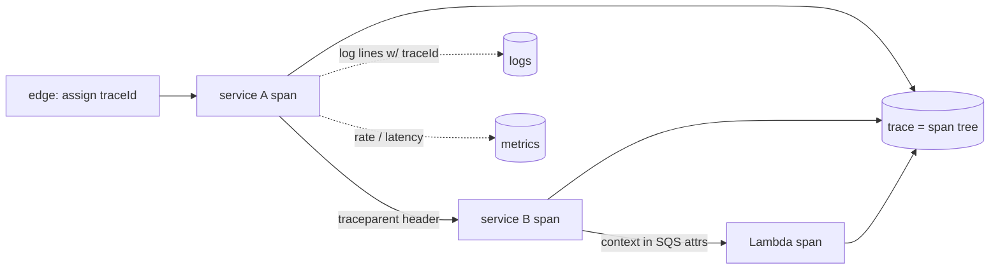

## Thesis

Making a running system explainable from the outside --- structured logs, metrics, and traces emitted as first-class data and correlated by an id that follows a request across service and Lambda boundaries --- so you can answer "what is happening and why" for a request you have never seen, without redeploying to add a print statement, while the telemetry never breaks the business logic and never costs more than the system it watches.

## Sub

**The three pillars --- logs, metrics, traces** -> **structured logging and correlation** -> **distributed tracing: spans plus propagation** -> **zoom out** to health checks, sampling, and cost, and the pivots an interviewer rides from "add logging" into logs-vs-metrics-vs-traces, cardinality, and how a trace survives a Lambda boundary.

## Spine

- The three pillars are **logs, metrics, and traces** --- logs are discrete events, metrics are aggregatable numbers over time, traces are the causal path of one request; each answers a different question and you need all three.
- Logs must be **structured and correlated** --- JSON with a trace id on every line, so logs are queryable data you can stitch across services, not free text you grep.
- A trace is **spans plus propagation** --- each service records a span and passes the trace context across the wire (and across a Lambda boundary) so the spans reassemble into one end-to-end timeline.
- Instrumentation must be **safe and cheap** --- telemetry falls back to no-ops when the collector is down so it can't break business logic, and labels stay low-cardinality so metrics don't explode.

## Companion Notes

### walk

A request made explainable

One request from a structured log line to a reassembled trace --- correlation, span propagation, the Lambda boundary, and the no-op fallback that keeps telemetry from ever breaking the app.

Say the join key first --- "one id on every log line and span ties the three pillars together." Everything else hangs off that.

### drill

Probe Drill

Graded follow-ups on the pillars, structured logging, tracing, and the failure modes --- the ones that separate "add a logger" from an observable system.

Name the no-op fallback --- telemetry that can take down the app is a worse liability than no telemetry.

## Drill

SDE2 | the pillars and the mechanics
SDE3 | tracing, sampling, and cardinality
Staff | shipping, migration, and org calls

### SDE2 | the three pillars

What are the three pillars of observability?

**Logs** --- discrete, timestamped events with detail. **Metrics** --- aggregatable numbers over time (a rate, a latency, a count). **Traces** --- the causal path of one request across services. Each answers a different question: metrics say *how many / how fast* cheaply, logs say *what exactly happened* in one case, traces say *where the time went* end to end. You need all three; none substitutes for another.

### SDE2 | structured logging

What is structured logging and why does it matter?

Emitting logs as JSON key-value objects instead of free-form text --- so a log is *data* you can query (filter by field, aggregate, alert) rather than a string you grep. `level`, `msg`, `traceId`, and the relevant fields are keys, so "all errors for tenant 7 in the last hour" is a query, not a regex. A structured logger like Pino makes this the default. Free-text logs don't scale past one server and a person reading them.

### SDE2 | log levels

What are log levels for?

Severity, so you can separate signal from noise --- debug/info/warn/error. Production runs at `info` (or `warn`) so the volume is affordable, and you drop to `debug` to investigate. Levels also drive routing and alerting: `error` and above page someone; `info` is for context. The level is the first filter that keeps log volume --- the biggest cost driver --- under control.

### SDE2 | health checks

What should a health check actually verify?

Not just "the process is up" but "the service can do its job" --- can it reach its critical dependencies (database, cache, downstream API)? A liveness check answers "am I running"; a readiness check answers "can I serve traffic right now." A health check that only confirms the process is alive passes while the service is useless because its database is unreachable. It has to fail when the service actually can't serve, or it catches nothing.

### SDE2 | metric types

What are the main metric types?

**Counter** --- monotonic, counts events (requests, errors); you read its rate. **Gauge** --- a value that moves up and down (queue depth, connections in use, memory). **Histogram** --- a distribution, so you can compute percentiles (p50, p99 latency). Each models a different measurement: a counter for "how many," a gauge for "how much right now," a histogram for "what's the spread." Using the wrong one (a gauge for latency) loses the percentiles that matter.

### SDE2 | the correlation id

What is a correlation id and why is it essential?

A unique id attached to a request at the edge and propagated through every service and onto every log line and span it touches --- so all the telemetry for one request can be stitched together. Without it, a request that spans five services is five disconnected piles of logs; with it, "show me everything that happened for request X" is one query. It's the thread that makes cross-service observability possible at all.

### SDE2 | logs vs metrics

When do you reach for a log versus a metric?

A **metric** when you want "how many / how fast / how much" cheaply and aggregatably --- request rate, error rate, p99 latency --- the things you graph and alert on. A **log** when you need "what exactly happened in this one case" with full detail --- the parameters, the error, the context. Metrics tell you *that* something is wrong and trends; logs tell you *what* and *why* for a specific occurrence. You alert on metrics and investigate with logs.

### SDE3 | spans and traces

What is a span, and what is a trace?

A **span** is one unit of work --- a service handling a request, a database call, an external API call --- with a start time, duration, and metadata (status, attributes). A **trace** is the tree of spans for one request across all the services it touched, reassembled into an end-to-end timeline. The trace shows where the time and the errors went across a distributed call; a single span is one node in that tree. Tracing is what turns "the request was slow" into "it was slow in the payments service's database call."

### SDE3 | context propagation

How do spans recorded in different services become one trace?

Trace context --- a trace id plus the parent span id --- is passed across every hop, so each service's span is linked to the one that called it. Over HTTP it rides in headers (the W3C `traceparent` header is the standard); over a message queue it rides in message attributes. Each service extracts the incoming context, starts its span as a child, and injects the context when it calls onward. Break the propagation on one hop and the trace splits into two disconnected pieces.

### SDE3 | crossing a Lambda boundary

How does a trace survive an async or Lambda boundary?

There's no live connection, so the context must travel *in the event* --- carried in the SQS message attributes or the invocation payload, then re-extracted when the function starts and used as the parent of the function's span. And AWS-native services propagate X-Ray's own header, not W3C, so a **composite propagator** that reads and writes both formats is what keeps the trace intact across an EventBridge/SQS/Lambda path. Miss the extraction and every Lambda invocation looks like a brand-new root trace.

### SDE3 | sampling

Why sample traces, and how?

Because tracing every request is expensive --- storage and per-request overhead --- so you keep a fraction. **Head sampling** decides at the start of the request (keep 1%, deterministically by trace id so a whole trace is kept or dropped together). **Tail sampling** buffers and decides at the end, keeping all traces that errored or were slow and a sample of the rest. Head is cheap but blind; tail is smarter but needs buffering. Either way you bias toward keeping the interesting traces, because those are the ones you'll want.

### SDE3 | cardinality explosion

What is a cardinality explosion, and how do you avoid it?

A metric with a label that has unbounded distinct values --- user id, request id, email --- creates a separate time series per value, so the series count (and the cost) explodes. Metrics must use **low-cardinality** labels only: status code, route, region, tenant tier. High-cardinality identity belongs in logs and traces, where it's a field, not a series. Putting a user id in a metric label is the classic way to melt a metrics backend and the bill along with it.

### SDE3 | RED and USE

What are the RED and USE methods?

Checklists for *which* metrics actually tell you health. **RED** for request-driven services: **R**ate (requests/sec), **E**rrors (failed/sec), **D**uration (latency distribution). **USE** for resources: **U**tilization, **S**aturation, **E**rrors. They cut through "we have 500 metrics" to the handful that describe whether a service or a resource is healthy, so you dashboard and alert on those first instead of drowning in noise.

### SDE3 | log-trace correlation

How do the three pillars connect to each other?

Through the shared id --- the trace id is injected into every log line (Pino log correlation) and is the id of the trace, so the pillars cross-reference. From a slow trace you jump to that request's logs for the detail; from an error log you pull up the full trace to see where it sat in the request; from a metric spike you find an exemplar trace. The id is the join key: without it the three pillars are three silos, with it they're one story told three ways.

### Staff | three-tier audit shipping

How do you ship high-volume audit or telemetry reliably without losing it or blocking the request?

A tiered pipeline that decouples the hot path from the durable sink: **buffer in memory** first (fast, non-blocking, so the request never waits on I/O), **flush to a database** for durability (survives a restart), then **ship to a stream** for analytics and long-term storage. Each tier absorbs the next one's slowness or unavailability --- if the stream is down, the database tier holds; if the database is briefly slow, the memory buffer absorbs it. The request path only ever touches the fast in-memory tier. It's back-pressure and durability without making telemetry a synchronous cost.

### Staff | APM to OpenTelemetry migration

How do you migrate from a vendor APM to OpenTelemetry without a big-bang cutover?

Run **dual-mode**: instrument the code with OpenTelemetry (vendor-neutral), and configure it to export to *both* the incumbent vendor and the new backend in parallel. You validate that the new backend shows parity with the old dashboards, then flip the exporter and remove the vendor SDK. The key is that OTel **decouples instrumentation from the backend** --- once the code emits OTel, the destination is a config change, not a re-instrumentation. So the migration is a gradual exporter switch, never a rewrite, and you're never flying blind during the transition.

### Staff | no-op telemetry fallbacks

How do you make sure telemetry can never break business logic?

**No-op fallback factories**: if the tracer or meter isn't initialized --- the collector is down, or a shared library is used somewhere telemetry was never set up --- the telemetry API returns objects whose methods do nothing. So business code calls `startSpan()` / `recordMetric()` unconditionally, with no "is telemetry available" branch, and the worst case of a telemetry outage is *missing data*, never a thrown error or a blocked request. Observability must be a strictly optional side-channel; the moment it's a hard dependency, it becomes a new way to take the system down.

### Staff | SLIs from telemetry

How does telemetry become SLIs and SLOs?

An **SLI** is a metric derived from telemetry that measures user-visible behavior --- success rate, p99 latency --- and an **SLO** is a target for it (99.9% success). The subtlety is that the telemetry has to be *accurate and representative*: measured at the right boundary (what the user experiences, not an internal hop), counting the right thing (a 200 with an error body is not a success). Garbage in, garbage SLO --- an SLO computed from telemetry that measures the wrong layer will look healthy while users suffer, which is the whole failure mode of measuring at the wrong place.

### Staff | the cost of observability

What is the cost model of observability, and how do you control it?

Telemetry can cost as much as the system it observes: **log volume** (bytes x retention), **metric cardinality** (series count), **trace sampling** (kept traces), and retention on all three. You budget it deliberately --- run logs at an appropriate level, sample traces (tail-sample to keep the interesting ones cheaply), cap cardinality, and tier retention (hot for recent, cold/archived for old). "Log everything forever at full fidelity" is unaffordable at scale, so observability is an engineering trade-off between insight and spend, not a free add-on.

### Staff | alert on symptoms

What should you alert a human on?

User-facing **symptoms** --- error rate, latency SLO burn, a queue that's not draining --- not internal **causes** like high CPU. Causes fire noisy pages for conditions that may not affect anyone (CPU can be pegged and users fine), and they only catch problems you predicted; a symptom alert catches the failure you didn't foresee because it watches the outcome. Cause metrics are for *diagnosis* after a symptom fires. Paging on causes trains people to ignore the pager, which is worse than no alert.

### Staff | when monitoring lies

When does your monitoring lie to you, and how do you guard against it?

When it measures the wrong thing. The classic case: an APM shows all HTTP 200s and green dashboards while the response bodies carry errors --- because the instrumentation only saw the status code, not the payload. The dashboard is honest about what it measured and blind to what it didn't. The guards are: **instrument at the layer where failure actually manifests** (check the response body / business outcome, not just the transport status), and **cross-check pillars** --- if metrics are green but users complain and logs show errors, the metrics are measuring the wrong boundary. A green dashboard is evidence, not proof, of health.

## Walk

### A request emits a structured, correlated log

```flow
r[request at edge] -> id[attach trace id] -> log[structured JSON line]
```

At the edge, the request gets a trace id, and every log line it produces is a JSON object carrying that id --- not a free-text string. The log is data: queryable by field, aggregatable, alertable.

```json
{ "level": "info", "traceId": "a1b2c3", "tenant": 7, "route": "/orders", "ms": 42, "msg": "order created" }
```

That `traceId` is the thread the whole rest of observability hangs on --- it's on every log line, and it's the id of the trace. One field turns five services' worth of disconnected logs into one queryable story, which is why structured-and-correlated is the foundation, not a nicety.

### A span records the work and propagates context

```flow
s[start span] -> w[do the work] -> p[inject context downstream]
```

Each service records a span for its unit of work --- start, duration, status --- and when it calls onward, it injects the trace context so the next service's span links as a child. The spans reassemble into one end-to-end trace.

```ts
const span = tracer.startSpan("createOrder", { attributes: { tenant } });
try { await handle(req); }
finally { span.end(); }   // duration + status recorded; context propagates on the outbound call
```

The trace is what turns "the request was slow" into "it spent 300ms in the payments service's database call." A single span is one node; propagation across every hop is what makes the tree whole --- and a break on any hop splits the trace into disconnected pieces.

### The trace crosses a Lambda boundary

```flow
c[context into message] -> l[Lambda extracts it] -> sp[span linked to parent]
```

Across an async boundary there's no live connection, so the context has to travel *inside the event* --- in the SQS message attributes or the invocation payload --- and be re-extracted when the function starts, then used as the parent of the function's span.

AWS-native services carry X-Ray's own trace header, not the W3C one, so a composite propagator that reads and writes *both* formats is what keeps a trace intact across an EventBridge to SQS to Lambda path. Miss the extraction and every invocation looks like a brand-new root trace, and the end-to-end timeline you wanted is gone.

### Telemetry is safe and never blocks

```flow
d[collector down] -> n[calls become no-ops] -> b[business logic unaffected]
```

Telemetry is a side-channel, never a hard dependency. If the tracer or meter isn't initialized --- collector down, or a shared library used where telemetry was never set up --- the API returns no-op objects, so business code calls the same telemetry methods unconditionally and the worst case is *missing data*, never a thrown error.

And on the hot path, high-volume audit data goes to a memory buffer first, then flushes to a database, then ships to a stream --- each tier absorbing the next's slowness, so the request never waits on the durable sink. The rule across both: observability that can take the system down is a worse liability than no observability, so it's built to fail open and stay off the critical path.

### Model Script

- Frame the pillars | "Observability is answering 'what is happening and why' for a request I've never seen, from the outside. Three pillars: logs are discrete events with detail, metrics are aggregatable numbers for rates and latencies, traces are the causal path of one request across services. I need all three -- metrics tell me *that* something's wrong, logs tell me *what*, traces tell me *where*."
- The join key | "The thing that ties them together is one correlation id -- a trace id attached at the edge and propagated onto every log line and span. Without it a request across five services is five disconnected piles; with it, 'everything that happened for request X' is one query. Structured JSON logs, not free text, so logs are queryable data."
- Tracing and propagation | "A trace is a tree of spans -- each service records a span and injects the trace context on the way out, so the spans reassemble end to end. Over HTTP that's the W3C traceparent header; over a queue it's message attributes. And across a Lambda boundary the context has to ride inside the event and be re-extracted, with a composite propagator handling both W3C and X-Ray, or every invocation looks like a new root trace."
- Safety and cost | "Two things I insist on. Telemetry never breaks business logic -- no-op fallbacks so if the collector's down the calls do nothing and the worst case is missing data, never a blocked request. And it's a real cost -- log volume, metric cardinality, trace sampling -- so I sample traces, keep metric labels low-cardinality, and tier retention. Observability that can take the system down, or that costs more than the system, is a failure."
- Interviewer: "Your dashboards are all green but users are reporting errors. What's going on?"
- When monitoring lies | "The monitoring is measuring the wrong thing -- classically an APM showing all HTTP 200s while the response bodies carry errors, because it only saw the status code. The fix is to instrument at the layer where failure actually manifests -- check the business outcome, not just the transport status -- and to cross-check pillars: green metrics plus error logs plus user complaints means the metrics are watching the wrong boundary. A green dashboard is evidence, not proof."
- Land it | "So: three pillars joined by one correlation id, structured logs, traces reassembled via propagated context that survives the Lambda boundary, sampled for cost, with low-cardinality metrics -- and the whole thing built to fail open and stay off the hot path. The one line is that observability makes an unfamiliar request explainable without a redeploy, and it must never become a way to take the system down."

## Whiteboard

Sketch the correlated request across services and mark the join key.

### What ties logs, metrics, and traces together?

One correlation id -- the trace id -- attached at the edge and propagated onto every log line and span, so the three pillars cross-reference into one story.

### How does a trace survive an async boundary?

The trace context travels inside the event (message attributes / payload) and is re-extracted on the other side; a composite propagator handles both W3C and X-Ray.



Verdict: one id threads logs, metrics, and traces; spans reassemble via propagated context; the context must ride inside the event to cross a Lambda boundary.

## System

Zoom out to where telemetry sits relative to the request path.

### Where it sits

Request path: business logic, never blocked by telemetry [*]
Instrumentation: logs, metrics, spans emitted as a side-channel
Correlation id: threaded through every pillar
Collector / exporter: OTel, vendor-neutral, destination is config
Backend + retention: tiered storage, sampled traces, capped cardinality

### Pivots an interviewer rides

From "add logging" they push on the pillars, propagation, and the failure modes.

#### A log, a metric, or a trace?

-> metric for rates/latency and alerts, log for the detail of one case, trace for where the time went
Each pillar answers a different question and none substitutes for another. You alert on metrics, investigate with logs, and localize latency and errors across services with traces -- joined by the shared correlation id.

#### What happens when the telemetry backend is down?

-> nothing, by design -- calls become no-ops and the request is unaffected
No-op fallbacks make telemetry strictly optional, and on the hot path a memory-buffer-then-database-then-stream pipeline keeps the request off the durable sink. Observability fails open; it is never a hard dependency.

## Trade-offs

The calls that separate "add a logger" from an observable system.

### Metrics vs logs vs traces

- Metrics: cheap, aggregatable, great for alerts and trends -- but no per-case detail
- Logs: full detail for one occurrence -- but expensive at volume and not aggregatable
- Traces: end-to-end latency and error localization across services -- but overhead, so sampled

Use metrics to detect and alert, logs to investigate the specific case, traces to localize across services; the correlation id lets you move between them.

### Head vs tail sampling

- Head sampling: decide at the start, cheap and simple -- but blind, may drop the traces that errored
- Tail sampling: decide at the end, keeps all errored/slow traces -- but needs buffering and more infrastructure

Head-sample for cost and simplicity at low overhead; tail-sample when you must guarantee every error and slow request is captured.

### Instrument everything vs budget it

- Everything at full fidelity: maximum insight -- but telemetry can cost as much as the system, and cardinality explodes
- Budgeted: levels, sampling, low-cardinality labels, tiered retention -- less raw data, but affordable and still answers the questions

Always budget at scale: sample traces, cap cardinality, tier retention; "log everything forever" is a bill, not a strategy.

## Model Answers

### the pillars | Three views, one id

The frame to lead with.

- Three pillars | key | logs (events), metrics (numbers), traces (paths)
- One correlation id | store | trace id on every line and span
- Move between them | note | detect on metrics, investigate on logs, localize on traces

### safety and cost | Fail open, budget it

The two things I insist on.

- No-op fallbacks | key | telemetry never breaks or blocks business logic
- Off the hot path | store | memory -> database -> stream, request never waits
- Budget the spend | note | sample traces, cap cardinality, tier retention

## Numbers

Back-of-envelope the telemetry volume and what sampling and cardinality control.

Every request emits a structured log line and (when sampled) a trace; the volume x retention is the cost, and metric cardinality is the other cost lever.

- rps | Requests/sec | 10000 | 0 | 500
- logBytes | Log bytes/request | 2000 | 0 | 100
- sampleRate | Trace sample (%) | 1 | 0 | 1

```js
function (vals, fmt) {
  var rps = vals.rps, logBytes = vals.logBytes, sampleRate = vals.sampleRate;
  return [
    { k: 'Log volume', v: fmt.n(rps * logBytes), u: 'B/s (' + fmt.n(Math.round(rps * logBytes * 86400 / 1e9)) + ' GB/day)', n: 'structured logs are the biggest cost driver \u2014 volume times retention \u2014 which is why levels, sampling, and tiered retention matter', over: rps * logBytes > 50000000 },
    { k: 'Traces kept/sec', v: fmt.n(Math.round(rps * sampleRate / 100)), u: 'traces/s', n: 'at ' + sampleRate + '% head sampling you keep this many; tail sampling keeps every errored or slow trace on top of it', over: false },
    { k: 'Sampling saves', v: fmt.n(100 - sampleRate) + '%', u: 'of trace storage', n: 'tracing every request is unaffordable \u2014 sampling trades completeness for cost, biased to keep the interesting traces', over: false },
    { k: 'Correlation id', v: 'every line + span', u: '', n: 'the trace id on every log line and span is the join key across the three pillars \u2014 jump from a slow trace straight to its logs', over: false },
    { k: 'Cardinality guard', v: 'low-card labels', u: '', n: 'a per-user or per-request metric label multiplies time series without bound \u2014 keep labels to status/route/region and put identity in logs and traces', over: false }
  ];
}
```

## Red Flags

What makes an interviewer wince.

### "If the collector is down, telemetry throws and the request fails"

Then observability is a hard dependency and a new way to take the system down -- worse than having none.

Use no-op fallbacks so telemetry calls do nothing when uninitialized, and keep the hot path off the durable sink; the worst case must be missing data, never a blocked request.

### "We label the request metric by user id so we can slice per user"

That's an unbounded-cardinality label -- one time series per user -- which melts the metrics backend and the bill.

Keep metric labels low-cardinality (status, route, region); put user id and request id in logs and traces where they're a field, not a series.

### "The dashboards are green, so the system is healthy"

A dashboard is honest only about what it measured -- an APM showing 200s can be blind to error bodies, so green is not proof.

Instrument at the layer where failure manifests (the business outcome, not just the transport status) and cross-check pillars when metrics disagree with logs and users.

## Opener

### 30s | The one-liner

How I open when asked to make a system observable.

#### What is the shape?

Three pillars -- logs, metrics, traces -- joined by one correlation id threaded through every service, so an unfamiliar request is explainable without a redeploy.

#### What do I insist on?

Telemetry that fails open (no-op fallbacks, off the hot path) and is budgeted (sampled traces, low-cardinality metrics), so it never breaks or outspends the system.

##### Hooks

Where an interviewer usually pushes next.

- Log, metric, or trace? | different question each | trade
- Cross a Lambda boundary? | context in the event + composite propagator | drill
- Backend down? | no-op fallback, fail open | drill

Foot: two sentences -- one correlation id ties the three pillars into one story, and telemetry must fail open and stay off the critical path.

## Bank

### SCALE | Ten thousand requests a second, each logging and maybe traced

Task: size the telemetry volume and the cost levers.
Model: every request emits a structured log line (volume x retention is the dominant cost) and, at the sampling rate, a trace; metric cardinality is the other lever, so labels stay low-cardinality and traces are sampled with tiered retention.
Int: what melts a metrics backend fastest?
A high-cardinality label like user id -- one time series per value; identity belongs in logs and traces.

### DESIGN | Make a multi-service, Lambda-based flow explainable end to end

Task: design the observability for a request crossing services and a Lambda.
Model: a correlation id assigned at the edge and propagated onto every log line and span; structured JSON logs; spans reassembled via propagated trace context, carried inside the event across the Lambda boundary with a composite W3C+X-Ray propagator; sampled traces; no-op fallbacks so telemetry never blocks.
Int: how does the trace survive the Lambda hop?
The context rides in the message attributes / payload and is re-extracted as the parent of the function's span.

### Extra Curveballs

### CURVEBALL | lying-dashboard | Metrics are green, no alerts fired, but customers report failures. Where do you look?

Model: the metrics are measuring the wrong boundary -- classically HTTP status only, blind to error response bodies -- so I cross-check pillars: pull the error logs and an exemplar trace for a failing request, confirm where it actually fails, then fix the instrumentation to measure the business outcome (not just the transport status) so the SLI reflects reality. A green dashboard is evidence, not proof, of health.

### Frames

- Three pillars -- logs, metrics, traces -- joined by one correlation id
- A trace is spans plus propagated context; it must ride inside the event to cross a Lambda boundary
- Telemetry fails open (no-op fallbacks, off the hot path) and is budgeted (sampling, low cardinality)
