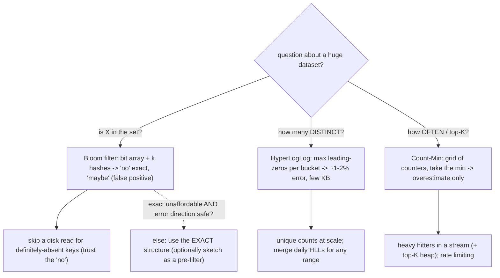

## Thesis

Probabilistic data structures answer questions about massive datasets **approximately, in a tiny fraction of the memory** an exact answer would need, by trading a small, bounded, tunable error for enormous space savings. The three canonical ones each answer a different question: **Bloom filters** --- set membership ("have I seen this?"), with no false negatives but a tunable false-positive rate; **HyperLogLog** --- cardinality ("how many *distinct*?"), in a few kilobytes regardless of set size; **Count-Min Sketch** --- frequency ("how many times, and who are the heavy hitters?"), in sublinear space. The core idea is that many real questions at scale --- deduplication, "does this key exist before I pay for a disk read," unique visitors, top-K, rate/frequency estimation --- do not need an exact answer, and hashing-based sketches deliver a good-enough answer in constant or logarithmic memory where an exact structure (a hash set of every element, a counter per key) would need gigabytes. The design skill is recognizing when **approximate-but-tiny beats exact-but-huge**, choosing the structure by the question, and sizing it to an acceptable error.

## Sub

**Why: exact answers to "seen it? / how many distinct? / how often?" cost too much memory at scale** -> **Bloom (membership) / HyperLogLog (cardinality) / Count-Min (frequency), each hashing into a compact array** -> **each trades a bounded, tunable error for constant-or-log space** -> **zoom out** to where they sit in real systems (LSM databases, caches, networks, streams), when the error is acceptable, mergeability across shards, and when you must not use them.

## Spine

- **Probabilistic structures trade a bounded error for enormous space savings** --- they answer set/count questions over massive data in a tiny, often constant, amount of memory by accepting a small, tunable inaccuracy --- because at scale an exact answer (a set of every element, a counter per key) needs far more memory than you can afford, especially on the hot path.
- **Each canonical structure answers one specific question** --- **Bloom filter**: "have I *possibly* seen this?" (membership; no false negatives, tunable false positives); **HyperLogLog**: "how many *distinct* elements?" (cardinality in a few KB); **Count-Min Sketch**: "how many times / who are the top-K?" (frequency; overestimates only, never under).
- **They work by hashing into a compact array, and the error is tunable by size** --- a Bloom filter sets bits at several hash positions and answers "definitely not / maybe yes"; HyperLogLog estimates cardinality from the longest run of leading zeros seen across hashed values; Count-Min hashes into a grid of counters and reports the minimum --- and you dial accuracy by how much memory you give it.
- **The skill is recognizing when approximate-but-tiny beats exact-but-huge** --- reach for them when the question tolerates a small, known error and the exact structure will not fit (or fit in the hot path): a Bloom filter to skip a disk/DB lookup for a definitely-absent key, HyperLogLog for unique counts at web scale, Count-Min for heavy hitters in a stream --- and *do not* when you need exactness or the dataset is small enough to count exactly.

## Companion Notes

### walk

Answering set and count questions at scale without the memory

One system walked from an exact-but-impossible in-memory structure to a probabilistic one --- why exact answers cost too much memory at scale, how Bloom filters (membership), HyperLogLog (cardinality), and Count-Min Sketch (frequency) each answer one question in tiny space, how they work by hashing into a compact array, and how you size them to an acceptable error and place them where the space win matters.

Say it as one trade and three questions: probabilistic structures trade a small bounded error for huge space savings, and the three canonical ones answer membership (Bloom), distinct-count (HyperLogLog), and frequency/top-K (Count-Min) -- each in constant-or-log memory, tuned by size.

### drill

Probabilistic structures reps

Graded reps on Bloom filters, HyperLogLog, and Count-Min Sketch --- what each answers, how each works, their error models, mergeability, and where they sit in real systems --- the ones that separate "we cache membership" from choosing the right sketch for the question at an acceptable error.

Anchor on the trade (bounded error for constant-or-log space) and the three questions: membership (Bloom -- no false negatives, tunable false positives), cardinality (HLL -- a few KB for billions), frequency/top-K (Count-Min -- overestimates only) -- and when exact is required instead.

## Drill

SDE2 | the trade, Bloom / HLL / Count-Min basics, a use case
SDE3 | false-positive tuning, error models, how HLL/CMS work, merging
Staff | Bloom in databases, HLL/CMS at scale, error budget, when not to

### SDE2 | what a probabilistic data structure is

What is a probabilistic data structure, and what fundamental trade does it make?

A probabilistic (or "approximate," or "sketch") data structure answers a question about a dataset **approximately, using far less memory than an exact answer would require**, by accepting a small, **bounded, and tunable** error. The fundamental trade is **space for accuracy**: instead of storing enough information to answer exactly (which at scale can mean gigabytes --- every element in a set, a counter for every key), it stores a compact summary (a "sketch") that answers the question with a known, controllable error rate in a tiny, often *constant*, amount of memory. The error is not arbitrary --- it is characterized (e.g. "false positives at most 1%," "cardinality within 2% of the true count") and you can **tune it by how much memory you allocate** (more memory -> less error). The reason these exist and matter is that many questions at scale genuinely tolerate a small error: knowing unique visitors "within 2%" is fine for analytics; knowing a key is "probably present" (to decide whether to bother reading disk) is fine because you verify on the rare read; knowing the approximate top-K heavy hitters is fine for monitoring. When the exact answer is unaffordable (won't fit in memory, or won't fit in the hot path's latency budget) and the question tolerates a small error, a probabilistic structure turns an impossible exact computation into a cheap approximate one. The three canonical examples --- Bloom filter (membership), HyperLogLog (cardinality), Count-Min Sketch (frequency) --- each apply this trade to a specific kind of question.

### SDE2 | what a Bloom filter does

What question does a Bloom filter answer, and what are its guarantees?

A Bloom filter answers **set membership**: "is this element in the set?" --- but *approximately*, with a very specific and asymmetric guarantee. It can tell you an element is **"definitely not in the set"** (a *negative* is always correct --- **no false negatives**) or **"possibly in the set"** (a *positive* might be wrong --- **false positives** are possible at a tunable rate). So the two answers mean: **"no" = certainly absent** (you can trust it completely), and **"yes" = probably present, but might be a false positive** (you cannot fully trust it without checking). What it buys is **tiny memory** --- it represents membership of a huge set in a small bit array, orders of magnitude smaller than storing the elements themselves --- and **fast, constant-time** add and query (a few hashes). What it cannot do: give false negatives (by design --- this is what makes it useful, as we'll see), tell you *which* elements are in the set (it only answers yes/no for a queried element, it doesn't enumerate), count occurrences, or (in the basic version) support deletion. The asymmetry is the whole point and dictates its use: because a "no" is certain, a Bloom filter is perfect for **cheaply ruling things out** --- checking it first to avoid an expensive operation (a disk read, a network call) for elements that are definitely absent, and only doing the expensive check when it says "maybe." You accept occasional false positives (a needless expensive check) in exchange for skipping the expensive check for the (often majority) definitely-absent cases, in a fraction of the memory an exact set would use.

### SDE2 | how a Bloom filter works

Mechanically, how does a Bloom filter store and check membership?

It's a **bit array** of size m (all bits initially 0) plus **k independent hash functions**. **To add an element**: hash it with each of the k hash functions to get k positions in the bit array, and **set those k bits to 1**. **To check an element**: hash it with the same k functions to get k positions, and check whether **all k of those bits are 1**. If **any** of the k bits is 0, the element is **definitely not** in the set (because adding it would have set all k --- so a 0 anywhere proves it was never added: this is why there are no false negatives). If **all k bits are 1**, the element is **possibly** in the set --- but those bits might all have been set by *other* elements' insertions coincidentally, which is a **false positive**. That's the entire mechanism: adds set bits, queries check bits, "any bit 0 -> definitely no," "all bits 1 -> maybe yes." The false-positive rate depends on how full the bit array is: as you add more elements, more bits become 1, so more queries find all-bits-1 by chance --- which is why the array size m and hash count k must be chosen for the expected number of elements n and desired false-positive rate. Note the asymmetry falls directly out of the mechanism: you only ever *set* bits (never clear them), so a bit that's 0 could never have been part of an added element (no false negatives), while a bit that's 1 could have been set by anyone (false positives). This also explains why basic Bloom filters can't delete: clearing an element's bits might clear a bit another element relies on, creating a false negative --- which the whole design forbids.

### SDE2 | what HyperLogLog does

What question does HyperLogLog answer, and why is it remarkable?

HyperLogLog answers **cardinality --- "how many *distinct* elements are in this set?"** (count-distinct / unique count) --- approximately, and it's remarkable because it does so in a **tiny, fixed amount of memory regardless of how many distinct elements there are**. Counting distinct elements exactly requires remembering every distinct element you've seen (a hash set), so the memory grows with the number of distinct elements --- counting a billion distinct items exactly needs memory proportional to a billion items. HyperLogLog estimates the same count using a **fixed few kilobytes** (commonly ~12 KB) --- for a billion distinct elements or a trillion, the memory is the same small constant --- with a typical error of around **1-2%**. That's the remarkable property: **constant memory for unbounded cardinality**, trading a couple percent of accuracy for going from "memory proportional to the distinct count" to "a fixed tiny footprint." Use cases are everywhere at scale: unique visitors to a site, distinct users who performed an action, unique IPs, distinct search queries --- any "how many different X" over a huge stream where an exact hash set would be enormous and a ~1-2% error is perfectly acceptable. It's the standard tool for count-distinct at scale (Redis exposes it directly via PFADD/PFCOUNT, databases like Redshift and BigQuery use it under approximate-count-distinct functions), precisely because exact distinct-counting is memory-prohibitive and the approximate answer is almost always good enough for the analytics and monitoring questions it serves.

### SDE2 | what Count-Min Sketch does

What question does a Count-Min Sketch answer, and what is its error direction?

A Count-Min Sketch answers **frequency --- "how many times has this element appeared?"** (and, by extension, "who are the most frequent / heavy hitters?") --- approximately, in **sublinear memory** (far less than a counter per distinct key). Instead of maintaining an exact count for every distinct element (which needs memory proportional to the number of distinct keys --- huge for a high-cardinality stream), it maintains a small fixed-size grid of counters and estimates any element's count from it. Its error has a **specific, one-sided direction: it may *overestimate* a count, but never *underestimate*** --- the reported count is always **>= the true count** (an upper bound). This is because collisions (different elements hashing to the same counter) can only *add* to a counter, never remove, so an element's estimate can be inflated by others' increments but never deflated. That one-sided error is important: you know the true count is *at most* what the sketch reports, which is exactly right for "heavy hitter" detection (if the sketch says an element is frequent, it might be inflated, but if it says an element is rare, it truly is rare) --- you won't miss a genuine heavy hitter, you might occasionally over-count a light one. Use cases: finding the most frequent items in a stream (top-K / heavy hitters) --- trending searches, most-accessed keys, most-active IPs --- frequency-based rate limiting, and network traffic monitoring, all at a scale where an exact per-key counter table would be too large and a slight overestimate is acceptable. It's the frequency counterpart to Bloom (membership) and HyperLogLog (cardinality): the three cover the three most common "at scale, approximately" questions.

### SDE2 | a real Bloom filter use case

Give a concrete, high-value use of a Bloom filter and explain why it fits.

The canonical one: **skipping an expensive lookup for elements that are definitely absent** --- most importantly, **avoiding disk reads in a storage engine**. In an LSM-tree database (Cassandra, RocksDB, LevelDB, HBase, Bigtable), data lives in many on-disk sorted files (SSTables), and a read for a key may have to check several of them. Reading a file from disk to discover the key **isn't there** is wasted, expensive I/O. So each SSTable keeps a **Bloom filter over the keys it contains**, in memory. On a read, the engine checks the Bloom filter first: if it says **"definitely not present," the engine skips that SSTable entirely --- no disk read** --- and only reads the file when the filter says "maybe." Since a "no" is guaranteed correct (no false negatives), this **never causes a missed key** (you'd never skip a file that actually has the key), and it **eliminates the vast majority of pointless disk reads** for absent keys, dramatically speeding up reads (especially negative lookups). The occasional false positive just means an occasional unnecessary disk read (you read the file, don't find the key --- a small, bounded cost). It fits perfectly because: the question is pure membership ("is this key in this file?"), a "no" must be trustworthy (skipping a file that had the key would be a correctness bug --- and Bloom's no-false-negatives guarantee ensures that never happens), a small false-positive rate is cheap (a rare wasted disk read), and the memory is tiny (a compact filter per file vs the file's full key set). Other fits with the same shape: a CDN/cache checking "have we ever cached this?" before a lookup, a web crawler checking "have I seen this URL?" before enqueuing, a database checking "might this username exist?" before a query --- all cases where you want to cheaply rule out the definitely-absent majority and only pay the expensive check for "maybe."

### SDE2 | why exact is too expensive at scale

Why can't you just use exact structures (a hash set, a counter per key) at scale?

Because their memory grows with the data, and at scale that memory becomes **unaffordable --- especially in the hot path**. An **exact membership set** stores every element, so its memory is proportional to the number of elements: a set of a billion URLs or keys is many gigabytes --- too large to keep in memory per-node, per-file, or per-request where you need the check to be fast. An **exact distinct count** likewise must remember every distinct value seen (to know it's distinct), so counting distinct users/IPs/queries over a huge stream needs memory proportional to the cardinality --- again gigabytes for billions of distinct values. An **exact frequency table** needs a counter per distinct key, so counting occurrences over a high-cardinality stream (every URL, every IP) needs memory proportional to the number of distinct keys --- potentially enormous. The problem is acute in three situations: **memory limits** (the exact structure simply doesn't fit in RAM, or fits only by dominating memory you need for other things); **many instances** (you need the structure per-shard, per-file, or per-window --- a Bloom filter per SSTable, a distinct-count per time bucket --- so even a "medium" exact structure multiplied by thousands of instances is huge); and **the hot path** (the check must happen on every request/read at low latency, so it must be small and fast, which a giant exact structure isn't). Probabilistic structures collapse this: constant or logarithmic memory regardless of scale, for a small bounded error. So the reason to reach for them is precisely that the exact answer's memory has become the bottleneck --- and the question tolerates approximation. If the data is small enough that the exact structure fits comfortably and is fast, you should just use the exact structure (approximate structures add error and complexity for no benefit); it's specifically the scale that forces the trade.

### SDE3 | Bloom filter false-positive rate and tuning

How do you tune a Bloom filter's false-positive rate, and what governs it?

The false-positive rate is governed by three quantities: **n** (the number of elements you'll insert), **m** (the number of bits in the array), and **k** (the number of hash functions) --- and you tune it by choosing **m** and **k** for your expected **n** and target rate. The intuition: the false-positive rate is essentially the probability that all k bits for a non-member happen to be 1, which rises as the array fills up. So (1) **more bits (larger m) for a given n -> lower false-positive rate** --- a sparser array means fewer coincidental all-ones; the array size is the primary lever, and the rate drops roughly exponentially as you add bits per element (a common rule of thumb: ~10 bits per element gives ~1% false positives). (2) **k has an optimal value**: too few hash functions and each query checks too few bits (easy to coincidentally match); too many and you set too many bits per insert (filling the array faster, raising collisions) --- the optimum is **k = (m/n) ln 2** (about 0.7 times bits-per-element), which minimizes the false-positive rate for a given m and n. The practical formulas: given a target false-positive rate p and expected n, the optimal number of bits is **m = -(n ln p) / (ln 2)^2**, and the optimal hash count is **k = (m/n) ln 2**. So tuning is: decide your acceptable false-positive rate and your expected element count, compute the required bits (which sets the memory) and the optimal number of hash functions. The key relationships to convey: **memory (bits per element) is the main dial for accuracy** (more bits -> exponentially fewer false positives), **k has a sweet spot** (not "more hashes = better"), and **the filter is sized for a specific n** --- exceed the expected n and it fills up and the false-positive rate degrades (which is why you either size for the max, or use a scalable/rebuilt filter when the set grows beyond plan).

### SDE3 | no false negatives but false positives

Why does a Bloom filter guarantee no false negatives but allow false positives? Explain from the mechanism.

It falls directly out of the fact that **you only ever set bits to 1, never clear them**. **No false negatives**: when you add an element, you set all k of its bit positions to 1, and those bits are *never* turned back to 0 (basic Bloom filters don't clear bits). So if an element was ever added, all k of its positions are guaranteed to still be 1 --- meaning a membership check for it will find all k bits set and answer "maybe present." It is therefore **impossible** for a query on a genuinely-added element to find a 0 bit and wrongly say "no" --- a "no" answer (some bit is 0) can only occur for an element that was never added (because if it had been added, that bit would be 1). Hence a "no" is always correct: **no false negatives**. **False positives**: a "yes" (all k bits set) doesn't prove *this* element set those bits --- the k bits could each have been set to 1 by the insertions of *other, different* elements that happened to hash to those positions. When a non-member's k positions all coincidentally happen to be 1 (set by others), the filter answers "maybe present" for an element that was never added --- a **false positive**. So the asymmetry is structural: setting-only bits means "added" definitely implies "all bits 1" (so "a 0 bit" definitely implies "not added" -> no false negatives), but "all bits 1" doesn't definitely imply "added" (others could have set them -> false positives). This is exactly why Bloom filters are used to *rule out* (trust the "no") rather than *confirm* (verify the "maybe"), and why deletion breaks them: clearing an element's bits could clear a bit that another still-present element depends on, which would make *that* element's query find a 0 and falsely answer "no" --- introducing the false negative the whole structure is built to preclude.

### SDE3 | Bloom filter limitations and the counting variant

What are the main limitations of a basic Bloom filter, and how does a counting Bloom filter address one of them?

The main limitations: **(1) No deletion** --- you can't remove an element, because clearing its k bits might clear a bit shared with another present element, creating a false negative (which the design forbids); so a basic Bloom filter only grows (add-and-query, never delete). **(2) No counting / frequency** --- it answers yes/no membership only, not "how many times was this added" (that's Count-Min's job). **(3) Can't enumerate** --- it can't list the elements it contains; it only answers membership for a *queried* element (you must know what to ask about). **(4) Fixed capacity** --- it's sized for an expected n, and if you insert more, it fills up and the false-positive rate degrades (you can't cheaply grow it; you'd rebuild larger or use a *scalable* Bloom filter that chains progressively larger filters). **(5) False positives** are inherent (the accepted trade). The **counting Bloom filter** addresses limitation (1), **deletion**: instead of a bit array, it uses an array of **small counters**. To add an element, **increment** its k counters; to delete, **decrement** its k counters; membership is "are all k counters > 0." Now deletion is safe: decrementing an element's counters doesn't wrongly zero a position another element needs, because that other element's insertion also incremented the counter (so it stays > 0 after this decrement) --- the counter tracks *how many* elements set that position, so removing one doesn't erase the others. The cost is **more memory** (counters instead of single bits --- typically 3-4 bits per counter, so several times larger than a plain Bloom filter). So counting Bloom filters trade extra space for deletion support; there are also more space-efficient modern alternatives (the **cuckoo filter**) that support deletion with less overhead. The point to convey: a plain Bloom filter is add-only/membership-only/fixed-capacity, and when you need deletion you move to a counting Bloom filter (counters, more memory) or a cuckoo filter --- each recovering a capability the minimal structure gave up for space.

### SDE3 | how HyperLogLog works

Explain the intuition behind how HyperLogLog estimates cardinality.

The core intuition is a clever observation about **hashing and rare bit patterns**: if you hash each element to a uniformly random bit string, then across many *distinct* elements you'll occasionally see hashes with long runs of **leading zeros**, and *how long the longest run you've seen is* tells you roughly *how many distinct elements* you've seen. Why: a random hash starts with a 0 with probability 1/2, with "00" with probability 1/4, with k leading zeros with probability 1/2^k. So seeing a hash with k leading zeros is a "1-in-2^k" event --- which means you've *probably* processed on the order of 2^k distinct elements to have encountered it (you'd expect to see a 1-in-2^k pattern after about 2^k distinct draws). So the maximum number of leading zeros observed, call it R, gives a cardinality estimate of roughly **2^R**. Crucially, this depends only on **distinct** elements: duplicates hash to the same value and don't change the maximum-leading-zeros (seeing the same element again adds no new information), so the estimate naturally counts *distinct* elements --- and it needs only to remember R (a tiny number), not the elements themselves, which is where the constant memory comes from. A single R is a very noisy estimator, so HyperLogLog **reduces variance by averaging across many buckets**: it uses the first few bits of each hash to assign the element to one of many registers (buckets), each tracking the max-leading-zeros for *its* subset of the hash space, and then combines the registers with a bias-corrected **harmonic mean** to produce the final estimate. Using many registers (say 2^14 = 16384) and averaging brings the error down to the ~1-2% range, and the whole structure is just those registers (each a small count of leading zeros) --- a few kilobytes total, independent of cardinality. So the intuition to convey: **rare leading-zero patterns in hashes reveal scale** (longest run of zeros ~ log2 of the distinct count), **duplicates don't affect it** (so it counts distinct), and **many buckets averaged** turn a noisy single observation into a ~1-2% estimate in constant memory. You don't store elements --- you store "the rarest pattern I've seen, per bucket," which is a logarithmic-sized fingerprint of the cardinality.

### SDE3 | how Count-Min Sketch works

Explain how a Count-Min Sketch estimates frequencies and why it only overestimates.

A Count-Min Sketch is a **2D grid of counters** --- d rows, each row a separate array of w counters, with **d independent hash functions** (one per row). **To record an occurrence** of an element (increment its count): for each of the d rows, hash the element to a column in that row and **increment that counter** --- so each element bumps exactly one counter per row (d counters total, one in each row, at hash-determined columns). **To estimate an element's count**: hash it into each row the same way to find its d counters, and **take the minimum** of those d values. The minimum is the estimate. **Why it only overestimates (never underestimates)**: consider any one row --- the element's counter in that row was incremented every time the element appeared, so it's *at least* the true count; but it may *also* have been incremented by *other* elements that hash to the same column in that row (collisions), so it's the true count **plus** some collision noise --- i.e. each row's counter is an **upper bound** (true count + noise >= true count). Since every row gives an upper bound (each >= true count), taking the **minimum across rows** gives the tightest of these upper bounds --- still >= the true count (you can't go below the true count, because every row already includes all the element's own increments), but with the *least* collision contamination (the minimum picks the row where this element suffered the fewest collisions). So the estimate is always **>= true count** (overestimate only, never under), and the **multiple rows + take-the-minimum** is the variance-reduction trick: any single row can be badly inflated by a collision, but it's unlikely the *same* element collides in *all* d rows, so the minimum is usually close to the truth. Accuracy is tuned by the grid dimensions: **w (width)** controls collision probability (wider rows -> fewer collisions -> less overestimation), and **d (depth/rows)** controls the confidence that the minimum is close (more rows -> lower chance all collided). So the summary: hash into one counter per row and increment; estimate by the minimum across rows; it overestimates because collisions only add and every row includes the element's own count; and width/depth trade memory for tighter/more-confident estimates. This is why it's ideal for heavy hitters --- a reported-frequent element might be slightly inflated, but a genuinely-frequent one can never be reported as rare (its count is always at least the truth), so you never miss a real heavy hitter.

### SDE3 | mergeability across shards

Why is mergeability important for these structures, and how do the three merge?

Mergeability --- the ability to **combine two sketches computed separately into one that represents the union** --- is important because at scale you compute these structures in **parallel or distributed** fashion (per shard, per node, per time window) and need to combine the partial results, and because it lets you compute over sub-ranges and aggregate. All three canonical structures are mergeable, which is a major reason they're practical in distributed systems: **Bloom filter** --- two Bloom filters over the same bit-array size and hash functions merge by a **bitwise OR** (the union filter has a bit set if either had it set), giving a filter representing membership in the union of both sets (with a somewhat higher false-positive rate since it's fuller). So you can build Bloom filters on each shard and OR them into a global membership filter. **HyperLogLog** --- two HLLs merge by taking, **register-by-register, the maximum** (each register tracks max-leading-zeros for its bucket, and the union's max is the max of the two) --- yielding an HLL that estimates the cardinality of the **union** of both sets, with the same accuracy. This is extremely powerful: you can compute distinct counts per shard/per day and merge them to get the distinct count of the union / a date range **without recomputing from raw data** (e.g. store a daily HLL and merge any range of days to get distinct users over that range --- Redis PFMERGE does exactly this). **Count-Min Sketch** --- two CMS of the same dimensions merge by **adding them element-wise** (counter-by-counter sum), giving a sketch of the combined frequencies (the total count of each element across both). So you can maintain per-shard frequency sketches and sum them for global frequencies. The unifying point: because each structure merges cleanly (Bloom by OR, HLL by per-register max, CMS by counter-wise add), you can **compute them independently in parallel and combine the results**, which is what makes them fit distributed and streaming systems --- build partial sketches everywhere, merge to answer globally, and (for HLL especially) **reuse them across arbitrary aggregations** (any union of the pieces) without touching the underlying data again. Mergeability turns them from single-machine tricks into distributed-analytics building blocks.

### SDE3 | choosing the structure by the question

How do you choose among Bloom, HyperLogLog, and Count-Min --- and when do you use none of them?

You choose by **the question being asked**, because each answers a distinct one: **"Is X in the set?" (membership)** -> **Bloom filter** (or cuckoo/counting Bloom if you need deletion) --- when you want to cheaply rule out definitely-absent elements before an expensive check, with a "no" you can trust. **"How many *distinct* X?" (cardinality / count-distinct)** -> **HyperLogLog** --- when you want unique counts (visitors, IPs, distinct keys) at scale in constant memory with ~1-2% error, especially if you need to merge across shards/windows. **"How many times X? / what are the top-K?" (frequency / heavy hitters)** -> **Count-Min Sketch** --- when you want per-element frequencies or the most frequent elements in a stream, in sublinear memory, tolerating overestimation. The mnemonic: **membership -> Bloom, distinct-count -> HLL, frequency -> Count-Min** --- three different questions, three different sketches (and don't mix them up: a Bloom filter can't count, an HLL can't tell you *which* elements or how often, a Count-Min can't give you the distinct count). You use **none of them --- prefer the exact structure --- when**: the dataset is **small enough** that the exact structure (hash set, exact distinct-count, exact counter table) fits comfortably in memory and is fast (approximation adds error and complexity for no benefit); you need an **exact answer** and cannot tolerate error (billing, correctness-critical dedup, anything where a false positive or a 2%-off count is unacceptable); you need capabilities the sketch lacks (enumerate the set, exact counts, guaranteed-correct positives); or debuggability/simplicity matters more than the memory saved and the exact version is affordable. The decision is therefore two-step: **first, does the question tolerate a bounded error and is the exact structure too big/slow?** (if no on either, use exact) --- **then, which question is it?** (membership/cardinality/frequency -> Bloom/HLL/CMS). Reaching for a probabilistic structure when an exact one fits fine is over-engineering; using an exact one where it can't fit is the scaling wall these are built to break.

### Staff | Bloom filters in real databases

Where do Bloom filters show up in real database internals, and why are they so impactful there?

Overwhelmingly in **LSM-tree storage engines** (Cassandra, ScyllaDB, RocksDB, LevelDB, HBase, Bigtable) to **avoid unnecessary disk reads**, which is one of the highest-leverage uses of the structure anywhere. Recall the LSM read problem (the storage-engines topic): writes are buffered in memory and periodically flushed to immutable, sorted on-disk files (SSTables), and over time a key's data (or its absence) may require checking *many* SSTables across levels. A read --- especially for a key that **doesn't exist** or exists in only one file --- would otherwise have to touch multiple SSTables on disk to find out, and disk I/O is the dominant cost. So each SSTable carries an **in-memory Bloom filter over the keys it contains**. On a read, before touching an SSTable's data on disk, the engine queries its Bloom filter: **"definitely not present" -> skip this SSTable entirely (no disk I/O)**; "maybe present" -> read it. Because Bloom filters have **no false negatives**, this is *safe* --- the engine will never skip an SSTable that actually contains the key (which would be a data-loss/correctness bug), so it strictly eliminates *wasted* reads while never missing real data. The impact is large: **negative lookups** (key doesn't exist) become nearly free (the filters rule out every SSTable without any disk read, instead of reading them all to confirm absence), and reads for keys present in few files skip the irrelevant files --- turning a potential multi-SSTable disk scan into one or zero reads. This is why LSM databases are usable for read-heavy and mixed workloads despite the multi-file read amplification: Bloom filters cut the amplification for the common "not here" case. The memory cost is modest (a compact filter per SSTable, tunable --- RocksDB lets you configure bits-per-key, trading memory for a lower false-positive rate) and lives in the block cache. The staff points: (1) it's the **no-false-negatives** guarantee specifically that makes it correct to use for skipping (a false negative would silently lose data; false positives just cost an occasional wasted read); (2) it's most valuable for **negative and sparse lookups** (where it eliminates the most I/O); (3) it's **tunable** (more bits-per-key -> fewer false positives -> fewer wasted reads, at more memory --- an operational dial); and (4) it composes with the LSM design to make the read path affordable. Related database uses include filtering before joins and existence checks, but the SSTable read-skip is the defining one --- a textbook case of a tiny in-memory structure saving enormous disk I/O by cheaply and *safely* ruling out the definitely-absent.

### Staff | HyperLogLog at scale

How is HyperLogLog used in production at scale, and what makes it especially powerful there?

It's the standard production tool for **count-distinct at scale**, and what makes it especially powerful is the combination of **constant memory** and **mergeability**, which together enable distinct-counting over huge, sharded, time-windowed data that would be impossible to do exactly. Concrete production uses: **Redis** exposes HLL directly (**PFADD** to add elements, **PFCOUNT** to get the estimated cardinality, **PFMERGE** to union HLLs) --- so you can maintain a "unique visitors" or "distinct users who did X" counter in ~12 KB that handles unlimited cardinality, incrementally, at Redis speed. **Analytics databases** (BigQuery's APPROX_COUNT_DISTINCT, Redshift, Presto, Druid) use HLL under the hood for approximate distinct counts, because exact COUNT(DISTINCT) over billions of rows is memory- and shuffle-prohibitive while the HLL version is cheap and ~2% accurate. The **mergeability** is the killer feature at scale: because two HLLs union by taking the per-register maximum, you can (1) **compute distinct counts in parallel across shards** and merge them into a global distinct count without moving raw data (each shard emits a tiny HLL, you merge the HLLs); and (2) **store per-time-window HLLs and merge arbitrary ranges** --- keep a daily HLL of distinct users, and get "distinct users over the last 7 days / this month / any custom range" by merging the relevant days' HLLs, **without rescanning the raw events** (which would be enormous). That second property is transformative for analytics: distinct-count is normally *non-additive* (you can't add daily distinct counts to get a weekly distinct count --- users overlap across days), but **HLLs *are* mergeable**, so a pre-aggregated daily HLL lets you answer any date-range distinct-count question by union, turning an expensive re-scan into a cheap merge of tiny sketches. The staff points: (1) HLL makes distinct-count **feasible at web scale** (constant memory vs cardinality-proportional); (2) its **mergeability solves the non-additivity of distinct counts**, enabling pre-aggregation and arbitrary range roll-ups without raw-data rescans (the reason it's foundational in analytics pipelines); (3) the ~1-2% error is **acceptable for the analytics/monitoring questions** it serves (nobody needs unique visitors exact); and (4) it's incrementally updatable and cheap to store, so you keep HLLs as durable pre-aggregates. It's a small structure with an outsized architectural role: distinct-counting at scale, and mergeable pre-aggregation of distinct counts, are things you essentially *cannot* do exactly, and HLL makes both routine.

### Staff | Count-Min for streaming heavy hitters

How is Count-Min Sketch used for streaming heavy-hitters and rate/frequency problems at scale?

It's the go-to structure for **"who/what is most frequent"** over high-volume, high-cardinality streams --- finding **heavy hitters (top-K)** and doing **frequency-based** decisions --- because it tracks approximate per-element frequencies in **sublinear memory** where an exact per-key counter table would be too large. Production shapes: **Heavy hitters / top-K** --- trending searches or hashtags, most-accessed cache keys or database rows, most-requested URLs, most-active users/IPs. You feed each event into the CMS (increment) and, to surface the top-K, pair the sketch with a small **heap of candidate top elements** (the sketch gives each candidate's approximate frequency; the heap keeps the K highest) --- so you find the heavy hitters without a giant exact counter table. The **one-sided error is exactly right here**: the CMS may overestimate but never underestimate, so a genuinely-frequent element is **never reported as infrequent** --- you won't miss a real heavy hitter (you might occasionally over-rank a light one, which is a benign error for "trending" or "hot key" detection). **Frequency-based rate limiting / abuse detection** --- estimate how often an IP/user/key has hit an endpoint recently to throttle heavy senders, in a compact sketch rather than a per-key counter (the overestimate is safe because it errs toward *catching* an abuser, not letting them through). **Network traffic monitoring** --- estimating per-flow packet/byte counts to spot heavy flows in switches/routers where per-flow exact state is infeasible (a foundational use --- CMS came from the networking/streaming-algorithms world for exactly this). **Streaming analytics** --- approximate frequency features over a firehose (Flink, Spark, and streaming systems use CMS/heavy-hitter sketches). The staff points: (1) CMS makes **per-element frequency and top-K feasible at scale** (sublinear memory vs a counter per distinct key); (2) its **overestimate-only error is well-matched** to heavy-hitter and rate-limiting decisions (you never miss a real heavy element / never under-count an abuser, and over-counting a rare one is benign); (3) it's typically **paired with a top-K heap** to actually surface the heavy hitters (the sketch answers "how frequent is this candidate," the heap tracks the leaders); (4) accuracy is **tunable** by width (collision rate) and depth (confidence), traded against memory; and (5) it's **mergeable** (sum sketches), so per-shard frequency sketches combine for global heavy hitters. It's the frequency-domain workhorse: whenever you need "how often / what's hottest" over a stream too large to count exactly, and a slight overestimate is fine, a Count-Min Sketch (usually plus a top-K heap) is the standard answer.

### Staff | the error budget decision

How do you decide whether a probabilistic structure's error is acceptable, and how do you set the error budget?

You decide by asking **"what does being wrong actually cost, and how often?"** --- reasoning explicitly about the **consequence of the error**, its **direction**, and its **rate**, then sizing the structure so the residual error is comfortably within what the use case tolerates. The reasoning, per structure: for a **Bloom filter**, the error is a false positive, whose cost is **an unnecessary expensive operation** (a wasted disk read, a needless lookup) --- almost always *benign and bounded* (you just do the check you'd have done anyway, occasionally), so you can accept a modest false-positive rate (1%, sometimes higher) and tune bits-per-element to hit it; the critical check is that a false *positive* is the only error (the "no" is exact), so the structure must be used where **a wrong "yes" is cheap and a "no" must be trusted** --- if instead you were trusting the "yes" for correctness (e.g. "skip writing because it's already present"), a false positive would be a *bug*, and a Bloom filter is the wrong tool. For **HyperLogLog**, the error is a **~1-2% estimate error** on a count --- acceptable for analytics/monitoring (unique visitors, distinct users) where nobody needs an exact figure, but *not* acceptable where the count drives billing, quotas, or a correctness decision (there you need exact). For **Count-Min**, the error is a **possible overestimate** of a frequency --- acceptable for heavy-hitter/trending/rate-limiting decisions (where over-counting is benign and you never miss a real heavy hitter), but not where you need an exact count or where an overestimate causes harm (e.g. over-charging by frequency). Setting the **budget**: (1) determine the **tolerable error** from the use case (what inaccuracy is invisible/harmless to the consumer of the answer --- e.g. "1% false positives is fine," "2% off on unique count is fine"); (2) confirm the **error direction is safe** for your use (Bloom: never trust a "yes" for correctness; CMS: overestimate must be the harmless direction); (3) **size the structure** to hit the target (Bloom: bits-per-element -> false-positive rate via the formula; HLL: register count -> error; CMS: width/depth -> collision error and confidence), which sets the memory; and (4) account for **degradation** --- Bloom filters get worse as they exceed their planned n (so size for the max expected, or rebuild/scale), and sketches assume roughly the load they were sized for. The staff framing: the error budget is a **product/correctness decision, not just a memory decision** --- you reason about the *consequence and direction* of the error, verify the structure's error mode is the *harmless* one for your use, then trade memory to bring the *rate* within tolerance; and the single most important guardrail is **never rely on the fallible answer where correctness depends on it** (trust Bloom's "no" not its "yes," use exact where a wrong count causes harm). If you can't state what a wrong answer costs and confirm the error direction is safe, you shouldn't be using the approximate structure.

### Staff | when NOT to use probabilistic structures

When are probabilistic data structures the wrong choice, and what should you use instead?

They're the wrong choice whenever the **premise --- "the exact answer is unaffordable and a bounded error is acceptable" --- doesn't hold**, and reaching for them anyway adds error, complexity, and debuggability cost for no benefit. Specifically, prefer the **exact** structure when: **(1) The data is small enough to count exactly.** If a hash set / exact distinct-count / exact counter table fits comfortably in memory and is fast, use it --- a probabilistic structure trades accuracy for space you didn't need to save (over-engineering). The whole justification is scale; without scale there's no reason. **(2) You need an exact answer.** Anything correctness- or money-critical --- billing by usage, enforcing a hard quota, dedup where a false "already seen" would drop real data, a uniqueness constraint, a security check --- cannot tolerate the error, so you need exact structures (or exact + the approximate one only as a fast-path filter in front of an exact verifier). A ~2% cardinality error or a Bloom false positive is unacceptable when the answer drives correctness or revenue. **(3) The error direction is unsafe for your use.** If you'd be trusting the *fallible* answer for correctness (relying on a Bloom "yes," or needing frequency to be exact/underestimate-safe), the structure's error mode is wrong for you --- don't use it there. **(4) You need capabilities the sketch lacks** --- enumerate the elements, retrieve exact counts, delete freely (basic Bloom), or a guaranteed-correct positive; if the requirement needs those, use the structure that provides them. **(5) Debuggability and simplicity outweigh the memory saved** and the exact version is affordable --- approximate structures are harder to reason about and test (probabilistic behavior, tuning), so if the memory win is marginal, the operational simplicity of exact may win. What to use instead: **exact in-memory structures** (hash set, hash map of counts) when they fit; a **database / exact aggregation** (COUNT DISTINCT, a counter table) when the data lives there and exactness is needed and the cost is acceptable; or a **hybrid** --- a probabilistic structure as a cheap **pre-filter in front of an exact source of truth** (Bloom filter to skip most lookups, but the actual read verifies; approximate count for a dashboard, exact query for billing) --- which is often the best of both: the sketch handles the hot path / common case, and the exact structure backs the correctness-critical answer. The staff judgment: **use a probabilistic structure only when scale makes exact unaffordable AND the question tolerates a bounded error in a safe direction** --- and when either condition fails (small data, or exactness/safety required), use the exact structure, optionally with the approximate one as a front-line filter. The failure mode is using them by reflex ("we should sketch this") on data that fits exactly, or trusting an approximate answer where correctness depends on it --- both trade real correctness/simplicity for a space saving you either didn't need or couldn't safely take.

### Staff | combining structures and the broader family

Beyond the three canonical ones, how do these structures combine, and what else is in the family?

They **combine in pipelines** (each handling the question it's best at) and belong to a **broader family** of sketches, and a staff-level answer situates the big three within it. **Combining in a pipeline**: a real analytics/streaming system often uses several together --- e.g. a **Bloom filter** to dedupe or rule out already-processed items on ingest, a **HyperLogLog** to track distinct entities, and a **Count-Min Sketch** to track frequencies / heavy hitters, all over the same stream, each answering its own question in tiny memory (a monitoring pipeline might report "distinct users (HLL), top-K endpoints (CMS+heap), and 'have we seen this request id' (Bloom)" simultaneously). CMS is also commonly **paired with a top-K heap** (sketch for frequency, heap for the leaders) as noted. And all three being **mergeable** lets a distributed pipeline compute them per-shard and combine. **The broader family** (worth naming to show breadth): **Cuckoo filter** --- like a Bloom filter (membership) but **supports deletion** and is often more space-efficient at low false-positive rates, using cuckoo hashing of fingerprints; a modern go-to when you need Bloom-style membership *with* deletes (vs the heavier counting Bloom filter). **Counting Bloom filter** --- Bloom with counters for deletion (discussed). **Scalable Bloom filter** --- chains progressively larger filters to grow beyond a fixed capacity while bounding the false-positive rate. **Quotient filter** --- another delete-supporting, cache-friendly membership filter. **t-digest / KLL / Q-digest** --- sketches for **quantiles/percentiles** (estimate p50/p99 of a distribution in small memory --- the quantile analog, heavily used in latency monitoring). **MinHash** --- estimates **set similarity (Jaccard)** between sets compactly (used in near-duplicate detection, recommendation). **Top-K / SpaceSaving** --- dedicated heavy-hitter algorithms (an alternative/complement to CMS+heap). The unifying idea across the whole family: **hash-based compact summaries that answer a specific question (membership, cardinality, frequency, quantiles, similarity) approximately, with bounded error, in sublinear (often constant) memory, and typically mergeable** --- so you pick the sketch matching your question and error tolerance, and combine sketches when a pipeline asks several such questions. The staff framing: the big three (Bloom/HLL/CMS) are the most common, but they're instances of a general technique --- *sketching* --- and a strong answer both uses them together where a pipeline needs multiple approximate answers and reaches for the right family member (cuckoo for membership-with-deletes, t-digest for percentiles, MinHash for similarity) when the question isn't membership/cardinality/frequency. Knowing the family, their error modes, and their mergeability is what separates "I know Bloom filters" from "I know how to use approximate structures to make an at-scale system feasible."

### Staff | telling the probabilistic story

How do you present a decision to use a probabilistic structure well in an interview?

Lead with the **trade and the trigger**: "Probabilistic structures trade a small, bounded, tunable error for enormous space savings, so I reach for one when an **exact** answer is unaffordable at this scale --- won't fit in memory, or won't fit in the hot path's latency budget --- **and** the question tolerates a small error. If the data fits exactly, I use the exact structure; the whole justification is scale." Then **map the question to the structure**: "The three canonical ones answer three questions --- membership ('seen it?') is a **Bloom filter**, distinct-count ('how many unique?') is **HyperLogLog**, and frequency/top-K ('how often / what's hottest?') is a **Count-Min Sketch** --- so I'd identify which question this is and pick accordingly." Then show you understand the **error model and its safety** --- the senior signal: "For a Bloom filter I rely on the **'no' (it's exact, no false negatives) and never trust the 'yes' for correctness** --- so it's perfect to skip an expensive lookup for definitely-absent items, like an SSTable's key filter avoiding disk reads, where a false positive just costs a rare wasted read. For HLL I accept ~1-2% error, fine for unique-count analytics but not for billing. For Count-Min I accept overestimation, which is safe for heavy-hitters and rate limiting because I never miss a real heavy element." Then **size to an error budget and note mergeability**: "I'd size the structure to hit an acceptable error --- bits-per-element for a Bloom filter's false-positive rate, registers for HLL, width/depth for CMS --- and I'd use their **mergeability** (Bloom OR, HLL per-register max, CMS add) to compute per-shard and combine, or to pre-aggregate HLLs per time window and merge arbitrary ranges, since distinct-counts otherwise aren't additive." Ground it in a **concrete system** ("Bloom filters in the LSM read path to skip disk I/O; HLL in Redis for unique visitors; Count-Min plus a heap for trending items") and close on **restraint and safety**: "And I'd only use one where scale makes exact unaffordable and the error direction is *safe* for the use --- trusting the exact side of the answer and backing anything correctness- or revenue-critical with an exact structure, sometimes using the sketch as a fast pre-filter in front of it." That arc --- trade + trigger, question -> structure, error model + safety, sizing + mergeability, concrete placement, and the restraint to keep correctness-critical answers exact --- demonstrates you see these not as trivia but as a scaling tool with a specific error contract you deploy deliberately.

## Walk

### Exact is too expensive; approximate is tiny

```flow
huge[huge set / stream] -> exact[exact answer needs memory proportional to the data -- gigabytes] -> approx[accept a small bounded error -> a compact sketch in KB]
```

Start with why you'd ever accept a wrong answer: **at scale, the exact answer's memory is the bottleneck.** An exact membership set stores every element (a billion keys = many GB); an exact distinct-count must remember every distinct value seen (GB for billions of uniques); an exact frequency table needs a counter per distinct key (huge for a high-cardinality stream). And it's worse when you need the structure **per-shard/per-file/per-window** (a filter per SSTable, a distinct-count per day) or on the **hot path** (a check on every read, at low latency).

Probabilistic structures collapse this: they answer the question in **constant or logarithmic memory** by accepting a **small, bounded, tunable** error. The error isn't arbitrary --- it's characterized ("false positives <= 1%," "cardinality within 2%") and you dial it with memory. The trigger for reaching for one is precisely: **exact won't fit (or won't fit fast enough), and the question tolerates a small error.** If exact fits comfortably, use exact --- the justification is scale.

### The three questions and three structures

```flow
q[which question?] -> bloom[membership: seen it? -> Bloom filter] -> rest[distinct count -> HyperLogLog; frequency / top-K -> Count-Min Sketch]
```

Three canonical structures, three distinct questions. **Membership** ("is X in the set?") -> **Bloom filter**: "definitely not" (exact) or "maybe" (tunable false positive), in a tiny bit array. **Cardinality** ("how many *distinct*?") -> **HyperLogLog**: a few KB for any number of uniques, ~1-2% error. **Frequency** ("how many times / who's the top-K?") -> **Count-Min Sketch**: sublinear memory, overestimates only.

The Bloom filter is the clearest to see mechanically --- a bit array plus k hashes:

```python
class Bloom:
    def __init__(self, m, k):
        self.bits = [0] * m         # m bits, all 0
        self.m, self.k = m, k

    def add(self, x):
        for i in range(self.k):
            self.bits[hash_i(x, i) % self.m] = 1     # set k bits (only ever SET)

    def might_contain(self, x):
        for i in range(self.k):
            if self.bits[hash_i(x, i) % self.m] == 0:
                return False        # a 0 bit -> DEFINITELY not present (no false negatives)
        return True                 # all bits 1 -> MAYBE present (could be a false positive)
```

Note the asymmetry falls out of "only ever set bits": a 0 bit proves the element was never added (trustworthy "no"), while all-bits-1 could be coincidence from *other* elements (fallible "yes"). That's why you **trust the "no," never the "yes."**

### How they work: hashing into a compact array

```flow
hash[hash the element] -> place[set bits / track max-leading-zeros / increment counters] -> read[all-bits-1? / 2^max / min-across-rows -- tunable by size]
```

All three are **hashing into a compact array**, differing in what they store and read. **Bloom**: hash to k positions, set bits on add, check all-set on query --- "any 0 = no, all 1 = maybe." **HyperLogLog**: hash each element and track the **longest run of leading zeros** seen (a k-leading-zeros hash is a 1-in-2^k event, so the max run ~ log2 of the distinct count); duplicates don't change the max (so it counts *distinct*), and it averages across many **buckets** (harmonic mean) to get ~1-2% error in a few KB --- you store "the rarest pattern per bucket," a logarithmic fingerprint of cardinality, not the elements. **Count-Min**: a grid of d rows x w counters with d hashes; increment one counter per row on each occurrence, and estimate a count by the **minimum across rows** --- each row is an upper bound (collisions only add), so the min is the tightest upper bound (overestimate only, never under).

And in every case, **accuracy is tunable by size**: more bits-per-element for a Bloom filter's false-positive rate, more registers for HLL's error, more width/depth for Count-Min's collision-error and confidence. You buy accuracy with memory --- and they're all **mergeable** (Bloom OR, HLL per-register max, CMS add), so you compute per-shard and combine.

### Where they sit and when to use them

```flow
place[where?] -> uses[Bloom: skip disk in LSM reads; HLL: unique counts (Redis PFCOUNT); CMS: heavy hitters in a stream] -> guard[use only when exact is unaffordable AND the error direction is safe]
```

They earn their place where the space win is decisive. **Bloom filters** live in **LSM storage engines** (Cassandra, RocksDB, Bigtable): each SSTable has an in-memory key filter, so a read skips any SSTable whose filter says "definitely not" --- eliminating pointless disk reads, safely, because no-false-negatives means you never skip a file that has the key. **HyperLogLog** powers **unique-count at scale** (Redis PFADD/PFCOUNT, BigQuery's approximate distinct) --- and its mergeability solves the non-additivity of distinct counts (store a daily HLL, merge any range). **Count-Min** does **streaming heavy-hitters** (trending items, hot keys, frequency-based rate limiting, network flow monitoring), usually paired with a top-K heap.

The guardrail is the **error budget as a correctness decision**: reach for a sketch only when **exact is unaffordable at this scale AND the error direction is safe for the use** --- trust the exact side (Bloom's "no"), keep anything billing- or correctness-critical exact (a 2%-off count or a false positive is unacceptable there), and if needed use the sketch as a **fast pre-filter in front of an exact source of truth**. The arc: exact-is-too-big -> pick the structure by the question (membership/cardinality/frequency -> Bloom/HLL/CMS) -> size to an acceptable, safely-directed error -> place it where the space win matters -> and keep the exact structure when scale or safety demands it.

### Model Script

- Frame the trade and trigger | "Probabilistic data structures trade a small, bounded, tunable error for enormous space savings. I reach for one when the exact answer is unaffordable at this scale -- it won't fit in memory, or won't fit in the hot path's latency budget -- and the question tolerates a small error. The whole justification is scale: an exact membership set stores every element, an exact distinct-count remembers every unique value, an exact frequency table needs a counter per key -- all proportional to the data, which is gigabytes at scale. If the data fits exactly, I just use the exact structure; approximating small data is over-engineering."
- The three questions | "The three canonical ones each answer one question. Membership -- is X in the set? -- is a Bloom filter: it tells you 'definitely not,' which is exact, or 'maybe,' which can be a false positive, in a tiny bit array. Cardinality -- how many distinct? -- is HyperLogLog: a few kilobytes for any number of uniques, with about one to two percent error. Frequency -- how many times, or who's the top-K? -- is a Count-Min Sketch: sublinear memory, and it only ever overestimates, never underestimates. So I identify which of the three questions I have and pick the matching structure."
- The error model and its safety | "The senior point is the error model. A Bloom filter has no false negatives -- only ever sets bits, so a zero bit proves an element was never added -- which means I trust the 'no' completely and never trust the 'yes' for correctness. That's why it's perfect to skip an expensive lookup for definitely-absent items: an SSTable's key filter lets an LSM database skip disk reads, and a false positive just costs a rare wasted read, never a missed key. For HyperLogLog I accept one-to-two percent error, fine for unique-visitor analytics but not for billing. For Count-Min I accept overestimation, which is safe for heavy hitters and rate limiting because I never miss a real heavy element -- I might over-rank a rare one, which is benign."
- Sizing and mergeability | "I size the structure to hit an acceptable error: bits-per-element sets a Bloom filter's false-positive rate -- about ten bits per element gives one percent -- register count sets HLL's error, width and depth set Count-Min's collision error and confidence. And I lean on mergeability: Bloom filters OR together, HLLs merge by per-register maximum, Count-Min sketches add -- so I compute per-shard and combine, or I keep a daily HLL and merge any date range to get distinct users, which matters because distinct counts otherwise aren't additive. That last property -- mergeable pre-aggregated distinct counts -- is something you essentially can't do exactly."
- Interviewer: "You're using a Bloom filter to check if a username is taken before hitting the database, and it says the username is available. The user registers it. Is that safe?"
- The trust-the-no point | "That direction is exactly backwards and would be a bug. A Bloom filter's 'available' answer means 'this username is definitely not in the set' -- and that IS trustworthy, because there are no false negatives, so 'not in the set' is exact. So using the Bloom filter to confirm availability -- trusting the 'no' -- is safe: if it says available, it truly is. The danger would be the opposite: trusting a 'taken' answer to reject a registration, because 'taken' means 'maybe present,' which can be a false positive -- so I'd wrongly reject an available username. So the safe design is: Bloom says available -> proceed (exact); Bloom says taken -> it's only 'maybe,' so I verify with an exact database check before rejecting. In general: trust the 'no,' verify the 'yes.' The one caveat is that the filter must actually contain all taken usernames -- so on every successful registration I add the username to the filter, and the filter is the fast-path negative check in front of the database as the source of truth."
- Land it | "So the arc is: reach for a probabilistic structure only when exact is unaffordable at scale and the question tolerates a bounded error; pick by the question -- membership is Bloom, distinct-count is HyperLogLog, frequency and top-K are Count-Min; understand the error model and use only the safe direction -- trust Bloom's 'no,' accept HLL's small estimate error for analytics, accept Count-Min's overestimate for heavy hitters; size to an error budget and exploit mergeability to compute per-shard or pre-aggregate; place them where the space win is decisive -- Bloom in the LSM read path, HLL for unique counts, Count-Min for heavy hitters; and keep anything correctness- or revenue-critical exact, using the sketch as a fast pre-filter in front of the exact source of truth."

## Whiteboard

Sketch how a Bloom filter gives a trustworthy "no" and a fallible "yes," and how the three structures map to three questions.

### Why can you trust a Bloom filter's "no" but not its "yes"?

Because a Bloom filter **only ever sets bits to 1, never clears them.** Adding an element sets its k hash-positions to 1, and those bits are never turned back to 0 --- so if an element was added, all k of its bits are guaranteed still 1. Therefore a query that finds **any** 0 bit proves the element was **never added** (a trustworthy **"no" --- no false negatives**). But a query finding **all** bits 1 doesn't prove *this* element set them --- other elements' insertions could have set those bits coincidentally --- so "all 1" means only **"maybe" (a fallible "yes" --- false positives)**. The design consequence: use a Bloom filter to **rule out** (trust the "no," e.g. skip a disk read for a definitely-absent key) and verify the "maybe" against an exact source when correctness needs it.

### How do the three structures map to three questions?

Each answers exactly one question, in tiny memory, with a specific error mode. **Bloom -> membership** ("seen it?"): no false negatives, tunable false positives. **HyperLogLog -> cardinality** ("how many distinct?"): ~1-2% error, constant few-KB memory for any cardinality. **Count-Min -> frequency** ("how often / top-K?"): overestimates only, sublinear memory. Pick by the question; don't mix them up (Bloom can't count, HLL can't say which or how often, CMS can't give the distinct count) --- and all three merge, so you compute per-shard and combine.



Verdict: reach for a sketch only when exact is unaffordable at scale AND the error is tolerable and safely-directed -> pick by the question (membership/cardinality/frequency -> Bloom/HLL/CMS) -> size to an error budget, exploit mergeability -> trust the exact side (Bloom's "no"), keep correctness/revenue-critical answers exact.

## System

Zoom out to how probabilistic structures sit in a system and their cross-cutting concerns.

### Where it sits

Trigger: exact answer unaffordable at scale (memory / hot-path) AND the question tolerates a bounded error [*]
Structure by question: membership -> Bloom; cardinality -> HyperLogLog; frequency/top-K -> Count-Min
Error model: Bloom (no false negatives, tunable false positives) / HLL (~1-2%) / CMS (overestimate only)
Tuning: bits-per-element (Bloom) / registers (HLL) / width+depth (CMS) trade memory for accuracy
Placement + merge: LSM read filters, Redis PFCOUNT, streaming heavy-hitters; all mergeable (OR / per-register max / add)

### Pivots an interviewer rides

From "make this scale" they push on which structure and whether the error is safe.

#### Which structure, and why?

-> by the question: membership -> Bloom, distinct-count -> HyperLogLog, frequency/top-K -> Count-Min
Each answers one question in tiny memory with a specific error mode; identify whether you need membership, cardinality, or frequency, confirm the exact structure won't fit, and pick the matching sketch (or exact, if it fits or exactness is required).

#### Is the approximate answer safe here?

-> only if the error direction is harmless for the use, and correctness-critical answers stay exact
Trust the exact side (Bloom's "no," never its "yes"; CMS overestimate must be the safe direction); accept HLL's ~1-2% for analytics but not billing; and back anything correctness- or revenue-critical with an exact structure, using the sketch as a fast pre-filter in front of it.

## Trade-offs

The calls that separate "we sketched it" from a deliberate approximate-at-scale design.

### Approximate (sketch) vs exact structure

- Approximate: constant-or-log memory regardless of scale, fast, mergeable -- but a bounded error, a specific error direction to respect, and harder to debug/reason about
- Exact: a precise, fully-trustworthy answer with full capabilities (enumerate, exact counts, deletes) -- but memory proportional to the data, which is unaffordable at scale and on the hot path

Approximate when scale makes exact unaffordable AND the question tolerates a bounded, safely-directed error (unique counts, membership pre-checks, heavy hitters); exact when the data fits, when exactness is required (billing, correctness), or when you'd have to trust the fallible answer -- often a hybrid: sketch as a fast pre-filter in front of an exact source of truth.

### Bloom filter: more bits vs higher false-positive rate

- More bits per element: lower false-positive rate (fewer wasted expensive checks), more headroom before the filter fills -- but more memory (which multiplied across many filters, e.g. per SSTable, adds up)
- Fewer bits per element: smaller memory footprint -- but a higher false-positive rate (more needless expensive operations) and faster degradation as you exceed the planned element count

Size bits-per-element for the false-positive rate whose wasted-work cost is acceptable (~10 bits/element ~ 1%), tuned to how expensive a false positive is (a wasted disk read is cheap, so a modest rate is fine) and how much total memory the (often many) filters can use.

### Which sketch: Bloom vs HyperLogLog vs Count-Min

- Bloom (membership): "seen it?" with a trustworthy "no" -- but can't count, can't tell how many distinct, can't (basically) delete
- HyperLogLog (cardinality): "how many distinct?" in constant memory, mergeable across ranges -- but can't tell which elements or how often, only the count
- Count-Min (frequency): "how often / top-K?" in sublinear memory, overestimate-safe -- but can't give the distinct count or trustworthy membership

Choose strictly by the question (membership/cardinality/frequency) -- they're not interchangeable; and reach for a family member (cuckoo filter for membership-with-deletes, t-digest for percentiles, MinHash for similarity) when the question isn't one of the three.

## Model Answers

### the reframe | Trade bounded error for space -- only when exact won't fit

The frame to lead with.

- Reach for a sketch only when exact is unaffordable at scale AND the question tolerates a bounded error | key | if the data fits exactly, use exact
- Pick by the question: membership -> Bloom, distinct-count -> HyperLogLog, frequency/top-K -> Count-Min | store | not interchangeable
- Respect the error model and its direction (trust Bloom's "no," CMS overestimates) | note | keep correctness/revenue-critical answers exact

### the depth | Error budget, placement, and mergeability

Where it is really tested.

- Bloom filters skip disk reads in LSM engines because "no false negatives" makes skipping safe | key | false positive = a rare wasted read, not a missed key
- HLL's mergeability solves distinct-count non-additivity (per-shard / per-window roll-ups) | store | Redis PFCOUNT/PFMERGE; ~1-2% error
- Size to an error budget (bits/registers/width+depth); the budget is a correctness decision | note | sketch as a fast pre-filter in front of an exact source

## Numbers

Back-of-envelope the space win of a Bloom filter over an exact set, from the element count and target false-positive rate.

Optimal Bloom bits are m = -n ln p / (ln 2)^2 (about 10 bits/element for 1%), versus an exact set's many bytes per element -- often a 20-50x saving.

- n | Elements (millions) | 100 | 0 | 10
- p | Target false-positive rate (%) | 1 | 0 | 0.1
- exbytes | Exact bytes per element (key + overhead) | 32 | 4 | 4

```js
function (vals, fmt) {
  var n = vals.n * 1e6, p = vals.p / 100, exBytes = vals.exbytes;
  var ln2 = Math.log(2);
  var mBits = Math.ceil(-(n * Math.log(p)) / (ln2 * ln2));   // optimal bit count
  var bloomBytes = mBits / 8;
  var bitsPerEl = mBits / n;
  var kHashes = Math.round((mBits / n) * ln2);               // optimal k
  var exactBytes = n * exBytes;
  var saving = bloomBytes > 0 ? exactBytes / bloomBytes : 0;
  function r(x, d) { var m = Math.pow(10, d); return Math.round(x * m) / m; }
  function mb(bytes){ return bytes >= 1e9 ? r(bytes/1e9,2)+' GB' : r(bytes/1e6,1)+' MB'; }
  return [
    { k: 'Bloom bits/element', v: '~' + fmt.n(r(bitsPerEl, 1)), u: 'bits', n: 'm = -n ln p / (ln 2)^2 per element for a ' + fmt.n(vals.p) + '% false-positive rate \u2014 ~10 bits/element gives ~1%, and the rate drops exponentially as you add bits', over: false },
    { k: 'Optimal hash functions', v: fmt.n(kHashes), u: 'k', n: 'k = (m/n) ln 2 \u2014 the sweet spot; fewer checks too few bits, more fills the array faster (NOT "more hashes = better")', over: false },
    { k: 'Bloom filter size', v: '~' + mb(bloomBytes), u: '', n: 'the whole filter for ' + fmt.n(vals.n) + 'M elements at ' + fmt.n(vals.p) + '% \u2014 small enough to keep in memory / per-file', over: false },
    { k: 'Exact set size', v: '~' + mb(exactBytes), u: '', n: fmt.n(vals.n) + 'M elements x ' + fmt.n(exBytes) + ' bytes each \u2014 what storing the actual keys would cost (often too big for RAM / the hot path)', over: exactBytes > 1e9 },
    { k: 'Space saving', v: '~' + fmt.n(Math.round(saving)) + 'x', u: 'smaller', n: 'the Bloom filter uses this many times less memory than the exact set for a ' + fmt.n(vals.p) + '% false-positive rate \u2014 the trade you are making, and why it fits where exact does not', over: false }
  ];
}
```

## Red Flags

What makes an interviewer wince.

### "The Bloom filter says it's present, so we can skip the write / trust it"

Trusting a Bloom filter's "yes" for correctness is a bug -- "present" means only "maybe," so a false positive makes you skip a needed write or wrongly reject a valid item; the trustworthy answer is the "no" (no false negatives), not the "yes."

Use a Bloom filter to rule things out (trust the "definitely not"), and verify every "maybe" against an exact source of truth before taking a correctness-critical action -- trust the "no," verify the "yes."

### "We keep an exact counter per key to find the top items"

An exact counter per distinct key needs memory proportional to the cardinality, which is enormous for a high-cardinality stream (every URL, every IP) -- it won't fit, which is exactly the wall these structures exist to break.

Use a Count-Min Sketch (sublinear memory, overestimate-safe) paired with a small top-K heap for heavy hitters, or HyperLogLog if the question is distinct-count rather than frequency -- and only keep exact per-key counters when the key space is small enough to fit.

### "We use a probabilistic structure because it's more scalable"

Reaching for a sketch when the data fits exactly (or when the answer must be exact -- billing, a uniqueness constraint, correctness-critical dedup) trades real accuracy and debuggability for a space saving you didn't need or can't safely take.

Use a sketch only when scale genuinely makes exact unaffordable AND the question tolerates a bounded error in a safe direction; otherwise use the exact structure, optionally with the sketch as a fast pre-filter in front of the exact source of truth.

## Opener

### 30s | The one-liner

How I open when a design hits "count/dedup/find-frequent at a scale that won't fit in memory."

#### What is the shape?

Probabilistic data structures answer set and count questions over massive data approximately, in a tiny fraction of the memory an exact answer needs, by trading a small, bounded, tunable error for enormous space savings. The three canonical ones answer three questions --- Bloom filters do membership, HyperLogLog does distinct-count, Count-Min Sketch does frequency/top-K --- each in constant or logarithmic memory.

#### What's the key move?

Reach for one only when the exact answer is unaffordable at this scale and the question tolerates a small error; pick the structure by the question (membership/cardinality/frequency -> Bloom/HLL/CMS); respect the error model and use only its safe direction (trust Bloom's "no," accept HLL's ~2% for analytics, accept Count-Min's overestimate for heavy hitters); and keep anything correctness- or revenue-critical exact, using the sketch as a fast pre-filter in front of it.

##### Hooks

Where an interviewer usually pushes next.

- Which structure? | membership -> Bloom, distinct -> HLL, frequency -> Count-Min | drill
- Why trust the "no" but not the "yes"? | bits are only set, never cleared -> no false negatives | drill
- Bloom filters in a database? | LSM SSTable read filters skip disk safely (no false negatives) | drill

Foot: two sentences --- probabilistic data structures trade a small, bounded, tunable error for enormous space savings, so you reach for one only when an exact answer is unaffordable at scale (won't fit in memory or the hot path) and the question tolerates a small error, and you pick by the question --- membership is a Bloom filter (a trustworthy "no," a fallible "yes," because bits are only ever set), distinct-count is HyperLogLog (a few KB for any cardinality, ~1-2% error, mergeable so you can pre-aggregate and roll up ranges), and frequency/top-K is a Count-Min Sketch (sublinear memory, overestimate-only, usually paired with a top-K heap); the discipline is that the error budget is a correctness decision --- you size the structure to a tolerable rate (bits-per-element, registers, width/depth), use only the *safe* error direction, place it where the space win is decisive (Bloom in the LSM read path to skip disk I/O, HLL in Redis for unique counts, Count-Min for streaming heavy hitters), and keep anything billing- or correctness-critical exact, often using the sketch as a fast pre-filter in front of an exact source of truth.

## Bank

### SCALE | Unique-visitor / distinct-count analytics over a high-volume event stream

Task: report unique visitors (and other distinct counts) over a huge event stream, per day and over arbitrary date ranges, at low memory.
Model: HyperLogLog. Exact distinct-count needs memory proportional to the cardinality (a hash set of every distinct user) --- enormous for billions of uniques --- while HLL estimates it in a fixed ~12 KB with ~1-2% error, which is fine for analytics. Maintain an HLL per entity/day (PFADD each visitor id), so "unique visitors today" is a PFCOUNT. The key move for date ranges: distinct counts are **non-additive** (you can't sum daily uniques --- users overlap across days), but **HLLs are mergeable** by per-register maximum, so store a daily HLL and answer "unique visitors over the last 7 days / this month / any custom range" by **merging (PFMERGE) the relevant days' HLLs** --- no rescanning raw events. Compute per-shard HLLs and merge for a global count too. Back it with exact counting only if a specific figure must be exact (e.g. a billed metric), where you'd run an exact query instead.
Int: why not just sum the daily unique counts to get the weekly unique count?
Because distinct-count isn't additive -- a user active on Monday and Tuesday is counted in both days, so summing daily uniques double-counts overlaps and overstates the weekly unique count. HyperLogLog solves this precisely: merging the daily HLLs by per-register maximum yields an HLL of the *union* of those days' users, so PFCOUNT of the merged sketch gives the true distinct count over the range -- the mergeability is exactly what makes pre-aggregated distinct counts roll up correctly, which you can't do by adding the numbers.

### DESIGN | Avoiding disk reads for absent keys in an LSM storage engine

Task: speed up reads (especially for non-existent keys) in an LSM-tree store where a key may span many on-disk SSTables.
Model: a Bloom filter per SSTable, held in memory. Recall the LSM read problem: a read may have to check many SSTables on disk, and reading a file only to find the key isn't there is wasted I/O. Each SSTable keeps a Bloom filter over its keys; on a read, the engine checks the filter first --- "definitely not present" -> **skip that SSTable with no disk read**; "maybe present" -> read it. This is safe precisely because Bloom filters have **no false negatives**: the engine never skips an SSTable that actually contains the key (which would be a correctness/data-loss bug), so it eliminates only *wasted* reads. Negative lookups (key absent) become nearly free (every SSTable ruled out without disk I/O), and reads for keys in few files skip the rest. A false positive just causes an occasional needless read (bounded, cheap). Tune bits-per-key to trade memory for a lower false-positive rate (fewer wasted reads); the filters live in the block cache. This is why LSM engines (Cassandra, RocksDB, Bigtable) stay fast for reads despite multi-file read amplification.
Int: what property of the Bloom filter makes it *correct* to skip an SSTable on a "no"?
No false negatives: because a Bloom filter only ever sets bits and never clears them, a "not present" answer is exact -- if the key were in that SSTable, adding it would have set all its bits, so the filter could never say "no" for a key it contains. That guarantee is what makes skipping safe: the engine will never skip a file that actually has the key, so it can trust every "no" to avoid a disk read, while false positives (a "maybe" for an absent key) only cost a rare wasted read, never a missed key.

### Extra Curveballs

### CURVEBALL | error-safety | You want to rate-limit abusive clients by how often each IP has hit an endpoint recently, at a scale where an exact per-IP counter table won't fit. You reach for a Count-Min Sketch. Is its error direction safe for rate limiting, and what do you watch for?

Model: yes --- Count-Min's **overestimate-only** error is the *safe* direction for abuse rate-limiting, which is exactly why it fits, but there are important caveats. The reasoning: a Count-Min Sketch may report a frequency **higher** than the true count (collisions only add) but **never lower**, so when you use it to catch heavy senders, the error errs toward **over-counting** --- i.e. toward *catching* or throttling a client, not toward *missing* an abuser. For **abuse prevention specifically, over-counting is the fail-safe direction**: you'd rather occasionally over-estimate a light client's rate (and throttle someone slightly early) than under-estimate an abuser's rate and let them through --- a genuine heavy hitter can never be under-counted into looking innocent. So for **blocking abusers**, the direction is safe. **What to watch for**: (1) **False throttling of legitimate clients** --- the overestimate means an innocent IP that collides (in all rows) with heavy hitters could be over-counted and wrongly throttled; so you size the sketch (width/depth) so the collision-driven overestimate is small enough that legitimate clients stay well under the limit, and you set the threshold with margin. The cost of the error here is a legit user throttled, so the error budget must keep that rare. (2) **The direction is only safe for this *use* (blocking)** --- if instead you used the same frequency estimate to *grant* something based on high frequency (e.g. "reward the top users," or "allow more quota to frequent-but-trusted clients"), the overestimate could wrongly *grant* to a light client, which may not be safe --- so the safety is use-dependent, not intrinsic. (3) **Shared vs per-key limits** --- because collisions conflate IPs, two different IPs can inflate each other; sizing controls this, but you accept that the limit is "approximate per IP." (4) **Windowing** --- "recently" means you need time-windowed frequency (decay the sketch, or keep per-window sketches and merge/expire), since a single ever-growing sketch counts all history; and CMS is mergeable (add) so per-window/per-shard sketches combine. (5) **Consider a hybrid for the boundary** --- use the CMS as a cheap first-line "is this IP plausibly over the limit?" and, for clients near the threshold where a false throttle matters, confirm with a more precise (even exact, for just those few) counter --- sketch on the hot path, exact verification for the consequential boundary. The staff framing: the **error direction is safe because for abuse-blocking, over-counting is fail-safe (you never under-count a real abuser)** --- but you must (a) confirm the *use* makes over-counting the harmless direction (it does for blocking, wouldn't for granting), (b) **size the sketch so legitimate clients aren't falsely throttled** by collisions (the error budget is set by the cost of a false throttle), (c) **window the frequency** for "recent," and (d) optionally verify near-threshold cases exactly. This is the general discipline in miniature: identify the error direction, confirm it's the harmless one *for your specific decision*, size to keep the harmful side (false throttles) rare, and back the consequential boundary with exactness if needed.

### Frames

- Probabilistic structures trade a small bounded tunable error for enormous space savings; reach for one only when exact is unaffordable at scale (memory / hot-path) AND the question tolerates a small error (else use exact)
- Three questions, three structures: membership -> Bloom (no false negatives, tunable false positives -- trust the "no," verify the "yes"); distinct-count -> HyperLogLog (few KB any cardinality, ~1-2%, mergeable -> pre-aggregate ranges); frequency/top-K -> Count-Min (sublinear, overestimate-only, + top-K heap)
- Error budget is a correctness decision: size to a tolerable rate (bits-per-element / registers / width+depth), use only the SAFE error direction, place where the space win is decisive (Bloom in LSM read path, HLL in Redis PFCOUNT, CMS for heavy hitters), keep billing/correctness-critical exact -- sketch as a fast pre-filter in front of the exact source of truth; broader family: cuckoo filter (membership+delete), t-digest (percentiles), MinHash (similarity)
