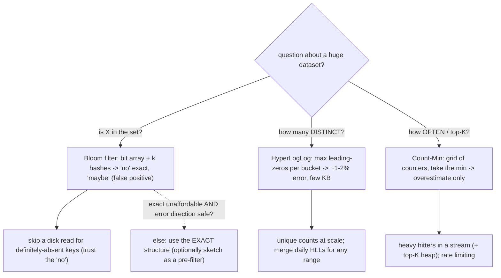

## Thesis

Probabilistic data structures answer questions about massive datasets **approximately, in a tiny fraction of the memory** an exact answer would need, by trading a small, bounded, tunable error for enormous space savings. The three canonical ones each answer a different question: **Bloom filters** --- set membership ("have I seen this?"), with no false negatives but a tunable false-positive rate; **HyperLogLog** --- cardinality ("how many *distinct*?"), in a few kilobytes regardless of set size; **Count-Min Sketch** --- frequency ("how many times, and who are the heavy hitters?"), in sublinear space. The core idea is that many real questions at scale --- deduplication, "does this key exist before I pay for a disk read," unique visitors, top-K, rate/frequency estimation --- do not need an exact answer, and hashing-based sketches deliver a good-enough answer in constant or logarithmic memory where an exact structure (a hash set of every element, a counter per key) would need gigabytes. The design skill is recognizing when **approximate-but-tiny beats exact-but-huge**, choosing the structure by the question, and sizing it to an acceptable error.

## Sub

**Why: exact answers to "seen it? / how many distinct? / how often?" cost too much memory at scale** -> **Bloom (membership) / HyperLogLog (cardinality) / Count-Min (frequency), each hashing into a compact array** -> **each trades a bounded, tunable error for constant-or-log space** -> **zoom out** to where they sit in real systems (LSM databases, caches, networks, streams), when the error is acceptable, mergeability across shards, and when you must not use them.

## Spine

- **Probabilistic structures trade a bounded error for enormous space savings** --- they answer set/count questions over massive data in a tiny, often constant, amount of memory by accepting a small, tunable inaccuracy --- because at scale an exact answer (a set of every element, a counter per key) needs far more memory than you can afford, especially on the hot path.
- **Each canonical structure answers one specific question** --- **Bloom filter**: "have I *possibly* seen this?" (membership; no false negatives, tunable false positives); **HyperLogLog**: "how many *distinct* elements?" (cardinality in a few KB); **Count-Min Sketch**: "how many times / who are the top-K?" (frequency; overestimates only, never under).
- **They work by hashing into a compact array, and the error is tunable by size** --- a Bloom filter sets bits at several hash positions and answers "definitely not / maybe yes"; HyperLogLog estimates cardinality from the longest run of leading zeros seen across hashed values; Count-Min hashes into a grid of counters and reports the minimum --- and you dial accuracy by how much memory you give it.
- **The skill is recognizing when approximate-but-tiny beats exact-but-huge** --- reach for them when the question tolerates a small, known error and the exact structure will not fit (or fit in the hot path): a Bloom filter to skip a disk/DB lookup for a definitely-absent key, HyperLogLog for unique counts at web scale, Count-Min for heavy hitters in a stream --- and *do not* when you need exactness or the dataset is small enough to count exactly.

## Companion Notes

### walk

Answering set and count questions at scale without the memory

One system walked from an exact-but-impossible in-memory structure to a probabilistic one --- why exact answers cost too much memory at scale, how Bloom filters (membership), HyperLogLog (cardinality), and Count-Min Sketch (frequency) each answer one question in tiny space, how they work by hashing into a compact array, and how you size them to an acceptable error and place them where the space win matters.

Say it as one trade and three questions: probabilistic structures trade a small bounded error for huge space savings, and the three canonical ones answer membership (Bloom), distinct-count (HyperLogLog), and frequency/top-K (Count-Min) -- each in constant-or-log memory, tuned by size.

### drill

Probabilistic structures reps

Graded reps on Bloom filters, HyperLogLog, and Count-Min Sketch --- what each answers, how each works, their error models, mergeability, and where they sit in real systems --- the ones that separate "we cache membership" from choosing the right sketch for the question at an acceptable error.

Anchor on the trade (bounded error for constant-or-log space) and the three questions: membership (Bloom -- no false negatives, tunable false positives), cardinality (HLL -- a few KB for billions), frequency/top-K (Count-Min -- overestimates only) -- and when exact is required instead.

### wb

Whiteboard

Rebuild the two things that matter from memory --- why you trust a Bloom filter's "no" but not its "yes," and how the three structures map to three questions --- with only the cues in front of you.

Draw the decision first --- exact-too-big and error-tolerable? then membership / cardinality / frequency to Bloom / HyperLogLog / Count-Min. Recall is the test, not recognition.

### sys

System Map

Zoom out: sketches sit on the hot path of storage engines, caches, streams, and analytics --- wherever an exact set or counter would not fit --- and bridge out to sharding, rate limiting, and percentiles.

Lead with the trigger, not the structure --- "exact is unaffordable at this scale and the question tolerates a bounded error" --- then pick by the question and name the error direction you rely on.

### trade

Trade-offs

The calls they drill --- approximate vs exact, more bits vs a higher false-positive rate, which sketch, Bloom vs cuckoo, width vs depth --- each with the axis that picks a side.

Always name what forces the choice --- the scale that makes exact unaffordable and the error direction that stays safe --- never defend a sketch as universally right.

### model

Model Answers

Full spoken scripts --- the beats, in order, the way you would actually say them under time pressure.

Steal the frame, not the words --- lead with the trade ("bounded error for space"), map the question to the structure, then name the error direction you rely on and what you keep exact.

### num

Numbers

Back-of-envelope the space win --- a Bloom filter over an exact set (membership), and a HyperLogLog over an exact distinct-count (cardinality) --- from the element count and target false-positive rate.

Lead with the ratio --- about 10 bits per element for 1%, a fixed ~12 KB for any cardinality --- the number that shows why the sketch fits where exact cannot.

### rf

Red Flags

What sinks the round --- trusting Bloom's "yes," summing daily uniques, treating a Count-Min estimate as exact --- and the line that flips each one.

Name what the interviewer hears --- "would skip a needed write on a false positive" is the fastest way to show you have the error direction backwards.

### open

30-Second

The opener and the close --- matched to the altitude the question is asked at.

Match the altitude --- open on the trade and the three questions, and land on the error contract and keeping correctness-critical answers exact as the real senior beats.

## Walk

### Exact is too expensive --- the trigger

```flow
huge[huge set or stream] -> exact[an exact set or counter needs memory proportional to the data] -> wall[gigabytes -- won't fit in RAM or the hot path]
```

Start with why you would ever accept a wrong answer: **at scale, the exact answer's memory is the bottleneck.** An exact membership set stores every element (a billion keys is many GB); an exact distinct-count must remember every distinct value seen (GB for billions of uniques); an exact frequency table needs a counter per distinct key (huge for a high-cardinality stream). The exact structure's memory grows with the data, and past a point it simply will not fit where you need it.

It is worse when you need the structure **per-shard, per-file, or per-window** --- a filter per SSTable, a distinct-count per day --- or on the **hot path**, a check on every read at low latency. Even a "medium" exact structure multiplied by thousands of instances is enormous, and it competes with the memory you actually need for data and cache. Multiplicity is often the real reason exact loses, not a single structure's size.

### The trade: a bounded error for enormous space

```flow
q[accept a wrong answer?] -> yes[only a small, bounded, tunable error] -> win[constant-or-log memory instead of gigabytes]
```

Probabilistic structures collapse this: they answer the question in **constant or logarithmic memory** by accepting a **small, bounded, tunable** error. The error is not arbitrary --- it is characterized ("false positives at most 1%," "cardinality within 2%") and you dial it with memory. Crucially, the error is a **fixed property of the built structure**, not a per-query gamble: a given absent key is consistently a false positive or not, so you cannot "retry" to dodge it.

The trigger for reaching for one is precise: **exact will not fit (or not fit fast enough), and the question tolerates a small error.** If exact fits comfortably and is fast, use exact --- a sketch trades accuracy, tuning, and debuggability for space you did not need to save. The whole justification is scale forcing the trade; absent that, reaching for a sketch is over-engineering.

### Pick the structure by the question

```flow
which[which question?] -> m[membership: seen it? -> Bloom] / c[distinct? -> HyperLogLog] / f[frequency / top-K? -> Count-Min]
```

Three canonical structures, three distinct questions. **Membership** ("is X in the set?") -> **Bloom filter**: "definitely not" (exact) or "maybe" (tunable false positive), in a tiny bit array. **Cardinality** ("how many *distinct*?") -> **HyperLogLog**: a few KB for any number of uniques, ~1-2% error. **Frequency** ("how many times / who is the top-K?") -> **Count-Min Sketch**: sublinear memory, overestimates only.

They are **not interchangeable**: a Bloom filter cannot count, an HLL cannot tell you *which* elements or how often, a Count-Min cannot give the distinct count. So the first move is to identify which of the three questions you actually have --- and if it is none of them (percentiles, set similarity), reach for a different family member. Getting the question right is the whole decision.

### Bloom filter --- a bit array plus k hashes

```flow
add[add: set k hash-positions to 1] -> query[query: check those k bits] -> ans[any 0 = definite no; all 1 = maybe]
```

The Bloom filter is the clearest to see mechanically: a **bit array of size m** (all 0) plus **k independent hash functions**. To **add**, hash the element k ways and set those k bits to 1. To **query**, hash the same k ways and check whether **all k bits are 1** --- if any is 0 the element is **definitely not** present (adding it would have set all k), and if all are 1 it is **maybe** present.

The asymmetry falls directly out of "only ever set bits, never clear them": a 0 bit proves the element was never added (a trustworthy "no," no false negatives), while all-bits-1 could be coincidence from *other* elements' inserts (a fallible "yes," a false positive). That is why you **trust the "no," never the "yes."**

```python
class Bloom:
    def __init__(self, m, k):
        self.bits = [0] * m         # m bits, all 0
        self.m, self.k = m, k

    def add(self, x):
        for i in range(self.k):
            self.bits[hash_i(x, i) % self.m] = 1     # set k bits (only ever SET)

    def might_contain(self, x):
        for i in range(self.k):
            if self.bits[hash_i(x, i) % self.m] == 0:
                return False        # a 0 bit -> DEFINITELY not present (no false negatives)
        return True                 # all bits 1 -> MAYBE present (could be a false positive)
```

In practice you do not run k separate hash functions --- you use **double hashing**: two base hashes `h1`, `h2` and derive position `i` as `h1 + i*h2` (mod m), which is proven to preserve the false-positive rate. It is cheap, and asymptotically as good as k independent hashes.

### HyperLogLog --- leading zeros across many buckets

```flow
hash[hash each element] -> lz[track the longest run of leading zeros] -> est[max run ~ log2(distinct); average many buckets -> ~1-2%]
```

HyperLogLog estimates **cardinality** from a clever observation: if you hash each element to a uniformly random bit string, a hash with k leading zeros is a **1-in-2^k event**, so the *longest* run of leading zeros you have seen, R, is roughly **log2 of the distinct count** --- the estimate is ~2^R. Because duplicates hash to the same value and do not change the maximum, it naturally counts *distinct* elements, and it only has to remember R (a tiny number), not the elements --- that is where the constant memory comes from.

A single R is noisy, so HLL **averages across many registers** (buckets): the first bits of each hash pick a register, each tracks the max-leading-zeros for its slice, and a bias-corrected **harmonic mean** combines them. The harmonic mean specifically damps the rare huge outliers the exponential estimator produces. With ~16384 registers (~12 KB) the error drops to ~1-2% --- you store "the rarest pattern per bucket," a logarithmic fingerprint of the cardinality.

### Count-Min --- a grid of counters, take the minimum

```flow
inc[increment one counter per row] -> est[estimate = min across the d rows] . dir[a min of upper bounds -> overestimate only]
```

Count-Min answers **frequency** with a **d-by-w grid of counters** and d independent hashes (one per row). To record an occurrence, hash the element into each row and **increment that counter** --- one counter per row. To estimate a count, hash into each row and **take the minimum** of the d counters.

Each row's counter is the element's true count **plus** any collision noise (other elements hashing to the same column), so every row is an **upper bound** --- >= the true count. The minimum is therefore the tightest upper bound: **it overestimates, never underestimates.** That one-sided error is why it is ideal for heavy hitters: a genuinely frequent element can never be reported as rare. Width shrinks collisions (a tighter bound), depth raises the confidence that the minimum is close.

### Tune to an error budget

```flow
budget[tolerable error?] -> size[Bloom bits / HLL registers / CMS width+depth] -> mem[accuracy bought with memory]
```

In every case, **accuracy is tunable by size**, and you invert the error formula from the tolerance the use case gives you. Bloom: pick the false-positive rate whose wasted-work cost you can eat, and `m = -(n ln p)/(ln 2)^2` sets the bits (~10 bits/element for ~1%), `k = (m/n) ln 2` the hashes. HLL: pick the relative error, and registers ~ `(1.04/error)^2` sets the KB. Count-Min: pick the overshoot fraction and confidence, and `w ~ e/error`, `d ~ ln(1/delta)`.

You buy accuracy with memory --- and not linearly: for a Bloom filter each extra ~0.7 bits/element roughly halves the false-positive rate (exponential), while HLL error falls as 1/sqrt(registers). So you get a lot of accuracy cheaply at first, then hit diminishing returns. Size for the **worst-case load** (max n, peak stream), because a Bloom filter that exceeds its planned n fills up and the false-positive rate climbs.

### Merge --- compute per-shard, combine

```flow
shards[per-shard / per-window sketches] -> merge[Bloom OR / HLL per-register max / CMS add] -> global[one global answer, no rescan]
```

All three are **mergeable**, which is what makes them practical in distributed and streaming systems: you compute partial sketches per shard or per window and combine them. **Bloom** filters (same size and hashes) merge by a **bitwise OR**; **HyperLogLog** merges by taking the **per-register maximum**; **Count-Min** merges by **adding** counters. The catch is that the sketches must be structurally identical --- same size, same hash functions --- a coordination constraint you design in.

The killer case is HLL: distinct-count is **non-additive** (a user active two days is counted in both, so summing daily uniques double-counts overlaps), but merging daily HLLs by per-register max computes the true **union** --- so you keep a daily HLL and answer any date range by merging, without rescanning raw events. Redis PFMERGE does exactly this. Mergeability turns these from single-machine tricks into distributed-analytics building blocks.

### Place it, and know when NOT to

```flow
place[where the space win is decisive] -> uses[Bloom in LSM reads; HLL in Redis PFCOUNT; CMS for heavy hitters] -> guard[else use exact -- keep correctness/revenue-critical exact]
```

They earn their place where the space win is decisive. **Bloom filters** live in **LSM storage engines** (Cassandra, RocksDB, Bigtable): each SSTable has an in-memory key filter, so a read skips any SSTable whose filter says "definitely not" --- eliminating pointless disk reads, safely, because no-false-negatives means you never skip a file that has the key. **HyperLogLog** powers **unique-count at scale** (Redis PFADD/PFCOUNT). **Count-Min** does **streaming heavy-hitters**, usually paired with a top-K heap.

The guardrail is the **error budget as a correctness decision**: reach for a sketch only when **exact is unaffordable at this scale AND the error direction is safe for the use** --- trust the exact side (Bloom's "no"), keep anything billing- or correctness-critical exact, and if needed use the sketch as a **fast pre-filter in front of an exact source of truth**. The arc: exact-is-too-big -> pick by the question -> size to a safely-directed error -> place it where the space win matters -> keep the exact structure when scale or safety demands it.

### Model Script

- Frame the trade and trigger | "Probabilistic data structures trade a small, bounded, tunable error for enormous space savings. I reach for one when the exact answer is unaffordable at this scale -- it won't fit in memory, or won't fit in the hot path's latency budget -- and the question tolerates a small error. The whole justification is scale: an exact membership set stores every element, an exact distinct-count remembers every unique value, an exact frequency table needs a counter per key -- all proportional to the data, which is gigabytes at scale. If the data fits exactly, I just use the exact structure; approximating small data is over-engineering."
- The three questions | "The three canonical ones each answer one question. Membership -- is X in the set? -- is a Bloom filter: it tells you 'definitely not,' which is exact, or 'maybe,' which can be a false positive, in a tiny bit array. Cardinality -- how many distinct? -- is HyperLogLog: a few kilobytes for any number of uniques, with about one to two percent error. Frequency -- how many times, or who's the top-K? -- is a Count-Min Sketch: sublinear memory, and it only ever overestimates, never underestimates. So I identify which of the three questions I have and pick the matching structure."
- The error model and its safety | "The senior point is the error model. A Bloom filter has no false negatives -- only ever sets bits, so a zero bit proves an element was never added -- which means I trust the 'no' completely and never trust the 'yes' for correctness. That's why it's perfect to skip an expensive lookup for definitely-absent items: an SSTable's key filter lets an LSM database skip disk reads, and a false positive just costs a rare wasted read, never a missed key. For HyperLogLog I accept one-to-two percent error, fine for unique-visitor analytics but not for billing. For Count-Min I accept overestimation, which is safe for heavy hitters and rate limiting because I never miss a real heavy element -- I might over-rank a rare one, which is benign."
- Sizing and mergeability | "I size the structure to hit an acceptable error: bits-per-element sets a Bloom filter's false-positive rate -- about ten bits per element gives one percent -- register count sets HLL's error, width and depth set Count-Min's collision error and confidence. And I lean on mergeability: Bloom filters OR together, HLLs merge by per-register maximum, Count-Min sketches add -- so I compute per-shard and combine, or I keep a daily HLL and merge any date range to get distinct users, which matters because distinct counts otherwise aren't additive. That last property -- mergeable pre-aggregated distinct counts -- is something you essentially can't do exactly."
- Interviewer: "You're using a Bloom filter to check if a username is taken before hitting the database, and it says the username is available. The user registers it. Is that safe?"
- The trust-the-no point | "That direction is exactly right, because 'available' means 'this username is definitely not in the set' -- and that IS trustworthy, since there are no false negatives, so 'not in the set' is exact. If the filter says available, it truly is. The danger would be the opposite: trusting a 'taken' answer to reject a registration, because 'taken' means 'maybe present,' which can be a false positive -- so I'd wrongly reject an available username. So the safe design is: Bloom says available -> proceed (exact); Bloom says taken -> it's only 'maybe,' so I verify with an exact database check before rejecting. In general: trust the 'no,' verify the 'yes.' The one caveat is that the filter must actually contain all taken usernames -- so on every successful registration I add the username to the filter, and the filter is the fast-path negative check in front of the database as the source of truth."
- Land it | "So the arc is: reach for a probabilistic structure only when exact is unaffordable at scale and the question tolerates a bounded error; pick by the question -- membership is Bloom, distinct-count is HyperLogLog, frequency and top-K are Count-Min; understand the error model and use only the safe direction -- trust Bloom's 'no,' accept HLL's small estimate error for analytics, accept Count-Min's overestimate for heavy hitters; size to an error budget and exploit mergeability to compute per-shard or pre-aggregate; place them where the space win is decisive; and keep anything correctness- or revenue-critical exact, using the sketch as a fast pre-filter in front of the exact source of truth."

## Drill

all | **All four levels, mixed** --- the way a real loop actually comes at you, from "what does each answer" up to "when would you not use one."
SDE2 | **The trade, and the three structures** --- what a probabilistic structure is, what Bloom / HLL / Count-Min each answer, a real use case. The bar is "approximate-but-tiny beats exact-but-huge": name the question and the structure that answers it.
SDE3 | **Error models and mechanism** --- false-positive tuning, why no false negatives, how HLL and Count-Min work, mergeability. The bar is "it depends, here's the switch": name the error direction and the failure each choice bounds.
Staff | **Systems judgment** --- Bloom in databases, HLL and Count-Min at scale, the error budget, when not to use them. The bar is "a scaling tool with a specific error contract I deploy deliberately."

### SDE2 | what a probabilistic data structure is

What is a probabilistic data structure, and what fundamental trade does it make?

A probabilistic (or "approximate," or "sketch") data structure answers a question about a dataset **approximately, using far less memory than an exact answer would require**, by accepting a small, **bounded, and tunable** error. The fundamental trade is **space for accuracy**: instead of storing enough information to answer exactly (which at scale can mean gigabytes --- every element in a set, a counter for every key), it stores a compact summary (a "sketch") that answers the question with a known, controllable error rate in a tiny, often *constant*, amount of memory. The error is not arbitrary --- it is characterized (e.g. "false positives at most 1%," "cardinality within 2% of the true count") and you can **tune it by how much memory you allocate** (more memory -> less error). The reason these exist and matter is that many questions at scale genuinely tolerate a small error: knowing unique visitors "within 2%" is fine for analytics; knowing a key is "probably present" (to decide whether to bother reading disk) is fine because you verify on the rare read; knowing the approximate top-K heavy hitters is fine for monitoring. When the exact answer is unaffordable (won't fit in memory, or won't fit in the hot path's latency budget) and the question tolerates a small error, a probabilistic structure turns an impossible exact computation into a cheap approximate one. The three canonical examples --- Bloom filter (membership), HyperLogLog (cardinality), Count-Min Sketch (frequency) --- each apply this trade to a specific kind of question.

Follow: Is the error random on every query, or fixed once you've built the structure?
It's **fixed by the data, not re-rolled per query.** For a Bloom filter the false-positive *rate* is set by m, n, and k, but *which* absent elements are false positives is determined by the bits the inserted set happened to set --- so a given absent key is consistently a false positive or consistently not, every time you ask. Same for HLL and Count-Min: the estimate is deterministic given the inserted stream. So "1% false positives" is a rate over the space of possible queries, not a per-query coin flip --- which matters because you **cannot "retry" to dodge a false positive**; the same key gives the same wrong answer until the structure changes.

Follow: You said memory tunes the error. Is that a linear trade --- twice the memory, half the error?
No --- it's much better than linear at first, then diminishing. For a **Bloom filter**, the false-positive rate drops *exponentially* as you add bits: each extra ~0.7 bits per element roughly halves it, so a few more bits buys a big accuracy gain. For **HyperLogLog**, the standard error is ~1.04/sqrt(registers), so error falls as 1/sqrt(memory) --- to halve the error you 4x the registers. So you buy a lot of accuracy cheaply at the start and hit diminishing returns; you never pay linearly, which is exactly why a tiny structure can be so accurate.

Senior: Framing it as "space for a **bounded, characterized** error you can tune" --- and being able to say the error is a fixed property of the built structure (not a per-query gamble) and that memory buys accuracy super-linearly (exponentially for Bloom) --- is what separates "I know these are approximate" from knowing the exact error contract you're signing.
Speak: Lead with the trade named precisely: **"space for a small, bounded, tunable error --- 'false positives under 1%,' 'cardinality within 2%' --- where an exact structure would need memory proportional to the data."** Then the trigger: only when exact won't fit AND the question tolerates that error; small data, just use exact.

### SDE2 | what a Bloom filter does

What question does a Bloom filter answer, and what are its guarantees?

A Bloom filter answers **set membership**: "is this element in the set?" --- but *approximately*, with a very specific and asymmetric guarantee. It can tell you an element is **"definitely not in the set"** (a *negative* is always correct --- **no false negatives**) or **"possibly in the set"** (a *positive* might be wrong --- **false positives** are possible at a tunable rate). So the two answers mean: **"no" = certainly absent** (you can trust it completely), and **"yes" = probably present, but might be a false positive** (you cannot fully trust it without checking). What it buys is **tiny memory** --- it represents membership of a huge set in a small bit array, orders of magnitude smaller than storing the elements themselves --- and **fast, constant-time** add and query (a few hashes). What it cannot do: give false negatives (by design --- this is what makes it useful, as we'll see), tell you *which* elements are in the set (it only answers yes/no for a queried element, it doesn't enumerate), count occurrences, or (in the basic version) support deletion. The asymmetry is the whole point and dictates its use: because a "no" is certain, a Bloom filter is perfect for **cheaply ruling things out** --- checking it first to avoid an expensive operation (a disk read, a network call) for elements that are definitely absent, and only doing the expensive check when it says "maybe." You accept occasional false positives (a needless expensive check) in exchange for skipping the expensive check for the (often majority) definitely-absent cases, in a fraction of the memory an exact set would use.

Follow: So a "yes" might be wrong. In your design, what do you actually DO with a "yes"?
You **verify it against the source of truth.** The Bloom filter is a fast pre-filter that rules OUT the definitely-absent majority; on a "maybe" you do the expensive check you would have done anyway --- read the disk block, query the DB --- and it confirms or denies. You never take a correctness action on the "yes" alone. The whole value is skipping the expensive check for all the "no"s (which are exact), not trusting the "yes" --- so a false positive costs one needless check, never a wrong result.

Follow: Can a Bloom filter ever tell you an element is DEFINITELY present?
No --- a positive is always "maybe." The only *certain* answer is the negative, "definitely not." If you need a guaranteed-correct positive, the Bloom filter cannot give it; you verify against the real store, or use a structure that actually stores the elements. That asymmetry --- **certain "no," uncertain "yes"** --- is the entire contract, and it is why Bloom filters are for *ruling out*, not *confirming*: you deploy them anywhere a wrong "yes" is cheap (a wasted check) and a "no" must be trusted.

Senior: Knowing the guarantee is **asymmetric and use-directional** --- trust the "no," verify the "yes," never take an irreversible action on a positive --- rather than describing it as just "probabilistic membership," is what shows you would deploy it correctly (as a pre-filter in front of truth) instead of trusting the fallible side.
Speak: **"Membership with an asymmetric guarantee: a 'no' is exact --- no false negatives --- and a 'yes' is only 'maybe,' a tunable false positive.**" So it's perfect to cheaply rule OUT the definitely-absent and only pay the expensive check on a "maybe." Trust the no, verify the yes.

### SDE2 | how a Bloom filter works

Mechanically, how does a Bloom filter store and check membership?

It's a **bit array** of size m (all bits initially 0) plus **k independent hash functions**. **To add an element**: hash it with each of the k hash functions to get k positions in the bit array, and **set those k bits to 1**. **To check an element**: hash it with the same k functions to get k positions, and check whether **all k of those bits are 1**. If **any** of the k bits is 0, the element is **definitely not** in the set (because adding it would have set all k --- so a 0 anywhere proves it was never added: this is why there are no false negatives). If **all k bits are 1**, the element is **possibly** in the set --- but those bits might all have been set by *other* elements' insertions coincidentally, which is a **false positive**. That's the entire mechanism: adds set bits, queries check bits, "any bit 0 -> definitely no," "all bits 1 -> maybe yes." The false-positive rate depends on how full the bit array is: as you add more elements, more bits become 1, so more queries find all-bits-1 by chance --- which is why the array size m and hash count k must be chosen for the expected number of elements n and desired false-positive rate. Note the asymmetry falls directly out of the mechanism: you only ever *set* bits (never clear them), so a bit that's 0 could never have been part of an added element (no false negatives), while a bit that's 1 could have been set by anyone (false positives). This also explains why basic Bloom filters can't delete: clearing an element's bits might clear a bit another element relies on, creating a false negative --- which the whole design forbids.

Follow: Why k hash functions instead of just one?
With one hash, every element sets **one** bit, so membership is just "is this one bit set" --- and any element hashing there gives a false positive, so the false-positive rate is roughly the fraction of set bits, which is terrible. With k hashes, a non-member must coincidentally collide on **all k** positions, so the false-positive rate becomes roughly (fraction set)^k --- far lower. But more k also sets more bits per insert, filling the array faster, which *raises* collisions --- so k has a sweet spot, `k = (m/n) ln 2`. So k > 1 is what makes the filter accurate, and "more hashes" is not simply better.

Follow: Do the k hashes have to be truly independent, and how are they done in practice?
In theory you want k independent uniform hashes; in practice you use **double hashing** (the Kirsch-Mitzenmacher result): compute two base hashes `h1` and `h2` and derive position i as `h1 + i*h2` (mod m) for i in 0..k-1 --- often just splitting one 128-bit hash into two halves. This is proven to preserve the false-positive rate without needing k separate hash functions, so a real filter hashes the element **once or twice**, not k times. It's the standard implementation, and knowing it shows you've looked past the textbook diagram.

Senior: Explaining *why* k > 1 (requiring all-k-set makes a coincidental positive exponentially rarer, with an optimal k) and that production filters use double-hashing (`h1 + i*h2`) rather than k real hash functions is the mechanism-level depth that shows you understand the structure, not just its API.
Speak: **"A bit array plus k hashes: add sets the k positions, query checks all k --- any 0 is a definite no, all-1 is a maybe."** Only-ever-set is why there are no false negatives. In practice the k positions come from double-hashing two base hashes, not k separate functions.

### SDE2 | what HyperLogLog does

What question does HyperLogLog answer, and why is it remarkable?

HyperLogLog answers **cardinality --- "how many *distinct* elements are in this set?"** (count-distinct / unique count) --- approximately, and it's remarkable because it does so in a **tiny, fixed amount of memory regardless of how many distinct elements there are**. Counting distinct elements exactly requires remembering every distinct element you've seen (a hash set), so the memory grows with the number of distinct elements --- counting a billion distinct items exactly needs memory proportional to a billion items. HyperLogLog estimates the same count using a **fixed few kilobytes** (commonly ~12 KB) --- for a billion distinct elements or a trillion, the memory is the same small constant --- with a typical error of around **1-2%**. That's the remarkable property: **constant memory for unbounded cardinality**, trading a couple percent of accuracy for going from "memory proportional to the distinct count" to "a fixed tiny footprint." Use cases are everywhere at scale: unique visitors to a site, distinct users who performed an action, unique IPs, distinct search queries --- any "how many different X" over a huge stream where an exact hash set would be enormous and a ~1-2% error is perfectly acceptable. It's the standard tool for count-distinct at scale (Redis exposes it directly via PFADD/PFCOUNT, databases like Redshift and BigQuery use it under approximate-count-distinct functions), precisely because exact distinct-counting is memory-prohibitive and the approximate answer is almost always good enough for the analytics and monitoring questions it serves.

Follow: How much error is it, and can you make it smaller?
The standard error is ~**1.04/sqrt(m)** where m is the number of registers; the common ~12 KB config uses m = 2^14 = 16384 registers, giving ~0.8% typical (often quoted as ~1-2%). You shrink error by adding registers --- but because it falls as 1/sqrt(m), **halving the error means 4x the registers** (and memory). So ~2% is cheap; pushing to 0.5% costs ~16x the memory, which you rarely need --- that's why ~12 KB is the standard sweet spot rather than an arbitrary number.

Follow: At very LOW cardinalities, is HyperLogLog accurate?
Plain HLL is **biased for small counts** --- the leading-zeros estimator breaks down when few registers are set. Real implementations correct this: **HyperLogLog++** (Google) uses **linear counting** in the small-cardinality range, switches to the HLL estimator as the count grows, and adds empirical bias correction plus a **sparse representation** so low-cardinality counters are far smaller than the dense 12 KB. So a good HLL is accurate across the whole range, but the naive "2^max" estimator needs those small-range fixes --- a detail that shows you know the real structure, not the textbook toy.

Senior: Knowing the error is ~1.04/sqrt(m) (so accuracy scales as 1/sqrt(memory) --- diminishing), and that production HLL (HLL++) adds small-range/linear-counting corrections and a sparse mode, is the difference between "HLL counts distinct in ~12 KB" and understanding its actual accuracy envelope and where it needs help.
Speak: **"Count-distinct in a fixed few KB --- commonly ~12 KB, ~1-2% error --- regardless of whether it's a million or a trillion uniques, because it stores a fingerprint of the cardinality, not the elements."** Error is ~1/sqrt(registers), so more registers buys accuracy with diminishing returns.

### SDE2 | what Count-Min Sketch does

What question does a Count-Min Sketch answer, and what is its error direction?

A Count-Min Sketch answers **frequency --- "how many times has this element appeared?"** (and, by extension, "who are the most frequent / heavy hitters?") --- approximately, in **sublinear memory** (far less than a counter per distinct key). Instead of maintaining an exact count for every distinct element (which needs memory proportional to the number of distinct keys --- huge for a high-cardinality stream), it maintains a small fixed-size grid of counters and estimates any element's count from it. Its error has a **specific, one-sided direction: it may *overestimate* a count, but never *underestimate*** --- the reported count is always **>= the true count** (an upper bound). This is because collisions (different elements hashing to the same counter) can only *add* to a counter, never remove, so an element's estimate can be inflated by others' increments but never deflated. That one-sided error is important: you know the true count is *at most* what the sketch reports, which is exactly right for "heavy hitter" detection (if the sketch says an element is frequent, it might be inflated, but if it says an element is rare, it truly is rare) --- you won't miss a genuine heavy hitter, you might occasionally over-count a light one. Use cases: finding the most frequent items in a stream (top-K / heavy hitters) --- trending searches, most-accessed keys, most-active IPs --- frequency-based rate limiting, and network traffic monitoring, all at a scale where an exact per-key counter table would be too large and a slight overestimate is acceptable. It's the frequency counterpart to Bloom (membership) and HyperLogLog (cardinality): the three cover the three most common "at scale, approximately" questions.

Follow: The estimate overestimates --- by how much, and what bounds it?
The overestimate is **collision noise**, and it's bounded: with width w and depth d, the guarantee is estimate <= true + **epsilon * N** with probability >= 1 - delta, where epsilon ~ e/w, delta ~ e^-d, and N is the total count (the stream size). So the error scales with the **total stream volume** times epsilon --- wider rows shrink epsilon, more rows raise confidence. The key consequence: heavy hitters (large true counts) are estimated well *relative to their size*, while tiny counts can be swamped by the epsilon*N noise floor.

Follow: So can it find the LEAST frequent items, or only the most frequent?
Only the most frequent, reliably. Because the error is additive and one-sided (up to epsilon*N over the truth), a small true count can be inflated to look larger, so you can't trust a low-ish estimate as *precise* or distinguish "rare" from "slightly-less-rare" near the noise floor. What you *can* trust: a **large** estimate means a genuinely frequent item (noise can't manufacture a huge count), and an item the sketch reports as **small is genuinely small** (estimate >= true, so a small estimate means a small true count). So it's a heavy-hitter tool, not a bottom-K tool; for exact small counts it's the wrong structure.

Senior: Stating the actual error bound (estimate <= true + epsilon*N, epsilon ~ e/w, delta ~ e^-d) --- so error scales with the total stream volume and only heavy hitters are estimated well relative to their size --- is the quantitative depth that separates "it overestimates" from knowing exactly when the overestimate is negligible and when it swamps the signal.
Speak: **"Per-element frequency in sublinear memory, with a one-sided error: the estimate is always >= the true count, never below."** That's ideal for heavy hitters --- you never miss a real one --- and the overshoot is bounded by epsilon times the total stream size, so width shrinks the error and depth raises the confidence.

### SDE2 | a real Bloom filter use case

Give a concrete, high-value use of a Bloom filter and explain why it fits.

The canonical one: **skipping an expensive lookup for elements that are definitely absent** --- most importantly, **avoiding disk reads in a storage engine**. In an LSM-tree database (Cassandra, RocksDB, LevelDB, HBase, Bigtable), data lives in many on-disk sorted files (SSTables), and a read for a key may have to check several of them. Reading a file from disk to discover the key **isn't there** is wasted, expensive I/O. So each SSTable keeps a **Bloom filter over the keys it contains**, in memory. On a read, the engine checks the Bloom filter first: if it says **"definitely not present," the engine skips that SSTable entirely --- no disk read** --- and only reads the file when the filter says "maybe." Since a "no" is guaranteed correct (no false negatives), this **never causes a missed key** (you'd never skip a file that actually has the key), and it **eliminates the vast majority of pointless disk reads** for absent keys, dramatically speeding up reads (especially negative lookups). The occasional false positive just means an occasional unnecessary disk read (you read the file, don't find the key --- a small, bounded cost). It fits perfectly because: the question is pure membership ("is this key in this file?"), a "no" must be trustworthy (skipping a file that had the key would be a correctness bug --- and Bloom's no-false-negatives guarantee ensures that never happens), a small false-positive rate is cheap (a rare wasted disk read), and the memory is tiny (a compact filter per file vs the file's full key set). Other fits with the same shape: a CDN/cache checking "have we ever cached this?" before a lookup, a web crawler checking "have I seen this URL?" before enqueuing, a database checking "might this username exist?" before a query --- all cases where you want to cheaply rule out the definitely-absent majority and only pay the expensive check for "maybe."

Follow: What's the cost of a false positive in that use, concretely?
**One wasted disk read.** The filter says "maybe," the engine reads the SSTable, the key isn't there --- a single unnecessary I/O, bounded and rare (at ~1% false positives, ~1 in 100 negative lookups does a needless read). Crucially it's **never a correctness cost**: you never return wrong data, you just occasionally do work you didn't need. That's exactly why the false-positive *direction* is safe here --- a wrong "maybe" costs latency, a wrong "no" would cost data, and Bloom guarantees there is no wrong "no."

Follow: Where does the filter live, and what does it cost in memory?
In memory, in the **block cache** --- one filter per SSTable, sized by **bits-per-key**. RocksDB defaults to ~10 bits/key (~1% false positives), so a filter for a million keys is ~1.25 MB, tiny next to the SSTable's data. It's a tunable knob: more bits/key -> fewer false positives -> fewer wasted reads, at more RAM. Under memory pressure you can even **drop the largest level's filters** (RocksDB's `optimize_filters_for_hits`), because in a leveled LSM a read hits at most one bottom-level file, so those filters cost the most memory for the least benefit --- a real operational trade.

Senior: Knowing the false positive is a **bounded latency cost (a wasted read), never a correctness cost**, that the filter lives in the block cache at a tunable bits-per-key, and even the operational detail (drop the largest-level filters under memory pressure) --- is the shipped-it depth that goes past "Bloom filters skip disk reads."
Speak: **"Each SSTable keeps an in-memory Bloom filter over its keys; a read checks it first, and 'definitely not' skips the file with no disk I/O."** It's safe because no-false-negatives means you never skip a file that has the key --- a false positive is just a rare wasted read, tunable via bits-per-key.

### SDE2 | why exact is too expensive at scale

Why can't you just use exact structures (a hash set, a counter per key) at scale?

Because their memory grows with the data, and at scale that memory becomes **unaffordable --- especially in the hot path**. An **exact membership set** stores every element, so its memory is proportional to the number of elements: a set of a billion URLs or keys is many gigabytes --- too large to keep in memory per-node, per-file, or per-request where you need the check to be fast. An **exact distinct count** likewise must remember every distinct value seen (to know it's distinct), so counting distinct users/IPs/queries over a huge stream needs memory proportional to the cardinality --- again gigabytes for billions of distinct values. An **exact frequency table** needs a counter per distinct key, so counting occurrences over a high-cardinality stream (every URL, every IP) needs memory proportional to the number of distinct keys --- potentially enormous. The problem is acute in three situations: **memory limits** (the exact structure simply doesn't fit in RAM, or fits only by dominating memory you need for other things); **many instances** (you need the structure per-shard, per-file, or per-window --- a Bloom filter per SSTable, a distinct-count per time bucket --- so even a "medium" exact structure multiplied by thousands of instances is huge); and **the hot path** (the check must happen on every request/read at low latency, so it must be small and fast, which a giant exact structure isn't). Probabilistic structures collapse this: constant or logarithmic memory regardless of scale, for a small bounded error. So the reason to reach for them is precisely that the exact answer's memory has become the bottleneck --- and the question tolerates approximation. If the data is small enough that the exact structure fits comfortably and is fast, you should just use the exact structure (approximate structures add error and complexity for no benefit); it's specifically the scale that forces the trade.

Follow: Give me the actual numbers --- why doesn't an exact set fit?
An exact membership set stores every element plus hash-table overhead: a billion 16-byte keys is ~16 GB of raw keys, and a real hash set (pointers, load factor, per-entry overhead) is often 2-3x that --- **30-50 GB**. A Bloom filter for the same billion at 1% is ~1.2 GB (10 bits/element), **~30x smaller**; an HLL for a billion *distinct* is ~12 KB, **~a million times smaller**. That's the gap: exact is proportional to the data (tens of GB), the sketch is constant or a small fraction --- the difference between "fits in RAM on the hot path" and "doesn't."

Follow: You keep saying "per instance." Why does that multiply the problem?
Because you often need the structure **many times, not once**: a Bloom filter per SSTable (thousands per node), a distinct-count per time bucket (one HLL per day, kept for years), a frequency sketch per shard. Even a "medium" exact structure times thousands of instances is enormous, and it competes with the memory you need for actual data and cache. The sketch's constant-or-tiny footprint is what makes "one per file/window/shard" affordable --- a million HLLs is still only ~12 GB, a million exact distinct-sets is impossible. **Multiplicity** is often the real reason exact loses, not a single structure's size.

Senior: Grounding "exact is too big" in concrete figures (a billion keys ~ tens of GB exact vs ~1 GB Bloom vs ~12 KB HLL) AND surfacing the **multiplicity** argument (per-file/per-window/per-shard instances multiply a medium structure into an impossible one) is the scale-reasoning that shows you know *when* the trade is forced, not just that it exists.
Speak: **"Exact memory is proportional to the data --- a billion keys is tens of GB as a hash set, versus ~1 GB for a Bloom filter or ~12 KB for an HLL --- and you often need the structure per-file, per-window, or per-shard, so even a medium exact structure times thousands of instances won't fit."** That multiplicity is usually what forces the sketch.

### SDE3 | Bloom filter false-positive rate and tuning

How do you tune a Bloom filter's false-positive rate, and what governs it?

The false-positive rate is governed by three quantities: **n** (the number of elements you'll insert), **m** (the number of bits in the array), and **k** (the number of hash functions) --- and you tune it by choosing **m** and **k** for your expected **n** and target rate. The intuition: the false-positive rate is essentially the probability that all k bits for a non-member happen to be 1, which rises as the array fills up. So (1) **more bits (larger m) for a given n -> lower false-positive rate** --- a sparser array means fewer coincidental all-ones; the array size is the primary lever, and the rate drops roughly exponentially as you add bits per element (a common rule of thumb: ~10 bits per element gives ~1% false positives). (2) **k has an optimal value**: too few hash functions and each query checks too few bits (easy to coincidentally match); too many and you set too many bits per insert (filling the array faster, raising collisions) --- the optimum is **k = (m/n) ln 2** (about 0.7 times bits-per-element), which minimizes the false-positive rate for a given m and n. The practical formulas: given a target false-positive rate p and expected n, the optimal number of bits is **m = -(n ln p) / (ln 2)^2**, and the optimal hash count is **k = (m/n) ln 2**. So tuning is: decide your acceptable false-positive rate and your expected element count, compute the required bits (which sets the memory) and the optimal number of hash functions. The key relationships to convey: **memory (bits per element) is the main dial for accuracy** (more bits -> exponentially fewer false positives), **k has a sweet spot** (not "more hashes = better"), and **the filter is sized for a specific n** --- exceed the expected n and it fills up and the false-positive rate degrades (which is why you either size for the max, or use a scalable/rebuilt filter when the set grows beyond plan).

Follow: You sized for n = 1 million. In production it's getting 5 million inserts. What happens?
The filter **fills up**: more bits set means the false-positive rate climbs steeply --- it's ~(1 - e^(-kn/m))^k, so exceeding the planned n degrades it fast, and past a point nearly every query returns "maybe," making the filter useless. Note it **never gives a false negative**, so it degrades to "slow / useless," not "wrong." Fixes: size for the **max** expected n up front; use a **scalable Bloom filter** (chain progressively larger filters, each with a tighter rate so the compound rate stays bounded); or periodically **rebuild** a larger one. You can't just "add capacity" --- a plain Bloom's size is fixed at construction.

Follow: Is there a hard floor on bits-per-element for a given false-positive rate?
Yes --- **information-theoretically**, any structure with false-positive rate p needs at least ~log2(1/p) bits *per element* (about 1.44 * ln(1/p)), regardless of design. A Bloom filter uses about **1.44x that lower bound** (m/n = -1.44 ln p bits/element at optimal k), so it's within ~44% of optimal --- which is precisely why **cuckoo and quotient filters**, which get closer to the bound, can be more space-efficient at low p. So ~10 bits/element for 1% isn't arbitrary; it's near a fundamental floor, and "just use fewer bits" has a hard limit set by the rate you need.

Senior: Knowing that exceeding the planned n degrades the false-positive rate steeply (and the fixes: size for max, scalable Bloom, or rebuild), plus that bits-per-element has an **information-theoretic floor** (~1.44 * log2(1/p), and Bloom is ~44% above it), is the sizing rigor that separates tuning a filter from reciting the formula.
Speak: **"Three levers: n elements, m bits, k hashes. m is the main dial --- more bits/element drops the rate exponentially, ~10 bits gives ~1% --- and k has a sweet spot at (m/n) ln 2, not 'more is better.'"** Size for the MAX n, because exceeding it fills the filter and the rate climbs (though never a false negative).

### SDE3 | no false negatives but false positives

Why does a Bloom filter guarantee no false negatives but allow false positives? Explain from the mechanism.

It falls directly out of the fact that **you only ever set bits to 1, never clear them**. **No false negatives**: when you add an element, you set all k of its bit positions to 1, and those bits are *never* turned back to 0 (basic Bloom filters don't clear bits). So if an element was ever added, all k of its positions are guaranteed to still be 1 --- meaning a membership check for it will find all k bits set and answer "maybe present." It is therefore **impossible** for a query on a genuinely-added element to find a 0 bit and wrongly say "no" --- a "no" answer (some bit is 0) can only occur for an element that was never added (because if it had been added, that bit would be 1). Hence a "no" is always correct: **no false negatives**. **False positives**: a "yes" (all k bits set) doesn't prove *this* element set those bits --- the k bits could each have been set to 1 by the insertions of *other, different* elements that happened to hash to those positions. When a non-member's k positions all coincidentally happen to be 1 (set by others), the filter answers "maybe present" for an element that was never added --- a **false positive**. So the asymmetry is structural: setting-only bits means "added" definitely implies "all bits 1" (so "a 0 bit" definitely implies "not added" -> no false negatives), but "all bits 1" doesn't definitely imply "added" (others could have set them -> false positives). This is exactly why Bloom filters are used to *rule out* (trust the "no") rather than *confirm* (verify the "maybe"), and why deletion breaks them: clearing an element's bits could clear a bit that another still-present element depends on, which would make *that* element's query find a 0 and falsely answer "no" --- introducing the false negative the whole structure is built to preclude.

Follow: Then how does a COUNTING Bloom filter allow deletion without breaking that?
It replaces each bit with a small **counter**. Add increments the k counters; delete decrements them; membership is "all k counters > 0." Deletion is now safe because a counter records **how many** elements set that position, so decrementing for one removed element leaves it > 0 if another element also set it --- you don't wrongly zero a slot another element needs (which is exactly what would create a false negative in a plain Bloom). The cost is memory: counters (typically 4 bits each) instead of single bits, so ~4x larger. Deletion is recovered by tracking multiplicity, at a space cost.

Follow: What if you delete an element that was never added to a counting Bloom filter?
You can **underflow a counter** --- decrementing a position this element didn't actually contribute to (a slot set only by others) drops it below the true count, and now a genuinely-present element sharing that slot can read a 0 and get a **false negative**. So counting Bloom filters assume you only ever delete elements you *actually added*; deleting a non-member, or double-deleting, corrupts the structure and reintroduces the very false negatives you paid extra memory to avoid. It's a real operational constraint: you must guarantee delete-only-what-you-added.

Senior: Explaining that a counting Bloom recovers deletion by tracking **multiplicity** per position (so removing one element doesn't zero a slot others need), AND naming the failure mode (deleting a never-added element underflows a counter and reintroduces false negatives), is the depth that shows you understand the mechanism's guarantees *and their limits*, not just "counting Bloom supports delete."
Speak: **"Only-ever-set bits: an added element's k bits stay 1, so a 0 anywhere proves 'never added' --- an exact no. But all-1 can be coincidence from other elements --- a false positive."** That asymmetry is why you trust the no, and why deletion breaks a plain Bloom: clearing a shared bit would fake a false negative.

### SDE3 | Bloom filter limitations and the counting variant

What are the main limitations of a basic Bloom filter, and how does a counting Bloom filter address one of them?

The main limitations: **(1) No deletion** --- you can't remove an element, because clearing its k bits might clear a bit shared with another present element, creating a false negative (which the design forbids); so a basic Bloom filter only grows (add-and-query, never delete). **(2) No counting / frequency** --- it answers yes/no membership only, not "how many times was this added" (that's Count-Min's job). **(3) Can't enumerate** --- it can't list the elements it contains; it only answers membership for a *queried* element (you must know what to ask about). **(4) Fixed capacity** --- it's sized for an expected n, and if you insert more, it fills up and the false-positive rate degrades (you can't cheaply grow it; you'd rebuild larger or use a *scalable* Bloom filter that chains progressively larger filters). **(5) False positives** are inherent (the accepted trade). The **counting Bloom filter** addresses limitation (1), **deletion**: instead of a bit array, it uses an array of **small counters**. To add an element, **increment** its k counters; to delete, **decrement** its k counters; membership is "are all k counters > 0." Now deletion is safe: decrementing an element's counters doesn't wrongly zero a position another element needs, because that other element's insertion also incremented the counter (so it stays > 0 after this decrement) --- the counter tracks *how many* elements set that position, so removing one doesn't erase the others. The cost is **more memory** (counters instead of single bits --- typically 3-4 bits per counter, so several times larger than a plain Bloom filter). So counting Bloom filters trade extra space for deletion support; there are also more space-efficient modern alternatives (the **cuckoo filter**) that support deletion with less overhead. The point to convey: a plain Bloom filter is add-only/membership-only/fixed-capacity, and when you need deletion you move to a counting Bloom filter (counters, more memory) or a cuckoo filter --- each recovering a capability the minimal structure gave up for space.

Follow: You mentioned cuckoo filters. When would you pick one over a counting Bloom?
When you need **deletion AND space efficiency at a low false-positive rate**. A cuckoo filter stores small **fingerprints** in a cuckoo hash table and deletes by removing a fingerprint --- and below ~3% false positives it's **more space-efficient than a Bloom filter** (and much more than a counting Bloom, which is ~4x a plain one). It also has better **cache locality** (a lookup touches <= 2 buckets, vs k scattered bits). Trade-offs: inserts can *fail* if the table gets too full (needs relocation, ~95% load ceiling), and there's a cap on how many duplicates you can insert. So: counting Bloom is simple and familiar; cuckoo is the modern choice when you want deletes + low false-positive + locality and can tolerate its insert complexity.

Follow: The "can't enumerate" limitation --- why is that fundamental?
Because a Bloom filter stores **no element data** --- only bits set by hashing, which are a lossy, non-invertible fingerprint. Given a set bit you can't recover which element(s) set it (hashing is one-way and many-to-one), so there's nothing to iterate: it can answer "is THIS candidate present?" by re-hashing, but it can't produce the members because it never stored them. That's the same property that makes it tiny --- it doesn't store elements --- so "can't enumerate" is the **flip side of the space win**, not a fixable gap. If you need the members, you need a structure that actually stores them.

Senior: Choosing between counting Bloom and cuckoo filter on the real axes (cuckoo wins on space + locality at low false-positive but has insert-failure/load limits) and explaining that "can't enumerate" is **fundamental** (the filter never stores elements --- that's why it's small) is the depth that shows you're picking structures by their guarantees, not by name recognition.
Speak: **"A plain Bloom is add-only, membership-only, fixed-capacity, and can't enumerate --- because it stores no elements, just hashed bits."** Need deletes? Counting Bloom (counters, ~4x space) or a cuckoo filter (fingerprints, better space and locality at low false-positive). Need to grow? Scalable Bloom. Each recovers one capability the minimal structure traded for size.

### SDE3 | how HyperLogLog works

Explain the intuition behind how HyperLogLog estimates cardinality.

The core intuition is a clever observation about **hashing and rare bit patterns**: if you hash each element to a uniformly random bit string, then across many *distinct* elements you'll occasionally see hashes with long runs of **leading zeros**, and *how long the longest run you've seen is* tells you roughly *how many distinct elements* you've seen. Why: a random hash starts with a 0 with probability 1/2, with "00" with probability 1/4, with k leading zeros with probability 1/2^k. So seeing a hash with k leading zeros is a "1-in-2^k" event --- which means you've *probably* processed on the order of 2^k distinct elements to have encountered it (you'd expect to see a 1-in-2^k pattern after about 2^k distinct draws). So the maximum number of leading zeros observed, call it R, gives a cardinality estimate of roughly **2^R**. Crucially, this depends only on **distinct** elements: duplicates hash to the same value and don't change the maximum-leading-zeros (seeing the same element again adds no new information), so the estimate naturally counts *distinct* elements --- and it needs only to remember R (a tiny number), not the elements themselves, which is where the constant memory comes from. A single R is a very noisy estimator, so HyperLogLog **reduces variance by averaging across many buckets**: it uses the first few bits of each hash to assign the element to one of many registers (buckets), each tracking the max-leading-zeros for *its* subset of the hash space, and then combines the registers with a bias-corrected **harmonic mean** to produce the final estimate. Using many registers (say 2^14 = 16384) and averaging brings the error down to the ~1-2% range, and the whole structure is just those registers (each a small count of leading zeros) --- a few kilobytes total, independent of cardinality. So the intuition to convey: **rare leading-zero patterns in hashes reveal scale** (longest run of zeros ~ log2 of the distinct count), **duplicates don't affect it** (so it counts distinct), and **many buckets averaged** turn a noisy single observation into a ~1-2% estimate in constant memory. You don't store elements --- you store "the rarest pattern I've seen, per bucket," which is a logarithmic-sized fingerprint of the cardinality.

Follow: Why the harmonic mean of the registers, not a plain average?
Because each register's estimate is 2^(register value) --- **exponential** --- so a single register that happened to see a long zero-run is a huge outlier that a plain arithmetic mean would let dominate and inflate the count. The **harmonic mean is dominated by the small values and heavily damps large outliers**, controlling the variance from those rare long runs. That's precisely why HLL (harmonic mean) is far more accurate than the earlier LogLog (geometric mean) for the same registers --- the harmonic mean is the specific averaging that tames the exponential estimator.

Follow: The registers use the first bits of the hash to pick a bucket. Does that bias the count if the data is skewed?
No --- because you bucket by bits of the **hash**, not of the raw value, and a good hash is uniform, so skewed input data is spread uniformly across registers regardless of how lopsided the originals are. That's why HLL depends on a good hash: it's what makes the leading-zero statistics hold and the bucketing balanced (and it's why the same element always lands in the same register with the same zero-run, so duplicates never move the estimate). If the hash were weak or the data collided in the hash space, the uniformity assumption breaks and the estimate degrades --- the one real dependency.

Senior: Explaining *why* the harmonic mean specifically (it damps the exponential estimator's rare huge outliers --- the LogLog-to-HLL improvement) and that bucketing is on **hash** bits so input skew doesn't bias it (given a good hash) is the mechanism depth that shows you understand why HLL works, not just "it counts leading zeros."
Speak: **"Hash each element; the longest run of leading zeros is ~log2 of the distinct count, because k leading zeros is a 1-in-2^k event. Duplicates hash the same, so they don't move it --- that's why it counts DISTINCT."** Split into many registers, combine with a harmonic mean to damp outliers -> ~1-2% in a few KB.

### SDE3 | how Count-Min Sketch works

Explain how a Count-Min Sketch estimates frequencies and why it only overestimates.

A Count-Min Sketch is a **2D grid of counters** --- d rows, each row a separate array of w counters, with **d independent hash functions** (one per row). **To record an occurrence** of an element (increment its count): for each of the d rows, hash the element to a column in that row and **increment that counter** --- so each element bumps exactly one counter per row (d counters total, one in each row, at hash-determined columns). **To estimate an element's count**: hash it into each row the same way to find its d counters, and **take the minimum** of those d values. The minimum is the estimate. **Why it only overestimates (never underestimates)**: consider any one row --- the element's counter in that row was incremented every time the element appeared, so it's *at least* the true count; but it may *also* have been incremented by *other* elements that hash to the same column in that row (collisions), so it's the true count **plus** some collision noise --- i.e. each row's counter is an **upper bound** (true count + noise >= true count). Since every row gives an upper bound (each >= true count), taking the **minimum across rows** gives the tightest of these upper bounds --- still >= the true count (you can't go below the true count, because every row already includes all the element's own increments), but with the *least* collision contamination (the minimum picks the row where this element suffered the fewest collisions). So the estimate is always **>= true count** (overestimate only, never under), and the **multiple rows + take-the-minimum** is the variance-reduction trick: any single row can be badly inflated by a collision, but it's unlikely the *same* element collides in *all* d rows, so the minimum is usually close to the truth. Accuracy is tuned by the grid dimensions: **w (width)** controls collision probability (wider rows -> fewer collisions -> less overestimation), and **d (depth/rows)** controls the confidence that the minimum is close (more rows -> lower chance all collided). So the summary: hash into one counter per row and increment; estimate by the minimum across rows; it overestimates because collisions only add and every row includes the element's own count; and width/depth trade memory for tighter/more-confident estimates. This is why it's ideal for heavy hitters --- a reported-frequent element might be slightly inflated, but a genuinely-frequent one can never be reported as rare (its count is always at least the truth), so you never miss a real heavy hitter.

Follow: Why take the MINIMUM across rows rather than the average or median?
Because each row's counter is an **upper bound** (the element's own increments plus collision noise, and collisions only add), so every row is >= the true count. The **minimum is therefore the tightest upper bound** --- it picks the row where this element suffered the *fewest* collisions. An average or median would blend in the more-collided rows and overestimate *more*, and (critically) a median could even drop *below* the true count, breaking the one-sided guarantee. The min is what makes the estimate both as-tight-as-possible AND provably >= true --- the whole design rests on "every row is an over-estimate, so take the smallest."

Follow: Is there a variant that overestimates less?
Yes --- the **conservative-update (CU) sketch**. On increment, instead of bumping all d counters, you only increment the counters that currently equal the minimum (the ones actually constraining the estimate), leaving already-inflated counters alone. This provably never underestimates (keeps the one-sided guarantee) but reduces the overestimate substantially in practice --- at the cost of **no longer being cleanly mergeable by addition** (the update is nonlinear). So when you don't need mergeability and want tighter heavy-hitter estimates, CU is the upgrade; when you must merge per-shard sketches, you keep plain Count-Min.

Senior: Explaining that the **minimum** is chosen because every row is an upper bound (so the min is the tightest bound that stays >= true --- a median/mean would break the one-sided guarantee), and knowing the **conservative-update** variant trades mergeability for a tighter estimate, is the mechanism depth that shows you understand why the structure is built the way it is.
Speak: **"A grid of d rows by w counters, one hash per row. Increment one counter per row; estimate by the MIN across rows."** Every row is the true count plus collision noise --- an upper bound --- so the min is the tightest over-estimate, never below true. Width shrinks collisions, depth raises confidence.

### SDE3 | mergeability across shards

Why is mergeability important for these structures, and how do the three merge?

Mergeability --- the ability to **combine two sketches computed separately into one that represents the union** --- is important because at scale you compute these structures in **parallel or distributed** fashion (per shard, per node, per time window) and need to combine the partial results, and because it lets you compute over sub-ranges and aggregate. All three canonical structures are mergeable, which is a major reason they're practical in distributed systems: **Bloom filter** --- two Bloom filters over the same bit-array size and hash functions merge by a **bitwise OR** (the union filter has a bit set if either had it set), giving a filter representing membership in the union of both sets (with a somewhat higher false-positive rate since it's fuller). So you can build Bloom filters on each shard and OR them into a global membership filter. **HyperLogLog** --- two HLLs merge by taking, **register-by-register, the maximum** (each register tracks max-leading-zeros for its bucket, and the union's max is the max of the two) --- yielding an HLL that estimates the cardinality of the **union** of both sets, with the same accuracy. This is extremely powerful: you can compute distinct counts per shard/per day and merge them to get the distinct count of the union / a date range **without recomputing from raw data** (e.g. store a daily HLL and merge any range of days to get distinct users over that range --- Redis PFMERGE does exactly this). **Count-Min Sketch** --- two CMS of the same dimensions merge by **adding them element-wise** (counter-by-counter sum), giving a sketch of the combined frequencies (the total count of each element across both). So you can maintain per-shard frequency sketches and sum them for global frequencies. The unifying point: because each structure merges cleanly (Bloom by OR, HLL by per-register max, CMS by counter-wise add), you can **compute them independently in parallel and combine the results**, which is what makes them fit distributed and streaming systems --- build partial sketches everywhere, merge to answer globally, and (for HLL especially) **reuse them across arbitrary aggregations** (any union of the pieces) without touching the underlying data again. Mergeability turns them from single-machine tricks into distributed-analytics building blocks.

Follow: For the merge to work, what has to match between two sketches?
They must be structurally **identical**: same size and same hash functions/seeds. Two Bloom filters merge by OR only if they share m and the same k hashes (otherwise a bit means something different in each); two HLLs merge by per-register max only if they have the same register count and hash (otherwise registers don't correspond); two Count-Min merge by add only if same w, d, and hashes. If they differ, the merge is meaningless --- you'd combine incomparable positions. So mergeability requires **agreeing on the parameters up front**, across every shard or service that will ever be merged --- a real coordination constraint.

Follow: You said summing daily HLLs by max gives a range distinct count. Why can't I just ADD the daily distinct counts?
Because distinct-count is **non-additive**: a user active Monday *and* Tuesday is counted in both days, so summing daily uniques double-counts the overlap and overstates the true distinct-over-the-range. The HLL merge (per-register max) computes the cardinality of the **union** --- it deduplicates the overlap automatically, because a merged register reflects the max leading-zero run seen across *all* merged days, which is exactly the union's statistic. So merging sketches gives the true range distinct count; adding the numbers doesn't. That non-additivity is precisely the problem HLL mergeability solves, and why you store the *sketch*, not just the count.

Senior: Knowing the merge requires **identical parameters/hashes across all shards** (a coordination constraint you design in), AND that HLL-merge solves the **non-additivity** of distinct counts (you can't sum daily uniques --- overlaps double-count --- but merging registers computes the true union), is the distributed-analytics depth that turns "they're mergeable" into a real capability.
Speak: **"All three merge cleanly --- Bloom by OR, HLL by per-register max, Count-Min by add --- so you compute per-shard or per-window and combine, IF they share size and hashes."** The killer case: distinct counts aren't additive (overlaps double-count), but merging daily HLLs by max gives the true distinct-over-any-range without rescanning raw data.

### SDE3 | choosing the structure by the question

How do you choose among Bloom, HyperLogLog, and Count-Min --- and when do you use none of them?

You choose by **the question being asked**, because each answers a distinct one: **"Is X in the set?" (membership)** -> **Bloom filter** (or cuckoo/counting Bloom if you need deletion) --- when you want to cheaply rule out definitely-absent elements before an expensive check, with a "no" you can trust. **"How many *distinct* X?" (cardinality / count-distinct)** -> **HyperLogLog** --- when you want unique counts (visitors, IPs, distinct keys) at scale in constant memory with ~1-2% error, especially if you need to merge across shards/windows. **"How many times X? / what are the top-K?" (frequency / heavy hitters)** -> **Count-Min Sketch** --- when you want per-element frequencies or the most frequent elements in a stream, in sublinear memory, tolerating overestimation. The mnemonic: **membership -> Bloom, distinct-count -> HLL, frequency -> Count-Min** --- three different questions, three different sketches (and don't mix them up: a Bloom filter can't count, an HLL can't tell you *which* elements or how often, a Count-Min can't give you the distinct count). You use **none of them --- prefer the exact structure --- when**: the dataset is **small enough** that the exact structure (hash set, exact distinct-count, exact counter table) fits comfortably in memory and is fast (approximation adds error and complexity for no benefit); you need an **exact answer** and cannot tolerate error (billing, correctness-critical dedup, anything where a false positive or a 2%-off count is unacceptable); you need capabilities the sketch lacks (enumerate the set, exact counts, guaranteed-correct positives); or debuggability/simplicity matters more than the memory saved and the exact version is affordable. The decision is therefore two-step: **first, does the question tolerate a bounded error and is the exact structure too big/slow?** (if no on either, use exact) --- **then, which question is it?** (membership/cardinality/frequency -> Bloom/HLL/CMS). Reaching for a probabilistic structure when an exact one fits fine is over-engineering; using an exact one where it can't fit is the scaling wall these are built to break.

Follow: Give me a case where the naive structure choice is wrong.
"Count unique visitors per page, and also show the top pages by traffic" --- someone reaches for one structure, but these are **two different questions**: unique visitors is *cardinality* (an HLL per page), top pages by traffic is *frequency/heavy-hitters* (Count-Min + heap). An HLL can't rank pages by hits (it only counts distinct), and a Count-Min can't tell you distinct visitors (it counts occurrences, not uniques). The tell is hearing "unique" and "top/most" as different questions and using HLL for one and CMS for the other --- mixing them up gives a confident answer to a question you weren't asked.

Follow: When is the answer NONE of the three --- reach for a different sketch?
When the question isn't membership/cardinality/frequency. **Percentiles/quantiles** ("p99 latency") -> a **t-digest** or **KLL** sketch, not any of the big three. Set **similarity** ("how overlapping are these two sets," near-duplicate detection) -> **MinHash**. Membership **with deletes** -> a **cuckoo filter**. So the big three cover three specific questions; recognizing that "estimate the 99th percentile" or "how similar are these sets" is a *different* question needing a different family member is what separates knowing three tools from knowing the technique.

Senior: Mapping cleanly by question (membership->Bloom, distinct->HLL, frequency->CMS) AND catching the two failure modes --- conflating "unique" with "top" (different sketches), and reaching past the big three for quantiles (t-digest) or similarity (MinHash) --- is the judgment that shows you pick by the question, not by the one structure you know.
Speak: **"Membership -> Bloom, distinct-count -> HyperLogLog, frequency/top-K -> Count-Min --- three questions, three structures, not interchangeable."** And if it's not one of those --- percentiles -> t-digest, set similarity -> MinHash, membership-with-deletes -> cuckoo --- reach for the right family member. First: does exact fit? If yes, just use exact.

### Staff | Bloom filters in real databases

Where do Bloom filters show up in real database internals, and why are they so impactful there?

Overwhelmingly in **LSM-tree storage engines** (Cassandra, ScyllaDB, RocksDB, LevelDB, HBase, Bigtable) to **avoid unnecessary disk reads**, which is one of the highest-leverage uses of the structure anywhere. Recall the LSM read problem (the storage-engines topic): writes are buffered in memory and periodically flushed to immutable, sorted on-disk files (SSTables), and over time a key's data (or its absence) may require checking *many* SSTables across levels. A read --- especially for a key that **doesn't exist** or exists in only one file --- would otherwise have to touch multiple SSTables on disk to find out, and disk I/O is the dominant cost. So each SSTable carries an **in-memory Bloom filter over the keys it contains**. On a read, before touching an SSTable's data on disk, the engine queries its Bloom filter: **"definitely not present" -> skip this SSTable entirely (no disk I/O)**; "maybe present" -> read it. Because Bloom filters have **no false negatives**, this is *safe* --- the engine will never skip an SSTable that actually contains the key (which would be a data-loss/correctness bug), so it strictly eliminates *wasted* reads while never missing real data. The impact is large: **negative lookups** (key doesn't exist) become nearly free (the filters rule out every SSTable without any disk read, instead of reading them all to confirm absence), and reads for keys present in few files skip the irrelevant files --- turning a potential multi-SSTable disk scan into one or zero reads. This is why LSM databases are usable for read-heavy and mixed workloads despite the multi-file read amplification: Bloom filters cut the amplification for the common "not here" case. The memory cost is modest (a compact filter per SSTable, tunable --- RocksDB lets you configure bits-per-key, trading memory for a lower false-positive rate) and lives in the block cache. The staff points: (1) it's the **no-false-negatives** guarantee specifically that makes it correct to use for skipping (a false negative would silently lose data; false positives just cost an occasional wasted read); (2) it's most valuable for **negative and sparse lookups** (where it eliminates the most I/O); (3) it's **tunable** (more bits-per-key -> fewer false positives -> fewer wasted reads, at more memory --- an operational dial); and (4) it composes with the LSM design to make the read path affordable. Related database uses include filtering before joins and existence checks, but the SSTable read-skip is the defining one --- a textbook case of a tiny in-memory structure saving enormous disk I/O by cheaply and *safely* ruling out the definitely-absent.

Follow: Bloom filters answer point lookups ("is key X here"). What about RANGE queries --- do they help?
No --- a standard Bloom filter is **point-membership only**; it can't answer "are there any keys in [A, B] in this SSTable," because a range isn't membership of a single element. That's a real gap for range-heavy workloads, and it's why engines add **prefix Bloom filters** (membership of a key prefix, helping range scans that share a prefix) or, more powerfully, structures like **SuRF (Succinct Range Filter)** --- a trie-based filter that answers approximate range queries. So the classic SSTable Bloom accelerates point/negative lookups; range scans need a prefix filter or a range filter, which is exactly the limitation prefix filters and SuRF were built to address.

Follow: In a leveled LSM, is the Bloom filter equally valuable at every level?
No --- it's most valuable at the **smaller upper levels** and for the many files a lookup might touch, and **least valuable at the largest level**. Most data sits in the bottom level, so those filters cost the most memory; but a read reaching the bottom level in a *leveled* LSM hits at most **one** file there (levels are non-overlapping), so the filter saves less. That's why RocksDB offers `optimize_filters_for_hits` --- drop the bottom-level filters to reclaim the bulk of the filter memory, accepting one extra read on the rare bottom-level miss. The value is non-uniform, and the memory/benefit trade differs by level.

Senior: Knowing the SSTable Bloom is **point-lookup only** (range needs prefix filters or SuRF) and that its value is **non-uniform across LSM levels** (drop bottom-level filters to reclaim most of the memory, since leveled reads hit at most one bottom file) is shipped-a-storage-engine depth well past "Bloom filters skip disk reads."
Speak: **"In LSM engines each SSTable carries an in-memory key Bloom filter, so a read skips any file whose filter says 'definitely not' --- no-false-negatives makes that safe, and it makes NEGATIVE lookups nearly free."** It's point-lookup only (range needs prefix/SuRF filters), and you can drop the largest level's filters to reclaim memory.

### Staff | HyperLogLog at scale

How is HyperLogLog used in production at scale, and what makes it especially powerful there?

It's the standard production tool for **count-distinct at scale**, and what makes it especially powerful is the combination of **constant memory** and **mergeability**, which together enable distinct-counting over huge, sharded, time-windowed data that would be impossible to do exactly. Concrete production uses: **Redis** exposes HLL directly (**PFADD** to add elements, **PFCOUNT** to get the estimated cardinality, **PFMERGE** to union HLLs) --- so you can maintain a "unique visitors" or "distinct users who did X" counter in ~12 KB that handles unlimited cardinality, incrementally, at Redis speed. **Analytics databases** (BigQuery's APPROX_COUNT_DISTINCT, Redshift, Presto, Druid) use HLL under the hood for approximate distinct counts, because exact COUNT(DISTINCT) over billions of rows is memory- and shuffle-prohibitive while the HLL version is cheap and ~2% accurate. The **mergeability** is the killer feature at scale: because two HLLs union by taking the per-register maximum, you can (1) **compute distinct counts in parallel across shards** and merge them into a global distinct count without moving raw data (each shard emits a tiny HLL, you merge the HLLs); and (2) **store per-time-window HLLs and merge arbitrary ranges** --- keep a daily HLL of distinct users, and get "distinct users over the last 7 days / this month / any custom range" by merging the relevant days' HLLs, **without rescanning the raw events** (which would be enormous). That second property is transformative for analytics: distinct-count is normally *non-additive* (you can't add daily distinct counts to get a weekly distinct count --- users overlap across days), but **HLLs *are* mergeable**, so a pre-aggregated daily HLL lets you answer any date-range distinct-count question by union, turning an expensive re-scan into a cheap merge of tiny sketches. The staff points: (1) HLL makes distinct-count **feasible at web scale** (constant memory vs cardinality-proportional); (2) its **mergeability solves the non-additivity of distinct counts**, enabling pre-aggregation and arbitrary range roll-ups without raw-data rescans (the reason it's foundational in analytics pipelines); (3) the ~1-2% error is **acceptable for the analytics/monitoring questions** it serves (nobody needs unique visitors exact); and (4) it's incrementally updatable and cheap to store, so you keep HLLs as durable pre-aggregates. It's a small structure with an outsized architectural role: distinct-counting at scale, and mergeable pre-aggregation of distinct counts, are things you essentially *cannot* do exactly, and HLL makes both routine.

Follow: You store a daily HLL per metric. How much does that actually cost to keep for years?
Almost nothing --- that's the point. A full HLL is ~12 KB; a daily HLL for one metric for 5 years is ~365 * 5 * 12 KB ~ **22 MB**, trivially storable, and Redis's **sparse encoding** makes low-cardinality days far smaller still (HLL++ starts sparse and only grows to the dense ~12 KB as cardinality rises). So you keep per-day (or per-hour) HLLs as durable pre-aggregates cheaply, and answer any date range by PFMERGE --- versus re-scanning billions of raw events, which is the expensive thing you're avoiding. The pre-aggregate is tiny; the raw data is enormous.

Follow: A single PFCOUNT is cheap, but what's the catch with PFMERGE across many keys on the read path?
PFMERGE (and a PFCOUNT that merges multiple HLLs) is **O(registers * keys)** --- cheap per key (~16K registers) but it adds up if you merge hundreds of daily HLLs on *every* dashboard query, and PFMERGE is a **write** (it creates a merged key). So for hot range queries you don't merge from scratch each time --- you **pre-roll** rolled-up HLLs (a weekly HLL from 7 dailies, a monthly from the weeks), so common ranges are a single PFCOUNT and you only merge the odd custom range. It's the same pre-aggregation-hierarchy idea applied to sketches: merge is cheap but not free, so cache the common roll-ups.

Senior: Grounding it in the economics (a daily HLL is ~12 KB, years of them ~tens of MB, sparse-encoded when small) and knowing PFMERGE cost scales with registers * keys so you **pre-roll common ranges** rather than merging from scratch each query --- is the operational depth that shows you'd actually run HLL-based analytics, not just name PFADD/PFCOUNT.
Speak: **"The standard count-distinct at scale --- Redis PFADD/PFCOUNT/PFMERGE, ~12 KB per counter, ~1-2% --- and the killer feature is mergeability: keep a daily HLL and merge any date range by per-register max, which you can't do by summing daily uniques."** Pre-roll weekly/monthly HLLs so common ranges are one PFCOUNT.

### Staff | Count-Min for streaming heavy hitters

How is Count-Min Sketch used for streaming heavy-hitters and rate/frequency problems at scale?

It's the go-to structure for **"who/what is most frequent"** over high-volume, high-cardinality streams --- finding **heavy hitters (top-K)** and doing **frequency-based** decisions --- because it tracks approximate per-element frequencies in **sublinear memory** where an exact per-key counter table would be too large. Production shapes: **Heavy hitters / top-K** --- trending searches or hashtags, most-accessed cache keys or database rows, most-requested URLs, most-active users/IPs. You feed each event into the CMS (increment) and, to surface the top-K, pair the sketch with a small **heap of candidate top elements** (the sketch gives each candidate's approximate frequency; the heap keeps the K highest) --- so you find the heavy hitters without a giant exact counter table. The **one-sided error is exactly right here**: the CMS may overestimate but never underestimate, so a genuinely-frequent element is **never reported as infrequent** --- you won't miss a real heavy hitter (you might occasionally over-rank a light one, which is a benign error for "trending" or "hot key" detection). **Frequency-based rate limiting / abuse detection** --- estimate how often an IP/user/key has hit an endpoint recently to throttle heavy senders, in a compact sketch rather than a per-key counter (the overestimate is safe because it errs toward *catching* an abuser, not letting them through). **Network traffic monitoring** --- estimating per-flow packet/byte counts to spot heavy flows in switches/routers where per-flow exact state is infeasible (a foundational use --- CMS came from the networking/streaming-algorithms world for exactly this). **Streaming analytics** --- approximate frequency features over a firehose (Flink, Spark, and streaming systems use CMS/heavy-hitter sketches). The staff points: (1) CMS makes **per-element frequency and top-K feasible at scale** (sublinear memory vs a counter per distinct key); (2) its **overestimate-only error is well-matched** to heavy-hitter and rate-limiting decisions (you never miss a real heavy element / never under-count an abuser, and over-counting a rare one is benign); (3) it's typically **paired with a top-K heap** to actually surface the heavy hitters (the sketch answers "how frequent is this candidate," the heap tracks the leaders); (4) accuracy is **tunable** by width (collision rate) and depth (confidence), traded against memory; and (5) it's **mergeable** (sum sketches), so per-shard frequency sketches combine for global heavy hitters. It's the frequency-domain workhorse: whenever you need "how often / what's hottest" over a stream too large to count exactly, and a slight overestimate is fine, a Count-Min Sketch (usually plus a top-K heap) is the standard answer.

Follow: The sketch gives a frequency for a KEY you ask about. How do you find the top-K without knowing the keys in advance?
You pair it with a **heap** --- a min-heap of size K of candidate heavy hitters. As each item streams in, you increment it in the Count-Min, query its estimated count, and if that estimate exceeds the heap's minimum, you insert/update it in the heap (evicting the smallest). The sketch answers "how frequent is THIS item" in sublinear space; the heap tracks *which* items are currently top-K. Together they surface heavy hitters without an exact per-key table --- the sketch handles the massive key space, the heap the small leaderboard. (Alternatives that fuse both: **Space-Saving / Misra-Gries**, which maintain a bounded counter set directly.)

Follow: "Most-active IPs in the LAST HOUR" --- a single sketch counts all history. How do you make it about RECENT frequency?
You **window** the sketch. Either keep **per-window sketches** (one Count-Min per minute/hour) and merge (add) the windows in your range, expiring old ones --- clean, and mergeability makes it work; or use a **decaying** sketch that ages out old counts (exponential decay of counters, or a ring of time-bucketed sketches). A single ever-growing sketch answers "frequency over all time," which isn't the question --- "recent" needs windowed-and-merged or decaying sketches. It's the same recent-vs-all-time distinction that shows you're designing for the actual query, not just feeding a firehose into one counter.

Senior: Knowing the sketch needs a **heap** (or Space-Saving/Misra-Gries) to surface *which* items are top-K, and that "recent" frequency needs **windowed-and-merged or decaying** sketches rather than one all-time sketch, is the streaming-systems depth that turns "Count-Min finds heavy hitters" into a design you could actually run.
Speak: **"Count-Min gives per-item frequency in sublinear memory, one-sided (never under), so you never miss a real heavy hitter --- pair it with a size-K min-heap to track WHICH items lead."** For "recent," window the sketches and merge the range (or decay counters); one all-time sketch answers the wrong question.

### Staff | the error budget decision

How do you decide whether a probabilistic structure's error is acceptable, and how do you set the error budget?

You decide by asking **"what does being wrong actually cost, and how often?"** --- reasoning explicitly about the **consequence of the error**, its **direction**, and its **rate**, then sizing the structure so the residual error is comfortably within what the use case tolerates. The reasoning, per structure: for a **Bloom filter**, the error is a false positive, whose cost is **an unnecessary expensive operation** (a wasted disk read, a needless lookup) --- almost always *benign and bounded* (you just do the check you'd have done anyway, occasionally), so you can accept a modest false-positive rate (1%, sometimes higher) and tune bits-per-element to hit it; the critical check is that a false *positive* is the only error (the "no" is exact), so the structure must be used where **a wrong "yes" is cheap and a "no" must be trusted** --- if instead you were trusting the "yes" for correctness (e.g. "skip writing because it's already present"), a false positive would be a *bug*, and a Bloom filter is the wrong tool. For **HyperLogLog**, the error is a **~1-2% estimate error** on a count --- acceptable for analytics/monitoring (unique visitors, distinct users) where nobody needs an exact figure, but *not* acceptable where the count drives billing, quotas, or a correctness decision (there you need exact). For **Count-Min**, the error is a **possible overestimate** of a frequency --- acceptable for heavy-hitter/trending/rate-limiting decisions (where over-counting is benign and you never miss a real heavy hitter), but not where you need an exact count or where an overestimate causes harm (e.g. over-charging by frequency). Setting the **budget**: (1) determine the **tolerable error** from the use case (what inaccuracy is invisible/harmless to the consumer of the answer --- e.g. "1% false positives is fine," "2% off on unique count is fine"); (2) confirm the **error direction is safe** for your use (Bloom: never trust a "yes" for correctness; CMS: overestimate must be the harmless direction); (3) **size the structure** to hit the target (Bloom: bits-per-element -> false-positive rate via the formula; HLL: register count -> error; CMS: width/depth -> collision error and confidence), which sets the memory; and (4) account for **degradation** --- Bloom filters get worse as they exceed their planned n (so size for the max expected, or rebuild/scale), and sketches assume roughly the load they were sized for. The staff framing: the error budget is a **product/correctness decision, not just a memory decision** --- you reason about the *consequence and direction* of the error, verify the structure's error mode is the *harmless* one for your use, then trade memory to bring the *rate* within tolerance; and the single most important guardrail is **never rely on the fallible answer where correctness depends on it** (trust Bloom's "no" not its "yes," use exact where a wrong count causes harm). If you can't state what a wrong answer costs and confirm the error direction is safe, you shouldn't be using the approximate structure.

Follow: How do you actually turn "the error must be acceptable" into a size?
You **invert the error formula** from the tolerance the use case gives you. Bloom: pick the false-positive rate whose wasted-work cost you can eat (say 1%), then m/n = -1.44 * ln(p) ~ 10 bits/element sets the memory and k = (m/n) * ln 2 the hashes. HLL: pick the tolerable relative error (say 2%), then registers m ~ (1.04/error)^2 ~ 2700 -> round up to 2^12, giving the KB. Count-Min: pick epsilon (overshoot as a fraction of the total count) and delta (confidence), then w ~ e/epsilon and d ~ ln(1/delta). So budget -> parameters -> memory is a direct computation, and you size for the **worst-case load** (max n, peak stream) so the error holds under the conditions that actually stress it.

Follow: Whose decision is the error budget --- is it really an engineering call?
It's a **product/correctness decision** as much as engineering, and getting that wrong is the classic mistake. The tolerable error comes from what the *consumer* of the answer needs: "unique visitors within 2%" is fine for a dashboard but not for a contractual billed metric; a 1% Bloom false positive is fine for skipping a disk read but a disaster if a "yes" gates a security decision. So you don't pick the rate in a vacuum --- you ask the owner of the use case what a wrong answer costs and in which direction, then size. The single biggest guardrail: **never let the approximate answer drive a correctness- or money-critical decision** --- there, exact wins regardless of the memory saving.

Senior: Turning a stated tolerance directly into parameters (Bloom bits from p, HLL registers from (1.04/error)^2, CMS w,d from epsilon,delta) sized for the **worst-case load**, AND framing the budget as a **product/correctness decision** (ask what a wrong answer costs and in which direction; keep money/correctness exact), is the judgment that makes the error budget real rather than a hand-wave.
Speak: **"I ask what being wrong COSTS, in what direction, and how often --- then size to keep the residual within tolerance: bits-per-element from the Bloom rate, registers ~ (1.04/error)^2 for HLL, width/depth from epsilon and delta for Count-Min, always for the worst-case load."** And I never let the fallible answer drive a money- or correctness-critical decision --- that stays exact.

### Staff | when NOT to use probabilistic structures

When are probabilistic data structures the wrong choice, and what should you use instead?

They're the wrong choice whenever the **premise --- "the exact answer is unaffordable and a bounded error is acceptable" --- doesn't hold**, and reaching for them anyway adds error, complexity, and debuggability cost for no benefit. Specifically, prefer the **exact** structure when: **(1) The data is small enough to count exactly.** If a hash set / exact distinct-count / exact counter table fits comfortably in memory and is fast, use it --- a probabilistic structure trades accuracy for space you didn't need to save (over-engineering). The whole justification is scale; without scale there's no reason. **(2) You need an exact answer.** Anything correctness- or money-critical --- billing by usage, enforcing a hard quota, dedup where a false "already seen" would drop real data, a uniqueness constraint, a security check --- cannot tolerate the error, so you need exact structures (or exact + the approximate one only as a fast-path filter in front of an exact verifier). A ~2% cardinality error or a Bloom false positive is unacceptable when the answer drives correctness or revenue. **(3) The error direction is unsafe for your use.** If you'd be trusting the *fallible* answer for correctness (relying on a Bloom "yes," or needing frequency to be exact/underestimate-safe), the structure's error mode is wrong for you --- don't use it there. **(4) You need capabilities the sketch lacks** --- enumerate the elements, retrieve exact counts, delete freely (basic Bloom), or a guaranteed-correct positive; if the requirement needs those, use the structure that provides them. **(5) Debuggability and simplicity outweigh the memory saved** and the exact version is affordable --- approximate structures are harder to reason about and test (probabilistic behavior, tuning), so if the memory win is marginal, the operational simplicity of exact may win. What to use instead: **exact in-memory structures** (hash set, hash map of counts) when they fit; a **database / exact aggregation** (COUNT DISTINCT, a counter table) when the data lives there and exactness is needed and the cost is acceptable; or a **hybrid** --- a probabilistic structure as a cheap **pre-filter in front of an exact source of truth** (Bloom filter to skip most lookups, but the actual read verifies; approximate count for a dashboard, exact query for billing) --- which is often the best of both: the sketch handles the hot path / common case, and the exact structure backs the correctness-critical answer. The staff judgment: **use a probabilistic structure only when scale makes exact unaffordable AND the question tolerates a bounded error in a safe direction** --- and when either condition fails (small data, or exactness/safety required), use the exact structure, optionally with the approximate one as a front-line filter. The failure mode is using them by reflex ("we should sketch this") on data that fits exactly, or trusting an approximate answer where correctness depends on it --- both trade real correctness/simplicity for a space saving you either didn't need or couldn't safely take.

Follow: You use a Bloom filter as a pre-filter in front of an exact store. Isn't that "using an approximate structure where you need exact"?
No --- that **hybrid is exactly right**, and it's the point. The Bloom filter handles the hot-path common case (cheaply ruling out the definitely-absent) and the **exact store is still the source of truth** that every "maybe" verifies against. You never take a correctness action on the sketch alone; it's an optimization *in front of* exactness, not a replacement. So "need exact" and "use a sketch" aren't in conflict when the sketch is a fast filter and the exact structure backs the answer --- that combination gives hot-path speed AND correctness. The anti-pattern is trusting the sketch's fallible answer as the *final word*, not putting a sketch in front of truth.

Follow: Beyond correctness, is there a reason NOT to use one even when the error would be tolerable?
Yes --- **operational simplicity and debuggability**, when the exact version is affordable. A sketch is probabilistic: harder to test (you assert statistical bounds, not exact values), harder to reason about in an incident ("is this count wrong because of a bug or because it's a sketch?"), and it adds tuning parameters. If the data fits exactly and is fast, the exact structure is simpler to operate and trust, so the sketch's added complexity isn't worth a space saving you didn't need. The whole justification is scale forcing the trade; absent that, "we should sketch this" is over-engineering that costs clarity for nothing.

Senior: Distinguishing the legitimate **hybrid** (sketch as a fast pre-filter IN FRONT of an exact source of truth --- speed *and* correctness) from the anti-pattern (trusting the fallible answer as final), and naming **operational simplicity/debuggability** as a reason to prefer exact when it fits, is the restraint that separates deploying these deliberately from reaching for them by reflex.
Speak: **"Only when scale makes exact unaffordable AND the question tolerates a bounded error in a safe direction. If the data fits exactly, use exact --- a sketch adds error, tuning, and debuggability cost for a saving you didn't need."** And a sketch as a fast pre-filter in front of an exact source of truth is the best of both --- never the fallible answer as the final word.

### Staff | combining structures and the broader family

Beyond the three canonical ones, how do these structures combine, and what else is in the family?

They **combine in pipelines** (each handling the question it's best at) and belong to a **broader family** of sketches, and a staff-level answer situates the big three within it. **Combining in a pipeline**: a real analytics/streaming system often uses several together --- e.g. a **Bloom filter** to dedupe or rule out already-processed items on ingest, a **HyperLogLog** to track distinct entities, and a **Count-Min Sketch** to track frequencies / heavy hitters, all over the same stream, each answering its own question in tiny memory (a monitoring pipeline might report "distinct users (HLL), top-K endpoints (CMS+heap), and 'have we seen this request id' (Bloom)" simultaneously). CMS is also commonly **paired with a top-K heap** (sketch for frequency, heap for the leaders) as noted. And all three being **mergeable** lets a distributed pipeline compute them per-shard and combine. **The broader family** (worth naming to show breadth): **Cuckoo filter** --- like a Bloom filter (membership) but **supports deletion** and is often more space-efficient at low false-positive rates, using cuckoo hashing of fingerprints; a modern go-to when you need Bloom-style membership *with* deletes (vs the heavier counting Bloom filter). **Counting Bloom filter** --- Bloom with counters for deletion (discussed). **Scalable Bloom filter** --- chains progressively larger filters to grow beyond a fixed capacity while bounding the false-positive rate. **Quotient filter** --- another delete-supporting, cache-friendly membership filter. **t-digest / KLL / Q-digest** --- sketches for **quantiles/percentiles** (estimate p50/p99 of a distribution in small memory --- the quantile analog, heavily used in latency monitoring). **MinHash** --- estimates **set similarity (Jaccard)** between sets compactly (used in near-duplicate detection, recommendation). **Top-K / SpaceSaving** --- dedicated heavy-hitter algorithms (an alternative/complement to CMS+heap). The unifying idea across the whole family: **hash-based compact summaries that answer a specific question (membership, cardinality, frequency, quantiles, similarity) approximately, with bounded error, in sublinear (often constant) memory, and typically mergeable** --- so you pick the sketch matching your question and error tolerance, and combine sketches when a pipeline asks several such questions. The staff framing: the big three (Bloom/HLL/CMS) are the most common, but they're instances of a general technique --- *sketching* --- and a strong answer both uses them together where a pipeline needs multiple approximate answers and reaches for the right family member (cuckoo for membership-with-deletes, t-digest for percentiles, MinHash for similarity) when the question isn't membership/cardinality/frequency. Knowing the family, their error modes, and their mergeability is what separates "I know Bloom filters" from "I know how to use approximate structures to make an at-scale system feasible."

Follow: Give a concrete pipeline that uses several of these together.
A stream-monitoring pipeline over a request firehose: a **Bloom filter** (or HLL) to dedupe / skip already-processed request-ids on ingest; an **HLL per dimension** to track distinct users / distinct IPs; a **Count-Min + heap** for top endpoints and hottest keys; and a **t-digest** for the p99 latency of those requests. Each answers its own question in tiny memory over the *same* stream, and because they're all mergeable you compute them per-shard and combine for a global view --- so one dashboard reports "distinct users, top-K endpoints, p99 latency, and have-we-seen-this-request" without a single exact structure. That's the technique: pick the sketch per question, run them side by side, merge across shards.

Follow: t-digest and MinHash answer questions the big three can't. What ARE those questions, precisely?
**t-digest** (and KLL, Q-digest) answers **quantiles**: "what's the p50 / p99 of this distribution" in small memory --- the standard tool for latency percentiles in monitoring, where storing every sample is infeasible. **MinHash** answers set **similarity**: it estimates the Jaccard similarity (overlap) between two sets from compact signatures, used for near-duplicate detection (dedup documents/webpages) and recommendation (similar users). So the family maps question -> sketch: membership -> Bloom/cuckoo, cardinality -> HLL, frequency -> CMS, quantiles -> t-digest, similarity -> MinHash --- all hash-based compact summaries with bounded error, most of them mergeable.

Senior: Being able to sketch a real multi-structure pipeline (Bloom-dedupe + HLL-distinct + CMS-heavy-hitters + t-digest-percentiles over one mergeable stream) AND precisely naming what the wider family answers (t-digest -> quantiles, MinHash -> Jaccard similarity) is the breadth that shows you see "sketching" as a general technique, not three isolated tricks.
Speak: **"They compose: over one stream, a Bloom to dedupe, an HLL for distinct users, a Count-Min + heap for top-K, a t-digest for p99 --- each its own question in tiny memory, all mergeable across shards."** And the family extends the map: quantiles -> t-digest, set similarity -> MinHash, membership-with-deletes -> cuckoo. Pick the sketch that matches the question.

### Staff | telling the probabilistic story

How do you present a decision to use a probabilistic structure well in an interview?

Lead with the **trade and the trigger**: "Probabilistic structures trade a small, bounded, tunable error for enormous space savings, so I reach for one when an **exact** answer is unaffordable at this scale --- won't fit in memory, or won't fit in the hot path's latency budget --- **and** the question tolerates a small error. If the data fits exactly, I use the exact structure; the whole justification is scale." Then **map the question to the structure**: "The three canonical ones answer three questions --- membership ('seen it?') is a **Bloom filter**, distinct-count ('how many unique?') is **HyperLogLog**, and frequency/top-K ('how often / what's hottest?') is a **Count-Min Sketch** --- so I'd identify which question this is and pick accordingly." Then show you understand the **error model and its safety** --- the senior signal: "For a Bloom filter I rely on the **'no' (it's exact, no false negatives) and never trust the 'yes' for correctness** --- so it's perfect to skip an expensive lookup for definitely-absent items, like an SSTable's key filter avoiding disk reads, where a false positive just costs a rare wasted read. For HLL I accept ~1-2% error, fine for unique-count analytics but not for billing. For Count-Min I accept overestimation, which is safe for heavy-hitters and rate limiting because I never miss a real heavy element." Then **size to an error budget and note mergeability**: "I'd size the structure to hit an acceptable error --- bits-per-element for a Bloom filter's false-positive rate, registers for HLL, width/depth for CMS --- and I'd use their **mergeability** (Bloom OR, HLL per-register max, CMS add) to compute per-shard and combine, or to pre-aggregate HLLs per time window and merge arbitrary ranges, since distinct-counts otherwise aren't additive." Ground it in a **concrete system** ("Bloom filters in the LSM read path to skip disk I/O; HLL in Redis for unique visitors; Count-Min plus a heap for trending items") and close on **restraint and safety**: "And I'd only use one where scale makes exact unaffordable and the error direction is *safe* for the use --- trusting the exact side of the answer and backing anything correctness- or revenue-critical with an exact structure, sometimes using the sketch as a fast pre-filter in front of it." That arc --- trade + trigger, question -> structure, error model + safety, sizing + mergeability, concrete placement, and the restraint to keep correctness-critical answers exact --- demonstrates you see these not as trivia but as a scaling tool with a specific error contract you deploy deliberately.

Follow: Compress the whole thing into the opening 20 seconds of an answer.
"Probabilistic structures trade a small, bounded, tunable error for enormous space savings, so I reach for one only when an exact answer won't fit --- in memory or in the hot path --- and the question tolerates a small error. Three questions, three structures: membership is a Bloom filter, distinct-count is HyperLogLog, frequency and top-K are Count-Min. I pick by the question, respect the error direction --- trust Bloom's 'no,' never its 'yes' --- size to an error budget, and keep anything correctness- or money-critical exact." That arc --- trade+trigger, question->structure, error safety, sizing, restraint --- is the whole topic in five beats, and leading with the **trade** (not a structure) is what signals you understand the technique, not just the tools.

Follow: What's the one sentence that most makes you sound senior on this topic?
"I trust the exact side of the answer and never let the fallible side drive a correctness decision --- Bloom's 'no' not its 'yes,' HLL's estimate for analytics not billing, Count-Min's overestimate for heavy-hitters not exact counts." Because the junior version is "Bloom filters are probabilistic membership"; the senior version is knowing the error is **directional** and using only the safe direction, backing anything critical with exactness. Reasoning about the error *contract* --- its direction, its cost, and where you refuse to rely on it --- is the single thing that most reads as having actually deployed these, not just studied them.

Senior: Leading with the **trade and trigger** (not a structure), mapping question -> structure, then centering the **error contract and its safe direction** as the senior beat --- and being able to compress the whole arc to 20 seconds --- is what turns "I know Bloom filters" into "I know how to make an at-scale system feasible with bounded-error structures, deliberately."
Speak: **"Arc: trade + trigger -> question maps to structure (membership/distinct/frequency -> Bloom/HLL/CMS) -> error model and its SAFE direction (trust Bloom's 'no,' HLL for analytics not billing, CMS for heavy-hitters) -> size to a budget and exploit mergeability -> ground in a system (Bloom in LSM, HLL in Redis, CMS+heap for trending) -> close on restraint (keep critical answers exact)."**

## Whiteboard

For each cue, answer from memory first --- then reveal to check. Produce all nine cold and you can run the "which sketch, and is it safe" decision on a whiteboard.

### Why can you trust a Bloom filter's "no" but not its "yes"?

Because a Bloom filter **only ever sets bits to 1, never clears them.** Adding an element sets its k hash-positions to 1, and those bits are never turned back to 0 --- so if an element was added, all k of its bits are guaranteed still 1. Therefore a query that finds **any** 0 bit proves the element was **never added** (a trustworthy **"no" --- no false negatives**). But a query finding **all** bits 1 doesn't prove *this* element set them --- other elements' insertions could have set those bits coincidentally --- so "all 1" means only **"maybe" (a fallible "yes" --- false positives)**. The design consequence: use a Bloom filter to **rule out** (trust the "no," e.g. skip a disk read for a definitely-absent key) and verify the "maybe" against an exact source when correctness needs it.

### How do the three structures map to three questions?

Each answers exactly one question, in tiny memory, with a specific error mode. **Bloom -> membership** ("seen it?"): no false negatives, tunable false positives. **HyperLogLog -> cardinality** ("how many distinct?"): ~1-2% error, constant few-KB memory for any cardinality. **Count-Min -> frequency** ("how often / top-K?"): overestimates only, sublinear memory. Pick by the question; don't mix them up (Bloom can't count, HLL can't say which or how often, CMS can't give the distinct count) --- and all three merge, so you compute per-shard and combine.

### When is a sketch the wrong choice --- when do you stay exact?

When the **premise fails**: the data is small enough to count exactly (a hash set / counter table fits and is fast --- a sketch would add error for no benefit), OR you need an **exact** answer (billing, quotas, a uniqueness constraint, correctness-critical dedup), OR the **error direction is unsafe** for your use (you'd have to trust a Bloom "yes," or need frequency exact). The whole justification is scale forcing the trade; absent scale it's over-engineering. The best-of-both is a **hybrid** --- a sketch as a fast pre-filter in front of an exact source of truth, so the hot path is cheap and the correctness-critical answer is still exact.

### How does HyperLogLog count distinct in constant memory?

By reading **rare bit patterns in hashes.** Hash each element; a hash with k leading zeros is a 1-in-2^k event, so the **longest run of leading zeros** seen, R, is ~log2 of the distinct count --- estimate ~2^R. Duplicates hash identically and don't change R, so it counts *distinct* and stores only R, not the elements (constant memory). A single R is noisy, so it splits into many **registers** (buckets) and combines them with a bias-corrected **harmonic mean** --- ~16384 registers (~12 KB) gives ~1-2% error, for a million uniques or a trillion.

### Why does Count-Min only ever overestimate?

Because **collisions only add to counters, never remove.** Each of the d rows holds one counter for the element (at a hash-chosen column), incremented on every occurrence --- so it's the true count *plus* any other elements that hashed there: an **upper bound**. Every row is >= the true count, so taking the **minimum across rows** gives the tightest upper bound --- still >= true (never below), but with the least collision noise. That one-sided error is why it's ideal for heavy hitters: a genuinely frequent element can never be reported as rare. Width shrinks collisions; depth raises the confidence that the minimum is close.

### How do you size a Bloom filter to a target false-positive rate?

From n (expected elements) and the target rate p: bits `m = -(n ln p)/(ln 2)^2` --- about **10 bits per element for ~1%** --- and hashes `k = (m/n) ln 2` (the optimum; more hashes is not better, it fills the array faster). Bits-per-element is the main dial and drops the rate **exponentially**. Size for the **max** expected n, because exceeding it fills the filter and the rate climbs (though never a false negative); if the set may outgrow the plan, use a **scalable** Bloom filter (chained larger filters) or rebuild.

### Why are these mergeable, and why does that matter for distinct counts?

All three combine cleanly when they share size and hashes: **Bloom by bitwise OR, HyperLogLog by per-register maximum, Count-Min by counter-wise add** --- so you compute per-shard or per-window and merge to answer globally, no raw-data rescan. It matters most for distinct counts, which are **non-additive**: you can't sum daily uniques (a user active two days is double-counted), but merging daily HLLs by max computes the true **union**, so you keep a daily HLL and answer any date range by merging (Redis PFMERGE). That turns an expensive re-scan into a cheap merge of tiny sketches.

### Where do Bloom filters earn their keep in a database?

In **LSM-tree storage engines** (Cassandra, RocksDB, Bigtable): each on-disk SSTable carries an in-memory Bloom filter over its keys, and a read checks the filter first --- "definitely not present" **skips that SSTable with no disk I/O**. It's safe because no-false-negatives means the engine never skips a file that actually holds the key, so it eliminates only *wasted* reads. Negative lookups (key absent) become nearly free; a false positive is just a rare needless read, tuned by bits-per-key. It's point-lookup only --- range scans need prefix filters or a range filter like SuRF.

### The whole decision in one line.

**Exact unaffordable at this scale AND the error tolerable and safely-directed?** If no --- use the exact structure (optionally with a sketch as a pre-filter). If yes --- pick by the question (membership/cardinality/frequency -> Bloom/HLL/CMS), size to an error budget, exploit mergeability, and rely only on the safe error direction (trust Bloom's "no," HLL for analytics, CMS for heavy hitters), keeping anything correctness- or revenue-critical exact.



Foot: **The one people get backwards:** the trustworthy answer is Bloom's **"no,"** not its "yes." You rule things out with it (skip the disk read), and verify every "maybe" against an exact source --- trust the no, verify the yes.

Verdict: All nine cold means you can drive the "which sketch, and is it safe" decision on a whiteboard --- pick by the question, size to an error budget, exploit mergeability, and keep correctness/revenue-critical answers exact.

## System

Zoom out to how probabilistic structures sit in a system and their cross-cutting concerns: they live on the hot path of storage engines, caches, streams, and analytics --- wherever an exact set or counter would be too big --- and they bridge out to sharding, rate limiting, and percentiles.

### Where it sits

Huge dataset or stream: an exact set/counter would need memory proportional to the data (gigabytes)
The trade: accept a small, bounded, tunable error for constant-or-log space [*]
Pick by the question: membership -> Bloom; cardinality -> HyperLogLog; frequency/top-K -> Count-Min
Hash into a compact array: set bits / track max-leading-zeros / increment counters
Tune + merge: bits / registers / width+depth set the error; OR / per-register max / add combine shards
Place it: LSM read filters, Redis PFCOUNT, streaming heavy-hitters --- on the hot path, with exact as the source of truth

### Pivots an interviewer rides

From "make this scale" they push on which structure, whether the error is safe, and where these connect to the rest of the system.

#### Where in a database do Bloom filters actually earn their keep?

-> Storage engines: LSM read path
In LSM-tree engines, each on-disk SSTable keeps an in-memory Bloom filter over its keys, so a read checks the filter first and "definitely not present" **skips that file with no disk I/O**. No-false-negatives makes it safe (you never skip a file that has the key), so negative lookups become nearly free --- the classic tiny-structure-saves-huge-I/O win, and the reason LSM stores stay fast for reads despite multi-file amplification.

#### I'm putting a cache in front of a slow store. Can a sketch help before the cache?

-> Caching: admission + membership
Two ways. A **Bloom filter** of "keys we've ever seen" cheaply rules out one-hit-wonders before a lookup. And modern cache **admission** policies (TinyLFU) use a **Count-Min-style frequency sketch** to decide whether a new item is worth admitting over what's already cached --- keeping the cache full of genuinely popular keys. So sketches sit both *in front of* the cache (membership) and *inside* its policy (frequency), same structures, different jobs.

#### I need these counts across 100 shards. How do I combine them?

-> Sharding: mergeable sketches
You exploit **mergeability**: compute a partial sketch per shard and combine --- Bloom by OR, HyperLogLog by per-register max, Count-Min by add --- provided every shard uses the same size and hashes. For distinct counts this is the whole game, because distinct-count is non-additive (you can't sum shard uniques --- overlaps double-count), but merging HLLs by max computes the true union. Compute locally, merge globally, no raw-data movement.

#### I'm rate-limiting by how often each client hits an endpoint. What structure?

-> Rate limiting: Count-Min frequency
A **Count-Min Sketch** (per time window) tracks approximate per-client request frequency in sublinear memory, where an exact per-IP counter table wouldn't fit. Its overestimate-only error is the *safe* direction for abuse-blocking --- you never under-count a real abuser --- and you size width/depth so legitimate clients aren't falsely throttled by collisions, with the boundary cases verified more precisely if the cost of a false throttle is high.

#### This is a streaming firehose --- how do these fit a stream processor?

-> Stream processing: sketches in the pipeline
They're native to it: stream processors (Flink, Spark, Kafka Streams) maintain sketches as **incremental, mergeable state** over the stream --- an HLL for distinct entities, a Count-Min + heap for heavy hitters, a Bloom to dedupe --- windowed by time and merged across partitions. Because each sketch updates in O(1) per event and merges cleanly, they fit the "unbounded stream, bounded state" model exactly, which is why they're the standard tool for approximate stream analytics.

#### I need p99 latency, not a count. Is there a sketch for that?

-> Observability: t-digest percentiles
Yes --- but not one of the big three. Quantiles/percentiles are a **different question**, answered by a **t-digest** (or KLL / Q-digest): it estimates p50/p99 of a distribution in small memory, is mergeable across shards, and is the standard tool for latency percentiles in monitoring where storing every sample is infeasible. Recognizing that "p99" needs a quantile sketch, not a Bloom/HLL/CMS, is the tell you're picking by the question.

#### What if the question isn't membership, cardinality, or frequency?

-> The broader family (cuckoo / MinHash)
Reach for the right family member. Membership **with deletes** -> a **cuckoo filter** (fingerprints, deletable, better space at low false-positive). Set **similarity** ("how overlapping / near-duplicate") -> **MinHash** (estimates Jaccard from compact signatures). Quantiles -> t-digest. The big three are the common cases of a general technique --- *sketching* --- so a strong answer maps the question to the sketch whose error model fits, inside or outside the canonical three.

## Trade-offs

The calls that separate "we sketched it" from a deliberate approximate-at-scale design. The senior move is naming what forces the choice --- the scale that makes exact unaffordable, and the error direction that stays safe; the tell that sinks you is defending a sketch as universally right, when the honest answer is almost always "only when exact won't fit and the error is safe."

### Approximate (sketch) vs exact structure

- Approximate: constant-or-log memory regardless of scale, fast, mergeable -- but a bounded error, a specific error direction to respect, and harder to debug/reason about
- Exact: a precise, fully-trustworthy answer with full capabilities (enumerate, exact counts, deletes) -- but memory proportional to the data, which is unaffordable at scale and on the hot path

Approximate when scale makes exact unaffordable AND the question tolerates a bounded, safely-directed error (unique counts, membership pre-checks, heavy hitters); exact when the data fits, when exactness is required (billing, correctness), or when you'd have to trust the fallible answer -- often a hybrid: sketch as a fast pre-filter in front of an exact source of truth.

### Bloom filter: more bits vs higher false-positive rate

- More bits per element: lower false-positive rate (fewer wasted expensive checks), more headroom before the filter fills -- but more memory (which multiplied across many filters, e.g. per SSTable, adds up)
- Fewer bits per element: smaller memory footprint -- but a higher false-positive rate (more needless expensive operations) and faster degradation as you exceed the planned element count

Size bits-per-element for the false-positive rate whose wasted-work cost is acceptable (~10 bits/element ~ 1%), tuned to how expensive a false positive is (a wasted disk read is cheap, so a modest rate is fine) and how much total memory the (often many) filters can use.

### Which sketch: Bloom vs HyperLogLog vs Count-Min

- Bloom (membership): "seen it?" with a trustworthy "no" -- but can't count, can't tell how many distinct, can't (basically) delete
- HyperLogLog (cardinality): "how many distinct?" in constant memory, mergeable across ranges -- but can't tell which elements or how often, only the count
- Count-Min (frequency): "how often / top-K?" in sublinear memory, overestimate-safe -- but can't give the distinct count or trustworthy membership

Choose strictly by the question (membership/cardinality/frequency) -- they're not interchangeable; and reach for a family member (cuckoo filter for membership-with-deletes, t-digest for percentiles, MinHash for similarity) when the question isn't one of the three.

### Bloom filter vs cuckoo filter

- Bloom filter: simple, ubiquitous, cache in a bit array -- but add-only (no delete without the ~4x-heavier counting variant), and ~44% above the information-theoretic space floor
- Cuckoo filter: supports deletion, more space-efficient below ~3% false-positive, better cache locality (<= 2 buckets per lookup) -- but inserts can fail near a ~95% load ceiling and it caps duplicate inserts

Default to a plain Bloom filter for add-only membership (it's simplest and well-understood); reach for a cuckoo filter when you need deletion together with a low false-positive rate and good locality, and can tolerate its insert-failure semantics -- it's the modern membership-with-deletes choice over a counting Bloom.

### Count-Min: more width vs more depth

- More width (w, columns per row): fewer collisions, so a tighter overestimate (smaller epsilon ~ e/w) -- but more memory per row
- More depth (d, rows/hashes): higher confidence the minimum is close (delta ~ e^-d) and more robustness to a bad collision -- but more memory and more hashing per update, with diminishing returns

Width buys accuracy (how tight the estimate is), depth buys confidence (how often it's that tight) -- widen first to shrink the overestimate, add a few rows for confidence, and remember error scales with the total stream size (epsilon*N), so a very high-volume stream needs more width, not just depth.

### Size for the max n up front vs a scalable/rebuilt filter

- Size for the max expected n: one simple fixed filter, predictable memory and false-positive rate -- but you pay for the max capacity from day one, and if you exceed it the rate degrades (never a false negative, but more wasted work)
- Scalable Bloom filter / periodic rebuild: grows with the data, bounding the compound false-positive rate by chaining larger filters -- but more complex, and a query checks every filter in the chain (slower reads as it grows)

If you can bound n, size for the max -- it's simplest and fastest. If the set genuinely grows unbounded or unpredictably (a stream of new keys), use a scalable Bloom filter (or rebuild larger on a schedule), accepting the extra complexity and per-query chain cost to keep the false-positive rate bounded as it grows.

### Approximate on the hot path with exact as source of truth vs one or the other

- Hybrid (sketch pre-filter + exact backing): the sketch handles the hot path / common case cheaply, the exact structure verifies every "maybe" and backs the correctness-critical answer -- the best of both, but two structures to keep consistent
- One or the other: simplest -- pure exact is correct but may not fit or be fast enough; pure sketch is tiny but you must never take a correctness action on its fallible answer

Use the hybrid whenever a fast approximate check can eliminate most of the expensive exact work while an exact source still owns correctness (Bloom in front of a disk read, an approximate dashboard count with an exact query for billing) -- it's the pattern that gets you hot-path speed without giving up the correctness the exact structure guarantees.

## Model Answers

### Design it | "Design something that needs count, dedup, or find-frequent at a scale that won't fit in memory."

Lead with the trade and trigger, pick by the question, size to an error budget, keep the critical answers exact.

- FRAME | frame | I'd frame it as a trade before a structure: probabilistic data structures buy enormous space savings for a small, bounded, tunable error. So my first question is whether the exact answer -- a set of every element, a counter per key -- actually fits in memory and the hot path. At this scale it doesn't, and the question tolerates a small error, so a sketch is on the table. If exact fit, I'd just use it.
- THE TRADE | head | The reason exact fails is that its memory is proportional to the data -- a billion keys is tens of gigabytes as a hash set -- and you often need the structure per-shard or per-file, which multiplies it. A sketch answers the same question in constant or logarithmic memory, turning an impossible exact computation into a cheap approximate one.
- PICK BY QUESTION | sub | Then I pick by the question. Membership -- "seen it?" -- is a Bloom filter. Distinct-count -- "how many unique?" -- is HyperLogLog. Frequency or top-K -- "how often, what's hottest?" -- is a Count-Min Sketch. They're not interchangeable, so identifying the actual question is the whole decision.
- SIZE IT | sub | I size to an error budget: bits-per-element for a Bloom filter's false-positive rate -- about ten bits gives one percent -- registers for HLL's error, width and depth for Count-Min. I size for the worst-case load, because a Bloom filter that outgrows its planned count fills up and the rate climbs.
- MERGE | sub | If it's sharded or windowed, I lean on mergeability: Bloom filters OR, HLLs take the per-register maximum, Count-Min sketches add. That lets me compute per-shard and combine, or keep a daily HLL and merge any date range -- which matters because distinct counts aren't additive, so you can't just sum daily uniques.
- NAME THE RISK | risk | The risk I'd name is trusting the fallible side of the answer. For a Bloom filter I rely on the "no" -- it's exact -- and never the "yes." For HLL I accept two percent for analytics, not billing. For Count-Min I accept an overestimate, safe for heavy hitters. Anything correctness- or revenue-critical stays exact.
- CLOSE | close | So: reach for a sketch only when exact is unaffordable and the error is tolerable and safely-directed; pick by the question; size to a budget; exploit mergeability; and keep the exact structure -- often as the source of truth behind a sketch pre-filter -- wherever correctness depends on it.

### Pick the structure | "Which structure, and why?"

Map the question to the sketch, and say what each one can't do.

- FRAME | frame | Each of the three answers a distinct question, so I choose by the question being asked, not by the structure I know best. The mnemonic is membership, cardinality, frequency -- Bloom, HyperLogLog, Count-Min.
- MEMBERSHIP | head | "Is X in the set?" is a Bloom filter: a tiny bit array that answers "definitely not" -- exact -- or "maybe" -- a tunable false positive. I use it to cheaply rule out the definitely-absent before an expensive check, trusting the "no."
- CARDINALITY | sub | "How many distinct X?" is HyperLogLog: a fixed few kilobytes for any number of uniques, about one to two percent error, and mergeable so I can pre-aggregate per window and roll up any range. It counts distinct; it can't tell me which elements or how often.
- FREQUENCY | sub | "How many times, or what's the top-K?" is a Count-Min Sketch: sublinear memory, and it only overestimates, never underestimates -- so I never miss a real heavy hitter. Paired with a heap it surfaces the top-K.
- NOT THE THREE | sub | If it's none of those, I reach past the big three: percentiles are a t-digest, set similarity is MinHash, membership-with-deletes is a cuckoo filter. Recognizing that "p99" or "how similar" is a different question is part of picking well.
- NAME THE RISK | risk | The failure I'd flag is mixing them up -- using an HLL to rank by traffic (it only counts distinct) or a Count-Min for unique visitors (it counts occurrences). "Unique" and "most" are different questions and different sketches.
- CLOSE | close | So I identify the question first -- membership, cardinality, frequency, or something in the wider family -- confirm exact won't fit, and pick the one structure whose error model fits what a wrong answer would cost.

### Bloom's guarantee | "Explain a Bloom filter's guarantee and how you'd use it."

The asymmetry is the whole point: trust the no, verify the yes.

- FRAME | frame | A Bloom filter answers membership with an asymmetric guarantee, and that asymmetry dictates how you use it. A "no" is exact; a "yes" is only "maybe."
- MECHANISM | head | It's a bit array plus k hash functions. Add sets the k hash-positions to 1; a query checks whether all k are 1. Any 0 means definitely-not; all-1 means maybe. In practice the k positions come from double-hashing two base hashes, not k separate functions.
- NO FALSE NEGATIVE | sub | You only ever set bits, never clear them, so an added element's k bits stay 1 -- a 0 anywhere proves the element was never added. That's why there are no false negatives: the "no" is exact.
- FALSE POSITIVE | sub | But all-bits-1 doesn't prove this element set them -- other elements could have, coincidentally -- so a "yes" can be a false positive, at a rate you tune with bits-per-element (about ten bits gives one percent).
- USE DIRECTION | sub | So I use it to rule things out: check the filter first, and a "definitely not" skips an expensive operation -- a disk read, a DB query -- while a "maybe" means do the expensive check, which verifies. The classic case is an SSTable's key filter skipping disk reads.
- NAME THE RISK | risk | The mistake is trusting the "yes" for correctness -- "it says present, so skip the write." A false positive then becomes a bug. Trust the "no," verify the "yes," and never take an irreversible action on a positive.
- CLOSE | close | So: exact "no," fallible "yes," a tunable false-positive rate, no deletes in the basic version -- a structure for cheaply ruling out the definitely-absent, with an exact source of truth behind every "maybe."

### Count distinct | "Count unique visitors at web scale, per day and any range."

HyperLogLog plus mergeability -- distinct counts aren't additive.

- FRAME | frame | This is cardinality -- count-distinct -- at a scale where exact won't fit, so it's HyperLogLog. I'd say why exact fails first, then how HLL and its mergeability solve it.
- WHY EXACT FAILS | head | An exact distinct-count must remember every distinct value to know it's distinct -- a hash set proportional to the cardinality, gigabytes for billions of uniques, and you'd need one per day. That's the wall.
- HOW HLL | sub | HyperLogLog estimates the count from the longest run of leading zeros across hashed elements -- a fingerprint of the cardinality, not the elements -- in a fixed twelve kilobytes for any number of uniques, at about one to two percent error. Duplicates hash the same, so it naturally counts distinct.
- ERROR | sub | One to two percent is fine for unique-visitor analytics -- nobody needs it exact -- and I can tighten it by adding registers, though error falls as one over root-registers, so twelve kilobytes is the usual sweet spot.
- MERGE RANGES | sub | The key move for ranges: distinct counts are non-additive -- a user active two days is counted in both -- so I can't sum daily uniques. But HLLs merge by per-register max, giving the true union, so I keep a daily HLL and answer any date range by merging with PFMERGE, no raw rescan.
- NAME THE RISK | risk | The risk is using it where the count must be exact -- billing, a contractual metric -- where two percent is unacceptable. There I'd run an exact query. And I'd never sum daily HLL counts; I'd merge the sketches.
- CLOSE | close | So: HLL for distinct at scale in constant memory, one to two percent for analytics, and mergeable daily sketches for any range -- keeping an exact path for anything the count is billed or gated on.

### Heavy hitters | "Find the most frequent items in a high-cardinality stream."

Count-Min plus a heap; window it for "recent."

- FRAME | frame | This is frequency and top-K over a stream too large to count exactly, so it's a Count-Min Sketch -- usually paired with a heap. I'd say why exact fails, then the mechanism and its safe error.
- WHY EXACT FAILS | head | An exact top-K needs a counter per distinct key -- proportional to the cardinality, huge for every URL or every IP. Count-Min tracks approximate per-element frequency in a small fixed grid instead.
- HOW CMS | sub | It's a grid of counters with one hash per row; each occurrence increments one counter per row, and the estimate is the minimum across rows. Every row is the true count plus collision noise -- an upper bound -- so the min is the tightest over-estimate.
- ONE SIDED | sub | It overestimates, never underestimates, which is exactly right for heavy hitters: a genuinely frequent element can never be reported as rare, so I never miss a real one -- I might over-rank a light one, which is benign for trending or hot-key detection.
- HEAP AND WINDOW | sub | To surface which items are top-K without knowing them in advance, I pair the sketch with a size-K min-heap. And for "most active recently" I window the sketches -- per-minute sketches merged over the range, or decaying counters -- since one all-time sketch answers the wrong question.
- NAME THE RISK | risk | The risk is treating the estimate as exact -- it's an upper bound, not the true count -- or sizing too narrow, so collisions inflate light items into false heavy hitters. Width shrinks collisions; depth raises confidence.
- CLOSE | close | So: Count-Min plus a heap for top-K in sublinear memory, overestimate-safe so no real heavy hitter is missed, windowed for "recent," and never read as an exact count.

### Is it safe? | "Is the approximate answer safe to use here?"

Reason about the error's direction and cost; use only the safe direction.

- FRAME | frame | Safety is about the error's direction and what a wrong answer costs -- not just its size. For each structure I check that the error mode is the harmless one for this specific use.
- ERROR DIRECTION | head | Every sketch has a directional error: Bloom's fallible answer is the "yes," HLL's is a two-percent estimate either way, Count-Min's is an overestimate. Safety means the fallible direction is the one that's cheap or fail-safe for my decision.
- BLOOM SAFE | sub | For a Bloom filter, a false positive is safe when a wrong "yes" just costs a needless check and a "no" must be trusted -- skipping a disk read. It's unsafe if I'd trust a "yes" for correctness, like skipping a write because it's "already present" -- then a false positive is a bug.
- HLL SAFE | sub | For HyperLogLog, two percent is safe for analytics and monitoring where nobody needs the exact figure, and unsafe where the count drives billing, quotas, or a correctness decision -- there I need exact.
- CMS SAFE | sub | For Count-Min, overestimation is safe for heavy-hitters and abuse rate-limiting -- it errs toward catching an abuser, never missing one -- but unsafe if I used a high frequency to grant something, where over-counting a light client could wrongly grant.
- NAME THE RISK | risk | So the guardrail: never let the fallible answer drive a correctness- or money-critical decision. If I can't state what a wrong answer costs and confirm the direction is harmless, I shouldn't be using the sketch there.
- CLOSE | close | So: identify the error direction, confirm it's the harmless one for this decision, size to keep the harmful side rare, and back anything critical with exactness -- often the sketch as a fast pre-filter in front of an exact source of truth.

### One you'd use | "Where would you actually reach for one of these?"

Concrete placements where the space win is decisive.

- CONTEXT | frame | I reach for these wherever an exact set or counter would sit on a hot path and be too big -- storage engines, caches, streams, analytics. Let me give the canonical placements.
- BLOOM LSM | head | The highest-leverage one is a Bloom filter in an LSM storage engine: each SSTable keeps an in-memory key filter, so a read skips any file whose filter says "definitely not" -- no disk I/O. No-false-negatives makes it safe, and it makes negative lookups nearly free. That's why Cassandra, RocksDB, and Bigtable stay fast for reads.
- HLL REDIS | sub | For unique counts I'd use HyperLogLog -- Redis PFADD, PFCOUNT, PFMERGE -- a twelve-kilobyte counter for "unique visitors" or "distinct users who did X" at any cardinality, and merge daily sketches for any date range.
- CMS TRENDING | sub | For trending or hottest-key detection I'd use a Count-Min Sketch plus a top-K heap over the stream, and the same structure for frequency-based rate limiting -- its overestimate is the fail-safe direction for catching abusers.
- HYBRID | sub | In every case the sketch is the fast path, not the source of truth: a Bloom filter in front of the disk read, an approximate dashboard count with an exact query behind it for anything billed. The sketch handles the common case; exactness backs correctness.
- TRADE | trade | The cost is a bounded error and some tuning, the payoff is turning an impossible exact computation into a cheap one on the hot path -- which is the entire reason these exist.
- CLOSE | close | So: Bloom in the LSM read path, HLL in Redis for unique counts, Count-Min plus a heap for trending and rate limiting -- each where the space win is decisive, each with exactness behind it where correctness depends on it.

### Merge across shards | "You computed these per shard and per day. Combine them."

Mergeability is the point -- and it's what makes distinct-count roll-ups possible.

- FRAME | frame | All three are mergeable, which is what makes them work in distributed and streaming systems: compute a partial sketch per shard or per window, then combine to answer globally without moving raw data.
- MERGE RULES | head | The rules: Bloom filters merge by bitwise OR, HyperLogLogs by taking the per-register maximum, Count-Min sketches by adding counters. So each shard emits a tiny sketch and I merge them into one representing the union.
- NON ADDITIVITY | sub | This matters most for distinct counts, which are non-additive: a user active two days is counted in both, so I can't sum daily uniques -- that overstates the range. Merging daily HLLs by max computes the true union, deduplicating the overlap automatically.
- PRE AGGREGATE | sub | So I keep per-day or per-hour HLLs as durable pre-aggregates -- twelve kilobytes each, tens of megabytes for years -- and answer any custom date range by merging the relevant days, turning an expensive raw rescan into a cheap merge of tiny sketches.
- CONSTRAINTS | sub | The catch is that the sketches must be structurally identical -- same size, same hash functions -- across every shard and service that will ever be merged, so that's a coordination constraint I design in up front. And PFMERGE cost scales with registers times keys, so I pre-roll common ranges rather than merging hundreds of sketches on every query.
- TRADE | trade | The payoff is enormous: distinct-count roll-ups and cross-shard aggregation that you essentially cannot do exactly become routine, at the cost of agreeing on parameters and storing tiny pre-aggregates.
- CLOSE | close | So: OR, per-register max, or add -- compute per-shard and per-window, merge for any range, keep identical parameters, and pre-roll the common ranges. Mergeability is what turns these from single-machine tricks into distributed-analytics building blocks.

### When not to | "When would you NOT use one of these?"

When the premise fails -- small data, exactness needed, or an unsafe direction.

- FRAME | frame | I'd not use one whenever the premise -- exact is unaffordable and a bounded error is acceptable -- doesn't hold. Reaching for a sketch then adds error, tuning, and debuggability cost for no benefit.
- SMALL DATA | head | First: if the data is small enough that an exact hash set or counter table fits and is fast, I use exact. The whole justification is scale; approximating small data is over-engineering.
- NEED EXACT | sub | Second: anything correctness- or money-critical -- billing by usage, a hard quota, dedup where a false "already seen" drops real data, a uniqueness constraint, a security check -- cannot tolerate the error, so I need exact, or exact behind a sketch pre-filter.
- UNSAFE DIRECTION | sub | Third: if I'd have to trust the fallible answer -- rely on a Bloom "yes," or need frequency to be exact -- the error direction is wrong for the use, so the sketch is the wrong tool there.
- MISSING CAPABILITY | sub | Fourth: if I need something the sketch can't do -- enumerate the elements, retrieve exact counts, delete freely from a basic Bloom -- I use the structure that provides it.
- TRADE | trade | And even when the error would be tolerable, if the exact version is affordable and operational simplicity matters, exact can win -- sketches are harder to test and reason about in an incident. The memory win has to be worth the complexity.
- CLOSE | close | So: use a sketch only when scale makes exact unaffordable AND the question tolerates a bounded error in a safe direction. Otherwise use exact -- optionally with the sketch as a fast front-line filter, which is often the best of both.

## Numbers

Back-of-envelope the space win --- a Bloom filter over an exact set (membership), and a HyperLogLog over an exact distinct-count (cardinality) --- from the element count and target false-positive rate.

Optimal Bloom bits are m = -n ln p / (ln 2)^2 (about 10 bits/element for 1%), a 20-50x saving over an exact set; a HyperLogLog is a FIXED ~12 KB for any cardinality, which is why distinct-count at scale is feasible at all.

- n | Elements (millions) | 100 | 0 | 10
- p | Target false-positive rate (%) | 1 | 0 | 0.1
- exbytes | Exact bytes per element (key + overhead) | 32 | 4 | 4
- hllKB | HyperLogLog size (KB, ~1-2% error) | 12 | 1 | 1

```js
function (vals, fmt) {
  var n = vals.n * 1e6, p = vals.p / 100, exBytes = vals.exbytes, hllBytes = vals.hllKB * 1024;
  var ln2 = Math.log(2);
  var mBits = Math.ceil(-(n * Math.log(p)) / (ln2 * ln2));   // optimal bit count
  var bloomBytes = mBits / 8;
  var bitsPerEl = mBits / n;
  var kHashes = Math.round((mBits / n) * ln2);               // optimal k
  var exactBytes = n * exBytes;
  var bloomSaving = bloomBytes > 0 ? exactBytes / bloomBytes : 0;
  var hllSaving = hllBytes > 0 ? exactBytes / hllBytes : 0;
  function r(x, d) { var m = Math.pow(10, d); return Math.round(x * m) / m; }
  function sz(bytes){ return bytes >= 1e9 ? r(bytes/1e9,2)+' GB' : (bytes >= 1e6 ? r(bytes/1e6,1)+' MB' : r(bytes/1e3,1)+' KB'); }
  return [
    { k: 'Bloom bits/element', v: '~' + fmt.n(r(bitsPerEl, 1)), u: 'bits', n: 'm = -n ln p / (ln 2)^2 per element for a ' + fmt.n(vals.p) + '% false-positive rate \u2014 ~10 bits/element gives ~1%, and the rate drops exponentially as you add bits', over: false },
    { k: 'Optimal hash functions', v: fmt.n(kHashes), u: 'k', n: 'k = (m/n) ln 2 \u2014 the sweet spot; too few checks too few bits, too many fills the array faster (NOT "more hashes = better")', over: false },
    { k: 'Bloom filter size', v: '~' + sz(bloomBytes), u: '', n: 'the whole membership filter for ' + fmt.n(vals.n) + 'M elements at ' + fmt.n(vals.p) + '% \u2014 small enough to keep in memory / per-file', over: false },
    { k: 'Exact set / distinct-count size', v: '~' + sz(exactBytes), u: '', n: fmt.n(vals.n) + 'M elements x ' + fmt.n(exBytes) + ' bytes each \u2014 what storing the actual keys (membership) or every distinct value (count) would cost, often too big for RAM / the hot path', over: exactBytes > 1e9 },
    { k: 'Bloom vs exact saving', v: '~' + fmt.n(Math.round(bloomSaving)) + 'x', u: 'smaller', n: 'the Bloom filter uses this many times less memory than the exact set for a ' + fmt.n(vals.p) + '% false-positive rate \u2014 the trade you are making, and why it fits where exact does not', over: false },
    { k: 'HyperLogLog size', v: '~' + fmt.n(vals.hllKB) + ' KB', u: '', n: 'a FIXED few KB for ANY cardinality (1M or 1T distinct), ~1-2% error \u2014 it stores a fingerprint of the count, not the elements', over: false },
    { k: 'HLL vs exact-distinct saving', v: '~' + fmt.n(Math.round(hllSaving)) + 'x', u: 'smaller', n: 'HyperLogLog vs an exact distinct-count of ' + fmt.n(vals.n) + 'M uniques \u2014 constant memory is why distinct-count at scale is feasible at all', over: false }
  ];
}
```

## Red Flags

What makes an interviewer wince --- most of these trace back to getting the error direction backwards, or reaching for a sketch where exact was required.

### "The Bloom filter says it's present, so we can skip the write / trust it"

Trusting a Bloom filter's "yes" for correctness is a bug -- "present" means only "maybe," so a false positive makes you skip a needed write or wrongly reject a valid item; the trustworthy answer is the "no" (no false negatives), not the "yes."

Use a Bloom filter to rule things out (trust the "definitely not"), and verify every "maybe" against an exact source of truth before taking a correctness-critical action -- trust the "no," verify the "yes."

### "We keep an exact counter per key to find the top items"

An exact counter per distinct key needs memory proportional to the cardinality, which is enormous for a high-cardinality stream (every URL, every IP) -- it won't fit, which is exactly the wall these structures exist to break.

Use a Count-Min Sketch (sublinear memory, overestimate-safe) paired with a small top-K heap for heavy hitters, or HyperLogLog if the question is distinct-count rather than frequency -- and only keep exact per-key counters when the key space is small enough to fit.

### "We use a probabilistic structure because it's more scalable"

Reaching for a sketch when the data fits exactly (or when the answer must be exact -- billing, a uniqueness constraint, correctness-critical dedup) trades real accuracy and debuggability for a space saving you didn't need or can't safely take.

Use a sketch only when scale genuinely makes exact unaffordable AND the question tolerates a bounded error in a safe direction; otherwise use the exact structure, optionally with the sketch as a fast pre-filter in front of the exact source of truth.

### "HyperLogLog gives us the unique count, so we'll bill customers on it"

HyperLogLog is a ~1-2% estimate, not an exact count -- billing, quotas, or any contractual metric on an approximate number means you're off by thousands on a billion, and you can't defend the figure to a customer or an auditor.

Use HLL for analytics and monitoring where nobody needs the figure exact, and run an exact COUNT(DISTINCT) (or an exact structure) for anything billed, gated, or contractual -- the two percent that's invisible on a dashboard is unacceptable on an invoice.

### "To remove an item, we just clear its bits in the Bloom filter"

Clearing an element's bits can clear a bit a still-present element depends on, so its next query finds a 0 and answers "definitely not" -- a false negative, the one thing a Bloom filter must never produce. A basic Bloom filter cannot delete.

Use a counting Bloom filter (counters instead of bits, decrement to delete, ~4x the space) or a cuckoo filter (deletable fingerprints, better space at low false-positive) when you need deletion -- each recovers deletion without breaking the no-false-negative guarantee.

Note: This is the subtle one -- "just unset the bits" looks symmetric with adding, but adding is safe (only ever sets) while clearing is not, because bits are shared across elements; the asymmetry that gives you no-false-negatives is exactly what forbids naive deletion.

### "We add up the daily unique visitors to get the monthly unique visitors"

Distinct-count is non-additive: a user active on several days is counted in each, so summing daily uniques double-counts every returning visitor and overstates the monthly number -- often massively for a site with loyal users.

Store a daily HyperLogLog and MERGE the days by per-register max (Redis PFMERGE) to get the true distinct-over-the-range, which deduplicates the overlap -- you merge the sketches, you never add the numbers.

### "The Count-Min sketch says the count is 5, so the count is 5"

A Count-Min estimate is an upper bound (true count plus collision noise), never the exact count -- so a reported 5 could be a true 5 or a true 2 inflated by collisions; treating it as exact, or trusting a small-item ranking near the noise floor, is a misread of the structure.

Read the estimate as "at most this" -- reliable for identifying heavy hitters (a large estimate is genuinely large) but not for exact counts or fine distinctions among rare items; if you need the exact count of a specific key, that's not what a Count-Min is for.

### "We'll start the Bloom filter tiny and grow it if it fills up"

You can't grow a plain Bloom filter -- its size and hash count are fixed at construction -- and as inserts exceed the planned n it fills up and the false-positive rate climbs steeply toward useless (though never a false negative), so "grow it later" isn't an option.

Size for the MAX expected n up front (bits-per-element sets the rate), or use a scalable Bloom filter that chains progressively larger filters to bound the compound rate as it grows, or rebuild a larger one on a schedule -- plan the capacity, because you can't cheaply extend it.

### "We'll iterate the Bloom filter to list what's in the set"

A Bloom filter stores no elements -- only bits set by hashing, which are lossy and non-invertible -- so there's nothing to enumerate; it can only answer membership for a candidate you already have. Wanting the members means you picked the wrong structure.

If you need to list the set, use a structure that actually stores the elements (a hash set, a database) -- the Bloom filter's inability to enumerate is the flip side of why it's tiny (it doesn't store what's in it), so choose it only when you'll ever ask "is THIS one present?", never "what's in here?".

## Opener

### 30s | The one-liner

How I open when a design hits "count / dedup / find-frequent at a scale that won't fit in memory." Say each out loud before you reveal mine.

#### What is the shape?

Probabilistic data structures answer set and count questions over massive data approximately, in a tiny fraction of the memory an exact answer needs, by trading a small, bounded, tunable error for enormous space savings. The three canonical ones answer three questions --- Bloom filters do membership, HyperLogLog does distinct-count, Count-Min Sketch does frequency/top-K --- each in constant or logarithmic memory.

#### What's the key move?

Reach for one only when the exact answer is unaffordable at this scale and the question tolerates a small error; pick the structure by the question (membership/cardinality/frequency -> Bloom/HLL/CMS); respect the error model and use only its safe direction (trust Bloom's "no," accept HLL's ~2% for analytics, accept Count-Min's overestimate for heavy hitters); and keep anything correctness- or revenue-critical exact, using the sketch as a fast pre-filter in front of it.

##### Hooks

Where an interviewer usually pushes next.

- "Which structure?" | membership -> Bloom, distinct -> HLL, frequency -> Count-Min | drill
- "Why trust the 'no' but not the 'yes'?" | bits are only set, never cleared -> no false negatives | drill
- "Bloom filters in a database?" | LSM SSTable read filters skip disk safely (no false negatives) | drill

Foot: Two sentences --- probabilistic data structures trade a small, bounded, tunable error for enormous space savings, so you reach for one only when an exact answer is unaffordable at scale and the question tolerates a small error; and you pick by the question --- membership is a Bloom filter (a trustworthy "no," a fallible "yes"), distinct-count is HyperLogLog (a few KB for any cardinality, mergeable), and frequency/top-K is a Count-Min Sketch (sublinear, overestimate-only, plus a top-K heap).

### Land it | Close on the error contract

When time's nearly up --- or they ask "anything else?" --- summarize the trade, name what you'd keep exact, and hand the wheel back. Thirty seconds, unprompted. Say each out loud before you reveal mine.

#### Summarize in one line.

"So --- a bounded-error structure only where exact won't fit at this scale: membership is a Bloom filter, distinct-count is HyperLogLog, frequency and top-K are Count-Min, each in constant-or-log memory. I size to an error budget and merge across shards to pre-aggregate."

#### Name what you keep exact.

"The one discipline I'd flag: I use only the SAFE error direction --- trust Bloom's 'no,' HLL's estimate for analytics not billing, Count-Min's overestimate for heavy hitters --- and anything correctness- or revenue-critical stays exact, with the sketch as a fast pre-filter in front of it."

#### Say what's next, and what you'd reach for.

"With a different question I'd reach past the big three --- a cuckoo filter for membership-with-deletes, a t-digest for p99 latency, MinHash for set similarity. Where would you like to go deeper?"

Foot: The close hands the wheel back --- juniors stop at "we'll use a Bloom filter"; seniors name the error contract (trust the exact side) and keep the correctness-critical answers exact, then close on a summary, the safe-direction discipline, and an invitation.

## Bank

### FRAME | "You need to count uniques, dedup, or find the most-frequent at a scale where an exact structure won't fit. Start wherever you like."

Task: Frame the decision in one line, then give your one-sentence version.
Model: **Frame:** the question is one of membership, distinct-count, or frequency over data too large for an exact set or counter, and the answer tolerates a small bounded error --- so a probabilistic structure trades that error for enormous space savings. **One-liner:** I confirm exact won't fit and the error is acceptable, pick by the question (membership -> Bloom, distinct -> HyperLogLog, frequency/top-K -> Count-Min), size to an error budget, and keep anything correctness-critical exact behind the sketch.
Int: Why not just use an exact hash set or counter table?
Because its memory is proportional to the data --- a billion keys is tens of gigabytes as a hash set, and you often need one per shard or per file, which multiplies it, so it won't fit in RAM or the hot path. A sketch answers the same question in constant or logarithmic memory. But that's *only* the reason at scale: if the data fits exactly and is fast, I use exact --- approximating small data is over-engineering, so the whole justification is that scale has made exact unaffordable.
Int2: What's the very first thing you'd pin down, before naming a structure?
**Which question it is, and whether the error is safe.** These aren't interchangeable --- a Bloom filter can't count, an HLL can't tell you how often, a Count-Min can't give a distinct count --- so I first identify membership vs cardinality vs frequency. And I confirm the error *direction* is harmless for the use: I'll trust a Bloom "no" but never its "yes," accept HLL's 2% for analytics but not billing. Structure comes after the question and the safety check, not before.

### STRUCTURE | "Walk me through how you'd decide which structure and size it."

Task: Talk the decision, question to parameters --- no hand-waving.
Model: Two steps. **First, does exact fit and is the error tolerable?** If exact fits, I use it; if not and the error is acceptable, a sketch is on the table. **Then, which question?** Membership -> Bloom (trust the "no"), distinct -> HyperLogLog, frequency/top-K -> Count-Min. **Then size to an error budget:** Bloom bits-per-element from the false-positive rate (about 10 bits for 1%, k = (m/n) ln 2), HLL registers from the tolerable error (~(1.04/error)^2), Count-Min width and depth from epsilon and delta. I size for the worst-case load, and if it's sharded I use mergeability to compute per-shard and combine.
Int: The interviewer says "just make it more accurate." What do you actually turn?
The memory knob, and I'd name which one and its shape. For a Bloom filter, more bits-per-element drops the false-positive rate *exponentially* --- a few extra bits buys a lot. For HLL, more registers, but error falls as one over root-registers, so halving it costs 4x the memory --- diminishing. For Count-Min, more width shrinks the overestimate, more depth raises confidence. So "more accurate" always means "more memory," and I'd say *how much* more, because the trade isn't linear --- cheap accuracy at first, diminishing after.

### SCALE | "Count unique visitors across 100 shards over a billion events a day, and you need any date range. Exact won't fit. What do you use?"

Task: Name the structure, why exact fails, and how you handle shards and ranges.
Model: **HyperLogLog.** Exact distinct-count needs memory proportional to the cardinality (a hash set of every distinct visitor) --- gigabytes for billions, per day --- while an HLL estimates it in a fixed ~12 KB at ~1-2%, fine for analytics. I keep an HLL per shard per day: **across shards**, merge by per-register max for a global daily count; **across dates**, the key move is that distinct-count is non-additive (you can't sum daily uniques --- returning visitors are double-counted), but merging the daily HLLs gives the true union, so any date range is a PFMERGE of the relevant days, no raw rescan. I'd pre-roll weekly and monthly HLLs so common ranges are a single PFCOUNT.
Int: Why can't you just sum the daily unique counts to get the weekly unique count?
Because distinct-count isn't additive --- a user active Monday and Tuesday is counted in both days, so summing daily uniques double-counts the overlap and overstates the weekly number, often badly for a site with loyal users. HyperLogLog fixes it precisely: merging the daily HLLs by per-register maximum yields an HLL of the *union* of those days' users, so PFCOUNT of the merged sketch is the true distinct count over the range. Mergeability is exactly what makes pre-aggregated distinct counts roll up correctly, which you can't do by adding the numbers.
Int2: The finance team wants to bill a customer on "monthly active users" from this. Same structure?
No --- that's the line where I switch to exact. A billed or contractual metric can't ride a 2% estimate: on a billion MAU that's off by tens of millions, and you can't defend it to a customer or an auditor. So I'd keep the HLL for the product dashboard (where ~2% is invisible) and run an exact COUNT(DISTINCT) --- or an exact deduplicated pipeline --- for the billed number. Same data, two paths: the sketch for analytics, exactness for anything money- or correctness-critical. Never let the approximate answer drive the invoice.

### FAILURE | "In prod, reads through your Bloom filter have gotten slow --- its false-positive rate has crept up. Walk the incident."

Task: Diagnose why the rate climbed, fix it, and close the class.
Model: **Diagnose, fix, close.** A climbing false-positive rate on a Bloom filter almost always means it's **over its planned n** --- you sized for some element count and inserted more, so the array filled up and more queries coincidentally find all-k-bits set. (It's still giving no false negatives --- correctness is intact --- it's just doing more wasted work.) I'd confirm from the fill ratio (fraction of bits set) and the actual vs planned insert count. **Fix:** rebuild a larger filter sized for the *current* max n, or switch to a scalable Bloom filter that chains larger filters to bound the compound rate as it grows. **Close the class:** alarm on the fill ratio / insert count against the planned n, so the next filter warns before it degrades rather than surfacing as slow reads.
Int: Could you have avoided the rebuild --- why not just "add more bits"?
No --- a plain Bloom filter's size and hash count are **fixed at construction**; there's no in-place resize, because the existing bits were placed modulo the old m, so growing the array would misalign every stored element. That's the structural limit: you can't extend it, you rebuild larger or chain a new filter. The real fix is up front --- size for the *max* expected n, or choose a scalable Bloom filter from the start if the set genuinely grows unbounded --- so "add bits later" isn't an option, and knowing that is the point.

### CURVEBALL | error-safety | "You rate-limit abusive IPs by how often each hits an endpoint, at a scale where an exact per-IP counter table won't fit, so you reach for a Count-Min Sketch. Is its error direction safe for rate limiting, and what do you watch for?"

Task: Judge the error direction for this use, then name the caveats.
Model: **Yes --- overestimate-only is the fail-safe direction for abuse-blocking, which is exactly why it fits, but with caveats.** A Count-Min may report a frequency higher than the truth (collisions only add) but never lower, so for catching heavy senders it errs toward *throttling* a client, never toward *missing* an abuser --- a genuine heavy hitter can't be under-counted into looking innocent. What I watch for: **(1) false throttling of legitimate clients** --- an innocent IP that collides with heavy hitters in all rows could be over-counted, so I size width/depth so the collision overestimate is small and set the threshold with margin. **(2) The direction is safe only for *blocking*** --- if I used the same estimate to *grant* something for high frequency, over-counting a light client would wrongly grant, so safety is use-dependent. **(3) "Recently" needs windowing** --- decay the sketch or keep per-window sketches, since one ever-growing sketch counts all history. **(4) Verify the boundary** --- for clients right at the threshold, confirm with a more precise counter, so a false throttle on a legit user is rare.

### CLOSE | "Sum it up --- and what would you watch in prod?"

Task: Two-sentence close, then the one thing you'd alarm on.
Model: It's a scaling tool with an error contract: reach for a bounded-error structure only when exact won't fit and the error is tolerable and safely-directed --- membership -> Bloom, distinct -> HyperLogLog, frequency -> Count-Min --- size to an error budget, exploit mergeability, and keep anything correctness-critical exact behind the sketch. In prod I'd alarm on the **Bloom filter's fill ratio against its planned n** --- a climbing fill ratio is the early sign the false-positive rate is about to degrade into wasted work --- and, for HLL/CMS, on the load versus what they were sized for, since a sketch silently gets less accurate when it's pushed past its budget.
Int: You've got a week, not a month. What's the smallest correct version?
The **hybrid**: the sketch on the hot path, exact as the source of truth behind it. For a "does this key exist" check, ship the Bloom filter in front of the exact store first --- it delivers the space and latency win, and every "maybe" still verifies against exact, so correctness is never at risk. What I would *not* cut is that exact backing for anything billed or correctness-critical, or the discipline of trusting only the safe error direction. So the MVP is one sketch doing the common-case filtering with exactness behind it; mergeability, pre-aggregation, and the other two structures layer on as the scale that needs them actually arrives.

### Extra Curveballs

### CURVEBALL | trust the "no" | "You use a Bloom filter to check if a username is taken before hitting the database. It says 'available' and the user registers it. Is that safe? What if it had said 'taken'?"

Task: Reason through both answers by the error direction, then the safe design.
Model: **"Available" is safe; "taken" is not.** "Available" means "definitely not in the set" --- and a Bloom "no" is exact (no false negatives), so if it says available, it truly is: proceed. The danger is the *opposite* --- trusting a "taken" to reject, because "taken" means "maybe present," a possible false positive, so I'd wrongly reject an available username. So the safe design is: Bloom says available -> register (exact); Bloom says taken -> it's only "maybe," so verify with an exact database check before rejecting. Trust the "no," verify the "yes." The one requirement: the filter must contain *all* taken usernames, so on every successful registration I add it to the filter, and the filter is just the fast-path negative check in front of the database as the source of truth.
Int: A colleague says "let's flip it --- use the filter to fast-path the 'taken' case and skip the DB." What's wrong with that?
That trusts the fallible side. Fast-pathing "taken" off the filter means rejecting a registration on a "maybe," so a false positive rejects a username that's actually free --- a real user-facing bug, and worse, the false-positive set is fixed by the data, so that unlucky username is rejected *every* time until the filter changes. The whole value of a Bloom filter is the *exact* answer, the "no": it fast-paths *availability*, not taken-ness. The "taken" path must go to the database. Flipping it inverts the one guarantee the structure gives you.

### CURVEBALL | mutable set | "You keep a Bloom filter of 'keys currently in the cache' to skip cache lookups. Under memory pressure the cache evicts keys. What goes wrong, and how do you fix it?"

Task: Spot the deletion problem, then the two ways out.
Model: The problem is that **a plain Bloom filter can't track a set with deletions.** When the cache evicts a key, you'd want to remove it from the filter --- but a basic Bloom can't delete (clearing its bits could zero a bit another key needs, creating a false negative). So the filter keeps saying "maybe present" for evicted keys: it becomes *stale and over-optimistic*, and every evicted-but-still-in-filter key produces a false positive --- a wasted cache lookup that misses. It's not a correctness bug (the cache lookup verifies), just decayed efficiency. Fixes: either use a **counting Bloom or cuckoo filter** that supports deletion, so eviction removes the key cleanly; or accept the over-reporting (the cache miss is cheap and self-correcting) and periodically **rebuild** the filter from the cache's current keys.
Int: Which would you actually pick?
Depends on how expensive a false positive is here. Since a false positive is just one wasted cache lookup that falls through to the real store --- cheap and bounded --- I'd lean toward the simplest thing that works: accept the over-reporting and rebuild the filter periodically (or on a size threshold), rather than pay the ~4x memory of a counting Bloom or the insert complexity of a cuckoo filter for a mutable set. If the false positive were expensive --- say it gated a costly network call --- I'd switch to a cuckoo filter so eviction deletes cleanly. Match the structure to the cost of being wrong, not to "a filter of the cache should track the cache exactly."

### CURVEBALL | false-positive cost | "You dedupe a stream with a Bloom filter --- 'have I processed this event id?' It occasionally drops a genuinely-new event as 'already seen.' Why, and is that acceptable?"

Task: Trace it to a false positive, then judge acceptability by the use.
Model: It's a **false positive**: a new event id whose k bits were all coincidentally set by *other* ids reads as "already seen," so you skip it --- a real, brand-new event dropped. This is the one case where a Bloom false positive *is* a correctness cost, because here you're trusting the "yes" (present -> skip). Whether it's acceptable is entirely use-dependent: for best-effort dedup of, say, analytics events, dropping ~1 in 1000 is fine and the memory win is worth it. For dedup where every event *must* be processed (a financial transaction, an at-least-once pipeline that must not lose work), it's **not** acceptable --- a dropped event is data loss. So I'd size the false-positive rate to the tolerable drop rate, or, if zero loss is required, not use a plain Bloom for the dedup decision --- use it only as a pre-filter and verify "seen" against an exact store.
Int: So how do you get exactly-once dedup with a Bloom filter in the loop at all?
As a **fast negative pre-filter in front of an exact set**, never as the sole decider. The Bloom filter answers "definitely new" exactly (its "no" is trustworthy), so the vast majority of genuinely-new events skip the exact lookup entirely --- that's the speed win. Only on a "maybe seen" do you consult the exact store (a DB, a Redis set) to confirm whether it's a true duplicate. So false positives cost an occasional exact lookup, not a dropped event, and the exact store guarantees no real event is ever dropped. The Bloom filter accelerates the common "new" case; exactness owns the "is it really a duplicate" decision.

### CURVEBALL | expected error | "Your HyperLogLog reports 1,000,000 uniques. An exact backfill says 980,000. Is your HLL broken? Do you fix it?"

Task: Judge whether this is a bug or expected behavior.
Model: **It's not broken --- that's expected, and there's nothing to fix.** A 2% gap on a million is exactly the HLL's advertised error: standard error is ~1.04/sqrt(registers), which for the common ~16384-register (12 KB) config is ~0.8% typical, and any single estimate can be a couple percent off in either direction. So 1,000,000 vs 980,000 is a completely normal ~2% overshoot, not a defect. "Fixing" it would mean either accepting the sketch is doing its job (right answer) or, if I genuinely need tighter accuracy, *adding registers* --- but error falls as one over root-registers, so halving it to ~1% costs 4x the memory, which I'd only do if the use case demanded it. The real answer is to check whether 2% *matters* for this use: for analytics, no; for anything billed, I shouldn't have used an HLL at all.
Int: The dashboard owner insists it must match the exact number. What do you tell them?
That they've picked the wrong tool for that requirement, and I'd offer the two honest options. If they truly need an exact figure --- because it's billed, audited, or contractual --- then an HLL is the wrong structure and we run an exact COUNT(DISTINCT), accepting the cost. If they just want it *closer*, I can add registers to tighten the error, at more memory and with diminishing returns, but it will never be exact --- that's inherent to a fixed-size sketch estimating unbounded cardinality. So the conversation is: is this number's accuracy a product-correctness requirement (then go exact) or a comfort preference (then ~2% is genuinely fine, and I'd explain why nobody needs unique visitors to the person)?

### CURVEBALL | incompatible sketches | "Two teams merge their HyperLogLogs and get a count SMALLER than one team had alone. You said merge is by per-register max --- how is that even possible?"

Task: Recognize it's impossible for compatible sketches, then find the real cause.
Model: **For compatible HLLs it's impossible** --- and that's the clue. Merging by per-register maximum means every merged register is >= each input's register, so the merged estimate is >= the larger of the two inputs' estimates; a proper union can never be smaller than either part. So a *smaller* result means the sketches were **incompatible** and the "merge" combined incomparable state: different **precision** (register counts --- one team used 2^12 registers, the other 2^14), different **hash functions or seeds**, or different HLL variants/serialization (one sparse, one dense, mis-decoded). Taking a per-register max across mismatched registers is meaningless and can land anywhere, including below an input. The fix is to standardize the parameters --- same precision, same hash, same encoding --- across every team and service that will ever merge, and reject a merge of mismatched sketches rather than silently producing garbage.
Int: How do you prevent this class of bug up front?
Pin the sketch parameters as a **shared contract** and validate on merge. Concretely: agree on one precision, one hash function/seed, and one serialization format across all producers, ideally via a shared library so no team picks its own; and stamp each serialized sketch with its parameters so a merge can *assert* they match and fail loudly on a mismatch instead of computing a nonsense max. Mergeability is only a property of *identically-parameterized* sketches, so the discipline is to make identical parameters the only thing that can be produced, and to make an incompatible merge an error, not a silent wrong number.

### CURVEBALL | capacity | "You sized a Bloom filter for 1M keys. Traffic grew to 10M. Reads still return correct data but a lot of lookups are wasted. What happened, and what do you do?"

Task: Explain the degradation, then the options, and prevention.
Model: The filter is **10x over its planned n**, so it's saturated: almost all bits are set, and a saturated Bloom filter returns "maybe" for nearly everything --- so it's barely filtering, and most lookups fall through to the expensive check it was supposed to avoid (the wasted work you're seeing). Crucially, correctness is intact --- there are still no false negatives, so no data is missed --- it's *efficiency* that collapsed. Options: **rebuild** a new filter sized for 10M (or the projected max) and swap it in; or switch to a **scalable Bloom filter** that adds progressively larger sub-filters as it grows, bounding the compound false-positive rate. I can't resize in place --- the size is fixed at construction. Prevention: alarm on the **fill ratio** (fraction of bits set) so it warns as it approaches saturation, and size for the max expected n from the start.
Int: If growth is unpredictable, scalable Bloom or just periodic rebuilds?
For genuinely unpredictable growth I'd lean **scalable Bloom filter**, because it degrades gracefully without a coordinated rebuild --- it appends a new, larger sub-filter each time the current one fills, with geometrically tightening rates so the overall false-positive rate stays bounded. The cost is that a lookup must check every sub-filter in the chain, so reads slow as it grows, and deletes remain unsupported. Periodic rebuilds are simpler and keep reads single-filter-fast, but you must pick a rebuild trigger and briefly hold two filters during the swap. So: scalable if growth is open-ended and read latency can absorb the chain; scheduled rebuilds if you can bound the size between rebuilds and want to keep reads flat. Either way, the fixed-capacity limit is the thing you design around.

### CURVEBALL | collision | "Your Count-Min-based 'trending' list surfaces an item almost nobody is actually searching. How did a rare item get a high count, and does it break trending?"

Task: Trace the inflation to collisions, then judge and mitigate.
Model: It's **collision inflation**: the rare item hashed, in every row, into columns shared with genuinely heavy hitters, so its minimum-across-rows estimate is the true (tiny) count plus large collision noise --- Count-Min only overestimates, and here the overshoot is big enough to fake a heavy hitter. It happens when the sketch is **too narrow** for the stream's volume: error scales with epsilon*N (total count), so a high-volume stream with too few columns lets heavy hitters contaminate everyone. Does it break trending? It produces a **false positive** in the top-K (a rare item ranked high) --- annoying but bounded --- while never producing a false *negative* (a real trending item is never missed, since its count is always >= the truth). Mitigation: **increase width** (fewer collisions, smaller epsilon), add **depth** (more rows -> lower chance it collides in *all* of them, so the min is clean), or use a **conservative-update** sketch to cut overestimation; and validate top-K candidates against a second pass if a false trend is costly.
Int: Widening helps, but is there a cheaper structural fix for exactly this "false heavy hitter" problem?
Yes --- pair the Count-Min with a **heap of candidate heavy hitters** and, for the small set that actually reaches the leaderboard, keep or verify a **more exact count**. The sketch's job is to cheaply decide "is this plausibly heavy?" over the huge key space; the top-K set is tiny, so you can afford to track those few more precisely --- exact counters for just the heap members, or a **conservative-update** sketch that only bumps the minimum counters and so inflates far less. Space-Saving / Misra-Gries algorithms bake this in: they maintain a bounded set of counters directly and are more robust to this exact false-heavy-hitter effect than a raw Count-Min. So rather than pay for width across the whole key space, you spend accuracy only where it matters --- on the handful of candidates that could actually be reported as trending.

### Frames

- "Count the unique users hitting a service across a firehose of billions of events a day, per day and over any custom date range, at low memory. Design it."
- "Most lookups are for keys that don't exist, and each miss costs a disk read. Make the common 'not here' case cheap without keeping a huge in-memory index of every key."
- "Find the top-K hottest keys in a high-cardinality stream where an exact per-key counter table won't fit. Walk me through it."
